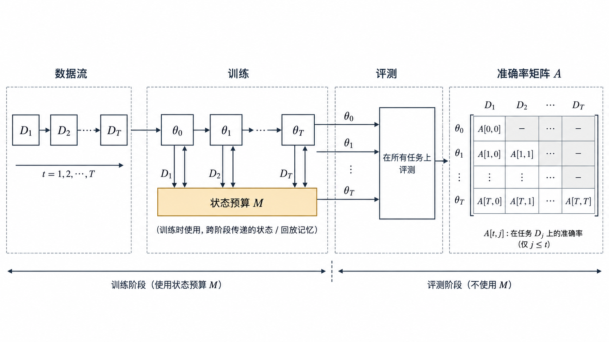

# 持续学习的场景与术语

持续学习研究模型依次在多段数据上训练时, 如何学会新任务而不丢掉旧能力. 讨论具体方法之前, 先要统一场景划分, 术语, 度量和资源约束.

> 图 1: 数据流依次送入模型, 训练协议决定每段数据能看几次、能保存什么状态; 推理协议决定任务标识和候选输出空间; 各阶段模型在所有测试集上的结果共同组成准确率矩阵.

图 1 把持续学习实验拆成四个不能互相替代的对象. 数据流描述样本到达顺序, 训练协议描述模型在当时可以使用的信息, 状态预算列出参数以外能够跨阶段保留的东西, 推理协议则决定一次预测究竟在几个类别之间竞争. 准确率矩阵记录每个历史模型在各任务测试集上的测量结果. 图中没有预设任务边界一定已知, 也没有把任务标识画进模型输入; 这两项都必须由具体实验声明.

## 1. 问题设定与三种场景

符号与准确率矩阵. 持续学习处理按顺序到达的数据. 设第 $t$ 个阶段 (论文里叫 task, experience 或 context) 提供数据集 $\mathcal{D}_t$, 模型 $f_\theta$ 在 $\mathcal{D}_1, \dots, \mathcal{D}_T$ 上依次训练. 训练第 $t$ 阶段时, 默认拿不到 $\mathcal{D}_1, \dots, \mathcal{D}_{t-1}$ 的全部数据, 只能使用一个容量受限的记忆, 一份旧模型参数, 或者若干统计量.

评测用准确率矩阵. 记 $a_{k,j}$ (GEM 论文记作 $R_{k,j}$) 为模型学完第 $k$ 个任务后在第 $j$ 个任务测试集上的准确率. 矩阵的下三角 ($j \le k$) 反映旧任务的保持情况, 对角线 $a_{k,k}$ 反映刚学完时的水平, 上三角 ($j > k$) 反映尚未训练的任务从已学内容里得到了多少. 第 3.1 篇的全部指标都由这个矩阵算出.

**灾难性遗忘** (catastrophic forgetting) 指模型在新数据上训练后, 旧任务准确率大幅下降. 它的直接原因是参数共享: 新任务的梯度更新了旧任务同样依赖的参数. 如果每个任务都有一个独立网络, 遗忘不会发生, 代价是参数量随任务数线性增长, 也没有任务间的迁移. 持续学习方法都在这两端之间找位置.

需要区分两个常被混用的说法. 「持续学习」(continual learning) 和「终身学习」(lifelong learning) 在多数论文里指同一类问题. 「增量学习」(incremental learning) 多用于分类问题, 常和 class-incremental 连用. 本库统一用「持续学习」, 场景名保留英文缩写.

三种场景的定义. van de Ven & Tolias (2019) 用推理阶段的任务信息区分三种场景:

| 场景 | 推理阶段是否给出任务标识 | 是否需要自己推断任务标识 | 典型输出层 |
|------|------|------|------|
| Task-IL | 给出 | 不需要 | 每个任务一个输出头 (multi-head) |
| Domain-IL | 不给出 | 不需要, 只要解决当前问题 | 所有任务共用一个输出头, 类别集合不变 |
| Class-IL | 不给出 | 需要 | 共用一个输出头, 类别集合逐步扩大 |

三者的差别用 Split MNIST 举例最直接. Split MNIST 把 10 个数字分成 5 个任务, 每个任务两个数字 (0/1, 2/3, ..., 8/9).

- **Task-IL**: 推理阶段告诉模型样本来自第几个任务, 模型只需在该任务的两个数字里选一个. 每个任务有自己的两路输出.
- **Domain-IL**: 不告诉任务标识, 模型只需回答「这是该任务的第一个数字还是第二个数字」, 即判断奇偶. 输出层始终是两路.
- **Class-IL**: 不告诉任务标识, 模型要在已见过的全部数字里选一个. 学完 5 个任务后输出层是十路.

Permuted MNIST 对每个任务的像素施加一个固定的随机置换, 10 个任务共用 0 到 9 的标签. 论文指出它最自然的设定是 Domain-IL: 类别集合不变, 输入分布改变. 它也能按 Task-IL 设定 (告诉模型是哪个置换) 或 Class-IL 设定 (区分「第几个置换下的数字几」, 共 100 类), 但这两种设定在实际应用里少见.

同一个划分在不同论文里的叫法也不同. Split MNIST 用多头输出时被称作 multi-headed, 对应 Task-IL; 用单头输出时被称作 single-headed, 对应 Class-IL. Chaudhry et al. (2018) 用 multi-head 和 single-head 两个词描述同样的区别: single-head 评测中推理阶段不知道任务标识, 模型要在已见过的全部标签里选.

同一数据集上的数字. van de Ven & Tolias (2019) 在两个数据集上测了三个场景. 网络是两层全连接 MLP (Split MNIST 每层 400 个单元, Permuted MNIST 每层 1000 个单元), Adam 优化. Split MNIST 每个任务训练 2000 步, 学习率 0.001; Permuted MNIST 每个任务 5000 步, 学习率 $10^{-4}$. 每个结果取 20 个随机种子的均值.

Split MNIST (论文 Table 4, 平均准确率 %):

| 方法 | Task-IL | Domain-IL | Class-IL |
|------|------|------|------|
| None (直接顺序微调) | 87.19 | 59.21 | 19.90 |
| Offline (全部数据联合训练, 上界) | 99.66 | 98.42 | 97.94 |
| EWC | 98.64 | 63.95 | 20.01 |
| Online EWC | 99.12 | 64.32 | 19.96 |
| SI | 99.09 | 65.36 | 19.99 |
| LwF | 99.57 | 71.50 | 23.85 |
| DGR (生成式回放) | 99.50 | 95.72 | 90.79 |
| DGR+distill | 99.61 | 96.83 | 91.79 |
| iCaRL (存 2000 个样本) | - | - | 94.57 |

Permuted MNIST (论文 Table 5, 平均准确率 %):

| 方法 | Task-IL | Domain-IL | Class-IL |
|------|------|------|------|
| None | 81.79 | 78.51 | 17.26 |
| Offline | 97.68 | 97.59 | 97.59 |
| EWC | 94.74 | 94.31 | 25.04 |
| Online EWC | 95.96 | 94.42 | 33.88 |
| SI | 94.75 | 95.33 | 29.31 |
| LwF | 69.84 | 72.64 | 22.64 |
| DGR | 92.52 | 95.09 | 92.19 |
| DGR+distill | 97.51 | 97.35 | 96.38 |
| iCaRL | - | - | 94.85 |

两张表呈现出四个差异.

正则化方法 (EWC, Online EWC, SI) 在 Split MNIST 的 Class-IL 上与基线没有差别. 19.90% 约等于只答对最近一个任务: 5 个任务的测试集各占约五分之一, 模型把所有样本都分到最近学到的两个数字里, 准确率就落在 20% 附近. 这三种方法只约束参数离旧值的距离, 没有让旧类别输出保持竞争力的训练信号. 参数重要性可以减慢表征漂移, 无法独自校正分类头偏向新类的问题.

第二, Task-IL 上几乎所有方法都接近上界. Split MNIST 的 Task-IL 基线已有 87.19%, EWC 把它提到 98.64%. 只报 Task-IL 数字的论文, 方法之间的差距被压缩在一两个百分点里.

第三, 回放类方法 (DGR, iCaRL) 在三个场景里都稳定. 论文附录 C 进一步比较了精确回放 (存真实样本): Class-IL 中每类只存 1 个样本, 效果已经超过全部正则化方法. Permuted MNIST 上存 50,000 个样本的精确回放仍低于 DGR+distill.

第四, LwF 在 Permuted MNIST 上明显变差 (Task-IL 69.84%, 低于基线 81.79%). LwF 用当前任务的输入计算旧模型输出作为蒸馏目标. Permuted MNIST 各任务的像素顺序互不相关, 当前任务的输入不能代表旧任务的输入, 蒸馏目标约束不到旧任务输入上的行为. Split MNIST 各任务都是手写数字, 输入分布接近, LwF 在那里有效.

卷积网络与更大数据集. MLP 加 MNIST 的结论在卷积网络上同样成立. Buzzega et al. (2020) 在 DER 论文里用未预训练的 ResNet18 做 Seq-CIFAR-10 (5 个任务, 每个任务 2 类, 每个任务训练 50 个 epoch), 同一次训练分别按 Class-IL 和 Task-IL 评测. 结果取 10 次运行均值 (论文 Table 2):

| 方法 | 缓冲区 | Class-IL | Task-IL |
|------|------|------|------|
| JOINT (上界) | - | 92.20 | 98.31 |
| SGD (顺序微调) | - | 19.62 | 61.02 |
| oEWC | - | 19.49 | 68.29 |
| SI | - | 19.48 | 68.05 |
| LwF | - | 19.61 | 63.29 |
| ER | 200 | 44.79 | 91.19 |
| ER | 500 | 57.74 | 93.61 |
| DER++ | 200 | 64.88 | 91.92 |
| DER++ | 500 | 72.70 | 93.88 |
| DER++ | 5120 | 85.24 | 96.12 |

Task-IL 一列里, 缓冲区 500 的 ER 和 DER++ 只差 0.27 个百分点; 换到 Class-IL, 两者差 14.96 个百分点. 方法优劣只有在 Class-IL 下才能看出来. 不存样本的三种正则化方法, Class-IL 准确率仍然停在 19.5% 左右, 与 Split MNIST 的现象一致.

### 1.1. Class-IL 难在哪里

Task-IL 下, 第 $t$ 个任务的输出头只和本任务的类别竞争. Class-IL 下, 所有类别共用一个 softmax, 训练第 $t$ 个任务时只有本任务类别的样本. 交叉熵对当前类别的 logit 给正梯度, 对其他类别 (包括全部旧类别) 给负梯度, 于是旧类别 logit 被持续压低, 输出层对新类别的偏置越来越大. Masana et al. (2022) 把这种偏向称为 task-recency bias, 并在实验总结里写道: 明确处理 task-recency bias 的方法优于不处理的方法.

这也解释了 Domain-IL 的位置. Domain-IL 的类别集合固定, 不存在新旧类别 logit 的竞争, 但模型没有任务标识可用, 不能为每个域单独维护输出头或归一化统计. Split MNIST 的 Domain-IL 基线是 59.21%, 介于 Task-IL 和 Class-IL 之间. 它的难度主要看相邻域之间的差别.

为什么只用新类训练会压低旧类 logit. Class-IL 的偏置可以从一条样本的交叉熵直接算出来. 设模型已经见过旧类别 $1,2$, 当前阶段只出现新类别 $3$, 三个 logit 为 $z=(1.2,0.8,1.0)$. Softmax 概率是

$$
p_c=\frac{e^{z_c}}{e^{1.2}+e^{0.8}+e^{1.0}},
$$

利用 $e^{1.2}\approx3.320$, $e^{0.8}\approx2.226$, $e^{1.0}\approx2.718$, 可得 $p\approx(0.402,0.269,0.329)$. 当前标签 $y=3$, 交叉熵 $\ell=-\log p_3$. 对每个 logit 求导:

$$
\frac{\partial\ell}{\partial z_c}=p_c-\mathbf 1[c=y]
\approx(0.402,0.269,-0.671).
$$

梯度下降执行 $z'_c=z_c-\eta\,\partial\ell/\partial z_c$. 取 $\eta=0.1$, 更新后约为

$$
z'=(1.160,0.773,1.067).
$$

新类 logit 增加 $0.067$, 两个旧类分别下降 $0.040$ 和 $0.027$. 这条样本没有出现旧类, 但 softmax 分母让所有类别参与竞争, 所以旧类仍收到向下更新. 如果当前阶段有一万条新类样本而没有旧类回放, 这种方向会反复累积. 特征提取器也在同时变化, 旧样本即使原来靠较大的 margin 正确分类, margin 也可能从输出层和表示层两端缩小.

回放为什么对 Class-IL 特别重要, 也能在这个导数中看见. 若 batch 中加入一条标签为旧类 $1$ 的样本, 那条样本对自己的梯度是 $p_1-1<0$, 梯度下降会把旧类 $1$ 的 logit 往上推; 对新类 $3$ 的梯度是 $p_3>0$, 会把它往下压. 两类样本共同出现时, 更新方向才包含“旧类在什么输入上应当获胜”的信息. 参数正则化只限制 $\theta$ 移动多少, 并没有提供这条输入—类别对应关系, 因而在强 Class-IL 设定下经常只能把崩溃推迟, 很难单独校准新旧类别的竞争.

这段手算仍然只是输出层的一步局部分析. 它不能推出任意回放方法一定有效, 因为缓冲区可能类别失衡、样本过时或只覆盖容易样本; 也不能推出 task-recency bias 的全部来源都在 softmax, 因为归一化统计、特征漂移、优化器动量和任务间样本数量差异都会改变结果. 它证明的是更窄的一件事: **在共享输出空间中, 只观察新类的交叉熵本身就会产生压低旧类 logit 的梯度.**

场景之外需要声明的维度. 遍历次数, 任务边界与监督形式. 三种场景只描述推理阶段的任务信息. 两篇都写着「Class-IL」的论文, 仍可能在数据流的给法上完全不同: 每个样本看几遍, 训练时知不知道任务在哪里切换, 标签怎么给. 先看遍历次数. GEM 和 A-GEM 采用单遍设定: 每个样本只看一次, batch 大小 10. DER 论文主实验每个任务训练 50 个 epoch. 同一方法换设定, 数字差距很大. DER 论文 Table 5 给出了 Seq-CIFAR-10 单 epoch 的 Class-IL 结果: 缓冲区 500 时 ER 45.22%, DER++ 48.04%; 缓冲区 5120 时 ER 50.28%, DER++ 53.31%; 单 epoch 的联合训练只有 56.74%. 对照第 1.4 节的多 epoch 数字 (缓冲区 500 的 DER++ 72.70%), 单遍设定下方法之间的差距被压缩到 3 个百分点以内.

GDumb (Prabhu et al., 2020) 进一步质疑了在线设定的比较方式. 它在数据到达时只做一件事: 用贪心的类别均衡采样往记忆里放样本. 到推理阶段, 它只用记忆里的样本从头训练一个模型. 这个不针对持续学习做任何设计的方法, 在论文的多个设定里超过了专门设计的在线方法. 它说明不少在线方法的收益可以由「类别均衡的记忆加离线训练」得到.

任务边界是第二个维度. EWC 在任务结束时计算 Fisher 信息并保存参数快照; SI 在任务结束时把路径积分归一化成重要性. 两者都需要知道任务在哪里结束. LwF 在新任务开始时记录旧模型输出, 同样依赖边界. 蓄水池采样 (reservoir sampling) 的 ER, DER 每来一个 batch 就更新缓冲区, 不需要边界. 如果数据流里没有明确的任务切换 (例如分布缓慢漂移), 只有后一类方法能直接使用.

第三个维度是监督形式. 持续学习论文多数是全监督分类. 实际数据流里, 标签可能延迟到达, 只有部分样本有标签, 或者完全没有标签. MAS 计算参数重要性时只用模型输出的 L2 范数, 不需要标签, 可以在无标签数据上更新重要性 (第 2.1 篇). 标签空间的变化也分几种: 只扩展 (Class-IL 的默认假设), 固定 (Domain-IL), 或者同一个标签含义随时间改变. CLEAR 基准用 2004 到 2014 年的 Flickr 图片构造了后一种情况, 固定 11 个类别, 类别对应的视觉外观随年代变化 (第 3.2 篇).

任务顺序也是实验变量. 即使任务集合完全相同, 到达顺序也会改变难度. 假设三个域分别是新闻、医学和法律文本. 如果新闻与法律的词汇和句式更接近, 顺序“新闻→法律→医学”可能先获得正迁移, 随后再经历一次较大的分布变化; 顺序“新闻→医学→法律”则连续遇到两次明显变化. 一次固定顺序的结果把方法能力和这条顺序的偶然性混在了一起.

较完整的协议应先定义允许的顺序集合. 类别增量实验可以用若干随机种子生成类别排列, 每种方法共享完全相同的排列; 时间漂移实验不能随意打乱年份, 因为时间方向就是问题的一部分; 课程式学习若特意从易到难, 也要把排序规则写成实验条件. 最终结果至少报告不同顺序上的均值和标准差, 不能只挑最有利的一条顺序.

举一个简单例子. 某方法在三条顺序上的最终 ACC 分别为 $0.82,0.78,0.68$, 均值是 $0.76$. 样本标准差为

$$
s=\sqrt{\frac{(0.82-0.76)^2+(0.78-0.76)^2+(0.68-0.76)^2}{3-1}}
\approx0.072.
$$

另一个方法三次都是 $0.75$, 均值只低一个百分点, 却对任务顺序稳定得多. 如果只汇报第一种方法的最好顺序 $0.82$, 会把六个百分点的均值差和七个百分点左右的顺序波动都藏掉. 随机种子还会影响初始化、数据打乱与缓冲区采样, 因而“多个训练种子”和“多个任务顺序”是两层不确定性; 预算允许时应采用嵌套实验, 至少不要把两者含糊地统称为运行五次.

任务边界是否已知也要和顺序分开. 已知顺序不等于模型在在线运行时收到切换信号. 研究者可以预先固定一条数据流用于复现, 同时不向算法暴露每个分段的起止位置. 此时依赖任务结束钩子的 EWC 或 SI 需要额外的边界检测机制, 而逐样本更新的 reservoir replay 可以直接运行. 若实验脚本暗中在边界处重置优化器、调学习率或保存教师模型, 算法实际上已经使用了边界信息.

评测时点也要固定. 一种做法是在每个阶段结束后填一整行准确率矩阵, 另一种做法是在数据流中每隔固定样本数评测. 后者能看见阶段内部先学会再遗忘的过程, 但评测更频繁, 也可能诱使研究者反复观察测试集调参. 因此验证集、测试集和早停规则必须分开; 持续评测产生更多读数, 并不意味着可以把测试反馈重新送回训练决策.

保留哪些状态. 模型以外的状态也影响结果:

- **优化器状态**: Adam 的一阶, 二阶矩是否跨任务保留. Ibrahim et al. (2024) 做大模型继续预训练时, 每次继续训练都重置优化器状态, 理由是开源模型通常不附带优化器状态.
- **归一化统计**: 批归一化 (BN) 的滑动均值和方差会被新任务数据改写. PackNet 在第一个任务之后固定 BN 统计和偏置.
- **外部记忆**: 原始样本, 特征, logits, 生成模型. DER 在缓冲区里同时存样本和网络输出的 logits.
- **历史模型**: LwF 需要上一阶段模型的一份副本来计算蒸馏目标.

这些状态都要计入资源预算, 第 4 节给出清单.

### 1.2. 参数能否增长, 从哪里出发

模型本身也有两个维度要声明: 参数量能不能随任务增长, 以及训练从什么初始化开始. PackNet (Mallya & Lazebnik, 2018) 固定网络容量, 每个任务结束后剪掉一部分权重, 腾出来给后续任务. Progressive Neural Networks (Rusu et al., 2016) 每来一个任务新增一列网络, 参数随任务数线性增长, 推理阶段还要靠任务标识选列. 两类方法在「是否存样本」上都是否, 但资源曲线完全不同 (第 2.3 篇).

再看起点. 从随机初始化出发时, 表征本身在持续变化. 从大规模预训练模型出发时, 表征已经稳定, 持续学习只需要调整少量参数. L2P (Wang et al., 2022) 冻结 ImageNet 预训练的 ViT-B/16, 只学一个提示池. Split CIFAR-100 (10 个任务, 每个任务 10 类, Class-IL) 上, 不存任何样本的 L2P 平均准确率 83.83%, 论文给出的 ViT-B/16 联合训练上界是 90.85% (Table 1, Table 2). 同一篇论文 Table 2 里, ResNet18 骨干的上界是 80.41%, 在它上面运行的 SupSup 为 28.34%.

这组数字说明, 换骨干之后上界变了, 方法与上界的差距也变了. 比较方法时要同时报告骨干, 预训练数据和上界.

稳定性, 可塑性与遗忘的机制. 两个方向的失败. 稳定性 (stability) 指旧任务的表现不下降, 可塑性 (plasticity) 指新任务能学到应有的水平. 只看遗忘量会漏掉后一种失败. Kirkpatrick et al. (2017) 的 EWC 论文图 2A 给出了三种行为: 普通 SGD 学会任务 B 但忘掉任务 A; 对所有参数施加同样强度的 L2 约束, 任务 A 保住了, 任务 B 却学不进去; EWC 按参数重要性分配约束强度, 两个任务都保持较好.

Chaudhry et al. (2018) 用两个指标分别度量两个方向. 遗忘量定义为任务 $j$ 历史最好准确率与当前准确率之差:

$$
f_j^k = \max_{l \in \{1, \dots, k-1\}} a_{l,j} - a_{k,j}, \quad \forall j < k \tag{1}
$$

学完第 $k$ 个任务后的平均遗忘为 $F_k = \frac{1}{k-1}\sum_{j=1}^{k-1} f_j^k$. 顽固性 (intransigence) 衡量模型学不进新任务的程度:

$$
I_k = a_k^* - a_{k,k} \tag{2}
$$
…12062 tokens truncated…使用

$$
L_{k+1}(\theta)+c\sum_i\Omega_i
(\theta_i-\theta_i^{(k)})^2. \tag{51}
$$

同样是逐参数二次约束, SI 与 EWC 的信息来源不同: EWC 看终点附近输出分布对…459 tokens truncated… $f$ 会得到不同重要性.

EWC、SI、MAS 可以放进同一框架: 先为每个参数估计局部重要性 $\Omega_i$, 再惩罚离开旧参数中心. 差异都集中在 $\Omega_i$ 的观测信号. 对角形式使它们能扩展到较大网络, 也共同忽略跨参数相关性. 第 2.1 篇会继续推导这些估计量与在线合并方式.

容量、共享与组合性. 参数增长把冲突移到路由. Progressive Networks 为每个任务增加一列参数, 冻结旧列, 因而旧任务函数不会被新任务梯度改写. 第 $t$ 列还能通过 lateral connection 读取前面各列特征:

$$
h_i^{(t)}=\sigma\!\left(W_i^{(t)}h_{i-1}^{(t)}
+\sum_{j<t}U_i^{(t,j)}h_{i-1}^{(j)}\right). \tag{54}
$$

稳定性由冻结保证, 正迁移由侧向连接提供. 代价是参数至少随任务数线性增长, 推理还要知道使用哪一列. 若没有任务标识, 模型仍需路由器估计 $p(z\mid x)$. 因此扩容消除了参数覆盖, 没有消除任务推断.

固定容量的参数隔离把增长改成掩码. 设共享权重为 $w$, 任务 $t$ 的二值掩码为 $m_t$, 有效权重为 $m_t\odot w$. 若新任务只更新尚未分配的坐标, 旧任务对应坐标被冻结, 也能得到零参数遗忘. 容量消耗取决于掩码重叠: 完全不共享最稳, 很快耗尽; 大量共享节省容量, 又重新引入冲突. PackNet 通过迭代剪枝释放低幅值权重, 默认低幅值与低重要性相关, 这是假设而非定理.

### 1.3. 组合模块能把线性增长变成复用

假设任务由少量可复用因素组合而成, 可以学习模块 $M_1,\dots,M_K$ 与路由系数 $a_t$:

$$
f_t(x)=F(x;\sum_{k=1}^{K}a_{t,k}M_k). \tag{55}
$$

新任务若只需新的组合 $a_t$, 参数增长很小; 出现真正新因素时再增加模块. 这个思路的成败取决于任务是否确有组合结构. 模块太粗, 一个模块仍承载冲突功能; 模块太细, 路由搜索与存储接近为每个任务保存完整模型.

大模型中的 LoRA 适配器把模块限制为低秩更新 $\Delta W=BA$. 不同任务分别保存 $(A_t,B_t)$ 可以避免直接覆盖基座, 但同时激活多个适配器时, 更新相加

$$
W'=W_0+\sum_t\alpha_tB_tA_t \tag{56}
$$

仍可能产生函数冲突. 若依靠输入选择适配器, 问题又回到路由; 若合并适配器, 要处理低秩子空间重叠和尺度校准. 参数高效只说明每个任务新增状态较少, 不自动说明知识能够组合.

预训练改变了可塑性的含义. 从随机初始化开始, 学新任务需要同时形成表征和分类规则; 从强预训练模型开始, 很多任务只需读取已有特征. 线性探测或提示调整的高分可能表示预训练已经覆盖目标能力, 持续阶段没有学到多少新表征. 此时遗忘小部分来自更新幅度小, 而非方法拥有更强的记忆机制.

可以同时比较三条曲线: 冻结骨干只训头部, 参数高效适配, 全量微调. 冻结基线给出已有表征的可读出能力; PEFT 相对冻结基线的增益表示少量新状态带来的学习; 全量微调给出更高可塑性及其遗忘代价. 若只拿预训练 PEFT 与从头训练的正则化方法相比, 方法差异、起点差异和容量差异混在一起.

预训练还使任务边界变模糊. 继续预训练的数据通常按时间或来源连续到达, 没有清晰的离散任务; 新知识可能与旧知识互补, 也可能纠正旧事实. 评测从「每个任务一个准确率」转向知识探针、下游能力、语言建模损失和行为回归. 定义仍然要回答式 (20) 的六项, 只是 $\mathcal S$ 从任务序列换成了时间变化的语料流.

持续学习的三个不可同时忽略的误差源. 学完阶段 $t$ 后, 与联合训练参照的差距可以概念性地拆成三部分:

$$
\mathcal E_t
=\mathcal E_{\mathrm{compression}}
+\mathcal E_{\mathrm{optimization}}
+\mathcal E_{\mathrm{inference}}. \tag{57}
$$

第一项来自历史信息压缩: 有限缓冲区、对角 Fisher、有限提示池都丢失信息. 第二项来自顺序优化: 即使保存了足够信息, 单遍 SGD、学习率和非凸局部解也可能没有达到联合目标. 第三项来自推理时不知道任务或域: 各任务内部函数都保留完好, 路由错误仍会给出错误答案. 这不是严格的正交分解, 三项会互相影响, 但它能避免把所有下降都叫作参数遗忘.

诊断时可以设计三组对照. 给模型完整旧数据重新训练, 若差距消失, 主要问题在压缩; 固定同一份回放数据却增加优化步数或改变顺序, 可以观察优化误差; 测试时提供真实任务标识, 与自动路由结果之差反映推理误差. 三组对照比继续叠加一个平均指标更能指向方法需要改哪里.

这个分解也给各类方法确定位置. EWC、SI 和 VCL主要压缩旧后验; ER、DER 和生成回放压缩旧数据分布; GEM 改变顺序优化的更新方向; Progressive Networks 与独立适配器绕开参数覆盖, 但依赖任务路由; L2P 同时学习压缩状态和隐式路由. 第 2 章按方法展开时, 每一种方法都可以回到这三项查看它降低了哪种误差, 又把压力转移到了哪里.

一个统一的写入—保持模型. 把所有方法写成受约束的状态更新. 把模型在时刻 $t$ 的全部可变状态记为 $s_t$. 它可以包含网络参数、适配器、提示、优化器矩、BN 统计、外部记忆和快速权重. 新观察为 $o_t=(x_t,y_t)$, 更新统一写成

$$
s_{t+1}=\mathcal U(s_t,o_t,m_t), \tag{58}
$$

$m_t$ 是从历史压缩出来的辅助状态. 不同方法的差别可以放在三处. EWC 的 $m_t$ 是参数中心与 Fisher; 经验回放的 $m_t$ 是样本集合; DER 多存一组 logits; PackNet 把任务占用关系存在掩码; VCL 传递后验参数; TTT 层没有跨序列的 $m_t$, 却在序列内部持续改变快速状态.

对任意旧查询集合 $\mathcal Q$, 保持条件可以写成

$$
\mathcal D_{\mathcal Q}(s_{t+1},s_t)
=\mathbb E_{x\sim\mathcal Q}
\left[d\!\left(f(x;s_{t+1}),f(x;s_t)\right)\right]\le\varepsilon. \tag{59}
$$

可塑性条件则要求新数据风险至少下降

$$
R_t(s_{t+1})\le R_t(s_t)-\delta. \tag{60}
$$

当不存在同时满足式 (59)、(60) 的状态时, 稳定性与可塑性发生硬冲突; 存在却没找到时, 问题出在优化; $\mathcal Q$ 不能代表旧分布时, 约束满足也可能遗忘. 这个区分很重要: 扩大模型容量主要改变可行域, 梯度投影主要改变搜索路径, 回放主要改善 $\mathcal Q$ 的代表性.

旧查询集合决定「保持」的含义. 函数空间保持从来都相对于一组查询. 若 $\mathcal Q$ 只包含旧训练样本, 模型可以在这些点上输出不变, 却在它们之间改变决策边界; 若 $\mathcal Q$ 覆盖旧数据分布, 保持才接近旧风险不变. 有限缓冲区试图用经验分布

$$
\widehat Q_M=\frac1M\sum_{i=1}^{M}\delta_{x_i} \tag{61}
$$

近似旧分布. 原型法进一步将同一类许多点压成均值, 隐含类条件分布近似单峰的假设; 生成回放用生成器近似 $Q$, 生成器本身也会遗忘; 无数据蒸馏只能在当前输入或合成输入上约束旧函数, 覆盖不到的区域依然自由漂移.

参数正则没有显式 $\mathcal Q$, 但 Fisher 的估计数据已经暗中选择了它. 经验 Fisher 在一批旧样本上计算, 保护的是这些样本附近对数似然敏感的方向. 若 Fisher 来自新数据, 或来自模型自己采样的标签, 保护区域会改变. 讨论「data-free」时要区分不保存原始样本与完全不依赖旧分布: 一份 Fisher、旧模型或类别原型都是历史信息的压缩载体.

### 1.4. 局部更新与全局保持之间有缺口

梯度内积约束保证一步泰勒近似中的旧损失不升. 连续做 $K$ 步后, 旧参数变化为

$$
\Delta\theta=-\sum_{k=1}^{K}\eta_k\widetilde g_k. \tag{62}
$$

即使每一步都满足当前记忆梯度 $g_{m,k}^{\mathsf T}\widetilde g_k\ge0$, 记忆梯度本身会随着参数变化, 曲率项还会累积. 旧损失的二阶展开为

$$
\Delta L_{\mathrm{old}}
\approx g_{\mathrm{old}}^{\mathsf T}\Delta\theta
+\frac12\Delta\theta^{\mathsf T}H_{\mathrm{old}}\Delta\theta. \tag{63}
$$

第一项被局部投影控制, 第二项在高曲率方向仍可为正. 较小学习率、频繁重算旧梯度和曲率感知投影能缩小缺口, 却增加计算. GEM 的约束应理解为局部安全方向, 不应读成整个训练阶段的零遗忘保证.

蒸馏也有相同问题. 每一步在有限 batch 上让新旧输出接近, 不代表完整旧分布上的函数距离有界; 温度和损失权重还决定约束集中于高概率类别还是暗知识. 持续学习没有一种局部损失可以脱离覆盖范围、模型容量和优化步长独立保证全局保持.

什么时候值得引入更复杂的方法. 先用简单参照判断问题是否真的存在. 强联合训练是信息上界, 顺序微调是无保护下界, 冻结骨干加线性头判断预训练表征能否直接复用, 经验回放判断少量真实历史数据是否已经足够. GDumb 甚至只维护缓冲区, 到评测时从头训练; 它在一些类别增量基准上的竞争力说明, 复杂更新规则的收益必须超过「保存较好的子样本并重新训练」.

如果顺序微调已经接近联合训练, 任务冲突很弱, 没有必要增加复杂约束. 若小缓冲区 ER 已经达到目标, 继续设计 Fisher 或路由器需要说明它节省了什么资源. 若 Task-IL 很高而 Class-IL 很低, 优先检查任务推断和分类偏置; 若两者都低, 表征本身可能已经漂移. 基线组合用于定位机制, 不只是给最终表格垫底.

方法成立需要写出结构假设. 每条路线都依赖可检验假设:

- 参数正则假设旧任务可由局部二次形状压缩, 并且新旧解之间存在低代价路径.
- 回放假设少量样本、特征或 logits 能代表历史分布.
- 生成回放假设生成器比判别模型更能保住旧分布, 且生成误差不会逐阶段放大.
- 参数隔离假设容量足够, 任务可以路由, 或任务共享结构能被模块化.
- 提示与适配器假设预训练表征已经把输入组织成适合检索和低秩修改的空间.
- 无边界在线学习假设分布变化能从有限窗口识别, 变化速度没有超过更新速度.

实验若只验证平均准确率, 无法判断成功来自假设成立还是偶然的基准结构. 改变类别顺序、任务相似度、缓冲容量、边界信息和预训练起点, 相当于逐项扰动这些假设. 方法在何处失效, 往往比在标准顺序上多一个百分点更能解释其原理.

「持续」至少包含三种时间问题. 第一种是有限任务序列后的保持, 常见基准属于这一类; 第二种是没有终点的数据流, 模型要在固定资源下长期运行; 第三种是环境自身演化, 旧规律可能失效. 有限序列上为每个任务增加模块的方法可以获得很高准确率, 放到无限流里参数会持续增长; 永久保护所有旧任务的方法适合第一种, 却可能妨碍第三种中的概念更新.

真正的长期系统还要决定何时合并、何时遗忘、何时扩容. 把每次变化都当成新任务会耗尽容量, 把所有变化都写入共享参数会相互覆盖, 把罕见变化全部丢掉又无法积累长尾知识. 任务发现、状态压缩和主动遗忘因此属于持续学习问题本身, 并非训练循环外的附加功能.

这三种时间问题也解释了 TTT 与传统持续学习为何相邻. TTT 层研究固定状态如何在长序列内快速写入, 传统方法研究慢参数如何跨任务保存; 持续 TestingTime 适应位于中间, 状态跨样本延续却通常没有标签. 统一坐标仍是状态大小、写入信号、保持时间和重置条件. 名称相同不代表设定相同, 名称不同也可能共享同一个状态更新机制.

还可以用反事实问题检查定义是否完整: 如果把任务顺序打乱, 结论是否保持; 如果测试时拿掉任务标识, 下降来自分类还是路由; 如果把缓冲区按字节而非样本数对齐, 优势是否还在; 如果让数据流继续十倍长度, 参数和记忆能否维持固定; 如果旧规律已经失效, 算法是否仍把它当作必须保护的知识. 每个问题都对应六元组中的一个坐标, 也对应一种常见的结论外推错误.

持续学习最终处理的是「有限状态面对无限经历」这一矛盾. 有限状态必然选择保留什么、以何种精度保留、多久以后允许覆盖. 算法可以把选择写成 Fisher、样本、模块、提示或快速权重, 却无法取消选择本身. 评价方法时, 核心问题因此落在三件事上: 被保留的信息是否覆盖未来查询, 写入新信息时是否知道哪些旧信息仍有效, 以及资源耗尽之前能经历多长的数据流. 把这三项写进问题设定, 后面的公式和数字才有共同参照.

## 2. 参考文献

1. van de Ven, G. M., & Tolias, A. S. (2019). [Three scenarios for continual learning](https://arxiv.org/abs/1904.07734). *arXiv:1904.07734*.
2. Buzzega, P., Boschini, M., Porrello, A., Abati, D., & Calderara, S. (2020). [Dark Experience for General Continual Learning: a Strong, Simple Baseline](https://arxiv.org/abs/2004.07211). *NeurIPS 2020*.
3. Chaudhry, A., Dokania, P. K., Ajanthan, T., & Torr, P. H. S. (2018). [Riemannian Walk for Incremental Learning: Understanding Forgetting and Intransigence](https://arxiv.org/abs/1801.10112). *ECCV 2018*.
4. Kirkpatrick, J., et al. (2017). [Overcoming catastrophic forgetting in neural networks](https://arxiv.org/abs/1612.00796). *PNAS*.
5. Lopez-Paz, D., & Ranzato, M. (2017). [Gradient Episodic Memory for Continual Learning](https://arxiv.org/abs/1706.08840). *NeurIPS 2017*.
6. Chaudhry, A., Ranzato, M., Rohrbach, M., & Elhoseiny, M. (2019). [Efficient Lifelong Learning with A-GEM](https://arxiv.org/abs/1812.00420). *ICLR 2019*.
7. Chaudhry, A., et al. (2019). [On Tiny Episodic Memories in Continual Learning](https://arxiv.org/abs/1902.10486). *arXiv:1902.10486*.
8. Prabhu, A., Torr, P. H. S., & Dokania, P. K. (2020). [GDumb: A Simple Approach that Questions Our Progress in Continual Learning](https://www.ecva.net/papers/eccv_2020/papers_ECCV/papers/123470511.pdf). *ECCV 2020*.
9. Masana, M., et al. (2022). [Class-incremental learning: survey and performance evaluation on image classification](https://arxiv.org/abs/2010.15277). *IEEE TPAMI*.
10. De Lange, M., et al. (2022). [A continual learning survey: Defying forgetting in classification tasks](https://arxiv.org/abs/1909.08383). *IEEE TPAMI*.
11. Wang, Z., et al. (2022). [Learning to Prompt for Continual Learning](https://arxiv.org/abs/2112.08654). *CVPR 2022*.
12. Mallya, A., & Lazebnik, S. (2018). [PackNet: Adding Multiple Tasks to a Single Network by Iterative Pruning](https://arxiv.org/abs/1711.05769). *CVPR 2018*.
13. Rusu, A. A., et al. (2016). [Progressive Neural Networks](https://arxiv.org/abs/1606.04671). *arXiv:1606.04671*.
14. Ibrahim, A., et al. (2024). [Simple and Scalable Strategies to Continually Pre-train Large Language Models](https://arxiv.org/abs/2403.08763). *arXiv:2403.08763*.
15. Rajbhandari, S., Rasley, J., Ruwase, O., & He, Y. (2020). [ZeRO: Memory Optimizations Toward Training Trillion Parameter Models](https://arxiv.org/abs/1910.02054). *SC 2020*.
16. Dettmers, T., Pagnoni, A., Holtzman, A., & Zettlemoyer, L. (2023). [QLoRA: Efficient Finetuning of Quantized LLMs](https://arxiv.org/abs/2305.14314). *NeurIPS 2023*.
17. Schneider, S., et al. (2020). [Improving robustness against common corruptions by covariate shift adaptation](https://arxiv.org/abs/2006.16971). *NeurIPS 2020*.
18. Wang, D., Shelhamer, E., Liu, S., Olshausen, B., & Darrell, T. (2021). [Tent: Fully Test-time Adaptation by Entropy Minimization](https://arxiv.org/abs/2006.10726). *ICLR 2021*.
19. Wang, Q., Fink, O., Van Gool, L., & Dai, D. (2022). [Continual Test-Time Domain Adaptation](https://arxiv.org/abs/2203.13591). *CVPR 2022*.
20. Sun, Y., et al. (2024). [Learning to (Learn at Test Time): RNNs with Expressive Hidden States](https://arxiv.org/abs/2407.04620). *arXiv:2407.04620*.
21. Nguyen, C. V., Li, Y., Bui, T. D., & Turner, R. E. (2018). [Variational Continual Learning](https://arxiv.org/abs/1710.10628). *ICLR 2018*.
22. Rudner, T. G. J., et al. (2022). [Continual Learning via Sequential Function-Space Variational Inference](https://proceedings.mlr.press/v162/rudner22a.html). *ICML 2022*.
23. De Lange, M., van de Ven, G. M., & Tuytelaars, T. (2023). [Continual evaluation for lifelong learning: Identifying the stability gap](https://arxiv.org/abs/2205.13452). *ICLR 2023*.
24. ContinualAI. [Avalanche benchmark documentation](https://github.com/ContinualAI/avalanche/blob/master/docs/gitbook/from-zero-to-hero-tutorial/03_benchmarks.md).
25. Doan, T., et al. (2021). [A Theoretical Analysis of Catastrophic Forgetting through the NTK Overlap Matrix](https://proceedings.mlr.press/v130/doan21a.html). *AISTATS 2021*.
26. Knoblauch, J., Husain, H., & Diethe, T. (2020). [Optimal Continual Learning has Perfect Memory and is NP-hard](https://proceedings.mlr.press/v119/knoblauch20a.html). *ICML 2020*.
27. Lesort, T., et al. (2023). [Challenging Common Assumptions about Catastrophic Forgetting and Knowledge Accumulation](https://proceedings.mlr.press/v232/lesort23a.html). *CoLLAs 2023*.
28. Rolnick, D., et al. (2019). [Experience Replay for Continual Learning](https://arxiv.org/abs/1811.11682). *NeurIPS 2019*.
29. Zenke, F., Poole, B., & Ganguli, S. (2017). [Continual Learning Through Synaptic Intelligence](https://proceedings.mlr.press/v70/zenke17a.html). *ICML 2017*.
30. Aljundi, R., et al. (2018). [Memory Aware Synapses: Learning what (not) to forget](https://arxiv.org/abs/1711.09601). *ECCV 2018*.
31. Rusu, A. A., et al. (2016). [Progressive Neural Networks](https://arxiv.org/abs/1606.04671).
