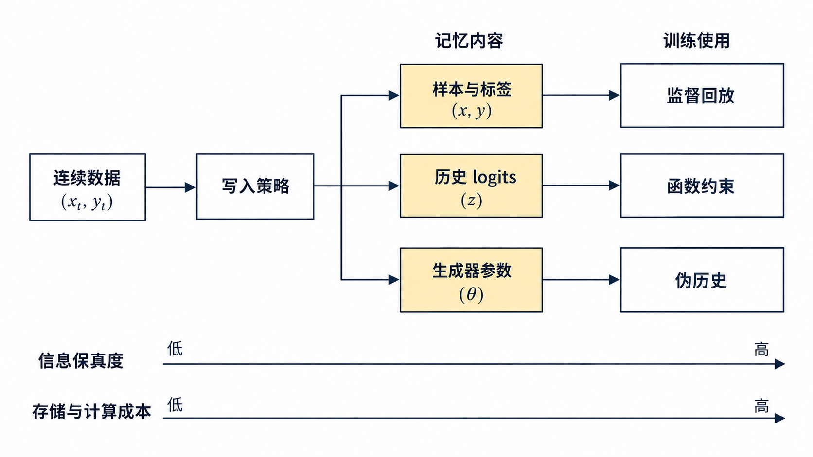

# 回放与外部记忆

回放方法在训练新任务时, 让旧任务的样本, 旧模型的输出或生成的样本重新参与梯度计算. 依次讨论样本怎么存 (ER, iCaRL), 怎么用 (GEM, A-GEM, DER, BiC), 只靠记忆训练的 GDumb, 以及用生成器代替存储的 DGR.

> 图 1: 数据流先由写入策略压缩进有限记忆；记忆可以保存标签、历史 logits 或由生成器表示的分布, 训练时分别用于直接回放、梯度约束、函数蒸馏或重建旧数据.

图 1 的三层不能只报其中一层. “用了 500 条记忆”没有说明这些样本怎样进入缓冲区, “用了 replay”也没有说明旧样本是否直接进入交叉熵. ER 读取标签, DER 读取写入时的 logits, DER++ 同时使用两者, GEM 则只把记忆 batch 变成梯度约束. 生成式回放看似没有保存原始样本, 却把历史分布压入生成器参数, 因而仍然占存储和训练预算. 图中没有把任一路线标成固定最优；类别不平衡、任务边界、隐私限制和计算预算都会改变选择.

## 1. 存样本: ER 与 iCaRL

**ER 的损失与训练流程.** Experience Replay (ER) 维护一个容量为 $M$ 的缓冲区 $\mathcal{M}$. 每个训练步取当前数据流的一个 batch $B_t$, 再从缓冲区随机取一个 batch $B_\mathcal{M}$, 在两者的并集上计算损失:

$$
\mathcal{L}_{\text{ER}}(\theta) = \frac{1}{|B_t|}\sum_{(x,y)\in B_t}\ell\big(f_\theta(x), y\big) + \frac{1}{|B_\mathcal{M}|}\sum_{(x,y)\in B_\mathcal{M}}\ell\big(f_\theta(x), y\big) \tag{1}
$$

然后按某个策略把 $B_t$ 中的样本写入缓冲区. 式 (1) 里两项的权重, 两个 batch 的大小, 每个数据流 batch 对应几次回放, 是否对回放样本做数据增强, 都会改变结果, 所以「ER」的数字要连同这些设置一起报告. Class-IL 下, 如果只用新类别的数据训练, 交叉熵只会压低旧类别的 logit; 旧样本, 旧模型的输出或生成样本, 是旧类别 logit 还能得到正向信号的来源. DER 论文对数据流和缓冲区样本都做了数据增强. **蓄水池采样.** 蓄水池采样 (reservoir sampling) 是最常用的写入策略. 设到目前为止数据流共出现了 $n$ 个样本:

- 若 $n \le M$, 直接写入缓冲区.
- 若 $n > M$, 以概率 $M/n$ 保留第 $n$ 个样本, 并随机替换缓冲区中的一个位置; 否则丢弃.

在任意时刻, 已出现的 $n$ 个样本每个留在缓冲区里的概率都是 $M/n$. 用归纳法: 设处理完第 $n-1$ 个样本后结论成立, 即每个旧样本在缓冲区里的概率为 $M/(n-1)$. 第 $n$ 个样本到来时, 某个旧样本被替换掉的概率是「新样本被保留」乘以「恰好选中它所在的位置」, 即 $\frac{M}{n}\cdot\frac{1}{M} = \frac{1}{n}$. 于是旧样本仍在缓冲区的概率为

$$
\frac{M}{n-1}\cdot\Big(1-\frac{1}{n}\Big) = \frac{M}{n} \tag{1a}
$$

新样本被保留的概率按规则就是 $M/n$, 结论对 $n$ 也成立. 因此缓冲区是数据流的均匀随机样本. 这个策略有两个性质:

- **不需要任务边界**. 写入规则只依赖计数 $n$, 数据流里有没有任务切换都一样. DER 论文用它构造了无边界的实验.
- **不保证类别均衡**. 缓冲区的类别比例跟着数据流走. 如果某个类在数据流里只占很小比例, 它在缓冲区里也只占很小比例, 极端情况下一个都没有. 需要类别均衡时, 要换成按类分配容量的写入策略.
- **对时间均匀**. 每个历史样本留在缓冲区的概率相同, 早期样本和近期样本一视同仁. 分布随时间漂移时, 这未必最好. CLEAR 论文 (Lin et al., 2021) 附录 Table 2 在 MoCo 特征加线性层的设定下比较了偏向近期样本的蓄水池采样: 缓冲区只有一个时间桶大小时, 提高新样本进入缓冲区的概率 (偏置参数 $\alpha = 5.0$, 或随时间变化的 $\alpha = 0.75\, i/k$), 各项指标比普通蓄水池采样 ($\alpha = 1.0$) 高约 1%. 该论文的评测用下一个时间段的数据, 近期样本更接近要预测的分布.

**容量为 2 的蓄水池手算.** 取 $M=2$, 数据流依次到达 $x_1,x_2,x_3,x_4$. 前两个样本直接占满缓冲区. $x_3$ 以 $2/3$ 的概率进入, 进入后等概率替换两个位置, 因而 $x_1$ 在这一步被换掉的概率是 $(2/3)(1/2)=1/3$, 留存概率为 $2/3$. 到 $x_4$ 时, 新样本以 $2/4=1/2$ 的概率进入, 条件于进入又以 $1/2$ 的概率命中 $x_1$ 所在位置. 所以

$$
P(x_1\text{最终留存})
=1\times\left(1-\frac13\right)\times\left(1-\frac14\right)
=\frac12.
$$

$x_3$ 的最终留存概率是它先以 $2/3$ 进入, 再以 $3/4$ 避开第四步替换, 同样为 $1/2$；$x_4$ 直接以 $1/2$ 进入. 四个样本的边缘留存概率都等于 $M/n=2/4$. 这不表示任意两个样本的留存事件相互独立, 因为缓冲区始终只能容纳两个位置. 例如 $x_1$ 留存会改变其他样本占据剩余位置的条件概率. 现在把数据流类别写成 $A,A,A,B$. 均匀样本性质意味着 $B$ 的期望槽位只有 $2\times(1/4)=0.5$ 个. 缓冲区完全没有 $B$ 的概率等于从三个 $A$ 中选两个, 再除以从四个样本中选两个:

$$
P(N_B=0)=\frac{\binom32}{\binom42}=\frac12.
$$

也就是说, 样本层面的无偏并不等于类别层面的均衡. 如果评测要求四个类别等权, 而数据流中稀有类只占四分之一, 这个缓冲区有一半概率根本不给稀有类留下监督. 按类 ring buffer 会强制保留 $B$, 代价是它不再近似原始数据流的总体分布. 选哪一个取决于最终风险函数是按样本频率加权, 还是按类别等权. **记忆极小时选哪种策略.**

Chaudhry et al. (2019) 的「On Tiny Episodic Memories in Continual Learning」研究了缓冲区很小时 ER 的表现. 设定是单遍训练, 每个任务有整数任务标识, 使用多头输出. 他们比较了几种写入策略: 蓄水池采样, 每类一个环形缓冲区 (ring buffer, 保证类别均衡, 存每类最近的样本), 按 k-means 聚类中心选样, 以及 Mean of Features (选特征最接近类均值的样本). 主要结论:

- ER 在 CIFAR 上优于 A-GEM: 每类存 1 个样本时高 1.7 个百分点, 每类 13 个样本时高 5 个百分点以上. 相对微调和 EWC, ER 每类 1 个样本时高 15 个百分点, 13 个样本时高约 28 个百分点.
- 记忆不太小时蓄水池采样最好. 记忆极小 (每类少于 3 个样本) 时, 类别均衡的环形缓冲区, k-means, Mean of Features 更好; 每类 1 个样本时, 蓄水池采样比 k-means 低 3.5 个百分点. 原因就是 1.2 节说的: 记忆极小时蓄水池采样可能漏掉某些类.
- 论文据此提出混合策略: 先用蓄水池采样, 记忆偏小时改成按类均衡.

论文 Table 1 给出每类 1 个样本时的平均遗忘 (越低越好):

| 方法 | MNIST | CIFAR | CUB | miniImageNet |
|------|------|------|------|------|
| 微调 | 0.29 | 0.27 | 0.13 | 0.26 |
| EWC | 0.18 | 0.27 | 0.14 | 0.21 |
| A-GEM | 0.21 | 0.14 | 0.09 | 0.13 |
| MER | 0.14 | 0.19 | 0.10 | 0.15 |
| ER (环形缓冲区) | 0.12 | 0.13 | 0.03 | 0.12 |

记忆样本在训练中被反复使用, 每类只有一个样本时, 模型完全可以把它记住. 这张表说明, 即使如此, 在这些样本上训练仍然比只用它们算约束 (A-GEM) 或完全不用 (EWC) 更能减少遗忘. **iCaRL: 类均值分类与 herding 选样.** ER 和蓄水池采样都不按类别管理缓冲区. Rebuffi et al. (2017) 的 iCaRL 面向 Class-IL, 样本按类存放, 分类也按类进行, 有三个组成部分. **分类规则**. 网络由特征提取器 $\varphi$ 和一层 sigmoid 输出组成, 特征做 L2 归一化. 推理阶段不用输出层, 而是对每个已见类别 $y$ 计算样本集 $P_y$ 的特征均值 $\mu_y = \frac{1}{|P_y|}\sum_{p\in P_y}\varphi(p)$, 把输入判给最近的类均值:

$$
y^* = \arg\min_{y}\ \big\|\varphi(x) - \mu_y\big\| \tag{2}
$$

论文的理由是: 输出层每个类的权重向量与特征提取器解耦, 特征变化时旧类权重不会跟着变, 导致输出失控; 类均值由当前特征提取器重新计算, 会随表征自动更新. **训练损失**. 学新类别 $s,\dots,t$ 时, 训练集是新数据加全部样本. 对新类别用二元交叉熵, 对旧类别 $1,\dots,s-1$ 用旧网络在同一输入上的输出 $q_i^y$ 做蒸馏目标:

$$
\ell(\Theta) = -\sum_{(x_i,y_i)}\Big[\sum_{y=s}^{t}\big(\delta_{y=y_i}\log g_y(x_i) + \delta_{y\ne y_i}\log(1-g_y(x_i))\big) + \sum_{y=1}^{s-1}\big(q_i^y\log g_y(x_i) + (1-q_i^y)\log(1-g_y(x_i))\big)\Big] \tag{3}
$$

**选样与记忆分配**. 总容量为 $K$ 个样本, 已见 $t$ 个类时每类保留 $m = K/t$ 个. 新类别的样本用 herding 选择: 依次挑选能让已选样本的特征均值最接近该类全体特征均值的样本, 得到一个有序列表. 类别增加时, 旧类只需截掉列表末尾的样本.

iCIFAR-100 实验用 32 层 ResNet, $K = 2000$, 每个增量阶段训练 70 个 epoch, 类别顺序随机 10 次取平均. 论文图 3 的混淆矩阵显示: 只做微调的网络只预测最近一批类别; 只做蒸馏的 LwF.MC 偏向最近几批类别; iCaRL 的预测接近均匀地分布在所有类别上. van de Ven & Tolias (2019) 的 Split MNIST Class-IL 上, 存 2000 个样本的 iCaRL 为 94.57%. herding 的作用后来被重新检验. Masana et al. (2022) 在统一框架下比较类别增量方法时发现, 随机挑选旧样本的结果与 herding 相当, 任务序列较短时尤其如此; 带旧样本的直接微调 (FT-E) 在若干设定下超过更复杂的方法.

### 1.1. 用记忆约束梯度: GEM 与 A-GEM

**GEM 的约束与二次规划.** Lopez-Paz & Ranzato (2017, Facebook AI Research) 的 Gradient Episodic Memory 为每个旧任务 $k$ 维护一个记忆 $\mathcal{M}_k$, 存该任务最近的 $m$ 个样本. 与 ER 不同, GEM 不在记忆样本上训练, 损失只在当前样本上计算; 记忆只用来计算旧任务的梯度 $g_k = \nabla_\theta \ell(f_\theta, \mathcal{M}_k)$, 作为约束. 第 1.1 篇式 (3) 说明, 更新方向与 $g_k$ 内积非负时, 旧任务损失一阶意义上不会上升. GEM 要求更新方向 $\tilde g$ 对所有旧任务都满足这一条:

$$
\langle \tilde g, g_k\rangle \ge 0, \quad \forall k < t \tag{4}
$$

若当前梯度 $g$ 已经满足, 直接使用; 否则求离 $g$ 最近的可行方向:

$$
\min_{\tilde g}\ \frac{1}{2}\|g - \tilde g\|_2^2 \quad \text{s.t.}\quad G\tilde g \ge 0 \tag{5}
$$

$G$ 的每一行是一个 $g_k^\top$, 共 $t-1$ 行. 式 (5) 的变量维度是参数量 $p$, 直接求解很贵. 论文转到对偶问题:

$$
\min_{v}\ \frac{1}{2}v^\top G G^\top v + g^\top G^\top v \quad \text{s.t.}\quad v \ge 0 \tag{6}
$$

解出 $v^*$ 后, 投影方向为 $\tilde g = G^\top v^* + g$. 式 (6) 由拉格朗日对偶得到. 对式 (5) 引入乘子 $v \ge 0$, 拉格朗日函数为 $\frac{1}{2}\|\tilde g - g\|^2 - v^\top G\tilde g$. 对 $\tilde g$ 求导并令其为零, 得 $\tilde g = g + G^\top v$. 代回拉格朗日函数, 去掉与 $v$ 无关的常数并取负号, 就是式 (6) 的最小化问题. 由于 $v \ge 0$, 投影后的方向等于原梯度加上若干旧任务梯度的非负组合: 当前梯度与哪个旧任务冲突, 就往哪个旧任务的梯度方向补一点. 对偶问题只有 $t-1$ 个变量. 论文以 CIFAR100 实验为例, 网络有 $p = 1{,}109{,}240$ 个参数, 而对偶变量最多 19 个. **两个旧任务约束的几何手算.** 设参数只有二维, 当前任务梯度 $g=(-2,-1)^{\mathsf T}$, 两个旧任务记忆梯度为

$$
g_1=(1,0)^{\mathsf T},\qquad g_2=(0,1)^{\mathsf T}.
$$

原方向同时违反两个约束, 因为 $g^\mathsf{T}g_1=-2$, $g^\mathsf{T}g_2=-1$. 可行方向必须满足 $\tilde g_1\ge0$ 且 $\tilde g_2\ge0$, 也就是二维平面的第一象限. 离 $(-2,-1)$ 最近的可行点显然是原点, 但可以把它从对偶式完整算出来. 此时

$$
G=\begin{bmatrix}1&0\\0&1\end{bmatrix},\qquad GG^\mathsf{T}=I,
$$

对偶目标为 $\frac12(v_1^2+v_2^2)-2v_1-v_2$, 无约束最优点是 $v^*=(2,1)^{\mathsf T}$, 恰好满足 $v\ge0$. 代回得到

$$
\tilde g=g+G^\mathsf{T}v^*=(-2,-1)+(2,1)=(0,0).
$$

这个结果很重要：GEM 的约束可能让一步更新完全停住. 局部一阶几何下不存在既接近当前梯度、又不伤两个旧任务的非零方向, GEM 因此无法凭空得到同时改善所有任务的更新方向. 若旧梯度改成 $g_1=(1,0)$、$g_2=(1,1)$, 可行域会换成两个半空间的交集, 投影点可能落在边界上, 未必回到原点；真正高维情形也是相同几何, 只是由对偶变量决定哪些约束处于激活状态. A-GEM 会先把两个旧梯度平均为 $g_{\mathrm{ref}}=(0.5,0.5)$. 由于 $g^\mathsf{T}g_{\mathrm{ref}}=-1.5$, 按式 (8) 投影:

$$
\tilde g=(-2,-1)-\frac{-1.5}{0.5} (0.5,0.5)=(-0.5,0.5).
$$

复算得 $\tilde g^\mathsf{T}g_{\mathrm{ref}}=0$, 平均旧损失的一阶变化被卡在边界上. 可是对单个任务, $\tilde g^\mathsf{T}g_1=-0.5<0$, 任务 1 仍可能变差；对任务 2 则为 $0.5>0$. A-GEM 用一次反向代替多个约束的价格就落在这里：平均梯度允许任务之间互相抵消. **GEM 的实验设置与结果.** GEM 的设定是单遍: 每个样本只看一次, batch 大小 10, 共 $T = 20$ 个任务. MNIST 的两个变体 (Permutations, Rotations) 每个任务 1000 个样本. CIFAR100 的每个任务 5 个类, 2500 个样本, 每个任务有自己的分类器, 即 Task-IL 设定. 论文还定义了一组基于准确率矩阵的指标 (ACC, BWT, FWT), 第 3.1 篇给出完整定义. CIFAR100 上随总记忆量变化的 ACC (论文 Table 2):

| 总记忆量 | 200 | 1280 | 2560 | 5120 |
|------|------|------|------|------|
| GEM | 0.487 | 0.579 | 0.633 | 0.654 |
| iCaRL | 0.436 | 0.494 | 0.500 | 0.508 |

记忆从 200 增加到 5120, GEM 的 ACC 提高了 0.167, iCaRL 只提高了 0.072, 而且 1280 之后几乎不再增长. 这组实验是单遍训练, 每个样本只看一次. 一个可能的解释是: iCaRL 的分类依赖特征提取器和类均值, 单遍设定下特征提取器训练不充分, 多出来的样本主要改善类均值的估计, 收益有限. 换到多 epoch 的设定 (3.2 节 DER 的表), 两者的相对位置会反过来, iCaRL 的 Class-IL 明显高于 GEM. 同一对方法的优劣随设定翻转, 是比较回放方法时必须对齐设定的原因. MNIST Rotations 上随训练轮数变化的 ACC 与 BWT (论文 Table 3):

| 方法 | 1 轮 ACC / BWT | 2 轮 | 5 轮 |
|------|------|------|------|
| GEM | 0.86 / +0.05 | 0.88 / +0.02 | 0.89 / −0.02 |
| EWC | 0.55 / −0.19 | 0.59 / −0.17 | 0.61 / −0.11 |

GEM 在 1 轮时 BWT 为正, 说明学新任务反而提高了旧任务准确率. 式 (4) 只禁止旧任务损失上升, 允许它下降, 正向迁移在约束之内. 轮数增加后 BWT 转负, 一阶约束在更多步的累积下不再精确. GEM 的代价是每一步都要对 $t-1$ 个旧任务各做一次前向和反向, 再解一个二次规划. 任务越多越慢. **A-GEM 的单约束投影.** Chaudhry et al. (2019) 的 Averaged GEM 针对的就是 GEM 每步 $t-1$ 次前向反向加二次规划的开销, 它把 $t-1$ 个约束换成一个: 从全部记忆中随机取一个 batch, 计算平均梯度 $g_{\text{ref}}$, 只要求

$$
\tilde g^\top g_{\text{ref}} \ge 0 \tag{7}
$$

只有一个约束时, 式 (5) 有闭式解. 若 $g^\top g_{\text{ref}} \ge 0$, 取 $\tilde g = g$; 否则

$$
\tilde g = g - \frac{g^\top g_{\text{ref}}}{g_{\text{ref}}^\top g_{\text{ref}}}\, g_{\text{ref}} \tag{8}
$$

即去掉 $g$ 在 $g_{\text{ref}}$ 方向上的分量. 代入可验证 $\tilde g^\top g_{\text{ref}} = g^\top g_{\text{ref}} - g^\top g_{\text{ref}} = 0$, 约束恰好取等号; 而且在所有满足式 (7) 的方向里, 这是离 $g$ 最近的一个, 因为它只改动了 $g$ 在 $g_{\text{ref}}$ 方向上的分量, 与 $g_{\text{ref}}$ 正交的部分原样保留. 每步只需一次额外的前向和反向, 不用解二次规划. 式 (7) 比式 (4) 宽松: 它只要求旧任务的平均损失不上升, 某个具体旧任务的损失仍可能上升. A-GEM 的可行域比 GEM 大, 因此它是另一个算法, 不是 GEM 的精确加速. **A-GEM 的实验结果.**

A-GEM 论文的实验与 GEM 一样是单遍. Split CIFAR 为 20 个任务, 每个任务 5 类, 前 3 个任务用于交叉验证超参数, 指标在其余 17 个任务上计算. 论文除了平均准确率 $A_T$ 和遗忘 $F_T$, 还定义了学习曲线面积 LCA, 用来衡量前几个 batch 内学得多快. 主要结果 (Table 4 与 Table 7):

| 方法 | P-MNIST $A_T$ (%) | $F_T$ | Split CIFAR $A_T$ (%) | $F_T$ | P-MNIST 用时 (秒) | Split CIFAR 用时 (秒) |
|------|------|------|------|------|------|------|
| 顺序微调 | 47.9 | 0.51 | 42.9 | 0.25 | 186 | 105 |
| EWC | 68.3 | 0.29 | 42.4 | 0.26 | 403 | 250 |
| GEM | 89.5 | 0.06 | 61.2 | 0.06 | 3442 | 5238 |
| A-GEM | 89.1 | 0.06 | 62.3 | 0.07 | 477 | 449 |
| 多任务联合 | 95.3 | - | 68.3 | - | - | - |

A-GEM 的准确率与 GEM 相当, Split CIFAR 上用时约为 GEM 的 1/12. 1.3 节的 Tiny Episodic Memories 论文在相近设定下比较了 A-GEM 和 ER: 同样的记忆, 直接在记忆样本上训练的 ER 更好. GEM 和 A-GEM 只把记忆当约束, 丢掉了记忆样本本身的监督信号.

### 1.2. 回放后的输出校正

校正旧类别的输出: DER, DER++ 与 BiC. **DER 与 DER++ 的损失.** Buzzega et al. (2020) 的 Dark Experience Replay 在缓冲区里存二元组 $(x, z)$, $z$ 是样本 $x$ 写入缓冲区那一刻网络输出的 logits. 训练损失为

$$
\mathcal{L}_{\text{DER}} = \mathcal{L}_{tc} + \alpha\, \mathbb{E}_{(x,z)\sim\mathcal{M}}\Big[\big\| z - h_\theta(x) \big\|_2^2\Big] \tag{9}
$$

$\mathcal{L}_{tc}$ 是当前任务的分类损失, $h_\theta(x)$ 是当前网络的 logits. DER++ 再存标签, 加一项回放样本的分类损失:

$$
\mathcal{L}_{\text{DER++}} = \mathcal{L}_{\text{DER}} + \beta\, \mathbb{E}_{(x'',y'')\sim\mathcal{M}}\Big[\ell\big(y'', f_\theta(x'')\big)\Big] \tag{10}
$$

两个期望用缓冲区中独立采样的两个 batch 估计. 缓冲区用蓄水池采样维护, 不需要任务边界. $\alpha$ 和 $\beta$ 与学习率一起在验证集上网格搜索. $\beta = 0$ 时 DER++ 退化为 DER; 再令 $\alpha = 0$, 回放项消失, 只剩顺序微调. 反过来, 只保留 $\beta$ 项就是 ER. 所以 DER++ 可以看作 ER 和 DER 的加权组合, 表中三者的差距就是两项各自的贡献.

式 (9) 是一种函数正则: 约束当前网络在旧样本上的输出与过去的网络接近. 它与 LwF (第 2.1 篇) 的区别在于约束发生的位置. LwF 在新任务输入上约束, DER 在旧任务的真实样本上约束. logits 还包含了旧网络对非目标类别的相对判断, 比 one-hot 标签信息量大. 由于 $z$ 在写入时就固定, 早期写入的样本保存的是…10380 tokens truncated…做成员推断与重构测试. 发出删除请求后, 检查外部条目、生成样本和模型行为中是否仍有目标信息. 只验证文件删除不足以证明影响消失.

污染测试按固定低比例注入错标、对抗样本和提示注入, 观察它们被选入与重放的次数、影响持续多久、清除后能否恢复. 高损失采样器与均匀…382 tokens truncated…容量, 也让后续无法重新解释细节. 当模型表征更新后, 旧特征可能与新编码器不兼容; 原始数据仍可重编码, 压缩特征无法恢复.

语言模型回放的单位需要更加细致. 一篇文档可产生多个训练窗口, 窗口重叠使同一 token 被重复计数. 按窗口采样会过度表示长文档和高重叠区域. 先按文档采样、再在文档内采窗口, 能控制文档权重; 按 token 均匀则适合语言建模风险. 两者对应不同 $P_k$.

对话数据还存在角色 token 的损失掩码. 只在 assistant token 上计算损失, 用户和系统提示仍决定条件, 却不贡献直接梯度. 回放预算按有损失 token 还是总上下文 token 计量, 会给出不同成本. 推理计算由总 token 决定, 学习信号更接近有损失 token, 两项应同时报告.

长文本被截断时, 关键答案可能保留而前提被删除, 或保留提示却丢掉监督 token. replay 样本形式上存在, 实际不再表达原任务. 记录截断率、答案位置和有效 loss token, 能发现这种静默覆盖损失. 对工具轨迹还要保留调用结果与环境状态, 单独回放文本动作可能无法复现任务.

大词表模型无法为每个 token 存完整 logits, 可只保存教师选定 token 的 log-prob、top-$k$ 分布或序列级偏好. 只存正确 token 概率保留置信度, 丢掉替代词关系; top-$k$ 保留局部暗知识, 尾部质量需要合并为其他桶. 压缩方案应测蒸馏梯度与完整分布梯度的夹角.

序列级蒸馏把教师生成文本当硬目标, 存储小于全 logits, 但采样早期的一个错误会改变后续整条序列. token 级 KL 在教师轨迹上保持局部分布, 学生偏离轨迹后没有约束. 在线生成新轨迹能覆盖学生状态, 计算更高, 也可能让教师输出包含当前任务信息.

RAG 与 replay 的因果对照可以做成四格. 参数固定且开关检索, 测外部记忆即时价值; 检索关闭且比较回放前后参数, 测内化; 回放后仍开启检索, 测联合系统; 参数回滚但保留更新后的索引, 测改进是否只发生在记忆层. 四格能阻止把索引扩充写成模型学会.

同一事实同时存在参数和外部库时, 两者可能冲突. 模型参数记着旧版本, RAG 返回新版本, 最终答案取决于上下文服从能力. 回放新文档可更新参数, 又可能伤害其他知识. 在冲突样本上分别测无检索、正确检索和错误检索, 能判断参数先验与外部证据如何竞争.

外部记忆的来源可见性很重要. 带时间戳与引用的条目允许模型判断新旧和可信度; 无来源摘要把事实与模型猜测混在一起. replay 时若把猜测当标签训练, 暂时假设会永久进入参数. 记忆 schema 应区分观察、推断、反馈和最终验证.

来源多样性也影响错误相关性. 十篇转载同一错误消息, 向量检索会返回十个一致证据, 数量看似充分, 独立来源仍只有一个. 去重需要追踪内容谱系, 不只是文本相似. 训练回放按转载次数采样会进一步放大热门错误.

隐私权衡不能只看是否存原文. logits 可能泄漏标签和教师置信, embeddings 可能被反演, 生成器可能逐样本记忆. 差分隐私训练给出形式保证, 噪声会降低长尾记忆, 因为稀有模式信号最弱. 隐私预算、最差类保持和总体准确率应放在同一前沿.

按用户分区的记忆能简化删除与访问控制. 全局模型回放多个用户数据时, 一位用户的样本可能影响所有人; 用户级 adapter 或独立外部库限制影响范围, 参数和存储随用户增长. 是否共享取决于跨用户迁移价值与隔离要求.

删除请求后的评测要包含三层. 存储层确认记录与副本消失; 模型层检查成员推断和特定输出; 行为层确认相关任务退回未见该样本时的状态. 第三层很难精确, 因为该样本可能与其他数据冗余. 删除保证应说明目标是移除记录、移除可识别影响, 还是恢复反事实模型.

污染样本的影响可以用繁殖数描述. 一条污染记录每轮被采样 $r$ 次, 又诱导模型生成 $q$ 条相似伪样本; 若进入下一轮的有效污染数量乘数大于 1, 错误会扩张. 生成式回放和自训练尤其需要监测这种反馈. 限制单来源权重、设置过期和外部复核能降低乘数.

恢复污染时, 只删除原条目不够. 应搜索由它产生的摘要、logits、伪标签和模型版本, 建立派生图. 完全回滚安全但丢失同期合法学习; 局部反训练或机器遗忘更省成本, 需要验证无关能力保持. 记录写入谱系能为恢复提供边界.

任务顺序与污染相互作用. 早期污染会参与更多轮 replay, 影响通常大于末期污染; reservoir 中早期样本最终保留概率与其他样本相同, 但在被替换前已经产生许多梯度. 最终缓冲区快照看不到历史暴露次数. 审计日志应记录每条样本累计重放量.

同理, 一个最终被淘汰的好样本可能已经帮助形成稳定表征. 用终点缓冲区解释最终模型会漏掉训练历史. 机制研究需要 replay 事件日志, 包含采样时间、损失、梯度贡献和模型版本; 部署系统可只保留聚合统计以降低隐私风险.

GEM 的“不增加旧损失”也依赖记忆代表性. 对缓冲区梯度满足约束, 不代表完整旧分布风险不增. 如果记忆漏掉一个子群, 该子群梯度可以与缓冲区平均相反. 将完整审计集分成记忆内近邻与远离记忆区域, 分别测遗忘, 能观察约束外推范围.

约束数随任务增长时, GEM 的可行锥体可能越来越小. 有些旧任务梯度互相相反, 唯一同时不增方向接近零. 允许小幅违反、按任务价值加权或删除过时约束可恢复可塑性, 同时放弃逐任务单调保证. 报告违反量比声称“避免遗忘”更准确.

A-GEM 平均约束还会受任务大小支配. 从统一 reservoir 采参考 batch, 大任务出现更多; 按任务先均衡再平均, 小任务权重提高. 同名算法在两种采样下保护目标不同. 无任务边界场景无法直接任务均衡, 可按类别或聚类近似.

DER 的旧 logits 与数据增强也有一致性问题. 存储 logits 是在原始样本或某次增强上计算; replay 时使用另一增强, 仍要求相同 logits, 等于把教师的不变性假设加入目标. 对几何不保持标签的增强, 约束错误. 可以存增强参数、对教师重新前向, 或只用标签一致的变换.

教师重新前向节省 logits 存储, 需要保留旧模型, 且教师始终是最近 checkpoint 还是每个样本写入时版本会改变含义. 最近教师会把早期错误逐代覆盖, 固定写入教师保存时间快照. DER选择后者, 以存储换取跨时间锚点.

生成式回放中的条件标签也可能漂移. 生成器按类生成图像, 类条件准确率下降后, 解题器用错误条件标签训练. 让旧解题器重新标注能纠正部分条件错, 旧解题器本身也会误判. 对生成样本同时保存条件、教师预测与一致性标记, 可以过滤明显冲突, 仍无法发现双方一致错误.

模型容量有限时, 完美生成旧分布也不保证无遗忘. 联合任务本身可能无法由单一参数集同时拟合, 回放只能找到加权折中. 将 replay 方法与真正联合训练上界比较: 若两者都低, 瓶颈在模型容量或任务冲突; 若联合训练高、回放低, 才是有限记忆或顺序优化问题.

联合训练上界也必须匹配总优化. 它见全部数据, 通常训练步数和数据访问远多于持续方法. 可以报告两个上界: 全数据充分训练的能力上界, 以及同 token 预算的资源匹配上界. 前者说明可达性能, 后者适合公平比较.

GDumb揭示了另一个反例: 复杂在线更新可能不如最终只在缓冲区从头训练. 这说明缓冲区质量足够时, 顺序参数路径反而引入偏差. 但 GDumb 每次评测重新训练成本高, 中途没有可用模型, 不适合要求实时预测的流. 最终准确率无法表示在线可用性.

在线场景应计算 prequential 指标: 每个样本先预测再学习, 累积损失覆盖整个过程. 一个方法最终模型很好, 前期长期失败, 累积风险仍高. replay 启动阶段没有旧样本, 优势要到缓冲区积累后才出现; 学习曲线面积与终点分数回答不同问题.

缓冲区预热也要公平. 方法从已有代表性 memory 开始, 相当于获得历史数据; 冷启动方法从空缓冲区开始, 前期性能不可直接比. 现实部署若能从旧系统迁移记忆, 预热合理, 需要将初始记忆计入资源与数据权限.

统计上, 容量曲线多个点共享同一数据流, 误差相关. 比较曲线面积时应按整个运行重采样, 不把每个容量点当独立样本. 若每个容量重新调超参数, 选择成本也随点数增加. 固定规则与容量专用最优值应分别报告.

最差类指标对样本量很敏感. 一个类测试样本很少, 一两个错误即可大幅波动. 给每类区间、尾部分位数和宏平均, 避免只报告最小值. 长尾类数量多时, 多重比较会让观测最差值极端, 可用预先定义的风险组聚合. 缓冲区覆盖指标也要防止用测试集调选择器. 用最终测试嵌入评估 coreset 覆盖可做事后分析, 不能反向挑算法参数. 训练时可用独立开发流, 最终密封流只验证. 否则“代表性”定义吸收了未来分布.

大模型场景还存在训练数据许可问题. 某些文档允许推理时检索, 不允许用于权重训练; 某些用户内容允许短期缓存, 不允许跨会话保存. replay 方案必须把数据权利作为约束, 技术上可存不代表可以存. 外部引用型记忆往往更容易执行访问撤销.

跨语言回放需要考虑 tokenization. 相同字符量在不同语言产生不同 token 数, 按 token 预算会偏向分词更短的语言; 按文档数又忽略长度. 语言平衡、用户流量和风险权重需要明确. 通用能力保持集应覆盖低资源语言, 否则平均损失看不到退化. 代码回放的执行环境也是记忆一部分. 保存代码与测试, 依赖版本改变后原样回放可能失败. 将失败当模型遗忘会误判. 环境锁定适合复现旧能力, 更新依赖适合测现实迁移, 两种结果分别报告.

最终, replay memory 可以看成一个带预算的数据治理系统. 它决定哪些经验获得长期影响、以什么精度保存、谁能读取、何时过期以及怎样撤销. 算法公式只覆盖采样与损失的一部分. 数据流越长, 这些治理决策越直接决定模型学到的历史版本.

一个成熟的回放方法应能回答四个可核查问题: 缓冲区近似哪个目标分布, 对未覆盖区域有什么假设, 每条记忆造成多少训练与隐私成本, 删除或污染时如何恢复. 回答清楚以后, ER、GEM、DER、生成式回放和 RAG 才能在同一坐标中比较.

回放比例的调度也值得单独观察. 固定 1:1 混合让历史总权重不随任务数变化, 每个旧任务分到的权重约按 $1/(t-1)$ 下降. 若希望每个任务权重固定, 总 replay 量必须随任务数增长, 训练成本线性增加. 固定算力与固定逐任务保持无法同时满足, 除非任务之间能够共享表示或允许低价值任务衰减.

课程式回放可在任务刚切换时提高旧样本比例, 缓解突发干扰, 随新任务稳定后降低. 这会保护边界附近的旧能力, 也可能拖慢新任务早期学习. 用每阶段的即时遗忘峰值、恢复时间和最终性能共同评价, 才能判断调度是否只把遗忘推迟.

采样优先级需要重要性校正. 按损失或梯度冲突优先抽样后, 训练分布偏离目标 $P$. 若目标仍是原分布风险, 可用逆采样概率加权恢复无偏估计, 权重过大会产生高方差. 不做校正等于主动改变部署权重, 可能合理, 应明确说明.

优先级还会过时. 一个样本上次被访问时损失高, 模型更新后可能已经学会; 很久未访问的样本优先级陈旧. 周期性刷新全部记忆计算昂贵, 只在采样时刷新产生“富者愈富”: 高优先级样本反复更新, 低优先级样本永远没有机会被重新评估. 给每条样本设置最低采样概率可维持探索.

梯度匹配选择器通常在某个参数点工作. 新任务改变表征后, 原记忆梯度与完整历史梯度的匹配度下降. 可以定期在缓冲区内部重新选子集, 只能改善已有样本之间的匹配, 无法找回早先删除的模式. 选择错误具有不可逆性, 这也是保留少量随机槽位的理由.

多模型共享记忆时, 对一个模型有代表性的样本未必适合另一个模型. 大模型已经掌握常见模式, 更需要边界和新知识; 小模型可能需要基础覆盖. 若共享同一缓冲区, 选择器应以联合收益或最弱模型收益为目标. 否则强模型的难例会占满容量, 小模型连基础模式都无法保持.

联邦场景进一步限制样本移动. 客户端各自保留本地 replay, 服务器只能聚合梯度、原型或生成模型. 非独立同分布数据使全局记忆缺少某些客户端长尾, 聚合平均又稀释小客户端. 客户端级公平指标和通信成本成为容量之外的新约束.

记忆条目的价值也有时效. 软件接口、政策和现实事实更新后, 旧样本可能从训练证据变成反例. 给条目附时间和版本, 推理与 replay 时按目标时间选择, 比盲目删除更能处理需要历史回答的任务. 一个模型同时服务“当前事实”和“历史事实”时, 还需要查询时间作为上下文.

冲突样本不应简单以新覆盖旧. 新标签可能是概念漂移, 也可能是标注错误. 保存冲突对及来源, 让模型学习条件化规则或等待外部裁决, 能避免单次新观察抹掉稳定知识. 冲突率本身可触发任务边界或分布变化检测.

对自动生成的记忆摘要, 应保留到原证据的链接. 摘要压缩可能遗漏限定条件, 多轮再摘要会像生成式回放一样累积误差. 定期从原证据重新生成摘要可以纠偏, 原证据若因隐私被删除则无法恢复. 压缩率与可审计性存在直接取舍.

因果评测还可以做记忆交换. 将模型 A 的缓冲区交给同初始、同数据流的模型 B, 若收益迁移, 说明记忆内容本身有价值; 只在原模型上有效, 可能依赖参数—记忆共适应. 将缓冲区标签打乱或时间戳打乱, 能分别检验监督信息和顺序信息.

对 RAG, 可交换索引器与生成器. 强索引配弱生成、弱索引配强生成的四格比较, 分开检索与使用. 对训练回放同理: 固定选择器换学习器, 固定学习器换选择器. 任何端到端提升都应尽量定位到这两个环节之一.

回放的最终价值在未来任务上体现. 记忆提高旧任务保持, 也可能通过多样数据改善新任务迁移; 还可能因反复旧样本降低新领域适应. 同时报告 BWT、FWT 和新任务学习曲线, 能区分保持、正迁移与顽固性. 只把旧准确率提高称为整体改进会遗漏后两项.

**当记忆容量固定、流无限增长时, 系统必须遗忘.** 研究重点随之落在遗忘是否与未来价值一致、错误能否被发现、被删信息能否从外部重新取得. 这一视角也连接到下一类方法: 参数隔离用增长容量延迟淘汰, 大模型持续预训练用海量混合数据提高覆盖, 它们仍然受到相同的预算边界约束, 只是把有限性放在不同载体上表现出来.

## 2. 参考文献

1. Chaudhry, A., Rohrbach, M., Elhoseiny, M., Ajanthan, T., Dokania, P. K., Torr, P. H. S., & Ranzato, M. (2019). [On Tiny Episodic Memories in Continual Learning](https://arxiv.org/abs/1902.10486). *arXiv:1902.10486*.
2. Rebuffi, S.-A., Kolesnikov, A., Sperl, G., & Lampert, C. H. (2017). [iCaRL: Incremental Classifier and Representation Learning](https://arxiv.org/abs/1611.07725). *CVPR 2017*.
3. Lopez-Paz, D., & Ranzato, M. (2017). [Gradient Episodic Memory for Continual Learning](https://arxiv.org/abs/1706.08840). *NeurIPS 2017*.
4. Chaudhry, A., Ranzato, M., Rohrbach, M., & Elhoseiny, M. (2019). [Efficient Lifelong Learning with A-GEM](https://arxiv.org/abs/1812.00420). *ICLR 2019*.
5. Buzzega, P., Boschini, M., Porrello, A., Abati, D., & Calderara, S. (2020). [Dark Experience for General Continual Learning: a Strong, Simple Baseline](https://arxiv.org/abs/2004.07211). *NeurIPS 2020*.
6. Wu, Y., Chen, Y., Wang, L., Ye, Y., Liu, Z., Guo, Y., & Fu, Y. (2019). [Large Scale Incremental Learning](https://arxiv.org/abs/1905.13260). *CVPR 2019*.
7. Prabhu, A., Torr, P. H. S., & Dokania, P. K. (2020). [GDumb: A Simple Approach that Questions Our Progress in Continual Learning](https://www.ecva.net/papers/eccv_2020/papers_ECCV/papers/123470511.pdf). *ECCV 2020*.
8. Shin, H., Lee, J. K., Kim, J., & Kim, J. (2017). [Continual Learning with Deep Generative Replay](https://arxiv.org/abs/1705.08690). *NeurIPS 2017*.
9. van de Ven, G. M., & Tolias, A. S. (2019). [Three scenarios for continual learning](https://arxiv.org/abs/1904.07734). *arXiv:1904.07734*.
10. Ibrahim, A., et al. (2024). [Simple and Scalable Strategies to Continually Pre-train Large Language Models](https://arxiv.org/abs/2403.08763). *arXiv:2403.08763*.
11. Scialom, T., Chakrabarty, T., & Muresan, S. (2022). [Fine-tuned Language Models are Continual Learners](https://arxiv.org/abs/2205.12393). *EMNLP 2022*.
12. Masana, M., et al. (2022). [Class-incremental learning: survey and performance evaluation on image classification](https://arxiv.org/abs/2010.15277). *IEEE TPAMI*.
13. Lin, Z., Shi, J., Pathak, D., & Ramanan, D. (2021). [The CLEAR Benchmark: Continual LEArning on Real-World Imagery](https://arxiv.org/abs/2201.06289). *NeurIPS 2021 Datasets and Benchmarks*.
