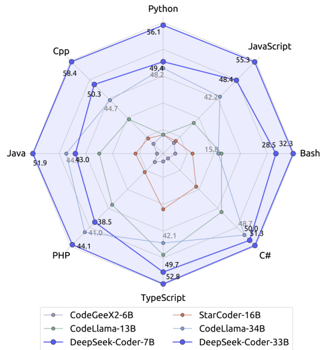
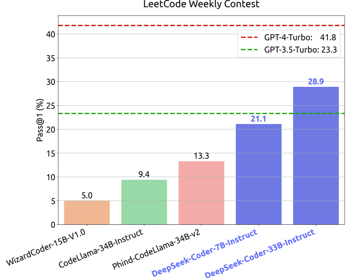
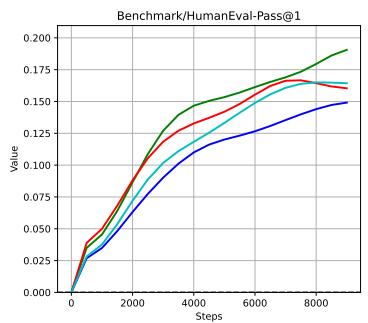
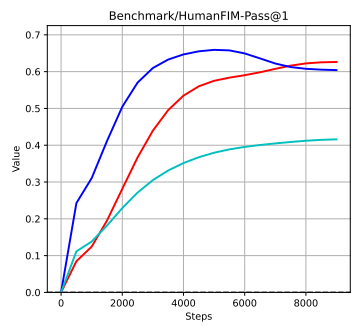
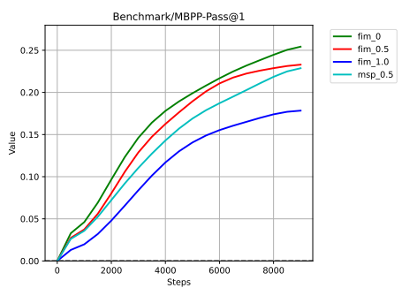
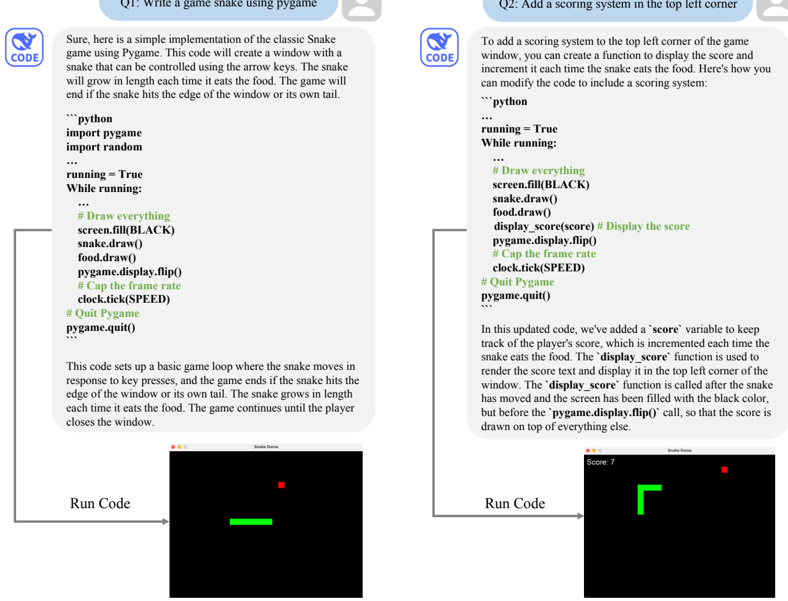
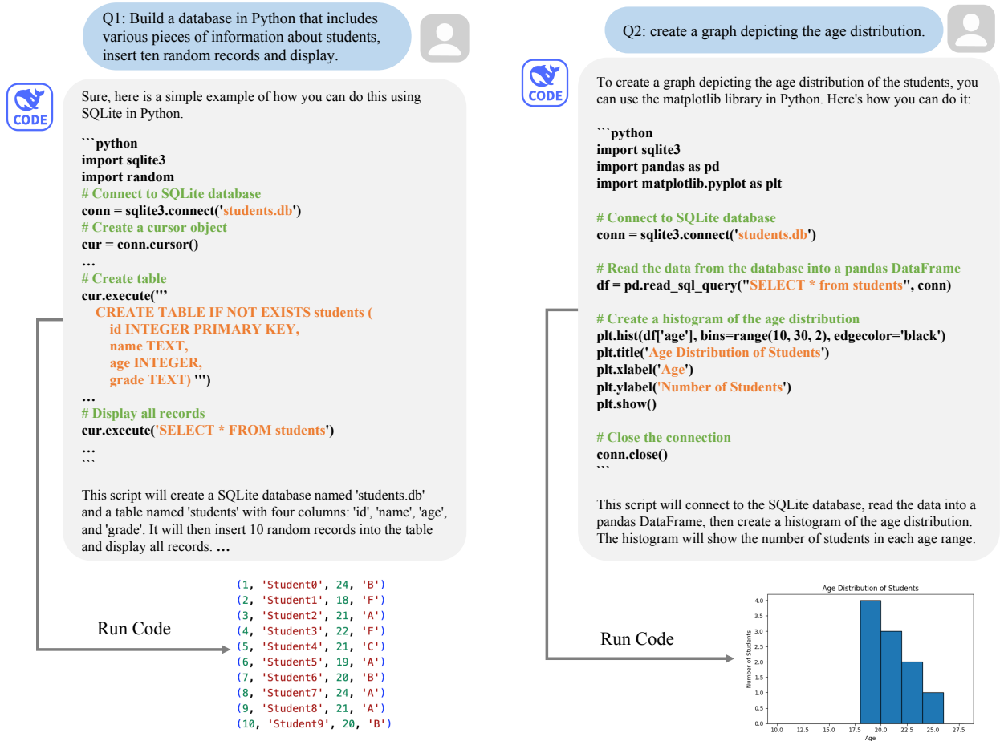
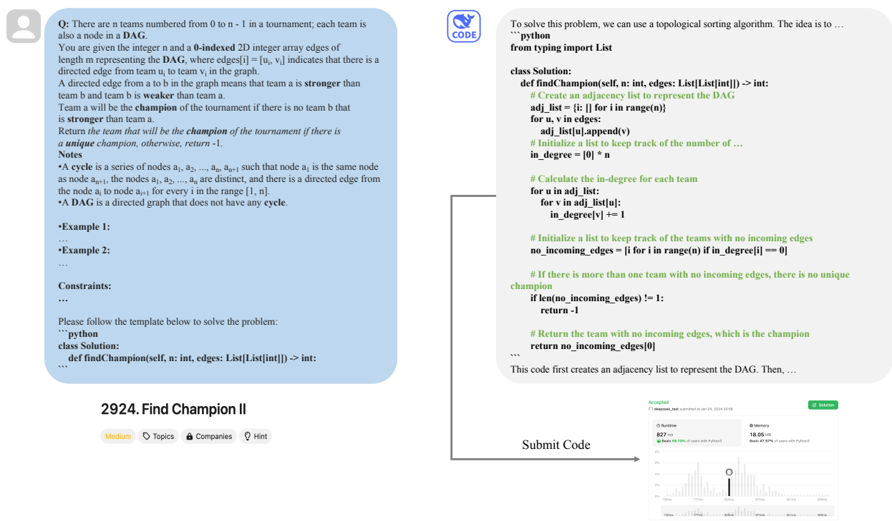
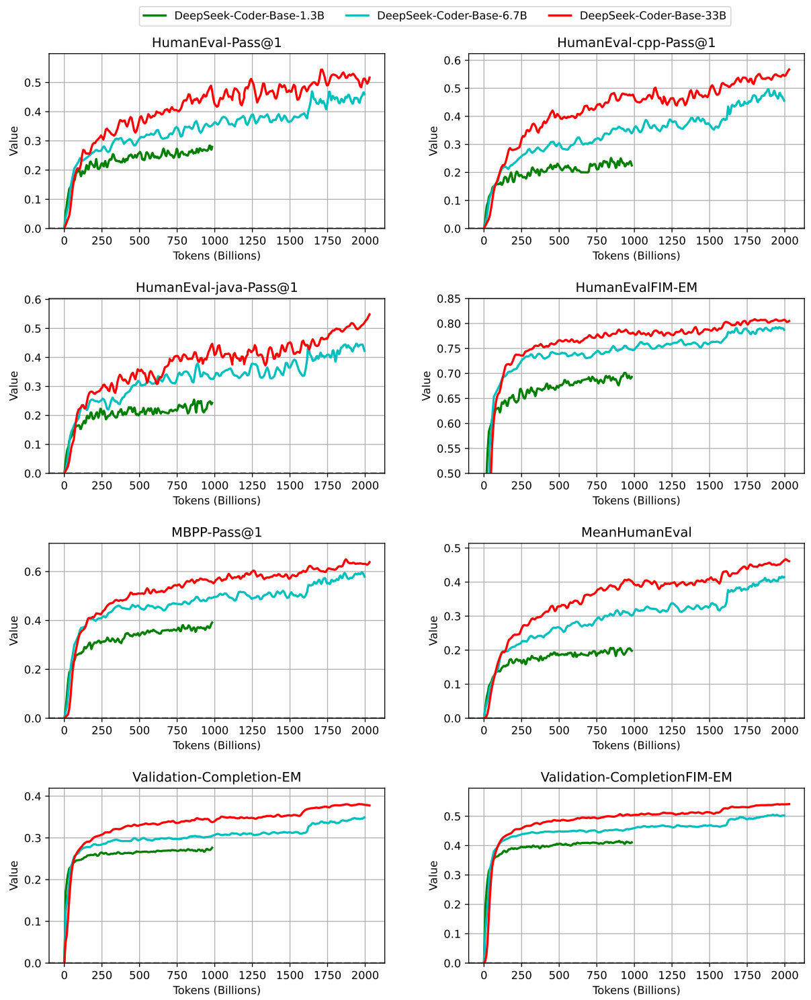

<!-- page 1 of 23 -->

LeetCode Weekly Contest


LeetCode 周赛

# DeepSeek-Coder: When the Large Language Model Meets Programming - The Rise of Code Intelligence # DeepSeek-Coder: 当大语言模型遇上编程-- 代码智能的崛起

Daya Guo\*<sup>1</sup>, Qihao Zhu<sup>∗1, 2</sup>, Dejian Yang<sup>1</sup>, Zhenda Xie<sup>1</sup>, Kai Dong<sup>1</sup>, Wentao Zhang<sup>1</sup> Guanting Chen<sup>1</sup>, Xiao Bi <sup>1</sup>, Y. Wu<sup>1</sup>, Y. K. Li<sup>1</sup>, Fuli Luo<sup>1</sup>, Yingfei Xiong<sup>2</sup>, Wenfeng Liang<sup>1</sup>


DeepSeek-AI 与北京大学高可信软件技术教育部重点实验室; 标星作者为共同一作. 联系: {zhuqh, guodaya}@deepseek. com; 仓库: https://github. com/deepseek-ai/DeepSeek-Coder

<sup>1</sup>DeepSeek-AI <sup>2</sup>Key Lab of HCST (PKU), MOE; SCS, Peking University {zhuqh, guodaya}@deepseek. com https://github. com/deepseek-ai/DeepSeek-Coder

## Abstract

The rapid development of large language models has revolutionized code intelligence in software development. However, the predominance of closed-source models has restricted extensive research and development. To address this, we introduce the DeepSeek-Coder series, a range of open-source code models with sizes from 1.3B to 33B, trained from scratch on 2 trillion tokens. These models are pre-trained on a high-quality project-level code corpus and employ a fill-in-the-blank task with a 16K window to enhance code generation and infilling. Our extensive evaluations demonstrate that DeepSeek-Coder not only achieves state-of-the-art performance among open-source code models across multiple benchmarks but also surpasses existing closed-source models like Codex and GPT-3.5. Furthermore, DeepSeek-Coder models are under a permissive license that allows for both research and unrestricted commercial use.


大模型迅速改写了软件开发里的代码智能, 但闭源主导限制了广泛研究. 为此推出 DeepSeek-Coder 系列: 开源代码模型, 规模从 1.3B 到 33B, 从零训在 2 万亿 token 上. 预训练用高质量**仓库级**代码语料, 并配合填空式任务与 16K 窗口, 抬高生成与中间填补能力. 评测显示: 开源代码模型里多基准领先, 也超过 Codex, GPT-3.5 等既有闭源; 许可宽松, 研究与无限制商用均可.





Figure 1 | The Performance of DeepSeek-Coder


图 1｜DeepSeek-Coder 的表现(多语言雷达 + LeetCode 周赛).

arXiv: 2401.14196v2 [cs. SE] 26 Jan 2024

deepseek

<small><span class="docvortex-page-footnote" data-block-type="page_footnote" style="color: #6b7280">\*Core contributors, ordered alphabetically by the name. </span></small>

<!-- page 2 of 23 -->

## 1. Introduction

The field of software development has been significantly transformed by the swift advancement of large language models (OpenAI, 2023; Touvron et al., 2023), which have brought about a new era of code intelligence. These models have the potential to automate and streamline many aspects of coding, from bug detection to code generation, thereby enhancing productivity and reducing the likelihood of human error. However, a major challenge in this field is the performance gap between open-source models (Li et al., 2023; Nijkamp et al., 2022; Roziere et al., 2023; Wang et al., 2021) and closed-source models (Gemini Team, 2023; OpenAI, 2023). The giant closed-source models, while powerful, are often inaccessible to many researchers and developers due to their proprietary nature.


大模型把软件开发推进到代码智能新阶段: 缺陷检测到代码生成都有自动化空间. 难点仍在开源与闭源之间的性能落差-- 巨型闭源虽强, 专有属性却把许多研究者挡在外面.

In response to this challenge, we present the DeepSeek-Coder series. This series comprises a range of open-source code models, varying in size from 1.3B to 33B, including the base version and instructed version for each size. Each model in the series has been trained from scratch on 2 trillion tokens sourced from 87 programming languages, ensuring a comprehensive understanding of coding languages and syntax. Besides, we attempt to organize the pre-training data at the repository level to enhance the pre-trained model’s understanding capability within the context of cross-files within a repository. In addition to employing the next token prediction loss during pre-training, we have also incorporated the Fill-In-Middle (FIM) approach (Bavarian et al., 2022; Li et al., 2023). This approach is designed to further bolster the model’s code completion capabilities. To meet the requirements of handling longer code inputs, we have extended the context length to 16K. This adjustment allows our models to handle more complex and extensive coding tasks, thereby increasing their versatility and applicability in various coding scenarios.


DeepSeek-Coder 系列开源, 规模 1.3B–33B, 每档有 Base 与 Instruct. 从零训在来自 87 种语言的 2 万亿 token 上. 预训练数据按**仓库级**组织, 加强跨文件理解; 除 next-token prediction 外引入 **Fill-In-Middle(FIM)**, 强化补全; 上下文拉到 16K, 好扛更长代码输入.

We have carried out comprehensive experiments using a variety of public code-related benchmarks. The findings reveal that among open-source models, DeepSeek-Coder-Base 33B consistently delivers superior performance across all benchmarks. Furthermore, DeepSeek-Coder-Instruct 33B surpasses OpenAI GPT-3.5 Turbo in the majority of the evaluation benchmarks, significantly narrowing the performance gap between OpenAI GPT-4 and open-source models. Remarkably, despite having fewer parameters, DeepSeek-Coder-Base 7B demonstrates competitive performance when compared to models that are five times larger, such as CodeLlama-33B (Roziere et al., 2023). To summarize, our main contributions are:


公开代码基准上: DeepSeek-Coder-Base 33B 在开源里全面领先; Instruct 33B 多数评测超过 GPT-3.5 Turbo, 显著收窄与 GPT-4 的差距. 参数更少的 Base 7B 也能跟约五倍大的 CodeLlama-33B 打得有来有回. 主要贡献如下:

• We introduce DeepSeek-Coder-Base and DeepSeek-Coder-Instruct, our advanced codefocused large language models (LLMs). Developed through extensive training on an expansive code corpus, these models exhibit proficiency in understanding 87 programming languages. Additionally, they are available in various model scales to cater to a wide range of computational and application needs.


• 推出 DeepSeek-Coder-Base 与 Instruct: 大规模代码语料训练, 覆盖 87 种语言, 多档规模适配不同算力与场景.

• We make the first attempt to incorporate repository-level data construction during the pre-training phase of our models. We find that it can significantly boost the capability of cross-file code generation.


• 预训练阶段首次尝试仓库级数据构造, 跨文件代码生成明显变强.

• Our analysis rigorously examines the impact of FIM training strategies on the pretraining phase of code models. The outcomes of these comprehensive studies shed light on intriguing aspects of FIM configurations, offering valuable insights that significantly contribute to the enhancement and development of code pretrained models.


• 系统分析 FIM 训练策略对代码预训练的影响, 给出配置层面的有用结论.

• We conduct extensive evaluations of our code LLMs against a wide array of benchmarks encompassing numerous code-related tasks. The findings demonstrate that DeepSeek-Coder-Base surpasses all existing open-source code LLMs across these benchmarks. Furthermore,


• 在大量代码相关基准上评测: Base 全面超过既有开源代码 LLM;

<!-- page 3 of 23 -->

with meticulous fine-tuning using instructional data, DeepSeek-Coder-Instruct achieves better performance compared to the OpenAI GPT-3.5 Turbo model in code-related tasks.


• 推出 DeepSeek-Coder-Base 与 Instruct: 大规模代码语料训练, 覆盖 87 种语言, 多档规模适配不同算力与场景.
• 预训练阶段首次尝试**仓库级数据构造**, 跨文件代码生成明显变强.
• 系统分析 FIM 训练策略对代码预训练的影响, 给出配置层面的有用结论.
• 在大量代码相关基准上评测: Base 全面超过既有开源代码 LLM; 指令微调后, Instruct 在代码相关任务上优于 GPT-3.5 Turbo.

## 2. Data Collection 数据收集

The training dataset of DeepSeek-Coder is composed of 87% source code, 10% English coderelated natural language corpus, and 3% code-unrelated Chinese natural language corpus. The English corpus consists of materials from GitHub’s Markdown and StackExchange<sup>1</sup>, which are used to enhance the model’s understanding of code-related concepts and improve its ability to handle tasks like library usage and bug fixing. Meanwhile, the Chinese corpus consists of high-quality articles aimed at improving the model’s proficiency in understanding the Chinese language. In this section, we will provide an overview of how we construct the code training data. This process involves data crawling, rule-based filtering, dependency parsing, repositorylevel deduplication, and quality screening, as illustrated in Figure 2. In the following, we will describe the data creation procedure step by step.


训练数据配比:**87% 源码, 10% 英文代码相关自然语言, 3% 与代码无关的中文自然语言**. 英文侧来自 GitHub Markdown 与 StackExchange, 补库用法, 修 bug 等概念; 中文侧为高质量文章, 抬中文理解. 代码数据构造含爬取, 规则过滤, 依赖解析, 仓库级去重, 质量筛查(图 2), 下文逐步说明.


Figure 2 | The Procedure of Dataset Creation


图 2｜数据集创建流程.

## 2.1. GitHub Data Crawling and Filtering GitHub 数据爬取与过滤

We collect public repositories created before February 2023 on GitHub and retain only 87 programming languages, as listed in Table 1. To reduce the amount of data to be processed, we apply filtering rules similar to those used in the StarCoder project (Li et al., 2023) to preliminarily filter out lower-quality code. By applying these filtering rules, we reduce the total amount of data to only 32.8% of its original size. To make the paper self-contained, we briefly describe the filter rules used in the StarCoder Data project:


GitHub 上取创建时间不晚于 2023 年 2 月的公开仓库, 只留表 1 所列 87 种语言. 过滤规则对齐 StarCoder, 初步去掉低质量代码后体积缩到原来的 32.8%. 规则概要如下(便于本文自洽):

Firstly, we filter out files with an average line length exceeding 100 characters or a maximum line length surpassing 1000 characters. Additionally, we remove files with fewer than 25% alphabetic characters. Except for the XSLT programming language, we further filter out files where the string "<? xml version=" appeared in the first 100 characters. For HTML files, we consider the ratio of visible text to HTML code. We retain files where the visible text constitutes at least 20% of the code and is no less than 100 characters. For JSON and YAML files, which typically contain more data, we only keep files that have a character count ranging from 50 to 5000 characters. This effectively removes most data-heavy files.


平均行长 >100 或最大行长 >1000 的文件去掉; 字母字符占比 <25% 的去掉; 除 XSLT 外, 前 100 字符含 `<? xml version=` 的去掉; HTML 要求可见文本至少占代码 20% 且不少于 100 字符; JSON/YAML 只留 50–5000 字符, 以甩掉数据堆文件.

## 2.2. Dependency Parsing 依赖解析

In previous works (Chen et al., 2021; Li et al., 2023; Nijkamp et al., 2022; Roziere et al., 2023), large language models for code are mainly pre-trained on file-level source code, which ignores the dependencies between different files in a project. However, in practical applications, such models struggle to effectively scale to handle entire project-level code scenarios. Therefore, we


以往代码大模型多在**文件级**源码上预训练, 忽略项目内跨文件依赖, 难扩展到整仓场景. 此处解析同仓文件依赖, 再按依赖排序: 被依赖的上下文排在依赖它的文件之前, 更贴近真实工程结构. 只考虑调用关系, 用正则抽取, 如 Python 的 `import`, C# 的 `using`, C 的 `include`.

<small><span class="docvortex-page-footnote" data-block-type="page_footnote" style="color: #6b7280"><sup>1</sup>https://stackexchange. com</span></small>

<!-- page 4 of 23 -->

```txt
Algorithm 1 Topological Sort for Dependency Analysis
1: procedure TOPOLOGICALSORT(files)
2:    graphs ← {} ▷ Initialize an empty adjacency list
3:    inDegree ← {} ▷ Initialize an empty dictionary for in-degrees
4:    for each file in files do
5:    graphs[file] ← []
6:    inDegree[file] ← 0
7:    end for
8:
9:    for each fileA in files do
10:    for each fileB in files do
11:    if HASDEPENDENCY(fileA, fileB) then ▷ If fileA depends on fileB
12:    graphs[fileB]. append(fileA) ▷ Add edge from B to A
13:    inDegree[fileA] ← inDegree[fileA] + 1 ▷ Increment in-degree of A
14:    end if
15:    end for
16:    end for
17:
18:    subgraphs ← getDisconnectedSubgraphs(graphs) ▷ Identify disconnected subgraphs
19:    allResults ← []
20:    for each subgraph in subgraphs do
21:    results ← []
22:    while length(results) ≠ NumberOfNodes(subgraph) do
23:    file ← argmin({inDegree[file] | file ∈ subgraph and file∉results})
24:    for each node in graphs[file] do
25:    inDegree[node] ← inDegree[node] - 1
26:    end for
27:    results. append(file)
28:    end while
29:    allResults. append(results)
30:    end for
31:
32:    return allResults
33: end procedure
```

will consider how to leverage the dependencies between files within the same repository in this step. Specifically, we first parse the dependencies between files and then arrange these files in an order that ensures the context each file relies on is placed before that file in the input sequence. By aligning the files in accordance with their dependencies, our dataset more accurately represents real coding practices and structures. This enhanced alignment not only makes our dataset more relevant but also potentially increases the practicality and applicability of the model in handling project-level code scenarios. It’s worth noting that we only consider the invocation relationships between files and use regular expressions to extract them, such as "import" in Python, "using" in C#, and "include" in C.


因此这一步要利用同仓文件依赖: 先解析依赖, 再按依赖排序, 使每个文件依赖的上下文排在该文件之前. 按依赖对齐后, 数据更贴近真实工程结构, 也有利于项目级代码场景. 只考虑调用关系, 用正则抽取, 如 Python 的 import, C# 的 using, C 的 include.

The algorithm 1 describes a topological sort for dependency analysis on a list of files within the same project. Initially, it sets up two data structures: an empty adjacency list named "graphs" to represent dependencies between files and an empty dictionary called "inDegree" for storing the in-degrees of each file. The algorithm then iterates over each file pair to identify depen-


算法 1 对同项目文件做依赖拓扑排序: 先建 `graphs` 邻接表与 `inDegree`; 两两检查依赖并更新; 再找不连通子图. 子图内不取入度为零的经典做法, 而取**最小入度**节点, 以便处理环; 入度递减直到排出全序. 各序列文件拼接成一条训练样本; 每个文件开头加路径注释, 把路径信息留进训练数据.

<!-- page 5 of 23 -->

dencies, updating "graphs" and "inDegree" accordingly. Next, it identifies any disconnected subgraphs within the overall dependency graph. For each subgraph, the algorithm employs a modified topological sort. Unlike the standard approach that selects nodes with zero in-degrees, this algorithm selects nodes with minimal in-degrees, which allows it to handle cycles within the graph. Selected nodes are added to a "results" list, and the in-degrees of their connected nodes are decreased. This process continues until a topologically sorted sequence is generated for each subgraph. The algorithm concludes by returning a list of these sorted sequences, and each sequence’s files are concatenated to form a single training sample. To incorporate file path information, a comment indicating the file’s path is added at the beginning of each file. This method ensures that the path information is preserved in the training data.


依赖并更新 graphs 与 inDegree; 再找不连通子图. 子图内不取入度为零的经典做法, 而取最小入度节点, 以便处理环; 入度递减直到排出全序. 各序列文件拼接成一条训练样本; 每个文件开头加路径注释, 把路径信息留进训练数据.

## 2.3. Repo-Level Deduplication 仓库级去重

Recent studies have demonstrated the significant performance improvements that can be achieved by deduplicating training datasets for Large Language Models (LLMs). Lee et al. (2022) have shown that language model training corpora often contain numerous near-duplicates, and the performance of LLMs can be enhanced by removing long repetitive substrings. Kocetkov et al. (2022) have applied a near-deduplication method to training data, resulting in dramatic improvements, and they emphasize that near-deduplication is a crucial preprocessing step for achieving competitive performance on code benchmark tasks. In our dataset, we have also employed near-deduplication. However, there is a distinction in our approach compared to previous works. We perform deduplication at the repository level of code, rather than at the file level, as the latter approach may filter out certain files within a repository, potentially disrupting the structure of the repository. Specifically, we treat the concatenated code from the repository level as a single sample and apply the same near-deduplication algorithm to ensure the integrity of the repository structure.


去重能抬 LLM 表现: Lee et al. (2022) 指出语料常有近重复, 去掉长重复子串有益; Kocetkov et al. (2022) 在代码基准上也强调近重复去重. 此处同样做近重复去重, 但粒度是**仓库级**而非文件级-- 文件级可能删掉仓内部分文件, 破坏结构. 整仓拼接成单样本后再跑同一套近重复去重, 保住仓库完整性.

## 2.4. Quality Screening and Decontamination 质量筛查与去污染

In addition to applying the filtering rules mentioned in Section 2.1, we also employ a compiler and a quality model, combined with heuristic rules, to further filter out low-quality data. This includes code with syntax errors, poor readability, and low modularity. We provide the statistical summary of source code in Table 1, which includes a total of 87 languages, detailing the disk size, number of files, and percentage for each language. The total data volume is 798 GB with 603 million files. To ensure that our code training data is not contaminated by information from the test set, which may be present on GitHub, we’ve implemented an n-gram filtering process. This process involves the removal of any code segments that match specific criteria. Specifically, we filter out files containing docstrings, questions, and solutions from sources such as HumanEval (Chen et al., 2021), MBPP (Austin et al., 2021), GSM8K (Cobbe et al., 2021) and MATH (Hendrycks et al., 2021). For the filtering criteria, we apply the following rules: if a piece of code includes a 10-gram string identical to any in the test data, it is excluded from our training data. In cases where the test data comprises strings that are shorter than 10-grams but no less than 3-grams, we use an exact match approach for filtering.


除 2.1 的规则外, 还用编译器, 质量模型加启发式, 再滤掉语法错, 可读性差, 模块化弱的代码. 表 1 汇总 87 种语言的磁盘体积, 文件数与占比, 合计约 **798 GB, 6.03 亿文件**. 为防测试集渗入 GitHub 污染训练, 做 n-gram 去污染: 去掉含 HumanEval, MBPP, GSM8K, MATH 等 docstring/题目/解答的文件; 与测试集相同的 10-gram 一律剔除; 测试串短于 10-gram 但不短于 3-gram 时用精确匹配过滤.

<!-- page 6 of 23 -->

| Language | Size (GB) | Files (k) | Prop. (%) | Language | Size (GB) | Files (k) | Prop. (%) |
| --- | --- | --- | --- | --- | --- | --- | --- |
| Ada | 0.91 | 126 | 0.11 | Literate Haskell | 0.16 | 20 | 0.02 |
| Agda | 0.26 | 59 | 0.03 | Lua | 0.82 | 138 | 0.10 |
| Alloy | 0.07 | 24 | 0.01 | Makefile | 0.92 | 460 | 0.12 |
| ANTLR | 0.19 | 38 | 0.02 | Maple | 0.03 | 6 | 0.00 |
| AppleScript | 0.03 | 17 | 0.00 | Mathematica | 0.82 | 10 | 0.10 |
| Assembly | 0.91 | 794 | 0.11 | MATLAB | 0.01 | 1 | 0.00 |
| Augeas | 0.00 | 1 | 0.00 | OCaml | 0.91 | 139 | 0.11 |
| AWK | 0.09 | 53 | 0.01 | Pascal | 0.79 | 470 | 0.10 |
| Batchfile | 0.92 | 859 | 0.12 | Perl | 0.81 | 148 | 0.10 |
| Bluespec | 0.10 | 15 | 0.01 | PHP | 58.92 | 40, 627 | 7.38 |
| C | 28.64 | 27, 111 | 3.59 | PowerShell | 0.91 | 236 | 0.11 |
| C# | 58.56 | 53, 739 | 7.34 | Prolog | 0.03 | 5 | 0.00 |
| Clojure | 0.90 | 295 | 0.11 | Protocol Buffer | 0.92 | 391 | 0.12 |
| CMake | 0.90 | 359 | 0.11 | Python | 120.68 | 75, 188 | 15.12 |
| CoffeeScript | 0.92 | 361 | 0.12 | R | 0.92 | 158 | 0.11 |
| Common Lisp | 0.92 | 105 | 0.11 | Racket | 0.09 | 13 | 0.01 |
| C++ | 90.87 | 36, 006 | 11.39 | RMarkdown | 6.83 | 1, 606 | 0.86 |
| CSS | 5.63 | 11, 638 | 0.71 | Ruby | 15.01 | 18, 526 | 1.88 |
| CUDA | 0.91 | 115 | 0.11 | Rust | 0.61 | 692 | 0.08 |
| Dart | 0.89 | 264 | 0.11 | SAS | 0.92 | 70 | 0.11 |
| Dockerfile | 0.04 | 48 | 0.00 | Scala | 0.81 | 971 | 0.10 |
| Elixir | 0.91 | 549 | 0.11 | Scheme | 0.92 | 216 | 0.12 |
| Elm | 0.92 | 232 | 0.12 | Shell | 13.92 | 10, 890 | 1.74 |
| Emacs Lisp | 0.91 | 148 | 0.11 | Smalltalk | 0.92 | 880 | 0.12 |
| Erlang | 0.92 | 145 | 0.12 | Solidity | 0.85 | 83 | 0.11 |
| F# | 0.91 | 340 | 0.11 | Sparql | 0.10 | 88 | 0.01 |
| Fortran | 1.67 | 654 | 0.21 | SQL | 15.14 | 7, 009 | 1.90 |
| GLSL | 0.92 | 296 | 0.11 | Stan | 0.20 | 41 | 0.03 |
| Go | 2.58 | 1, 365 | 0.32 | Standard ML | 0.74 | 117 | 0.09 |
| Groovy | 0.89 | 340 | 0.11 | Stata | 0.91 | 122 | 0.11 |
| Haskell | 0.87 | 213 | 0.11 | SystemVerilog | 0.91 | 165 | 0.11 |
| HTML | 30.05 | 14, 998 | 3.77 | TCL | 0.90 | 110 | 0.11 |
| Idris | 0.11 | 32 | 0.01 | Tcsh | 0.17 | 53 | 0.02 |
| Isabelle | 0.74 | 39 | 0.09 | Tex | 20.46 | 2, 867 | 2.56 |
| Java | 148.66 | 134, 367 | 18.63 | Thrift | 0.05 | 21 | 0.01 |
| Java Server Pages | 0.86 | 1072 | 0.11 | TypeScript | 60.62 | 62, 432 | 7.60 |
| JavaScript | 53.84 | 71, 895 | 6.75 | Verilog | 0.01 | 1 | 0.00 |
| JSON | 4.61 | 11956 | 0.58 | VHDL | 0.85 | 392 | 0.11 |
| Julia | 0.92 | 202 | 0.12 | Visual Basic | 0.75 | 73 | 0.09 |
| Jupyter Notebook | 14.38 | 2, 555 | 1.80 | XSLT | 0.36 | 48 | 0.04 |
| Kotlin | 6.00 | 3, 121 | 0.75 | Yacc | 0.72 | 67 | 0.09 |
| Lean | 0.52 | 68 | 0.07 | YAML | 0.74 | 890 | 0.09 |
| Literate Agda | 0.05 | 4 | 0.01 | Zig | 0.81 | 70 | 0.10 |
| Literate CoffeeScript | 0.01 | 3 | 0.00 | Total | 797.92 | 603, 173 | 100.00 |

Table 1 | A summary of the cleaned training data for the selected programming languages.


表 1｜清洗后各语言训练数据汇总.

## 3. Training Policy 训练策略

## 3.1. Training Strategy 训练目标

## 3.1.1. Next Token Prediction next-token prediction

The first training objective for our model is known as next token prediction. In this process, various files are concatenated to form a fixed-length entry. Then, these entries are used to train the model, enabling it to predict the subsequent token based on the provided context.


第一项训练目标是**next-token prediction**: 多文件拼成定长样本, 按上下文预测下一个 token.

<!-- page 7 of 23 -->

## 3.1.2. Fill-in-the-Middle 中间填补(FIM)

The second training objective for our model is known as fill-in-the-middle. In the code pre-training scenario, it is often necessary to generate corresponding inserted content based on the given context and subsequent text. Due to specific dependencies in a programming language, relying solely on next token prediction is insufficient to learn this fill-in-the-middle capability. Therefore, several approaches (Bavarian et al., 2022; Li et al., 2023) propose the pretraining method of Fill-in-the-Middle (FIM). This approach involves randomly dividing the text into three parts, then shuffling the order of these parts and connecting them with special characters. This method aims to incorporate a fill-in-the-blank pretraining task during the training process. Within the FIM methodology, two distinct modes are employed: PSM (Prefix-Suffix-Middle) and SPM (Suffix-Prefix-Middle). PSM arranges the three content segments as prefix, suffix, and middle; SPM arranges them as suffix, prefix, and middle. Special FIM tokens delimit the segments in both modes. These modes are instrumental in enhancing the model's capability to handle various structural arrangements in code, providing a robust training framework for advanced code prediction tasks.


第二项是中间填补. 代码预训练常要根据前后文生成插入段; 语言依赖使单靠 next-token prediction 学不好这一能力, 故引入 **FIM**: 文本随机切成三段, 打乱顺序并用特殊标记连接. 两种模式:**PSM(Prefix-Suffix-Middle)** 与 **SPM(Suffix-Prefix-Middle)**-- 前者按前缀→后缀→中间, 让缺失中段条件于两侧; 后者按后缀→前缀→中间, 结构挑战不同, 用来适应多种代码排布.







Figure 3 | The effectiveness of using FIM objective.


图 3｜FIM 目标的有效性.

To determine the effectiveness of various hyperparameters within the FIM approach, we conducted a series of ablation experiments.


为摸清 FIM 超参效果, 做了一系列消融.

Experiment Settings: In this experiment, we employ DeepSeek-Coder-Base 1.3B as our model architecture. We focused on a Python subset from our training dataset to streamline the experimental process. Our primary objective was to assess the efficacy of the Fill-in-the-Middle (FIM) technique, utilizing the HumanEval-FIM benchmark (Fried et al., 2022). This benchmark specializes in a single-line FIM task for Python, in which one line of code from a HumanEval solution is randomly obscured, testing the model’s proficiency in predicting the missing line. We hypothesize that the PSM mode may exhibit subtle differences compared to the traditional next-token prediction objective. This is primarily because PSM involves rearranging the order of the original text, potentially impacting the learning dynamics of the model. Therefore, we implement the PSM mode for FIM across four distinct configurations: 0% FIM rate, 50% FIM rate, 100% FIM rate, and 50% MSP rate. The Masked Span Prediction (MSP) strategy, initially introduced in T5 (Raffel et al., 2023), conceals multiple text spans and trains the model to reconstruct these segments. According to CodeGen2.5 (Nijkamp et al., 2023), MSP may enhance FIM performance compared to PSM. Thus, we include this method in our comparative analysis.


实验设定: 架构用 DeepSeek-Coder-Base 1.3B, 数据取训练语料的 Python 子集. 指标用 HumanEval-FIM(Fried et al., 2022)--Python 单行 FIM: 随机遮住 HumanEval 解答中一行, 测补行能力. 假设 PSM 因重排原文, 相对纯 next-token prediction 会有细微差异. 比较四种配置: FIM 率 0%, 50%, 100%, 以及 50% **MSP(Masked Span Prediction)** 率. MSP 源自 T5, 遮多个片段再重建; CodeGen2.5 认为 MSP 可能优于 PSM, 故一并对比.

Results: The outcomes of our experiment are illustrated in Figure 3. While the model demonstrates peak performance on the HumanEval-FIM with a 100% FIM rate, this configuration also results in the weakest code completion capability. This indicates a trade-off between FIM and


结果见图 3: 100% FIM 在 HumanEval-FIM 上最好, 但代码补全最弱--FIM 与补全存在权衡. 50% PSM 优于 MSP. 为兼顾两边, 最终采用 **50% PSM**.

<!-- page 8 of 23 -->

code completion abilities. Moreover, we observe that with a 50% PSM rate, the model outperforms the MSP strategy. To achieve a balance between FIM efficiency and code completion proficiency, we ultimately choose the 50% PSM rate as our preferred training policy.


代码补全能力. 另外, 50% PSM 优于 MSP. 为在 FIM 与代码补全之间取得平衡, 最终采用 50% PSM 作为训练策略.

In our implementation, we have introduced three sentinel tokens specifically for this task. For each code file, we initially divide its content into three segments, denoted as$f _ { p r e } , f _ { m i d d l e } , $, and $f _ { s u f }$. Using the PSM mode, we construct the training example as follows:


实现上为此任务引入三个哨兵 token. 每个代码文件先切成三段 $f_{pre}, f_{middle}, f_{suf}$, 再按 PSM 拼成训练样本:

$$
<   | \text { fim\_start } | > f _ {p r e} <   | \text { fim\_hole } | > f _ {s u f} <   | \text { fim\_end } | > f _ {m i d d l e} <   | \text { eos\_token } | >
$$

We implement the Fill-in-the-Middle (FIM) method at the document level before the packing process, as proposed in the original work by Bavarian et al. (2022). This is done with an FIM rate of 0.5, following the PSM mode.


FIM 在打包前, 文档级施加(Bavarian et al., 2022), FIM 率 0.5, 走 PSM.

## 3.2. Tokenizer 分词器

For the tokenization process, we employ the HuggingFace Tokenizer$\mathrm { l i b r a r y } ^ { 2 }$to train Byte Pair Encoding (BPE) tokenizers, as outlined in Sennrich et al. (2015) (Sennrich et al., 2015), on a subset of our training corpus. Ultimately, we utilize a tokenizer configured with a vocabulary size of 32, 000.


分词用 HuggingFace Tokenizer 库, 在训练语料子集上训 BPE(Sennrich et al., 2015), 词表大小最终为 32, 000.

## 3.3. Model Architecture 模型架构

We develop a range of models with varying parameters to cater to diverse applications, including models with 1.3B, 6.7B, and 33B parameters. These models are built upon the same framework as the DeepSeek Large Language Model (LLM) outlined by DeepSeek-AI (2024). Each model is a decoder-only Transformer, incorporating Rotary Position Embedding (RoPE) as described by Su et al. (2023). Notably, the DeepSeek 33B model integrates Grouped-Query-Attention (GQA) with a group size of$8 , $enhancing both training and inference efficiency. Additionally, we employ FlashAttention$\mathbf { v } 2$(Dao, 2023) to expedite the computation involved in the attention mechanism. The architectural details of our models are summarized in Table 2.


规模覆盖 1.3B, 6.7B, 33B, 框架对齐 DeepSeek LLM(DeepSeek-AI, 2024). 均为 decoder-only Transformer, 带 **RoPE**. 33B 用组大小为 $8$ 的 **GQA**, 训练与推理更省; 注意力侧用 FlashAttention v2. 架构细节见表 2.

## 3.4. Optimization 优化

Following DeepSeek LLM (DeepSeek-AI, 2024), we use AdamW (Loshchilov and Hutter, 2019) as the optimizer with$\beta _ { 1 }$and$\beta _ { 2 }$values of 0.9 and 0.95. We adapt batch sizes and learning rates by the scaling laws suggested in DeepSeek LLM. For the learning rate scheduling, we implement a three-stage policy, which includes 2000 warm-up steps, and set the final learning rate to 10% of the initial rate. Notably, the learning rate at each stage is scaled down to$\scriptstyle { \sqrt { \frac { 1 } { 1 0 } } }$of the preceding stage’s rate, following the guidelines established in DeepSeek LLM (DeepSeek-AI, 2024).


优化器 AdamW, $\beta_1=0.9$, $\beta_2=0.95$; batch 与学习率按 DeepSeek LLM Scaling Laws. 学习率三阶段调度: 2000 步 warmup, 终值为主值的 10%; 每阶段相对前一阶段再缩到 $\sqrt{1/10}$.

## 3.5. Environments 训练环境

Our experiments are conducted using the HAI-LLM (High-Flyer, 2023) framework, known for its efficiency and lightweight approach in training large language models. This framework incorporates a variety of parallelism strategies to optimize computational efficiency. These include tensor parallelism (Korthikanti et al., 2023), alongside ZeRO data parallelism (Rajbhandari et al., 2020) and PipeDream pipeline parallelism (Narayanan et al., 2019). Our experiments


训练框架为 HAI-LLM: 张量并行, ZeRO 数据并行, PipeDream 流水线并行. 集群用 NVIDIA A100 与 H800; 每节点 8 卡, A100 侧 NVLink 两两桥接, H800 侧 NVLink + NVSwitch; 节点间 InfiniBand.

<small><span class="docvortex-page-footnote" data-block-type="page_footnote" style="color: #6b7280"><sup>2</sup>https://github. com/huggingface/tokenizers</span></small>

<!-- page 9 of 23 -->

| Hyperparameter | DeepSeek-Coder 1.3B | DeepSeek-Coder 6.7B | DeepSeek-Coder 33B |
| --- | --- | --- | --- |
| Hidden Activation | SwiGLU | SwiGLU | SwiGLU |
| Hidden size | 2048 | 4096 | 7168 |
| Intermediate size | 5504 | 11008 | 19200 |
| Hidden layers number | 24 | 32 | 62 |
| Attention heads number | 16 | 32 | 56 |
| Attention | Multi-head | Multi-head | Grouped-query (8) |
| Batch Size | 1024 | 2304 | 3840 |
| Max Learning Rate | 5.3e-4 | 4.2e-4 | 3.5e-4 |

Table 2 | Hyperparameters of DeepSeek-Coder.


表 2｜DeepSeek-Coder 超参数.

utilize clusters outfitted with NVIDIA A100 and H800 GPUs. In the A100 cluster, each node is configured with 8 GPUs, interconnected in pairs using NVLink bridges. The H800 cluster is similarly arranged, with each node containing 8 GPUs. These GPUs are interconnected using a combination of NVLink and NVSwitch technologies, ensuring efficient data transfer within nodes. To facilitate seamless communication between nodes in both A100 and H800 clusters, we employ InfiniBand interconnects, known for their high throughput and low latency. This setup provides a robust and efficient infrastructure for our computational experiments.


实验跑在配备 NVIDIA A100 与 H800 的集群上. A100 节点每机 8 卡, 两两 NVLink 桥接; H800 节点同样 8 卡, 卡间用 NVLink 与 NVSwitch. 节点间用 InfiniBand, 高吞吐低延迟.

## 3.6. Long Context 长上下文

To enhance the capabilities of DeepSeek-Coder in handling extended contexts, particularly for scenarios like repository-level code processing, we have reconfigured the RoPE (Su et al., 2023) parameters to extend the default context window. Following previous practices (Chen et al., 2023; kaiokendev, 2023), we employed a linear scaling strategy, increasing the scaling factor from 1 to 4 and altering the base frequency from 10000 to 100000. The model underwent an additional 1000 steps of training, using a batch size of 512 and a sequence length of 16K. The learning rate was maintained as in the final pre-training phase. Theoretically, these modifications enable our model to process up to 64K tokens in context. However, empirical observations suggest that the model delivers its most reliable outputs within a 16K token range. Future research will continue to refine and evaluate the long-context adaptation methodology, aiming to further enhance DeepSeek-Coder’s efficiency and user-friendliness in processing extended contexts.


为服务仓库级等长上下文, 重配 RoPE: 线性缩放因子 1→4, 基频 10000→100000. 再训 1000 步, batch 512, 序列长 16K, 学习率沿用预训练末段. 理论上可到 64K, 实测最稳仍在 16K 附近.

## 3.7. Instruction Tuning 指令微调

We develop DeepSeek-Coder-Instruct by enhancing the DeepSeek-Coder-Base through instructionbased fine-tuning using high-quality data. This data comprises helpful and impartial human instructions, structured by the Alpaca Instruction format (Taori et al., 2023). To demarcate each dialogue turn, we employed a unique delimiter token <|EOT|> to signify the conclusion of each segment. For training, we use a cosine schedule with 100 warm-up steps and an initial learning rate 1e-5. We also use a batch size of 4M tokens and 2B tokens in total.


DeepSeek-Coder-Instruct 由 Base 做指令微调得到: 高质量, 公正的人类指令, 格式对齐 Alpaca; 轮次用 `<|EOT|>` 分隔. 训练: 余弦调度, 100 步 warmup, 初学习率 1e-5, batch 约 4M token, 合计约 2B token.

An example of using DeepSeek-Coder-Instruct 34B is depicted in Figure 4. This example is a multi-turn dialogue scenario for building a snake game. Initially, we ask the model to write a game snake using pygame. The model successfully creates a basic snake game that can run without bugs. To improve the game, we further request adding a scoring system in the top left corner. The model then introduces a "score" variable and a "display\_score" function, along with an explanation of how to integrate these features. This example illustrates DeepSeek-Coder-Instruct’s ability to provide complete solutions in multi-turn dialogue settings. More cases can be found in the Appendix A.


图 4 给出 Instruct(文中写 34B)多轮写贪吃蛇的例子: 先用 pygame 写出可跑的基础版, 再按要求在左上角加计分(`score` 与 `display_score`). 说明多轮对话里能给完整方案; 更多案例见附录 A.

<!-- page 10 of 23 -->


图注: DeepSeek-Coder-Instruct 多轮代码生成示例的第一轮：用户要求用 Pygame 编写贪吃蛇，模型返回包含方向控制、吃食物增长以及碰撞结束条件的完整实现。
## Q1: Write a game snake using pygame Q1: 用 pygame 写一个贪吃蛇游戏

Sure, here is a simple implementation of the classic Snake game using Pygame. This code will create a window with a snake that can be controlled using the arrow keys. The snake will grow in length each time it eats the food. The game will end if the snake hits the edge of the window or its own tail.


可以. 下面是用 Pygame 写的简易贪吃蛇: 方向键控制, 吃到食物变长, 撞墙或撞到自己则结束.

\`\`\`python import pygame import random running = True While running: # Draw everything screen. fill(BLACK) snake. draw() food. draw() pygame. display. flip() # Cap the frame rate clock. tick(SPEED) # Quit Pygame pygame. quit()

## Q2: Add a scoring system in the top left corner Q2: 在左上角加计分系统

To add a scoring system to the top left corner of the game window, you can create a function to display the score and increment it each time the snake eats the food. Here's how you can modify the code to include a scoring system:


要在窗口左上角加计分: 可写显示分数的函数, 并在蛇吃到食物时累加. 改法如下:

This code sets up a basic game loop where the snake moves in response to key presses, and the game ends if the snake hits the edge of the window or its own tail. The snake grows in length each time it eats the food. The game continues until the player closes the window.


这段代码搭好基本循环: 按键移动蛇, 撞边或撞尾结束; 吃到食物变长; 关窗才停.



图注: 同一段多轮代码对话的第二轮：用户要求在左上角增加计分，模型新增 `score` 状态与 `display_score` 渲染函数，并在画面刷新前绘制分数。
In this updated code, we've added a \`score\` variable to keep track of the player's score, which is incremented each time the snake eats the food. The \`display\_score\` function is used to render the score text and display it in the top left corner of the window. The \`display\_score\` function is called after the snake has moved and the screen has been filled with the black color, but before the \`pygame. display. flip()\` call, so that the score is drawn on top of everything else.


更新后增加了 `score` 变量记录得分, 吃到食物时递增; `display_score` 负责渲染并画在左上角, 在蛇移动, 清屏之后, `pygame. display. flip()` 之前调用, 保证分数画在最上层.

Figure 4 | An example of responses from DeepSeek-Coder-Instruct 33B in a multi-turn setting.


图 4｜DeepSeek-Coder-Instruct 33B 多轮对话示例.

## 4. Experimental Results 实验结果

In this section, we evaluate DeepSeek-Coder on four tasks, including code generation (§4.1), FIM code completion (§4.2), cross-file code completion (§4.3) and program-based math reasoning (§4.4). We compare DeepSeek-Coder with the previous state-of-the-art large language models:


本节从四方面评测: 代码生成(§4.1), FIM 补全(§4.2), 跨文件补全(§4.3), 程序化数学推理(§4.4). 对比对象如下:

• CodeGeeX2 (Zheng et al., 2023) represents the second generation of the multilingual code generation model CodeGeeX. It is developed using the ChatGLM2 (Du et al., 2022) architecture and is enhanced with an extensive dataset of coding examples.


• CodeGeeX2(Zheng et al., 2023): 第二代多语言代码生成模型, 基于 ChatGLM2, 并用大量代码样例增强.

• StarCoder (Li et al., 2023) is a publicly accessible model with a substantial parameter count of 15 billion. It is specifically trained on a meticulously curated subset of the Stack dataset (Kocetkov et al., 2022), covering 86 programming languages, ensuring its proficiency across a wide range of coding tasks.


• StarCoder(Li et al., 2023): 公开的 15B 模型, 在 Stack 精选子集上训, 覆盖 86 种语言.

• CodeLlama (Roziere et al., 2023) encompasses a series of code-centric Large Language Models (LLMs) that are derivatives of LLaMA2 (Touvron et al., 2023). Available in three sizes - 7B, 13B, and 34B - these models undergo continued training on a vast 500 billion token code corpus, building upon the foundational LLaMA2 architecture.


• CodeLlama(Roziere et al., 2023): 由 LLaMA2 衍生的代码向 LLM, 有 7B/13B/34B, 在约 5000 亿 token 代码语料上继续训练.

• code-cushman-001 Chen et al. (2021) is a 12 billion parameter model developed by OpenAI and served as the initial model for Github Copilot.


• code-cushman-001(Chen et al., 2021): OpenAI 的 12B 模型, 曾是 GitHub Copilot 的早期后端.

• GPT-3.5 and GPT-4 (OpenAI, 2023) are advanced generative AI models developed by OpenAI. While they are not explicitly trained for code generation, they also demonstrate


• GPT-3.5 与 GPT-4(OpenAI, 2023): 通用生成模型, 虽非专为代码训, 参数规模大, 代码任务上同样强.

<!-- page 11 of 23 -->

notable performance in this domain. Their effectiveness in handling code generation tasks is largely attributed to their massive scale in terms of parameter count.


• **CodeGeeX2**: 多语言代码生成第二代, ChatGLM2 架构 + 大量代码样例.
• **StarCoder**: 约 15B 公开模型, 训在 Stack 精选子集, 覆盖 86 种语言.
• **CodeLlama**: LLaMA2 衍生, 7B/13B/34B, 在约 500B token 代码语料上继续训.
• **code-cushman-001**: OpenAI 约 12B, 早期 GitHub Copilot 所用.
• **GPT-3.5 / GPT-4**: 非专训代码, 但靠巨大参数量在代码生成上也表现突出.

## 4.1. Code Generation 代码生成

HumanEval and MBPP Benchmarks The HumanEval (Chen et al., 2021) and MBPP (Austin et al., 2021) benchmarks are widely used for evaluating code LLMs. HumanEval consists of 164 hand-written Python problems that are validated using test cases to assess the code generated by a Code LLM in a zero-shot setting, while the MBPP benchmark includes 500 problems in a few-shot setting. To evaluate the model’s multilingual capabilities, we expanded the Python problems of Humaneval Benchmark to seven additional commonly used programming languages, namely C++, Java, PHP, TypeScript (TS), C#, Bash, and JavaScript (JS) (Cassano et al., 2023). For both benchmarks, We adopted a greedy search approach and re-implemented the baseline results using the same script and environment for fair comparison.


**HumanEval / MBPP**: 前者 164 道手写 Python 题, 用例校验, 零样本; 后者 500 题, 少样本. 为测多语言, 把 HumanEval Python 题扩到 C++, Java, PHP, TypeScript, C#, Bash, JavaScript(Cassano et al., 2023). 两边都用贪心搜索, 基线用同一脚本与环境重跑, 保证公平.

<table><tr><td>Model</td><td>Size</td><td>Python</td><td>C++</td><td>Java</td><td>PHP</td><td>TS</td><td>C#</td><td>Bash</td><td>JS</td><td>Avg</td><td>MBPP</td></tr><tr><td colspan="12">Multilingual Base Models</td></tr><tr><td>code-cushman-001</td><td>12B</td><td>33.5%</td><td>31.9%</td><td>30.6%</td><td>28.9%</td><td>31.3%</td><td>22.1%</td><td>11.7%</td><td>-</td><td>-</td><td>-</td></tr><tr><td>CodeGeeX2</td><td>6B</td><td>36.0%</td><td>29.2%</td><td>25.9%</td><td>23.6%</td><td>20.8%</td><td>29.7%</td><td>6.3%</td><td>24.8%</td><td>24.5%</td><td>36.2%</td></tr><tr><td>StarCoderBase</td><td>16B</td><td>31.7%</td><td>31.1%</td><td>28.5%</td><td>25.4%</td><td>34.0%</td><td>34.8%</td><td>8.9%</td><td>29.8%</td><td>28.0%</td><td>42.8%</td></tr><tr><td>CodeLlama</td><td>7B</td><td>31.7%</td><td>29.8%</td><td>34.2%</td><td>23.6%</td><td>36.5%</td><td>36.7%</td><td>12.0%</td><td>29.2%</td><td>29.2%</td><td>38.6%</td></tr><tr><td>CodeLlama</td><td>13B</td><td>36.0%</td><td>37.9%</td><td>38.0%</td><td>34.2%</td><td>45.2%</td><td>43.0%</td><td>16.5%</td><td>32.3%</td><td>35.4%</td><td>48.4%</td></tr><tr><td>CodeLlama</td><td>34B</td><td>48.2%</td><td>44.7%</td><td>44.9%</td><td>41.0%</td><td>42.1%</td><td>48.7%</td><td>15.8%</td><td>42.2%</td><td>41.0%</td><td>55.2%</td></tr><tr><td>DeepSeek-Coder-Base</td><td>1.3B</td><td>34.8%</td><td>31.1%</td><td>32.3%</td><td>24.2%</td><td>28.9%</td><td>36.7%</td><td>10.1%</td><td>28.6%</td><td>28.3%</td><td>46.2%</td></tr><tr><td>DeepSeek-Coder-Base</td><td>6.7B</td><td>49.4%</td><td>50.3%</td><td>43.0%</td><td>38.5%</td><td>49.7%</td><td>50.0%</td><td>28.5%</td><td>48.4%</td><td>44.7%</td><td>60.6%</td></tr><tr><td>DeepSeek-Coder-Base</td><td>33B</td><td>56.1%</td><td>58.4%</td><td>51.9%</td><td>44.1%</td><td>52.8%</td><td>51.3%</td><td>32.3%</td><td>55.3%</td><td>50.3%</td><td>66.0%</td></tr><tr><td colspan="12">Instruction-Tuned Models</td></tr><tr><td>GPT-3.5-Turbo</td><td>-</td><td>76.2%</td><td>63.4%</td><td>69.2%</td><td>60.9%</td><td>69.1%</td><td>70.8%</td><td>42.4%</td><td>67.1%</td><td>64.9%</td><td>70.8%</td></tr><tr><td>GPT-4</td><td>-</td><td>84.1%</td><td>76.4%</td><td>81.6%</td><td>77.2%</td><td>77.4%</td><td>79.1%</td><td>58.2%</td><td>78.0%</td><td>76.5%</td><td>80.0%</td></tr><tr><td>DeepSeek-Coder-Instruct</td><td>1.3B</td><td>65.2%</td><td>45.3%</td><td>51.9%</td><td>45.3%</td><td>59.7%</td><td>55.1%</td><td>12.7%</td><td>52.2%</td><td>48.4%</td><td>49.4%</td></tr><tr><td>DeepSeek-Coder-Instruct</td><td>6.7B</td><td>78.6%</td><td>63.4%</td><td>68.4%</td><td>68.9%</td><td>67.2%</td><td>72.8%</td><td>36.7%</td><td>72.7%</td><td>66.1%</td><td>65.4%</td></tr><tr><td>DeepSeek-Coder-Instruct</td><td>33B</td><td>79.3%</td><td>68.9%</td><td>73.4%</td><td>72.7%</td><td>67.9%</td><td>74.1%</td><td>43.0%</td><td>73.9%</td><td>69.2%</td><td>70.0%</td></tr></table>

Table 3 | Performance of approaches on the Multilingual HumanEval and MBPP Benchmarks.


表 3｜多语言 HumanEval 与 MBPP 上的表现.

The results are presented in Table 3. As we can see, DeepSeek-Coder-Base achieves stateof-the-art performance with an average accuracy of 50.3% on HumanEval and 66.0% on MBPP. In comparison to the similarly sized open-source model CodeLlama-Base 34B, our model has demonstrated a notable improvement of 9% and 11% in accuracy, respectively. It’s worth noting that even our smaller model, DeepSeek-Coder-Base 6.7B, surpasses the performance of CodeLlama-Base 34B. After instruction fine-tuning, our model surpasses the closed-source GPT-3.5-Turbo model in HumanEval benchmark, significantly reducing the performance gap between OpenAI GPT-4 and open-source models.


表 3: Base 在 HumanEval 平均 50.3%, MBPP 66.0%, 相对同量级 CodeLlama-Base 34B 约 +9% / +11%; 更小的 Base 6.7B 已超过 CodeLlama-Base 34B. 指令微调后 HumanEval 超过 GPT-3.5-Turbo, 与 GPT-4 的差距明显收窄.

DS-1000 Benchmark HumanEval and MBPP have a significant drawback in that they rely heavily on straightforward programming tasks that may not accurately represent the kind of code most programmers typically write. In contrast, the DS-1000 benchmark, as introduced in the work by Lai et al. (2023), offers a comprehensive collection of 1, 000 practical and realistic data science workflows across seven different libraries. This benchmark evaluates code generation by executing it against specific test cases. What sets DS-1000 apart is its categorization of problems based on the libraries involved, which encompass Matplotlib, NumPy, Pandas, SciPy, Scikit


DS-1000 基准: HumanEval/MBPP 多是简单题, 不太像程序员日常写的代码. DS-1000(Lai et al., 2023)收集 1000 条真实数据科学工作流, 覆盖七个库, 用测试用例执行评测.

<!-- page 12 of 23 -->

Learn, PyTorch, and TensorFlow. The benchmark assesses the performance of base models in the code completion setting and we provide pass@1 results for each library, as well as overall score.


**DS-1000**(Lai et al., 2023)面向更贴近日常的数据科学工作流: 七个库共 1000 题, 按 Matplotlib, NumPy, Pandas, SciPy, Scikit-Learn, PyTorch, TensorFlow 分类, 用用例执行判分. 评的是 Base 在代码补全设定下的 pass@1 与总分.

The results of DS-1000 benchmark are shown in Table 4. As can be seen from the table, the DeepSeek-Coder model achieves relatively high accuracy in all libraries, demonstrating that our model is not only capable of generating good code but also of using libraries more accurately in real data science workflows.


表 4 显示 DeepSeek-Coder 在各库上准确率都较高: 既能写代码, 也能在真实数据科学习惯里更准地用库.

| Model | Size | Matplotlib | Numpy | Pandas | Pytorch | Scipy | Scikit-Learn | Tensorflow | Avg |
| --- | --- | --- | --- | --- | --- | --- | --- | --- | --- |
| CodeGeeX2 | 6B | 38.7% | 26.8% | 14.4% | 11.8% | 19.8% | 27.0% | 17.8% | 22.9% |
| StarCoder-Base | 16B | 43.2% | 29.1% | 11.0% | 20.6% | 23.6% | 32.2% | 15.6% | 24.6% |
| CodeLlama-Base | 7B | 41.9% | 24.6% | 14.8% | 16.2% | 18.9% | 17.4% | 17.8% | 22.1% |
| CodeLlama-Base | 13B | 46.5% | 28.6% | 18.2% | 19.1% | 18.9% | 27.8% | 33.3% | 26.8% |
| CodeLlama-Base | 34B | 50.3% | 42.7% | 23.0% | 25.0% | 28.3% | 33.9% | 40.0% | 34.3% |
| DeepSeek-Coder-Base | 1.3B | 32.3% | 21.4% | 9.3% | 8.8% | 8.5% | 16.5% | 8.9% | 16.2% |
| DeepSeek-Coder-Base | 6.7B | 48.4% | 35.5% | 20.6% | 19.1% | 22.6% | 38.3% | 24.4% | 30.5% |
| DeepSeek-Coder-Base | 33B | 56.1% | 49.6% | 25.8% | 36.8% | 36.8% | 40.0% | 46.7% | 40.2% |

Table 4 | Performance of different approaches on the DS-1000-Tasks.


表 4｜DS-1000 上的表现.

LeetCode Contest Benchmark To further validate the model’s capability in real-world programming problems, we construct the LeetCode Contest benchmark<sup>3</sup>. LeetCode<sup>4</sup> presents competition-level problems, offering significant challenges that test the model’s problem understanding and code generation skills. We collected the latest problems from LeetCode Contests to prevent the appearance of both the problems or their solutions in our pre-training data. A total of 180 problems were collected from July 2023 to January 2024. For each problem, we collected 100 test cases to ensure the test coverage. We use the template "{problem\_description}\nPlease complete the code below to solve the above problem: \n\`\`\`python\n{code\_template}\n\`\`\`" to build the instruction prompt.


**LeetCode Contest**: 竞赛级题, 测题意理解与生成. 取 2023-07 至 2024-01 共 180 题, 降低预训练撞题风险; 每题约 100 个测试用例. 指令模板为题目描述 +「请补全下方代码」+ Python 代码框.

The evaluation results are shown in Table 5. In our evaluation, the DeepSeek-Coder models demonstrate remarkable performance over current open-source coding models. Specifically, the DeepSeek-Coder-Instruct 6.7B and 33B achieve Pass@1 scores of 19.4% and 27.8% respectively in this benchmark. This performance notably surpasses existing open-sourced models such as Code-Llama-33B. The DeepSeek-Coder-Instruct 33B is the only open-sourced model that outperforms OpenAI’s GPT-3.5-Turbo in this task. However, there remains a substantial performance gap when compared to the more advanced GPT-4-Turbo.


表 5: Instruct 6.7B / 33B 的 Pass@1 为 19.4% / 27.8%, 超过 CodeLlama-33B 等开源; Instruct 33B 是该任务上唯一超过 GPT-3.5-Turbo 的开源模型, 相对 GPT-4-Turbo 仍有明显差距.

Our analysis indicates that the implementation of Chain-of-Thought (CoT) prompting notably enhances the capabilities of DeepSeek-Coder-Instruct models. This improvement becomes particularly evident in the more challenging subsets of tasks. By adding the directive, "You need first to write a step-by-step outline and then write the code." following the initial prompt, we have observed enhancements in performance. This observation leads us to believe that the process of first crafting detailed code descriptions assists the model in more effectively understanding and addressing the intricacies of logic and dependencies in coding tasks, particularly those of higher complexity. Therefore, we strongly recommend employing CoT prompting strategies when utilizing DeepSeek-Coder-Instruct models for complex coding challenges. Such an approach promotes a more methodical and logical framework for problem-solving, potentially resulting in more precise and efficient outcomes in code generation tasks.


**CoT(CoT)** 提示能明显抬 Instruct, 难子集上更明显. 在初始提示后加「先写逐步提纲再写代码」可见提升: 先写清描述有助于把握逻辑与依赖. 复杂题建议用 CoT.

<small><span class="docvortex-page-footnote" data-block-type="page_footnote" style="color: #6b7280"><sup>3</sup>We have published this benchmark in https://github. com/deepseek-ai/DeepSeek-Coder/tree/main/Evaluation/LeetCode. </span></small>

<small><span class="docvortex-page-footnote" data-block-type="page_footnote" style="color: #6b7280"><sup>4</sup>https://leetcode. com/</span></small>

<!-- page 13 of 23 -->

| Model | Size | Easy (45) | Medium (91) | Hard (44) | Overall(180) |
| --- | --- | --- | --- | --- | --- |
| WizardCoder-V1.0 | 15B | 17.8% | 1.1% | 0.0% | 5.0% |
| CodeLlama-Instruct | 34B | 24.4% | 4.4% | 4.5% | 9.4% |
| Phind-CodeLlama-V2 | 34B | 26.7% | 8.8% | 9.1% | 13.3% |
| GPT-3.5-Turbo | - | 46.7% | 15.4% | 15.9% | 23.3% |
| GPT-3.5-Turbo + CoT | - | 42.2% | 15.4% | 20.5% | 23.3% |
| GPT-4-Turbo | - | 73.3% | 31.9% | 25.0% | 40.6% |
| GPT-4-Turbo + CoT | - | 71.1% | 35.2% | 25.0% | 41.8% |
| DeepSeek-Coder-Instruct | 1.3B | 22.2% | 1.1% | 4.5% | 7.2% |
| DeepSeek-Coder-Instruct + CoT | 1.3B | 22.2% | 2.2% | 2.3% | 7.2% |
| DeepSeek-Coder-Instruct | 6.7B | 44.4% | 12.1% | 9.1% | 19.4% |
| DeepSeek-Coder-Instruct + CoT | 6.7B | 44.4% | 17.6% | 4.5% | 21.1% |
| DeepSeek-Coder-Instruct | 33B | 57.8% | 22.0% | 9.1% | 27.8% |
| DeepSeek-Coder-Instruct + CoT | 33B | 53.3% | 25.3% | 11.4% | 28.9% |

Table 5 | Performance of different models on the LeetCode Contest Benchmark.


表 5｜LeetCode Contest 基准上的表现.

It is important to acknowledge that despite our diligent efforts to gather the most recent code questions for model testing, the possibility of data contamination cannot be entirely ruled out. We observed that the GPT-4-Turbo and DeepSeek-Coder models achieved higher scores in the LeetCode Contest held in July and August. We encourage the research community to consider the potential issue of data contamination when evaluating models in future studies using our released LeetCode data.


尽管尽量取新题, 仍无法完全排除污染. GPT-4-Turbo 与 DeepSeek-Coder 在 7–8 月场次分数偏高; 后续用所发布 LeetCode 数据时需留意污染风险.

## 4.2. Fill-in-the-Middle Code Completion FIM 代码补全

DeepSeek-Coder models are trained with a 0.5 FIM (Fill-In-the-Middle) rate during their pre-training phase. This specialized training strategy empowers the model to proficiently generate code by filling in blanks based on the surrounding context, both prefix and suffix, of the given code snippet. This capability is particularly advantageous in the realm of code completion tools. Several open-source models have emerged with similar capabilities. Notable among these are SantaCoder (Allal et al., 2023), StarCoder (Li et al., 2023), and CodeLlama (Roziere et al., 2023). These models have set a precedent in the field of code generation and completion. In evaluating the performance DeepSeek-Coder models, we conducted a comparative analysis with the aforementioned models. The benchmark for this comparison was the Single-Line Infilling benchmarks, encompassing three different programming languages, as proposed by Allal et al. (2023). This benchmark uses the line exact match accuracy as the evaluation metric.


预训练 FIM 率为 0.5, 可据前后缀填中间-- 对补全工具很有用. 对比 SantaCoder, StarCoder, CodeLlama; 基准为 Allal et al. (2023) 的单行填补(三语言), 指标为行级 exact match.

| Model | Size | python | java | javascript | Mean |
| --- | --- | --- | --- | --- | --- |
| SantaCoder | 1.1B | 44.0% | 62.0% | 74.0% | 69.0% |
| StarCoder | 16B | 62.0% | 73.0% | 74.0% | 69.7% |
| CodeLlama-Base | 7B | 67.6% | 74.3% | 80.2% | 69.7% |
| CodeLlama-Base | 13B | 68.3% | 77.6% | 80.7% | 75.5% |
| DeepSeek-Coder-Base | 1B | 57.4% | 82.2% | 71.7% | 70.4% |
| DeepSeek-Coder-Base | 7B | 66.6% | 88.1% | 79.7% | 80.7% |
| DeepSeek-Coder-Base | 33B | 65.4% | 86.6% | 82.5% | 81.2% |

Table 6 | Performance of different approaches on the FIM-Tasks.


表 6｜FIM 任务上的表现.

The evaluation results are shown in Table 6. Despite being the smallest model with a capacity


表 6: 约 1.3B 的最小档已超过更大的 StarCoder, CodeLlama, 主要得益于预训练数据质量; 规模增大, 表现也跟着抬. 补全工具部署上, 推荐 **Base 6.7B**-- 效率与精度较均衡.

<!-- page 14 of 23 -->

of 1.3 billion parameters, DeepSeek-Coder outperforms its larger counterparts, StarCoder and CodeLlama, in these benchmarks. This superior performance can be attributed to the high quality of the pre-trained data utilized by DeepSeek-Coder. Furthermore, a notable trend observed is the correlation between the size of the model and its performance. As the model size increases, there is a corresponding and responsible enhancement in performance. This trend underscores the importance of model capacity in achieving higher accuracy in code completion tasks. Based on these findings, we recommend the deployment of the DeepSeek-Coder-Base 6.7B model in code completion tools. This recommendation is grounded in the model’s demonstrated balance between efficiency and accuracy. The DeepSeek-Coder-Base 6.7B model, with its substantial parameter size, has proven to be highly effective in the context of code completion, making it an ideal choice for integrating advanced computational capabilities into coding environments.


尽管只有 1.3B 参数, DeepSeek-Coder 在这些基准上仍超过更大的 StarCoder 与 CodeLlama, 主要得益于预训练数据质量. 随模型变大, 表现也相应提升. 基于效率与精度的折中, 建议在补全工具中部署 DeepSeek-Coder-Base 6.7B.

## 4.3. Cross-File Code Completion 跨文件代码补全

In this section, we will evaluate the performance of existing open-source models in cross-file code completion tasks. Unlike code generation discussed in the previous section, cross-file code completion requires the model to access and understand repositories that span multiple files with numerous cross-file dependencies. We use CrossCodeEval (Ding et al., 2023) to evaluate the capabilities of currently available open-source code models of 7B scale in cross-file completion tasks. This dataset is constructed on a diverse set of real-world, open-sourced, permissively licensed repositories in four popular programming languages: Python, Java, TypeScript, and C#. The dataset is specifically designed to strictly require cross-file context for accurate completion. Notably, this dataset was constructed from repositories created between March and June 2023, while our pre-training data only includes code created before February 2023, which ensures that this dataset was not present in our pre-training data, thus avoiding data leakage.


跨文件补全要求读懂多文件依赖. 用 CrossCodeEval(Ding et al., 2023)评约 7B 档开源代码模型, 覆盖 Python, Java, TypeScript, C#; 题面刻意依赖跨文件上下文. 数据仓建于 2023-03–06, 预训练只含 2023-02 前代码, 避免泄漏.

<table><tr><td rowspan="2">Model</td><td rowspan="2">Size</td><td colspan="2">Python</td><td colspan="2">Java</td><td colspan="2">TypeScript</td><td colspan="2">C#</td></tr><tr><td>EM</td><td>ES</td><td>EM</td><td>ES</td><td>EM</td><td>ES</td><td>EM</td><td>ES</td></tr><tr><td rowspan="2">CodeGeex2+ Retrieval</td><td rowspan="2">6B</td><td>8.11%</td><td>59.55%</td><td>7.34%</td><td>59.60%</td><td>6.14%</td><td>55.50%</td><td>1.70%</td><td>51.66%</td></tr><tr><td>10.73%</td><td>61.76%</td><td>10.10%</td><td>59.56%</td><td>7.72%</td><td>55.17%</td><td>4.64%</td><td>52.30%</td></tr><tr><td rowspan="2">StarCoder-Base+ Retrieval</td><td rowspan="2">7B</td><td>6.68%</td><td>59.55%</td><td>8.65%</td><td>62.57%</td><td>5.01%</td><td>48.83%</td><td>4.75%</td><td>59.53%</td></tr><tr><td>13.06%</td><td>64.24%</td><td>15.61%</td><td>64.78%</td><td>7.54%</td><td>42.06%</td><td>14.20%</td><td>65.03%</td></tr><tr><td rowspan="2">CodeLlama-Base+ Retrieval</td><td rowspan="2">7B</td><td>7.32%</td><td>59.66%</td><td>9.68%</td><td>62.64%</td><td>8.19%</td><td>58.50%</td><td>4.07%</td><td>59.19%</td></tr><tr><td>13.02%</td><td>64.30%</td><td>16.41%</td><td>64.64%</td><td>12.34%</td><td>60.64%</td><td>13.19%</td><td>63.04%</td></tr><tr><td rowspan="2">DeepSeek-Coder-Base+ Retrieval</td><td rowspan="2">6.7B</td><td>9.53%</td><td>61.65%</td><td>10.80%</td><td>61.77%</td><td>9.59%</td><td>60.17%</td><td>5.26%</td><td>61.32%</td></tr><tr><td>16.14%</td><td>66.51%</td><td>17.72%</td><td>63.18%</td><td>14.03%</td><td>61.77%</td><td>16.23%</td><td>63.42%</td></tr><tr><td>+ Retrieval w/o Repo Pre-training</td><td></td><td>16.02%</td><td>66.65%</td><td>16.64%</td><td>61.88%</td><td>13.23%</td><td>60.92%</td><td>14.48%</td><td>62.38%</td></tr></table>

Table 7 | Performance of different models on cross-file code completion.


表 7｜跨文件代码补全表现.

In our evaluation of various models, we set the maximum sequence length to 2048 tokens, the maximum output length to 50 tokens, and a limit of 512 tokens for the cross-file context. For the cross-file context, we utilize the official BM25 search results provided by Ding et al. (2023). Evaluation metrics include exact match and edit similarity. The results, presented in Table 7, demonstrate that DeepSeek-Coder consistently outperforms other models in cross-file completion tasks across multiple languages, showcasing its superior practical application capabilities. When only utilizing file-level code corpus (w/o Repo Pre-training) to pre-train DeepSeek-Coder, we observe a decrease in performance in the Java, TypeScript, and C# languages, indicating the effectiveness of the repository-level pre-training.


评测设定: 最大序列 2048, 最大输出 50, 跨文件上下文上限 512; 检索用官方 BM25. 指标为 EM 与编辑相似度. 表 7 显示 DeepSeek-Coder 多语言跨文件补全持续领先; 若只用文件级语料预训练, Java / TypeScript / C# 会掉点, 说明仓库级预训练有效.

<!-- page 15 of 23 -->

## 4.4. Program-based Math Reasoning 程序化数学推理

Program-based math reasoning involves evaluating a model’s ability to understand and solve mathematical problems through programming. This type of reasoning is critical in fields such as data analysis and scientific computing. To conduct this assessment, we utilize the Program-Aided Math Reasoning (PAL) method as outlined in Gao et al. (2023). This approach is applied across seven distinct benchmarks, each offering unique challenges and contexts. These benchmarks includes GSM8K (Cobbe et al., 2021), MATH (Hendrycks et al., 2021), GSM-Hard (Gao et al., 2023), SVAMP (Patel et al., 2021), TabMWP (Lu et al., 2022), ASDiv (Miao et al., 2020) and MAWPS (Gou et al., 2023). In each of these benchmarks, the model is prompted to alternately describe a solution step in natural language and then execute that step with code. As seen in Table 8, DeepSeek-Coder models achieve a remarkable performance across all benchmarks, especially the 33B variant, which demonstrates the potential of using such models in applications that require complex mathematical computations and problem-solving abilities.


程序化数学推理: 用编程理解并解题, 对数据分析与科学计算很关键. 采用 Gao et al. (2023) 的 **PAL**, 覆盖 GSM8K, MATH, GSM-Hard, SVAMP, TabMWP, ASDiv, MAWPS: 交替用自然语言描述一步再用代码执行. 表 8 显示各基准均强, 尤其 33B, 适合复杂数学计算与求解场景.

<table><tr><td>Model</td><td>Size</td><td>GSM8k</td><td>MATH</td><td>GSM-Hard</td><td>SVAMP</td><td>TabMWP</td><td>ASDiv</td><td>MAWPS</td><td>Avg</td></tr><tr><td colspan="10">Multilingual Base Models</td></tr><tr><td>CodeGeex-2</td><td>7B</td><td>22.2%</td><td>9.7%</td><td>23.6%</td><td>39.0%</td><td>44.6%</td><td>48.5%</td><td>66.0%</td><td>36.2%</td></tr><tr><td>StarCoder-Base</td><td>16B</td><td>23.4%</td><td>10.3%</td><td>23.0%</td><td>42.4%</td><td>45.0%</td><td>54.9%</td><td>81.1%</td><td>40.0%</td></tr><tr><td>CodeLlama-Base</td><td>7B</td><td>31.2%</td><td>12.1%</td><td>30.2%</td><td>54.2%</td><td>52.9%</td><td>59.6%</td><td>82.6%</td><td>46.1%</td></tr><tr><td>CodeLlama-Base</td><td>13B</td><td>43.1%</td><td>14.4%</td><td>40.2%</td><td>59.2%</td><td>60.3%</td><td>63.6%</td><td>85.3%</td><td>52.3%</td></tr><tr><td>CodeLlama-Base</td><td>34B</td><td>58.2%</td><td>21.2%</td><td>51.8%</td><td>70.3%</td><td>69.8%</td><td>70.7%</td><td>91.8%</td><td>62.0%</td></tr><tr><td>DeepSeek-Coder-Base</td><td>1.3B</td><td>14.6%</td><td>16.8%</td><td>14.5%</td><td>36.7%</td><td>30.0%</td><td>48.2%</td><td>62.3%</td><td>31.9%</td></tr><tr><td>DeepSeek-Coder-Base</td><td>6.7B</td><td>43.2%</td><td>19.2%</td><td>40.3%</td><td>58.4%</td><td>67.9%</td><td>67.2%</td><td>87.0%</td><td>54.7%</td></tr><tr><td>DeepSeek-Coder-Base</td><td>33B</td><td>60.7%</td><td>29.1%</td><td>54.1%</td><td>71.6%</td><td>75.3%</td><td>76.7%</td><td>93.3%</td><td>65.8%</td></tr></table>

Table 8 | Performance of different approaches on the program-aid math reasoning tasks.


表 8｜程序辅助数学推理任务表现.

## 5. Continue Pre-Training From General LLM 从通用 LLM 继续预训练

To further enhance the natural language understanding and mathematical reasoning abilities of the DeepSeek-Coder model, we perform additional pre-training from the general language model DeepSeek-LLM-7B Base (DeepSeek-AI, 2024) on 2 trillion tokens, resulting in DeepSeek-Coder-v1.5 7B. For this pre-training, we specifically use the data sources listed in Table 9. Unlike DeepSeek-Coder, DeepSeek-Coder-v1.5 employs solely a next token prediction objective with a 4K context length during its pre-training phase.


为进一步抬自然语言理解与数学推理, 从通用 DeepSeek-LLM-7B Base 再预训练 2 万亿 token, 得到 DeepSeek-Coder-v1.5 7B. 数据源见表 9. 与 Coder 不同, v1.5 预训练只用 next-token prediction, 上下文 4K.

| Data Source | Percentage |
| --- | --- |
| Source Code | 70% |
| Markdown and StackExchange | 10% |
| Natural language related to code | 7% |
| Natural language related to math | 7% |
| Bilingual (Chinese-English) natural language | 6% |

Table 9 | Data sources for DeepSeek-Coder-v1.5 7B pre-training


表 9｜DeepSeek-Coder-v1.5 7B 预训练数据来源.

We conduct a comparison between DeepSeek-Coder-v1.5 7B and DeepSeek-Coder 6.7B, and re-run all benchmarks using our evaluation pipeline to ensure a fair comparison. We evaluate performance across a wide range of tasks, which can be categorized as follows:


将 v1.5 7B 与 Coder 6.7B 用同一评测管线重跑, 对比公平. 任务分三类:

<!-- page 16 of 23 -->

• Programming: This category includes evaluations in a multilingual setting using the HumanEval dataset by Chen et al. (2021), as well as evaluations in a Python setting using the MBPP dataset by Austin et al. (2021)


• **编程**: 多语言 HumanEval + Python MBPP.
• **数学推理**: GSM8K, MATH, 用写程序解题.
• **自然语言**: MMLU, BBH, HellaSwag, Winogrande, ARC-Challenge.

• Math Reasoning: We assess performance on math reasoning tasks using the GSM8K benchmark (Cobbe et al., 2021) and the MATH (Hendrycks et al., 2021) benchmark [4]. These tasks involve solving math problems by generating programs.


• 数学推理: 用 GSM8K, MATH, 以写程序的方式解题.

• Natural Language Our evaluation in natural language tasks includes MMLU (Hendrycks et al., 2020), BBH (Suzgun et al., 2022), HellaSwag (Zellers et al., 2019), Winogrande (Sakaguchi et al., 2021), and ARC-Challenge (Clark et al., 2018) benchmarks.


• 自然语言: 评测含 MMLU, BBH, HellaSwag, Winogrande, ARC-Challenge.

The results for the Base and Instruct models are presented in Table 10. It is observed that the DeepSeek-Coder-Base-v1.5 model, despite a slight decrease in coding performance, shows marked improvements across most tasks when compared to the DeepSeek-Coder-Base model. In particular, in the Math Reasoning and Natural Language categories, DeepSeek-Coder-Base-v1.5 significantly outperforms its predecessor across all benchmarks, which also demonstrates significant improvements in its mathematical reasoning and natural language processing capabilities.


表 10: Base-v1.5 代码略降, 多数任务明显更好; 数学推理与自然语言各基准全面超过前代.

<table><tr><td rowspan="2">Models</td><td rowspan="2">Size</td><td colspan="2">Programming</td><td colspan="2">Math Reasoning</td><td colspan="5">Natural Language</td></tr><tr><td>HumanEval</td><td>MBPP</td><td>GSM8K</td><td>MATH</td><td>MMLU</td><td>BBH</td><td>HellaSwag</td><td>WinoG</td><td>ARC-C</td></tr><tr><td>DeepSeek-Coder-Base</td><td>6.7B</td><td>44.7%</td><td>60.6%</td><td>43.2%</td><td>19.2%</td><td>36.6%</td><td>44.3%</td><td>53.8%</td><td>57.1%</td><td>32.5%</td></tr><tr><td>DeepSeek-Coder-Base-v1.5</td><td>6.9B</td><td>43.2%</td><td>60.4%</td><td>62.4%</td><td>24.7%</td><td>49.1%</td><td>55.2%</td><td>69.9%</td><td>63.8%</td><td>47.2%</td></tr><tr><td>DeepSeek-Coder-Instruct</td><td>6.7B</td><td>66.1%</td><td>65.4%</td><td>62.8%</td><td>28.6%</td><td>37.2%</td><td>46.9%</td><td>55.0%</td><td>57.6%</td><td>37.4%</td></tr><tr><td>DeepSeek-Coder-Instruct-v1.5</td><td>6.9B</td><td>64.1%</td><td>64.6%</td><td>72.6%</td><td>34.1%</td><td>49.5%</td><td>53.3%</td><td>72.2%</td><td>63.4%</td><td>48.1%</td></tr></table>

Table 10 | Comparative analysis of performance between DeepSeek-Coder-Base and DeepSeek-Coder-Base-v1.5. Math tasks are solved through programming.


表 10｜DeepSeek-Coder-Base 与 v1.5 对比; 数学题用编程求解.

## 6. Conclusion

In this technical report, we introduce a series of specialized Large Language Models (LLMs) for coding, named DeepSeek-Coder, available in three distinct scales: 1.3B, 6.7B, and 33B parameters. These models are uniquely trained on a meticulously curated project-level code corpus, utilizing a "fill-in-the-blank" pre-training objective to enhance code infilling capabilities. A significant advancement is the extension of the models’ context window to 16, 384 tokens, thereby greatly improving their effectiveness in handling extensive code generation tasks. Our evaluations reveal that the most advanced model in our series, DeepSeek-Coder-Base 33B surpasses existing open-source code models across a variety of standard tests. Impressively, the DeepSeek-Coder-Base 6.7B model, despite its smaller scale, delivers performance on par with the 34B parameter CodeLlama, a testament to the high quality of our pretraining corpus.


本报告介绍代码专用 LLM 系列 DeepSeek-Coder, 三档: 1.3B, 6.7B, 33B. 训在精选仓库级代码语料上, 用填空式预训练加强中间填补; 上下文扩到 16, 384. 评测上 Base 33B 超过既有开源代码模型; 更小的 Base 6.7B 已能与 34B 的 CodeLlama 打平, 反映预训练语料质量.

To augment the zero-shot instruction capabilities of the DeepSeek-Coder-Base models, we have fine-tuned them with high-quality instructional data. This has led to the DeepSeek-Coder-Instruct 33B model outperforming OpenAI’s GPT-3.5 Turbo in a range of coding-related tasks, showcasing its exceptional proficiency in code generation and understanding.


高质量指令数据微调后, Instruct 33B 在多项代码相关任务上超过 GPT-3.5 Turbo, 生成与理解都强.

To further improve the natural language understanding capabilities of the DeepSeek-Coder-Base models, we have conducted additional pretraining based on the DeepSeek-LLM 7B checkpoint. This additional training involved processing a diverse dataset comprising 2 billion tokens, including natural language, code, and mathematical data. The result is the creation of a new


基于 DeepSeek-LLM 7B checkpoint 再预训练(文中写涵盖自然语言, 代码与数学的多样数据, 约 2 billion tokens), 得到 DeepSeek-Coder-v1.5: 代码表现大体保住, 自然语言理解增强. 有效的代码 LLM 宜建在扎实的通用 LLM 之上-- 执行编码任务也要读懂多样自然语言指令. 后续计划在更大通用 LLM 上继续开源更强的代码模型.

<!-- page 17 of 23 -->

and improved code model, DeepSeek-Coder-v1.5. Our observations indicate that DeepSeek-Coder-v1.5 not only maintains its predecessor’s high-level coding performance but also exhibits enhanced natural language comprehension. This advancement underscores our belief that the most effective code-focused Large Language Models (LLMs) are those built upon robust general LLMs. The reason is evident: to effectively interpret and execute coding tasks, these models must also possess a deep understanding of human instructions, which often come in various forms of natural language. Looking ahead, our commitment is to develop and openly share even more powerful code-focused LLMs based on larger-scale general LLMs.


新模型 DeepSeek-Coder-v1.5: 编码表现大体保持, 自然语言理解明显增强. 这说明好的代码向 LLM 宜建立在扎实的通用 LLM 之上-- 要执行编码任务, 也得读懂多样自然语言指令. 后续计划在更大规模通用 LLM 上继续开源更强的代码模型.

## Acknowledgements

We would like to express our gratitude to Bo Liu, Chengqi Deng, Chong Ruan, Damai Dai, Jiashi Li, Kang Guan, Mingchuan Zhang, Panpan Huang, Shuiping Yu, Shirong Ma, Yaofeng Sun, Yishi Piao, Zhihong Shao, and Zhewen Hao for their invaluable discussions and assistance during training DeepSeek-Coder models.


感谢 Bo Liu, Chengqi Deng, Chong Ruan, Damai Dai, Jiashi Li, Kang Guan, Mingchuan Zhang, Panpan Huang, Shuiping Yu, Shirong Ma, Yaofeng Sun, Yishi Piao, Zhihong Shao, Zhewen Hao 在训练 DeepSeek-Coder 期间的讨论与帮助.

## References

L. B. Allal, R. Li, D. Kocetkov, C. Mou, C. Akiki, C. M. Ferrandis, N. Muennighoff, M. Mishra, A. Gu, M. Dey, et al. Santacoder: don’t reach for the stars! arXiv preprint arXiv: 2301.03988, 2023.

J. Austin, A. Odena, M. Nye, M. Bosma, H. Michalewski, D. Dohan, E. Jiang, C. Cai, M. Terry, Q. Le, and C. Sutton. Program synthesis with large language models, 2021.


「用大语言模型做程序合成」

M. Bavarian, H. Jun, N. Tezak, J. Schulman, C. McLeavey, J. Tworek, and M. Chen. Efficient training of language models to fill in the middle. arXiv preprint arXiv: 2207.14255, 2022.

F. Cassano, J. Gouwar, D. Nguyen, S. Nguyen, L. Phipps-Costin, D. Pinckney, M.-H. Yee, Y. Zi, C. J. Anderson, M. Q. Feldman, et al. Multipl-e: a scalable and polyglot approach to benchmarking neural code generation. IEEE Transactions on Software Engineering, 2023.

M. Chen, J. Tworek, H. Jun, Q. Yuan, H. P. d. O. Pinto, J. Kaplan, H. Edwards, Y. Burda, N. Joseph, G. Brockman, et al. Evaluating large language models trained on code. arXiv preprint arXiv: 2107.03374, 2021.

S. Chen, S. Wong, L. Chen, and Y. Tian. Extending context window of large language models via positional interpolation. arXiv preprint arXiv: 2306.15595, 2023.

P. Clark, I. Cowhey, O. Etzioni, T. Khot, A. Sabharwal, C. Schoenick, and O. Tafjord. Think you have solved question answering? try arc, the ai2 reasoning challenge. arXiv preprint arXiv: 1803.05457, 2018.

K. Cobbe, V. Kosaraju, M. Bavarian, M. Chen, H. Jun, L. Kaiser, M. Plappert, J. Tworek, J. Hilton, R. Nakano, et al. Training verifiers to solve math word problems. arXiv preprint arXiv: 2110.14168, 2021.

T. Dao. Flashattention-2: Faster attention with better parallelism and work partitioning, 2023.


「FlashAttention-2: 更快注意力与更好并行」

DeepSeek-AI. Deepseek llm: Scaling open-source language models with longtermism. arXiv preprint arXiv: 2401.02954, 2024.


「DeepSeek LLM: 以长期主义缩放开源语言模型」

<!-- page 18 of 23 -->

Y. Ding, Z. Wang, W. U. Ahmad, H. Ding, M. Tan, N. Jain, M. K. Ramanathan, R. Nallapati, P. Bhatia, D. Roth, et al. Crosscodeeval: A diverse and multilingual benchmark for cross-file code completion. In Thirty-seventh Conference on Neural Information Processing Systems Datasets and Benchmarks Track, 2023.

Z. Du, Y. Qian, X. Liu, M. Ding, J. Qiu, Z. Yang, and J. Tang. Glm: General language model pretraining with autoregressive blank infilling. In Proceedings of the 60th Annual Meeting of the Association for Computational Linguistics (Volume 1: Long Papers), pages 320–335, 2022.

D. Fried, A. Aghajanyan, J. Lin, S. Wang, E. Wallace, F. Shi, R. Zhong, W.-t. Yih, L. Zettlemoyer, and M. Lewis. Incoder: A generative model for code infilling and synthesis. arXiv preprint arXiv: 2204.05999, 2022.

L. Gao, A. Madaan, S. Zhou, U. Alon, P. Liu, Y. Yang, J. Callan, and G. Neubig. Pal: Programaided language models. In International Conference on Machine Learning, pages 10764–10799. PMLR, 2023.

G. Gemini Team. Gemini: A family of highly capable multimodal models, 2023. URL https://goo. gle/GeminiPaper.

Z. Gou, Z. Shao, Y. Gong, Y. Yang, M. Huang, N. Duan, W. Chen, et al. Tora: A tool-integrated reasoning agent for mathematical problem solving. arXiv preprint arXiv: 2309.17452, 2023.

D. Hendrycks, C. Burns, S. Basart, A. Zou, M. Mazeika, D. Song, and J. Steinhardt. Measuring massive multitask language understanding. In International Conference on Learning Representations, 2020.

D. Hendrycks, C. Burns, S. Kadavath, A. Arora, S. Basart, E. Tang, D. Song, and J. Steinhardt. Measuring mathematical problem solving with the math dataset. arXiv preprint arXiv: 2103.03874, 2021.

High-Flyer. Hai-llm: An efficient and lightweight tool for training large models. 2023. URL https://www. high-flyer. cn/en/blog/hai-llm.


「HAI-LLM: 高效轻量的大模型训练工具」

kaiokendev. Things i’m learning while training superhot. https://kaiokendev. github. io/til#extending-context-to-8k, 2023.


「训练 SuperHOT 时学到的事」(含扩展上下文笔记)

D. Kocetkov, R. Li, L. Jia, C. Mou, Y. Jernite, M. Mitchell, C. M. Ferrandis, S. Hughes, T. Wolf, D. Bahdanau, et al. The stack: 3 tb of permissively licensed source code. Transactions on Machine Learning Research, 2022.

V. A. Korthikanti, J. Casper, S. Lym, L. McAfee, M. Andersch, M. Shoeybi, and B. Catanzaro. Reducing activation recomputation in large transformer models. Proceedings of Machine Learning and Systems, 5, 2023.

Y. Lai, C. Li, Y. Wang, T. Zhang, R. Zhong, L. Zettlemoyer, W.-t. Yih, D. Fried, S. Wang, and T. Yu. Ds-1000: A natural and reliable benchmark for data science code generation. In International Conference on Machine Learning, pages 18319–18345. PMLR, 2023.

K. Lee, D. Ippolito, A. Nystrom, C. Zhang, D. Eck, C. Callison-Burch, and N. Carlini. Deduplicating training data makes language models better. In Proceedings of the 60th Annual Meeting of the Association for Computational Linguistics (Volume 1: Long Papers), pages 8424–8445, 2022.

<!-- page 19 of 23 -->

R. Li, L. B. Allal, Y. Zi, N. Muennighoff, D. Kocetkov, C. Mou, M. Marone, C. Akiki, J. Li, J. Chim, et al. Starcoder: may the source be with you! arXiv preprint arXiv: 2305.06161, 2023.

I. Loshchilov and F. Hutter. Decoupled weight decay regularization, 2019.


「解耦权重衰减正则化」(AdamW)

P. Lu, L. Qiu, K.-W. Chang, Y. N. Wu, S.-C. Zhu, T. Rajpurohit, P. Clark, and A. Kalyan. Dynamic prompt learning via policy gradient for semi-structured mathematical reasoning. In The Eleventh International Conference on Learning Representations, 2022.

S.-Y. Miao, C.-C. Liang, and K.-Y. Su. A diverse corpus for evaluating and developing english math word problem solvers. In Proceedings of the 58th Annual Meeting of the Association for Computational Linguistics, pages 975–984, 2020.


「ASDiv: 多样英文数学应用题语料」

D. Narayanan, A. Harlap, A. Phanishayee, V. Seshadri, N. R. Devanur, G. R. Ganger, P. B. Gibbons, and M. Zaharia. Pipedream: Generalized pipeline parallelism for dnn training. In Proceedings of the 27th ACM Symposium on Operating Systems Principles, pages 1–15, 2019.

E. Nijkamp, B. Pang, H. Hayashi, L. Tu, H. Wang, Y. Zhou, S. Savarese, and C. Xiong. Codegen: An open large language model for code with multi-turn program synthesis. arXiv preprint arXiv: 2203.13474, 2022.

E. Nijkamp, H. Hayashi, C. Xiong, S. Savarese, and Y. Zhou. Codegen2: Lessons for training llms on programming and natural languages, 2023.


「CodeGen2: 在编程与自然语言上训练 LLM 的经验」

OpenAI. Gpt-4 technical report, 2023.


OpenAI. GPT-4 technical report, 2023.

A. Patel, S. Bhattamishra, and N. Goyal. Are nlp models really able to solve simple math word problems? In Proceedings of the 2021 Conference of the North American Chapter of the Association for Computational Linguistics: Human Language Technologies, pages 2080–2094, 2021.

C. Raffel, N. Shazeer, A. Roberts, K. Lee, S. Narang, M. Matena, Y. Zhou, W. Li, and P. J. Liu. Exploring the limits of transfer learning with a unified text-to-text transformer, 2023.


「T5: 统一文本到文本的迁移学习极限」

S. Rajbhandari, J. Rasley, O. Ruwase, and Y. He. Zero: Memory optimizations toward training trillion parameter models. In SC20: International Conference for High Performance Computing, Networking, Storage and Analysis, pages 1–16. IEEE, 2020.

B. Roziere, J. Gehring, F. Gloeckle, S. Sootla, I. Gat, X. E. Tan, Y. Adi, J. Liu, T. Remez, J. Rapin, et al. Code llama: Open foundation models for code. arXiv preprint arXiv: 2308.12950, 2023.

K. Sakaguchi, R. L. Bras, C. Bhagavatula, and Y. Choi. Winogrande: An adversarial winograd schema challenge at scale. Communications of the ACM, 64(9): 99–106, 2021.


「WinoGrande: 大规模对抗 Winograd 图式挑战」

R. Sennrich, B. Haddow, and A. Birch. Neural machine translation of rare words with subword units. arXiv preprint arXiv: 1508.07909, 2015.

J. Su, Y. Lu, S. Pan, A. Murtadha, B. Wen, and Y. Liu. Roformer: Enhanced transformer with rotary position embedding, 2023.


「RoFormer: RoPE 增强的 Transformer」

M. Suzgun, N. Scales, N. Schärli, S. Gehrmann, Y. Tay, H. W. Chung, A. Chowdhery, Q. V. Le, E. H. Chi, D. Zhou, , and J. Wei. Challenging big-bench tasks and whether chain-of-thought can solve them. arXiv preprint arXiv: 2210.09261, 2022.

<!-- page 20 of 23 -->

R. Taori, I. Gulrajani, T. Zhang, Y. Dubois, X. Li, C. Guestrin, P. Liang, and T. B. Hashimoto. Stanford alpaca: An instruction-following llama model. https://github. com/tatsu-lab/stanford\_alpaca, 2023.


「Stanford Alpaca: 指令跟随 LLaMA」

H. Touvron, L. Martin, K. Stone, P. Albert, A. Almahairi, Y. Babaei, N. Bashlykov, S. Batra, P. Bhargava, S. Bhosale, et al. Llama 2: Open foundation and fine-tuned chat models. arXiv preprint arXiv: 2307.09288, 2023.

Y. Wang, W. Wang, S. Joty, and S. C. Hoi. Codet5: Identifier-aware unified pre-trained encoderdecoder models for code understanding and generation. arXiv preprint arXiv: 2109.00859, 2021.

R. Zellers, A. Holtzman, Y. Bisk, A. Farhadi, and Y. Choi. Hellaswag: Can a machine really finish your sentence? In Proceedings of the 57th Annual Meeting of the Association for Computational Linguistics, pages 4791–4800, 2019.

Q. Zheng, X. Xia, X. Zou, Y. Dong, S. Wang, Y. Xue, L. Shen, Z. Wang, A. Wang, Y. Li, et al. Codegeex: A pre-trained model for code generation with multilingual benchmarking on humaneval-x. In Proceedings of the 29th ACM SIGKDD Conference on Knowledge Discovery and Data Mining, pages 5673–5684, 2023.

<!-- page 21 of 23 -->

## A. Cases of Chatting with DeepSeek-Coder-Instruct A. 与 DeepSeek-Coder-Instruct 对话案例

We will present two cases of interactions with DeepSeek-Coder-Instruct, with one involving a multi-turn conversation about creating a database and performing data analysis, and the other centered around using a model to solve a sample problem from LeetCode.


附录给出与 Instruct 交互的两例: 一是多轮建库与数据分析, 二是解一道 LeetCode 样题.

In the first scenario, depicted in Figure 5, we instruct the model to build a student database using Python and randomly insert 10 pieces of information. Subsequently, in the second round of the conversation, we continue to ask the model by analyzing the age distribution of the students. From Figure 5, it’s evident that the model can generate bug-free and comprehensive code, accompanied by explanatory details. In the second scenario, as illustrated in Figure 6, we further assess the model’s capabilities by testing it on an out-of-domain LeetCode contest problem. This particular problem was released in November 2023, after our data collection, and thus, isn’t part of our model’s training data. The results show that our model excels at solving problems that extend beyond its training distribution.


图 5: 先用 Python 建学生库并随机插入 10 条信息, 再分析年龄分布-- 模型能给出无 bug, 完整且带说明的代码. 图 6: 域外 LeetCode 竞赛题(2023-11 发布, 晚于数据采集), 结果说明分布外题目也能较好求解.



Figure 5 | An example of building database and data analysis.


图 5｜建库与数据分析示例.

<!-- page 22 of 23 -->



Figure 6 | An example of solving LeetCode Problem.


图 6｜求解 LeetCode 题目示例.

## B. Benchmark curves during training of DeepSeek-Coder-Base B. DeepSeek-Coder-Base 训练过程中的基准曲线

In Figure 7, we present the benchmark curves illustrating the performance of DeepSeek-Coder-Base models during their training phase. For validation, a carefully curated subset of the training corpus was employed, consisting of 8, 000 code files. This subset was deliberately chosen to ensure a diverse and representative sample, critical for an accurate assessment of the models’ capabilities. The performance metrics of these models are specifically detailed in the final two sub-figures of Figure 7, offering a clear visual representation of their efficacy throughout the training process.


图 7 给出 Base 训练过程中的基准曲线. 验证集为从训练语料精选的 8, 000 个代码文件, 力求多样, 有代表性. 后两张子图细化展示训练全程指标.

<!-- page 23 of 23 -->



Figure 7 | Benchmark curves during training of DeepSeek-Coder-Base.


图 7｜DeepSeek-Coder-Base 训练过程基准曲线.

23
