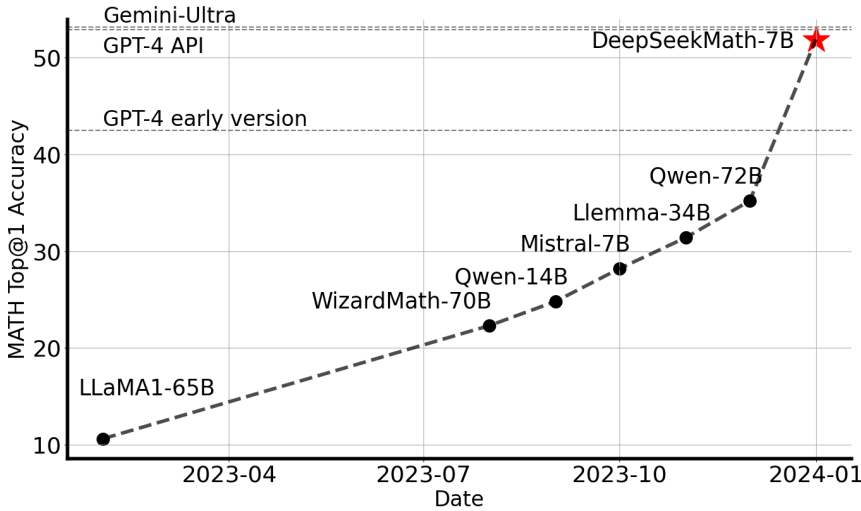

<!-- page 1 of 30 -->

arXiv: 2402.03300v3 [cs. CL] 27 Apr 2024

Qdeepseek

# DeepSeekMath: Pushing the Limits of Mathematical Reasoning in Open Language Models / DeepSeekMath: 把开源语言模型的数学推理推到极限

Zhihong Shao1, 2∗†, Peiyi Wang1, 3∗†, Qihao Zhu1, 3∗†, Runxin Xu1, Junxiao Song1 Xiao Bi1, Haowei Zhang1, Mingchuan Zhang1, Y. K. Li1, Y. Wu1, Daya Guo1

1DeepSeek-AI, 2Tsinghua University, 3Peking University

**{zhihongshao, wangpeiyi, zhuqh, guoday}@deepseek. com** [**https://github. com/deepseek-ai/DeepSeek-Math**](https://github. com/deepseek-ai/DeepSeek-Math)

DeepSeek-AI, 清华大学, 北京大学; 标星作者为核心贡献者, †表示实习期间在 DeepSeek-AI 完成. 联系: {zhihongshao, wangpeiyi, zhuqh, guoday}@deepseek. com; 仓库: https://github. com/deepseek-ai/DeepSeek-Math

## Abstract

Mathematical reasoning poses a significant challenge for language models due to its complex and structured nature. In this paper, we introduce DeepSeekMath 7B, which continues pre-training DeepSeek-Coder-Base-v1.5 7B with 120B math-related tokens sourced from Common Crawl, together with natural language and code data. DeepSeekMath 7B has achieved an impressive score of 51.7% on the competition-level MATH benchmark without relying on external toolkits and voting techniques, approaching the performance level of Gemini-Ultra and GPT-4. Self-consistency over 64 samples from DeepSeekMath 7B achieves 60.9% on MATH. The mathematical reasoning capability of DeepSeekMath is attributed to two key factors: First, we harness the significant potential of publicly available web data through a meticulously engineered data selection pipeline. Second, we introduce Group Relative Policy Optimization (GRPO), a variant of Proximal Policy Optimization (PPO), that enhances mathematical reasoning abilities while concurrently optimizing the memory usage of PPO.

数学推理结构复杂, 对语言模型一直很难. 本文提出 DeepSeekMath 7B: 在 DeepSeek-Coder-Base-v1.5 7B 上继续预训练, 混入来自 Common Crawl 的 120B 数学相关 token, 并夹带自然语言与代码. 不靠外部工具箱, 也不靠投票, DeepSeekMath 7B 在竞赛级 MATH 上拿到 51.7%, 逼近 Gemini-Ultra 与 GPT-4; 64 条样本做 self-consistency 可到 60.9%. 能力主要靠两件事: 一是用精心设计的数据筛选管线挖公开网页里的数学信号; 二是提出 **Group Relative Policy Optimization(GRPO)**, PPO 的变体, 抬数学推理的同时压低 PPO 的显存开销.

解释: GRPO(组相对策略优化)= 同一道题采样一组回答, 用组内相对分数当基线, 省掉 PPO 里那套价值网络(critic). PPO 要同时训策略模型和价值模型; GRPO 用「同题多答的均值/方差」估优势, 训练更省.

Figure 1 | Top1 accuracy of open-source models on the competition-level MATH benchmark (Hendrycks et al., 2021) without the use of external toolkits and voting techniques.

图 1｜开源模型在竞赛级 MATH 上的 Top1 准确率(不用外部工具, 不用投票).

<small>∗ Core contributors. </small>

<small>† Work done during internship at DeepSeek-AI. </small>

<!-- page 2 of 30 -->

## 1. Introduction

Large language models (LLM) have revolutionized the approach to mathematical reasoning in artificial intelligence, spurring significant advancements in both the quantitative reasoning benchmark (Hendrycks et al., 2021) and the geometry reasoning benchmark (Trinh et al., 2024). Moreover, these models have proven instrumental in assisting humans in solving complex mathematical problems (Tao, 2023). However, cutting-edge models such as GPT-4 (OpenAI, 2023) and Gemini-Ultra (Anil et al., 2023) are not publicly available, and the currently accessible open-source models considerably trail behind in performance.

大模型改写了 AI 做数学推理的路径, 定量推理基准(Hendrycks et al., 2021)与几何推理基准(Trinh et al., 2024)都跟着往上走; 人也开始拿它们解难题(Tao, 2023). 但 GPT-4, Gemini-Ultra 这类顶尖模型不开源, 现有开源模型成绩明显落后.

In this study, we introduce DeepSeekMath, a domain-specific language model that significantly outperforms the mathematical capabilities of open-source models and approaches the performance level of GPT-4 on academic benchmarks. To achieve this, we create the DeepSeekMath Corpus, a large-scale high-quality pre-training corpus comprising 120B math tokens. This dataset is extracted from the Common Crawl (CC) using a fastText-based classifier (Joulin et al., 2016). In the initial iteration, the classifier is trained using instances from OpenWebMath (Paster et al., 2023) as positive examples, while incorporating a diverse selection of other web pages to serve as negative examples. Subsequently, we employ the classifier to mine additional positive instances from the CC, which are further refined through human annotation. The classifier is then updated with this enhanced dataset to improve its performance. The evaluation results indicate that the large-scale corpus is of high quality, as our base model DeepSeekMath-Base 7B achieves 64.2% on GSM8K (Cobbe et al., 2021) and 36.2% on the competition-level MATH dataset (Hendrycks et al., 2021), outperforming Minerva 540B (Lewkowycz et al., 2022a). In addition, the DeepSeekMath Corpus is multilingual, so we notice an improvement in Chinese mathematical benchmarks (Wei et al., 2023; Zhong et al., 2023). We believe that our experience in mathematical data processing is a starting point for the research community, and there is significant room for improvement in the future.

本文提出面向数学的 DeepSeekMath, 并在多项数学基准上取得接近 GPT-4 的成绩. 训练从构建 **DeepSeekMath Corpus** 开始: 使用 fastText 分类器从 Common Crawl 中筛出约 120B 数学 token. 第一轮以 OpenWebMath 为正例、多样网页为负例训练分类器, 随后从 Common Crawl 召回候选网页, 经人工检查后更新分类器并迭代扩大语料. DeepSeekMath-Base 7B 在 GSM8K 得到 64.2%, 在竞赛级 MATH 得到 36.2%, 超过 Minerva 540B. 多语语料也提高了中文数学基准成绩. 报告同时指出, 这套数学数据处理流程仍有进一步改进空间.

解释: 数学语料来自四轮网页检索与筛选. 分类器在大规模网页中反复召回候选页面, 经过排序和人工补充种子域, 最终得到约 3550 万页、120B token, 同时用 10-gram 精确匹配进行基准去污染.

DeepSeekMath-Base is initialized with DeepSeek-Coder-Base-v1.5 7B (Guo et al., 2024), as we notice that starting from a code training model is a better choice compared to a general LLM. Furthermore, we observe the math training also improves model capability on MMLU (Hendrycks et al., 2020) and BBH benchmarks (Suzgun et al., 2022), indicating it does not only enhance the model’s mathematical abilities but also amplifies general reasoning capabilities.

Base 从 DeepSeek-Coder-Base-v1.5 7B 初始化-- 相对通用 LLM, 从代码模型出发更划算. 数学续训还会抬 MMLU, BBH, 说明不只涨数学, 也放大一般推理.

After pre-training, we apply mathematical instruction tuning to DeepSeekMath-Base with chain-of-thought (Wei et al., 2022), program-of-thought (Chen et al., 2022; Gao et al., 2023), and tool-integrated reasoning (Gou et al., 2023) data. The resulting model DeepSeekMath-Instruct 7B beats all 7B counterparts and is comparable with 70B open-source instruction-tuned models.

预训练后再做数学指令微调, 数据含 CoT, PoT, 工具集成推理. 得到的 DeepSeekMath-Instruct 7B 压过所有同档 7B, 并与 70B 开源指令模型打平.

Furthermore, we introduce the Group Relative Policy Optimization (GRPO), a variant reinforcement learning (RL) algorithm of Proximal Policy Optimization (PPO) (Schulman et al., 2017). GRPO foregoes the critic model, instead estimating the baseline from group scores, significantly reducing training resources. By solely using a subset of English instruction tuning data, GRPO obtains a substantial improvement over the strong DeepSeekMath-Instruct, including both in-domain (GSM8K: 82.9% → 88.2%, MATH: 46.8% → 51.7%) and out-of-domain mathematical tasks (e. g., CMATH: 84.6% → 88.8%) during the reinforcement learning phase. We also provide a unified paradigm to understand different methods, such as Rejection Sampling Fine-Tuning (RFT) (Yuan et al., 2023a), Direct Preference Optimization (DPO) (Rafailov et al., 2023), PPO and GRPO. Based on such a unified paradigm, we find that all these methods are conceptualized as either direct or simplified RL techniques. We also conduct extensive experiments, e. g., online v. s. offline training, outcome v. s. process supervision, single-turn v. s. iterative RL and so on,

进一步提出 GRPO: PPO 的 RL 变体, 丢掉 critic, 用组内分数估基线, 训练资源明显下降. 只用一部分英文指令数据, 就能在强 Instruct 之上再涨一截: 域内 GSM8K 82.9%→88.2%, MATH 46.8%→51.7%; 域外如 CMATH 84.6%→88.8%. 文中还给出统一范式, 把 RFT, DPO, PPO, GRPO 都看成直接或简化的 RL; 并系统做了在线/离线, 结果监督/过程监督, 单轮/迭代 RL 等实验,

<!-- page 3 of 30 -->

to deeply investigate the essential elements of this paradigm. At last, we explain why our RL boosts the performance of instruction-tuned models, and further summarize potential directions to achieve more effective RL based on this unified paradigm.

以深挖该范式的关键要素; 最终解释 RL 为何能抬指令模型, 并据此归纳更有效 RL 的可能方向.

### 1.1. Contributions 贡献

Our contribution includes scalable math pre-training, along with the exploration and analysis of reinforcement learning.

贡献落在两块: 可扩展的数学预训练, 以及对强化学习的探索与分析.

#### Math Pre-Training at Scale 大规模数学预训练

• Our research provides compelling evidence that the publicly accessible Common Crawl data contains valuable information for mathematical purposes. By implementing a meticulously designed data selection pipeline, we successfully construct the DeepSeekMath Corpus, a high-quality dataset of 120B tokens from web pages filtered for mathematical content, which is almost 7 times the size of the math web pages used by Minerva (Lewkowycz et al., 2022a) and 9 times the size of the recently released OpenWebMath (Paster et al., 2023).

Our pre-trained base model DeepSeekMath-Base 7B achieves comparable performance with Minerva 540B (Lewkowycz et al., 2022a), indicating the number of parameters is not the only key factor in mathematical reasoning capability. A smaller model pre-trained on high-quality data could achieve strong performance as well.

• 公开 Common Crawl 里确有可用的数学信号. 靠精心设计的筛选管线, 建成 120B token 的 DeepSeekMath Corpus, 大约是 Minerva 所用数学网页的 7 倍, OpenWebMath 的 9 倍.
DeepSeekMath-Base 7B 与 Minerva 540B 可比, 说明参数量不是数学推理的唯一关键; 小模型配高质量数据也能很强.

• We share our findings from math training experiments. Code training prior to math training improves models’ ability to solve mathematical problems both with and without tool use. This offers a partial answer to the long-standing question: does code training improve reasoning abilities? We believe it does, at least for mathematical reasoning.

• 分享数学训练实验结论: 先代码再数学, 无论是否用工具, 解题都更好. 对「代码训练是否提升推理」给出部分肯定-- 至少在数学推理上成立.

• Although training on arXiv papers is common, especially in many math-related papers, it brings no notable improvements on all mathematical benchmarks adopted in this paper.

• 尽管训 arXiv 论文很常见, 尤其在数学相关工作里, 但对本文采用的全部数学基准未见明显增益.

#### Exploration and Analysis of Reinforcement Learning 强化学习的探索与分析

• We introduce Group Relative Policy Optimization (GRPO), an efficient and effective reinforcement learning algorithm. GRPO foregoes the critic model, instead estimating the baseline from group scores, significantly reducing training resources compared to Proximal Policy Optimization (PPO).

• 提出高效且有效的 GRPO: 去掉 critic, 用组分数估基线, 相对 PPO 显著省资源.

• We demonstrate that GRPO significantly enhances the performance of our instructiontuned model DeepSeekMath-Instruct, by solely using the instruction-tuning data. Furthermore, we observe enhancements in the out-of-domain performance during the reinforcement learning process.

• 仅用指令微调数据, GRPO 就能显著抬 DeepSeekMath-Instruct; RL 过程中域外表现也上升.

• We provide a unified paradigm to understand different methods, such as RFT, DPO, PPO, and GRPO. We also conduct extensive experiments, e. g., online v. s. offline training, outcome v. s. process supervision, single-turn v. s. iterative reinforcement learning, and so on to deeply investigate the essential elements of this paradigm.

• 给出统一范式理解 RFT, DPO, PPO, GRPO; 并用在线/离线, 结果/过程监督, 单轮/迭代 RL 等实验深挖范式要素.

解释: 过程监督(process supervision)= 不只给整条答案对错分, 而是在推理的每一步末尾打分; 结果监督(outcome)= 只在整段输出结尾给一个分.

• Based on our unified paradigm, we explore the reasons behind the effectiveness of reinforcement learning, and summarize several potential directions to achieve more effective reinforcement learning of LLMs.

• 基于统一范式, 探讨 RL 为何有效, 并归纳更有效 LLM 强化学习的若干方向.

### 1.2. Summary of Evaluations and Metrics 评测与指标摘要

• **English and Chinese Mathematical Reasoning**: We conduct comprehensive assessments of our models on English and Chinese benchmarks, covering mathematical problems

• **中英数学推理**: 在中英基准上全面评估, 覆盖

<!-- page 4 of 30 -->

from grade-school level to college level. English benchmarks include GSM8K (Cobbe et al., 2021), MATH (Hendrycks et al., 2021), SAT (Azerbayev et al., 2023), OCW Courses (Lewkowycz et al., 2022a), MMLU-STEM (Hendrycks et al., 2020). Chinese benchmarks include MGSM-zh (Shi et al., 2023), CMATH (Wei et al., 2023), Gaokao-MathCloze (Zhong et al., 2023), and Gaokao-MathQA (Zhong et al., 2023). We evaluate models’ ability to generate self-contained text solutions without tool use, and also the ability to solve problems using Python.

On English benchmarks, DeepSeekMath-Base is competitive with the closed-source Minerva 540B (Lewkowycz et al., 2022a), and surpasses all open-source base models (e. g., Mistral 7B (Jiang et al., 2023) and Llemma-34B (Azerbayev et al., 2023)), regardless of whether they’ve undergone math pre-training or not, often by a significant margin. Notably, DeepSeekMath-Base is superior on Chinese benchmarks, likely because we don’t follow previous works (Azerbayev et al., 2023; Lewkowycz et al., 2022a) to collect English-only math pre-training data, and also include high-quality non-English ones. With mathematical instruction tuning and reinforcement learning, the resulting DeepSeekMath-Instruct and DeepSeekMath-RL demonstrate strong performance, obtaining an accuracy of over 50% on the competition-level MATH dataset for the first time within the open-source community.

从小学到大学难度. 英文: GSM8K, MATH, SAT, OCW, MMLU-STEM; 中文: MGSM-zh, CMATH, 高考填空与选择题. 既测纯文本自洽解题, 也测用 Python 解题.
英文上 Base 与闭源 Minerva 540B 可比, 并压过所有开源 base(含 Mistral 7B, Llemma-34B), 常有明显优势. 中文更强-- 因为未像前人只收英文数学预训练, 也纳入高质量非英文. 经指令微调与 RL, Instruct 与 RL 版首次在开源社区把竞赛级 MATH 推到 50% 以上.

• **Formal Mathematics**: We evaluate DeepSeekMath-Base using the informal-to-formal theorem proving task from (Jiang et al., 2022) on miniF2F (Zheng et al., 2021) with Isabelle (Wenzel et al., 2008) chosen to be the proof assistant. DeepSeekMath-Base demonstrates strong few-shot autoformalization performance.

• **形式数学**: 在 miniF2F 上做 informal-to-formal 定理证明(Jiang et al., 2022), 证明助手选 Isabelle. Base 在 few-shot 自动形式化上表现强.

• **Natural Language Understanding, Reasoning, and Code**: To build a comprehensive profile of models’ general understanding, reasoning, and coding capabilities, we evaluate DeepSeekMath-Base on the Massive Multitask Language Understanding (MMLU) benchmark (Hendrycks et al., 2020) which encompasses 57 multiple-choice tasks covering diverse subjects, BIG-Bench Hard (BBH) (Suzgun et al., 2022) which consists of 23 challenging tasks that mostly require multi-step reasoning to solve, as well as HumanEval (Chen et al., 2021) and MBPP (Austin et al., 2021) which are widely used to evaluate code language models. Math pre-training benefits both language understanding and reasoning performance.

• **自然语言理解, 推理与代码**: 用 MMLU(57 项多选), BBH(23 项多步推理难题), HumanEval 与 MBPP 刻画通用能力. 数学预训练同时有利于语言理解与推理.

## 2. Math Pre-Training 数学预训练

### 2.1. Data Collection and Decontamination 数据收集与去污染

In this section, we will outline the process of constructing the DeepSeekMath Corpus from Common Crawl. As depicted in Figure 2, we present an iterative pipeline that demonstrates how to systematically gather a large-scale mathematical corpus from Common Crawl, starting with a seed corpus (e. g., a small but high-quality collection of math-related dataset). It’s worth noting that this approach is also applicable to other domains, such as coding.

本节说明如何从 Common Crawl 建 DeepSeekMath Corpus. 图 2 给出迭代管线: 从种子语料(小而高质量的数学集)出发, 系统召回大规模数学网页. 同法也可用于代码等领域.

First, we choose OpenWebMath (Paster et al., 2023), a collection of high-quality mathematical web texts, as our initial seed corpus. Using this corpus, we train a fastText model (Joulin et al., 2016) to recall more OpenWebMath-like mathematical web pages. Specifically, we randomly select 500, 000 data points from the seed corpus as positive training examples and another 500, 000 web pages from Common Crawl as negative ones. We emplo…22134 tokens truncated…: //papers. nips. cc/paper_files/paper/2022/hash/18abbeef8cfe9203fdf9053c9c4fe191-Abstract-Conference. html).

H. Lightman, V. Kosaraju, Y. Burda, H. Edwards, B. Baker, T. Lee, J. Leike, J. Schulman, I. Sutskever, and K. Cobbe. Let’s verify step by step. arXiv preprint arXiv: 2305.20050, 2023.

I. Loshchilov and F. Hutter. Decoupled weight decay regularization. arXiv preprint arXiv: 1711.05101, 2017.

H. Luo, Q. Sun, C. Xu, P. Zhao, J. Lou, C. Tao, X. Geng, Q. Lin, S. Chen, and D. Zhang. Wizardmath: Empowering mathematical reasoning for large language models via reinforced evol-instruct. arXiv preprint arXiv: 2308.09583, 2023.

S. Mishra, M. Finlayson, P. Lu, L. Tang, S. Welleck, C. Baral, T. Rajpurohit, O. Tafjord, A. Sabharwal, P. Clark, and A. Kalyan. LILA: A unified benchmark for mathematical reasoning. In Y. Goldberg, Z. Kozareva, and Y. Zhang, editors, Proceedings of the 2022 Conference on Empirical Methods in Natural Language Processing, EMNLP 2022, Abu Dhabi, United Arab Emirates, December 7-11, 2022, pages 5807–5832. Association for Computational Linguistics, 2022. doi: 10.18653/V1/2022. EMNLP-MAIN. 392. URL [https://doi. org/10.18653/v1/2022. emnlp-main. 392](https://doi. org/10.18653/v1/2022. emnlp-main. 392).

X. Nguyen, W. Zhang, X. Li, M. M. Aljunied, Q. Tan, L. Cheng, G. Chen, Y. Deng, S. Yang, C. Liu, H. Zhang, and L. Bing. Seallms - large language models for southeast asia. CoRR, abs/2312.00738, 2023. doi: 10.48550/ARXIV. 2312.00738. URL [https://doi. org/10.48550/arXiv. 2312.00738](https://doi. org/10.48550/arXiv. 2312.00738).

OpenAI. GPT4 technical report. arXiv preprint arXiv: 2303.08774, 2023.

L. Ouyang, J. Wu, X. Jiang, D. Almeida, C. Wainwright, P. Mishkin, C. Zhang, S. Agarwal, K. Slama, A. Ray, et al. Training language models to follow instructions with human feedback. Advances in Neural Information Processing Systems, 35: 27730–27744, 2022.

K. Paster, M. D. Santos, Z. Azerbayev, and J. Ba. Openwebmath: An open dataset of high-quality mathematical web text. CoRR, abs/2310.06786, 2023. doi: 10.48550/ARXIV. 2310.06786. URL [https://doi. org/10.48550/arXiv. 2310.06786](https://doi. org/10.48550/arXiv. 2310.06786).

L. C. Paulson. Three years of experience with sledgehammer, a practical link between automatic and interactive theorem provers. In R. A. Schmidt, S. Schulz, and B. Konev, editors, Proceedings of the 2nd Workshop on Practical Aspects of Automated Reasoning, PAAR-2010, Edinburgh, Scotland, UK, July 14, 2010, volume 9 of EPiC Series in Computing, pages 1–10. EasyChair, 2010. doi: 10.29007/TNFD. URL [https://doi. org/10.29007/tnfd](https://doi. org/10.29007/tnfd).

S. Polu and I. Sutskever. Generative language modeling for automated theorem proving. CoRR, abs/2009.03393, 2020. URL [https://arxiv. org/abs/2009.03393](https://arxiv. org/abs/2009.03393).

R. Rafailov, A. Sharma, E. Mitchell, S. Ermon, C. D. Manning, and C. Finn. Direct preference optimization: Your language model is secretly a reward model. 2023.

<!-- page 26 of 30 -->

J. Schulman. Approximating kl divergence, 2020. URL [http: //joschu. net/blog/kl-approx. html](http: //joschu. net/blog/kl-approx. html).

J. Schulman, P. Moritz, S. Levine, M. Jordan, and P. Abbeel. High-dimensional continuous control using generalized advantage estimation. arXiv preprint arXiv: 1506.02438, 2015.

J. Schulman, F. Wolski, P. Dhariwal, A. Radford, and O. Klimov. Proximal policy optimization algorithms. arXiv preprint arXiv: 1707.06347, 2017.

F. Shi, M. Suzgun, M. Freitag, X. Wang, S. Srivats, S. Vosoughi, H. W. Chung, Y. Tay, S. Ruder, D. Zhou, D. Das, and J. Wei. Language models are multilingual chain-of-thought reasoners. In The Eleventh International Conference on Learning Representations, ICLR 2023, Kigali, Rwanda, May 1-5, 2023. OpenReview. net, 2023. URL [https://openreview. net/pdf? id=fR3wGCk-IXp](https://openreview. net/pdf? id=fR3wGCk-IXp).

F. Song, B. Yu, M. Li, H. Yu, F. Huang, Y. Li, and H. Wang. Preference ranking optimization for human alignment. arXiv preprint arXiv: 2306.17492, 2023.

M. Suzgun, N. Scales, N. Schärli, S. Gehrmann, Y. Tay, H. W. Chung, A. Chowdhery, Q. V. Le, E. H. Chi, D. Zhou, et al. Challenging big-bench tasks and whether chain-of-thought can solve them. arXiv preprint arXiv: 2210.09261, 2022.

T. Tao. Embracing change and resetting expectations, 2023. URL [https://unlocked. microsoft. com/ai-anthology/terence-tao/](https://unlocked. microsoft. com/ai-anthology/terence-tao/).

H. Touvron, L. Martin, K. Stone, P. Albert, A. Almahairi, Y. Babaei, N. Bashlykov, S. Batra, P. Bhargava, S. Bhosale, D. Bikel, L. Blecher, C. Canton-Ferrer, M. Chen, G. Cucurull, D. Esiobu, J. Fernandes, J. Fu, W. Fu, B. Fuller, C. Gao, V. Goswami, N. Goyal, A. Hartshorn, S. Hosseini, R. Hou, H. Inan, M. Kardas, V. Kerkez, M. Khabsa, I. Kloumann, A. Korenev, P. S. Koura, M. Lachaux, T. Lavril, J. Lee, D. Liskovich, Y. Lu, Y. Mao, X. Martinet, T. Mihaylov, P. Mishra, I. Molybog, Y. Nie, A. Poulton, J. Reizenstein, R. Rungta, K. Saladi, A. Schelten, R. Silva, E. M. Smith, R. Subramanian, X. E. Tan, B. Tang, R. Taylor, A. Williams, J. X. Kuan, P. Xu, Z. Yan, I. Zarov, Y. Zhang, A. Fan, M. Kambadur, S. Narang, A. Rodriguez, R. Stojnic, S. Edunov, and T. Scialom. Llama 2: Open foundation and fine-tuned chat models. CoRR, abs/2307.09288, 2023. doi: 10.48550/arXiv. 2307.09288. URL [https://doi. org/10.48550/arXiv. 2307.09288](https://doi. org/10.48550/arXiv. 2307.09288).

T. H. Trinh, Y. Wu, Q. V. Le, H. He, and T. Luong. Solving olympiad geometry without human demonstrations. Nature, 625(7995): 476–482, 2024.

P. Wang, L. Li, L. Chen, F. Song, B. Lin, Y. Cao, T. Liu, and Z. Sui. Making large language models better reasoners with alignment. arXiv preprint arXiv: 2309.02144, 2023a.

P. Wang, L. Li, Z. Shao, R. Xu, D. Dai, Y. Li, D. Chen, Y. Wu, and Z. Sui. Math-shepherd: Verify and reinforce llms step-by-step without human annotations. CoRR, abs/2312.08935, 2023b.

Z. Wang, R. Xia, and P. Liu. Generative AI for math: Part I - mathpile: A billion-token-scale pretraining corpus for math. CoRR, abs/2312.17120, 2023c. doi: 10.48550/ARXIV. 2312.17120. URL [https://doi. org/10.48550/arXiv. 2312.17120](https://doi. org/10.48550/arXiv. 2312.17120).

J. Wei, X. Wang, D. Schuurmans, M. Bosma, B. Ichter, F. Xia, E. H. Chi, Q. V. Le, and D. Zhou. Chain-of-thought prompting elicits reasoning in large language models. In NeurIPS, 2022. URL [http: //papers. nips. cc/paper\_files/paper/2022/hash/9d5609613524ecf4f15af0f7b31abca4-Abstract-Conference. html](http: //papers. nips. cc/paper_files/paper/2022/hash/9d5609613524ecf4f15af0f7b31abca4-Abstract-Conference. html).

<!-- page 27 of 30 -->

T. Wei, J. Luan, W. Liu, S. Dong, and B. Wang. Cmath: Can your language model pass chinese elementary school math test?, 2023.

M. Wenzel, L. C. Paulson, and T. Nipkow. The isabelle framework. In O. A. Mohamed, C. A. Muñoz, and S. Tahar, editors, Theorem Proving in Higher Order Logics, 21st International Conference, TPHOLs 2008, Montreal, Canada, August 18-21, 2008. Proceedings, volume 5170 of Lecture Notes in Computer Science, pages 33–38. Springer, 2008. doi: 10.1007/978-3-540-7 1067-7\_7. URL [https://doi. org/10.1007/978-3-540-71067-7\_7](https://doi. org/10.1007/978-3-540-71067-7_7).

H. Xia, T. Ge, P. Wang, S.-Q. Chen, F. Wei, and Z. Sui. Speculative decoding: Exploiting speculative execution for accelerating seq2seq generation. In H. Bouamor, J. Pino, and K. Bali, editors, Findings of the Association for Computational Linguistics: EMNLP 2023, pages 3909–3925, Singapore, Dec. 2023. Association for Computational Linguistics. doi: 10.18653/v1/20 23. findings-emnlp. 257. URL [https://aclanthology. org/2023. findings-emnlp. 257](https://aclanthology. org/2023. findings-emnlp. 257).

H. Xia, Z. Yang, Q. Dong, P. Wang, Y. Li, T. Ge, T. Liu, W. Li, and Z. Sui. Unlocking efficiency in large language model inference: A comprehensive survey of speculative decoding. arXiv preprint arXiv: 2401.07851, 2024.

S. Yao, D. Yu, J. Zhao, I. Shafran, T. L. Griffiths, Y. Cao, and K. Narasimhan. Tree of thoughts: Deliberate problem solving with large language models. arXiv preprint arXiv: 2305.10601, 2023.

L. Yu, W. Jiang, H. Shi, J. Yu, Z. Liu, Y. Zhang, J. T. Kwok, Z. Li, A. Weller, and W. Liu. Metamath: Bootstrap your own mathematical questions for large language models. CoRR, abs/2309.12284, 2023. doi: 10.48550/ARXIV. 2309.12284. URL [https://doi. org/10.48550/arXiv. 2309.12284](https://doi. org/10.48550/arXiv. 2309.12284).

Z. Yuan, H. Yuan, C. Li, G. Dong, C. Tan, and C. Zhou. Scaling relationship on learning mathematical reasoning with large language models. arXiv preprint arXiv: 2308.01825, 2023a.

Z. Yuan, H. Yuan, C. Tan, W. Wang, S. Huang, and F. Huang. Rrhf: Rank responses to align language models with human feedback without tears. arXiv preprint arXiv: 2304.05302, 2023b.

X. Yue, X. Qu, G. Zhang, Y. Fu, W. Huang, H. Sun, Y. Su, and W. Chen. Mammoth: Building math generalist models through hybrid instruction tuning. CoRR, abs/2309.05653, 2023. doi: 10.48550/ARXIV. 2309.05653. URL [https://doi. org/10.48550/arXiv. 2309.05653](https://doi. org/10.48550/arXiv. 2309.05653).

K. Zheng, J. M. Han, and S. Polu. Minif2f: a cross-system benchmark for formal olympiad-level mathematics. arXiv preprint arXiv: 2109.00110, 2021.

W. Zhong, R. Cui, Y. Guo, Y. Liang, S. Lu, Y. Wang, A. Saied, W. Chen, and N. Duan. AGIEval: A human-centric benchmark for evaluating foundation models. CoRR, abs/2304.06364, 2023. doi: 10.48550/arXiv. 2304.06364. URL [https://doi. org/10.48550/arXiv. 2304.06364](https://doi. org/10.48550/arXiv. 2304.06364).

<!-- page 28 of 30 -->

## A. Appendix 附录

### A. 1. Analysis of Reinforcement Learning 强化学习分析

We provide the detailed derivation of the data source and gradient coefficient (algorithm and reward function) across various methods, including SFT, RFT, Online RFT, DPO, PPO, and GRPO.

以下给出 SFT, RFT, Online RFT, DPO, PPO, GRPO 的数据源与梯度系数(算法与奖励函数)详细推导.

#### A. 1.1. Supervised Fine-tuning 监督微调

The objective of Supervised Fine-tuning is maximizing the following objective:

SFT 目标为最大化:

$$
\mathcal {J} _ {S F T} (\theta) = \mathbb {E} [ q, o \sim P _ {s f t} (Q, O) ] \left(\frac {1}{| o |} \sum_ {t = 1} ^ {| o |} \log \pi_ {\theta} (o _ {t} | q, o _ {<   t})\right). \tag{6}
$$

The gradient of $\mathcal { T } _ { S F T } ( \theta )$ is:

$\mathcal{J}_{SFT}(\theta)$ 的梯度为:

$$
\nabla_ {\theta} \mathcal {J} _ {S F T} = \mathbb {E} [ q, o \sim P _ {s f t} (Q, O) ] \left(\frac {1}{| o |} \sum_ {t = 1} ^ {| o |} \nabla_ {\theta} \log \pi_ {\theta} (o _ {t} | q, o _ {<   t})\right). \tag{7}
$$

Data Source: The dataset employed for SFT. Reward Function: This can be regarded as human selection. Gradient Coefficient: always set to 1.

数据源: SFT 所用数据集. 奖励函数: 可视为人工筛选. 梯度系数: 恒为 1.

#### A. 1.2. Rejection Sampling Fine-tuning 拒绝采样微调

Rejection Sampling Fine-tuning first samples multiple outputs from the supervised fine-tuned LLMs for each question, and then trains LLMs on the sampled outputs with the correct answer. Formally, the objective of RFT is to maximize the following objectives:

RFT: 对每题从 SFT 模型采多条输出, 只保留答案正确的再训. 目标为最大化:

$$
\mathcal {J} _ {R F T} (\theta) = \mathbb {E} [ q \sim P _ {s f t} (Q), o \sim \pi_ {s f t} (O | q) ] \left(\frac {1}{| o |} \sum_ {t = 1} ^ {| o |} \mathbb {I} (o) \log \pi_ {\theta} (o _ {t} | q, o _ {<   t})\right). \tag{8}
$$

The gradient of $\mathcal { T } _ { R F T } ( \theta )$ is:

梯度为:

$$
\nabla_ {\theta} \mathcal {J} _ {R F T} (\theta) = \mathbb {E} [ q \sim P _ {s f t} (Q), o \sim \pi_ {s f t} (O | q) ] \left(\frac {1}{| o |} \sum_ {t = 1} ^ {| o |} \mathbb {I} (o) \nabla_ {\theta} \log \pi_ {\theta} (o _ {t} | q, o _ {<   t})\right). \tag{9}
$$

Data Source: question in SFT dataset with outputs sampled from SFT model. Reward Function: Rule (whether the answer is correct or not). Gradient Coefficient:

数据源: SFT 题 + SFT 模型采样输出. 奖励: 规则(答案对错). 梯度系数:

$$
G C _ {R F T} (q, o, t) = \mathbb {I} (o) = \left\{ \begin{array}{l l} 1 & \text {the answer of o is correct} \\ 0 & \text {the answer of o is incorrect} \end{array} \right. \tag{10}
$$

#### A. 1.3. Online Rejection Sampling Fine-tuning 在线拒绝采样微调

The only difference between RFT and Online RFT is that the outputs of Online RFT are sampled from the real-time policy model $\pi _ { \theta } , $ rather than from the SFT model $\pi _ { \theta _ { s f t } }$ . Therefore, the gradient of online RFT is:

与 RFT 唯一差别: 输出从实时策略 $\pi_\theta$ 采, 而非 $\pi_{\theta_{sft}}$. 梯度为:

$$
\nabla_ {\theta} \mathcal {J} _ {O n R F T} (\theta) = \mathbb {E} [ q \sim P _ {s f t} (Q), o \sim \pi_ {\theta} (O | q) ] \left(\frac {1}{| o |} \sum_ {t = 1} ^ {| o |} \mathbb {I} (o) \nabla_ {\theta} \log \pi_ {\theta} (o _ {t} | q, o _ {<   t})\right). \tag{11}
$$

<!-- page 29 of 30 -->

#### A. 1.4. Direct Preference Optimization (DPO) 直接偏好优化(DPO)

The objective of DPO is:

DPO 目标为:

$$
\mathcal {J} _ {D P O} (\theta) = \mathbb {E} [ q \sim P _ {s f t} (Q), o ^ {+}, o ^ {-} \sim \pi_ {s f t} (O | q) ] \log \sigma \left(\beta \frac {1}{| o ^ {+} |} \sum_ {t = 1} ^ {| o ^ {+} |} \log \frac {\pi_ {\theta} (o _ {t} ^ {+} | q , o _ {<   t} ^ {+})}{\pi_ {\mathrm{ref}} (o _ {t} ^ {+} | q , o _ {<   t} ^ {+})} - \beta \frac {1}{| o ^ {-} |} \sum_ {t = 1} ^ {| o ^ {-} |} \log \frac {\pi_ {\theta} (o _ {<   t} ^ {-} | q , o _ {<   t} ^ {-})}{\pi_ {\mathrm{ref}} (o _ {<   t} ^ {-} | q , o _ {<   t} ^ {-})}\right)\tag{12}
$$

The gradient of $\mathcal { T } _ { D P O } ( \theta )$ is:

梯度为:

$$
\begin{array}{r l} & {\nabla_ {\theta} \mathcal {J} _ {D P O} (\theta) = \mathbb {E} [ q \sim P _ {s f t} (Q), o ^ {+}, o ^ {-} \sim \pi_ {s f t} (O | q) ] \left(\frac {1}{| o ^ {+} |} \sum_ {t = 1} ^ {| o ^ {+} |} G C _ {D P O} (q, o, t) \nabla_ {\theta} \log \pi_ {\theta} (o _ {t} ^ {+} | q, o _ {<   t} ^ {+}) \right. } \\ & {\qquad \left. - \frac {1}{| o ^ {-} |} \sum_ {t = 1} ^ {| o ^ {-} |} G C _ {D P O} (q, o, t) \nabla_ {\theta} \log \pi_ {\theta} (o _ {t} ^ {-} | q, o _ {<   t} ^ {-})\right)} \end{array}\tag{13}
$$

Data Source: question in SFT dataset with outputs sampled from SFT model. Reward Function: human preference in the general domain (can be ‘Rule’ in mathematical tasks). Gradient Coefficient:

数据源: SFT 题 + SFT 采样输出. 奖励: 通用域人偏好(数学任务可退化为规则). 梯度系数:

$$
G C _ {D P O} (q, o, t) = \sigma \left(\beta \log \frac {\pi_ {\theta} (o _ {t} ^ {-} | q , o _ {<   t} ^ {-})}{\pi_ {\mathrm{ref}} (o _ {t} ^ {-} | q , o _ {<   t} ^ {-})} - \beta \log \frac {\pi_ {\theta} (o _ {t} ^ {+} | q , o _ {<   t} ^ {+})}{\pi_ {\mathrm{ref}} (o _ {t} ^ {+} | q , o _ {<   t} ^ {+})}\right)\tag{14}
$$

#### A. 1.5. Proximal Policy Optimization (PPO) PPO(PPO)

The objective of PPO is:

PPO 目标为:

$$
\mathcal {J} _ {P P O} (\theta) = \mathbb {E} [ q \sim P _ {s f t} (Q), o \sim \pi_ {\theta_ {o l d}} (O | q) ] \frac {1}{| o |} \sum_ {t = 1} ^ {| o |} \min \left[ \frac {\pi_ {\theta} \left(o _ {t} \mid q , o _ {<   t}\right)}{\pi_ {\theta_ {o l d}} \left(o _ {t} \mid q , o _ {<   t}\right)} A _ {t}, \operatorname{clip} \left(\frac {\pi_ {\theta} \left(o _ {t} \mid q , o _ {<   t}\right)}{\pi_ {\theta_ {o l d}} \left(o _ {t} \mid q , o _ {<   t}\right)}, 1 - \varepsilon , 1 + \varepsilon\right) A _ {t} \right]. \tag{15}
$$

To simplify the analysis, it is assumed that the model only has a single update following each exploration stage, thereby ensuring that $\pi _ { \theta _ { o l d } } = \pi _ { \theta }$ . In this case, we can remove the min and clip operation:

为简化分析, 假定每轮探索后只更新一次, 从而 $\pi_{\theta_{old}}=\pi_\theta$, 可去掉 min 与 clip:

$$
\mathcal {J} _ {P P O} (\theta) = \mathbb {E} [ q \sim P _ {s f t} (Q), o \sim \pi_ {\theta_ {o l d}} (O | q) ] \frac {1}{| o |} \sum_ {t = 1} ^ {| o |} \frac {\pi_ {\theta} (o _ {t} | q , o _ {<   t})}{\pi_ {\theta_ {o l d}} (o _ {t} | q , o _ {<   t})} A _ {t}. \tag{16}
$$

The gradient of $\mathcal { T } _ { P P O } ( \theta )$ is:

梯度为:

$$
\left| \nabla_ {\theta} \mathcal {J} _ {P P O} (\theta) = \mathbb {E} [ q \sim P _ {s f t} (Q), o \sim \pi_ {\theta_ {o l d}} (O | q) ] \frac {1}{| o |} \sum_ {t = 1} ^ {| o |} A _ {t} \nabla_ {\theta} \log \pi_ {\theta} (o _ {t} | q, o _ {<   t}) \right|\tag{17}
$$

Data Source: question in SFT dataset with outputs sampled from policy model. Reward Function: reward model. Gradient Coefficient:

数据源: SFT 题 + 策略采样. 奖励: 奖励模型. 梯度系数:

$$
G C _ {P P O} (q, o, t, \pi_ {\theta_ {r m}}) = A _ {t}, \tag{18}
$$

where $A _ { t }$ is the advantage, which is computed by applying Generalized Advantage Estimation (GAE) (Schulman et al., 2015), based on the rewards $\{ r _ { \geq t } \}$ and a learned value function $V _ { \psi }$

$A_t$ 由 GAE 基于奖励 $\{r_{\geq t}\}$ 与学得价值函数 $V_\psi$ 算出.

#### A. 1.6. Group Relative Policy Optimization (GRPO) 组相对策略优化(GRPO)

The objective of GRPO is (assume $\pi _ { \theta _ { o l d } } = \pi _ { \theta }$ for simplified analysis):

GRPO 目标(简化假定 $\pi_{\theta_{old}}=\pi_\theta$):

$$
\begin{array}{r l} & {\mathcal {J} _ {G R P O} (\theta) = \mathbb {E} [ q \sim P _ {s f t} (Q), \{o _ {i} \} _ {i = 1} ^ {G} \sim \pi_ {\theta_ {o l d}} (O | q) ]} \\ & {\qquad \frac {1}{G} \sum_ {i = 1} ^ {G} \frac {1}{| o _ {i} |} \sum_ {t = 1} ^ {| o _ {i} |} \left[ \frac {\pi_ {\theta} (o _ {i , t} | q , o _ {i , <   t})}{\pi_ {\theta_ {o l d}} (o _ {i , t} | q , o _ {i , <   t})} \hat {A} _ {i, t} - \beta (\frac {\pi_ {r e f} (o _ {i , t} | q , o _ {i , <   t})}{\pi_ {\theta} (o _ {i , t} | q , o _ {i , <   t})} - \log \frac {\pi_ {r e f} (o _ {i , t} | q , o _ {i , <   t})}{\pi_ {\theta} (o _ {i , t} | q , o _ {i , <   t})} - 1) \right]. } \end{array}\tag{19}
$$

<!-- page 30 of 30 -->

The gradient of $\mathcal { T } _ { G R P O } ( \theta )$ is:

梯度为:

$$
\begin{array}{r l} & {\nabla_ {\theta} \mathcal {J} _ {G R P O} (\theta) = \mathbb {E} [ q \sim P _ {s f t} (Q), \{o _ {i} \} _ {i = 1} ^ {G} \sim \pi_ {\theta_ {o l d}} (O | q) ]} \\ & {\qquad \frac {1}{G} \sum_ {i = 1} ^ {G} \frac {1}{| o _ {i} |} \sum_ {t = 1} ^ {| o _ {i} |} \left[ \hat {A} _ {i, t} + \beta \left(\frac {\pi_ {r e f} (o _ {i , t} | o _ {i , <   t})}{\pi_ {\theta} (o _ {i , t} | o _ {i , <   t})} - 1\right) \right] \nabla_ {\theta} \log \pi_ {\theta} (o _ {i, t} | q, o _ {i, <   t}). } \end{array}\tag{20}
$$

Data Source: question in SFT dataset with outputs sampled from policy model. Reward Function: reward model. Gradient Coefficient:

数据源: SFT 题 + 策略采样. 奖励: 奖励模型. 梯度系数:

$$
G C _ {G R P O} (q, o, t, \pi_ {\theta_ {r m}}) = \hat {A} _ {i, t} + \beta \left(\frac {\pi_ {r e f} (o _ {i , t} | o _ {i , <   t})}{\pi_ {\theta} (o _ {i , t} | o _ {i , <   t})} - 1\right), \tag{21}
$$

where $\hat { A } _ { i , t }$ is computed based on the group reward scores.

其中 $\hat{A}_{i, t}$ 由组内奖励分数算出.
