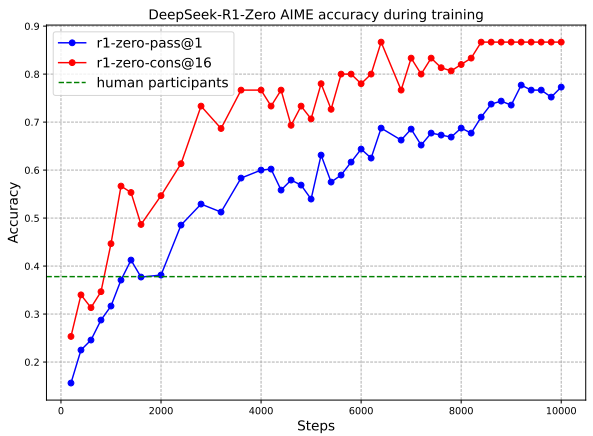

<!-- page 1 of 86 -->

arXiv: 2501.12948v2 [cs. CL] 4 Jan 2026

Qdeepseek

# DeepSeek-R1: Incentivizing Reasoning Capability in LLMs via Reinforcement Learning / DeepSeek-R1: 用强化学习激励大语言模型的推理能力

DeepSeek-AI

### research@deepseek. com

## Abstract

General reasoning represents a long-standing and formidable challenge in artificial intelligence. Recent breakthroughs, exemplified by large language models (LLMs) (Brown et al., 2020; OpenAI, 2023) and chain-of-thought prompting (Wei et al., 2022b), have achieved considerable success on foundational reasoning tasks. However, this success is heavily contingent upon extensive human-annotated demonstrations, and models’ capabilities are still insufficient for more complex problems. Here we show that the reasoning abilities of LLMs can be incentivized through pure reinforcement learning (RL), obviating the need for human-labeled reasoning trajectories. The proposed RL framework facilitates the emergent development of advanced reasoning patterns, such as self-reflection, verification, and dynamic strategy adaptation. Consequently, the trained model achieves superior performance on verifiable tasks such as mathematics, coding competitions, and STEM fields, surpassing its counterparts trained via conventional supervised learning on human demonstrations. Moreover, the emergent reasoning patterns exhibited by these large-scale models can be systematically harnessed to guide and enhance the reasoning capabilities of smaller models.

通用推理一直是 AI 里难啃的骨头. 大语言模型与 CoT 提示在基础推理题上已经能打, 但成功高度依赖大量人类标注示范, 复杂题上仍不够用. 本文表明: 纯靠强化学习就能把 LLM 的推理能力「激励」出来, 不必再喂人类标注的推理轨迹. 这套 RL 框架会催生自我反思, 校验, 动态换策略等高级推理模式; 训出来的模型在数学, 编程竞赛, STEM 等可核验任务上超过按人类示范做监督微调的同族; 大规模模型里冒出来的长思考模式, 还可以系统化地用来带小模型.

## 1. Introduction

Reasoning capability, the cornerstone of human intelligence, enables complex cognitive tasks ranging from mathematical problem-solving to logical deduction and programming. Recent advances in artificial intelligence have demonstrated that large language models (LLMs) can exhibit emergent behaviors, including reasoning abilities, when scaled to a sufficient size (Kaplan et al., 2020; Wei et al., 2022a). However, achieving such capabilities in pre-training typically demands substantial computational resources. In parallel, a complementary line of research has demonstrated that large language models can be effectively augmented through chain-of-thought (CoT) prompting. This technique, which involves either providing carefully designed few-shot examples or using minimalistic prompts such as “Let’s think step by step”(Kojima et al., 2022; Wei et al., 2022b), enables models to produce intermediate reasoning steps, thereby substantially enhancing their performance on complex tasks. Similarly, further performance gains have been observed when models learn high-quality, multi-step reasoning trajectories during the post-training phase (Chung et al., 2024; OpenAI, 2023). Despite their effectiveness, these approaches exhibit notable limitations. Their dependence on human-annotated reasoning traces hinders scalability and introduces cognitive biases. Furthermore, by constraining models to replicate human thought processes, their performance is inherently capped by the human-

推理是人类智能的底座, 从解题, 演绎到写程序都靠它. 规模够大时, LLM 会出现含推理在内的涌现行为, 但预训练把这种能力砸出来通常极贵. 另一条线是 CoT 提示: 精心设计的 few-shot, 或一句「Let’s think step by step」, 逼模型写出中间步骤, 复杂题分数会明显抬高. 后训练阶段学高质量多步轨迹也能再涨. 局限同样清楚: 依赖人类标注轨迹, 难扩, 还带认知偏见; 把模型困在模仿人类思路里, 分数也就被人类示范封顶.

<!-- page 2 of 86 -->

provided exemplars, which prevents the exploration of superior, non-human-like reasoning pathways.

示范一旦定成模板, 模型就很难再探索「不像人, 但可能更好」的推理路径.

To tackle these issues, we aim to explore the potential of LLMs for developing reasoning abilities through self-evolution in an RL framework, with minimal reliance on human labeling efforts. Specifically, we build upon DeepSeek-V3-Base (DeepSeek-AI, 2024b) and employ Group Relative Policy Optimization (GRPO) (Shao et al., 2024) as our RL framework. The reward signal is solely based on the correctness of final predictions against ground-truth answers, without imposing constraints on the reasoning process itself. Notably, we bypass the conventional supervised fine-tuning (SFT) phase before RL training. This design choice stems from our hypothesis that human-defined reasoning patterns may limit model exploration, whereas unrestricted RL training can better incentivize the emergence of novel reasoning capabilities in LLMs. Through this process, detailed in Section 2, our model (referred to as DeepSeek-R1- Zero) naturally developed diverse and sophisticated reasoning behaviors. In solving reasoning problems, the model exhibits a tendency to generate longer responses, incorporating verification, reflection, and the exploration of alternative approaches within each response. Although we do not explicitly teach the model how to reason, it successfully learns improved reasoning strategies through reinforcement learning.

为压低对人类标注的依赖, 我们在 RL 框架里做自我演化: 底座用 DeepSeek-V3-Base, 算法用 **Group Relative Policy Optimization(GRPO)**. 奖励只看最终预测相对标准答案是否正确, 不约束中间推理怎么写. RL 前故意跳过常规 SFT-- 假设是: 人类事先写好的推理模板会限制探索, 放开手脚的 RL 更容易冒出新能力. §2 里把这条路训成的模型叫 DeepSeek-R1-Zero: 解题时回复自然变长, 夹带校验, 反思与换路; 并没有人手把手教它「怎么想」, 策略却靠强化学习自己变好.

解释: GRPO(组相对策略优化)= 同一道题从旧策略采一组回答, 用组内奖励的均值/方差估优势, 省掉 PPO 里那套价值网络(critic). 冷启动(cold start)= 正式大规模 RL 前, 先用少量高质量长 CoT 样本把模型「扶」到可读, 可用的起点. 长思考(long CoT)= 生成成百上千 token 的中间推理, 而不是直接甩答案.

Although DeepSeek-R1-Zero demonstrates excellent reasoning capabilities, it faces challenges such as poor readability and language mixing, occasionally combining English and Chinese within a single chain-of-thought response. Furthermore, the rule-based RL training stage of DeepSeek-R1-Zero is narrowly focused on reasoning tasks, resulting in limited performance in broader areas such as writing and open-domain question answering. To address these challenges, we introduce DeepSeek-R1, a model trained through a multi-stage learning framework that integrates rejection sampling, reinforcement learning, and supervised finetuning, detailed in Section 3. This training pipeline enables DeepSeek-R1 to inherit the reasoning capabilities of its predecessor, DeepSeek-R1-Zero, while aligning model behavior with human preferences through additional non-reasoning data.

R1-Zero 推理强, 但可读性差, 会中英混写; 规则 RL 又几乎只盯推理题, 写作与开放问答偏弱. 于是引入 DeepSeek-R1: 多阶段管线, 把拒绝采样, RL 与 SFT 串起来(§3). 目标是继承 Zero 的推理, 同时用非推理数据把行为拉向人类偏好.

To enable broader access to powerful AI at a lower energy cost, we have distilled several smaller models and made them publicly available. These distilled models exhibit strong reasoning capabilities, surpassing the performance of their original instruction-tuned counterparts. We believe that these instruction-tuned versions will also significantly contribute to the research community by providing a valuable resource for understanding the mechanisms underlying long chain-of-thought (CoT) reasoning models and for fostering the development of more powerful reasoning models. We release DeepSeek-R1 series models to the public at [https://huggingface. co/deepseek-ai](https://huggingface. co/deepseek-ai).

为了更低能耗地普及强能力, 又把若干小模型蒸馏出来公开. 蒸馏版推理明显强过各自原来的指令微调版, 也方便社区研究长 CoT 机制. 系列权重发布于 https://huggingface. co/deepseek-ai.

解释: 蒸馏(distillation)= 用大教师模型生成的高质量轨迹去微调小学生模型, 让小模型学到类似的长思考行为, 而不必自己扛同等规模的 RL.

## 2. DeepSeek-R1-Zero

We begin by elaborating on the training of DeepSeek-R1-Zero, which relies exclusively on reinforcement learning without supervised fine-tuning. To facilitate large-scale RL efficiency, we adopt Group Relative Policy Optimization (GRPO) (Shao et al., 2024).

先讲 R1-Zero: 只靠 RL, 不做 SFT. 为撑住大规模 RL, 算法采用 GRPO.

### 2.1. Group Relative Policy Optimization 组相对策略优化(GRPO)

GRPO (Shao et al., 2024) is the reinforcement learning algorithm that we adopt to train DeepSeek-R1-Zero and DeepSeek-R1. It was originally proposed to simplify the training process and reduce the resource consumption of Proximal Policy Optimization (PPO) (Schulman et al., 2017), which is widely used in the RL stage of LLMs (Ouyang et al., 2022).

GRPO 用来训 R1-Zero 与 R1. 它最初是为了简化 PPO, 压资源: PPO 在 LLM 对齐阶段很常见, 但贵.

<!-- page 3 of 86 -->

For each question $q , $ GRPO samples a group of outputs $\{ o _ { 1 } , o _ { 2 } , \cdots , o _ { G } \}$ from the old policy $\pi _ { \theta _ { o l d } }$ and then optimizes the policy model $\pi _ { \theta }$ by maximizing the following objective:

对每个问题 $q$, GRPO 从旧策略 $\pi_{\theta_{old}}$ 采一组输出 $\{o_1, \ldots, o_G\}$, 再最大化下面目标来更新策略 $\pi_\theta$:

$$
\begin{array}{r l} & {\mathcal {J} _ {G R P O} (\theta) = \mathbb {E} [ q \sim P (Q), \{o _ {i} \} _ {i = 1} ^ {G} \sim \pi_ {\theta_ {o l d}} (O | q) ]} \\ & {\frac {1}{G} \sum_ {i = 1} ^ {G} \left(\min \left(\frac {\pi_ {\theta} (o _ {i} | q)}{\pi_ {\theta_ {o l d}} (o _ {i} | q)} A _ {i}, \mathrm{clip} \left(\frac {\pi_ {\theta} (o _ {i} | q)}{\pi_ {\theta_ {o l d}} (o _ {i} | q)}, 1 - \varepsilon , 1 + \varepsilon\right) A _ {i}\right) - \beta \mathbb {D} _ {K L} \left(\pi_ {\theta} | | \pi_ {r e f}\right)\right), } \end{array}\tag{1}
$$

$$
\mathbb {D} _ {K L} \left(\pi _ {\theta} | | \pi _ {r e f}\right) = \frac {\pi _ {r e f} (o _ {i} | q)}{\pi_ {\theta} (o _ {i} | q)} - \log \frac {\pi_ {r e f} (o _ {i} | q)}{\pi_ {\theta} (o _ {i} | q)} - 1, \tag{2}
$$

where $\pi _ { r e f }$ is a reference policy, 𝜀 and $\beta$ are hyper-parameters, and $A _ { i }$ is the advantage, computed using a group of rewards $\{ r _ { 1 } , r _ { 2 } , \cdots , r _ { G } \}$ corresponding to the outputs within each group:

其中 $\pi_{ref}$ 是参考策略, ε 与 β 是超参, $A_i$ 是优势, 由同组奖励 $\{r_1, \ldots, r_G\}$ 算出:

$$
A _ {i} = \frac {r _ {i} - \text {mean} (\{r _ {1} , r _ {2} , \cdots , r _ {G} \})}{\text {std} (\{r _ {1} , r _ {2} , \cdots , r _ {G} \})}. \tag{3}
$$

We give a comparison of GRPO and PPO in Supplementary A. 3. To train DeepSeek-R1-Zero, we set the learning rate to 3e-6, the KL coefficient to 0.001, and the sampling temperature to 1 for rollout. For each question, we sample 16 outputs with a maximum length of 32, 768 tokens before the 8.2k step and 65, 536 tokens afterward. As a result, both the performance and response length of DeepSeek-R1-Zero exhibit a significant jump at the 8.2k step, with training continuing for a total of 10, 400 steps, corresponding to 1.6 training epochs. Each training step consists of 32 unique questions, resulting in a training batch size of 512. Every 400 steps, we replace the reference model with the latest policy model. To accelerate training, each rollout generates 8, 192 outputs, which are randomly split into 16 mini-batches and trained for only a single inner epoch.

GRPO 与 PPO 的对照见附录 A. 3. 训 R1-Zero: 学习率 3e-6, KL 系数 0.001, rollout 温度 1; 每题采 16 条, 最大长度在 8.2k step 前为 32, 768, 之后为 65, 536. 因此在 8.2k step 附近分数与回复长度都跳一截; 总共训 10, 400 step(约 1.6 epoch). 每步 32 道独特题, 训练 batch 512. 每 400 step 用最新策略换掉参考模型. 加速上: 每次 rollout 生成 8, 192 条, 随机切成 16 个 mini-batch, 只跑一个 inner epoch.

Table 1 | Template for DeepSeek-R1-Zero. prompt will be replaced with the specific reasoning question during training.

表 1｜DeepSeek-R1-Zero 的模板. 训练时把 prompt 换成具体推理题.

A conversation between User and Assistant. The user asks a question, and the Assistant solves it. The assistant first thinks about the reasoning process in the mind and then provides the user with the answer. The reasoning process and answer are enclosed within &lt; think&gt;... &lt; /think&gt; and &lt; answer&gt;... &lt; /answer&gt; tags, respectively, $\mathbf { i . e . } , $ &lt; think&gt; reasoning process here &lt; /think&gt; &lt; answer&gt; answer here &lt; /answer&gt;. User: prompt. Assistant:

用户与助手对话. 用户提问, 助手先在心里推理, 再给答案. 推理与答案分别包在 &lt; think&gt;... &lt; /think&gt; 与 &lt; answer&gt;... &lt; /answer&gt; 里. User: prompt. Assistant:

Our high-performance RL infrastructure is described in Supplementary B. 1, ensuring scalable and efficient training.

高性能 RL 基建见附录 B. 1.

### 2.2. Reward Design 奖励设计

The reward is the source of the training signal, which decides the direction of RL optimization. For DeepSeek-R1-Zero, we employ rule-based rewards to deliver precise feedback for data in mathematical, coding, and logical reasoning domains. Our rule-based reward system mainly consists of two types of rewards: accuracy rewards and format rewards.

奖励决定 RL 往哪走. R1-Zero 在数学, 代码, 逻辑域用规则奖励给准反馈, 主要两类: 准确奖励与格式奖励.

**Accuracy rewards** evaluate whether the response is correct. For example, in the case of math problems with deterministic results, the model is required to provide the final answer in a specified format (e. g., within a box), enabling reliable rule-based verification of correctness. Similarly, for code competition prompts, a compiler can be utilized to evaluate the model’s

**准确奖励**看答对没有. 确定性数学题要求最终答案按指定格式(如装进 box), 方便规则核验; 竞赛代码题则可用编译器对照测例打分.

<!-- page 4 of 86 -->

Figure 1 | (a) AIME accuracy of DeepSeek-R1-Zero during training. AIME takes a mathematical problem as input and a number as output, illustrated in Table 32. Pass@1 and Cons@16 are described in Supplementary D. 1. The baseline is the average score achieved by human participants in the AIME competition. (b) The average response length of DeepSeek-R1-Zero on the training set during the RL process. DeepSeek-R1-Zero naturally learns to solve reasoning tasks with more thinking time. Note that a training step refers to a single policy update operation.

图 1｜(a) 训练过程中 R1-Zero 的 AIME 准确率. AIME 输入数学题, 输出数字, 示例见表 32; Pass@1 与 Cons@16 见附录 D. 1; 基线是人类参赛均分. (b) 训练集上平均回复长度随 RL 变长: 模型自发学会「多想一会儿」. 一步 = 一次策略更新.

responses against a suite of predefined test cases, thereby generating objective feedback on correctness.

把模型输出拿去跑预定测例, 得到客观对错反馈.

**Format rewards** complement the accuracy reward model by enforcing specific formatting requirements. In particular, the model is incentivized to encapsulate its reasoning process within designated tags, specifically ‘&lt; think&gt; ’ and ‘&lt; /think&gt; ’. This ensures that the model’s thought process is explicitly delineated, enhancing interpretability and facilitating subsequent analysis.

**格式奖励**补准确奖励: 激励把推理包进 `&lt; think&gt; ` / `&lt; /think&gt; `, 思考过程外露, 方便读, 也好后续分析.

$$
R e w a r d _ {\text {rule}} = R e w a r d _ {\text {acc}} + R e w a r d _ {\text {format}}\tag{4}
$$

The accuracy, reward and format reward are combined with the same weight. Notably, we abstain from applying neural reward models-whether outcome-based or process-based-to reasoning tasks. This decision is predicated on our observation that neural reward models are susceptible to reward hacking during large-scale reinforcement learning. Moreover, retraining such models necessitates substantial computational resources and introduces additional complexity into the training pipeline, thereby complicating the overall optimization process.

准确与格式等权相加. 推理任务上故意不用神经奖励模型(无论结果型还是过程型): 大规模 RL 下容易被黑客; 重训 RM 又贵, 还把管线搅复杂.

### 2.3. Incentivize Reasoning Capability in LLMs 在 LLM 里激励推理能力

Specifically, we apply the RL technique on the DeepSeek-V3 base to train DeepSeek-R1-Zero. During training, we design a straightforward template, to require DeepSeek-R1-Zero to first produce a reasoning process, followed by the final answer. We intentionally limit our constraints to this structural format, avoiding any content-specific biases to ensure that we can accurately observe the model’s natural progression during the RL process.

在 DeepSeek-V3 base 上跑 RL 得到 R1-Zero. 模板只要求「先推理, 后答案」, 故意不加内容偏好, 好观察 RL 过程中的自然演化.

Figure 1(a) depicts the performance trajectory of DeepSeek-R1-Zero on the AIME 2024 benchmark throughout the RL training process, where the average pass@1 score on AIME 2024 shows a significant increase, jumping from an initial 15.6% to 77.9%. In addition, by leveraging the self-consistency decoding (Wang et al., 2023c), the model’s performance can be

图 1(a): AIME 2024 上平均 pass@1 从 15.6% 跳到 77.9%. 再用 self-consistency 解码, 还能

<!-- page 5 of 86 -->

Table 2 | An interesting “aha moment” of an intermediate version of DeepSeek-R1-Zero. The model learns to rethink using an anthropomorphic tone. This is also an aha moment for us, allowing us to witness the power and beauty of reinforcem…59527 tokens truncated…ork. CoRR, abs/1503.02531, 2015. URL [http: //arxiv. org/abs/1503.02531](http: //arxiv. org/abs/1503.02531).

Y. Huang, Y. Bai, Z. Zhu, J. Zhang, J. Zhang, T. Su, J. Liu, C. Lv, Y. Zhang, J. Lei, Y. Fu, M. Sun, and J. He. C-eval: A multi-level multi-discipline chinese evaluation suite for foundation models. In A. Oh, T. Naumann, A. Globerson, K. Saenko, M. Hardt, and S. Levine, editors, Advances in Neural Information Processing Systems 36: Annual Conference on Neural Information Processing Systems 2023, NeurIPS 2023, New Orleans, LA, USA, December 10 - 16, 2023, 2023. URL [http: //papers. nips. cc/paper\_files/paper/2023/hash/c6ec1844bec96d6d32ae95ae694e23d8-Abstract-Datasets\_and\_Benchmarks. html](http: //papers. nips. cc/paper_files/paper/2023/hash/c6ec1844bec96d6d32ae95ae694e23d8-Abstract-Datasets_and_Benchmarks. html).

N. Jain, K. Han, A. Gu, W. Li, F. Yan, T. Zhang, S. Wang, A. Solar-Lezama, K. Sen, and I. Stoica. Livecodebench: Holistic and contamination free evaluation of large language models for code. CoRR, abs/2403.07974, 2024. URL [https://doi. org/10.48550/arXiv. 2403.07974](https://doi. org/10.48550/arXiv. 2403.07974).

J. Kaplan, S. McCandlish, T. Henighan, T. B. Brown, B. Chess, R. Child, S. Gray, A. Radford, J. Wu, and D. Amodei. Scaling laws for neural language models. arXiv preprint arXiv: 2001.08361, 2020.

T. Kojima, S. S. Gu, M. Reid, Y. Matsuo, and Y. Iwasawa. Large language models are zero-shot reasoners. In A. H. Oh, A. Agarwal, D. Belgrave, and K. Cho, editors, Advances in Neural Information Processing Systems, 2022. URL [https://openreview. net/forum? id=e2TBb5y0yFf](https://openreview. net/forum? id=e2TBb5y0yFf).

<!-- page 82 of 86 -->

S. Krishna, K. Krishna, A. Mohananey, S. Schwarcz, A. Stambler, S. Upadhyay, and M. Faruqui. Fact, fetch, and reason: A unified evaluation of retrieval-augmented generation. CoRR, abs/2409.12941, 2024. doi: 10.48550/ARXIV. 2409.12941. URL [https://doi. org/10.48550/arXiv. 2409.12941](https://doi. org/10.48550/arXiv. 2409.12941).

A. Kumar, V. Zhuang, R. Agarwal, Y. Su, J. D. Co-Reyes, A. Singh, K. Baumli, S. Iqbal, C. Bishop, R. Roelofs, et al. Training language models to self-correct via reinforcement learning. arXiv preprint arXiv: 2409.12917, 2024.

W. Kwon, Z. Li, S. Zhuang, Y. Sheng, L. Zheng, C. H. Yu, J. E. Gonzalez, H. Zhang, and I. Stoica. Efficient memory management for large language model serving with pagedattention. In Proceedings of the ACM SIGOPS 29th Symposium on Operating Systems Principles, 2023.

H. Li, Y. Zhang, F. Koto, Y. Yang, H. Zhao, Y. Gong, N. Duan, and T. Baldwin. CMMLU: measuring massive multitask language understanding in chinese. In L. Ku, A. Martins, and V. Srikumar, editors, Findings of the Association for Computational Linguistics, ACL 2024, Bangkok, Thailand and virtual meeting, August 11-16, 2024, pages 11260–11285. Association for Computational Linguistics, 2024. doi: 10.18653/V1/2024. FINDINGS-ACL. 671. URL [https://doi. org/10.18653/v1/2024. findings-acl. 671](https://doi. org/10.18653/v1/2024. findings-acl. 671).

J. Li, D. Guo, D. Yang, R. Xu, Y. Wu, and J. He. Codei/o: Condensing reasoning patterns via code input-output prediction. arXiv preprint arXiv: 2502.07316, 2025.

H. Lightman, V. Kosaraju, Y. Burda, H. Edwards, B. Baker, T. Lee, J. Leike, J. Schulman, I. Sutskever, and K. Cobbe. Let’s verify step by step. In The Twelfth International Conference on Learning Representations, ICLR 2024, Vienna, Austria, May 7-11, 2024. OpenReview. net, 2024. URL [https://openreview. net/forum? id=v8L0pN6EOi](https://openreview. net/forum? id=v8L0pN6EOi).

B. Y. Lin. ZeroEval: A Unified Framework for Evaluating Language Models, July 2024. URL [https://github. com/WildEval/ZeroEval](https://github. com/WildEval/ZeroEval).

Z. Liu, C. Chen, W. Li, T. Pang, C. Du, and M. Lin. There may not be aha moment in r1-zero-like training - a pilot study. [https://oatllm. notion. site/oat-zero](https://oatllm. notion. site/oat-zero), 2025. Notion Blog.

MAA. American invitational mathematics examination - aime. In American Invitational Mathematics Examination - AIME 2024, February 2024. URL [https://maa. org/math-competitions/american-invitational-mathematics-examination-aime](https://maa. org/math-competitions/american-invitational-mathematics-examination-aime).

A. Madaan, N. Tandon, P. Gupta, S. Hallinan, L. Gao, S. Wiegreffe, U. Alon, N. Dziri, S. Prabhumoye, Y. Yang, S. Gupta, B. P. Majumder, K. Hermann, S. Welleck, A. Yazdanbakhsh, and P. Clark. Self-refine: Iterative refinement with self-feedback. In Thirty-seventh Conference on Neural Information Processing Systems, 2023. URL [https://openreview. net/forum? id=S37hOerQLB](https://openreview. net/forum? id=S37hOerQLB).

M. Mazeika, L. Phan, X. Yin, A. Zou, Z. Wang, N. Mu, E. Sakhaee, N. Li, S. Basart, B. Li, D. A. Forsyth, and D. Hendrycks. HarmBench: A Standardized Evaluation Framework for Automated Red Teaming and Robust Refusal. In Forty-first International Conference on Machine Learning, ICML 2024, Vienna, Austria, July 21-27, 2024. OpenReview. net, 2024.

M. Mirzayanov. Codeforces, 2025. URL [https://codeforces. com/](https://codeforces. com/).

N. Muennighoff, A. M. Rush, B. Barak, T. L. Scao, N. Tazi, A. Piktus, S. Pyysalo, T. Wolf, and C. Raffel. Scaling data-constrained language models. In Thirty-seventh Conference on Neural Information Processing Systems, 2023. URL [https://openreview. net/forum? id=j5BuTrEj35](https://openreview. net/forum? id=j5BuTrEj35).

<!-- page 83 of 86 -->

R. Nakano, J. Hilton, S. Balaji, J. Wu, L. Ouyang, C. Kim, C. Hesse, S. Jain, V. Kosaraju, W. Saunders, et al. Webgpt: Browser-assisted question-answering with human feedback. arXiv preprint arXiv: 2112.09332, 2021.

OpenAI. GPT4 technical report. arXiv preprint arXiv: 2303.08774, 2023.

OpenAI. Introducing SimpleQA, 2024a. URL [https://openai. com/index/introducing-simpleqa/](https://openai. com/index/introducing-simpleqa/).

OpenAI. Introducing SWE-bench verified we’re releasing a human-validated subset of swebench that more, 2024b. URL [https://openai. com/index/introducing-swe-bench-verified/](https://openai. com/index/introducing-swe-bench-verified/).

L. Ouyang, J. Wu, X. Jiang, D. Almeida, C. L. Wainwright, P. Mishkin, C. Zhang, S. Agarwal, K. Slama, A. Ray, J. Schulman, J. Hilton, F. Kelton, L. Miller, M. Simens, A. Askell, P. Welinder, P. F. Christiano, J. Leike, and R. Lowe. Training language models to follow instructions with human feedback. In S. Koyejo, S. Mohamed, A. Agarwal, D. Belgrave, K. Cho, and A. Oh, editors, Advances in Neural Information Processing Systems 35: Annual Conference on Neural Information Processing Systems 2022, NeurIPS 2022, New Orleans, LA, USA, November 28 - December 9, 2022, 2022. URL [http: //papers. nips. cc/paper\_files/paper/2022/hash/b1efde53be364a73914f58805a001731-Abstract-Conference. html](http: //papers. nips. cc/paper_files/paper/2022/hash/b1efde53be364a73914f58805a001731-Abstract-Conference. html).

J. Pan, J. Zhang, X. Wang, L. Yuan, H. Peng, and A. Suhr. Tinyzero. https://github. com/Jiayi-Pan/TinyZero, 2025. Accessed: 2025-01-24.

A. Parrish, A. Chen, N. Nangia, V. Padmakumar, J. Phang, J. Thompson, P. M. Htut, and S. R. Bowman. BBQ: A hand-built bias benchmark for question answering. In Findings of the Association for Computational Linguistics: ACL 2022, Dublin, Ireland, May 22-27, 2022, pages 2086–2105. Association for Computational Linguistics, 2022.

Qwen. Qwq: Reflect deeply on the boundaries of the unknown, 2024a. URL [https://qwenlm. github. io/blog/qwq-32b-preview/](https://qwenlm. github. io/blog/qwq-32b-preview/).

Qwen. Qwen2.5: A party of foundation models, 2024b. URL [https://qwenlm. github. io/blog/qwen2.5](https://qwenlm. github. io/blog/qwen2.5).

A. Radford, J. Wu, R. Child, D. Luan, D. Amodei, I. Sutskever, et al. Language models are unsupervised multitask learners. OpenAI blog, 1(8): 9, 2019.

R. Rafailov, A. Sharma, E. Mitchell, C. D. Manning, S. Ermon, and C. Finn. Direct preference optimization: Your language model is secretly a reward model. In A. Oh, T. Naumann, A. Globerson, K. Saenko, M. Hardt, and S. Levine, editors, Advances in Neural Information Processing Systems 36: Annual Conference on Neural Information Processing Systems 2023, NeurIPS 2023, New Orleans, LA, USA, December 10 - 16, 2023, 2023. URL [http: //papers. nips. cc/paper\_files/paper/2023/hash/a85b405ed65c6477a4fe8302b5e06ce7-Abstract-Conference. html](http: //papers. nips. cc/paper_files/paper/2023/hash/a85b405ed65c6477a4fe8302b5e06ce7-Abstract-Conference. html).

D. Rein, B. L. Hou, A. C. Stickland, J. Petty, R. Y. Pang, J. Dirani, J. Michael, and S. R. Bowman. GPQA: A graduate-level google-proof q&a benchmark. arXiv preprint arXiv: 2311.12022, 2023.

P. Röttger, H. Kirk, B. Vidgen, G. Attanasio, F. Bianchi, and D. Hovy. XSTest: A Test Suite for Identifying Exaggerated Safety Behaviours in Large Language Models. In Proceedings of the 2024 Conference of the North American Chapter of the Association for Computational Linguistics: Human Language Technologies (Volume 1: Long Papers), NAACL 2024, Mexico

<!-- page 84 of 86 -->

City, Mexico, June 16-21, 2024, pages 5377–5400. Association for Computational Linguistics, 2024.

T. Schick, J. Dwivedi-Yu, R. Dessi, R. Raileanu, M. Lomeli, E. Hambro, L. Zettlemoyer, N. Cancedda, and T. Scialom. Toolformer: Language models can teach themselves to use tools. In Thirty-seventh Conference on Neural Information Processing Systems, 2023. URL [https://openreview. net/forum? id=Yacmpz84TH](https://openreview. net/forum? id=Yacmpz84TH).

J. Schulman. Approximating kl divergence, 2020. URL [http: //joschu. net/blog/kl-approx. html](http: //joschu. net/blog/kl-approx. html).

J. Schulman, P. Moritz, S. Levine, M. Jordan, and P. Abbeel. High-dimensional continuous control using generalized advantage estimation. arXiv preprint arXiv: 1506.02438, 2015.

J. Schulman, F. Wolski, P. Dhariwal, A. Radford, and O. Klimov. Proximal policy optimization algorithms. arXiv preprint arXiv: 1707.06347, 2017.

Z. Shao, P. Wang, Q. Zhu, R. Xu, J. Song, M. Zhang, Y. Li, Y. Wu, and D. Guo. Deepseekmath: Pushing the limits of mathematical reasoning in open language models. arXiv preprint arXiv: 2402.03300, 2024.

D. Silver, T. Hubert, J. Schrittwieser, I. Antonoglou, M. Lai, A. Guez, M. Lanctot, L. Sifre, D. Kumaran, T. Graepel, T. P. Lillicrap, K. Simonyan, and D. Hassabis. Mastering chess and shogi by self-play with a general reinforcement learning algorithm. CoRR, abs/1712.01815, 2017a. URL [http: //arxiv. org/abs/1712.01815](http: //arxiv. org/abs/1712.01815).

D. Silver, J. Schrittwieser, K. Simonyan, I. Antonoglou, A. Huang, A. Guez, T. Hubert, L. Baker, M. Lai, A. Bolton, Y. Chen, T. P. Lillicrap, F. Hui, L. Sifre, G. van den Driessche, T. Graepel, and D. Hassabis. Mastering the game of go without human knowledge. Nat., 550(7676): 354–359, 2017b. doi: 10.1038/NATURE24270. URL [https://doi. org/10.1038/nature24270](https://doi. org/10.1038/nature24270).

A. Singh, J. D. Co-Reyes, R. Agarwal, A. Anand, P. Patil, X. Garcia, P. J. Liu, J. Harrison, J. Lee, K. Xu, A. T. Parisi, A. Kumar, A. A. Alemi, A. Rizkowsky, A. Nova, B. Adlam, B. Bohnet, G. F. Elsayed, H. Sedghi, I. Mordatch, I. Simpson, I. Gur, J. Snoek, J. Pennington, J. Hron, K. Kenealy, K. Swersky, K. Mahajan, L. A. Culp, L. Xiao, M. Bileschi, N. Constant, R. Novak, R. Liu, T. Warkentin, Y. Bansal, E. Dyer, B. Neyshabur, J. Sohl-Dickstein, and N. Fiedel. Beyond human data: Scaling self-training for problem-solving with language models. Transactions on Machine Learning Research, 2024. ISSN 2835-8856. URL [https://openreview. net/forum? id=lNAyUngGFK](https://openreview. net/forum? id=lNAyUngGFK). Expert Certification.

C. Snell, J. Lee, K. Xu, and A. Kumar. Scaling llm test-time compute optimally can be more effective than scaling model parameters, 2024. URL [https://arxiv. org/abs/2408.03314](https://arxiv. org/abs/2408.03314).

C. V. Snell, J. Lee, K. Xu, and A. Kumar. Scaling LLM test-time compute optimally can be more effective than scaling parameters for reasoning. In The Thirteenth International Conference on Learning Representations, 2025. URL [https://openreview. net/forum? id=4FWAwZtd2n](https://openreview. net/forum? id=4FWAwZtd2n).

Y. Sun, X. Wang, Z. Liu, J. Miller, A. Efros, and M. Hardt. Test-time training with self-supervision for generalization under distribution shifts. In International conference on machine learning, pages 9229–9248. PMLR, 2020.

<!-- page 85 of 86 -->

M. Suzgun, N. Scales, N. Schärli, S. Gehrmann, Y. Tay, H. W. Chung, A. Chowdhery, Q. Le, E. Chi, D. Zhou, and J. Wei. Challenging BIG-bench tasks and whether chain-of-thought can solve them. In A. Rogers, J. Boyd-Graber, and N. Okazaki, editors, Findings of the Association for Computational Linguistics: ACL 2023, pages 13003–13051, Toronto, Canada, July 2023. Association for Computational Linguistics. doi: 10.18653/v1/2023. findings-acl. 824. URL [https://aclanthology. org/2023. findings-acl. 824/](https://aclanthology. org/2023. findings-acl. 824/).

H. Touvron, L. Martin, K. Stone, P. Albert, A. Almahairi, Y. Babaei, N. Bashlykov, S. Batra, P. Bhargava, S. Bhosale, et al. Llama 2: Open foundation and fine-tuned chat models. arXiv preprint arXiv: 2307.09288, 2023.

T. Trinh, Y. Wu, Q. Le, H. He, and T. Luong. Solving olympiad geometry without human demonstrations. Nature, 2024. doi: 10.1038/s41586-023-06747-5.

J. Uesato, N. Kushman, R. Kumar, F. Song, N. Siegel, L. Wang, A. Creswell, G. Irving, and I. Higgins. Solving math word problems with process-and outcome-based feedback. arXiv preprint arXiv: 2211.14275, 2022.

B. Vidgen, H. R. Kirk, R. Qian, N. Scherrer, A. Kannappan, S. A. Hale, and P. Röttger. SimpleSafetyTests: a Test Suite for Identifying Critical Safety Risks in Large Language Models. CoRR, abs/2311.08370, 2023.

P. Wang, L. Li, Z. Shao, R. Xu, D. Dai, Y. Li, D. Chen, Y. Wu, and Z. Sui. Math-shepherd: A labelfree step-by-step verifier for llms in mathematical reasoning. arXiv preprint arXiv: 2312.08935, 2023a.

X. Wang, J. Wei, D. Schuurmans, Q. V. Le, E. H. Chi, S. Narang, A. Chowdhery, and D. Zhou. Self-consistency improves chain of thought reasoning in language models. In The Eleventh International Conference on Learning Representations, ICLR 2023, Kigali, Rwanda, May 1-5, 2023. OpenReview. net, 2023b. URL [https://openreview. net/forum? id=1PL1NIMMrw](https://openreview. net/forum? id=1PL1NIMMrw).

X. Wang, J. Wei, D. Schuurmans, Q. V. Le, E. H. Chi, S. Narang, A. Chowdhery, and D. Zhou. Self-consistency improves chain of thought reasoning in language models. In The Eleventh International Conference on Learning Representations, ICLR 2023, Kigali, Rwanda, May 1-5, 2023. OpenReview. net, 2023c. URL [https://openreview. net/forum? id=1PL1NIMMrw](https://openreview. net/forum? id=1PL1NIMMrw).

Y. Wang, H. Li, X. Han, P. Nakov, and T. Baldwin. Do-Not-Answer: A Dataset for Evaluating Safeguards in LLMs. CoRR, abs/2308.13387, 2023d.

Y. Wang, X. Ma, G. Zhang, Y. Ni, A. Chandra, S. Guo, W. Ren, A. Arulraj, X. He, Z. Jiang, T. Li, M. Ku, K. Wang, A. Zhuang, R. Fan, X. Yue, and W. Chen. Mmlu-pro: A more robust and challenging multi-task language understanding benchmark. In A. Globersons, L. Mackey, D. Belgrave, A. Fan, U. Paquet, J. M. Tomczak, and C. Zhang, editors, Advances in Neural Information Processing Systems 38: Annual Conference on Neural Information Processing Systems 2024, NeurIPS 2024, Vancouver, BC, Canada, December 10 - 15, 2024, 2024. URL [http: //papers. nips. cc/paper\_files/paper/2024/hash/ad236edc564f3e3156e1b2feafb99a24-Abstract-Datasets\_and\_Benchmarks\_Track. html](http: //papers. nips. cc/paper_files/paper/2024/hash/ad236edc564f3e3156e1b2feafb99a24-Abstract-Datasets_and_Benchmarks_Track. html).

J. Wei, Y. Tay, R. Bommasani, C. Raffel, B. Zoph, S. Borgeaud, D. Yogatama, M. Bosma, D. Zhou, D. Metzler, E. H. Chi, T. Hashimoto, O. Vinyals, P. Liang, J. Dean, and W. Fedus. Emergent abilities of large language models. Trans. Mach. Learn. Res., 2022, 2022a. URL [https://openreview. net/forum? id=yzkSU5zdwD](https://openreview. net/forum? id=yzkSU5zdwD).

<!-- page 86 of 86 -->

J. Wei, X. Wang, D. Schuurmans, M. Bosma, B. Ichter, F. Xia, E. H. Chi, Q. V. Le, and D. Zhou. Chain-of-thought prompting elicits reasoning in large language models. In S. Koyejo, S. Mohamed, A. Agarwal, D. Belgrave, K. Cho, and A. Oh, editors, Advances in Neural Information Processing Systems 35: Annual Conference on Neural Information Processing Systems 2022, NeurIPS 2022, New Orleans, LA, USA, November 28 - December 9, 2022, 2022b. URL [http: //papers. nips. cc/paper\_files/paper/2022/hash/9d5609613524ecf4f15af0f7b31abca4-Abstract-Conference. html](http: //papers. nips. cc/paper_files/paper/2022/hash/9d5609613524ecf4f15af0f7b31abca4-Abstract-Conference. html).

S. Welleck, X. Lu, P. West, F. Brahman, T. Shen, D. Khashabi, and Y. Choi. Generating sequences by learning to self-correct. In The Eleventh International Conference on Learning Representations, 2023. URL [https://openreview. net/forum? id=hH36JeQZDaO](https://openreview. net/forum? id=hH36JeQZDaO).

C. S. Xia, Y. Deng, S. Dunn, and L. Zhang. Agentless: Demystifying llm-based software engineering agents. arXiv preprint, 2024.

H. Xin, Z. Z. Ren, J. Song, Z. Shao, W. Zhao, H. Wang, B. Liu, L. Zhang, X. Lu, Q. Du, W. Gao, Q. Zhu, D. Yang, Z. Gou, Z. F. Wu, F. Luo, and C. Ruan. Deepseek-prover-v1.5: Harnessing proof assistant feedback for reinforcement learning and monte-carlo tree search, 2024. URL [https://arxiv. org/abs/2408.08152](https://arxiv. org/abs/2408.08152).

S. Yao, D. Yu, J. Zhao, I. Shafran, T. L. Griffiths, Y. Cao, and K. R. Narasimhan. Tree of thoughts: Deliberate problem solving with large language models. In Thirty-seventh Conference on Neural Information Processing Systems, 2023a. URL [https://openreview. net/forum? id=5Xc1ecxO1h](https://openreview. net/forum? id=5Xc1ecxO1h).

S. Yao, J. Zhao, D. Yu, N. Du, I. Shafran, K. R. Narasimhan, and Y. Cao. React: Synergizing reasoning and acting in language models. In The Eleventh International Conference on Learning Representations, 2023b. URL [https://openreview. net/forum? id=WE\_vluYUL-X](https://openreview. net/forum? id=WE_vluYUL-X).

Z. Yuan, H. Yuan, C. Li, G. Dong, K. Lu, C. Tan, C. Zhou, and J. Zhou. Scaling relationship on learning mathematical reasoning with large language models. arXiv preprint arXiv: 2308.01825, 2023.

E. Zelikman, Y. Wu, J. Mu, and N. Goodman. STar: Bootstrapping reasoning with reasoning. In A. H. Oh, A. Agarwal, D. Belgrave, and K. Cho, editors, Advances in Neural Information Processing Systems, 2022. URL [https://openreview. net/forum? id=\_3ELRdg2sgI](https://openreview. net/forum? id=_3ELRdg2sgI).

E. Zelikman, G. R. Harik, Y. Shao, V. Jayasiri, N. Haber, and N. Goodman. Quiet-STar: Language models can teach themselves to think before speaking. In First Conference on Language Modeling, 2024. URL [https://openreview. net/forum? id=oRXPiSOGH9](https://openreview. net/forum? id=oRXPiSOGH9).

D. Zhou, N. Schärli, L. Hou, J. Wei, N. Scales, X. Wang, D. Schuurmans, C. Cui, O. Bousquet, Q. V. Le, and E. H. Chi. Least-to-most prompting enables complex reasoning in large language models. In The Eleventh International Conference on Learning Representations, 2023a. URL [https://openreview. net/forum? id=WZH7099tgfM](https://openreview. net/forum? id=WZH7099tgfM).

J. Zhou, T. Lu, S. Mishra, S. Brahma, S. Basu, Y. Luan, D. Zhou, and L. Hou. Instruction-following evaluation for large language models. arXiv preprint arXiv: 2311.07911, 2023b.

86
