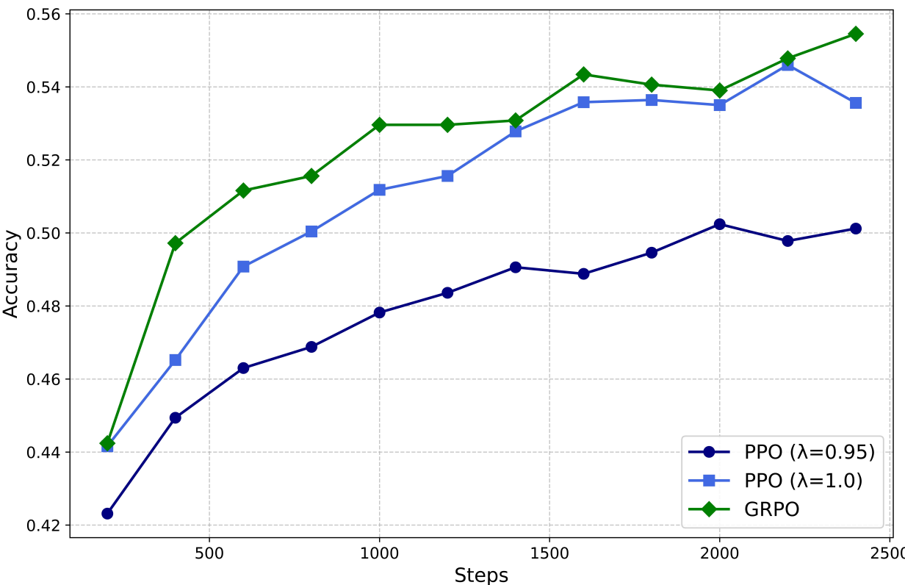
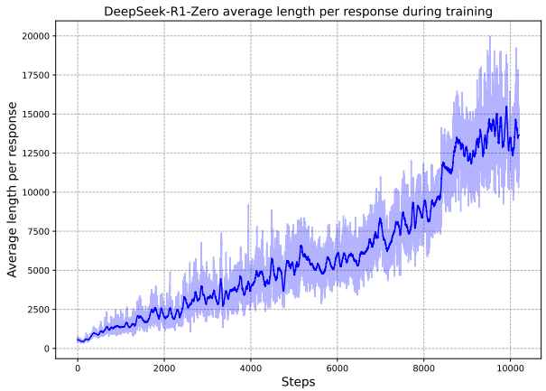
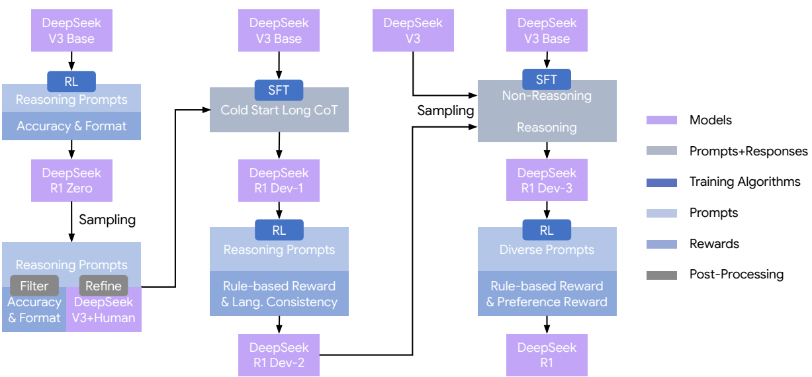

# DeepSeek-R1: 用规则奖励的 RL 训出长推理

来源: [DeepSeek-R1: Incentivizing Reasoning Capability in LLMs via Reinforcement Learning](https://arxiv.org/abs/2501.12948). 本库采用带补充材料的 86 页 v1 (2025-01-22); 2026-01-04 发布的 v2 不在本页材料范围内. 权重: https://huggingface.co/deepseek-ai

关键实验数字、公式和图表来自[原技术报告](https://arxiv.org/abs/2501.12948), 同目录 bi 稿提供逐段对照译文.

这篇报告有两个模型. DeepSeek-R1-Zero 直接在 DeepSeek-V3-Base 上做 RL, 不经过 SFT, 奖励只看最终答案对不对和格式对不对; 训练中模型的回答越来越长, 自己学会了反思和验证, AIME 2024 的 pass@1 从 15.6% 升到 77.9%. DeepSeek-R1 在此基础上加了冷启动数据, 两轮 SFT 和两轮 RL, 解决 R1-Zero 可读性差, 中英混杂, 只会做题的问题, 最终 AIME 2024 79.8%, 与 OpenAI o1-1217 相当. 报告还把 R1 生成的 80 万条数据蒸馏进 Qwen 和 Llama 的小模型. 模型架构完全沿用 V3; 差异集中在奖励设计、训练日程、数据流转和推理能力的评测结果上.

## 1. 起点与算法

### 1.1. 起点: V3-Base 和「不做 SFT」的假设

R1 的底座是 DeepSeek-V3-Base, 671B 总参, 37B 激活, 经过 14.8T token 预训练. 补充材料 A.1 说明, 预训练数据来自普通网页和电子书, 没有主动加入合成数据; 不过部分网页含有 OpenAI 模型生成的回答, 底座仍可能间接接触这类内容. 预训练末段同样没有刻意加入 OpenAI 生成的数据. 数学和代码内容在语料中占有相当比例, 底座已经见过大量推理过程. 因而 RL 更像是在底座能够生成的候选解中强化有效路径, 而非从零建立推理能力.

报告的出发点是一个假设: 人写的推理示范会限制模型的探索, 跳过 SFT, 只给结果奖励, 模型可能找到不同于人类的推理方式. 补充材料 G.1 给出了这个假设成立的前提: 他们先在 7B 稠密模型和 16B MoE 上试过, AIME 上没有有意义的提升, 回答变长后小模型开始重复, 无法利用长 CoT; 换到 32B 稠密, 230B MoE 和 671B MoE 才看到纯 RL 带来的大幅提升. 结论是纯 RL 的效果高度依赖底座的容量. 这个前提比「跳过 SFT」本身更重要, 后来的复现工作大多也是在 7B 以上的强底座上才看到类似现象.

### 1.2. GRPO: 不要 critic, 用组内均值当基线

R1-Zero 和 R1 都用 **GRPO**(式 1–3):

$$
\mathcal{J}_{\mathrm{GRPO}}(\theta)=\mathbb{E}_{q,\{o_i\}\sim\pi_{\theta_{old}}}\frac{1}{G}\sum_{i=1}^{G}\left(\min\left(\rho_iA_i,\ \mathrm{clip}(\rho_i,1-\varepsilon,1+\varepsilon)A_i\right)-\beta\,\mathbb{D}_{KL}(\pi_\theta\|\pi_{ref})\right),\qquad A_i=\frac{r_i-\mathrm{mean}(\{r_j\})}{\mathrm{std}(\{r_j\})},
$$

$\rho_i=\pi_\theta(o_i|q)/\pi_{\theta_{old}}(o_i|q)$. 每道题从旧策略采样 $G=16$ 个回答, 用这组回答奖励的均值和标准差把每个奖励标准化, 得到优势 $A_i$; 目标函数是 PPO 式的截断比率项, 减去对参考策略的 KL 惩罚. 结果奖励是 0/1 时, 组内标准化的效果可以直接算出来. 16 个里答对 4 个: 均值 0.25, 标准差 $\sqrt{0.25\times0.75}\approx0.433$, 答对的 $A=1.73$, 答错的 $A=-0.58$. 16 个里只答对 1 个: 均值 0.0625, 标准差约 0.242, 那一个答对的 $A\approx$ **3.87**, 其余各 $-0.26$. 也就是说, 越难的题, 偶然答对的那条轨迹拿到的正优势越大, 答错的轨迹受罚越轻; 16 个全对或全错时优势全为 0, 这道题只剩 KL 项. 这就是 GRPO 把底座「偶尔能走通」的路径放大的具体方式(以上按总体标准差算, 报告没写用总体还是样本标准差).

与 PPO 的区别有两处(补充材料 A.3). 第一, PPO 用 GAE 计算优势, 需要一个与策略同规模的价值模型; 价值模型要根据已生成的前缀预测最终奖励, 在只有结果奖励, 回答又长又会中途推翻自己的长 CoT 场景里, 这种预测尤其困难. 第二, PPO 通常把逐 token 的 KL 惩罚作为稠密奖励加在每一步上, 累积起来相当于惩罚回答长度;

GRPO 把 KL 的无偏估计 $\pi_{ref}/\pi_\theta - \log(\pi_{ref}/\pi_\theta) - 1$ 直接加进损失, 不随长度累积, 回答才有机会变长. GRPO 的推导见 [GRPO](../../../LargeLanguageModelGuide/4-后训练/4.5-GRPO家族与RLVR/01-GRPO/01-GRPO.md), 与 PPO 的对照见 [PPO](../../../LargeLanguageModelGuide/4-后训练/4.4-强化学习基础/04-PPO/04-PPO.md).

Figure 4 用 DeepSeek-Coder-V2-Lite(16B MoE, 2.4B 激活)在 MATH 上比较两者: GAE 的 $\lambda$ 取开源实现常用的 0.95 时, PPO 明显不如 GRPO; 调到 1.0 后接近 GRPO(读图). $\lambda=1$ 意味着 GAE 退化为蒙特卡洛回报减价值基线, 不再依赖价值模型的逐步估计, 这恰好说明在结果奖励场景下价值模型的中间估计帮不上忙. 报告的结论是 PPO 调好也能用, 但要多花调参成本, 还要多训一个价值模型.

训练中每 400 步把参考模型换成最新策略, 因为几千步之后策略会离初始模型很远, 固定参考会过度约束后续探索.

图注: 报告 Figure 4: 数学题上 GRPO 相对 PPO 的优势。
*报告 Figure 4: 数学题上 GRPO 相对 PPO 的优势*

式 1 的比率写成整条回答的概率比 $\pi_\theta(o_i|q)/\pi_{\theta_{old}}(o_i|q)$, 没有写出按 token 平均的项; 但 §3.2.1 又说截断系数太小「会截断大量 token 的梯度」, 说明实现里比率是逐 token 计算的. 社区后来的分析(Understanding R1-Zero-Like Training, 提出 Dr. GRPO)指出, DeepSeekMath 原式里按回答长度 $1/|o_i|$ 平均, 以及按组内标准差归一化, 会让长的错误回答受罚更轻, 人为推高回答长度. 报告未说明 R1 的实现是否带有长度平均项; 按式 3 的写法, 标准差归一化是存在的. 这一偏置的讨论见 [Dr. GRPO 去标准差](../../../LargeLanguageModelGuide/4-后训练/4.5-GRPO家族与RLVR/02-DrGRPO-去标准差/02-DrGRPO-去标准差.md).

## 2. R1-Zero: 只用规则奖励的 RL

### 2.1. R1-Zero 的奖励与模板

R1-Zero 的奖励全部是规则(§2.2): **准确率奖励**加**格式奖励**, 两者权重相同, 即 $\mathrm{Reward}_{\mathrm{rule}}=\mathrm{Reward}_{\mathrm{acc}}+\mathrm{Reward}_{\mathrm{format}}$(式 4). 数学题要求把最终答案写在指定格式里(如方框中)再与标准答案比对, 代码题用编译器跑预设测试用例; 格式奖励要求推理过程放在 think 标签里. 报告明确不用神经网络奖励模型, 不论是结果奖励还是过程奖励, 理由是大规模 RL 中神经奖励模型容易被 reward hacking, 重训奖励模型又增加成本和复杂度. 模板(Table 1)只规定先在 think 标签里写推理过程, 再在 answer 标签里写答案, 刻意不加任何内容上的引导, 以便观察模型自己的演化.

RL 数据在补充材料 B.3.1 和 Table 4. 数学 26K 题, 平均提示 122 个 token, 不含证明题, 因为证明的对错难以自动判断, 答对得 1 分否则 0 分; 代码 17K 道算法竞赛题, 另有 8K 道从 GitHub issue 提取的修 bug 题, 要通过全部单元测试; STEM 22K 道四到八个选项的选择题, 化学占 46.5%, 生物 30.7%, 物理 15.5%; 逻辑 15K 题, 包括网上的脑筋急转弯, 经典逻辑题, 以及合成的 code-IO 题和密码, 斑马谜题, 24 点等题目. 所有题目都是中文或英文. 通用数据 66K 题用于 R1 的第二轮 RL, R1-Zero 不用. 这套数据的特点是答案都能自动验证, 数学只要最终数值或表达式, STEM 和部分逻辑题是选择题. 选择题只有四到八个选项, 随机猜也有 12.5% 到 25% 的正确率, 模型可能靠排除法而不是完整推理拿到奖励.

### 2.2. R1-Zero 的训练日程

超参在 §2.1: 学习率 3e-6, KL 系数 0.001, 采样温度 1, 每题采样 16 个回答. 最大长度在第 8.2K 步之前是 32,768 token, 之后改为 65,536; 总共训 10,400 步, 相当于 1.6 个 epoch. 每步 32 道题, 即 512 个回答. 每次 rollout 生成 8,192 个回答(512 道题乘 16), 随机分成 16 个 mini-batch, 每个 mini-batch 更新一次, 只过一个内层 epoch. 所以一次 rollout 对应 16 个训练步, 10,400 步约 650 次 rollout, 参考模型每 400 步即每 25 次 rollout 更新一次. 同一次 rollout 的后几个 mini-batch 用的数据已落后策略十几次更新, 这也是截断比率仍然必要的原因.

用步数反推数据量, 会发现一处对不上. 10,400 步乘 32 道题约 33.3 万题次, 除以 1.6 个 epoch, 训练集约 **20.8 万**道题. 而 Table 4 列出的推理类 RL 题目合计约 8 万到 8.8 万道. 两者差两倍多, 可能 R1-Zero 用的题库比 Table 4 更大, Table 4 描述的是 R1 阶段的数据, 也可能 epoch 的算法不同, 报告没有说明. 训练成本见补充材料 Table 7: R1-Zero 用 64 个节点共 512 张 H800, 约 198 小时, 合 101K GPU 小时. 每步平均约 69 秒, 其中大部分时间花在生成几万 token 长的回答上.

### 2.3. R1-Zero 的结果和「顿悟」

Figure 1 显示, AIME 2024 的 pass@1 从 15.6% 升到 77.9%, 用 16 次采样多数投票(cons@16)可达 86.7%, 超过人类参赛者的平均水平. 训练集上的平均回答长度持续增长, 从开始时约 500 token 涨到结束时约 **1.35 万** token, 第 8K 步以前大致线性上升, 此后曲线明显抬高, 波动也变大(读图). 在第 8.2K 步最大长度从 32K 放宽到 64K 时, 分数和长度都出现一次明显跳升, 报告自己也写了这一点. 这说明在此之前有相当一部分回答被长度上限截断, 截断的回答拿不到答案分; 放宽上限本身就会带来提升, 不能全部归功于模型「学会了思考」.

图注: 报告 Figure 1: R1-Zero 训练过程中 AIME 准确率随步数的变化。
*报告 Figure 1: R1-Zero 训练过程中 AIME 准确率随步数的变化*

补充材料 C 做了行为分析. 在 MATH 按难度分层, 1 到 3 级很快达到 0.90 到 0.95, 4 级从约 0.78 升到 0.95, 5 级从约 0.55 升到 0.90(读图); 1 级只有 43 题, 95% 到 97% 的正确率意味着只错一两道, 多是几何题. 三位专家选了 wait, mistake, however, but, retry, error, verify, wrong, evaluate, check 等反思词, 训练中这些词的出现频率涨了 **5 到 7 倍**. 其中 wait 在训练早期几乎没有, 4000 到 7000 步偶尔出现, 8000 步之后骤增. Table 2 的「aha moment」就是模型在推导中写出「Wait, wait. Wait. That's an aha moment I can flag here」然后重新检查.

「顿悟」的解读后来受到质疑. Understanding R1-Zero-Like Training 一文检查了包括 V3-Base 在内的多个底座, 发现 V3-Base 在 RL 之前就会出现 aha moment 式的自我反思; 另一项 oat-zero 的研究发现小底座在第 0 步就有这类表达, 其中不少是「表面反思」, 反思之后答案并没有变对. 结合第 1.2 节的长度偏置, 回答变长和反思词增多, 有一部分可能来自优化目标本身, 而不是全新能力的涌现. 报告附录也承认底座见过大量推理数据. 现有证据支持 RL 提高已有反思行为的频率和有效性, 但不足以证明这些行为由 RL 凭空产生.

## 3. R1 的多阶段流水

### 3.1. R1 的第一步: 冷启动数据

R1-Zero 有两个问题: 可读性差, 同一段 CoT 里中英混杂. R1 的流程(Figure 2)先收集几千条**冷启动数据**, 微调 V3-Base 作为 RL 的初始策略. 补充材料 B.3.2 说这一步的动机主要是产品层面的: 用户更容易接受第一人称的思考过程. R1-Zero 倾向用「we」或者不用人称, R1 更多用「I」. 报告同时提醒, 这种生动的推理风格反映的是 DeepSeek 设计的启发式规则, 不代表模型具备了类人的智能, 可能让用户产生不必要的信任. 冷启动数据的风格要求是: 先理解问题, 再详细推理并带反思和验证, 全程第一人称, 语言与提问一致.

图注: 报告 Figure 2: R1 多阶段训练流程——冷启动 SFT、推理 RL、拒绝采样、全场景 RL。
*报告 Figure 2: R1 多阶段训练流程——冷启动 SFT、推理 RL、拒绝采样、全场景 RL*

制作流程是: 先请人工标注员把 R1-Zero 的推理轨迹改写成自然的对话风格, 再用这些改写样例提示一个 LLM 按同样风格改写更多数据, 最终对 LLM 的输出做第二轮人工核验.

冷启动 SFT 训 2 到 3 个 epoch, 学习率余弦从 5e-5 降到 5e-6, 最大长度 32,768, batch 128(补充材料 B.4.2).

冷启动之后的 R1-Dev1(Table 3)指令跟随明显变好: IF-Eval 从 R1-Zero 的 46.6 升到 71.7, ArenaHard 从 53.6 升到 77.0, AlpacaEval 2.0 从 24.7 升到 50.1. 代价是推理下降: AIME 从 77.9 降到 59.0, CNMO 从 88.1 降到 58.0, GPQA 从 75.8 降到 66.1. 报告归因于冷启动数据量太小. 几千条人改的数据就能把 AIME 拉低近 19 分, 说明 SFT 对长推理行为的扰动很大, 这也从反面支持了报告「人写的示范会限制探索」的判断.

### 3.2. 第一轮 RL 和语言一致性奖励

第一轮 RL 的超参与 R1-Zero 基本相同: 学习率 3e-6, KL 系数 0.001, 温度 1, 每题 16 个回答, 最大长度 32,768, 每步 32 道题, 每 400 步更新参考模型. 报告写 GRPO 截断系数 $\varepsilon=10$, 并解释系数太小会截断大量 token 的梯度, 太大又不稳定. 常见的 PPO 截断系数约为 0.2; $\varepsilon=10$ 要求比率超过 11 才触发上界, 下界 $1-10$ 又为负数, 在通常定义下几乎等同于不截断. 公开材料无法判断这是笔误, 还是 R1 实现采用了不同于式 1 的截断定义.

这一轮新增了**语言一致性奖励**(式 7): $\mathrm{Reward}_{\mathrm{language}}=\mathrm{Num}(\mathrm{Words}_{\mathrm{target}})/\mathrm{Num}(\mathrm{Words})$, 即 CoT 中目标语言词数占总词数的比例, 取值 0 到 1, 直接加到最终奖励上, 推理和非推理数据都加.

它和 0/1 的准确率奖励同权相加, 放进同一组里比较: 答对但 CoT 只有一半是目标语言的回答得 $1+1+0.5=2.5$(准确率, 格式, 语言), 答错但语言纯净的回答得 $0+1+1=2$, 答对仍然占优, 但只多 0.5 分. 半个准确率的差距足以在组内标准化后改变优势的正负分布, 代码题的轻微下降可以从这里理解.

补充材料 B.6 在 DeepSeek-R1-Distill-Qwen-7B 上做了消融, 该模型用同样的冷启动数据, RL 中同样出现语言混杂. 不加这项奖励, 语言一致性随训练步数逐渐变差; 加上后一直稳定. 数学基准基本不变, 代码基准略有下降(读图). 报告的态度是接受这点性能损失, 换取可读性. 第一轮 RL 之后的 Dev2 推理大幅回升: AIME 74.0, CNMO 73.9, LiveCodeBench 63.5, Codeforces 评分从 Dev1 的 1534 升到 1687; AlpacaEval 只从 50.1 到 55.8, 说明面向推理的 RL 对用户偏好类评测帮助有限.

### 3.3. 80 万条 SFT 数据

第二轮 SFT 的数据约 **80 万**条(补充材料 B.3.3). 推理数据约 60 万条, 从第一轮 RL 的 checkpoint **拒绝采样**得到: 每题采样多个回答, 只保留正确的. 这一轮不再限于能用规则判分的题, 一部分题把标准答案和模型预测一起交给 DeepSeek-V3 判断, 即生成式奖励模型. 还过滤掉了语言混杂, 段落过长, 含代码块的 CoT. 非推理数据约 20 万条, 包括写作, 事实问答, 自我认知, 翻译, 复用了 V3 的部分 SFT 数据, 并加入程序修复, 前端开发等软件工程数据. 部分非推理任务先让 V3 生成一段 CoT 再回答, 像「hello」这样的简单问题则不给 CoT.

Table 5 给出分领域统计: 数学 395,285 条, 平均 6094 token; 代码 211,129 条, 平均 7436 token; STEM 10,124 条; 逻辑 10,395 条; 通用 177,812 条, 平均 1420 token; 合计 804,745 条, 平均 5355 token. 按条数乘平均长度, 一个 epoch 约 **43 亿** token, 其中数学约 56%, 代码约 36%, 通用只占约 6%. 条数上通用数据占 22%, 按 token 算却只有 6%, 模型在 SFT 中看到的绝大部分内容是长推理. 平均轮数 1.0 到 1.1, 几乎全是单轮, 报告承认这会限制多轮对话能力. 这一轮 SFT 之后的 Dev3 在 AlpacaEval 上到 62.1, Aider-Polyglot 从 25.6 跳到 44.8, 对应新加的非推理数据和软件工程数据. SFT 数据质量筛选的一般做法见 [SFT 数据质量筛选与训练技巧](../../../LargeLanguageModelGuide/4-后训练/4.2-SFT/4.2.2-SFT数据质量筛选与训练技巧/4.2.2-SFT数据质量筛选与训练技巧.md).

### 3.4. 奖励模型和第二轮 RL

第二轮 RL 需要给通用数据打分, 所以训了两个奖励模型(§3.1). **有用性奖励模型**: 用 Arena-Hard 的提示格式让 DeepSeek-V3 比较一对回答, 每对问 4 次并随机交换 A, B 位置以消除位置偏差, 取 4 次平均, 只保留分差 Δ 大于 1 的对; 还让整个数据集中被选和被拒回答的长度相当, 以减少长度偏差. 共 66,000 对, 提示都是非推理问题. 模型结构与 R1 相同, 加一个标量奖励头; batch 256, 学习率 6e-6, 训一个 epoch, 训练最大长度 8192, 推理时不限长度. 有用性只评最终总结, 不评推理过程, 避免干扰推理.

**安全奖励模型**用 106,000 条标注为安全或不安全的回答, 按单点方式训练; 安全性评估整个回答, 包括推理过程.

第二轮 RL 的总奖励是

$$
\mathrm{Reward}=\mathrm{Reward}_{\mathrm{reasoning}}+\mathrm{Reward}_{\mathrm{general}}+\mathrm{Reward}_{\mathrm{language}},\quad \mathrm{Reward}_{\mathrm{reasoning}}=\mathrm{Reward}_{\mathrm{rule}},\quad \mathrm{Reward}_{\mathrm{general}}=\mathrm{Reward}_{\mathrm{reward\_model}}+\mathrm{Reward}_{\mathrm{format}}.
$$

一道题只属于一类: 推理题拿规则奖励, 通用题按它属于有用性集还是安全集, 拿对应奖励模型的分数, 再加格式奖励; 语言项两类都加. 有用性奖励在式 5 里写成 $RM_{\mathrm{helpful}}(\mathrm{Response}_A,\mathrm{Response}_B)$, 输入是一对回答, 奖励头输出的标量是这一对的偏好分, 而 GRPO 需要给组里 16 个回答各一个标量; 报告没写 RL 时怎么把成对打分变成单个回答的分数.

温度从 1 降到 0.7, 因为高温下生成不连贯. 共 1,700 步, 通用指令数据和偏好奖励只在末尾 400 步加入. 原因写在补充材料 B.5: 用有用性奖励模型训练更多步会出现 reward hacking, Figure 6 显示奖励持续上升的同时 Codeforces 成绩下降(读图). 所以偏好 RL 在这里被刻意限制在几百步. R1 相对 Dev3 的主要提升在用户偏好类评测: AlpacaEval 2.0 从 62.1 升到 87.6, ArenaHard 从 75.6 升到 92.3, IF-Eval 从 78.1 升到 83.3.

.

补充材料 F.1 回答了「小模型自己做 RL 行不行」. 在 Qwen2.5-32B-Base 上用数学, 代码, STEM 数据做了 1 万多步 RL, 得到 Qwen2.5-32B-Zero: AIME 47.0, MATH 91.6, GPQA 55.0, LiveCodeBench 40.2, 与 QwQ-32B-Preview 相当; 同一底座蒸馏出的 Distill-Qwen-32B 是 72.6, 94.3, 62.1, 57.2, 全面领先. 结论有两条: 把强模型蒸馏给小模型效果好, 小模型靠本文这种大规模 RL 需要大量算力, 还未必追得上蒸馏; 但要超越人类的能力边界, 仍需要更强的底座和更大规模的 RL. 为排除底座见过推理数据的可能, 他们还在 o1 发布前的 Qwen2-Math-7B(2024 年 8 月发布)上做了约 1 万步 RL, AIME 2024 从指令版的 7.9% 升到 22.3%, AIME 2025 从 4.6% 升到 18.1%.

### 5.2. 失败的尝试和安全评测

补充材料 G.2 记录了两条没走通的路. **过程奖励模型**: 一般推理很难定义细粒度的「步」, 判断中间步骤对错也难, 用模型自动标注效果不好, 人工标注又无法规模化; 一旦引入基于模型的过程奖励, reward hacking 就不可避免. 过程奖励适合给候选答案重排或辅助搜索, 但在大规模 RL 中收益抵不过开销. **蒙特卡洛树搜索**: 让模型生成对应推理步骤的标签, 用预训练的价值模型引导搜索, 再用搜到的问答对迭代训练策略和价值模型. 问题在于 token 生成的搜索空间比棋类大得多, 限制每个节点的扩展数又容易陷入局部最优; 细粒度价值模型难训, 迭代自我提升做不起来.

安全评测在补充材料 D.3. 六个公开基准(Table 9)中, R1 在隐藏 CoT 的设置下平均 96.0, 与其他前沿模型相当; 但这是加上风险控制系统后的分数, 被风控拦截而自动拒答的回答一律算作安全. 不计风控时, R1 的 HarmBench 只有 58.0, 平均 89.7. 报告分析 HarmBench 的失分主要在知识产权类题目, 例如被要求写出某首歌的歌词时不拒绝.

越狱测试(Table 11)用 2,232 个越狱模板拼接原有安全问题: 不带风控的 R1 不安全回答比例从 25.2% 升到 85.9%, 增幅 60.7 个百分点, 是所有模型中最大的; 加上风控后降到 4.3%, 代价是拒答率升到 87.3%. 报告据此建议用开源模型提供服务的开发者部署同等的风控措施, 因为本地部署的模型没有这层保护.

## 6. 局限和谱系位置

结论节列出的局限: 结构化输出能力弱于现有模型, 不能调用搜索引擎, 计算器等工具; 简单问题上过度思考; 只针对中英文优化, 其他语言的提问可能用英文推理和回答; 对提示敏感, few-shot 会降低表现, 建议 zero-shot 直接描述问题和输出格式; 软件工程任务评测耗时长, 大规模 RL 没有在这类任务上充分展开, 所以 SWE 类成绩相对 V3 提升不大.

方法层面的局限是奖励: 规则奖励只覆盖可验证任务, 写作等任务只能用奖励模型, 训练越久越容易被利用, 所以 R1 对这类任务只用人工标注的 SFT 数据加几百步 RL.

谱系上, R1 与 V3 是互相借用的关系. V3 的后训练 SFT 数据里, 推理部分由 R1 系列专家模型生成; R1 反过来以 V3-Base 为底座, 非推理 SFT 数据复用了 V3 的一部分, 有用性奖励模型的偏好对也由 V3 判定. R1 之后, V3.1 把思考和非思考两种模式合进同一个模型, V3.2 和 V4 在长推理之外继续加入工具调用和 Agent 任务的 RL. R1 在这条线上确立的做法, 即可验证奖励, GRPO, 冷启动加多阶段 RL, 以及用长推理数据蒸馏, 被后续版本基本沿用. Agentic RL 的后续发展见 [Agentic RL 训练](../../../LargeLanguageModelGuide/13-Agent/13.4-Agent训练与进化/13.4.1-AgenticRL训练/13.4.1-AgenticRL训练.md).

## 7. 纯 RL 的探索动力学

R1-Zero 开始训练时, 一道题能否产生梯度取决于同组回答有没有奖励差异. 设单次成功率为 $p$, 组大小为 $G$, 至少一对样本奖励不同的概率是

$$
P_{mix}=1-p^G-(1-p)^G.
$$

$p$ 接近 0 或 1 时, $P_{mix}$ 都很低; $p=0.5$ 时最高. 这给出纯 RL 的自然课程: 太难的题全错, 太易的题全对, 能推动策略的是当前边界附近的题. 随模型提升, 原本困难题进入混合区, 原本边界题逐渐全对. 若题库难度范围不够宽, 有效组比例会先升后降.

探索还受回答分布熵控制. 高温增加不同路径, 让稀有正确轨迹更可能出现, 也提高乱码、格式错误和无意义长文本的比例. 低温保证连贯, 多个样本却高度相关. 理想温度随能力变化: 早期需要探索, 后期需要稳定地强化有效轨迹. 报告提到部分阶段从温度 1 调到 0.7, 没给完整日程与对照.

格式奖励提供早期密集信号. 模型即使答错, 只要按 `<think>` 与答案模板输出也能获得部分奖励, 组内因此不至于全部相同. 它帮助策略进入可解析区域, 同时可能形成投机: 写出正确标签、堆叠反思短语、把答案藏在解析器容易捕捉的位置. 准确奖励变强后, 格式应退居约束角色. 若格式权重长期过大, 模型会优先维护外壳.

格式退化有两种方向. 奖励太弱时, 长推理逐渐混杂语言、遗漏结束标签, 正确答案也无法解析; 奖励太强时, 模板本身占据生成概率, 内容变得刻板. 可分别统计标签成功率、答案解析率、人工可读性和准确率, 扫描格式权重. 单一总奖励曲线看不出二者的交换.

### 7.1. 语言一致性奖励的梯度冲突

设准确奖励目标为 $J_a$, 语言一致目标为 $J_l$, 混合梯度为

$$
g=\nabla J_a+\lambda\nabla J_l.
$$

两梯度内积为正时, 更新同时改善准确率与语言; 内积为负时发生冲突. 某些数学术语和代码标识天然跨语言, 强制单语可能让模型改写熟悉表达, 负内积更常见. 报告观察到语言一致性提升伴随少量准确率损失, 与平均冲突相符.

冲突并非每个 token 相同. 自然语言连接词适合受一致性奖励, 公式、变量和代码片段应豁免. 若奖励只按整段语言比例评分, 一段必要英文术语可能让所有 token 得到较低优势. 更细的掩码或分段评分可减少误伤, 论文没有披露语言判定器与权重.

多目标训练还存在尺度问题. 准确奖励常为 0/1, 语言分数可能连续且方差更小. GRPO 会在组内标准化总奖励, 权重 $lambda$ 对排序的影响取决于两项分布, 不能只看数值大小. 应报告加入语言项后有多少样本对发生排序翻转, 这比平均奖励更直接.

一种可验证做法是投影冲突梯度: 当 $\nabla J_a\cdot\nabla J_l<0$ 时, 去掉语言梯度在准确梯度反方向的分量. 若可读性维持、准确率损失缩小, 说明问题确实来自梯度冲突; 若无改善, 可能是策略空间本身难以同时满足两项目标.

**可验证任务与开放任务：** 数学短答案和代码测试适合规则奖励, 因为判分器成本低、结果相对客观. 形式证明只有在证明检查器可运行时才同样可靠; 自然语言证明即使结论正确, 中间有效性也难自动核验. 科学问答若有唯一答案可用结果奖励, 开放假设生成则没有单一真值.

写作、建议和角色扮演依赖上下文偏好. 奖励模型可把人工偏好推广到新样本, 也会偏爱长度、语气和熟悉立场. 策略持续优化后会找到裁判漏洞, Figure 6 中偏好奖励上升而 Codeforces 下降就是分布外代价的信号. 因而 R1 把开放任务 RL 限制在很短阶段, 主要靠人工核验 SFT 塑形.

两类任务之间存在过渡区. 代码风格、算法复杂度、可维护性无法只靠测试; 数学解释的清晰度也不是答案匹配能判断. 可组合硬奖励与模型奖励, 前者守住正确性, 后者改善表达. 权重不当时, 模型可能用漂亮解释掩盖错误, 或只输出最短可验证答案. 应把正确性和表达分开报告.

工具使用为开放任务提供新的可验证信号: 搜索后引用是否存在、计算器结果是否一致、代码是否执行成功. R1 报告明确说模型不能调用工具, 所以这些奖励渠道尚未进入其训练. 后续 Agent RL 扩展了可验证范围, 不能倒推为 R1 已具备相同能力.

**小样本评测的方差：** AIME 有 30 题. 若把每题看作独立伯努利试验, 准确率估计 $\hat p$ 的标准误差约为

$$
\operatorname{SE}=\sqrt{\frac{\hat p(1-\hat p)}{30}}.
$$

当 $\hat p=0.8$ 时, 标准误差约 7.3 个百分点, 正态近似 95% 区间约为正负 14.3 点. 题目并非从统一总体随机抽取, 这个区间只提供数量级, 已足以说明相差两三点不稳定.

多次采样取平均降低的是解码随机方差. 同一道题跑 64 次, 可以更准确估计模型对该题的成功概率; 题目仍只有 30 道, 题集构成的不确定性没有消失. 把 30 乘 64 当作 1920 道独立题会严重低估区间, 因为同题样本共享难度和解法结构.

比较两个模型时, 最好使用配对统计: 记录每道题两者成功概率之差, 观察优势是否遍布题目, 还是集中在一两道. 若 R1 多答对的题恰好都属于某个知识点, 换一年赛题排名可能改变. AIME 2024、2025 与更多竞赛集共同报告, 证据会更稳.

pass@64 又引入估计上限. 每题只要一次成功就记 1, 对 $p=0.05$ 的题, 理论 pass@64 已约 96.2%; 它很快饱和, 难以区分中等概率模型. pass@1、cons@64 和 pass@64 组合起来, 才分别呈现默认成功率、多数稳定性与候选覆盖.

### 7.2. 多阶段状态转移

整条路线可以写成六个策略状态:

$$
\pi_{V3B}\xrightarrow{\text{规则RL}}\pi_{Zero},\qquad
\pi_{V3B}\xrightarrow{\text{cold-start SFT}}\pi_C
\xrightarrow{\text{推理RL}}\pi_R
\xrightarrow{\text{拒绝采样+通用数据SFT}}\pi_S
\xrightarrow{\text{综合RL}}\pi_{R1}.
$$

$\pi_{Zero}$ 是旁路线, 用来证明无 cold-start 时规则 RL 也能提升推理; 正式 R1 没有从 Zero checkpoint 直接继续. cold-start 数据会借鉴 Zero 输出并人工改写, 信息通过数据进入 $\pi_C$, 参数路径仍从 V3-Base 出发.

$\pi_C$ 提供可读格式和初始成功轨迹; $\pi_R$ 扩大规则任务能力; 从 $\pi_R$ 采样并筛选得到数据集 $D_R$, 与通用数据 $D_G$ 混合训练出 $\pi_S$; 综合 RL 再把推理、帮助性和安全偏好合入 $\pi_{R1}$. 每个箭头都有可能提升目标能力并损伤其他能力.

这个图式澄清了一个常见混淆: 80 万条数据来自第一轮 RL 后策略, 不是训练开始前固定准备; 蒸馏小模型使用的是这批数据, 没有复制完整多阶段 RL; R1-Zero 也没有经历拒绝采样 SFT 和第二轮偏好 RL. 三种模型的训练信号不同, 不能仅按底座规模解释差异.

要定位贡献, 需要保存并评测 $\pi_C,\pi_R,\pi_S$ 三个中间点. 如果 $\pi_S$ 推理下降、综合 RL 恢复, 第二轮负责抗遗忘; 如果 $\pi_S$ 已经保持推理, 第二轮主要改善偏好与安全. 报告只公开部分开发版本, 精确贡献仍无法完整复算.

**学生架构的归纳偏置：** Qwen2.5-Math 底座对数学符号、公式和竞赛语料有专门预训练, 同样蒸馏数据下更容易压缩教师轨迹. 通用 Qwen 与 Llama 的分词器、位置编码、指令训练状态不同. 70B Llama 使用 Instruct 起点, 其对话偏好可能限制长推理风格, 也可能改善格式.

模型宽度、深度和注意力结构决定学生能保存多少中间状态. 小模型可能学会常见模板, 在需要同时维护多个分支时失败; 大模型能表示更多策略, 却不保证采样时选择正确分支. 蒸馏曲线同时反映容量与底座归纳偏置, 不能仅用参数量解释.

训练最大长度 32768 也构成上限. 教师超过该长度的轨迹需要截断或过滤, 最长推理行为无法完整传递. 学生评测若允许更长生成, 它也缺少对应监督. 报告未给教师轨迹长度分布、截断比例和各学生实际训练 token 数, 这些缺口影响蒸馏上限判断.

**无法精确复现的公开缺口：** GRPO 侧缺少组大小、裁剪系数、KL 系数、每阶段提示数量、batch、学习率、最大生成长度和完整温度日程. 奖励侧缺少准确与格式权重、语言一致性判定器及系数、第二轮帮助性与安全奖励混合比例. 这些参数会直接改变探索、长度和多目标冲突.

数据侧缺少 cold-start 条数与来源配比、第一轮 RL 题库规模、每题拒绝采样次数、验证器实现、60 万推理样本的领域与长度分布、20 万通用样本的混合权重、去重和污染过滤细节. 外部项目可以复现流程名称, 难以复现数据分布.

系统侧缺少 R1 全流程 GPU 小时、采样与训练资源比例、每阶段墙钟和失败重跑. 长 CoT 使生成成为主要成本, 只给更新步数不足以比较预算. 评测侧部分外部模型数字来自不同接口或报告, 温度和输出上限也需逐项核对.

这些缺口不会抹去公开结果. 它们限定的是复现精度与因果归因: 可以确认多阶段方案达到报告分数, 可以沿用 GRPO与规则奖励的总体方法, 却无法仅凭论文重建一条数值等价的训练 run. 将已公开配方与未公开超参分开, 才能正确评价后续复现的差异.

**从奖励到行为的因果检查：** 奖励曲线上升只能说明策略更符合当前判分器. 要证明目标能力提高, 需要一套不参与训练的外部测量. 数学可用不同来源、不同答案格式的新题; 代码可换隐藏测试与人工审查; 语言可读性可由不知道 checkpoint 顺序的标注员盲评. 训练奖励与外部指标同步上升, 才支持奖励捕获了目标能力.

若训练准确奖励上升、外部数学不变, 可能发生题库记忆或解析器投机; 若外部数学上升、语言质量下降, 则是明确的多目标交换; 若两者都升而回答长度暴涨, 还需计算单位 token 收益. R1 报告同时给标准基准、长度曲线和人工可见样例, 证据比单一奖励充分, 仍缺训练题与评测题之间的严格独立审计.

因果检查还应干预行为. 把同一 checkpoint 的最大长度截成 2K、4K、8K、16K, 测准确率是否随预算稳定增加; 删除或替换「等等」「重新检查」等短语, 测结果是否变化; 强制模型用另一种语言推理, 测语言奖励塑造的是表面还是内部策略. 这些干预比相关曲线更接近机制证据.

### 7.3. 完整的题目级记录表

对每道训练题, 可以记录底座成功率、各阶段成功率、平均长度、轨迹聚类数、验证器接受率与最终是否进入 SFT 数据. 这份记录能回答许多总表无法回答的问题. 若底座从未成功、RL 后稳定成功, 它是能力扩展的强候选; 若底座偶尔成功、RL 只提高频率, 更接近概率重排.

题目记录还能揭示拒绝采样偏差. 零留存题集中在哪些领域, 进入数据的题是否明显更短, 某些答案格式是否被大量误拒, 都可以直接统计. 蒸馏学生后再按同一题目分桶, 可观察学生究竟继承了教师的成功集合, 还是通过底座泛化解决了新题.

对公开论文而言, 完整题目日志可能涉及数据泄漏, 至少可以发布匿名分桶统计: 起始成功率区间、题目长度、领域、留存率与阶段增益. 这样既不暴露训练题, 又能检验「边界题提供主要 RL 信号」和「蒸馏受教师覆盖限制」两项判断.

**R1 与普通指令模型的差别：** 普通指令模型追求对大多数问题迅速给出有用回答, 长推理模型允许在答案前消耗大量 token 搜索. 两者共享 V3-Base 的知识, 后训练改变默认计算策略. R1 面对简单问题也可能展开长链, 说明它尚未完全学会按难度调节预算.

这一区别影响评测. 只限制相同最大 token, 长推理模型可以使用更多平均计算; 只比较总 token, 短模型可以并行采样更多次. 公平口径取决于使用场景: 单次答案质量比较固定请求, 成本效率比较总生成 token 或延迟, 候选覆盖比较固定采样预算. 报告的主要表偏向单次高预算能力.

R1 的成功说明自回归模型可通过后训练把已有表示组织成长程搜索, 没有证明这种文本内搜索是测试时计算的唯一形式. 外部验证器、树搜索、工具调用与并行候选都能消费额外计算. 报告记录 MCTS 尝试失败, 结论针对当时的价值模型和搜索设计, 不构成所有搜索方法的否定.

**收束：** R1-Zero 回答了一个窄而重要的问题: 强预训练底座在缺少推理 SFT 时, 能否靠可验证结果奖励学会更长的搜索、自检与回退. 公开结果给出肯定答案, 同时暴露语言混杂与可读性问题. 完整 R1 用 cold-start 把策略送入更合适的起点, 用推理 RL 扩展成功轨迹, 用拒绝采样和通用 SFT 固化并混合能力, 再用短程综合 RL 校准帮助性与安全.

这条路线的力量来自信号分工. 规则奖励提供低噪声终点, SFT 提供密集过程标签, 奖励模型覆盖无法写规则的偏好, 蒸馏把昂贵探索变成小模型可学习的数据. 每种信号都有盲区: 终点奖励信用稀疏, 教师轨迹限制覆盖, 偏好模型会被利用, 组内优势依赖采样多样性.

因此最稳固的结论落在可观测行为上: 数学和代码成绩提高, 输出长度增长, 部分轨迹出现有效回溯, 蒸馏学生显著受益. 关于全新能力、顿悟相变和推理本质的说法需要 pass@k、轨迹干预和阶段对照继续验证. 把结果与解释分开, R1 的贡献反而更清楚.

复现时还应保留失败轨迹, 只公开成功样例会遮住探索成本. 同一道题从错误到正确经历多少采样、错误路径是否反复出现、纠错发生在何处, 都能帮助判断 RL 学到的是搜索策略还是答案模式. 成功率给出终点, 失败分布描述策略空间. 两者一起公开, 才能把「模型会做这道题」进一步拆成「默认就会」「多试几次会」与「当前分布完全不会」.

对中间 checkpoint 重复统计, 还能看出能力是逐步扩散到更多题目, 还是少数题目从低概率迅速变成高概率. 后一种现象值得检查是否出现策略跃迁, 同时还需排除学习率切换、数据批次和评测随机性的影响. 训练曲线的拐点只有与题目级行为变化对齐, 才具备机制解释价值.

**参考资料：** - [DeepSeek-R1: Incentivizing Reasoning Capability in LLMs via Reinforcement Learning](https://arxiv.org/abs/2501.12948)
- [DeepSeek-R1 官方仓库](https://github.com/deepseek-ai/DeepSeek-R1)
- [DeepSeek-V3 Technical Report](https://arxiv.org/abs/2412.19437)
- [DeepSeekMath: Pushing the Limits of Mathematical Reasoning in Open Language Models](https://arxiv.org/abs/2402.03300)
- [Does Reinforcement Learning Really Incentivize Reasoning Capacity in LLMs Beyond the Base Model?](https://arxiv.org/abs/2504.13837)
