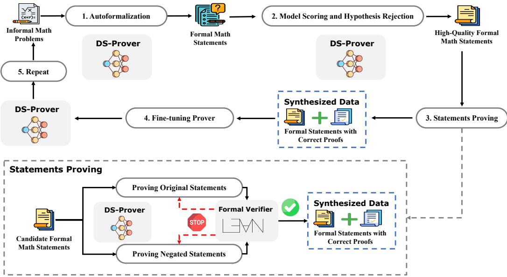

<!-- page 1 of 17 -->

arXiv: 2405.14333v1 [cs. AI] 23 May 2024

# DeepSeek-Prover: Advancing Theorem Proving in LLMs through Large-Scale Synthetic Data / DeepSeek-Prover: 用大规模合成数据推进大语言模型中的定理证明

**Huajian Xin**<sup>1, 2</sup> **Daya Guo**<sup>1</sup> **Zhihong Shao**<sup>1</sup> **Z. Z. Ren**<sup>1</sup> **Qihao Zhu**<sup>1</sup> **Bo Liu**<sup>1</sup> **Chong Ruan**<sup>1</sup> **Wenda Li**<sup>3</sup> **Xiaodan Liang**<sup>2, 4∗</sup>

<sup>1</sup>DeepSeek <sup>2</sup>Sun Yat-sen University <sup>3</sup>University of Edinburgh <sup>4</sup>MBZUAI {xinhj, guoday, zhihongshao, rzz, zhuqh, chong. ruan}@deepseek. com, benjaminliu. eecs@gmail. com, wli8@ed. ac. uk, xdliang328@gmail. com


DeepSeek, 中山大学, 爱丁堡大学, MBZUAI; 标星作者为通讯作者. 联系邮箱见上.

## Abstract

Proof assistants like Lean have revolutionized mathematical proof verification, ensuring high accuracy and reliability. Although large language models (LLMs) show promise in mathematical reasoning, their advancement in formal theorem proving is hindered by a lack of training data. To address this issue, we introduce an approach to generate extensive Lean 4 proof data derived from high-school and undergraduate-level mathematical competition problems. This approach involves translating natural language problems into formal statements, filtering out low-quality statements, and generating proofs to create synthetic data. After finetuning the DeepSeekMath 7B model on this synthetic dataset, which comprises 8 million formal statements with proofs, our model achieved whole-proof generation accuracies of 46.3% with 64 samples and 52% cumulatively on the Lean 4 miniF2F test, surpassing the baseline GPT-4 at 23.0% with 64 samples and a tree search reinforcement learning method at 41.0%. Additionally, our model successfully proved 5 out of 148 problems in the Lean 4 Formalized International Mathematical Olympiad (FIMO) benchmark, while GPT-4 failed to prove any. These results demonstrate the potential of leveraging large-scale synthetic data to enhance theorem-proving capabilities in LLMs. Both the synthetic dataset and the model will be made available to facilitate further research in this promising field.


像 Lean 这样的证明助手, 已经把数学证明的核验推到很高的准确度与可信度. **Lean** 是一类交互式定理证明器: 人把命题写成机器可读的形式化语句, 再逐步或整段给出证明; 内核按形式规则检查, 通过才算「证完」. 大语言模型在数学推理上已有苗头, 但形式化定理证明仍被训练数据短缺拖住.**形式化证明**指把命题与证明步骤都写成证明助手能机械核验的代码; 相对地, 自然语言里「看起来对」的推理, 机器无法直接保证无洞. 为此, 本文从高中与本科竞赛题出发, 大规模生成 Lean 4 证明数据: 自然语言题转成形式语句, 滤掉低质语句, 再生成证明, 得到合成数据. 在含 800 万条带证明形式语句的合成集上微调 DeepSeekMath 7B 后, Lean 4 miniF2F 测试上整证生成准确率达 46.3%(64 样本)与累计 52%, 超过 GPT-4 的 23.0%(64 样本)以及树搜索强化学习方法的 41.0%.**自动定理证明(ATP)** 泛指让机器自动找证明; 本文走的是「一次生成整段证明 + Lean 核验」, 而不是逐步与证明器来回交互的树搜索. 此外, 在 Lean 4 形式化 IMO(FIMO)148 题中证出 5 题, GPT-4 一题都没证出. 结果说明大规模合成数据能抬高 LLM 的定理证明能力. 合成数据与模型将公开, 方便后续研究.

## 1 Introduction

In modern mathematics, the increasing complexity of proofs presents substantial challenges for peer review. This complexity has led to the acceptance of erroneous proofs, with critical flaws often detected only after considerable time. To address these issues, formal mathematical languages such as Lean [De Moura et al., 2015, Moura and Ullrich, 2021], Isabelle [Paulson, 1994], and Coq [The Coq Development Team] have been developed. These languages enable the creation of computer-verifiable proofs [Avigad, 2023]. However, crafting formal proofs demands significant effort, specialized expertise, and poses challenges even for seasoned mathematicians. Consequently, the significance of automated theorem proving is on the rise [Shulman, 2024].


现代数学里, 证明越写越复杂, 同行评审很难跟上: 错证可能被接受, 关键漏洞往往很久以后才被发现. 为此发展出 Lean, Isabelle, Coq 等形式化数学语言, 让证明可以被计算机核验. **形式化语言**把符号, 推理规则和目标状态都定成可检查的规则; 写证明像写程序, 过不了类型检查就过不了关. 但手工写形式化证明极费功夫, 即便资深数学家也吃力, 所以自动定理证明的重要性在上升.

To reduce the effort involved in writing formal mathematical proofs, several approaches [Polu and Sutskever, 2020, Jiang et al., 2021, Han et al., 2021, Polu et al., 2022, Lample et al., 2022, Jiang et al., 2022a, Yang et al., 2024] have been developed, primarily focusing on search algorithms that explore potential solutions for proposed theorems. However, these methods often struggle with the vast search spaces required for complex theorems, rendering them ineffective for more intricate proofs [Loos et al., 2017]. Recently, advances in large language models (LLMs) have introduced a novel strategy,


为减轻写形式化证明的负担, 已有一批工作主要靠搜索算法在候选证明空间里探索. 复杂定理的搜索空间极大, 这些方法往往吃不消. 近来大语言模型给出另一条路:

<small><span class="docvortex-page-footnote" data-block-type="page_footnote" style="color: #6b7280"><sup>∗</sup>Corresponding author. </span></small>

Preprint. Under review.

<!-- page 2 of 17 -->

utilizing pre-trained models to guide the search process. Although these new methods [Jiang et al., 2022b, Zhao et al., 2023, Xin et al., 2023] represent significant improvements, they still fall short of practical applicability due to the lack of parallel corpus. Unlike conventional programming languages such as Python or Java, formal proof languages are used by relatively few mathematicians, resulting in limited datasets. Recent advances in autoformalization [Wu et al., 2022] allow more aligned data to be synthesized to train LLM-based automated theorem provers. Nevertheless, the resulting dataset remains too small to fully unleash the capabilities of LLMs.


用预训练模型引导搜索. 这些方法有进步, 但仍难落地, 根因是平行语料太少: 形式化证明语言的使用者远少于 Python/Java, 现成数据稀薄. **自动形式化(autoformalization)** 指把自然语言数学叙述自动翻成 Lean 等语言里的形式语句; 近年已能合成更多对齐数据来训 LLM 证明器, 但规模仍不足以把大模型能力吃满.

To address this issue, we propose a method for generating extensive Lean 4 proof data from informal mathematical problems. Our approach translates high-school and undergraduate-level mathematical competition problems into formal statements. We then automate proof generation using a large language model (LLM) and verify the correctness of these proofs within the Lean 4 environment. The primary challenge of this method is to ensure both the scale and quality of the synthetic data.


本文提出: 从非形式化数学题大规模生成 Lean 4 证明数据. 流程是: 高中与本科竞赛题 → 形式语句 → LLM 自动生成证明 → 在 Lean 4 环境里核验对错. 难点在同时保住合成数据的规模与质量.

**Quality Assurance:** We enhance the quality of generated proofs through a multi-step process. First, we filter out simple statements using a quality scoring model and exclude invalid statements via a hypothesis rejection strategy. Our novel iterative framework then improves proof quality by initially generating synthetic statements from informal math problems using an under-trained LLM fine-tuned on limited data. These statements are used to generate corresponding proofs, which are validated for correctness using a Lean 4 verifier. The correct theorem-proof pairs are subsequently used to further train the initial model. Through several iterations, the model trained on large-scale synthetic data becomes significantly more powerful than the originally under-trained LLMs, resulting in higher-quality theorem-proof pairs.


**质量保障:** 多步抬高生成证明质量. 先用质量打分模型滤掉过简语句, 再用假设否决策略剔除无效语句. 迭代框架: 用在有限数据上微调过的弱模型, 从自然语言题合成语句; 再为这些语句生成证明, 经 Lean 4 核验器验证; 正确的定理–证明对回头继续训模型. 若干轮后, 吃过大合成数据的模型远强于最初弱模型, 定理–证明对的质量也随之升高.

**Scale Assurance:** To accelerate the proof generation process, our method addresses the challenge of the large search space for proofs. A significant cause of delays is the generation of unprovable statements that continue to be processed until they reach the time limit. To mitigate this, we propose proving negated statements in parallel. Once either the original statement or its negation is proved, the entire proving process is terminated.


**规模保障:** 证明搜索空间大, 拖慢生成. 一大延误源是「不可证」语句一直跑到超时. 做法是并行去证原语句的否定式: 原命题或其否定任一被证出, 整条证明流程立即终止.

We assess the effectiveness of our method on Lean 4 theorem proving using 488 problems from miniF2F [Zheng et al., 2021] and 148 problems from the FIMO benchmarks [Liu et al., 2023]. We utilize DeepSeekMath 7B [Shao et al., 2024], a state-of-the-art mathematical model, as our base. The results show that our iteratively trained model performs strongly, achieving 46.3% accuracy in wholeproof generation on the miniF2F-test benchmark with 64 samples, surpassing GPT-4 [Achiam et al., 2023] at 23.0% and a reinforcement learning method at 41.0%. Additionally, our approach solved 4 out of 148 problems in the FIMO benchmark with 100 samples, while GPT-4 solved none, and our approach solved 5 with 4096 samples. Ablation experiments indicate that the model progressively solves more problems in miniF2F with each iteration. In summary, our paper makes the following contributions:


在 Lean 4 上用 miniF2F 的 488 题与 FIMO 的 148 题评估. 底座是 DeepSeekMath 7B. 迭代训出的模型整证生成在 miniF2F-test 上 64 样本达 46.3%, 超过 GPT-4 的 23.0% 与强化学习树搜索方法的 41.0%. FIMO: 100 样本解出 4/148, GPT-4 为 0; 4096 样本解出 5 题. 消融显示每轮迭代在 miniF2F 上能多解一些题. 贡献如下:

• We introduce an iterative method to synthesize 8 million formal statements, each accompanied by a formal proof, from informal math problems. Experimental results demonstrate that this method significantly enhances both the scalability and quality of synthetic data.


• 提出迭代方法, 从自然语言数学题合成 800 万条带形式证明的形式语句; 实验表明规模与质量都明显抬高.

Our model, trained on this synthetic dataset, achieves state-of-the-art performance on benchmarks, with whole-proof generation accuracies of 46.3% using 64 samples and 52% cumulatively on the Lean 4 miniF2F test. This surpasses the baseline GPT-4 at 23.0% with 64 samples and a tree search reinforcement learning method at 41.0%. Additionally, our model successfully proved 5 out of 148 problems in the Lean 4 Formalized International Mathematical Olympiad (FIMO) benchmark, while GPT-4 failed to prove any.


在该合成集上训练的模型, Lean 4 miniF2F 测试上整证生成 46.3%(64 样本), 累计 52%, 超过 GPT-4(23.0%@64)与树搜索 RL(41.0%); FIMO 148 题证出 5 题, GPT-4 为零.

• We contribute to the mathematical and AI communities by creating and open-sourcing a large dataset of high-quality formal mathematical proofs, thereby fostering further research and development in automated theorem proving.


• 开源大规模高质量形式化数学证明数据, 推动自动定理证明方向的后续研究.

## 2 Background and Related Works 背景与相关工作

Automated theorem proving has been a significant area of interest in artificial intelligence research since its inception [Bibel, 2013]. Initial efforts were directed at simpler logical frameworks, which led to the development of highly efficient first-order theorem provers like E [Schulz, 2002] and Vampire [Kovács and Voronkov, 2013]. Nonetheless, these tools often fall short in handling complex


自动定理证明从 AI 早期就是重要方向. 早期瞄准较简单的逻辑框架, 催生出 E, Vampire 等高效一阶定理证明器. 但面对现代证明助手里常见的复杂定理, 这些工具往往不够用:

<!-- page 3 of 17 -->

theorems commonly found in modern proof assistants such as Lean [De Moura et al., 2015], Isabelle [Paulson, 1994], and Coq [The Coq Development Team]. The advent of recent deep learning models and model-guided search techniques has reinvigorated the field [Bansal et al., 2019]. This modern approach has not only enhanced the capabilities of ATP systems but also expanded their applicability in solving more intricate mathematical problems.


Lean, Isabelle, Coq 一类系统里的定理远比经典一阶场景难. 深度学习与模型引导搜索重新给这个领域加热, ATP 能力与可解问题范围都在扩大.

**ATP with Neural Models.** With the development of deep learning, several approaches have been proposed to combine neural models with ATP [Loos et al., 2017]. A series of ATP approaches adopts tree search algorithms guided by neural models [Polu and Sutskever, 2020, Han et al., 2021, Polu et al., 2022, Jiang et al., 2022a, Yang et al., 2024]. These approaches primarily utilize reinforcement learning techniques to enhance the accuracy of the model [Kaliszyk et al., 2018, Crouse et al., 2021, Wu et al., 2021, Lample et al., 2022]. Since the search space is significantly large, the searching process consumes considerable time and computing resources.


**神经模型上的 ATP.** 一类做法用神经模型引导树搜索, 并常用强化学习抬准度; 搜索空间大, 时间与算力都贵.

Another series of ATP approaches harnesses the power of large language models. These approaches typically involve language models that are fine-tuned with open-source proof data and interact with verifiers via a state-action transition program [Polu and Sutskever, 2020, Jiang et al., 2021, Han et al., 2021, Polu et al., 2022, Lample et al., 2022, Jiang et al., 2022a, Yang et al., 2024]. This process iteratively generates proof steps and verifies their correctness with formal verifiers. It then generates the next proof steps based on the proof states returned by the formal verifiers. Although these approaches achieve high performance, they are computationally intensive. To enhance efficiency, recent researches leverage language models to generate complete formal proofs directly [First et al., 2023, Jiang et al., 2022b, Zhao et al., 2023, Xin et al., 2023], thus bypassing the iterative interaction during proof generation.


另一类直接用大语言模型: 在开源证明数据上微调, 经状态–动作程序与核验器交互, 逐步生成证明步再核验. 效果好, 但算力重. 为提效, 近年研究让模型一次生成完整形式证明, 跳过生成期的逐步交互. 本文主线即整证生成.

**Autoformalization for Formal Mathematics.** Due to the limited availability of formal corpora for training, the performance of current large language models (LLMs) is also constrained. Thus, some approaches propose autoformalization [Wu et al., 2022, Jiang et al., 2022b], which involves converting natural language descriptions into formal statements that can be verified by proof assistants. Several studies have generated synthetic datasets of formal proofs using rule-based transformations of existing theorems [Wu et al., 2020, Wang and Deng, 2020, Xiong et al., 2023]. While effective, these methods are constrained by their reliance on predefined rules and lack flexibility for broader applications. Recent methodologies adopt large language models to translating natural language problems into formal statements [Huang et al., 2024]. However, these datasets remain smaller than needed and are limited to small mathematical benchmarks, leading to only minor improvements in training outcomes for language models. In this paper, we aim to synthesise formal proofs via autoformalization at a much larger scale to boost the performance of a neural prover.


**面向形式化数学的自动形式化.** 形式语料少, 限制了现有 LLM. 有人用自动形式化把自然语言转成可被证明助手核验的形式语句; 也有人用规则变换已有定理合成证明数据, 有效但绑死规则, 难泛化. 近作开始用 LLM 翻自然语言题, 但数据集仍偏小, 多限于小基准, 训练增益有限. 本文目标是把自动形式化推到大得多的规模, 抬高神经证明器表现.

## 3 Approach 方法

In this section, we introduce our approach, which consists of four key processes as depicted in Figure 1. The initial phase concentrates on generating formal mathematical statements from a broad collection of informal math problems, necessitating further proof. Next, the autoformalized statements are filtered through model scoring and hypothesis rejection methods to select high-quality statements. These statements are then proved by a model called DeepSeek-Prover, with their correctness verified by the formal verifier called Lean 4<sup>2</sup>, yielding validated formal statements and proofs. These data serve as synthetic data for fine-tuning the DeepSeek-Prover. After enhancing DeepSeek-Prover, we repeat the entire previously described process. This cycle continues until the improvements in DeepSeek-Prover become marginal. Notably, to enhance proof efficiency, we prove concurrently both the original statements and their negations. This method has the advantage of swiftly discarding the original statement when it is invalid by proving its negation. The details of each phase will be described in the subsequent sections.


本节方法对应图 1 的四步: 先从大批自然语言题生成形式语句; 再经模型打分与假设否决筛高质量语句; 由 DeepSeek-Prover 尝试证明, Lean 4 核验器判定对错, 得到已验证的语句与证明, 用作微调合成数据; 模型变强后整条流水线再跑, 直到收益变小. 为提效, 原语句与其否定并行证明: 一旦否定被证出, 即可快速丢掉无效原语句.

### 3.1 Autoformalization 自动形式化

The generation of formal proof data fundamentally relies on the availability of a substantial corpus of formal statements. In practice, however, amassing a large collection of manually crafted formal statements is challenging. Fortunately, the internet is replete with math-related problems expressed in


形式证明数据的根基是大量形式语句, 手工堆很难. 好在网上有海量自然语言数学题:

<small><span class="docvortex-page-footnote" data-block-type="page_footnote" style="color: #6b7280"><sup>2</sup>leanprover/lean4 : v4.7.0 − rc2</span></small>

<!-- page 4 of 17 -->



Figure 1: An overview of our approach.


图 1｜方法总览: 自动形式化 → 质量过滤 → 证明(含否定并行)→ 迭代增强.

natural language. By autoformalizing these informal mathematical problems, we can generate a vast repository of formal statements.


把这些非形式化题自动形式化, 就能得到大量形式语句.

We have observed that problems with explicit conditions and well-defined goals are typically easier to formalize compared to advanced mathematical topics that necessitate intricate definitions and constructions. Consequently, this paper primarily examines high school and undergraduate-level competition problems, with a particular emphasis on algebra and number theory, and to a lesser extent, combinatorics, geometry, and statistics. Despite their apparent simplicity, these problems often involve complex solution techniques, making them excellent candidates for constructing proof data to improve theorem-proving capabilities in Large Language Models (LLMs). To compile our dataset, we employed web scraping and careful data cleaning techniques to extract problems from online resources featuring high school and undergraduate exercises, exams, and competitions, resulting in a dataset of 869, 659 high-quality natural language math problems.


条件清楚, 目标明确的题, 比需要复杂定义与构造的高等主题更容易形式化. 因此本文主攻高中与本科竞赛题, 侧重代数与数论, 组合, 几何, 统计较少. 题面看似简单, 解法往往不浅, 适合拿来构造证明数据. 经爬取与清洗, 得到 869, 659 道高质量自然语言数学题.

Specifically, we initialized the DeepSeek-Prover using the DeepSeekMath-Base 7B model [Shao et al., 2024]. Initially, the model struggled to convert informal math problems into formal statements. To address this, we fine-tuned the DeepSeek-Prover model using the MMA dataset [Jiang et al., 2023], which comprises formal statements from Lean 4’s mathlib<sup>3</sup>that were back-translated into natural language problem descriptions by GPT-4. We then instructed the model to translate these natural language problems into formal statements in Lean 4 using a structured approach.


底座初始化为 DeepSeekMath-Base 7B. 起初几乎不会把自然语言题翻成形式语句. 于是用 MMA 数据集微调: 该集把 Lean 4 mathlib 里的形式语句经 GPT-4 回译成自然语言题面. 再按结构化提示, 让模型把自然语言题翻成 Lean 4 形式语句.

```txt
Prompt:
Mathematical Problem in Natural Language:
{$informal_statement_with_answers}
Translate the problem to Lean 4 (only the core declaration):
“‘lean4

Response:
{$formal_statement}
“‘
```

### 3.2 Quality Filtering 质量过滤

The quality of the autoformalized statements was found to be suboptimal due to two main issues. Firstly, many formal statements were overly simplistic. To address this, we developed scoring criteria and provided examples from miniF2F-valid as few-shot examples to guide the DeepSeek-Prover


自动形式化语句质量不稳, 主要有两点. 一是大量语句过简. 为此设计打分标准, 并以 miniF2F-valid 为例做 few-shot, 引导 DeepSeek-Prover

<small><span class="docvortex-page-footnote" data-block-type="page_footnote" style="color: #6b7280"><sup>3</sup>The specific mathlib commit used is 64528268b3c2cf578639bc479828882a9ecd3a82. </span></small>

<!-- page 5 of 17 -->

model in evaluating the content and quality of these statements using a chain-of-thought approach. Manual review of these scores confirmed that the model’s evaluations closely matched human intuition and expectations. Specifically, the model was instructed (see Appendix A. 1 for the detailed prompt) to classify the quality of each formal statement into categories: "excellent," "good," "above average," "fair," or "poor." Statements rated as "fair" or "poor" were subsequently excluded.


用 CoT 评估内容与质量. 人工复核显示打分与人的直觉接近. 档位为「excellent / good / above average / fair / poor」;「fair」「poor」一律丢掉.

The second issue pertains to formal statements that, although provable, are based on inconsistent hypotheses leading to vacuous conclusions, rendering the conclusions meaningless in mathematics. For example, consider the following model-generated statement:


第二类问题: 语句「可证」, 但假设自相矛盾, 结论是空虚真(vacuous), 数学上无意义. 例如模型生成:

<div class="docvortex-algorithm" style="white-space: pre-wrap; font-family: monospace;">
example ($\theta : \mathbb{R}$) (h$_0$ : $\forall$ z : $\mathbb{C}$, z $^2 = -1 \land$ z $^3 = -1 \land$ z $^6 = 1$) (h$_1$ :
Real. tan $\theta = 2 *$ Real. sqrt 3) : $\theta = 5 *$ Real. pi / 3
</div>

Here, the hypothesis $z ^ { 2 } = - 1 \wedge z ^ { 3 } = - 1 \wedge z ^ { 6 } = 1$ for all complex numbers is clearly false, making any derived conclusions meaningless. To eliminate such cases from our dataset, we implemented a hypothesis rejection method. This involves using the DeepSeek-Prover model to attempt proving the formal statement with ’False’ as the conclusion. A successful proof indicates an invalid hypothesis, prompting exclusion of the statement. An example is shown below:


对所有复数都成立的 $z^{2}=-1 \wedge z^{3}=-1 \wedge z^{6}=1$ 显然假, 由此推出的任何结论都无意义. **假设否决(hypothesis rejection)**: 让模型尝试把结论改成 `False` 再证; 若能证出, 说明假设不一致, 该语句剔除. 示例如下:

<div class="docvortex-algorithm" style="white-space: pre-wrap; font-family: monospace;">
example ($\theta : \mathbb{R}$) ($h_0 : \forall z : \mathbb{C}$, $z \hat{} 2 = -1 \land z \hat{} 3 = -1 \land z \hat{} 6 = 1$) ($h_1 : Real. tan \theta = 2 * Real. sqrt 3$): False : = by
simpa using $h_0$ 1
</div>

By applying this dual strategy of model scoring and hypothesis rejection, we curated a refined set of 712, 073 high-quality formal statements, providing a robust foundation for further proof synthesis.


打分与假设否决双管齐下后, 留下 712, 073 条高质量形式语句, 作为后续证明合成的底座.

### 3.3 Statement Proving 语句证明

After creating a substantial corpus of high-quality formal statements, we employed the model to search for proofs of these statements. Traditionally, language models have been used predominantly in a brute-force manner to prove theorems-repeatedly attempting until a valid proof is found or computational resources are exhausted. This approach is inefficient for our purposes. Typically, language models are applied to human-curated formal statements that are carefully crafted and generally true and provable; however, in our task of proving autoformalized statements, many of the statements produced by the model may be incorrect. Indeed, it is unreasonable to expect the model to validate a false proposition within any reliable proof system. This issue becomes more pronounced during large-scale autoformalization, where we observed that at least 20% of the formal statements generated by our model, even after quality filtering, were incorrect, leading to significant computational waste if addressed with brute force.


有了高质量形式语句语料后, 用模型为它们找证明. 传统做法多是暴力重试到找到合法证明或耗尽算力; 在人工精选, 大体为真的语句上还说得过去. 自动形式化语句里很多本身就不对-- 可靠证明系统里证不出假命题. 大规模下更明显: 即便过了质量过滤, 至少约 20% 仍不正确; 硬暴力会浪费大量算力.

To minimize resource wastage on unprovable statements and improve the efficiency of the proof search process, we exploited the logical symmetry between a statement and its negation to accelerate proof synthesis. We implemented dual concurrent proof searches for each synthetic statement-one for the statement Γ ⊢ P and another for its negation Γ ⊢ ¬P. The search terminates as soon as a valid proof is found for either, conclusively demonstrating the unprovability of the other. Each proof search stream attempts up to k proofs unless a valid proof emerges sooner.


为少在不可证语句上烧资源, 利用命题与其否定的对称性: 对每条合成语句并行搜 Γ ⊢ P 与 Γ ⊢ ¬P, 任一找到合法证明即停, 另一侧随之判定不可证. 每条搜索流最多尝试 k 次, 除非更早成功.

All validated proofs, whether they justify the original theorems or their negations, are then aggregated to further train the DeepSeek-Prover. Thus, this dual approach serves as a form of data augmentation, enriching the dataset with both propositions and their negations-even if the original propositions were not correctly formalized by the model.


凡核验通过的证明-- 无论证的是原定理还是否定-- 都汇总进训练. 双轨证明因此也是数据增强: 即便原形式化写错, 否定侧仍可贡献训练信号.

### 3.4 Iterative Enhancement 迭代增强

Since the entire pipeline heavily relies on the DeepSeek-Prover, enhancing the model’s performance after each iteration is crucial. To achieve this, we consistently fine-tune the model with newly generated data. The updated model is then utilized for subsequent autoformalization iterations. The key insight from this iterative process is that the model incrementally improves in strength and efficacy after each cycle of refinement and application. This iterative process continues until no further gains are observed. Consequently, the theorem-proof pairs generated by the model become increasingly higher in quality with each iteration. This method ensures that the DeepSeek-Prover


整条流水线高度依赖 DeepSeek-Prover, 每轮后都要用新数据继续微调, 再用更新后的模型做下一轮自动形式化. 关键观察: 每循环一轮, 模型更强, 产出的定理–证明对也更好. 迭代直到看不到增益为止.

<!-- page 6 of 17 -->

consistently enhances its performance, ultimately producing superior theorem-proof pairs through continuous refinement.


持续 refinement 最终抬高定理–证明对质量.

## 4 Experiments

### 4.1 Experimental Setup 实验设置

DeepSeek-Prover is built upon DeepSeekMath-Base 7B model [Shao et al., 2024], a decoder-only transformer [Vaswani et al., 2017] pre-trained on a corpus comprising 120 billion math-related tokens. We fine-tuned this model using a global batch size of 512 and a constant learning rate of $1 \times 1 0 ^ { - 4 }$ incorporating 6, 000 warmup steps with synthetic data. DeepSeek-Prover’s performance was evaluated against several baselines:


底座: DeepSeekMath-Base 7B, decoder-only Transformer, 约 1200 亿数学相关 token 预训练. 微调: 全局 batch 512, 恒定学习率 $1\times10^{-4}$, 6000 warmup, 合成数据. 对照基线如下:

• **GPT-3.5 and GPT-4** [Achiam et al., 2023], developed by OpenAI, are advanced generative AI models known for their effectiveness in diverse tasks, including code generation. Although not explicitly designed for theorem proving, their extensive scale and parameter count confer significant capabilities. In contrast, **DeepSeekMath** is a specialized model, explicitly pre-trained for mathematical content. We utilized both GPT-4 (specifically the GPT-4-turbo 0409 version) and DeepSeekMath to generate complete proofs for given theorems using a methodology similar to ours.


• **GPT-3.5 / GPT-4**: 非专为定理证明设计, 但规模大.**DeepSeekMath** 则明确面向数学内容预训练. 本文用 GPT-4-turbo 0409 与 DeepSeekMath, 按与本文类似的方式做整证生成.

• **GPT-f** [Polu and Sutskever, 2020], utilizing a GPT-2-inspired architecture [Radford et al., 2019], implements an iterative best-first search method to progressively generate and validate proof steps within a formal proof setting until a proof is either completed or resources are depleted. This methodology has been further advanced by **Proof Artifact Co-Training** [Han et al., 2021], **ReProver** [Yang et al., 2024], **Llemma** [Azerbayev et al., 2023], and **COPRA** [Thakur et al., 2023], which employ either specialized fine-tuned models or versatile general-purpose models such as GPT-3.5 and GPT-4 for the generation of proof steps.


• **GPT-f** 及后续 **Proof Artifact Co-Training, ReProver, Llemma, COPRA**: 迭代最优优先搜证明步, 与核验器交互直至完成或耗尽资源; 证明步可由专用微调模型或 GPT-3.5/4 生成.

### 4.2 Main Results 主结果

This study addresses complex mathematical problems in algebra and number theory. We evaluate the theorem-proving efficacy of our model using the miniF2F [Zheng et al., 2021] and FIMO [Liu et al., 2023] benchmarks. The metric pass@k is employed to denote the scenario where at least one valid proof is discovered among the first k attempts generated by the model.


主战场是代数与数论. 评测用 miniF2F 与 FIMO. **pass@k**: 模型生成的前 k 次尝试里, 至少有一次通过核验即算成功.

**Results on MiniF2F.** The miniF2F benchmark consists of 244 validation and 244 test problems, ranging from basic arithmetic to competition-level problems, e. g., problems from the American Invitational Mathematics Examination (AIME), the American Mathematics Competitions (AMC), and the International Mathematical Olympiad (IMO). We use the version of miniF2F in Lean 4, which was released by the LeanDojo project ([https://github. com/yangky11/miniF2F-lean4](https://github. com/yangky11/miniF2F-lean4)).


**MiniF2F 结果.** 验证/测试各 244 题, 从基础算术到 AIME, AMC, IMO 级竞赛题. 使用 LeanDojo 发布的 Lean 4 版: https://github. com/yangky11/miniF2F-lean4.

Table 1 compares various state-of-the-art methods on the miniF2F dataset. DeepSeek-Prover outperforms all with cumulative scores of 60.2% on miniF2F-valid and 52.0% on miniF2F-test, significantly higher than other methods, including GPT-4 which scores 25.41% and 22.95%, respectively. Even the best tree search method, Hypertree Proof Search with a 600M model, achieves only up to 58.6% on miniF2F-valid and 41.0% on miniF2F-test. DeepSeek-Prover’s scalability is evident as its performance improves with increased computational resources, rising from 30.03% using a greedy approach to 50.0% at 65536 generation times, demonstrating its effectiveness in handling complex proof scenarios. Examples of proved theorems of MiniF2F can be found in Appendix A. 3.1.


表 1: DeepSeek-Prover 累计得分在 miniF2F-valid / test 上分别为 60.2% / 52.0%, 高于含 GPT-4(25.41% / 22.95%)在内的对照; 最强树搜索 Hypertree Proof Search(600M)也只到 valid 58.6%, test 41.0%. 算力加大时分数跟着涨: 贪心约 30.03%, 65536 次生成到 50.0%. MiniF2F 证例见附录 A. 3.1.

**Results on FIMO.** The FIMO benchmark comprises 149 formal problems which are sourced from the IMO shortlist translated into Lean 4. Our method successfully proved 4 theorems with 100 attempts per theorem, whereas GPT-4 failed to prove any. By increasing the number of attempts per theorem to 4, 096, we successfully proved an additional theorem. Examples of proved theorems of FIMO can be found in Appendix A. 3.2.


**FIMO 结果.** FIMO 含 149 道来自 IMO shortlist, 译成 Lean 4 的形式题. 每题 100 次尝试证出 4 题, GPT-4 为 0; 每题加到 4096 次再多证 1 题. 证例见附录 A. 3.2.

<!-- page 7 of 17 -->

Table 1: Comparing with state-of-the-arts on the miniF2F dataset.


表 1｜miniF2F 上与现有方法对比.

| Method | Model size | Generation times | miniF2F-valid | miniF2F-test |
| --- | --- | --- | --- | --- |
| Tree Search Methods |  |  |  |  |
| COPRA (GPT-3.5) [Thakur et al., 2023] | - | 1 × 60 | - | 9.0% |
| COPRA (GPT-4) [Thakur et al., 2023] | - | 1 × 601 × 8 × 512 | -23.9% | 26.6%24.6% |
| Proof Artifact Co-Training [Han et al., 2021] | 837M | 8 × 8 × 512 | 29.3% | 29.2% |
| ReProver [Yang et al., 2024] | 229M | 1 × 3751 | - | 25.0% |
| Llemma [Azerbayev et al., 2023] | 7B | 1 × 3200 | - | 26.2% |
| Llemma [Azerbayev et al., 2023] | 34B | 1 × 32001 × 8 × 512 | -33.6% | 25.8%29.6% |
| Curriculum Learning [Polu et al., 2022] | 837M | 8 × 8 × 51264 × 8 × 512 | 41.2%47.3% | 34.5%36.6% |
| Hypertree Proof Search [Lample et al., 2022] | 600M | cumulative64 × 5000 | 58.6%- | -41.0% |
| Whole-ProofGeneration Methods |  |  |  |  |
| GPT-4-turbo 0409 | - | 64 | 25.4% | 23.0% |
| DeepSeekMath-Base [Shao et al., 2024] | 7B | 128cumulative 1 (greedy)64 | 25.4%60.2%-- | 27.5%52.0%30.0%46.3% |
| DeepSeek-Prover | 7B | 128819265536 | --- | 46.3%48.8%50.0% |

### 4.3 Ablation Studies 消融实验

#### 4.3.1 The Effectiveness of Large-scale Autoformalization 大规模自动形式化是否有效

To demonstrate the effectiveness of large-scale autoformalization, we conducted a comparative analysis as shown in Table 2 between our autoformalized dataset and conventional datasets using expert iteration [Polu and Sutskever, 2020]. This iterative method entails generating formal proofs, fine-tune the model based on successful outcomes, and iterating this process until no additional enhancements are observed. The results indicate that models trained with our autoformalized data significantly outperform those trained solely with mathlib data.


表 2 对比自动形式化数据与常规数据上的 expert iteration(生成证明 → 用成功样本微调 → 再迭代). 结果显示: 用本文自动形式化数据训出的模型, 明显强于只吃 mathlib 数据的模型.

Table 2: Improvement in pass rates for miniF2F at pass@128 in models trained on formal proofs, including those derived from human-authored theorems in Lean 4’s mathlib and automatically formalized theorems.


表 2｜在 pass@128 下, 用 mathlib 人工定理证明 vs 自动形式化定理证明训练后的 miniF2F 通过率.

| Model | #Tokens | miniF2F-valid | miniF2F-test |
| --- | --- | --- | --- |
| - | - | 25.4% | 27.5% |
| Mathlib | 0.238B | 30.3% | 31.2% |
| Autoformalized Statements | 3.108B | 48.8% | 42.6% |

#### 4.3.2 The Effectiveness of Formal Statements Scoring 形式语句打分是否有效

To demonstrate the effectiveness of the model in filtering out low-quality statements, we fine-tuned the DeepSeekMath-Base model using an equal amount of high-score proof data and low-score proof data to verify the quality of the data, as shown in Table 3. The table shows that the model trained on high-score proof data outperformed the model trained on low-score proof data by 4.5%. This enhancement underscores the utility of the model in accurately scoring and effectively filtering out lower-quality statements.


等量高分 vs 低分证明数据微调 DeepSeekMath-Base(表 3): 高分组在 miniF2F 上高出约 4.5 个点, 说明打分过滤低质语句有用.

<!-- page 8 of 17 -->

Table 3: Improvement in pass rates for miniF2F at pass@128 in models trained on differently scored proof data.


表 3｜不同打分档证明数据训练后的 miniF2F pass@128.

| Scored Class | miniF2F-valid | miniF2F-test |
| --- | --- | --- |
| "excellent", "good" and "above average" | 48.8% | 42.6% |
| "fair" and "poor" | 41.4% | 38.1% |

#### 4.3.3 The Effectiveness of Iterative Enhancement 迭代增强是否有效

Table 4 demonstrates a distinct correlation between the number of iterations in data synthesis and enhanced performance in theorem proving. This evidence underscores the success of our iterative enhancement strategy in augmenting theorem-proving capabilities. Successive iterations not only refine the model’s ability to handle complex proofs but also significantly increase the quality and quantity of the synthetic data produced.


表 4: 数据合成迭代次数与定理证明表现正相关. 迭代既抬高处理复杂证明的能力, 也抬高合成数据的质与量.

Table 4: Improvement in pass rates for miniF2F at pass@128 in models across successive training iterations, facilitated by the incremental integration of synthesized data via autoformalization.


表 4｜ successive 迭代, 逐步并入自动形式化合成数据后的 miniF2F pass@128.

| Model | miniF2F-valid | miniF2F-test |
| --- | --- | --- |
| iteration 0 | 38.1% | 34.0% |
| iteration 1 | 45.1% | 39.3% |
| iteration 2 | 49.2% | 41.4% |
| iteration 3 | 54.5% | 45.1% |
| iteration 4 | 59.4% | 46.3% |

#### 4.3.4 The Effectiveness of Scaling Synthetic Theorem Proving Data 放大合成定理证明数据是否有效

Our investigation into synthetic theorem proving data reveals a clear correlation between dataset size and model efficacy, as illustrated in Table 5. By examining subsets of the eight million generated proof data points, we observed that performance on the miniF2F benchmark improves proportionally to the exponential increase in dataset size. This pattern highlights the pivotal importance of large-scale datasets for boosting model proficiency in automatically formalizing natural language questions. These findings emphasize the significant potential and necessity of systematic data construction for progressing in the field of automated theorem proving.


表 5: 在 800 万条证明数据的子集上, miniF2F 表现随数据规模近似按指数级扩张而提升, 说明大规模数据对自动形式化与证明能力的关键性, 也说明系统化造数据值得做.

Table 5: Improvement in pass rates for miniF2F at pass@128 in models trained with a larger fraction of synthesized data via autoformalization.


表 5｜用更大部分自动形式化合成数据训练后的 miniF2F pass@128.

| Size | miniF2F-valid | miniF2F-test |
| --- | --- | --- |
| 1, 000 | 22.95% | 24.18% |
| 10, 000 | 32.79% | 31.97% |
| 100, 000 | 36.07% | 37.7% |
| 1, 000, 000 | 39.34% | 38.11% |
| 8, 066, 621 | 42.62% | 40.16% |

## 5 Case Studies 案例研究

This section presents two case studies to demonstrate the application of our methods in autoformalizing theorems. It showcases both successful proofs and the identification of inconsistencies during the Hypothesis Rejection stage.


两则案例: 成功自动形式化并证完, 以及假设否决阶段揪出不一致假设.

<!-- page 9 of 17 -->

### 5.1 Autoformalized Theorem with Complete Proof 带完整证明的自动形式化定理

**Example a.** Problem: Prove that the determinant of the following matrix is zero.


**例 a.** 题: 证明下列矩阵行列式为零.

```latex

$$
\left[ \begin{array}{ccc}1 & \cos (a - b) & \cos (a)\\ \cos (a - b) & 1 & \cos (b)\\ \cos (a) & \cos (b) & 1 \end{array} \right]
$$

```

Autoformalized Theorem in Lean:


Lean 中的自动形式化定理:

```txt
example (a b : R) :
  Matrix. det ![![1, Real. cos (a - b), Real. cos a], ![Real. cos (a - b), 1, Real. cos b], ![Real. cos a, Real. cos b, 1]] = 0
```

This approach effectively translates the algebraic expression of the matrix and its determinant into a formal language using Lean. The autoformalization captures the essence of the original mathematical statement by defining a specific 3 × 3 matrix dependent on real numbers a and b, and asserts that its determinant is zero. The formalization employs the Matrix. det function to compute the determinant, utilizing the ![...] notation for lists of lists in Lean to represent the matrix rows.


这一写法把矩阵与行列式的代数表达准确落到 Lean: 定义依赖实数 a, b 的 3×3 矩阵, 断言行列式为 0; 用 `Matrix. det` 与 `![...]` 行列表记法表示矩阵行.

### 5.2 Autoformalization of Theorem with Inconsistent Hypotheses 假设不一致的自动形式化

**Example b.** Problem: Given a real number D and the condition that for non-zero real numbers $a , b , c , $

the determinant of the matrix $\begin{bmatrix} a & b & c \\ 1 & 4 & 9 \\ 3 & 1 & 2 \end{bmatrix}$ equals D, prove that D<sup>2</sup> = 154.


**例 b.** 给定实数 D, 以及「对非零实数 a, b, c, 矩阵行列式等于 D」的条件, 证明 D² = 154.

Autoformalized Theorem in Lean:


Lean 中的自动形式化:

```txt
example (D : R) (h0 : ∀ a b c : R, a ≠ 0 ∧ b ≠ 0 ∧ c ≠ 0 →
    Matrix. det ![![a, b, c], ![1, 4, 9], ![3, 1, 2]] = D) : D ^ 2 = 154
```

The initial autoformalization incorrectly assumes that the condition $D ^ { 2 } = 1 5 4$ universally applies to all non-zero real numbers $a , b , $ and c. This assumption is not supported by the problem statement, which does not claim universal applicability. Instead, the formalization should aim to either identify specific values of a, b, and c that satisfy $D ^ { \check { 2 } } = 1$ 54 or demonstrate that no such values exist.


初版错误地把条件理解成对所有非零 a, b, c 都成立, 从而逼出 D²=154; 原题并未声称这种全称适用. 更合理的形式化应找满足条件的具体 a, b, c, 或说明不存在.

The model successfully identifies this inconsistency and provides a counterexample to demonstrate the absurdity of the hypothesis:


模型识别出不一致, 并给出反例说明假设荒谬:

```txt
example (D : ℝ) (h₀ : ∀ a b c : ℝ, a ≠ 0 ∧ b ≠ 0 ∧ c ≠ 0 →
  Matrix. det ![![a, b, c], ![1, 4, 9], ![3, 1, 2]] = D) : False : = by
  have h₁ : = h₀ 1 2 3
  have h₂ : = h₀ 1 4 9
  simp [Matrix. det_fin_three] at h₁ h₂
  linarith
```

A corrected version of the autoformalized theorem can be proposed as follows:


修正版可写成:

```txt
example (a b c : R) (h0 : a ≠ 0 ∧ b ≠ 0 ∧ c ≠ 0) :
    let D : = Matrix. det ![![a, b, c], ![1, 4, 9], ![3, 1, 2]];
    D ^ 2 = 154
```

These examples illustrate the model’s capability to verify proofs and identify hypothesis inconsistencies effectively. Further details can be found in Appendix A. 2.


两例说明模型既能核验证明, 也能揪出假设不一致. 更多见附录 A. 2.

## 6 Conclusion

In this paper, we presented a method to generate extensive synthetic proof data from high-school and undergraduate-level mathematical competition problems. By translating natural language problems into formal statements, filtering out low-quality ones, and using iterative proof generation, we created 8 million proof data points and significantly improved the DeepSeekMath 7B model’s performance in ATP when trained on this synthetic data. Our model outperforms GPT-4 and other methods on


本文从高中与本科竞赛题大规模合成证明数据: 自然语言 → 形式语句 → 滤低质 → 迭代证明生成, 得到 800 万条证明数据, 显著抬高 DeepSeekMath 7B 在 ATP 上的表现. 模型在

<!-- page 10 of 17 -->

benchmarks like miniF2F and FIMO. By open-sourcing our dataset and model, we aim to advance research in automated theorem proving and enhance the capabilities of large language models in formal mathematical reasoning. Currently, our work mainly focuses on algebra and number theory at the middle school and undergraduate levels. In future work, we will aim to expand the diversity of mathematical problems addressed, enhancing the general applicability of our methods in ATP.


miniF2F, FIMO 等基准上超过 GPT-4 等对照. 开源数据与模型, 意在推进自动定理证明与 LLM 形式化数学推理. 当前主战场仍是中学到本科的代数与数论; 未来会扩题型多样性, 抬高方法在 ATP 上的通用性.

## Broader Impact 更广影响

The research presented in this paper has the potential to significantly advance automated theorem proving by leveraging large-scale synthetic proof data generated from informal mathematical problems. This remarkable advancement can enhance the capabilities of large language models in formal theorem proving, contributing to more reliable mathematical proof verification and providing valuable educational resources for students and researchers. By directly releasing the code, model, and data, we aim to ensure the responsible use of our work, fostering further innovation and maintaining high standards of data privacy and intellectual property compliance.


用从自然语言题合成的大规模证明数据推进 ATP, 可抬高 LLM 形式化定理证明能力, 服务于更可靠的证明核验与教学资源. 直接公开代码, 模型与数据, 意在负责任使用, 并兼顾数据隐私与知识产权规范.

## References

J. Achiam, S. Adler, S. Agarwal, L. Ahmad, I. Akkaya, F. L. Aleman, D. Almeida, J. Altenschmidt, S. Altman, S. Anadkat, et al. Gpt-4 technical report. arXiv preprint arXiv: 2303.08774, 2023.

J. Avigad. Mathematics and the formal turn, 2023.

Z. Azerbayev, H. Schoelkopf, K. Paster, M. D. Santos, S. McAleer, A. Q. Jiang, J. Deng, S. Biderman, and S. Welleck. Llemma: An open language model for mathematics. arXiv preprint arXiv: 2310.10631, 2023.

K. Bansal, S. Loos, M. Rabe, C. Szegedy, and S. Wilcox. Holist: An environment for machine learning of higher order logic theorem proving. In International Conference on Machine Learning, pages 454–463. PMLR, 2019.

W. Bibel. Automated theorem proving. Springer Science & Business Media, 2013.

M. Crouse, I. Abdelaziz, B. Makni, S. Whitehead, C. Cornelio, P. Kapanipathi, K. Srinivas, V. Thost, M. Witbrock, and A. Fokoue. A deep reinforcement learning approach to first-order logic theorem proving. In Proceedings of the AAAI Conference on Artificial Intelligence, volume 35, pages 6279–6287, 2021.

L. De Moura, S. Kong, J. Avigad, F. Van Doorn, and J. von Raumer. The lean theorem prover (system description). In Automated Deduction-CADE-25: 25th International Conference on Automated Deduction, Berlin, Germany, August 1-7, 2015, Proceedings 25, pages 378–388. Springer, 2015.

E. First, M. N. Rabe, T. Ringer, and Y. Brun. Baldur: Whole-proof generation and repair with large language models, 2023.

J. M. Han, J. Rute, Y. Wu, E. W. Ayers, and S. Polu. Proof artifact co-training for theorem proving with language models. arXiv preprint arXiv: 2102.06203, 2021.

Y. Huang, X. Lin, Z. Liu, Q. Cao, H. Xin, H. Wang, Z. Li, L. Song, and X. Liang. Mustard: Mastering uniform synthesis of theorem and proof data. arXiv preprint arXiv: 2402.08957, 2024.

A. Q. Jiang, W. Li, J. M. Han, and Y. Wu. Lisa: Language models of isabelle proofs. In 6th Conference on Artificial Intelligence and Theorem Proving, pages 378–392, 2021.

A. Q. Jiang, W. Li, S. Tworkowski, K. Czechowski, T. Odrzygóźdź, P. Miłos, Y. Wu, and M. Jamnik. ´ Thor: Wielding hammers to integrate language models and automated theorem provers. Advances in Neural Information Processing Systems, 35: 8360–8373, 2022a.

A. Q. Jiang, S. Welleck, J. P. Zhou, W. Li, J. Liu, M. Jamnik, T. Lacroix, Y. Wu, and G. Lample. Draft, sketch, and prove: Guiding formal theorem provers with informal proofs. arXiv preprint arXiv: 2210.12283, 2022b.

<!-- page 11 of 17 -->

A. Q. Jiang, W. Li, and M. Jamnik. Multilingual mathematical autoformalization. arXiv preprint arXiv: 2311.03755, 2023.

C. Kaliszyk, J. Urban, H. Michalewski, and M. Olšák. Reinforcement learning of theorem proving. Advances in Neural Information Processing Systems, 31, 2018.

L. Kovács and A. Voronkov. First-order theorem proving and vampire. In International Conference on Computer Aided Verification, pages 1–35. Springer, 2013.

G. Lample, T. Lacroix, M.-A. Lachaux, A. Rodriguez, A. Hayat, T. Lavril, G. Ebner, and X. Martinet. Hypertree proof search for neural theorem proving. Advances in neural information processing systems, 35: 26337–26349, 2022.

C. Liu, J. Shen, H. Xin, Z. Liu, Y. Yuan, H. Wang, W. Ju, C. Zheng, Y. Yin, L. Li, et al. Fimo: A challenge formal dataset for automated theorem proving. arXiv preprint arXiv: 2309.04295, 2023.

S. Loos, G. Irving, C. Szegedy, and C. Kaliszyk. Deep network guided proof search. arXiv preprint arXiv: 1701.06972, 2017.

L. d. Moura and S. Ullrich. The lean 4 theorem prover and programming language. In Automated Deduction–CADE 28: 28th International Conference on Automated Deduction, Virtual Event, July 12–15, 2021, Proceedings 28, pages 625–635. Springer, 2021.

L. C. Paulson. Isabelle a Generic Theorem Prover. Springer Verlag, 1994.

S. Polu and I. Sutskever. Generative language modeling for automated theorem proving. arXiv preprint arXiv: 2009.03393, 2020.

S. Polu, J. M. Han, K. Zheng, M. Baksys, I. Babuschkin, and I. Sutskever. Formal mathematics statement curriculum learning. arXiv preprint arXiv: 2202.01344, 2022.

A. Radford, J. Wu, R. Child, D. Luan, D. Amodei, I. Sutskever, et al. Language models are unsupervised multitask learners. OpenAI blog, 1(8): 9, 2019.

S. Schulz. E–a brainiac theorem prover. Ai Communications, 15(2-3): 111–126, 2002.

Z. Shao, P. Wang, Q. Zhu, R. Xu, J. Song, M. Zhang, Y. Li, Y. Wu, and D. Guo. Deepseekmath: Pushing the limits of mathematical reasoning in open language models. arXiv preprint arXiv: 2402.03300, 2024.

M. Shulman. Strange new universes: Proof assistants and synthetic foundations, 2024.

A. Thakur, Y. Wen, and S. Chaudhuri. A language-agent approach to formal theorem-proving. arXiv preprint arXiv: 2310.04353, 2023.

The Coq Development Team. Coq. URL [https://coq. inria. fr](https://coq. inria. fr).

A. Vaswani, N. Shazeer, N. Parmar, J. Uszkoreit, L. Jones, A. N. Gomez, Ł. Kaiser, and I. Polosukhin. Attention is all you need. Advances in neural information processing systems, 30, 2017.

M. Wang and J. Deng. Learning to prove theorems by learning to generate theorems. Advances in Neural Information Processing Systems, 33: 18146–18157, 2020.

M. Wu, M. Norrish, C. Walder, and A. Dezfouli. Tacticzero: Learning to prove theorems from scratch with deep reinforcement learning. Advances in Neural Information Processing Systems, 34: 9330–9342, 2021.

Y. Wu, A. Q. Jiang, J. Ba, and R. Grosse. Int: An inequality benchmark for evaluating generalization in theorem proving. arXiv preprint arXiv: 2007.02924, 2020.

Y. Wu, A. Q. Jiang, W. Li, M. Rabe, C. Staats, M. Jamnik, and C. Szegedy. Autoformalization with large language models. Advances in Neural Information Processing Systems, 35: 32353–32368, 2022.

<!-- page 12 of 17 -->

H. Xin, H. Wang, C. Zheng, L. Li, Z. Liu, Q. Cao, Y. Huang, J. Xiong, H. Shi, E. Xie, et al. Lego-prover: Neural theorem proving with growing libraries. arXiv preprint arXiv: 2310.00656, 2023.

J. Xiong, J. Shen, Y. Yuan, H. Wang, Y. Yin, Z. Liu, L. Li, Z. Guo, Q. Cao, Y. Huang, et al. Trigo: Benchmarking formal mathematical proof reduction for generative language models. arXiv preprint arXiv: 2310.10180, 2023.

K. Yang, A. Swope, A. Gu, R. Chalamala, P. Song, S. Yu, S. Godil, R. J. Prenger, and A. Anandkumar. Leandojo: Theorem proving with retrieval-augmented language models. Advances in Neural Information Processing Systems, 36, 2024.

X. Zhao, W. Li, and L. Kong. Decomposing the enigma: Subgoal-based demonstration learning for formal theorem proving. arXiv preprint arXiv: 2305.16366, 2023.

K. Zheng, J. M. Han, and S. Polu. Minif2f: a cross-system benchmark for formal olympiad-level mathematics. arXiv preprint arXiv: 2109.00110, 2021.

<!-- page 13 of 17 -->

## A Appendix / supplemental material 附录 / 补充材料

### A. 1 Prompts 提示词

Specifically, we use the following format for scoring for the quality of the formalized statements:


形式化语句质量打分提示格式如下:

````txt
To evaluate whether a formal Lean4 statement will be of interest to the community, consider the following criteria:
1. Relevance to Current Research: Does the statement address a problem or concept that is actively being researched in mathematics or related fields? Higher relevance scores indicate greater potential interest.
2. Complexity and Depth: Is the statement complex enough to challenge existing theories and methodologies, yet deep enough to provide significant insights or advancements? Complexity and depth showcase Lean4's capabilities and attract interest.
3. Interdisciplinary Potential: Does the statement offer opportunities for interdisciplinary research, connecting mathematics with other fields such as computer science, physics, or biology? Interdisciplinary projects often garner wide interest.
4. Community Needs and Gaps: Does the statement fill an identified need or gap within the Lean4 community or the broader mathematical community? Addressing these needs directly correlates with interest.
5. Innovativeness: How innovative is the statement? Does it propose new methods, concepts, or applications? Innovation drives interest and engagement.
Customize your evaluation for each problem accordingly, assessing it as 'excellent', 'good', 'above average', 'fair' or 'poor'.
You should respond in the following format for each statement:
```
Translate the code to natural language: (Detailed explanation of the informal statement, including any relevant background information, assumptions, and definitions.)
Analysis: (Provide a brief justification for each score, highlighting why the statement scored as it did across the criteria.)
Assessment: (Based on the criteria, rate the statement as 'excellent', 'good', 'above average', 'fair' or 'poor'.)
``
````

### A. 2 Case Studies of Autoformalization 自动形式化案例

**Example a.** Problem in Natural Language: For a real number a and a function f defined on real numbers, where $f ( x ) = x ^ { 3 } - a x - 1$ , if for all x, $f ( x ) \leq 0$ implies x is either less than −1 or greater than 1, then a must equal 3.


**例 a.** 自然语言: 实数 a 与实函数 $f(x)=x^{3}-ax-1$, 若凡 $f(x)\leq 0$ 都推出 x 小于 −1 或大于 1, 则 a 必等于 3.

Autoformalized Theorems with Complete Proofs:


带完整证明的自动形式化:

<div class="docvortex-algorithm" style="white-space: pre-wrap; font-family: monospace;">
example (a : $\mathbb{R}$) (f : $\mathbb{R} \to \mathbb{R}$) ($h_0$ : $\forall x$, $f x = x \hat{} 3 - a * x - 1$) :
    ($\forall x$, $f x \leq 0 \to x \in Set. Iio (-1) \cup Set. Ioi 1$) $\to a = 3 : = by$
intro $h_1$
have $h_2$ : = $h_1$ 0
simp $[h_0]$ at $h_2$
</div>

<!-- page 14 of 17 -->

```txt
have h3 : = h1 1
simp [h0] at h3
have h4 : = h1 (-1)
simp [h0] at h4
linarith
```

Analysis: This is a simple example to illustrate common cases in the autoformalization procedure. The model is required to recognize natural language descriptions in the problem statement and formalize them into proper mathematical operators. In this case, the statement "either less than −1 or greater than 1" describes a union of interval $( - \infty , - 1 ) \cup ( 1 , + \infty )$ , which has been accurately formalized to Set. Iio (-1) ∪ Set. Ioi 1, where Set. Iio (-1) denotes an infinite-open interval ends at −1, and Set. Ioi 1 denotes an open-infinite interval begins at 1.


分析: 展示自动形式化常见情形-- 要把「小于 −1 或大于 1」认成区间并 $(-\infty,-1)\cup(1, +\infty)$, 并写成 `Set. Iio (-1) ∪ Set. Ioi 1`.

**Example b.** Problem in Natural Language: Define two functions, F and f, where F(k) is the binomial coefficient of (k + 2) choose 2, and f(k) is the binomial coefficient of (k + 1) choose 1. For any natural number n greater than or equal to 2, there exists a natural number k such that f(k) equals (n − 1) times n divided by 2. Furthermore, there exists a natural number m such that F(m) equals (n − 1) times n divided by 2, implying m equals k.


**例 b.** 定义 F(k)=C(k+2, 2), f(k)=C(k+1, 1); 对任意 n≥2, 存在 k 使 f(k)=(n−1)n/2, 且存在 m 使 F(m)=(n−1)n/2, 并推出 m=k.

Autoformalized Theorems with Complete Proofs: 带完整证明的自动形式化:

```txt
example :
  let F : = fun k => Nat. choose (k + 2) 2;
  let f : = fun k => Nat. choose (k + 1) 1;
  ∀ n : N, 2 ≤ n → ∃ k : N, f k = (n - 1) * n / 2 → (∃ m : N, F m = (n - 1) * n / 2 → m = k) : = by
  simp [Nat. choose, Nat. mul_sub_left_distrib, Nat. sub_sub, Nat. mul_one]
  aesop
```

Analysis: The formalization for this combinatorial problem involving binomial coefficients is semantically faithful and effective. The use of Nat. choose accurately represents the binomial coefficients, and the logical structure with existential quantifiers (∃) and implications (→) aligns well with the problem’s requirements.


分析: 组合题的形式化语义忠实; `Nat. choose` 对应二项式系数, 存在量词与蕴含结构贴合题意.

**Example c.** Problem in Natural Language: Given three 3-dimensional vectors a, b, and c, where the dot product of a and b equals −3, the dot product of a and c equals 4, and the dot product of b and c equals 6. Prove that the dot product of b with 7c − 2a equals 48.


**例 c.** 三维向量 a, b, c, 点积 a. b=−3, a. c=4, b. c=6, 证明 b. (7c−2a)=48.

Autoformalized Theorems with Complete Proofs: 带完整证明的自动形式化:

```lisp
example (a b c : R × R × R)
  (h0 : a. 1 * b. 1 + a. 2.1 * b. 2.1 + a. 2.2 * b. 2.2 = -3)
  (h1 : a. 1 * c. 1 + a. 2.1 * c. 2.1 + a. 2.2 * c. 2.2 = 4)
  (h2 : b. 1 * c. 1 + b. 2.1 * c. 2.1 + b. 2.2 * c. 2.2 = 6)
  : b. 1 * (7 * c. 1 - 2 * a. 1) + b. 2.1 * (7 * c. 2.1 - 2 * a. 2.1) + b. 2.2 * (7 *
    c. 2.2 - 2 * a. 2.2) = 48 : = by
linarith [h0, h1, h2]
```

Analysis: This formalization result uses Cartesian product $\mathbb { R } \times \mathbb { R } \times \mathbb { R }$ to represent a 3-dimensional vector, where the components of a 3-dimensional Cartesian product a are denoted by a. 1, a. 2.1, and a. 2.2 in Lean. The notation of dot products is expanded to the sum of element-wise products by definition.


分析: 用笛卡尔积 $\mathbb{R}\times\mathbb{R}\times\mathbb{R}$ 表示三维向量, 分量写作 a. 1, a. 2.1, a. 2.2; 点积按定义展开为分量积之和.

### A. 3 Example Lean Proofs Generated by Our Model 模型生成的 Lean 证明示例

#### A. 3.1 Results on MiniF2F-Test Dataset MiniF2F-Test 结果示例

**Example a.** Problem in Natural Language: Show that for any real number x and any natural number n, if x > −1, then $( 1 + n x ) \leq ( 1 + { \bar { x } } ) ^ { \bar { n } }$


**例 a.** 对任意实数 x, 自然数 n, 若 x > −1, 则 $(1+nx)\leq(1+x)^{n}$.

Formal Proof: 形式证明:

```txt
theorem induction_1pxpownlt1pnx (x : R) (n : N) (h0 : -1 < x) (h1 : 0 < n)
    : 1 + ↑n * x ≤ (1 + x) ^ (n : N) : = by
    induction' h1 with k h1 <; > simp_all [Nat. succ_eq_add_one, pow_add, mul_add,
        add_assoc, add_comm, add_left_comm]
```

<!-- page 15 of 17 -->

```txt
nlinarith [mul_self_nonneg (1 + x - 1)]
```

**Example b.** Problem in Natural Language: Ms. Blackwell gives an exam to two classes. The mean of the scores of the students in the morning class is 84, and the afternoon class’s mean score is 70. The ratio of the number of students in the morning class to the number of students in the afternoon class is 3. What is the mean of the scores of all the students? Show that it is 76.


**例 b.** 早班均分 84, 午班均分 70, 人数比 3(原文写为与下午班之比相关条件), 证明全体均分为 76.

Formal Proof: 形式证明:

```verilog
theorem amc12b_2021_p4 (m a : N) (h0 : 0 < m ∧ 0 < a)
  (h1 : ↑m / ↑a = (3 : R) / 4)
  : (84 * ↑m + 70 * ↑a) / (↑m + ↑a) = (76 : R) : = by
  have h2 : = h0.1. ne'
  have h3 : = h0.2. ne'
  field_simp at h2 h3 ⊢
  ring_nf
  norm_num
  rw [div_eq_inv_mul] at h1
  field_simp at h1
  linarith
```

**Example c.** Problem in Natural Language: For how many positive integers m does there exist at least one positive integer n such that m . n ≤ m + n? Show that it is infinitely many.


**例 c.** 有多少正整数 m 存在正整数 n 使 m. n ≤ m+n? 证明有无穷多个.

Formal Proof: 形式证明:

```txt
theorem amc12a_2002_p6 (n : N) (h₀ : 0 < n)
  : ∃ m, m > n ∧ ∃ p, m * p ≤ m + p : = by
  simp_all only [ge_iff_le, gt_iff_lt, mul_one, mul_add, mul_comm, mul_assoc,
    mul_left_comm]
  use n + 1
  constructor
  exact Nat. lt_succ_self n
  use 1
  ring_nf
  nlinarith
```

#### A. 3.2 Results on FIMO Dataset FIMO 数据集结果示例

**Example a.** Problem in Natural Language: Determine all functions f from the set of positive integers into the set of positive integers such that for all x and y there exists a non degenerated triangle with sides of lengths x, f(y) and f(y + f(x) − 1). The final answer is the identity function f(x) = x.


**例 a.** 求所有正整数到正整数的函数 f, 使对任意 x, y 存在边长为 x, f(y), f(y+f(x)−1) 的非退化三角形; 答案为恒等函数 f(x)=x.

Formal Proof: 形式证明:

```ocaml
theorem fimo_2009_algebra_p3
  (f : N → N)
  (h₀ : ∀ x y, ∃ (a b c : N),
      a = x ∧
      b = f y ∧
      c = f (y + f x - 1) ∧
      a + b > c ∧
      a + c > b ∧
      b + c > a) :
  ∀ x, f x = x : = by
  have h₁ : f 0 = 0 : = by
    specialize h₀ 0 0
    obtain ⟨_, _, _, h₁, h₂, h₃⟩ : = h₀
    simp at *
    linarith
  intro x
  induction x with
  | zero => exact h₁
  | succ x ih =>
    specialize h₀ (x + 1) 0
```

<!-- page 16 of 17 -->

```c
obtain ⟨_, _, _, h1, h2, h3⟩ : = h0
simp at *
linarith
```

**Example b.** Problem in Natural Language: Prove that for every positive integer <u>n, the</u>re exists a fraction awhere a and b are integers satisfying $0 < b \leqslant \sqrt{n} + 1$ and $\begin{array} { r } { \sqrt { n } \leqslant \frac { a } { b } \stackrel { \sim } { \leqslant } \sqrt { n + 1 } . } \end{array}$


**例 b.** 证明对每个正整数 n, 存在整数 a, b 满足 $0<b\leq\sqrt{n}+1$ 且 $\sqrt{n}\leq a/b \leq \sqrt{n+1}$.

Formal Proof: 形式证明:

```txt
theorem fimo_2016_algebra_p5_1
  (n : N)
  (h0 : 0 < n) :
  ∃ a b : N, 0 < b ∧ b ≤ n. sqrt + 1 ∧
    n. sqrt ≤ a / b ∧ a / b ≤ (n + 1). sqrt : = by
  use n. sqrt, 1
  constructor <; >
  simp [h0, Nat. sqrt_le_sqrt] <; >
  norm_num <; >
  linarith [Nat. sqrt_le_sqrt n]
```

### A. 4 Formal Verification Details 形式核验细节

We verify the generated Lean 4 code with the following code as the prefix:


生成的 Lean 4 代码前缀如下(导入与选项原样保留):

import Mathlib. Algebra. Algebra. Basic import Mathlib. Algebra. Order. Floor import Mathlib. Algebra. Associated import Mathlib. Algebra. BigOperators. Basic import Mathlib. Algebra. BigOperators. Order import Mathlib. Algebra. BigOperators. Pi import Mathlib. Algebra. GeomSum import Mathlib. Algebra. Group. Pi. Basic import Mathlib. Algebra. Group. Commute. Basic import Mathlib. Algebra. GroupPower. Basic import Mathlib. Algebra. GroupPower. Identities import Mathlib. Algebra. Order. Floor import Mathlib. Algebra. QuadraticDiscriminant import Mathlib. Algebra. Ring. Basic import Mathlib. Analysis. Asymptotics. AsymptoticEquivalent import Mathlib. Analysis. NormedSpace. Basic import Mathlib. Analysis. SpecialFunctions. Log. Basic import Mathlib. Analysis. SpecialFunctions. Log. Base import Mathlib. Combinatorics. SimpleGraph. Basic import Mathlib. Data. Complex. Basic import Mathlib. Data. Complex. Exponential import Mathlib. Data. Finset. Basic import Mathlib. Data. Fintype. Card import Mathlib. Data. Int. Basic import Mathlib. Data. Int. GCD import Mathlib. Data. Int. ModEq import Mathlib. Data. Int. Parity import Mathlib. Data. List. Intervals import Mathlib. Data. List. Palindrome import Mathlib. Data. Multiset. Basic import Mathlib. Data. Nat. Basic import Mathlib. Data. Nat. Choose. Basic import Mathlib. Data. Nat. Digits import Mathlib. Data. Nat. Factorial. Basic import Mathlib. Data. Nat. ModEq import Mathlib. Data. Nat. Multiplicity import Mathlib. Data. Nat. Parity import Mathlib. Data. Nat. Prime import Mathlib. Data. PNat. Basic import Mathlib. Data. PNat. Prime import Mathlib. Data. Polynomial. Basic

<!-- page 17 of 17 -->

import Mathlib. Data. Polynomial. Eval

import Mathlib. Data. Real. Basic

import Mathlib. Data. Real. Irrational

import Mathlib. Data. Real. NNReal

import Mathlib. Data. Real. Sqrt

import Mathlib. Data. Set. Finite

import Mathlib. Data. Sym. Sym2

import Mathlib. Data. ZMod. Basic

import Mathlib. Dynamics. FixedPoints. Basic

import Mathlib. LinearAlgebra. AffineSpace. AffineMap

import Mathlib. LinearAlgebra. AffineSpace. Independent

import Mathlib. LinearAlgebra. AffineSpace. Ordered

import Mathlib. LinearAlgebra. FiniteDimensional

import Mathlib. Logic. Equiv. Basic

import Mathlib. Order. Filter. Basic

import Mathlib. Order. LocallyFinite

import Mathlib. Order. WellFounded

import Mathlib. Topology. Basic

import Mathlib. Topology. Instances. NNReal

import Aesop

set\_option maxHeartbeats 0

set\_option trace. aesop true

set\_option trace. aesop. proof true

open Nat Real Rat BigOperators

17
