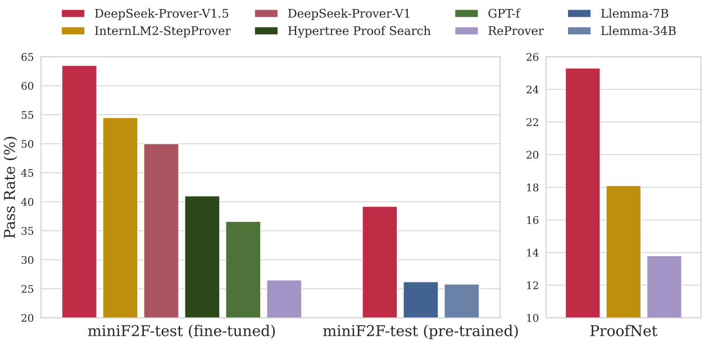
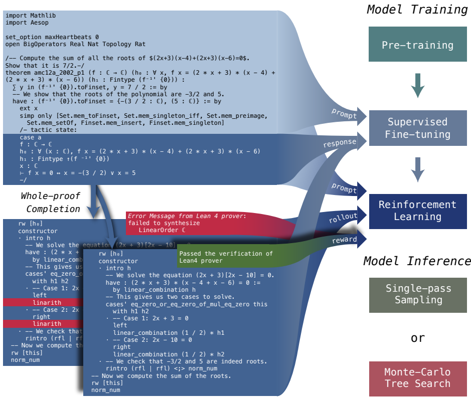
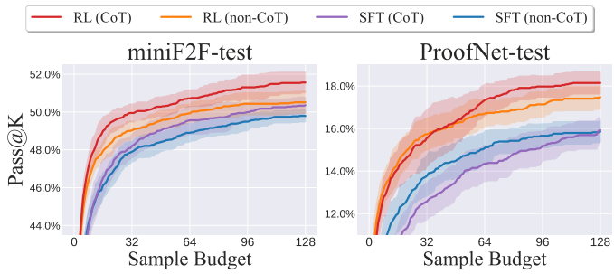
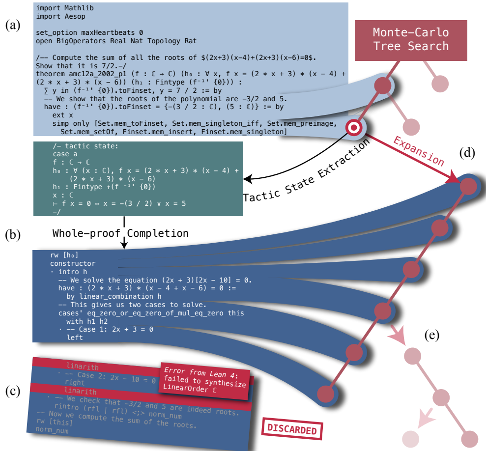
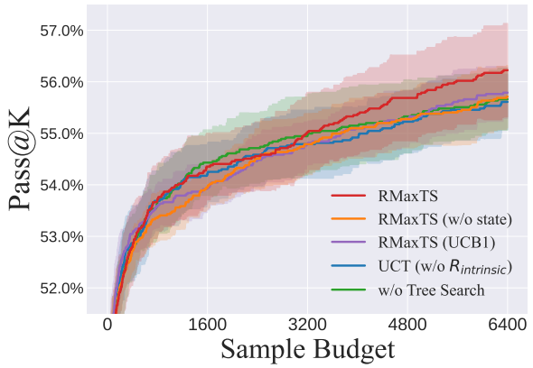

<!-- page 1 of 28 -->

arXiv: 2408.08152v1 [cs. CL] 15 Aug 2024

Qdeepseek

# DeepSeek-Prover-V1.5: Harnessing Proof Assistant Feedback for Reinforcement Learning and Monte-Carlo Tree Search / DeepSeek-Prover-V1.5: 用证明助手反馈做强化学习与蒙特卡洛树搜索

Huajian Xin\*, Z. Z. Ren\*, Junxiao Song\*, Zhihong Shao\*, Wanjia Zhao, Haocheng Wang, Bo Liu, Liyue Zhang Xuan Lu, Qiushi Du, Wenjun Gao, Qihao Zhu, Dejian Yang, Zhibin Gou, Z. F. Wu, Fuli Luo, Chong Ruan

DeepSeek-AI


DeepSeek-AI; 标星作者为共同核心贡献者. 仓库: https://github. com/deepseek-ai/DeepSeek-Prover-V1.5

[**https://github. com/deepseek-ai/DeepSeek-Prover-V1.5**](https://github. com/deepseek-ai/DeepSeek-Prover-V1.5)

## Abstract

We introduce DeepSeek-Prover-V1.5, an open-source language model designed for theorem proving in Lean 4, which enhances DeepSeek-Prover-V1 by optimizing both training and inference processes. Pre-trained on DeepSeekMath-Base with specialization in formal mathematical languages, the model undergoes supervised fine-tuning using an enhanced formal theorem proving dataset derived from DeepSeek-Prover-V1. Further refinement is achieved through reinforcement learning from proof assistant feedback (RLPAF). Beyond the single-pass whole-proof generation approach of DeepSeek-Prover-V1, we propose RMaxTS, a variant of Monte-Carlo tree search that employs an intrinsic-reward-driven exploration strategy to generate diverse proof paths. DeepSeek-Prover-V1.5 demonstrates significant improvements over DeepSeek-Prover-V1, achieving new state-of-the-art results on the test set of the high school level miniF2F benchmark (63.5%) and the undergraduate level ProofNet benchmark (25.3%).


推出 DeepSeek-Prover-V1.5: 面向 Lean 4 定理证明的开源语言模型, 在 DeepSeek-Prover-V1 上同时优化训练与推理. 基座来自 DeepSeekMath-Base, 并针对形式化数学语言做了专项续训; 再在 V1 增强后的形式证明数据集上做监督微调, 接着用**证明助手反馈强化学习**(RLPAF)精炼. 相对 V1 的「一遍写出整段证明」, 本文提出 **RMaxTS**: 一种蒙特卡洛树搜索变体, 用内在奖励驱动探索, 以生成更多样的证明路径. 相对 V1, V1.5 显著提升: 高中级 miniF2F 测试集 63.5%, 本科级 ProofNet 25.3%, 均为当时新 SOTA.

解释: Lean 4 是带严格类型检查的交互式定理证明器; 模型写出的每一步 tactic(策略)都要过编译器验证.「一遍整证」省通信, 但看不到中间 tactic 状态, 长证明容易复利式出错. RMaxTS 把整证生成嵌进树搜索: 错了就截断, 从成功前缀续写, 并用「是否发现新状态」当好奇心奖励, 逼模型多试不同路径.



Figure 1 | Pass rates of models on formal theorem proving benchmarks in Lean 4: the high school level miniF2F-test benchmark (Zheng et al., 2022) and the undergraduate level ProofNet benchmark (Azerbayev et al., 2023). We compare both the pre-trained and fine-tuned versions of DeepSeek-Prover-V1.5 with strong baselines.


图 1｜Lean 4 形式定理证明基准上的通过率: 高中级 miniF2F-test(Zheng et al., 2022)与本科级 ProofNet(Azerbayev et al., 2023). 对比 DeepSeek-Prover-V1.5 预训练与微调各档, 以及强基线.

<small><span class="docvortex-page-footnote" data-block-type="page_footnote" style="color: #6b7280">\*Core contributors</span></small>

<!-- page 2 of 28 -->

## 1. Introduction

Recent advancements in large language models have significantly influenced mathematical reasoning and theorem proving in artificial intelligence. Despite notable progress in natural language domains, language models still encounter substantial challenges in formal theorem proving, e. g. using Lean (Moura and Ullrich, 2021) and Isabelle (Paulson, 1994), which requires rigorous derivations satisfying formal specifications of the verification system. Even advanced models like GPT-4 (OpenAI, 2023) struggle with complex formal proofs, underscoring the intricate nature of both the coding and the mathematics involved. A formal theorem proving model must not only grasp the syntax and semantics of formal systems like the Lean theorem prover but also align abstract mathematical reasoning with precise formal representation.


大模型明显推高了自然语言侧的数学推理与定理证明能力, 但形式定理证明仍很难: Lean, Isabelle 等要求每一步推导都满足验证系统的形式规约. 即便 GPT-4 也常卡在复杂形式证明上-- 既是写代码, 也是写数学. 形式证明模型既要吃透 Lean 一类系统的语法与语义, 又要把抽象数学推理对齐到精确的形式表示.

Language models in formal theorem proving typically employ two strategies: proof-step generation (Polu and Sutskever, 2020; Jiang et al., 2022; Lample et al., 2022; Yang et al., 2023; Wu et al., 2024) and whole-proof generation (Jiang et al., 2022; Zhao et al., 2023; Wang et al., 2023). Proof-step generation predicts each subsequent tactic and verifies it using the formal verifier to obtain updated information about the current tactic state, often utilizing tree search techniques to construct valid proofs. In contrast, whole-proof generation is computationally efficient, which produces an entire proof code based on the theorem statement, requiring less communication budget to coordinate between the prover model and the formal theorem verifier. While DeepSeek-Prover-V1 (Xin et al., 2024) has achieved state-of-the-art results in Lean 4 with whole-proof generation, this paradigm presents its unique challenges. It requires long-horizon sequence prediction without access to intermediate tactic states, and future tactics depend on these hidden results. In Lean’s tactic mode, proofs are constructed through a sequence of tactics that transform the proof state. This sequential nature introduces the risk of compounding errors (Ross et al., 2011), where a single misinterpretation can lead to significant deviations from a valid proof path. More specifically, the auto-regressive model may have incorrect believes on intermediate tactic states when generating long proofs.


形式证明里语言模型常见两条路: **逐步生成**(proof-step)与**整证生成**(whole-proof). 逐步生成每次预测下一条 tactic, 用形式验证器核对并拿回最新 tactic 状态, 常配树搜索拼出合法证明. 整证生成更省算力与通信: 根据定理陈述一次写出整段证明代码, 模型和验证器来回少. DeepSeek-Prover-V1 靠整证生成在 Lean 4 上做到过 SOTA, 但这条路有硬伤: 长程序列预测看不到中间 tactic 状态, 而后面的 tactic 又依赖这些隐藏结果. Lean 的 tactic 模式里, 证明是一串变换证明状态的策略; 序列一旦错读, 就会复利式偏离合法路径(compounding errors). 自回归模型在长证明里, 常常对中间状态持有错误信念.

解释: tactic state(策略状态)是证明器当前「还剩哪些子目标, 上下文里有哪些假设」的快照. 逐步法每步都能看见它; 整证法在生成过程中看不见, 只能靠模型「脑补」, 长了就容易跑偏.

To seamlessly integrate intermediate tactic states in proof-step generation while maintaining the simplicity and computational efficiency of whole-proof generation, we have developed a unified approach in DeepSeek-Prover-V1.5. This method combines the strengths of both proof-step and whole-proof generation techniques through a truncate-and-resume mechanism. The process begins with standard whole-proof generation, where the language model completes the proof code following the theorem statement prefix. The Lean prover then verifies this code. If the proof is correct and complete, the procedure terminates. If an error is detected, the code is truncated at the first error message, and any subsequent code is discarded. The successfully generated proof code is then used as a prompt for the generation of next proof segment. To enhance the accuracy of the model’s new completions, we append the latest state from the Lean 4 prover as a comment at the end of the prompt. Notably, our method is not restricted to resuming from the last successfully applied tactic. We integrate the truncate-and-resume mechanism into Monte-Carlo tree search (MCTS; Coulom, 2006) in which the truncation points are scheduled by the tree search policy. In addition, we propose a novel reward-free exploration algorithm for MCTS to address the reward sparsity issue of proof search. We assign the tree search agent intrinsic motivation, a. k. a. curiosity (Schmidhuber, 2010), to extensively explore the tactic state space. These algorithmic modules extend the functionality of our whole-proof generation model to become a flexible tool for interactive theorem proving, which can effectively utilize the proof assistant feedback and generate diverse solution candidates.


为了把逐步法里的中间 tactic 状态接进来, 同时保住整证生成的简洁与算力效率, V1.5 用统一的 **truncate-and-resume(截断-续写)** 机制把两者拼起来. 流程先按标准整证生成: 语言模型在定理前缀后补全证明代码, Lean 验证. 全对则停; 一旦报错, 在第一条错误处截断, 后面全丢, 成功前缀当作下一轮提示; 并在提示末尾把 Lean 4 最新状态写成注释, 抬高续写准确度. 续写点不限定只能从「末条成功 tactic」起-- 截断-续写嵌进 **蒙特卡洛树搜索**(MCTS; Coulom, 2006), 截断位置由树策略调度. 另提一种面向证明搜索奖励稀疏的, 近乎无外在奖励的 MCTS 探索算法: 给搜索代理内在动机(好奇心, Schmidhuber, 2010), 逼它广探 tactic 状态空间. 这套模块把整证模型扩成能吃证明助手反馈, 能吐多样候选的交互式证明工具.

解释: 蒙特卡洛树搜索在棋类里很常见: 用「选点-扩展-模拟-回传」迭代, 在探索与利用之间折中. 放到证明里, 每个树节点对应一段已成功的证明前缀(或等价 tactic 状态); 扩展时让模型从该前缀整段续写, 错了再截断挂回树上.

<!-- page 3 of 28 -->



Figure 2 | Overall Framework. DeepSeek-Prover-V1.5 is trained through pre-training, supervised fine-tuning, and reinforcement learning. During supervised fine-tuning, the pre-trained model receives an incomplete theorem proof ending with a tactic state comment keyword. The model is trained to predict the content of this tactic state (auxiliary objective) and complete the subsequent proof steps (main objective). In the reinforcement learning stage, given an incomplete theorem proof and ground-truth tactic state from the Lean prover, we roll out the fine-tuned model to generate multiple proof candidates, which are then verified by the Lean prover. The verification results for these candidates are used as binary (0-1) rewards to further optimize the model and enhance its alignment with the formal specifications of the verification system. For model inference, we offer two alternatives: single-pass sampling and Monte-Carlo tree search.


图 2｜总框架. V1.5 经预训练 → 监督微调 → 强化学习. SFT 时, 预训练模型收到以 tactic state 注释关键字结尾的不完整证明, 要同时预测该状态内容(辅助目标)并补完后续证明(主目标). RL 阶段: 给定不完整证明与 Lean 给出的真值 tactic 状态, 对微调模型 rollout 多条候选, Lean 验证后用二值(0-1)奖励继续优化, 使其更贴验证系统的形式规约. 推理提供两种: 单遍采样, 或蒙特卡洛树搜索.

### 1.1. Contributions 贡献

We present a comprehensive framework for developing a language model-based formal mathematics prover, integrating several key components: large-scale mathematical pre-training, formal mathematics corpus construction and augmentation, online reinforcement learning from proof assistant feedback, and a tree search methodology for long-term planning in theorem proving. The pre-trained model, supervised fine-tuned model, and reinforcement learning model, along with the code for the Monte-Carlo tree search algorithm, are publicly available for further research and application.


给出一套语言模型形式数学证明器的完整框架, 串起: 大规模数学预训练, 形式语料构建与增强, 来自证明助手反馈的在线强化学习, 以及用于长程规划的树搜索. 预训练 / SFT / RL 模型与 MCTS 代码均公开.

• **Pre-Training**: We enhance our base model’s capabilities in formal theorem proving and mathematical reasoning by further pre-training on high-quality mathematics and code data, with a focus on formal languages such as Lean, Isabelle, and Metamath.


• **预训练**: 在高质量数学与代码数据上继续预训练, 侧重 Lean, Isabelle, Metamath 等形式语言, 抬高形式证明与数学推理能力.

• **Supervised Fine-Tuning**: We improve the Lean 4 code completion dataset by implementing two data augmentation techniques. First, we use DeepSeek-Coder V2 236B (Zhu et al.,

<!-- page 4 of 28 -->

2024) to annotate natural language chain-of-thought comments alongside Lean 4 code, aligning formal theorem proving with natural language reasoning. Second, we insert intermediate tactic state information within the Lean 4 proof code, enabling our model to leverage compiler feedback effectively. The resulting dataset is then used to fine-tune the pre-trained model.


• **监督微调**: 用两种增强改进 Lean 4 代码补全数据. 一是用 DeepSeek-Coder V2 236B 在 Lean 4 旁标注自然语言 CoT 注释, 让形式证明对齐自然语言推理; 二是在证明代码里插入中间 tactic 状态, 方便吃编译器反馈. 用所得数据微调预训练模型.

• **Reinforcement Learning**: We employ the GRPO algorithm (Shao et al., 2024) to perform reinforcement learning from proof assistant feedback (RLPAF) on the supervised finetuned model. Verification results from the Lean prover serve as reward supervision, enhancing the model’s alignment with the formal specifications of the verification system.


• **强化学习**: 对 SFT 模型用 GRPO(Shao et al., 2024)做 RLPAF; Lean 验证结果当奖励监督, 加强与验证规约对齐.

• **Monte-Carlo Tree Search**: We advance the tree search method in formal theorem proving by introducing a novel abstraction and a corresponding search algorithm. Our truncateand-resume mechanism acts as a state-action abstraction, seamlessly integrating the tree search process into the whole-proof generation framework. We present RMaxTS, an innovative Monte-Carlo tree search algorithm that leverages the RMax (Brafman and Tennenholtz, 2002) strategy to tackle exploration challenges in sparse-reward proof search problems. By assigning intrinsic rewards, this algorithm encourages the prover agent to generate diverse planning paths, thereby fostering extensive exploration of the proof space.


• **蒙特卡洛树搜索**: 为形式证明树搜索引入新抽象与对应算法. 截断-续写充当状态-动作抽象, 把树搜索无缝嵌进整证生成. 提出 **RMaxTS**: 借鉴 RMax(Brafman and Tennenholtz, 2002)处理稀疏奖励证明搜索的探索难题; 靠内在奖励鼓励证明代理走多样规划路径, 广探证明空间.

### 1.2. Summary of Evaluations and Metrics 评测与指标摘要

• **miniF2F**: In the single-pass whole-proof generation setting, DeepSeek-Prover-V1.5 achieved a pass rate of 60.2% on the test set of miniF2F, marking a significant improvement of absolute 10.2 percentage points over DeepSeek-Prover-V1’s 50.0%. Incorporating tree search techniques further elevated the pass rate to a new state-of-the-art 63.5%.


• **miniF2F**: 单遍整证生成下, 测试集通过率 60.2%, 相对 V1 的 50.0% 绝对提升 10.2 个百分点; 加上树搜索升到新 SOTA 63.5%.

• **ProofNet**: DeepSeek-Prover-V1.5 also demonstrated strong performance in the single-pass whole-proof generation setting for ProofNet, with pass rates of 21.6% on the validation set and 23.7% on the test set. The integration of tree search techniques further enhanced these results, achieving new state-of-the-art pass rates of 25.4% on the validation set and 25.3% on the test set.


• **ProofNet**: 单遍整证下验证集 21.6%, 测试集 23.7%; 加树搜索后验证集 25.4%, 测试集 25.3%, 均为新 SOTA.

## 2. Model Training 模型训练

### 2.1. Pre-training 预训练

To enhance our language model’s proficiency in generating formal proofs and reasoning through mathematical language, we further pre-train our base model (Shao et al., 2024). This refinement involved training on high-quality datasets that include both code and natural language mathematical content. We specifically focused on formal languages widely used in proof assistants, such as Lean, Isabelle, and Metamath. We designate this improved model as DeepSeek-Prover-V1.5-Base.


为抬高形式证明生成与数学语言推理能力, 在基座(Shao et al., 2024, 即 DeepSeekMath-Base)上继续预训练: 高质量代码 + 自然语言数学, 并侧重 Lean, Isabelle, Metamath. 得到 DeepSeek-Prover-V1.5-Base.

### 2.2. Supervised Fine-tuning 监督微调

In this section, we explore the methodology and processes involved in the supervised fine-tuning (SFT) of DeepSeek-Prover-V1.5. Specifically, we augment the proof dataset from DeepSeek-Prover-V1 by adding detailed explanatory comments. This enhancement aims to improve the alignment between natural language descriptions and Lean 4 code, thereby facilitating better formal mathematical reasoning. Additionally, we incorporate intermediate tactic state

<!-- page 5 of 28 -->

information as an auxiliary prediction task to support the truncate-and-resume mechanism used in the Monte-Carlo Tree Search process. We refer to the resulting model as DeepSeek-Prover-V1.5-SFT.


本节讲 V1.5 的监督微调. 在 V1 证明数据上加详细解释注释, 拉近自然语言与 Lean 4 的对齐, 服务形式数学推理; 并把中间 tactic 状态做成辅助预测任务, 支撑 MCTS 里的截断-续写. 所得模型称 DeepSeek-Prover-V1.5-SFT.

**Data Curation.** We develop a comprehensive Lean 4 code completion dataset for the supervised fine-tuning. This dataset includes synthetic proof code derived from a wide range of formal theorems. These theorems are sourced from various projects, such as the standard Lean 4 math library Mathlib4 (Mathlib Community, 2020), synthetic theorems from DeepSeek-Prover-V1 (Xin et al., 2024) and Lean Workbook (Ying et al., 2024), and validation sets from the miniF2F (Zheng et al., 2022) and ProofNet (Azerbayev et al., 2023) benchmarks. To augment the formal proof data, we employed an expert iteration process (Polu and Sutskever, 2020). This involves generating proofs using the language model, verifying the generated proof data, retraining the model with the verified data, and then using the optimized model to generate additional proof data. Between each iteration, we use DeepSeek-Coder V2 236B (Zhu et al., 2024) to annotate the thought process before the proof code as comments. Finally, we tailor these data for the truncate-and-resume mechanism for Monte-Carlo Tree Search (details in Section 3.1). The resulting proof dataset consists of 9, 645k sequences.


**数据整理.** 为 SFT 建一套较全的 Lean 4 代码补全数据, 含多来源形式定理上的合成证明代码: Mathlib4, V1 与 Lean Workbook 的合成定理, 以及 miniF2F, ProofNet 的验证集. 增强走 **expert iteration**(Polu and Sutskever, 2020): 模型生成 → 验证 → 用通过数据再训 → 再生成. 每轮之间用 DeepSeek-Coder V2 236B 把思考过程标成证明代码前的注释. 最终按截断-续写 / MCTS 需求裁剪(§3.1). 最终证明数据集:9, 645k 条序列.

解释: expert iteration(专家迭代)不是一次训完: 用当前模型造证明, 过编译器筛对的, 再训一版更强的模型, 循环扩大「已会证」的题库-- 形式证明里很常用的数据滚雪球办法.

**Thought-augmented Proof Generation.** In DeepSeek-Prover-V1, we identified a significant gap between problem-solving strategies in natural language and theorem proving in Lean. In natural language, models generate detailed deduction steps to construct proofs, whereas in Lean, they often rely on a sequence of high-level tactic calls to brute-force solutions. These high-level tactics, while effective, obscure their internal workings and outcomes, hindering the model’s ability to resolve complex proof goals with structured mathematical reasoning. To address this issue, we develop an approach that incorporates natural language reasoning before generating theorem proof code. Similar to Lean-STaR (Lin et al., 2024), which performs isolated chain-of-thought reasoning (Wei et al., 2022; Feng et al., 2023) before each proof step, our method integrates this reasoning directly as comments within the proof code. We use the DeepSeek-Coder V2 236B (Zhu et al., 2024) to enhance existing data in DeepSeek-Prover-V1 in two ways: first, by inserting a complete natural language solution at the beginning of the proof block, and second, by alternately inserting specific natural language steps for corresponding Lean tactics. Training the model with this data format enforces it to propose complete mathematical reasoning at the beginning of the proof block and detailed step planning before each tactic. This approach successfully develops new behaviors, employing delicate mathematical thinking to guide the generation of tactics. In the training data, two distinct guiding prompts are used to differentiate between the CoT (Chain of Thought) mode and the non-CoT mode for proof code completion. Examples of input and output in both modes can be found in Appendix A.


**思维增强的证明生成.** V1 里已看到自然语言解题与 Lean 证明之间的落差: 自然语言会写细推理, Lean 侧常靠一串高层 tactic 硬砸. 高层 tactic 有效, 却把内部机制与结果藏起来, 妨碍用结构化数学推理拆复杂目标. 做法是在写证明代码前嵌入自然语言推理. 类似 Lean-STaR(每步前单独做 CoT), 这里把推理直接写成证明代码里的注释. 用 DeepSeek-Coder V2 236B 增强 V1 数据: 一是在证明块开头插入完整自然语言解法; 二是在对应 Lean tactic 前交替插入具体自然语言步骤. 这种格式迫使模型在证明开头给出完整数学推理, 并在每条 tactic 前做细规划, 从而养成「用细致数学思考引导 tactic」的新行为. 训练数据用两套引导提示区分 **CoT** 与 **non-CoT** 补全模式; 样例见附录 A.

**Prompt Augmentation with Tactic State Information.** To implement the truncate-and-resume mechanism for Monte-Carlo Tree Search, we needed to extract tactic information from the code generated by the model. We enhanced the Lean REPL (Read-Eval-Print Loop; Leanprover Community, 2023) with data extraction tools from the LeanDojo (Yang et al., 2023) project. This allowed us to extract tactic information in triples, which include the position of each tactic, as well as the tactic states before and after its application. This information helps us identify the specific tactic code that triggers verification errors (used in the expansion step for tree search, see Section 3.2). For each tactic in a generated valid formal proof, we insert the tactic state returned by the verifier as a comment $^ { \prime \prime }$ tactic state: $\cdots - / ^ { m }$ . During training, we use all tokens following $\dot { \gamma } _ { 1 }$ - tactic state: " as responses to calculate the supervised fine-tuning loss, while the tokens before this comment is used as prompts and do not contribute to the training loss calculation.


**用 tactic 状态做提示增强.** 为实现 MCTS 的截断-续写, 要从模型生成的代码里抽出 tactic 信息. 在 Lean REPL(Leanprover Community, 2023)上叠 LeanDojo(Yang et al., 2023)的抽取工具, 得到三元组: tactic 位置, 应用前状态, 应用后状态-- 用来定位触发验证错误的那段 tactic 代码(树扩展见 §3.2). 对生成且验证通过的形式证明中每条 tactic, 把验证器返回的状态插成注释 `tactic state: . `. 训练时, 该注释之后的 token 全部当 response 算 SFT loss; 注释之前当 prompt, 不算 loss.

<!-- page 6 of 28 -->

**Training Setting.** We conduct supervised fine-tuning based on the pre-trained model and train for 9B tokens, using a batch size of 2, 048 and a constant learning rate of 1e-4. The training process begins with 100 warm-up steps to stabilize the learning dynamics. Training examples are randomly concatenated to form sequences, with a maximum context length of 4, 096 tokens.


**训练设定.** 在预训练模型上做 SFT, 共 9B token; batch size 2, 048, 恒定学习率 1e-4; 100 步 warm-up. 样本随机拼接成序列, 最大上下文 4, 096 token.

### 2.3. Reinforcement Learning from Proof Assistant Feedback 来自证明助手反馈的强化学习

Reinforcement learning (RL) has been proven effective in enhancing the mathematical reasoning capabilities of supervised fine-tuned language models (Shao et al., 2024). To further advance DeepSeek-Prover-V1.5-SFT, we incorporate a reinforcement learning phase, resulting in the model DeepSeek-Prover-V1.5-RL. This phase leverages RL to enhance performance based on verification feedback from the Lean 4 prover. The specifics of this RL process are detailed below.


RL 已被证明能抬高 SFT 语言模型的数学推理(Shao et al., 2024). 在 V1.5-SFT 上再接 RL, 得到 DeepSeek-Prover-V1.5-RL, 用 Lean 4 验证反馈继续抬分. 细节如下.

**Prompts.** In the reinforcement learning stage, we use a subset of theorem statements from the supervised fine-tuning dataset as training prompts. We select theorems for which DeepSeek-Prover-V1.5-SFT has a moderate success rate in generating correct proofs upon multiple attempts. This ensures that the model has room for improvement while still being able to receive positive feedback. After filtering, we retain approximately 4.5k unique theorem statements. Each theorem is prefixed with both CoT and non-CoT guiding prompts to enhance the model’s proof generation capabilities in both modes.


**提示.** RL 阶段从 SFT 数据里抽一部分定理陈述作训练提示: 选那些 V1.5-SFT 多试几次成功率「中等」的题-- 既有提升空间, 又能收到正反馈. 过滤后约 4.5k 条唯一定理; 每条都配 CoT 与 non-CoT 两套引导前缀.

**Rewards.** When training LLMs via RL, a trained reward model typically provides feedback signals. In contrast, formal theorem proving benefits from the rigorous verification of generated proofs by proof assistants, offering a significant advantage. Specifically, each generated proof receives a reward of 1 if verified as correct, and 0 otherwise. While this binary reward signal is accurate, it is also sparse, especially for theorems that are challenging for the supervised fine-tuned model. To mitigate this sparsity, we select training prompts that are challenging yet achievable for the supervised fine-tuned model, as described above.


**奖励.** 一般 LLM 的 RL 靠训练好的奖励模型给分; 形式证明可以直接用证明助手严格验证-- 对就 1, 否则 0. 二值奖励准, 但稀疏, 尤其对 SFT 也难的题. 缓解办法就是上一段: 选「难但可及」的提示.

**Reinforcement Learning Algorithm.** We employ the Group Relative Policy Optimization (GRPO; Shao et al., 2024) as our RL algorithm, which has demonstrated superior effectiveness and efficiency compared to PPO (Schulman et al., 2017), primarily because it eliminates the necessity of training an additional critic model. Specifically, GRPO samples a group of candidate proofs for each theorem prompt and optimizes the model based on the relative rewards of the outputs within the group. Our prompt selection strategy is designed to likely include both correct and incorrect proofs among the candidates, aligning well with the group-relative nature of GRPO and thereby enhancing the training process.


**RL 算法.** 用 **GRPO**(Shao et al., 2024): 相对 PPO 更省, 因为不必再训 critic. 对每个定理提示采样一组候选证明, 按组内相对奖励优化. 提示筛选刻意让候选里常同时出现对与错, 正好契合 GRPO 的组内相对比较.

解释: GRPO(Group Relative Policy Optimization)把同一题下多条回答放进一组, 用组内相对好坏当优势估计, 省掉价值网络; DeepSeekMath 里先系统用过, 这里把「组内相对」接到 Lean 的 0/1 验证上.

**Training Setting.** We conduct RL training based on the SFT model, which serves as both the initial model and the reference model for imposing the Kullback-Leibler (KL) divergence penalty. We use a constant learning rate of 5e-6, and the KL penalty coefficient is set to 0.02. For each theorem, we sample a group of 32 candidate proofs, with maximum length set to 2, 048. The training batch size is configured to 512.


**训练设定.** 以 SFT 为初始策略, 同时当 KL 惩罚的参考模型; 学习率恒定 5e-6, KL 系数 0.02. 每题采样 32 条候选, 最大长度 2, 048; 训练 batch size 512.

<!-- page 7 of 28 -->



图注: 证明助手反馈训练的阶段对比：Base、SFT 与 RL 在 miniF2F-test 和 ProofNet-test 上的通过率逐级提高，带 CoT 的 RL 最高，分别为 51.6% 和 18.2%。
| Model | PassminiF2F-test | @128ProofNet-test |
| --- | --- | --- |
| Base (3-shot) | 29.7%±0.5% | 9.7%±0.7% |
| SFT (non-CoT) | 49.8%±0.3% | 15.9%±0.5% |
| SFT (CoT) | 50.4%±0.4% | 15.9%±0.6% |
| RL (non-CoT) | 50.5%±0.6% | 17.5%±0.5% |
| RL (CoT) | 51.6%±0.5% | 18.2%±0.5% |

Figure 3 | Comparison of model capabilities at different training stages. "CoT" and "non-CoT" refer to evaluations using two guiding prompts. The shaded region represents the range of standard deviations around the mean values. The notation $\mu \pm \sigma$ indicates the average accuracy 𝜇 and the standard deviation 𝜎.


图 3｜各训练阶段能力对比.「CoT / non-CoT」对应两套引导提示; 阴影为均值附近标准差区间; $\mu \pm \sigma$ 为平均准确率与标准差.

### 2.4. Evaluation 评测

**Benchmarks.** We evaluate theorem-proving performance on the following benchmarks to compare model capabilities after each training stage:


**基准.** 用下列基准比较各训练阶段:

• **MiniF2F** (Zheng et al., 2022) focuses on formal problem-solving skills for high-school level exercises and competitions, such as AMC, AIME, and IMO, with an emphasis on algebra and number theory. The benchmark includes 244 validation and 244 test problems, originally in Lean 3 and manually converted to Lean 4.9.0, based on the version provided by Yang (2023).


• **MiniF2F**(Zheng et al., 2022): 高中习题与竞赛(AMC / AIME / IMO), 偏代数与数论; 验证 / 测试各 244 题; 原 Lean 3, 按 Yang (2023) 版本手工转到 Lean 4.9.0.

• **ProofNet** (Azerbayev et al., 2023) evaluates formal theorem-proving capabilities at the undergraduate level in mathematics. It comprises 185 validation and 186 test problems from widely-used undergraduate textbooks, covering real and complex analysis, linear algebra, abstract algebra, and topology. These problems were initially in Lean 3 and manually converted to Lean 4.9.0.


• **ProofNet**(Azerbayev et al., 2023): 本科级形式证明; 验证 185, 测试 186; 来自常用本科教材, 覆盖实复分析, 线代, 抽代, 拓扑; 同样由 Lean 3 手工转 Lean 4.9.0.

**Prompting Configurations.** For each proof attempt of DeepSeek-Prover-V1.5-Base, we independently sample three proof demonstrations from the validation set to construct the few-shot prompts. For the miniF2F benchmark, we use human-written proofs from Yang (2023), while for the ProofNet benchmark, we use correct proofs generated by DeepSeek-Prover-V1.5-RL as few-shot demonstrations. For DeepSeek-Prover-V1.5-SFT and DeepSeek-Prover-V1.5-RL, we employ two types of guiding prompts: one that encourages chain-of-thought (CoT) reasoning before each proof step, and one that does not (non-CoT). Detailed examples are provided in Appendix A.


**提示配置.** Base 每次独立从验证集抽 3 条证明示范做 few-shot: miniF2F 用人写证明(Yang, 2023), ProofNet 用 V1.5-RL 生成的正确证明. SFT / RL 用两套引导: 鼓励每步前 CoT, 或不鼓励(non-CoT). 样例见附录 A.

**Metric.** We evaluate theorem-proving performance using the pass@𝐾 accuracy metric, which measures the model’s success in generating a correct proof within 𝐾 attempts. Each model is deployed on a single A100-40G GPU, utilizing the vLLM framework (Kwon et al., 2023) for sample generation. The sampling parameters are set with a temperature of 1, a top-p value of 0.95, and a maximum token limit of 2, 048. The generated proofs are then verified using the Lean 4 theorem prover. For this verification, we import Mathlib4 (Mathlib Community, 2020) and Aesop (Limperg and From, 2023) to access predefined premises and tactics. The verification process is subject to a time limit of 300 seconds.


**指标.** 用 pass@𝐾: 𝐾 次尝试内能否写出正确证明. 每模型单卡 A100-40G, vLLM 采样; 温度 1, top-p 0.95, 最长 2, 048 token. Lean 4 验证, 导入 Mathlib4 与 Aesop; 单题验证时限 300 秒.

<!-- page 8 of 28 -->

**Comparison across Training Stages.** Figure 3 presents a comparative analysis of each training stage on the miniF2F and ProofNet datasets. Our base model, DeepSeek-Prover-V1.5-Base, achieves a notable pass rate, solving nearly one-third of the problems on the test set of the miniF2F benchmark using 3-shot prompting. The supervised fine-tuning stage, resulting in DeepSeek-Prover-V1.5-SFT, significantly outperforms the base model, with Pass@128 accuracy increasing by approximately two-thirds on miniF2F and doubling on ProofNet. The subsequent reinforcement learning stage further enhances the model’s performance, improving Pass@𝐾 accuracy across all values of 𝐾. In contrast to findings in natural language mathematics, such as those reported in DeepSeekMath (Shao et al., 2024), where reinforcement learning primarily boosts the correct response from TopK, we observe a genuine enhancement of fundamental capabilities in formal theorem proving. This improvement is evident not only with a small sample budget but also remains stable as the sample budget increases. This conclusion is further supported by later Monte-Carlo Tree Search experiments with larger sample budgets, as discussed in Section 4.2.


**各训练阶段对比.** 图 3: Base 在 miniF2F 测试集 3-shot 已解出近三分之一. SFT 明显强于 Base: Pass@128 在 miniF2F 大约抬高三分之二量级, ProofNet 接近翻倍. 随后 RL 在各 𝐾 上继续抬 Pass@𝐾. 与 DeepSeekMath 里「RL 主要把正确回答从 TopK 里抬出来」不同, 这里看到形式证明上的**基础能力**真在变强: 小采样预算已见效, 加大预算仍稳住-- 后面更大预算的 MCTS 实验(§4.2)也支持这一点.

**Comparison between CoT and non-CoT.** We compare the performance of non-CoT and CoT generation modes for both DeepSeek-Prover-V1.5-SFT and DeepSeek-Prover-V1.5-RL. The results in Figure 3 demonstrate that the CoT mode consistently outperforms the non-CoT mode across most settings. Specifically, DeepSeek-Prover-V1.5-RL, leveraging these enhanced theorem-proving patterns, achieves superior performance on both benchmarks, with an average accuracy of 51.6% on miniF2F and 18.2% on ProofNet. The integration of natural language reasoning in CoT mode significantly enhances the planning and execution of formal proof writing. For a detailed comparison of proof strategies with and without the use of natural language chain-of-thought, refer to the examples provided in Appendix A.


**CoT vs non-CoT.** 图 3 显示多数设定下 CoT 更好. V1.5-RL 在两基准上更强: miniF2F 平均 51.6%, ProofNet 18.2%. CoT 把自然语言推理嵌进形式证明的规划与执行. 带 / 不带自然语言 CoT 的策略对比见附录 A.

## 3. Exploration-oriented Monte-Carlo Tree Search 面向探索的蒙特卡洛树搜索

### 3.1. Tactic-level Tree Abstraction Tactic 级树抽象

To implement the tree search method in the whole-proof generation setting, we introduce a proof tree abstraction to define the tailored state and action space, leveraging a truncate-and-resume mechanism. Roughly following the paradigm of Yao et al. (2023), we begin by decomposing an incomplete proof into a sequence of tree nodes that correspond to individual proof steps, and then we utilize the partial content stored in these tree nodes to continue the proof generation process. Figure 4 illustrates the process of constructing a proof search tree from whole-proof generation.


为在整证生成设定下做树搜索, 引入证明树抽象, 用截断-续写定义状态与动作空间. 大致沿 Yao et al. (2023) 的范式: 先把不完整证明拆成对应各证明步的树节点序列, 再用节点上存的部分内容继续生成. 图 4 画出如何从整证生成构造证明搜索树.

**Truncate: Proof Decomposition into Tree Nodes.** We construct the proof search tree at the tactic level, where each tree edge represents a single transition step of the tactic state. Initially, we submit the entire proof the model generated to the Lean prover to parse it into tactics. We then truncate the proof at the earliest verification error, ensuring that all subsequent tactic codes can be successfully applied to advance the proof towards the desired theorem. The tactic codes are segmented into several code fractions, each containing a valid tactic code and its associated chain-of-thought comments, corresponding to a single tree edge that represents a tactic state transition. Through this abstraction, each tactic code is converted into a series of tree nodes, forming a path from the root to a specific node.


**截断: 把证明拆成树节点.** 搜索树建在 tactic 级, 每条边是一次 tactic 状态转移. 先把模型整段证明交给 Lean 解析成 tactics, 在最早验证错误处截断, 保证保留下来的 tactic 都能推进证明. 代码切成若干片段, 每段含合法 tactic 及其 CoT 注释, 对应一条表示状态转移的树边. 于是每段 tactic 代码变成一串节点, 形成从根到某节点的路径.

<!-- page 9 of 28 -->



Figure 4 | Truncate-and-Resume Mechanism in the Expansion Step of MCTS. (a) After selecting a node, we trace its corresponding incomplete proof code prefix, which includes the file header, initial statement, and successfully applied tactics from the ancestor nodes. (b) The language model then generates the subsequent proof based on this prefix along with a comment block containing the current tactic state. (c) The combined proof code (prefix and newly generated code) is verified by the Lean 4 prover. If no errors are found, the tree-search procedure terminates. If errors are detected, we truncate the newly generated code at the first error message, discard the subsequent code, and parse the successful portion into tactics. (d) Each tactic is added as a new node in the search tree, extending a chain of descendants beneath the selected node. (e) Once the tree updates are complete, the next iteration of expansion begins by selecting an alternative candidate node, which is not limited to leaf nodes. This process repeats until a correct proof is found or the sample budget is exhausted.


图 4｜MCTS 扩展步中的截断-续写. (a) 选中节点后, 回溯其不完整证明前缀: 文件头, 初始陈述, 祖先节点上已成功应用的 tactics. (b) 语言模型在此前缀 + 当前 tactic 状态注释块上续写. (c) 前缀与新代码合并后交 Lean 4 验证; 无错则结束搜索; 有错则在第一条错误处截断新代码, 丢弃后续, 把成功部分解析成 tactics. (d) 每条 tactic 作为新节点挂到选中节点下, 延伸一条后代链. (e) 树更新完后, 下一轮扩展可选别的候选节点, **不限于叶子**. 重复直到找到正确证明或采样预算耗尽.

**Resume: Proof Generation from a Tree Node.** In Lean 4, different tactics can lead to the same tactic state, meaning each node in our proof tree can correspond to various tactic codes that achieve the same outcome. To handle this, we store a set of these equivalent tactic codes at each node. When the tree search agent expands a node, it randomly selects one tactic to use as a prompt for the language model. This prompt includes the incomplete proof code ending with the chosen tactic and the tactic state information from the Lean prover as a comment block. The fine-tuned model (see Section 2.2) has been trained to recognize and utilize this format, using the incomplete code augmented with tactic state comments to guide subsequent proof generation.


**续写: 从树节点生成证明.** Lean 4 里不同 tactic 可以到达同一 tactic 状态, 故每个节点可存多套「等价」tactic 代码. 扩展时随机抽一条作提示: 不完整证明以该 tactic 结尾, 并附 Lean 状态注释块. 微调模型(§2.2)已学会吃这种格式, 用不完整代码 + 状态注释引导后续生成.

<!-- page 10 of 28 -->

### 3.2. Interactive Theorem Proving via Monte-Carlo Tree Search 用蒙特卡洛树搜索做交互式定理证明

Our proof search tree is developed using the standard Monte-Carlo Tree Search (MCTS) paradigm (MCTS; Coulom, 2006; Browne et al., 2012), which iteratively applies four steps: Selection, Expansion, Simulation, and Backpropagation. We integrate the Simulation step into Expansion because our whole-proof generation model inherently performs a rollout from the expanded node. The detailed design of the algorithm workflow is as follows.


证明搜索树走标准 MCTS 四步: 选择, 扩展, 模拟, 回传. 因整证模型从扩展节点起本身就是一次 rollout, 把「模拟」并进「扩展」. 流程如下.

**Selection.** The selection step, a. k. a. the tree policy, starts from the root node and traverses downward to identify a promising node for expansion. The objective of this algorithmic step is to trade off between exploration and exploitation (Kocsis and Szepesvári, 2006). The tree policy at a tree node 𝑠 is computed by selecting the action that maximizes the value from the set of valid operations:


**选择.** 树策略从根向下走, 挑一个值得扩展的节点, 在探索与利用之间折中(Kocsis and Szepesvári, 2006). 在节点 $s$ 上, 从合法动作里选使价值最大者:

$$
\text {TreePolicy} (s) = \underset {a \in \text {Children} (s) \cup \{\varnothing \}} {\arg \max} Q _ {U C B} (s, a), \tag{1}
$$

where the action 𝑎 can be either moving to a child node, denoted by $a \in C h i l d r e n ( s )$ , or expanding the current node 𝑠, denoted by a special token $a = \oslash$ . This approach uses a technique called virtual node (Wang et al., 2023), which assigns each node an imaginary child to represent the selection of the current node 𝑠 for expansion. It enables the tree search agent to continually expand non-leaf nodes, as the action space is supported by a generative model whose output scope cannot be determined by a fixed number of trails. The value estimation $Q _ { U C B } ( s , a )$ of performing action 𝑎 on node 𝑠 is composed by two components:


其中动作 $a$ 可以是走向子节点 $a \in \mathrm{Children}(s)$, 或扩展当前节点 $s$(特殊记号 $a=\varnothing$). 这用到 **virtual node**(Wang et al., 2023): 给每个节点一个虚子节点, 表示「就在这里扩展」. 因动作空间由生成模型支撑, 输出范围无法靠有限试次定死, 搜索代理可以持续扩展非叶节点. $Q_{UCB}(s, a)$ 由两项组成:

$$
\forall a \in \text {Children}(s) \cup \{\varnothing \}, \quad Q _ {U C B} (s, a) = \underbrace {Q (s , a)} _ {\text {Exploitation}} + \underbrace {U C B (s , a)} _ {\text {Exploration}}, \tag{2}
$$

where $Q ( s , a )$ denotes a sample-based estimation of action values derived from the selection history, functioning as the exploitation component that retrieves high-value candidates from previous trials. $U C B ( s , a )$ denotes the exploration bonus computed by upper confidence bounds (UCB; Auer, 2002), which diminishes with the repeated execution of the state-action pair $( s , a )$ More specifically, $Q _ { U C B } ( s , a )$ stands for an optimistic estimation of $Q ( s , a )$ and can serve as an upper bound with high probability. We defer the discussion of detailed settings of node values and UCB bonus to Section 3.3.


$Q(s, a)$ 是由选择历史估计的动作价值(利用项), 从既往试验里捞高价值候选; $UCB(s, a)$ 是上置信界探索奖励, 随 $(s, a)$ 被反复执行而衰减. $Q_{UCB}$ 是对 $Q$ 的乐观估计, 高概率可当上界. 节点价值与 UCB 细节放到 §3.3.

**Expansion.** The next step is invoking the proof generation model to expand the node nominated by the selection phase. Resuming the incomplete proof codes stored on the node designated for expansion, we perform whole-proof generation to propose a series of subsequent tactics and submit the generated proof to Lean prover for verification. Such a trial of proof completion is equivalent to conducting a single rollout of simulation within the standard MCTS framework. When the verification result indicates the proof is complete, the search procedure is ready to be terminated, having found a new proof of the desired theorem. Otherwise, we parse the verification feedback and truncate the generated proof to the assertion of the earliest verification error. The remaining tactics are transformed into a path of nodes to be merged into the search tree (see Figure 4). It is important to note that, because we use the whole-proof generation setting-where the output is an entire proof consisting of a sequence of tactics, rather than just the next tactic-our expansion procedure may insert a path of tree nodes into the search tree during each iteration. This differs from the conventional MCTS designed for competitive games, which typically expands only one layer of children nodes per iteration (Silver et al., 2016, 2018; Schrittwieser et al., 2020).


**扩展.** 对选择阶段提名的节点, 用不完整证明前缀做整证生成, 提出后续一串 tactics, 交 Lean 验证. 这一次补全就相当于标准 MCTS 里的一次模拟 rollout. 若验证表明证明已完成, 搜索可停. 否则解析反馈, 截到最早错误, 把剩余成功 tactics 变成一条节点路径并入搜索树(图 4). 要点: 输出是整段多 tactic 证明而非「下一条」, 故每次扩展可能插入**一整条路径**, 不同于棋类 MCTS 通常每轮只扩一层子节点.

<!-- page 11 of 28 -->

**Backpropagation.** The final phase of each tree search iteration is to update value statistics along the selection trajectory from the root to the expanded node, $i . e ., $ updating the values associated with the tree policy stated in Eq. (1). Let $\tau \stackrel { \star } { = } \{ ( r o o t , s ^ { ( 1 ) } ) , ( s ^ { ( 1 ) } , \stackrel { \star } { s ^ { ( 2 ) } } ) , ( \stackrel { \smile } { s ^ { ( 2 ) } } , s ^ { ( 3 ) } ) , \cdots , ( s ^ { ( | \tau | - 1 ) } \; = \; $ $\left. s _ { t } , \oslash \right) \}$ denote the selection trajectory of 𝑡-th iteration that ends with 𝑠<sub>𝑡</sub> as the expanding node. We update $Q _ { U C B } ( s , a )$ for all $( s , a ) \in \tau$ by taking the most recent trajectory reward $R ( \tau )$ into account (details refer to ${ \mathrm { E q . ~ } } ( 7 ) )$ . The extrinsic source of rewards comes from the compiler feedback, specifically assigning a reward of $R _ { \mathrm { e x t r i n s i c } } ( \tau ) = 1$ for completed proofs and $R _ { \mathrm { e x t r i n s i c } } ( \tau ) = 0$ for unsolved ones. In Section 3.3, we will introduce an intrinsic reward mechanism to augment the reward assignment that enhances the agent’s incentive for exploration.


**回传.** 沿从根到扩展节点的选择轨迹更新与式 (1) 相关的价值统计. 记第 $t$ 轮选择轨迹为 $\tau$, 末端扩展节点为 $s_t$. 对所有 $(s, a)\in\tau$, 用最新轨迹奖励 $R(\tau)$ 更新 $Q_{UCB}$(细节见式 (7)). 外在奖励来自编译器: 证完 $R_{\mathrm{extrinsic}}(\tau)=1$, 未解 $0$. §3.3 再引入内在奖励, 加强探索动机.

### 3.3. Intrinsic Rewards for Monte-Carlo Tree Search 蒙特卡洛树搜索的内在奖励

In the search problem of formal theorem proving, the extrinsic rewards are extremely sparse, $i . e ., $ the search agent only obtains non-zero rewards when the proof is completely solved. More specifically, the proof search process forms a tree structure with only a narrow set of leaves delivering non-zero rewards, which matches a famous hard-exploration case (Krishnamurthy et al., 2016) in the literature of statistical reinforcement learning. To promote exploration in sparse-reward sequential decision making, one classical paradigm is constructing intrinsic rewards (Schmidhuber, 2010) that encourage the agent to not only optimize extrinsic rewards but also acquire general information about the interactive environment (Bellemare et al., 2016; Houthooft et al., 2016; Pathak et al., 2017; Burda et al., 2019). In this section, we present our intrinsic-reward-driven exploration algorithm, RMax applied to Tree Search (RMaxTS), to incorporate reward-free exploration in the proof search problem.


形式证明搜索里外在奖励极稀: 只有整题证完才非零; 搜索树只有窄带叶子给分, 正是统计 RL 里经典的难探索情形(Krishnamurthy et al., 2016). 稀疏奖励序贯决策里, 经典做法是造**内在奖励**(Schmidhuber, 2010), 让代理在追外在分之外, 也学交互环境的信息(Bellemare, Houthooft, Pathak, Burda 等). 本节给出内在奖励驱动的探索算法:**RMax applied to Tree Search(RMaxTS)**, 把近乎无奖励探索接到证明搜索上.

**RMax applied to MCTS.** We adopt RMax (Brafman and Tennenholtz, 2002), a classical exploration mechanism, to construct intrinsic rewards for Monte-Carlo tree search. The core idea of RMax is to explore a broad coverage of the state space. The agent awards itself a maximal amount of reward upon reaching an unseen state. In the context of proof search, where no extrinsic rewards are provided until the proof is completed, our algorithmic procedure resembles ZeroRMax (Jin et al., 2020), in which the agent’s exploration is driven solely by intrinsic rewards, $i . e ., $ setting $R ( \tau ) = R _ { \mathrm { i n t r i n s i c } } ( \tau )$ . The intrinsic reward of a tree expansion step is determined by whether a new node is added to the search tree,


**把 RMax 接到 MCTS.** RMax(Brafman and Tennenholtz, 2002)的核心是广覆盖状态空间: 到达未见状态就给自己最大奖励. 证明搜索在证完前几乎没有外在分, 流程接近 ZeroRMax(Jin et al., 2020): 探索几乎只靠内在奖励, $R(\tau)=R_{\mathrm{intrinsic}}(\tau)$. 一次扩展的内在奖励由「是否向搜索树加入新节点」决定:

$$
R _ {\text {intrinsic}} (\tau) = \mathbb {I} [ \text {at least one new node is added to the search tree} ], \tag{3}
$$

where $\tau$ denotes the most recent selection trajectory that requires a reward assignment for backpropagation. This exploration strategy prioritizes the expansion of nodes where the prover model generates tactics that lead to a diverse range of tactic states. As multiple Lean codes can result in the same transition of intermediate states, this heuristics can potentially reduce redundant generation and improve sample efficiency.


$\tau$ 是需要回传赋奖的最近选择轨迹. 该策略优先扩展那些能通向多样 tactic 状态的节点; 因多段 Lean 代码可对应同一中间状态转移, 这一启发式有望减冗余生成, 抬采样效率.

解释: RMax 原意是「未知状态按最大可能回报估」. 这里落地成: 扩展若带来**新树节点**(新 tactic 状态), 就给内在奖励 1, 否则 0-- 等于用「好奇心」代替「是否证完」来指路, 直到某次碰巧把证明走完.

**UCB for Non-stationary Rewards.** The common setting of UCB exploration bonus for Monte-Carlo tree search is using UCB1 (Auer et al., 2002):


**非平稳奖励下的 UCB.** MCTS 里常见探索项是 UCB1(Auer et al., 2002):

$$
Q _ {U C B 1} (s, a) = \frac {W (s , a)}{N (s , a)} + \sqrt {\frac {2 \ln \sum_ {a ^ {\prime}} N (s , a ^ {\prime})}{N (s , a)}}, \tag{4}
$$

$$
W (s, a) = \sum_ {\tau \in \Gamma (s, a)} R (\tau), \tag{5}
$$

$$
N (s, a) = | \Gamma (s, a) |, \tag{6}
$$

<!-- page 12 of 28 -->

where $\Gamma ( s , a ) = \{ \tau \mid ( s , a ) \in \tau \}$ denotes the list of tree-policy trajectory 𝜏 containing $( s , a )$ as an intermediate selection step. To facilitate discussions, we organize the list $\Gamma ( s , a ) = \{ \tau _ { 1 } , \tau _ { 2 } , \cdots \}$ such that newly collected trajectories have larger subscript indices. In this work, we propose to use an alternative variant of UCB method. Note that the derived intrinsic reward in Eq. (3) is a non-stationary reward signal whose expected value decays with the progress of exploration. That is because it becomes definitely harder to discover new nodes with unseen tactic states as the search tree expands through sophisticated exploration. To tackle the non-stationarity, we consider discounted upper confidence bounds (DUCB; Garivier and Moulines, 2011), which uses a discount factor $\gamma \in ( 0 , 1 )$ to smoothly drop those outdated feedback records:


$\Gamma(s, a)=\{\tau\mid(s, a)\in\tau\}$ 是含该状态-动作对的树策略轨迹列表; 下标越大表示越新. 式 (3) 的内在奖励是**非平稳**的: 树越长, 发现带未见 tactic 状态的新节点越难, 期望奖励随探索推进衰减. 为此改用 **折扣上置信界**(DUCB; Garivier and Moulines, 2011), 用 $\gamma\in(0, 1)$ 平滑丢掉过时反馈:

$$
Q _ {D U C B} (s, a) = \frac {W _ {\gamma} (s , a)}{N _ {\gamma} (s , a)} + \sqrt {\frac {2 \ln \sum_ {a ^ {\prime}} N _ {\gamma} (s , a ^ {\prime})}{N _ {\gamma} (s , a)}}, \tag{7}
$$

$$
W _ {\gamma} (s, a) = \sum_ {t = 1} ^ {N (s, a)} \gamma^ {N (s, a) - t} R (\tau_ {t}), \tag{8}
$$

$$
N _ {\gamma} (s, a) = \sum_ {t = 0} ^ {N (s, a) - 1} \gamma^ {t}, \tag{9}
$$

where newly received feedback would be assigned a larger weight in the value estimation. In practice, we set $\gamma = 0 . 9 9$ . Note that the role of discount factor 𝛾 in DUCB differs from its role in value iteration for infinite-horizon MDPs. The discounting is applied to tree search iterations rather than to the action-step horizon within a single trajectory.


新反馈在价值估计里权重更大; 实践取 $\gamma=0.99$. 注意: 这里的 $\gamma$ 折扣的是**树搜索迭代轮次**, 不是单条轨迹里动作步的时间域折扣(与无限时域 MDP 价值迭代里的 $\gamma$ 角色不同).

### 3.4. Parallelization of Monte-Carlo Tree Search 蒙特卡洛树搜索的并行化

To enhance the efficiency of Monte-Carlo Tree Search (MCTS), we implement several established parallelization techniques as described by Chaslot et al. (2008).


为抬 MCTS 效率, 采用 Chaslot et al. (2008) 所述若干成熟并行化手法.

• **Root Parallelization:** We deploy 256 MCTS runners per node, with one language model per GPU and a batch size of 512 for proof generation. The Lean prover is invoked through REPL and executed on a cluster with thousands of CPU cores, where each proof verification task is handled by an individual process, created and terminated in a sandbox. Both proof generation by language models and verification by Lean provers are handled asynchronously. This setup allows MCTS runners to perform concurrent tree search operations, significantly accelerating the process.


• **根并行**: 每节点部署 256 个 MCTS runner; 每 GPU 一张语言模型, 证明生成 batch 512. Lean 经 REPL 调起, 跑在数千核 CPU 集群上, 每条验证任务独立进程, 沙箱内创建销毁. 模型生成与 Lean 验证皆异步, 多 runner 并发搜树.

• **Tree Parallelization:** We manage each search tree with 32 thread workers to parallelize the tree iteration steps. This method effectively schedules and balances the tasks of proof generation and Lean verification. Each thread worker iteratively performs the tree search loop by selecting a candidate node for expansion, invoking the language model to generate the proof, verifying the generated proof with the Lean prover, and performing backpropagation.


• **树并行**: 每棵搜索树用 32 个线程 worker 并行迭代: 选点 → 调模型生成 → Lean 验证 → 回传, 调度并平衡生成与验证负载.

• **Virtual Loss:** To encourage diverse node selection among concurrent thread workers, we assign a virtual reward $R ( \tau ) = 0$ for ongoing iterations. This involves backpropagating a reward of 0 temporarily and updating it to the true reward upon completion. This strategy promotes exploration of different nodes for expansion, thereby enhancing the overall search efficiency.


• **虚拟损失**: 并发 worker 间为鼓励选不同节点, 对进行中的迭代先赋虚拟奖励 $R(\tau)=0$ 并临时回传, 完成后再改成真奖励-- 减少大家扎堆同一节点.

### 3.5. Comparison with Existing Methods 与既有方法对比

In this section, we compare our proposed proof tree search method, which introduces a novel truncate-and-resume mechanism for whole-proof generation, with existing approaches. Current

<!-- page 13 of 28 -->

methods for using language models in formal mathematics proof search generally fall into two main strategies:


本节对比「整证生成 + 截断-续写」的证明树搜索与既有路线. 当前用语言模型做形式数学证明搜索, 大体两类:

• **Multi-pass proof-step generation**: This strategy breaks down the proving process into multiple episodes of tactic generation and verification, typically following a **tree search** pattern. It involves generating and verifying one tactic at a time, repeating the process for the next tactic until no proof goals remain. Notable examples include GPT-f (Polu and Sutskever, 2020; Polu et al., 2022), Thor (Jiang et al., 2022), ReProver (Yang et al., 2023), Hypertree Proof Search (Lample et al., 2022), and InternLM2-StepProver (Wu et al., 2024).


• **多遍逐步生成**: 把证明拆成多轮「生成一条 tactic → 验证」, 常走树搜索; 一次一条, 直到无目标. 代表: GPT-f, Thor, ReProver, Hypertree Proof Search, InternLM2-StepProver.

• **Single-pass whole-proof generation**: This approach generates and verify an entire proof in one attempt. If the proof is incorrect, the model generates a new proof in the next attempt. Methods in this category include DSP (Jiang et al., 2022), Subgoal-Prover Zhao et al. (2023), LEGO-Prover (Wang et al., 2023), Lyra (Zheng et al., 2023), and miniCTX (Hu et al., 2024).


• **单遍整证生成**: 一次生成并验证整段证明; 错了下一轮重来. 代表: DSP, Subgoal-Prover, LEGO-Prover, Lyra, miniCTX.

Our proof tree search method uniquely bridges these two strategies, offering a novel hybrid approach. It starts with whole-proof generation, similar to the single-pass approach, but extends this by implementing a sophisticated truncate-and-resume mechanism. This process involves truncating the generated proof to its successful initial segment, parsing this segment into individual tactics, and resuming the tree search from this point. This iterative process effectively implements a Monte-Carlo Tree Search, seamlessly integrating single-pass whole-proof generation with multi-pass proof-step generation. Consequently, we can train a single model with nearly identical objectives to support both strategies simultaneously. Our experimental results demonstrate that this unified approach achieves superior performance in both settings. By combining the strengths of existing methods and introducing innovative techniques, our method offers a more versatile and effective solution for formal mathematics proof search, potentially paving the way for future advancements in this field.


本文方法桥接两类: 起步像单遍整证, 再靠截断-续写把成功前缀拆成 tactics, 从该点续搜, 迭代起来就是 MCTS, 把单遍整证与多遍逐步缝在一起. 于是可用几乎同一套目标训一个模型, 同时撑住两种策略; 实验显示在两种设定下都更强.

## 4. Experimental Results 实验结果

In this section, we evaluate the theorem-proving capabilities of DeepSeek-Prover-V1.5 using two distinct benchmarks: miniF2F, which encompasses high-school level exercises and competition problems, and ProofNet, which pertains to undergraduate-level theorems. We present the results for both complete proof generation and Monte-Carlo tree search methodologies, utilizing the same trained model and inference configuration as Section 2.4 to ensure consistency.


用 miniF2F(高中 / 竞赛)与 ProofNet(本科定理)评 V1.5; 报告整证生成与 MCTS 两套, 模型与推理配置与 §2.4 一致.

### 4.1. Main Results 主结果

We present a comparative analysis of DeepSeek-Prover-V1.5 against previous state-of-the-art language models, highlighting its performance and advancements.


与先前 SOTA 语言模型对照, 突出成绩与推进.

• **General-purpose Models: GPT-3.5** and **GPT-4** (OpenAI, 2023) are advanced generative AI models developed by OpenAI, known for their effectiveness across diverse tasks, including code generation. Despite not being specifically designed for theorem proving, their extensive parameter scales provide significant capabilities. The evaluation of these models in formal theorem proving is facilitated by **COPRA** (Thakur et al., 2023), an in-context learning agent that leverages these large language models to propose tactic applications. Additionally, we examine **Llemma** (Azerbayev et al., 2024), a series of

<!-- page 14 of 28 -->

language models trained on extensive general mathematical corpora, commonly used as the base model for formal theorem proving.


• **通用模型**: GPT-3.5 / GPT-4 非专为证明, 但参数规模大; 形式证明侧常经 **COPRA** 等 in-context agent 提议 tactic. 另看 **Llemma**: 在通用数学语料上训的系列模型, 常作形式证明基座.

• **Specialized Models for Formal Mathematics: GPT-f** (Polu and Sutskever, 2020; Polu et al., 2022) represents an initial effort to apply Transformers (Vaswani et al., 2017) to proof-step generation for theorem proving tasks, utilizing a best-first search module to construct complete proofs. Subsequent advancements include **ReProver** (Yang et al., 2023), **LLMStep** (Welleck and Saha, 2023), and **Lean-STaR** (Lin et al., 2024).**Hypertree Proof Search** (Lample et al., 2022) explores the use of Monte Carlo tree search in formal theorem proving using Lean. Concurrent works, **InternLM2-Math** (Ying et al., 2024) and **InternLM2-StepProver** (Wu et al., 2024), also demonstrate outstanding performance.


• **形式数学专用模型**: GPT-f 较早把 Transformer 用到逐步生成, 配 best-first 搜完整证明; 后续有 ReProver, LLMStep, Lean-STaR; Hypertree Proof Search 在 Lean 上探 MCTS; 同期 InternLM2-Math, InternLM2-StepProver 也表现突出.

**Metric.** We compare the performance of DeepSeek-Prover-V1.5 with state-of-the-art models using the pass@𝐾 accuracy metric, which evaluates the model’s ability to generate a correct proof within 𝐾 attempts. We display the sample budget 𝐾 according to the the following rules to align the computation budget across different generation schemes.


**指标.** 仍用 pass@𝐾; 按下述规则展示采样预算 $K$, 好对齐不同生成方案的算力:

• For single-pass sampling methods, we define the sample budget 𝐾 as the total number of proofs generated, with large values of 𝐾 factorized for the ease of comparison to tree search methods.


• 单遍采样: $K$ = 生成证明总数; 大 $K$ 写成因式, 方便和树搜索比.

• For best-first-search methods, following the notation of Azerbayev et al. (2024), we present 𝐾 = 𝑁 × 𝑆 × 𝑇 where 𝑁 denotes the number of best-first-search attempts, 𝑆 denotes the number of tactics generated for each expansion, and 𝑇 denotes the number of expansion iterations.


• best-first: $K=N\times S\times T$(尝试次数 × 每次扩展采样 tactic 数 × 扩展轮数).

• For tree search methods, e. g., RMaxTS and HTPS (Lample et al., 2022), we present 𝐾 = 𝑁 × 𝑇 where 𝑁 denotes the number of tree search attempts, and 𝑇 denotes the number of model generations invoked in tree expansions.


• 树搜索(RMaxTS, HTPS): $K=N\times T$(树搜索尝试次数 × 扩展时模型生成次数).

**Results on miniF2F.** Table 1 provides a comparative analysis of various theorem-proving methods on the miniF2F-test dataset. In the single-pass whole-proof generation setting, DeepSeek-Prover-V1.5-RL achieved the highest pass rate at 60.2%, marking a significant improvement of 10.2 percentage points over DeepSeek-Prover-V1’s 50.0%. With a sampling budget limited to 128 attempts, DeepSeek-Prover-V1.5-RL proved 51.6% of the problems, significantly outperforming other whole-proof generation methods and is comparable to the leading tree search methods. In the Tree Search Methods category, DeepSeek-Prover-V1.5-RL + RMaxTS leads with a pass rate of 62.7%, establishing a new state-of-the-art and creating a substantial gap with existing methods. Notably, DeepSeek-Prover-V1.5-RL requires only 3200 whole-proof generation samplings to achieve a pass rate of 54.9%, surpassing the previous state-of-the-art result of InternLM2-StepProver, which performs 64 × 3200 tree searches to achieve 54.5%.


**miniF2F 结果.** 表 1: 单遍整证下 V1.5-RL 通过率 60.2%, 相对 V1 的 50.0% 绝对 +10.2 点; 预算仅 128 次时也有 51.6%, 明显强于其他整证法, 并可比肩领先的树搜索法. 树搜索类别里, V1.5-RL + RMaxTS 达 62.7%(表中大预算 / 混合提示可到 63.5%), 拉开与既有方法的差距. 另: 仅 3200 次整证采样就到 54.9%, 超过 InternLM2-StepProver 用 $64\times3200$ 树搜索得到的 54.5%.

**Results on ProofNet.** Table 2 presents a comparative analysis of various theorem-proving methods on the ProofNet dataset. DeepSeek-Prover-V1.5-RL achieved pass rates of 22.6% and 25.3% for the overall ProofNet dataset in the single-pass whole-proof generation setting and with the enhancement of RMaxTS, respectively. These results surpass the existing stateof-the-art methods, ReProver (13.8%) and InternLM2-StepProver (18.1%). When the number of whole-proof generation attempts is restricted to 3200, DeepSeek-Prover-V1.5 also proved 21.7% of the theorems, demonstrating a 3.6% improvement over the previous state-of-the-art, InternLM2-StepProver.


**ProofNet 结果.** 表 2: V1.5-RL 在整体 ProofNet 上, 单遍整证 22.6%, 加 RMaxTS 25.3%, 超过 ReProver(13.8%)与 InternLM2-StepProver(18.1%). 整证尝试限到 3200 时仍有 21.7%, 相对先前 SOTA 绝对 +3.6 点.

<!-- page 15 of 28 -->

| Method | Sample budget | miniF2F-test |
| --- | --- | --- |
| Single-pass Whole-ProofGeneration Methods |  |  |
| TheoremLlama [49] | 128 | 33.6% |
| DeepSeek-Prover-V1 [53] | 12816×4096 | 46.1%±0.5%50.0% |
| DeepSeek-Prover-V1.5-Base | 12832006400 | 29.7%±0.5%39.2%42.2% |
| DeepSeek-Prover-V1.5-SFT | 326412832004×640016×6400 | 48.2%±0.6%49.6%±0.7%50.4%±0.4%53.3%±0.5%55.8%±0.7%57.4% |
| DeepSeek-Prover-V1.5-RL | 326412832004×640016×6400 | 50.0%±0.5%50.7%±0.4%51.6%±0.5%54.9%±0.7%58.4%±0.6%60.2% |
| Tree Search Methods |  |  |
| COPRA (Code Llama) [45] | 1×500 | 5.7% |
| COPRA (GPT-3.5) [45] | 1×60 | 9.0% |
| COPRA (GPT-4) [45] | 1×60 | 26.6% |
| Llemma-7B [5] | 1×32×100 | 26.2% |
| Llemma-34B [5] | 1×32×100 | 25.8% |
| ReProver [55] | - | 26.5% |
| LLMStep [51] | 1×32×100 | 27.9% |
| GPT-f [35] | 64×8×512 | 36.6% |
| Hypertree Proof Search [23] | 64×5000 | 41.0% |
| Lean-STaR [26] | 64×1×50 | 46.3% |
| InternLM2-Math-7B [58] | 1×32×100 | 30.3% |
| InternLM2-Math-Plus-7B [58] | 1×32×1001×32×100 | 43.4%48.8% |
| InternLM2-StepProver [52] | 64×32×100 | 54.5% |
| DeepSeek-Prover-V1.5-SFT + RMaxTS | 1×32004×640016×640032×6400<sup>†</sup> | 53.5%±0.4%56.3%±0.3%59.0%60.2% |
| DeepSeek-Prover-V1.5-RL + RMaxTS | 1×32004×640016×640032×6400<sup>†</sup> | 55.0%±0.7%59.6%±0.6%62.7%63.5% |

Table 1 | Comparison with state-of-the-art methods on the miniF2F-test dataset. The notation $\mu \pm \sigma$ denotes the average accuracy 𝜇 and the standard deviation 𝜎. Unless otherwise specified, DeepSeek-Prover-V1.5-Base results are based on 3-shot prompting, while DeepSeek-Prover-V1.5-SFT and RL employ CoT mode prompting. The symbol † indicates performance using a mixture strategy with two guiding prompts (see Section 4.2 for details).


表 1｜miniF2F-test 上与 SOTA 对照. $\mu\pm\sigma$ 为平均准确率与标准差. 除非另说明, Base 为 3-shot; SFT / RL 为 CoT. † 表示两套引导提示的混合策略(见 §4.2).

<!-- page 16 of 28 -->

<table><tr><td>Method</td><td>Sample budget</td><td>valid‡</td><td>ProofNet test</td><td>all</td></tr><tr><td colspan="5">Single-pass Whole-Proof Generation Methods</td></tr><tr><td rowspan="2">DeepSeek-Prover-V1.5-Base</td><td>128</td><td>6.6% ± 0.9%</td><td>9.7% ± 0.7%</td><td>7.5% ± 0.7%</td></tr><tr><td>3200</td><td>10.8%</td><td>15.6%</td><td>13.2%</td></tr><tr><td rowspan="3">DeepSeek-Prover-V1.5-SFT</td><td>128</td><td>19.9% ± 0.4%</td><td>15.9% ± 0.6%</td><td>17.9% ± 0.3%</td></tr><tr><td>3200</td><td>20.7% ± 0.7%</td><td>21.0% ± 0.9%</td><td>20.9% ± 0.6%</td></tr><tr><td>4 × 6400</td><td>22.2%</td><td>23.7%</td><td>22.9%</td></tr><tr><td rowspan="3">DeepSeek-Prover-V1.5-RL</td><td>128</td><td>20.1% ± 0.5%</td><td>18.2% ± 0.5%</td><td>19.1% ± 0.4%</td></tr><tr><td>3200</td><td>21.4% ± 0.3%</td><td>22.0% ± 0.5%</td><td>21.7% ± 0.4%</td></tr><tr><td>4 × 6400</td><td>21.6%</td><td>23.7%</td><td>22.6%</td></tr><tr><td colspan="5">Tree Search Methods</td></tr><tr><td>ReProver [55]</td><td>-</td><td>-</td><td>-</td><td>13.8%</td></tr><tr><td>InternLM2-StepProver [52]</td><td>1 × 32 × 100</td><td>-</td><td>-</td><td>18.1%</td></tr><tr><td rowspan="2">DeepSeek-Prover-V1.5-SFT + RMaxTS</td><td>1 × 3200</td><td>22.2% ± 0.7%</td><td>21.6% ± 0.2%</td><td>21.9% ± 0.4%</td></tr><tr><td>4 × 6400</td><td>23.8%</td><td>25.8%</td><td>24.8%</td></tr><tr><td rowspan="2">DeepSeek-Prover-V1.5-RL + RMaxTS</td><td>1 × 3200</td><td>22.0% ± 0.3%</td><td>21.5% ± 0.8%</td><td>21.8% ± 0.4%</td></tr><tr><td>4 × 6400</td><td>25.4%</td><td>25.3%</td><td>25.3%</td></tr></table>

Table 2 | Comparing with state-of-the-arts on the ProofNet dataset. ‡ Note that the validation set of ProofNet is used to perform expert iteration in supervised fine-tuning.


表 2｜ProofNet 与 SOTA 对照. ‡ 注意: ProofNet 验证集在 SFT 的 expert iteration 里用过.

### 4.2. Re-Examining the Effectiveness of Training Strategies on Large-scale Sampling 大采样预算下再看训练策略是否还管用

We revisit the effects of several training modules in n a large-scale sampling setting, focusing on both single-pass whole-proof generation and Monte-Carlo tree search. The results demonstration that the observations and findings presented in Section 2.4 generalize to sampling scenarios with a large sample size.


在大采样预算下重审若干训练模块(单遍整证与 MCTS). 结果表明 §2.4 的观察可推广到大样本场景.

**General Enhancement of Reinforcement Learning.** To support the claim that online reinforcement learning from verification feedback generally enhances the model capabilities, we compare our final model to the SFT-only version using a large sample budget. The comparison results are presented as two columns in Table 3. DeepSeek-Prover-V1.5-RL consistently outperforms the SFT model across all generation settings, regardless of whether the chain-of-thought strategy is applied. The results also indicate that the improvements gained from conducting online RL is orthogonal to those achieved through RMaxTS, which can be further combined to boost the performance. By integrating both CoT prompting and RMaxTS, DeepSeek-Prover-V1.5-RL achieves a pass rate of 62.7% on miniF2F-test. This performance shows a notable 3.7% improvement over the SFT model, highlighting the critical role of reinforcement learning in enhancing the overall effectiveness of the proof completion model.


**强化学习的整体增益.** 表 3 两列: 大预算下 RL 在所有生成设定(含 / 不含 CoT)都压过纯 SFT; 在线 RL 的增益与 RMaxTS **正交**, 可叠加. CoT + RMaxTS 下 RL 在 miniF2F-test 达 62.7%, 相对 SFT 约 +3.7 点, 说明 RL 对证明补全整体有效性很关键.

**CoT, non-CoT, and Mixture Strategy.** We compare the performance of two generation modes, i. e., non-CoT and CoT, on miniF2F-test dataset. The results, shown in Table 3, indicate that the advantage of CoT over the non-CoT mode is amplified as the sample budget increases. This suggests that the incorporation of natural language chain-of-thought can diversify the planning pathways of theorem proving, potentially leading to a broader range of reasoning strategies and more innovative solutions. Results also show that these two modes have complementary

<!-- page 17 of 28 -->

<table><tr><td rowspan="2"></td><td rowspan="2">Prompt mode</td><td rowspan="2">Sample budget</td><td colspan="2">DeepSeek-Prover-V1.5</td></tr><tr><td>SFT</td><td>RL</td></tr><tr><td rowspan="7">Single-Pass Generation</td><td rowspan="2">non-CoT</td><td>4 × 6400</td><td>54.7% ± 0.4%</td><td>56.5% ± 0.5%</td></tr><tr><td>16 × 6400</td><td>56.1%</td><td>57.4%</td></tr><tr><td rowspan="2">CoT</td><td>4 × 6400</td><td>55.8% ± 0.7%</td><td>58.4% ± 0.5%</td></tr><tr><td>16 × 6400</td><td>57.4%</td><td>60.2%</td></tr><tr><td rowspan="3">non-CoT &amp; CoT</td><td>(2 + 2) × 6400</td><td>56.1% ± 0.8%</td><td>58.3% ± 0.6%</td></tr><tr><td>(8 + 8) × 6400</td><td>58.2%</td><td>60.7%</td></tr><tr><td>(16 + 16) × 6400</td><td>58.6%</td><td>61.1%</td></tr><tr><td rowspan="7">RMaxTS</td><td rowspan="2">non-CoT</td><td>4 × 6400</td><td>55.7% ± 0.6%</td><td>58.4% ± 0.6%</td></tr><tr><td>16 × 6400</td><td>57.8%</td><td>59.4%</td></tr><tr><td rowspan="2">CoT</td><td>4 × 6400</td><td>56.3% ± 0.3%</td><td>59.6% ± 0.6%</td></tr><tr><td>16 × 6400</td><td>59.0%</td><td>62.7%</td></tr><tr><td rowspan="3">non-CoT &amp; CoT</td><td>(2 + 2) × 6400</td><td>56.1% ± 0.8%</td><td>60.0% ± 0.8%</td></tr><tr><td>(8 + 8) × 6400</td><td>59.0%</td><td>63.1%</td></tr><tr><td>(16 + 16) × 6400</td><td>60.2%</td><td>63.5%</td></tr></table>

Table 3 | A large-scale ablation study to investigate the effectiveness of several algorithmic designs on model training. The results are evaluated on the miniF2F-test dataset.


表 3｜大预算消融: 若干算法设计对训练有效性的影响(miniF2F-test).

advantages across different problems. The model’s theorem proving strategy in the CoT mode is more systematic and proactive in mathematical thinking, while in the non-CoT mode, the model can efficiently use Lean high-level tactics to solve computational problems that can be addressed within Lean’s automation mechanisms. To leverage these advantages, we consider a mixture strategy, denoted by non-CoT & CoT in Table 3, allocates half of sample budget to the CoT mode and the remains to the non-CoT mode. This simple combination of two guiding prompts shows great promise in further bootstrapping the performance of our proof completion model, achieving a pass rate of 63.5% on miniF2F-test. In Appendix B, we present example problems that illustrate the different advantages of the two generation modes.


两模式在不同题上**互补**: CoT 更系统, 更主动地用数学思维规划; non-CoT 更能高效调用 Lean 高层 tactic, 啃可用自动化机制解决的计算题. 混合策略把预算对半给两模式, 表 3 记为 non-CoT & CoT; 简单拼提示就把 miniF2F-test 推到 63.5%. 附录 B 给出两模式各擅胜场的例题.

### 4.3. Ablation Studies on RMaxTS RMaxTS 消融

**Intrinsic Rewards and Discounted UCB.** We investigate the effectiveness of two core components of RMaxTS, i. e., the intrinsic rewards defined in Eq. (3) and the discounted upper confidence bound stated in Eq. (7). We start with a baseline implementing the standard UCT algorithm (Kocsis and Szepesvári, 2006) without intrinsic rewards, in which the exploration is driven exclusively by the UCB bonus. Note that, since no non-zero rewards are provided for this baseline, all variants of the UCB formula become equivalent, as node selection is determined solely by visitation counts. The experimental results in Figure 5 show that, in the absence of intrinsic rewards, the performance of UCT (without $R _ { \mathrm { i n t r i n s i c } } )$ degenerates into a level comparable to that of non-search methods. Furthermore, we consider RMaxTS using the standard UCB1 (refer to Eq. (4)) instead of the discounted UCB, denoted by RMaxTS (DUCB → UCB1). The results indicate that the performance of RMaxTS with UCB1 bonus is also moderate, comparable to that of UCT (without $R _ { \mathrm { i n t r i n s i c } } )$ . That is because UCB1 is designed to guarantee asymptotic performance through exhausted exploration (Auer et al., 2002) assuming the sample size to be sufficiently large. In contrast, the discounted UCB can accelerate the value propagation of non-stationary intrinsic rewards, preventing the guidance of $R _ { \mathrm { i n t r i n s i c } }$ from being dominated by that of visitation counts. This demonstrates that the discounted UCB mechanism is a crucial complement to intrinsic-reward-driven exploration.


**内在奖励与折扣 UCB.** 查 RMaxTS 两块核心: 式 (3) 内在奖励与式 (7) 折扣 UCB. 基线是无内在奖励的标准 UCT: 探索只靠 UCB; 因始终无非零奖励, 各种 UCB 公式等价, 选点只由访问次数决定. 图 5: 去掉内在奖励后, UCT 退化到与非搜索方法相当. 把 DUCB 换成 UCB1(RMaxTS (DUCB → UCB1))也不强, 接近无内在奖励的 UCT--UCB1 假定样本量够大, 靠穷尽探索保证渐近; 折扣 UCB 则能加快非平稳内在奖励的价值传播, 避免 $R_{\mathrm{intrinsic}}$ 被访问次数主导. 说明折扣 UCB 是内在奖励探索的关键配套.

<!-- page 18 of 28 -->



图注: RMaxTS 消融：在不同采样预算下比较单次生成、UCT、移除内在奖励以及将 DUCB 换成 UCB1；16×6400 预算下完整 RMaxTS 的 miniF2F-test 为 62.7%。
|  | Sample budget | miniF2F-test |
| --- | --- | --- |
| Single-Pass Generation | 4 × 640016 × 6400 | 58.4%±0.5%60.2% |
| UCT | 4 × 6400 | 58.2%±0.3% |
| (without 𝑅<sub>intrinsic</sub>) | 16 × 6400 | 61.1% |
| RMaxTS | 4 × 6400 | 58.6%±0.3% |
| (DUCB → UCB1) | 16 × 6400 | 60.7% |
| RMaxTS | 4 × 6400 | 58.4%±0.3% |
| (without tactic state) | 16 × 6400 | 61.1% |
| RMaxTS | 4 × 640016 × 6400 | 59.6%±0.6%62.7% |

Figure 5 | A modular ablation study examining the algorithmic design of RMaxTS. The experiments are conducted on the miniF2F-test dataset with DeepSeek-Prover-V1.5-RL using the CoT mode. The left panel presents the curves of Pass@K accuracy within 6400 generation samples. The results with a larger sample size are presented in the right panel.


图 5｜RMaxTS 算法设计的模块消融. 实验: miniF2F-test, V1.5-RL, CoT. 左: 6400 次生成内的 Pass@K 曲线; 右: 更大样本量结果.

**Guidance of Tactic State Information.** When expanding a tree node, we concatenate the intermediate tactic state information as a comment block to the incomplete code to guide the proof completion. With the provided auxiliary information, the proof completion model can enhance its internal representation of the tactic state, offering intermediate guidance for longhorizon planning. To demonstrate this advantage, we present experiments on RMaxTS that performs code completion directly from the raw incomplete code without accessing tactic state information, denoted by RMaxTS (without tactic state) in Figure 5. The results indicate that the performance gain from applying tree search becomes moderate in the absence of tactic state information, especially when tackling hard problems that require a large amount of samples. This highlights that the integration of compiler information is an essential component of the tree search algorithm, enhancing its overall effectiveness and sample efficiency.


**tactic 状态信息的引导.** 扩展节点时, 把中间 tactic 状态拼成注释块接到不完整代码上. 有了这份辅助信息, 补全模型能加强内部状态表示, 为长程规划提供中间路标. 图 5 的 RMaxTS (without tactic state) 直接从不完整代码续写, 不读状态: 树搜索收益变温和, 尤其在需要大采样的难题上. 说明编译器信息是树搜索的必要组件, 抬有效性与采样效率.

## 5. Conclusion, Limitation, and Future Work 结论, 局限与未来工作

We present DeepSeek-Prover-V1.5, a language model with 7 billion parameters that outperforms all open-source models in formal theorem proving in Lean 4. DeepSeek-Prover-V1.5 is initialized with DeepSeek-Prover-V1.5-Base, which extends the pre-training of DeepSeekMath-Base 7B using a specialized corpus for formal mathematical reasoning. Supervised fine-tuning is conducted on a comprehensive Lean 4 code completion dataset, encompassing a wide range of formal theorems from various mathematical domains. Subsequently, we employ GRPO to enhance whole-proof generation through online reinforcement learning. Upon developing the DeepSeek-Prover-V1.5 model, we introduce RMaxTS, a variant of Monte-Carlo tree search, to improve problem-solving capabilities via large-scale search with extensive exploration. These components form a comprehensive pipeline for training an LLM-based proof assistant, enabling DeepSeek-Prover-V1.5 to achieve significant improvements over DeepSeek-Prover-V1.


DeepSeek-Prover-V1.5 为 7B 参数语言模型, 在 Lean 4 形式定理证明上超过文中对比的所有开源模型. 由 DeepSeekMath-Base 7B 经形式数学专项语料续训得到 Base, 再在覆盖多数学域的 Lean 4 补全数据上 SFT, 继而用 GRPO 做在线 RL 抬整证生成; 之上再接 RMaxTS, 用大预算探索搜题. 整条流水线把 LLM 证明助手训完整, 相对 V1 显著提升.

The framework of DeepSeek-Prover-V1.5 is designed to establish an AlphaZero-like pipeline for formal theorem proving. The use of expert iteration and synthetic data mirrors the core trial-and-error loop of reinforcement learning, with the compiler oracle serving as the world model to provide environmental supervision. Within the RL paradigm, the integrated tree search module has proven to be highly effective in advancing superhuman performance across various domains (Silver et al., 2016; Fawzi et al., 2022; Lutz et al., 2023). In developing DeepSeek-

<!-- page 19 of 28 -->

Prover-V1.5, we focus on the exploration aspect of RL, introducing RMaxTS to diversify the generation of proof steps. However, the exploitation aspect, specifically the problem of proof search, remains unexplored. A promising future direction is training a critic model to assess incomplete proofs and prune search branches. Such a partial-proof critic model would implicitly perform temporal credit assignment (Sutton, 1984), decomposing proof-level feedback into stepwise value differences (Arjona-Medina et al., 2019). Developing critic models for assessing long planning paths and providing guidance rewards presents a crucial and challenging problem (Ng and Russell, 2000; Sorg et al., 2010) that warrants further investigation.


框架意图是搭一套形式证明上的 AlphaZero 式流水线: expert iteration 与合成数据对应 RL 的试错环, 编译器神谕当世界模型给环境监督. RL 范式里, 树搜索模块在多领域已助推超人类表现. V1.5 侧重 RL 的**探索**侧, 用 RMaxTS 让证明步更多样; **利用**侧-- 如何更聪明地搜证明-- 尚未展开. 有希望的方向是训 critic 评估不完整证明, 剪枝; 部分证明 critic 可隐式做时间信用分配, 把证明级反馈拆成逐步价值差. 为长规划路径打分并给引导奖励, 仍是关键且难的问题, 值得继续做.

Finally, recent work has progressed beyond proving individual theorems to addressing real-world theory proving within complex, multi-theorem Lean files (Hu et al., 2024). This shift is a natural extension of our whole-proof generation approach. Our observations indicate that the current model already possesses some understanding of file-level context. Moving forward, we will focus on enhancing this aspect to support cutting-edge Lean mathematical formalization developers with our language model advancements.


近期工作已从单定理走向复杂多定理 Lean 文件里的真实理论形式化(Hu et al., 2024), 正是整证生成路线的自然延伸. 观察显示当前模型已有一定文件级上下文理解; 后续工作将继续增强文件级上下文能力, 服务前沿 Lean 形式化开发者.

## References

[1] J. A. Arjona-Medina, M. Gillhofer, M. Widrich, T. Unterthiner, J. Brandstetter, and S. Hochreiter. Rudder: Return decomposition for delayed rewards. In Proceedings of the 33rd International Conference on Neural Information Processing Systems, pages 13566–13577, 2019.

[2] P. Auer. Using confidence bounds for exploitation-exploration trade-offs. Journal of Machine Learning Research, 3(Nov): 397–422, 2002.

[3] P. Auer, N. Cesa-Bianchi, and P. Fischer. Finite-time analysis of the multiarmed bandit problem. Machine learning, 47: 235–256, 2002.

[4] Z. Azerbayev, B. Piotrowski, H. Schoelkopf, E. W. Ayers, D. Radev, and J. Avigad. Proofnet: Autoformalizing and formally proving undergraduate-level mathematics. arXiv preprint arXiv: 2302.12433, 2023.

[5] Z. Azerbayev, H. Schoelkopf, K. Paster, M. Dos Santos, S. M. McAleer, A. Q. Jiang, J. Deng, S. Biderman, and S. Welleck. Llemma: An open language model for mathematics. In The Twelfth International Conference on Learning Representations, 2024.

<!-- page 20 of 28 -->

[6] M. G. Bellemare, S. Srinivasan, G. Ostrovski, T. Schaul, D. Saxton, and R. Munos. Unifying count-based exploration and intrinsic motivation. In Proceedings of the 30th International Conference on Neural Information Processing Systems, pages 1479–1487, 2016.

[7] R. I. Brafman and M. Tennenholtz. R-max-a general polynomial time algorithm for nearoptimal reinforcement learning. Journal of Machine Learning Research, 3(Oct): 213–231, 2002.

[8] C. B. Browne, E. Powley, D. Whitehouse, S. M. Lucas, P. I. Cowling, P. Rohlfshagen, S. Tavener, D. Perez, S. Samothrakis, and S. Colton. A survey of monte carlo tree search methods. IEEE Transactions on Computational Intelligence and AI in games, 4(1): 1–43, 2012.

[9] Y. Burda, H. Edwards, A. Storkey, and O. Klimov. Exploration by random network distillation. In Seventh International Conference on Learning Representations, pages 1–17, 2019.

[10] G. M. B. Chaslot, M. H. Winands, and H. J. van Den Herik. Parallel monte-carlo tree search. In Computers and Games: 6th International Conference, CG 2008, Beijing, China, September 29-October 1, 2008. Proceedings 6, pages 60–71. Springer, 2008.

[11] R. Coulom. Efficient selectivity and backup operators in Monte-Carlo tree search. In International conference on computers and games, pages 72–83. Springer, 2006.

[12] A. Fawzi, M. Balog, A. Huang, T. Hubert, B. Romera-Paredes, M. Barekatain, A. Novikov, F. J. R Ruiz, J. Schrittwieser, G. Swirszcz, et al. Discovering faster matrix multiplication algorithms with reinforcement learning. Nature, 610(7930): 47–53, 2022.

[13] G. Feng, B. Zhang, Y. Gu, H. Ye, D. He, and L. Wang. Towards revealing the mystery behind chain of thought: A theoretical perspective. In Thirty-seventh Conference on Neural Information Processing Systems, volume 36, 2023.

[14] A. Garivier and E. Moulines. On upper-confidence bound policies for switching bandit problems. In International conference on algorithmic learning theory, pages 174–188. Springer, 2011.

[15] R. Houthooft, X. Chen, Y. Duan, J. Schulman, F. De Turck, and P. Abbeel. Vime: variational information maximizing exploration. In Proceedings of the 30th International Conference on Neural Information Processing Systems, pages 1117–1125, 2016.

[16] J. Hu, T. Zhu, and S. Welleck. minictx: Neural theorem proving with (long-)contexts, 2024.

[17] A. Q. Jiang, W. Li, S. Tworkowski, K. Czechowski, T. Odrzygóźdź, P. Miłoś, Y. Wu, and M. Jamnik. Thor: wielding hammers to integrate language models and automated theorem provers. In Proceedings of the 36th International Conference on Neural Information Processing Systems, pages 8360–8373, 2022.

[18] A. Q. Jiang, S. Welleck, J. P. Zhou, T. Lacroix, J. Liu, W. Li, M. Jamnik, G. Lample, and Y. Wu. Draft, sketch, and prove: Guiding formal theorem provers with informal proofs. In The Eleventh International Conference on Learning Representations, 2022.

[19] C. Jin, A. Krishnamurthy, M. Simchowitz, and T. Yu. Reward-free exploration for reinforcement learning. In International Conference on Machine Learning, pages 4870–4879. PMLR, 2020.

[20] L. Kocsis and C. Szepesvári. Bandit based Monte-Carlo planning. In European conference on machine learning, pages 282–293. Springer, 2006.

[21] A. Krishnamurthy, A. Agarwal, and J. Langford. PAC reinforcement learning with rich observations. In Proceedings of the 30th International Conference on Neural Information Processing Systems, pages 1848–1856, 2016.

[22] W. Kwon, Z. Li, S. Zhuang, Y. Sheng, L. Zheng, C. H. Yu, J. E. Gonzalez, H. Zhang, and I. Stoica. Efficient memory management for large language model serving with pagedattention. In Proceedings of the ACM SIGOPS 29th Symposium on Operating Systems Principles, 2023.

[23] G. Lample, M.-A. Lachaux, T. Lavril, X. Martinet, A. Hayat, G. Ebner, A. Rodriguez, and T. Lacroix. Hypertree proof search for neural theorem proving. In Proceedings of the 36th International Conference on Neural Information Processing Systems, pages 26337–26349, 2022.

<!-- page 21 of 28 -->

[24] Leanprover Community. A read-eval-print-loop for Lean 4. [https://github. com/leanprover-community/repl](https://github. com/leanprover-community/repl), 2023.

[25] J. Limperg and A. H. From. Aesop: White-box best-first proof search for lean. In Proceedings of the 12th ACM SIGPLAN International Conference on Certified Programs and Proofs, pages 253–266, 2023.

[26] H. Lin, Z. Sun, Y. Yang, and S. Welleck. Lean-star: Learning to interleave thinking and proving. arXiv preprint arXiv: 2407.10040, 2024.

[27] I. D. Lutz, S. Wang, C. Norn, A. Courbet, A. J. Borst, Y. T. Zhao, A. Dosey, L. Cao, J. Xu, E. M. Leaf, et al. Top-down design of protein architectures with reinforcement learning. Science, 380(6642): 266–273, 2023.

[28] Mathlib Community. The Lean mathematical library. In Proceedings of the 9th ACM SIGPLAN International Conference on Certified Programs and Proofs, page 367–381. Association for Computing Machinery, 2020.

[29] L. d. Moura and S. Ullrich. The lean 4 theorem prover and programming language. In Automated Deduction–CADE 28: 28th International Conference on Automated Deduction, Virtual Event, July 12–15, 2021, Proceedings 28, pages 625–635. Springer, 2021.

[30] A. Y. Ng and S. J. Russell. Algorithms for inverse reinforcement learning. In Proceedings of the Seventeenth International Conference on Machine Learning, pages 663–670, 2000.

[31] OpenAI. Gpt-4 technical report. arXiv preprint arXiv: 2303.08774, 2023.

[32] D. Pathak, P. Agrawal, A. A. Efros, and T. Darrell. Curiosity-driven exploration by self-supervised prediction. In International conference on machine learning, pages 2778–2787. PMLR, 2017.

[33] L. C. Paulson. Isabelle a Generic Theorem Prover. Springer Verlag, 1994.

[34] S. Polu and I. Sutskever. Generative language modeling for automated theorem proving. arXiv preprint arXiv: 2009.03393, 2020.

[35] S. Polu, J. M. Han, K. Zheng, M. Baksys, I. Babuschkin, and I. Sutskever. Formal mathematics statement curriculum learning. arXiv preprint arXiv: 2202.01344, 2022.

[36] S. Ross, G. Gordon, and D. Bagnell. A reduction of imitation learning and structured prediction to no-regret online learning. In Proceedings of the fourteenth international conference on artificial intelligence and statistics, pages 627–635. JMLR Workshop and Conference Proceedings, 2011.

[37] J. Schmidhuber. Formal theory of creativity, fun, and intrinsic motivation (1990–2010). IEEE transactions on autonomous mental development, 2(3): 230–247, 2010.

[38] J. Schrittwieser, I. Antonoglou, T. Hubert, K. Simonyan, L. Sifre, S. Schmitt, A. Guez, E. Lockhart, D. Hassabis, T. Graepel, et al. Mastering atari, go, chess and shogi by planning with a learned model. Nature, 588(7839): 604–609, 2020.

[39] J. Schulman, F. Wolski, P. Dhariwal, A. Radford, and O. Klimov. Proximal policy optimization algorithms. arXiv preprint arXiv: 1707.06347, 2017.

<!-- page 22 of 28 -->

[40] Z. Shao, P. Wang, Q. Zhu, R. Xu, J. Song, M. Zhang, Y. Li, Y. Wu, and D. Guo. DeepSeekMath: Pushing the limits of mathematical reasoning in open language models. arXiv preprint arXiv: 2402.03300, 2024.

[41] D. Silver, A. Huang, C. J. Maddison, A. Guez, L. Sifre, G. Van Den Driessche, J. Schrittwieser, I. Antonoglou, V. Panneershelvam, M. Lanctot, et al. Mastering the game of go with deep neural networks and tree search. nature, 529(7587): 484–489, 2016.

[42] D. Silver, T. Hubert, J. Schrittwieser, I. Antonoglou, M. Lai, A. Guez, M. Lanctot, L. Sifre, D. Kumaran, T. Graepel, et al. A general reinforcement learning algorithm that masters chess, shogi, and go through self-play. Science, 362(6419): 1140–1144, 2018.

[43] J. Sorg, S. Singh, and R. L. Lewis. Reward design via online gradient ascent. In Proceedings of the 23rd International Conference on Neural Information Processing Systems-Volume 2, pages 2190–2198, 2010.

[44] R. S. Sutton. Temporal credit assignment in reinforcement learning. Phd thesis, University of Massachusetts, 1984.

[45] A. Thakur, Y. Wen, and S. Chaudhuri. A language-agent approach to formal theoremproving. In The 3rd Workshop on Mathematical Reasoning and AI at NeurIPS, 2023.

[46] A. Vaswani, N. Shazeer, N. Parmar, J. Uszkoreit, L. Jones, A. N. Gomez, Ł. Kaiser, and I. Polosukhin. Attention is all you need. Advances in neural information processing systems, 30, 2017.

[47] H. Wang, H. Xin, C. Zheng, Z. Liu, Q. Cao, Y. Huang, J. Xiong, H. Shi, E. Xie, J. Yin, et al. Lego-prover: Neural theorem proving with growing libraries. In The Twelfth International Conference on Learning Representations, 2023.

[48] H. Wang, Y. Yuan, Z. Liu, J. Shen, Y. Yin, J. Xiong, E. Xie, H. Shi, Y. Li, L. Li, et al. DT-solver: Automated theorem proving with dynamic-tree sampling guided by proof-level value function. In Proceedings of the 61st Annual Meeting of the Association for Computational Linguistics (Volume 1: Long Papers), pages 12632–12646, 2023.

[49] R. Wang, J. Zhang, Y. Jia, R. Pan, S. Diao, R. Pi, and T. Zhang. Theoremllama: Transforming general-purpose llms into lean4 experts. arXiv preprint arXiv: 2407.03203, 2024.

[50] J. Wei, X. Wang, D. Schuurmans, M. Bosma, B. Ichter, F. Xia, E. H. Chi, Q. V. Le, and D. Zhou. Chain-of-thought prompting elicits reasoning in large language models. In Proceedings of the 36th International Conference on Neural Information Processing Systems, pages 24824–24837, 2022.

[51] S. Welleck and R. Saha. llmstep: Llm proofstep suggestions in lean. In The 3rd Workshop on Mathematical Reasoning and AI at NeurIPS’23, 2023.

[52] Z. Wu, J. Wang, D. Lin, and K. Chen. Lean-github: Compiling github lean repositories for a versatile lean prover. arXiv preprint arXiv: 2407.17227, 2024.

[53] H. Xin, D. Guo, Z. Shao, Z. Ren, Q. Zhu, B. Liu, C. Ruan, W. Li, and X. Liang. Deepseekprover: Advancing theorem proving in llms through large-scale synthetic data. arXiv preprint arXiv: 2405.14333, 2024.

[54] K. Yang. minif2f-lean4. [https://github. com/yangky11/miniF2F-lean4](https://github. com/yangky11/miniF2F-lean4), 2023.

<!-- page 23 of 28 -->

[55] K. Yang, A. M. Swope, A. Gu, R. Chalamala, P. Song, S. Yu, S. Godil, R. Prenger, and A. Anandkumar. Leandojo: theorem proving with retrieval-augmented language models. In Proceedings of the 37th International Conference on Neural Information Processing Systems, pages 21573–21612, 2023.

[56] S. Yao, D. Yu, J. Zhao, I. Shafran, T. L. Griffiths, Y. Cao, and K. Narasimhan. Tree of thoughts: deliberate problem solving with large language models. In Proceedings of the 37th International Conference on Neural Information Processing Systems, pages 11809–11822, 2023.

[57] H. Ying, Z. Wu, Y. Geng, J. Wang, D. Lin, and K. Chen. Lean workbook: A largescale lean problem set formalized from natural language math problems. arXiv preprint arXiv: 2406.03847, 2024.

[58] H. Ying, S. Zhang, L. Li, Z. Zhou, Y. Shao, Z. Fei, Y. Ma, J. Hong, K. Liu, Z. Wang, et al. Internlm-math: Open math large language models toward verifiable reasoning. arXiv preprint arXiv: 2402.06332, 2024.

[59] X. Zhao, W. Li, and L. Kong. Decomposing the enigma: Subgoal-based demonstration learning for formal theorem proving. arXiv preprint arXiv: 2305.16366, 2023.

[60] C. Zheng, H. Wang, E. Xie, Z. Liu, J. Sun, H. Xin, J. Shen, Z. Li, and Y. Li. Lyra: Orchestrating dual correction in automated theorem proving. arXiv preprint arXiv: 2309.15806, 2023.

[61] K. Zheng, J. M. Han, and S. Polu. miniF2F: a cross-system benchmark for formal olympiadlevel mathematics. In International Conference on Learning Representations, 2022.

[62] Q. Zhu, D. Guo, Z. Shao, D. Yang, P. Wang, R. Xu, Y. Wu, Y. Li, H. Gao, S. Ma, et al. DeepSeek-Coder-V2: Breaking the barrier of closed-source models in code intelligence. arXiv preprint arXiv: 2406.11931, 2024.

<!-- page 24 of 28 -->

## A. Illustrative Examples of Non-CoT and CoT Prompting for Proof Completion 附录 non-CoT 与 CoT 提示补全证明的示意样例

In this section, we present examples of non-CoT and CoT prompting and the generated proofs for aime\_1983\_p9, a problem from the miniF2F benchmark (Zheng et al., 2022). For clarity, inline LaTeX expressions are utilized. Firstly, here is an example of whole-proof generation in non-CoT prompting mode:


本节给出 miniF2F 题 aime_1983_p9 上 non-CoT / CoT 提示与生成证明样例. 为清晰, 正文用行内 LaTeX. 先看 non-CoT 整证生成:

(输入 / 输出代码块保持原文, 含 Lean 4 语句与公式, 不改数字与符号.)

<div class="docvortex-algorithm" style="white-space: pre-wrap; font-family: monospace;">
Input:
Complete the following Lean 4 code:
“‘lean4
import Mathlib
import Aesop

set_option maxHeartbeats 0

open BigOperators Real Nat Topology Rat

/-- Show that $\frac{9x^2\sin^2 x + 4}{x\sin x} \geqslant 12$ for $0 &lt; x &lt; \pi. - /$
theorem aime_1983_p9 (x : $\mathbb{R}$) ($h_0 : 0 &lt; x \land x &lt; Real. pi$ :
$12 \leqslant (9 * (x ^ 2 * Real. sin x ^ 2) + 4) / (x * Real. sin x) : = by$
</div>

Output:

```python
rw [le_div_iff (mul_pos h0.1 (Real. sin_pos_of_pos_of_lt_pi h0.1 h0.2))]
    nlinarith [mul_self_nonneg (3 * x * Real. sin x - 2)]
' '
```

Next, here is an example of whole-proof generation in CoT prompting mode. This proof was found using a Monte-Carlo tree search with a truncate-and-resume mechanism (see Section 3 for details). The model receives a prompt including a proof code in progress, ending with a comment block containing the intermediate tactic state from the Lean 4 prover. The subsequent code is generated with guidance from this annotated code prefix.


下面是 CoT 模式整证生成样例. 该证明由带截断-续写的蒙特卡洛树搜索找到(细节见 §3). 模型收到「进行中的证明代码」提示, 末尾是 Lean 4 中间 tactic 状态注释块; 后续代码在此标注前缀引导下生成.

解释: 附录把同一道不等式题摆成两种写法. non-CoT 几乎直接甩高层自动化 tactic(`rw` + `nlinarith`); CoT 路径会先写自然语言目标变形, 再在 `tactic state: ` 注释里看见当前子目标, 最终才落到同样的平方非负论证-- 这正是截断-续写把「编译器状态」喂回模型的样子.

Input:

<div class="docvortex-algorithm" style="white-space: pre-wrap; font-family: monospace;">
Complete the following Lean 4 code with explanatory comments preceding each line of code:
'``lean4
import Mathlib
import Aesop

set_option maxHeartbeats 0

open BigOperators Real Nat Topology Rat

/-- Show that $\frac{9x^2\sin^2 x + 4}{x\sin x} \geqslant 12$ for $0 &lt; x &lt; \pi. - /$
theorem aime_1983_p9 (x : $\mathbb{R}$) ($h_0 : 0 &lt; x \land x &lt; Real. pi$):
    $12 \leqslant (9 * (x ^ 2 * Real. sin x ^ 2) + 4) / (x * Real. sin x) : = by$
    /-
    To find the minimum value of $\frac{9x^2\sin^2 x + 4}{x\sin x}$ for $0 &lt; x &lt; \pi$, we need to show that it is at least 12. We start by noting that the expression can be rewritten using the division property of inequalities. We then use the fact that $\sin x$ and $x$ are positive in the given range to establish the necessary
</div>

<!-- page 25 of 28 -->

```snap
inequalities. Finally, we apply these results to conclude that the minimum value is indeed 12.
-/
-- We start by ensuring that the product x*sinx is positive in the given range.
have h1 : 0 < x * Real. sin x : = by
    apply mul_pos
    -- x is positive in the range (0, π).
    exact h0.1
    -- sinx is positive in the range (0, π).
    exact Real. sin_pos_of_pos_of_lt_pi h0.1 h0.2
-- Using the division property of inequalities, we rewrite the expression.
rw [le_div_iff h1]
/- tactic state:
    x : ℝ
    h0 : 0 < x ∧ x < π
    h1 : 0 < x * x. sin
    ⊢ 12 * (x * x. sin) ≤ 9 * (x ^ 2 * x. sin ^ 2) + 4
-/

Output:
-- This is equivalent to showing that 9x²sin²x - 12x sinx + 4 ≥ 0, and the left-hand side can be rewritten as a perfect square (3x sinx - 2)².
-- We use the fact that (3x sinx - 2)² is non-negative to establish this.
nlinarith [sq_nonneg (3 * x * Real. sin x - 2)]
``
```

In this case, the proof completion model first extracts the goal expression from the tactic state, i. e., the inequality 12(𝑥 sin 𝑥) ⩽ 9(𝑥2sin2𝑥) + 4 at the last line of the comment block, and then arranges it into the form 9𝑥<sup>2</sup>sin<sup>2</sup>𝑥 − 12𝑥 sin 𝑥 + 4 ⩾ 0 as part of the chain-of-thought process. Finally, the left-hand side is rewritten as a square term to establish non-negativity, closing the proof.


此例中, 补全模型先从 tactic 状态注释末行抽出目标不等式 $12(x\sin x)\leqslant 9(x^2\sin^2 x)+4$, 在 CoT 里改写成 $9x^2\sin^2 x-12x\sin x+4\geqslant 0$, 再把左边写成平方项建立非负, 从而收证.

## B. Example Solutions to MiniF2F-test Problems 附录 miniF2F-test 例题解法

To illustrate the different advantages and complementary of non-CoT mode and CoT mode of prompting, we provide examples where non-CoT mode succeeds while CoT mode fails, and vice versa.


为说明 non-CoT 与 CoT 的不同优势与互补, 给出 non-CoT 成功而 CoT 失败, 以及反过来的例子.

### B. 1. Problems that non-CoT outperforms CoT non-CoT 优于 CoT 的题

(以下 Lean 证明代码保持原文不动; 大意是: 归纳 / 不等式类题上, non-CoT 更爱直接调用 `norm_num`, `nlinarith`, `field_simp` 等自动化 tactic 硬算通过.)

```txt
theorem induction_pord1p1on2powklt5on2 (n : N) (h0 : 0 < n) :
    (Π k in Finset. Icc 1 n, 1 + (1 : R) / 2 ^ k) < 5 / 2 : = by
rw [Finset. Icc]
simp_all [Nat. succ_le_iff, Nat. one_le_iff_ne_zero]
have h1 : 0 < 2 ^ k : = by apply pow_pos <; > norm_num
norm_num
have h2 : (2 : R) ≠ 0 : = by norm_num
field_simp
rw [div_lt_div_iff]
ring_nf
norm_cast
```

<!-- page 26 of 28 -->

```txt
nlinarith
all_goals norm_cast
all_goals linarith
```

```lisp
theorem imo_1960_p2 (x : ℝ) (h₀ : 0 ≤ 1 + 2 * x) (h₁ : (1 - Real. sqrt (1 + 2 * x)) ^ 2 ≠ 0)
    (h₂ : 4 * x ^ 2 / (1 - Real. sqrt (1 + 2 * x)) ^ 2 < 2 * x + 9) : -(1 / 2) ≤ x ∧ x < 45 / 8 : = by
norm_num at h₀ h₁ h₂
have h₃ : 0 ≤ 1 + 2 * x : = by linarith
have h₄ : 0 < 1 + Real. sqrt (1 + 2 * x) : = by
    nlinarith [Real. sqrt_nonneg (1 + 2 * x)]
have h₅ : 4 * x ^ 2 / (1 - Real. sqrt (1 + 2 * x)) ^ 2 < 2 * x + 9 : = by
    linarith
have h₆ : 1 - Real. sqrt (1 + 2 * x) ≠ 0 : = by
    intro h
    apply h₁
    nlinarith
have h₇ : 4 * x ^ 2 / (1 - Real. sqrt (1 + 2 * x)) ^ 2 = (1 + Real. sqrt (1 + 2 * x)) ^ 2 : = by
    field_simp [h₆]
    nlinarith [sq_sqrt (show 0 ≤ 1 + 2 * x by linarith)]
rw [h₇] at h₅
constructor <; > nlinarith [sq_sqrt (show 0 ≤ 1 + 2 * x by linarith)]
```

### B. 2. Problems that CoT outperforms non-CoT CoT 优于 non-CoT 的题

(以下代码保持原文. 大意: 代数方程组, 模算术否定存在性, 枚举不等式最值等题上, CoT 先用自然语言把推理写清, 再落到 `linarith` / `omega` / `interval_cases` 等 tactic, 规划更完整.)

```txt
theorem mathd_algebra_459 (a b c d : Q) (h0 : 3 * a = b + c + d) (h1 : 4 * b = a + c + d)
    (h2 : 2 * c = a + b + d) (h3 : 8 * a + 10 * b + 6 * c = 24) : ↑d. den +
    d. num = 28 : = by
/-
Given the system of equations involving the times that Anna (a), Bertram (b), Carli (c), and David (d) can hold their breaths:
1.3a = b + c + d
2.4b = a + c + d
3.2c = a + b + d
4.8a + 10b + 6c = 24
We need to find the sum of the numerator and the denominator of the fraction representing David's time in minutes, simplified to its lowest terms, and show that it is 28.
First, we solve the system of equations step by step:
- From the first equation, we can express d in terms of a, b, and c:
    d = 3a - b - c
- Substitute d into the second equation:
    4b = a + c + (3a - b - c)
    Simplifying, we get:
    4b = 4a - b
    5b = 4a
    b = 4a/5
- Substitute b into the third equation:
    2c = a + 4a/5 + (3a - b - c)
    Simplifying, we get:
    2c = a + 4a/5 + 3a - 4a/5 - c
```

<!-- page 27 of 28 -->

```txt
2c = 4a - c
3c = 4a
c = 4a/3
- Substitute b and c into the fourth equation:
8a + 10(4a/5) + 6(4a/3) = 24
Simplifying, we get:
8a + 8a + 8a = 24
24a = 24
a = 1
Now, we find b and c:
- b = 4a/5 = 4/5
- c = 4a/3 = 4/3
Finally, we find d:
- d = 3a - b - c = 3 . 1 - 4/5 - 4/3 = 3 - 4/5 - 4/3 = 45/15 - 12/15 - 20/15 = 13/15
The fraction 13/15 is already in its simplest form, and the sum of the numerator and the denominator is:
13 + 15 = 28
-/
have h4 : a = 1 : = by
have h5 : 8 * a + 10 * b + 6 * c = 24 : = h3
have h6 : 24 * a = 24 : = by
-- Solve the system of equations to find the value of a linarith
exact mul_right_cancel0 (show (24 : Q) ≠ 0 by norm_num)
(by linarith)
have h5 : b = 4 / 5 : = by
-- Solve for b using the value of a linarith
have h6 : c = 4 / 3 : = by
-- Solve for c using the value of a linarith
have h7 : d = 13 / 15 : = by
-- Solve for d using the values of a, b, and c linarith
-- Sum the numerator and the denominator of d
norm_num [h7]
<; > rfl
```

```txt
theorem numbertheory_x5neqy2p4 (x y : Z) : x ^ 5 ≠ y ^ 2 + 4 : = by
    /-
    To show that for any two integers x and y, x^5 ≠ y^2 + 4, we can use modular arithmetic to demonstrate that the equation x^5 ≡ y^2 + 4 (mod 11) has no solutions. Specifically, we will consider the possible values of x and y modulo 11 and show that none of these combinations satisfy the equation.
    /-
    -- Use modular arithmetic to show that the equation has no solutions modulo 11.
    have : ¬(x ^ 5 % 11 = (y ^ 2 + 4) % 11) : = by
        -- Consider all possible values of x modulo 11.
        have : x % 11 = 0 ∨ x % 11 = 1 ∨ x % 11 = 2 ∨ x % 11 = 3 ∨ x % 11 = 4 ∨ x % 11 = 5 ∨
            x % 11 = 6 ∨ x % 11 = 7 ∨ x % 11 = 8 ∨ x % 11 = 9 ∨ x % 11 = 10 : = by omega
        -- Consider all possible values of y modulo 11.
        have : y % 11 = 0 ∨ y % 11 = 1 ∨ y % 11 = 2 ∨ y % 11 = 3 ∨ y % 11 = 4 ∨ y
```

<!-- page 28 of 28 -->

```matlab
% 11 = 5 ∨
    y % 11 = 6 ∨ y % 11 = 7 ∨ y % 11 = 8 ∨ y % 11 = 9 ∨ y % 11 = 10 : = by omega
-- For each combination of x and y modulo 11, check if the equation holds.
rcases this with (h | h | h | h | h | h | h | h | h | h) <; >
    rcases this with (h' | h' | h' | h' | h' | h' | h' | h' | h' | h' | h') <; >
        simp [h, h', pow_succ, Int. mul_emod, Int. add_emod]
-- Use the result from modular arithmetic to conclude the theorem.
omega
```

```lisp
theorem amc12_2000_p12 (a m c : N) (h0 : a + m + c = 12) :
    a * m * c + a * m + m * c + a * c ≤ 112 : = by
    /-
    Given nonnegative integers A, M, and C such that A+M+C=12, we need to find the maximum value of A. M. C+A. M+M. C+A. C.
    To solve this, we can use the fact that the expression A. M. C+A. M+M. C+A. C is a polynomial in terms of A, M, and C. We can try different values of A, M, and C that sum to 12 and compute the value of the polynomial for each combination. The maximum value of the polynomial will then be the solution.
    /-
    -- We use a lemma that states if the sum of three numbers is less than or equal to a certain value, then the product of these numbers is also less than or equal to a certain value.
    have h1 : a ≤ 12 ∧ m ≤ 12 ∧ c ≤ 12 : = by
    constructor
    . -- Since a + m + c = 12, a cannot be greater than 12.
        omega
    . constructor
        . -- Similarly, m cannot be greater than 12.
            omega
        . -- And c cannot be greater than 12.
            omega
    -- Using the lemma, we compute the value of the polynomial for different values of a, m, and c that sum to 12.
    cases' h1 with h1_left h1_right
    cases' h1_right with h1_middle h1_right
    -- We use interval_cases to try different values of a, m, and c.
    interval_cases a <; > interval_cases m <; > interval_cases c <; >
        -- For each combination, we compute the value of the polynomial and check if it is less than or equal to 112.
        simp_all (config : = {decide : = true})
```

28
