<!-- page 1 of 33 -->

arXiv:2403.05525v2 [cs.AI] 11 Mar 2024

Qdeepseek

# DeepSeek-VL: Towards Real-World Vision-Language Understanding · DeepSeek-VL: 面向真实世界的视觉语言理解

Haoyu Lu\*1†, Wen Liu\*1, Bo Zhang\*1‡, Bingxuan Wang1†, Kai Dong1, Bo Liu1†, Jingxiang Sun1†, Tongzheng Ren1†, Zhuoshu Li1, Hao Yang1†, Yaofeng Sun1, Chengqi Deng1, Hanwei Xu1, Zhenda Xie1, Chong Ruan1

1DeepSeek-AI

**{neal, liuwen, bo}@deepseek.com** [**https://github.com/deepseek-ai/DeepSeek-VL**](https://github.com/deepseek-ai/DeepSeek-VL)

## Abstract

We present DeepSeek-VL, an open-source Vision-Language (VL) Model designed for real-world vision and language understanding applications. Our approach is structured around three key dimensions:

我们推出 DeepSeek-VL, 一个面向真实世界视觉与语言理解应用的开源视觉语言 (VL) 模型. 整体方案围绕三个维度展开:

• **Data Construction**: We strive to ensure our data is diverse, scalable and extensively covers real-world scenarios including web screenshots, PDFs, OCR, charts, and knowledge-based content (expert knowledge, textbooks), aiming for a comprehensive representation of practical contexts. Further, we create a use case taxonomy from real user scenarios and construct an instruction-tuning dataset accordingly. The fine-tuning with this dataset substantially improves the model’s user experience in practical applications.

• **数据构建**: 我们力求数据多样, 可扩展, 并广泛覆盖真实场景, 包括网页截图, PDF, OCR, 图表以及知识类内容 (专业知识, 教科书), 以尽量全面地代表实际使用情境. 此外, 我们从真实用户场景出发建立用例分类体系, 并据此构建指令微调数据集. 用这份数据微调后, 模型在实际应用中的用户体验明显提升.

• **Model Architecture**: Considering efficiency and the demands of most real-world scenarios, DeepSeek-VL incorporates a hybrid vision encoder that efficiently processes high-resolution images (1024 x 1024) within a fixed token budget, while maintaining a relatively low computational overhead. This design choice ensures the model’s ability to capture critical semantic and detailed information across various visual tasks.

• **模型架构**: 考虑到效率和大多数真实场景的需求, DeepSeek-VL 采用混合视觉编码器, 在固定的 token 预算内高效处理高分辨率图像 (1024 x 1024), 同时保持相对较低的计算开销. 这一设计让模型在各类视觉任务中都能抓住关键的语义信息和细节信息.

• **Training Strategy**: We posit that a proficient Vision-Language Model should, foremost, possess strong language abilities. To ensure the preservation of LLM capabilities during pretraining, we investigate an effective VL pretraining strategy by integrating LLM training from the beginning and carefully managing the competitive dynamics observed between vision and language modalities. Starting with a focus on text, we gradually adjust the ratio to facilitate a balanced integration of both modalities.

• **训练策略**: 我们认为, 一个合格的视觉语言模型先应当具备很强的语言能力. 为了在预训练中保住 LLM 的能力, 我们研究了一种有效的 VL 预训练策略: 从一开始就把 LLM 训练纳入进来, 并仔细控制视觉与语言两种模态之间观察到的竞争关系. 训练先以文本为主, 再逐步调整比例, 让两种模态均衡地融合.

The DeepSeek-VL family (both 1.3B and 7B models) showcases superior user experiences as a vision-language chatbot in real-world applications, achieving state-of-the-art or competitive performance across a wide range of visual-language benchmarks at the same model size while maintaining robust performance on language-centric benchmarks. We have made both 1.3B and 7B models publicly accessible to foster innovations based on this foundation model.

DeepSeek-VL 系列 (1.3B 和 7B 两个模型) 作为视觉语言对话助手在真实应用中提供了更好的用户体验, 在同等规模下于大量视觉语言基准上达到最优或有竞争力的成绩, 同时在以语言为中心的基准上保持稳健. 我们公开了 1.3B 和 7B 两个模型, 以促进基于这一基础模型的创新.

∗ Equal contribution.

∗ 同等贡献.

† Work done during the internship at DeepSeek-AI.

† 在 DeepSeek-AI 实习期间完成的工作.

‡ Project lead.

‡ 项目负责人.

<!-- page 2 of 33 -->

## Contents

- 1 Introduction 3
- 2 Data Construction 6
- 2.1 Vision-Language pretraining Data 6
- 2.2 Supervised Fine-tuning Data 8
- 3 Approach 10
- 3.1 Architecture 10
- 3.2 Training Pipelines 12
- 3.2.1 Stage 1: Training Vision-Language Adaptor 12
- 3.2.2 Stage 2: Joint Vision-Language pretraining 13
- 3.2.3 Stage 3: Supervised Fine-tuning 14
- 3.3 Hyperparameters and Infrastructures 15
- 4 Evaluation 16
- 4.1 Public Multimodal Benchmarks Evaluation 16
- 4.2 Public Language Benchmarks Evaluation 17
- 4.3 Human Evaluation 18
- 4.4 Ablation Study 19
- 5 Conclusion, Limitation, and Future Work 22
- A Appendix 30

<!-- page 3 of 33 -->

## 1. Introduction

The remarkable success of large language models (LLMs) (Anthropic, 2023; Google, 2023; OpenAI, 2022, 2023a) has fueled the demand for a versatile interface that can handle multiple modalities beyond language. In response to this growing demand, we have seen an emergence of Large Multimodal Models (LMMs) like GPT-4V (OpenAI, 2023b) and Gemini (Team et al., 2023), which serve as versatile assistants capable of comprehending and acting upon instructions that span vision and language. These models exhibit considerable promise in executing complex, diverse real-world tasks, enabling more natural and human-like interactions.

大语言模型 (LLM) 的巨大成功 (Anthropic, 2023; Google, 2023; OpenAI, 2022, 2023a) 带动了对能处理语言之外多种模态的通用接口的需求. 顺应这一需求, 出现了 GPT-4V (OpenAI, 2023b) 和 Gemini (Team et al., 2023) 这样的大型多模态模型 (LMM), 它们作为通用助手, 能理解并执行横跨视觉与语言的指令. 这些模型在完成复杂多样的真实任务上展现出相当的潜力, 让交互更自然, 更接近人与人之间的交流.

Recently, there has been a surge of open-source large multimodal models aimed at narrowing the gap with proprietary counterparts. Substantial strides have been made, especially in benchmark performance, yet a significant divide persists between the majority of open-source models and state-of-the-art closed-source models (Bai et al., 2023; Bavishi et al., 2023; OpenAI, 2023b; Team et al., 2023) when it comes to real-world performance and user experience. It remains challenging for the open-source community to develop models with robust general multimodal capabilities for real-world applications.

最近开源大型多模态模型大量涌现, 目标是缩小与闭源模型的差距. 基准成绩上已有长足进步, 但说到真实场景下的表现和用户体验, 多数开源模型与最先进的闭源模型 (Bai et al., 2023; Bavishi et al., 2023; OpenAI, 2023b; Team et al., 2023) 之间仍有明显鸿沟. 对开源社区来说, 开发出能用于真实应用, 通用多模态能力稳健的模型仍然困难.

The performance gap between the most open-source models and the proprietary models is largely pronounced in real-world scenarios, primarily due to the following reasons:

多数开源模型与闭源模型之间的性能差距在真实场景中尤为突出, 主要原因如下:

• Many open-source solutions allocate a significant proportion of computational resources to the instruction tuning phase. However, the experience of training powerful language models underscores the importance of extensive pretraining in the development of general intelligence. To imbue multimodal models with rich world knowledge, there should be an emphasis on comprehensive pretraining that leverages a broad spectrum of visionlanguage data.

• 许多开源方案把大量算力投在指令微调阶段. 然而训练强语言模型的经验表明, 充分的预训练对发展通用智能很重要. 要让多模态模型具备丰富的世界知识, 应当重视利用大范围视觉语言数据的全面预训练.

• A common practice is to amalgamate various academic datasets during instruction tuning. While such an approach may yield good benchmark results, it often falls short in providing an authentic real-world usage experience.

• 常见做法是在指令微调阶段把各种学术数据集混在一起. 这种做法也许能拿到好的基准成绩, 却往往给不出真实使用中的良好体验.

• In terms of model architecture, prior works mostly adapt a vision transformer, typically text-aligned, to a pre-trained language model. However, most of these models operate on a relatively low resolution, e.g., 336×336 or 448× 448. The intricacies of complex realworld scenarios, such as optical character recognition or tiny object discernment, demand high-resolution processing capability.

• 模型架构上, 以往工作大多把一个视觉 Transformer (通常是与文本对齐的) 接到预训练语言模型上. 但这些模型大多在较低分辨率下工作, 例如 336×336 或 448×448. 复杂真实场景中的细节, 例如光学字符识别或微小物体的辨认, 需要高分辨率处理能力.

• While some models (01-ai, 2024; Lin et al., 2023a; Sun et al., 2023; Wang et al., 2023b) have begun to exploit pretraining, they often overlook the preservation of language skills. Often, there is a degradation of language capability after prolonged multimodal training. Since we aim for a generalist that possesses strong capabilities in both modalities, there should be a training strategy that well preserves the language capability when developing the new modality ability.

• 一些模型 (01-ai, 2024; Lin et al., 2023a; Sun et al., 2023; Wang et al., 2023b) 已开始做预训练, 但往往忽视了语言能力的保持. 长时间多模态训练之后, 语言能力常会退化. 我们的目标是两种模态都强的通用模型, 因此需要一种在发展新模态能力的同时能很好保住语言能力的训练策略.

In light of these, we present DeepSeek-VL, an open-source large multimodal model, which is built upon the DeepSeek language model series. We develop the model in the pursuit of adept performance in real-world scenarios, which involves extensive pretraining, careful data curation based on a use case taxonomy, model architecture design for high-resolution processing, and a training strategy that balances the multi-modalities. On top of these, we develop a training methodology that steers the model scaling, from 1B to 7B. These comprehensive explorations bring a significant performance advantage in practical settings, compared to other large multimodal models (LMMs) of similar size.

基于这些考虑, 我们推出 DeepSeek-VL, 一个建立在 DeepSeek 语言模型系列之上的开源大型多模态模型. 我们以在真实场景中表现出色为目标来开发这个模型, 内容包括大规模预训练, 基于用例分类体系的细致数据整理, 面向高分辨率处理的架构设计, 以及平衡多种模态的训练策略. 在此之上, 我们还建立了一套引导模型从 1B 扩到 7B 的训练方法. 这些全面的探索使 DeepSeek-VL 在实际场景中相对同等规模的其他大型多模态模型 (LMM) 有明显的性能优势.

<!-- page 4 of 33 -->

Prompt

Prompt

Prompt

图片展示了一个名为CLIP的算法的流程图. 该算法被描述为一种新的零样本图像到图像转换方法, 它使用文本描述来预测目标数据集的类. 在流程图中, 我们看到了三个主要步骤:. Contrastive pre-training (对比式预训练) :在这个阶段, 模型被训练以最小化两个编码器之间的差异, 个用于图像, 另一个用于文本. 这通过将图像和文本嵌入投影到相同的潜在空间中来实现. 2. Create dataset classifier from label text (创建标签文本分类器) :这个步骤涉及从给定的标签文本中提取特征向量, 并将其与图像嵌入一起输入到一个分类器中. 3. Use for zero-shot prediction (用于零样本文本预测) :最终, 使用前面步骤中学习的模型进行零样本文本预测. 这涉及到将图像嵌入和提取的特征向量传递给分类器, 以预测图像属于哪个类别. 整个过程都围绕着学习一个能够理解图像和文本之间关系的模型这一核心概念. 这种方法的关键在于利用大量的无标注数据, 通过对比式的预训练来提高模型的泛化能力. 在流程图的底部, 有一个例子展示了如何使用CLIP进行零样本预测. 这里, 一张狗的照片和一个关于狗的短语被用来预测这张照片中的狗属于哪个品种. 总的来说, 流程图清晰地描绘了CLIP算法的结构和它的工作原理, 强调了它在处理大量未标记数据方面的潜力以及其对零样本任务的有效性.

Response

Bedroom A is closer to Bathroom A. This can be determined by observing the floor plan provided in the image. The layout of the rooms and bathrooms are clearly marked with labels, allowing us to identify their relative positions. Bedroom A is located on the left side of the floor plan, while Bathroom A is situated directly below it, towards the bottom-left corner of the image. This positioning indicates that there is no other bathroom between them, making Bathroom A the closest one for Bedroom A.

Response

The flowchart provided is a simple decision-making process that compares two variables, x and y, to determine which one has the greater value. The steps are as follows: 1.Start with an input for variable 'x' and get its next input. 2.Repeat step 1 for variable 'y. 3.Compare 'x' and 'y' using the "x > y" condition. If true, it means 'X' is greater than 'y', so put the maximum of these two values into the output. If false, it means 'x' is not greater than 'y', so put the maximum of 'x' and 'y' into the output. 4.Finally, end the program by putting the max value into the output.

In this Python code, we define a function called max\_of\_two that takes two arguments, x and y, and returns the maximum of these two values. We then call this function with the appropriate inputs and print the result.

Response

The art style evident in this image is Impressionism. This can be determined by several visual clues present:

Brushwork: The painting exhibits a loose, visible brushstroke technique which is characteristic of Impressionist art. The strokes are not smooth or blended but rather they create a sense of movement and texture.

Color Palette: The use of bright, vibrant colors that seem to capture the light and atmosphere of the scene without precise detail is typical of Impressionist painters. The sky's blue with white clouds, the warm tones on the cliffs, and the varied hues used for the boats all contribute to this impressionistic approach.

Subject Matter: The subject matter itself—a coastal landscape with figures and boats—is common in Impressionist paintings, which often depicted scenes from daily life and nature.

Lack of Detail: There is a lack of fine detail in the depiction of objects such as the boats and figures, which suggests an emphasis on capturing the overall mood and impression of the scene rather than meticulous realism.

Light and Shadow: The play of light and shadow is another hallmark of Impressionist works. In this painting, we see how the artist has captured the interplay of sunlight on the water and rocks, creating a dynamic effect. These elements together strongly suggest that the artwork belongs to the Impressionist genre.

You are a home robot. Now you are at the kitchen, this is what you can see from there. To fetch something from the fridge, what should you do?

Prompt

Tell me the main contribution of this paper.

Prompt

描述图片

Prompt

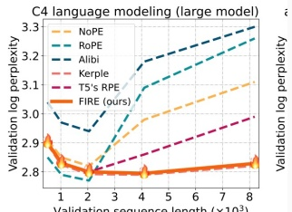

> 图注: 图 1 中「判断这张图出自哪类文献」样例的输入图, 一张 C4 语言建模的验证困惑度曲线.

Prompt

Please generate the latex code of the formula in the image.

An = a 1+录∑(t)k k=1

Response

A\_n = a\_0 \left[ 1 + \frac{3}{4} \sum\_{k=1}^{n} \left( \frac{4}{9} \right)^k \right]

Response

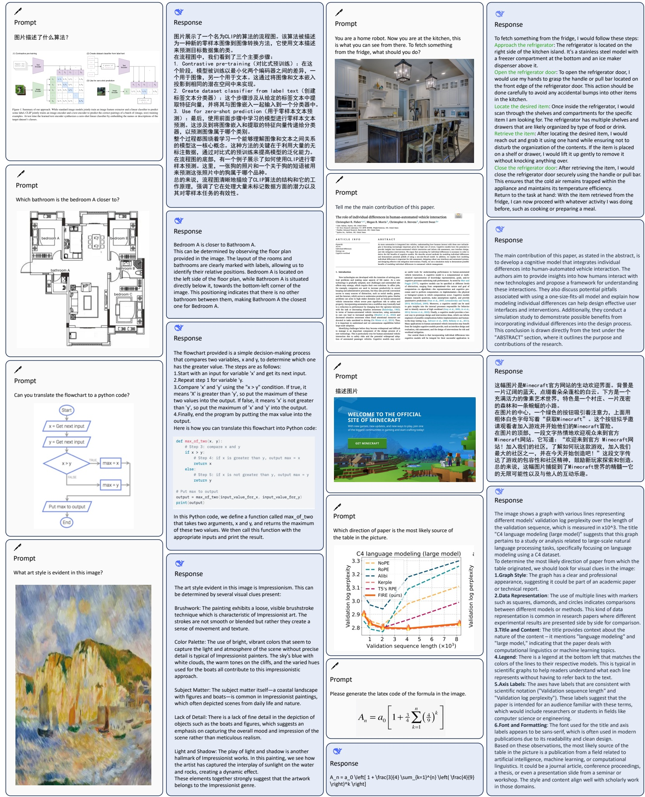

> 图注: 图 1 全图, 十组提示与 DeepSeek-VL 回答样例的拼版, 涵盖流程图, 户型图, 网页, 公式, 论文首页, 绘画和厨房场景.

To fetch something from the fridge, I would follow these steps: Approach the refrigerator: The refrigerator is located on the right side of the kitchen island. It's a stainless steel model with a freezer compartment at the bottom and an ice maker dispenser above it.

Open the refrigerator door: To open the refrigerator door, I would use my hands to grasp the handle or pull bar located on the front edge of the refrigerator door. This action should be done carefully to avoid any accidental bumps into other items in the kitchen.

Locate the desired item: Once inside the refrigerator, I would scan through the shelves and compartments for the specific item I am looking for. The refrigerator has multiple shelves and drawers that are likely organized by type of food or drink. Retrieve the item: After locating the desired item, I would reach out and grab it using one hand while ensuring not to disturb the organization of the contents. If the item is placed on a shelf or drawer, I would lift it up gently to remove it without knocking anything over.

Close the refrigerator door: After retrieving the item, I would close the refrigerator door securely using the handle or pull bar. This ensures that the cold air remains trapped within the appliance and maintains its temperature efficiency. Return to the task at hand: With the item retrieved from the fridge, I can now proceed with whatever activity I was doing before, such as cooking or preparing a meal.

Response

The main contribution of this paper, as stated in the abstract, is to develop a cognitive model that integrates individual differences into human-automated vehicle interaction. The authors aim to provide insights into how humans interact with new technologies and propose a framework for understanding these interactions. They also discuss potential pitfalls associated with using a one-size-fits-all model and explain how modeling individual differences can help design effective user interfaces and interventions. Additionally, they conduct a simulation study to demonstrate possible benefits from incorporating individual differences into the design process. This conclusion is drawn directly from the text under the "ABSTRACT" section, where it outlines the purpose and contributions of the research.

这幅图片是Minecraft官方网站的生动欢迎界面. 背景是一片辽阔的蓝天, 点缀着朵朵蓬松的白云. 下方是一个充满活力的像素艺术世界, 特色是一个村庄、一片茂密的森林和一条蜿蜒的小路. 在图片的中心, 一个绿色的按钮吸引着注意力, 上面用粗体白色字母写着「获取Minecraft」. 这个按钮似乎邀请观看者加入游戏并开始他们的Minecraft冒险. 在图片的顶部, 一段文字热情地欢迎观众来到官方Minecraft网站. 它写道:「欢迎来到官方 Minecraft网站! 加入我们的社区, 了解如何玩这款游戏, 加入我们最大的社区之一, 并在今天开始创造吧! 」这段文字传达了游戏的包容性和社区精神, 鼓励新玩家探索和创造. 总的来说, 这幅图片捕捉到了Minecraft世界的精髓一它的无限可能性以及与他人的互动乐趣.

The image shows a graph with various lines representing different models' validation log perplexity over the length of the validation sequence, which is measured in x10^3. The title "C4 language modeling (large model)" suggests that this graph pertains to a study or analysis related to large-scale natural language processing tasks, specifically focusing on language modeling using a C4 dataset. To determine the most likely direction of paper from which the table originated, we should look for visual clues in the image: **1.Graph Style**: The graph has a clear and professional appearance, suggesting it could be part of an academic paper or technical report. **2.Data Representation**: The use of multiple lines with markers such as squares, diamonds, and circles indicates comparisons between different models or methods. This kind of data representation is common in research papers where different experimental results are presented side by side for comparison. **3.Title and Content**: The title provides context about the nature of the content – it mentions "language modeling" and "large model," indicating that the paper deals with computational linguistics or machine learning topics. **4.Legend**: There is a legend at the bottom left that matches the colors of the lines to their respective models. This is typical in scientific graphs to help readers understand what each line represents without having to refer back to the text. **5.Axis Labels**: The axes have labels that are consistent with scientific notation ("Validation sequence length" and "Validation log perplexity"). These labels suggest that the paper is intended for an audience familiar with these terms, which would include researchers or students in fields like computer science or engineering. **6.Font and Formatting**: The font used for the title and axis labels appears to be sans-serif, which is often used in modern publications due to its readability and clean design. Based on these observations, the most likely source of the table in the picture is a publication from a field related to artificial intelligence, machine learning, or computational linguistics. It could be a journal article, conference proceedings, a thesis, or even a presentation slide from a seminar or workshop. The style and content align well with scholarly work in those domains.

Figure 1 | DeepSeek-VL possesses general multimodal understanding capabilities, capable of processing logical diagrams, web pages, formula recognition, scientific literature, natural images, and embodied intelligence in complex scenarios.

> 引用样本保留原文.

<!-- page 5 of 33 -->

DeepSeek-VL’s pretraining dataset is compiled from a variety of sources, including but not limited to Common Crawl, Web Code, E-books, Educational Materials, and arXiv Articles. This collection thoroughly encompasses real-world scenarios such as web screenshots, PDFs, OCR, charts, and knowledge-based content (expertise, textbooks), aiming for a broad and practical representation while remaining scalable.

DeepSeek-VL 的预训练数据集汇集自多种来源, 包括但不限于 Common Crawl, Web Code, 电子书, 教育资料和 arXiv 论文. 这批数据完整覆盖了网页截图, PDF, OCR, 图表和知识类内容 (专业知识, 教科书) 等真实场景, 目标是在保持可扩展的同时, 做到广泛且贴近实际.

While our pretraining data encompasses a wide array of world knowledge, we meticulously curate our instruction-tuning dataset to reflect real-world usage scenarios. To achieve this, we manually gather authentic test cases for GPT-4V and Gemini from the Internet. These cases have been systematically organized into a comprehensive taxonomy. We use this structured taxonomy to choose prompts for each test image, ensuring a practical and relevant instruction tuning dataset. This taxonomy is also used to create an evaluation dataset that effectively assesses real-world performance.

预训练数据涵盖了大量世界知识, 指令微调数据则经过精心整理, 以反映真实的使用场景. 为此, 我们从互联网上人工收集了 GPT-4V 和 Gemini 的真实测试用例, 并把它们系统地组织成一个完整的分类体系. 我们用这个结构化的分类体系为每张测试图片选择提示, 保证指令微调数据集实用且贴题. 同一个分类体系也用来构建评测集, 以有效衡量真实场景下的表现.

The visual module is designed to optimize the utilization of high-resolution visual inputs while remaining within a fixed token budget to manage inference costs effectively. As such, we employ a hybrid vision encoder, which combines a text-aligned encoder for coarse semantic extraction at 384 × 384 resolution with a high-resolution encoder that captures detailed visual information at 1024 × 1024 resolution. By fusing these two encoders, our hybrid approach efficiently condenses a 1024×1024 resolution image (which suffices in most use cases) into 576 tokens. This token count strikes a balance between rich visual representation and token economy, making it feasible for both text-image interleaving and multi-turn inference scenarios.

视觉模块的设计目标是在固定 token 预算内充分利用高分辨率视觉输入, 以控制推理成本. 为此我们采用混合视觉编码器: 一个与文本对齐的编码器在 384 × 384 分辨率下提取粗粒度语义, 一个高分辨率编码器在 1024 × 1024 分辨率下捕捉细节视觉信息. 两个编码器融合后, 混合方案能把一张 1024×1024 的图像 (大多数场景下已经够用) 高效压缩成 576 个 token. 这个 token 数在视觉表征的丰富程度与 token 开销之间取得平衡, 使图文交错输入和多轮推理场景都可行.

During the pretraining of multimodal models, a common challenge encountered is the potential degradation of language capabilities when the training process is overly reliant on vision-language data. Our research reveals that maintaining a significant proportion of language data—specifically, at least 70%—is essential to preserve the integrity of language knowledge within the model. This balance is critical for achieving a robust multimodal capability that does not compromise language performance. Moreover, we introduce a novel 「modality warm-up」 strategy. This approach carefully adjusts the ratio of modalities during training, gradually incorporating more vision-language data. The careful tuning of the modality ratio along with the warm-up strategy results in a balanced performance of both modalities.

多模态模型预训练中常见的一个难题是: 训练过程过度依赖视觉语言数据时, 语言能力可能退化. 我们的研究发现, 保持相当比例的语言数据, 具体来说至少 70%, 是保住模型内语言知识完整的必要条件. 这一平衡是获得不牺牲语言表现的稳健多模态能力的关键. 此外, 我们提出一种新的「模态预热」策略. 它在训练中仔细调整模态比例, 逐步加入更多视觉语言数据. 模态比例的细致调节加上预热策略, 让两种模态的表现达到平衡.

When iterating on our model, We conduct experiments on a small scale before scaling to a larger model size. However, a smaller model, e.g., 1B model, cannot demonstrate reasonable performance on benchmarks (Schaeffer et al., 2024) and faithfully reflect the model’s performance. We adopt two approaches to address this. First, we modify the evaluation protocol from multi-choice to compare the perplexity of options. Also, to prevent the instruction following ability from becoming the bottleneck, we mix a small proportion of instruction tuning data during the pretraining phase. In this way, we can achieve reasonable performance using the 1B model and more accurately measure the impact of each iteration during the experiment.

迭代模型时, 我们先在小规模上做实验, 再扩到更大的模型. 但较小的模型, 例如 1B 模型, 在基准上给不出合理的成绩 (Schaeffer et al., 2024), 也无法如实反映模型的真实水平. 我们用两种办法解决这个问题. 第一, 把评测协议从多选题生成改为比较各选项的困惑度. 第二, 为了不让指令跟随能力成为瓶颈, 我们在预训练阶段混入少量指令微调数据. 这样 1B 模型也能给出合理的成绩, 实验中每次迭代的影响也能测得更准.

Through extensive evaluations of general vision and language benchmarks, the DeepSeek-VL family showcases superior user experiences in real-world applications and achieves state-of-the-art or competitive performance across a wide range of visual-language benchmarks at the same model size, while maintaining robust language-centric performance. To foster innovation and enable a wide range of applications, we have made two versions of our ours, 1.3B and 7B, publicly accessible, in the hope of facilitating the needs of varying computational capabilities.

通过对通用视觉与语言基准的大量评测, DeepSeek-VL 系列在真实应用中展现出更好的用户体验, 在同等规模下于大量视觉语言基准上取得最优或有竞争力的成绩, 同时保持稳健的语言能力. 为了促进创新并支持广泛应用, 我们公开了 1.3B 和 7B 两个版本, 希望满足不同算力条件的需求.

<!-- page 6 of 33 -->

## 2. Data Construction · 数据构建

A diverse and large dataset is the most important ingredient of visual language model training. Our dataset can be divided into two parts: Vision-Language pretraining Data and Vision-Language Supervised Fine-Tuning Data. VL pretraining Data is composed of visual-text data from various sources, aimed at enhancing the model’s fundamental cross-modal understanding capabilities; while VL Supervised Fine-Tuning Data has a relatively smaller size and aims to teach the model to complete specific downstream tasks. By design, VL pretraining Data is used to warm up the vision-language adaptor in training stage 1 and jointly pretrain the visionlanguage model in stage 2, and VL Supervised Fine-Tuning Data is exploited in training stage 3, i.e., vision language supervised fine-tuning.

多样且大规模的数据集是视觉语言模型训练中最重要的要素. 我们的数据集分为两部分: 视觉语言预训练数据和视觉语言监督微调数据. VL 预训练数据由多种来源的图文数据组成, 目的是增强模型基础的跨模态理解能力; VL 监督微调数据规模相对小, 目的是教模型完成具体的下游任务. 按设计, VL 预训练数据在训练阶段 1 用来预热视觉语言 adaptor, 在阶段 2 用来联合预训练视觉语言模型; VL 监督微调数据用在训练阶段 3, 即视觉语言监督微调.

## 2.1. Vision-Language pretraining Data · 视觉语言预训练数据

The pretraining dataset utilized in our study encompasses a diverse range of publicly accessible sources, in addition to a selection of proprietary data. We provide a comprehensive overview of the data sources employed during the joint vision and language pretraining stage in Table 1. Such a dataset can facilitate LLM’s comprehension of the entities portrayed in the images.

我们使用的预训练数据集除一部分自有数据外, 涵盖了多种公开来源. Table 1 给出了视觉与语言联合预训练阶段所用数据源的完整概览. 这样的数据集能帮助 LLM 理解图像中描绘的实体.

Furthermore, we present a detailed breakdown of the complete dataset, which is organized into the following categories:

此外, 我们给出完整数据集的详细构成及各类别:

**Interleaved image-text** data enable the models to have a better capability for in-context learning of multi-modality inputs, and we utilize three public datasets MMC4 (Zhu et al., 2024), Wiki (Burns et al., 2023), Wikihow (Yang et al., 2021) and Epub textbooks.

**图文交错**数据让模型更好地具备多模态输入的上下文学习能力. 我们使用三个公开数据集 MMC4 (Zhu et al., 2024), Wiki (Burns et al., 2023), Wikihow (Yang et al., 2021) 以及 Epub 教科书.

**Image caption** data come from three high-quality image-text paired datasets: Capsfusion (Yu et al., 2023a), TaiSu (Liu et al., 2022b) and Detailed Caption (echo840, 2024).

**图像描述**数据来自三个高质量图文配对数据集: Capsfusion (Yu et al., 2023a), TaiSu (Liu et al., 2022b) 和 Detailed Caption (echo840, 2024).

**Table and chart** data enable the models to learn the capability for general table and chart image understanding. It encompasses a diverse range of public data sources, including Chart2text (Kantharaj et al., 2022), Geo170K (Gao et al., 2023), Unichart (Masry et al., 2023), Ureader (Ye et al., 2023), M-paper (Hu et al., 2023), ScienceQA (Lu et al., 2022b), ScreenQA (Hsiao et al., 2022), SciGraphQA-295K (Li and Tajbakhsh, 2023), Paper2figure100k (Rodriguez et al., 2023), Widget Captioning (Li et al., 2020), Screen2words (Wang et al., 2021), and Refexp (Mao et al., 2016).

**表格与图表**数据让模型学会通用的表格和图表图像理解. 它包含多种公开数据源: Chart2text (Kantharaj et al., 2022), Geo170K (Gao et al., 2023), Unichart (Masry et al., 2023), Ureader (Ye et al., 2023), M-paper (Hu et al., 2023), ScienceQA (Lu et al., 2022b), ScreenQA (Hsiao et al., 2022), SciGraphQA-295K (Li and Tajbakhsh, 2023), Paper2figure100k (Rodriguez et al., 2023), Widget Captioning (Li et al., 2020), Screen2words (Wang et al., 2021) 和 Refexp (Mao et al., 2016).

**Web Code** data empowers models with the capability to reconstruct code from graphical interfaces or visual plots. Leveraging Websight (HuggingFaceM4, 2024) for UI Inverse Rendering, we adopted a strategy akin to that used in MATCHA (Liu et al., 2022a) for visual plots inverse rendering. This involved the processing of approximately 1.46 million Jupyter notebooks from the Stack dataset (Kocetkov et al., 2023). By extracting these notebooks and collating all diagrams along with their corresponding preceding code segments, we succeeded in curating a collection featuring 2 million pairs of images and codes. For better data quality, we filter 1.1 million instances, each comprising a singular image coupled with a minimum of 5 lines of code, to constitute our primary training dataset.

**Web Code** 数据让模型能从图形界面或可视化图表重建代码. 我们用 Websight (HuggingFaceM4, 2024) 做 UI 逆渲染; 对可视化图表的逆渲染, 采用与 MATCHA (Liu et al., 2022a) 类似的策略. 具体做法是处理 Stack 数据集 (Kocetkov et al., 2023) 中约 146 万个 Jupyter notebook. 抽取这些 notebook, 收集其中所有图表及其之前的代码段, 我们得到 200 万对图像与代码. 为了提升数据质量, 我们筛出 110 万条, 每条只含一张图像且配有至少 5 行代码, 构成主要训练数据.

**Document Optical Character Recognition (OCR)** data facilitates the recognition of optical characters at the document level, even in challenging real-world scenarios. To the best of our knowledge, there is currently no publicly available large-scale dataset encompassing both English and Chinese documents. Despite the existence of the publicly accessible small-scale dataset Latex-OCR (Blecher, 2024), we additionally constructed a comprehensive English and

<!-- page 7 of 33 -->

| Category | Dataset | Ratio |
| --- | --- | --- |
| Interleaved image-text | MMC4 (Zhu et al., 2024) Wikipedia EN&amp; CN (Foundation) Wikihow (Yang et al., 2021) in-house PDF and Epub textbooks | 13.1% |
| Image caption | Capsfusion (Yu et al., 2023a) TaiSu (Liu et al., 2022b) Detailed Caption (echo840, 2024) | 11.1% |
| Table and chart | Chart2text (Kantharaj et al., 2022) Geo170K (Gao et al., 2023) Ureader (Ye et al., 2023) Unichart (Masry et al., 2023) M-paper (Hu et al., 2023) ScienceQA (Lu et al., 2022b) ScreenQA (Hsiao et al., 2022) SciGraphQA-295K (Li and Tajbakhsh, 2023) Paper2figure100k (Rodriguez et al., 2023) Widget Captioning (Li et al., 2020) Screen2words (Wang et al., 2021) Refexp (Mao et al., 2016) | 2.1% |
| Web Code | Websight (HuggingFaceM4, 2024) python plots scraped from GitHub notebook | 0.4% |
| Scene text OCR | ArT (Chng et al., 2019) MLT-17 (Nayef et al., 2017) LSVT (Sun et al., 2019) UberText (Zhang et al., 2017) Coco-text (Veit et al., 2016) RCTW-17 (Shi et al., 2017) ReCTS (Zhang et al., 2019) TextOCR (Singh et al., 2021) OpenVINO (Krylov et al., 2021) HierText (Long et al., 2022) | 1.2% |
| Document OCR | arXiv rendered markdown (Blecher et al., 2023) | 2.1% |
| Text-only corpus | DeepSeek-LLM 2T text copus (DeepSeek-AI, 2024) | 70.0% |

> 表 1: 联合视觉语言预训练阶段的数据集与占比 (原文 Table 1).

Chinese document OCR dataset. It is comprised of two parts: 1): **arXiv Articles:** We collected source code and compiled PDFs from 1.4 million arXiv articles. Utilizing pre-processing tools from Nougat (Blecher et al., 2023), we rendered these articles into paired images and texts; 2): **E-books and Educational Materials:** We cleaned 860K English and 180K Chinese e-books from Anna’s Archive (Anna’s Archive, 2024) alongside millions of K-12 education exam questions. Subsequently, we employed HTML rendering tools (Kulkarni and Truelsen) to convert these HTML files with different templates into paired image and text formats.

**文档光学字符识别 (OCR)** 数据让模型即使在困难的真实场景中也能在文档层面识别字符. 据我们所知, 目前还没有同时覆盖英文和中文文档的公开大规模数据集. 虽然有公开的小规模数据集 Latex-OCR (Blecher, 2024), 我们还另外构建了一个完整的中英文文档 OCR 数据集. 它由两部分组成: 1) **arXiv 论文**: 我们收集了 140 万篇 arXiv 论文的源码和编译后的 PDF, 用 Nougat (Blecher et al., 2023) 的预处理工具把这些论文渲染成成对的图像与文本; 2) **电子书与教育资料**: 我们从 Anna's Archive (Anna's Archive, 2024) 清洗了 86 万本英文电子书和 18 万本中文电子书, 另有数百万道 K-12 教育考试题. 随后用 HTML 渲染工具 (Kulkarni and Truelsen) 把这些套用不同模板的 HTML 文件转成成对的图像与文本格式.

**Scene text OCR** data augment the capability of the model to recognize and extract text from images in which the text is integrated into the environment. The dataset is composed of multiple

<!-- page 8 of 33 -->

| Class | Dataset | Ratio |
| --- | --- | --- |
| In-house Data | SFT data based on taxonomy (Figure 3) | 10.5% |
| General Multi-modality | ShareGPT4V (Chen et al., 2023) LAION-GPTV (LAION, 2023) LVIS-Instruct4V (Wang et al., 2023a) textOCR-GPT4V (Carter, 2024) LLaVA1.6-GPT4V (Liu et al., 2024a) IconQA (Lu et al., 2021) | 35.5% |
| Table and chart | Ureader (Ye et al., 2023) Geo170K (Gao et al., 2023) ScienceQA (Lu et al., 2022b) | 4.1% |
| Web Code | Screen-to-code (Abi, 2024) ScreenQA (Hsiao et al., 2022) | 2.0% |
| Text-only SFT | DeepSeek-LLM (DeepSeek-AI, 2024) | 47.9% |

> 表 2: 监督微调数据的构成与占比 (原文 Table 2).

public datasets, including ArT (Chng et al., 2019), MLT-17 (Nayef et al., 2017), LSVT (Sun et al., 2019), UberText (Zhang et al., 2017), Coco-text (Veit et al., 2016), RCTW-17 (Shi et al., 2017), ReCTS (Zhang et al., 2019), TextOCR (Singh et al., 2021), OpenVINO (Krylov et al., 2021) and HierText (Long et al., 2022).

**场景文字 OCR** 数据增强模型从文字融入环境的图像中识别和提取文字的能力. 数据集由多个公开数据集组成, 包括 ArT (Chng et al., 2019), MLT-17 (Nayef et al., 2017), LSVT (Sun et al., 2019), UberText (Zhang et al., 2017), Coco-text (Veit et al., 2016), RCTW-17 (Shi et al., 2017), ReCTS (Zhang et al., 2019), TextOCR (Singh et al., 2021), OpenVINO (Krylov et al., 2021) 和 HierText (Long et al., 2022).

**Text-only corpus** serves to maintain proficiency in language-centric tasks. In this study, we employ the same text corpus with DeepSeek-LLM (DeepSeek-AI, 2024).

**纯文本语料**用于保持以语言为中心的任务上的能力. 我们使用与 DeepSeek-LLM (DeepSeek-AI, 2024) 相同的文本语料.

## 2.2. Supervised Fine-tuning Data · 监督微调数据

The supervised fine-tuning datasets utilized in our study encompass a diverse range of multi modality and language data sources, including well-known open-source shared gpt4v datasets such as ShareGPT4V (Chen et al., 2023), LAION-GPTV (LAION, 2023), LVIS-Instruct4V (Wang et al., 2023a), textOCR-GPT4V (Carter, 2024), LLaVA1.6-GPT4V (Liu et al., 2024a) and IconQA (Lu et al., 2021). Additionally, we incorporate partial table and chart data extracted from pretraining datasets such as Ureader (Ye et al., 2023), ScreenQA (Hsiao et al., 2022), Geo170K (Gao et al., 2023), and ScienceQA (Lu et al., 2022b). Moreover, we integrate the UI Code dataset obtained from Screen-to-code (Abi, 2024) tasks. To enhance the quality of our multi-modality SFT data, we have also curated a portion of high-quality in-house multi-modality SFT data, some of which are in the Chinese language. Our in-house instruction-tuning dataset is meticulously designed to reflect real-world usage scenarios and cover a wide range of tasks. We start by collecting a diverse set of authentic test cases for GPT-4V and Gemini from various online sources. These test cases are then carefully analyzed and organized into a comprehensive taxonomy, which encompasses multiple categories, such as recognition, conversion, analysis, reasoning, evaluation, and safety, as detailed in Table 3. This structured taxonomy serves as a guideline for selecting representative prompts for each test image, ensuring that our instruction-tuning dataset is both practical and relevant to real-world applications. Moreover, this taxonomy is also employed to construct a balanced and comprehensive evaluation dataset, which allows us to effectively assess the model’s performance across different tasks and categories. By following this systematic approach, we ensure that the categories covered by our in-house multi-modality SFT data are well-aligned with the taxonomy and representative of real-world usage scenarios.

我们使用的监督微调数据集涵盖多种多模态和语言数据源, 包括知名的开源 GPT-4V 共享数据集, 如 ShareGPT4V (Chen et al., 2023), LAION-GPTV (LAION, 2023), LVIS-Instruct4V (Wang et al., 2023a), textOCR-GPT4V (Carter, 2024), LLaVA1.6-GPT4V (Liu et al., 2024a) 和 IconQA (Lu et al., 2021). 此外, 我们纳入了从预训练数据集中抽取的部分表格与图表数据, 如 Ureader (Ye et al., 2023), ScreenQA (Hsiao et al., 2022), Geo170K (Gao et al., 2023) 和 ScienceQA (Lu et al., 2022b). 我们还整合了来自 Screen-to-code (Abi, 2024) 任务的 UI Code 数据集. 为了提升多模态 SFT 数据的质量, 我们还整理了一部分高质量的自有多模态 SFT 数据, 其中一些是中文. 自有指令微调数据集经过精心设计, 以反映真实使用场景并覆盖广泛的任务. 我们先从各种网络来源收集了一批多样的 GPT-4V 和 Gemini 真实测试用例. 随后仔细分析这些用例, 把它们组织成一个完整的分类体系, 包括识别, 转换, 分析, 推理, 评估和安全等多个类别, 详见 Table 3. 这个结构化的分类体系是为每张测试图片挑选代表性提示的指南, 保证指令微调数据集实用且贴近真实应用. 同一分类体系还用于构建均衡且全面的评测集, 让我们能有效评估模型在不同任务和类别上的表现. 按照这一系统化方法, 我们保证了自有多模态 SFT 数据覆盖的类别与分类体系一致, 并能代表真实使用场景.

<!-- page 9 of 33 -->

<table><tr><td>Main Category</td><td>Description</td><td>Secondary Category</td><td>Tertiary Category</td></tr><tr><td rowspan="3">Recognition</td><td rowspan="3">This part of the use cases mainly examines the understanding and description ability of large models for image content, which does not require high knowledge reserve and reasoning ability of the model, and some tasks can be completed using traditional machine learning models.</td><td>Global Description</td><td>Theme Description, Event/Behavior Description, Location/Scene Description, Emotion/Mood Description, Style Recognition, Food Recognition, Others</td></tr><tr><td>Local Description</td><td>Pointing Description, Position Description, Person Recognition, Object Attribute Description, Logo Recognition, Counting, Currency Recognition</td></tr><tr><td>OCR and Transcription</td><td>Printed Text Transcription, Handwritten Text Transcription, Specified Format Transcription, Specified Language Transcription</td></tr><tr><td rowspan="2">Conversion</td><td rowspan="2">This type of use case requires the model to be able to describe and recognize image content, and use specific knowledge (e.g., code knowledge, prompt engineering knowledge) to convert image content into another form.</td><td>Image to Code</td><td>UI to Code, Chart to Code, Photo to SVG/p64 Encoding, Formula to Code, Flowchart to Code</td></tr><tr><td>Image to Text</td><td>Image to Prompt, Text Summary, Image-based Creation, Text Interpretation</td></tr><tr><td rowspan="4">Analysis</td><td rowspan="4">This type of use case requires the model to use specific knowledge and logical ability to make reasonable analysis and understanding based on image content, and describe the image according to instructions.</td><td>Data Chart Analysis</td><td>Graph Interpretation, Table Interpretation</td></tr><tr><td>Professional Chart Analysis</td><td>Circuit Diagram, Flowchart, Map, Music Score, Financial Chart, Floor Plan, Others</td></tr><tr><td>Professional Image Analysis</td><td>Sensor Image, Biological and Medical Image, Voiceprint Image, Point Cloud Image</td></tr><tr><td>Encyclopedia Knowledge Analysis</td><td>Art and Culture Knowledge, Natural Environment Knowledge, Food/Clothing/Housing/Transportation Related Knowledge, Entertainment Related Knowledge, Historical Knowledge</td></tr><tr><td rowspan="6">Commonsense Reasoning</td><td rowspan="6">This type of use case mainly tests the model&#x27;s understanding and mastery of common sense in life, which requires reasoning based on the interpretation and analysis of image content combined with common sense.</td><td>Relationship Reasoning</td><td>Interpersonal Relationship, Spatial Relationship, Size Relationship, Species Relationship</td></tr><tr><td>Function Reasoning</td><td>Hardware Function Reasoning, Software Function Reasoning</td></tr><tr><td>Environment Reasoning</td><td>Environment State Analysis, Environment-based Behavior Reasoning, Embodied Intelligence</td></tr><tr><td>Anomaly Reasoning</td><td>Identifying Anomalies in Images, Defect Detection, Accident Judgment</td></tr><tr><td>Humor Reasoning</td><td>-</td></tr><tr><td>Other Commonsense Reasoning</td><td>State Reasoning, Cause Reasoning, Attribute Comparison, Optical Illusion, Fun Games, Intention Interpretation, Behavior Prediction</td></tr><tr><td rowspan="2">Logical Reasoning</td><td rowspan="2">This type of use case requires the model to combine the understanding of images, comprehensively use domain knowledge and logical reasoning ability to complete corresponding tasks.</td><td>Mathematical Reasoning</td><td>Algebra and Operation, Plane Geometry, Solid Geometry</td></tr><tr><td>Other Logical Reasoning</td><td>Physics, Chemistry, Biology, Code, IQ Questions</td></tr><tr><td>Evaluation</td><td>This type of use case requires the model to evaluate the image content according to specific criteria.</td><td>-</td><td>Reality Evaluation, Similarity Evaluation, Aesthetic Evaluation, Open-ended Evaluation, Improvement Suggestions</td></tr><tr><td rowspan="2">Multi-graph</td><td rowspan="2">This type of use case examines the model&#x27;s ability to analyze and understand multiple images.</td><td>Temporal Sequence Understanding</td><td>Event Prediction, Image Sequencing, Behavior Analysis</td></tr><tr><td>Multi-graph Comparison</td><td>Attribute Comparison, Image-Text Matching, Finding Associations, Spotting Differences, Image Discrimination</td></tr><tr><td>Safety</td><td>This type of use case examines the model&#x27;s performance in terms of safety.</td><td>-</td><td>Suggestive Questioning, Counterfactual Questioning, Prompt Injection</td></tr></table>

> 表 3: 真实用例分类体系, 含主类, 说明, 二级类与三级类 (原文 Table 3).

<!-- page 10 of 33 -->

Furthermore, we include the text-only SFT data employed in DeepSeek-LLM (DeepSeek-AI, 2024) as part of our joint vision and language SFT data.

此外, 我们把 DeepSeek-LLM (DeepSeek-AI, 2024) 使用的纯文本 SFT 数据也纳入联合视觉语言 SFT 数据.

## 3. Approach · 方法

## 3.1. Architecture · 架构

Our system contains three modules: a hybrid vision encoder, a vision adaptor, and a language model. We introduce each part in this section.

我们的系统包含三个模块: 混合视觉编码器, 视觉 adaptor 和语言模型. 本节逐一介绍.

**Hybrid Vision Encoder.** We employ SigLIP as the vision encoder to extract high-level semantic feature representations from visual inputs. However, we observe that a single SigLIP encoder struggles to address all real-world questions comprehensively. Vision encoders in the CLIP family, including SigLIP, are primarily designed for semantic visual representations but are challenged by ambiguous encoding, resulting in visually distinct images being encoded as similar due to what is referred to as "CLIP-blind pairs" Tong et al. (2024). Meanwhile, the CLIP family of models is limited by its relatively low-resolution inputs (e.g., 224 x 224, 336 x 336, 384 x 384, 512 x 512), which hinders their ability to handle tasks requiring more detailed low-level features like dense OCR and visual grounding task.

**混合视觉编码器.** 我们用 SigLIP 作为视觉编码器, 从视觉输入中提取高层语义特征表示. 但我们观察到, 单个 SigLIP 编码器难以全面应对真实世界的各种问题. CLIP 家族的视觉编码器 (包括 SigLIP) 主要为语义视觉表示而设计, 但存在编码含混的问题: 视觉上明显不同的图像会被编码成相似的表示, 即所谓「CLIP-blind pairs」(Tong et al., 2024). 同时, CLIP 家族模型受限于相对低的输入分辨率 (例如 224 x 224, 336 x 336, 384 x 384, 512 x 512), 难以处理需要更细节的低层特征的任务, 例如密集 OCR 和视觉定位.

To address these limitations, recent researches (Lin et al., 2023b; Tong et al., 2024; Wei et al., 2023) have advocated for the integration of additional vision-only self-supervised encoders, to enhance the visual grounding capabilities of multi-modality models. Building upon previous motivations, we additionally utilize a vision-only encoder based on the SAM-B (Kirillov et al., 2023), a pre-trained ViTDet (Li et al., 2022) image encoder to process low-level features, which accepts high-resolution 1024 x 1024 image inputs. In addition to the SAM-B encoder, we retain the SigLIP-L vision encoder with low-resolution 384 x 384 image inputs. Consequently, our hybrid vision encoder combines the SAM-B and SigLIP-L encoders, efficiently encoding high-resolution 1024 x 1024 images while preserving both semantic and detailed information. Specifically, a high-resolution SAM-B vision encoder first resizes the image into 1024 x 1024 and results in a 64 x 64 x 256 feature map.

为了解决这些局限, 近期研究 (Lin et al., 2023b; Tong et al., 2024; Wei et al., 2023) 主张加入额外的纯视觉自监督编码器, 以增强多模态模型的视觉定位能力. 基于同样的动机, 我们另外使用一个基于 SAM-B (Kirillov et al., 2023) 的纯视觉编码器处理低层特征; SAM-B 是一个预训练的 ViTDet (Li et al., 2022) 图像编码器, 接受 1024 x 1024 的高分辨率输入. 除 SAM-B 编码器外, 我们保留了输入为 384 x 384 低分辨率的 SigLIP-L 视觉编码器. 因此我们的混合视觉编码器结合了 SAM-B 与 SigLIP-L, 能高效编码 1024 x 1024 的高分辨率图像, 同时保留语义信息和细节信息. 具体来说, 高分辨率的 SAM-B 视觉编码器先把图像缩放到 1024 x 1024, 得到 64 x 64 x 256 的特征图.

In the case of a high-resolution feature map of size, 64 x 64 x 256 generated by SAM-B, the VL Adaptor initially interpolates it into a size of 96 x 96 x 256. Subsequently, it employs two convolutional layers with a stride of 2, producing a feature map of 24 x 24 x 1024, and reshapes it to 576 x 1024. Alongside this, the low-resolution feature map of size 576 x 1024 generated by SigLIP-L is concatenated with the high-resolution features, resulting in 576 visual tokens with 2048 dimensions. These visual tokens possess a substantial capacity for enhancing high-level semantic visual recognition and low-level visual grounding tasks. Then they undergo GeLU activation and are directed through an embedding layer to establish a connection with the language model.

对于 SAM-B 生成的 64 x 64 x 256 高分辨率特征图, VL Adaptor 先把它插值到 96 x 96 x 256. 随后用两个步长为 2 的卷积层, 得到 24 x 24 x 1024 的特征图, 再 reshape 成 576 x 1024. 与此同时, SigLIP-L 生成的 576 x 1024 低分辨率特征图与高分辨率特征拼接, 得到 576 个 2048 维的视觉 token. 这些视觉 token 对增强高层语义视觉识别和低层视觉定位任务都有很大潜力. 随后它们经过 GeLU 激活, 再经过一个嵌入层与语言模型相连.

> **拆开:** 第 3.1 节为什么先把 64×64 插值放大到 96×96, 再用两次步长 2 的卷积缩到 24×24, 而不直接从 64×64 下采样?
> 答: 目标网格由 SigLIP 支路决定. SigLIP-L/16 在 384 输入下是 $384/16=24$, 即 24×24 个 patch; 两次步长 2 的卷积一共缩小 4 倍, 输入边长就得是 $24\times4=96$. 64 除以 24 不是整数, 所以先双线性插值到 96 再卷积, 两路 token 才能逐位置对齐, 按通道拼接. 官方代码里这一步不在 adaptor, 而在 SAM 编码器内部: `deepseek_vl/models/sam.py` 的 `forward` 先过 neck (768 到 256 通道), 再 `F.interpolate(size=(96, 96))`, 再过输出通道为 512, 1024 的两层 `downsamples` 卷积. 同一段代码还有一条论文没写的支路: 第一个全局注意力层的特征经 `neck_hd` 和同一组 `downsamples` 后, 乘以初值为 0 的可学习标量 `hd_alpha_downsamples` 加回主输出.

**Vision-Language Adaptor.** We employ a two-layer hybrid MLP to bridge the vision encoder and the LLM. Initially, distinct single-layer MLPs are used to process high-resolution features and low-resolution features separately. Subsequently, these features are concatenated along their dimensions and then transformed into the LLM’s input space through another layer of MLP.

**视觉语言 adaptor.** 我们用一个两层的混合 MLP 连接视觉编码器与 LLM. 先用两个各自独立的单层 MLP 分别处理高分辨率特征和低分辨率特征; 再把两者沿特征维拼接, 经另一层 MLP 变换到 LLM 的输入空间.

> **核对:** 第 3.1 节上一段说两路拼接得到 576 个 2048 维 token 再经 GeLU, 本段又说先各过一层 MLP 再拼接, 哪种是实现?
> 答: 后一种. 7B 的 `config.json` 里 adaptor 类型是 `low_high_hybrid_split_mlp_gelu`, `input_dim` 为 1024, `n_embed` 为 4096; `projector.py` 里 `high_up_proj` 与 `low_up_proj` 各把 1024 维映射到 $4096/2=2048$ 维, 沿末维拼成 4096 维, 再过 GELU 和一个 4096 到 4096 的线性层. 所以拼接发生在各自投影之后, 拼出来是 4096 维; 上一段的 2048 维是两路原始特征 1024+1024 直接拼接的维数, 与代码的计算顺序不一致. 两种说法的 token 数都是 576.

**Language Model.** Our language model is built upon DeepSeek LLM (DeepSeek-AI, 2024) whose micro design largely follows the design of LLaMA (Touvron et al., 2023a,b), adopting a Pre-Norm structure with RMSNorm (Zhang and Sennrich, 2019) function and using SwiGLU (Shazeer, 2020) as the activation function for the Feed-Forward Network (FFN), with an intermediate layer dimension of $\textstyle { \frac { 8 } { 3 } } d _ { m o d e l }$ . It also incorporates Rotary Embedding (Su et al.,

<!-- page 11 of 33 -->

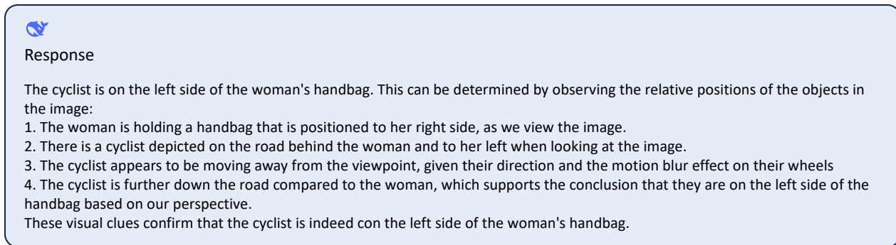

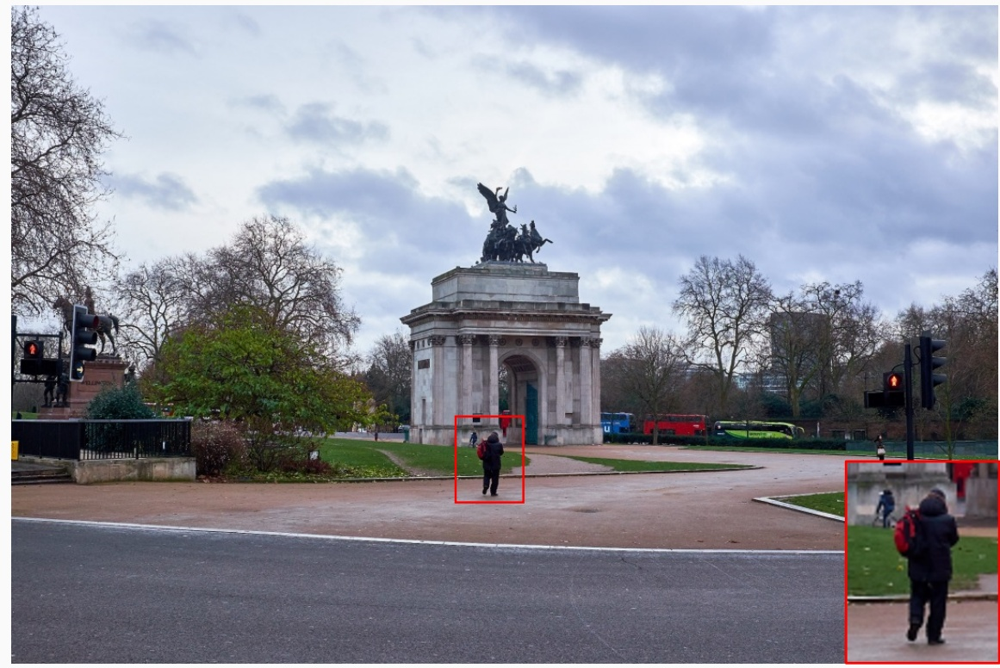

Figure 2 | Visualization results. DeepSeek-VL is capable of capturing tiny object and giving organized explanations.

2024) for positional encoding and uses the same tokenizer with DeepSeek-LLM. We introduce a family of DeepSeek-VL models. Given our objective of conducting joint pretraining with multimodal and language, we select an intermediate checkpoint from DeepSeek’s pretrained models to continue pretraining.

**语言模型.** 我们的语言模型建立在 DeepSeek LLM (DeepSeek-AI, 2024) 之上, 其微观设计基本沿用 LLaMA (Touvron et al., 2023a,b): 采用 Pre-Norm 结构和 RMSNorm (Zhang and Sennrich, 2019), FFN 用 SwiGLU (Shazeer, 2020) 激活, 中间层维度为 $\frac{8}{3}d_{model}$. 它还用 Rotary Embedding (Su et al., 2024) 做位置编码, 分词器与 DeepSeek-LLM 相同. 我们推出一个 DeepSeek-VL 模型系列. 由于目标是多模态与语言的联合预训练, 我们从 DeepSeek 预训练模型中选了一个中间 checkpoint 继续预训练.

Specifically, the DeepSeek-VL-1B model is constructed based on the DeekSeek-LLM-1B model, which underwent training with an approximate corpus of 500 billion text tokens. And the DeekSeek-VL-7B model is developed leveraging the DeepSeek-LLM-7B model trained with an estimated 2 trillion text tokens.

具体来说, DeepSeek-VL-1B 基于 DeepSeek-LLM-1B 构建, 后者用约 5000 亿文本 token 训练. DeepSeek-VL-7B 基于 DeepSeek-LLM-7B, 后者用约 2 万亿文本 token 训练.

<!-- page 12 of 33 -->

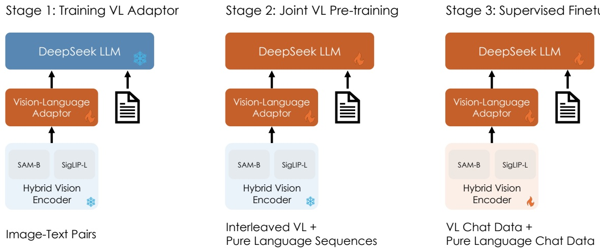

Figure 3 | Our training pipelines consist of three stages. Stage 1 involves training the Vision-Language (VL) adaptor while keeping the hybrid vision encoder and language model fixed. Stage 2 is the crucial part of the joint vision and language pretraining, where both VL adaptor and language model are trainable. Stage 3 is the supervised fine-tuning phase, during which the low-resolution vision encoder SigLIP-L, VL adaptor, and language model will be trained.

## 3.2. Training Pipelines · 训练流程

We train our DeepSeek-VL in three consecutive stages as shown in Figure 3: vision-language adaptor warmup, joint vision-language pretraining, and supervised fine-tuning. We currently focus on visual understanding capabilities and only calculate the next token prediction loss on the language part.

如 Figure 3 所示, DeepSeek-VL 分三个连续阶段训练: 视觉语言 adaptor 预热, 视觉语言联合预训练, 监督微调. 我们目前专注于视觉理解能力, 只在语言部分计算 next-token prediction 损失.

## 3.2.1. Stage 1: Training Vision-Language Adaptor · 阶段 1: 训练视觉语言 adaptor

The primary objective of this stage is to establish a conceptual link between visual and linguistic elements within the embedding space, thereby facilitating the comprehensive understanding of depicted entities in the images by the Large Language Model (LLM). Consistent with prior research conducted by LLaVA (Liu et al., 2024b) and Instruct-BLIP (Dai et al., 2023), we adopt a similar approach in which both the vision encoder and the LLM remain frozen during this stage, while solely allowing the trainable parameters within the vision-language adaptor. We utilize a dataset comprising 1.25 million image-text paired captions obtained from ShareGPT4V, along with 2.5 million Document OCR rendering pairs to train the VL adaptor.

这一阶段的主要目标是在嵌入空间中建立视觉元素与语言元素之间的概念联系, 从而帮助大语言模型 (LLM) 全面理解图像中描绘的实体. 与 LLaVA (Liu et al., 2024b) 和 Instruct-BLIP (Dai et al., 2023) 的先前研究一致, 我们采用类似做法: 这一阶段视觉编码器和 LLM 都保持冻结, 只训练视觉语言 adaptor 中的参数. 我们用 ShareGPT4V 的 125 万条图文配对描述, 加上 250 万对文档 OCR 渲染数据训练 VL adaptor.

Nevertheless, compared to Large Language Models (LLMs), vision-language adaptors (e.g., a 2-layer MLP) have a significantly smaller parameter capacity. This limitation in model capacity restricts the capabilities that can be learned during this stage. A natural question arises: **Can the law of data scaling be effective at this stage?** To address this question, we conducted a simple experiment in Table 8. The results demonstrate that expanding the data scale at this stage does not provide benefits and may even lead to inferior performance. Consequently, we proceed to unfreeze the Large Language Model (LLM) and investigate efficient vision-language pretraining approaches during stage 2.

然而, 与大语言模型 (LLM) 相比, 视觉语言 adaptor (例如两层 MLP) 的参数容量小得多. 容量限制约束了这一阶段能学到的能力. 于是自然有一个问题: **数据量上的 Scaling Laws 在这一阶段是否有效?** 为回答这个问题, 我们在 Table 8 中做了一个简单实验. 结果表明, 这一阶段扩大数据规模没有收益, 甚至可能更差. 因此我们转而在阶段 2 解冻大语言模型 (LLM), 研究高效的视觉语言预训练方法.

<!-- page 13 of 33 -->

## 3.2.2. Stage 2: Joint Vision-Language pretraining · 阶段 2: 视觉语言联合预训练

In this stage, we explore effective pretraining strategies which can be considered as an additional stage to enable Large Language Models (LLMs) to comprehend multimodal inputs. We keep the vision encoder frozen and optimize the language model and VL adaptor.

这一阶段我们探索有效的预训练策略, 它可以看作让大语言模型 (LLM) 理解多模态输入的额外阶段. 我们冻结视觉编码器, 优化语言模型和 VL adaptor.

Initially, we attempt to directly train the LLM with multimodal data. However, we find while the metrics for multimodal performance incrementally improved, there is a stark and severe decline in language metrics as illustrated in Figure 4 (Multimodal:Language=100%:0%),. This underscores the inherent challenge in directly conducting multimodal pretraining on the foundation of an LLM, revealing a critical trade-off between enhancing multimodal abilities and preserving linguistic proficiency.

起初, 我们尝试直接用多模态数据训练 LLM. 结果发现多模态指标逐步提升的同时, 语言指标急剧大幅下降, 如 Figure 4 (Multimodal:Language=100%:0%) 所示. 这说明直接在 LLM 基础上做多模态预训练有其固有困难, 揭示了增强多模态能力与保住语言能力之间的关键取舍.

We hypothesize that the observed phenomenon stems from two primary factors: firstly, the majority of multimodal corpora, are overly simplistic and exhibit a significant divergence from the complexity and distribution of linguistic data. Secondly, there appears to be a competitive dynamic between multimodal and linguistic modalities, leading to what can be described as catastrophic forgetting of language capabilities within the LLM.

我们推测这一现象有两个主要原因: 第一, 多数多模态语料过于简单, 与语言数据的复杂度和分布差异很大. 第二, 多模态与语言两种模态之间似乎存在竞争, 导致 LLM 内部出现可称为语言能力灾难性遗忘的现象.

**Joint Language-multimodal Training** To address this challenge, we devise a straightforward yet effective joint language-multimodal training strategy. During training, we not only engage in multimodal data training but also incorporate a large proportion of language data into the training. This approach aims to balance the training focus, mitigating the adverse effects observed. We conduct experiments on the DeepSeek-VL 1B model in Figure 4 to explore the impact of varying the modality mixing ratios.

**语言与多模态联合训练** 为应对这一难题, 我们设计了一个简单有效的语言与多模态联合训练策略. 训练时不仅用多模态数据, 也把大比例的语言数据纳入训练. 这一做法旨在平衡训练重心, 缓解上面观察到的负面影响. 我们在 DeepSeek-VL 1B 模型上做了实验 (Figure 4), 考察不同模态混合比例的影响.

The analysis of the graph yields several key conclusions: (1). Integrating language data significantly alleviates the decline in language capabilities, demonstrating a substantial improvement in the model’s linguistic performance. (2). The inclusion of language data does not lead to a significant loss in multimodal performance, indicating that the model retains its multimodal processing abilities. (3). The performance of different modalities is strongly correlated with their respective proportions in the training dataset, substantiating the competitive relationship between the two modalities. Ultimately, we opt for a training ratio of language to multimodal data of roughly 7:3 for our final model. This ratio enables the model to maintain its language capabilities while simultaneously achieving better pretraining on multimodal data, effectively balancing the development of both language and multimodal proficiencies.

从图中可以得出几条关键结论: (1) 加入语言数据能显著缓解语言能力下降, 模型的语言表现大幅改善. (2) 加入语言数据不会造成多模态表现的明显损失, 说明模型保留了多模态处理能力. (3) 不同模态的表现与它们在训练数据中的占比高度相关, 印证了两种模态之间的竞争关系. 最终, 我们为最终模型选择了约 7:3 的语言与多模态数据训练比例. 这个比例让模型在保持语言能力的同时, 在多模态数据上得到更好的预训练, 有效平衡了语言与多模态两方面能力的发展.

**Scaling Vision-Language Pretraining** Nevertheless, the pretraining stage of the model incurs a substantial computational cost, and performing iterations on the 7B model requires an excessive amount of computing power and time. One suitable strategy involves conducting experiments on a smaller model, specifically the 1.3B model, and subsequently scaling it up to the 7B model. Fortunately, we have observed that a significant portion of the outcomes obtained from the 1.3B models can be effectively transferred to the 7B model through the utilization of SFT (e.g., the encoder design). However, during the stage 2 training phase, we have encountered considerable fluctuations in the generative metrics of the 1.3B model, rendering it challenging to supervise the training process effectively. And this has been discussed in Schaeffer et al. (2024), "sharp and unpredictable changes might be induced by the researcher’s choice of measurement, even though the model family’s per-token error rate changes smoothly, continuously and predictably with increasing scale." Subsequent experiments have led us to identify the root causes of this issue: the limited capacity of the 1.3B model and the absence of SFT data within the training dataset, both of which hinder the model’s ability to accurately follow instructions. Even when the model possesses knowledge of the correct options, it struggles to generate them precisely.

**扩大视觉语言预训练** 不过, 这一阶段的预训练计算成本很高, 在 7B 模型上做迭代需要过多算力和时间. 一个合适的策略是先在较小的模型 (具体是 1.3B 模型) 上做实验, 再扩到 7B 模型. 幸运的是, 我们观察到 1.3B 模型上得到的很大一部分结论能够通过 SFT 有效迁移到 7B 模型 (例如编码器设计). 但在阶段 2 训练中, 1.3B 模型的生成式指标波动很大, 难以有效监控训练过程. Schaeffer et al. (2024) 讨论过这一点: 「即使模型族的逐 token 错误率随规模增大而平滑, 连续, 可预测地变化, 研究者选择的度量方式也可能引起剧烈且不可预测的变化.」后续实验让我们找到了问题的根源: 1.3B 模型容量有限, 加上训练数据中没有 SFT 数据, 两者都妨碍模型准确地跟随指令. 即使模型知道正确选项, 也难以准确地把它生成出来.

<!-- page 14 of 33 -->

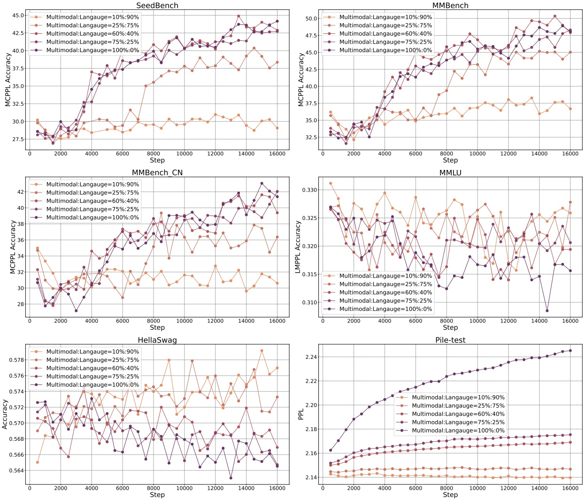

Figure 4 | Comparative performance results on different modality fusion ratio on training stage 2. An excessively large proportion of multimodal data (multimodal:language=100%:0%) leads to significant forgetting of language capabilities in LLMs. A suitable ratio (multi-modal:language=70%:30%) can effectively mitigate the issue of language forgetting while simultaneously enhancing the model’s multimodal abilities.

> **对一下:** Figure 4 题注说合适的比例是 multimodal:language=70%:30%, 第 3.2.2 节正文说最终选语言与多模态约 7:3, 两处是不是同一个数?
> 答: 方向相反. 正文的 7:3 是语言占 70%, 与 Table 1 中纯文本语料 70.0% 一致, 也与第 4.4 节「语言比例从 1 降到目标比例 (例如 0.7)」一致; 题注写的是多模态占 70%. 图中各子图的图例只有 10:90, 25:75, 60:40, 75:25, 100:0 五条 (都按 Multimodal:Language 写), 没有 70:30 这一条, 第 4.4 节两组消融用的是 60:40. 以正文和 Table 1 为准, 题注里的比例写反了, 也不对应图中任何一条实测曲线.

To mitigate these challenges, we adopte a dual-pronged approach. Firstly, we employ the Multi-choice PPL methodology to monitor the model’s progress. This involves inputting not only the prompt and image into the network but also all the answer associated with the question. Subsequently, we calculate the PPL for each answer position (e.g., A, B, C, D) and select the option deemed correct by the model as the final answer. Secondly, we introduce SFT data into the training dataset at a minimal proportion, allowing the model to acquire some proficiency in following instructions. The combination of these two approaches ensures the maintenance of stable training metrics for the 1.3B model and bring better performance after stage3.

为缓解这些问题, 我们采用两方面的办法. 第一, 用多选 PPL (Multi-choice PPL) 方法监控模型进展. 做法是不仅把提示和图像输入网络, 还把问题的所有答案一起输入. 随后计算每个答案位置 (例如 A, B, C, D) 的 PPL, 选出模型认为正确的选项作为最终答案. 第二, 在训练数据中以极小比例加入 SFT 数据, 让模型获得一定的指令跟随能力. 两种办法结合, 保证了 1.3B 模型训练指标的稳定, 并在阶段 3 之后带来更好的性能.

## 3.2.3. Stage 3: Supervised Fine-tuning · 阶段 3: 监督微调

In this phase, we finetune the pretrained DeepSeek-VL model with instruction-based fine-tuning to bolster its ability to follow instructions and engage in dialogue, culminating in the creation of the interactive DeepSeek-VL-Chat model. We optimize the language model, VL adaptor, and

<!-- page 15 of 33 -->

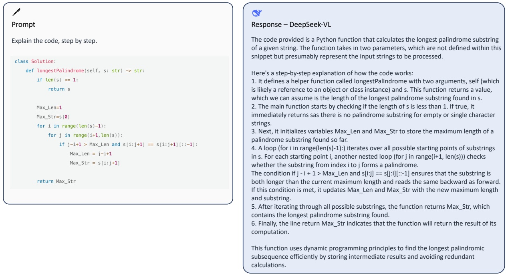

Figure 5 | Visualization results. DeepSeek-VL can understand Python code and provide detailed and organized explanations.

hybrid vision encoder with the vision-language SFT data as shown in Table 2, SAM-B remains frozen due to the limited GPU memory. We only supervise answers and special tokens and mask the system and user prompts. To guarantee the model’s comprehensive proficiency in dialogue, we utilize a blend of multimodal data and pure text dialogue data used in DeepSeek-LLM. This approach ensures the model’s versatility across various dialogue scenarios.

这一阶段我们用基于指令的微调对预训练后的 DeepSeek-VL 做微调, 增强其跟随指令和进行对话的能力, 最终得到可交互的 DeepSeek-VL-Chat 模型. 我们用 Table 2 所示的视觉语言 SFT 数据优化语言模型, VL adaptor 和混合视觉编码器, 其中 SAM-B 因 GPU 显存有限保持冻结. 我们只监督回答和特殊 token, 对系统提示和用户提示做 mask. 为保证模型在对话方面的全面能力, 我们混合使用多模态数据和 DeepSeek-LLM 用过的纯文本对话数据. 这保证了模型在各种对话场景中的通用性.

## 3.3. Hyperparameters and Infrastructures · 超参数与基础设施

The detailed hyperparameters of all stages are illustrated in Table 4. We train and evaluate our DeepSeek-VL with HAI-LLM (High-flyer, 2023), a lightweight and efficient distributed training framework. Since we use visual encoders to convert images into embedding vectors and then treat image embeddings and text embeddings uniformly, we can easily adapt pipeline parallelism to VL model training: all we need to do is to view visual encoders and text embedding as a single module and take it as the first layer of the resulting model. This very first layer has a complicated model structure and precludes standard tensor parallelism technique, but luckily it requires relatively small computation compared to upper standard transformer blocks. We therefore simply recompute the visual encoder forward pass in all tensor parallel ranks. The existence of visual encoders also leads to non-uniform execution time across model layers, so we re-divide model layers between pipeline parallelism ranks to achieve better load balance and throughput. The upper layers of DeepSeek-VL are exactly the same as those in DeepSeek-LLM. With such minor modification, we can now perform canonical 3D parallelism techniques as in Megatron (Korthikanti et al., 2023; Narayanan et al., 2021; Shoeybi et al., 2019) and overlap computation and communication as in DeepSeek-LLM (DeepSeek-AI, 2024). DeepSeek-VL-7B consumed 5 days on a cluster of 64 nodes, each comprising 8 Nvidia A100 GPUs, while DeepSeek-VL-1B consumed 7 days on a setup involving 16 nodes.

各阶段的详细超参数见 Table 4. 我们用 HAI-LLM (High-flyer, 2023) 训练和评测 DeepSeek-VL, 这是一个轻量高效的分布式训练框架. 由于我们用视觉编码器把图像转成嵌入向量, 再把图像嵌入与文本嵌入统一对待, 可以很容易地把流水线并行用于 VL 模型训练: 只需把视觉编码器和文本嵌入看作一个模块, 作为整个模型的第一层. 这第一层结构复杂, 无法使用标准的张量并行技术, 好在与上面的标准 Transformer 块相比, 它的计算量相对小. 因此我们直接在所有张量并行 rank 上重复计算视觉编码器的前向. 视觉编码器的存在也使各层执行时间不均匀, 所以我们重新划分流水线并行各 rank 之间的模型层, 以获得更好的负载均衡和吞吐. DeepSeek-VL 的上层与 DeepSeek-LLM 完全相同. 有了这些小改动, 我们就能像 Megatron (Korthikanti et al., 2023; Narayanan et al., 2021; Shoeybi et al., 2019) 那样使用标准的 3D 并行技术, 并像 DeepSeek-LLM (DeepSeek-AI, 2024) 那样重叠计算与通信. DeepSeek-VL-7B 在 64 个节点 (每节点 8 张 Nvidia A100 GPU) 的集群上用了 5 天, DeepSeek-VL-1B 在 16 个节点上用了 7 天.

<!-- page 16 of 33 -->

<table><tr><td>Vision Encoder</td><td colspan="3">DeepSeek-VL 1BSigLIP</td><td colspan="3">DeepSeek-VL-7BSigLIP+SAM</td></tr><tr><td>Hyperparameters</td><td>Stage 1</td><td>Stage 2</td><td>Stage 3</td><td>Stage 1</td><td>Stage 2</td><td>Stage 3</td></tr><tr><td>Learning rate</td><td> $1.0 \times 10^{-3}$ </td><td> $3 \times 10^{-5}$ </td><td> $2.0 \times 10^{-5}$ </td><td> $1.0 \times 10^{-3}$ </td><td> $4.2 \times 10^{-5}$ </td><td> $2.0 \times 10^{-5}$ </td></tr><tr><td>LR scheduler</td><td>Cosine</td><td>Step</td><td>Cosine</td><td>Cosine</td><td>Step</td><td>Cosine</td></tr><tr><td>Weight decay</td><td>0.0</td><td>0.0</td><td>0.0</td><td>0.0</td><td>0.0</td><td>0.0</td></tr><tr><td>Gradient clip</td><td>1.0</td><td>1.0</td><td>1.0</td><td>1.0</td><td>1.0</td><td>1.0</td></tr><tr><td>Optimizer</td><td colspan="3">AdamW( $\beta_1 = 0.9, \beta_2 = 0.95$ )</td><td colspan="3">AdamW( $\beta_1 = 0.9, \beta_2 = 0.95$ )</td></tr><tr><td>Warm-up steps</td><td>128</td><td>2000</td><td>256</td><td>128</td><td>2000</td><td>256</td></tr><tr><td>Training steps</td><td>15000</td><td>96000</td><td>10000</td><td>15000</td><td>42000</td><td>10000</td></tr><tr><td>Batch size</td><td>256</td><td>1024</td><td>256</td><td>256</td><td>2304</td><td>256</td></tr><tr><td>Sequence length</td><td>512</td><td>4096</td><td>4096</td><td>512</td><td>4096</td><td>4096</td></tr><tr><td>Sequence packing</td><td>×</td><td>√</td><td>×</td><td>×</td><td>√</td><td>×</td></tr><tr><td>Pipeline parallelism</td><td>×</td><td>×</td><td>×</td><td>×</td><td>√</td><td>√</td></tr></table>

> 表 4: DeepSeek-VL 1B (SigLIP) 与 7B (SigLIP+SAM) 三个阶段的训练超参数 (原文 Table 4).

> **看表:** Table 4 表头写 1B 只用 SigLIP, 7B 才是 SigLIP+SAM; 按表里的步数, batch 和序列长度, 阶段 2 两个模型各训了多少 token?
> 答: 先说编码器. 1.3B 发布配置的 `vision_config` 是单个 `CLIPVisionTower` (`siglip_large_patch16_384`), adaptor 是普通的两层 `mlp_gelu`, 没有 SAM 支路; Table 7 表头同样写 1B 用 SigLIP. 第 3.1 节和摘要描述的混合编码器只对应 7B. 再算 token: 阶段 2 开了 sequence packing, 7B 为 $42000\times2304\times4096\approx3.96\times10^{11}$, 1B 为 $96000\times1024\times4096\approx4.03\times10^{11}$, 两者都在 4000 亿 token 上下, 这是序列全部填满时的上限. 按 Table 1 的 70% 纯文本算, 7B 约 2770 亿文本 token, 约 1190 亿多模态 token. 文中没有给出实际 token 数, 以上只是从已知数字推出的说法, 没有数据验证.

## 4. Evaluation · 评测

## 4.1. Public Multimodal Benchmarks Evaluation · 公开多模态基准评测

We evaluate our models on a series of public benchmarks:

我们在一系列公开基准上评测模型:

**Multimodal comprehensive understanding** datasets: MMMU (Yue et al., 2023), CM-MMU (Zhang et al., 2024), MMBench (Liu et al., 2023a), MMBench-CN (Liu et al., 2023a), SeedBench (Li et al., 2023a) and MMV (Yu et al., 2023b). We compare DeepSeek-VL with competitors on MMB/MMC-dev as current official test download link is no longer active.

**多模态综合理解**数据集: MMMU (Yue et al., 2023), CMMMU (Zhang et al., 2024), MMBench (Liu et al., 2023a), MMBench-CN (Liu et al., 2023a), SeedBench (Li et al., 2023a) 和 MMV (Yu et al., 2023b). 由于当前官方测试集下载链接已失效, 我们在 MMB/MMC-dev 上与对手比较.

**Chart/table understanding** datasets: OCRBench (Liu et al., 2023b);

**图表/表格理解**数据集: OCRBench (Liu et al., 2023b);

**Hallucination** datasets: POPE (Li et al., 2023b);

**幻觉**数据集: POPE (Li et al., 2023b);

**Scientific problem** datasets: ScienceQA (Lu et al., 2022a) and MathVista (Lu et al., 2023).

**科学问题**数据集: ScienceQA (Lu et al., 2022a) 和 MathVista (Lu et al., 2023).

We apply generation-based evaluation with greedy decoding. The generation-based evaluation here refers to letting the model generate free texts and parsing results from generated texts. The comparative results, as illustrated in Table 5, show that DeepSeek-VL-7B surpasses most open-source models of similar size across a wide range of benchmarks.

我们采用基于生成, 贪心解码的评测. 这里基于生成的评测指让模型自由生成文本, 再从生成文本中解析结果. 如 Table 5 的对比结果所示, DeepSeek-VL-7B 在大量基准上超过多数同等规模的开源模型.

DeepSeek-VL outperforms open-source models of similar size in benchmarks such as MMB, MMC, and SEEDbench, even approaching proprietary models (DeepSeek-VL vs. GPT-4V = 70.4 vs. 71.6 on seedbench), demonstrating its powerful natural image comprehension capability. The model also surpasses all open-source models in mathematical logic, but still lags significantly behind proprietary models like GPT-4V (36.1 vs. 47.8 on MathVista). This difference could be attributed to the variance in base model sizes.

DeepSeek-VL 在 MMB, MMC 和 SEEDbench 等基准上超过同等规模的开源模型, 甚至接近闭源模型 (SEEDbench 上 DeepSeek-VL 对 GPT-4V 为 70.4 对 71.6), 显示出很强的自然图像理解能力. 模型在数学逻辑上也超过所有开源模型, 但仍明显落后于 GPT-4V 这样的闭源模型 (MathVista 上 36.1 对 47.8). 这一差距可能归因于底座模型规模的不同.

Furthermore, as shown in Table 6, DeepSeek-VL-1.3B significantly outperforms models of comparable size. It demonstrates superior performance compared to leading open-source models in the MMB benchmark test, while utilizing only close to half the parameters (1.3B vs. 2.7B), indicating its robust natural image comprehension capability. DeepSeek-VL-1.3B even achieves comparable results to 7B open-source models on MathVista, further validating the powerful logical understanding capabilities of the DeepSeek-VL family.

此外, 如 Table 6 所示, DeepSeek-VL-1.3B 明显优于规模相当的模型. 它在 MMB 基准上的表现优于领先的开源模型, 而参数量只有对方的一半左右 (1.3B 对 2.7B), 显示出稳健的自然图像理解能力. DeepSeek-VL-1.3B 在 MathVista 上甚至取得与 7B 开源模型相当的结果, 进一步验证了 DeepSeek-VL 系列很强的逻辑理解能力.

<!-- page 17 of 33 -->

<table><tr><td></td><td>LLM</td><td>MMMU</td><td>CMMMU</td><td>MMB</td><td>MMC</td><td>SEED</td><td>OCRB</td><td>POPE</td><td>MathV</td><td>MMVet</td></tr><tr><td colspan="11">Close-source LMMs:</td></tr><tr><td>Gemini Pro</td><td>Unk</td><td>48.9</td><td>-</td><td>75.2</td><td>74.0</td><td>70.7</td><td>659</td><td>-</td><td>45.2</td><td>59.2</td></tr><tr><td>GPT-4V</td><td>Unk</td><td>56.8</td><td>42.5</td><td>75.0</td><td>74.7</td><td>71.6</td><td>659</td><td>-</td><td>47.8</td><td>49.9</td></tr><tr><td>Qwen-VL-Plus</td><td>Unk</td><td>45.2</td><td>39.5</td><td>66.2</td><td>69.6</td><td>72.7</td><td>-</td><td>-</td><td>43.3</td><td>55.7</td></tr><tr><td>Qwen-VL-MAX</td><td>Unk</td><td>51.4</td><td>-</td><td>78.1</td><td>76.4</td><td>72.7</td><td>-</td><td>-</td><td>51.0</td><td>61.8</td></tr><tr><td colspan="11">Open-source 13B LMMs:</td></tr><tr><td>LLaVA-1.5</td><td>13B</td><td>36.4</td><td>-</td><td>68.2</td><td>61.9</td><td>68.2</td><td>331</td><td>85.9</td><td>26.4</td><td>38.3</td></tr><tr><td>VILA</td><td>13B</td><td>-</td><td>-</td><td>70.3</td><td>64.3</td><td>-</td><td>-</td><td>84.2</td><td>-</td><td>38.8</td></tr><tr><td>LLaVA-Next</td><td>13B</td><td>36.2</td><td>-</td><td>70.0</td><td>64.4</td><td>71.9</td><td>-</td><td>86.7</td><td>35.3</td><td>48.4</td></tr><tr><td colspan="11">Open-source 7B LMMs:</td></tr><tr><td>EMU2-Chat</td><td>7B</td><td>36.3</td><td>23.8</td><td>63.6</td><td>45.9</td><td>68.9</td><td>-</td><td>-</td><td>30.0</td><td>31.0</td></tr><tr><td>Qwen-VL-Chat</td><td>7B</td><td>37.0</td><td>-</td><td>60.6</td><td>56.7</td><td>64.8</td><td>-</td><td>-</td><td>33.8</td><td>47.3</td></tr><tr><td>CogVLM</td><td>7B</td><td>37.3</td><td>24.8</td><td>63.7</td><td>53.8</td><td>68.8</td><td>-</td><td>-</td><td>34.7</td><td>54.5</td></tr><tr><td>LLaVA-Next</td><td>7B</td><td>35.8</td><td>-</td><td>67.4</td><td>60.0</td><td>70.2</td><td>-</td><td>86.5</td><td>34.6</td><td>43.9</td></tr><tr><td>Yi-VL</td><td>6B</td><td>37.8</td><td>35.8</td><td>68.2</td><td>68.9</td><td>67.6</td><td>-</td><td>-</td><td>28.0</td><td>31.1</td></tr><tr><td>DeepSeek-VL (ours)</td><td>7B</td><td>36.6</td><td>37.9</td><td>73.2</td><td>72.8</td><td>70.4</td><td>456</td><td>88.1</td><td>36.1</td><td>41.5</td></tr></table>

> 表 5: 闭源模型与 7B, 13B 开源模型在多模态基准上的对比 (原文 Table 5).

<table><tr><td></td><td>LLM</td><td>MMMU</td><td>CMMMU</td><td>MMB</td><td>MMC</td><td>SEED</td><td>OCRB</td><td>POPE</td><td>MathV</td><td>MMVet</td></tr><tr><td colspan="11">Tiny Model:</td></tr><tr><td>MobileVLM</td><td>1.4B</td><td>-</td><td>-</td><td>53.2</td><td>-</td><td>-</td><td>-</td><td>84.5</td><td>-</td><td>-</td></tr><tr><td>MobileVLM</td><td>2.7B</td><td>-</td><td>-</td><td>59.6</td><td>-</td><td>-</td><td>-</td><td>84.9</td><td>-</td><td>-</td></tr><tr><td>MobileVLM V2</td><td>1.4B</td><td>-</td><td>-</td><td>59.6</td><td>-</td><td>-</td><td>-</td><td>84.3</td><td>-</td><td>-</td></tr><tr><td>MobileVLM V2</td><td>2.7B</td><td>-</td><td>-</td><td>63.2</td><td>-</td><td>-</td><td>-</td><td>84.7</td><td>-</td><td>-</td></tr><tr><td>LLaVA-Phi</td><td>2.7B</td><td>-</td><td>-</td><td>59.5</td><td>-</td><td>-</td><td>-</td><td>85.0</td><td>-</td><td>28.9</td></tr><tr><td>DeepSeek-VL (ours)</td><td>1.3B</td><td>32.2</td><td>27.4</td><td>64.6</td><td>61.3</td><td>66.7</td><td>409</td><td>87.6</td><td>31.1</td><td>34.8</td></tr></table>

> 表 6: 小模型在多模态基准上的对比 (原文 Table 6).

## 4.2. Public Language Benchmarks Evaluation · 公开语言基准评测

We evaluate our models on the following public language benchmarks:

我们在以下公开语言基准上评测模型:

**Multi-subject multiple-choice** datasets including MMLU (Hendrycks et al., 2020).

**多学科多选题**数据集, 包括 MMLU (Hendrycks et al., 2020).

**Language understanding and reasoning** datasets including HellaSwag (Zellers et al., 2019).

**语言理解与推理**数据集, 包括 HellaSwag (Zellers et al., 2019).

**Language modeling** datasets including Pile (Gao et al., 2020).

**语言建模**数据集, 包括 Pile (Gao et al., 2020).

**Math** datasets including GSM8K (Cobbe et al., 2021).

**数学**数据集, 包括 GSM8K (Cobbe et al., 2021).

**Code** datasets including MBPP (Austin et al., 2021).

**代码**数据集, 包括 MBPP (Austin et al., 2021).

**Standardized exams** including AGIEval (Zhong et al., 2023).

**标准化考试**, 包括 AGIEval (Zhong et al., 2023).

We apply perplexity-based evaluation to datasets that require answers to be chosen from several options. These datasets include HellaSwag and MMLU. The perplexity-based evaluation here refers to calculating the perplexity of each option and selecting the lowest one as the

<!-- page 18 of 33 -->

<table><tr><td></td><td>VersionEncoder</td><td>DeepSeek-VL1B ChatSigLIP</td><td>DeepSeek-VL7B ChatSigLIP+SAM</td><td>DeepSeek-LLM7B ChatNone</td></tr><tr><td rowspan="5">Benchmark</td><td>HellaSwag</td><td>56.0</td><td>68.4</td><td>68.5</td></tr><tr><td>MMLU</td><td>32.5</td><td>52.4</td><td>49.4</td></tr><tr><td>GSM8K</td><td>18.0</td><td>55.0</td><td>63.0</td></tr><tr><td>MBPP</td><td>10.0</td><td>35.2</td><td>35.2</td></tr><tr><td>AGIEval</td><td>14.0</td><td>27.8</td><td>19.3</td></tr></table>

> 表 7: DeepSeek-VL 1B Chat, 7B Chat 与 DeepSeek-LLM 7B Chat 在语言基准上的对比 (原文 Table 7).

model prediction. Perplexity-based evaluation helps to distinguish subtle probability difference between model predictions and avoids discontinuity of exact match style evaluation. We apply generation-based evaluation with greedy decoding for GSM8K and AGIEval. The generationbased evaluation here refers to letting the model generate free texts and parsing results from generated texts. We apply language-modeling-based evaluation for Pile-test, which means calculating the bits-per-byte on the test corpus. And the results are illustrated in Table 7

对需要从若干选项中选答案的数据集, 我们采用基于困惑度的评测, 包括 HellaSwag 和 MMLU. 这里基于困惑度的评测指计算每个选项的困惑度, 选最低的作为模型预测. 基于困惑度的评测有助于区分模型预测之间细微的概率差异, 也避免了精确匹配式评测的不连续性. 对 GSM8K 和 AGIEval, 我们采用基于生成, 贪心解码的评测. 这里基于生成的评测指让模型自由生成文本, 再从生成文本中解析结果. 对 Pile-test 采用基于语言建模的评测, 即在测试语料上计算每字节比特数 (bits-per-byte). 结果见 Table 7.

It can be observed that across the majority of language benchmarks, DeepSeek-VL performs comparably to, or even surpasses, DeepSeek-7B. For instance, it achieves scores of 68.4 vs. 68.5 on HellaSwag, which serves as a general benchmark for evaluating general language ability. DeepSeek-VL outperforms DeepSeek-7B on metrics such as MMLU and AGIEval, indicating that multimodal training methods may even aid in language tasks. Nevertheless, DeepSeek-VL-7B shows a certain degree of decline in mathematics (GSM8K), which suggests that despite efforts to promote harmony between vision and language modalities, there still exists a competitive relationship between them. This could be attributed to the limited model capacity (7B), and larger models might alleviate this issue significantly. Overall, DeepSeek-VL strives to achieve the goal of minimizing declines in language capability while addressing these challenges.

可以看到, 在多数语言基准上, DeepSeek-VL 与 DeepSeek-7B 表现相当, 甚至更好. 例如在衡量通用语言能力的 HellaSwag 上, 两者为 68.4 对 68.5. DeepSeek-VL 在 MMLU 和 AGIEval 等指标上超过 DeepSeek-7B, 说明多模态训练方法甚至可能有助于语言任务. 不过, DeepSeek-VL-7B 在数学 (GSM8K) 上有一定程度的下降, 说明尽管我们努力让视觉与语言两种模态协调, 两者之间仍存在竞争关系. 这可能归因于模型容量有限 (7B), 更大的模型或许能明显缓解这一问题. 总体上, DeepSeek-VL 在应对这些挑战的同时, 力求把语言能力的下降降到最低.

## 4.3. Human Evaluation · 人工评测

To further explore the capabilities of our DeepSeek-VL, we independently construct a dataset for manual evaluation. This dataset comprises 100 questions, divided into seven categories, each encompassing specific tasks. These categories and tasks are same as our taxonomy for the in-house SFT data, as shown in Table 3. This approach ensures that the tasks we test are universal and encompass the majority of use cases for multimodal models.

为了进一步探索 DeepSeek-VL 的能力, 我们独立构建了一个用于人工评测的数据集. 它包含 100 道题, 分为七类, 每类包含若干具体任务. 这些类别和任务与 Table 3 所示的自有 SFT 数据分类体系相同. 这样能保证我们测试的任务具有普遍性, 覆盖多模态模型的大多数用例.

Moreover, based on the categories and tasks described in existing reports, we collect similar image materials and developed prompts. The sources for these image materials include royaltyfree image communities and photographs taken by the researchers. This methodical collection and prompt formulation process ensures our dataset is both comprehensive and representative of real-world multimodal model applications.

此外, 我们根据已有报告中描述的类别和任务, 收集了相似的图像素材并编写提示. 图像素材来自免版税图片社区和研究人员自己拍摄的照片. 这种有条理的素材收集和提示编写流程, 保证了数据集全面且能代表多模态模型的真实应用.

We compare our DeepSeek-VL-7B with InternLM-XComposer2-VL, CogVLM and GPT-4V as shown in Figure 6 (and we also provide visualization results in Appendix A). GPT-4V demonstrates exceptional performance across most dimensions. All open-source models are still far behind GPT-4V in logical reasoning, highlighting the necessity of scaling up the size of Large Language Models (LLMs). DeepSeek-VL-7B achieves better results in overall performance, reaching outcomes close to GPT-4V in Recognition, Conversion, and Commonsense Reasoning.

我们把 DeepSeek-VL-7B 与 InternLM-XComposer2-VL, CogVLM 和 GPT-4V 作比较, 见 Figure 6 (附录 A 另有可视化结果). GPT-4V 在多数维度上表现突出. 所有开源模型在逻辑推理上仍远远落后于 GPT-4V, 说明扩大大语言模型 (LLM) 规模是必要的. DeepSeek-VL-7B 总体表现更好, 在识别, 转换和常识推理上接近 GPT-4V.

<!-- page 19 of 33 -->

InternLM-XComposer2-VL CogVLM-17B DeepSeek-VL-7B GPT4V

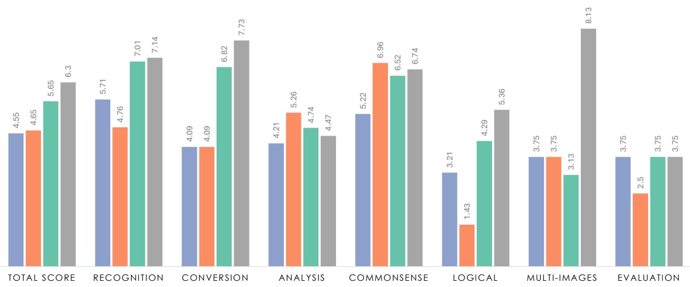

Figure 6 | Human evaluation results on InternLM-XComposer2-VL (Dong et al., 2024), CogVLM (Wang et al., 2023b), DeepSeek-VL and GPT-4V (OpenAI, 2023b).

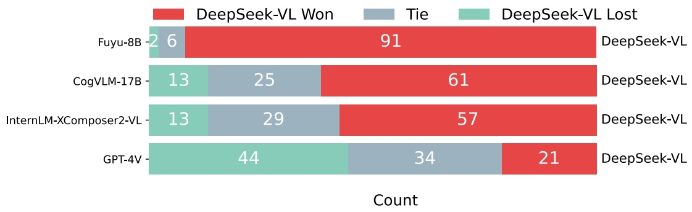

Figure 7 | GPT-4V-based Evaluation Results of DeepSeek-VL vs. Other Models: The chart depicts results from a GPT-4V-based assessment across 99 test samples, demonstrating DeepSeek-VL’s favorable outcomes against both open-source and proprietary models.

In addition, we conduct a comparative assessment using GPT-4V to evaluate the performance of DeepSeek-VL against other models across a set of 99 test samples designed for human evaluation. Following (Zheng et al., 2024), we show GPT-4V the question and the answers from two different models and ask GPT-4V to determine which one is better or declare a tie. The results indicate a preference for DeepSeek-VL’s responses in the majority of cases, as GPT-4V tends to rate the quality of DeepSeek-VL’s answers more favorably. As illustrated in Figure 7, DeepSeek-VL is judged to be superior in over 60% of instances when compared to open-source multimodal models, including Fuyu-8B, CogVLM-17B, and InternLM-XComposer2-VL. Moreover, in comparison with other proprietary models, such as GPT-4V itself, DeepSeek-VL demonstrates comparably exceptional performance.

此外, 我们用 GPT-4V 做了一次对比评估, 在为人工评测设计的 99 个测试样本上评估 DeepSeek-VL 与其他模型的表现. 参照 (Zheng et al., 2024), 我们把问题和两个不同模型的回答给 GPT-4V, 让它判断哪个更好或判为平局. 结果表明多数情况下 GPT-4V 更偏好 DeepSeek-VL 的回答, 对其质量评价更高. 如 Figure 7 所示, 与开源多模态模型 (包括 Fuyu-8B, CogVLM-17B 和 InternLM-XComposer2-VL) 相比, DeepSeek-VL 在超过 60% 的样本中被判为更好. 此外, 与 GPT-4V 本身等闭源模型相比, DeepSeek-VL 也表现出相当出色的水平.

> **确认:** 第 4.3 节说与三个开源模型相比 DeepSeek-VL 都在超过 60% 的样本中胜出, 与 GPT-4V 相比也「相当出色」, Figure 7 的计数支持这两句吗?
> 答: 只部分支持. Figure 7 每行合计 99 个样本: 对 Fuyu-8B 胜 91, 平 6, 负 2; 对 CogVLM-17B 胜 61, 平 25, 负 13; 对 InternLM-XComposer2-VL 胜 57, 平 29, 负 13; 对 GPT-4V 胜 21, 平 34, 负 44. 57/99 约为 57.6%, 对 InternLM-XComposer2-VL 的胜率不到 60%; 对 GPT-4V 负场是胜场的两倍多, 胜率约 21%, 而裁判正是 GPT-4V. 「超过 60%」只对 Fuyu-8B 和 CogVLM-17B 成立.

## 4.4. Ablation Study · 消融实验

**Scale Up Projector Training** We expand the dataset for stage 1 (projector warmup) and subsequently apply supervised fine-tuning. The results, depicted in Figure 8, demonstrate that augmenting the training data volume does not enhance performance at this stage. This implies

<!-- page 20 of 33 -->

| Stage 1, Training Step | MMB | MMC | SEED | POPE | MMMU | Average |
| --- | --- | --- | --- | --- | --- | --- |
| 2K | 59.0 | 54.0 | 61.8 | 82.3 | 30.3 | 57.5 |
| 8K | 58.0 | 45.0 | 58.5 | 84.9 | 29.2 | 55.1 |
| 20K | 56.0 | 52.3 | 59.0 | 81.7 | 28.6 | 55.5 |
| 80K | 58.1 | 55.0 | 58.6 | 78.6 | 27.9 | 55.6 |

> 表 8: 阶段 1 训练步数对下游指标的影响 (原文 Table 8).

| Stage 1 | Stage 2 | Stage 3 | MMB | MMC | SEED | POPE | MMMU | Average |
| --- | --- | --- | --- | --- | --- | --- | --- | --- |
| ✓ |  | ✓ | 59.4 | 54.2 | 61.4 | 82.5 | 29.2 | 57.4 |
|  | ✓ | ✓ | 63.4 | 60.5 | 65.9 | 87.1 | 31.8 | 61.7 |
| ✓ | ✓ | ✓ | 64.3 | 61.3 | 66.7 | 87.6 | 32.2 | 62.4 |

> 表 9: 三个训练阶段不同组合的消融 (原文 Table 9).

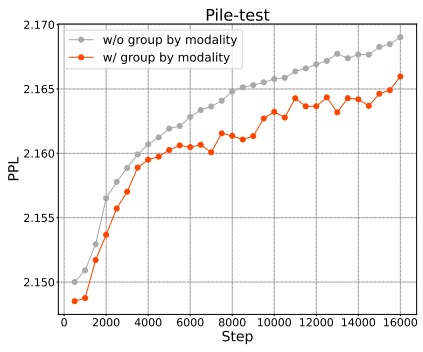

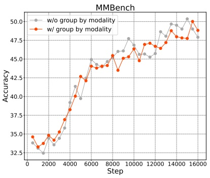

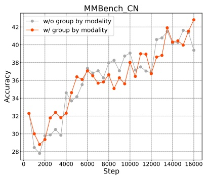

Figure 8 | Comparative analysis of modality warmup on language (Pile-test) and multimodal (MMBench and MMBench\_CN) benchmarks demonstrates that modality grouping consistently surpasses the non-grouped modality approach in language tasks, while simultaneously preserving performance on multimodal tasks on training stage 2 (Multimodal:Language=60%:40%).

that the projector’s capacity is inherently constrained, rendering it incapable of capturing the extensive knowledge necessary for multimodal tasks.

**扩大 projector 训练** 我们扩大阶段 1 (projector 预热) 的数据, 随后进行监督微调. Figure 8 所示的结果表明, 增加训练数据量并不能提升这一阶段的表现. 这意味着 projector 的容量本身受限, 无法容纳多模态任务所需的大量知识.

> **问:** 第 3.2.1 节说扩大阶段 1 数据的实验在 Table 8, 这里说结果在 Figure 8; Table 8 的变量是「训练步数」, 它测的是数据量还是训练时长?
> 答: 结果在 Table 8, Figure 8 是模态分组的曲线, 这里的图号写错了. Table 8 只列 2K, 8K, 20K, 80K 四档阶段 1 步数, 之后直接接阶段 3, 与 Table 9 第一行同为跳过阶段 2 的设置 (2K 一行均值 57.5, Table 9 第一行 57.4). 按 Table 4 的 batch 256, 80K 步对应 2048 万条样本, 而阶段 1 的数据是 125 万加 250 万, 约 375 万对, 所以长的几档要么把同一批数据重复多轮, 要么换入了更多数据, 文中没有给出是哪一种. 步数从 2K 增到 80K, 均值从 57.5 降到 55.6, POPE 从 82.3 降到 78.6; 正式训练却用了 15000 步, 落在表中 8K 与 20K 两档之间, 选择理由文中没有给出.

**Training Stage** In Table 9, we examine the contributions of each stage to the model’s performance. It’s evident that combining stage 1, stage 2, and stage 3 yields significantly better results across all metrics compared to combining stage 1 and stage 3 alone, demonstrating the effectiveness of multimodal pretraining. Additionally, the combination of stage 2 and stage 3 still slightly lags behind the combined performance of stage 1, stage 2, and stage 3, indicating that vision-language adaptor warmup stage remains meaningful.

**训练阶段** 在 Table 9 中, 我们考察每个阶段对模型表现的贡献. 显然, 阶段 1, 阶段 2 与阶段 3 组合在所有指标上都明显好于只组合阶段 1 与阶段 3, 证明了多模态预训练的有效性. 此外, 阶段 2 与阶段 3 的组合仍略逊于阶段 1, 2, 3 的组合, 说明视觉语言 adaptor 预热阶段仍有意义.

**Modality Group Training** When mixing language and multimodal data, we observe that directly blending them at the batch level significantly reduces training efficiency. This inefficiency arises because each batch gradient backpropagation process waits for the slowest sample to complete. As a result, the predominantly faster-to-process pure language data ends up waiting for the multimodal samples to finish, leading to a decrease in overall training efficiency.

**模态分组训练** 混合语言与多模态数据时, 我们观察到直接在 batch 层面混合会显著降低训练效率. 原因是每个 batch 的梯度反向传播都要等最慢的样本完成. 结果处理更快的纯语言数据只能等多模态样本完成, 整体训练效率随之下降.

To address this issue, we experiment with grouping different modalities of data at each global

<!-- page 21 of 33 -->

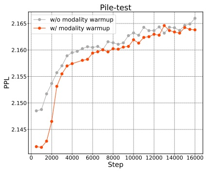

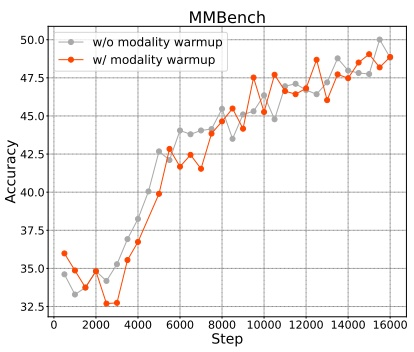

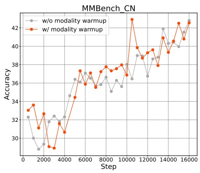

Figure 9 | Comparative performance results on language (Pile-test) and multimodal (MMBench and MMBench\_CN) benchmarks for modality warmup. Modality warmup consistently matches or surpasses the performance of approaches without modality warmup across all evaluated tasks on training stage 2 (Multimodal:Language=60%:40%).

step, sampling distinct modalities separately. This approach involves organizing the training data so that batches are composed either entirely of language data or entirely of multimodal data at different training steps, rather than mixing them within the same batch.

为解决这个问题, 我们尝试在每个全局步对不同模态的数据分组, 分别采样不同的模态. 具体做法是组织训练数据, 使不同训练步的 batch 要么全是语言数据, 要么全是多模态数据, 而不是在同一个 batch 中混合.

The results are shown in Figure 8, we observe that this method does not compromise the model’s performance while enhancing the model’s training efficiency by 20%. This strategy effectively circumvents the bottleneck caused by the disparate processing times between modalities, optimizing the training workflow.

结果见 Figure 8. 我们观察到这一方法不损害模型表现, 同时把训练效率提高了 20%. 这一策略有效绕开了不同模态处理时间差异造成的瓶颈, 优化了训练流程.

**Modality Warmup** Considering that our approach involves multimodal training on the foundation of a language model, directly mixing multimodal data in a fixed proportion from the outset can destabilize the model. To counteract this issue, we propose a simple yet effective modality warm-up strategy. Initially, we set the language data ratio to 1, and then gradually decrease it to the target ratio for the final model training (e.g., 0.7).

**模态预热** 我们的方法是在语言模型的基础上做多模态训练, 从一开始就按固定比例直接混入多模态数据可能使模型不稳定. 为此我们提出一个简单有效的模态预热策略. 起初把语言数据比例设为 1, 再逐步降到最终模型训练的目标比例 (例如 0.7).

Our experiments, as illustrated in Figure 9, demonstrate that this strategy effectively prevents a significant decline in language capabilities at the beginning of training, while also yielding comparatively superior outcomes in the final phases for both the language and multimodal domains. This gradual adaptation enables the model to more seamlessly adjust to the incorporation of multimodal data, thereby improving overall training stability and performance.

如 Figure 9 所示, 我们的实验表明这一策略有效避免了训练初期语言能力的明显下降, 同时在训练后期的语言和多模态两方面都取得相对更好的结果. 这种渐进的适应让模型更顺畅地接纳多模态数据, 从而提升整体训练稳定性和表现.

**Vision Encoder Selection** In order to better acquire and utilize image information, we compare the training loss of different vision encoders under our training settings except for reducing training steps of stage 2 to 8000 for efficiency. As illustrated in Figure 10, the incorporation of vision-only self-supervised encoders has been found to significantly enhance performance on training loss. To more effectively process high-resolution images, our research ultimately adopts a hybrid vision encoder strategy, combining SigLIP with SAM for our model’s implementation.

**视觉编码器选择** 为了更好地获取和利用图像信息, 我们在自己的训练设置下比较了不同视觉编码器的训练损失, 只是为了效率把阶段 2 的训练步数减到 8000. 如 Figure 10 所示, 加入纯视觉自监督编码器能明显改善训练损失. 为了更有效地处理高分辨率图像, 我们最终采用混合视觉编码器策略, 在模型实现中结合 SigLIP 与 SAM.

**Vision-Language Adaptor Design** To improve the efficiency of extracting information from the visual encoder while adhering to current token length constraints, adjustments can be made to the Vision-Language adaptor in two main ways: the method used to combine visual features and the design of the MLP adaptor.

**视觉语言 adaptor 设计** 为了在遵守当前 token 长度限制的前提下更高效地从视觉编码器提取信息, 可以从两个主要方面调整视觉语言 adaptor: 组合视觉特征的方式, 以及 MLP adaptor 的设计.

Previous studies (Tong et al., 2024) have indicated that combining visual features along the sequence dimension can lead to better model performance, although this comes with the trade-off of increased computational requirements due to a longer sequence of visual feature tokens. As demonstrated in the top section of Table 10, reducing the sequence length by stacking

<!-- page 22 of 33 -->

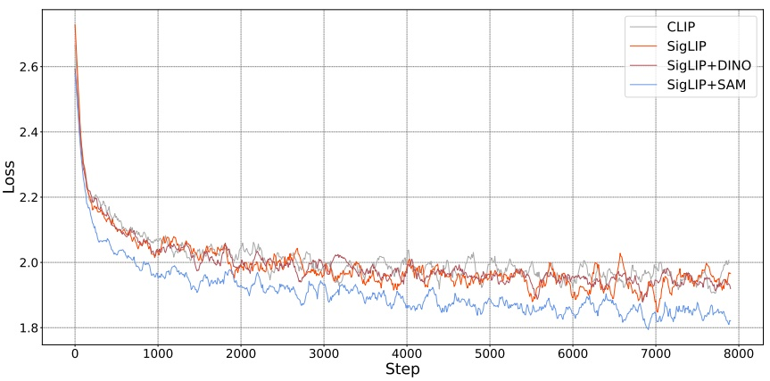

> 图 10: 不同视觉编码器的训练损失曲线, 依次为 CLIP, SigLIP, SigLIP+DINO, SigLIP+SAM (原文 Figure 10).

<table><tr><td>Architecture</td><td>MMB</td><td>MMC</td><td>SEED</td><td>POPE</td><td>ScienceQA</td><td>MMMU</td><td>OCRB</td><td>Average</td></tr><tr><td colspan="9">Sequence Concatenation:</td></tr><tr><td>Token Pooling - W</td><td>61.2</td><td>59.6</td><td>61.6</td><td>86.5</td><td>57.7</td><td>31.6</td><td>304</td><td>55.5</td></tr><tr><td>Token Pooling - H</td><td>59.9</td><td>58.3</td><td>61.6</td><td>83.8</td><td>55.0</td><td>32.0</td><td>291</td><td>54.2</td></tr><tr><td colspan="9">Embedding Concatenation:</td></tr><tr><td>Hybrid MLP</td><td>61.7</td><td>60.1</td><td>62.9</td><td>87.8</td><td>56.6</td><td>31.3</td><td>309</td><td>55.9</td></tr><tr><td>Shared MLP</td><td>62.0</td><td>58.9</td><td>62.5</td><td>86.6</td><td>54.7</td><td>30.2</td><td>318</td><td>55.2</td></tr><tr><td>Separate MLP</td><td>57.5</td><td>58.7</td><td>63.1</td><td>86.5</td><td>56.6</td><td>29.0</td><td>299</td><td>54.5</td></tr></table>

> 表 10: 视觉特征组合方式与 adaptor 结构的消融 (原文 Table 10).

visual features along the image’s width or height dimensions before sequence concatenation, in order to keep the sequence length constant, does not achieve better results compared to simply merging them along the embedding dimension in most metrics. In terms of the adaptor architecture, employing separate MLP adaptors for each vision feature encoder allows for more precise adjustments to the specific values and distribution patterns of visual features, facilitating smoother model training. Conversely, using a shared MLP adaptor for different vision encoders contributes to adequate feature fusion. We adopt a mixed strategy and report stable and improved performance, as outlined in the lower section of Table 10.

先前研究 (Tong et al., 2024) 表明, 沿序列维度组合视觉特征能带来更好的模型表现, 代价是视觉特征 token 序列更长, 计算需求随之增加. 如 Table 10 上半部分所示, 为保持序列长度不变, 在序列拼接前沿图像的宽或高维度堆叠视觉特征来缩短序列, 在多数指标上并不比简单地沿嵌入维度合并更好. 在 adaptor 结构方面, 为每个视觉特征编码器使用独立的 MLP adaptor, 可以更精确地适配各自视觉特征的具体数值和分布模式, 让模型训练更平稳. 反过来, 为不同视觉编码器使用共享的 MLP adaptor 有助于充分的特征融合. 我们采用一种混合策略, 得到稳定且更好的表现, 见 Table 10 下半部分.

## 5. Conclusion, Limitation, and Future Work · 结论, 局限与未来工作

In this technical report, we have introduced DeepSeek-VL, a series of Multimodal Large Language Models, available in scales of 1.3B and 6.7B parameters. This report has unveiled the limitations inherent in the predominant projector-based pretraining methodologies, setting the stage for the innovative approach adopted by DeepSeek-VL. By prioritizing a joint vision and language (VL) pretraining phase, DeepSeek-VL transcends traditional models by ensuring that the integration of multimodal data does not compromise the linguistic capabilities of the Large Language Models (LLMs). This is achieved through a strategic warm-up data ratio and the introduction of a hybrid vision encoder, which together enable the efficient processing of

<!-- page 23 of 33 -->

high-resolution images without losing sight of semantic richness.

在这份技术报告中, 我们介绍了 DeepSeek-VL, 一个多模态大语言模型系列, 提供 1.3B 和 6.7B 两种参数规模. 报告揭示了主流基于 projector 的预训练方法的固有局限, 为 DeepSeek-VL 采用的新方法做了铺垫. 通过优先安排视觉与语言 (VL) 联合预训练阶段, DeepSeek-VL 超越了传统模型, 保证多模态数据的融入不损害大语言模型 (LLM) 的语言能力. 这是通过策略性的预热数据比例和引入混合视觉编码器实现的, 两者共同使模型能高效处理高分辨率图像, 又不丢失语义的丰富性.

The incorporation of a hybrid vision encoder, capable of handling 1024 x 1024 images within a constrained token budget, underscores our commitment to preserving the nuanced details and semantic integrity across diverse tasks. As a result, DeepSeek-VL emerges as a pioneering model that not only meets but exceeds the standards set by generalist models in its class. It showcases exceptional performance across a wide range of visually-centric benchmarks while sustaining formidable proficiency in language-centric evaluations.

混合视觉编码器能在受限的 token 预算内处理 1024 x 1024 图像, 体现了我们在各类任务中保留细微细节与语义完整性的追求. 因此, DeepSeek-VL 成为一个开创性的模型, 不仅达到而且超过了同类通用模型设定的标准. 它在大量以视觉为中心的基准上表现出色, 同时在以语言为中心的评测中保持很强的能力.

In making DeepSeek-VL publicly available, we aim to catalyze further innovation and exploration within the research community, providing a robust foundation upon which future studies can build. This gesture of openness is intended to facilitate the collective advancement of our understanding and capabilities in handling multimodal data.

公开 DeepSeek-VL 是为了推动研究社区的进一步创新和探索, 为后续研究提供一个稳健的基础. 这一开放举措旨在促进大家共同推进对多模态数据的理解和处理能力.

Looking ahead, we are excited to announce plans to scale up DeepSeek-VL to larger sizes, incorporating Mixture of Experts (MoE) technology. This forthcoming expansion promises to further enhance the model’s efficiency and effectiveness, opening up new horizons for research and application in the field of AI.

展望未来, 我们计划把 DeepSeek-VL 扩到更大规模, 并引入 MoE 技术. 这一扩展有望进一步提升模型的效率和效果, 为 AI 领域的研究和应用打开新的方向.

## References

01-ai. Yi-34B vision language model. [https://huggingface.co/01-ai/Yi-VL-34B](https://huggingface.co/01-ai/Yi-VL-34B), 2024.

Abi. Screenshot to code. [https://github.com/abi/screenshot-to-code](https://github.com/abi/screenshot-to-code), 2024.

Anna’s Archive. Anna’s archive. [https://annas-archive.org/](https://annas-archive.org/), 2024.

Anthropic. Introducing Claude, 2023. URL [https://www.anthropic.com/index/introducing-claude](https://www.anthropic.com/index/introducing-claude).

J. Austin, A. Odena, M. Nye, M. Bosma, H. Michalewski, D. Dohan, E. Jiang, C. Cai, M. Terry, Q. Le, et al. Program synthesis with large language models. arXiv preprint arXiv:2108.07732, 2021.

J. Bai, S. Bai, S. Yang, S. Wang, S. Tan, P. Wang, J. Lin, C. Zhou, and J. Zhou. Qwen-vl: A versatile vision-language model for understanding, localization, text reading, and beyond. arXiv preprint arXiv:2308.12966, 2023.

R. Bavishi, E. Elsen, C. Hawthorne, M. Nye, A. Odena, A. Somani, and S. Taşırlar. Introducing our multimodal models, 2023. URL [https://www.adept.ai/blog/fuyu-8b](https://www.adept.ai/blog/fuyu-8b).

L. Blecher. Latex-ocr. GitHub repository, 2024. URL [https://github.com/lukas-blecher/LaTeX-OCR](https://github.com/lukas-blecher/LaTeX-OCR).

L. Blecher, G. Cucurull, T. Scialom, and R. Stojnic. Nougat: Neural optical understanding for academic documents. arXiv preprint arXiv:2308.13418, 2023.

A. Burns, K. Srinivasan, J. Ainslie, G. Brown, B. A. Plummer, K. Saenko, J. Ni, and M. Guo. A suite of generative tasks for multi-level multimodal webpage understanding. In The 2023 Conference on Empirical Methods in Natural Language Processing (EMNLP), 2023. URL [https://openreview.net/forum?id=rwcLHjtUmn](https://openreview.net/forum?id=rwcLHjtUmn).

J. Carter. Textocr-gpt4v. [https://huggingface.co/datasets/jimmycarter/textocr-gpt4v](https://huggingface.co/datasets/jimmycarter/textocr-gpt4v), 2024.

<!-- page 24 of 33 -->

L. Chen, J. Li, X. Dong, P. Zhang, C. He, J. Wang, F. Zhao, and D. Lin. Sharegpt4v: Improving large multi-modal models with better captions. arXiv preprint arXiv:2311.12793, 2023.

C. K. Chng, Y. Liu, Y. Sun, C. C. Ng, C. Luo, Z. Ni, C. Fang, S. Zhang, J. Han, E. Ding, et al. Icdar2019 robust reading challenge on arbitrary-shaped text-rrc-art. In 2019 International Conference on Document Analysis and Recognition (ICDAR), pages 1571–1576. IEEE, 2019.

K. Cobbe, V. Kosaraju, M. Bavarian, M. Chen, H. Jun, L. Kaiser, M. Plappert, J. Tworek, J. Hilton, R. Nakano, et al. Training verifiers to solve math word problems. arXiv preprint arXiv:2110.14168, 2021.

W. Dai, J. Li, D. Li, A. M. H. Tiong, J. Zhao, W. Wang, B. Li, P. Fung, and S. Hoi. Instructblip: Towards general-purpose vision-language models with instruction tuning, 2023.

DeepSeek-AI. Deepseek llm: Scaling open-source language models with longtermism. arXiv preprint arXiv:2401.02954, 2024. URL [https://github.com/deepseek-ai/DeepSeek-LLM](https://github.com/deepseek-ai/DeepSeek-LLM).

X. Dong, P. Zhang, Y. Zang, Y. Cao, B. Wang, L. Ouyang, X. Wei, S. Zhang, H. Duan, M. Cao, et al. Internlm-xcomposer2: Mastering free-form text-image composition and comprehension in vision-language large model. arXiv preprint arXiv:2401.16420, 2024.

echo840. Detailed caption dataset. [https://huggingface.co/datasets/echo840/Detailed\_Caption](https://huggingface.co/datasets/echo840/Detailed_Caption), 2024.

W. Foundation. Wikimedia downloads. URL [https://dumps.wikimedia.org](https://dumps.wikimedia.org).

J. Gao, R. Pi, J. Zhang, J. Ye, W. Zhong, Y. Wang, L. Hong, J. Han, H. Xu, Z. Li, et al. Gllava: Solving geometric problem with multi-modal large language model. arXiv preprint arXiv:2312.11370, 2023.

L. Gao, S. Biderman, S. Black, L. Golding, T. Hoppe, C. Foster, J. Phang, H. He, A. Thite, N. Nabeshima, et al. The Pile: An 800GB dataset of diverse text for language modeling. arXiv preprint arXiv:2101.00027, 2020.

Google. An important next step on our AI journey, 2023. URL [https://blog.google/technology/ai/bard-google-ai-search-updates/](https://blog.google/technology/ai/bard-google-ai-search-updates/).

D. Hendrycks, C. Burns, S. Basart, A. Zou, M. Mazeika, D. Song, and J. Steinhardt. Measuring massive multitask language understanding. arXiv preprint arXiv:2009.03300, 2020.

High-flyer. Hai-llm: 高效且轻量的大模型训练工具, 2023. URL [https://www.high-flyer.cn/en/blog/hai-llm](https://www.high-flyer.cn/en/blog/hai-llm).

Y.-C. Hsiao, F. Zubach, M. Wang, et al. Screenqa: Large-scale question-answer pairs over mobile app screenshots. arXiv preprint arXiv:2209.08199, 2022.

A. Hu, Y. Shi, H. Xu, J. Ye, Q. Ye, M. Yan, C. Li, Q. Qian, J. Zhang, and F. Huang. mplugpaperowl: Scientific diagram analysis with the multimodal large language model. arXiv preprint arXiv:2311.18248, 2023.

HuggingFaceM4. Websight dataset. [https://huggingface.co/datasets/HuggingFaceM4/WebSight](https://huggingface.co/datasets/HuggingFaceM4/WebSight), 2024.

<!-- page 25 of 33 -->

S. Kantharaj, R. T. Leong, X. Lin, A. Masry, M. Thakkar, E. Hoque, and S. Joty. Chart-to-text: A large-scale benchmark for chart summarization. In S. Muresan, P. Nakov, and A. Villavicencio, editors, Proceedings of the 60th Annual Meeting of the Association for Computational Linguistics (Volume 1: Long Papers), pages 4005–4023, Dublin, Ireland, May 2022. Association for Computational Linguistics. doi: 10.18653/v1/2022.acl-long.277. URL [https://aclanthology.org/2022.acl-long.277](https://aclanthology.org/2022.acl-long.277).

A. Kirillov, E. Mintun, N. Ravi, H. Mao, C. Rolland, L. Gustafson, T. Xiao, S. Whitehead, A. C. Berg, W.-Y. Lo, et al. Segment anything. arXiv preprint arXiv:2304.02643, 2023.

D. Kocetkov, R. Li, L. B. Allal, J. Li, C. Mou, C. M. Ferrandis, Y. Jernite, M. Mitchell, S. Hughes, T. Wolf, D. Bahdanau, L. von Werra, and H. de Vries. The stack: 3 tb of permissively licensed source code. In Transactions on Machine Learning Research, 2023.

V. A. Korthikanti, J. Casper, S. Lym, L. McAfee, M. Andersch, M. Shoeybi, and B. Catanzaro. Reducing activation recomputation in large transformer models. Proceedings of Machine Learning and Systems, 5, 2023.

I. Krylov, S. Nosov, and V. Sovrasov. Open images v5 text annotation and yet another mask text spotter. In Asian Conference on Machine Learning, pages 379–389. PMLR, 2021.

A. Kulkarni and J. Truelsen. wkhtmltopdf. [https://wkhtmltopdf.org/](https://wkhtmltopdf.org/). Project maintained by Ashish Kulkarni, originally created by Jakob Truelsen. Accessed: 2024-02-22.

LAION. Gpt-4v dataset. [https://huggingface.co/datasets/laion/gpt4v-dataset](https://huggingface.co/datasets/laion/gpt4v-dataset),2023.

B. Li, R. Wang, G. Wang, Y. Ge, Y. Ge, and Y. Shan. Seed-bench: Benchmarking multimodal llms with generative comprehension. arXiv preprint arXiv:2307.16125, 2023a.

S. Li and N. Tajbakhsh. Scigraphqa: A large-scale synthetic multi-turn question-answering dataset for scientific graphs, 2023.

Y. Li, G. Li, L. He, J. Zheng, H. Li, and Z. Guan. Widget captioning: Generating natural language description for mobile user interface elements. arXiv preprint arXiv:2010.04295, 2020.

Y. Li, H. Mao, R. Girshick, and K. He. Exploring plain vision transformer backbones for object detection. In European Conference on Computer Vision, pages 280–296. Springer, 2022.

Y. Li, Y. Du, K. Zhou, J. Wang, W. X. Zhao, and J.-R. Wen. Evaluating object hallucination in large vision-language models. arXiv preprint arXiv:2305.10355, 2023b.

J. Lin, H. Yin, W. Ping, Y. Lu, P. Molchanov, A. Tao, H. Mao, J. Kautz, M. Shoeybi, and S. Han. Vila: On pre-training for visual language models. arXiv preprint arXiv:2312.07533, 2023a.

Z. Lin, C. Liu, R. Zhang, P. Gao, L. Qiu, H. Xiao, H. Qiu, C. Lin, W. Shao, K. Chen, et al. Sphinx: The joint mixing of weights, tasks, and visual embeddings for multi-modal large language models. arXiv preprint arXiv:2311.07575, 2023b.

F. Liu, F. Piccinno, S. Krichene, C. Pang, K. Lee, M. Joshi, Y. Altun, N. Collier, and J. M. Eisenschlos. Matcha: Enhancing visual language pretraining with math reasoning and chart derendering. arXiv preprint arXiv:2212.09662, 2022a.

H. Liu, C. Li, Y. Li, B. Li, Y. Zhang, S. Shen, and Y. J. Lee. Llava-next: Improved reasoning, ocr, and world knowledge, January 2024a. URL [https://llava-vl.github.io/blog/2024-01-30-llava-next/](https://llava-vl.github.io/blog/2024-01-30-llava-next/).

<!-- page 26 of 33 -->

H. Liu, C. Li, Q. Wu, and Y. J. Lee. Visual instruction tuning. Advances in neural information processing systems, 36, 2024b.

Y. Liu, G. Zhu, B. Zhu, Q. Song, G. Ge, H. Chen, G. Qiao, R. Peng, L. Wu, and J. Wang. Taisu: A 166m large-scale high-quality dataset for chinese vision-language pre-training. In S. Koyejo, S. Mohamed, A. Agarwal, D. Belgrave, K. Cho, and A. Oh, editors, Advances in Neural Information Processing Systems, volume 35, pages 16705–16717. Curran Associates, Inc., 2022b. URL [https://proceedings.neurips.cc/paper\_files/paper/2022/file/6a386d703b50f1cf1f61ab02a15967bb-Paper-Datasets\_and\_Benchmarks.pdf](https://proceedings.neurips.cc/paper_files/paper/2022/file/6a386d703b50f1cf1f61ab02a15967bb-Paper-Datasets_and_Benchmarks.pdf).

Y. Liu, H. Duan, Y. Zhang, B. Li, S. Zhang, W. Zhao, Y. Yuan, J. Wang, C. He, Z. Liu, et al. Mmbench: Is your multi-modal model an all-around player? arXiv preprint arXiv:2307.06281, 2023a.

Y. Liu, Z. Li, H. Li, W. Yu, M. Huang, D. Peng, M. Liu, M. Chen, C. Li, L. Jin, et al. On the hidden mystery of ocr in large multimodal models. arXiv preprint arXiv:2305.07895, 2023b.

S. Long, S. Qin, D. Panteleev, A. Bissacco, Y. Fujii, and M. Raptis. Towards end-to-end unified scene text detection and layout analysis. In Proceedings of the IEEE/CVF Conference on Computer Vision and Pattern Recognition, 2022.

P. Lu, L. Qiu, J. Chen, T. Xia, Y. Zhao, W. Zhang, Z. Yu, X. Liang, and S.-C. Zhu. Iconqa: A new benchmark for abstract diagram understanding and visual language reasoning. arXiv preprint arXiv:2110.13214, 2021.

P. Lu, S. Mishra, T. Xia, L. Qiu, K.-W. Chang, S.-C. Zhu, O. Tafjord, P. Clark, and A. Kalyan. Learn to explain: Multimodal reasoning via thought chains for science question answering. In The 36th Conference on Neural Information Processing Systems (NeurIPS), 2022a.

P. Lu, S. Mishra, T. Xia, L. Qiu, K.-W. Chang, S.-C. Zhu, O. Tafjord, P. Clark, and A. Kalyan. Learn to explain: Multimodal reasoning via thought chains for science question answering. Advances in Neural Information Processing Systems, 35:2507–2521, 2022b.

P. Lu, H. Bansal, T. Xia, J. Liu, C. Li, H. Hajishirzi, H. Cheng, K.-W. Chang, M. Galley, and J. Gao. Mathvista: Evaluating mathematical reasoning of foundation models in visual contexts. arXiv preprint arXiv:2310.02255, 2023.

J. Mao, J. Huang, A. Toshev, O. Camburu, A. L. Yuille, and K. Murphy. Generation and comprehension of unambiguous object descriptions. In Proceedings of the IEEE conference on computer vision and pattern recognition, pages 11–20, 2016.

A. Masry, P. Kavehzadeh, X. L. Do, E. Hoque, and S. Joty. Unichart: A universal vision-language pretrained model for chart comprehension and reasoning. arXiv preprint arXiv:2305.14761, 2023.

D. Narayanan, M. Shoeybi, J. Casper, P. LeGresley, M. Patwary, V. Korthikanti, D. Vainbrand, P. Kashinkunti, J. Bernauer, B. Catanzaro, et al. Efficient large-scale language model training on gpu clusters using megatron-lm. In Proceedings of the International Conference for High Performance Computing, Networking, Storage and Analysis, pages 1–15, 2021.

N. Nayef, F. Yin, I. Bizid, H. Choi, Y. Feng, D. Karatzas, Z. Luo, U. Pal, C. Rigaud, J. Chazalon, et al. Icdar2017 robust reading challenge on multi-lingual scene text detection and script identification-rrc-mlt. In 2017 14th IAPR international conference on document analysis and recognition (ICDAR), volume 1, pages 1454–1459. IEEE, 2017.

<!-- page 27 of 33 -->

OpenAI. Chatgpt: Optimizing language models for dialogue. 2022. URL [https://openai.com/blog/chatgpt](https://openai.com/blog/chatgpt).

OpenAI. GPT-4 technical report. arXiv, 2023a.

R. OpenAI. Gpt-4v(ision) system card. 2023b.

J. A. Rodriguez, D. Vazquez, I. Laradji, M. Pedersoli, and P. Rodriguez. Ocr-vqgan: Taming text-within-image generation. In Proceedings of the IEEE/CVF Winter Conference on Applications of Computer Vision, pages 3689–3698, 2023.

R. Schaeffer, B. Miranda, and S. Koyejo. Are emergent abilities of large language models a mirage? Advances in Neural Information Processing Systems, 36, 2024.

N. Shazeer. Glu variants improve transformer. arXiv preprint arXiv:2002.05202, 2020.

B. Shi, C. Yao, M. Liao, M. Yang, P. Xu, L. Cui, S. Belongie, S. Lu, and X. Bai. Icdar2017 competition on reading chinese text in the wild (rctw-17). In 2017 14th iapr international conference on document analysis and recognition (ICDAR), volume 1, pages 1429–1434. IEEE, 2017.

M. Shoeybi, M. Patwary, R. Puri, P. LeGresley, J. Casper, and B. Catanzaro. Megatron-lm: Training multi-billion parameter language models using model parallelism. arXiv preprint arXiv:1909.08053, 2019.

A. Singh, G. Pang, M. Toh, J. Huang, W. Galuba, and T. Hassner. Textocr: Towards largescale end-to-end reasoning for arbitrary-shaped scene text. In Proceedings of the IEEE/CVF conference on computer vision and pattern recognition, pages 8802–8812, 2021.

J. Su, M. Ahmed, Y. Lu, S. Pan, W. Bo, and Y. Liu. Roformer: Enhanced transformer with rotary position embedding. Neurocomputing, 568:127063, 2024.

Q. Sun, Q. Yu, Y. Cui, F. Zhang, X. Zhang, Y. Wang, H. Gao, J. Liu, T. Huang, and X. Wang. Generative pretraining in multimodality. arXiv preprint arXiv:2307.05222, 2023.

Y. Sun, Z. Ni, C.-K. Chng, Y. Liu, C. Luo, C. C. Ng, J. Han, E. Ding, J. Liu, D. Karatzas, et al. Icdar 2019 competition on large-scale street view text with partial labeling-rrc-lsvt. In 2019 International Conference on Document Analysis and Recognition (ICDAR), pages 1557–1562. IEEE, 2019.

G. Team, R. Anil, S. Borgeaud, Y. Wu, J.-B. Alayrac, J. Yu, R. Soricut, J. Schalkwyk, A. M. Dai, A. Hauth, et al. Gemini: a family of highly capable multimodal models. arXiv preprint arXiv:2312.11805, 2023.

S. Tong, Z. Liu, Y. Zhai, Y. Ma, Y. LeCun, and S. Xie. Eyes wide shut? exploring the visual shortcomings of multimodal llms. arXiv preprint arXiv:2401.06209, 2024.

H. Touvron, T. Lavril, G. Izacard, X. Martinet, M.-A. Lachaux, T. Lacroix, B. Rozière, N. Goyal, E. Hambro, F. Azhar, et al. LLaMA: Open and efficient foundation language models. arXiv preprint arXiv:2302.13971, 2023a.

H. Touvron, L. Martin, K. Stone, P. Albert, A. Almahairi, Y. Babaei, N. Bashlykov, S. Batra, P. Bhargava, S. Bhosale, D. Bikel, L. Blecher, C. Canton-Ferrer, M. Chen, G. Cucurull, D. Esiobu, J. Fernandes, J. Fu, W. Fu, B. Fuller, C. Gao, V. Goswami, N. Goyal, A. Hartshorn, S. Hosseini, R. Hou, H. Inan, M. Kardas, V. Kerkez, M. Khabsa, I. Kloumann, A. Korenev, P. S. Koura, M. Lachaux, T. Lavril, J. Lee, D. Liskovich, Y. Lu, Y. Mao, X. Martinet, T. Mihaylov, P. Mishra,

<!-- page 28 of 33 -->

I. Molybog, Y. Nie, A. Poulton, J. Reizenstein, R. Rungta, K. Saladi, A. Schelten, R. Silva, E. M. Smith, R. Subramanian, X. E. Tan, B. Tang, R. Taylor, A. Williams, J. X. Kuan, P. Xu, Z. Yan, I. Zarov, Y. Zhang, A. Fan, M. Kambadur, S. Narang, A. Rodriguez, R. Stojnic, S. Edunov, and T. Scialom. Llama 2: Open foundation and fine-tuned chat models. CoRR, abs/2307.09288, 2023b. doi: 10.48550/arXiv.2307.09288. URL [https://doi.org/10.48550/arXiv.2307.09288](https://doi.org/10.48550/arXiv.2307.09288).

A. Veit, T. Matera, L. Neumann, J. Matas, and S. Belongie. Coco-text: Dataset and benchmark for text detection and recognition in natural images. arXiv preprint arXiv:1601.07140, 2016.

B. Wang, G. Li, X. Zhou, Z. Chen, T. Grossman, and Y. Li. Screen2words: Automatic mobile ui summarization with multimodal learning. In The 34th Annual ACM Symposium on User Interface Software and Technology, pages 498–510, 2021.

J. Wang, L. Meng, Z. Weng, B. He, Z. Wu, and Y.-G. Jiang. To see is to believe: Prompting gpt-4v for better visual instruction tuning. arXiv preprint arXiv:2311.07574, 2023a.

W. Wang, Q. Lv, W. Yu, W. Hong, J. Qi, Y. Wang, J. Ji, Z. Yang, L. Zhao, X. Song, et al. Cogvlm: Visual expert for pretrained language models. arXiv preprint arXiv:2311.03079, 2023b.

H. Wei, L. Kong, J. Chen, L. Zhao, Z. Ge, J. Yang, J. Sun, C. Han, and X. Zhang. Vary: Scaling up the vision vocabulary for large vision-language models. arXiv preprint arXiv:2312.06109, 2023.

Y. Yang, A. Panagopoulou, Q. Lyu, L. Zhang, M. Yatskar, and C. Callison-Burch. Visual goal-step inference using wikihow. arXiv preprint arXiv:2104.05845, 2021.

J. Ye, A. Hu, H. Xu, Q. Ye, M. Yan, G. Xu, C. Li, J. Tian, Q. Qian, J. Zhang, et al. Ureader: Universal ocr-free visually-situated language understanding with multimodal large language model. arXiv preprint arXiv:2310.05126, 2023.

Q. Yu, Q. Sun, X. Zhang, Y. Cui, F. Zhang, Y. Cao, X. Wang, and J. Liu. Capsfusion: Rethinking image-text data at scale. arXiv preprint arXiv:2310.20550, 2023a.

W. Yu, Z. Yang, L. Li, J. Wang, K. Lin, Z. Liu, X. Wang, and L. Wang. Mm-vet: Evaluating large multimodal models for integrated capabilities. arXiv preprint arXiv:2308.02490, 2023b.

X. Yue, Y. Ni, K. Zhang, T. Zheng, R. Liu, G. Zhang, S. Stevens, D. Jiang, W. Ren, Y. Sun, et al. Mmmu: A massive multi-discipline multimodal understanding and reasoning benchmark for expert agi. arXiv preprint arXiv:2311.16502, 2023.

R. Zellers, A. Holtzman, Y. Bisk, A. Farhadi, and Y. Choi. HellaSwag: Can a machine really finish your sentence? In A. Korhonen, D. R. Traum, and L. Màrquez, editors, Proceedings of the 57th Conference of the Association for Computational Linguistics, ACL 2019, Florence, Italy, July 28- August 2, 2019, Volume 1: Long Papers, pages 4791–4800. Association for Computational Linguistics, 2019. doi: 10.18653/v1/p19-1472. URL [https://doi.org/10.18653/v1/p19-1472](https://doi.org/10.18653/v1/p19-1472).

B. Zhang and R. Sennrich. Root mean square layer normalization. Advances in Neural Information Processing Systems, 32, 2019.

G. Zhang, X. Du, B. Chen, Y. Liang, T. Luo, T. Zheng, K. Zhu, Y. Cheng, C. Xu, S. Guo, et al. Cmmmu: A chinese massive multi-discipline multimodal understanding benchmark. arXiv preprint arXiv:2401.11944, 2024.

<!-- page 29 of 33 -->

R. Zhang, Y. Zhou, Q. Jiang, Q. Song, N. Li, K. Zhou, L. Wang, D. Wang, M. Liao, M. Yang, et al. Icdar 2019 robust reading challenge on reading chinese text on signboard. In 2019 international conference on document analysis and recognition (ICDAR), pages 1577–1581. IEEE, 2019.

Y. Zhang, L. Gueguen, I. Zharkov, P. Zhang, K. Seifert, and B. Kadlec. Uber-text: A largescale dataset for optical character recognition from street-level imagery. In SUNw: Scene Understanding Workshop - CVPR 2017, Hawaii, U.S.A., 2017. URL [http://sunw.csail.mit.edu/abstract/uberText.pdf](http://sunw.csail.mit.edu/abstract/uberText.pdf).

L. Zheng, W.-L. Chiang, Y. Sheng, S. Zhuang, Z. Wu, Y. Zhuang, Z. Lin, Z. Li, D. Li, E. Xing, et al. Judging llm-as-a-judge with mt-bench and chatbot arena. Advances in Neural Information Processing Systems, 36, 2024.

W. Zhong, R. Cui, Y. Guo, Y. Liang, S. Lu, Y. Wang, A. Saied, W. Chen, and N. Duan. AGIEval: A human-centric benchmark for evaluating foundation models. CoRR, abs/2304.06364, 2023. doi: 10.48550/arXiv.2304.06364. URL [https://doi.org/10.48550/arXiv.2304.06364](https://doi.org/10.48550/arXiv.2304.06364).

W. Zhu, J. Hessel, A. Awadalla, S. Y. Gadre, J. Dodge, A. Fang, Y. Yu, L. Schmidt, W. Y. Wang, and Y. Choi. Multimodal c4: An open, billion-scale corpus of images interleaved with text. Advances in Neural Information Processing Systems, 36, 2024.

<!-- page 30 of 33 -->

## A. Appendix

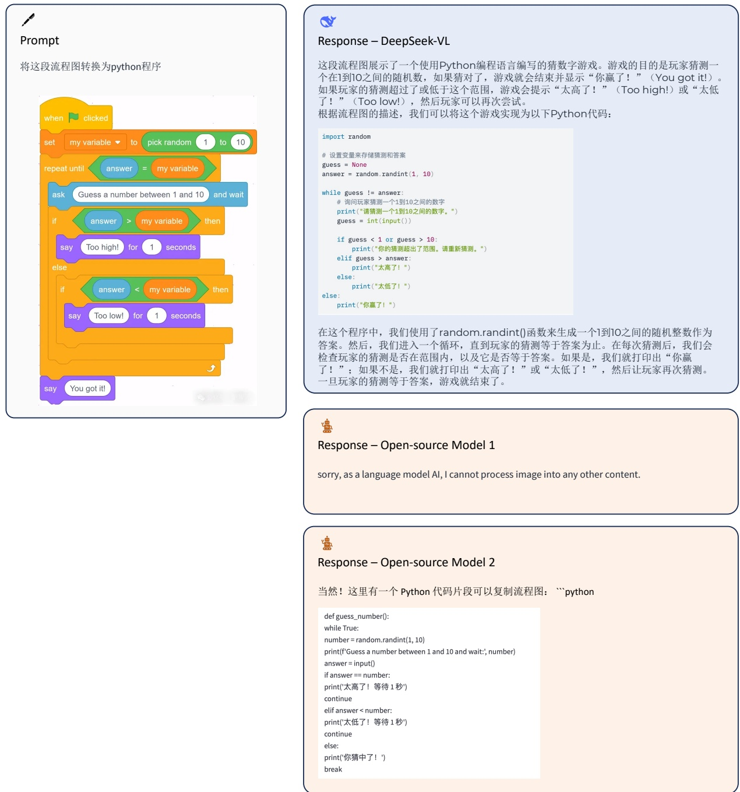

Figure 11 | Visualization results. DeepSeek-VL can understand children’s programming diagrams from the real world and provide detailed and organized explanations.

<!-- page 31 of 33 -->

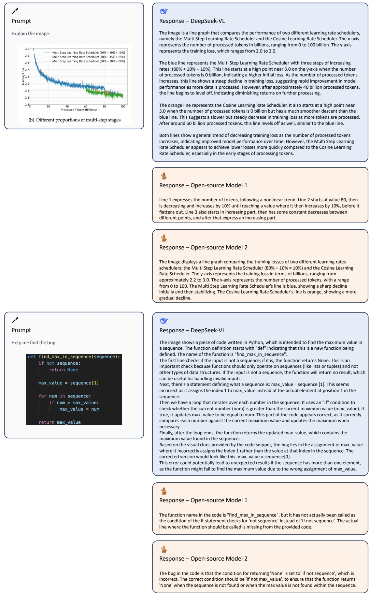

Figure 12 | Visualization results. DeepSeek-VL has strong understanding capabilities for code and charts in the real world.

<!-- page 32 of 33 -->

Prompt

What coin is that?

> 图注: 图 13 第一组样例的输入图, 一枚硬币.

一

Prompt

请根据这张图片, 创作一首七言绝句

> 图注: 图 13 第二组样例的输入图, 夕阳下的雪地树林.

图中的角色是哪家公司的?

> 图注: 图 13 第三组样例的输入图, 屏幕上的一个游戏角色立绘.

Q

Response – DeepSeek-VL

The coin is a 10 Baht coin from Thailand.

Response – Open-source Model 1

The coin is an Asian coin, which features a cityscape on it.

Response – Open-source Model 2

answering does not require reading text in the image

Q

Response – DeepSeek-VL

山川暮色映斜阳, 林间雪覆寒意长. 孤树影斜人未归, 一抹残霞照断肠.

Response – Open-source Model 1

雪山苍苍笼寒日, 霜林瑟瑟动清声.

Response – Open-source Model 2

"光秃的树木高耸, 金色的色调亲吻着白雪, 群山低语着古老的故事, 白昼的拥抱开始消失. "

Q

图中的角色是miHoYo (米哈游) 公司的. 这家公司以其开发的手机游戏《原神》而闻名, 该游戏中的角色设计风格与图片中角色的风格相似. 此外, 图片中的角色穿着和武器设计也符合miHoYo游戏的特征.

Response – Open-source Model 1

图像中的角色来自游戏公司「原神」

Response – Open-source Model 2

这张图片展示的角色是日本Square Enix公司旗下的一款游戏《最终幻想14》中的角色.

Figure 13 | Visualization results. DeepSeek-VL possesses extensive knowledge of the real world.

> 引用样本保留原文.

<!-- page 33 of 33 -->

Prompt

Convert it to markdown table.

> 引用样本保留原文.

<table><tr><td rowspan="2">Dataset</td><td colspan="5">#Frames</td><td rowspan="2">#A</td></tr><tr><td>Total</td><td>Training</td><td>Testing</td><td>Regularity</td><td>Irregularity</td></tr><tr><td>Our Dataset</td><td>317,398</td><td>274,515</td><td>42,883</td><td>300,308</td><td>17,090</td><td></td></tr><tr><td>CUHK Avenue</td><td>30,652</td><td>15,328</td><td>15,324</td><td>26,832</td><td>3,820</td><td></td></tr><tr><td>UCSD Ped2</td><td>4,560</td><td>2,550</td><td>2,010</td><td>2,924</td><td>1,636</td><td></td></tr><tr><td>UCSD Ped1</td><td>14,000</td><td>6,800</td><td>7,200</td><td>9,995</td><td>4,005</td><td></td></tr><tr><td>Subway Entrance</td><td>136,524</td><td>20,000</td><td>116,524</td><td>134,124</td><td>2,400</td><td></td></tr><tr><td>Subway Exit</td><td>72,401</td><td>7,500</td><td>64,901</td><td>71,681</td><td>720</td><td></td></tr></table>

Q

## Response – DeepSeek-VL

Here is the image content converted into a markdown table:

| Dataset | Total Frames | Training Frames | Testing Frames | Regularity | Irregularity | #A |
| --- | --- | --- | --- | --- | --- | --- |
| Our Dataset | 317,998 | 274,515 | 42,883 | 300,308 | 17,090 | - |
| CUKHK Avenue | 30,652 | 15,328 | 15,324 | 3,820 | - | - |
| UCSD Ped2 | 4,560 | 2,550 | 2,010 | 2,924 | 1,656 | - |
| UCSD Ped1 | 14,000 | 6,800 | 7,200 | 9,955 | 4,005 | - |
| Subway Entrance | 136,524 | 20,000 | 116,524 | 134,124 | 2,400 | - |
| Subway Exit | 72,401 | 7,500 | 64,901 | 71,681 | 720 | - |

| Dataset | #Frames | Total | Training | Testing | Regularity | Irregularity |
| --- | --- | --- | --- | --- | --- | --- |
| CUHK Avenue | 30,652 | 37,398 | 27,515 | 42,988 | 300,308 | 17,090 |
| UCSD Perf2 | 4,560 | 2,550 | 2,010 | 2,924 | 2,924 | 1,656 |
| UCSD Perf1 | 14,000 | 6,800 | 7,200 | 9,955 | 4,005 | 4,005 |
| Subway Entrance | 136,524 | 20,000 | 116,524 | 134,124 | 2,400 | 1,7567 |
| Subway Exit | 72,491 | 7,500 | 64,901 | 71,681 | 720 | 645 |

Response – Open-source Model 2

| Dataset | Total | Training | Testing | Regularity | Irregularity |
| --- | --- | --- | --- | --- | --- |
| Our Dataset | 317,398 | 274,515 | 42,883 | 300,308 | 17,990 |
| CUHK Avenue | 30.652 | 15,328 | 15,324 | 26,832 | 3,820 |
| UCSD Ped2 | 4.560 | 2,550 | 2,010 | 2,924 | 1,636 |
| UCSD Ped1 | 14,000 | 6,800 | 7,200 | 9,995 | 4,005 |
| Subway Entrance | 136,524 | 20,000 | 11,624 | 13,424 | 2,400 |
| Subway Exit | 74,401 | 7,500 | 64,901 | 71,681 | 720 |
