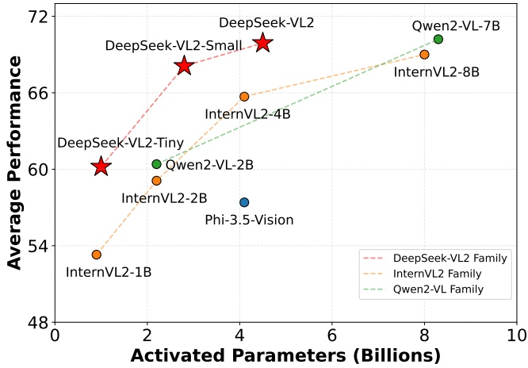
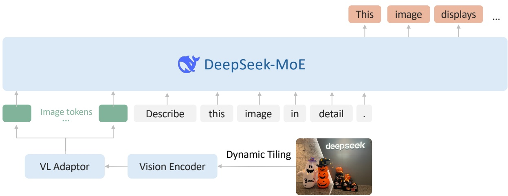
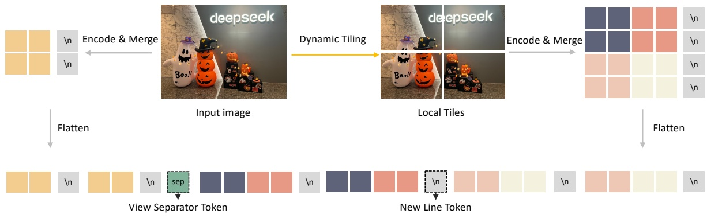

<!-- page 1 of 28 -->

arXiv:2412.10302v1 [cs.CV] 13 Dec 2024

Qdeepseek

# DeepSeek-VL2: Mixture-of-Experts Vision-Language Models for Advanced Multimodal Understanding

Zhiyu Wu∗, Xiaokang Chen∗, Zizheng Pan∗, Xingchao Liu∗, Wen Liu∗,†, Damai Dai, Huazuo Gao, Yiyang Ma, Chengyue Wu, Bingxuan Wang, Zhenda Xie, Yu Wu, Kai Hu, Jiawei Wang, Yaofeng Sun, Yukun Li, Yishi Piao, Kang Guan, Aixin Liu, Xin Xie, Yuxiang You, Kai Dong, Xingkai Yu, Haowei Zhang, Liang Zhao, Yisong Wang, Chong Ruan‡

### DeepSeek-AI

## Abstract

We present DeepSeek-VL2, an advanced series of large Mixture-of-Experts (MoE) Vision-Language Models that significantly improves upon its predecessor, DeepSeek-VL, through two key major upgrades. For the vision component, we incorporate a dynamic tiling vision encoding strategy designed for processing high-resolution images with different aspect ratios. For the language component, we leverage DeepSeekMoE models with the Multi-head Latent Attention mechanism, which compresses Key-Value cache into latent vectors, to enable efficient inference and high throughput. Trained on an improved vision-language dataset, DeepSeek-VL2 demonstrates superior capabilities across various tasks, including but not limited to visual question answering, optical character recognition, document/table/chart understanding, and visual grounding. Our model series is composed of three variants: DeepSeek-VL2-Tiny, DeepSeek-VL2- Small and DeepSeek-VL2, with 1.0B, 2.8B and 4.5B activated parameters respectively. DeepSeek VL2 achieves competitive or state-of-the-art performance with similar or fewer activated parameters compared to existing open-source dense and MoE-based models. Codes and pre-trained models are publicly accessible at [https://github.com/deepseek-ai/DeepSeek-VL2](https://github.com/deepseek-ai/DeepSeek-VL2).

我们提出 DeepSeek-VL2, 一组先进的大型 MoE 视觉语言模型. 相比 DeepSeek-VL, 视觉侧改用动态切图处理不同比例的高分辨率图像, 语言侧采用带 MLA 的 DeepSeekMoE, 把 KV cache 压到潜变量以提高推理吞吐. 模型在改进后的视觉语言数据上训练, 覆盖 VQA, OCR, 文档/表格/图表理解与视觉 grounding. Tiny, Small 与标准版的激活参数分别为 1.0B, 2.8B 与 4.5B. 代码和预训练模型公开于原链接.

Figure 1 | Average performance vs. activated parameters among different open-source models. We average the accuracy of MMBench v1.1, MMStar, MMMU (Val), MathVista (TestMini), AI2D (Test), and OCRBench. The scores of OCRBench are divided by 10 to scale them to [0, 100].

∗: Core contributors. †: Project lead. ‡: Corresponding author.

<!-- page 2 of 28 -->

## Contents

- 1 Introduction 3
- 2 Model Architecture 4
- 3 Data Construction 6
- 3.1 Vision-Language Alignment Data 6
- 3.2 Vision-Language Pretraining Data 6
- 3.3 Supervised Fine-tuning Data 8
- 4 Training Methodology 9
- 4.1 Training Pipelines 9
- 4.2 Hyperparameters and Infrastructures 10
- 5 Evaluation 11
- 5.1 Multimodal Performance 11
- 5.2 Qualitative Study 12
- 6 Conclusion 20

<!-- page 3 of 28 -->

## 1. Introduction

Large Vision-Language Models (VLMs) have emerged as a transformative force in artificial intelligence [15, 54, 59, 63, 83, 88, 94], extending the remarkable capabilities of Large Language Models (LLMs) to seamlessly process both visual and textual information. This advancement has dramatically expanded the potential for AI systems to tackle complex real-world applications that require multimodal understanding.

大型视觉语言模型（VLM）已成为人工智能领域的一股变革力量 [15, 54, 59, 63, 83, 88, 94]，它将大型语言模型（LLM）的强大能力扩展到对视觉与文本信息的无缝处理。这一进展显著拓宽了 AI 系统处理需要多模态理解的复杂现实应用的潜力。

In this technical report, we present DeepSeek-VL2, a new series of open-source Vision-Language Models that leverages the Mixture-of-Experts (MoE) architecture to achieve substantial improvements in both performance and efficiency compared to its predecessor, DeepSeek-VL [59]. Our advancements center around three key aspects: (1) a dynamic, high-resolution vision encoding strategy that enhances visual understanding, (2) an optimized language model architecture that significantly improves both training and inference efficiency, and (3) a refined vision-language data construction pipeline that not only boosts overall performance but also extends model capabilities to new areas such as precise visual grounding.

本技术报告介绍 DeepSeek-VL2，一系列采用混合专家（MoE）架构的新型开源视觉语言模型。与前代 DeepSeek-VL [59] 相比，它在性能与效率方面均有显著提升。我们的改进集中在三个方面：（1）增强视觉理解能力的动态高分辨率视觉编码策略；（2）显著提高训练和推理效率的优化语言模型架构；（3）经过改进的视觉语言数据构建流程，它不仅提升整体性能，还将模型能力扩展到精确视觉定位等新领域。

For the vision component, we introduce a dynamic tiling vision encoding strategy that efficiently processes high-resolution images of varying aspect ratios. This approach improves over DeepSeek-VL’s hybrid vision encoder, which extracted features from images at two fixed resolutions (384 × 384 and 1024 × 1024). Our approach avoids the limitations of the old fixedsize encoder and excels in tasks requiring ultra-high resolution, including visual grounding, document/table/chart analysis, and detailed feature extraction, while maintaining a manageable number of visual tokens. Drawing inspiration from established slicing-tile methods, our system dynamically segments high-resolution inputs into local tiles, processes each tile through a shared vision transformer, and seamlessly integrates the extracted features within the language model. This design preserves the advantages of vision transformers with local attention, enabling rich feature extraction without the quadratic computational scaling typically associated with increasing image resolutions.

在视觉部分，我们提出动态切片视觉编码策略，以高效处理宽高比各异的高分辨率图像。DeepSeek-VL 的混合视觉编码器只能从两种固定分辨率（384 × 384 和 1024 × 1024）的图像中提取特征，而该策略在此基础上作了改进。它摆脱了旧式固定尺寸编码器的限制，在视觉定位、文档/表格/图表分析和细粒度特征提取等需要超高分辨率的任务中表现出色，同时将视觉 token 数量控制在可管理范围内。受成熟的切片方法启发，我们的系统将高分辨率输入动态分割为局部 tile，通过共享的视觉 Transformer 处理各个 tile，并在语言模型中无缝整合所提取的特征。这一设计保留了采用局部注意力的视觉 Transformer 的优势，能够提取丰富特征，同时避免计算量随图像分辨率提高而呈典型的二次增长。

For the language component, we leverage DeepSeek language models [20, 53], featuring the Multi-head Latent Attention (MLA) mechanism. MLA significantly reduces computational cost by compressing the Key-Value (KV) cache into a latent vector, resulting in faster inference and increased throughput capacity. We further enhance efficiency through the DeepSeekMoE framework [20, 86], which employs sparse computation techniques. Our model series adopt three MoE variants, 3B, 16B, and 27B. These LLMs have 0.57B, 2.4B, and 4.1B activated parameters respectively.

在语言部分，我们采用具备多头潜在注意力（MLA）机制的 DeepSeek 语言模型 [20, 53]。MLA 将键值（KV）缓存压缩为潜在向量，从而显著降低计算成本、加快推理并提高吞吐能力。我们还通过采用稀疏计算技术的 DeepSeekMoE 框架 [20, 86] 进一步提升效率。本系列模型包含 3B、16B 和 27B 三种 MoE 变体，对应 LLM 的激活参数量分别为 0.57B、2.4B 和 4.1B。

We also greatly enhance our vision-language training data in terms of quality, quantity, and diversity. This comprehensive dataset enables better generalization and performance across a broad spectrum of tasks, including Visual Question Answering (VQA), Optical Character Recognition (OCR), document/table/chart understanding, visual reasoning, and general chatbot applications. The improved training data has also enabled new abilities such as visual grounding and Graphical User Interface (GUI) perception.

我们还从质量、规模和多样性三个方面大幅增强了视觉语言训练数据。这套综合数据集使模型在视觉问答（VQA）、光学字符识别（OCR）、文档/表格/图表理解、视觉推理和通用聊天机器人等广泛任务上获得更好的泛化能力与性能。改进后的训练数据也赋予模型视觉定位和图形用户界面（GUI）感知等新能力。

In summary, DeepSeek-VL2 marks a substantial leap forward in large-scale Mixture-of-Experts Vision-Language modeling. Through a new visual processing strategy and an optimized language model, we develop a series of models that balances performance with efficiency. By open-sourcing the pre-trained models, we aim to accelerate progress in the field and promote collaborative research advancement.

总之，DeepSeek-VL2 标志着大规模混合专家视觉语言建模取得了实质性进展。借助新的视觉处理策略和优化后的语言模型，我们开发出一系列兼顾性能与效率的模型。我们希望通过开源预训练模型，加速该领域的发展，并推动协作研究不断向前。

DeepSeek-VL2 是采用 MoE 的新一代开源 VLM. 相比 DeepSeek-VL, 它以动态高分辨率编码增强视觉理解, 以 MLA 与 MoE 提高训练和推理效率, 并重建数据管线以提高综合性能与精确 grounding. 高分辨率图像被切成局部 tile, 由共享 ViT 编码后送入语言模型. 三个语言模型总参数为 3B, 16B 与 27B, 激活参数分别为 0.57B, 2.4B 与 4.1B. 训练数据覆盖 VQA, OCR, 文档/表格/图表理解, 视觉推理, grounding 与 GUI 感知.

<!-- page 4 of 28 -->

Figure 2 | Overview of DeepSeek-VL2. The overall structure is a llava-style architecture, which includes a vision encoder, a VL adaptor, and a MoE-based LLM.

## 2. Model Architecture

DeepSeek-VL2 consists of three core modules: (1) a vision encoder, (2) a vision-language adaptor, and (3) a Mixture-of-Experts language model. Building upon the decoder-only LLaVAstyle [54] architecture of its predecessor, DeepSeek-VL2 introduces two major advancements: a dynamic tiling strategy and a DeepSeekMOE [20, 86] language model featuring Multi-head Latent Attention [53]. These innovations enable more efficient processing of both high-resolution visual inputs and text data.

DeepSeek-VL2 由三个核心模块组成：（1）视觉编码器；（2）视觉语言适配器；（3）混合专家语言模型。在前代仅解码器式 LLaVA 架构 [54] 的基础上，DeepSeek-VL2 引入两项重要改进：动态切片策略，以及采用多头潜在注意力 [53] 的 DeepSeekMoE [20, 86] 语言模型。这些创新使高分辨率视觉输入和文本数据都能得到更高效的处理。

**Dynamic Tiling Strategy.** The original DeepSeek-VL employed a hybrid vision encoder combining SigLIP [106] for coarse-grained feature extraction at 384 × 384 resolution and SAM-B [35] for fine-grained feature extraction at $1 0 2 4 \times 1 0 2 4$ resolution. While this fusion approach generated rich visual representations suitable for various vision-language tasks, it was limited by the fixed 1024 × 1024 resolution constraint. This limitation is particularly challenging for processing images with larger resolutions and extreme aspect ratios, such as those found in InfographicVQA [67], dense OCR, and detailed visual grounding tasks.

**动态切片策略。** 原始 DeepSeek-VL 使用混合视觉编码器：以 SigLIP [106] 在 384 × 384 分辨率下提取粗粒度特征，并以 SAM-B [35] 在 $1024 \times 1024$ 分辨率下提取细粒度特征。尽管这种融合方式能够生成适用于多种视觉语言任务的丰富视觉表示，但它受到固定 1024 × 1024 分辨率的限制。在处理更高分辨率和极端宽高比图像时，这一限制尤为棘手，例如 InfographicVQA [67]、密集 OCR 和精细视觉定位任务中的图像。

Inspired by recent advances in VLMs [16, 21, 55], we implement a dynamic tiling strategy by splitting a high-resolution image into tiles. This approach enables the efficient processing of different high-resolution images with varying aspect ratios using a single SigLIP-SO400M-384 vision encoder [106]. The pre-trained SigLIP operates at a base resolution of 384 × 384. To accommodate different aspect ratios, we define a set of candidate resolutions: $C _ { R } = \left\{ \left( m \cdot 3 8 4 , n   \cdot \right. \right.$ 384) | $m \in \mathbb { N } , n \in \mathbb { N } , 1 \leq m , n , m n \leq 9 \}$ , where 𝑚 : 𝑛 represents the aspect ratio. For an input image of size $( H , W )$ , we calculate the padding area required for $\mathrm { r e s i z i n g ^ { 1 } }$ it to each candidate resolution in $C _ { R } .$ We select the resolution $( m _ { i } \cdot 3 8 4 , n _ { i } \cdot 3 8 4 )$ that minimizes the padding area. The resized image is then divided into $m _ { i } \times n _ { i }$ local tiles of 384 × 384 pixels, plus one global thumbnail tile. The SigLIP-SO400M-384 vision encoder processes all $( 1 + m _ { i } \times n _ { i } )$ tiles, yielding $2 7 \times 2 7 = 7 2 9$ visual embeddings of 1152 dimensions per tile. For computational efficiency and context length management, we disable the dynamic tiling strategy when processing multiple (> 2) images.

受近期 VLM 进展 [16, 21, 55] 启发，我们通过把高分辨率图像切分为多个 tile 来实现动态切片策略。借助单个 SigLIP-SO400M-384 视觉编码器 [106]，该方法可以高效处理具有不同宽高比的高分辨率图像。预训练 SigLIP 的基础分辨率为 384 × 384。为适应不同宽高比，我们定义候选分辨率集合 $C_R$，其中网格边长分别为 384 的整数倍，且 tile 总数不超过 9。对于尺寸为 $(H,W)$ 的输入图像，我们计算将其调整到各候选分辨率时所需的填充面积，并选择填充面积最小的分辨率。调整后的图像被划分为 $m_i \times n_i$ 个 384 × 384 局部 tile，外加一个全局缩略图 tile。SigLIP-SO400M-384 编码全部 $(1+m_i\times n_i)$ 个 tile，每个 tile 产生 $27\times27=729$ 个 1152 维视觉 embedding。为控制计算开销和上下文长度，处理多于两张图像时会关闭动态切片策略。

1We first resize the original image until its long side matches the target resolution, then pad the other dimension while maintaining the original aspect ratio.

1我们先将原图缩放至长边与目标分辨率匹配，再在保持原始宽高比的前提下填充另一维度。

<!-- page 5 of 28 -->

Figure 3 | Illustration of dynamic tiling strategy in DeepSeek-VL2. By dividing images into multiple tiles, DeepSeek-VL2 achieves stronger fine-grained understanding capabilities compared to DeepSeek-VL.

|  | DeepSeek-VL2-Tiny | DeepSeek-VL2-Small | DeepSeek-VL2 |
| --- | --- | --- | --- |
| Vocabulary size | 129,280 | 102,400 | 129,280 |
| Embedding size | 1,280 | 2,048 | 2,560 |
| #Attention heads | 10 | 16 | 32 |
| #Layers | 12 | 27 | 30 |
| Attention | Multi-Head Attention | MLA (rank=512) | MLA (rank=512) |
| #Routed experts | 64 | 64 | 72 |
| #Shared experts | 2 | 2 | 2 |
| Top-K for expert selection | 6 | 6 | 6 |
| Routing function | Softmax | Softmax | Sigmoid |
| Expert correction bias | × | × | ✓ |

**Vision-Language Adaptor.** Following visual tile processing, we implement a $2 \times 2$ pixel shuffle operation to compress each tile’s visual tokens from $2 7 \times 2 7$ to $1 4 \times 1 4 = 1 9 6$ tokens. We then introduce three special tokens when processing the $( 1 + m _ { i } \times n _ { i } )$ tiles. For the global thumbnail tile $( 1 4 \times 1 4 )$ , we add 14 &lt;tile_newline&gt; tokens to the end of each row, resulting in a total number of $1 4 \times 1 5 = 2 1 0$ tokens. For the $m _ { i } \times n _ { i }$ local tiles, which are arranged in a 2D grid of shape $( m _ { i } \cdot 1 4 , n _ { i } \cdot 1 4 )$ , we append $m _ { i } \cdot 1 4   <   \mathtt { t i l e } _ { i }$ newline> tokens at the end of the final column to indicate the end of a row of all the local tiles. Additionally, a &lt;view_separator&gt; token is inserted between the global thumbnail tile and the local tiles. The complete visual sequence contains $2 1 0 + 1 + m _ { i } \cdot 1 4 \times ( n _ { i } \cdot 1 4 + 1 )$ visual tokens, which are subsequently projected into the language model’s embedding space using a two-layer multilayer perceptron (MLP). A visual illustration of our dynamic tiling strategy is shown in Figure 3.

**视觉语言适配器。** 处理视觉 tile 后，我们执行 $2\times2$ pixel shuffle，将每个 tile 的视觉 token 从 $27\times27$ 压缩为 $14\times14=196$ 个。处理 $(1+m_i\times n_i)$ 个 tile 时，我们引入三种特殊 token。对于 $14\times14$ 的全局缩略图 tile，在每行末尾加入 14 个 &lt;tile_newline&gt; token，总数变为 $14\times15=210$。对于排列成二维网格的 $m_i\times n_i$ 个局部 tile，则在末列后附加换行 token，以标记各行局部 tile 的结束。此外，全局缩略图与局部 tile 之间插入一个 &lt;view_separator&gt; token。完整视觉序列随后通过两层多层感知机（MLP）投影到语言模型的 embedding 空间。动态切片策略的示意图见图 3。

**DeepSeekMoE LLM.** Our language model is based on DeepSeekMoE [20, 86], which incorporates the Multi-head Latent Attention mechanism [53]. MLA enhances inference efficiency by compressing the Key-Value cache into a latent vector, enabling increased throughput capacity. The model also incorporates a MoE architecture [20] allowing for efficient inference through sparse computation. During MoE training, we introduce a global bias term [86] for each expert to cost-effectively improve load balancing between experts. DeepSeek-VL2 comes in three variants with the following model sizes: 1.0B, 2.8B and 4.5B. Complete architectural specifications can be found in Table 1.

**DeepSeekMoE LLM。** 我们的语言模型基于 DeepSeekMoE [20, 86]，并采用多头潜在注意力机制 [53]。MLA 将键值缓存压缩为潜在向量，从而提高推理效率与吞吐能力。模型还采用 MoE 架构 [20]，通过稀疏计算实现高效推理。在 MoE 训练期间，我…16207 tokens truncated…Deitke, C. Clark, S. Lee, R. Tripathi, Y. Yang, J. S. Park, M. Salehi, N. Muennighoff, K. Lo, L. Soldaini, et al. Molmo and pixmo: Open weights and open data for state-of-the-art multimodal models. arXiv preprint arXiv:2409.17146, 2024.

[23] X. Deng, Y. Gu, B. Zheng, S. Chen, S. Stevens, B. Wang, H. Sun, and Y. Su. Mind2web: Towards a generalist agent for the web. Advances in Neural Information Processing Systems, 36, 2024.

[24] M. Diem, S. Fiel, F. Kleber, R. Sablatnig, J. M. Saavedra, D. Contreras, J. M. Barrios, and L. S. Oliveira. Icfhr 2014 competition on handwritten digit string recognition in challenging datasets (hdsrc 2014). In 2014 14th International Conference on Frontiers in Handwriting Recognition, pages 779–784. IEEE, 2014.

[25] B. Egan, A. Redden, XWAVE, and SilentAntagonist. Dalle3 1 Million+ High Quality Captions, May 2024. URL [https://huggingface.co/datasets/ProGamerGov/synthetic-dataset-1m-dalle3-high-quality-captions](https://huggingface.co/datasets/ProGamerGov/synthetic-dataset-1m-dalle3-high-quality-captions).

[26] C. Fu, P. Chen, Y. Shen, Y. Qin, M. Zhang, X. Lin, J. Yang, X. Zheng, K. Li, X. Sun, Y. Wu, and R. Ji. Mme: A comprehensive evaluation benchmark for multimodal large language models, 2024. URL [https://arxiv.org/abs/2306.13394](https://arxiv.org/abs/2306.13394).

[27] Y. Goyal, T. Khot, D. Summers-Stay, D. Batra, and D. Parikh. Making the V in VQA matter: Elevating the role of image understanding in Visual Question Answering. In Conference on Computer Vision and Pattern Recognition (CVPR), 2017.

[28] J. Gu, X. Meng, G. Lu, L. Hou, N. Minzhe, X. Liang, L. Yao, R. Huang, W. Zhang, X. Jiang, C. Xu, and H. Xu. Wukong: A 100 million large-scale chinese cross-modal pre-training benchmark. In NeurIPS, 2022.

[29] C. He, Z. Jin, C. Xu, J. Qiu, B. Wang, W. Li, H. Yan, J. Wang, and D. Lin. Wanjuan: A comprehensive multimodal dataset for advancing english and chinese large models. arXiv preprint arXiv:2308.10755, 2023.

<!-- page 23 of 28 -->

[30] High-flyer. HAI-LLM: Efficient and lightweight training tool for large models, 2023. URL [https://www.high-flyer.cn/en/blog/hai-llm](https://www.high-flyer.cn/en/blog/hai-llm).

[31] D. A. Hudson and C. D. Manning. Gqa: A new dataset for real-world visual reasoning and compositional question answering. In Proceedings of the IEEE/CVF conference on computer vision and pattern recognition, pages 6700–6709, 2019.

[32] A. Hurst, A. Lerer, A. P. Goucher, A. Perelman, A. Ramesh, A. Clark, A. Ostrow, A. Welihinda, A. Hayes, A. Radford, et al. Gpt-4v(ision) system card. 2023.

[33] S. Kazemzadeh, V. Ordonez, M. Matten, and T. Berg. Referitgame: Referring to objects in photographs of natural scenes. In Proceedings of the 2014 conference on empirical methods in natural language processing (EMNLP), pages 787–798, 2014.

[34] A. Kembhavi, M. Salvato, E. Kolve, M. Seo, H. Hajishirzi, and A. Farhadi. A diagram is worth a dozen images. In Computer Vision–ECCV 2016: 14th European Conference, Amsterdam, The Netherlands, October 11–14, 2016, Proceedings, Part IV 14, pages 235–251. Springer, 2016.

[35] A. Kirillov, E. Mintun, N. Ravi, H. Mao, C. Rolland, L. Gustafson, T. Xiao, S. Whitehead, A. C. Berg, W.-Y. Lo, et al. Segment anything. In Proceedings of the IEEE/CVF International Conference on Computer Vision, pages 4015–4026, 2023.

[36] A. Kirillov, E. Mintun, N. Ravi, H. Mao, C. Rolland, L. Gustafson, T. Xiao, S. Whitehead, A. C. Berg, W.-Y. Lo, et al. Segment anything. In Proceedings of the IEEE/CVF International Conference on Computer Vision, pages 4015–4026, 2023.

[37] Y. Kirstain, A. Polyak, U. Singer, S. Matiana, J. Penna, and O. Levy. Pick-a-pic: An open dataset of user preferences for text-to-image generation. In NeurIPS, 2023.

[38] M. Koupaee and W. Y. Wang. Wikihow: A large scale text summarization dataset. arXiv preprint arXiv:1810.09305, 2018.

[39] A. Kuznetsova, H. Rom, N. Alldrin, J. Uijlings, I. Krasin, J. Pont-Tuset, S. Kamali, S. Popov, M. Malloci, A. Kolesnikov, T. Duerig, and V. Ferrari. The open images dataset v4: Unified image classification, object detection, and visual relationship detection at scale. IJCV, 2020.

[40] LAION. Laion-aesthetics, 2023. URL [https://laion.ai/blog/laion-aesthetics](https://laion.ai/blog/laion-aesthetics).Accessed: 2023-10-27.

[41] H. Laurençon, L. Saulnier, L. Tronchon, S. Bekman, A. Singh, A. Lozhkov, T. Wang, S. Karamcheti, A. M. Rush, D. Kiela, M. Cord, and V. Sanh. OBELICS: an open web-scale filtered dataset of interleaved image-text documents. In NeurIPS, 2023.

[42] H. Laurençon, A. Marafioti, V. Sanh, and L. Tronchon. Building and better understanding vision-language models: insights and future directions., 2024.

[43] H. Laurençon, L. Tronchon, M. Cord, and V. Sanh. What matters when building visionlanguage models?, 2024.

[44] H. Laurençon, L. Tronchon, and V. Sanh. Unlocking the conversion of web screenshots into html code with the websight dataset, 2024.

[45] B. Li, Y. Zhang, D. Guo, R. Zhang, F. Li, H. Zhang, K. Zhang, P. Zhang, Y. Li, Z. Liu, et al. Llava-onevision: Easy visual task transfer. arXiv preprint arXiv:2408.03326, 2024.

<!-- page 24 of 28 -->

[46] D. Li, Y. Liu, H. Wu, Y. Wang, Z. Shen, B. Qu, X. Niu, G. Wang, B. Chen, and J. Li. Aria: An open multimodal native mixture-of-experts model. arXiv preprint arXiv:2410.05993, 2024.

[47] F. Li, R. Zhang, H. Zhang, Y. Zhang, B. Li, W. Li, Z. Ma, and C. Li. Llava-nextinterleave: Tackling multi-image, video, and 3d in large multimodal models. arXiv preprint arXiv:2407.07895, 2024.

[48] L. Li, Y. Wang, R. Xu, P. Wang, X. Feng, L. Kong, and Q. Liu. Multimodal ArXiv: A dataset for improving scientific comprehension of large vision-language models. In ACL, 2024.

[49] L. Li, Y. Wang, R. Xu, P. Wang, X. Feng, L. Kong, and Q. Liu. Multimodal arxiv: A dataset for improving scientific comprehension of large vision-language models. arXiv preprint arXiv:2403.00231, 2024.

[50] X. Li, F. Zhang, H. Diao, Y. Wang, X. Wang, and L.-Y. Duan. Densefusion-1m: Merging vision experts for comprehensive multimodal perception. arXiv preprint arXiv:2407.08303, 2024.

[51] Z. Li, X. Yang, K. Choi, W. Zhu, R. Hsieh, H. Kim, J. H. Lim, S. Ji, B. Lee, X. Yan, et al. Mmsci: A dataset for graduate-level multi-discipline multimodal scientific understanding. arXiv preprint arXiv:2407.04903, 2024.

[52] F. Lin, J. Yuan, S. Wu, F. Wang, and Z. Wang. Uninext: Exploring a unified architecture for vision recognition. In Proceedings of the 31st ACM International Conference on Multimedia, pages 3200–3208, 2023.

[53] A. Liu, B. Feng, B. Wang, B. Wang, B. Liu, C. Zhao, C. Dengr, C. Ruan, D. Dai, D. Guo, et al. Deepseek-v2: A strong, economical, and efficient mixture-of-experts language model. arXiv preprint arXiv:2405.04434, 2024.

[54] H. Liu, C. Li, Q. Wu, and Y. J. Lee. Visual instruction tuning. Advances in neural information processing systems, 36, 2023.

[55] H. Liu, C. Li, Y. Li, B. Li, Y. Zhang, S. Shen, and Y. J. Lee. Llava-next: Improved reasoning, ocr, and world knowledge, January 2024. URL [https://llava-vl.github.io/blog/2024-01-30-llava-next/](https://llava-vl.github.io/blog/2024-01-30-llava-next/).

[56] S. Liu, Z. Zeng, T. Ren, F. Li, H. Zhang, J. Yang, Q. Jiang, C. Li, J. Yang, H. Su, et al. Grounding dino: Marrying dino with grounded pre-training for open-set object detection. In European Conference on Computer Vision, pages 38–55. Springer, 2025.

[57] Y. Liu, Z. Li, B. Yang, C. Li, X. Yin, C.-l. Liu, L. Jin, and X. Bai. On the hidden mystery of ocr in large multimodal models. arXiv preprint arXiv:2305.07895, 2023.

[58] Y. Liu, H. Duan, Y. Zhang, B. Li, S. Zhang, W. Zhao, Y. Yuan, J. Wang, C. He, Z. Liu, et al. Mmbench: Is your multi-modal model an all-around player? In European Conference on Computer Vision, pages 216–233. Springer, 2025.

[59] H. Lu, W. Liu, B. Zhang, B. Wang, K. Dong, B. Liu, J. Sun, T. Ren, Z. Li, H. Yang, et al. Deepseek-vl: towards real-world vision-language understanding. arXiv preprint arXiv:2403.05525, 2024.

<!-- page 25 of 28 -->

[60] P. Lu, H. Bansal, T. Xia, J. Liu, C. Li, H. Hajishirzi, H. Cheng, K.-W. Chang, M. Galley, and J. Gao. Mathvista: Evaluating mathematical reasoning of foundation models in visual contexts. In The Twelfth International Conference on Learning Representations.

[61] P. Lu, L. Qiu, J. Chen, T. Xia, Y. Zhao, W. Zhang, Z. Yu, X. Liang, and S.-C. Zhu. Iconqa: A new benchmark for abstract diagram understanding and visual language reasoning. arXiv preprint arXiv:2110.13214, 2021.

[62] C. Ma, Y. Jiang, J. Wu, Z. Yuan, and X. Qi. Groma: Localized visual tokenization for grounding multimodal large language models. In European Conference on Computer Vision, pages 417–435. Springer, 2025.

[63] Y. Ma, X. Liu, X. Chen, W. Liu, C. Wu, Z. Wu, Z. Pan, Z. Xie, H. Zhang, L. Zhao, et al. Janusflow: Harmonizing autoregression and rectified flow for unified multimodal understanding and generation. arXiv preprint arXiv:2411.07975, 2024.

[64] J. Mao, J. Huang, A. Toshev, O. Camburu, A. L. Yuille, and K. Murphy. Generation and comprehension of unambiguous object descriptions. In Proceedings of the IEEE conference on computer vision and pattern recognition, pages 11–20, 2016.

[65] A. Masry, D. X. Long, J. Q. Tan, S. Joty, and E. Hoque. Chartqa: A benchmark for question answering about charts with visual and logical reasoning. arXiv preprint arXiv:2203.10244, 2022.

[66] M. Mathew, D. Karatzas, and C. Jawahar. Docvqa: A dataset for vqa on document images. In Proceedings of the IEEE/CVF winter conference on applications of computer vision, pages 2200–2209, 2021.

[67] M. Mathew, V. Bagal, R. Tito, D. Karatzas, E. Valveny, and C. Jawahar. Infographicvqa. In Proceedings of the IEEE/CVF Winter Conference on Applications of Computer Vision, pages 1697–1706, 2022.

[68] A. Mitra, H. Khanpour, C. Rosset, and A. Awadallah. Orca-math: Unlocking the potential of slms in grade school math, 2024.

[69] OpenAI. Gpt-4v(ision) system card. [https://openai.com/research/gpt-4v-system-card](https://openai.com/research/gpt-4v-system-card), 2023.

[70] B. Peng, C. Li, P. He, M. Galley, and J. Gao. Instruction tuning with gpt-4. arXiv preprint arXiv:2304.03277, 2023.

[71] Z. Peng, W. Wang, L. Dong, Y. Hao, S. Huang, S. Ma, and F. Wei. Kosmos-2: Grounding multimodal large language models to the world. arXiv preprint arXiv:2306.14824, 2023.

[72] B. A. Plummer, L. Wang, C. M. Cervantes, J. C. Caicedo, J. Hockenmaier, and S. Lazebnik. Flickr30k entities: Collecting region-to-phrase correspondences for richer imageto-sentence models. In Proceedings of the IEEE international conference on computer vision, pages 2641–2649, 2015.

[73] B. Saleh and A. Elgammal. Large-scale classification of fine-art paintings: Learning the right metric on the right feature. arXiv preprint arXiv:1505.00855, 2015.

[74] S. Shah, A. Mishra, N. Yadati, and P. P. Talukdar. Kvqa: Knowledge-aware visual question answering. In Proceedings of the AAAI conference on artificial intelligence, volume 33, pages 8876–8884, 2019.

<!-- page 26 of 28 -->

[75] S. Shao, Z. Li, T. Zhang, C. Peng, G. Yu, X. Zhang, J. Li, and J. Sun. Objects365: A large-scale, high-quality dataset for object detection. In Proceedings of the IEEE/CVF international conference on computer vision, pages 8430–8439, 2019.

[76] W. Shi, Z. Hu, Y. Bin, J. Liu, Y. Yang, S.-K. Ng, L. Bing, and R. K.-W. Lee. Math-llava: Bootstrapping mathematical reasoning for multimodal large language models. arXiv preprint arXiv:2406.17294, 2024.

[77] A. Singh, V. Natarajan, M. Shah, Y. Jiang, X. Chen, D. Batra, D. Parikh, and M. Rohrbach. Towards vqa models that can read. In Proceedings of the IEEE/CVF conference on computer vision and pattern recognition, pages 8317–8326, 2019.

[78] V. Singla, K. Yue, S. Paul, R. Shirkavand, M. Jayawardhana, A. Ganjdanesh, H. Huang, A. Bhatele, G. Somepalli, and T. Goldstein. From pixels to prose: A large dataset of dense image captions. CoRR, abs/2406.10328, 2024.

[79] K. Srinivasan, K. Raman, J. Chen, M. Bendersky, and M. Najork. Wit: Wikipedia-based image text dataset for multimodal multilingual machine learning. In SIGIR, page 2443–2449, 2021.

[80] K. Sun, J. Pan, Y. Ge, H. Li, H. Duan, X. Wu, R. Zhang, A. Zhou, Z. Qin, Y. Wang, J. Dai, Y. Qiao, L. Wang, and H. Li. Journeydb: A benchmark for generative image understanding. In NeurIPS, 2023.

[81] G. Team, P. Georgiev, V. I. Lei, R. Burnell, L. Bai, A. Gulati, G. Tanzer, D. Vincent, Z. Pan, S. Wang, et al. Gemini 1.5: Unlocking multimodal understanding across millions of tokens of context. arXiv preprint arXiv:2403.05530, 2024.

[82] B. Thomee, D. A. Shamma, G. Friedland, B. Elizalde, K. Ni, D. Poland, D. Borth, and L.-J. Li. Yfcc100m: The new data in multimedia research. Communications of the ACM, 59(2): 64–73, 2016.

[83] S. Tong, E. L. Brown II, P. Wu, S. Woo, A. J. IYER, S. C. Akula, S. Yang, J. Yang, M. Middepogu, Z. Wang, et al. Cambrian-1: A fully open, vision-centric exploration of multi-modal llms. In The Thirty-eighth Annual Conference on Neural Information Processing Systems.

[84] S. Toshniwal, W. Du, I. Moshkov, B. Kisacanin, A. Ayrapetyan, and I. Gitman. Openmathinstruct-2: Accelerating ai for math with massive open-source instruction data. arXiv preprint arXiv:2410.01560, 2024.

[85] J. Wang, P. Zhang, T. Chu, Y. Cao, Y. Zhou, T. Wu, B. Wang, C. He, and D. Lin. V3det: Vast vocabulary visual detection dataset. In Proceedings of the IEEE/CVF International Conference on Computer Vision, pages 19844–19854, 2023.

[86] L. Wang, H. Gao, C. Zhao, X. Sun, and D. Dai. Auxiliary-loss-free load balancing strategy for mixture-of-experts. CoRR, abs/2408.15664, 2024. doi: 10.48550/ARXIV.2408.15664. URL [https://doi.org/10.48550/arXiv.2408.15664](https://doi.org/10.48550/arXiv.2408.15664).

[87] P. Wang, S. Wang, J. Lin, S. Bai, X. Zhou, J. Zhou, X. Wang, and C. Zhou. One-peace: Exploring one general representation model toward unlimited modalities. arXiv preprint arXiv:2305.11172, 2023.

<!-- page 27 of 28 -->

[88] P. Wang, S. Bai, S. Tan, S. Wang, Z. Fan, J. Bai, K. Chen, X. Liu, J. Wang, W. Ge, et al. Qwen2-vl: Enhancing vision-language model’s perception of the world at any resolution. arXiv preprint arXiv:2409.12191, 2024.

[89] W. Wang, M. Shi, Q. Li, W. Wang, Z. Huang, L. Xing, Z. Chen, H. Li, X. Zhu, Z. Cao, et al. The all-seeing project: Towards panoptic visual recognition and understanding of the open world. arXiv preprint arXiv:2308.01907, 2023.

[90] W. Wang, Y. Ren, H. Luo, T. Li, C. Yan, Z. Chen, W. Wang, Q. Li, L. Lu, X. Zhu, et al. The all-seeing project v2: Towards general relation comprehension of the open world. In European Conference on Computer Vision, pages 471–490. Springer, 2025.

[91] Y. Wei, Z. Wang, J. Liu, Y. Ding, and L. Zhang. Magicoder: Empowering code generation with OSS-instruct. In Proceedings of the 41st International Conference on Machine Learning, volume 235 of Proceedings of Machine Learning Research, pages 52632–52657. PMLR, 21–27 Jul 2024. URL [https://proceedings.mlr.press/v235/wei24h.html](https://proceedings.mlr.press/v235/wei24h.html).

[92] C. Wendler. wendlerc/renderedtext.

[93] C. Wendler. Renderedtext dataset. [https://huggingface.co/datasets/wendlerc/RenderedText](https://huggingface.co/datasets/wendlerc/RenderedText), 2023. Accessed: 2023-10-17.

[94] C. Wu, X. Chen, Z. Wu, Y. Ma, X. Liu, Z. Pan, W. Liu, Z. Xie, X. Yu, C. Ruan, et al. Janus: Decoupling visual encoding for unified multimodal understanding and generation. arXiv preprint arXiv:2410.13848, 2024.

[95] xAI. Grok-1.5 vision preview. 2024.

[96] B. Xiao, H. Wu, W. Xu, X. Dai, H. Hu, Y. Lu, M. Zeng, C. Liu, and L. Yuan. Florence-2: Advancing a unified representation for a variety of vision tasks. In Proceedings of the IEEE/CVF Conference on Computer Vision and Pattern Recognition, pages 4818–4829, 2024.

[97] H. Xu, Q. Ye, M. Yan, Y. Shi, J. Ye, Y. Xu, C. Li, B. Bi, Q. Qian, W. Wang, et al. mplug-2: A modularized multi-modal foundation model across text, image and video. In International Conference on Machine Learning, pages 38728–38748. PMLR, 2023.

[98] Z. Xu, F. Jiang, L. Niu, Y. Deng, R. Poovendran, Y. Choi, and B. Y. Lin. Magpie: Alignment data synthesis from scratch by prompting aligned llms with nothing. arXiv preprint arXiv:2406.08464, 2024.

[99] Y. Yao, T. Yu, A. Zhang, C. Wang, J. Cui, H. Zhu, T. Cai, H. Li, W. Zhao, Z. He, et al. Minicpm-v: A gpt-4v level mllm on your phone. arXiv preprint arXiv:2408.01800, 2024.

[100] K. Ying, F. Meng, J. Wang, Z. Li, H. Lin, Y. Yang, H. Zhang, W. Zhang, Y. Lin, S. Liu, et al. Mmt-bench: A comprehensive multimodal benchmark for evaluating large visionlanguage models towards multitask agi. In Forty-first International Conference on Machine Learning.

[101] L. Yu, P. Poirson, S. Yang, A. C. Berg, and T. L. Berg. Modeling context in referring expressions. In Computer Vision–ECCV 2016: 14th European Conference, Amsterdam, The Netherlands, October 11-14, 2016, Proceedings, Part II 14, pages 69–85. Springer, 2016.

<!-- page 28 of 28 -->

[102] L. Yu, W. Jiang, H. Shi, J. Yu, Z. Liu, Y. Zhang, J. T. Kwok, Z. Li, A. Weller, and W. Liu. Metamath: Bootstrap your own mathematical questions for large language models. arXiv preprint arXiv:2309.12284, 2023.

[103] Y.-Q. Yu, M. Liao, J. Zhang, and J. Wu. Texthawk2: A large vision-language model excels in bilingual ocr and grounding with 16x fewer tokens. arXiv preprint arXiv:2410.05261, 2024.

[104] Y. Yuan, X. Liu, W. Dikubab, H. Liu, Z. Ji, Z. Wu, and X. Bai. Syntax-aware network for handwritten mathematical expression recognition. arXiv preprint arXiv:2203.01601, 2022.

[105] X. Yue, Y. Ni, K. Zhang, T. Zheng, R. Liu, G. Zhang, S. Stevens, D. Jiang, W. Ren, Y. Sun, et al. Mmmu: A massive multi-discipline multimodal understanding and reasoning benchmark for expert agi. In Proceedings of the IEEE/CVF Conference on Computer Vision and Pattern Recognition, pages 9556–9567, 2024.

[106] X. Zhai, B. Mustafa, A. Kolesnikov, and L. Beyer. Sigmoid loss for language image pre-training. In Proceedings of the IEEE/CVF International Conference on Computer Vision, pages 11975–11986, 2023.

[107] H. Zhang, M. Gao, Z. Gan, P. Dufter, N. Wenzel, F. Huang, D. Shah, X. Du, B. Zhang, Y. Li, et al. Mm1.5: Methods, analysis & insights from multimodal llm fine-tuning. arXiv preprint arXiv:2409.20566, 2024.

[108] H. Zhang, H. You, P. Dufter, B. Zhang, C. Chen, H.-Y. Chen, T.-J. Fu, W. Y. Wang, S.-F. Chang, Z. Gan, et al. Ferret-v2: An improved baseline for referring and grounding with large language models. arXiv preprint arXiv:2404.07973, 2024.

[109] R. Zhang, X. Wei, D. Jiang, Y. Zhang, Z. Guo, C. Tong, J. Liu, A. Zhou, B. Wei, S. Zhang, P. Gao, and H. Li. Mavis: Mathematical visual instruction tuning, 2024. URL [https://arxiv.org/abs/2407.08739](https://arxiv.org/abs/2407.08739).

[110] B. Zheng, B. Gou, J. Kil, H. Sun, and Y. Su. Gpt-4v(ision) is a generalist web agent, if grounded. 2024. URL [https://openreview.net/forum?id=piecKJ2DlB](https://openreview.net/forum?id=piecKJ2DlB).

[111] X. Zheng, D. Burdick, L. Popa, P. Zhong, and N. X. R. Wang. Global table extractor (gte): A framework for joint table identification and cell structure recognition using visual context. Winter Conference for Applications in Computer Vision (WACV), 2021.

[112] X. Zhong, E. ShafieiBavani, and A. Jimeno-Yepes. Image-based table recognition: Data, model, and evaluation. In ECCV, volume 12366, pages 564–580, 2020.
