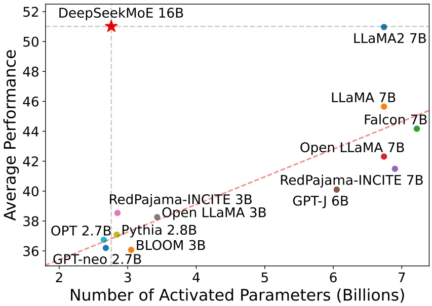
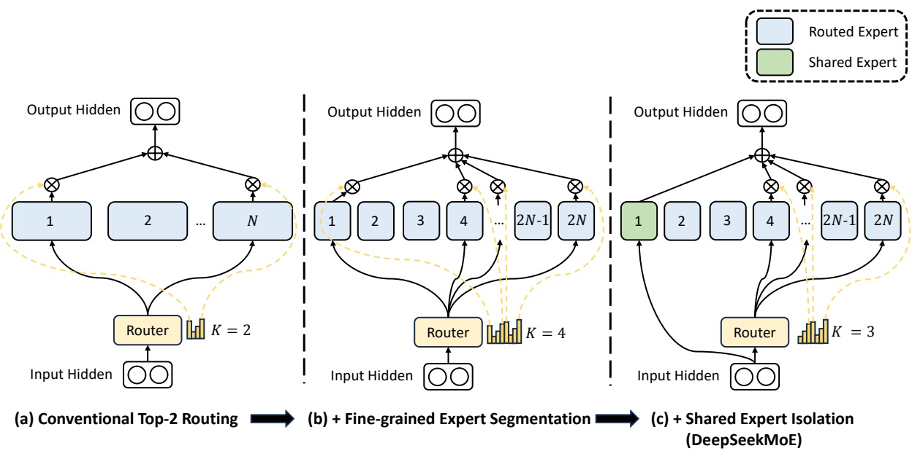
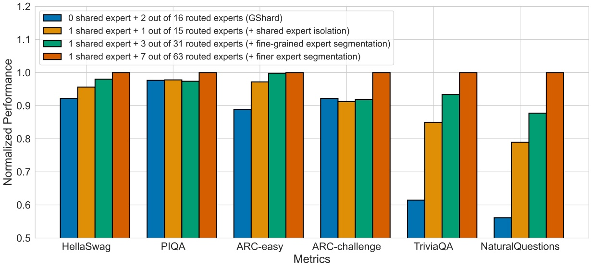
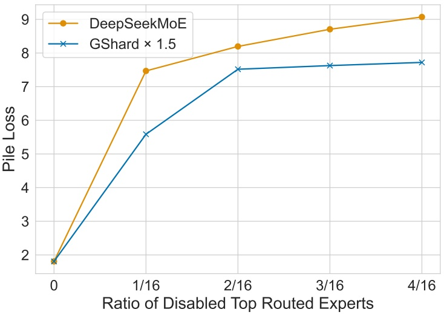
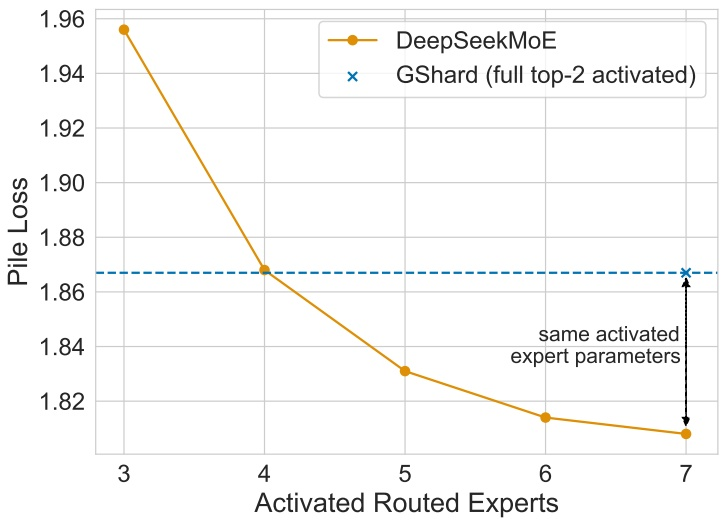
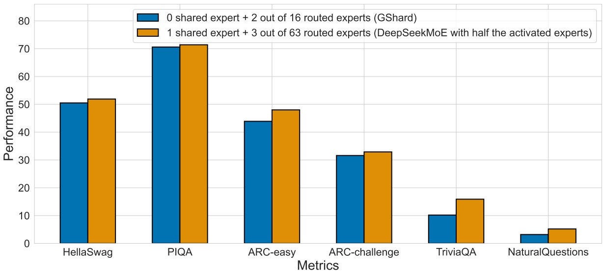
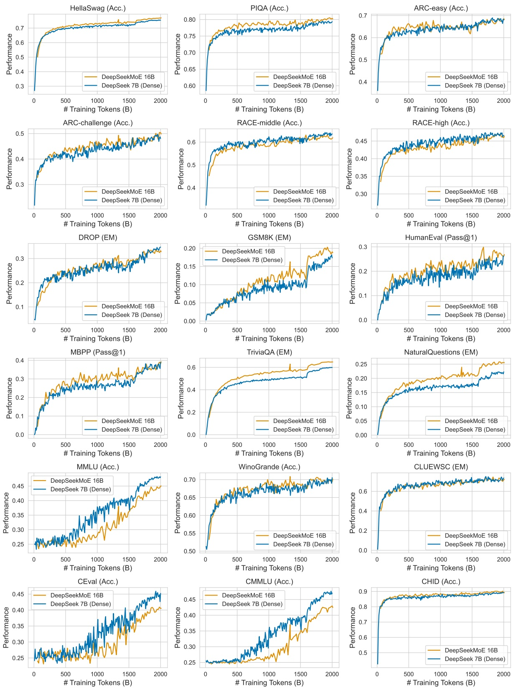

<!-- page 1 of 33 -->

arXiv:2401.06066v1 [cs.CL] 11 Jan 2024

deepseek

# DeepSeekMoE: Towards Ultimate Expert Specialization in Mixture-of-Experts Language Models · DeepSeekMoE: 让 MoE 语言模型的专家专精到底

Damai Dai$^{*1,2}$, Chengqi Deng$^{1}$, Chenggang Zhao$^{*1,3}$, R.X. Xu$^{1}$, Huazuo Gao$^{1}$, Deli Chen$^{1}$, Jiashi Li$^{1}$, Wangding Zeng$^{1}$, Xingkai Yu$^{*1,4}$, Y. Wu$^{1}$, Zhenda Xie$^{1}$, Y.K. Li$^{1}$, Panpan Huang$^{1}$, Fuli Luo$^{1}$, Chong Ruan$^{1}$, Zhifang Sui$^{2}$, Wenfeng Liang$^{1}$

## $^{1}$ DeepSeek-AI

$^{2}$ National Key Laboratory for Multimedia Information Processing, Peking University
 $^{3}$ Institute for Interdisciplinary Information Sciences, Tsinghua University
 $^{4}$ National Key Laboratory for Novel Software Technology, Nanjing University
{daidamai, szf}@pku.edu.cn, {wenfeng.liang}@deepseek.com
https://github.com/deepseek-ai/DeepSeek-MoE

## Abstract

In the era of large language models, Mixture-of-Experts (MoE) is a promising architecture for managing computational costs when scaling up model parameters. However, conventional MoE architectures like GShard, which activate the top-K out of N experts, face challenges in ensuring expert specialization, i.e. each expert acquires non-overlapping and focused knowledge. In response, we propose the DeepSeekMoE architecture towards ultimate expert specialization. It involves two principal strategies: (1) finely segmenting the experts into mN ones and activating mK from them, allowing for a more flexible combination of activated experts; (2) isolating  $K_{s}$  experts as shared ones, aiming at capturing common knowledge and mitigating redundancy in routed experts. Starting from a modest scale with 2B parameters, we demonstrate that DeepSeekMoE 2B achieves comparable performance with GShard 2.9B, which has 1.5× expert parameters and computation. In addition, DeepSeekMoE 2B nearly approaches the performance of its dense counterpart with the same number of total parameters, which set the upper bound of MoE models. Subsequently, we scale up DeepSeekMoE to 16B parameters and show that it achieves comparable performance with LLaMA2 7B, with only about 40% of computations. Further, our preliminary efforts to scale up DeepSeekMoE to 145B parameters consistently validate its substantial advantages over the GShard architecture, and show its performance comparable with DeepSeek 67B, using only 28.5% (maybe even 18.2%) of computations.

在大语言模型时代, MoE 是扩大模型参数时控制计算成本的一种有前景的架构. 但 GShard 这类传统 MoE 架构从 $N$ 个专家里激活 top-$K$ 个, 很难保证专家专精 (expert specialization), 也就是每个专家学到互不重叠且集中的知识. 为此我们提出 DeepSeekMoE 架构, 目标是把专家专精做到底. 它包含两条主要策略: (1) 把专家细切成 $mN$ 个, 从中激活 $mK$ 个, 让被激活专家的组合更灵活; (2) 隔离出 $K_s$ 个专家作为共享专家, 用来承载通用知识, 减少路由专家之间的冗余. 我们从 2B 参数的较小规模起步, 证明 DeepSeekMoE 2B 与 GShard 2.9B 表现相当, 而后者的专家参数和计算量都是前者的 1.5 倍. 此外, DeepSeekMoE 2B 几乎追平了总参数相同的稠密对照模型, 而这个稠密模型就是 MoE 模型的性能上限. 随后我们把 DeepSeekMoE 扩到 16B 参数, 它只用约 40% 的计算量就与 LLaMA2 7B 表现相当. 进一步, 我们把 DeepSeekMoE 扩到 145B 的初步尝试也一致地验证了它相对 GShard 架构的明显优势, 并且只用 28.5% (甚至可能只要 18.2%) 的计算量就与 DeepSeek 67B 表现相当.

## 1. Introduction

Recent research and practices have empirically demonstrated that, with sufficient training data available, scaling language models with increased parameters and computational budgets can yield remarkably stronger models (Brown et al., 2020; Hoffmann et al., 2022; OpenAI, 2023; Touvron et al., 2023a). It is imperative to acknowledge, however, that the endeavor to scale models to an extremely large scale is also associated with exceedingly high computational costs. Considering the substantial costs, the Mixture-of-Experts (MoE) architecture (Jacobs et al., 1991; Jordan and Jacobs, 1994; Shazeer et al., 2017) has emerged as a popular solution. It can

\*Contribution during internship at DeepSeek-AI.

<!-- page 2 of 33 -->

Figure 1 | Comparison between DeepSeekMoE 16B and open source models on the Open LLM Leaderboard. The red dashed line is linearly fitted from data points of all models except DeepSeekMoE 16B. DeepSeekMoE 16B consistently outperforms models with a similar number of activated parameters by a large margin, and achieves comparable performance with LLaMA2 7B, which has approximately 2.5 times the activated parameters.

enable parameter scaling, while concurrently keeping computational costs at a modest level. Recent applications of MoE architectures in Transformers (Vaswani et al., 2017) have yielded successful attempts at scaling language models to a substantial size (Du et al., 2022; Fedus et al., 2021; Lepikhin et al., 2021; Zoph, 2022), accompanied with remarkable performance. These achievements underscore the considerable potential and promise of MoE language models.

近来的研究与实践都从经验上证明, 只要训练数据足够, 增加参数和计算预算来扩大语言模型, 就能得到强得多的模型 (Brown et al., 2020; Hoffmann et al., 2022; OpenAI, 2023; Touvron et al., 2023a). 但也必须承认, 把模型扩到极大规模, 计算成本也极高. 考虑到这笔成本, MoE 架构 (Jacobs et al., 1991; Jordan and Jacobs, 1994; Shazeer et al., 2017) 成了流行的解决方案. 它能扩大参数, 同时把计算成本控制在适度水平. 近年 MoE 架构在 Transformer (Vaswani et al., 2017) 中的应用, 已经把语言模型成功扩到相当大的规模 (Du et al., 2022; Fedus et al., 2021; Lepikhin et al., 2021; Zoph, 2022), 表现也很出色. 这些成果说明 MoE 语言模型潜力可观.

(脚注) \*: 在 DeepSeek-AI 实习期间完成的工作.

Despite the promising potential of MoE architectures, existing MoE architectures potentially suffer from issues of knowledge hybridity and knowledge redundancy, which limit the expert specialization, i.e., each expert acquires non-overlapping and focused knowledge. Conventional MoE architectures substitute the Feed-Forward Networks (FFNs) in a Transformer with MoE layers. Each MoE layer consists of multiple experts, with each structurally identical to a standard FFN, and each token is assigned to one (Fedus et al., 2021) or two (Lepikhin et al., 2021) experts. This architecture manifests two potential issues: (1) Knowledge Hybridity: existing MoE practices often employ a limited number of experts (e.g., 8 or 16), and thus tokens assigned to a specific expert will be likely to cover diverse knowledge. Consequently, the designated expert will intend to assemble vastly different types of knowledge in its parameters, which are hard to utilize simultaneously. (2) Knowledge Redundancy: tokens assigned to different experts may require common knowledge. As a result, multiple experts may converge in acquiring shared knowledge in their respective parameters, thereby leading to redundancy in expert parameters. These issues collectively hinder the expert specialization in existing MoE practices, preventing them from reaching the theoretical upper-bound performance of MoE models.

MoE 架构虽有潜力, 现有的 MoE 架构却可能存在知识混杂 (knowledge hybridity) 和知识冗余 (knowledge redundancy) 两个问题, 二者限制了专家专精, 即每个专家学到互不重叠且集中的知识. 传统 MoE 架构把 Transformer 中的前馈网络 (FFN) 换成 MoE 层. 每个 MoE 层由多个专家组成, 每个专家的结构与标准 FFN 相同, 每个 token 被分给一个 (Fedus et al., 2021) 或两个 (Lepikhin et al., 2021) 专家. 这种架构暴露出两个潜在问题. (1) 知识混杂: 现有 MoE 实践的专家数往往有限 (例如 8 或 16 个), 于是分到某个专家的 token 很可能涵盖多种知识. 结果这个专家要在自己的参数里装下差别很大的各类知识, 而这些知识很难被同时用上. (2) 知识冗余: 分到不同专家的 token 可能需要共同的知识. 于是多个专家会各自在参数里学到同一份共享知识, 造成专家参数冗余. 这两个问题合在一起妨碍了现有 MoE 实践中的专家专精, 使它们达不到 MoE 模型理论上的性能上限.

In response to the aforementioned issues, we introduce DeepSeekMoE, an innovative MoE architecture specifically designed towards ultimate expert specialization. Our architecture involves two principal strategies: (1) Fine-Grained Expert Segmentation: while maintaining the number of parameters constant, we segment the experts into a finer grain by splitting the

<!-- page 3 of 33 -->

FFN intermediate hidden dimension. Correspondingly, keeping a constant computational cost, we also activate more fine-grained experts to enable a more flexible and adaptable combination of activated experts. Fine-grained expert segmentation allows diverse knowledge to be decomposed more finely and be learned more precisely into different experts, where each expert will retain a higher level of specialization. In addition, the increased flexibility in combining activated experts also contributes to a more accurate and targeted knowledge acquisition. (2) Shared Expert Isolation: we isolate certain experts to serve as shared experts that are always activated, aiming at capturing and consolidating common knowledge across varying contexts. Through compressing common knowledge into these shared experts, redundancy among other routed experts will be mitigated. This can enhance the parameter efficiency and ensure that each routed expert retains specialized by focusing on distinctive aspects. These architectural innovations in DeepSeekMoE offer opportunities to train a parameter-efficient MoE language model where each expert is highly specialized.

针对上述问题, 我们提出 DeepSeekMoE, 一种专为把专家专精做到底而设计的新 MoE 架构. 它包含两条主要策略. (1) 细粒度专家切分 (Fine-Grained Expert Segmentation): 在参数量不变的前提下, 通过切分 FFN 的中间隐藏维度, 把专家切得更细. 相应地, 在计算成本不变的前提下, 我们也激活更多的细粒度专家, 让被激活专家的组合更灵活, 更能适配不同输入. 细粒度切分让多样的知识可以被分解得更细, 更精确地学进不同专家, 每个专家的专精程度也就更高. 此外, 激活专家组合的灵活性提高, 也有助于更准确, 更有针对性地获取知识. (2) 共享专家隔离 (Shared Expert Isolation): 我们隔离出若干专家作为始终被激活的共享专家, 用来捕捉并汇聚不同上下文中的通用知识. 通用知识被压进这些共享专家之后, 其余路由专家之间的冗余就会减少. 这能提高参数效率, 并让每个路由专家专注于各自独特的方面, 保持专精. DeepSeekMoE 的这些架构创新, 让训练一个参数高效, 每个专家高度专精的 MoE 语言模型成为可能.

Starting from a modest scale with 2B parameters, we validate the advantages of the DeepSeek-MoE architecture. We conduct evaluations on 12 zero-shot or few-shot benchmarks spanning diverse tasks. Empirical results indicate that DeepSeekMoE 2B surpasses GShard 2B (Lepikhin et al., 2021) by a substantial margin, and even matches GShard 2.9B, a larger MoE model with 1.5× expert parameters and computation. Remarkably, we find that DeepSeekMoE 2B nearly approaches the performance of its dense counterpart with an equivalent number of parameters, which sets the strict upper bound of MoE language models. In pursuit of deeper insights, we conduct elaborate ablation studies and analysis on the expert specialization for DeepSeekMoE. These studies validate the effectiveness of fine-grained expert segmentation and shared expert isolation, and provide empirical evidence supporting the assertion that DeepSeekMoE can achieve a high level of expert specialization.

我们从 2B 参数的较小规模起步, 验证 DeepSeekMoE 架构的优势. 我们在 12 个覆盖多类任务的 zero-shot 或 few-shot 基准上做评测. 实验结果表明, DeepSeekMoE 2B 大幅超过 GShard 2B (Lepikhin et al., 2021), 甚至与 GShard 2.9B 持平, 后者是专家参数和计算量都为 1.5 倍的更大 MoE 模型. 更值得一提的是, DeepSeekMoE 2B 几乎追平了参数量相同的稠密对照模型, 而它构成 MoE 语言模型的严格上限. 为了更深入地理解, 我们对 DeepSeekMoE 做了细致的消融实验和专家专精分析. 这些研究验证了细粒度专家切分与共享专家隔离的有效性, 也为「DeepSeekMoE 能达到高度专家专精」这一论断提供了经验证据.

Leveraging our architecture, we subsequently scale up the model parameters to 16B and train DeepSeekMoE 16B on a large-scale corpus with 2T tokens. Evaluation results reveal that with only about 40% of computations, DeepSeekMoE 16B achieves comparable performance with DeepSeek 7B (DeepSeek-AI, 2024), a dense model trained on the same 2T corpus. We also compare DeepSeekMoE with open source models and the evaluations demonstrate that DeepSeekMoE 16B consistently outperforms models with a similar number of activated parameters by a large margin, and achieves comparable performance with LLaMA2 7B (Touvron et al., 2023b), which has approximately 2.5 times the activated parameters. Figure 1 demonstrates the evaluation results on the Open LLM Leaderboard $^{1}$ . Additionally, we conduct supervised fine-tuning (SFT) for alignment, transforming the model into a chat model. Evaluation results show that DeepSeekMoE Chat 16B also achieves comparable performance with DeepSeek Chat 7B and LLaMA2 SFT 7B in the chat setting. Encouraged by these results, we further undertake a preliminary endeavor to scale up DeepSeekMoE to 145B. The experimental results still validate its substantial advantages over the GShard architecture consistently. In addition, it shows performance comparable with DeepSeek 67B, using only 28.5% (maybe even 18.2%) of computations.

借助这一架构, 我们随后把模型参数扩到 16B, 在 2T token 的大规模语料上训练 DeepSeekMoE 16B. 评测结果显示, DeepSeekMoE 16B 只用约 40% 的计算量, 就与在同一份 2T 语料上训练的稠密模型 DeepSeek 7B (DeepSeek-AI, 2024) 表现相当. 我们还把 DeepSeekMoE 与开源模型比较, 结果表明 DeepSeekMoE 16B 一致地大幅超过激活参数量相近的模型, 并与激活参数约为它 2.5 倍的 LLaMA2 7B (Touvron et al., 2023b) 表现相当. Figure 1 给出了 Open LLM Leaderboard $^{1}$ 上的评测结果. 此外, 我们做了监督微调 (SFT) 来对齐, 把模型变成对话模型. 评测显示, 在对话设定下 DeepSeekMoE Chat 16B 同样与 DeepSeek Chat 7B 和 LLaMA2 SFT 7B 表现相当. 受这些结果鼓舞, 我们进一步初步尝试把 DeepSeekMoE 扩到 145B. 实验结果仍一致地验证了它相对 GShard 架构的明显优势. 此外, 它只用 28.5% (甚至可能只要 18.2%) 的计算量, 就与 DeepSeek 67B 表现相当.

Our contributions are summarized as follows:

我们的贡献总结如下:

\- Architectural Innovation. We introduce DeepSeekMoE, an innovative MoE architecture aiming at achieving ultimate expert specialization, which employs two principal strategies of fine-grained expert segmentation and shared expert isolation.

\- 架构创新. 我们提出 DeepSeekMoE, 一种以把专家专精做到底为目标的新 MoE 架构, 采用细粒度专家切分和共享专家隔离两条主要策略.

\- Empirical Validation. We conduct extensive experiments to empirically validate the effectiveness of the DeepSeekMoE architecture. Experimental results validate the high

$^{1}$ https://huggingface.co/spaces/HuggingFaceH4/open\_llm\_leaderboard

<!-- page 4 of 33 -->

level of expert specialization in DeepSeekMoE 2B, and indicate that DeepSeekMoE 2B can nearly approach the upper bound performance for MoE models

\- 实验验证. 我们做了大量实验, 从经验上验证 DeepSeekMoE 架构的有效性. 实验结果验证了 DeepSeekMoE 2B 的专家专精程度很高, 并表明 DeepSeekMoE 2B 几乎能逼近 MoE 模型的性能上限.

(脚注) 1: Open LLM Leaderboard 的地址, 见上方英文脚注.

\- Scalability. We scale up DeepSeekMoE to train a 16B model and show that with only about $40\%$ of computations, DeepSeekMoE 16B achieves comparable performance with DeepSeek 7B and LLaMA2 7B. We also undertake a preliminary endeavor to scale up DeepSeekMoE to 145B, highlighting its consistent advantages over the GShard architecture and showing a comparable performance with DeepSeek 67B.

\- 可扩展性. 我们把 DeepSeekMoE 扩大, 训练了一个 16B 模型, 表明 DeepSeekMoE 16B 只用约 $40\%$ 的计算量就与 DeepSeek 7B 和 LLaMA2 7B 表现相当. 我们也初步尝试把 DeepSeekMoE 扩到 145B, 显示它相对 GShard 架构的优势始终存在, 且与 DeepSeek 67B 表现相当.

\- Alignment for MoE. We successfully perform supervised fine-tuning on DeepSeekMoE 16B to create an aligned chat model, showcasing the adaptability and versatility of DeepSeekMoE 16B.

\- MoE 的对齐. 我们在 DeepSeekMoE 16B 上成功做了监督微调, 得到一个对齐后的对话模型, 展示了 DeepSeekMoE 16B 的适应性和通用性.

\- Public Release. In the spirit of open research, we release the model checkpoint of DeepSeekMoE 16B to the public. Notably, this model can be deployed on a single GPU with 40GB of memory without the need for quantization.

\- 公开发布. 本着开放研究的精神, 我们公开了 DeepSeekMoE 16B 的模型权重. 这个模型不需要量化就能部署在一张 40GB 显存的 GPU 上.

## 2. Preliminaries: Mixture-of-Experts for Transformers · 预备知识: Transformer 中的 MoE

We first introduce a generic MoE architecture commonly used in Transformer language models. A standard Transformer language model is constructed by stacking L layers of standard Transformer blocks, where each block can be represented as follows:

我们先介绍 Transformer 语言模型中常用的通用 MoE 架构. 标准 Transformer 语言模型由 $L$ 层标准 Transformer 块堆叠而成, 每一块可以写成:

$$
\mathbf {u} _ {1: T} ^ {l} = \text {Self - Att} \left(\mathbf {h} _ {1: T} ^ {l - 1}\right) + \mathbf {h} _ {1: T} ^ {l - 1},\tag{1}
$$

$$
\mathbf {h} _ {t} ^ {l} = \mathrm{FFN} (\mathbf {u} _ {t} ^ {l}) + \mathbf {u} _ {t} ^ {l},\tag{2}
$$

where T denotes the sequence length, Self-Att( $\cdot$ ) denotes the self-attention module, FFN( $\cdot$ ) denotes the Feed-Forward Network (FFN),  $u_{1:T}^{l} \in R^{T \times d}$  are the hidden states of all tokens after the l-th attention module, and  $h_{t}^{l} \in R^{d}$  is the output hidden state of the t-th token after the l-th Transformer block. For brevity, we omit the layer normalization in the above formulations.

其中 $T$ 是序列长度, $\mathrm{Self\text{-}Att}(\cdot)$ 是自注意力模块, $\mathrm{FFN}(\cdot)$ 是前馈网络, $u_{1:T}^{l} \in R^{T \times d}$ 是第 $l$ 个注意力模块之后全部 token 的隐状态, $h_{t}^{l} \in R^{d}$ 是第 $t$ 个 token 经过第 $l$ 个 Transformer 块后的输出隐状态. 为简洁起见, 上面的式子省略了层归一化.

A typical practice to construct an MoE language model usually substitutes FFNs in a Transformer with MoE layers at specified intervals (Du et al., 2022; Fedus et al., 2021; Lepikhin et al., 2021; Zoph, 2022). An MoE layer is composed of multiple experts, where each expert is structurally identical to a standard FFN. Then, each token will be assigned to one (Fedus et al., 2021) or two (Lepikhin et al., 2021) experts. If the $l$-th FFN is substituted with an MoE layer, the computation for its output hidden state $\mathbf{h}_t^l$ is expressed as:

构建 MoE 语言模型的典型做法, 是每隔固定层数把 Transformer 中的 FFN 换成 MoE 层 (Du et al., 2022; Fedus et al., 2021; Lepikhin et al., 2021; Zoph, 2022). 一个 MoE 层由多个专家组成, 每个专家的结构与标准 FFN 相同. 每个 token 被分给一个 (Fedus et al., 2021) 或两个 (Lepikhin et al., 2021) 专家. 如果第 $l$ 个 FFN 被换成 MoE 层, 它的输出隐状态 $\mathbf{h}_t^l$ 这样计算:

$$
\mathbf {h} _ {t} ^ {l} = \sum_ {i = 1} ^ {N} \left(g _ {i, t} \operatorname{FFN} _ {i} \left(\mathbf {u} _ {t} ^ {l}\right)\right) + \mathbf {u} _ {t} ^ {l},\tag{3}
$$

$$
g _ {i, t} = \left\{ \begin{array}{l l} s _ {i, t}, & s _ {i, t} \in \operatorname{Topk} (\{s _ {j, t} | 1 \leqslant j \leqslant N \}, K), \\ 0, & \text {otherwise}, \end{array} \right.\tag{4}
$$

$$
s _ {i, t} = \mathrm{Softmax} _ {i} \left(\mathbf {u} _ {t} ^ {l ^ {T}} \mathbf {e} _ {i} ^ {l}\right),\tag{5}
$$

where N denotes the total number of experts,  $\mathrm{FFN}_{i}(\cdot)$  is the i-th expert FFN,  $g_{i,t}$  denotes the gate value for the i-th expert,  $s_{i,t}$  denotes the token-to-expert affinity,  $\mathrm{Topk}(\cdot,K)$  denotes the set comprising K highest affinity scores among those calculated for the t-th token and all N experts, and  $e_{i}^{l}$  is the centroid of the i-th expert in the l-th layer. Note that  $g_{i,t}$  is sparse, indicating that only K out of N gate values are nonzero. This sparsity property ensures computational efficiency within an MoE layer, i.e., each token will be assigned to and computed in only K experts. Also, in the above formulations, we omit the layer normalization operation for brevity.

其中 $N$ 是专家总数, $\mathrm{FFN}_{i}(\cdot)$ 是第 $i$ 个专家 FFN, $g_{i,t}$ 是第 $i$ 个专家的门控值, $s_{i,t}$ 是 token 对专家的亲和度, $\mathrm{Topk}(\cdot,K)$ 是第 $t$ 个 token 与全部 $N$ 个专家算出的亲和度里最高的 $K$ 个组成的集合, $e_{i}^{l}$ 是第 $l$ 层第 $i$ 个专家的中心向量. 注意 $g_{i,t}$ 是稀疏的, $N$ 个门控值里只有 $K$ 个非零. 这种稀疏性保证了 MoE 层的计算效率: 每个 token 只被分给 $K$ 个专家, 也只在这 $K$ 个专家里计算. 同样, 上面的式子为简洁省略了层归一化.

> **拆开:** 式 (5) 的 Softmax 是在全部 $N$ 个专家上做的, 式 (4) 取 Top-$K$ 后不再归一化, 那 $K$ 个门控值之和是多少?
> 答: 小于 1, 且随 token 浮动. 式 (4) 只是把落在 Top-$K$ 外的 $s_{i,t}$ 置零, 留下的 $K$ 个仍是全体 Softmax 的分量, 和为 $\sum_{i\in\mathrm{Topk}}s_{i,t}\le 1$. 官方 16B 实现与此一致: `config.json` 里 `norm_topk_prob=false`, `MoEGate.forward` 在 `topk` 之后只有该开关为真时才除以和. 所以路由越分散, 路由专家一路的输出幅度越小; 后文式 (9) 的共享专家不乘门控, 两路的相对比例随 token 变化.

<!-- page 5 of 33 -->

Figure 2 | Illustration of DeepSeekMoE. Subfigure (a) showcases an MoE layer with the conventional top-2 routing strategy. Subfigure (b) illustrates the fine-grained expert segmentation strategy. Subsequently, subfigure (c) demonstrates the integration of the shared expert isolation strategy, constituting the complete DeepSeekMoE architecture. It is noteworthy that across these three architectures, the number of expert parameters and computational costs remain constant.

## 3. DeepSeekMoE Architecture · DeepSeekMoE 架构

On top of the generic MoE architecture outlined in Section 2, we introduce DeepSeekMoE, which is specifically designed to exploit the potential of expert specialization. As illustrated in Figure 2, our architecture incorporates two principal strategies: fine-grained expert segmentation and shared expert isolation. Both of these strategies are designed to elevate the level of expert specialization.

在第 2 节通用 MoE 架构的基础上, 我们提出 DeepSeekMoE, 它专为发掘专家专精的潜力而设计. 如 Figure 2 所示, 这一架构包含两条主要策略: 细粒度专家切分和共享专家隔离. 两条策略都是为了提高专家专精的程度.

## 3.1. Fine-Grained Expert Segmentation · 细粒度专家切分

In scenarios where the number of experts is limited, tokens assigned to a particular expert will be more likely to cover diverse types of knowledge. As a consequence, the designated expert will intend to learn vastly different types of knowledge in its parameters, and they are hard to be simultaneously utilized. However, if each token can be routed to more experts, diverse knowledge will gain the potential to be decomposed and learned in different experts respectively. In this context, each expert can still retain a high level of expert specialization, contributing to a more focused knowledge distribution across experts.

专家数有限时, 分到某个专家的 token 更可能涵盖多种类型的知识. 结果这个专家要在参数里学习差别很大的多类知识, 而这些知识很难被同时用上. 反过来, 如果每个 token 能被路由到更多专家, 多样的知识就有可能被分解开, 分别学进不同专家. 在这种情形下, 每个专家仍能保持高度专精, 知识在专家之间的分布也更集中.

In pursuit of the goal, while maintaining a consistent number of expert parameters and computational cost, we segment the experts with a finer grain. The finer expert segmentation enables a more flexible and adaptable combination of activated experts. To be specific, on top of a typical MoE architecture shown in Figure 2(a), we segment each expert FFN into m smaller experts by reducing the FFN intermediate hidden dimension to  $\frac{1}{m}$  times its original size. Since each expert becomes smaller, in response, we also increase the number of activated experts to m times to keep the same computation cost, as illustrated in Figure 2(b). With the fine-grained

<!-- page 6 of 33 -->

expert segmentation, the output of an MoE layer can be expressed as:

为此, 我们在专家参数量和计算成本都不变的前提下, 把专家切得更细. 更细的切分让被激活专家的组合更灵活, 更能适配输入. 具体来说, 在 Figure 2(a) 所示的典型 MoE 架构之上, 我们把 FFN 的中间隐藏维度缩到原来的 $\frac{1}{m}$, 从而把每个专家 FFN 切成 $m$ 个更小的专家. 每个专家变小了, 相应地我们把激活专家数增加到 $m$ 倍, 以保持计算成本不变, 如 Figure 2(b) 所示. 采用细粒度专家切分后, MoE 层的输出可以写成:

$$
\mathbf {h} _ {t} ^ {l} = \sum_ {i = 1} ^ {m N} \left(g _ {i, t} \operatorname{FFN} _ {i} \left(\mathbf {u} _ {t} ^ {l}\right)\right) + \mathbf {u} _ {t} ^ {l},\tag{6}
$$

$$
g _ {i, t} = \left\{ \begin{array}{l l} s _ {i, t}, & s _ {i, t} \in \operatorname{Topk} (\{s _ {j, t} | 1 \leqslant j \leqslant m N \}, m K), \\ 0, & \text {otherwise}, \end{array} \right.\tag{7}
$$

$$
s _ {i, t} = \operatorname{Softmax} _ {i} \left(\mathbf {u} _ {t} ^ {l ^ {T}} \mathbf {e} _ {i} ^ {l}\right),\tag{8}
$$

where the total number of expert parameters is equal to N times the number of parameters in a standard FFN, and mN denotes the total number of fine-grained experts. With the fine-grained expert segmentation strategy, the number of nonzero gates will also increase to mK.

其中专家参数总量等于标准 FFN 参数量的 $N$ 倍, $mN$ 是细粒度专家的总数. 采用细粒度专家切分后, 非零门控的个数也增加到 $mK$.

From a combinatorial perspective, the fine-grained expert segmentation strategy substantially enhances the combinatorial flexibility of activated experts. As an illustrative example, we consider the case where $N = 16$. A typical top-2 routing strategy can yield $\binom{16}{2} = 120$ possible combinations. By contrast, if each expert is split into 4 smaller experts, the fine-grained routing strategy can yield $\binom{64}{8} = 4, 426, 165, 368$ potential combinations. The surge in combinatorial flexibility enhances the potential for achieving more accurate and targeted knowledge acquisition.

从组合的角度看, 细粒度专家切分大幅提高了激活专家的组合灵活性. 举个例子, 取 $N = 16$. 典型的 top-2 路由能产生 $\binom{16}{2} = 120$ 种组合. 相比之下, 如果每个专家切成 4 个更小的专家, 细粒度路由能产生 $\binom{64}{8} = 4,426,165,368$ 种可能组合. 组合灵活性的激增, 让更准确, 更有针对性地获取知识成为可能.

## 3.2. Shared Expert Isolation · 共享专家隔离

With a conventional routing strategy, tokens assigned to different experts may necessitate some common knowledge or information. As a result, multiple experts may converge in acquiring shared knowledge in their respective parameters, thereby resulting in redundancy in expert parameters. However, if there are shared experts dedicated to capturing and consolidating common knowledge across varying contexts, the parameter redundancy among other routed experts will be alleviated. This alleviation of redundancy will contribute to a more parameter-efficient model with more specialized experts.

在传统路由策略下, 分给不同专家的 token 可能需要一些共同的知识或信息. 于是多个专家会各自在参数里学到同一份共享知识, 导致专家参数冗余. 如果有专门的共享专家来捕捉并汇聚不同上下文中的通用知识, 其余路由专家之间的参数冗余就会缓解. 冗余减少, 模型的参数效率更高, 专家也更专精.

Towards this objective, in addition to the fine-grained expert segmentation strategy, we further isolate  $K_{s}$  experts to serve as shared experts. Regardless of the router module, each token will be deterministically assigned to these shared experts. In order to maintain a constant computational cost, the number of activated experts among the other routed experts will be decreased by  $K_{s}$, as depicted in Figure 2(c). With the shared expert isolation strategy integrated, an MoE layer in the complete DeepSeekMoE architecture is formulated as follows:

为此, 在细粒度专家切分之外, 我们进一步隔离出 $K_s$ 个专家作为共享专家. 不经过路由模块, 每个 token 都确定性地被分给这些共享专家. 为保持计算成本不变, 其余路由专家中被激活的个数相应减少 $K_s$, 如 Figure 2(c) 所示. 加入共享专家隔离后, 完整 DeepSeekMoE 架构中一个 MoE 层的形式如下:

$$
\mathbf {h} _ {t} ^ {l} = \sum_ {i = 1} ^ {K _ {s}} \mathrm{FFN} _ {i} \left(\mathbf {u} _ {t} ^ {l}\right) + \sum_ {i = K _ {s} + 1} ^ {m N} \left(g _ {i, t} \mathrm{FFN} _ {i} \left(\mathbf {u} _ {t} ^ {l}\right)\right) + \mathbf {u} _ {t} ^ {l},\tag{9}
$$

$$
g _ {i, t} = \left\{ \begin{array}{l l} s _ {i, t}, & s _ {i, t} \in \operatorname{Topk} (\{s _ {j, t} | K _ {s} + 1 \leqslant j \leqslant m N \}, m K - K _ {s}), \\ 0, & \text {otherwise}, \end{array} \right.\tag{10}
$$

$$
s _ {i, t} = \operatorname{Softmax} _ {i} \left(\mathbf {u} _ {t} ^ {l ^ {T}} \mathbf {e} _ {i} ^ {l}\right).\tag{11}
$$

Finally, in DeepSeekMoE, the number of shared expert is $K_{s}$, the total number of routed experts is $mN - K_{s}$, and the number of nonzero gates is $mK - K_{s}$.

最终, DeepSeekMoE 中共享专家数为 $K_s$, 路由专家总数为 $mN - K_s$, 非零门控数为 $mK - K_s$.

It is worth noting that the prototype of shared expert isolation can be credited to Rajbhandari et al. (2022). The key distinction lies in the fact that they derive this strategy from an engineering perspective, while we approach it from an algorithmic standpoint.

需要说明, 共享专家隔离的雏形可以追溯到 Rajbhandari et al. (2022). 关键区别在于, 他们是从工程角度得出这一策略, 而我们是从算法角度出发.

> **核对:** 式 (9)–(10) 规定共享专家从 $mN$ 个细粒度专家里划出, 总专家数仍为 $mN$; 16B 与 145B 的配置是否守住了这个约束?
> 答: 2B 守住了: §4.2 写 1 个共享加 63 个路由, 每个 0.25 倍标准 FFN, 合计 $64\times0.25=16$ 个标准 FFN, 即 $N=16, m=4$. 16B 是 2 个共享加 64 个路由 (§5.1.2), 145B 是 4 个共享加 128 个路由 (§7.1), 专家总量分别是 $66\times0.25=16.5$ 和 $132\times0.125=16.5$ 个标准 FFN, 共享专家是加在 64 或 128 个路由专家之外的. 所以这两档相对「$N=16$ 的 GShard」多出半个标准 FFN 的专家参数. §7.2 把 145B 比 GShard 137B 大 6% 全归因于专家中间维度对齐到 64 的倍数, 用 Table 6 的数字可以拆开: $132\times1408/(16\times10944)\approx1.061$, 其中 $16.5/16\approx1.031$ 来自多出的共享专家, $1408/1368\approx1.029$ 来自对齐 ($10944/8=1368$ 不是 64 的倍数, 上取到 1408). 这里的 1408 和 10944 是由 Table 6 的总参数反推的中间维度, 文中没有直接给出.

<!-- page 7 of 33 -->

## 3.3. Load Balance Consideration · 负载均衡的考虑

Automatically learned routing strategies may encounter the issue of load imbalance, which manifests two notable defects. Firstly, there is a risk of routing collapse (Shazeer et al., 2017), i.e., the model always selects only a few experts, preventing other experts from sufficient training. Secondly, if experts are distributed across multiple devices, load imbalance can exacerbate computation bottlenecks.

自动学习的路由策略可能遇到负载不均衡的问题, 它有两个明显的缺陷. 第一, 存在路由塌缩 (routing collapse) 的风险 (Shazeer et al., 2017), 即模型总是只选少数几个专家, 其他专家得不到充分训练. 第二, 如果专家分布在多个设备上, 负载不均衡会加剧计算瓶颈.

Expert-Level Balance Loss. In order to mitigate the risk of routing collapse, we also employ an expert-level balance loss. The computation of the balance loss is as follows:

专家级均衡损失. 为了降低路由塌缩的风险, 我们也使用了专家级均衡损失. 它的计算方式如下:

$$
\mathcal {L} _ {\mathrm{ExpBal}} = \alpha_ {1} \sum_ {i = 1} ^ {N ^ {\prime}} f _ {i} P _ {i},\tag{12}
$$

$$
f _ {i} = \frac {N ^ {\prime}}{K ^ {\prime} T} \sum_ {t = 1} ^ {T} \mathbb {1} (\text {Token} t \text {selects Expert} i),\tag{13}
$$

$$
P _ {i} = \frac {1}{T} \sum_ {t = 1} ^ {T} s _ {i, t},\tag{14}
$$

where $\alpha_{1}$ is a hyper-parameter called expert-level balance factor, $N'$ is equal to $(mN - K_s)$ and $K'$ is equal to $(mK - K_s)$ for brevity. $\mathbb{1}(\cdot)$ denotes the indicator function.

其中 $\alpha_1$ 是称为专家级均衡因子的超参数, 为简洁起见记 $N'=(mN - K_s)$, $K'=(mK - K_s)$. $\mathbb{1}(\cdot)$ 是指示函数.

> **问:** 式 (13) 的 $T$ 是一条序列的长度还是整个 batch 的 token 数? 指示函数不可导, 梯度怎么回到路由器?
> 答: 式 (13)–(14) 只写了「$T$ 个 token」, 没有说明统计范围. 官方 16B 实现 `MoEGate` 在 `seq_aux=True` 时按每条序列各自计数: 用 `scatter_add_` 统计每条序列里各专家被选中的次数, 再除以 `seq_len * top_k / n_routed_experts`, 这正是 $N'/(K'T)$ 取 $T$ 为序列长度; 然后与该序列的平均亲和度相乘求和, 最终对 batch 取平均. 所以 16B 的专家级损失是序列级的. 梯度方面, $f_i$ 来自 Top-K 计数, 在计算图里是常数, 梯度只经 $P_i$ 流回 Softmax 与 $\mathbf{e}_i$; $f_i$ 充当 $P_i$ 的权重, 被选得多的专家亲和度被压得重. 均匀路由时 $f_i=1$, $P_i=1/N'$, 损失取 $\alpha_1$.

Device-Level Balance Loss. In addition to the expert-level balance loss, we introduce a device-level balance loss. When aiming to alleviate computation bottlenecks, it becomes unnecessary to enforce strict balance constraints at the expert level, because excessive constraints on load balance will compromise model performance. Instead, our primary objective is to ensure balanced computation across the devices. If we partition all routed experts into $D$ groups $\{\mathcal{E}_1, \mathcal{E}_2, ..., \mathcal{E}_D\}$, and deploy each group on a single device, the device-level balance loss is computed as follows:

设备级均衡损失. 除了专家级均衡损失, 我们还引入设备级均衡损失. 如果目的是缓解计算瓶颈, 就没有必要在专家层面施加严格的均衡约束, 因为过强的负载均衡约束会损害模型性能. 我们的主要目标是保证各设备之间的计算均衡. 如果把全部路由专家分成 $D$ 组 $\{\mathcal{E}_1, \mathcal{E}_2, ..., \mathcal{E}_D\}$, 每组部署在一个设备上, 设备级均衡损失计算如下:

$$
\mathcal {L} _ {\mathrm{DevBal}} = \alpha_ {2} \sum_ {i = 1} ^ {D} f _ {i} ^ {\prime} P _ {i} ^ {\prime},\tag{15}
$$

$$
f _ {i} ^ {\prime} = \frac {1}{| \mathcal {E} _ {i} |} \sum_ {j \in \mathcal {E} _ {i}} f _ {j},\tag{16}
$$

$$
P _ {i} ^ {\prime} = \sum_ {j \in \mathcal {E} _ {i}} P _ {j},\tag{17}
$$

where  $\alpha_{2}$  is a hyper-parameter called device-level balance factor. In practice, we set a small expert-level balance factor to mitigate the risk of routing collapse, and meanwhile set a larger device-level balance factor to promote balanced computation across the devices.

其中 $\alpha_2$ 是称为设备级均衡因子的超参数. 实践中, 我们把专家级均衡因子设得较小, 用来降低路由塌缩的风险, 同时把设备级均衡因子设得较大, 以促进各设备之间的计算均衡.

## 4. Validation Experiments · 验证实验

## 4.1. Experimental Setup · 实验设置

## 4.1.1. Training Data and Tokenization · 训练数据与分词

Our training data is sampled from a large-scale multilingual corpus created by DeepSeek-AI. The corpus primarily focuses on English and Chinese but also encompasses other languages. It is de-

<!-- page 8 of 33 -->

rived from diverse sources, including web text, mathematical material, coding scripts, published literature, and various other textual materials. For the purpose of validation experiments, we sample a subset containing 100B tokens from the corpus to train our models. For tokenization, we utilize the HuggingFace Tokenizer $^{2}$ tools to train byte pair encoding (BPE) (Sennrich et al., 2016) tokenizers on a smaller subset of the training corpus. In the validation experiments, we prepare a tokenizer with a vocabulary size of 8K, and the vocabulary size will be scaled up when training larger models.

我们的训练数据采样自 DeepSeek-AI 构建的大规模多语种语料. 语料以英文和中文为主, 也包含其他语言. 它来自多种来源, 包括网页文本, 数学材料, 代码, 已出版文献以及其他各类文本. 验证实验从语料中采样了一个 100B token 的子集来训练模型. 分词方面, 我们用 HuggingFace Tokenizer $^{2}$ 工具, 在训练语料的一个较小子集上训练字节对编码 (BPE) (Sennrich et al., 2016) 分词器. 验证实验准备的分词器词表大小为 8K, 训练更大的模型时会扩大词表.

## 4.1.2. Infrastructures · 基础设施

We conduct experiments based on HAI-LLM (High-Flyer, 2023), an efficient and light-weight training framework which integrates multiple parallelism strategies, including tensor parallelism (Korthikanti et al., 2023; Narayanan et al., 2021; Shoeybi et al., 2019), ZeRO data parallelism (Rajbhandari et al., 2020), PipeDream pipeline parallelism (Harlap et al., 2018), and more specifically, expert parallelism (Lepikhin et al., 2021) by combining data and tensor parallelism. In order to optimize performance, we develop GPU kernels with CUDA and Triton (Tillet et al., 2019) for gating algorithms and fusing computations across linear layers in different experts.

我们的实验基于 HAI-LLM (High-Flyer, 2023), 一个高效轻量的训练框架, 集成了多种并行策略, 包括张量并行 (Korthikanti et al., 2023; Narayanan et al., 2021; Shoeybi et al., 2019), ZeRO 数据并行 (Rajbhandari et al., 2020), PipeDream 流水线并行 (Harlap et al., 2018), 以及结合数据并行与张量并行实现的专家并行 (Lepikhin et al., 2021). 为了优化性能, 我们用 CUDA 和 Triton (Tillet et al., 2019) 为门控算法编写了 GPU kernel, 并把不同专家中线性层的计算融合起来.

All experiments are carried out on clusters equipped with NVIDIA A100 or H800 GPUs. Each node in the A100 cluster contains 8 GPUs connected pairwise via the NVLink bridge. The H800 cluster also features 8 GPUs per node, interconnected using NVLink and NVSwitch within nodes. For both A100 and H800 clusters, InfiniBand interconnects are utilized to facilitate communication across nodes.

所有实验都在配备 NVIDIA A100 或 H800 GPU 的集群上进行. A100 集群每个节点有 8 张 GPU, 两两之间通过 NVLink 桥连接. H800 集群每个节点也有 8 张 GPU, 节点内用 NVLink 和 NVSwitch 互连. 两种集群都用 InfiniBand 做跨节点通信.

## 4.1.3. Hyper-Parameters · 超参数

Model Settings. In the validation experiments, we set the number of Transformer layers to 9 and the hidden dimension to 1280. We employ the multi-head attention mechanism with a total of 10 attention heads, where each head has a dimension of 128. For initialization, all learnable parameters are randomly initialized with a standard deviation of 0.006. We substitute all FFNs with MoE layers, and ensure that the total number of expert parameters equals 16 times that of a standard FFN. Additionally, we keep the activated expert parameters, including shared expert parameters and activated routed expert parameters, as 2 times that of a standard FFN. Under this configuration, each MoE model has approximately 2B total parameters, with the number of activated parameters around 0.3B.

模型设置. 验证实验中 Transformer 层数设为 9, 隐藏维度设为 1280. 我们使用多头注意力, 共 10 个注意力头, 每头维度 128. 初始化时所有可学习参数都以标准差 0.006 随机初始化. 我们把所有 FFN 都换成 MoE 层, 并保证专家参数总量等于标准 FFN 的 16 倍. 此外, 我们让被激活的专家参数 (含共享专家参数和被激活的路由专家参数) 保持为标准 FFN 的 2 倍. 在这一配置下, 每个 MoE 模型总参数约 2B, 激活参数约 0.3B.

Training Settings. We employ the AdamW optimizer (Loshchilov and Hutter, 2019) with hyper-parameters set to $\beta_{1} = 0.9$, $\beta_{2} = 0.95$, and weight\_decay = 0.1. The learning rate is scheduled using a warmup-and-step-decay strategy. Initially, the learning rate linearly increases from 0 to the maximum value during the first 2K steps. Subsequently, the learning rate is multiplied by 0.316 at $80\%$ of the training steps, and again by 0.316 at $90\%$ of the training steps. The maximum learning rate for validation experiments is set to $1.08 \times 10^{-3}$, and the gradient clipping norm is set to 1.0. The batch size is set to 2K, and with a maximum sequence length of 2K, each training batch contains 4M tokens. Correspondingly, the total number of training steps is set to 25,000 to achieve 100B training tokens. Due to the abundance of training data, we do not use dropout during training. Given the relatively small model size, all parameters, including expert parameters, are deployed on a single GPU device to avoid unbalanced computation. Correspondingly, we do not drop any tokens during training and do not employ the device-level

$^{2}$ https://github.com/huggingface/tokenizers

<!-- page 9 of 33 -->

balance loss. In order to prevent routing collapse, we set an expert-level balance factor of 0.01.

训练设置. 我们使用 AdamW 优化器 (Loshchilov and Hutter, 2019), 超参数为 $\beta_1 = 0.9$, $\beta_2 = 0.95$, `weight_decay` $= 0.1$. 学习率采用预热加阶梯衰减的策略. 开始的 2K 步内学习率从 0 线性升到最大值. 之后在训练步数的 $80\%$ 处乘以 0.316, 在 $90\%$ 处再乘以 0.316. 验证实验的最大学习率设为 $1.08 \times 10^{-3}$, 梯度裁剪范数设为 1.0. batch size 设为 2K, 最大序列长度 2K, 每个训练 batch 含 4M token. 相应地, 总训练步数设为 25,000, 达到 100B 训练 token. 由于训练数据充足, 训练中不使用 dropout. 由于模型较小, 包括专家参数在内的全部参数都部署在单张 GPU 上, 以避免计算不均衡. 相应地, 训练中不丢弃任何 token, 也不使用设备级均衡损失. 为了防止路由塌缩, 我们把专家级均衡因子设为 0.01.

(脚注) 2: HuggingFace tokenizers 仓库地址, 见上方英文脚注.

For readability, we also present an overview table of hyper-parameters for DeepSeekMoE across different sizes in Appendix A.

为方便阅读, 附录 A 还给出了不同规模 DeepSeekMoE 的超参数总表.

## 4.1.4. Evaluation Benchmarks · 评测基准

We conduct evaluations on a wide range of benchmarks covering various types of tasks. We list the benchmarks as follows.

我们在覆盖多类任务的大量基准上做评测. 基准列举如下.

Language Modeling. For language modeling, we evaluate the models on the test set of Pile (Gao et al., 2020), and the evaluation metric is the cross-entropy loss.

语言建模. 语言建模方面, 我们在 Pile (Gao et al., 2020) 的测试集上评测, 指标是交叉熵损失.

Language Understanding and Reasoning. For language understanding and reasoning, we consider HellaSwag (Zellers et al., 2019), PIQA (Bisk et al., 2020), ARC-challenge and ARC-easy (Clark et al., 2018). The evaluation metric for these tasks is accuracy.

语言理解与推理. 这方面我们采用 HellaSwag (Zellers et al., 2019), PIQA (Bisk et al., 2020), ARC-challenge 和 ARC-easy (Clark et al., 2018). 这些任务的指标是准确率.

Reading Comprehension. For reading comprehension, we use RACE-high and RACE-middle Lai et al. (2017), and the evaluation metric is accuracy.

阅读理解. 阅读理解方面, 我们用 RACE-high 和 RACE-middle (Lai et al., 2017), 指标是准确率.

Code Generation. For code generation, we evaluate the models on HumanEval (Chen et al., 2021) and MBPP (Austin et al., 2021). The evaluation metric is Pass@1, which represents the pass rate for only one generation attempt.

代码生成. 代码生成方面, 我们在 HumanEval (Chen et al., 2021) 和 MBPP (Austin et al., 2021) 上评测. 指标是 Pass@1, 即只生成一次时的通过率.

Closed-Book Question Answering. For closed-book question answering, we consider TriviaQA (Joshi et al., 2017) and NaturalQuestions (Kwiatkowski et al., 2019). The evaluation metric is the Exactly Matching (EM) rate.

闭卷问答. 闭卷问答方面, 我们采用 TriviaQA (Joshi et al., 2017) 和 NaturalQuestions (Kwiatkowski et al., 2019). 指标是精确匹配 (EM) 率.

## 4.2. Evaluations · 评测

Baselines. Including DeepSeekMoE, we compare five models for validation experiments. Dense denotes a standard dense Transformer language model with 0.2B total parameters. Hash Layer (Roller et al., 2021) is an MoE architecture based on top-1 hash routing, with 2.0B total parameters and 0.2B activated parameters, aligned with the dense baseline. Switch Transformer (Fedus et al., 2021) is another well-known MoE architecture based on top-1 learnable routing, with total parameters and activated parameters the same as Hash Layer. GShard (Lepikhin et al., 2021) employs a top-2 learnable routing strategy, with 2.0B total parameters and 0.3B activated parameters since one more expert is activated compared to top-1 routing methods. DeepSeekMoE has 1 shared expert and 63 routed experts, where each expert is 0.25 times the size of a standard FFN. Including DeepSeekMoE, all compared models share the same training corpus and training hyper-parameters. All compared MoE models have the same number of total parameters, and GShard has the same number of activated parameters as DeepSeekMoE.

基线. 验证实验连同 DeepSeekMoE 一共比较五个模型. Dense 是总参数 0.2B 的标准稠密 Transformer 语言模型. Hash Layer (Roller et al., 2021) 是基于 top-1 哈希路由的 MoE 架构, 总参数 2.0B, 激活参数 0.2B, 与稠密基线对齐. Switch Transformer (Fedus et al., 2021) 是另一个知名的 MoE 架构, 基于 top-1 可学习路由, 总参数和激活参数与 Hash Layer 相同. GShard (Lepikhin et al., 2021) 采用 top-2 可学习路由, 总参数 2.0B, 由于比 top-1 方法多激活一个专家, 激活参数为 0.3B. DeepSeekMoE 有 1 个共享专家和 63 个路由专家, 每个专家是标准 FFN 的 0.25 倍大小. 包括 DeepSeekMoE 在内, 所有对比模型使用相同的训练语料和训练超参数. 所有对比的 MoE 模型总参数相同, GShard 与 DeepSeekMoE 的激活参数也相同.

Results. We present the evaluation results in Table 1. For all demonstrated models, we report the final evaluation results after training on 100B tokens. From the table, we make the following observations: (1) With sparse architectures and more total parameters, Hash Layer

<!-- page 10 of 33 -->

| Metric | # Shot | Dense | Hash Layer | Switch | GShard | DeepSeekMoE |
| --- | --- | --- | --- | --- | --- | --- |
| # Total Params | N/A | 0.2B | 2.0B | 2.0B | 2.0B | 2.0B |
| # Activated Params | N/A | 0.2B | 0.2B | 0.2B | 0.3B | 0.3B |
| FLOPs per 2K Tokens | N/A | 2.9T | 2.9T | 2.9T | 4.3T | 4.3T |
| # Training Tokens | N/A | 100B | 100B | 100B | 100B | 100B |
| Pile (Loss) | N/A | 2.060 | 1.932 | 1.881 | 1.867 | 1.808 |
| HellaSwag (Acc.) | 0-shot | 38.8 | 46.2 | 49.1 | 50.5 | 54.8 |
| PIQA (Acc.) | 0-shot | 66.8 | 68.4 | 70.5 | 70.6 | 72.3 |
| ARC-easy (Acc.) | 0-shot | 41.0 | 45.3 | 45.9 | 43.9 | 49.4 |
| ARC-challenge (Acc.) | 0-shot | 26.0 | 28.2 | 30.2 | 31.6 | 34.3 |
| RACE-middle (Acc.) | 5-shot | 38.8 | 38.8 | 43.6 | 42.1 | 44.0 |
| RACE-high (Acc.) | 5-shot | 29.0 | 30.0 | 30.9 | 30.4 | 31.7 |
| HumanEval (Pass@1) | 0-shot | 0.0 | 1.2 | 2.4 | 3.7 | 4.9 |
| MBPP (Pass@1) | 3-shot | 0.2 | 0.6 | 0.4 | 0.2 | 2.2 |
| TriviaQA (EM) | 5-shot | 4.9 | 6.5 | 8.9 | 10.2 | 16.6 |
| NaturalQuestions (EM) | 5-shot | 1.4 | 1.4 | 2.5 | 3.2 | 5.7 |

Table 1 | Evaluation results for validation experiments. Bold font indicates the best. Compared with other MoE architectures, DeepSeekMoE exhibits a substantial performance advantage.

and Switch Transformer achieve significantly stronger performance than the dense baseline with the same number of activated parameters. (2) Compared with Hash Layer and Switch Transformer, GShard has more activated parameters and achieves slightly better performance than Switch Transformer. (3) With the same number of total parameters and activated parameters, DeepSeekMoE demonstrates overwhelming advantages over GShard. These results showcase the superiority of our DeepSeekMoE architecture within the existing landscape of MoE architectures.

结果. 评测结果见 Table 1. 对所有列出的模型, 我们报告训练 100B token 后的最终评测结果. 从表中可以看出: (1) 凭借稀疏架构和更多的总参数, Hash Layer 和 Switch Transformer 明显强于激活参数相同的稠密基线. (2) 与 Hash Layer 和 Switch Transformer 相比, GShard 激活参数更多, 表现略好于 Switch Transformer. (3) 在总参数和激活参数都相同的条件下, DeepSeekMoE 对 GShard 有压倒性优势. 这些结果展示了 DeepSeekMoE 架构在现有 MoE 架构中的优越性.

## 4.3. DeepSeekMoE Aligns Closely with the upper bound of MoE Models · DeepSeekMoE 贴近 MoE 模型的上限

We have demonstrated that DeepSeekMoE outperforms the dense baseline and other MoE architectures. In order to provide a more precise understanding of the performance of DeepSeekMoE, we compare it with larger baselines with more total parameters or activated parameters. The comparisons enable us to estimate the required model size of GShard or dense baselines to achieve equivalent performance to DeepSeekMoE.

我们已经表明 DeepSeekMoE 优于稠密基线和其他 MoE 架构. 为了更准确地把握 DeepSeekMoE 的性能, 我们把它与总参数或激活参数更多的更大基线比较. 这些比较让我们能估计 GShard 或稠密基线需要多大规模才能达到与 DeepSeekMoE 相当的表现.

Comparison with GShard×1.5. Table 2 shows the comparison between DeepSeekMoE and a larger GShard model with 1.5 times the expert size, which results in 1.5 times both expert parameters and expert computation. Overall, we observe that DeepSeekMoE achieves comparable performance with GShard×1.5, underscoring the significant advantage inherent in the DeepSeekMoE architecture. In addition to the comparison with GShard×1.5, we also show the comparison with GShard×1.2 in Appendix B.

与 GShard×1.5 的比较. Table 2 给出 DeepSeekMoE 与一个专家尺寸为 1.5 倍的更大 GShard 模型的比较, 后者的专家参数和专家计算量都是 1.5 倍. 总体上, DeepSeekMoE 与 GShard×1.5 表现相当, 说明 DeepSeekMoE 架构本身有明显优势. 除了与 GShard×1.5 的比较, 附录 B 还给出了与 GShard×1.2 的比较.

Furthermore, we increase the number of total parameters of DeepSeekMoE to 13.3B and compare it with GShard×1.2 and GShard×1.5 with 15.9B and 19.8B total parameters, respectively. We find that at a larger scale, DeepSeekMoE can even outperform GShard×1.5 distinctly. These

<!-- page 11 of 33 -->

| Metric | # Shot | GShard×1.5 | Dense×16 | DeepSeekMoE |
| --- | --- | --- | --- | --- |
| Relative Expert Size | N/A | 1.5 | 1 | 0.25 |
| # Experts | N/A | 0 + 16 | 16 + 0 | 1 + 63 |
| # Activated Experts | N/A | 0 + 2 | 16 + 0 | 1 + 7 |
| # Total Expert Params | N/A | 2.83B | 1.89B | 1.89B |
| # Activated Expert Params | N/A | 0.35B | 1.89B | 0.24B |
| FLOPs per 2K Tokens | N/A | 5.8T | 24.6T | 4.3T |
| # Training Tokens | N/A | 100B | 100B | 100B |
| Pile (Loss) | N/A | 1.808 | 1.806 | 1.808 |
| HellaSwag (Acc.) | 0-shot | 54.4 | 55.1 | 54.8 |
| PIQA (Acc.) | 0-shot | 71.1 | 71.9 | 72.3 |
| ARC-easy (Acc.) | 0-shot | 47.3 | 51.9 | 49.4 |
| ARC-challenge (Acc.) | 0-shot | 34.1 | 33.8 | 34.3 |
| RACE-middle (Acc.) | 5-shot | 46.4 | 46.3 | 44.0 |
| RACE-high (Acc.) | 5-shot | 32.4 | 33.0 | 31.7 |
| HumanEval (Pass@1) | 0-shot | 3.0 | 4.3 | 4.9 |
| MBPP (Pass@1) | 3-shot | 2.6 | 2.2 | 2.2 |
| TriviaQA (EM) | 5-shot | 15.7 | 16.5 | 16.6 |
| NaturalQuestions (EM) | 5-shot | 4.7 | 6.3 | 5.7 |

Table 2 | Comparisons among DeepSeekMoE, larger GShard models, and larger dense models. In the line of "# Experts", $ + $ denotes $ shared experts and $ routed experts. In the line of "# Activated Experts", $ + $ denotes $ activated shared experts and $ activated routed experts. DeepSeekMoE achieves comparable performance with a GShard model containing 1.5 times expert parameters and computation. In addition, DeepSeekMoE nearly approaches the performance of a dense model with 16 times FFN parameters, which sets the upper bound for MoE models in terms of the model capacity.

results are also provided in Appendix B.

此外, 我们把 DeepSeekMoE 的总参数增加到 13.3B, 与总参数分别为 15.9B 和 19.8B 的 GShard×1.2 和 GShard×1.5 比较. 我们发现在更大规模下, DeepSeekMoE 甚至能明显超过 GShard×1.5. 这些结果也列在附录 B.

Comparison with Dense×16. Table 2 also shows the comparison between DeepSeekMoE and larger dense models. For a fair comparison, we do not use the widely used ratio (1:2) between the attention and FFN parameters. Instead, we configure 16 shared experts where each expert has the same number of parameters as a standard FFN. This architecture mimics a dense model with 16 times standard FFN parameters. From the table, we find that DeepSeekMoE nearly approaches the performance of Dense×16, which sets the strict upper bound of MoE models in terms of the model capacity. These results suggest that, at least at the scale of about 2B parameters and 100B training tokens, the performance of DeepSeekMoE aligns closely with the theoretical upper bound of MoE models. Also, we provide additional comparisons with Dense×4 in Appendix B.

与 Dense×16 的比较. Table 2 还给出了 DeepSeekMoE 与更大稠密模型的比较. 为了公平比较, 我们不采用常用的注意力与 FFN 参数比 (1:2), 而是配置 16 个共享专家, 每个专家的参数量与标准 FFN 相同. 这一架构模拟的是 FFN 参数为标准 16 倍的稠密模型. 从表中看, DeepSeekMoE 几乎追平了 Dense×16, 而就模型容量而言, Dense×16 构成 MoE 模型的严格上限. 这些结果表明, 至少在约 2B 参数, 100B 训练 token 的规模上, DeepSeekMoE 的性能贴近 MoE 模型的理论上限. 附录 B 另外给出了与 Dense×4 的比较.

## 4.4. Ablation Studies · 消融实验

In order to substantiate the effectiveness of the fine-grained expert segmentation and shared expert isolation strategies, we conduct ablation studies for DeepSeekMoE and present the results in Figure 3. For a fair comparison, we ensure all models included in the comparison have the

<!-- page 12 of 33 -->

Figure 3 | Ablation studies for DeepSeekMoE. The performance is normalized by the best performance for clarity in presentation. All compared models have the same number of parameters and activated parameters. We can find that fine-grained expert segmentation and shared expert isolation both contribute to stronger overall performance.

same number of total parameters and activated parameters.

为了证实细粒度专家切分和共享专家隔离两条策略的有效性, 我们对 DeepSeekMoE 做了消融实验, 结果见 Figure 3. 为了公平比较, 我们保证参与比较的所有模型总参数和激活参数都相同.

Shared Expert Isolation. In order to evaluate the influence of the shared expert isolation strategy, we isolate one expert as the shared one based on GShard. From Figure 3, we observe that compared with GShard, the intentional isolation of a shared expert yields improved performance across a majority of benchmarks. These results support the proposition that the shared expert isolation strategy contributes to a stronger model performance.

共享专家隔离. 为了评估共享专家隔离策略的影响, 我们在 GShard 的基础上隔离出一个专家作为共享专家. 从 Figure 3 看, 与 GShard 相比, 刻意隔离出一个共享专家在多数基准上带来了提升. 这些结果支持「共享专家隔离有助于提升模型性能」这一论点.

Fine-Grained Expert Segmentation. In order to assess the effectiveness of the fine-grained expert segmentation strategy, we conduct a more detailed comparison by further segmenting the experts into a finer grain. To be specific, we segment each expert into 2 or 4 smaller experts, resulting in a total of 32 (1 shared + 31 routed) or 64 (1 shared + 63 routed) experts. Figure 3 reveals a consistent trend that the continuous refinement of expert segmentation granularity corresponds to a continuous enhancement in overall model performance. These findings provide empirical substantiation for the effectiveness of the fine-grained expert segmentation strategy.

细粒度专家切分. 为了评估细粒度专家切分的有效性, 我们把专家进一步切细, 做更细致的比较. 具体来说, 我们把每个专家切成 2 个或 4 个更小的专家, 得到共 32 个 (1 个共享加 31 个路由) 或 64 个 (1 个共享加 63 个路由) 专家. Figure 3 显示出一致的趋势: 专家切分粒度不断变细, 模型整体性能也随之不断提升. 这些发现为细粒度专家切分的有效性提供了经验证据.

Ratios Between Shared and Routed Experts. In addition, we investigate the best ratio of shared experts and routed experts. Based on the finest granularity with 64 total experts and keeping the number of total experts and activated experts constant, we attempt to isolate 1, 2, and 4 experts as shared ones. We find that different ratios of the shared experts and routed experts do not significantly impact the performance, and 1, 2, and 4 shared experts achieve a Pile loss of 1.808, 1.806, and 1.811, respectively. Considering that the ratio of 1:3 yields a marginally better Pile loss, when scaling up DeepSeekMoE, we keep the ratio between shared experts and activated routed experts as 1:3.

共享专家与路由专家的比例. 此外, 我们研究了共享专家与路由专家的最佳比例. 在最细粒度 (共 64 个专家) 的基础上, 保持专家总数和激活专家数不变, 我们分别隔离 1, 2, 4 个专家作为共享专家. 我们发现共享专家与路由专家的比例对性能影响不大, 1, 2, 4 个共享专家的 Pile loss 分别为 1.808, 1.806 和 1.811. 考虑到 1:3 的比例 Pile loss 略好, 扩大 DeepSeekMoE 时我们把共享专家与激活路由专家的比例保持为 1:3.

<!-- page 13 of 33 -->

## 4.5. Analysis on Expert Specialization · 专家专精分析

In this section, we conduct an empirical analysis on the expert specialization of DeepSeekMoE 2B. DeepSeekMoE 2B in this section refers to the model reported in Table 1, i.e., comprising 2.0B total parameters, with 1 shared expert and 7 out of 63 routed experts being activated.

本节对 DeepSeekMoE 2B 的专家专精做经验分析. 本节的 DeepSeekMoE 2B 指 Table 1 中报告的模型, 即总参数 2.0B, 激活 1 个共享专家和 63 个路由专家中的 7 个.

Figure 4 | Pile loss with regard to different ratios of disabled top routed experts. Notably, DeepSeekMoE exhibits greater sensitivity to the ratio of disabled top routed experts, indicating lower redundancy among routed experts in DeepSeekMoE.

DeepSeekMoE Exhibits Lower Redundancy Among Routed Experts. In order to assess the redundancy among routed experts, we disable varying ratios of top routed experts and evaluate the Pile loss. To be specific, for each token, we mask a certain ratio of experts with the highest routing probability, and then select top-K experts from the remaining routed experts. For fairness, we compare DeepSeekMoE with GShard×1.5 since they have the same Pile loss when no experts are disabled. As shown in Figure 4, compared with GShard×1.5, DeepSeekMoE is more sensitive to the disabling of top routed experts. This sensitivity suggests a lower level of parameter redundancy in DeepSeekMoE, since each routed expert is more irreplaceable. In contrast, GShard×1.5 exhibits greater redundancy among its expert parameters, so it can buffer the performance drop when top routed experts are disabled.

DeepSeekMoE 的路由专家之间冗余更低. 为了评估路由专家之间的冗余, 我们禁用不同比例的头部路由专家, 再评测 Pile loss. 具体来说, 对每个 token, 我们屏蔽路由概率最高的一定比例的专家, 然后从剩下的路由专家里选 top-K. 为了公平, 我们把 DeepSeekMoE 与 GShard×1.5 比较, 因为二者在不禁用专家时 Pile loss 相同. 如 Figure 4 所示, 与 GShard×1.5 相比, DeepSeekMoE 对禁用头部路由专家更敏感. 这种敏感性说明 DeepSeekMoE 的参数冗余更低, 因为每个路由专家更难被替代. 相反, GShard×1.5 的专家参数冗余更大, 所以禁用头部路由专家时它能缓冲性能下降.

> **回看:** Figure 4 横轴是「禁用头部路由专家的比例」, 同一比例在两个模型里屏蔽的专家数一样吗?
> 答: 不一样, 这一点影响结论的强度. DeepSeekMoE 2B 有 63 个路由专家, GShard×1.5 只有 16 个; 按比例屏蔽时, 同一比例在 DeepSeekMoE 里屏蔽的专家数约是 GShard 的 4 倍, 但每个专家只有 GShard×1.5 专家的 $0.25/1.5=1/6$ 大小. 屏蔽之后两者仍各自选满 top-K ($7$ 个和 $2$ 个), 计算量不变. 「更敏感」可以读成「排在前面的细粒度专家更难被后面的专家替代」. 另一种解释文中没有给出, 以下只是从已知数字推出的说法, 没有数据验证: Figure 4 横轴从 0 到 4/16. 屏蔽 1/16 时, GShard×1.5 去掉的是 16 个专家里排第一的 1 个, top-2 里还留着原来的第二名; DeepSeekMoE 去掉的是 63 个里排前约 4 个, 原本 7 个被选中的路由专家换掉一半以上. 另外, 屏蔽 1/16 后两条曲线的 Pile loss 就分别升到约 7.5 和 5.6, 远高于不屏蔽时的 1.808, 两个模型此时都已严重失效, 这一段曲线比较的是失效程度. 文中只给了按比例屏蔽这一种口径, 没有按屏蔽的绝对参数量对齐的对照.

Shared Experts Are Irreplaceable by Routed Experts. In order to investigate the role of the shared expert in DeepSeekMoE, we disable it and activate one more routed expert. The evaluation on Pile shows a significant increase in the Pile loss, rising from 1.808 to 2.414, even though we maintain the same computational cost. This result highlights the crucial function of the shared expert and indicates that the shared expert captures fundamental and essential knowledge not shared with routed experts, making it irreplaceable by routed ones.

共享专家无法被路由专家替代. 为了考察共享专家在 DeepSeekMoE 中的作用, 我们禁用共享专家, 改为多激活一个路由专家. Pile 上的评测显示 Pile loss 明显上升, 从 1.808 升到 2.414, 尽管计算成本保持不变. 这一结果凸显了共享专家的关键作用, 说明共享专家捕捉到了路由专家不具备的基础而必要的知识, 因此无法被路由专家替代.

DeepSeekMoE Acquires Knowledge More Accurately. In order to validate our claim that higher flexibility in combining activated experts contributes to a more accurate and targeted knowledge acquisition, we investigate whether DeepSeekMoE can acquire requisite knowledge with fewer activated experts. To be specific, we vary the number of activated routed experts from 3 to 7 and evaluate the resulting Pile loss. As demonstrated in Figure 5, even with only

<!-- page 14 of 33 -->

Figure 5 | Pile loss with regard to different numbers of activated routed experts in DeepSeekMoE. With only 4 routed experts activated, DeepSeekMoE achieves a Pile loss comparable with GShard.

Figure 6 | Comparison between GShard and DeepSeekMoE with half the activated experts (trained from scratch). With the same total expert parameters and only half of the activated expert parameters, DeepSeekMoE still outperforms GShard.

4 routed experts activated, DeepSeekMoE achieves a Pile loss comparable with GShard. This observation supports the proposition that DeepSeekMoE can acquire requisite knowledge more accurately and efficiently.

DeepSeekMoE 获取知识更准确. 为了验证「激活专家组合的灵活性更高, 有助于更准确, 更有针对性地获取知识」这一论断, 我们考察 DeepSeekMoE 能否用更少的激活专家获取所需知识. 具体来说, 我们把激活的路由专家数从 3 变到 7, 评测相应的 Pile loss. 如 Figure 5 所示, 即使只激活 4 个路由专家, DeepSeekMoE 的 Pile loss 也与 GShard 相当. 这一观察支持「DeepSeekMoE 能更准确, 更高效地获取所需知识」的论点.

Encouraged by these findings, in order to validate the expert specialization and accurate knowledge acquisition of DeepSeekMoE more rigorously, we train a new model from scratch. This model comprises 1 shared expert and 63 routed experts, where only 3 routed experts are activated. The evaluation results shown in Figure 6 demonstrate that, even with the same total expert parameters and only half of the activated expert parameters, DeepSeekMoE still outperforms GShard. This highlights the ability of DeepSeekMoE to leverage expert parameters

<!-- page 15 of 33 -->

more efficiently, i.e., the proportion of effective parameters in the activated experts is much higher than that of GShard.

受这些发现鼓舞, 为了更严格地验证 DeepSeekMoE 的专家专精和准确获取知识的能力, 我们从头训练了一个新模型. 它有 1 个共享专家和 63 个路由专家, 但只激活 3 个路由专家. Figure 6 的评测结果表明, 即使专家参数总量相同, 激活专家参数只有一半, DeepSeekMoE 仍然优于 GShard. 这凸显了 DeepSeekMoE 更高效利用专家参数的能力, 即激活专家中有效参数的占比远高于 GShard.

## 5. Scaling up to DeepSeekMoE 16B · 扩展到 DeepSeekMoE 16B

With the DeepSeekMoE architecture, we scale up our MoE model to a larger scale with 16B total parameters and train it on 2T tokens. Our results demonstrate that compared with LLaMA2 7B, DeepSeekMoE 16B achieves superior performance with only about 40% of computations.

我们用 DeepSeekMoE 架构把 MoE 模型扩到 16B 总参数的更大规模, 并在 2T token 上训练. 结果表明, 与 LLaMA2 7B 相比, DeepSeekMoE 16B 只用约 40% 的计算量就取得了更好的表现.

## 5.1. Experimental Setup · 实验设置

## 5.1.1. Training Data and Tokenization · 训练数据与分词

We sample the training data from the same corpus as described in Section 4.1.1. Different from the validation experiments, we sample a larger amount of data with 2T tokens, aligning with the number of training tokens of LLaMA2 7B. We also use the HuggingFace Tokenizer tools to train a BPE tokenizer, but the vocabulary size is set to 100K for DeepSeekMoE 16B.

训练数据采样自第 4.1.1 节所述的同一份语料. 与验证实验不同, 这次采样的数据量更大, 共 2T token, 与 LLaMA2 7B 的训练 token 数对齐. 我们同样用 HuggingFace Tokenizer 工具训练 BPE 分词器, 但 DeepSeekMoE 16B 的词表大小设为 100K.

## 5.1.2. Hyper-Parameters · 超参数

Model Settings. For DeepSeekMoE 16B, we set the number of Transformer layers to 28 and the hidden dimension to 2048. We employ the multi-head attention mechanism with a total of 16 attention heads, where each head has a dimension of 128. As for initialization, all learnable parameters are randomly initialized with a standard deviation of 0.006. We substitute all FFNs except for the first layer with MoE layers, since we observe that the load balance status converges especially slower for the first layer. Each MoE layer consists of 2 shared experts and 64 routed experts, where each expert is 0.25 times the size of a standard FFN. Each token will be routed to these 2 shared experts and 6 out of 64 routed experts. An even finer expert segmentation granularity is not employed due to the potential reduction in computational efficiency associated with excessively small expert sizes. At a larger scale over 16B, a finer granularity can still be employed. Under our configuration, DeepSeekMoE 16B has approximately 16.4B total parameters, with the number of activated parameters around 2.8B.

模型设置. DeepSeekMoE 16B 的 Transformer 层数设为 28, 隐藏维度设为 2048. 我们使用多头注意力, 共 16 个注意力头, 每头维度 128. 初始化时所有可学习参数都以标准差 0.006 随机初始化. 除第一层外, 我们把所有 FFN 都换成 MoE 层, 因为我们观察到第一层的负载均衡状态收敛得特别慢. 每个 MoE 层由 2 个共享专家和 64 个路由专家组成, 每个专家是标准 FFN 的 0.25 倍大小. 每个 token 会被路由到这 2 个共享专家以及 64 个路由专家中的 6 个. 我们没有采用更细的专家切分粒度, 因为专家过小可能降低计算效率. 在超过 16B 的更大规模上, 仍可以采用更细的粒度. 在这一配置下, DeepSeekMoE 16B 总参数约 16.4B, 激活参数约 2.8B.

> **再看:** 用 HF 发布的 `config.json` 能否复现 16.4B 总参数和 2.8B 激活参数?
> 答: 能, 前提是输入嵌入和输出头分开计数. 配置为 `hidden_size=2048`, 28 层, 16 头, `vocab_size=102400`, `tie_word_embeddings=false`, `first_k_dense_replace=1`, 第 1 层稠密 FFN `intermediate_size=10944`, 其余 27 层每层 64 个路由专家加 2 个共享专家, `moe_intermediate_size=1408`. 一个 SwiGLU 专家有 3 个 $2048\times1408$ 矩阵, 约 8.65M 参数; 每层 66 个专家约 571M, 27 层约 15.42B. 注意力每层 $4\times2048^2\approx16.8$M, 28 层约 0.47B. 第 1 层稠密 FFN $3\times2048\times10944\approx67$M. 嵌入与输出头各 $102400\times2048\approx210$M. 路由器每层 $64\times2048$, 合计约 3.5M. 总和约 16.38B. 激活参数把每层 66 个专家换成 8 个 (2 共享加 6 路由), 27 层约 1.87B, 加上注意力, 稠密层, 嵌入与输出头, 约 2.83B. 两者都与文中一致. 若把嵌入和输出头只算一份, 总参数约 16.17B, 比 16.4B 少约 1.4%. 第 1 层的 10944 约等于 8 个专家的中间宽度之和 $8\times1408=11264$, 即稠密层与 MoE 层每 token 的计算量大致对齐. 另外, 文中写词表 100K, 配置里是 102400.

Training Settings. We employ the AdamW optimizer (Loshchilov and Hutter, 2019) with hyper-parameters set to $\beta_{1} = 0.9$, $\beta_{2} = 0.95$, and weight\_decay = 0.1. The learning rate is also scheduled using a warmup-and-step-decay strategy. Initially, the learning rate linearly increases from 0 to the maximum value during the first 2K steps. Subsequently, the learning rate is multiplied by 0.316 at $80\%$ of the training steps, and again by 0.316 at $90\%$ of the training steps. The maximum learning rate for DeepSeekMoE 16B is set to $4.2 \times 10^{-4}$, and the gradient clipping norm is set to 1.0. The batch size is set to 4.5K, and with a maximum sequence length of 4K, each training batch contains 18M tokens. Correspondingly, the total number of training steps is set to 106,449 to achieve 2T training tokens. Due to the abundance of training data, we do not use dropout during training. We leverage pipeline parallelism to deploy different layers of a model on different devices, and for each layer, all the experts will be deployed on the same device. Therefore, we also do not drop any tokens during training and do not employ the device-level balance loss. In order to prevent routing collapse, we set a quite small expert-level balance factor of 0.001 because we find that under our parallelization strategy, a higher expert-level balance factor cannot increase the computation efficiency, but instead, it will compromise the model performance.

训练设置. 我们使用 AdamW 优化器 (Loshchilov and Hutter, 2019), 超参数为 $\beta_1 = 0.9$, $\beta_2 = 0.95$, `weight_decay` $= 0.1$. 学习率同样采用预热加阶梯衰减的策略. 开始的 2K 步内学习率从 0 线性升到最大值, 之后在训练步数的 $80\%$ 处乘以 0.316, 在 $90\%$ 处再乘以 0.316. DeepSeekMoE 16B 的最大学习率设为 $4.2 \times 10^{-4}$, 梯度裁剪范数设为 1.0. batch size 设为 4.5K, 最大序列长度 4K, 每个训练 batch 含 18M token. 相应地, 总训练步数设为 106,449, 达到 2T 训练 token. 由于训练数据充足, 训练中不使用 dropout. 我们用流水线并行把模型的不同层部署到不同设备上, 而每一层的全部专家部署在同一个设备上. 因此训练中同样不丢弃任何 token, 也不使用设备级均衡损失. 为了防止路由塌缩, 我们把专家级均衡因子设得很小, 为 0.001, 因为我们发现在这种并行策略下, 更大的专家级均衡因子不能提高计算效率, 反而会损害模型性能.

<!-- page 16 of 33 -->

## 5.1.3. Evaluation Benchmarks · 评测基准

In addition to the benchmarks used in the validation experiments, we incorporate additional benchmarks for a more comprehensive evaluation. We introduce the distinctions from the benchmarks used in validation experiments as follows.

除了验证实验所用的基准, 我们还加入了更多基准, 以便评测更全面. 与验证实验所用基准的区别介绍如下.

Language Modeling. For language modeling, we also evaluate the models on the test set of Pile (Gao et al., 2020). Since the tokenizer used in DeepSeekMoE 16B is different from that used in LLaMA2 7B. For a fair comparison, we use bits per byte (BPB) as the evaluation metric.

语言建模. 语言建模方面, 我们同样在 Pile (Gao et al., 2020) 的测试集上评测. 由于 DeepSeekMoE 16B 与 LLaMA2 7B 使用的分词器不同, 为了公平比较, 我们用每字节比特数 (BPB) 作为评测指标.

Reading Comprehension. For reading comprehension, we additionally consider DROP (Dua et al., 2019). The evaluation metric is the Exactly Matching (EM) rate.

阅读理解. 阅读理解方面, 我们另外加入 DROP (Dua et al., 2019). 指标是精确匹配 (EM) 率.

Math Reasoning. For math reasoning, we additionally incorporate GSM8K (Cobbe et al., 2021) and MATH (Hendrycks et al., 2021), using EM as the evaluation metric.

数学推理. 数学推理方面, 我们另外加入 GSM8K (Cobbe et al., 2021) 和 MATH (Hendrycks et al., 2021), 以 EM 为指标.

Multi-Subject Multiple-Choice. For multi-subject multiple-choice, we additionally evaluate the models on MMLU (Hendrycks et al., 2020). The evaluation metric is accuracy.

多学科选择题. 多学科选择题方面, 我们另外在 MMLU (Hendrycks et al., 2020) 上评测. 指标是准确率.

Disambiguation. For disambiguation, we additionally consider WinoGrande (Sakaguchi et al., 2019) and the evaluation metric is accuracy.

消歧. 消歧方面, 我们另外加入 WinoGrande (Sakaguchi et al., 2019), 指标是准确率.

Chinese Benchmarks. Since DeepSeekMoE 16B is pretrained on a bilingual corpus, we also evaluate it on four Chinese benchmarks. CLUEWSC (Xu et al., 2020) is a Chinese disambiguation benchmark. CEval (Huang et al., 2023) and CMMLU (Li et al., 2023) are two Chinese multi-subject multiple-choice benchmarks with a similar form to MMLU. CHID (Zheng et al., 2019) is a Chinese idiom completion benchmark, aiming to evaluate the understanding of Chinese culture. The evaluation metrics for the aforementioned Chinese benchmarks are accuracy or EM.

中文基准. 由于 DeepSeekMoE 16B 在双语语料上预训练, 我们也在四个中文基准上评测. CLUEWSC (Xu et al., 2020) 是中文消歧基准. CEval (Huang et al., 2023) 和 CMMLU (Li et al., 2023) 是两个形式与 MMLU 相似的中文多学科选择题基准. CHID (Zheng et al., 2019) 是中文成语填空基准, 用来评测对中国文化的理解. 上述中文基准的指标是准确率或 EM.

Open LLM Leaderboard. We evaluate all of the aforementioned benchmarks based on our internal evaluation framework. In order to compare DeepSeekMoE 16B with open source models fairly and conveniently, we additionally evaluate DeepSeekMoE 16B on the Open LLM Leaderboard. The Open LLM Leaderboard is a public leaderboard supported by HuggingFace, it consists of six tasks: ARC (Clark et al., 2018), HellaSwag (Zellers et al., 2019), MMLU (Hendrycks et al., 2020), TruthfulQA (Lin et al., 2022), Winogrande (Sakaguchi et al., 2019), and GSM8K (Cobbe et al., 2021).

Open LLM Leaderboard. 上述所有基准都基于我们的内部评测框架. 为了公平, 方便地把 DeepSeekMoE 16B 与开源模型比较, 我们另外在 Open LLM Leaderboard 上评测 DeepSeekMoE 16B. Open LLM Leaderboard 是 HuggingFace 维护的公开排行榜, 包含六个任务: ARC (Clark et al., 2018), HellaSwag (Zellers et al., 2019), MMLU (Hendrycks et al., 2020), TruthfulQA (Lin et al., 2022), Winogrande (Sakaguchi et al., 2019) 和 GSM8K (Cobbe et al., 2021).

## 5.2. Evaluations · 评测

## 5.2.1. Internal Comparison with DeepSeek 7B · 与 DeepSeek 7B 的内部比较

We first conduct an internal comparison between DeepSeekMoE 16B and DeepSeek 7B (DeepSeekAI, 2024), a dense language model with 6.9B parameters. Ensuring fairness, both models are trained on the same corpus with 2T tokens. This enables an accurate assessment of the effectiveness of our MoE architecture, independent of the influence of the training data.

我们先把 DeepSeekMoE 16B 与 DeepSeek 7B (DeepSeekAI, 2024) 做内部比较, 后者是 6.9B 参数的稠密语言模型. 为保证公平, 两个模型在同一份 2T token 语料上训练. 这样可以排除训练数据的影响, 准确评估我们 MoE 架构的有效性.

<!-- page 17 of 33 -->

| Metric | # Shot | DeepSeek 7B (Dense) | DeepSeekMoE 16B |
| --- | --- | --- | --- |
| # Total Params | N/A | 6.9B | 16.4B |
| # Activated Params | N/A | 6.9B | 2.8B |
| FLOPs per 4K Tokens | N/A | 183.5T | 74.4T |
| # Training Tokens | N/A | 2T | 2T |
| Pile (BPB) | N/A | 0.75 | 0.74 |
| HellaSwag (Acc.) | 0-shot | 75.4 | 77.1 |
| PIQA (Acc.) | 0-shot | 79.2 | 80.2 |
| ARC-easy (Acc.) | 0-shot | 67.9 | 68.1 |
| ARC-challenge (Acc.) | 0-shot | 48.1 | 49.8 |
| RACE-middle (Acc.) | 5-shot | 63.2 | 61.9 |
| RACE-high (Acc.) | 5-shot | 46.5 | 46.4 |
| DROP (EM) | 1-shot | 34.9 | 32.9 |
| GSM8K (EM) | 8-shot | 17.4 | 18.8 |
| MATH (EM) | 4-shot | 3.3 | 4.3 |
| HumanEval (Pass@1) | 0-shot | 26.2 | 26.8 |
| MBPP (Pass@1) | 3-shot | 39.0 | 39.2 |
| TriviaQA (EM) | 5-shot | 59.7 | 64.8 |
| NaturalQuestions (EM) | 5-shot | 22.2 | 25.5 |
| MMLU (Acc.) | 5-shot | 48.2 | 45.0 |
| WinoGrande (Acc.) | 0-shot | 70.5 | 70.2 |
| CLUEWSC (EM) | 5-shot | 73.1 | 72.1 |
| CEval (Acc.) | 5-shot | 45.0 | 40.6 |
| CMMLU (Acc.) | 5-shot | 47.2 | 42.5 |
| CHID (Acc.) | 0-shot | 89.3 | 89.4 |

Table 3 | Comparison between DeepSeek 7B and DeepSeekMoE 16B. Bold font indicates the best or near the best. With only 40.5% of computations, DeepSeekMoE 16B achieves comparable performance with DeepSeek 7B.

The evaluation results are presented in Table 3, yielding the following observations: (1) On the whole, with about only $40\%$ of the computations, DeepSeekMoE 16B achieves comparable performance with DeepSeek 7B. (2) DeepSeekMoE 16B exhibits notable strengths in language modeling and knowledge-intensive tasks such as Pile, HellaSwag, TriviaQA, and NaturalQuestions. Given that in an MoE model, FFN parameters are much heavier than attention parameters, these outcomes align with the proposition that FFNs in Transformers exhibit the capability for knowledge memorization (Dai et al., 2022a). (3) Compared with the excellent performance on other tasks, DeepSeekMoE exhibits limitations in addressing multiple-choice tasks. This inadequacy stems from the limited attention parameters in DeepSeekMoE 16B (DeepSeekMoE 16B has only about 0.5B attention parameters, while DeepSeek 7B has 2.5B attention parameters). Our earlier investigation on DeepSeek 7B reveals a positive correlation between the attention capacity and performance on multiple-choice tasks. For example, DeepSeek 7B MQA, which is equipped with the multi-query attention mechanism (Shazeer, 2019), also struggled in MMLU-like tasks. In addition, for a more comprehensive understanding of the training process of

<!-- page 18 of 33 -->

DeepSeekMoE 16B, we also provide the benchmark curves of DeepSeekMoE 16B and DeepSeek 7B (Dense) during training in Appendix C for reference.

评测结果见 Table 3, 可以得出以下观察. (1) 总体上, DeepSeekMoE 16B 只用约 $40\%$ 的计算量就与 DeepSeek 7B 表现相当. (2) DeepSeekMoE 16B 在语言建模和知识密集型任务上优势明显, 如 Pile, HellaSwag, TriviaQA 和 NaturalQuestions. 考虑到 MoE 模型里 FFN 参数远多于注意力参数, 这些结果与「Transformer 中的 FFN 具有知识记忆能力」这一论点一致 (Dai et al., 2022a). (3) 与其他任务上的出色表现相比, DeepSeekMoE 在选择题类任务上表现有限. 这一不足源于 DeepSeekMoE 16B 的注意力参数有限 (DeepSeekMoE 16B 只有约 0.5B 注意力参数, 而 DeepSeek 7B 有 2.5B). 我们此前对 DeepSeek 7B 的研究显示, 注意力容量与选择题任务的表现正相关. 例如, 采用 multi-query attention (Shazeer, 2019) 的 DeepSeek 7B MQA 在 MMLU 类任务上同样吃力. 此外, 为了更全面地了解 DeepSeekMoE 16B 的训练过程, 我们在附录 C 给出了 DeepSeekMoE 16B 和 DeepSeek 7B (Dense) 训练过程中的基准曲线, 供参考.

Critically, due to the modest number of parameters in DeepSeekMoE 16B, it enables single-device deployment on a GPU with 40GB of memory. With appropriate operator optimizations, it can achieve nearly 2.5 times the inference speed of a 7B dense model.

关键的一点是, DeepSeekMoE 16B 参数量适中, 可以单卡部署在一张 40GB 显存的 GPU 上. 配合适当的算子优化, 它的推理速度能达到 7B 稠密模型的近 2.5 倍.

> **对一下:** Table 3 的「FLOPs per 4K Tokens」怎么算出来的? 74.4T 对 183.5T 的「约 40%」能否复现?
> 答: 文中没有给出 FLOPs 的计算口径. 用 DeepSeek LLM 论文的口径 (每 token 训练 FLOPs = 6 倍非嵌入参数含输出头, 加注意力分数项 $12\,n_{\mathrm{layer}}d\,l_{\mathrm{seq}}$, 再乘 4096 个 token) 可以复现 DeepSeek 7B 的 183.5T (算得 184.3T) 和 LLaMA2 7B 的 187.9T (算得 188.8T), 误差约 0.5%. 同一口径下, DeepSeekMoE 16B 的激活非嵌入参数约 2.62B, $6\times2.62\text{B}+12\times28\times2048\times4096\approx18.53$G 每 token, 乘 4096 得约 75.9T, 比表中 74.4T 高约 2.0%, 偏差是另外两个模型的 4 倍; 差额约合 0.06B 激活参数, 文中没有说明扣掉了哪一项. 比值本身不受影响: $74.4/183.5\approx40.5\%$, $74.4/187.9\approx39.6\%$, 后者就是 §5.2.2 写的 39.6%.

| Metric | # Shot | LLaMA2 7B | DeepSeekMoE 16B |
| --- | --- | --- | --- |
| # Total Params | N/A | 6.7B | 16.4B |
| # Activated Params | N/A | 6.7B | 2.8B |
| FLOPs per 4K Tokens | N/A | 187.9T | 74.4T |
| # Training Tokens | N/A | 2T | 2T |
| Pile (BPB) | N/A | 0.76 | 0.74 |
| HellaSwag (Acc.) | 0-shot | 75.6 | 77.1 |
| PIQA (Acc.) | 0-shot | 78.0 | 80.2 |
| ARC-easy (Acc.) | 0-shot | 69.1 | 68.1 |
| ARC-challenge (Acc.) | 0-shot | 49.0 | 49.8 |
| RACE-middle (Acc.) | 5-shot | 60.7 | 61.9 |
| RACE-high (Acc.) | 5-shot | 45.8 | 46.4 |
| DROP (EM) | 1-shot | 34.0 | 32.9 |
| GSM8K (EM) | 8-shot | 15.5 | 18.8 |
| MATH (EM) | 4-shot | 2.6 | 4.3 |
| HumanEval (Pass@1) | 0-shot | 14.6 | 26.8 |
| MBPP (Pass@1) | 3-shot | 21.8 | 39.2 |
| TriviaQA (EM) | 5-shot | 63.8 | 64.8 |
| NaturalQuestions (EM) | 5-shot | 25.5 | 25.5 |
| MMLU (Acc.) | 5-shot | 45.8 | 45.0 |
| WinoGrande (Acc.) | 0-shot | 69.6 | 70.2 |
| CLUEWSC (EM) | 5-shot | 64.0 | 72.1 |
| CEval (Acc.) | 5-shot | 33.9 | 40.6 |
| CMMLU (Acc.) | 5-shot | 32.6 | 42.5 |
| CHID (Acc.) | 0-shot | 37.9 | 89.4 |

Table 4 | Comparison between LLaMA2 7B and DeepSeekMoE 16B. With only 39.6% of computations, DeepSeekMoE 16B outperforms LLaMA2 7B on the majority of benchmarks.

## 5.2.2. Comparison with Open Source Models · 与开源模型的比较

Internal Comparison with LLaMA2 7B. In the realm of open source models, we mainly compare DeepSeekMoE 16B with LLaMA2 7B (Touvron et al., 2023b), a well-known and strong open source language model with 6.7B parameters. Both DeepSeekMoE 16B and LLaMA2 7B are pretrained on 2T tokens. Compared with LLaMA2 7B, DeepSeekMoE has $245\%$ of total parameters but only needs $39.6\%$ of computations. The results on our internal benchmarks are presented in Table 4, leading to the following observations. (1) Among the evaluated benchmarks, with only about $40\%$ of computations, DeepSeekMoE 16B outperforms LLaMA2 7B on the majority of benchmarks. (2) The math reasoning and code generation capabilities of DeepSeekMoE 16B

<!-- page 19 of 33 -->

are stronger than LLaMA2 7B, attributed to the enriched presence of mathematical and code-related text in our pretraining corpus. (3) Given the presence of Chinese texts in our pretraining corpus, DeepSeekMoE 16B exhibits a substantial performance advantage over LLaMA2 7B on Chinese benchmarks. (4) Despite being trained on fewer English texts, DeepSeekMoE 16B achieves comparable or better performance compared with LLaMA2 7B on English understanding or knowledge-intensive benchmarks, which demonstrates the exceptional capabilities of DeepSeekMoE 16B.

与 LLaMA2 7B 的内部比较. 在开源模型里, 我们主要把 DeepSeekMoE 16B 与 LLaMA2 7B (Touvron et al., 2023b) 比较, 后者是 6.7B 参数的知名强开源语言模型. DeepSeekMoE 16B 和 LLaMA2 7B 都在 2T token 上预训练. 与 LLaMA2 7B 相比, DeepSeekMoE 的总参数是它的 $245\%$, 计算量却只要 $39.6\%$. 我们内部基准上的结果见 Table 4, 可以得出以下观察. (1) 在评测的基准中, DeepSeekMoE 16B 只用约 $40\%$ 的计算量, 就在多数基准上超过 LLaMA2 7B. (2) DeepSeekMoE 16B 的数学推理和代码生成能力强于 LLaMA2 7B, 这归功于我们预训练语料中较多的数学与代码相关文本. (3) 由于预训练语料含中文文本, DeepSeekMoE 16B 在中文基准上对 LLaMA2 7B 有大幅优势. (4) 尽管训练用的英文文本更少, DeepSeekMoE 16B 在英文理解和知识密集型基准上仍与 LLaMA2 7B 相当或更好, 这展示了 DeepSeekMoE 16B 的出色能力.

Evaluation on Open LLM Leaderboard. Beyond our internal evaluations, we also evaluate DeepSeekMoE 16B on the Open LLM Leaderboard and compare it with other open source models. In addition to LLaMA2 7B, we take a broader set of open source models into consideration, including LLaMA 7B (Touvron et al., 2023a), Falcon 7B (Almazrouei et al., 2023), GPT-J 6B (Wang and Komatsuzaki, 2021), RedPajama-INCITE 7B and 3B (Together-AI, 2023), Open LLaMA 7B and 3B (Geng and Liu, 2023), OPT 2.7B (Zhang et al., 2022), Pythia 2.8B (Biderman et al., 2023), GPT-neo 2.7B (Black et al., 2021), and BLOOM 3B (Scao et al., 2022). The evaluation results, as presented in Figure 1, show that DeepSeekMoE 16B consistently outperforms models with similar activated parameters by a large margin. Moreover, it achieves comparable performance with LLaMA2 7B, which has approximately 2.5 times the activated parameters.

Open LLM Leaderboard 评测. 在内部评测之外, 我们也在 Open LLM Leaderboard 上评测 DeepSeekMoE 16B, 并与其他开源模型比较. 除 LLaMA2 7B 外, 我们还纳入了更多开源模型, 包括 LLaMA 7B (Touvron et al., 2023a), Falcon 7B (Almazrouei et al., 2023), GPT-J 6B (Wang and Komatsuzaki, 2021), RedPajama-INCITE 7B 和 3B (Together-AI, 2023), Open LLaMA 7B 和 3B (Geng and Liu, 2023), OPT 2.7B (Zhang et al., 2022), Pythia 2.8B (Biderman et al., 2023), GPT-neo 2.7B (Black et al., 2021), 以及 BLOOM 3B (Scao et al., 2022). Figure 1 的评测结果显示, DeepSeekMoE 16B 一致地大幅超过激活参数相近的模型. 此外, 它与激活参数约为它 2.5 倍的 LLaMA2 7B 表现相当.

## 6. Alignment for DeepSeekMoE 16B · DeepSeekMoE 16B 的对齐

Previous research indicates that MoE models typically do not emerge significant gains from fine-tuning (Artetxe et al., 2022; Fedus et al., 2021). However, Shen et al. (2023) present findings suggesting that MoE models can indeed benefit from instruction tuning. In order to assess whether DeepSeekMoE 16B can benefit from fine-tuning, we conduct supervised fine-tuning to construct a chat model based on DeepSeekMoE 16B. The experimental results reveal that DeepSeekMoE Chat 16B also achieves comparable performance with LLaMA2 SFT 7B and DeepSeek Chat 7B.

以往研究表明, MoE 模型通常难以从微调中获得明显收益 (Artetxe et al., 2022; Fedus et al., 2021). 但 Shen et al. (2023) 的发现表明, MoE 模型确实可以从指令微调中获益. 为了评估 DeepSeekMoE 16B 能否从微调中获益, 我们基于 DeepSeekMoE 16B 做监督微调, 构建了一个对话模型. 实验结果显示, DeepSeekMoE Chat 16B 同样与 LLaMA2 SFT 7B 和 DeepSeek Chat 7B 表现相当.

## 6.1. Experimental Setup · 实验设置

Training Data. For training the chat model, we conduct supervised fine-tuning (SFT) on our in-house curated data, comprising 1.4M training examples. This dataset spans a broad range of categories including math, code, writing, question answering, reasoning, summarization, and more. The majority of our SFT training data is in English and Chinese, rendering the chat model versatile and applicable in bilingual scenarios.

训练数据. 为了训练对话模型, 我们在内部整理的数据上做监督微调 (SFT), 共 1.4M 条训练样本. 数据覆盖数学, 代码, 写作, 问答, 推理, 摘要等多个类别. SFT 训练数据大部分是英文和中文, 使对话模型能用于双语场景.

Hyper-Parameters. During supervised fine-tuning, we set the batch size to 1024 examples and conduct training over 8 epochs using the AdamW optimizer (Loshchilov and Hutter, 2019). We employ a maximum sequence length of 4K, and pack the training examples as densely as possible until reaching the sequence length limit. We do not use dropout for supervised fine-tuning, and simply set a constant learning rate of  $10^{-5}$  without incorporating any learning rate scheduling strategy.

超参数. 监督微调时 batch size 设为 1024 条样本, 用 AdamW 优化器 (Loshchilov and Hutter, 2019) 训练 8 个 epoch. 最大序列长度 4K, 训练样本尽可能紧密地拼接, 直到达到序列长度上限. 监督微调不使用 dropout, 学习率直接设为常数 $10^{-5}$, 不用任何学习率调度策略.

Evaluation Benchmarks. For the evaluation of the chat models, we employ benchmarks similar to those used in Section 5.1.3, with the following adjustments: (1) We exclude Pile (Gao et al., 2020) since chat models are seldom employed for pure language modeling. (2) We exclude

<!-- page 20 of 33 -->

CHID (Zheng et al., 2019) due to the observed instability of results, hindering the derivation of solid conclusions. (3) We additionally include BBH (Suzgun et al., 2022) to provide a more comprehensive assessment of the reasoning ability of the chat models.

评测基准. 对话模型的评测采用与第 5.1.3 节类似的基准, 有以下调整: (1) 去掉 Pile (Gao et al., 2020), 因为对话模型很少用于纯语言建模. (2) 去掉 CHID (Zheng et al., 2019), 因为观察到它的结果不稳定, 难以得出可靠结论. (3) 另外加入 BBH (Suzgun et al., 2022), 以更全面地评测对话模型的推理能力.

| Metric | # Shot | LLaMA2 SFT 7B | DeepSeek Chat 7B | DeepSeekMoE Chat 16B |
| --- | --- | --- | --- | --- |
| # Total Params | N/A | 6.7B | 6.9B | 16.4B |
| # Activated Params | N/A | 6.7B | 6.9B | 2.8B |
| FLOPs per 4K Tokens | N/A | 187.9T | 183.5T | 74.4T |
| HellaSwag (Acc.) | 0-shot | 67.9 | 71.0 | 72.2 |
| PIQA (Acc.) | 0-shot | 76.9 | 78.4 | 79.7 |
| ARC-easy (Acc.) | 0-shot | 69.7 | 70.2 | 69.9 |
| ARC-challenge (Acc.) | 0-shot | 50.8 | 50.2 | 50.0 |
| BBH (EM) | 3-shot | 39.3 | 43.1 | 42.2 |
| RACE-middle (Acc.) | 5-shot | 63.9 | 66.1 | 64.8 |
| RACE-high (Acc.) | 5-shot | 49.6 | 50.8 | 50.6 |
| DROP (EM) | 1-shot | 40.0 | 41.7 | 33.8 |
| GSM8K (EM) | 0-shot | 63.4 | 62.6 | 62.2 |
| MATH (EM) | 4-shot | 13.5 | 14.7 | 15.2 |
| HumanEval (Pass@1) | 0-shot | 35.4 | 45.1 | 45.7 |
| MBPP (Pass@1) | 3-shot | 27.8 | 39.0 | 46.2 |
| TriviaQA (EM) | 5-shot | 60.1 | 59.5 | 63.3 |
| NaturalQuestions (EM) | 0-shot | 35.2 | 32.7 | 35.1 |
| MMLU (Acc.) | 0-shot | 50.0 | 49.7 | 47.2 |
| WinoGrande (Acc.) | 0-shot | 65.1 | 68.4 | 69.0 |
| CLUEWSC (EM) | 5-shot | 48.4 | 66.2 | 68.2 |
| CEval (Acc.) | 0-shot | 35.1 | 44.7 | 40.0 |
| CMMLU (Acc.) | 0-shot | 36.9 | 51.2 | 49.3 |

Table 5 | Comparison among LLaMA2 SFT 7B, DeepSeek Chat 7B and DeepSeekMoE Chat 16B, with all of these three models fine-tuned on the same SFT data. Compared with both 7B dense models, DeepSeekMoE Chat 16B still achieves comparable or better performance on the majority of benchmarks with only 40% of computations.

## 6.2. Evaluations · 评测

Baselines. In order to validate the potential of DeepSeekMoE 16B after alignment, we conduct supervised fine-tuning for LLaMA2 7B, DeepSeek 7B, and DeepSeekMoE 16B, where we utilize totally the same fine-tuning data to ensure fairness. Correspondingly, we construct three chat models, including LLaMA2 SFT 7B $^{3}$ , DeepSeek Chat 7B, and DeepSeekMoE Chat 16B. Subsequently, we compare DeepSeekMoE Chat 16B with the other two dense chat models (with about 2.5 times the FLOPs) across a wide range of downstream tasks.

基线. 为了验证 DeepSeekMoE 16B 对齐后的潜力, 我们对 LLaMA2 7B, DeepSeek 7B 和 DeepSeekMoE 16B 都做了监督微调, 使用完全相同的微调数据以保证公平. 相应地, 我们得到三个对话模型: LLaMA2 SFT 7B $^{3}$, DeepSeek Chat 7B 和 DeepSeekMoE Chat 16B. 随后在大量下游任务上把 DeepSeekMoE Chat 16B 与另外两个稠密对话模型 (FLOPs 约为它的 2.5 倍) 比较.

$^{3}$ We use LLaMA2 SFT to distinguish from the official LLaMA2 Chat (Touvron et al., 2023b) model.

(脚注) 3: 我们用 LLaMA2 SFT 这个名字, 以区别于官方的 LLaMA2 Chat (Touvron et al., 2023b) 模型.

<!-- page 21 of 33 -->

Results. The evaluation results are presented in Table 5. Our key observations include: (1) DeepSeekMoE Chat 16B, while consuming nearly 40% of computations, achieves comparable performance with 7B dense models across language understanding and reasoning (PIQA, ARC, BBH), machine reading comprehension (RACE), mathematical (GSM8K, MATH), and knowledge-intensive tasks (TriviaQA, NaturalQuestions). (2) On code generation tasks, DeepSeekMoE Chat 16B significantly outperforms LLaMA2 SFT 7B, demonstrating notable improvements on HumanEval and MBPP. In addition, it also surpasses DeepSeek Chat 7B. (3) On multiple-choice question answering benchmarks including MMLU, CEval, and CMMLU, DeepSeekMoE Chat 16B still falls behind DeepSeek Chat 7B, consistent with the observations for the base model (Section 5.2.1). However, it is worth noting that, after supervised fine-tuning, the performance gap between DeepSeekMoE 16B and DeepSeek 7B is narrowed. (4) Benefiting from the pretraining on a bilingual corpus, DeepSeekMoE Chat 16B notably outperforms LLaMA2 SFT 7B on all Chinese benchmarks. These results demonstrate the balanced capabilities of DeepSeekMoE 16B in both Chinese and English, enhancing its versatility and applicability in diverse scenarios. In conclusion, the evaluation for the chat models highlights the potential of DeepSeekMoE 16B in benefiting from alignment, and validates its consistent advantages in achieving comparable performance with dense models while using only about 40% of computations.

结果. 评测结果见 Table 5. 主要观察如下. (1) DeepSeekMoE Chat 16B 只消耗近 40% 的计算量, 就在语言理解与推理 (PIQA, ARC, BBH), 机器阅读理解 (RACE), 数学 (GSM8K, MATH) 和知识密集型任务 (TriviaQA, NaturalQuestions) 上与 7B 稠密模型表现相当. (2) 在代码生成任务上, DeepSeekMoE Chat 16B 明显超过 LLaMA2 SFT 7B, 在 HumanEval 和 MBPP 上都有显著提升, 并且也超过了 DeepSeek Chat 7B. (3) 在 MMLU, CEval 和 CMMLU 等选择题问答基准上, DeepSeekMoE Chat 16B 仍落后于 DeepSeek Chat 7B, 与基座模型的观察一致 (第 5.2.1 节). 但需要指出, 监督微调后 DeepSeekMoE 16B 与 DeepSeek 7B 之间的差距缩小了. (4) 得益于双语语料上的预训练, DeepSeekMoE Chat 16B 在全部中文基准上明显超过 LLaMA2 SFT 7B. 这些结果展示了 DeepSeekMoE 16B 在中英文上能力均衡, 能用于多种场景. 总之, 对话模型的评测凸显了 DeepSeekMoE 16B 从对齐中获益的潜力, 也验证了它只用约 40% 的计算量就能与稠密模型表现相当的一贯优势.

## 7. DeepSeekMoE 145B Ongoing · 进行中的 DeepSeekMoE 145B

Encouraged by the outstanding performance of DeepSeekMoE 16B, we further undertake a preliminary endeavor to scale up DeepSeekMoE to 145B. In this initial study, DeepSeekMoE 145B is trained on 245B tokens, but it has demonstrated consistent advantages over the GShard architecture and shown promise to match or exceed the performance of DeepSeek 67B (Dense). Furthermore, upon the completion of the final version and full training of DeepSeekMoE 145B, we also plan to make it publicly available.

受 DeepSeekMoE 16B 出色表现的鼓舞, 我们进一步初步尝试把 DeepSeekMoE 扩到 145B. 在这项初步研究中, DeepSeekMoE 145B 只训练了 245B token, 但已经显示出相对 GShard 架构的一贯优势, 并有望达到或超过 DeepSeek 67B (Dense) 的表现. 此外, 在 DeepSeekMoE 145B 的最终版本完成完整训练后, 我们也计划把它公开.

## 7.1. Experimental Setup · 实验设置

Training Data and Tokenization. For DeepSeekMoE 145B, we employ exactly the same training corpus and tokenizer as DeepSeekMoE 16B, with the only difference being that DeepSeek-MoE 145B is trained on 245B tokens for an initial study.

训练数据与分词. DeepSeekMoE 145B 使用与 DeepSeekMoE 16B 完全相同的训练语料和分词器, 唯一的区别是作为初步研究, DeepSeekMoE 145B 只训练了 245B token.

Model Settings. For DeepSeekMoE 145B, we set the number of Transformer layers to 62 and the hidden dimension to 4096. We employ the multi-head attention mechanism with a total of 32 attention heads, where each head has a dimension of 128. As for initialization, all learnable parameters are randomly initialized with a standard deviation of 0.006. As in DeepSeekMoE 16B, we also substitute all FFNs except for the first layer with MoE layers. Each MoE layer consists of 4 shared experts and 128 routed experts, where each expert is 0.125 times the size of a standard FFN. Each token will be routed to these 4 shared experts and 12 out of 128 routed experts. Under this configuration, DeepSeekMoE 145 has approximately 144.6B total parameters, with the number of activated parameters around 22.2B.

模型设置. DeepSeekMoE 145B 的 Transformer 层数设为 62, 隐藏维度设为 4096. 我们使用多头注意力, 共 32 个注意力头, 每头维度 128. 初始化时所有可学习参数都以标准差 0.006 随机初始化. 与 DeepSeekMoE 16B 一样, 除第一层外所有 FFN 都换成 MoE 层. 每个 MoE 层由 4 个共享专家和 128 个路由专家组成, 每个专家是标准 FFN 的 0.125 倍大小. 每个 token 会被路由到这 4 个共享专家以及 128 个路由专家中的 12 个. 在这一配置下, DeepSeekMoE 145B 总参数约 144.6B, 激活参数约 22.2B.

Training Settings. We employ the AdamW optimizer (Loshchilov and Hutter, 2019) with hyper-parameters set to $\beta_{1} = 0.9$, $\beta_{2} = 0.95$, and weight\_decay = 0.1. For the preliminary study of DeepSeekMoE 145B, we employ a warmup-and-constant learning rate scheduler. Initially, the learning rate linearly increases from 0 to the maximum value during the first 2K steps.

<!-- page 22 of 33 -->

Subsequently, the learning rate keeps constant during the remaining training process. The maximum learning rate for DeepSeekMoE 145B is set to $3.0 \times 10^{-4}$, and the gradient clipping norm is set to 1.0. The batch size is set to 4.5K, and with a maximum sequence length of 4K, each training batch contains 18M tokens. We train DeepSeekMoE 145B for 13,000 steps, achieving 245B training tokens. Also, we do not use dropout during training. We leverage pipeline parallelism to deploy different layers of a model on different devices, and for each layer, all the routed experts will be uniformly deployed on 4 devices (i.e., expert parallelism combined with data parallelism). Since we employ expert parallelism for DeepSeekMoE 145B, the device-level load balance should be considered to reduce the computational bottleneck. In response, we set the device-level balance factor to 0.05 to encourage balanced computation across devices. Also, we still set a small expert-level balance factor of 0.003 to prevent routing collapse.

训练设置. 我们使用 AdamW 优化器 (Loshchilov and Hutter, 2019), 超参数为 $\beta_1 = 0.9$, $\beta_2 = 0.95$, `weight_decay` $= 0.1$. 在 DeepSeekMoE 145B 的初步研究中, 我们采用预热加恒定的学习率调度. 开始的 2K 步内学习率从 0 线性升到最大值, 之后在剩余训练过程中保持不变. DeepSeekMoE 145B 的最大学习率设为 $3.0 \times 10^{-4}$, 梯度裁剪范数设为 1.0. batch size 设为 4.5K, 最大序列长度 4K, 每个训练 batch 含 18M token. 我们训练 DeepSeekMoE 145B 共 13,000 步, 达到 245B 训练 token. 训练中同样不使用 dropout. 我们用流水线并行把模型的不同层部署到不同设备上, 而每一层的全部路由专家均匀部署在 4 个设备上 (即专家并行与数据并行结合). 由于 DeepSeekMoE 145B 采用了专家并行, 需要考虑设备级负载均衡以减轻计算瓶颈. 为此, 我们把设备级均衡因子设为 0.05, 以鼓励设备之间的计算均衡. 同时我们仍把专家级均衡因子设为较小的 0.003, 以防止路由塌缩.

Evaluation Benchmarks. We evaluate DeepSeekMoE 145B on exactly the same internal benchmarks as used for DeepSeekMoE 16B (see Section 5.1.3).

评测基准. 我们在与 DeepSeekMoE 16B 完全相同的内部基准上评测 DeepSeekMoE 145B (见第 5.1.3 节).

## 7.2. Evaluations · 评测

Baselines. Apart from DeepSeekMoE 145B, we consider three additional models for comparison. DeepSeek 67B (Dense) is a dense model with 67.4B total parameters (refer to DeepSeek-AI (2024) for the model and training details). GShard 137B shares the same hidden dimension and number of layers as DeepSeekMoE 145B, but follows the GShard architecture. Note that DeepSeekMoE 145B aligns the intermediate hidden dimension in each expert to a multiple of 64 for computation efficiency, so its model size is $6\%$ larger than GShard 137B. DeepSeekMoE 142B (Half Activated) has a similar architecture to DeepSeekMoE 145B, but it contains only 2 shared experts, and only 6 out of 128 routed experts are activated. It is noteworthy that all compared models, including DeepSeekMoE 145B, share the same training corpus. In addition, all MoE models in the comparison are trained from scratch and share the same training hyper-parameters.

基线. 除 DeepSeekMoE 145B 外, 我们另外考虑三个模型做比较. DeepSeek 67B (Dense) 是总参数 67.4B 的稠密模型 (模型与训练细节见 DeepSeek-AI (2024)). GShard 137B 与 DeepSeekMoE 145B 的隐藏维度和层数相同, 但采用 GShard 架构. 注意, DeepSeekMoE 145B 为了计算效率把每个专家的中间隐藏维度对齐到 64 的倍数, 所以它的模型规模比 GShard 137B 大 $6\%$. DeepSeekMoE 142B (Half Activated) 的架构与 DeepSeekMoE 145B 相似, 但只有 2 个共享专家, 128 个路由专家中只激活 6 个. 需要说明, 包括 DeepSeekMoE 145B 在内, 所有对比模型使用同一份训练语料. 此外, 比较中的所有 MoE 模型都从头训练, 使用相同的训练超参数.

Results. From the evaluation results presented in Table 6, we have the following observations: (1) Despite having comparable total parameters and computations, DeepSeekMoE 145B significantly outperforms GShard 137B, highlighting the advantages of the DeepSeekMoE architecture again. (2) On the whole, with only 28.5% of computations, DeepSeekMoE 145B achieves comparable performance with DeepSeek 67B (Dense). Consistent with the findings from DeepSeekMoE 16B, DeepSeekMoE 145B exhibits remarkable strengths in language modeling and knowledge-intensive tasks, but with limitations in multiple-choice tasks. (3) At a larger scale, the performance of DeepSeekMoE 142B (Half Activated) does not lag behind too much from DeepSeekMoE 145B. In addition, despite having only a half of activated expert parameters, DeepSeekMoE 142B (Half Activated) still match the performance of DeepSeek 67B (Dense), with only 18.2% of computations. It also outperforms GShard 137B, which aligns with the conclusion from Section 4.5.

结果. 从 Table 6 的评测结果可以得出以下观察. (1) 尽管总参数和计算量相当, DeepSeekMoE 145B 明显优于 GShard 137B, 再次凸显了 DeepSeekMoE 架构的优势. (2) 总体上, DeepSeekMoE 145B 只用 28.5% 的计算量就与 DeepSeek 67B (Dense) 表现相当. 与 DeepSeekMoE 16B 的发现一致, DeepSeekMoE 145B 在语言建模和知识密集型任务上优势突出, 在选择题类任务上有局限. (3) 在更大规模下, DeepSeekMoE 142B (Half Activated) 的表现并没有落后 DeepSeekMoE 145B 太多. 此外, 尽管激活的专家参数只有一半, DeepSeekMoE 142B (Half Activated) 仍以仅 18.2% 的计算量追平 DeepSeek 67B (Dense). 它也优于 GShard 137B, 与第 4.5 节的结论一致.

> **停一下:** Table 6 中 DeepSeekMoE 142B (Half Activated) 的激活参数写作 12.2B, 这个数与同表的 FLOPs 对得上吗?
> 答: 对不上, 12.2B 与 374.6T 互相矛盾, 按配置应约为 13.6B. 文中没有 145B 的公开配置, 中间维度由 §7.1 和 Table 6 反推: 隐藏维度 4096, 62 层, 32 头; 专家中间维度取 1408 (标准 SwiGLU FFN 的 $\frac{8}{3}\times4096$ 对齐到 64 的倍数为 10944, 乘 0.125 得 1368, 再对齐到 64 的倍数为 1408), 一个专家 $3\times4096\times1408\approx17.30$M; 词表 102400, 嵌入与输出头各约 0.42B; 注意力每层 $4\times4096^2\approx67.1$M, 62 层约 4.16B; 第 1 层稠密 FFN 取与激活专家等宽 (145B 为 $16\times1408$, 142B 为 $8\times1408$). 按此算 145B 总参数 144.6B, 激活 22.2B, 与表中完全一致. 142B 每层 2 共享加 128 路由, 总参数 142.4B, 与表中 142.3B 一致; 激活专家每层 8 个, 61 层约 8.44B, 加注意力 4.16B, 稠密层 0.14B, 嵌入与输出头 0.84B, 共约 13.6B. 用 Table 3 那套 FLOPs 口径验算, 145B 得 586.3T (表中 585.6T), 142B 得 375.4T (表中 374.6T), 都在 0.2% 以内; 若激活参数真是 12.2B, FLOPs 应在 340T 左右. 所以 FLOPs 列与 13.6B 自洽, 12.2B 很可能是笔误. 18.2% 是 $374.6/2057.5$, 按 FLOPs 计算, 不受这个笔误影响.

## 8. Related Work · 相关工作

The Mixture of Experts (MoE) technique is first proposed by Jacobs et al. (1991); Jordan and Jacobs (1994) to deal with different samples with independent expert modules. Shazeer et al. (2017) introduce MoE into language model training and build a large-scale LSTM-based (Hochreiter and Schmidhuber, 1997) MoE models. As Transformer become the most popular architecture

<!-- page 23 of 33 -->

| Metric | # Shot | DeepSeek 67B (Dense) | GShard 137B | DeepSeekMoE 145B | DeepSeekMoE 142B (Half Activated) |
| --- | --- | --- | --- | --- | --- |
| # Total Params | N/A | 67.4B | 136.5B | 144.6B | 142.3B |
| # Activated Params | N/A | 67.4B | 21.6B | 22.2B | 12.2B |
| Relative Expert Size | N/A | N/A | 1 | 0.125 | 0.125 |
| # Experts | N/A | N/A | 0 + 16 | 4 + 128 | 2 + 128 |
| # Activated Experts | N/A | N/A | 0 + 2 | 4 + 12 | 2 + 6 |
| FLOPs per 4K Tokens | N/A | 2057.5T | 572.7T | 585.6T | 374.6T |
| # Training Tokens | N/A | 245B | 245B | 245B | 245B |
| Pile (Loss.) | N/A | 1.905 | 1.961 | 1.876 | 1.888 |
| HellaSwag (Acc.) | 0-shot | 74.8 | 72.0 | 75.8 | 74.9 |
| PIQA (Acc.) | 0-shot | 79.8 | 77.6 | 80.7 | 80.2 |
| ARC-easy (Acc.) | 0-shot | 69.0 | 64.0 | 69.7 | 67.9 |
| ARC-challenge (Acc.) | 0-shot | 50.4 | 45.8 | 48.8 | 49.0 |
| RACE-middle (Acc.) | 5-shot | 63.2 | 59.2 | 62.1 | 59.5 |
| RACE-high (Acc.) | 5-shot | 46.9 | 43.5 | 45.5 | 42.6 |
| DROP (EM) | 1-shot | 27.5 | 21.6 | 27.8 | 28.9 |
| GSM8K (EM) | 8-shot | 11.8 | 6.4 | 12.2 | 13.8 |
| MATH (EM) | 4-shot | 2.1 | 1.6 | 3.1 | 2.8 |
| HumanEval (Pass@1) | 0-shot | 23.8 | 17.7 | 19.5 | 23.2 |
| MBPP (Pass@1) | 3-shot | 33.6 | 27.6 | 33.2 | 32.0 |
| TriviaQA (EM) | 5-shot | 57.2 | 52.5 | 61.1 | 59.8 |
| NaturalQuestions (EM) | 5-shot | 22.6 | 19.0 | 25.0 | 23.5 |
| MMLU (Acc.) | 5-shot | 45.1 | 26.3 | 39.4 | 37.5 |
| WinoGrande (Acc.) | 0-shot | 70.7 | 67.6 | 71.9 | 70.8 |
| CLUEWSC (EM) | 5-shot | 69.1 | 65.7 | 71.9 | 72.6 |
| CEval (Acc.) | 5-shot | 40.3 | 26.2 | 37.1 | 32.8 |
| CMMLU (Acc.) | 5-shot | 40.6 | 25.4 | 35.9 | 31.9 |
| CHID (Acc.) | 0-shot | 88.5 | 86.9 | 90.3 | 88.3 |

Table 6 | Comparison among DeepSeek 67B (Dense) and MoE models at the scale of about 140B total parameters. In the lines of "# Experts" and "# Activated Experts", $a$ + $b$ denotes $a$ shared experts and $b$ routed experts, respectively. Bold font indicates the best or near the best performance excluding the last column. DeepSeekMoE 145B, and even DeepSeekMoE 142B (Half Activated) that has only a half of activated expert parameters, outperform GShard 137B by a large margin. Moreover, with 28.5% of computations, DeepSeekMoE 145B achieves comparable performance with DeepSeek 67B.

for NLP, many attempts extend FFNs in a Transformer as MoE layers to build MoE language models. GShard (Lepikhin et al., 2021) and Switch Transformer (Fedus et al., 2021) are pioneers which employ learnable top-2 or top-1 routing strategies to scale the MoE language models to an extremely large scale. Hash Layer (Roller et al., 2021) and StableMoE (Dai et al., 2022b) use fixed routing strategies for more stable routing and training. Zhou et al. (2022) propose an expert-choice routing strategy, where each token can be assigned to different numbers of experts. Zoph (2022) focus on the issues of training instability and fine-tuning difficulty in MoE models,

<!-- page 24 of 33 -->

and propose ST-MoE to overcome these challenges. In addition to research on MoE architectures and training strategies, recent years have also witnessed the emergence of numerous large-scale language or multimodal models (Du et al., 2022; Lin et al., 2021; Ren et al., 2023; Xue et al., 2023) based on existing MoE architectures. By and large, most of the previous MoE models are based on conventional top-1 or top-2 routing strategies, leaving large room for improving expert specialization. In response, our DeepSeekMoE architecture aims to improve the expert specialization to the utmost extent.

MoE 技术最早由 Jacobs et al. (1991) 和 Jordan and Jacobs (1994) 提出, 用独立的专家模块处理不同样本. Shazeer et al. (2017) 把 MoE 引入语言模型训练, 构建了基于 LSTM (Hochreiter and Schmidhuber, 1997) 的大规模 MoE 模型. 随着 Transformer 成为 NLP 最流行的架构, 许多工作把 Transformer 中的 FFN 扩展为 MoE 层来构建 MoE 语言模型. GShard (Lepikhin et al., 2021) 和 Switch Transformer (Fedus et al., 2021) 是先驱, 它们用可学习的 top-2 或 top-1 路由把 MoE 语言模型扩到极大规模. Hash Layer (Roller et al., 2021) 和 StableMoE (Dai et al., 2022b) 使用固定路由, 让路由和训练更稳定. Zhou et al. (2022) 提出 expert-choice 路由, 每个 token 可以被分给不同数量的专家. Zoph (2022) 关注 MoE 模型训练不稳定和微调困难的问题, 提出 ST-MoE 来克服这些挑战. 除了 MoE 架构和训练策略的研究, 近年也出现了许多基于现有 MoE 架构的大规模语言或多模态模型 (Du et al., 2022; Lin et al., 2021; Ren et al., 2023; Xue et al., 2023). 总的来说, 以往的 MoE 模型大多基于传统的 top-1 或 top-2 路由, 专家专精还有很大的提升空间. 为此, 我们的 DeepSeekMoE 架构力求把专家专精提升到极致.

## 9. Conclusion

In this paper, we introduce the DeepSeekMoE architecture for MoE language models, with the objective of achieving ultimate expert specialization. Through fine-grained expert segmentation and shared expert isolation, DeepSeekMoE achieves significantly higher expert specialization and performance compared with prevailing MoE architectures. Starting with a modest scale of 2B parameters, we validate the advantages of DeepSeekMoE, demonstrating its capability to approach the upper bound performance for MoE models. Furthermore, we provide empirical evidence to show that DeepSeekMoE has a higher level of expert specialization than GShard.

我们提出了用于 MoE 语言模型的 DeepSeekMoE 架构, 目标是把专家专精做到底. 通过细粒度专家切分和共享专家隔离, DeepSeekMoE 的专家专精程度和性能都明显高于主流 MoE 架构. 我们从 2B 参数的较小规模起步验证了 DeepSeekMoE 的优势, 表明它能逼近 MoE 模型的性能上限. 此外, 我们给出了 DeepSeekMoE 专家专精程度高于 GShard 的经验证据.

Scaling up to a larger scale of 16B total parameters, we train DeepSeekMoE 16B on 2T tokens and demonstrate its outstanding performance comparable with DeepSeek 7B and LLaMA2 7B, with only about $40\%$ of computations. Additionally, supervised fine-tuning is conducted for alignment to construct an MoE chat model based on DeepSeekMoE 16B, further showing its adaptability and versatility. Further, we perform a preliminary exploration to scale DeepSeek-MoE to 145B parameters. We find that DeepSeekMoE 145B still keeps substantial advantages over the GShard architecture, and demonstrates comparable performance with DeepSeek 67B, using only $28.5\%$ (maybe even $18.2\%$) of computations.

扩到 16B 总参数后, 我们在 2T token 上训练 DeepSeekMoE 16B, 表明它只用约 $40\%$ 的计算量就取得与 DeepSeek 7B 和 LLaMA2 7B 相当的出色表现. 此外, 我们做了监督微调来对齐, 基于 DeepSeekMoE 16B 构建了一个 MoE 对话模型, 进一步展示了它的适应性和通用性. 进一步, 我们初步探索了把 DeepSeekMoE 扩到 145B 参数. 我们发现 DeepSeekMoE 145B 仍保持着相对 GShard 架构的明显优势, 并且只用 $28.5\%$ (甚至可能只要 $18.2\%$) 的计算量就与 DeepSeek 67B 表现相当.

For research purposes, we release the model checkpoint of DeepSeekMoE 16B to the public, which can be deployed on a single GPU with 40GB of memory. We aspire for this work to provide valuable insights for both academia and industry, and contribute to the accelerated advancement of large-scale language models.

出于研究目的, 我们公开了 DeepSeekMoE 16B 的模型权重, 它可以部署在一张 40GB 显存的 GPU 上. 我们希望这项工作能为学术界和工业界提供有价值的参考, 推动大规模语言模型更快发展.

## References

E. Almazrouei, H. Alobeidli, A. Alshamsi, A. Cappelli, R. Cojocaru, M. Debbah, E. Goffinet, D. Heslow, J. Launay, Q. Malartic, B. Noune, B. Pannier, and G. Penedo. Falcon-40B: an open large language model with state-of-the-art performance, 2023.

M. Artetxe, S. Bhosale, N. Goyal, T. Mihaylov, M. Ott, S. Shleifer, X. V. Lin, J. Du, S. Iyer, R. Pasunuru, G. Anantharaman, X. Li, S. Chen, H. Akin, M. Baines, L. Martin, X. Zhou, P. S. Koura, B. O'Horo, J. Wang, L. Zettlemoyer, M. T. Diab, Z. Kozareva, and V. Stoyanov. Efficient large scale language modeling with mixtures of experts. In Y. Goldberg, Z. Kozareva, and Y. Zhang, editors, Proceedings of the 2022 Conference on Empirical Methods in Natural Language Processing, EMNLP 2022, Abu Dhabi, United Arab Emirates, December 7-11, 2022, pages 11699–11732. Association for Computational Linguistics, 2022. doi: 10.18653/V1/2022.EMNLP-MAIN.804. URL https://doi.org/10.18653/v1/2022.emnlp-main.804.

J. Austin, A. Odena, M. Nye, M. Bosma, H. Michalewski, D. Dohan, E. Jiang, C. Cai, M. Terry, Q. Le, et al. Program synthesis with large language models. arXiv preprint arXiv:2108.07732, 2021.

<!-- page 25 of 33 -->

S. Biderman, H. Schoelkopf, Q. G. Anthony, H. Bradley, K. O'Brien, E. Hallahan, M. A. Khan, S. Purohit, U. S. Prashanth, E. Raff, A. Skowron, L. Sutawika, and O. van der Wal. Pythia: A suite for analyzing large language models across training and scaling. In A. Krause, E. Brunskill, K. Cho, B. Engelhardt, S. Sabato, and J. Scarlett, editors, International Conference on Machine Learning, ICML 2023, 23-29 July 2023, Honolulu, Hawaii, USA, volume 202 of Proceedings of Machine Learning Research, pages 2397–2430. PMLR, 2023. URL https://proceedings.mlr.press/v202/biderman23a.html.

Y. Bisk, R. Zellers, R. L. Bras, J. Gao, and Y. Choi. PIQA: reasoning about physical commonsense in natural language. In The Thirty-Fourth AAAI Conference on Artificial Intelligence, AAAI 2020, The Thirty-Second Innovative Applications of Artificial Intelligence Conference, IAAI 2020, The Tenth AAAI Symposium on Educational Advances in Artificial Intelligence, EAAI 2020, New York, NY, USA, February 7-12, 2020, pages 7432–7439. AAAI Press, 2020. doi:10.1609/aaai.v34i05.6239. URL https://doi.org/10.1609/aaai.v34i05.6239.

S. Black, L. Gao, P. Wang, C. Leahy, and S. Biderman. GPT-Neo: Large Scale Autoregressive Language Modeling with Mesh-Tensorflow, Mar. 2021. URL https://doi.org/10.5281/zenodo.5297715. If you use this misc, please cite it using these metadata.

T. B. Brown, B. Mann, N. Ryder, M. Subbiah, J. Kaplan, P. Dhariwal, A. Neelakantan, P. Shyam, G. Sastry, A. Askell, S. Agarwal, A. Herbert-Voss, G. Krueger, T. Henighan, R. Child, A. Ramesh, D. M. Ziegler, J. Wu, C. Winter, C. Hesse, M. Chen, E. Sigler, M. Litwin, S. Gray, B. Chess, J. Clark, C. Berner, S. McCandlish, A. Radford, I. Sutskever, and D. Amodei. Language models are few-shot learners. In Advances in Neural Information Processing Systems 33: Annual Conference on Neural Information Processing Systems 2020, 2020. URL https://proceedings.neurips.cc/paper/2020/hash/1457c0d6bfcb4967418bfb8ac142f64a-Abstract.html.

M. Chen, J. Tworek, H. Jun, Q. Yuan, H. P. de Oliveira Pinto, J. Kaplan, H. Edwards, Y. Burda, N. Joseph, G. Brockman, A. Ray, R. Puri, G. Krueger, M. Petrov, H. Khlaaf, G. Sastry, P. Mishkin, B. Chan, S. Gray, N. Ryder, M. Pavlov, A. Power, L. Kaiser, M. Bavarian, C. Winter, P. Tillet, F. P. Such, D. Cummings, M. Plappert, F. Chantzis, E. Barnes, A. Herbert-Voss, W. H. Guss, A. Nichol, A. Paino, N. Tezak, J. Tang, I. Babuschkin, S. Balaji, S. Jain, W. Saunders, C. Hesse, A. N. Carr, J. Leike, J. Achiam, V. Misra, E. Morikawa, A. Radford, M. Knight, M. Brundage, M. Murati, K. Mayer, P. Welinder, B. McGrew, D. Amodei, S. McCandlish, I. Sutskever, and W. Zaremba. Evaluating large language models trained on code. CoRR, abs/2107.03374, 2021. URL https://arxiv.org/abs/2107.03374.

P. Clark, I. Cowhey, O. Etzioni, T. Khot, A. Sabharwal, C. Schoenick, and O. Tafjord. Think you have solved question answering? try arc, the AI2 reasoning challenge. CoRR, abs/1803.05457, 2018. URL http://arxiv.org/abs/1803.05457.

K. Cobbe, V. Kosaraju, M. Bavarian, M. Chen, H. Jun, L. Kaiser, M. Plappert, J. Tworek, J. Hilton, R. Nakano, et al. Training verifiers to solve math word problems. arXiv preprint arXiv:2110.14168, 2021.

D. Dai, L. Dong, Y. Hao, Z. Sui, B. Chang, and F. Wei. Knowledge neurons in pretrained transformers. In S. Muresan, P. Nakov, and A. Villavicencio, editors, Proceedings of the 60th Annual Meeting of the Association for Computational Linguistics (Volume 1: Long Papers), ACL 2022, Dublin, Ireland, May 22-27, 2022, pages 8493–8502. Association for Computational Linguistics, 2022a. doi: 10.18653/V1/2022.ACL-LONG.581. URL https://doi.org/10.18653/v1/2022.acl-long.581.

<!-- page 26 of 33 -->

D. Dai, L. Dong, S. Ma, B. Zheng, Z. Sui, B. Chang, and F. Wei. Stablemoe: Stable routing strategy for mixture of experts. In S. Muresan, P. Nakov, and A. Villavicencio, editors, Proceedings of the 60th Annual Meeting of the Association for Computational Linguistics (Volume 1: Long Papers), ACL 2022, Dublin, Ireland, May 22-27, 2022, pages 7085–7095. Association for Computational Linguistics, 2022b. doi: 10.18653/V1/2022.ACL-LONG.489. URL https://doi.org/10.18653/v1/2022.acl-long.489.

DeepSeek-AI. Deepseek llm: Scaling open-source language models with longtermism. arXiv preprint arXiv:2401.02954, 2024.

N. Du, Y. Huang, A. M. Dai, S. Tong, D. Lepikhin, Y. Xu, M. Krikun, Y. Zhou, A. W. Yu, O. Firat, B. Zoph, L. Fedus, M. P. Bosma, Z. Zhou, T. Wang, Y. E. Wang, K. Webster, M. Pellat, K. Robinson, K. S. Meier-Hellstern, T. Duke, L. Dixon, K. Zhang, Q. V. Le, Y. Wu, Z. Chen, and C. Cui. Glam: Efficient scaling of language models with mixture-of-experts. In International Conference on Machine Learning, ICML 2022, 17-23 July 2022, Baltimore, Maryland, USA, volume 162 of Proceedings of Machine Learning Research, pages 5547–5569. PMLR, 2022. URL https://proceedings.mlr.press/v162/du22c.html.

D. Dua, Y. Wang, P. Dasigi, G. Stanovsky, S. Singh, and M. Gardner. DROP: A reading comprehension benchmark requiring discrete reasoning over paragraphs. In J. Burstein, C. Doran, and T. Solorio, editors, Proceedings of the 2019 Conference of the North American Chapter of the Association for Computational Linguistics: Human Language Technologies, NAACL-HLT 2019, Minneapolis, MN, USA, June 2-7, 2019, Volume 1 (Long and Short Papers), pages 2368–2378. Association for Computational Linguistics, 2019. doi: 10.18653/V1/N19-1246. URL https://doi.org/10.18653/v1/n19-1246.

W. Fedus, B. Zoph, and N. Shazeer. Switch transformers: Scaling to trillion parameter models with simple and efficient sparsity. CoRR, abs/2101.03961, 2021. URL https://arxiv.org/abs/2101.03961.

L. Gao, S. Biderman, S. Black, L. Golding, T. Hoppe, C. Foster, J. Phang, H. He, A. Thite, N. Nabeshima, et al. The Pile: An 800GB dataset of diverse text for language modeling. arXiv preprint arXiv:2101.00027, 2020.

X. Geng and H. Liu. Openllama: An open reproduction of llama, May 2023. URL https://github.com/openlm-research/open\_llama.

A. Harlap, D. Narayanan, A. Phanishayee, V. Seshadri, N. R. Devanur, G. R. Ganger, and P. B. Gibbons. Pipedream: Fast and efficient pipeline parallel DNN training. CoRR, abs/1806.03377, 2018. URL http://arxiv.org/abs/1806.03377.

D. Hendrycks, C. Burns, S. Basart, A. Zou, M. Mazeika, D. Song, and J. Steinhardt. Measuring massive multitask language understanding. arXiv preprint arXiv:2009.03300, 2020.

D. Hendrycks, C. Burns, S. Kadavath, A. Arora, S. Basart, E. Tang, D. Song, and J. Steinhardt. Measuring mathematical problem solving with the math dataset, 2021.

High-Flyer. Hai-llm: An efficient and lightweight tool for training large models, 2023. URL https://www.high-flyer.cn/en/blog/hai-llm.

S. Hochreiter and J. Schmidhuber. Long short-term memory. Neural Computing, 9(8):1735–1780, 1997. URL https://doi.org/10.1162/neco.1997.9.8.1735.

<!-- page 27 of 33 -->

J. Hoffmann, S. Borgeaud, A. Mensch, E. Buchatskaya, T. Cai, E. Rutherford, D. de Las Casas, L. A. Hendricks, J. Welbl, A. Clark, T. Hennigan, E. Noland, K. Millican, G. van den Driessche, B. Damoc, A. Guy, S. Osindero, K. Simonyan, E. Elsen, J. W. Rae, O. Vinyals, and L. Sifre. Training compute-optimal large language models. CoRR, abs/2203.15556, 2022. doi: 10.48550/arXiv.2203.15556. URL https://doi.org/10.48550/arXiv.2203.15556.

Y. Huang, Y. Bai, Z. Zhu, J. Zhang, J. Zhang, T. Su, J. Liu, C. Lv, Y. Zhang, J. Lei, et al. C-Eval: A multi-level multi-discipline chinese evaluation suite for foundation models. arXiv preprint arXiv:2305.08322, 2023.

R. A. Jacobs, M. I. Jordan, S. J. Nowlan, and G. E. Hinton. Adaptive mixtures of local experts. Neural Computing, 3(1):79–87, 1991. URL https://doi.org/10.1162/neco.1991.3.1.79.

M. I. Jordan and R. A. Jacobs. Hierarchical mixtures of experts and the EM algorithm. Neural Computing, 6(2):181–214, 1994. URL https://doi.org/10.1162/neco.1994.6.2.181.

M. Joshi, E. Choi, D. Weld, and L. Zettlemoyer. triviaqa: A Large Scale Distantly Supervised Challenge Dataset for Reading Comprehension. arXiv e-prints, art. arXiv:1705.03551, 2017.

V. A. Korthikanti, J. Casper, S. Lym, L. McAfee, M. Andersch, M. Shoeybi, and B. Catanzaro. Reducing activation recomputation in large transformer models. Proceedings of Machine Learning and Systems, 5, 2023.

T. Kwiatkowski, J. Palomaki, O. Redfield, M. Collins, A. Parikh, C. Alberti, D. Epstein, I. Polosukhin, M. Kelcey, J. Devlin, K. Lee, K. N. Toutanova, L. Jones, M.-W. Chang, A. Dai, J. Uszkoreit, Q. Le, and S. Petrov. Natural questions: a benchmark for question answering research. Transactions of the Association of Computational Linguistics, 2019.

G. Lai, Q. Xie, H. Liu, Y. Yang, and E. H. Hovy. RACE: large-scale reading comprehension dataset from examinations. In M. Palmer, R. Hwa, and S. Riedel, editors, Proceedings of the 2017 Conference on Empirical Methods in Natural Language Processing, EMNLP 2017, Copenhagen, Denmark, September 9-11, 2017, pages 785–794. Association for Computational Linguistics, 2017. doi: 10.18653/V1/D17-1082. URL https://doi.org/10.18653/v1/d17-1082.

D. Lepikhin, H. Lee, Y. Xu, D. Chen, O. Firat, Y. Huang, M. Krikun, N. Shazeer, and Z. Chen. Gshard: Scaling giant models with conditional computation and automatic sharding. In 9th International Conference on Learning Representations, ICLR 2021. OpenReview.net, 2021. URL https://openreview.net/forum?id=qrwe7XHTmYb.

H. Li, Y. Zhang, F. Koto, Y. Yang, H. Zhao, Y. Gong, N. Duan, and T. Baldwin. CMMLU: Measuring massive multitask language understanding in Chinese. arXiv preprint arXiv:2306.09212, 2023.

J. Lin, R. Men, A. Yang, C. Zhou, M. Ding, Y. Zhang, P. Wang, A. Wang, L. Jiang, X. Jia, J. Zhang, J. Zhang, X. Zou, Z. Li, X. Deng, J. Liu, J. Xue, H. Zhou, J. Ma, J. Yu, Y. Li, W. Lin, J. Zhou, J. Tang, and H. Yang. M6: A chinese multimodal pretrainer. CoRR, abs/2103.00823, 2021. URL https://arxiv.org/abs/2103.00823.

S. Lin, J. Hilton, and O. Evans. Truthfulqa: Measuring how models mimic human falsehoods. In S. Muresan, P. Nakov, and A. Villavicencio, editors, Proceedings of the 60th Annual Meeting of the Association for Computational Linguistics (Volume 1: Long Papers), ACL 2022, Dublin,

<!-- page 28 of 33 -->

Ireland, May 22-27, 2022, pages 3214–3252. Association for Computational Linguistics, 2022. doi: 10.18653/V1/2022.ACL-LONG.229. URL https://doi.org/10.18653/v1/2022.acl-long.229.

I. Loshchilov and F. Hutter. Decoupled weight decay regularization. In 7th International Conference on Learning Representations, ICLR 2019, New Orleans, LA, USA, May 6-9, 2019. OpenReview.net, 2019. URL https://openreview.net/forum?id=Bkg6RiCqY7.

D. Narayanan, M. Shoeybi, J. Casper, P. LeGresley, M. Patwary, V. Korthikanti, D. Vainbrand, P. Kashinkunti, J. Bernauer, B. Catanzaro, et al. Efficient large-scale language model training on gpu clusters using megatron-lm. In Proceedings of the International Conference for High Performance Computing, Networking, Storage and Analysis, pages 1–15, 2021.

OpenAI. GPT-4 technical report. CoRR, abs/2303.08774, 2023. doi: 10.48550/arXiv.2303.08774. URL https://doi.org/10.48550/arXiv.2303.08774.

S. Rajbhandari, J. Rasley, O. Ruwase, and Y. He. Zero: memory optimizations toward training trillion parameter models. In C. Cuicchi, I. Qualters, and W. T. Kramer, editors, Proceedings of the International Conference for High Performance Computing, Networking, Storage and Analysis, SC 2020, Virtual Event / Atlanta, Georgia, USA, November 9-19, 2020, page 20. IEEE/ACM, 2020. doi: 10.1109/SC41405.2020.00024. URL https://doi.org/10.1109/SC41405.2020.00024.

S. Rajbhandari, C. Li, Z. Yao, M. Zhang, R. Y. Aminabadi, A. A. Awan, J. Rasley, and Y. He. Deepspeed-moe: Advancing mixture-of-experts inference and training to power next-generation AI scale. In K. Chaudhuri, S. Jegelka, L. Song, C. Szepesvári, G. Niu, and S. Sabato, editors, International Conference on Machine Learning, ICML 2022, 17-23 July 2022, Baltimore, Maryland, USA, volume 162 of Proceedings of Machine Learning Research, pages 18332–18346. PMLR, 2022. URL https://proceedings.mlr.press/v162/rajbhandari22a.html.

X. Ren, P. Zhou, X. Meng, X. Huang, Y. Wang, W. Wang, P. Li, X. Zhang, A. Podolskiy, G. Arshinov, A. Bout, I. Piontkovskaya, J. Wei, X. Jiang, T. Su, Q. Liu, and J. Yao. Pangu- $\Sigma$ : Towards trillion parameter language model with sparse heterogeneous computing. CoRR, abs/2303.10845, 2023. URL https://doi.org/10.48550/arXiv.2303.10845.

S. Roller, S. Sukhbaatar, A. Szlam, and J. Weston. Hash layers for large sparse models. CoRR, abs/2106.04426, 2021. URL https://arxiv.org/abs/2106.04426.

K. Sakaguchi, R. L. Bras, C. Bhagavatula, and Y. Choi. Winogrande: An adversarial winograd schema challenge at scale, 2019.

T. L. Scao, A. Fan, C. Akiki, E. Pavlick, S. Ilic, D. Hesslow, R. Castagné, A. S. Luccioni, F. Yvon, M. Gallé, J. Tow, A. M. Rush, S. Biderman, A. Webson, P. S. Ammanamanchi, T. Wang, B. Sagot, N. Muennighoff, A. V. del Moral, O. Ruwase, R. Bawden, S. Bekman, A. McMillan-Major, I. Beltagy, H. Nguyen, L. Saulnier, S. Tan, P. O. Suarez, V. Sanh, H. Laurençon, Y. Jernite, J. Launay, M. Mitchell, C. Raffel, A. Gokaslan, A. Simhi, A. Soroa, A. F. Aji, A. Alfassy, A. Rogers, A. K. Nitzav, C. Xu, C. Mou, C. Emezue, C. Klamm, C. Leong, D. van Strien, D. I. Adelani, and et al. BLOOM: A 176b-parameter open-access multilingual language model. CoRR, abs/2211.05100, 2022. doi: 10.48550/ARXIV.2211.05100. URL https://doi.org/10.48550/arXiv.2211.05100.

<!-- page 29 of 33 -->

R. Sennrich, B. Haddow, and A. Birch. Neural machine translation of rare words with subword units. In Proceedings of the 54th Annual Meeting of the Association for Computational Linguistics, ACL 2016, August 7-12, 2016, Berlin, Germany, Volume 1: Long Papers. The Association for Computer Linguistics, 2016. doi: 10.18653/V1/P16-1162. URL https://doi.org/10.18653/v1/p16-1162.

N. Shazeer. Fast transformer decoding: One write-head is all you need. CoRR, abs/1911.02150, 2019. URL http://arxiv.org/abs/1911.02150.

N. Shazeer, A. Mirhoseini, K. Maziarz, A. Davis, Q. V. Le, G. E. Hinton, and J. Dean. Outrageously large neural networks: The sparsely-gated mixture-of-experts layer. In 5th International Conference on Learning Representations, ICLR 2017. OpenReview.net, 2017. URL https://openreview.net/forum?id=B1ckMDqlg.

S. Shen, L. Hou, Y. Zhou, N. Du, S. Longpre, J. Wei, H. W. Chung, B. Zoph, W. Fedus, X. Chen, T. Vu, Y. Wu, W. Chen, A. Webson, Y. Li, V. Zhao, H. Yu, K. Keutzer, T. Darrell, and D. Zhou. Flan-moe: Scaling instruction-finetuned language models with sparse mixture of experts. CoRR, abs/2305.14705, 2023. doi: 10.48550/ARXIV.2305.14705. URL https://doi.org/10.48550/arXiv.2305.14705.

M. Shoeybi, M. Patwary, R. Puri, P. LeGresley, J. Casper, and B. Catanzaro. Megatron-lm: Training multi-billion parameter language models using model parallelism. arXiv preprint arXiv:1909.08053, 2019.

M. Suzgun, N. Scales, N. Schärli, S. Gehrmann, Y. Tay, H. W. Chung, A. Chowdhery, Q. V. Le, E. H. Chi, D. Zhou, et al. Challenging big-bench tasks and whether chain-of-thought can solve them. arXiv preprint arXiv:2210.09261, 2022.

P. Tillet, H. T. Kung, and D. Cox. Triton: An intermediate language and compiler for tiled neural network computations. In Proceedings of the 3rd ACM SIGPLAN International Workshop on Machine Learning and Programming Languages, MAPL 2019, page 10–19, New York, NY, USA, 2019. Association for Computing Machinery. ISBN 9781450367196. doi: 10.1145/3315508.3329973. URL https://doi.org/10.1145/3315508.3329973.

Together-AI. Redpajama-data: An open source recipe to reproduce llama training dataset, April 2023. URL https://github.com/togethercomputer/RedPajama-Data.

H. Touvron, T. Lavril, G. Izacard, X. Martinet, M. Lachaux, T. Lacroix, B. Rozière, N. Goyal, E. Hambro, F. Azhar, A. Rodriguez, A. Joulin, E. Grave, and G. Lample. Llama: Open and efficient foundation language models. CoRR, abs/2302.13971, 2023a. doi: 10.48550/arXiv.2302.13971. URL https://doi.org/10.48550/arXiv.2302.13971.

H. Touvron, L. Martin, K. Stone, P. Albert, A. Almahairi, Y. Babaei, N. Bashlykov, S. Batra, P. Bhargava, S. Bhosale, D. Bikel, L. Blecher, C. Canton-Ferrer, M. Chen, G. Cucurull, D. Esiobu, J. Fernandes, J. Fu, W. Fu, B. Fuller, C. Gao, V. Goswami, N. Goyal, A. Hartshorn, S. Hosseini, R. Hou, H. Inan, M. Kardas, V. Kerkez, M. Khabsa, I. Kloumann, A. Korenev, P. S. Koura, M. Lachaux, T. Lavril, J. Lee, D. Liskovich, Y. Lu, Y. Mao, X. Martinet, T. Mihaylov, P. Mishra, I. Molybog, Y. Nie, A. Poulton, J. Reizenstein, R. Rungta, K. Saladi, A. Schelten, R. Silva, E. M. Smith, R. Subramanian, X. E. Tan, B. Tang, R. Taylor, A. Williams, J. X. Kuan, P. Xu, Z. Yan, I. Zarov, Y. Zhang, A. Fan, M. Kambadur, S. Narang, A. Rodriguez, R. Stojnic, S. Edunov, and T. Scialom. Llama 2: Open foundation and fine-tuned chat models. CoRR, abs/2307.09288, 2023b. doi: 10.48550/arXiv.2307.09288. URL https://doi.org/10.48550/arXiv.2307.09288.

<!-- page 30 of 33 -->

A. Vaswani, N. Shazeer, N. Parmar, J. Uszkoreit, L. Jones, A. N. Gomez, L. Kaiser, and I. Polosukhin. Attention is all you need. In Advances in Neural Information Processing Systems 30: Annual Conference on Neural Information Processing Systems 2017, pages 5998–6008, 2017. URL https://proceedings.neurips.cc/paper/2017/hash/3f5ee243547dee91fbd053c1c4a845aa-Abstract.html.

B. Wang and A. Komatsuzaki. GPT-J-6B: A 6 Billion Parameter Autoregressive Language Model. https://github.com/kingoflolz/mesh-transformer-jax, May 2021.

L. Xu, H. Hu, X. Zhang, L. Li, C. Cao, Y. Li, Y. Xu, K. Sun, D. Yu, C. Yu, Y. Tian, Q. Dong, W. Liu, B. Shi, Y. Cui, J. Li, J. Zeng, R. Wang, W. Xie, Y. Li, Y. Patterson, Z. Tian, Y. Zhang, H. Zhou, S. Liu, Z. Zhao, Q. Zhao, C. Yue, X. Zhang, Z. Yang, K. Richardson, and Z. Lan. CLUE: A chinese language understanding evaluation benchmark. In D. Scott, N. Bel, and C. Zong, editors, Proceedings of the 28th International Conference on Computational Linguistics, COLING 2020, Barcelona, Spain (Online), December 8-13, 2020, pages 4762–4772. International Committee on Computational Linguistics, 2020. doi: 10.18653/V1/2020.COLING-MAIN.419. URL https://doi.org/10.18653/v1/2020.coling-main.419.

F. Xue, Z. Zheng, Y. Fu, J. Ni, Z. Zheng, W. Zhou, and Y. You. Openmoe: Open mixture-of-experts language models. https://github.com/XueFuzhao/OpenMoE, 2023.

R. Zellers, A. Holtzman, Y. Bisk, A. Farhadi, and Y. Choi. HellaSwag: Can a machine really finish your sentence? In A. Korhonen, D. R. Traum, and L. Márquez, editors, Proceedings of the 57th Conference of the Association for Computational Linguistics, ACL 2019, Florence, Italy, July 28- August 2, 2019, Volume 1: Long Papers, pages 4791–4800. Association for Computational Linguistics, 2019. doi: 10.18653/v1/p19-1472. URL https://doi.org/10.18653/v1/p19-1472.

S. Zhang, S. Roller, N. Goyal, M. Artetxe, M. Chen, S. Chen, C. Dewan, M. Diab, X. Li, X. V. Lin, T. Mihaylov, M. Ott, S. Shleifer, K. Shuster, D. Simig, P. S. Koura, A. Sridhar, T. Wang, and L. Zettlemoyer. Opt: Open pre-trained transformer language models, 2022.

C. Zheng, M. Huang, and A. Sun. Chid: A large-scale chinese idiom dataset for cloze test. In A. Korhonen, D. R. Traum, and L. Márquez, editors, Proceedings of the 57th Conference of the Association for Computational Linguistics, ACL 2019, Florence, Italy, July 28- August 2, 2019, Volume 1: Long Papers, pages 778–787. Association for Computational Linguistics, 2019. doi: 10.18653/V1/P19-1075. URL https://doi.org/10.18653/v1/p19-1075.

Y. Zhou, T. Lei, H. Liu, N. Du, Y. Huang, V. Zhao, A. M. Dai, Z. Chen, Q. V. Le, and J. Laudon. Mixture-of-experts with expert choice routing. In NeurIPS, 2022. URL http://papers.nips.cc/paper\_files/paper/2022/hash/2f00ecd787b432c1d36f3de9800728eb-Abs tract-Conference.html.

B. Zoph. Designing effective sparse expert models. In IEEE International Parallel and Distributed Processing Symposium, IPDPS Workshops 2022, Lyon, France, May 30 - June 3, 2022, page 1044. IEEE, 2022. URL https://doi.org/10.1109/IPDPSW55747.2022.00171.

<!-- page 31 of 33 -->

## Appendices

## A. Overview of Hyper-Parameters · 超参数总表

| # Params | # Layers | Hidden Size | # Attn Heads | # Shared Experts | # Routed Experts | Relative Expert Size | Sequence Length | Batch Size (Sequence) | Learning Rate |
| --- | --- | --- | --- | --- | --- | --- | --- | --- | --- |
| 2.0B | 9 | 1280 | 10 | 1 | 63 (7 activated) | 0.25 | 2048 | 2048 | 1.08e-3 |
| 16.4B | 28 | 2048 | 16 | 2 | 64 (6 activated) | 0.25 | 4096 | 4608 | 4.2e-4 |
| 144.6B | 62 | 4096 | 32 | 4 | 128 (12 activated) | 0.125 | 4096 | 4608 | 3.0e-4 |

Table 7 | Overview of hyper-parameters for DeepSeekMoE across various sizes. The relative expert size is in comparison to a standard FFN.

## B. Comparing DeepSeekMoE with Larger Models · DeepSeekMoE 与更大模型的比较

Comparisons among DeepSeekMoE, GShard×1.2, and GShard×1.5 are shown in Table 8. Comparisons among DeepSeekMoE, Dense×4, and Dense×16 are shown in Table 9.

DeepSeekMoE 与 GShard×1.2, GShard×1.5 的比较见 Table 8. DeepSeekMoE 与 Dense×4, Dense×16 的比较见 Table 9.

| Metric | # Shot | GShard×1.2 | GShard×1.5 | DeepSeekMoE |
| --- | --- | --- | --- | --- |
| Relative Expert Size | N/A | 1.2 | 1.5 | 0.25 |
| # Experts | N/A | 0 + 16 | 0 + 16 | 1 + 63 |
| # Activated Experts | N/A | 0 + 2 | 0 + 2 | 1 + 7 |
| # Total Expert Params | N/A | 2.3B | 2.8B | 1.9B |
| # Activated Expert Params | N/A | 0.28B | 0.35B | 0.24B |
| # Training Tokens | N/A | 100B | 100B | 100B |
| Pile (Loss) | N/A | 1.824 | 1.808 | 1.808 |
| HellaSwag (Acc.) | 0-shot | 53.7 | 54.4 | 54.8 |
| PIQA (Acc.) | 0-shot | 71.8 | 71.1 | 72.3 |
| ARC-easy (Acc.) | 0-shot | 46.8 | 47.3 | 49.4 |
| ARC-challenge (Acc.) | 0-shot | 31.7 | 34.1 | 34.3 |
| RACE-middle (Acc.) | 5-shot | 43.7 | 46.4 | 44.0 |
| RACE-high (Acc.) | 5-shot | 31.9 | 32.4 | 31.7 |
| HumanEval (Pass@1) | 0-shot | 3.7 | 3.0 | 4.9 |
| MBPP (Pass@1) | 3-shot | 2.4 | 2.6 | 2.2 |
| TriviaQA (EM) | 5-shot | 15.2 | 15.7 | 16.6 |
| NaturalQuestions (EM) | 5-shot | 4.5 | 4.7 | 5.7 |

Table 8 | Comparison between DeepSeekMoE and larger GShard models.

At a larger scale of 13B total parameters, we also compare DeepSeekMoE with GShard×1.2 and GShard×1.5, and show results in Table 10. At a larger scale, DeepSeekMoE even outperforms GShard×1.5 distinctly.

在 13B 总参数的更大规模上, 我们也把 DeepSeekMoE 与 GShard×1.2, GShard×1.5 比较, 结果见 Table 10. 在更大规模下, DeepSeekMoE 甚至明显超过 GShard×1.5.

<!-- page 32 of 33 -->

| Metric | # Shot | Dense×4 | Dense×16 | DeepSeekMoE |
| --- | --- | --- | --- | --- |
| Relative Expert Size | N/A | 1 | 1 | 0.25 |
| # Experts | N/A | 4 + 0 | 16 + 0 | 1 + 63 |
| # Activated Experts | N/A | 4 + 0 | 16 + 0 | 1 + 7 |
| # Total Expert Params | N/A | 0.47B | 1.89B | 1.89B |
| # Activated Expert Params | N/A | 0.47B | 1.89B | 0.24B |
| # Training Tokens | N/A | 100B | 100B | 100B |
| Pile (Loss) | N/A | 1.908 | 1.806 | 1.808 |
| HellaSwag (Acc.) | 0-shot | 47.6 | 55.1 | 54.8 |
| PIQA (Acc.) | 0-shot | 70.0 | 71.9 | 72.3 |
| ARC-easy (Acc.) | 0-shot | 43.9 | 51.9 | 49.4 |
| ARC-challenge (Acc.) | 0-shot | 30.5 | 33.8 | 34.3 |
| RACE-middle (Acc.) | 5-shot | 42.4 | 46.3 | 44.0 |
| RACE-high (Acc.) | 5-shot | 30.7 | 33.0 | 31.7 |
| HumanEval (Pass@1) | 0-shot | 1.8 | 4.3 | 4.9 |
| MBPP (Pass@1) | 3-shot | 0.2 | 2.2 | 2.2 |
| TriviaQA (EM) | 5-shot | 9.9 | 16.5 | 16.6 |
| NaturalQuestions (EM) | 5-shot | 3.0 | 6.3 | 5.7 |

Table 9 | Comparison between DeepSeekMoE and larger dense baselines.

| Metric | # Shot | GShard×1.2 | GShard×1.5 | DeepSeekMoE |
| --- | --- | --- | --- | --- |
| Relative Expert Size | N/A | 1.2 | 1.5 | 0.25 |
| # Experts | N/A | 0 + 16 | 0 + 16 | 1 + 63 |
| # Activated Experts | N/A | 0 + 2 | 0 + 2 | 1 + 7 |
| # Total Expert Params | N/A | 15.9B | 19.8B | 13.3B |
| # Activated Expert Params | N/A | 2.37B | 2.82B | 2.05B |
| # Training Tokens | N/A | 100B | 100B | 100B |
| HellaSwag (Acc.) | 0-shot | 66.6 | 67.7 | 69.1 |
| PIQA (Acc.) | 0-shot | 75.6 | 76.0 | 75.7 |
| ARC-easy (Acc.) | 0-shot | 56.8 | 56.8 | 58.8 |
| ARC-challenge (Acc.) | 0-shot | 39.9 | 37.6 | 38.5 |
| RACE-middle (Acc.) | 5-shot | 51.6 | 50.6 | 52.4 |
| RACE-high (Acc.) | 5-shot | 37.4 | 36.3 | 38.5 |
| HumanEval (Pass@1) | 0-shot | 6.1 | 6.1 | 9.8 |
| MBPP (Pass@1) | 3-shot | 7.0 | 11.6 | 10.6 |
| TriviaQA (EM) | 5-shot | 36.5 | 36.7 | 38.2 |
| NaturalQuestions (EM) | 5-shot | 12.6 | 12.1 | 13.7 |

Table 10 | Comparison between DeepSeekMoE and larger GShard models at a larger scale.

> **确认:** Table 10 的「13B 规模」是怎么搭出来的? 训练 token, 层数, 激活比例与 2B 档相比改了哪些?
> 答: 文中只给了 Table 10 的专家参数: DeepSeekMoE 总专家参数 13.3B, 激活专家参数 2.05B, GShard×1.2 与 GShard×1.5 分别为 15.9B/2.37B 和 19.8B/2.82B, 训练 token 仍是 100B, 层数, 隐藏维度, 专家粒度都没有给出. 从比值看, $2.05/13.3\approx0.154$, 不等于 2B 档的 $0.24/1.89\approx0.127$ ($8/64=0.125$), 所以 13B 档不是简单把 2B 档按同一结构放大, 激活比例约为 $1/6.5$. 这组对比也没有 Pile loss 一行. 「更大规模上 DeepSeekMoE 明显超过 GShard×1.5」只能落在这 10 个下游任务上: 其中 7 项 DeepSeekMoE 最高, PIQA, ARC-challenge 和 MBPP 三项落后. 文中没有给出这一档的结构, 以上比例只是从表中数字推出的说法, 没有其他数据验证.

## C. Training Benchmark Curves of DeepSeekMoE 16B · DeepSeekMoE 16B 训练过程中的基准曲线

We present the benchmark curves during training of DeepSeekMoE 16B and DeepSeek 7B (Dense) in Figure 7 for reference.

我们在 Figure 7 中给出 DeepSeekMoE 16B 与 DeepSeek 7B (Dense) 训练过程中的基准曲线, 供参考.

<!-- page 33 of 33 -->

Figure 7 | Benchmark curves during training of DeepSeekMoE 16B and DeepSeek 7B (Dense).
