<!-- page 1 of 24 -->

arXiv: 2410.13848v1 [cs. CV] 17 Oct 2024

Qdeepseek

图注: Janus 论文首页；主题是通过视觉编码解耦，在同一模型中统一多模态理解与图像生成。
# Janus: Decoupling Visual Encoding for Unified Multimodal Understanding and Generation / Janus: 解耦视觉编码, 统一多模态理解与生成

Chengyue Wu1, 2 Xiaokang Chen1, ∗, † Zhiyu Wu1, 3 Yiyang Ma1, 3 Xingchao Liu1 Zizheng Pan1 Wen Liu1 Zhenda Xie1 Xingkai Yu1 Chong Ruan1 Ping Luo2, ∗

Chengyue Wu1, 2, Xiaokang Chen1, ∗, †, Zhiyu Wu1, 3, Yiyang Ma1, 3, Xingchao Liu1, Zizheng Pan1, Wen Liu1, Zhenda Xie1, Xingkai Yu1, Chong Ruan1, Ping Luo2, ∗

1**DeepSeek-AI** 2**The University of Hong Kong** 3**Peking University** †**: Project lead** ∗**: Corresponding authors Project Page:** [**https://github. com/deepseek-ai/Janus**](https://github. com/deepseek-ai/Janus)

1**DeepSeek-AI** 2**香港大学** 3**北京大学** †: 项目负责人 ∗: 通讯作者 项目页: [https://github. com/deepseek-ai/Janus](https://github. com/deepseek-ai/Janus)

## Abstract

In this paper, we introduce **Janus**, an autoregressive framework that unifies multimodal understanding and generation. Prior research often relies on a single visual encoder for both tasks, such as Chameleon. However, due to the differing levels of information granularity required by multimodal understanding and generation, this approach can lead to suboptimal performance, particularly in multimodal understanding. To address this issue, we decouple visual encoding into separate pathways, while still leveraging a single, unified transformer architecture for processing. The decoupling not only alleviates the conflict between the visual encoder’s roles in understanding and generation, but also enhances the framework’s flexibility. For instance, both the multimodal understanding and generation components can independently select their most suitable encoding methods. Experiments show that Janus surpasses previous unified model and matches or exceeds the performance of task-specific models. The simplicity, high flexibility, and effectiveness of Janus make it a strong candidate for next-generation unified multimodal models.

本文提出 **Janus**: 用自回归框架把多模态理解与生成放进同一套系统. 既往工作(如 Chameleon)常让理解, 生成共用一个视觉编码器; 但两类任务对信息粒度的要求差得很远, 硬绑在一起往往两头不讨好, 理解侧尤其吃亏. Janus 把视觉编码拆成两条通路, 后面仍由同一个统一 Transformer 处理. 解耦一方面缓和编码器在「理解 / 生成」角色上的冲突, 另一方面提高可扩展性: 理解支路与生成支路可以各自挑最合适的编码方式. 实验显示 Janus 超过先前统一模型, 并在若干任务上追平或超过专用模型. 结构简单, 灵活, 有效, 适合作为下一代统一多模态模型的候选骨架.

「信息粒度」这里指: 理解侧更在意高层语义(类别, 属性, 推理), 生成侧更在意局部纹理与空间结构. 同一编码器既要抽语义又要保细节, 表征空间容易互相拉扯.

## 1. Introduction

In recent years, multimodal large models have made significant advancements in both understanding and generation domains [20, 51]. In the field of multimodal understanding, researchers follow the design of LLaVA [51] by using a vision encoder as a bridge to enable large language models (LLMs) to understand images. In the field of visual generation, diffusion-based approaches [9, 20, 20, 67] have seen notable success. More recently, some works have explored autoregressive methods for vision generation [73, 79], achieving performance comparable to diffusion models. To build more powerful and generalist multimodal models, researchers have sought to combine multimodal understanding and generation tasks [75, 77, 94]. For instance, some studies have attempted to connect multimodal understanding models with pretrained diffusion models [27, 28, 75]. For example, Emu [75] uses the output of the LLM as a condition for a pretrained diffusion model, and then relies on the diffusion model to generate images. However, strictly speaking, this approach cannot be considered a truly unified model, because the visual generation functionality is handled by the external diffusion model, while the multimodal LLM itself lacks the capability to directly generate images.

近年多模态大模型在理解与生成两端都推进很快 [20, 51]. 理解侧多沿 LLaVA [51]: 用视觉编码器当桥梁, 让 LLM 读图. 生成侧扩散方法 [9, 20, 67] 成绩突出; 也有人用自回归做视觉生成 [73, 79], 质量已能逼近扩散. 为了做更强的通才模型, 社区开始把理解与生成拼进同一系统 [75, 77, 94]. 一类做法是把理解模型接到预训练扩散模型上 [27, 28, 75]: 例如 Emu [75] 用 LLM 输出当条件, 真正出图仍靠外部扩散. 严格说这还不算「真统一」-- 生成能力在外挂扩散里, 多模态 LLM 自己并不会直接画图.

Other approaches [77, 85, 86, 94] employ a single transformer to unify both multimodal un-

<!-- page 2 of 24 -->

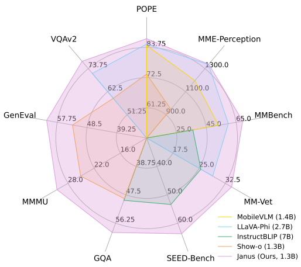

(a) Benchmark Performance.

(a) 基准表现.

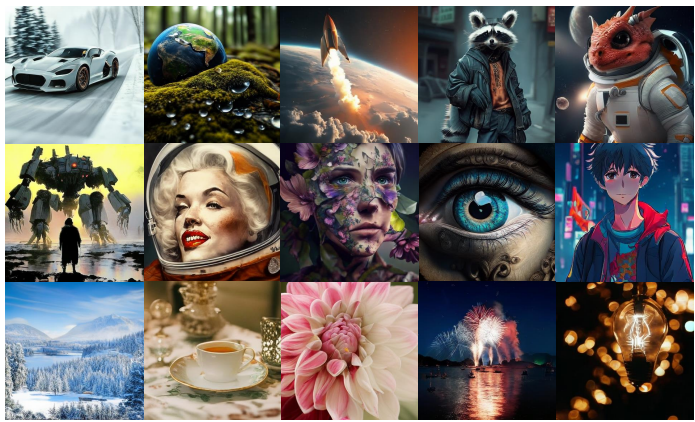

(b) Visual Generation Results.

(b) 视觉生成样例.

Figure 1 | Multimodal understanding and vision generation results from our Janus. Janus outperforms the previous state-of-the-art unified multimodal models as well as some task-specific multimodal understanding models, while also demonstrating strong visual generation capabilities. The image resolution is 384 × 384. Best viewed on screen.

图 1｜Janus 的多模态理解与视觉生成结果. Janus 超过此前领先的统一多模态模型, 也超过部分专用理解模型, 同时具备较强视觉生成能力. 图像分辨率 384 × 384. 建议在屏幕上查看.

derstanding and generation tasks, which improves instruction-following for visual generation, unlocks potential emergent abilities, and reduces model redundancy. Such methods typically use a single vision encoder to process inputs for both two tasks. However, the representations required by multimodal understanding and generation tasks differ significantly. In multimodal understanding tasks, the purpose of the vision encoder is to extract high-level semantic information (e. g., object categories or visual attributes within an image). The output of understanding task not only involves extracting information from images but also involves complex semantic reasoning. Therefore, the granularity of the vision encoder’s representation tends to mainly focus on high-dimensional semantic representation. By contrast, in visual generation tasks, the main focus is on generating local details and maintaining global consistency in the image. The representation in this context necessitates a low-dimensional encoding that is capable of finegrained spatial structure and textural detail expression. Unifying the representations of these two tasks within the same space will lead to conflicts and trade-offs. Consequently, existing unified models for multimodal understanding and generation often compromise on multi-modal understanding performance, falling markedly short of the state-of-the-arts multimodal understanding models. We explore this issue further in the ablation study.

另一类工作 [77, 85, 86, 94] 用单个 Transformer 同时扛理解与生成: 指令跟随更好, 可能出现涌现能力, 也少一套冗余模块. 这类方法通常仍用**同一个**视觉编码器喂两类任务. 但所需表征差得很远. 理解时, 编码器要抽高层语义(物体类别, 视觉属性等), 输出还要支撑复杂语义推理, 表征粒度偏高维语义. 生成时, 重点是局部细节与全局一致性, 更需要能表达细粒度空间结构与纹理的低维编码. 把两套需求塞进同一表征空间, 就会冲突, 折中. 于是现有统一模型常在理解侧让步, 明显落后于专用理解模型. 消融实验里会再展开这一点.

To solve this problem, we propose **Janus**1, a unified multimodal framework that decouples visual encoding for multimodal understanding and generation. Specifically, we introduce two independent visual encoding pathways: one for multimodal understanding and one for multimodal generation, unified by the same transformer architecture. The proposed method offers two main benefits: (1) Janus alleviates the conflict stemming from the different granular needs of multimodal understanding and generation and eliminates the need to make trade-offs between two tasks when selecting visual encoders. (2) Janus is flexible and extensible. After decoupling, both the understanding and generation tasks can adopt state-of-the-art encoding

<small>1In Roman mythology, Janus is the god of duality and transitions, symbolizing the coexistence of contradictory forces by having two faces, each looking in opposite directions. Similarly, our model captures the inherent tension between vision tasks: understanding demands abstract, high-level semantic representations, while generation requires concrete, detailed information. By decoupling these processes into specialized encoders, our system mirrors Janus’s dual nature, resolving this tension within a unified architecture. </small>

为解决上述问题, 我们提出 **Janus**1: 统一多模态框架, 把理解与生成的视觉编码解耦. 具体做法是两条独立视觉编码通路-- 理解一条, 生成一条-- 再由同一 Transformer 架构统一处理. 好处主要有两点: (1) 缓和两类任务对粒度需求不同带来的冲突, 选编码器时不必再在理解与生成之间硬折中; (2) 更灵活, 更好扩展. 解耦之后, 理解与生成可以各自采用本领域更强的编码技术.

<small>1罗马神话里 Janus(雅努斯)是双面神, 象征对立力量并存. 模型名取此意: 理解要抽象高层语义, 生成要具体细节; 用专用编码器拆开两条路, 再在统一架构里化解张力. </small>

<!-- page 3 of 24 -->

techniques specific to their domain. Moreover, it is possible for Janus to accommodate additional input types in the future, such as point clouds, EEG signals, or audio data, where independent encoders can extract features and then use a unified transformer to process them.

并且将来还可以接更多输入类型, 如点云, 脑电(EEG), 音频等: 各自独立编码器抽特征, 再交给统一 Transformer.

To the best of our knowledge, we are the first to highlight the importance of decoupling visual encoding within the unified multimodal understanding and generation framework. Our experimental results show that Janus surpasses existing unified models with comparable parameter sizes on both multimodal understanding and generation benchmarks, achieving state-of-the-art results. Notably, Janus even outperforms some task-specific models which have significantly more parameters (Figure 1). Specifically, on multimodal understanding benchmarks MMBench [54], SEED-Bench [42], and POPE [48], Janus (1.3B) achieved scores of 69.4, 63.7, and 87.0, respectively, outperforming LLaVA-v1.5 (7B) [50] and Qwen-VL-Chat (7B) [3] . On visual generation benchmarks MSCOCO-30K [11] and GenEval [30], Janus achieved an FID score of 8.53 and an accuracy of 61%, surpassing text-to-image generative models such as DALL-E 2 [66] and SDXL [62]. We believe that the strong performance, coupled with the high flexibility and extensibility of Janus, presents it as a strong candidate for next-generation unified multimodal models.

据我们所知, 这是首次在「统一理解 + 生成」框架里强调**解耦视觉编码**的重要性. 实验上, 同等参数量级下 Janus 在理解与生成基准都超过既有统一模型, 达到当时领先水平; 甚至超过部分参数量大得多的专用模型(图 1). 具体地, 理解基准 MMBench [54], SEED-Bench [42], POPE [48] 上, Janus(1.3B)分别得到 69.4, 63.7, 87.0, 超过 LLaVA-v1.5(7B)[50] 与 Qwen-VL-Chat(7B)[3]. 生成基准 MSCOCO-30K [11], GenEval [30] 上, FID 为 8.53, 准确率 61%, 超过 DALL-E 2 [66], SDXL [62] 等文生图模型. 性能加上灵活可扩展, 使 Janus 成为下一代统一多模态模型的有力候选.

FID(Fréchet Inception Distance)越低通常表示生成分布越接近真实图像分布; GenEval 则按物体组合, 计数, 颜色, 位置等细项看「指令跟得紧不紧」.

## 2. Related Work

### 2.1. Visual Generation 视觉生成

Visual generation is a rapidly evolving field that combines concepts from natural language processing with advancements in transformer architectures. Autoregressive models, influenced by the success in language processing, leverage transformers to predict sequences of discrete visual tokens (codebook IDs) [24, 65, 75]. These models tokenize visual data and employ a prediction approach similar to GPT-style [64] techniques. Additionally, masked prediction models [7, 8] draw upon BERT-style [19] masking methods, predicting masked sections of visual inputs to improve synthesis efficiency, and have been adapted for video generation [89]. Concurrently, continuous diffusion models have showcased impressive capabilities in visual generation [33, 67, 71], complementing discrete methods by approaching generation through a probabilistic lens.

视觉生成发展很快, 把 NLP 思路与 Transformer 进展揉在一起. 自回归模型受语言建模启发, 用 Transformer 预测离散视觉 token(码本 ID)序列 [24, 65, 75]: 先把图像 token 化, 再按 GPT 式 [64] next-token prediction. 另有掩码预测一类 [7, 8], 借鉴 BERT 式 [19] 掩码, 预测被遮住的视觉片段以提高合成效率, 并已扩展到视频 [89]. 与此同时, 连续扩散模型在视觉生成上表现突出 [33, 67, 71], 从概率路径补足离散方法.

「离散视觉 token / 码本 ID」: VQ 一类编码器把图像块映射到有限码本里的编号, 生成就变成「按顺序预测这些编号」, 和语言模型预测词 ID 同构.

### 2.2. Multimodal Understanding 多模态理解

Multimodal large language models (MLLMs) integrate both text and images [6, 80, 81]. By leveraging pretrained LLMs, MLLMs [1, 2, 12, 51, 55, 82, 95] demonstrate a robust ability to understand and process multimodal information. Recent advancements have explored extending MLLMs with pretrained diffusion models to facilitate image generation [27, 29, 36, 75, 76]. These methods fall under the category of tool utilization, where diffusion models are used to generate images based on the conditions output by the MLLM, while the MLLM itself does not have the ability to directly perform visual generation. Moreover, the generative ability of the entire system is often constrained by the external diffusion model, making its performance inferior to directly using the diffusion model on its own [27, 75].

多模态大语言模型(MLLM)同时吃文本与图像 [6, 80, 81]. 借助预训练 LLM, 一批 MLLM [1, 2, 12, 51, 55, 82, 95] 已能较强地处理多模态信息. 近期也有人给 MLLM 外挂预训练扩散模型来出图 [27, 29, 36, 75, 76]. 这属于「工具调用」: 扩散模型按 MLLM 给出的条件生成图像, MLLM 本身不会直接做视觉生成; 整系统的生成上限常被外挂扩散卡住, 甚至不如单独用同一扩散模型 [27, 75].

### 2.3. Unified Multimodal Understanding and Generation 统一的多模态理解与生成

Unified multimodal understanding and generation models are considered powerful for facilitating seamless reasoning and generation across different modalities [77, 94]. Traditional approaches in these models typically use a single visual representation for both understanding

<!-- page 4 of 24 -->

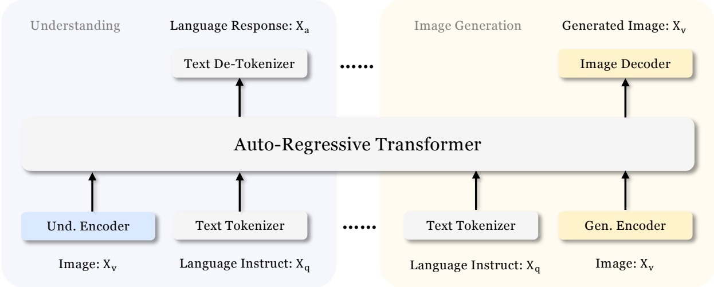

Figure 2 | Architecture of our Janus. Different from previous approaches [77, 85] that typically assume visual understanding and generation require the same visual encoder, our Janus decouples visual encoding for visual understanding and visual generation. “Und. Encoder” and “Gen. Encoder” are abbreviations for “Understanding Encoder” and “Generation Encoder”, respectively. Best viewed in color.

图 2｜Janus 架构. 与先前工作 [77, 85] 默认理解与生成共用同一视觉编码器不同, Janus 把理解编码与生成编码拆开.「Und. Encoder」「Gen. Encoder」分别是理解编码器, 生成编码器. 建议彩色查看.

and generation tasks, regardless of whether they are based on autoregressive (AR) models [77, 85] or diffusion models [86, 94]. For example, Chameleon [77] adopts a VQ Tokenizer to encode images for both multimodal understanding and generation. However, this practice may lead to suboptimal outcomes, as the vision encoder might face a trade-off between the demands of understanding and generation. In contrast, our Janus can explicitly decouple the visual representations for understanding and generation, recognizing that different tasks may require varying levels of information.

无论自回归(AR)[77, 85] 还是扩散 [86, 94], 传统统一模型多半仍共用一套视觉表征. 例如 Chameleon [77] 用同一个 VQ Tokenizer 同时服务理解与生成; 编码器不得不在两类需求间折中, 效果容易次优. Janus 则显式拆开理解与生成的视觉表征, 承认不同任务可能需要不同信息层次.

## 3. Janus: A Simple, Unified and Flexible Multimodal Framework Janus: 简单, 统一, 灵活的多模态框架

### 3.1. Architecture 架构

The architecture of Janus is shown in Figure 2. For pure text understanding, multimodal understanding, and visual generation, we apply independent encoding methods to convert the raw inputs into features, which are then processed by an unified autoregressive transformer. Specifically, for text understanding, we use the built-in tokenizer of the LLM to convert the text into discrete IDs and obtain the feature representations corresponding to each ID. For multimodal understanding, we use the SigLIP [92] encoder to extract high-dimensional semantic features from images. These features are flattened from a 2-D grid into a 1-D sequence, and an understanding adaptor is used to map these image features into the input space of the LLM. For visual generation tasks, we use the VQ tokenizer from [73] to convert images into discrete IDs. After the ID sequence is flattened into 1-D, we use a generation adaptor to map the codebook embeddings corresponding to each ID into the input space of the LLM. We then concatenate these feature sequences to form a multimodal feature sequence, which is subsequently fed into the LLM for processing. The built-in prediction head of the LLM is utilized for text predictions in both the pure text understanding and multimodal understanding tasks, while a randomly initialized prediction head is used for image predictions in the visual generation task. The entire model adheres to an autoregressive framework without the need for specially designed

<!-- page 5 of 24 -->

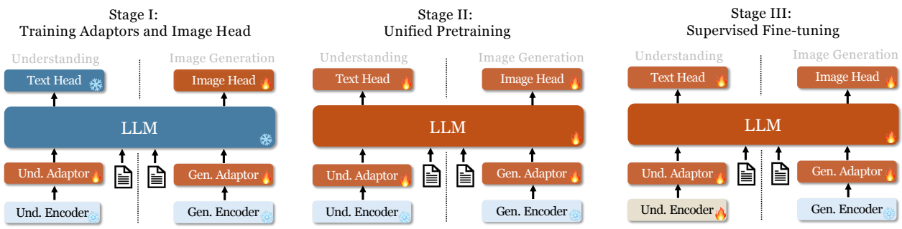

Figure 3 | Our Janus adopts a three-stage training procedure. We use flame symbols/snowflake symbols in the diagram to indicate the module updates/does not update its parameters.

图 3｜Janus 采用三阶段训练. 图中火焰表示该模块更新参数, 雪花表示冻结.

attention masks.

对纯文本理解, 多模态理解, 视觉生成, 各自用独立编码把原始输入变成特征, 再交给统一的自回归 Transformer. 文本: 用 LLM 自带 tokenizer 变成离散 ID, 取对应嵌入. 多模态理解: 用 SigLIP [92] 抽高维语义特征, 把 2-D 网格展成 1-D, 再经**理解 adaptor**映射进 LLM 输入空间. 视觉生成: 用 [73] 的 VQ tokenizer 把图像变成离散 ID, 展成 1-D 后经**生成 adaptor**把各 ID 对应的码本嵌入映射进 LLM 输入空间. 各特征序列拼接成多模态序列送入 LLM. 纯文本与多模态理解用 LLM 自带预测头做文本预测; 视觉生成另用随机初始化的图像预测头. 整模型走自回归, 不需要特制注意力掩码.

Adaptor(适配器)这里就是两层 MLP: 把视觉侧特征维度对齐到 LLM 的词嵌入维度, 类似 LLaVA 里的 projector. 理解支路输出连续特征, 生成支路先离散成码本 ID 再取嵌入-- 两条路进 LLM 之前的「接口形状」不同, 所以各有一个 adaptor.

### 3.2. Training Procedure 训练流程

The training of Janus is divided into three stages, as illustrated in Figure 3. Details are provided in the below.

Janus 训练分三阶段, 见图 3. 细节如下.

**Stage I: Training Adaptors and Image Head.** The main goal of this stage is to create a conceptual connection between visual and linguistic elements within the embedding space, enabling the LLM to understand the entities shown in images and have preliminary visual generation ability. We keep the visual encoders and the LLM frozen during this stage, allowing only the trainable parameters within the understanding adaptor, generation adaptor and image head to be updated.

**阶段 I: 训练 adaptor 与图像头.** 目标是在嵌入空间里建立视觉与语言的概念连接, 让 LLM 能认图中实体, 并具备初步视觉生成能力. 此阶段冻结视觉编码器与 LLM, 只更新理解 adaptor, 生成 adaptor 与图像头.

**Stage II: Unified Pretraining.** In this stage, we perform unified pretraining with multimodal corpus to enable Janus to learn both multimodal understanding and generation. We unfreeze the LLM and utilize all types of training data: pure text data, multimodal understanding data, and visual generation data. Inspired by Pixart [9], we begin by conducting simple visual generation training using ImageNet-1k to help the model grasp basic pixel dependencies. Subsequently, we enhance the model’s open-domain visual generation capability with general text-to-image data.

**阶段 II: 统一预训练.** 用多模态语料做统一预训练, 同时学理解与生成. 解冻 LLM, 混用纯文本, 多模态理解, 视觉生成三类数据. 受 PixArt [9] 启发: 先在 ImageNet-1k 上做简单视觉生成, 摸清基本像素依赖; 再用通用文生图数据拉高开放域生成能力.

**Stage III: Supervised Fine-tuning.** During this stage, we fine-tune the pretrained model with instruction tuning data to enhance its instruction-following and dialogue capabilities. We fine-tune all parameters except the generation encoder. We focus on supervising the answers while masking system and user prompts. To ensure Janus’s proficiency in both multimodal understanding and generation, we don’t fine-tune separate models for a certain task. Instead, we use a blend of pure text dialogue data, multimodal understanding data and visual generation data, ensuring versatility across various scenarios.

**阶段 III: 监督微调.** 用指令数据微调, 加强指令跟随与对话. 除生成编码器外全部参数可训. 损失只盯答案, 系统提示与用户提示做 mask. 不为单一任务单独微调, 而是混纯文本对话, 多模态理解与视觉生成数据, 保证两边都能用.

### 3.3. Training Objective 训练目标

Janus is an autoregressive model, and we simply adopt the cross-entropy loss during training:

Janus 是自回归模型, 训练时直接用交叉熵:

$$
\mathcal {L} = - \sum_ {i = 1} \log P _ {\theta} (x _ {i} | x _ {<   i})\tag{1}
$$

Here, $P ( \cdot \mid \cdot )$ indicates the conditional probability modeled by the weights 𝜃 of Janus. For pure text understanding and multimodal understanding tasks, we compute the loss on the text

<!-- page 6 of 24 -->

sequence. For visual generation tasks, we compute the loss only on the image sequence. To keep the design simple, we have not assigned different loss weights to different tasks.

$P(\cdot\mid\cdot)$ 是 Janus 参数 $\theta$ 建模的条件概率. 纯文本与多模态理解只在文本序列上算损失; 视觉生成只在图像序列上算损失. 为保持简单, 未给不同任务设不同损失权重.

### 3.4. Inference 推理

During inference, our model adopts a next-token prediction approach. For pure text understanding and multimodal understanding, we follow the standard practice of sampling tokens sequentially from the predicted distribution. For image generation, we utilize classifier-free guidance (CFG) 2, similar to prior works [8, 26, 73]. Specifically, for each token, the logit $l _ { g }$ is calculated as: $l _ { g }   =   l _ { u } + s ( l _ { c } - l _ { u } )$ , where $l _ { c }$ is the conditional logit, $l _ { u }$ is the unconditional logit, and 𝑠 is the scale for the classifier-free guidance. The default number of 𝑠 is 5 for the following evaluation.

推理仍是下一 token 预测. 纯文本与多模态理解按常规从预测分布依次采样. 图像生成使用 classifier-free guidance(CFG)2, 做法与 [8, 26, 73] 类似. 每个 token 的 logit 为 $l_g = l_u + s(l_c - l_u)$, 其中 $l_c$ 为条件 logit, $l_u$ 为无条件 logit, $s$ 为 CFG 尺度; 下文评测默认 $s=5$.

<small>2During training, we replace the text condition in the text-to-image data with a pad token at a probability of 10%, enabling the model to have unconditional visual generation capability. </small>

<small>2训练时以 10% 概率把文生图数据里的文本条件换成 pad token, 从而学会无条件视觉生成. </small>

CFG 的直观含义: 同一位置既算「有提示」的分布, 也算「无提示」的分布, 再往「有提示相对无提示多出来的方向」推一把; $s$ 越大越贴提示, 但过大可能伤多样性或稳定性.

### 3.5. Possible Extensions 可能的扩展

It is important to note that our design, which features separate encoders for understanding and generation, is straightforward and easy to extend.

理解与生成分编码器的设计直白, 也好扩展.

**Multimodal Understanding.** (1) For the multimodal understanding component, a stronger vision encoder can be chosen without worrying about whether the encoder is capable of handling vision generation tasks, such as EVA-CLIP [74], InternViT [13], etc. (2) To handle high-resolution images, dynamic high-resolution techniques [50] can be used. This allows the model to scale to any resolution, without performing positional embedding interpolation for ViTs. Tokens can be further compressed to save computational cost, for instance, using pixel shuffle operation [12].

**多模态理解.** (1) 理解支路可换更强视觉编码器(EVA-CLIP [74], InternViT [13] 等), 不必再担心它能不能兼做生成. (2) 高分辨率可用动态高分辨率技术 [50], 任意分辨率扩展且无需对 ViT 做位置嵌入插值; 也可用 pixel shuffle [12] 等压缩 token 省算力.

**Visual Generation.** (1) For visual generation, finer-grained encoders can be chosen in order to preserve more image details after encoding, such as MoVQGan [93]. (2) Loss functions specifically designed for visual generation can be employed, such as diffusion loss [46]. (3) A combination of AR (causal attention) and parallel (bidirectional attention) methods can be used in the visual generation process to reduce accumulated errors during visual generation [79].

**视觉生成.** (1) 可换更细粒度编码器以保留更多细节, 如 MoVQGan [93]. (2) 可用专为视觉生成设计的损失, 如 diffusion loss [46]. (3) 可把 AR(因果注意力)与并行(双向注意力)结合, 减轻自回归累积误差 [79].

**Support for Additional Modalities.** The straightforward architecture of Janus allows for easy integration with additional encoders, accommodating various modalities such as 3D point cloud [53], tactile [88], and EEG [4]. This gives Janus the potential to become a more powerful multimodal generalist model.

**更多模态.** 架构简单, 易接额外编码器: 3D 点云 [53], 触觉 [88], 脑电 [4] 等, 有望做成更强的多模态通才.

## 4. Experiments

In this section, we present a series of comprehensive experiments designed to assess the performance of our method across a range of visual understanding and generation tasks. We begin by detailing our experimental setup, which includes the model architecture, training datasets, and evaluation benchmarks. Next, we report the performance of Janus, followed by a comparison with other state-of-the-art models on various benchmarks for multimodal understanding and generation. We also conduct extensive ablation studies to verify the effectiveness of the proposed method. Lastly, we provide some qualitative results.

本节用一系列实验评估方法在视觉理解与生成任务上的表现. 先交代实验设置(架构, 训练数据, 评测基准), 再报告 Janus 成绩并与领先模型对比, 做消融验证设计有效性, 最终给定性结果.

<small>2During training, we replace the text condition in the text-to-image data with a pad token at a probability of 10%, enabling the model to have unconditional visual generation capability. </small>

<!-- page 7 of 24 -->

Table 1 | Detailed hyperparameters of our Janus. Data ratio refers to the ratio of multimodal understanding data, pure text data, and visual generation data.

表 1｜Janus 超参细节. Data ratio 为多模态理解 : 纯文本 : 视觉生成.

<table><tr><td>Hyperparameters</td><td>Stage 1</td><td>Stage 2</td><td>Stage 3</td></tr><tr><td>Learning rate</td><td> $1.0 \times 10^{-3}$ </td><td> $1 \times 10^{-4}$ </td><td> $2.0 \times 10^{-5}$ </td></tr><tr><td>LR scheduler</td><td>Cosine</td><td>Constant</td><td>Constant</td></tr><tr><td>Weight decay</td><td>0.0</td><td>0.0</td><td>0.1</td></tr><tr><td>Gradient clip</td><td>1.0</td><td>1.0</td><td>1.0</td></tr><tr><td>Optimizer</td><td colspan="3">AdamW ( $\beta_1 = 0.9, \beta_2 = 0.95$ )</td></tr><tr><td>Warm-up steps</td><td>300</td><td>5, 000</td><td>0</td></tr><tr><td>Training steps</td><td>10, 000</td><td>180, 000</td><td>24, 000</td></tr><tr><td>Batch size</td><td>256</td><td>512</td><td>256</td></tr><tr><td>Data Ratio</td><td>1 : 0 : 1</td><td>2 : 3 : 5</td><td>7 : 3 : 10</td></tr></table>

### 4.1. Implementation Details 实现细节

In our experiments, we utilize DeepSeek-LLM (1.3B) [5] with a maximum supported sequence length of 4096 as the base language model. For the vision encoder used in understanding tasks, we select SigLIP-Large-Patch16-384 [92]. The generation encoder has a codebook of size 16, 384 and downsamples images by a factor of 16. Both the understanding adaptor and the generation adaptor are two-layer MLPs. The detailed hyperparameters for each stage are provided in Table 1. All images are resized to 384 × 384 pixels. For multimodal understanding data, we resize the long side of the image and pad the short side with the background color (RGB: 127, 127, 127) to reach 384. For visual generation data, the short side is resized to 384, and the long side is cropped to 384. We use sequence packing during training to improve training efficiency. We mix all data types according to the specified ratios in a single training step. Our Janus is trained and evaluated using HAI-LLM [32], which is a lightweight and efficient distributed training framework built on top of PyTorch. The whole training process took 7 days on a cluster of 16 nodes, each equipped with 8 Nvidia A100 (40GB) GPUs.

实验以 DeepSeek-LLM(1.3B)[5] 为语言底座, 最大序列长度 4096. 理解侧视觉编码器为 SigLIP-Large-Patch16-384 [92]. 生成编码器码本大小 16, 384, 图像下采样 16 倍. 理解 / 生成 adaptor 均为两层 MLP. 各阶段超参见表 1. 图像统一到 384 × 384. 理解数据: 长边缩放到 384, 短边用背景色 RGB (127, 127, 127) 填满; 生成数据: 短边缩到 384, 长边裁到 384. 训练用 sequence packing 提高效率; 同一步内按给定比例混各类数据. 训练与评测基于 HAI-LLM [32](PyTorch 上的轻量分布式框架). 全程约 7 天, 16 节点 × 每节点 8 张 Nvidia A100(40GB).

### 4.2. Data Setup 数据设置

In this section, we provide details of the pretraining and supervised finetuning datasets.

本节给出预训练与监督微调数据细节.

**Stage I.** We use a dataset that includes 1.25 million image-text paired captions from ShareGPT4V [10] for multimodal understanding and approximately 1.2 million samples from ImageNet-1k [18] for visual generation. The ShareGPT4V data is formatted as “&lt; image&gt; &lt; text&gt; ”. The ImageNet data is organized into a text-to-image data format using the category names: “&lt; category_name&gt; &lt; image&gt; ”. Here, the “<>” symbols represent placeholders.

**阶段 I.** 理解侧用 ShareGPT4V [10] 约 125 万图文 caption; 生成侧用 ImageNet-1k [18] 约 120 万样本. ShareGPT4V 格式为「&lt; image&gt; &lt; text&gt;」; ImageNet 按类名做成文生图格式「&lt; category_name&gt; &lt; image&gt;」.「<>」表示占位符.

**Stage II.** We organize the data into the following categories. (1) Text-only data. We use pre-training text copus from DeepSeek-LLM [5]. (2) Interleaved image-text data. We use Wiki-How [39] and WIT [72] dataset. (3) Image caption data. We use images from [17, 18, 23, 38, 40, 45, 47, 49, 70]. Among them, we employ open-source multimodal model to re-caption images in [17, 40]. The image caption data is formatted into question-answer pairs, for example, “&lt; image&gt; Describe the image in detail. &lt; caption&gt; ”. (4) Table and chart data. We use corresponding table and chart data from DeepSeek-VL [55]. The data is formatted as “&lt; question&gt; &lt; answer&gt; ”. (5) Visual generation data. We utilize image-caption pairs from various datasets including [17, 38, 40, 57, 58, 60, 63, 70], along with 2M in-house data. For images from [38, 70], we filter based on aesthetic scores and image sizes, resulting in 20% remaining. During training, we randomly use only the first sentence of a caption with a 25% probability to

<!-- page 8 of 24 -->

Table 2 | Comparison with state-of-the-arts on multimodal understanding benchmarks. “Und. ” and “Gen. ” denote “understanding” and “generation”, respectively. Models using external pretrained diffusion model are marked with †.

表 2｜多模态理解基准对比.「Und.」「Gen.」分别表示理解, 生成. 带 † 表示使用外部预训练扩散模型.

| Type Model # | LLM Param | s POPE↑ | MME-P↑ | MMB↑ | SEED↑ V | QAv2(𝑡𝑒𝑠𝑡) | ↑ GQA↑ | MMMU↑ | MM-Vet↑ |
| --- | --- | --- | --- | --- | --- | --- | --- | --- | --- |
| Und. Only LLaVA-v1.5-Phi-1.5 [86] | 1.3B | 84.1 | 1128.0 | - | - | 75.3 | 56.5 | 30.7 | - |
| MobileVLM [14] | 1.4B | 84.5 | 1196.2 | 53.2 | - | - | 56.1 | - | - |
| MobileVLM-V2 [15] | 1.4B | 84.3 | 1302.8 | 57.7 | - | - | 59.3 | - | - |
| MobileVLM [14] | 2.7B | 84.9 | 1288.9 | 59.6 | - | - | 59.0 | - | - |
| MobileVLM-V2 [15] | 2.7B | 84.7 | 1440.5 | 63.2 | - | - | 61.1 | - | - |
| LLaVA-Phi [96] | 2.7B | 85.0 | 1335.1 | 59.8 | - | 71.4 | - | - | 28.9 |
| LLaVA [51] | 7B | 76.3 | 809.6 | 38.7 | 33.5 | - | - | - | 25.5 |
| LLaVA-v1.5 [50] | 7B | 85.9 | 1510.7 | 64.3 | 58.6 | 78.5 | 62.0 | 35.4 | 31.1 |
| InstructBLIP [16] | 7B | - | - | 36.0 | 53.4 | - | 49.2 | - | 26.2 |
| Qwen-VL-Chat [3] | 7B | - | 1487.5 | 60.6 | 58.2 | 78.2 | 57.5 | - | - |
| IDEFICS-9B [41] | 8B | - | - | 48.2 | - | 50.9 | 38.4 | - | - |
| Emu3-Chat [83] | 8B | 85.2 | - | 58.5 | 68.2 | 75.1 | 60.3 | 31.6 | - |
| InstructBLIP [16] | 13B | 78.9 | 1212.8 | - | - | - | 49.5 | - | 25.6 |
| Und. and Gen. DreamLLM† [21] | 7B | - | - | - | - | 72.9 | - | - | 36.6 |
| LaVIT† [36] | 7B | - | - | - | - | 66.0 | 46.8 | - | - |
| Emu† [75] | 13B | - | - | - | - | 52.0 | - | - | - |
| NExT-GPT† [84] | 13B | - | - | - | - | 66.7 | - | - | - |
| Show-o [86] | 1.3B | 73.8 | 948.4 | - | - | 59.3 | 48.7 | 25.1 | - |
| Gemini-Nano-1 [78] | 1.8B | - | - | - | - | 62.7 | - | 26.3 | - |
| LWM [52] | 7B | 75.2 | - | - | - | 55.8 | 44.8 | - | 9.6 |
| VILA-U [85] | 7B | 85.8 | 1401.8 | - | 59.0 | 79.4 | 60.8 | - | 33.5 |
| Chameleon [77] | 7B | - | - | - | - | - | - | 22.4 | 8.3 |
| Janus (Ours) | 1.3B | 87.0 | 1338.0 | 69.4 | 63.7 | 77.3 | 59.1 | 30.5 | 34.3 |

encourage the model to develop strong generation capabilities for short descriptions. ImageNet samples [18] are presented only during the first 120K training steps, while images from other datasets appear in the later 60K steps. This approach helps the model first learn basic pixel dependencies before progressing to more complex scene understanding, as suggested by [9]. The visual generation data is provided in the format: “&lt; caption&gt; &lt; image&gt; ”.

**阶段 II.** 数据分五类. (1) 纯文本: DeepSeek-LLM [5] 预训练语料. (2) 图文交错: WikiHow [39], WIT [72]. (3) 图像 caption: 来自 [17, 18, 23, 38, 40, 45, 47, 49, 70]; 其中 [17, 40] 用开源多模态模型重写 caption. 格式做成问答, 例如「&lt; image&gt; Describe the image in detail. &lt; caption&gt;」. (4) 表格与图表: 来自 DeepSeek-VL [55], 格式「&lt; question&gt; &lt; answer&gt;」. (5) 视觉生成: 图文对来自 [17, 38, 40, 57, 58, 60, 63, 70] 及 200 万内部数据; 对 [38, 70] 按美学分与尺寸过滤, 约剩 20%. 训练时以 25% 概率只用 caption 首句, 促短描述生成能力. ImageNet [18] 只出现在前 120K step, 其余数据在后 60K step-- 先学基本像素依赖, 再进复杂场景, 思路同 [9]. 生成数据格式:「&lt; caption&gt; &lt; image&gt;」.

**Stage III.** For text understanding, we use data from [43]. For multimodal understanding, we use instruct tuning data from [31, 34, 35, 43, 56, 69]. For visual generation, we use image-text pairs from [17, 60, 70] (a subset of that in stage II) and 4M in-house data. We utilize the following format for instruction tuning: “User: &lt; Input Message&gt; \n Assistant: &lt; Response&gt; ”. For multi-turn dialogues, we repeat this format to structure the data.

**阶段 III.** 文本理解用 [43]; 多模态理解用 [31, 34, 35, 43, 56, 69] 的指令数据; 视觉生成用 [17, 60, 70](阶段 II 子集)及 400 万内部数据. 指令格式:「User: &lt; Input Message&gt; \n Assistant: &lt; Response&gt;」; 多轮则重复该模板.

### 4.3. Evaluation Setup 评测设置

**Multimodal Understanding.** To assess multimodal understanding capabilities, we evaluate our model on widely recognized image-based vision-language benchmarks, which include VQAv2 [31], GQA [35], POPE [48], MME [25], SEED [42], MMB [54], MM-Vet [90], and MMMU [91].

**多模态理解.** 在常用图像视觉–语言基准上评测: VQAv2 [31], GQA [35], POPE [48], MME [25], SEED [42], MMB [54], MM-Vet [90], MMMU [91].

**Visual Generation.** For evaluating visual generation capabilities, we use the MSCOCO-30K [11], MJHQ-30K [44], and GenEval [30] benchmarks. MSCOCO-30K and MJHQ-30K employ the Fréchet Inception Distance (FID) metric on generated images compared to 30K high-quality images, which indicates the overall efficacy of image generation. GenEval is a challenging benchmark for image-to-text generation, designed to reflect the comprehensive generative

<!-- page 9 of 24 -->

Table 3 | Evaluation of text-to-image generation ability on GenEval benchmark. “Und. ” and “Gen. ” denote “understanding” and “generation”, respectively. Models using external pretrained diffusion model are marked with †.

表 3｜GenEval 上文生图能力.「Und.」「Gen.」分别表示理解, 生成. 带 † 表示外挂预训练扩散模型.

| Type Method | # Params | Single Obj. | Two Obj. | Counting | Colors | Position | Color Attri. | Overall↑ |
| --- | --- | --- | --- | --- | --- | --- | --- | --- |
| LlamaGen [73] | 0.8B | 0.71 | 0.34 | 0.21 | 0.58 | 0.07 | 0.04 | 0.32 |
| LDM [67] | 1.4B | 0.92 | 0.29 | 0.23 | 0.70 | 0.02 | 0.05 | 0.37 |
| SDv1.5 [67] | 0.9B | 0.97 | 0.38 | 0.35 | 0.76 | 0.04 | 0.06 | 0.43 |
| PixArt-𝛼 [9] | 0.6B | 0.98 | 0.50 | 0.44 | 0.80 | 0.08 | 0.07 | 0.48 |
| Gen. Only |  |  |  |  |  |  |  |  |
| SDv2.1 [67] | 0.9B | 0.98 | 0.51 | 0.44 | 0.85 | 0.07 | 0.17 | 0.50 |
| DALL-E 2 [66] | 6.5B | 0.94 | 0.66 | 0.49 | 0.77 | 0.10 | 0.19 | 0.52 |
| Emu3-Gen [83] | 8B | 0.98 | 0.71 | 0.34 | 0.81 | 0.17 | 0.21 | 0.54 |
| SDXL [62] | 2.6B | 0.98 | 0.74 | 0.39 | 0.85 | 0.15 | 0.23 | 0.55 |
| SEED-X† [29] | 17B | 0.97 | 0.58 | 0.26 | 0.80 | 0.19 | 0.14 | 0.49 |
| Show-o [86] | 1.3B | 0.95 | 0.52 | 0.49 | 0.82 | 0.11 | 0.28 | 0.53 |
| Und. and Gen. LWM [52] | 7B | 0.93 | 0.41 | 0.46 | 0.79 | 0.09 | 0.15 | 0.47 |
| Chameleon [77] | 34B | - | - | - | - | - | - | 0.39 |
| Janus (Ours) | 1.3B | 0.97 | 0.68 | 0.30 | 0.84 | 0.46 | 0.42 | 0.61 |

abilities of visual generation models by offering a detailed instance-level analysis of their compositional capabilities.

**视觉生成.** 用 MSCOCO-30K [11], MJHQ-30K [44], GenEval [30]. 前两者用 FID, 把生成图与 3 万张高质量图比, 反映整体生成质量. GenEval 侧重组合能力, 在实例级细项上拆开看文生图是否跟得上提示(源文此处写 image-to-text, 按基准设定应为 text-to-image 评测语境).

### 4.4. Comparison with State-of-the-arts 与领先方法对比

**Multimodal Understanding Performance.** We compare the proposed method with state-of-the-art unified models and understanding-only models in Table 2. Janus achieves the overall best results among models of similar scale. Specifically, compared to the previous best unified model, Show-o [86], we achieve performance improvements of 41% (949 → 1338) and 30% (48.7 → 59.1) on the MME and GQA datasets, respectively. This can be attributed to Janus decoupling the visual encoding for multimodal understanding and generation, mitigating the conflict between these two tasks. When compared to models with significantly larger sizes, Janus remains highly competitive. For instance, Janus outperforms LLaVA-v1.5 (7B) on several datasets, including POPE, MMbench, SEED Bench, and MM-Vet.

**多模态理解表现.** 表 2 对比领先统一模型与纯理解模型. 同规模里 Janus 整体最好. 相对此前最佳统一模型 Show-o [86], MME 提升约 41%(949 → 1338), GQA 提升约 30%(48.7 → 59.1), 作者归因于解耦视觉编码, 缓和任务冲突. 相对更大参数量模型仍有竞争力: 例如在 POPE, MMBench, SEED Bench, MM-Vet 上超过 LLaVA-v1.5(7B).

**Visual Generation Performance.** We report visual generation performance on GenEval, COCO-30K and MJHQ-30K benchmarks. As shown in Table 3, our Janus obtains 61% overall accuracy on GenEval, which outperforms the previous best unified model Show-o (53%) and some popular generation-only methods, e. g., SDXL (55%) and DALL-E 2 (52%). This demonstrates that our approach has better instruction-following capabilities. As shown in Table 4, Janus achieves FIDs of 8.53 and 10.10 on the COCO-30K and MJHQ-30K benchmarks, respectively, surpassing unified models Show-o and LWM, and demonstrating competitive performance compared to some well-known generation-only methods. This demonstrates that the images generated by Janus have good quality and highlights its potential in visual generation.

**视觉生成表现.** GenEval, COCO-30K, MJHQ-30K 上报告结果. 表 3: Janus 总体准确率 61%, 超过先前最佳统一模型 Show-o(53%)以及 SDXL(55%), DALL-E 2(52%)等流行纯生成方法, 说明指令跟随更好. 表 4: COCO-30K / MJHQ-30K 的 FID 分别为 8.53 / 10.10, 超过统一模型 Show-o, LWM, 相对知名纯生成方法也有竞争力, 说明图像质量不错, 视觉生成潜力可观.

### 4.5. Ablation Studies 消融实验

We carefully design ablation studies to verify the effectiveness of Janus’s design concept. First, we design experiments to validate the importance and benefits of decoupling visual encoding. Second, we investigate the impact of unified training on individual tasks like multimodal understanding or visual generation. Results are listed in Table 5.

精心设计消融, 验证 Janus 设计: 一是解耦视觉编码是否必要, 有何收益; 二是统一训练对单任务(纯理解或纯生成)影响如何. 结果见表 5.

<!-- page 10 of 24 -->

Table 4 | Evaluation of text-to-image generation ability on MSCOCO-30K and MJHQ-30K benchmark. “Und. ” and “Gen. ” denote “understanding” and “generation”, respectively. Models using external pretrained diffusion model are marked with †.

表 4｜MSCOCO-30K / MJHQ-30K 文生图评测.「Und.」「Gen.」分别表示理解, 生成. 带 † 表示外挂预训练扩散模型.

| Type Model | # Params | COCO-30K↓ | MJHQ-30K↓ |
| --- | --- | --- | --- |
| DALL. E [65] | 12B | 27.50 | - |
| GLIDE [59] | 5B | 12.24 | - |
| LDM [67] | 1.4B | 12.64 | - |
| DALL. E 2 [66] | 6.5B | 10.39 | - |
| Gen. Only SDv1.5 [67] | 0.9B | 9.62 | - |
| GigaGAN [37] | 0.9B | 9.09 | - |
| PixArt-𝛼 [9] | 0.6B | 7.32 | - |
| Imagen [68] | 34B | 7.27 | - |
| RAPHAEL [87] | 3B | 6.61 | - |
| Emu† [75] | 13B | 11.66 | - |
| NExT-GPT† [84] | 13B | 11.28 | - |
| Und. and Gen. SEED-X† [29] | 17B | 14.99 | - |
| Show-o [86] | 1.3B | 9.24 | 15.18 |
| LWM [52] | 7B | 12.68 | 17.77 |
| VILA-U (256) [85] | 7B | - | 12.81 |
| VILA-U (384) [85] | 7B | - | 7.69 |
| Janus (Ours) | 1.3B | 8.53 | 10.10 |

Table 5 | Ablation studies. We verify the effectiveness of decoupling visual encoding and compare unified training with task-specific training. “Und. ”, “Gen. ” and “SE. Tokenizer” denote “understanding”, “generation” and “semantic tokenizer”, respectively.

表 5｜消融. 验证解耦视觉编码, 并比较统一训练与任务专用训练.「Und.」「Gen.」「SE. Tokenizer」分别表示理解, 生成, 语义 tokenizer.

| Exp ID | Visual Encoder | Training Task | POPE↑ | MMB↑ | SEED↑ | MMMU↑ | COCO-FID↓ |
| --- | --- | --- | --- | --- | --- | --- | --- |
| A | VQ Tokenizer | Und. + Gen. | 60.1 | 35.0 | 34.9 | 24.7 | 8.72 |
| B | SE. Tokenizer | Und. + Gen. | 82.4 | 52.7 | 54.9 | 26.6 | 7.11 |
| C | SE. Tokenizer | Und. | 83.9 | 62.1 | 60.8 | 27.5 | - |
| D | SigLIP + VQ (Ours) | Und. + Gen. | 87.0 | 69.4 | 63.7 | 30.5 | 8.53 |
| E | SigLIP | Und. | 85.9 | 70.6 | 64.8 | 28.8 | - |
| F | VQ Tokenizer | Gen. | - | - | - | - | 8.92 |

**Baseline Construction.** Following previous work [77], we select a VQ tokenizer [73] to encode images for both multimodal understanding and generation tasks, serving as the baseline (Exp-A). Considering that the VQ tokenizer in Exp-A might be weak in extract semantic information, making it less effective for multimodal understanding, we also construct a stronger baseline Exp-B. We adopt SigLIP to distill an enhanced semantic tokenizer 3that can extract high-level semantic information from images while also have the ability to convert images into discrete IDs, which is similar to that in [85]. Details of the semantic tokenizer could be found in the Appendix A. 1.

**基线构造.** 按先前工作 [77], 用同一 VQ tokenizer [73] 同时编码理解与生成, 作为基线 Exp-A. 考虑到 Exp-A 的 VQ 抽语义偏弱, 理解吃亏, 再构造更强基线 Exp-B: 用 SigLIP 蒸馏增强版**语义 tokenizer**3-- 既能抽高层语义, 又能把图像打成离散 ID, 思路接近 [85]. 语义 tokenizer 细节见附录 A. 1.

<small>3The semantic tokenizer is only used in the ablation study as a stronger baseline. For simplicity, we use the ordinary VQ tokenizer [73] in the main experiment. </small>

<small>3语义 tokenizer 仅用于消融作更强基线; 主实验为简单起见仍用普通 VQ tokenizer [73]. </small>

**Impact of Decoupling Visual Encoding.** (1) From the results of Exp-A, we find the model achieves satisfactory performance on visual generation benchmark (8.72 FID on COCO). However, there is a significant gap on understanding benchmarks between Exp-A and our model (Exp-D). (2) When comparing Exp-B to Exp-A, the results show a clear improvement in multi-

<!-- page 11 of 24 -->

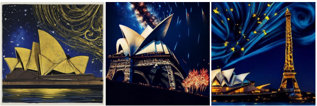

图注: 同一组文本提示下 SDXL 的图像生成结果，用于与 LlamaGen 和 Janus 对照。
SDXL

LlamaGen

Janus (Ours)

SDXL

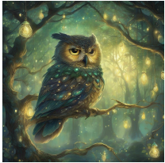

图注: 同一组文本提示下 LlamaGen 的图像生成结果，用于与 SDXL 和 Janus 对照。
LlamaGen

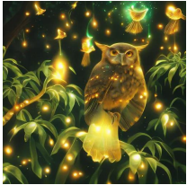

图注: 同一组文本提示下 Janus 的图像生成结果，对照 SDXL 与 LlamaGen 的构图和语义遵循。
Janus (Ours)

图注: 文生图样例；输入提示为「近景高对比照片: 悉尼歌剧院紧挨埃菲尔铁塔, 蓝色夜空翻涌能量, 黄色星辰炸开, 蓝色漩涡辐射开来」，该图为模型生成结果。
A close-up high-contrast photo of Sydney Opera House sitting next to Eiffel tower, under a blue night sky of roiling energy, exploding yellow stars, and radiating swirls of blue.

近景高对比照片: 悉尼歌剧院紧挨埃菲尔铁塔, 蓝色夜空翻涌能量, 黄色星辰炸开, 蓝色漩涡辐射开来.

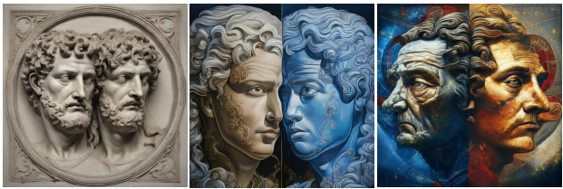

图注: 文生图样例；输入提示为「罗马双面神 Janus 的细腻肖像: 两张脸朝向相反. 一侧苍老, 皱纹深陷, 神情睿智沉思; 另一侧年轻, 充满活力与好奇. 卷发环绕双脸, 呈神圣对称. 色彩对比强烈: 左侧冷蓝银, 象征冬与反思; 右侧暖金红, 象征春与新生. 背景为星空织锦, 点缀时间与流转的象征母题」，该图为模型生成结果。
A detailed portrait of the Roman god Janus, featuring his two faces looking in opposite directions. One face appears aged, with deep-set wrinkles and a wise, contemplative expression, while the other face is youthful, exuding vigor and curiosity. His hair is styled in flowing curls, framing both faces with a sense of divine symmetry. The artwork is rich in contrasting colors, with the left side dominated by cold blues and silvers, symbolizing winter and reflection, and the right side awash with warm golds and reds, representing spring and renewal. The background is a celestial tapestry, adorned with stars and symbolic motifs of time and passage.

罗马双面神 Janus 的细腻肖像: 两张脸朝向相反. 一侧苍老, 皱纹深陷, 神情睿智沉思; 另一侧年轻, 充满活力与好奇. 卷发环绕双脸, 呈神圣对称. 色彩对比强烈: 左侧冷蓝银, 象征冬与反思; 右侧暖金红, 象征春与新生. 背景为星空织锦, 点缀时间与流转的象征母题.

A wise old owl with golden plumage perched on a luminous crystal tree in a magical forest. Radiant fireflies swirl around while ethereal mist rolls through the trees, illuminated by swirls of iridescent moonlight and glistening emerald leaves.

金羽智慧老猫头鹰栖于魔法森林中发光的水晶树; 萤火虫环绕, 薄雾穿林, 虹彩月光与翠绿叶片闪烁.

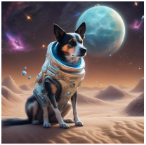

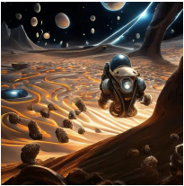

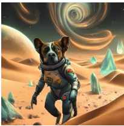

图注: 文生图样例；输入提示为「勇敢的狗穿未来宇航服, 在星尘沙丘与流星雨中探索外星; 发光晶体与空灵地形点缀, 天空漩涡像遥远星系的永恒之舞」，该图为模型生成结果。
A brave dog wearing a futuristic space suit, exploring an alien planet amidst swirling dunes of stardust and meteor showers. The landscape is dotted with glowing crystal formations and ethereal terraforms, creating a surreal environment in which swirling vortexes in the sky depict the endless dance of distant galaxies.

勇敢的狗穿未来宇航服, 在星尘沙丘与流星雨中探索外星; 发光晶体与空灵地形点缀, 天空漩涡像遥远星系的永恒之舞.

Figure 4 | Qualitative comparisons of visual generation with LlamaGen and SDXL. The images generated by Janus show better consistency with the user’s prompts. The image resolutions for SDXL, LlamaGen, and ours are 1024 × 1024, 512 × 512, and 384 × 384, respectively. Best viewed on screen.

图 4｜与 LlamaGen, SDXL 的视觉生成定性对比. Janus 生成图与用户提示更一致. 分辨率: SDXL 1024 × 1024, LlamaGen 512 × 512, 本文 384 × 384. 建议屏幕查看.

modal understanding, although there is still a considerable gap compared to our method. In terms of visual generation, Exp-B outperforms Exp-D. We hypothesize two possible reasons for this. First, the semantic tokenizer produces discrete IDs that are more semantically coherent, providing more reasonable prediction targets for the LLM. Second, the visual encoder in Exp-B has significantly more parameters than the Gen. encoder in Exp-D. (3) To investigate whether using a single visual encoder leads to a trade-off between multimodal understanding and generation, we further design Exp-C based on Exp-B, which focuses solely on multimodal understanding training. The multimodal understanding ability of Exp-C is significantly better than that of Exp-B. This indicates that the visual encoder in Exp-B made trade-offs between multimodal understanding and generation, ultimately sacrificing its multimodal understanding capability. The above experiments illustrate the importance of decoupling visual encoding.

(续表, 解耦影响)(1) Exp-A 在生成上尚可(COCO FID 8.72), 但理解基准与本文方法 Exp-D 差距很大. (2) Exp-B 相对 Exp-A 理解明显提升, 仍远落后于本文解耦方案; 生成上 Exp-B 优于 Exp-D. 作者猜测两点: 语义 tokenizer 的离散 ID 更语义连贯, 给 LLM 的预测目标更合理; Exp-B 视觉编码器参数量显著大于 Exp-D 的生成编码器. (3) 为检验「单编码器是否必然折中」, 在 Exp-B 上再做只训理解的 Exp-C: 理解能力显著好于 Exp-B, 说明 Exp-B 的编码器在理解与生成间做了折中, 牺牲了理解. 以上实验说明解耦视觉编码的重要性.

**Unified Model vs. Pure Understanding & Pure Generation.** We compare the performance of unified training (Exp-D) against pure understanding (Exp-E) and pure generation (Exp-F) training. For pure understanding, we omit visual generation data. For pure generation, we exclude the understanding data. Please note that unified training and pure understanding training go through the same steps for the understanding part. Similarly, unified training and pure generation training go through the same steps for the visual generation part. Experimental results show that the performance of unified training is comparable to that of training solely for understanding or solely for visual generation. This demonstrates that our model, Janus, is capable of incorporating strong generative abilities while minimally affecting multimodal understanding performance.

**统一模型 vs. 纯理解 / 纯生成.** 比较统一训练(Exp-D)与纯理解(Exp-E), 纯生成(Exp-F). 纯理解去掉生成数据; 纯生成去掉理解数据. 统一与纯理解在理解部分 step 数相同; 统一与纯生成在生成部分 step 数相同. 结果显示统一训练与单任务训练表现相当--Janus 能在几乎不伤理解的前提下并入较强生成能力.

<!-- page 12 of 24 -->

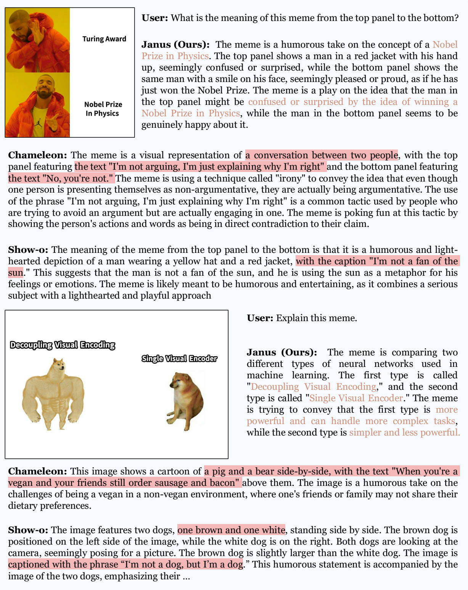

图注: 图像理解对比样例：面对同一张诺贝尔物理学奖梗图，Janus 正确联系上下两格中男子由困惑到高兴的表情变化；Show-o 的解释误读了画面与文字。
**Janus (Ours):** The meme is a humorous take on the concept of a Nobel Prize in Physics. The top panel shows a man in a red jacket with his hand up, seemingly confused or surprised, while the bottom panel shows the same man with a smile on his face, seemingly pleased or proud, as if he has just won the Nobel Prize. The meme is a play on the idea that the man in the top panel might be confused or surprised by the idea of winning a Nobel Prize in Physics, while the man in the bottom panel seems to be genuinely happy about it.

**Janus(本文):** 这张 meme 是在幽默玩「诺贝尔物理学奖」概念. 上图红夹克男子举手, 像困惑或惊讶; 下图同一人微笑, 像高兴或自豪, 仿佛刚获奖. 梗在于: 上方面孔像对「拿物理诺奖」感到意外, 下面则真心开心.

**Show-o:** The meaning of the meme from the top panel to the bottom is that it is a humorous and lighthearted depiction of a man wearing a yellow hat and a red jacket, with the caption "I'm not a fan of the sun." This suggests that the man is not a fan of the sun, and he is using the sun as a metaphor for his feelings or emotions. The meme is likely meant to be humorous and entertaining, as it combines a serious subject with a lighthearted and playful approach

**Show-o:** 从上到下, 这是对戴黄帽红夹克男子的幽默轻松描绘, 配文「I'm not a fan of the sun.」暗示他不喜欢太阳, 并用太阳隐喻情绪. 梗意在幽默娱乐, 把严肃题材与轻松玩法拼在一起.

**Janus (Ours):** The meme is comparing two different types of neural networks used in machine learning. The first type is called "Decoupling Visual Encoding," and the second type is called "Single Visual Encoder." The meme is trying to convey that the first type is more powerful and can handle more complex tasks, while the second type is simpler and less powerful.

**Janus(本文):** 这张 meme 在对比机器学习里两类网络:「Decoupling Visual Encoding」与「Single Visual Encoder」, 暗示前者更强, 能扛更复杂任务, 后者更简单也更弱.

**Show-o:** The image features two dogs, one brown and one white, standing side by side. The brown dog is positioned on the left side of the image, while the white dog is on the right. Both dogs are looking at the camera, seemingly posing for a picture. The brown dog is slightly larger than the white dog. The image is captioned with the phrase “I‘m not a dog, but I’m a dog. ” This humorous statement is accompanied by the image of the two dogs, emphasizing their .

**Show-o:** 图中两只狗并排, 棕左白右, 都看镜头像在摆拍; 棕狗略大. 配文「I'm not a dog, but I'm a dog.」用两狗形象强调幽默..

Figure 5 | Qualitative results of multimodal understanding on humorous memes. We compare the response with Chameleon-7B [77] and Show-o [86]. We emphasize the key-points in the response. Best viewed on screen.

图 5｜幽默 meme 上的多模态理解定性结果. 对比 Chameleon-7B [77] 与 Show-o [86]. 文中强调回答要点. 建议屏幕查看.

### 4.6. Qualitative Results 定性结果

**Visualizations of Visual Generation.** Figure 4 provides qualitative comparisons between our model, diffusion-based models like SDXL [62], and the autoregressive model LlamaGen [73].

**视觉生成可视化.** 图 4 将本文模型与扩散模型 SDXL [62], 自回归模型 LlamaGen [73] 做定性对比.

<!-- page 13 of 24 -->

The results show that our model demonstrates superior instruction-following capabilities in visual generation, accurately capturing most of details in the user’s prompt. This indicates the potential of the unified model in the realm of visual generation. More visualizations can be found in the Appendix B.

结果显示本文模型在视觉生成上指令跟随更好, 能抓住用户提示里大部分细节, 说明统一模型在生成方向有潜力. 更多可视化见附录 B.

**Multimodal Understanding on MEME Images.** Figure 5 showcases the qualitative results of Janus’s multimodal understanding ability, compared with Chameleon [77] and Show-o [86]. Janus accurately interprets the text caption and captures the emotion conveyed in the meme. In contrast, both Chameleon and Show-o struggle with accurately recognizing the text in the image. Additionally, Chameleon fails to identify objects in the meme, while Show-o misinterprets the dog’s color. These examples highlight that the decoupled vision encoder significantly enhances Janus’s fine-grained multimodal understanding ability compared to the shared encoder used by Chameleon and Show-o. More multimodal understanding exmples can be found in the Appendix B.

**Meme 图上的多模态理解.** 图 5 对比 Janus 与 Chameleon [77], Show-o [86]. Janus 能准确读懂配文并抓住 meme 情绪; 后两者常认不准图中文字. Chameleon 还会漏认物体, Show-o 会搞错狗的颜色. 说明相对共用编码器, 解耦视觉编码器明显抬高了细粒度理解. 更多例子见附录 B.

## 5. Conclusion

In this paper, we introduced Janus, a simple, unified and extensible multimodal understanding and generation model. The core idea of Janus is to decouple visual encoding for multimodal understanding and generation, which could alleviate the conflict arising from the differing demands that understanding and generation place on the visual encoder. Extensive experiments have demonstrated the effectiveness and leading performance of Janus. It is also worth noting that Janus is flexible and easy to extend. In addition to having significant potential for improvement in both multimodal understanding and generation, Janus is also easily extendable to incorporate more input modalities. The above advantages suggest that Janus may serve as an inspiration for the development of the next generation of multimodal general-purpose models.

本文介绍 Janus: 简单, 统一, 可扩展的多模态理解与生成模型. 核心是把理解与生成的视觉编码解耦, 缓和两类任务对视觉编码器不同需求造成的冲突. 大量实验显示其有效性与领先表现. 它也灵活易扩展: 理解与生成两端都有改进空间, 且容易接入更多输入模态. 这些优点使 Janus 有望启发下一代多模态通用模型.

<!-- page 14 of 24 -->

## A. Details of Semantic Tokenizer Mentioned in Ablation Study 消融中语义 Tokenizer 细节

### A. 1. Architecture of Semantic Tokenizer 架构

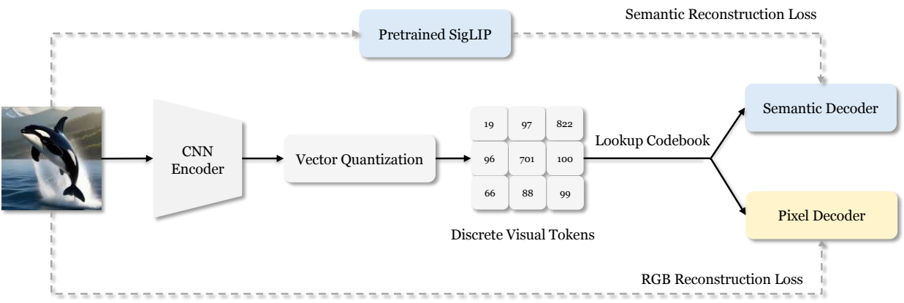

(a) Architecture of Semantic Tokenizer

(a) 语义 tokenizer 架构

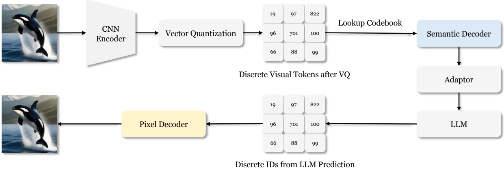

(b) Architecture of LLM with Semantic Tokenizer Integration

(b) 与 LLM 集成时的架构

Figure 6 | **Architecture and usage of the semantic tokenizer.** (a) Architecture used during training of the semantic tokenizer. We use pre-trained SigLIP [92] to supervise the reconstruction of semantic information, while using raw image to supervise the reconstruction of RGB values. (b) Integrating LLM with the semantic decoder. The semantic decoder outputs continuous features with high-level semantics, which are passed through an adaptor and then used as input for the LLM. Please note that the semantic tokenizer is only used in the ablation study, not in the main experiment.

图 6｜**语义 tokenizer 的架构与用法.** (a) 训练时: 用预训练 SigLIP [92] 监督语义信息重建, 用原图监督 RGB 重建. (b) 与 LLM 集成: 语义解码器输出带高层语义的连续特征, 经 adaptor 后作为 LLM 输入. 注意: 语义 tokenizer 只用于消融, 不进主实验.

We build the semantic tokenizer based on the tokenizer architecture proposed in [73], which has a downsample rate of 16. In addition to the original CNN pixel decoder, we add an additional semantic decoder branch after Vector Quantization, as shown in Figure 6 (a). The semantic decoder is a 12-layer ViT [22], with 12 attention heads and a hidden dimension of 768. For the semantic decoder, we use a causal attention mask to facilitate next token prediction when integrating it with an LLM.

语义 tokenizer 基于 [73] 的 tokenizer 架构, 下采样率 16. 在原有 CNN 像素解码器之外, VQ 后再加一条语义解码分支, 见图 6(a). 语义解码器为 12 层 ViT [22], 12 个注意力头, 隐维 768; 并使用因果注意力掩码, 以便与 LLM 集成时做下一 token 预测.

<!-- page 15 of 24 -->

### A. 2. Training 训练

**Training Procedure.** The semantic tokenizer is trained from scratch in a two-stage manner. In the first stage, we train the model on the ImageNet-1k [18] dataset for 40 epochs. In the second stage, we fine-tune the model for 1 epoch on 50 million images. These images come from the visual generation data used during the Janus pretraining process. We use a constant learning rate of 1𝑒 − 4 and a batch size of 128.

**训练流程.** 语义 tokenizer 从零两阶段训练. 第一阶段在 ImageNet-1k [18] 上训 40 epoch; 第二阶段在 5000 万张图上微调 1 epoch, 图来自 Janus 预训练用的视觉生成数据. 学习率恒定 $1\times10^{-4}$, batch size 128.

**Training Loss.** The training loss of the semantic tokenizer consists of two parts. On one hand, we use the loss for RGB reconstruction as described in [73]. On the other hand, we use SigLIP-Large-Patch16-384 as the teacher to supervise the semantic feature reconstruction results by the semantic decoder. We adopt the loss in BEiT-v2 [61]. Specifically, we maximize the cosine similarity between the semantic feature predicted by the semantic decoder and the SigLIP output. The weight for the semantic reconstruction loss is set to 0.25.

**训练损失.** 两部分: 一是 [73] 所述 RGB 重建损失; 二是以 SigLIP-Large-Patch16-384 为教师, 监督语义解码器的语义特征重建, 损失形式取自 BEiT-v2 [61]-- 最大化语义解码器预测特征与 SigLIP 输出的余弦相似度. 语义重建损失权重 0.25.

### A. 3. Integrating with LLM 与 LLM 集成

We present the integration of the semantic tokenizer and the LLM in Figure 6 (b). The image is first transformed into continuous features through the CNN encoder, vector quantization and the semantic decoder. Then, the LLM processes these features and generates predictions for the image IDs. Finally, the pixel decoder converts these discrete IDs into RGB values.

图 6(b) 展示与 LLM 的集成: 图像经 CNN 编码器, 向量量化, 语义解码器变成连续特征; LLM 处理这些特征并预测图像 ID; 最终像素解码器把离散 ID 还原成 RGB.

## B. Additional Qualitative Results 更多定性结果

**More Visualizations of Text-to-Image Generation.** We present more text-to-image generation results in Figure 7. It is evident that Janus is capable of producing high-quality images that adhere closely to the given prompts. We further explore the multilingual text-to-image capabilities of our model, as shown in Figure 8. We are pleasantly surprised to find that, despite our training data consisting solely of English text-to-image data, Janus can still process text-to-image tasks in other languages. We attribute this multilingual ability to the original large language model’s inherent traits. The LLM initially translates various languages into a unified semantic space, allowing Janus to perform text-to-image tasks naturally without additional training.

**更多文生图可视化.** 图 7 给出更多样例: Janus 能出高质量且紧贴提示的图. 图 8 进一步看多语文生图. 训练数据仅有英文文生图, 却仍能处理其他语言提示-- 作者归因于底座 LLM 本身: 先把各语言映射到统一语义空间, 再自然完成文生图, 无需额外训练.

**More Multimodal Understanding Results.** Additional results on multimodal understanding are shown in Figure 9. Janus exhibits impressive comprehension abilities when handling inputs from various contexts, showcasing its powerful capabilities.

**更多多模态理解结果.** 图 9 展示更多样例: 科学图表, 艺术图, LaTeX 公式图等语境下, Janus 理解能力表现突出.

<!-- page 16 of 24 -->

图注: 文生图样例；输入提示为「年轻女性, 神似 Lana Del Rey 与 Grimes 的混合; 冷色流动发丝, 大理石纹与虹彩, 少女漫画与拉斐尔前派气质, K-pop, 镀金, 珍珠, 纺丝, 云, 幽灵, 发光水母, 轻纱鼓荡, Alexander McQueen, 手工蕾丝与花卉刺绣, 蛇皮纹理, 戏剧光效」，该图为模型生成结果。
a young woman, looks like mix of Lana Del Rey and grimes, flowing cool colored hair, marbled, iridescent, shoujo manga, pre-raphaelite, k-pop, gilded, pearl, spun silk, clouds, ghost, glowing jellyfish, billowing gossamer cloth, Alexander McQueen, handmade lace, floral embroidery, snakeskin, dramatic lighting

年轻女性, 神似 Lana Del Rey 与 Grimes 的混合; 冷色流动发丝, 大理石纹与虹彩, 少女漫画与拉斐尔前派气质, K-pop, 镀金, 珍珠, 纺丝, 云, 幽灵, 发光水母, 轻纱鼓荡, Alexander McQueen, 手工蕾丝与花卉刺绣, 蛇皮纹理, 戏剧光效.

图注: 文生图样例；输入提示为「写实照片: 日出时老橡木窗边, 一杯热气腾腾的咖啡与黄铜花瓶里大束春花; 细节细腻, 色彩丰富; Nikon Z6 + Nikkor 50mm f/5.6, ISO 100, 快门叙述按原文保留; UHD / HDR / 8K」，该图为模型生成结果。
Real photo of a cup of hot steaming coffee and a brass vase with a large bouquet of spring flowers by an old oak window at sunrise, fine details, rich colors taken with a nikon z6 camera and a nikon nikkor lens with 50 f5.6 iso 100 and a shutter speed of 1400 knot. UHD dtm HDR 8k

写实照片: 日出时老橡木窗边, 一杯热气腾腾的咖啡与黄铜花瓶里大束春花; 细节细腻, 色彩丰富; Nikon Z6 + Nikkor 50mm f/5.6, ISO 100, 快门叙述按原文保留; UHD / HDR / 8K.

图注: 文生图样例；输入提示为「美丽曲线的海盗公主肖像, 红发, 繁复华丽服饰, 加勒比户外海景; 参考 ArtGerm, Alphonse Mucha, Roberto Ferri, Ross Tran, Pixar; 仰拍, 数字绘画, 电影边缘光, Unreal Engine 5, 8K」，该图为模型生成结果。
Portrait of a beautiful, curvaceous, Pirate princess goddess babe, red hair, intricate ornate costume, Caribbean background + outdoors + Ocean, painted by ArtGerm, Alphonse Mucha, Roberto Ferri, Ross Tran, Pixar, low angle shot, digital painting, cinematic rim lighting, Unreal Engine 5, 8K

美丽曲线的海盗公主肖像, 红发, 繁复华丽服饰, 加勒比户外海景; 参考 ArtGerm, Alphonse Mucha, Roberto Ferri, Ross Tran, Pixar; 仰拍, 数字绘画, 电影边缘光, Unreal Engine 5, 8K.

图注: 文生图样例；输入提示为「可爱毛茸胖土拨鼠在石堆上晒太阳; 背景雪山, 远处碧绿冰川湖, 晴空; 高细节, 黄金时刻自然光, Octane / Unreal」，该图为模型生成结果。
a cute fluffy chubby marmot sunbathing on a pile of rocks, snow mountains background, turquoise glacier lake afar, clear blue sky, highly detailed, golden hour, natural light, octane render, unreal engine

可爱毛茸胖土拨鼠在石堆上晒太阳; 背景雪山, 远处碧绿冰川湖, 晴空; 高细节, 黄金时刻自然光, Octane / Unreal.

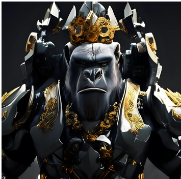

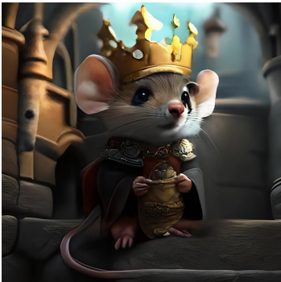

图注: 文生图样例；输入提示为「史诗 3D 肖像: 白色金刚穿黑色水晶机甲, 甲缘金色纹饰, 身体对称; 超写实, 细节繁密, 闪亮, 电影感; Unreal / ArtStation / Octane」，该图为模型生成结果。
epic 3d portrait of white King Kong wearing mech armor made of black crystals, golden ornate around the armor, symmetrical body, hyperrealistic, intricate details, shiny, cinematic, unreal engine, artstation, octane render,

史诗 3D 肖像: 白色金刚穿黑色水晶机甲, 甲缘金色纹饰, 身体对称; 超写实, 细节繁密, 闪亮, 电影感; Unreal / ArtStation / Octane.

Tiny cute adorable mouse dressed as a king in a castle, anthropomorphic, Jean-Baptiste Monge, soft cinematic lighting, 8k, intricate details, portrait, Pixar style character, old fashioned movie style

小巧可爱老鼠扮成城堡国王, 拟人; Jean-Baptiste Monge 风格, 柔和电影光, 8K, 细密细节, 肖像, 皮克斯角色感, 老派电影风.

图注: 文生图样例；输入提示为「赛博增强熊猫, 更多机械义体; 3D / 4K / Unreal; chaos 20」，该图为模型生成结果。
a panda that has been cybernetically enhanced more cybernetics3d 4k unreal engine chaos 20

赛博增强熊猫, 更多机械义体; 3D / 4K / Unreal; chaos 20.

图注: 文生图样例；输入提示为「来自喀布尔的公主, 红白传统服饰, 蓝眼棕发」，该图为模型生成结果。
A stunning princess from kabul in red, white traditional clothing, blue eyes, brown hair.

来自喀布尔的公主, 红白传统服饰, 蓝眼棕发.

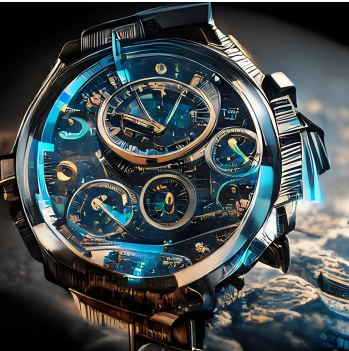

图注: 文生图样例；输入提示为「终极腕表 / 时间机器, 超先进科技, 全息显示, 精密机芯」，该图为模型生成结果。
The ultimate wrist watch watch time machine , super advanced technology, holographic display, intricate mechanism.

终极腕表 / 时间机器, 超先进科技, 全息显示, 精密机芯.

图注: 文生图样例；输入提示为「毛茸小浣熊宝宝戴蓝针织围巾, 靠在中世纪酒馆桌边端咖啡杯, 拟人; Jean-Baptiste Monge, 柔和电影光, 8K, 皮克斯角色感, 老派电影风」，该图为模型生成结果。
Tiny cute adorable fluffy baby raccoon with knitted blue scarf leaning at a table in a medieval pub holding a coffee cup, anthropomorphic, Jean-Baptiste Monge, soft cinematic lighting, 8k, intricate details, portrait, Pixar style character, old fashioned movie style

毛茸小浣熊宝宝戴蓝针织围巾, 靠在中世纪酒馆桌边端咖啡杯, 拟人; Jean-Baptiste Monge, 柔和电影光, 8K, 皮克斯角色感, 老派电影风.

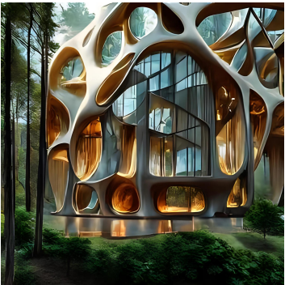

图注: 文生图样例；输入提示为「参数化木玻亭, 有机空洞, 四周森林; 戏剧场景, 照片级 / 超写实, 光线追踪反射, 8K, 细节繁密, Frank Lloyd Wright 风格」，该图为模型生成结果。
Architectural parametric pavilion made from wood and glass, with organic cavities, surrounded by a beautiful forest. Dramatic scene, photorealistic, hyperrealistic, raytracing reflections, 8k hd, intrincate detail in the style of Frank Lloyde Wright

参数化木玻亭, 有机空洞, 四周森林; 戏剧场景, 照片级 / 超写实, 光线追踪反射, 8K, 细节繁密, Frank Lloyd Wright 风格.

图注: Janus 文生图补充样例：输入要求生成带天界光晕、黑发棕眼和电影合成质感的克娄巴特拉全身像；论文将输出放大到 1024×1024 展示。
Beautiful surreal symbolism the mesmerizing vision of a Cleopatra Queen of Egypt , full body , mesmerizing brown eyes, black hair and ethereal features, radiating celestial aura, super high definition, true lifelike color, perfect exposure, razor sharp focus, golden ratio, soft reflections, bokeh effect, fine art photography, cinematic compositing, authentic, professional by Rorianai style 36k s1000

超现实象征主义: 埃及女王克娄巴特拉全身像, 迷人棕眼, 黑发与空灵五官, 散发天界光晕; 超高清, 真色, 曝光完美, 锐利对焦, 黄金比例, 柔反射与焦外虚化; 艺术摄影与电影合成感; Rorianai 风格设定按原文保留.

Figure 7 | More text-to-image generation results. We upsample the images to 1024 × 1024 for better visualization. 16

图 7｜更多文生图结果. 为便于展示上采样到 1024 × 1024.

<!-- page 17 of 24 -->

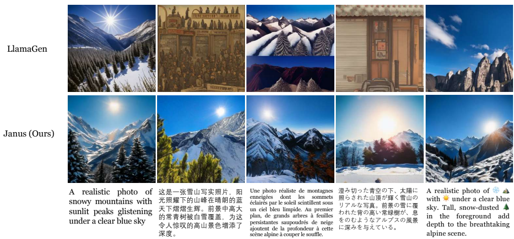

Figure 8 | Multilingual text-to-image generation samples compared to LlamaGen [73]. Note that we only use English text-to-image data in training, and this is an emergent capability of our model. The languages used in the prompt, from left to right, are: English, Chinese, French, Japanese, and English with emoji.

图 8｜多语文生图样例, 对比 LlamaGen [73]. 训练仅用英文文生图数据, 此为涌现能力. 提示语言从左到右: 英语, 中文, 法语, 日语, 带 emoji 的英语.

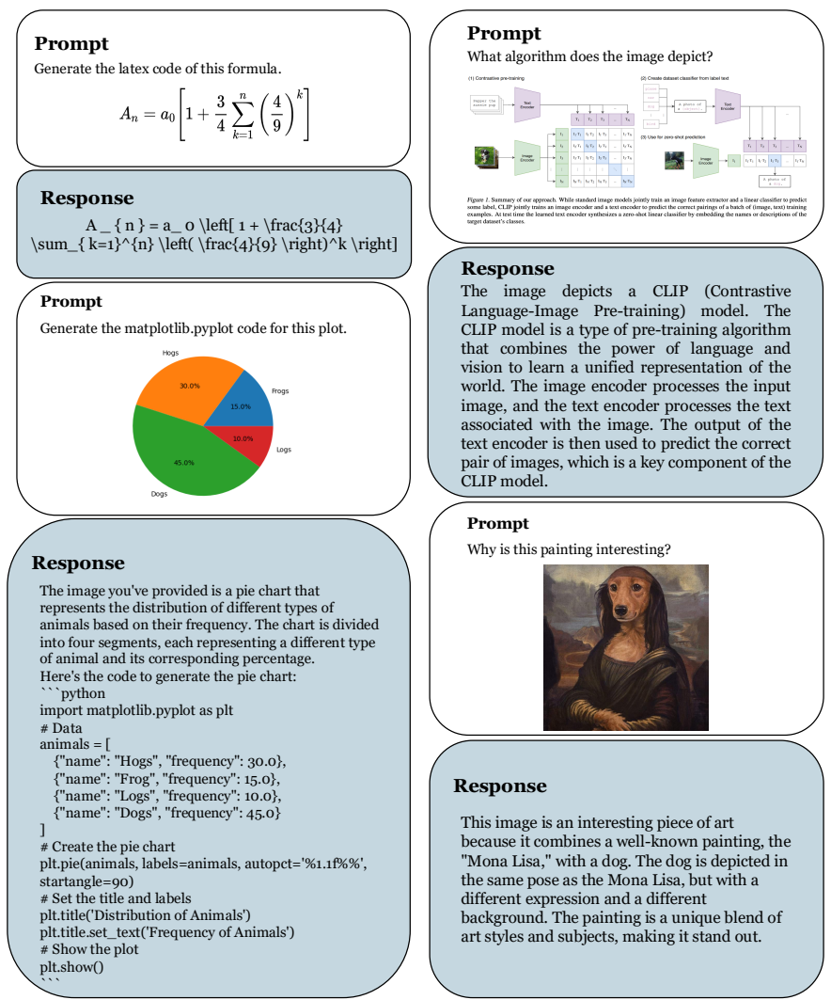

Figure 9 | More multimodal understanding results. Janus has a strong multimodal understanding capability and can handle inputs from various contexts, such as scientific charts, artwork images, LaTeX formula images, and more.

图 9｜更多多模态理解结果. Janus 能处理科学图表, 艺术图, LaTeX 公式图等多种语境输入.

<!-- page 18 of 24 -->

## References

以下条目保留原文著录; 专名, 年份, arXiv 编号与 URL 不改.

[1] J. Achiam, S. Adler, S. Agarwal, L. Ahmad, I. Akkaya, F. L. Aleman, D. Almeida, J. Altenschmidt, S. Altman, S. Anadkat, et al. Gpt-4 technical report. arXiv preprint arXiv: 2303.08774, 2023.

[2] Anthropic. The claude 3 model family: Opus, sonnet, haiku. [https://www. anthropic. com](https://www. anthropic. com), 2024.

[3] J. Bai, S. Bai, S. Yang, S. Wang, S. Tan, P. Wang, J. Lin, C. Zhou, and J. Zhou. Qwen-vl: A frontier large vision-language model with versatile abilities. arXiv preprint arXiv: 2308.12966, 2023.

[4] Y. Bai, X. Wang, Y.-p. Cao, Y. Ge, C. Yuan, and Y. Shan. Dreamdiffusion: Generating high-quality images from brain eeg signals. arXiv preprint arXiv: 2306.16934, 2023.

[5] X. Bi, D. Chen, G. Chen, S. Chen, D. Dai, C. Deng, H. Ding, K. Dong, Q. Du, Z. Fu, et al. Deepseek llm: Scaling open-source language models with longtermism. arXiv preprint arXiv: 2401.02954, 2024.

[6] T. B. Brown. Language models are few-shot learners. arXiv preprint arXiv: 2005.14165, 2020.

[7] H. Chang, H. Zhang, L. Jiang, C. Liu, and W. T. Freeman. Maskgit: Masked generative image transformer. In Proceedings of the IEEE/CVF Conference on Computer Vision and Pattern Recognition, pages 11315–11325, 2022.

[8] H. Chang, H. Zhang, J. Barber, A. Maschinot, J. Lezama, L. Jiang, M.-H. Yang, K. Murphy, W. T. Freeman, M. Rubinstein, et al. Muse: Text-to-image generation via masked generative transformers. arXiv preprint arXiv: 2301.00704, 2023.

[9] J. Chen, J. Yu, C. Ge, L. Yao, E. Xie, Y. Wu, Z. Wang, J. Kwok, P. Luo, H. Lu, et al. Pixart𝑎𝑙 𝑝ℎ𝑎: Fast training of diffusion transformer for photorealistic text-to-image synthesis. arXiv preprint arXiv: 2310.00426, 2023.

[10] L. Chen, J. Li, X. Dong, P. Zhang, C. He, J. Wang, F. Zhao, and D. Lin. Sharegpt4v: Improving large multi-modal models with better captions. arXiv preprint arXiv: 2311.12793, 2023.

[11] X. Chen, H. Fang, T.-Y. Lin, R. Vedantam, S. Gupta, P. Dollár, and C. L. Zitnick. Microsoft coco captions: Data collection and evaluation server. arXiv preprint arXiv: 1504.00325, 2015.

[12] Z. Chen, W. Wang, H. Tian, S. Ye, Z. Gao, E. Cui, W. Tong, K. Hu, J. Luo, Z. Ma, et al. How far are we to gpt-4v? closing the gap to commercial multimodal models with open-source suites. arXiv preprint arXiv: 2404.16821, 2024.

[13] Z. Chen, J. Wu, W. Wang, W. Su, G. Chen, S. Xing, M. Zhong, Q. Zhang, X. Zhu, L. Lu, et al. Internvl: Scaling up vision foundation models and aligning for generic visuallinguistic tasks. In Proceedings of the IEEE/CVF Conference on Computer Vision and Pattern Recognition, pages 24185–24198, 2024.

[14] X. Chu, L. Qiao, X. Lin, S. Xu, Y. Yang, Y. Hu, F. Wei, X. Zhang, B. Zhang, X. Wei, et al. Mobilevlm: A fast, reproducible and strong vision language assistant for mobile devices. arXiv preprint arXiv: 2312.16886, 2023.

<!-- page 19 of 24 -->

[15] X. Chu, L. Qiao, X. Zhang, S. Xu, F. Wei, Y. Yang, X. Sun, Y. Hu, X. Lin, B. Zhang, et al. Mobilevlm v2: Faster and stronger baseline for vision language model. arXiv preprint arXiv: 2402.03766, 2024.

[16] W. Dai, J. Li, D. Li, A. M. H. Tiong, J. Zhao, W. Wang, B. Li, P. Fung, and S. Hoi. Instructblip: Towards general-purpose vision-language models with instruction tuning, 2023.

[17] dclure. Laion-aesthetics-umap. [https://huggingface. co/datasets/dclure/laion-aesthetics-12m-umap](https://huggingface. co/datasets/dclure/laion-aesthetics-12m-umap), 2022.

[18] J. Deng, W. Dong, R. Socher, L.-J. Li, K. Li, and L. Fei-Fei. Imagenet: A large-scale hierarchical image database. In 2009 IEEE conference on computer vision and pattern recognition, pages 248–255. Ieee, 2009.

[19] J. Devlin. Bert: Pre-training of deep bidirectional transformers for language understanding. arXiv preprint arXiv: 1810.04805, 2018.

[20] P. Dhariwal and A. Nichol. Diffusion models beat gans on image synthesis. Advances in neural information processing systems, 34: 8780–8794, 2021.

[21] R. Dong, C. Han, Y. Peng, Z. Qi, Z. Ge, J. Yang, L. Zhao, J. Sun, H. Zhou, H. Wei, et al. Dreamllm: Synergistic multimodal comprehension and creation. arXiv preprint arXiv: 2309.11499, 2023.

[22] A. Dosovitskiy. An image is worth 16x16 words: Transformers for image recognition at scale. arXiv preprint arXiv: 2010.11929, 2020.

[23] Echo840. Detailed caption dataset. [https://huggingface. co/datasets/echo840/Detailed\_Caption](https://huggingface. co/datasets/echo840/Detailed_Caption), 2023.

[24] P. Esser, R. Rombach, and B. Ommer. Taming transformers for high-resolution image synthesis. In Proceedings of the IEEE/CVF conference on computer vision and pattern recognition, pages 12873–12883, 2021.

[25] C. Fu, P. Chen, Y. Shen, Y. Qin, M. Zhang, X. Lin, J. Yang, X. Zheng, K. Li, X. Sun, et al. Mme: A comprehensive evaluation benchmark for multimodal large language models. arXiv preprint arXiv: 2306.13394, 2023.

[26] O. Gafni, A. Polyak, O. Ashual, S. Sheynin, D. Parikh, and Y. Taigman. Make-a-scene: Scene-based text-to-image generation with human priors. In European Conference on Computer Vision, pages 89–106. Springer, 2022.

[27] Y. Ge, Y. Ge, Z. Zeng, X. Wang, and Y. Shan. Planting a seed of vision in large language model. arXiv preprint arXiv: 2307.08041, 2023.

[28] Y. Ge, S. Zhao, Z. Zeng, Y. Ge, C. Li, X. Wang, and Y. Shan. Making llama see and draw with seed tokenizer. arXiv preprint arXiv: 2310.01218, 2023.

[29] Y. Ge, S. Zhao, J. Zhu, Y. Ge, K. Yi, L. Song, C. Li, X. Ding, and Y. Shan. Seed-x: Multimodal models with unified multi-granularity comprehension and generation. arXiv preprint arXiv: 2404.14396, 2024.

[30] D. Ghosh, H. Hajishirzi, and L. Schmidt. Geneval: An object-focused framework for evaluating text-to-image alignment. Advances in Neural Information Processing Systems, 36, 2024.

<!-- page 20 of 24 -->

[31] Y. Goyal, T. Khot, D. Summers-Stay, D. Batra, and D. Parikh. Making the v in vqa matter: Elevating the role of image understanding in visual question answering. In Proceedings of the IEEE conference on computer vision and pattern recognition, pages 6904–6913, 2017.

[32] High-flyer. Hai-llm: Efficient and lightweight training tool for large models, 2023. URL [https://www. high-flyer. cn/en/blog/hai-llm](https://www. high-flyer. cn/en/blog/hai-llm).

[33] J. Ho, A. Jain, and P. Abbeel. Denoising diffusion probabilistic models. Advances in neural information processing systems, 33: 6840–6851, 2020.

[34] Y.-C. Hsiao, F. Zubach, M. Wang, et al. Screenqa: Large-scale question-answer pairs over mobile app screenshots. arXiv preprint arXiv: 2209.08199, 2022.

[35] D. A. Hudson and C. D. Manning. Gqa: A new dataset for real-world visual reasoning and compositional question answering. In Proceedings of the IEEE/CVF conference on computer vision and pattern recognition, pages 6700–6709, 2019.

[36] Y. Jin, K. Xu, L. Chen, C. Liao, J. Tan, B. Chen, C. Lei, A. Liu, C. Song, X. Lei, et al. Unified language-vision pretraining with dynamic discrete visual tokenization. arXiv preprint arXiv: 2309.04669, 2023.

[37] M. Kang, J.-Y. Zhu, R. Zhang, J. Park, E. Shechtman, S. Paris, and T. Park. Scaling up gans for text-to-image synthesis. In Proceedings of the IEEE/CVF Conference on Computer Vision and Pattern Recognition, pages 10124–10134, 2023.

[38] A. Kirillov, E. Mintun, N. Ravi, H. Mao, C. Rolland, L. Gustafson, T. Xiao, S. Whitehead, A. C. Berg, W.-Y. Lo, et al. Segment anything. In Proceedings of the IEEE/CVF International Conference on Computer Vision, pages 4015–4026, 2023.

[39] M. Koupaee and W. Y. Wang. Wikihow: A large scale text summarization dataset. arXiv preprint arXiv: 1810.09305, 2018.

[40] A. Kuznetsova, H. Rom, N. Alldrin, J. Uijlings, I. Krasin, J. Pont-Tuset, S. Kamali, S. Popov, M. Malloci, A. Kolesnikov, T. Duerig, and V. Ferrari. The open images dataset v4: Unified image classification, object detection, and visual relationship detection at scale. IJCV, 2020.

[41] H. Laurençon, D. van Strien, S. Bekman, L. Tronchon, L. Saulnier, T. Wang, S. Karamcheti, A. Singh, G. Pistilli, Y. Jernite, and et al. Introducing idefics: An open reproduction of state-of-the-art visual language model, 2023. URL [https://huggingface. co/blog/idefics](https://huggingface. co/blog/idefics).

[42] B. Li, R. Wang, G. Wang, Y. Ge, Y. Ge, and Y. Shan. Seed-bench: Benchmarking multimodal llms with generative comprehension. arXiv preprint arXiv: 2307.16125, 2023.

[43] B. Li, Y. Zhang, D. Guo, R. Zhang, F. Li, H. Zhang, K. Zhang, Y. Li, Z. Liu, and C. Li. Llava-onevision: Easy visual task transfer. arXiv preprint arXiv: 2408.03326, 2024.

[44] D. Li, A. Kamko, E. Akhgari, A. Sabet, L. Xu, and S. Doshi. Playground v2.5: Three insights towards enhancing aesthetic quality in text-to-image generation. arXiv preprint arXiv: 2402.17245, 2024.

[45] L. Li, Y. Wang, R. Xu, P. Wang, X. Feng, L. Kong, and Q. Liu. Multimodal arxiv: A dataset for improving scientific comprehension of large vision-language models. arXiv preprint arXiv: 2403.00231, 2024.

<!-- page 21 of 24 -->

[46] T. Li, Y. Tian, H. Li, M. Deng, and K. He. Autoregressive image generation without vector quantization. arXiv preprint arXiv: 2406.11838, 2024.

[47] X. Li, F. Zhang, H. Diao, Y. Wang, X. Wang, and L.-Y. Duan. Densefusion-1m: Merging vision experts for comprehensive multimodal perception. arXiv preprint arXiv: 2407.08303, 2024.

[48] Y. Li, Y. Du, K. Zhou, J. Wang, W. X. Zhao, and J.-R. Wen. Evaluating object hallucination in large vision-language models. arXiv preprint arXiv: 2305.10355, 2023.

[49] Z. Li, X. Yang, K. Choi, W. Zhu, R. Hsieh, H. Kim, J. H. Lim, S. Ji, B. Lee, X. Yan, et al. Mmsci: A multimodal multi-discipline dataset for phd-level scientific comprehension. arXiv preprint arXiv: 2407.04903, 2024.

[50] H. Liu, C. Li, Y. Li, and Y. J. Lee. Improved baselines with visual instruction tuning. In Proceedings of the IEEE/CVF Conference on Computer Vision and Pattern Recognition, pages 26296–26306, 2024.

[51] H. Liu, C. Li, Q. Wu, and Y. J. Lee. Visual instruction tuning. Advances in neural information processing systems, 36, 2024.

[52] H. Liu, W. Yan, M. Zaharia, and P. Abbeel. World model on million-length video and language with ringattention. arXiv preprint arXiv: 2402.08268, 2024.

[53] M. Liu, R. Shi, K. Kuang, Y. Zhu, X. Li, S. Han, H. Cai, F. Porikli, and H. Su. Openshape: Scaling up 3d shape representation towards open-world understanding. Advances in neural information processing systems, 36, 2024.

[54] Y. Liu, H. Duan, Y. Zhang, B. Li, S. Zhang, W. Zhao, Y. Yuan, J. Wang, C. He, Z. Liu, et al. Mmbench: Is your multi-modal model an all-around player? arXiv preprint arXiv: 2307.06281, 2023.

[55] H. Lu, W. Liu, B. Zhang, B. Wang, K. Dong, B. Liu, J. Sun, T. Ren, Z. Li, Y. Sun, et al. Deepseek-vl: towards real-world vision-language understanding. arXiv preprint arXiv: 2403.05525, 2024.

[56] P. Lu, L. Qiu, J. Chen, T. Xia, Y. Zhao, W. Zhang, Z. Yu, X. Liang, and S.-C. Zhu. Iconqa: A new benchmark for abstract diagram understanding and visual language reasoning. arXiv preprint arXiv: 2110.13214, 2021.

[57] madebyollin. Megalith-huggingface. [https://huggingface. co/datasets/madebyollin/megalith-10m](https://huggingface. co/datasets/madebyollin/megalith-10m), 2024.

[58] mehdidc. Yfcc-huggingface. [https://huggingface. co/datasets/mehdidc/yfcc15m](https://huggingface. co/datasets/mehdidc/yfcc15m), 2024.

[59] A. Nichol, P. Dhariwal, A. Ramesh, P. Shyam, P. Mishkin, B. McGrew, I. Sutskever, and M. Chen. Glide: Towards photorealistic image generation and editing with text-guided diffusion models. arXiv preprint arXiv: 2112.10741, 2021.

[60] J. Pan, K. Sun, Y. Ge, H. Li, H. Duan, X. Wu, R. Zhang, A. Zhou, Z. Qin, Y. Wang, J. Dai, Y. Qiao, and H. Li. Journeydb: A benchmark for generative image understanding, 2023.

[61] Z. Peng, L. Dong, H. Bao, Q. Ye, and F. Wei. Beit v2: Masked image modeling with vector-quantized visual tokenizers. arXiv preprint arXiv: 2208.06366, 2022.

<!-- page 22 of 24 -->

[62] D. Podell, Z. English, K. Lacey, A. Blattmann, T. Dockhorn, J. Müller, J. Penna, and R. Rombach. Sdxl: Improving latent diffusion models for high-resolution image synthesis. arXiv preprint arXiv: 2307.01952, 2023.

[63] ProGamerGov. Dalle3-high-quality-captions. [https://huggingface. co/datasets/ProGamerGov/synthetic-dataset-1m-dalle3-high-quality-captions](https://huggingface. co/datasets/ProGamerGov/synthetic-dataset-1m-dalle3-high-quality-captions), 2024.

[64] A. Radford. Improving language understanding by generative pre-training. 2018.

[65] A. Ramesh, M. Pavlov, G. Goh, S. Gray, C. Voss, A. Radford, M. Chen, and I. Sutskever. Zero-shot text-to-image generation. In International conference on machine learning, pages 8821–8831. Pmlr, 2021.

[66] A. Ramesh, P. Dhariwal, A. Nichol, C. Chu, and M. Chen. Hierarchical text-conditional image generation with clip latents. arXiv preprint arXiv: 2204.06125, 1(2): 3, 2022.

[67] R. Rombach, A. Blattmann, D. Lorenz, P. Esser, and B. Ommer. High-resolution image synthesis with latent diffusion models. In Proceedings of the IEEE/CVF conference on computer vision and pattern recognition, pages 10684–10695, 2022.

[68] C. Saharia, W. Chan, S. Saxena, L. Li, J. Whang, E. L. Denton, K. Ghasemipour, R. Gontijo Lopes, B. Karagol Ayan, T. Salimans, et al. Photorealistic text-to-image diffusion models with deep language understanding. Advances in neural information processing systems, 35: 36479–36494, 2022.

[69] S. Shah, A. Mishra, N. Yadati, and P. P. Talukdar. Kvqa: Knowledge-aware visual question answering. In Proceedings of the AAAI conference on artificial intelligence, volume 33, pages 8876–8884, 2019.

[70] V. Singla, K. Yue, S. Paul, R. Shirkavand, M. Jayawardhana, A. Ganjdanesh, H. Huang, A. Bhatele, G. Somepalli, and T. Goldstein. From pixels to prose: A large dataset of dense image captions. arXiv preprint arXiv: 2406.10328, 2024.

[71] J. Song, C. Meng, and S. Ermon. Denoising diffusion implicit models. arXiv preprint arXiv: 2010.02502, 2020.

[72] K. Srinivasan, K. Raman, J. Chen, M. Bendersky, and M. Najork. Wit: Wikipedia-based image text dataset for multimodal multilingual machine learning. In Proceedings of the 44th international ACM SIGIR conference on research and development in information retrieval, pages 2443–2449, 2021.

[73] P. Sun, Y. Jiang, S. Chen, S. Zhang, B. Peng, P. Luo, and Z. Yuan. Autoregressive model beats diffusion: Llama for scalable image generation. arXiv preprint arXiv: 2406.06525, 2024.

[74] Q. Sun, Y. Fang, L. Wu, X. Wang, and Y. Cao. Eva-clip: Improved training techniques for clip at scale. arXiv preprint arXiv: 2303.15389, 2023.

[75] Q. Sun, Q. Yu, Y. Cui, F. Zhang, X. Zhang, Y. Wang, H. Gao, J. Liu, T. Huang, and X. Wang. Generative pretraining in multimodality. arXiv preprint arXiv: 2307.05222, 2023.

[76] Q. Sun, Y. Cui, X. Zhang, F. Zhang, Q. Yu, Y. Wang, Y. Rao, J. Liu, T. Huang, and X. Wang. Generative multimodal models are in-context learners. In Proceedings of the IEEE/CVF Conference on Computer Vision and Pattern Recognition, pages 14398–14409, 2024.

<!-- page 23 of 24 -->

[77] C. Team. Chameleon: Mixed-modal early-fusion foundation models. arXiv preprint arXiv: 2405.09818, 2024.

[78] G. Team, R. Anil, S. Borgeaud, Y. Wu, J.-B. Alayrac, J. Yu, R. Soricut, J. Schalkwyk, A. M. Dai, A. Hauth, et al. Gemini: a family of highly capable multimodal models. arXiv preprint arXiv: 2312.11805, 2023.

[79] K. Tian, Y. Jiang, Z. Yuan, B. Peng, and L. Wang. Visual autoregressive modeling: Scalable image generation via next-scale prediction. arXiv preprint arXiv: 2404.02905, 2024.

[80] H. Touvron, T. Lavril, G. Izacard, X. Martinet, M.-A. Lachaux, T. Lacroix, B. Rozière, N. Goyal, E. Hambro, F. Azhar, et al. Llama: Open and efficient foundation language models. arXiv preprint arXiv: 2302.13971, 2023.

[81] H. Touvron, L. Martin, K. Stone, P. Albert, A. Almahairi, Y. Babaei, N. Bashlykov, S. Batra, P. Bhargava, S. Bhosale, et al. Llama 2: Open foundation and fine-tuned chat models. arXiv preprint arXiv: 2307.09288, 2023.

[82] W. Wang, Z. Chen, X. Chen, J. Wu, X. Zhu, G. Zeng, P. Luo, T. Lu, J. Zhou, Y. Qiao, et al. Visionllm: Large language model is also an open-ended decoder for vision-centric tasks. Advances in Neural Information Processing Systems, 36, 2024.

[83] X. Wang, X. Zhang, Z. Luo, Q. Sun, Y. Cui, J. Wang, F. Zhang, Y. Wang, Z. Li, Q. Yu, et al. Emu3: Next-token prediction is all you need. arXiv preprint arXiv: 2409.18869, 2024.

[84] S. Wu, H. Fei, L. Qu, W. Ji, and T.-S. Chua. Next-gpt: Any-to-any multimodal llm. arXiv preprint arXiv: 2309.05519, 2023.

[85] Y. Wu, Z. Zhang, J. Chen, H. Tang, D. Li, Y. Fang, L. Zhu, E. Xie, H. Yin, L. Yi, et al. Vila-u: a unified foundation model integrating visual understanding and generation. arXiv preprint arXiv: 2409.04429, 2024.

[86] J. Xie, W. Mao, Z. Bai, D. J. Zhang, W. Wang, K. Q. Lin, Y. Gu, Z. Chen, Z. Yang, and M. Z. Shou. Show-o: One single transformer to unify multimodal understanding and generation. arXiv preprint arXiv: 2408.12528, 2024.

[87] Z. Xue, G. Song, Q. Guo, B. Liu, Z. Zong, Y. Liu, and P. Luo. Raphael: Text-to-image generation via large mixture of diffusion paths. Advances in Neural Information Processing Systems, 36, 2024.

[88] F. Yang, C. Ma, J. Zhang, J. Zhu, W. Yuan, and A. Owens. Touch and go: Learning from human-collected vision and touch. arXiv preprint arXiv: 2211.12498, 2022.

[89] L. Yu, Y. Cheng, K. Sohn, J. Lezama, H. Zhang, H. Chang, A. G. Hauptmann, M.-H. Yang, Y. Hao, I. Essa, et al. Magvit: Masked generative video transformer. In Proceedings of the IEEE/CVF Conference on Computer Vision and Pattern Recognition, pages 10459–10469, 2023.

[90] W. Yu, Z. Yang, L. Li, J. Wang, K. Lin, Z. Liu, X. Wang, and L. Wang. Mm-vet: Evaluating large multimodal models for integrated capabilities. arXiv preprint arXiv: 2308.02490, 2023.

[91] X. Yue, Y. Ni, K. Zhang, T. Zheng, R. Liu, G. Zhang, S. Stevens, D. Jiang, W. Ren, Y. Sun, et al. Mmmu: A massive multi-discipline multimodal understanding and reasoning benchmark for expert agi. In Proceedings of the IEEE/CVF Conference on Computer Vision and Pattern Recognition, pages 9556–9567, 2024.

<!-- page 24 of 24 -->

[92] X. Zhai, B. Mustafa, A. Kolesnikov, and L. Beyer. Sigmoid loss for language image pre-training. In Proceedings of the IEEE/CVF International Conference on Computer Vision, pages 11975–11986, 2023.

[93] C. Zheng, T.-L. Vuong, J. Cai, and D. Phung. Movq: Modulating quantized vectors for high-fidelity image generation. Advances in Neural Information Processing Systems, 35: 23412–23425, 2022.

[94] C. Zhou, L. Yu, A. Babu, K. Tirumala, M. Yasunaga, L. Shamis, J. Kahn, X. Ma, L. Zettlemoyer, and O. Levy. Transfusion: Predict the next token and diffuse images with one multi-modal model. arXiv preprint arXiv: 2408.11039, 2024.

[95] D. Zhu, J. Chen, X. Shen, X. Li, and M. Elhoseiny. Minigpt-4: Enhancing vision-language understanding with advanced large language models. arXiv preprint arXiv: 2304.10592, 2023.

[96] Y. Zhu, M. Zhu, N. Liu, Z. Ou, X. Mou, and J. Tang. Llava-phi: Efficient multi-modal assistant with small language model. arXiv preprint arXiv: 2401.02330, 2024.

24
