<!-- page 1 of 25 -->

arXiv:2411.07975v2 [cs.CV] 24 Mar 2025

Qdeepseek

# JanusFlow: Harmonizing Autoregression and Rectified Flow for Unified Multimodal Understanding and Generation · 以自回归与 Rectified Flow 协调统一多模态理解和生成

Yiyang Ma1,2 Xingchao Liu1,† Xiaokang Chen1,† Wen Liu1,† Chengyue Wu1,3 Zhiyu Wu1,2 Zizheng Pan1 Zhenda Xie1 Haowei Zhang1 Xingkai Yu1 Liang Zhao1 Yisong Wang1,4 Jiaying Liu2 Chong Ruan1,‡

1**DeepSeek-AI** 2**Peking University** 3**The University of Hong Kong** 4**Tsinghua University** †**Equal contribution,** ‡**Corresponding author Project Page:** [**https://github.com/deepseek-ai/Janus**](https://github.com/deepseek-ai/Janus)

## Abstract

We present **JanusFlow**, a powerful framework that unifies image understanding and generation in a single model. JanusFlow introduces a minimalist architecture that integrates autoregressive language models with rectified flow, a state-of-the-art method in generative modeling. Our key finding demonstrates that rectified flow can be straightforwardly trained within the large language model framework, eliminating the need for complex architectural modifications. To further improve the performance of our unified model, we adopt two key strategies: (i) decoupling the understanding and generation encoders, and (ii) aligning their representations during unified training. Extensive experiments show that JanusFlow achieves comparable or superior performance to specialized models in their respective domains, while significantly outperforming existing unified approaches across standard benchmarks. This work represents a step toward more efficient and versatile vision-language models.

我们提出 **JanusFlow**, 一个在单一模型中统一图像理解与生成的框架. JanusFlow 采用精简架构, 将自回归语言模型与生成建模中的先进方法 rectified flow 结合. 我们的核心发现是, rectified flow 可以直接在大语言模型框架内训练, 无需复杂的架构改造. 为了进一步提升统一模型的表现, 我们采用两项策略: (i) 将理解编码器与生成编码器解耦; (ii) 在统一训练期间对齐二者的表征. 大量实验表明, JanusFlow 在理解和生成领域达到与专项模型相当或更好的表现, 并在标准基准上明显超过已有统一方法. 这项工作推动视觉语言模型朝更高效率和更广用途发展.

## 1. Introduction · 引言

Large language models (LLMs) have demonstrated remarkable capabilities in learning diverse knowledge and generalizing to new scenarios [1, 7, 8, 69, 91]. Leveraging these capabilities, researchers have developed sophisticated models specialized in image comprehension [2, 15, 47, 49, 56, 58] and text-to-image generation [23, 73, 76, 79].

大语言模型已经展现出学习多样知识和泛化到新场景的强大能力 [1, 7, 8, 69, 91]. 研究者利用这些能力, 开发了分别面向图像理解 [2, 15, 47, 49, 56, 58] 与文生图 [23, 73, 76, 79] 的专项模型.

The field has recently shifted toward creating unified systems capable of handling both tasks simultaneously. One prominent direction involves utilizing pre-trained text-to-image models for high-quality generation while training LLMs to generate conditions for these models [19, 25–27, 87]. However, this approach introduces architectural complexity and potentially constrains the model’s capabilities through maintaining separate LLM and generative components. Alternative approaches [88, 97, 99, 100, 108] propose training a single LLM for both tasks, typically incorporating either diffusion models [32, 83] or vector-quantized autoregressive models [22, 86].

近期研究开始转向能够同时处理两类任务的统一系统. 一条主要路线利用预训练文生图模型产生高质量图像, 同时训练 LLM 为这些模型生成条件 [19, 25–27, 87]. 这种做法增加了架构复杂度, 并且由于分别维护 LLM 与生成组件, 可能限制模型能力. 另一类方法 [88, 97, 99, 100, 108] 训练单个 LLM 同时处理两项任务, 通常结合扩散模型 [32, 83] 或向量量化自回归模型 [22, 86].

Our approach builds upon recent breakthroughs in rectified flow models [3, 23, 55, 61, 62], which provide a simple framework for generative modeling while delivering exceptional empir-

我们的方法建立在 rectified flow 模型近期的进展之上 [3, 23, 55, 61, 62]. 这类模型为生成建模提供了简洁框架, 同时取得了出色的实证

<!-- page 2 of 25 -->

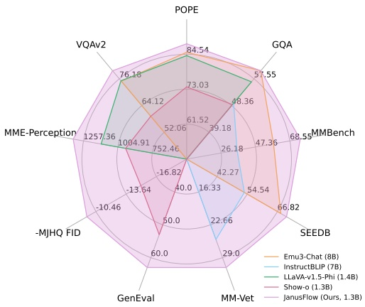

(a) Benchmark Performances.

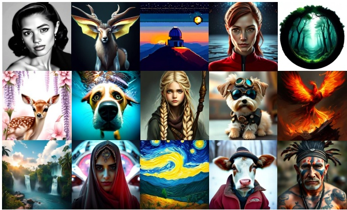

(b) Visual Generation Results.

Figure 1 | Multimodal understanding and image generation with JanusFlow. JanusFlow surpasses the state-of-the-art unified multimodal models and several task-specific understanding models on visual understanding benchmarks. It is also capable of generating high-quality images. The resolution of the images is 384 × 384.

ical performance [23, 36, 45]. Building on these advances, we propose **JanusFlow**, a powerful unified multimodal model that seamlessly integrates rectified flow with LLM architecture. Following a minimalist design principle, our architecture requires only a lightweight encoder and decoder to adapt the LLM for rectified flow operations. To optimize JanusFlow’s performance, we implement two key strategies: First, we maintain separate vision encoders for understanding and generation tasks, preventing task interference and thus enhancing comprehension capabilities. Second, we align the intermediate representations between generation and understanding modules during training, strengthening semantic coherence in the generation process.

表现 [23, 36, 45]. 基于这些进展, 我们提出 **JanusFlow**, 将 rectified flow 与 LLM 架构直接结合的统一多模态模型. 按照精简设计原则, 该架构只需轻量编码器和解码器, 即可使 LLM 执行 rectified flow. 为优化 JanusFlow, 我们采用两项策略. 第一, 理解任务和生成任务使用独立视觉编码器, 避免任务干扰并增强理解能力. 第二, 训练时对齐生成模块与理解模块的中间表征, 加强生成过程的语义一致性.

JanusFlow shows state-of-the-art performances in both multimodal comprehension and text-to-image generation compared to existing unified approaches, and even outperforms several specialized methods. Specifically, on text-to-image generation benchmarks, MJHQ FID-30k [48], GenEval [28] and DPG-Bench [34], JanusFlow achieves scores of 9.51, 0.63 and 80.09%, surpassing established text-to-image models including SDv1.5 [77] and SDXL [73]. In multimodal comprehension benchmarks, JanusFlow attains scores of 74.9, 70.5 and 60.3 on MMBench [63], SeedBench [46], and GQA [35], respectively, exceeding specialized models such as LLaVA-v1.5 [56] and Qwen-VL-Chat [4]. Notably, these results are achieved with a compact LLM architecture with only 1.3B parameters.

与已有统一方法相比, JanusFlow 在多模态理解和文生图两方面都达到领先表现, 并超过若干专项方法. 在文生图基准 MJHQ FID-30k [48], GenEval [28] 与 DPG-Bench [34] 上, JanusFlow 分别取得 9.51, 0.63 和 80.09%, 超过 SDv1.5 [77] 与 SDXL [73] 等成熟文生图模型. 在多模态理解基准 MMBench [63], SeedBench [46] 和 GQA [35] 上, JanusFlow 分别取得 74.9, 70.5 和 60.3, 超过 LLaVA-v1.5 [56] 与 Qwen-VL-Chat [4] 等专项模型. 这些结果来自仅有 1.3B 参数的紧凑 LLM 架构.

## 2. Related Work · 相关工作

**Visual Generation with Flow-based Generative Models.** Recent years have witnessed remarkable progress in visual generation through diffusion models [32, 83], leading to impressive models like [67, 73, 76–79]. Building on these advances, flow-based generative models [3, 55, 61] emerged as a simplified alternative framework. These approaches have recently enabled advanced visual generation models [23, 36] that achieve superior empirical performance with faster sampling. Our work demonstrates that rectified flow [60–62] can be effectively integrated into LLMs, creating unified models that excel in both understanding and generation tasks.

**基于 Flow 的视觉生成模型.** 近年来扩散模型 [32, 83] 推动视觉生成快速发展, 产生了 [67, 73, 76–79] 等模型. 在这些进展的基础上, 基于 flow 的生成模型 [3, 55, 61] 成为一种更简洁的替代框架. 近期的先进视觉生成模型 [23, 36] 已利用这类方法取得更好的实证表现与更快采样. 我们证明 rectified flow [60–62] 可以有效集成进 LLM, 构建兼具理解和生成能力的统一模型.

<!-- page 3 of 25 -->

**Unified Models For Understanding and Generation.** The development of multimodal large language models (MLLMs) has enabled effective integration of text and visual information. Building upon powerful LLMs [7, 91, 92], recent MLLMs [2, 15, 49, 56, 58, 64] have demonstrated exceptional multimodal understanding capabilities. Current research increasingly focuses on architectures that can simultaneously handle visual understanding and generation tasks. One approach extends MLLMs with pre-trained diffusion models [19, 25–27, 87, 101]. However, these systems essentially utilize diffusion models as external tools, where the MLLM generates conditions for image generation without possessing direct generative capabilities. This separation often results in suboptimal performance compared to standalone diffusion models [25, 87]. Another line of work [88, 97, 99, 100, 108] aim to train a single LLM for both tasks. Many of these methods employ vector-quantization [22, 86] to convert images into discrete tokens, enabling unified autoregressive processing [88, 97]. While straightforward to implement, these approaches are inherently limited by their image tokenization quality.

**统一理解与生成模型.** 多模态大语言模型的发展使文本与视觉信息能够有效结合. 近期 MLLM [2, 15, 49, 56, 58, 64] 建立在强大 LLM [7, 91, 92] 之上, 展现出优秀的多模态理解能力. 当前研究日益关注能够同时处理视觉理解和生成的架构. 一类方法用预训练扩散模型扩展 MLLM [19, 25–27, 87, 101]. 这类系统实质上把扩散模型作为外部工具, MLLM 只生成图像生成条件, 自身不具备直接生成能力. 这种分离往往使其表现弱于独立扩散模型 [25, 87]. 另一条路线 [88, 97, 99, 100, 108] 训练单个 LLM 同时完成两项任务. 其中许多方法通过向量量化 [22, 86] 将图像转换成离散 token, 从而统一进行自回归处理 [88, 97]. 这种方法实现直接, 但受到图像 token 化质量的根本限制.

Our work focuses on developing unified models that combine autoregressive capabilities with flow/diffusion models, leveraging their proven effectiveness in visual generation. Compared to similar approaches [100, 107, 108], JanusFlow offers three key advantages: (i) a simple yet effective generation process using rectified flow, (ii) enhanced performance through decoupled vision encoders that resolve inter-task conflicts, and (iii) improved generation quality through representation alignment regularization, enabled by our decoupled encoder design.

我们的工作开发结合自回归能力与 flow/扩散模型的统一模型, 利用后者已经验证的视觉生成能力. 与相近方法 [100, 107, 108] 相比, JanusFlow 有三项主要优势: (i) 使用 rectified flow 的生成过程简洁而有效; (ii) 解耦视觉编码器, 缓解任务之间的冲突并提升表现; (iii) 解耦设计允许加入表征对齐正则项, 从而提高生成质量.

## 3. JanusFlow · 方法

In this section, we introduce the architecture of JanusFlow and our training strategies.

本节介绍 JanusFlow 的架构与训练策略.

## 3.1. Background · 背景

**Multimodal LLMs.** Given a dataset D containing discrete token sequences, each of which can be formulated as $x = ( x _ { 1 } , \cdots , x _ { \ell } )$ , large language models (LLMs) are trained to model the sequence distribution in an autoregressive manner,

**多模态 LLM.** 给定包含离散 token 序列的数据集 $D$, 每个序列写成 $x=(x_1,\cdots,x_\ell)$, 大语言模型通过自回归方式学习序列分布,

$$
\log \mathrm{P} _ {\theta_ {L L M}} (x) = \sum_ {i = 0} ^ {\ell - 1} \log \mathrm{P} _ {\theta_ {L L M}} (x _ {i + 1} | x _ {1}, \dots , x _ {i}),\tag{1}
$$

where $\theta _ { L L M }$ denotes the parameters of the LLM and ℓ is the sequence length. After being trained on large-scale datasets, LLMs exhibit the ability to generalize across various tasks and follow diverse instructions [1, 8, 69]. To extend these models to handle visual inputs, LLMs are augmented with vision encoders [2, 56, 58]. For instance, LLaVA [58] integrates an LLM with a pre-trained CLIP [75] image encoder via a projection layer, transforming the extracted image features into a joint embedding space that the LLM can process as word embeddings. By leveraging large-scale multimodal datasets and increasingly powerful LLMs, this architecture has facilitated the development of advanced multimodal models capable of addressing a wide range of vision-language tasks [4, 47, 56, 64].

其中 $\theta_{LLM}$ 表示 LLM 参数, $\ell$ 表示序列长度. LLM 在大规模数据集上训练后, 能够泛化到多种任务并遵循不同指令 [1, 8, 69]. 为使模型处理视觉输入, 研究者为 LLM 增加视觉编码器 [2, 56, 58]. 例如 LLaVA [58] 通过投影层连接 LLM 与预训练 CLIP [75] 图像编码器, 将提取的图像特征转换到联合嵌入空间, 使 LLM 可以像处理词嵌入一样处理这些特征. 大规模多模态数据集与能力持续增强的 LLM 共同推动了这种架构, 使其能够处理广泛的视觉语言任务 [4, 47, 56, 64].

**Rectified Flow.** For a dataset D consisting of continuous 𝑑-dimensional data points $x =$ $( x _ { 1 } , \cdots , x _ { d } )$ drawn from an unknown data distribution $\pi _ { 1 } ,$ rectified flow [55, 61] models the data distribution by learning an ordinary differential equation (ODE) defined over time $t \in [ 0 , 1 ]$

**Rectified Flow.** 数据集 $D$ 由未知数据分布 $\pi_1$ 中抽取的连续 $d$ 维数据点 $x=(x_1,\cdots,x_d)$ 组成. Rectified flow [55, 61] 通过学习定义在时间 $t\in[0,1]$ 上的常微分方程来建模数据分布,

$$
\frac {\mathrm{d} z _ {t}}{\mathrm{d} t} = \nu_ {\theta_ {N N}} (z _ {t}, t), \quad z _ {0} \sim \pi_ {0},\tag{2}
$$

<!-- page 4 of 25 -->

Figure 2 | Architecture of the proposed JanusFlow. For visual understanding, the LLM performs autoregressive next-token prediction to generate responses. For image generation, the LLM employs images with rectified flow. Starting from Gaussian noise at $t = 0 ,$ the LLM iteratively updates $z _ { t }$ by predicting velocity vectors until reaching $t = 1$ . We omit the VAE encoder, the skip connection leveraged in generation and the linear layer after $f _ { e n c }$ for simplicity.

where $\theta _ { N N }$ represents the parameters of the velocity neural network and $\pi _ { 0 }$ is a simple distribution, typically standard Gaussian noise $\mathcal { N } ( 0 , I )$ . The network is trained by minimizing the Euclidean distance between the neural velocity and the directions of linear paths connecting random points from $\pi _ { 0 }$ and $\pi _ { 1 }$

其中 $\theta_{NN}$ 表示速度神经网络参数, $\pi_0$ 是简单分布, 通常取标准高斯噪声 $\mathcal{N}(0,I)$. 网络的训练目标是最小化预测速度与连接 $\pi_0$ 和 $\pi_1$ 随机点的线性路径方向之间的欧氏距离,

$$
\min _ {\theta} \mathbb {E} _ {t \sim P (t), z _ {0} \sim \pi_ {0}, x \sim \pi_ {1}} \left[ \left\| v _ {\theta_ {N N}} (z _ {t}, t) - (x - z _ {0}) \right\| ^ {2} \right], \text {where} z _ {t} = t x + (1 - t) z _ {0}.\tag{3}
$$

Here, $\mathbf { P } ( t )$ is a distribution over time $t \in [ 0 , 1 ]$ . When the network has sufficient capacity and the objective is perfectly minimized, the optimal velocity field $v _ { \theta _ { N N } ^ { * } }$ maps the elementary distribution $\pi _ { 0 }$ to the true data distribution $\pi _ { 1 }$ . More precisely, the distribution of $\begin{array} { r } { z _ { 1 }   =   \int _ { 0 } ^ { 1 } \nu _ { \theta _ { N N } ^ { * } } ( z _ { t } , t ) \mathbf { d } t , } \end{array}$ with $z _ { 0 } \sim \pi _ { 0 } ,$ follows $\pi _ { 1 }$ . Despite its conceptual simplicity, rectified flow has shown superior performance in various generative modeling tasks, including text-to-image generation [23], audio generation [40] and biological structure generation [38].

这里 $\mathbf{P}(t)$ 是 $t\in[0,1]$ 上的时间分布. 当网络容量充足且目标得到完全最小化时, 最优速度场 $v_{\theta_{NN}^*}$ 会把基础分布 $\pi_0$ 映射到真实数据分布 $\pi_1$. 具体地说, 当 $z_0\sim\pi_0$ 时, $z_1=\int_0^1\nu_{\theta_{NN}^*}(z_t,t)\mathbf{d}t$ 的分布服从 $\pi_1$. Rectified flow 的概念虽然简洁, 但已在文生图 [23], 音频生成 [40] 和生物结构生成 [38] 等任务上表现良好.

> **核对:** 式 (2) 到式 (3) 为什么用直线目标训练后还能表示复杂数据分布?
> 答: 单个训练对使用直线插值, 网络学习的则是给定位置 $z_t$ 与时刻 $t$ 时所有训练对目标速度的条件平均. 不同位置上的条件平均共同形成非线性速度场, ODE 轨迹不要求每个样本始终沿训练配对的直线前进.

## 3.2. A Unified Framework for Multimodal Understanding and Generation · 多模态理解与生成统一框架

JanusFlow presents a unified framework designed to address both vision understanding and image generation tasks. Next we outline how JanusFlow handles these two tasks within a single LLM architecture.

JanusFlow 提出同时处理视觉理解和图像生成任务的统一框架. 下文说明 JanusFlow 如何在单个 LLM 架构中处理这两项任务.

**Multimodal Understanding.** In multimodal understanding tasks, the LLM processes an input sequence consisting of interleaved text and image data. The text is tokenized into discrete tokens, each of which is transformed into an embedding of dimension $D _ { e m b }$ . For the images, an image encoder $f _ { e n c }$ encodes each image $x _ { i m }$ into a feature map of shape $H _ { i m } \times W _ { i m } \times D _ { e n c }$ . This feature map is flattened and projected through a linear transformation layer into a sequence of embeddings with shape $H _ { i m } W _ { i m } \times D _ { e m b }$ $H _ { i m }$ and $W _ { i m }$ are determined by the image encoder. The text and image embeddings are concatenated to form the input sequence to the LLM, which then autoregressively predicts the next tokens based on the input sequence of embeddings. According to common practice [88, 97, 100], we add special token |BOI| before the image and |EOI| after the image to help the model locate the image embeddings in the sequence.

**多模态理解.** 在多模态理解任务中, LLM 处理由文本和图像数据交错组成的输入序列. 文本被切分成离散 token, 每个 token 转换为 $D_{emb}$ 维嵌入. 对图像而言, 图像编码器 $f_{enc}$ 将每张图像 $x_{im}$ 编码成形状为 $H_{im}\times W_{im}\times D_{enc}$ 的特征图. 该特征图被展平, 再经过线性变换投影成形状为 $H_{im}W_{im}\times D_{emb}$ 的嵌入序列, 其中 $H_{im}$ 与 $W_{im}$ 由图像编码器决定. 文本和图像嵌入拼接成 LLM 输入序列, LLM 再依据该序列自回归预测后续 token. 按照常见做法 [88, 97, 100], 我们在图像前后分别加入特殊 token |BOI| 与 |EOI|, 帮助模型确定图像嵌入在序列中的位置.

<!-- page 5 of 25 -->

**Image Generation.** For image generation, our LLM takes a text sequence $x ^ { c o n }$ as condition and generates a corresponding image using rectified flow. To improve computational efficiency, generation occurs in the latent space using a pre-trained SDXL-VAE [73].

**图像生成.** 在图像生成任务中, LLM 以文本序列 $x^{con}$ 为条件, 使用 rectified flow 生成对应图像. 为提高计算效率, 生成在预训练 SDXL-VAE [73] 的潜在空间中进行.

The generation process begins by sampling Gaussian noise $z _ { 0 }$ of shape $H _ { l a t e n t } \times W _ { l a t e n t } \times D _ { l a t e n t }$ in the latent space, which is then processed by a generation encoder $g _ { e n c }$ into a sequence of embeddings $H _ { g e n } W _ { g e n } \times D _ { e m b }$ . This sequence is concatenated with a time embedding representing the current time step $t \left( t = 0 \right.$ at the beginning), resulting in a sequence of length $H _ { g e n } W _ { g e n } + 1$ Unlike previous approaches that employ various attention masking strategies [100, 108], we found that causal attention suffices, as our preliminary experiments showed no performance benefits from alternative masking schemes. The LLM’s output corresponding to $z _ { 0 }$ is transformed back into the latent space by a generation decoder $g _ { d e c } ,$ producing a velocity vector of shape $H _ { l a t e n t } \times W _ { l a t e n t } \times D _ { l a t e n t }$ . The state is updated by a standard Euler solver,

生成过程先在潜在空间采样形状为 $H_{latent}\times W_{latent}\times D_{latent}$ 的高斯噪声 $z_0$, 再由生成编码器 $g_{enc}$ 将其处理成 $H_{gen}W_{gen}\times D_{emb}$ 的嵌入序列. 该序列与表示当前时刻 $t$ 的时间嵌入拼接, 初始时 $t=0$, 最终序列长度为 $H_{gen}W_{gen}+1$. 以往方法使用不同注意力掩码 [100, 108], 而我们的初步实验发现其他掩码策略没有带来性能收益, 因果注意力已经足够. LLM 对应 $z_0$ 的输出由生成解码器 $g_{dec}$ 转回潜在空间, 得到形状为 $H_{latent}\times W_{latent}\times D_{latent}$ 的速度向量. 状态使用标准 Euler 求解器更新,

$$
z _ {t + \mathrm{dt}} = z _ {t} + \nu (z _ {t}, t) \mathrm{dt},\tag{4}
$$

where d𝑡 is a user-defined step size. We replace 𝑧0 with $z _ { \mathrm { d } t }$ on the input and iterate the process until we get $z _ { 1 } ,$ , which is then decoded into the final image by the VAE decoder. To enhance generation quality, we employ classifier-free guidance (CFG) when computing the velocity:

其中 $dt$ 是用户定义的步长. 我们在输入端用 $z_{dt}$ 替换 $z_0$, 反复迭代直到得到 $z_1$, 再由 VAE 解码器将其解码成最终图像. 为提高生成质量, 计算速度时采用 classifier-free guidance (CFG):

$$
\nu (z _ {t}, t) = w \nu (z _ {t}, t \mid x ^ {c o n}) + (1 - w) \nu (z _ {t}, t \mid \varnothing),\tag{5}
$$

where $\nu ( z _ { t } , t \mid \emptyset )$ denotes the velocity inferred without text conditioning and $w \geqslant 1$ controls the magnitute of CFG. Empirically, increasing 𝑤 yields higher semantic alignment [23, 62, 73, 77]. Analogous to multimodal understanding, we prepend the special token |BOI| to indicate the start of image generation in the sequence.

其中 $\nu(z_t,t\mid\emptyset)$ 表示没有文本条件时推断的速度, $w\geq1$ 控制 CFG 强度. 实验上, 增大 $w$ 会提高语义对齐程度 [23, 62, 73, 77]. 与多模态理解相似, 我们在序列前加入特殊 token |BOI|, 表示图像生成开始.

**Decoupling Encoders for the Two Tasks.** Previous approaches that unify autoregressive generation and diffusion models within a joint LLM training framework [100, 108] employ identical encoders $( f _ { e n c }$ and $g _ { e n c } )$ for both understanding and generation tasks. For instance, Zhou et al. [108] performs both tasks in the same VAE latent space using a shared U-Net or linear encoder, while Xie et al. [100] leverages MAGVIT-v2 [102] to encode image patches into discrete tokens for both tasks.

**解耦两项任务的编码器.** 以往在联合 LLM 训练框架中统一自回归生成与扩散模型的方法 [100, 108], 为理解和生成任务使用相同编码器 $f_{enc}$ 与 $g_{enc}$. 例如 Zhou 等人 [108] 使用共享 U-Net 或线性编码器, 在同一 VAE 潜在空间处理两项任务; Xie 等人 [100] 使用 MAGVIT-v2 [102] 将图像块编码成离散 token, 同样供两项任务使用.

However, recent work on unified autoregressive models has shown this shared encoder design to be suboptimal [97], particularly in models that generate images through autoregression on vector-quantized tokens. Drawing from these insights, JanusFlow adopts a decoupled encoder design. Specifically, we employ a pre-trained SigLIP-Large-Patch/16 [106] model as $f _ { e n c }$ to extract semantic continuous features for multimodal understanding, while using separate ConvNeXt blocks [96] initialized from scratch as $g _ { e n c }$ and $g _ { d e c }$ for generation, chosen for its effectiveness. Following established practices [5, 14, 93], we incorporate a long skip connection between $g _ { e n c }$ and $g _ { d e c }$ . Our controlled experiments in Sec. 4.5 demonstrate that this decoupled encoder design significantly improves the performance of our unified model. The complete architecture of JanusFlow is illustrated in Fig. 2.

近期统一自回归模型研究表明, 共享编码器并非最佳设计 [97], 对使用向量量化 token 自回归生成图像的模型尤其如此. JanusFlow 因此采用解耦编码器. 具体而言, 我们以预训练 SigLIP-Large-Patch/16 [106] 作为 $f_{enc}$, 为多模态理解提取连续语义特征; 生成侧使用独立且从头初始化的 ConvNeXt 模块 [96] 作为 $g_{enc}$ 和 $g_{dec}$. 按照已有实践 [5, 14, 93], $g_{enc}$ 与 $g_{dec}$ 之间还加入长跳跃连接. 第 4.5 节的控制实验表明, 解耦编码器明显改善了统一模型表现. JanusFlow 的完整架构见图 2.

## 3.3. Training Schemes · 训练方案

As illustrated in Fig. 3, we train our model in three sequential stages, detailed below.

如图 3 所示, 模型按顺序分三个阶段训练.

**Stage 1: Adaptation of Randomly Initialized Components.** In the first stage, we focus on training only the randomly initialized components: the linear layers, generation encoder, and

**阶段 1: 适配随机初始化组件.** 第一阶段只训练随机初始化的组件: 线性层, 生成编码器与

<!-- page 6 of 25 -->

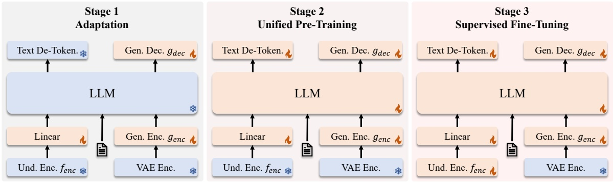

Figure 3 | Three training stages of JanusFlow. The trainable modules are marked with flame and the frozen modules are marked with snowflakes.

generation decoder. This stage serves to adapt these new modules to work effectively with the pre-trained LLM and SigLIP encoder, essentially functioning as an initialization phase for the newly introduced components.

生成解码器. 该阶段让新模块适配预训练 LLM 与 SigLIP 编码器, 实质上是新增组件的初始化阶段.

**Stage 2: Unified Pre-Training.** Following the adaptation stage, we train the entire model except for the visual encoder, consistent with previous approaches [58, 64]. The training incorporates three data types: multimodal understanding, image generation, and text-only data. We initially allocate a higher proportion of multimodal understanding data to establish the model’s understanding capabilities. Subsequently, we increase the ratio of image generation data to accommodate the convergence requirements of diffusion-based models [18, 72].

**阶段 2: 统一预训练.** 适配阶段结束后, 除视觉编码器外的整个模型都参与训练, 与以往方法一致 [58, 64]. 训练包含三类数据: 多模态理解, 图像生成和纯文本数据. 初期提高多模态理解数据占比, 建立模型的理解能力; 随后提高图像生成数据占比, 满足扩散类模型的收敛需求 [18, 72].

**Stage 3: Supervised Fine-Tuning (SFT).** In the final stage, we fine-tune the pre-trained model using instruction tuning data, which comprises dialogues, task-specific conversations, and highquality text-conditioned image generation examples. During this stage, we also unfreeze the SigLIP encoder parameters [64, 90, 97]. This fine-tuning process enables the model to effectively respond to user instructions for both multimodal understanding and image generation tasks.

**阶段 3: 监督微调 (SFT).** 最终使用指令微调数据微调预训练模型, 数据包括对话, 任务专项会话和高质量文本条件图像生成样本. 此阶段还会解冻 SigLIP 编码器参数 [64, 90, 97]. 微调使模型能够在多模态理解和图像生成任务中有效响应用户指令.

## 3.4. Training Objective · 训练目标

Training JanusFlow involves two types of data, multimodal understanding data and image generation data. Both types of data contain two parts: “condition” and “response”. “Condition” refers to the prompting of the tasks (e.g., text prompts in the task of generation and images in the task of understanding) while “response” refers to the corresponding responses of the two tasks. The data can be formatted as $x = \left( x ^ { c o n } , x ^ { r e s } \right)$ , where the superscript 𝑐𝑜𝑛 denotes “condition” and 𝑟𝑒𝑠 denotes “response”. We denote the length of the whole sequence 𝑥 as ℓ, the length of $x ^ { c o n }$ as $\ell _ { c o n }$ and the length of $x ^ { r e s }$ as $\ell _ { r e s }$ . We use 𝜃 to represent the collection of all the trainable parameters in JanusFlow, including the LLM, $f _ { e n c } ,   g _ { e n c } ,   g _ { d e c }$ and the linear transformation layers.

JanusFlow 使用两类训练数据: 多模态理解数据和图像生成数据. 两类数据都包含“条件”和“响应”两部分. 条件指任务提示, 例如生成任务中的文本提示与理解任务中的图像; 响应指两项任务各自的输出. 数据写成 $x=(x^{con},x^{res})$, 上标 $con$ 表示条件, $res$ 表示响应. 整个序列 $x$ 的长度记作 $\ell$, $x^{con}$ 与 $x^{res}$ 的长度分别记作 $\ell_{con}$ 与 $\ell_{res}$. $\theta$ 表示 JanusFlow 中所有可训练参数, 包括 LLM, $f_{enc}$, $g_{enc}$, $g_{dec}$ 和线性变换层.

**Autoregression Objective.** For mutimodal understanding tasks, $x ^ { r e s }$ contains only text tokens. JanusFlow is trained using the maximum likelihood principle,

**自回归目标.** 对多模态理解任务, $x^{res}$ 只包含文本 token. JanusFlow 按最大似然原则训练,

$$
\mathcal {L} _ {A R} (\theta) = - \mathbb {E} _ {x \sim \mathcal {D} _ {u n d}} \left[ \sum_ {i = \ell_ {c o n}} ^ {\ell - 1} \log \mathrm{P} _ {\theta} (x _ {i + 1} | x _ {1}, \dots , x _ {i}) \right],\tag{6}
$$

<!-- page 7 of 25 -->

<table><tr><td></td><td>Stage 1</td><td>Stage 2</td><td>Stage 3</td></tr><tr><td>Learning Rate</td><td> $1.0 \times 10^{-4}$ </td><td> $1 \times 10^{-4}$ </td><td> $2.0 \times 10^{-5}$ </td></tr><tr><td>LR Scheduler</td><td>Constant</td><td>Constant</td><td>Constant</td></tr><tr><td>Weight Decay</td><td>0.0</td><td>0.0</td><td>0.0</td></tr><tr><td>Gradient Clip</td><td>1.0</td><td>1.0</td><td>1.0</td></tr><tr><td>Optimizer</td><td colspan="3">AdamW ( $\beta_1 = 0.9, \beta_2 = 0.95$ )</td></tr><tr><td>Warm-up Steps</td><td>2,000</td><td>2,000</td><td>1,000</td></tr><tr><td>Training Steps</td><td>10,000</td><td>390,000</td><td>26,000</td></tr><tr><td>Batch Size</td><td>512</td><td>512</td><td>256</td></tr><tr><td>Data Ratio</td><td>50 : 50 : 0</td><td>14 : 80 : 6</td><td>21 : 70 : 9</td></tr></table>

where the expectation is taken over all $\left( x ^ { c o n } , x ^ { r e s } \right)$ pairs in our multimodal understanding dataset $\mathcal { D } _ { u n d } ,$ computing loss only over tokens in $x ^ { r e s }$

期望遍历多模态理解数据集 $\mathcal{D}_{und}$ 中所有 $(x^{con},x^{res})$ 对, 损失只在 $x^{res}$ 的 token 上计算.

**Rectified Flow Objective.** For image generation tasks, $x ^ { c o n }$ consists of text tokens and $x ^ { r e s }$ is the corresponding image. JanusFlow is trained with the rectified flow objective,

**Rectified Flow 目标.** 对图像生成任务, $x^{con}$ 由文本 token 构成, $x^{res}$ 是对应图像. JanusFlow 使用 rectified flow 目标训练,

$$
\mathcal {L} _ {R F} (\theta) = \mathbb {E} _ {x \sim \mathcal {D} _ {g e n}, t \sim \mathrm{P} (t), z _ {0} \sim \mathcal {N} (0, I)} \left[ | | \nu_ {\theta} (z _ {t}, t \mid x ^ {c o n}) - (x ^ {r e s} - z _ {0}) | | ^ {2} \right],\tag{7}
$$

where $z _ { t } = t x ^ { r e s } + ( 1 - t ) z _ { 0 }$ . Following Stable Diffusion 3 [23], we set the time distribution $\mathbf { P } ( t )$ to the logit-normal distribution. To enable CFG inference, we randomly drop 10% of the text prompts in training.

其中 $z_t=tx^{res}+(1-t)z_0$. 按照 Stable Diffusion 3 [23], 时间分布 $\mathbf{P}(t)$ 采用 logit-normal 分布. 为支持 CFG 推理, 训练时随机丢弃 10% 的文本提示.

**Representation Alignment Regularization.** Recent work [103] has shown that aligning intermediate representations between diffusion transformers and semantic vision encoders enhances diffusion model generalization. Our decoupled vision encoder design enables efficient implementation of this alignment as a regularization term. Specifically, for generation tasks, we align features from the understanding encoder $f _ { e n c }$ with the LLM’s intermediate features,

**表征对齐正则项.** 近期研究 [103] 表明, 对齐扩散 Transformer 与语义视觉编码器的中间表征可以增强扩散模型泛化能力. 解耦视觉编码器使 JanusFlow 能够高效地把这种对齐实现为正则项. 对生成任务, 我们将理解编码器 $f_{enc}$ 的特征与 LLM 中间特征对齐,

$$
\mathcal {L} _ {R E P A} (\theta , \varphi) = - \mathbb {E} _ {x \sim \mathcal {D} _ {g e n}} \left[ \text {sim} \left(\text {stop\_grad} (f _ {e n c} (x ^ {r e s})), h _ {\varphi} (q _ {\theta} (z _ {t}))\right) \right],\tag{8}
$$

where $q _ { \theta } ( z _ { t } )$ denotes an intermediate LLM representation given input $z _ { t } ,$ and $h _ { \varphi }$ is a small trainable MLP that projects $q _ { \theta } ( z _ { t } )$ to dimension $D _ { e n c }$ . The function sim(·, ·) computes the mean of element-wise cosine similarity between embeddings. Before computing the loss, we reshape $h _ { \varphi } ( q _ { \theta } ( z _ { t } ) )$ to $H _ { g e n } \times W _ { g e n } \times D _ { e n c }$ . To simplify the implementation, we intentionally adjust the configuration of $g _ { e n c }$ and $g _ { d e c }$ to ensure $H _ { g e n } = H _ { i m }$ and $W _ { g e n } = W _ { i m }$ . The gradient of $\mathcal { L } _ { R E P A }$ is not back-propagated through the understanding encoder. This alignment loss helps the LLM’s internal feature space (given noisy input $z _ { t } )$ align with the understanding encoder’s semantic feature space, thereby improving generation quality when producing images from new random noise and text conditions during inference.

其中 $q_\theta(z_t)$ 表示输入 $z_t$ 时的 LLM 中间表征, $h_\varphi$ 是小型可训练 MLP, 将 $q_\theta(z_t)$ 投影到 $D_{enc}$ 维. 函数 $sim(\cdot,\cdot)$ 计算嵌入逐元素余弦相似度的均值. 计算损失前, 将 $h_\varphi(q_\theta(z_t))$ 重塑为 $H_{gen}\times W_{gen}\times D_{enc}$. 为简化实现, 我们特意调整 $g_{enc}$ 与 $g_{dec}$ 配置, 保证 $H_{gen}=H_{im}$ 且 $W_{gen}=W_{im}$. $\mathcal{L}_{REPA}$ 的梯度不会反向传播进理解编码器. 该对齐损失使面对含噪输入 $z_t$ 的 LLM 内部特征空间接近理解编码器的语义特征空间, 从而改善推理时从新随机噪声和文本条件生成图像的质量.

**Summary.** All three objectives are applied across all training stages. Multimodal understanding tasks use $\mathcal { L } _ { A R , }$ , while image generation tasks employ the combined loss $\mathcal { L } _ { R F } + \mathcal { L } _ { R E P A }$ . Detailed experimental settings are provided in Sec. 4.1.

**小结.** 三个训练阶段都使用上述三项目标. 多模态理解任务使用 $\mathcal{L}_{AR}$, 图像生成任务使用组合损失 $\mathcal{L}_{RF}+\mathcal{L}_{REPA}$. 详细实验设置见第 4.1 节.

> **看表:** 式 (8) 中理解编码器是否会被生成损失带偏?
> 答: 不会. `stop_grad(f_enc(x^res))` 阻断了 $\mathcal{L}_{REPA}$ 对理解编码器的梯度. 生成路径与投影 MLP 向固定的 SigLIP 特征靠近, 理解编码器只在阶段 3 的任务训练中解冻.

<!-- page 8 of 25 -->

## 4. Experiments · 实验

We conduct extensive experiments to evaluate the capabilities of JanusFlow in both multimodal understanding and generation tasks. First, we describe our experimental setup and implementation details. Then, we present results on standard benchmarks for multimodal understanding and image generation. Finally, we perform ablation studies to validate our key design choices.

我们通过大量实验评估 JanusFlow 的多模态理解与生成能力. 先介绍实验设置和实现细节, 随后给出多模态理解与图像生成标准基准结果, 最终以消融实验验证关键设计选择.

## 4.1. Experiment Setup and Implementation Details · 实验设置与实现细节

Our framework builds upon an enhanced version1 of DeepSeek-LLM (1.3B) [7, 64]. The LLM consists of 24 transformer blocks and supports a sequence length of 4, 096. In our model, both understanding and generation exploits images of resolution 384.

框架建立在增强版 DeepSeek-LLM (1.3B) [7, 64] 之上. LLM 包含 24 个 Transformer 模块, 支持 4,096 的序列长度. 理解和生成任务都使用分辨率 384 的图像.

For multimodal understanding, we leverage SigLIP-Large-Patch/16 [106] as $f _ { e n c }$ . For image generation, we utilize the pre-trained SDXL-VAE [73] for its latent space. The generation encoder $g _ { e n c }$ comprises a $2 \times 2$ patchify layer followed by two ConvNeXt [96] blocks and a linear layer. The generation decoder $g _ { d e c }$ combines two ConvNeXt blocks, a pixel-shuffle layer to upsample the feature map, and a linear layer. Our SigLIP encoder contains ∼ 300M parameters. $g _ { e n c }$ and $g _ { d e c }$ are light-weight modules, containing ∼ 70M parameters in total. Table 1 details the hyperparameters for each training stage. In the alignment regularization, we use the LLM features after the 6th block as $q _ { \theta } ( z _ { t } )$ and a three-layer MLP as $h _ { \varphi }$ . We employ an exponential moving average (EMA) with a ratio of 0.99 to ensure training stability.

多模态理解使用 SigLIP-Large-Patch/16 [106] 作为 $f_{enc}$. 图像生成使用预训练 SDXL-VAE [73] 的潜在空间. 生成编码器 $g_{enc}$ 由一个 $2\times2$ patchify 层, 两个 ConvNeXt [96] 模块和一个线性层组成. 生成解码器 $g_{dec}$ 包含两个 ConvNeXt 模块, 一个用于上采样特征图的 pixel-shuffle 层和一个线性层. SigLIP 编码器约有 300M 参数, 轻量的 $g_{enc}$ 与 $g_{dec}$ 合计约 70M 参数. 表 1 给出各训练阶段的超参数. 表征对齐使用 LLM 第 6 个模块之后的特征作为 $q_\theta(z_t)$, 并用三层 MLP 作为 $h_\varphi$. 训练还采用比率 0.99 的指数移动平均以维持稳定性.

For data preprocessing, we deal with understanding and generation data differently. For understanding tasks, we maintain all image information by resizing the long side to the target size and padding the image to squares. For generation tasks, we resize the short side to the target size and apply random square cropping to avoid padding artifacts. During training, multiple sequences are packed to form a single sequence of length 4, 096 for training efficiency. Our implementation is based on the HAI-LLM platform [31] using PyTorch [74]. Training was conducted on NVIDIA A100 GPUs, with each model requiring ∼ 1, 600 A100 GPU days.

理解和生成数据采用不同预处理. 理解任务将长边缩放到目标尺寸, 再填充成正方形, 以保留全部图像信息. 生成任务将短边缩放到目标尺寸, 再随机裁剪正方形, 避免填充伪影. 训练时将多个序列打包成一个长度为 4,096 的序列以提高效率. 实现基于 HAI-LLM 平台 [31] 与 PyTorch [74]. 每个模型在 NVIDIA A100 GPU 上训练, 约需 1,600 A100 GPU-days.

## 4.2. Training Data Settings · 训练数据设置

We follow Janus [97] to construct the training data. The data configuration for each training stage is listed below.

我们按照 Janus [97] 构造训练数据. 各训练阶段的数据配置如下.

**Data for Stage 1 and Stage 2.** The first two stages of our framework uses three types of data: multimodal understanding data, image generation data and text-only data.

**阶段 1 与阶段 2 的数据.** 前两个阶段使用三类数据: 多模态理解数据, 图像生成数据和纯文本数据.

1. **Multimodal Understanding Data.** This type of data contains several sub-categories: (a) Image caption data. We incorporate caption datasets from [20, 41, 50, 51, 53, 82] and generate additional captions for images from [16, 43] using open-source multimodal understanding models. The names of the datasets are provided in the supplementary materials. The data follows template formats, e.g., “&lt;image&gt;Generate the caption of this picture. &lt;caption&gt;”. (b) Charts and tables. We directly adopt the chart and table data from the training data of DeepSeek-VL [64]. (c) Task data. ShareGPT4V [11] data is utilized to facilitate basic question-answering capabilities during pre-training,

1. **多模态理解数据.** 该类数据包含若干子类: (a) 图像描述数据. 我们采用 [20, 41, 50, 51, 53, 82] 的描述数据集, 并用开源多模态理解模型为 [16, 43] 的图像生成额外描述. 数据集名称见补充材料. 数据使用模板格式, 例如 “&lt;image&gt;Generate the caption of this picture. &lt;caption&gt;”. (b) 图表数据. 直接采用 DeepSeek-VL [64] 训练数据中的图表部分. (c) 任务数据. 使用 ShareGPT4V [11] 数据在预训练期间建立基本问答能力,

1This version, trained on an expanded text corpus compared to the one in Janus [97], has been demonstrated to possess better performance on multiple-choice benchmarks (e.g., MMBench [63] and SEED Bench [46]). Our preliminary experiments suggest that it has minimal impact on the quality of visual generation.

1与 Janus [97] 使用的版本相比, 该版本在扩展文本语料上训练, 已被证明在 MMBench [63] 和 SEED Bench [46] 等选择题基准上表现更好. 初步实验表明, 它对视觉生成质量影响很小.

<!-- page 9 of 25 -->

| Type Method | Params | Single Obj. | Two Obj. | Count. | Colors | Pos. | Color Attri. | Overall↑ |
| --- | --- | --- | --- | --- | --- | --- | --- | --- |
| LlamaGen [86] | 0.8B | 0.71 | 0.34 | 0.21 | 0.58 | 0.07 | 0.04 | 0.32 |
| LDM [77] | 1.4B | 0.92 | 0.29 | 0.23 | 0.70 | 0.02 | 0.05 | 0.37 |
| SDv1.5 [77] | 0.9B | 0.97 | 0.38 | 0.35 | 0.76 | 0.04 | 0.06 | 0.43 |
| PixArt-𝛼 [9] | 0.6B | 0.98 | 0.50 | 0.44 | 0.80 | 0.08 | 0.07 | 0.48 |
| SDv2.1 [77] | 0.9B | 0.98 | 0.51 | 0.44 | 0.85 | 0.07 | 0.17 | 0.50 |
| Gen. Only |  |  |  |  |  |  |  |  |
| DALL-E 2 [76] | 6.5B | 0.94 | 0.66 | 0.49 | 0.77 | 0.10 | 0.19 | 0.52 |
| Emu3-Gen [95] | 8B | 0.98 | 0.71 | 0.34 | 0.81 | 0.17 | 0.21 | 0.54 |
| SDXL [73] | 2.6B | 0.98 | 0.74 | 0.39 | 0.85 | 0.15 | 0.23 | 0.55 |
| IF-XL [17] | 4.3B | 0.97 | 0.74 | 0.66 | 0.81 | 0.13 | 0.35 | 0.61 |
| DALL-E 3 [6] | - | 0.96 | 0.87 | 0.47 | 0.83 | 0.43 | 0.45 | 0.67 |
| Chameleon [88] | 34B | - | - | - | - | - | - | 0.39 |
| LWM [59] | 7B | 0.93 | 0.41 | 0.46 | 0.79 | 0.09 | 0.15 | 0.47 |
| SEED-X† [27] | 17B | 0.97 | 0.58 | 0.26 | 0.80 | 0.19 | 0.14 | 0.49 |
| Unified Show-o [100] | 1.3B | 0.95 | 0.52 | 0.49 | 0.82 | 0.11 | 0.28 | 0.53 |
| Janus [97] | 1.3B | 0.97 | 0.68 | 0.30 | 0.84 | 0.46 | 0.42 | 0.61 |
| Transfusion [108] | 7.3B | - | - | - | - | - | - | 0.63 |
| JanusFlow (Ours) | 1.3B | 0.97 | 0.59 | 0.45 | 0.83 | 0.53 | 0.42 | 0.63 |

structured as “&lt;image&gt;&lt;question&gt;&lt;answer&gt;”. (d) Interleaved text-image data. This sub-category is sourced from [42, 84].

格式为 “&lt;image&gt;&lt;question&gt;&lt;answer&gt;”. (d) 图文交错数据. 该子类来自 [42, 84].

2. **Image Generation Data.** Our image generation dataset combines high-quality images from [16, 21, 41, 43, 68, 71, 82, 85] and 2 million in-house data. We enhance them with machinegenerated captions using multimodal understanding models. We filter the images in [16, 82] with aspect ratios and aesthetic scores, retaining approximately 20% of the original datasets. 25% of the data contains single-sentence captions. These kind of data assist the model to be able to process short prompts. All the data points are formatted as “&lt;prompt&gt;&lt;image&gt;”.

2. **图像生成数据.** 图像生成数据集由 [16, 21, 41, 43, 68, 71, 82, 85] 的高质量图像和 200 万条内部数据组成. 我们使用多模态理解模型生成机器描述以增强这些数据. 对 [16, 82] 中的图像按宽高比与美学分过滤, 保留原数据集约 20%. 其中 25% 的数据使用单句描述, 帮助模型处理短提示. 所有数据点均格式化为 “&lt;prompt&gt;&lt;image&gt;”.

3. **Text-Only Data.** We directly use the text corpus of DeepSeek-LLM [7].

3. **纯文本数据.** 直接使用 DeepSeek-LLM [7] 的文本语料.

**Data for Stage 3.** The SFT stage also uses three types of data:

**阶段 3 的数据.** SFT 阶段同样使用三类数据:

1. **Multimodal Instruction Data.** We leverage the instruction tuning datasets from [29, 33, 35, 47, 65, 80].

1. **多模态指令数据.** 使用 [29, 33, 35, 47, 65, 80] 的指令微调数据集.

2. **Image Generation Data.** We reformat the high-quality text-image pairs from [16, 82, 85] into an instruction format: “User:&lt;user prompt&gt;\n\n Assistant:&lt;image&gt;”.

2. **图像生成数据.** 将 [16, 82, 85] 的高质量图文对改写成指令格式: “User:&lt;user prompt&gt;\n\n Assistant:&lt;image&gt;”.

3. **Text-Only Data.** We directly incorporate the text-only data from [47].

3. **纯文本数据.** 直接加入 [47] 的纯文本数据.

## 4.3. Evaluation Settings · 评测设置

**Image Generation.** We evaluate the generated images using both visual quality and semantic accuracy metrics. For visual quality assessment, we employ the Fréchet Inception Distance [30] (FID) metric and compute FID between 30,000 generated images and their corresponding reference images from the MJHQ dataset [48]. The FID computation follows the implementation from GigaGAN [39]. To evaluate semantic accuracy, we utilize two specialized frameworks: GenEval [28] and DPG-Bench [34]. These frameworks are designed to assess whether the

**图像生成.** 使用视觉质量与语义准确性两类指标评估生成图像. 视觉质量采用 Fréchet Inception Distance [30] (FID), 计算 30,000 张生成图像与 MJHQ 数据集 [48] 对应参考图像之间的 FID, 实现遵循 GigaGAN [39]. 语义准确性采用 GenEval [28] 和 DPG-Bench [34] 两个专项框架, 评估

<!-- page 10 of 25 -->

| Method | Global | Entity | Attribute | Relation | Other | Overall↑ |
| --- | --- | --- | --- | --- | --- | --- |
| SDv1.5 [77] | 74.63 | 74.23 | 75.39 | 73.49 | 67.81 | 63.18 |
| PixArt-𝛼 [9] | 74.97 | 79.32 | 78.60 | 82.57 | 76.96 | 71.11 |
| Lumina-Next [110] | 82.82 | 88.65 | 86.44 | 80.53 | 81.82 | 74.63 |
| SDXL [73] | 83.27 | 82.43 | 80.91 | 86.76 | 80.41 | 74.65 |
| Playground v2.5 [48] | 83.06 | 82.59 | 81.20 | 84.08 | 83.50 | 75.47 |
| Hunyuan-DiT [54] | 84.59 | 80.59 | 88.01 | 74.36 | 86.41 | 78.87 |
| PixArt-Σ [10] | 86.89 | 82.89 | 88.94 | 86.59 | 87.68 | 80.54 |
| Emu3-Gen [95] | 85.21 | 86.68 | 86.84 | 90.22 | 83.15 | 80.60 |
| JanusFlow (Ours) | 87.03 | 87.31 | 87.39 | 89.79 | 88.10 | 80.09 |

generated images accurately contain the objects and relationships specified in the input prompts, providing a broad evaluation of the generation capabilities.

生成图像是否准确包含输入提示指定的对象及关系, 从而广泛衡量生成能力.

**Multimodal Understanding.** We evaluate JanusFlow’s multimodal understanding abilities across a diverse set of vision-language benchmarks for general understanding capabilities, including POPE [52], MME [24], MMBench [63], SEEDBench [46], VQAv2 [29], GQA [35], MM-Vet [104], MMMU [105], ChartQA[70] and TextVQA[81]

**多模态理解.** 我们使用多组视觉语言基准评估 JanusFlow 的通用多模态理解能力, 包括 POPE [52], MME [24], MMBench [63], SEEDBench [46], VQAv2 [29], GQA [35], MM-Vet [104], MMMU [105], ChartQA [70] 和 TextVQA [81].

## 4.4. Quantitative Results · 定量结果

**Image Generation Performances.** We report the performances on GenEval, DPG-Bench and MJHQ FID-30k. In Tab. 2, we give comparisons on GenEval including the scores of all the sub-tasks and the overall score. JanusFlow achieves an overall score of 0.63, surpassing the previous unified framework and several generation specific models including SDXL [73] and DALL-E 2 [76]. In Tab. 3, We show results on DPG-Bench and the corresponding comparisons. It is noted that all the methods in Tab. 3 are generation-specific models except our model. The results on GenEval and DPG-Bench demonstrate the ability of instruction following of our model. We give the comparisons on MJHQ FID-30k in Tab. 4. The images which are sampled to calculate FID are generated with a CFG factor 𝑤 = 2 and a number of sampling steps 30. We sweep the CFG factor and the sampling steps

**图像生成表现.** 我们报告 GenEval, DPG-Bench 和 MJHQ FID-30k 的结果. 表 2 比较 GenEval 各子任务及总分. JanusFlow 总分为 0.63, 超过以往统一框架和 SDXL [73], DALL-E 2 [76] 等若干生成专项模型. 表 3 给出 DPG-Bench 结果与对比, 其中除 JanusFlow 外均为生成专项模型. GenEval 与 DPG-Bench 结果体现了模型遵循指令的能力. 表 4 比较 MJHQ FID-30k. 用于计算 FID 的图像以 CFG 系数 $w=2$, 采样步数 30 生成. 我们还扫描了 CFG 系数与采样步数,

Table 4 | **Results of MJHQ FID-30k.** The models which have similar scales to our model are marked with blue background. JanusFlow achieves the best FID among 1.3B models.

| Method | Params | FID↓ |
| --- | --- | --- |
| LWM [59] | 7B | 17.77 |
| VILA-U 256 [99] | 7B | 12.81 |
| VILA-U 384 [99] | 7B | 7.69 |
| Show-o [100] | 1.3B | 15.18 |
| Janus [97] | 1.3B | 10.10 |
| JanusFlow (Ours) | 1.3B | 9.51 |

and provide the results in the appendix. Our method achieves the best performance among all the models with 1.3B LLM. The results prove that the rectified flow is able to improve the quality of generated images over autoregressive models such as Janus [97].

结果见附录. 在所有采用 1.3B LLM 的模型中, 本方法表现最佳. 结果表明, 相比 Janus [97] 一类自回归模型, rectified flow 能提高生成图像质量.

**Multimodal Understanding Performances.** We show comparisons of our method and other methods including understanding-specific models and unified understanding and generation models in Tab. 5. Our model reaches the best performances among all the models with similar number of parameters and even surpasses multiple understanding-specific methods with larger scales. Our results demonstrate that our method harmonizes autoregressive LLM and rectified flow, achieving satisfying performance in both understanding and generation.

**多模态理解表现.** 表 5 将本方法与理解专项模型及统一理解生成模型比较. 在参数量相近的模型中, JanusFlow 表现最佳, 还超过多个规模更大的理解专项方法. 结果表明, 本方法能够协调自回归 LLM 与 rectified flow, 在理解和生成两方面都取得良好表现.

<!-- page 11 of 25 -->

| Type | Model | LLM Param | POPE | MME-P | MMBdev | SEED | VQAv2test | GQA | MMMU | MM-Vet | ChartQA | TextVQA |
| --- | --- | --- | --- | --- | --- | --- | --- | --- | --- | --- | --- | --- |
| Und. Only | MobileVLM [12] MobileVLM-V2 [13] LLaVA-Phi [109] LLaVA [58] LLaVA-v1.5 [56] InstructBLIP [15] Qwen-VL-Chat [4] LLaVA-NeXT [57] Qwen2-VL [94] IDEFICS-9B [44] Emu3-Chat [95] InstructBLIP [15] LLaVA-v1.5-Phi-1.5 [100] MobileVLM [12] MobileVLM-V2 [13] | 2.7B2.7B2.7B7B7B7B7B7B7B8B8B13B1.3B1.4B1.4B | 84.984.785.076.385.9-----85.278.984.184.584.3 | 1288.91440.51335.1809.61510.7-1487.51519.3---1212.81128.01196.21302.8 | 59.663.259.838.764.336.060.6--48.258.5--53.257.7 | ---33.558.653.458.2---68.2---- | --71.4-78.5-78.2--50.975.1-75.3-- | 59.061.1--62.049.257.5--38.460.349.556.556.159.3 | ----35.4--35.154.1-31.6-30.7-- | --28.925.531.126.2--62.0--25.6--- | ------66.354.883.0-68.6---- | 47.557.548.6-58.250.161.5-84.325.964.750.7-41.552.1 |
| Unified | Gemini-Nano-1 [89] LWM [59] VILA-U [99] Chameleon [88] DreamLLM† [19] LaVIT† [37] Emu† [87] NExT-GPT† [98] Show-o [100] Janus [97] JanusFlow (Ours) | 1.8B7B7B7B7B7B13B13B1.3B1.3B1.3B | -75.285.8-----73.887.088.0 | --1401.8-----948.41338.01333.1 | ---------69.474.9 | --59.0------63.770.5 | 62.755.879.4-72.966.052.066.759.377.379.8 | -44.860.8--46.8--48.759.160.3 | 26.3--22.4----25.130.529.3 | -9.633.58.336.6----34.330.9 | 53.6---------64.6 | 62.5-60.8-41.8-----55.5 |

<table><tr><td rowspan="2">Exp. ID</td><td colspan="4">Model Setting</td><td rowspan="2">Train. Iter.</td><td colspan="5">Evaluation Benchmarks</td></tr><tr><td>REPA</td><td>Und. Modules</td><td>Gen. Modules</td><td>Type</td><td> $POPE \uparrow$ </td><td> $VQAv2_{val} \uparrow$ </td><td> $GQA \uparrow$ </td><td> $FID \downarrow$ </td><td> $CLIP \uparrow$ </td></tr><tr><td>A</td><td>×</td><td>SigLIP</td><td> $VAE^† + ConvNeXt$ </td><td>Unified</td><td>50,000</td><td>82.40</td><td>69.62</td><td>54.43</td><td>19.84</td><td>24.94</td></tr><tr><td>B</td><td>√</td><td colspan="2">Shared  $VAE^† + ConvNeXt$ </td><td>Unified</td><td>50,000</td><td>78.13</td><td>53.94</td><td>44.04</td><td>18.05</td><td>26.38</td></tr><tr><td>C</td><td>√</td><td>VAE+ConvNeXt</td><td> $VAE^† + ConvNeXt$ </td><td>Unified</td><td>50,000</td><td>75.30</td><td>55.41</td><td>44.44</td><td>17.53</td><td>26.32</td></tr><tr><td>D</td><td>√</td><td>SigLIP</td><td>-</td><td>Und. Only</td><td>13,000</td><td>85.03</td><td>69.10</td><td>54.23</td><td>-</td><td>-</td></tr><tr><td>E</td><td>√</td><td>-</td><td> $VAE^† + ConvNeXt$ </td><td>Gen. Only</td><td>37,000</td><td>-</td><td>-</td><td>-</td><td>16.69</td><td>26.89</td></tr><tr><td>F</td><td>√</td><td>SigLIP</td><td> $VAE^† + ConvNeXt$ </td><td>Unified</td><td>50,000</td><td>84.73</td><td>69.20</td><td>54.83</td><td>17.61</td><td>26.40</td></tr></table>

## 4.5. Ablation Studies · 消融实验

We conduct comprehensive ablation studies to validate the effectiveness of our key design choices. For computational efficiency, all ablation experiments are performed on 256 × 256 resolution images2. All models are trained on our unified pre-training dataset for 50, 000 iterations, except for the understanding-only and generation-only variants, which are trained for proportionally fewer iterations based on their respective data ratios in the pre-training phase. The quantitative results of these ablation studies are presented in Tab. 6.

我们进行完整消融实验以验证关键设计. 为节省计算, 所有消融均使用 $256\times256$ 分辨率图像. 除理解专项和生成专项变体按预训练阶段各自数据比例相应减少迭代外, 其余模型都在统一预训练数据集上训练 50,000 次迭代. 定量结果见表 6.

**Impact of Representation Alignment.** The comparison between Exp. A and F demonstrates the significant benefits of incorporating representation alignment regularization [103] during training. Specifically, models trained with representation alignment show notably lower FID

**表征对齐的影响.** 实验 A 与 F 的对比表明, 训练时加入表征对齐正则项 [103] 带来明显收益. 使用表征对齐训练的模型取得更低 FID,

2The understanding encoders in the 256 × 256-based ablation studies is also SigLIP-Large-Patch/16 which is pre-trained on 256 × 256 images.

2基于 $256\times256$ 图像的消融实验同样使用在 $256\times256$ 图像上预训练的 SigLIP-Large-Patch/16 作为理解编码器.

<!-- page 12 of 25 -->

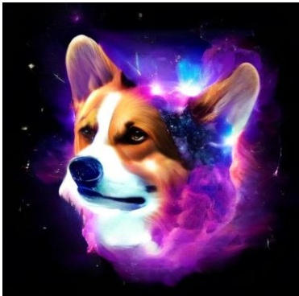

> 图注: JanusFlow 根据英文提示生成的埃及女王人像样例, 原文 Figure 4.

A corgi’s head depicted as an explosion of a nebula, with vibrant cosmic colors like deep purples, blues, and pinks swirling around. The corgi’s fur blends seamlessly into the nebula, with stars and galaxies forming the texture of its fur. Bright bursts of light emanate from its eyes, and faint constellations can be seen in the background, giving the image a surreal, otherworldly feel.

Beautiful surreal symbolism the mesmerizing vision of a Cleopatra Queen of Egypt, mesmerizing brown eyes, black hair and ethereal features, radiating celestial aura, super high definition, true lifelike color, perfect exposure, razor sharp focus, golden ratio, soft reflections, bokeh effect, fine art photography, cinematic compositing, authentic, professional.

> 图注: JanusFlow 根据英文提示生成的神庙台阶场景, 原文 Figure 4.

A lone figure in dark robes ascends worn stone steps toward a glowing light in an ancient temple entrance. Ornate arches, lush greenery, and intricate carvings adorn the scene, evoking a mystical, high-fantasy atmosphere reminiscent of works by artists like Randy Vargas, with cinematic lighting and epic storytelling.

Figure 4 | Image generation results of JanusFlow. Our model can generate high-quality images that are semantically consistent with text prompts.

scores on MJHQ dataset and higher CLIP scores, indicating simultaneous improvements in both image quality and semantic alignment. Importantly, our architecture differs from previous studies [66, 72] examined in [103] due to our incorporation of LLM and an additional skip connection between $g _ { e n c }$ and $g _ { d e c }$ . The effectiveness of representation alignment in our modified architecture suggests its broad applicability and generalization capability across different network structures.

以及更高 CLIP 分数, 说明图像质量和语义对齐同时改善. 由于加入 LLM 以及 $g_{enc}$ 与 $g_{dec}$ 之间的额外跳跃连接, 我们的架构不同于 [103] 所研究的以往模型 [66, 72]. 表征对齐在改造后架构中仍然有效, 表明它能够适用于不同网络结构.

**Impact of Decoupling Visual Encoders.** e efficacy of using powerful pre-trained visual encoders in multimodal understanding. The comparison among Exp. B, C, and F demonstrates the advantages of using separate visual encoders for understanding and generation tasks. In Exp. B, following a design similar to Transfusion [108], we implement shared ConvNeXt blocks in the SDXL-VAE latent space for both understanding and generation encoders. Exp. C employs separate encoders with identical architectures and initialization parameters, but trained independently. The performance differences between these configurations validate the necessity of decoupled visual encoders in improving our unified model’s capabilities. Moreover, the superior results in Exp. C and F highlight the benefits of leveraging pre-trained semantic visual encoders for multimodal understanding tasks.

**解耦视觉编码器的影响.** 强大的预训练视觉编码器有助于多模态理解. 实验 B, C 与 F 的比较说明, 理解和生成使用独立视觉编码器更有优势. 实验 B 采用类似 Transfusion [108] 的设计, 在 SDXL-VAE 潜在空间用共享 ConvNeXt 模块作为理解与生成编码器. 实验 C 使用架构和初始化参数相同但独立训练的两个编码器. 各配置的表现差异验证了解耦视觉编码器对提升统一模型能力的必要性. 实验 C 和 F 更好的结果还说明, 多模态理解能从预训练语义视觉编码器中受益.

**Fair Comparison with Understanding / Generation-Only Models.** To establish meaningful benchmarks, we evaluate task-specific models trained under identical conditions - using the same pre-training dataset, infrastructure, and hyperparameters. Exp. D and E represent these specialized models, trained with data volumes matching the unified models in Tab. 6. The minimal performance gap between Exp. F and these task-specific baselines demonstrates that our unified framework successfully integrates understanding and generation capabilities without significant compromise in either task’s performance.

**与理解或生成专项模型的公平比较.** 为建立有意义的基线, 我们评估在相同预训练数据集, 基础设施和超参数下训练的任务专项模型. 实验 D 和 E 是这些专项模型, 训练数据量与表 6 的统一模型匹配. 实验 F 与专项基线之间差距很小, 表明统一框架整合理解和生成能力时, 没有明显牺牲任一任务的表现.

> **对一下:** 表 6 能否把编码器解耦和 SigLIP 预训练的收益完全分开?
> 答: 不能. B 到 C 比较共享与独立的同类 VAE+ConvNeXt 编码器, C 到 F 又同时更换理解架构与预训练来源. 表格支持“独立 SigLIP 组合最好”, 但没有给出每项因素的完整析因实验.

## 4.6. Qualitative Results · 定性结果

We present qualitative evaluations of our method for both image generation and understanding tasks. Fig. 1(b) and Fig. 4 showcases the image generation capabilities of JanusFlow. These results demonstrate both the high visual quality of our generated images and our framework’s ability

我们对图像生成和理解任务进行定性评估. 图 1(b) 与图 4 展示 JanusFlow 的图像生成能力. 这些结果同时体现生成图像的视觉质量与框架

<!-- page 13 of 25 -->

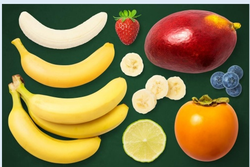

> 图注: JanusFlow 识别图中水果种类的理解样例, 原文 Figure 5.

User: What are the kinds of fruits in this picture?

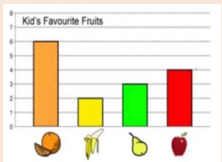

> 图注: JanusFlow 描述柱状图的视觉理解样例, 原文 Figure 5.

User: Describe this image.

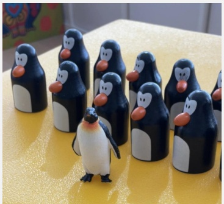

> 图注: JanusFlow 进行企鹅计数的视觉理解样例, 原文 Figure 5.

JaunsFlow (Ours): Kid's Favourite Fruits is a bar graph. The x-axis shows the fruits. The y-axis shows the number of kids who like the fruit. The orange is the most popular fruit. The banana is the least popular fruit.

JaunsFlow (Ours): The fruits in the picture are banana, strawberry, mango, persimmon, blueberry, and lime.

User: How many penguins in the picture?

JaunsFlow (Ours): There are 11 penguins in the picture.

Figure 5 | Visual Understanding with JanusFlow. Our model effectively handles various visual understanding tasks, such as question answering, plot interpretation and object counting.

to faithfully follow diverse instructions. For multimodal understanding, Fig. 5 presents example conversations that show our model’s understanding capabilities across various scenarios. These interactions demonstrate the model’s ability to understand and reason about visual content in natural language dialogues. Additional qualitative examples showcasing the versatility and effectiveness of JanusFlow are provided in the appendix.

遵循不同指令的能力. 多模态理解方面, 图 5 给出多种场景下的示例对话. 这些交互展示了模型在自然语言对话中理解视觉内容并进行推理的能力. 附录提供更多定性样例.

## 5. Conclusion · 结论

We present JanusFlow, a unified framework that successfully harmonizes autoregressive and rectified flow models for multimodal understanding and generation tasks. Our extensive experiments demonstrate that this unification achieves comparable performance to task-specific models. The successful integration of these fundamentally different model architectures not only addresses current challenges in multimodal learning but also opens new possibilities for future research in training unified models.

我们提出 JanusFlow, 一个为多模态理解与生成任务协调自回归模型和 rectified flow 的统一框架. 大量实验表明, 该统一方案达到与任务专项模型相当的表现. 两类不同模型架构的成功结合解决了当前多模态学习中的若干问题, 也为统一模型训练提供了新的研究方向.

<!-- page 14 of 25 -->

## References

[1] J. Achiam, S. Adler, S. Agarwal, L. Ahmad, I. Akkaya, F. L. Aleman, D. Almeida, J. Altenschmidt, S. Altman, S. Anadkat, et al. GPT-4 technical report. arXiv preprint arXiv:2303.08774, 2023.

[2] J.-B. Alayrac, J. Donahue, P. Luc, A. Miech, I. Barr, Y. Hasson, K. Lenc, A. Mensch, K. Millican, M. Reynolds, et al. Flamingo: a visual language model for few-shot learning. In Proc. Annu. Conf. Neural Inf. Process. Systems, 2022.

[3] M. Albergo and E. Vanden-Eijnden. Building normalizing flows with stochastic interpolants. In Proc. Int’l Conf. Learning Representations, 2023.

[4] J. Bai, S. Bai, S. Yang, S. Wang, S. Tan, P. Wang, J. Lin, C. Zhou, and J. Zhou. Qwen-VL: A frontier large vision-language model with versatile abilities. arXiv preprint arXiv:2308.12966, 2023.

[5] F. Bao, S. Nie, K. Xue, Y. Cao, C. Li, H. Su, and J. Zhu. All are worth words: A ViT backbone for diffusion models. In Proc. IEEE Int’l Conf. Computer Vision and Pattern Recognition, 2023.

[6] J. Betker, G. Goh, L. Jing, T. Brooks, J. Wang, L. Li, L. Ouyang, J. Zhuang, J. Lee, Y. Guo, et al. Improving image generation with better captions. Computer Science, 2023.

[7] X. Bi, D. Chen, G. Chen, S. Chen, D. Dai, C. Deng, H. Ding, K. Dong, Q. Du, Z. Fu, et al. DeepSeek LLM: Scaling open-source language models with longtermism. arXiv preprint arXiv:2401.02954, 2024.

[8] S. Bubeck, V. Chandrasekaran, R. Eldan, J. Gehrke, E. Horvitz, E. Kamar, P. Lee, Y. T. Lee, Y. Li, S. Lundberg, et al. Sparks of artificial general intelligence: Early experiments with GPT-4. arXiv preprint arXiv:2303.12712, 2023.

[9] J. Chen, J. Yu, C. Ge, L. Yao, E. Xie, Y. Wu, Z. Wang, J. Kwok, P. Luo, H. Lu, et al. PixArtalpha: Fast training of diffusion transformer for photorealistic text-to-image synthesis. arXiv preprint arXiv:2310.00426, 2023.

[10] J. Chen, C. Ge, E. Xie, Y. Wu, L. Yao, X. Ren, Z. Wang, P. Luo, H. Lu, and Z. Li. PixArt-Sigma: Weak-to-strong training of diffusion transformer for 4K text-to-image generation. arXiv preprint arXiv:2403.04692, 2024.

[11] L. Chen, J. Li, X. Dong, P. Zhang, C. He, J. Wang, F. Zhao, and D. Lin. ShareGPT4V: Improving large multi-modal models with better captions. arXiv preprint arXiv:2311.12793, 2023.

[12] X. Chu, L. Qiao, X. Lin, S. Xu, Y. Yang, Y. Hu, F. Wei, X. Zhang, B. Zhang, X. Wei, et al. MobileVLM: A fast, reproducible and strong vision language assistant for mobile devices. arXiv preprint arXiv:2312.16886, 2023.

[13] X. Chu, L. Qiao, X. Zhang, S. Xu, F. Wei, Y. Yang, X. Sun, Y. Hu, X. Lin, B. Zhang, et al. MobileVLM V2: Faster and stronger baseline for vision language model. arXiv preprint arXiv:2402.03766, 2024.

[14] K. Crowson, S. A. Baumann, A. Birch, T. M. Abraham, D. Z. Kaplan, and E. Shippole. Scalable high-resolution pixel-space image synthesis with hourglass diffusion transformers. In Proc. Int’l Conf. Machine Learning, 2024.

<!-- page 15 of 25 -->

[15] W. Dai, J. Li, D. Li, A. M. H. Tiong, J. Zhao, W. Wang, B. Li, P. Fung, and S. Hoi. InstructBLIP: Towards general-purpose vision-language models with instruction tuning. In Proc. Annu. Conf. Neural Inf. Process. Systems, 2023.

[16] dclure. LAION-Aesthetics-UMAP, 2022. URL [https://huggingface.co/datasets/dclure/laion-aesthetics-12m-umap](https://huggingface.co/datasets/dclure/laion-aesthetics-12m-umap).

[17] DeepFloyd. DeepFloyd IF, 2023. URL [https://huggingface.co/DeepFloyd/IF-I-XL-v1.0](https://huggingface.co/DeepFloyd/IF-I-XL-v1.0).

[18] P. Dhariwal and A. Nichol. Diffusion models beat GANs on image synthesis. In Proc. Annu. Conf. Neural Inf. Process. Systems, 2021.

[19] R. Dong, C. Han, Y. Peng, Z. Qi, Z. Ge, J. Yang, L. Zhao, J. Sun, H. Zhou, H. Wei, et al. DreamLLM: Synergistic multimodal comprehension and creation. In Proc. Int’l Conf. Learning Representations, 2024.

[20] echo840. Detailed caption, 2023. URL [https://huggingface.co/datasets/echo840/Detailed\_Caption](https://huggingface.co/datasets/echo840/Detailed_Caption).

[21] B. Egan, A. Redden, XWAVE, and SilentAntagonist. DALLE-3 1 million+ high quality captions, 2024. URL [https://huggingface.co/datasets/ProGamerGov/synthetic-dataset-1m-dalle3-high-quality-captions](https://huggingface.co/datasets/ProGamerGov/synthetic-dataset-1m-dalle3-high-quality-captions).

[22] P. Esser, R. Rombach, and B. Ommer. Taming transformers for high-resolution image synthesis. In Proc. IEEE Int’l Conf. Computer Vision and Pattern Recognition, 2021.

[23] P. Esser, S. Kulal, A. Blattmann, R. Entezari, J. Müller, H. Saini, Y. Levi, D. Lorenz, A. Sauer, F. Boesel, et al. Scaling rectified flow transformers for high-resolution image synthesis. In Proc. Int’l Conf. Machine Learning, 2024.

[24] C. Fu, P. Chen, Y. Shen, Y. Qin, M. Zhang, X. Lin, J. Yang, X. Zheng, K. Li, X. Sun, Y. Wu, and R. Ji. MME: A comprehensive evaluation benchmark for multimodal large language models. arXiv preprint arXiv:2306.13394, 2024.

[25] Y. Ge, Y. Ge, Z. Zeng, X. Wang, and Y. Shan. Planting a SEED of vision in large language model. arXiv preprint arXiv:2307.08041, 2023.

[26] Y. Ge, S. Zhao, Z. Zeng, Y. Ge, C. Li, X. Wang, and Y. Shan. Making LLaMA SEE and draw with SEED tokenizer. arXiv preprint arXiv:2310.01218, 2023.

[27] Y. Ge, S. Zhao, J. Zhu, Y. Ge, K. Yi, L. Song, C. Li, X. Ding, and Y. Shan. SEED-X: Multimodal models with unified multi-granularity comprehension and generation. arXiv preprint arXiv:2404.14396, 2024.

[28] D. Ghosh, H. Hajishirzi, and L. Schmidt. GenEval: An object-focused framework for evaluating text-to-image alignment. In Proc. Annu. Conf. Neural Inf. Process. Systems, 2024.

[29] Y. Goyal, T. Khot, D. Summers-Stay, D. Batra, and D. Parikh. Making the v in VQA matter: Elevating the role of image understanding in visual question answering. In Proc. IEEE Int’l Conf. Computer Vision and Pattern Recognition, 2017.

[30] M. Heusel, H. Ramsauer, T. Unterthiner, B. Nessler, and S. Hochreiter. GANs trained by a two time-scale update rule converge to a local nash equilibrium. Proc. Annu. Conf. Neural Inf. Process. Systems, 2017.

<!-- page 16 of 25 -->

[31] High-flyer. HAI-LLM: Efficient and lightweight training tool for large models, 2023. URL [https://www.high-flyer.cn/en/blog/hai-llm](https://www.high-flyer.cn/en/blog/hai-llm).

[32] J. Ho, A. Jain, and P. Abbeel. Denoising diffusion probabilistic models. In Proc. Annu. Conf. Neural Inf. Process. Systems, 2020.

[33] Y.-C. Hsiao, F. Zubach, G. Baechler, V. Carbune, J. Lin, M. Wang, S. Sunkara, Y. Zhu, and J. Chen. ScreenQA: Large-scale question-answer pairs over mobile app screenshots. arXiv preprint arXiv:2209.08199, 2022.

[34] X. Hu, R. Wang, Y. Fang, B. Fu, P. Cheng, and G. Yu. ELLA: Equip diffusion models with llm for enhanced semantic alignment. arXiv preprint arXiv:2403.05135, 2024.

[35] D. A. Hudson and C. D. Manning. GQA: A new dataset for real-world visual reasoning and compositional question answering. In Proc. IEEE Int’l Conf. Computer Vision and Pattern Recognition, 2019.

[36] Y. Jin, Z. Sun, N. Li, K. Xu, H. Jiang, N. Zhuang, Q. Huang, Y. Song, Y. Mu, and Z. Lin. Pyramidal flow matching for efficient video generative modeling. arXiv preprint arXiv:2410.05954, 2024.

[37] Y. Jin, K. Xu, L. Chen, C. Liao, J. Tan, Q. Huang, C. Bin, C. Song, D. ZHANG, W. Ou, et al. Unified language-vision pretraining in llm with dynamic discrete visual tokenization. In Proc. Int’l Conf. Learning Representations, 2024.

[38] B. Jing, B. Berger, and T. Jaakkola. AlphaFold meets flow matching for generating protein ensembles. In Proc. Int’l Conf. Machine Learning, 2024.

[39] M. Kang, J.-Y. Zhu, R. Zhang, J. Park, E. Shechtman, S. Paris, and T. Park. Scaling up GANs for text-to-image synthesis. In Proc. IEEE Int’l Conf. Computer Vision and Pattern Recognition, 2023.

[40] S. Kim, K. Shih, J. F. Santos, E. Bakhturina, M. Desta, R. Valle, S. Yoon, B. Catanzaro, et al. P-Flow: a fast and data-efficient zero-shot tts through speech prompting. In Proc. Annu. Conf. Neural Inf. Process. Systems, 2024.

[41] A. Kirillov, E. Mintun, N. Ravi, H. Mao, C. Rolland, L. Gustafson, T. Xiao, S. Whitehead, A. C. Berg, W.-Y. Lo, et al. Segment anything. In Proc. IEEE Int. Conf. Comput. Vision, 2023.

[42] M. Koupaee and W. Y. Wang. WikiHow: A large scale text summarization dataset. arXiv preprint arXiv:1810.09305, 2018.

[43] A. Kuznetsova, H. Rom, N. Alldrin, J. Uijlings, I. Krasin, J. Pont-Tuset, S. Kamali, S. Popov, M. Malloci, A. Kolesnikov, et al. The Open Images Dataset V4: Unified image classification, object detection, and visual relationship detection at scale. Int’l Journal of Computer Vision, 2020.

[44] H. Laurençon, D. van Strien, S. Bekman, L. Tronchon, L. Saulnier, T. Wang, S. Karamcheti, A. Singh, G. Pistilli, Y. Jernite, et al. Introducing IDEFICS: An open reproduction of state-of-the-art visual language model, 2023, 2023. URL [https://huggingface.co/blog/idefics](https://huggingface.co/blog/idefics).

<!-- page 17 of 25 -->

[45] M. Le, A. Vyas, B. Shi, B. Karrer, L. Sari, R. Moritz, M. Williamson, V. Manohar, Y. Adi, J. Mahadeokar, et al. VoiceBox: Text-guided multilingual universal speech generation at scale. In Proc. Annu. Conf. Neural Inf. Process. Systems, 2024.

[46] B. Li, R. Wang, G. Wang, Y. Ge, Y. Ge, and Y. Shan. SEED-Bench: Benchmarking multimodal llms with generative comprehension. arXiv preprint arXiv:2307.16125, 2023.

[47] B. Li, Y. Zhang, D. Guo, R. Zhang, F. Li, H. Zhang, K. Zhang, Y. Li, Z. Liu, and C. Li. LLaVA-OneVision: Easy visual task transfer. arXiv preprint arXiv:2408.03326, 2024.

[48] D. Li, A. Kamko, E. Akhgari, A. Sabet, L. Xu, and S. Doshi. Playground v2.5: Three insights towards enhancing aesthetic quality in text-to-image generation. arXiv preprint arXiv:2402.17245, 2024.

[49] J. Li, D. Li, S. Savarese, and S. Hoi. BLIP-2: Bootstrapping language-image pre-training with frozen image encoders and large language models. In Proc. Int’l Conf. Machine Learning, 2023.

[50] L. Li, Y. Wang, R. Xu, P. Wang, X. Feng, L. Kong, and Q. Liu. Multimodal arXiv: A dataset for improving scientific comprehension of large vision-language models. In Annual Meeting of the Association for Computational Linguistics, 2024.

[51] X. Li, F. Zhang, H. Diao, Y. Wang, X. Wang, and L.-Y. Duan. DenseFusion-1M: Merging vision experts for comprehensive multimodal perception. In Proc. Annu. Conf. Neural Inf. Process. Systems, 2024.

[52] Y. Li, Y. Du, K. Zhou, J. Wang, X. Zhao, and J.-R. Wen. Evaluating object hallucination in large vision-language models. In Proc. Conf. on Empirical Methods in Natural Language Process., 2023.

[53] Z. Li, X. Yang, K. Choi, W. Zhu, R. Hsieh, H. Kim, J. H. Lim, S. Ji, B. Lee, X. Yan, et al. MMSci: A multimodal multi-discipline dataset for phd-level scientific comprehension. In AI for Accelerated Materials Design, 2024.

[54] Z. Li, J. Zhang, Q. Lin, J. Xiong, Y. Long, X. Deng, Y. Zhang, X. Liu, M. Huang, Z. Xiao, et al. Hunyuan-DiT: A powerful multi-resolution diffusion transformer with fine-grained chinese understanding. arXiv preprint arXiv:2405.08748, 2024.

[55] Y. Lipman, R. T. Chen, H. Ben-Hamu, M. Nickel, and M. Le. Flow matching for generative modeling. In Proc. Int’l Conf. Learning Representations, 2023.

[56] H. Liu, C. Li, Y. Li, and Y. J. Lee. Improved baselines with visual instruction tuning. In Proc. IEEE Int’l Conf. Computer Vision and Pattern Recognition, 2024.

[57] H. Liu, C. Li, Y. Li, B. Li, Y. Zhang, S. Shen, and Y. J. Lee. LLaVA-NeXT: Improved reasoning, OCR, and world knowledge, 2024. URL [https://llava-vl.github.io/blog/2024-01-30-llava-next/](https://llava-vl.github.io/blog/2024-01-30-llava-next/).

[58] H. Liu, C. Li, Q. Wu, and Y. J. Lee. Visual instruction tuning. In Proc. Annu. Conf. Neural Inf. Process. Systems, 2024.

[59] H. Liu, W. Yan, M. Zaharia, and P. Abbeel. World model on million-length video and language with ringattention. arXiv preprint arXiv:2402.08268, 2024.

<!-- page 18 of 25 -->

[60] Q. Liu. Rectified flow: A marginal preserving approach to optimal transport. arXiv preprint arXiv:2209.14577, 2022.

[61] X. Liu, C. Gong, and Q. Liu. Flow straight and fast: Learning to generate and transfer data with rectified flow. In Proc. Int’l Conf. Learning Representations, 2023.

[62] X. Liu, X. Zhang, J. Ma, J. Peng, et al. InstaFlow: One step is enough for high-quality diffusion-based text-to-image generation. In Proc. Int’l Conf. Learning Representations, 2024.

[63] Y. Liu, H. Duan, Y. Zhang, B. Li, S. Zhang, W. Zhao, Y. Yuan, J. Wang, C. He, Z. Liu, et al. MMBench: Is your multi-modal model an all-around player? In Proc. European Conf. Computer Vision, 2024.

[64] H. Lu, W. Liu, B. Zhang, B. Wang, K. Dong, B. Liu, J. Sun, T. Ren, Z. Li, H. Yang, et al. DeepSeek-VL: towards real-world vision-language understanding. arXiv preprint arXiv:2403.05525, 2024.

[65] P. Lu, L. Qiu, J. Chen, T. Xia, Y. Zhao, W. Zhang, Z. Yu, X. Liang, and S.-C. Zhu. IconQA: A new benchmark for abstract diagram understanding and visual language reasoning. In Proc. Annu. Conf. Neural Inf. Process. Systems, 2021.

[66] N. Ma, M. Goldstein, M. S. Albergo, N. M. Boffi, E. Vanden-Eijnden, and S. Xie. SiT: Exploring flow and diffusion-based generative models with scalable interpolant transformers. arXiv preprint arXiv:2401.08740, 2024.

[67] Y. Ma, H. Yang, W. Wang, J. Fu, and J. Liu. Unified multi-modal latent diffusion for joint subject and text conditional image generation. arXiv preprint arXiv:2303.09319, 2023.

[68] madebyollin. Megalith-10M, 2024. URL [https://huggingface.co/datasets/madebyollin/megalith-10m](https://huggingface.co/datasets/madebyollin/megalith-10m).

[69] B. Mann, N. Ryder, M. Subbiah, J. Kaplan, P. Dhariwal, A. Neelakantan, P. Shyam, G. Sastry, A. Askell, S. Agarwal, et al. Language models are few-shot learners. arXiv preprint arXiv:2005.14165, 2020.

[70] A. Masry, X. L. Do, J. Q. Tan, S. Joty, and E. Hoque. ChartQA: A benchmark for question answering about charts with visual and logical reasoning. In Annual Meeting of the Association for Computational Linguistics, 2022.

[71] mehdidc. YFCC-15M, 2024. URL [https://huggingface.co/datasets/mehdidc/yfcc15m](https://huggingface.co/datasets/mehdidc/yfcc15m).

[72] W. Peebles and S. Xie. Scalable diffusion models with transformers. In Proc. IEEE Int. Conf. Comput. Vision, 2023.

[73] D. Podell, Z. English, K. Lacey, A. Blattmann, T. Dockhorn, J. Müller, J. Penna, and R. Rombach. SDXL: Improving latent diffusion models for high-resolution image synthesis. In Proc. Int’l Conf. Learning Representations, 2024.

[74] PyTorch-Contributors. PyTorch, 2024. URL [https://pytorch.org](https://pytorch.org).

[75] A. Radford, J. W. Kim, C. Hallacy, A. Ramesh, G. Goh, S. Agarwal, G. Sastry, A. Askell, P. Mishkin, J. Clark, et al. Learning transferable visual models from natural language supervision. In Proc. Int’l Conf. Machine Learning, 2021.

<!-- page 19 of 25 -->

[76] A. Ramesh, P. Dhariwal, A. Nichol, C. Chu, and M. Chen. Hierarchical text-conditional image generation with CLIP latents. arXiv preprint arXiv:2204.06125, 2022.

[77] R. Rombach, A. Blattmann, D. Lorenz, P. Esser, and B. Ommer. High-resolution image synthesis with latent diffusion models. In Proc. IEEE Int’l Conf. Computer Vision and Pattern Recognition, 2022.

[78] L. Ruan, Y. Ma, H. Yang, H. He, B. Liu, J. Fu, N. J. Yuan, Q. Jin, and B. Guo. MM-Diffusion: Learning multi-modal diffusion models for joint audio and video generation. In Proc. IEEE Int’l Conf. Computer Vision and Pattern Recognition, 2022.

[79] C. Saharia, W. Chan, S. Saxena, L. Li, J. Whang, E. L. Denton, K. Ghasemipour, R. Gontijo Lopes, B. Karagol Ayan, T. Salimans, et al. Photorealistic text-to-image diffusion models with deep language understanding. In Proc. Annu. Conf. Neural Inf. Process. Systems, 2022.

[80] S. Shah, A. Mishra, N. Yadati, and P. P. Talukdar. KVQA: Knowledge-aware visual question answering. In Proc. AAAI Conf. on Artificial Intelligence, 2019.

[81] A. Singh, V. Natarajan, M. Shah, Y. Jiang, X. Chen, D. Batra, D. Parikh, and M. Rohrbach. Towards VQA models that can read. In Proc. IEEE Int’l Conf. Computer Vision and Pattern Recognition, 2019.

[82] V. Singla, K. Yue, S. Paul, R. Shirkavand, M. Jayawardhana, A. Ganjdanesh, H. Huang, A. Bhatele, G. Somepalli, and T. Goldstein. From pixels to prose: A large dataset of dense image captions. arXiv preprint arXiv:2406.10328, 2024.

[83] Y. Song, J. Sohl-Dickstein, D. P. Kingma, A. Kumar, S. Ermon, and B. Poole. Scorebased generative modeling through stochastic differential equations. In Proc. Int’l Conf. Learning Representations, 2021.

[84] K. Srinivasan, K. Raman, J. Chen, M. Bendersky, and M. Najork. WIT: Wikipedia-based image text dataset for multimodal multilingual machine learning. In Proc. ACM SIGIR Conf. Research and Develop. in Info. Retrieval, 2021.

[85] K. Sun, J. Pan, Y. Ge, H. Li, H. Duan, X. Wu, R. Zhang, A. Zhou, Z. Qin, Y. Wang, et al. JourneyDB: A benchmark for generative image understanding. In Proc. Annu. Conf. Neural Inf. Process. Systems, 2024.

[86] P. Sun, Y. Jiang, S. Chen, S. Zhang, B. Peng, P. Luo, and Z. Yuan. Autoregressive model beats diffusion: LLaMA for scalable image generation. arXiv preprint arXiv:2406.06525, 2024.

[87] Q. Sun, Q. Yu, Y. Cui, F. Zhang, X. Zhang, Y. Wang, H. Gao, J. Liu, T. Huang, and X. Wang. Generative pretraining in multimodality. In Proc. Int’l Conf. Learning Representations, 2024.

[88] C. Team. Chameleon: Mixed-modal early-fusion foundation models. arXiv preprint arXiv:2405.09818, 2024.

[89] G. Team. Gemini: a family of highly capable multimodal models. arXiv preprint arXiv:2312.11805, 2023.

<!-- page 20 of 25 -->

[90] S. Tong, E. Brown, P. Wu, S. Woo, M. Middepogu, S. C. Akula, J. Yang, S. Yang, A. Iyer, X. Pan, et al. Cambrian-1: A fully open, vision-centric exploration of multimodal llms. arXiv preprint arXiv:2406.16860, 2024.

[91] H. Touvron, T. Lavril, G. Izacard, X. Martinet, M.-A. Lachaux, T. Lacroix, B. Rozière, N. Goyal, E. Hambro, F. Azhar, et al. LLaMA: Open and efficient foundation language models. arXiv preprint arXiv:2302.13971, 2023.

[92] H. Touvron, L. Martin, K. Stone, P. Albert, A. Almahairi, Y. Babaei, N. Bashlykov, S. Batra, P. Bhargava, S. Bhosale, et al. LLaMA 2: Open foundation and fine-tuned chat models. arXiv preprint arXiv:2307.09288, 2023.

[93] C. N. Vasconcelos, A. Rashwan, A. Waters, T. Walker, K. Xu, J. Yan, R. Qian, Y. Li, S. LUO, Y. Onoe, et al. Greedy growing enables high-resolution pixel-based diffusion models. Transactions on Machine Learning Research, 2024.

[94] P. Wang, S. Bai, S. Tan, S. Wang, Z. Fan, J. Bai, K. Chen, X. Liu, J. Wang, W. Ge, et al. Qwen2-VL: Enhancing vision-language model’s perception of the world at any resolution. arXiv preprint arXiv:2409.12191, 2024.

[95] X. Wang, X. Zhang, Z. Luo, Q. Sun, Y. Cui, J. Wang, F. Zhang, Y. Wang, Z. Li, Q. Yu, et al. Emu3: Next-token prediction is all you need. arXiv preprint arXiv:2409.18869, 2024.

[96] S. Woo, S. Debnath, R. Hu, X. Chen, Z. Liu, I. S. Kweon, and S. Xie. ConvNeXt v2: Co-designing and scaling ConvNets with masked autoencoders. In Proc. IEEE Int’l Conf. Computer Vision and Pattern Recognition, 2023.

[97] C. Wu, X. Chen, Z. Wu, Y. Ma, X. Liu, Z. Pan, W. Liu, Z. Xie, X. Yu, C. Ruan, et al. Janus: Decoupling visual encoding for unified multimodal understanding and generation. arXiv preprint arXiv:2410.13848, 2024.

[98] S. Wu, H. Fei, L. Qu, W. Ji, and T.-S. Chua. NExT-GPT: Any-to-any multimodal LLM. In Proc. Int’l Conf. Machine Learning, 2024.

[99] Y. Wu, Z. Zhang, J. Chen, H. Tang, D. Li, Y. Fang, L. Zhu, E. Xie, H. Yin, L. Yi, et al. VILA-U: A unified foundation model integrating visual understanding and generation. arXiv preprint arXiv:2409.04429, 2024.

[100] J. Xie, W. Mao, Z. Bai, D. J. Zhang, W. Wang, K. Q. Lin, Y. Gu, Z. Chen, Z. Yang, and M. Z. Shou. Show-o: One single transformer to unify multimodal understanding and generation. arXiv preprint arXiv:2408.12528, 2024.

[101] H. Ye, D.-A. Huang, Y. Lu, Z. Yu, W. Ping, A. Tao, J. Kautz, S. Han, D. Xu, P. Molchanov, et al. X-VILA: Cross-modality alignment for large language model. arXiv preprint arXiv:2405.19335, 2024.

[102] L. Yu, J. Lezama, N. B. Gundavarapu, L. Versari, K. Sohn, D. Minnen, Y. Cheng, A. Gupta, X. Gu, A. G. Hauptmann, et al. Language model beats diffusion-tokenizer is key to visual generation. In Proc. Int’l Conf. Learning Representations, 2024.

[103] S. Yu, S. Kwak, H. Jang, J. Jeong, J. Huang, J. Shin, and S. Xie. Representation alignment for generation: Training diffusion transformers is easier than you think. arXiv preprint arXiv:2410.06940, 2024.

<!-- page 21 of 25 -->

[104] W. Yu, Z. Yang, L. Li, J. Wang, K. Lin, Z. Liu, X. Wang, and L. Wang. MM-Vet: Evaluating large multimodal models for integrated capabilities. In Proc. Int’l Conf. Machine Learning, 2024.

[105] X. Yue, Y. Ni, K. Zhang, T. Zheng, R. Liu, G. Zhang, S. Stevens, D. Jiang, W. Ren, Y. Sun, et al. MMMU: A massive multi-discipline multimodal understanding and reasoning benchmark for expert AGI. In Proc. IEEE Int’l Conf. Computer Vision and Pattern Recognition, 2024.

[106] X. Zhai, B. Mustafa, A. Kolesnikov, and L. Beyer. Sigmoid loss for language image pre-training. In Proc. IEEE Int. Conf. Comput. Vision, 2023.

[107] C. Zhao, Y. Song, W. Wang, H. Feng, E. Ding, Y. Sun, X. Xiao, and J. Wang. MonoFormer: One transformer for both diffusion and autoregression. arXiv preprint arXiv:2409.16280, 2024.

[108] C. Zhou, L. Yu, A. Babu, K. Tirumala, M. Yasunaga, L. Shamis, J. Kahn, X. Ma, L. Zettlemoyer, and O. Levy. Transfusion: Predict the next token and diffuse images with one multi-modal model. arXiv preprint arXiv:2408.11039, 2024.

[109] Y. Zhu, M. Zhu, N. Liu, Z. Ou, X. Mou, and J. Tang. LLaVA-Phi: Efficient multi-modal assistant with small language model. arXiv preprint arXiv:2401.02330, 2024.

[110] L. Zhuo, R. Du, H. Xiao, Y. Li, D. Liu, R. Huang, W. Liu, L. Zhao, F.-Y. Wang, Z. Ma, et al. Lumina-Next: Making Lumina-T2X stronger and faster with Next-DiT. arXiv preprint arXiv:2406.18583, 2024.

<!-- page 22 of 25 -->

## Appendix · 附录

## A. Performance Analysis of 256 Resolution Model · 256 分辨率模型性能分析

We trained our model at two resolutions: 256 × 256 and 384 × 384. The main paper presents results from the 384 × 384 model as our primary results. Here, we provide a comprehensive evaluation of the 256 × 256 model’s performance. The visual understanding performances are presented in Tab. 1. The generation capabilities are evaluated using GenEval [28], DPG-Benchmark [34], and MJHQ FID-30k [48], with results shown in Tab. 2 and 3.

我们以 $256\times256$ 和 $384\times384$ 两种分辨率训练模型. 正文将 $384\times384$ 模型结果作为主要结果, 此处完整评估 $256\times256$ 模型. 视觉理解表现见表 1. 生成能力使用 GenEval [28], DPG-Benchmark [34] 和 MJHQ FID-30k [48] 评估, 结果见表 2 和表 3.

| Model | LLM Params | $POPE \uparrow$ | MME-P↑ | $MMB_{dev} \uparrow$ | SEED↑ | $VQAv2_{test} \uparrow$ | GQA↑ | MM-Vet↑ |
| --- | --- | --- | --- | --- | --- | --- | --- | --- |
| JanusFlow 256 | 1.3B | 85.3 | 1203.0 | 71.9 | 67.6 | 76.3 | 58.4 | 27.4 |
| JanusFlow 384 | 1.3B | 88.0 | 1333.1 | 74.9 | 70.5 | 79.8 | 60.3 | 30.9 |

| Method | LLM Params | Single Obj. | Two Obj. | Count. | Colors | Pos. | Color Attri. | Overall↑ |
| --- | --- | --- | --- | --- | --- | --- | --- | --- |
| JanusFlow 256 | 1.3B | 0.98 | 0.73 | 0.54 | 0.83 | 0.63 | 0.53 | 0.70 |
| JanusFlow 384 | 1.3B | 0.97 | 0.59 | 0.45 | 0.83 | 0.53 | 0.42 | 0.63 |

<table><tr><td rowspan="2">Method</td><td colspan="6">DPG-Bench↑</td><td rowspan="2">MJHQ FID-30k↓</td></tr><tr><td>Global</td><td>Entity</td><td>Attribute</td><td>Relation</td><td>Other</td><td>Overall</td></tr><tr><td>JanusFlow 256</td><td>91.20</td><td>88.83</td><td>88.00</td><td>87.60</td><td>89.53</td><td>81.23</td><td>12.70</td></tr><tr><td>JanusFlow 384</td><td>87.03</td><td>87.31</td><td>87.39</td><td>89.79</td><td>88.10</td><td>80.09</td><td>9.51</td></tr></table>

As expected, the 256 × 256 model shows slightly lower performance compared to the 384 × 384 model on visual understanding metrics due to its reduced resolution. Interestingly, however, the 256 × 256 model outperforms its higher-resolution counterpart on GenEval and DPG-Bench - benchmarks specifically designed to evaluate instruction following capabilities and semantic accuracy. This superior performance on semantic tasks can be attributed to the model’s better control over lower-resolution images, where reduced visual complexity allows for more precise semantic manipulation.

由于分辨率更低, $256\times256$ 模型在视觉理解指标上略弱于 $384\times384$ 模型, 符合预期. 但在专门评估指令遵循和语义准确性的 GenEval 与 DPG-Bench 上, $256\times256$ 模型反而超过高分辨率版本. 作者将语义任务上的优势归因于模型更容易控制低分辨率图像, 较低的视觉复杂度允许更精确的语义操作.

> **确认:** 低分辨率模型的语义分数更高, 是否足以证明原因是“更容易控制”?
> 答: 不足. 附录只报告两种分辨率的结果, 没有控制训练收敛速度, 潜变量网格大小与采样参数后继续消融. 数字确认性能差异, 原因属于作者解释, 尚未由独立实验隔离.

## B. Details of the Datasets · 数据集详情

The datasets used in the pre-training stage for understanding include DetailedCaption [20], SAM [41], arXivQA[50], DenseFusion-1M [51], MMSci[53], PixelProse [82], re-captioned LAION-Aesthetics [16], re-captioned Open Images V4 [43], ShareGPT4V [11], WikiHow [42] and WIT [84]. The datasets used in the pre-training stage for generation include re-captioned LAION-Aesthetics [16], DALL-E 3 1M [21], SAM [41], Open Images V4 [43], Megalith-10M [68], YFCC-15M [71], PixelProse[82] and JourneyDB [85].

预训练阶段的理解数据集包括 DetailedCaption [20], SAM [41], arXivQA [50], DenseFusion-1M [51], MMSci [53], PixelProse [82], 重新生成描述的 LAION-Aesthetics [16], 重新生成描述的 Open Images V4 [43], ShareGPT4V [11], WikiHow [42] 与 WIT [84]. 生成数据集包括重新生成描述的 LAION-Aesthetics [16], DALL-E 3 1M [21], SAM [41], Open Images V4 [43], Megalith-10M [68], YFCC-15M [71], PixelProse [82] 与 JourneyDB [85].

<!-- page 23 of 25 -->

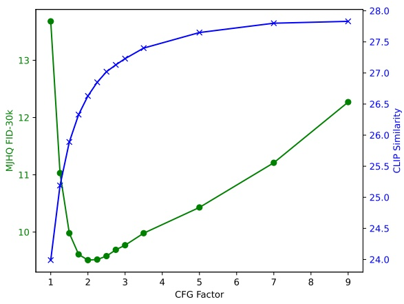

(a) Results of varying CFG Factors

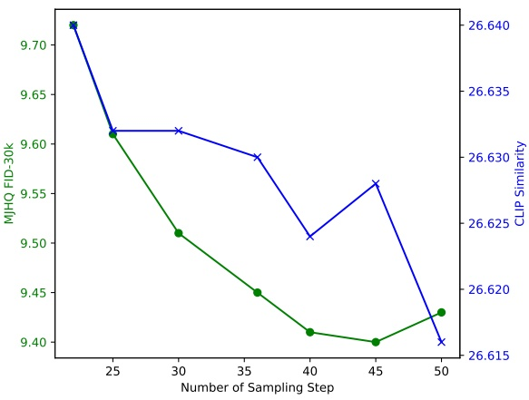

(b) Results of Varying Numbers of Sampling Steps

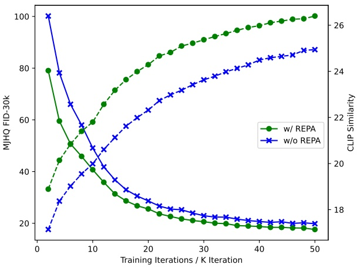

Figure 1 | Results of varying CFG factors and numbers of sampling steps. In Fig. (a), the number of sampling steps is set to 30. In Fig. (b), the CFG factor is set to 2.

Figure 2 | The FID and CLIP similarity during the first 50,000 iterations.

## C. Analysis of CFG Factor and Sampling Steps · CFG 系数与采样步数分析

We investigate the impact of two key generation parameters: the Classifier-Free Guidance (CFG) factor and the number of sampling steps. While our main results use 𝑤 = 2 for CFG and 30 sampling steps to calculate FID, here we present a comprehensive analysis of these hyperparameters. Fig. 1(a) shows the effect of varying CFG factors while maintaining 30 sampling steps. The results reveal an optimal CFG value for FID scores, while CLIP [75] similarity continues to improve with increasing CFG values, consistent with findings from previous work [73]. Fig. 1(b) demonstrates the impact of different sampling steps while maintaining a CFG factor of 2. The number of sampling steps shows relatively minor influence on performance. Our choice of 30 steps in the main paper represents a balance between generation quality and computational efficiency.

我们研究两个关键生成参数的影响: Classifier-Free Guidance (CFG) 系数与采样步数. 正文计算 FID 时使用 $w=2$ 和 30 个采样步, 此处进一步分析这些超参数. 图 1(a) 在固定 30 个采样步时改变 CFG 系数. FID 存在最优 CFG 取值, 而 CLIP [75] 相似度随 CFG 增大而继续提高, 与以往工作 [73] 一致. 图 1(b) 在 CFG 系数固定为 2 时比较不同采样步数. 采样步数对性能影响较小. 正文采用 30 步, 用于平衡生成质量与计算效率.

<!-- page 24 of 25 -->

## D. Details of REPA Ablation · REPA 消融详情

We provide the FID and CLIP similarity of the first 50,000 training iterations of the pre-train stage in Fig. 2 with and without representation alignment regularization. The gap between the two models demonstrates the benefits of using representation alignment regularization.

图 2 给出预训练前 50,000 次迭代中, 使用与不使用表征对齐正则项时的 FID 和 CLIP 相似度. 两个模型之间的差距体现了表征对齐正则项的收益.

## E. Additional Qualitative Results · 更多定性结果

Additional qualitative examples for both understanding and generation tasks are presented in Fig. 3 and Fig. 4, respectively. The understanding examples demonstrate JanusFlow’s diverse capabilities, including code generation, person identification, character recognition, and visual reasoning. For image generation, our model exhibits strong performance in both visual quality and semantic alignment with input prompts.

图 3 和图 4 分别给出理解与生成任务的更多定性样例. 理解样例展示 JanusFlow 在代码生成, 人物识别, 文字识别和视觉推理等方面的能力. 图像生成方面, 模型在视觉质量以及与输入提示的语义对齐上均有良好表现.

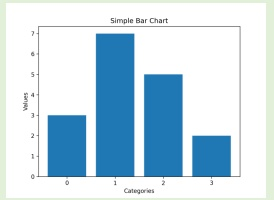

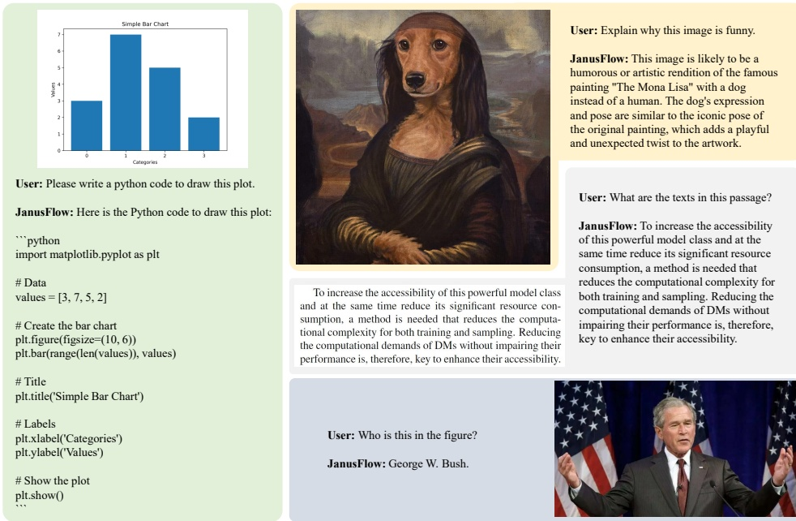

> 图注: JanusFlow 解释幽默图像并进行文字识别的附录样例, 原文 Figure 3.

User: Explain why this image is funny.

JanusFlow: This image is likely to be a humorous or artistic rendition of the famous painting "The Mona Lisa" with a dog instead of a human. The dog's expression and pose are similar to the iconic pose of the original painting, which adds a playful and unexpected twist to the artwork.

User: What are the texts in this passage?

JanusFlow: To increase the accessibility of this powerful model class and at the same time reduce its significant resource consumption, a method is needed that reduces the computational complexity for both training and sampling. Reducing the computational demands of DMs without impairing their performance is, therefore, key to enhance their accessibility.

Figure 3 | More multimodal understanding cases.

<!-- page 25 of 25 -->

> 图注: 燃烧教堂与天堂地狱主题的生成样例, 原文 Figure 4.

Massive cathedral church, battle between Heaven and hell, church on fire, 8k hyper real ultra sharp renaissance by Francisco Goya.

> 图注: 戴眼镜的动漫风格人物生成样例, 原文 Figure 4.

A handsome 24-year-old boy in the middle with sky color background wearing eye glasses, it's super detailed with anime style.

> 图注: 森林树枝上的猫头鹰怪物生成样例, 原文 Figure 4.

Happy dreamy owl monster sitting on a tree branch, colorful glittering particles, forest background, detailed feathers.

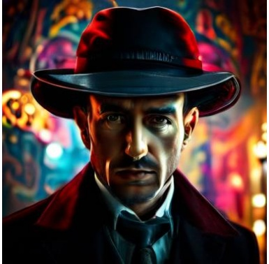

> 图注: 戴 Fedora 帽的人像摄影风格生成样例, 原文 Figure 4.

A man wearing Fedora hat with mafia style, realistic photography, intricate details, magical lighting, vibrant background, complex textures, rich colors, realistic style, front-facing view.

> 图注: 冰岛雪山上空北极光生成样例, 原文 Figure 4.

A vivid depiction of the Northern Lights dancing above the snow-covered mountains in Iceland, casting a mesmerizing glow across the sky.

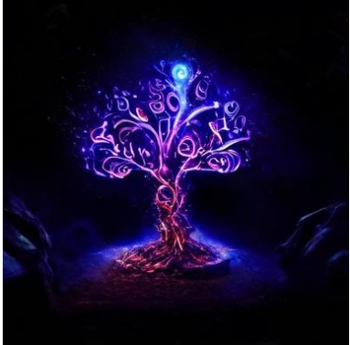

> 图注: 高对比度发光生命树生成样例, 原文 Figure 4.

A dark, high-contrast render of a psychedelic Tree of Life glowing brilliantly, illuminating swirling dust particles in a mystical, cavernous setting.

> 图注: 蘑菇与海岸照片的图像描述和中国水墨村庄生成样例, 原文 Figure 4.

The image features a mushroom growing on grassy ground amidst fallen leaves. Their caps are light brownish-white with visible gills underneath; the stems appear dark and sturdy. In the background, there's an out-of-focus scene that includes greenery and possibly some structures or trees shrouded by mist or fog, giving it a serene yet slightly eerie atmosphere. This photograph employs shallow depth of field to emphasize the mushrooms while blurring the surroundings for artistic effect.

The image captures a vast ocean view at either sunrise or sunset, with soft pink hues near the horizon blending into darker clouds above. Waves crash against rugged black rocks on the right, where water flows down onto smaller stones below. In the foreground, dry grass contrasts with the smooth sea surface. The scene feels tranquil but also reveals the raw power of nature through the interaction between the dynamic waves and the solid land.

Figure 4 | More text-to-image generation results.

A serene Chinese ink painting depicts a tranquil mountain village. Simple homes nestle at the foot of misty peaks, while a gentle river winds through the village. Bamboo and pine trees dot the landscape. The minimalist brushstrokes reflect a harmonious relationship between nature and human life, capturing the peaceful essence of the scene with elegant simplicity.
