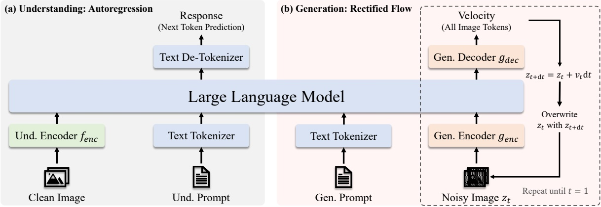

# JanusFlow 技术解析: 在同一 LLM 中协调自回归理解与 Rectified Flow 生成

JanusFlow 由 DeepSeek-AI, 北京大学, 香港大学和清华大学共同完成, 论文 arXiv:2411.07975v2 于 2025 年 3 月更新, 代码与模型位于 [DeepSeek Janus 仓库](https://github.com/deepseek-ai/Janus). 它以增强版 DeepSeek-LLM 1.3B 为共享主干, 将视觉理解写成 next-token prediction, 将图像生成写成 rectified flow 的速度预测. 两种任务共享 LLM, 但不强迫视觉输入共用编码器. 论文的主要贡献落在接口设计: 连续图像潜变量怎样进入因果 Transformer, 两项视觉任务怎样隔离输入表征, 生成特征又怎样借用理解编码器的语义空间.

## 1. 统一发生在 LLM 主干, 不发生在视觉入口

JanusFlow 统一的是 LLM 主干, 视觉理解与图像生成仍使用不同入口.

### 1.1. 两项任务共用序列计算接口

视觉理解沿用多模态 LLM 的常见路径. 文本先变成离散 token 嵌入, 图像 $x_{im}$ 由理解编码器 $f_{enc}$ 转成 $H_{im}\times W_{im}\times D_{enc}$ 的特征图, 展平并线性投影到 $D_{emb}$ 维. 图像嵌入放在 |BOI| 与 |EOI| 之间, 与文本嵌入拼成一个序列. LLM 使用因果注意力读取这段序列, 只在响应文本 $x^{res}$ 上计算自回归损失 $\mathcal{L}_{AR}$.

图像生成也进入同一个因果 Transformer, 但输入不是理解特征. SDXL-VAE 先将目标图像压到连续潜在空间. 训练时把真实潜变量 $x^{res}$ 与高斯噪声 $z_0$ 线性插值得到 $z_t=tx^{res}+(1-t)z_0$, 生成编码器 $g_{enc}$ 将 $z_t$ 转成 LLM 嵌入, 并追加时刻 $t$ 的嵌入. LLM 输出再经过生成解码器 $g_{dec}$ 还原成潜在空间速度. 因此共享主干处理的都是 embedding 序列, 任务差异由序列来源, 输出头与损失函数表达.

> 图 1: JanusFlow 的理解与生成路径. 理解路径预测文本 token, 生成路径迭代预测潜变量速度, 对应原文 Figure 2.

图 1 中生成状态不是一次自回归产生的离散图像 token. 每个采样时刻都把当前潜变量 $z_t$ 送入同一个 LLM, 得到速度 $\nu(z_t,t)$, 再用 Euler 更新 $z_{t+dt}=z_t+\nu(z_t,t)dt$. 到 $t=1$ 后, SDXL-VAE 解码器把最终潜变量还原成图像. 论文使用 30 个采样步计算主要 FID, 这意味着一次图像生成需要多次运行 LLM. 统一模型节省了独立生成主干, 却没有把图像生成变成单次前向.

### 1.2. 因果注意力为何能够承担速度预测

扩散或 flow Transformer 常让图像 token 双向交互, JanusFlow 却报告替代掩码没有带来收益, 因而保留 LLM 原有的因果注意力. 图像潜变量经 $g_{enc}$ 变成固定顺序的二维网格序列, 后一位置只能看到文本条件, 时间 token 与之前的图像位置. 这在对称性上弱于全注意力, 但减少了对预训练 LLM 注意力结构的改造, 也允许理解和生成走同一套主干实现.

论文没有给出不同掩码方案的定量表, 只说明初步实验未观察到收益. 因此不能从现有实验推出因果掩码普遍优于双向掩码. 更稳妥的结论是: 在 1.3B LLM, 384 分辨率, 当前 $g_{enc}$ 与 $g_{dec}$ 配置下, 因果注意力足以支持论文报告的生成质量. 当分辨率, 主干规模或采样器改变后, 掩码是否仍无影响需要单独验证.

### 1.3. 解耦编码器解决目标冲突

理解编码器需要形成对类别, 关系和文字稳定的语义表征. JanusFlow 使用约 300M 参数的预训练 SigLIP-Large-Patch/16. 生成路径则需要从带噪潜变量中保留局部结构, 并输出与 SDXL-VAE 潜在空间同形状的速度. 它使用从头训练的 ConvNeXt 编码器和解码器, 两者合计约 70M 参数, 中间还有长跳跃连接. 两项任务对空间细节和不变性的要求不同, 共用一个视觉编码器会让输入接口同时接受相互牵制的梯度.

表 6 将这种冲突量化. 实验 B 让理解与生成共享 VAE 潜在空间中的 ConvNeXt, POPE, VQAv2 和 GQA 分别只有 78.13, 53.94 与 44.04. 实验 F 改用 SigLIP 理解编码器与独立生成模块后, 三项指标升至 84.73, 69.20 与 54.83. 实验 C 虽然分开编码器, 但理解侧仍从 VAE 与 ConvNeXt 起步, 对应结果为 75.30, 55.41 与 44.44. 差异表明“分开”与“使用预训练语义编码器”都是关键变量, 单独复制相同结构并不足以获得理解能力.

## 2. Rectified Flow 在 LLM 内部怎样训练

### 2.1. 速度目标与采样路径

Rectified flow 从简单分布 $\pi_0$, 通常为标准高斯噪声, 连接到数据分布 $\pi_1$. 训练从两端各取一点 $z_0$ 与 $x$, 再在 $t\in[0,1]$ 上取插值点 $z_t=tx+(1-t)z_0$. 直线路径的目标速度为 $x-z_0$. 神经网络以 $z_t$ 和 $t$ 为输入, 最小化预测速度与 $x-z_0$ 的平方距离. JanusFlow 将图像 $x^{res}$ 换成 SDXL-VAE 潜变量, 得到论文式 (7) 的 $\mathcal{L}_{RF}$.

时间 $t$ 沿用 Stable Diffusion 3 的 logit-normal 分布采样. 时间分布决定训练更频繁覆盖哪些噪声强度, 会改变模型在采样轨迹不同区段的误差. 论文没有在 JanusFlow 上单独消融时间分布, 因而主要实验支持的是整套配置. 推理使用一阶 Euler 求解器. 附录图 1(b) 显示, CFG 固定为 2 时, 在论文考察范围内改变步数对结果影响较小, 正文选择 30 步作为质量与成本的折中.

生成过程还使用 classifier-free guidance. 训练时随机丢弃 10% 文本提示, 让同一网络同时学习条件速度 $\nu(z_t,t\mid x^{con})$ 与无条件速度 $\nu(z_t,t\mid\emptyset)$. 推理按 $w\nu(z_t,t\mid x^{con})+(1-w)\nu(z_t,t\mid\emptyset)$ 合成速度. 当 $w>1$ 时, 条件方向被外推. 附录图 1(a) 显示 CLIP 相似度随 CFG 增大继续上升, FID 却存在最优点, 说明更强提示对齐与整体图像分布质量不是同一个目标.

### 2.2. REPA 将生成特征拉向语义空间

解耦编码器避免任务入口相互干扰, 也使理解编码器能够充当固定语义教师. 对生成样本, SigLIP 编码器 $f_{enc}$ 读取干净目标图像 $x^{res}$, LLM 则读取带噪状态 $z_t$. 论文取 LLM 第 6 个 Transformer 模块后的中间特征 $q_\theta(z_t)$, 通过三层 MLP $h_\varphi$ 投影到 $D_{enc}$ 维, 再按空间位置与 SigLIP 特征计算逐元素余弦相似度均值. 负相似度形成 $\mathcal{L}_{REPA}$.

理解编码器一侧使用 `stop_grad`, 所以 REPA 不会为了适配生成特征而改变 SigLIP. 梯度只更新 LLM 生成路径和投影 MLP. 作者还调整 $g_{enc}$ 与 $g_{dec}$ 的配置, 使 $H_{gen}=H_{im}$ 且 $W_{gen}=W_{im}$, 两张特征图能够按位置对齐. 这项限制简化了损失实现, 也把 REPA 与当前空间分辨率和 patch 布局绑定. 如果更换理解编码器或生成网格, 需要重新设计位置对应关系.

表 6 的实验 A 与 F 只在 REPA 上不同. 加入 REPA 后, FID 从 19.84 降至 17.61, CLIP 从 24.94 升至 26.40; POPE 从 82.40 升至 84.73, VQAv2 从 69.62 略降至 69.20, GQA 从 54.43 升至 54.83. 生成侧收益清楚, 理解侧并非每项都单调改善. 论文附录还给出预训练前 50,000 次迭代的 FID 与 CLIP 曲线, 表征对齐在训练早期已经拉开差距.

### 2.3. 三项损失没有强行合成一个响应空间

多模态理解样本使用 $\mathcal{L}_{AR}$, 图像生成样本使用 $\mathcal{L}_{RF}+\mathcal{L}_{REPA}$. 两类响应不需要共同的离散词表. 文本响应由语言头给出概率, 图像响应由生成解码器给出连续速度. “统一”体现在共享 LLM 参数和训练批次, 并不要求对文本和图像采用同一种概率分解.

这种设计避免了向量量化图像 token 的重建上限, 但训练调度必须管理不同损失的尺度和收敛速度. 论文没有报告三项损失之间的显式权重, 式 (7) 和式 (8) 直接相加. 预训练初期提高理解数据比例, 随后提高生成比例, 原因是扩散类生成收敛更慢. 任务平衡主要通过数据比例与训练阶段控制, 而不是把所有样本混入一个完全同构的目标.

## 3. 三阶段训练如何保护预训练能力

### 3.1. 先适配接口, 再更新共享主干

阶段 1 只训练随机初始化的线性层, $g_{enc}$ 和 $g_{dec}$, 冻结预训练 LLM 与 SigLIP. 新模块先学习把潜变量映射到 LLM 可处理的数值范围, 再将输出还原为速度. 表 1 给出的阶段 1 配置为学习率 $1.0\times10^{-4}$, 10,000 步, batch size 512, 数据比例 50:50:0. 此处没有纯文本数据.

阶段 2 解冻除视觉编码器外的整个模型, 训练 390,000 步, batch size 512. 数据比例为 14:80:6, 图像生成占主要部分, 同时保留理解与纯文本数据. SigLIP 继续冻结, 因而理解入口保持稳定语义空间; LLM 则同时适应自回归理解与速度预测. 所有序列被打包到长度 4,096, 提高训练利用率.

### 3.2. SFT 才解冻理解编码器

阶段 3 使用对话, 任务专项会话和高质量文生图样本进行 SFT, 并解冻 SigLIP. 学习率降到 $2.0\times10^{-5}$, 训练 26,000 步, batch size 256, 数据比例为 21:70:9. 直到此时才更新理解编码器, 减少大规模生成数据在预训练阶段改写语义视觉特征的风险.

三个阶段均使用 AdamW, $\beta_1=0.9$, $\beta_2=0.95$, weight decay 为 0, 梯度裁剪为 1.0. 前两个阶段 warm-up 2,000 步, 第三阶段 1,000 步. 整个训练在 NVIDIA A100 上完成, 每个模型约消耗 1,600 A100 GPU-days. 论文没有说明 GPU 数量与墙钟时间, 因而该数字表达总计算投入, 不能直接换算训练时长.

### 3.3. 数据预处理保留不同任务需要的信息

理解任务把图像长边缩放到目标尺寸后填充成正方形, 因为裁剪可能移除回答问题所需的对象或文字. 生成任务则把短边缩放到目标尺寸后随机方形裁剪, 避免 padding 区域进入目标图像. 同一张原始图像在两项任务中可能因此产生不同视图. 这进一步说明共享视觉编码器会面对冲突输入分布.

预训练理解数据包括描述, 图表, 问答和图文交错数据. 生成数据来自多个公开图像集与 200 万条内部数据, 经过机器重新描述, 宽高比和美学分过滤; LAION-Aesthetics 与 PixelProse 仅保留约 20%. 其中 25% 使用单句描述, 用于维持短提示处理能力. 内部数据未公开细节, 这限制了完整训练复现, 也使模型表现无法完全归因于架构.

## 4. 实验结果能支持哪些判断

### 4.1. 统一模型与专项模型的差距

JanusFlow 在 GenEval 得到 0.63, 高于 Show-o 的 0.53 和 Janus 的 0.61, 与论文表中 Transfusion 的 0.63 相同. 分项上, JanusFlow 的位置关系 0.53 较强, 两对象 0.59 与计数 0.45 并非表中最佳. DPG-Bench 总分为 80.09, 接近 PixArt-$\Sigma$ 的 80.54 与 Emu3-Gen 的 80.60. MJHQ FID-30k 为 9.51, 优于同为 1.3B 的 Show-o 15.18 与 Janus 10.10, 但表中 7B VILA-U 384 达到 7.69.

视觉理解方面, 384 分辨率模型取得 POPE 88.0, MME-P 1333.1, MMBench 74.9, SEED 70.5, VQAv2 79.8, GQA 60.3, MMMU 29.3, MM-Vet 30.9, ChartQA 64.6 与 TextVQA 55.5. 不同基准的领先对象并不一致. 例如更大模型在 MMMU 与 MM-Vet 上仍有明显优势. 论文能够支持的判断是: 在 1.3B LLM 规模下, 统一训练没有造成明显的全面能力塌缩, 且在若干通用基准上具有竞争力.

表 6 提供了更严格的专项对照. 统一实验 F 与相同数据, 基础设施和超参数下的理解专项实验 D 相比, POPE 为 84.73 对 85.03, VQAv2 为 69.20 对 69.10, GQA 为 54.83 对 54.23. 与生成专项实验 E 相比, FID 为 17.61 对 16.69, CLIP 为 26.40 对 26.89. 差距较小, 但统一生成仍略弱于专项生成. 这比跨论文榜单更能隔离统一训练本身的成本.

### 4.2. 分辨率结果暴露指标之间的张力

附录比较 256 与 384 分辨率. 384 模型在全部列出的理解指标上更好, 例如 MMBench 从 71.9 升到 74.9, VQAv2 从 76.3 升到 79.8, MM-Vet 从 27.4 升到 30.9. 更高分辨率保留更多文字和小物体信息, 这一趋势与理解任务相符.

生成指标呈现两个方向. 384 模型的 MJHQ FID 从 12.70 改善到 9.51, 视觉分布质量更好; 256 模型的 GenEval 总分为 0.70, 高于 384 模型的 0.63, DPG-Bench 总分也从 80.09 升到 81.23. 论文将其归因于低分辨率下视觉复杂度较低, 语义控制更容易. FID、CLIP 与指令遵循衡量的是不同属性, 单一汇总指标覆盖不了生成质量的全部维度.

### 4.3. 比较口径仍有边界

跨模型表格汇集了不同训练数据, 分辨率, 参数规模和评测实现. JanusFlow 的主要结果使用 384 分辨率与增强版 DeepSeek-LLM 1.3B, 生成数据还包含 200 万条内部样本. 表中某些统一模型参数更多, 某些专项模型使用不同文本编码器或生成分辨率. 因而榜单适合说明竞争位置, 不能独立证明所有收益都来自 rectified flow.

消融实验统一使用 256 分辨率, 只训练 50,000 次迭代, 与主模型 384 分辨率和完整三阶段训练不同. 它能验证早期训练阶段的方向, 不能保证各差距在完全收敛后保持相同幅度. 尤其表征对齐与编码器解耦可能影响收敛速度, 固定训练步数同时测到了最终质量与优化速度.

## 5. 设计边界与后续复用

共享主干不等于强迫所有模态共享同一种表征.

### 5.1. 共享参数不等于共享表示

JanusFlow 的经验表明, 统一模型可以共享最昂贵的 Transformer 主干, 同时保留任务专项入口和出口. 视觉理解依赖 SigLIP 的语义不变性, 图像生成依赖连续潜变量的局部结构, 强制二者共用编码器会降低理解表现. 解耦以后, REPA 再以单向正则化把生成中间特征拉向固定语义空间, 实现“接口分开, 语义关联”.

该结构也限定了扩展方式. 增加视频, 音频或更高分辨率时, 可以继续共享 LLM, 但每种模态是否需要独立编码器取决于输入目标. REPA 要求教师特征与生成网格具备空间对应, 不能直接假定任意编码器都能逐位置对齐. 生成解码器和 VAE 还决定最终分辨率与细节上限.

### 5.2. 推理成本仍受迭代生成支配

Rectified flow 避免离散图像 tokenizer 的重建误差, 但 30 步 Euler 采样意味着 LLM 对整段图像嵌入重复前向. CFG 通常还需要条件与无条件预测, 进一步增加计算. 论文强调架构精简和模型统一, 并未给出与 Janus 离散自回归生成之间的端到端延迟, 显存或吞吐对比. 因而不能将参数共享直接解释成服务成本更低.

实际部署需要同时优化图像序列长度, 采样步数, CFG 实现和 KV cache 策略. 因果注意力允许缓存文本前缀, 但每个时间步的图像潜变量整体变化, 图像部分的状态难以像普通语言解码那样只追加一个 token. 附录显示增加采样步数影响较小, 为减少步数提供了实验依据, 但更激进的少步采样仍需重新评估 FID 与语义指标.

### 5.3. 论文自身留下的复现缺口

训练数据包含 200 万条内部图文数据, 增强版 DeepSeek-LLM 的扩展文本语料也未公开组成. 论文给出总 GPU-days, 没有给出硬件数量, 数据 token 或样本总量以及各阶段墙钟时间. 这些信息不足以完整复现训练预算与数据混合.

方法侧也有若干未展开变量. 因果注意力与其他掩码的比较没有定量结果; $\mathcal{L}_{RF}$ 与 $\mathcal{L}_{REPA}$ 的相对尺度缺少曲线或权重消融; REPA 选择第 6 层以及三层 MLP 的依据未消融; Euler 求解器没有与更高阶求解器比较. 这些缺口不影响论文证明当前配置可行, 但限制了结论向更大模型与更高分辨率外推.

表 6 的编码器消融还混入了预训练来源差异. 实验 B 使用共享 VAE 与 ConvNeXt, 实验 C 使用彼此独立但结构相同的 VAE 与 ConvNeXt, 实验 F 则把理解侧换成预训练 SigLIP. B 到 C 可以观察参数解耦, C 到 F 同时改变理解架构和预训练语义质量. 表中没有“共享 SigLIP”或“独立且从头训练的 SigLIP”配置, 因而无法从一个对比精确分解架构解耦与视觉预训练各自贡献多少.

专项基线同样只覆盖短程消融口径. 理解专项实验 D 训练 13,000 步, 生成专项实验 E 训练 37,000 步, 数量按统一预训练的数据比例从 50,000 步折算. 这种匹配控制了样本量, 但不同任务的最佳学习率, batch 组成和收敛曲线未必一致. 表 6 能说明统一模型在共同训练配方下接近专项基线, 不能证明每个专项模型充分调优后仍只有相同差距.

评测层面缺少人类偏好与安全维度. GenEval 和 DPG-Bench 主要检查对象, 属性与关系, MJHQ FID 衡量生成分布, CLIP 相似度衡量图文接近程度. 这些指标没有覆盖文字渲染, 手部结构, 真实感偏好, 文化偏差与不安全内容. 图 4 的定性样例能够展示输出范围, 但经过挑选的少量图像不能替代盲评或大规模错误分类.

附录的分辨率解释也仍是相关性判断. 256 模型在语义基准更好, 作者将其归因于低分辨率图像更容易控制; 论文没有保持其他变量不变后进一步测量训练动态, 潜变量信噪比或空间 token 难度. 另一种可能是两种分辨率在固定模型容量, 训练步数和采样参数下处于不同优化状态. 现有数字确认了现象, 没有唯一确定成因.

论文正文第 4.5 节还存在一处残句: “Impact of Decoupling Visual Encoders” 后紧接 “e efficacy of using powerful pre-trained visual encoders”, 句首明显缺失. 结合后文可以判断作者要讨论预训练视觉编码器的有效性, 但缺失文字无法从当前 PDF 恢复. 对照译稿保留了英文原貌, 中文按后续完整论述表达可确认的含义.

原文的表格抽取也暴露版面限制. 表 5 将多个模型压在单个单元格内, 文本化以后模型名, 参数量和各列数字失去逐行对齐; 复核具体模型成绩应查看 PDF 表格版面, 不能依赖 Markdown 抽取后的行. 这属于源文排版转文本时的信息损失, 不改变论文报告的数字, 但会影响自动解析与逐项引用.

JanusFlow 最稳定的可复用结论有两点. 第一, 连续生成目标可以通过轻量输入输出模块接入预训练因果 LLM, 无需另建完整扩散主干. 第二, 统一主干时应按任务目标保留视觉编码器差异, 再用表征正则项建立语义联系. 表 6 与附录结果共同说明, 统一能力来自接口分工, 数据调度和训练目标的组合, 不能归结为单一模块替换.

与 Janus 的离散自回归路线相比, JanusFlow 改变了质量上限所在的位置. Janus 受视觉 tokenizer 的离散码本和重建质量约束, JanusFlow 继承 SDXL-VAE 的连续潜在空间, 再由速度场与数值积分决定采样误差. 表 4 中 JanusFlow 的 FID 9.51 优于 Janus 的 10.10, 但实验同时更换了生成目标与部分训练设计, 不能把 0.59 的差值全部归给 rectified flow.

统一主干的长期价值更接近参数复用和跨任务表征迁移. 当前结果证明 1.3B 规模可行, 尚未证明规模扩大后收益会保持. 更大的 LLM 会提高每个 flow 采样步的成本, 也可能增强文本条件理解和生成特征容量. 后续工作需要同时报告质量, 端到端延迟和单位样本训练成本, 才能判断统一方案在更大尺度上的实际优势.

## 6. 多任务优化的共享梯度

**参数共享使任务关系进入梯度内积：** 将共享 LLM 参数记作 $\theta_s$, 两项主损失分别为 $L_U$ 与 $L_G$. 一次混合更新的期望梯度可以写为

$$
g=\rho_U\nabla_{\theta_s}L_U+\rho_G\nabla_{\theta_s}(L_{RF}+L_{REPA})+\rho_T\nabla_{\theta_s}L_{text},
$$

其中 $\rho$ 由样本比例, token 数, 损失归一化和批次调度共同决定. 判断生成更新会不会伤害理解, 不能只看两个损失的数值, 还要看共享参数上的梯度内积 $\langle g_U,g_G\rangle$. 内积为正时, 某个小步长下两项任务倾向于共同下降; 内积为负时存在局部冲突; 接近零表示共享参数上近似独立. 解耦视觉编码器直接消除了入口参数上的梯度相加, 但 LLM 内部仍会同时收到两类梯度. 表 6 显示最终性能接近专项模型, 说明当前规模和配方下冲突可控, 论文没有测量逐层梯度夹角.

损失量纲也不同. 自回归交叉熵按响应 token 聚合, flow MSE 按潜变量位置和通道聚合, REPA 按空间位置计算余弦. 即使训练式中没有显式系数, reduction 方式与样本比例已经形成隐式权重. 把三项标成简单相加不代表它们对共享参数贡献相等. 若改动分辨率, 图像位置数变化会改变聚合尺度; 若改动回答长度, AR token 数也变化. 复用配方时需要先确认实现究竟按 token 平均, 按样本平均还是按整个 batch 平均.

### 6.1. 数据比例是动态权重

阶段 1 的 50:50 只训练接口, 共享 LLM 冻结, 此时比例主要决定两个新入口各见多少样本. 阶段 2 的 14:80:6 明显偏向生成, 作者给出的理由是生成收敛更慢. 假设 batch size 512 且比例按样本抽取, 一个期望 batch 约有 72 个理解样本, 410 个生成样本与 31 个纯文本样本; 实际实现会受取整与打包影响. 生成占比高也不等于其梯度必然占 80%, 因为不同样本的序列长度和损失范数不同.

保留 6% 纯文本数据具有抗遗忘作用. 视觉任务中的回答分布通常较短且模板化, 若只训练视觉数据, LLM 的一般语言分布会被狭窄响应覆盖. 纯文本 next-token loss 提供原有语言行为的锚. 它无法保证所有语言能力不退化, 但为共享主干持续提供无视觉条件下的梯度.

阶段 3 将比例调为 21:70:9, 理解与文本比例上升, 同时学习率从 $10^{-4}$ 降到 $2\times10^{-5}$. SFT 数据更接近交互格式, 解冻 SigLIP 又增加了可训练参数, 较小学习率可以降低入口语义空间快速漂移. 从优化角度看, 三阶段方案把随机接口对齐, 大规模共同表征学习, 面向任务格式校准分开, 每阶段允许的参数集合和数据分布都不同.

**打包长度会改变有效样本权重：** 论文将序列打包到 4096. 若一个理解样本只占数百 token, 一个 packed sequence 可以容纳多条样本; 生成样本的图像网格和文本条件也占用序列位置. 训练算力按 token 消耗, 数据表里的比例却可能按样本定义. 当两类样本平均长度差异明显时, 样本比例与计算比例并不相等.

因果掩码还要求打包样本之间建立隔离, 否则后一条样本可能读取前一条无关样本. 通常需要 block-diagonal attention 或正确的 position id 与 loss mask. 论文给出 packed sequence length, 没展开隔离实现. 这属于实现正确性条件: 若跨样本泄漏, 训练损失可能更低, 推理时却没有那些前序内容.

**解耦视觉编码器到底隔离了什么：** **理解追求不变性, 生成追求可逆信息：** 视觉理解希望同一对象在轻微颜色变化, 裁剪或纹理扰动下仍有相近语义表示. 这种不变性有助于分类和问答. 图像生成的逆过程却要恢复颜色, 边缘与局部纹理; 若入口已经把这些差异压掉, 后续速度场无法凭空找回与当前状态对应的细节. 两项任务对充分统计量的要求不一样.

用信息论语言表示, 理解特征 $F_U$ 希望保留与语义标签 $Y$ 相关的信息 $I(F_U;Y)$, 同时可以降低与无关纹理 $N$ 的互信息. 生成特征 $F_G$ 需要对潜变量速度 $V$ 足够充分, 很多对分类无关的 $N$ 恰好影响 $V$. 强迫 $F_U=F_G$ 会让同一瓶颈同时满足不看纹理和精确保存纹理. 参数容量足够大时也许能分子空间编码, 但优化梯度仍可能互相牵制.

JanusFlow 让 SigLIP 负责 $F_U$, ConvNeXt 编解码器负责 $F_G$, 再由共享 LLM 学习较高层的条件关系. REPA 只要求生成中间特征具有与教师相似的语义方向, 没有让原始输入表示相同. 这是一种底层信息分工, 中层语义联系的结构.

**表 6 如何逐步隔离变量：** 实验 B 让理解与生成共享 VAE 加 ConvNeXt, 理解指标明显较低. 实验 C 将两侧参数分开, 但理解侧仍采用相同类型的 VAE 与 ConvNeXt. B 到 C 的变化较能反映参数解耦: POPE 从 78.13 降至 75.30, VQAv2 从 53.94 升至 55.41, GQA 从 44.04 升至 44.44, 三项并未一致上升. 这意味着仅分开两份随机或生成取向编码器不足以稳定改善理解.

实验 F 使用预训练 SigLIP 理解编码器, 并保留独立生成路径和 REPA, 理解成绩大幅提高. C 到 F 同时改变预训练来源, 架构与对齐项, 无法将提升单独归给某一个因素. A 与 F 更接近 REPA 消融: A 不用 REPA, F 使用 REPA, 生成 FID 从 19.84 改善至 17.61. 理解侧三项有升有降, 说明 REPA 的最直接收益落在生成路径.

严格的全因子实验需要至少控制四个轴: 参数是否共享, 理解编码器是否预训练, 生成编码器类型, 是否使用 REPA. 论文没有覆盖所有组合. 因而结论可以支持作者整套解耦加预训练语义编码器的方案有效, 以及当前配置中 REPA 改善生成; 不能把每个差值都解释成纯粹的解耦收益.

**预处理也是一种任务解耦：** 理解图像按长边缩放后 padding, 最大限度保留完整画面; 生成图像按短边缩放后随机裁剪, 保证目标区域被像素填满. 假设原图宽高比为 2:1, 目标为正方形. 理解预处理缩放后会有一半面积是 padding, 但左右两端对象都保留. 生成预处理会裁掉约一半横向范围, 却不要求模型生成大块空白边框.

若共用同一预处理, 代价会落在不同位置. 全部使用裁剪会损害需要读取边缘对象的问答; 全部使用 padding 会让生成模型学习人为边框和长宽比相关空区. JanusFlow 的任务分工不只在网络模块, 也发生在数据变换. 因此研究共享编码器是否冲突时必须控制预处理, 否则输入分布差异会与参数共享混在一起.

**评测数字怎样连接到机制：** **GenEval 分项比总分透露更多：** GenEval 将单对象, 两对象, 计数, 颜色, 位置和颜色归因分开. JanusFlow 384 的对应成绩为 0.97, 0.59, 0.45, 0.83, 0.53, 0.42, 总分 0.63. 单对象与颜色较强, 计数和颜色归因较弱. 后两项需要把属性绑定到正确实体或维持多个离散实例, 对空间关系和组合表示要求更高.

这一形态与因果网格可能有关, 也可能来自训练数据的描述分布, 模型容量或评测检测器. 仅凭分项不能识别因果. 若要验证掩码假设, 需要在相同数据和初始化下只替换注意力掩码, 再观察计数与归因是否定向改善. 论文没有这组消融, 所以分项适合定位错误类型, 不足以确认结构原因.

256 模型总分 0.70 高于 384 的 0.63, 其中两对象从 0.59 升到 0.73, 计数从 0.45 升到 0.54, 位置从 0.53 升到 0.63. 同时 384 的 MJHQ FID 9.51 优于 256 的 12.70. 固定 1.3B 主干时, 384 网格让每张图需要处理更多空间状态, 有助于纹理和分布质量, 却可能让有限容量更难完成组合控制. 这是一种合理解释, 仍需控制训练预算和网格长度后验证.

**FID 不能定位生成链条的误差来源：** FID 比较 Inception 特征的均值和协方差,

$$
\operatorname{FID}=\|\mu_r-\mu_g\|_2^2+
\operatorname{Tr}(\Sigma_r+\Sigma_g-2(\Sigma_r\Sigma_g)^{1/2}).
$$

它把真实图像与生成图像各自近似为特征空间高斯分布. 较低 FID 表明前两阶统计更接近, 不保证每条提示都被正确遵循, 也不直接衡量单图美感. JanusFlow 的 FID 改善可能来自 VAE 连续表示, flow 场, REPA, 数据过滤或采样参数的组合.

FID 还依赖样本数, 图像预处理和特征实现. 论文报告 MJHQ FID-30k, 跨论文比较时需要相同 30k 提示与实现. 表 4 给出竞争位置, 但各模型训练数据与分辨率仍不同. 同表的 1.3B JanusFlow 9.51 和 Janus 10.10 很接近, 这组结果支持新路线有竞争力; 若要证明 rectified flow 本身贡献 0.59, 应在 JanusFlow 框架内只替换连续与离散生成目标.

**专项对照回答的是配方内问题：** 统一实验 F 的理解结果与专项 D 接近, 生成结果与专项 E 接近. 这一对照比跨论文榜单更有意义, 因为训练基础设施与数据口径更接近. 但 D 训练 13,000 步, E 训练 37,000 步, 是按统一模型 50,000 步的数据比例拆分. 它控制了各任务看见的样本数, 没保证专项模型达到自己的最佳超参数和收敛点.

假设生成任务需要更长 warm-up, 专项 E 的 37,000 步可能尚未充分收敛; 反过来, 若统一模型的共享语言表示为生成提供迁移, 相同步数下接近专项模型正是统一训练的收益. 要区分这两种情况, 需要给出完整学习曲线, 等计算量对照与各自调优结果. 当前实验最可靠的表述是: 在作者采用的共同训练配方和样本预算下, 统一模型接近拆分后的专项对照.

**从 Janus 到 JanusFlow 的路线变化：** ### 6.3. 离散图像 token 把误差集中在码本

Janus 的生成路径先由视觉 tokenizer 将图像量化成离散码序列, LLM 再自回归预测这些码. 若码本大小为 $K$, 每个位置使用交叉熵学习 $K$ 类分布. 优点是文本和图像都可写成离散 next-token prediction, 推理只需沿序列逐步采样. 代价是量化器必须先把连续图像压到有限码字, 码本重建误差构成生成质量上限的一部分.

JanusFlow 保留 SDXL-VAE 的连续潜变量, 取消生成码本上的离散分类. 误差重心转为 VAE 压缩误差, 速度回归误差和 ODE 离散误差. 两条路线都不是无损: 离散路线受码本与自回归曝光偏差影响; 连续路线受迭代场估计和数值积分影响. 选择哪条路线要同时看图像质量, 指令遵循, 延迟和训练稳定性.

**两种因子分解带来不同依赖结构：** 离散自回归把图像概率写作

$$
p(s_{1:S}\mid c)=\prod_{i=1}^{S}p(s_i\mid s_{<i},c).
$$

每个位置在一次生成中只决定一次, 前面采错的 token 会成为后续条件. Flow 则从全局噪声状态出发, 每一步同时修正整张潜变量网格. 某个局部在早期偏离后仍可能在后续时间被改正, 但每一步都需处理全部位置. 自回归的序列步数随 $S$ 增长, flow 的积分步数通常固定在几十, 每步计算却覆盖 $S$ 个位置.

若只数网络前向次数, flow 的 30 次小于数百个图像 token 的自回归次数; 若考虑每次前向的序列长度和 KV cache, 两者的实际吞吐关系不再简单. 离散自回归每步可复用历史 KV, flow 图像状态整体改变. 论文未提供同硬件端到端比较, 所以无法从步数直接判定哪条路线更快.

**连续目标更自然地接入表征对齐：** REPA 使用每个空间位置的连续中间特征与 SigLIP 对齐. 离散码路线也能加入语义损失, 但量化索引本身只表示码字编号, 其几何距离没有天然连续含义. Flow 路径从带噪连续潜变量到连续速度, 中间表示更容易接受余弦对齐而不改动输出词表.

这不等于连续生成天然拥有更强语义. 文本条件是否被利用仍取决于数据, 主干和引导. JanusFlow 的贡献在于证明预训练因果 LLM 可以承接连续场预测, 并借助解耦入口与 REPA 达到有竞争力的结果. 论文没有建立所有统一模型都应放弃离散 token 的一般结论.

**可以从现有证据推出的设计准则：** **先区分共享计算与共享输入统计：** 两个任务都能使用 Transformer, 只说明它们可共享序列计算形式. 是否共用编码器取决于输入表示需要保留什么信息. 理解希望压缩与问答无关的变化, 生成需要保留许多局部差异. JanusFlow 将最昂贵的 LLM 主干共享, 将目标冲突最直接的视觉入口拆开, 这是表 6 支持最充分的结构方向.

复用到视频时, 还需问时间编码器是否同时适合理解和生成. 视频理解可能只需抓住关键事件, 视频生成则要保持逐帧运动与纹理. 直接复制同一个视频编码器会重现视觉冲突; 保留专项入口, 在共享主干中交换语义, 更接近 JanusFlow 的实际经验.

**表征对齐要保留任务私有通道：** REPA 的有效组合包含三个条件: 教师冻结, 对齐发生在中间层, 生成编解码器有自己的局部路径. 如果删掉私有路径并强迫全部特征与教师一致, 语义不变性可能吞掉生成细节. 如果教师也随生成损失漂移, 对齐目标可能失去稳定参照. 如果只在最终输出层对齐, 又会直接干扰两种不同响应形式.

因此对齐不是越多层越好. 更合理的实验轴包括层位置, 对齐权重, 时间区间与空间粒度. 可以分别测量高噪声和低噪声的余弦相似度, 检查 REPA 是否主要帮助语义布局还是局部去噪; 也可以只对全局 pooled token 对齐, 与逐位置对齐比较空间约束的贡献.

**统一模型必须报告两侧代价：** 只报告参数总量会遗漏迭代生成成本, 只报告 FID 会遗漏理解退化. 完整对照至少需要四类量: 理解任务成绩, 生成语义与分布指标, 每任务推理延迟和显存, 以及相同样本或相同计算预算下的专项模型. JanusFlow 已给出两侧能力和短程专项消融, 但没有延迟吞吐与充分调优的等计算对照.

在当前证据范围内, JanusFlow 最有分量的结论是可行性: 一个预训练因果 LLM 可以在保留文本自回归能力的同时学习连续图像速度场; 输入解耦和单向语义对齐让两种目标在 1.3B 规模上共存. 至于更大模型是否更省总成本, 因果掩码是否仍是最佳选择, 以及 REPA 在何种时间区间起主要作用, 都需要新的受控实验回答.
