<!-- page 1 of 13 -->

arXiv: 2501.17811v1 [cs. AI] 29 Jan 2025

Qdeepseek

图注: Janus-Pro 论文首页；主题是通过数据与模型规模扩展，在同一模型中统一多模态理解与图像生成。
# Janus-Pro: Unified Multimodal Understanding and Generation with Data and Model Scaling / Janus-Pro: 用数据与模型缩放统一多模态理解与生成

Xiaokang Chen, Zhiyu Wu, Xingchao Liu, Zizheng Pan, Wen Liu, Zhenda Xie, Xingkai Yu, Chong Ruan

DeepSeek-AI

**Project Page:** [**https://github. com/deepseek-ai/Janus**](https://github. com/deepseek-ai/Janus)

## Abstract

In this work, we introduce **Janus-Pro**, an advanced version of the previous work Janus. Specifically, Janus-Pro incorporates (1) an optimized training strategy, (2) expanded training data, and (3) scaling to larger model size. With these improvements, Janus-Pro achieves significant advancements in both multimodal understanding and text-to-image instruction-following capabilities, while also enhancing the stability of text-to-image generation. We hope this work will inspire further exploration in the field. Code and models are publicly available.

本文推出 **Janus-Pro**, 是前作 Janus 的加强版. 改动落在三处: (1)训练策略重排, (2)训练数据加量, (3)模型规模上探. 据此, 多模态理解与文生图指令跟随都明显抬升, 文生图稳定性也更好. 代码与模型已公开, 希望能推动同方向继续挖.

## 1. Introduction

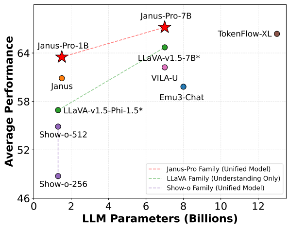

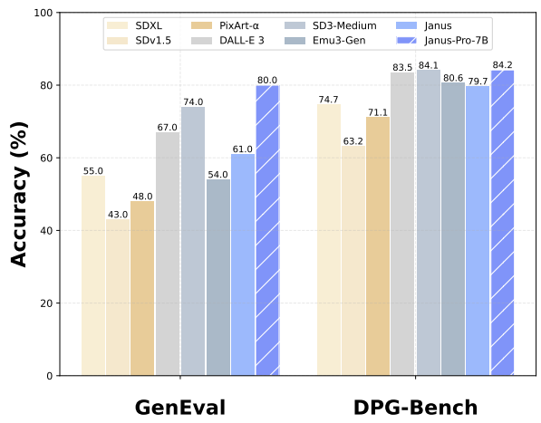

(a) Average performance on four multimodal understand- (b) Performance on instruction-following benchmarks for ing benchmarks. text-to-image generation.

Figure 1 | Multimodal understanding and visual generation results from our Janus-Pro. For multi-modal understand, we average the accuracy of POPE, MME-Perception, GQA, and MMMU. The scores of MME-Perception are divided by 20 to scale to [0, 100]. For visual generation, we evaluate the performance on two instruction-following benchamrks, GenEval and DPG-Bench. Overall, Janus-Pro outperforms the previous state-of-the-art unified multimodal models as well as some task-specific models. Best viewed on screen.

(a) 四个多模态理解基准的平均表现. (b) 文生图指令跟随基准上的表现.

图 1｜Janus-Pro 的多模态理解与视觉生成结果. 理解侧把 POPE, MME-Perception, GQA, MMMU 的准确率取平均; MME-Perception 分数除以 20, 缩放到 [0, 100]. 生成侧评 GenEval 与 DPG-Bench. 整体上, Janus-Pro 超过此前领先的统一多模态模型, 也压过一部分专用模型. 建议在屏幕上查看.

<!-- page 2 of 13 -->

A clear image of a blackboard with a clean, Capture a close-up shot of a vibrant sunflowerA minimalist photo of an orange tangerine dark green surface and the word 'Hello' writtenin full bloom, with a honeybee perched on itswith a green stem and leaves, symbolizing precisely and legibly in the center with bold, petals, its delicate wings catching the sunlight. prosperity, sitting on a red silk cloth during Chinese New Year. white chalk letters.

黑板示例提示: 干净深绿黑板面, 正中用粗白粉笔清晰写「Hello」. 向日葵示例: 盛开的向日葵特写, 花瓣上停着蜜蜂, 翅缘透光. 橘子示例: 极简静物, 青蒂橙橘象征兴旺, 搁在春节红绸上.

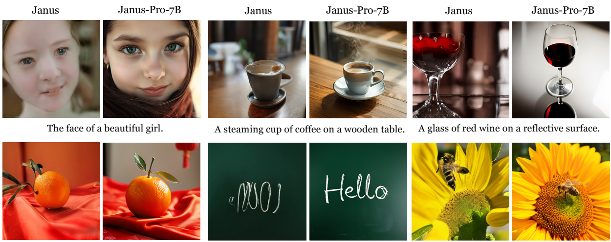

Figure 2 | Comparison of text-to-image generation between Janus-Pro and its predecessor, Janus. Janus-Pro delivers more stable outputs for short prompts, with improved visual quality, richer details, and the ability to generate simple text. The image resolution is 384 × 384. Best viewed on screen.

图 2｜Janus-Pro 与前作 Janus 的文生图对比. 短提示下 Janus-Pro 更稳, 画质与细节更好, 还能写出简单文字. 分辨率 384 × 384. 建议在屏幕上查看.

Recent advancements in unified multimodal understanding and generation models have demonstrated significant progress [30, 40, 45, 46, 48, 50, 54, 55]. These approaches have been proven to enhance the instruction-following capabilities in visual generation tasks while reducing model redundancy. Most of these methods utilize the same visual encoder to process inputs for both multimodal understanding and generation tasks. Since the representations required for these two tasks differ, this often results in suboptimal performance in multimodal understanding. To address this issue, Janus [46] proposes decoupling visual encoding, which alleviates the conflict between multimodal understanding and generation tasks, achieving excellent performance in both tasks.

统一「既能看懂又能画」的多模态模型近来进展很快. 这类做法常能抬高视觉生成侧的指令跟随, 也减少重复堆模型. 多数方法给理解任务和生成任务共用同一个视觉编码器; 两任务需要的表征并不一样, 理解侧往往吃亏. Janus 的对策是**把视觉编码拆开**: 理解一路, 生成一路, 缓解冲突, 两边都能做好.

解释:「解耦视觉编码」让理解任务使用语义编码器, 生成任务使用离散 tokenizer, 两条视觉路径在同一个自回归 LLM 里汇合. 共享部分是语言骨干, 两套视觉前端仍各自独立.

As a pioneering model, Janus is validated at the 1B parameter scale. However, due to the limited amount of training data and the relatively small model capacity, it exhibites certain shortcomings, such as suboptimal performance on short prompts image generation and unstable text-to-image generation quality. In this paper, we introduce Janus-Pro, an enhanced version of Janus that incorporates improvements across three dimensions: training strategies, data, and model size. The Janus-Pro series includes two model sizes: 1B and 7B, demonstrating scalability of the visual encoding decoding method.

Janus 作为先行验证, 主要落在约 1B 参数. 数据与容量都偏紧时, 短提示生图偏弱, 文生图质量也不稳. 本文的 Janus-Pro 从训练策略, 数据, 模型规模三处加码; 系列含 1B 与 7B 两档, 用来证明「视觉编码解耦」这条路能跟着规模一起涨.

We evaluate Janus-Pro on multiple benchmarks, and the results reveal its superior multi-modal understanding capabilities and significantly improved text-to-image instruction-following performance. Specifically, Janus-Pro-7B achieved a score of 79.2 on the multimodal understanding benchmark MMBench [29], surpassing state-of-the-art unified multimodal models such as Janus [46] (69.4), TokenFlow [34] (68.9) and MetaMorph [42] (75.2). Additionally, in the text-to-image instruction-following leaderboard GenEval [14], Janus-Pro-7B scores 0.80, outperforming Janus [46] (0.61), DALL-E 3 (0.67), and Stable Diffusion 3 Medium [11] (0.74).

多基准结果显示: 理解更强, 文生图指令跟随也明显抬升. 具体数字: Janus-Pro-7B 在 MMBench 得 79.2, 超过 Janus(69.4), TokenFlow(68.9), MetaMorph(75.2); 在 GenEval 得 0.80, 超过 Janus(0.61), DALL-E 3(0.67), Stable Diffusion 3 Medium(0.74).

<!-- page 3 of 13 -->

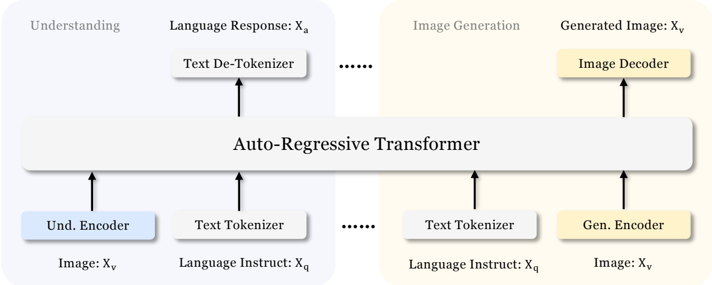

Figure 3 | Architecture of our Janus-Pro. We decouple visual encoding for multimodal understanding and visual generation. “Und. Encoder” and “Gen. Encoder” are abbreviations for “Understanding Encoder” and “Generation Encoder”, respectively. Best viewed on screen.

图 3｜Janus-Pro 架构. 多模态理解与视觉生成的视觉编码彼此拆开.「Und. Encoder」「Gen. Encoder」分别是理解编码器, 生成编码器. 建议在屏幕上查看.

## 2. Method

### 2.1. Architecture 架构

The architecture of Janus-Pro is shown in Figure 3, which is the same as Janus [46]. The core design principle of the overall architecture is to decouple visual encoding for multimodal understanding and generation. We apply independent encoding methods to convert the raw inputs into features, which are then processed by an unified autoregressive transformer. For multimodal understanding, we use the SigLIP [53] encoder to extract high-dimensional semantic features from images. These features are flattened from a 2-D grid into a 1-D sequence, and an understanding adaptor is used to map these image features into the input space of the LLM. For visual generation tasks, we use the VQ tokenizer from [38] to convert images into discrete IDs. After the ID sequence is flattened into 1-D, we use a generation adaptor to map the codebook embeddings corresponding to each ID into the input space of the LLM. We then concatenate these feature sequences to form a multimodal feature sequence, which is subsequently fed into the LLM for processing. Apart from the built-in prediction head in the LLM, we also utilize a randomly initialized prediction head for image predictions in the visual generation task. The entire model adheres to an autoregressive framework.

架构见图 3, 与 Janus 相同. 总原则仍是: 理解与生成的视觉编码分开. 原始输入各走独立编码, 再送进**同一个**自回归 Transformer. 理解侧用 SigLIP 抽高维语义特征, 把 2-D 网格展成 1-D, 经 understanding adaptor 映到 LLM 输入空间. 生成侧用文献 [38] 的 VQ tokenizer 把图像变成离散 ID; ID 展成 1-D 后, generation adaptor 把每个 ID 对应的 codebook 嵌入映进 LLM 输入空间. 各模态特征序列拼接后进 LLM. 除 LLM 自带预测头外, 生成任务另有一个随机初始化的图像预测头. 整网按自回归框架跑.

解释: SigLIP 是一类图文对齐视觉编码器, 输出偏「语义稠密特征」, 适合问答, 描述; VQ tokenizer 则把连续像素压成有限码本上的离散编号, 适合当「下一视觉 token」来预测. Adaptor(适配器)通常是浅层 MLP, 只负责维度对齐, 不另造一套视觉语义.

### 2.2. Optimized Training Strategy 优化后的训练策略

The previous version of Janus employs a three-stage training process. Stage I focuses on training the adaptors and the image head. Stage II handles unified pretraining, during which all components except the understanding encoder and the generation encoder has their parameters updated. Stage III is supervised fine-tuning, building upon Stage II by further unlocking the parameters of the understanding encoder during training. This training strategy has certain issues. In Stage II, Janus divides the training for text-to-image capabilities into two parts following PixArt [4]. The first part trains on ImageNet [9] data, using image category names as prompts for text-to-image generation, with the goal of modeling pixel dependence. The second part trains on normal text-to-image data. During implementation, 66.67% of the textto-image training steps in Stage II are allocated to the first part. However, through further

前作 Janus 分三阶段: Stage I 训 adaptor 与图像预测头; Stage II 做统一预训练, 除理解编码器, 生成编码器外其余参数更新; Stage III 在 Stage II 之上做监督微调, 并进一步解冻理解编码器. 问题出在 Stage II: 文生图能力按 PixArt 分成两段-- 先在 ImageNet 上用类别名当提示, 学像素依赖; 再用常规文生图数据. 实现里 Stage II 文生图步数的 66.67% 砸在第一段. 后续实验发现..

<!-- page 4 of 13 -->

experimentation, we find that this strategy is suboptimal and lead to significant computational inefficiency.

.. 这条策略并不优, 算力浪费明显.

To address this issue, we make two modifications.

为此做了两处改动.

• **Longer Training in Stage I**: We increase the training steps in Stage I, allowing sufficient training on the ImageNet dataset. Our findings reveals that even with the LLM parameters fixed, the model could effectively model pixel dependence and generate reasonable images based on category names.

• **Stage I 加长**: 拉长 Stage I 步数, 让 ImageNet 训够. 发现即便 LLM 参数固定, 模型也能学好像素依赖, 并按类别名生成像样的图.

• **Focused Training in Stage II**: In Stage II, we drop ImageNet data and directly utilize normal text-to-image data to train the model to generate images based on dense descriptions. This redesigned approach enables Stage II to utilize the text-to-image data more efficiently, resulting in improved training efficiency and overall performance.

• **Stage II 收束**: Stage II 不再用 ImageNet, 直接用常规文生图数据, 按稠密描述生图. 文生图数据用得更满, 训练效率与整体表现一起上来.

解释: 前作把「学像素依赖」和「学按长提示画画」挤在同一阶段, 还把大半步数给类别名; Pro 把前者前移到 Stage I(LLM 冻结也能学), Stage II 专心吃稠密描述, 避免在统一预训练里反复刷短类别提示.

We also adjust the data ratio in Stage III supervised fine-tuning process across different types of datasets, changing the proportion of multimodal data, pure text data, and text-to-image data from 7: 3: 10 to 5: 1: 4. By slightly reducing the proportion of text-to-image data, we observe that this adjustment allows us to maintain strong visual generation capabilities while achieving improved multimodal understanding performance.

Stage III 监督微调的数据配比也改了: 多模态 : 纯文本 : 文生图 从 7: 3: 10 调到 5: 1: 4. 文生图占比略降后, 生成能力仍强, 理解侧反而更好.

### 2.3. Data Scaling 数据缩放

We scale up the training data used for Janus in both multimodal understanding and visual generation aspects.

相对 Janus, 理解与生成两侧的训练数据都加量.

• **Multimodal Understanding**. For the Stage II pretraining data, we refer to DeepSeek-VL2 [49] and add approximately 90 million samples. These include image caption datasets (e. g., YFCC [31]), as well as data for table, chart, and document understanding (e. g., Docmatix [20]). For the Stage III supervised fine-tuning data, we also incorporate additional datasets from DeepSeek-VL2, such as MEME understanding, Chinese conversational data, and datasets aimed at enhancing dialogue experiences. These additions significantly expanded the model’s capabilities, enriching its ability to handle diverse tasks while improving the overall conversational experience.

• **多模态理解**. Stage II 预训练参考 DeepSeek-VL2, 大约加 9000 万样本: 含图像描述(如 YFCC), 以及表格, 图表, 文档理解(如 Docmatix). Stage III 也从 DeepSeek-VL2 补入 MEME 理解, 中文对话, 以及抬高对话体验的数据. 任务面更宽, 对话体验更好.

• **Visual Generation**. We observe that the real-world data used in the previous version of Janus lacks quality and contains significant noise, which often leads to instability in textto-image generation, resulting in aesthetically poor outputs. In Janus-Pro, we incorporate approximately 72 million samples of synthetic aesthetic data, bringing the ratio of real to synthetic data to 1: 1 during the unified pretraining stage. The prompts for these synthetic data samples are publicly available, such as those in [43]. Experiments demonstrat that the model converges faster when trained on synthetic data, and the resulting text-to-image outputs are not only more stable but also exhibit significantly improved aesthetic quality.

• **视觉生成**. 前作 Janus 用的真实世界数据质量一般, 噪声大, 文生图不稳, 观感差. Janus-Pro 大约加入 7200 万合成美学数据, 统一预训练阶段真实: 合成 = 1: 1. 合成数据的提示词可公开获取(如 [43]). 实验表明: 合成数据上收敛更快, 文生图更稳, 美学质量也明显更好.

解释:「合成美学数据」通常指用已有强文生图模型按公开提示词批量出图再当监督; 噪声更低, 风格更干净, 但分布会偏「生成器审美」, 和真实照片分布并不等同.

### 2.4. Model Scaling 模型缩放

The previous version of Janus validates the effectiveness of visual encoding decoupling using a 1.5B LLM. In Janus-Pro, we scaled the model up to 7B, with the hyperparameters of both the 1.5B and 7B LLMs detailed in Table 1. We observe that when utilizing a larger-scale LLM, the convergence speed of losses for both multimodal understanding and visual generation improved significantly compared to the smaller model. This finding further validates the strong scalability of this approach.

前作用约 1.5B LLM 验证了解耦编码. Janus-Pro 扩到 7B; 1.5B 与 7B 的超参见表 1. 更大 LLM 时, 理解与生成两侧的 loss 收敛都明显快于小模型, 说明这条路线的可扩展性不错.

<!-- page 5 of 13 -->

Table 1 | Architectural configuration for Janus-Pro. We list the hyperparameters of the architecture.

表 1｜Janus-Pro 架构配置(超参一览).

|  | Janus-Pro-1B | Janus-Pro-7B |
| --- | --- | --- |
| Vocabulary size | 100K | 100K |
| Embedding size | 2048 | 4096 |
| Context Window | 4096 | 4096 |
| #Attention heads | 16 | 32 |
| #Layers | 24 | 30 |

Table 2 | Detailed hyperparameters for training Janus-Pro. Data ratio refers to the ratio of multimodal understanding data, pure text data, and visual generation data.

表 2｜Janus-Pro 训练超参明细. Data ratio 指多模态理解 : 纯文本 : 视觉生成.

|  | Janus-Pro-1B | Janus-Pro-7B |
| --- | --- | --- |
| Hyperparameters | Stage 1 Stage 2 Stage 3 | Stage 1 Stage 2 Stage 3 |
| Learning rate LR scheduler Weight decay Gradient clip Optimizer Warm-up steps Training steps Batch size Data Ratio | 1.0×10-3 1.0×10-4 4.0×10-5Constant Constant Constant0.0 0.0 0.01.0 1.0 1.0AdamW (𝛽1 = 0.9, 𝛽2 = 0.95)600 5000 020K 360K 80K256 512 1281: 0: 3 2: 3: 5 5: 1: 4 | 1.0×10-3 1.0×10-4 4.0×10-5Constant Constant Constant0.0 0.0 0.01.0 1.0 1.0AdamW (𝛽1 = 0.9, 𝛽2 = 0.95)600 5000 020K 360K 40K256 512 1281: 0: 3 2: 3: 5 5: 1: 4 |

## 3. Experiments

### 3.1. Implementation Details 实现细节

In our experiments, we utilize DeepSeek-LLM (1.5B and 7B) [3] with a maximum supported sequence length of 4096 as the base language model. For the vision encoder used in understanding tasks, we select SigLIP-Large-Patch16-384 [53]. The generation encoder has a codebook of size 16, 384 and downsamples images by a factor of 16. Both the understanding adaptor and the generation adaptor are two-layer MLPs. The detailed hyperparameters for each stage are provided in Table 2. Please note that for Stage II, we employ an early stopping strategy, halting at 270K steps. All images are resized to 384 × 384 pixels. For multimodal understanding data, we resize the long side of the image and pad the short side with the background color (RGB: 127, 127, 127) to reach 384. For visual generation data, the short side is resized to 384, and the long side is cropped to 384. We use sequence packing during training to improve training efficiency. We mix all data types according to the specified ratios in a single training step. Our Janus-Pro is trained and evaluated using HAI-LLM [15], which is a lightweight and efficient distributed training framework built on top of PyTorch. The whole training process took about 9/14 days on a cluster of 16/32 nodes for 1.5B/7B model, each equipped with 8 Nvidia A100 (40GB) GPUs.

底座语言型号为 DeepSeek-LLM(1.5B 与 7B), 最大序列长度 4096. 理解侧视觉编码器选 SigLIP-Large-Patch16-384. 生成编码器码本大小 16, 384, 图像下采样 16 倍. 理解 / 生成 adaptor 都是两层 MLP. 各阶段超见表 2. 注意 Stage II 用早停, 在 270K 步停下(表中规划为 360K). 图像一律到 384 × 384. 理解数据: 长边缩放, 短边用背景色 RGB (127, 127, 127) 填充到 384. 生成数据: 短边缩到 384, 长边裁到 384. 训练用 sequence packing 提效; 单步内按给定比例混所有数据类型. 训练与评测走 HAI-LLM(基于 PyTorch 的轻量分布式框架). 全程大约: 1.5B 用 16 节点约 9 天, 7B 用 32 节点约 14 天; 每节点 8 张 Nvidia A100(40GB).

解释: sequence packing 把多条短样本拼进同一条长序列, 减少 padding 空转; 理解侧「pad」保构图不裁, 生成侧「crop」保正方形监督更干净, 两种预处理故意不对称.

### 3.2. Evaluation Setup 评测设置

**Multimodal Understanding.** To assess multimodal understanding capabilities, we evaluate our model on widely recognized image-based vision-language benchmarks, which include GQA

**多模态理解.** 在常见图像视觉–语言基准上评测, 包括 GQA..

<!-- page 6 of 13 -->

Table 3 | Comparison with state-of-the-arts on multimodal understanding benchmarks. “Und. ” and “Gen. ” denote “understanding” and “generation”, respectively. Models using external pretrained diffusion model are marked with †.

表 3｜多模态理解基准上与既有方法对比.「Und.」「Gen.」分别表示理解, 生成. † 表示外挂了预训练扩散模型.

| Type Model # | LLM Param | s POPE↑ | MME-P↑ | MMB↑ | SEED↑ | GQA↑ | MMMU↑ | MM-Vet↑ |
| --- | --- | --- | --- | --- | --- | --- | --- | --- |
| Und. Only LLaVA-v1.5-Phi-1.5 [50] | 1.3B | 84.1 | 1128.0 | - | - | 56.5 | 30.7 | - |
| MobileVLM [6] | 1.4B | 84.5 | 1196.2 | 53.2 | - | 56.1 | - | - |
| MobileVLM-V2 [7] | 1.4B | 84.3 | 1302.8 | 57.7 | - | 59.3 | - | - |
| MobileVLM [6] | 2.7B | 84.9 | 1288.9 | 59.6 | - | 59.0 | - | - |
| MobileVLM-V2 [7] | 2.7B | 84.7 | 1440.5 | 63.2 | - | 61.1 | - | - |
| LLaVA-Phi [56] | 2.7B | 85.0 | 1335.1 | 59.8 | - | - | - | 28.9 |
| LLaVA [27] | 7B | 76.3 | 809.6 | 38.7 | 33.5 | - | - | 25.5 |
| LLaVA-v1.5 [26] | 7B | 85.9 | 1510.7 | 64.3 | 58.6 | 62.0 | 35.4 | 31.1 |
| InstructBLIP [8] | 7B | - | - | 36.0 | 53.4 | 49.2 | - | 26.2 |
| Qwen-VL-Chat [1] | 7B | - | 1487.5 | 60.6 | 58.2 | 57.5 | - | - |
| IDEFICS-9B [19] | 8B | - | - | 48.2 | - | 38.4 | - | - |
| Emu3-Chat [45] | 8B | 85.2 | 1244 | 58.5 | 68.2 | 60.3 | 31.6 | 37.2 |
| InstructBLIP [8] | 13B | 78.9 | 1212.8 | - | - | 49.5 | - | 25.6 |
| Und. and Gen. DreamLLM† [10] | 7B | - | - | - | - | - | - | 36.6 |
| LaVIT† [18] | 7B | - | - | - | - | 46.8 | - | - |
| MetaMorph† [42] | 8B | - | - | 75.2 | 71.8 | - | - | - |
| Emu† [39] | 13B | - | - | - | - | - | - | - |
| NExT-GPT† [47] | 13B | - | - | - | - | - | - | - |
| Show-o-256 [50] | 1.3B | 73.8 | 948.4 | - | - | 48.7 | 25.1 | - |
| Show-o-512 [50] | 1.3B | 80.0 | 1097.2 | - | - | 58.0 | 26.7 | - |
| D-Dit [24] | 2.0B | 84.0 | 1124.7 | - | - | 59.2 | - | - |
| Gemini-Nano-1 [41] | 1.8B | - | - | - | - | - | 26.3 | - |
| ILLUME [44] | 7B | 88.5 | 1445.3 | 65.1 | 72.9 | - | 38.2 | 37.0 |
| TokenFlow-XL [34] | 13B | 86.8 | 1545.9 | 68.9 | 68.7 | 62.7 | 38.7 | 40.7 |
| LWM [28] | 7B | 75.2 | - | - | - | 44.8 | - | 9.6 |
| VILA-U [48] | 7B | 85.8 | 1401.8 | - | 59.0 | 60.8 | - | 33.5 |
| Chameleon [40] | 7B | - | - | - | - | - | 22.4 | 8.3 |
| Janus | 1.5B | 87.0 | 1338.0 | 69.4 | 63.7 | 59.1 | 30.5 | 34.3 |
| Janus-Pro-1B | 1.5B | 86.2 | 1444.0 | 75.5 | 68.3 | 59.3 | 36.3 | 39.8 |
| Janus-Pro-7B | 7B | 87.4 | 1567.1 | 79.2 | 72.1 | 62.0 | 41.0 | 50.0 |

[17], POPE [23], MME [12], SEED [21], MMB [29], MM-Vet [51], and MMMU [52].

.. 以及 GQA [17], POPE [23], MME [12], SEED [21], MMB [29], MM-Vet [51], MMMU [52].

**Visual Generation.** For evaluating visual generation capabilities, we use GenEval [14] and DPG-Bench [16]. GenEval is a challenging benchmark for text-to-image generation, designed to reflect the comprehensive generative abilities of visual generation models by offering a detailed instance-level analysis of their compositional capabilities. DPG-Bench (Dense Prompt Graph Benchmark) is a comprehensive dataset consisting of 1065 lengthy, dense prompts, designed to assess the intricate semantic alignment capabilities of text-to-image models.

**视觉生成.** 用 GenEval 与 DPG-Bench. GenEval 侧重文生图的组合能力, 做实例级细拆. DPG-Bench(Dense Prompt Graph Benchmark)含 1065 条长而密的提示, 测稠密语义对齐.

### 3.3. Comparison with State-of-the-arts 与既有先进方法对比

**Multimodal Understanding Performance.** We compare the proposed method with state-of-the-art unified models and understanding-only models in Table 3. Janus-Pro achieves the overall best results. This can be attributed to decoupling the visual encoding for multimodal understanding and generation, mitigating the conflict between these two tasks. When compared to models with significantly larger sizes, Janus-Pro remains highly competitive. For instance, Janus-Pro-7B outperforms TokenFlow-XL (13B) on all benchmarks except GQA.

**多模态理解表现.** 表 3 对照统一模型与纯理解模型. Janus-Pro 整体最好, 作者归因于理解/生成视觉编码解耦, 冲突减轻. 相对更大参数量的模型仍有竞争力: 例如 Janus-Pro-7B 除 GQA 外全面超过 TokenFlow-XL(13B).

<!-- page 7 of 13 -->

Table 4 | Evaluation of text-to-image generation ability on GenEval benchmark. “Und. ” and “Gen. ” denote “understanding” and “generation”, respectively. Models using external pretrained diffusion model are marked with †.

表 4｜GenEval 上文生图能力.「Und.」「Gen.」同上. † 表示外挂预训练扩散模型.

| Type Method S | ingle Obj. | Two Obj. | Counting | Colors | Position | Color Attri. | Overall↑ |
| --- | --- | --- | --- | --- | --- | --- | --- |
| LlamaGen [38] | 0.71 | 0.34 | 0.21 | 0.58 | 0.07 | 0.04 | 0.32 |
| LDM [37] | 0.92 | 0.29 | 0.23 | 0.70 | 0.02 | 0.05 | 0.37 |
| SDv1.5 [37] | 0.97 | 0.38 | 0.35 | 0.76 | 0.04 | 0.06 | 0.43 |
| PixArt-𝛼 [4] | 0.98 | 0.50 | 0.44 | 0.80 | 0.08 | 0.07 | 0.48 |
| Gen. Only |  |  |  |  |  |  |  |
| SDv2.1 [37] | 0.98 | 0.51 | 0.44 | 0.85 | 0.07 | 0.17 | 0.50 |
| DALL-E 2 [35] | 0.94 | 0.66 | 0.49 | 0.77 | 0.10 | 0.19 | 0.52 |
| Emu3-Gen [45] | 0.98 | 0.71 | 0.34 | 0.81 | 0.17 | 0.21 | 0.54 |
| SDXL [32] | 0.98 | 0.74 | 0.39 | 0.85 | 0.15 | 0.23 | 0.55 |
| DALL-E 3 [2] | 0.96 | 0.87 | 0.47 | 0.83 | 0.43 | 0.45 | 0.67 |
| SD3-Medium [11] | 0.99 | 0.94 | 0.72 | 0.89 | 0.33 | 0.60 | 0.74 |
| SEED-X† [13] | 0.97 | 0.58 | 0.26 | 0.80 | 0.19 | 0.14 | 0.49 |
| Show-o [50] | 0.95 | 0.52 | 0.49 | 0.82 | 0.11 | 0.28 | 0.53 |
| Und. and Gen. D-DiT [24] | 0.97 | 0.80 | 0.54 | 0.76 | 0.32 | 0.50 | 0.65 |
| LWM [28] | 0.93 | 0.41 | 0.46 | 0.79 | 0.09 | 0.15 | 0.47 |
| Transfusion [55] | - | - | - | - | - | - | 0.63 |
| ILLUME [44] | 0.99 | 0.86 | 0.45 | 0.71 | 0.39 | 0.28 | 0.61 |
| TokenFlow-XL [28] | 0.95 | 0.60 | 0.41 | 0.81 | 0.16 | 0.24 | 0.55 |
| Chameleon [40] | - | - | - | - | - | - | 0.39 |
| Janus [46] | 0.97 | 0.68 | 0.30 | 0.84 | 0.46 | 0.42 | 0.61 |
| Janus-Pro-1B | 0.98 | 0.82 | 0.51 | 0.89 | 0.65 | 0.56 | 0.73 |
| Janus-Pro-7B | 0.99 | 0.89 | 0.59 | 0.90 | 0.79 | 0.66 | 0.80 |

Table 5 | Performances on DPG-Bench. The methods in this table are all generation-specific models except Janus and Janus-Pro.

表 5｜DPG-Bench 表现. 除 Janus / Janus-Pro 外, 表中均为生成专用模型.

| Method | Global | Entity | Attribute | Relation | Other | Overall↑ |
| --- | --- | --- | --- | --- | --- | --- |
| SDv1.5 [36] | 74.63 | 74.23 | 75.39 | 73.49 | 67.81 | 63.18 |
| PixArt-𝛼 [4] | 74.97 | 79.32 | 78.60 | 82.57 | 76.96 | 71.11 |
| Lumina-Next [57] | 82.82 | 88.65 | 86.44 | 80.53 | 81.82 | 74.63 |
| SDXL [33] | 83.27 | 82.43 | 80.91 | 86.76 | 80.41 | 74.65 |
| Playground v2.5 [22] | 83.06 | 82.59 | 81.20 | 84.08 | 83.50 | 75.47 |
| Hunyuan-DiT [25] | 84.59 | 80.59 | 88.01 | 74.36 | 86.41 | 78.87 |
| PixArt-Σ [5] | 86.89 | 82.89 | 88.94 | 86.59 | 87.68 | 80.54 |
| Emu3-Gen [45] | 85.21 | 86.68 | 86.84 | 90.22 | 83.15 | 80.60 |
| DALL-E 3 [2] | 90.97 | 89.61 | 88.39 | 90.58 | 89.83 | 83.50 |
| SD3-Medium [11] | 87.90 | 91.01 | 88.83 | 80.70 | 88.68 | 84.08 |
| Janus | 82.33 | 87.38 | 87.70 | 85.46 | 86.41 | 79.68 |
| Janus-Pro-1B | 87.58 | 88.63 | 88.17 | 88.98 | 88.30 | 82.63 |
| Janus-Pro-7B | 86.90 | 88.90 | 89.40 | 89.32 | 89.48 | 84.19 |

**Visual Generation Performance.** We report visual generation performance on GenEval and DPG-Bench. As shown in Table 4, our Janus-Pro-7B obtains 80% overall accuracy on GenEval, which outperforms all the other unified or generation-only methods, e. g., Transfusion [55] (63%) SD3-Medium (74%) and DALL-E 3 (67%). This demonstrates that our approach has better instruction-following capabilities. As shown in Table 5, Janus-Pro achieves a score of 84.19 on DPG-Bench, surpassing all other methods. This demonstrates that Janus-Pro excels in following dense instructions for text-to-image generation.

**视觉生成表现.** GenEval 上 Janus-Pro-7B 总准确率 80%, 超过表中全部统一或纯生成方法, 例如 Transfusion(63%), SD3-Medium(74%), DALL-E 3(67%), 说明指令跟随更强. DPG-Bench 上 Janus-Pro 得 84.19, 也超过其余方法, 稠密指令跟随表现突出.

### 3.4. Qualitative Results 定性结果

We present results on multimodal understanding in Figure 4. Janus-Pro exhibits impressive comprehension abilities when handling inputs from various contexts, showcasing its powerful capabilities. We also present some text-to-image generation results in the lower part of Figure 4. The images generated by Janus-Pro-7B are highly realistic, and despite having a resolution of only $3 8 4 \times 3 8 4$ , they still contain a lot of details. For imaginative and creative scenes, Janus-Pro-7B accurately captures the semantic information from the prompts, producing well-reasoned and coherent images.

图 4 给了多模态理解样例: 跨场景输入时理解力扎实. 同图下半是文生图: Janus-Pro-7B 观感写实; 分辨率虽只有 $384 \times 384$, 细节仍多. 想象类场景也能抓住提示语义, 构图合理, 前后一致.

<!-- page 8 of 13 -->

图注: 多模态理解定性案例组：从图像详细描述、地标识别、文字识别到常识问答。
Image Description 图像描述

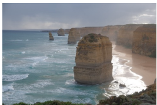

图注: 图像描述输入案例：用户要求「详细描述这个场景」，模型根据图像输出场景细节。
Describe this scene in detail.

请详细描述这个场景.

This image depicts a stunning coastal landscape featuring a series of tall, rugged rock formations emerging from the ocean. The rocks are layered with sedimentary rock, giving them a distinct stratified appearance. The largest formation is prominently positioned in the foreground, with smaller ones receding into the distance. The ocean waves crash against the base of these formations, creating white foam and a dynamic sense of movement.

The coastline is sandy, with a narrow strip of beach visible on the right side of the image. The beach is bordered by steep cliffs, which rise dramatically from the shoreline. The cliffs are covered in patches of green vegetation, adding a touch of color to the otherwise earthy tones of the rocks.

The sky above is overcast, with thick clouds that suggest an impending storm or recent rainfall. The light is diffused, casting a soft, muted glow over the entire scene. Despite the cloudy sky, there is a sense of tranquility and natural beauty in this coastal landscape.

画面是一片醒目的海岸: 几座高大嶙峋的岩柱从海中升起, 沉积岩层层分明. 最大一块在前景, 其余向远处退去. 浪拍岩脚, 溅起白沫, 动感清楚. 右侧有一条窄沙滩, 陡峭崖壁从岸边拔起, 崖上斑驳绿植给土色岩石添了点颜色. 天空阴沉厚云, 像要来雨或刚下过; 光线散射, 整景偏柔, 偏灰. 即便如此, 海岸仍显得安静, 自然.

Landmark Recognition 地标识别

这张图⽚展示的是中国杭州的⻄湖, 特别是著名的三潭印⽉岛. 图⽚中的建筑是三潭印⽉的亭⼦, 周围是平静的湖⽔, 远处是连绵的⼭脉. ⻄湖是中国著名的旅游景点之⼀, 以其美丽的⾃然景观和丰富的历史⽂化⽽闻名.

图注: 地标识别案例：输入西湖三潭印月图像并询问地点，模型需识别建筑与环境。
猜猜这是哪里?

Text Recognition

文字识别

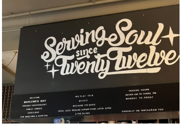

图注: 常识问答案例组：围绕图中蛋糕的文化背景和黑板文字进行识别与解释。
General Knowledge 常识问答

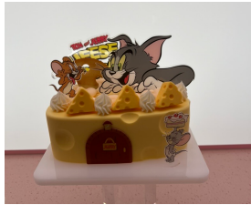

图注: 常识与文字识别案例：模型一边解释图中蛋糕的文化背景，一边读取大黑板上的文字，考查视觉识别与外部常识的联合使用。
Can you introduce the background story of this cake?

What‘s written on the large black board?

能介绍一下这块蛋糕的背景故事吗?

黑板上写了什么?

Q This cake is themed around the classic cartoon character Tom and Jerry. The cake features the characters Tom (the cat) and Jerry (the mouse) in a playful setting, with a backdrop that includes the words "Tom & Jerry”. The cake itself is decorated with fondant shaped like cheese, which is a recurring theme in the cartoon series. The design also includes a small fondant house with a door, adding to the whimsical and playful theme of the cake.

Q The large black board has the following text:

"Serving Soul since Twenty Twelve"

Additionally, there are smaller sections with more detailed information, but the main heading is clearly visible.

答: 蛋糕主题是经典卡通「猫和老鼠」. 上面有汤姆(猫)与杰瑞(鼠)的玩耍场景, 背景写着 「Tom & Jerry」. 蛋糕用奶酪造型翻糖装饰, 呼应动画里反复出现的奶酪母题; 还有一栋带门的小翻糖小屋, 整体偏俏皮.

答: 大黑板主标题是 「Serving Soul since Twenty Twelve」. 旁边还有更细的分区信息, 但主标题清晰可读.

Text-To-Image Generation

文生图

图注: 文生图样例；输入提示为「一只金毛寻回犬安详趴在木廊上, 周围散落秋叶」，该图为模型生成结果。
A golden retriever lying peacefully on a wooden porch, with autumn leaves scattered around.

一只金毛寻回犬安详趴在木廊上, 周围散落秋叶.

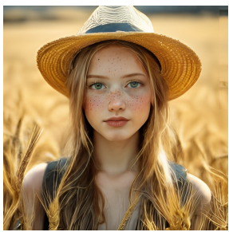

图注: 文生图样例；输入提示为「雀斑少女戴草帽, 站在金色麦田里」，该图为模型生成结果。
A young woman with freckles wearing a straw hat, standing in a golden wheat field.

雀斑少女戴草帽, 站在金色麦田里.

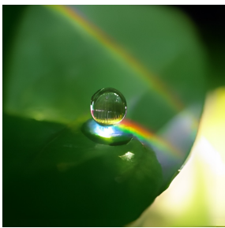

图注: 文生图样例；输入提示为「一滴水挂在绿叶上, 阳光折射出淡淡彩虹」，该图为模型生成结果。
A single drop of water clinging to a green leaf, with sunlight creating a faint rainbow pris

一滴水挂在绿叶上, 阳光折射出淡淡彩虹.

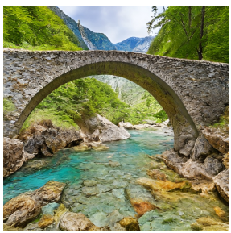

图注: 文生图样例；输入提示为「古石桥横跨清澈山溪，四周绿意浓」，图像检验主体、环境与空间关系能否同时落实。
An ancient stone bridge arching over a crystal-clear mountain stream, surrounded by lush greenery.

古石桥横跨清澈山溪, 四周绿意浓.

图注: 文生图样例；输入提示为「沙漠日落中, 发光水晶球浮在砂岩桌上」，该图为模型生成结果。
A glowing crystal ball floating above a sandstone table in the middle of a desert at sunset.

沙漠日落中, 发光水晶球浮在砂岩桌上.

图注: 文生图样例；输入提示为「玻璃瓶里装进小小星系, 在深色绒布上发亮」，该图为模型生成结果。
A tiny galaxy contained inside a glass bottle, glowing brightly against a dark velvet cloth.

玻璃瓶里装进小小星系, 在深色绒布上发亮.

图注: 文生图样例；输入提示为「巨鲸飞过城市天际线, 四周漂浮发光灯笼」，该图为模型生成结果。
A giant whale flying through a city skyline, surrounded by floating glowing lanterns.

巨鲸飞过城市天际线, 四周漂浮发光灯笼.

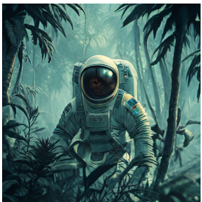

图注: 文生图样例；输入提示为「丛林中的宇航员，冷色调、低饱和、细节丰富、8K」，图像检验人物与反常环境组合以及风格词遵循。
Astronaut in a jungle, cold color palette, muted colors, detailed, 8k

丛林中的宇航员, 冷色调, 低饱和, 细节丰富, 8k.

Figure 4 | Qualitative results of multimodal understanding and visual generation capability. The model is Janus-Pro-7B and the image output resolution of visual generation is 384 × 384. Best viewed on screen. 8

图 4｜多模态理解与视觉生成定性结果. 模型为 Janus-Pro-7B; 生成输出分辨率 384 × 384. 建议在屏幕上查看.

<!-- page 9 of 13 -->

## 4. Conclusion

This paper introduces improvements to Janus from three aspects: training strategy, data, and model size. These enhancements have led to significant advancements in both multimodal understanding and text-to-image instruction-following capabilities. However, Janus-Pro still has certain limitations. In terms of multimodal understanding, the input resolution is limited to 384 × 384, which affects its performance in fine-grained tasks such as OCR. For text-to-image generation, the low resolution, combined with reconstruction losses introduced by the vision tokenizer, results in images that, while rich in semantic content, still lack fine details. For example, small facial regions occupying limited image space may appear under-detailed. Increasing the image resolution could mitigate these issues.

本文从训练策略, 数据, 模型规模三处改进 Janus, 理解与文生图指令跟随都明显抬升. 局限仍在: 理解侧输入锁在 384 × 384, 细粒度任务(如 OCR)吃亏; 生成侧分辨率低, 再叠加视觉 tokenizer 的重建损失, 语义够, 细部仍虚-- 占画面很小的人脸尤其容易糊. 提高图像分辨率有望缓解.

## References

[1] J. Bai, S. Bai, S. Yang, S. Wang, S. Tan, P. Wang, J. Lin, C. Zhou, and J. Zhou. Qwen-vl: A frontier large vision-language model with versatile abilities. arXiv preprint arXiv: 2308.12966, 2023.

「Qwen-VL: 多才多艺的前沿大型视觉语言模型」

[2] J. Betker, G. Goh, L. Jing, T. Brooks, J. Wang, L. Li, L. Ouyang, J. Zhuang, J. Lee, Y. Guo, et al. Improving image generation with better captions. Computer Science. https://cdn. openai. com/papers/dall-e-3. pdf, 2(3): 8, 2023.

「用更好的描述改进图像生成」(DALL-E 3 相关)

[3] X. Bi, D. Chen, G. Chen, S. Chen, D. Dai, C. Deng, H. Ding, K. Dong, Q. Du, Z. Fu, et al. Deepseek llm: Scaling open-source language models with longtermism. arXiv preprint arXiv: 2401.02954, 2024.

「DeepSeek LLM: 以长期主义缩放开源语言模型」

[4] J. Chen, J. Yu, C. Ge, L. Yao, E. Xie, Y. Wu, Z. Wang, J. Kwok, P. Luo, H. Lu, et al. Pixart𝑎𝑙 𝑝ℎ𝑎: Fast training of diffusion transformer for photorealistic text-to-image synthesis. arXiv preprint arXiv: 2310.00426, 2023.

「PixArt-α: 快速训练扩散 Transformer 做逼真文生图」

[5] J. Chen, C. Ge, E. Xie, Y. Wu, L. Yao, X. Ren, Z. Wang, P. Luo, H. Lu, and Z. Li. PixArt-Sigma: Weak-to-strong training of diffusion transformer for 4K text-to-image generation. arXiv preprint arXiv: 2403.04692, 2024.

「PixArt-Σ: 弱到强训练扩散 Transformer, 面向 4K 文生图」

[6] X. Chu, L. Qiao, X. Lin, S. Xu, Y. Yang, Y. Hu, F. Wei, X. Zhang, B. Zhang, X. Wei, et al. Mobilevlm: A fast, reproducible and strong vision language assistant for mobile devices. arXiv preprint arXiv: 2312.16886, 2023.

「MobileVLM: 面向移动端的快速, 可复现, 强力视觉语言助手」

[7] X. Chu, L. Qiao, X. Zhang, S. Xu, F. Wei, Y. Yang, X. Sun, Y. Hu, X. Lin, B. Zhang, et al. Mobilevlm v2: Faster and stronger baseline for vision language model. arXiv preprint arXiv: 2402.03766, 2024.

「MobileVLM v2: 更快更强的视觉语言模型基线」

[8] W. Dai, J. Li, D. Li, A. M. H. Tiong, J. Zhao, W. Wang, B. Li, P. Fung, and S. Hoi. Instructblip: Towards general-purpose vision-language models with instruction tuning, 2023.

「InstructBLIP: 指令微调通向通用视觉语言模型」

[9] J. Deng, W. Dong, R. Socher, L.-J. Li, K. Li, and L. Fei-Fei. Imagenet: A large-scale hierarchical image database. In 2009 IEEE conference on computer vision and pattern recognition, pages 248–255. Ieee, 2009.

「ImageNet: 大规模分层图像数据库」

[10] R. Dong, C. Han, Y. Peng, Z. Qi, Z. Ge, J. Yang, L. Zhao, J. Sun, H. Zhou, H. Wei, et al. Dreamllm: Synergistic multimodal comprehension and creation. arXiv preprint arXiv: 2309.11499, 2023.

「DreamLLM: 多模态理解与创造的协同」

<!-- page 10 of 13 -->

[11] P. Esser, S. Kulal, A. Blattmann, R. Entezari, J. Müller, H. Saini, Y. Levi, D. Lorenz, A. Sauer, F. Boesel, D. Podell, T. Dockhorn, Z. English, K. Lacey, A. Goodwin, Y. Marek, and R. Rombach. Scaling rectified flow transformers for high-resolution image synthesis, 2024. URL [https://arxiv. org/abs/2403.03206](https://arxiv. org/abs/2403.03206).

「缩放整流流 Transformer 做高分辨率图像合成」(SD3)

[12] C. Fu, P. Chen, Y. Shen, Y. Qin, M. Zhang, X. Lin, J. Yang, X. Zheng, K. Li, X. Sun, et al. Mme: A comprehensive evaluation benchmark for multimodal large language models. arXiv preprint arXiv: 2306.13394, 2023.

「MME: 多模态大模型综合评测基准」

[13] Y. Ge, S. Zhao, J. Zhu, Y. Ge, K. Yi, L. Song, C. Li, X. Ding, and Y. Shan. Seed-x: Multimodal models with unified multi-granularity comprehension and generation. arXiv preprint arXiv: 2404.14396, 2024.

「SEED-X: 统一多粒度理解与生成的多模态模型」

[14] D. Ghosh, H. Hajishirzi, and L. Schmidt. Geneval: An object-focused framework for evaluating text-to-image alignment. Advances in Neural Information Processing Systems, 36, 2024.

「GenEval: 面向物体的文生图对齐评测框架」

[15] High-flyer. Hai-llm: Efficient and lightweight training tool for large models, 2023. URL [https://www. high-flyer. cn/en/blog/hai-llm](https://www. high-flyer. cn/en/blog/hai-llm).

「HAI-LLM: 高效轻量的大模型训练工具」

[16] X. Hu, R. Wang, Y. Fang, B. Fu, P. Cheng, and G. Yu. Ella: Equip diffusion models with llm for enhanced semantic alignment. arXiv preprint arXiv: 2403.05135, 2024.

「ELLA: 给扩散模型配上 LLM 以增强语义对齐」(含 DPG-Bench)

[17] D. A. Hudson and C. D. Manning. Gqa: A new dataset for real-world visual reasoning and compositional question answering. In Proceedings of the IEEE/CVF conference on computer vision and pattern recognition, pages 6700–6709, 2019.

「GQA: 真实场景视觉推理与组合问答数据集」

[18] Y. Jin, K. Xu, L. Chen, C. Liao, J. Tan, B. Chen, C. Lei, A. Liu, C. Song, X. Lei, et al. Unified language-vision pretraining with dynamic discrete visual tokenization. arXiv preprint arXiv: 2309.04669, 2023.

「动态离散视觉分词的统一语言–视觉预训练」(LaVIT)

[19] H. Laurençon, D. van Strien, S. Bekman, L. Tronchon, L. Saulnier, T. Wang, S. Karamcheti, A. Singh, G. Pistilli, Y. Jernite, and et al. Introducing idefics: An open reproduction of state-of-the-art visual language model, 2023. URL [https://huggingface. co/blog/idefics](https://huggingface. co/blog/idefics).

「IDEFICS: 开源复现先进视觉语言模型」

[20] H. Laurençon, A. Marafioti, V. Sanh, and L. Tronchon. Building and better understanding vision-language models: insights and future directions., 2024.

「构建并更好理解视觉语言模型: 洞见与方向」(Docmatix 相关)

[21] B. Li, R. Wang, G. Wang, Y. Ge, Y. Ge, and Y. Shan. Seed-bench: Benchmarking multimodal llms with generative comprehension. arXiv preprint arXiv: 2307.16125, 2023.

「SEED-Bench: 用生成式理解评测多模态 LLM」

[22] D. Li, A. Kamko, E. Akhgari, A. Sabet, L. Xu, and S. Doshi. Playground v2.5: Three insights towards enhancing aesthetic quality in text-to-image generation. arXiv preprint arXiv: 2402.17245, 2024.

「Playground v2.5: 抬高文生图美学质量的三点洞见」

[23] Y. Li, Y. Du, K. Zhou, J. Wang, W. X. Zhao, and J.-R. Wen. Evaluating object hallucination in large vision-language models. arXiv preprint arXiv: 2305.10355, 2023.

「评测大型视觉语言模型中的物体幻觉」(POPE)

[24] Z. Li, H. Li, Y. Shi, A. B. Farimani, Y. Kluger, L. Yang, and P. Wang. Dual diffusion for unified image generation and understanding. arXiv preprint arXiv: 2501.00289, 2024.

「双扩散统一图像生成与理解」(D-DiT)

[25] Z. Li, J. Zhang, Q. Lin, J. Xiong, Y. Long, X. Deng, Y. Zhang, X. Liu, M. Huang, Z. Xiao, et al. Hunyuan-DiT: A powerful multi-resolution diffusion transformer with fine-grained chinese understanding. arXiv preprint arXiv: 2405.08748, 2024.

「Hunyuan-DiT: 多分辨率扩散 Transformer, 细粒度中文理解」

<!-- page 11 of 13 -->

[26] H. Liu, C. Li, Y. Li, and Y. J. Lee. Improved baselines with visual instruction tuning. In Proceedings of the IEEE/CVF Conference on Computer Vision and Pattern Recognition, pages 26296–26306, 2024.

「视觉指令微调的改进基线」(LLaVA-v1.5)

[27] H. Liu, C. Li, Q. Wu, and Y. J. Lee. Visual instruction tuning. Advances in neural information processing systems, 36, 2024.

「视觉指令微调」(LLaVA)

[28] H. Liu, W. Yan, M. Zaharia, and P. Abbeel. World model on million-length video and language with ringattention. arXiv preprint arXiv: 2402.08268, 2024.

「百万长度视频与语言上的世界模型」(LWM / RingAttention)

[29] Y. Liu, H. Duan, Y. Zhang, B. Li, S. Zhang, W. Zhao, Y. Yuan, J. Wang, C. He, Z. Liu, et al. Mmbench: Is your multi-modal model an all-around player? arXiv preprint arXiv: 2307.06281, 2023.

「MMBench: 你的多模态模型是不是全能选手?」

[30] Y. Ma, X. Liu, X. Chen, W. Liu, C. Wu, Z. Wu, Z. Pan, Z. Xie, H. Zhang, X. yu, L. Zhao, Y. Wang, J. Liu, and C. Ruan. Janusflow: Harmonizing autoregression and rectified flow for unified multimodal understanding and generation, 2024.

「JanusFlow: 自回归与整流流协同的统一多模态理解与生成」

[31] mehdidc. Yfcc-huggingface. [https://huggingface. co/datasets/mehdidc/yfcc15m](https://huggingface. co/datasets/mehdidc/yfcc15m), 2024.

YFCC 数据在 Hugging Face 上的托管条目

[32] D. Podell, Z. English, K. Lacey, A. Blattmann, T. Dockhorn, J. Müller, J. Penna, and R. Rombach. Sdxl: Improving latent diffusion models for high-resolution image synthesis. arXiv preprint arXiv: 2307.01952, 2023.

「SDXL: 改进潜空间扩散模型做高分辨率合成」

[33] D. Podell, Z. English, K. Lacey, A. Blattmann, T. Dockhorn, J. Müller, J. Penna, and R. Rombach. SDXL: Improving latent diffusion models for high-resolution image synthesis. 2024.

「SDXL」(同主题后续版本条目)

[34] L. Qu, H. Zhang, Y. Liu, X. Wang, Y. Jiang, Y. Gao, H. Ye, D. K. Du, Z. Yuan, and X. Wu. Tokenflow: Unified image tokenizer for multimodal understanding and generation. arXiv preprint arXiv: 2412.03069, 2024.

「TokenFlow: 统一图像 tokenizer, 服务理解与生成」

[35] A. Ramesh, P. Dhariwal, A. Nichol, C. Chu, and M. Chen. Hierarchical text-conditional image generation with clip latents. arXiv preprint arXiv: 2204.06125, 1(2): 3, 2022.

「基于 CLIP 潜变量的层次化文本条件图像生成」(DALL-E 2)

[36] R. Rombach, A. Blattmann, D. Lorenz, P. Esser, and B. Ommer. High-resolution image synthesis with latent diffusion models. 2022.

「潜空间扩散模型的高分辨率图像合成」

[37] R. Rombach, A. Blattmann, D. Lorenz, P. Esser, and B. Ommer. High-resolution image synthesis with latent diffusion models. In Proceedings of the IEEE/CVF conference on computer vision and pattern recognition, pages 10684–10695, 2022.

「潜空间扩散模型的高分辨率图像合成」(CVPR 版本)

[38] P. Sun, Y. Jiang, S. Chen, S. Zhang, B. Peng, P. Luo, and Z. Yuan. Autoregressive model beats diffusion: Llama for scalable image generation. arXiv preprint arXiv: 2406.06525, 2024.

「自回归胜过扩散: 可扩展图像生成的 Llama」(LlamaGen, 本文 VQ tokenizer 来源)

[39] Q. Sun, Q. Yu, Y. Cui, F. Zhang, X. Zhang, Y. Wang, H. Gao, J. Liu, T. Huang, and X. Wang. Generative pretraining in multimodality. arXiv preprint arXiv: 2307.05222, 2023.

「多模态生成式预训练」(Emu)

[40] C. Team. Chameleon: Mixed-modal early-fusion foundation models. arXiv preprint arXiv: 2405.09818, 2024.

「Chameleon: 混合模态早融合基础模型」

[41] G. Team, R. Anil, S. Borgeaud, Y. Wu, J.-B. Alayrac, J. Yu, R. Soricut, J. Schalkwyk, A. M. Dai, A. Hauth, et al. Gemini: a family of highly capable multimodal models. arXiv preprint arXiv: 2312.11805, 2023.

「Gemini: 高能力多模态模型家族」

<!-- page 12 of 13 -->

[42] S. Tong, D. Fan, J. Zhu, Y. Xiong, X. Chen, K. Sinha, M. Rabbat, Y. LeCun, S. Xie, and Z. Liu. Metamorph: Multimodal understanding and generation via instruction tuning. arXiv preprint arXiv: 2412.14164, 2024.

「MetaMorph: 经指令微调的多模态理解与生成」

[43] Vivym. Midjourney prompts dataset. [https://huggingface. co/datasets/vivym/midjourney-prompts](https://huggingface. co/datasets/vivym/midjourney-prompts), 2023. Accessed: [Insert Date of Access, e. g., 2023-10-15].

Midjourney 提示词公开数据集

[44] C. Wang, G. Lu, J. Yang, R. Huang, J. Han, L. Hou, W. Zhang, and H. Xu. Illume: Illuminating your llms to see, draw, and self-enhance. arXiv preprint arXiv: 2412.06673, 2024.

「ILLUME: 让 LLM 能看, 能画, 还能自增强」

[45] X. Wang, X. Zhang, Z. Luo, Q. Sun, Y. Cui, J. Wang, F. Zhang, Y. Wang, Z. Li, Q. Yu, et al. Emu3: Next-token prediction is all you need. arXiv preprint arXiv: 2409.18869, 2024.

「Emu3: 下一 token 预测就够了」

[46] C. Wu, X. Chen, Z. Wu, Y. Ma, X. Liu, Z. Pan, W. Liu, Z. Xie, X. Yu, C. Ruan, et al. Janus: Decoupling visual encoding for unified multimodal understanding and generation. arXiv preprint arXiv: 2410.13848, 2024.

「Janus: 解耦视觉编码, 统一多模态理解与生成」

[47] S. Wu, H. Fei, L. Qu, W. Ji, and T.-S. Chua. Next-gpt: Any-to-any multimodal llm. arXiv preprint arXiv: 2309.05519, 2023.

「NExT-GPT: 任意到任意的多模态 LLM」

[48] Y. Wu, Z. Zhang, J. Chen, H. Tang, D. Li, Y. Fang, L. Zhu, E. Xie, H. Yin, L. Yi, et al. Vila-u: a unified foundation model integrating visual understanding and generation. arXiv preprint arXiv: 2409.04429, 2024.

「VILA-U: 整合视觉理解与生成的统一基础模型」

[49] Z. Wu, X. Chen, Z. Pan, X. Liu, W. Liu, D. Dai, H. Gao, Y. Ma, C. Wu, B. Wang, et al. Deepseek-vl2: Mixture-of-experts vision-language models for advanced multimodal understanding. arXiv preprint arXiv: 2412.10302, 2024.

「DeepSeek-VL2: 面向高级多模态理解的 MoE 视觉语言模型」

[50] J. Xie, W. Mao, Z. Bai, D. J. Zhang, W. Wang, K. Q. Lin, Y. Gu, Z. Chen, Z. Yang, and M. Z. Shou. Show-o: One single transformer to unify multimodal understanding and generation. arXiv preprint arXiv: 2408.12528, 2024.

「Show-o: 单个 Transformer 统一多模态理解与生成」

[51] W. Yu, Z. Yang, L. Li, J. Wang, K. Lin, Z. Liu, X. Wang, and L. Wang. Mm-vet: Evaluating large multimodal models for integrated capabilities. arXiv preprint arXiv: 2308.02490, 2023.

「MM-Vet: 评测大型多模态模型的综合能力」

[52] X. Yue, Y. Ni, K. Zhang, T. Zheng, R. Liu, G. Zhang, S. Stevens, D. Jiang, W. Ren, Y. Sun, et al. Mmmu: A massive multi-discipline multimodal understanding and reasoning benchmark for expert agi. In Proceedings of the IEEE/CVF Conference on Computer Vision and Pattern Recognition, pages 9556–9567, 2024.

「MMMU: 面向专家级 AGI 的大规模多学科多模态理解与推理基准」

[53] X. Zhai, B. Mustafa, A. Kolesnikov, and L. Beyer. Sigmoid loss for language image pre-training. In Proceedings of the IEEE/CVF International Conference on Computer Vision, pages 11975–11986, 2023.

「语言–图像预训练的 sigmoid 损失」(SigLIP)

[54] C. Zhao, Y. Song, W. Wang, H. Feng, E. Ding, Y. Sun, X. Xiao, and J. Wang. Monoformer: One transformer for both diffusion and autoregression. arXiv preprint arXiv: 2409.16280, 2024.

「MonoFormer: 一个 Transformer 同时做扩散与自回归」

[55] C. Zhou, L. Yu, A. Babu, K. Tirumala, M. Yasunaga, L. Shamis, J. Kahn, X. Ma, L. Zettlemoyer, and O. Levy. Transfusion: Predict the next token and diffuse images with one multi-modal model. arXiv preprint arXiv: 2408.11039, 2024.

「Transfusion: 一个多模态模型既预测下一 token 又扩散图像」

[56] Y. Zhu, M. Zhu, N. Liu, Z. Ou, X. Mou, and J. Tang. Llava-phi: Efficient multi-modal assistant with small language model. arXiv preprint arXiv: 2401.02330, 2024.

「LLaVA-Phi: 小语言模型上的高效多模态助手」

<!-- page 13 of 13 -->

[57] L. Zhuo, R. Du, H. Xiao, Y. Li, D. Liu, R. Huang, W. Liu, L. Zhao, F.-Y. Wang, Z. Ma, et al. Lumina-Next: Making Lumina-T2X stronger and faster with Next-DiT. arXiv preprint arXiv: 2406.18583, 2024.

「Lumina-Next: 用 Next-DiT 让 Lumina-T2X 更强更快」

13
