<!-- page 1 of 52 -->

arXiv: 2405.04434v5 [cs. CL] 19 Jun 2024

Qdeepseek

# DeepSeek-V2: A Strong, Economical, and Efficient Mixture-of-Experts Language Model / DeepSeek-V2: 一个强大, 经济且高效的 MoE 语言模型

DeepSeek-AI

### research@deepseek. com

## Abstract

We present DeepSeek-V2, a strong Mixture-of-Experts (MoE) language model characterized by economical training and efficient inference. It comprises 236B total parameters, of which 21B are activated for each token, and supports a context length of 128K tokens. DeepSeek-V2 adopts innovative architectures including Multi-head Latent Attention (MLA) and DeepSeekMoE. MLA guarantees efficient inference through significantly compressing the Key-Value (KV) cache into a latent vector, while DeepSeekMoE enables training strong models at an economical cost through sparse computation. Compared with DeepSeek 67B, DeepSeek-V2 achieves significantly stronger performance, and meanwhile saves 42.5% of training costs, reduces the KV cache by 93.3%, and boosts the maximum generation throughput to 5.76 times. We pretrain DeepSeek-V2 on a high-quality and multi-source corpus consisting of 8.1T tokens, and further perform Supervised Fine-Tuning (SFT) and Reinforcement Learning (RL) to fully unlock its potential. Evaluation results show that, even with only 21B activated parameters, DeepSeek-V2 and its chat versions still achieve top-tier performance among open-source models. The model checkpoints are available at [https://github. com/deepseek-ai/DeepSeek-V2](https://github. com/deepseek-ai/DeepSeek-V2).

推出 DeepSeek-V2: 强 MoE 语言模型, 训练省钱, 推理省缓存. 总参 236B, 每 token 激活 21B, 上下文 128K. 架构两件套: Multi-head Latent Attention(MLA)与 DeepSeekMoE. MLA 把 KV cache 压成潜变量, 推理更轻; DeepSeekMoE 靠稀疏计算把强模型训得起. 相对 DeepSeek 67B: 更强, 同时训练成本省 42.5%, KV cache 减 93.3%, 最大生成吞吐提到 5.76 倍. 预训练语料 8.1T, 再做 SFT 与 RL. 即使只激活 21B, 基座与 Chat 仍进开源第一梯队. 权重: https://github. com/deepseek-ai/DeepSeek-V2

解释: MLA= 把 Key/Value 联合压到低维潜向量再参与注意力, 推理主要缓存这份压缩向量, 而不是每头全量 K/V. DeepSeekMoE = 细粒度路由专家 + 隔离的共享专家, 用稀疏激活扩大总容量, 控制每步算力.

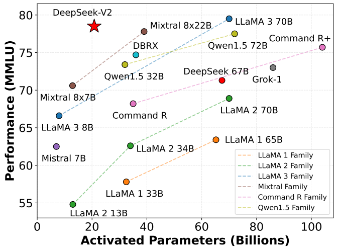

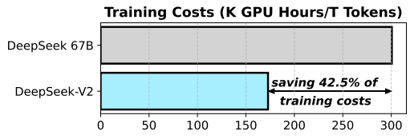

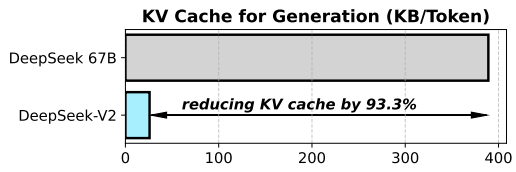

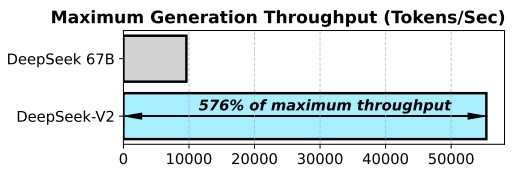

Figure 1 | (a) MMLU accuracy vs. activated parameters, among different open-source models. (b) Training costs and inference efficiency of DeepSeek 67B (Dense) and DeepSeek-V2.

图 1｜(a) 开源模型 MMLU 准确率对激活参数; (b) DeepSeek 67B(Dense)与 DeepSeek-V2 的训练成本与推理效率.

<!-- page 2 of 52 -->

## Contents

- 1 Introduction 4
- 2 Architecture 6
  - 2.1 Multi-Head Latent Attention: Boosting Inference Efficiency 6
    - 2.1.1 Preliminaries: Standard Multi-Head Attention 6
    - 2.1.2 Low-Rank Key-Value Joint Compression 7
    - 2.1.3 Decoupled Rotary Position Embedding 8
    - 2.1.4 Comparison of Key-Value Cache 8
  - 2.2 DeepSeekMoE: Training Strong Models at Economical Costs 9
    - 2.2.1 Basic Architecture 9
    - 2.2.2 Device-Limited Routing 9
    - 2.2.3 Auxiliary Loss for Load Balance 10
    - 2.2.4 Token-Dropping Strategy 11
- 3 Pre-Training 11
  - 3.1 Experimental Setups 11
    - 3.1.1 Data Construction 11
    - 3.1.2 Hyper-Parameters 12
    - 3.1.3 Infrastructures 12
    - 3.1.4 Long Context Extension 13
  - 3.2 Evaluations 13
    - 3.2.1 Evaluation Benchmarks 13
    - 3.2.2 Evaluation Results 14
    - 3.2.3 Training and Inference Efficiency 16
- 4 Alignment 16
  - 4.1 Supervised Fine-Tuning 16
  - 4.2 Reinforcement Learning 17
  - 4.3 Evaluation Results 18
  - 4.4 Discussion 20
- 5 Conclusion, Limitation, and Future Work 21
- A Contributions and Acknowledgments 27
- B DeepSeek-V2-Lite: A 16B Model Equipped with MLA and DeepSeekMoE 29

<!-- page 3 of 52 -->

  - B.1 Model Description 29
  - B.2 Performance Evaluation 30
- C Full Formulas of MLA 31
- D Ablation of Attention Mechanisms 31
  - D.1 Ablation of MHA, GQA, and MQA 31
  - D.2 Comparison Between MLA and MHA 31
- E Discussion About Pre-Training Data Debiasing 32
- F Additional Evaluations on Math and Code 32
- G Evaluation Formats 33

<!-- page 4 of 52 -->

## 1. Introduction

In the past few years, Large Language Models (LLMs) (Anthropic, 2023; Google, 2023; OpenAI, 2022, 2023) have undergone rapid development, offering a glimpse into the dawn of Artificial General Intelligence (AGI). In general, the intelligence of an LLM tends to improve as the number of parameters increases, allowing it to exhibit emergent capabilities across various tasks (Wei et al., 2022). However, the improvement comes at the cost of larger computing resources for training and a potential decrease in inference throughput. These constraints present significant challenges that impede the widespread adoption and utilization of LLMs. In order to tackle this problem, we introduce DeepSeek-V2, a strong open-source Mixture-of-Experts (MoE) language model, characterized by economical training and efficient inference through an innovative Transformer architecture. It is equipped with a total of 236B parameters, of which 21B are activated for each token, and supports a context length of 128K tokens.

过去几年大模型发展很快, 参数越大往往越强, 但训练算力与推理吞吐也一起变差. 为此推出开源 MoE 模型 DeepSeek-V2: 创新 Transformer 架构, 训练经济, 推理高效; 总参 236B, 每 token 激活 21B, 上下文 128K.

We optimize the attention modules and Feed-Forward Networks (FFNs) within the Transformer framework (Vaswani et al., 2017) with our proposed **Multi-head Latent Attention (MLA)** and **DeepSeekMoE**. (1) In the context of attention mechanisms, the Key-Value (KV) cache of the Multi-Head Attention (MHA) (Vaswani et al., 2017) poses a significant obstacle to the inference efficiency of LLMs. Various approaches have been explored to address this issue, including Grouped-Query Attention (GQA) (Ainslie et al., 2023) and Multi-Query Attention (MQA) (Shazeer, 2019). However, these methods often compromise performance in their attempt to reduce the KV cache. In order to achieve the best of both worlds, we introduce MLA, an attention mechanism equipped with low-rank key-value joint compression. Empirically, MLA achieves superior performance compared with MHA, and meanwhile significantly reduces the KV cache during inference, thus boosting the inference efficiency. (2) For Feed-Forward Networks (FFNs), we follow the DeepSeekMoE architecture (Dai et al., 2024), which adopts fine-grained expert segmentation and shared expert isolation for higher potential in expert specialization. The DeepSeekMoE architecture demonstrates great advantages compared with conventional MoE architectures like GShard (Lepikhin et al., 2021), enabling us to train strong models at an economical cost. As we employ expert parallelism during training, we also devise supplementary mechanisms to control communication overheads and ensure load balance. By combining these two techniques, DeepSeek-V2 features strong performance (Figure 1(a)), economical training costs, and efficient inference throughput (Figure 1(b)), simultaneously.

在 Transformer 里同时改注意力与 FFN: (1) MHA 的 KV cache 拖累推理; GQA/MQA 能省缓存却常掉分. MLA 做低秩 KV 联合压缩, 经验上强过 MHA, 同时大幅减推理 KV. (2) FFN 跟 DeepSeekMoE: 细粒度专家分割 + 共享专家隔离, 相对 GShard 一类常规 MoE 优势明显; 训练用专家并行时另加通信与负载均衡机制. 两件套叠在一起: 强(图 1(a)), 训练省, 推理快(图 1(b)).

We construct a high-quality and multi-source pre-training corpus consisting of 8.1T tokens. Compared with the corpus used in DeepSeek 67B (our previous release) (DeepSeek-AI, 2024), this corpus features an extended amount of data, especially Chinese data, and higher data quality. We first pretrain DeepSeek-V2 on the full pre-training corpus. Then, we collect 1.5M conversational sessions, which encompass various domains such as math, code, writing, reasoning, safety, and more, to perform Supervised Fine-Tuning (SFT) for DeepSeek-V2 Chat (SFT). Finally, we follow DeepSeekMath (Shao et al., 2024) to employ Group Relative Policy Optimization (GRPO) to further align the model with human preference and produce DeepSeek-V2 Chat (RL).

预训练语料 8.1T, 相对 67B 更大, 中文更多, 质量更高. 全量预训练后, 用 1.5M 会话(数学, 代码, 写作, 推理, 安全等)做 SFT, 得到 Chat (SFT); 再按 DeepSeekMath 用 GRPO 对齐人类偏好, 得到 Chat (RL).

解释: GRPO(组相对策略优化)= 同一题采样一组回答, 用组内相对奖励估优势, 省掉 PPO 里同规模的 critic.

We evaluate DeepSeek-V2 on a wide range of benchmarks in English and Chinese, and compare it with representative open-source models. Evaluation results show that even with only 21B activated parameters, DeepSeek-V2 still achieves top-tier performance among open-source models and becomes the strongest open-source MoE language model. Figure 1(a) highlights that, on MMLU, DeepSeek-V2 achieves top-ranking performance with only a small number of activated parameters. In addition, as shown in Figure 1(b), compared with DeepSeek 67B, DeepSeek-V2 saves 42.5% of training costs, reduces the KV cache by 93.3%, and boosts the maximum generation throughput to 5.76 times. We also evaluate DeepSeek-V2 Chat (SFT) and

中英多基准评测: 仅激活 21B 仍进开源第一梯队, 并成为当时最强开源 MoE. 图 1(a): MMLU 上激活不多也能排前列. 图 1(b): 相对 67B, 训练成本 −42.5%, KV −93.3%, 最大生成吞吐 ×5.76. Chat (SFT) 与

<!-- page 5 of 52 -->

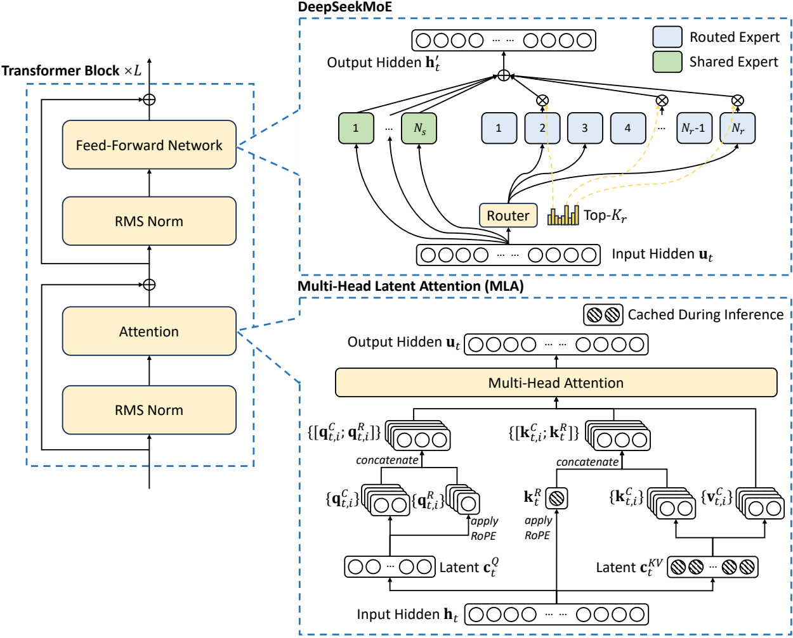

Figure 2 | Illustration of the architecture of DeepSeek-V2. MLA ensures efficient inference by significantly reducing the KV cache for generation, and DeepSeekMoE enables training strong models at an economical cost through the sparse architecture.

图 2｜DeepSeek-V2 架构示意. MLA 靠大幅减少生成期 KV cache 抬推理效率; DeepSeekMoE 靠稀疏结构把强模型训得起.

DeepSeek-V2 Chat (RL) on open-ended benchmarks. Notably, DeepSeek-V2 Chat (RL) achieves 38.9 length-controlled win rate on AlpacaEval 2.0 (Dubois et al., 2024), 8.97 overall score on MT-Bench (Zheng et al., 2023), and 7.91 overall score on AlignBench (Liu et al., 2023). The English open-ended conversation evaluations demonstrate that DeepSeek-V2 Chat (RL) has top-tier performance among open-source chat models. In addition, the evaluation on AlignBench indicates that in Chinese, DeepSeek-V2 Chat (RL) outperforms all of open-source models, and even beats most of closed-source models.

Chat (RL) 也做了开放生成评测: AlpacaEval 2.0 长度控制胜率 38.9, MT-Bench 总分 8.97, AlignBench 总分 7.91. 英文开放对话进开源 Chat 第一梯队; AlignBench 上中文超过全部开源, 并压过多数闭源.

In order to facilitate further research and development on MLA and DeepSeekMoE, we also release DeepSeek-V2-Lite, a smaller model equipped with MLA and DeepSeekMoE, for the open-source community. It has a total of 15.7B parameters, where 2.4B are activated for each token. Detailed descriptions about DeepSeek-V2-Lite can be found in Appendix B.

为方便社区继续研究 MLA 与 DeepSeekMoE, 另释出 DeepSeek-V2-Lite: 总参 15.7B, 每 token 激活 2.4B. 细节见附录 B.

In the rest of this paper, we first provide a detailed description of the model architecture of DeepSeek-V2 (Section 2). Subsequently, we introduce our pre-training endeavors, including the training data construction, hyper-parameter settings, infrastructures, long context extension, and the evaluation of model performance and efficiency (Section 3). Following this, we demonstrate our efforts in alignment, encompassing Supervised Fine-Tuning (SFT), Reinforcement

后文结构: §2 架构; §3 预训练(数据, 超参, 基建, 长上下文, 效果与效率); §4 对齐(SFT, 强化

<!-- page 6 of 52 -->

Learning (RL), the evaluation results, and other discussion (Section 4). Finally, we summarize the conclusion, deliberate on the current limitations of DeepSeek-V2, and outline our future work (Section 5).

学习, 评测与讨论); §5 结论, 局限与未来工作.

## 2. Architecture 架构

By and large, DeepSeek-V2 is still in the Transformer architecture (Vaswani et al., 2017), where each Transformer block consists of an attention module and a Feed-Forward Network (FFN). However, for both the attention module and the FFN, we design and employ innovative architectures. For attention, we design MLA, which utilizes low-rank key-value joint compression to eliminate the bottleneck of inference-time key-value cache, thus supporting efficient inference. For FFNs, we adopt the DeepSeekMoE architecture (Dai et al., 2024), a high-performance MoE architecture that enables training strong models at an economical cost. An illustration of the architecture of DeepSeek-V2 is presented in Figure 2, and we will introduce the details of MLA and DeepSeekMoE in this section. For other tiny details (e. g., layer normalization and the activation function in FFNs), unless specifically stated, DeepSeek-V2 follows the settings of DeepSeek 67B (DeepSeek-AI, 2024).

整体仍是 Transformer: 每块注意力 + FFN. 注意力用 MLA(低秩 KV 联合压缩, 去掉推理 KV 瓶颈); FFN 用 DeepSeekMoE(经济地训强模型). 总览见图 2. 其余细节(层归一化, FFN 激活等)未特别说明处跟 DeepSeek 67B.

### 2.1. Multi-Head Latent Attention: Boosting Inference Efficiency Multi-Head Latent Attention: 抬推理效率

Conventional Transformer models usually adopts Multi-Head Attention (MHA) (Vaswani et al., 2017), but during generation, its heavy Key-Value (KV) cache will become the bottleneck that limit the inference efficiency. In order to reduce the KV cache, Multi-Query Attention (MQA) (Shazeer, 2019) and Grouped-Query Attention (GQA) (Ainslie et al., 2023) are proposed. They require a smaller magnitude of KV cache, but their performance does not match MHA (we provide the ablation of MHA, GQA and MQA in Appendix D. 1).

常规 Transformer 用 MHA, 生成时沉重 KV cache 会卡吞吐. MQA, GQA 能少存 KV, 但性能跟不上 MHA(消融见附录 D. 1).

For DeepSeek-V2, we design an innovative attention mechanism called Multi-head Latent Attention (MLA). Equipped with low-rank key-value joint compression, MLA achieves better performance than MHA, but requires a significantly smaller amount of KV cache. We introduce its architecture in the following, and also provide a comparison between MLA and MHA in Appendix D. 2.

V2 设计 MLA: 低秩 KV 联合压缩, 强过 MHA, KV 却少得多. 下文讲结构; 与 MHA 对照见附录 D. 2.

#### 2.1.1. Preliminaries: Standard Multi-Head Attention 预备: 标准 Multi-Head Attention

We first introduce the standard MHA mechanism as background. Let 𝑑 be the embedding dimension, $n _ { h }$ be the number of attention heads, $d _ { h }$ be the dimension per head, and $\mathbf { h } _ { t } \in \mathbb { R } ^ { \tilde { d } }$ be the attention input of the 𝑡-th token at an attention layer. Standard MHA first produces $\mathbf { q } _ { t } , \mathbf { k } _ { t } , \mathbf { v } _ { t } \in \mathbb { R } ^ { d _ { h } n _ { h } }$ through three matrices $W ^ { Q } , W ^ { K } , W ^ { V } \in \mathbb { R } ^ { d _ { h } \vec { n _ { h } \times d } }$ , respectively:

先回顾标准 MHA. $d$ 为嵌入维, $n_h$ 头数, $d_h$ 每头维, $\mathbf{h}_t$ 为第 $t$ 个 token 的注意力输入. 先用 $W^Q, W^K, W^V$ 得到 $\mathbf{q}_t, \mathbf{k}_t, \mathbf{v}_t$:

$$
\mathbf {q} _ {t} = W ^ {Q} \mathbf {h} _ {t}, \tag{1}
$$

$$
\mathbf {k} _ {t} = W ^ {K} \mathbf {h} _ {t}, \tag{2}
$$

$$
\mathbf {v} _ {t} = W ^ {V} \mathbf {h} _ {t}, \tag{3}
$$

<!-- page 7 of 52 -->

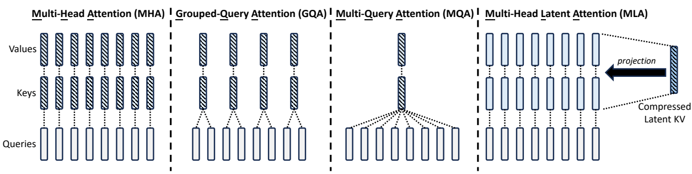

Figure 3 | Simplified illustration of Multi-Head Attention (MHA), Grouped-Query Attention (GQA), Multi-Query Attention (MQA), and Multi-head Latent Attention (MLA). Through jointly compressing the keys and values into a latent vector, MLA significantly reduces the KV cache during inference.

图 3｜MHA, GQA, MQA, MLA 示意. MLA 把 K/V 联合压成潜向量, 推理期 KV cache 显著变小.

Then, $\mathbf { q } _ { t } , \mathbf { k } _ { t } , \mathbf { v } _ { t }$ will be sliced into $n _ { h }$ heads for the multi-head attention computation:

再切成 $n_h$ 个头做多头注意力:

$$
[ \mathbf {q} _ {t, 1}; \mathbf {q} _ {t, 2}; \dots ; \mathbf {q} _ {t, n _ {h}} ] = \mathbf {q} _ {t}, \tag{4}
$$

$$
\left[ \mathbf {k} _ {t, 1}; \mathbf {k} _ {t, 2}; \dots ; \mathbf {k} _ {t, n _ {i}} \right] = \mathbf {k} _ {t}, \tag{5}
$$

$$
\left[ \mathbf {V} _ {t, 1}; \mathbf {V} _ {t, 2}; \dots ; \mathbf {V} _ {t, n _ {h}} \right] = \mathbf {V} _ {t}, \tag{6}
$$

$$
\mathbf {o} _ {t, i} = \sum_ {j = 1} ^ {t} \operatorname{Softmax} _ {j} \left(\frac {\mathbf {q} _ {t , i} ^ {T} \mathbf {k} _ {j , i}}{\sqrt {d _ {h}}}\right) \mathbf {v} _ {j, i}, \tag{7}
$$

$$
\mathbf {u} _ {t} = W ^ {O} \big [ \mathbf {o} _ {t, 1}; \mathbf {o} _ {t, 2}; \dots ; \mathbf {o} _ {t, n _ {h}} \big ], \tag{8}
$$

where $\mathbf { q } _ { t , i } , \mathbf { k } _ { t , i } , \mathbf { v } _ { t , i } \in \mathbb { R } ^ { d _ { h } }$ denote the query, key, and value of the 𝑖-th attention head, respectively; $W ^ { O } \in \mathbb { R } ^ { \widehat { d \times d _ { h } n _ { h } } }$ denotes the output projection matrix. During inference, all keys and values need to be cached to accelerate inference, so MHA needs to cache $2 n _ { h } d _ { h } l$ elements for each token. In model deployment, this heavy KV cache is a large bottleneck that limits the maximum batch size and sequence length.

$\mathbf{q}_{t, i}, \mathbf{k}_{t, i}, \mathbf{v}_{t, i}$ 为第 $i$ 头; $W^O$ 为输出投影. 推理要缓存全部 K/V, MHA 每 token 需 $2 n_h d_h l$ 个元素, 会卡住最大 batch 与序列长.

#### 2.1.2. Low-Rank Key-Value Joint Compression 低秩 Key-Value 联合压缩

The core of MLA is the low-rank joint compression for keys and values to reduce KV cache:

MLA 核心: 对 K/V 做低秩联合压缩, 减 KV cache:

$$
\mathbf {c} _ {t} ^ {K V} = W ^ {D K V} \mathbf {h} _ {t}, \tag{9}
$$

$$
\mathbf {k} _ {t} ^ {C} = W ^ {U K} \mathbf {c} _ {t} ^ {K V}, \tag{10}
$$

$$
\mathbf {v} _ {t} ^ {C} = W ^ {U V} \mathbf {c} _ {t} ^ {K V}, \tag{11}
$$

where $\mathbf { c } _ { t } ^ { K V } \in \mathbb { R } ^ { d _ { c } }$ is the compressed latent vector for keys and values; $d _ { c } ( \ll d _ { h } n _ { h } )$ denotes the …23654 tokens truncated…9}
$$

$$
\mathbf {q} _ {t, i} = [ \mathbf {q} _ {t, i} ^ {C}; \mathbf {q} _ {t, i} ^ {R} ], \tag{40}
$$

$$
\boxed {\mathbf {c} _ {t} ^ {K V}} = W ^ {D K V} \mathbf {h} _ {t}, \tag{41}
$$

$$
[ \mathbf {k} _ {t, 1} ^ {C}; \mathbf {k} _ {t, 2} ^ {C}; \dots ; \mathbf {k} _ {t, n _ {h}} ^ {C} ] = \mathbf {k} _ {t} ^ {C} = W ^ {U K} \mathbf {c} _ {t} ^ {K V}, \tag{42}
$$

$$
\boxed {\mathbf {k} _ {t} ^ {R}} = \mathrm{RoPE} (W ^ {K R} \mathbf {h} _ {t}), \tag{43}
$$

$$
\mathbf {k} _ {t, i} = [ \mathbf {k} _ {t, i} ^ {C}; \mathbf {k} _ {t} ^ {R} ], \tag{44}
$$

$$
[ \mathbf {v} _ {t, 1} ^ {C}; \mathbf {v} _ {t, 2} ^ {C}; \dots ; \mathbf {v} _ {t, n _ {h}} ^ {C} ] = \mathbf {v} _ {t} ^ {C} = W ^ {U V} \mathbf {c} _ {t} ^ {K V}, \tag{45}
$$

$$
\mathbf {o} _ {t, i} = \sum_ {j = 1} ^ {t} \text {Softmax} _ {j} (\frac {\mathbf {q} _ {t , i} ^ {T} \mathbf {k} _ {j , i}}{\sqrt {d _ {h} + d _ {h} ^ {R}}}) \mathbf {v} _ {j, i} ^ {C}, \tag{46}
$$

$$
\mathbf {u} _ {t} = W ^ {O} [ \mathbf {o} _ {t, 1}; \mathbf {o} _ {t, 2}; \dots ; \mathbf {o} _ {t, n _ {h}} ], \tag{47}
$$

where the boxed vectors in blue need to be cached for generation. During inference, the naive formula needs to recover $\mathbf { k } _ { t } ^ { C }$ and $\mathbf { v } _ { t } ^ { C }$ from $\mathbf { c } _ { t } ^ { K V }$ for attention. Fortunately, due to the associative law of matrix multiplication, we can absorb $W ^ { U K }$ into $W ^ { U Q } , $ and $W ^ { U V }$ into $W ^ { O }$ . Therefore, we do not need to compute keys and values out for each query. Through this optimization, we avoid the computational overhead for recomputing $\mathbf { k } _ { t } ^ { C }$ and $\mathbf { v } _ { t } ^ { \vec { C } }$ during inference.

蓝框向量为生成期缓存项. 朴素实现要从 $\mathbf{c}_t^{KV}$ 恢复 $\mathbf{k}_t^C, \mathbf{v}_t^C$; 利用结合律把 $W^{UK}$ 吸进 $W^{UQ}$, $W^{UV}$ 吸进 $W^O$ 后, 不必对每个 query 显式算 K/V, 避免重算开销.

## D. Ablation of Attention Mechanisms 注意力机制消融

### D. 1. Ablation of MHA, GQA, and MQA MHA / GQA / MQA 消融

We show the evaluation results for 7B dense models with MHA, GQA, and MQA on four hard benchmarks in Table 8. All of these three models are trained on 1.33T tokens, and share the same architecture except for the attention mechanisms. In addition, for a fair comparison, we align the number of parameters of them to around 7B by adjusting the number of layers. From the table, we can find that MHA demonstrates significant advantages over GQA and MQA on these benchmarks.

Table 8: 约 7B Dense, 同训 1.33T, 只改注意力并用层数对齐参数量. MHA 在四项硬基准上明显强过 GQA 与 MQA.

### D. 2. Comparison Between MLA and MHA MLA 与 MHA 对照

In Table 9, we show the evaluation results for MoE models equipped with MLA and MHA, respectively, on four hard benchmarks. For a solid conclusion, we train and evaluate models across two scales. Two small MoE models comprise about 16B total parameters, and we train them on 1.33T tokens. Two large MoE models comprise about 250B total parameters, and we train them on 420B tokens. Also, two small MoE models and two large MoE models respectively share the same architecture except for the attention mechanisms. From the table, we can observe that MLA shows better performance than MHA. More importantly, MLA requires a significantly smaller amount of KV cache (14% for small MoE models and 4% for large MoE models) than MHA.

Table 9: 约 16B(1.33T)与约 250B(420B)两档 MoE, 只改注意力. MLA 更强, 且 KV 分别约为 MHA 的 14% 与 4%.

<!-- page 32 of 52 -->

| Benchmark (Metric) | # Shots | Dense 7B w/ MQA w | Dense 7B / GQA (8 Group | Dense 7B s) w/ MHA |
| --- | --- | --- | --- | --- |
| # Params | - | 7.1B | 6.9B | 6.9B |
| BBH (EM) | 3-shot | 33.2 | 35.6 | 37.0 |
| MMLU (Acc.) | 5-shot | 37.9 | 41.2 | 45.2 |
| C-Eval (Acc.) | 5-shot | 30.0 | 37.7 | 42.9 |
| CMMLU (Acc.) | 5-shot | 34.6 | 38.4 | 43.5 |

Table 8 | Comparison among 7B dense models with MHA, GQA, and MQA, respectively. MHA demonstrates significant advantages over GQA and MQA on hard benchmarks.

表 8｜约 7B Dense 上 MHA/GQA/MQA 对照.

| Benchmark (Metric) | # Shots | Small MoE w/ MHA | Small MoE w/ MLA | Large MoE w/ MHA | Large MoE w/ MLA |
| --- | --- | --- | --- | --- | --- |
| # Activated Params | - | 2.5B | 2.4B | 25.0B | 21.5B |
| # Total Params | - | 15.8B | 15.7B | 250.8B | 247.4B |
| KV Cache per Token (# Element) | - | 110.6K | 15.6K | 860.2K | 34.6K |
| BBH (EM) | 3-shot | 37.9 | 39.0 | 46.6 | 50.7 |
| MMLU (Acc.) | 5-shot | 48.7 | 50.0 | 57.5 | 59.0 |
| C-Eval (Acc.) | 5-shot | 51.6 | 50.9 | 57.9 | 59.2 |
| CMMLU (Acc.) | 5-shot | 52.3 | 53.4 | 60.7 | 62.5 |

Table 9 | Comparison between MLA and MHA on hard benchmarks. DeepSeek-V2 shows better performance than MHA, but requires a significantly smaller amount of KV cache.

表 9｜MLA 与 MHA 在硬基准上对照.

## E. Discussion About Pre-Training Data Debiasing 预训练数据去偏讨论

During pre-training data preparation, we identify and filter out contentious content, such as values influenced by regional cultures, to avoid our model exhibiting unnecessary subjective biases on these controversial topics. Consequently, we observe that DeepSeek-V2 performs slightly worse on the test sets that are closely associated with specific regional cultures. For example, when evaluated on MMLU, although DeepSeek-V2 achieves comparable or superior performance on the majority of testsets compared with its competitors like Mixtral 8x22B, it still lags behind on the Humanity-Moral subset, which is mainly associated with American values.

预训练过滤与特定地域文化强绑定的争议内容, 以避免不必要主观偏置. 代价是: 与特定地域文化强相关的测试集会略差, 例如 MMLU 的 Humanity-Moral(偏美国价值观)相对 Mixtral 等仍落后, 尽管多数子集可比或更好.

Further, we conduct a manual analysis on this subset. Three well-educated human annotators conduct independent annotations on 420 moral scenarios from the MMLU Humanity-Moral subset. Then, we compute the agreement among their annotations and the ground-truth label. As shown in Table 10, three human annotators and the ground-truth label exhibit a low agreement with each other. Therefore, we attribute the abnormal performance of DeepSeek-V2 on these value-sensitive test sets to our efforts in debiasing the pre-training corpus.

三名标注员在 420 条道德情景上两两一致率与标准答案一致率都偏低(Table 10). 故把这类价值观子集的异常表现归因于去偏, 而非通用能力塌陷.

## F. Additional Evaluations on Math and Code 数学与代码补充评测

The evaluation employs the SC-Math6 corpus, which consists of thousands of Chinese math problems. DeepSeek-V2 Chat (RL) outperforms all Chinese LLMs, including both open-source and close-source models.

SC-Math6(数千道中文数学题): Chat (RL) 超过全部中文 LLM(含开源与闭源).

We further share more results in Figure 5 on HumanEval and LiveCodeBench, where the

Figure 5 另给 HumanEval 与 LiveCodeBench, 其中

<!-- page 33 of 52 -->

| Agreement | Ground-Truth Label | Annotator 1 | Annotator 2 | Annotator 3 |
| --- | --- | --- | --- | --- |
| Ground-Truth Label | 100.0% | 66.7% | 59.8% | 42.1% |
| Annotator 1 | 66.7% | 100.0% | 57.9% | 69.0% |
| Annotator 2 | 59.8% | 57.9% | 100.0% | 65.5% |
| Annotator 3 | 42.1% | 69.0% | 65.5% | 100.0% |

Table 10 | Three well-educated human annotators conduct independent annotations on 420 moral scenarios from the MMLU Humanity-Moral subset, on which DeepSeek-V2 and its competitive models demonstrate performance inconsistency. Three annotators and the ground-truth label exhibit a low agreement with each other. This indicates that the answers to the Humanity-Moral subset can be contentious according to specific regional cultures.

表 10｜MMLU Humanity-Moral 子集人工一致率.

| Model Name | R Level | Comp. Score | Reas. Steps Score | OvrAcc Score |
| --- | --- | --- | --- | --- |
| GPT-4-1106-Preview | 5 | 90.71 | 91.65 | 89.77 |
| GPT-4 | 5 | 88.40 | 89.10 | 87.71 |
| DeepSeek-V2 Chat (RL) | 5 | 83.35 | 85.73 | 84.54 |
| Ernie-bot 4.0 | 5 | 85.60 | 86.82 | 84.38 |
| Qwen-110B-Chat | 5 | 83.25 | 84.93 | 84.09 |
| GLM-4 | 5 | 84.24 | 85.72 | 82.77 |
| Xinghuo 3.5 | 5 | 83.73 | 85.37 | 82.09 |
| Qwen-72B-Chat | 4 | 78.42 | 80.07 | 79.25 |
| ChatGLM-Turbo | 4 | 57.70 | 60.32 | 55.09 |
| GPT-3.5-Turbo | 4 | 57.05 | 59.61 | 54.50 |
| Qwen-14B-Chat | 4 | 53.12 | 55.99 | 50.26 |
| ChatGLM3-6B | 3 | 40.90 | 44.20 | 37.60 |
| Xinghuo 3.0 | 3 | 40.08 | 45.27 | 34.89 |
| Baichuan2-13B-Chat | 3 | 39.40 | 42.63 | 36.18 |
| Ernie-3.5-turbo | 2 | 25.19 | 27.70 | 22.67 |
| Chinese-Alpaca2-13B | 2 | 20.55 | 22.52 | 18.58 |

Table 11 | SC-Math6 Model Reasoning Level. “R Level” stands for Reasoning Level, “Comp. Score” stands for Comprehensive Score, “Reas. Steps Score” stands for Reasoning Steps Score, and “OvrAcc Score” stands for Overall Accuracy Score.

表 11｜SC-Math6 推理等级.

questions of LiveCodeBench are selected from the period between September 1st, 2023, and April 1st, 2024. As shown in the figure, DeepSeek-V2 Chat (RL) demonstrates considerable proficiency in LiveCodeBench, achieving a Pass@1 score that even surpasses some giant models. This performance highlights the strong capability of DeepSeek-V2 Chat (RL) in tackling live coding tasks.

LiveCodeBench 题来自 2023-09-01 至 2024-04-01. 图中 Chat (RL) 的 Pass@1 甚至超过部分巨型模型, 显示其处理实时编程任务的能力.

## G. Evaluation Formats 评测格式

We present our evaluation formats for each benchmark in Table 12-37, respectively.

各基准评测格式见 Table 12–37(与源 md 一致; 下列页保留图片路径与表号).

<!-- page 34 of 52 -->

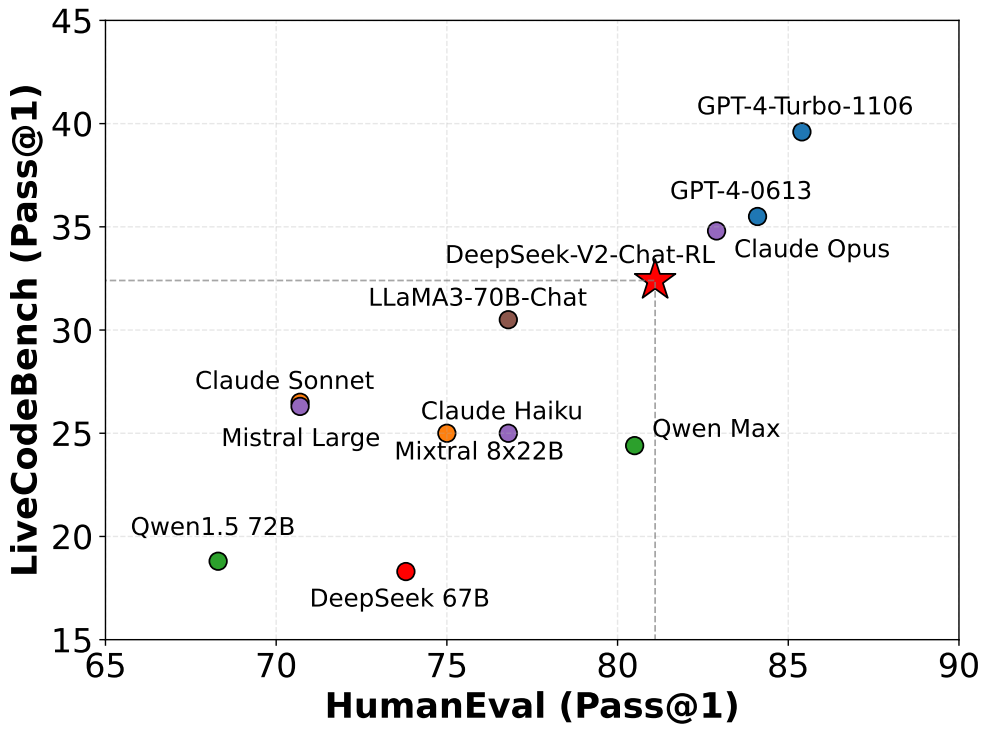

Figure 5 | Evaluation results on HumanEval and LiveCodeBench. The questions of Live-CodeBench are selected from the period between September 1st, 2023 and April 1st, 2024.

图 5｜HumanEval 与 LiveCodeBench 结果.

| PROMPT以下是一道中国高考生物选择题, 请选择正确的答案. 问题: 下列有关高尔基体, 线粒体和叶绿体的叙述, 正确的是选项: (A)三者都存在于蓝藻中(B)三者都含有DNA (C)三者都是ATP 合成的场所(D)三者的膜结构中都含有蛋白质答案: 从A到D, 我们应选择 |
| --- |

Table 12 | An example of AGIEval.

表 12｜AGIEval 示例.

<!-- page 35 of 52 -->

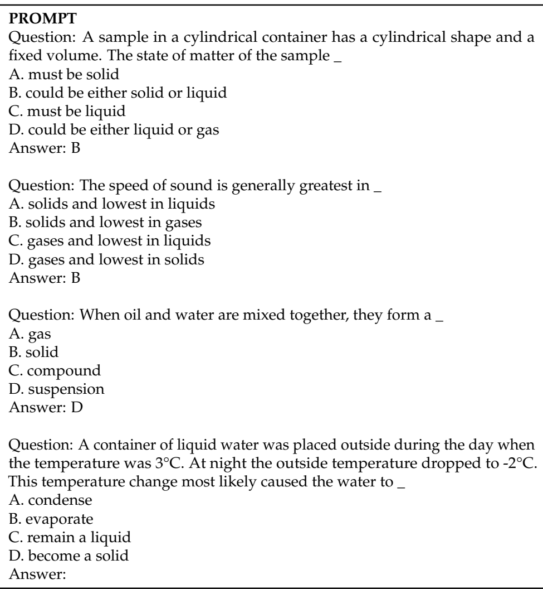

Table 13 | An example of ARC.

表 13｜ARC 示例.

<!-- page 36 of 52 -->

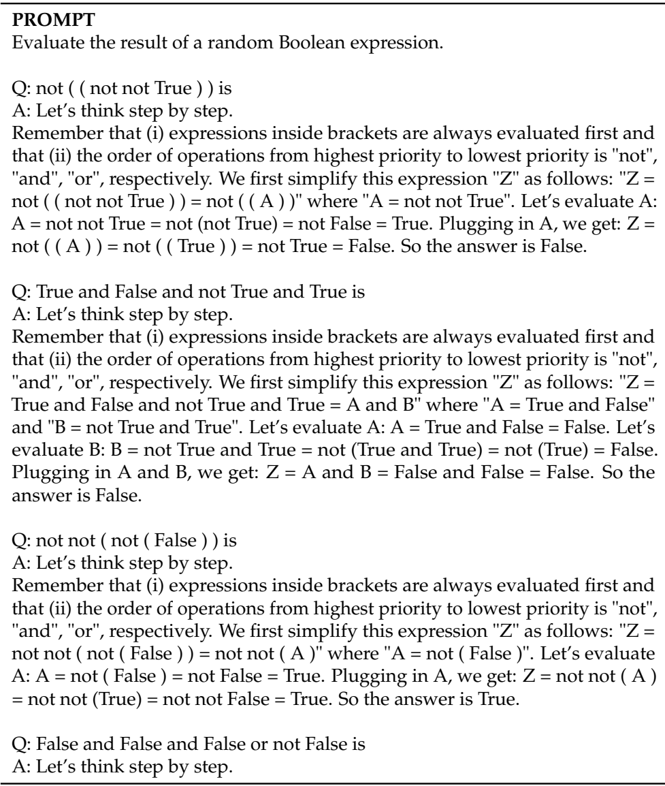

Table 14 | An example of BBH.

表 14｜BBH 示例.

<!-- page 37 of 52 -->

**PROMPT**以下是中国关于教育学考试的单项**选择**题, 请选出其中的正确答案. 根据我国心理学家冯忠良教授的学习分类, 培养学生品德要通过A. 知识的学习B. 技能的学习C. 行为规范的学习D. 态度的学习答案: C

开设跨学科课程**或建**立跨学科专业体现了高等教育课程发展的A. 综**合化趋势**B. 多样**化趋势**C. 人**文化趋势**D. 科学**化趋势**答案: A

心智技能的特点有A. 物质性, 外显性, **简缩**性B. 观念性, 内潜性, **简缩**性C. 物质性, 外显性, 展开性D. 观念性, 内潜性, 展开性答案: B

下列关于大学生的情绪与理智关系的说法中正确的是A. 能冷静控制自己情绪B. 感情用事**, 难**以用理智控制情绪C. 遇事能坚持自己正确认识D.**已发**展到不为小事而发怒和怄气答案: B

在学完一**篇逻**辑结构严密的课文以**后, 勾**画出课文的论点论据的逻辑关系图以**帮助理**解和记忆. 这种学习方法属于\_ A. 精细**加工策**略B. 组织策略C. 复述策略D.**做笔**记策略答案: B

有学者强**调, 教**育要根据一个**民族**固有的特征来定, 这种观点体现了A. 生产力对教育的影**响和制**约B.**政治制度**对教育的影**响和制**约C.**文化**对教育的影**响和制**约D. 经**济制度**对教育的影**响和制**约答案:

**OPTIONS** - A - B - C - D

Table 15 | An example of C-Eval.

表 15｜C-Eval 示例.

<!-- page 38 of 52 -->

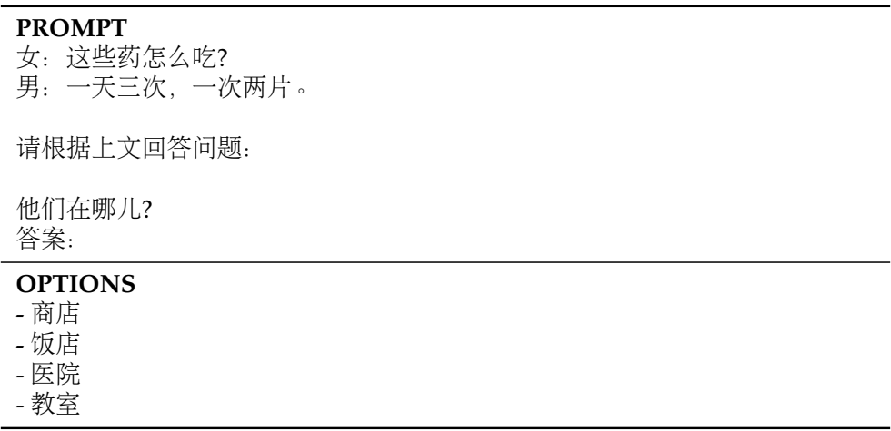

Table 16 | An example of C3.

表 16｜C3 示例.

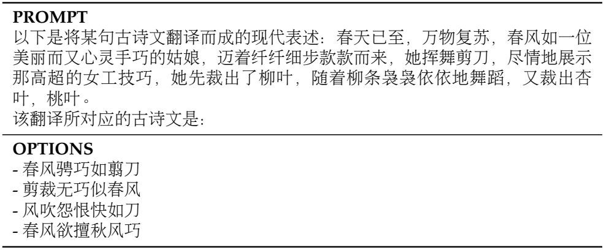

Table 17 | An example of CCPM.

表 17｜CCPM 示例.

<!-- page 39 of 52 -->

| PROMPTQ: 某小学在“献爱心-为汶川地震区捐款”活动中, 六年级五个班共捐款8000元, 其中一班捐款1500元, 二班比一班多捐款200元, 三班捐款1600元, 四班与五班捐款数之比是3: 5. 四班捐款多少元? A: 一班捐款1500元, 而二班比一班多捐200元, 所以二班捐款1500+200=1700元, 又知道六年级五个班一共捐款8000元, 所以四班和五班捐款之和=一共捐款-一班和二班和三班捐款之和, 即8000-1500-1700-1600=3200元, 而题目说四班与五班捐款数之比是3: 5, 则四班捐款了3200/(3+5)*3=1200元. 所以答案是: 1200. |
| --- |
| Q: 小俊在东西大道上跑步, 若规定向东为正. 他先向东跑了800米, 然后又跑了一段之后, 他位于出发点西边100米处, 小俊第二段跑了多少米? A: 小俊第二段跑完后位于出发点西边, 所以第二段应该是向西跑, 第二段跑的长度-第一段跑的长度=100, 第二段跑了100+800=900米. 所以答案是: 900. |
| Q: A车和B车同时从甲, 乙两地相向开出, 经过5小时相遇. 然后, 它们又各自按原速原方向继续行驶3小时, 这时A车离乙地还有135千米, B车离甲地还有165千米. 甲, 乙两地相距多少千米? A: 假设A车的速度为x千米每小时, B车的速度为y千米每小时, 根据而A, B相遇时A车行驶了5小时, A车行驶3小时后离乙地还有135千米, B车行驶3小时后距离甲地还有165千米, 可以得到甲乙两地相距=5x+5y=135+8x=165+8y, 变换得到: 10(x+y)=300+8(x+y), 于是x+y=150, 甲乙两地相距5(x+y)=750千米. 所以答案是: 750. |
| Q: 在一个底面半径为10厘米的圆柱形容器内, 倒入10厘米深的水, 然后将一个底面直径4厘米, 高6厘米的圆锥形铅锤放入水中, 容器中水面上升多少厘米? A: |

Table 18 | An example of CMATH.

表 18｜CMATH 示例.

<!-- page 40 of 52 -->

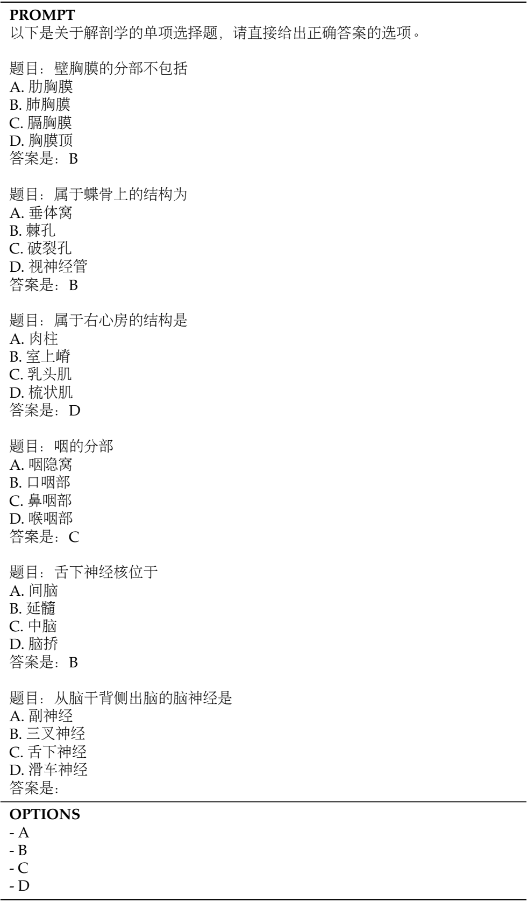

Table 19 | An example of CMMLU.

表 19｜CMMLU 示例.

<!-- page 41 of 52 -->

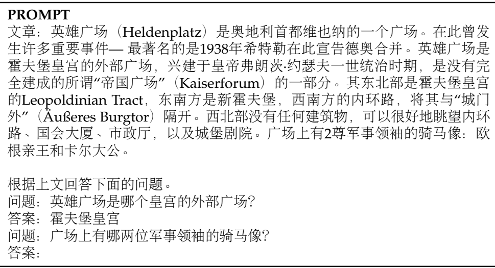

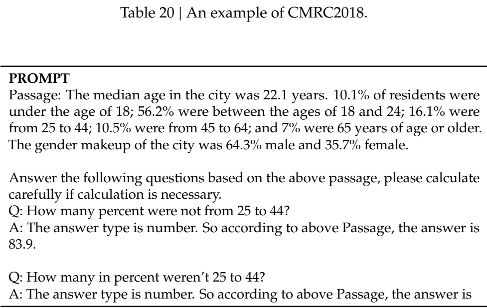

Table 21 | An example of DROP.

表 21｜DROP 示例.

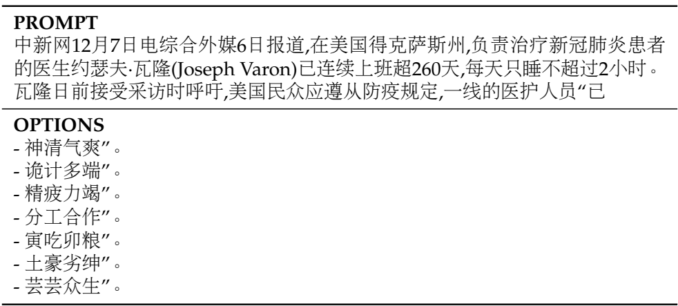

Table 22 | An example of CHID.

表 22｜CHID 示例.

<!-- page 42 of 52 -->

| PROMPT胡雪岩离船登岸, 坐轿进城, 等王有龄到家, 他接着也到了他那里, 脸上是掩抑不住的笑容, 王有龄夫妇都觉得奇怪, 问他什么事这么高兴. 上面的句子中的「他」指的是胡雪岩 |
| --- |
| 渐渐地, 汤中凝结出一团团块状物, 将它们捞起放进盆里冷却, 肥皂便出现在世上了. 上面的句子中的「它们」指的是块状物 |
| 「她序上明明引着JulesTellier的比喻, 说有个生脱发病的人去理发, 那剃头的对他说不用剪发, 等不了几天, 头毛压儿全掉光了; 大部分现代文学也同样的不值批评. 这比喻还算俏皮.」上面的句子中的「他」指的是生脱发病的人 |
| 在洛伦佐大街的尽头处, 矗立着著名的圣三一大教堂. 它有着巨大的穹顶, 还有明亮的彩色玻璃窗, 上面描绘着「旧约」和「新约」的场景. 上面的句子中的「它」指的是圣三一大教堂 |
| 他伯父还有许多女弟子, 大半是富商财主的外室; 这些财翁白天忙着赚钱, 怕小公馆里的情妇长日无聊, 要不安分, 常常叫她们学点玩艺儿消遣. 上面的句子中的「她们」指的是情妇 |
| 赵雨又拿出了一个杯子, 我们热情地请老王入座, 我边给他倒酒边问: 1962年的哪次记得吗?「上面的句子中的」他"指的是 |

Table 23 | An example of CLUEWSC.

表 23｜CLUEWSC 示例.

<!-- page 43 of 52 -->

| PROMPTQ: Max can mow the lawn in 40 minutes. If it takes him twice that long to fertilize the lawn, how long will it take him to both mow and fertilize the lawn? A: Let's think step by step. It takes Max 2 * 40 minutes = 80 minutes to fertilize the lawn. In total, Max takes 80 minutes + 40 minutes = 120 minutes to both mow and fertilize the lawn. The answer is 120. |
| --- |

Table 24 | An example of GSM8K.

表 24｜GSM8K 示例(完整 few-shot 与源 md 一致, 此处保留首条示意; 完整多题见源文件 page 43).

| PROMPTPlaying piano: A man is seated at a piano. He |
| --- |
| OPTIONS- is playing the piano with his hands and his face.- bigins to play a song by timbaland on the piano.- plays slowly, and pauses to snap his fingers.- is playing a song in front of him. |

Table 25 | An example of HellaSwag.

表 25｜HellaSwag 示例.

<!-- page 44 of 52 -->

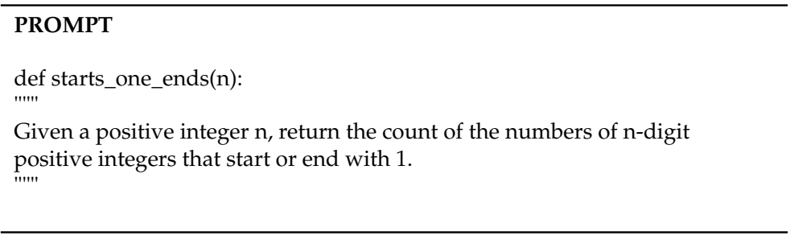

Table 26 | An example of HumanEval.

表 26｜HumanEval 示例.

<!-- page 45 of 52 -->

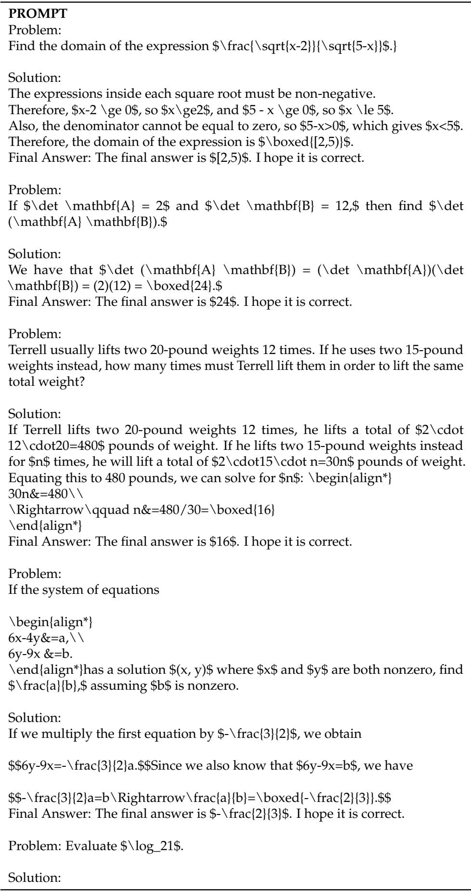

Table 27 | An example of MATH.

表 27｜MATH 示例.

<!-- page 46 of 52 -->

(MBPP 评测格式示例 Table 28, 与源 md page 46 代码块一致.)

Table 28 | An example of MBPP.

表 28｜MBPP 示例.

<!-- page 47 of 52 -->

(续 Table 28/29, 与源 md 一致.)

Table 29 | An example of MMLU.

表 29｜MMLU 示例.

<!-- page 48 of 52 -->

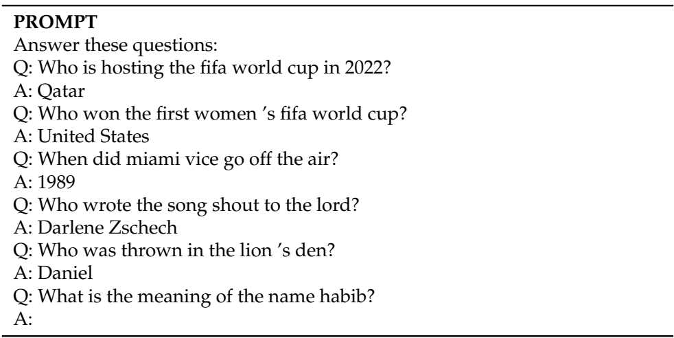

Table 30 | An example of NaturalQuestions.

表 30｜NaturalQuestions 示例.

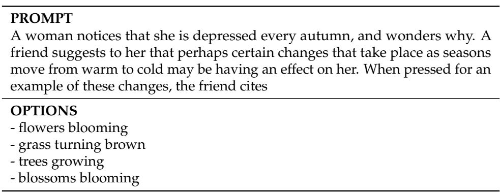

Table 31 | An example of OpenBookQA.

表 31｜OpenBookQA 示例.

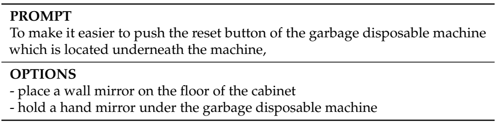

Table 32 | An example of PIQA.

表 32｜PIQA 示例.

<!-- page 49 of 52 -->

(Table 33 RACE 评测格式与源 md 一致.)

Table 33 | An example of RACE.

表 33｜RACE 示例.

<!-- page 50 of 52 -->

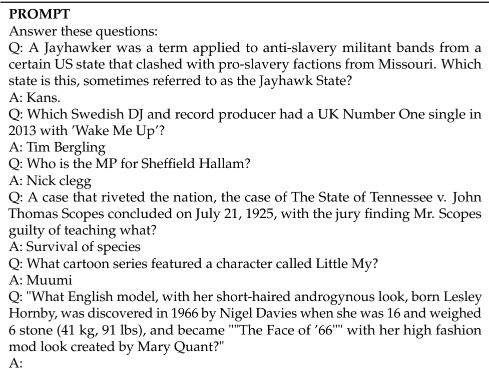

Table 34 | An example of TriviaQA.

表 34｜TriviaQA 示例.

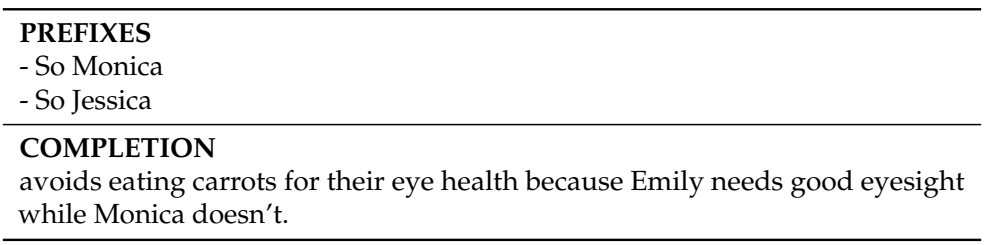

Table 35 | An example of WinoGrande. Note that there are two candidate answers for each sample, and we construct two complete sentences by filling in each candidate. We calculate the perplexity of each sentence, and choose the one with lower perplexity.

表 35｜WinoGrande 示例. 每样本两候选, 分别填入成完整句, 取困惑度更低者.

<!-- page 51 of 52 -->

(Table 36–37 评测格式与源 md 一致.)

Table 36 | An example of CMRC.

表 36｜CMRC 示例.

<!-- page 52 of 52 -->

Table 37 | An example of Pile.

表 37｜Pile 示例.

52
