<!-- page 1 of 53 -->

arXiv: 2412.19437v2 [cs. CL] 18 Feb 2025

deepseek

# DeepSeek-V3 Technical Report / DeepSeek-V3 技术报告

DeepSeek-AI

DeepSeek-AI

research@deepseek. com

## Abstract

We present DeepSeek-V3, a strong Mixture-of-Experts (MoE) language model with 671B total parameters with 37B activated for each token. To achieve efficient inference and cost-effective training, DeepSeek-V3 adopts Multi-head Latent Attention (MLA) and DeepSeekMoE architectures, which were thoroughly validated in DeepSeek-V2. Furthermore, DeepSeek-V3 pioneers an auxiliary-loss-free strategy for load balancing and sets a multi-token prediction training objective for stronger performance. We pre-train DeepSeek-V3 on 14.8 trillion diverse and high-quality tokens, followed by Supervised Fine-Tuning and Reinforcement Learning stages to fully harness its capabilities. Comprehensive evaluations reveal that DeepSeek-V3 outperforms other open-source models and achieves performance comparable to leading closed-source models. Despite its excellent performance, DeepSeek-V3 requires only 2.788M H800 GPU hours for its full training. In addition, its training process is remarkably stable. Throughout the entire training process, we did not experience any irrecoverable loss spikes or perform any rollbacks. The model checkpoints are available at https://github. com/deepseek-ai/DeepSeek-V3.

我们提出 DeepSeek-V3: 总参 671B, 每 token 激活 37B 的强 MoE 语言模型.

> **问:** 2.788M GPU 小时是不是把调参和消融也算进去了?
> 不是. Table 1 只算正式训练: 预训练 2664K 小时, 上下文扩展 119K, 后训练 5K. 架构搜索和消融不在这张表里.
> -- 全程无不可恢复的 loss 尖峰, 也未回滚.

> **核对:** 全程没回滚, 是不是 loss 从来没尖过?
> 报告写的是没有不可恢复的尖峰, 也没有回滚. 小抖动可以有. 不能从这句话读成曲线完全平.
> 权重见 https://github. com/deepseek-ai/DeepSeek-V3.

解释: MLA(Multi-head Latent Attention)= 把 K/V 压到低维潜变量再展开, 推理主要缓存压缩向量与解耦 RoPE 键, KV cache 明显变小. 细推导见 llm-guide MLA 单独成篇, 本对照稿不重推.

解释: DeepSeekMoE = 细粒度路由专家加共享专家; V3 亲和度改 Sigmoid, 并配无辅助损失负载均衡 (auxiliary-loss-free load balancing). 细推导见 llm-guide「01-DeepSeek-MoE」.

解释: 无辅助损失负载均衡 = 不靠 auxiliary loss 硬拧流量, 而是给每个专家加偏置 $b_i$, 只参与 Top-K 选路, 不进门控权重; 过载减偏置, 欠载加偏置.

> **看表:** 偏置 $b_i$ 加进去了, 专家输出会不会被它放大?
> 不会. $b_i$ 只加在选 Top-K 的分数上. 乘到专家输出上的门控, 仍用原来的 $s_{i, t}$.

解释: MTP= 主模型外再串深度模块, 每层预测更远的未来 token 并保因果链; 推理可丢掉 MTP, 也可拿来做投机解码.

> **拆开:** MTP 深度是 1, 推理时把这个模块丢掉, 主模型还是原来的 next-token 吗?
> 是. 多出来的预测只在训练里提供损失. 推理可以不挂它. 拿去投机解码时, 才用第二个 token 的接受率.

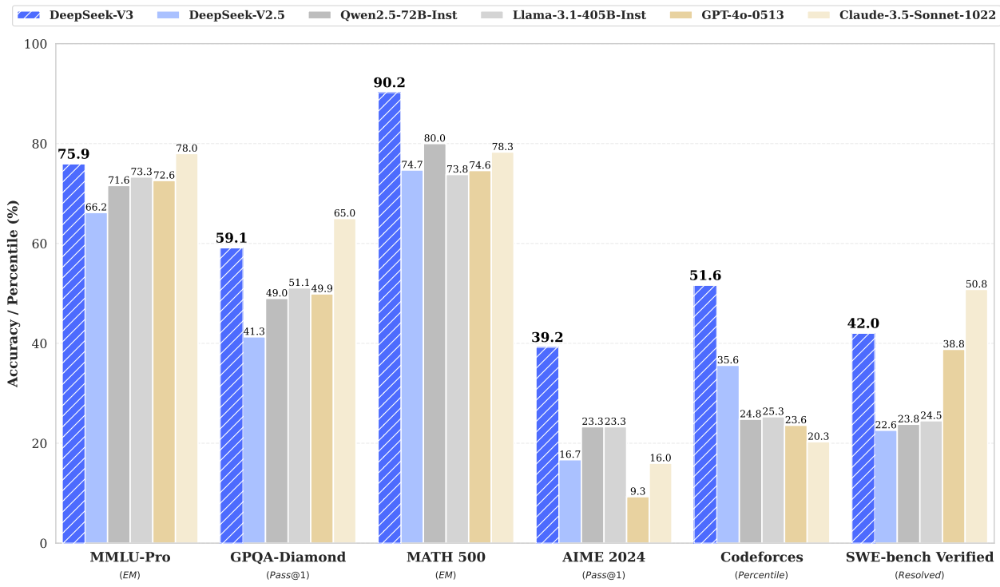

Figure 1 | Benchmark performance of DeepSeek-V3 and its counterparts.

图 1｜DeepSeek-V3 与对照模型的基准表现.

<!-- page 2 of 53 -->

## Contents

- 1 Introduction 4
- 2 Architecture 6
  - 2.1 Basic Architecture 6
    - 2.1.1 Multi-Head Latent Attention 7
    - 2.1.2 DeepSeekMoE with Auxiliary-Loss-Free Load Balancing 8
  - 2.2 Multi-Token Prediction 10
- 3 Infrastructures 11
  - 3.1 Compute Clusters 11
  - 3.2 Training Framework 12
    - 3.2.1 DualPipe and Computation-Communication Overlap 12
    - 3.2.2 Efficient Implementation of Cross-Node All-to-All Communication 13
    - 3.2.3 Extremely Memory Saving with Minimal Overhead 14
  - 3.3 FP8 Training 14
    - 3.3.1 Mixed Precision Framework 15
    - 3.3.2 Improved Precision from Quantization and Multiplication 16
    - 3.3.3 Low-Precision Storage and Communication 18
  - 3.4 Inference and Deployment 18
    - 3.4.1 Prefilling 19
    - 3.4.2 Decoding 19
  - 3.5 Suggestions on Hardware Design 20
    - 3.5.1 Communication Hardware 20
    - 3.5.2 Compute Hardware 20
- 4 Pre-Training 21
  - 4.1 Data Construction 21
  - 4.2 Hyper-Parameters 22
  - 4.3 Long Context Extension 23
  - 4.4 Evaluations 24
    - 4.4.1 Evaluation Benchmarks 24
    - 4.4.2 Evaluation Results 24
  - 4.5 Discussion 26
    - 4.5.1 Ablation Studies for Multi-Token Prediction 26
    - 4.5.2 Ablation Studies for the Auxiliary-Loss-Free Balancing Strategy 26
- 1 引言 4
- 2 架构 6
  - 2.1 基础架构 6
    - 2.1.1 MLA 7
    - 2.1.2 DeepSeekMoE 与无辅助损失负载均衡 8
  - 2.2 MTP 10
- 3 基础设施 11
  - 3.1 计算集群 11
  - 3.2 训练框架 12
    - 3.2.1 DualPipe 与计算-通信重叠 12
    - 3.2.2 跨节点 All-to-All 通信高效实现 13
    - 3.2.3 极致省显存且开销很小 14
  - 3.3 FP8 训练 14
    - 3.3.1 混合精度框架 15
    - 3.3.2 量化与乘法带来的精度提升 16
    - 3.3.3 低精度存储与通信 18
  - 3.4 推理与部署 18
    - 3.4.1 Prefilling 19
    - 3.4.2 Decoding 19
  - 3.5 硬件设计建议 20
    - 3.5.1 通信硬件 20
    - 3.5.2 计算硬件 20
- 4 预训练 21
  - 4.1 数据构造 21
  - 4.2 超参数 22
  - 4.3 长上下文扩展 23
  - 4.4 评测 24
    - 4.4.1 评测基准 24
    - 4.4.2 评测结果 24
  - 4.5 讨论 26
    - 4.5.1 MTP 消融 26
    - 4.5.2 无辅助损失均衡策略消融 26

<!-- page 3 of 53 -->

    - 4.5.3 Batch-Wise Load Balance VS. Sequence-Wise Load Balance ..... 27
- 5 Post-Training 28
  - 5.1 Supervised Fine-Tuning ..... 28
  - 5.2 Reinforcement Learning ..... 29
    - 5.2.1 Reward Model ..... 29
    - 5.2.2 Group Relative Policy Optimization ..... 30
  - 5.3 Evaluations ..... 30
    - 5.3.1 Evaluation Settings ..... 30
    - 5.3.2 Standard Evaluation ..... 31
    - 5.3.3 Open-Ended Evaluation ..... 33
    - 5.3.4 DeepSeek-V3 as a Generative Reward Model ..... 33
  - 5.4 Discussion ..... 34
    - 5.4.1 Distillation from DeepSeek-R1 ..... 34
    - 5.4.2 Self-Rewarding ..... 34
    - 5.4.3 Multi-Token Prediction Evaluation ..... 35
- 6 Conclusion, Limitations, and Future Directions 35
- A Contributions and Acknowledgments 45
- B Ablation Studies for Low-Precision Training 47
  - B.1 FP8 v. s. BF16 Training ..... 47
  - B.2 Discussion About Block-Wise Quantization ..... 47
- C Expert Specialization Patterns of the 16B Aux-Loss-Based and Aux-Loss-Free Models 48
    - 4.5.3 批级均衡 vs 序列级均衡 ..... 27
- 5 后训练 28
  - 5.1 监督微调 ..... 28
  - 5.2 强化学习 ..... 29
    - 5.2.1 奖励模型 ..... 29
    - 5.2.2 组相对策略优化 ..... 30
  - 5.3 评测 ..... 30
    - 5.3.1 评测设定 ..... 30
    - 5.3.2 标准评测 ..... 31
    - 5.3.3 开放生成评测 ..... 33
    - 5.3.4 DeepSeek-V3 作为生成式奖励模型 ..... 33
  - 5.4 讨论 ..... 34
    - 5.4.1 从 DeepSeek-R1 蒸馏 ..... 34
    - 5.4.2 自我奖励 ..... 34
    - 5.4.3 MTP 评测 ..... 35
- 6 结论, 局限与未来方向 35
- A 贡献与致谢 45
- B 低精度训练消融 47
  - B.1 FP8 对比 BF16 训练 ..... 47
  - B.2 块级量化讨论 ..... 47
- C 16B 辅助损失与无辅助损失模型的专家特化模式 48

<!-- page 4 of 53 -->

## 1. Introduction

In recent years, Large Language Models (LLMs) have been undergoing rapid iteration and evolution (Anthropic, 2024; Google, 2024; OpenAI, 2024a), progressively diminishing the gap towards Artificial General Intelligence (AGI). Beyond closed-source models, open-source models, including DeepSeek series (DeepSeek-AI, 2024a, b, c; Guo et al., 2024), LLaMA series (AI@Meta, 2024a, b; Touvron et al., 2023a, b), Qwen series (Qwen, 2023, 2024a, b), and Mistral series (Jiang et al., 2023; Mistral, 2024), are also making significant strides, endeavoring to close the gap with their closed-source counterparts. To further push the boundaries of open-source model capabilities, we scale up our models and introduce DeepSeek-V3, a large Mixture-of-Experts (MoE) model with 671B parameters, of which 37B are activated for each token.

近年来大模型快速迭代, 与 AGI 的距离在收. 闭源之外, DeepSeek, LLaMA, Qwen, Mistral 等开源系列也在追. 为再抬开源上限, 我们放大规模, 推出 DeepSeek-V3: 671B 总参的大 MoE, 每 token 激活 37B.

With a forward-looking perspective, we consistently strive for strong model performance and economical costs. Therefore, in terms of architecture, DeepSeek-V3 still adopts Multi-head Latent Attention (MLA) (DeepSeek-AI, 2024c) for efficient inference and DeepSeekMoE (Dai et al., 2024) for cost-effective training. These two architectures have been validated in DeepSeek-V2 (DeepSeek-AI, 2024c), demonstrating their capability to maintain robust model performance while achieving efficient training and inference. Beyond the basic architecture, we implement two additional strategies to further enhance the model capabilities. Firstly, DeepSeek-V3 pioneers an auxiliary-loss-free strategy (Wang et al., 2024a) for load balancing, with the aim of minimizing the adverse impact on model performance that arises from the effort to encourage load balancing. Secondly, DeepSeek-V3 employs a multi-token prediction training objective, which we have observed to enhance the overall performance on evaluation benchmarks.

目标一直是「要强, 也要省」. 架构上仍用 MLA 扛推理, DeepSeekMoE 扛训练成本--V2 已验过. 基础架构之外再加两招: 一是无辅助损失负载均衡, 减轻「为了均载而伤模型」; 二是 MTP 目标, 评测上整体更强.

In order to achieve efficient training, we support the FP8 mixed precision training and implement comprehensive optimizations for the training framework. Low-precision training has emerged as a promising solution for efficient training (Dettmers et al., 2022; Kalamkar et al., 2019; Narang et al., 2017; Peng et al., 2023b), its evolution being closely tied to advancements in hardware capabilities (Luo et al., 2024; Micikevicius et al., 2022; Rouhani et al., 2023a). In this work, we introduce an FP8 mixed precision training framework and, for the first time, validate its effectiveness on an extremely large-scale model. Through the support for FP8 computation and storage, we achieve both accelerated training and reduced GPU memory usage. As for the training framework, we design the DualPipe algorithm for efficient pipeline parallelism, which has fewer pipeline bubbles and hides most of the communication during training through computation-communication overlap. This overlap ensures that, as the model further scales up, as long as we maintain a constant computation-to-communication ratio, we can still employ fine-grained experts across nodes while achieving a near-zero all-to-all communication overhead. In addition, we also develop efficient cross-node all-to-all communication kernels to fully utilize InfiniBand (IB) and NVLink bandwidths. Furthermore, we meticulously optimize the memory footprint, making it possible to train DeepSeek-V3 without using costly tensor parallelism. Combining these efforts, we achieve high training efficiency.

训练侧开 FP8 混合精度, 并大改训练框架. 低精度训练近年被反复证明有效, 且跟硬件能力绑在一起. 本文给出 FP8 混合精度框架, 并首次在极大规模模型上跑通. FP8 算与存同时加速, 省显存. 框架上提出 DualPipe: 流水线气泡更少, 用计算-通信重叠把大半通信藏起来; 模型再放大, 只要算通比不变, 跨节点细粒度专家仍可接近零 all-to-all 开销. 另写跨节点 all-to-all 内核吃满 IB 与 NVLink, 并抠显存, 使 DeepSeek-V3 可以不靠昂贵张量并行完成训练.

> **确认:** 算通比大约 1: 1, 通信不是会和计算一样慢吗?
> 串行排就会. DualPipe 把 all-to-all 和计算重叠, 通信时间被算力盖住. 模型再大, 只要这个比例不变, 多出来的通信可以接近零.

> **回看:** 不靠张量并行, 671B 怎么放进单卡?
> 放不进单卡. 他们用流水线并行, 专家并行和 ZeRO-1, 把张量并行拿掉. 省的是 TP 的那份通信, 不是一卡装下.

解释: FP8 混合精度 = 大部分 GEMM 走 FP8, 敏感算子与主权重/优化器状态仍用更高精度; V3 用 1×128 tile / 128×128 block 细粒度量化, 累加提到 FP32 CUDA Core.

> **停一下:** FP8 是不是整网权重都存成 FP8?
> 不是. 大部分 GEMM 走 FP8. 敏感算子, 主权重和优化器状态仍用更高精度. 累加提到 FP32.

During pre-training, we train DeepSeek-V3 on 14.8T high-quality and diverse tokens. The pre-training process is remarkably stable. Throughout the entire training process, we did not encounter any irrecoverable loss spikes or have to roll back. Next, we conduct a two-stage context length extension for DeepSeek-V3. In the first stage, the maximum context length is extended to 32K, and in the second stage, it is further extended to 128K. Following this, we conduct post-training, including Supervised Fine-Tuning (SFT) and Reinforcement Learning (RL) on the base model of DeepSeek-V3, to align it with human preferences and further unlock its potential. During the post-training stage, we distill the reasoning capability from the DeepSeek-R1 series of models, and meanwhile carefully maintain the balance between model accuracy and generation length.

预训练吃 14.8T 高质量多样 token, 过程极稳: 无不可恢复尖峰, 也未回滚. 随后两阶段拉长上下文: 先到 32K, 再到 128K. 再对 Base 做 SFT 与 RL, 对齐人类偏好并解锁潜力; 后训练从 DeepSeek-R1 系列蒸馏推理能力, 同时仔细维持准确率与生成长度之间的平衡.

<!-- page 5 of 53 -->

| Training Costs    | Pre-Training | Context Extension | Post-Training | Total   |
| ------------------- | -------------- | ------------------- | --------------- | --------- |
| in H800 GPU Hours | 2664K        | 119K              | 5K            | 2788K   |
| in USD            | $5.328M      | $0.238M           | $0.01M        | $5.576M |

Table 1 | Training costs of DeepSeek-V3, assuming the rental price of H800 is \$2 per GPU hour.

表 1｜DeepSeek-V3 训练成本(按 H800 每 GPU 小时 \$2 租金估算).

We evaluate DeepSeek-V3 on a comprehensive array of benchmarks. Despite its economical training costs, comprehensive evaluations reveal that DeepSeek-V3-Base has emerged as the strongest open-source base model currently available, especially in code and math. Its chat version also outperforms other open-source models and achieves performance comparable to leading closed-source models, including GPT-4o and Claude-3.5-Sonnet, on a series of standard and open-ended benchmarks.

在一系列基准上评测: 训练虽省, DeepSeek-V3-Base 已是当前最强开源 Base, 尤其代码与数学; Chat 版也压过其他开源, 并在标准与开放基准上逼近 GPT-4o, Claude-3.5-Sonnet.

Lastly, we emphasize again the economical training costs of DeepSeek-V3, summarized in Table 1, achieved through our optimized co-design of algorithms, frameworks, and hardware. During the pre-training stage, training DeepSeek-V3 on each trillion tokens requires only 180K H800 GPU hours, i. e., 3.7 days on our cluster with 2048 H800 GPUs. Consequently, our pre-training stage is completed in less than two months and costs 2664K GPU hours. Combined with 119K GPU hours for the context length extension and 5K GPU hours for post-training, DeepSeek-V3 costs only 2.788M GPU hours for its full training. Assuming the rental price of the H800 GPU is \$2 per GPU hour, our total training costs amount to only \$5.576M. Note that the aforementioned costs include only the official training of DeepSeek-V3, excluding the costs associated with prior research and ablation experiments on architectures, algorithms, or data.

再强调一次成本(表 1): 算法, 框架, 硬件协同设计的结果. 预训练每万亿 token 仅 180K H800 GPU 小时, 即 2048 卡集群约 3.7 天; 预训练不到两月, 2664K GPU 小时. 加上下文扩展 119K, 后训练 5K, 全流程 2.788M GPU 小时; 按 \$2/GPU 小时计约 \$5.576M. 注意: 这只含正式训练, 不含前期架构/算法/数据探索与消融.

Our main contribution includes:

主要贡献如下:

### Architecture: Innovative Load Balancing Strategy and Training Objective 架构: 创新负载均衡策略与训练目标

\- On top of the efficient architecture of DeepSeek-V2, we pioneer an auxiliary-loss-free strategy for load balancing, which minimizes the performance degradation that arises from encouraging load balancing.

\- 在 V2 高效架构之上, 首推无辅助损失负载均衡, 尽量减轻「为均载而掉点」.

\- We investigate a Multi-Token Prediction (MTP) objective and prove it beneficial to model performance. It can also be used for speculative decoding for inference acceleration.

\- 研究 MTP 目标并证明有益; 推理阶段还可改作投机解码加速.

> **再看:** MTP 既是训练目标, 又是推理加速, 这两件事是不是绑在一起?
> 不绑. 训练时它提供额外损失. 推理可以整个丢掉. 只有想加速时, 才把它改成投机解码.

### Pre-Training: Towards Ultimate Training Efficiency 预训练: 迈向极致训练效率

\- We design an FP8 mixed precision training framework and, for the first time, validate the feasibility and effectiveness of FP8 training on an extremely large-scale model.

\- 设计 FP8 混合精度训练框架, 并首次在极大规模模型上验证可行与有效.

\- Through the co-design of algorithms, frameworks, and hardware, we overcome the communication bottleneck in cross-node MoE training, achieving near-full computation-communication overlap. This significantly enhances our training efficiency and reduces the training costs, enabling us to further scale up the model size without additional overhead.

\- 算法/框架/硬件协同, 打穿跨节点 MoE 通信瓶颈, 接近完全计算-通信重叠, 显著提效降本, 使模型还能继续放大而不额外加税.

\- At an economical cost of only 2.664M H800 GPU hours, we complete the pre-training of DeepSeek-V3 on 14.8T tokens, producing the currently strongest open-source base model. The subsequent training stages after pre-training require only 0.1M GPU hours.

\- 仅 2.664M H800 GPU 小时就在 14.8T token 上完成预训练, 得到当前最强开源 Base; 预训练之后阶段合计约 0.1M GPU 小时.

### Post-Training: Knowledge Distillation from DeepSeek-R1 后训练: 从 DeepSeek-R1 知识蒸馏

\- We introduce an innovative methodology to distill reasoning capabilities from the long-Chain-of-Thought (CoT) model, specifically from one of the DeepSeek R1 series models, into standard LLMs, particularly DeepSeek-V3. Our pipeline elegantly incorporates the

\- 提出把长 CoT 模型(R1 系列之一)的推理能力蒸馏进标准 LLM(尤其 V3)的方法. 流程把

<!-- page 6 of 53 -->

verification and reflection patterns of R1 into DeepSeek-V3 and notably improves its reasoning performance. Meanwhile, we also maintain control over the output style and length of DeepSeek-V3.

R1 的验证与反思模式溶进 V3, 推理明显上抬; 同时仍可控输出风格与长度.

### Summary of Core Evaluation Results 核心评测结果摘要

\- Knowledge: (1) On educational benchmarks such as MMLU, MMLU-Pro, and GPQA, DeepSeek-V3 outperforms all other open-source models, achieving 88.5 on MMLU, 75.9 on MMLU-Pro, and 59.1 on GPQA. Its performance is comparable to leading closed-source models like GPT-4o and Claude-Sonnet-3.5, narrowing the gap between open-source and closed-source models in this domain. (2) For factuality benchmarks, DeepSeek-V3 demonstrates superior performance among open-source models on both SimpleQA and Chinese SimpleQA. While it trails behind GPT-4o and Claude-Sonnet-3.5 in English factual knowledge (SimpleQA), it surpasses these models in Chinese factual knowledge (Chinese SimpleQA), highlighting its strength in Chinese factual knowledge.

\- 知识: (1) MMLU / MMLU-Pro / GPQA 等教育基准上开源第一: MMLU 88.5, MMLU-Pro 75.9, GPQA 59.1, 逼近 GPT-4o 与 Claude-Sonnet-3.5. (2) 事实性上, 开源侧 SimpleQA 与 Chinese SimpleQA 都强; 英文 SimpleQA 仍落后 GPT-4o / Claude-Sonnet-3.5, 中文事实知识则反超.

\- Code, Math, and Reasoning: (1) DeepSeek-V3 achieves state-of-the-art performance on math-related benchmarks among all non-long-CoT open-source and closed-source models. Notably, it even outperforms o1-preview on specific benchmarks, such as MATH-500, demonstrating its robust mathematical reasoning capabilities. (2) On coding-related tasks, DeepSeek-V3 emerges as the top-performing model for coding competition benchmarks, such as LiveCodeBench, solidifying its position as the leading model in this domain. For engineering-related tasks, while DeepSeek-V3 performs slightly below Claude-Sonnet-3.5, it still outpaces all other models by a significant margin, demonstrating its competitiveness across diverse technical benchmarks.

\- 代码, 数学与推理: (1) 非长 CoT 开源与闭源里, 数学基准 SOTA; MATH-500 等甚至超过 o1-preview. (2) 竞赛代码(如 LiveCodeBench)开源领先; 工程向任务略低于 Claude-Sonnet-3.5, 但仍大幅甩开其余模型.

In the remainder of this paper, we first present a detailed exposition of our DeepSeek-V3 model architecture (Section 2). Subsequently, we introduce our infrastructures, encompassing our compute clusters, the training framework, the support for FP8 training, the inference deployment strategy, and our suggestions on future hardware design. Next, we describe our pre-training process, including the construction of training data, hyper-parameter settings, long-context extension techniques, the associated evaluations, as well as some discussions (Section 4). Thereafter, we discuss our efforts on post-training, which include Supervised Fine-Tuning (SFT), Reinforcement Learning (RL), the corresponding evaluations, and discussions (Section 5). Lastly, we conclude this work, discuss existing limitations of DeepSeek-V3, and propose potential directions for future research (Section 6).

后文结构: §2 架构; 基础设施(集群, 训练框架, FP8, 推理部署, 硬件建议); §4 预训练(数据, 超参, 长上下文, 评测与讨论); §5 后训练(SFT, RL, 评测与讨论); §6 结论, 局限与未来方向.

## 2. Architecture 架构

We first introduce the basic architecture of DeepSeek-V3, featured by Multi-head Latent Attention (MLA) (DeepSeek-AI, 2024c) for efficient inference and DeepSeekMoE (Dai et al., 2024) for economical training. Then, we present a Multi-Token Prediction (MTP) training objective, which we have observed to enhance the overall performance on evaluation benchmarks. For other minor details not explicitly mentioned, DeepSeek-V3 adheres to the settings of DeepSeek-V2 (DeepSeek-AI, 2024c).

先讲基础架构: MLA 扛推理, DeepSeekMoE 扛训练成本; 再讲 MTP 训练目标.

> **对一下:** MLA 和 DeepSeekMoE 是这次新发明的吗?
> 不是. 这两块在 V2 里已经训过. V3 新加的是无辅助损失负载均衡, 和 MTP 这个训练目标. 没单列的细节沿用 V2.
> 其余未单列的细节沿用 DeepSeek-V2.

### 2.1. Basic Architecture 基础架构

The basic architecture of DeepSeek-V3 is still within the Transformer (Vaswani et al., 2017) framework. For efficient inference and economical training, DeepSeek-V3 also adopts MLA and DeepSeekMoE, which have been thoroughly validated by DeepSeek-V2. Compared with DeepSeek-V2, an exception is that we additionally introduce an auxiliary-loss-free load balancing

骨架仍是 Transformer. 相对 V2, 例外是额外引入无辅助损失负载均衡

6

strategy (Wang et al., 2024a) for DeepSeekMoE to mitigate the performance degradation induced by the effort to ensure load balance. Figure 2 illustrates the basic architecture of DeepSeek-V3, and we will briefly review the details of MLA and DeepSeekMoE in this section.

策略, 减轻「为均载而伤模型」. 图 2 给出 V3 基础架构示意; 下文简要回顾 MLA 与 DeepSeekMoE.

<!-- page 7 of 53 -->

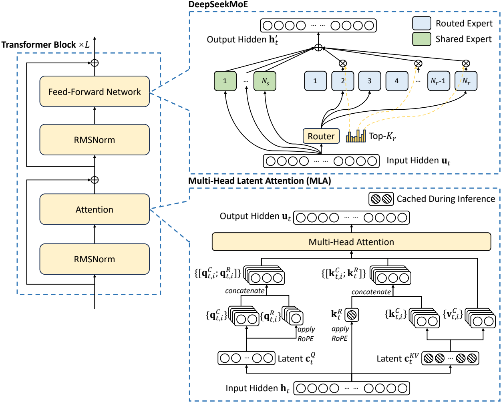

Figure 2 | Illustration of the basic architecture of DeepSeek-V3. Following DeepSeek-V2, we adopt MLA and DeepSeekMoE for efficient inference and economical training.

图 2｜DeepSeek-V3 基础架构示意. 沿用 V2 的 MLA 与 DeepSeekMoE.

#### 2.1.1. Multi-Head Latent Attention MLA

For attention, DeepSeek-V3 adopts the MLA architecture. Let d denote the embedding dimension, $n_{h}$ denote the number of attention heads, $d_{h}$ denote the dimension per head, and $h_{t} \in R^{d}$ denote the attention input for the t-th token at a given attention layer. The core of MLA is the low-rank joint compression for attention keys and values to reduce Key-Value (KV) cache during inference:

注意力侧采用 MLA. 记 $d$ 为嵌入维, $n_h$ 为头数, $d_h$ 为每头维, $h_t\in R^{d}$ 为该层第 $t$ 个 token 的注意力输入. MLA 核心是对 K/V 做低秩联合压缩, 以减小推理 KV cache:

$$
\boxed {\mathbf {c} _ {t} ^ {K V}} = W ^ {D K V} \mathbf {h} _ {t}, \tag{1}

$$

$$
[ \mathbf {k} _ {t, 1} ^ {C}; \mathbf {k} _ {t, 2} ^ {C}; \dots ; \mathbf {k} _ {t, n _ {h}} ^ {C} ] = \mathbf {k} _ {t} ^ {C} = W ^ {U K} \mathbf {c} _ {t} ^ {K V}, \tag{2}

$$

$$
\boxed {\mathbf {k} _ {t} ^ {R}} = \operatorname{RoPE} (W ^ {K R} \mathbf {h} _ {t}), \tag{3}

$$

$$
\mathbf {k} _ {t, i} = [ \mathbf {k} _ {t, i} ^ {C}; \mathbf {k} _ {t} ^ {R} ], \tag{4}

$$

$$
[ \mathbf {v} _ {t, 1} ^ {C}; \mathbf {v} _ {t, 2} ^ {C}; \dots ; \mathbf {v} _ {t, n _ {h}} ^ {C} ] = \mathbf {v} _ {t} ^ {C} = W ^ {U V} \mathbf {c} _ {t} ^ {K V}, \tag{5}

$$

<!-- page 8 of 53 -->

where $c_{t}^{KV} \in R^{d_{c}}$ is the compressed latent vector for keys and values; $d_{c} (\ll d_{h} n_{h})$ indicates the KV compression dimension; $W^{DKV} \in R^{d_{c} \times d}$ denotes the down-projection matrix; $W^{UK}, W^{UV} \in R^{d_{h} n_{h} \times d_{c}}$ are the up-projection matrices for keys and values, respectively; $W^{KR} \in R^{d_{h}^{R} \times d}$ is the matrix used to produce the decoupled key that carries Rotary Positional Embedding (RoPE) (Su et al., 2024); RoPE( $\cdot$ ) denotes the operation that applies RoPE matrices; and $[\cdot; \cdot]$ denotes concatenation. Note that for MLA, only the blue-boxed vectors (i. e., $c_{t}^{KV}$ and $k_{t}^{R}$ ) need to be cached during generation, which results in significantly reduced KV cache while maintaining performance comparable to standard Multi-Head Attention (MHA) (Vaswani et al., 2017).

其中 $c_t^{KV}\in R^{d_c}$ 是 K/V 压缩潜变量; $d_c(\ll d_h n_h)$ 为压缩维; $W^{DKV}$ 为下投影; $W^{UK}, W^{UV}$ 为上投影; $W^{KR}$ 产出携带 RoPE 的解耦键. 生成时只需缓存蓝框向量 $c_t^{KV}$ 与 $k_t^R$, KV cache 显著下降, 性能仍可比肩标准 MHA.

For the attention queries, we also perform a low-rank compression, which can reduce the activation memory during training:

Query 侧同样低秩压缩, 以降低训练期激活显存:

$$
\mathbf {c} _ {t} ^ {Q} = W ^ {D Q} \mathbf {h} _ {t}, \tag{6}

$$

$$
[ \mathbf {q} _ {t, 1} ^ {C}; \mathbf {q} _ {t, 2} ^ {C}; \dots ; \mathbf {q} _ {t, n _ {h}} ^ {C} ] = \mathbf {q} _ {t} ^ {C} = W ^ {U Q} \mathbf {c} _ {t} ^ {Q}, \tag{7}

$$

$$
[ \mathbf {q} _ {t, 1} ^ {R}; \mathbf {q} _ {t, 2} ^ {R}; \dots ; \mathbf {q} _ {t, n _ {h}} ^ {R} ] = \mathbf {q} _ {t} ^ {R} = \mathrm{RoPE} (W ^ {Q R} \mathbf {c} _ {t} ^ {Q}), \tag{8}

$$

$$
\mathbf {q} _ {t, i} = [ \mathbf {q} _ {t, i} ^ {C}; \mathbf {q} _ {t, i} ^ {R} ], \tag{9}

$$

where $\mathbf{c}_t^Q\in \mathbb{R}^{d_c'}$ is the compressed latent vector for queries; $d_c'(\ll d_h n_h)$ denotes the query compression dimension; $W^{D\bar{Q}}\in \mathbb{R}^{d_c'\times d}, W^{UQ}\in \mathbb{R}^{d_h n_h\times d_c'}$ are the down-projection and up-projection matrices for queries, respectively; and $W^{QR}\in \mathbb{R}^{d_h^R n_h\times d_c'}$ is the matrix to produce the decoupled queries that carry RoPE.

其中 $\mathbf{c}_t^Q$ 为 query 压缩潜变量, $d_c'$ 为压缩维; 其余为对应上下投影与解耦 RoPE query 矩阵.

Ultimately, the attention queries $(\mathbf{q}_{t, i})$ , keys $(\mathbf{k}_{j, i})$ , and values $(\mathbf{v}_{j, i}^{C})$ are combined to yield the final attention output $u_{t}$ :

最终由 query, key, value 合成注意力输出 $u_t$:

$$
\left| \mathbf {o} _ {t, i} = \sum_ {j = 1} ^ {t} \operatorname{Softmax} _ {j} \left(\frac {\mathbf {q} _ {t , i} ^ {T} \mathbf {k} _ {j , i}}{\sqrt {d _ {h} + d _ {h} ^ {R}}}\right) \mathbf {v} _ {j, i} ^ {G}, \right. \tag{10}

$$

$$
\mathbf {u} _ {t} = W ^ {O} [ \mathbf {o} _ {t, 1}; \mathbf {o} _ {t, 2}; \dots ; \mathbf {o} _ {t, n _ {h}} ], \tag{11}

$$

where $W^{O}\in \mathbb{R}^{d\times d_{h}n_{h}}$ denotes the output projection matrix.

$W^{O}$ 为输出投影.

#### 2.1.2. DeepSeekMoE with Auxiliary-Loss-Free Load Balancing DeepSeekMoE 与无辅助损失负载均衡

Basic Architecture of DeepSeekMoE. For Feed-Forward Networks (FFNs), DeepSeek-V3 employs the DeepSeekMoE architecture (Dai et al., 2024). Compared with traditional MoE architectures like GShard (Lepikhin et al., 2021), DeepSeekMoE uses finer-grained experts and isolates some experts as shared ones. Let $u_{t}$ denote the FFN input of the t-th token, we compute the FFN output $h_{t}^{\prime}$ as follows:

DeepSeekMoE 基础架构. FFN 用 DeepSeekMoE: 相对 GShard 一类传统 MoE, 专家更细, 并隔离出共享专家. 记 $u_t$ 为第 $t$ 个 token 的 FFN 输入, 输出 $h_t'$ 为:

$$
\mathbf {h} _ {t} ^ {\prime} = \mathbf {u} _ {t} + \sum_ {i = 1} ^ {N _ {s}} \mathrm{FFN} _ {i} ^ {(s)} \left(\mathbf {u} _ {t}\right) + \sum_ {i = 1} ^ {N _ {r}} g _ {i, t} \mathrm{FFN} _ {i} ^ {(r)} \left(\mathbf {u} _ {t}\right), \tag{12}

$$

$$
g _ {i, t} = \frac {g _ {i , t} ^ {\prime}}{\sum_ {j = 1} ^ {N _ {r}} g _ {j , t} ^ {\prime}}, \tag{13}

$$

$$
g _ {i, t} ^ {\prime} = \left\{ \begin{array}{l l} s _ {i, t}, & s _ {i, t} \in \operatorname{Topk} (\{s _ {j, t} | 1 \leqslant j \leqslant N _ {r} \}, K _ {r}), \\ 0, & \text {otherwise}, \end{array} \right. \tag{14}

$$

$$
s _ {i, t} = \text {Sigmoid} \left(\mathbf {u} _ {t} ^ {T} \mathbf {e} _ {i}\right), \tag{15}

$$

<!-- page 9 of 53 -->

where $N_{s}$ and $N_{r}$ denote the numbers of shared experts and routed experts, respectively; $\mathrm{FFN}_i^{(s)}(\cdot)$ and $\mathrm{FFN}_i^{(r)}(\cdot)$ denote the $i$-th shared expert and the $i$-th routed expert, respectively; $K_{r}$ denotes the number of activated routed experts; $g_{i, t}$ is the gating value for the $i$-th expert; $s_{i, t}$ is the token-to-expert affinity; $\mathbf{e}_i$ is the centroid vector of the $i$-th routed expert; and $\mathrm{Topk}(\cdot, K)$ denotes the set comprising $K$ highest scores among the affinity scores calculated for the $t$-th token and all routed experts. Slightly different from DeepSeek-V2, DeepSeek-V3 uses the sigmoid function to compute the affinity scores, and applies a normalization among all selected affinity scores to produce the gating values.

$N_s$, $N_r$ 为共享/路由专家数; $K_r$ 为激活的路由专家数; $g_{i, t}$ 为门控, $s_{i, t}$ 为亲和度, $\mathbf{e}_i$ 为第 $i$ 个路由专家质心. 相对 V2, V3 用 Sigmoid 算亲和度, 并在选中分数上归一化得到门控.

Auxiliary-Loss-Free Load Balancing. For MoE models, an unbalanced expert load will lead to routing collapse (Shazeer et al., 2017) and diminish computational efficiency in scenarios with expert parallelism. Conventional solutions usually rely on the auxiliary loss (Fedus et al., 2021; Lepikhin et al., 2021) to avoid unbalanced load. However, too large an auxiliary loss will impair the model performance (Wang et al., 2024a). To achieve a better trade-off between load balance and model performance, we pioneer an auxiliary-loss-free load balancing strategy (Wang et al., 2024a) to ensure load balance. To be specific, we introduce a bias term $b_{i}$ for each expert and add it to the corresponding affinity scores $s_{i, t}$ to determine the top-K routing:

无辅助损失负载均衡. 专家负载不均会导致路由崩溃并损害专家并行效率. 传统做法靠 auxiliary loss, 但过大又伤性能. 为折中, 我们首推无辅助损失策略: 给每个专家加偏置 $b_i$, 加到亲和度上再做 Top-K:

$$
g _ {i, t} ^ {\prime} = \left\{ \begin{array}{l l} s _ {i, t}, & s _ {i, t} + b _ {i} \in \operatorname{Topk} (\{s _ {j, t} + b _ {j} | 1 \leqslant j \leqslant N _ {r} \}, K _ {r}), \\ 0, & \text {otherwise. } \end{array} \right. \tag{16}

$$

Note that the bias term is only used for routing. The gating value, which will be multiplied with the FFN output, is still derived from the original affinity score $s_{i, t}$ . During training, we keep monitoring the expert load on the whole batch of each training step. At the end of each step, we will decrease the bias term by $\gamma$ if its corresponding expert is overloaded, and increase it by $\gamma$ if its corresponding expert is underloaded, where $\gamma$ is a hyper-parameter called bias update speed. Through the dynamic adjustment, DeepSeek-V3 keeps balanced expert load during training, and achieves better performance than models that encourage load balance through pure auxiliary losses.

偏置只用于选路; 真正乘到 FFN 输出的门控仍来自原始 $s_{i, t}$. 每步监控整批专家负载: 过载则 $b_i$ 减 $\gamma$, 欠载则加 $\gamma$($\gamma$ 为偏置更新速度). 动态调整下, V3 训练期均载, 且优于纯辅助损失方案.

Complementary Sequence-Wise Auxiliary Loss. Although DeepSeek-V3 mainly relies on the auxiliary-loss-free strategy for load balance, to prevent extreme imbalance within any single sequence, we also employ a complementary sequence-wise balance loss:

互补序列级辅助损失. 主策略仍是无辅助损失; 为防单条序列极端不均, 另加极小的序列级平衡损失:

$$
\mathcal {L} _ {\mathrm{Bal}} = \alpha \sum_ {i = 1} ^ {N _ {r}} f _ {i} P _ {i}, \tag{17}

$$

$$
f _ {i} = \frac {N _ {r}}{K _ {r} T} \sum_ {t = 1} ^ {T} \mathbb {1} \left(s _ {i, t} \in \operatorname{Topk} (\{s _ {j, t} | 1 \leqslant j \leqslant N _ {r} \}, K _ {r})\right), \tag{18}

$$

$$
\left| s _ {i, t} ^ {\prime} = \frac {s _ {i , t}}{\sum_ {j = 1} ^ {N _ {r}} s _ {j , t}} \right|\tag{19}

$$

$$
P _ {i} = \frac {1}{T} \sum_ {t = 1} ^ {T} s _ {i, t} ^ {\prime}, \tag{20}

$$

where the balance factor $\alpha$ is a hyper-parameter, which will be assigned an extremely small value for DeepSeek-V3; $1(\cdot)$ denotes the indicator function; and $T$ denotes the number of tokens in a sequence. The sequence-wise balance loss encourages the expert load on each sequence to be balanced.

$\alpha$ 取极小; $T$ 为序列 token 数. 该损失鼓励每条序列上的专家负载也大致均衡.

<!-- page 10 of 53 -->

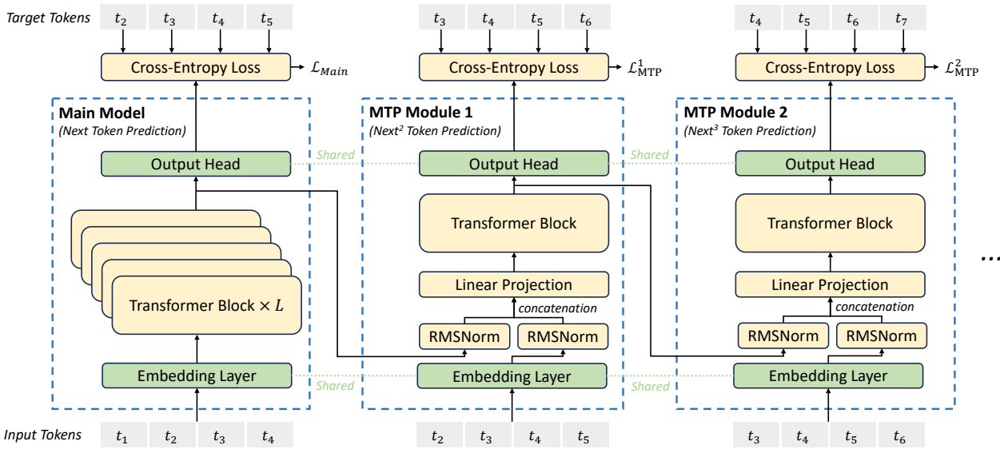

Figure 3 | Illustration of our Multi-Token Prediction (MTP) implementation. We keep the complete causal chain for the prediction of each token at each depth.

图 3｜MTP 实现示意. 每一深度对每个 token 的预测都保持完整因果链.

Node-Limited Routing. Like the device-limited routing used by DeepSeek-V2, DeepSeek-V3 also uses a restricted routing mechanism to limit communication costs during training. In short, we ensure that each token will be sent to at most M nodes, which are selected according to the sum of the highest $\frac{K_{r}}{M}$ affinity scores of the experts distributed on each node. Under this constraint, our MoE training framework can nearly achieve full computation-communication overlap.

节点受限路由. 类似 V2 的设备受限路由: 每 token 最多发往 M 个节点, 按各节点上最高 $K_r/M$ 个亲和度之和挑选. 该约束下, MoE 训练框架可接近完全计算-通信重叠.

No Token-Dropping. Due to the effective load balancing strategy, DeepSeek-V3 keeps a good load balance during its full training. Therefore, DeepSeek-V3 does not drop any tokens during training. In addition, we also implement specific deployment strategies to ensure inference load balance, so DeepSeek-V3 also does not drop tokens during inference.

不丢 token. 均载策略有效, 全程训练不丢 token; 推理侧也有专门部署策略保均载, 推理同样不丢 token.

> **想:** 负载不均时, 会不会直接丢掉一些 token?
> 训练和推理都不丢. 不均交给偏置, 推理再加冗余专家. 不靠丢 token 换均衡.

### 2.2. Multi-Token Prediction MTP

Inspired by Gloeckle et al. (2024), we investigate and set a Multi-Token Prediction (MTP) objective for DeepSeek-V3, which extends the prediction scope to multiple future tokens at each position. On the one hand, an MTP objective densifies the training signals and may improve data efficiency. On the other hand, MTP may enable the model to pre-plan its representations for better prediction of future tokens. Figure 3 illustrates our implementation of MTP. Different from Gloeckle et al. (2024), which parallelly predicts D additional tokens using independent output heads, we sequentially predict additional tokens and keep the complete causal chain at each prediction depth. We introduce the details of our MTP implementation in this section.

受 Gloeckle et al. (2024) 启发, V3 采用 MTP: 每个位置预测多个未来 token. 一面加密训练信号, 可能提高数据效率; 一面促使表示预先规划未来. 图 3 给出实现. 与并行独立输出头不同, 我们按深度串行预测并保持因果链.

MTP Modules. To be specific, our MTP implementation uses $D$ sequential modules to predict $D$ additional tokens. The $k$-th MTP module consists of a shared embedding layer $\mathrm{Emb}(\cdot)$, a shared output head $\mathrm{OutHead}(\cdot)$, a Transformer block $\mathrm{TRM}_k(\cdot)$, and a projection matrix $M_k \in \mathbb{R}^{d \times 2d}$. For the $i$-th input token $t_i$, at the $k$-th prediction depth, we first combine the representation of the $i$-th token at the $(k-1)$-th depth $\mathbf{h}_i^{k-1} \in \mathbb{R}^d$ and the embedding of the $(i+k)$-th token $\mathrm{Emb}(t_{i+k}) \in \mathbb{R}^d$

MTP 模块. 用 $D$ 个串行模块预测 $D$ 个额外 token. 第 $k$ 个模块含共享 embedding, 共享输出头, Transformer 块 $\mathrm{TRM}_k$ 与投影 $M_k$. 对第 $i$ 个输入 token, 在第 $k$ 深度先把上一深度表示 $\mathbf{h}_i^{k-1}$ 与第 $(i+k)$ 个 token 的嵌入拼接

<!-- page 11 of 53 -->

with the linear projection:

再经线性投影:

$$
\mathbf {h} _ {i} ^ {\prime k} = M _ {k} [ \mathrm{RMSNorm} (\mathbf {h} _ {i} ^ {k - 1}); \mathrm{RMSNorm} (\mathrm{Emb} (t _ {i + k})) ], \tag{21}

$$

where $[\cdot; \cdot]$ denotes concatenation. Especially, when $k=1$ , $h_{i}^{k-1}$ refers to the representation given by the main model. Note that for each MTP module, its embedding layer is shared with the main model. The combined $h_{i}^{\prime k}$ serves as the input of the Transformer block at the k-th depth to produce the output representation at the current depth $h_{i}^{k}$ :

$k=1$ 时 $h_i^{k-1}$ 即主模型表示; embedding 与主模型共享. $h_i^{\prime k}$ 进入第 $k$ 深度 Transformer, 得到 $h_i^k$:

$$
\mathbf {h} _ {1: T - k} ^ {k} = \mathrm{TRM} _ {k} (\mathbf {h} _ {1: T - k} ^ {\prime k}), \tag{22}

$$

where $T$ represents the input sequence length and $i: j$ denotes the slicing operation (inclusive of both the left and right boundaries). Finally, taking $\mathbf{h}_i^k$ as the input, the shared output head will compute the probability distribution for the $k$-th additional prediction token $P_{i+1+k}^k \in \mathbb{R}^V$, where $V$ is the vocabulary size:

$T$ 为序列长. 共享输出头由 $\mathbf{h}_i^k$ 给出第 $k$ 个额外预测的分布:

$$
P _ {i + k + 1} ^ {k} = \mathrm{OutHead} (\mathbf {h} _ {i} ^ {k}). \tag{23}

$$

The output head OutHead( $\cdot$ ) linearly maps the representation to logits and subsequently applies the Softmax( $\cdot$ ) function to compute the prediction probabilities of the k-th additional token. Also, for each MTP module, its output head is shared with the main model. Our principle of maintaining the causal chain of predictions is similar to that of EAGLE (Li et al., 2024b), but its primary objective is speculative decoding (Leviathan et al., 2023; Xia et al., 2023), whereas we utilize MTP to improve training.

输出头线性映射后 Softmax; 亦与主模型共享. 保因果链的原则类似 EAGLE, 但 EAGLE 主攻投机解码, 我们用 MTP 提升训练.

MTP Training Objective. For each prediction depth, we compute a cross-entropy loss $\mathcal{L}_{\mathrm{MTP}}^k$:

MTP 训练目标. 每一深度算交叉熵:

$$
\mathcal {L} _ {\mathrm{MTP}} ^ {k} = \text {CrossEntropy} (P _ {2 + k: T + 1} ^ {k}, t _ {2 + k: T + 1}) = - \frac {1}{T} \sum_ {i = 2 + k} ^ {T + 1} \log P _ {i} ^ {k} [ t _ {i} ], \tag{24}

$$

where T denotes the input sequence length, $t_{i}$ denotes the ground-truth token at the i-th position, and $P_{i}^{k}[t_{i}]$ denotes the corresponding prediction probability of $t_{i}$, given by the k-th MTP module. Finally, we compute the average of the MTP losses across all depths and multiply it by a weighting factor $\lambda$ to obtain the overall MTP loss $L_{MTP}$, which serves as an additional training objective for DeepSeek-V3:

各深度 MTP 损失平均后再乘 $\lambda$, 作为附加目标:

$$
\mathcal {L} _ {\mathrm{MTP}} = \frac {\lambda}{D} \sum_ {k = 1} ^ {D} \mathcal {L} _ {\mathrm{MTP}} ^ {k}. \tag{25}

$$

MTP in Inference. Our MTP strategy mainly aims to improve the performance of the main model, so during inference, we can directly discard the MTP modules and the main model can function independently and normally. Additionally, we can also repurpose these MTP modules for speculative decoding to further improve the generation latency.

推理期. MTP 主要为抬主模型; 推理可直接丢掉 MTP 模块. 也可改作投机解码, 降低生成延迟.

## 3. Infrastructures 基础设施

### 3.1. Compute Clusters 计算集群

DeepSeek-V3 is trained on a cluster equipped with 2048 NVIDIA H800 GPUs. Each node in the H800 cluster contains 8 GPUs connected by NVLink and NVSwitch within nodes. Across different nodes, InfiniBand (IB) interconnects are utilized to facilitate communications.

训练集群: 2048 张 NVIDIA H800. 节点内 8 卡经 NVLink/NVSwitch; 节点间走 InfiniBand.

<!-- page 12 of 53 -->

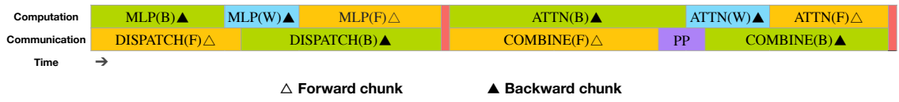

Figure 4 | Overlapping strategy for a pair of individual forward and backward chunks (the boundaries of the transformer blocks are not aligned). Orange denotes forward, green denotes "backward for input", blue denotes "backward for weights", purple denotes PP communication, and red denotes barriers. Both all-to-all and PP communication can be fully hidden.

图 4｜一对 forward/backward chunk 的重叠策略(Transformer 块边界未对齐). 橙=前向, 绿=输入反传, 蓝=权重反传, 紫=PP 通信, 红=屏障. all-to-all 与 PP 通信均可完全隐藏.

### 3.2. Training Framework 训练框架

The training of DeepSeek-V3 is supported by the HAI-LLM framework, an efficient and lightweight training framework crafted by our engineers from the ground up. On the whole, DeepSeek-V3 applies 16-way Pipeline Parallelism (PP) (Qi et al., 2023a), 64-way Expert Parallelism (EP) (Lepikhin et al., 2021) spanning 8 nodes, and ZeRO-1 Data Parallelism (DP) (Rajbhandari et al., 2020).

训练由自研 HAI-LLM 框架支撑. 整体: 16-way PP, 跨 8 节点的 64-way EP, ZeRO-1 DP.

In order to facilitate efficient training of DeepSeek-V3, we implement meticulous engineering optimizations. Firstly, we design the DualPipe algorithm for efficient pipeline parallelism. Compared with existing PP methods, DualPipe has fewer pipeline bubbles. More importantly, it overlaps the computation and communication phases across forward and backward processes, thereby addressing the challenge of heavy communication overhead introduced by cross-node expert parallelism. Secondly, we develop efficient cross-node all-to-all communication kernels to fully utilize IB and NVLink bandwidths and conserve Streaming Multiprocessors (SMs) dedicated to communication. Finally, we meticulously optimize the memory footprint during training, thereby enabling us to train DeepSeek-V3 without using costly Tensor Parallelism (TP).

工程上三板斧: DualPipe 减气泡并重叠前后向计算与通信, 应对跨节点 EP 的通信税; 自研跨节点 all-to-all 内核吃满 IB/NVLink 并节省通信占用的 SM; 抠显存, 使训练可不用昂贵 TP.

#### 3.2.1. DualPipe and Computation-Communication Overlap DualPipe 与计算-通信重叠

For DeepSeek-V3, the communication overhead introduced by cross-node expert parallelism results in an inefficient computation-to-communication ratio of approximately 1: 1. To tackle this challenge, we design an innovative pipeline parallelism algorithm called DualPipe, which not only accelerates model training by effectively overlapping forward and backward computation-communication phases, but also reduces the pipeline bubbles.

跨节点 EP 把算通比拖到约 1: 1. DualPipe 用前后向计算-通信重叠加速, 并减少流水线气泡.

解释: DualPipe = 双向流水线并行: 一对 forward/backward chunk 内重排 attention, dispatch, MLP, combine, 并手调通信/计算 SM 比例, 把 all-to-all 与 PP 通信藏进计算; 两端同时喂 micro-batch, 气泡更短.

The key idea of DualPipe is to overlap the computation and communication within a pair of individual forward and backward chunks. To be specific, we divide each chunk into four components: attention, all-to-all dispatch, MLP, and all-to-all combine. Specially, for a backward chunk, both attention and MLP are further split into two parts, backward for input and backward for weights, like in ZeroBubble (Qi et al., 2023b). In addition, we have a PP communication component. As illustrated in Figure 4, for a pair of forward and backward chunks, we rearrange these components and manually adjust the ratio of GPU SMs dedicated to communication versus computation. In this overlapping strategy, we can ensure that both all-to-all and PP communication can be fully hidden during execution. Given the efficient overlapping strategy, the full DualPipe scheduling is illustrated in Figure 5. It employs a bidirectional pipeline scheduling, which feeds micro-batches from both ends of the pipeline simultaneously and a significant portion of communications can be fully overlapped. This overlap also ensures that, as the model further scales up, as long as we maintain a constant computation-to-communication ratio, we can still employ fine-grained experts across nodes while achieving a near-zero all-to-all communication overhead.

核心: 在一对 forward/backward chunk 内重叠计算与通信. chunk 拆成 attention, dispatch, MLP, combine; 反向再拆输入反传与权重反传. 图 4 重排组件并手动调通信/计算 SM 比例, 使 all-to-all 与 PP 通信可完全隐藏. 图 5 为完整双向流水: 两端同时喂 micro-batch. 模型再放大, 只要算通比不变, 跨节点细粒度专家仍可接近零 all-to-all 开销.

<!-- page 13 of 53 -->

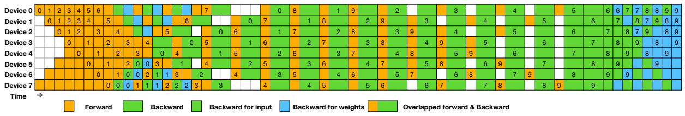

Figure 5 | Example DualPipe scheduling for 8 PP ranks and 20 micro-batches in two directions. The micro-batches in the reverse direction are symmetric to those in the forward direction, so we omit their batch ID for illustration simplicity. Two cells enclosed by a shared black border have mutually overlapped computation and communication.

图 5｜8 个 PP rank, 双向共 20 个 micro-batch 的 DualPipe 调度示例. 反向与正向对称, 图中省略反向 batch ID; 共边黑框的两格表示相互重叠的计算与通信.

| Method          | Bubble                              | Parameter | Activation |
| ----------------- | ------------------------------------- | ----------- | ------------ |
| 1F1B            | $(PP - 1)(F + B)$                   | 1×       | $PP$       |
| ZB1P            | $(PP - 1)(F + B - 2W)$              | 1×       | $PP$       |
| DualPipe (Ours) | $(\frac{PP}{2} - 1)(F\&B + B - 3W)$ | 2×       | $PP + 1$   |

Table 2 | Comparison of pipeline bubbles and memory usage across different pipeline parallel methods. F denotes the execution time of a forward chunk, B denotes the execution time of a full backward chunk, W denotes the execution time of a "backward for weights" chunk, and F&B denotes the execution time of two mutually overlapped forward and backward chunks.

表 2｜不同流水线并行方法的气泡与显存对比. F/B/W/F&B 定义见英文表注.

In addition, even in more general scenarios without a heavy communication burden, DualPipe still exhibits efficiency advantages. In Table 2, we summarize the pipeline bubbles and memory usage across different PP methods. As shown in the table, compared with ZB1P (Qi et al., 2023b) and 1F1B (Harlap et al., 2018), DualPipe significantly reduces the pipeline bubbles while only increasing the peak activation memory by $\frac{1}{PP}$ times. Although DualPipe requires keeping two copies of the model parameters, this does not significantly increase the memory consumption since we use a large EP size during training. Compared with Chimera (Li and Hoefler, 2021), DualPipe only requires that the pipeline stages and micro-batches be divisible by 2, without requiring micro-batches to be divisible by pipeline stages. In addition, for DualPipe, neither the bubbles nor activation memory will increase as the number of micro-batches grows.

即便通信不重, DualPipe 仍有优势. 相对 ZB1P 与 1F1B, 气泡显著减少, 激活峰值只多约 $1/PP$. 参数存两份, 但大 EP 下显存压力不大. 相对 Chimera, 只需 PP stage 与 micro-batch 能被 2 整除. 气泡与激活也不随 micro-batch 数增加而涨.

#### 3.2.2. Efficient Implementation of Cross-Node All-to-All Communication 跨节点 All-to-All 通信高效实现

In order to ensure sufficient computational performance for DualPipe, we customize efficient cross-node all-to-all communication kernels (including dispatching and combining) to conserve the number of SMs dedicated to communication. The implementation of the kernels is co-designed with the MoE gating algorithm and the network topology of our cluster. To be specific, in our cluster, cross-node GPUs are fully interconnected with IB, and intra-node communications are handled via NVLink. NVLink offers a bandwidth of 160 GB/s, roughly 3.2 times that of IB (50 GB/s). To effectively leverage the different bandwidths of IB and NVLink, we limit each token to be dispatched to at most 4 nodes, thereby reducing IB traffic. For each token, when its routing decision is made, it will first be transmitted via IB to the GPUs with the same in-node index on its target nodes. Once it reaches the target nodes, we will endeavor to ensure that it is instantaneously forwarded via NVLink to specific GPUs that host their target experts, without being blocked by subsequently arriving tokens. In this way, communications via IB and NVLink are fully overlapped, and each token can efficiently select an average of 3.2 experts per node without incurring additional overhead from NVLink. This implies that, although DeepSeek-V3

为给 DualPipe 留足算力, 自研跨节点 all-to-all(dispatch/combine)内核, 少占通信 SM; 并与门控及网络拓扑协同设计. 跨节点全互连 IB, 节点内 NVLink(约 160 GB/s, 约为 IB 50 GB/s 的 3.2 倍). 每 token 最多派到 4 节点以减压 IB. 路由决定后先经 IB 到目标节点同号 GPU, 再经 NVLink 立刻转发到承载目标专家的 GPU, 避免被后续到达阻塞. IB 与 NVLink 通信完全重叠, 每节点平均可选约 3.2 个专家且不额外吃 NVLink. 虽 V3

<!-- page 14 of 53 -->

selects only 8 routed experts in practice, it can scale up this number to a maximum of 13 experts (4 nodes × 3.2 experts/node) while preserving the same communication cost. Overall, under such a communication strategy, only 20 SMs are sufficient to fully utilize the bandwidths of IB and NVLink.

实务只选 8 个路由专家, 但可扩到最多 13(4×3.2)而不加通信成本. 整体约 20 个 SM 即可吃满 IB 与 NVLink.

In detail, we employ the warp specialization technique (Bauer et al., 2014) and partition 20 SMs into 10 communication channels. During the dispatching process, (1) IB sending, (2) IB-to-NVLink forwarding, and (3) NVLink receiving are handled by respective warps. The number of warps allocated to each communication task is dynamically adjusted according to the actual workload across all SMs. Similarly, during the combining process, (1) NVLink sending, (2) NVLink-to-IB forwarding and accumulation, and (3) IB receiving and accumulation are also handled by dynamically adjusted warps. In addition, both dispatching and combining kernels overlap with the computation stream, so we also consider their impact on other SM computation kernels. Specifically, we employ customized PTX (Parallel Thread Execution) instructions and auto-tune the communication chunk size, which significantly reduces the use of the L2 cache and the interference to other SMs.

细节: warp specialization, 20 SM 划成 10 通道. Dispatch 三类 warp 动态调配; Combine 同理. 内核与计算流重叠, 并用定制 PTX 与自动调 chunk, 减轻 L2 占用与对其它 SM 的干扰.

#### 3.2.3. Extremely Memory Saving with Minimal Overhead 极致省显存且开销很小

In order to reduce the memory footprint during training, we employ the following techniques.

训练期省显存手段如下.

Recomputation of RMSNorm and MLA Up-Projection. We recompute all RMSNorm operations and MLA up-projections during back-propagation, thereby eliminating the need to persistently store their output activations. With a minor overhead, this strategy significantly reduces memory requirements for storing activations.

重算 RMSNorm 与 MLA 上投影: 反传时重算, 免持久存激活, 轻微开销换显著显存下降.

Exponential Moving Average in CPU. During training, we preserve the Exponential Moving Average (EMA) of the model parameters for early estimation of the model performance after learning rate decay. The EMA parameters are stored in CPU memory and are updated asynchronously after each training step. This method allows us to maintain EMA parameters without incurring additional memory or time overhead.

CPU 上维护参数 EMA, 异步更新, 便于 lr 衰减后提前估性能, 几乎不增 GPU 显存/时间.

Shared Embedding and Output Head for Multi-Token Prediction. With the DualPipe strategy, we deploy the shallowest layers (including the embedding layer) and deepest layers (including the output head) of the model on the same PP rank. This arrangement enables the physical sharing of parameters and gradients, of the shared embedding and output head, between the MTP module and the main model. This physical sharing mechanism further enhances our memory efficiency.

MTP 共享 embedding/输出头: DualPipe 把最浅与最深层放同一 PP rank, 使 MTP 与主模型物理共享参数与梯度, 进一步省显存.

### 3.3. FP8 Training FP8 训练

Inspired by recent advances in low-precision training (Dettmers et al., 2022; Noune et al., 2022; Peng et al., 2023b), we propose a fine-grained mixed precision framework utilizing the FP8 data format for training DeepSeek-V3. While low-precision training holds great promise, it is often limited by the presence of outliers in activations, weights, and gradients (Fishman et al., 2024; He et al.; Sun et al., 2024). Although significant progress has been made in inference quantization (Frantar et al., 2022; Xiao et al., 2023), there are relatively few studies demonstrating successful application of low-precision techniques in large-scale language model

受低精度训练进展启发, 提出面向 V3 的细粒度 FP8 混合精度框架. 低精度常被激活/权重/梯度中的 outlier 卡住; 推理量化已有不少工作, 但大规模预训练成功案例仍少

<!-- page 15 of 53 -->

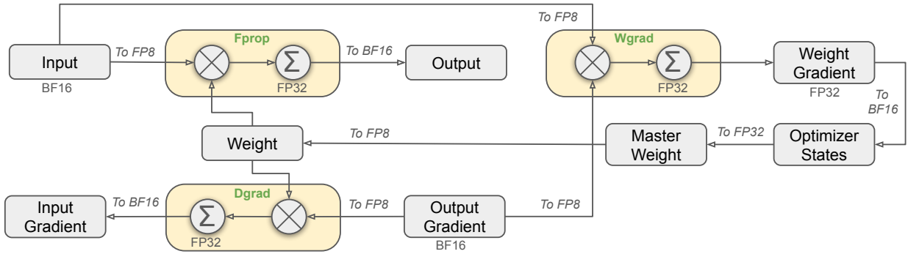

Figure 6 | The overall mixed precision framework with FP8 data format. For clarification, only the Linear operator is illustrated.

图 6｜FP8 混合精度总体框架(仅示意 Linear).

pre-training (Fishman et al., 2024). To address this challenge and effectively extend the dynamic range of the FP8 format, we introduce a fine-grained quantization strategy: tile-wise grouping with $1 \times N_{c}$ elements or block-wise grouping with $N_{c} \times N_{c}$ elements. The associated dequantization overhead is largely mitigated under our increased-precision accumulation process, a critical aspect for achieving accurate FP8 General Matrix Multiplication (GEMM). Moreover, to further reduce memory and communication overhead in MoE training, we cache and dispatch activations in FP8, while storing low-precision optimizer states in BF16. We validate the proposed FP8 mixed precision framework on two model scales similar to DeepSeek-V2-Lite and DeepSeek-V2, training for approximately 1 trillion tokens (see more details in Appendix B. 1). Notably, compared with the BF16 baseline, the relative loss error of our FP8-training model remains consistently below $0.25\%$, a level well within the acceptable range of training randomness.

. 为扩展 FP8 动态范围, 采用细粒度量化: 1×$N_c$ tile 或 $N_c$×$N_c$ block. 反量化开销大半被提高精度的累加消化. MoE 训练中激活以 FP8 缓存与 dispatch, 优化器状态用 BF16. 在接近 V2-Lite / V2 的两档规模上各训约 1T token 验证(附录 B. 1); 相对 BF16, 相对 loss 误差持续低于 0.25%, 落在训练随机性可接受范围.

#### 3.3.1. Mixed Precision Framework 混合精度框架

Building upon widely adopted techniques in low-precision training (Kalamkar et al., 2019; Narang et al., 2017), we propose a mixed precision framework for FP8 training. In this framework, most compute-density operations are conducted in FP8, while a few key operations are strategically maintained in their original data formats to balance training efficiency and numerical stability. The overall framework is illustrated in Figure 6.

多数高算密算子走 FP8, 少数关键算子保留原精度, 见图 6.

Firstly, in order to accelerate model training, the majority of core computation kernels, i. e., GEMM operations, are implemented in FP8 precision. These GEMM operations accept FP8 tensors as inputs and produce outputs in BF16 or FP32. As depicted in Figure 6, all three GEMMs associated with the Linear operator, namely Fprop (forward pass), Dgrad (activation backward pass), and Wgrad (weight backward pass), are executed in FP8. This design theoretically doubles the computational speed compared with the original BF16 method. Additionally, the FP8 Wgrad GEMM allows activations to be stored in FP8 for use in the backward pass. This significantly reduces memory consumption.

核心 GEMM 以 FP8 输入, BF16/FP32 输出; Linear 的 Fprop/Dgrad/Wgrad 全走 FP8, 理论算力相对 BF16 翻倍; Wgrad 允许激活以 FP8 缓存, 显著省显存.

Despite the efficiency advantage of the FP8 format, certain operators still require a higher precision due to their sensitivity to low-precision computations. Besides, some low-cost operators can also utilize a higher precision with a negligible overhead to the overall training cost. For this reason, after careful investigations, we maintain the original precision (e. g., BF16 or FP32) for the following components: the embedding module, the output head, MoE gating modules, normalization operators, and attention operators. These targeted retentions of high precision ensure stable training dynamics for DeepSeek-V3. To further guarantee numerical stability, we store the master weights, weight gradients, and optimizer states in higher precision. While

对敏感或廉价算子保留高精度: embedding, 输出头, MoE gating, 归一化, 注意力. 主权重, 权重梯度与优化器状态亦更高精度存放.

15

these high-precision components incur some memory overheads, their impact can be minimized through efficient sharding across multiple DP ranks in our distributed training system.

高精度组件有显存开销, 但可通过多 DP rank 分片摊薄.

#### 3.3.2. Improved Precision from Quantization and Multiplication 量化与乘法带来的精度提升

Based on our mixed precision FP8 framework, we introduce several strategies to enhance low-precision training accuracy, focusing on both the quantization method and the multiplication process.

在混合精度框架上, 从量化与乘法两侧抬低精度训练准确度.

Fine-Grained Quantization. In low-precision training frameworks, overflows and underflows are common challenges due to the limited dynamic range of the FP8 format, which is constrained by its reduced exponent bits. As a standard practice, the input distribution is aligned to the representable range of the FP8 format by scaling the maximum absolute value of the input tensor to the maximum representable value of FP8 (Narang et al., 2017). This method makes low-precision training highly sensitive to activation outliers, which can heavily degrade quantization accuracy. To solve this, we propose a fine-grained quantization method that applies scaling at a more granular level. As illustrated in Figure 7 (a), (1) for activations, we group and scale elements on a 1x128 tile basis (i. e., per token per 128 channels); and (2) for weights, we group and scale elements on a 128x128 block basis (i. e., per 128 input channels per 128 output channels). This approach ensures that the quantization process can better accommodate outliers by adapting the scale according to smaller groups of elements. In Appendix B. 2, we further discuss the training instability when we group and scale activations on a block basis in the same way as weights quantization.

细粒度量化. FP8 指数位少, 易溢出/下溢; 按整张量 max 缩放会对激活 outlier 极敏感. 图 7(a): 激活按 1×128 tile 缩放, 权重按 128×128 block 缩放. 附录 B. 2 讨论若激活也按 block 缩放会不稳定.

<!-- page 16 of 53 -->

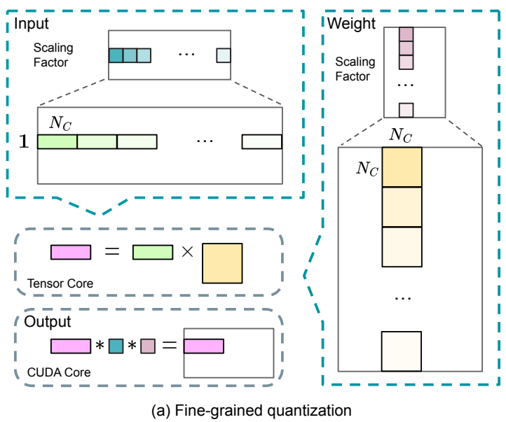

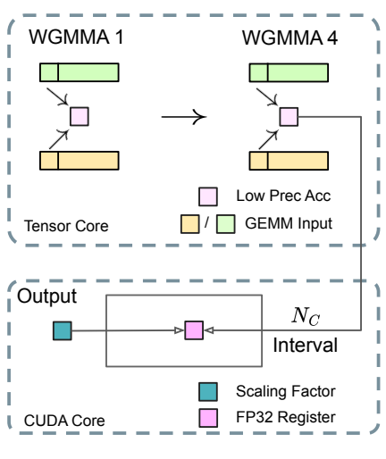

(b) Increasing accumulation precision

(b) 提高累加精度

Figure 7 | (a) We propose a fine-grained quantization method to mitigate quantization errors caused by feature outliers; for illustration simplicity, only Fprop is illustrated. (b) In conjunction with our quantization strategy, we improve the FP8 GEMM precision by promoting to CUDA Cores at an interval of $N_{C} = 128$ elements MMA for the high-precision accumulation.

图 7｜(a) 细粒度量化缓解特征 outlier; (b) 每隔 $N_C=128$ 元素把 MMA 部分和提到 CUDA Core 做高精度累加.

One key modification in our method is the introduction of per-group scaling factors along the inner dimension of GEMM operations. This functionality is not directly supported in the standard FP8 GEMM. However, combined with our precise FP32 accumulation strategy, it can

关键改动是沿 GEMM 内维引入 per-group 缩放; 标准 FP8 GEMM 不直接支持, 但配合精确 FP32 累加可

<!-- page 17 of 53 -->

be efficiently implemented.

高效实现.

Notably, our fine-grained quantization strategy is highly consistent with the idea of microscaling formats (Rouhani et al., 2023b), while the Tensor Cores of NVIDIA next-generation GPUs (Blackwell series) have announced the support for microscaling formats with smaller quantization granularity (NVIDIA, 2024a). We hope our design can serve as a reference for future work to keep pace with the latest GPU architectures.

该策略与 microscaling 思路高度一致; Blackwell 已宣布支持更细粒度 microscaling. 希望本设计可供后续工作对齐新硬件.

Increasing Accumulation Precision. Low-precision GEMM operations often suffer from underflow issues, and their accuracy largely depends on high-precision accumulation, which is commonly performed in an FP32 precision (Kalamkar et al., 2019; Narang et al., 2017). However, we observe that the accumulation precision of FP8 GEMM on NVIDIA H800 GPUs is limited to retaining around 14 bits, which is significantly lower than FP32 accumulation precision. This problem will become more pronounced when the inner dimension K is large (Wortsman et al., 2023), a typical scenario in large-scale model training where the batch size and model width are increased. Taking GEMM operations of two random matrices with K = 4096 for example, in our preliminary test, the limited accumulation precision in Tensor Cores results in a maximum relative error of nearly 2%. Despite these problems, the limited accumulation precision is still the default option in a few FP8 frameworks (NVIDIA, 2024b), severely constraining the training accuracy.

提高累加精度. 低精度 GEMM 依赖高精度累加; 但 H800 上 FP8 GEMM 累加约仅保留 14 bit. K 很大时更糟--K=4096 随机矩阵初步测试最大相对误差近 2%. 部分 FP8 框架仍默认该有限累加, 严重制约训练精度.

In order to address this issue, we adopt the strategy of promotion to CUDA Cores for higher precision (Thakkar et al., 2023). The process is illustrated in Figure 7 (b). To be specific, during MMA (Matrix Multiply-Accumulate) execution on Tensor Cores, intermediate results are accumulated using the limited bit width. Once an interval of $N_C$ is reached, these partial results will be copied to FP32 registers on CUDA Cores, where full-precision FP32 accumulation is performed. As mentioned before, our fine-grained quantization applies per-group scaling factors along the inner dimension K. These scaling factors can be efficiently multiplied on the CUDA Cores as the dequantization process with minimal additional computational cost.

做法: 提到 CUDA Core 高精度累加(图 7(b)). Tensor Core 上有限位宽累加, 每隔 $N_C$ 把部分和拷到 CUDA Core 的 FP32 寄存器. per-group 缩放可在 CUDA Core 上廉价完成反量化乘法.

It is worth noting that this modification reduces the WGMMA (Warpgroup-level Matrix Multiply-Accumulate) instruction issue rate for a single warpgroup. However, on the H800 architecture, it is typical for two WGMMA to persist concurrently: while one warpgroup performs the promotion operation, the other is able to execute the MMA operation. This design enables overlapping of the two operations, maintaining high utilization of Tensor Cores. Based on our experiments, setting $N_{C} = 128$ elements, equivalent to 4 WGMMAs, represents the minimal accumulation interval that can significantly improve precision without introducing substantial overhead.

单 warpgroup 的 WGMMA 发射率会降, 但 H800 上常有两个 WGMMA 并存, 可重叠 promotion 与 MMA. 实验取 $N_C=128$(约 4 次 WGMMA)为显著提精度且开销可接受的最小间隔.

Mantissa over Exponents. In contrast to the hybrid FP8 format adopted by prior work (NVIDIA, 2024b; Peng et al., 2023b; Sun et al., 2019b), which uses E4M3 (4-bit exponent and 3-bit mantissa) in Fprop and E5M2 (5-bit exponent and 2-bit mantissa) in Dgrad and Wgrad, we adopt the E4M3 format on all tensors for higher precision. We attribute the feasibility of this approach to our fine-grained quantization strategy, i. e., tile and block-wise scaling. By operating on smaller element groups, our methodology effectively shares exponent bits among these grouped elements, mitigating the impact of the limited dynamic range.

尾数优先于指数. 不像先前 Fprop 用 E4M3, Dgrad/Wgrad 用 E5M2 的混合格式, 我们全张量 E4M3; 可行性来自细粒度缩放在小组内共享指数位.

Online Quantization. Delayed quantization is employed in tensor-wise quantization frameworks (NVIDIA, 2024b; Peng et al., 2023b), which maintains a history of the maximum absolute

在线量化. 张量级框架常用 delayed quantization(维护历史 max)

<!-- page 18 of 53 -->

values across prior iterations to infer the current value. In order to ensure accurate scales and simplify the framework, we calculate the maximum absolute value online for each 1x128 activation tile or 128x128 weight block. Based on it, we derive the scaling factor and then quantize the activation or weight online into the FP8 format.

; 我们改为对每个 1×128 激活 tile 或 128×128 权重 block 在线算 max, 再缩放并量化到 FP8.

#### 3.3.3. Low-Precision Storage and Communication 低精度存储与通信

In conjunction with our FP8 training framework, we further reduce the memory consumption and communication overhead by compressing cached activations and optimizer states into lower-precision formats.

配合 FP8 训练, 再把缓存激活与优化器状态压到更低精度, 减显存与通信.

Low-Precision Optimizer States. We adopt the BF16 data format instead of FP32 to track the first and second moments in the AdamW (Loshchilov and Hutter, 2017) optimizer, without incurring observable performance degradation. However, the master weights (stored by the optimizer) and gradients (used for batch size accumulation) are still retained in FP32 to ensure numerical stability throughout training.

优化器一阶/二阶矩用 BF16; 主权重与用于 batch 累加的梯度仍 FP32.

Low-Precision Activation. As illustrated in Figure 6, the Wgrad operation is performed in FP8. To reduce the memory consumption, it is a natural choice to cache activations in FP8 format for the backward pass of the Linear operator. However, special considerations are taken on several operators for low-cost high-precision training:

激活低精度. Wgrad 走 FP8, Linear 反传自然缓存 FP8 激活; 但对若干算子另有考量:

(1) Inputs of the Linear after the attention operator. These activations are also used in the backward pass of the attention operator, which makes it sensitive to precision. We adopt a customized E5M6 data format exclusively for these activations. Additionally, these activations will be converted from an 1x128 quantization tile to an 128x1 tile in the backward pass. To avoid introducing extra quantization error, all the scaling factors are round scaled, i. e., integral power of 2.

(1) 注意力后 Linear 的输入: 还要进注意力反传, 对精度敏感; 专用 E5M6, 反传时 1×128 tile 转 128×1, 缩放因子取 2 的整次幂.

(2) Inputs of the SwiGLU operator in MoE. To further reduce the memory cost, we cache the inputs of the SwiGLU operator and recompute its output in the backward pass. These activations are also stored in FP8 with our fine-grained quantization method, striking a balance between memory efficiency and computational accuracy.

(2) MoE 中 SwiGLU 输入: 缓存输入, 反传重算输出, FP8 细粒度量化.

Low-Precision Communication. Communication bandwidth is a critical bottleneck in the training of MoE models. To alleviate this challenge, we quantize the activation before MoE up-projections into FP8 and then apply dispatch components, which is compatible with FP8 Fprop in MoE up-projections. Like the inputs of the Linear after the attention operator, scaling factors for this activation are integral power of 2. A similar strategy is applied to the activation gradient before MoE down-projections. For both the forward and backward combine components, we retain them in BF16 to preserve training precision in critical parts of the training pipeline.

低精度通信: MoE 上投影前激活量化为 FP8 再 dispatch; 下投影前激活梯度类似. 前后向 combine 仍用 BF16, 保住关键路径精度.

### 3.4. Inference and Deployment 推理与部署

We deploy DeepSeek-V3 on the H800 cluster, where GPUs within each node are interconnected using NVLink, and all GPUs across the cluster are fully interconnected via IB. To simultaneously ensure both the Service-Level Objective (SLO) for online services and high throughput, we employ the following deployment strategy that separates the prefilling and decoding stages.

部署在 H800 集群: 节点内 NVLink, 跨节点 IB 全互连. 为兼顾在线 SLO 与吞吐, Prefill 与 Decode 分离.

<!-- page 19 of 53 -->

#### 3.4.1. Prefilling

3.4.1. Prefilling

The minimum deployment unit of the prefilling stage consists of 4 nodes with 32 GPUs. The attention part employs 4-way Tensor Parallelism (TP4) with Sequence Parallelism (SP), combined with 8-way Data Parallelism (DP8). Its small TP size of 4 limits the overhead of TP communication. For the MoE part, we use 32-way Expert Parallelism (EP32), which ensures that each expert processes a sufficiently large batch size, thereby enhancing computational efficiency. For the MoE all-to-all communication, we use the same method as in training: first transferring tokens across nodes via IB, and then forwarding among the intra-node GPUs via NVLink. In particular, we use 1-way Tensor Parallelism for the dense MLPs in shallow layers to save TP communication.

Prefill 最小单元: 4 节点 32 卡. 注意力 TP4+SP 配 DP8; MoE 用 EP32. all-to-all 同训练: 先 IB 跨节点, 再 NVLink 节点内. 浅层稠密 MLP 用 TP1 省通信.

To achieve load balancing among different experts in the MoE part, we need to ensure that each GPU processes approximately the same number of tokens. To this end, we introduce a deployment strategy of redundant experts, which duplicates high-load experts and deploys them redundantly. The high-load experts are detected based on statistics collected during the online deployment and are adjusted periodically (e. g., every 10 minutes). After determining the set of redundant experts, we carefully rearrange experts among GPUs within a node based on the observed loads, striving to balance the load across GPUs as much as possible without increasing the cross-node all-to-all communication overhead. For the deployment of DeepSeek-V3, we set 32 redundant experts for the prefilling stage. For each GPU, besides the original 8 experts it hosts, it will also host one additional redundant expert.

冗余专家做均载: 按在线统计周期(如每 10 分钟)复制高负载专家, 并在节点内重排. Prefill 设 32 个冗余专家; 每 GPU 原 8 专家外再挂 1 个冗余.

Furthermore, in the prefilling stage, to improve the throughput and hide the overhead of all-to-all and TP communication, we simultaneously process two micro-batches with similar computational workloads, overlapping the attention and MoE of one micro-batch with the dispatch and combine of another.

双 micro-batch 重叠: 一批的 attention/MoE 与另一批的 dispatch/combine 交错.

Finally, we are exploring a dynamic redundancy strategy for experts, where each GPU hosts more experts (e. g., 16 experts), but only 9 will be activated during each inference step. Before the all-to-all operation at each layer begins, we compute the globally optimal routing scheme on the fly. Given the substantial computation involved in the prefilling stage, the overhead of computing this routing scheme is almost negligible.

亦在探索动态冗余: 每 GPU 挂更多专家(如 16), 每步只激活 9 个; 层内 all-to-all 前在线算全局最优路由, Prefill 算力大, 这点开销可忽略.

#### 3.4.2. Decoding

3.4.2. Decoding

During decoding, we treat the shared expert as a routed one. From this perspective, each token will select 9 experts during routing, where the shared expert is regarded as a heavy-load one that will always be selected. The minimum deployment unit of the decoding stage consists of 40 nodes with 320 GPUs. The attention part employs TP4 with SP, combined with DP80, while the MoE part uses EP320. For the MoE part, each GPU hosts only one expert, and 64 GPUs are responsible for hosting redundant experts and shared experts. All-to-all communication of the dispatch and combine parts is performed via direct point-to-point transfers over IB to achieve low latency. Additionally, we leverage the IBGDA (NVIDIA, 2022) technology to further minimize latency and enhance communication efficiency.

Decode 把共享专家当必选路由专家, 每 token 选 9 个. 最小单元 40 节点 320 卡:

> **问:** 训练成本较低, 是否意味着小集群也能部署?
> 不能这么推. decoding 的最小单元是 40 节点, 320 卡. prefilling 另有更小的一档, 但不是单机.

> **核对:** 推理时为什么变成每 token 选 9 个专家?
> 训练时是 8 个路由专家加 1 个共享专家. decoding 把共享专家也算进必选路由, 从每个 token 看就是 9 个.
> 注意力 TP4+SP+DP80, MoE EP320; 每 GPU 一专家, 64 卡挂冗余与共享. dispatch/combine 走 IB 点对点, 并用 IBGDA 降延迟.

Similar to prefilling, we periodically determine the set of redundant experts in a certain interval, based on the statistical expert load from our online service. However, we do not need to rearrange experts since each GPU only hosts one expert. We are also exploring the dynamic redundancy strategy for decoding. However, this requires more careful optimization of the algorithm that computes the globally optimal routing scheme and the fusion with the dispatch kernel to reduce overhead.

冗余专家同样周期更新, 但每卡一专家无需重排. Decode 侧动态冗余仍在探索, 需更抠路由算法与 dispatch 融合.

<!-- page 20 of 53 -->

Additionally, to enhance throughput and hide the overhead of all-to-all communication, we are also exploring processing two micro-batches with similar computational workloads simultaneously in the decoding stage. Unlike prefilling, attention consumes a larger portion of time in the decoding stage. Therefore, we overlap the attention of one micro-batch with the dispatch+MoE+combine of another. In the decoding stage, the batch size per expert is relatively small (usually within 256 tokens), and the bottleneck is memory access rather than computation. Since the MoE part only needs to load the parameters of one expert, the memory access overhead is minimal, so using fewer SMs will not significantly affect the overall performance. Therefore, to avoid impacting the computation speed of the attention part, we can allocate only a small portion of SMs to dispatch+MoE+combine.

Decode 也试双 micro-batch: 一批 attention 与另一批 dispatch+MoE+combine 重叠. 每专家 batch 通常 ≤256, 瓶颈在访存; MoE 只加载一个专家, 可少分 SM 给通信侧, 避免拖累 attention.

### 3.5. Suggestions on Hardware Design 硬件设计建议

Based on our implementation of the all-to-all communication and FP8 training scheme, we propose the following suggestions on chip design to AI hardware vendors.

基于 all-to-all 与 FP8 实践, 向硬件厂商提出如下建议.

#### 3.5.1. Communication Hardware 通信硬件

In DeepSeek-V3, we implement the overlap between computation and communication to hide the communication latency during computation. This significantly reduces the dependency on communication bandwidth compared to serial computation and communication. However, the current communication implementation relies on expensive SMs (e. g., we allocate 20 out of the 132 SMs available in the H800 GPU for this purpose), which will limit the computational throughput. Moreover, using SMs for communication results in significant inefficiencies, as tensor cores remain entirely under-utilized.

计算-通信重叠降低了对带宽的硬依赖, 但通信仍占宝贵 SM(H800 132 个里约 20 个), 拖累吞吐, 且 Tensor Core 完全闲置.

Currently, the SMs primarily perform the following tasks for all-to-all communication:

当前 SM 主要为 all-to-all 做:

\- Forwarding data between the IB (InfiniBand) and NVLink domain while aggregating IB traffic destined for multiple GPUs within the same node from a single GPU.

\- 在 IB 与 NVLink 域间转发, 并聚合发往同节点多 GPU 的 IB 流量.

\- Transporting data between RDMA buffers (registered GPU memory regions) and input/output buffers.

\- 在 RDMA buffer 与输入/输出 buffer 间搬运.

\- Executing reduce operations for all-to-all combine.

\- 执行 all-to-all combine 的 reduce.

\- Managing fine-grained memory layout during chunked data transferring to multiple experts across the IB and NVLink domain.

\- 跨 IB/NVLink 向多专家分块传输时管理细粒度内存布局.

We aspire to see future vendors developing hardware that offloads these communication tasks from the valuable computation unit SM, serving as a GPU co-processor or a network co-processor like NVIDIA SHARP Graham et al. (2016). Furthermore, to reduce application programming complexity, we aim for this hardware to unify the IB (scale-out) and NVLink (scale-up) networks from the perspective of the computation units. With this unified interface, computation units can easily accomplish operations such as read, write, multicast, and reduce across the entire IB-NVLink-unified domain via submitting communication requests based on simple primitives.

期望未来硬件把这些通信从 SM 卸载成协处理器(类 SHARP), 并从计算单元视角统一 IB 与 NVLink, 用简单原语完成跨统一域的读写, 组播与 reduce.

#### 3.5.2. Compute Hardware 计算硬件

Higher FP8 GEMM Accumulation Precision in Tensor Cores. In the current Tensor Core implementation of the NVIDIA Hopper architecture, FP8 GEMM suffers from limited accumulation precision. After aligning 32 mantissa products by right-shifting based on the maximum exponent, the Tensor Core only uses the highest 14 bits of each mantissa product for addition,

提高 Tensor Core 的 FP8 GEMM 累加精度. Hopper 上对齐后只取尾数积最高 14 bit 做加,

<!-- page 21 of 53 -->

and truncates bits exceeding this range. The accumulation of addition results into registers also employs 14-bit precision. Our implementation partially mitigates the limitation by accumulating the addition results of 128 FP8×FP8 multiplications into registers with FP32 precision in the CUDA core. Although helpful in achieving successful FP8 training, it is merely a compromise due to the Hopper architecture's hardware deficiency in FP8 GEMM accumulation precision. Future chips need to adopt higher precision.

超出截断; 寄存器累加也是 14 bit. 我们用 CUDA Core 上 FP32 累加 128 次乘积作部分缓解, 但这只是对 Hopper 硬件缺陷的折中; 未来芯片应原生更高精度.

Support for Tile- and Block-Wise Quantization. Current GPUs only support per-tensor quantization, lacking the native support for fine-grained quantization like our tile- and block-wise quantization. In the current implementation, when the $N_{C}$ interval is reached, the partial results will be copied from Tensor Cores to CUDA cores, multiplied by the scaling factors, and added to FP32 registers on CUDA cores. Although the dequantization overhead is significantly mitigated combined with our precise FP32 accumulation strategy, the frequent data movements between Tensor Cores and CUDA cores still limit the computational efficiency. Therefore, we recommend future chips to support fine-grained quantization by enabling Tensor Cores to receive scaling factors and implement MMA with group scaling. In this way, the whole partial sum accumulation and dequantization can be completed directly inside Tensor Cores until the final result is produced, avoiding frequent data movements.

支持 tile/block 量化: 现状只有 per-tensor. 希望 Tensor Core 能直接吃缩放因子并做分组 MMA, 把部分和累加与反量化留在 Tensor Core 内.

Support for Online Quantization. The current implementations struggle to effectively support online quantization, despite its effectiveness demonstrated in our research. In the existing process, we need to read 128 BF16 activation values (the output of the previous computation) from HBM (High Bandwidth Memory) for quantization, and the quantized FP8 values are then written back to HBM, only to be read again for MMA. To address this inefficiency, we recommend that future chips integrate FP8 cast and TMA (Tensor Memory Accelerator) access into a single fused operation, so quantization can be completed during the transfer of activations from global memory to shared memory, avoiding frequent memory reads and writes. We also recommend supporting a warp-level cast instruction for speedup, which further facilitates the better fusion of layer normalization and FP8 cast. Alternatively, a near-memory computing approach can be adopted, where compute logic is placed near the HBM. In this case, BF16 elements can be cast to FP8 directly as they are read from HBM into the GPU, reducing off-chip memory access by roughly 50%.

支持在线量化: 现状要 HBM 读 BF16→写 FP8→再读 MMA. 建议 FP8 cast 与 TMA 融合, 或近存计算在读出时完成 cast, 约减半片外访问.

Support for Transposed GEMM Operations. The current architecture makes it cumbersome to fuse matrix transposition with GEMM operations. In our workflow, activations during the forward pass are quantized into 1x128 FP8 tiles and stored. During the backward pass, the matrix needs to be read out, dequantized, transposed, re-quantized into 128x1 tiles, and stored in HBM. To reduce memory operations, we recommend future chips to enable direct transposed reads of matrices from shared memory before MMA operation, for those precisions required in both training and inference. Combined with the fusion of FP8 format conversion and TMA access, this enhancement will significantly streamline the quantization workflow.

支持转置 GEMM: 前向 1×128 tile, 反向要反量化-转置-再量化成 128×1. 建议 MMA 前可从 shared memory 直接转置读取, 并与 FP8 cast+TMA 融合.

## 4. Pre-Training 预训练

### 4.1. Data Construction 数据构造

Compared with DeepSeek-V2, we optimize the pre-training corpus by enhancing the ratio of mathematical and programming samples, while expanding multilingual coverage beyond

相对 V2, 提高数学与编程比例, 并扩展中英以外多语覆盖

21

English and Chinese. Also, our data processing pipeline is refined to minimize redundancy while maintaining corpus diversity. Inspired by Ding et al. (2024), we implement the document packing method for data integrity but do not incorporate cross-sample attention masking during training. Finally, the training corpus for DeepSeek-V3 consists of 14.8T high-quality and diverse tokens in our tokenizer.

; 流水线在保多样的同时压冗余. 文档 packing 保完整性, 但不做跨样本注意力掩码. 最终语料 14.8T token.

<!-- page 22 of 53 -->

In the training process of DeepSeekCoder-V2 (DeepSeek-AI, 2024a), we observe that the Fill-in-Middle (FIM) strategy does not compromise the next-token prediction capability while enabling the model to accurately predict middle text based on contextual cues. In alignment with DeepSeekCoder-V2, we also incorporate the FIM strategy in the pre-training of DeepSeek-V3. To be specific, we employ the Prefix-Suffix-Middle (PSM) framework to structure data as follows:

对齐 DeepSeekCoder-V2: FIM 不伤 next-token prediction, 还能依上下文填中间. V3 同样用 PSM:

$$
< | \text {fim\_begin} | > f _ {\text {pre}} < | \text {fim\_hole} | > f _ {\text {suf}} < | \text {fim\_end} | > f _ {\text {middle}} < | \text {eos\_token} | >.

$$

This structure is applied at the document level as a part of the pre-packing process. The FIM strategy is applied at a rate of 0.1, consistent with the PSM framework.

文档级, 比率 0.1.

The tokenizer for DeepSeek-V3 employs Byte-level BPE (Shibata et al., 1999) with an extended vocabulary of 128K tokens. The pretokenizer and training data for our tokenizer are modified to optimize multilingual compression efficiency. In addition, compared with DeepSeek-V2, the new pretokenizer introduces tokens that combine punctuations and line breaks. However, this trick may introduce the token boundary bias (Lundberg, 2023) when the model processes multi-line prompts without terminal line breaks, particularly for few-shot evaluation prompts. To address this issue, we randomly split a certain proportion of such combined tokens during training, which exposes the model to a wider array of special cases and mitigates this bias.

分词器 BBPE, 词表 128K; 预分词引入标点+换行合并 token. 训练时随机拆一部分, 缓解无结尾换行的多行 few-shot 边界偏置.

> **看表:** 标点和换行合并成一个 token, 评测时会出什么问题?
> 多行 few-shot 如果最终没有换行, 边界会偏. 训练时随机拆开一部分这种 token, 就是在见这些边界.

### 4.2. Hyper-Parameters 超参数

Model Hyper-Parameters. We set the number of Transformer layers to 61 and the hidden dimension to 7168. All learnable parameters are randomly initialized with a standard deviation of 0.006. In MLA, we set the number of attention heads $n_h$ to 128 and the per-head dimension $d_h$ to 128. The KV compression dimension $d_c$ is set to 512, and the query compression dimension $d_c'$ is set to 1536. For the decoupled queries and key, we set the per-head dimension $d_h^R$ to 64. We substitute all FFNs except for the first three layers with MoE layers. Each MoE layer consists of 1 shared expert and 256 routed experts, where the intermediate hidden dimension of each expert is 2048. Among the routed experts, 8 experts will be activated for each token, and each token will be ensured to be sent to at most 4 nodes. The multi-token prediction depth $D$ is set to 1, i. e., besides the exact next token, each token will predict one additional token. As DeepSeek-V2, DeepSeek-V3 also employs additional RMSNorm layers after the compressed latent vectors, and multiplies additional scaling factors at the width bottlenecks. Under this configuration, DeepSeek-V3 comprises 671B total parameters, of which 37B are activated for each token.

模型: 61 层, 隐宽 7168, 初始化 std 0.006. MLA: $n_h=128$, $d_h=128$, $d_c=512$, $d_c'=1536$, $d_h^R=64$. 除前三层外 FFN 换 MoE: 1 共享 + 256 路由, 专家中间宽 2048; 每 token 激活 8 路由, 最多 4 节点. MTP 深度 $D=1$. 总参 671B, 激活 37B.

> **拆开:** MTP 的损失权重为什么前后不一样?
> 前 10T token 用 0.3, 后 4.8T 用 0.1. 额外的预测先密一点, 后面把重心还给主损失.

> **确认:** 第二 token 接受率大约 85% 到 90%, 是不是每步都能快一倍?
> 不是. 报告写配合投机解码大约 1.8 倍 TPS. 接受率高, 拒绝的时候仍退回主模型给出的 token.

> **回看:** 专家有 256 个, 为什么每个 token 最多只去 4 个节点?
> 256 是路由专家的总数. 一次前向只激活 8 个, 而且这 8 个被限制落在最多 4 个节点上. 为的是 all-to-all 不要打满集群.

Training Hyper-Parameters. We employ the AdamW optimizer (Loshchilov and Hutter, 2017) with hyper-parameters set to $\beta_{1} = 0.9$, $\beta_{2} = 0.95$, and weight\_decay = 0.1. We set the maximum sequence length to 4K during pre-training, and pre-train DeepSeek-V3 on 14.8T tokens. As for the learning rate scheduling, we first linearly increase it from 0 to $2.2 \times 10^{-4}$ during the first 2K steps. Then, we keep a constant learning rate of $2.2 \times 10^{-4}$ until the model consumes 10T training tokens. Subsequently, we gradually decay the learning rate to $2.2 \times 10^{-5}$ in 4.3T tokens, following a cosine decay curve. During the training of the final 500B tokens, we keep a constant learning rate of $2.2 \times 10^{-5}$ in the first 333B tokens, and switch to another constant learning rate

训练: AdamW $\beta_1=0.9, \beta_2=0.95$, weight decay 0.1; 预训练序列长 4K, 14.8T token. lr: 2K step 升到 $2.2\times10^{-4}$, 至 10T 保持; 随后 4.3T 余弦降到 $2.2\times10^{-5}$; 最终 500B 中前 333B 保持, 再切到

<!-- page 23 of 53 -->

of $7.3 \times 10^{-6}$ in the remaining 167B tokens. The gradient clipping norm is set to 1.0. We employ a batch size scheduling strategy, where the batch size is gradually increased from 3072 to 15360 in the training of the first 469B tokens, and then keeps 15360 in the remaining training. We leverage pipeline parallelism to deploy different layers of a model on different GPUs, and for each layer, the routed experts will be uniformly deployed on 64 GPUs belonging to 8 nodes. As for the node-limited routing, each token will be sent to at most 4 nodes (i. e., M = 4). For auxiliary-loss-free load balancing, we set the bias update speed $\gamma$ to 0.001 for the first 14.3T tokens, and to 0.0 for the remaining 500B tokens. For the balance loss, we set $\alpha$ to 0.0001, just to avoid extreme imbalance within any single sequence. The MTP loss weight $\lambda$ is set to 0.3 for the first 10T tokens, and to 0.1 for the remaining 4.8T tokens.

$7.3\times10^{-6}$(后 167B). 梯度裁剪 1.0; batch 前 469B 从 3072 升到 15360 后保持. 路由专家均匀铺在 8 节点 64 GPU; M=4. $\gamma$: 前 14.3T 为 0.001, 末 500B 为 0; $\alpha=0.0001$; $\lambda$: 前 10T 为 0.3, 后 4.8T 为 0.1.

Pressure Testing DeepSeek-V3 128K Context via "Needle In A HayStack"

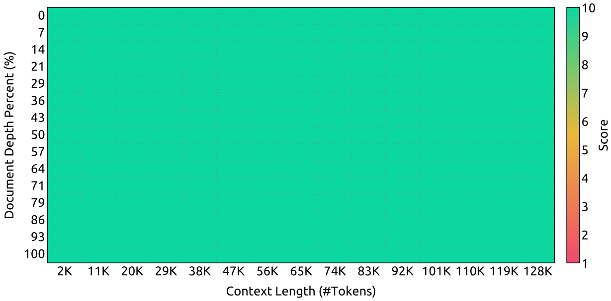

Figure 8 | Evaluation results on the "Needle In A Haystack" (NIAH) tests. DeepSeek-V3 performs well across all context window lengths up to 128K.

图 8｜NIAH 评测: 至 128K 上下文均表现良好.

### 4.3. Long Context Extension 长上下文扩展

We adopt a similar approach to DeepSeek-V2 (DeepSeek-AI, 2024c) to enable long context capabilities in DeepSeek-V3. After the pre-training stage, we apply YaRN (Peng et al., 2023a) for context extension and perform two additional training phases, each comprising 1000 steps, to progressively expand the context window from 4K to 32K and then to 128K. The YaRN configuration is consistent with that used in DeepSeek-V2, being applied exclusively to the decoupled shared key $\mathbf{k}_t^R$. The hyper-parameters remain identical across both phases, with the scale $s = 40$, $\alpha = 1$, $\beta = 32$, and the scaling factor $\sqrt{t} = 0.1 \ln s + 1$. In the first phase, the sequence length is set to 32K, and the batch size is 1920. During the second phase, the sequence length is increased to 128K, and the batch size is reduced to 480. The learning rate for both phases is set to $7.3 \times 10^{-6}$, matching the final learning rate from the pre-training stage.

类似 V2: 预训练后 YaRN 两阶段各 1000 step, 4K→32K→128K; YaRN 只打在解耦共享键 $k_t^R$ 上, $s=40, \alpha=1, \beta=32$. 一阶段 seq 32K, batch 1920; 二阶段 128K, batch 480; lr 均为 $7.3\times10^{-6}$.

> **对一下:** 上下文扩到 128K, 是把 RoPE 的 base 整网重训了一遍吗?
> 不是. YaRN 只加在解耦出来的 $k_t^R$ 上. 两阶段各 1000 step, 4K 到 32K, 再到 128K.

Through this two-phase extension training, DeepSeek-V3 is capable of handling inputs up to 128K in length while maintaining strong performance. Figure 8 illustrates that DeepSeek-V3, following supervised fine-tuning, achieves notable performance on the "Needle In A Haystack" (NIAH) test, demonstrating consistent robustness across context window lengths up to 128K.

两阶段后可处理至 128K; SFT 后 NIAH(图 8)显示全窗口稳健.

> **想:** 图 8 的 NIAH 是 Base 测的, 还是 SFT 之后测的?
> 图注写的是 SFT 之后. 所以「128K 还能找到针」不能直接当成预训练刚结束时的结果.

<!-- page 24 of 53 -->

### 4.4. Evaluations 评测

#### 4.4.1. Evaluation Benchmarks 评测基准

The base model of DeepSeek-V3 is pretrained on a multilingual corpus with English and Chinese constituting the majority, so we evaluate its performance on a series of benchmarks primarily in English and Chinese, as well as on a multilingual benchmark. Our evaluation is based on our internal evaluation framework integrated in our HAI-LLM framework. Considered benchmarks are categorized and listed as follows, where underlined benchmarks are in Chinese and double-underlined benchmarks are multilingual ones:

Base 语料以中英为主, 评测覆盖中英及多语基准; 框架为内嵌于 HAI-LLM 的内部评测. 分类如下(原文下划线=中文, 双下划线=多语):

Multi-subject multiple-choice datasets include MMLU (Hendrycks et al., 2020), MMLU-Redux (Gema et al., 2024), MMLU-Pro (Wang et al., 2024b), MMMLU (OpenAI, 2024b), C-Eval (Huang et al., 2023), and CMMLU (Li et al., 2023).

多学科选择题: MMLU, MMLU-Redux, MMLU-Pro, MMMLU, C-Eval, CMMLU.

Language understanding and reasoning datasets include HellaSwag (Zellers et al., 2019), PIQA (Bisk et al., 2020), ARC (Clark et al., 2018), and BigBench Hard (BBH) (Suzgun et al., 2022).

语言理解与推理: HellaSwag, PIQA, ARC, BBH.

Closed-book question answering datasets include TriviaQA (Joshi et al., 2017) and NaturalQuestions (Kwiatkowski et al., 2019).

闭卷问答: TriviaQA, NaturalQuestions.

Reading comprehension datasets include RACE Lai et al. (2017), DROP (Dua et al., 2019), C3 (Sun et al., 2019a), and CMRC (Cui et al., 2019).

阅读理解: RACE, DROP, C3, CMRC.

Reference disambiguation datasets include CLUEWSC (Xu et al., 2020) and WinoGrande Sakaguchi et al. (2019).

指代消歧: CLUEWSC, WinoGrande.

Language modeling datasets include Pile (Gao et al., 2020).

语言建模: Pile.

Chinese understanding and culture datasets include CCPM (Li et al., 2021).

中文理解与文化: CCPM.

Math datasets include GSM8K (Cobbe et al., 2021), MATH (Hendrycks et al., 2021), MGSM (Shi et al., 2023), and CMath (Wei et al., 2023).

数学: GSM8K, MATH, MGSM, CMath.

Code datasets include HumanEval (Chen et al., 2021), LiveCodeBench-Base (0801-1101) (Jain et al., 2024), MBPP (Austin et al., 2021), and CRUXEval (Gu et al., 2024).

代码: HumanEval, LiveCodeBench-Base, MBPP, CRUXEval.

Standardized exams include AGIEval (Zhong et al., 2023). Note that AGIEval includes both English and Chinese subsets.

标准化考试: AGIEval(含中英子集).

Following our previous work (DeepSeek-AI, 2024b, c), we adopt perplexity-based evaluation for datasets including HellaSwag, PIQA, WinoGrande, RACE-Middle, RACE-High, MMLU, MMLU-Redux, MMLU-Pro, MMMLU, ARC-Easy, ARC-Challenge, C-Eval, CMMLU, C3, and CCPM, and adopt generation-based evaluation for TriviaQA, NaturalQuestions, DROP, MATH, GSM8K, MGSM, HumanEval, MBPP, LiveCodeBench-Base, CRUXEval, BBH, AGIEval, CLUEWSC, CMRC, and CMath. In addition, we perform language-modeling-based evaluation for Pile-test and use Bits-Per-Byte (BPB) as the metric to guarantee fair comparison among models using different tokenizers.

沿用既往: 部分基准用困惑度, 部分用生成; Pile-test 用 BPB, 以便不同分词器公平比.

#### 4.4.2. Evaluation Results 评测结果

In Table 3, we compare the base model of DeepSeek-V3 with the state-of-the-art open-source base models, including DeepSeek-V2-Base (DeepSeek-AI, 2024c) (our previous release), Qwen2.5 72B Base (Qwen, 2024b), and LLaMA-3.1 405B Base (AI@Meta, 2024b). We evaluate all these models with our internal evaluation framework, and ensure that they share the same evaluation setting. Note that due to the changes in our evaluation framework over the past months, the performance

表 3 对比 V3-Base 与 V2-Base, Qwen2.5 72B Base, LLaMA-3.1 405B Base; 同一内部框架, 同一设定. 因框架变更,

24

of DeepSeek-V2-Base exhibits a slight difference from our previously reported results. Overall, DeepSeek-V3-Base comprehensively outperforms DeepSeek-V2-Base and Qwen2.5 72B Base, and surpasses LLaMA-3.1 405B Base in the majority of benchmarks, essentially becoming the strongest open-source model.

V2-Base 分数与旧报告略有差异. 总体: V3-Base 全面超过 V2-Base 与 Qwen2.5 72B Base, 多数项超过 LLaMA-3.1 405B Base, 基本成为最强开源 Base.

<!-- page 25 of 53 -->

<table><tr><td></td><td>Benchmark (Metric)</td><td># Shots</td><td>DeepSeek-V2 Base</td><td>Qwen2.5 72B Base</td><td>LLaMA-3.1 405B Base</td><td>DeepSeek-V3 Base</td></tr><tr><td rowspan="3"></td><td>Architecture</td><td>-</td><td>MoE</td><td>Dense</td><td>Dense</td><td>MoE</td></tr><tr><td># Activated Params</td><td>-</td><td>21B</td><td>72B</td><td>405B</td><td>37B</td></tr><tr><td># Total Params</td><td>-</td><td>236B</td><td>72B</td><td>405B</td><td>671B</td></tr><tr><td rowspan="16">English</td><td>Pile-test (BPB)</td><td>-</td><td>0.606</td><td>0.638</td><td>0.542</td><td>0.548</td></tr><tr><td>BBH (EM)</td><td>3-shot</td><td>78.8</td><td>79.8</td><td>82.9</td><td>87.5</td></tr><tr><td>MMLU (EM)</td><td>5-shot</td><td>78.4</td><td>85.0</td><td>84.4</td><td>87.1</td></tr><tr><td>MMLU-Redux (EM)</td><td>5-shot</td><td>75.6</td><td>83.2</td><td>81.3</td><td>86.2</td></tr><tr><td>MMLU-Pro (EM)</td><td>5-shot</td><td>51.4</td><td>58.3</td><td>52.8</td><td>64.4</td></tr><tr><td>DROP (F1)</td><td>3-shot</td><td>80.4</td><td>80.6</td><td>86.0</td><td>89.0</td></tr><tr><td>ARC-Easy (EM)</td><td>25-shot</td><td>97.6</td><td>98.4</td><td>98.4</td><td>98.9</td></tr><tr><td>ARC-Challenge (EM)</td><td>25-shot</td><td>92.2</td><td>94.5</td><td>95.3</td><td>95.3</td></tr><tr><td>HellaSwag (EM)</td><td>10-shot</td><td>87.1</td><td>84.8</td><td>89.2</td><td>88.9</td></tr><tr><td>PIQA (EM)</td><td>0-shot</td><td>83.9</td><td>82.6</td><td>85.9</td><td>84.7</td></tr><tr><td>WinoGrande (EM)</td><td>5-shot</td><td>86.3</td><td>82.3</td><td>85.2</td><td>84.9</td></tr><tr><td>RACE-Middle (EM)</td><td>5-shot</td><td>73.1</td><td>68.1</td><td>74.2</td><td>67.1</td></tr><tr><td>RACE-High (EM)</td><td>5-shot</td><td>52.6</td><td>50.3</td><td>56.8</td><td>51.3</td></tr><tr><td>TriviaQA (EM)</td><td>5-shot</td><td>80.0</td><td>71.9</td><td>82.7</td><td>82.9</td></tr><tr><td>NaturalQuestions (EM)</td><td>5-shot</td><td>38.6</td><td>33.2</td><td>41.5</td><td>40.0</td></tr><tr><td>AGIEval (EM)</td><td>0-shot</td><td>57.5</td><td>75.8</td><td>60.6</td><td>79.6</td></tr><tr><td rowspan="5">Code</td><td>HumanEval (Pass@1)</td><td>0-shot</td><td>43.3</td><td>53.0</td><td>54.9</td><td>65.2</td></tr><tr><td>MBPP (Pass@1)</td><td>3-shot</td><td>65.0</td><td>72.6</td><td>68.4</td><td>75.4</td></tr><tr><td>LiveCodeBench-Base (Pass@1)</td><td>3-shot</td><td>11.6</td><td>12.9</td><td>15.5</td><td>19.4</td></tr><tr><td>CRUXEval-I (EM)</td><td>2-shot</td><td>52.5</td><td>59.1</td><td>58.5</td><td>67.3</td></tr><tr><td>CRUXEval-O (EM)</td><td>2-shot</td><td>49.8</td><td>59.9</td><td>59.9</td><td>69.8</td></tr><tr><td rowspan="4">Math</td><td>GSM8K (EM)</td><td>8-shot</td><td>81.6</td><td>88.3</td><td>83.5</td><td>89.3</td></tr><tr><td>MATH (EM)</td><td>4-shot</td><td>43.4</td><td>54.4</td><td>49.0</td><td>61.6</td></tr><tr><td>MGSM (EM)</td><td>8-shot</td><td>63.6</td><td>76.2</td><td>69.9</td><td>79.8</td></tr><tr><td>CMath (EM)</td><td>3-shot</td><td>78.7</td><td>84.5</td><td>77.3</td><td>90.7</td></tr><tr><td rowspan="6">Chinese</td><td>CLUEWSC (EM)</td><td>5-shot</td><td>82.0</td><td>82.5</td><td>83.0</td><td>82.7</td></tr><tr><td>C-Eval (EM)</td><td>5-shot</td><td>81.4</td><td>89.2</td><td>72.5</td><td>90.1</td></tr><tr><td>CMMLU (EM)</td><td>5-shot</td><td>84.0</td><td>89.5</td><td>73.7</td><td>88.8</td></tr><tr><td>CMRC (EM)</td><td>1-shot</td><td>77.4</td><td>75.8</td><td>76.0</td><td>76.3</td></tr><tr><td>C3 (EM)</td><td>0-shot</td><td>77.4</td><td>76.7</td><td>79.7</td><td>78.6</td></tr><tr><td>CCPM (EM)</td><td>0-shot</td><td>93.0</td><td>88.5</td><td>78.6</td><td>92.0</td></tr><tr><td>Multilingual</td><td>MMMLU-non-English (EM)</td><td>5-shot</td><td>64.0</td><td>74.8</td><td>73.8</td><td>79.4</td></tr></table>

Table 3 | Comparison among DeepSeek-V3-Base and other representative open-source base models. All models are evaluated in our internal framework and share the same evaluation setting. Scores with a gap not exceeding 0.3 are considered to be at the same level. DeepSeek-V3-Base achieves the best performance on most benchmarks, especially on math and code tasks.

表 3｜DeepSeek-V3-Base 与其它代表开源 Base. 同一内部框架; 分差 ≤0.3 视为同级. V3-Base 多数基准最佳, 尤以数学与代码突出.

From a more detailed perspective, we compare DeepSeek-V3-Base with the other open-source base models individually. (1) Compared with DeepSeek-V2-Base, due to the improvements in our model architecture, the scale-up of the model size and training tokens, and the enhancement of data quality, DeepSeek-V3-Base achieves significantly better performance as expected. (2) Compared with Qwen2.5 72B Base, the state-of-the-art Chinese open-source model, with only half of the activated parameters, DeepSeek-V3-Base also demonstrates remarkable advantages,

更细对比: (1) 相对 V2-Base, 架构, 规模, token, 数据质量改进带来显著提升. (2) 相对 Qwen2.5 72B Base, 激活参约一半仍优势明显,

<!-- page 26 of 53 -->

especially on English, multilingual, code, and math benchmarks. As for Chinese benchmarks, except for CMMLU, a Chinese multi-subject multiple-choice task, DeepSeek-V3-Base also shows better performance than Qwen2.5 72B. (3) Compared with LLaMA-3.1 405B Base, the largest open-source model with 11 times the activated parameters, DeepSeek-V3-Base also exhibits much better performance on multilingual, code, and math benchmarks. As for English and Chinese language benchmarks, DeepSeek-V3-Base shows competitive or better performance, and is especially good on BBH, MMLU-series, DROP, C-Eval, CMMLU, and CCPM.

尤在英/多语/代码/数学; 中文除 CMMLU 外也更好. (3) 相对激活参约 11 倍的 LLaMA-3.1 405B, 多语/代码/数学明显更好; 中英语言基准竞争或更优, BBH, MMLU 系, DROP, C-Eval, CMMLU, CCPM 尤强.

Due to our efficient architectures and comprehensive engineering optimizations, DeepSeek-V3 achieves extremely high training efficiency. Under our training framework and infrastructures, training DeepSeek-V3 on each trillion tokens requires only 180K H800 GPU hours, which is much cheaper than training 72B or 405B dense models.

高效架构与工程使每万亿 token 仅约 180K H800 GPU 小时, 远低于训 72B/405B 稠密模型.

| Benchmark (Metric)             | # Shots | Small MoE Baseline | Small MoE w/ MTP | Large MoE Baseline | Large MoE w/ MTP |
| -------------------------------- | --------- | -------------------- | ------------------ | -------------------- | ------------------ |
| # Activated Params (Inference) | -       | 2.4B               | 2.4B             | 20.9B              | 20.9B            |
| # Total Params (Inference)     | -       | 15.7B              | 15.7B            | 228.7B             | 228.7B           |
| # Training Tokens              | -       | 1.33T              | 1.33T            | 540B               | 540B             |
| Pile-test (BPB)                | -       | 0.729              | 0.729            | 0.658              | 0.657            |
| BBH (EM)                       | 3-shot  | 39.0               | 41.4             | 70.0               | 70.7             |
| MMLU (EM)                      | 5-shot  | 50.0               | 53.3             | 67.5               | 66.6             |
| DROP (F1)                      | 1-shot  | 39.2               | 41.3             | 68.5               | 70.6             |
| TriviaQA (EM)                  | 5-shot  | 56.9               | 57.7             | 67.0               | 67.3             |
| NaturalQuestions (EM)          | 5-shot  | 22.7               | 22.3             | 27.2               | 28.5             |
| HumanEval (Pass@1)             | 0-shot  | 20.7               | 26.8             | 44.5               | 53.7             |
| MBPP (Pass@1)                  | 3-shot  | 35.8               | 36.8             | 61.6               | 62.2             |
| GSM8K (EM)                     | 8-shot  | 25.4               | 31.4             | 72.3               | 74.0             |
| MATH (EM)                      | 4-shot  | 10.7               | 12.6             | 38.6               | 39.8             |

Table 4 | Ablation results for the MTP strategy. The MTP strategy consistently enhances the model performance on most of the evaluation benchmarks.

表 4｜MTP 消融: 多数基准持续提升.

### 4.5. Discussion

#### 4.5.1. Ablation Studies for Multi-Token Prediction MTP 消融

In Table 4, we show the ablation results for the MTP strategy. To be specific, we validate the MTP strategy on top of two baseline models across different scales. At the small scale, we train a baseline MoE model comprising 15.7B total parameters on 1.33T tokens. At the large scale, we train a baseline MoE model comprising 228.7B total parameters on 540B tokens. On top of them, keeping the training data and the other architectures the same, we append a 1-depth MTP module onto them and train two models with the MTP strategy for comparison. Note that during inference, we directly discard the MTP module, so the inference costs of the compared models are exactly the same.

> **问:** Table 4 的对照在推理时把 MTP 丢了, 比的是加速, 还是训练目标?
> 比的是训练目标. 两边推理都不挂 MTP, 算力一样. 多出来的分数来自训练时多看了一个未来 token.
> From the table, we can observe that the MTP strategy consistently enhances the model performance on most of the evaluation benchmarks.

表 4: 小规模 15.7B/1.33T, 大规模 228.7B/540B; 其它不变, 加 1 深度 MTP. 推理丢掉 MTP, 成本相同; 多数基准上涨.

#### 4.5.2. Ablation Studies for the Auxiliary-Loss-Free Balancing Strategy 无辅助损失均衡策略消融

In Table 5, we show the ablation results for the auxiliary-loss-free balancing strategy. We validate this strategy on top of two baseline models across different scales. At the small scale, we train a baseline MoE model comprising 15.7B total parameters on 1.33T tokens. At the large scale, we train a baseline MoE model comprising 228.7B total parameters on 578B tokens.

表 5: 小规模同上; 大规模 228.7B / 578B token.

26

| Benchmark (Metric)    | # Shots | Small MoE Aux-Loss-Based | Small MoE Aux-Loss-Free | Large MoE Aux-Loss-Based | Large MoE Aux-Loss-Free |
| ----------------------- | --------- | -------------------------- | ------------------------- | -------------------------- | ------------------------- |
| # Activated Params    | -       | 2.4B                     | 2.4B                    | 20.9B                    | 20.9B                   |
| # Total Params        | -       | 15.7B                    | 15.7B                   | 228.7B                   | 228.7B                  |
| # Training Tokens     | -       | 1.33T                    | 1.33T                   | 578B                     | 578B                    |
| Pile-test (BPB)       | -       | 0.727                    | 0.724                   | 0.656                    | 0.652                   |
| BBH (EM)              | 3-shot  | 37.3                     | 39.3                    | 66.7                     | 67.9                    |
| MMLU (EM)             | 5-shot  | 51.0                     | 51.8                    | 68.3                     | 67.2                    |
| DROP (F1)             | 1-shot  | 38.1                     | 39.0                    | 67.1                     | 67.1                    |
| TriviaQA (EM)         | 5-shot  | 58.3                     | 58.5                    | 66.7                     | 67.7                    |
| NaturalQuestions (EM) | 5-shot  | 23.2                     | 23.4                    | 27.1                     | 28.1                    |
| HumanEval (Pass@1)    | 0-shot  | 22.0                     | 22.6                    | 40.2                     | 46.3                    |
| MBPP (Pass@1)         | 3-shot  | 36.6                     | 35.8                    | 59.2                     | 61.2                    |
| GSM8K (EM)            | 8-shot  | 27.1                     | 29.6                    | 70.7                     | 74.5                    |
| MATH (EM)             | 4-shot  | 10.9                     | 11.1                    | 37.2                     | 39.6                    |

Table 5 | Ablation results for the auxiliary-loss-free balancing strategy. Compared with the purely auxiliary-loss-based method, the auxiliary-loss-free strategy consistently achieves better model performance on most of the evaluation benchmarks.

表 5｜无辅助损失均衡消融: 相对纯辅助损失, 多数基准更好.

<!-- page 27 of 53 -->

Both of the baseline models purely use auxiliary losses to encourage load balance, and use the sigmoid gating function with top-K affinity normalization. Their hyper-parameters to control the strength of auxiliary losses are the same as DeepSeek-V2-Lite and DeepSeek-V2, respectively. On top of these two baseline models, keeping the training data and the other architectures the same, we remove all auxiliary losses and introduce the auxiliary-loss-free balancing strategy for comparison. From the table, we can observe that the auxiliary-loss-free strategy consistently achieves better model performance on most of the evaluation benchmarks.

基线纯用辅助损失 + Sigmoid 门控与 Top-K 归一化, 强度对齐 V2-Lite/V2; 对比组去掉全部辅助损失, 改无辅助损失策略. 多数基准更好.

#### 4.5.3. Batch-Wise Load Balance VS. Sequence-Wise Load Balance 批级均衡 vs 序列级均衡

The key distinction between auxiliary-loss-free balancing and sequence-wise auxiliary loss lies in their balancing scope: batch-wise versus sequence-wise. Compared with the sequence-wise auxiliary loss, batch-wise balancing imposes a more flexible constraint, as it does not enforce in-domain balance on each sequence. This flexibility allows experts to better specialize in different domains. To validate this, we record and analyze the expert load of a 16B auxiliary-loss-based baseline and a 16B auxiliary-loss-free model on different domains in the Pile test set. As illustrated in Figure 9, we observe that the auxiliary-loss-free model demonstrates greater expert specialization patterns as expected.

差别在均衡范围: 批级 vs 序列级. 批级更灵活, 不强迫每条序列域内均载, 利于专家按域特化. 图 9: 16B 无辅助损失模型在 Pile 多域上特化更明显.

To further investigate the correlation between this flexibility and the advantage in model performance, we additionally design and validate a batch-wise auxiliary loss that encourages load balance on each training batch instead of on each sequence. The experimental results show that, when achieving a similar level of batch-wise load balance, the batch-wise auxiliary loss can also achieve similar model performance to the auxiliary-loss-free method. To be specific, in our experiments with 1B MoE models, the validation losses are: 2.258 (using a sequence-wise auxiliary loss), 2.253 (using the auxiliary-loss-free method), and 2.253 (using a batch-wise auxiliary loss). We also observe similar results on 3B MoE models: the model using a sequence-wise auxiliary loss achieves a validation loss of 2.085, and the models using the auxiliary-loss-free method or a batch-wise auxiliary loss achieve the same validation loss of 2.080.

另做批级辅助损失对照: 达到相近批级均载时, 验证损失与无辅助损失接近(1B: 2.258 / 2.253 / 2.253; 3B: 2.085 / 2.080 / 2.080).

In addition, although the batch-wise load balancing methods show consistent performance advantages, they also face two potential challenges in efficiency: (1) load imbalance within

批级方法虽稳赢, 仍有两类效率挑战: (1) 单序列或小 batch 内不均;

<!-- page 28 of 53 -->

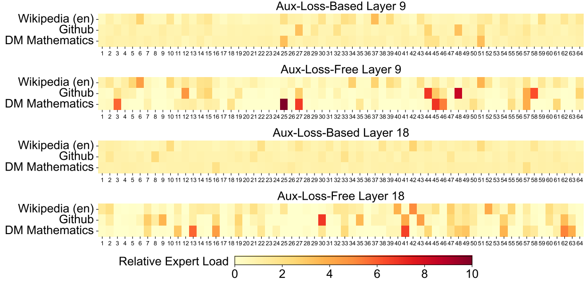

Figure 9 | Expert load of auxiliary-loss-free and auxiliary-loss-based models on three domains in the Pile test set. The auxiliary-loss-free model shows greater expert specialization patterns than the auxiliary-loss-based one. The relative expert load denotes the ratio between the actual expert load and the theoretically balanced expert load. Due to space constraints, we only present the results of two layers as an example, with the results of all layers provided in Appendix C.

图 9｜Pile 三域上专家负载: 无辅助损失特化更强. 相对负载=实际/理论均衡. 全文层见附录 C.

certain sequences or small batches, and (2) domain-shift-induced load imbalance during inference. The first challenge is naturally addressed by our training framework that uses large-scale expert parallelism and data parallelism, which guarantees a large size of each micro-batch. For the second challenge, we also design and implement an efficient inference framework with redundant expert deployment, as described in Section 3.4, to overcome it.

(2) 推理域转移导致不均. 前者靠大 EP/DP 保证 micro-batch 够大; 后者靠 §3.4 冗余专家部署.

## 5. Post-Training 后训练

### 5.1. Supervised Fine-Tuning 监督微调

We curate our instruction-tuning datasets to include 1.5M instances spanning multiple domains, with each domain employing distinct data creation methods tailored to its specific requirements.

指令数据约 1.5M, 多域, 各域造数方法不同.

Reasoning Data. For reasoning-related datasets, including those focused on mathematics, code competition problems, and logic puzzles, we generate the data by leveraging an internal DeepSeek-R1 model. Specifically, while the R1-generated data demonstrates strong accuracy, it suffers from issues such as overthinking, poor formatting, and excessive length. Our objective is to balance the high accuracy of R1-generated reasoning data and the clarity and conciseness of regularly formatted reasoning data.

推理数据: 数学/竞赛代码/逻辑等用内部 R1 生成. R1 准但易过思, 格式差, 过长; 目标是准度与清晰简洁之间平衡.

To establish our methodology, we begin by developing an expert model tailored to a specific domain, such as code, mathematics, or general reasoning, using a combined Supervised Fine-Tuning (SFT) and Reinforcement Learning (RL) training pipeline. This expert model serves as a data generator for the final model. The training process involves generating two distinct types of SFT samples for each instance: the first couples the problem with its original response in the format of &lt; problem, original response&gt;, while the second incorporates a system prompt

先按域训专家(SFT+RL)当生成器. 每题两种 SFT 样本: &lt; 问题, 原答&gt;, 以及带系统提示的

<!-- page 29 of 53 -->

alongside the problem and the R1 response in the format of &lt; system prompt, problem, R1 response&gt;.

&lt; 系统提示, 问题, R1 答&gt;.

The system prompt is meticulously designed to include instructions that guide the model toward producing responses enriched with mechanisms for reflection and verification. During the RL phase, the model leverages high-temperature sampling to generate responses that integrate patterns from both the R1-generated and original data, even in the absence of explicit system prompts. After hundreds of RL steps, the intermediate RL model learns to incorporate R1 patterns, thereby enhancing overall performance strategically.

系统提示引导反思与验证. RL 高温采样可在无显式系统提示时也混入两种模式; 数百步后中间模型学会吸 R1 模式.

Upon completing the RL training phase, we implement rejection sampling to curate high-quality SFT data for the final model, where the expert models are used as data generation sources. This method ensures that the final training data retains the strengths of DeepSeek-R1 while producing responses that are concise and effective.

RL 后再拒绝采样筛最终 SFT, 保留 R1 长处且答得更干净.

Non-Reasoning Data. For non-reasoning data, such as creative writing, role-play, and simple question answering, we utilize DeepSeek-V2.5 to generate responses and enlist human annotators to verify the accuracy and correctness of the data.

非推理数据: 创意写作, 角色扮演, 简单问答等用 V2.5 生成, 人工核.

SFT Settings. We fine-tune DeepSeek-V3-Base for two epochs using the SFT dataset, using the cosine decay learning rate scheduling that starts at $5 \times 10^{-6}$ and gradually decreases to $1 \times 10^{-6}$ . During training, each single sequence is packed from multiple samples. However, we adopt a sample masking strategy to ensure that these examples remain isolated and mutually invisible.

SFT: 两 epoch, lr 从 $5\times10^{-6}$ 余弦到 $1\times10^{-6}$; 多样本打包但 sample mask 互不可见.

### 5.2. Reinforcement Learning 强化学习

#### 5.2.1. Reward Model 奖励模型

We employ a rule-based Reward Model (RM) and a model-based RM in our RL process.

RL 用规则 RM 与模型 RM.

Rule-Based RM. For questions that can be validated using specific rules, we adopt a rule-based reward system to determine the feedback. For instance, certain math problems have deterministic results, and we require the model to provide the final answer within a designated format (e. g., in a box), allowing us to apply rules to verify the correctness. Similarly, for LeetCode problems, we can utilize a compiler to generate feedback based on test cases. By leveraging rule-based validation wherever possible, we ensure a higher level of reliability, as this approach is resistant to manipulation or exploitation.

规则 RM: 数学装箱验答案, LeetCode 编译跑测例; 能规则化就规则化, 抗刷分.

Model-Based RM. For questions with free-form ground-truth answers, we rely on the reward model to determine whether the response matches the expected ground-truth. Conversely, for questions without a definitive ground-truth, such as those involving creative writing, the reward model is tasked with providing feedback based on the question and the corresponding answer as inputs. The reward model is trained from the DeepSeek-V3 SFT checkpoints. To enhance its reliability, we construct preference data that not only provides the final reward but also includes the chain-of-thought leading to the reward. This approach helps mitigate the risk of reward hacking in specific tasks.

模型 RM: 自由答案判匹配; 无标准答案(如创意写作)则据问答打分. 从 V3 SFT 检查点训; 偏好数据带通向奖励的 CoT, 减轻 reward hacking.

<!-- page 30 of 53 -->

#### 5.2.2. Group Relative Policy Optimization 组相对策略优化

Similar to DeepSeek-V2 (DeepSeek-AI, 2024c), we adopt Group Relative Policy Optimization (GRPO) (Shao et al., 2024), which foregoes the critic model that is typically with the same size as the policy model, and estimates the baseline from group scores instead. Specifically, for each question q, GRPO samples a group of outputs $\{o_{1}, o_{2}, \cdots, o_{G}\}$ from the old policy model $\pi_{\theta_{old}}$ and then optimizes the policy model $\pi_{\theta}$ by maximizing the following objective:

沿用 GRPO: 丢掉与策略同规模的 critic, 用组内分数估基线. 对问题 $q$ 从旧策略采样一组输出, 最大化:

$$
\left| \begin{array}{c}\mathcal {J} _ {G R P O} (\theta) = \mathbb {E} [ q \sim P (Q), \{o _ {i} \} _ {i = 1} ^ {G} \sim \pi_ {\theta_ {o l d}} (O | q) ] \\ \frac {1}{G} \sum_ {i = 1} ^ {G} \left(\min \left(\frac {\pi_ {\theta} (o _ {i} | q)}{\pi_ {\theta_ {o l d}} (o _ {i} | q)} A _ {i}, \mathrm{clip} \left(\frac {\pi_ {\theta} (o _ {i} | q)}{\pi_ {\theta_ {o l d}} (o _ {i} | q)}, 1 - \varepsilon , 1 + \varepsilon\right) A _ {i}\right) - \beta \mathbb {D} _ {K L} \left(\pi_ {\theta} | | \pi_ {r e f}\right)\right), \end{array} \right. \tag{26}

$$

$$
\mathbb {D} _ {K L} \left(\pi_ {\theta} | | \pi_ {r e f}\right) = \frac {\pi_ {r e f} (o _ {i} | q)}{\pi_ {\theta} (o _ {i} | q)} - \log \frac {\pi_ {r e f} (o _ {i} | q)}{\pi_ {\theta} (o _ {i} | q)} - 1, \tag{27}

$$

where $\varepsilon$ and $\beta$ are hyper-parameters; $\pi_{ref}$ is the reference model; and $A_{i}$ is the advantage, derived from the rewards $\{r_{1}, r_{2}, \ldots, r_{G}\}$ corresponding to the outputs within each group:

$\varepsilon, \beta$ 为超参; $\pi_{ref}$ 为参考模型; 优势 $A_i$ 由组内奖励算:

$$
A _ {i} = \frac {r _ {i} - \mathrm{mean} (\{r _ {1} , r _ {2} , \cdots , r _ {G} \})}{\mathrm{std} (\{r _ {1} , r _ {2} , \cdots , r _ {G} \})}. \tag{28}

$$

We incorporate prompts from diverse domains, such as coding, math, writing, role-playing, and question answering, during the RL process. This approach not only aligns the model more closely with human preferences but also enhances performance on benchmarks, especially in scenarios where available SFT data are limited.

RL 提示覆盖代码, 数学, 写作, 角色扮演, 问答等; 既对齐偏好, 也在 SFT 稀缺场景抬基准.

### 5.3. Evaluations 评测

#### 5.3.1. Evaluation Settings 评测设定

Evaluation Benchmarks. Apart from the benchmark we used for base model testing, we further evaluate instructed models on IFEval (Zhou et al., 2023), FRAMES (Krishna et al., 2024), LongBench v2 (Bai et al., 2024), GPQA (Rein et al., 2023), SimpleQA (OpenAI, 2024c), C-SimpleQA (He et al., 2024), SWE-Bench Verified (OpenAI, 2024d), Aider $^{1}$ , LiveCodeBench (Jain et al., 2024) (questions from August 2024 to November 2024), Codeforces $^{2}$ , Chinese National High School Mathematics Olympiad (CNMO 2024) $^{3}$ , and American Invitational Mathematics Examination 2024 (AIME 2024) (MAA, 2024).

除 Base 基准外, Instruct 还评 IFEval, FRAMES, LongBench v2, GPQA, SimpleQA, C-SimpleQA, SWE-Bench Verified, Aider, LiveCodeBench(2024-08 至 2024-11), Codeforces, CNMO 2024, AIME 2024.

Compared Baselines. We conduct comprehensive evaluations of our chat model against several strong baselines, including DeepSeek-V2-0506, DeepSeek-V2.5-0905, Qwen2.5 72B Instruct, LLaMA-3.1 405B Instruct, Claude-Sonnet-3.5-1022, and GPT-4o-0513. For the DeepSeek-V2 model series, we select the most representative variants for comparison. For closed-source models, evaluations are performed through their respective APIs.

对照: V2-0506, V2.5-0905, Qwen2.5 72B Instruct, LLaMA-3.1 405B Instruct, Claude-Sonnet-3.5-1022, GPT-4o-0513; 闭源走 API.

Detailed Evaluation Configurations. For standard benchmarks including MMLU, DROP, GPQA, and SimpleQA, we adopt the evaluation prompts from the simple-evals framework $^{4}$ .

MMLU/DROP/GPQA/SimpleQA 用 simple-evals 提示.

<small></small>

<small></small>

<small></small>

<small></small>

<!-- page 31 of 53 -->

We utilize the Zero-Eval prompt format (Lin, 2024) for MMLU-Redux in a zero-shot setting. For other datasets, we follow their original evaluation protocols with default prompts as provided by the dataset creators. For code and math benchmarks, the HumanEval-Mul dataset includes 8 mainstream programming languages (Python, Java, Cpp, C#, JavaScript, TypeScript, PHP, and Bash) in total. We use CoT and non-CoT methods to evaluate model performance on LiveCodeBench, where the data are collected from August 2024 to November 2024. The Codeforces dataset is measured using the percentage of competitors. SWE-Bench verified is evaluated using the agentless framework (Xia et al., 2024). We use the “diff” format to evaluate the Aider-related benchmarks. For mathematical assessments, AIME and CNMO 2024 are evaluated with a temperature of 0.7, and the results are averaged over 16 runs, while MATH-500 employs greedy decoding. We allow all models to output a maximum of 8192 tokens for each benchmark.

MMLU-Redux 用 Zero-Eval 零样本; 其它跟原协议. HumanEval-Mul 含 8 语种; LiveCodeBench 分 CoT/非 CoT; Codeforces 用百分位; SWE 用 agentless; Aider 用 diff; AIME/CNMO temperature 0.7, 16 次平均, MATH-500 贪心; 最大输出 8192.

<table><tr><td colspan="2">Benchmark (Metric)</td><td>DeepSeek V2-0506</td><td>DeepSeek V2.5-0905</td><td>Qwen2.5 72B-Inst. </td><td>LLaMA-3.1 405B-Inst. </td><td>Claude-3.5-Sonnet-1022</td><td>GPT-4o 0513</td><td>DeepSeek V3</td></tr><tr><td colspan="2">Architecture</td><td>MoE</td><td>MoE</td><td>Dense</td><td>Dense</td><td>-</td><td>-</td><td>MoE</td></tr><tr><td colspan="2"># Activated Params</td><td>21B</td><td>21B</td><td>72B</td><td>405B</td><td>-</td><td>-</td><td>37B</td></tr><tr><td colspan="2"># Total Params</td><td>236B</td><td>236B</td><td>72B</td><td>405B</td><td>-</td><td>-</td><td>671B</td></tr><tr><td rowspan="9">English</td><td>MMLU (EM)</td><td>78.2</td><td>80.6</td><td>85.3</td><td>88.6</td><td>88.3</td><td>87.2</td><td>88.5</td></tr><tr><td>MMLU-Redux (EM)</td><td>77.9</td><td>80.3</td><td>85.6</td><td>86.2</td><td>88.9</td><td>88.0</td><td>89.1</td></tr><tr><td>MMLU-Pro (EM)</td><td>58.5</td><td>66.2</td><td>71.6</td><td>73.3</td><td>78.0</td><td>72.6</td><td>75.9</td></tr><tr><td>DROP (3-shot F1)</td><td>83.0</td><td>87.8</td><td>76.7</td><td>88.7</td><td>88.3</td><td>83.7</td><td>91.6</td></tr><tr><td>IF-Eval (Prompt Strict)</td><td>57.7</td><td>80.6</td><td>84.1</td><td>86.0</td><td>86.5</td><td>84.3</td><td>86.1</td></tr><tr><td>GPQA-Diamond (Pass@1)</td><td>35.3</td><td>41.3</td><td>49.0</td><td>51.1</td><td>65.0</td><td>49.9</td><td>59.1</td></tr><tr><td>SimpleQA (Correct)</td><td>9.0</td><td>10.2</td><td>9.1</td><td>17.1</td><td>28.4</td><td>38.2</td><td>24.9</td></tr><tr><td>FRAMES (Acc.)</td><td>66.9</td><td>65.4</td><td>69.8</td><td>70.0</td><td>72.5</td><td>80.5</td><td>73.3</td></tr><tr><td>LongBench v2 (Acc.)</td><td>31.6</td><td>35.4</td><td>39.4</td><td>36.1</td><td>41.0</td><td>48.1</td><td>48.7</td></tr><tr><td rowspan="7">Code</td><td>HumanEval-Mul (Pass@1)</td><td>69.3</td><td>77.4</td><td>77.3</td><td>77.2</td><td>81.7</td><td>80.5</td><td>82.6</td></tr><tr><td>LiveCodeBench (Pass@1-COT)</td><td>18.8</td><td>29.2</td><td>31.1</td><td>28.4</td><td>36.3</td><td>33.4</td><td>40.5</td></tr><tr><td>LiveCodeBench (Pass@1)</td><td>20.3</td><td>28.4</td><td>28.7</td><td>30.1</td><td>32.8</td><td>34.2</td><td>37.6</td></tr><tr><td>Codeforces (Percentile)</td><td>17.5</td><td>35.6</td><td>24.8</td><td>25.3</td><td>20.3</td><td>23.6</td><td>51.6</td></tr><tr><td>SWE Verified (Resolved)</td><td>-</td><td>22.6</td><td>23.8</td><td>24.5</td><td>50.8</td><td>38.8</td><td>42.0</td></tr><tr><td>Aider-Edit (Acc.)</td><td>60.3</td><td>71.6</td><td>65.4</td><td>63.9</td><td>84.2</td><td>72.9</td><td>79.7</td></tr><tr><td>Aider-Polyglot (Acc.)</td><td>-</td><td>18.2</td><td>7.6</td><td>5.8</td><td>45.3</td><td>16.0</td><td>49.6</td></tr><tr><td rowspan="3">Math</td><td>AIME 2024 (Pass@1)</td><td>4.6</td><td>16.7</td><td>23.3</td><td>23.3</td><td>16.0</td><td>9.3</td><td>39.2</td></tr><tr><td>MATH-500 (EM)</td><td>56.3</td><td>74.7</td><td>80.0</td><td>73.8</td><td>78.3</td><td>74.6</td><td>90.2</td></tr><tr><td>CNMO 2024 (Pass@1)</td><td>2.8</td><td>10.8</td><td>15.9</td><td>6.8</td><td>13.1</td><td>10.8</td><td>43.2</td></tr><tr><td rowspan="3">Chinese</td><td>CLUEWSC (EM)</td><td>89.9</td><td>90.4</td><td>91.4</td><td>84.7</td><td>85.4</td><td>87.9</td><td>90.9</td></tr><tr><td>C-Eval (EM)</td><td>78.6</td><td>79.5</td><td>86.1</td><td>61.5</td><td>76.7</td><td>76.0</td><td>86.5</td></tr><tr><td>C-SimpleQA (Correct)</td><td>48.5</td><td>54.1</td><td>48.4</td><td>50.4</td><td>51.3</td><td>59.3</td><td>64.8</td></tr></table>

Table 6 | Comparison between DeepSeek-V3 and other representative chat models. All models are evaluated in a configuration that limits the output length to 8K. Benchmarks containing fewer than 1000 samples are tested multiple times using varying temperature settings to derive robust final results. DeepSeek-V3 stands as the best-performing open-source model, and also exhibits competitive performance against frontier closed-source models.

表 6｜Chat 模型对比(输出上限 8K). 样本 <1000 的基准多次不同温度取稳妥结果. V3 为最强开源, 并逼近前沿闭源.

#### 5.3.2. Standard Evaluation 标准评测

Table 6 presents the evaluation results, showcasing that DeepSeek-V3 stands as the best-performing open-source model. Additionally, it is competitive against frontier closed-source models like GPT-4o and Claude-3.5-Sonnet.

表 6: 开源最强, 并可比 GPT-4o / Claude-3.5-Sonnet.

<!-- page 32 of 53 -->

English Benchmarks. MMLU is a widely recognized benchmark designed to assess the performance of large language models, across diverse knowledge domains and tasks. DeepSeek-V3 demonstrates competitive performance, standing on par with top-tier models such as LLaMA-3.1-405B, GPT-4o, and Claude-Sonnet 3.5, while significantly outperforming Qwen2.5 72B. Moreover, DeepSeek-V3 excels in MMLU-Pro, a more challenging educational knowledge benchmark, where it closely trails Claude-Sonnet 3.5. On MMLU-Redux, a refined version of MMLU with corrected labels, DeepSeek-V3 surpasses its peers. In addition, on GPQA-Diamond, a PhD-level evaluation testbed, DeepSeek-V3 achieves remarkable results, ranking just behind Claude 3.5 Sonnet and outperforming all other competitors by a substantial margin.

英文基准. MMLU 上与 LLaMA-3.1-405B, GPT-4o, Claude-Sonnet 3.5 同档, 显著超过 Qwen2.5 72B; MMLU-Pro 紧追 Claude-Sonnet 3.5; MMLU-Redux 超同行; GPQA-Diamond 仅次 Claude 3.5 Sonnet, 大幅甩开其余.

In long-context understanding benchmarks such as DROP, LongBench v2, and FRAMES, DeepSeek-V3 continues to demonstrate its position as a top-tier model. It achieves an impressive 91.6 F1 score in the 3-shot setting on DROP, outperforming all other models in this category. On FRAMES, a benchmark requiring question-answering over 100k token contexts, DeepSeek-V3 closely trails GPT-4o while outperforming all other models by a significant margin. This demonstrates the strong capability of DeepSeek-V3 in handling extremely long-context tasks. The long-context capability of DeepSeek-V3 is further validated by its best-in-class performance on LongBench v2, a dataset that was released just a few weeks before the launch of DeepSeek V3. On the factual knowledge benchmark, SimpleQA, DeepSeek-V3 falls behind GPT-4o and Claude-Sonnet, primarily due to its design focus and resource allocation. DeepSeek-V3 assigns more training tokens to learn Chinese knowledge, leading to exceptional performance on the C-SimpleQA. On the instruction-following benchmark, DeepSeek-V3 significantly outperforms its predecessor, DeepSeek-V2-series, highlighting its improved ability to understand and adhere to user-defined format constraints.

长上下文: DROP 3-shot F1 91.6 全场最高; FRAMES(约 100k 上下文)紧追 GPT-4o; LongBench v2 同类最佳. SimpleQA 落后 GPT-4o/Claude, 因更多 token 投中文知识, 故 C-SimpleQA 很强. 指令遵循显著超过 V2 系列.

Code and Math Benchmarks. Coding is a challenging and practical task for LLMs, encompassing engineering-focused tasks like SWE-Bench-Verified and Aider, as well as algorithmic tasks such as HumanEval and LiveCodeBench. In engineering tasks, DeepSeek-V3 trails behind Claude-Sonnet-3.5-1022 but significantly outperforms open-source models. The open-source DeepSeek-V3 is expected to foster advancements in coding-related engineering tasks. By providing access to its robust capabilities, DeepSeek-V3 can drive innovation and improvement in areas such as software engineering and algorithm development, empowering developers and researchers to push the boundaries of what open-source models can achieve in coding tasks. In algorithmic tasks, DeepSeek-V3 demonstrates superior performance, outperforming all baselines on benchmarks like HumanEval-Mul and LiveCodeBench. This success can be attributed to its advanced knowledge distillation technique, which effectively enhances its code generation and problem-solving capabilities in algorithm-focused tasks.

代码与数学. 工程向(SWE, Aider)低于 Claude-Sonnet-3.5-1022, 但显著超开源; 算法向(HumanEval-Mul, LiveCodeBench)全面领先, 受益于蒸馏.

On math benchmarks, DeepSeek-V3 demonstrates exceptional performance, significantly surpassing baselines and setting a new state-of-the-art for non-o1-like models. Specifically, on AIME, MATH-500, and CNMO 2024, DeepSeek-V3 outperforms the second-best model, Qwen2.5 72B, by approximately $10\%$ in absolute scores, which is a substantial margin for such challenging benchmarks. This remarkable capability highlights the effectiveness of the distillation technique from DeepSeek-R1, which has been proven highly beneficial for non-o1-like models.

数学上非 o1 类 SOTA; AIME/MATH-500/CNMO 相对第二名 Qwen2.5 72B 约高 10 个绝对点, 凸显 R1 蒸馏效果.

Chinese Benchmarks. Qwen and DeepSeek are two representative model series with robust support for both Chinese and English. On the factual benchmark Chinese SimpleQA, DeepSeek-V3 surpasses Qwen2.5-72B by 16.4 points, despite Qwen2.5 being trained on a larger corpus compromising 18T tokens, which are 20% more than the 14.8T tokens that DeepSeek-V3 is

中文. Chinese SimpleQA 上 V3 超 Qwen2.5-72B 16.4 分-- 尽管后者预训练 18T, 比 V3 的 14.8T 多约 20%.

<!-- page 33 of 53 -->

| Model                  | Arena-Hard | AlpacaEval 2.0 |
| ------------------------ | ------------ | ---------------- |
| DeepSeek-V2.5-0905     | 76.2       | 50.5           |
| Qwen2.5-72B-Instruct   | 81.2       | 49.1           |
| LLaMA-3.1 405B         | 69.3       | 40.5           |
| GPT-4o-0513            | 80.4       | 51.1           |
| Claude-Sonnet-3.5-1022 | 85.2       | 52.0           |
| DeepSeek-V3            | 85.5       | 70.0           |

Table 7 | English open-ended conversation evaluations. For AlpacaEval 2.0, we use the length-controlled win rate as the metric.

表 7｜英文开放对话. AlpacaEval 2.0 用长度控制胜率.

pre-trained on.

(承接上页)预训练规模更大.

On C-Eval, a representative benchmark for Chinese educational knowledge evaluation, and CLUEWSC (Chinese Winograd Schema Challenge), DeepSeek-V3 and Qwen2.5-72B exhibit similar performance levels, indicating that both models are well-optimized for challenging Chinese-language reasoning and educational tasks.

C-Eval 与 CLUEWSC 上二者接近, 显示中文推理与教育任务都优化到位.

#### 5.3.3. Open-Ended Evaluation 开放生成评测

In addition to standard benchmarks, we also evaluate our models on open-ended generation tasks using LLMs as judges, with the results shown in Table 7. Specifically, we adhere to the original configurations of AlpacaEval 2.0 (Dubois et al., 2024) and Arena-Hard (Li et al., 2024a), which leverage GPT-4-Turbo-1106 as judges for pairwise comparisons. On Arena-Hard, DeepSeek-V3 achieves an impressive win rate of over 86% against the baseline GPT-4-0314, performing on par with top-tier models like Claude-Sonnet-3.5-1022. This underscores the robust capabilities of DeepSeek-V3, especially in dealing with complex prompts, including coding and debugging tasks. Furthermore, DeepSeek-V3 achieves a groundbreaking milestone as the first open-source model to surpass 85% on the Arena-Hard benchmark. This achievement significantly bridges the performance gap between open-source and closed-source models, setting a new standard for what open-source models can accomplish in challenging domains.

表 7: Arena-Hard 相对 GPT-4-0314 胜率超 86%, 与 Claude-Sonnet-3.5-1022 同档; 首个开源破 85%, 显著收窄开闭源差距.

Similarly, DeepSeek-V3 showcases exceptional performance on AlpacaEval 2.0, outperforming both closed-source and open-source models. This demonstrates its outstanding proficiency in writing tasks and handling straightforward question-answering scenarios. Notably, it surpasses DeepSeek-V2.5-0905 by a significant margin of 20%, highlighting substantial improvements in tackling simple tasks and showcasing the effectiveness of its advancements.

AlpacaEval 2.0 亦全面领先, 相对 V2.5-0905 约高 20 个百分点.

#### 5.3.4. DeepSeek-V3 as a Generative Reward Model DeepSeek-V3 作为生成式奖励模型

We compare the judgment ability of DeepSeek-V3 with state-of-the-art models, namely GPT-4o and Claude-3.5. Table 8 presents the performance of these models in RewardBench (Lambert et al., 2024). DeepSeek-V3 achieves performance on par with the best versions of GPT-4o-0806 and Claude-3.5-Sonnet-1022, while surpassing other versions. Additionally, the judgment ability of DeepSeek-V3 can also be enhanced by the voting technique. Therefore, we employ DeepSeek-V3 along with voting to offer self-feedback on open-ended questions, thereby improving the effectiveness and robustness of the alignment process.

表 8: RewardBench 上与 GPT-4o-0806, Claude-3.5-Sonnet-1022 最好版本同档; 投票还可再抬. 开放题用 V3+投票做自我反馈, 加强对齐.

<!-- page 34 of 53 -->

| Model                  | Chat | Chat-Hard | Safety | Reasoning | Average |
| ------------------------ | ------ | ----------- | -------- | ----------- | --------- |
| GPT-4o-0513            | 96.6 | 70.4      | 86.7   | 84.9      | 84.7    |
| GPT-4o-0806            | 96.1 | 76.1      | 88.1   | 86.6      | 86.7    |
| GPT-4o-1120            | 95.8 | 71.3      | 86.2   | 85.2      | 84.6    |
| Claude-3.5-sonnet-0620 | 96.4 | 74.0      | 81.6   | 84.7      | 84.2    |
| Claude-3.5-sonnet-1022 | 96.4 | 79.7      | 91.1   | 87.6      | 88.7    |
| DeepSeek-V3            | 96.9 | 79.8      | 87.0   | 84.3      | 87.0    |
| DeepSeek-V3 (maj@6)    | 96.9 | 82.6      | 89.5   | 89.2      | 89.6    |

Table 8 | Performances of GPT-4o, Claude-3.5-sonnet and DeepSeek-V3 on RewardBench.

表 8｜RewardBench 上 GPT-4o, Claude-3.5-sonnet 与 DeepSeek-V3.

<table><tr><td rowspan="2">Model</td><td colspan="2">LiveCodeBench-CoT</td><td colspan="2">MATH-500</td></tr><tr><td>Pass@1</td><td>Length</td><td>Pass@1</td><td>Length</td></tr><tr><td>DeepSeek-V2.5 Baseline</td><td>31.1</td><td>718</td><td>74.6</td><td>769</td></tr><tr><td>DeepSeek-V2.5 +R1 Distill</td><td>37.4</td><td>783</td><td>83.2</td><td>1510</td></tr></table>

Table 9 | The contribution of distillation from DeepSeek-R1. The evaluation settings of Live-CodeBench and MATH-500 are the same as in Table 6.

表 9｜R1 蒸馏贡献(设定同表 6).

### 5.4. Discussion

#### 5.4.1. Distillation from DeepSeek-R1 从 DeepSeek-R1 蒸馏

We ablate the contribution of distillation from DeepSeek-R1 based on DeepSeek-V2.5. The baseline is trained on short CoT data, whereas its competitor uses data generated by the expert checkpoints described above.

在 V2.5 上消融 R1 蒸馏: 基线短 CoT, 对照用上述专家检查点生成数据.

Table 9 demonstrates the effectiveness of the distillation data, showing significant improvements in both LiveCodeBench and MATH-500 benchmarks. Our experiments reveal an interesting trade-off: the distillation leads to better performance but also substantially increases the average response length.

> **核对:** Chat 的 MATH-500 比 Base 的 MATH 高很多, 是同一张卷子吗?
> 不是. Base 报 MATH, Chat 报 MATH-500, 中间还经过 R1 蒸馏. Table 9 在同一套设定上看到: 蒸馏抬分, 平均回答也变长. 分和长度要一起看.
> To maintain a balance between model accuracy and computational efficiency, we carefully selected optimal settings for DeepSeek-V3 in distillation.

表 9: LiveCodeBench 与 MATH-500 明显上涨, 但平均长度也涨; V3 蒸馏设定在准度与效率间取舍.

Our research suggests that knowledge distillation from reasoning models presents a promising direction for post-training optimization. While our current work focuses on distilling data from mathematics and coding domains, this approach shows potential for broader applications across various task domains. The effectiveness demonstrated in these specific areas indicates that long-CoT distillation could be valuable for enhancing model performance in other cognitive tasks requiring complex reasoning. Further exploration of this approach across different domains remains an important direction for future research.

从推理模型蒸馏是有潜力的后训练方向; 当前聚焦数学与代码, 长 CoT 蒸馏或可推广到其它复杂认知任务.

#### 5.4.2. Self-Rewarding 自我奖励

Rewards play a pivotal role in RL, steering the optimization process. In domains where verification through external tools is straightforward, such as some coding or mathematics scenarios, RL demonstrates exceptional efficacy. However, in more general scenarios, constructing a feedback mechanism through hard coding is impractical. During the development of DeepSeek-V3, for these broader contexts, we employ the constitutional AI approach (Bai et al., 2022), leveraging the voting evaluation results of DeepSeek-V3 itself as a feedback source. This method has

奖励主导 RL. 可外部验证的代码/数学上 RL 很强; 更广场景难硬编码. V3 对后者用 constitutional AI, 以自身投票作反馈. 该方法

<!-- page 35 of 53 -->

produced notable alignment effects, significantly enhancing the performance of DeepSeek-V3 in subjective evaluations. By integrating additional constitutional inputs, DeepSeek-V3 can optimize towards the constitutional direction. We believe that this paradigm, which combines supplementary information with LLMs as a feedback source, is of paramount importance. The LLM serves as a versatile processor capable of transforming unstructured information from diverse scenarios into rewards, ultimately facilitating the self-improvement of LLMs. Beyond self-rewarding, we are also dedicated to uncovering other general and scalable rewarding methods to consistently advance the model capabilities in general scenarios.

带来明显对齐收益, 主观评测上升. 叠加宪法输入可朝宪法方向优化.「补充信息 + LLM 作反馈源」把非结构化信息收成奖励, 推动自我改进; 并继续寻找其它可扩展奖励方法.

#### 5.4.3. Multi-Token Prediction Evaluation MTP 评测

Instead of predicting just the next single token, DeepSeek-V3 predicts the next 2 tokens through the MTP technique. Combined with the framework of speculative decoding (Leviathan et al., 2023; Xia et al., 2023), it can significantly accelerate the decoding speed of the model. A natural question arises concerning the acceptance rate of the additionally predicted token. Based on our evaluation, the acceptance rate of the second token prediction ranges between 85% and 90% across various generation topics, demonstrating consistent reliability. This high acceptance rate enables DeepSeek-V3 to achieve a significantly improved decoding speed, delivering 1.8 times TPS (Tokens Per Second).

MTP 预测下两个 token; 配合投机解码可加速. 第二 token 接受率约 85%–90%, TPS 约 1.8×.

## 6. Conclusion, Limitations, and Future Directions 结论, 局限与未来方向

In this paper, we introduce DeepSeek-V3, a large MoE language model with 671B total parameters and 37B activated parameters, trained on 14.8T tokens. In addition to the MLA and DeepSeekMoE architectures, it also pioneers an auxiliary-loss-free strategy for load balancing and sets a multi-token prediction training objective for stronger performance. The training of DeepSeek-V3 is cost-effective due to the support of FP8 training and meticulous engineering optimizations. The post-training also makes a success in distilling the reasoning capability from the DeepSeek-R1 series of models. Comprehensive evaluations demonstrate that DeepSeek-V3 has emerged as the strongest open-source model currently available, and achieves performance comparable to leading closed-source models like GPT-4o and Claude-3.5-Sonnet. Despite its strong performance, it also maintains economical training costs. It requires only 2.788M H800 GPU hours for its full training, including pre-training, context length extension, and post-training.

本文介绍 DeepSeek-V3: 671B 总参, 37B 激活, 训于 14.8T token. 除 MLA 与 DeepSeekMoE 外, 首推无辅助损失负载均衡与 MTP; FP8 与工程优化使训练省钱; 后训练成功蒸馏 R1 推理. 评测显示当前最强开源, 并逼近 GPT-4o / Claude-3.5-Sonnet; 全流程仅 2.788M H800 GPU 小时.

While acknowledging its strong performance and cost-effectiveness, we also recognize that DeepSeek-V3 has some limitations, especially on the deployment. Firstly, to ensure efficient inference, the recommended deployment unit for DeepSeek-V3 is relatively large, which might pose a burden for small-sized teams. Secondly, although our deployment strategy for DeepSeek-V3 has achieved an end-to-end generation speed of more than two times that of DeepSeek-V2, there still remains potential for further enhancement. Fortunately, these limitations are expected to be naturally addressed with the development of more advanced hardware.

局限主要在部署: 推荐单元偏大, 小团队吃力; 端到端速度相对 V2 已超两倍, 仍有空间. 更先进硬件有望自然缓解.

DeepSeek consistently adheres to the route of open-source models with longtermism, aiming to steadily approach the ultimate goal of AGI (Artificial General Intelligence). In the future, we plan to strategically invest in research across the following directions.

DeepSeek 坚持开源与长期主义, 稳步逼近 AGI. 未来方向:

\- We will consistently study and refine our model architectures, aiming to further improve both the training and inference efficiency, striving to approach efficient support for infinite context length. Additionally, we will try to break through the architectural limitations of Transformer, thereby pushing the boundaries of its modeling capabilities.

\- 持续打磨架构, 提训推效率, 逼近无限上下文; 并尝试突破 Transformer 架构限制.

<!-- page 36 of 53 -->

\- We will continuously iterate on the quantity and quality of our training data, and explore the incorporation of additional training signal sources, aiming to drive data scaling across a more comprehensive range of dimensions.

\- 持续迭代训练数据的量与质, 并探索更多训练信号来源, 争取在更全的维度上把数据缩放做开.

\- We will consistently explore and iterate on the deep thinking capabilities of our models, aiming to enhance their intelligence and problem-solving abilities by expanding their reasoning length and depth.

\- 持续探索与迭代「深思」能力, 靠拉长, 加深推理来抬智力与解题力.

\- We will explore more comprehensive and multi-dimensional model evaluation methods to prevent the tendency towards optimizing a fixed set of benchmarks during research, which may create a misleading impression of the model capabilities and affect our foundational assessment.

\- 探索更全面, 多维的评测, 避免研究时只刷固定基准, 造成能力错觉, 动摇根基性判断.

## References

AI@Meta. Llama 3 model card, 2024a. URL https://github. com/meta-llama/llama3/blob/main/MODEL\_CARD.md.

AI@Meta. Llama 3.1 model card, 2024b. URL https://github. com/meta-llama/llama-models/blob/main/models/llama3\_1/MODEL\_CARD.md.

Anthropic. Claude 3.5 sonnet, 2024. URL https://www. anthropic. com/news/claude-3-5-sonnet.

J. Austin, A. Odena, M. Nye, M. Bosma, H. Michalewski, D. Dohan, E. Jiang, C. Cai, M. Terry, Q. Le, et al. Program synthesis with large language models. arXiv preprint arXiv: 2108.07732, 2021.

Y. Bai, S. Kadavath, S. Kundu, A. Askell, J. Kernion, A. Jones, A. Chen, A. Goldie, A. Mirhoseini, C. McKinnon, et al. Constitutional AI: Harmlessness from AI feedback. arXiv preprint arXiv: 2212.08073, 2022.

Y. Bai, S. Tu, J. Zhang, H. Peng, X. Wang, X. Lv, S. Cao, J. Xu, L. Hou, Y. Dong, J. Tang, and J. Li. LongBench v2: Towards deeper understanding and reasoning on realistic long-context multitasks. arXiv preprint arXiv: 2412.15204, 2024.

M. Bauer, S. Treichler, and A. Aiken. Singe: leveraging warp specialization for high performance on GPUs. In Proceedings of the 19th ACM SIGPLAN Symposium on Principles and Practice of Parallel Programming, PPoPP '14, page 119–130, New York, NY, USA, 2014. Association for Computing Machinery. ISBN 9781450326568. doi: 10.1145/2555243.2555258. URL https://doi. org/10.1145/2555243.2555258.

Y. Bisk, R. Zellers, R. L. Bras, J. Gao, and Y. Choi. PIQA: reasoning about physical commonsense in natural language. In The Thirty-Fourth AAAI Conference on Artificial Intelligence, AAAI 2020, The Thirty-Second Innovative Applications of Artificial Intelligence Conference, IAAI 2020, The Tenth AAAI Symposium on Educational Advances in Artificial Intelligence, EAAI 2020, New York, NY, USA, February 7-12, 2020, pages 7432–7439. AAAI Press, 2020. doi: 10.1609/aaai. v34i05.6239. URL https://doi. org/10.1609/aaai. v34i05.6239.

M. Chen, J. Tworek, H. Jun, Q. Yuan, H. P. de Oliveira Pinto, J. Kaplan, H. Edwards, Y. Burda, N. Joseph, G. Brockman, A. Ray, R. Puri, G. Krueger, M. Petrov, H. Khlaaf, G. Sastry, P. Mishkin, B. Chan, S. Gray, N. Ryder, M. Pavlov, A. Power, L. Kaiser, M. Bavarian, C. Winter, P. Tillet, F. P. Such, D. Cummings, M. Plappert, F. Chantzis, E. Barnes, A. Herbert-Voss, W. H. Guss, A. Nichol, A. Paino, N. Tezak, J. Tang, I. Babuschkin, S. Balaji, S. Jain, W. Saunders, C. Hesse,

(参考文献条目, 作者与题名保留原文, 便于检索.)

<!-- page 37 of 53 -->

A. N. Carr, J. Leike, J. Achiam, V. Misra, E. Morikawa, A. Radford, M. Knight, M. Brundage, M. Murati, K. Mayer, P. Welinder, B. McGrew, D. Amodei, S. McCandlish, I. Sutskever, and W. Zaremba. Evaluating large language models trained on code. CoRR, abs/2107.03374, 2021. URL https://arxiv. org/abs/2107.03374.

P. Clark, I. Cowhey, O. Etzioni, T. Khot, A. Sabharwal, C. Schoenick, and O. Tafjord. Think you have solved question answering? try arc, the AI2 reasoning challenge. CoRR, abs/1803.05457, 2018. URL http: //arxiv. org/abs/1803.05457.

K. Cobbe, V. Kosaraju, M. Bavarian, M. Chen, H. Jun, L. Kaiser, M. Plappert, J. Tworek, J. Hilton, R. Nakano, et al. Training verifiers to solve math word problems. arXiv preprint arXiv: 2110.14168, 2021.

Y. Cui, T. Liu, W. Che, L. Xiao, Z. Chen, W. Ma, S. Wang, and G. Hu. A span-extraction dataset for Chinese machine reading comprehension. In K. Inui, J. Jiang, V. Ng, and X. Wan, editors, Proceedings of the 2019 Conference on Empirical Methods in Natural Language Processing and the 9th International Joint Conference on Natural Language Processing (EMNLP-IJCNLP), pages 5883–5889, Hong Kong, China, Nov. 2019. Association for Computational Linguistics. doi: 10.18653/v1/D19-1600. URL https://aclanthology. org/D19-1600.

D. Dai, C. Deng, C. Zhao, R. X. Xu, H. Gao, D. Chen, J. Li, W. Zeng, X. Yu, Y. Wu, Z. Xie, Y. K. Li, P. Huang, F. Luo, C. Ruan, Z. Sui, and W. Liang. Deepseekmoe: Towards ultimate expert specialization in mixture-of-experts language models. CoRR, abs/2401.06066, 2024. URL https://doi. org/10.48550/arXiv. 2401.06066.

DeepSeek-AI. Deepseek-coder-v2: Breaking the barrier of closed-source models in code intelligence. CoRR, abs/2406.11931, 2024a. URL https://doi. org/10.48550/arXiv. 2406.11931.

DeepSeek-AI. Deepseek LLM: scaling open-source language models with longtermism. CoRR, abs/2401.02954, 2024b. URL https://doi. org/10.48550/arXiv. 2401.02954.

DeepSeek-AI. Deepseek-v2: A strong, economical, and efficient mixture-of-experts language model. CoRR, abs/2405.04434, 2024c. URL https://doi. org/10.48550/arXiv. 2405.04434.

T. Dettmers, M. Lewis, Y. Belkada, and L. Zettlemoyer. Gpt3. int8(): 8-bit matrix multiplication for transformers at scale. Advances in Neural Information Processing Systems, 35: 30318–30332, 2022.

H. Ding, Z. Wang, G. Paolini, V. Kumar, A. Deoras, D. Roth, and S. Soatto. Fewer truncations improve language modeling. arXiv preprint arXiv: 2404.10830, 2024.

D. Dua, Y. Wang, P. Dasigi, G. Stanovsky, S. Singh, and M. Gardner. DROP: A reading comprehension benchmark requiring discrete reasoning over paragraphs. In J. Burstein, C. Doran, and T. Solorio, editors, Proceedings of the 2019 Conference of the North American Chapter of the Association for Computational Linguistics: Human Language Technologies, NAACL-HLT 2019, Minneapolis, MN, USA, June 2-7, 2019, Volume 1 (Long and Short Papers), pages 2368–2378. Association for Computational Linguistics, 2019. doi: 10.18653/V1/N19-1246. URL https://doi. org/10.18653/v1/n19-1246.

Y. Dubois, B. Galambosi, P. Liang, and T. B. Hashimoto. Length-controlled alpacaeval: A simple way to debias automatic evaluators. arXiv preprint arXiv: 2404.04475, 2024.

(续参考文献.)

<!-- page 38 of 53 -->

W. Fedus, B. Zoph, and N. Shazeer. Switch transformers: Scaling to trillion parameter models with simple and efficient sparsity. CoRR, abs/2101.03961, 2021. URL https://arxiv. org/abs/2101.03961.

M. Fishman, B. Chmiel, R. Banner, and D. Soudry. Scaling FP8 training to trillion-token llms. arXiv preprint arXiv: 2409.12517, 2024.

E. Frantar, S. Ashkboos, T. Hoefler, and D. Alistarh. Gptq: Accurate post-training quantization for generative pre-trained transformers. arXiv preprint arXiv: 2210.17323, 2022.

L. Gao, S. Biderman, S. Black, L. Golding, T. Hoppe, C. Foster, J. Phang, H. He, A. Thite, N. Nabeshima, et al. The Pile: An 800GB dataset of diverse text for language modeling. arXiv preprint arXiv: 2101.00027, 2020.

A. P. Gema, J. O. J. Leang, G. Hong, A. Devoto, A. C. M. Mancino, R. Saxena, X. He, Y. Zhao, X. Du, M. R. G. Madani, C. Barale, R. McHardy, J. Harris, J. Kaddour, E. van Krieken, and P. Minervini. Are we done with mmlu? CoRR, abs/2406.04127, 2024. URL https://doi. org/10.48550/arXiv. 2406.04127.

F. Gloeckle, B. Y. Idrissi, B. Rozière, D. Lopez-Paz, and G. Synnaeve. Better & faster large language models via multi-token prediction. In Forty-first International Conference on Machine Learning, ICML 2024, Vienna, Austria, July 21-27, 2024. OpenReview. net, 2024. URL https://openreview. net/forum? id=pEWAcejiU2.

Google. Our next-generation model: Gemini 1.5, 2024. URL https://blog. google/technology/ai/google-gemini-next-generation-model-february-2024.

R. L. Graham, D. Bureddy, P. Lui, H. Rosenstock, G. Shainer, G. Bloch, D. Goldenerg, M. Dubman, S. Kotchubievsky, V. Koushnir, et al. Scalable hierarchical aggregation protocol (SHArP): A hardware architecture for efficient data reduction. In 2016 First International Workshop on Communication Optimizations in HPC (COMHPC), pages 1–10. IEEE, 2016.

A. Gu, B. Rozière, H. Leather, A. Solar-Lezama, G. Synnaeve, and S. I. Wang. Cruxeval: A benchmark for code reasoning, understanding and execution, 2024.

D. Guo, Q. Zhu, D. Yang, Z. Xie, K. Dong, W. Zhang, G. Chen, X. Bi, Y. Wu, Y. K. Li, F. Luo, Y. Xiong, and W. Liang. Deepseek-coder: When the large language model meets programming - the rise of code intelligence. CoRR, abs/2401.14196, 2024. URL https://doi. org/10.48550/arXiv. 2401.14196.

A. Harlap, D. Narayanan, A. Phanishayee, V. Seshadri, N. Devanur, G. Ganger, and P. Gibbons. Pipedream: Fast and efficient pipeline parallel dnn training, 2018. URL https://arxiv. org/abs/1806.03377.

B. He, L. Noci, D. Paliotta, I. Schlag, and T. Hofmann. Understanding and minimising outlier features in transformer training. In The Thirty-eighth Annual Conference on Neural Information Processing Systems.

Y. He, S. Li, J. Liu, Y. Tan, W. Wang, H. Huang, X. Bu, H. Guo, C. Hu, B. Zheng, et al. Chinese simpleqa: A chinese factuality evaluation for large language models. arXiv preprint arXiv: 2411.07140, 2024.

(续参考文献.)

<!-- page 39 of 53 -->

D. Hendrycks, C. Burns, S. Basart, A. Zou, M. Mazeika, D. Song, and J. Steinhardt. Measuring massive multitask language understanding. arXiv preprint arXiv: 2009.03300, 2020.

D. Hendrycks, C. Burns, S. Kadavath, A. Arora, S. Basart, E. Tang, D. Song, and J. Steinhardt. Measuring mathematical problem solving with the math dataset. arXiv preprint arXiv: 2103.03874, 2021.

Y. Huang, Y. Bai, Z. Zhu, J. Zhang, J. Zhang, T. Su, J. Liu, C. Lv, Y. Zhang, J. Lei, et al. C-Eval: A multi-level multi-discipline chinese evaluation suite for foundation models. arXiv preprint arXiv: 2305.08322, 2023.

N. Jain, K. Han, A. Gu, W. Li, F. Yan, T. Zhang, S. Wang, A. Solar-Lezama, K. Sen, and I. Stoica. Livecodebench: Holistic and contamination free evaluation of large language models for code. CoRR, abs/2403.07974, 2024. URL https://doi. org/10.48550/arXiv. 2403.07974.

A. Q. Jiang, A. Sablayrolles, A. Mensch, C. Bamford, D. S. Chaplot, D. d. l. Casas, F. Bressand, G. Lengyel, G. Lample, L. Saulnier, et al. Mistral 7b. arXiv preprint arXiv: 2310.06825, 2023.

M. Joshi, E. Choi, D. Weld, and L. Zettlemoyer. TriviaQA: A large scale distantly supervised challenge dataset for reading comprehension. In R. Barzilay and M.-Y. Kan, editors, Proceedings of the 55th Annual Meeting of the Association for Computational Linguistics (Volume 1: Long Papers), pages 1601–1611, Vancouver, Canada, July 2017. Association for Computational Linguistics. doi: 10.18653/v1/P17-1147. URL https://aclanthology. org/P17-1147.

D. Kalamkar, D. Mudigere, N. Mellempudi, D. Das, K. Banerjee, S. Avancha, D. T. Vooturi, N. Jammalamadaka, J. Huang, H. Yuen, et al. A study of bfloat16 for deep learning training. arXiv preprint arXiv: 1905.12322, 2019.

S. Krishna, K. Krishna, A. Mohananey, S. Schwarcz, A. Stambler, S. Upadhyay, and M. Faruqui. Fact, fetch, and reason: A unified evaluation of retrieval-augmented generation. CoRR, abs/2409.12941, 2024. doi: 10.48550/ARXIV. 2409.12941. URL https://doi. org/10.48550/arXiv. 2409.12941.

T. Kwiatkowski, J. Palomaki, O. Redfield, M. Collins, A. P. Parikh, C. Alberti, D. Epstein, I. Polosukhin, J. Devlin, K. Lee, K. Toutanova, L. Jones, M. Kelcey, M. Chang, A. M. Dai, J. Uszkoreit, Q. Le, and S. Petrov. Natural questions: a benchmark for question answering research. Trans. Assoc. Comput. Linguistics, 7: 452–466, 2019. doi: 10.1162/tacl\_a\_00276. URL https://doi. org/10.1162/tacl\_a\_00276.

G. Lai, Q. Xie, H. Liu, Y. Yang, and E. H. Hovy. RACE: large-scale reading comprehension dataset from examinations. In M. Palmer, R. Hwa, and S. Riedel, editors, Proceedings of the 2017 Conference on Empirical Methods in Natural Language Processing, EMNLP 2017, Copenhagen, Denmark, September 9-11, 2017, pages 785–794. Association for Computational Linguistics, 2017. doi: 10.18653/V1/D17-1082. URL https://doi. org/10.18653/v1/d17-1082.

N. Lambert, V. Pyatkin, J. Morrison, L. Miranda, B. Y. Lin, K. Chandu, N. Dziri, S. Kumar, T. Zick, Y. Choi, et al. Rewardbench: Evaluating reward models for language modeling. arXiv preprint arXiv: 2403.13787, 2024.

D. Lepikhin, H. Lee, Y. Xu, D. Chen, O. Firat, Y. Huang, M. Krikun, N. Shazeer, and Z. Chen. Gshard: Scaling giant models with conditional computation and automatic sharding. In 9th International Conference on Learning Representations, ICLR 2021. OpenReview. net, 2021. URL https://openreview. net/forum? id=qrwe7XHTmYb.

(续参考文献.)

<!-- page 40 of 53 -->

Y. Leviathan, M. Kalman, and Y. Matias. Fast inference from transformers via speculative decoding. In International Conference on Machine Learning, ICML 2023, 23-29 July 2023, Honolulu, Hawaii, USA, volume 202 of Proceedings of Machine Learning Research, pages 19274–19286. PMLR, 2023. URL https://proceedings. mlr. press/v202/leviathan23a. html.

H. Li, Y. Zhang, F. Koto, Y. Yang, H. Zhao, Y. Gong, N. Duan, and T. Baldwin. CMMLU: Measuring massive multitask language understanding in Chinese. arXiv preprint arXiv: 2306.09212, 2023.

S. Li and T. Hoefler. Chimera: efficiently training large-scale neural networks with bidirectional pipelines. In Proceedings of the International Conference for High Performance Computing, Networking, Storage and Analysis, SC '21, page 1–14. ACM, Nov. 2021. doi: 10.1145/3458817.3476145. URL http: //dx. doi. org/10.1145/3458817.3476145.

T. Li, W.-L. Chiang, E. Frick, L. Dunlap, T. Wu, B. Zhu, J. E. Gonzalez, and I. Stoica. From crowdsourced data to high-quality benchmarks: Arena-hard and benchbuilder pipeline. arXiv preprint arXiv: 2406.11939, 2024a.

W. Li, F. Qi, M. Sun, X. Yi, and J. Zhang. Ccpm: A chinese classical poetry matching dataset, 2021.

Y. Li, F. Wei, C. Zhang, and H. Zhang. EAGLE: speculative sampling requires rethinking feature uncertainty. In Forty-first International Conference on Machine Learning, ICML 2024, Vienna, Austria, July 21-27, 2024. OpenReview. net, 2024b. URL https://openreview. net/forum? id=1NdN7eXyb4.

B. Y. Lin. ZeroEval: A Unified Framework for Evaluating Language Models, July 2024. URL https://github. com/WildEval/ZeroEval.

I. Loshchilov and F. Hutter. Decoupled weight decay regularization. arXiv preprint arXiv: 1711.05101, 2017.

S. Lundberg. The art of prompt design: Prompt boundaries and token healing, 2023. URL https://towardsdatascience. com/the-art-of-prompt-design-prompt-boundaries-and-token-healing-3b2448b0be38.

Y. Luo, Z. Zhang, R. Wu, H. Liu, Y. Jin, K. Zheng, M. Wang, Z. He, G. Hu, L. Chen, et al. Ascend HiFloat8 format for deep learning. arXiv preprint arXiv: 2409.16626, 2024.

MAA. American invitational mathematics examination - aime. In American Invitational Mathematics Examination - AIME 2024, February 2024. URL https://maa. org/math-competitions/american-invitational-mathematics-examination-aime.

P. Micikevicius, D. Stosic, N. Burgess, M. Cornea, P. Dubey, R. Grisenthwaite, S. Ha, A. Heinecke, P. Judd, J. Kamalu, et al. FP8 formats for deep learning. arXiv preprint arXiv: 2209.05433, 2022.

Mistral. Cheaper, better, faster, stronger: Continuing to push the frontier of ai and making it accessible to all, 2024. URL https://mistral. ai/news/mixtral-8x22b.

S. Narang, G. Diamos, E. Elsen, P. Micikevicius, J. Alben, D. Garcia, B. Ginsburg, M. Houston, O. Kuchaiev, G. Venkatesh, et al. Mixed precision training. In Int. Conf. on Learning Representation, 2017.

(续参考文献.)

<!-- page 41 of 53 -->

B. Noune, P. Jones, D. Justus, D. Masters, and C. Luschi. 8-bit numerical formats for deep neural networks. arXiv preprint arXiv: 2206.02915, 2022.

NVIDIA. Improving network performance of HPC systems using NVIDIA Magnum IO NVSH-MEM and GPUDirect Async. https://developer. nvidia. com/blog/improving-network-performance-of-hpc-systems-using-nvidia-magnum-io-nvshmem-and-gpudirect-async, 2022.

NVIDIA. Blackwell architecture. https://www. nvidia. com/en-us/data-center/technologies/blackwell-architecture/, 2024a.

NVIDIA. TransformerEngine, 2024b. URL https://github. com/NVIDIA/TransformerEngine. Accessed: 2024-11-19.

OpenAI. Hello GPT-4o, 2024a. URL https://openai. com/index/hello-gpt-4o/.

OpenAI. Multilingual massive multitask language understanding (mmmlu), 2024b. URL https://huggingface. co/datasets/openai/MMMLU.

OpenAI. Introducing SimpleQA, 2024c. URL https://openai. com/index/introducing-simpleqa/.

OpenAI. Introducing SWE-bench verified we're releasing a human-validated subset of swe-bench that more, 2024d. URL https://openai. com/index/introducing-swe-bench-verified/.

B. Peng, J. Quesnelle, H. Fan, and E. Shippole. Yarn: Efficient context window extension of large language models. arXiv preprint arXiv: 2309.00071, 2023a.

H. Peng, K. Wu, Y. Wei, G. Zhao, Y. Yang, Z. Liu, Y. Xiong, Z. Yang, B. Ni, J. Hu, et al. FP8-LM: Training FP8 large language models. arXiv preprint arXiv: 2310.18313, 2023b.

P. Qi, X. Wan, G. Huang, and M. Lin. Zero bubble pipeline parallelism. arXiv preprint arXiv: 2401.10241, 2023a.

P. Qi, X. Wan, G. Huang, and M. Lin. Zero bubble pipeline parallelism, 2023b. URL https://arxiv. org/abs/2401.10241.

Qwen. Qwen technical report. arXiv preprint arXiv: 2309.16609, 2023.

Qwen. Introducing Qwen1.5, 2024a. URL https://qwenlm. github. io/blog/qwen1.5.

Qwen. Qwen2.5: A party of foundation models, 2024b. URL https://qwenlm. github. io/blog/qwen2.5.

S. Rajbhandari, J. Rasley, O. Ruwase, and Y. He. Zero: Memory optimizations toward training trillion parameter models. In SC20: International Conference for High Performance Computing, Networking, Storage and Analysis, pages 1–16. IEEE, 2020.

D. Rein, B. L. Hou, A. C. Stickland, J. Petty, R. Y. Pang, J. Dirani, J. Michael, and S. R. Bowman.
GPQA: A graduate-level google-proof q&a benchmark. arXiv preprint arXiv: 2311.12022, 2023.

B. D. Rouhani, R. Zhao, A. More, M. Hall, A. Khodamoradi, S. Deng, D. Choudhary, M. Cornea, E. Dellinger, K. Denolf, et al. Microscaling data formats for deep learning. arXiv preprint arXiv: 2310.10537, 2023a.

(续参考文献.)

<!-- page 42 of 53 -->

B. D. Rouhani, R. Zhao, A. More, M. Hall, A. Khodamoradi, S. Deng, D. Choudhary, M. Cornea, E. Dellinger, K. Denolf, et al. Microscaling data formats for deep learning. arXiv preprint arXiv: 2310.10537, 2023b.

K. Sakaguchi, R. L. Bras, C. Bhagavatula, and Y. Choi. Winogrande: An adversarial winograd schema challenge at scale, 2019.

Z. Shao, P. Wang, Q. Zhu, R. Xu, J. Song, M. Zhang, Y. Li, Y. Wu, and D. Guo. Deepseekmath: Pushing the limits of mathematical reasoning in open language models. arXiv preprint arXiv: 2402.03300, 2024.

N. Shazeer, A. Mirhoseini, K. Maziarz, A. Davis, Q. V. Le, G. E. Hinton, and J. Dean. Outrageously large neural networks: The sparsely-gated mixture-of-experts layer. In 5th International Conference on Learning Representations, ICLR 2017. OpenReview. net, 2017. URL https://openreview. net/forum? id=B1ckMDqlg.

F. Shi, M. Suzgun, M. Freitag, X. Wang, S. Srivats, S. Vosoughi, H. W. Chung, Y. Tay, S. Ruder, D. Zhou, D. Das, and J. Wei. Language models are multilingual chain-of-thought reasoners. In The Eleventh International Conference on Learning Representations, ICLR 2023, Kigali, Rwanda, May 1-5, 2023. OpenReview. net, 2023. URL https://openreview. net/forum? id=fR3wGCk-IXp.

Y. Shibata, T. Kida, S. Fukamachi, M. Takeda, A. Shinohara, T. Shinohara, and S. Arikawa. Byte pair encoding: A text compression scheme that accelerates pattern matching. 1999.

J. Su, M. Ahmed, Y. Lu, S. Pan, W. Bo, and Y. Liu. Roformer: Enhanced transformer with rotary position embedding. Neurocomputing, 568: 127063, 2024.

K. Sun, D. Yu, D. Yu, and C. Cardie. Investigating prior knowledge for challenging chinese machine reading comprehension, 2019a.

M. Sun, X. Chen, J. Z. Kolter, and Z. Liu. Massive activations in large language models. arXiv preprint arXiv: 2402.17762, 2024.

X. Sun, J. Choi, C.-Y. Chen, N. Wang, S. Venkataramani, V. V. Srinivasan, X. Cui, W. Zhang, and K. Gopalakrishnan. Hybrid 8-bit floating point (HFP8) training and inference for deep neural networks. Advances in neural information processing systems, 32, 2019b.

M. Suzgun, N. Scales, N. Schärli, S. Gehrmann, Y. Tay, H. W. Chung, A. Chowdhery, Q. V. Le, E. H. Chi, D. Zhou, et al. Challenging big-bench tasks and whether chain-of-thought can solve them. arXiv preprint arXiv: 2210.09261, 2022.

V. Thakkar, P. Ramani, C. Cecka, A. Shivam, H. Lu, E. Yan, J. Kosaian, M. Hoemmen, H. Wu, A. Kerr, M. Nicely, D. Merrill, D. Blasig, F. Qiao, P. Majcher, P. Springer, M. Hohnerbach, J. Wang, and M. Gupta. CUTLASS, Jan. 2023. URL https://github. com/NVIDIA/cutlass.

H. Touvron, T. Lavril, G. Izacard, X. Martinet, M.-A. Lachaux, T. Lacroix, B. Rozière, N. Goyal, E. Hambro, F. Azhar, et al. LLaMA: Open and efficient foundation language models. arXiv preprint arXiv: 2302.13971, 2023a.

H. Touvron, L. Martin, K. Stone, P. Albert, A. Almahairi, Y. Babaei, N. Bashlykov, S. Batra, P. Bhargava, S. Bhosale, D. Bikel, L. Blecher, C. Canton-Ferrer, M. Chen, G. Cucurull, D. Esiobu, J. Fernandes, J. Fu, W. Fu, B. Fuller, C. Gao, V. Goswami, N. Goyal, A. Hartshorn, S. Hosseini,

(续参考文献.)

<!-- page 43 of 53 -->

R. Hou, H. Inan, M. Kardas, V. Kerkez, M. Khabsa, I. Kloumann, A. Korenev, P. S. Koura, M. Lachaux, T. Lavril, J. Lee, D. Liskovich, Y. Lu, Y. Mao, X. Martinet, T. Mihaylov, P. Mishra, I. Molybog, Y. Nie, A. Poulton, J. Reizenstein, R. Rungta, K. Saladi, A. Schelten, R. Silva, E. M. Smith, R. Subramanian, X. E. Tan, B. Tang, R. Taylor, A. Williams, J. X. Kuan, P. Xu, Z. Yan, I. Zarov, Y. Zhang, A. Fan, M. Kambadur, S. Narang, A. Rodriguez, R. Stojnic, S. Edunov, and T. Scialom. Llama 2: Open foundation and fine-tuned chat models. CoRR, abs/2307.09288, 2023b. doi: 10.48550/arXiv. 2307.09288. URL https://doi. org/10.48550/arXiv. 2307.09288.

A. Vaswani, N. Shazeer, N. Parmar, J. Uszkoreit, L. Jones, A. N. Gomez, Ł. Kaiser, and I. Polosukhin. Attention is all you need. Advances in neural information processing systems, 30, 2017.

L. Wang, H. Gao, C. Zhao, X. Sun, and D. Dai. Auxiliary-loss-free load balancing strategy for mixture-of-experts. CoRR, abs/2408.15664, 2024a. URL https://doi. org/10.48550/arXiv. 2408.15664.

Y. Wang, X. Ma, G. Zhang, Y. Ni, A. Chandra, S. Guo, W. Ren, A. Arulraj, X. He, Z. Jiang, T. Li, M. Ku, K. Wang, A. Zhuang, R. Fan, X. Yue, and W. Chen. Mmlu-pro: A more robust and challenging multi-task language understanding benchmark. CoRR, abs/2406.01574, 2024b. URL https://doi. org/10.48550/arXiv. 2406.01574.

T. Wei, J. Luan, W. Liu, S. Dong, and B. Wang. Cmath: Can your language model pass chinese elementary school math test?, 2023.

M. Wortsman, T. Dettmers, L. Zettlemoyer, A. Morcos, A. Farhadi, and L. Schmidt. Stable and low-precision training for large-scale vision-language models. Advances in Neural Information Processing Systems, 36: 10271–10298, 2023.

H. Xi, C. Li, J. Chen, and J. Zhu. Training transformers with 4-bit integers. Advances in Neural Information Processing Systems, 36: 49146–49168, 2023.

C. S. Xia, Y. Deng, S. Dunn, and L. Zhang. Agentless: Demystifying llm-based software engineering agents. arXiv preprint, 2024.

H. Xia, T. Ge, P. Wang, S. Chen, F. Wei, and Z. Sui. Speculative decoding: Exploiting speculative execution for accelerating seq2seq generation. In Findings of the Association for Computational Linguistics: EMNLP 2023, Singapore, December 6-10, 2023, pages 3909–3925. Association for Computational Linguistics, 2023. URL https://doi. org/10.18653/v1/2023. findings-emnlp. 257.

G. Xiao, J. Lin, M. Seznec, H. Wu, J. Demouth, and S. Han. Smoothquant: Accurate and efficient post-training quantization for large language models. In International Conference on Machine Learning, pages 38087–38099. PMLR, 2023.

L. Xu, H. Hu, X. Zhang, L. Li, C. Cao, Y. Xu, K. Sun, D. Yu, C. Yu, Y. Tian, Q. Dong, W. Liu, B. Shi, Y. Cui, J. Li, J. Zeng, R. Wang, W. Xie, Y. Li, Y. Patterson, Z. Tian, Y. Zhang, H. Zhou, S. Liu, Z. Zhao, Q. Zhao, C. Yue, X. Zhang, Z. Yang, K. Richardson, and Z. Lan. CLUE: A chinese language understanding evaluation benchmark. In D. Scott, N. Bel, and C. Zong, editors, Proceedings of the 28th International Conference on Computational Linguistics, COLING 2020, Barcelona, Spain (Online), December 8-13, 2020, pages 4762–4772. International Committee on Computational Linguistics, 2020. doi: 10.18653/V1/2020. COLING-MAIN. 419. URL https://doi. org/10.18653/v1/2020. coling-main. 419.

(续参考文献.)

<!-- page 44 of 53 -->

R. Zellers, A. Holtzman, Y. Bisk, A. Farhadi, and Y. Choi. HellaSwag: Can a machine really finish your sentence? In A. Korhonen, D. R. Traum, and L. Márquez, editors, Proceedings of the 57th Conference of the Association for Computational Linguistics, ACL 2019, Florence, Italy, July 28- August 2, 2019, Volume 1: Long Papers, pages 4791–4800. Association for Computational Linguistics, 2019. doi: 10.18653/v1/p19-1472. URL https://doi. org/10.18653/v1/p19-1472.

W. Zhong, R. Cui, Y. Guo, Y. Liang, S. Lu, Y. Wang, A. Saied, W. Chen, and N. Duan. AGIEval: A human-centric benchmark for evaluating foundation models. CoRR, abs/2304.06364, 2023. doi: 10.48550/arXiv. 2304.06364. URL https://doi. org/10.48550/arXiv. 2304.06364.

J. Zhou, T. Lu, S. Mishra, S. Brahma, S. Basu, Y. Luan, D. Zhou, and L. Hou. Instruction-following evaluation for large language models. arXiv preprint arXiv: 2311.07911, 2023.

(参考文献至此.)

<!-- page 45 of 53 -->

| Research&amp; Engineering | Lecong Zhang    |
| --------------------------- | ----------------- |
| Aixin Liu                 | Liang Zhao      |
| Bing Xue                  | Litong Wang     |
| Bingxuan Wang             | Liyue Zhang     |
| Bochao Wu                 | Mingchuan Zhang |
| Chengda Lu                | Minghua Zhang   |
| Chenggang Zhao            | Minghui Tang    |
| Chengqi Deng              | Panpan Huang    |
| Chenyu Zhang*             | Peiyi Wang      |
| Chong Ruan                | Qiancheng Wang  |
| Damai Dai                 | Qihao Zhu       |
| Daya Guo                  | Qinyu Chen      |
| Dejian Yang               | Qiushi Du       |
| Deli Chen                 | Ruiqi Ge        |
| Erhang Li                 | Ruisong Zhang   |
| Fangyun Lin               | Ruizhe Pan      |
| Fucong Dai                | Runji Wang      |
| Fuli Luo*                 | Runxin Xu       |
| Guangbo Hao               | Ruoyu Zhang     |
| Guanting Chen             | Shanghao Lu     |
| Guowei Li                 | Shangyan Zhou   |
| H. Zhang                  | Shanhuang Chen  |
| Han Bao*                  | Shengfeng Ye    |
| Hanwei Xu                 | Shirong Ma      |
| Haocheng Wang*            | Shiyu Wang      |
| Haowei Zhang              | Shuiping Yu     |
| Honghui Ding              | Shunfeng Zhou   |
| Huajian Xin*              | Shuting Pan     |
| Huazuo Gao                | Tao Yun         |
| Hui Qu                    | Tian Pei        |
| Jianzhong Guo             | Wangding Zeng   |
| Jiashi Li                 | Wanjia Zhao*    |
| Jiawei Wang*              | Wen Liu         |
| Jingchang Chen            | Wenfeng Liang   |
| Jingyang Yuan             | Wenjun Gao      |
| Junjie Qiu                | Wenqin Yu       |
| Junlong Li                | Wentao Zhang    |
| Junxiao Song              | Xiao Bi         |
| Kai Dong                  | Xiaodong Liu    |
| Kai Hu*                   | Xiaohan Wang    |
| Kaige Gao                 | Xiaokang Chen   |
| Kang Guan                 | Xiaokang Zhang  |
| Kexin Huang               | Xiaotao Nie     |
| Kuai Yu                   | Xin Cheng       |
| Lean Wang                 | Xin Liu         |

## Appendix

## A. Contributions and Acknowledgments 贡献与致谢

上表为 Research & Engineering 贡献者名单(英文字段原样保留).

<!-- page 46 of 53 -->

Xin Xie
Xingchao Liu
Xingkai Yu
Xinyu Yang
Xinyuan Li
Xuecheng Su
Xuheng Lin
Y. K. Li
Y. Q. Wang
Y. X. Wei
Yang Zhang
Yanhong Xu
Yao Li
Yao Zhao
Yaofeng Sun
Yaohui Wang
Yi Yu
Yichao Zhang
Yifan Shi
Yiliang Xiong
Ying He
Yishi Piao
Yisong Wang
Yixuan Tan
Yiyang Ma\*
Yiyuan Liu
Yongqiang Guo
Yu Wu
Yuan Ou
Yuduan Wang
Yue Gong
Yuheng Zou
Yujia He
Yunfan Xiong
Yuxiang Luo
Yuxiang You
Yuxuan Liu
Yuyang Zhou
Z. F. Wu
Z. Z. Ren
Zehui Ren
Zhangli Sha
Zhe Fu
Zhean Xu
Zhenda Xie
Zhengyan Zhang
Zhewen Hao
Zhibin Gou
Zhicheng Ma

Zhigang Yan
Zhihong Shao
Zhiyu Wu
Zhuoshu Li
Zihui Gu
Zijia Zhu
Zijun Liu\*
Zilin Li
Ziwei Xie
Ziyang Song
Ziyi Gao
Zizheng Pan

Data Annotation
Bei Feng
Hui Li
J. L. Cai
Jiaqi Ni
Lei Xu
Meng Li
Ning Tian
R. J. Chen
R. L. Jin
Ruyi Chen
S. S. Li
Shuang Zhou
Tianyu Sun
X. Q. Li
Xiangyue Jin
Xiaojin Shen
Xiaosha Chen
Xiaowen Sun
Xiaoxiang Wang
Xinnan Song
Xinyi Zhou
Y. X. Zhu
Yanhong Xu
Yanping Huang
Yaohui Li
Yi Zheng
Yuchen Zhu
Yunxian Ma
Zhen Huang
Zhipeng Xu
Zhongyu Zhang

Business & Compliance
Dongjie Ji

续 Research & Engineering 名单, 以及 Data Annotation, Business & Compliance. 姓名与分组原样保留.

<!-- page 47 of 53 -->

| Jian Liang   | W. L. Xiao  |
| -------------- | ------------- |
| Jin Chen     | Wei An      |
| Leyi Xia     | Xianzu Wang |
| Miaojun Wang | Xinxia Shan |
| Mingming Li  | Ying Tang   |
| Peng Zhang   | Yukun Zha   |
| Shaoqing Wu  | Yuting Yan  |
| Shengfeng Ye | Zhen Zhang  |
| T. Wang      |             |

Within each role, authors are listed alphabetically by the first name. Names marked with \* denote individuals who have departed from our team.

各角色内按名的字母序排列; 标 \* 者为已离队成员.

## B. Ablation Studies for Low-Precision Training 低精度训练消融

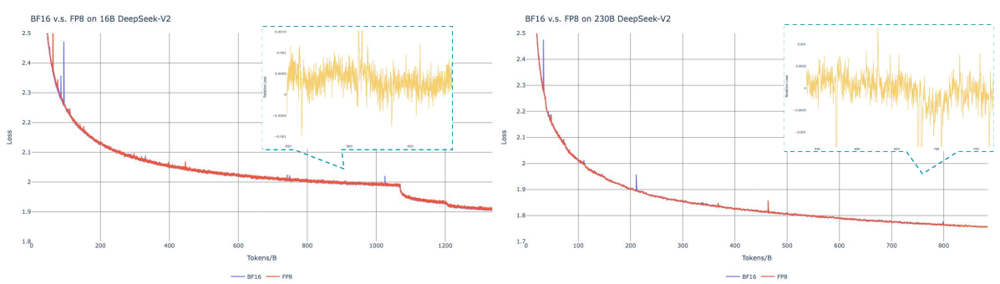

Figure 10 | Loss curves comparison between BF16 and FP8 training. Results are smoothed by Exponential Moving Average (EMA) with a coefficient of 0.9.

图 10｜BF16 与 FP8 训练的 loss 曲线对照. 结果经系数 0.9 的指数移动平均(EMA)平滑.

### B. 1. FP8 v. s. BF16 Training FP8 对比 BF16 训练

We validate our FP8 mixed precision framework with a comparison to BF16 training on top of two baseline models across different scales. At the small scale, we train a baseline MoE model comprising approximately 16B total parameters on 1.33T tokens. At the large scale, we train a baseline MoE model comprising approximately 230B total parameters on around 0.9T tokens. We show the training curves in Figure 10 and demonstrate that the relative error remains below $0.25\%$ with our high-precision accumulation and fine-grained quantization strategies.

在两档基线 MoE 上对照 BF16: 小档约 16B 总参, 训 1.33T token; 大档约 230B 总参, 训约 0.9T token. 图 10 显示, 在高精度累加与细粒度量化下, 相对误差持续低于 $0.25\%$.

### B. 2. Discussion About Block-Wise Quantization 关于块级量化的讨论

Although our tile-wise fine-grained quantization effectively mitigates the error introduced by feature outliers, it requires different groupings for activation quantization, i. e., 1x128 in forward pass and 128x1 for backward pass. A similar process is also required for the activation gradient. A straightforward strategy is to apply block-wise quantization per 128x128 elements like the way we quantize the model weights. In this way, only transposition is required for backward. Therefore, we conduct an experiment where all tensors associated with Dgrad are quantized on a block-wise basis. The results reveal that the Dgrad operation which computes the activation gradients and back-propagates to shallow layers in a chain-like manner, is highly sensitive to precision. Specifically, block-wise quantization of activation gradients leads to

tile 级细粒度量化能压 outlier 误差, 但激活量化分组前向要 1×128, 反向要 128×1, 激活梯度亦然. 若像权重那样一律 128×128 block 量化, 反向只需转置. 实验把 Dgrad 相关张量都改成 block 量化后发现: Dgrad(算激活梯度并链式回传浅层)对精度极敏感. 激活梯度做 block 量化会

<!-- page 48 of 53 -->

model divergence on an MoE model comprising approximately 16B total parameters, trained for around 300B tokens. We hypothesize that this sensitivity arises because activation gradients are highly imbalanced among tokens, resulting in token-correlated outliers (Xi et al., 2023). These outliers cannot be effectively managed by a block-wise quantization approach.

在约 16B 总参的 MoE, 训约 300B token 时导致发散. 我们猜测原因是激活梯度在 token 间极不均衡, 形成与 token 相关的 outlier(Xi et al., 2023), block 量化管不住.

## C. Expert Specialization Patterns of the 16B Aux-Loss-Based and Aux-Loss-Free Models 16B 辅助损失与无辅助损失模型的专家特化模式

We record the expert load of the 16B auxiliary-loss-based baseline and the auxiliary-loss-free model on the Pile test set. The auxiliary-loss-free model tends to have greater expert specialization across all layers, as demonstrated in Figure 10.

在 Pile 测试集上记录 16B 辅助损失基线与无辅助损失模型的专家负载. 无辅助损失模型在各层往往特化更强, 见图 10(附录专家负载总览; 正文图 9 为节选).

<!-- page 49 of 53 -->

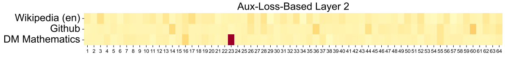

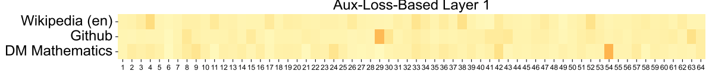

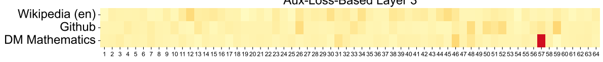

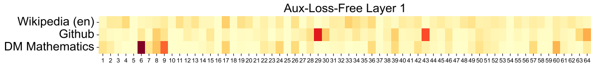

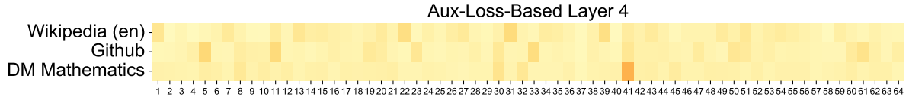

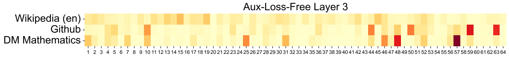

(a) Layers 1-7

(a) 第 1–7 层: 各域相对专家负载曲线(aux-loss-based 与 aux-loss-free 对照).

<!-- page 50 of 53 -->

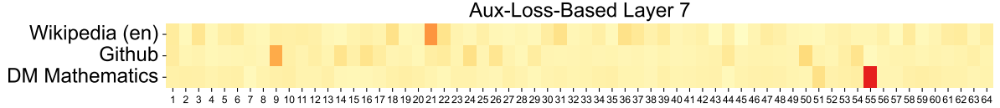

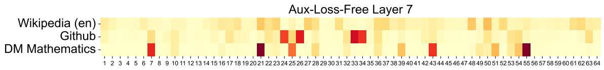

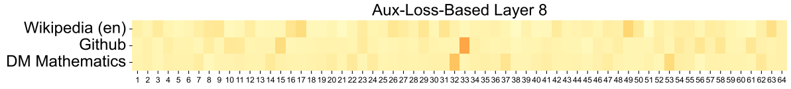

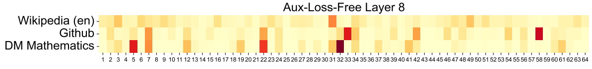

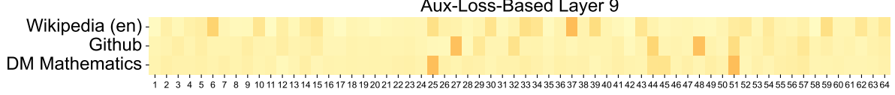

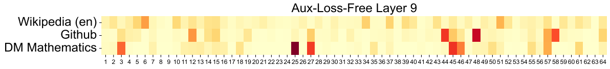

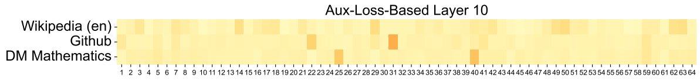

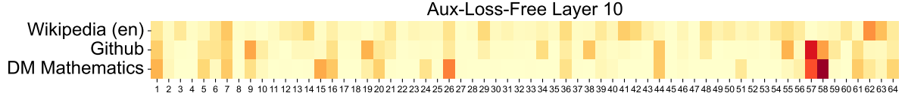

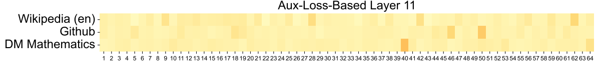

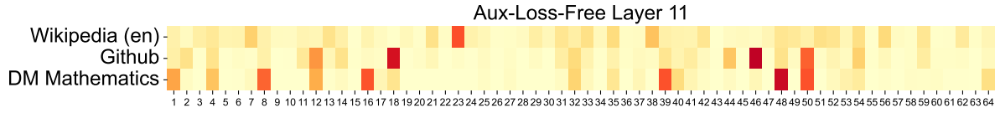

(b) Layers 7-13

(b) 第 7–13 层: 续各组相对专家负载曲线.

<!-- page 51 of 53 -->

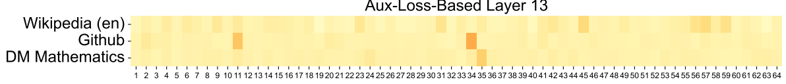

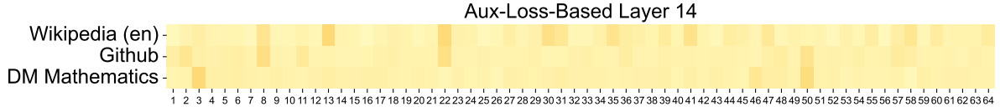

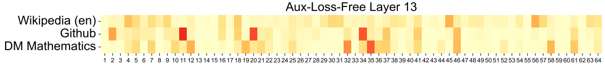

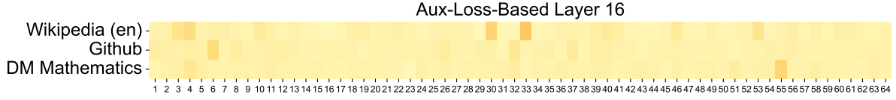

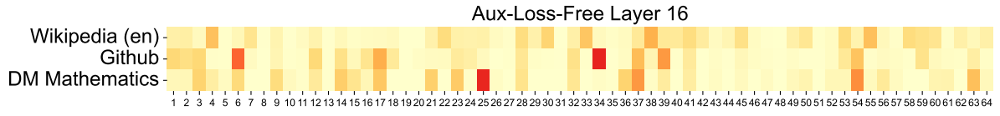

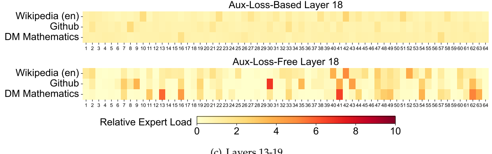

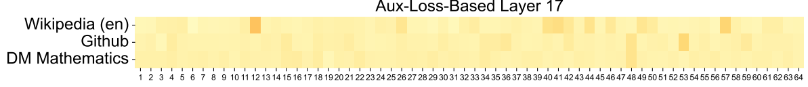

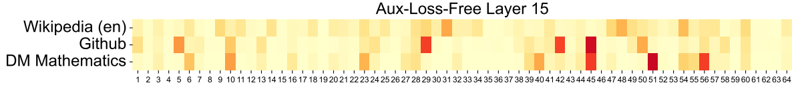

图注: 16B MoE 专家负载分面图之一：按领域展示辅助损失模型与无辅助损失模型在不同层的相对专家负载，用于观察专家是否形成稳定分工。
续附录 C 专家负载分面图(含 aux-loss-based 第 13 层等).

<!-- page 52 of 53 -->

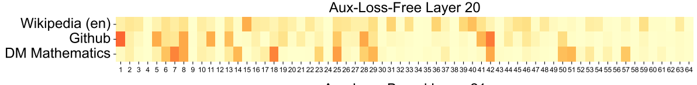

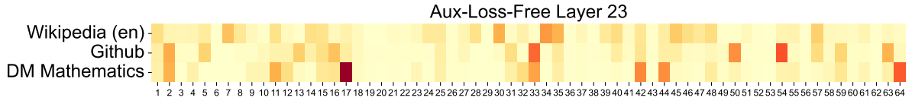

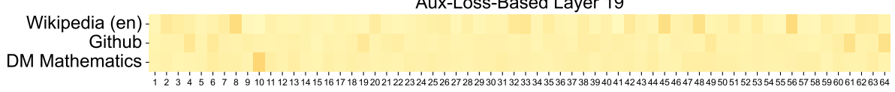

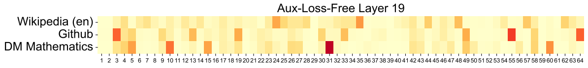

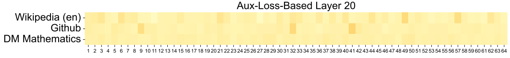

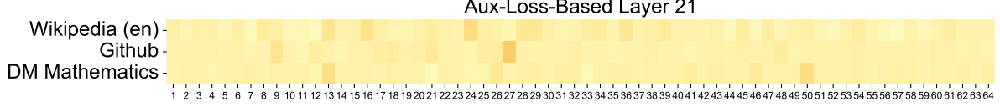

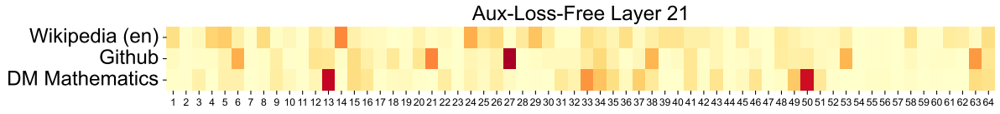

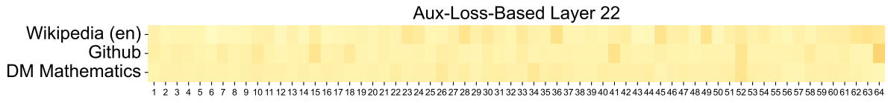

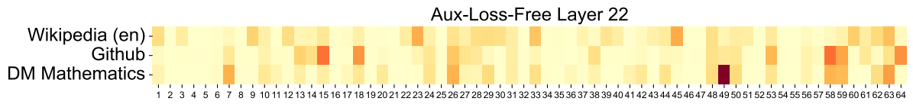

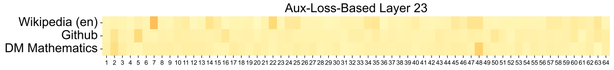

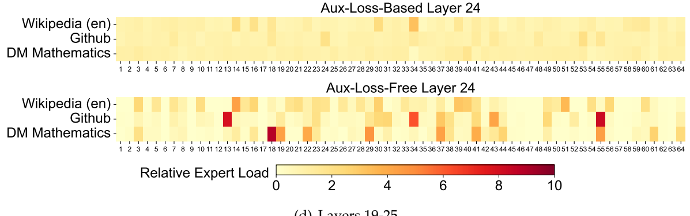

图注: 16B MoE 更深层专家负载分面图：继续对比两种负载均衡方法在 Pile 不同领域上的专家激活分布；无辅助损失模型的峰谷更分明。
续附录 C 更深一层专家负载分面图(含 aux-loss-based 第 19 层等).

<!-- page 53 of 53 -->

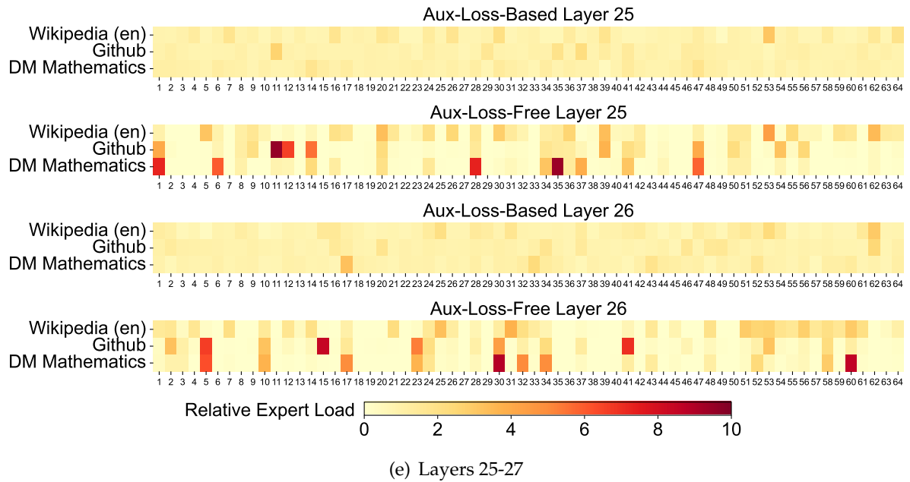

Figure 10 | Expert load of auxiliary-loss-free and auxiliary-loss-based models on three domains in the Pile test set. The auxiliary-loss-free model shows greater expert specialization patterns than the auxiliary-loss-based one. The relative expert load denotes the ratio between the actual expert load and the theoretically balanced expert load.

图 10｜无辅助损失与基于辅助损失模型在 Pile 测试集三个域上的专家负载. 无辅助损失模型特化更明显. 相对专家负载 = 实际负载 / 理论均衡负载.

53
