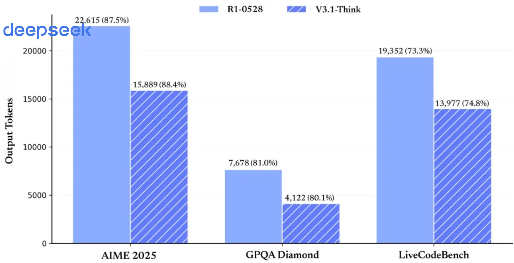

<!-- page 1 of 7 -->

deepseek

News . August 21, 2025

动态 2025 年 8 月 21 日

# DeepSeek-V3.1 Release / DeepSeek-V3.1 发布

Today, we officially release DeepSeek-V3.1. This upgrade includes the following main changes:

今天, 我们正式发布 DeepSeek-V3.1. 本次升级包含以下主要变化:

Hybrid reasoning architecture: a single model supports both thinking mode and non-thinking mode;

混合推理架构: 一个模型同时支持思考模式与非思考模式;

(「混合推理」这里指同一套权重, 两种生成策略: 思考模式先写推理过程再给答案, 非思考模式直接答. 产品上用开关切换, 不是再挂一个独立模型.)

Higher thinking efficiency: compared with DeepSeek-R1-0528, DeepSeek-V3.1-Think can give answers in a shorter time;

更高的思考效率: 相比 DeepSeek-R1-0528, DeepSeek-V3.1-Think 能在更短时间内给出答案;

Stronger Agent capability: through Post-Training optimization, the new model shows substantial gains on tool use and agent tasks.

更强的 Agent 能力: 通过 Post-Training 优化, 新模型在工具使用与智能体任务中的表现有较大提升.

(Post-Training / 后训练: 预训练之后的对齐与专项训练阶段, 常见包括指令微调, 偏好优化, 带工具轨迹的强化学习等. 本稿只写「做了 Post-Training」, 未展开具体算法名.)

The official App and web models have been upgraded to DeepSeek-V3.1 in sync. Users can freely switch between thinking and non-thinking modes via the “Deep Thinking” button.

官方 App 与网页端模型已同步升级为 DeepSeek-V3.1. 用户可以通过「深度思考」按钮, 实现思考模式与非思考模式的自由切换.

The DeepSeek API has also been upgraded in sync: `deepseek-chat` maps to non-thinking mode, `deepseek-reasoner` maps to thinking mode, and context length for both has been extended to 128K. Meanwhile, the API Beta endpoint supports Function Calling in strict mode, so that emitted Functions satisfy the schema definition. See [Function Calling Guide - API Docs](https://api-docs. deepseek. com/zh-cn/guides/tool_calls)

DeepSeek API 也已同步升级, deepseek-chat 对应非思考模式, deepseek-reasoner 对应思考模式, 且上下文均已扩展为 128K. 同时, API Beta 接口支持了 strict 模式的Function Calling, 以确保输出的 Function 满足 schema 定义. 详见 [Function Calling 指南 - API 文档](https://api-docs. deepseek. com/zh-cn/guides/tool_calls)

(Function Calling: 模型按约定格式输出要调用的函数名与参数. strict 模式要求输出严格符合 JSON Schema, 少写字段, 多写字段, 类型不对都会被约束住, 方便下游解析.)

Additionally, we added support for the Anthropic API format, so you can more easily plug DeepSeek-V3.1 into the Claude Code framework. See [Anthropic API Guide - API Docs](https://api-docs. deepseek. com/zh-cn/guides/anthropic_api)

另外, 我们增加了对 Anthropic API 格式的支持, 让大家可以轻松将 DeepSeek-V3.1 的能力接入 Claude Code 框架. 详见 [Anthropic API 指南 - API 文档](https://api-docs. deepseek. com/zh-cn/guides/anthropic_api)

<!-- page 2 of 7 -->

deepseek

## Enhanced tool calling / agent support 工具调用/智能体支持增强

### Coding agents 编程智能体

| Benchmarks | DeepSeek-V3.1 | DeepSeek-V3-0324 | DeepSeek-R1-0528 |
| --- | --- | --- | --- |
| SWE-bench Verified | 66.0 | 45.4 | 44.6 |
| SWE-bench Multilingual | 54.5 | 29.3 | 30.5 |
| Terminal-Bench | 31.3 | 13.3 | 5.7 |

On code-fix evaluations (SWE) and complex tasks in a command-line terminal environment (Terminal-Bench), DeepSeek-V3.1 shows clear gains over previous DeepSeek-series models.

在代码修复测评 SWE 与命令行终端环境下的复杂任务(Terminal-Bench)测试中, DeepSeek-V3.1 相比之前的 DeepSeek 系列模型有明显提高.

(SWE-bench: 给真实 GitHub issue, 模型要改仓库代码并通过测试. Verified / Multilingual 是不同子集. Terminal-Bench: 在终端里完成多步命令行任务, 测的是「会不会用 shell 把事办完」, 不是刷单文件补全.)

<!-- page 3 of 7 -->

### Search agents 搜索智能体

| deepseek Benchmarks | DeepSeek-V3.1 | DeepSeek-R1-0528 |
| --- | --- | --- |
| Browsecomp | 30.0 | 8.9 |
| Browsecomp_zh | 49.2 | 35.7 |
| HLE | 29.8 | 24.8 |
| xbench-DeepSearch | 71.2 | 55.0 |
| Frames | 83.7 | 82.0 |
| SimpleQA | 93.4 | 92.3 |
| Seal0 | 42.6 | 29.7 |

DeepSeek-V3.1 achieves large gains on multiple search evaluation metrics. On complex search tests that need multi-step reasoning (browsecomp) and on multi-discipline expert-level hard questions (HLE), DeepSeek-V3.1 already leads R1-0528 by a wide margin.

DeepSeek-V3.1 在多项搜索评测指标上取得了较大提升. 在需要多步推理的复杂搜索测试(browsecomp)与多学科专家级难题测试(HLE)上, DeepSeek-V3.1 性能已大幅领先R1-0528.

(BrowseComp / browsecomp: 带浏览的多步检索评测, 模型要会点链接, 翻页, 拼证据. HLE: Humanity’s Last Exam 一类多学科难题集; 本稿只给分数, 不展开题型与评分细则.)

## Thinking efficiency gains 思考效率提升

Our test results show that after chain-of-thought compression training, V3.1-Think matches R1-0528 on average task performance while cutting output token count by 20%–50%.

我们的测试结果显示, 经过 CoT 压缩训练后, V3.1-Think 在输出 token 数减少 20%-50%的情况下, 各项任务的平均表现与 R1-0528 持平.

(CoT 压缩: 让模型在仍能答对的前提下少写中间推理 token. 收益是延迟与费用, 不是改架构. 本稿只报相对 R1-0528 的 token 区间与「平均表现持平」, 未给各基准分项表.)

<!-- page 4 of 7 -->

图注: V3.1 思考与非思考模式的长度—性能对比：思考模式用更少输出 token 达到同档推理表现，非思考模式相对 V3-0324 也能在保持性能时缩短回答。
Figure (p04) | Thinking / non-thinking length–performance chart in the source release note.

图(p04)｜源文中的思考 / 非思考长度与表现对比图.

Meanwhile, V3.1 also effectively controls output length in non-thinking mode: relative to DeepSeek-V3-0324, it can keep the same model performance while clearly reducing output length.

同时, V3.1 在非思考模式下的输出长度也得到了有效控制, 相比于 DeepSeek-V3-0324, 能够在输出长度明显减少的情况下保持相同的模型性能.

## API & model open-sourcing API & 模型开源

### Model open-sourcing 模型开源

The V3.1 Base model received additional continued (extension) training on top of V3, adding a total of 840B tokens of training. Both the Base model and the post-trained model have been open-sourced on Hugging Face and ModelScope.

V3.1的 Base 模型在 V3 的基础上重新做了外扩训练, 一共增加训练了 840B tokens. Base模型与后训练模型均已在 Huggingface 与魔搭开源.

(外扩训练 / continued training: 在已有 V3 Base 检查点上继续预训练, 而不是从随机初始化重训. 本稿只披露增量 840B tokens, 不披露这 840B 的配比与超参.)

Base model:

Base 模型:

Hugging Face: [DeepSeek-V3.1-Base](https://huggingface. co/deepseek-ai/DeepSeek-V3.1-Base)

Hugging Face: [DeepSeek-V3.1-Base](https://huggingface. co/deepseek-ai/DeepSeek-V3.1-Base)

ModelScope: [DeepSeek-V3.1-Base](https://modelscope. cn/models/deepseek-ai/DeepSeek-V3.1-Base)

魔搭: [DeepSeek-V3.1-Base](https://modelscope. cn/models/deepseek-ai/DeepSeek-V3.1-Base)

Post-trained model:

后训练模型:

Hugging Face: [DeepSeek-V3.1](https://huggingface. co/deepseek-ai/DeepSeek-V3.1)

Hugging Face: [DeepSeek-V3.1](https://huggingface. co/deepseek-ai/DeepSeek-V3.1)

<!-- page 5 of 7 -->

ModelScope: [DeepSeek-V3.1](https://modelscope. cn/models/deepseek-ai/DeepSeek-V3.1) deepseek

魔搭: [DeepSeek-V3.1](https://modelscope. cn/models/deepseek-ai/DeepSeek-V3.1) deepseek

Note that DeepSeek-V3.1 uses UE8M0 FP8 Scale parameter precision. In addition, V3.1 makes substantial changes to the tokenizer and chat template, with clear differences from DeepSeek-V3. Users who need to deploy are advised to carefully read the new documentation.

需要注意的是, DeepSeek-V3.1 使用了 UE8M0 FP8 Scale 的参数精度. 另外, V3.1 对分词器及 chat template 进行了较大调整, 与 DeepSeek-V3 存在明显差异. 建议有部署需求的用户仔细阅读新版说明文档.

(UE8M0 FP8 Scale: 源文给出的参数精度名称. 部署含义是权重/scale 布局与旧 V3 默认假设可能不一致, 不能直接套旧量化内核; 再叠加 tokenizer 与 chat template 的改动, 旧提示词和工具串也可能失效. 位宽公式以官方部署文档为准, 本稿不展开.)

### Pricing adjustment 价格调整

Effective from 00: 00 Beijing time on September 6, 2025, we will adjust DeepSeek Open Platform API pricing as follows:

我们将于北京时间 2025 年 9 月 6 日凌晨起, 对 DeepSeek 开放平台 API 接口调用价格进行如下调整:

Apply the new price table (as shown below; see [Pricing - API Docs](https://api-docs. deepseek. com/zh-cn/quick_start/pricing) )

执行新版价格表(如下图所示, 详见 [定价页面 - API 文档](https://api-docs. deepseek. com/zh-cn/quick_start/pricing) )

Cancel nighttime discounts

取消夜间时段优惠

#### DeepSeek-V3.1 API

Input:

输入:

0.5 yuan / million tokens (cache hit)

0.5元/百万tokens(缓存命中)

4 yuan / million tokens (cache miss)

4元/百万 tokens (缓存未命中)

Output:

输出:

12 yuan / million tokens

12元/百万tokens

图注: DeepSeek-V3.1 API 定价图：区分缓存命中、缓存未命中的输入 token 与输出 token 单价，并注明价格自 2025 年 9 月 6 日 00:00 生效。
Figure (p05) | API pricing graphic effective 2025-09-06 00: 00.

图(p05)｜自 2025 年 9 月 6 日 00: 00 生效的 API 定价示意.

This pricing takes effect from 00: 00 on September 6, 2025

该价格于2025 年 9月6日 00: 00 起生效

Before September 6, all API services are still billed under the previous pricing policy; you can continue to enjoy the current discounts.

在 9 月 6 日前, 所有 API 服务仍按原价格政策计费, 您可继续享受当前优惠.

At the same time, to better meet users’ call demand, we have further expanded API service capacity-welcome to use it!

同时, 为更好地满足用户的调用需求, 我们已进一步扩容 API 服务资源, 欢迎使用!

<!-- page 6 of 7 -->

deepseek

## Related reading 相关阅读

[DeepSeek-R1 update: deeper thinking, stronger reasoning](https://www. deepseek. com/news/r1-0528/)

[DeepSeek-R1 更新, 思考更深, 推理更强](https://www. deepseek. com/news/r1-0528/)

[DeepSeek-R1-0528 release: deeper thinking reinforced, hallucination rate down 45–50%, tool calling supported, large gains across evaluations.](https://www. deepseek. com/news/r1-0528/)

[DeepSeek-R1-0528 发布, 深度思考能力强化, 幻觉率降低 45-50%, 支持工具调用, 各项评测成绩大幅提升.](https://www. deepseek. com/news/r1-0528/)

[Read more](https://www. deepseek. com/news/r1-0528/)

[阅读更多](https://www. deepseek. com/news/r1-0528/)

[DeepSeek-V3.1 version update](https://www. deepseek. com/news/v3-1-terminus/)

[DeepSeek-V3.1 版本更新](https://www. deepseek. com/news/v3-1-terminus/)

[DeepSeek-V3.1 updated to the Terminus version, easing mixed Chinese–English output, and improving Code Agent and Search Agent performance.](https://www. deepseek. com/news/v3-1-terminus/)

[DeepSeek-V3.1 更新至 Terminus 版本, 缓解中英文混杂问题, 优化 Code Agent 与 Search Agent 表现.](https://www. deepseek. com/news/v3-1-terminus/)

[Read more](https://www. deepseek. com/news/v3-1-terminus/)

[阅读更多](https://www. deepseek. com/news/v3-1-terminus/)

[DeepSeek-V3.2-Exp release: training and inference efficiency gains, API price cut in sync](https://www. deepseek. com/news/v3-2-exp/)

[DeepSeek-V3.2-Exp 发布, 训练推理提效, API 同步降价](https://www. deepseek. com/news/v3-2-exp/)

[DeepSeek-V3.2-Exp officially released, introducing DeepSeek Sparse Attention; API price cut by more than 50%.](https://www. deepseek. com/news/v3-2-exp/)

[DeepSeek-V3.2-Exp 正式发布, 引入 DeepSeek Sparse Attention 稀疏注意力机制, API 价格降低 50% 以上.](https://www. deepseek. com/news/v3-2-exp/)

[Read more](https://www. deepseek. com/news/v3-2-exp/)

[阅读更多](https://www. deepseek. com/news/v3-2-exp/)

<!-- page 7 of 7 -->

deepseek
