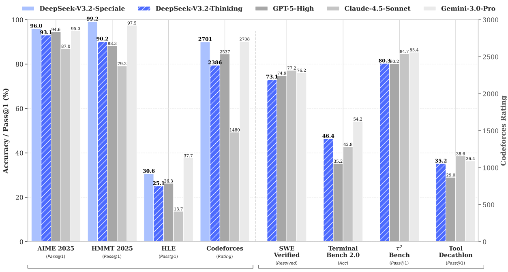
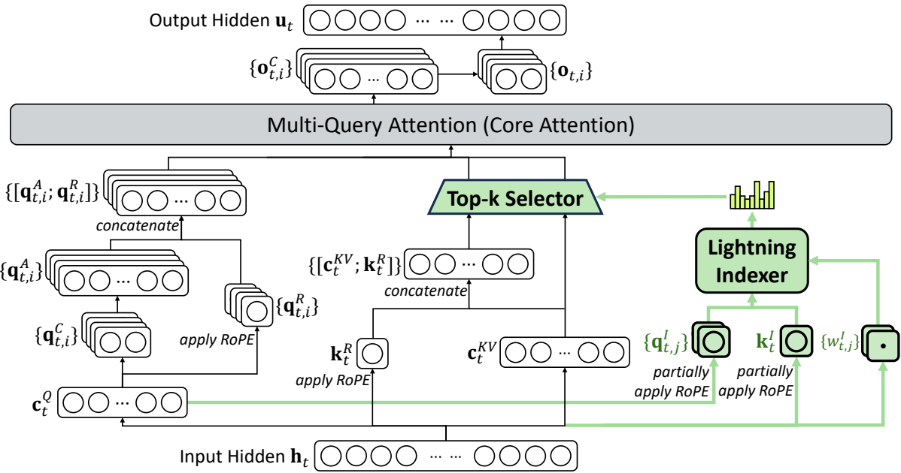
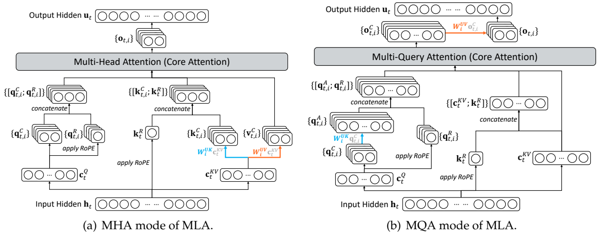

<!-- page 1 of 23 -->

arXiv: 2512.02556v1 [cs. CL] 2 Dec 2025

Qdeepseek

# DeepSeek-V3.2: Pushing the Frontier of Open Large Language Models / DeepSeek-V3.2: 把开源大模型的能力前沿再往前推一截

DeepSeek-AI

### research@deepseek. com

## Abstract

We introduce DeepSeek-V3.2, a model that harmonizes high computational efficiency with superior reasoning and agent performance. The key technical breakthroughs of DeepSeek-V3.2 are as follows:**(1) DeepSeek Sparse Attention (DSA)**: We introduce DSA, an efficient attention mechanism that substantially reduces computational complexity while preserving model performance in long-context scenarios.**(2) Scalable Reinforcement Learning Framework**: By implementing a robust reinforcement learning protocol and scaling post-training compute, DeepSeek-V3.2 performs comparably to GPT-5. Notably, our high-compute variant, DeepSeek-V3.2-Speciale, surpasses GPT-5 and exhibits reasoning proficiency on par with Gemini-3.0-Pro, achieving gold-medal performance in both the 2025 International Mathematical Olympiad (IMO) and the International Olympiad in Informatics (IOI).**(3) Large-Scale Agentic Task Synthesis Pipeline**: To integrate reasoning into tool-use scenarios, we developed a novel synthesis pipeline that systematically generates training data at scale. This methodology facilitates scalable agentic post-training, yielding substantial improvements in generalization and instruction-following robustness within complex, interactive environments.

推出 DeepSeek-V3.2: 要在算力效率, 推理能力与 Agent 表现之间对齐. 三条技术突破:**(1) DeepSeek Sparse Attention(DSA)**-- 稀疏注意力, 长上下文下大幅降复杂度, 尽量保住效果; **(2) 可扩展强化学习框架**-- 稳健 RL 协议 + 放大后训练算力, 主模型与 GPT-5 相当; 高算力变体 DeepSeek-V3.2-Speciale 超过 GPT-5, 推理逼近 Gemini-3.0-Pro, 并在 2025 年 IMO 与 IOI 达到金牌水准; **(3) 大规模 Agent 任务合成流水**-- 把推理嵌进工具调用, 系统生成海量训练数据, 抬高复杂交互场景里的泛化与跟指令稳定性.

图注: DeepSeek-V3.2、V3.2-Speciale 与同期模型的能力对比：上半部分汇总数学与知识推理基准，下半部分汇总工具调用和 Agent 基准，展示主模型与高算力变体的定位差异。
Reasoning Capabilities

Agentic Capabilities

Figure 1 | Benchmark of DeepSeek-V3.2 and its counterparts. For HMMT 2025, we report the February competition, consistent with the baselines. For HLE, we report the text-only subset.

图 1｜DeepSeek-V3.2 与对照模型的基准表现. HMMT 2025 取二月场, 与基线一致; HLE 报纯文本子集.

<!-- page 2 of 23 -->

## 1. Introduction

The release of reasoning models (DeepSeek-AI, 2025; OpenAI, 2024a) marked a pivotal moment in the evolution of Large Language Models (LLMs), catalyzing a substantial leap in overall performance across the verifiable fields. Since this milestone, the capabilities of LLMs have advanced rapidly. However, a distinct divergence has emerged in the past months. While the open-source community (MiniMax, 2025; MoonShot, 2025; Qwen, 2025; ZhiPu-AI, 2025) continues to make strides, the performance trajectory of closed-source proprietary models (Anthropic, 2025b; DeepMind, 2025a; OpenAI, 2025) has accelerated at a significantly steeper rate. Consequently, rather than converging, the performance gap between closed-source and open-source models appears to be widening, with proprietary systems demonstrating increasingly superior capabilities in complex tasks.

推理模型(DeepSeek-AI, 2025; OpenAI, 2024a)显著提高了可验证领域的整体能力. 此后开源与闭源模型都在进步, 但近几个月的速度出现分化: 闭源模型提升更快, 在复杂任务上进一步扩大了对开源模型的领先幅度.

Through our analysis, we identify three critical deficiencies that limit the capability of open-source models in complex tasks. First, architecturally, the predominant reliance on vanilla attention (Vaswani et al., 2017) mechanisms severely constrains efficiency for long sequences. This inefficiency poses a substantial obstacle to both scalable deployment and effective post-training. Second, regarding resource allocation, open-source models suffer from insufficient computational investment during the post-training phase, limiting their performance on hard tasks. Finally, in the context of AI agents, open-source models demonstrate a marked lag in generalization and instruction-following capabilities compared to their proprietary counterparts (EvalSys, 2025; Li et al., 2025; Luo et al., 2025), hindering their effectiveness in real deployment.

我们归纳开源在复杂任务上的三处短板. 架构上: 多数仍靠 vanilla attention(Vaswani et al., 2017), 长序列效率差, 既拖部署扩展, 也拖后训练. 资源上: 后训练算力投入不够, 难题吃不透. Agent 上: 泛化与跟指令明显落后闭源(EvalSys, 2025; Li et al., 2025; Luo et al., 2025), 真实部署吃亏.

To address these critical limitations, we first introduce DSA, a highly efficient attention mechanism designed to substantially reduce computational complexity. This architecture effectively addresses the efficiency bottleneck, preserving model performance even in longcontext scenarios. Second, we develop a stable and scalable RL protocol that allows for significant computational expansion during the post-training phase. Notably, this framework allocates a post-training computational budget exceeding 10% of the pre-training cost, unlocking advanced capabilities. Thirdly, we propose a novel pipeline to foster generalizable reasoning in tool-use scenarios. First, we implement a cold-start phase utilizing the DeepSeek-V3 (DeepSeek-AI, 2024) methodology to unify reasoning and tool-use within single trajectories. Subsequently, we advance to large-scale agentic task synthesis, where we generate over 1, 800 distinct environments and 85, 000 complex prompts. This extensive synthesized data drives the RL process, significantly enhancing the model’s generalization and instruction-following capability in the agent context.

对策分三层. 先上 DSA, 把复杂度压下来, 长上下文尽量不掉点. 再做可扩展, 可稳住的 RL 协议, 后训练算力可显著放大-- 本框架后训练预算超过预训练成本的 10%, 用来解锁更强能力. 第三, 工具场景里做可泛化推理: 冷启动沿用 DeepSeek-V3(DeepSeek-AI, 2024)思路, 把推理与工具调用收进同一轨迹; 再大规模合成 Agent 任务, 生成超过 1, 800 个不同环境与 85, 000 条复杂提示, 用这些数据喂 RL, 抬 Agent 侧泛化与跟指令.

DeepSeek-V3.2 achieves similar performance with Kimi-k2-thinking and GPT-5 across multiple reasoning benchmarks. Furthermore, DeepSeek-V3.2 significantly advances the agentic capabilities of open models, demonstrating exceptional proficiency on the long-tail agent tasks introduced in EvalSys (2025); Li et al. (2025); Luo et al. (2025). DeepSeek-V3.2 emerges as a highly cost-efficient alternative in agent scenarios, significantly narrowing the performance gap between open and frontier proprietary models while incurring substantially lower costs. Notably, with the aim of pushing the boundaries of open models in the reasoning domain, we relaxed the length constraints to develop DeepSeek-V3.2-Speciale. As a result, DeepSeek-V3.2- Speciale achieves performance parity with the leading closed-source system, Gemini-3.0-Pro (DeepMind, 2025b). It shows gold-medal performance in the IOI 2025, ICPC World Final 2025, IMO 2025, and CMO 2025.

多条推理基准上, DeepSeek-V3.2 与 Kimi-k2-thinking, GPT-5 接近. Agent 能力相对开源明显抬升, 在 EvalSys (2025), Li et al. (2025), Luo et al. (2025) 的长尾 Agent 任务上表现突出; 成本更低, 却显著收窄与前沿闭源的差距. 为冲开源推理上限, 我们放松长度约束得到 DeepSeek-V3.2-Speciale, 与 Gemini-3.0-Pro(DeepMind, 2025b)持平, 并在 IOI 2025, ICPC World Final 2025, IMO 2025, CMO 2025 达到金牌水准.

<!-- page 3 of 23 -->

## 2. DeepSeek-V3.2 Architecture DeepSeek-V3.2 架构

### 2.1. DeepSeek Sparse Attention

2.1. DeepSeek Sparse Attention(DSA)

DeepSeek-V3.2 uses exactly the same architecture as DeepSeek-V3.2-Exp. Compared with DeepSeek-V3.1-Terminus, the last version of DeepSeek-V3.1, the only architectural modification of DeepSeek-V3.2 is the introduction of DeepSeek Sparse Attention (DSA) through continued training.

架构与 DeepSeek-V3.2-Exp 完全一致. 相对 DeepSeek-V3.1 末版 Terminus, 唯一架构改动是经继续训练引入 DSA.

**Prototype of DSA.** The prototype of DSA primarily consists of two components: a lightning indexer and a fine-grained token selection mechanism.

**DSA 原型.** 两块: lightning indexer(闪电索引器), 以及细粒度 token 选择.

The **lightning indexer** computes the index score $I _ { t , s }$ between the query token h𝑡 $\in \mathbb { R } ^ { d }$ and a preceding token $\mathbf { h } _ { s } \in \mathbb { R } ^ { d }$ , determining which tokens to be selected by the query token:

**Lightning indexer** 算查询 token $\mathbf{h}_t \in \mathbb{R}^{d}$ 与前序 token $\mathbf{h}_s \in \mathbb{R}^{d}$ 之间的索引分 $I_{t, s}$, 决定该查询选哪些 token:

$$
I _ {t, s} = \sum_ {j = 1} ^ {H ^ {I}} w _ {t, j} ^ {I} \cdot \operatorname{ReLU} \left(\mathbf {q} _ {t, j} ^ {I} \cdot \mathbf {k} _ {s} ^ {I}\right), \tag{1}
$$

where $H ^ { I }$ denotes the number of indexer heads; $\mathbf { q } _ { t , j } ^ { I } \in \mathbb { R } ^ { d ^ { I } }$ and $w _ { t , j } ^ { I } \in \mathbb { R }$ are derived from the query token $\mathbf { h } _ { t } ; $ and $\mathbf { k } _ { s } ^ { I } \in \mathbb { R } ^ { d ^ { I } }$ is derived from the preceding token $\mathbf { h } _ { s }$ . We choose ReLU as the activation function for throughput consideration. Given that the lightning indexer has a small number of heads and can be implemented in FP8, its computational efficiency is remarkable.

$H^{I}$ 是索引头数; $\mathbf{q}_{t, j}^{I}$, $w_{t, j}^{I}$ 由查询 token 得到, $\mathbf{k}_{s}^{I}$ 由前序 token 得到. 激活用 ReLU, 主要为吞吐; 头数少且可走 FP8, 算起来很轻.

Given the index scores $\{ I _ { t , s } \}$ for each query token $\mathbf { h } _ { t } , $ our **fine-grained token selection mechanism** retrieves only the key-value entries $\{ \mathbf { c } _ { s } \}$ corresponding to the top-k index scores. Then, the attention output $\mathbf { u } _ { t }$ is computed by applying the attention mechanism between the query token h𝑡 and the sparsely selected key-value entries {c𝑠}:

对每个查询, **细粒度选择**只取 top-k 索引分对应的 KV 条目 $\{\mathbf{c}_s\}$, 再在查询与这些稀疏 KV 上做注意力, 得到 $\mathbf{u}_t$:

$$
\mathbf {u} _ {t} = \operatorname{Attn} \big (\mathbf {h} _ {t}, \left\{\mathbf {c} _ {s} \mid I _ {t, s} \in \operatorname{Top-k} (I _ {t,: }) \right\} \big). \tag{2}
$$

**Instantiate DSA Under MLA.** For the consideration of continued training from DeepSeek-V3.1-Terminus, we instantiate DSA based on MLA (DeepSeek-AI, 2024) for DeepSeek-V3.2. At the kernel level, each key-value entry must be shared across multiple queries for computational efficiency (Yuan et al., 2025). Therefore, we implement DSA based on the MQA (Shazeer, 2019) mode of $\mathrm { M L A ^ { 1 } }$ , where each latent vector (the key-value entry of MLA) will be shared across all query heads of the query token. The DSA architecture based on MLA is illustrated in Figure 2. We also provide an open-source implementation of DeepSeek- $\mathrm { . V 3 . 2 ^ { 2 } }$ to specify the details unambiguously.

**在 MLA 下实例化 DSA.** 要从 V3.1-Terminus 继续训, DSA 挂在 MLA(DeepSeek-AI, 2024)上. 内核层要求同一 KV 条目被多个查询共享才划算(Yuan et al., 2025), 因此走 MLA 的 MQA 模式¹: 每个潜变量(MLA 的 KV 条目)在该查询 token 的所有 query 头之间共享. 架构见图 2; 开源实现²把细节写在代码里.

#### 2.1.1. Continued Pre-Training 继续预训练

Starting from a base checkpoint of DeepSeek-V3.1-Terminus, whose context length has been extended to 128K, we perform continued pre-training followed by post-training to create DeepSeek-V3.2.

从已扩到 128K 的 V3.1-Terminus base 检查点出发, 先继续预训练, 再后训练, 得到 V3.2.

The continued pre-training of DeepSeek-V3.2 consists of two training stages. For both stages, the distribution of training data is totally aligned with the 128K long context extension data used for DeepSeek-V3.1-Terminus.

继续预训练分两阶段; 两阶段数据分布都与 V3.1-Terminus 的 128K 长上下文扩展数据完全对齐.

<small>1We illustrate the difference between the MQA and MHA modes of MLA in Appendix A. </small>

<small>1MLA 的 MQA / MHA 差异见附录 A. </small>

<small>2[https://huggingface. co/deepseek-ai/DeepSeek-V3.2-Exp/tree/main/inference](https://huggingface. co/deepseek-ai/DeepSeek-V3.2-Exp/tree/main/inference)</small>

<!-- page 4 of 23 -->

Figure 2 | Attention architecture of DeepSeek-V3.2, where DSA is instantiated under MLA. The green part illustrates how DSA selects the top-k key-value entries according to the indexer.

图 2｜DeepSeek-V3.2 注意力架构: DSA 挂在 MLA 下. 绿色部分示意按 indexer 选 top-k KV.

**Dense Warm-up Stage.** We first use a short warm-up stage to initialize the lightning indexer. In this stage, we keep dense attention and freeze all model parameters except for the lightning indexer. To align the indexer outputs with the main attention distribution, for the 𝑡-th query token, we first aggregate the main attention scores by summing across all attention heads. This sum is then L1-normalized along the sequence dimension to produce a target distribution $p _ { t , : } \in \mathbb { R } ^ { t }$ . Based on $p _ { t , : } , $ we set a KL-divergence loss as the training objective of the indexer:

**稠密预热.** 短阶段只初始化 lightning indexer: 保持稠密注意力, 除 indexer 外全部冻结. 为对齐主注意力分布: 对第 $t$ 个查询, 先把各注意力头的分数求和, 再沿序列维做 L1 归一化, 得到目标分布 $p_{t,: }\in\mathbb{R}^{t}$; indexer 用 KL 散度对齐:

$$
\mathcal {L} ^ {I} = \sum_ {t} \mathbb {D} _ {\mathrm{KL}} \big (p _ {t,: } \big \| \operatorname{Softmax} \big (I _ {t,: } \big) \big). \tag{3}
$$

For warm-up, we use a learning rate of $1 0 ^ { - 3 }$ . We train the indexer for only 1000 steps, with each step consisting of 16 sequences of 128K tokens, resulting in a total of 2.1B tokens.

预热学习率 $10^{-3}$; 只训 1000 step, 每 step 16 条 × 128K token, 合计 2.1B token.

**Sparse Training Stage.** Following indexer warm-up, we introduce the fine-grained token selection mechanism and optimize all model parameters to adapt the model to the sparse pattern of DSA. In this stage, we also keep aligning the indexer outputs to the main attention distribution, but considering only the selected token set $\mathcal { S } _ { t } = \left\{ s \mid I _ { t , s } \in \operatorname { T o p - k } \left( I _ { t , : } \right) \right\}$

**稀疏训练.** 预热后打开细粒度选择, 放开全体参数去适应 DSA 稀疏模式. Indexer 仍对齐主注意力, 但只在已选集合 $\mathcal{S}_t=\{s\mid I_{t, s}\in\operatorname{Top-k}(I_{t,: })\}$ 上算:

$$
\mathcal {L} ^ {I} = \sum_ {t} \mathbb {D} _ {\mathrm{KL}} \big (p _ {t, \mathcal {S} _ {t}} \big \| \operatorname{Softmax} \big (I _ {t, \mathcal {S} _ {t}} \big) \big). \tag{4}
$$

It is worth noting that we detach the indexer input from the computational graph for separate optimization. The training signal of the indexer is from only $\mathcal { L } ^ { I } , $ , while the optimization of the main model is according to only the language modeling loss. In this sparse training stage, we use a learning rate of $7 . 3 \times 1 0 ^ { - 6 }$ , and select 2048 key-value tokens for each query token. We train both the main model and the indexer for 15000 steps, with each step consisting of 480 sequences of 128K tokens, resulting in a total of 943.7B tokens.

注意: indexer 输入从计算图 detach, 分开优化--indexer 只吃 $\mathcal{L}^{I}$, 主模型只吃语言建模损失. 稀疏阶段学习率 $7.3\times10^{-6}$, 每个查询选 2048 个 KV token; 主模型与 indexer 共训 15000 step, 每 step 480 条 × 128K, 合计 943.7B token.

<!-- page 5 of 23 -->

### 2.2. Parity Evaluation 对等性评测

**Standard Benchmark** In September 2025, we evaluate DeepSeek-V3.2-Exp on a suite of benchmarks, which focus on diverse capabilities, and compare it with DeepSeek-V3.1-Terminus showing similar performance. While DeepSeek V3.2 Exp significantly improves computational efficiency on long sequences, we do not observe substantial performance degradation compared with DeepSeek-V3.1-Terminus, on both short- and long-context tasks.

**标准基准.** 2025 年 9 月在多能力基准上评 DeepSeek-V3.2-Exp, 对照 V3.1-Terminus, 表现接近. 长序列算力效率明显改善, 短/长上下文任务未见实质掉点.

**Human Preference** Given that direct human preference assessments are inherently suscep tible to bias, we employ ChatbotArena as an indirect evaluation framework to approximate user preferences for the newly developed base models. Both DeepSeek-V3.1-Terminus and DeepSeek-V3.2-Exp share an identical post-training strategy, and their Elo scores, obtained from evaluations conducted on 10 November 2025, are closely matched. These results suggest that the new base model achieves performance on par with the previous iteration, despite incorporating a sparse attention mechanism.

**人类偏好.** 直接偏好评估易偏, 故用 ChatbotArena 间接估用户偏好. 两边后训练策略相同; 2025-11-10 的 Elo 接近, 说明即使上了稀疏注意力, 新 base 仍与上一代持平.

**Long Context Eval** Following the release of DeepSeek-V3.2-Exp, several independent long-context evaluations were conducted using previously unseen test sets. A representative benchmark is AA-LCR3, in which DeepSeek-V3.2-Exp scores four points higher than DeepSeek-V3.1- Terminus in reasoning mode. In the Fiction. liveBench evaluation4, DeepSeek-V3.2-Exp consistently outperforms DeepSee…14634 tokens truncated…-3.0-Pro 等前沿闭源, 局限仍在. 其一: 总训练 FLOPs 更少, 世界知识广度仍落后于头部专有

<!-- page 18 of 23 -->

models. We plan to address this knowledge gap in future iterations by scaling up the pre-training compute. Second, token efficiency remains a challenge; DeepSeek-V3.2 typically requires longer generation trajectories (i. e., more tokens) to match the output quality of models like Gemini-3.0-Pro. Future work will focus on optimizing the intelligence density of the model’s reasoning chains to improve efficiency. Third, solving complex tasks is still inferior to frontier models, motivating us to further refine our foundation model and post-training recipe.

模型; 计划在后续迭代放大预训练算力补知识缺口. 其二: token 效率仍是挑战-- 要达到 Gemini-3.0-Pro 级输出质量, 通常需要更长生成轨迹; 未来要优化推理链的「智能密度」提效. 其三: 复杂任务求解仍逊于前沿, 需继续打磨底座与后训练配方.

## References

Anthropic. System card: Claude opus 4.5, 2025a. URL [https://assets. anthropic. com/m/64823ba7485345a7/Claude-Opus-4-5-System-Card. pdf](https://assets. anthropic. com/m/64823ba7485345a7/Claude-Opus-4-5-System-Card. pdf).

Anthropic. Introducing claude sonnet 4.5, 2025b. URL [https://www. anthropic. com/news/claude-sonnet-4-5l](https://www. anthropic. com/news/claude-sonnet-4-5l).

M. Balunović, J. Dekoninck, I. Petrov, N. Jovanović, and M. Vechev. Matharena: Evaluating llms on uncontaminated math competitions. Proceedings of the Neural Information Processing Systems Track on Datasets and Benchmark, 2025.

V. Barres, H. Dong, S. Ray, X. Si, and K. Narasimhan. 𝜏2-bench: Evaluating conversational agents in a dual-control environment, 2025. URL [https://arxiv. org/abs/2506.07982](https://arxiv. org/abs/2506.07982).

DeepMind. Gemini 2.5: Pushing the frontier with advanced reasoning, multimodality, long context, and next generation agentic capabilities. arXiv preprint arXiv: 2507.06261, 2025a.

G. DeepMind. Gemini 3 pro model card, 2025b. URL [https://storage. googleapis. com/deepmind-media/Model-Cards/Gemini-3-Pro-Model-Card. pdf](https://storage. googleapis. com/deepmind-media/Model-Cards/Gemini-3-Pro-Model-Card. pdf).

DeepSeek-AI. Deepseek-v2: A strong, economical, and efficient mixture-of-experts language model. CoRR, abs/2405.04434, 2024. doi: 10.48550/ARXIV. 2405.04434. URL [https://doi. org/10.48550/arXiv. 2405.04434](https://doi. org/10.48550/arXiv. 2405.04434).

DeepSeek-AI. Deepseek-v3 technical report, 2024. URL [https://arxiv. org/abs/2412.19437](https://arxiv. org/abs/2412.19437).

DeepSeek-AI. Deepseek-r1 incentivizes reasoning in llms through reinforcement learning. Nature, 645(8081): 633–638, 2025.

EvalSys. Mcpmark leaderboard, 2025. URL [https://mcpmark. ai/leaderboard](https://mcpmark. ai/leaderboard).

J. Li, W. Zhao, J. Zhao, W. Zeng, H. Wu, X. Wang, R. Ge, Y. Cao, Y. Huang, W. Liu, et al. The tool decathlon: Benchmarking language agents for diverse, realistic, and long-horizon task execution. arXiv preprint arXiv: 2510.25726, 2025.

Z. Luo, Z. Shen, W. Yang, Z. Zhao, P. Jwalapuram, A. Saha, D. Sahoo, S. Savarese, C. Xiong, and J. Li. Mcp-universe: Benchmarking large language models with real-world model context protocol servers. arXiv preprint arXiv: 2508.14704, 2025.

T. Luong, D. Hwang, H. H. Nguyen, G. Ghiasi, Y. Chervonyi, I. Seo, J. Kim, G. Bingham, J. Lee, S. Mishra, A. Zhai, C. H. Hu, H. Michalewski, J. Kim, J. Ahn, J. Bae, X. Song, T. H. Trinh, Q. V. Le, and J. Jung. Towards robust mathematical reasoning. In Proceedings of the 2025 Conference on Empirical Methods in Natural Language Processing, 2025. URL [https://aclanthology. org/2025. emnlp-main. 1794/](https://aclanthology. org/2025. emnlp-main. 1794/).

<!-- page 19 of 23 -->

MiniMax. https://www. minimax. io/news/minimax-m2, 2025. URL [https://www. minimax. io/news/minimax-m2](https://www. minimax. io/news/minimax-m2).

MoonShot. Introducing kimi k2 thinking, 2025. URL [https://moonshotai. github. io/Kimi-K2/thinking. html](https://moonshotai. github. io/Kimi-K2/thinking. html).

OpenAI. Learning to reason with llms, 2024a. URL [https://openai. com/index/learning-to-reason-with-llms/](https://openai. com/index/learning-to-reason-with-llms/).

OpenAI. Introducing SWE-bench verified we’re releasing a human-validated subset of swebench that more, 2024b. URL [https://openai. com/index/introducing-swe-bench-verified/](https://openai. com/index/introducing-swe-bench-verified/).

OpenAI. Introducing gpt-5, 2025. URL [https://openai. com/index/introducing-gpt-5/](https://openai. com/index/introducing-gpt-5/).

L. Phan, A. Gatti, Z. Han, N. Li, J. Hu, H. Zhang, C. B. C. Zhang, M. Shaaban, J. Ling, S. Shi, et al. Humanity’s last exam. arXiv preprint arXiv: 2501.14249, 2025.

Qwen. Qwen3 technical report, 2025. URL [https://arxiv. org/abs/2505.09388](https://arxiv. org/abs/2505.09388).

D. Rein, B. L. Hou, A. C. Stickland, J. Petty, R. Y. Pang, J. Dirani, J. Michael, and S. R. Bowman. GPQA: A graduate-level google-proof q&a benchmark. arXiv preprint arXiv: 2311.12022, 2023.

J. Schulman. Approximating KL divergence, 2020. URL [http: //joschu. net/blog/kl-approx. html](http: //joschu. net/blog/kl-approx. html).

Z. Shao, P. Wang, Q. Zhu, R. Xu, J. Song, M. Zhang, Y. K. Li, Y. Wu, and D. Guo. Deepseekmath: Pushing the limits of mathematical reasoning in open language models. CoRR, abs/2402.03300, 2024. doi: 10.48550/ARXIV. 2402.03300. URL [https://doi. org/10.48550/arXiv. 2402.03300](https://doi. org/10.48550/arXiv. 2402.03300).

Z. Shao, Y. Luo, C. Lu, Z. Ren, J. Hu, T. Ye, Z. Gou, S. Ma, and X. Zhang. Deepseekmath-v2: Towards self-verifiable mathematical reasoning, 2025.

N. Shazeer. Fast transformer decoding: One write-head is all you need. CoRR, abs/1911.02150, 2019. URL [http: //arxiv. org/abs/1911.02150](http: //arxiv. org/abs/1911.02150).

A. Vaswani, N. Shazeer, N. Parmar, J. Uszkoreit, L. Jones, A. N. Gomez, L. Kaiser, and I. Polosukhin. Attention is all you need. pages 5998–6008, 2017. URL [https://proceedings. neurips. cc/paper/2017/hash/3f5ee243547dee91fbd053c1c4a845aa-Abstract. html](https://proceedings. neurips. cc/paper/2017/hash/3f5ee243547dee91fbd053c1c4a845aa-Abstract. html).

Y. Wang, X. Ma, G. Zhang, Y. Ni, A. Chandra, S. Guo, W. Ren, A. Arulraj, X. He, Z. Jiang, T. Li, M. Ku, K. Wang, A. Zhuang, R. Fan, X. Yue, and W. Chen. Mmlu-pro: A more robust and challenging multi-task language understanding benchmark. CoRR, abs/2406.01574, 2024. URL [https://doi. org/10.48550/arXiv. 2406.01574](https://doi. org/10.48550/arXiv. 2406.01574).

J. Wei, Z. Sun, S. Papay, S. McKinney, J. Han, I. Fulford, H. W. Chung, A. T. Passos, W. Fedus, and A. Glaese. Browsecomp: A simple yet challenging benchmark for browsing agents. arXiv preprint arXiv: 2504.12516, 2025.

J. Yang, K. Lieret, C. E. Jimenez, A. Wettig, K. Khandpur, Y. Zhang, B. Hui, O. Press, L. Schmidt, and D. Yang. Swe-smith: Scaling data for software engineering agents, 2025. URL [https://arxiv. org/abs/2504.21798](https://arxiv. org/abs/2504.21798).

<!-- page 20 of 23 -->

J. Yuan, H. Gao, D. Dai, J. Luo, L. Zhao, Z. Zhang, Z. Xie, Y. Wei, L. Wang, Z. Xiao, Y. Wang, C. Ruan, M. Zhang, W. Liang, and W. Zeng. Native sparse attention: Hardware-aligned and natively trainable sparse attention. In W. Che, J. Nabende, E. Shutova, and M. T. Pilehvar, editors, Proceedings of the 63rd Annual Meeting of the Association for Computational Linguistics (Volume 1: Long Papers), ACL 2025, pages 23078–23097. Association for Computational Linguistics, 2025. URL [https://aclanthology. org/2025. acl-long. 1126/](https://aclanthology. org/2025. acl-long. 1126/).

ZhiPu-AI. Glm-4.5: Agentic, reasoning, and coding (arc) foundation models. arXiv preprint arXiv: 2508.06471, 2025.

P. Zhou, B. Leon, X. Ying, C. Zhang, Y. Shao, Q. Ye, D. Chong, Z. Jin, C. Xie, M. Cao, et al. Browsecomp-zh: Benchmarking web browsing ability of large language models in chinese. arXiv preprint arXiv: 2504.19314, 2025.

## Appendices 附录

## A. MHA and MQA Modes of MLA MLA 的 MHA 与 MQA 模式

Figure 7 | Illustration of the MHA and MQA modes of MLA. For DeepSeek-V3.1-Terminus, the MHA mode is used for training and prefilling, while the MQA mode is used for decoding.

图 7｜MLA 的 MHA 与 MQA 模式示意. V3.1-Terminus: 训练与 prefilling 用 MHA, decoding 用 MQA.

Figure 7 illustrates two aspects of MLA – the MHA and MQA modes – as well as the transformation between them.

图 7 展示 MLA 的两面--MHA 与 MQA-- 以及二者如何转换.

## B. Cold Start Template 冷启动模板

<!-- page 21 of 23 -->

Table 6 | An example of the reasoning data system prompt. The system prompt requires the model to output the reasoning process in the tag &lt; think&gt; &lt; /think&gt;.

表 6｜推理数据 system prompt 示例. 要求把推理过程写在 &lt; think&gt; &lt; /think&gt; 标签内.

<table><tr><td>Reasoning System Prompt</td><td>You are an expert Python programmer. You will be given a question (problem specification) and will generate a correct Python program that matches the specification and passes all tests. Please first reason before giving the final answer. The reasoning process enclosed within&lt; think&gt; &lt; /think&gt;. The final answer is output after the&lt; /think&gt; tag. </td></tr><tr><td>Prompt</td><td>Given a linked list, swap every two adjacent nodes and return its head ... </td></tr><tr><td rowspan="3">Reasoning Response</td><td></td></tr><tr><td>... </td></tr><tr><td>[FINAL ANSWER]</td></tr></table>

Table 7 | {TOOL-DESCRIPTIONS} and {TOOLCALL-FORMAT} will be replaced with the specific tools and our designed toolcall format.

表 7｜{TOOL-DESCRIPTIONS} 与 {TOOLCALL-FORMAT} 会替换成具体工具与自研 toolcall 格式.

| Agent System Prompt | Use Python interpreter tool to execute Python code. The code will not be shown to the user. This tool should be used for internal reasoning, but not for code that is intended to be visible to the user (e. g. when creating plots, tables, or files). When you send a message containing Python code to python, it will be executed in a stateful Jupyter notebook environment. python will respond with the output of the execution or time out after 120.0 seconds. ## Tools You have access to the following tools: {TOOL-DESCRIPTIONS} Important: ALWAYS adhere to this exact format for tool use: {TOOLCALL-FORMAT} |
| --- | --- |
| Prompt | Given a linked list, swap every two adjacent nodes and return its head ... |
| Agent Response | [MULTI-TURN TOOLCALL] [FINAL ANSWER] |

Table 8 | The model executes tool calls in thinking process.

表 8｜模型在 thinking 过程中执行工具调用.

| Reasoning | You are a helpful assistant with access to a Python interpreter. |
| --- | --- |
| Required | - You may use the Python tool **multiple times** during your reasoning, a. k. a in |
| Agent | &lt; think>&lt; /think>, with a maximum of 20 code executions. |
| System | - Call the Python tool early in your reasoning to aid in solving the task. Continue |
| Prompt | reasoning and invoking tools as needed until you reach the final answer. Once you have the answer, stop reasoning and present your solution using Markdown and LaTeX. - Do NOT invoke any tools in your presented final solution steps. - To improve efficiency and accuracy, you should prefer code execution over language-based reasoning whenever possible. Keep your reasoning succinct; let the code do the heavy lifting. ## Tools You have access to the following tools: {TOOL-DESCRIPTIONS} Important: ALWAYS adhere to this exact format for tool use: {TOOLCALL-FORMAT} |
| Prompt | Given a linked list, swap every two adjacent nodes and return its head ... |
| Agent | &lt; think> |
| Response | [MULTI-TURN Thinking-Then-TOOLCALL] |
| with | &lt; /think> |
| Thinking | [FINAL ANSWER] |

<!-- page 22 of 23 -->

## C. Non-thinking DeepSeek-V3.2 Agentic Evaluation DeepSeek-V3.2 non-thinking 的 Agent 评测

Table 9 | Comparison between DeepSeek-V3.2 non-thinking and thinking modes. The terminal bench scores are evaluated with the Claude Code framework in the table. Non-thinking score of Terminal Bench 2.0 with Terminus framework is 39.3.

表 9｜non-thinking 与 thinking 对照. 表中 Terminal Bench 用 Claude Code 框架; Terminus + non-thinking 为 39.3.

| Benchmark (Metric) n | on-thinkin | g thinking |
| --- | --- | --- |
| Terminal Bench 2.0 (Acc) | 37.1 | 46.4 |
| Code Agent SWE Verified (Resolved) | 72.1 | 73.1 |
| SWE Multilingual (Resolved) | 68.9 | 70.2 |
| 𝜏2-bench (Pass@1) | 77.2 | 80.3 |
| MCP-Universe (SuccessRate) | 38.6 | 45.9 |
| ToolUse |  |  |
| MCP-Mark (Pass@1) | 26.5 | 38.0 |
| Tool-Decathlon (Pass@1) | 25.6 | 35.2 |

The performance of non-thinking mode is slightly worse than the thinking mode, but still competitive.

non-thinking 略逊于 thinking, 但仍有竞争力.

## D. Evaluation Method of IOI, ICPC World Final, IMO, and CMO IOI, ICPC 世锦赛, IMO, CMO 评测方法

For all competitions, the model’s maximum generation length is set to 128k. No tools or internet access are used, and testing strictly adheres to the contest’s time and attempt limits.

所有竞赛: 最大生成长度 128k; 无工具, 无联网; 严格遵守赛时与尝试次数限制.

For the IOI evaluation, we designed our submission strategy in accordance with the official competition rules, which permit up to 50 submissions per problem and score each submission based on the maximum points achieved across all subtasks. Specifically, we first sampled 500 candidate solutions for each problem, then applied a multi-stage filtering pipeline. In the initial stage, we eliminated invalid submissions that failed to pass the provided sample test cases or exceeded the length constraints. Subsequently, we employed the DeepSeek-V32-Exp model to identify and remove samples in which the model explicitly indicated an inability or refusal to solve the problem. From the remaining valid candidates, we selected the 50 samples with the longest thinking traces for final submission.

IOI: 按官方规则每题最多 50 次提交, 按各子任务最高分计分. 做法: 每题先采 500 候选, 再多级过滤-- 先去掉未过样例或超长的无效提交; 再用 V3.2-Exp 识别并剔除明确表示不会做/拒答的样本; 从剩余有效候选里取 thinking 轨迹最长的 50 条作最终提交.

For the ICPC evaluation, we adapted the same filtering methodology but with a smaller initial sample size. We generated 32 candidate solutions per problem and applied the identical filtering criteria to select submissions.

ICPC: 同一套过滤, 初始采样更小-- 每题 32 候选, 再按相同标准筛选提交.

In the IMO and CMO tasks, we employ a generate-verify-refine loop. The model iteratively improves its solution until it achieves a perfect self-evaluation or hits the maximum revision cap, identical to the process in Shao et al. (2025).

IMO / CMO: 走 generate–verify–refine 环, 迭代改到自评分满分或触顶修订上限, 流程同 Shao et al. (2025).

<!-- page 23 of 23 -->

## E. Author List 作者名单

**Research & Engineering**: Aixin Liu, Aoxue Mei, Bangcai Lin, Bing Xue, Bingxuan Wang, Bingzheng Xu, Bochao Wu, Bowei Zhang, Chaofan Lin, Chen Dong, Chengda Lu, Chenggang Zhao, Chengqi Deng, Chenhao Xu, Chong Ruan\*, Damai Dai, Daya Guo, Dejian Yang, Deli Chen, Erhang Li, Fangqi Zhou\*, Fangyun Lin, Fucong Dai, Guangbo Hao, Guanting Chen, Guowei Li, H. Zhang, Hanwei Xu, Hao Li, Haofen Liang, Haoran Wei, Haowei Zhang, Haowen Luo, Haozhe Ji, Honghui Ding, Hongxuan Tang, Huanqi Cao, Huazuo Gao, Hui Qu, Hui Zeng, Jialiang Huang, Jiashi Li, Jiaxin Xu, Jiewen Hu, Jingchang Chen, Jingting Xiang, Jingyang Yuan, Jingyuan Cheng, Jinhua Zhu, Jun Ran\*, Junguang Jiang, Junjie Qiu, Junlong Li\*, Junxiao Song, Kai Dong, Kaige Gao, Kang Guan, Kexin Huang\*, Kexing Zhou, Kezhao Huang, Kuai Yu, Lean Wang, Lecong Zhang, Lei Wang, Liang Zhao, Liangsheng Yin\*, Lihua Guo, Lingxiao Luo, Linwang Ma, Litong Wang, Liyue Zhang, M. S. Di, M. Y Xu, Mingchuan Zhang, Minghua Zhang, Minghui Tang, Mingxu Zhou, Panpan Huang, Peixin Cong, Peiyi Wang, Qiancheng Wang, Qihao Zhu, Qingyang Li, Qinyu Chen, Qiushi Du, Ruiling Xu, Ruiqi Ge, Ruisong Zhang, Ruizhe Pan, Runji Wang, Runqiu Yin, Runxin Xu, Ruomeng Shen, Ruoyu Zhang, S. H. Liu, Shanghao Lu, Shangyan Zhou, Shanhuang Chen, Shaofei Cai, Shaoyuan Chen, Shengding Hu, Shengyu Liu, Shiqiang Hu, Shirong Ma, Shiyu Wang, Shuiping Yu, Shunfeng Zhou, Shuting Pan, Songyang Zhou, Tao Ni, Tao Yun, Tian Pei, Tian Ye, Tianyuan Yue, Wangding Zeng, Wen Liu, Wenfeng Liang, Wenjie Pang, Wenjing Luo, Wenjun Gao, Wentao Zhang, Xi Gao, Xiangwen Wang, Xiao Bi, Xiaodong Liu, Xiaohan Wang, Xiaokang Chen, Xiaokang Zhang, Xiaotao Nie, Xin Cheng, Xin Liu, Xin Xie, Xingchao Liu, Xingkai Yu, Xingyou Li, Xinyu Yang, Xinyuan Li\*, Xu Chen, Xuecheng Su, Xuehai Pan, Xuheng Lin, Xuwei Fu, Y. Q. Wang, Yang Zhang, Yanhong Xu, Yanru Ma, Yao Li, Yao Li, Yao Zhao, Yaofeng Sun, Yaohui Wang, Yi Qian, Yi Yu, Yichao Zhang, Yifan Ding, Yifan Shi, Yiliang Xiong, Ying He, Ying Zhou, Yinmin Zhong, Yishi Piao, Yisong Wang, Yixiao Chen, Yixuan Tan, Yixuan Wei, Yiyang Ma, Yiyuan Liu, Yonglun Yang, Yongqiang Guo, Yongtong Wu, Yu Wu, Yuan Cheng, Yuan Ou, Yuanfan Xu, Yuduan Wang, Yue Gong\*, Yuhan Wu, Yuheng Zou, Yukun Li, Yunfan Xiong, Yuxiang Luo, Yuxiang You, Yuxuan Liu, Yuyang Zhou, Z. F. Wu, Z. Z. Ren, Zehua Zhao, Zehui Ren, Zhangli Sha, Zhe Fu, Zhean Xu, Zhenda Xie, Zhengyan Zhang, Zhewen Hao, Zhibin Gou, Zhicheng Ma, Zhigang Yan, Zhihong Shao, Zhixian Huang, Zhiyu Wu, Zhuoshu Li, Zhuping Zhang, Zian Xu, Zihao Wang, Zihui Gu, Zijia Zhu, Zilin Li, Zipeng Zhang, Ziwei Xie, Ziyi Gao, Zizheng Pan, Zongqing Yao

**研究与工程**: 名单同上(按名首字母排序; 标 * 者已离队).

**Data Annotation:** Bei Feng, Hui Li, J. L. Cai, Jiaqi Ni, Lei Xu, Meng Li, Ning Tian, R. J. Chen, R. L. Jin, S. S. Li, Shuang Zhou, Tianyu Sun, X. Q. Li, Xiangyue Jin, Xiaojin Shen, Xiaosha Chen, Xinnan Song, Xinyi Zhou, Y. X. Zhu, Yanping Huang, Yaohui Li, Yi Zheng, Yuchen Zhu, Yunxian Ma, Zhen Huang, Zhipeng Xu, Zhongyu Zhang

**数据标注**: Bei Feng, Hui Li, J. L. Cai, Jiaqi Ni, Lei Xu, Meng Li, Ning Tian, R. J. Chen, R. L. Jin, S. S. Li, Shuang Zhou, Tianyu Sun, X. Q. Li, Xiangyue Jin, Xiaojin Shen, Xiaosha Chen, Xinnan Song, Xinyi Zhou, Y. X. Zhu, Yanping Huang, Yaohui Li, Yi Zheng, Yuchen Zhu, Yunxian Ma, Zhen Huang, Zhipeng Xu, Zhongyu Zhang

**Business & Compliance:** Dongjie Ji, Jian Liang, Jianzhong Guo, Jin Chen, Leyi Xia, Miaojun Wang, Mingming Li, Peng Zhang, Ruyi Chen, Shangmian Sun, Shaoqing Wu, Shengfeng Ye, T. Wang, W. L. Xiao, Wei An, Xianzu Wang, Xiaowen Sun, Xiaoxiang Wang, Ying Tang, Yukun Zha, Zekai Zhang, Zhe Ju, Zhen Zhang, Zihua Qu

**商务与合规**: Dongjie Ji, Jian Liang, Jianzhong Guo, Jin Chen, Leyi Xia, Miaojun Wang, Mingming Li, Peng Zhang, Ruyi Chen, Shangmian Sun, Shaoqing Wu, Shengfeng Ye, T. Wang, W. L. Xiao, Wei An, Xianzu Wang, Xiaowen Sun, Xiaoxiang Wang, Ying Tang, Yukun Zha, Zekai Zhang, Zhe Ju, Zhen Zhang, Zihua Qu

Authors are listed alphabetically by their first name. Names marked with \* denote individuals who have departed from our team.

作者按名首字母排序; 标 * 表示已离队.

23
