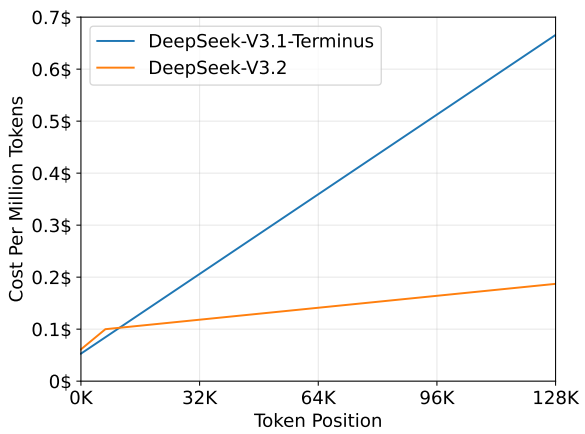
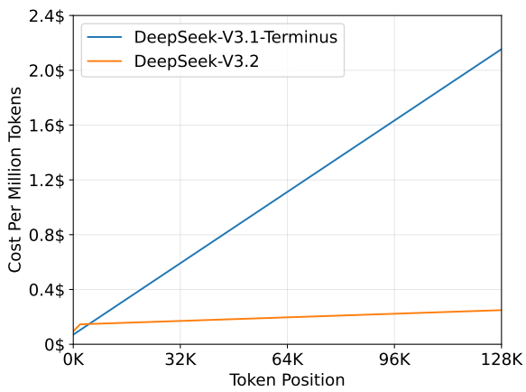

# DeepSeek-V3.2: 稀疏注意力, 放大 RL 与合成 Agent 环境

来源: [DeepSeek-V3.2 Technical Report](https://arxiv.org/abs/2512.02556)(arXiv: 2512.02556v1, 2025-12-02). 对照译稿: `deepseek-v3-2-bi.md`. 关键公式、图表和实验数字来自[原报告](https://arxiv.org/abs/2512.02556). V3.2 没有换底座. 报告第 2 节第一句就说, V3.2 与 V3.2-Exp 结构完全相同; 相对 V3.1-Terminus, 唯一的结构改动是通过继续训练加入 DeepSeek Sparse Attention(DSA). 其余参数, 层数, MoE 配置都沿用 V3, 报告没有重列. 这份报告实际做了三件事: 用 DSA 把长上下文的注意力成本从随长度平方增长改成近似线性; 把后训练算力加到预训练成本的 10% 以上, 并为此在 GRPO 上加了四项稳定化改动; 用合成环境做大规模 Agent RL. 三件事之间有依赖: 长上下文成本下降后, 长轨迹 Agent RL 才能容纳更多环境交互; GRPO 的四项改动则用于控制扩大训练预算后的方差与策略漂移.

## 1. DSA 稀疏注意力

**起点: 从 V3.1-Terminus 接着训:** 报告把 V3.2 的起点写得很具体: 从 V3.1-Terminus 的 Base 检查点出发, 该检查点的上下文已扩到 128K; 先做两阶段继续预训练, 再做后训练. 两阶段的数据分布都与 V3.1-Terminus 的 128K 长上下文扩展数据「完全对齐」. 这意味着 DSA 的适应阶段没有引入新领域或新语料, 只是在原有长文本分布上让模型习惯稀疏注意力. 这样设计能把「注意力变了」和「数据变了」两个变量分开, 后面的对等性评测才有意义.

报告没有写这批长上下文数据的来源, 语种比例或总量. V3.1 发布页只说 Base 在 V3 上追加了 840B token 的外扩训练; Hugging Face 模型卡另说其中 128K 阶段是 209B token, 这不在本报告里. 若按模型卡数字, V3.2 稀疏阶段的 943.7B token 是那一阶段的约 4.5 倍, 但「分布对齐」不等于「同一批数据」, 报告没有说是否重复使用, 所以不能据此推断训了几个 epoch. 整个继续预训练合计约 946B token, 约为 V3 预训练 14.8T token 的 6.4%.

### 1.1. Lightning indexer: 先用便宜的分数挑 token

DSA 原型分两部分. 第一部分是 **lightning indexer**, 对每个查询 token $\mathbf h_t$ 和它之前的每个 token $\mathbf h_s$ 算一个索引分, 式 (1) 是 $I_{t,s}=\sum_{j=1}^{H^I} w^I_{t,j}\cdot\mathrm{ReLU}(\mathbf q^I_{t,j}\cdot\mathbf k^I_s)$. 查询侧有 $H^I$ 个索引头, 每头一个低维查询向量和一个标量权重; 键侧只有一个共享的 $\mathbf k^I_s$. 结构上它是一个多头查询, 单头键的小注意力, 但不做 softmax, 也不取 value, 只输出一个标量分数. 激活选 ReLU 是出于吞吐考虑, 索引器头数少, 可以用 FP8 实现. 第二部分是**细粒度 token 选择**: 对每个查询, 只取索引分最高的 top-k 个位置, 在这些位置的 KV 条目上做正常注意力, 即式 (2):

$$
\mathbf{u}_t=\mathrm{Attn}\big(\mathbf{h}_t,\{\mathbf{c}_s\mid I_{t,s}\in\mathrm{Top\text{-}k}(I_{t,:})\}\big).
$$

索引分 $I_{t,s}$ 只决定「取哪些 $\mathbf{c}_s$」, 不进入注意力权重; 选中之后, 主注意力照常在这 k 个潜变量上算 $QK^\top$ 和 softmax. 所以同一步里有两套分数: 索引器的 ReLU 加权和负责排序, MLA 的 softmax 负责加权, 两者的一致程度要靠下面两阶段的 KL 去拉. 训练和部署都取 k=2048. 在 128K 上下文末端, 每个查询只看约 1.6% 的位置.

报告没有给 $H^I$ 和 $d^I$; 开源推理代码的配置是 64 个索引头, 每头 128 维, 这是页外信息. 按这组配置, 索引器每对 (t, s) 约 64×128=8192 次乘加, 而 MLA 在 MQA 模式下 128 个头, 每头 576 维的 QK 加 512 维的 V, 约 13.9 万次乘加, 索引器约为它的 1/17, 再加上 FP8 吞吐约为 BF16 的两倍, 实际开销约为 1/34. 这就是报告说索引器仍是 $O(L^2)$ 但「比 MLA 便宜得多」的量级.

**挂在 MLA 的 MQA 模式上:** DSA 要从 V3.1-Terminus 接着训, 只能建在已有的 MLA 上, 见 [MLA: 低秩潜变量与矩阵吸收](../../../LargeLanguageModelGuide/2-核心原理与架构/2.2-注意力机制/2.2.2-多头注意力变体/03-MLA-低秩潜变量与解耦RoPE/03-MLA-低秩潜变量与解耦RoPE.md). 报告给的理由是内核效率: 稀疏注意力要从显存里按索引取不连续的 KV, 每个被取出的条目最好被多个查询头共用, 否则带宽浪费. MLA 有两种算法等价的计算方式, 附录 A 与图 7 说明: MHA 模式先把潜变量解压成每头的 K 和 V, MQA 模式把解压矩阵吸收进查询, 让所有头共享同一个 576 维潜变量. V3.1-Terminus 训练和预填充用 MHA 模式, 解码用 MQA 模式.

*图 7: MLA 的 MHA 与 MQA 两种计算模式, MQA 把解压矩阵吸收进查询, 让所有头共享同一个潜变量* V3.2 把 DSA 建在 MQA 模式上, 每个被选中的潜变量对该 token 的全部 128 个查询头共享. 这和 NSA 论文强调的「KV 要在多个查询间共享才能跑满硬件」是同一条约束, NSA 的块级设计见 [原生稀疏注意力 NSA](../../../LargeLanguageModelGuide/2-核心原理与架构/2.4-稀疏注意力/02-原生稀疏注意力机制NSA/02-原生稀疏注意力机制NSA.md). 两者的区别在选择粒度: NSA 按块压缩, 按块选择, 再加滑动窗口三路; DSA 按单个 token 选择, 只有一路. 代价是每个 token 的选择都要一个完整的索引分, 好处是选中的位置可以离当前位置很远, 也不受块边界限制. 稀疏注意力各路做法的对比见 [稀疏注意力综述](../../../LargeLanguageModelGuide/2-核心原理与架构/2.4-稀疏注意力/2.4-稀疏注意力.md).

**稠密预热: 让索引器模仿主注意力:** 新加的索引器一开始是随机的, 直接用它做 top-k 会让模型看错位置. 所以第一阶段保持稠密注意力, 冻结除索引器外的全部参数. 训练目标是让索引器的分布贴近主注意力: 对第 t 个查询, 把所有注意力头的分数加起来, 沿序列维做 L1 归一化, 得到目标分布 $p_{t,:}$, 再用式 (3) 的 KL 散度 $\mathrm{KL}(p_{t,:}\,\|\,\mathrm{Softmax}(I_{t,:}))$ 训练索引器. 这相当于一次蒸馏: 老师是 128 个头的完整注意力, 学生是一个低精度, 单一分数的小网络.

这一阶段的配置是: 学习率 $10^{-3}$, 1000 步, 每步 16 条 128K 序列, 合计 2.1B token. 按 1000×16×131072 复算是 2.097B, 与报告一致. 目标分布把所有头直接相加, 意味着索引器学的是「各头平均认为重要的位置」, 如果某个头专门看很远的少数 token, 它的信号会被其他头稀释. 报告没有给预热后索引器与主注意力的重合率, 也没有说 1000 步是否足够收敛, 这部分只能从后面「不掉点」的结果间接推断.

**稀疏训练: 943.7B token, 梯度分开:** 第二阶段打开 top-k 选择, 解冻全部参数, 让模型适应「每个查询只看 2048 个位置」. 索引器仍对齐主注意力, 但 KL 只在选中集合 $\mathcal S_t$ 上算, 即式 (4):

$$
\mathcal{L}^I=\sum_t\mathbb{D}_{\mathrm{KL}}\big(p_{t,\mathcal{S}_t}\,\big\|\,\mathrm{Softmax}(I_{t,\mathcal{S}_t})\big),\qquad \mathcal{S}_t=\{s\mid I_{t,s}\in\mathrm{Top\text{-}k}(I_{t,:})\}.
$$

和式 (3) 比, 变的只是求和范围. 这是被迫的: 稀疏阶段主注意力只在 $\mathcal S_t$ 上算, 集合外的位置根本没有主注意力分数, 目标分布 $p$ 只存在于这 2048 个位置. 结果是这一项只能教索引器「在已选中的 2048 个里怎么排」, 不能告诉它「漏选了哪个集合外的重要位置」; 集合外的信息只剩稠密预热阶段学到的那部分(报告没讨论这个盲区). 关键设计是把索引器的输入从计算图上 **detach**: 索引器只接收自己的 KL 损失, 主模型只接收语言建模损失, 两边梯度不交叉. top-k 本身不可导, 主模型的梯度本来也传不到索引器; detach 进一步保证索引器的训练信号不会反过来改动主干的隐藏状态.

配置是: 学习率 $7.3\times10^{-6}$, 每个查询选 2048 个 KV token, 15000 步, 每步 480 条 128K 序列, 合计 943.7B token. 480×131072 约 6300 万 token 每步, 和 V3 报告里 128K 扩展阶段的 batch 一致. 学习率 7.3e-6 正好是 V3 预训练最终 167B token 所用的学习率, 也是 V3 两个上下文扩展阶段的学习率, 说明这一阶段沿用了已收敛模型的末段设置, 做的是温和适应, 不是重新学习. 报告没有给这两阶段的 GPU 小时, 也没有给稀疏训练中损失曲线相对稠密基线的差距. 这段训练的数据量达到 V3 预训练的约 6.4%, 如果只是适应稀疏模式, 用量偏大; 可能同时也在继续提升长上下文能力, 但报告没有拆开这两种作用.

### 1.2. 不掉点的证据

第 2.2 节给了三类证据. 标准基准: 2025 年 9 月评测 V3.2-Exp, 与 V3.1-Terminus 在短上下文和长上下文任务上表现相近, 没有明显退化. 人类偏好: 两者后训练策略相同, 2025 年 11 月 10 日的 ChatbotArena Elo 接近. 长上下文: 第三方的 AA-LCR 上, V3.2-Exp 在推理模式下比 V3.1-Terminus 高 4 分; Fiction.liveBench 上多项指标持续领先. 这三类证据都没有给具体数字表. 「表现相近」没有列基准名和分数, Arena Elo 没有给数值和置信区间, Fiction.liveBench 没有给分长度的曲线. 长上下文评测用的是 Exp 发布后第三方新出的测试集, 这一点排除了针对性调优, 但 AA-LCR 这类评测主要考检索与汇总, 对「远处少数关键 token」的依赖不一定很强. 如果要确认 top-2048 在极端检索任务上是否漏选, 需要针密度很低的大海捞针测试, 本报告没有.

**推理成本: 读图 3:** 第 2.3 节说主模型核心注意力从 $O(L^2)$ 降到 $O(Lk)$, 并在图 3 画出按 token 位置的服务成本, 数据来自 H800 上的实际部署, 按每 GPU 小时 2 美元折算. 预填充图上, V3.1-Terminus 的成本从约 0.05 美元/百万 token 线性涨到 128K 处约 0.67 美元; V3.2 从约 0.06 美元起, 在约 7K 处拐到 0.10 美元, 之后缓慢涨到 128K 处约 0.19 美元, 两者在 8K 左右交叉(读图). 解码图上, V3.1-Terminus 从约 0.07 美元涨到约 2.15 美元, V3.2 在约 2K 处起到 0.15 美元, 128K 处约 0.25 美元(读图).

*图 3a: 预填充的服务成本随 token 位置变化, V3.2 在约 7K 处拐入近似线性段*

*图 3b: 解码的服务成本, DSA 让长上下文解码近似持平* 按读图数字, 128K 位置上预填充约便宜 3.6 倍, 解码约便宜 8.6 倍. 解码省得更多, 因为解码是访存受限: 稠密 MLA 每步要读全部 128K 个潜变量, DSA 只读 2048 个潜变量加上所有位置很小的索引键. 预填充是计算受限, 索引器的 $O(L^2)$ 仍在, 所以 V3.2 的预填充曲线仍有明显斜率. 报告还说短序列预填充专门用 masked MHA 模式模拟 DSA, 图上 7K 以下那段较平的线应该就是这条路径. 这组成本不含 MoE 部分的变化, 也没有给吞吐和延迟, 所以只能说明注意力这一项的相对变化.

**后训练: 专家蒸馏与混合 RL:** **专家蒸馏: 六个领域先各自训一个专家**

后训练沿用 V3.2-Exp 的流水线, 全程使用稀疏注意力, 分两步: 专家蒸馏, 然后混合 RL. **专家蒸馏**先为每个领域训一个专用模型, 全部从同一个 V3.2 Base 微调. 除写作和通用问答外, 覆盖六个专门领域: 数学, 编程, 一般逻辑推理, 一般 Agent 任务, Agent 编程, Agent 搜索; 每个领域都同时支持思考和非思考模式. 每个专家都用大规模 RL 训练. 思考模式的长 CoT 数据和非思考模式的直答数据由不同模型生成.

专家训好后, 用来为最终检查点生成各领域的数据. 报告说, 用这些蒸馏数据训出的模型只比各领域专家略低, 后续 RL 能把差距基本消除. 这一步和 V3 的「R1 蒸馏」一脉相承, 只是教师从一个推理模型换成了六个领域专家, 蒸馏的一般做法见 [知识蒸馏](../../../LargeLanguageModelGuide/6-训练与推理优化/6.3-模型压缩/6.3.3-知识蒸馏/6.3.3-知识蒸馏.md). 报告没有给蒸馏数据的条数, token 数, 领域比例, 也没有给「略低」具体低多少. 专家本身的 RL 预算有多大, 是否计入「超过预训练成本 10%」那笔预算, 报告同样没有说.

**混合 RL: 一个阶段, 三类奖励:** RL 算法仍是 GRPO, 见 [GRPO](../../../LargeLanguageModelGuide/4-后训练/4.5-GRPO家族与RLVR/01-GRPO/01-GRPO.md). 和 V3.2-Exp 一样, 推理, Agent, 人类对齐三类训练**合并成一个 RL 阶段**, 报告说这样能平衡各领域表现, 并避开多阶段训练常见的灾难性遗忘. 奖励分两类: 推理和 Agent 任务用规则结果奖励, 长度惩罚, 语言一致性奖励; 通用任务用生成式奖励模型, 每条提示有自己的评分 rubric. 正式版 V3.2 在蒸馏数据上继续训练了「数千步」 RL. 报告的核心预算说法是: RL 训练预算已超过预训练成本的 10%, 近几个月观察到性能随 RL 预算延长持续提升. 如果以 V3 报告里预训练的 266.4 万 H800 GPU 小时为基数, 10% 约为 27 万 GPU 小时, 按报告自己的 2 美元单价约 53 万美元.

但报告没有说「预训练成本」指 V3 的原始预训练, 还是加上 V3.1 与 V3.2 的继续预训练; 也没有给 RL 的步数, batch, 组大小 G, 裁剪 ε 和 KL 系数 β. 长度惩罚的形式和系数也没有给, 只说正式版的分数受「长度约束奖励模型」限制, 去掉后分数会继续上升.

**GRPO 的两处改动: 去掉标准差, 修正 KL:** 式 (5)–(6) 是 GRPO 目标, 这里写成逐 token 的形式:

$$
\mathcal{J}_{\mathrm{GRPO}}(\theta)=\mathbb{E}\left[\frac{1}{G}\sum_{i=1}^{G}\frac{1}{|o_i|}\sum_{t=1}^{|o_i|}\min\big(r_{i,t}(\theta)\hat A_{i,t},\ \mathrm{clip}(r_{i,t}(\theta),1-\varepsilon,1+\varepsilon)\hat A_{i,t}\big)-\beta\,\mathbb{D}_{\mathrm{KL}}\big(\pi_\theta(o_{i,t})\|\pi_{\mathrm{ref}}(o_{i,t})\big)\right],
$$

$r_{i,t}(\theta)=\pi_\theta(o_{i,t}\mid q,o_{i,<t})/\pi_{\mathrm{old}}(o_{i,t}\mid q,o_{i,<t})$. 比率和裁剪都在单个 token 上算, 同一条回答里的 token 共享一个优势. 和 V2, V3, R1 报告里整条序列的概率比写法不同, 这里明确了按 token 裁剪, 再先在序列内平均, 后在组内平均. 优势函数有一处容易漏看的变化: $\hat A_{i,t}=R_i-\mathrm{mean}(\boldsymbol R)$, **只减组均值, 不再除以组标准差**. 原始 GRPO 和 R1 报告都除以标准差. 除以标准差会让奖励差异很小的组(几乎全对或几乎全错)得到被放大的优势, 相当于给太容易或太难的题更大的权重; Dr.GRPO 指出了这个偏差并建议去掉, 见 [Dr.GRPO](../../../LargeLanguageModelGuide/4-后训练/4.5-GRPO家族与RLVR/02-DrGRPO-去标准差/02-DrGRPO-去标准差.md). V3.2 去掉了标准差, 但保留了 $1/|o_i|$ 的逐序列长度平均, Dr.GRPO 认为这一项也会带来长度偏差, 报告没有讨论.

第二处改动是 KL 估计. 原 GRPO 用 K3 估计器 $k_3=r-\log r-1$, 其中 $r=\pi_{\mathrm{ref}}/\pi_\theta$. 对 $\theta$ 求导, 梯度系数是 $(1-\pi_{\mathrm{ref}}/\pi_\theta)$, 当采样到的 token 在当前策略下概率远低于参考策略时, 这个系数没有上界, 会强行把这些 token 的概率往上拉(推导). 报告的式 (7) 乘上重要性比 $\pi_\theta/\pi_{\mathrm{old}}$, 因为样本实际来自旧策略. 乘上后再求导, 梯度系数变成 $(\pi_\theta/\pi_{\mathrm{old}})\log(\pi_\theta/\pi_{\mathrm{ref}})$, 只随概率比的对数增长, 并且是 $\mathrm{KL}(\pi_\theta\|\pi_{\mathrm{ref}})$ 的无偏梯度(推导). 报告还说, 不同领域适合不同强度的 KL, 数学等领域用很弱的 KL 甚至不加反而更好, 但没有给各领域的具体系数.

### 1.3. 三项防 off-policy 的改动

为了提高系统效率, RL 通常一次生成一大批 rollout, 再切成多个 mini-batch 做多步更新, 后面的 mini-batch 就变成 off-policy. 推理框架和训练框架的实现细节也不同, 同一个 token 两边算出的概率会有差别. 报告的 **Off-Policy Sequence Masking** 用推理框架返回的采样概率作 $\pi_{\mathrm{old}}$, 在上式的裁剪项后乘一个掩码 $M_{i,t}$(式 8–9):

$$
M_{i,t}=\begin{cases}0, & \hat A_{i,t}<0\ \text{且}\ \dfrac{1}{|o_i|}\displaystyle\sum_{t=1}^{|o_i|}\log\dfrac{\pi_{\mathrm{old}}(o_{i,t}\mid q,o_{i,<t})}{\pi_\theta(o_{i,t}\mid q,o_{i,<t})}>\delta\\[2pt] 1, & \text{otherwise}.\end{cases}
$$

条件里的平均对数比是在采样到的 token 上对 $\mathrm{KL}(\pi_{\mathrm{old}}\|\pi_\theta)$ 的单样本估计, 衡量这条回答对当前策略来说有多「陌生」. 两个条件同时满足才掩掉: 优势为负, 且整条序列偏离超过 $\delta$. 掩码按序列算, 一旦为 0, 这条回答所有 token 的策略梯度项都没了, KL 惩罚项不受掩码影响, 仍然保留. 正优势的序列无论偏离多大都保留. 直觉是: 模型从自己的错误里学得最多, 但偏离太大的负样本已经不是「自己的错误」, 会把优化带偏. 阈值 $\delta$ 取多少, 掩掉了多大比例的序列, 报告没有给.

Keep Routing 针对 MoE. 训练和推理框架的差异叠加策略更新后, 同一输入可能在两边路由到不同专家, 活跃参数子空间随之跳变. 采样时记录推理框架选择的专家路径, 训练时强制复用同一路径, 可以避免路由差异继续放大 off-policy 误差. 这项机制自 V3-0324 起就进入训练流程; MoE 路由本身见 [DeepSeek-MoE](../../../LargeLanguageModelGuide/2-核心原理与架构/2.6-MoE/01-DeepSeek-MoE/01-DeepSeek-MoE.md). Keep Sampling Mask 针对 top-p / top-k 采样: 截断让旧策略的动作空间比当前策略小, 违反了重要性采样的前提. 做法是把采样时的截断掩码也施加到训练时的 $\pi_\theta$ 上. 报告说 top-p 加这条掩码能在 RL 中保持语言一致性. 三项改动都没有给消融数字, 只有定性描述.

**Agent 任务:** **工具调用中的推理保留与冷启动**

R1 的做法是第二轮消息一到就丢掉上一轮的推理内容. 放到工具调用里, 每次工具返回后模型都要重新推理整道题, token 浪费很大. V3.2 的规则见图 4: **只有新的用户消息进来时才丢弃历史推理**; 如果只是追加工具输出, 推理内容一直保留; 推理被丢弃时, 工具调用和结果的历史仍然保留. 报告特别指出, Roo Code, Terminus 这类用用户消息模拟工具交互的框架会触发丢弃规则, 用不上推理保留, 建议这类框架用非思考模式.

单独推导显存比例.

量化时两分支敏感性不同. 线性状态误差会递推积累, indexer K误差影响离散 top-k, sparse KV误差影响被选 token的精排和值. 三种误差应分开做消融. 用同一 bit宽统一量化虽然实现简单, 未必是最佳分配.

## 5. Indexer 到底在逼近什么

KL 教师来自当前主 attention, 其分布随模型更新. 预热阶段主模型冻结, 教师稳定; 稀疏阶段主模型变化, selector追逐移动目标. indexer输入 detach 避免语言模型梯度直接改变 selector, 却没有消除教师非平稳. 较小 indexer学习率更新慢, 较大又可能追逐 mini-batch噪声. 跨 head求和降低单 head噪声, 也引入聚合偏差. 假设两个主 heads分别只关注位置 $a$ 与 $b$, 聚合教师给二者各一半质量. $k=1$ 时 selector必然只能满足一个, KL的最优解也无法同时召回. 增大 $k$、按 head分组候选或 per-head监督可以降低偏差, 会增加主 attention读取或 selector输出复杂度.

top-k训练还有暴露偏差. 式 (8)只在当前 selector已选集合内对齐, 未选但教师高分的位置无法直接进入学生 softmax集合. 稠密预热先把 selector带到合理区域, 是避免这一问题的关键. 后续可偶尔扩大候选、加入探索位置或使用层次粗召回, 但这些做法会改变训练成本, 需要明确实验支持. batch中的长序列提供大量 query, 梯度样本数大, 相邻 query又高度相关. 统计有效样本量小于 token数量. 数据应覆盖不同文体、语言、代码和证据结构, 否则 selector会对训练域形成稳定偏好. 部署域迁移时, 先看 recall与 cutoff margin, 再判断是否需要继续对齐.

### 5.1. 负载、尾延迟与可观测性

固定 $k$ 让每个 query 的逻辑候选数相同, 物理工作量仍会变化. 候选可能集中在少数连续 cache pages, 也可能散布到 $k$ 个不同页面. 前者能合并事务和复用 L2, 后者需要大量 gather. profiler应记录唯一 page数、连续段数和每页命中次数, 单看 $k$ 无法解释 Sparse MLA时延. batch内不同请求的上下文长度也影响 top-k. 较短行只需在 `min(k,t)` 个位置中选择, 较长行完整扫描. 若 kernel按最长行对齐, padding分数和无效比较会拖慢整批. cuDNN 接口中的 `seq_lens` 允许逐行限制, 调度器仍要避免把极长请求与大量短请求放进同一低效形状.

线上监控不宜保存用户的完整索引分数, 可以聚合每层 top-k距离分布、cutoff margin、候选页数、indexer时间与 Sparse MLA时间. 质量影子流量可在极低比例运行稠密教师, 计算概率质量覆盖; 正常流量只记录不含内容的统计量. 一旦某类请求的 margin下降或候选更分散, 可以判断问题来自选择不稳定还是访存退化. 尾延迟还受 top-k算法的数据分布影响. 大量相同分数、NaN 或异常 scale 会触发不稳定排序或额外处理. kernel入口应检查有效长度和 scale有限性, 训练阶段监控 indexer logits范围、ReLU零比例与 head权重分布. 一个 head长期零贡献可能是可裁剪冗余, 也可能是训练坍缩, 需要结合教师 recall判断.

**哪些结论不能从 DSA 推出:** DSA 在 DeepSeek-V3.2 的质量结果不能直接证明任意模型都能通过短微调迁移到 token-sparse attention. 官方路径使用特定 MLA表示、128K数据、2.1B token预热和943.7B token稀疏训练. 基座、数据与训练预算改变后, selector对齐和主模型适应程度也会改变. 同样, 2048 是该模型稀疏训练的明确预算, 不是跨模型常数. head维度、上下文长度、任务中的证据密度和 kernel tile变化后, 合理预算都可能变化. 复现应从质量—时延曲线选点, 不能只复制配置数字. 对更短序列, `min(k,t)` 会使早期 query接近稠密; 对更长序列, 固定 $k$ 的保留比例持续下降. 因此长度外推既考验 indexer排序, 也考验固定候选容量能否承载更多潜在证据.

indexer为 $O(n^2)$ 也不表示 DSA 没有价值. 低维、共享 key、FP8 和融合 top-k 让平方项常数远小于主 MLA, 在报告硬件与长度上仍有端到端收益. 同样, 主 attention成为 $O(nk)$ 也不表示整体线性, 因为 indexer、MLP、通信和cache管理仍在. HISA 的高 IoU与 MISA 的高重合说明它们接近 DSA selector, 不能代替对稠密教师和任务的验证. LISA 的任务提升包含线性分支与蒸馏, 不能证明任何 Lightning Indexer都会提高推理能力. 每个数字都要保留模型、长度、硬件和训练口径. 复现报告还应保存 selector 配置与模型权重的绑定关系. Indexer 参数、主模型继续训练步数、候选预算和 kernel版本中任一项改变, 原有 recall与延迟曲线都可能失效. 只保存最终权重而缺少稀疏训练阶段和候选配置, 无法判断另一个实现是否走了相同计算图.

**Indexer 到底在逼近什么:** **排序目标与注意力目标并不相同**

把稠密注意力记为 $a_{tj}$, indexer 分数记为 $s_{tj}$. 最直观的训练方法是让 $s_{tj}$ 拟合 attention logit, 但 DSA 真正关心预算为 $k$ 的候选集合能覆盖多少重要位置. 只要前 $k$ 的次序正确, 分数整体平移、缩放甚至在头部区间内发生小幅形变, 都不会改变后续 Sparse MLA 读到的 token. 反过来, 均方误差很小也不保证 cutoff 两侧的顺序正确. 设教师前 $k$ 集合为 $T_k$, 学生集合为 $S_k$. 集合召回率是

$$
R_k=\frac{|T_k\cap S_k|}{k}. \tag{14}
$$

它直接衡量索引结果是否相同, 却把所有教师位置视为等价. 若漏掉的是教师第 $k$ 名且概率极低的位置, 影响通常小于漏掉第 1 名. 因此还要计算教师概率质量覆盖

$$
M_k=\sum_{j\in S_k}a_{tj}. \tag{15}
$$

当注意力分布尖锐时, $R_k$ 可以一般而 $M_k$ 很高; 当分布平坦时, 很高的 $R_k$ 也可能只覆盖有限质量. 两项指标回答不同问题, 不应互相替代.

**多头教师为何需要压成一个候选集合:** MLA 的不同 query heads 可以关注不同历史位置. 若每个 head独立选 $k$ 个 token, 最坏要读取 $Hk$ 个 KV, 稀疏收益很快被候选并集吃掉. Lightning Indexer 用若干轻量 indexer heads产生分数, 再把它们聚合成共享候选, 本质上是在有限 I/O 预算下求多头注意力的联合覆盖. 可把第 $h$ 个教师头的重要性写成 $a^{(h)}_{tj}$, 聚合目标写成

$$
p_{tj}=\sum_h w_{th}a^{(h)}_{tj},\qquad \sum_h w_{th}=1. \tag{16}
$$

$w_{th}$ 决定哪些头在共享集合中更有发言权. 均匀权重简单, 但一个分布很平的头可能贡献大量低价值位置; 只看最大值会偏向极尖锐头. 可学习聚合能适应任务, 也可能让弱势头长期拿不到候选. 所以检查共享候选时, 除总体概率质量外还要看 per-head 最低覆盖, 否则平均数会掩盖少数头的系统性失配.

一个三头例子能看出冲突. 三个头分别把 $0.9$ 概率放在位置 10、20、30, 预算 $k=2$. 任何共享集合都至少牺牲一个头. 此时 indexer 即使准确找到了三个峰值, 容量约束仍让共享集合无解. 增加 indexer 参数不能突破集合大小, 只能通过增大 $k$、按头分组候选或让主模型在稀疏训练中重新组织注意力来缓解.

### 5.2. ReLU 分解为何适合轻量索引

Lightning Indexer 将多组低维 query-key 点积经过 ReLU 后加权汇总. 若写成

$$
s_{tj}=\sum_{r=1}^{H^I}\alpha_{tr}\operatorname{ReLU}\!\left(\langle q^I_{tr},k^I_j\rangle\right), \tag{17}
$$

每个 indexer head 都像一个简单的匹配专家. ReLU 把负相关直接截为零, 聚合时不会让一个 head 的强负值抵消另一个 head 的正证据. 对 top-k 检索而言, 这种非负证据累加比追求完整的正负相似度更容易解释: 某个位置只要得到若干匹配头支持, 就能进入候选. 它也带来死区. 当某个 head 对绝大多数 token 都输出负点积时, ReLU 后梯度与贡献同时消失. 监控零比例不能只看全局平均, 应分层、分 head、分数据域统计. 若一个 head 在普通文本中沉默、在代码中活跃, 它可能是有用专家; 若所有数据上都沉默, 才更像训练坍缩. $\alpha_{tr}$ 若随 query 变化, 相当于先判断当前问题需要哪类匹配, 再组合 token 分数. 这为 MISA 的 head 路由提供了自然入口: 与其每次计算所有 $H^I$ 个匹配头, 不如先用更便宜的 router 找出少数可能贡献最大的头.

**top-k 边界决定了真正的稳定性:** 把排序后的 indexer 分数写为 $s_{(1)}\ge\cdots\ge s_{(n)}$, cutoff margin 定义为

$$
\Delta_k=s_{(k)}-s_{(k+1)}. \tag{18}
$$

当 $\Delta_k$ 很大时, 量化、舍入和 kernel 实现的小误差通常不改变集合; 当 $\Delta_k$ 接近零时, 极小扰动就会交换边界 token. 因此验证 FP8 indexer 时, 只比较分数均方误差意义有限. 更有用的是按 margin 分桶观察集合重合与概率质量损失. 并列分数还牵涉稳定排序. 两个实现都返回合法 top-k, 索引却可能不同. 如果并列位置的教师质量相近, 这不构成数值错误; 若后续测试强制逐索引相等, 反而会制造假失败. 可靠测试应先比较 cutoff 值, 再比较严格高于 cutoff 的必选集合, 最终检查并列集合中返回数量与输出误差. 训练损失连续, top-k 决策离散, 两者之间始终存在缝隙. 稠密蒸馏能把总体分布推近, 但最终部署质量仍由 cutoff 附近的排序决定. 这正是稠密预热、扩大探索候选和稀疏适应阶段缺一不可的原因.

**两阶段训练的因果链:** **先固定教师, 再让模型适应缺失连接**

第一阶段冻结原模型, 让 indexer 观察稠密注意力产生的教师分布. 此时监督目标稳定, 主模型也不会为了迎合一个尚未学会检索的 selector 改变表示. 这一步解决的是「怎样用便宜特征预测原模型会看哪里」. 第二阶段真正启用稀疏 attention, 主模型只能访问候选集合. 即使 indexer 对原教师有很高 recall, 遗漏仍不可避免; 原来依赖多个低概率位置累积的信息也会改变. 继续训练让 query、key、value 与 MLP 共同适应新的连接图, 解决的是「模型怎样在受限图上重新分配信息」. 两阶段看似都在对齐 attention, 优化对象其实不同.

若从第一步就同时更新全部参数, selector 可能追逐不断移动的教师, 主模型又会迁就早期的错误候选. 二者形成反馈: 某位置没被选中, 主模型逐渐不再向它写入有用信息; 教师信号随之变弱, selector 更没有机会把它找回来. 稠密预热先建立较可靠的召回面, 能显著缩小这种自我强化的错误区.

**稀疏集合内归一化会放大遗漏:** 稠密 attention 的输出为

$$
o_t=\sum_{j\le t}a_{tj}v_j,
$$

稀疏版本只在 $S_k$ 内重新做 softmax:

$$
\tilde o_t=\sum_{j\in S_k}\frac{a_{tj}}{M_k}v_j. \tag{19}
$$

即使假设候选内 logit 完全相同, 缺失质量 $1-M_k$ 也会让保留位置整体乘上 $1/M_k$. 当 $M_k=0.98$ 时重标定很小; 当 $M_k=0.6$ 时, 保留证据被放大约 1.67 倍. 因而漏选影响不只来自被丢掉的 value, 还来自剩余分布重新归一化. 由三角不等式可给出一个粗界. 若 $\|v_j\|\le V$, 则在上述理想化条件下

$$
\|o_t-\tilde o_t\|\le 2(1-M_k)V. \tag{20}
$$

这个界较松, 但说明概率质量比纯集合 recall 更接近输出误差. 实际系统还有候选内 logit 重算、位置编码与数值误差, 应把式 (20)当作诊断直觉, 不能当作任务性能保证.

**预算课程比固定预算更容易定位问题:** 训练早期可以用较大候选预算 $k_0$, 随 indexer 稳定逐步降到目标 $k$. 大预算降低主模型突然失去连接的冲击, 也让边界附近位置仍有梯度通路. 但课程策略会增加训练计算, 并可能让模型迟迟不适应最终预算. 具体退火曲线需要由每个预算下的质量、质量恢复速度与 selector margin共同确定.

另一种做法是固定最终 $k$, 额外采样少量探索 token. 探索集合不必进入正式推理, 只用于估计当前 selector 漏掉的教师质量并提供纠偏信号. 均匀随机对长上下文效率很低, 可按块、距离或教师粗分数分层抽样. 这里的核心是让未选位置仍有被观察的机会, 不是把随机稀疏本身当成检索器.

**动态教师下怎样判断已经收敛:** 稀疏训练阶段的教师随主模型更新, 单看训练损失下降可能误判. 需要固定一批长上下文探针, 定期用稠密 MLA 离线重算教师, 同时保存任务输出. 若 indexer KL 下降而固定探针的概率质量覆盖恶化, 说明学生只是追上了已经发生漂移的教师或分布变平, 并没有改善选择.

收敛至少包含三层: indexer 对当前教师的选择稳定; 稀疏模型与稠密参照的 hidden state 差异不再扩大; 长上下文任务在目标预算上恢复. 三者时间尺度不同. selector 很早稳定不代表主模型已经学会在稀疏图上传递信息, 任务恢复也可能来自模型绕过长程依赖. 因此还需要受控检索样本确认远距证据确实被使用.

### 5.3. 从平方索引到层级检索

**DSA 的总复杂度要拆成两项:** 对长度 $n$, indexer 维度 $d_I$, 主注意力每个候选的有效计算宽度 $d_A$, 候选数 $k$, 忽略 head 常数后可写成

$$
C_{DSA}\approx c_I n^2d_I+c_A nkd_A. \tag{21}
$$

第二项是人们常说的 $O(nk)$, 第一项仍是低维全序列两两打分. 当 $n$ 继续增长, 第一项最终占主导. DSA 的工程价值来自 $d_I\ll d_A$、低精度缓存与融合算子降低 $c_I$, 不是从数学上消除了平方项. 交叉长度可由两项相等粗略估计:

$$
n_*\approx \frac{c_Akd_A}{c_Id_I}. \tag{22}
$$

若优化后的 indexer 每次乘加更便宜, $c_I$ 较小, $n_*$ 会向更长上下文移动; 若 Sparse MLA 的 gather 很低效, $c_A$ 变大, 主分支反而更久占主导. 因此「瓶颈在哪个长度出现」是硬件与 kernel 共同决定的, 不能只从大 O 符号回答.

**Decode 的线性扫描仍会随历史增长:** 自回归 Decode 每一步只有一个新 query, 原始 DSA 仍需与全部 $t$ 个 indexer keys 点积. 单步成本约

$$
C_t\approx c_Itd_I+c_Akd_A. \tag{23}
$$

生成 $m$ 个 token 时, 索引部分累计为 $c_Id_I(mn+m(m-1)/2)$, 主稀疏 attention 约为 $c_Amkd_A$. 当输入很长而输出也长, indexer 扫描会反复读取几乎相同的历史 key. 这正是 HISA 与 MISA 关注 selector 自身的原因: 主 attention 已经稀疏以后, 下一块肥肉就是找候选的过程. Decode 与 Prefill不能共用一句「复杂度降低」概括. Prefill 有大量 query, 可把点积做成高吞吐矩阵运算; Decode 的单 query扫描更容易受内存带宽限制. 相同 MAC 数在两个阶段对应不同时间. 评测必须分别给出首 token 延迟、每 token 延迟与长输出累计时间.

**HISA 的两级召回可以分解:** 把历史 token 划为块, 粗筛选中的块集合记为 $B_r$, 其中包含的 token 集合为 $U(B_r)$. HISA 先在块级缩小搜索域, 再在候选块内精确计算 token indexer 分数. 相对原 DSA top-k 的最终召回可分成

$$
R_{final}=R_{block}\cdot R_{token\mid block}, \tag{24}
$$

其中 $R_{block}$ 表示教师 token 落入候选块的比例, $R_{token\mid block}$ 表示进入候选块后精排保留下来的比例. 若第二级直接使用原 DSA 分数并给足 $k$, 后一项通常接近 1, 主要误差来自块粗筛. 这个分解给出明确的调参方向. $R_{block}$ 低时应改块表示、增加候选块或减小块长; 候选域已覆盖教师而最终召回低, 问题才在 token 精排预算、数值或实现. 把两级只报成一个 IoU, 很难知道损失发生在哪.

**块代表为何会漏掉稀有尖峰:** 若一个 64-token 块用均值 key 表示, 其中 63 个普通 token 可能淹没唯一关键 token. 假设 query 与关键 key点积为 10, 与其余 key均为 $-0.2$, 块均值分数约为 $(10-12.6)/64=-0.0406$. 这个块可能在粗筛阶段被淘汰, 即使关键 token 按原 DSA 分数本应排第一. 最大池化能保留尖峰, 却难以对向量各维独立取最大后仍保持一个真实 key 的几何意义. 多代表原型、分块最大上界或学习型摘要能改善召回, 都会增加粗筛存储和计算. HISA 的关键不只是「先选块再选 token」, 而是设计一个便宜且对重要 token 有保守覆盖能力的块表示.

边界跨块也是常见问题. 一段语义证据被切在两个块之间时, 每块摘要都可能不突出. 重叠块可提高覆盖, 代价是重复索引; 多尺度块能同时看局部尖峰与长段主题, 代价是层级更复杂. 这些取舍应通过受控的单点证据、多点证据与跨边界样本分别测量.

**层级方法何时反而更慢:** 设总块数 $n/b$, 保留 $r$ 块, 粗筛宽度 $d_B$. 单步成本可粗写为

$$
C_{HISA}\approx c_B\frac{n}{b}d_B+c_Irbd_I+c_T, \tag{25}
$$

$c_T$ 包含两次 top-k、索引展开和调度. 当上下文不长、$r b$ 接近 $n$ 或块表示没有驻留缓存时, 新增粗筛层只会增加固定成本. 层级索引应在长上下文、较小候选域和可复用块摘要下启用, 而非无条件替换原 DSA. 动态阈值可以根据粗筛 margin 决定 $r$. 主题明确、头部块分数陡峭时少保留; 分布平坦时扩大候选块. 这样能把算力用在不确定 query 上, 但 batch 内变长工作量会增加 kernel 调度难度. 实际实现可把 $r$ 限制在少数离散档位, 兼顾自适应与规则形状.

**MISA：把索引头也看成专家:** **冗余来自哪里**

式 (17)每次计算全部 indexer heads, 但某个 query 的聚合权重往往集中在少数头. 若 64 个头中只有 8 个产生主要正贡献, 其余 56 个点积对最终 token 排名影响很小. MISA 将这些头视为专家池, 先预测当前 query 需要哪些专家, 再只执行 active heads. 这与 token top-k 是两条正交的稀疏轴. head 路由减少「用多少种匹配规则扫描历史」, token 路由减少「主 attention 读取多少历史位置」. 前者做错会改变所有 token 的 indexer 分数, 后者做错只遗漏具体候选; 因此 head router 虽小, 错误传播范围反而更广.

**活跃头恢复率不能代替 token 恢复率:** 假设完整 indexer 中贡献最大的 8 个 heads 为教师活跃集, router 准确找回 7 个, head recall 达 87.5%. 如果漏掉的那个 head 专门检索唯一答案 token, 最终 token top-k 仍可能失败; 反过来, 漏掉一个与其他头高度冗余的专家几乎没有影响. 所以 MISA 既要报告 active-head 重合, 也要报告最终 token 集合与概率质量. 更直接的训练目标是最小化裁剪 heads 后的聚合分数误差或 token 排名损失. 但精确教师需要先算全部 heads, 会削弱训练加速. 实践中可离线生成教师、周期性全算校准, 或让便宜 router 学习完整 indexer 的 top-head 分布. 推理时无需教师, 训练口径却必须说明清楚.
