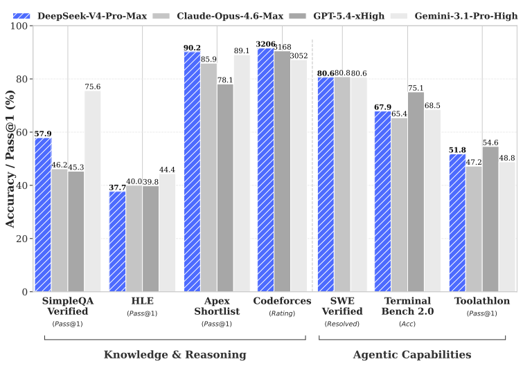
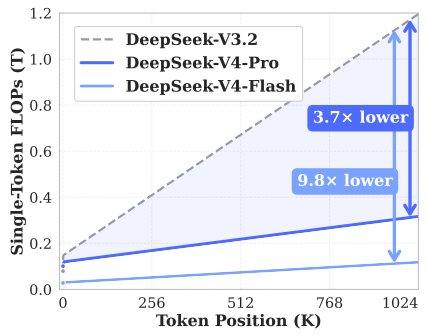
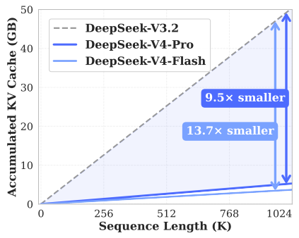
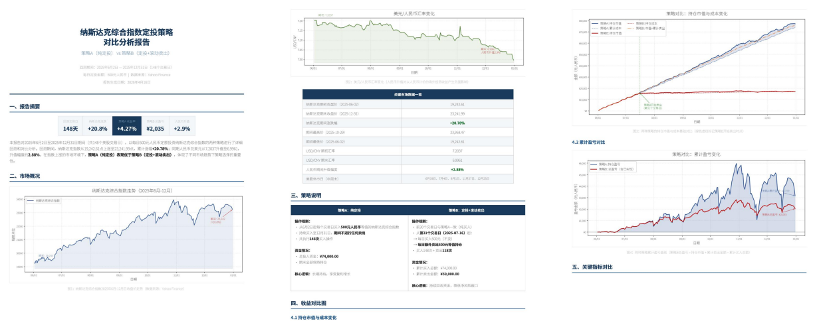
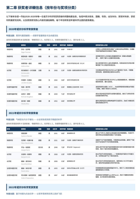
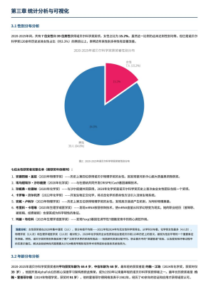
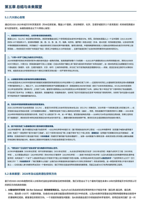
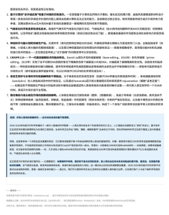

<!-- page 1 of 58 -->

Qdeepseek

# DeepSeek-V4: Towards Highly Efficient Million-Token Context Intelligence / DeepSeek-V4: 迈向高效率的百万 Token 上下文智能

DeepSeek-AI **research@deepseek. com**

DeepSeek-AI **research@deepseek. com**

## Abstract

We present a preview version of DeepSeek-V4 series, including two strong Mixture-of-Experts (MoE) language models - DeepSeek-V4-Pro with 1.6T parameters (49B activated) and DeepSeek-V4-Flash with 284B parameters (13B activated) - both supporting a context length of one million tokens. DeepSeek-V4 series incorporate several key upgrades in architecture and optimization: (1) a hybrid attention architecture that combines Compressed Sparse Attention (CSA) and Heavily Compressed Attention (HCA) to improve long-context efficiency; (2) Manifold-Constrained Hyper-Connections (mHC) that enhance conventional residual connections; (3) and the Muon optimizer for faster convergence and greater training stability. We pre-train both models on more than 32T diverse and high-quality tokens, followed by a comprehensive post-training pipeline that unlocks and further enhances their capabilities. DeepSeek-V4-Pro-Max, the maximum reasoning effort mode of DeepSeek-V4-Pro, redefines the state-of-the-art for open models, outperforming its predecessors in core tasks. Meanwhile, DeepSeek-V4 series are highly efficient in long-context scenarios. In the one-million-token context setting, DeepSeek-V4-Pro requires only 27% of single-token inference FLOPs and 10% of KV cache compared with DeepSeek-V3.2. This enables us to routinely support one-million-token contexts, thereby making long-horizon tasks and further test-time scaling more feasible. The model checkpoints are available at [https://huggingface. co/deepseek-ai/DeepSeek-V4-Pro](https://huggingface. co/deepseek-ai/DeepSeek-V4-Pro).

给出 DeepSeek-V4 系列预览版: 两个强 MoE 语言模型--DeepSeek-V4-Pro 总参 1.6T(激活 49B), DeepSeek-V4-Flash 总参 284B(激活 13B), 均支持百万 token 上下文. 架构与优化上有几处关键升级: (1)混合注意力, 把 Compressed Sparse Attention(CSA, 压缩稀疏注意力)与 Heavily Compressed Attention(HCA, 重度压缩注意力)拼起来, 抬长上下文效率; (2)Manifold-Constrained Hyper-Connections(mHC, 流形约束超连接), 加固常规残差; (3)Muon 优化器, 加快收敛, 稳住训练. 两者都在超过 32T 多样高质量 token 上预训练, 再接完整后训练流水. DeepSeek-V4-Pro-Max(Pro 的最大推理投入模式)在开源侧重新划线, 核心任务超过前代. 长上下文场景也很省: 百万 token 设定下, Pro 相对 DeepSeek-V3.2 只要约 27% 的单 token 推理 FLOPs 与约 10% 的 KV cache, 百万上下文可以当常规能力用, 长程任务与进一步 test-time scaling 才更站得住. 权重见上述 Hugging Face 链接.

Figure 1 | Left: benchmark performance of DeepSeek-V4-Pro-Max and its counterparts. Right: inference FLOPs and KV cache size of DeepSeek-V4 series and DeepSeek-V3.2.

图 1｜左: DeepSeek-V4-Pro-Max 与对照模型的基准表现. 右: DeepSeek-V4 系列与 DeepSeek-V3.2 的推理 FLOPs 与 KV cache 体积.

<!-- page 2 of 58 -->

## Contents

- 1 Introduction 4
- 2 Architecture 6
  - 2.1 Designs Inherited from DeepSeek-V3 7
  - 2.2 Manifold-Constrained Hyper-Connections 7
  - 2.3 Hybrid Attention with CSA and HCA 9
    - 2.3.1 Compressed Sparse Attention 9
    - 2.3.2 Heavily Compressed Attention 11
    - 2.3.3 Other Details 12
    - 2.3.4 Efficiency Discussion 13
  - 2.4 Muon Optimizer 14
- 3 General Infrastructures 15
  - 3.1 Fine-Grained Communication-Computation Overlap in Expert Parallelism 15
  - 3.2 Flexible and Efficient Kernel Development with TileLang 16
  - 3.3 High-Performance Batch-Invariant and Deterministic Kernel Libraries 18
  - 3.4 FP4 Quantization-Aware Training 19
  - 3.5 Training Framework 20
    - 3.5.1 Efficient Implementation of Muon 20
    - 3.5.2 Cost-Effective and Memory-Efficient Implementation of mHC 21
    - 3.5.3 Contextual Parallelism for Long-Context Attention 21
    - 3.5.4 Extended Automatic Differentiation for Flexible Activation Checkpointing 21
  - 3.6 Inference Framework 22
    - 3.6.1 KV Cache Structure and Management 22
    - 3.6.2 On-Disk KV Cache Storage 23
- 4 Pre-Training 24
  - 4.1 Data Construction 24
  - 4.2 Pre-Training Setups 25
    - 4.2.1 Model Setups 25
    - 4.2.2 Training Setups 25
    - 4.2.3 Mitigating Training Instability 26
  - 4.3 Evaluations 27
    - 4.3.1 Evaluation Benchmarks 27
    - 4.3.2 Evaluation Results 28

- 1 引言 4
- 2 架构 6
  - 2.1 从 DeepSeek-V3 继承的设计 7
  - 2.2 流形约束超连接 7
  - 2.3 CSA 与 HCA 混合注意力 9
    - 2.3.1 压缩稀疏注意力 9
    - 2.3.2 重度压缩注意力 11
    - 2.3.3 其他细节 12
    - 2.3.4 效率讨论 13
  - 2.4 Muon 优化器 14
- 3 通用基础设施 15
  - 3.1 专家并行中的细粒度通信-计算重叠 15
  - 3.2 用 TileLang 做灵活高效的内核开发 16
  - 3.3 高性能批不变与确定性内核库 18
  - 3.4 FP4 量化感知训练 19
  - 3.5 训练框架 20
    - 3.5.1 Muon 的高效实现 20
    - 3.5.2 mHC 的省成本, 省显存实现 21
    - 3.5.3 长上下文注意力的上下文并行 21
    - 3.5.4 扩展自动微分以支持灵活激活重计算 21
  - 3.6 推理框架 22
    - 3.6.1 KV Cache 结构与管理 22
    - 3.6.2 磁盘上的 KV Cache 存储 23
- 4 预训练 24
  - 4.1 数据构建 24
  - 4.2 预训练设定 25
    - 4.2.1 模型设定 25
    - 4.2.2 训练设定 25
    - 4.2.3 缓解训练不稳 26
  - 4.3 评测 27
    - 4.3.1 评测基准 27
    - 4.3.2 评测结果 28

<!-- page 3 of 58 -->

- 5 Post-Training 29
  - 5.1 Post-Training Pipeline 29
    - 5.1.1 Specialist Training 29
    - 5.1.2 On-Policy Distillation 32
  - 5.2 RL and OPD Infrastructures 34
    - 5.2.1 FP4 Quantization Integration 34
    - 5.2.2 Efficient Teacher Scheduling for Full-Vocabulary OPD 34
    - 5.2.3 Preemptible and Fault-Tolerant Rollout Service 34
    - 5.2.4 Scaling RL Framework for Million-Token Context 35
    - 5.2.5 Sandbox Infrastructure for Agentic AI 35
  - 5.3 Standard Benchmark Evaluation 36
    - 5.3.1 Evaluation Setup 36
    - 5.3.2 Evaluation Results 38
  - 5.4 Performance on Real-World Tasks 41
    - 5.4.1 Chinese Writing 41
    - 5.4.2 Search 42
    - 5.4.3 White-Collar Task 42
    - 5.4.4 Code Agent 44
- 6 Conclusion, Limitations, and Future Directions 44
- A Author List and Acknowledgment 54
  - A.1 Author List 54
  - A.2 Acknowledgment 55
- B Evaluation Details 55

- 5 后训练 29
  - 5.1 后训练流水 29
    - 5.1.1 专家训练 29
    - 5.1.2 同策略蒸馏 32
  - 5.2 RL 与 OPD 基础设施 34
    - 5.2.1 FP4 量化接入 34
    - 5.2.2 全词表 OPD 的高效教师调度 34
    - 5.2.3 可抢占, 容错的 Rollout 服务 34
    - 5.2.4 面向百万 Token 上下文的 RL 框架扩展 35
    - 5.2.5 Agent AI 的沙箱基础设施 35
  - 5.3 标准基准评测 36
    - 5.3.1 评测设定 36
    - 5.3.2 评测结果 38
  - 5.4 真实场景表现 41
    - 5.4.1 中文写作 41
    - 5.4.2 搜索 42
    - 5.4.3 白领任务 42
    - 5.4.4 代码 Agent 44
- 6 结论, 局限与未来方向 44
- A 作者名单与致谢 54
  - A.1 作者名单 54
  - A.2 致谢 55
- B 评测细节 55

<!-- page 4 of 58 -->

## 1. Introduction

The emergence of reasoning models (DeepSeek-AI, 2025; OpenAI, 2024c) has established a new paradigm of test-time scaling, driving substantial performance gains for Large Language Models (LLMs). However, this scaling paradigm is fundamentally constrained by the quadratic computational complexity of the vanilla attention mechanism (Vaswani et al., 2017), which creates a prohibitive bottleneck for ultra-long contexts and reasoning processes. Concurrently, the emergence of long-horizon scenarios and tasks - from complex agentic workflows to massive cross-document analysis - has also made efficient support for ultra-long contexts critical for future progress. While recent open-source efforts (Bai et al., 2025a; DeepSeek-AI, 2024; MiniMax, 2025; Qwen, 2025) have advanced general capabilities, this core architectural inefficiency in handling ultra-long sequences remains a key impediment, limiting further gains from test-time scaling and hindering further exploration into long-horizon scenarios and tasks.

推理模型把 test-time scaling 做成新范式, 大模型分数被明显抬高. 但这套缩放仍卡在标准注意力的二次复杂度上: 超长上下文与超长推理过程都会撞上算力墙. 与此同时, 复杂 agent 工作流, 海量跨文档分析等长程场景, 也把「超长上下文要跑得起」推成下一步关键. 开源侧通用能力在涨, 处理超长序列的架构低效仍是拦路石-- 既限制 test-time scaling, 也卡住长程任务探索.

In order to break the efficiency barrier in ultra-long contexts, we develop the DeepSeek-V4 series, including the preview versions of DeepSeek-V4-Pro with 1.6T parameters (49B activated) and DeepSeek-V4-Flash with 284B parameters (13B activated). Through architectural innovations, DeepSeek-V4 series achieve a dramatic leap in computational efficiency for processing ultra-long sequences. This breakthrough enables efficient support for a context length of one million tokens, ushering in a new era of million-length contexts for next-generation LLMs. We believe our capability to efficiently handle ultra-long sequences unlocks the next frontier of test-time scaling, paves the way for deeper research into long-horizon tasks, and establishes a necessary foundation for exploring future paradigms like online learning.

DeepSeek-V4 系列面向超长上下文的效率问题: Pro 总参 1.6T(激活 49B), Flash 总参 284B(激活 13B). 新架构提高了超长序列的计算效率, 支持百万 token 上下文. 报告把这种长序列能力视为扩大 test-time scaling、执行更深的长程任务以及探索在线学习的基础.

Compared with the DeepSeek-V3 architecture (DeepSeek-AI, 2024), DeepSeek-V4 series retain the DeepSeekMoE framework (Dai et al., 2024) and Multi-Token Prediction (MTP) strategy, while introducing several key innovations in architecture and optimization. To enhance longcontext efficiency, we design a hybrid attention mechanism combining Compressed Sparse Attention (CSA) and Heavily Compressed Attention (HCA). CSA compresses the KV caches along the sequence dimension and then performs DeepSeek Sparse Attention (DSA) (DeepSeek-AI, 2025), whereas HCA applies more aggressive compression to the KV caches but keeps dense attention. To strengthen modeling capability, we incorporate Manifold-Constrained Hyper-Connections (mHC) (Xie et al., 2026) that upgrade conventional residual connections. Additionally, we introduce the Muon (Jordan et al., 2024; Liu et al., 2025) optimizer to the training of DeepSeek-V4 series, leading to faster convergence and improved training stability.

相对 DeepSeek-V3, V4 仍保留 DeepSeekMoE 与 MTP, 同时在架构与优化上加几件新东西. 长上下文效率靠 CSA + HCA 混注: CSA 先沿序列维压缩 KV, 再做 DeepSeek Sparse Attention(DSA); HCA 压缩更狠, 但保持稠密注意力. 建模能力侧引入 mHC, 升级常规残差. 训练侧换上 Muon, 收敛更快, 也更稳.

To enable efficient training and inference for DeepSeek-V4 series as well as productive development, we introduce several infrastructure optimizations. First, we design and implement a single fused kernel for MoE modules that fully overlaps computation, communication, and memory access. Second, we employ TileLang (Wang et al.), a Domain-Specific Language (DSL) to balance development productivity and runtime efficiency. Third, we provide efficient batchinvariant and deterministic kernel libraries to ensure bitwise reproducibility across training and inference. Fourth, we incorporate FP4 quantization-aware training for MoE expert weights and the indexer QK path to reduce memory and computation. Fifth, for the training framework, we extend the autograd framework with tensor-level checkpointing for fine-grained recomputation control; and we enhance training efficiency with a hybrid ZeRO strategy for the Muon optimizer, cost-effective mHC implementations via recomputation and fused kernels, and two-stage contextual parallelism to manage compressed attention. Finally, for the inference framework, we design a heterogeneous KV cache structure with on-disk storage strategies to enable efficient shared-prefix reuse.

为让训练, 推理与日常开发都跟得上, 基础设施也动了几刀. 其一, MoE 用单融合内核, 把计算, 通信与访存完全重叠. 其二, 用 DSL TileLang 兼顾开发效率与运行时性能. 其三, 提供批不变, 确定性内核库, 训练与推理可按位复现. 其四, 对 MoE 专家权重与 indexer 的 QK 路径做 FP4 量化感知训练, 省显存与算力. 其五, 训练框架: 自动微分扩展到张量级 checkpoint; Muon 配混合 ZeRO; mHC 靠重计算与融合核控成本; 压缩注意力用两阶段上下文并行. 推理侧则设计异构 KV cache, 并配磁盘策略, 方便共享前缀复用.

<!-- page 5 of 58 -->

By employing hybrid CSA and HCA, along with precision optimizations on computation and storage, DeepSeek-V4 series achieve significantly lower inference FLOPs and a substantially reduced KV cache size compared with DeepSeek-V3.2, especially in long-context settings. The right part of Figure 1 demonstrates the estimated single-token inference FLOPs and accumulated KV cache size of DeepSeek-V3.2 and DeepSeek-V4 series. In the scenario of 1M-token context, even DeepSeek-V4-Pro, which has a larger number of activated parameters, attains only 27% of the single-token FLOPs (measured in equivalent FP8 FLOPs) and 10% of the KV cache size relative to DeepSeek-V3.2. Furthermore, DeepSeek-V4-Flash, with its smaller number of activated parameters, pushes efficiency even further: in the 1M-token context setting, it achieves only 10% of the single-token FLOPs and 7% of the KV cache size compared with DeepSeek-V3.2. Additionally, for DeepSeek-V4 series, the routed expert parameters utilize FP4 precision. While the peak FLOPs for FP4 × FP8 operations are currently the same as FP8 × FP8 on existing hardware, they can theoretically be implemented to be 1/3 more efficient on future hardware, which will further enhance the efficiency of DeepSeek-V4 series.

靠 CSA/HCA 混注, 再加上计算与存储侧精度优化, V4 相对 V3.2 的推理 FLOPs 与 KV cache 都明显更低, 长上下文尤甚. 图 1 右侧给出单 token 推理 FLOPs 与累计 KV 体积的估计. 1M 上下文下, 即便激活参更大的 Pro, 相对 V3.2 也只要约 27% 单 token FLOPs(按等效 FP8 FLOPs 计)与约 10% KV; 激活更小的 Flash 再压到约 10% FLOPs 与 7% KV. 路由专家权重用 FP4: 现有硬件上 FP4×FP8 峰值吞吐与 FP8×FP8 相同, 但未来硬件理论上还可再省约 1/3.

During pre-training, we train DeepSeek-V4-Flash on 32T tokens and DeepSeek-V4-Pro on 33T tokens, respectively. After pre-training, these two models can natively and efficiently support 1M-length contexts. In our internal evaluations, DeepSeek-V4-Flash-Base already surpasses DeepSeek-V3.2-Base across a majority of benchmarks with its more parameter-efficient design. DeepSeek-V4-Pro-Base further extends this advantage to set a new performance standard among DeepSeek foundation models, achieving comprehensive superiority across reasoning, coding, long-context, and world knowledge tasks.

预训练: Flash 32T, Pro 33T token. 训完即可原生, 高效支撑 1M 上下文. 内部评测里, Flash-Base 以更省参的设计已在多数基准超过 V3.2-Base; Pro-Base 再把优势拉开, 在推理, 代码, 长上下文与世界知识上全面抬高 DeepSeek 基座标准.

The post-training pipeline of DeepSeek-V4 series features a two-stage paradigm: the independent cultivation of domain-specific experts, followed by unified model consolidation via on-policy distillation (Lu and Lab, 2025). Initially, for each target domain - such as mathematics, coding, agent, and instruction following - a separate expert model is trained independently. The base model first undergoes Supervised Fine-Tuning (SFT) on high-quality, domain-specific data to establish foundational capabilities. Subsequently, Reinforcement Learning (RL) is applied using Group Relative Policy Optimization (GRPO) (DeepSeek-AI, 2025), which further optimizes the model for domain-aligned behaviors guided by reward models tailored to specific success criteria. This phase yields a diverse set of specialized experts, each excelling in its respective field. Finally, to integrate these distinct proficiencies, a single unified model is trained through on-policy distillation, wherein the unified model acts as the student learning to optimize the reverse KL loss with teacher models.

后训练两段式: 先分域独立养专家, 再用同策略蒸馏(OPD)合成统一模型. 数学, 代码, agent, 指令跟随等各训一个专家: 基座先在高质量分域数据上 SFT, 再用 GRPO 做 RL, 按域内成功标准配奖励. 这一阶段得到一批各有所长的专家. 最终用 OPD 把能力合进单一学生-- 学生对教师做反向 KL.

### Summary of Core Evaluation Results 核心评测结果摘要

• **Knowledge**: In assessments of broad world knowledge, DeepSeek-V4-Pro-Max, the maximum reasoning effort mode of DeepSeek-V4-Pro, significantly outperforms leading open-source models on the SimpleQA (OpenAI, 2024d) and Chinese-SimpleQA (He et al., 2024) benchmarks. Regarding educational knowledge - evaluated via MMLU-Pro (Wang et al., 2024b), HLE (Phan et al., 2025), and GPQA (Rein et al., 2023) - DeepSeek-V4-Pro-Max shows a marginal lead over its open-source counterparts. DeepSeek-V4-Pro-Max has significantly closed the gap with the leading proprietary model, Gemini-3.1-Pro, despite still trailing it in these knowledge-based evaluations.

• **知识**: 世界知识上, Pro-Max 在 SimpleQA 与 Chinese-SimpleQA 显著超过领先开源模型. 教育向知识(MMLU-Pro, HLE, GPQA)相对开源略领先. 对闭源头部 Gemini-3.1-Pro 的差距已明显收窄, 但仍落后.

• **Reasoning**: Through the expansion of reasoning tokens, DeepSeek-V4-Pro-Max demonstrates superior performance relative to GPT-5.2 and Gemini-3.0-Pro on standard reasoning benchmarks. Nevertheless, its performance falls marginally short of GPT-5.4 and Gemini-3.1-Pro, suggesting a developmental trajectory that trails state-of-the-art frontier models by approximately 3 to 6 months. Furthermore, DeepSeek-V4-Flash-Max achieves comparable

• **推理**: 靠加长推理 token, Pro-Max 在标准推理基准上优于 GPT-5.2 与 Gemini-3.0-Pro; 相对 GPT-5.4 与 Gemini-3.1-Pro 仍略逊, 大…51334 tokens truncated…Huang, Jiasheng Ye, Jiashi Li, Jiaxin Xu, Jiewen Hu, Jin Yan, Jingchang Chen, Jingli Zhou, Jingting Xiang, Jingyang Yuan, Jingyuan Cheng, Jinhua Zhu, Jiping Yu, Joseph Sun, Jun Ran\*, Junguang Jiang, Junjie Qiu, Junlong Li\*, Junxiao Song, Kai Dong, Kaige Gao, Kang Guan, Kexing Zhou, Kezhao Huang\*, Kuai Yu, Lean Wang, Lecong Zhang, Lei Wang, Li Zhang, Liang Zhao, Lihua Guo, Lingxiao Luo, Linwang Ma, Litong Wang, Liyu Cai, Liyue Zhang, Longhao Chen, M. S. Di, M. Y Xu, Max Mei, Mingchuan Zhang, Minghua Zhang, Minghui Tang, Mingxu Zhou, Panpan Huang, Peixin Cong, Peiyi Wang, Qiancheng Wang, Qihao Zhu, Qingyang Li, Qinyu Chen, Qiushi Du, Qiwei Jiang, Rui Tian, Ruifan Xu, Ruijie Lu, Ruiling Xu, Ruiqi Ge, Ruisong Zhang, Ruizhe Pan, Runji Wang, Runqian Chen, Runqiu Yin, Runxin Xu, Ruomeng Shen, Ruoyu Zhang, S. H. Liu, Shanghao Lu, Shangyan Zhou, Shanhuang Chen, Shaofei Cai, Shaoheng Nie, Shaoyuan Chen, Shengding Hu, Shengyu Liu, Shiqiang Hu, Shirong Ma, Shiyu Wang, Shuiping Yu, Shunfeng Zhou, Shuting Pan, Shuying Yu, Songyang Zhou, Tao Ni, Tao Yun, Tian Jin, Tian Pei, Tian Ye, Tianle Lin, Tianran Ji, Tianyi Cui, Tianyuan Yue, Tingting Yu, Tun Wang, W. Zhang, Wangding Zeng, Weilin Zhao, Wen Liu, Wenfeng Liang, Wenjie Pang, Wenjing Luo, Wenjing Yao, Wenjun Gao, Wenkai Yang, Wenlve Huang, Wentao Zhang, Wenting Ma, Xi Gao, Xiang He, Xiangwen Wang, Xiao Bi, Xiaodong Liu, Xiaohan Wang, Xiaokang Chen, Xiaokang Zhang, Xiaotao Nie, Xin Cheng, Xin Liu, Xin Xie, Xingchao Liu, Xingchen Liu, Xingkai Yu, Xingyou Li, Xinyu Yang, Xu Chen, Xuanyu Wang, Xuecheng Su, Xuheng Lin, Xuwei Fu, Y. C. Yan, Y. Q. Wang\*, Y. W. Ma, Yanfeng Luo, Yang Zhang, Yanhong Xu, Yanru Ma, Yanwen Huang, Yao Li, Yao Li, Yao Zhao, Yaofeng Sun, Yaohui Wang, Yi Qian, Yi Yu, Yichao Zhang, Yifan Ding, Yifan Shi, Yijia Wu, Yiliang Xiong, Ying He, Ying Zhou, Yingjia Luo, Yinmin Zhong, Yishi Piao, Yisong Wang, Yixiang Zhang, Yixiao Chen, Yixuan Tan, Yixuan Wei, Yiyang Ma, Yiyuan Liu, Yonglun Yang, Yongqiang Guo, Yongtong Wu, Yu Wu, Yuan Cheng, Yuan Ou, Yuanfan Xu, Yuanhao Li, Yuduan Wang, Yuhan Wu, Yuhao Meng, Yuheng Zou, YuKun Li, Yunfan Xiong, Yupeng Chen, Yuqian Cao, Yuqian Wang, Yushun Zhang, Yutong Lin, Yuxian Gu, Yuxiang Luo, Yuxiang You, Yuxuan Liu, Yuxuan Zhou, Yuyang Zhou, Yuzhen Huang, Z. F. Wu, Zehao Wang, Zehua Zhao, Zehui Ren, Zhangli Sha, Zhe Fu, Zhean Xu, Zhenda Xie, Zhengyan Zhang, Zhewen Hao, Zhibin Gou, Zhicheng Ma, Zhigang Yan, Zhihong Shao, Zhixian Huang, Zhixuan Chen, Zhiyu Wu, Zhizhou Ren, Zhuoshu Li, Zhuping Zhang, Zian Xu, Zihao Wang, Zihui Gu, Zijia Zhu, Zilin Li, Zipeng Zhang\*, Ziwei Xie, Ziyi Gao, Zizheng Pan, Zongqing Yao.

**Business & Compliance:** Chenchen Ling, Chengyu Hou, Dongjie Ji, Fang Wei, Hengqing Zhang, Jia Luo, Jia Song, Jialu Cai, Jian Liang, Jiangting Zhou, Jieyu Yang, Jin Chen, Jingzi Zhou, Junmin Zheng, Leyi Xia, Linyan Zhu, Miaojun Wang, Mingming Li, Minmin Han, Ning Wang, Panpan

<!-- page 55 of 58 -->

Wang, Peng Zhang, Ruyi Chen, Shangmian Sun, Shaoqing Wu, W. L. Xiao, Wei An, Wenqing Hou, Xianzu Wang, Xiaowen Sun, Xiaoxiang Wang, Xinyu Zhang, Xueyin Chen, Yao Xu, Yi Shao, Yiling Ma, Ying Tang, Yuehan Yang, Yuer Xu, Yukun Zha, Yuping Lin, Yuting Yan, Zekai Zhang, Zhe Ju, Zheren Gao, Zhongyu Wu, Zihua Qu, Ziyi Wan.

### A. 2. Acknowledgment 致谢

We would like to thank [Dolly Deng](https://www. zhihu. com/people/toyama) and other testers for their valuable suggestions and feedback regarding the capabilities of DeepSeek-V4 series models.

## B. Evaluation Details 评测细节

Table 9 | Agentic Search vs. Retrieval Augmented Search for DeepSeek-V4-Pro.

表 9｜Agentic Search vs. Retrieval Augmented Search for DeepSeek-V4-Pro.

<table><tr><td>Difficulty</td><td>Category</td><td>#</td><td>Agent Win</td><td>RAG Win</td><td>Tie</td><td>Agent%</td><td>RAG%</td><td>Tie%</td></tr><tr><td rowspan=「2」>Easy</td><td>Objective Q&amp; A (客观问答)</td><td>196</td><td>110</td><td>43</td><td>43</td><td>56.1</td><td>21.9</td><td>21.9</td></tr><tr><td>Subjective Q&amp; A (主观问答)</td><td>321</td><td>198</td><td>56</td><td>67</td><td>61.7</td><td>17.4</td><td>20.9</td></tr><tr><td rowspan=「2」>Hard</td><td>Objective Q&amp; A (客观问答)</td><td>168</td><td>102</td><td>33</td><td>33</td><td>60.7</td><td>19.6</td><td>19.6</td></tr><tr><td>Subjective Q&amp; A (主观问答)</td><td>184</td><td>126</td><td>27</td><td>31</td><td>68.5</td><td>14.7</td><td>16.8</td></tr><tr><td></td><td>Total (总计)</td><td>869</td><td>536</td><td>159</td><td>174</td><td>61.7</td><td>18.3</td><td>20.0</td></tr></table>

Table 10 | Cost Comparison: Agentic Search vs. Retrieval Augmented Search (Mean) for DeepSeek-V4-Pro. Most of the tool calls are parallel for Agentic Search.

表 10｜Cost Comparison: Agentic Search vs. Retrieval Augmented Search (Mean) for DeepSeek-V4-Pro. Most of the tool calls are parallel for Agentic Search.

| Version | Tool Calls | Prefill (tokens) | Output (tokens) |
| --- | --- | --- | --- |
| V4 Agentic Search | 16.2 | 13649 | 1526 |
| V4 Retrieval Augmented Search | - | 10453 | 1308 |

Table 11 | Comparative Evaluation of DeepSeek-V4-Pro and DeepSeek-V3.2 on Search Q&A Tasks.

表 11｜Comparative Evaluation of DeepSeek-V4-Pro and DeepSeek-V3.2 on Search Q&A Tasks.

<table><tr><td rowspan=「2」>Category</td><td rowspan=「2」>Subcategory</td><td rowspan=「2」>#</td><td colspan=「6」>Internal Evaluation (内部综合评估)</td></tr><tr><td>V4 win</td><td>V3.2 win</td><td>tie</td><td>V4%</td><td>V3.2%</td><td>tie%</td></tr><tr><td rowspan=「4」>Objective Q&amp; A (客观问答)</td><td>Single-value Search (单值信息查找)</td><td>95</td><td>36</td><td>10</td><td>49</td><td>37.9</td><td>10.5</td><td>51.6</td></tr><tr><td>Entity Search (实体信息查找)</td><td>99</td><td>24</td><td>7</td><td>68</td><td>24.2</td><td>7.1</td><td>68.7</td></tr><tr><td>Enumerative Search (枚举型信息查找)</td><td>95</td><td>19</td><td>8</td><td>68</td><td>20.0</td><td>8.4</td><td>71.6</td></tr><tr><td>Subtotal (小计)</td><td>289</td><td>79</td><td>25</td><td>185</td><td>27.3</td><td>8.7</td><td>64.0</td></tr><tr><td rowspan=「8」>Subjective Q&amp; A (主观问答)</td><td>Causal Analysis (原因分析)</td><td>100</td><td>28</td><td>5</td><td>67</td><td>28.0</td><td>5.0</td><td>67.0</td></tr><tr><td>Comparison (对比)</td><td>96</td><td>28</td><td>20</td><td>48</td><td>29.2</td><td>20.8</td><td>50.0</td></tr><tr><td>Advice Seeking (寻求建议)</td><td>92</td><td>23</td><td>8</td><td>61</td><td>25.0</td><td>8.7</td><td>66.3</td></tr><tr><td>Recommendation (推荐)</td><td>95</td><td>26</td><td>19</td><td>50</td><td>27.4</td><td>20.0</td><td>52.6</td></tr><tr><td>Planning &amp; Strategy (攻略计划)</td><td>92</td><td>32</td><td>11</td><td>49</td><td>34.8</td><td>12.0</td><td>53.3</td></tr><tr><td>Opinion &amp; Evaluation (评价看法)</td><td>96</td><td>30</td><td>8</td><td>58</td><td>31.2</td><td>8.3</td><td>60.4</td></tr><tr><td>Trend Analysis (趋势分析)</td><td>96</td><td>23</td><td>3</td><td>70</td><td>24.0</td><td>3.1</td><td>72.9</td></tr><tr><td>Subtotal (小计)</td><td>667</td><td>190</td><td>74</td><td>403</td><td>28.5</td><td>11.1</td><td>60.4</td></tr><tr><td></td><td>TOTAL (总计)</td><td>956</td><td>269</td><td>99</td><td>588</td><td>28.1</td><td>10.4</td><td>61.5</td></tr></table>

<!-- page 56 of 58 -->

Figure 14 | Example output of a task that requires comparing two regular investment strategies for the NASDAQ.

图 14｜Example output of a task that requires comparing two regular investment strategies for the NASDAQ.

Figure 15 | Example output of a task which requires researching 2020-2025 Nobel Science Prizes and generating an analytical PDF report.

图 15｜Example output of a task which requires researching 2020-2025 Nobel Science Prizes and generating an analytical PDF report.

<!-- page 57 of 58 -->

Table 12 | Comparative Analysis of DeepSeek-V4-Pro and Gemini-3.1-Pro in Chinese Functional Writing.

表 12｜Comparative Analysis of DeepSeek-V4-Pro and Gemini-3.1-Pro in Chinese Functional Writing.

<table><tr><td rowspan=「2」>Category</td><td rowspan=「2」>Subcategory</td><td rowspan=「2」>#</td><td colspan=「6」>Internal Evaluation (内部综合评估)</td></tr><tr><td>DS win</td><td>Gem win</td><td>Tie</td><td>DS%</td><td>Gem%</td><td>Tie%</td></tr><tr><td rowspan=「10」>Business Writing(办公文本)</td><td>Report (报告)</td><td>527</td><td>350</td><td>162</td><td>15</td><td>66.41</td><td>30.74</td><td>2.85</td></tr><tr><td>Proposal (方案策划)</td><td>291</td><td>181</td><td>103</td><td>7</td><td>62.20</td><td>35.40</td><td>2.41</td></tr><tr><td>Education (教育培训)</td><td>159</td><td>100</td><td>56</td><td>3</td><td>62.89</td><td>35.22</td><td>1.89</td></tr><tr><td>Email &amp; Letter (邮件书信)</td><td>146</td><td>107</td><td>37</td><td>2</td><td>73.29</td><td>25.34</td><td>1.37</td></tr><tr><td>Notice (通知公告)</td><td>72</td><td>43</td><td>24</td><td>5</td><td>59.72</td><td>33.33</td><td>6.94</td></tr><tr><td>Professional (专业文本)</td><td>63</td><td>34</td><td>27</td><td>2</td><td>53.97</td><td>42.86</td><td>3.17</td></tr><tr><td>Recruitment (招聘求职)</td><td>42</td><td>27</td><td>15</td><td>0</td><td>64.29</td><td>35.71</td><td>0.00</td></tr><tr><td>Technical (技术文本)</td><td>29</td><td>22</td><td>7</td><td>0</td><td>75.86</td><td>24.14</td><td>0.00</td></tr><tr><td>Review (介绍评价)</td><td>20</td><td>15</td><td>5</td><td>0</td><td>75.00</td><td>25.00</td><td>0.00</td></tr><tr><td>Subtotal (小计)</td><td>1349</td><td>879</td><td>436</td><td>34</td><td>65.16</td><td>32.32</td><td>2.52</td></tr><tr><td rowspan=「9」>Media Writing(媒体文本)</td><td>Social Media (社交媒体文案)</td><td>267</td><td>156</td><td>101</td><td>10</td><td>58.43</td><td>37.83</td><td>3.75</td></tr><tr><td>Ad Copy (广告商品文案)</td><td>214</td><td>109</td><td>98</td><td>7</td><td>50.93</td><td>45.79</td><td>3.27</td></tr><tr><td>Long-form Content (内容平台长文)</td><td>99</td><td>71</td><td>25</td><td>3</td><td>71.72</td><td>25.25</td><td>3.03</td></tr><tr><td>News Report (新闻报道)</td><td>51</td><td>27</td><td>22</td><td>2</td><td>52.94</td><td>43.14</td><td>3.92</td></tr><tr><td>Advertorial (营销软文)</td><td>17</td><td>12</td><td>4</td><td>1</td><td>70.59</td><td>23.53</td><td>5.88</td></tr><tr><td>Headline (标题)</td><td>11</td><td>7</td><td>4</td><td>0</td><td>63.64</td><td>36.36</td><td>0.00</td></tr><tr><td>Narration Script (口播文案)</td><td>4</td><td>2</td><td>1</td><td>1</td><td>50.00</td><td>25.00</td><td>25.00</td></tr><tr><td>Comment (评论)</td><td>3</td><td>2</td><td>1</td><td>0</td><td>66.67</td><td>33.33</td><td>0.00</td></tr><tr><td>Subtotal (小计)</td><td>666</td><td>386</td><td>256</td><td>24</td><td>57.96</td><td>38.44</td><td>3.60</td></tr><tr><td rowspan=「6」>Everyday Writing(生活文本)</td><td>Congratulatory (祝贺文本)</td><td>101</td><td>54</td><td>41</td><td>6</td><td>53.47</td><td>40.59</td><td>5.94</td></tr><tr><td>Communication (沟通回复)</td><td>100</td><td>71</td><td>26</td><td>3</td><td>71.00</td><td>26.00</td><td>3.00</td></tr><tr><td>Reflection (心得感想)</td><td>90</td><td>68</td><td>17</td><td>5</td><td>75.56</td><td>18.89</td><td>5.56</td></tr><tr><td>Review (介绍评价)</td><td>55</td><td>44</td><td>9</td><td>2</td><td>80.00</td><td>16.36</td><td>3.64</td></tr><tr><td>Comment (评论)</td><td>44</td><td>34</td><td>8</td><td>2</td><td>77.27</td><td>18.18</td><td>4.55</td></tr><tr><td>Subtotal (小计)</td><td>390</td><td>271</td><td>101</td><td>18</td><td>69.49</td><td>25.90</td><td>4.62</td></tr><tr><td rowspan=「6」>Oral Writing(口头文本)</td><td>Speech (发言稿)</td><td>226</td><td>135</td><td>85</td><td>6</td><td>59.73</td><td>37.61</td><td>2.65</td></tr><tr><td>Narration Script (口播文案)</td><td>51</td><td>25</td><td>23</td><td>3</td><td>49.02</td><td>45.10</td><td>5.88</td></tr><tr><td>Sales Script (话术)</td><td>31</td><td>22</td><td>6</td><td>3</td><td>70.97</td><td>19.35</td><td>9.68</td></tr><tr><td>Dialogue (对话文本)</td><td>10</td><td>4</td><td>6</td><td>0</td><td>40.00</td><td>60.00</td><td>0.00</td></tr><tr><td>Congratulatory (祝贺文本)</td><td>1</td><td>1</td><td>0</td><td>0</td><td>100.00</td><td>0.00</td><td>0.00</td></tr><tr><td>Subtotal (小计)</td><td>319</td><td>187</td><td>120</td><td>12</td><td>58.62</td><td>37.62</td><td>3.76</td></tr><tr><td rowspan=「6」>Official Document(公文文本)</td><td>Administrative Doc (事务文书)</td><td>117</td><td>60</td><td>53</td><td>4</td><td>51.28</td><td>45.30</td><td>3.42</td></tr><tr><td>Personal Doc (个人文书)</td><td>73</td><td>45</td><td>27</td><td>1</td><td>61.64</td><td>36.99</td><td>1.37</td></tr><tr><td>Government Doc (行政公文)</td><td>34</td><td>19</td><td>14</td><td>1</td><td>55.88</td><td>41.18</td><td>2.94</td></tr><tr><td>Speech (发言稿)</td><td>3</td><td>1</td><td>2</td><td>0</td><td>33.33</td><td>66.67</td><td>0.00</td></tr><tr><td>Essay Writing (申论写作)</td><td>3</td><td>1</td><td>1</td><td>1</td><td>33.33</td><td>33.33</td><td>33.33</td></tr><tr><td>Subtotal (小计)</td><td>230</td><td>126</td><td>97</td><td>7</td><td>54.78</td><td>42.17</td><td>3.04</td></tr><tr><td rowspan=「5」>Academic Writing(学术文本)</td><td>Research Paper (学术论文)</td><td>104</td><td>67</td><td>32</td><td>5</td><td>64.42</td><td>30.77</td><td>4.81</td></tr><tr><td>Coursework (课程作业)</td><td>90</td><td>53</td><td>35</td><td>2</td><td>58.89</td><td>38.89</td><td>2.22</td></tr><tr><td>Academic Support (学术辅助)</td><td>15</td><td>11</td><td>3</td><td>1</td><td>73.33</td><td>20.00</td><td>6.67</td></tr><tr><td>Science Outreach (专业科普)</td><td>7</td><td>6</td><td>1</td><td>0</td><td>85.71</td><td>14.29</td><td>0.00</td></tr><tr><td>Subtotal (小计)</td><td>216</td><td>137</td><td>71</td><td>8</td><td>63.43</td><td>32.87</td><td>3.70</td></tr><tr><td>Total (总计)</td><td></td><td>3170</td><td>1986</td><td>1081</td><td>103</td><td>62.65</td><td>34.10</td><td>3.25</td></tr></table>

<!-- page 58 of 58 -->

Table 13 | Comparative Analysis of DeepSeek-V4-Pro and Gemini-3.1-Pro in Chinese Creative Writing.

表 13｜Comparative Analysis of DeepSeek-V4-Pro and Gemini-3.1-Pro in Chinese Creative Writing.

<table><tr><td rowspan=「2」>Subcategory (文体)</td><td rowspan=「2」>#</td><td colspan=「6」>Instruction Following(指令遵循)</td><td colspan=「6」>Writing Quality (写作质量)</td></tr><tr><td>DS</td><td>Gem</td><td>Tie</td><td>DS%</td><td>Gem%</td><td>Tie%</td><td>DS</td><td>Gem</td><td>Tie</td><td>DS%</td><td>Gem%</td><td>Tie%</td></tr><tr><td>Fiction (小说故事)</td><td>836</td><td>504</td><td>323</td><td>5</td><td>60.58</td><td>38.82</td><td>0.60</td><td>672</td><td>157</td><td>3</td><td>80.77</td><td>18.87</td><td>0.36</td></tr><tr><td>General Fiction (泛小说故事)</td><td>662</td><td>368</td><td>290</td><td>3</td><td>55.67</td><td>43.87</td><td>0.45</td><td>467</td><td>194</td><td>0</td><td>70.65</td><td>29.35</td><td>0.00</td></tr><tr><td>Fan Fiction (同人文)</td><td>410</td><td>253</td><td>150</td><td>3</td><td>62.32</td><td>36.95</td><td>0.74</td><td>338</td><td>67</td><td>1</td><td>83.25</td><td>16.50</td><td>0.25</td></tr><tr><td>General Fan Fic. (泛同人文)</td><td>202</td><td>111</td><td>90</td><td>1</td><td>54.95</td><td>44.55</td><td>0.50</td><td>161</td><td>40</td><td>1</td><td>79.70</td><td>19.80</td><td>0.50</td></tr><tr><td>Narrative (记叙文)</td><td>171</td><td>115</td><td>54</td><td>2</td><td>67.25</td><td>31.58</td><td>1.17</td><td>141</td><td>30</td><td>0</td><td>82.46</td><td>17.54</td><td>0.00</td></tr><tr><td>General Prose (泛散文)</td><td>124</td><td>83</td><td>40</td><td>1</td><td>66.94</td><td>32.26</td><td>0.81</td><td>88</td><td>36</td><td>0</td><td>70.97</td><td>29.03</td><td>0.00</td></tr><tr><td>Prose (散文)</td><td>112</td><td>74</td><td>38</td><td>0</td><td>66.07</td><td>33.93</td><td>0.00</td><td>92</td><td>20</td><td>0</td><td>82.14</td><td>17.86</td><td>0.00</td></tr><tr><td>Writing Style (文笔)</td><td>112</td><td>81</td><td>31</td><td>0</td><td>72.32</td><td>27.68</td><td>0.00</td><td>86</td><td>26</td><td>0</td><td>76.79</td><td>23.21</td><td>0.00</td></tr><tr><td>Classical Poetry (古诗文)</td><td>48</td><td>24</td><td>24</td><td>0</td><td>50.00</td><td>50.00</td><td>0.00</td><td>39</td><td>9</td><td>0</td><td>81.25</td><td>18.75</td><td>0.00</td></tr><tr><td>Modern Poetry (现代诗)</td><td>43</td><td>23</td><td>20</td><td>0</td><td>53.49</td><td>46.51</td><td>0.00</td><td>32</td><td>11</td><td>0</td><td>74.42</td><td>25.58</td><td>0.00</td></tr><tr><td>Lyrics (歌词)</td><td>30</td><td>8</td><td>22</td><td>0</td><td>26.67</td><td>73.33</td><td>0.00</td><td>16</td><td>14</td><td>0</td><td>53.33</td><td>46.67</td><td>0.00</td></tr><tr><td>Literary Appreciation (赏析)</td><td>27</td><td>20</td><td>7</td><td>0</td><td>74.07</td><td>25.93</td><td>0.00</td><td>18</td><td>9</td><td>0</td><td>66.67</td><td>33.33</td><td>0.00</td></tr><tr><td>General Argument. (泛议论文)</td><td>24</td><td>15</td><td>9</td><td>0</td><td>62.50</td><td>37.50</td><td>0.00</td><td>17</td><td>7</td><td>0</td><td>70.83</td><td>29.17</td><td>0.00</td></tr><tr><td>General Narrative (泛记叙文)</td><td>23</td><td>11</td><td>12</td><td>0</td><td>47.83</td><td>52.17</td><td>0.00</td><td>15</td><td>8</td><td>0</td><td>65.22</td><td>34.78</td><td>0.00</td></tr><tr><td>General Classical (泛古文诗歌)</td><td>9</td><td>5</td><td>4</td><td>0</td><td>55.56</td><td>44.44</td><td>0.00</td><td>5</td><td>4</td><td>0</td><td>55.56</td><td>44.44</td><td>0.00</td></tr><tr><td>Creative Writing (创意写作)</td><td>6</td><td>2</td><td>4</td><td>0</td><td>33.33</td><td>66.67</td><td>0.00</td><td>4</td><td>2</td><td>0</td><td>66.67</td><td>33.33</td><td>0.00</td></tr><tr><td>Argumentative (议论文)</td><td>5</td><td>5</td><td>0</td><td>0</td><td>100.00</td><td>0.00</td><td>0.00</td><td>5</td><td>0</td><td>0</td><td>100.00</td><td>0.00</td><td>0.00</td></tr><tr><td>General Mod. Poetry (泛现代诗)</td><td>2</td><td>1</td><td>1</td><td>0</td><td>50.00</td><td>50.00</td><td>0.00</td><td>2</td><td>0</td><td>0</td><td>100.00</td><td>0.00</td><td>0.00</td></tr><tr><td>Total (总计)</td><td>2837</td><td>1703</td><td>1119</td><td>15</td><td>60.03</td><td>39.44</td><td>0.53</td><td>2198</td><td>634</td><td>5</td><td>77.48</td><td>22.35</td><td>0.18</td></tr></table>

Table 14 | DeepSeek-V4-Pro vs. Claude-Opus-4.5 on Complex Instruction Following and Multi-Turn Writing.

表 14｜DeepSeek-V4-Pro vs. Claude-Opus-4.5 on Complex Instruction Following and Multi-Turn Writing.

<table><tbody><tr><td rowspan=「2」>Category</td><td rowspan=「2」>#</td><td colspan=「5」>Internal Evaluation (内部综合评估)</td></tr><tr><td>DS</td><td>Opus</td><td>Tie DS%</td><td>Opus%</td><td>Tie%</td></tr><tr><td>Complex Inst. Following (复杂指令跟随)</td><td>49</td><td>23</td><td>26</td><td>0 46.9%</td><td>53.1%</td><td>0.0%</td></tr><tr><td>Multi-Turn Writing (多轮写作)</td><td>147</td><td>67</td><td>76</td><td>4 45.6%</td><td>51.7%</td><td>2.7%</td></tr><tr><td>Total (总计)</td><td>196</td><td>90</td><td>102</td><td>4 45.9%</td><td>52.0%</td><td>2.0%</td></tr></tbody></table>

58
