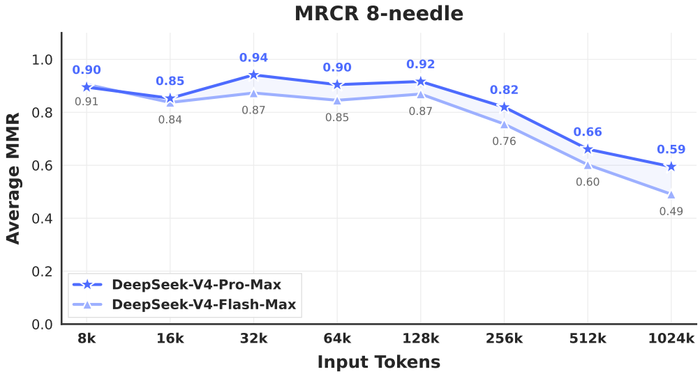
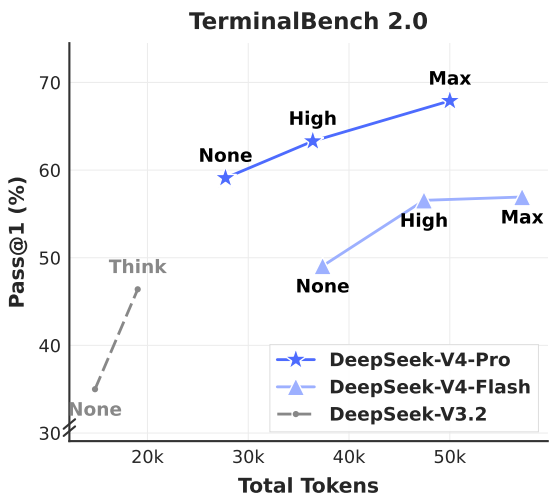

# DeepSeek-V4: 压缩注意力撑起 1M 上下文

材料是 DeepSeek 的正式技术报告 (arXiv 2606.19348, 58 页), 发布的是 V4 预览版的两个 MoE 模型: V4-Pro 总参数 1.6T, 激活 49B; V4-Flash 总参数 284B, 激活 13B, 都原生支持 1M token 上下文. 报告要解决的问题是让 1M 长度的预训练, RL 采样和线上推理在单 token 算力和 KV cache 上都撑得住.

## 1. 模型结构: 规模, MoE 与 mHC

V4 相对 V3 保留了 DeepSeekMoE 与 MTP, 改了四处: 注意力从 MLA 换成 CSA 与 HCA 交错的混合结构, 残差连接换成 mHC, 优化器换成 Muon, 后训练的收尾从混合 RL 换成多教师 On-Policy Distillation (OPD). 这几处改动互相依赖. 没有注意力压缩, 1M 序列的预训练和 RL 采样都撑不下来; 报告把 Muon 的作用写成「更快收敛, 更稳的训练」, 把 mHC 写成「增强常规残差」, 训练稳定还要靠第 4.2 节的两种经验手段; FP4 量化感知训练和批不变内核则保证 RL 采样, 训练和线上部署看到的是同一套数值.

报告第 4.2.1 节给出完整配置. Pro 有 61 层, 隐藏维 7168, 每层 1 个共享专家加 384 个路由专家, 专家中间维 3072, 每 token 激活 6 个路由专家. Flash 有 43 层, 隐藏维 4096, 1 个共享专家加 256 个路由专家, 专家中间维 2048, 同样激活 6 个. 按 SwiGLU 三个矩阵算, Pro 每个专家约 6600 万参数, 每层 385 个专家约 254 亿, 61 层合计约 1.55T, 加上注意力和嵌入, 与 1.6T 吻合; Flash 每层 257 个专家约 65 亿, 43 层约 2780 亿, 与 284B 吻合.

激活参数也能按同样的办法拆开. Pro 每 token 激活 7 个专家 (1 个共享加 6 个路由), 61 层约 28B; 注意力部分按第 2.2 节的维度估算每层约 3.1 亿参数 (查询上投影 $1536\times128\times512\approx1.0$ 亿, 分组输出投影约 1.8 亿, 其余是查询下投影, KV 与压缩权重投影和索引器), 61 层约 19B; 再加嵌入和输出头约 2B, 合计约 49B, 与报告一致 (推导). 注意力约占激活参数的 40%. 作为对照, V3 的 MLA 按其配置 ($n_h=128$, $d_h=128$, $d_c=512$, $d_c'=1536$) 每层约 1.9 亿参数, 61 层约 11B, 占 37B 激活的约 30% (推导). V4 的注意力参数多出来的部分, 主要来自 128 个查询头每头 512 维带来的查询上投影和输出投影. 报告第 4.2.1 节末尾把 Pro 的参数写成 「DeepSeek-V4-Flash comprises 1.6T total parameters」, 这是笔误, 同段开头和 Table 1 都是 Pro.

### 1.1. MoE 的小改动与 MTP

MoE 仍是 DeepSeekMoE 的细粒度加共享专家结构, 见 [DeepSeek-MoE](../../../LargeLanguageModelGuide/2-核心原理与架构/2.6-MoE/01-DeepSeek-MoE/01-DeepSeek-MoE.md). 相对 V3 有四处改动.

- 计算亲和度的激活从 Sigmoid 换成 $\sqrt{\mathrm{Softplus}(\cdot)}$, 后者没有上界, 在大输入时按平方根增长, 报告没有解释为什么换.
- 继续用无辅助损失均衡, 另加一个很小的序列级均衡损失防止单条序列内极端不均.
- 去掉了 V3 的「每个 token 最多发往 $M$ 个节点」约束, 报告说为此重新设计了并行策略.
- 前几层的稠密 FFN 换成 **Hash 路由**的 MoE: 按输入 token ID 的预设哈希函数决定去哪个专家, 不经过门控网络, 两个模型都是前 3 个 MoE 层用 Hash 路由.

去掉节点约束后, 一个 token 发往的 6 个路由专家可以散在任意多个节点上, 跨节点通信量不再有 V3 那样的 4 节点上限, 所以第 3.1 节的通算融合就变得必要. Hash 路由为什么只用在前 3 层, 报告没有解释. Hash 路由的代价也很直接: 同一个 token ID 在任何上下文里都去同一个专家, 浅层专家没法按语境分工. MTP 按 V3 的配置不变, 深度为 1, 机制见 [MTP 深度解析](../../../LargeLanguageModelGuide/2-核心原理与架构/2.8-其他架构方向/2.8.1-多Token预测MTP/2.8.1-多Token预测MTP.md). 均衡超参沿用 V3: 偏置更新速度 0.001, 序列均衡损失权重 0.0001; MTP 损失权重大部分时间是 0.3, 学习率开始衰减时改为 0.1.

### 1.2. mHC: 把残差流加宽并约束

Hyper-Connections 把残差流从 $d$ 维扩成 $n_{\mathrm{hc}}\times d$, 每层通过三个小矩阵混合: 输入映射 $A_l$ 从多路残差里组合出这一层的输入, 残差变换 $B_l$ 在多路之间重新混合, 输出映射 $C_l$ 把层输出写回多路, 即式 (1) $X_{l+1}=B_lX_l+C_l\mathcal F_l(A_lX_l)$. 层内部的计算仍是 $d$ 维, 所以加宽残差几乎不增加计算. 报告说朴素 HC 在多层堆叠时经常数值不稳. **mHC** 的做法是把 $B_l$ 约束到**双随机矩阵**上(非负, 每行每列和为 1), 这样 $B_l$ 的谱范数不超过 1, 残差变换不会放大信号; 双随机矩阵相乘仍是双随机矩阵, 所以堆多少层都成立. $A_l$ 和 $C_l$ 用 Sigmoid 约束为非负有界, 避免信号相互抵消.

三个矩阵都由输入动态生成, 见式 (3)–(8):

$$
\tilde A_l=\alpha_l^{\mathrm{pre}}(\hat X_lW_l^{\mathrm{pre}})+S_l^{\mathrm{pre}},\quad \tilde B_l=\alpha_l^{\mathrm{res}}\,\mathrm{Mat}(\hat X_lW_l^{\mathrm{res}})+S_l^{\mathrm{res}},\quad \tilde C_l=\alpha_l^{\mathrm{post}}(\hat X_lW_l^{\mathrm{post}})^\top+S_l^{\mathrm{post}},
$$

$$
A_l=\sigma(\tilde A_l),\qquad C_l=2\sigma(\tilde C_l),\qquad B_l=\text{Sinkhorn}(\tilde B_l).
$$

$\hat X_l$ 是把 $n_{\mathrm{hc}}\times d$ 的残差流展平后做 RMSNorm 的结果. 每个矩阵都是「动态项乘门控 $\alpha$, 加静态偏置 $S$」; $\alpha$ 初始化很小, 所以训练初期三个矩阵几乎就是静态偏置, 连接方式固定, 随训练才逐步变成依赖输入. $A_l$ 过 sigmoid 落在 $(0,1)$; $C_l$ 是 $2\sigma$, 落在 $(0,2)$, 动态项为 0 且偏置为 0 时恰好等于 1, 即写回权重从 1 起步. $B_l$ 的投影用 Sinkhorn-Knopp 算法: 先取指数保证为正, 再交替做行归一化 $\mathcal T_r$ 和列归一化 $\mathcal T_c$, $M^{(t)}=\mathcal T_r(\mathcal T_c(M^{(t-1)}))$, 迭代 20 次. 20 次后只是近似双随机, 行和列和不严格等于 1, 报告没给残差误差. 两个模型都取 $n_{\mathrm{hc}}=4$. mHC 的一般原理见 [Hyper-Connections 与 mHC](../../../LargeLanguageModelGuide/2-核心原理与架构/2.1-深度学习基础组件/2.1.3-残差连接/01-Hyper-Connections与mHC/01-Hyper-Connections与mHC.md).

mHC 在每个 Transformer 块之前, 由展平归一化后的残差流 $\hat X_l$ 经三组小线性投影算出 $A_l, B_l, C_l$, 每 token 每层计算一次. $A_l$ 把 4 路残差加权合成该层的 $d$ 维输入, $B_l$ 在 4 路之间做 $4\times4$ 混合, $C_l$ 把层输出按权重写回 4 路. 层间状态从一个 $d$ 维向量变为 $4\times d$ 矩阵, 激活显存和流水线阶段间传递的张量约增至 4 倍; 注意力仍在 $d$ 维输入上计算, 因而不增加推理时的 KV cache. $B_l$ 被限制为双随机矩阵, 不能放大信号或给某一路赋负权, 以朴素 HC 的这部分自由度换取数值稳定. Sinkhorn 只迭代 20 次, 所以约束也是近似满足.

代价在激活显存和流水线通信上, 第 3.5.2 节用融合内核, 选择性重算和调整 DualPipe, 把墙钟开销压到重叠 1F1B 流水阶段的 6.7%. 报告没有给 mHC 对损失或评测的消融, 也没有和普通残差做对照. 后续的 V4.1-Flash 保留 mHC, 把系数预测错后一块, 让部署时一个内核读一遍残差流就能完成输入混合和下一块的系数预测, 激活访存从 V4 实现的 $(4n+4)d$ 降到 $(2n+2)d$, 见 [V4.1-Flash 解析](../1.9-deepseek-v4-1-flash/02-deepseek-v4-1-flash-analysis.md).

## 2. 混合注意力: CSA 与 HCA

### 2.1. CSA 第一步: 沿序列维压缩 KV

V4 的注意力有两种. **Compressed Sparse Attention**(CSA)先把每 $m$ 个 token 的 KV 压成一条, 再在压缩后的条目上做 DSA 式的稀疏选择. 压缩方式见式 (9)–(12): 对每个 token 算两组 KV 向量 $C^a, C^b$ 和两组压缩权重 $Z^a, Z^b$; 第 $i$ 个压缩条目由当前块的 $m$ 个 $C^a$ 和前一块的 $m$ 个 $C^b$ 加权求和得到, 权重是 $Z$ 加上可学习位置偏置后在这 $2m$ 个位置上做 softmax. 写成式子:

$$
C^a=HW^{aKV},\ C^b=HW^{bKV},\ Z^a=HW^{aZ},\ Z^b=HW^{bZ},
$$

$$
[S^a_{mi:m(i+1)-1};S^b_{m(i-1):mi-1}]=\mathrm{Softmax}_{\mathrm{row}}\big([Z^a_{mi:m(i+1)-1}+B^a;\ Z^b_{m(i-1):mi-1}+B^b]\big),
$$

$$
C_i^{\mathrm{Comp}}=\sum_{j=mi}^{m(i+1)-1}S_j^a\odot C_j^a+\sum_{j=m(i-1)}^{mi-1}S_j^b\odot C_j^b.
$$

以 $m=4$ 算第 $i$ 个条目: 它取 token $4i$ 到 $4i+3$ 的 $C^a$ 和 token $4i-4$ 到 $4i-1$ 的 $C^b$, 共 8 个向量; softmax 沿这 8 个位置做, 且每个特征维各做一次, 所以 $S$ 和 $C$ 同形, 用 $\odot$ 相乘. $B^a$, $B^b$ 是块内位置的可学习偏置, 让「块内第几个 token」本身带权重. 每个 token 因此出现在两个条目里: 以 $C^a$ 身份进自己所在块的条目, 以 $C^b$ 身份进下一块的条目. 相邻压缩条目的窗口有重叠, 但每 $m$ 个 token 只产生一个条目, 所以序列长度压到 $1/m$. 两个模型都取 $m=4$. HCA 的式 (20)–(23) 是去掉 $b$ 那一路的同一结构, 块长 $m'=128$, 每个条目只对自己块内 128 个 token 做逐维 softmax 加权, 块与块不重叠.

这种压缩和 MLA 的低秩压缩方向不同. MLA 把每个 token 的 KV 压到低维潜变量, token 数不变, 见 [MLA](../../../LargeLanguageModelGuide/2-核心原理与架构/2.2-注意力机制/2.2.2-多头注意力变体/03-MLA-低秩潜变量与解耦RoPE/03-MLA-低秩潜变量与解耦RoPE.md); CSA 让每个条目仍是 512 维的完整向量, 但条目数减到四分之一. 压缩权重逐维度独立(Hadamard 积), 等于每个特征维可以选择从块内哪几个 token 取信息. 与 NSA 的块压缩相比, CSA 用重叠窗口和两组 KV 让块边界处的信息不被切断, NSA 的做法见 [NSA](../../../LargeLanguageModelGuide/2-核心原理与架构/2.4-稀疏注意力/02-原生稀疏注意力机制NSA/02-原生稀疏注意力机制NSA.md). 报告没有给 $m$ 取 2, 4, 8 的对比.

### 2.2. CSA 第二步: 索引器选块, MQA 计算

压缩后, CSA 沿用 V3.2 的 lightning indexer 选 top-k. 索引器的键也按同样方式压缩, 查询由低秩方式生成: 先把 $\mathbf h_t$ 降到 $d_c$ 维的潜变量 $\mathbf c^Q_t$, 再上投影成 $n^I_h$ 个索引头, 分数仍是 $\sum_h w_{t,h}\mathrm{ReLU}(\mathbf q^I_{t,h}\cdot K^{\mathrm{IComp}}_s)$, 见式 (13)–(17). 两个模型的索引器都是 64 头, 每头 128 维; top-k 在 Flash 上是 512, Pro 上是 1024. 每个被选中的条目代表 4 个 token, 所以 Pro 每个查询实际覆盖约 4096 个 token 位置, 比 V3.2 的 2048 多, 但选出的条目数只有一半. 报告第 2.3.4 节说 V4 选了比 V3.2 更小的 top-k, 以提高短文本和中等长度文本上的效率: 序列不长时, 压缩条目总数和 top-k 相差不多, 注意力计算量主要由 top-k 决定.

核心注意力用 MQA: 每个压缩条目同时当键和值, 所有查询头共享. 查询头由同一个 $\mathbf c^Q_t$ 上投影得到, 与索引器共用潜变量. Pro 有 128 个查询头, Flash 有 64 个, 每头 $c=512$ 维. 这样 $c\cdot n_h$ 很大, Pro 达到 65536 维, 直接投影回 7168 维代价太高, 所以用分组输出投影: 把头分成 $g$ 组, 每组先投到 $d_g=1024$ 维, 再拼起来投回 $d$. Pro 取 $g=16$, Flash 取 $g=8$. 按 Pro 的配置, 分组后输出投影约 1.8 亿参数, 不分组直接投需要约 4.7 亿.

### 2.3. HCA 与层的排布

**Heavily Compressed Attention**(HCA)用更大的压缩率 $m'=128$, 窗口不重叠, 只有一组 KV, 见式 (20)–(23); 压缩后不做稀疏选择, 查询对所有压缩条目做稠密注意力, 也用共享 KV 的 MQA 和分组输出投影. 1M 上下文下, HCA 每层只有约 8192 个条目, 稠密计算也不贵; CSA 每层有约 26 万个条目, 所以需要索引器再挑. 两者的分工是: HCA 给出全局的粗粒度视图, CSA 在细一些的粒度上按内容挑远处的块.

层排布上, Flash 前两层是纯滑动窗口注意力, Pro 前两层是 HCA, 之后 CSA 与 HCA 交错. 按 Pro 的 61 层算, 前两层 HCA 之后 59 层交错, 约 30 层 CSA, 31 层 HCA (推导). 报告没有解释为什么 Flash 前两层只用滑动窗口而 Pro 用 HCA, 也没有给交错比例的消融.

两种注意力的计算、交互状态与代价如下:

| | CSA | HCA |
|---|---|---|
| 谁算 | 每个 token 算两组 KV 向量 $C^a, C^b$ 和两组压缩权重, 每满 4 个 token 产出一个 512 维条目; 索引器另算一份压缩键 | 每个 token 算一组 KV 向量和压缩权重, 每满 128 个 token 产出一个 512 维条目 |
| 和谁算 | 查询先经索引器给全部压缩条目打分, 只和 top-k 个条目加最近 128 个原始 token 做注意力 | 查询和全部压缩条目加最近 128 个原始 token 做稠密注意力 |
| 缓存怎么变 | 每 4 个 token 追加一个主 KV 条目和一个索引键; 不满 4 个的尾巴放在状态缓存里 | 每 128 个 token 追加一个条目; 尾巴同样暂存 |
| 丢了什么 | 块内 4 个 token 的逐 token 细节只剩加权和; 没被 top-k 选中的条目这一层完全看不到 | 128 个 token 的细节压成一条, 远处只剩粗粒度信息, 精确定位靠交错的 CSA 层和滑动窗口 |

两种层交错, 是让每一层都只付一种代价: CSA 层的远程信息是细的但不全, HCA 层的远程信息是全的但粗. 1M 长度下 HCA 每层只有约 8192 个条目, 稠密计算不贵; CSA 每层约 26 万个条目, 打分开销落在索引器上. CSA 与 HCA 的对比和更多背景见 [CSA-HCA 混合压缩注意力](../../../LargeLanguageModelGuide/2-核心原理与架构/2.4-稀疏注意力/04-CSA-HCA-混合压缩注意力/04-CSA-HCA-混合压缩注意力.md).

### 2.4. 注意力的四项补充设计

第 2.3.3 节补了四项. 一是对每个查询头和唯一的 KV 头在核心注意力前做 RMSNorm, 防止注意力 logit 爆炸. 二是部分 RoPE: 查询和 KV 条目只在末尾 64 维加 RoPE. 因为 KV 条目同时当键和值, 注意力输出是 KV 的加权和, 会带上被注意位置的绝对位置编码; 报告的对策是对输出的末尾 64 维再施加位置为 $-i$ 的 RoPE, 抵消查询自身位置, 使输出只带相对位置信息. 这个细节在 MLA 里不存在, 因为 MLA 的值向量不加 RoPE.

三是滑动窗口支路. 为保证因果性, 查询只能看之前的压缩块, 看不到自己所在块内的其他 token; 而语言建模里最近的 token 通常最相关. 所以每个查询另外取最近 $n_{\mathrm{win}}=128$ 个未压缩 token 的 KV, 与压缩条目一起参加注意力. 四是 attention sink: 每个头有一个可学习的 sink logit $z'_h$, 加进 softmax 分母, 见式 (27):

$$
s_{h,i,j}=\frac{\exp(z_{h,i,j})}{\sum_k\exp(z_{h,i,k})+\exp(z'_h)}.
$$

分母多出的 $\exp(z'_h)$ 不对应任何位置, 也没有 value, 所以 $\sum_js_{h,i,j}=\frac{\sum_k e^{z_{h,i,k}}}{\sum_k e^{z_{h,i,k}}+e^{z'_h}}<1$, 缺的那部分权重被「吸走」, 输出向量的模随之变小. 当所有真实位置的 logit 都远小于 $z'_h$ 时, 权重总和接近 0. $z'_h$ 按头学习, 与查询无关, 所以它相当于每个头一条固定的「输出多少」门槛. 压缩条目数随长度变化很大, 有了 sink, 一个头在没有相关内容时可以选择几乎不输出, 而不是被迫把权重分给无关条目.

### 2.5. 效率: 读图 1 并按配置复算 KV

图 1 右侧的单 token FLOPs 曲线上, 1M 位置处 V3.2 约 1.19T, Pro 约 0.32T (图上标「低 3.7 倍」), Flash 约 0.12T (标「低 9.8 倍」)(读图). 1/3.7 约 27%, 对应引言里 Pro 的 FLOPs 比例; 1/9.8 约 10%, 是 Flash 的 FLOPs 比例, 和 Pro 的 KV cache 比例 10% 恰好同数, 不是一回事. 引言给出的 Flash KV cache 比例是 7%. 报告的 FLOPs 按「等效 FP8 FLOPs」计. V3.2 的曲线从约 0.1T 线性涨到 1.2T, 主要是索引器随长度线性增长的开销; V4 的斜率小得多, 因为 CSA 的索引器只对四分之一的条目打分, HCA 没有索引器.

第 2.3.4 节把效率来源分成存储和计算两类. 存储上, KV 条目的 RoPE 维用 BF16, 其余维用 FP8, 比纯 BF16 省近一半, 这一项直接缩小 KV cache. 计算上, 索引器内部的注意力打分用 FP4, top-k 比 V3.2 小, 这两项减的是 FLOPs, 不改变每 token 存多少字节. 报告说最主要的一项仍是压缩注意力和混合注意力本身, 它同时减小 FLOPs 和 KV cache.

图注: 报告 Figure 1: V4 与 V3.2 的单 token FLOPs 及 benchmark 对比。
*报告 Figure 1: V4 与 V3.2 的单 token FLOPs 及 benchmark 对比*

可以按配置复算 KV 比例. Pro 每个 CSA 层每 token 平均存 512/4 维主 KV 加 128/4 维索引键, 约 160 个元素; 每个 HCA 层 512/128 = 4 个元素; 30 层 CSA 加 31 层 HCA 合计约 4900 个元素每 token. V3.2 每层存 576 维潜变量加 128 维索引键, 61 层约 4.3 万个元素. 两者之比约 11%, 考虑到 V4 索引键用 FP4, 与报告的 10% 接近. 报告另以 BF16 GQA8, 头维 128 为基线, 说 V4 的 KV 约为其 2%: GQA8 每层每 token 存 2×8×128 = 2048 个 BF16 元素, 61 层约 25 万字节; V4 按 FP8 为主约 5000 字节, 比值约 2.0%. 这两组复算都不含滑动窗口的 128 个 token, 那部分不随长度增长.

## 3. 优化器与基础设施

### 3.1. Muon 优化器

除嵌入, 输出头, mHC 的静态偏置与门控系数, 以及所有 RMSNorm 权重仍用 AdamW 外, 其余参数都用 **Muon**, 见 [Muon 优化器专题](../../../LargeLanguageModelGuide/6-训练与推理优化/6.5-优化器/6.5.2-Muon/01-Muon优化器专题/01-Muon优化器专题.md). Algorithm 1 的步骤是: 动量累积, 用 Nesterov 技巧组合动量和当前梯度, 做 Newton-Schulz 正交化, 把更新矩阵乘以 $\sqrt{\max(n,m)}\cdot\gamma$ 调整 RMS, 最终做权重衰减并更新. Newton-Schulz 迭代的目标是把矩阵 $M=U\Sigma V^T$ 近似成 $UV^T$, 即所有奇异值变成 1, 相当于让更新在各个方向上步长相同.

V4 的改动是混合 Newton-Schulz: 共 10 步, 前 8 步用系数 (3.4445, −4.7750, 2.0315) 快速把奇异值推近 1, 后 2 步用 (2, −1.5, 0.5) 精确稳定在 1. 把系数代入迭代多项式 $f(x)=ax+bx^3+cx^5$: 前一组在 $x=1$ 处 $f(1)\approx0.70$, 1 不是它的不动点, 小奇异值被快速放大, 但最终只落在 1 附近的一个区间; 后一组 $f(1)=1$ 且 $f'(1)=0$, 能把奇异值稳定收敛到 1(推导). 两者组合兼顾速度和精度. 超参: 动量 0.95, 权重衰减 0.1, 更新矩阵的 RMS 调到 0.18 以复用 AdamW 的学习率. 报告引用的 Liu et al. (2025) 在 Muon 上用 QK-Clip 防止注意力 logit 爆炸; V4 因为已对查询和 KV 条目做 RMSNorm, 不再需要 QK-Clip. 报告没有给 Muon 与 AdamW 的收敛速度对比.

### 3.2. 让新结构训得动的基础设施

第 3.1 节的细粒度专家并行把 Dispatch, Linear-1, Linear-2, Combine 四个阶段融进一个流水化内核, 专家按 wave 调度: 一组专家的数据一到就开始计算, 同时传下一组的 token, 发回已完成专家的结果. 相对非融合基线, 一般推理负载快 1.50–1.73 倍, RL rollout 等延迟敏感场景最高 1.96 倍, 内核以 MegaMoE 名义开源. 报告给出通信完全被隐藏的条件: 每个 token-专家对需要 $6hd$ FLOPs 和 $3h$ 字节通信(FP8 发送加 BF16 回收), 所以只要峰值算力与带宽之比 $C/B\le 2d$, Pro 的专家中间维 $d=3072$ 对应 6144 FLOPs/Byte, 即每 GB/s 带宽可以隐藏 6.1 TFLOP/s 的计算.

第 3.3 节做了端到端的批不变与确定性内核. 批不变指同一个 token 的输出与它在 batch 中的位置无关, 按位一致: 注意力放弃 split-KV, 用单 SM 内核加多 SM 内核两套实现并保证累加顺序相同; 矩阵乘全部换成 DeepGEMM, 多数场景放弃 split-k. 确定性针对反向传播: 稀疏注意力反向不用 atomicAdd, 每个 SM 用独立缓冲再确定性求和; MoE 反向做 token 顺序预处理和缓冲隔离; mHC 里输出维只有 24 的小矩阵乘, 分开输出各段再确定性归约. 这些保证了预训练, 后训练和推理三条路径按位对齐, 训练出现损失尖峰时可以精确复现.

### 3.3. FP4 量化训练与 KV 缓存管理

第 3.4 节在后训练阶段引入 FP4(MXFP4)量化感知训练, 覆盖两处: MoE 专家权重, 以及 CSA 索引器的 QK 路径. 索引分数也从 FP32 降到 BF16, top-k 选择器快 2 倍, KV 召回率保持 99.7%. 专家权重的做法是: FP32 主权重先量化到 FP4, 再反量化到 FP8 参与计算. 报告说这一步无损, 因为 FP8(E4M3)比 FP4(E2M1)多 2 位指数, 只要一个 128×128 的 FP8 块内, 各个 1×32 FP4 子块比例因子的最大最小比不超过阈值, 细粒度比例信息就能被 FP8 的动态范围吸收. 反向时梯度直接传回 FP32 主权重, 等价于直通估计器. RL rollout 和推理直接用真实 FP4 权重, 保证采样行为与线上部署一致. FP8 训练的背景见 [FP8 混合精度训练详解](../../../LargeLanguageModelGuide/6-训练与推理优化/6.1-训练基础设施/6.1.2-混合精度训练/02-FP8混合精度训练详解/02-FP8混合精度训练详解.md).

推理侧, 混合注意力打破了 PagedAttention 的前提: 各层 KV 大小不同, 滑动窗口有自己的缓存与淘汰策略, 压缩分支还有凑不满 $m$ 个 token 的尾巴要暂存. 第 3.6 节把 KV 分成两部分: 经典 KV cache 存 CSA/HCA 的压缩条目, 每块覆盖 $\mathrm{lcm}(m,m')=128$ 个原始 token; 状态缓存存滑动窗口 KV 和未压缩的尾巴, 每个请求一个固定大小的块, 当作状态空间模型的状态来管理. 共享前缀复用放在磁盘上: 压缩条目全部落盘; 滑动窗口 KV 约是压缩条目的 8 倍, 提供三种策略, 全量存, 每 $p$ 个 token 存一次检查点, 或者完全不存, 靠已缓存的压缩条目重算最近 $n_{\mathrm{win}}\cdot L$ 个 token 恢复.

## 4. 预训练

### 4.1. 数据与预训练日程

数据在 V3 语料基础上扩充: 过滤网页里批量自动生成和模板化的内容以降低模型坍缩风险; 数学和代码仍是核心, 中期训练加入 agentic 数据增强代码能力; 扩大多语种语料; 特别强调长文档, 优先科学论文, 技术报告. 合计超过 32T token. 词表仍是 128K, 加了少量上下文构造用的特殊 token, 沿用 token-splitting 和 FIM; 按来源打包文档以减少截断; 与 V3 不同, 预训练使用样本级注意力掩码, 同一序列里打包的不同文档互相看不见. 报告没有给数学, 代码, 网页, 长文档的比例, 也没有给多语种语料的规模.

Flash 训练 32T token, batch 从小逐步增加到 75.5M token 后保持; 学习率前 2000 步线性预热, 大部分时间保持 $2.7\times10^{-4}$, 末段余弦衰减到 $2.7\times10^{-5}$. Pro 训练 33T token, 最大 batch 94.4M, 峰值学习率 $2.0\times10^{-4}$, 末值 $2.0\times10^{-5}$. 序列长度从 4K 逐步扩到 16K, 64K, 末尾 1M, 没有单独的 YaRN 扩展阶段. 稀疏注意力的引入: Flash 前 1T token 用稠密注意力预热, 到 64K 长度时引入稀疏, 先短暂预热索引器, 再用稀疏注意力训完; Pro 的稠密阶段更长. 按最大 batch 算, Flash 至少约 42 万步, Pro 至少约 35 万步, 前期 batch 较小, 实际步数更多. 按 6 倍激活参数乘 token 数粗算, Pro 约 $9.7\times10^{24}$ FLOPs, 约为 V3 的 3 倍; Flash 约 $2.5\times10^{24}$, 比 V3.2-Base 累计的约 $3.7\times10^{24}$ 还少(不含注意力).

### 4.2. 训练不稳: 两种有效但机理不明的手段

第 4.2.3 节记录了万亿参数 MoE 训练中的明显损失尖峰: 回滚后训练可以暂时恢复, 尖峰仍会再次出现. 实验将尖峰与 MoE 层的离群值联系起来, 路由机制还会放大这类离群值. 第一种处理手段是 **Anticipatory Routing**: 第 $t$ 步用当前参数 $\theta_t$ 计算特征, 路由索引则由历史参数 $\theta_{t-\Delta t}$ 计算. 实现上在第 $t-\Delta t$ 步提前取第 $t$ 步的数据, 预先算好路由并缓存. 该机制会增加约 20% 的墙钟开销; 系统只在检测到尖峰时自动短回滚并临时开启, 运行一段时间后切回正常训练, 因此对完整训练的影响很小.

第二种手段是 **SwiGLU Clamping**: 把 SwiGLU 的线性分支夹在 $[-10, 10]$, 门控分支上界设为 10, 两个模型全程使用. 路由和主干解耦为什么有效, 一个可能的解释是: 路由和专家权重同步更新时, 专家变强会吸引更多 token, 更多 token 又让它更新更多, 形成正反馈, 延迟路由能打断这个循环. 报告自己说两种手段的理论机理仍不清楚, 是作为经验公开给社区. 报告没有给出尖峰的频率, 开启 Anticipatory Routing 的总时长, 也没有给出 clamp 触发的比例.

### 4.3. Base 模型评测

Table 1 在统一的内部框架下比较三个 Base. Flash-Base 激活 13B, 总参 284B, 在多数项上超过激活 37B, 总参 671B 的 V3.2-Base: 知识类 MMLU-Pro 65.5 → 68.3, FACTS Parametric 27.1 → 33.9, Simple-QA verified 28.3 → 30.1; 报告归在长上下文类的 LongBench-V2 从 40.2 到 44.7. Pro-Base 再上一截: MMLU-Pro 73.5, Simple-QA verified 55.2, FACTS Parametric 62.6, SuperGPQA 53.9, LongBench-V2 51.5, HumanEval 76.8. 事实记忆类 (Simple-QA verified, FACTS Parametric) 的大幅提升集中在总参数 1.6T 的 Pro 上: Flash 相对 V3.2 涨 1.8 和 6.8 分, Pro 相对 V3.2 涨 26.9 和 35.5 分. 总参数 284B 的 Flash 比 671B 的 V3.2 还小, 事实记忆却没有掉, 这部分要归给数据和训练; Pro 的跳升则和总参数一起出现.

报告说 Pro-Base 在推理, 代码, 长上下文, 世界知识上「全面领先」, 但表里有反例. BigCodeBench 上 V3.2-Base 63.9, 高于 Pro 的 59.2 和 Flash 的 56.8; CMath 上 V3.2 92.6 高于 Pro 90.9; BBH 上 V3.2 87.6 与 Pro 87.5, 按表注「差距不超过 0.3 视为同一水平」; MATH 上 Flash 57.4 低于 V3.2 的 60.5. 按第 4.1 节的粗算, Flash-Base 的训练算力少于 V3.2-Base, 大多数项仍然领先, 说明结构, 数据和优化器的改进确有贡献; 但 Table 1 没有消融, 无法区分这几项各自的作用.

## 5. 后训练: 专家与 OPD

### 5.1. 专家训练: 三档推理, 生成式奖励与工具格式

后训练先按领域训专家, 每个专家先 SFT 再用 GRPO 做 RL, 超参沿用前作, 见 [GRPO](../../../LargeLanguageModelGuide/4-后训练/4.5-GRPO家族与RLVR/01-GRPO/01-GRPO.md). 领域包括数学, 代码, Agent, 指令跟随等. 推理投入分三档: Non-think 直接给摘要; Think High 先写思考 token 再给摘要; Think Max 在系统提示开头加一句 「Reasoning Effort: Absolute maximum with no shortcuts permitted.」 三档对应 RL 时不同的长度惩罚和上下文窗口, 评测中上下文分别是 8K, 128K, 384K. 报告没有给三档各自的长度惩罚系数.

难验证任务不再用标量奖励模型, 改用带 rubric 的 RL 数据和生成式奖励模型(GRM), 并且直接对 GRM 本身做 RL: actor 网络同时充当 GRM, 评判能力和生成能力一起优化, 报告说这样只需要少量多样的人工标注. 工具调用改用 XML 格式, 加一个特殊 token `|DSML|`, 报告说 XML 能减少转义失败和工具调用错误. 交错思考比 V3.2 更进一步: 工具调用场景下所有推理内容在整段对话中保留, 包括跨用户消息; 普通对话仍在新用户消息到来时丢弃旧推理. Quick Instruction 在输入序列后追加专用特殊 token, 直接复用已算好的 KV cache 完成是否搜索, 生成搜索词, 判断权威性和领域等辅助任务, 省掉单独小模型的重复预填充, 降低首 token 延迟.

### 5.2. OPD: 十多个教师合成一个学生

专家训完后, 用多教师 **On-Policy Distillation** 合成最终模型, 完全取代了 V3.2 的混合 RL 阶段. 目标是式 (29) $\mathcal L_{\mathrm{OPD}}=\sum_i w_i\,\mathrm{KL}(\pi_\theta\|\pi_{E_i})$, 样本由学生自己生成, 权重 $w_i$ 按专家的相对重要性设定, 这一阶段用了**十个以上**教师. 反向 KL 让学生在自己会走到的状态上贴近教师, 并倾向于集中在教师的高概率区域, 这对「数学题听数学专家, 代码题听代码专家」的选择性学习是合适的, OPD 的基本原理见 [OPD 基础原理](../../../LargeLanguageModelGuide/4-后训练/4.9-OPD/4.9.1-OPD方法与落地/01-OPD基础原理/01-OPD基础原理.md) 与 [On-Policy Distillation 深度解析](../../../LargeLanguageModelGuide/4-后训练/4.9-OPD/4.9.1-OPD方法与落地/01-OPD基础原理/01-OPD基础原理.md).

常见做法是把全词表 KL 简化成采样 token 处的单点估计, 用 $\log(\pi_{E_i}/\pi_\theta)$ 当逐 token 优势塞进 RL 框架. 报告说这样方差大, 训练不稳, 所以改用全词表 logit 蒸馏. 词表超过 10 万, 为所有教师物化 logits 不可行, 第 5.2.2 节的办法是: 教师权重放在集中式分布存储里按需加载; 只缓存教师末尾一层隐藏状态, 训练时再过对应的输出头重建 logits; 样本按教师编号排序, 保证每个 mini-batch 中每个教师头只加载一次, 显存里最多驻留一个教师头; KL 用专门的 TileLang 内核计算. 报告没有给 OPD 的步数, 学生生成长度, 各教师权重, 也没有给 OPD 与混合 RL 的对比实验.

### 5.3. RL 与 OPD 的系统设计

第 5.2.3 节处理集群抢占和硬件故障. 每个生成请求有一个 token 粒度的预写日志: 每生成一个 token 立即追加; 抢占时暂停推理引擎并保存未完成请求的 KV cache, 恢复时继续解码; 硬件致命错误时用日志里的 token 重新预填充. 报告特别指出, 被中断的请求从头重新生成在数学上是错的, 会引入长度偏差: 短回答更容易在中断前完成, 从头重来会让模型更倾向短序列. 如果推理栈批不变且确定, 也可以用固定随机种子重新生成, 但要重跑解码, 效率不如预写日志.

第 5.2.4 节为百万 token 的 RL 把 rollout 数据拆成轻量元数据和重量级逐 token 字段, 元数据全局加载做打乱和打包, 逐 token 字段按 mini-batch 用完即释放. 第 5.2.5 节的沙箱平台 DSec 用 Rust 写成, 单集群管理数十万个并发沙箱; 一套 Python SDK 背后有四种执行底座: 函数调用, Docker 兼容容器, Firecracker microVM, QEMU 全虚拟机. 每个沙箱有全局有序的轨迹日志, 训练任务被抢占后可以回放已完成命令的缓存结果, 避免重复执行非幂等操作. Agent RL 的一般流程见 [Agentic RL 训练](../../../LargeLanguageModelGuide/13-Agent/13.4-Agent训练与进化/13.4.1-AgenticRL训练/13.4.1-AgenticRL训练.md).

## 6. 评测, 局限与谱系

**6.1. 评测协议与主结果:** 推理和知识任务温度 1.0, 数学题用「逐步推理, 答案放进 `\boxed{}`」的模板, Pro-Max 做数学时换成要求严格证明的模板. Codeforces 是内部基准: 2025 年 5 月到 11 月的 14 场 Div.1 比赛, 114 题; 每题生成 32 个候选, 不放回抽 10 个随机排序作为提交序列, 按 OpenAI 的罚分方案计分, 换算成名次和 rating, 再对所有抽样取期望, 14 场平均. 代码 Agent 任务用内部框架, 只给 bash 和文件编辑两个工具, 最多 500 步, 上下文 512K; 搜索任务同样 500 步, 512K, BrowseComp 沿用 V3.2 的 Discard-all 上下文管理.

Table 6 的 Pro-Max 主要分数: MMLU-Pro 87.5, SimpleQA-Verified 57.9, Chinese-SimpleQA 84.4, GPQA Diamond 90.1, HLE 37.7, LiveCodeBench 93.5, Codeforces 3206, HMMT 2026 Feb 95.2, IMOAnswerBench 89.8, Apex 38.3, Apex Shortlist 90.2; Agent 部分 Terminal Bench 2.0 67.9, SWE Verified 80.6, SWE Pro 55.4, BrowseComp 83.4, 带工具 HLE 48.2, MCPAtlas 73.6, Toolathlon 51.8. 相对 Gemini-3.1-Pro, SimpleQA-Verified 低 17.7 分, GPQA 低 4.2 分; 相对开源的 K2.6 和 GLM-5.1, 知识和推理多数领先, 但带工具 HLE 的 48.2 是表中最低. 报告说 Pro-Max 在 Codeforces 人类排行榜上排第 23 名. Codeforces 的 3206 与 V3.2 报告的 2386 不能直接比, 两者的题目集和计分方式都不同.

**6.2. 长上下文与推理档位:** MRCR 表中 Pro-Max 的 「MRCR 1M」 是 83.5, 高于 Gemini-3.1-Pro 的 76.3, 低于 Claude Opus 4.6 的 92.9. 但图 9 的 MRCR 8-needle 曲线上, Pro-Max 在 128K 处约 0.92, 256K 处 0.82, 512K 处 0.66, 1024K 处只有 0.59; Flash-Max 在 1024K 处 0.49(读图). 所以表里的 83.5 不是 1M 长度处的分数, 更可能是到 1M 为止各长度的平均, 按图 9 的 8 个长度简单平均约 82.3, 接近但不等于 83.5, 报告没有说明口径. CorpusQA 1M 上 Pro-Max 62.0, 高于 Gemini-3.1-Pro 的 53.8.

图注: 报告 Figure 9: MRCR 8-needle 曲线上 Pro-Max 随长度的衰减。
*报告 Figure 9: MRCR 8-needle 曲线上 Pro-Max 随长度的衰减*

Table 7 显示推理档位的影响很大. Pro 的 HLE 从 Non-think 7.7 到 High 34.5 再到 Max 37.7; HMMT 从 31.7 到 94.0 到 95.2. Non-think 档里, Pro 在 HMMT(31.7)和 IMOAnswerBench(35.3)上反而低于 Flash(40.8, 41.9). Flash-Max 在推理上接近 Pro-Max: LiveCodeBench 91.6 对 93.5, HMMT 94.8 对 95.2; 知识上差距大: SimpleQA-Verified 34.1 对 57.9. 图 10 的成本曲线上, Terminal Bench 2.0 的 Pro 三档约用 2.8 万, 3.6 万, 5.0 万 token, Flash 三档约 3.7 万, 4.7 万, 5.7 万 token, Flash 每一档都比 Pro 用的 token 多, 分数却低(读图). 所以 Flash 单 token 便宜, 但完成同一任务的总开销要按 token 数一起算.

图注: 报告 Figure 10: HLE 与 Terminal Bench 2.0 上 Pro 和 Flash 各推理档的分数与 token 开销。
*报告 Figure 10: HLE 与 Terminal Bench 2.0 上 Pro 和 Flash 各推理档的分数与 token 开销*

**6.3. 真实场景评测:** 第 5.4 节是内部评测. 中文功能写作对 Gemini-3.1-Pro, 3170 条提示, 胜 1986, 负 1081, 平 103, 胜率 62.7% 对 34.1%; 创意写作 2837 条, 指令遵循胜率 60.0%, 写作质量 77.5%, 但歌词一类指令遵循只有 26.7%. 最难的复杂指令和多轮写作上对 Claude Opus 4.5, 196 条, 胜 90 负 102, 45.9% 对 52.0%. 搜索方面, 对 V3.2 的 956 条问答, V4 胜 28.1%, V3.2 胜 10.4%, 平局 61.5%, 大多数题两者打平. Agentic 搜索对 RAG, 869 条, 胜率 61.7% 对 18.3%; 平均工具调用 16.2 次, 预填充 13,649 对 10,453 token, 多约 31%, 输出多约 17%.

白领任务是 30 个中文专业任务, 覆盖 13 个行业, 盲评对 Opus-4.6-Max 的「不输率」为 63%, 不输率包含平局. 研发代码任务从 50 多名内部工程师收集约 200 个任务, 筛到 30 个, Pro-Max 通过率 67%, 约 20 题, Sonnet 4.5 为 47%, Opus 4.5 为 70%, 只差 1 题. 85 名内部开发者的问卷中, 52% 认为可以当默认编码模型, 39% 倾向于是, 不到 9% 否. 这些评测样本量小, 由 DeepSeek 自己出题和评判, 问卷对象是自家员工, 适合看产品方向, 不适合与公开基准混在一起比较.

**6.4. 局限与谱系:** 报告第 6 节列了两项局限: 为了冲极端长上下文, 保留了很多初步验证过的组件和技巧, 结构偏复杂, 后续要精简到最本质的设计; Anticipatory Routing 和 SwiGLU Clamping 有效但原理不清. 未来方向包括更稀疏的嵌入模块 (报告引用的是 Engram 条件记忆, Cheng et al., 2026), 低延迟结构, 长程多轮 Agent, 多模态, 数据策展与合成. 正文里 mHC, Muon, CSA/HCA 交错比例和 Hash 路由都没有消融, OPD 也没有和混合 RL 对照, 所以这几项各自贡献多少, 从这份报告里分不出来.

谱系上, V4 是 DeepSeek 在 V3 之后第一次整体重做底座. MoE 和 MTP 保留; 注意力从 V2 起用的 MLA 换成沿序列维压缩的 CSA/HCA, 但保留了 V3.2 的 lightning indexer, 所以 V3.2 的 DSA 是 V4 注意力的直接前身, 见 [V3.2 解析](../1.7-deepseek-v3-2/02-deepseek-v3-2-analysis.md); 残差和优化器都换了; 后训练从 R1 的规则奖励 RL, V3.2 的专家蒸馏加混合 RL, 走到专家 RL 加多教师 OPD.

后续的 [V4.1-Flash](../1.9-deepseek-v4-1-flash/02-deepseek-v4-1-flash-analysis.md) 以 V4-Flash 为基线, 把本文这几处设计各推进了一步. 注意力上, CSA 与 HCA 的交错换成只用 CSA2 一种层, CSA2 去掉了本文式 (9)–(12) 的重叠窗口和块内位置偏置, 索引键改从主 KV 条目投影, 并让多数层复用前面某一层的 KV 和 top-k 选择; 前 20 层作 encoder, prefill 只跑这一半. 精度上主 KV 从 FP8 降到 FP4. 部署上, 本文第 3.3 节的状态缓存里那份滑动窗口 KV 被移出持久化缓存, 缺失时只回放最近 128 个 token 近似重建. 每 token 的 global KV 从 V4-Flash 的 3,514 字节降到 890 字节. 其余方面, V4.1 去掉 MTP 改用独立训练的 DSpark 草稿模型, 挂上 196B 的 Engram, 推理档位从本文的三档变成 1 到 100 的标量, OPD 教师从十个以上加到四十个以上.

总的来看, V4 的贡献是把 1M 上下文从「能跑」变成常规配置: 注意力 FLOPs 和 KV cache 都按序列维压到 V3.2 的十分之一量级, 代价是结构上叠了很多组件, 其中两项训练稳定手段连作者也说不清原理. 评测上 Pro-Max 在推理和代码 Agent 上进入第一梯队, 知识类和 1M 长度处的检索仍有明显差距.

## 参考文献

- DeepSeek-AI. DeepSeek-V4: Towards Highly Efficient Million-Token Context Intelligence. arXiv:2606.19348, 2026. https://arxiv.org/abs/2606.19348
- DeepSeek-AI. DeepSeek-V3 Technical Report. arXiv:2412.19437, 2024. https://arxiv.org/abs/2412.19437
- Z. Xie et al. mHC: Manifold-Constrained Hyper-Connections. arXiv:2512.24880, 2025. https://arxiv.org/abs/2512.24880
- X. Cheng et al. Conditional Memory via Scalable Lookup: A New Axis of Sparsity for Large Language Models. arXiv:2601.07372, 2026. https://arxiv.org/abs/2601.07372
