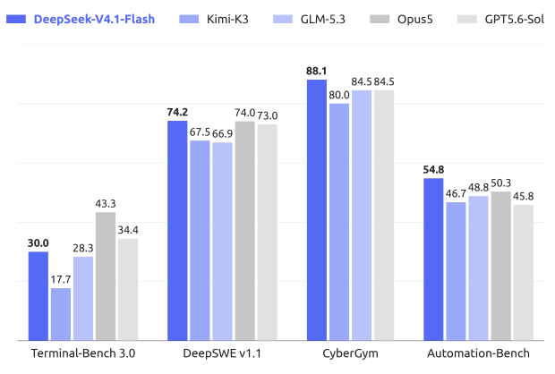
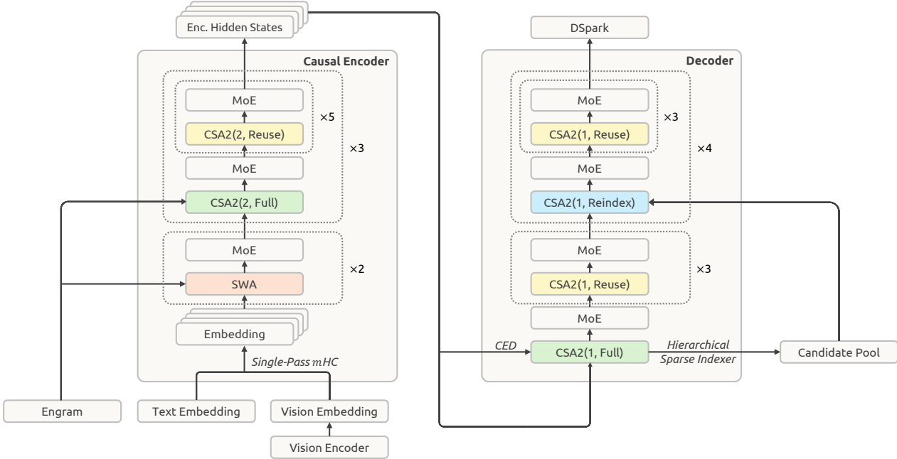
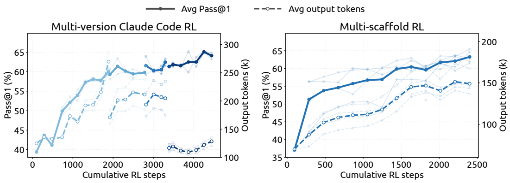
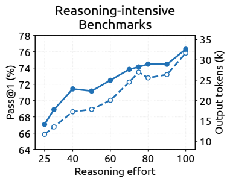
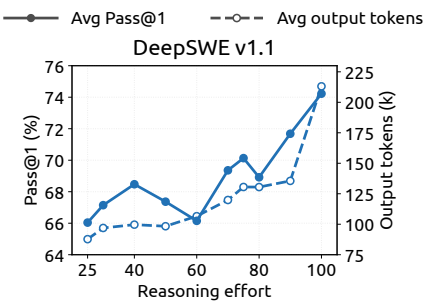

<!-- page 1 of 51 -->

Qdeepseek

# DeepSeek-V4.1-Flash: Pushing the Limits of KV Cache Compression / DeepSeek-V4.1-Flash: 把 KV Cache 压缩推到极限

DeepSeek-AI **research@deepseek. com**

DeepSeek-AI . research@deepseek. com

## Abstract

The widespread adoption of long-horizon agents has made model workloads increasingly inputheavy. Although prior work has substantially reduced the cost of long-context computation, prefill remains computationally expensive, and large KV caches continue to strain HBM and SSD capacity and data-transfer bandwidth. Together, these compute, storage, and bandwidth demands constitute the primary bottleneck to further lowering deployment costs. To address this challenge, we introduce DeepSeek-V4.1-Flash, a multimodal Mixture-of-Experts (MoE) model with 552B backbone parameters and support for contexts of up to one million tokens. With its Causal Encoder-Decoder (CED) architecture, the model activates 16B parameters per token during decode but only 8B parameters during prefill, substantially improving cost efficiency for agentic workloads. To push the limits of KV cache compression, DeepSeek-V4.1- Flash combines cross-layer KV cache reuse in Compressed Sparse Attention 2 (CSA2) with FP4 KV caching. These designs reduce its global KV cache footprint (always in HBM) to 890 bytes per token, roughly 1/4 of the corresponding footprint of DeepSeek-V4-Flash. Further, through a dedicated deployment optimization known as SWA Bounded Replay, DeepSeek-V4.1-Flash reduces its persistent KV cache footprint (always on SSD or in host memory) to roughly 1/8 of that of DeepSeek-V4-Flash. Despite its much smaller KV cache footprint, the model delivers substantially better performance than the baseline. In addition, we streamline the DeepSeek-V4 architecture and introduce several efficient architectural extensions. We pretrain DeepSeek-V4.1- Flash on a multimodal corpus comprising 45T tokens and conduct comprehensive post-training, yielding strong performance across diverse text-based and multimodal agentic scenarios. Model checkpoints are available at [https://huggingface. co/deepseek-ai/DeepSeek-V4.1-Flash](https://huggingface. co/deepseek-ai/DeepSeek-V4.1-Flash).

长程 Agent 普及后, 负载越来越偏输入侧. 长上下文算力已压过一轮, 但 prefill 仍贵, 巨大的 KV cache 继续挤占 HBM, SSD 容量与传输带宽-- 算力, 存储, 带宽合在一起, 成了继续降部署成本的主瓶颈. 为此推出 DeepSeek-V4.1-Flash: 多模态 MoE, 骨干 552B 参, 上下文最长 100 万 token. **Causal Encoder-Decoder(CED)** 让 decode 每 token 激活 16B, prefill 仅 8B, 更贴合输入偏重的 Agent 场景. KV 压缩靠 **Compressed Sparse Attention 2(CSA2)** 的跨层 KV 复用, 再加 FP4 KV cache: 常驻 HBM 的 **global KV** 压到每 token 890 字节, 约为 DeepSeek-V4-Flash 的 1/4; 部署侧再靠 **SWA Bounded Replay**, 常驻 SSD/主机内存的 **persistent KV** 约压到 V4-Flash 的 1/8. Cache 更小, 整体表现却明显强于基线. 同时精简 V4 架构并加入若干高效扩展; 在约 45T token 多模态语料上预训练, 再做完整后训练, 文本与多模态 Agent 场景均有强表现. 权重: https://huggingface. co/deepseek-ai/DeepSeek-V4.1-Flash.

Figure 1 | (a) Performance of DeepSeek-V4.1-Flash and its counterparts on agentic benchmarks. (b) Global KV cache size per token (in bytes) across generations of DeepSeek models, highlighting DeepSeek’s sustained efforts to reduce context memory requirements. DeepSeek-V4.1-Flash achieves approximately 4-fold and 437-fold reductions in per-token global KV cache size relative to DeepSeek-V4-Flash and DeepSeek-V1, respectively.

图 1｜(a) DeepSeek-V4.1-Flash 与对照模型在 Agent 基准上的表现. (b) DeepSeek 各代每 token 的 global KV cache 字节数, 可见持续压上下文内存; 相对 V4-Flash 与 V1, V4.1-Flash 的每 token global KV 约分别降到 1/4 与约 1/437.

<!-- page 2 of 51 -->

## Contents

- 1 Introduction 4
- 2 Architecture 7

  - 2.1 Overview 7
    - 2.1.1 Multimodal Architecture 8
  - 2.2 Causal Encoder-Decoder (CED) 9
  - 2.3 Compressed Sparse Attention 2 (CSA2) 9
    - 2.3.1 Cross-Layer KV and Index Reuse 10
    - 2.3.2 Hierarchical Sparse Indexer 11
  - 2.4 Efficient Architectural Extensions 12
    - 2.4.1 Single-Pass mHC 12
    - 2.4.2 Engram 13
    - 2.4.3 DSpark 13
    - 2.4.4 FP4 Main KV Cache 14
  - 2.5 Optimization 14
- 3 General Infrastructures 16

  - 3.1 Training Infrastructure 16
    - 3.1.1 Multimodal Training Infrastructure 16
    - 3.1.2 Attention Sharing Training for CSA2 17
    - 3.1.3 Engram 18
  - 3.2 Inference System 18
    - 3.2.1 Persistent KV Cache Management 19
    - 3.2.2 SWA Bounded Replay 20
- 4 Pre-Training 20

  - 4.1 Data Construction 20
  - 4.2 Pre-Training Setups 21
    - 4.2.1 Model Setups 21
    - 4.2.2 Training Setups 22
  - 4.3 Evaluations 23
    - 4.3.1 Evaluation Benchmarks 23
    - 4.3.2 Evaluation Results 23
- 5 Post-Training 25
- 1 引言 4
- 2 架构 7

  - 2.1 总览 7
    - 2.1.1 多模态架构 8
  - 2.2 Causal Encoder-Decoder(CED) 9
  - 2.3 Compressed Sparse Attention 2(CSA2) 9
    - 2.3.1 跨层 KV 与索引复用 10
    - 2.3.2 分层稀疏 Indexer 11
  - 2.4 高效架构扩展 12
    - 2.4.1 Single-Pass mHC 12
    - 2.4.2 Engram 13
    - 2.4.3 DSpark 13
    - 2.4.4 FP4 主 KV Cache 14
  - 2.5 优化 14
- 3 通用基础设施 16

  - 3.1 训练基础设施 16
    - 3.1.1 多模态训练基础设施 16
    - 3.1.2 CSA2 注意力共享训练 17
    - 3.1.3 Engram 18
  - 3.2 推理系统 18
    - 3.2.1 Persistent KV Cache 管理 19
    - 3.2.2 SWA Bounded Replay 20
- 4 预训练 20

  - 4.1 数据构建 20
  - 4.2 预训练设定 21
    - 4.2.1 模型设定 21
    - 4.2.2 训练设定 22
  - 4.3 评测 23
    - 4.3.1 评测基准 23
    - 4.3.2 评测结果 23
- 5 后训练 25

<!-- page 3 of 51 -->

- 5.1 Post-Training Pipeline 25

  - 5.1.1 Large-Scale Agent Task Synthesis 25
  - 5.1.2 RL in Synthesized Tasks 26
  - 5.1.3 Running Agents at Massive Scale: DSec 27
  - 5.1.4 Controllable Reasoning Effort in RL 29
- 5.2 Asynchronous Post-training Infrastructure 30

  - 5.2.1 Overall Workflow 30
  - 5.2.2 Mitigating Length Bias and Off-Policy Effects 31
  - 5.2.3 Performance Optimization 31
  - 5.2.4 Large-Scale On-Policy Distillation 31
- 5.3 Evaluation 32

  - 5.3.1 Evaluation Setup 32
  - 5.3.2 Evaluation Results 33
  - 5.3.3 Performance across reasoning efforts 34
  - 5.3.4 Performance across agent scaffolds 34
  - 5.3.5 Multi-Agent 35
- 6 Conclusion, Limitations, and Future Directions 37
- A Author List 46
- B Evaluation Details 47

  - B.1 Scaffold Configurations 47
  - B.2 Reasoning Efforts across Scaffolds 48
  - B.3 Detailed Results of Reasoning Benchmarks across Reasoning Efforts 48
- C Exponential Token Penalty in Reasoning Effort Control 49

  - 5.1 后训练流水 25
    - 5.1.1 大规模 Agent 任务合成 25
    - 5.1.2 合成任务上的 RL 26
    - 5.1.3 大规模跑 Agent: DSec 27
    - 5.1.4 RL 中可控推理力度 29
  - 5.2 异步后训练基础设施 30
    - 5.2.1 总体流程 30
    - 5.2.2 缓解长度偏置与 off-policy 31
    - 5.2.3 性能优化 31
    - 5.2.4 大规模 On-Policy Distillation 31
  - 5.3 评测 32
    - 5.3.1 评测设定 32
    - 5.3.2 评测结果 33
    - 5.3.3 不同推理力度下的表现 34
    - 5.3.4 不同 Agent scaffold 上的表现 34
    - 5.3.5 多智能体 35
- 6 结论, 局限与未来方向 37
- A 作者名单 46
- B 评测细节 47

  - B.1 Scaffold 配置 47
  - B.2 各 Scaffold 上的推理力度 48
  - B.3 各推理力度下的推理基准细表 48
- C 推理力度控制中的指数 token 惩罚 49

<!-- page 4 of 51 -->

## 1. Introduction

Applications of long-horizon agents have expanded rapidly in recent years, making ultra-longcontext processing an increasingly important model workload. Supporting such workloads requires not only efficient long-sequence processing, but also the persistent storage, reuse, and transfer of large KV caches. KV cache management has therefore become a foundational capability for model deployment, while introducing substantial challenges across computation, storage, and communication. Prior advances in sparse attention (DeepSeek-AI, 2025, 2026b) have significantly reduced the computational cost of long-sequence processing, making persistent storage and data movement increasingly prominent bottlenecks.

长程 Agent 应用近年扩张很快, 超长上下文变成越来越重要的负载. 支撑这类负载, 既要高效处理长序列, 也要持久存, 复用, 搬运大块 KV cache. KV 管理因此成了部署底座能力, 同时在算力, 存储, 通信上带来硬约束. 稀疏注意力(DeepSeek-AI, 2025, 2026b)已明显压低长序列计算成本, 持久存储与数据搬运反而更显眼.

Specifically, DeepSeek-V4 (DeepSeek-AI, 2026b) combines a global attention branch spanning the full context with local Sliding-Window Attention (SWA). The global branch maintains global KV, comprising main KV and indexer K, while SWA maintains local KV states. For a fixed window size, SWA KV storage is bounded independently of sequence length. For sufficiently long sequences, global KV therefore dominates the **runtime KV** footprint, which is constrained by HBM capacity. In addition, certain KV are persisted for prefix reuse, referred to as **persistent KV** caches, which are constrained by SSD and host memory capacity. I/O and interconnect bandwidth also limit cache migration and loading. Together, these constraints limit serving throughput, increase deployment costs, and ultimately hinder the deployment and adoption of agents over longer task horizons and across broader application scenarios.

具体说, DeepSeek-V4 把覆盖全上下文的全局注意力分支, 与局部 **Sliding-Window Attention(SWA)** 绑在一起. 全局分支维护 global KV(含 main KV 与 indexer K), SWA 维护局部 KV. 窗口固定时, SWA KV 存储与序列长度解耦; 序列足够长时, **runtime KV**(受 HBM 容量约束)主要由 global KV 主导. 另有一部分 KV 为前缀复用而持久化, 称 **persistent KV**, 受 SSD 与主机内存约束. I/O 与互联带宽也限制 cache 迁移与加载. 这些合在一起压吞吐, 抬部署成本, 最终拖累更长任务视界, 更广场景的 Agent 落地.

Further reducing the KV cache footprint is therefore critical to alleviating storage and communication bottlenecks and lowering the cost of long-context serving. To this end, we develop DeepSeek-V4.1-Flash, a multimodal Mixture-of-Experts (MoE) model designed for more aggressive KV cache compression. DeepSeek-V4.1-Flash has 552B backbone parameters, natively supports multimodal inputs, and accommodates contexts of up to one million tokens. We adopt a Causal Encoder-Decoder (CED) architecture, in which decoder global KV is projected from the final encoder hidden states. This design enables the model to activate 8B parameters per token during prefill and 16B during decode, which is particularly cost-effective for input-heavy agentic scenarios. Despite being considerably larger than DeepSeek-V4-Flash, DeepSeek-V4.1- Flash requires only approximately 1/4 as much runtime KV cache storage and 1/8 as much persistent KV cache storage at the same sequence length. Moreover, DeepSeek-V4.1-Flash delivers better overall performance than DeepSeek-V4-Flash.

继续压 KV 占用, 是缓解存储与通信瓶颈, 压低长上下文服务成本的关键. 于是做出 DeepSeek-V4.1-Flash: 面向更激进 KV 压缩的多模态 MoE. 骨干 552B, 原生多模态, 上下文最长 100 万 token. 采用 CED: decoder 的 global KV 由 encoder 末层隐状态投影得到, 从而 prefill 每 token 激活 8B, decode 激活 16B, 对输入偏重的 Agent 尤其省. 尽管规模明显大于 V4-Flash, 同序列长度下 runtime KV 约只要 1/4, persistent KV 约只要 1/8, 且整体表现更好.

This level of KV cache compression is achieved through joint optimizations in model architecture, cache precision, and deployment strategy. Conceptually, DeepSeek-V4 can be viewed as an SWA-based local-processing backbone augmented with compressed global context. This perspective motivates us to focus on simplifying the global branch while largely preserving the local attention design. At the architectural level, we design Compressed Sparse Attention 2 (CSA2), which applies cross-layer reuse to global KV (including main KV and indexer K) and Top-K indices to substantially reduce KV cache storage. CSA2 has three statically assigned modes: Full, Reindex, and Reuse. Full Mode generates global KV and performs indexing. Reindex Mode reuses the global KV from a preceding layer, and uses its own indexer Q to rescore the shared indexer K and select fresh Top-K indices. Reuse Mode reuses both global KV and the Top-K indices in a preceding layer, and directly performs sparse attention. In all three modes, each layer retains its own global Q and SWA KV. Sharing global KV and indexer K reduces duplicated cache storage. In addition, different from DeepSeek-V4 that employs the Compressed Sparse Attention (CSA)–Heavily Compressed Attention (HCA) hybrid architecture, DeepSeek-V4.1-Flash uses pure CSA2. At the cache-precision level, we use FP4 global KV caches during training with only marginal performance degradation. Together, CSA2 and FP4 KV

这档压缩来自架构, cache 精度与部署策略的联合优化. 概念上, V4 可看成「SWA 本地骨干 + 压缩全局上下文」; 于是重点简化全局分支, 局部注意力大体保留. 架构上设计 CSA2: 对 global KV(含 main KV 与 indexer K)以及 Top-K 索引做跨层复用, 大幅省存储. CSA2 静态分三种模式:**Full** 生成 global KV 并做索引; **Reindex** 复用前层 global KV, 用本层 indexer Q 重打共享 indexer K 并选新 Top-K; **Reuse** 复用前层 global KV 与 Top-K, 直接稀疏注意力. 三模式都保留本层 global Q 与 SWA KV. 共享 global KV 与 indexer K 减少重复缓存. 与 V4 的 CSA–HCA 混合不同, V4.1-Flash 走纯 CSA2. 精度上训练期用 FP4 global KV, 性能损失很小. CSA2 与 FP4 KV

<!-- page 5 of 51 -->

Figure 2 | Single-token Decode FLOPs versus context length across generations of DeepSeek models. We account for compute precision by weighting BF16, FP8, and FP4 operations by 1, 0.5, and 0.25, respectively. DeepSeek-V4.1-Flash maintains nearly constant Decode FLOPs as context length increases, substantially reducing the computational cost of long-context scenarios.

图 2｜各代 DeepSeek 单 token Decode FLOPs 随上下文长度变化. 按精度加权: BF16, FP8, FP4 分别按 1, 0.5, 0.25. V4.1-Flash 在上下文变长时 Decode FLOPs 几乎持平, 长上下文算力成本明显下降.

caching reduce global KV cache storage to approximately 1/4 of that of DeepSeek-V4-Flash, as shown in Figure 1(b). At the deployment level, DeepSeek-V4.1-Flash, like DeepSeek-V4, uses Sliding-Window Attention (SWA) in every layer. In DeepSeek-V4, we use a hybrid strategy to balance the storage cost of persisting SWA KV caches against the computation required for exact reconstruction. Exact reconstruction requires replaying the most recent $L \times n _ { \mathrm { w i n } }$ tokens, where 𝐿 is the number of layers and $n _ { \mathrm { w i n } }$ is the SWA window size. In DeepSeek-V4.1-Flash, we introduce SWA Bounded Replay, which approximately reconstructs the required SWA KV states by replaying only the most recent $n _ { \mathrm { w i n } }$ tokens. Our experiments show that this incurs only negligible performance degradation. This finding establishes a new storage–computation trade-off, allowing us to avoid persisting SWA KV cache to SSD while incurring a small amount of prefill recomputation. With SWA Bounded Replay, the persistent KV cache footprint is further reduced to approximately 1/8 of that of DeepSeek-V4-Flash. Together, these optimizations greatly ease pressure on HBM and SSD capacity, reduce deployment costs, and pave the way for deployment at a larger scale.

二者合起来把 global KV 存到约 V4-Flash 的 1/4(图 1(b)). 部署上与 V4 一样每层都有 SWA. V4 用混合策略权衡「持久化 SWA KV 的存储」与「精确重建的计算」-- 精确重建要回放最近 $L \times n_{\mathrm{win}}$ 个 token($L$ 层数, $n_{\mathrm{win}}$ 窗口). V4.1-Flash 提出 **SWA Bounded Replay**: 只回放最近 $n_{\mathrm{win}}$ 个 token, 近似重建所需 SWA KV; 实验显示性能损失可忽略. 这给出新的存储–计算折中: 不必把 SWA KV 持久化到 SSD, 只付少量 prefill 重算. 配合后, persistent KV 进一步约到 V4-Flash 的 1/8. 合起来明显缓解 HBM/SSD 压力, 压低部署成本, 为更大规模服务铺路.

Complementing CED and CSA2, we further streamline the original DeepSeek-V4 architecture. Additionally, we upgrade the original mHC (Xie et al., 2026) design to Single-Pass mHC, with an accompanying Mega-mHC deployment kernel that halves activation memory traffic relative to the original four-kernel implementation. Furthermore, we integrate the Engram (Cheng et al., 2026b) conditional memory module to strengthen model capabilities. We also introduce the DSpark (Cheng et al., 2026a) speculative decoding architecture to improve decoding efficiency through semi-autoregressive draft generation and confidence-scheduled verification. With all the architectural improvements combined, the single-token Decode FLOPs of DeepSeek-V4.1- Flash remain nearly constant across context lengths. Figure 2 shows that extending the context length 256-fold, from 4K to 1M, increases its Decode FLOPs by only 1/4, significantly less than the growth observed for DeepSeek-V4-Flash.

在 CED 与 CSA2 之外, 继续精简 V4 架构: 把 mHC 升为 **Single-Pass mHC**, 配套 **Mega-mHC** 部署核, 相对原四核实现把激活内存流量减半; 接入 **Engram** 条件记忆增强能力; 引入 **DSpark** 投机解码(半自回归草稿 + 按置信度调度校验)抬解码效率. 架构改完后, 单 token Decode FLOPs 跨上下文几乎恒定. 图 2: 上下文从 4K 拉到 1M(×256), Decode FLOPs 只增约 1/4, 远小于 V4-Flash 的增长.

To fully realize the KV cache compression benefits of these architectural designs and further improve training and inference efficiency, we systematically co-optimize the training infrastructure and inference system for DeepSeek-V4.1-Flash, ensuring efficient and scalable large-scale multimodal training and long-context deployment. Training infrastructure supports disaggregated vision-encoder execution, balanced image sharding for long sequences, and cross-stage shared-state management for attention reuse. The inference system implements Encoder and De-

为把架构上的 KV 压缩吃满, 并继续抬训练/推理效率, 训练基础设施与推理系统系统性共优化: 训练侧支持视觉编码器解耦执行, 长序列均衡图像分片, 跨流水级共享状态以服务注意力复用; 推理侧实现 Encoder 与 De-

<!-- page 6 of 51 -->

coder SWA Bounded Replay paths. Further optimizations include communication–computation overlap, sharded Engram embedding tables, and inference kernel fusion. In particular, each CSA2 Reuse Mode layer executes with only 15 kernels during prefill and 11 during decode. We also separate long-lived global KV storage from short-lived encoder SWA KV in host memory, using bounded replay to approximately reconstruct missing encoder SWA states.

coder 的 SWA Bounded Replay 路径; 再叠加通信–计算重叠, 分片 Engram 表, 推理核融合. 特别地, CSA2 **Reuse** 层 prefill 仅 15 个核, decode 仅 11 个. 主机内存上把长寿 global KV 与短寿 encoder SWA KV 拆开, 缺 SWA 时用有界回放近似重建.

During pre-training, we train DeepSeek-V4.1-Flash on a large-scale multimodal corpus comprising 45T tokens. Sparse attention is trained from scratch at a sequence length of 64K, without any dense attention warmup stages. After pre-training, the model possesses native multimodal capabilities and supports contexts of up to one million tokens. In our evaluations, DeepSeek-V4.1-Flash-Base achieves world knowledge, reasoning and coding abilities comparable to DeepSeek-V4-Pro-Base, and delivers 5%–10% improvements on held-out evaluations, using only 1/3 total parameters and 1/4 activated parameters. Together, these results highlight its strong parameter efficiency and reflect improvements in training data quality for real-world deployment.

预训练在约 45T token 多模态语料上完成; 稀疏注意力从 64K 序列长度直接训起, 无稠密注意力预热. 训完后原生多模态, 上下文可达 100 万 token. 评测上, V4.1-Flash-Base 的世界知识, 推理与代码能力可比 V4-Pro-Base, held-out 上再抬 5%–10%, 却只用约 1/3 总参, 1/4 激活参-- 参数效率与面向真实部署的数据质量提升一并可见.

Building on this base model, we conduct post-training to elicit its reasoning and agentic capabilities. In contrast to the architectural innovations described above, our post-training introduces no algorithmic innovation: the recipe follows the standard paradigm of supervised fine-tuning (SFT) followed by reinforcement learning (RL) and on-policy distillation (OPD), without any modification beyond well-established practice used in DeepSeek-V4 development (DeepSeek-AI, 2026b). All substantive changes lie instead in the data pipeline. We develop large-scale automated pipelines for data synthesis and environment construction, and progressively scale the data, tasks, and rollouts employed during RL, thereby extending the model’s capabilities across textual, multimodal, and agentic domains. Figure 1(a) summarizes DeepSeek-V4.1-Flash’s performance on core agentic benchmarks. Our evaluation shows that, despite its compact size, DeepSeek-V4.1-Flash exhibits a distinctive capability profile:

在 Base 上做后训练, 拉出推理与 Agent 能力. 与架构创新不同, 后训练**没有**新算法: 仍是 SFT → RL → **on-policy distillation(OPD)**, 不超出 V4 已成熟做法(DeepSeek-AI, 2026b). 实质变化全在数据流水: 大规模自动合成与环境构建, 并逐步放大 RL 用的数据, 任务与 rollout, 覆盖文本, 多模态与 Agent. 图 1(a) 汇总核心 Agent 基准. 评测显示, 体量虽紧, 能力画像仍鲜明:

• **Reasoning.** The model delivers strong reasoning ability, sustaining high accuracy on reasoning-intensive benchmarks such as mathematics and competitive programming, showing comparable performance with top open-source models, such as Kimi-K3(Team et al., 2026a) and DeepSeek-V4-Pro.

• **推理.** 数学与竞赛编程等推理密集基准上准确率高, 可比顶级开源如 Kimi-K3, DeepSeek-V4-Pro.

**Agent.** DeepSeek-V4.1-Flash achieves performance on par with closed-source frontier models across standard agentic benchmarks like Terminal-Bench 2.1 (Merrill et al., 2026), DeepSWE v1.1 (DataCurve, 2026), and AutomationBench (Shepard and Salimans, 2026). It has proven fully capable of handling everyday coding tasks and white-collar workflows. However, a gap with giant models remains on science-oriented agentic tasks, such as Terminal-Bench 4.0 (Marten et al., 2026a), that require expert-level domain knowledge.

**Agent.** 在 Terminal-Bench 2.1, DeepSWE v1.1, AutomationBench 等标准 Agent 基准上与闭源前沿持平; 日常编码与白领流程已能扛. 但面向科学, 需专家域知识的 Agent 任务(如 Terminal-Bench 4.0)与巨型模型仍有差距.

• **Multimodal.** Within the multimodal domain, the model surpasses top-tier open-source competitors like Kimi-K3 specifically on benchmarks evaluating visual reasoning and the interpretation of professional charts. Beyond formal metrics, it also exhibits practical utility in real-world visual agentic workflows, such as frontend development and office automation, where it can utilize rendered screen captures for visual inspection and self-correction. Nevertheless, we acknowledge that a distinct overall performance gap remains when compared to giant closed-source systems.

• **多模态.** 视觉推理与专业图表解读类基准上超过 Kimi-K3 等顶级开源; 前端开发, 办公自动化等真实视觉 Agent 流程里, 能用渲染截图做检视与自纠. 相对巨型闭源, 整体仍有可感差距.

These results indicate that DeepSeek-V4.1-Flash can already match closed-source frontier models on the vast majority of benchmarks, and is capable of completing over 95% of real-world tasks. Meanwhile, its small activation footprint yields low inference latency and serving cost. We therefore believe that DeepSeek-V4.1-Flash offers a favorable trade-off between capability and efficiency, and can serve as a fast, affordable assistant supporting the daily work of a

多数基准上已能对齐闭源前沿, 真实任务完成率作者估计超 95%; 激活小, 延迟与服务成本低. 能力与效率折中有利, 适合当快速, 便宜的日常助手, 服务广大

<!-- page 7 of 51 -->

Figure 3 | Overall architecture of DeepSeek-V4.1-Flash. The 40-layer network is divided into a causal encoder and a decoder, each with 20 layers. All feed-forward layers use standard DeepSeekMoE. The first two encoder layers use sliding window attention (SWA); the rest use Compressed Sparse Attention 2 (CSA2), with CSA2(ratio, mode) specifying the compression ratio and mode. The model also uses Single-Pass mHC, Engram, DSpark, and a Hierarchical Sparse Indexer.

图 3｜DeepSeek-V4.1-Flash 总体架构. 40 层网络分成因果 encoder 与 decoder 各 20 层. FFN 全用标准 DeepSeekMoE. Encoder 前两层纯 SWA, 其余用 CSA2(标注压缩比与模式). 另含 Single-Pass mHC, Engram, DSpark 与分层稀疏 Indexer.

broad population of users. In summary, DeepSeek-V4.1-Flash simultaneously improves model intelligence and inference efficiency while reducing deployment costs. It substantially lowers the cost barrier to deploying long-horizon agents at scale and creates new opportunities for their adoption across a broader range of scenarios. DeepSeek-V4.1-Flash also serves as a new starting point for our continued scaling efforts. Building on this foundation, we will pursue the joint scaling of model architecture, pre-training, and post-training to further explore the frontier of model intelligence.

用户. 总结: 智能, 推理效率与部署成本一并改善, 长程 Agent 规模化门槛明显降低, 应用面更宽. 它也是后续缩放的新起点-- 架构, 预训练, 后训练联合放大, 继续探智能边界.

## 2. Architecture 架构

### 2.1. Overview

DeepSeek-V4.1-Flash is a multimodal mixture-of-experts (MoE) Transformer that takes images and text as input and generates text autoregressively. Its language backbone comprises 40 causal Transformer layers, organized into a 20-layer causal encoder followed by a 20-layer decoder. Each layer incorporates both global attention and sliding window attention (SWA), except for the first two layers, which use SWA only. A vision encoder and an MLP projector convert images into visual embeddings that are processed jointly with text embeddings, with multimodal data incorporated from the start of language-model pre-training. Overall, DeepSeek-V4.1-Flash has 552B backbone parameters and 196B Engram parameters, activating 8B parameters per token during prefill and 16B during decode. Figure 3 illustrates the overall architecture of DeepSeek-V4.1-Flash.

DeepSeek-V4.1-Flash 是多模态 MoE Transformer: 图文进, 文本自回归出. 语言骨干 40 层因果 Transformer, 前 20 层因果 encoder, 后 20 层 decoder. 除前两层仅 SWA 外, 每层同时有全局注意力与 SWA. 视觉编码器 + MLP 投影把图变成视觉嵌入, 与文本嵌入一起处理; 多模态数据从语言模型预训练一开始就接入. 合计骨干 552B, Engram 196B; prefill 每 token 激活 8B, decode 激活 16B. 图 3 为总览.

The Causal Encoder–Decoder (CED) architecture and Compressed Sparse Attention 2 (CSA2)

CED 与 CSA2

<!-- page 8 of 51 -->

address complementary costs of long-context inference. CED constructs the decoder’s global key-value (KV) cache from encoder outputs, allowing most prompt tokens to bypass full decoder computation while retaining layer-local sliding-window attention. This nearly halves prefill computation, lowering the cost of processing new or uncached inputs in agentic workloads with growing contexts. CSA2 shares global KV across layers to reduce cache storage and reuses sparse selections to reduce indexing work. In the decoder, a Hierarchical Sparse Indexer restricts later indexers to a candidate pool selected by an earlier indexer, further reducing the number of entries scored per query.

分别对付长上下文推理的互补成本. CED 用 encoder 输出构造 decoder 的 global KV, 多数 prompt token 可跳过完整 decoder 计算, 同时保留层内 SWA--prefill 算力近乎减半, Agent 语境下处理新/未缓存输入更便宜. CSA2 跨层共享 global KV 省存储, 复用稀疏选择省索引; decoder 里 **Hierarchical Sparse Indexer** 让后续 indexer 只在更早 indexer 选出的候选池里搜, 进一步压每 query 打分条目数.

We retain the shared and fine-grained routed experts of DeepSeekMoE (Dai et al., 2024), and introduce modality-specific load balancing (Wang et al., 2024a) for image and text tokens. Single-Pass mHC (Xie et al., 2026) revises residual-stream mixing to enable more efficient kernel fusion, and Engram (Cheng et al., 2026b) adds sparsely accessed conditional memory. We omit the MTP module during backbone pre-training and use DSpark (Cheng et al., 2026a) for speculative decoding. We train DSpark separately after the backbone pre-training stage. Additionally, we compress the main KV cache to FP4 to further reduce storage overhead. The following sections describe these components and the corresponding optimization changes.

保留 DeepSeekMoE 的共享专家与细粒度路由专家, 并对图/文 token 引入模态专用负载均衡. Single-Pass mHC 改残差流混合以便更高效核融合; Engram 加稀疏访问的条件记忆. 骨干预训练省略 MTP, 投机解码改用 DSpark(骨干训完后单独训). 主 KV 再压到 FP4. 下文分述各组件与优化改动.

#### 2.1.1. Multimodal Architecture 多模态架构

The multimodal input pathway comprises a vision encoder and an MLP projector. For each input image, the vision encoder produces a spatial grid of visual features. A 3 × 3 pixelunshuffle operation then rearranges each local neighborhood along the channel dimension, reducing the spatial resolution before the MLP projector maps the features to the hidden dimension of the language backbone. Finally, the resulting visual embeddings are inserted at the corresponding image-token positions in the input embedding sequence and processed jointly with text embeddings by the language backbone.

多模态输入路径: 视觉编码器 + MLP 投影. 每张图先出空间特征网格; 再做 3×3 **pixel-unshuffle**(把局部邻域重排到通道维, 降空间分辨率), MLP 再映射到语言骨干隐维; 视觉嵌入插到对应 image token 位置, 与文本嵌入一并进骨干.

**DeepSeek-ViT** We train a vision encoder named DeepSeek-ViT from scratch to natively process images at varying resolutions. We build DeepSeek-ViT on the Vision Transformer (Dosovitskiy et al., 2021) architecture with several modifications. To accommodate inputs of arbitrary resolutions, we replace standard absolute positional embeddings with 2D-RoPE. To align the ViT more closely with LLM design principles, we replace the patch embedding layer’s convolution with a linear projection to ensure compatibility with the Muon optimizer. We also adopt RMSNorm (Zhang and Sennrich, 2019) for normalization and SwiGLU (Shazeer, 2020) as the activation function. Before feeding visual features into the LLM, we apply a pixel-unshuffle operation with 3 × 3 downsampling to reduce the visual token count by a factor of nine, effectively supporting input resolutions up to approximately 1344 × 1344 pixels.

**DeepSeek-ViT** 从零训的视觉编码器, 原生吃可变分辨率. 基于 ViT, 改动包括: 绝对位置嵌入换成 **2D-RoPE**; patch 嵌入的卷积改线性投影, 以兼容 Muon; 归一化用 RMSNorm, 激活用 SwiGLU. 进 LLM 前 3×3 pixel-unshuffle, 视觉 token 数 ÷9, 有效支持约 1344×1344.

**Multimodal Auxiliary-loss-free Load Balancing for MoEs** Image and text tokens exhibit distinct representation distributions and may induce different expert-routing preferences in MoEs. Balancing their aggregate load may therefore obscure modality-specific imbalance. To address this issue, we extend auxiliary-loss-free load balancing (Wang et al., 2024a) by maintaining separate expert-wise correction biases for text and image tokens. During routing, each token uses the correction biases associated with its modality for expert selection, while the original routing scores are retained for weighting the selected expert outputs. After each training step, the two sets of biases are updated independently according to their respective expert loads. This design balances expert utilization within each modality and contributes to stable and efficient multimodal training.

**多模态无辅助损失负载均衡** 图文表示分布不同, 可能诱导不同专家偏好; 只按总量均衡会掩盖模态内失衡. 于是扩展无辅助损失负载均衡: 为文, 图各维护一套专家校正偏置. 选专家时用本模态偏置, 加权仍用原始路由分数; 每步后两套偏置按各自负载独立更新. 模态内利用更均衡, 多模态训练更稳, 更高效.

<!-- page 9 of 51 -->

### 2.2. Causal Encoder-Decoder (CED)

2.2. Causal Encoder-Decoder(CED)

In agentic workflows, frequent tool calls generate extensive prefill requests, imposing severe computational overhead when KV caches miss. To alleviate this prefill bottleneck, we propose the Causal Encoder-Decoder (CED) architecture, inspired by YoCo (Sun et al., 2024). YoCo reduces prefill computation by allowing the upper half of the layers to directly share the KV cache generated by the lower half. Building upon this concept, CED introduces a series of structural improvements to enhance both the overall KV cache capacity and the computational depth of KV generation. Consequently, CED successfully reduces nearly half of the prefill computation while maintaining performance comparable to the baseline.

Agent 流程里工具调用频繁, KV miss 时大量 prefill 很贵. CED 受 YoCo 启发: YoCo 让上半层直接共享下半层生成的 KV, 压 prefill. CED 在此之上做结构改进, 同时抬整体 KV 容量与 KV 生成的计算深度, 于是 prefill 近乎减半, 表现仍可比基线.

For global attention, CED treats the bottom $L / 2$ layers of the Transformer as the causal encoder. For the upper half layers (i. e., the decoder, $l > L / 2 )$ , the KV entries are not derived from their respective hidden states $H _ { l } . $ Instead, they are projected directly from the hidden state of the $( L / 2 )$ -th layer, $H _ { L / 2 }$ , using layer-dependent projection weights $\dot { ( W _ { l } ^ { K V } }$ and $W _ { l } ^ { Z } )$ :

$$
C _ {l} = H _ {L / 2} W _ {l} ^ {K V}, \quad Z _ {l} = H _ {L / 2} W _ {l} ^ {Z}, \quad l > \frac {L}{2}, \tag{1}

$$

where 𝐶 and 𝑍 represent the KV entries and their corresponding compression weights, respectively. This design allows CED to compute only the first half of the layers during the prefill phase, acquiring the upper-layer global KV cache with minimal computational cost.

全局注意力上, CED 把底部 $L/2$ 层当因果 encoder; 上半(decoder, $l > L/2$)的 KV **不**从本层 $H_l$ 来, 而由第 $L/2$ 层隐状态 $H_{L/2}$ 经层相关投影 $W_l^{KV}$, $W_l^{Z}$ 得到(式 (1)). $C$, $Z$ 分别为 KV 条目及其压缩权重. 于是 prefill 只需算前半层, 就能以很低代价拿到上层 global KV.

For sliding window attention (SWA), CED maintains the conventional layer-wise computation across all layers. Specifically, for any layer 𝑙, the local keys and values are derived directly from the current layer’s hidden state $H _ { l } . $ This design effectively increases the computational depth of local KV generation. However, maintaining this layer-wise computation necessitates an SWA replay process. During the prefill phase, computing the SWA KV cache for the decoder requires processing an additional $n _ { \mathrm { w i n } } \times L / 2$ tokens (where $n _ { \mathrm { w i n } }$ denotes the window size). For multi-turn interactions with short prompts per turn, this computational overhead in the decoder becomes non-negligible. Fortunately, prior work (Chen et al., 2025) has shown that the actual effective receptive field of SWA is much smaller than the theoretical $n _ { \mathrm { w i n } } \times L / 2$ . Motivated by this observation, we introduce Decoder SWA Bounded Replay, which only prefills the last $n _ { \mathrm { w i n } }$ tokens of the prompt for the SWA computation, thereby significantly reducing the computational cost. Further details are provided in Section 3.2.2.

SWA 仍按层计算: 任意层 $l$ 的局部 K/V 直接来自 $H_l$, 抬高局部 KV 生成深度. 代价是需要 SWA 回放: prefill 时为 decoder 算 SWA KV, 额外要处理 $n_{\mathrm{win}} \times L/2$ 个 token. 多轮, 每轮短 prompt 时, 这段 decoder 开销不可忽视. 先前工作表明 SWA 有效感受野远小于理论 $n_{\mathrm{win}} \times L/2$, 于是提出 **Decoder SWA Bounded Replay**: SWA 只对 prompt 末 $n_{\mathrm{win}}$ 个 token 做 prefill, 显著省算力. 细节见 §3.2.2.

Overall, for a sequence length $N \gg n _ { \mathrm { w i n } } , $ CED reduces the prefill complexity from $O ( N L )$ to $\bar { O ( N L / 2 + n _ { \mathrm { w i n } } \times L / 2 ) } \approx \bar { O ( N L / 2 ) }$ , effectively halving the overall computation.

当 $N \gg n_{\mathrm{win}}$ 时, prefill 复杂度从 $O(NL)$ 降到约 $O(NL/2 + n_{\mathrm{win}} \times L/2) \approx O(NL/2)$, 整体近乎减半.

### 2.3. Compressed Sparse Attention 2 (CSA2)

2.3. Compressed Sparse Attention 2(CSA2)

Serving long contexts requires controlling both KV cache storage and attention computation. These costs can be reduced along three multiplicative dimensions: the entry size, where GQA (Ainslie et al., 2023) reduces the number of KV heads and MLA (DeepSeek-AI, 2024) shares a small latent across heads; the sequence dimension, where every 𝑚 tokens are compressed into one entry, like CSA and HCA in DeepSeek-V4 (DeepSeek-AI, 2026b); and the layer dimension, where some layers reuse the caches (Brandon et al., 2024) and selections of other layers instead of keeping their own, or are replaced altogether by more efficient layers. Prior work has shown that compression along the layer dimension is effective: IndexCache (Bai et al., 2026) reuses Top-K indices across layers to cut indexer computation; YOIO (Sun et al., 2026b) computes the sparse routing once and shares it across all layers; and HySparse (Gao et al., 2026) lets sparse layers reuse the KV cache of dense layers. However, index reuse alone saves no main

服务长上下文, 要同时控 KV 存储与注意力计算. 成本可沿三个相乘维度压: 条目大小--GQA 减 KV 头数, MLA 跨头共享小潜变量; 序列维-- 每 $m$ 个 token 压成一条, 如 V4 的 CSA/HCA; 层维-- 部分层复用他层 cache/选择, 或换成更高效层. 层维压缩已被验证: IndexCache 跨层复用 Top-K 省 indexer; YOIO 稀疏路由算一次全网共享; HySparse 让稀疏层复用稠密层 KV. 但只复用索引省不了 main

<!-- page 10 of 51 -->

Figure 4 | Three operating modes of CSA2. The modes differ in how they obtain main KV, indexer K, and Top-K indices. Green blocks indicate quantities computed in the current layer; yellow blocks indicate main KV and indexer K reused from the most recent Full Mode layer; while red blocks indicate Top-K indices reused from the most recent index-producing (Full or Reindex Mode) layer. All three modes compute main Q and SWA KV in the current layer.

图 4｜CSA2 三种工作模式: 获取 main KV, indexer K, Top-K 的方式不同. 绿块为本层计算; 黄块为复用最近 Full 层的 main KV 与 indexer K; 红块为复用最近产出索引(Full 或 Reindex)层的 Top-K. 三模式都在本层算 main Q 与 SWA KV.

KV storage, network-wide routing sharing limits performance, and hybrid designs still retain full attention layers; more importantly, none of these methods covers all three multiplicative dimensions.

KV 存储; 全网共享路由会限性能; 混合设计仍留全注意力层-- 更重要的是, 没有方法同时覆盖上述三维.

CSA2 exploits the three dimensions jointly: it shares main KV and indexer K across layers and allows layers to reuse Top-K indices, with cache sharing and index reuse decoupled. It combines these reuse strategies with a simplified compressor and a Hierarchical Sparse Indexer that narrows the search domain of subsequent indexing layers in the Decoder.

CSA2 联合吃三维: 跨层共享 main KV 与 indexer K, 并允许复用 Top-K; cache 共享与索引复用解耦. 再配简化压缩器, 以及缩小 decoder 后续索引层搜索域的分层稀疏 Indexer.

Similar to CSA, CSA2 includes a lightweight indexer that scores the main KV entries using indexer Q and indexer K and selects the Top-K entries for each query. Each Q attends to the selected entries together with the layer-local sliding-window KV (SWA KV). CSA2 also includes the uncompressed main KV setting as a special case with a compression ratio of 1. Meanwhile, CSA2 simplifies both the compressor and the indexer. In CSA, a compression ratio of 𝑚 produces each main KV entry from 2𝑚 original KV cache entries, with overlapping source entries for adjacent compressed entries. It also includes absolute positional embedding to encode the positions of these 2𝑚 entries during compression. CSA2 removes this overlap and absolute positional embedding. In addition, CSA2 obtains indexer K by projecting main KV entries, replacing CSA’s separate compression path from hidden states. Both designs simplify the implementation and increase the training efficiency.

与 CSA 类似, 轻量 indexer 用 indexer Q/K 给 main KV 打分并选 Top-K; 每个 Q 同时看选中条目与层内 SWA KV. 压缩比 1 时即未压缩 main KV. CSA2 简化压缩器与 indexer: CSA 在压缩比 $m$ 时每条 main KV 来自 $2m$ 条原始条目且相邻条目源重叠, 并加绝对位置嵌入; CSA2 去掉重叠与绝对位置嵌入, 且 indexer K 由 main KV 投影得到, 不再从隐状态另开压缩路径-- 实现更简, 训练更高效.

Sections 2.3.1 and 2.3.2 describe the cross-layer reuse strategies and the Hierarchical Sparse Indexer, respectively.

§2.3.1 / §2.3.2 分别讲跨层复用与分层稀疏 Indexer.

#### 2.3.1. Cross-Layer KV and Index Reuse 跨层 KV 与索引复用

Each CSA2 layer is statically assigned one of three modes: Full, Reindex, or Reuse. In all three modes, the layer computes its own query and SWA KV and uses them together with the selected main KV entries to produce a new attention output. The modes differ in how they obtain main KV, indexer K, and Top-K indices. Figure 4 illustrates the three modes.

每层静态分配 Full / Reindex / Reuse 之一. 三模式都算本层 query 与 SWA KV, 并与选中的 main KV 一起出注意力; 差别只在 main KV, indexer K, Top-K 从哪来. 见图 4.

**Full Mode.** The layer computes its own main KV and indexer Q, projects indexer K from that main KV, and runs the indexer to produce fresh Top-K indices. It therefore executes the complete CSA2 computation path and has the same component responsibilities as a complete

**Full.** 本层算 main KV 与 indexer Q, 从 main KV 投影 indexer K, 跑 indexer 出新 Top-K-- 完整 CSA2 路径, 职责等同完整

<!-- page 11 of 51 -->

Figure 5 | Hierarchical Sparse Indexer. Each square represents a position; green squares mark selected indices, and blue rectangles mark blocks selected based on their maximum indexer scores. The decoder’s first CSA2 layer in Full mode selects its own Top-512 indices and builds a shared candidate pool from the selected blocks for subsequent layers. CSA2 layers in Reindex mode then select their Top-512 indices from this pool.

图 5｜分层稀疏 Indexer. 每格一个位置; 绿格为选中索引, 蓝框为按块内最大 indexer 分数选出的块. Decoder 第一个 Full 的 CSA2 层选出自己的 Top-512, 再由选中块建共享候选池; 后续 Reindex 层从该池再选 Top-512.

CSA layer in DeepSeek-V4.

**Reindex Mode.** The layer reuses the most recent available <u>main KV</u> from a preceding layer together with its corresponding <u>indexer K</u>. The indexer computes its own query, rescores the reused keys, and produces fresh Top-K indices. This allows the sparse selection to change across layers while main KV and indexer K remain shared.

CSA 层(相对 V4).

**Reindex.** 复用前层最近可用的 main KV 与对应 indexer K; 本层 indexer 自算 query, 对复用的 key 重打分, 出新 Top-K-- 稀疏选择可跨层变, cache 仍共享.

**Reuse Mode.** The layer reuses the most recent available <u>main KV</u> and the latest <u>Top-K indices</u> computed against that main KV by a preceding layer in Full or Reindex Mode. It performs attention using this selection without computing indexer Q or evaluating index scores.

**Reuse.** 复用最近可用 main KV, 以及前层 Full/Reindex 针对该 KV 算出的最新 Top-K; 直接用该选择做注意力, 不算 indexer Q, 不打索引分.

Sharing main KV and indexer K reduces cache storage, while reusing Top-K indices avoids additional indexer computation. Reindex Mode preserves cache sharing while allowing the selected entries to change across layers. When CSA2 is combined with CED, the decoder layer assigned to Full Mode computes its own global KV from the hidden state of the (𝐿/2)-th layer, i. e. the last layer of the causal encoder. The Reindex and Reuse Modes are unchanged.

共享 main KV / indexer K 省存储, 复用 Top-K 省 indexer. Reindex 在共享 cache 的同时允许选择变化. 与 CED 结合时, decoder 的 Full 层从第 $L/2$ 层(encoder 末层)隐状态算自己的 global KV; Reindex / Reuse 不变.

#### 2.3.2. Hierarchical Sparse Indexer 分层稀疏 Indexer

Cross-layer index reuse reduces the number of indexer evaluations, but the remaining indexers still score the full causally visible context. For extremely long contexts, this cost remains a major computational bottleneck. Prior work introduced indexer sparsity by scoring and pruning pooled block representations before token-level indexing (Xu et al., 2026b). We find that in the decoder, information from shallower indexers can naturally be used to restrict the candidates considered by deeper indexers without adding any extra state. We therefore introduce the Hierarchical Sparse Indexer, which is used only in the decoder of CED to reduce this repeated scoring during decode. For each query, the first layer assigned to Full Mode constructs a candidate pool that later re-indexing layers use as their search domain. For a fixed candidatepool size, this changes the per-query cost of deeper indexers from linear in context length to

跨层索引复用减少了 indexer 评估次数, 但剩下的 indexer 仍要对全部因果可见上下文打分; 极长上下文时这仍是大计算瓶颈. 先前工作用池化块表示先打分剪枝再做 token 级索引. 我们发现 decoder 里浅层 indexer 的信息可自然限制深层候选, 且不加额外状态, 于是引入仅用于 CED decoder 的分层稀疏 Indexer, 压 decode 期重复打分. 每个 query: 第一个 Full 层建候选池, 后续重索引层只在池内搜. 候选池大小固定时, 深层 indexer 每 query 代价从随上下文线性变成

<!-- page 12 of 51 -->

constant. The mechanism is training-aware and introduced in post-training: the candidate restriction is applied identically during training and inference, so deeper indexers are optimized under the same search domain they use at inference. Figure 5 illustrates this process.

常数. 机制训练期感知, 在后训练引入: 训练与推理用同一候选限制, 深层 indexer 在推理同款搜索域上优化. 见图 5.

This first Full Mode layer scores all causally visible main KV positions and produces the Top-K indices for its own attention. It also performs blockwise candidate selection: each block is assigned the maximum index score among its positions, and the blocks with the highest scores are selected. It then collects the positions covered by the selected blocks into a candidate pool larger than the final Top-K set. For example, selecting 2, 048 blocks with 8 positions each yields 16, 384 candidate positions. This pool defines where later indexers search; the final Top-K selection determines which main KV entries each layer reads.

该 Full 层对全部因果可见 main KV 打分, 产出本层注意力用的 Top-K; 同时做块级候选: 每块取块内最大索引分, 选高分块, 再把块内位置收成大于最终 Top-K 的候选池. 例: 选 2048 块×每块 8 位置 → 16384 候选. 池定义后续搜索范围; 最终 Top-K 决定每层读哪些 main KV.

Subsequent layers in Reindex Mode score only the candidate positions for the corresponding query and select their own Top-K entries within that pool. Layers in Reuse Mode perform no new indexing and use the latest Top-K indices computed against the main KV they reuse. Thus, the candidate pool is shared across indexing layers, while their final selections can differ.

后续 Reindex 层只对对应 query 的候选位置打分, 在池内自选 Top-K; Reuse 层不再索引, 用其复用 main KV 上最新 Top-K. 候选池共享, 最终选择可不同.

For a fixed candidate-pool size, the number of positions scored per query by each subsequent indexer is bounded independently of context length. The first Full Mode layer still scans the entire causally visible range. Hierarchical indexing therefore reduces the cost of later indexer evaluations while retaining the initial full-range pass.

候选池固定时, 后续 indexer 每 query 打分位置数与上下文长度无关; 首个 Full 层仍扫全因果可见范围-- 分层索引压后期代价, 同时保留首轮全范围扫描.

### 2.4. Efficient Architectural Extensions 高效架构扩展

#### 2.4.1. Single-Pass mHC

2.4.1. Single-Pass mHC

In DeepSeek-V4, we introduced mHC (Xie et al., 2026), which maintains 𝑛 residual streams between adjacent Transformer blocks. For each token, we denote these streams by $X _ { l } \in \mathbb { R } ^ { n \times d }$ where 𝑙 is the block index and 𝑑 is the hidden dimension. The streams are updated as follows:

$$
X _ {l + 1} = B _ {l} X _ {l} + C _ {l} \mathcal {F} (A _ {l} X _ {l}), \quad (A _ {l}, B _ {l}, C _ {l}) = \mathcal {H} (X _ {l}), \tag{2}

$$

where $A _ { l } \in \mathbb { R } ^ { 1 \times n } ,   C _ { l } \in \mathbb { R } ^ { n \times 1 }$ and $B _ { l } \in \mathbb { R } ^ { n \times n }$ are token-wise coefficients predicted from 𝑋𝑙. The coefficient predictor H includes normalization and projection.

V4 引入 mHC: 相邻 Transformer 块之间维护 $n$ 条残差流. 每 token 记 $X_l \in \mathbb{R}^{n \times d}$, 更新见式 (2). $A_l$, $B_l$, $C_l$ 为从 $X_l$ 预测的 token 级系数; 预测器 H 含归一化与投影.

Ideally, the residual transformation between two blocks is a single map from $( X _ { l - 1 } , Y _ { l - 1 } )$ to $( X _ { l } , \hat { X } _ { l } )$ , where $\hat { X } _ { l }   =   A _ { l } X _ { l }$ is the current block input and $Y _ { l - 1 } = \mathcal { F } _ { l - 1 } ( \hat { X } _ { l - 1 } )$ is the previous block output. Such a map requires (𝑛 + 1)𝑑 reads and $( n + 1 ) d$ writes, giving a lower bound of $( 2 n + 2 ) d$ on activation memory traffic. In practice, DeepSeek-V4 uses a multi-pass implementation of (2), with three kernels that execute sequentially due to data dependencies:

$$
X _ {l} = B _ {l - 1} X _ {l - 1} + C _ {l - 1} Y _ {l - 1} \quad \text {Residual update, contraction over n}\tag{3}

$$

$$
(A _ {l}, B _ {l}, C _ {l}) = \mathcal {H} (X _ {l})

$$

$$
\text {Coefficients, contraction over} n d\tag{4}

$$

$$
\hat {X} _ {l} = A _ {l} X _ {l}

$$

$$
\text {Input mixing, contraction over} n\tag{5}

$$

The three kernels read $( n + 1 ) d , $ , 𝑛𝑑 and 𝑛𝑑 values respectively and write $( n + 1 ) d$ in total. Including the pre-norm in $\mathcal { F } _ { l } , $ the total activation memory traffic is $( 4 n + 4 ) d , $ twice the lower bound.

理想上两块之间残差变换是一次映射: $(X_{l-1}, Y_{l-1}) \to (X_l, \hat{X}_l)$, 读写下界 $(2n+2)d$. 实际 V4 用多趟实现(式 (3)–(5) 三核串行), 计入 $\mathcal{F}_l$ 的 pre-norm 后激活流量 $(4n+4)d$, 是下界的两倍.

In H, the normalization weights are folded into the projection weights offline, and the RMS division is applied after the projection. Two of the three stages can therefore share one traversal of the residual: the residual update does not require a reduction across the hidden dimension, so each tile of $X _ { l }$ can be computed and immediately used to accumulate the projection outputs

在 H 里, 归一化权重离线折进投影, RMS 除法放投影后. 三阶段里两段可共享一次残差遍历: 残差更新无需跨隐维归约, 每个 $X_l$ tile 算完即可立刻累加投影输出

<!-- page 13 of 51 -->

and the sum of squares needed to compute the RMS. Input mixing cannot be fused into this pass because $A _ { l }$ is not available until the reduction over all hidden tiles is complete. It therefore requires a second read of $X _ { l } . $ This second pass can also incorporate input pre-norm. This twopass implementation would require (3𝑛 + 2)𝑑 activation reads and writes in total, one additional read of $X _ { l }$ compared with the lower bound.

与 RMS 所需平方和. 输入混合因 $A_l$ 要等全部隐维 tile 归约完才可用, 无法并进此趟, 需再读一次 $X_l$(可顺带 pre-norm). 两趟合计 $(3n+2)d$, 比下界多一次 $X_l$ 读.

We therefore introduce **Single-Pass mHC**, which shifts the input-mixing coefficients by one block, i. e. every block consumes the mixing coefficients produced by the previous one, so that the above dependency disappears:

$$
X _ {l + 1} = B _ {l} X _ {l} + C _ {l} \mathcal {F} _ {l} (A _ {l - 1} X _ {l}), \quad (A _ {l}, B _ {l}, C _ {l}) = \mathcal {H} (X _ {l}). \tag{6}

$$

Input mixing now uses $A _ { l - 1 }$ instead of $A _ { l } , $ so it no longer depends on the coefficients computed from $X _ { l } . $ Each tile of 𝑋𝑙 can therefore be used immediately for both input mixing and coefficient prediction, without waiting for the full reduction. Empirically, this shift incurs negligible performance degradation.

于是提出 **Single-Pass mHC**: 把输入混合系数错开一块(式 (6))-- 每块用上一块产出的混合系数, 依赖消失. 输入混合改用 $A_{l-1}$, 每个 $X_l$ tile 可立刻同时做混合与系数预测. 经验上该错位几乎不伤性能.

For pre-training, we keep the existing multi-kernel implementation, since the shift only changes which mixing coefficients each block applies. For deployment, we fuse residual update, input mixing, and coefficient prediction into a single kernel, **Mega-mHC**. The kernel implements mHC with (3𝑛 + 2)𝑑 activation reads and writes and Single-Pass mHC with $( 2 n + 2 ) d$ activation reads and writes. Mega-mHC processes $X _ { l }$ in tiles along the hidden dimension. Each tile is used to compute the mixed input and to accumulate the quantities needed to predict $( A _ { l } , B _ { l } , C _ { l } )$ for the next block. The kernel also incorporates input pre-norm and FP8 conversion. The residual is thereby read once and written once, attaining the (𝑛 + 1)𝑑 reads and (𝑛 + 1)𝑑 writes of the ideal map and halving the activation memory traffic of our original implementation.

预训练仍用多核实现(错位只改每块用哪套系数). 部署上把残差更新, 输入混合, 系数预测融成 **Mega-mHC**: 实现原 mHC 时流量 $(3n+2)d$, Single-Pass 时 $(2n+2)d$. 沿隐维分 tile 处理 $X_l$, 每 tile 同时算混合输入并累加下一块所需 $(A_l, B_l, C_l)$, 并含 pre-norm 与 FP8 转换. 残差一读一写, 达到理想映射的 $(n+1)d$ 读写, 相对原实现流量减半.

#### 2.4.2. Engram

2.4.2. Engram

We augment DeepSeek-V4.1-Flash with Engram (Cheng et al., 2026c), the conditional memory module introduced in our previous work to decouple memorization from computation. We follow the original Engram design-tokenizer compression, multi-head hashing, context-aware gating, and multi-branch integration-with two modifications. First, we omit the short causal convolution because its performance gains do not justify the added complexity in our inference stack. Second, we optimize the Engram embedding with momentum-based update followed by Sinkhorn balancing, as detailed in Section 2.5.

接入 Engram 条件记忆模块, 把记忆与计算解耦. 沿用原设计(分词器压缩, 多头哈希, 上下文门控, 多分支融合), 两处改动: 去掉短因果卷积(收益不抵推理栈复杂度); Engram 嵌入改动量更新 + Sinkhorn 均衡(见 §2.5).

We allocate 196B Engram parameters evenly across two modules. Each module uses 𝑁-gram orders {2, 3, 4}, with 8 hash heads and a total embedding dimension of 2048 per order. Each head indexes a table of approximately 16M entries, with table sizes chosen to be distinct primes. Both the embedding tables and the key/value projections use FP8 precision. The modules are placed at layers 1 and 14 (zero-indexed) to balance memory usage across training pipeline stages. During inference, deterministic addressing enables embeddings to be prefetched from host memory via background RDMA transfers, with prefetching for the first module overlapping computation in the first Transformer block. Further implementation details for Engram training and inference are discussed in Section 3.1.3.

196B Engram 参均分两个模块; 每模块 N-gram 阶 {2, 3, 4}, 8 个哈希头, 每阶嵌入总维 2048; 每头约 16M 表项, 表大小取互异素数. 表与 K/V 投影均 FP8. 模块放在第 1, 14 层(从 0 计), 平衡流水级显存. 推理时确定性寻址, 可经后台 RDMA 从主机内存预取; 第一模块预取与第一 Transformer 块计算重叠. 训练/推理细节见 §3.1.3.

#### 2.4.3. DSpark

2.4.3. DSpark

We equip DeepSeek-V4.1-Flash with DSpark (Cheng et al., 2026a), a speculative decoding module that combines semi-autoregressive drafting with confidence-scheduled verification.

配备 DSpark: 半自回归起草 + 按置信度调度校验的投机解码模块.

<!-- page 14 of 51 -->

The drafter comprises three Transformer blocks with a sliding attention window of 128 tokens. A single forward pass through these blocks computes base logits for five draft positions in parallel, while a lightweight Markov head models dependencies among the draft tokens. A confidence head predicts per-position conditional acceptance probabilities, which are used to estimate prefix survival probabilities. The scheduler combines these estimates with profiled engine throughput curves to dynamically select the verification length for each request, aiming to maximize expected system-wide token throughput under the current system load.

起草器三层 Transformer, 滑动注意力窗 128. 一次前向并行出五个草稿位的 base logits, 轻量 Markov 头建模草稿 token 依赖; 置信度头预测每位置条件接受概率, 用以估计前缀存活概率. 调度器结合引擎吞吐曲线, 为每请求动态选校验长度, 目标是在当前负载下最大化系统期望 token 吞吐.

Unlike the MTP module in DeepSeek-V3 (DeepSeek-AI, 2024), which is trained jointly with the backbone throughout pre-training, DSpark is introduced in a dedicated stage after pre-training. In this stage, we train only DSpark while keeping the backbone frozen. During post-training, we continue to train DSpark alongside the backbone, without propagating gradients from the DSpark objective into the backbone. This keeps DSpark aligned with the evolving policy, enabling it to accelerate both online serving and rollout generation for RL and OPD.

与 V3 全程与骨干共训的 MTP 不同, DSpark 在预训练后单独阶段引入: 只训 DSpark, 冻骨干. 后训练期继续与骨干并行训, 但不把 DSpark 目标梯度回传到骨干-- 让它跟上演化中的策略, 同时加速在线服务与 RL/OPD 的 rollout.

#### 2.4.4. FP4 Main KV Cache

2.4.4. FP4 主 KV Cache

Long-context agent workloads require large per-request KV caches, increasing serving costs. DeepSeek-V4 already uses quantization-aware training (QAT) (Jacob et al., 2018) for FP4 indexer queries and keys, accelerating index computation and reducing the indexer cache size. We adopt the OCP-standard MXFP4 format (Rouhani et al., 2023) to support as many hardware platforms as possible, despite the higher accuracy of alternative formats in our experiments. We now extend QAT to the main KV cache, where FP4 reduces storage rather than accelerates matrix multiplication. Dequantizing cached values before attention allows us to use a more accurate format without requiring native matrix-multiplication support for that format, preserving compatibility across hardware platforms.

长上下文 Agent 每请求 KV 很大, 抬服务成本. V4 已对 indexer Q/K 做 FP4 QAT; 此处采用 OCP 标准 MXFP4 以覆盖更多硬件(尽管实验里别的格式更准). 现把 QAT 扩到主 KV: FP4 主要省存储而非加速矩阵乘. 注意力前反量化, 可用更准格式且不要求硬件原生该格式的 matmul, 兼顾兼容.

Among the approximately four-bit formats evaluated, we select E2M1 with one E4M3 scale per 16 channels, following NVFP4 (Alvarez et al., 2025) but omitting its second-level global scale to balance accuracy and simplicity. Omitting this scale leaves ample dynamic range for the main KV cache: the format supports magnitudes up to 448 × 6 = 2688, far above the cache’s magnitude bound. In DeepSeek-V4.1-Flash, the largest trained RMSNorm weight magnitude is approximately 1. After RMS normalization, the L2 norm of the 512-channel KV latent is at most approximately √512. RoPE preserves this norm, so the maximum absolute value across channels after rotation is also bounded by approximately √512 ≈ 22.6. Besides, the maximum magnitude observed during training is around 10. Therefore, omitting the global scale causes no measurable decrease in accuracy and simplifies the cache layout.

约四比特格式里选 E2M1, 每 16 通道一个 E4M3 scale(跟 NVFP4, 但去掉二级全局 scale). 去掉后动态范围仍够: 最大幅值可达 448×6=2688, 远高于 cache 量级. 本模型训练到的 RMSNorm 权重幅值最大约 1; RMS 后 512 通道 KV 潜变量 L2 至多约 √512; RoPE 保范数, 旋转后通道最大绝对值亦约 √512≈22.6; 训练观测最大约 10. 故去全局 scale 无明显掉点, 布局更简.

To enable FP4 main KV cache storage in DeepSeek-V4.1-Flash, we introduce QAT during post-training. The non-RoPE and RoPE components use the same quantization format. We quantize the cache after RoPE: quantizing before RoPE yields only a marginal accuracy improvement in our experiments and would introduce additional overhead during decoding. We retain FP8 for the SWA KV cache due to its sensitivity to quantization. Compared with the FP8 main KV cache in DeepSeek-V4, this format nearly halves the storage footprint, both in HBM and when offloaded to SSD.

后训练引入 QAT 以启用 FP4 主 KV. 非 RoPE 与 RoPE 分量同格式; 在 RoPE **之后**量化(之前量化仅边际收益且解码更贵). SWA KV 对量化敏感, 仍留 FP8. 相对 V4 的 FP8 主 KV, HBM 与卸到 SSD 时存储近乎减半.

### 2.5. Optimization 优化

Building upon the optimization configuration used in DeepSeek-V4, we make some new modifications to better align with the architectural design.

在 V4 优化配置上做若干对齐新架构的修改.

First, we use head-wise Muon, where Query weights are split by head before applying the

其一, **head-wise Muon**: Query 权重先按头切再做

<!-- page 15 of 51 -->

Muon update. Here, we briefly discuss the motivation for such a design. By viewing Muon as a preconditioned gradient descent, vanilla Muon uses one preconditioner for all heads, whereas head-wise Muon provides different preconditioners for different heads. This design can better handle the heterogeneity across attention heads (Zhang et al., 2024; Zhang, 2026, Section 3). As a result, we observe that head-wise Muon outperforms vanilla Muon. The empirical advantage of head-wise Muon is also validated in GLM 5 (Zeng et al., 2026) and Kimi-K3 (Team et al., 2026a).

Muon 更新. 把 Muon 看成预条件梯度下降: 原版所有头共用一个预条件, head-wise 则每头不同, 更能处理注意力头异质性; 实验上优于原版, GLM-5, Kimi-K3 也验证了这点.

Second, applying Adam to the newly introduced Engram parameters substantially increases the optimizer-state memory footprint. To reduce memory usage during training, we instead optimize the Engram embedding tables, token embedding, and prediction head using a momentumbased update followed by Sinkhorn balancing. Sinkhorn balancing has previously been applied to linear-layer weight matrices in SinkGD (Scetbon et al., 2025); here, we extend it to these large parameter matrices. Like Muon, this approach requires only a momentum buffer while empirically outperforming Adam.

其二, 对 Engram 用 Adam 会大幅抬优化器状态显存. 于是 Engram 表, token 嵌入与预测头改用动量更新 + Sinkhorn 均衡(SinkGD 曾用于线性层, 这里扩到大矩阵). 与 Muon 一样只需动量缓冲, 经验上优于 Adam.

**Basic Configurations.** We retain AdamW (Loshchilov and Hutter, 2019) for normalizationlayer weights and other non-matrix parameters, including biases and scaling factors. We use Muon (Jordan et al., 2024) for the weight matrices of linear transformations in the languagemodel backbone, the Engram projection layers, and the vision-language projector. We use head-wise Muon for Query and Key weights. We apply decoupled weight decay and Nesterov momentum to Muon (Nesterov, 1983; Liu et al., 2025); normalization-layer weights are also subject to weight decay, whereas biases and scaling factors are not. The Sinkhorn-balanced update also uses Nesterov momentum but does not apply weight decay. During pre-training, we keep the vision encoder frozen until the learning-rate decay stage, while its final normalization layer and the vision–language projector remain trainable. At the onset of learning-rate decay, we unfreeze the vision encoder and optimize it jointly with the LLM with a smaller learning rate.

**基本配置.** 归一化层权重与其他非矩阵参(偏置, 缩放)仍 AdamW; 语言骨干线性层, Engram 投影, 视觉–语言投影用 Muon; Q/K 用 head-wise Muon. Muon 解耦 weight decay + Nesterov; 归一化层也有 weight decay, 偏置/缩放没有. Sinkhorn 更新亦 Nesterov, 但无 weight decay. 预训练中视觉编码器冻到学习率衰减阶段, 末层归一化与投影可训; 衰减开始后解冻视觉编码器, 与 LLM 联合训但用更小学习率.

**Sinkhorn-Balanced Updates for Engram / Embedding / Prediction Head.** The complete procedure is summarized in Algorithm 1. At a high level, it follows the same workflow as Muon, with Sinkhorn balancing taking the place of Newton–Schulz orthogonalization. We denote the larger matrix dimension by $m , $ which corresponds to the vocabulary size for embedding tables and prediction heads, and denote the hidden dimension by 𝑛.

Given the Nesterov momentum update $\widehat { G } _ { t , i }$ Sinkhorn balancing finds diagonal scaling matrices $D _ { r }$ and $D _ { c }$ such that

$$
\Delta_ {t} = \sqrt {n} U ^ {(K)} = \sqrt {n} D _ {r} \widehat {G} _ {t} D _ {c}, \qquad \frac {1}{n} \sum_ {j = 1} ^ {n} (\Delta_ {t}) _ {i j} ^ {2} \approx 1, \qquad \frac {1}{m} \sum_ {i = 1} ^ {m} (\Delta_ {t}) _ {i j} ^ {2} \approx 1, \tag{7}

$$

Thus, the procedure approximately equalizes the row-wise and column-wise RMS of the update matrix. Here, one row corresponds to one token index or n-gram identity; and one column encodes one hidden feature. Sinkhorn balancing exploits this token–feature structure by normalizing along both rows and columns. For numerical stability, rows satisfying $\rho _ { i } \leqslant \tau \bar { \rho }$ are masked. The factor $\sqrt { n }$ converts unit row $\ell _ { 2 }$ norm into unit row-wise RMS. Separately, we adjust the effective learning rate as $\widetilde { \eta } _ { t } = \gamma \eta _ { t }$ to match the update magnitude of Adam. We set $\gamma = 0 . 1 8 , $ which is close to the factor 0.2 used in Moonlight (Liu et al., 2025).

**Engram / 嵌入 / 预测头的 Sinkhorn 均衡更新.** 算法 1; 流程似 Muon, 用 Sinkhorn 代替 Newton–Schulz. 大维记 $m$(词表/表大小), 隐维记 $n$. 对 Nesterov 动量更新做行列缩放, 使更新矩阵行/列 RMS 近似为 1(式 (7)). 行对应 token/n-gram, 列对应隐特征. $\rho_i \leqslant \tau\bar{\rho}$ 的行掩掉; $\sqrt{n}$ 把单位行 $\ell_2$ 转成单位行 RMS. 有效学习率 $\widetilde{\eta}_t=\gamma\eta_t$, $\gamma=0.18$(接近 Moonlight 的 0.2).

More broadly, Sinkhorn balancing is closely related to optimizers that exploit matrix or tensor axis structure (Shazeer and Stern, 2018; Zhang et al., 2025a; Wen et al., 2025; Glentis et al., 2025; Deng et al., 2026; Yuan et al., 2026; Xu et al., 2026a). For example, Adafactor (Shazeer and

更广地说, Sinkhorn 均衡与利用矩阵/张量轴结构的优化器一族相近(Adafactor 等). 例如 Adafactor(Shazeer and

<!-- page 16 of 51 -->

Algorithm 1 Momentum update with Sinkhorn balancing
Require: Weight $W_t \in \mathbb{R}^{m \times n}$, gradient $G_t$, momentum $M_{t-1}$, momentum coefficient $\beta$, base learning rate $\eta_t$, learning-rate correction $\gamma$, numerical constants $\varepsilon$ and $\tau$, and an odd number of normalization steps $K$
$M_t \leftarrow \beta M_{t-1} + (1 - \beta) G_t$
$\widehat{G}_t \leftarrow \beta M_t + (1 - \beta) G_t$ $\triangleright$ Nesterov momentum
$\rho_i \leftarrow \| \widehat{G}_{t, i,: } \|_2$ and $\bar{\rho} \leftarrow \frac{1}{m} \sum_{i=1}^m \rho_i$
$U^{(0)} \leftarrow \widehat{G}_t$
Set $U_{i,: }^{(0)} \leftarrow 0$ if $\rho_i \leqslant \tau \bar{\rho}$ $\triangleright$ Mask near-zero rows
for $k = 1, \ldots, K$ do
    if $k$ is odd then
        for all $i = 1, \ldots, m$ do
            $U_{i,: }^{(k)} \leftarrow U_{i,: }^{(k-1)} / (\| U_{i,: }^{(k-1)} \|_2 + \varepsilon)$
        end for
    else
        for all $j = 1, \ldots, n$ do
            $U_{:, j}^{(k)} \leftarrow U_{:, j}^{(k-1)} / (\| U_{:, j}^{(k-1)} \|_2 + \varepsilon)$
        end for
    end if
end for
$\Delta_t \leftarrow \sqrt{n} U^{(K)}$ $\triangleright$ Convert unit row $\ell_2$ norm to unit row RMS
$\widetilde{\eta}_t \leftarrow \gamma \eta_t$ $\triangleright$ Match the update magnitude of Adam
$W_{t+1} \leftarrow W_t - \widetilde{\eta}_t \Delta_t$

算法 1｜动量更新 + Sinkhorn 均衡(流程与源文伪代码一致: Nesterov 动量 → 掩近零行 → 奇偶步交替行/列归一化 → $\sqrt{n}$ 转 RMS → 校正学习率后更新).

Stern, 2018) conducts row- and column-wise normalization in a different manner, and Adammini (Zhang et al., 2025a) uses an alternative row-wise normalization for embedding tables and prediction head. These normalization strategies may differ in optimization performance and communication overhead. We leave more detailed investigation as a future direction.

Stern, 2018)以不同方式做行列归一化; Adam-mini 对嵌入与预测头用另一种行归一化. 性能与通信开销可能各异, 细究留待未来.

## 3. General Infrastructures 通用基础设施

### 3.1. Training Infrastructure 训练基础设施

#### 3.1.1. Multimodal Training Infrastructure 多模态训练基础设施

**Communication-Computation Overlap in Contrastive Learning.** The vision encoder is first optimized with a contrastive objective before being fine-tuned with a generative next-token prediction loss. In the contrastive phase, the loss is computed over a full batch of text and vision pairs, so the features of both modalities must be all-gathered across data-parallel ranks, incurring substantial communication. Because the gradient of the text features depends only on the gathered visual features-and, symmetrically, the gradient of the visual features depends only on the gathered text features-each all-gather can be overlapped with the forward or backward pass instead of stalling the pipeline:

$$
\begin{array}{c}\text {Forward} (V) \to \left(\text {Forward} (T) \parallel \text {AllGather} (V)\right) \to \nabla_ {\text {Text}}\\\qquad \qquad \qquad \qquad \qquad \qquad \qquad \qquad \qquad \qquad \qquad \qquad \qquad \qquad \qquad \qquad \qquad \qquad \qquad \qquad \qquad \qquad\\\qquad \qquad \qquad \qquad \qquad \qquad \qquad \qquad \qquad \qquad \qquad \qquad \qquad \qquad \qquad \qquad \qquad \qquad \qquad \qquad \qquad \text { Backward} (T) \parallel \text {AllGather} (T)\left. \right) \to \nabla_ {\text {Vision}} \to \text { Backward} (V), \end{array}

$$

where 𝑉 and 𝑇 denote the visual and text features, $( A \parallel C )$ denotes the overlap of computation 𝐴 with communication $C , $ and ∇ denotes the gradient computation. In this schedule, the visual

**对比学习中的通信–计算重叠.** 视觉编码器先对比目标, 再生成式下一词微调. 对比阶段要对整批图文对算损失, 两模态特征需跨 DP 做 all-gather. 因文本特征梯度只依赖汇齐的视觉特征(对称地, 视觉梯度只依赖汇齐的文本特征), all-gather 可与前/反向重叠, 不必堵流水(调度见源文公式). 此调度下, 视觉

<!-- page 17 of 51 -->

features are gathered during the text forward pass and the text features during the text backward pass, so that both all-gathers are hidden entirely behind useful computation.

特征在文本前向时汇齐, 文本特征在文本反向时汇齐, 两次 all-gather 都藏在有用计算背后.

**End-to-End Parallelism.** To handle the model and data heterogeneity between the vision encoder and the LLM (Zhang et al., 2025b), we adopt the disaggregated encoder design used in recent training systems (Team et al., 2025, 2026b). The vision encoder is replicated outside the LLM parameter tree, and each training step is divided into three phases: vision encoder forward, LLM forward/backward, and vision encoder backward. This separation prevents interference between vision encoder and LLM computation. Load-balanced vision processing is confined to the first and last phases, while the LLM phase remains free of vision computation and preserves the parallel strategy of text-only training.

**端到端并行.** 为处理视觉编码器与 LLM 的模型/数据异质性, 采用解耦编码器: 视觉编码器复制在 LLM 参数树外, 每步分三段-- 视觉前向, LLM 前/反向, 视觉反向. 均衡视觉处理只落在首尾段, LLM 段无视觉计算, 保留纯文本并行策略.

**Long-Sequence Multimodal Training Optimization.** DeepSeek-V4.1-Flash is trained on sequences of up to one million tokens, with a substantial share of training occurring at ultra-long sequence lengths in both the pre-training and post-training stages. At these sequence lengths, multimodal samples create heavy I/O, CPU, and memory bottlenecks.

**长序列多模态训练优化.** 序列最长 100 万 token, 预训练与后训练大量处在超长序列; 多模态样本会重压 I/O, CPU 与内存.

• **Balanced image sharding.** During pre-training, a single ultra-long, image-dense sequence can exhaust one host’s $\mathrm { I } / \mathrm { O } , $ CPU, and memory during loading, so the images of each sequence are sharded across the CP ranks with load balancing, and each image is loaded exactly once. With images read once, loading stays hidden behind compute whenever

$$
\frac {N \times \rho}{B _ {\mathrm{IO}}} <   \frac {N \times C}{B _ {\mathrm{GPU}}} \quad \Longleftrightarrow \quad \rho <   \frac {B _ {\mathrm{IO}}}{B _ {\mathrm{GPU}}} C,

$$

where 𝑁 is the token count, $\rho$ the raw bytes per token, 𝐶 the per-token compute, and $B _ { \mathrm { I O } , }$ $B _ { \mathrm { G P U } }$ the file-system and GPU bandwidths. Since 𝑁 cancels, the criterion involves only pertoken quantities (𝜌 and 𝐶), independent of sequence length and cluster size; $\rho$ is set by the vision-module configuration (e. g., the resolution cap or the spatial downsample). Storage throughput therefore becomes a bottleneck only for small models with low per-token compute, as in ablations, while production-scale models remain compute-bound.

• **均衡图像分片.** 超长, 图密序列会在加载时榨干单机 I/O/CPU/内存, 故跨 CP rank 均衡分片, 每图只加载一次. 满足上式时加载可藏在计算后; 准则只依赖每 token 量($\rho$, $C$), 与序列长与集群规模无关. 生产规模模型仍偏计算受限, 存储吞吐瓶颈多见于消融用的小模型.

• **Incremental image transfer.** Besides the balanced sharding above, the reinforcementlearning rollout transfers images to the inference engine only incrementally, and caches the engine’s CPU-side decoding and preprocessing outputs on a distributed file system for reuse across rollouts and subsequent training.

• **增量图像传输.** RL rollout 向推理引擎增量传图, 并把 CPU 侧解码与预处理结果缓存在分布式文件系统, 供跨 rollout 与后续训练复用.

#### 3.1.2. Attention Sharing Training for CSA2 CSA2 的注意力共享训练

In Section 2.3, we introduce CSA2, an attention sharing method with three modes, some of which involve sharing one or more of the main KV, the indexer K, and the Top-K indices across multiple layers. Supporting CSA2 in large-scale distributed training requires additional coordination beyond the attention computation itself. In particular, layers that share attention components may be placed on different pipeline stages, making direct module reuse incompatible with conventional stage-local execution. Therefore, we adopt several designs to support CSA2 training.

CSA2 三模式会跨层共享 main KV / indexer K / Top-K 之一或多者. 大规模分布式训练里, 共享组件可能落在不同流水级, 直接模块复用与「级内执行」不兼容, 故另加设计.

**Shadow indexers** address this issue by placing a lightweight executable replica on each participating stage while retaining a single logical owner for the shared parameters. The owner remains responsible for optimization and checkpointing, whereas parameter synchronization

**Shadow indexer**: 参与级上放轻量可执行副本, 共享参数仍只有一个逻辑所有者(负责优化与 checkpoint); 参数同步

<!-- page 18 of 51 -->

and gradient aggregation keep the shadow replicas consistent throughout training. This design preserves the original model semantics without requiring the pipeline scheduler to treat shared layers as a special execution unit.

与梯度聚合保持副本一致. 不改流水调度语义, 也不必把共享层当成特殊执行单元.

**Pipeline payload extensions** provide the intermediate representations and sparse routing information required by downstream consumers when the source and consumer layers cross a pipeline boundary. These states are incorporated into the existing point-to-point communication path and partitioned consistently with context parallelism, avoiding unnecessary replication while maintaining the corresponding gradient flow.

**流水 payload 扩展**: 源与消费层跨流水边界时, 把中间表示与稀疏路由信息塞进既有点对点通信, 并与上下文并行一致切分, 避免多余复制且保住梯度流.

**Micro-batch-level shared-state management** tracks the states associated with concurrently active pipeline micro-batches and coordinates their lifetimes across forward execution, activation recomputation, and backward propagation. Shared states are retained until their final consumer has completed and are then released promptly to limit additional memory overhead. The same runtime abstraction also handles stage placement and source–consumer relationships, allowing the attention implementation to access shared states without depending on the physical pipeline layout.

**微批级共享状态管理**: 跟踪并发活跃微批相关状态, 协调前向, 激活重算与反向的生命周期; 最终消费者完成后立即释放. 同一运行时抽象处理级放置与源–消费关系, 注意力实现不依赖物理流水布局.

Together with lightweight adaptations to the optimizer, checkpointing, warm-up, and computation-graph tracing workflows, these mechanisms enable CSA2 to operate transparently under the existing distributed training interface and pipeline schedules.

再加对优化器, checkpoint, warmup, 计算图追踪的轻量适配, CSA2 可在既有分布式训练接口与流水调度下透明运行.

#### 3.1.3. Engram

3.1.3. Engram

Engram embedding tables are partitioned by row across dedicated process groups of engram parallel size. The group size controls the trade-off between per-device memory usage and the communication scope of embedding lookups. Optimizer states are further sharded across replicas of each table partition. Engram lookup indices depend solely on the input token sequence. Embedding prefetch is therefore initiated for the entire local batch before each pipeline stage begins processing microbatches for the current training step, minimizing interference with pipeline execution. Embedding gradients are buffered during backward and returned to their owning ranks after the backbone backward pass. For efficient integration with multimodal training, embedding prefetch and gradient transfers are scheduled to overlap with the vision encoder’s forward and backward computation. Embeddings are stored and fetched in FP8, with the retrieved values and scaling factors passed directly to the following GEMM. For Engram table updates, Sinkhorn normalization maintains row and column scaling vectors across iterations to avoid repeated writes of the full normalized matrix. Row normalization and the accumulation of partial column statistics are fused into a single kernel to further reduce memory traffic. During RL rollouts, Engram embedding tables remain resident in GPU memory. This placement reduces host memory pressure and helps avoid out-of-memory failures caused by host memory fragmentation.

Engram 表按行切到专用 engram-parallel 进程组; 组大小权衡每卡显存与查找通信范围. 优化器状态再按表分区副本切分. 查找索引只依赖输入 token, 故每步流水级开微批前就对本地整批预取嵌入. 反向缓冲梯度, 骨干反向后再回所有者. 与多模态训练结合时, 预取与梯度传输与视觉前/反向重叠. 嵌入 FP8 存取, 值与 scale 直接进后续 GEMM. 表更新用 Sinkhorn 跨迭代维护行列缩放向量, 避免反复写整表; 行归一化与部分列统计累加融成单核. RL rollout 期表常驻 GPU, 减轻主机内存压力与碎片 OOM.

### 3.2. Inference System 推理系统

DeepSeek-V4.1-Flash is designed with inference efficiency as a first-class concern. Although its architecture is conceptually complex, the resulting inference kernel flow is remarkably concise. Through reasonable kernel fusion, we encapsulate the intricate operations and keep hardware resources fully pipelined inside a small number of fused kernels-including the fused-RoPEattention-RoPE-cast kernel in FlashMLA (Li and Liu, 2025), the Mega-Gate, Mega-mHC, and Mega-MoE kernels in DeepGEMM (Zhao et al., 2025), the kernels in TileKernels (Wang et al., 2026a), and the TopK kernel in DeepSelect (Qian et al., 2026). As a result, the vast majority of

推理效率是一等公民. 架构概念虽复杂, 核流却很干净: 合理融合后, 复杂操作收进少数融合核(FlashMLA 的 fused-RoPE-attention-RoPE-cast, DeepGEMM 的 Mega-Gate / Mega-mHC / Mega-MoE, TileKernels, DeepSelect TopK 等). 结果是绝大多数

<!-- page 19 of 51 -->

Transformer layers-those whose CSA2 operates in Reuse Mode-execute with only 15 kernels during prefill and 11 during decode, thereby achieving both high-throughput and low-latency inference.

Reuse 模式的 Transformer 层: prefill 仅 15 核, decode 仅 11 核, 高吞吐与低延迟兼得.

At the deployment level, we adopt Encoder–Prefill–Decode (EPD) disaggregation, enabling vision encoding, prefill, and decoding to scale independently and overlap in execution.

部署采用 **Encoder–Prefill–Decode(EPD)** 解耦: 视觉编码, prefill, decode 可独立扩展并重叠执行.

#### 3.2.1. Persistent KV Cache Management Persistent KV Cache 管理

Under identical workloads, V4.1 reduces the persistent KV cache footprint to $1 / 8$ of that of V4. Two multiplicative factors account for this reduction: the persistent KV cache no longer stores SWA KV, which almost halves its size, and the global KV retained in it is further compressed to 1/4 of V4’s footprint through architectural and precision optimizations.

同负载下 V4.1 把 persistent KV 压到 V4 的 $1/8$. 两个相乘因子: 不再存 SWA KV(近乎减半), 保留的 global KV 经架构与精度再压到 V4 的 1/4.

In the V4 deployment, SWA KV accounts for nearly half of the persistent KV cache capacity. Within this cache, global KV and SWA KV are managed independently, governed by an LRU eviction policy. Global KV is stored in its entirety, and upon a hit, the complete prefix is reused. In contrast, SWA KV is cached at two specific points-the end of the prompt and the end of the output-to facilitate regeneration and multi-turn sessions; a hit allows computation to resume from that cached position. To maintain a high hit rate, we configured a sufficiently large persistent KV cache on SSD such that, under typical workloads, both types of KV remain resident for over 72 hours. Despite retaining only $n _ { \mathrm { w i n } }$ KV entries at designated positions, the uncompressed SWA KV cache still incurs a substantial storage overhead, especially in multi-turn conversations with short turns.

V4 部署里 SWA KV 约占 persistent 一半; global 与 SWA 独立管理, LRU 淘汰. Global 整段存, 命中复用完整前缀; SWA 只缓在 prompt 末与输出末两处, 命中可从该点续算. 为保命中率, SSD 上 persistent 够大, 典型负载下两类 KV 常驻超 72 小时. 即便指定位置只留 $n_{\mathrm{win}}$ 条, 未压缩 SWA 仍贵-- 短轮多轮对话尤其明显.

Persistently storing SWA KV is both costly and ineffective, because its access pattern does not match the persistent KV cache’s long retention policy. Unlike global KV, which exhibits long-tail reuse, SWA KV is reused only within a narrow, minute-scale window inside an active session and becomes dead once the session ends or the next turn begins. The V4 technical report proposed Zero SWA Caching, which avoids the storage overhead by recomputing missing SWA KV. Exact recovery, however, requires a full forward pass over $L \times n _ { \mathrm { w i n } }$ tokens, whose cost proved prohibitive in production deployments.

持久存 SWA 又贵又不对路: 它不像 global 有长尾复用, 只在活跃会话内分钟级窗口有用, 会话结束或下一轮即死. V4 报告提过 Zero SWA Caching(缺则重算), 但精确恢复要对 $L\times n_{\mathrm{win}}$ token 做完整前向, 生产上过贵.

V4.1 therefore revises persistent KV cache management as follows: V4.1 因此改写 persistent 管理如下:

1. SWA KV is no longer cached in the persistent KV cache and instead stored in a distributed memory pool provisioned from 10% of the host DRAM on each machine. Although this pool is far smaller in aggregate capacity, its short TTL (only minutes) allows expired entries to be recycled immediately for new sessions; under real-world workloads, this high turnover suffices to serve the vast majority of concurrent active sessions. Global KV remains in the persistent KV cache with a guaranteed lifetime of at least 72 hours.
2. SWA KV 不再进 persistent, 改放每机主机 DRAM 约 10% 划出的分布式内存池. 总容量小, 但 TTL 仅分钟级, 过期立即回收; 真实负载下高周转可服务绝大多数并发活跃会话. Global KV 仍在 persistent, 保证寿命至少 72 小时.
3. Evicting SWA KV inevitably causes misses, which stay affordable thanks to a lightweight fallback, Encoder SWA Bounded Replay (detailed in Section 3.2.2). For the inevitable but infrequent requests that hit global KV but miss SWA KV, it recovers the missing state by recomputing only $n _ { \mathrm { w i n } }$ tokens instead of a full $L \times n _ { \mathrm { w i n } }$ -token forward pass. This bounded replay is the cornerstone of the design: it turns a catastrophic miss into a graceful, inexpensive degradation, thereby justifying the removal of SWA KV from the persistent KV cache.
4. 驱逐 SWA 必有 miss, 靠轻量回退 **Encoder SWA Bounded Replay**(§3.2.2)压成本: 命中 global 但未命中 SWA 的少数请求, 只重算 $n_{\mathrm{win}}$ 而非 $L\times n_{\mathrm{win}}$. 有界回放是设计基石-- 把灾难性 miss 变成可承受降级, 才敢把 SWA 移出 persistent.

<!-- page 20 of 51 -->

#### 3.2.2. SWA Bounded Replay

3.2.2. SWA Bounded Replay

Since SWA dependencies accumulate across layers, exactly reconstructing the SWA KV of 𝐿 layers would require replaying $L \times n _ { \mathrm { w i n } }$ tokens. SWA Bounded Replay instead replays only the most recent $n _ { \mathrm { w i n } }$ tokens and truncates SWA to the replay segment, accepting approximate states: for a replay starting at position 𝑠, a query at position 𝑖 attends to SWA keys in [max(𝑠, 𝑖 − 𝑊 + 1), 𝑖].

精确重建 $L$ 层 SWA KV 要回放 $L\times n_{\mathrm{win}}$; 有界回放只回放最近 $n_{\mathrm{win}}$, 并把 SWA 截到回放段, 接受近似: 回放起点 $s$ 时, 位置 $i$ 的 query 看 $[\max(s, i-W+1), i]$ 上的 SWA key.

**Encoder SWA Bounded Replay.** Encoder SWA Bounded Replay makes prefix caching depend only on global KV, allowing SWA KV to be removed from the persistent KV cache.

When the encoder SWA KV is missing, we replay the last $n _ { \mathrm { w i n } }$ tokens of the cached prefix and process them together with the uncached suffix. The replayed tokens regenerate only SWA KV, reusing the cached global KV without recomputation or overwriting, while the uncached suffix generates both global KV and SWA KV.

By design, the replayed prefix state is approximate, so the global KV and SWA KV computed for the uncached suffix depend on the cache-hit position and are not mathematically identical across positions. Encouragingly, our experimental evidence confirms that this bounded replay strategy barely compromises response quality.

**Encoder SWA Bounded Replay.** 让前缀缓存只依赖 global KV, 从而可从 persistent 去掉 SWA. 缺 encoder SWA 时, 回放缓存前缀末 $n_{\mathrm{win}}$, 与未缓存后缀一起处理: 回放段只重生 SWA, 复用已缓存 global(不重算, 不覆盖); 后缀同时生成 global 与 SWA. 设计上前缀状态近似, 故后缀上算得的 KV 会随命中位置而变, 数学上不完全同一-- 实验显示对回复质量几乎无伤.

**Decoder SWA Bounded Replay.** Decoder SWA Bounded Replay bounds the decoder forward pass to $n _ { \mathrm { w i n } }$ tokens, nearly halving total prefill computation.

Under CED, decoder global KV is projected from the final encoder hidden states. The only obstacle to ending prefill at the encoder is decoder SWA KV, which is generated from each decoder layer’s own hidden states and is needed by the first decode steps. Since we never cache decoder SWA KV, exactly reconstructing it requires running the $\frac { L } { 2 }$ decoder layers over the last $\textstyle { \frac { L } { 2 } } \times n _ { \operatorname* { w i n } }$ prompt tokens, which is expensive when a short uncached suffix follows a long cached prefix. Therefore, we also apply the bounded replay strategy to this scenario: at every prefill, we replay the last $n _ { \mathrm { w i n } }$ tokens of the prompt, feed their encoder outputs through the decoder layers under the same SWA truncation, and use the resulting decoder SWA KV only for decoding, not for prefix caching.

By design, the reconstructed decoder SWA KV is not mathematically equivalent to that from a full decoder forward pass. Also, we find that this strategy has only a negligible impact on response quality. For added safety, we additionally simulate the same replay during post-training for train-aware adaptation.

**Decoder SWA Bounded Replay.** 把 decoder 前向限制在 $n_{\mathrm{win}}$ token, 总 prefill 近乎减半. CED 下 decoder global KV 由 encoder 末隐状态投影; 挡住「prefill 停在 encoder」的只剩 decoder SWA(来自各 decoder 层隐状态, 首批 decode 需要). 从不缓存 decoder SWA 时, 精确重建要对末 $\frac{L}{2}\times n_{\mathrm{win}}$ prompt token 跑半网 decoder-- 长前缀命中, 短后缀未缓存时很贵. 故每次 prefill 回放 prompt 末 $n_{\mathrm{win}}$, 把其 encoder 输出在同样 SWA 截断下过 decoder, 所得 decoder SWA 只用于 decode, 不进前缀缓存. 数学上不等价于完整 decoder 前向, 但对质量几乎无伤; 后训练再模拟同款回放, 做 train-aware 适配.

## 4. Pre-Training 预训练

### 4.1. Data Construction 数据构建

**Text Data Curation** In pursuit of higher intelligence, we go beyond the general, sample-level quality reflected by small-scale data experiments and focus more on the holistic interactions among diverse corpora that offer unique information gains. We adopt a more systematic and standardized data construction pipeline to improve data quality and optimize the data mixture. Specifically, based on more comprehensive evaluations, a scaling ladder over model parameters and training data is carefully designed to guide large-scale training runs. We filter out modelgenerated content with limited information gain, including outputs from less capable models and low-quality machine-translated text. We regard such content as implicit duplication, as

**文本数据策展** 不止小规模实验里的样本级质量, 更盯多样语料间能提供独特信息增益的整体交互. 流水更系统, 标准化; 用更全面评测设计「参数–数据」缩放阶梯, 指导大规模训练. 滤掉信息增益有限的模型生成内容(弱模型输出, 低质机翻), 视之为隐式重复, 因其

<!-- page 21 of 51 -->

it largely reformulates existing information and may become detrimental over long training horizons. We also explore model-in-the-loop data iteration approaches as a foundation for future large-scale synthetic data. In addition, we involve more domain experts to construct fine-grained data quality evaluation dimensions. Compared with the previous version, the new corpus incorporates more recent code from newly released open-source repositories, commits, libraries, and emerging frameworks to cover a broader range of programming languages and better reflects contemporary real-world software engineering scenarios.

大多只是改写已有信息, 长训程上可能有害. 也探索 model-in-the-loop 数据迭代, 为未来大规模合成打底; 并引入更多域专家细化质量评价维度. 相对上一版, 新语料纳入更多新开源仓, commit, 库与新兴框架的近期代码, 覆盖更广语言, 更贴当代软件工程.

**Multimodal Data Curation** Our multimodal pre-training dataset primarily comprises three types of data: image-text pairs, interleaved image-text data, and domain-specific data. Operating on the premise that raw web data naturally provides rich multimodal knowledge, we refrained from large-scale data synthesis; instead, we prioritized cleaning and utilizing the data in its native form to achieve the most direct and scalable visual knowledge compression during pre-training. During the initial data collection, we found that our crawling system was overly biased toward text-centric web content; we therefore re-bootstrapped it from Common Crawl to improve its coverage of multimodal sources. For image-text data, we extract images together with their associated alt text from webpages, filter them by applying an image-text relevance threshold, and deduplicate them based on image semantics. For interleaved data, we build this subset predominantly from webpages and PDFs. Processing large-scale multimodal corpora usually incurs higher CPU and disk storage costs than processing text-only corpora, which motivated us to organize the interleaved-data construction into progressively more expensive stages. Before image retrieval, we apply heuristic and statistical filtering, deduplication, and quality models to select high-value documents. The surviving documents are then assembled into interleaved image–text sequences, where filtering and deduplication are applied again in an image-aware manner. Finally, we employ SmolVLM (Marafioti et al., 2025) to conduct strict quality scoring on the image-text content, thereby extracting high-quality interleaved data. Documents filtered out during this process are partly recycled into additional image-text pairs via screening and recombination. To compensate for the inherent limitations of web-gathered data, we also incorporate domain-specific datasets to boost the model’s capabilities in finegrained visual perception (e. g., visual grounding and pointing), optical character recognition (OCR), and the acquisition of long-tail knowledge. We also collect extensive image-code pairs and computer-use trajectories to improve multimodal agentic understanding.

**多模态数据策展** 三类为主: 图文对, 交错图文, 域专用数据. 前提是原始网页已含丰富多模态知识, 故不做大规模合成, 优先清洗并用原生形态做最直接, 可扩展的视觉知识压缩. 初采发现爬虫偏文本站, 于是从 Common Crawl 重引导以覆盖多模态源. 图文对: 抽图与 alt, 相关性阈值过滤, 按图像语义去重. 交错数据主要来自网页与 PDF; 因多模态处理 CPU/磁盘更贵, 交错构建分递进昂贵阶段: 取图前先启发式/统计过滤, 去重与质量模型筛高价值文档; 幸存文档再组装成交错序列, 并做图像感知过滤去重; 最终用 SmolVLM 严打分抽高质量交错. 筛掉文档部分经筛选重组回收为额外图文对. 为补网页局限, 再加域数据抬细粒度视觉感知(定位/指点), OCR 与长尾知识; 并大量收集图–代码对与 computer-use 轨迹, 加强多模态 Agent 理解.

**Data Integration and Deduplication** As our text-only and multimodal data were processed through distinct pipelines, we constructed the final training corpus as the union of both data sources. For overlapping samples, we replace the text-only versions with their multimodal counterparts and use the larger epoch count of the two configurations. After this substitution, the resulting corpus uses a 7: 1 token ratio of text-only to multimodal data. We minimize sample overlap during pre-training and context extension by jointly prefetching and assigning training samples. Ultra-long documents are deterministically pre-split before mixing to ensure a uniform distribution of training tokens across data shards and training steps. We further enhance our best-fit packing algorithm, achieving a padding rate of at most 10−4.

**数据整合与去重** 文本与多模态分流水, 最终语料取并集; 重叠样本用多模态版替换纯文本版, epoch 取两者较大值. 替换后文本: 多模态 token 比 7: 1. 预训练与上下文扩展期联合预取分配样本, 压重叠; 超长文档混洗前确定性预切, 保证各 shard/步 token 均匀. best-fit packing 再加强, padding 率至多 $10^{-4}$.

### 4.2. Pre-Training Setups 预训练设定

#### 4.2.1. Model Setups 模型设定

We set the number of Transformer layers to 40 and the hidden dimension 𝑑 to 5120. We adopt a Causal Encoder-Decoder architecture, with 20 layers in the encoder and 20 layers in the

Transformer 40 层, 隐维 $d=5120$. CED: encoder / decoder 各 20 层.

<!-- page 22 of 51 -->

decoder. For the first two layers, we use pure sliding window attention. The remaining 18 encoder layers use CSA2 with a compression rate of $m = 2$ . These layers are divided into three identically configured groups of six layers. In each group, the first layer operates in Full Mode, and the remaining five layers operate in Reuse Mode. The 20 decoder layers use CSA2 with a compression rate of $m = 1$ . These layers are divided into five groups of four layers. In the first group, the first layer operates in Full Mode, and the remaining three layers operate in Reuse Mode. The remaining four groups share the same configuration: the first layer operates in Reindex Mode, and the remaining three layers operate in Reuse Mode. For all CSA2 layers, we set the number of indexer query heads to 32, the indexer head dimension to 128, and the number of KV entries selected for sparse attention (i. e., attention top-k) to 512. We set the number of query heads to 64, the head dimension to 512, and the query compression dimension to 1280. For the Hierarchical Sparse Indexer, we select a maximum of 2, 048 blocks with 8 positions, yielding up to 16, 384 candidate positions in total. The number of output projection groups is set to 8, and the dimension of each intermediate attention output is set to 1024. For the additional branch of sliding window attention, the window size $n _ { \mathrm { w i n } }$ is set to 128. We employ MoE layers in all Transformer blocks, using SwiGLU activation function with clamping (OpenAI, 2025) at a threshold of 10. Each MoE layer consists of 1 shared expert and 384 routed experts, where the intermediate hidden dimension of each expert is 2304. Among the routed experts, 6 experts will be activated for each token. As for mHC, the expansion factor is set to 4, and the number of Sinkhorn-Knopp iterations is set to 20. For the vision encoder, we set its number of layers to 32, the hidden dimension to 1024, the number of attention heads to $1 6 , $ and the image patch size to 14. The vision MLP projector has 2 layers with a hidden dimension of 5120. Under this configuration, DeepSeek-V4.1-Flash comprises 552B backbone parameters, with 8B activated per token during prefill and 16B during decode.

前两层纯 SWA; 其余 18 个 encoder 层 CSA2, $m=2$, 分三组各 6 层: 每组首层 Full, 后五层 Reuse. 20 个 decoder 层 CSA2, $m=1$, 五组各 4 层: 第一组首 Full + 三 Reuse; 后四组首 Reindex + 三 Reuse. CSA2: indexer query 头 32, 头维 128, 稀疏注意力 top-k=512; query 头 64, 头维 512, query 压缩维 1280. 分层稀疏 Indexer: 最多 2048 块×8 位置 → 至多 16384 候选. 输出投影组 8, 中间注意力输出维 1024. SWA 窗 $n_{\mathrm{win}}=128$. 全层 MoE: SwiGLU 钳位阈值 10; 1 共享 + 384 路由, 专家中间维 2304, 每 token 激活 6 个路由专家. mHC 扩展因子 4, Sinkhorn-Knopp 迭代 20. 视觉编码器 32 层, 隐维 1024, 头 16, patch 14; MLP 投影 2 层, 隐维 5120. 此配置下骨干 552B, prefill 激活 8B, decode 激活 16B.

#### 4.2.2. Training Setups 训练设定

We employ the Muon optimizer (Jordan et al., 2024; Liu et al., 2025) for the parameters of linear transformations, use AdamW optimizer (Loshchilov and Hutter, 2019) for the weights of all RMSNorm modules and other non-matrix parameters, and use Sinkhorn-balanced update for all embeddings and prediction head. For AdamW, we set its hyper-parameters to $\beta _ { 1 } = 0 . 9 , \beta _ { 2 } = 0 . 9 5 , $ $\varepsilon = 1 0 ^ { - 2 0 }$ , and weight\_decay = 0.1. For Muon, we set the momentum to 0.95 and the weight decay to 0.1, and rescale the RMS of each update matrix to 0.18 for reutilization of the AdamW learning rate. For Sinkhorn-balanced updating, we use the same momentum coefficient and learning-rate correction factor as for Muon and set $K = 1 1 , \tau = 1 0 ^ { - 3 } , \varepsilon = 1 0 ^ { - 2 0 }$ . Following (Cheng et al., 2026b), the learning rate of Engram is scaled by 5×. We train DeepSeek-V4.1-Flash on 45T tokens of multimodal data with no instability. We keep the batch size fixed at 100.6 million tokens throughout training. The learning rate is linearly warmed up over the first 2000 steps and then maintained at $\tilde { 2 . 6 \times 1 0 ^ { - 4 } }$ until 28T tokens. Between 28T and 40T tokens, we decay the learning rate to $2 . 6 \times 1 0 ^ { - 5 }$ following a cosine schedule. We keep the learning rate at this value from 40T to 45T tokens. We train the model from scratch with sparse attention at a sequence length of 64K and extend the sequence length to 1M at 34T tokens. For auxiliary-loss-free load balancing, we set the bias update speed to 0.001 for both image and text tokens, while retaining a small sequence-level balance loss with a loss weight of 0.0001 to avoid extreme imbalance within single sequences. Similar to DeepSeek-V4, we employ sample-level attention masking during pre-training.

线性层 Muon; RMSNorm 与非矩阵参 AdamW($\beta_1=0.9$, $\beta_2=0.95$, $\varepsilon=10^{-20}$, weight_decay=0.1); 嵌入与预测头 Sinkhorn 均衡更新. Muon 动量 0.95, weight decay 0.1, 更新矩阵 RMS 缩到 0.18 以复用 AdamW 学习率. Sinkhorn: $K=11$, $\tau=10^{-3}$, $\varepsilon=10^{-20}$, 动量与学习率校正同 Muon. Engram 学习率 ×5.45T 多模态 token, 全程稳定; batch 固定 100.6M token. LR 前 2000 step 线性 warmup, 至 28T 维持约 $2.6\times10^{-4}$; 28T–40T 余弦降到 $2.6\times10^{-5}$; 40T–45T 保持. 稀疏注意力从 64K 直接训起, 34T 时序列拉到 1M. 无辅助损失负载均衡: 图/文偏置更新速度 0.001, 另留序列级平衡损失权重 0.0001. 预训练用样本级注意力掩码(同 V4).

**Vision Encoder Training.** Our DeepSeek-ViT undergoes a separate training stage before being integrated with the language backbone. The training pipeline consists of two stages: contrastive

**视觉编码器训练.** DeepSeek-ViT 先单独训再并入语言骨干, 两阶段: 对比

<!-- page 23 of 51 -->

pre-training and autoregressive fine-tuning. During contrastive pretraining, we optimize the model using the sigmoid contrastive loss introduced by SigLIP (Zhai et al., 2023) on approximately 47B image-text pairs sourced from alt-text data. To efficiently learn visual representations from such massive datasets, we restrict the maximum input resolution to 224 × 224 pixels by downscaling larger images while preserving their aspect ratios. Although using higher resolutions in this phase yields notable gains, empirical results show that these benefits contribute little to the final model. Because the subsequent autoregressive stage specifically handles high-resolution extrapolation, scaling up resolutions during contrastive pretraining significantly increases computational overhead without much overall improvement. In the autoregressive fine-tuning stage, we connect the vision encoder to a 4B MoE LLM and train on 236B tokens across datasets including image captions, alt text, charts, and OCR, using a next-token prediction objective. This stage aims to enhance the encoder’s ability to model fine-grained visual features. We therefore constrain the input resolution between 544 × 544 and 1344 × 1344 pixels by proportionally scaling out-of-bound images. After this stage, we discard the LLM and retain only the optimized vision encoder for the subsequent pre-training pipeline, where the same input-resolution policy is maintained.

预训练 + 自回归微调. 对比阶段用 SigLIP sigmoid 对比损失, 约 47B 图文对(alt-text); 最大分辨率限 224×224(大图等比缩小). 更高分辨率虽有可见增益, 但对最终模型贡献有限-- 后续自回归阶段专管高分辨率外推, 对比阶段抬分辨率反而贵. 自回归阶段: 视觉编码器接 4B MoE LLM, 236B token(字幕, alt, 图表, OCR), next-token prediction; 分辨率夹在 544×544–1344×1344. 训完丢 LLM, 只留视觉编码器进主预训练, 分辨率策略不变.

### 4.3. Evaluations 评测

#### 4.3.1. Evaluation Benchmarks 评测基准

We compare DeepSeek-V4.1-Flash-Base with its predecessor models DeepSeek-V4-Flash-Base and DeepSeek-V4-Pro-Base. We report benchmarks spanning five key dimensions: world knowledge, language understanding and reasoning, coding and mathematics, long context, and multimodal abilities.

对照 V4-Flash-Base 与 V4-Pro-Base, 五维: 世界知识, 语言理解与推理, 代码与数学, 长上下文, 多模态.

**World knowledge** benchmarks include AGIEval (Zhong et al., 2023), MMLU-Pro (Wang et al., 2024b), C-Eval (Huang et al., 2023), MultiLoKo (Hupkes and Bogoychev, 2025), SimpleQA-Verified (Haas et al., 2025) and SuperGPQA (Du et al., 2025),

**Language understanding and reasoning** benchmarks include BigBench Hard (BBH) (Suzgun et al., 2022), BigBench Extra Hard (BBEH) (Kazemi et al., 2025), DROP (Dua et al., 2019) and HellaSwag (Zellers et al., 2019),

**Coding and mathematical** benchmarks include BigCodeBench (Zhuo et al., 2025), HumanEval (Chen et al., 2021), GSM8K (Cobbe et al., 2021), MATH (Hendrycks et al., 2021) and MGSM (Shi et al., 2023),

**Long context** benchmark includes LongBench-V2 (Bai et al., 2025).

**Multimodal** benchmarks include MMMU-Pro (Yue et al., 2025), DocVQA (Mathew et al., 2021), CVBench (Tong et al., 2024) and RefCOCO/RefCOCO+/RefCOCO-g (Kazemzadeh et al., 2014; Nagaraja et al., 2016; Mao et al., 2016; Yu et al., 2016).

**世界知识**: AGIEval, MMLU-Pro, C-Eval, MultiLoKo, SimpleQA-Verified, SuperGPQA.**语言理解与推理**: BBH, BBEH, DROP, HellaSwag.**代码与数学**: BigCodeBench, HumanEval, GSM8K, MATH, MGSM.**长上下文**: LongBench-V2.**多模态**: MMMU-Pro, DocVQA, CVBench, RefCOCO 系列.

#### 4.3.2. Evaluation Results 评测结果

In Table 1, we provide a detailed comparison of the base models for DeepSeek-V4-Flash, DeepSeek-V4-Pro and DeepSeek-V4.1-Flash, all evaluated under our internal evaluation framework using strictly controlled and reproducible settings. Compared with DeepSeek-V4-Flash-Base and DeepSeek-V4-Pro-Base, our latest base model reveals a compelling efficiency gain. DeepSeek-V4.1-Flash activates a substantially smaller number of parameters than DeepSeek-V4-Pro-Base and occupies a heavily-reduced KV cache, yet its performance is fully on par

Table 1 在内部框架, 严格可控设定下对比三款 Base. 相对前两代, 最新 Base 效率增益突出: 激活参远小于 V4-Pro-Base, KV 更小, 表现却完全

<!-- page 24 of 51 -->

Table 1 | Comparison among DeepSeek-V4-Flash-Base, DeepSeek-V4-Pro-Base, and DeepSeek-V4.1-Flash-Base. All models are evaluated in our internal framework and share the same evaluation setting. Scores with a gap not exceeding 0.3 are considered to be at the same level. The highest score in each row is in bold font, and the second is underlined.

| Benchmark (Metric)             | De # Shots | epSeek-V4-FlashBase | DeepSeek-V4-ProBase | DeepSeek-V4.1-FlashBase |
| -------------------------------- | ------------ | --------------------- | --------------------- | ------------------------- |
| Architecture                   | -          | MoE                 | MoE                 | MoE                     |
| # Activated Params             | -          | 13B                 | 49B                 | 8B/16B                  |
| # Backbone Params              | -          | 284B                | 1.6T                | 552B                    |
| AGIEval (EM)                   | 3-5-shot   | 83.9                | 84.4                | 83.4                    |
| MMLU-Pro (EM)                  | 5-shot     | 68.3                | 73.5                | 74.1                    |
| C-Eval (EM)                    | 5-shot     | 92.1                | 93.1                | 92.1                    |
| World Knowl.                   |            |                     |                     |                         |
| MultiLoKo (LLM-Judge)          | 5-shot     | 42.6                | 50.9                | 45.5                    |
| Simple-QA verified (EM)        | 25-shot    | 30.1                | 55.2                | 42.3                    |
| SuperGPQA (EM)                 | 5-shot     | 46.5                | 53.9                | 53.1                    |
| BBH (EM)                       | 3-shot     | 86.9                | 87.5                | 86.1                    |
| BBEH (EM)                      | 1-shot     | 25.4                | 29.8                | 27.2                    |
| Lang.&amp; Reas.               |            |                     |                     |                         |
| DROP (F1)                      | 1-shot     | 88.6                | 88.7                | 87.9                    |
| HellaSwag (EM)                 | 0-shot     | 85.7                | 88.0                | 87.2                    |
| BigCodeBench (Pass@1)          | 3-shot     | 56.8                | 59.2                | 60.6                    |
| HumanEval (Pass@1)             | 0-shot     | 69.5                | 76.8                | 79.4                    |
| Code&amp; Math GSM8K (EM)      | 8-shot     | 90.8                | 92.6                | 93.0                    |
| MATH (EM)                      | 4-shot     | 57.4                | 64.5                | 61.1                    |
| MGSM (EM)                      | 8-shot     | 85.7                | 84.4                | 80.2                    |
| Long Context LongBench-V2 (EM) | 1-shot     | 44.7                | 51.5                | 45.2                    |
| MMMU-Pro (EM)                  | 4-shot     | -                   | -                   | 56.5                    |
| CVBench (EM)                   | 4-shot     | -                   | -                   | 77.9                    |
| Multimodal                     |            |                     |                     |                         |
| DocVQA (LLM-Judge)             | 4-shot     | -                   | -                   | 95.6                    |
| RefCOCO-avg (Acc@0.5)          | 0-shot     | -                   | -                   | 86.0                    |

表 1｜三款 Base 对比(内部框架, 同设定; 分差 ≤0.3 视为同档; 每行最高加粗, 次高下划线). 数字与源表一致: 激活参 13B / 49B / 8B/16B; 骨干 284B / 1.6T / 552B. V4.1-Flash-Base 例: MMLU-Pro 74.1, HumanEval 79.4, GSM8K 93.0, MATH 61.1; 多模态 MMMU-Pro 56.5, DocVQA 95.6, RefCOCO-avg 86.0.

with its predecessors. These results also reflect the substantial improvements we made to our pre-training data curation pipeline. In this version, we introduce native multimodal training and validate its effectiveness through corresponding multimodal evaluations. Trained on a more diverse and multimodal corpus, DeepSeek-V4.1-Flash achieves world knowledge and comprehension capabilities comparable to those of DeepSeek-V4-Pro. In reasoning and coding benchmarks, DeepSeek-V4.1-Flash shows consistent progress, reaching performance close to or better than DeepSeek-V4-Pro across multiple benchmarks.

持平. 也反映预训练数据策展大幅改进; 本版原生多模态训练, 多模态评测验证有效. 世界知识与理解可比 V4-Pro; 推理与代码多项接近或超过 V4-Pro.

To further assess the model’s capabilities in real-world R&D scenarios, we additionally perform perplexity tests on dedicated internal corpora. Since perplexity tests are impossible through model APIs, we mainly focus on our own pretrained base models. For corpus selection, a separate evaluation set is collected based on our daily development, including internal documentation, proprietary code repositories and academic materials, which targets for reasoning, attribution and problem-solving on complex scientific problems and frontier research. The results are shown in Figure 6, where we report the bits-per-byte(BPB) of different models, with lower values indicating better performance.

另在内部研发语料上做困惑度/BPB(API 测不了困惑度, 故主比自有 Base). 评测集来自日常开发: 内部文档, 私有代码仓, 学术材料, 瞄复杂科学与前沿研究的推理, 归因与解题. 图 6 报 BPB, 越低越好.

<!-- page 25 of 51 -->

Figure 6 | Bits-per-bytes (BPB) comparison of DeepSeek-V4-Flash-Base, DeepSeek-V4-Pro-Base and DeepSeek-V4.1-Flash-Base on our held-out evaluation sets. DeepSeek-V4.1-Flash-Base achieves lowest BPB on all tasks and demonstrates greater potential to serve as a strong basemodel.

图 6｜三款 Base 在 held-out 上的 BPB; V4.1-Flash-Base 各项最低, 更有潜力当强 Base.

## 5. Post-Training 后训练

### 5.1. Post-Training Pipeline 后训练流水

In this release, we refrain from introducing novel post-training algorithms. The overall recipe follows the standard paradigm of supervised fine-tuning (SFT) followed by reinforcement learning (RL) and on-policy distillation (OPD; Gu et al., 2024; Lu and Lab, 2025), without algorithmic modifications beyond well-established practices. Instead, our efforts are concentrated almost entirely on <u>what</u> the model is trained on rather than <u>how</u> it is optimized: we invest in largescale, automated pipelines for data synthesis and environment construction. Concretely, the pipeline (i) synthesizes diverse, verifiable training tasks together with their reference solutions and reward signals, (ii) procedurally constructs and scales interactive agent environments in which trajectories can be collected and evaluated at low cost, and (iii) applies rigorous filtering, deduplication, and difficulty calibration to ensure data quality and curriculum balance. We find that, under a fixed and unremarkable optimization procedure, systematic improvements in the scale, diversity, and verifiability of synthesized data and environments account for essentially all of the observed gains. This observation echoes a broader lesson: at the current stage, the marginal return of engineering the data and environment pipeline substantially exceeds that of algorithmic novelty in post-training.

本版不推新后训练算法: 仍是 SFT → RL → OPD, 不超出成熟做法. 精力几乎全在「训什么」而非「怎么优化」-- 大规模自动合成与环境构建. (i) 合成多样, 可验证任务及参考解与奖励; (ii) 程序化构造可低成本采轨迹的交互 Agent 环境; (iii) 严过滤, 去重, 难度校准. 固定, 不起眼的优化流程下, 观测到的增益几乎全来自合成数据与环境的规模, 多样性与可验证性-- 现阶段数据/环境工程的边际回报远大于后训练算法新意.

#### 5.1.1. Large-Scale Agent Task Synthesis 大规模 Agent 任务合成

Tasks serve as the fundamental fuel for agent learning. However, constructing high-quality training tasks has traditionally required substantial manual effort. We observe that the model is already beginning to exhibit the ability to construct its own training tasks, though this capability remains far from perfect. Recognizing this potential, we have invested considerable effort in strengthening the model’s task-construction and quality-verification abilities.

We formalize each task as a triplet (problem, environment, verification system) and evaluate its quality along two dimensions: difficulty-ensuring the task is non-trivial-and correctness-guaranteeing that no critical flaws exist among the three components. Using difficulty and correctness as reward signals, we iteratively train the model to construct better tasks. We also monitor RL tasks across their full lifecycle. Whenever a task is used in a new RL run,

任务是 Agent 学习燃料, 高质量任务以往极耗人工. 模型已初显自构任务能力但仍远未完美, 故大力加强任务构造与质量校验. 任务形式化为三元组(问题, 环境, 验证系统), 从难度与正确性两维评价; 以二者为奖励迭代训自构. 并全生命周期监控 RL 任务-- 每当任务进入新 RL 跑次,

<!-- page 26 of 51 -->

the resulting trajectories provide fresh evidence for quality re-auditing. Under this general framework, we have built dedicated training environment production pipelines for two core scenarios: general agents and coding agents.

产生的轨迹成为质量再审计的新证据. 在此框架下, 为通用 Agent 与编码 Agent 两条核心场景建了专用环境生产流水.

**General Agent.** For general agents, we encourage internal employees and external partners to incorporate our latest model into their routine workflows and, on a voluntary basis, return interaction data and feedback. Based on the interfaces observed in the returned data, we construct a large set of mocked tools that reproduce the interfaces and behaviors of real-world tools and systems, including their input formats, output structures, API schemas, and behavioral constraints, covering both commonly used SaaS and enterprise applications as well as more specialized business back-end systems. In parallel, we collect negative feedback and model failure cases submitted by internal employees at scale, and incorporate them into the pipeline to generate both single-turn and multi-turn agent environments grounded in real workflows. By reconstructing the relevant tool context, user interaction patterns, and failure conditions, the pipeline enables systematic replay of failures and targeted reinforcement learning against observed model weaknesses.

**通用 Agent.** 鼓励内外部把最新模型嵌进日常流程, 自愿回传交互与反馈; 据此构造大量 mock 工具, 复现真实工具/系统的接口与行为(输入输出, API schema, 行为约束), 覆盖常见 SaaS, 企业应用与专用业务后端. 并行大规模收集内部负反馈与失败案例, 生成扎根真实流程的单轮/多轮 Agent 环境, 系统回放失败并针对弱点做 RL.

**Coding Agent.** Coding agent training environments are built from two sources: 1) codingagent sessions from internal employees and external partners, filtered to retain highly complex tasks or tasks on which model performance is poor, then deduplicated by trajectory; and 2) public GitHub repositories that meet a star-count threshold. Environment construction is carried out collaboratively by multiple specialized agents. First, an agent determines whether the project can be built and fully run inside a container and whether it can be automatically verified; if so, it selects a specific turn or commit as the task starting point, designs several sufficiently complex implementation directions, and produces concrete evaluation points, including both fail-to-pass and pass-to-pass points, along with a construction report, fetching external resources from the web as needed. Next, a separate agent sets up dependencies, the initial working directory, test code, and task descriptions in an isolated container, performs self-testing, removes any traces that could leak the task solution, and packages the environment as a new image layer. Then, multiple distinct agents attempt the task, and an independent quality-inspection agent reviews the environment together with the solving agents’ trajectories, checking for environment issues, factual errors, mismatches between evaluation points and task descriptions, and hackability risks. If the inspection does not pass, a repair agent fixes all identified errors, adjusts evaluation points that are too easy or too difficult, and the task re-enters verification.

**编码 Agent.** 环境两源: (1) 内外部编码会话, 滤留高复杂或模型表现差的任务, 按轨迹去重; (2) 达星标阈值的公开 GitHub 仓. 多专用 Agent 协作建环境: 先判断能否容器内完整构建运行, 能否自动验证; 可行则选回合/commit 为起点, 设计足够复杂的实现方向与评测点(含 fail-to-pass / pass-to-pass), 写构建报告, 必要时联网取资源. 再一 Agent 在隔离容器装依赖, 初始目录, 测试与任务描述, 自测, 清除泄题痕迹, 打成新镜像层. 多 Agent 尝试解题, 独立质检 Agent 审环境与轨迹(环境问题, 事实错误, 评测点与描述不符, 可 hack 风险); 不过则修复 Agent 改错, 调难度, 重新验证.

Through these pipelines, we can automatically and batch-produce RL training data that is correct, discriminative, and controllable in length and difficulty. Whether through the faithful reconstruction of real workflows in general agent environments or the precise construction of coding tasks in coding agent environments, both ultimately feed into a unified training system, driving iterative improvement of model capabilities under continuous quality monitoring.

由此可自动批量产出正确, 可区分, 长度与难度可控的 RL 数据; 通用与编码两条线最终汇入统一训练系统, 在持续质量监控下迭代抬能力.

#### 5.1.2. RL in Synthesized Tasks 合成任务上的 RL

We use large-scale asynchronous RL in synthesized tasks to improve model performance and shape its behavior in complicated scenarios. We scale RL runs in two dimensions, i. e., training compute and the number of scaffolds. As shown in Figure 7 and Figure 8, performance continues to improve as we increase compute with cumulative RL steps, whether scaling within a single scaffold, jointly across variants of the same scaffold, or across heterogeneous scaffolds.

大规模异步 RL 训合成任务, 抬表现并塑复杂场景行为. 缩放两维: 训练算力与 scaffold 数量. 图 7, 图 8: 随累计 RL step 加算力, 单 scaffold, 同 scaffold 变体联合, 异质 scaffold 跨训, 表现都继续升.

For RL training across diverse scaffolds, we decouple agent rollout execution into an agent sandbox and a worker container. The sandbox runs the scaffold and its tools, while the worker

跨多样 scaffold 的 RL: rollout 解耦为 Agent sandbox 与 worker 容器. Sandbox 跑 scaffold 与工具, worker

<!-- page 27 of 51 -->

Figure 7 | Performance improves on various code agent benchmarks as RL training scales in the Minimal mode of DeepSeek Harness. Further extending maximal context length to 1M tokens continues to improve performance on extremely long-horizon tasks, e. g., Terminal-Bench v3.0.

图 7｜DeepSeek Harness Minimal 模式下 RL 缩放抬高各代码 Agent 基准; 最大上下文扩到 1M 后, 极长程任务(如 Terminal-Bench v3.0)继续升.

provides a scaffold-agnostic control layer that orchestrates the rollout, normalizes heterogeneous interactions into a common trajectory schema, and communicates with the trainer. Both run on DSec (Section 5.1.3), outside the preemptible GPU training pool, separating long-lived rollouts from fine-grained training scheduling. During trainer preemption, rollout execution can be suspended and offloaded while preserving its full state for later resumption and releasing CPU and GPU resources. This design enables stable and efficient RL across heterogeneous scaffolds without modifying the underlying algorithms.

提供与 scaffold 无关的控制层: 编排 rollout, 把异构交互归一成统一轨迹 schema, 与 trainer 通信. 二者跑在 DSec(§5.1.3)上, 在可抢占 GPU 训练池外, 把长寿 rollout 与细粒度训练调度分开. Trainer 被抢占时, rollout 可挂起卸载, 保留全状态以便恢复并释放 CPU/GPU. 不改底层算法即可跨异质 scaffold 稳定高效 RL.

To extend effective RL compute beyond a single training run, we use model merging to reinitialize successive RL runs. Specifically, we merge checkpoints from runs across different scaffolds or configurations, combining improvements acquired along different optimization paths. In Figure 7 and Figure 8, discontinued curve segments reflect successive RL runs after model reinitialization. This yields further gains in both task performance and token efficiency, providing a simple and practical way to aggregate parallel RL compute and continue scaling across successive runs.

为把有效 RL 算力扩到单次训练之外, 用模型合并重初始化后续 RL: 合并不同 scaffold/配置跑次的 checkpoint, 汇合不同优化路径上的改进. 图 7, 8 曲线断段即合并重初始化后的接续跑次-- 任务表现与 token 效率再抬, 简单实用地聚合并行 RL 算力.

#### 5.1.3. Running Agents at Massive Scale: DSec 大规模跑 Agent: DSec

As we transitioned from DeepSeek-V3 to V4, the rapidly growing number and diversity of agentic training environments motivated us to build DeepSeek Elastic Compute (DSec), a productiongrade sandbox platform for large-scale agentic training and evaluation. Its initial design addressed heterogeneous execution environments, scalable image distribution, multiple isolation backends, high-density resource management, command trajectory logging, and preemptionsafe resumption.

V4.1 training further increased demand to millions of concurrent sandbox instances span-

从 V3 到 V4, Agent 训练环境数量与多样性暴涨, 于是建生产级沙箱平台 **DSec(DeepSeek Elastic Compute)**: 异构执行环境, 可扩展镜像分发, 多隔离后端, 高密度资源管理, 命令轨迹日志, 抢占安全恢复. V4.1 训练把需求推到数百万并发沙箱实例, 跨越

<!-- page 28 of 51 -->

Figure 8 | Performance improves with cumulative RL steps when jointly training across multiple versions of Claude Code (left) and across heterogeneous scaffolds, including OpenCode, Pi, and DeepSeek Harness in Standard and PTC modes (right). Performance is evaluated on DeepSWE v1.1. Lighter curves show the evaluation of individual scaffold versions or scaffolds.

图 8｜累计 RL step 抬表现: 左为多版本 Claude Code 联合训; 右为 OpenCode, Pi, DeepSeek Harness(Standard/PTC)等异质 scaffold. 评测 DeepSWE v1.1; 浅色曲线为单版本/单 scaffold.

ning diverse harnesses, platforms, code repositories, software dependencies, and task-specific services. At this scale, the primary bottlenecks shifted toward datacenter scalability, workload isolation, per-node compute density, and the containment of misbehavior by increasingly capable agents. We briefly describe our key design aspects below.

多样 harness, 平台, 代码仓, 依赖与任务服务. 此规模下主瓶颈转向数据中心可扩展性, 负载隔离, 单节点密度, 以及遏制越来越强 Agent 的不当行为. 要点如下.

**Horizontally Scaling Compute at Scale.** DSec scales through two complementary mechanisms: sharding and scheduling with relaxed consistency. To accommodate a large number of machines, we partition compute nodes into multiple shards (so-called scale units). Such sharding also allows us to reduce blast radius by isolating workloads from different experiments, preventing a single memory-intensive task from exhausting resources shared by unrelated work.

Instead of using off-the-shelf orchestrators like Kubernetes, DSec employs a custom placement engine to schedule the large number of sandboxes, by trading strong global consistency for scalability. This design is based on a key observation: agentic sandbox placements only demand eventual consistency as long as each compute node enforces local safety constraints. To do so, the placement engine deploys in multiple independent replicas, without synchronized coordination. Each replica predicts resource availability from recent measurements and makes good-enough placement decisions. To compensate for this loss in consistency, each node is responsible for validating the final placement decisions, enforcing a hard admission constraint that rejects new placements if it exceeds a local warning threshold. This design as a whole allows DSec to scale to millions of containers without bottlenecking on central coordination.

**水平扩展算力.** 分片 + 放松一致性调度. 节点划成多个 shard(scale unit), 缩小爆炸半径, 隔离实验负载. 不用现成 K8s, 自研放置引擎, 用可扩展性换强全局一致性-- 前提是: 只要节点强制本地安全约束, Agent 沙箱放置只需最终一致. 引擎多独立副本, 无同步协调; 各副本据近期测量做「够好」放置; 节点再校验最终决策, 超本地告警阈值则硬拒绝. 整体可扩到数百万容器而不堵在中心协调.

**Running Sandboxes at High Density.** At the node level, we use hardware-supported sub-NUMA partitioning and bind each worker VM to an individual NUMA domain. Containers run within these worker VMs, with their CPU and memory allocations confined to the VM’s local NUMA resources. This setup balances aggressive memory overcommitment against Linux kernel lock contention, while localizing memory pressure and runtime failures. Under comparable workload configurations, it increases the supported density from roughly 1, 000 to more than 2, 500 concurrent live containers per physical node before measurable end-to-end degradation appears.

Such high-density deployment can nevertheless distort time-sensitive evaluations through interference from background workloads. DSec therefore introduces a latency-sensitive (LS) execution class. We apply SCHED\_IDLE to non-LS tasks to minimize their scheduling priority,

**高密度跑沙箱.** 硬件支持的子 NUMA 分区, worker VM 绑单 NUMA 域; 容器 CPU/内存限本域. 在激进内存超卖与内核锁竞争间取平衡, 并局部化压力与失败. 可比负载下, 单物理节点并发活容器从约 1000 抬到 2500+ 才出现可测端到端退化. 高密度会干扰时敏评测, 故引入 **latency-sensitive(LS)** 执行类: 非 LS 任务用 SCHED_IDLE 压低优先级,

<!-- page 29 of 51 -->

and use core scheduling to ensure only tasks of the same priority class execute simultaneously on sibling hyperthreads to eliminate interference.

**Mitigation of Misbehaving Agents.** During RL training, we frequently observe agents attempting to perform reward hacking or unintentionally crashing the environment. In certain attempts, our agents exploited recently disclosed vulnerabilities, including permission issues from the XFS driver, illegal memory access in AppArmor, leaking answers from package mirror services, and so on. Agents have also been notorious for deleting critical binaries, breaking system files, or even removing the filesystem. We use per-sandbox AppArmor profiles and fine-grained eBPF-based network policies to prevent such attempts. If an agent crashes its environment, we treat the crash as a failed trajectory and report a "repercussion" signal to the RL framework.

并用 core scheduling 保证同优先级类才同跑兄弟超线程, 消干扰.

**遏制不当 Agent.** RL 中常遇 reward hacking 或无意搞崩环境: 利用新披露漏洞(XFS 权限, AppArmor 非法访存, 镜像服务泄答案等), 或删关键二进制, 破坏系统文件甚至卸文件系统. 每沙箱 AppArmor + 细粒度 eBPF 网络策略拦截; 若 Agent 崩环境, 轨迹记失败并向 RL 框架报 「repercussion」信号.

#### 5.1.4. Controllable Reasoning Effort in RL RL 中可控推理力度

Alongside advances in model architecture and hardware, the number of output tokens is another key determinant of serving cost and, consequently, of the cost–quality trade-off in real-world applications. We therefore introduce a scalar effort level 𝑏 as an explicit conditioning signal during reinforcement-learning. This mechanism is applied to both single-turn reasoning and multi-turn agentic tasks. Specifically, we prepend the following instruction to the system prompt:

Reasoning Effort: {effort} (range 1–100; higher values request more thorough reasoning)

Here, $b \in \{ 1 , \cdots , 1 0 0 \}$ denotes the requested effort level.

除架构与硬件外, 输出 token 数也决定服务成本与成本–质量折中. 故在 RL 引入标量力度 $b$ 作显式条件, 覆盖单轮推理与多轮 Agent. 系统提示前加: `Reasoning Effort: {effort} (range 1–100; higher values request more thorough reasoning)`, $b\in\{1, \ldots, 100\}$.

For each training prompt 𝑥, we sample $M _ { b }$ responses at each effort level $b \in \mathcal { B } ; $

$$
z _ {b, j} \sim \pi_ {\theta} (\cdot \mid x, b), \qquad b \in \mathcal{B}, \quad j = 1, \dots , M _ {b}. \tag{8}

$$

Here, 𝑗 indexes the responses sampled at effort level 𝑏. Responses sharing the same $( x , b )$ form a subgroup, within which rewards are mean-centered to compute group-relative advantages. Thus, responses from different effort levels are not directly compared. Instead, effort-dependent behavior is induced within each subgroup by making the length component of the reward depend on 𝑏. Specifically, we add the length-penalty term $r _ { b , j } ^ { \mathrm { l e n } }$ to the reward of response $z _ { b , j } \cdot$

$$
r _ {b, j} ^ {\mathrm{len}} = - \min \left\{C _ {\mathrm{max}}, k (b) \frac {\ell_ {b , j}}{L _ {\mathrm{norm}}} \right\}, \tag{9}

$$

where $\ell _ { b , j }$ is the number of reasoning tokens, $L _ { \mathrm { n o r m } }$ is a reference length, and $C _ { \mathrm { m a x } }$ caps the maximum deduction applied to a trajectory. The token-penalty coefficient decreases exponentially with the requested effort:

$$
k (b) = k _ {0} \exp \left(- \frac {b - b _ {\min}}{\tau}\right), \quad \tau = \lambda \overline {{\Delta b}}, \tag{10}

$$

where $k _ { 0 }$ is the basic penalty coefficient at different effort levels, $b _ { m i n }$ is the minimum value of B, Δ𝑏 is the average spacing between training effort levels, and 𝜆 controls the rate of penalty decay. Increasing 𝑏 by 𝜏 multiplies the penalty coefficient by $e ^ { - 1 }$ . The parameter $k _ { 0 }$ controls the overall pressure toward shorter reasoning, whereas a smaller 𝜏 causes the penalty to decay more rapidly and tends to produce greater behavioral separation between effort levels. Appendix C provides a marginal-utility motivation for the exponential parameterization of 𝑘(𝑏).

每个 prompt $x$ 在每个 $b\in\mathcal{B}$ 上采 $M_b$ 条响应(式 (8)). 同 $(x, b)$ 成子组, 组内奖励均值中心化算组相对优势-- 不同力度不直接比. 力度行为靠奖励长度项依赖 $b$ 诱导(式 (9)–(10)): $k(b)$ 随 $b$ 指数衰减, $b$ 增 $\tau$ 则惩罚系数 ×$e^{-1}$. $k_0$ 控整体偏短压力, $\tau$ 越小力度间行为分得越开. 附录 C 给指数形式的边际效用动机.

<!-- page 30 of 51 -->

At deployment time, the scalar 𝑏 provides a flexible control interface over the model’s reasoning strength. By varying 𝑏, a single model checkpoint can move between different operating regimes along the learned cost–quality frontier, adapting to different latency, tokenbudget, and solution-quality requirements. Although training uses only a finite set of effort levels, intermediate values can be used at deployment to elicit interpolated reasoning behaviors, providing a fine-grained and efficient mechanism for test-time resource allocation.

In our production deployment launched in September 2026, the public API exposes three preset reasoning-effort tiers-max, high, and low-which map directly onto this scalar interface. As summarized in Table 2, the three tiers correspond to effort values of 𝑏 = 100, 𝑏 = 75, and 𝑏 = 50, respectively, so that API users select an operating point on the learned cost–quality frontier without any change to the model weights or decoding configuration.

Table 2 | Mapping between the public API reasoning-effort tiers and the underlying scalar effort values 𝑏.

| API tier | Effort value 𝑏 |
| ---------- | ----------------- |
| max      | 100             |
| high     | 75              |
| low      | 50              |

部署时 $b$ 成为推理强度的灵活接口: 单 checkpoint 可沿学到的成本–质量前沿换工作点, 适配延迟, token 预算与解质量. 训练只用有限力度档, 部署可用中间值插值行为. 2026 年 9 月上线的生产 API 暴露 max / high / low 三档, 对应 $b=100/75/50$(表 2), 用户选点即可, 不必改权重或解码配置.

### 5.2. Asynchronous Post-training Infrastructure 异步后训练基础设施

The long-tail problem during the rollout phase of RL for LLMs has consistently been a major bottleneck for training efficiency. To address this, we extend our post-training infrastructure to allow asynchronous generation of samples (Zeng et al., 2026; Team et al., 2026b), which significantly mitigates the long-tail issue in the rollout phase by maintaining a sufficiently high level of concurrency. Asynchronous training is now enabled for nearly all our RL and OPD tasks, and rollout efficiency has improved substantially.

RL rollout 长尾一直是效率瓶颈. 后训练基础设施扩展为异步采样, 靠足够高并发缓解长尾; 几乎全部 RL/OPD 已开异步, rollout 效率明显抬升.

#### 5.2.1. Overall Workflow 总体流程

We colocate rollout and training on the same physical devices and time-share their execution, eliminating the need to manually tune resource allocation between the two phases. Each task specifies an upper bound on the number of in-flight samples, and the system maintains this bound throughout the rollout phase.

We evaluated three dispatch granularities for maintaining the target rollout concurrency. Our final approach is sample-level dispatch: once the number of newly completed samples reaches the GRPO group size assigned to the next prompt, we dispatch that prompt regardless of which groups produced those completions. This helps maintain a steady rollout concurrency throughout training. Before settling on this dispatch strategy, we experimented with two alternative dispatch granularities. In the first attempt, we dispatched several extra batches at the beginning and supplemented a full batch after each training iteration; however, this caused severe oscillations in training metrics, indicating that batch-level granularity was too coarse. In the second attempt, we switched to prompt-level dispatch, where a new prompt was dispatched after one GRPO group finishes, but found that it stalled easily on long-tail samples within a GRPO group, making it difficult to smoothly maintain the target rollout concurrency.

Once enough training samples have accumulated, training preempts ongoing rollouts. Dur-

Rollout 与训练同机时分复用, 无需手调两阶段资源分配. 每任务设 in-flight 样本上限并全程维持. 试过三种调度粒度, 最终用 **样本级**: 新完成样本数够下一 prompt 的 GRPO 组大小即派发该 prompt, 不论完成来自哪些组-- 利于全程稳住并发. 批级(开局多派再每迭代补整批)指标振荡严重; prompt 级(一组结束再派)易卡在组长尾. 样本攒够后训练抢占进行中的 rollout.

<!-- page 31 of 51 -->

ing training, we use concatenated routing-replay: for samples that span multiple checkpoints, we concatenate the expert routing produced at each rollout segment rather than discarding and recomputing the routing information with new checkpoints.

训练期用拼接 routing-replay: 跨多 checkpoint 的样本, 拼接各 rollout 段产生的专家路由, 而非丢弃后用新 checkpoint 重算.

#### 5.2.2. Mitigating Length Bias and Off-Policy Effects 缓解长度偏置与 Off-Policy 效应

Asynchronous generation, while effectively improving rollout efficiency, introduces two side effects that can degrade training quality. First, it creates a length-distribution bias, especially in the early training stage, because shorter sequences tend to complete first and thus dominate the initial training batches. Second, it inevitably produces off-policy samples, i. e., samples whose tokens are partially or entirely generated by earlier checkpoints. These two issues require different handling strategies.

To address the length bias, we employ two mechanisms. First, the dispatcher can limit concurrency on a per-dataset basis, which helps regulate the proportion of each dataset in the steady-state training batch, indirectly mitigating the length skew by controlling the sources of incoming samples. Second, we support discarding early-returned short samples to smooth the transition into the steady-state length distribution, and prevent the model from overfitting to overly short sequences.

For the off-policy issue, we implement two additional mechanisms. First, by tuning the logic that controls sample dispatching and the waiting condition for training samples, we can bound the maximum off-policy ratio, ensuring that the training data does not deviate excessively from the current model. Second, during training, we add a loss masking scheme that eliminates the contribution of tokens with excessive staleness, thereby mitigating the adverse impact of stale samples on gradient updates.

异步抬效率, 也带来两侧效应: 早期短序列先完成, 长度分布偏置; 以及部分/全部由旧 checkpoint 生成的 off-policy 样本. 长度偏置: 按数据集限并发以调稳态批中比例; 可丢弃早返回短样本, 平滑进入稳态长度分布, 防过拟合过短. Off-policy: 调派发与等待逻辑上限 off-policy 比例; 训练加 loss mask, 抹掉过时 token 对梯度的贡献.

#### 5.2.3. Performance Optimization 性能优化

In our asynchronous RL framework, the rollout phase is periodically interrupted to switch to updated policy checkpoints. We aim to make this process seamless: interruptions should be near-instantaneous, and interrupted rollouts should resume as if never stopped.

To stop rollouts promptly, we support token-level interruption: generation can be halted at any token boundary. Once sufficient training data has been collected, all in-flight samples stop almost immediately, allowing the system to enter the training phase without delay.

To preserve rollout progress across checkpoint switches, rollout states such as KV cache and expert routing are persisted at token granularity during generation. Upon resumption with a new checkpoint, the persisted states are directly reused, eliminating the cost of re-prefilling and allowing interrupted samples to continue exactly where they left off. Since this requires retaining the states of all in-flight samples, we perform sample-grained garbage collection, releasing each sample’s states as soon as it completes.

Beyond checkpoint switching, the same fast-interruption and seamless-resumption machinery allows the training jobs to respond promptly to cluster scheduling preemption signals without losing progress, thereby improving overall cluster utilization.

异步 RL 中 rollout 周期性打断以切新策略 checkpoint, 目标是近乎瞬时打断, 恢复如未停. 支持 token 级中断: 数据够时 in-flight 几乎立刻停. 跨切换时按 token 粒度持久化 KV cache, 专家路由等; 新 checkpoint 恢复直接复用, 免重 prefill. 样本完成即释放状态(样本级 GC). 同套机制也响应集群抢占信号而不丢进度, 抬集群利用率.

#### 5.2.4. Large-Scale On-Policy Distillation 大规模 On-Policy Distillation

As the last stage of post-training, the final full-vocabulary OPD task is trained on datasets from all domains using over 40 teacher models. It also adopts asynchronous generation to improve

后训练末段: 全词表 OPD, 全领域数据, 超过 40 个教师模型, 同样异步生成以抬

<!-- page 32 of 51 -->

rollout efficiency. Due to differences in training procedures across domains, the best teacher for each domain may come from a different stage of model development. Moreover, the teacher models may differ architecturally from one another and from the student. Our post-training infrastructure readily accommodates this setting, supporting full-vocabulary OPD with an effectively unbounded number of architecturally heterogeneous teachers, and efficient switching among them at negligible cost (DeepSeek-AI, 2026b).

The OPD stage also requires dynamic reconfiguration during training. We continuously track model capabilities and may adjust the training recipe accordingly, including the dataset mixture, per-dataset concurrency limits, and active teachers. Such changes are straightforward in synchronous training where rollout batches provide explicit configuration boundaries. In the asynchronous setting, however, samples generated under different configurations may coexist in flight. Our infrastructure supports consistent transitions between configurations without disrupting rollout or training.

rollout 效率. 域间流程不同, 最佳教师可能来自不同开发阶段, 架构也可与学生互异. 基础设施支持近乎无限数量的异构教师全词表 OPD, 切换成本可忽略(DeepSeek-AI, 2026b). OPD 期还需动态改配方(数据配比, 每集并发, 活跃教师). 同步训练有批边界好切; 异步下不同配置样本可并存于 in-flight-- 基础设施支持配置一致过渡而不打断 rollout/训练.

### 5.3. Evaluation 评测

#### 5.3.1. Evaluation Setup 评测设定

Our post-training evaluation focuses primarily on reasoning and agentic capabilities, while knowledge-intensive performance is largely determined by pretraining and reported in Table 1. For reasoning, we evaluate on GPQA Diamond (Rein et al., 2023), Humanity’s Last Exam (Phan et al., 2025), Codeforces (internal benchmark), and MathArena Apex (Dekoninck et al., 2025), using temperature and top-𝑝 of 1.0. For agentic capabilities, we evaluate across four categories:

• **Code agent**: Terminal-Bench 2.1 (Merrill et al., 2026), Terminal-Bench 3.0 (Marten et al., 2026b), Terminal-Bench 4.0 (Marten et al., 2026a), DeepSWE v1.1 (DataCurve, 2026), ProgramBench (Yang et al., 2026), NL2Repo-Bench (Ding et al., 2025).

• **Cyber security**: SEC-Bench Pro version 260505 (Lee et al., 2026), CyberGym (Wang et al., 2026c), and ExploitGym (Wang et al., 2026b).

• **General agent**: the public evaluation set of AutomationBench v1.0.6 (Shepard and Salimans, 2026), Agents’ Last Exam (Sun et al., 2026a) (ALE-CLI).

• **Visual agent**: Chartography (Garre et al., 2026), BabyVision (Chen et al., 2026), main set of ZeroBench (Roberts et al., 2025).

For code agents, we evaluate DeepSeek-V4.1-Flash using the Minimal mode of DeepSeek Harness with a 1M-token context window, temperature set to 1.0, and top-p set to 0.95. To align with official setup requirements, we employ the mini-SWE harness for DeepSWE v1.1. For SEC-Bench Pro, we utilize the Claude Code harness specifically for its session compact design. For visual agent tasks, we evaluate using the Claude Code harness with a 512k-token context window, temperature set to 1.0, and top-p set to 0.95. Agents’ Last Exam and AutomationBench are evaluated with their official scaffolds. Model performance with other coding scaffolds is reported in Table 4.

To mitigate reward hacking in coding agent evaluations, we restrict internet access and strip Git histories from the environment. Additionally, we automatically purge transient build and package caches across diverse environments, including Go module caches (go/mod), node modules dependency artifacts, compiled . jar files, and Python pycache directories. Despite these precautions, we still observe instances of exploit-seeking behavior during testing-such as decompiling core Ubuntu Linux packages to uncover vulnerabilities in CyberGym. As models grow increasingly capable, standard evaluation infrastructure (e. g., Docker containers

后训练评测主盯推理与 Agent; 知识密集表现主由预训练决定(表 1). 推理: GPQA Diamond, HLE, Codeforces(内部), MathArena Apex, temperature 与 top-$p$ 均为 1.0. Agent 四类: 代码(Terminal-Bench 2.1/3.0/4.0, DeepSWE v1.1, ProgramBench, NL2Repo-Bench); 网络安全(SEC-Bench Pro 260505, CyberGym, ExploitGym); 通用(AutomationBench v1.0.6 公开集, Agents’ Last Exam); 视觉(Chartography, BabyVision, ZeroBench main). 代码 Agent: DeepSeek Harness Minimal, 1M 上下文, temp=1.0, top-p=0.95; DeepSWE 用 mini-SWE; SEC-Bench Pro 用 Claude Code(session compact); 视觉 Agent: Claude Code, 512k, 同温控; ALE 与 AutomationBench 用官方 scaffold. 其他编码 scaffold 见表 4. 为抑 reward hacking: 限网, 剥 Git 历史, 清临时构建/包缓存(go/mod, node_modules,. jar, pycache). 仍见寻漏洞行为(如反编译 Ubuntu 核心包挖 CyberGym). 模型越强, 标准评测基建(如 Docker

<!-- page 33 of 51 -->

and validation scripts) becomes more susceptible to model gaming. We urge the broader research community to prioritize detecting and mitigating these behaviors when designing next-generation benchmarks.

与校验脚本)越易被「刷」. 呼吁社区在设计下一代基准时优先检测与遏制这类行为.

#### 5.3.2. Evaluation Results 评测结果

Table 3 | Comparison between DeepSeek-V4.1-Flash with closed/open source models. † denotes text-only subset of HLE. The best results are highlighted in bold; the second-best results are underlined.

| Benchmark (Metric)                           | Opus-5Max | GPT-5.6 S Max | ol K3 Max | GLM-5.3Max        | DS-V4-ProMax      | DS-V4-FlasMax     | h DS-V4.1-Flash Max      |
| ---------------------------------------------- | ----------- | --------------- | ----------- | ------------------- | ------------------- | ------------------- | -------------------------- |
| gn GPQA Diamond (Pass@1)                     | 93.4      | 94.1          | 92.9      | 88.1              | 92.4              | 89.9              | 90.9                     |
| ino HLE (Pass@1)                             | 56.3      | 44.5          | 43.5      | 42.0† | 42.7† | 37.8† | 36.8 (39.1†) |
| sa Codeforces (Rating)                       | -         | -             | -         | -                 | 3348              | 3289              | 3471                     |
| e                                            |           |               |           |                   |                   |                   |                          |
| R MathArena Apex (Pass@1)                    | -         | -             | 65.6      | -                 | 65.3              | 58.6              | 65.6                     |
| Terminal-Bench 2.1 (Pass@1)                  | 89.1      | 88.8          | 88.3      | 88.2              | 87.9              | 82.7              | 90.6                     |
| Terminal-Bench 3.0 (Pass@1)                  | 43.3      | 34.4          | 17.7      | 28.3              | 11.8              | 7.6               | 30.0                     |
| Terminal-Bench 4.0 (Pass@1)                  | 51.8      | 39.9          | 12.6      | 37.9              | 12.4              | 7.0               | 31.2                     |
| DeepSWE v1.1 (Resolved)                      | 74.0      | 73.0          | 67.5      | 66.9              | 62.7              | 54.4              | 74.2                     |
| ProgramBench (Almost@1)                      | 37.0      | 23.0          | 17.5      | 19.0              | 15.5              | -                 | 20.3                     |
| NL2Repo-Bench (Score)                        | 75.3      | 56.8          | 58.0      | 58.0              | 61.5              | 54.2              | 65.4                     |
| ic CyberGym (Pass@1)   | -         | 84.5          | 80.0      | 84.5              | 83.3              | 76.7              | 88.1                     |
| tn SEC-Bench Pro (Pass@1)                    | -         | 74.3          | -         | -                 | 56.4              | 30.9              | 62.8                     |
| e                                            |           |               |           |                   |                   |                   |                          |
| Ag ExploitGym (Pass@1) | 22.1      | 33.7          | -         | 15.0              | 5.4               | 1.8               | 15.3                     |
| HLE w/ tools (Pass@1)                        | 63.6      | -             | 59.8      | 62.5              | 60.0              | 51.5              | 63.9                     |
| Automation-Bench (Pass@1)                    | 50.3      | 45.8          | 46.7      | 48.8              | 43.2              | 37.7              | 54.8                     |
| Agents' Last Exam(Pass@1)                    | 28.6      | 26.7          | 27.6      | 28.5              | 25.7              | 25.2              | 31.8                     |
| Chartography w/ tools (Pass@1)               | 84.0      | 79.9          | 68.1      | -                 | -                 | -                 | 78.9                     |
| BabyVision w/ tools (Pass@1)                 | 94.1      | 88.9          | 85.7      | -                 | -                 | -                 | 89.6                     |
| ZeroBench-main w/ tools (Pass@5)             | 52.0      | 53.0          | 41.0      | -                 | -                 | -                 | 49.0                     |

表 3｜V4.1-Flash 与开闭源对照(† 为 HLE 纯文本子集; 最优加粗, 次优下划线). 关键数字: GPQA Diamond 90.9; Codeforces 3471; MathArena Apex 65.6; Terminal-Bench 2.1 90.6; DeepSWE v1.1 74.2; CyberGym 88.1; Automation-Bench 54.8; Agents’ Last Exam 31.8.

As detailed in Table 3, DeepSeek-V4.1-Flash exhibits significant performance upgrades across both reasoning and agentic benchmarks over its predecessor, DeepSeek-V4-Flash, while matching or outperforming top-tier open-source and proprietary models.

In core reasoning tasks, DeepSeek-V4.1-Flash achieves a Codeforces rating of 3471, surpassing both DeepSeek-V4-Flash (3289) and DeepSeek-V4-Pro (3348). On MathArena Apex, it obtains a 65.6% Pass@1 accuracy, fully matching the top-performing open-source baseline Kimi-K3 (65.6%) and DeepSeek-V4-Pro (65.3%). Furthermore, its GPQA Diamond score reaches 90.9%, showing steady improvements over DeepSeek-V4-Flash (89.9%).

The performance gains are even more pronounced across agentic tasks. Notably, on Deep-SWE v1.1, DeepSeek-V4.1-Flash reaches 74.2% pass rate, marking a substantial jump from DeepSeek-V4-Flash (54.4%) and surpassing leading proprietary models including Opus-5 (74.0%) and GPT-5.6 Sol (73.0%). On Terminal-Bench 2.1, it achieves 90.6%, outperforming Opus-5 (89.1%) and GLM-5.3 (88.2%). Similarly, on Automation-Bench (54.8%) and Agents’ Last Exam (31.8%), DeepSeek-V4.1-Flash establishes leading scores over both open-source counterparts and top closed-source systems. Despite its compact nature, DeepSeek-V4.1-Flash demonstrates state-of-the-art agentic capabilities, substantially closing the gap with frontier closed-source models while establishing clear advantages among open-source alternatives.

On cyber-security tasks, DeepSeek-V4.1-Flash establishes a new state of the art among open-source models. Given the dual-use nature of these capabilities, we encourage the community to

表 3 显示: 相对 V4-Flash, 推理与 Agent 全面抬升, 并匹敌或超过顶级开闭源. 推理: Codeforces 3471(超 V4-Flash 3289, V4-Pro 3348); MathArena Apex 65.6% 对齐 Kimi-K3; GPQA Diamond 90.9%. Agent: DeepSWE 74.2%(自 54.4% 大跳, 超 Opus-5 74.0%, GPT-5.6 Sol 73.0%); Terminal-Bench 2.1 90.6%; Automation-Bench 54.8%, ALE 31.8% 领先. 体量紧凑仍达 SOTA 级 Agent, 大幅收窄与闭源前沿差距. 网络安全开源新高; 因双重用途, 鼓励社区

<!-- page 34 of 51 -->

apply them responsibly, such as for defensive security research and vulnerability remediation. In the domain of visual agent tasks, DeepSeek-V4.1-Flash demonstrates robust capabilities, particularly in scenarios requiring visual reasoning and the analysis of complex professional charts. While it outperforms the leading open-source model Kimi-K3, we acknowledge that a measurable gap still remains when benchmarked against the leading closed-source alternatives.

Beyond peak performance, DeepSeek-V4.1-Flash exposes a reasoning-effort setting that allows users to trade inference cost for accuracy in a controllable manner. As illustrated in Figure 9, both accuracy and output length increase steadily with the effort level across reasoning and agentic benchmarks alike. Raising the effort from 25 to 100 improves the average Pass@1 on eight reasoning-intensive benchmarks from 67.1% to 76.3%, on DeepSWE v1.1 from 66.0% to 74.2%, and on Terminal-Bench 2.1 from 82.4% to 90.6%, at the cost of roughly 2.5× more output tokens. Notably, the effort control learned on single-response reasoning transfers faithfully to long-horizon agentic trajectories, where it governs the total amount of exploration and verification across turns. The gains are front-loaded: the 60–80 range already recovers most of the accuracy of the maximum setting at less than half of its token budget, whereas the final step to effort 100 lengthens agent trajectories by 1.6–1.8× for only marginal improvements. The maximum tier is thus best reserved for the most challenging tasks, while moderate effort levels offer a favorable cost–performance balance for everyday agentic use.

负责任使用(防御研究, 漏洞修复). 视觉 Agent 在视觉推理与专业图表上稳健; 超 Kimi-K3, 相对顶级闭源仍有可测差距. 峰值之外, 推理力度设定可控地用成本换准度(图 9): 力度 25→100, 八项推理密集基准平均 Pass@1 67.1%→76.3%, DeepSWE 66.0%→74.2%, Terminal-Bench 2.1 82.4%→90.6%, 输出 token 约 ×2.5. 单轮上学到的力度控制可迁到长程 Agent 轨迹. 增益前重: 60–80 档已收回 max 大部分准度且 token 不到一半; 冲到 100 轨迹再长 1.6–1.8× 只换边际收益--max 留给最难任务, 日常用中等力度更划算.

#### 5.3.3. Performance across reasoning efforts 不同推理力度下的表现

Figure 9 reports performance and average response length across a range of budget values. As the reasoning effort increases, the model produces progressively longer reasoning traces and accuracy improves monotonically on reasoning-intensive benchmarks and software engineering tasks, with the largest gains concentrated in the low-to-mid budget range and diminishing returns beyond. Although our RL involves only a limited number of effort levels, the use of scalar efforts achieves flexible, interpolated control of response length within a specific range. This allows practitioners to trade off quality against latency and token cost along a smooth continuum: latency-sensitive applications can operate at low effort with modest accuracy degradation, while difficult tasks can invoke high effort to recover the model’s full reasoning capability. In our public API service, we expose three preset effort levels that map onto this scale: low, high, and max correspond to effort values of 50, 75, and 100, respectively.

图 9 报不同预算下的表现与平均响应长度. 力度升则推理轨迹变长, 推理密集与软工任务准确率单调升, 增益集中在低–中预算, 其后递减. RL 只用有限档, 标量力度仍可在一定范围内插值控长. API: low/high/max ↔ 50/75/100.

#### 5.3.4. Performance across agent scaffolds 不同 Agent scaffold 上的表现

In practice, a model is rarely deployed within a single fixed agent framework; different scaffolds vary in their system prompts, tool definitions, context management strategies, and interaction protocols, and a model that overfits to one particular harness may degrade substantially when placed in another. To assess the robustness of our model to such variation, our comparison covers eight configurations from six scaffold families: Claude Code (Anthropic, 2026), Codex (OpenAI, 2026), OpenCode (Anomaly, 2026), Pi (Zechner, 2026), mini-SWE (Yang et al., 2024), and DeepSeek Harness (DSH) (DeepSeek-AI, 2026a) in Minimal, Standard, and PTC modes. For each scaffold, we keep the model checkpoint, decoding configuration, and task set identical, and only the surrounding harness, including its native system prompt, tool schema, and turn-taking logic, is changed. Table 4 reports performance at Max reasoning effort (100) on DeepSWE v1.1 and Terminal-Bench v2.1.

The model’s agentic capabilities transfer well across scaffold families with different prompts and tool interfaces, rather than depending on conventions specific to a particular harness. Its performance remains robust as the surrounding interaction protocol and tool abstractions

实战很少绑死单一框架. 对比六族八配置: Claude Code, Codex, OpenCode, Pi, mini-SWE, DSH(Minimal/Standard/PTC); 固定 checkpoint, 解码与任务集, 只换 harness. 表 4: Max($b=100$)下 DeepSWE 与 Terminal-Bench v2.1. 能力跨 scaffold 迁移良好, 不依赖单一 harness 约定; 交互协议与工具抽象变了仍稳健,

<!-- page 35 of 51 -->

Figure 9 | Performance and output length as a function of reasoning effort. Each panel plots Pass@1 (solid, left axis) and mean output tokens per response (dashed, right axis) as the reasoning-effort value is varied from 25 to 100; The results of reasoning-intensive benchmarks are averaged over eight benchmarks (AIME 2026, Apex 2025 Shortlist, GPQA Diamond, HLE, IMO-AnswerBench, LiveCodeBench, MathArena-Apex, SimpleQA-Verified). DeepSWE v1.1 is evaluated based on mini-SWE and Terminal-Bench v2.1 is evaluated based on DeepSeek Harness (Minimal).

图 9｜推理力度 vs 表现与输出长度. 各面板: Pass@1(实线, 左轴)与平均输出 token(虚线, 右轴), 力度 25–100. 推理密集八项均值(AIME 2026, Apex 2025 Shortlist, GPQA Diamond, HLE, IMO-AnswerBench, LiveCodeBench, MathArena-Apex, SimpleQA-Verified); DeepSWE 用 mini-SWE, Terminal-Bench v2.1 用 DSH Minimal.

Table 4 | Performance across agent scaffolds at Max reasoning effort.

<table><tr><td rowspan="2">Benchmark (Metric)</td><td rowspan="2">Claude Code</td><td rowspan="2">Codex</td><td rowspan="2">OpenCode</td><td rowspan="2">Pi</td><td rowspan="2">mini-SWE</td><td colspan="3">DeepSeek Harness</td></tr><tr><td>Minimal</td><td>Standard</td><td>PTC</td></tr><tr><td>DeepSWE v1.1 (Resolved)</td><td>69.8</td><td>65.6</td><td>65.5</td><td>66.2</td><td>74.2</td><td>72.6</td><td>70.5</td><td>67.6</td></tr><tr><td>Terminal-Bench v2.1 (Pass@1)</td><td>88.0</td><td>84.1</td><td>85.0</td><td>86.1</td><td>90.3</td><td>90.6</td><td>85.8</td><td>85.8</td></tr></table>

Note. All scaffolds use 𝑁 = 8 samples per task on DeepSWE v1.1 and 𝑁 = 3 on Terminal-Bench v2.1. Runs use Linux containers, temperature 1.0, top-p 0.95, a 1M-token context window, and max\_steps=500 model-generation rounds per agent on both benchmarks. Terminal-Bench v2.1 is evaluated without network access. We evaluate four Claude Code versions, with per-version results and their average reported in Appendix Table 5; this table reports v2.1.251. More scaffold-specific configurations are detailed in Appendix B. 1.

表 4｜Max 力度下跨 scaffold. DeepSWE: Claude Code 69.8 . mini-SWE 74.2, DSH Minimal 72.6. Terminal-Bench v2.1: Claude Code 88.0 . DSH Minimal 90.6. 注: DeepSWE $N=8$, TB $N=3$; Linux 容器, temp 1.0, top-p 0.95, 1M 上下文, max_steps=500; TB 无网; Claude Code 四版本详见附录表 5, 本表报 v2.1.251.

change, indicating that its agentic behavior is not tightly coupled to a single scaffold design. This robustness is consistent with the diversity of environments, tool schemas, and interaction formats in our synthesized training data (Section 5), which is designed to encourage generalization across agent scaffolds.

说明 Agent 行为未与单一 scaffold 设计死绑. 这与 §5 合成训练数据里环境, 工具 schema, 交互格式的多样性一致, 本意就是鼓励跨 scaffold 泛化.

#### 5.3.5. Multi-Agent 多智能体

To explore multi-agent collaboration on complex tasks, we conduct preliminary experiments with DeepSeek-V4.1-Flash using DeepSeek Harness’s Agent Team mode.

**Multi-Agent Harnesses.** We use DeepSeek Harness in Agent Team mode, where a lead agent can asynchronously create named, persistent teammates by default through spawn\_teammate. Each receives a delegated task and starts in either fresh mode without lead history or fork mode with a one-time snapshot of the lead’s completed turns. All agents share one repository checkout, making edits immediately visible to one another.

Agents communicate through a durable peer mailbox. A message sent through send\_message reaches a running teammate at its next step boundary, starts a new turn for an idle teammate, or resumes an inactive teammate. Across each teammate’s task lifecycle, the lead monitors runtime status with list\_agents and waits for status, mailbox, or shared-task changes with wait\_agent. Task ownership, dependencies, and advisory write scopes are maintained on a shared task board (using the four team\_task\_\* tools with revision checks on updates).

用 DSH Agent Team 模式做复杂任务多智能体初探. Lead 默认可经 `spawn_teammate` 异步建具名持久队友; 队友接委派任务, 以 fresh(无 lead 历史)或 fork(一次性快照 lead 已完成回合)启动. 共享同一仓库 checkout, 改动立刻互见. 经持久 peer mailbox 通信(`send_message`); lead 用 `list_agents` / `wait_agent` 监控, 共享任务板维护所有权, 依赖与建议写范围(`team_task_*`, 更新带 revision 检查).

<!-- page 36 of 51 -->

Agent Teams Test-Time Compute Scaling

图注: 测试时计算扩展曲线：横轴为单次 rollout 的墙钟截止时间，比较单智能体与多智能体在 ProgramBench 的 Almost@1 和 FrontierSWE v2 的 Mean@5；更长截止时间下团队配置继续获益。
Deadline per rollout (wall-clock hours, log scale)

Figure 10 | Test-time compute scaling for single-agent and multi-agent configurations on ProgramBench (Almost@1) and FrontierSWE v2 (Mean@5) as functions of the per-rollout wall-clock deadline.

图 10｜单智能体 vs 多智能体在 ProgramBench(Almost@1)与 FrontierSWE v2(Mean@5)上随每 rollout 墙钟截止时间的 TestingTime Scaling.

When intervention is needed, only the lead can interrupt a teammate’s current turn through interrupt\_agent. Once the required work is complete, the lead reviews and tests the combined changes and produces the final response.

**Training.** We train Agent Team mode with an RL reward combining task performance, a collaboration bonus that encourages delegation and inter-agent communication, and a derivedlatency penalty that promotes efficient coordination. Derived latency is computed by representing execution events and their collaboration dependencies as a directed acyclic graph (DAG), assigning costs from token counts at fixed prefill/decode rates plus measured tool-execution time, and taking the length of the critical path. This encourages useful parallelism while penalizing unnecessary sequential work and synchronization, with reduced sensitivity to serving-side batching and queuing delays.

**Performance.** We construct a high-confidence subset of ProgramBench (Yang et al., 2026) by retaining only tasks for which the reference solution achieves a pass rate of at least 95% on the hidden test suite. This filtering procedure leaves 172 "golden" tasks. We also evaluate on FrontierSWE v2 (Kondra et al., 2026), a larger and more challenging successor to FrontierSWE that uses a substantially improved methodology. We construct a no-GPU subset from the currently public tasks by excluding tasks that require GPU access. We evaluate single-agent and multi-agent configurations on both benchmarks under explicit per-rollout wall-clock deadlines. The results reported here are preliminary: we compare the strongest observed multi-agent configurations with the strongest available single-agent baselines. On ProgramBench, we run up to three rollouts per task, corresponding to 516 planned rollouts for each configuration. We report Almost@1, which measures the fraction of individual rollouts achieving a score of at least 0.95. On FrontierSWE v2, we report Mean@5. ProgramBench deadlines range from 1 to 12 hours, while FrontierSWE v2 is evaluated at deadlines ranging from 1 to 20 hours. At each deadline, metrics are computed from the outputs available when the deadline is reached.

As shown in Figure 10, multi-agent configurations outperform their single-agent counterparts at every deadline on both benchmarks. On ProgramBench, Almost@1 increases from 13.59% at 1 hour to a peak of 30.04% at 8 hours for the multi-agent configuration, compared with 12.79% and 20.39% for the single-agent configuration. On FrontierSWE v2, Mean@5 increases from 13.50% at 1 hour to 32.90% at 20 hours for the multi-agent configuration, compared with an increase from 10.50% to 28.20% for the single-agent configuration.

需干预时仅 lead 可 `interrupt_agent`; 完工后 lead 审测合并改动并给最终答复. **训练**: RL 奖励 = 任务表现 + 鼓励委派与通信的协作奖金 + 促高效协调的派生延迟惩罚. 派生延迟: 执行事件与协作依赖成 DAG, 按固定 prefill/decode 速率下的 token 成本 + 实测工具时间赋权, 取关键路径长-- 鼓励有用并行, 惩罚多余串行与同步, 对服务侧批处理/排队不敏感.**表现**: ProgramBench 高置信子集(参考解隐测通过率 ≥95%)留 172 道「金题」; FrontierSWE v2 取公开任务无 GPU 子集. 两基准在显式墙钟截止下比单/多智能体(初步: 最强多智能体 vs 最强单智能体). ProgramBench 每任务至多 3 rollout(516 计划); 报 Almost@1(单 rollout 分 ≥0.95 比例). FrontierSWE v2 报 Mean@5. 截止: ProgramBench 1–12h, FrontierSWE 1–20h; 到点用已有输出算指标. 图 10: 多智能体各截止均优于单智能体. ProgramBench Almost@1: 多智能体 1h 13.59%→8h 峰值 30.04%, 单智能体 12.79%→20.39%. FrontierSWE Mean@5: 多智能体 1h 13.50%→20h 32.90%, 单智能体 10.50%→28.20%.

<!-- page 37 of 51 -->

## 6. Conclusion, Limitations, and Future Directions 结论, 局限与未来方向

In this work, we introduce DeepSeek-V4.1-Flash, a multimodal Mixture-of-Experts (MoE) model with support for contexts of up to one million tokens. Through joint optimization of model architecture, cache precision, and deployment strategy, DeepSeek-V4.1-Flash pushes the limits of KV cache compression. Its Causal Encoder-Decoder (CED) architecture enables the model to activate only 8B parameters per token during prefill, compared with 16B during decode, improving cost efficiency for input-heavy agentic workloads. At equal sequence lengths, cross-layer KV cache reuse in Compressed Sparse Attention 2 (CSA2) and FP4 KV caching reduce its global KV cache footprint (always in HBM) to 890 bytes per token, roughly 1/4 of the corresponding footprint of DeepSeek-V4-Flash. SWA Bounded Replay further reduces its persistent KV cache footprint (always on SSD or in host memory) to roughly 1/8 of that of DeepSeek-V4-Flash. These reductions alleviate HBM and SSD capacity pressure while the model delivers substantially better overall performance than DeepSeek-V4-Flash. Despite possessing a significantly smaller parameter footprint than contemporary open-source models such as GLM-5.3 and Kimi-K3, DeepSeek-V4.1 achieves comparable-and in several tasks, superior-performance across key benchmarks.

Although DeepSeek-V4.1-Flash substantially simplifies several architectural components relative to DeepSeek-V4-Flash, the newly introduced architectural changes also create robustness boundaries that have yet to be fully characterized. Our internal evaluations cover a diverse range of test cases and boundary conditions, and we have not observed any systematic degradation in model capabilities in the evaluated settings. Nevertheless, no finite test suite can cover every extreme input and deployment condition. Potential selection errors in CSA2 and approximate state reconstruction in SWA Bounded Replay may still cause capability degradation in untested boundary cases. Going forward, we will continue to expand our stress-testing and evaluation stack, with particular attention to sparse retrieval over long contexts and SWA state reconstruction at cache-resumption boundaries. We will also monitor real-world workloads, systematically characterize potential failure modes and robustness boundaries, and further improve model robustness under extreme conditions.

As AI models achieve remarkable performance capabilities, standard evaluation benchmarks have increasingly reached saturation. While DeepSeek-V4.1-Flash demonstrates performance that closely approaches top-tier models like Fable-5 and GPT-6 Astra-offering a highly comparable user experience in daily applications-a performance gap remains on the most challenging tasks. Although benchmark scores show a narrow margin, this parity does not imply that the model matches the frontier capabilities of leading closed-source systems on complex, highdifficulty reasoning and edge cases.

Consequently, we will continuously update our evaluation protocols to ensure rigorous assessment of state-of-the-art reasoning boundaries. Alongside continued efforts to reduce model costs, we believe that further advances in model intelligence will depend on the coordinated scaling of data, model capacity, and RL. With DeepSeek-V4.1-Flash as a new starting point, we will continue to explore the limits of model capabilities and systematically address key challenges in large-scale data synthesis and RL scaling. We will also actively integrate model–harness co-design, enabling the joint system to evolve and be optimized together. By advancing cost reduction and capability scaling in tandem, we hope to make highly capable agents more accessible and easier to deploy, further lowering the barriers to adopting AI technologies across a broader range of industries and scenarios.

本工作推出 DeepSeek-V4.1-Flash: 多模态 MoE, 上下文最长 100 万 token. 架构, cache 精度与部署联合优化, 把 KV 压缩推到极限. CED: prefill 激活 8B, decode 16B, 贴合输入偏重 Agent. 同序列长度下, CSA2 跨层复用 + FP4 把常驻 HBM 的 global KV 压到每 token 890 字节(约 V4-Flash 的 1/4); SWA Bounded Replay 再把常驻 SSD/主机内存的 persistent KV 压到约 1/8. 压力降了, 整体表现却明显强于 V4-Flash. 相对 GLM-5.3, Kimi-K3 等当代开源, 参数足迹更小, 关键基准可比甚至更好. 相对 V4-Flash 虽简化若干组件, 新架构也带来尚未充分刻画的稳健边界; 内部多样边界测未见系统退化, 但有限测试套装盖不全极端输入与部署. CSA2 选错与 SWA Bounded Replay 近似重建, 仍可能在未测边界伤能力. 后续扩压测栈, 重点盯长上下文稀疏检索与 cache 恢复边界上的 SWA 重建, 并监控真实负载, 刻画失效模式. 标准基准渐饱和; 日常体验已逼近 Fable-5, GPT-6 Astra 等, 最难任务仍有差距-- 分接近不等于复杂高难推理与边角案与闭源前沿对齐. 故持续更新评测协议; 降成本同时, 智能推进依赖数据, 容量与 RL 协调缩放. 以 V4.1-Flash 为新起点, 继续探能力边界, 系统处理大规模数据合成与 RL 缩放, 并推进模型–harness 共设计. 成本下降与能力缩放并进, 希望让强 Agent 更易得, 更好部署.

<!-- page 38 of 51 -->

## References

J. Ainslie, J. Lee-Thorp, M. de Jong, Y. Zemlyanskiy, F. Lebrón, and S. Sanghai. Gqa: Training generalized multi-query transformer models from multi-head checkpoints. arXiv preprint arXiv: 2305.13245, 2023.

E. Alvarez, O. Almog, E. Chung, S. Layton, D. Stosic, R. Krashinsky, and K. Aubrey. Introducing nvfp4 for efficient and accurate low-precision inference, 2025. URL [https://developer. nvidia. com/blog/introducing-nvfp4-for-efficient-and-accurate-low-precision-inference/](https://developer. nvidia. com/blog/introducing-nvfp4-for-efficient-and-accurate-low-precision-inference/).

Anomaly. Opencode. [https://github. com/anomalyco/opencode](https://github. com/anomalyco/opencode), 2026.

Anthropic. Claude code. [https://code. claude. com/docs/en/overview](https://code. claude. com/docs/en/overview), 2026.

Y. Bai, S. Tu, J. Zhang, H. Peng, X. Wang, X. Lv, S. Cao, J. Xu, L. Hou, Y. Dong, et al. Longbench v2: Towards deeper understanding and reasoning on realistic long-context multitasks. In Proceedings of the 63rd Annual Meeting of the Association for Computational Linguistics (Volume 1: Long Papers), pages 3639–3664, 2025.

Y. Bai, Q. Dong, T. Jiang, X. Lv, Z. Du, A. Zeng, J. Tang, and J. Li. Indexcache: Accelerating sparse attention via cross-layer index reuse. arXiv preprint arXiv: 2603.12201, 2026.

W. Brandon, M. Mishra, A. Nrusimha, R. Panda, and J. Ragan-Kelley. Reducing transformer key value cache size with cross-layer attention. In A. Globerson, L. Mackey, D. Belgrave, A. Fan, U. Paquet, J. Tomczak, and C. Zhang, editors, Advances in Neural Information Processing Systems, volume 37, pages 86927–86957. Curran Associates, Inc., 2024. doi: 10.52202/07901 7-2758. URL [https://proceedings. neurips. cc/paper\_files/paper/2024/file/9e23d020c18e4c40d81c6a0fc7a46f68-Paper-Conference. pdf](https://proceedings. neurips. cc/paper_files/paper/2024/file/9e23d020c18e4c40d81c6a0fc7a46f68-Paper-Conference. pdf).

L. Chen, D. Xu, C. An, X. Wang, Y. Zhang, J. Chen, Z. Liang, F. Wei, J. Liang, Y. Xiao, et al. Powerattention: exponentially scaling of receptive fields for effective sparse attention. arXiv preprint arXiv: 2503.03588, 2025.

L. Chen, W. Xie, Y. Liang, H. He, H. Zhao, Z. Yang, Z. Huang, H. Wu, H. Lu, Y. Bao, et al. Babyvision: Visual reasoning beyond language. arXiv preprint arXiv: 2601.06521, 2026.

M. Chen, J. Tworek, H. Jun, Q. Yuan, H. P. de Oliveira Pinto, J. Kaplan, H. Edwards, Y. Burda, N. Joseph, G. Brockman, A. Ray, R. Puri, G. Krueger, M. Petrov, H. Khlaaf, G. Sastry, P. Mishkin, B. Chan, S. Gray, N. Ryder, M. Pavlov, A. Power, L. Kaiser, M. Bavarian, C. Winter, P. Tillet, F. P. Such, D. Cummings, M. Plappert, F. Chantzis, E. Barnes, A. Herbert-Voss, W. H. Guss, A. Nichol, A. Paino, N. Tezak, J. Tang, I. Babuschkin, S. Balaji, S. Jain, W. Saunders, C. Hesse, A. N. Carr, J. Leike, J. Achiam, V. Misra, E. Morikawa, A. Radford, M. Knight, M. Brundage, M. Murati, K. Mayer, P. Welinder, B. McGrew, D. Amodei, S. McCandlish, I. Sutskever, and W. Zaremba. Evaluating large language models trained on code. CoRR, abs/2107.03374, 2021. URL [https://arxiv. org/abs/2107.03374](https://arxiv. org/abs/2107.03374).

X. Cheng, X. Yu, C. Shao, J. Li, Y. Xiong, Y. Qian, J. Zhu, S. Ma, X. Zhang, J. Ye, et al. Dspark: Confidence-scheduled speculative decoding with semi-autoregressive generation. arXiv preprint arXiv: 2607.05147, 2026a.

X. Cheng, W. Zeng, D. Dai, Q. Chen, B. Wang, Z. Xie, K. Huang, X. Yu, Z. Hao, Y. Li, H. Zhang, H. Zhang, D. Zhao, and W. Liang. Conditional memory via scalable lookup: A new axis of

参考文献条目保留英文原文(著者, 题名, 出处, 链接与页码不改数字), 以下各页同. 意译从略, 以免把书目压成摘要; 读者可直接对照源文 References 段. 每条英文书目后附一行中文题名意译, 便于检索.

sparsity for large language models. CoRR, abs/2601.07372, 2026b. doi: 10.48550/ARXIV. 2601.07372. URL [https://doi. org/10.48550/arXiv. 2601.07372](https://doi. org/10.48550/arXiv. 2601.07372).

(接上页 Cheng et al., 2026b: 条件记忆与可扩展查找--LLM 稀疏性新轴.)

<!-- page 39 of 51 -->

X. Cheng, W. Zeng, D. Dai, Q. Chen, B. Wang, Z. Xie, K. Huang, X. Yu, Z. Hao, H. Zhang, et al. Conditional memory via scalable lookup: A new axis of sparsity for large language models. In Proceedings of the 64th Annual Meeting of the Association for Computational Linguistics (Volume 1: Long Papers), pages 4968–4990, 2026c.

Cheng 等, 2026c｜条件记忆与可扩展查找(ACL 正式版).

K. Cobbe, V. Kosaraju, M. Bavarian, M. Chen, H. Jun, L. Kaiser, M. Plappert, J. Tworek, J. Hilton, R. Nakano, et al. Training verifiers to solve math word problems. arXiv preprint arXiv: 2110.14168, 2021.

Cobbe 等, 2021｜训练验证器解数学应用题(GSM8K).

D. Dai, C. Deng, C. Zhao, R. X. Xu, H. Gao, D. Chen, J. Li, W. Zeng, X. Yu, Y. Wu, Z. Xie, Y. K. Li, P. Huang, F. Luo, C. Ruan, Z. Sui, and W. Liang. Deepseekmoe: Towards ultimate expert specialization in mixture-of-experts language models. CoRR, abs/2401.06066, 2024. URL [https://doi. org/10.48550/arXiv. 2401.06066](https://doi. org/10.48550/arXiv. 2401.06066).

Dai 等, 2024｜DeepSeekMoE: 迈向极致专家特化.

DataCurve. Deepswe v1.1, 2026. URL [https://deepswe. datacurve. ai/](https://deepswe. datacurve. ai/).

DataCurve, 2026｜DeepSWE v1.1 基准.

DeepSeek-AI. Deepseek-v3 technical report. CoRR, abs/2412.19437, 2024. URL [https://doi. org/10.48550/arXiv. 2412.19437](https://doi. org/10.48550/arXiv. 2412.19437).

DeepSeek-AI. Deepseek-v2: A strong, economical, and efficient mixture-of-experts language model. CoRR, abs/2405.04434, 2024. URL [https://doi. org/10.48550/arXiv. 2405.04434](https://doi. org/10.48550/arXiv. 2405.04434).

DeepSeek-AI. Deepseek-v3.2: Pushing the frontier of open large language models, 2025. URL [https://arxiv. org/abs/2512.02556](https://arxiv. org/abs/2512.02556).

DeepSeek-AI. Deepseek harness: Everything is a plugin. [https://github. com/deepseek-ai/deepseek-harness](https://github. com/deepseek-ai/deepseek-harness), 2026a.

DeepSeek-AI. Deepseek-v4: Towards highly efficient million-token context intelligence. CoRR, abs/2606.19348, 2026b. URL [https://doi. org/10.48550/arXiv. 2606.19348](https://doi. org/10.48550/arXiv. 2606.19348).

DeepSeek-AI｜V3 / V2 / V3.2 / Harness / V4 系列技术报告与仓库(年份与 arXiv 号同左).

J. Dekoninck, N. Jovanović, I. Petrov, and M. Vechev. Matharena apex: Unconquered final-answer problems, 2025. URL [https://matharena. ai/apex/](https://matharena. ai/apex/).

S. Deng, Z. Ouyang, T. Pang, Z. Liu, R. Jin, S. Yu, and Y. Yang. Rmnp: Row-momentum normalized preconditioning for scalable matrix-based optimization. arXiv preprint arXiv: 2603.20527, 2026.

J. Ding, S. Long, C. Pu, H. Zhou, H. Gao, X. Gao, C. He, Y. Hou, F. Hu, Z. Li, et al. Nl2repo-bench: Towards long-horizon repository generation evaluation of coding agents. arXiv preprint arXiv: 2512.12730, 2025.

A. Dosovitskiy, L. Beyer, A. Kolesnikov, D. Weissenborn, X. Zhai, T. Unterthiner, M. Dehghani, M. Minderer, G. Heigold, S. Gelly, J. Uszkoreit, and N. Houlsby. An image is worth 16x16 words: Transformers for image recognition at scale. In International Conference on Learning Representations, 2021. URL [https://openreview. net/forum? id=YicbFdNTTy](https://openreview. net/forum? id=YicbFdNTTy).

X. Du, Y. Yao, K. Ma, B. Wang, T. Zheng, K. Zhu, M. Liu, Y. Liang, X. Jin, Z. Wei, et al. Supergpqa: Scaling llm evaluation across 285 graduate disciplines. arXiv preprint arXiv: 2502.14739, 2025.

Dekoninck 等｜MathArena Apex; Deng 等｜RMNP; Ding 等｜NL2Repo-Bench; Dosovitskiy 等｜ViT; Du 等｜SuperGPQA.

<!-- page 40 of 51 -->

D. Dua, Y. Wang, P. Dasigi, G. Stanovsky, S. Singh, and M. Gardner. DROP: A reading comprehension benchmark requiring discrete reasoning over paragraphs. In J. Burstein, C. Doran, and T. Solorio, editors, Proceedings of the 2019 Conference of the North American Chapter of the Association for Computational Linguistics: Human Language Technologies, NAACL-HLT 2019, Minneapolis, MN, USA, June 2-7, 2019, Volume 1 (Long and Short Papers), pages 2368–2378. Association for Computational Linguistics, 2019. doi: 10.18653/V1/N19-1246. URL [https://doi. org/10.18653/v1/n19-1246](https://doi. org/10.18653/v1/n19-1246).

Y. Gao, J. Wei, Q. Zhang, Y. Cheng, S. Chen, Z. Tang, Z. Jiang, Y. Song, H. Zhang, L. Zhao, B. Yang, G. Wang, S. Cao, and F. Luo. Hysparse: A hybrid sparse attention architecture with oracle token selection and kv cache sharing. arXiv preprint arXiv: 2602.03560, 2026.

S. Garre, C. Mutty, S. Mehta, and E. Chen. Chartography: A benchmark for professional chart understanding. arXiv preprint arXiv: 2608.10677, 2026.

A. Glentis, J. Li, A. Han, and M. Hong. Memory-efficient llm pretraining via minimalist optimizer design. arXiv preprint arXiv: 2506.16659, 2025.

Y. Gu, L. Dong, F. Wei, and M. Huang. Minillm: Knowledge distillation of large language models. In The Twelfth International Conference on Learning Representations, 2024.

L. Haas, G. Yona, G. D’Antonio, S. Goldshtein, and D. Das. Simpleqa verified: A reliable factuality benchmark to measure parametric knowledge. arXiv preprint arXiv: 2509.07968, 2025.

D. Hendrycks, C. Burns, S. Kadavath, A. Arora, S. Basart, E. Tang, D. Song, and J. Steinhardt. Measuring mathematical problem solving with the math dataset. arXiv preprint arXiv: 2103.03874, 2021.

Y. Huang, Y. Bai, Z. Zhu, J. Zhang, J. Zhang, T. Su, J. Liu, C. Lv, Y. Zhang, J. Lei, et al. C-Eval: A multi-level multi-discipline chinese evaluation suite for foundation models. arXiv preprint arXiv: 2305.08322, 2023.

D. Hupkes and N. Bogoychev. Multiloko: a multilingual local knowledge benchmark for llms spanning 31 languages. CoRR, abs/2504.10356, 2025. doi: 10.48550/ARXIV. 2504.10356. URL [https://doi. org/10.48550/arXiv. 2504.10356](https://doi. org/10.48550/arXiv. 2504.10356).

B. Jacob, S. Kligys, B. Chen, M. Zhu, M. Tang, A. Howard, H. Adam, and D. Kalenichenko. Quantization and training of neural networks for efficient integer-arithmetic-only inference. In Proceedings of the IEEE Conference on Computer Vision and Pattern Recognition (CVPR), June 2018.

K. Jordan, Y. Jin, V. Boza, J. You, F. Cesista, L. Newhouse, and J. Bernstein. Muon: An optimizer for hidden layers in neural networks. Cited on, page 10, 2024.

M. Kazemi, B. Fatemi, H. Bansal, J. Palowitch, C. Anastasiou, S. V. Mehta, L. K. Jain, V. Aglietti, D. Jindal, Y. P. Chen, et al. Big-bench extra hard. In Proceedings of the 63rd Annual Meeting of the Association for Computational Linguistics (Volume 1: Long Papers), pages 26473–26501, 2025.

S. Kazemzadeh, V. Ordonez, M. Matten, and T. Berg. Referitgame: Referring to objects in photographs of natural scenes. In Proceedings of the 2014 conference on empirical methods in natural language processing (EMNLP), pages 787–798, 2014.

Dua 等｜DROP; Gao 等｜HySparse; Garre 等｜Chartography; Glentis 等｜极简优化器; Gu 等｜MiniLLM; Haas 等｜SimpleQA Verified; Hendrycks 等｜MATH; Huang 等｜C-Eval; Hupkes 等｜MultiLoKo; Jacob 等｜量化感知训练; Jordan 等｜Muon; Kazemi 等｜BBEH; Kazemzadeh 等｜ReferItGame.

<!-- page 41 of 51 -->

R. Kondra, S. Mhatre, A. Kumar, E. Chu, B. B. Ahmad, A. Nangia, R. Agarwal, A. Dasgupta, A. Sinha, B. Sridharan, K. Dave, B. Graham, G. Song, A. Rahul, W. H. Lim, A. Thangamuthu, R. Singh, D. Liu, N. Pour, C. Chen, and J. Mattern. Frontierswe v2. Proximal Blog, 2026. https://frontierswe. com/blog/v2.

H. Lee, J. Liu, D. Kim, W. Xia, Z. Zhang, C. S. Xia, and L. Zhang. Sec-bench pro: Can language models solve long-horizon software security tasks? arXiv preprint arXiv: 2605.26548, 2026.

J. Li and S. Liu. Flashmla: Efficient multi-head latent attention kernels. [https://github. com/deepseek-ai/FlashMLA](https://github. com/deepseek-ai/FlashMLA), 2025.

J. Liu, J. Su, X. Yao, Z. Jiang, G. Lai, Y. Du, Y. Qin, W. Xu, E. Lu, J. Yan, Y. Chen, H. Zheng, Y. Liu, S. Liu, B. Yin, W. He, H. Zhu, Y. Wang, J. Wang, M. Dong, Z. Zhang, Y. Kang, H. Zhang, X. Xu, Y. Zhang, Y. Wu, X. Zhou, and Z. Yang. Muon is scalable for LLM training. CoRR, abs/2502.16982, 2025. URL [https://doi. org/10.48550/arXiv. 2502.16982](https://doi. org/10.48550/arXiv. 2502.16982).

I. Loshchilov and F. Hutter. Decoupled weight decay regularization. In International Conference on Learning Representations, 2019. URL [https://openreview. net/forum? id=Bkg6RiCqY7](https://openreview. net/forum? id=Bkg6RiCqY7).

K. Lu and T. M. Lab. On-policy distillation. Thinking Machines Lab: Connectionism, 2025. doi: 10.64434/tml. 20251026. https://thinkingmachines. ai/blog/on-policy-distillation.

J. Mao, J. Huang, A. Toshev, O. Camburu, A. L. Yuille, and K. Murphy. Generation and comprehension of unambiguous object descriptions. In Proceedings of the IEEE conference on computer vision and pattern recognition, pages 11–20, 2016.

A. Marafioti, O. Zohar, M. Farré, M. Noyan, E. Bakouch, P. Cuenca, C. Zakka, L. B. Allal, A. Lozhkov, N. Tazi, V. Srivastav, J. Lochner, H. Larcher, M. Morlon, L. Tunstall, L. von Werra, and T. Wolf. Smolvlm: Redefining small and efficient multimodal models. arXiv preprint arXiv: 2504.05299, 2025.

R. Marten, A. Shaw, I. Bercovich, B. Droste, T. Cerruti, S. Dillmann, R. Wang, D. Wahdany, A. Hart, K. Krauth, ScaleAI, Snorkel AI, Turing, gNucleus AI, Boolean AI, N. Carlini, S. Lyu, A. Wei, A. Khatua, B. Plüster, C. Dwivedi, C. Sutcliffe, Yuming, D. Tivris, D. Wang, H. W. Goh, H. Xing, H. Lin, I. Salia, J. Seol, J. Bao, J. Ouyang, J. Park, L. Walsh, L. Kong, M. Ivanov, M. Ubl, M. Liamets, O. Menis, P. Migdal, Q. Bao, R. Movva, R. Ben Chaim, N. Srinath, S. Bogdanik, S. Yadav, S. Benjamin, T. Kung, W. Hughes, X. Lan, H. Gupta, S. Mishra, C. Wang, H. He, J. Tu, K. Montgomery, Z. Tu, A. Naik, D. Mortensen, I. Zhang, Y. Mathur, E. Liu, K. Singh, M. Yu, S. Feng, V. Gangal, Z. Tao, S. Ruan, J. Mueller, J. Cabezas, J. Bauer, K. X. Li, R. Zhang, A. Feller, A. Madayan, L. Chen, B. Feuer, X. Li, B. Li, H. Raj, S. Galler, L. Shi, I. Segal, K. Buchanan, S. P., R. Desai, A. Schneider, C. Settles, X. Lin, M. Nezhurina, A. Wang, M. Kowalczyk, J.-X. Zhao, S. Satia, J. Hu, S. Atef, K. Chen, S. Vance, G. Segato, J. Jitsev, A. Dimakis, M. Merrill, A. Konwinski, and L. Schmidt. Terminal-Bench, Aug. 2026a. URL [https://github. com/harbor-framework/terminal-bench](https://github. com/harbor-framework/terminal-bench).

R. Marten, A. Shaw, A. Konwinski, and Terminal-Bench Contributors. Terminal-bench 3.0: Harder tasks for better agents. [https://www. tbench. ai/news/terminal-bench-3-0](https://www. tbench. ai/news/terminal-bench-3-0), 2026b. An Open Benchmark for Agent Work in Terminal Environments.

M. Mathew, D. Karatzas, and C. Jawahar. Docvqa: A dataset for vqa on document images. In 2021 IEEE Winter Conference on Applications of Computer Vision (WACV), pages 2199–2208. IEEE, 2021.

Kondra 等｜FrontierSWE v2; Lee 等｜SEC-Bench Pro; Li & Liu｜FlashMLA; Liu 等｜Muon 可扩展; Loshchilov & Hutter｜AdamW; Lu & Lab｜OPD; Mao 等｜指称描述; Marafioti 等｜SmolVLM; Marten 等｜Terminal-Bench / 3.0; Mathew 等｜DocVQA.

<!-- page 42 of 51 -->

M. A. Merrill, A. G. Shaw, N. Carlini, B. Li, H. Raj, I. Bercovich, L. Shi, J. Y. Shin, T. Walshe, E. K. Buchanan, et al. Terminal-bench: Benchmarking agents on hard, realistic tasks in command line interfaces. arXiv preprint arXiv: 2601.11868, 2026.

V. K. Nagaraja, V. I. Morariu, and L. S. Davis. Modeling context between objects for referring expression understanding. In European conference on computer vision, pages 792–807. Springer, 2016.

Y. Nesterov. A method of solving a convex programming problem with convergence rate 𝑂(1/𝑘2). Soviet Mathematics Doklady, 27: 372–376, 1983.

OpenAI. gpt-oss-120b & gpt-oss-20b model card. CoRR, abs/2508.10925, 2025. doi: 10.48550/A RXIV. 2508.10925. URL [https://doi. org/10.48550/arXiv. 2508.10925](https://doi. org/10.48550/arXiv. 2508.10925).

OpenAI. Codex. [https://github. com/openai/codex](https://github. com/openai/codex), 2026.

L. Phan, A. Gatti, Z. Han, N. Li, J. Hu, H. Zhang, C. B. C. Zhang, M. Shaaban, J. Ling, S. Shi, et al. Humanity’s last exam. arXiv preprint arXiv: 2501.14249, 2025.

Y. Qian, S. Liu, and Y. Li. Deepselect: High-performance topk kernels for deepseek sparse attention and sampling. [https://github. com/deepseek-ai/DeepSelect](https://github. com/deepseek-ai/DeepSelect), 2026.

D. Rein, B. L. Hou, A. C. Stickland, J. Petty, R. Y. Pang, J. Dirani, J. Michael, and S. R. Bowman. GPQA: A graduate-level google-proof q&a benchmark. arXiv preprint arXiv: 2311.12022, 2023.

J. Roberts, M. R. Taesiri, A. Sharma, A. Gupta, S. Roberts, I. Croitoru, S.-V. Bogolin, J. Tang, F. Langer, V. Raina, et al. Zerobench: An impossible visual benchmark for contemporary large multimodal models. arXiv preprint arXiv: 2502.09696, 2025.

B. D. Rouhani, R. Zhao, A. More, M. Hall, A. Khodamoradi, S. Deng, D. Choudhary, M. Cornea, E. Dellinger, K. Denolf, S. Dusan, V. Elango, M. Golub, A. Heinecke, P. James-Roxby, D. Jani, G. Kolhe, M. Langhammer, A. Li, L. Melnick, M. Mesmakhosroshahi, A. Rodriguez, M. Schulte, R. Shafipour, L. Shao, M. Siu, P. Dubey, P. Micikevicius, M. Naumov, C. Verrilli, R. Wittig, D. Burger, and E. Chung. Microscaling data formats for deep learning, 2023.

M. Scetbon, C. Ma, W. Gong, and E. Meeds. Gradient multi-normalization for efficient LLM training. In The Thirty-ninth Annual Conference on Neural Information Processing Systems, 2025. URL [https://openreview. net/forum? id=oanhUGY6un](https://openreview. net/forum? id=oanhUGY6un).

N. Shazeer. Glu variants improve transformer. arXiv preprint arXiv: 2002.05202, 2020.

N. Shazeer and M. Stern. Adafactor: Adaptive learning rates with sublinear memory cost. In International conference on machine learning, pages 4596–4604. PMLR, 2018.

D. Shepard and R. Salimans. Automationbench. arXiv preprint arXiv: 2604.18934, 2026.

F. Shi, M. Suzgun, M. Freitag, X. Wang, S. Srivats, S. Vosoughi, H. W. Chung, Y. Tay, S. Ruder, D. Zhou, D. Das, and J. Wei. Language models are multilingual chain-of-thought reasoners. In The Eleventh International Conference on Learning Representations, ICLR 2023, Kigali, Rwanda, May 1-5, 2023. OpenReview. net, 2023. URL [https://openreview. net/forum? id=fR3wGCk-IXp](https://openreview. net/forum? id=fR3wGCk-IXp).

Y. Sun, L. Dong, Y. Zhu, S. Huang, W. Wang, S. Ma, Q. Zhang, J. Wang, and F. Wei. You only cache once: Decoder-decoder architectures for language models. Advances in Neural Information Processing Systems, 37: 7339–7361, 2024.

Merrill 等｜Terminal-Bench; Nagaraja 等｜指称理解; Nesterov｜加速梯度; OpenAI｜gpt-oss / Codex; Phan 等｜HLE; Qian 等｜DeepSelect; Rein 等｜GPQA; Roberts 等｜ZeroBench; Rouhani 等｜MX 数据格式; Scetbon 等｜SinkGD; Shazeer｜GLU / Adafactor; Shepard 等｜AutomationBench; Shi 等｜MGSM; Sun 等｜YoCo.

<!-- page 43 of 51 -->

Y. Sun, X. Han, W. Zhang, Y. Pang, T. Wang, Y. Cao, Y. Huang, C. Duroiu, H. Zhang, J. Lin, et al. Agents’ last exam. arXiv preprint arXiv: 2606.05405, 2026a.

Y. Sun, Y. Zhang, L. Dong, J. Wang, and F. Wei. You only index once: Cross-layer sparse attention with shared routing. arXiv preprint arXiv: 2606.06467, 2026b.

M. Suzgun, N. Scales, N. Schärli, S. Gehrmann, Y. Tay, H. W. Chung, A. Chowdhery, Q. V. Le, E. H. Chi, D. Zhou, et al. Challenging big-bench tasks and whether chain-of-thought can solve them. arXiv preprint arXiv: 2210.09261, 2022.

K. Team, T. Bai, Y. Bai, Y. Bao, J. Cai, X. Cai, P. Cao, Y. Cao, Z. Chai, Y. Charles, et al. Kimi k3: Open frontier intelligence. arXiv preprint arXiv: 2607.24653, 2026a.

K. Team, T. Bai, Y. Bai, Y. Bao, S. Cai, Y. Cao, Z. Chai, Y. Charles, H. Che, C. Chen, et al. Kimi k2.5: Visual agentic intelligence. arXiv preprint arXiv: 2602.02276, 2026b.

M. L. Team, B. Wang, B. Xiao, B. Zhang, B. Rong, B. Chen, C. Wan, C. Zhang, C. Huang, C. Chen, et al. Longcat-flash-omni technical report. arXiv preprint arXiv: 2511.00279, 2025.

S. Tong, E. Brown, P. Wu, S. Woo, M. Middepogu, S. C. Akula, J. Yang, S. Yang, A. Iyer, X. Pan, A. Wang, R. Fergus, Y. LeCun, and S. Xie. Cambrian-1: A fully open, vision-centric exploration of multimodal llms, 2024.

L. Wang, H. Gao, C. Zhao, X. Sun, and D. Dai. Auxiliary-loss-free load balancing strategy for mixture-of-experts. CoRR, abs/2408.15664, 2024a. URL [https://doi. org/10.48550/arXiv. 2408.15664](https://doi. org/10.48550/arXiv. 2408.15664).

X. Wang, C. Xu, H. Cao, R. Tian, W. Zhao, K. Yu, and C. Zhao. Tilekernels. [https://github. com/deepseek-ai/TileKernels](https://github. com/deepseek-ai/TileKernels), 2026a.

Y. Wang, X. Ma, G. Zhang, Y. Ni, A. Chandra, S. Guo, W. Ren, A. Arulraj, X. He, Z. Jiang, T. Li, M. Ku, K. Wang, A. Zhuang, R. Fan, X. Yue, and W. Chen. Mmlu-pro: A more robust and challenging multi-task language understanding benchmark. CoRR, abs/2406.01574, 2024b. URL [https://doi. org/10.48550/arXiv. 2406.01574](https://doi. org/10.48550/arXiv. 2406.01574).

Z. Wang, N. Schiller, H. Li, S. S. Narayana, M. Nasr, N. Carlini, X. Qi, E. Wallace, E. Bursztein, L. Invernizzi, et al. Exploitgym: Can ai agents turn security vulnerabilities into real attacks? arXiv preprint arXiv: 2605.11086, 2026b.

Z. Wang, T. Shi, J. He, M. Cai, J. Zhang, and D. Song. Cybergym: Evaluating ai agents’ real-world cybersecurity capabilities at scale. In International Conference on Learning Representations, volume 2026, pages 123341–123386, 2026c.

Z. Wen, Y. Shi, J. Wang, P. Luo, L. Qiao, D. Li, and T. Sun. Sron: State-free llm training via row-wise gradient normalization. 2025.

Z. Xie, Y. Wei, H. Cao, C. Zhao, C. Deng, J. Li, D. Dai, H. Gao, J. Chang, K. Yu, L. Zhao, S. Zhou, Z. Xu, Z. Zhang, W. Zeng, S. Hu, Y. Wang, J. Yuan, L. Wang, and W. Liang. mhc: Manifoldconstrained hyper-connections, 2026. URL [https://arxiv. org/abs/2512.24880](https://arxiv. org/abs/2512.24880).

R. Xu, J. Li, and Y. Lu. On the width scaling of neural optimizers under matrix operator norms i: Row/column normalization and hyperparameter transfer. arXiv preprint arXiv: 2603.09952, 2026a.

Sun 等｜ALE / YOIO; Suzgun 等｜BBH; Kimi Team｜K3 / K2.5; LongCat｜Flash-Omni; Tong 等｜Cambrian-1 / CVBench; Wang 等｜无辅助损失均衡 / TileKernels / MMLU-Pro / ExploitGym / CyberGym; Wen 等｜SRON; Xie 等｜mHC; Xu 等｜优化器宽度缩放.

<!-- page 44 of 51 -->

Y. Xu, F. Meng, F. Jiang, Y. Wang, R. Zhou, Z. Wang, J. Wu, Z. Pan, X. Tang, W. Pei, et al. Hisa: Efficient hierarchical indexing for fine-grained sparse attention. arXiv preprint arXiv: 2603.28458, 2026b.

J. Yang, C. E. Jimenez, A. Wettig, K. Lieret, S. Yao, K. R. Narasimhan, and O. Press. SWE-agent: Agent-computer interfaces enable automated software engineering. In The Thirty-eighth Annual Conference on Neural Information Processing Systems, 2024. URL [https://arxiv. org/abs/2405.15793](https://arxiv. org/abs/2405.15793).

J. Yang, K. Lieret, J. Ma, P. Thakkar, D. Pedchenko, S. Sootla, E. McMilin, P. Yin, R. Hou, G. Synnaeve, D. Yang, and O. Press. Programbench: Can language models rebuild programs from scratch?, 2026. URL [https://arxiv. org/abs/2605.03546](https://arxiv. org/abs/2605.03546).

L. Yu, P. Poirson, S. Yang, A. C. Berg, and T. L. Berg. Modeling context in referring expressions. In European conference on computer vision, pages 69–85. Springer, 2016.

J. Yuan, J. Zou, S. Wang, Y. Liu, and F. Nie. Nora: Normalized orthogonal row alignment for scalable matrix optimizer. arXiv preprint arXiv: 2605.03769, 2026.

X. Yue, T. Zheng, Y. Ni, Y. Wang, K. Zhang, S. Tong, Y. Sun, B. Yu, G. Zhang, H. Sun, et al. Mmmupro: A more robust multi-discipline multimodal understanding benchmark. In Proceedings of the 63rd Annual Meeting of the Association for Computational Linguistics (Volume 1: Long Papers), pages 15134–15186, 2025.

M. Zechner. Pi: The coding-agent harness you can make your own. [https://github. com/earendil-works/pi](https://github. com/earendil-works/pi), 2026.

R. Zellers, A. Holtzman, Y. Bisk, A. Farhadi, and Y. Choi. HellaSwag: Can a machine really finish your sentence? In A. Korhonen, D. R. Traum, and L. Màrquez, editors, Proceedings of the 57th Conference of the Association for Computational Linguistics, ACL 2019, Florence, Italy, July 28- August 2, 2019, Volume 1: Long Papers, pages 4791–4800. Association for Computational Linguistics, 2019. doi: 10.18653/v1/p19-1472. URL [https://doi. org/10.18653/v1/p19-1472](https://doi. org/10.18653/v1/p19-1472).

A. Zeng, X. Lv, Z. Hou, Z. Du, Q. Zheng, B. Chen, D. Yin, C. Ge, C. Huang, C. Xie, et al. Glm-5: from vibe coding to agentic engineering. arXiv preprint arXiv: 2602.15763, 2026.

X. Zhai, B. Mustafa, A. Kolesnikov, and L. Beyer. Sigmoid loss for language image pre-training. In 2023 IEEE/CVF International Conference on Computer Vision (ICCV), pages 11941–11952. IEEE, 2023.

B. Zhang and R. Sennrich. Root mean square layer normalization. Advances in neural information processing systems, 32, 2019.

Y. Zhang. On the principles behind neural network optimizers. arXiv preprint arXiv: 2608.16760, 2026.

Y. Zhang, C. Chen, T. Ding, Z. Li, R. Sun, and Z.-Q. Luo. Why transformers need adam: A hessian perspective. Advances in neural information processing systems, 37: 131786–131823, 2024.

Y. Zhang, C. Chen, Z. Li, T. Ding, C. Wu, D. D. Kingma, Y. Ye, Z.-Q. Luo, and R. Sun. Adammini: Use fewer learning rates to gain more. In International Conference on Learning Representations, volume 2025, pages 28033–28063, 2025a.

Xu 等｜HiSA; Yang 等｜SWE-agent / ProgramBench; Yu 等｜指称表达; Yuan 等｜NORA; Yue 等｜MMMU-Pro; Zechner｜Pi; Zellers 等｜HellaSwag; Zeng 等｜GLM-5; Zhai 等｜SigLIP; Zhang & Sennrich｜RMSNorm; Zhang 等｜优化器原理 / Adam Hessian / Adam-mini.

<!-- page 45 of 51 -->

Z. Zhang, Y. Zhong, Y. Jiang, H. Hu, J. Sun, Z. Ge, Y. Zhu, D. Jiang, and X. Jin. Disttrain: Addressing model and data heterogeneity with disaggregated training for multimodal large language models. In Proceedings of the ACM SIGCOMM 2025 Conference, pages 24–38, 2025b.

C. Zhao, L. Zhao, J. Li, Z. Xu, and C. Xu. Deepgemm: clean and efficient fp8 gemm kernels with fine-grained scaling. [https://github. com/deepseek-ai/DeepGEMM](https://github. com/deepseek-ai/DeepGEMM), 2025.

W. Zhong, R. Cui, Y. Guo, Y. Liang, S. Lu, Y. Wang, A. Saied, W. Chen, and N. Duan. AGIEval: A human-centric benchmark for evaluating foundation models. CoRR, abs/2304.06364, 2023. doi: 10.48550/arXiv. 2304.06364. URL [https://doi. org/10.48550/arXiv. 2304.06364](https://doi. org/10.48550/arXiv. 2304.06364).

T. Y. Zhuo, M. C. Vu, J. Chim, H. Hu, W. Yu, R. Widyasari, I. N. B. Yusuf, H. Zhan, J. He, I. Paul, S. Brunner, C. Gong, J. Hoang, A. R. Zebaze, X. Hong, W. Li, J. Kaddour, M. Xu, Z. Zhang, P. Yadav, and et al. Bigcodebench: Benchmarking code generation with diverse function calls and complex instructions. In The Thirteenth International Conference on Learning Representations, ICLR 2025, Singapore, April 24-28, 2025. OpenReview. net, 2025. URL [https://openreview. net/forum? id=YrycTjllL0](https://openreview. net/forum? id=YrycTjllL0).

Zhang 等｜DistTrain; Zhao 等｜DeepGEMM; Zhong 等｜AGIEval; Zhuo 等｜BigCodeBench.

<!-- page 46 of 51 -->

## Appendix

## A. Author List 作者名单

Authors are listed alphabetically by their first name. Names marked with \* denote individuals who have departed from our team.

按名字母序排列; 标 \* 者为已离队成员.

**Research & Engineering:** Anyi Xu, B. Li, Bangcai Lin, Bing Xue, BingCheng Xian, Bingzheng Xu, Bochao Wu, Bowei Zhang, Boyi Deng, C. C. Yu, Chao Jin, Chaofan Lin, Chen Dong, Chenbing Wang, Chenfan Feng, Chengda Lu\*, Chenggang Zhao, Chengqi Deng, Chengyuan Zhang, Chenhao Xu, Chenqi Zhao, Chenze Shao, Chuhao Wang, Chuqi Zhang, Damai Dai, Dejian Yang, Deli Chen, Di Huang, Di Wu, Donghao Li, Erhang Li, Eric Fu, F. Zhou, Fangwei Zhou, Fangyun Lin, Fangzhou Yuan, Feiyu Xia, Fucong Dai, Guangbo Hao, Guanglin Li, Guanting Chen\*, Guoai Cao, Guofan Fan, Guolai Meng, Guowei Li, Haichuan Zhang, Haiyang Ma, Haiyang Shen, Han Li, Han Yu, Han Zhang, Hangyuan Deng, Hanwei Xu, Hanxiang Xu, Hanxun Zhong, Hao Guo, Hao Jiang, Hao Li, Hao Qin, Haodong Wen, Haofen Liang, Haofeng Huang, Haohua Liu, Haoling Zhang, Haoming Luo, Haoran Yang, Haotian Xu\*, Haotian Yuan, Haoting Huang, Haowen Luo, Haoyang Cai, Haoyu Chen, Haozhe Ji, Hengran Zhang, Hengrui Wang, Hengxu Wu, Honghui Ding, Hongxuan Tang, Huadong Wang, Huanqi Cao, Huazuo Gao, Hui Qu, Hui Zeng, J. Yang, J. H. Jin, J. H. Zhang, J. X. Zou, Jia Yu, Jiahui Zhou, Jiajun Chen, Jialiang Huang, Jialin Zhao, Jiamin Tang, Jian Zhou, Jianan Tong, Jianwen Li, Jiaqi Zhu, Jiarui Wang, Jiasheng Ye, Jiashi Li, Jiaxin Xu, Jiaying Ding, Jibai Lu, Jiewen Hu, Jin Yan, Jincheng Zhai, Jingchang Chen, Jingcheng Hu, Jingli Zhou, Jingsheng Xu, Jingting Xiang, Jingyan Yun, Jingyang Yuan, Jingyuan Cheng, Jinhua Zhu, Jinpeng Wang, Jinyi Chen, Jinyi Hu, Jiping Yu, Jueliang Guo, Junbo Pei, Junbo Sun, Junguang Jiang, Junjie Qiu, Junkang Zhou, Junqi Liu, Junren Li, Junxian Li, Junxiao Song, Junyi Guo, Kai Dong, Kaifeng Chen, Kaige Gao, Kang Guan, Kangdong Yuan, Ke Hong, Ke Xu, Kefan Zhao, Kexin Ji, Kexin Zhang, Kexing Zhou, Kuai Yu, Lan Zhang, Lean Wang, Lecong Zhang, Lei Wang, Letian Gao, Liang Zhao, Liansheng Xu, Lihua Guo, Lingxiao Luo, Lingyue Fu, Litao Deng, Litong Wang, Liyue Zhang, Longhao Chen, Lu Chen, Luotian Huang, Luyao Ma, Luyao Wang, M. S. Di, Max Mei, Menghao Ye, Miao Cui, Mingchuan Zhang, Minghua Zhang\*, Minghui Tang, Mingjing Zhang, Mingqi Wei, Mingshu Chen, Mingxing Liu, Mingxu Zhou, Mingyu Xu, Mingyu Yang, Mingze Wang, Muyang Chen, Ni Shentu, Ning Wang, Niufang Ning, Panpan Huang, Peixin Cong, Peiyi Wang, Peiyuan Xin, Pengfei Ren, Pengfei Yan, Pengle Zhang, Qi Kang, Qi Tang, Qiancheng Wang, Qiang Li, Qihao Zhu, Qingyang Li, Qinyu Chen, Qiushi Du, Qizhou Guo, Rongxian Xu, Rui Ding, Rui Hu, Rui Tian, Rui Yu, Ruidong Zhu, Ruifan Xu, Ruihan Yang, Ruihang Xia, Ruijie Lu, Ruilin Geng, Ruipeng Hong, Ruiqi Ge, Ruisong Zhang, Ruize Sun, Ruizhe Pan, Runji Wang, Runqian Chen, Runxin Xu, Ruohong Tian, Ruomeng Shen, Ruoyu Zhang, Ryan X., S. H. Liu, Shanghao Lu, Shangyan Zhou, Shanhuang Chen, Shaofei Cai, Shaoheng Nie, Shaoyuan Chen, Shengding Hu, Shengkai Lin, Shengwen Ran, Shengyu Liu, Shengyuan Jia, Shi Bai, Shi Feng, Shicheng Xu, Shichun Liu, Shiqiang Hu\*, Shirong Ma, Shiyu Wang, Shiyuan Feng, Shufan Gong, Shuhan Lin, Shuiping Yu, Shunfeng Zhou, Shuo Yang, Shuomeng Wang, Shuting Guo, Shuting Pan, Shuying Yu, Sinuo Cao, Siyi Lin, Sizhe Chen, Songyang Chen, Songyang Zhou, Tao Ni, Tao Yun, Tian Jin, Tian Pei, Tian Ye, Tianle Lin, Tianran Ji\*, Tianyi Cui, Tianyuan Yue, Tingting Yu, Tongrui Xiong, Wangding Zeng, Wei Liu, Wei Zhang, Weibin Xu, Weihao Zeng, Weilin Zhao, Wen Liu, Wenfeng Liang, Wenjie Pang, Wenjing Luo, Wenjing Yao\*, Wenjun Gao, Wenkai Shao, Wenkai Yang, Wenli Zhang, Wenlu Wang, Wenlve Huang, Wenqian Yan, Wentao Zhang, Xi Gao, Xiang He, Xiang Li, Xiangli Li, Xiangwen Wang, Xiangying Zhang, Xiankui Wei, Xiao Bi, Xiaodong Liu, Xiaohan Wang, Xiaojian Qu, Xiaokang Chen, Xiaokang Zhang, Xiaotao Nie, Xiaoyao Zou, Xiaoyuan Li, Xicheng Guo, Xieting Chu,

**研究与工程**: 名单同源文全文(字母序, \* 已离队); 此处不删不改姓名拼写.

<!-- page 47 of 51 -->

Xin Cheng, Xin Liu, Xin Xie, Xinbo Xu, Xingchao Liu, Xingchen Liu, Xingkai Yu, Xingyou Li, Xintong Yao, Xinyang Chen, Xinyong Jiang, Xinyu Yang, Xinyu Yang, Xu Chen, Xuanyu Wang, Xubei Zhong, Xuecheng Su, Xuejie Liu, Xuheng Lin, Xujie Fan, Xuncheng Zhao, Xuwei Fu, Y. C. Yan, Y. H. Jiang, Y. T. Wu\*, Y. W. M., Y. Z. Wang, Yafei Gao, Yang Yang, Yang Zhang, Yanru Ma, Yanwen Huang, Yao Li, Yao Li, Yao Meng, Yao Zhao, Yaofeng Sun, Yaohui Wang, Yaoyang Ye, Yehang Yin, Yexinrui Wu, Yi Qian, Yi Tao, Yi Yu, Yichao Zhang, Yichen Jiang, Yicheng Wang, Yifan Ding, Yifan Shi, Yifeng Peng, Yifeng Zhai, Yijia Wu, Yiliang Xiong, Yilun Wang, Ying He, Ying Zhou\*, Yingjia Luo, Yinmin Zhong, Yiping Wang, Yisong Wang, Yixiang Zhang, Yixiao Chen, Yixuan Tan, Yixuan Wei, Yiyang Ma, Yiyao Yang, Yiyuan Liu, Yizai Cai, Yizhen Wei, Yizhi Wang, Yonglun Yang, Yongqi Zhuo, Yongqiang Guo, Yongtong Wu, Yu Wu, Yu Zhang, Yuan Bian, Yuan Cheng, Yuan Ou, Yuan Sun, Yuanfan Xu, Yuanhang Sun, Yuanhao Li, Yuchen Liu, Yuchen Yao, Yudong Han, Yuduan Wang, Yuhan Wu, Yuhao Meng, Yuheng Zou, YuKun Li, Yunchuan Wang, Yunfan Xiao, Yunfan Xiong, Yupeng Chen, Yuqian Cao, Yuqian Wang, Yuqing Chen, Yushun Zhang, Yutong Lin, Yuwei Xiao, Yuxian Gu, Yuxiang Chen, Yuxiang Huang, Yuxiang Luo, Yuxiang You, Yuxin Chen, Yuxin Xiang, Yuxuan Liu, Yuxuan Zhou, Yuyang Zhou, Yuzhe Guo, Yuzhen Huang, Yuzhuo Bai, Z. Y. Z., Zanlin Ni, Zehao Wang, Zehua Zhao, Zehui Ren, Zejun Zhao, Zhangli Sha, Zhanying Wang, Zhaochen Zhang, Zhaoshuai Du, Zhe Fu, Zhean Xu, Zhenda Xie, Zheng Liu, Zhengyan Zhang, Zhenhua Dong, Zhewen Hao, Zhibang Wang, Zhibin Gou, Zhicheng Ma, Zhihao Li, Zhihong Shao, Zhihuan Huang, Zhijie Li, Zhirui Lu, Zhixian Huang, Zhixuan Chen, Zhixuan Chen, Zhixuan Pan, Zhiyu Wu, Zhizhou Ren, Zhu He, Zhuoshu Li, Zhuping Zhang, Zian Xu, Zihao Wang, Zihui Gu, Zijia Zhu, Zili Zhang, Zilin Li, Zilong Hou, Zilong Lyu, Ziqiao Wang, Ziwei Xie, Ziya Zhang, Ziyi Gao, Zizheng Pan, Zonglin Li, Zongqing Yao, Zui Chen, Zuofan Wu

**Business & Compliance:** Chenchen Ling, Chengyu Hou, Chong Chen, D. Li, Di Qi, Dongjie Ji, Fang Wei, Fanyi Xia, Fei Xie, Feiyi Tan, Hailong Guo, Haiyan Zhai, Hui Zhou, Huihui Tan, Huijie Li, Jia Luo, Jia Song, Jialu Cai, Jian Liang, Jiangting Zhou, Jiaqi Gao, Jiayi Shao, Jie Chen, Jieyu Yang, Jin Chen, Jingde Zhang, Jingzi Zhou, Jinqian Wang, Jinyang Liu, JinZhao Sun, Junhua Ling, Junmin Zheng, Kaicheng Yang, Ke Xu, Le Su, Leyi Xia, Liangfeng Ding, Lin Zhuo, Linwang Ma, Linyan Zhu, Liyu Cai, Luqi Yao, M. K. Zhang, Meng Li, Miao Lin, Miaojun Wang, Min Zhang, Mingming Li, Mingming Wang, Mingze Yin, Minmin Han, Nan Cao, Ning Wang, Ningxin Ma, Panpan Wang, Peihan Lin, Peng Sun, Peng Zhang, Qian Ying, Qiang Xiang, Qiao Wang, Qingmiao Mao, Qiwei Jiang, Rongli Jin, Ruyi Chen, Sha Tao, Shangmian Sun, Shaoqing Wu, Shichao Zou, Si Lei, Tianyang Zhang, Tianyu Sun, Tingting Yin, W. L. Xiao, Wei An, Wei Li, Wei Wang, Weiwei Lin, Wenqing Hou, X. Lin, Xiangfei Meng, Xianzhu Huang, Xiao Peng, Xiaoqian Li, Xiaoting Zhang, Xiaowen Sun, Xiaoxiang Wang, Xiaoyu Ye, Xinrou Zhang, Xinyu Zhang, Xue Cao, Xueyin Chen, Yanan Zhou, Yanhong Xu, Yao Xia, Yao Xu, Yi Shao, Yihong Zhang, Yiling Ma, Ying Tang, Yining Lou, Yiru Chen, Yishi Piao, Yixuan Chen, Yong Xiong, Yuchen Xuan, Yuehan Yang, Yuer Xu, Yukun Zha, Yunxian Ma, Yuping Lin, Yuting Yan, Yutong Xie, Yuwen Sheng, Yuxuan Zhu, Zekai Zhang, Zhe Ju, Zhenzhen Lin, Zheren Gao, Zheyang Sun, Zhigang Yan, Zhongyu Wu, Zi Wang, Zihua Qu, Ziling Yan, Ziyi Wan

(研究与工程名单承接上页; **商务与合规**名单同源文, 姓名拼写不改.)

## B. Evaluation Details 评测细节

### B. 1. Scaffold Configurations Scaffold 配置

All scaffolds run in Linux task containers using the shared evaluation settings in Table 4. Each run starts from the benchmark task description and uses the prompts, task templates, and tool definitions supplied by the scaffold’s runtime or evaluation integration. We add no experimental system prompt.

全部 scaffold 在 Linux 任务容器中跑, 共用表 4 评测设定. 每跑从基准任务描述起, 只用 scaffold 运行时/评测集成自带的提示, 模板与工具定义; 不加实验性系统提示.

<!-- page 48 of 51 -->

Table 5 | Performance across Claude Code versions at Max reasoning effort.

| Benchmark (Metric)           | v2.1.105 | v2.1.238 | v2.1.251 | v2.1.259 | Average |
| ------------------------------ | ---------- | ---------- | ---------- | ---------- | --------- |
| DeepSWE v1.1 (Resolved)      | 68.4     | 68.7     | 69.8     | 68.6     | 68.9    |
| Terminal-Bench v2.1 (Pass@1) | 87.3     | 88.4     | 88.0     | 87.6     | 87.8    |

Note. Average is computed from the unrounded Pass@1 scores of the four versions.

表 5｜Max 力度下 Claude Code 四版本. DeepSWE: 68.4 / 68.7 / 69.8 / 68.6, 均 68.9. Terminal-Bench v2.1: 87.3 / 88.4 / 88.0 / 87.6, 均 87.8. 平均由未四舍五入的 Pass@1 算出.

• **Claude Code (v2.1.105, v2.1.238, v2.1.251, v2.1.259).** We use the Claude Agent SDK with each version’s native tool interface. Table 4 reports v2.1.251; Table 5 compares all four versions.

• **Codex (v0.147.0).** We use standard app-server mode with adapted tool schemas.

• **OpenCode (v1.18.15).** We use the build agent with shell and file tools, and native task delegation.

• **Pi (v0.84.2).** We use RPC mode with file and shell tools plus a search extension exposing search, open\_page, and find\_in\_page.

• **mini-SWE.** We use the mini\_swe\_v2 port1 with a single bash tool, requiring a tool call each turn and a submission marker to finish.

• **DeepSeek Harness (DSH).** We use <u>Minimal</u> with a single bash tool; <u>Standard</u> with the full sdk profile and 26 initial function tools, including web search and fetch; and <u>PTC</u> with run\_code for TypeScript programs using 24 underlying tools. Standard and PTC use v0.1.1+ custom. 202609011522.

• **Claude Code**: Claude Agent SDK + 各版原生工具; 表 4 报 v2.1.251, 表 5 比四版.
• **Codex v0.147.0**: 标准 app-server + 适配工具 schema.
• **OpenCode v1.18.15**: build agent, shell/文件工具, 原生任务委派.
• **Pi v0.84.2**: RPC, 文件/shell + 搜索扩展(search / open_page / find_in_page).
• **mini-SWE**: mini_swe_v2 移植, 单 bash, 每轮须调工具, 提交标记收尾.
• **DSH**: Minimal 单 bash; Standard 全 sdk 档 + 26 个初始函数工具(含网页搜索/抓取); PTC 用 run_code 跑 TypeScript(底层 24 工具). Standard/PTC 为 v0.1.1+ custom. 202609011522.

### B. 2. Reasoning Efforts across Scaffolds 各 Scaffold 上的推理力度

Across all six panels in Figure 11, raising the reasoning-effort setting lengthens the trajectories: mean output tokens per trajectory grow monotonically with effort in every scaffold–benchmark pair. Pass@1 tracks this growth only loosely. It improves overall, but the response is not monotone, with plateaus and dips at intermediate settings in most panels. The three scaffolds are also calibrated differently: on DeepSWE v1.1, Claude Code is the flattest curve and spends comparatively few extra tokens, whereas DeepSeek Harness (Minimal) starts lowest and gains the most at the largest token cost, with mini-SWE in between. On Terminal-Bench v2.1 the three scaffolds are compressed into a narrow band, and the ordering at maximum effort favours DeepSeek Harness (Minimal), followed by mini-SWE and Claude Code: scaffold choice matters at least as much as the effort tier once the task is nearly saturated.

图 11 六面板: 抬力度则每轨迹平均输出 token 单调变长; Pass@1 只松散跟随-- 总体升, 但多数面板中档有平台与回落. 三 scaffold 标定不同: DeepSWE 上 Claude Code 最平, 少加 token; DSH Minimal 起步最低, 高力度涨最多也最费 token; mini-SWE 居中. Terminal-Bench v2.1 三线挤进窄带, max 力度排序 DSH Minimal > mini-SWE > Claude Code-- 任务近饱和时, scaffold 选择至少与力度档同样重要.

### B. 3. Detailed Results of Reasoning Benchmarks across Reasoning Efforts 各推理力度下的推理基准细表

Figure 12 shows that the reasoning-effort setting gives smooth, well-behaved control over both output length and accuracy, consistently across all eight benchmarks, which span competition mathematics, science QA, open-domain knowledge and code. On the length side, raising the effort from 25 to 100 scales the average response predictably on every benchmark – a uniform 2.0–3.1× increase, from 4.6k to 11.4k tokens per response on AIME 2026 and from 29.1k to 86.1k on MathArena Apex 2025 – with no runaway growth or anomalies, so the compute cost of any tier can be estimated in advance. Accuracy follows the same smooth trajectory and responds in the right direction on every benchmark, with no benchmark ever degrading as the effort increases: MathArena Apex 2025 gains +40.3 points (25.3%→65.6%) and Apex 2025 Shortlist +11.5, while even the already-saturated benchmarks remain stable (GPQA Diamond

图 12: 力度设定在八项基准(竞赛数学, 科学 QA, 开放域知识, 代码)上对输出长度与准确率给出平滑, 可控调节. 长度: 25→100, 各基准平均响应约 ×2.0–3.1(AIME 2026: 4.6k→11.4k; MathArena Apex 2025: 29.1k→86.1k), 无失控, 可预估各档算力. 准确率同向平滑, 无一因抬力度而掉: MathArena Apex +40.3(25.3%→65.6%), Apex Shortlist +11.5; 已饱和项仍稳(GPQA Diamond

<small></small>[mini-swe-agent, commit 04d809ceab9d](https://github. com/SWE-agent/mini-swe-agent/tree/04d809ceab9df28f9adaed044884180159172930). 1</small>

<!-- page 49 of 51 -->

Figure 11 | Reasoning effort drives trajectory length consistently but correlates only weakly with accuracy across coding scaffolds. Each panel plots Pass@1 (%, solid, left axis) and mean output tokens per trajectory (k, dashed, right axis) against the reasoning-effort setting, for DeepSWE v1.1 (top row) and Terminal-Bench v2.1 (bottom row) under three agent scaffolds: Claude Code, DeepSeek Harness (Minimal) and mini-SWE. All panels come from the same checkpoint.

图 11｜推理力度稳定拉长轨迹, 与准确率仅弱相关. 上排 DeepSWE, 下排 Terminal-Bench v2.1; 三 scaffold: Claude Code, DSH Minimal, mini-SWE. 同 checkpoint.

+1.3, LiveCodeBench +2.6), and AIME 2026 reaches a full 100%. The model thus exposes a single, reliable knob that moves the cost–accuracy operating point in a controlled and predictable way, allowing each deployment to select the effort tier that matches its latency and compute budget without sacrificing accuracy.

+1.3, LiveCodeBench +2.6), AIME 2026 达 100%. 于是有一把可靠旋钮, 可控, 可预期地移动成本–准确率工作点, 部署可按延迟与算力预算选档而不必牺牲准度.

## C. Exponential Token Penalty in Reasoning Effort Control 推理力度控制中的指数 Token 惩罚

The scalar effort variable provides a deployment-time control over the cost–quality trade-off without imposing a hard token budget. During reinforcement learning, lower effort levels apply a stronger token penalty, whereas higher effort levels permit more computation. This section gives a simplified motivation for the exponential penalty schedule.

For a trajectory with ℓ reasoning tokens generated at effort level 𝑏, the length deduction is

$$
r ^ {\mathrm{len}} (\ell , b) = - \min \left\{C _ {\mathrm{max}}, k (b) \frac {\ell}{L _ {\mathrm{norm}}} \right\}, \tag{11}

$$

where $L _ { \mathrm { n o r m } }$ is a reference length and $C _ { \mathrm { m a x } }$ caps the deduction. The effort-dependent tokenpenalty coefficient is

$$
k (b) = k _ {0} \exp \left(- \frac {b - b _ {\min}}{\tau}\right), \tag{12}

$$

where $k _ { 0 }$ is the penalty coefficient at the lowest effort level $b _ { \mathrm { m i n } }$ and 𝜏 controls the rate of penalty decay.

To motivate this choice, consider a fixed problem 𝑥. Let $p _ { x } ( \ell )$ denote its probability of being solved after ℓ reasoning tokens. In the uncapped region, define the preferred reasoning length

标量力度在部署时控成本–质量, 不设硬 token 预算. RL 中低力度罚得更重, 高力度允许多算. 本节给指数惩罚日程的简化动机. 轨迹长度扣分见式 (11); $k(b)$ 见式 (12). 固定题 $x$, 令 $p_x(\ell)$ 为 $\ell$ 个推理 token 后解出概率. 未封顶区内定义偏好推理长度

<!-- page 50 of 51 -->

Figure 12 | Performance and output length as a function of reasoning effort on eight reasoningintensive benchmarks. Each panel plots Pass@1 (solid, left axis) and mean output tokens per response (dashed, right axis) as the reasoning-effort value is varied from 25 to 100.

图 12｜八项推理密集基准上, 推理力度 vs 表现与输出长度(Pass@1 实线左轴, 平均输出 token 虚线右轴, 力度 25–100).

ℓ∗𝑥( 𝑏) by

$$
\left| \ell_ {x} ^ {*} (b) \in \arg \max _ {\ell \geqslant 0} \left[ p _ {x} (\ell) - k (b) \frac {\ell}{L _ {\mathrm{norm}}} \right]. \right. \tag{13}

$$

For an interior optimum, the first-order condition is

$$
p _ {x} ^ {\prime} \big (\ell_ {x} ^ {*} (b) \big) = \frac {k (b)}{L _ {\mathrm{norm}}}, \tag{14}

$$

where $p _ { x } ^ { \prime } ( \ell )   =   d p _ { x } ( \ell ) / d \ell$ is the marginal improvement in solve probability from additional reasoning.

We assume that this marginal benefit decays approximately exponentially over the relevant operating range:

$$
p _ {x} ^ {\prime} (\ell) \approx a _ {x} \exp \left(- \frac {\ell}{s _ {x}}\right), \tag{15}

$$

where $a _ { x } > 0$ is an instance-dependent scale and $s _ { x } > 0$ determines the decay rate. Substituting Eqs. (12) and (15) into Eq. (14) gives

$$
\ell_ {x} ^ {*} (b) \approx C _ {x} - s _ {x} \log k _ {0} + \frac {s _ {x}}{\tau} (b - b _ {\min}), \tag{16}

$$

where $C _ { x } = s _ { x } \log ( a _ { x } L _ { \mathrm { n o r m } } )$ is independent of 𝑏. Thus, the exponential penalty schedule produces a simple first-order affine trend between the requested effort and the preferred reasoning length under this local model.

For two effort levels $b _ { 2 } > b _ { 1 }$ , the corresponding predicted length difference is

$$
\ell_ {x} ^ {*} (b _ {2}) - \ell_ {x} ^ {*} (b _ {1}) \approx \frac {s _ {x}}{\tau} (b _ {2} - b _ {1}). \tag{17}

$$

Consequently, $k _ { 0 }$ mainly controls the overall pressure toward shorter reasoning, while 𝜏 controls the predicted sensitivity to effort.

This derivation is a local reward-level approximation, not a claim that measured average lengths must be linear or pointwise monotonic. Realized behavior may deviate because the

$\ell_x^*(b)$ 由式 (13) 定义; 内点最优一阶条件式 (14). 假设边际收益近似指数衰减(式 (15)), 代入得式 (16): 指数惩罚在局部模型下使请求力度与偏好推理长度呈一阶仿射关系. 两档力度差对应长度差约 $\frac{s_x}{\tau}(b_2-b_1)$(式 (17)). 故 $k_0$ 主控偏短压力, $\tau$ 主控对力度的敏感度. 推导是局部奖励层近似, 并不主张实测平均长度必须线性或处处单调. 实现行为可能偏离, 因为

<!-- page 51 of 51 -->

effort instruction can directly change the reasoning strategy, generation is stochastic, agent trajectories contain different numbers of turns, and subgroup reward normalization changes optimization strength. The analysis also assumes an interior solution for which the penalty cap is inactive. Once the cap is reached, the marginal token penalty becomes zero and the capped region must be considered separately.

力度指令可直接改推理策略, 生成随机, Agent 轨迹回合数不同, 子组奖励归一化也改优化强度. 分析还假定封顶未生效的内点解; 一旦触顶, 边际 token 惩罚归零, 须另论封顶区.

51

38
