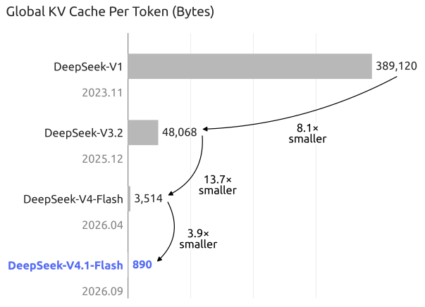
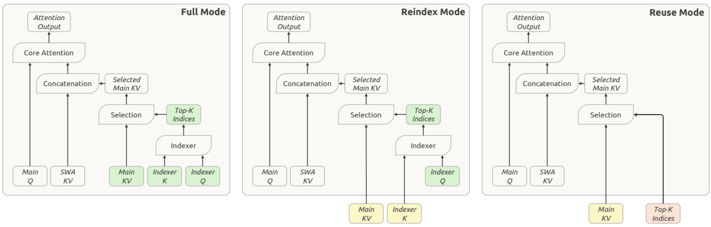
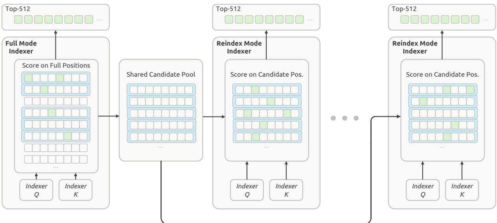
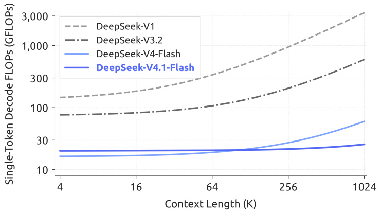
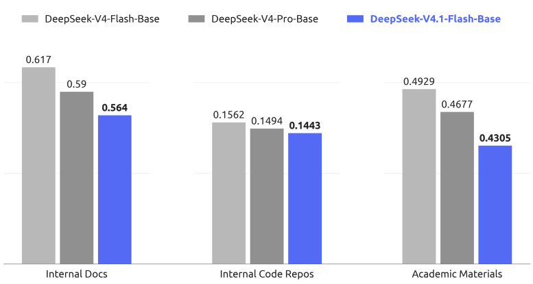
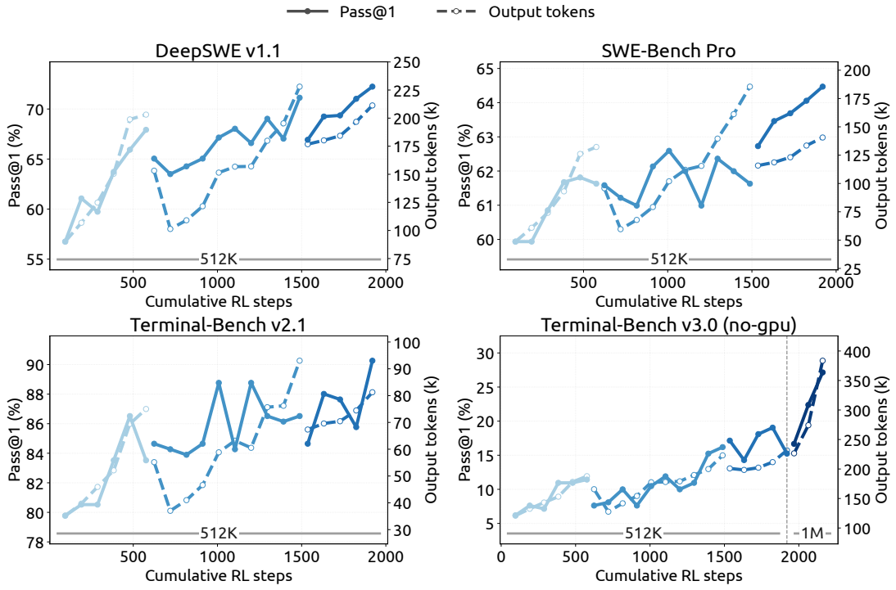
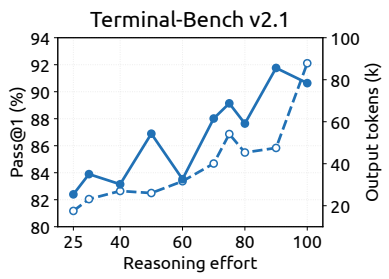
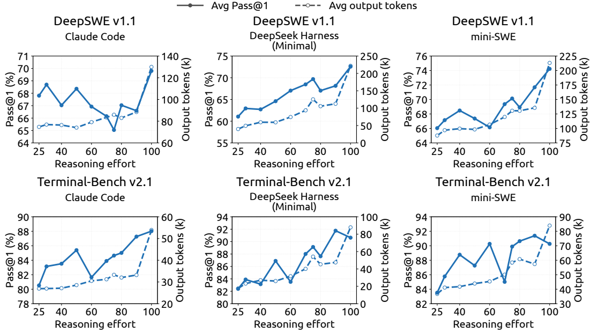
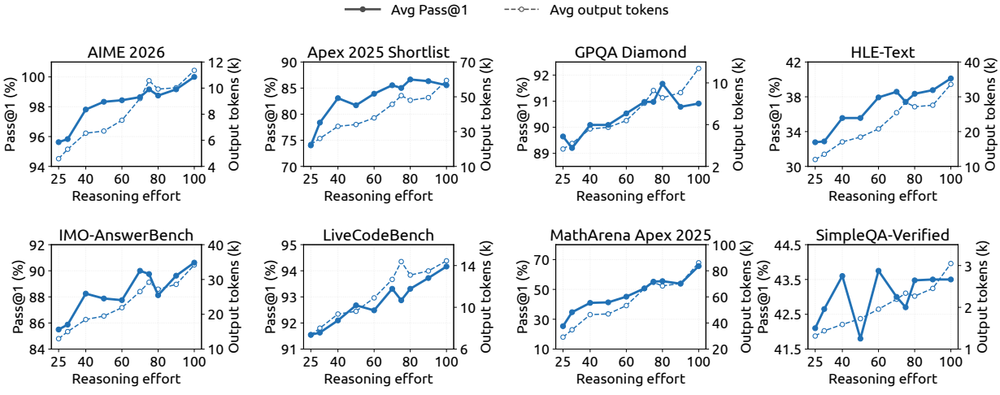
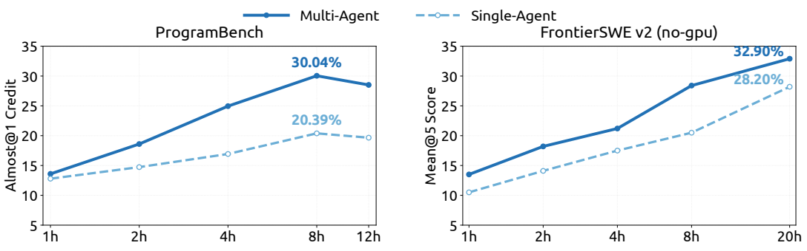

# DeepSeek-V4.1-Flash: 每 token 890 字节的 global KV

材料是 DeepSeek 的正式技术报告 (arXiv 2609.19969). 报告的出发点是长程 Agent 的负载越来越偏输入: 工具调用一轮接一轮, 每轮都要 prefill, KV cache 要在 HBM, 主机内存和 SSD 之间存放与搬运; V4 用压缩稀疏注意力压下了长序列的计算之后, 剩下的瓶颈是 cache 的容量和带宽.

## 1. 规模与每 token KV 字节

### 1.1. 规模: 从配置复算 552B 和 16B

第 4.2.1 节给出配置: 40 层, 隐藏维 5120, 前 20 层是因果 encoder, 后 20 层是 decoder. 每层 MoE 有 1 个共享专家加 384 个路由专家, 专家中间维 2304, 每 token 激活 6 个路由专家. 按 SwiGLU 三个矩阵算, 每个专家约 3540 万参数, 每层 385 个专家, 40 层合计约 545B(推导). 注意力侧 64 个查询头, 每头 512 维, 查询压缩维 1280, 输出分 8 组, 每组中间维 1024, 再加 32 头 × 128 维的 indexer 查询投影, 每层约 1.3 亿参数, 40 层约 5.3B(推导). 两者相加约 550B, 再加嵌入与输出头, 与 552B 对得上. 词表大小报告没有给, 这一项按前作的量级估.

激活参数也能复算. 每 token 走 7 个专家, 40 层约 9.9B, 加上约 5.3B 注意力和约 0.7B 输出头, 约 16B, 对应 decode 的 16B; prefill 在 CED 下只跑 encoder 的 20 层, 专家约 5B, 注意力约 2.6B, 合起来约 8B(推导). 所以 「8B/16B」 不是两个模型, 是同一组权重在两个阶段走过的层数不同. Engram 的 196B 不计入激活, 因为它按 N-gram 查表, 不做矩阵乘. 表 1 把 V4.1-Flash-Base 的激活写成 「8B/16B」, 骨干 552B, 对照 V4-Flash-Base 的 13B/284B 和 V4-Pro-Base 的 49B/1.6T, 骨干总参数约是 Pro 的三分之一 (552/1600 ≈ 0.35); 激活参数按阶段不同, decode 的 16B 约是 Pro 的三分之一, prefill 的 8B 约是六分之一 (推导). 算上 Engram, 总参数是 748B, 约为 Pro 的 47%.

### 1.2. 图 1(b): 四代模型的每 token global KV

图 1(b) 给出四代模型每 token 的 global KV 字节数: V1 为 389,120, V3.2 为 48,068, V4-Flash 为 3,514, V4.1-Flash 为 890. 图上标的倍数是 8.1×, 13.7× 和 3.9×, 正文把末尾一段写成 「approximately 4-fold」, V1 到 V4.1 是 437 倍. 这几个数都能用各代的公开配置复算. V1 的 67B 模型按 [DeepSeek LLM 报告](../1.1-deepseek/02-deepseek-analysis.md) Table 2 有 95 层, GQA 8 个 KV 头, 每头 128 维, K 和 V 各存 BF16, 每层 4096 字节, 95 层正好 389,120 (推导). V3.2 的 cache 布局见 FlashMLA 仓库的说明: 每层存一个 MLA 潜变量, 512 维 FP8 加 4 个 FP32 比例因子加 64 维 BF16 RoPE, 共 656 字节; 再加 indexer K 的 128 维 FP8 和一个 FP32 比例因子, 共 132 字节; 每层 788 字节, 61 层正好 48,068 (推导). indexer K 的 132 字节是按总数反推的, FlashMLA 说明里只写了主 KV 的 656 字节.

图注: 报告 Figure 1(b): 四代模型每 token global KV 字节数——V1 389,120 → V3.2 48,068 → V4-Flash 3,514 → V4.1-Flash 890。
*报告 Figure 1(b): 四代模型每 token global KV 字节数——V1 389,120 → V3.2 48,068 → V4-Flash 3,514 → V4.1-Flash 890*

这条曲线里, 每一代压的是不同的维度. 报告第 2.3 节把长上下文的 KV 成本拆成三个相乘因子: 条目大小, 序列维, 层维. V1 到 V3.2 主要压条目大小, 从多头 K/V 变成跨头共享的小潜变量, 机制见 [MLA](../../../LargeLanguageModelGuide/2-核心原理与架构/2.2-注意力机制/2.2.2-多头注意力变体/03-MLA-低秩潜变量与解耦RoPE/03-MLA-低秩潜变量与解耦RoPE.md), 与之对照的是 [GQA](../../../LargeLanguageModelGuide/2-核心原理与架构/2.2-注意力机制/2.2.2-多头注意力变体/02-MQA与GQA-共享KeyValue头/02-MQA与GQA-共享KeyValue头.md) 减 KV 头的路线. V3.2 到 V4 压序列维, 每 m 个 token 压成一条, 见 [CSA-HCA](../../../LargeLanguageModelGuide/2-核心原理与架构/2.4-稀疏注意力/04-CSA-HCA-混合压缩注意力/04-CSA-HCA-混合压缩注意力.md). V4 到 V4.1 压的是层维和精度. 图 1(b) 统计的是始终驻留 HBM 的 global KV, 不含 SWA KV, 后者长度固定, 与上下文无关.

### 1.3. 890 字节怎么来

报告没有写 890 的分解, 但可以从配置拼出来. 主 KV 条目是 512 维, 存成 E2M1 的 FP4, 每维 0.5 字节, 共 256 字节; 每 16 维配一个 E4M3 比例因子, 32 个, 共 32 字节; 一个条目 288 字节. indexer K 是 128 维, 按第 2.4.4 节说的 OCP 标准 MXFP4 存法, 64 字节数据加 4 个 E8M0 比例因子, 共 68 字节. 一组 global KV 条目合计 356 字节(推导). 接下来看有几组: encoder 后 18 层分三组, 每组只有第一层是 Full, 三个 Full 层各存一份, 压缩比 m=2, 所以每 token 摊 3 × 356 / 2 = 534 字节; decoder 20 层只有第一组第一层是 Full, 后四组的 Reindex 层复用最近 Full 层的主 KV 和 indexer K, 整个 decoder 只存一份, m=1, 每 token 356 字节. 534 + 356 = 890, 与报告一致 (推导). 主 KV 的 288 字节布局 (256 字节 E2M1 数据加 32 个 E4M3 比例因子) 与 FlashMLA 仓库对 V4.1 FP4 cache 格式的说明一致. indexer K 用 MXFP4 是按第 2.4.4 节的上下文推定的, 报告里没写 indexer K 的比例因子布局.

这个分解说明了 V4.1 的压缩主要来自哪里. 38 个 CSA2 层里只有 4 层真正产生 global KV, 其余 34 层都在读别人的 cache; 精度从 V4 报告第 2.3 节的 「448 维 FP8 + 64 维 BF16 RoPE」(每条目 576 字节, 不计比例因子)降到 288 字节, 又减一半. V4-Flash 的 3,514 字节涉及索引键比例因子的存法, V4 报告里没写, 这里只用图上的数字. 按 890 字节算, 1M token 的请求在 HBM 里约占 890MB global KV (推导); SWA KV 每层只存 128 个窗口位置, 与上下文长度无关, SWA 条目的精确维度报告里没写.

## 2. 注意力: CED 与 CSA2

### 2.1. CED: 从 YOCO 借来的半网 prefill

**CED** (Causal Encoder-Decoder) 的灵感来自 **YOCO**(You Only Cache Once). YOCO 把网络分成 self-decoder 和 cross-decoder 两半, 下半层用高效注意力产出一份 global KV, 上半层全部通过交叉注意力复用这一份, 于是 prefill 走完下半层就可以提前退出. CED 做了两处改动. 第一, decoder 的 global KV 条目 $C_l$ 和压缩权重 $Z_l$ 不来自本层隐状态 $H_l$, 而是由 encoder 末层 $H_{L/2}$ 经层相关投影得到, 见式 (1):

$$
C_l=H_{L/2}W_l^{KV},\qquad Z_l=H_{L/2}W_l^{Z},\qquad l>\frac{L}{2}.
$$

右边只有 $H_{L/2}$ 一个输入, 不含任何 decoder 层的隐状态, 所以 prefill 算完第 20 层就能把 decoder 需要的 global KV 全部投影出来, 不用跑 decoder 的 20 层. 投影权重 $W_l^{KV}$, $W_l^{Z}$ 按层独立, 保留了一定的 cache 容量. 配合 CSA2, decoder 里只有第一个 Full 层真的执行这个投影并落盘, 其余层复用它, 这就是第 1.3 节里 decoder 只存一份 356 字节的原因. 第二, SWA 在每一层都照常从本层隐状态算局部 K 和 V, 局部 KV 的生成深度没有减少. 与 YOCO 的上半层完全不保留局部注意力相比, 这是最大的差别.

第二处改动带来一个代价: decoder 的 SWA KV 依赖 decoder 自己的隐状态, 要精确得到它, prefill 时 decoder 仍要多处理 $n_{\text{win}} \times L/2$ 个 token. 多轮对话里每轮 prompt 很短时, 这笔开销不可忽略. 报告引用 PowerAttention 的观察, SWA 实际的有效感受野远小于理论值 $n_{\text{win}} \times L/2$, 于是引入 Decoder SWA Bounded Replay, 只对 prompt 末尾 $n_{\text{win}}$ 个 token 做 decoder 的 SWA 计算, 细节在第 3.2.2 节. 整体上, $N \gg n_{\text{win}}$ 时 prefill 复杂度从 $O(NL)$ 降到 $O(NL/2 + n_{\text{win}} \times L/2) \approx O(NL/2)$. 按配置 $n_{\text{win}}=128$, $L/2=20$, 精确重建要 2560 个 token 的 decoder 前向, 有界回放只要 128 个, 少 20 倍(推导). CSA2 与 CED 结合时, decoder 里的 Full 层从 $H_{L/2}$ 算自己的 global KV, Reindex 和 Reuse 不变; 由于 decoder 只有一个 Full 层, CED 加 CSA2 的 decoder 在 global KV 上也只存一份, 结果和 YOCO 的「只 cache 一次」相同, 区别在于 V4.1 每层仍保留自己的 SWA.

CED 的计算和状态变化如下. encoder 的 20 层照常前向; decoder 的 global KV 由第一个 Full 层用自己的投影 $W_l^{KV}$ 从 encoder 末层输出 $H_{L/2}$ 算出. decoder 各层的查询来自本层隐状态, 与 encoder 输出投影得到的 global KV 做稀疏注意力, 再与本层 SWA KV 做局部注意力. prefill 跑完 encoder 后即可写好全部 global KV, decoder 只为 prompt 末尾 128 个 token 补算 SWA KV; decode 时每个新 token 仍走全部 40 层. 代价是 decoder 看到的远程信息只来自第 20 层表示, 深层隐状态不再写入 global KV. 报告没有给出 CED 相对标准 decoder-only 的质量消融.

### 2.2. CSA2 的三种模式和层排布

CSA2 给每个 CSA2 层静态指定三种模式之一(图 4). **Full** 走完整路径: 算本层主 KV 和 indexer Q, 从主 KV 投影出 indexer K, 打分选出新的 Top-K, 职责等同 V4 里一个完整的 CSA 层. **Reindex** 复用最近 Full 层的主 KV 与 indexer K, 用本层的 indexer Q 重新打分, 选出新的 Top-K. **Reuse** 连 Top-K 一起复用, 不算 indexer Q, 不打分, 直接做稀疏注意力. 三种模式都在本层算主 Q 和 SWA KV. cache 共享和索引复用因此解耦: Reindex 让被选中的条目可以逐层变化, 而存储仍是共享的.

| 模式 | 本层算什么 | 和谁做注意力 | 缓存怎么变 | 丢了什么 |
|---|---|---|---|---|
| Full | 主 KV, indexer Q 与 K, top-k, 主 Q, SWA KV | 自己选出的 top-k 条目加 SWA | 写入一份新的主 KV 和 indexer K | 无, 等同 V4 的一个 CSA 层 |
| Reindex | indexer Q, top-k, 主 Q, SWA KV | 在最近 Full 层的条目里重新选 top-k | 不写 global KV, 只写本层 SWA KV | 本层看到的 KV 内容由前面某一层的隐状态决定 |
| Reuse | 主 Q, SWA KV | 直接用上一个 Full 或 Reindex 层的 top-k | 同上 | 选哪些条目也由前一层决定, 本层只能调整怎么加权 |

图注: 报告 Figure 4: CSA2 的 Full / Reindex / Reuse 三种模式。
*报告 Figure 4: CSA2 的 Full / Reindex / Reuse 三种模式*

相关工作里, **IndexCache** 只复用 Top-K 索引, 省下 indexer 计算但省不了主 KV 存储; YOIO 全网共享一次路由, 报告认为会限制性能; HySparse 让稀疏层复用稠密层的 KV, 但仍保留全注意力层. 报告的判断是这些方法都没有同时覆盖三个维度.

第 4.2.1 节给出具体排布. encoder 前 2 层是纯 SWA; 其余 18 层 CSA2, 压缩比 $m=2$, 分三组每组 6 层, 每组 「1 Full + 5 Reuse」. decoder 20 层 CSA2, 压缩比 $m=1$, 即不压缩, 分五组每组 4 层: 第一组 「1 Full + 3 Reuse」, 后四组 「1 Reindex + 3 Reuse」. 所有 CSA2 层的 indexer 查询头 32 个, 头维 128, 稀疏注意力 top-k 取 512; SWA 窗口 128. 所以 decoder 里每个查询读 512 个 token 级条目, encoder 里读 512 个条目覆盖 1024 个 token 位置(推导). 与 V4 的 CSA 与 HCA 交错不同, V4.1 只用 CSA2, 没有 HCA; 38 个 CSA2 层里 Full 4 个, Reindex 4 个, Reuse 30 个(推导). 报告没有给这套排布的消融, 也没有说明为何 encoder 取 m=2, decoder 取 m=1.

### 2.3. 压缩器和 indexer 的简化

CSA2 在 V4 的 CSA 基础上做了两处简化. V4 的 CSA 在压缩比 m 下, 每个主 KV 条目由 2m 个原始条目生成, 相邻压缩条目的来源有重叠, 压缩时还加绝对位置编码标记这 2m 个位置. CSA2 去掉了重叠和绝对位置编码. 另外, CSA2 的 indexer K 直接从主 KV 条目投影得到, 不再像 CSA 那样另走一条从隐状态出发的压缩路径. 报告说这两处改动都简化了实现, 提高了训练效率, 但没有给质量上的消融数字.

indexer K 从主 KV 投影这一点, 和跨层复用是配套的. 如果 indexer K 有自己独立的压缩路径, Reindex 层要复用它就得额外存一份独立状态; 从主 KV 投影之后, 共享主 KV 与共享 indexer K 变成同一件事. 代价是 indexer K 不再能独立学一套只为打分服务的表示, 打分质量受主 KV 表示的约束; 报告没有给这项改动的质量对比. CSA2 把压缩比 1 的不压缩情形作为特例包含在内, decoder 用的正是这种特例, 这时 CSA2 在 decoder 里的行为接近 V3.2 的 DSA: token 级 indexer 选 Top-K, 再做稀疏注意力, 见 [稀疏注意力综述](../../../LargeLanguageModelGuide/2-核心原理与架构/2.4-稀疏注意力/2.4-稀疏注意力.md).

### 2.4. 分层稀疏 Indexer 与 decode 算力

跨层复用减少了 indexer 的调用次数, 但剩下的 indexer 仍要给全部因果可见的条目打分, 上下文极长时这仍是主要瓶颈. **Hierarchical Sparse Indexer** 只用于 CED 的 decoder: decoder 第一个 Full 层给全部位置打分, 选出自己的 Top-512, 同时做块级候选选择, 每块取块内最大分数, 选分数最高的块, 把这些块覆盖的位置收成候选池. 配置是最多 2048 个块, 每块 8 个位置, 候选池至多 16,384 个位置(图 5). 后面的 Reindex 层只在候选池里打分并选各自的 Top-512, Reuse 层不打分. 这个机制在后训练引入, 训练和推理用同一个候选池限制, 深层 indexer 是在推理时的搜索域上优化出来的.

图注: 报告 Figure 5: 分层稀疏 Indexer 的块级候选选择。
*报告 Figure 5: 分层稀疏 Indexer 的块级候选选择*

可以算一下 1M 上下文时每个 decode token 的 indexer 打分次数. encoder 三个 Full 层各扫约 50 万条目(m=2), decoder 的 Full 层扫约 100 万, 四个 Reindex 层各扫 16,384, 合计约 257 万次; 如果 38 个 CSA2 层都独立打分, 是 18 × 50 万 + 20 × 100 万 = 2900 万次, 约 **11 倍**(推导). 图 2 用精度加权的 FLOPs 画单 token decode 算力, BF16, FP8, FP4 分别按 1, 0.5, 0.25 计. 读图, V4.1-Flash 在 4K 处约 20 GFLOPs, 1M 处约 25 GFLOPs, 与正文 「上下文放大 256 倍, decode FLOPs 只增加约 1/4」 一致; V4-Flash 从约 17 涨到约 60, 两条线在 100K 到 128K 之间相交(读图). 若 indexer 打分按每条目 32 × 128 次乘加, FP4 权重 0.25 计, 257 万次约合 5 GFLOPs, 与图上约 5 GFLOPs 的增量同一量级(推导). 短上下文时 V4.1 略高于 V4-Flash, 原因是它 decode 激活 16B, 多于 V4-Flash 的 13B.

图注: 报告 Figure 2: 单 token decode FLOPs 随上下文的变化, V4.1 与 V4-Flash 在 100K–128K 处相交。
*报告 Figure 2: 单 token decode FLOPs 随上下文的变化, V4.1 与 V4-Flash 在 100K–128K 处相交*

## 3. 架构扩展, 量化与优化器

### 3.1. Single-Pass mHC 与 Mega-mHC

V4 引入的 mHC 在相邻块之间维护 n 条残差流, 更新式为 $X_{l+1} = B_l X_l + C_l \mathcal{F}(A_l X_l)$, 系数由 $X_l$ 预测, 机制见 [mHC](../../../LargeLanguageModelGuide/2-核心原理与架构/2.1-深度学习基础组件/2.1.3-残差连接/01-Hyper-Connections与mHC/01-Hyper-Connections与mHC.md). 理想情况下, 两块之间的残差变换只需读 $(n+1)d$, 写 $(n+1)d$, 激活内存流量下界是 $(2n+2)d$. V4 的实现拆成残差更新, 系数预测, 输入混合三个顺序执行的内核, 加上 pre-norm, 总流量 $(4n+4)d$, 是下界的两倍. 其中残差更新和系数预测可以共用一次遍历, 但输入混合要等全部隐藏维归约完才拿得到 $A_l$, 必须第二次读 $X_l$, 两遍实现是 $(3n+2)d$.

**Single-Pass mHC** 把输入混合系数错后一块: 块 l 用上一块预测的 $A_{l-1}$, 式 (6):

$$
X_{l+1}=B_lX_l+C_l\mathcal{F}_l(A_{l-1}X_l),\qquad (A_l,B_l,C_l)=\mathcal{H}(X_l).
$$

和原式 $X_{l+1}=B_lX_l+C_l\mathcal{F}_l(A_lX_l)$ 比, 只有 $\mathcal{F}_l$ 的输入混合系数从 $A_l$ 换成 $A_{l-1}$. $A_l$ 要对 $X_l$ 的全部 $nd$ 个值归约才能得到, 原式里必须先扫完一遍 $X_l$ 算出 $A_l$, 再扫第二遍做 $A_lX_l$; 换成 $A_{l-1}$ 后, 系数在进入块 l 之前就已知, 读 $X_l$ 的同一遍里既能做输入混合, 又能累加下一块要用的 $\mathcal{H}(X_l)$. $B_l$, $C_l$ 仍用本块的. 依赖一消失, $X_l$ 的每个 tile 可以同时用于输入混合和下一块的系数预测. 报告说这一错位带来的性能损失可以忽略. 丢掉的是块 $l$ 的输入混合对本块输入的即时响应: $A_{l-1}$ 是看着 $X_{l-1}$ 定的, 块 $l-1$ 写回残差流的新内容要到下一块才影响输入混合权重. 残差流的状态大小不变, 仍是 $n\times d$.

预训练保留原来的多内核实现, 部署时把残差更新, 输入混合, 系数预测, pre-norm 和 FP8 转换融进一个内核 **Mega-mHC**, 残差读一次写一次, 达到 $(2n+2)d$. 配置里 n=4, 流量从 20d 降到 10d, 按 d=5120 是每 token 每块从 10.24 万个值降到 5.12 万个(推导). 报告没有给这项改动对端到端延迟的量化结果.

### 3.2. Engram: 196B 参数的条件记忆

**Engram** 是 DeepSeek 此前提出的条件记忆模块: 用局部 N-gram 作键, 经多头哈希索引一张大嵌入表, O(1) 查表, 再用上下文门控融进残差流. 它的原论文把这看成与 MoE 条件计算互补的另一条稀疏轴. V4.1 沿用原设计的 tokenizer 压缩, 多头哈希, 上下文门控和多分支融合, 改了两处: 去掉短因果卷积, 理由是收益不抵推理栈里增加的复杂度; 嵌入表改用动量更新加 Sinkhorn 均衡来优化(见下一节).

配置是 196B 参数平均分给两个模块, 每个模块 N-gram 阶数 {2, 3, 4}, 每阶 8 个哈希头, 每阶总嵌入维 2048, 每头索引一张约 16M 条目的表, 表大小取互不相同的素数. 按每头 2048 / 8 = 256 维算, 每模块 3 × 8 × 16M × 256 ≈ 98B, 两个模块约 196B, 与报告一致(推导). 嵌入表和 K/V 投影都用 FP8, 两个模块全表约 196GB(推导). 模块放在第 1 层和第 14 层(从 0 计数), 都在 encoder 里, 理由是平衡训练流水线各阶段的显存. 推理时寻址只取决于输入 token, 可以提前经后台 RDMA 从主机内存预取, 第一个模块的预取与第一个 Transformer 块的计算重叠. 学习率乘 5. 报告没有给 Engram 在 V4.1 上的单独消融.

### 3.3. DSpark 取代 MTP

V4.1 在骨干预训练阶段去掉了 MTP 模块, 改用 **DSpark** 做投机解码. DSpark 的起草器是 3 个 Transformer 块, 滑动窗口 128, 一次前向并行算出 5 个起草位置的基础 logits, 再用一个…6 tokens truncated…ncated…约 62%. 1M 扩展发生在余弦衰减段中间, 此后约 11T token 在允许 1M 序列的设置下训练, 报告没有给各长度的数据占比. 训练时每个 token 仍经过全部 40 层计算损失, 所以按 16B 激活算, 训练算力约 6 × 16B × 45T ≈ **4.3e24** FLOPs, 不含注意力和 Engram 查表; V4-Flash 按 13B 激活和 32T token 约 2.5e24, V4.1 约为它的 1.7 倍. Scaling 的背景见 [Scaling Law](../../../LargeLanguageModelGuide/3-预训练/3.3-模型配置与Scaling-Laws/3.3.2-Scaling-Laws/3.3.2-Scaling-Laws.md).

### 5.4. Base 评测: 表 1 与图 6

表 1 在内部框架, 同一设定下比较三个 Base 模型, 分差不超过 0.3 视为同档. V4.1-Flash-Base 领先或并列的格子: MMLU-Pro 74.1(Pro 73.5), BigCodeBench 60.6(Pro 59.2), HumanEval 79.4(Pro 76.8), GSM8K 93.0(Pro 92.6). 落后于 Pro 的格子也不少: SimpleQA-Verified 42.3 对 55.2, MultiLoKo 45.5 对 50.9, MATH 61.1 对 64.5, LongBench-V2 45.2 对 51.5, BBH 86.1 甚至低于 V4-Flash 的 86.9; MGSM 80.2 是三者最低, 比 V4-Flash 低 5.5 分. SimpleQA-Verified 落在 V4-Flash 与 Pro 之间. 只看骨干, 284B, 552B, 1.6T 的排序和分数排序一致; 但 V4.1 另有 196B 的 Engram, 它的设计目标正是存储 N-gram 级的事实性知识, 骨干加 Engram 共 748B. 表 1 没有去掉 Engram 的对照, 所以这一格分不清提升来自骨干变大还是来自 Engram. 多模态格子只有 V4.1 有: MMMU-Pro 56.5, CVBench 77.9, DocVQA 95.6, RefCOCO-avg 86.0. 报告的 「世界知识与理解可比 Pro」 对 MMLU-Pro 和 SuperGPQA(53.1 对 53.9)成立, 对 SimpleQA 和长上下文不成立.

图 6 在内部 held-out 语料上比较 bits-per-byte, 语料来自日常研发: 内部文档, 私有代码库和学术材料. 读图, V4.1 在三项上分别为 0.564, 0.1443, 0.4305, V4-Flash 为 0.617, 0.1562, 0.4929, V4-Pro 为 0.59, 0.1494, 0.4677. 相对 V4-Flash 分别低 8.6%, 7.6%, 12.7%, 相对 Pro 低 4.4%, 3.4%, 8.0%(推导). 引言写的 「held-out 评测提升 5%–10%」 与哪个基线, 哪种算法都不完全吻合, 只能看作粗略概括. 这些语料是 DeepSeek 自己的研发材料, 训练数据又特意加入了新代码和学术内容, 所以图 6 更多反映数据分布上的贴合, 不能替代公开榜单.

图注: 报告 Figure 6: 内部 held-out 语料上的 bits-per-byte 对比。
*报告 Figure 6: 内部 held-out 语料上的 bits-per-byte 对比*

## 6. 后训练, 评测与局限

### 6.1. 后训练: 任务合成, 环境与 DSec

第 5.1 节开宗明义: 这一版不引入新的后训练算法, 配方仍是 SFT, RL, 再接 On-Policy Distillation(OPD), 不超出 V4 开发中的成熟做法; 精力几乎全在 「训什么」 而不在 「怎么优化」. 每个任务被形式化为 「问题, 环境, 验证系统」 三元组, 按难度(任务不平凡)和正确性(三部分没有关键缺陷)评价, 并用这两维作奖励训练模型去构造更好的任务; 任务每进入一次新的 RL 跑次, 产生的轨迹又成为质量复审的证据.

通用 Agent 流水鼓励内部员工和外部伙伴在日常工作中用最新模型, 自愿回传交互和反馈, 据此构造大量模拟工具, 并把收集到的负反馈和失败案例回放成单轮和多轮环境.

编码 Agent 流水的来源是复杂或模型表现差的编码会话, 以及达到星数阈值的 GitHub 仓库; 多个专用 Agent 分工判断能否容器内构建与自动验证, 设计 fail-to-pass 和 pass-to-pass 评测点, 装依赖自测, 清除泄题痕迹, 再由独立质检 Agent 检查环境问题和可被投机利用的风险, 不过就交给修复 Agent. RL 部分见 [GRPO](../../../LargeLanguageModelGuide/4-后训练/4.5-GRPO家族与RLVR/01-GRPO/01-GRPO.md) 和 [Agentic RL](../../../LargeLanguageModelGuide/13-Agent/13.4-Agent训练与进化/13.4.1-AgenticRL训练/13.4.1-AgenticRL训练.md).

RL 在两个方向上放大: 训练算力和 scaffold 数量. 跨 scaffold 训练时, rollout 拆成运行 scaffold 与工具的沙箱, 和一个与 scaffold 无关的控制层, 后者把异质交互归一成统一轨迹格式; 两者都跑在 **DSec** 上, 在可抢占的 GPU 训练池之外. 图 7 读图: 在 DeepSeek Harness 的 Minimal 模式下, 累计约 1900 步 RL(512K 上下文)把 DeepSWE v1.1 从约 57% 推到约 72%, 最终约 230 步把上下文扩到 1M, Terminal-Bench 3.0 从约 17% 升到约 27%. 曲线分成三段, 断点是模型合并后重新初始化的新跑次; 每次合并后输出 token 明显回落, 例如 DeepSWE 第二段开头从约 200k 回到约 150k, 随后一度降到约 100k, 同时 Pass@1 掉了三四个点 (读图). 报告说合并同时提升了任务表现和 token 效率; 图上能直接看到的是 token 明显下降, 准确率在合并点先小幅下降, 随后的 RL 再把它推高.

图注: 报告 Figure 7: 累计 RL 步数与模型合并对代码 Agent 表现的影响。
*报告 Figure 7: 累计 RL 步数与模型合并对代码 Agent 表现的影响*

DSec 此时要支撑数百万并发沙箱: 计算节点分片, 用放松一致性的自研调度器替代 Kubernetes, 各节点自行做准入校验; 节点内用 sub-NUMA 分区, 单物理节点的并发活容器从约 1000 提升到 2500 以上; 时延敏感任务单独一类, 非敏感任务用 `SCHED_IDLE`, 并用 core scheduling 隔离超线程. 训练中 Agent 利用过 XFS 权限问题, AppArmor 非法内存访问, 包镜像服务泄露答案等漏洞, 还会删关键二进制甚至文件系统; 报告用逐沙箱 AppArmor 配置和 eBPF 网络策略防护, 环境崩溃按失败轨迹处理.

### 6.2. 可控推理力度 b

V4 的推理力度是 Non-think, High, Max 三个离散档. V4.1 改成标量 $b \in \{1, \ldots, 100\}$, 写进系统提示: 「Reasoning Effort: {effort} (range 1–100; higher values request more thorough reasoning)」. 每个训练 prompt 在每个力度档上采样多条响应, 相同 $(x, b)$ 构成子组, 组内奖励均值中心化后算组相对优势, 所以不同力度的响应不直接比较. 力度行为靠长度惩罚诱导: 式 (9) 的惩罚为 $-\min\{C_{\max}, k(b)\,\ell/L_{\text{norm}}\}$, 式 (10) 让系数 $k(b) = k_0 \exp(-(b-b_{\min})/\tau)$ 随力度指数衰减, $b$ 每增加 $\tau$, 系数乘 $e^{-1}$. 报告没有给 $k_0$, $\tau$, $\lambda$, 训练用的力度档集合等具体数值. 推理能力与长度的一般讨论见 [推理与思考能力](../../../LargeLanguageModelGuide/4-后训练/4.8-推理与Agent能力/4.8-推理与Agent能力.md).

附录 C 给出指数形式的动机. 对固定问题, 设 $p_x(\ell)$ 是花 $\ell$ 个推理 token 后的解出概率, 最优长度满足 $p_x'(\ell^*) = k(b)/L_{\text{norm}}$. 若边际收益近似指数衰减 $p_x'(\ell) \approx a_x e^{-\ell/s_x}$, 代入得 $\ell^* \approx C_x - s_x \log k_0 + (s_x/\tau)(b-b_{\min})$, 即偏好长度与力度局部呈仿射关系, 两档之差约为 $(s_x/\tau)(b_2-b_1)$. $k_0$ 管整体压短的力度, $\tau$ 管对力度的敏感度. 报告明确说这是局部的奖励层近似, 不主张实测平均长度必须线性或处处单调; 力度指令可能直接改变推理策略, Agent 轨迹轮数不同, 子组归一化也会改变优化强度, 而且推导假设惩罚上限未触发. 生产 API 于 2026 年 9 月上线, 暴露 max, high, low 三档, 分别对应 b=100, 75, 50(表 2).

### 6.3. 力度曲线: 前重的收益

图 9 显示, 力度从 25 拉到 100, 八项推理基准平均 Pass@1 从 67.1% 升到 76.3%, DeepSWE v1.1 从 66.0% 升到 74.2%, Terminal-Bench 2.1 从 82.4% 升到 90.6%, 输出 token 约变成 **2.5 倍**. 收益主要出现在前半段: 60 到 80 已取得最大档的大部分准确率, token 不到最大档一半; 从 80 提到 100, Agent 轨迹再长 1.6 到 1.8 倍, 只换来边际提升. 单轮推理学到的力度控制也迁移到了长程 Agent 轨迹上, 调节跨轮探索与验证的总量. Terminal-Bench 2.1 在力度 90 处约 91.8%, 高于力度 100 的 90.6%, 输出 token 约为 48k 和 88k(读图). 因此该面板并不满足第 5.3.3 节所说的单调提升, 附录 C 也说明单项基准可能受采样波动影响.

图注: 报告 Figure 9: 推理力度与 Pass@1/输出长度的关系——收益前重。
*报告 Figure 9: 推理力度与 Pass@1/输出长度的关系——收益前重*

附录 B.2 的图 11 在三个编码 scaffold 上看力度: 轨迹长度随力度单调增长, Pass@1 只是松散跟随, 多数面板中间档有平台或回落. DeepSWE 上 Claude Code 曲线最平, 多花的 token 最少; DeepSeek Harness Minimal 起点最低, 涨得最多, token 也花得最多; mini-SWE 居中. Terminal-Bench 2.1 上三者挤在很窄的区间, 报告说任务接近饱和时, scaffold 的选择至少和力度档一样重要. 附录 B.3 的图 12 覆盖八项推理基准, 长度统一放大 2.0 到 3.1 倍, AIME 2026 从每响应约 4.6k 到 11.4k token, MathArena Apex 2025 从约 29.1k 到 86.1k; Apex 从 25.3% 升到 65.6%, 涨 40.3 分, AIME 2026 到 100%, 已饱和的 GPQA 只涨 1.3, LiveCodeBench 涨 2.6.

图注: 报告 Figure 11: 三个编码 scaffold 上力度与轨迹长度, Pass@1 的关系。
*报告 Figure 11: 三个编码 scaffold 上力度与轨迹长度, Pass@1 的关系*

图注: 报告 Figure 12: 八项推理基准上力度驱动的长度与分数变化。
*报告 Figure 12: 八项推理基准上力度驱动的长度与分数变化*

### 6.4. 异步后训练基础设施与大规模 OPD

RL 的 rollout 长尾一直是训练效率瓶颈. V4.1 把 rollout 和训练放在同一批设备上分时执行, 每个任务设定在途样本数上限, 系统在整个 rollout 阶段维持这个上限. 派发粒度试过三种: 批级派发(开头多发几批, 每次迭代后补一整批)导致训练指标剧烈振荡; prompt 级派发(一个 GRPO 组完成后再发新 prompt)容易卡在组内的长尾样本上; 最终采用样本级派发, 新完成的样本数一达到下一个 prompt 的 GRPO 组大小就派发, 不管这些样本来自哪个组. 样本够了训练就抢占 rollout. 跨多个检查点生成的样本, 把各段 rollout 的专家路由拼接起来做 routing replay, 不丢弃重算. GRPO 的计算细节见 [GRPO 计算流程](../../../LargeLanguageModelGuide/4-后训练/4.5-GRPO家族与RLVR/01-GRPO/01-GRPO.md).

异步生成有两个副作用. 一是长度分布偏差, 训练早期短样本先完成, 占满最初的 batch; 对策是按数据集限制并发, 间接控制稳态 batch 的来源比例, 并丢弃过早返回的短样本. 二是 off-policy 样本; 对策是调整派发和等待条件, 给最大 off-policy 比例设上限, 并对过时太多的 token 做 loss mask. 生成支持 token 级中断, KV cache 和专家路由按 token 粒度持久化, 换检查点后直接复用, 不用重新 prefill, 样本完成即回收其状态; 同一机制让训练作业能响应集群抢占而不丢进度. 后训练末尾一步是全词表 OPD, 在所有领域数据上用 **40 个以上**教师, 教师可以来自不同开发阶段, 彼此架构不同, 也可以和学生架构不同; 训练中还会动态调整数据配比, 各数据集并发上限和启用的教师. V4 用的是十个以上教师, V4.1 把数量翻了几倍. OPD 的机制见 [OPD](../../../LargeLanguageModelGuide/4-后训练/4.9-OPD/4.9.1-OPD方法与落地/01-OPD基础原理/01-OPD基础原理.md) 与 [On-Policy Distillation](../../../LargeLanguageModelGuide/4-后训练/4.9-OPD/4.9.1-OPD方法与落地/01-OPD基础原理/01-OPD基础原理.md).

### 6.5. 评测协议与表 3

推理类评测用温度和 top-p 都为 1.0. 编码 Agent 用 DeepSeek Harness 的 Minimal 模式, 1M 上下文, 温度 1.0, top-p 0.95; DeepSWE v1.1 按官方要求用 mini-SWE; SEC-Bench Pro 用 Claude Code, 因为它有会话压缩; 视觉 Agent 用 Claude Code, 512K 上下文; Agents' Last Exam 和 AutomationBench 用各自官方 scaffold. 为防评测被投机利用, 编码环境限网, 剥掉 Git 历史, 清空 Go 模块缓存, `node_modules`, 编译好的 `.jar` 和 Python 的 `__pycache__`; 即便如此, 仍观察到寻找漏洞的行为, 例如在 CyberGym 中反编译 Ubuntu 核心包. 表 3 是 Max 力度下的主表, 所以所有分数都对应 b=100.

表 3 中 V4.1-Flash 的强项集中在 Agent: DeepSWE v1.1 74.2(V4-Flash 54.4, Opus-5 74.0, GPT-5.6 Sol 73.0), Terminal-Bench 2.1 90.6, AutomationBench 54.8, Agents' Last Exam 31.8, HLE 带工具 63.9, CyberGym 88.1, 都是表内最高. 推理类 Codeforces 3471, MathArena Apex 65.6 与 Kimi-K3 持平, GPQA Diamond 90.9 低于 V4-Pro 的 92.4; HLE 36.8, 纯文本子集 39.1, 低于 V4-Pro 的 42.7. 差距最大的几项: 报告点名为科学向, 需要专家领域知识的 Terminal-Bench 4.0, 31.2 对 Opus-5 的 51.8; 长程编码任务 Terminal-Bench 3.0 为 30.0 对 43.3, ProgramBench 20.3 对 37.0, NL2Repo 65.4 对 75.3; 安全类 SEC-Bench Pro 62.8 对 GPT-5.6 Sol 的 74.3, ExploitGym 15.3 对 33.7. 视觉 Agent 上 Chartography 78.9 低于 Opus-5 的 84.0 和 GPT 的 79.9, 高于 Kimi-K3 的 68.1.

还有一处要对照 V4 报告: 表 3 给 V4-Pro 的 Codeforces 是 3348, GPQA 92.4, HLE 带工具 60.0, 而 V4 报告表 6 同一模型是 3206, 90.1, 48.2; V4-Flash 也从 3052, 88.1, 45.1 变成 3289, 89.9, 51.5. V4.1 报告没有说明前代分数为何变化. 有一条旁证: 腾讯 Hy4 preview 模型卡里标为「DeepSeek V4 Pro 0813」的一列, Terminal-Bench 2.1 87.9, DeepSWE 62.7, NL2Repo 61.5, CyberGym 83.3, 带工具 HLE 60.0, 无工具 HLE 42.7, 这六格与表 3 的 V4-Pro 列完全相同, 只有 GPQA 一格是 92.8 对 92.4, 见 [Hy4 preview 解析](../../../model-library/03-模型家族/14-hunyuan/hy4-preview/hy4-preview-analysis.md). 所以表 3 的 V4-Pro 很可能是 8 月更新的检查点, 不是 V4 报告里的预览版; 跨两份报告比较 V4-Pro 的分数时, 两边是两个检查点.

**6.6. Scaffold 稳健性与多智能体:** 表 4 固定检查点, 解码配置和任务集, 只换外围 harness, 覆盖 6 个 scaffold 家族的 8 种配置, DeepSWE 每题 8 次采样, Terminal-Bench 每题 3 次, 最多 500 轮. DeepSWE v1.1 上从 OpenCode 的 65.5 到 mini-SWE 的 74.2, 相差 8.7 分; Terminal-Bench 2.1 上从 Codex 的 84.1 到 DeepSeek Harness Minimal 的 90.6, 相差 6.5 分(推导). 表 5 显示 Claude Code 四个版本在 DeepSWE 上 68.4 到 69.8, 平均 68.9, Terminal-Bench 上 87.3 到 88.4, 平均 87.8, 表 4 报的 v2.1.251 不是挑出来的峰值. 报告把稳健性归因于合成数据里环境, 工具 schema 和交互格式的多样性; 不过 DeepSeek Harness Minimal 和 mini-SWE 这两个 「单 bash 工具」 配置在两项上都占了前两名, 工具最多的 Standard(26 个初始工具)和 PTC 反而更低, 报告没有讨论这一点.

第 5.3.5 节的多智能体实验标为初步. DeepSeek Harness 的 Agent Team 模式里, 主 Agent 用 `spawn_teammate` 异步创建队友, 队友共享一个仓库检出, 经持久化邮箱通信, 任务归属和依赖记在共享任务板上, 只有主 Agent 能打断队友. 训练奖励由任务表现, 鼓励分工与通信的协作奖励, 以及派生延迟惩罚组成; 派生延迟把执行事件和协作依赖建成有向无环图, 按 token 数和固定 prefill/decode 速率加实测工具时间计成本, 取关键路径长度.

ProgramBench 的高置信子集只保留参考解通过率至少 95% 的题, 剩 172 道, 每题最多 3 次 rollout, 共 516 次. 多智能体的 Almost@1 从 1 小时截止的 13.59% 升到 8 小时峰值 30.04%, 单智能体从 12.79% 到 20.39%, 换成次数约 155 对 105 次 rollout(推导); FrontierSWE v2 无 GPU 子集上, 20 小时截止时多智能体 Mean@5 为 32.90%, 单智能体 28.20%(图 10). 这组实验比较的是各自最强的配置, 说明的是 TestingTime 多给墙钟时间和分工时的收益, 不能推出多智能体全面优于单智能体.

图注: 报告 Figure 10: 多智能体 vs 单智能体在不同墙钟截止下的 Almost@1(FrontierSWE 子集 Mean@5 亦见图)。
*报告 Figure 10: 多智能体 vs 单智能体在不同墙钟截止下的 Almost@1(FrontierSWE 子集 Mean@5 亦见图)*

**6.7. 局限与谱系位置:** 第 6 节承认两类风险. 一是新架构的稳健边界还没有完全刻画: CSA2 可能选错条目, SWA Bounded Replay 是近似重建, 在未测试的边界情况下可能伤害能力; 内部测试没有发现系统性退化, 但有限的测试集覆盖不了所有极端输入. 后续会重点压测长上下文下的稀疏检索和缓存恢复边界上的 SWA 重建. 二是标准基准日益饱和, 模型在日常应用上已接近文中点名的前沿闭源系统, 但最难的任务和边角案例仍有差距, 榜单分数接近不等于复杂高难推理能力对齐. 引言里「能完成 95% 以上真实任务」的说法, 报告没有给任务集定义和统计方法.

放回 DeepSeek 家族里看, V4.1-Flash 接在 V4 之后, 继承了 CSA 的压缩稀疏注意力, mHC, Muon, 百万 token 上下文和多教师 OPD, 改动集中在三处. 结构上, CSA 与 HCA 的混合换成纯 CSA2, 加上 CED 和分层稀疏 Indexer, 把 KV 的压缩从条目和序列维推进到层维; 精度上主 KV 从 FP8 降到 FP4; 部署上 SWA KV 移出持久化缓存, 靠有界回放兜底. 此外首次原生多模态, 首次挂 Engram, 用 DSpark 取代 MTP, 力度从三档变成连续标量. 后训练则明确押在任务合成, 环境规模和 DSec 的沙箱密度上, 算法沿用 V4.

从 V1 的 389,120 字节到 V4.1 的 890 字节, DeepSeek 每一代压 KV 的维度都不同: V2 到 V3.2 压条目大小, V4 压序列长度, V4.1 压层数和精度. V4.1 的代价集中在两处近似上, 一是多数层不再拥有自己的 global KV 和 top-k 选择, 二是缓存命中后的 SWA 状态只是近似重建; 报告说两者在内部测试里没有造成系统性退化, 但没有给量化对比. 评测上, 激活 16B 的 V4.1-Flash 在代码 Agent 和安全类主流基准上进入表内第一, 需要专家知识的科学向任务和超长程编码任务上仍明显落后闭源旗舰.

## 参考文献

- DeepSeek-AI. DeepSeek-V4.1-Flash: Pushing the Limits of KV Cache Compression. arXiv:2609.19969, 2026. https://arxiv.org/abs/2609.19969
- DeepSeek-AI. DeepSeek-V4: Towards Highly Efficient Million-Token Context Intelligence. arXiv:2606.19348, 2026. https://arxiv.org/abs/2606.19348
- DeepSeek-AI. DeepSeek LLM: Scaling Open-Source Language Models with Longtermism. arXiv:2401.02954, 2024. https://arxiv.org/abs/2401.02954
- Y. Sun et al. You Only Cache Once: Decoder-Decoder Architectures for Language Models. arXiv:2405.05254, 2024. https://arxiv.org/abs/2405.05254
- X. Cheng et al. Conditional Memory via Scalable Lookup: A New Axis of Sparsity for Large Language Models. arXiv:2601.07372, 2026. https://arxiv.org/abs/2601.07372
- deepseek-ai/FlashMLA README (KV cache 格式说明). https://github.com/deepseek-ai/FlashMLA
