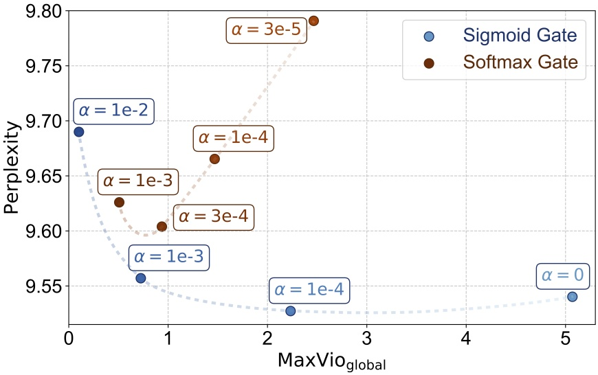
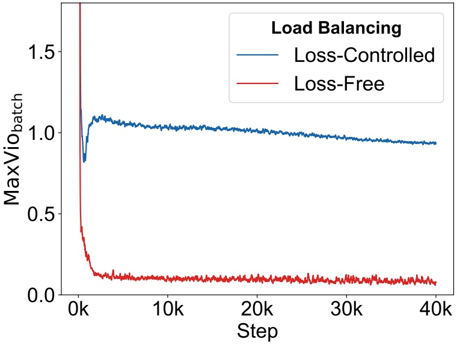

<!-- page 1 of 14 -->

arXiv:2408.15664v1 [cs.LG] 28 Aug 2024

Preprint

# AUXILIARY-LOSS-FREE LOAD BALANCING STRATEGY FOR MIXTURE-OF-EXPERTS · MoE 的无辅助损失负载均衡策略

**Lean Wang**1,2∗**, Huazuo Gao**1**, Chenggang Zhao**1**, Xu Sun**2⋄**, Damai Dai**1⋄ 1DeepSeek-AI

2State Key Laboratory of Multimedia Information Processing,

School of Computer Science, Peking University

lean@pku.edu.cn, xusun@pku.edu.cn, damai.dai@deepseek.com

## ABSTRACT

For Mixture-of-Experts (MoE) models, an unbalanced expert load will lead to routing collapse or increased computational overhead. Existing methods commonly employ an auxiliary loss to encourage load balance, but a large auxiliary loss will introduce non-negligible interference gradients into training and thus impair the model performance. In order to control load balance while not producing undesired gradients during training, we propose **Loss-Free Balancing**, featured by an auxiliary-loss-free load balancing strategy. To be specific, before the top-K routing decision, Loss-Free Balancing will first apply an expert-wise bias to the routing scores of each expert. By dynamically updating the bias of each expert according to its recent load, Loss-Free Balancing can consistently maintain a balanced distribution of expert load. In addition, since Loss-Free Balancing does not produce any interference gradients, it also elevates the upper bound of model performance gained from MoE training. We validate the performance of Loss-Free Balancing on MoE models with up to 3B parameters trained on up to 200B tokens. Experimental results show that Loss-Free Balancing achieves both better performance and better load balance compared with traditional auxiliary-loss-controlled load balancing strategies.

MoE 模型的专家负载一旦不均, 要么路由塌缩, 要么计算开销上升. 现有方法通常加一项辅助损失来鼓励均衡, 但辅助损失一大, 就会往训练里注入不可忽略的干扰梯度, 损害模型性能. 为了在控制负载的同时不产生多余的梯度, 我们提出 **Loss-Free Balancing**, 一种不用辅助损失的负载均衡策略. 具体做法是: 在 Top-K 路由决策之前, 先给每个专家的路由分数加上一个专家级偏置; 再按每个专家最近的负载动态更新它的偏置, 使专家负载持续保持均衡. 由于 Loss-Free Balancing 不产生任何干扰梯度, 它也抬高了 MoE 训练所能达到的性能上限. 我们在最多 3B 参数, 最多 200B token 训练的 MoE 模型上验证了这一方法. 实验表明, 与传统的辅助损失控制方法相比, Loss-Free Balancing 的性能和负载均衡都更好.

## 1 INTRODUCTION

Mixture-of-Experts (MoE) architectures have emerged as a promising solution for managing computational costs when scaling up parameters in large language models (LLMs). Recent applications of MoE in Transformer-based models (Vaswani et al., 2017) have led to successful attempts at scaling language models to substantial sizes (Shao et al., 2024; DeepSeek-AI et al., 2024; Dai et al., 2024; Fedus et al., 2021; Lepikhin et al., 2020), resulting in remarkable performance improvements. However, training MoE models always face the circumstance of load imbalance, which may result in routing collapse (Shazeer et al., 2017) or increased computational overhead (Fedus et al., 2021; Lepikhin et al., 2020; Shazeer et al., 2017). In order to avoid imbalanced routing, existing methods (Fedus et al., 2021; Lepikhin et al., 2020) commonly use an auxiliary loss to encourage balanced expert load. Although the auxiliary loss can alleviate load imbalance during training, it also introduces undesired gradients that conflict with the language modeling objective. These interference gradients will impair the model performance, so existing MoE methods always need to consider the trade-off between load balance and model performance.

在大语言模型 (LLM) 扩大参数时, MoE 架构是控制计算成本的一条可行路线. MoE 在 Transformer (Vaswani et al., 2017) 上的应用, 已经把语言模型成功做到很大的规模 (Shao et al., 2024; DeepSeek-AI et al., 2024; Dai et al., 2024; Fedus et al., 2021; Lepikhin et al., 2020), 性能提升明显. 但训练 MoE 总会碰到负载不均, 它可能导致路由塌缩 (Shazeer et al., 2017), 也可能增加计算开销 (Fedus et al., 2021; Lepikhin et al., 2020; Shazeer et al., 2017). 为避免路由不均, 现有方法 (Fedus et al., 2021; Lepikhin et al., 2020) 通常用辅助损失鼓励专家负载均衡. 辅助损失能在训练中缓解负载不均, 但它同时引入了与语言建模目标冲突的梯度. 这些干扰梯度会损害模型性能, 所以现有 MoE 方法总要在负载均衡和模型性能之间做取舍.

In this paper, we propose **Loss-Free Balancing**, an auxiliary-loss-free load balancing strategy, aiming at maintaining control over expert load balance while not introducing interference gradients. Loss-Free Balancing features an iterative process of token routing and bias updating. As illustrated

∗ Contribution during internship at DeepSeek-AI.

∗ 本工作完成于作者在 DeepSeek-AI 实习期间.

⋄ Corresponding author.

⋄ 通讯作者.

<!-- page 2 of 14 -->

Preprint

Figure 1: Loss-Free Balancing selects experts according to a “biased gating score” in each training step and updates this expert-wise bias after each training step.

in Figure 1, before the top-K routing decision of MoE, Loss-Free Balancing will first apply expertwise biases to the original routing scores to produce biased gating scores, which determine the actual routing targets of each token during training. These expert-wise biases will keep updating according to the expert load observed on recent training tokens, where the biases of heavy-load experts will be depressed and those of lite-load experts will be elevated. Through this dynamic updating strategy, Loss-Free Balancing ensures that the biased gating scores can consistently lead to balanced routing results. Compared with the auxiliary-loss-controlled load balancing strategies, Loss-Free Balancing does not introduce undesired gradients that disrupt the primary language modeling objective, so its training process is more noise-free and friendly.

我们提出 **Loss-Free Balancing**, 一种不用辅助损失的负载均衡策略, 目标是控制住专家负载, 又不引入干扰梯度. 它由 token 路由和偏置更新两步交替进行. 如图 1 所示, 在 MoE 做 Top-K 路由决策之前, Loss-Free Balancing 先给原始路由分数加上专家级偏置, 得到带偏置的门控分数, 训练中每个 token 实际路由到哪些专家由这个分数决定. 专家偏置按最近训练 token 上观测到的专家负载不断更新: 负载重的专家偏置被压低, 负载轻的被抬高. 靠这种动态更新, 带偏置的门控分数始终能给出均衡的路由结果. 与辅助损失控制的均衡策略相比, Loss-Free Balancing 不引入扰乱主语言建模目标的梯度, 训练过程噪声更小, 也更平稳.

In order to validate the performance of Loss-Free Balancing, we train MoE language models with 1B parameters on 100B tokens and 3B parameters on 200B tokens from scratch. Experimental results demonstrate that Loss-Free Balancing produces MoE models with better validation loss than traditional auxiliary-loss-controlled models. Meanwhile, keeping the performance advantage, Loss-Free Balancing also achieves a significantly better load balance at the global and batch levels, and is naturally compatible with expert parallelism, which is usually employed for training extremely large MoE models.

为验证 Loss-Free Balancing 的效果, 我们从头训练了两个 MoE 语言模型: 1B 参数训 100B token, 3B 参数训 200B token. 实验表明, Loss-Free Balancing 训出的 MoE 模型验证损失比传统辅助损失控制的模型更低. 在保持这一性能优势的同时, 它在全局和 batch 两个层面的负载均衡都明显更好, 并且天然适配专家并行, 而专家并行是训练超大 MoE 模型的常用手段.

## 2 BACKGROUND · 背景

## 2.1 MIXTURE-OF-EXPERTS · MoE

Current dominant MoE architectures (Lepikhin et al., 2020; Fedus et al., 2021; Dai et al., 2024) replace the MLP layers in standard transformers with MoE layers. In an MoE layer, Top-K routing is employed to select the experts for each token. Let $\mathbf { u } _ { t }$ denote the input of the t-th token to an

<!-- page 3 of 14 -->

Preprint

N-expert MoE layer, the output $\mathbf { h } _ { t }$ is computed as follows:

当前主流的 MoE 架构 (Lepikhin et al., 2020; Fedus et al., 2021; Dai et al., 2024) 把标准 Transformer 里的 MLP 层换成 MoE 层. MoE 层用 Top-K 路由为每个 token 选专家. 记 $\mathbf{u}_t$ 为第 $t$ 个 token 进入一个 $N$ 专家 MoE 层的输入, 输出 $\mathbf{h}_t$ 按下式计算:

$$
\begin{array}{l} \mathbf {h} _ {t} = \mathbf {u} _ {t} + \sum_ {i = 1} ^ {N} g _ {i, t} \operatorname{FFN} _ {i} \left(\mathbf {u} _ {t}\right), \\ g _ {i, t} = \left\{ \begin{array}{l l} s _ {i, t}, & s _ {i, t} \in \operatorname{Topk} \left(\left\{s _ {j, t} \mid 1 \leq j \leq N \right\}, K\right), \\ 0, & \text {otherwise}, \end{array} \right. \\ s _ {i, t} = G \left(\mathbf {u} _ {t} ^ {T} \mathbf {e} _ {i}\right), \end{array}\tag{1}
$$

where G is a nonlinear gating function and $\mathbf { e } _ { i }$ is the centroid of the i-th expert.

其中 $G$ 是非线性门控函数, $\mathbf{e}_i$ 是第 $i$ 个专家的中心向量.

## 2.2 AUXILIARY LOSS FOR LOAD BALANCE · 负载均衡的辅助损失

**Auxiliary Loss** Uncontrolled routing strategies are likely to encounter load imbalance, which has two notable drawbacks. Firstly, there is a risk of routing collapse (Shazeer et al., 2017), where the model consistently selects only a few experts, hindering sufficient training of the other experts. Secondly, when experts are distributed across multiple devices, load imbalance can exacerbate computation bottlenecks. To address these issues, an auxiliary loss (Fedus et al., 2021; Lepikhin et al., 2020) is commonly employed to control load balance. For a sequence of length T, the auxiliary loss is defined as:

**辅助损失** 不加控制的路由策略容易出现负载不均, 它有两个明显的坏处. 第一是路由塌缩的风险 (Shazeer et al., 2017): 模型总是只选少数几个专家, 其余专家得不到充分训练. 第二, 专家分布在多台设备上时, 负载不均会加重计算瓶颈. 为解决这两个问题, 常用辅助损失 (Fedus et al., 2021; Lepikhin et al., 2020) 控制负载. 对长度为 $T$ 的一条序列, 辅助损失定义为:

$$
\begin{array}{l} \mathcal {L} _ {\text {Balance}} = \alpha \sum_ {i = 1} ^ {N} f _ {i} P _ {i}, \\ \quad f _ {i} = \frac {N}{K T} \sum_ {t = 1} ^ {T} \mathbb {1} (\text {Token t selects Expert i}), \\ \quad P _ {i} = \frac {1}{T} \sum_ {t = 1} ^ {T} s _ {i, t}, \end{array}\tag{2}
$$

where $N$ is the total number of experts, $K$ is the number of experts selected for each token, $s _ { i , t }$ is the routing score of Expert i for Token $t ,   f _ { i }$ represents the fraction of tokens routed to Expert i, $P _ { i }$ denotes the average gating scores of Expert i, and α is a hyper-parameter controlling the strength of the auxiliary loss.

其中 $N$ 是专家总数, $K$ 是每个 token 选中的专家数, $s_{i,t}$ 是 token $t$ 对专家 $i$ 的路由分数, $f_i$ 表示路由到专家 $i$ 的 token 比例, $P_i$ 是专家 $i$ 的平均门控分数, $\alpha$ 是控制辅助损失强度的超参数.

**The Dilemma Between Load Balance and Model Performance** The auxiliary loss mentioned above can encourage load balance, but it also interferes with language modeling training as an additional regularization term. The absence of an auxiliary loss or a small auxiliary loss coefficient α can lead to poor balance, while a large α can impair training, resulting in suboptimal performance. To illustrate this dilemma, we present the relationship between load balance and model performance in Figure 2. We vary α among 1e-2, 1e-3, 1e-4, and 0, and present the corresponding $\mathbf { M a x V i o } _ { \mathtt { g l o b a l } } ,$ which measures the degree of load balance and its computation details are described in § 4.1. As shown in the figure, a small α causes routing collapse, affecting the model efficiency and potentially leading to some experts being insufficiently learned or exploited; while a large α keeps load balance under control but notably degrades the model performance. In order to break this dilemma, we propose **Loss-Free Balancing** as a solution, which directly controls the expert load balance, but does not introduce unexpected gradients other than the gradients from the language modeling loss.

**负载均衡与模型性能的两难** 上面的辅助损失能促进均衡, 但它作为额外的正则项也干扰语言建模的训练. 不加辅助损失或系数 $\alpha$ 太小, 均衡就差; $\alpha$ 太大又损害训练, 性能次优. 图 2 画出了负载均衡与模型性能的关系: $\alpha$ 取 1e-2, 1e-3, 1e-4 和 0, 给出对应的 $\mathrm{MaxVio}_{\mathrm{global}}$, 这个指标衡量负载均衡程度, 算法见 §4.1. 从图中看, $\alpha$ 小会导致路由塌缩, 影响模型效率, 还可能让部分专家学得不够或用得不够; $\alpha$ 大能控住负载, 但性能明显下降. 为打破这个两难, 我们提出 **Loss-Free Balancing**: 它直接控制专家负载, 除了语言建模损失的梯度之外不引入别的梯度.

## 3 AUXILIARY-LOSS-FREE LOAD BALANCING STRATEGY · 无辅助损失的负载均衡策略

For a better load-balancing alternative that does not directly interfere with the main gradients from the training objective, we propose **Loss-Free Balancing**, which directly adjusts the gating scores of each expert according to their balance condition. As illustrated in Figure 1, we add an expert-wise bias term $\{ b _ { i } \} _ { i = 1 } ^ { N }$ to the gating scores $s _ { i , t }$ of each expert, and use the biased scores to determine

<!-- page 4 of 14 -->

Preprint

图注: 无辅助损失负载均衡算法：每步统计各专家接收的 token 数，超载专家下调偏置、欠载专家上调偏置，再用更新后的偏置参与下一批 Top-K 路由。
Algorithm 1: Adjusting the per-expert bias $b_i$ during training

Input: MoE model $\theta$, training batch iterator $B$, bias update rate $u$.
Initialize $b_i = 0$ for each expert;
for a batch $\{(\mathbf{x}_k, \mathbf{y}_k)\}_k$ in $B$ do
    Train MoE model $\theta$ on the batch data $\{(\mathbf{x}_k, \mathbf{y}_k)\}_k$, with gating scores calculated according to Eq. (3);
    Count the number of assigned tokens $c_i$ for each expert, and the average number $\overline{c_i}$;
    Calculate the load violation error $e_i = \overline{c_i} - c_i$;
    Update $\mathbf{b}_i$ by $b_i = b_i + u * \text{sign}(e_i)$;
end
Output: trained model $\theta$, corresponding bias $\mathbf{b}_i$

the top-K selection:

为了找到一种不直接干扰训练目标主梯度的均衡方案, 我们提出 **Loss-Free Balancing**: 按每个专家的均衡状况直接调整它的门控分数. 如图 1 所示, 我们给每个专家的门控分数 $s_{i,t}$ 加上专家级偏置 $\{b_i\}_{i=1}^N$, 用带偏置的分数决定 Top-K 选择:

$$
g _ {i, t} = \left\{ \begin{array}{l l} s _ {i, t}, & s _ {i, t} + b _ {i} \in \operatorname{Topk} \left(\left\{s _ {j, t} + b _ {j} \mid 1 \leq j \leq N \right\}, K\right), \\ 0, & \text {otherwise.} \end{array} \right.\tag{3}
$$

Note that the expert bias term $b _ { i }$ is only used to adjust the routing strategy by influencing the top-K selection. It is not added to the $g _ { i , t }$ that weights the output of the selected experts when computing the final output of the MoE layer.

注意, 专家偏置 $b_i$ 只通过影响 Top-K 选择来调整路由策略. 计算 MoE 层最终输出时, 给选中专家输出加权的 $g_{i,t}$ 里不加 $b_i$.

> **拆开:** 式 (3) 里 $b_i$ 不进 $g_{i,t}$, 那它有没有梯度, 主损失会不会间接推着路由器去迁就偏置?
> 答: $b_i$ 只出现在 Top-K 的比较里, Top-K 输出的是索引, 对 $b_i$ 不可导, 所以主损失对 $b_i$ 的梯度为 0, 更新只走 Algorithm 1 的 sign 规则. 路由器参数 $\mathbf{e}_i$ 仍经 $g_{i,t}=s_{i,t}$ 从主损失拿梯度, 它看到的是「已经被偏置选中的那几个专家」的输出质量. 偏置决定集合, 主损失决定集合内的权重和专家本身, 两者作用在不同的量上, 这就是摘要里「不产生干扰梯度」的确切含义.

In order to derive proper biases, we adjust each bias $b _ { i }$ iteratively according to the following principle: decreasing it when the corresponding expert has a relatively heavy load, and vice versa. To be specific, for each $b _ { i } ,$ we keep monitoring its corresponding expert load on the previous batch. If an expert has a heavy load on the previous batch, we will reduce its bias. Otherwise, we will increase it. Algorithm 1 describes the details of our update algorithm for the expert-wise biases. It is worth noting that we update the biases based on the historical balance condition, since utilizing the load information of the current sequence will break the causal constraint of language modeling, leading to leakage of the information of future tokens. Through the dynamic adjustment for the biases, we can achieve good expert load balance, but not directly introduce noisy gradients into the model like the auxiliary-loss-controlled method does.

为得到合适的偏置, 我们按如下原则迭代调整每个 $b_i$: 对应专家负载偏重就调低, 反之调高. 具体来说, 对每个 $b_i$, 持续监测它对应的专家在上一个 batch 上的负载; 上一个 batch 负载重, 就减小偏置, 否则增大. Algorithm 1 给出专家偏置更新算法的细节. 这里特意用历史均衡状况来更新偏置, 因为用当前序列的负载信息会破坏语言建模的因果约束, 泄露未来 token 的信息. 通过动态调整偏置, 可以得到良好的专家负载均衡, 又不像辅助损失方法那样直接往模型里注入带噪声的梯度.

<!-- page 5 of 14 -->

Preprint

| Load Balancing Methods | Balanced Expert Load | Interference Gradients | Future Token Leakage |
| --- | --- | --- | --- |
| Loss-Controlled (strong auxiliary loss) | balanced | strong | no leakage |
| Loss-Controlled (weak auxiliary loss) | imbalanced | weak | no leakage |
| Expert Choice | balanced | none | with leakage |
| Loss-Free (Ours) | balanced | none | no leakage |

**Comparison with Other Load Balancing Methods.** In order to show the theoretical advantages of Loss-Free Balancing, we compare it with other two mainstream load balancing methods, i.e., the auxiliary-loss-controlled method (Lepikhin et al., 2020; Fedus et al., 2021) and the Expert Choice (EC) (Zhou et al., 2022) method. As described in § 2.2, the auxiliary-loss-controlled method faces the dilemma between load balance and model performance, and a perfect trade-off may not exist. As for the EC method, it will break the causal constraint of language modeling, since the target experts of each token are conditioned on the future tokens in the same sequence or batch. This will result in the leakage of information about future tokens, thus destroying the generalization of the model. Table 1 summarizes the properties of different load balancing methods.

**与其他负载均衡方法的比较.** 为说明 Loss-Free Balancing 在原理上的优势, 我们把它和另外两种主流方法比较: 辅助损失控制方法 (Lepikhin et al., 2020; Fedus et al., 2021) 和 Expert Choice (EC) 方法 (Zhou et al., 2022). 如 §2.2 所述, 辅助损失方法面临负载均衡与模型性能的两难, 完美的折中点未必存在. EC 方法则会破坏语言建模的因果约束, 因为每个 token 的目标专家取决于同一序列或同一 batch 里的后续 token. 这会泄露未来 token 的信息, 破坏模型的泛化. 表 1 汇总了各方法的性质.

## 4 EXPERIMENTS · 实验

## 4.1 EXPERIMENTAL SETUPS · 实验设置

**Model Architecture.** We employ the DeepSeekMoE (Dai et al., 2024) architecture as the backbone since it outperforms conventional MoE architectures like GShard (Lepikhin et al., 2020) sig nificantly. Compared with GShard (Lepikhin et al., 2020), it segments experts into finer granularity and isolates some experts as shared ones. Slightly different from DeepSeekMoE, in our main experiments, we choose sigmoid instead of softmax as the gating function G, since we find that the sigmoid baseline performs better than the softmax baseline. Even so, we still provide the experimental results and discussion for the softmax gate in Appendix C. Our experiments are based on two model sizes of 1B and 3B total parameters, and we tune the bias update rate under only the 1B scale. Experiments under the 3B scale directly inherit the best configuration for the 1B scale. Due to the page limit, we present more details about our architecture in Appendix A.

**模型架构.** 主干采用 DeepSeekMoE (Dai et al., 2024), 因为它明显强于 GShard (Lepikhin et al., 2020) 这类常规 MoE 架构. 与 GShard 相比, DeepSeekMoE 把专家切得更细, 并单独划出一部分共享专家. 与 DeepSeekMoE 略有不同, 主实验的门控函数 $G$ 用 sigmoid 而非 softmax, 因为我们发现 sigmoid 基线比 softmax 基线更好. 即便如此, 附录 C 仍给出 softmax 门控的实验结果和讨论. 实验有 1B 和 3B 两种总参数规模, 偏置更新速率只在 1B 上调过, 3B 直接沿用 1B 的最优配置. 受篇幅限制, 架构细节放在附录 A.

**Training Settings** We use a multilingual training corpus created by DeepSeek-AI, sourced from a diverse range of textual materials including web text, mathematical material, coding scripts, and published literature. We employ the HuggingFace Tokenizer1to train a byte pair encoding (BPE) (Sennrich et al., 2015) tokenizer with a vocabulary size of 32K. In order to draw solid conclusions, we train the 1B model on 100B tokens and the 3B model on 200B tokens to ensure sufficient training. We apply the cosine learning rate scheduler (Loshchilov & Hutter, 2016) and multi-step learning rate scheduler (Dai et al., 2024) for the 1B and 3B models, respectively. Due to the page limit, we list more details about our training settings and hyper-parameters in Appendix B).

**训练设置** 训练语料是 DeepSeek-AI 构建的多语种语料, 来源多样, 包括网页文本, 数学材料, 代码和已出版文献. 我们用 HuggingFace Tokenizer1 训练了一个词表 32K 的 BPE (Sennrich et al., 2015) 分词器. 为了结论可靠, 1B 模型训 100B token, 3B 模型训 200B token, 保证训练充分. 1B 和 3B 分别用余弦学习率调度 (Loshchilov & Hutter, 2016) 和多阶段学习率调度 (Dai et al., 2024). 受篇幅限制, 训练设置和超参数细节列在附录 B.

**Baseline.** We compare our Loss-Free Balancing method with the conventional auxiliary-losscontrolled method. For the baseline, we set the auxiliary loss coefficient α to 0.001 to achieve a reasonable trade-off between model performance and load balance (see Figure 2). We do not take the EC method into comparison due to its issue of future token leakage, which we will discuss in depth in § 5.2.

**基线.** 我们把 Loss-Free Balancing 和常规的辅助损失控制方法比较. 基线的辅助损失系数 $\alpha$ 设为 0.001, 在模型性能和负载均衡之间取一个合理的折中 (见图 2). EC 方法存在未来 token 泄露问题, 不纳入比较, §5.2 会详细讨论.

1[https://github.com/huggingface/tokenizers](https://github.com/huggingface/tokenizers)

<!-- page 6 of 14 -->

Preprint

| Model Size | Load Balancing Methods | Validation Perplexity | MaxVioglobal |
| --- | --- | --- | --- |
| 1B | Loss-Controlled | 9.56 | 0.72 |
| 1B | Loss-Free | 9.50 | 0.04 |
| 3B | Loss-Controlled | 7.97 | 0.52 |
| 3B | Loss-Free | 7.92 | 0.04 |

Figure 3: Loss-Free Balancing maintains a better load balance throughout most of the training time. Here, $\mathrm{MaxVio_{batch}}$ is averaged over 100 neighboring steps for visibility purposes.

**Metrics.** We reserve a validation set from the training corpus to evaluate model performance and load balance. For model performance, we take perplexity as the metric. For load balance, we introduce a metric called maximal violation (**MaxVio**) to quantify the degree of load balance of an MoE layer:

**指标.** 我们从训练语料中留出一个验证集, 用来评估模型性能和负载均衡. 性能指标取困惑度. 负载均衡方面, 我们引入一个叫最大违背度 (**MaxVio**) 的指标, 量化一个 MoE 层的负载均衡程度:

$$
\text {MaxVio} = \frac {\max _ {i} \operatorname{Load} _ {i} - \overline {{\operatorname{Load} _ {i}}}}{\overline {{\operatorname{Load} _ {i}}}},\tag{4}
$$

where Loadi represents the number of tokens assigned to the i-th expert, and Loadi denotes the expected expert load under perfect load balance.

其中 $\mathrm{Load}_i$ 是分配给第 $i$ 个专家的 token 数, $\overline{\mathrm{Load}_i}$ 是完全均衡时每个专家应有的负载.

**MaxVio** has two variants: $\mathbf { M a x V i o _ { g l o b a l } }$ and $\mathbf { M a x V i o _ { b a t c h } }$ . For $\mathbf { M a x V i o _ { g l o b a l } }$ , we count Loadi on the whole validation set, so it reflects the degree of balanced expert utilization and efficiency upper bound when the batch size approaches the limitation. For $\mathbf { M a x V i o _ { b a t c h } }$ , we count Loadi on each training batch, so it is more related to the training efficiency. For simplicity, in the rest of this paper, we report the MaxVio averaged across all layers as a load balance measurement of the whole model.

**MaxVio** 有两个变体: $\mathrm{MaxVio}_{\mathrm{global}}$ 和 $\mathrm{MaxVio}_{\mathrm{batch}}$. $\mathrm{MaxVio}_{\mathrm{global}}$ 在整个验证集上统计 $\mathrm{Load}_i$, 反映专家利用的均衡程度, 以及 batch 趋于无穷大时的效率上限. $\mathrm{MaxVio}_{\mathrm{batch}}$ 在每个训练 batch 上统计 $\mathrm{Load}_i$, 与训练效率更相关. 为简便, 后文报告的 MaxVio 都是各层的平均值, 作为整个模型的负载均衡度量.

## 4.2 MAIN RESULTS · 主要结果

Table 2 shows the validation perplexity and $\mathbf { M a x V i o } _ { \mathtt { g l o b a l } }$ for the 1B and 3B MoE models trained with auxiliary loss or our auxiliary-loss-free load balancing strategy. As shown in the table, compared with the auxiliary-loss-controlled method, our Loss-Free Balancing achieves better perplexity and much better global load balance for both 1B and 3B models. In addition, to present the load balance condition during training, we provide a load balancing curve depicting $\mathrm{MaxVio_{batch}}$ over training steps in Figure 3, which demonstrates the persistent advantage of Loss-Free Balancing on load balance. In summary, our Loss-Free Balancing method avoids interfering gradients during training and effectively controls the load balance, breaking the dilemma between load balance and model performance in MoE training.

表 2 给出 1B 和 3B MoE 模型分别用辅助损失和无辅助损失策略训练后的验证困惑度与 $\mathrm{MaxVio}_{\mathrm{global}}$. 从表中看, 与辅助损失方法相比, Loss-Free Balancing 在 1B 和 3B 上困惑度都更低, 全局负载均衡也好得多. 为展示训练过程中的负载情况, 图 3 画出 $\mathrm{MaxVio}_{\mathrm{batch}}$ 随训练步数的曲线, Loss-Free Balancing 在负载均衡上的优势贯穿始终. 总之, Loss-Free Balancing 在训练中避开了干扰梯度, 又有效控制了负载, 打破了 MoE 训练中负载均衡与模型性能的两难.

<!-- page 7 of 14 -->

Preprint

Figure 4: The impact of update rate on training load balance. A low update rate shows poor load balance in the early stage of training, while a high update rate deteriorates load balance in the later stage. Validation PPL denotes the validation perplexity.

| Method | Perplexity | MaxVioglobal |
| --- | --- | --- |
| bi = bi + u ∗ sign(ei), u = 0.001 | 9.50 | 0.044 |
| bi = bi + u ∗ ei, u = 0.01 | 9.53 | 0.028 |
| bi = bi + u ∗ ei, u = 0.001 | 9.51 | 0.036 |
| bi = bi + u ∗ ei, u = 0.0001 | 9.51 | 0.040 |

## 4.3 EMPIRICAL STUDIES ON BIAS UPDATE ALGORITHM · 偏置更新算法的实验研究

We conduct empirical studies on the update rate and variants of the bias update algorithm to validate the optimal configuration used in our main experiments.

我们对更新速率和偏置更新算法的几种变体做了实验, 以验证主实验所用配置是最优的.

**Update rate.** The update rate u in Algorithm 1 controls the speed at which the expert bias $\{ b _ { i } \} _ { i = 1 } ^ { N }$ converges to the “suitable bias”. Figure 4 illustrates that an overly low update rate $u = 0 . 0 0 0 1$ may lead to slow convergence, while an unnecessarily high update rate $u = 0 . 0 1$ can cause undesirable fluctuations of the expert bias $b _ { i }$ during the later stage of training, deteriorating load balance in this stage. Both situations can impair performance. An appropriate choice is $u = 0 . 0 0 1$ , which shows good training balance and validation perplexity.

**更新速率.** Algorithm 1 里的更新速率 $u$ 决定专家偏置 $\{b_i\}_{i=1}^N$ 收敛到「合适偏置」的速度. 图 4 显示, 更新速率过低 ($u=0.0001$) 会收敛慢; 过高 ($u=0.01$) 会让专家偏置 $b_i$ 在训练后期出现不必要的波动, 拉低这一阶段的负载均衡. 两种情况都会损害性能. $u=0.001$ 是合适的选择, 训练中的均衡和验证困惑度都好.

**Update rule.** We investigate a different update rule of the expert-wise biases. To be specific, we attempt to change the update rule of $b _ { i } = b _ { i } + u * \mathrm { s i g n } ( e _ { i } )$ to $b _ { i } = b _ { i } + u * e _ { i }$ , which encourages the bias of experts with high violation errors to change faster. Although this variant slightly improves load balance, it does not lead to better performance, as shown in Table 3. Therefore, we maintain the sign version.

**更新规则.** 我们试了另一种专家偏置更新规则: 把 $b_i=b_i+u\cdot\mathrm{sign}(e_i)$ 改成 $b_i=b_i+u\cdot e_i$, 让违背误差大的专家偏置变得更快. 如表 3 所示, 这个变体的负载均衡略好, 但性能没有更好, 所以保留 sign 版本.

> **核对:** 表 3 的 $u\cdot e_i$ 里, $e_i=\overline{c_i}-c_i$ 是 token 个数还是比例?
> 答: 文中没有给出, 以下只是从已知数字推出的说法, 没有数据验证. 附录 B 给出 1B 每步 1152 条, 每条 2048 token, 约 2.36M token; 每 token 选 6 个路由专家, 64 个专家的平均负载约为 $2.36\text{M}\times6/64\approx2.2\times10^5$. 图 3 后期 $\mathrm{MaxVio}_{\mathrm{batch}}\approx0.1$, 最重专家的 $|e_i|$ 约 $2.2\times10^4$. 如果 $e_i$ 是原始计数, $u=0.0001$ 每步也要动约 2.2, 远超 sigmoid 分数 $(0,1)$ 的量程, 不可能得到表 3 里 0.040 的均衡. 若 $e_i$ 按平均负载归一 (相对误差约 0.1), $u=0.01$ 的单步幅度约 0.001, 正好与 sign 版本 $u=0.001$ 同量级, 和表 3 里 $u=0.01$ 那一行均衡最好的结果对得上.

**Multiplicative bias.** In addition to adding the expert-wise biases to the gating scores, using multiplicative biases is also a potential variant:

**乘性偏置.** 除了把专家偏置加到门控分数上, 用乘性偏置也是一种可能的变体:

$$
g _ {i, t} = \left\{ \begin{array}{l l} s _ {i, t}, & s _ {i, t} * b _ {i} \in \operatorname{Topk} \left(\left\{s _ {j, t} * b _ {j} \mid 1 \leq j \leq N \right\}, K\right), \\ 0, & \text {otherwise}, \end{array} \right.\tag{5}
$$

<!-- page 8 of 14 -->

Preprint

| Method | Perplexity | MaxVioglobal |
| --- | --- | --- |
| Addative Bias, u = 0.001 | 9.50 | 0.044 |
| Multiplicative Bias, u = 0.01 | 9.52 | 0.041 |
| Multiplicative Bias, u = 0.001 | 9.52 | 0.036 |
| Multiplicative Bias, u = 0.0001 | 9.54 | 0.048 |

These $\{ b _ { i } \} _ { i = 1 } ^ { N }$ can be updated using a similar procedure to Algorithm 1, except that they should be initialized as 1 instead of 0. Table 4 shows that using multiplicative biases results in slightly worse model performance compared to using additive biases, without significant improvements in load balance. Based on these findings, we conclude that additive biases are a more suitable choice for our method.

这些 $\{b_i\}_{i=1}^N$ 可以用与 Algorithm 1 类似的流程更新, 只是初值设为 1 而不是 0. 表 4 显示, 乘性偏置的模型性能略差于加性偏置, 负载均衡也没有明显改善. 据此, 我们认为加性偏置更适合本方法.

## DISCUSSION · 讨论

## 5.1 LOSS-FREE BALANCING IS COMPATIBLE WITH EXPERT PARALLELISM · Loss-Free Balancing 与专家并行兼容

Extremely large-scale MoE models often employ expert parallelism (Lepikhin et al., 2020) for training or inference, which distributes experts across different devices to reduce memory requirements. In such scenarios, load balance on the data in a single computation step is crucial for efficiency. Due to expert parallelism, each computation step involves micro\_batch\_size \* ep\_data\_parallel\_size samples, which we refer to as a **computation batch**. Here, micro\_batch\_size denotes the number of samples processed in one gradient accumulation step on a single device.

超大规模 MoE 模型训练或推理时常用专家并行 (Lepikhin et al., 2020), 把专家分到不同设备上以降低显存需求. 此时单个计算步内的负载不均会让部分设备等待, 直接降低专家并行效率. 每个计算步涉及 micro\_batch\_size × ep\_data\_parallel\_size 条样本, 我们称之为**计算 batch**. 这里 micro\_batch\_size 指单卡在一个梯度累积步里处理的样本数.

Loss-Free Balancing can achieve nearly optimal global load balance, and the load balance in each computation step will get closer to the global load balance as the computation batch size increases. In Figure 5, we examine the computation-batch-level load balance with the MaxViocomputation-batch metric. The results show that the load balance of our Loss-Free Balancing always keeps improving as the computation batch size increases, but the load balance of the auxiliary-loss-controlled method approximately maintains a constant level when the computation batch is large. Since expert parallelism will significantly increase the computation batch size by ep\_data\_parallel\_size times, Loss-Free Balancing is naturally compatible with large-scale MoE training, and its advantage on the load balance will be further enhanced as the size of expert parallelism increases.

Loss-Free Balancing 能达到接近最优的全局负载均衡, 计算 batch 越大, 每个计算步内的均衡就越接近全局均衡. 图 5 用 $\mathrm{MaxVio}_{\text{computation-batch}}$ 考察计算 batch 层面的均衡. 结果显示, Loss-Free Balancing 的均衡随计算 batch 增大一直在改善, 而辅助损失方法在计算 batch 较大时基本停在一个固定水平. 专家并行会把计算 batch 放大 ep\_data\_parallel\_size 倍, 所以 Loss-Free Balancing 天然适合大规模 MoE 训练, 专家并行规模越大, 它在均衡上的优势越明显.

## 5.2 LOAD BALANCING AND FUTURE TOKEN LEAKAGE · 负载均衡与未来 token 泄露

For casual language models, load balancing methods must adhere to the causal constraint of language modeling to avoid future token leakage. While conventional auxiliary-controlled balancing and our Loss-Free Balancing obey this constraint, Expert Choice (EC) (Zhou et al., 2022) violates it. EC ensures perfect load balance by assigning exactly the same number of tokens to each expert. However, this approach inherently leads to a severe issue of future token leakage.

对因果语言模型, 负载均衡方法必须遵守语言建模的因果约束, 避免未来 token 泄露. 常规的辅助损失均衡和 Loss-Free Balancing 都遵守这一约束, Expert Choice (EC) (Zhou et al., 2022) 则违反了它. EC 给每个专家分配数量完全相同的 token, 从而保证完美均衡, 但这种做法本身就带来严重的未来 token 泄露.

In EC, future tokens can influence the expert assignment of previous tokens. Figure 6 illustrates how information can be easily transmitted within a sequence via such influence. Theoretically, the token assignment of an MoE layer with sparse ratio R (average activated experts per token K divided by total expert number N) can leak more than $\begin{array} { r } { K \log _ { 2 } \frac { 1 - R } { R } } \end{array}$ bits per token (proof in Appendix D.1). For a 9-layer MoE model with 16 experts and an average of 2 experts per token, this amounts to 50 bits, sufficient for each token to determine its successor’s identity.

在 EC 里, 后面的 token 能影响前面 token 的专家分配. 图 6 演示了信息如何借这种影响在序列内传递. 理论上, 稀疏比为 $R$ (每 token 平均激活专家数 $K$ 除以专家总数 $N$) 的一个 MoE 层, 其 token 分配每个 token 能泄露超过 $K\log_2\frac{1-R}{R}$ bit 的信息 (证明见附录 D.1). 对一个 9 层 MoE, 16 个专家, 平均每 token 激活 2 个专家的模型, 这相当于 50 bit, 足够让每个 token 确定它后继 token 是谁.

<!-- page 9 of 14 -->

Preprint

Figure 5: Loss-Free Balancing achieves improved balance compared to auxiliary-loss training as the computation-batch size increases, demonstrating its superiority when a moderately sized computation-batch is utilized.

Figure 6: An example of future token leakage in EC. Future tokens can influence the expert assignment of previous tokens. Such an assignment can help previous tokens to infer the identity of their successors.

We designed experiments to demonstrate the existence of future token leakage in realistic model training. **(1)** We reduced the chunk size, within which top-K selection is performed, from 8192 tokens (4 sentences) to 512 (1/4 sentence), with the expectation of exposing such leakage. We observed an abnormal loss drop (about 10%), confirming the presence of leakage. **(2)** We made leakage more difficult by shuffling tokens across chunks in the top-K selection step, and observed that the abnormal loss drop was mitigated. Detailed experimental results on EC’s information leakage are provided in Appendix D.2.

我们设计了实验, 证明真实训练里确实存在未来 token 泄露. **(1)** 把做 Top-K 选择的分块从 8192 token (4 条序列) 缩到 512 token (1/4 条序列), 预期这样会暴露泄露. 结果观察到损失异常下降 (约 10%), 证实泄露存在. **(2)** 在 Top-K 选择这一步把 token 在分块之间打乱, 让泄露更难利用, 异常的损失下降随之缓解. EC 信息泄露的详细实验结果见附录 D.2.

Future token leakage is fatal since it destroys the generalization of a model and prevents reliable evaluation of the model performance. Therefore, compared with EC, scaling up an MoE model with our Loss-Free Balancing is safer.

未来 token 泄露是致命的: 它破坏模型的泛化, 也让模型性能无法可靠评估. 因此, 与 EC 相比, 用 Loss-Free Balancing 扩大 MoE 模型更安全.

> **对一下:** 脚注说 2048 token 的分块已经是在一条序列内部做选择, 为什么图 9 里 chunk=2048 和 8192 一样没有异常下降, 只有 512 掉下去?
> 答: EC 里每个专家在分块内挑固定比例的 token, 分块越大, 单个后续 token 对前面某个 token 是否被选中的影响越被稀释, 模型越难学会利用这条通道. 图 9 的 chunk=512 曲线在约 20k 步才出现明显的阶跃下降, 说明利用泄露是训练中途学会的. 所以 2048 没掉, 只能说明在 25k 步内没被利用, 不能说明不泄露. 另外附录 D.2 写「结果见 Table 9」, 实际是图 9; 实验模型是 2B, 与正文的 1B, 3B 都不同.

## 6 CONCLUSION

In this work, we introduced **Loss-Free Balancing**, a novel MoE load balance control method without introducing auxiliary-loss gradients. Loss-Free Balancing addresses the issue of traditional auxiliary-loss load balance control, which introduces additional gradients during training and potentially impairs model performance when enforcing load balance. Experiments conducted on 1B and 3B MoE models, trained on 100B and 300B tokens respectively, demonstrate that Loss-Free Balancing achieves better model performance and load balance compared to the traditional auxiliary-loss training.

<!-- page 10 of 14 -->

Preprint

我们提出了 **Loss-Free Balancing**, 一种不引入辅助损失梯度的 MoE 负载均衡控制方法. 传统辅助损失方法在训练中引入额外梯度, 强制均衡时可能损害模型性能, Loss-Free Balancing 解决了这个问题. 在分别训了 100B 和 300B token 的 1B, 3B MoE 模型上的实验表明, 与传统辅助损失训练相比, Loss-Free Balancing 的模型性能和负载均衡都更好.

> **核对:** 结论写 3B 训了 300B token, 与摘要, §4.1 和附录 B 的 200B 对不上, 哪个对?
> 答: 按附录 B 算, 3B 每步 1728 条 × 2048 token = 3,538,944 token, 56514 步合计约 $2.00\times10^{11}$, 即 200B, 结论里的 300B 是笔误. 1B 按同样算法是 1152 × 2048 × 40000 ≈ 94.4B, 摘要和正文写的 100B 是取整.

## REFERENCES

Damai Dai, Chengqi Deng, Chenggang Zhao, Runxin Xu, Huazuo Gao, Deli Chen, Jiashi Li, Wangding Zeng, Xingkai Yu, Yu Wu, Zhenda Xie, Y. K. Li, Panpan Huang, Fuli Luo, Chong Ruan, Zhifang Sui, and Wenfeng Liang. Deepseekmoe: Towards ultimate expert specialization in mixture-of-experts language models. ArXiv, abs/2401.06066, 2024. URL [https://api.semanticscholar.org/CorpusID:266933338](https://api.semanticscholar.org/CorpusID:266933338).

DeepSeek-AI, Qihao Zhu, Daya Guo, Zhihong Shao, Dejian Yang, Peiyi Wang, Runxin Xu, Y. Wu, Yukun Li, Huazuo Gao, Shirong Ma, Wangding Zeng, Xiao Bi, Zihui Gu, Hanwei Xu, Damai Dai, Kai Dong, Liyue Zhang, Yishi Piao, Zhibin Gou, Zhenda Xie, Zhewen Hao, Bing-Li Wang, Jun-Mei Song, Deli Chen, Xin Xie, Kang Guan, Yu mei You, Aixin Liu, Qiushi Du, Wenjun Gao, Xuan Lu, Qinyu Chen, Yaohui Wang, Chengqi Deng, Jiashi Li, Chenggang Zhao, Chong Ruan, Fuli Luo, and Wenfeng Liang. Deepseek-coder-v2: Breaking the barrier of closed-source models in code intelligence. ArXiv, abs/2406.11931, 2024. URL [https://api.semanticscholar.org/CorpusID:270562723](https://api.semanticscholar.org/CorpusID:270562723).

William Fedus, Barret Zoph, and Noam M. Shazeer. Switch transformers: Scaling to trillion parameter models with simple and efficient sparsity. J. Mach. Learn. Res., 23:120:1–120:39, 2021. URL [https://api.semanticscholar.org/CorpusID:231573431](https://api.semanticscholar.org/CorpusID:231573431).

Dmitry Lepikhin, HyoukJoong Lee, Yuanzhong Xu, Dehao Chen, Orhan Firat, Yanping Huang, Maxim Krikun, Noam M. Shazeer, and Z. Chen. Gshard: Scaling giant models with conditional computation and automatic sharding. ArXiv, abs/2006.16668, 2020. URL [https://api.semanticscholar.org/CorpusID:220265858](https://api.semanticscholar.org/CorpusID:220265858).

Ilya Loshchilov and Frank Hutter. Sgdr: Stochastic gradient descent with warm restarts. arXiv: Learning, 2016. URL [https://api.semanticscholar.org/CorpusID:14337532](https://api.semanticscholar.org/CorpusID:14337532).

Rico Sennrich, Barry Haddow, and Alexandra Birch. Neural machine translation of rare words with subword units. ArXiv, abs/1508.07909, 2015. URL [https://api.semanticscholar.org/CorpusID:1114678](https://api.semanticscholar.org/CorpusID:1114678).

Zhihong Shao, Damai Dai, Daya Guo, Bo Liu, and Zihan Wang. Deepseek-v2: A strong, economical, and efficient mixture-of-experts language model. ArXiv, abs/2405.04434, 2024. URL [https://api.semanticscholar.org/CorpusID:269613809](https://api.semanticscholar.org/CorpusID:269613809).

Noam M. Shazeer, Azalia Mirhoseini, Krzysztof Maziarz, Andy Davis, Quoc V. Le, Geoffrey E. Hinton, and Jeff Dean. Outrageously large neural networks: The sparsely-gated mixture-of-experts layer. ArXiv, abs/1701.06538, 2017. URL [https://api.semanticscholar.org/CorpusID:12462234](https://api.semanticscholar.org/CorpusID:12462234).

Ashish Vaswani, Noam M. Shazeer, Niki Parmar, Jakob Uszkoreit, Llion Jones, Aidan N. Gomez, Lukasz Kaiser, and Illia Polosukhin. Attention is all you need. In Neural Information Processing Systems, 2017. URL [https://api.semanticscholar.org/CorpusID:13756489](https://api.semanticscholar.org/CorpusID:13756489).

<!-- page 11 of 14 -->

Preprint

| hyper-parameters | 1B | 3B |
| --- | --- | --- |
| Vocab size | 32064 | 32064 |
| Hidden size | 1024 | 1280 |
| Attention heads | 8 | 10 |
| MoE layers | 9 | 11 |
| Granularity ($d_{ff}/d_{expert}$) | 16/3 | 4 |
| Shared experts | 2 | 2 |
| Routed experts | 64 | 64 |
| Activated routed experts | 6 | 6 |

Yan-Quan Zhou, Tao Lei, Han-Chu Liu, Nan Du, Yanping Huang, Vincent Zhao, Andrew M. Dai, Zhifeng Chen, Quoc V. Le, and James Laudon. Mixture-of-experts with expert choice routing. ArXiv, abs/2202.09368, 2022. URL [https://api.semanticscholar.org/CorpusID:247011948](https://api.semanticscholar.org/CorpusID:247011948).

## A MODEL ARCHITECTURE · 模型架构

We employ the DeepSeekMoE (Dai et al., 2024) architecture as the backbone, which introduces shared experts to mitigate knowledge redundancy among routed experts:

主干采用 DeepSeekMoE (Dai et al., 2024) 架构, 它引入共享专家, 以减少路由专家之间的知识冗余:

$$
\mathbf {h} _ {t} = \mathbf {u} _ {t} + \sum_ {i = 1} ^ {N _ {s}} \mathrm{FFN} _ {i} ^ {(s)} \left(\mathbf {u} _ {t}\right) + \sum_ {i = 1} ^ {N _ {r}} g _ {i, t} \mathrm{FFN} _ {i} ^ {(r)} \left(\mathbf {u} _ {t}\right),\tag{6}
$$

where r denotes the routed experts, while s the shared experts. DeepSeekMoE replaces all FFN layers with MoE layers, except the dense FFN layer just after the input embedding layer.

其中上标 $r$ 表示路由专家, $s$ 表示共享专家. 除紧接输入嵌入层的那一层稠密 FFN 外, DeepSeekMoE 把所有 FFN 层都换成 MoE 层.

The detailed architecture hyper-parameters are listed in Table 5.

详细的架构超参数列在表 5.

## B TRAINING SETTINGS · 训练设置

Following the work of Dai et al. (2024), we initialize all learnable parameters with a standard deviation of 0.006, and set the maximum training sequence length to 2048.

沿用 Dai et al. (2024) 的做法, 所有可学习参数按标准差 0.006 初始化, 最大训练序列长度设为 2048.

For the 1B model, we employ a cosine learning rate scheduler with warmup, setting the learning rate to 1e-3, the minimum learning rate to 1e-4, and the warmup steps to 1000. The training batch size for the 1B model is set to 1152, resulting in a total of 40000 training steps (100B tokens).

1B 模型用带预热的余弦学习率调度, 学习率 1e-3, 最小学习率 1e-4, 预热 1000 步. 训练 batch 为 1152 条, 共 40000 步 (100B token).

For the 3B model, we use a multistep learning rate scheduler with stage steps = [45211, 50862, 56514] and corresponding stage learning rates of [7.8e-4, 2.47e-4, 7.8e-5]. The warmup steps for the 3B model are set to 2000. We use a training batch size of 1728 for the 3B model, resulting in a total of 56514 training steps (200B tokens).

3B 模型用多阶段学习率调度, 阶段切换步为 [45211, 50862, 56514], 对应各阶段学习率 [7.8e-4, 2.47e-4, 7.8e-5]; 预热 2000 步. 训练 batch 为 1728 条, 共 56514 步 (200B token).

For validation, we leave around 70M tokens from the training corpus as the validation set (30 \* 1B\_batch\_size \* max\_seq\_len = 20 \* 3B\_batch\_size \* max\_seq\_len = 71M tokens).

验证集从训练语料中留出约 70M token (30 × 1B 的 batch 大小 × 最大序列长度 = 20 × 3B 的 batch 大小 × 最大序列长度 = 71M token).

<!-- page 12 of 14 -->

Preprint

Figure 7: Comparison of the sigmoid gate baseline and the softmax gate baseline. The softmax gate exhibits higher perplexity under similar load balance conditions and is more sensitive to load imbalance compared to the sigmoid gate.

| Load Balancing | Perplexity | MaxVioglobal |
| --- | --- | --- |
| Loss-Controlled | 9.604 | 0.937 |
| Loss-Free | 9.599 | 0.027 |

## C EXPERIMENTS WITH SOFTMAX GATE · softmax 门控的实验

## C.1 COMPARISON OF SIGMOID GATE BASELINE AND SOFTMAX GATE BASELINE · sigmoid 门控基线与 softmax 门控基线的比较

We compare the sigmoid gate baseline and the softmax gate baseline with varying auxiliary loss coefficients α on a 1B-sized model. As shown in Figure 7, the softmax gate exhibits higher perplexity under similar load balance conditions, and its performance is more sensitive to load imbalance compared to the sigmoid gate.

我们在 1B 规模的模型上, 用不同的辅助损失系数 $\alpha$ 比较 sigmoid 门控基线和 softmax 门控基线. 如图 7 所示, 在相近的负载均衡条件下, softmax 门控的困惑度更高, 而且性能对负载不均比 sigmoid 门控更敏感.

## C.2 LOSS-FREE LOAD BALANCING WITH SOFTMAX GATE · softmax 门控下的 Loss-Free 负载均衡

Adjusting the per-expert bias for the softmax gate is more challenging due to the normalization property of softmax, which makes the score gap between two experts sensitive to the scores of other experts. In such a situation, we choose the $\mathbf { b } _ { i }   =   \mathbf { b } _ { i }   +   u   *   e _ { i }$ variant to maintain load balance, where u is set to 1e-3. For the baseline, we choose $\alpha = 0 . 0 0 0 3$ , which yields the lowest perplexity for the softmax gate. The results are presented in Table 6, showing that Loss-Free Balancing achieves a slightly lower perplexity while maintaining significantly better load balance compared to the auxiliary-loss training method. Figure 8 confirms that Loss-Free Balancing maintains a superior load balance throughout most of the training process.

softmax 门控下调专家偏置更难: softmax 的归一化使两个专家之间的分数差对其他专家的分数敏感. 这种情况下我们选用 $b_i=b_i+u\cdot e_i$ 变体维持负载均衡, $u$ 设为 1e-3. 基线取 $\alpha=0.0003$, 这是 softmax 门控困惑度最低的设置. 结果见表 6: 与辅助损失训练相比, Loss-Free Balancing 困惑度略低, 负载均衡明显更好. 图 8 证实, 训练的大部分时间里 Loss-Free Balancing 的负载均衡都更好.

<!-- page 13 of 14 -->

Preprint

Figure 8: For softmax gate, Loss-Free Balancing maintains a superior load balance throughout most of the training process.

## D FUTURE TOKEN LEAKAGE IN EXPERT CHOICE · Expert Choice 中的未来 token 泄露

## D.1 PROOF FOR THEORETICAL LEAKAGE AMOUNT · 理论泄露量的证明

Let $\begin{array} { r } { R = \frac { K } { N } } \end{array}$ denote the MoE sparsity. Here K denotes the average number of experts activated per token, and N is the total number of experts. For an MoE layer in Expert Choice, the maximum information leakage I (in bits per token), i.e., the information that the combinations of routing allocation can carry is:

记 $R=\frac{K}{N}$ 为 MoE 的稀疏度, $K$ 是每 token 平均激活的专家数, $N$ 是专家总数. 对 Expert Choice 的一个 MoE 层, 最大信息泄露量 $I$ (单位: bit/token), 即路由分配的各种组合所能携带的信息量为:

$$
\begin{aligned} I &= \log_2 \binom{T}{\frac{K}{N}T}^{N} \Big/ T \\ &> N \log_2 \frac{\left((1-\frac{K}{N})T\right)^{\frac{K}{N}T}}{\left(\frac{K}{N}T\right)^{\frac{K}{N}T}} \Big/ T \\ &= K \log_2 \frac{1-R}{R}. \end{aligned}\tag{7}
$$

For a model with a sparse ratio $\textstyle R = { \frac { 2 } { 1 6 } } = 0 . 1 2 5$ and 9 MoE layers, the total leakage information is more than 50 bits per token.

对稀疏比 $R=\frac{2}{16}=0.125$, 9 个 MoE 层的模型, 总泄露信息量超过每 token 50 bit.

## D.2 EXPERIMENTAL EVIDENCE · 实验证据

We investigate the potential future token leakage of the Expert Choice by varying the chunk size used for experts’ top-k selection, ranging from 512 tokens to 8192 tokens.2 We train a 2B MoE model on 100B tokens. The results, shown in Table 9, reveal two key findings:

我们改变专家做 Top-k 选择所用的分块大小 (从 512 token 到 8192 token)2, 考察 Expert Choice 潜在的未来 token 泄露. 实验训练了一个 2B MoE 模型, 训 100B token. 结果见 Table 9 (实为图 9), 有两点关键发现:

1. Using a small chunk size of 512 leads to an abnormal loss drop, which can be attributed to significant future token leakage. A smaller chunk size allows the model to more easily exploit information from future tokens within the chunk during training.

1. 分块小到 512 时出现损失异常下降, 可以归因于明显的未来 token 泄露. 分块越小, 模型在训练中越容易利用块内未来 token 的信息.

2A chunk size of 2048 tokens means performing top-k selection inside a sentence, while 512 tokens correspond to a quarter of a sentence and 8192 tokens to four sentences.

2 分块 2048 token 表示在一条序列内部做 Top-k 选择, 512 token 相当于四分之一条序列, 8192 token 相当于四条序列.

<!-- page 14 of 14 -->

Preprint

Figure 9: Comparison of Expert Choice with different chunk sizes and shuffling. Expert Choice with a chunk size of 512 exhibits a significant loss drop compared to chunk sizes of 8192 or 2048. Shuffling tokens eliminates this loss drop, indicating the presence of future token leakage.

2. Shuffling tokens within a batch before chunking and selecting mitigates the observed loss drop. Such shuffling makes it more challenging for the model to utilize information leakage, as the future tokens are no longer in their original context. This finding supports the hypothesis that the loss drop originates from the model’s accessing and exploiting future token information.

2. 在分块和选择之前先把 batch 内的 token 打乱, 观察到的损失下降随之缓解. 打乱后未来 token 不再处于原来的上下文中, 模型更难利用泄露的信息. 这一发现支持如下假设: 损失下降来自模型获取并利用了未来 token 的信息.
