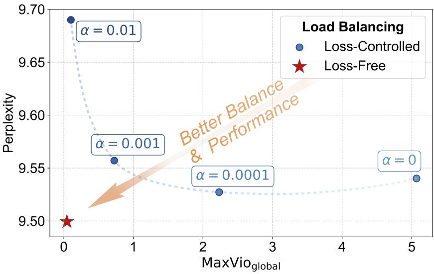
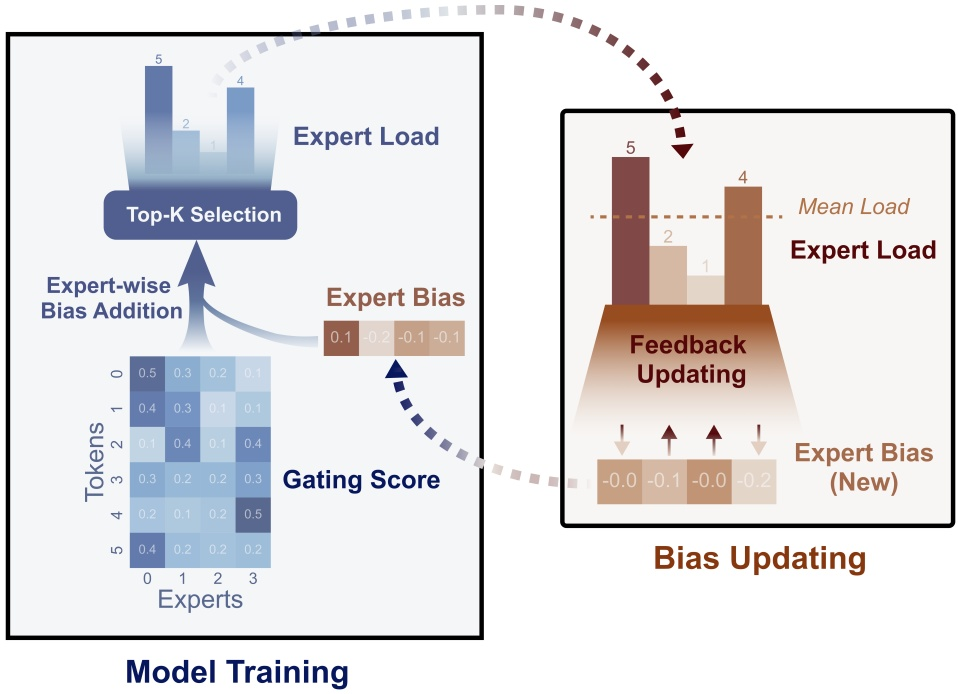
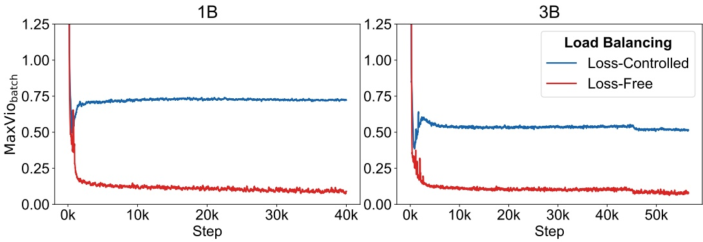
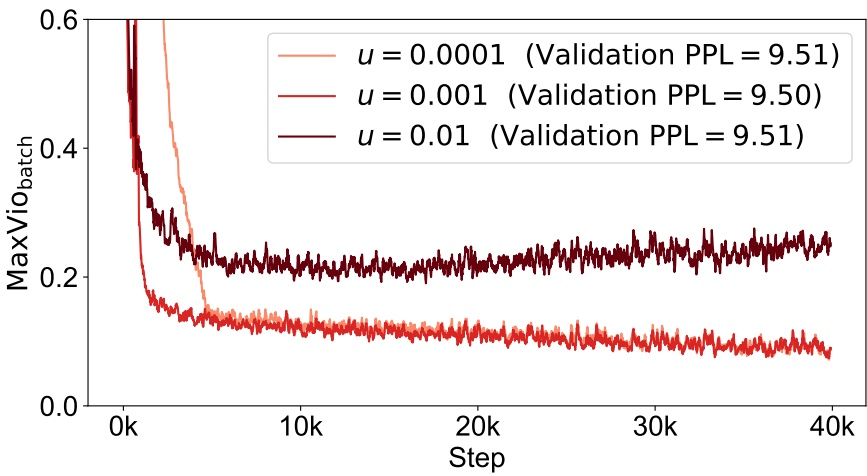
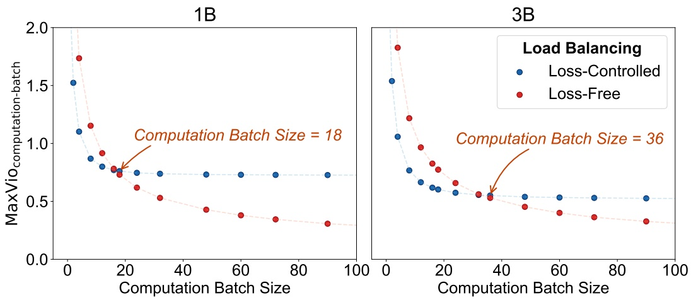
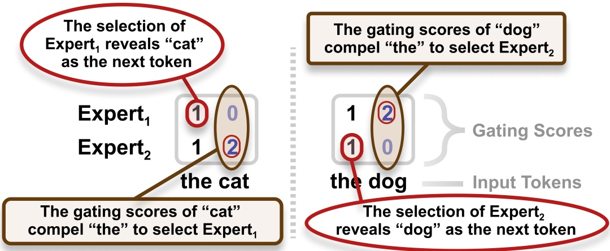
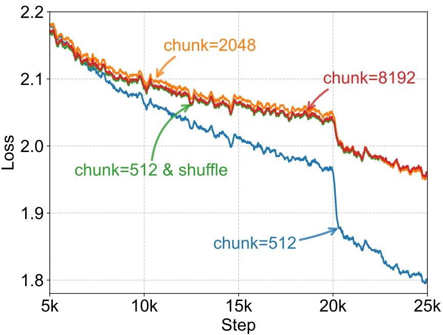

# Loss-Free Balancing: 只管选择的专家偏置如何替代 MoE 辅助损失

论文是 *Auxiliary-Loss-Free Load Balancing Strategy for Mixture-of-Experts* ([arXiv 2408.15664](https://arxiv.org/abs/2408.15664)), 2024 年 8 月 28 日挂出, 14 页, 作者 Lean Wang, Huazuo Gao, Chenggang Zhao, Xu Sun, Damai Dai, 来自 DeepSeek-AI 和北京大学多媒体信息处理国家重点实验室, 第一作者在 DeepSeek 实习期间完成. 论文没有配套代码仓库; 方法后来进了 DeepSeek-V3, 推理侧的偏置可以在 [DeepSeek-V3 的 `inference/model.py`](https://github.com/deepseek-ai/DeepSeek-V3/blob/main/inference/model.py) 里看到, 训练侧的更新规则在 [Megatron-LM 的 `moe_utils.py`](https://github.com/NVIDIA/Megatron-LM/blob/main/megatron/core/transformer/moe/moe_utils.py) 有一份独立实现. 逐段译文见 [对照译稿](01-aux-loss-free-bi.md).

方法本身三行就能写完: 每个路由专家配一个标量偏置, 选 Top-K 时把它加在路由分数上, 乘到专家输出上的门控仍用原始分数; 每步训练结束后, 超载专家的偏置减 $u$, 欠载专家的加 $u$. 篇幅主要花在三件事上: 这个改动为什么能同时改善困惑度和均衡, 实验数字在什么口径下成立, 以及 V3 实际用法和论文设定之间差了哪些东西. 辅助损失的一般形式, 容量与 token drop, Expert Choice 泄露量的推导, 在 llm-guide 的 [MoE 负载均衡与容量](../../../LargeLanguageModelGuide/2-核心原理与架构/2.6-MoE/03-MoE负载均衡与容量/03-MoE负载均衡与容量.md) 和 [MoE 路由与 Top-K 可导性](../../../LargeLanguageModelGuide/2-核心原理与架构/2.6-MoE/02-MoE路由与Top-K可导性/02-MoE路由与Top-K可导性.md) 已有, 下文只在需要时引结论.

## 1. 辅助损失的两难

### 1.1. 式 (2) 的梯度落在谁身上

论文的 MoE 层按式 (1) 计算: 第 $t$ 个 token 的输入 $\mathbf{u}_t$ 与第 $i$ 个专家的中心向量 $\mathbf{e}_i$ 做内积, 过门控函数 $G$ 得到路由分数 $s_{i,t}$, 取分数最高的 $K$ 个专家, 用 $g_{i,t}=s_{i,t}$ 加权它们的 FFN 输出. 主实验的 $G$ 是 sigmoid, 每个 $s_{i,t}$ 独立落在 $(0,1)$, 不在专家之间归一. 基线的辅助损失是式 (2), 按一条长度为 $T$ 的序列计算:

$$
\mathcal{L}_{\mathrm{Balance}}=\alpha\sum_{i=1}^{N}f_iP_i,\qquad f_i=\frac{N}{KT}\sum_{t=1}^{T}\mathbb{1}(\text{token } t \text{ 选中专家 } i),\qquad P_i=\frac{1}{T}\sum_{t=1}^{T}s_{i,t}
$$

$f_i$ 是专家 $i$ 在这条序列上的实际负载, 乘了 $N/K$ 之后完全均衡时等于 1; 它由指示函数构成, 不可导, 梯度只经过 $P_i$ 流回路由分数. 对单个分数求导, 得到

$$
\frac{\partial\mathcal{L}_{\mathrm{Balance}}}{\partial s_{i,t}}=\frac{\alpha f_i}{T}
$$

这一项与 token $t$ 是否选中专家 $i$ 无关: 序列里每个 token 对专家 $i$ 的分数都会被同一个力度往下压, 专家越热 ($f_i$ 越大) 压得越狠. 再往前一层, sigmoid 的导数是 $s_{i,t}(1-s_{i,t})$, 于是输入 $\mathbf{u}_t$ 收到的辅助梯度是 $\frac{\alpha}{T}\sum_i f_i\,s_{i,t}(1-s_{i,t})\,\mathbf{e}_i$. 这条梯度进的是残差流, 会一路传回前面的注意力层和 FFN 层. 也就是说, 为了让路由均衡, 辅助损失改动的不止路由器的 $\mathbf{e}_i$, 还有所有上游层的表示. 论文说的「干扰梯度」, 具体就是这一项: 它的方向由负载统计决定, 和 next-token prediction 的损失无关, 系数 $\alpha$ 越大, 它在总梯度里占比越高.

式 (2) 还有一个容易被忽略的设定: 它在单条序列内统计. 一条代码序列天然会偏向擅长代码的专家, 序列级损失要求它在 2048 个 token 内部也摊平到 64 个专家上, 这比「整个 batch 摊平」严格得多. 这一点到第 5 节会变得重要, 因为 V3 的消融后来把 Loss-Free 的收益很大一部分归到了统计范围上. Switch 形式的点积损失为什么能推动均衡, 推导见 [MoE 负载均衡与容量](../../../LargeLanguageModelGuide/2-核心原理与架构/2.6-MoE/03-MoE负载均衡与容量/03-MoE负载均衡与容量.md) 第 2 节.

### 1.2. 图 2: 扫 $\alpha$ 得到的曲线

图注: 横轴是 $\mathrm{MaxVio}_{\mathrm{global}}$, 纵轴是 1B 模型的验证困惑度, 蓝点是 $\alpha$ 取 1e-2, 1e-3, 1e-4, 0 的四次辅助损失训练, 红星是 Loss-Free. 从图上读数, 四个蓝点依次约为 (0.10, 9.69), (0.72, 9.56), (2.23, 9.53), (5.07, 9.54), 红星约为 (0.04, 9.50).
图 2 解析: 横轴是 $\mathrm{MaxVio}_{\mathrm{global}}$, 纵轴是 1B 模型的验证困惑度, 蓝点是 $\alpha$ 取 1e-2, 1e-3, 1e-4, 0 的四次辅助损失训练, 红星是 Loss-Free. 从图上读数, 四个蓝点依次约为 (0.10, 9.69), (0.72, 9.56), (2.23, 9.53), (5.07, 9.54), 红星约为 (0.04, 9.50). 图里没有画 Loss-Free 不同 $u$ 的点, 也没有误差条, 每个点是单次训练.

这条曲线是 U 形的, 两头都差. $\alpha=0.01$ 把负载压到 0.10, 困惑度却比 $\alpha=10^{-4}$ 高 0.16. $\alpha=0$ 完全不管负载, $\mathrm{MaxVio}_{\mathrm{global}}$ 到 5.07, 最热的专家拿到均值的 6 倍左右; 64 个专家选 6 个时, 每个专家平均处理约 9.4% 的 token, 6 倍意味着最热的专家处理了一半以上的 token. 困惑度在这里反而回升到 9.54, 说明塌缩本身也损害质量, 不只是效率问题. 曲线最低点在 $\alpha=10^{-4}$ 附近, 困惑度约 9.53, 但负载偏离已超过 2 倍.

由此可以算清 Table 2 的对比口径. 基线取的是 $\alpha=0.001$, 论文的理由是「性能与均衡的合理折中」, 它的困惑度 9.56 并不是辅助损失能达到的最好值. 与它比, Loss-Free 低 0.06; 与曲线最低点 9.53 比, 只低 0.03, 而那个点的 $\mathrm{MaxVio}_{\mathrm{global}}$ 是 2.2, 在专家并行里不可用. 所以更准确的说法是: 在均衡程度相当的条件下, 辅助损失要付 0.19 的困惑度 ($\alpha=0.01$), 在困惑度相当的条件下, 辅助损失要付 2 倍以上的负载偏离, Loss-Free 两头都不付. 论文摘要说的「抬高性能上限」, 指的是红星落在蓝色曲线的左下方, 不是指它比曲线上任何一点的困惑度都低出很多.

## 2. 只进排序的偏置

### 2.1. 式 (3): 偏置决定集合, 不决定权重

Loss-Free 只改式 (1) 的选择条件. 每个 MoE 层的每个路由专家有一个标量 $b_i$, 选专家时比较的是 $s_{i,t}+b_i$:

$$
g_{i,t}=\begin{cases}s_{i,t}, & s_{i,t}+b_i\in\operatorname{Topk}\left(\{s_{j,t}+b_j\mid 1\le j\le N\},K\right)\\ 0, & \text{otherwise}\end{cases}
$$

被选中之后, 乘到 $\mathrm{FFN}_i(\mathbf{u}_t)$ 上的仍是不带偏置的 $s_{i,t}$. 这个设计有两层含义. 第一, $b_i$ 只出现在 Top-K 的比较里, Top-K 输出的是索引, 对 $b_i$ 没有导数, 主损失不会去更新 $b_i$, $b_i$ 也不会通过梯度去改动 $\mathbf{e}_i$ 或上游表示. 第二, 固定选中集合时, MoE 层的输出函数和不加偏置的模型完全相同, 偏置的全部作用是「换掉哪几个专家参与计算」. 如果把 $b_i$ 也加进 $g_{i,t}$, 输出会被偏置直接放大或缩小, 偏置就变成了影响前向数值的参数, 要么它接收梯度 (于是又和主损失耦合), 要么它的变化让同一个 token 的输出幅度随训练步漂移. 两种情况都破坏了「均衡和建模各管各的」这条分工.

偏置有一个冗余自由度: 所有 $b_i$ 同时加一个常数, 每个 token 的 Top-K 结果不变. 所以偏置的绝对值没有意义, 只有专家之间的差有意义, 也不需要约束 $s_{i,t}+b_i$ 非负. 这个性质在实现上留下一个坑: V3 的推理代码先按组筛选专家, 再把未选中组的分数填成某个值后取 Top-K. 偏置为负时 $s_{i,t}+b_i$ 可以小于 0, 如果填充值是 0, 被屏蔽的专家会排到合法专家前面, 必须填 $-\infty$. 官方 `Gate.forward` 用的正是 `masked_fill_(mask, float("-inf"))`, 自己重写路由时这一处最容易抄错.

### 2.2. 用图 1 的数字走一遍

图注: 左框是一个训练步, 6 个 token 对 4 个专家的门控分数矩阵 (颜色越深分数越高), 加上专家偏置 $(0.1,-0.2,-0.1,-0.1)$ 后做 $K=2$ 的 Top-K 选择, 得到专家负载 $(5,2,1,4)$. 右框是偏置更新: 平均负载为 $6\times2/4=3$, 专家 0 和 3 超载, 偏置下调; 专家 1 和 2 欠载, 偏置上调, 新偏置为 $(0.0,-0.1,0.0,-0.2)$, 对应步长 $u=0.1$.
图 1 解析: 左框是一个训练步, 6 个 token 对 4 个专家的门控分数矩阵 (颜色越深分数越高), 加上专家偏置 $(0.1,-0.2,-0.1,-0.1)$ 后做 $K=2$ 的 Top-K 选择, 得到专家负载 $(5,2,1,4)$. 右框是偏置更新: 平均负载为 $6\times2/4=3$, 专家 0 和 3 超载, 偏置下调; 专家 1 和 2 欠载, 偏置上调, 新偏置为 $(0.0,-0.1,0.0,-0.2)$, 对应步长 $u=0.1$. 图里的分数和步长都是示意值.

这一步的 $\mathrm{MaxVio}$ 按式 (4) 是 $(5-3)/3\approx0.67$. 看 token 4 的变化可以知道步长为什么要小: 它的原始分数是 $(0.2,0.1,0.2,0.5)$, 旧偏置下的排序分数是 $(0.3,-0.1,0.1,0.4)$, 选专家 3 和 0; 新偏置下变成 $(0.2,0.0,0.2,0.3)$, 专家 0 和专家 2 并列第二. 示意图的分数以 0.1 为最小间隔, 一步 0.1 的偏置正好把这个 token 推到选择边界上. 同样的事在其他 token 上也会发生, 一步之内大量 token 同时换专家, 负载从一边甩到另一边. 实际训练取 $u=0.001$, 远小于真实分数之间的典型间隔, 每步只有贴近边界的少数 token 换专家, 负载逐步收敛. 第 3.3 节里 $u=0.01$ 后期负载变差, 机理就是这个.

### 2.3. Algorithm 1 的时序与因果

Algorithm 1 的一步分四件事: 用当前偏置做前向和反向, 更新模型参数; 统计这个 batch 里每个专家被分到的 token 数 $c_i$ 及其均值 $\overline{c_i}$; 算违背误差 $e_i=\overline{c_i}-c_i$; 按 $b_i\leftarrow b_i+u\cdot\mathrm{sign}(e_i)$ 更新. 偏置在 batch 内不变, 第 $n$ 步用的偏置只由前 $n-1$ 个 batch 的负载决定. 所以在一个 batch 内部, 某个 token 选哪个专家只取决于它自己的分数和这组固定的偏置, 不取决于同 batch 里别的 token, 更不取决于同一序列里它后面的 token. 推理时偏置冻结, 路由退化成逐 token 的确定函数, 训练和推理的路由形式一致. 论文特意强调「用历史负载而不是当前序列的负载」, 原因就在这里: 如果先看当前序列的负载再定偏置, 前面 token 的选择就依赖后面 token 的分数, 这正是第 4 节 Expert Choice 的问题.

统计范围是整个训练 batch. 1B 模型一步 1152 条序列, 每条 2048 token, 共约 2.36M token, 每层 64 个专家的平均负载约 $2.36\text{M}\times6/64\approx2.2\times10^5$ 个 token. 偏置是逐层的, 每个 MoE 层各有一组 64 个 $b_i$, 论文报告的 MaxVio 是各层平均. 有梯度累积和数据并行时, $c_i$ 要在所有 micro-batch 和所有数据并行副本上加总后再更新, 否则每张卡会按自己看到的局部负载各改各的偏置. Megatron 的实现正是这样: 偏置注册成 fp32 的 buffer 而非可训练参数, 前向时只在开着梯度的情况下累加计数 (评测和激活重算不重复计), 优化器步结束时在张量, 数据, 上下文并行组上 all-reduce, 再用 $\mathrm{sign}(\text{total}-c_i\cdot N)$ 定方向, 用整数比较避开均值的浮点误差. V3 官方推理代码里偏置是 fp32 的 `nn.Parameter`, 推理时没有问题; 但它默认 `requires_grad=True`, 直接拿去训练时要先关掉, 否则它会进入优化器. 偏置在前向里只出现在 Top-K 的输入中, 本来就拿不到梯度, 可一旦开了 weight decay, 优化器仍会把它往 0 拉, 与 Algorithm 1 的更新互相抵消.

### 2.4. sign 更新的性质与代价

sign 规则可以从两个角度理解. 一是把它看成对偏置做符号梯度下降: 对目标 $\frac12\|F-Q\|^2$ ($F$ 是带偏置的负载分布, $Q$ 是均匀分布), 用直通估计把 $F$ 对 $b$ 的导数取成单位阵, 梯度就是 $F-Q$, 普通 SGD 给出 $b\leftarrow b-u(F-Q)$, 取符号就是 Algorithm 1; 表 3 的 $b_i+u\cdot e_i$ 变体对应普通 SGD. 二是把偏置看成「每个专家负载等于 $KT/N$」这条约束的对偶变量, Top-K 选择是原始步, 偏置更新是一步对偶上升: 过载专家的偏置下调, 等价于提高它的「价格」, 只有分数高出价格的 token 才继续选它. 按这种写法, sign 规则相当于逐专家取步长 $u/|e_i|$ 的对偶梯度步, 离均衡越近步长相对越大, 这也解释了第 2.4 节说的末段抖动. 两种看法给出同一个结论: Loss-Free 并没有「去掉损失」, 它把均衡目标的优化变量从全部模型参数缩到了 $N$ 个偏置上. 这正是它不干扰主任务的原因, 也是它和辅助损失最本质的区别.

sign 更新的代价是步长不衰减. 不论 $|e_i|$ 多大, 偏置每步都动 $u$, 已经均衡的专家也被推着来回抖, 最终只能收进一个宽度与 $u$ 成正比的带里, 不会精确收敛. 另一个代价是新增了超参 $u$, 而 $u$ 的取值和门控分数的量程绑定: sigmoid 分数在 $(0,1)$ 内且彼此独立, $u=0.001$ 相当于每步移动千分之一的分数量程; 换成 softmax, 分数的量程随 token 变化 (一个确定的 token 最高概率可能是 0.9, 一个犹豫的 token 64 个专家都在 0.016 附近), 固定加性偏置对不同 token 的作用差别很大, 论文附录 C 也因此改用了 $u\cdot e_i$. 「Loss-Free 不用调 $\alpha$」的说法要补半句: 它要调 $u$, 只是 $u$ 在 sigmoid 门控下比 $\alpha$ 好调, 论文在 1B 上搜出的 0.001 被直接用到了 3B, 后来又原样用进了 V3 和 V4.

## 3. 实验: 设置, 数字与口径

### 3.1. 模型与训练设置

两个模型都是 DeepSeekMoE 结构 (细粒度专家加共享专家, 见 [DeepSeek-MoE](../../../LargeLanguageModelGuide/2-核心原理与架构/2.6-MoE/01-DeepSeek-MoE/01-DeepSeek-MoE.md)), 门控从 DeepSeekMoE 原文的 softmax 换成 sigmoid. 按表 5, 1B 模型隐藏维 1024, 8 个注意力头, 9 个 MoE 层 (另有紧接嵌入层的一层稠密 FFN), 每层 2 个共享专家加 64 个路由专家, 每 token 激活 6 个路由专家, 细粒度系数 $d_{ff}/d_{expert}=16/3$; 3B 模型隐藏维 1280, 10 个头, 11 个 MoE 层, 专家配置相同, 细粒度系数 4. 词表 32064, 是用 HuggingFace tokenizers 训的 32K BPE.

训练设置按附录 B 可以逐项复算. 1B 用带预热的余弦学习率, 峰值 1e-3, 最低 1e-4, 预热 1000 步, batch 1152 条 × 2048 token, 40000 步, 合计 $1152\times2048\times40000\approx9.44\times10^{10}$, 即约 94B token, 正文写的 100B 是取整. 3B 用多阶段学习率, 在 45211, 50862, 56514 步切换, 三段学习率 7.8e-4, 2.47e-4, 7.8e-5, 预热 2000 步, batch 1728 条, 56514 步合计 $2.00\times10^{11}$ token, 与 200B 吻合; 两个切换点分别落在总步数的 80% 和 90%. 结论节写的「3B 训 300B token」与这里对不上, 是笔误. 验证集约 70.8M token, 等于 1B 的 30 个 batch, 也等于 3B 的 20 个 batch. 更新速率只在 1B 上调, 3B 直接沿用.

### 3.2. MaxVio 的定义与 Table 2

式 (4) 定义一个 MoE 层的最大违背度:

$$
\mathrm{MaxVio}=\frac{\max_i\mathrm{Load}_i-\overline{\mathrm{Load}_i}}{\overline{\mathrm{Load}_i}}
$$

$\mathrm{Load}_i$ 是分到专家 $i$ 的 token 数, $\overline{\mathrm{Load}_i}$ 是完全均衡时的期望负载. 它只看最热的那一个专家, 原因是专家并行下一层的完成时间由最慢的那张卡决定, 平均偏离再小, 只要有一个专家超载 70%, 这一层就要多等 70% 的计算. 两个变体的差别在统计范围: $\mathrm{MaxVio}_{\mathrm{global}}$ 在整个验证集上数, 对应 batch 无穷大时的效率上限; $\mathrm{MaxVio}_{\mathrm{batch}}$ 在每个训练 batch 上数, 对应训练时每一步的实际效率. 全文报告的值都是各层平均, 单层的最差值文中没有给出.

Table 2 的结果: 1B 上辅助损失困惑度 9.56, $\mathrm{MaxVio}_{\mathrm{global}}$ 0.72, Loss-Free 为 9.50 和 0.04; 3B 上辅助损失 7.97 和 0.52, Loss-Free 7.92 和 0.04. 换成交叉熵, 两个规模的差都约为 $\ln 9.56-\ln 9.50\approx\ln 7.97-\ln 7.92\approx0.006$ nat. 负载的改善是一个数量级, 困惑度的改善约 0.6%. 论文只报告困惑度, 没有下游评测, 没有多随机种子, 0.006 nat 的差在单次训练里能否与噪声区分, 文中没有给出依据. 负载上的结论则可靠得多: 0.72 到 0.04 的差远超训练噪声.

图注: 两个子图是 1B 和 3B 训练全程的 $\mathrm{MaxVio}_{\mathrm{batch}}$, 每个点是相邻 100 步的平均. 两种方法在前约 1k 步都从很高的值迅速下降; 之后辅助损失停在 1B 约 0.72, 3B 约 0.52 的水平, Loss-Free 降到约 0.1 并缓慢下行.
图 3 解析: 两个子图是 1B 和 3B 训练全程的 $\mathrm{MaxVio}_{\mathrm{batch}}$, 每个点是相邻 100 步的平均. 两种方法在前约 1k 步都从很高的值迅速下降; 之后辅助损失停在 1B 约 0.72, 3B 约 0.52 的水平, Loss-Free 降到约 0.1 并缓慢下行. 3B 的辅助损失曲线在约 45k 步有一个小台阶, 正是学习率第一次下调的位置. 图里看不出困惑度, 也看不出单层的情况.

$\mathrm{MaxVio}_{\mathrm{batch}}$ 后期约 0.1, 比 $\mathrm{MaxVio}_{\mathrm{global}}$ 的 0.04 高一倍多, 差额来自 batch 之间的内容差异. 如果 2.2M 次派遣是独立抽样, 每个专家计数的相对波动约 $1/\sqrt{2.2\times10^5}\approx0.2\%$, 远小于 0.1; 实际的 0.1 说明 batch 之间的数据配比在变, 偏置按上一 batch 的负载更新, 跟不上下一 batch 的内容变化. 这是 Loss-Free 的结构性下限: 它只能纠正持续的偏斜, 纠正不了单个 batch 的偶然偏斜.

### 3.3. 消融: 更新速率, 更新形式, 乘性偏置

图注: 1B 模型上三种 $u$ 的 $\mathrm{MaxVio}_{\mathrm{batch}}$ 曲线, 图例里附了验证困惑度. $u=0.0001$ 的曲线约 5k 步才降到 0.15 附近, 之后与 $u=0.001$ 重合; $u=0.001$ 约 1k 步就降到 0.2 以下; $u=0.01$ 停在 0.22 附近, 30k 步后还缓慢抬升到 0.25.
图 4 解析: 1B 模型上三种 $u$ 的 $\mathrm{MaxVio}_{\mathrm{batch}}$ 曲线, 图例里附了验证困惑度. $u=0.0001$ 的曲线约 5k 步才降到 0.15 附近, 之后与 $u=0.001$ 重合; $u=0.001$ 约 1k 步就降到 0.2 以下; $u=0.01$ 停在 0.22 附近, 30k 步后还缓慢抬升到 0.25. 三者的困惑度是 9.51, 9.50, 9.51.

从收敛时间可以粗估偏置要走多远: $u=10^{-4}$ 用约 5000 步, $u=10^{-3}$ 用约 1000 步, 对应偏置累计移动约 0.5 到 1, 和 sigmoid 分数的量程同一量级. 偏置的最终分布文中没有给出, 这个量级只是从图 4 的拐点和步长相乘得到的. $u=0.01$ 的问题是第 2.2 节说的边界翻转: 步长大到一步就能让大批 token 换专家, 负载在相邻两步之间来回甩. 三个 $u$ 的困惑度只差 0.01, 均衡上的差别比困惑度上的差别明显得多.

表 3 和表 4 比较了更新形式. 把 sign 换成按误差比例更新 $b_i\leftarrow b_i+u\cdot e_i$, $u=0.01$ 时 $\mathrm{MaxVio}_{\mathrm{global}}$ 从 0.044 降到 0.028, 困惑度从 9.50 升到 9.53; $u=0.001$ 和 $0.0001$ 时困惑度 9.51, 均衡 0.036 和 0.040. 表 3 没说 $e_i$ 是 token 个数还是比例. 按上面的规模, 最热专家的 $|e_i|$ 是 $2\times10^4$ 量级, 若是原始计数, 即使 $u=0.0001$ 每步也要移动约 2, 超出分数量程, 不可能得到 0.040 的均衡; 若按平均负载归一 (相对误差约 0.1), $u=0.01$ 的单步幅度约 0.001, 与 sign 版本同量级. 所以 $e_i$ 很可能做了归一, 但文中没有给出. 乘性偏置 (初值 1, 选择条件改成 $s_{i,t}\cdot b_i$) 在三个 $u$ 下困惑度 9.52 到 9.54, 均衡 0.036 到 0.048, 没有比加性偏置更好. 这几组的困惑度差都在 0.01 到 0.04 之间, 和单次训练的噪声同量级, 论文据此保留 sign 加性版本, 理由主要是「最简单的版本不差」.

### 3.4. softmax 门控与专家并行

附录 C 先在 1B 上比较了两种门控的辅助损失基线 (图 7): softmax 门控的最优点在 $\alpha=3\times10^{-4}$, 困惑度约 9.60, $\mathrm{MaxVio}_{\mathrm{global}}$ 约 0.94; sigmoid 的最优点约 9.53. 同等均衡下 softmax 的困惑度高约 0.05 到 0.07, 而且 $\alpha$ 偏离最优点时 softmax 掉得更快. 这是主实验改用 sigmoid 的依据. 在 softmax 门控上用 Loss-Free (比例更新, $u=10^{-3}$), 困惑度 9.599 对基线 9.604, 只低 0.005, $\mathrm{MaxVio}_{\mathrm{global}}$ 从 0.937 降到 0.027 (表 6). 在 softmax 下, Loss-Free 的收益几乎全在负载上.

图注: 横轴是计算 batch 的样本数 (一个计算步内同时参与专家计算的序列条数, 等于单卡 micro-batch 乘专家并行的数据并行规模), 纵轴是这个范围内统计的 MaxVio. 随计算 batch 增大, 辅助损失很快停在 1B 约 0.73, 3B 约 0.53, Loss-Free 一路下降, 在 90 条时到 1B 约 0.31, 3B 约 0.33.
图 5 解析: 横轴是计算 batch 的样本数 (一个计算步内同时参与专家计算的序列条数, 等于单卡 micro-batch 乘专家并行的数据并行规模), 纵轴是这个范围内统计的 MaxVio. 随计算 batch 增大, 辅助损失很快停在 1B 约 0.73, 3B 约 0.53, Loss-Free 一路下降, 在 90 条时到 1B 约 0.31, 3B 约 0.33. 两条曲线在 1B 的 18 条, 3B 的 36 条处相交; 交点左边 Loss-Free 更差, 例如 1B 在 4 条时约 1.74 对 1.10.

图 5 的左半段在 §5.1 的文字里没有展开, 但它决定了 Loss-Free 的适用边界. 辅助损失按序列统计, 直接压的是每条序列内部的偏斜, 计算 batch 很小时它更均衡; Loss-Free 只管全局, 单条序列可以严重偏向少数专家, 要靠很多条序列叠加才能抵消. 1B 的交点 18 条序列约 3.7 万 token, 每个专家平均只分到约 3500 个 token. 论文的结论是「专家并行把计算 batch 放大 `ep_data_parallel_size` 倍, 所以 Loss-Free 天然适配大规模训练」, 这对训练成立; 对推理的小 batch 解码, 或训练里 micro-batch 很小而专家并行规模也小的配置, 图 5 给出的是相反的信号. V3 补一个序列级损失, 防的正是这一段.

## 4. 与 Expert Choice 对照: 未来 token 泄露

### 4.1. 泄露从哪来, 式 (7) 的界有多紧

Expert Choice (EC, [Zhou et al., 2022](https://arxiv.org/abs/2202.09368)) 把选择方向倒过来, 改由每个专家在一个分块的 $T$ 个 token 里挑分数最高的 $RT$ 个, $R=K/N$ 是稀疏比. 每个专家恰好收 $RT$ 个 token, 负载按构造完全均衡, 不需要任何辅助损失或偏置. 代价在因果性: token $t$ 能不能被专家 $i$ 选中, 取决于它的分数在整个分块里排第几, 而分块里包括 $t$ 之后的 token. 图 6 给了一个两 token 的例子: 「the cat」和「the dog」里, 后一个 token 的门控分数不同, 迫使前面的「the」选到不同的专家, 于是「the」的路由结果本身就编码了下一个词是什么. 这条信息经过 MoE 输出写进「the」的表示, 预测下一个 token 时就可以读出来, 训练损失因此虚低.

图注: 两个专家, 每个专家在两 token 的分块里选 1 个 token. 方框里的数字是门控分数.
图 6 解析: 两个专家, 每个专家在两 token 的分块里选 1 个 token. 方框里的数字是门控分数. 左边「cat」对专家 2 的分数是 2, 抢走了专家 2, 「the」只能去专家 1; 右边「dog」对专家 1 的分数是 2, 「the」只能去专家 2. 红圈标的是「the」的选择暴露了后继 token. 这只是构造出的极端例子, 分数是示意值, 图里没有说明真实模型多大比例的 token 处在这种情况.

附录 D.1 估计泄露量. 一层里每个专家从 $T$ 个 token 选 $RT$ 个, 共 $\binom{T}{RT}^N$ 种分配, 平均每个 token 能携带 $I=\frac1T\log_2\binom{T}{RT}^N$ bit. 用 $\binom{T}{m}\ge\left(\frac{T}{m}\right)^m>\left(\frac{T-m}{m}\right)^m$ 放缩, 得到式 (7) 的下界 $I>K\log_2\frac{1-R}{R}$. 代入 $N=16$, $K=2$: 每层 $2\log_2 7\approx5.61$ bit, 9 层约 50.5 bit; 词表 32064 的一个 token 需要 $\log_2 32064\approx15$ bit, 所以论文说 50 bit 足够确定后继 token. 这个界并不紧, 用 Stirling 近似, $\frac1T\log_2\binom{T}{RT}\to H(R)$ ($H$ 是二元熵), 每层的容量趋于 $N\cdot H(R)$, $R=0.125$ 时为 $16\times0.544\approx8.7$ bit, 比下界大 55%. 换成论文自己的 1B 配置 ($N=64$, $K=6$, $R\approx0.094$), 下界是每层 $6\log_2(58/6)\approx19.6$ bit, 熵近似是 $64\times0.449\approx28.7$ bit, 9 层合计 177 到 258 bit.

这些数要正确理解. 它们是路由分配这条通道的容量, 不是模型实际泄露的量: 分配编码的是整个分块的信息, 前面 token 和后面 token 都在里面, 模型能不能学会把它解码成「下一个 token 是谁」, 容量估计回答不了. 所以式 (7) 证明的是「EC 有足够大的泄露通道」, 真正的证据在 D.2 的实验.

### 4.2. 实验证据与它的边界

D.2 训了一个 2B 的 EC 模型, 100B token, 比较分块 512, 2048, 8192 和「512 加打乱」四种设置. 脚注说明 2048 个 token 是一条序列, 512 是四分之一条, 8192 是四条. 正文 §5.2 和附录 D.2 都说结果在「Table 9」, 实际是图 9; 2B 这个规模在正文其他地方没出现过, 架构细节文中没有给出.

图注: 5k 到 25k 步的训练损失. 2048, 8192 和「512 加打乱」三条曲线几乎重合, 25k 步时约 1.96; chunk=512 从约 8k 步开始低于其他曲线, 20k 步附近陡降一段, 25k 步约 1.80.
图 9 解析: 5k 到 25k 步的训练损失. 2048, 8192 和「512 加打乱」三条曲线几乎重合, 25k 步时约 1.96; chunk=512 从约 8k 步开始低于其他曲线, 20k 步附近陡降一段, 25k 步约 1.80. 四条曲线在 20k 步都有一次下降, 位置一致, 应是学习率调度的切换点 (文中没有给出 2B 的调度). 图里只有训练损失, 没有验证损失.

按图上读数, 512 的损失比其余低约 $(1.96-1.80)/1.96\approx8\%$, 与正文「约 10%」接近. 打乱实验是关键对照: 分块大小同为 512, 只是选择前在 batch 内打乱 token, 块内的 token 不再来自同一段上下文, 损失就回到正常水平. 这排除了「小分块只是让优化更容易」的解释, 支持损失下降来自读取了未来信息. 但图 9 也留下两点要补. 第一, chunk=2048 已经是在单条序列内部做选择, 按式 (7) 泄露通道照样存在, 它没有掉下来, 只能说明 25k 步内模型没学会利用, 不能说明 2048 安全; chunk=512 的陡降发生在训练中段, 说明利用泄露是训练中途学会的, 训得更久的大分块会不会出现同样的现象, 图里看不出. 第二, 损失虚低本身不等于评测失效, 论文说泄露「破坏泛化」, 但没有报告 EC 模型在自回归生成时的表现. 自回归解码每步只有一个新 token, 组内竞争根本无法按训练时的方式进行, 这一点 Zhou 等人自己在局限一节也承认, 推导与案例见 [MoE 路由与 Top-K 可导性](../../../LargeLanguageModelGuide/2-核心原理与架构/2.6-MoE/02-MoE路由与Top-K可导性/02-MoE路由与Top-K可导性.md) 第 1.3 节.

Table 1 把辅助损失也标成「无泄露」, 这里有一个细节. 式 (2) 的 $f_i$ 在整条序列上计数, 它对 $s_{i,t}$ 的梯度 $\alpha f_i/T$ 里含有 $t$ 之后的 token 的路由结果. 但这只进训练信号, 前向里读不到: 和语言建模损失本身一样, 损失可以看整条序列, 只要 token $t$ 的前向计算不读后面的 token, 就不构成泄露. Loss-Free 的偏置来自之前的 batch, 前向更是只读固定值. 两者都满足因果约束, EC 不满足, 区别就在选择这一步本身是否跨 token 竞争.

## 5. 从论文到 DeepSeek-V3

### 5.1. V3 沿用了什么, 改了什么

V3 ([DeepSeek-V3 解析](../../1-模型技术报告/1.4-deepseek-v3/02-deepseek-v3-analysis.md) 第 1.4 节) 沿用了论文的核心: sigmoid 亲和度, 加性偏置只进排序, 每步在整个 batch 上统计负载, 按符号更新, 步长 (V3 叫偏置更新速度 $\gamma$) 也是 0.001. 改动有五处, 每一处都对应论文没覆盖到的情形.

规模和门控形式不同. V3 每个 MoE 层 256 个路由专家选 8 个, 外加 1 个共享专家, 前 3 层是稠密 FFN; 门控在选中的 8 个专家上把 sigmoid 分数归一到和为 1, 再乘一个缩放系数 (官方推理代码里的 `route_scale`). 论文的式 (3) 不做这一步. 归一化只改权重, 不改选择, 偏置仍然只影响集合.

偏置还参与了节点选择. V3 限制每个 token 最多发往 4 个节点, 实现上把 256 个专家分成 8 组, 每组的得分是组内最高两个分数之和, 先选 4 组, 再在这 4 组里选 Top-8. 官方推理代码 `Gate.forward` 里, 组得分用的是加了偏置之后的分数, 门控权重才用 `original_scores`. 所以 V3 的偏置同时调节「去哪几个节点」和「选哪几个专家」, 论文只有单层 Top-K, 没有测过偏置在两级选择下的行为. 另外这份代码只在隐藏维 7168 (671B 配置) 时创建偏置.

训练末期冻结. V3 在前 14.3T token 用 $\gamma=0.001$, 末尾 500B token 设为 0, 与学习率的最终两段恒定期重合. 论文的 1B, 3B 实验从头到尾都在更新. 冻结的作用可以从第 2.4 节推出: sign 更新的步长不衰减, 偏置在均衡带里一直抖, 抖动意味着贴近边界的 token 在相邻两步换专家; 学习率降到很低之后, 这种抖动相对于参数更新不再可以忽略, 冻结让收尾阶段的路由固定下来. 冻结后的偏置随权重一起发布, 推理时继续参与选择.

补了序列级均衡损失. V3 保留一个 $\alpha=0.0001$ 的序列级损失, 形式和式 (2) 相同, 只是 $P_i$ 先把分数在专家间归一, 指示函数按不带偏置的 Top-K 计数. 系数比论文的基线小 10 倍, 用途是防单条序列内的极端偏斜. 第 3.4 节的图 5 已经给出这样做的理由: 计算 batch 小于十几二十条序列时, 纯 Loss-Free 的局部负载比序列级辅助损失还差. 末尾一处是 V3 训练不丢 token, 推理侧再用冗余专家处理领域变化带来的负载漂移, 这两项都在论文范围之外.

### 5.2. V3 的消融如何改写了论文的解释

V3 报告在两个更大的规模上重做了对比: 15.7B 总参训 1.33T token, 228.7B 总参训 578B token, 大档的 HumanEval 从 40.2 升到 46.3, MATH 从 37.2 升到 39.6, 但 MMLU 从 68.3 降到 67.2. 这是论文缺的下游评测, 结论大体同向, 也有反例. 更有分量的是 V3 §4.5.3 的一组对照: 在 1B 和 3B 上同时比较序列级辅助损失, Loss-Free 和 batch 级辅助损失 (统计范围从一条序列换成整个 batch). 验证损失 1B 上是 2.258, 2.253, 2.253, 3B 上是 2.085, 2.080, 2.080. batch 级辅助损失和 Loss-Free 打平.

这组数字修正了论文的叙述. 论文把 Loss-Free 的优势归于「没有干扰梯度」, 而它的基线式 (2) 同时具备两个特征: 有梯度, 并且按序列统计. V3 的对照把两者拆开后显示, 只要把辅助损失的统计范围放宽到 batch, 带梯度的方法也能达到同样的验证损失. 收益的主要来源是均衡范围: batch 级约束允许一条代码序列集中使用擅长代码的专家, 专家的领域分工更明显 (V3 报告的 Figure 9 在 Pile 三个领域上画了专家负载). 「干扰梯度」在第 1.1 节的推导里确实存在, 但在 $\alpha=0.001$ 这个量级上, 它对质量的影响小到被统计范围的效应盖住. Loss-Free 相对 batch 级辅助损失的实际好处在工程上: 不用为每个模型重新扫 $\alpha$, 不往残差流注入额外梯度, 均衡程度 (0.04) 比任何能接受的 $\alpha$ 都好. 偏置分数与统计范围的关系, 在 [MoE 负载均衡与容量](../../../LargeLanguageModelGuide/2-核心原理与架构/2.6-MoE/03-MoE负载均衡与容量/03-MoE负载均衡与容量.md) 第 4.3 节有整理.

### 5.3. 之后的演进

DeepSeek-V4 继续用无辅助损失均衡, 偏置更新速度 0.001, 序列级损失权重 0.0001, 亲和度函数从 sigmoid 换成了 $\sqrt{\mathrm{Softplus}(\cdot)}$, 并在前 3 个 MoE 层改用按 token ID 哈希的路由, 见 [DeepSeek-V4 解析](../../1-模型技术报告/1.8-deepseek-v4/02-deepseek-v4-analysis.md) 第 1.1 节. 亲和度函数换掉以后分数不再有 $(0,1)$ 的上界, 第 2.4 节说的 $u$ 与分数量程的绑定关系也随之改变, V4 报告没有讨论这一点. 框架层面, Megatron-LM 把偏置均衡做成了开关 (`moe_router_enable_expert_bias`, `moe_router_bias_update_rate`), 并允许与序列级辅助损失同时开启, 即 V3 的组合.

方法层面有两条改进路线. 一条改步长: 论文的消融只比了固定 $u$ 下的 sign 与线性两种形式, 没有试过随训练衰减的 $u$, 也没有试过把 $e_i$ 先按整体幅度归一再更新. 从第 2.4 节的分析看, 前者能收窄末段的均衡带, 后者能让接近均衡的专家少动, 两者针对的都是固定步长 sign 规则的抖动, V3 末段直接冻结是其中最简单的做法. 另一条改求解方式: Kimi K3 在 896 个路由专家的规模上不再逐步试探, 而是按分数分位数直接解出让负载均衡的偏置 (Quantile Balancing), 见 [Stable-LatentMoE 与 Quantile Balancing](../../../LargeLanguageModelGuide/2-核心原理与架构/2.6-MoE/04-Stable-LatentMoE与Quantile-Balancing/04-Stable-LatentMoE与Quantile-Balancing.md). 两条路线保留的都是论文最核心的那一步: 均衡由一组只进排序的偏置负责, 不经过主损失的梯度.

## 参考文献

1. Wang, L., Gao, H., Zhao, C., Sun, X., & Dai, D. (2024). [Auxiliary-Loss-Free Load Balancing Strategy for Mixture-of-Experts](https://arxiv.org/abs/2408.15664). arXiv:2408.15664.
2. DeepSeek-AI (2024). [DeepSeek-V3 Technical Report](https://arxiv.org/abs/2412.19437). arXiv:2412.19437. §2.1.2, §4.2, §4.5.2, §4.5.3.
3. Zhou, Y., Lei, T., Liu, H., et al. (2022). [Mixture-of-Experts with Expert Choice Routing](https://arxiv.org/abs/2202.09368). arXiv:2202.09368.
4. DeepSeek-AI. [DeepSeek-V3 inference/model.py](https://github.com/deepseek-ai/DeepSeek-V3/blob/main/inference/model.py), `Gate` 类.
5. NVIDIA. [Megatron-LM MoE 工具函数](https://github.com/NVIDIA/Megatron-LM/blob/main/megatron/core/transformer/moe/moe_utils.py), `get_updated_expert_bias`.
