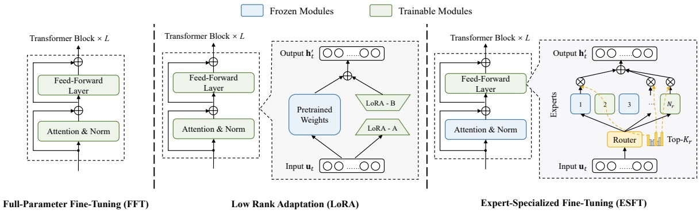
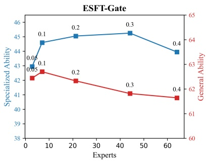
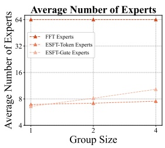
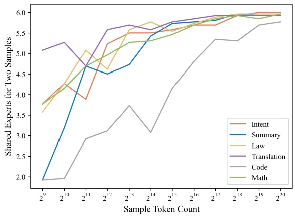
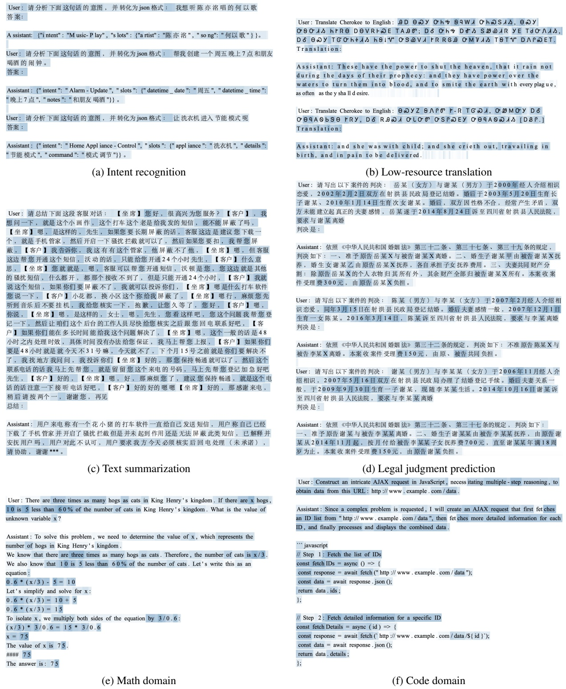

<!-- page 1 of 18 -->

arXiv:2407.01906v2 [cs.CL] 5 Jul 2024

# Let the Expert Stick to His Last: Expert-Specialized Fine-Tuning for Sparse Architectural Large Language Models

**Zihan Wang**12\***, Deli Chen**1**, Damai Dai**1**, Runxin Xu**1**, Zhuoshu Li**1**, Y. Wu**1

1DeepSeek AI

2Northwestern University {zw, victorchen}@deepseek.com

## Abstract

Parameter-efficient fine-tuning (**PEFT**) is crucial for customizing Large Language Models (**LLMs**) with constrained resources. Although there have been various PEFT methods for dense-architecture LLMs, PEFT for sparsearchitecture LLMs is still underexplored. In this work, we study the PEFT method for LLMs with the Mixture-of-Experts (**MoE**) architecture and the contents of this work are mainly threefold: (1) We investigate the dispersion degree of the activated experts in customized tasks, and found that the routing distribution for a specific task tends to be highly concentrated, while the distribution of activated experts varies significantly across different tasks. (2) We propose Expert-Specialized Fine-Tuning, or ESFT, which tunes the experts most relevant to downstream tasks while freezing the other experts and modules; experimental results demonstrate that our method not only improves the tuning efficiency, but also matches or even surpasses the performance of fullparameter fine-tuning. (3) We further analyze the impact of the MoE architecture on expertspecialized fine-tuning. We find that MoE models with finer-grained experts are more advantageous in selecting the combination of experts that are most relevant to downstream tasks, thereby enhancing both the training efficiency and effectiveness. Our code is available at [https://github.com/deepseek-ai/ESFT](https://github.com/deepseek-ai/ESFT).

参数高效微调 (**PEFT**) 是在资源受限时定制大语言模型 (**LLM**) 的关键手段. 面向稠密架构 LLM 的 PEFT 方法已经很多, 面向稀疏架构 LLM 的 PEFT 研究还很少. 我们研究 MoE 架构 LLM 上的 PEFT 方法, 工作主要有三部分: (1) 我们考察定制任务中被激活专家的分散程度, 发现同一任务的路由分布高度集中, 而不同任务激活的专家分布差别很大. (2) 我们提出专家专精微调 (Expert-Specialized Fine-Tuning, ESFT): 只调与下游任务最相关的专家, 冻结其余专家和模块; 实验表明, 这种方法提高了微调效率, 效果追平甚至超过全参数微调. (3) 我们进一步分析 MoE 架构对专家专精微调的影响, 发现专家粒度更细的 MoE 模型更容易挑出与下游任务最相关的专家组合, 训练效率和效果都随之提高. 代码见 [https://github.com/deepseek-ai/ESFT](https://github.com/deepseek-ai/ESFT).

## 1 Introduction

As the parameter scale of large language models (**LLMs**) continues to increase (Meta, 2024; Mistral, 2024a; DeepSeek, 2024; Qwen, 2024), parameter-efficient fine-tuning (**PEFT**) methods (Han et al., 2024) are becoming increasingly important in adapting pre-trained LLMs to downstream customization tasks. However, existing works on PEFT like low-rank adaptation (LoRA) and P-

Tuning (Hu et al., 2021; Liu et al., 2021) have primarily focused on dense-architecture LLMs, with research on sparse-architecture LLMs still being markedly insufficient.

随着大语言模型参数规模不断增长 (Meta, 2024; Mistral, 2024a; DeepSeek, 2024; Qwen, 2024), 参数高效微调方法 (Han et al., 2024) 在把预训练 LLM 适配到下游定制任务上越来越重要. 但低秩适配 (LoRA) 和 P-Tuning (Hu et al., 2021; Liu et al., 2021) 等已有 PEFT 工作主要针对稠密架构 LLM, 对稀疏架构 LLM 的研究明显不足.

In this work, we focus on exploring PEFT techniques within the Mixture-of-Experts (**MoE**) LLMs (Mistral, 2024b; Databricks, 2024), as introduced in §3.1. Unlike dense models where all tasks are handled by the same parameters, in the MoE architecture, different tasks are processed by distinct activated experts (Lepikhin et al., 2021; Fedus et al., 2021). Observations indicate that task specialization in expert systems is the key to the MoE LLM performance (Dai et al., 2024). We further illustrate such specialization in §3.2 that experts activated by the same task’s data are concentrated, while those for different tasks vary significantly, suggesting MoE models use specialized expert combinations to handle different tasks. Motivated by this, we propose Expert-Specialized Fine-Tuning (**ESFT**), as illustrated in §3.3. ESFT only tunes the experts with the highest affinity to the task, while freezing the parameters of other experts and modules.

我们聚焦 MoE LLM (Mistral, 2024b; Databricks, 2024) 上的 PEFT 技术, MoE 的基本形式见 §3.1. 稠密模型里所有任务都由同一组参数处理; MoE 架构里, 不同任务由不同的被激活专家处理 (Lepikhin et al., 2021; Fedus et al., 2021). 已有观察表明, 专家系统的任务专精是 MoE LLM 性能的关键 (Dai et al., 2024). §3.2 进一步展示这种专精: 同一任务的数据激活的专家很集中, 不同任务激活的专家差别很大, 说明 MoE 模型用专门的专家组合处理不同任务. 受此启发, 我们在 §3.3 提出专家专精微调 (**ESFT**): 只调与任务亲和度最高的专家, 冻结其他专家和模块的参数.

The primary advantages of ESFT lie in two aspects: (1) **Maintaining Expert Specialization**: ESFT prevents the decrement of specialization in full-parameter fine-tuning, where experts not adept at the task also update their parameters. Experimental results in §5.1 show that ESFT can achieve aligned or even superior performance in downstream tasks compared to full-parameter finetuning, and better maintains performance in general tasks. (2) **Saving Computation Resources**: ESFT only trains the parameters of the selected experts, which effectively reduces the storage of up to 90% and training time up to 30% compared to full-parameter fine-tuning, as shown in §5.2.

ESFT 的主要优势有两点: (1) **保持专家专精**: 全参数微调会让不擅长该任务的专家也更新参数, 削弱专精程度, ESFT 避免了这一点. §5.1 的实验显示, ESFT 在下游任务上能达到甚至超过全参数微调, 并且更好地保住通用任务上的表现. (2) **节省计算资源**: ESFT 只训练被选中专家的参数, 相比全参数微调, 存储最多减少 90%, 训练时间最多减少 30%, 见 §5.2.

Besides, we delve deeper into the working mechanism of the ESFT method. We analyze the expert selection process in §6.1 and demonstrate how

\*Work done during internship at DeepSeek.

<!-- page 2 of 18 -->

ESFT leverages specialized experts effectively, as selecting 5-15% experts can achieve promising performance in different tasks. We investigate the efficiency of ESFT under different computational constraints in §6.2, showcasing its ability to leverage training resources efficiently compared to other PEFT methods like LoRA. Our studies in §6.3 an alyze the effects of shared and non-shared parameters in the model on specialized and general performance, pointing out the priority to selectively train non-shared parameters in ESFT. Through ablation studies in §6.4, we highlight the importance of our expert relevance scores and the fine-grained expert segmentation architecture.

此外, 我们深入分析 ESFT 的工作机制. §6.1 分析专家选择过程, 说明 ESFT 如何有效利用专精专家: 只选 5-15% 的专家, 就能在不同任务上取得不错的效果. §6.2 考察不同算力约束下 ESFT 的效率, 显示它比 LoRA 等其他 PEFT 方法更能用好训练资源. §6.3 分析模型中共享参数与非共享参数对专项能力和通用能力的影响, 指出 ESFT 应当优先有选择地训练非共享参数. §6.4 的消融说明了专家相关性分数和细粒度专家切分架构的重要性.

脚注 \*: 工作在 DeepSeek 实习期间完成.

## 2 Related Work · 相关工作

## 2.1 Parameter-efficient fine-tuning for dense architectural LLMs · 稠密架构 LLM 的参数高效微调

The goal of parameter-efficient fine-tuning (Han et al., 2024) is to efficiently customize LLMs for downstream tasks, while existing studies primarily focus on dense architectural LLMs. PEFT methods for dense models can generally be categorized into three approaches: (1) **Adding new parameters**: methods of this kind fix the existing model parameters and fine-tune the model on a small number of newly added parameters. Adapter (Houlsby et al., 2019; Pfeiffer et al., 2020; He et al., 2021; Wang et al., 2022) and Soft Prompt (Li and Liang, 2021; Liu et al., 2021; Zhang et al., 2023b; Lester et al., 2021) are two typical representatives of this category of methods. (2) **Selecting existing parameters**: methods of this type fine-tune a limited part of existing parameters, while keeping the majority of the other parameters fixed. Based on whether the trainable parameter space is continuous, these methods can generally be divided into structured training (Guo et al., 2020; Gheini et al., 2021; He et al., 2023; Vucetic et al., 2022) and unstructured training (Liao et al., 2023; Ansell et al., 2021; Sung et al., 2021; Xu et al., 2021). (3) **Applying low-rank adaptation**: LoRA (Hu et al., 2021; Fomenko et al., 2024) is a widelyused PEFT method, which decomposes the origin weight matrices into low-rank components. Subsequent works (Zhang et al., 2023a; Ding et al., 2023; Lin et al., 2024; Liu et al., 2023) have introduced numerous improvements to the original LoRA method. However, the study of PEFT in sparse models is still scarce. In this work, we select and tune part of the experts based on their

downstream task affinity, as a unique selection dimension exclusive to the sparse MoE architecture.

参数高效微调 (Han et al., 2024) 的目标是高效地把 LLM 定制到下游任务上, 已有研究主要针对稠密架构 LLM. 稠密模型的 PEFT 方法大致分三类: (1) **新增参数**: 固定原有参数, 只微调少量新增参数. Adapter (Houlsby et al., 2019; Pfeiffer et al., 2020; He et al., 2021; Wang et al., 2022) 和 Soft Prompt (Li and Liang, 2021; Liu et al., 2021; Zhang et al., 2023b; Lester et al., 2021) 是这一类的两个代表. (2) **选择已有参数**: 只微调已有参数的一小部分, 其余大部分固定. 按可训练参数空间是否连续, 又分为结构化训练 (Guo et al., 2020; Gheini et al., 2021; He et al., 2023; Vucetic et al., 2022) 和非结构化训练 (Liao et al., 2023; Ansell et al., 2021; Sung et al., 2021; Xu et al., 2021). (3) **低秩适配**: LoRA (Hu et al., 2021; Fomenko et al., 2024) 是使用最广的 PEFT 方法, 把原权重矩阵的更新分解成低秩分量. 后续工作 (Zhang et al., 2023a; Ding et al., 2023; Lin et al., 2024; Liu et al., 2023) 对原始 LoRA 做了很多改进. 但稀疏模型上的 PEFT 研究仍然很少. 我们按下游任务亲和度挑选并微调一部分专家, 这个选择维度是稀疏 MoE 架构独有的.

## 2.2 Coarse- and Fine-grained MoE LLMs · 粗粒度与细粒度 MoE LLM

Compared to dense LLMs (e.g., LLaMA series, Meta, $2 0 2 3 \mathrm { b , } \mathrm { a ) }$ , MoE LLMs (e.g., Mixtral series, Mistral, $2 0 2 4 \mathrm { a , } \mathrm { b ) }$ can increase model size while saving training and inference costs. Based on the granularity of experts, existing large MoE models can generally be divided into two categories: coarse- and fine-grained expert LLMs. Most existing MoE LLMs (Lepikhin et al., 2021; Fedus et al., 2021; Roller et al., 2021; Dai et al., 2022; Shen et al., 2024) have coarse-grained experts where the number of experts is very limited. For example, 2 out of 8 experts are activated for Mixtral MoE series (Mistral, 2024a,b) and Grok-V1 (XAI, 2024). As a result, a single expert has to learn complicated patterns from different domain tasks simultaneously. To address this issue, DeepSeek MoE (Dai et al., 2024) has introduced fine-grained expert segmentation. In the DeepSeek-V2 (DeepSeek, 2024), there are as many as 162 experts, with 8 active experts (8 out of 66 experts are activated for the DeepSeek-V2-Lite). The fine-grained division of experts ensures a high degree of specialization among the experts. Moreover, the specialized expert system enables the selection of experts that are most relevant to the task for efficient tuning.

与稠密 LLM (如 LLaMA 系列, Meta, 2023b, a) 相比, MoE LLM (如 Mixtral 系列, Mistral, 2024a, b) 能在扩大模型规模的同时节省训练和推理成本. 按专家粒度, 现有大型 MoE 模型大致分为粗粒度专家和细粒度专家两类. 多数现有 MoE LLM (Lepikhin et al., 2021; Fedus et al., 2021; Roller et al., 2021; Dai et al., 2022; Shen et al., 2024) 是粗粒度专家, 专家数很少. 例如 Mixtral MoE 系列 (Mistral, 2024a, b) 和 Grok-V1 (XAI, 2024) 都是 8 个专家激活 2 个. 结果是单个专家要同时从不同领域任务里学复杂的模式. 为解决这一问题, DeepSeekMoE (Dai et al., 2024) 引入细粒度专家切分. DeepSeek-V2 (DeepSeek, 2024) 有多达 162 个专家, 激活 8 个 (DeepSeek-V2-Lite 是 66 个专家激活 8 个). 细粒度切分保证专家之间高度专精, 专精的专家系统又使得挑出与任务最相关的专家做高效微调成为可能.

## 3 Methods · 方法

## 3.1 Preliminaries: Mixture-of-Experts for Transformers · 预备知识: Transformer 中的 MoE

Mixture-of-Experts (MoE) for Transformers replace Feed-Forward Networks (FFNs) with MoE layers. Each MoE layer consists of multiple experts structurally identical to a FFN. Tokens are assigned to and processed by a subset of the most relevant experts based on their affinity scores, ensuring computational efficiency in MoE layers. The output hidden state $\mathbf { h } _ { t } ^ { l }$ of the t-th token in the l-th MoE layer is computed as:

Transformer 中的 MoE 用 MoE 层替换前馈网络 (FFN). 每个 MoE 层由多个与 FFN 结构相同的专家组成. 每个 token 按亲和度分数分给最相关的一部分专家处理, 保证 MoE 层的计算效率. 第 $l$ 个 MoE 层中第 $t$ 个 token 的输出隐状态 $\mathbf{h}_t^l$ 按下式计算:

$$
\mathbf {h} _ {t} ^ {l} = \sum_ {i = 1} ^ {N} \left(g _ {i, t} \mathrm{FFN} _ {i} ^ {n} (\mathbf {u} _ {t} ^ {l})\right) + \mathbf {u} _ {t} ^ {l},\tag{1}
$$

$$
g _ {i, t} = \left\{ \begin{array}{l l} s _ {i, t}, & s _ {i, t} \in \operatorname{TopK} (\{s _ {j, t} | 1 \leqslant j \leqslant N \}, K), \\ 0, & \text {otherwise}, \end{array} \right.\tag{2}
$$

$$
s _ {i, t} = \operatorname{Softmax} _ {i} \left(\mathbf {u} _ {t} ^ {l \top} \mathbf {e} _ {i} ^ {l}\right),\tag{3}
$$

<!-- page 3 of 18 -->

Figure 1: Comparison between Expert-Specialized Fine-Tuning (ESFT) and other fine-tuning methods. FFT trains all parameters. LoRA combines pre-trained weights with low-rank matrices to reduce training costs. ESFT only trains a subset of experts in a Mixture-of-Expert (MoE) architecture, optimizing efficiency and task specialization.

where N denotes the total number of experts, $\mathrm { F F N } _ { i } ( \cdot )$ is the i-th expert FFN, $g _ { i , t }$ denotes the gate value for the i-th expert, $s _ { i , t }$ denotes the token-to-expert affinity, TopK(·, K) denotes the set comprising K highest affinity scores among those calculated for the t-th token and all N experts, and $\mathbf { e } _ { i } ^ { l }$ is the centroid of the i-th expert in the l-th layer.

其中 $N$ 是专家总数, $\mathrm{FFN}_i(\cdot)$ 是第 $i$ 个专家 FFN, $g_{i,t}$ 是第 $i$ 个专家的门控值, $s_{i,t}$ 是 token 对专家的亲和度, $\operatorname{TopK}(\cdot, K)$ 表示第 $t$ 个 token 对全部 $N$ 个专家算出的亲和度中最高的 $K$ 个组成的集合, $\mathbf{e}_i^l$ 是第 $l$ 层第 $i$ 个专家的中心向量.

Recently, DeepSeekMoE (Dai et al., 2024) proposes enhancements to the MoE architecture through several techniques, including (1) Finegrained segmentation, segmenting each expert into multiple smaller ones and keeping the same fraction of experts to process each token, allowing specialization in different knowledge types while maintaining the same computational cost. (2) Shared expert isolation, leveraging shared experts that process all tokens to capture common knowledge, reducing parameter redundancy and enhancing efficiency. The output of an MoE layer in DeepSeekMoE is:

DeepSeekMoE (Dai et al., 2024) 用几项技术改进了 MoE 架构: (1) 细粒度切分: 把每个专家切成多个更小的专家, 同时保持每个 token 处理的专家比例不变, 计算量不变, 专家却能专精于不同类型的知识. (2) 共享专家隔离: 设置处理所有 token 的共享专家来承载通用知识, 减少参数冗余, 提高效率. DeepSeekMoE 中 MoE 层的输出为:

$$
\mathbf {h} _ {t} ^ {l} = \sum_ {i = 1} ^ {K _ {s}} \mathrm{FFN} _ {i} ^ {s} (\mathbf {u} _ {t} ^ {l}) + \sum_ {i = 1} ^ {N} (g _ {i, t} \mathrm{FFN} _ {i} ^ {n} (\mathbf {u} _ {t} ^ {l})) + \mathbf {u} _ {t} ^ {l},\tag{4}
$$

$$
g _ {i, t} = \left\{ \begin{array}{l} s _ {i, t}, s _ {i, t} \in \operatorname{TopK} \left(\left\{s _ {j, t} \mid 1 \leqslant j \leqslant N \right\}, K - K _ {s}\right), \\ 0, \text {otherwise}, \end{array} \right.\tag{5}
$$

where $K _ { s }$ is the number of shared experts, FFNs and FFNndenote the shared and non-shared experts, respectively. Each expert is segmented into m ones, with N and K also multiplied by m times compared to the coarse-grained architecture.

其中 $K_s$ 是共享专家数, $\mathrm{FFN}_i^s$ 和 $\mathrm{FFN}_i^n$ 分别是共享专家和非共享专家. 每个专家被切成 $m$ 个, 与粗粒度架构相比, $N$ 和 $K$ 也都乘以 $m$.

## 3.2 Probing Task-Specific Expert Specialization in MoE Models · 探测 MoE 模型中的任务专精

Despite the significant success of MoE LLMs, a clear understanding of the underlying mechanism

remains elusive. We conduct probing experiments to understand how non-shared experts are utilized across various tasks. These tasks, as detailed in §4.1, include general domains like math and code, as well as specialized domains like intent recognition, summarization, legal judgment prediction, and translation. These experiments reveal the expert specialization in MoE models in two aspects:

MoE LLM 取得了显著成功, 但对其底层机制仍缺乏清楚的理解. 我们做探测实验, 考察非共享专家在不同任务上如何被使用. 这些任务详见 §4.1, 既包括数学和代码这样的通用领域, 也包括意图识别, 摘要, 法律判决预测和翻译这样的专门领域. 实验从两个方面揭示了 MoE 模型中的专家专精:

**Expert Routing is Concentrated in the Same Task** We investigate the distribution of normalized gate values, i.e., the sum of all expert-token gate values for each expert, divided by the total across all experts. Figure 2 displays this distribution, where the experts are sorted by their normalized values from high to low. The figure shows that a small subset of experts handles the majority of gate values, indicating the model’s and concentrated expert allocation for a specific task.

**同一任务内专家路由集中** 我们考察归一化门控值的分布: 对每个专家, 把它与所有 token 的门控值相加, 再除以所有专家的总和. 图 2 画出这个分布, 专家按归一化值从高到低排序. 图中一小部分专家承担了大部分门控值, 说明对特定任务, 模型的专家分配是集中的.

**Active Experts Vary Significantly across Tasks** We investigate the joint distribution of experts across tasks. Figure 3 shows a heatmap of the shared Top-6 experts for two independent data samples per task averaged across layers. This indicates the degree of overlap of experts used within the same task or between different tasks. Off-diagonal values are near 0, and diagonal values are near 6, indicating that the same task uses similar experts, while different tasks use different sets.

**不同任务的激活专家差别很大** 我们考察专家在任务之间的联合分布. 图 3 是热力图, 每个任务取两份独立数据样本, 统计两两之间共有的 Top-6 专家个数, 再按层平均. 它反映同一任务内和不同任务间所用专家的重叠程度. 非对角线的值接近 0, 对角线的值接近 6, 说明同一任务使用相近的专家, 不同任务使用不同的专家集合.

> **看表:** 图 3 的非对角线真的都接近 0 吗?
> 答: 不全是. 图 3 对角线在 5.04 (Math) 到 5.85 (Translation) 之间, 非对角线大多在 0.3 到 1.1, 但 Law 与 Code 之间是 1.85 和 1.96, Math 与 Code 之间是 1.96 和 1.38. 每层 64 个路由专家里随机抽两组 6 个, 期望重叠是 $6\times 6/64\approx 0.56$, 所以多数非对角线只比随机略高, 而 Code 与 Law, Math 之间有约 2 个专家的稳定共用. 矩阵不对称, 是因为行和列各用一份独立样本.

## 3.3 Expert-Specialized Fine-tuning (ESFT) · 专家专精微调

The highly specialized expert system suggests that different experts can be optimized for specific tasks. Inspired by this, we propose Expert-Specialized Fine-Tuning (ESFT) for MoE LLM customization, which selectively fine-tunes the most relevant experts for downstream tasks to enhance computa-

<!-- page 4 of 18 -->

Figure 2: Top Expert distribution for specific tasks. Shaded areas represent variance across layers. The figure shows that few experts handle most gate values, highlighting expert specialization for different tasks.

Figure 3: The average number of shared Top-6 routed experts across tasks. The values are averaged by layer, indicating that the sets of experts used for the same task are consistent while different tasks are distinct.

tional efficiency and maintain expert specialization. Figure 1 illustrates the differences between our method and existing methods. Below, we introduce our method step by step.

高度专精的专家系统意味着可以针对具体任务优化不同的专家. 受此启发, 我们提出面向 MoE LLM 定制的专家专精微调 (ESFT): 有选择地只微调与下游任务最相关的专家, 以提高计算效率并保持专家专精. 图 1 展示了我们的方法与已有方法的区别. 下面逐步介绍方法.

**Data Sampling** We randomly sample a subset $D_s=\{(x_i,y_i)\}_{i=1}^{N_s}$ from the training data $D=\{(x_i,y_i)\}_{i=1}^{N}$ for expert selection, where $x_i$ and $y_i$ denote the input and label, respectively. Empirically, we find that a subset of 32 concatenated samples, each with a fixed length of $L=4096$, is robust enough to select the most relevant experts for a task. We detail this claim in Appendix C.

**数据采样** 从训练数据 $D=\{(x_i,y_i)\}_{i=1}^{N}$ 中随机采一个子集 $D_s=\{(x_i,y_i)\}_{i=1}^{N_s}$ 用于选专家, $x_i$ 和 $y_i$ 分别是输入和标签. 经验上, 32 条拼接样本, 每条固定长 $L=4096$, 就足以稳定地选出与任务最相关的专家. 附录 C 给出依据.

**Expert Relevance Score** We propose two methods to calculate the relevance of an expert to a task based on its affinity to the sample tokens, defined as average gate score and token selection ratio, respectively. Both methods assess each expert’s relevance to downstream tasks and can be chosen

based on task-specific experimental performance.

**专家相关性分数** 我们基于专家对样本 token 的亲和度, 提出两种计算专家与任务相关性的方法, 分别是平均门控分数和 token 选择比例. 两者都衡量每个专家与下游任务的相关性, 可按具体任务的实验效果选用.

**Average Gate Score (ESFT-Gate)** This score calculates the average affinity of expert $e _ { i }$ to all tokens in the sampled data. It is defined as:

$$
g _ {i} ^ {l} = \frac {1}{N _ {s}} \sum_ {j = 1} ^ {N _ {s}} \frac {1}{L _ {j}} \sum_ {k = 1} ^ {L _ {j}} g _ {i, k} ^ {l},\tag{6}
$$

**平均门控分数 (ESFT-Gate)** 计算专家 $e_i$ 对采样数据中所有 token 的平均亲和度, 定义见式 (6).

where $L _ { j }$ is the length of the input sequence $x _ { j }$ in the sampled data $D _ { s }$

其中 $L_j$ 是采样数据 $D_s$ 中输入序列 $x_j$ 的长度.

**Token Selection Ratio (ESFT-Token)** This score calculates the ratio of tokens for which expert $e _ { i }$ is selected. It is defined as:

$$
r _ {i} ^ {l} = \frac {1}{N _ {s}} \sum_ {j = 1} ^ {N _ {s}} \frac {1}{L _ {j}} \sum_ {k = 1} ^ {L _ {j}} \frac {\mathbb {1} \left(g _ {i , k} ^ {l} > 0\right)}{K},\tag{7}
$$

**Token 选择比例 (ESFT-Token)** 计算选中专家 $e_i$ 的 token 所占比例, 定义见式 (7).

where $\mathbb { I } \left( g _ { i , k } ^ { l } > 0 \right)$ is an indicator that equals 1 if the gate score $g _ { i , k } ^ { l }$ is positive, and 0 otherwise. K is the number of experts selected per token.

其中 $\mathbb{1}(g_{i,k}^l>0)$ 是指示函数, 门控分数 $g_{i,k}^l$ 为正时取 1, 否则取 0. $K$ 是每个 token 选中的专家数.

**Expert Selection and Fine-tuning** For each MoE layer $l$, we select a subset of experts to be fine-tuned based on their relevance scores. We define a threshold $p \in (0, 1]$ as a hyperparameter controlling the proportion of total relevance scores to be included in the selected subset. For each layer $l$, we select a set of top-scored experts $E_s^l$ whose cumulative relevance score exceeds the threshold $p$, satisfying:

$$
\sum_{i \in E_s^l} R_i^l \geqslant p,\tag{8}
$$

where $R_i^l$ is the relevance score (either $r_i^l$ or $g_i^l$) of expert $i$ in layer $l$. During training and inference, tokens can be assigned to any expert. However, only the selected experts $E_s^l$ in each layer can be updated; other experts and modules remain frozen.

**专家选择与微调** 对每个 MoE 层 $l$, 按相关性分数选出一部分专家来微调. 定义阈值 $p\in(0,1]$ 为超参数, 控制被选子集要覆盖的相关性分数比例. 对每层 $l$, 选出得分最高的一组专家 $E_s^l$, 使其累计相关性分数超过阈值 $p$, 即满足式 (8). 其中 $R_i^l$ 是第 $l$ 层专家 $i$ 的相关性分数 ($r_i^l$ 或 $g_i^l$). 训练和推理时, token 仍可分给任何专家, 但每层只有被选中的专家 $E_s^l$ 会更新, 其他专家和模块保持冻结.

> **核对:** 式 (8) 说 $p$ 控制的是「总相关性分数的比例」, 两种分数每层的总和都是 1 吗?
> 答: 只有 token 选择比例是. 式 (7) 每个 token 给选中的 $K$ 个专家各记 $1/K$, 一层 64 个路由专家的 $r_i^l$ 加起来恰好是 1. 门控分数不是: V2-Lite 的门控是对 64 个专家做 softmax 后取 Top-6, 不再重新归一化, 仓库 `results/expert_scores/*/summary.json` 里各层 $g_i^l$ 之和只有约 0.26-0.48. 所以 ESFT-Gate 的 $p=0.1$ 是绝对门控量, 约占本层门控总量的 20-40%. 生成配置的脚本 `generate_expert_config.py` 也没有做层内归一化, 一作在 GitHub issue #8 里说明这是有意的, 为了让同一个 $p$ 在各层口径一致. 式 (8) 的实际做法是按分数从高到低累加, 第一次达到 $p$ 时停下.

## 4 Experiment Setup · 实验设置

## 4.1 Main Evaluation · 主评测

We evaluate our ESFT method on two common LLM customization scenarios: (1) improving the model’s **specific ability in a domain** where the model may already have decent performance; (2) adapting the model to a possibly **narrow but unfamiliar specialized task**.

我们在两种常见的 LLM 定制场景上评测 ESFT: (1) 提升模型在某个领域的**特定能力**, 模型在该领域可能已有不错的表现; (2) 让模型适配一个可能很窄但**不熟悉的专门任务**.

## 4.1.1 Tasks for Model Enhancement · 能力增强类任务

We choose two domain-specific tasks, i.e., Math and Code, to evaluate how our method can enhance

<!-- page 5 of 18 -->

the model’s existing abilities. The two domains are widely concerned in current LLM research and suitable for evaluation, as many pre-trained models can perform decently, while there is significant potential for improvement through further training. We assess our method’s effectiveness through performance gains.

我们选数学和代码两个领域任务, 评测方法能在多大程度上增强模型已有的能力. 这两个领域是当前 LLM 研究广泛关注的方向, 适合评测: 许多预训练模型在这两个领域表现尚可, 继续训练仍有很大提升空间. 我们用提升幅度衡量方法的效果.

For the Math domain, we use MetaMathQA (Yu et al., 2023) for training and use GSM8K (Cobbe et al., 2021) and MATH (Hendrycks et al., 2021a) for evaluation. For the Code domain, We train the model on the Python subset of the enormous evolcodealpaca dataset (Luo et al., 2023) to simulate a more concentrated LLM customization scenario, and assess its performance on HumanEval (Chen et al., 2021) and MBPP (Austin et al., 2021).

数学领域用 MetaMathQA (Yu et al., 2023) 训练, 用 GSM8K (Cobbe et al., 2021) 和 MATH (Hendrycks et al., 2021a) 评测. 代码领域用规模很大的 evol-codealpaca 数据集 (Luo et al., 2023) 中的 Python 子集训练, 以模拟更集中的 LLM 定制场景, 用 HumanEval (Chen et al., 2021) 和 MBPP (Austin et al., 2021) 评测.

## 4.1.2 Tasks for Model Adaptation · 适配类任务

We select four specialized tasks to evaluate how our method can facilitate language models to adapt to an unfamiliar downstream task, covering a diverse range of abilities that most models can excel at after training but not without training: (1) Textto-JSON Intent Recognition in the BDCI-21 Smart HCI NLU Challenge1, which requires converting text instructions into JSON format for home appliances. (2) Text Summarization in the BDCI-21 Summarization Challenge2, which summarizes customer service call transcripts. (3) Legal judgment Prediction in the the BDCI-21 Law Event Prediction Challenge3, where the “case description” and “judgment” are repurposed as a legal judgment prediction task. (4) Low-resource Translation in the ChrEn dataset (Zhang et al., 2020), translating the minority Cherokee to English. Examples of the tasks are shown in Appendix A.

我们选四个专门任务, 评测方法能否帮助语言模型适配不熟悉的下游任务. 这些任务覆盖多种能力, 多数模型训练后能做好, 不训练则做不好: (1) BDCI-21 智能人机交互 NLU 挑战赛 (脚注 1) 中的文本转 JSON 意图识别, 要把家电控制的文本指令转成 JSON 格式. (2) BDCI-21 摘要挑战赛 (脚注 2) 中的文本摘要, 对客服通话记录做摘要. (3) BDCI-21 法律事件预测挑战赛 (脚注 3) 中的法律判决预测, 把其中的「案情描述」和「判决」改造成判决预测任务. (4) ChrEn 数据集 (Zhang et al., 2020) 上的低资源翻译, 把少数民族语言切罗基语译成英语. 各任务示例见附录 A.

To measure model performance, for the text-to-JSON task, we calculate the exact match between model output and reference answer; for other tasks, we employ GPT-4 to score model output between 0 and 10 given reference answer4. All evaluations use few-shot examples.

评测指标: 文本转 JSON 任务计算模型输出与参考答案的精确匹配; 其他任务用 GPT-4 在给定参考答案的条件下给模型输出打 0 到 10 分 (脚注 4). 所有评测都用 few-shot 示例.

## 4.2 General Ability Evaluation · 通用能力评测

We select a broad range of benchmarks to evaluate the extent to which the models’ general abilities are preserved after training on new tasks. These benchmarks include MMLU (Hendrycks et al., 2021b),

TriviaQA (Joshi et al., 2017), HellaSwag (Zellers et al., 2019), ARC-Challenge (Clark et al., 2018), IFEval (Zhou et al., 2023), CEval (Huang et al., 2023), and CLUEWSC (Xu et al., 2020), covering comprehensive model ability evaluations across various domains including natural language understanding, question answering, instruction following, and common sense reasoning.

我们选取一组覆盖面广的基准, 评测模型在新任务上训练后通用能力保留了多少. 这些基准包括 MMLU (Hendrycks et al., 2021b), TriviaQA (Joshi et al., 2017), HellaSwag (Zellers et al., 2019), ARC-Challenge (Clark et al., 2018), IFEval (Zhou et al., 2023), CEval (Huang et al., 2023) 和 CLUEWSC (Xu et al., 2020), 覆盖自然语言理解, 问答, 指令遵循和常识推理等领域的综合能力.

## 4.3 Backbone Model and Training Settings · 底座模型与训练设置

We use the backbone architecture of DeepSeek-V2- Lite (DeepSeek, 2024) for all experiments. The model includes a fine-grained set of 66 experts for each transformer layer. This makes it uniquely suitable at the time of this study for our method, which benefits from expert specialization. We train the model on a carefully curated alignment dataset that excludes math and code data and take the resulting checkpoint as our vanilla model for subsequent experiments. This alignment phase can activate model ability across various domains while keeping Math/Code ability as elementary to better verify the performance gains of our method in these two fields.

所有实验都使用 DeepSeek-V2-Lite (DeepSeek, 2024) 的底座架构. 该模型每个 Transformer 层有 66 个细粒度专家. 在研究开展时, 这使它特别适合我们这种依赖专家专精的方法. 我们先在精心整理, 剔除了数学和代码数据的对齐数据集上训练模型, 把得到的 checkpoint 作为后续实验的原始模型 (vanilla model). 这个对齐阶段能激活模型在各领域的能力, 同时让数学和代码能力停留在初级水平, 便于验证方法在这两个领域带来的提升.

We adopt two baselines: Full-Parameter Fine-Tuning (FFT) and Low-Rank Adaptation (LoRA, Hu et al., 2021). For LoRA, we add low-rank matrices to all parameters for training except token embeddings and the language modeling head. We maintain a 1:1 ratio for task-specific data and alignment data for all methods, which we find is highly effective in preserving general abilities obtained from the alignment phase for FFT and LoRA. However, for our ESFT method, not adopting this data mixing strategy may even better maintain general ability. We detail this in Appendix F. All experiments are done on the HFAI cluster5 with 2 nodes of 8x Nvidia A100 PCIe GPUs.

我们采用两个基线: 全参数微调 (FFT) 和低秩适配 (LoRA, Hu et al., 2021). LoRA 给除 token embedding 和语言模型输出头以外的所有参数都加低秩矩阵. 所有方法都按 1:1 混合任务数据和对齐数据, 我们发现这对 FFT 和 LoRA 保住对齐阶段获得的通用能力很有效. 但对 ESFT 而言, 不混合数据反而可能更好地保住通用能力, 详见附录 F. 所有实验在 HFAI 集群 (脚注 5) 上完成, 使用 2 个节点, 每节点 8 张 Nvidia A100 PCIe GPU.

For hyperparameter settings, all methods use a batch size of 32 and a sequence length of 4096 for training. For every task, we set the maximum steps of training to 500, and evaluate the model every 100 steps. The learning rates are set to 3e-5, 1e-4, and 1e-5 for FFT, LoRA, and ESFT, respectively, based on a hyperparameter search in {1e-5, 3e-5, 1e-4, 3e-4}. The LoRA rank is set to 8 and scaling is set to 2, following Hu et al. (2021). The threshold p is set to 0.1 for ESFT-Gate and 0.2 for ESFT-Token, respectively. §6.2 shows how we determine the threshold for ESFT.

超参数方面, 所有方法训练时 batch size 都是 32, 序列长度 4096. 每个任务最多训练 500 步, 每 100 步评测一次. FFT, LoRA, ESFT 的学习率分别为 3e-5, 1e-4, 1e-5, 由在 {1e-5, 3e-5, 1e-4, 3e-4} 上的超参搜索确定. 按 Hu et al. (2021), LoRA 的 rank 设为 8, scaling 设为 2. ESFT-Gate 的阈值 $p$ 设为 0.1, ESFT-Token 设为 0.2. §6.2 说明阈值如何确定.

1[https://www.datafountain.cn/competitions/511](https://www.datafountain.cn/competitions/511)

2[https://www.datafountain.cn/competitions/536](https://www.datafountain.cn/competitions/536)

3[https://www.datafountain.cn/competitions/540](https://www.datafountain.cn/competitions/540)

4The exact version we use is gpt-4-1106-preview. The evaluation instructions are in Appendix G.

5[https://doc.hfai.high-flyer.cn/index.html](https://doc.hfai.high-flyer.cn/index.html)

脚注 1-3 是三个 BDCI-21 赛题的网址. 脚注 4: 所用版本是 gpt-4-1106-preview, 评测指令见附录 G. 脚注 5 是 HFAI 集群的文档网址.

<!-- page 6 of 18 -->

<table><tr><td rowspan="2"></td><td colspan="2">Math Ability</td><td colspan="2">Code Ability</td><td colspan="4">Specialized Tasks</td><td rowspan="2">Average</td></tr><tr><td>MATH</td><td>GSM8K</td><td>Humaneval</td><td>MBPP</td><td>Intent</td><td>Summary</td><td>Law</td><td>Translation</td></tr><tr><td>Vanilla Model</td><td>19.6</td><td>55.9</td><td>42.1</td><td>44.6</td><td>16.8</td><td>58.6</td><td>17.1</td><td>14.5</td><td>33.6</td></tr><tr><td>FFT</td><td>23.4</td><td>66.4</td><td>42.1</td><td>42.2</td><td>78.8</td><td>69.4</td><td>47.0</td><td>38.4</td><td>51.0</td></tr><tr><td>LoRA</td><td>20.6</td><td>58.9</td><td>39.6</td><td>44.8</td><td>67.8</td><td>64.7</td><td>39.7</td><td>23.1</td><td>44.9</td></tr><tr><td>ESFT-Token (Ours)</td><td>22.6</td><td>66.0</td><td>41.5</td><td>42.6</td><td>75.6</td><td>65.4</td><td>45.7</td><td>36.2</td><td>49.4</td></tr><tr><td>ESFT-Gate (Ours)</td><td>23.2</td><td>64.9</td><td>43.3</td><td>41.8</td><td>78.6</td><td>65.8</td><td>49.1</td><td>35.2</td><td>50.2</td></tr></table>

|  | CLUEWSC | TriviaQA | IFEval | MMLU | CEval | HellaSwag | ARC | Average |
| --- | --- | --- | --- | --- | --- | --- | --- | --- |
| Vanilla Model | 81.5 | 67.7 | 42.5 | 57.5 | 59.9 | 74.0 | 53.7 | 62.4 |
| FFT | 80.9 ± 1.1 | 65.9 ± 0.7 | 34.2 ± 4.1 | 55.5 ± 1.0 | 58.8 ± 0.9 | 67.9 ± 3.8 | 48.4 ± 2.4 | 58.8 ± 1.3 |
| LoRA | 74.3 ± 7.7 | 63.4 ± 5.4 | 38.7 ± 2.5 | 55.5 ± 1.2 | 57.0 ± 1.5 | 72.8 ± 1.9 | 51.8 ± 2.3 | 59.1 ± 2.5 |
| ESFT-Token | 80.9 ± 0.9 | 66.7 ± 1.8 | 40.7 ± 1.3 | 57.1 ± 0.5 | 59.6 ± 0.8 | 72.3 ± 3.6 | 52.9 ± 1.5 | 61.5 ± 1.1 |
| ESFT-Gate | 81.4 ± 1.1 | 66.5 ± 2.3 | 40.2 ± 1.5 | 57.0 ± 0.4 | 59.5 ± 0.8 | 68.2 ± 9.9 | 51.5 ± 3.1 | 60.6 ± 2.3 |

## 5 Results · 结果

## 5.1 Benchmark Performance Results · 基准结果

The results in Table 1 and Table 2 demonstrate several conclusions. All methods can improve model performance in customization tasks compared to the vanilla model, while they may cause a performance decrease in general tasks. Generally, the performance increase is higher in model adaptation tasks than in model enhancement tasks.

表 1 和表 2 支持以下几点结论. 与原始模型相比, 所有方法都提高了定制任务上的表现, 但可能导致通用任务上的下降. 总体上, 适配类任务的提升幅度大于增强类任务.

For customization ability evaluation, ESFT surpasses LoRA significantly and is competitive with FFT. As shown in Table 1, ESFT-Token and ESFT-Gate achieve near-best results in model enhancement tasks like Math, and ESFT-Gate achieves the best performance in the Humaneval task. ESFT also excels in model adaptation tasks, with ESFT-Gate achieving near-best performance in 3 tasks out of 4. Notably, ESFT-Gate’s average of 50.2 is competitive compared to FFT’s 51.0, slightly better than ESFT-Token’s 49.4, and significantly surpasses LoRA’s 44.9. This demonstrates that finding task-relevant experts can efficiently adapt the model for efficient customization.

定制能力方面, ESFT 明显超过 LoRA, 与 FFT 相当. 如表 1 所示, ESFT-Token 和 ESFT-Gate 在数学等增强类任务上接近最好结果, ESFT-Gate 在 HumanEval 上取得最好成绩. ESFT 在适配类任务上也表现出色, ESFT-Gate 在 4 个任务中有 3 个接近最好. ESFT-Gate 的平均分 50.2 与 FFT 的 51.0 相当, 略高于 ESFT-Token 的 49.4, 明显高于 LoRA 的 44.9. 这说明找到与任务相关的专家, 就能高效地完成模型定制.

For general ability evaluation, ESFT consistently outperforms FFT and LoRA by showing less performance degradation. As illustrated in Table 2, ESFT-token performs better than ESFT-gate, with average scores of 61.5 and 60.6, respectively. The results demonstrate a wide range of retention

in tasks such as TriviaQA and IFEval, surpassing FFT’s 58.8 and LoRA’s 59.1. Both methods retain performance better than LoRA and FFT, highlighting their effectiveness in maintaining general task performance6. Analyses in §6.3 indicate that such degradation on general tasks for FFT and LoRA may result from training shared parameters.

通用能力方面, ESFT 的下降幅度始终小于 FFT 和 LoRA. 如表 2 所示, ESFT-Token 好于 ESFT-Gate, 平均分分别为 61.5 和 60.6. 在 TriviaQA, IFEval 等任务上保留程度较好, 超过 FFT 的 58.8 和 LoRA 的 59.1. 两种 ESFT 的保留效果都好于 LoRA 和 FFT, 说明它们能有效维持通用任务表现 (脚注 6). §6.3 的分析表明, FFT 和 LoRA 在通用任务上的下降可能来自训练了共享参数.

## 5.2 Computational Efficiency Results · 计算效率结果

The results in Figure 6 demonstrates that ESFT exhibits several advantages in terms of training time and storage space requirements:

图 5 的结果显示, ESFT 在训练时间和存储空间上有几项优势 (原文此处写作 Figure 6, 对应的是图 5):

**Training Time** The average training time for ESFT-Token and ESFT-Gate is 19.8 minutes and 20.9 minutes, respectively. The FFT method takes significantly longer at 28.5 minutes. Although LoRA achieves a shorter training time of 16.5 minutes, our methods are relatively close.

**训练时间** ESFT-Token 和 ESFT-Gate 的平均训练时间分别为 19.8 分钟和 20.9 分钟. FFT 明显更久, 为 28.5 分钟. LoRA 训练时间更短, 为 16.5 分钟, 我们的方法与它相差不大.

**Storage Space** The average storage space of parameters trained is 2.57 GB for ESFT-Token and 3.20 GB for ESFT-Gate, while FFT demands a substantial 28.6 GB. Although LoRA requires less storage, ESFT performs significantly better than LoRA in downstream task performance.

**存储空间** 训练参数的平均存储量, ESFT-Token 为 2.57 GB, ESFT-Gate 为 3.20 GB, FFT 则需要 28.6 GB. LoRA 所需存储更少, 但 ESFT 在下游任务上的表现明显好于 LoRA.

> **对一下:** 2.57 GB 和 28.6 GB 能不能从参数量推回来?
> 答: 能对上. 表 3 中 ESFT (只训相关非共享专家) 平均可训练参数 1.4B, 按 bf16 每参数 2 字节是 $2.8\times10^9$ 字节, 约 2.6 GiB, 与 2.57 GB 吻合. FFT 的 15.7B 按同样口径是 $3.14\times10^{10}$ 字节, 约 29.2 GiB, 比 28.6 GB 多约 2%, 文中没有给出差额来源. 反过来, ESFT-Gate 的 3.20 GB 对应约 1.7B 参数; V2-Lite 每个路由专家是 $3\times2048\times1408\approx 8.65$M 参数, 26 个 MoE 层平均每层约 7.6 个专家, 与图 4 中 ESFT-Gate 各行的数字量级一致.

6We further investigate Math and Code performance of the models trained on specialized tasks in Appendix H. FFT and LoRA exhibit even more severe degradation, while ESFT shows a minimal performance drop.

脚注 6: 附录 H 进一步考察了在专门任务上训练后模型的数学和代码表现. FFT 和 LoRA 下降得更严重, ESFT 的下降很小.

<!-- page 7 of 18 -->

Figure 4: Number of experts trained in ESFT across layers and tasks. Earlier computed layers are numbered smaller. Most tasks and layers train 5-15% of experts, demonstrating ESFT’s effectiveness in selecting task-related experts.

Figure 5: Computational efficiency results. Blue bars show the training time and green lines show storage space. ESFT performs efficiently in terms of training time and storage space.

In summary, ESFT demonstrates excellent performance in training time and storage space, significantly outperforming FFT. Furthermore, as shown in Table 3, ESFT requires much fewer trainable parameters compared to FFT, resulting in lower GPU memory usage. These advantages show that ESFT is efficient and effective for language model customization and adaptation.

总之, ESFT 在训练时间和存储空间上表现出色, 明显好于 FFT. 并且如表 3 所示, ESFT 的可训练参数比 FFT 少得多, 因而 GPU 显存占用也更低. 这些优势说明 ESFT 在语言模型定制和适配上既高效又有效.

## 6 Analysis · 分析

In this section, we investigate the expert selection process of ESFT in §6.1, and demonstrate the performance of ESFT and LoRA under different computational constraints in §6.2. We analyze the effects of training shared and non-shared parameters in §6.3, and conduct ablation studies in §6.4 to ver-

ify the importance of our expert relevance scores and model structure of fine-grained experts.

本节在 §6.1 考察 ESFT 的专家选择过程, 在 §6.2 比较不同算力约束下 ESFT 与 LoRA 的表现, 在 §6.3 分析训练共享参数与非共享参数的影响, 在 §6.4 做消融, 验证专家相关性分数和细粒度专家这一模型结构的重要性.

## 6.1 ESFT Leverages Specialized Experts Effectively · ESFT 有效利用专精专家

We analyze the number of experts ESFT trains across tasks and layers to understand its expert selection process. Results are shown in Figure 4.

我们统计 ESFT 在各任务, 各层训练的专家数, 以理解它的专家选择过程. 结果见图 4.

From the results, we have several observations: (1) The average number of experts used per task across layers ranges from 2 to 15 out of 66, indicating ESFT can have 75%-95% fewer trainable parameters than FFT. (2) ESFT-Token generally employs fewer experts while better maintaining general performance, comparable to ESFT-Gate in tasks like Math, Intent, and Law. (3) The number of experts varies by task, with more specialized tasks like Math and Translation using fewer experts; our method’s performances for these tasks exceed LoRA to the greatest extent, indicating that our method is especially suitable for more specialized tasks. (4) For most tasks, few experts are chosen in the middle layers, indicating that expert distribution is more concentrated in these layers.

从结果中可以看到几点: (1) 各任务跨层平均使用的专家数在 66 个中占 2 到 15 个, 说明 ESFT 的可训练参数可以比 FFT 少 75%-95%. (2) ESFT-Token 一般用的专家更少, 通用能力保持得更好, 在数学, 意图, 法律等任务上与 ESFT-Gate 相当. (3) 专家数因任务而异, 数学和翻译这类更专门的任务用的专家更少; 正是在这些任务上, 我们的方法超过 LoRA 最多, 说明它特别适合更专门的任务. (4) 对多数任务, 中间层选中的专家很少, 说明这些层的专家分布更集中.

## 6.2 ESFT Leverages Training Resources Efficiently · ESFT 有效利用训练资源

Both ESFT and LoRA have a training efficiency hyperparameter (p for ESFT and rank for LoRA). Increasing its value would raise computational resource usage and potentially improve performance. To understand how ESFT and LoRA perform under different efficiency settings, we evaluate benchmark performance on the Math task. We set rank ⩽

<!-- page 8 of 18 -->

<table><tbody><tr><td rowspan="2">Non-shared Experts</td><td rowspan="2">Shared Experts</td><td rowspan="2">Non-expert Parameters</td><td rowspan="2">Trainable Parameters</td><td rowspan="2">Specialized Ability</td><td rowspan="2">General Ability</td><td rowspan="2">Average</td></tr><tr></tr><tr><td>ALL</td><td>✓</td><td>✓</td><td>15.7B</td><td>51.0</td><td>58.8</td><td>54.9</td></tr><tr><td>Relevant</td><td>✓</td><td>×</td><td>1.85B</td><td>49.8</td><td>60.7</td><td>55.3</td></tr><tr><td>Relevant</td><td>×</td><td>×</td><td>1.4B</td><td>49.4</td><td>61.5</td><td>55.4</td></tr><tr><td>×</td><td>✓</td><td>×</td><td>450M</td><td>47.4</td><td>61.2</td><td>54.3</td></tr><tr><td>×</td><td>✓</td><td>✓</td><td>1.3B</td><td>49.0</td><td>60.0</td><td>54.5</td></tr><tr><td>Relevant</td><td>✓</td><td>✓</td><td>2.7B</td><td>50.8</td><td>60.3</td><td>55.6</td></tr><tr><td>×</td><td>×</td><td>×</td><td>-</td><td>33.8</td><td>62.4</td><td>48.1</td></tr></tbody></table>

Figure 6: Comparison of three methods under different training efficiency settings on the Math task. The x-axis shows the average trainable experts per layer for ESFT and rank for LoRA, indicating the ratio of trained parameters. The y-axis represents specialized and general ability. Markers on the lines indicate p or rank values. ESFT consistently outperforms LoRA in both specialized and general ability.

512 for LoRA as a higher value will result in more trainable parameters than FFT. Figure 6 illustrates both specialized and general ability under different training efficiency settings.

ESFT 和 LoRA 都有一个控制训练效率的超参数 (ESFT 是 $p$, LoRA 是 rank). 增大它会提高算力消耗, 也可能提高效果. 为了解 ESFT 和 LoRA 在不同效率设置下的表现, 我们在数学任务上评测. LoRA 的 rank 最大取到 512, 再高的话可训练参数会超过 FFT. 图 6 给出不同训练效率设置下的专项能力和通用能力.

From the results, we can conclude: (1) All three methods show a trade-off between training efficiency and performance. Increasing trained parameters (p for ESFT and rank for LoRA) before a certain point can improve performance. (2) Both ESFT-Token and ESFT-Gate outperform LoRA at any point, demonstrating higher specialized ability and more stable general ability. (3) ESFT-Token peaks in both specialized and general ability at $p { = } 0 . 5 ,$ , while ESFT-Gate peaks at p=0.3 for specialized and $p { = } 0 . 1$ for general ability. (4) ESFT-Token and ESFT-Gate performance saturates at p=0.2 and $p { = } 0 . 1$ , respectively, indicating that most expert choices may be less relevant to task performance. We delve deeper into this in Appendix E.

从结果可以得出: (1) 三种方法都存在训练效率与效果之间的权衡. 在某个点之前, 增加训练参数 (ESFT 的 $p$, LoRA 的 rank) 能提升效果. (2) ESFT-Token 和 ESFT-Gate 在每个设置点上都优于 LoRA, 专项能力更高, 通用能力更稳定. (3) ESFT-Token 在 $p=0.5$ 时专项和通用能力都达到峰值; ESFT-Gate 的专项能力在 $p=0.3$ 达峰, 通用能力在 $p=0.1$ 达峰. (4) ESFT-Token 和 ESFT-Gate 的效果分别在 $p=0.2$ 和 $p=0.1$ 时趋于饱和, 说明大部分专家选择可能与任务表现关系不大. 附录 E 对此做了深入分析.

## 6.3 Selectively Training Non-Shared Parameters is the Key to ESFT · 有选择地训练非共享参数是 ESFT 的关键

In our proposed ESFT method, we only fine-tune a subset of non-shared experts. This section provides detailed discussions of several variants of our

method that may also train shared parameters. The variables are based on:

我们提出的 ESFT 只微调一部分非共享专家. 本节详细讨论几种也训练共享参数的变体. 变量包括:

• Whether **all** non-shared experts or a **taskrelevant** subset of them (we use the Token Selection Ratio and set $p { = } 0 . 2 )$ are trained.

• Whether shared experts are trained.

• Whether other parameters, including gates, attention layers, and embeddings, are trained.

- 训练**全部**非共享专家, 还是只训练与**任务相关**的一部分 (用 token 选择比例, $p=0.2$).
- 是否训练共享专家.
- 是否训练其他参数, 包括门控, 注意力层和 embedding.

The results are shown in Table 3. We report average trainable parameters across all tasks, performance of specialized and general abilities, and their average. Detailed numbers for all benchmarks are shown in Appendix D. From the results, we can draw several conclusions:

结果见表 3. 我们报告所有任务的平均可训练参数, 专项能力和通用能力的表现以及两者的平均. 各基准的详细数字见附录 D. 从结果可以得出几条结论:

**Specialized performance increases as trainable parameters increase.** The rank of trainable parameters from 450M to 15.7B highly aligns with the rank of specialized ability from 47.4 to 51.0. This suggests that increasing trainable parameters is effective in enhancing specialized performance.

**专项表现随可训练参数增加而提高.** 可训练参数从 450M 到 15.7B 的排序, 与专项能力从 47.4 到 51.0 的排序高度一致. 这说明增加可训练参数能有效提升专项表现.

**General performance decreases as trainable shared parameters increase.** Whether relevant

<!-- page 9 of 18 -->

<table><tr><td rowspan="2"></td><td colspan="2">Math Ability</td><td colspan="2">Code Ability</td><td colspan="4">Specialized Tasks</td><td rowspan="2">Average</td></tr><tr><td>MATH</td><td>GSM8K</td><td>Humaneval</td><td>MBPP</td><td>Intent</td><td>Summary</td><td>Law</td><td>Translation</td></tr><tr><td>ESFT-Token</td><td>22.6</td><td>66.0</td><td>41.5</td><td>42.6</td><td>75.6</td><td>65.4</td><td>45.7</td><td>36.2</td><td>49.4</td></tr><tr><td>Δ of rand</td><td>-1.0</td><td>-3.7</td><td>-2.5</td><td>0.2</td><td>-2.6</td><td>-1.7</td><td>1.3</td><td>-13.5</td><td>-2.8</td></tr><tr><td>ESFT-Gate</td><td>23.2</td><td>64.9</td><td>43.3</td><td>41.8</td><td>78.6</td><td>65.8</td><td>49.1</td><td>35.2</td><td>50.2</td></tr><tr><td>Δ of rand</td><td>-1.7</td><td>-3.2</td><td>-4.3</td><td>1.6</td><td>-5.0</td><td>0.3</td><td>-2.9</td><td>-20.4</td><td>-4.4</td></tr></table>

Figure 7: Experiment results for grouped experts. As the experts become more coarse-grained, ESFT degrades more severely than FFT.

non-shared experts are trained or not, general performance decreases from 61.5 to 60.3, or from 62.4 to 60.0, respectively, as we train shared experts and/or non-expert parameters. As the complete set of non-shared experts is trained, general performance decreases further from 60.3 to 58.8. This suggests that training shared parameters is more likely to cause overfitting on downstream tasks and forgetting on general tasks compared to training non-shared parameters.

**通用表现随可训练的共享参数增加而下降.** 无论是否训练相关非共享专家, 只要训练共享专家和/或非专家参数, 通用表现就分别从 61.5 降到 60.3, 或从 62.4 降到 60.0. 若训练全部非共享专家, 通用表现进一步从 60.3 降到 58.8. 这说明与训练非共享参数相比, 训练共享参数更容易在下游任务上过拟合, 在通用任务上遗忘.

> **再看:** 表 3 末行 (什么都不训) 的专项能力是 33.8, 和表 1 原始模型的 33.6 对不上?
> 答: 对不上, 相差 0.2. 表 1 和附录表 7 末行的八项专项分数相同, 平均都写作 33.6; 按这八个数直接算术平均 $(19.6+55.9+42.1+44.6+16.8+58.6+17.1+14.5)/8=33.65$, 写成 33.6 是舍入口径的差别. 表 3 写的 33.8 与它们不一致, 而表 3 的平均列 48.1 正是 $(33.8+62.4)/2$ 算出来的. 文中没有给出两处口径的差别, 这 0.2 不影响表 3 里「相关专家组 ≥55.3, 其他组 ≤54.9」的结论.

**It is highly prioritized to train task-relevant non-shared experts.** Training relevant experts achieves at least 55.3, while other settings achieve at most 54.9, even with higher demands of up to 15.7B parameters. Therefore, fine-tuning these experts is highly prioritized for model customization.

**优先训练与任务相关的非共享专家.** 训练相关专家的设置至少拿到 55.3, 其他设置最多 54.9, 即便后者的可训练参数多达 15.7B. 因此在模型定制中应优先微调这些专家.

We propose two major training strategies based on these conclusions:

1. **Prioritize specialized ability:** Train all shared parameters and task-relevant non-shared experts to maximize the enhancement of specialized performance.

2. **Balance specialized and general ability, and computational efficiency:** Train only task-relevant non-shared experts to minimize parameter costs while maximizing the maintenance of general ability.

基于这些结论, 我们给出两种主要训练策略:

1. **优先专项能力:** 训练所有共享参数和与任务相关的非共享专家, 最大化专项表现的提升.
2. **兼顾专项能力, 通用能力与计算效率:** 只训练与任务相关的非共享专家, 用最少的参数代价最大程度地保住通用能力.

## 6.4 Analysis of Key Modules in ESFT · ESFT 关键模块分析

In this section, we analyze and demonstrate that the effectiveness of our method lies in two modules: (1) our proposed expert relevance score functions and (2) the fine-grained expert segmentation of the MoE model architecture.

本节分析并说明, 我们方法的有效性来自两个模块: (1) 我们提出的专家相关性评分函数; (2) MoE 模型架构的细粒度专家切分.

**Expert Relevance Score Function** In this work, we propose Average Gate Score and Token Selection Ratio as expert relevance score functions to filter relevant experts for different tasks. To demonstrate their effectiveness, we replace the experts obtained from these functions with random experts while keeping the number of activated experts per layer the same. Results in Table 4 show that replacing relevant experts with random ones significantly decreases task performance, demonstrating the effectiveness of our proposed relevance scores.

**专家相关性评分函数** 我们提出平均门控分数和 token 选择比例两种专家相关性评分函数, 用来为不同任务筛选相关专家. 为验证其有效性, 我们把这些函数选出的专家换成随机专家, 每层激活的专家数保持不变. 表 4 显示, 把相关专家换成随机专家会明显降低任务表现, 证明了相关性分数的有效性.

**Fine-Grained Expert Segmentation of the MoE Model** We use the fine-grained segmented DeepSeek-V2 model as our backbone. To demonstrate t the effectiveness of this fine-grained segmentation, we use greedy search (as detailed in Appendix B) to group experts, simulating coarsegrained segmentation. Experts in the same group share the average affinity score. We maintain the computational cost by selecting a constant 1/8 of experts for each token. Experiment results of the Math domain in Figure 7 show that as the group size increases, our method’s performance decreases more severely than FFT, while the training cost (i.e., trainable experts) rises. These findings indicate that our method, and even effective LLM customization, highly rely on a fine-grained segmented LLM architecture with more specialized experts.

**MoE 模型的细粒度专家切分** 我们用细粒度切分的 DeepSeek-V2 模型作为底座. 为证明细粒度切分的作用, 我们用贪心搜索 (见附录 B) 给专家分组, 模拟粗粒度切分. 同组专家共享平均亲和度分数. 为保持计算量不变, 每个 token 固定选取 1/8 的专家. 图 7 中数学领域的实验结果显示, 随着组大小增加, 我们方法的效果比 FFT 下降得更厉害, 而训练成本 (即可训练的专家数) 上升. 这说明我们的方法, 乃至有效的 LLM 定制本身, 高度依赖专家更专精的细粒度切分架构.

> **问:** 「每个 token 固定选取 1/8 的专家」与原模型每 token 选 6 个路由专家怎么对上?
> 答: 对不严. 原模型 64 个路由专家选 6 个, 比例是 $6/64\approx 1/10.7$; 组大小为 2 时是 32 组选 4 组, 组大小为 4 时是 16 组选 2 组, 都是 8 个专家, 恰好 1/8. 所以分组后的模型每 token 实际激活 8 个路由专家, 比组大小为 1 的原模型多 2 个, 激活计算量反而更大. 文中没有说明组大小为 1 的那一点是原模型 (选 6 个) 还是也改成选 8 个; 图 7 中 FFT 自身随组大小下降, 说明分组改变了路由, 不是只换了 ESFT 的选择粒度.

## 7 Conclusion

In this work, we study parameter-efficient finetuning methods for sparse large language models

<!-- page 10 of 18 -->

with the Mixture of Experts (MoE) architecture. We first observe that tasks from different domains are handled by distinct combinations of experts. We then propose selecting the most relevant experts for downstream tasks using two metrics: average gate score and token selection ratio. Experimental results show that our method significantly reduces training costs while matching or surpassing full parameter fine-tuning results. Further analysis confirms that our method enhances the specialization of the expert system within the MoE architecture.

我们研究了 MoE 架构稀疏大语言模型的参数高效微调方法. 先观察到不同领域的任务由不同的专家组合处理. 然后提出用平均门控分数和 token 选择比例两个指标为下游任务挑出最相关的专家. 实验表明, 我们的方法大幅降低了训练成本, 效果追平甚至超过全参数微调. 进一步的分析证实, 该方法增强了 MoE 架构中专家系统的专精程度.

## Limitations · 局限

Firstly, due to the limitation of the availability of other fine-grained MoE models, our method was only tested on the DeepSeek-V2-Lite MoE model. The conclusions drawn from this model require further validation when applied to other contexts. Besides, due to the lack of parameter-wise and structurally aligned MoE models with different expert granularities, we used a simulation approach by binding several groups of experts to compare coarse-grained and fine-grained MoE methods.

第一, 受限于其他细粒度 MoE 模型的可得性, 我们的方法只在 DeepSeek-V2-Lite MoE 模型上测试过. 由此得出的结论在其他场景下还需进一步验证. 第二, 缺少参数量相当, 结构对齐但专家粒度不同的 MoE 模型, 我们用把几组专家绑在一起的模拟方式来比较粗粒度和细粒度 MoE.

## References

Alan Ansell, Edoardo Maria Ponti, Anna Korhonen, and Ivan Vulic. 2021. Composable sparse fine- ´ tuning for cross-lingual transfer. arXiv preprint arXiv:2110.07560.

Jacob Austin, Augustus Odena, Maxwell Nye, Maarten Bosma, Henryk Michalewski, David Dohan, Ellen Jiang, Trevor Cai, Anselm Levskaya, Charles Sutton, et al. 2021. Program synthesis with large language models. arXiv preprint arXiv:2108.07732.

Mark Chen, Jerry Tworek, Heewoo Jun, Qiming Yuan, Maarten Dehghani, Pieter Abbeel, Deepak Pathak, Brandon Sanders, Vishal Katarkar, Zareen Xu, et al. 2021. Evaluating large language models trained on code. In NeurIPS.

Peter Clark, Isaac Cowhey, Oren Etzioni, Tushar Khot, Ashish Sabharwal, Carissa Schoenick, and Oyvind Tafjord. 2018. [Think you have solved question answering? try arc, the AI2 reasoning challenge](http://arxiv.org/abs/1803.05457). CoRR, abs/1803.05457.

Karl Cobbe, Vineet Kosaraju, Mohammad Bavarian, Jacob Hilton, Reiichiro Nakano, Christopher Hesse, and John Schulman. 2021. Gsm8k: A dataset for grade school math problem solving. In NeurIPS.

Damai Dai, Chengqi Deng, Chenggang Zhao, R. X. Xu, Huazuo Gao, Deli Chen, Jiashi Li, Wangding Zeng, Xingkai Yu, Y. Wu, Zhenda Xie, Y. K. Li, Panpan Huang, Fuli Luo, Chong Ruan, Zhifang Sui,

and Wenfeng Liang. 2024. Deepseekmoe: Towards ultimate expert specialization in mixture-of-experts language models. CoRR, abs/2401.06066.

Damai Dai, Li Dong, Shuming Ma, Bo Zheng, Zhifang Sui, Baobao Chang, and Furu Wei. 2022. [Stablemoe: Stable routing strategy for mixture of experts](https://doi.org/10.18653/V1/2022.ACL-LONG.489). In Proceedings of the 60th Annual Meeting of the Association for Computational Linguistics (Volume 1: Long Papers), ACL 2022, Dublin, Ireland, May 22-27, 2022, pages 7085–7095. Association for Computational Linguistics.

Databricks. 2024. [Dbrx: Resources and code examples](https://github.com/databricks/dbrx).

DeepSeek. 2024. Deepseek-v2: A strong, economical, and efficient mixture-of-experts language model. CoRR, abs/2405.04434.

Ning Ding, Xingtai Lv, Qiaosen Wang, Yulin Chen, Bowen Zhou, Zhiyuan Liu, and Maosong Sun. 2023. Sparse low-rank adaptation of pre-trained language models. arXiv preprint arXiv:2311.11696.

William Fedus, Barret Zoph, and Noam Shazeer. 2021. [Switch transformers: Scaling to trillion parameter models with simple and efficient sparsity](https://arxiv.org/abs/2101.03961). CoRR, abs/2101.03961.

Vlad Fomenko, Han Yu, Jongho Lee, Stanley Hsieh, and Weizhu Chen. 2024. A note on lora. arXiv preprint arXiv:2404.05086.

Mozhdeh Gheini, Xiang Ren, and Jonathan May. 2021. Cross-attention is all you need: Adapting pretrained transformers for machine translation. arXiv preprint arXiv:2104.08771.

Demi Guo, Alexander M Rush, and Yoon Kim. 2020. Parameter-efficient transfer learning with diff pruning. arXiv preprint arXiv:2012.07463.

Zeyu Han, Chao Gao, Jinyang Liu, Jeff Zhang, and Sai Qian Zhang. 2024. Parameter-efficient finetuning for large models: A comprehensive survey. CoRR, abs/2403.14608.

Haoyu He, Jianfei Cai, Jing Zhang, Dacheng Tao, and Bohan Zhuang. 2023. Sensitivity-aware visual parameter-efficient fine-tuning. In Proceedings of the IEEE/CVF International Conference on Computer Vision, pages 11825–11835.

Junxian He, Chunting Zhou, Xuezhe Ma, Taylor Berg-Kirkpatrick, and Graham Neubig. 2021. Towards a unified view of parameter-efficient transfer learning. arXiv preprint arXiv:2110.04366.

Dan Hendrycks, Collin Burns, Steven Basart, Andy Zou, Mantas Mazeika, Dawn Song, and Jacob Steinhardt. 2021a. Measuring mathematical problem solving with the math dataset. arXiv preprint arXiv:2103.03874.

Dan Hendrycks, Collin Burns, Steven Basart, et al. 2021b. Measuring massive multitask language understanding. In International Conference on Learning Representations (ICLR).

<!-- page 11 of 18 -->

Neil Houlsby, Andrei Giurgiu, Stanislaw Jastrzebski, Bruna Morrone, Quentin De Laroussilhe, Andrea Gesmundo, Mona Attariyan, and Sylvain Gelly. 2019. Parameter-efficient transfer learning for nlp. In International Conference on Machine Learning, pages 2790–2799. PMLR.

Edward J Hu, Yelong Shen, Phillip Wallis, Zeyuan Allen-Zhu, Yuanzhi Li, Shean Wang, Lu Wang, and Weizhu Chen. 2021. Lora: Low-rank adaptation of large language models. arXiv preprint arXiv:2106.09685.

Yuzhen Huang, Yuzhuo Bai, Zhihao Zhu, Junlei Zhang, Jinghan Zhang, Tangjun Su, Junteng Liu, Chuancheng Lv, Yikai Zhang, Jiayi Lei, et al. 2023. C-Eval: A multi-level multi-discipline chinese evaluation suite for foundation models. arXiv preprint arXiv:2305.08322.

Mandar Joshi, Eunsol Choi, Daniel Weld, and Luke Zettlemoyer. 2017. [triviaqa: A Large Scale Distantly Supervised Challenge Dataset for Reading Comprehension](https://arxiv.org/abs/1705.03551). arXiv e-prints, arXiv:1705.03551.

Dmitry Lepikhin, HyoukJoong Lee, Yuanzhong Xu, Dehao Chen, Orhan Firat, Yanping Huang, Maxim Krikun, Noam Shazeer, and Zhifeng Chen. 2021. [Gshard: Scaling giant models with conditional computation and automatic sharding](https://openreview.net/forum?id=qrwe7XHTmYb). In 9th International Conference on Learning Representations, ICLR 2021. OpenReview.net.

Brian Lester, Rami Al-Rfou, and Noah Constant. 2021. The power of scale for parameter-efficient prompt tuning. arXiv preprint arXiv:2104.08691.

Xiang Lisa Li and Percy Liang. 2021. Prefixtuning: Optimizing continuous prompts for generation. arXiv preprint arXiv:2101.00190.

Baohao Liao, Yan Meng, and Christof Monz. 2023. Parameter-efficient fine-tuning without introducing new latency. arXiv preprint arXiv:2305.16742.

Yang Lin, Xinyu Ma, Xu Chu, Yujie Jin, Zhibang Yang, Yasha Wang, and Hong Mei. 2024. Lora dropout as a sparsity regularizer for overfitting control. arXiv preprint arXiv:2404.09610.

Qidong Liu, Xian Wu, Xiangyu Zhao, Yuanshao Zhu, Derong Xu, Feng Tian, and Yefeng Zheng. 2023. Moelora: An moe-based parameter efficient finetuning method for multi-task medical applications. arXiv preprint arXiv:2310.18339.

Xiao Liu, Kaixuan Ji, Yicheng Fu, Weng Lam Tam, Zhengxiao Du, Zhilin Yang, and Jie Tang. 2021. Ptuning v2: Prompt tuning can be comparable to finetuning universally across scales and tasks. arXiv preprint arXiv:2110.07602.

Ziyang Luo, Can Xu, Pu Zhao, Qingfeng Sun, Xiubo Geng, Wenxiang Hu, Chongyang Tao, Jing Ma, Qingwei Lin, and Daxin Jiang. 2023. Wizardcoder: Empowering code large language models with evolinstruct.

Meta. 2023a. Llama 2: Open foundation and fine-tuned chat models. CoRR, abs/2307.09288.

Meta. 2023b. Llama: Open and efficient foundation language models. arXiv preprint arXiv:2302.13971.

Meta. 2024. [Llama 3 model card](https://github.com/meta-llama/llama3/blob/main/MODEL_CARD.md).

Mistral. 2024a. [Cheaper, better, faster, stronger: Continuing to push the frontier of ai and making it accessible to all](https://mistral.ai/news/mixtral-8x22b).

Mistral. 2024b. Mixtral of experts. CoRR, abs/2401.04088.

Jonas Pfeiffer, Aishwarya Kamath, Andreas Rücklé, Kyunghyun Cho, and Iryna Gurevych. 2020. Adapterfusion: Non-destructive task composition for transfer learning. arXiv preprint arXiv:2005.00247.

Qwen. 2024. [Introducing qwen1.5](https://qwenlm.github.io/blog/qwen1.5).

Stephen Roller, Sainbayar Sukhbaatar, Arthur Szlam, and Jason Weston. 2021. [Hash layers for large sparse models](https://arxiv.org/abs/2106.04426). CoRR, abs/2106.04426.

Yikang Shen, Zhen Guo, Tianle Cai, and Zengyi Qin. 2024. [Jetmoe: Reaching llama2 performance with 0.1m dollars](https://doi.org/10.48550/ARXIV.2404.07413). CoRR, abs/2404.07413.

Yi-Lin Sung, Varun Nair, and Colin A Raffel. 2021. Training neural networks with fixed sparse masks. Advances in Neural Information Processing Systems, 34:24193–24205.

Danilo Vucetic, Mohammadreza Tayaranian, Maryam Ziaeefard, James J Clark, Brett H Meyer, and Warren J Gross. 2022. Efficient fine-tuning of bert models on the edge. In 2022 IEEE International Symposium on Circuits and Systems (ISCAS), pages 1838–1842. IEEE.

Yaqing Wang, Subhabrata Mukherjee, Xiaodong Liu, Jing Gao, Ahmed Hassan Awadallah, and Jianfeng Gao. 2022. Adamix: Mixture-of-adapter for parameter-efficient tuning of large language models. arXiv preprint arXiv:2205.12410, 1(2):4.

XAI. 2024. [Grok open release](https://github.com/xai-org/grok-1).

Liang Xu, Hai Hu, Xuanwei Zhang, et al. 2020. Clue: A chinese language understanding evaluation benchmark. arXiv preprint arXiv:2004.05986.

Runxin Xu, Fuli Luo, Zhiyuan Zhang, Chuanqi Tan, Baobao Chang, Songfang Huang, and Fei Huang. 2021. Raise a child in large language model: Towards effective and generalizable fine-tuning. arXiv preprint arXiv:2109.05687.

Longhui Yu, Weisen Jiang, Han Shi, Jincheng Yu, Zhengying Liu, Yu Zhang, James T Kwok, Zhenguo Li, Adrian Weller, and Weiyang Liu. 2023. Metamath: Bootstrap your own mathematical questions for large language models. arXiv preprint arXiv:2309.12284.

<!-- page 12 of 18 -->

Rowan Zellers, Ari Holtzman, Yonatan Bisk, Ali Farhadi, and Yejin Choi. 2019. [HellaSwag: Can a machine really finish your sentence?](https://doi.org/10.18653/v1/p19-1472) In Proceedings of the 57th Conference of the Association for Computational Linguistics, ACL 2019, Florence, Italy, July 28- August 2, 2019, Volume 1: Long Papers, pages 4791–4800. Association for Computational Linguistics.

Qingru Zhang, Minshuo Chen, Alexander Bukharin, Pengcheng He, Yu Cheng, Weizhu Chen, and Tuo Zhao. 2023a. Adaptive budget allocation for parameter-efficient fine-tuning. arXiv preprint arXiv:2303.10512.

Shiyue Zhang, Benjamin Frey, and Mohit Bansal. 2020. Chren: Cherokee-english machine translation for endangered language revitalization. In EMNLP2020.

Zhen-Ru Zhang, Chuanqi Tan, Haiyang Xu, Chengyu Wang, Jun Huang, and Songfang Huang. 2023b. Towards adaptive prefix tuning for parameterefficient language model fine-tuning. arXiv preprint arXiv:2305.15212.

Jeffrey Zhou, Tianjian Lu, Swaroop Mishra, Siddhartha Brahma, Sujoy Basu, Yi Luan, Denny Zhou, and Le Hou. 2023. [Instruction-following evaluation for large language models](https://arxiv.org/abs/2311.07911). Preprint, arXiv:2311.07911.

<!-- page 13 of 18 -->

## Appendix

## A Examples for Specialized Tasks · 专门任务示例

Table 5 presents task examples as prompts and corresponding reference responses for each specialized task, including intent recognition, text summarization, legal judgment prediction, and lowresource translation.

表 5 给出各专门任务的示例提示词和参考回复, 包括意图识别, 文本摘要, 法律判决预测和低资源翻译.

## B Strategy for Grouping Experts · 专家分组策略

To group experts together and simulate coarsegrained mixture-of-experts transformer models, we calculate expert similarity and group the experts by maximizing in-group similarities using a greedy search algorithm.

为了把专家分组, 模拟粗粒度 MoE Transformer, 我们先计算专家相似度, 再用贪心搜索最大化组内相似度来分组.

We sample data from the alignment dataset, containing 32 samples each with a sequence length of 4096, to calculate the similarity between experts. We initialize a co-occurrence matrix for all expert pairs as a zero matrix. For each pair of experts that occur simultaneously in a token’s Top-6 expert choices, we increment their score by 1 in the matrix. After iterating through the dataset, we calculate the similarity between each pair of experts i and expert j using the cosine similarity between the vectors of row i and row j in the matrix.

我们从对齐数据集中采样 32 条, 每条序列长 4096, 用来计算专家之间的相似度. 先把所有专家对的共现矩阵初始化为零矩阵. 对每个 token, 若两个专家同时出现在它的 Top-6 专家中, 就把矩阵里这对专家的计数加 1. 遍历完数据后, 专家 $i$ 与专家 $j$ 的相似度取矩阵第 $i$ 行与第 $j$ 行向量的余弦相似度.

To obtain an expert grouping strategy through greedy search, we calculate the average intra-group similarity (the average pairwise similarity of all experts within the group) for all possible K-expert groups (where K is the group size, either 2 or 4) from the 64 non-shared experts out of the 66 experts in each layer. We then select the K-expert group with the highest score. For the remaining unselected experts, we repeat this process until all experts are selected and grouped.

贪心搜索的做法是: 在每层 66 个专家中的 64 个非共享专家里, 对所有可能的 $K$ 专家组 ($K$ 是组大小, 取 2 或 4) 计算平均组内相似度 (组内所有专家两两相似度的平均), 选出得分最高的 $K$ 专家组. 对剩下未被选中的专家重复这个过程, 直到所有专家都被分组.

## C Analysis of Expert Affinity Sample Size · 专家亲和度所需样本量分析

To evaluate the amount of data needed to identify the most relevant experts for a task, we independently sample two sets of data from the training set for each of the six tasks and calculate the shared Top-6 experts between the two sets. The results are shown in Figure 8. As the sample size reaches $2 ^ { 1 7 }$ (i.e., 32 samples with a sequence length of 4096), all tasks exhibit a high number of shared experts between the two samples. This indicates that the sample size is sufficiently large to select the top-relevant experts for the tasks.

Figure 8: Results of the shared Top-6 routed experts in two independent samples of a task. The x-axis represents the sample size, and the y-axis shows the shared Top-6 routed experts averaged by model layers.

为评估识别任务最相关专家需要多少数据, 我们对六个任务各从训练集独立采两组数据, 计算两组之间共有的 Top-6 专家数. 结果见图 8. 样本量达到 $2^{17}$ (即 32 条长 4096 的样本) 时, 所有任务两组样本之间的共有专家数都很高. 这说明该样本量足以选出任务最相关的专家.

## D Detailed Results for Ablations on Training Shared Parameters · 训练共享参数消融的详细结果

We present two tables that summarize the performance of various methods with different configurations for training shared or non-shared parameters. Table 6 shows results on general tasks, and Table 7 focuses on specialized tasks. The results indicate that training only task-relevant non-shared experts consistently maintains the best general task performance. Additionally, training task-relevant non-shared experts and all shared parameters yields the best specialized task performance, short of fullparameter fine-tuning.

我们用两张表汇总不同配置 (训练共享或非共享参数) 下各方法的表现. 表 6 是通用任务结果, 表 7 是专门任务结果. 结果表明, 只训练与任务相关的非共享专家, 始终能最好地保持通用任务表现. 另外, 训练任务相关的非共享专家加全部共享参数, 能取得仅次于全参数微调的最好专项表现.

## E Qualitative Examples of the Expert Choices · 专家选择的定性示例

We present qualitative examples of the amount that routed experts are trainable among all tokens for each task in Figure 9. Each subfigure demonstrates examples drawn from a task. Deeper tokens indicate more trainable experts across all 26 layers (top-6 experts per layer). The parameter p is set to 0.2 for the token selection ratio. Results show that our method, even handling only about 20% of expert choices, covers a wide range of key taskrelevant words.

图 9 给出定性示例, 展示每个任务中各 token 有多少路由专家是可训练的. 每个子图取自一个任务. token 颜色越深, 表示它在全部 26 层 (每层 Top-6) 中命中的可训练专家越多. 这里 token 选择比例的参数 $p$ 设为 0.2. 结果显示, 我们的方法即使只处理约 20% 的专家选择, 也覆盖了大量与任务相关的关键词.

For example, in the Intent recognition task, the deepest tokens are “意图” (Intent); in the legal judgment task, the deepest tokens include “婚后” (Post-marriage), “要求”(request), “**原告**” (plaintiff) and “被告” (defendant); in the Math task, the deepest tokens are mainly numerical tokens such as “3”, “5”, “6” and $`` 7 ^ { \circ }$ ; in the Code task, the deep-

<!-- page 14 of 18 -->

| Task | Example |
| --- | --- |
| Intent | Prompt: 将二楼主卧的小台灯关掉吧Response: {"intent": "HomeAppliance-Control", "slots": {"appliance": "小台灯", "command": "关机", "details": "二楼主卧"}} |
| Summary | Prompt: 【坐席】您好,实习话务员为您服务?【客户】,唉,你好,嗯,请问我这个手机话费这个月为什么这么多呀?【坐席】噢,是这个本月的话费是吧,【客户】嗯,对啊,【坐席】噢,稍等,我帮您看一下啊,女士您好,感谢等待这边看到您这个本月的上网费是产生了169块八毛三,【客户】我我这个上网费就是这个流量用了这么多...Response: 用户来电反馈,对1月份上网费169.83元不认可,我方向用户解释用户强烈不认可,表示并没有收到流量超出提醒短信,用户要求全额退还,烦请后台处理,谢谢! |
| Law | Prompt: 1987年4月1日原告**(男方)、被告**(女方)在**民政局登记结婚,1989年2月14日生育女儿**,1990年3月2日生育儿子**,由于二人性格不和,1999年二人分居至今,为此于2016年8月23日诉来**人民法院要求:一、判令原、被告解除婚姻关系;二、本案诉讼费由被告承担. Response: 依照《中华人民共和国婚姻法》第三十二条第二款、《中华人民共和国民事诉讼法》第六十四条、《最高人民法院关于适用〈中华人民共和国民事诉讼法〉的解释》第九十条之规定,判决如下:准许原告与被告离婚,本案诉讼费200元,由原告承担.  |
| Translation | ΘΨΥ TGZ ΨΨΟΨΟΨΡ ΘΥ-ΡΗΣ, hΣΤΨ ΨΨΡ ΟΨΘΨΘΘΜΙΝΗ ΦΗΥΡΗΣ; DΦ TG ΨΨΟΨΟΨΡ ΣΨΨΟΥΑ ΚΥ, hΣΤΨ ΣΨΡ ΟΨΘΨΘΘΜΙΝΗ ΦΗΡΗΣ.And whether one member suffereth, all the members suffer with it; or one member is honored, all the members rejoice with it. |

<table><tbody><tr><td rowspan="2">Non-shared</td><td rowspan="2">Shared</td><td rowspan="2">Non-expert</td><td rowspan="2">CLUEWSC</td><td rowspan="2">TriviaQA</td><td rowspan="2">IFEval</td><td rowspan="2">MMLU</td><td rowspan="2">CEval</td><td rowspan="2">HellaSwag</td><td rowspan="2">ARC</td><td rowspan="2">Average</td></tr><tr></tr><tr><td>ALL</td><td>✓</td><td>✓</td><td>80.9 ± 2.2</td><td>65.9 ± 1.5</td><td>34.2 ± 8.1</td><td>55.5 ± 1.9</td><td>58.8 ± 1.7</td><td>67.9 ± 7.4</td><td>48.4 ± 4.7</td><td>58.8 ± 2.5</td></tr><tr><td>Relevant</td><td>✓</td><td>×</td><td>80.9 ± 2.1</td><td>66.1 ± 4.4</td><td>42.4 ± 3.0</td><td>56.8 ± 1.0</td><td>58.9 ± 1.6</td><td>67.8 ± 20.4</td><td>52.1 ± 5.7</td><td>60.7 ± 4.4</td></tr><tr><td>Relevant</td><td>×</td><td>×</td><td>80.9 ± 1.8</td><td>66.7 ± 3.5</td><td>40.7 ± 2.6</td><td>57.1 ± 1.0</td><td>59.6 ± 1.5</td><td>72.3 ± 7.0</td><td>52.9 ± 3.0</td><td>61.5 ± 2.3</td></tr><tr><td>×</td><td>✓</td><td>×</td><td>81.1 ± 3.4</td><td>66.7 ± 4.2</td><td>41.2 ± 1.6</td><td>56.9 ± 1.2</td><td>58.9 ± 1.6</td><td>71.3 ± 14.1</td><td>52.6 ± 5.6</td><td>61.2 ± 3.3</td></tr><tr><td>×</td><td>✓</td><td>✓</td><td>79.5 ± 4.4</td><td>65.8 ± 5.0</td><td>41.4 ± 3.2</td><td>56.2 ± 1.6</td><td>58.6 ± 1.7</td><td>67.5 ± 20.7</td><td>51.2 ± 4.1</td><td>60.0 ± 4.4</td></tr><tr><td>Relevant</td><td>✓</td><td>✓</td><td>80.4 ± 4.1</td><td>66.3 ± 4.1</td><td>41.1 ± 5.0</td><td>56.7 ± 1.2</td><td>59.0 ± 1.9</td><td>67.5 ± 20.3</td><td>51.5 ± 4.6</td><td>60.3 ± 4.6</td></tr><tr><td>×</td><td>×</td><td>×</td><td>81.5</td><td>67.7</td><td>42.5</td><td>57.5</td><td>59.9</td><td>74.0</td><td>53.7</td><td>62.4</td></tr></tbody></table>

est tokens are key words like “const”, or important commentary words like “Fetch the list of IDs”.

例如在意图识别任务中, 颜色最深的 token 是「意图」; 在法律判决任务中, 颜色最深的 token 包括「婚后」「要求」「原告」和「被告」; 在数学任务中, 颜色最深的 token 主要是「3」「5」「6」「7」这类数字; 在代码任务中, 颜色最深的 token 是「const」这类关键字, 或「Fetch the list of IDs」这类重要的注释语句.

## F The Impact of Mixing Alignment Data for Training · 训练时混合对齐数据的影响

We adopt a 1:1 ratio for downstream task data and alignment data for all methods during training to better maintain general task performance. This manual ratio is kept constant to avoid the significant additional costs associated with fine-tuning the ratio for each task.

训练时, 所有方法都按 1:1 混合下游任务数据和对齐数据, 以更好地保持通用任务表现. 这个人为设定的比例固定不变, 以免为每个任务调比例带来大量额外成本.

In this section, we present performance comparisons across various methods and tasks to reveal the impact of mixing alignment data during training. Table 9 presents the performance on downstream specialized tasks, and Table 10 shows the performance on general tasks.

本节对比不同方法, 不同任务下的表现, 揭示训练时混合对齐数据的影响. 表 9 是下游专门任务的表现, 表 10 是通用任务的表现.

The results indicate that FFT and LoRA benefit from the inclusion of alignment data, leading to

improved performance in general tasks while only slightly decreasing performance in downstream tasks. Conversely, our ESFT method does not exhibit the same advantage. Specifically, mixing alignment data does not result in performance increases in either general or downstream tasks. The findings suggest that ESFT is inherently capable of adapting to downstream tasks without significant performance degradation in general tasks, even without added alignment data. This highlights the robustness and adaptability of ESFT in diverse task settings.

结果表明, FFT 和 LoRA 受益于加入对齐数据: 通用任务表现提高, 下游任务表现只略有下降. ESFT 则没有这种好处: 混合对齐数据既没有提高通用任务表现, 也没有提高下游任务表现. 这说明 ESFT 本身就能在适配下游任务时不明显损伤通用任务表现, 不需要额外加入对齐数据, 体现了 ESFT 在不同任务设置下的稳健性和适应性.

## G Evaluation Instructions for Specialized Tasks · 专门任务的评测指令

Table 11 presents the detailed criteria to evaluate specialized tasks including text summarization, legal judgment prediction, and low-resource translation. Each task includes specific instructions on

<!-- page 15 of 18 -->

<table><tr><td rowspan="2">Non-shared</td><td rowspan="2">Shared</td><td rowspan="2">Non-expert</td><td colspan="2">Math Ability</td><td colspan="2">Code Ability</td><td colspan="4">Specialized Tasks</td><td rowspan="2">Average</td></tr><tr><td>MATH</td><td>GSM8K</td><td>Humaneval</td><td>MBPP</td><td>Intent</td><td>Summary</td><td>Law</td><td>Translation</td></tr><tr><td>ALL</td><td>✓</td><td>✓</td><td>23.4</td><td>66.4</td><td>42.1</td><td>42.2</td><td>78.8</td><td>69.4</td><td>47.0</td><td>38.4</td><td>51.0</td></tr><tr><td>Relevant</td><td>✓</td><td>×</td><td>23.8</td><td>65.7</td><td>40.2</td><td>43.8</td><td>80.4</td><td>67.3</td><td>42.4</td><td>35.1</td><td>49.8</td></tr><tr><td>Relevant</td><td>×</td><td>×</td><td>22.6</td><td>66.0</td><td>41.5</td><td>42.6</td><td>75.6</td><td>65.4</td><td>45.7</td><td>36.2</td><td>49.4</td></tr><tr><td>×</td><td>✓</td><td>×</td><td>22.7</td><td>64.5</td><td>37.2</td><td>44.0</td><td>73.6</td><td>68.3</td><td>42.7</td><td>26.0</td><td>47.4</td></tr><tr><td>×</td><td>✓</td><td>✓</td><td>23.4</td><td>66.6</td><td>41.5</td><td>44.4</td><td>81.0</td><td>66.7</td><td>39.0</td><td>29.5</td><td>49.0</td></tr><tr><td>Relevant</td><td>✓</td><td>✓</td><td>24.8</td><td>66.0</td><td>42.1</td><td>43.2</td><td>82.2</td><td>69.5</td><td>46.4</td><td>32.2</td><td>50.8</td></tr><tr><td>×</td><td>×</td><td>×</td><td>19.6</td><td>55.9</td><td>42.1</td><td>44.6</td><td>16.8</td><td>58.6</td><td>17.1</td><td>14.5</td><td>33.6</td></tr></table>

<table><tr><td rowspan="2"></td><td colspan="2">Math Ability</td><td colspan="2">Code Ability</td><td rowspan="2">Average</td></tr><tr><td>MATH</td><td>GSM8K</td><td>HumanEval</td><td>MBPP</td></tr><tr><td>Vanilla Model</td><td>19.6</td><td>55.9</td><td>42.1</td><td>44.6</td><td>40.5</td></tr><tr><td>FFT</td><td> $15.1 \pm 0.3$ </td><td> $40.3 \pm 5.3$ </td><td> $30.2 \pm 4.4$ </td><td> $40.6 \pm 3.9$ </td><td> $31.5 \pm 2.5$ </td></tr><tr><td>LoRA</td><td> $11.8 \pm 0.6$ </td><td> $36.1 \pm 4.4$ </td><td> $27.9 \pm 2.3$ </td><td> $36.6 \pm 2.6$ </td><td> $28.1 \pm 2.0$ </td></tr><tr><td>ESFT-Token</td><td> $\mathbf{19.4} \pm 0.8$ </td><td> $\mathbf{55.2} \pm 0.7$ </td><td> $\mathbf{39.5} \pm 1.0$ </td><td> $44.8 \pm 0.8$ </td><td> $\mathbf{39.7} \pm 0.4$ </td></tr><tr><td>ESFT-Gate</td><td> $\mathbf{19.5} \pm 0.3$ </td><td> $\mathbf{55.1} \pm 1.3$ </td><td> $\mathbf{39.3} \pm 1.3$ </td><td> $\mathbf{45.3} \pm 0.6$ </td><td> $\mathbf{39.8} \pm 0.6$ </td></tr></table>

assessing predicted answers against reference answers, focusing on aspects such as content accuracy, completeness, relevance, and consistency.

表 11 给出专门任务的详细评测标准, 包括文本摘要, 法律判决预测和低资源翻译. 每个任务都给出具体指令, 说明如何对照参考答案评估预测答案, 关注内容准确性, 完整性, 相关性和一致性等方面.

## H Evaluating Math and Code as General Tasks · 把数学和代码当作通用任务评测

We investigate the Math and Code performance of models trained on adaptation tasks (i.e., Intent, Summary, Law, Translation), as these domains reflect the model’s general ability if not specifically trained on them. We report numbers with the setting of training on only downstream task data. Results in Table 8 show that FFT and LoRA would lead to significant performance drops in the Math and Code domain, having average performance drops of 9.0 and 12.4, respectively. Notably, our ESFT method retains performance significantly better compared to FFT and LoRA, with an average performance drop of less than 1.

我们考察在适配类任务 (意图, 摘要, 法律, 翻译) 上训练后模型的数学和代码表现, 因为模型若没有专门训练这两个领域, 它们反映的就是通用能力. 这里报告的是只用下游任务数据训练 (不混合对齐数据) 的设置. 表 8 显示, FFT 和 LoRA 会导致数学和代码领域明显下降, 平均分别下降 9.0 和 12.4. ESFT 的保留明显好于 FFT 和 LoRA, 平均下降不到 1.

<!-- page 16 of 18 -->

<table><tr><td rowspan="2"></td><td colspan="2">Math Ability</td><td colspan="2">Code Ability</td><td colspan="4">Specialized Tasks</td><td rowspan="2">Average</td></tr><tr><td>MATH</td><td>GSM8K</td><td>HumanEval</td><td>MBPP</td><td>Intent</td><td>Service</td><td>Law</td><td>Translation</td></tr><tr><td>FFT</td><td>26.1</td><td>70.4</td><td>51.2</td><td>42.6</td><td>78.8</td><td>72.8</td><td>45.6</td><td>34.4</td><td>52.7</td></tr><tr><td>+ mix data</td><td>-2.7</td><td>-4.0</td><td>-9.1</td><td>-0.4</td><td>0.0</td><td>-3.4</td><td>1.4</td><td>4.0</td><td>-1.7</td></tr><tr><td>LoRA</td><td>21.8</td><td>57.8</td><td>42.1</td><td>42.6</td><td>78.2</td><td>66.4</td><td>46.0</td><td>21.8</td><td>47.1</td></tr><tr><td>+ mix data</td><td>-1.2</td><td>1.1</td><td>-2.5</td><td>2.2</td><td>-10.4</td><td>-1.7</td><td>-6.3</td><td>1.3</td><td>-2.2</td></tr><tr><td>ESFT-Token</td><td>25.2</td><td>64.8</td><td>42.1</td><td>43.8</td><td>78.0</td><td>67.4</td><td>47.2</td><td>31.9</td><td>50.0</td></tr><tr><td>+ mix data</td><td>-2.6</td><td>1.2</td><td>-0.6</td><td>-1.2</td><td>-2.4</td><td>-2.0</td><td>-1.5</td><td>4.3</td><td>-0.6</td></tr><tr><td>ESFT-Gate</td><td>24.1</td><td>64.9</td><td>42.1</td><td>44.6</td><td>77.2</td><td>68.4</td><td>43.6</td><td>32.8</td><td>49.7</td></tr><tr><td>+ mix data</td><td>-0.9</td><td>0.0</td><td>0.0</td><td>-2.8</td><td>1.4</td><td>-2.6</td><td>0.9</td><td>2.4</td><td>0.5</td></tr></table>

|  | CLUEWSC | TriviaQA | IFEval | MMLU | CEval | HellaSwag | ARC | Average |
| --- | --- | --- | --- | --- | --- | --- | --- | --- |
| Vanilla Model | 81.5 | 67.7 | 42.5 | 57.5 | 59.9 | 74.0 | 53.7 | 62.4 |
| FFT | 76.8 ± 1.7 | 62.4 ± 10 | 28.4 ± 5.1 | 55.5 ± 1.1 | 58.4 ± 0.4 | 74.6 ± 3.2 | 53.6 ± 3.1 | 58.5 ± 2.5 |
| + mix data | 4.1 | 3.5 | 5.8 | 0.0 | 0.4 | -6.7 | -5.2 | 0.3 |
| LoRA | 60.2 ± 27 | 61.2 ± 4.0 | 33.4 ± 6.1 | 52.3 ± 3.3 | 55.3 ± 2.3 | 71.5 ± 2.5 | 50.7 ± 2.2 | 55.0 ± 4.6 |
| + mix data | 14.1 | 2.2 | 5.3 | 3.2 | 1.7 | 1.3 | 1.1 | 4.1 |
| ESFT-Token | 80.0 ± 2.5 | 67.5 ± 0.3 | 41.9 ± 0.8 | 57.3 ± 0.2 | 60.2 ± 0.5 | 74.5 ± 0.7 | 54.9 ± 0.7 | 62.3 ± 0.5 |
| + mix data | 0.9 | -0.8 | -1.2 | -0.2 | -0.6 | -2.2 | -2.0 | -0.8 |
| ESFT-Gate | 80.2 ± 1.6 | 67.6 ± 0.3 | 40.8 ± 2.4 | 57.3 ± 0.3 | 59.9 ± 0.4 | 74.3 ± 0.9 | 55.1 ± 0.9 | 62.2 ± 0.5 |
| + mix data | 1.2 | -1.1 | -0.6 | -0.3 | -0.4 | -6.1 | -3.6 | -1.6 |

<!-- page 17 of 18 -->

| Task | Evaluation Instruction |
| --- | --- |
| Summary | 请你进行以下电话总结内容的评分. 请依据以下标准综合考量,以确定预测答案与标准答案之间的一致性程度. 满分为10分,根据预测答案的准确性、完整性和相关性来逐项扣分. 请先给每一项打分并给出总分,再给出打分理由. 总分为10分减去每一项扣除分数之和,最低可扣到0分. 请以“内容准确性扣x分,详细程度/完整性扣x分,...,总分是:x分”为开头. 1. 内容准确性:-预测答案是否准确反映了客户问题或投诉的核心要点. -是否有任何关键信息被错误陈述或误解. 2. 详细程度/完整性:-预测答案中包含的细节是否充分,能否覆盖标准答案中所有重要点. -对于任何遗漏的关键信息,应相应减分. 3. 内容冗余度:-预测答案是否简洁明了,和标准答案风格一致,不存在冗余信息. -如果预测答案过长或与标准答案风格不一致,需相应减分. 4. 行动指令正确性:-预测答案对后续处理的建议或请求是否与标准答案相符. -如果处理建议发生改变或丢失,需相应减分. 预测答案:{prediction}参考答案:{ground_truth} |
| Law | 请你进行以下法案判决预测内容的评分. 请依据以下标准综合考量,以确定预测答案与标准答案之间的一致性程度. 满分为10分,根据预测答案的准确性、完整性和相关性来逐项扣分. 请先给每一项打分并给出总分,再给出打分理由. 总分为10分减去每一项扣除分数之和,最低可扣到0分. 请以“相关性扣x分,完整性扣x分,...,总分是:x分”为开头. 1. 相关性:预测答案与标准答案的相关程度是最重要的评分标准. 如果预测的判决情况与标准答案完全一致,即所有事实和结果都被精确复制或以不同但等效的方式表述,则应给予高分. 若只有部分一致或存在偏差,则根据一致的程度适当扣分. 如果没有预测判决内容,扣10分. 2. 完整性:评估预测答案是否涵盖了所有标准答案中提到的关键点,包括但不限于当事人、具体金额、责任判定、费用承担等. 如果遗漏重要信息,则应相应扣分. 3. 准确性:检查预测答案中提及的细节、数字、日期和法律依据是否与标准答案保持一致. 任何错误信息均需扣分,并且严重错误应该导致更多的扣分. 4. 客观性与专业性:预测答案应客观反映法案内容并使用恰当的法律术语. 主观臆断或非专业表达需酌情扣分. 预测答案:{prediction}参考答案:{ground_truth} |
| Translation | You are an expert master in machine translation. Please score the predicted answer against the standard answer out of 10 points based on the following criteria: Content accuracy: Does the predicted answer accurately reflect the key points of the reference answer? Level of detail/completeness: Does the predicted answer cover all important points from the standard answer? Content redundancy: Is the predicted answer concise and consistent with the style of the standard answer? Respond following the format: "Content accuracy x points, level of detail/completeness x points,..., total score: x points". The total score is the average of all the scores. Do not give reasons for your scores. Predicted answer:{prediction} Reference answer:{ground_truth} |

以下是图 9 中的示例文本, 引用样本保留原文.

<!-- page 18 of 18 -->

图注: ESFT 通用能力案例：模型分别处理客服对话摘要与离婚案件判决生成，用来检查只微调部分专家后，非数学和代码任务的指令遵循是否保持。
User:请总结下面这段客服对话:【坐席】您好, 很高兴为您服务?【客户】, 我想问一下, 就是这个小画作, 这个打车这个老是给我发的短信, 能不能屏蔽了吗, 【坐席】嗯, 是这样的, 先生, 如果您要长期屏蔽的话, 客服这边是建议您下载一个, 就是手机管家, 然后开启一下骚扰拦截就可以了, 然后如果您要扣, 我帮您屏蔽, 【客户】我告诉你, 我这有有这个管家, 他屏蔽不了他, 【坐席】嗯, 但客服这边帮您开通这个短信, 沃动的话, 只能给您开通24个小时先生, 【客户】什么意思, 【坐席】您就就是, 嗯, 客服可以帮您开通短信, 沃顿是您, 您这边就是其他的骚扰短信, 什么都开, 都那个接收不到了, 但是只能开通24个小时, 【客户】我就说这个短信, 如果你们要屏蔽不了, 我就可以投诉你们, 【坐席】嗯是什么打车软件您说一下, 【客户】小花都, 换小区这个你给我屏蔽了, 【坐席】嗯行, 麻烦您先听到音乐后不要挂机, 我给您核实一下, 抱歉, 让您久等了, 您好, 【客户】嗯, 你说, 【坐席】嗯, 是这样的, 女士, 嗯, 先生, 您看这样吧, 您这个问题我帮您登记一下, 然后让咱们这个后台的工作人员尽快给您核实之后跟您回电联系好吧, 【客户】如果你们能在多长时间能给我这个问题解决了, 【坐席】嗯, 这个一般的话是48小时之内处理时效, 具体时间没有办法给您保证, 我马上帮您上报, 【客户】如果你们要是48小时就是就今天不31号嘛, 今天就不了, 下个月15号之前就是你们要解决不了, 我找地方我问问, 我投诉你们【坐席】好的, 那您保持畅通就可以了, 然后这个联系电话的话我马上先帮您, 就是留留您这个来电的号码, 马上先帮您登记加急好吧先生, 【客户】好的, 【坐席】嗯, 好, 那麻烦您了, 建议您保持畅通, 就是这个电话的话注意一下接听电话好吧, 【客户】好的好的嗯嗯【坐席】好的, 那感谢来电, 稍后请按两个一, 谢谢您, 再见总结:

Assistant:用户来电称有一个花小猪的打车软件一直给自己发送短信, 用户称自己已经下载了手机管家并开启了骚扰拦截但是并未起到作用还是无法屏蔽此类短信, 已解释并安抚用户吗, 用户对此不认可, 用户要求我方今天必须核实后回电处理 (未承诺) , 请协助, 谢谢\*\*\*.

User:请写出以下案件的判决:岳某 (女方) 与谢某 (男方) 于2000年经人介绍相识恋爱, 2002年2月2日双方在射洪县民政局登记结婚. 婚后于2003年5月20日生育长子谢某、2010年1月14日生育次女谢某. 婚后, 双方因性格不合, 经常产生矛盾, 双方未能建立起真正的夫妻感情, 岳某遂于2014年8月24日诉至四川省射洪县人民法院, 要求与谢某离婚判决是:

Assistant:依照《中华人民共和国婚姻法》第三十二条、第三十七条、第三十九条的规定, 判决如下:一、准予原告岳某X与被告谢某X离婚. 二、婚生子谢某甲由被告谢某X抚养, 婚生女谢某乙由原告岳某X抚养, 各自承担子女抚养费用. 三、夫妻共同财产分割:除原告岳某X的个人衣物归其所有外, 其余财产全部归被告谢某X所有. 本案收案件受理费300元, 由原告岳某X负担.

User:请写出以下案件的判决:陈某 (男方) 与李某 (女方) 于2007年2月经人介绍相识恋爱, 同年3月15日在射洪县民政局登记结婚. 婚后夫妻感情一般, 2007年12月1日生育一女陈某. 2016年3月14日, 陈某诉至四川省射洪县人民法院, 要求与李某离婚判决是:

Assistant:依照《中华人民共和国婚姻法》第三十二条、第三十七条的规定, 判决如下:、准予原告谢某与被告李某某离婚. 二、婚生子谢某某由被告李某某抚养, 由原告谢某从2014年11月起, 按月付给被告李某某子女抚养费700元, 直至谢某某年满18周岁为止. 本案收案件受理费150元, 由原告谢某负担.

Figure 9: Examples for our ESFT method showing the proportion of trainable routed experts among all tokens for each task. Deeper tokens indicate more trainable experts across all 26 layers (top-6 experts per layer). The parameter p is set to 0.2 for the token selection ratio. Results show that our method, even handling only about 20% of expert choices, covers a wide range of key task-relevant words.
