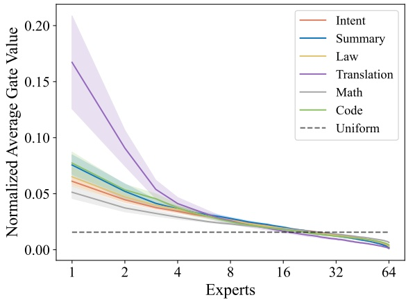
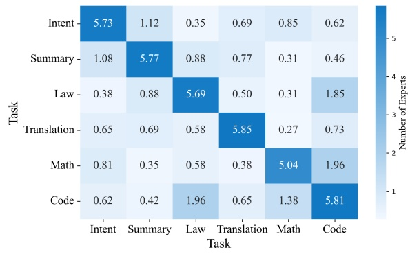
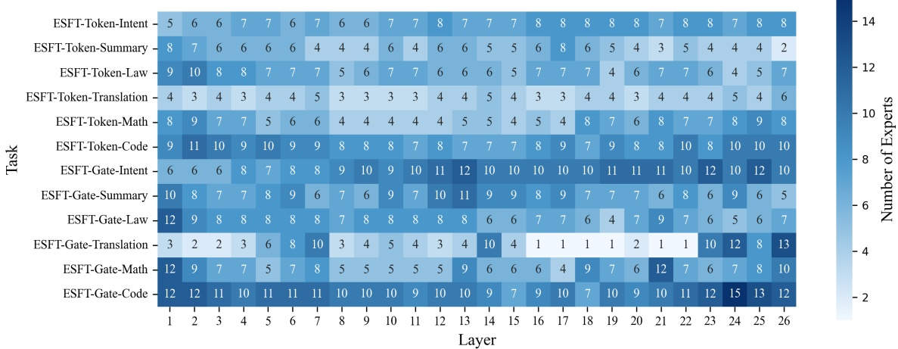
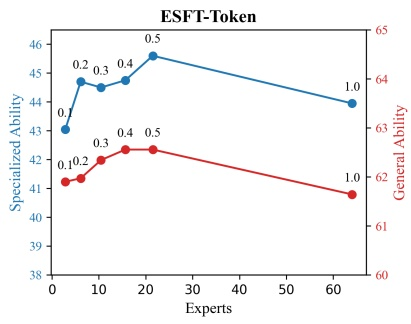
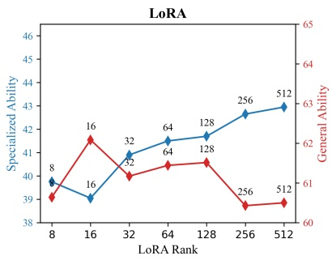
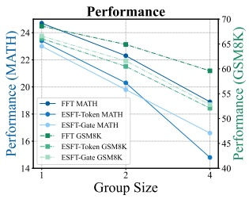
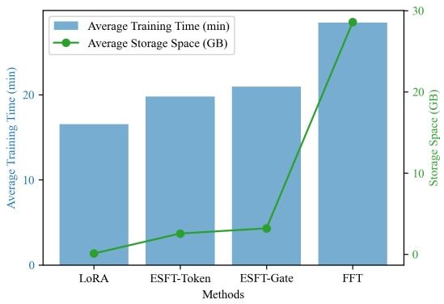

# ESFT: 在细粒度 MoE 上只训与任务相关的路由专家

材料是 DeepSeek-AI 与西北大学 2024 年 7 月的论文 *Let the Expert Stick to His Last: Expert-Specialized Fine-Tuning for Sparse Architectural Large Language Models* (arXiv 2407.01906, 18 页, 发表于 EMNLP 2024 主会), 一作王子涵当时在 DeepSeek 实习. 官方代码与 adapter 在 [deepseek-ai/ESFT](https://github.com/deepseek-ai/ESFT). 论文要解决的问题是: MoE 模型做下游定制时, 全参微调 (FFT) 要动 15.7B 参数, LoRA 省参数但效果差一截, 能不能利用 MoE 本身「不同 token 走不同专家」的结构, 只训和任务相关的那几个专家.

ESFT 的做法可以压成三步: 用原模型在少量任务数据上前向一遍, 记下每层每个路由专家拿到的门控分数或被选中的次数; 每层按分数从高到低累加, 加到阈值 $p$ 为止, 这些专家设为可训练; 其余专家, 共享专家, 注意力, 门控和 embedding 全部冻结, 然后照常做 SFT. 全文只在 DeepSeek-V2-Lite 一个底座上做实验, 所以下面的数字都要带着这个前提读.

## 1. 前提: 底座结构与两条路由观察

### 1.1. 稠密 PEFT 搬到 MoE 上少了什么

稠密模型的 PEFT 大致分三类: 新增参数 (Adapter, Prompt Tuning), 选择已有参数的一部分来训, 以及低秩更新 (LoRA). 三类方法的显存构成和设计空间见 [4.3 参数高效微调](../../../LargeLanguageModelGuide/4-后训练/4.3-PEFT/4.3-PEFT.md). 这些方法在 MoE 上照样能用, 论文的 LoRA 基线就是给除 embedding 和输出头以外的所有矩阵 (包括每个专家的三个投影) 都挂 rank 8 的低秩项. 问题在于它们看不到 MoE 独有的一个维度: 同一层里有几十个专家, 一个任务的 token 只会落到其中一部分专家上.

ESFT 属于第二类「选择已有参数」中的结构化选择, 选择单位是整个路由专家. 它和稠密模型上按敏感度挑参数的做法区别在于, 选择依据直接取自预训练路由器的输出, 不需要算梯度或 Fisher 信息, 只要一次前向. 代价也由此而来: 选择完全依赖冻结的预训练路由器, 路由器本身对任务的判断不准, ESFT 就选不准. 这一点在第 5.3 节再谈.

### 1.2. DeepSeek-V2-Lite 的专家配置

实验底座是 DeepSeek-V2-Lite. 按 [V2 解析](../../1-模型技术报告/1.3-deepseek-v2/02-deepseek-v2-analysis.md) 附录 B 的配置: 27 层, 隐宽 2048, 第 1 层是稠密 FFN, 其余 26 层是 MoE; 每个 MoE 层有 2 个共享专家和 64 个路由专家, 专家中间宽 1408, 每个 token 选 6 个路由专家, 总参数 15.7B, 激活 2.4B. 论文说「每层 66 个专家」, 是把 2 个共享专家也算进去了, 可供 ESFT 挑选的只有 64 个路由专家. 共享专家加细粒度路由专家这套结构的来历见 [DeepSeek MoE: 共享专家与细粒度路由](../../../LargeLanguageModelGuide/2-核心原理与架构/2.6-MoE/01-DeepSeek-MoE/01-DeepSeek-MoE.md), MoE 的一般机制见 [2.6 MoE](../../../LargeLanguageModelGuide/2-核心原理与架构/2.6-MoE/2.6-MoE.md).

论文式 (4)(5) 写出这一层的输出: $\mathbf h_t^l=\sum_{i=1}^{K_s}\mathrm{FFN}_i^s(\mathbf u_t^l)+\sum_{i=1}^{N}g_{i,t}\,\mathrm{FFN}_i^n(\mathbf u_t^l)+\mathbf u_t^l$. 第一项是 $K_s=2$ 个共享专家, 每个 token 都过; 第二项是 $N=64$ 个路由专家, 门控 $g_{i,t}$ 只在亲和度 $s_{i,t}$ 落进 Top-$(K-K_s)$ 时取 $s_{i,t}$, 否则为 0. 论文里 $K=8$ 包含共享专家, 所以路由部分是 Top-6. 亲和度 $s_{i,t}=\mathrm{Softmax}_i(\mathbf u_t^{l\top}\mathbf e_i^l)$ 是对 64 个路由专家做 softmax, 取 Top-6 后不再归一化 (仓库 `modeling_deepseek.py` 里 `norm_topk_prob` 为假, 缩放系数为 1), 所以一个 token 在一层的 6 个门控值之和小于 1. 这个细节决定了第 2.2 节里两种分数的阈值口径不同.

按 SwiGLU 三个矩阵算, 一个路由专家有 $3\times2048\times1408\approx 8.65$M 参数, 26 层 $\times$ 64 个是 14.4B, 占总参数的 92%; 共享专家 $26\times2\times8.65$M $\approx 0.45$B; 剩下约 0.85B 是注意力, 门控, embedding, 输出头和第 1 层稠密 FFN. 这个拆分和表 3 的可训练参数列逐行对得上: 只训共享专家是 450M, 共享专家加非专家参数是 1.3B, ESFT 选中的路由专家平均 1.4B, 合起来 2.7B. 1.4B 除以 8.65M 约 162 个专家, 摊到 26 层是每层约 6.2 个, 占 64 个路由专家的 10% 左右.

实验用的「原始模型」(vanilla) 并非开源的 V2-Lite-Chat, 是作者在剔除数学和代码数据的对齐集上重新训的 checkpoint, 目的是把数学和代码能力压在初级水平, 让后续提升看得清楚. 这个 checkpoint 以 `ESFT-vanilla-lite` 的名字放在 Hugging Face 上. 所有方法训练时都按 1:1 混入这份对齐数据.

### 1.3. 同一任务内集中, 不同任务间分开

方法的依据是 §3.2 的两条观察. 第一条看单个任务内路由集中到什么程度: 对每个路由专家, 把它在任务数据所有 token 上拿到的门控值加起来, 再除以所有专家的总和, 得到「归一化平均门控值」, 按从大到小排开.

图注: 横轴是按归一化门控值排序后的专家名次 (对数刻度, 1 到 64), 纵轴是该名次专家的份额, 阴影是跨层的方差, 虚线是均匀分布的 $1/64\approx0.0156$. 翻译任务的第 1 名专家拿到约 0.17, 是均匀值的 10 倍以上; 其余五个任务第 1 名在 0.05 到 0.08 之间.
图 2 解析: 横轴是按归一化门控值排序后的专家名次 (对数刻度, 1 到 64), 纵轴是该名次专家的份额, 阴影是跨层的方差, 虚线是均匀分布的 $1/64\approx0.0156$. 翻译任务的第 1 名专家拿到约 0.17, 是均匀值的 10 倍以上; 其余五个任务第 1 名在 0.05 到 0.08 之间. 大约从第 20 名开始各曲线跌到均匀线以下. 图里画的是跨层平均后的曲线, 单层可以比这更集中或更分散, 从图 4 看中间层更集中.

第二条看任务之间是否用同一批专家. 每个任务独立采两份数据, 分别求每层 Top-6 专家, 统计两份之间共有几个, 跨层平均, 画成 $6\times6$ 的矩阵.

图注: 行和列都是任务, 格子里是两份样本 Top-6 专家的平均重叠数, 满分 6. 对角线在 5.04 (Math) 到 5.85 (Translation) 之间, 同一任务两次采样选出的专家几乎一样.
图 3 解析: 行和列都是任务, 格子里是两份样本 Top-6 专家的平均重叠数, 满分 6. 对角线在 5.04 (Math) 到 5.85 (Translation) 之间, 同一任务两次采样选出的专家几乎一样. 非对角线多数在 0.3 到 1.1 之间; 64 个专家里随机抽两组 6 个, 期望重叠是 $6\times6/64\approx0.56$, 所以多数任务对之间的重叠只比随机略高. 例外是 Code 与 Law (1.85 和 1.96), Code 与 Math (1.96 和 1.38), 共用约 2 个专家, 正文说「非对角线接近 0」没有提这几格. 矩阵不对称, 因为行和列各用一份独立样本.

两条观察合起来, 支撑的推论是: 给定任务, 每层只有少数专家真正在干活, 而且这些专家是任务特有的, 训它们不会碰到别的任务主要依赖的专家. 附录 C 还回答了要多少数据才能稳定选出这些专家: 两份独立样本的 Top-6 重叠随样本 token 数增长, 到 $2^{17}=131072$ 个 token (即 32 条长 4096 的序列) 时各任务都在 5.3 以上, 其中 Code 收敛最慢, Translation 在 $2^9$ 个 token 时就已经是 5. 仓库脚本 `get_expert_scores.py` 的默认参数 `--n_sample_tokens=131072` 就是这个数.

## 2. 方法: 两种相关性分数与累计阈值

### 2.1. 平均门控分数与 token 选择比例

ESFT 给每层每个路由专家算一个与任务的相关性分数, 有两种定义. 平均门控分数 (ESFT-Gate) 是式 (6):

$$
g_i^l=\frac{1}{N_s}\sum_{j=1}^{N_s}\frac{1}{L_j}\sum_{k=1}^{L_j}g_{i,k}^l,
$$

$N_s$ 是采样序列条数, $L_j$ 是第 $j$ 条的长度, $g_{i,k}^l$ 是第 $l$ 层专家 $i$ 在第 $k$ 个 token 上的门控值 (未被选中时为 0). 它回答的问题是: 这个任务的 token 平均分给专家 $i$ 多大权重. Token 选择比例 (ESFT-Token) 是式 (7):

$$
r_i^l=\frac{1}{N_s}\sum_{j=1}^{N_s}\frac{1}{L_j}\sum_{k=1}^{L_j}\frac{\mathbb 1(g_{i,k}^l>0)}{K},
$$

只看专家 $i$ 有没有进某个 token 的 Top-$K$, 进了就记 $1/K$ ($K=6$). 它回答的是: 这个任务的路由选择里有多大比例落在专家 $i$ 上. 由于每个 token 恰好给出 $K$ 次选择, 一层 64 个专家的 $r_i^l$ 之和严格等于 1.

两种分数的差别在于是否看门控大小. 用一个小例子手算: 一层 4 个专家 A, B, C, D, 每个 token 选 2 个 ($K=2$), 省略共享专家, 3 个 token 的门控如下 (数值仅示意): token 1 选 A (0.30) 和 B (0.05); token 2 选 A (0.28) 和 C (0.06); token 3 选 B (0.10) 和 D (0.09). 按式 (6), A 的平均门控是 $(0.30+0.28)/3\approx0.193$, B 是 $(0.05+0.10)/3=0.05$, C 是 $0.02$, D 是 $0.03$, 四者之和只有 0.293. 按式 (7), A 和 B 各被选 2 次, $r=2\times\frac12/3\approx0.333$; C 和 D 各 1 次, $r\approx0.167$, 合计 1. Token 选择比例下 A 和 B 并列第一; 平均门控分数下 A 远高于 B, 因为 B 每次被选中时都排在第二位, 权重很小. 也就是说, ESFT-Gate 偏向「被选中时权重高」的专家, ESFT-Token 偏向「被选中次数多」的专家.

论文没有从理论上说明该用哪一种, 只说按任务实验效果选. 从结果看, ESFT-Gate 专项平均略高 (50.2 对 49.4), ESFT-Token 通用能力保持略好 (61.5 对 60.6), 后者每层选的专家通常也更少 (图 4). 仓库的实现在序列长度上与公式稍有出入: 脚本把所有 token 的门控直接加总, 再除以 token 总数, 是按 token 平均; 式 (6)(7) 先在每条序列内平均再跨序列平均. 采样序列等长时两者相同, 不等长时长序列权重更大. 这一点有人在 GitHub issue #17 提过, 没有得到回复.

### 2.2. 累计阈值 p: 每层选几个由分布决定

有了分数, 每层单独选专家. 式 (8) 要求选出的集合 $E_s^l$ 满足 $\sum_{i\in E_s^l}R_i^l\geqslant p$, 其中 $R_i^l$ 取 $g_i^l$ 或 $r_i^l$. 仓库 `generate_expert_config.py` 的实际做法是按分数降序逐个加入, 每加一个累加一次, 累计值第一次达到 $p$ 就停. 所以 $E_s^l$ 是满足式 (8) 的最小前缀集合, 一层选几个专家由这一层分数分布的陡峭程度决定: 分布越集中, 少数几个专家就能凑够 $p$.

阈值的口径在两种分数上不同. Token 选择比例每层和为 1, $p=0.2$ 就是「覆盖本层 20% 的路由选择」. 门控分数每层的和小于 1, 用仓库公开的 `summary.json` 算, 意图, 法律, 摘要三个任务各层 $g_i^l$ 之和在 0.26 到 0.48 之间. 论文默认 ESFT-Gate 取 $p=0.1$, 相当于本层门控总量的 20% 到 40%, 不同层的实际覆盖比例并不一样. 论文 §3.3 把 $p$ 描述成「总相关性分数的比例」, 对门控分数不成立. 一作在 GitHub issue #8 里解释过这是有意不做层内归一化: $p$ 在所有层共用, 不归一化能让各层按同一个绝对尺度比较. 这个口径带来的直接后果在图 6 里看得到: ESFT-Gate 取 $p=0.4$ 时平均每层选了约 64 个专家, 已经是全部路由专家, 因为多数层的门控总量本身就不到 0.4.

图注: 行是「打分方法 × 任务」共 12 行, 列是 26 个 MoE 层, 格子里是该层选中的专家数, ESFT-Token 用 $p=0.2$, ESFT-Gate 用 $p=0.1$. ESFT-Token 各行多在 3 到 11 之间, Translation 一行最少 (2 到 6).
图 4 解析: 行是「打分方法 × 任务」共 12 行, 列是 26 个 MoE 层, 格子里是该层选中的专家数, ESFT-Token 用 $p=0.2$, ESFT-Gate 用 $p=0.1$. ESFT-Token 各行多在 3 到 11 之间, Translation 一行最少 (2 到 6). ESFT-Gate 各行普遍更多, Code 一行在 9 到 15 之间; 但 Gate-Translation 在第 16 到 22 层只选 1 到 2 个专家, 这些层里翻译任务的头号专家单独就拿到了超过 0.1 的门控量. 图里看不到选中的是哪几个专家, 只能看出数量; 仓库 `results/expert_configs/*.json` 给的是具体编号, 其中 intent 配置每层 4 到 6 个, 与图 4 的 Token-Intent 一行 (5 到 8) 不完全一致, 应是不同次运行.

§6.1 由图 4 得出几点: 各任务跨层平均每层用 2 到 15 个专家; 数学和翻译这类更专门的任务用得少, 恰好也是 ESFT 超过 LoRA 最多的任务; 中间层选得少, 分布更集中. 第一条换算成参数是 $2$ 到 $15$ 个专家乘 26 层乘 8.65M, 即 0.45B 到 3.4B, 相对 FFT 的 15.7B 少 78% 到 97%, 论文写的是 75% 到 95%. 正文另一处说「选 5% 到 15% 的专家」, 两种口径混用, 前者按专家个数算到 66, 后者是图 4 题注里的大致范围.

### 2.3. 冻结了什么, 训练时梯度怎么流

选好专家后, 仓库用 `esft.py` 里的 `to_esft` 改造模型: 把所有不训练的参数从 `nn.Parameter` 改注册成非持久化的 buffer (`persistent=False`), 只把选中路由专家的权重留作参数. 默认配置下, 门控向量 $\mathbf e_i^l$, 注意力, 共享专家, embedding 和输出头都变成 buffer. 这样做有两个直接效果: 优化器只看得到选中的专家, 梯度和优化器状态只为这部分参数分配; 保存 checkpoint 时 buffer 不写盘, 存下来的就只有被训练的专家, 这是「adapter」体积小的来源. 推理时 `add_adapter` 把这些专家的权重加载回原模型对应位置.

门控冻结意味着路由在整个微调过程中不变: 同一个 token 训练前后进的是同一组专家, 只是部分专家的权重变了. 被选中的专家只能从路由到它的那些 token 拿到梯度, 没路由到它的 token 对它没有贡献; 没被选中的专家照常做前向, 也照常把梯度往下传给更早的层, 只是自己的权重不更新. 附录 E 的图 9 用 $p=0.2$ 的 ESFT-Token 做了统计: 所有 (token, 专家) 选择中约 20% 落在可训练专家上, 颜色最深的 token 是意图任务里的「意图」, 法律任务里的「原告」「被告」, 数学任务里的数字, 代码任务里的关键字和注释. 也就是说, 训练信号集中在任务特有的那部分 token 上, 通用 token 主要走冻结的专家, 这是通用能力掉得少的直接原因.

训练配置按论文 §4.3 和仓库 `configs/base.yaml`: batch 32 (8 卡, 每卡 1 条, 梯度累积 4), 序列长 4096, 最多 500 步, 每任务约 $500\times32\times4096\approx6.6\times10^7$ 个 token; ESFT 学习率 1e-5 常数, 无 warmup, weight decay 0.1, Adam 的 $\beta_2=0.95$. FFT 和 LoRA 的学习率分别是 3e-5 和 1e-4, 三者都在 {1e-5, 3e-5, 1e-4, 3e-4} 上搜过. ESFT 的学习率最小, 和它只动少数专家, 每个专家只见到一部分 token 的设定相符. 训练数据里提示词部分的 label 被置为 -100, 只在回答上算损失; 但打分阶段的前向用的是完整对话, 提示词 token 也参与了专家打分.

## 3. 结果: 专项能力与通用能力

### 3.1. 任务, 基线与评测口径

任务分两组. 能力增强组是数学和代码: 数学用 MetaMathQA 训练, 在 GSM8K 和 MATH 上评测; 代码用 evol-codealpaca 的 Python 子集训练, 在 HumanEval 和 MBPP 上评测. 原始模型在这两个领域本来有一定水平, 看的是提升幅度. 能力适配组是四个模型原本不会的窄任务: 家电控制指令转 JSON 的意图识别, 客服通话摘要, 婚姻案件判决预测 (三者来自 BDCI-21 赛题, 都是中文), 以及切罗基语到英语的低资源翻译 (ChrEn). 意图识别按精确匹配算分, 其余三个用 gpt-4-1106-preview 对照参考答案打 0 到 10 分, 评分指令见附录 G. 通用能力用 MMLU, TriviaQA, HellaSwag, ARC-Challenge, IFEval, CEval, CLUEWSC 七个基准.

基线是 FFT 和 LoRA (rank 8, scaling 2, 挂在除 embedding 与输出头以外的全部矩阵上). 三种方法都混 1:1 对齐数据, 每 100 步评测一次. 论文没有写上报的是第几步的结果; 仓库 `train.py` 用 `load_best_model_at_end` 按 2% 验证集的 loss 选 checkpoint, 若论文也按这个规则, 选出的是验证 loss 最低的那一步, 未必是评测分最高的那一步. 表 2 的通用能力带 $\pm$, 应是同一方法在六个任务上分别训出的六个模型之间的离散程度, 论文没有写明是标准差还是别的统计量; 附录表 6 中同一行的 $\pm$ 恰好约为表 2 的 2 倍 (FFT 平均 $\pm1.3$ 对 $\pm2.5$, ESFT-Token $\pm1.1$ 对 $\pm2.3$), 两张表的口径也没有交代.

### 3.2. 专项能力: 接近 FFT, 明显高于 LoRA

表 1 的平均分: 原始模型 33.6, FFT 51.0, LoRA 44.9, ESFT-Token 49.4, ESFT-Gate 50.2. 提升主要来自适配组. 意图识别从 16.8 涨到 FFT 78.8, ESFT-Gate 78.6, ESFT-Token 75.6, LoRA 67.8; 翻译从 14.5 涨到 FFT 38.4, ESFT-Token 36.2, ESFT-Gate 35.2, LoRA 23.1; 法律从 17.1 涨到 ESFT-Gate 49.1, 高于 FFT 的 47.0. 摘要上 FFT 69.4 领先, 两种 ESFT 在 65.4 到 65.8, 与 LoRA 的 64.7 接近. 翻译和意图识别是 ESFT 与 LoRA 差距最大的两项 (13.1 和 10.8 个点), 前者恰好是图 4 里选专家最少的任务.

增强组的情况不同. 数学上 FFT 是 23.4 和 66.4, ESFT-Gate 23.2 和 64.9, ESFT-Token 22.6 和 66.0, LoRA 20.6 和 58.9, ESFT 与 FFT 差距在 1.5 个点以内. 代码上四种方法几乎都没有提升: HumanEval 原始模型 42.1, FFT 仍是 42.1, ESFT-Gate 43.3 是表中最高; MBPP 原始 44.6, 训完后三种方法反而略降 (FFT 42.2, ESFT 41.8 到 42.6), 只有 LoRA 持平. 附录表 9 给出不混对齐数据时的结果: FFT 的 HumanEval 是 51.2, 混入数据后下降 9.1 回到 42.1; 两种 ESFT 不混数据时 HumanEval 都是 42.1, 和原始模型一样. 所以在代码任务上, ESFT 不论混不混对齐数据都没有带来提升, FFT 只在不混数据时有提升. 论文对代码结果没有单独讨论.

摘要和结论里「追平甚至超过 FFT」的说法要看口径. 按表 1 平均分, ESFT-Gate 比 FFT 低 0.8; 不混对齐数据时 (表 9) FFT 是 52.7, 两种 ESFT 是 50.0 和 49.7, 差距扩大到 2.7 以上. 「超过」只在单项上成立 (HumanEval, 法律). 如果把通用能力一起算, 表 3 的「专项与通用平均」一列里 ESFT (55.4) 确实高于 FFT (54.9).

### 3.3. 通用能力: 掉得少, 而且不需要混对齐数据

表 2 的通用平均: 原始模型 62.4, FFT 58.8, LoRA 59.1, ESFT-Token 61.5, ESFT-Gate 60.6. FFT 掉得最多的是 IFEval (42.5 到 34.2) 和 HellaSwag (74.0 到 67.9); LoRA 掉得最多的是 CLUEWSC (81.5 到 74.3, 且 $\pm7.7$). ESFT-Token 七项里六项与原始模型的差距在 1.8 以内, 只有 HellaSwag 掉 1.7 且离散较大 ($\pm3.6$); ESFT-Gate 的 HellaSwag 是 $68.2\pm9.9$, 是表中最不稳的一格, 说明 ESFT-Gate 在某几个任务上训完后 HellaSwag 掉得很多, 论文没有给出是哪几个.

附录 H 换了一种看法: 在四个适配任务上只用任务数据训练 (不混对齐数据), 再测没训过的数学和代码. 表 8 中原始模型四项平均 40.5, FFT 降到 31.5, LoRA 降到 28.1, ESFT-Token 39.7, ESFT-Gate 39.8, 下降都不到 1 个点. 附录 F 进一步说明混对齐数据对各方法的作用不同, 把表 9 和表 10 的数字整理如下:

| 方法 | 专项 (不混) | 专项 (混 1:1) | 通用 (不混) | 通用 (混 1:1) |
| --- | --- | --- | --- | --- |
| FFT | 52.7 | 51.0 | 58.5 | 58.8 |
| LoRA | 47.1 | 44.9 | 55.0 | 59.1 |
| ESFT-Token | 50.0 | 49.4 | 62.3 | 61.5 |
| ESFT-Gate | 49.7 | 50.2 | 62.2 | 60.6 |

LoRA 靠混数据把通用能力从 55.0 拉回 59.1, 代价是专项掉 2.2; FFT 混数据后通用只涨 0.3, 专项掉 1.7. 两种 ESFT 不混数据时通用能力是 62.3 和 62.2, 与原始模型的 62.4 基本持平, 混了反而降到 61.5 和 60.6. 因此 ESFT 的最好配置是不混对齐数据, 而正文表 1, 表 2 为了统一设置, 给 ESFT 用的是对它不利的混合配置. 对使用者来说这一点有实际意义: ESFT 不需要保留一份对齐数据去做混训, 也不用为每个任务调混合比例.

为什么冻结共享部分就能保住通用能力, 论文的解释在 §6.3: 共享专家和注意力处理每一个 token, 改了它们会影响所有输入; 选中的路由专家只处理被路由过去的 token, 而路由器冻结, 通用 token 不会突然被送进这些专家. 前面图 9 的统计 (可训练专家只占约 20% 的选择, 且集中在任务关键词上) 支持这个解释. 不过路由隔离并不完全, 第 4.2 节表 3 显示只训共享专家 (450M) 时通用能力是 61.2, 只训相关路由专家 (1.4B) 时是 61.5, 参数多 3 倍而通用能力反而更好.

## 4. 消融: 阈值, 共享参数, 随机专家与粒度

### 4.1. 阈值 p 与 LoRA rank 的对照

§6.2 在数学任务上扫 ESFT 的 $p$ 和 LoRA 的 rank, 横轴统一成「每层平均可训练专家数」或「rank」, 纵轴是专项能力 (MATH 与 GSM8K 的平均) 和通用能力.

图注: 上图是 ESFT-Token, 下图是 LoRA, 原图还有一张 ESFT-Gate 的子图. 蓝线是专项能力 (左轴 38 到 46), 红线是通用能力 (右轴 60 到 65), 点旁标的是 $p$ 或 rank.
图 6 解析: 上图是 ESFT-Token, 下图是 LoRA, 原图还有一张 ESFT-Gate 的子图. 蓝线是专项能力 (左轴 38 到 46), 红线是通用能力 (右轴 60 到 65), 点旁标的是 $p$ 或 rank. ESFT-Token 的 $p$ 从 0.1 到 0.5 时每层专家数约从 3 增到 21, 专项从约 43.0 升到 45.6, 通用从约 61.9 升到 62.6; $p=1.0$ (全部 64 个路由专家) 时专项反而降到约 43.9, 通用降到约 61.6. LoRA 的 rank 从 8 到 512, 专项从约 39.8 升到 43.0, 通用在 60.4 到 62.1 之间来回跳. ESFT-Gate 子图里 $p$ 取 0.05, 0.1, 0.2, 0.3, 0.4 时每层专家数约为 3, 7, 21, 44, 64. 横轴的两种单位不可直接比较, 图上没有给出 LoRA 各 rank 对应的参数量.

论文据此得出: ESFT 在任意设置点都高于 LoRA; ESFT-Token 在 $p=0.5$ 时专项和通用同时最好, ESFT-Gate 的专项在 $p=0.3$, 通用在 $p=0.1$ 最好; 两种分数分别在 $p=0.2$ 和 $p=0.1$ 之后收益趋平, 所以主实验取这两个值. 一个更有信息量的点是 $p=1.0$: 在学习率, 步数都不变的前提下, 训全部 64 个路由专家比只训约 21 个专家的专项低 1.7, 通用低 1.0, 这是「训不相关的专家有害」的直接证据, 虽然固定学习率可能也有影响.

LoRA 与 ESFT 的可训练参数差一个量级, 比较时常被追问. 论文没有给出 LoRA 的参数量. 按 V2-Lite 的形状估算: rank $r$ 的 LoRA 给 $d_{\rm in}\times d_{\rm out}$ 的矩阵加 $r(d_{\rm in}+d_{\rm out})$ 个参数, 一个路由专家三个矩阵在 $r=8$ 时约 $3\times8\times(2048+1408)\approx8.3$ 万, 26 层 $\times$ 64 个约 1.4 亿, 加上注意力和共享专家, 总量约 0.15B. rank 512 时约乘 64 倍, 约 9.4B, 已经是 ESFT 的 6 倍多; 再翻一倍会超过 FFT 的 15.7B, 与论文「rank 最大取 512」的说法一致. 图 6 里 rank 512 的 LoRA 专项约 43.0, 仍低于 $p=0.2$ 的 ESFT-Token (约 44.7). 所以在数学任务上, 参数量差距不能解释 LoRA 的落后. 另外图 6 中 $p=0.2$ 处的专项读数约 44.7, 表 1 按 MATH 与 GSM8K 平均是 44.3, 两处有约 0.4 的出入, 文中没有说明设置差别.

### 4.2. 共享参数训不训

§6.3 用 ESFT-Token ($p=0.2$) 选出的相关专家做底, 组合三个开关: 非共享专家训全部, 训相关的, 还是不训; 共享专家训不训; 非专家参数 (门控, 注意力, embedding) 训不训. 表 3 七行的结果:

| 非共享专家 | 共享专家 | 非专家参数 | 可训练参数 | 专项 | 通用 | 平均 |
| --- | --- | --- | --- | --- | --- | --- |
| 全部 | 训 | 训 | 15.7B | 51.0 | 58.8 | 54.9 |
| 相关 | 训 | 不训 | 1.85B | 49.8 | 60.7 | 55.3 |
| 相关 | 不训 | 不训 | 1.4B | 49.4 | 61.5 | 55.4 |
| 不训 | 训 | 不训 | 450M | 47.4 | 61.2 | 54.3 |
| 不训 | 训 | 训 | 1.3B | 49.0 | 60.0 | 54.5 |
| 相关 | 训 | 训 | 2.7B | 50.8 | 60.3 | 55.6 |

第一行就是 FFT, 第三行就是 ESFT-Token. 论文从中读出三条: 专项能力随可训练参数单调上升 (450M 的 47.4 到 15.7B 的 51.0); 通用能力随可训练的共享参数增加而下降 (训相关专家时 61.5, 加共享专家 60.7, 再加非专家参数 60.3; 不训相关专家时 61.2 降到 60.0; 全部训是 58.8); 只要训了相关路由专家, 平均分至少 55.3, 其余配置最多 54.9. 由此给出两种策略: 想要专项最好, 训相关路由专家加全部共享参数 (2.7B, 专项 50.8, 只比 FFT 低 0.2); 想兼顾通用能力和成本, 只训相关路由专家 (1.4B).

这张表还有两个读法. 其一, 只训共享专家的 450M 是最便宜的配置, 专项 47.4 已经高于 LoRA 的 44.9, 通用 61.2 也高于 LoRA; 也就是说, 在这个底座上换一种「挑已有参数来训」的方式, 本身就比 rank 8 的 LoRA 好, 不全是专家选择的功劳. 其二, 各行差距多在 1 到 2 个点, 每个配置只训一次, 没有误差条, 「平均 55.3 对 54.9」这种 0.4 的差距不足以排序. 表 3 末尾一行 (不训练) 的专项写作 33.8, 与表 1 原始模型的 33.6 不一致, 平均列的 48.1 是用 33.8 算的, 文中没有说明差别.

### 4.3. 随机专家与专家粒度

§6.4 第一个消融把相关性分数选出的专家换成随机专家, 每层数量不变. 表 4 给出各任务相对原 ESFT 的变化: ESFT-Token 平均下降 2.8, ESFT-Gate 平均下降 4.4. 降得最多的是翻译 (-13.5 和 -20.4), 第二步是 ESFT-Gate 的意图 (-5.0) 和 HumanEval (-4.3). 也有几项随机反而略好: MBPP (+0.2 和 +1.6), ESFT-Token 的法律 (+1.3), ESFT-Gate 的摘要 (+0.3). 翻译是路由最集中的任务 (图 2 中头号专家拿 17%), 随机换掉损失最大, 和集中度越高, 选对专家越重要的推论一致. 这个消融只比较了「相关」与「随机」, 没有比较「最不相关的专家」, 也没有和「按全局负载选专家」这类不看任务的启发式比较.

第二个消融回答细粒度为什么是前提. V2-Lite 没有同参数量的粗粒度版本, 论文用模拟: 在对齐数据上统计每对专家同时进入某个 token Top-6 的次数, 得到共现矩阵, 两专家的相似度取各自行向量的余弦; 然后贪心地每次取平均组内相似度最高的 $K$ 个专家成组 ($K=2$ 或 4), 直到分完 64 个. 同组专家共享组内平均亲和度, 整组一起被选中或一起不选, 每个 token 选 1/8 的专家. 组大小为 4 时, 一层相当于 16 个粗专家选 2 个, 与 Mixtral 的 8 选 2 比例接近.

图注: 横轴是组大小 1, 2, 4, 左轴是 MATH, 右轴是 GSM8K, 深色是 FFT, 浅色是两种 ESFT. 组大小从 1 到 4, FFT 的 MATH 约从 24.8 降到 18.9, GSM8K 约从 68.5 降到 59.5; ESFT-Token 的 MATH 约从 23.6 降到 14.8, GSM8K 约从 67 降到 52.5, 降幅都比 FFT 大.
图 7 解析: 横轴是组大小 1, 2, 4, 左轴是 MATH, 右轴是 GSM8K, 深色是 FFT, 浅色是两种 ESFT. 组大小从 1 到 4, FFT 的 MATH 约从 24.8 降到 18.9, GSM8K 约从 68.5 降到 59.5; ESFT-Token 的 MATH 约从 23.6 降到 14.8, GSM8K 约从 67 降到 52.5, 降幅都比 FFT 大. 原图另一张子图显示可训练专家数 (按原 64 个专家计) 随组大小上升, ESFT-Gate 约从 6.5 升到 11. 图中组大小为 1 的 FFT 点 (约 24.8, 68.5) 与表 1 的 FFT (23.4, 66.4) 不一致, 论文没有说明这组实验的设置.

这个实验有两个解读上的限制. 一是 FFT 自身也随组大小下降约 6 到 9 个点, 说明分组改变了一个已经训好的模型的路由, 分组后的模型本身就变差了, 并不等同于一个从头按粗粒度训练的 MoE. 二是「每 token 选 1/8」与原模型对不上: 原模型 64 选 6 是 $1/10.7$, 组大小 2 和 4 都是选 8 个专家, 激活量比原模型多两个. 论文结论「ESFT 乃至有效的 LLM 定制高度依赖细粒度架构」在方向上可以接受: 粒度越粗, 最小选择单位越大, 凑够 $p$ 需要的参数越多, 一个专家里混杂的任务也越多. 但定量上它是事后分组的模拟, Limitations 一节也承认了这一点.

## 5. 效率, 部署与适用边界

### 5.1. 训练时间与存储

§5.2 给出六个任务的平均: 训练时间 FFT 28.5 分钟, ESFT-Token 19.8, ESFT-Gate 20.9, LoRA 16.5; 存储 FFT 28.6 GB, ESFT-Token 2.57 GB, ESFT-Gate 3.20 GB, LoRA 在图 5 上接近 0. 时间省 30% 是 $19.8/28.5\approx0.69$ 算出来的平均值, 并非「最多」; 存储省 90% 是 $2.57/28.6\approx0.09$. 存储能从参数量直接推回: 1.4B 参数按 bf16 是 2.8 GB, 约 2.6 GiB; 15.7B 是 31.4 GB, 约 29.2 GiB, 与 28.6 GB 有约 2% 的出入. LoRA rank 8 按前面估算约 0.15B, bf16 约 0.3 GB.

图注: 柱是平均训练时间 (左轴, 分钟), 绿线是平均存储 (右轴, GB), 四种方法从左到右按存储递增排列. 时间的差距远小于存储的差距: 存储差了 11 倍, 时间只差 1.4 倍.
图 5 解析: 柱是平均训练时间 (左轴, 分钟), 绿线是平均存储 (右轴, GB), 四种方法从左到右按存储递增排列. 时间的差距远小于存储的差距: 存储差了 11 倍, 时间只差 1.4 倍. 图里没有给显存峰值, 也没有给多卡通信时间的拆分.

时间为什么只省 30%, 可以按前向和反向的计算量估一下 (文中没有给出时间分解, 以下只是从计算结构推出的数量级). 设一次前向的计算量为 $F$, 反向要算对激活的梯度和对权重的梯度, 各约 $F$, 合计 $3F$. ESFT 冻结的层仍要把激活梯度往前传 (更早的层里还有可训练专家), 所以省掉的只是冻结参数的权重梯度; 可训练专家只占约 20% 的路由选择, 权重梯度的计算几乎全部省掉, 总量从 $3F$ 降到约 $2F$, 少三分之一. 仓库开了梯度检查点, 反向时还要重算一次前向, FFT 是约 $4F$, ESFT 约 $3F$, 少四分之一. 实测 30% 落在这两个估计之间. 再往下省就要靠不做前向, 而 MoE 的前向本来就只激活 2.4B 参数, 没有可省的空间. 显存方面, 梯度和优化器状态按可训练参数线性缩放, 从 15.7B 降到 1.4B, 约降到 1/11; 冻结的 14B 参数仍要全量常驻显存, 这一点 ESFT 和 LoRA 一样.

### 5.2. 部署: adapter 是整块专家

ESFT 的产物是若干个专家的整块新权重, 没有加性的低秩增量. 好处是推理时不增加任何计算: 换进新专家后, 模型结构和激活量与原模型完全相同, 也不需要像 LoRA 那样 merge. 代价在多任务部署上. LoRA 有 S-LoRA, Punica 一类系统, 可以在同一个底座上并发服务上百个 adapter, 因为每个 adapter 只是一个小的加性项; ESFT 的 adapter 是替换专家, 不同任务选中的专家部分重叠 (图 3 里 Code 与 Law 共用约 2 个), 两个任务同时上线时同一个专家位置有两份权重, 路由也要按请求改写. 后续的 [ExpertWeave](https://arxiv.org/abs/2508.17624) (华为, 2025) 专门做了这件事, 在 Ascend NPU 上动态加载各 adapter 的专家并改写路由, 让多个 ESFT adapter 共享一个底座.

存储上的「90%」也要放到规模上看. 在 V2-Lite 上 ESFT adapter 是 2.6 GB, 比 rank 8 的 LoRA (约 0.3 GB) 大一个量级. 若在 671B 的 V3 上按同样比例选 10% 的路由专家, adapter 会有几十 GB, 这是论文没有讨论的方向. 另一个没有讨论的是多任务合并: 两个任务各自训出的 adapter 若有重叠专家, 直接合并会互相覆盖, 论文和仓库都只处理单任务.

### 5.3. 适用边界与可疑之处

第一个边界是底座. 全部实验只在 V2-Lite 上做, Limitations 里也写明了. V2-Lite 的门控是 softmax 后取 Top-6 不再归一化, 门控值本身带着「路由器有多确定」的信息, ESFT-Gate 正是用这个信息. 之后的 [DeepSeek-V3](../../1-模型技术报告/1.4-deepseek-v3/02-deepseek-v3-analysis.md) 把亲和度改成 sigmoid, 并在选中的专家之间归一化, 每个 token 的门控和固定; 负载均衡也改成无辅助损失的偏置法, 均衡压力不再进入梯度. 在这类底座上门控分数的含义变了, $p$ 的取值和两种分数的优劣都需要重新确定, 论文没有给出数据.

第二个边界是专家选择完全依赖冻结的预训练路由器. 负载均衡损失会把路由往均匀方向推, 门控分数被拉平后, 集中度判据就弱. 2025 年的 CEFT 工作 (arXiv 2508.19594) 以 ESFT 为基线, 先只训路由器, 看哪些专家在任务上被频繁选中, 再只训这些专家, 在上下文依赖的问答任务和 OLMoE, MiniCPM-MoE 等非 DeepSeek 底座上报告了与 ESFT 持平或更好的结果. 另一面, 路由器冻结也意味着 ESFT 处理不了需要改变路由的情况: 一个任务的 token 如果在原模型里被送到了「错的」专家, ESFT 只能去训那个错的专家.

几处 claim 需要打折扣. 结论说 ESFT「增强了专家系统的专精程度」, 但门控在训练中冻结, 路由分布不会变, 论文也没有测训练后专家的分工有什么变化, 能直接支持的只是「没有破坏原有分工」. §3.2 说图 3 非对角线「接近 0」, 实际有接近 2 的格子. 「追平甚至超过 FFT」只在单项或把通用能力一起平均时成立, 专项平均始终是 FFT 领先. 复现方面, 仓库 issue #22 有人报告直接评测官方 adapter 能对上论文, 从打分到训练整条流水线重跑则差很多; issue #19 里作者说明论文用 2 节点 16 张 A100, 不提供 LoRA 训练脚本. 仓库公开的 translation 任务 `summary.json` 里 token 分数每层之和约为 2.5, 而脚本应当产出 1, 和公开的 `translation.json` 专家配置也对不上, 按公开分数用 =0.2$ 重新选, 第 1 层得到专家 35, 44, 而配置里是 35, 22, 13, 43, 说明打分文件与配置文件出自不同的运行.

## 参考文献

- Wang et al. *Let the Expert Stick to His Last: Expert-Specialized Fine-Tuning for Sparse Architectural Large Language Models*. EMNLP 2024. [arXiv 2407.01906](https://arxiv.org/abs/2407.01906)
- 官方代码与 adapter: [deepseek-ai/ESFT](https://github.com/deepseek-ai/ESFT); 阈值与归一化的讨论见 [issue #8](https://github.com/deepseek-ai/ESFT/issues/8), 复现问题见 [issue #22](https://github.com/deepseek-ai/ESFT/issues/22)
- Dai et al. *DeepSeekMoE: Towards Ultimate Expert Specialization in Mixture-of-Experts Language Models*. [arXiv 2401.06066](https://arxiv.org/abs/2401.06066)
- DeepSeek-AI. *DeepSeek-V2: A Strong, Economical, and Efficient Mixture-of-Experts Language Model*. [arXiv 2405.04434](https://arxiv.org/abs/2405.04434)
- Hu et al. *LoRA: Low-Rank Adaptation of Large Language Models*. [arXiv 2106.09685](https://arxiv.org/abs/2106.09685)
- *Understanding and Leveraging the Expert Specialization of Context Faithfulness in Mixture-of-Experts LLMs* (CEFT). EMNLP 2025. [arXiv 2508.19594](https://arxiv.org/abs/2508.19594)
- Shi et al. *ExpertWeave: Efficiently Serving Expert-Specialized Fine-Tuned Adapters at Scale*. [arXiv 2508.17624](https://arxiv.org/abs/2508.17624)
