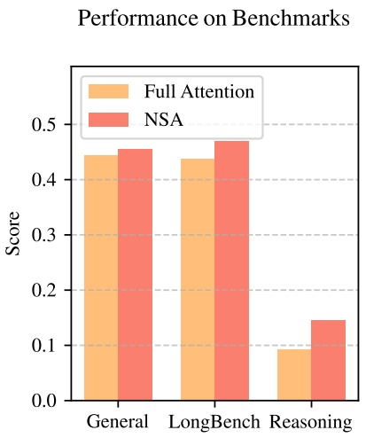
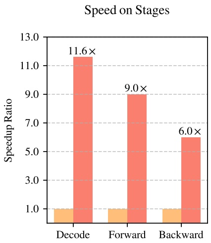

<!-- page 1 of 25 -->

arXiv:2502.11089v2 [cs.CL] 27 Feb 2025

Qdeepseek

# Native Sparse Attention: Hardware-Aligned and Natively Trainable Sparse Attention / 原生稀疏注意力: 贴合硬件且原生可训练的稀疏注意力

Jingyang Yuan∗1,2, Huazuo Gao1, Damai Dai1, Junyu Luo2, Liang Zhao1, Zhengyan Zhang1, Zhenda Xie1, Y. X. Wei1, Lean Wang1, Zhiping Xiao3, Yuqing Wang1, Chong Ruan1, Ming Zhang2, Wenfeng Liang1, Wangding Zeng1

1**DeepSeek-AI**

2**Key Laboratory for Multimedia Information Processing, School of Computer Science, Peking University, PKU-Anker LLM Lab**

3**University of Washington**

### {yuanjy, mzhang\_cs}@pku.edu.cn, {zengwangding, wenfeng.liang}@deepseek.com

## Abstract

Long-context modeling is crucial for next-generation language models, yet the high computational cost of standard attention mechanisms poses significant computational challenges. Sparse attention offers a promising direction for improving efficiency while maintaining model capabilities. We present NSA, a Natively trainable Sparse Attention mechanism that integrates algorithmic innovations with hardware-aligned optimizations to achieve efficient long-context modeling. NSA employs a dynamic hierarchical sparse strategy, combining coarse-grained token compression with fine-grained token selection to preserve both global context awareness and local precision. Our approach advances sparse attention design with two key innovations: (1) We achieve substantial speedups through arithmetic intensity-balanced algorithm design, with implementation optimizations for modern hardware. (2) We enable end-to-end training, reducing pretraining computation without sacrificing model performance. As shown in Figure 1, experiments show the model pretrained with NSA maintains or exceeds Full Attention models across general benchmarks, long-context tasks, and instruction-based reasoning. Meanwhile, NSA achieves substantial speedups over Full Attention on 64k-length sequences across decoding, forward propagation, and backward propagation, validating its efficiency throughout the model lifecycle.

长上下文建模是下一代语言模型的关键能力, 但标准注意力的计算开销很高, 带来了不小的计算难题. 稀疏注意力有望在保住模型能力的同时提升效率. 我们提出 NSA, 一种原生可训练的稀疏注意力 (Natively trainable Sparse Attention) 机制, 把算法上的改进和贴合硬件的优化结合起来, 实现高效的长上下文建模. NSA 采用动态分层稀疏策略: 粗粒度的 token 压缩配合细粒度的 token 选择, 同时保留全局上下文感知和局部精度. 我们的方法在稀疏注意力设计上有两项关键改进: (1) 按算术强度均衡来设计算法, 再针对现代硬件做实现优化, 拿到了可观的加速; (2) 支持端到端训练, 在不损失模型效果的前提下降低预训练计算量. 如图 1 所示, 用 NSA 预训练的模型在通用基准, 长上下文任务和基于指令的推理上与全注意力模型持平或更好. 同时, 在 64k 长度的序列上, NSA 在解码, 前向传播和反向传播三个阶段都比全注意力快得多, 说明它在模型整个生命周期里都高效.

## 1. Introduction

The research community increasingly recognizes long-context modeling as a crucial capability for next-generation large language models, driven by diverse real-world applications ranging from in-depth reasoning (DeepSeek-AI, 2025; Zelikman et al., 2022), repository-level code generation (Zhang et al., 2023a; Zhang et al.) and multi-turn autonomous agent systems (Park et al., 2023). Recent breakthroughs, including OpenAI’s o-series models, DeepSeek-R1 (DeepSeek-AI, 2025), and Gemini 1.5 Pro (Google et al., 2024), enabling models to process entire codebases, lengthy documents, maintain coherent multi-turn conversations over thousands of tokens, and perform complex reasoning across long-range dependencies. However, the high complexity (Zaheer et al., 2020) of vanilla Attention (Vaswani et al., 2017) mechanisms emerges as a critical

\*Contribution during internship at DeepSeek-AI.

\*在 DeepSeek-AI 实习期间完成的工作.

<!-- page 2 of 25 -->

Figure 1 | Comparison of performance and efficiency between Full Attention model and our NSA. Left: Despite being sparse, NSA surpasses Full Attention baseline on average across general benchmarks, long-context tasks, and reasoning evaluation. Right: For 64k-length sequence processing, NSA achieves substantial computational speedup compared to Full Attention in all stages: decoding, forward propagation, and backward propagation.

latency bottleneck as sequence length increases. Theoretical estimates indicate that attention computation with softmax architectures accounts for 70–80% of total latency when decoding 64k-length contexts, underscoring the urgent need for more efficient attention mechanisms.

研究界越来越把长上下文建模看作下一代大语言模型的关键能力, 推动它的是各种真实应用: 深度推理 (DeepSeek-AI, 2025; Zelikman et al., 2022), 仓库级代码生成 (Zhang et al., 2023a; Zhang et al.), 多轮自主 Agent 系统 (Park et al., 2023). 近期的突破, 包括 OpenAI 的 o 系列模型, DeepSeek-R1 (DeepSeek-AI, 2025) 和 Gemini 1.5 Pro (Google et al., 2024), 让模型能处理整个代码库和长文档, 在上千 token 的多轮对话中保持连贯, 并在长程依赖上做复杂推理. 但 vanilla Attention (Vaswani et al., 2017) 的高复杂度 (Zaheer et al., 2020) 随序列变长成了关键的时延瓶颈. 理论估计表明, 解码 64k 长度的上下文时, softmax 架构的注意力计算占总时延的 70–80%, 更高效的注意力机制因此十分迫切.

A natural approach to efficient long-context modeling is to take advantage of the inherent sparsity of softmax attention (Ge et al., 2023; Jiang et al., 2023), where selectively computing critical query-key pairs can significantly reduce computational overhead while preserving performance. Recent advances demonstrate this potential through diverse strategies: KV-cache eviction methods (Li et al., 2024; Zhang et al., 2023b; Zhou et al., 2024), blockwise KV-cache selection methods (Gao et al., 2024; Tang et al., 2024; Xiao et al., 2024a), and sampling, clustering or hashing-based selection methods (Chen et al., 2024b; Desai et al., 2024; Liu et al., 2024). Despite these promising strategies, existing sparse attention methods often fall short in practical deployments. Many approaches fail to achieve speedups comparable to their theoretical gains; moreover, most methods lack effective training-time support to fully exploit the sparsity patterns of attention.

高效长上下文建模的一条自然思路, 是利用 softmax 注意力本身的稀疏性 (Ge et al., 2023; Jiang et al., 2023): 只计算关键的 query-key 对, 就能大幅降低计算开销, 同时保住效果. 近期工作用多种策略展示了这一潜力: KV cache 驱逐方法 (Li et al., 2024; Zhang et al., 2023b; Zhou et al., 2024), 按块选择 KV cache 的方法 (Gao et al., 2024; Tang et al., 2024; Xiao et al., 2024a), 以及基于采样, 聚类或哈希的选择方法 (Chen et al., 2024b; Desai et al., 2024; Liu et al., 2024). 这些策略虽有前景, 已有稀疏注意力方法在实际部署中往往达不到预期. 许多方法拿不到与理论收益相当的加速; 而且大多数方法缺少有效的训练期支持, 无法充分利用注意力的稀疏模式.

To address these limitations, the deployment of effective sparse attention must tackle two key challenges: (1) **Hardware-aligned inference speedup**: Converting theoretical computation reductions into actual speed improvements requires hardware-friendly algorithm design during both prefilling and decoding stages to mitigate memory access and hardware scheduling bottlenecks; (2) **Training-aware algorithm design**: Enabling end-to-end computation with trainable operators to reduce training costs while maintaining model performance. These requirements are crucial for real-world applications to achieve fast long-context inference or training. When considering both aspects, existing methods still exhibit a noticeable gap.

要解决这些局限, 部署有效的稀疏注意力必须应对两个关键挑战: (1) **贴合硬件的推理加速**: 把理论上的计算削减变成实际的速度提升, 需要在 prefill 和解码两个阶段都采用硬件友好的算法设计, 缓解访存和硬件调度瓶颈; (2) **面向训练的算法设计**: 用可训练的算子支持端到端计算, 在保持模型效果的同时降低训练成本. 要做到快速的长上下文推理或训练, 这两点都不可少. 同时考虑两方面时, 现有方法仍有明显差距.

To achieve more effective and efficient sparse attention, we present NSA, a Natively trainable Sparse Attention architecture that integrates hierarchical token modeling. As shown in Figure 2, NSA reduces per-query computation by organizing keys and values into temporal blocks and processing them through three attention paths: compressed coarse-grained tokens, selectively retained fine-grained tokens, and sliding windows for local contextual information. Then

<!-- page 3 of 25 -->

Figure 2 | Overview of NSA’s architecture. Left: The framework processes input sequences through three parallel attention branches: For a given query, preceding keys and values are processed into compressed attention for coarse-grained patterns, selected attention for important token blocks, and sliding attention for local context. Right: Visualization of different attention patterns produced by each branch. Green areas indicate regions where attention scores need to be computed, while white areas represent regions that can be skipped.

we implement specialized kernels to maximize its practical efficiency. NSA introduces two core innovations corresponding to the key requirements above: (1) Hardware-aligned system: Optimize blockwise sparse attention for Tensor Core utilization and memory access, ensuring balanced arithmetic intensity. (2) Training-aware design: Enable stable end-to-end training through efficient algorithms and backward operators. This optimization enables NSA to support both efficient deployment and end-to-end training.

为了得到更有效, 更高效的稀疏注意力, 我们提出 NSA, 一种原生可训练的稀疏注意力架构, 引入分层的 token 建模. 如图 2 所示, NSA 把 key 和 value 组织成时间上的块, 通过三条注意力路径处理: 压缩后的粗粒度 token, 有选择地保留的细粒度 token, 以及提供局部上下文的滑动窗口, 以此减少每个 query 的计算. 然后我们实现专门的 kernel, 让它在实际中尽量高效. NSA 针对上面两项需求给出两项核心改进: (1) 贴合硬件的系统: 针对 Tensor Core 利用率和访存优化按块稀疏注意力, 让算术强度保持均衡; (2) 面向训练的设计: 通过高效的算法和反向算子支持稳定的端到端训练. 这些优化让 NSA 既能高效部署, 也能端到端训练.

We evaluate NSA through comprehensive experiments on real-world language corpora. Pretraining on a 27B-parameter transformer backbone with 260B tokens, we assess NSA’s performance across general language evaluations, long-context evaluations, and chain-of-thought reasoning evaluation. We further compare the kernel speed on A100 GPUs with optimized Triton (Tillet et al., 2019) implementations. Experimental results demonstrate that NSA achieves comparable or superior performance to full attention baseline, while outperforming existing sparse attention approaches. Additionally, NSA delivers substantial speedups across decoding, forward, and backward stages compared to Full Attention, with the speedup ratio increasing for longer sequences. These results validate that our hierarchical sparse attention design effectively balances model capability and computational efficiency.

我们在真实语料上做了全面实验来评估 NSA. 在 27B 参数的 Transformer 骨干上用 260B token 预训练后, 我们在通用语言评测, 长上下文评测和 CoT 推理评测上考察 NSA 的表现. 我们还在 A100 GPU 上把 kernel 速度与优化过的 Triton (Tillet et al., 2019) 实现做了对比. 实验结果表明, NSA 的效果与全注意力基线相当或更好, 同时优于已有的稀疏注意力方法. 此外, 与全注意力相比, NSA 在解码, 前向和反向三个阶段都有可观加速, 且序列越长加速比越大. 这些结果说明, 我们的分层稀疏注意力设计在模型能力和计算效率之间取得了有效平衡.

## 2. Rethinking Sparse Attention Methods · 重新审视稀疏注意力方法

Modern sparse attention methods have made significant strides in reducing the theoretical computational complexity of transformer models. However, most approaches predominantly apply sparsity during inference while retaining a pretrained Full Attention backbone, potentially introducing architectural bias that limits their ability to fully exploit sparse attention’s advantages. Before introducing our native sparse architecture, we systematically analyze these limitations through two critical lenses.

现代稀疏注意力方法在降低 Transformer 理论计算复杂度上进展显著. 但多数方法只在推理时施加稀疏, 仍保留一个用全注意力预训练的骨干, 这可能引入架构偏差, 让它们无法充分发挥稀疏注意力的优势. 在介绍我们的原生稀疏架构之前, 我们从两个关键角度系统分析这些局限.

## 2.1. The Illusion of Efficient Inference · 高效推理的错觉

Despite achieving sparsity in attention computation, many methods fail to achieve corresponding reductions in inference latency, primarily due to two challenges:

许多方法虽然让注意力计算变稀疏了, 推理时延却没有相应下降, 主要有两个原因:

<!-- page 4 of 25 -->

**Phase-Restricted Sparsity.** Methods such as H2O (Zhang et al., 2023b) apply sparsity during autoregressive decoding while requiring computationally intensive pre-processing (e.g. attention map calculation, index building) during prefilling. In contrast, approaches like MInference (Jiang et al., 2024) focus solely on prefilling sparsity. These methods fail to achieve acceleration across all inference stages, as at least one phase remains computational costs comparable to Full Attention. The phase specialization reduces the speedup ability of these methods in prefilling-dominated workloads like book summarization and code completion, or decoding-dominated workloads like long chain-of-thought (Wei et al., 2022) reasoning.

**只在某一阶段稀疏.** H2O (Zhang et al., 2023b) 这类方法在自回归解码时施加稀疏, 但 prefill 阶段需要计算量很大的预处理 (例如计算注意力图, 建索引). 反过来, MInference (Jiang et al., 2024) 这类方法只关注 prefill 的稀疏. 这些方法无法在所有推理阶段都加速, 因为至少有一个阶段的计算成本与全注意力相当. 只针对一个阶段, 削弱了它们的加速能力: 书籍摘要, 代码补全这类 prefill 为主的负载, 或长 CoT (Wei et al., 2022) 推理这类解码为主的负载, 总有一类加速有限.

**Incompatibility with Advanced Attention Architecture.** Some sparse attention methods fail to adapt to modern decoding efficient architectures like Mulitiple-Query Attention (MQA) (Shazeer, 2019) and Grouped-Query Attention (GQA) (Ainslie et al., 2023), which significantly reduced the memory access bottleneck during decoding by sharing KV across multiple query heads. For instance, in approaches like Quest (Tang et al., 2024), each attention head independently selects its KV-cache subset. Although it demonstrates consistent computation sparsity and memory access sparsity in Multi-Head Attention (MHA) models, it presents a different scenario in models based on architectures like GQA, where the memory access volume of KV-cache corresponds to the union of selections from all query heads within the same GQA group. This architectural characteristic means that while these methods can reduce computation operations, the required KV-cache memory access remains relatively high. This limitation forces a critical choice: while some sparse attention methods reduce computation, their scattered memory access pattern conflicts with efficient memory access design from advanced architectures.

**与先进注意力架构不兼容.** 一些稀疏注意力方法无法适配现代的解码高效架构, 如多查询注意力 (MQA) (Shazeer, 2019) 和分组查询注意力 (GQA) (Ainslie et al., 2023); 这些架构让多个 query 头共享 KV, 大幅缓解了解码时的访存瓶颈. 以 Quest (Tang et al., 2024) 为例, 每个注意力头独立选择自己的 KV cache 子集. 它在多头注意力 (MHA) 模型里能同时做到计算稀疏和访存稀疏, 但在 GQA 这类架构的模型里情况不同: 同一 GQA 组的 KV cache 访存量是组内所有 query 头所选集合的并集. 这一架构特性意味着, 这些方法虽能减少计算操作, 所需的 KV cache 访存量仍然偏高. 于是出现一个两难: 一些稀疏注意力方法减了计算, 但分散的访存模式与先进架构的高效访存设计相冲突.

These limitations arise because many existing sparse attention methods focus on KV-cache reduction or theoretical computation reduction, but struggle to achieve significant latency reduction in advanced frameworks or backends. This motivates us to develop algorithms that combine both advanced architectural and hardware-efficient implementation to fully leverage sparsity for improving model efficiency.

这些局限的根源在于, 许多已有稀疏注意力方法关注的是 KV cache 缩减或理论计算量缩减, 却难以在先进的框架或后端里显著降低时延. 这促使我们开发同时结合先进架构和硬件高效实现的算法, 充分利用稀疏性提升模型效率.

## 2.2. The Myth of Trainable Sparsity · 可训练稀疏的迷思

Our pursuit of native trainable sparse attention is motivated by two key insights from analyzing inference-only approaches: (1) **Performance Degradation**: Applying sparsity post-hoc forces models to deviate from their pretrained optimization trajectory. As demonstrated by Chen et al. (2024b), top 20% attention can only cover 70% of the total attention scores, rendering structures like retrieval heads in pretrained models vulnerable to pruning during inference. (2) **Training Efficiency Demands**: Efficient handling of long-sequence training is crucial for modern LLM development. This includes both pretraining on longer documents to enhance model capacity, and subsequent adaptation phases such as long-co…17182 tokens truncated…achieves accelerated training and inference while maintaining Full Attention performance. NSA advances the state-of-the-art by demonstrating general benchmark performance matches full-attention baselines, exceeding modeling capability in long-context evaluations, and enhanced reasoning ability, all accompanied by measurable reductions in computational latency and achieving significant speedup.

我们提出 NSA, 一种面向高效长上下文建模, 贴合硬件的稀疏注意力架构. 通过在可训练架构中结合分层的 token 压缩和按块的 token 选择, 我们的架构在保持全注意力效果的同时加速了训练和推理. NSA 推进了这一领域: 通用基准表现与全注意力基线相当, 长上下文评测中建模能力更强, 推理能力也有提升, 同时伴随可测的计算时延下降和显著的加速.

## References

J. Ainslie, J. Lee-Thorp, M. de Jong, Y. Zemlyanskiy, F. Lebrón, and S. Sanghai. Gqa: Training generalized multi-query transformer models from multi-head checkpoints. arXiv preprint arXiv:2305.13245, 2023.

J. Austin, A. Odena, M. Nye, M. Bosma, H. Michalewski, D. Dohan, E. Jiang, C. Cai, M. Terry, Q. Le, et al. Program synthesis with large language models. arXiv preprint arXiv:2108.07732, 2021.

Y. Bai, X. Lv, J. Zhang, H. Lyu, J. Tang, Z. Huang, Z. Du, X. Liu, A. Zeng, L. Hou, et al. Longbench: A bilingual, multitask benchmark for long context understanding. arXiv preprint arXiv:2308.14508, 2023.

I. Beltagy, M. E. Peters, and A. Cohan. Longformer: The long-document transformer. arXiv preprint arXiv:2004.05150, 2020.

G. Chen, H. Shi, J. Li, Y. Gao, X. Ren, Y. Chen, X. Jiang, Z. Li, W. Liu, and C. Huang. Sepllm: Accelerate large language models by compressing one segment into one separator. arXiv preprint arXiv:2412.12094, 2024a.

M. Chen, J. Tworek, H. Jun, Q. Yuan, H. P. D. O. Pinto, J. Kaplan, H. Edwards, Y. Burda, N. Joseph, G. Brockman, et al. Evaluating large language models trained on code. arXiv preprint arXiv:2107.03374, 2021.

Z. Chen, R. Sadhukhan, Z. Ye, Y. Zhou, J. Zhang, N. Nolte, Y. Tian, M. Douze, L. Bottou, Z. Jia, et al. Magicpig: Lsh sampling for efficient llm generation. arXiv preprint arXiv:2410.16179, 2024b.

K. Cobbe, V. Kosaraju, M. Bavarian, M. Chen, H. Jun, L. Kaiser, M. Plappert, J. Tworek, J. Hilton, R. Nakano, et al. Training verifiers to solve math word problems, 2021. URL https://arxiv.org/abs/2110.14168, 2021.

D. Dai, C. Deng, C. Zhao, R. Xu, H. Gao, D. Chen, J. Li, W. Zeng, X. Yu, Y. Wu, et al. Deepseekmoe: Towards ultimate expert specialization in mixture-of-experts language models. arXiv preprint arXiv:2401.06066, 2024.

DeepSeek-AI. Deepseek-v2: A strong, economical, and efficient mixture-of-experts language model. 2024. URL [https://arxiv.org/abs/2405.04434](https://arxiv.org/abs/2405.04434).

<!-- page 18 of 25 -->

DeepSeek-AI. Deepseek-r1: Incentivizing reasoning capability in llms via reinforcement learning, 2025. URL [https://arxiv.org/abs/2501.12948](https://arxiv.org/abs/2501.12948).

A. Desai, S. Yang, A. Cuadron, A. Klimovic, M. Zaharia, J. E. Gonzalez, and I. Stoica. Hashattention: Semantic sparsity for faster inference. arXiv preprint arXiv:2412.14468, 2024.

D. Dua, Y. Wang, P. Dasigi, G. Stanovsky, S. Singh, and M. Gardner. Drop: A reading comprehension benchmark requiring discrete reasoning over paragraphs. arXiv preprint arXiv:1903.00161, 2019.

T. Fu, H. Huang, X. Ning, G. Zhang, B. Chen, T. Wu, H. Wang, Z. Huang, S. Li, S. Yan, et al. Moa: Mixture of sparse attention for automatic large language model compression. arXiv preprint arXiv:2406.14909, 2024a.

Y. Fu, Z. Cai, A. Asi, W. Xiong, Y. Dong, and W. Xiao. Not all heads matter: A head-level kv cache compression method with integrated retrieval and reasoning. arXiv preprint arXiv:2410.19258, 2024b.

Y. Gao, Z. Zeng, D. Du, S. Cao, H. K.-H. So, T. Cao, F. Yang, and M. Yang. Seerattention: Learning intrinsic sparse attention in your llms. arXiv preprint arXiv:2410.13276, 2024.

S. Ge, Y. Zhang, L. Liu, M. Zhang, J. Han, and J. Gao. Model tells you what to discard: Adaptive kv cache compression for llms. arXiv preprint arXiv:2310.01801, 2023.

G. T. Google, P. Georgiev, V. I. Lei, R. Burnell, L. Bai, A. Gulati, G. Tanzer, D. Vincent, Z. Pan, S. Wang, et al. Gemini 1.5: Unlocking multimodal understanding across millions of tokens of context. arXiv preprint arXiv:2403.05530, 2024.

D. Hendrycks, C. Burns, S. Basart, A. Zou, M. Mazeika, D. Song, and J. Steinhardt. Measuring massive multitask language understanding. arXiv preprint arXiv:2009.03300, 2020.

H. Jiang, Q. Wu, C.-Y. Lin, Y. Yang, and L. Qiu. Llmlingua: Compressing prompts for accelerated inference of large language models. arXiv preprint arXiv:2310.05736, 2023.

H. Jiang, Y. Li, C. Zhang, Q. Wu, X. Luo, S. Ahn, Z. Han, A. H. Abdi, D. Li, C.-Y. Lin, et al. Minference 1.0: Accelerating pre-filling for long-context llms via dynamic sparse attention. arXiv preprint arXiv:2407.02490, 2024.

G. Kamradt. LLMTest NeedleInAHaystack. GitHub repository, 2023. URL [https://github.com/gkamradt/LLMTest\_NeedleInAHaystack](https://github.com/gkamradt/LLMTest_NeedleInAHaystack). Accessed: [Insert Access Date Here].

H. Li, Y. Zhang, F. Koto, Y. Yang, H. Zhao, Y. Gong, N. Duan, and T. Baldwin. Cmmlu: Measuring massive multitask language understanding in chinese. arXiv preprint arXiv:2306.09212, 2023.

Y. Li, Y. Huang, B. Yang, B. Venkitesh, A. Locatelli, H. Ye, T. Cai, P. Lewis, and D. Chen. Snapkv: Llm knows what you are looking for before generation. arXiv preprint arXiv:2404.14469, 2024.

G. Liu, C. Li, J. Zhao, C. Zhang, and M. Guo. Clusterkv: Manipulating llm kv cache in semantic space for recallable compression. arXiv preprint arXiv:2412.03213, 2024.

J. S. Park, J. C. O’Brien, C. J. Cai, M. R. Morris, P. Liang, and M. S. Bernstein. Generative agents: Interactive simulacra of human behavior. In S. Follmer, J. Han, J. Steimle, and N. H. Riche, editors, Proceedings of the 36th Annual ACM Symposium on User Interface Software and Technology, UIST 2023, San Francisco, CA, USA, 29 October 2023– 1 November 2023, pages 2:1–2:22. ACM, 2023.

<!-- page 19 of 25 -->

B. Peng, J. Quesnelle, H. Fan, and E. Shippole. Yarn: Efficient context window extension of large language models. In ICLR. OpenReview.net, 2024.

N. Shazeer. Fast transformer decoding: One write-head is all you need. CoRR, abs/1911.02150, 2019.

M. Suzgun, N. Scales, N. Schärli, S. Gehrmann, Y. Tay, H. W. Chung, A. Chowdhery, Q. V. Le, E. H. Chi, D. Zhou, et al. Challenging big-bench tasks and whether chain-of-thought can solve them. arXiv preprint arXiv:2210.09261, 2022.

J. Tang, Y. Zhao, K. Zhu, G. Xiao, B. Kasikci, and S. Han. Quest: Query-aware sparsity for efficient long-context llm inference. arXiv preprint arXiv:2406.10774, 2024.

P. Tillet, H.-T. Kung, and D. Cox. Triton: an intermediate language and compiler for tiled neural network computations. In Proceedings of the 3rd ACM SIGPLAN International Workshop on Machine Learning and Programming Languages, pages 10–19, 2019.

A. Vaswani, N. Shazeer, N. Parmar, J. Uszkoreit, L. Jones, A. N. Gomez, L. u. Kaiser, and I. Polosukhin. Attention is all you need. Advances in Neural Information Processing Systems, 2017.

Y. Wang, X. Ma, G. Zhang, Y. Ni, A. Chandra, S. Guo, W. Ren, A. Arulraj, X. He, Z. Jiang, et al. Mmlu-pro: A more robust and challenging multi-task language understanding benchmark. arXiv preprint arXiv:2406.01574, 2024.

J. Wei, X. Wang, D. Schuurmans, M. Bosma, F. Xia, E. Chi, Q. V. Le, D. Zhou, et al. Chainof-thought prompting elicits reasoning in large language models. Advances in neural information processing systems, 35:24824–24837, 2022.

W. Wu, Z. Pan, C. Wang, L. Chen, Y. Bai, K. Fu, Z. Wang, and H. Xiong. Tokenselect: Efficient long-context inference and length extrapolation for llms via dynamic token-level kv cache selection. arXiv preprint arXiv:2411.02886, 2024.

C. Xiao, P. Zhang, X. Han, G. Xiao, Y. Lin, Z. Zhang, Z. Liu, and M. Sun. Infllm: Training-free long-context extrapolation for llms with an efficient context memory. In The Thirty-eighth Annual Conference on Neural Information Processing Systems, 2024a.

G. Xiao, Y. Tian, B. Chen, S. Han, and M. Lewis. Efficient streaming language models with attention sinks. arXiv preprint arXiv:2309.17453, 2023.

G. Xiao, J. Tang, J. Zuo, J. Guo, S. Yang, H. Tang, Y. Fu, and S. Han. Duoattention: Efficient longcontext llm inference with retrieval and streaming heads. arXiv preprint arXiv:2410.10819, 2024b.

M. Zaheer, G. Guruganesh, K. A. Dubey, J. Ainslie, C. Alberti, S. Ontanon, P. Pham, A. Ravula, Q. Wang, L. Yang, et al. Big bird: Transformers for longer sequences. Advances in neural information processing systems, 33:17283–17297, 2020.

E. Zelikman, Y. Wu, J. Mu, and N. D. Goodman. Star: Bootstrapping reasoning with reasoning. In S. Koyejo, S. Mohamed, A. Agarwal, D. Belgrave, K. Cho, and A. Oh, editors, Advances in Neural Information Processing Systems 35: Annual Conference on Neural Information Processing Systems 2022, NeurIPS 2022, New Orleans, LA, USA, November 28 – December 9, 2022, 2022.

<!-- page 20 of 25 -->

F. Zhang, B. Chen, Y. Zhang, J. Keung, J. Liu, D. Zan, Y. Mao, J. Lou, and W. Chen. Repocoder: Repository-level code completion through iterative retrieval and generation. In H. Bouamor, J. Pino, and K. Bali, editors, Proceedings of the 2023 Conference on Empirical Methods in Natural Language Processing, EMNLP 2023, Singapore, December 6–10, 2023, pages 2471–2484. Association for Computational Linguistics, 2023a.

K. Zhang, J. Li, G. Li, X. Shi, and Z. Jin. Codeagent: Enhancing code generation with toolintegrated agent systems for real-world repo-level coding challenges. In L. Ku, A. Martins, and V. Srikumar, editors, Proceedings of the 62nd Annual Meeting of the Association for Computational Linguistics (Volume 1: Long Papers), ACL 2024, Bangkok, Thailand, August 11–16, 2024, pages 13643–13658.

Z. Zhang, Y. Sheng, T. Zhou, T. Chen, L. Zheng, R. Cai, Z. Song, Y. Tian, C. Ré, C. Barrett, et al. H2o: Heavy-hitter oracle for efficient generative inference of large language models. Advances in Neural Information Processing Systems, 36:34661–34710, 2023b.

J. Zhao, Z. Fang, S. Li, S. Yang, and S. He. Buzz: Beehive-structured sparse kv cache with segmented heavy hitters for efficient llm inference. arXiv preprint arXiv:2410.23079, 2024.

Z. Zhou, C. Li, X. Chen, S. Wang, Y. Chao, Z. Li, H. Wang, R. An, Q. Shi, Z. Tan, et al. Llm × mapreduce: Simplified long-sequence processing using large language models. arXiv preprint arXiv:2410.09342, 2024.

<!-- page 21 of 25 -->

## A. Example of AIME Results · AIME 结果示例

附录给出 AIME 题目上 NSA-R 与 Full Attention-R 的两组输出对比. 以下题目与模型输出属于被试样本, 引用样本保留原文.

## Prompt:

“|User|Let $x , y$ and 𝑧 be positive real numbers that satisfy the following system of equations:

$$
\log_ {2} \left(\frac {x}{y z}\right) = \frac {1}{2}
$$

$$
\log_ {2} \left(\frac {y}{x z}\right) = \frac {1}{3}
$$

$$
\log_ {2} \left(\frac {z}{x y}\right) = \frac {1}{4}
$$

Then the value of $\left| \log _ { 2 } ( x ^ { 4 } y ^ { 3 } z ^ { 2 } ) \right|$ is $\frac { m } { n }$ where 𝑚 and 𝑛 are relatively prime positive integers. Find $m + n$ . Please reason step by step, and put your final answer within $\square \cdot ^ { \lceil \mathsf { A s s i s t a n t } \rceil }$

## Our Result:

⟨think⟩...⟨/think⟩ (2275 tokens)

Given the system of equations:

$$
1. \log_ {2} \left(\frac {x}{y z}\right) = \frac {1}{2} 2. \log_ {2} \left(\frac {y}{x z}\right) = \frac {1}{3} 3. \log_ {2} \left(\frac {z}{x y}\right) = \frac {1}{4}
$$

We convert these logarithmic equations to their exponential forms:

$$
1. \frac {x}{y z} = \sqrt {2} 2. \frac {y}{x z} = 2 ^ {1 / 3} 3. \frac {z}{x y} = 2 ^ {1 / 4}
$$

Expressing each variable in terms of $x , y ,$ and 𝑧:

$$
1. x = \sqrt {2} \cdot y z 2. y = 2 ^ {1 / 3} \cdot x z 3. z = 2 ^ {1 / 4} \cdot x y
$$

Substituting these expressions into each other, we find:

\- From $x   =   \sqrt { 2 } \cdot y z$ and $y   =   2 ^ { 1 / 3 } \cdot x z ,$ we get $x   =   \sqrt { 2 } \cdot ( 2 ^ { 1 / 3 } \cdot x z ) \cdot z ,$ leading to $z = 2 ^ { - 5 / 1 2 } .$ - Substituting 𝑧 into the equation for 𝑦, we get $y = 2 ^ { - 3 / 8 }$ . - Substituting 𝑧 and 𝑦 into the equation for 𝑥, we get $x = 2 ^ { - 7 / 2 4 }$

Next, we compute $x ^ { 4 } y ^ { 3 } z ^ { 2 } ;$

$$
- x ^ {4} = (2 ^ {- 7 / 2 4}) ^ {4} = 2 ^ {- 7 / 6} - y ^ {3} = (2 ^ {- 3 / 8}) ^ {3} = 2 ^ {- 9 / 8} - z ^ {2} = (2 ^ {- 5 / 1 2}) ^ {2} = 2 ^ {- 5 / 6}
$$

Multiplying these together:

$$
x ^ {4} y ^ {3} z ^ {2} = 2 ^ {- 7 / 6} \cdot 2 ^ {- 9 / 8} \cdot 2 ^ {- 5 / 6} = 2 ^ {- 7 5 / 2 4} = 2 ^ {- 2 5 / 8}
$$

Taking the logarithm base 2:

$$
\log_2(x^4 y^3 z^2) = -25 / 8
$$

The absolute value is:

$$
| \log_ {2} (x ^ {4} y ^ {3} z ^ {2}) | = 2 5 / 8
$$

<!-- page 22 of 25 -->

Thus, $m = 2 5$ and $n = 8 , \mathrm { g i v i n g } m + n = 3 3 .$

$$
\boxed {3 3}
$$

**Baseline Result:** ⟨think⟩...⟨/think⟩ (9392 tokens)

Given the system of logarithmic equations:

$$
\log_ {2} \left(\frac {x}{y z}\right) = \frac {1}{2}
$$

$$
\log_ {2} \left(\frac {y}{x z}\right) = \frac {1}{3}
$$

$$
\log_ {2} \left(\frac {z}{x y}\right) = \frac {1}{4}
$$

We convert these equations to exponential form:

$$
\sqrt {2} = \frac {x}{y z} \implies x = \sqrt {2} \cdot y z
$$

$$
2 ^ {\frac {1}{3}} = \frac {y}{x z} \implies y = 2 ^ {\frac {1}{3}} \cdot x z
$$

$$
2 ^ {\frac {1}{4}} = \frac {z}{x y} \implies z = 2 ^ {\frac {1}{4}} \cdot x y
$$

Substituting these into each other, we find:

$$
1. x = \sqrt {2} \cdot y z 2. y = 2 ^ {\frac {1}{3}} \cdot x z 3. z = 2 ^ {\frac {1}{4}} \cdot x y
$$

By solving these equations step-by-step, we find:

$$
- z = 2 ^ {- 5 / 1 2} - x y = 2 ^ {- 2 / 3} - y = 2 ^ {- 1 / 2 4} - x = 2 ^ {1 / 2 4}
$$

However, upon verifying the third equation, we realize the system might not have a solution. Therefore, we use matrix inversion to solve the system:

$$
\left\{ \begin{array}{l} \log_ {2} (x) - \log_ {2} (y) - \log_ {2} (z) = \frac {1}{2} \\ \log_ {2} (y) - \log_ {2} (x) - \log_ {2} (z) = \frac {1}{3} \\ \log_ {2} (z) - \log_ {2} (x) - \log_ {2} (y) = \frac {1}{4} \end{array} \right.
$$

Let $A = \log _ { 2 } ( x ) ,   B = \log _ { 2 } ( y ) ,   C = \log _ { 2 } ( z )$ . The system becomes:

$$
\left\{ \begin{array}{l} A - B - C = \frac {1}{2} \\ B - A - C = \frac {1}{3} \\ C - A - B = \frac {1}{4} \end{array} \right.
$$

<!-- page 23 of 25 -->

We solve this system using Cramer’s rule and matrix inversion. The determinant of the matrix is -2, and the solutions are:

$$
A = \frac {6 1}{4 8}, \quad B = \frac {1 3}{1 6}, \quad C = - \frac {1}{6}
$$

Thus, we have:

$$
x = 2 ^ {6 1 / 4 8}, \quad y = 2 ^ {1 3 / 1 6}, \quad z = 2 ^ {- 1 / 6}
$$

We need to find $\left| \log _ { 2 } ( x ^ { 4 } y ^ { 3 } z ^ { 2 } ) \right|$

$$
4 \log_ {2} x + 3 \log_ {2} y + 2 \log_ {2} z = 4 \cdot \frac {6 1}{4 8} + 3 \cdot \frac {1 3}{1 6} + 2 \cdot \left(- \frac {1}{6}\right)
$$

Converting to a common denominator (48):

$$
4 \cdot \frac {6 1}{4 8} = \frac {2 4 4}{4 8}, \quad 3 \cdot \frac {1 3}{1 6} = \frac {1 1 7}{4 8}, \quad 2 \cdot \left(- \frac {1}{6}\right) = - \frac {1 6}{4 8}
$$

Summing these:

$$
\left| \frac {2 4 4}{4 8} + \frac {1 1 7}{4 8} - \frac {1 6}{4 8} = \frac {3 4 5}{4 8} = \frac {1 1 5}{1 6} \right|
$$

The fraction $\frac { 1 1 5 } { 1 6 }$ is in simplest form, so $m = 115   and   n = 16.$ Therefore, $m + n =$ $1 1 5 + 1 6 = 1 3 1$

<u>131</u>

## Prompt:

What is the value of 𝑥 𝑦?

“|User |Real numbers 𝑥 and 𝑦 with $x , y > 1$ satisfy $\log _ { x } ( y ^ { x } ) = \log _ { y } ( x ^ { 4 y } ) = 1 0 .$

Please reason step by step, and put your final answer within . |Assistant|”

## Our Result:

⟨think⟩...⟨/think⟩ (15147 tokens)

Given the equations:

<!-- page 24 of 25 -->

1. $\log _ { x } ( y ^ { x } ) = 1 0$

2. $\log _ { y } ^ { \cdot \cdot } ( x ^ { 4 y } ) = 1 0$

We start by applying the logarithm power rule to both equations.

For the first equation:

$$
\log_ {x} (y ^ {x}) = x \cdot \log_ {x} (y) = 1 0
$$

Let $z = \log _ { y } ( x )$ . Then, $\begin{array} { r } { \log _ { x } ( y ) = \frac { 1 } { z } } \end{array}$ . Substituting this into the equation, we get:

$$
x \cdot \frac {1}{z} = 1 0 \implies x = 1 0 z
$$

For the second equation:

$$
\log_ {y} (x ^ {4 y}) = y \cdot \log_ {y} (x ^ {4}) = 1 0
$$

Using the power rule, we get:

$$
y \cdot 4 \log_ {y} (x) = 1 0 \implies 4 y \log_ {y} (x) = 1 0
$$

Since log𝑦 $\begin{array} { r } { . ( x ) = z , } \end{array}$ this simplifies to:

$$
4 y z = 1 0 \implies y z = \frac {5}{2}
$$

We now have two expressions:

$$
1. x = 1 0 z
$$

$$
2. y = \frac {5 / 2}{z}
$$

Substituting $x = 1 0 z$ and $y = \frac { 5 / 2 } { z }$ into the product $x y ,$ we get:

$$
x y = (1 0 z) \cdot \left(\frac {5 / 2}{z}\right) = 1 0 z \cdot \frac {5}{2 z} = 1 0 \cdot \frac {5}{2} = 2 5
$$

Thus, the value of 𝑥 𝑦 is $\boxed { 2 5 } _ { \circ }$

## Baseline Result:

⟨think⟩...⟨/think⟩ (16223 tokens)

Given the problem where real numbers 𝑥 and 𝑦 with $x , y > 1$ satisfy the equations log𝑥 $\bar { ( y ^ { x } ) } = 1 0$ and log $( x ^ { 4 } y ) = 1 0 ,$ , we need to find the value of $x y .$

First, we convert the logarithmic equations to their exponential forms using the change of base formula.

<!-- page 25 of 25 -->

1. $\log _ { x } ( y ^ { x } ) = 1 0$

$$
x \log_ {x} (y) = 1 0
$$

Using the change of base formula, $\log _ { x } ( y )   =   { \frac { \ln y } { \ln x } }$ . Since $\begin{array} { r } { \log _ { y } x   =   \frac { 9 } { 4 } , } \end{array}$ we have lo $\begin{array} { r } { \operatorname { s g } _ { x } y = \frac { 4 } { 9 } } \end{array}$ . Thus,

$$
x \cdot \frac {4}{9} = 1 0 \implies x = \frac {1 0 \cdot 9}{4} = \frac {9 0}{4} = \frac {4 5}{2}
$$

2. lo $\mathbf { \log } _ { y } ( x ^ { 4 } y ) = 1 0$

$$
4 \log_ {y} x + 1 = 1 0 \implies 4 \log_ {y} x = 9 \implies \log_ {y} x = \frac {9}{4}
$$

Again, using the change of base formula, $\begin{array} { r } { \log _ { x } y = \frac { 4 } { 9 } . } \end{array}$

Next, we express 𝑥 and 𝑦 in terms of each other:

$$
\left| x = \frac {4 5}{2} \quad \text {and} \quad y = \left(\frac {4 5}{2}\right) ^ {4 / 9} \right|
$$

We then compute the product 𝑥 𝑦:

$$
x y = \left(\frac {4 5}{2}\right) \cdot \left(\frac {4 5}{2}\right) ^ {4 / 9} = \left(\frac {4 5}{2}\right) ^ {1 + 4 / 9} = \left(\frac {4 5}{2}\right) ^ {1 3 / 9}
$$

However, upon re-evaluating and using another approach by setting $x = 2 ^ { a }$ and $y = 2 ^ { b } ,$ , we find:

$$
\left| \log_ {x} (y ^ {x}) = 1 0 \implies \frac {x \log_ {x} y}{\log_ {x} y} = 1 0 \implies x \cdot \frac {4}{9} = 1 0 \implies x = \frac {4 5}{2} \right|
$$

$\log_{y}(x^{4}y)=10\implies\frac{4\log_{y}x+1}{\log_{y}x}=10\implies4\cdot\frac{9}{4}+1=10\implies9+1=10$ consistent

Finally, we find that the product 𝑥 𝑦 simplifies to:

$$
x y = \left(\frac {4 5}{2}\right)
$$
