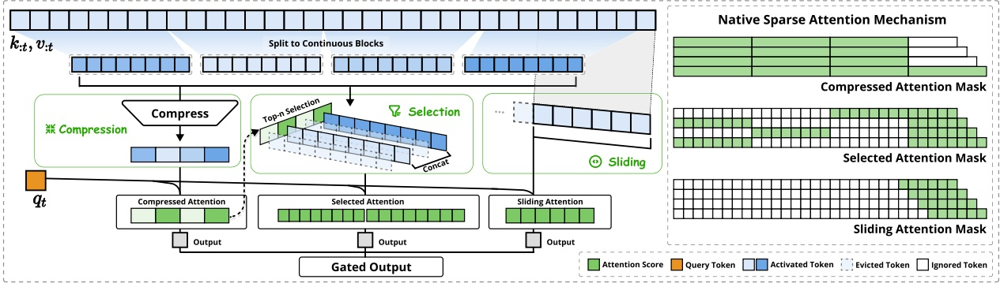
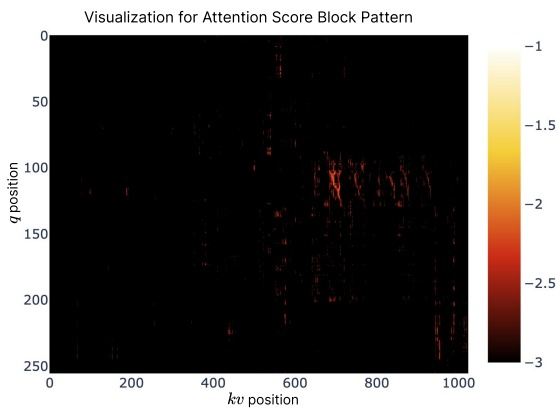
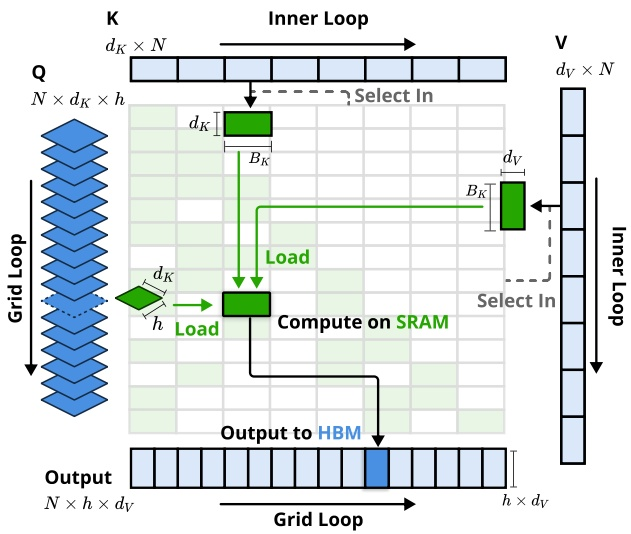
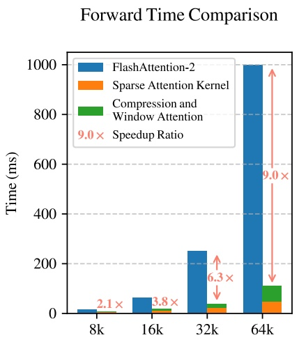
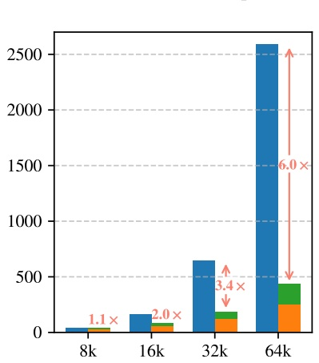
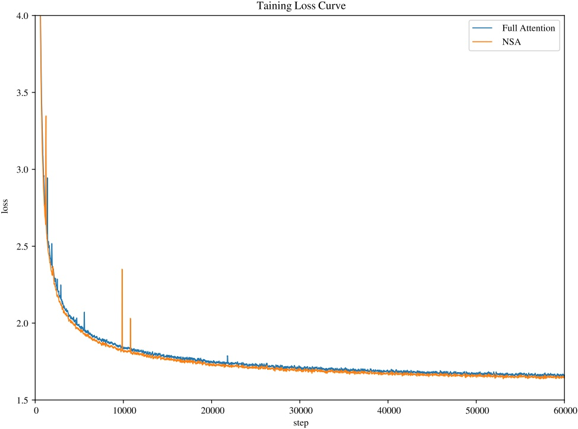
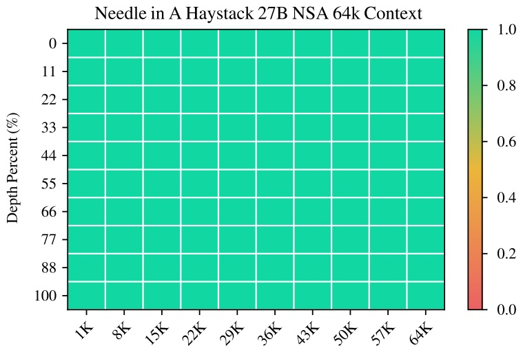
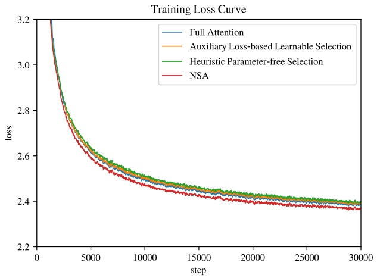

# NSA: 从预训练起就稀疏的注意力

材料是 DeepSeek-AI, 北京大学和华盛顿大学的论文 *Native Sparse Attention: Hardware-Aligned and Natively Trainable Sparse Attention* (arXiv 2502.11089, 2025 年 2 月, 25 页), 后来获 ACL 2025 最佳论文, 正式版对部分表格题注做了修改. 论文没有放出训练代码, 下文涉及实现细节的地方对照两个社区实现: [fla-org/native-sparse-attention](https://github.com/fla-org/native-sparse-attention) 和 [XunhaoLai/native-sparse-attention-triton](https://github.com/XunhaoLai/native-sparse-attention-triton). 逐段译文见 [NSA 对照译稿](01-nsa-bi.md).

NSA 的完整机制推导见 [原生稀疏注意力机制 NSA](../../../LargeLanguageModelGuide/2-核心原理与架构/2.4-稀疏注意力/02-原生稀疏注意力机制NSA/02-原生稀疏注意力机制NSA.md), 稀疏注意力各路线总览见 [稀疏注意力](../../../LargeLanguageModelGuide/2-核心原理与架构/2.4-稀疏注意力/2.4-稀疏注意力.md). 本文进一步检查三路分支的公式、选择分数来源、GQA 组共享与 kernel 的关系、加速数字口径和实验条件, 并与后续 DeepSeek-V3.2 采用的 DSA 路线比较.

## 1. 问题设定: 理论加速和可训练性两头落空

### 1.1. 已有稀疏方法的两个缺口

论文第 2 节把已有稀疏注意力的问题归成两类. 第一类是推理加速打折扣. H2O 一类 KV cache 驱逐方法只在解码阶段稀疏, MInference 一类只在 prefill 阶段稀疏, 而真实负载两者都有: 书籍摘要, 代码补全以 prefill 为主, 长推理链以解码为主, 只优化一个阶段, 另一阶段仍是全注意力的开销. 另一个更隐蔽的问题出在 GQA 上. Quest 让每个注意力头独立选 KV 块, 在 MHA 模型里计算量和访存量都随之下降; 但 GQA 中同一组的多个查询头共享一份 KV cache, 解码时从 HBM 读出来的是组内各头选择结果的并集, 计算省了, 访存没省多少. 解码恰好是访存受限的阶段, 所以这类方法在 GQA 模型上拿不到预期加速.

第二类是训练. 多数方法只在推理时把一个稠密训练出来的模型改成稀疏, 论文认为这会让模型偏离预训练时的最优轨迹, 并引用了 Chen et al. (2024) 的结论: 稠密模型中注意力最高的 20% 只覆盖约 70% 的注意力质量, 剩下的长尾一旦被丢掉, 误差随层数累积. 想在训练时就用稀疏, 又会遇到两个障碍: ClusterKV 的 k-means 聚类, MagicPIG 的 SimHash 这类离散选择操作没有梯度; HashAttention 这类 token 粒度的选择在反向时要从 KV cache 中做非连续的读取, 用不上 FlashAttention 那种连续块加载, 训练效率反而低于稠密.

### 1.2. 算术强度决定每个阶段该省什么

第 2.2 节用算术强度 (计算量与访存量之比) 区分两个阶段. 训练和 prefill 时, 一批查询同时计算, 矩阵乘法规模大, 算术强度高于 GPU 的计算访存比, 瓶颈在算力; 解码时每步只有一个 token 的查询, 却要读完整个 KV cache, 瓶颈在访存带宽. 稀疏注意力因此要同时满足两个目标: prefill 和训练阶段减少实际执行的 FLOPs, 解码阶段减少从 HBM 读出的 KV 字节数. 前一个目标要求选中的 KV 能以连续块的形式被 Tensor Core 消化, 后一个目标要求同组的查询头读同一批 KV.

这两个目标直接决定了 NSA 的三个选择: 用块而不是单个 token 作为选择单位, 让同一 GQA 组的所有头共享选择结果, 让选择分数直接来自一个本身就要算的分支, 不另设打分网络. 后两节分别看这三点在公式和 kernel 里怎样落地. 论文给出的整体结构见图 2.

图注: 左半部分是三路分支. 输入序列被切成块, 压缩分支把每个块压成一个 token 并与查询做注意力; 选择分支按压缩分支的注意力分数挑出 top-n 个块, 在块内原始 token 上做注意力; 滑动窗口分支只看最近 $w$ 个 token.
图 2 解析: 左半部分是三路分支. 输入序列被切成块, 压缩分支把每个块压成一个 token 并与查询做注意力; 选择分支按压缩分支的注意力分数挑出 top-n 个块, 在块内原始 token 上做注意力; 滑动窗口分支只看最近 $w$ 个 token. 三路输出各乘一个门控值后相加. 右半部分画的是同一个查询在三路分支中实际参与计算的位置: 压缩分支覆盖全序列但每块只有一个点, 选择分支是稀疏的几段完整块, 滑窗是对角线附近的一条带.

## 2. 三路分支, 门控与选择分数

### 2.1. 压缩分支与门控的形式

NSA 把注意力输出写成式 (5): $\mathbf o_t^*=\sum_{c\in\mathcal C}g_t^c\,\mathrm{Attn}(\mathbf q_t,\tilde K_t^c,\tilde V_t^c)$, 其中 $\mathcal C=\{\mathrm{cmp},\mathrm{slc},\mathrm{win}\}$. 门控 $g_t^c\in[0,1]$ 由输入特征经 MLP 加 sigmoid 得到. 三个门控各自独立地过 sigmoid, 没有归一化到和为 1, 所以输出的幅度可以在 0 到三路之和之间变化; 论文没有讨论这一点, 也没有给门控值在训练后的分布. XunhaoLai 的实现把门控写成一个 `Linear(hidden, 3 * num_q_heads)` 加 sigmoid, 每个查询头每个分支一个标量, 与论文描述一致.

压缩分支见式 (7): $\tilde K_t^{\mathrm{cmp}}=\{\varphi(\mathbf k_{id+1:id+l})\mid 0\le i\le\lfloor\frac{t-l}{d}\rfloor\}$. 块长 $l=32$, 步长 $d=16$, 相邻块有一半重叠. $\varphi$ 是带块内位置编码的可学习 MLP, 把 32 个 key 映射成一个压缩 key, value 侧同理. 论文没有给 $\varphi$ 的层数和宽度. 社区实现在这里分歧很大: fla-org 的实现用均值池化, 块长与步长都取 64, 不做重叠; XunhaoLai 的实现提供线性, 均值池化, 加权池化三种压缩, 线性方式是每个 KV 头一个把 $l$ 个 key 拼接后映射回单个 key 维度的矩阵, 块内位置编码只加在 key 上, 压缩之后才对压缩 key 施加 RoPE. 位置 $t$ 的查询能看到的压缩 token 只能是完全位于 $t$ 之前的块, XunhaoLai 的代码用「查询位置 $\ge id+l-1$」作为因果条件.

### 2.2. 选择分支: 分数从压缩分支导出

选择分支是 NSA 的核心. 如果为每个块单独打分, 就要额外算一遍查询与所有块代表向量的点积. NSA 的做法是直接复用压缩分支的注意力分数. 式 (8) 是压缩分支本身的 softmax: $\mathbf p_t^{\mathrm{cmp}}=\mathrm{Softmax}(\mathbf q_t^\top\tilde K_t^{\mathrm{cmp}})$. 选择块长 $l'=64$, 与压缩块 $l=32$ 和步长 $d=16$ 不对齐, 所以式 (9) 把压缩块的分数按空间关系加权汇总到选择块上; 当 $l=l'=d$ 时两者一一对应, 可以直接取 $\mathbf p^{\mathrm{slc}}_t=\mathbf p^{\mathrm{cmp}}_t$.

式 (10) 再在 GQA 组内求和: $\mathbf p_t^{\mathrm{slc}\prime}=\sum_{h=1}^{H}\mathbf p_t^{\mathrm{slc},(h)}$, 组内所有查询头得到同一个块分数向量, 然后按式 (11) 取 top-n, 选中块内的原始 key 和 value 拼起来送进注意力, 即式 (12). 论文设置 $n=16$, 其中固定包含开头 1 块和最近 2 块, 剩下 13 块按分数选出. 这一设计的成本很低: 压缩分支本来就要算 softmax, 选择只多出一个加权求和和一个 top-n. 但它也有一个前提, 就是压缩 key 的注意力分布要能代表块内细粒度 token 的重要性, 论文第 6.2 节用图 8 的注意力图来支持这个前提.

图注: 这是全注意力模型某一层的注意力图, 横轴 1024 个 key, 纵轴 256 个查询, 颜色是对数刻度, 范围约 $10^{-3}$ 到 $10^{-1}$. 高分区域成块出现, 相邻 key 的分数相近.
图 8 解析: 这是全注意力模型某一层的注意力图, 横轴 1024 个 key, 纵轴 256 个查询, 颜色是对数刻度, 范围约 $10^{-3}$ 到 $10^{-1}$. 高分区域成块出现, 相邻 key 的分数相近. 论文据此认为按连续块选择不会丢太多信息. 图里只有一层, 一个头, 1024 的长度, 论文没有给出不同层与不同长度上块状结构是否一致, 所以它只能算选择块状粒度的动机, 够不上统计结论.

### 2.3. 滑动窗口分支与三路独立的 KV

滑动窗口分支只看最近 $w=512$ 个 token. 论文第 3.3.3 节的理由是: 局部 token 的注意力分数天然较高, 如果和远程分支混在一起, 梯度会集中流向局部模式, 压缩和选择分支学不到远程依赖. 把局部信息单独放到一个分支, 并给三路分支各自独立的 key 和 value, 可以避免三路之间的梯度互相干扰. 这就是三路 KV 不共享的原因, 代价是 KV cache 的写入量变成三份: 压缩 KV, 原始 KV 和窗口 KV. 其中原始 KV 必须保存完整, 选择分支要从中取块; 窗口 KV 只需保留最近 512 个; 压缩 KV 按 $1/d$ 增长.

社区实现在这里也和论文不同. XunhaoLai 的实现用一套共享的 q, k, v 投影, 三路分支从同一份 key 和 value 出发, 压缩分支再经过自己的压缩层. fla-org 的实现同样共享 key 和 value. 论文的消融里没有「三路共享 KV」这一组, 所以独立 KV 带来的收益有多大, 文中没有给出. 第 6.1 节的图 7 比较的只有选择策略.

### 2.4. 式 (9) 的下标与块对齐

式 (9) 写作 $\mathbf p_t^{\mathrm{slc}}[j]=\sum_{m=0}^{\frac{l'}{d}-1}\sum_{n=0}^{\frac{l}{d}-1}\mathbf p_t^{\mathrm{cmp}}\left[\frac{l'}{d}j-m-n\right]$. 代入 $l=32, d=16, l'=64$, 下标取遍 $4j-4$ 到 $4j$, 权重分别是 1, 2, 2, 2, 1. 按式 (7) 的定义, 第 $i$ 个压缩 token 覆盖位置 $16i+1$ 到 $16i+32$; 按式 (12), 第 $j$ 个选择块覆盖 $64j+1$ 到 $64j+64$. 与这个选择块有重叠的压缩 token 是 $i=4j-1$ 到 $4j+3$: $4j$ 到 $4j+2$ 完全落在块内, $4j-1$ 和 $4j+3$ 各有一半在块内. 权重 1, 2, 2, 2, 1 正好对应重叠长度, 但起点应是 $4j-1$, 式 (9) 写成了 $4j-4$, 往前错了 3 个压缩 token, 大半落在第 $j-1$ 个选择块上.

这处差异不影响论文的结论, 但照式 (9) 实现会得到错位一块的选择结果. XunhaoLai 的实现在汇总前把压缩分数左侧补 $l/d-1$ 个零, 再用一个长度 $l'/d+l/d-1$ 的窗口做加权求和, 实际起点是 $4j-1$, 与式 (7)(12) 一致. 文中没有给出式 (9) 采用的编号约定, 能确定的是式 (9) 与式 (7)(12) 的下标定义不统一. 另外, XunhaoLai 的实现在汇总前用 log-sum-exp 在 `no_grad` 下重算压缩分数, 选择分支因此不向压缩分支回传梯度; top-n 本身不可导, 这与论文的设定一致, 选择分支对压缩 key 的影响只经过压缩分支自己的语言模型损失.

## 3. GQA 组内共享与 Triton kernel

### 3.1. 为什么组内共享是 kernel 高效的前提

FlashAttention 的前向把连续的一段查询 (比如 64 或 128 个) 加载进 SRAM, 再沿 key 方向循环, 每次加载一块连续的 key 和 value. 这个循环之所以高效, 是因为同一块查询要看的 key 范围相同 (因果掩码下只差一个三角). 换成 NSA 的选择分支, 相邻位置的查询各自选出 16 个块, 选择结果一般不同. 如果仍按连续查询块加载, 一块查询要用到的 KV 块就是各自选择的并集, 要么把并集都读进来做大量被掩码浪费的计算, 要么逐个查询单独读取, 失去矩阵乘的规模. 论文第 3.4 节说的「queries within a block may require disjoint KV blocks」就是这个问题.

NSA 的办法是换一个维度凑出矩阵乘: 不在序列方向上凑查询, 而在头方向上凑. 同一 GQA 组内的查询头在同一位置看的是同一份 KV, 只要它们的选择也相同, 一次加载的 KV 块就能同时服务组内所有头. 式 (10) 的组内求和正是为此设置的: 它让选择结果在组内一致, 牺牲的是每个头独立挑块的自由. 这与第 1.1 节提到的 Quest 问题是同一件事的两面: Quest 每头独立选择, 在 GQA 下解码访存是并集; NSA 强制组内共享, 访存量就是 $n$ 个块, 不随组内头数增加. 所以组内共享同时服务于两个阶段: 训练和 prefill 时它让 kernel 能以「组内头数 × 块长」的规模做矩阵乘, 解码时它让读出的 KV 字节数与选择数量严格成正比.

### 3.2. 前向 kernel 的数据流

图注: 绿色是 SRAM 中的数据, 蓝色是 HBM 中的数据. 网格的每个程序实例负责一个序列位置 $t$ 的一个 GQA 组: 先把该组 $h$ 个头的查询 $Q\in\mathbb R^{[h,d_k]}$ 和共享的块索引 $\mathcal I_t$ 读入 SRAM; 内层循环按 $\mathcal I_t$ 依次把每个选中块的 key 和 value 以 $B_k$ 为单位读进来 ($B_k$ 整除 $l'$), 计算 $QK^\top$, 在线 softmax 更新, 再乘 $V$ 累加; 循环结束后写回该位置该组的输出.
图 3 解析: 绿色是 SRAM 中的数据, 蓝色是 HBM 中的数据. 网格的每个程序实例负责一个序列位置 $t$ 的一个 GQA 组: 先把该组 $h$ 个头的查询 $Q\in\mathbb R^{[h,d_k]}$ 和共享的块索引 $\mathcal I_t$ 读入 SRAM; 内层循环按 $\mathcal I_t$ 依次把每个选中块的 key 和 value 以 $B_k$ 为单位读进来 ($B_k$ 整除 $l'$), 计算 $QK^\top$, 在线 softmax 更新, 再乘 $V$ 累加; 循环结束后写回该位置该组的输出. 查询和输出的循环交给 Triton 的网格调度器.

这个数据流成立依赖两个条件. 第一个条件是每个程序实例的内层循环长度几乎相同: 每个查询都选 $n$ 个块, 所以循环次数固定, 不同程序之间负载均衡, 论文因此把外层循环直接放进网格. 第二个条件是 $h$ 足够大. 每次矩阵乘的规模是 $[h,d_k]\times[d_k,B_k]$, $h$ 就是 Tensor Core 指令的 M 维. 效率实验里 $g=4$ 个组, 每组 $h=16$ 个头, 正好是 Triton 在 Ampere 上 `tl.dot` 要求的最小 16. fla-org 的实现在入口处直接断言组内头数是 16 的倍数, 组内头数更少时只能补零到 16, 浪费的算力按比例增加. 论文的 27B 模型配置是 64 个头分 4 组, 也是每组 16 个头, 这一配置与 kernel 的要求一致, 但论文没有讨论更小的组 (比如每组 8 个头的常见 GQA 配置) 时 kernel 的表现.

### 3.3. 反向 kernel 与小组规模问题

论文只描述了前向 kernel, 反向的设计一句没有. 反向的难点在 dK 和 dV: 前向是「每个查询找自己的块」, 反向要反过来「每个 KV 块汇总所有选了它的查询的梯度」. 直接按前向的网格做反向, 不同程序会同时写同一个 KV 块的梯度, 需要原子加. fla-org 的实现换成 KV 驻留的做法: 先由块索引构造一个 `block_mask`, 标出每个 KV 块被哪些查询选中, 网格按 KV 块划分, 每个程序遍历选中它的查询累加梯度, 不用原子操作. dQ 则仍按前向的网格计算, 每个查询只写自己的梯度. 于是反向至少要两个 kernel, 外加一次从「查询到块」到「块到查询」的映射构造, 这些都是前向没有的开销.

这一差别能解释论文图 6 里反向加速明显低于前向. 前向 64k 加速 9.0 倍, 基本等于计算量之比 (见 4.1 节); 反向 64k 只有 6.0 倍. 反向需要额外构造反向映射, 而且每个 KV 块被选中的次数不一, KV 驻留的程序之间负载不均. 社区工作 FSA (arXiv 2508.18224) 针对的正是小组规模: 它把选择 kernel 的循环顺序反过来, 外层遍历 KV 块, 内层遍历选中该块的查询, 这样矩阵乘的 M 维由查询个数凑出, 不再依赖组内头数, 报告相对 NSA kernel 最多 3.5 倍, 平均 1.6 倍的 kernel 加速, 端到端训练最多 1.25 倍. 这从侧面说明 NSA kernel 的高效依赖「每组 16 个头」这一配置.

## 4. 加速数字的口径

### 4.1. 训练: 图 6 的前向与反向

图注: 两张柱状图分别是前向和反向的耗时, 横轴是序列长度 8k, 16k, 32k, 64k, 每组两根柱子, 一根是基于 Triton 的 FlashAttention-2, 一根是 NSA, NSA 的柱子按压缩, 选择, 滑窗三部分着色. 前向加速 2.1, 3.8, 6.3, 9.0 倍, 反向 1.1, 2.0, 3.4, 6.0 倍.
图 6 解析: 两张柱状图分别是前向和反向的耗时, 横轴是序列长度 8k, 16k, 32k, 64k, 每组两根柱子, 一根是基于 Triton 的 FlashAttention-2, 一根是 NSA, NSA 的柱子按压缩, 选择, 滑窗三部分着色. 前向加速 2.1, 3.8, 6.3, 9.0 倍, 反向 1.1, 2.0, 3.4, 6.0 倍. 实验在 8 卡 A100 上进行, 配置 $g=4, h=16, d_k=192, d_v=128$, NSA 参数与第 4 节相同.

前向的四个数可以从计算量直接推出来. 因果全注意力下位置 $t$ 的查询看 $t$ 个 key, 平均 $t/2$; NSA 平均看 $t/(2d)$ 个压缩 token, 再加 $nl'=1024$ 个选中 token 和 $w=512$ 个窗口 token. 序列长 $T$ 时比值是 $\frac{T/2}{T/32+1536}$, 8k 到 64k 依次为 2.3, 4.0, 6.4, 9.1, 与图 6 的前向数字相差不到 0.2, 说明前向 kernel 基本拿满了计算量缩减. 反向只有这个比值的 50% 到 65%. 按图 6 的柱高, 64k 反向里 FlashAttention-2 约 2590 ms, NSA 的选择部分约 250 ms, 压缩加滑窗约 180 ms; 选择分支每个查询处理 1024 个 token, 压缩加滑窗约 2560 个, 换算到每个 token, 选择分支的反向代价是另两路的 3 倍多, 与 3.3 节说的反向映射开销一致. 序列短时, 1536 这个固定量占主导, 8k 下反向只有 1.1 倍, 几乎没有收益.

### 4.2. 解码: 表 4 是访存量之比

表 4 列的是解码时每步需要读取的 token 数: 全注意力是 8192, 16384, 32768, 65536; NSA 是 2048, 2560, 3584, 5632; 期望加速 4.0, 6.4, 9.1, 11.6 倍. 这四个 NSA 数字等于 $s/d+nl'+w$, 即每个压缩 token, 选中 token 和窗口 token 都按一个 token 计. 正文写的压缩 token 数是 $\lfloor\frac{s-l}{d}\rfloor$, 按它算会比表里少 2, 差别可以忽略. 需要分清的是, 加速比一行是两个读取量相除, 并没有实际测出解码时延. ACL 正式版把表 4 的题注改成「expected speedup is approximately linear with the volume of memory access」, 口径更明确. 图 1 右侧的「解码 11.6 倍」来自这张表, 而前向 9.0 倍和反向 6.0 倍来自图 6 的计时, 三个数的性质并不相同.

按读取量估计解码加速, 至少有三件事没有反映出来. 一是选择必须串在压缩之后: 每步先对全部压缩 token 算注意力, 再汇总分数做 top-n, 然后才能去读选中块, 64k 下压缩 token 有 4096 个, 这两步是串行的, 读取量相加看不出这层依赖. 二是显存占用不降: 原始 KV 必须完整保存, 压缩 KV 再多出约 $1/16$, 加上独立的窗口 KV, NSA 只省每步读取量, KV cache 的容量反而略增, 能同时服务的长请求数量不会因此增加. 三是解码 batch 较大时, 每个请求的选中块各不相同, 读取的随机性高于全注意力的顺序读. 文中没有给出这三项的大小, 也没有给出任何端到端的解码吞吐或时延.

### 4.3. 基线与硬件的选择

图 6 的基线是 Triton 实现的 FlashAttention-2, 不是官方 CUDA 版. 两者的绝对速度有差距, 用同一编程框架做对比可以排除实现语言的影响, 但读者不能把 9.0 倍理解成相对生产环境里最快的注意力实现. ACL 正式版的局限一节也承认 Triton 带来抽象开销, 用 CUDA 重写可能更快. 硬件是 A100, 没有 Hopper 上的数字; Hopper 上 FlashAttention-3 用了 TMA 和 warp 特化, 全注意力基线更快, NSA 的相对加速会被压缩.

序列长度方面, 加速比随长度单调上升, 因为 NSA 的开销里 $nl'+w=1536$ 是常数, 只有压缩部分随长度线性增长. 由此可以算出盈亏点: 前向在 $T/2$ 约等于 $T/32+1536$ 时打平, 即 $T$ 约 3.3k, 实际 kernel 还有额外开销, 所以 8k 时前向才 2.1 倍. 论文第 4.3 节自己也承认, 通用基准的样本大多短于稀疏方法的局部窗口, 「NSA may not fully leverage its efficiency advantages on shorter sequences」. 对 8k 以下的短上下文场景, NSA 带来的变化主要在模型质量上, 速度收益有限.

## 5. 实验数字的口径

### 5.1. 27B 模型, 预训练曲线与通用基准

实验模型是 27B 总参数, 3B 激活的 MoE: 30 层, 隐藏维 2560, GQA 4 组共 64 个头, 每头 $d_q=d_k=192$, $d_v=128$; FFN 用 DeepSeekMoE, 72 个路由专家加 2 个共享专家, 每 token 激活 6 个路由专家, 第一层换成 SwiGLU 稠密 MLP. 全注意力基线和 NSA 用同一骨干, 先在 8k 长度的文本上预训练 270B token, 再用 YaRN 在 32k 文本上继续训练并做 SFT. 第 1 节写的是 260B, 第 4.1 节和 ACL 正式版第 3.1 节都是 270B, 以后者为准; 文中没有说明 10B 的差额来自哪里.

图注: 横轴是训练步数, 到 60000 步; 纵轴是预训练损失, 末端在 1.65 附近. NSA 的曲线全程略低于全注意力.
图 4 解析: 横轴是训练步数, 到 60000 步; 纵轴是预训练损失, 末端在 1.65 附近. NSA 的曲线全程略低于全注意力. 图上没有标 token 数和批大小, 也没有给末端两条曲线的具体差值. 「两者都训练到完全收敛」是论文的说法, 图里看不出收敛判据.

表 1 是 9 个通用基准. 全注意力平均 0.443, NSA 平均 0.456, NSA 在 7 项上更高, MMLU 低 0.002, MBPP 低 0.016. 论文强调 DROP 加 0.042, GSM8K 加 0.034. 这组对比有两个口径问题. 第一, 这些基准的样本大多短于 512 的窗口加选中块所能覆盖的长度, 论文自己也说在这种长度下稀疏基线等价于全注意力; NSA 在短样本上与全注意力的差异主要来自门控和三路独立 KV 带来的结构变化, 与「稀疏」本身关系不大. 第二, 每个模型只有一次训练, 没有种子方差, 0.013 的平均差距和单项 0.01 量级的差距是否超出训练随机性, 文中没有给出.

### 5.2. LongBench 与大海捞针

图注: 64k 上下文的大海捞针检索, 横轴是上下文长度, 纵轴是针的位置深度, 所有格子都是满分. 模型的长上下文训练长度是 32k, 64k 已是训练长度的两倍.
图 5 解析: 64k 上下文的大海捞针检索, 横轴是上下文长度, 纵轴是针的位置深度, 所有格子都是满分. 模型的长上下文训练长度是 32k, 64k 已是训练长度的两倍. 图里只有 NSA, 没有全注意力在同一测试上的结果, 所以它说明 NSA 的块选择在单针检索上不漏, 不能说明它比全注意力更好. 单针任务里, 针所在块的压缩 token 与查询高度相关, 是块选择最容易处理的情形.

表 2 的 LongBench 选了 10 个子集. 稀疏基线 (H2O, InfLLM, Quest, Exact-Top) 都是在全注意力模型上推理时施加稀疏, 每个查询的预算统一为 2560 个 token, 其中包括开头 128 个和最近 512 个. 2560 是 NSA 在 32k 长度上的平均激活量: $t/16$ 在 0 到 32k 上的均值是 1024, 加上 $nl'=1024$ 和 $w=512$. 这里压缩 token 按 1 个计, 一个压缩 token 实际汇总了 32 个位置; 固定选中的 2 个本地块又和窗口重叠, 按原始位置去重, NSA 实际直接看到的不同位置少于 2560, 所以预算上基线没有吃亏. 结果是 NSA 平均 0.469, 全注意力 0.437, Exact-Top 0.423, Quest 0.392, InfLLM 0.383, H2O 0.303.

逐项看, NSA 的优势集中在多跳问答 (HPQ 加 0.087, 2Wiki 加 0.051), 代码 (LCC 加 0.069) 和英文段落检索 (PassR-en 加 0.075); 在 MFQA-en, GovRpt, PassR-zh 上 NSA 低于全注意力, 差距在 0.01 到 0.02. 论文说剔除了「所有模型得分都低」的子集, 没有列出剔除了哪些, LongBench 原有 21 个子集, 这里只留下不到一半. NSA 和全注意力都经过 32k 的继续训练, 而 LongBench 样本多数在 32k 以内, 这一对比衡量的是「原生稀疏训练的模型」与「同等训练的稠密模型」, 稀疏基线则是推理时强加的稀疏, 两类对比的意义不同: 前者是架构对比, 后者主要说明训练时就稀疏比推理时才稀疏好.

### 5.3. 数学推理与选择策略消融

数学推理用 DeepSeek-R1 蒸馏出的 10B token, 32k 长度的推理轨迹做 SFT, 得到 Full Attention-R 和 NSA-R, 在 AIME 24 上评测: 温度 0.7, top-p 0.95, 每题采 16 个样本取平均. 生成长度上限 8k 时, 全注意力 0.046, NSA 0.121; 16k 时分别为 0.092 和 0.146. AIME 24 只有 30 道题, 换算成平均每轮答对的题数, 全注意力是 1.4 道和 2.8 道, NSA 是 3.6 道和 4.4 道. 绝对水平很低, 差距是两三道题, 16 次采样平均能压低采样方差, 但题目本身只有 30 道, 文中没有给出置信区间. 论文把这个结果解释为 NSA 在长推理中更好地利用了远程信息; 8k 上限下差距更大, 也可以理解为 NSA-R 在较短长度内更早给出答案, 附录 A 的两个样例里 NSA-R 的思考段分别是 2275 和 15147 个 token, 全注意力是 9392 和 16223 个, 都更短, 但只有两例.

图注: 这是第 6.1 节的消融, 3B 参数模型, 横轴训练到 30000 步, 比较 NSA, 全注意力, 用辅助损失训练块重要性的选择方法, 以及按 Quest 方式无参数打分的启发式选择. NSA 末端损失约 2.37, 其余三条约 2.39 到 2.40, 两种替代选择方案都不比全注意力好.
图 7 解析: 这是第 6.1 节的消融, 3B 参数模型, 横轴训练到 30000 步, 比较 NSA, 全注意力, 用辅助损失训练块重要性的选择方法, 以及按 Quest 方式无参数打分的启发式选择. NSA 末端损失约 2.37, 其余三条约 2.39 到 2.40, 两种替代选择方案都不比全注意力好. 这张图支撑的是「用压缩分支的分数来选块」这一设计, 但它是 3B 模型的单次运行, 曲线差距在 0.02 到 0.03.

## 6. NSA 与 DSA 的取舍

### 6.1. DeepSeek-V3.2 的 DSA 走了另一条路

NSA 之后, DeepSeek 在 V3.2 里上线的稀疏注意力是 DSA, 详见 [DeepSeek-V3.2 解析](../../1-模型技术报告/1.7-deepseek-v3-2/02-deepseek-v3-2-analysis.md). DSA 只有一路: 一个轻量的 lightning indexer 对每个查询和每个历史 token 算一个 ReLU 加权的索引分, 选出 top-2048 个 token, 主注意力在 MLA 的 MQA 模式下只对这 2048 个潜变量做注意力. 它和 NSA 的共同点是选择结果在所有查询头之间共享: NSA 在 GQA 组内共享, DSA 在 MQA 模式下全部 128 个头共享. 两篇论文在「KV 要被多个查询头共用才能跑满硬件」这一点上结论相同.

区别集中在四处. 选择粒度上, NSA 按 64 个 token 的块选, DSA 按单个 token 选, 后者不受块边界影响, 但需要每个 token 都有一个索引分. 打分来源上, NSA 复用压缩分支的 softmax 分数, 打分网络就是模型本身的一个分支, 受语言模型损失直接训练; DSA 的索引器是独立的小网络, 输入被 detach, 只靠与主注意力分布的 KL 散度训练. 训练方式上, NSA 从头预训练, DSA 从 V3.1-Terminus 的稠密检查点出发, 先做 1000 步, 2.1B token 的稠密预热让索引器对齐主注意力, 再用 943.7B token 的稀疏训练适应. 分支结构上, NSA 有三路和门控, DSA 只有一路, 没有压缩分支也没有单独的滑窗.

**6.2. 为什么生产模型选了 DSA:** DSA 的选择可以从第 4 节的分析里找到理由. NSA 的三路独立 KV 增加了 KV cache 的写入量, 解码时选择要串在压缩之后; DSA 只在 MLA 原有的潜变量 cache 上加一个很小的索引键, cache 结构几乎不变, 可以在已有的 V3 系列检查点上继续训练, 不必从头预训练一个新架构. 对一个已经有成熟稠密模型的团队, 后一条的成本差距最大. 另一方面, DSA 的索引器仍是 $O(L^2)$, 只是常数比主注意力小一个数量级, prefill 曲线仍有明显斜率; NSA 的压缩分支也是 $O(L^2/d)$, 两者在 prefill 上都没有摆脱平方项.

后续的 V4 又把两条路线合在了一起. V4 的 CSA 先沿序列维把每 4 个 token 的 KV 压成一条, 再用 DSA 式的索引器在压缩条目上选 top-k, 另有 HCA 用 128 倍压缩做稠密注意力, 详见 [DeepSeek-V4 解析](../../1-模型技术报告/1.8-deepseek-v4/02-deepseek-v4-analysis.md). 压缩加选择的两级结构来自 NSA, 独立索引器和 MQA 共享来自 DSA. 社区的讨论里也有一种看法认为 NSA 的质量收益更多来自门控而不是稀疏本身, 这个问题论文没有做对应的消融 (比如「全注意力加三路门控」), 文中的数据无法区分两者.

## 参考文献

- Yuan et al. *Native Sparse Attention: Hardware-Aligned and Natively Trainable Sparse Attention*. arXiv 2502.11089, ACL 2025.
- [fla-org/native-sparse-attention](https://github.com/fla-org/native-sparse-attention), Triton 实现.
- [XunhaoLai/native-sparse-attention-triton](https://github.com/XunhaoLai/native-sparse-attention-triton), Triton 实现.
- Yan et al. *FSA: An Alternative Efficient Implementation of Native Sparse Attention Kernel*. arXiv 2508.18224.
- DeepSeek-V3.2 技术报告, 见 [DeepSeek-V3.2 解析](../../1-模型技术报告/1.7-deepseek-v3-2/02-deepseek-v3-2-analysis.md).
- DeepSeek-V4 技术报告, 见 [DeepSeek-V4 解析](../../1-模型技术报告/1.8-deepseek-v4/02-deepseek-v4-analysis.md).
