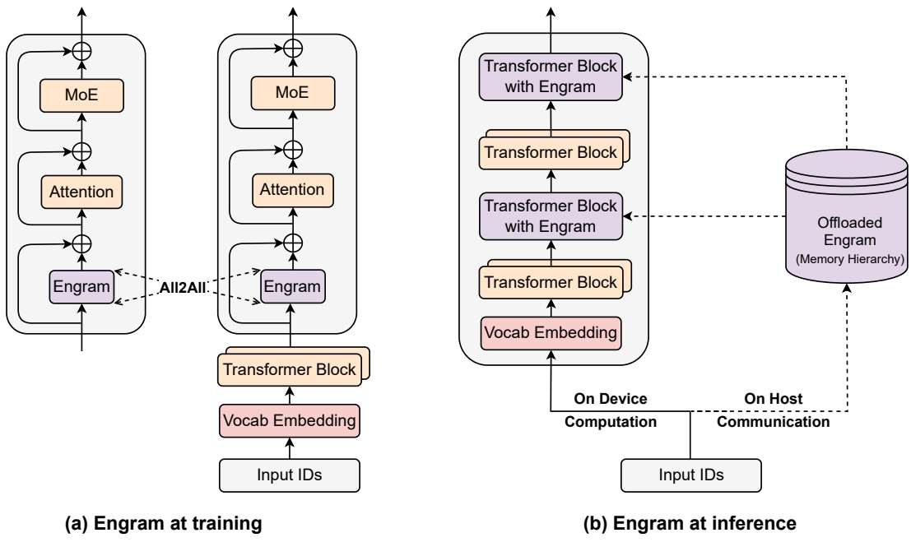
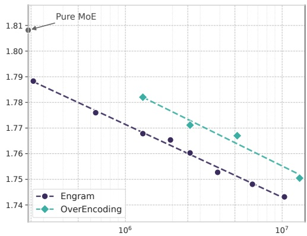
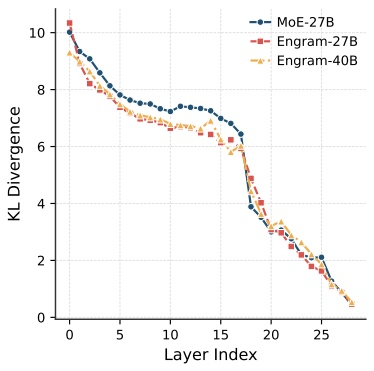
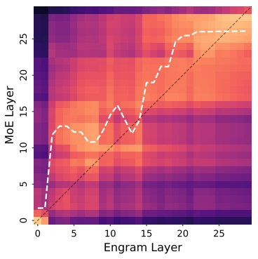
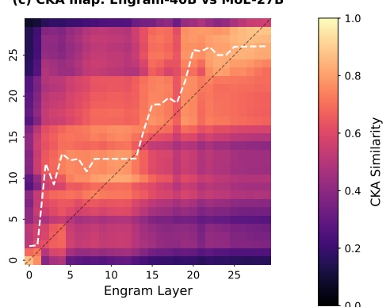
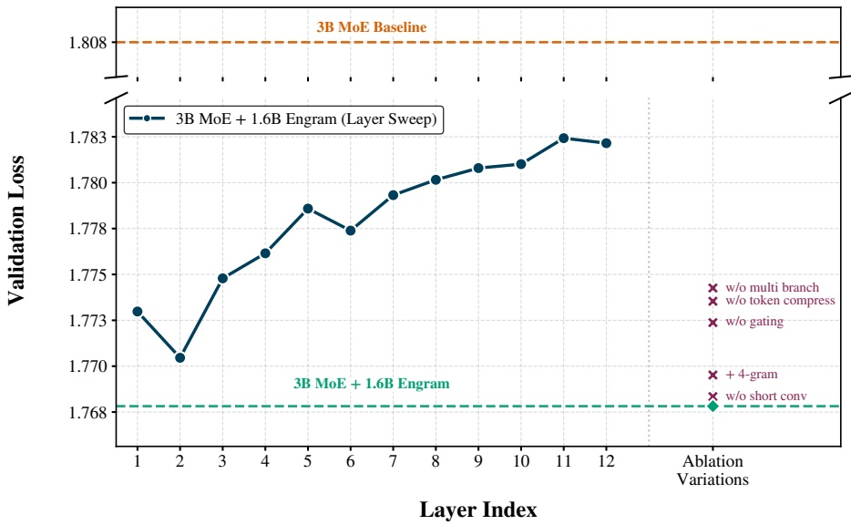
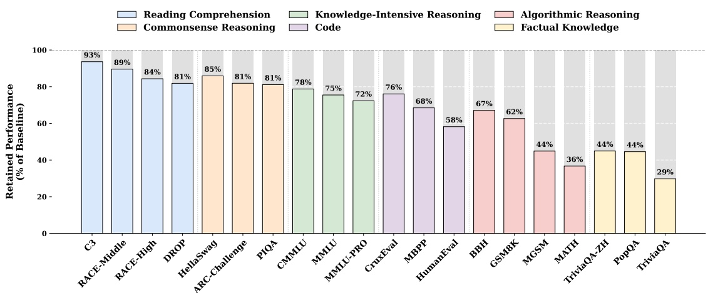
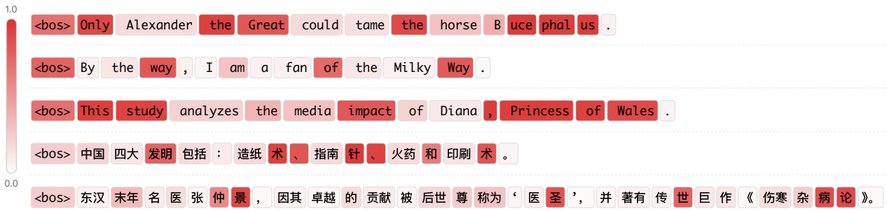
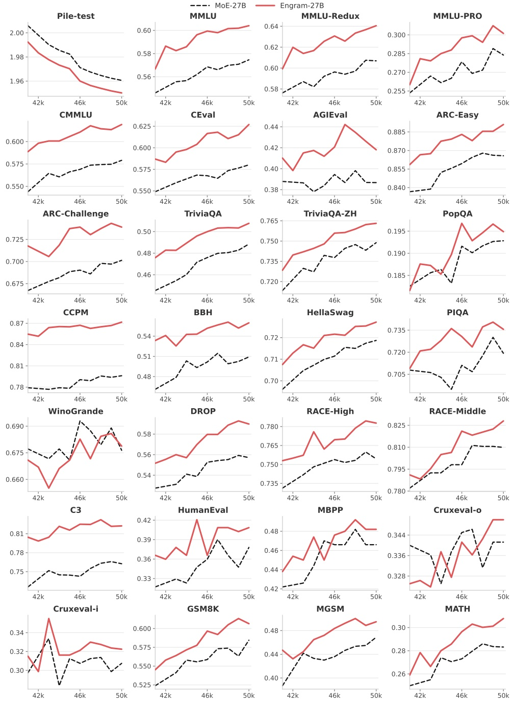

<!-- page 1 of 35 -->

arXiv:2601.07372v2 [cs.CL] 12 Jul 2026

Qdeepseek

# Conditional Memory via Scalable Lookup: A New Axis of Sparsity for Large Language Models / 基于可扩展查找的条件记忆: 大语言模型的一条新稀疏轴

Xin Cheng1,2∗, Rui Tian2∗, Wangding Zeng2, Damai Dai2, Qinyu Chen2, Bingxuan Wang2, Zhenda Xie2, Kezhao Huang2, Xingkai Yu2 Chengqi Deng2, Shangyan Zhou2, Chenggang Zhao2, Zhewen Hao2 Yukun Li2, Han Zhang2, Zhengyan Zhang2, Yixuan Wei2, M.Y Xu2 Huishuai Zhang1, Dongyan Zhao1, Wenfeng Liang2

1**Peking University** 2**DeepSeek-AI {zhanghuishuai, zhaody}@pku.edu.cn {chengxin, tianr22, zengwangding, damai.dai}@deepseek.com**

## Abstract

While Mixture-of-Experts (MoE) scales capacity via conditional computation, Transformers lack a native primitive for knowledge lookup, forcing them to inefficiently simulate retrieval through computation. To address this, we introduce conditional memory as a complementary sparsity axis, instantiated via **Engram**, a module that modernizes classic 𝑁-gram embedding for O (1) lookup. By formulating the Sparsity Allocation problem, we uncover a U-shaped scaling law that optimizes the trade-off between neural computation (MoE) and static memory (Engram). Guided by this law, we scale Engram to 27B parameters, achieving superior performance over a strictly iso-parameter and iso-FLOPs MoE baseline. Most notably, while the memory module is expected to aid knowledge retrieval (e.g., MMLU +3.4; CMMLU +4.0), we observe even larger gains in general reasoning (e.g., BBH +5.0; ARC-Challenge +3.7) and code/math domains (HumanEval +3.0; MATH +2.4). Mechanistic analyses reveal that Engram relieves the backbone’s early layers from static reconstruction, effectively deepening the network for complex reasoning. Furthermore, by delegating local dependencies to lookups, it frees up attention capacity for global context, substantially boosting long-context retrieval (e.g., Multi-Query NIAH: 84.2 → 97.0). Finally, Engram establishes infrastructure-aware efficiency: its deterministic addressing enables runtime prefetching from host memory, incurring negligible overhead. We envision conditional memory as an indispensable modeling primitive for nextgeneration sparse models. Code available at: [https://github.com/deepseek-ai/Engram](https://github.com/deepseek-ai/Engram).

MoE 用条件计算扩充容量, 但 Transformer 缺一个原生的知识查找算子, 只能用计算去低效地模拟检索. 为此我们提出把条件记忆作为互补的稀疏轴, 并用 **Engram** 实现它: 这个模块把经典的 $N$-gram 嵌入改造成现代形式, 支持 $O(1)$ 查找. 我们把问题写成稀疏分配 (Sparsity Allocation) 问题, 发现了一条 U 形 Scaling Law, 它刻画神经计算 (MoE) 与静态记忆 (Engram) 之间的权衡. 按这条规律, 我们把 Engram 做到 27B 参数, 效果超过严格等参数, 等 FLOPs 的 MoE 基线. 最突出的一点是, 记忆模块本应帮助知识检索 (如 MMLU +3.4, CMMLU +4.0), 但通用推理 (如 BBH +5.0, ARC-Challenge +3.7) 和代码/数学 (HumanEval +3.0, MATH +2.4) 的提升更大. 机制分析表明, Engram 让骨干的早期层不再重建静态内容, 相当于把网络加深, 留给复杂推理. 此外, 局部依赖交给查表之后, 注意力容量被腾出来处理全局上下文, 长上下文检索明显变好 (如 Multi-Query NIAH 从 84.2 升到 97.0). 最终, Engram 把面向基础设施的效率当成设计原则: 它的确定性寻址允许运行时从主机内存预取, 开销可以忽略. 我们认为条件记忆会成为下一代稀疏模型不可缺少的建模原语. 代码见 [https://github.com/deepseek-ai/Engram](https://github.com/deepseek-ai/Engram).

## 1. Introduction

Sparsity is a recurring design principle for intelligent systems, spanning from biological neural circuits (Lennie, 2003; Olshausen and Field, 1997) to modern Large Language Models (LLMs). Currently, this principle is primarily realized through Mixture-of-Experts (MoE) (Dai et al., 2024; Shazeer et al., 2017), which scales capacity via conditional computation. Owing to its ability to drastically increase model size without proportional increases in compute, MoE has become the de facto standard for frontier models (Comanici et al., 2025; Guo et al., 2025; Kimi, 2025).

稀疏是智能系统里反复出现的设计原则, 从生物神经回路 (Lennie, 2003; Olshausen and Field, 1997) 到现代大语言模型 (LLM) 都是如此. 目前这一原则主要靠 MoE (Dai et al., 2024; Shazeer et al., 2017) 实现, 即用条件计算扩充容量. 由于 MoE 能大幅增加模型规模而计算量不按比例增长, 它已成为前沿模型的事实标准 (Comanici et al., 2025; Guo et al., 2025; Kimi, 2025).

\*Equal contribution.

\*同等贡献.

<!-- page 2 of 35 -->

Despite the success of this conditional computation paradigm, the intrinsic heterogeneity of linguistic signals suggests significant room for structural optimization. Specifically, language modeling entails two qualitatively different sub-tasks: compositional reasoning and knowledge retrieval. While the former demands deep, dynamic computation, a substantial portion of text—such as named entities and formulaic patterns—is local, static, and highly stereotyped (Constant et al., 2017; Erman, 2000). The effectiveness of classical 𝑁-gram models (Brants et al., 2007; Liu et al., 2024b; Nguyen, 2024) in capturing such local dependencies implies that these regularities are naturally represented as computationally inexpensive lookups. Since standard Transformers (Vaswani et al., 2017) lack a native knowledge lookup primitive, current LLMs are forced to **simulate retrieval through computation**. For instance, resolving a common multi-token entity requires consuming multiple early layers of attention and feed-forward networks (Ghandeharioun et al., 2024; Jin et al., 2025) (see Table 3). This process essentially amounts to an expensive runtime reconstruction of a static lookup table, wasting valuable sequential depth on trivial operations that could otherwise be allocated to higher-level reasoning.

条件计算范式虽然成功, 语言信号本身的异质性说明结构上还有很大的优化空间. 具体来说, 语言建模包含两类性质不同的子任务: 组合式推理与知识检索. 前者需要深而动态的计算; 而相当一部分文本, 比如命名实体和公式化套语, 是局部的, 静态的, 高度刻板的 (Constant et al., 2017; Erman, 2000). 经典 $N$-gram 模型 (Brants et al., 2007; Liu et al., 2024b; Nguyen, 2024) 能有效捕捉这类局部依赖, 说明这些规律天然适合用廉价的查表来表示. 标准 Transformer (Vaswani et al., 2017) 没有原生的知识查找原语, 所以现有 LLM 只能**用计算模拟检索**. 例如, 识别一个常见的多 token 实体要消耗好几层早期的注意力和前馈网络 (Ghandeharioun et al., 2024; Jin et al., 2025) (见 Table 3). 这个过程等于在运行时昂贵地重建一张静态查找表, 把宝贵的串行深度浪费在本可留给高层推理的琐碎操作上.

To align model architecture with this linguistic duality, we advocate for a complementary axis of sparsity: conditional memory. Whereas conditional computation sparsely activates parameters to process dynamic logic (Bengio et al., 2013; Shazeer et al., 2017), conditional memory relies on sparse lookup operations to retrieve static embeddings for fixed knowledge. As a preliminary exploration of this paradigm, we revisit 𝑁-gram embeddings (Bojanowski et al., 2017) as a canonical instantiation: local context serves as a key to index a massive embedding table via constant-time O (1) lookups (Huang et al., 2025a; Pagnoni et al., 2025; Tito Svenstrup et al., 2017; Yu et al., 2025). Our investigation reveals that, perhaps surprisingly, this static retrieval mechanism can serve as an ideal complement to modern MoE architecture—but only if it is properly designed. In this paper, we propose **Engram**, a conditional memory module grounded in the classic 𝑁-gram structure but equipped with modern adaptations such as tokenizer compression, multi-head hashing, contextualized gating, and multi-branch integration (detailed in Section 2).

为了让模型结构对应语言的这种二元性, 我们主张增加一条互补的稀疏轴: 条件记忆. 条件计算稀疏地激活参数来处理动态逻辑 (Bengio et al., 2013; Shazeer et al., 2017); 条件记忆则靠稀疏查找取回固定知识对应的静态嵌入. 作为对这一范式的初步探索, 我们重新审视 $N$-gram 嵌入 (Bojanowski et al., 2017) 这一典型实现: 以局部上下文为键, 用常数时间 $O(1)$ 的查找索引一张巨大的嵌入表 (Huang et al., 2025a; Pagnoni et al., 2025; Tito Svenstrup et al., 2017; Yu et al., 2025). 我们发现, 这种静态检索机制可以成为现代 MoE 结构的理想补充, 这或许出乎意料, 但前提是设计得当. 本文提出 **Engram**, 一个以经典 $N$-gram 结构为基础的条件记忆模块, 并加入了几项现代改造: tokenizer 压缩, 多头哈希, 上下文门控和多分支融合 (详见第 2 节).

To quantify the synergy between these two primitives, we formulate the Sparsity Allocation problem: given a fixed total parameter budget, how should capacity be distributed between MoE experts and Engram memory? Our experiments uncover a distinct U-shaped scaling law, revealing that even simple lookup mechanisms, when treated as a first-class modeling primitive, act as essential complements to neural computation. Guided by this allocation law, we scale Engram to a 27B-parameter model. Compared to a strictly iso-parameter and iso-FLOPs MoE-27B baseline, Engram-27B achieves superior efficiency across diverse domains. Crucially, the gains are not limited to knowledge-intensive tasks (e.g., MMLU: +3.4; CMMLU: +4.0; MMLU-Pro: +1.8), where memory capacity is intuitively beneficial; we observe even more significant improvements in general reasoning (e.g., BBH: +5.0; ARC-Challenge: +3.7; DROP: +3.3) and code/math domains (e.g., HumanEval: +3.0; MATH: +2.4; GSM8K: +2.2).

为了量化这两种原语的协同, 我们提出稀疏分配问题: 总参数预算固定时, 容量应如何在 MoE 专家与 Engram 记忆之间分配? 实验发现一条清晰的 U 形 Scaling Law, 说明即便是简单的查找机制, 只要作为一等建模原语对待, 也是神经计算的必要补充. 按这条分配规律, 我们把 Engram 做到 27B 参数的模型. 与严格等参数, 等 FLOPs 的 MoE-27B 基线相比, Engram-27B 在多个领域上效率更高. 关键在于, 提升不限于知识密集型任务 (如 MMLU +3.4, CMMLU +4.0, MMLU-Pro +1.8), 这些任务从直觉上就受益于记忆容量; 通用推理 (如 BBH +5.0, ARC-Challenge +3.7, DROP +3.3) 和代码/数学 (如 HumanEval +3.0, MATH +2.4, GSM8K +2.2) 的提升更显著.

Mechanistic analysis via LogitLens (nostalgebraist, 2020) and CKA (Hendrycks et al., 2021a) reveals the source of these gains: Engram relieves the backbone from reconstructing static knowledge in early layers, thereby increasing effective depth available for complex reasoning. Furthermore, by delegating local dependencies to lookups, Engram frees up attention capacity to focus on global context, enabling exceptional performance in long-context scenarios—substantially outperforming baselines on LongPPL (Fang et al.) and RULER (Hsieh et al.) (e.g., Multi-Query NIAH: 97.0 vs. 84.2; Variable Tracking: 89.0 vs. 77.0).

借助 LogitLens (nostalgebraist, 2020) 和 CKA (Hendrycks et al., 2021a) 的机制分析揭示了这些提升的来源: Engram 让骨干不必在早期层重建静态知识, 从而增加了可用于复杂推理的有效深度. 此外, 局部依赖交给查表后, 注意力容量可以集中到全局上下文, 长上下文场景表现突出, 在 LongPPL (Fang et al.) 和 RULER (Hsieh et al.) 上大幅超过基线 (如 Multi-Query NIAH 97.0 对 84.2; Variable Tracking 89.0 对 77.0).

Finally, we establish infrastructure-aware efficiency as a first-class principle. Unlike MoE’s dynamic routing, Engram employs deterministic IDs to enable runtime prefetching, overlapping

<!-- page 3 of 35 -->

communication with computation. Empirical results show that offloading a 100B-parameter table to host memory incurs negligible overhead (< 3%). This demonstrates that Engram effectively bypasses GPU memory constraints, facilitating aggressive parameter expansion.

最终, 我们把面向基础设施的效率确立为首要原则. 与 MoE 的动态路由不同, Engram 使用确定性 ID, 可以在运行时预取, 让通信与计算重叠. 实验表明, 把 100B 参数的表卸载到主机内存, 开销可以忽略 (< 3%). 这说明 Engram 能有效绕开 GPU 显存的限制, 支持激进的参数扩张.

Figure 1 | The Engram Architecture. The module augments the backbone by retrieving static 𝑁- gram memory and fusing it with dynamic hidden states via context-aware gating. This module is applied only to specific layers to decouple memory from compute, leaving the standard input embedding and un-embedding module intact.

## 2. Architecture · 架构

## 2.1. Overview · 概述

As shown in Figure 1, Engram is a conditional memory module designed to augment the Transformer backbone by structurally separating static pattern storage from dynamic computation. Formally, given an input sequence $X = ( x _ { 1 } , \cdots , x _ { T } )$ and hidden states $\tilde { \mathbf { H } ^ { ( \ell ) } }   \in   \mathbb { R } ^ { T \times d }$ at layer ℓ, the module processes each position 𝑡 in two functional phases: **retrieval and fusion**. First, as detailed in Section 2.2, we extract and compress suffix 𝑁-grams to deterministically retrieve static embedding vectors via hashing. Subsequently, in Section 2.3, these retrieved embeddings are dynamically modulated by the current hidden state and refined via a lightweight convolution. Finally, we discuss the integration with multi-branch architectures in Section 2.4 and the system-level design in Section 2.5.

如 Figure 1 所示, Engram 是一个条件记忆模块, 通过在结构上把静态模式存储与动态计算分开来增强 Transformer 骨干. 形式上, 给定输入序列 $X=(x_1,\cdots,x_T)$ 和第 $\ell$ 层的隐藏状态 $\mathbf{H}^{(\ell)}\in\mathbb{R}^{T\times d}$, 模块对每个位置 $t$ 分两个阶段处理: **检索与融合**. 先 (第 2.2 节), 抽取并压缩后缀 $N$-gram, 通过哈希确定性地取回静态嵌入向量. 然后 (第 2.3 节), 用当前隐藏状态动态调制取回的嵌入, 再经一个轻量卷积细化. 最终讨论与多分支结构的结合 (第 2.4 节) 和系统层面的设计 (第 2.5 节).

## 2.2. Sparse Retrieval via Hashed 𝑁-grams · 基于哈希 N-gram 的稀疏检索

The first phase maps local contexts to static memory entries, involving tokenizer compression and retrieving embeddings via deterministic hashing.

第一阶段把局部上下文映射到静态记忆条目, 包括 tokenizer 压缩和通过确定性哈希取回嵌入两步.

<!-- page 4 of 35 -->

**Tokenizer Compression** While 𝑁-gram models typically operate directly on tokenizer outputs, standard subword tokenizers prioritize lossless reconstruction, often assigning disjoint IDs to semantically equivalent terms (e.g., Apple vs. ␣apple) (Kudo and Richardson, 2018; Li et al., 2023b). To maximize semantic density, we implement a vocabulary projection layer. Specifically, we pre-compute a surjective function $\mathcal { P } : V \stackrel { - } { \longrightarrow } V ^ { \prime }$ that collapses raw token IDs into canonical identifiers based on normalized textual equivalence (using NFKC (Whistler, 2025), lowercasing, etc.). In practice, this process achieves a 23% reduction in the effective vocabulary size for a 128k tokenizer (see Appendix C). Formally, for a token at position 𝑡, we map its raw ID $x _ { t }$ to a canonical ID $x _ { t } ^ { \prime } = \mathcal { P } ( x _ { t } )$ to form the suffix 𝑁-gram $g _ { t , n } = ( x _ { t - n + 1 } ^ { \prime } , \cdots , x _ { t } ^ { \prime } )$

**Tokenizer 压缩.** $N$-gram 模型通常直接作用于 tokenizer 的输出, 但标准子词 tokenizer 优先保证无损重建, 经常给语义等价的词分配不同 ID (如 Apple 与 ␣apple) (Kudo and Richardson, 2018; Li et al., 2023b). 为了提高语义密度, 我们实现了一个词表投影层. 具体做法是预先计算一个满射 $\mathcal{P}:V\to V'$, 按规范化后的文本等价关系 (NFKC (Whistler, 2025), 转小写等) 把原始 token ID 折叠成规范 ID. 实际中, 对 128k 的 tokenizer, 有效词表规模减少 23% (见 Appendix C). 形式上, 对位置 $t$ 的 token, 把原始 ID $x_t$ 映射为规范 ID $x'_t=\mathcal{P}(x_t)$, 组成后缀 $N$-gram $g_{t,n}=(x'_{t-n+1},\cdots,x'_t)$.

**Multi-Head Hashing.** Directly parameterizing the combinatorial space of all possible 𝑁-grams is intractable. Following Tito Svenstrup et al. (2017), we adopt a hashing-based approach. To mitigate collisions, we employ 𝐾 distinct hash heads for each 𝑁-gram order $n .$ Each head 𝑘 maps the compressed context to an index within an embedding table $\mathbf { E } _ { n , k }$ (of prime size $M _ { n , k } )$ via a deterministic function $\varphi _ { n , k } ;$

**多头哈希.** 直接为所有可能 $N$-gram 的组合空间开参数是不可行的. 我们沿用 Tito Svenstrup et al. (2017) 的哈希方案. 为了减轻碰撞, 对每个 $N$-gram 阶数 $n$ 使用 $K$ 个不同的哈希头. 每个头 $k$ 通过确定性函数 $\varphi_{n,k}$ 把压缩后的上下文映射为嵌入表 $\mathbf{E}_{n,k}$ (大小 $M_{n,k}$ 取素数) 中的一个下标:

$$
z _ {t, n, k} \triangleq \varphi_ {n, k} (g _ {t, n}), \quad \mathbf {e} _ {t, n, k} = \mathbf {E} _ {n, k} [ z _ {t, n, k} ].\tag{1}
$$

In practice, $\phi _ { n , k }$ is implemented as a lightweight multiplicative-XOR hash. We construct the final memory vector $\mathbf { e } _ { t } \in \mathbb { R } ^ { d _ { \mathrm { m e m } } }$ by concatenating all retrieved embeddings:

实际中 $\varphi_{n,k}$ 用一个轻量的乘法异或 (multiplicative-XOR) 哈希实现. 把取回的所有嵌入拼接起来, 得到最终的记忆向量 $\mathbf{e}_t\in\mathbb{R}^{d_{\mathrm{mem}}}$:

$$
\mathbf {e} _ {t} \triangleq \prod_ {n = 2} ^ {N} \prod_ {k = 1} ^ {K} \mathbf {e} _ {t, n, k}.\tag{2}
$$

> **拆开:** 式 (1) 说每阶有 $K$ 个「不同的」哈希头, 这 $K$ 个头彼此独立吗? 碰撞到底能有多严重?
> 答: 官方代码 `engram_demo_v1.py` 里不独立. 每层每阶只算一个混合值 $\mathrm{mix}=x'_t m_0 \oplus x'_{t-1}m_1\oplus\cdots$ ($m_i$ 是按层种子生成的随机奇数, 运算在 int64 上溢出回绕), 8 个头只是对同一个 mix 取不同的素数模 $p_k$. 两个 mix 不同的 $N$-gram 在第 $k$ 头碰撞, 当且仅当 mix 之差能被 $p_k$ 整除. 按 Appendix A 的 Engram Vocab Size, Engram-27B 每头的表约 $2.26\times10^6$ 行, 任取 4 个这样的素数, 乘积约 $2.6\times10^{25}$, 远大于 int64 差值的上界 $2^{64}\approx1.8\times10^{19}$, 所以两个 mix 不同的 $N$-gram 最多在 3 个头上同时碰撞, 至少 5 个头取到不同的行. 真正全头相同只发生在 mix 本身相同时, 包括 tokenizer 压缩有意合并的写法. 式 (2) 把 16 行拼成 $\mathbf{e}_t$, 所以一次碰撞只污染 $\mathbf{e}_t$ 中 1/16 的分量, 剩下的交给第 2.3 节的门和后面的投影去分辨.

## 2.3. Context-aware Gating · 上下文感知门控

The retrieved embeddings $\mathbf { e } _ { t }$ serve as context-independent priors. Being static, however, they inherently lack contextual adaptability and may suffer from noise due to hash collisions or polysemy (Haber and Poesio, 2024). To enhance expressivity and resolve this ambiguity, we employ a context-aware gating mechanism inspired by Attention (Bahdanau et al., 2015; Vaswani et al., 2017). Specifically, we utilize the current hidden state h𝑡—which has aggregated global context via preceding attention layers—as a dynamic Query, while the retrieved memory $\mathbf { e } _ { t }$ serves as the source for both Key and Value projections:

取回的嵌入 $\mathbf{e}_t$ 是与上下文无关的先验. 它们是静态的, 缺少对上下文的适应能力, 还可能因哈希碰撞或一词多义 (Haber and Poesio, 2024) 带来噪声. 为了增强表达力并消除这种歧义, 我们借鉴注意力 (Bahdanau et al., 2015; Vaswani et al., 2017), 采用上下文感知的门控. 具体做法是把当前隐藏状态 $\mathbf{h}_t$ (它已经通过前面的注意力层聚合了全局上下文) 当作动态 Query, 而取回的记忆 $\mathbf{e}_t$ 同时作为 Key 和 Value 投影的来源:

$$
\mathbf {k} _ {t} = \mathbf {W} _ {K} \mathbf {e} _ {t}, \quad \mathbf {v} _ {t} = \mathbf {W} _ {V} \mathbf {e} _ {t}\tag{3}
$$

where ${ \bf W } _ { K } , { \bf W } _ { V }$ are learnable projection matrices. To ensure gradient stability (Dehghani et $\mathrm { a l . } ,$ 2023), we apply RMSNorm (Zhang and Sennrich, 2019) to the Query and Key before computing the scalar gate $\alpha _ { t } \in ( 0 , 1 )$

其中 $\mathbf{W}_K, \mathbf{W}_V$ 是可学习的投影矩阵. 为了保证梯度稳定 (Dehghani et al., 2023), 在计算标量门 $\alpha_t\in(0,1)$ 之前对 Query 和 Key 做 RMSNorm (Zhang and Sennrich, 2019):

$$
\left| \alpha_ {t} = \sigma \left(\frac {\operatorname{RMSNorm} \left(\mathbf {h} _ {t}\right) ^ {\top} \operatorname{RMSNorm} \left(\mathbf {k} _ {t}\right)}{\sqrt {d}}\right). \right.\tag{4}
$$

The gated output is defined as $\tilde { \mathbf { v } } _ { t }   =   \boldsymbol { \alpha } _ { t } \cdot \mathbf { v } _ { t }$ . This design enforces semantic alignment: if the retrieved memory $\mathbf { e } _ { t }$ contradicts the current context $\mathbf { h } _ { t } ,$ the gate $\alpha _ { t }$ tends toward zero, effectively suppressing the noise.

门控后的输出定义为 $\tilde{\mathbf{v}}_t=\alpha_t\cdot\mathbf{v}_t$. 这一设计强制语义对齐: 如果取回的记忆 $\mathbf{e}_t$ 与当前上下文 $\mathbf{h}_t$ 相矛盾, 门 $\alpha_t$ 趋向 0, 噪声就被抑制.

> **核对:** 官方代码里的门和式 (4) 一样吗?
> 答: 不完全一样. `engram_demo_v1.py` 先算 $s=\mathrm{RMSNorm}(\mathbf{h}_t)^\top\mathrm{RMSNorm}(\mathbf{k}_t)/\sqrt{d}$, 再做一步带符号的开方 $s\leftarrow\mathrm{sign}(s)\sqrt{\max(|s|,10^{-6})}$, 最终才过 sigmoid. 这一步压缩了 $s$ 的幅度: $s=4$ 时式 (4) 给出 $\sigma(4)\approx0.982$, 代码给出 $\sigma(2)\approx0.881$; $s=0.25$ 时两者分别是 $0.562$ 和 $0.622$. 大分数被压小, 小分数被放大, 门不容易饱和在 0 或 1, 在 0 附近的梯度也更大. 文中没有提这一步, 也没有给有无这一步的消融. 代码里每条 mHC 分支各有一组 RMSNorm 和 $\mathbf{W}_K^{(m)}$, 与式 (6) 一致.

Finally, to expand the receptive field and enhance the model’s non-linearity, we introduce a short, depthwise causal convolution (Gu et al., 2022; Peng et al., 2023). Let $\tilde { \tilde { \mathbf { V } } } \in \mathbb { R } ^ { T \times d }$ denote the sequence of gated values. Using a kernel size 𝑤 (set to 4), dilation 𝛿 (set to the max 𝑁-gram order) and SiLU activation (Elfwing et al., 2018), the final output Y is computed as:

最终, 为了扩大感受野并增强非线性, 我们引入一个短的 depthwise 因果卷积 (Gu et al., 2022; Peng et al., 2023). 设 $\tilde{\mathbf{V}}\in\mathbb{R}^{T\times d}$ 为门控后数值组成的序列. 取核宽 $w$ (设为 4), 膨胀 $\delta$ (设为最大 $N$-gram 阶数) 和 SiLU 激活 (Elfwing et al., 2018), 最终输出 $\mathbf{Y}$ 为:

$$
\mathbf {Y} = \text {SiLU} \left(\text {Conv1D(RMSNorm} (\tilde {\mathbf {V}})\right) + \tilde {\mathbf {V}},\tag{5}
$$

<!-- page 5 of 35 -->

Figure 2 | System implementation of Engram. (a) Training Phase: The massive embedding tables are sharded across available GPUs. An All-to-All communication primitive is employed to retrieve active embedding rows across devices. (b) Inference Phase: Engram tables are offloaded to host memory. By exploiting the deterministic retrieval logic, the host asynchronously prefetches and transfers embeddings, overlapping communication with the on-device computation of preceding Transformer blocks.

The Engram module is integrated into the backbone via a residual connection: $\mathbf { H } ^ { ( \ell ) } \leftarrow \mathbf { H } ^ { ( \ell ) } + \mathbf { Y } ,$ followed by the standard Attention and MoE. Crucially, Engram is not applied to every layer; its specific placement is optimized to balance modeling effectiveness against the system-level latency constraints detailed in Section 2.5.

Engram 模块通过残差连接并入骨干: $\mathbf{H}^{(\ell)}\leftarrow\mathbf{H}^{(\ell)}+\mathbf{Y}$, 之后是标准的注意力与 MoE. 关键在于, Engram 并非每层都加; 插入位置要在建模效果与第 2.5 节所述的系统延迟约束之间权衡后确定.

## 2.4. Integration with Multi-branch Architecture · 与多分支结构的结合

In this work, rather than standard single-stream connections (He et al., 2016), we adopt the advanced multi-branch architecture as our default backbone, chosen for its superior modeling capabilities (Larsson et al., 2017; Szegedy et al., 2015; Xie et al., 2025; Zhu et al., 2025). A defining characteristic of this architecture is the expansion of the residual stream into 𝑀 parallel branches, where information flow is modulated by learnable connection weights.

本文没有采用标准的单流连接 (He et al., 2016), 而是以更先进的多分支结构为默认骨干, 因为它的建模能力更强 (Larsson et al., 2017; Szegedy et al., 2015; Xie et al., 2025; Zhu et al., 2025). 这种结构的特点是把残差流扩成 $M$ 条并行分支, 信息流由可学习的连接权重调节.

Although the Engram module is inherently topology-agnostic, adapting it to this multi-branch framework necessitates structural optimization to balance efficiency and expressivity. Specifically, we implement a parameter-sharing strategy: a single sparse embedding table and a Value projection matrix $\mathbf { W } _ { V }$ are shared across all 𝑀 branches, whereas 𝑀 distinct Key projection matrices $\{ \mathbf { W } _ { K } ^ { ( m ) } \} _ { m = 1 } ^ { M }$ are employed to enable branch-specific gating behaviors. For the 𝑚-th branch with hidden state $\mathbf { h } _ { t } ^ { ( m ) }$ , the branch-specific gating signal is computed as:

Engram 模块本身与拓扑无关, 但适配多分支框架时需要做结构优化, 以兼顾效率与表达力. 具体来说, 我们采用参数共享: 所有 $M$ 条分支共享一张稀疏嵌入表和一个 Value 投影矩阵 $\mathbf{W}_V$, 同时使用 $M$ 个不同的 Key 投影矩阵 $\{\mathbf{W}_K^{(m)}\}_{m=1}^{M}$, 让每条分支有自己的门控行为. 对隐藏状态为 $\mathbf{h}_t^{(m)}$ 的第 $m$ 条分支, 其门控信号为:

$$
\alpha_ {t} ^ {(m)} = \sigma \left(\frac {\mathrm{RMSNorm} (\mathbf {h} _ {t} ^ {(m)}) ^ {\top} \mathrm{RMSNorm} (\mathbf {W} _ {K} ^ {(m)} \mathbf {e} _ {t})}{\sqrt {d}}\right).\tag{6}
$$

<!-- page 6 of 35 -->

The retrieved memory is then modulated by these independent gates applied to the shared value vector: $\mathbf { u } _ { t } ^ { ( m ) }   =   \dot { \boldsymbol { \alpha } } _ { t } ^ { ( m ) } \cdot ( \boldsymbol { W } _ { V } \mathbf { e } _ { t } )$ . This design allows the linear projections (one $\mathbf { W } _ { V }$ and 𝑀 distinct $\mathbf { W } _ { K } ^ { ( m ) } )$ to be fused into a single dense FP8 matrix multiplication, maximizing the compute utilization of modern GPUs. Unless otherwise stated, all experiments utilize this integration with Manifold-Constrained Hyper-Connections (𝑀 = 4) (Xie et al., 2025).

取回的记忆再由这些独立的门作用在共享的 value 向量上: $\mathbf{u}_t^{(m)}=\alpha_t^{(m)}\cdot(\mathbf{W}_V\mathbf{e}_t)$. 这样一个 $\mathbf{W}_V$ 和 $M$ 个不同的 $\mathbf{W}_K^{(m)}$ 可以融合成一次稠密的 FP8 矩阵乘, 充分利用现代 GPU 的算力. 除非另有说明, 所有实验都采用这种与 Manifold-Constrained Hyper-Connections (mHC, $M=4$) (Xie et al., 2025) 的结合方式.

## 2.5. System Efficiency: Decoupling Compute and Memory · 系统效率: 计算与存储解耦

Scaling model parameters is often constrained by the limited capacity of GPU high-bandwidth memory (HBM). However, unlike MoE which relies on runtime hidden states for dynamic routing, Engram employs a deterministic retrieval mechanism based solely on input token IDs, naturally decoupling parameter storage from computation. This predictability facilitates specialized optimization strategies for both training and inference, as illustrated in Figure 2.

模型参数的扩张常受限于 GPU 高带宽显存 (HBM) 的容量. 但与依赖运行时隐藏状态做动态路由的 MoE 不同, Engram 的检索只取决于输入 token ID, 是确定性的, 天然地把参数存储与计算解耦. 这种可预测性让训练和推理都能用上专门的优化策略, 如 Figure 2 所示.

During training, to accommodate large-scale embedding tables, we employ standard model parallelism by sharding the tables across available GPUs. An All-to-All communication primitive is used to gather active rows in the forward pass and dispatch gradients in the backward pass, enabling the total memory capacity to scale linearly with the number of accelerators.

训练时, 为了容纳大规模嵌入表, 我们采用标准的模型并行, 把表切分到所有可用的 GPU 上. 前向用 All-to-All 通信收集被激活的行, 反向再把梯度分发回去, 这样总记忆容量随加速器数量线性增长.

During inference, this deterministic nature enables a prefetch-and-overlap strategy. Since memory indices are known prior to the forward pass, the system can asynchronously retrieve embeddings from abundant host memory via PCIe. To effectively mask communication latency, the Engram module is placed at specific layers within the backbone, leveraging the computation of preceding layers as a buffer to prevent GPU stalls. This necessitates a hardware-algorithm co-design strategy: while placing Engram deeper extends the compute window available for hiding latency, our ablation in Section 6.2 shows that modeling performance favors early intervention to offload local pattern reconstruction. Therefore, the optimal placement must simultaneously satisfy both modeling and system latency constraints.

推理时, 确定性让预取与重叠的策略成为可能. 由于记忆下标在前向开始前就已知, 系统可以经 PCIe 从容量充足的主机内存异步取回嵌入. 为了有效掩盖通信延迟, Engram 模块放在骨干的特定层, 用前面层的计算作缓冲, 避免 GPU 停等. 这要求软硬件协同设计: 把 Engram 放得越深, 可用于掩盖延迟的计算窗口越长; 但第 6.2 节的消融表明, 建模效果偏好早介入, 以便尽早卸掉局部模式的重建. 所以最优位置必须同时满足建模与系统延迟两方面的约束.

Furthermore, natural language 𝑁-grams inherently follow a Zipfian distribution (Chao and $\mathrm { Z i p f } ,$ 1950; Piantadosi, 2014), where a small fraction of patterns accounts for the vast majority of memory accesses. This statistical property motivates a Multi-Level Cache Hierarchy: frequently accessed embeddings can be cached in faster storage tiers (e.g., GPU HBM or Host DRAM), while the long tail of rare patterns resides in slower, high-capacity media $( \mathbf { e . g . } ,$ NVMe SSD). This stratification allows Engram to scale to massive memory capacities with minimal impact on effective latency.

此外, 自然语言的 $N$-gram 天然服从 Zipf 分布 (Chao and Zipf, 1950; Piantadosi, 2014), 少量模式占了绝大多数的访问. 这一统计特性引出多级缓存层次: 高频访问的嵌入可以缓存在更快的存储层 (如 GPU HBM 或主机 DRAM), 长尾的罕见模式放在更慢但容量大的介质 (如 NVMe SSD) 上. 这种分层让 Engram 可以扩展到海量记忆容量, 而对有效延迟的影响很小.

## 3. Scaling Laws and Sparsity Allocation · Scaling Law 与稀疏分配

Engram, as an instantiation of conditional memory, is structurally complementary to the conditional computation provided by MoE experts. This section investigates the scaling properties of this duality and how to optimally allocate sparse capacity. Specifically, two key questions drive our research:

Engram 作为条件记忆的一种实现, 在结构上与 MoE 专家提供的条件计算互补. 本节研究这种二元性的扩展性质, 以及如何最优地分配稀疏容量. 具体由两个问题驱动:

1. **Allocation under Finite Constraints.** When total parameters and training compute are fixed (Iso-parameter and Iso-FLOPs), how should we split the sparse capacity between MoE experts and Engram embeddings?

1. **有限约束下的分配.** 总参数和训练计算都固定 (等参数且等 FLOPs) 时, 稀疏容量应如何在 MoE 专家与 Engram 嵌入之间划分?

2. **Infinite Memory Regime.** Considering the non-scaling O (1) overhead of Engram, if the memory budget is relaxed or scaled aggressively, what scaling behavior does Engram exhibit by itself?

2. **无限记忆区间.** 考虑到 Engram 的 $O(1)$ 开销不随表规模增长, 如果放宽或激进地扩大记忆预算, Engram 自身呈现怎样的扩展行为?

<!-- page 7 of 35 -->

图注: Engram 稀疏预算分配与缩放规律：左图显示 MoE/Engram 混合比例的验证损失呈 U 形且优于纯 MoE，右图显示无限内存设定下损失随嵌入槽数量呈近似对数线性下降。
Number of Embedding Slots (Log Scale)

Figure 3 | Sparsity allocation and Engram scaling. Left: Validation loss across allocation ratios $\rho .$ Two compute budgets are shown (2e20 and 6e20 FLOPs). Both regimes exhibit a U-shape, with hybrid allocation surpassing Pure MoE. Right: Scaling behavior in the infinite-memory regime. Validation loss exhibits a log-linear trend with respect to the number of embeddings.

## 3.1. Optimal Allocation Ratio Between MoE and Engram · MoE 与 Engram 的最优分配比

**Compute-matched formulation.** We analyze the trade-off using three parameter metrics:

**计算匹配的形式化.** 我们用三个参数量来分析这一权衡:

$P _ { \mathrm { t o t } } ;$ total trainable parameters, excluding vocabulary embedding and LM head.

$P_{\mathrm{tot}}$: 可训练总参数, 不含词表嵌入和 LM head.

$P _ { \mathrm { a c t } } ;$ activated parameters per token. This quantity determines the training cost (FLOPs).

$P_{\mathrm{act}}$: 每 token 激活的参数. 它决定训练成本 (FLOPs).

$P _ { \mathrm { s p a r s e } }   \triangleq   P _ { \mathrm { t o t } } - P _ { \mathrm { a c t } } .$ the inactive parameters, which represents the “free” parameter budget available for scaling model size without incurring computational cost (e.g., unselected experts or unretrieved embeddings).

$P_{\mathrm{sparse}}\triangleq P_{\mathrm{tot}}-P_{\mathrm{act}}$: 未激活的参数, 即不增加计算成本就能用来扩大模型的「免费」参数预算 (如未被选中的专家或未被取回的嵌入).

We keep $P _ { \mathrm { t o t } }$ and $P _ { \mathrm { a c t } }$ fixed within each FLOPs budget, so that models have the same number of parameters and the same per-token FLOPs. For MoE, $P _ { \mathrm { a c t } }$ is determined by the top-𝑘 selected experts, while the parameters of non-selected experts contribute to $P _ { \mathrm { s p a r s e } } .$ For Engram, only a constant number of slots are retrieved per token, so scaling the number of embedding slots increases $P _ { \mathrm { t o t } }$ without increasing per-token FLOPs.

在每个 FLOPs 预算内, 我们固定 $P_{\mathrm{tot}}$ 和 $P_{\mathrm{act}}$, 使各模型参数量相同, 每 token FLOPs 也相同. 对 MoE, $P_{\mathrm{act}}$ 由 top-$k$ 选中的专家决定, 未选中专家的参数计入 $P_{\mathrm{sparse}}$. 对 Engram, 每个 token 只取回常数个槽, 所以增加嵌入槽数会增加 $P_{\mathrm{tot}}$ 而不增加每 token FLOPs.

**Allocation ratio.** We define the allocation ratio $\rho \in [ 0 , 1 ]$ as the fraction of the inactiveparameter budget assigned to MoE expert capacity:

**分配比.** 定义分配比 $\rho\in[0,1]$ 为未激活参数预算中分给 MoE 专家容量的比例:

$$
P _ {\mathrm{MoE}} ^ {(\mathrm{sparse})} = \rho P _ {\mathrm{sparse}}, \qquad P _ {\mathrm{Engram}} = (1 - \rho) P _ {\mathrm{sparse}}.\tag{7}
$$

Intuitively:

直观上:

$\rho = 1$ corresponds to a pure MoE model (all inactive parameters are routed experts).

$\rho=1$ 对应纯 MoE 模型 (所有未激活参数都是路由专家).

$\rho < 1$ reduces the number of routed experts and reallocates the freed parameters to Engram embedding slots.

$\rho<1$ 减少路由专家的数量, 把腾出的参数重新分给 Engram 的嵌入槽.

**Experimental protocol.** We evaluate this trade-off at two compute regimes and maintain a constant sparsity ratio $P _ { \mathrm { t o t } } / P _ { \mathrm { a c t } } \approx 1 0$ across both settings:

**实验协议.** 我们在两个计算规模上评估这一权衡, 两者的稀疏比都保持 $P_{\mathrm{tot}}/P_{\mathrm{act}}\approx10$:

$C = 2 \times 1 0 ^ { 2 0 }$ FLOPs: $P _ { \mathrm { t o t } } \approx 5 . 7 \mathrm { B }$ and $P _ { \mathrm { a c t } } = 5 6 8 \mathrm { M } .$ The baseline $( \rho = 1 )$ has a total of 106 experts.

$C=2\times10^{20}$ FLOPs: $P_{\mathrm{tot}}\approx5.7\mathrm{B}$, $P_{\mathrm{act}}=568\mathrm{M}$. 基线 ($\rho=1$) 共有 106 个专家.

$C = 6 \times 1 0 ^ { 2 0 }$ FLOPs: $P _ { \mathrm { t o t } } \approx 9 . 9 \mathrm { B }$ and $P _ { \mathrm { a c t } } = 9 9 3 \mathrm { M }$ . The baseline (𝜌 = 1) has a total of 99 experts.

$C=6\times10^{20}$ FLOPs: $P_{\mathrm{tot}}\approx9.9\mathrm{B}$, $P_{\mathrm{act}}=993\mathrm{M}$. 基线 ($\rho=1$) 共有 99 个专家.

<!-- page 8 of 35 -->

For different $\rho ,$ we construct the corresponding model only by adjusting the number of routed experts and the number of Engram embedding slots. All runs use the identical training pipeline and optimization hyperparameters.

对不同的 $\rho$, 我们只通过调整路由专家数和 Engram 嵌入槽数来构造对应模型. 所有运行使用完全相同的训练流程和优化超参数.

**Results and Analysis.** Figure 3 (left) reveals a consistent U-shaped relationship between validation loss and the allocation ratio $\rho .$ Remarkably, the Engram model achieves comparable performance to the pure MoE baseline $\left( \rho = 100\% \right)$ even when the MoE allocation is reduced to just $\rho \approx 40\% ( i.e., a$ total of 46 experts for the 5.7B model and 43 experts for the 9.9B model). Furthermore, the pure MoE baseline proves suboptimal: reallocating roughly 20%–25% of the sparse parameter budget to Engram yields the best performance. Quantitatively, in the 10B regime $\bar { ( } C   =   6 \times 1 0 ^ { 2 0 } )$ , validation loss improves from 1.7248 (at $\rho = 1 0 0 \% )$ to 1.7109 near the optimum of $\rho \approx 8 0 \%$ $\left( \Delta = 0 . 0 1 3 9 \right)$ . Crucially, the location of this optimum is stable across regimes $\left( \rho \approx 75\%  - 80\% \right)$ , suggesting a robust allocation preference across the examined scales (under fixed sparsity). This observed U-shape confirms the structural complementarity between the two modules:

**结果与分析.** Figure 3 (左) 显示验证损失与分配比 $\rho$ 之间稳定的 U 形关系. 值得一提的是, 即使把 MoE 的份额降到 $\rho\approx40\%$ (即 5.7B 模型共 46 个专家, 9.9B 模型共 43 个专家), Engram 模型的表现仍与纯 MoE 基线 ($\rho=100\%$) 相当. 而且纯 MoE 基线并非最优: 把大约 20% 到 25% 的稀疏参数预算分给 Engram 效果最好. 定量地看, 在 10B 规模 ($C=6\times10^{20}$) 上, 验证损失从 1.7248 ($\rho=100\%$) 降到最优点 $\rho\approx80\%$ 附近的 1.7109 ($\Delta=0.0139$). 关键是, 最优点的位置在两个规模上是稳定的 ($\rho\approx75\%$ 到 $80\%$), 说明在所考察的规模上 (稀疏比固定时) 存在稳健的分配偏好. 观察到的 U 形证实了两个模块在结构上的互补:

> **对一下:** 「46 个专家对应 $\rho\approx40\%$」和第 4.1 节 Engram-27B 的 $\rho=74.3\%$ 能从式 (7) 复算出来吗?
> 答: 能. 若每 token 激活 6 个路由专家 (与 MoE-27B 的 top-6 相同), 未激活的专家参数与 $E-6$ 成正比, $E$ 是路由专家总数. 5.7B 档 $(46-6)/(106-6)=0.400$, 9.9B 档 $(43-6)/(99-6)=0.398$, 都是 40%. 对 27B 模型, 文中没有给出专家中间维, 若取 1536 (SwiGLU 三个矩阵, 每专家 $3\times2560\times1536\approx1.18\times10^7$ 参数), 29 个 MoE 层 (30 层减去 1 个前置稠密层) 上去掉 17 个专家是 $17\times29\times1.18\times10^7\approx5.82\mathrm{B}$, 与 Engram 的 5.79B 对上; 未激活参数 $P_{\mathrm{sparse}}\approx66\times29\times1.18\times10^7\approx22.58\mathrm{B}$, $\rho=1-5.79/22.58\approx0.743$, 正是 74.3%. 中间维 1536 是从这两个数反推的, 文中没有写.

• **MoE-dominated** $( \rho \rightarrow 100\% ) ;$ The model lacks dedicated memory for static patterns, forcing it to inefficiently reconstruct them through depth and computation.

• **MoE 主导** ($\rho\to100\%$): 模型缺少存放静态模式的专用记忆, 只能用深度和计算低效地重建它们.

• **Engram-dominated** $( \rho \to 0 \% ) ;$ **:** The model loses conditional computation capacity, hurting tasks that require dynamic, context-dependent reasoning; memory cannot replace computation in this regime.

• **Engram 主导** ($\rho\to0\%$): 模型失去条件计算容量, 损害需要动态, 依赖上下文推理的任务; 在这一区间记忆无法替代计算.

## 3.2. Engram under Infinite Memory Regime · 无限记忆区间下的 Engram

In Section 3.1, we optimized the allocation under a fixed parameter budget. We now explore the complementary setting: aggressive memory scaling. This investigation is motivated by Engram’s unique ability to decouple storage from compute detailed in Section 2.5.

第 3.1 节在固定参数预算下优化分配. 现在考察互补的设定: 激进地扩大记忆. 这一研究的动机是第 2.5 节所述的 Engram 独有的存储与计算解耦能力.

**Experimental protocol.** We utilize a fixed MoE backbone with $P _ { \mathrm { t o t } }   \approx   3 \mathrm { B }$ and $P _ { \mathrm { a c t } }   =   5 6 8 \mathrm { M } ,$ trained for 100B tokens to ensure convergence. On top of this backbone, we attach an Engram table and sweep the number of slots 𝑀 from $2 . 5 8 \times \hat { 1 0 ^ { 5 } }$ to $1 . 0 \times 1 0 ^ { 7 }$ (adding up to ≈ 13 billion parameters). For baselines, we compare against OverEncoding (Huang et al., 2025a), which integrates 𝑁-gram embeddings via averaging with the vocabulary embedding. We note that while other work such as SCONE (Yu et al., 2025) also investigates large-scale embeddings, it is primarily inference-focused and includes extra module (f-gram model) and additional training FLOPs, rendering it incompatible with the strict iso-compute constraints of this study.

**实验协议.** 我们使用一个固定的 MoE 骨干, $P_{\mathrm{tot}}\approx3\mathrm{B}$, $P_{\mathrm{act}}=568\mathrm{M}$, 训练 100B token 以保证收敛. 在这个骨干上挂一张 Engram 表, 槽数 $M$ 从 $2.58\times10^5$ 扫到 $1.0\times10^7$ (最多增加约 130 亿参数). 基线方面, 我们与 OverEncoding (Huang et al., 2025a) 比较, 它把 $N$-gram 嵌入与词表嵌入取平均后并入模型. 需要说明, SCONE (Yu et al., 2025) 等工作也研究大规模嵌入, 但它主要面向推理, 带有额外模块 (f-gram 模型) 并增加训练 FLOPs, 与本研究严格的等计算约束不兼容.

**Results.** Figure 3 (right) demonstrates that scaling the number of memory slots yields a clear and consistent improvement in validation loss. Across the explored range, the curve follows a strict power law (linear in log-space), indicating that Engram provides a predictable scaling knob: larger memory continues to pay off without requiring additional computation. Crucially, regarding scaling efficiency: while the direct averaging approach of OverEncoding benefits from larger memory tables, Engram unlocks much larger scaling potential from the same memory budget. Together with the allocation law in Section 3.1, these results validate that conditional memory serves as a distinct, scalable axis of sparse capacity that complements the conditional computation of MoE.

**结果.** Figure 3 (右) 表明, 增加记忆槽数带来验证损失清晰而稳定的改善. 在所考察的范围内, 曲线严格服从幂律 (在对数坐标下是直线), 说明 Engram 提供了一个可预测的扩展旋钮: 更大的记忆持续带来收益, 且不需要额外计算. 关于扩展效率, 关键在于: OverEncoding 的直接平均方式虽然也受益于更大的记忆表, 但同样的记忆预算下 Engram 释放出大得多的扩展潜力. 结合第 3.1 节的分配规律, 这些结果证实了条件记忆是一条独立, 可扩展的稀疏容量轴, 与 MoE 的条件计算互补.

<!-- page 9 of 35 -->

## 4. Large Scale Pre-training · 大规模预训练

|  | Benchmark (Metric) | # Shots | Dense-4B | MoE-27B | Engram-27B | Engram-40B |
| --- | --- | --- | --- | --- | --- | --- |
|  | # Total Params # Activated (w/otokenembed) # Trained Tokens # Experts (shared+routed,top-𝑘) # Engram Params |  | 4.1B3.8B262B-- | 26.7B3.8B262B 2+72 (top-6)- | 26.7B3.8B262B 2+55 (top-6) 5.7B | 39.5B3.8B262B 2+55 (top-6) 18.5B |
| Language | Pile (loss) | - | 2.091 | 1.960 | 1.950 | 1.942 |
| Modeling | Validation Set (loss) | - | 1.768 | 1.634 | 1.622 | 1.610 |
| Knowledge | MMLU (Acc.) MMLU-Redux (Acc.) MMLU-Pro (Acc.) CMMLU (Acc.) C-Eval (Acc.) AGIEval (Acc.) ARC-Easy (Acc.) | 5-shot5-shot5-shot5-shot5-shot0-shot25-shot | 48.650.721.147.946.929.176.8 | 57.460.628.357.958.038.686.5 | 60.464.030.161.962.741.889.0 | 60.664.531.363.463.345.990.1 |
| &amp; | ARC-Challenge (Acc.) | 25-shot | 59.3 | 70.1 | 73.8 | 76.4 |
| Reasoning | TriviaQA (EM) TriviaQA-ZH (EM) PopQA (EM) CCPM (Acc.) BBH (EM) HellaSwag (Acc.) PIQA (Acc.) WinoGrande (Acc.) | 5-shot5-shot15-shot0-shot3-shot0-shot0-shot5-shot | 33.062.815.172.242.864.363.864.0 | 48.874.819.279.650.971.871.967.6 | 50.776.319.487.155.972.773.567.8 | 51.877.921.287.757.573.176.568.1 |
| Reading | DROP (F1) RACE-Middle (Acc.) | 1-shot5-shot | 41.672.4 | 55.780.9 | 59.082.8 | 60.783.3 |
| Comprehension | RACE-High (Acc.) C3 (Acc.) | 5-shot0-shot | 66.057.7 | 75.460.1 | 78.263.6 | 79.261.8 |
| Code &amp; Math | HumanEval (Pass@1) MBPP (Pass@1) CruxEval-i (EM) CruxEval-o (EM) GSM8K (EM) MGSM (EM) MATH (EM) | 0-shot3-shot0-shot0-shot8-shot8-shot4-shot | 26.835.427.628.735.527.015.2 | 37.846.630.734.158.446.828.3 | 40.848.232.235.060.649.430.7 | 38.446.236.235.362.652.430.6 |

With the proposed Engram architecture and the empirically derived allocation law, we scale Engram to the multi-billion parameter to validate its efficacy in real-world language model pre-training. Specifically, we train four models: (1) **Dense-4B** (4.1B total parameters), (2) **MoE-27B** (26.7B total parameters), (3) **Engram-27B** (26.7B total parameters), and (4) **Engram-40B** (39.5B total parameters). All models are trained using an identical data curriculum (same token budget and order) and are strictly matched in the number of activated parameters.

有了 Engram 结构和经验得到的分配规律, 我们把 Engram 扩展到数十亿参数, 以验证它在真实语言模型预训练中的效果. 具体训练四个模型: (1) **Dense-4B** (总参数 4.1B), (2) **MoE-27B** (总参数 26.7B), (3) **Engram-27B** (总参数 26.7B), (4) **Engram-40B** (总参数 39.5B). 所有模型使用相同的数据课程 (相同的 token 预算和顺序), 激活参数严格对齐.

<!-- page 10 of 35 -->

## 4.1. Experimental Setup · 实验设置

**Training Data and Model Configurations** All models are pre-trained on a corpus of 262 billion tokens and we utilize the tokenizer from DeepSeek-v3 (Liu et al., 2024a) with a vocabulary size of 128k. For modeling, to ensure a controlled comparison, we adhere to a consistent default setting across all models unless explicitly stated otherwise. We utilize a 30-block Transformer with a hidden size of 2560. Each block integrates a Multi-head Latent Attention (MLA) (DeepSeek-AI, 2024) with 32 heads, connected to FFNs via mHC (Xie et al., 2025) with an expansion rate of 4. All models are optimized using Muon (Jordan et al., 2024; Liu et al., 2025b); detailed hyperparameters are listed in the Appendix A. We instantiate four distinct models:

**训练数据与模型配置.** 所有模型在 2620 亿 token 的语料上预训练, 使用 DeepSeek-V3 (Liu et al., 2024a) 的 tokenizer, 词表大小 128k. 为了保证对照可控, 除非特别说明, 所有模型采用一致的默认设置. 骨干是 30 个块的 Transformer, 隐藏维 2560. 每个块包含一个 32 头的 MLA (DeepSeek-AI, 2024), 通过扩张率为 4 的 mHC (Xie et al., 2025) 与 FFN 相连. 所有模型用 Muon (Jordan et al., 2024; Liu et al., 2025b) 优化, 详细超参见 Appendix A. 我们构造了四个模型:

• **Dense-4B** serves as the baseline model. It utilizes the backbone architecture described above, incorporating a standard dense FFN into every block.

• **Dense-4B** 是基线模型. 它使用上述骨干, 每个块都是标准稠密 FFN.

• **MoE-27B** replaces the standard dense FFN with a DeepSeekMoE module (Dai et al., 2024). Configured with 72 routed experts and 2 shared experts (activating the top-𝑘 = 6 routed experts per token), this model scales to 26.7B total parameters while maintaining the same activated parameters as Dense-4B.

• **MoE-27B** 把标准稠密 FFN 换成 DeepSeekMoE 模块 (Dai et al., 2024). 配置 72 个路由专家和 2 个共享专家 (每 token 激活 top-$k=6$ 个路由专家), 总参数扩到 26.7B, 激活参数与 Dense-4B 相同.

• **Engram-27B** is strictly derived from the **MoE-27B** architecture to ensure fair comparison. We reduce the number of routed experts from 72 to 55 and reallocate the freed parameters to a 5.7B-parameter embedding module (𝜌 = 74.3%), keeping the total model size constant at 26.7B. Regarding the Engram configuration, we instantiate the module at layers 2 and 15 and set the maximum 𝑁-gram size to 3, the number of heads to 8, and the dimension to 1280. For optimization, the embedding parameters are updated using Adam (Kingma, 2014) with a learning rate scaled by 5× and no weight decay, while the convolution parameters are initialized to zero to strictly preserve the identity mapping at the start of training.

• **Engram-27B** 严格从 **MoE-27B** 派生, 以保证公平比较. 我们把路由专家从 72 个减到 55 个, 把腾出的参数分给一个 5.7B 参数的嵌入模块 ($\rho=74.3\%$), 总规模保持 26.7B 不变. Engram 的配置是: 在第 2 层和第 15 层实例化模块, 最大 $N$-gram 阶数设为 3, 头数 8, 维度 1280. 优化方面, 嵌入参数用 Adam (Kingma, 2014) 更新, 学习率乘 5, 不加 weight decay; 卷积参数初始化为 0, 使训练开始时严格保持恒等映射.

• **Engram-40B** retains the same backbone and computation budget as Engram-27B but scales the sparse embedding module to 18.5B parameters (totaling 39.5B parameters). This model is designed to investigate the scaling properties of Engram.

• **Engram-40B** 保持与 Engram-27B 相同的骨干和计算预算, 但把稀疏嵌入模块扩到 18.5B 参数 (总计 39.5B). 这个模型用于考察 Engram 的扩展性质.

**Evaluation Protocol** We evaluate models on a diverse suite of benchmarks spanning language modeling, knowledge, reasoning, reading comprehension, and code/math. For each benchmark, we follow standard prompting protocols and evaluation metrics.

**评测协议.** 我们在覆盖语言建模, 知识, 推理, 阅读理解和代码/数学的一组基准上评测. 每个基准都按标准的提示协议和评测指标进行.

• **Language Modeling:** We report loss on the test set of The Pile (Gao et al., 2020) and an validation set drawn from the same distribution as the training data.

• **语言建模:** 报告 The Pile (Gao et al., 2020) 测试集上的损失, 以及一个与训练数据同分布的验证集上的损失.

**Knowledge & Reasoning:** MMLU (Hendrycks et al., 2021a), MMLU-Redux (Gema et al., 2025), MMLU-Pro (Wang et al., 2024b), CMMLU (Li et al., 2024), C-Eval (Huang et al., 2023), AGIEval (Zhong et al., 2024), ARC-Easy/Challenge (Clark et al., 2018), TriviaQA (Joshi et al., 2017), TriviaQA-ZH (internal), PopQA (Mallen et al., 2023), CCPM (Li et al., 2021), BBH (Suzgun et al., 2023), HellaSwag (Zellers et al., 2019), PIQA (Bisk et al., 2020), and WinoGrande (Sakaguchi et al., 2021).

**知识与推理:** MMLU, MMLU-Redux, MMLU-Pro, CMMLU, C-Eval, AGIEval, ARC-Easy/Challenge, TriviaQA, TriviaQA-ZH (内部), PopQA, CCPM, BBH, HellaSwag, PIQA, WinoGrande.

• **Reading Comprehension:** DROP (Dua et al., 2019), RACE (Middle/High) (Lai et al., 2017), and C3 (Sun et al., 2020).

• **阅读理解:** DROP, RACE (Middle/High) 和 C3.

• **Code & Math:** HumanEval (Chen et al., 2021), MBPP (Austin et al., 2021), CruxEval (Gu et al., 2024), GSM8K (Cobbe et al., 2021), MGSM (Shi et al., 2023), and MATH (Hendrycks et al., 2021b).

• **代码与数学:** HumanEval, MBPP, CruxEval, GSM8K, MGSM 和 MATH.

<!-- page 11 of 35 -->

<table><tbody><tr><td rowspan="2">Model</td><td colspan="5">LongPPL (32k)</td><td colspan="7">RULER (32k)</td></tr><tr><td>Book</td><td>Perple Paper</td><td>xity (↓) Code</td><td>L-CoT</td><td>NIA S</td><td>H Acc MK</td><td>uracy MV</td><td>(↑)MQ</td><td>VT</td><td>Other Ta CWE</td><td>sks (↑) FWE</td><td>QA</td></tr><tr><td>MoE-27B (50k, 1.63)</td><td>4.38</td><td>2.91</td><td>2.49</td><td>14.16</td><td>100.0</td><td>88.0</td><td>92.7</td><td>84.2</td><td>77.0</td><td>4.5</td><td>73.0</td><td>34.5</td></tr><tr><td>Engram-27B (41k, 1.66)</td><td>4.37</td><td>2.92</td><td>2.50</td><td>14.26</td><td>99.6</td><td>88.3</td><td>93.0</td><td>89.5</td><td>83.2</td><td>3.8</td><td>99.6</td><td>44.0</td></tr><tr><td>Engram-27B (46k, 1.63)</td><td>4.19</td><td>2.84</td><td>2.45</td><td>13.59</td><td>97.6</td><td>89.0</td><td>95.5</td><td>97.0</td><td>87.2</td><td>4.3</td><td>98.6</td><td>37.5</td></tr><tr><td>Engram-27B (50k, 1.62)</td><td>4.14</td><td>2.82</td><td>2.44</td><td>13.41</td><td>99.3</td><td>89.3</td><td>96.5</td><td>97.0</td><td>89.0</td><td>5.9</td><td>99.3</td><td>40.5</td></tr></tbody></table>

## 4.2. Experimental Results · 实验结果

Table 1 summarizes the main results. First, consistent with prior literature (Borgeaud et al., 2022; He, 2024; Shazeer et al., 2017), sparse architectures demonstrate superior scaling laws compared to dense models. Under the same training compute budget, all three sparse variants (MoE-27B, Engram-27B/40B) significantly outperform the iso-FLOPs Dense-4B baseline across all benchmarks.

Table 1 汇总了主要结果. 先, 与已有文献 (Borgeaud et al., 2022; He, 2024; Shazeer et al., 2017) 一致, 稀疏结构比稠密模型有更好的 Scaling Law. 在相同训练计算预算下, 三个稀疏变体 (MoE-27B, Engram-27B/40B) 在所有基准上都明显超过等 FLOPs 的 Dense-4B 基线.

More importantly, Engram-27B consistently improves over the iso-parameter and iso-FLOPs MoE-27B baseline. Interestingly, these gains are not limited to knowledge-intensive tasks (e.g., MMLU: +3.0, MMLU-Pro: +1.8, CMMLU: +4.0), where memory capacity is intuitively beneficial. We observe even more significant improvements in general-reasoning domains (e.g., BBH: +5.0, ARC-Challenge: +3.7, DROP: +3.3), as well as code and mathematical reasoning (e.g., HumanEval: +3.0, MBPP: +1.6, GSM8K: +2.2, MATH: +2.4). To reduce the impact of benchmark noise and to visualize training dynamics, we provide full benchmark trajectories during pre-training in Appendix B. These results support our hypothesis that introducing a dedicated knowledge lookup primitive improves representation efficiency beyond what can be achieved by allocating the entire sparse budget to conditional computation.

更重要的是, Engram-27B 稳定地优于等参数, 等 FLOPs 的 MoE-27B 基线. 有意思的是, 提升不限于知识密集型任务 (如 MMLU +3.0, MMLU-Pro +1.8, CMMLU +4.0), 这些任务从直觉上就受益于记忆容量. 通用推理 (如 BBH +5.0, ARC-Challenge +3.7, DROP +3.3) 以及代码和数学推理 (如 HumanEval +3.0, MBPP +1.6, GSM8K +2.2, MATH +2.4) 的提升更显著. 为了减少基准噪声的影响并展示训练动态, Appendix B 给出了预训练过程中完整的基准轨迹. 这些结果支持我们的假设: 引入专门的知识查找原语, 能把表示效率提升到把全部稀疏预算都给条件计算所达不到的水平.

> **看表:** 摘要和引言都写 MMLU +3.4, 这里写 +3.0, 哪个对?
> 答: Table 1 中 MoE-27B 的 MMLU 是 57.4, Engram-27B 是 60.4, 差 3.0, 第 4.2 节与表一致. 摘要和第 1 节的 +3.4 在 Table 1 里找不到对应的两个数 (MMLU-Redux 是 60.6 对 64.0, 差正好是 3.4, 可能是两列混了, 文中没有说明). 其余几项 (CMMLU +4.0, BBH +5.0, ARC-Challenge +3.7, HumanEval +3.0, MATH +2.4) 摘要与表一致. 另外, Appendix B 的 Figure 8 显示 HumanEval 在最终 10k 步里两条曲线都有约 5 个点的起伏, MoE 与 Engram 还交叉过, +3.0 落在这一起伏范围内; MMLU, CMMLU, CCPM, BBH 的差在整段曲线上都保持住了.

Finally, scaling to Engram-40B further reduces pre-training loss and improves performance across most benchmarks. Although it does not yet strictly dominate Engram-27B on every task, this is likely an artifact of under-training. We observe that the training loss gap between Engram-40B and the baselines continues to widen towards the end of training, suggesting that the expanded memory capacity has not yet fully saturated within the current token budget.

最终, 扩展到 Engram-40B 进一步降低了预训练损失, 并在多数基准上提升了表现. 它还没有在每个任务上都严格超过 Engram-27B, 这很可能是训练不足造成的. 我们观察到, 训练接近结束时, Engram-40B 与基线之间的训练损失差距仍在拉大, 说明扩大的记忆容量在当前 token 预算下尚未饱和.

## 5. Long Context Training · 长上下文训练

By offloading local dependency modeling to static lookups, the Engram architecture preserves valuable attention capacity for managing global context. In this section, we empirically verify this structural advantage by conducting long-context extension training (Gao et al., 2025; Peng et al., 2024). Through a rigorous evaluation protocol that isolates architectural contributions from base model capabilities, we demonstrate that Engram yields significant gains in long-range retrieval and reasoning tasks.

把局部依赖建模卸给静态查表之后, Engram 结构为管理全局上下文保留了宝贵的注意力容量. 本节通过长上下文扩展训练 (Gao et al., 2025; Peng et al., 2024) 实证检验这一结构优势. 借助一套能把结构贡献与基座能力分开的严格评测协议, 我们表明 Engram 在长程检索与推理任务上带来显著提升.

<!-- page 12 of 35 -->

## 5.1. Experimental Setup · 实验设置

**Training Details.** To enable long-context capabilities, we adopt the context expansion strategy introduced in DeepSeek-V3 (Liu et al., 2024a). Following the pre-training stage, we apply YaRN (Peng et al., 2024) for context window extension in a 32768-token context training stage for 5,000 steps (30B tokens of high-quality, long-context data). The hyper-parameters are scale 𝑠 = 10, 𝛼 = 1, 𝛽 = 32 and the scaling factor 𝑓 = 0.707.

**训练细节.** 为了获得长上下文能力, 我们采用 DeepSeek-V3 (Liu et al., 2024a) 的上下文扩展策略. 预训练之后, 用 YaRN (Peng et al., 2024) 在 32768 token 的上下文上训练 5000 步 (300 亿 token 的高质量长上下文数据) 来扩展窗口. 超参为 scale $s=10$, $\alpha=1$, $\beta=32$, 缩放因子 $f=0.707$.

**Model Configurations.** We compare context extensions across four distinct model configurations. We utilize the final pre-training checkpoints (50k steps) for both MoE-27B and Engram-27B. Additionally, to rigorously benchmark architectural efficiency, we select two intermediate checkpoints for Engram-27B at 41k and 46k steps. Despite differing initialization stages, all variants undergo the exact same context extension training protocol. Crucially, Engram-27B (46k) is selected because it exhibits the same pre-training loss as the fully trained MoE-27B (50k). This creates a controlled "Iso-Loss" setting, ensuring that any performance divergence during context extension is attributable to the architecture rather than the starting quality of the model.

**模型配置.** 我们比较四种配置的上下文扩展. MoE-27B 和 Engram-27B 都使用最终的预训练检查点 (50k 步). 另外, 为了严格衡量结构效率, 我们为 Engram-27B 额外选了两个中间检查点: 41k 步和 46k 步. 尽管起点不同, 所有变体都经过完全相同的上下文扩展训练流程. 关键在于, 选 Engram-27B (46k) 是因为它的预训练损失与满训的 MoE-27B (50k) 相同. 这构成一个受控的「等损失」(Iso-Loss) 设置, 确保上下文扩展期间出现的任何差异都可归因于结构, 而不是模型的起点质量.

**Evaluation Benchmarks.** We assess long-context performance using LongPPL (Fang et al.) and RULER (Hsieh et al.). For LongPPL, we construct evaluation sets spanning four categories: long books, research papers, code repositories, and long chain-of-thought (CoT) trajectories. For RULER, we evaluate on 14 subsets aggregated into 8 categories: Single (S), Multi-keys (MK), Multi-values (MV) and Multi-queries (MQ) Needle-in-a-Haystack; Multi-hop Variable Tracking (VT), Common Words Extraction (CWE), Frequent Words Extraction (FWE), and Question Answering (QA).

**评测基准.** 我们用 LongPPL (Fang et al.) 和 RULER (Hsieh et al.) 评估长上下文性能. LongPPL 的评测集覆盖四类: 长书籍, 研究论文, 代码仓库和长 CoT 轨迹. RULER 评测 14 个子集, 归为 8 类: 单针 (S), 多键 (MK), 多值 (MV) 和多查询 (MQ) 的大海捞针; 多跳变量追踪 (VT), 常见词抽取 (CWE), 高频词抽取 (FWE) 和问答 (QA).

## 5.2. Experimental Results · 实验结果

The evaluation results are summarized in Table 2. To accurately assess the contribution of the Engram architecture, our analysis proceeds in two steps: first, decoupling the impact of base model capability from architectural design, and second, conducting a controlled analysis.

评测结果汇总在 Table 2. 为了准确评估 Engram 结构的贡献, 分析分两步: 先把基座能力的影响与结构设计分开, 再做受控分析.

**1. Long-Context Capability Beyond Attention Mechanics.** While attention mechanisms and positional encoding provide the structural basis for context processing (Press et al., 2022; Su et al., 2024; Xiao et al., 2024; Yang et al., 2025), our results indicate that long-context performance is not solely determined by architectural priors. Observing the trajectory of Engram (41k → 50k), we find that long-context performance improves monotonically with pre-training progression, even when controlling for identical model architecture and a fixed computational budget during the context extension stage. This suggests that long-context performance is intrinsically coupled with the general modeling ability of the base model. Consequently, a rigorous architectural comparison must control for this confounding variable by aligning base model loss, rather than merely aligning training steps.

**1. 长上下文能力不只由注意力机制决定.** 注意力机制和位置编码为上下文处理提供了结构基础 (Press et al., 2022; Su et al., 2024; Xiao et al., 2024; Yang et al., 2025), 但我们的结果表明, 长上下文性能并不只由结构先验决定. 观察 Engram 从 41k 到 50k 的轨迹可以发现, 即使模型结构相同, 上下文扩展阶段的计算预算固定, 长上下文性能也随预训练进度单调提升. 这说明长上下文性能与基座模型的通用建模能力内在相关. 因此, 严格的结构比较必须控制这个混杂变量, 对齐基座损失, 而不只是对齐训练步数.

**2. Architectural Superiority under Controlled Settings.** Guided by the principle above, we benchmark Engram against the MoE baseline. When controlling for base capability, the efficiency gains of the Engram module become evident:

**2. 受控设置下的结构优势.** 按上述原则, 我们把 Engram 与 MoE 基线对比. 控制基座能力之后, Engram 模块的效率优势就很明显:

• **Iso-Loss Setting (46k vs. Baseline):** This setting strictly isolates architectural efficiency. When comparing Engram-27B (46k) against the fully trained MoE-27B (50k)—models aligned on pre-training loss—Engram demonstrates significant gains. Specifically, it

<!-- page 13 of 35 -->

Figure 4 | Analysis of representational alignment and convergence speed. (a) Layer-wise KL Divergence via LogitLens (nostalgebraist, 2020). The consistently lower divergence in early layers indicates that Engram accelerates prediction convergence. (b-c) Similarity heatmap computed by CKA (Kornblith et al., 2019). The distinct upward shift of the high-similarity diagonal demonstrates that =Engram’s shallow layers are functionally equivalent to deeper layers of the MoE model, effectively increasing the model’s depth.

outperforms the baseline on complex retrieval tasks (e.g., Multi-Query NIAH: 97.0 vs. 84.2; VT: 87.2 vs. 77.0).

• **等损失设置 (46k 对基线):** 这一设置严格隔离结构效率. 把 Engram-27B (46k) 与满训的 MoE-27B (50k) 对比, 两者预训练损失对齐, Engram 仍有显著提升. 具体来说, 它在复杂检索任务上超过基线 (如 Multi-Query NIAH 97.0 对 84.2; VT 87.2 对 77.0).

• **Iso-FLOPs Setting (50k vs. Baseline):** Under the standard iso-compute budget, Engram-27B (50k) further widens this gap, establishing the highest performance across the board.

• **等 FLOPs 设置 (50k 对基线):** 在标准的等计算预算下, Engram-27B (50k) 进一步拉大差距, 整体上取得最好的表现.

• **Extreme Setting (**≈ 82% **Compute):** Even the early-stopped Engram-27B (41k) remains highly competitive against the fully trained MoE-27B (50k). It matches the baseline on LongPPL and surpasses it on RULER, underscoring the intrinsic superiority of the Engram architecture.

• **极端设置 (约 82% 计算):** 即使是提前停止的 Engram-27B (41k), 与满训的 MoE-27B (50k) 相比仍有很强的竞争力. 它在 LongPPL 上与基线持平, 在 RULER 上超过基线, 突出了 Engram 结构的内在优势.

> **再看:** Table 2 能支撑「Engram-27B (50k) 全面最好」和「41k 在 RULER 上超过基线」吗?
> 答: 大部分能, 有几格例外. 单针 S-NIAH 上 MoE-27B 是 100.0, Engram 三个检查点是 99.6, 97.6, 99.3, 都不如基线; 41k 的 CWE 是 3.8, 低于基线的 4.5, LongPPL 的长 CoT 一列 14.26 也略差于 14.16. 差距最大的是 FWE (73.0 对 98.6 到 99.6) 和 MQ (84.2 对 97.0). 46k 与 50k 在 MQ 上都是 97.0, 说明从等损失到等 FLOPs, MQ 已经不再提升. 这些例外不推翻「多查询检索和变量追踪明显变好」的结论, 但「全面最好」的说法要打折扣.

## 6. Analysis · 分析

In this section, we investigate the internal mechanisms of Engram, including its effective depth (Section 6.1), core module design (Section 6.2), and parametric sensitivity (Section 6.3). Additionally, we evaluate the inference throughput with offloading (Section 6.4) and conclude with a case study (Section 6.5).

本节研究 Engram 的内部机制, 包括有效深度 (第 6.1 节), 核心模块设计 (第 6.2 节) 和参数敏感性 (第 6.3 节). 此外还评估卸载情况下的推理吞吐 (第 6.4 节), 最终给出一个案例研究 (第 6.5 节).

## 6.1. Is Engram functionally equivalent to increasing the model’s depth? · Engram 在功能上是否等价于加深模型?

Current LLMs lack a dedicated knowledge lookup primitive and they rely on computation to simulate memory recall. As shown in Table 3, to recognize the entity "Diana, Princess of Wales", an LLM must consume multiple layers of Attention and FFNs to progressively compose features (Ghandeharioun et al., 2024; Jin et al., 2025; Li and Subramani, 2025), a process that could theoretically be identified via a knowledge lookup operation.

当前的 LLM 缺少专门的知识查找原语, 只能靠计算模拟记忆召回. 如 Table 3 所示, 要识别实体「Diana, Princess of Wales」, LLM 必须消耗多层注意力和 FFN 逐步组合特征 (Ghandeharioun et al., 2024; Jin et al., 2025; Li and Subramani, 2025), 而这一过程理论上用一次知识查找就能完成.

Given this, we posit that by equipping the model with an explicit knowledge lookup capability, Engram effectively mimics an increase in model depth by relieving the model of the early stages of feature composition. To validate this hypothesis, we employ two mechanistic interpretability tools: LogitLens (Belrose et al., 2023; nostalgebraist, 2020) and Centered Kernel Alignment analysis (CKA) (Davari et al., 2023; Kornblith et al., 2019).

据此我们假设: 给模型配备显式的知识查找能力后, Engram 免去了特征组合的早期阶段, 效果上相当于增加模型深度. 为了验证这一假设, 我们使用两种机制可解释性工具: LogitLens (Belrose et al., 2023; nostalgebraist, 2020) 和中心化核对齐分析 (CKA) (Davari et al., 2023; Kornblith et al., 2019).

<!-- page 14 of 35 -->

| Layer | Latent State Translation | Explanation |
| --- | --- | --- |
| 1-2 | : Country in the United Kingdom | Wales |
| 3 | : Country in Europe | Wales |
| 4 | : Title held by female sovereigns in their own right or by queens consort | Princess of Wales (unspecific) |
| 5 | : Title given to the wife of the Prince of Wales (and later King) | Princess of Wales (unspecific) |
| 6 | : Diana, Princess of Wales (1961-1997), the first wife of Prince Charles, Prince of Wales, who was famous for her beauty and humanitarian work | Diana, Princess of Wales |

## 6.1.1. Accelerated Prediction Convergence · 预测更早收敛

We first analyze the evolution of predictions across layers using LogitLens (nostalgebraist, 2020). By projecting each intermediate layer’s hidden state with the final LM Head, we compute the Kullback–Leibler divergence (Kullback and Leibler, 1951) between the intermediate output distribution and the model’s final output distribution. This metric quantifies how close a latent representation is to being “prediction-ready” (Belrose et al., 2023; Csordás et al., 2025).

我们先用 LogitLens (nostalgebraist, 2020) 分析预测随层数的演化. 把每个中间层的隐藏状态用最终的 LM Head 投影, 计算中间输出分布与模型最终输出分布之间的 KL 散度 (Kullback and Leibler, 1951). 这一指标衡量一个潜在表示离「可以直接用于预测」还有多远 (Belrose et al., 2023; Csordás et al., 2025).

Figure 4 (a) reports the layer-wise KL divergence. Compared to the MoE baseline, both Engram variants exhibit systematically smaller KL divergence, with the most pronounced gap appearing in the early blocks. The steeper descent in the Engram curves indicates that the model finishes feature composition much faster. This observation aligns with our hypothesis: by accessing external knowledge explicitly, Engram reduces the computational steps required, thereby reaching high-confidence, valid predictions earlier in the network hierarchy.

Figure 4 (a) 给出逐层 KL 散度. 与 MoE 基线相比, 两个 Engram 变体的 KL 散度系统性地更小, 差距在前面的块里最明显. Engram 曲线下降更陡, 说明模型更快地完成了特征组合. 这一观察与我们的假设一致: 通过显式访问外部知识, Engram 减少了所需的计算步数, 在网络层次中更早得到高置信度的有效预测.

## 6.1.2. Representational Alignment and Effective Depth · 表示对齐与有效深度

To further investigate whether Engram layers semantically correspond to deeper layers of the baseline, we employ Centered Kernel Alignment (CKA), a widely established metric for comparing representational structures (Kornblith et al., 2019; Kriegeskorte et al., 2008). Given two sets of representations 𝑋 and 𝑌 (e.g., activations from different models or layers), CKA is defined as:

为了进一步检验 Engram 的层在语义上是否对应基线更深的层, 我们使用中心化核对齐 (CKA), 这是比较表示结构的常用指标 (Kornblith et al., 2019; Kriegeskorte et al., 2008). 给定两组表示 $X$ 和 $Y$ (如不同模型或不同层的激活), CKA 定义为:

$$
\mathrm{CKA} (K, L) = \frac {\mathrm{HSIC} (K , L)}{\sqrt {\mathrm{HSIC} (K , K) \mathrm{HSIC} (L , L)}}\tag{8}
$$

where $K   =   X X ^ { \top }$ and $L \; = \; Y Y ^ { \top }$ denote the Gram matrices (using a linear kernel) and HSIC is Hilbert-Schmidt Independence Criterion (Gretton et al., 2005). We employ a minibatch implementation with an unbiased estimator of HSIC (Davari et al., 2023) and evaluate on the Few-NERD dataset (Ding et al., 2021), extracting hidden states corresponding to the final token

<!-- page 15 of 35 -->

Figure 5 | Architecture ablation results. We compare the 3B MoE baseline against Engram variations in two settings: (1) Layer Sensitivity (dark blue curve): Sweeping the insertion depth of a single Engram module confirms that early injection (Layer 2) is optimal, whereas efficacy degrades in deeper layers. (2) Component Ablation (Right Markers): Removing sub-modules from the reference configuration demonstrates the importance of multi-branch integration, tokenizer compression, and context-aware gating.

of named entities.

其中 $K=XX^\top$ 和 $L=YY^\top$ 是 Gram 矩阵 (使用线性核), HSIC 是 Hilbert-Schmidt 独立性准则 (Gretton et al., 2005). 我们采用 minibatch 实现和 HSIC 的无偏估计 (Davari et al., 2023), 在 Few-NERD 数据集 (Ding et al., 2021) 上评估, 抽取命名实体末个 token 对应的隐藏状态.

To rigorously quantify the layer-wise correspondence, we first compute the pairwise CKA similarity matrix $\stackrel { - } { S } \; \in \; [ 0 , 1 ] ^ { L \times L }$ , where 𝐿 is the number of layers. We then introduce a soft alignment index $a _ { j } ,$ defined as the weighted centroid of the top-𝑘 most similar MoE layers for each Engram layer 𝑗:

为了严格量化层与层的对应关系, 我们先计算两两 CKA 相似度矩阵 $S\in[0,1]^{L\times L}$, $L$ 是层数. 然后引入软对齐指数 $a_j$, 定义为与 Engram 第 $j$ 层最相似的 top-$k$ 个 MoE 层的加权重心:

$$
a _ {j} = \frac {\sum_ {i \in \mathcal {I} _ {j}} S _ {i , j} \cdot i}{\sum_ {i \in \mathcal {I} _ {j}} S _ {i , j}}, \quad \text {where} \mathcal {I} _ {j} = \underset {i} {\operatorname{argtop}} k (S _ {i, j}).\tag{9}
$$

Here, $S _ { i , j }$ denotes the similarity score between MoE layer 𝑖 and Engram layer 𝑗. The index $a _ { j }$ serves as a robust proxy for the “effective MoE depth” corresponding to Engram layer 𝑗, utilizing top-𝑘 filtering (with $k = 5 )$ to mitigate low-similarity noise.

这里 $S_{i,j}$ 是 MoE 第 $i$ 层与 Engram 第 $j$ 层之间的相似度. 指数 $a_j$ 作为 Engram 第 $j$ 层所对应「有效 MoE 深度」的稳健代理, 用 top-$k$ 过滤 ($k=5$) 减少低相似度噪声.

Figure 4 (b)–(c) visualize the similarity heatmaps overlayed with the soft alignment curve (dashed white line). We observe a distinct upward shift from the diagonal, meaning that $a _ { j } > j$ for a wide range of layers. For instance, the representations formed at layer 5 of Engram-27B align most closely with those at approximately layer 12 of the MoE baseline.

Figure 4 (b) 到 (c) 给出叠加了软对齐曲线 (白色虚线) 的相似度热图. 可以看到曲线明显向对角线上方偏移, 即在很大范围的层上 $a_j>j$. 例如, Engram-27B 第 5 层形成的表示, 与 MoE 基线约第 12 层的表示最接近.

The consistent off-diagonal shift, which aligns with the LogitLens results (Section 6.1.1), confirms that Engram achieves deeper representations at earlier layers. This validates our central hypothesis: by bypassing early-stage feature composition via explicit lookups, Engram is functionally equivalent to increasing the model’s effective depth.

这一持续的离对角线偏移与 LogitLens 结果 (第 6.1.1 节) 一致, 证实 Engram 在更早的层得到了更深的表示. 这验证了我们的核心假设: 通过显式查找绕过早期的特征组合, Engram 在功能上等价于增加模型的有效深度.

## 6.2. Structural Ablation and Layer Sensitivity · 结构消融与层敏感性

In this section, we ablate Engram under a controlled setting to investigate the effectiveness of each key module design. Unless otherwise specified, the backbone is a 12-layer 3B MoE model (0.56B activated parameters) trained for 100B tokens. Figure 5 reports validation loss.

本节在受控设置下对 Engram 做消融, 考察每项关键模块设计的作用. 除非另有说明, 骨干是一个 12 层, 3B 参数 (激活 0.56B) 的 MoE 模型, 训练 100B token. Figure 5 报告验证损失.

<!-- page 16 of 35 -->

The dashed orange line denotes the 3B MoE baseline (Val Loss = 1.808).

橙色虚线表示 3B MoE 基线 (验证损失 1.808).

**Reference configuration.** We augment the backbone with a fixed 1.6B-parameter Engram memory. Our reference model uses {2, 3}-grams and inserts Engram at Layers 2 and 6, achieving Val Loss = 1.768, a substantial improvement over the MoE baseline (Δ = 0.04). All structural ablations below are defined relative to this reference.

**参考配置.** 我们给骨干加上固定 1.6B 参数的 Engram 记忆. 参考模型使用 {2, 3}-gram, 把 Engram 插在第 2 层和第 6 层, 验证损失 1.768, 比 MoE 基线有可观改善 ($\Delta=0.04$). 下面所有结构消融都相对这一参考配置定义.

**Where should memory be injected?** To study depth sensitivity, we keep the Engram budget fixed (1.6B) but consolidate it into a single Engram module, and sweep its insertion layer from 1 to 12 (dark blue “Layer Sweep” curve in Figure 5). This experiment exposes an inherent trade-off in Engram placement.

**记忆应该注入在哪里?** 为了研究深度敏感性, 我们保持 Engram 预算不变 (1.6B), 但把它合并成单个 Engram 模块, 插入层从 1 扫到 12 (Figure 5 中深蓝色的「Layer Sweep」曲线). 这个实验暴露出 Engram 放置的内在权衡.

**A placement trade-off.** Injecting Engram early allows it to offload local pattern reconstruction before the backbone expends computational depth, aligning with the backbone’s natural hierarchical processing (Ghandeharioun et al., 2024; Jin et al., 2025; Li and Subramani, 2025; Tenney et al., 2019). However, this incurs a cost in gating precision: early hidden states have not yet aggregated sufficient global context via attention, and the parallel branches lack the representational divergence required for fine-grained modulation (Xie et al., 2025; Zhu et al., 2025). Consequently, optimal placement requires balancing (i) offloading static local patterns early and (ii) utilizing stronger contextual queries for gating later.

**放置的权衡.** 早注入 Engram, 可以在骨干消耗计算深度之前就卸掉局部模式的重建, 符合骨干天然的层次化处理 (Ghandeharioun et al., 2024; Jin et al., 2025; Li and Subramani, 2025; Tenney et al., 2019). 但这会损失门控精度: 早期隐藏状态还没通过注意力聚合足够的全局上下文, 并行分支也缺少细粒度调制所需的表示差异 (Xie et al., 2025; Zhu et al., 2025). 因此最优位置需要平衡两点: (i) 尽早卸掉静态局部模式, (ii) 在更靠后的位置利用更强的上下文 query 做门控.

The sweep shows that Layer 2 achieves the best single-layer performance (Val Loss = 1.770), outperforming Layer 1 and degrading as the insertion point moves deeper. This indicates that one round of attention is already sufficient to provide a meaningfully contextualized h𝑡 for gating, while still being early enough to replace the backbone’s bottom-layer local aggregation.

扫描结果显示, 第 2 层取得最好的单层表现 (验证损失 1.770), 优于第 1 层, 插入点越深效果越差. 这说明一轮注意力就足以给门控提供有意义的上下文化 $\mathbf{h}_t$, 同时第 2 层又足够早, 能替代骨干底层的局部聚合.

While Layer 2 is optimal under a single injection constraint, we find that dividing the same 1.6B memory into two smaller modules (achieved by reducing the embedding dimension 𝑑mem) and placing them at Layers 2 and 6 performs even better (Val Loss = 1.768). This layered design reconciles the trade-off by combining early intervention with rich, late-stage contextual gating. More importantly, layered insertion also provides a practical system advantage, enabling better utilization of the memory hierarchy as discussed in Section 2.5.

第 2 层在单次注入约束下最优, 但我们发现把同样的 1.6B 记忆拆成两个较小的模块 (通过减小嵌入维 $d_{\mathrm{mem}}$), 分别放在第 2 层和第 6 层, 效果更好 (验证损失 1.768). 这种分层设计兼顾了早介入与后段更丰富的上下文门控, 化解了上述权衡. 更重要的是, 分层插入还带来实际的系统优势, 能更好地利用第 2.5 节讨论的存储层次.

> **停一下:** 1.770 和 1.768 这样的差, 以及「越深越差」, 在 Figure 5 的噪声水平下站得住吗?
> 答: 文中没有给重复运行的方差. 可参考的是 Figure 3 (左): 同一条 U 形曲线上相邻 $\rho$ 的点围绕拟合线上下跳动约 0.001 到 0.002, 所以单层第 2 层 (1.770) 与双层 (1.768) 之差 0.002 落在这一量级内. 层扫描的整体趋势比较可靠: 第 2 层约 1.7705, 第 11 层约 1.783, 相差 0.0125, 远大于跳动; 但第 5 层 (约 1.779) 比第 6 层 (约 1.778) 还差, 曲线不单调. 另外, 插在最差的第 11 层时损失也比基线 1.808 低约 0.025, 即 0.04 的总收益里约六成与插在哪层无关, 位置只决定剩下的约四成.

**Which components matter?** Starting from the reference configuration, we ablate individual design choices while keeping the Engram parameter budget fixed. Results are denoted by markers in Figure 5. We find that three components yield the most significant gains: (i) branchspecific fusion within the multi-branch backbone, (ii) context-aware gating, and (iii) tokenizer compression. Removing any of these causes the largest regressions in validation loss. Specifically, for the “w/o multi branch” ablation, we retain the mHC backbone structure but replace the branch-specific gating with a single Engram fusion applied to the hidden states after the pre-mapping H 𝑝𝑟𝑒 (Xie et al., 2025).

**哪些组件重要?** 从参考配置出发, 我们在保持 Engram 参数预算不变的前提下逐项消融设计选择. 结果用 Figure 5 中的标记表示. 我们发现三个组件带来的收益最大: (i) 多分支骨干中按分支的融合, (ii) 上下文感知门控, (iii) tokenizer 压缩. 去掉其中任何一个都会造成最大的验证损失回退. 具体地, 「w/o multi branch」消融保留 mHC 骨干结构, 但把按分支的门控换成在 pre-mapping $\mathcal{H}^{pre}$ (Xie et al., 2025) 之后的隐藏状态上做一次单路 Engram 融合.

Other changes have smaller effects: removing the lightweight depthwise convolution only marginally degrades performance. Allocating capacity to 4-grams is slightly suboptimal under a fixed 1.6B budget—likely because it dilutes capacity from the more frequent 2/3-gram patterns—though we do not rule out that higher-order 𝑁-grams become beneficial at larger memory scales.

其他改动影响较小: 去掉轻量 depthwise 卷积只带来轻微退化. 在固定 1.6B 预算下给 4-gram 分配容量略差, 可能是因为它稀释了更高频的 2/3-gram 模式的容量; 不过我们不排除高阶 $N$-gram 在更大记忆规模上变得有益.

<!-- page 17 of 35 -->

Figure 6 | Retained performance under Engram ablation. Factual knowledge relies heavily on the Engram module, whereas reading comprehension is largely preserved by the backbone.

## 6.3. Sensitivity Analysis · 敏感性分析

To characterize the functional contribution of the Engram module, we evaluate the model by completely suppressing the sparse embedding output during inference while keeping the backbone unchanged. Crucially, this post-hoc ablation induces a **training–inference inconsistency**, potentially introducing noise in complex, mixed-capability tasks. Consequently, we prioritize the analysis of Factual Knowledge and Reading Comprehension—the two extremes of the sensitivity spectrum—which exhibit the highest signal-to-noise ratio under this stress test.

为了刻画 Engram 模块的功能贡献, 我们在推理时完全屏蔽稀疏嵌入的输出, 骨干保持不变, 再评估模型. 需要强调, 这种事后消融会造成**训练与推理不一致**, 在复杂的混合能力任务上可能引入噪声. 因此我们优先分析事实知识和阅读理解这两类任务, 它们位于敏感度谱的两端, 在这种压力测试下信噪比最高.

As shown in Figure 6, the results reveal a sharp functional dichotomy. Factual knowledge benchmarks suffer a catastrophic collapse, retaining only 29–44% of the original performance (e.g., TriviaQA at 29%), confirming that the Engram module acts as the primary repository for parametric knowledge. Conversely, reading comprehension tasks are remarkably resilient, retaining 81–93% (e.g., C3 at 93%), suggesting that context-grounded tasks rely primarily on the backbone’s attention mechanism rather than Engram.

如 Figure 6 所示, 结果呈现鲜明的功能二分. 事实知识类基准出现崩溃式下跌, 只保留原性能的 29% 到 44% (如 TriviaQA 只剩 29%), 证实 Engram 模块是参数化知识的主要存放处. 相反, 阅读理解任务很稳健, 保留 81% 到 93% (如 C3 保留 93%), 说明依赖上下文的任务主要靠骨干的注意力机制, 而不是 Engram.

> **问:** Figure 6 里只有事实知识掉到 29% 到 44% 吗?
> 答: 不是. 同一张图上 MATH 只保留 36%, MGSM 44%, GSM8K 62%, BBH 67%, 算法推理类的 MATH 比 PopQA 和 TriviaQA-ZH (都是 44%) 掉得还多. 第 6.3 节以训练与推理不一致为由只讨论两端, 但图中数据说明关掉 Engram 后受伤最重的并不只是事实类. 还要注意这个实验衡量的是「训练好的 Engram-27B 有多依赖表」, 不是有没有表的差: Engram-27B 的 TriviaQA 是 50.7, 只剩 29% 约为 14.7, 远低于从未有表的 MoE-27B (48.8) 甚至 Dense-4B (33.0). 也就是说, 有表的模型把事实放进了表里, 而没有表的模型本可以把它们存在专家里; 这一图不能单独证明表让模型多记住了多少事实.

## 6.4. System Efficiency · 系统效率

A pivotal system advantage of Engram over routing-based MoE is that its sparse activations are addressed by explicit, static hash IDs. This yields a strictly deterministic memory access pattern: indices for the next Engram lookup are fixed once the token sequence is known and can be computed before the corresponding layer executes.

与基于路由的 MoE 相比, Engram 的一项关键系统优势是它的稀疏激活由显式, 静态的哈希 ID 寻址. 这带来严格确定的访存模式: 只要 token 序列已知, 下一次 Engram 查找的下标就是固定的, 可以在对应层执行之前算出来.

**Experimental Setup.** We implemented an inference harness based on nano-vLLM1—a streamlined prototype of the industry-standard vLLM engine (Kwon et al., 2023). To obtain a clean latency baseline without the confounding communication patterns of Expert Parallel in MoE, we benchmark on two dense backbones (Dense-4B and Dense-8B). We insert a massive 100Bparameter Engram layer into the second Transformer block, with the entire embedding table resident in host DRAM. During inference, the system prefetches embeddings for the Engram layer asynchronously, overlapping the PCIe transfer with the computation of the first block.

**实验设置.** 我们基于 nano-vLLM1 (业界标准 vLLM 引擎 (Kwon et al., 2023) 的精简原型) 实现了一套推理测试框架. 为了得到不受 MoE 专家并行通信模式干扰的干净延迟基线, 我们在两个稠密骨干 (Dense-4B 和 Dense-8B) 上测试. 在第二个 Transformer 块中插入一个 100B 参数的 Engram 层, 整张嵌入表驻留在主机 DRAM 中. 推理时系统异步预取 Engram 层所需的嵌入, 让 PCIe 传输与第一个块的计算重叠.

1[https://github.com/GeeeekExplorer/nano-vllm](https://github.com/GeeeekExplorer/nano-vllm)

<!-- page 18 of 35 -->

| Experimental Setup |  |
| --- | --- |
| Hardware | NVIDIA H800 |
| Workload | 512 Sequences |
| Sequence Length | Uniform(100,1024) |
| Throughput Results |  |
| Base Model Configuration | Throughput (tok/s) |
| Baseline | 9,031.62 |
| 4B-Dense |  |
| + 100B Engram (CPU Offload) | 8,858.28 |
| Baseline | 6,315.52 |
| 8B-Dense |  |
| + 100B Engram (CPU Offload) | 6,140.02 |

**Results.** As detailed in Table 4, offloading a 100B-parameter embedding table incurs a negligible throughput penalty, peaking at only 2.8% on the 8B backbone. This confirms that the compute intensity of early dense blocks provides a sufficient temporal window to mask the retrieval latency. Crucially, the effective communication volume per step scales with the number of activated slots rather than the total embedding table size.

**结果.** 如 Table 4 所示, 卸载 100B 参数的嵌入表带来的吞吐损失可以忽略, 最高只有 8B 骨干上的 2.8%. 这证实了早期稠密块的计算强度足以提供掩盖检索延迟的时间窗口. 关键在于, 每步的有效通信量与激活的槽数成正比, 而不是与嵌入表总大小成正比.

Crucially, this experiment serves as a conservative baseline. While the hierarchical design in Section 2.5 exploits Zipfian locality to cache frequent items in HBM, our experimental setup forces all retrievals to traverse the PCIe bus from host memory. The fact that this baseline retrieval strategy yields minimal overhead strongly suggests that a fully optimized, localityaware implementation would incur negligible throughput penalty.

需要强调, 这个实验是一个保守的基线. 第 2.5 节的分层设计利用 Zipf 局部性把高频条目缓存在 HBM 中, 而我们的实验设置强制所有检索都经 PCIe 从主机内存读取. 这种基础检索策略的开销已经很小, 强烈说明一个完全优化, 考虑局部性的实现带来的吞吐损失可以忽略.

## 6.5. Case Study: Gating Visualization · 案例研究: 门控可视化

In Section 2.3, we introduced the context-aware gating mechanism, designed to dynamically modulate the integration of retrieved static memory into the backbone. To empirically validate whether Engram behaves as intended, we visualize the gating scalar 𝛼𝑡 of Engram-27B2 across various samples in Figure 7.

第 2.3 节介绍了上下文感知门控, 它用来动态调节取回的静态记忆并入骨干的程度. 为了实证检验 Engram 是否按设计工作, 我们在 Figure 7 中可视化了 Engram-27B2 在多个样本上的门控标量 $\alpha_t$.

The results demonstrate a distinct pattern of selectivity. The gating mechanism consistently activates (shown in red) upon completing local, static patterns. In English, we observe strong activations on multi-token named entities (e.g., “Alexander the Great”, “the Milky Way”) and formulaic phrases (e.g., “By the way”, “Princess of Wales”). This behavior generalizes effectively across languages. In the Chinese examples, Engram identifies and retrieves distinct idiomatic expressions and historical entities, such as “Four Great Inventions” (四**大发**明) and “Zhang Zhongjing” (张仲景). These qualitative results confirm that Engram successfully identifies and handles stereotyped linguistic dependencies, effectively relieving the Transformer backbone from memorizing these static associations.

结果呈现出明显的选择性. 门在一个局部静态模式完成时稳定激活 (红色). 在英文中, 多 token 命名实体 (如「Alexander the Great」「the Milky Way」) 和公式化短语 (如「By the way」「Princess of Wales」) 上激活很强. 这种行为能很好地推广到其他语言. 在中文样例里, Engram 识别并取回了成语式表达和历史实体, 如「四大发明」和「张仲景」. 这些定性结果证实 Engram 能识别并处理刻板的语言依赖, 有效地让 Transformer 骨干不必记忆这些静态关联.

2As detailed in our architecture setup, this model utilizes a mHC (𝑀 = 4) with Engram modules inserted at layers 2 and 15. Consequently, for any given token, the model computes a total of 8 distinct gating scalars. We observe that not every branch encodes interpretable activation patterns. For the clarity of this visualization, we select and display the gating values most strongly correlated with semantic pattern matching.

2如架构设置所述, 该模型使用 mHC ($M=4$), Engram 模块插在第 2 层和第 15 层. 因此对任一 token, 模型共计算 8 个不同的门控标量. 我们观察到并非每条分支都呈现可解释的激活模式. 为了可视化清晰, 我们挑选并展示与语义模式匹配相关性最强的门控值.

<!-- page 19 of 35 -->

Figure 7 | Visualization of the gating mechanism of Engram. The heatmap intensity corresponds to the magnitude of the gating scalar $\alpha _ { t } \in [ 0 , 1 ]$ , where darker red indicates stronger activation. Because Engram operates on suffix 𝑁-grams (here 𝑁 = 3), a high activation on a specific token $x _ { t }$ implies that the preceding tokens culminating in that token (e.g., the phrase ending at 𝑡) are recognized as a static pattern effectively retrieved from memory.

## 7. Related Work · 相关工作

𝑁**-gram Modeling and Embedding Scaling.** Originating from Shannon’s framework (Shannon, 1948), 𝑁-gram models rely on local history to predict tokens, traditionally employing smoothing techniques (Katz, 1987; Kneser and Ney, 1995) to mitigate data sparsity. Despite the paradigm shift toward neural architectures (Bengio et al., 2003) for capturing long-range dependencies, the computational efficiency of 𝑁-gram lookups has been preserved in modern representation learning, as exemplified by seminal works like FastText (Bojanowski et al., 2017).

**$N$-gram 建模与嵌入扩展.** $N$-gram 模型源于 Shannon 的框架 (Shannon, 1948), 依赖局部历史预测 token, 传统上用平滑技术 (Katz, 1987; Kneser and Ney, 1995) 缓解数据稀疏. 尽管范式已转向能捕捉长程依赖的神经结构 (Bengio et al., 2003), $N$-gram 查找的计算效率在现代表示学习中被保留下来, FastText (Bojanowski et al., 2017) 等开创性工作就是例子.

Recently, this paradigm has resurged as embedding scaling. While architectures such as Per-Layer Embeddings (Team, 2025), STEM (Sadhukhan et al., 2026), L3 (Tseng and Sa, 2026) and DeepEmbed (RWKV Team, 2025) expand capacity via massive tables, a distinct line of pioneering research—most relevant to our approach—integrates compositional 𝑁-gram structures directly into the representation space. N-Grammer (Roy et al., 2022) directly augments the transformer architecture with 𝑁-gram that are constructed from a discrete latent text representation, while Feng et al. (2023) demonstrates the effectiveness of 𝑁-gram for speech recognition. SuperBPE (Liu et al., 2025a) and SCONE (Yu et al., 2025) explicitly target high-frequency patterns: the former by merging multi-word expressions into “superword” tokens, and the latter via an auxiliary encoding model. In parallel, OverEncoding (Huang et al., 2025a) and Byte Latent Transformer (BLT) (Pagnoni et al., 2025) adopt hash 𝑁-gram embeddings to capture local dependencies at the token and byte levels, respectively. These studies collectively demonstrate the efficacy of scaling parameters through 𝑁-gram representations with minimal computational overhead. While these approaches offer significant gains in their respective settings, our work diverges fundamentally in two key dimensions.

最近, 这一范式以嵌入扩展的形式重新兴起. Per-Layer Embeddings (Team, 2025), STEM (Sadhukhan et al., 2026), L3 (Tseng and Sa, 2026) 和 DeepEmbed (RWKV Team, 2025) 等结构通过海量表扩充容量; 另一条与我们最相关的开创性研究线, 则把组合式的 $N$-gram 结构直接整合进表示空间. N-Grammer (Roy et al., 2022) 用从离散潜在文本表示构造的 $N$-gram 直接增强 Transformer 结构, Feng et al. (2023) 展示了 $N$-gram 在语音识别上的有效性. SuperBPE (Liu et al., 2025a) 和 SCONE (Yu et al., 2025) 明确针对高频模式: 前者把多词表达合并为「超词」token, 后者借助一个辅助编码模型. 与此同时, OverEncoding (Huang et al., 2025a) 和 Byte Latent Transformer (BLT) (Pagnoni et al., 2025) 分别在 token 级和字节级采用哈希 $N$-gram 嵌入来捕捉局部依赖. 这些研究共同表明, 通过 $N$-gram 表示扩充参数只需极小的计算开销. 这些方法在各自的设定中收益显著, 但我们的工作在两个关键维度上有根本区别.

• First, regarding modeling and evaluation protocols. Prior approaches often treat 𝑁-gram embeddings as external augmentations without validating their efficiency under strictly fair comparison protocols. For instance, SCONE (Yu et al., 2025) is inference-focused and relies on auxiliary modules that incur additional training FLOPs. Similarly, OverEncoding (Huang et al., 2025a) fails to yield meaningful improvements on sparse MoE backbones even under a non-isoparametric setting. In contrast, we treat conditional memory as a first-class modeling primitive instantiated via the carefully designed Engram module. By rigorously evaluating this design within our Sparsity Allocation framework, we demonstrate its clear advantage over strictly iso-parameter and iso-FLOPs MoE baselines.

• 第一, 建模与评测协议. 以往方法常把 $N$-gram 嵌入当作外挂增强, 没有在严格公平的比较协议下验证其效率. 例如 SCONE (Yu et al., 2025) 面向推理, 依赖会增加训练 FLOPs 的辅助模块. 类似地, OverEncoding (Huang et al., 2025a) 即使在非等参数设置下, 在稀疏 MoE 骨干上也没有带来有意义的提升. 相比之下, 我们把条件记忆当作一等建模原语, 用精心设计的 Engram 模块实现它. 在稀疏分配框架内严格评估这一设计, 我们证明了它相对严格等参数, 等 FLOPs 的 MoE 基线有明确优势.

• Second, from a system perspective, we advocate for algorithm-system co-design. Exist-

<!-- page 20 of 35 -->

ing approaches place embeddings strictly at the input layer (Layer 0), which inherently serializes memory access and computation (Huang et al., 2025a; Yu et al., 2025). Engram, conversely, strategically injects memory into deeper layers to enable communicationcomputation overlap. Furthermore, by exploiting the inherent Zipfian distribution of 𝑁-grams, we could maximize the utility of the hardware memory hierarchy. This holistic design allows Engram to scale to massive parameters with negligible inference overhead.

• 第二, 从系统角度, 我们主张算法与系统协同设计. 现有方法把嵌入严格放在输入层 (第 0 层), 这天然地让访存与计算串行 (Huang et al., 2025a; Yu et al., 2025). Engram 则有意把记忆注入更深的层, 让通信与计算重叠. 此外, 利用 $N$-gram 天然的 Zipf 分布, 我们可以最大化硬件存储层次的效用. 这种整体设计让 Engram 能扩展到海量参数, 而推理开销可以忽略.

**High-Cardinality Categorical Embeddings.** A closely related representation problem arises in large-scale recommender systems, where models learn embeddings for hundreds of categorical features whose vocabularies may contain millions to billions of IDs (Coleman et al., 2023). Prior work improves the parameter–accuracy and memory-access trade-offs through multi-hash and compositional representations (Shi et al., 2020; Tito Svenstrup et al., 2017), frequency-aware hashing and collision management (Tsang and Ahle, 2022; Zhang et al., 2020, 2024), frequencyor importance-adaptive capacity allocation (Ginart et al., 2021; Joglekar et al., 2020; Liu et al., 2021), and structured compression based on quantization, tensor decomposition, or shared memory layouts (Desai et al., 2022; Kang et al., 2020; Yin et al., 2021). Other approaches share representations across multiple categorical fields (Coleman et al., 2023), generate embeddings without explicit tables (Kang et al., 2021), or replace arbitrary item IDs with learned semantic identifiers (Rajput et al., 2023; Singh et al., 2024). Engram shares with this literature the challenge of representing an extremely large discrete key space under a highly skewed access distribution, but differs in constructing keys from ordered textual 𝑁-grams and injecting the retrieved representations into intermediate Transformer layers through context-aware gating.

**高基数类别嵌入.** 大规模推荐系统中有一个密切相关的表示问题: 模型要为数百个类别特征学习嵌入, 这些特征的取值可能有数百万到数十亿个 ID (Coleman et al., 2023). 已有工作从多个方向改善参数与精度, 访存之间的权衡: 多哈希与组合式表示 (Shi et al., 2020; Tito Svenstrup et al., 2017), 频率感知哈希与碰撞管理 (Tsang and Ahle, 2022; Zhang et al., 2020, 2024), 按频率或重要性自适应分配容量 (Ginart et al., 2021; Joglekar et al., 2020; Liu et al., 2021), 以及基于量化, 张量分解或共享存储布局的结构化压缩 (Desai et al., 2022; Kang et al., 2020; Yin et al., 2021). 另一些方法在多个类别字段间共享表示 (Coleman et al., 2023), 不用显式表生成嵌入 (Kang et al., 2021), 或用学到的语义标识替代任意的物品 ID (Rajput et al., 2023; Singh et al., 2024). Engram 与这类文献共有的难题是, 在高度偏斜的访问分布下表示极大的离散键空间; 不同之处在于 Engram 用有序的文本 $N$-gram 构造键, 并通过上下文感知门控把取回的表示注入 Transformer 的中间层.

**Mixture-of-Experts.** MoE architectures decouple model capacity from computational cost by conditionally activating a sparse subset of experts per token, a paradigm introduced by Shazeer et al. (2017). Subsequent innovations such as GShard (Lepikhin et al., 2020), BASE (Lewis et al., 2021), Switch Transformer (Fedus et al., 2022) and GLaM (Du et al., 2022) enabled superlinear parameter scaling while maintaining constant inference costs. More recently, DeepSeek-MoE (Dai et al., 2024) demonstrated superior efficiency, significantly outperforming dense models with equivalent active parameters via fine-grained expert segmentation and shared expert isolation. Adopting this architecture, state-of-the-art models such as DeepSeek-V3 (Liu et al., 2024a) and Kimi-k2 (Kimi, 2025) have further pushed total parameters to hundreds of billions scale.

**MoE.** MoE 结构对每个 token 条件地激活一小部分专家, 从而把模型容量与计算成本解耦, 这一范式由 Shazeer et al. (2017) 提出. 后续的 GShard (Lepikhin et al., 2020), BASE (Lewis et al., 2021), Switch Transformer (Fedus et al., 2022) 和 GLaM (Du et al., 2022) 在推理成本不变的前提下实现了超线性的参数扩展. 最近, DeepSeek-MoE (Dai et al., 2024) 通过细粒度专家切分和共享专家隔离, 在同等激活参数下大幅超过稠密模型, 效率更高. 采用这一结构的 DeepSeek-V3 (Liu et al., 2024a) 和 Kimi-k2 (Kimi, 2025) 等前沿模型, 已把总参数推到数千亿规模.

**Memory Network.** Research on memory-augmented networks aims to expand model capacity without a proportional increase in computational cost, broadly categorized into parametric and non-parametric approaches. Parametric memory methods, such as PKM (Lample et al., 2019), PEER (He, 2024), Selfmem (Cheng et al., 2023b), Memory+ (Berges et al., 2025) and Ultra-Mem (Huang et al., 2025b,c), integrate large-scale, sparse key-value stores directly into the model layers, thereby significantly increasing capacity with negligible impact on FLOPs. Conversely, non-parametric memory approaches like REALM (Guu et al., 2020), RETRO (Borgeaud et al., 2022; Wang et al., 2023), CoG (Cao et al.; Lan et al., 2023) and PlugLM (Cheng et al., 2023a) decouple knowledge storage from model processing, treating the external memory as an editable and scalable key-value store that allows the model to adapt to evolving information without expensive retraining.

**记忆网络.** 记忆增强网络的研究目标是扩充模型容量而不按比例增加计算, 大致分为参数化与非参数化两类. 参数化记忆方法如 PKM (Lample et al., 2019), PEER (He, 2024), Selfmem (Cheng et al., 2023b), Memory+ (Berges et al., 2025) 和 Ultra-Mem (Huang et al., 2025b,c), 把大规模稀疏键值存储直接整合进模型层, 大幅增加容量而对 FLOPs 的影响可以忽略. 非参数化记忆方法如 REALM (Guu et al., 2020), RETRO (Borgeaud et al., 2022; Wang et al., 2023), CoG (Cao et al.; Lan et al., 2023) 和 PlugLM (Cheng et al., 2023a), 则把知识存储与模型处理解耦, 把外部记忆当作可编辑, 可扩展的键值存储, 让模型无需昂贵的重新训练就能适应变化的信息.

<!-- page 21 of 35 -->

**Mechanisms of Knowledge Storage.** Parallel to capacity scaling, substantial research has scrutinized the internal mechanisms governing how Transformers encode and retrieve factual knowledge. The Feed-Forward Networks (FFNs) are widely hypothesized to function as Key-Value memories (Geva et al., 2021). Under this framework, the first layer acts as a pattern detector ("keys") while the second layer projects specific information into the residual stream ("values"). This modularity is evidenced by the identification of specific “knowledge neurons” responsible for storing distinct facts (Dai et al., 2022). Further validation is provided by causal tracing methodologies, which map the information flow of factual recall to specific FFN layers (Meng et al., 2022). These insights have enabled precise model editing algorithms such as ROME (Meng et al., 2022) and MEMIT (Meng et al., 2023), which allow for the direct update of factual associations without retraining. Moreover, investigations into internal representations, such as those in Othello-GPT (Li et al., 2023a), suggest that these storage mechanisms may facilitate the emergence of structured “world models” rather than mere statistical memorization.

**知识存储的机制.** 与容量扩展并行, 大量研究考察了 Transformer 编码和取回事实知识的内部机制. 一种广泛的假设是 FFN 起键值记忆的作用 (Geva et al., 2021). 在这一框架下, 第一层充当模式检测器 (「键」), 第二层把具体信息投射到残差流中 (「值」). 识别出负责存储特定事实的「知识神经元」(Dai et al., 2022) 为这种模块性提供了证据. 因果追踪方法进一步验证了这一点, 它把事实召回的信息流定位到特定的 FFN 层 (Meng et al., 2022). 这些发现催生了 ROME (Meng et al., 2022) 和 MEMIT (Meng et al., 2023) 等精确的模型编辑算法, 可以不重新训练就直接更新事实关联. 此外, 对内部表示的研究, 如 Othello-GPT (Li et al., 2023a), 表明这些存储机制可能促成结构化「世界模型」的出现, 而不只是统计记忆.

## 8. Conclusion

In this work, we introduce **conditional memory** as a complementary sparsity axis to the prevailing conditional computation paradigm (MoE), aiming to resolve the inefficiency of simulating knowledge retrieval through dynamic computation. We instantiate this concept via Engram, a module that modernizes classic 𝑁-gram embeddings to enable scalable, constant-time 𝑂(1) lookups for static patterns.

本文提出**条件记忆**, 作为当前主流条件计算范式 (MoE) 之外的互补稀疏轴, 目的是解决用动态计算模拟知识检索的低效. 我们用 Engram 实现这一概念: 这个模块把经典 $N$-gram 嵌入现代化, 对静态模式实现可扩展的常数时间 $O(1)$ 查找.

By formulating the Sparsity Allocation problem, we uncover a U-shaped scaling law, demonstrating that a hybrid allocation of sparse capacity between MoE experts and Engram memory strictly outperforms pure MoE baselines. Guided by this law, we scale Engram to 27B parameters, achieving superior performance across diverse domains. Notably, while the memory module intuitively aids knowledge retrieval, we observe even larger gains in general reasoning, code, and mathematics.

通过形式化稀疏分配问题, 我们发现了一条 U 形 Scaling Law, 表明在 MoE 专家与 Engram 记忆之间混合分配稀疏容量, 严格优于纯 MoE 基线. 按这条规律, 我们把 Engram 扩展到 27B 参数, 在多个领域取得更好的表现. 另外, 记忆模块从直觉上帮助知识检索, 而我们在通用推理, 代码和数学上观察到更大的提升.

Our mechanistic analysis reveals that Engram effectively “deepen” the network by relieving early layers from static reconstruction tasks, thereby freeing up attention capacity to focus on global context and complex reasoning. This architectural shift translates into substantial improvements in long-context capabilities, as evidenced by performance gains in LongPPL and RULER. Finally, Engram advocates for infrastructure-aware efficiency as a first-class design principle. Its deterministic addressing allows for the decoupling of storage and compute, enabling the offloading of massive parameter tables to host memory with negligible inference overhead. We envision conditional memory functions as an indispensable modeling primitive for next-generation sparse models.

机制分析表明, Engram 让早期层不再承担静态重建任务, 从而有效地「加深」了网络, 把注意力容量腾出来处理全局上下文和复杂推理. 这一结构变化带来长上下文能力的显著提升, LongPPL 和 RULER 上的增益即是证据. 最终, Engram 主张把面向基础设施的效率作为首要设计原则. 它的确定性寻址让存储与计算解耦, 能把海量参数表卸载到主机内存, 推理开销可以忽略. 我们认为条件记忆会成为下一代稀疏模型不可缺少的建模原语.

## References

J. Austin, A. Odena, M. Nye, M. Bosma, H. Michalewski, D. Dohan, E. Jiang, C. Cai, M. Terry, Q. Le, et al. Program synthesis with large language models. arXiv preprint arXiv:2108.07732, 2021.

D. Bahdanau, K. Cho, and Y. Bengio. Neural machine translation by jointly learning to align and translate. In Y. Bengio and Y. LeCun, editors, 3rd International Conference on Learning Representations, ICLR 2015, San Diego, CA, USA, May 7-9, 2015, Conference Track Proceedings, 2015. URL [http://arxiv.org/abs/1409.0473](http://arxiv.org/abs/1409.0473).

<!-- page 22 of 35 -->

N. Belrose, Z. Furman, L. Smith, D. Halawi, I. Ostrovsky, L. McKinney, S. Biderman, and J. Steinhardt. Eliciting latent predictions from transformers with the tuned lens. arXiv preprint arXiv:2303.08112, 2023.

Y. Bengio, R. Ducharme, P. Vincent, and C. Janvin. A neural probabilistic language model. J. Mach. Learn. Res., 3:1137–1155, 2003. URL [https://jmlr.org/papers/v3/bengio03a.html](https://jmlr.org/papers/v3/bengio03a.html).

Y. Bengio, N. Léonard, and A. Courville. Estimating or propagating gradients through stochastic neurons for conditional computation, 2013. URL [https://arxiv.org/abs/1308.3432](https://arxiv.org/abs/1308.3432).

V. Berges, B. Oguz, D. Haziza, W. Yih, L. Zettlemoyer, and G. Ghosh. Memory layers at scale. In Forty-second International Conference on Machine Learning, ICML 2025, Vancouver, BC, Canada, July 13-19, 2025. OpenReview.net, 2025. URL [https://openreview.net/forum?id=ATqGm1WyDj](https://openreview.net/forum?id=ATqGm1WyDj).

X. Bi, D. Chen, G. Chen, S. Chen, D. Dai, C. Deng, H. Ding, K. Dong, Q. Du, Z. Fu, et al. Deepseek llm: Scaling open-source language models with longtermism. arXiv preprint arXiv:2401.02954, 2024.

Y. Bisk, R. Zellers, J. Gao, Y. Choi, et al. Piqa: Reasoning about physical commonsense in natural language. In Proceedings of the AAAI conference on artificial intelligence, volume 34, pages 7432–7439, 2020.

P. Bojanowski, E. Grave, A. Joulin, and T. Mikolov. Enriching word vectors with subword information. Transactions of the association for computational linguistics, 5:135–146, 2017.

S. Borgeaud, A. Mensch, J. Hoffmann, T. Cai, E. Rutherford, K. Millican, G. B. Van Den Driessche, J.-B. Lespiau, B. Damoc, A. Clark, et al. Improving language models by retrieving from trillions of tokens. In International conference on machine learning, pages 2206–2240. PMLR, 2022.

T. Brants, A. C. Popat, P. Xu, F. J. Och, and J. Dean. Large language models in machine translation. In J. Eisner, editor, Proceedings of the 2007 Joint Conference on Empirical Methods in Natural Language Processing and Computational Natural Language Learning (EMNLP-CoNLL), pages 858–867, Prague, Czech Republic, June 2007. Association for Computational Linguistics. URL [https://aclanthology.org/D07-1090/](https://aclanthology.org/D07-1090/).

B. Cao, D. Cai, L. Cui, X. Cheng, W. Bi, Y. Zou, and S. Shi. Retrieval is accurate generation. In The Twelfth International Conference on Learning Representations.

Y. R. Chao and G. K. Zipf. Human behavior and the principle of least effort: An introduction to human ecology. Language, 26:394, 1950. URL [https://api.semanticscholar.org/CorpusID:10182796](https://api.semanticscholar.org/CorpusID:10182796).

M. Chen, J. Tworek, H. Jun, Q. Yuan, H. P. de Oliveira Pinto, J. Kaplan, H. Edwards, Y. Burda, N. Joseph, G. Brockman, A. Ray, R. Puri, G. Krueger, M. Petrov, H. Khlaaf, G. Sastry, P. Mishkin, B. Chan, S. Gray, N. Ryder, M. Pavlov, A. Power, L. Kaiser, M. Bavarian, C. Winter, P. Tillet, F. P. Such, D. Cummings, M. Plappert, F. Chantzis, E. Barnes, A. Herbert-Voss, W. H. Guss, A. Nichol, A. Paino, N. Tezak, J. Tang, I. Babuschkin, S. Balaji, S. Jain, W. Saunders, C. Hesse, A. N. Carr, J. Leike, J. Achiam, V. Misra, E. Morikawa, A. Radford, M. Knight, M. Brundage, M. Murati, K. Mayer, P. Welinder, B. McGrew, D. Amodei, S. McCandlish, I. Sutskever, and W. Zaremba. Evaluating large language models trained on code, 2021. URL [https://arxiv.org/abs/2107.03374](https://arxiv.org/abs/2107.03374).

<!-- page 23 of 35 -->

X. Cheng, Y. Lin, X. Chen, D. Zhao, and R. Yan. Decouple knowledge from paramters for plug-and-play language modeling. In A. Rogers, J. Boyd-Graber, and N. Okazaki, editors, Findings of the Association for Computational Linguistics: ACL 2023, pages 14288–14308, Toronto, Canada, July 2023a. Association for Computational Linguistics. doi: 10.18653/v1/20 23.findings-acl.901. URL [https://aclanthology.org/2023.findings-acl.901/](https://aclanthology.org/2023.findings-acl.901/).

X. Cheng, D. Luo, X. Chen, L. Liu, D. Zhao, and R. Yan. Lift yourself up: Retrieval-augmented text generation with self-memory. Advances in Neural Information Processing Systems, 36: 43780–43799, 2023b.

P. Clark, I. Cowhey, O. Etzioni, T. Khot, A. Sabharwal, C. Schoenick, and O. Tafjord. Think you have solved question answering? try arc, the ai2 reasoning challenge. arXiv preprint arXiv:1803.05457, 2018.

K. Cobbe, V. Kosaraju, M. Bavarian, M. Chen, H. Jun, L. Kaiser, M. Plappert, J. Tworek, J. Hilton, R. Nakano, et al. Training verifiers to solve math word problems. arXiv preprint arXiv:2110.14168, 2021.

B. Coleman, W.-C. Kang, M. Fahrbach, R. Wang, L. Hong, E. Chi, and D. Cheng. Unified embedding: Battle-tested feature representations for web-scale ml systems. Advances in Neural Information Processing Systems, 36:56234–56255, 2023.

G. Comanici, E. Bieber, M. Schaekermann, I. Pasupat, N. Sachdeva, I. Dhillon, M. Blistein, O. Ram, D. Zhang, E. Rosen, et al. Gemini 2.5: Pushing the frontier with advanced reasoning, multimodality, long context, and next generation agentic capabilities. arXiv preprint arXiv:2507.06261, 2025.

M. Constant, G. Eryiğit, J. Monti, L. Van Der Plas, C. Ramisch, M. Rosner, and A. Todirascu. Survey: multiword expression processing: a survey. Computational Linguistics, 43(4):837–892, 2017.

R. Csordás, C. D. Manning, and C. Potts. Do language models use their depth efficiently? arXiv preprint arXiv:2505.13898, 2025.

D. Dai, L. Dong, Y. Hao, Z. Sui, B. Chang, and F. Wei. Knowledge neurons in pretrained transformers. In Proceedings of the 60th Annual Meeting of the Association for Computational Linguistics (Volume 1: Long Papers), pages 8493–8502, 2022.

D. Dai, C. Deng, C. Zhao, R. Xu, H. Gao, D. Chen, J. Li, W. Zeng, X. Yu, Y. Wu, et al. Deepseekmoe: Towards ultimate expert specialization in mixture-of-experts language models. arXiv preprint arXiv:2401.06066, 2024.

M. Davari, S. Horoi, A. Natik, G. Lajoie, G. Wolf, and E. Belilovsky. Reliability of CKA as a similarity measure in deep learning. In The Eleventh International Conference on Learning Representations, ICLR 2023, Kigali, Rwanda, May 1-5, 2023. OpenReview.net, 2023. URL [https://openreview.net/forum?id=8HRvyxc606](https://openreview.net/forum?id=8HRvyxc606).

DeepSeek-AI. Deepseek-v2: A strong, economical, and efficient mixture-of-experts language model, 2024. URL [https://arxiv.org/abs/2405.04434](https://arxiv.org/abs/2405.04434).

M. Dehghani, J. Djolonga, B. Mustafa, P. Padlewski, J. Heek, J. Gilmer, A. P. Steiner, M. Caron, R. Geirhos, I. Alabdulmohsin, R. Jenatton, L. Beyer, M. Tschannen, A. Arnab, X. Wang, C. Riquelme Ruiz, M. Minderer, J. Puigcerver, U. Evci, M. Kumar, S. V. Steenkiste, G. F. Elsayed, A. Mahendran, F. Yu, A. Oliver, F. Huot, J. Bastings, M. Collier, A. A. Gritsenko,

<!-- page 24 of 35 -->

V. Birodkar, C. N. Vasconcelos, Y. Tay, T. Mensink, A. Kolesnikov, F. Pavetic, D. Tran, T. Kipf, M. Lucic, X. Zhai, D. Keysers, J. J. Harmsen, and N. Houlsby. Scaling vision transformers to 22 billion parameters. In A. Krause, E. Brunskill, K. Cho, B. Engelhardt, S. Sabato, and J. Scarlett, editors, Proceedings of the 40th International Conference on Machine Learning, volume 202 of Proceedings of Machine Learning Research, pages 7480–7512. PMLR, 23–29 Jul 2023. URL [https://proceedings.mlr.press/v202/dehghani23a.html](https://proceedings.mlr.press/v202/dehghani23a.html).

A. Desai, L. Chou, and A. Shrivastava. Random offset block embedding array (robe) for criteotb benchmark mlperf dlrm model : 1000× compression and 3.1× faster inference, 2022. URL [https://arxiv.org/abs/2108.02191](https://arxiv.org/abs/2108.02191).

N. Ding, G. Xu, Y. Chen, X. Wang, X. Han, P. Xie, H. Zheng, and Z. Liu. Few-nerd: A fewshot named entity recognition dataset. In Proceedings of the 59th Annual Meeting of the Association for Computational Linguistics and the 11th International Joint Conference on Natural Language Processing (Volume 1: Long Papers), pages 3198–3213, 2021.

N. Du, Y. Huang, A. M. Dai, S. Tong, D. Lepikhin, Y. Xu, M. Krikun, Y. Zhou, A. W. Yu, O. Firat, et al. Glam: Efficient scaling of language models with mixture-of-experts. In International conference on machine learning, pages 5547–5569. PMLR, 2022.

D. Dua, Y. Wang, P. Dasigi, G. Stanovsky, S. Singh, and M. Gardner. DROP: A reading comprehension benchmark requiring discrete reasoning over paragraphs. In J. Burstein, C. Doran, and T. Solorio, editors, Proceedings of the 2019 Conference of the North American Chapter of the Association for Computational Linguistics: Human Language Technologies, NAACL-HLT 2019, Minneapolis, MN, USA, June 2-7, 2019, Volume 1 (Long and Short Papers), pages 2368–2378. Association for Computational Linguistics, 2019. doi: 10.18653/V1/N19-1246. URL [https://doi.org/10.18653/v1/n19-1246](https://doi.org/10.18653/v1/n19-1246).

S. Elfwing, E. Uchibe, and K. Doya. Sigmoid-weighted linear units for neural network function approximation in reinforcement learning. Neural networks, 107:3–11, 2018.

B. Erman. The idiom principle and the open choice principle. Text-Interdisciplinary Journal for the Study of Discourse, 2000.

L. Fang, Y. Wang, Z. Liu, C. Zhang, S. Jegelka, J. Gao, B. Ding, and Y. Wang. What is wrong with perplexity for long-context language modeling? In The Thirteenth International Conference on Learning Representations.

W. Fedus, B. Zoph, and N. Shazeer. Switch transformers: Scaling to trillion parameter models with simple and efficient sparsity. Journal of Machine Learning Research, 23(120):1–39, 2022.

Y. Feng, M. Tu, R. Xia, C. Huang, and Y. Wang. Memory augmented lookup dictionary based language modeling for automatic speech recognition. In Proc. Interspeech 2023, pages 481–485, 2023.

L. Gao, S. Biderman, S. Black, L. Golding, T. Hoppe, C. Foster, J. Phang, H. He, A. Thite, N. Nabeshima, et al. The pile: An 800gb dataset of diverse text for language modeling. arXiv preprint arXiv:2101.00027, 2020.

T. Gao, A. Wettig, H. Yen, and D. Chen. How to train long-context language models (effectively). In Proceedings of the 63rd Annual Meeting of the Association for Computational Linguistics (Volume 1: Long Papers), pages 7376–7399, 2025.

<!-- page 25 of 35 -->

A. P. Gema, J. O. J. Leang, G. Hong, A. Devoto, A. C. M. Mancino, R. Saxena, X. He, Y. Zhao, X. Du, M. R. G. Madani, et al. Are we done with mmlu? In Proceedings of the 2025 Conference of the Nations of the Americas Chapter of the Association for Computational Linguistics: Human Language Technologies (Volume 1: Long Papers), pages 5069–5096, 2025.

M. Geva, R. Schuster, J. Berant, and O. Levy. Transformer feed-forward layers are key-value memories. In Proceedings of the 2021 Conference on Empirical Methods in Natural Language Processing, pages 5484–5495, 2021.

A. Ghandeharioun, A. Caciularu, A. Pearce, L. Dixon, and M. Geva. Patchscopes: A unifying framework for inspecting hidden representations of language models. In International Conference on Machine Learning, pages 15466–15490. PMLR, 2024.

A. A. Ginart, M. Naumov, D. Mudigere, J. Yang, and J. Zou. Mixed dimension embeddings with application to memory-efficient recommendation systems. In 2021 IEEE International symposium on information theory (ISIT), pages 2786–2791. IEEE, 2021.

A. Gretton, O. Bousquet, A. Smola, and B. Schölkopf. Measuring statistical dependence with hilbert-schmidt norms. In International conference on algorithmic learning theory, pages 63–77. Springer, 2005.

A. Gu, K. Goel, and C. Ré. Efficiently modeling long sequences with structured state spaces. In The Tenth International Conference on Learning Representations, ICLR 2022, Virtual Event, April 25-29, 2022. OpenReview.net, 2022. URL [https://openreview.net/forum?id=uYLFoz1vlAC](https://openreview.net/forum?id=uYLFoz1vlAC).

A. Gu, B. Rozière, H. J. Leather, A. Solar-Lezama, G. Synnaeve, and S. Wang. Cruxeval: A benchmark for code reasoning, understanding and execution. In Forty-first International Conference on Machine Learning, ICML 2024, Vienna, Austria, July 21-27, 2024. OpenReview.net, 2024. URL [https://openreview.net/forum?id=Ffpg52swvg](https://openreview.net/forum?id=Ffpg52swvg).

D. Guo, D. Yang, H. Zhang, J. Song, R. Zhang, R. Xu, Q. Zhu, S. Ma, P. Wang, X. Bi, et al. Deepseek-r1: Incentivizing reasoning capability in llms via reinforcement learning. arXiv preprint arXiv:2501.12948, 2025.

K. Guu, K. Lee, Z. Tung, P. Pasupat, and M. Chang. Retrieval augmented language model pre-training. In International conference on machine learning, pages 3929–3938. PMLR, 2020.

J. Haber and M. Poesio. Polysemy—Evidence from linguistics, behavioral science, and contextualized language models. Computational Linguistics, 50(1):351–417, Mar. 2024. doi: 10.1162/coli\_a\_00500. URL [https://aclanthology.org/2024.cl-1.10/](https://aclanthology.org/2024.cl-1.10/).

K. He, X. Zhang, S. Ren, and J. Sun. Deep residual learning for image recognition. In Proceedings of the IEEE conference on computer vision and pattern recognition, pages 770–778, 2016.

X. O. He. Mixture of a million experts. arXiv preprint arXiv:2407.04153, 2024.

D. Hendrycks, C. Burns, S. Basart, A. Zou, M. Mazeika, D. Song, and J. Steinhardt. Measuring massive multitask language understanding. In 9th International Conference on Learning Representations, ICLR 2021, Virtual Event, Austria, May 3-7, 2021. OpenReview.net, 2021a. URL [https://openreview.net/forum?id=d7KBjmI3GmQ](https://openreview.net/forum?id=d7KBjmI3GmQ).

<!-- page 26 of 35 -->

D. Hendrycks, C. Burns, S. Kadavath, A. Arora, S. Basart, E. Tang, D. Song, and J. Steinhardt. Measuring mathematical problem solving with the MATH dataset. In J. Vanschoren and S. Yeung, editors, Proceedings of the Neural Information Processing Systems Track on Datasets and Benchmarks 1, NeurIPS Datasets and Benchmarks 2021, December 2021, virtual, 2021b. URL [https://datasets-benchmarks-proceedings.neurips.cc/paper/2021/hash/be83ab3ecd0db773eb2dc1b0a17836a1-Abstract-round2.html](https://datasets-benchmarks-proceedings.neurips.cc/paper/2021/hash/be83ab3ecd0db773eb2dc1b0a17836a1-Abstract-round2.html).

C.-P. Hsieh, S. Sun, S. Kriman, S. Acharya, D. Rekesh, F. Jia, and B. Ginsburg. Ruler: What’s the real context size of your long-context language models? In First Conference on Language Modeling.

H. Huang, D. Zhu, B. Wu, Y. Zeng, Y. Wang, Q. Min, and X. Zhou. Over-tokenized transformer: Vocabulary is generally worth scaling. In Forty-second International Conference on Machine Learning, ICML 2025, Vancouver, BC, Canada, July 13-19, 2025. OpenReview.net, 2025a. URL [https://openreview.net/forum?id=gbeZKej40m](https://openreview.net/forum?id=gbeZKej40m).

Y. Huang, Y. Bai, Z. Zhu, J. Zhang, J. Zhang, T. Su, J. Liu, C. Lv, Y. Zhang, Y. Fu, et al. C-eval: A multi-level multi-discipline chinese evaluation suite for foundation models. Advances in Neural Information Processing Systems, 36:62991–63010, 2023.

Z. Huang, Y. Bao, Q. Min, S. Chen, R. Guo, H. Huang, D. Zhu, Y. Zeng, B. Wu, X. Zhou, et al. Ultramemv2: Memory networks scaling to 120b parameters with superior long-context learning. arXiv preprint arXiv:2508.18756, 2025b.

Z. Huang, Q. Min, H. Huang, Y. Zeng, D. Zhu, R. Guo, and X. Zhou. Ultra-sparse memory network. In The Thirteenth International Conference on Learning Representations, ICLR 2025, Singapore, April 24-28, 2025. OpenReview.net, 2025c. URL [https://openreview.net/forum?id=zjeHLSiNv1](https://openreview.net/forum?id=zjeHLSiNv1).

M. Jin, Q. Yu, J. Huang, Q. Zeng, Z. Wang, W. Hua, H. Zhao, K. Mei, Y. Meng, K. Ding, F. Yang, M. Du, and Y. Zhang. Exploring concept depth: How large language models acquire knowledge and concept at different layers? In O. Rambow, L. Wanner, M. Apidianaki, H. Al-Khalifa, B. D. Eugenio, and S. Schockaert, editors, Proceedings of the 31st International Conference on Computational Linguistics, COLING 2025, Abu Dhabi, UAE, January 19-24, 2025, pages 558–573. Association for Computational Linguistics, 2025. URL [https://aclanthology.org/2025.coling-main.37/](https://aclanthology.org/2025.coling-main.37/).

M. R. Joglekar, C. Li, M. Chen, T. Xu, X. Wang, J. K. Adams, P. Khaitan, J. Liu, and Q. V. Le. Neural input search for large scale recommendation models. In Proceedings of the 26th ACM SIGKDD International Conference on Knowledge Discovery & Data Mining, pages 2387–2397, 2020.

K. Jordan, Y. Jin, V. Boza, J. You, F. Cesista, L. Newhouse, and J. Bernstein. Muon: An optimizer for hidden layers in neural networks, 2024. URL [https://kellerjordan.github.io/posts/muon/](https://kellerjordan.github.io/posts/muon/).

M. Joshi, E. Choi, D. S. Weld, and L. Zettlemoyer. Triviaqa: A large scale distantly supervised challenge dataset for reading comprehension. In R. Barzilay and M. Kan, editors, Proceedings of the 55th Annual Meeting of the Association for Computational Linguistics, ACL 2017, Vancouver, Canada, July 30 - August 4, Volume 1: Long Papers, pages 1601–1611. Association for Computational Linguistics, 2017. doi: 10.18653/V1/P17-1147. URL [https://doi.org/10.18653/v1/P17-1147](https://doi.org/10.18653/v1/P17-1147).

<!-- page 27 of 35 -->

W.-C. Kang, D. Z. Cheng, T. Chen, X. Yi, D. Lin, L. Hong, and E. H. Chi. Learning multi-granular quantized embeddings for large-vocab categorical features in recommender systems. In Companion Proceedings of the Web Conference 2020, pages 562–566, 2020.

W.-C. Kang, D. Z. Cheng, T. Yao, X. Yi, T. Chen, L. Hong, and E. H. Chi. Learning to embed categorical features without embedding tables for recommendation. In Proceedings of the 27th ACM SIGKDD Conference on Knowledge Discovery & Data Mining, pages 840–850, 2021.

S. M. Katz. Estimation of probabilities from sparse data for the language model component of a speech recognizer. IEEE Trans. Acoust. Speech Signal Process., 35(3):400–401, 1987. doi: 10.1109/TASSP.1987.1165125. URL [https://doi.org/10.1109/TASSP.1987.1165125](https://doi.org/10.1109/TASSP.1987.1165125).

Kimi. Kimi K2: open agentic intelligence. CoRR, abs/2507.20534, 2025. doi: 10.48550/ARXIV.2 507.20534. URL [https://doi.org/10.48550/arXiv.2507.20534](https://doi.org/10.48550/arXiv.2507.20534).

D. P. Kingma. Adam: A method for stochastic optimization. arXiv preprint arXiv:1412.6980, 2014.

R. Kneser and H. Ney. Improved backing-off for m-gram language modeling. In 1995 international conference on acoustics, speech, and signal processing, volume 1, pages 181–184. IEEE, 1995.

S. Kornblith, M. Norouzi, H. Lee, and G. Hinton. Similarity of neural network representations revisited. In International conference on machine learning, pages 3519–3529. PMlR, 2019.

N. Kriegeskorte, M. Mur, and P. A. Bandettini. Representational similarity analysis-connecting the branches of systems neuroscience. Frontiers in systems neuroscience, 2:249, 2008.

T. Kudo and J. Richardson. Sentencepiece: A simple and language independent subword tokenizer and detokenizer for neural text processing. In E. Blanco and W. Lu, editors, Proceedings of the 2018 Conference on Empirical Methods in Natural Language Processing, EMNLP 2018: System Demonstrations, Brussels, Belgium, October 31 - November 4, 2018, pages 66–71. Association for Computational Linguistics, 2018. doi: 10.18653/V1/D18-2012. URL [https://doi.org/10.18653/v1/d18-2012](https://doi.org/10.18653/v1/d18-2012).

S. Kullback and R. A. Leibler. On information and sufficiency. The annals of mathematical statistics, 22(1):79–86, 1951.

W. Kwon, Z. Li, S. Zhuang, Y. Sheng, L. Zheng, C. H. Yu, J. Gonzalez, H. Zhang, and I. Stoica. Efficient memory management for large language model serving with pagedattention. In Proceedings of the 29th symposium on operating systems principles, pages 611–626, 2023.

G. Lai, Q. Xie, H. Liu, Y. Yang, and E. H. Hovy. RACE: large-scale reading comprehension dataset from examinations. In M. Palmer, R. Hwa, and S. Riedel, editors, Proceedings of the 2017 Conference on Empirical Methods in Natural Language Processing, EMNLP 2017, Copenhagen, Denmark, September 9-11, 2017, pages 785–794. Association for Computational Linguistics, 2017. doi: 10.18653/V1/D17-1082. URL [https://doi.org/10.18653/v1/d17-1082](https://doi.org/10.18653/v1/d17-1082).

G. Lample, A. Sablayrolles, M. Ranzato, L. Denoyer, and H. Jégou. Large memory layers with product keys. Advances in Neural Information Processing Systems, 32, 2019.

T. Lan, D. Cai, Y. Wang, H. Huang, and X.-L. Mao. Copy is all you need. arXiv preprint arXiv:2307.06962, 2023.

<!-- page 28 of 35 -->

G. Larsson, M. Maire, and G. Shakhnarovich. Fractalnet: Ultra-deep neural networks without residuals. In 5th International Conference on Learning Representations, ICLR 2017, Toulon, France, April 24-26, 2017, Conference Track Proceedings. OpenReview.net, 2017. URL [https://openreview.net/forum?id=S1VaB4cex](https://openreview.net/forum?id=S1VaB4cex).

P. Lennie. The cost of cortical computation. Current biology, 13(6):493–497, 2003.

D. Lepikhin, H. Lee, Y. Xu, D. Chen, O. Firat, Y. Huang, M. Krikun, N. Shazeer, and Z. Chen. Gshard: Scaling giant models with conditional computation and automatic sharding. arXiv preprint arXiv:2006.16668, 2020.

M. Lewis, S. Bhosale, T. Dettmers, N. Goyal, and L. Zettlemoyer. Base layers: Simplifying training of large, sparse models. In M. Meila and T. Zhang, editors, Proceedings of the 38th International Conference on Machine Learning, volume 139 of Proceedings of Machine Learning Research, pages 6265–6274. PMLR, 18–24 Jul 2021. URL [https://proceedings.mlr.press/v139/lewis21a.html](https://proceedings.mlr.press/v139/lewis21a.html).

H. Li, Y. Zhang, F. Koto, Y. Yang, H. Zhao, Y. Gong, N. Duan, and T. Baldwin. Cmmlu: Measuring massive multitask language understanding in chinese. In Findings of the Association for Computational Linguistics: ACL 2024, pages 11260–11285, 2024.

K. Li, A. K. Hopkins, D. Bau, F. B. Viégas, H. Pfister, and M. Wattenberg. Emergent world representations: Exploring a sequence model trained on a synthetic task. In The Eleventh International Conference on Learning Representations, ICLR 2023, Kigali, Rwanda, May 1-5, 2023. OpenReview.net, 2023a. URL [https://openreview.net/forum?id=DeG07\_TcZvT](https://openreview.net/forum?id=DeG07_TcZvT).

M. Li and N. Subramani. Echoes of bert: Do modern language models rediscover the classical nlp pipeline?, 2025. URL [https://arxiv.org/abs/2506.02132](https://arxiv.org/abs/2506.02132).

R. Li, L. B. Allal, Y. Zi, N. Muennighoff, D. Kocetkov, C. Mou, M. Marone, C. Akiki, J. Li, J. Chim, Q. Liu, E. Zheltonozhskii, T. Y. Zhuo, T. Wang, O. Dehaene, M. Davaadorj, J. Lamy-Poirier, J. Monteiro, O. Shliazhko, N. Gontier, N. Meade, A. Zebaze, M. Yee, L. K. Umapathi, J. Zhu, B. Lipkin, M. Oblokulov, Z. Wang, R. M. V, J. T. Stillerman, S. S. Patel, D. Abulkhanov, M. Zocca, M. Dey, Z. Zhang, N. Fahmy, U. Bhattacharyya, W. Yu, S. Singh, S. Luccioni, P. Villegas, M. Kunakov, F. Zhdanov, M. Romero, T. Lee, N. Timor, J. Ding, C. Schlesinger, H. Schoelkopf, J. Ebert, T. Dao, M. Mishra, A. Gu, J. Robinson, C. J. Anderson, B. Dolan-Gavitt, D. Contractor, S. Reddy, D. Fried, D. Bahdanau, Y. Jernite, C. M. Ferrandis, S. Hughes, T. Wolf, A. Guha, L. von Werra, and H. de Vries. Starcoder: may the source be with you! Trans. Mach. Learn. Res., 2023, 2023b. URL [https://openreview.net/forum?id=KoFOg41haE](https://openreview.net/forum?id=KoFOg41haE).

W. Li, F. Qi, M. Sun, X. Yi, and J. Zhang. Ccpm: A chinese classical poetry matching dataset. arXiv preprint arXiv:2106.01979, 2021.

A. Liu, B. Feng, B. Xue, B. Wang, B. Wu, C. Lu, C. Zhao, C. Deng, C. Zhang, C. Ruan, et al. Deepseek-v3 technical report. arXiv preprint arXiv:2412.19437, 2024a.

A. Liu, J. Hayase, V. Hofmann, S. Oh, N. A. Smith, and Y. Choi. SuperBPE: Space travel for language models. In Second Conference on Language Modeling, 2025a. URL [https://openreview.net/forum?id=lcDRvffeNP](https://openreview.net/forum?id=lcDRvffeNP).

J. Liu, S. Min, L. Zettlemoyer, Y. Choi, and H. Hajishirzi. Infini-gram: Scaling unbounded n-gram language models to a trillion tokens. In First Conference on Language Modeling, 2024b. URL [https://openreview.net/forum?id=u2vAyMeLMm](https://openreview.net/forum?id=u2vAyMeLMm).

<!-- page 29 of 35 -->

J. Liu, J. Su, X. Yao, Z. Jiang, G. Lai, Y. Du, Y. Qin, W. Xu, E. Lu, J. Yan, et al. Muon is scalable for llm training. arXiv preprint arXiv:2502.16982, 2025b.

S. Liu, C. Gao, Y. Chen, D. Jin, and Y. Li. Learnable embedding sizes for recommender systems. arXiv preprint arXiv:2101.07577, 2021.

A. Mallen, A. Asai, V. Zhong, R. Das, D. Khashabi, and H. Hajishirzi. When not to trust language models: Investigating effectiveness of parametric and non-parametric memories. In Proceedings of the 61st Annual Meeting of the Association for Computational Linguistics (Volume 1: Long Papers), pages 9802–9822, 2023.

K. Meng, D. Bau, A. Andonian, and Y. Belinkov. Locating and editing factual associations in gpt. Advances in neural information processing systems, 35:17359–17372, 2022.

K. Meng, A. S. Sharma, A. J. Andonian, Y. Belinkov, and D. Bau. Mass-editing memory in a transformer. In The Eleventh International Conference on Learning Representations, ICLR 2023, Kigali, Rwanda, May 1-5, 2023. OpenReview.net, 2023. URL [https://openreview.net/forum?id=MkbcAHIYgyS](https://openreview.net/forum?id=MkbcAHIYgyS).

T. Nguyen. Understanding transformers via n-gram statistics. Advances in neural information processing systems, 37:98049–98082, 2024.

nostalgebraist. interpreting gpt: the logit lens. LessWrong, 2020. URL [https://www.lesswrong.com/posts/AcKRB8wDpdaN6v6ru/interpreting-gpt-the-logit-lens](https://www.lesswrong.com/posts/AcKRB8wDpdaN6v6ru/interpreting-gpt-the-logit-lens).

B. A. Olshausen and D. J. Field. Sparse coding with an overcomplete basis set: A strategy employed by v1? Vision research, 37(23):3311–3325, 1997.

A. Pagnoni, R. Pasunuru, P. Rodriguez, J. Nguyen, B. Muller, M. Li, C. Zhou, L. Yu, J. E. Weston, L. Zettlemoyer, et al. Byte latent transformer: Patches scale better than tokens. In Proceedings of the 63rd Annual Meeting of the Association for Computational Linguistics (Volume 1: Long Papers), pages 9238–9258, 2025.

B. Peng, E. Alcaide, Q. Anthony, A. Albalak, S. Arcadinho, S. Biderman, H. Cao, X. Cheng, M. Chung, L. Derczynski, X. Du, M. Grella, K. K. GV, X. He, H. Hou, P. Kazienko, J. Kocon, J. Kong, B. Koptyra, H. Lau, J. Lin, K. S. I. Mantri, F. Mom, A. Saito, G. Song, X. Tang, J. S. Wind, S. Wozniak, Z. Zhang, Q. Zhou, J. Zhu, and R. Zhu. RWKV: reinventing rnns for the transformer era. In H. Bouamor, J. Pino, and K. Bali, editors, Findings of the Association for Computational Linguistics: EMNLP 2023, Singapore, December 6-10, 2023, pages 14048–14077. Association for Computational Linguistics, 2023. doi: 10.18653/V1/2023.FINDINGS-E MNLP.936. URL [https://doi.org/10.18653/v1/2023.findings-emnlp.936](https://doi.org/10.18653/v1/2023.findings-emnlp.936).

B. Peng, J. Quesnelle, H. Fan, and E. Shippole. Yarn: Efficient context window extension of large language models. In The Twelfth International Conference on Learning Representations, ICLR 2024, Vienna, Austria, May 7-11, 2024. OpenReview.net, 2024. URL [https://openreview.net/forum?id=wHBfxhZu1u](https://openreview.net/forum?id=wHBfxhZu1u).

S. T. Piantadosi. Zipf’s word frequency law in natural language: A critical review and future directions. Psychonomic bulletin & review, 21(5):1112–1130, 2014.

O. Press, N. A. Smith, and M. Lewis. Train short, test long: Attention with linear biases enables input length extrapolation. In The Tenth International Conference on Learning Representations, ICLR 2022, Virtual Event, April 25-29, 2022. OpenReview.net, 2022. URL [https://openreview.net/forum?id=R8sQPpGCv0](https://openreview.net/forum?id=R8sQPpGCv0).

<!-- page 30 of 35 -->

S. Rajput, N. Mehta, A. Singh, R. Hulikal Keshavan, T. Vu, L. Heldt, L. Hong, Y. Tay, V. Tran, J. Samost, et al. Recommender systems with generative retrieval. Advances in Neural Information Processing Systems, 36:10299–10315, 2023.

A. Roy, R. Anil, G. Lai, B. Lee, J. Zhao, S. Zhang, S. Wang, Y. Zhang, S. Wu, R. Swavely, et al. N-grammer: Augmenting transformers with latent n-grams. arXiv preprint arXiv:2207.06366, 2022.

RWKV Team. Rwkv architecture history. [https://wiki.rwkv.com/basic/architecture.html](https://wiki.rwkv.com/basic/architecture.html), 2025. Section “RWKV-V8’s DeepEmbed”, accessed 2025-12-09.

R. Sadhukhan, S. Cao, H. Dong, C. Zhao, A. Purpura-Pontoniere, Y. Tian, Z. Liu, and B. Chen. Stem: Scaling transformers with embedding modules. arXiv preprint arXiv:2601.10639, 2026.

K. Sakaguchi, R. L. Bras, C. Bhagavatula, and Y. Choi. Winogrande: An adversarial winograd schema challenge at scale. Communications of the ACM, 64(9):99–106, 2021.

C. E. Shannon. A mathematical theory of communication. The Bell system technical journal, 27 (3):379–423, 1948.

N. Shazeer, A. Mirhoseini, K. Maziarz, A. Davis, Q. Le, G. Hinton, and J. Dean. Outrageously large neural networks: The sparsely-gated mixture-of-experts layer. arXiv preprint arXiv:1701.06538, 2017.

F. Shi, M. Suzgun, M. Freitag, X. Wang, S. Srivats, S. Vosoughi, H. W. Chung, Y. Tay, S. Ruder, D. Zhou, D. Das, and J. Wei. Language models are multilingual chain-of-thought reasoners. In The Eleventh International Conference on Learning Representations, ICLR 2023, Kigali, Rwanda, May 1-5, 2023. OpenReview.net, 2023. URL [https://openreview.net/forum?id=fR3wGCk-IXp](https://openreview.net/forum?id=fR3wGCk-IXp).

H.-J. M. Shi, D. Mudigere, M. Naumov, and J. Yang. Compositional embeddings using complementary partitions for memory-efficient recommendation systems. In Proceedings of the 26th ACM SIGKDD International Conference on Knowledge Discovery & Data Mining, pages 165–175, 2020.

A. Singh, T. Vu, N. Mehta, R. Keshavan, M. Sathiamoorthy, Y. Zheng, L. Hong, L. Heldt, L. Wei, D. Tandon, et al. Better generalization with semantic ids: A case study in ranking for recommendations. In Proceedings of the 18th ACM Conference on Recommender Systems, pages 1039–1044, 2024.

J. Su, M. H. M. Ahmed, Y. Lu, S. Pan, W. Bo, and Y. Liu. Roformer: Enhanced transformer with rotary position embedding. Neurocomputing, 568:127063, 2024. doi: 10.1016/J.NEUCOM.2 023.127063. URL [https://doi.org/10.1016/j.neucom.2023.127063](https://doi.org/10.1016/j.neucom.2023.127063).

K. Sun, D. Yu, D. Yu, and C. Cardie. Investigating prior knowledge for challenging chinese machine reading comprehension. Transactions of the Association for Computational Linguistics, 8:141–155, 2020.

M. Suzgun, N. Scales, N. Schärli, S. Gehrmann, Y. Tay, H. W. Chung, A. Chowdhery, Q. Le, E. Chi, D. Zhou, et al. Challenging big-bench tasks and whether chain-of-thought can solve them. In Findings of the Association for Computational Linguistics: ACL 2023, pages 13003–13051, 2023.

<!-- page 31 of 35 -->

C. Szegedy, W. Liu, Y. Jia, P. Sermanet, S. Reed, D. Anguelov, D. Erhan, V. Vanhoucke, and A. Rabinovich. Going deeper with convolutions. In Proceedings of the IEEE conference on computer vision and pattern recognition, pages 1–9, 2015.

G. Team. Gemma 3n. 2025. URL [https://ai.google.dev/gemma/docs/gemma-3n](https://ai.google.dev/gemma/docs/gemma-3n).

I. Tenney, D. Das, and E. Pavlick. Bert rediscovers the classical nlp pipeline. In Proceedings of the 57th Annual Meeting of the Association for Computational Linguistics. Association for Computational Linguistics, 2019.

D. Tito Svenstrup, J. Hansen, and O. Winther. Hash embeddings for efficient word representations. Advances in neural information processing systems, 30, 2017.

H. L.-H. Tsang and T. D. Ahle. Clustering the sketch: A novel approach to embedding table compression. arXiv preprint arXiv:2210.05974, 2022.

A. Tseng and C. D. Sa. L3: Large lookup layers, 2026. URL [https://arxiv.org/abs/2601.21461](https://arxiv.org/abs/2601.21461).

A. Vaswani, N. Shazeer, N. Parmar, J. Uszkoreit, L. Jones, A. N. Gomez, Ł. Kaiser, and I. Polosukhin. Attention is all you need. Advances in neural information processing systems, 30, 2017.

B. Wang, W. Ping, P. Xu, L. McAfee, Z. Liu, M. Shoeybi, Y. Dong, O. Kuchaiev, B. Li, C. Xiao, et al. Shall we pretrain autoregressive language models with retrieval? a comprehensive study. In Proceedings of the 2023 conference on empirical methods in natural language processing, pages 7763–7786, 2023.

L. Wang, H. Gao, C. Zhao, X. Sun, and D. Dai. Auxiliary-loss-free load balancing strategy for mixture-of-experts, 2024a. URL [https://arxiv.org/abs/2408.15664](https://arxiv.org/abs/2408.15664).

Y. Wang, X. Ma, G. Zhang, Y. Ni, A. Chandra, S. Guo, W. Ren, A. Arulraj, X. He, Z. Jiang, et al. Mmlu-pro: A more robust and challenging multi-task language understanding benchmark. Advances in Neural Information Processing Systems, 37:95266–95290, 2024b.

K. Whistler. Unicode standard annex #15: Unicode normalization forms. Unicode Standard Annex 15, The Unicode Consortium, July 2025. URL [https://www.unicode.org/reports/tr15/tr15-57.html](https://www.unicode.org/reports/tr15/tr15-57.html). Version Unicode 17.0.0, Revision 57. Accessed 2026-01-04.

G. Xiao, Y. Tian, B. Chen, S. Han, and M. Lewis. Efficient streaming language models with attention sinks. In The Twelfth International Conference on Learning Representations, ICLR 2024, Vienna, Austria, May 7-11, 2024. OpenReview.net, 2024. URL [https://openreview.net/forum?id=NG7sS51zVF](https://openreview.net/forum?id=NG7sS51zVF).

Z. Xie, Y. Wei, H. Cao, C. Zhao, C. Deng, J. Li, D. Dai, H. Gao, J. Chang, L. Zhao, S. Zhou, Z. Xu, Z. Zhang, W. Zeng, S. Hu, Y. Wang, J. Yuan, L. Wang, and W. Liang. mhc: Manifold-constrained hyper-connections, 2025. URL [https://arxiv.org/abs/2512.24880](https://arxiv.org/abs/2512.24880).

S. Yang, Y. Shen, K. Wen, S. Tan, M. Mishra, L. Ren, R. Panda, and Y. Kim. Path attention: Position encoding via accumulating householder transformations. arXiv preprint arXiv:2505.16381, 2025.

C. Yin, B. Acun, C.-J. Wu, and X. Liu. Tt-rec: Tensor train compression for deep learning recommendation models. Proceedings of Machine Learning and Systems, 3:448–462, 2021.

<!-- page 32 of 35 -->

D. Yu, E. Cohen, B. Ghazi, Y. Huang, P. Kamath, R. Kumar, D. Liu, and C. Zhang. Scaling embedding layers in language models. arXiv preprint arXiv:2502.01637, 2025.

R. Zellers, A. Holtzman, Y. Bisk, A. Farhadi, and Y. Choi. Hellaswag: Can a machine really finish your sentence? In A. Korhonen, D. R. Traum, and L. Màrquez, editors, Proceedings of the 57th Conference of the Association for Computational Linguistics, ACL 2019, Florence, Italy, July 28- August 2, 2019, Volume 1: Long Papers, pages 4791–4800. Association for Computational Linguistics, 2019. doi: 10.18653/V1/P19-1472. URL [https://doi.org/10.18653/v1/p19-1472](https://doi.org/10.18653/v1/p19-1472).

B. Zhang and R. Sennrich. Root mean square layer normalization. Advances in neural information processing systems, 32, 2019.

C. Zhang, Y. Liu, Y. Xie, S. I. Ktena, A. Tejani, A. Gupta, P. K. Myana, D. Dilipkumar, S. Paul, I. Ihara, et al. Model size reduction using frequency based double hashing for recommender systems. In Proceedings of the 14th ACM Conference on Recommender Systems, pages 521–526, 2020.

H. Zhang, Z. Liu, B. Chen, Y. Zhao, T. Zhao, T. Yang, and B. Cui. Cafe: Towards compact, adaptive, and fast embedding for large-scale recommendation models. Proceedings of the ACM on Management of Data, 2(1):1–28, 2024.

W. Zhong, R. Cui, Y. Guo, Y. Liang, S. Lu, Y. Wang, A. Saied, W. Chen, and N. Duan. Agieval: A human-centric benchmark for evaluating foundation models. In Findings of the Association for Computational Linguistics: NAACL 2024, pages 2299–2314, 2024.

D. Zhu, H. Huang, Z. Huang, Y. Zeng, Y. Mao, B. Wu, Q. Min, and X. Zhou. Hyperconnections. In The Thirteenth International Conference on Learning Representations, ICLR 2025, Singapore, April 24-28, 2025. OpenReview.net, 2025. URL [https://openreview.net/forum?id=9FqARW7dwB](https://openreview.net/forum?id=9FqARW7dwB).

<!-- page 33 of 35 -->

## Appendices

## A. Detailed Model Architecture and Hyper Parameters · 详细模型结构与超参数

<table><tr><td></td><td>Dense-4B</td><td>MoE-27B</td><td>Engram-27B</td><td>Engram-40B</td></tr><tr><td>Total Params</td><td>4.1B</td><td>26.7B</td><td>26.7B</td><td>39.5B</td></tr><tr><td>Active Params</td><td></td><td></td><td>3.8B</td><td></td></tr><tr><td>Total Tokens</td><td></td><td></td><td>262B</td><td></td></tr><tr><td>Layers</td><td></td><td></td><td>30</td><td></td></tr><tr><td>Dimension</td><td></td><td></td><td>2560</td><td></td></tr><tr><td>Leading Dense Layers</td><td>-</td><td>1</td><td>1</td><td>1</td></tr><tr><td>Routed Experts</td><td>-</td><td>72</td><td>55</td><td>55</td></tr><tr><td>Active Experts</td><td>-</td><td>6</td><td>6</td><td>6</td></tr><tr><td>Shared Experts</td><td>-</td><td>2</td><td>2</td><td>2</td></tr><tr><td>Load Balancing Method</td><td>-</td><td colspan="3">Loss Free (Wang et al., 2024a)</td></tr><tr><td>Attention module</td><td></td><td colspan="3">MLA (DeepSeek-AI, 2024)</td></tr><tr><td>RoPE θ</td><td></td><td colspan="3">10000</td></tr><tr><td>mHC Expansion Rate</td><td></td><td colspan="3">4</td></tr><tr><td>Sequence Length</td><td></td><td colspan="3">4096</td></tr><tr><td>Vocab Size</td><td></td><td colspan="3">129280</td></tr><tr><td>Batch Size</td><td></td><td colspan="3">1280</td></tr><tr><td>Training Steps</td><td></td><td colspan="3">50000</td></tr><tr><td>Backbone Optimizer</td><td></td><td colspan="3">Muon (Jordan et al., 2024)</td></tr><tr><td>Embedding Optimizer</td><td></td><td colspan="3">Adam (Kingma, 2014)</td></tr><tr><td>Base Learning Rate</td><td></td><td colspan="3">4e-4</td></tr><tr><td>Lr Scheduler</td><td></td><td colspan="3">Step Decay (Bi et al., 2024)</td></tr><tr><td>Weight Decay</td><td></td><td colspan="3">0.1</td></tr><tr><td>Engram Dim  $d_{\text{mem}}$ </td><td>-</td><td>-</td><td>1280</td><td>1280</td></tr><tr><td>Engram Vocab Size</td><td>-</td><td>-</td><td>2262400</td><td>7239680</td></tr><tr><td>Engram Num Head</td><td>-</td><td>-</td><td>8</td><td>8</td></tr><tr><td>Engram Layer</td><td>-</td><td>-</td><td>[2,15]</td><td>[2,15]</td></tr><tr><td>Engram N-gram</td><td>-</td><td>-</td><td>[2,3]</td><td>[2,3]</td></tr><tr><td>Engram combine mHC</td><td>-</td><td>-</td><td>True</td><td>True</td></tr><tr><td>Engram tokenizer compression</td><td>-</td><td>-</td><td>True</td><td>True</td></tr><tr><td>Engram Conv Zero Init</td><td>-</td><td>-</td><td>True</td><td>True</td></tr><tr><td>Engram Lr Multipler</td><td>-</td><td>-</td><td>x5</td><td>x5</td></tr><tr><td>Engram Weight Decay</td><td>-</td><td>-</td><td>0.0</td><td>0.0</td></tr><tr><td>Engram Optimizer (Embed. only)</td><td>-</td><td>-</td><td colspan="2">Adam (Kingma, 2014)</td></tr></table>

<!-- page 34 of 35 -->

## B. Full Benchmark Curves · 完整基准曲线

Figure 8 | Last 10k pre-training benchmark curve.

<!-- page 35 of 35 -->

Table 6 | The table illustrates Top-5 merged tokens by Tokenizer Compression and the overall compression ratio is 23.43% for our 128k tokenizer.

| Rank | Merge Count | Normalized Token | Original Tokens |
| --- | --- | --- | --- |
| 1 | 163 | '␣' | '\\t', '\\n', '\\r', '␣', '␣␣', '\\n\\n', '␣␣␣', '␣\\n', ... |
| 2 | 54 | 'a' | 'A', 'a', '␣a', '␣A', 'á', 'ä', 'ã', 'ą', '␣à', '␣å', 'â', ... |
| 3 | 40 | 'o' | 'O', 'o', '␣o', '␣O', 'ó', 'ö', 'ô', 'õ', 'ő', 'ò', ... |
| 4 | 35 | 'e' | 'E', 'e', '␣e', '␣E', 'é', 'è', '␣é', 'ę', 'ě', 'ê', ... |
| 5 | 30 | 'i' | 'I', 'i', '␣I', '␣i', 'í', 'ì', 'î', 'ı¯', 'ï', ... |
