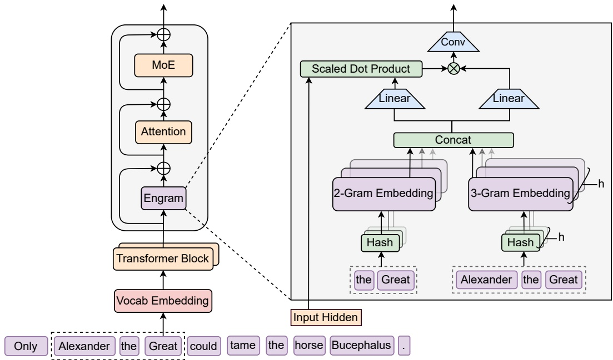
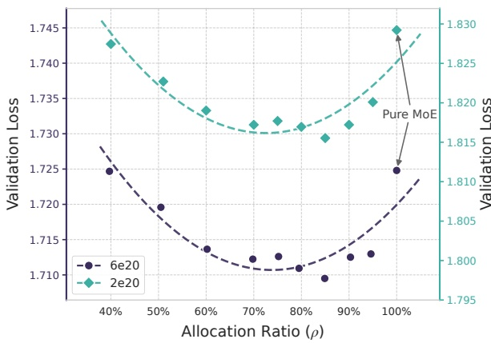

# Engram: 用哈希 N-gram 查表给 MoE 加一条记忆轴

论文 *Conditional Memory via Scalable Lookup: A New Axis of Sparsity for Large Language Models* 由北京大学与 DeepSeek-AI 合作完成, arXiv 编号 2601.07372, v1 发布于 2026 年 1 月, 当前 v2 日期为 2026-07-12, 正文加附录共 35 页. 官方代码在 [deepseek-ai/Engram](https://github.com/deepseek-ai/Engram), 只有一个约 400 行的演示脚本 `engram_demo_v1.py`; 骨干的注意力和 MoE 用恒等函数占位, 训练代码与权重尚未发布. Engram 的机制推导可参阅 llm-guide 的 条件记忆与 Engram 和 Engram: 从 N-gram 到可扩展查找. 论文给出了完整实验设置和公式, 演示代码则只覆盖寻址与融合的最小路径, 因而公开材料足以检查机制, 尚不足以复现训练结果.

论文的主张分三层. 结构层: 给 Transformer 加一个按局部 token 序列查表的模块, 查表的地址只由输入 token 决定. 预算层: 在总参数和激活参数都固定时, 把 MoE 专家的一部分参数挪给查表模块, 验证损失随分配比例呈 U 形, 最优点在专家占 75% 到 80% 附近. 系统层: 因为地址在前向之前就能算出, 嵌入表可以放在主机内存里异步预取, 100B 参数的表只让吞吐下降不到 3%. 寻址规则决定能存什么知识, 参数分配决定查表与计算的容量比例, 预取命中率则决定这部分容量能否以可接受的吞吐运行.

## 1. 寻址与融合: 一个 token 怎样拿到 16 行嵌入

**分词压缩, 后缀 N-gram 与乘法异或哈希:** Engram 的输入只有 token ID, 不看隐状态. 第一步是分词压缩: 用一个满射 $P: V \to V'$ 把 DeepSeek-V3 的 129280 个 token 合并成更少的类. 演示代码把每个 token 解码成字符串, 依次做 NFKC, NFD, 去重音, 小写化, 把连续空白合成一个空格, 再去掉首尾空白, 规范化后字符串相同的 token 映射到同一个新 ID. 附录 C 的 Table 6 给出的效果是词表缩小 23.43%. 这一步让「Apple」「apple」「 apple」共享同一组表项, 减少的是表中同义重复项的数量, 相当于提高了表容量的利用率.

第二步取后缀 N-gram. 对位置 $t$, 2-gram 是 $(x'_{t-1}, x'_t)$, 3-gram 是 $(x'_{t-2}, x'_{t-1}, x'_t)$, 序列开头不足的位置用压缩后的 pad ID 补齐. 哈希按演示代码写开是

$$
\mathrm{mix}^{(\ell)}_{t,n} = \bigoplus_{i=0}^{n-1} \left( x'_{t-i} \cdot m^{(\ell)}_i \right), \qquad z^{(\ell)}_{t,n,k} = \mathrm{mix}^{(\ell)}_{t,n} \bmod p^{(\ell)}_{n,k},
$$

其中 $\oplus$ 是按位异或, 乘法在 int64 上回绕; $m^{(\ell)}_i$ 是每个插入层各自的随机奇数乘子, 随机种子为 $\mathrm{seed} + 10007 \cdot \ell$; $p^{(\ell)}_{n,k}$ 是第 $\ell$ 层, 第 $n$ 阶, 第 $k$ 个头的表大小, 取素数. 代码从配置给定的表大小开始逐个向上找素数, 并要求所有层, 所有阶, 所有头的素数两两不同, 所以 16 张子表的大小都略有差异. 3-gram 的 mix 等于 2-gram 的 mix 再异或 $x'_{t-2} m^{(\ell)}_2$, 两阶共享前两项.

### 1.1. 多头哈希并不独立: 冲突上界

论文 2.2 节把多头哈希表述为「每个 N-gram 阶用 $K$ 个不同的哈希头, 以减少冲突」. 读代码后要修正一个直觉: 同一阶的 8 个头共用同一个 $\mathrm{mix}$, 只在模数上不同. 两个 N-gram 的 mix 一旦相等 (64 位值相等), 8 个头全部冲突; mix 不相等时, 它们在头 $k$ 上冲突等价于 $p_k$ 整除两者的差 $\Delta = \mathrm{mix}_a - \mathrm{mix}_b$. 因为各头的素数互不相同, 若在 $r$ 个头上同时冲突, $\Delta$ 必须被这 $r$ 个素数之积整除, 而 $|\Delta| < 2^{64} \approx 1.84 \times 10^{19}$.

用具体的数推一下. 演示代码每阶从 $5 \times 129280 = 646400$ 起找素数, 3 个约 $6.46 \times 10^5$ 的素数之积约为 $2.7 \times 10^{17}$, 只有 $2^{64}$ 的 1.5%, 可以整除某个差值; 4 个之积约 $1.7 \times 10^{23}$, 是 $2^{64}$ 的约 9000 倍, 不可能整除任何非零差值. Engram-27B 的 Appendix A 给出 Engram Vocab Size 为 2262400 (等于 $17.5 \times 129280$), 按 1.4 节的参数核对这是每个子表的行数, 4 个约 $2.26 \times 10^6$ 的素数之积约 $2.6 \times 10^{25}$, 同样远超 $2^{64}$. 所以 mix 不同的两个 N-gram 在同一阶最多冲突 3 个头, 至少 5 个头的表项是各自独占或与别的 N-gram 冲突. 若头真的独立, 8 个头全撞的概率随表大小指数下降; 实际情况是 mix 本身相等时 8 头全撞, 而 mix 相等的概率由乘法异或在 $2^{64}$ 空间上的分布决定, 远小于表大小的倒数. 结论方向和论文一致 (多头能压冲突), 但起作用的是素数模互不相同带来的「中国剩余定理式」约束, 与独立重复抽样无关.

一次冲突影响多大可以按拼接结构算. 每 token 每层拼接 2 阶 $\times$ 8 头 = 16 段, 每段 $d_{\mathrm{mem}}/16 = 80$ 维, 一个头冲突只污染 1/16 的维度, 后面的 $W_K$, $W_V$ 投影和门控还可以学会压低它. 论文没有测冲突率与损失的关系, 也没有和无冲突的完美哈希做对照; 按上面的上界, 冲突对一个 N-gram 的影响被限制在 3/16 以内. Table 6 的压缩率与表大小之间的关系文中也没有给出: 压缩后的 3-gram 组合数远大于每头约 $2.3 \times 10^6$ 行, 冲突必然大量存在, 只是被分散到多个头.

**门控与短卷积: 查到的向量用多少:** 拼接后的 $e_t \in \mathbb{R}^{d_{\mathrm{mem}}}$ ($d_{\mathrm{mem}} = 1280$) 经两组投影得到键 $k_t = W_K e_t$ 和值 $v_t = W_V e_t$, 维度都回到骨干的 $d = 2560$. 门控按式 (4) 是

$$
\alpha_t = \sigma\left( \frac{\mathrm{RMSNorm}(h_t)^\top \mathrm{RMSNorm}(k_t)}{\sqrt{d}} \right), \qquad \tilde v_t = \alpha_t \cdot v_t ,
$$

$h_t$ 是该层的输入隐状态. 门是一个标量, 作用在整个值向量上: 隐状态和查到的键方向一致时接近 1, 方向相反时接近 0. 这一步承担去噪职责: 哈希冲突或多义 N-gram 查到的向量与当前上下文不符时, 门控把它压下去. 演示代码在 sigmoid 之前多了一步带符号开方, 即 $s \mapsto \mathrm{sign}(s)\sqrt{|s|}$, 公式 (4) 里没有. 它压缩点积的动态范围: $s = 4$ 时 $\sigma(4) = 0.982$, 开方后 $\sigma(2) = 0.881$; $s = 0.25$ 时 $\sigma(0.25) = 0.562$, 开方后 $\sigma(0.5) = 0.622$. 大点积不易把门推到饱和, 小点积的梯度也更大. 论文训练的模型是否用了这一步, 文中没有给出.

门控之后是因果深度卷积: $Y = \mathrm{SiLU}(\mathrm{Conv1D}(\mathrm{RMSNorm}(\tilde V))) + \tilde V$, 核宽 $w = 4$, 膨胀 $\delta$ 等于最大 N-gram 阶 3. 感受野为 $(w-1)\delta + 1 = 10$ 个位置, 实际读取 $t, t-3, t-6, t-9$ 四个位置的门控输出, 每个通道独立. 论文说卷积权重零初始化, 训练开始时 Engram 只是门控后的值直接加回残差; 演示代码用 `nn.Conv1d` 默认初始化, 没有置零. 最终输出加到该层的残差流, 位置在注意力和 MoE 之前. 门控如何在 mHC 多分支上展开, 以及门控公式的推导, 见 llm-guide 的 Engram 子文章 与 mHC 文章.

图注: 原文 Figure 1 画的是单个 Engram 模块. 左边是 token 序列, 每个位置抽取 2-gram 和 3-gram, 经哈希落到多个嵌入子表, 取出的行拼接后进入门控; 门控的另一路输入是该层隐状态.
图 1 解析: 原文 Figure 1 画的是单个 Engram 模块. 左边是 token 序列, 每个位置抽取 2-gram 和 3-gram, 经哈希落到多个嵌入子表, 取出的行拼接后进入门控; 门控的另一路输入是该层隐状态. 右侧短卷积和残差加法把结果写回主干. 图中只画了单分支, 实际实验都接在 $M = 4$ 的 mHC 上: 4 个分支共享嵌入表和 $W_V$, 各有一个 $W_K^{(m)}$, 因此每个分支的门值不同, 写回的强度也不同.

**每 token 的计算与访存:** Engram 插入层在注意力之前计算, 每 token 每层查 16 行, 再做 5 个 $1280 \to 2560$ 的投影 (1 个 $W_V$ 加 4 个分支的 $W_K$), 论文把它们融合成一次 FP8 矩阵乘. 查表只依赖当前及前两个 token 的 ID, 门控读取当前隐状态, 卷积读取前 9 个位置的门控输出. 它不引入跨步状态, 推理时无需增加 KV cache, 只需为卷积保留最近 9 个位置的值向量. N-gram 最多覆盖 3 个 token, 更长的模式仍由卷积和注意力处理; 标量门控只能整体保留或抑制值向量, 不能按维度选择.

计算量可以从投影规模推出. 5 个投影共 $1280 \times 2560 \times 5 \approx 1.64 \times 10^7$ 个参数, 每 token 约 $3.3 \times 10^7$ FLOPs; Engram-27B 激活参数 3.8B, 每 token 前向约 $7.6 \times 10^9$ FLOPs, 一个 Engram 层的投影只占约 0.4%, 两层合计不到 1%. 访存方面, 16 行 $\times$ 80 维在 BF16 下是 2560 字节, 两层合计每 token 5 KB. 嵌入参数量则是 $2262400 \times 1280 \times 2 = 5.79 \times 10^9$, 正好对上 Table 1 的 5.7B; Engram-40B 是 $7239680 \times 1280 \times 2 = 1.85 \times 10^{10}$, 对上 18.5B. 每层 16 个子表各 80 维, 拼起来正好 1280 维, 所以这两个乘法说明 Appendix A 的 Engram Vocab Size 是单个子表的行数, 每层 16 个子表合计 $2262400 \times 1280 \approx 2.9 \times 10^9$ 个参数, 两个插入层各一份, 层间不共享. 演示代码同样是每个头一张约 $5 \times$ 词表大小的子表.

### 1.2. 稀疏分配: U 形曲线的口径

**分配比例 $\rho$ 与专家数的复算:** 式 (7) 把不激活的参数预算 $P_{\mathrm{sparse}} = P_{\mathrm{tot}} - P_{\mathrm{act}}$ 拆成两份: 专家占 $\rho P_{\mathrm{sparse}}$, Engram 占 $(1-\rho) P_{\mathrm{sparse}}$. 实验固定两档计算量: $C = 2 \times 10^{20}$ FLOPs 时 $P_{\mathrm{tot}} \approx 5.7\mathrm{B}$, $P_{\mathrm{act}} = 568\mathrm{M}$, 纯 MoE 基线 106 个专家; $C = 6 \times 10^{20}$ 时 $P_{\mathrm{tot}} \approx 9.9\mathrm{B}$, $P_{\mathrm{act}} = 993\mathrm{M}$, 基线 99 个专家. 两档的 $P_{\mathrm{tot}}/P_{\mathrm{act}}$ 都约为 10. 改变 $\rho$ 时只调整路由专家数和 Engram 表的行数, 训练流程和超参不变.

论文说 $\rho \approx 40\%$ 对应 46 个和 43 个专家. 这个数可以复算: 激活的 top-6 专家属于 $P_{\mathrm{act}}$, 不进入 $P_{\mathrm{sparse}}$, 所以可分配的是基线中未激活的 $106 - 6 = 100$ 和 $99 - 6 = 93$ 个专家. 保留 46 个专家时, 未激活的专家是 40 个, $40/100 = 0.400$; 保留 43 个时是 37 个, $37/93 = 0.398$. 两者都对上 40%, 说明论文把 Engram 表全部算作不激活参数, 每 token 实际读出的 16 行 (每层 1280 个参数) 被忽略. 这部分很小, 在 $P_{\mathrm{act}}$ 中占不到万分之一, 忽略是合理的.

Engram-27B 的 $\rho = 74.3\%$ 也能复算, 但需要一个文中没有给出的量: 专家的中间维度. 若取 1536 (DeepSeek 同规模 MoE 常用值, 论文和附录都没写), 每个专家参数为 $3 \times 2560 \times 1536 \approx 1.18 \times 10^7$, 每层少 17 个专家, 29 个 MoE 层 (30 层减去 1 个稠密层) 共少 $17 \times 29 \times 1.18 \times 10^7 \approx 5.82 \times 10^9$, 与 Engram 的 5.79B 吻合. 此时 MoE-27B 的不激活专家为 $66 \times 29 \times 1.18 \times 10^7 \approx 22.6 \times 10^9$, $\rho = 1 - 5.79/22.58 \approx 0.743$, 对上 74.3%. 这组数相互一致, 反过来支持中间维度是 1536.

Figure 3 左图: 读数, 噪声与最优点.

图注: 原文 Figure 3 左图, 横轴是 $\rho$, 纵轴是验证损失, 上下两条曲线分别是 $2 \times 10^{20}$ 和 $6 \times 10^{20}$ FLOPs 两档. 每条曲线由十个左右的点组成, 右端 $\rho = 100\%$ 是纯 MoE.
图 2 解析: 原文 Figure 3 左图, 横轴是 $\rho$, 纵轴是验证损失, 上下两条曲线分别是 $2 \times 10^{20}$ 和 $6 \times 10^{20}$ FLOPs 两档. 每条曲线由十个左右的点组成, 右端 $\rho = 100\%$ 是纯 MoE. 两条曲线都在 $\rho$ 降到 40% 附近时回到纯 MoE 的水平, 再往左上升更快. 上档曲线最低点在 85% 附近, 正文写的是 80%.

正文给出 $6 \times 10^{20}$ 档从 1.7248 ($\rho = 100\%$) 降到 1.7109 (约 80%), $\Delta = 0.0139$. 图中 85% 处的点约为 1.7095, 比 1.7109 略低; 相邻点还有 0.001 到 0.002 的起伏, 曲线带有明显锯齿. 正文把两档最优点放在 75% 到 80%, 而按图的分辨率只能确定最优区间约为 75% 到 85%. $2 \times 10^{20}$ 档纯 MoE 约 1.829, 最低约 1.8155, 降幅约 0.0135, 与上一档接近. 两档降幅都只有损失的 0.8% 左右, U 形较浅.

U 形结论有三处口径限制. 第一, 只有两档计算量, 且都固定 $P_{\mathrm{tot}}/P_{\mathrm{act}} \approx 10$; 27B 实验的比值是 $26.7/3.8 \approx 7.0$, 已经不在这个设置里, 最优 $\rho$ 是否随稀疏比移动, 文中没有测. 第二, 每个点只训一次, 没有给出种子方差, 0.001 量级的差异无法判断显著性. 第三, 左端 $\rho \to 0$ 时模型几乎没有专家, 损失上升是预期内的; 有信息量的是右半段, 也就是「把 15% 到 25% 的专家参数换成表, 损失会降」这一条.

**无限记忆: 对数线性的口径:** 3.2 节换了一个设置: 骨干固定为总参数约 3B, 激活 568M 的 MoE, 训练 100B token (Figure 3 右图标注的基线损失 1.808), 只增加 Engram 表的槽位数. 图中横轴是嵌入槽位数 (对数刻度), 从 $2.58 \times 10^5$ 到 $10^7$. 最小值 $2.58 \times 10^5$ 约等于 $2 \times 129280$, 即槽位数与词表同量级. 按 1280 维一行算, $10^7$ 个槽位对应约 12.8B 参数, 是骨干的 4 倍.

从图上读, $2.58 \times 10^5$ 时损失约 1.788, $10^7$ 时约 1.743, 跨 1.59 个数量级下降 0.045, 每增加 10 倍槽位约降 0.028. 对照组 OverEncoding (把哈希 N-gram 嵌入与词嵌入取平均后送入骨干, 没有门控和卷积) 的曲线与 Engram 近似平行, 高出约 0.01 到 0.015. 这条曲线的一个点还能与第 6.2 节的消融对上: 6.2 节的参考配置用 1.6B 参数的 Engram, 损失 1.768, 基线同为 1.808; 图中约 $1.3 \times 10^6$ 个槽位处损失也在 1.768 附近, 而 $1.3 \times 10^6 \times 1280 \approx 1.66 \times 10^9$. 正文对 $10^7$ 个槽位给的是「约 13B 参数」, 也就是 $10^7 \times 1280$. 两处对照说明这里的一个槽位指 1280 维的一整行 (16 个子表各取一行, 每行 80 维), 槽位数乘 1280 就是表的总参数. Appendix A 的 Engram Vocab Size 按单层计, Engram-27B 两层合计约 $4.5 \times 10^6$ 个槽位, 落在右图横轴 $1.3 \times 10^6$ 与 $10^7$ 之间.

论文把这条线称为严格的幂律. 图上只有约 6 个点, 横跨不到两个数量级, 在半对数坐标上近似直线, 能支持的只是这个范围内的对数线性; 损失有不可约下界, 继续外推到 $10^8$ 以上必然弯折. 所有点都只训 100B token, 表越大, 每行被访问的次数越少, 大表一端的增益可能被欠训练压低, 曲线斜率是这一训练量下的斜率. Engram-40B 在第 4 节被描述为「仍处于欠训练状态」, 和这一点方向一致, 但论文没有给出 40B 的单独损失曲线来支撑.

### 1.3. B 主实验与长上下文: 数字的口径

**四个模型的对齐方式:** 第 4 节训了四个模型, 共用 30 层, 隐藏维 2560, MLA 32 头, mHC 扩展率 4, 序列长 4096, batch 1280, 50000 步, 合计 $4096 \times 1280 \times 50000 \approx 2.62 \times 10^{11}$ token, 与 Table 1 的 262B 一致. 骨干优化器是 Muon, 学习率 4e-4, 阶梯衰减. Dense-4B 是 4.1B 稠密模型; MoE-27B 为 2 个共享专家加 72 个路由专家, top-6; Engram-27B 把路由专家减到 55, 省出的参数给两层 Engram; Engram-40B 骨干与 Engram-27B 相同, 只把表加大到 18.5B. 四个模型的激活参数都是 3.8B (不含词嵌入), 所以 MoE-27B 与 Engram-27B 在总参数和每 token 计算量上同时对齐.

嵌入表的训练设置与骨干不同: Adam 优化, 学习率乘 5, 不做权重衰减, 卷积零初始化. 5 倍学习率的理由文中没有给出. 一个可以从结构推出的解释是, 每个表项只在其 N-gram 出现时收到梯度, 更新频率远低于稠密参数, 放大学习率是在补偿稀疏更新. 不做权重衰减也与此相关: 长期不被访问的行若被衰减, 会慢慢丢失已学到的内容. 这些设置让 Engram 的优化条件和 MoE 专家不同, U 形曲线与 27B 的增益里有多少来自优化设置而非结构, 论文没有拆开.

**Table 1 的增益与噪声:** Engram-27B 相对 MoE-27B, Pile 损失从 1.960 降到 1.950, 验证损失从 1.634 降到 1.622. 下表列出部分评测的差值, 数字全部取自 Table 1.

| 类别 | 评测 | MoE-27B | Engram-27B | 差值 |
| --- | --- | --- | --- | --- |
| 知识 | MMLU / MMLU-Redux | 57.4 / 60.6 | 60.4 / 64.0 | +3.0 / +3.4 |
| 知识 | CMMLU / C-Eval | 57.9 / 58.0 | 61.9 / 62.7 | +4.0 / +4.7 |
| 事实问答 | TriviaQA / PopQA | 48.8 / 19.2 | 50.7 / 19.4 | +1.9 / +0.2 |
| 推理 | BBH / ARC-C / CCPM | 50.9 / 70.1 / 79.6 | 55.9 / 73.8 / 87.1 | +5.0 / +3.7 / +7.5 |
| 代码数学 | HumanEval / GSM8K / MATH | 37.8 / 58.4 / 28.3 | 40.8 / 60.6 / 30.7 | +3.0 / +2.2 / +2.4 |

表里有一处和摘要对不上. 摘要与引言写「MMLU +3.4」, Table 1 的 MMLU 是 57.4 对 60.4, 差 3.0; 差 3.4 的是 MMLU-Redux. 摘要列出的其余五个数 (CMMLU +4.0, BBH +5.0, ARC-C +3.7, HumanEval +3.0, MATH +2.4) 都与表一致. 另一处值得对照的是增益分布: 论文强调记忆模块在推理和代码上的增益「更大」, 但最直接测记忆的两项事实问答 TriviaQA 和 PopQA 只涨了 1.9 和 0.2, 在全表里属于最小的一档; 最大的 CCPM +7.5 是中文成语填空, 本身就是固定搭配的识别, 与 N-gram 查表的对应关系最直接.

单次评测的噪声可以用附录 Figure 8 估计. 图中给出最终 10k 步的评测曲线, HumanEval 在相邻检查点之间起伏约 5 个点, MoE 与 Engram 两条线多次交叉; WinoGrande, PopQA, CruxEval 也有交叉. MMLU, CMMLU, CCPM, BBH, DROP, ARC 的差距在整个区间内保持同号, 这些项的增益可以认为是稳定的. HumanEval +3.0 小于它自身的波动, 不能单独作为代码能力提升的证据. Engram-40B 相对 Engram-27B 在 HumanEval, MBPP, C3, MATH 上反而下降, 也落在这一噪声范围内.

**长上下文: Iso-Loss 对照与例外项:** 5.2 节在 32k 上下文上比较四个检查点. 所有模型用同一套上下文扩展流程 (YaRN, 5000 步, 30B token, 32768 长度), 区别只在起点: MoE-27B 和 Engram-27B 的 50k 步终点, 以及 Engram-27B 的 41k 和 46k 中间检查点. 46k 检查点的预训练损失与 MoE-27B 终点相同 (都是 1.63), 构成 Iso-Loss 对照; 41k 检查点损失更高 (1.66), 只用了 82% 的训练计算. 这一设计让比较的对象从「同样训练量」换成「同样语言建模水平」, 能…10666 tokens truncated…因此可以走完全不同的存储层次.

训练: 表按行切到各 GPU, All-to-All 只搜集本步用到的行, 反向再把梯度打回去. 表容量随卡数线性涨.

推理: 整张表放 Host DRAM. 根据 token ID 在 Host 上算地址, 经 PCIe 异步把行搬进 GPU, 和前面层的计算重叠. 论文把 100B 参数的 Engram 插进稠密骨干的**第 2 个 Transformer block**, 表全部在 DRAM 里, 用 nano-vLLM 原型在 H800 上测 (512 条序列, 长度 $\mathrm{Uniform}(100,1024)$). 选稠密骨干 (Dense-4B / 8B) 是为了避开 MoE 专家并行自身的通信, 得到干净的延迟基线; PCIe 传输与第 1 个 block 的计算重叠:

| 骨干 | 配置 | 吞吐 (tok/s) | 相对跌幅 |
|------|------|--------------|----------|
| 4B-Dense | Baseline | 9,031.62 | — |
| 4B-Dense | +100B Engram (CPU offload) | 8,858.28 | 1.9% |
| 8B-Dense | Baseline | 6,315.52 | — |
| 8B-Dense | +100B Engram (CPU offload) | 6,140.02 | **2.8%** |

正文口径: 100B 表 offload 到 host memory, 惩罚可忽略, 8B 骨干上到顶 **2.8%** (引言写 $<3\%$). 这是保守基线: 所有访问都走 PCIe, 没有把高频 $n$-gram 缓进 HBM. 通信体积跟**激活槽数**成正比, 跟表的总行数不成正比. $n$-gram 服从 Zipf, 论文因此还画了多层缓存: 热行可留 HBM/DRAM, 长尾可以落到 NVMe; Table 4 本身没有测 SSD.

OverEncoding, SCONE 一类把 $n$-gram 嵌在**输入层 (Layer 0)** 的做法, 会把访存和计算串起来, 藏不住延迟. Engram 把模块往里插, 第 1 层的计算才能与查表传输重叠.

实验.

## 4. 与长上下文、多分支架构的关系

四套模型, 同一 262B token 课表, DeepSeek-V3 词表 (约 128k / 表里写 129280), 激活都是 3.8B:

| | Dense-4B | MoE-27B | Engram-27B | Engram-40B |
|--|----------|---------|------------|------------|
| 总参 (不含 token embed) | 4.1B | 26.7B | 26.7B | 39.5B |
| 激活 | 3.8B | 3.8B | 3.8B | 3.8B |
| 专家 (共享+路由, top-$k$) | — | 2+72 (top-6) | 2+55 (top-6) | 2+55 (top-6) |
| Engram 参数 | — | — | 5.7B | 18.5B |
| 表槽 (Appendix Table 5) | — | — | 2,262,400 | 7,239,680 |
| 插入层 | — | — | [2, 15] | [2, 15] |

Table 1 节选如下. 摘要写 MMLU +3.4, Table 1 中是 60.4 对 57.4, 即 +3.0, 正文增量与表一致.

| 基准 | Dense-4B | MoE-27B | Engram-27B | Δ vs MoE |
|------|----------|---------|------------|----------|
| MMLU 5-shot | 48.6 | 57.4 | 60.4 | +3.0 (摘要写 +3.4) |
| CMMLU 5-shot | 47.9 | 57.9 | 61.9 | +4.0 |
| BBH 3-shot | 42.8 | 50.9 | 55.9 | +5.0 |
| ARC-Challenge 25-shot | 59.3 | 70.1 | 73.8 | +3.7 |
| HumanEval 0-shot | 26.8 | 37.8 | 40.8 | +3.0 |
| MATH 4-shot | 15.2 | 28.3 | 30.7 | +2.4 |
| DROP 1-shot | 41.6 | 55.7 | 59.0 | +3.3 |
| GSM8K 8-shot | 35.5 | 58.4 | 60.6 | +2.2 |
| Pile loss | 2.091 | 1.960 | 1.950 | −0.010 |
| 验证集 loss | 1.768 | 1.634 | 1.622 | −0.012 |
| MMLU-Pro 5-shot | 21.1 | 28.3 | 30.1 | +1.8 |
| CCPM 0-shot | 72.2 | 79.6 | 87.1 | +7.5 |
| TriviaQA 5-shot | 33.0 | 48.8 | 50.7 | +1.9 |
| PopQA 15-shot | 15.1 | 19.2 | 19.4 | +0.2 |
| C3 0-shot | 57.7 | 60.1 | 63.6 | +3.5 |
| MBPP 3-shot | 35.4 | 46.6 | 48.2 | +1.6 |

表中增幅最大的是中文古诗匹配 CCPM (+7.5). 事实问答 TriviaQA 和 PopQA 的增幅反而小于 BBH 和 ARC-Challenge. 知识类有收益, 推理和代码/数学的差更大. 论文解释: 早期层不再重建套话, 有效深度和注意力容量让出来了. Engram-40B 把表加到 18.5B, 多数基准继续涨, 但没有在每个任务上压过 27B (HumanEval 40B 反而是 38.4). 作者归因于 token 预算不够, 训练后期 40B 的 loss 缺口还在拉开.

40B 相对 27B 涨得多的几项: AGIEval 41.8 → 45.9, CruxEval-i 32.2 → 36.2, MGSM 49.4 → 52.4, ARC-Challenge 73.8 → 76.4. 回落的几项: HumanEval 40.8 → 38.4, MBPP 48.2 → 46.2, C3 63.6 → 61.8, MATH 30.7 → 30.6. 两档的验证集 loss 分别是 1.622 和 1.610, 语言建模指标上 40B 仍在改善.

### 4.1. 长上下文: 局部查表把注意力还给全局

预训练之后用 YaRN 做 32k 上下文延续 (5k step / 30B token, 超参 $\mathrm{scale}=10$, $\alpha=1$, $\beta=32$, 缩放 $0.707$). Table 2 的 Multi-Query NIAH:

| 模型 (预训练步数, loss) | MQ NIAH | VT |
|--------------------------|---------|-----|
| MoE-27B (50k, 1.63) | 84.2 | 77.0 |
| Engram-27B (46k, 1.63) iso-loss | **97.0** | 87.2 |
| Engram-27B (50k, 1.62) iso-FLOPs | **97.0** | **89.0** |

摘要写的 $84.2\to 97.0$, 对应 iso-loss 与 iso-FLOPs 两行的 MQ 列. iso-loss 的意思是: Engram-27B 第 46k 步的预训练 loss 与满训 MoE-27B (50k) 相同, 用它做长上下文延续, 可以排除「底座更强」这个混杂因素. 论文观察到同一架构从 41k 到 50k, 长上下文分数随预训练进度单调上升, 所以只对齐步数不够, 要对齐 loss.

Table 2 其余列 (MoE-27B 对 Engram-27B 50k): LongPPL 的 Book 4.38 对 4.14, Paper 2.91 对 2.82, Code 2.49 对 2.44, 长 CoT 轨迹 14.16 对 13.41; RULER 的 FWE 73.0 对 99.3, QA 34.5 对 40.5; CWE 两者都只有个位数 (4.5 对 5.9). 41k 早停 (约 82% 预训练 FLOPs) 的 LongPPL 与满训 MoE 基本持平 (Book 4.37 对 4.38), RULER 的 MQ 仍有 89.5. 局部依赖交给查表之后, 注意力能更多用于针检索和变量追踪.

**采用者, 相近机制与失效:** **Qwen3.8-Flash-Next: 公开权重里的 51B 级 n-gram 表**

Qwen3.8-Flash-Next (权重 2026-08-26) 把主干写成 **125B 总 / 6B 每 token 激活**, 另外加 **51B n-gram 嵌入**. 51B **不进入**每 token 激活 6B, 也不进矩阵乘预算. 官方 Hugging Face 卡片: 词表嵌入 248320; **N-gram Embedding 20,000,000 (bigram/trigram, 第 2 层)**; 48 层; 隐藏维 2560. 两个数对得上: $2\times10^7$ 行乘 2560 维是 $5.12\times10^{10}$, 即约 51B. 博文与报告口径一致: 表可放 Host, 地址预先算, 和计算异步 prefetch; **只在网络靠前放一层**.

三个数字含义不同: 125B 是主模型参数, 51B 是额外的 N-gram 表, 6B 是每 token 激活参数. 51B 仍占存储容量和 Host↔GPU 带宽, 只是通过分片, 缓存和预取移出了 GPU 常驻显存与主矩阵乘路径.

**有没有点名 2601.07372 / Engram.** 技术报告 PDF (*On the Design of Qwen3.8-Next Architecture*, 28 页) 正文写 `Cheng et al., 2026`, 参考文献条目是 Xin Cheng 等, 题目 *Conditional memory via scalable lookup: A new axis of sparsity for large language models*, 会议写成 ACL 2026, 即 2601.07372. PDF 正文没有出现字符串 `Engram` 或 `2601.07372`. 阿里云博文则写 "Inspired by Per-Layer Embedding in Gemma 3n and works such as **DeepSeek Engram**". 报告引用了该文 (Cheng 2026 / 条件记忆), 博文点名 Engram.

和 Engram-27B 的差别 (以 Qwen 报告为准):

- **一层 vs 两层.** Qwen Table 7 扫了第 1/2/3/4/10/15/25 层以及 2+15, 2+25. 单层第 2 层综合最好; 多层分摊同一预算没有稳定好处. 最终放 Layer 2, 让 prefetch 和第 1 层重叠, 和 Engram 层扫描的结论同方向.
- **固定总参下的 U 形.** Table 8 把 n-gram 槽加大同时减专家, loss 在 10× 词表 (约 25% 参数比) 最低, 报告写这与 Cheng et al. (2026) 的分配甜点一致; 下游分数却没有对 MoE-only 形成清晰优势. 于是他们改成 **MoE 预算固定, 表往上加** (Table 9).
- **Tokenizer 压缩.** 报告写尝试了 Cheng et al. (2026) 的 token normalization 等, **没有稳定收益**.
- **残差.** Qwen 用 Gated Residual($n_r=4$), 不是 mHC 的双随机混合. 查表仍是「加进靠前层的残差流」.

截至 2026-09-02 的公开模型, 论文和技术报告中, Qwen3.8-Flash-Next 是第一个明确把 Engram 类 N-gram 条件记忆放进 100B+ 主模型的模型; Qwen 官方把模块命名为 N-gram Embedding. Gemma 3n 的 Per-Layer Embedding, RWKV DeepEmbed 也用大表扩容, 但机制与 Engram 的哈希 N-gram 条件记忆不同.

型号配置见 Qwen3.8-Flash-Next 型号页.

**其他采用者与相近机制:** **出厂型号.** 截至 2026-08-30, 公开材料里把「确定性 $n$-gram 大表 + Host prefetch」捆进可下载权重的, 是 Qwen3.8-Flash-Next. DeepSeek 自己的 Engram-27B / 40B 是论文实验体, 代码在 [deepseek-ai/Engram](https://github.com/deepseek-ai/Engram), V3/V4 的发布权重里没有这个模块.

**DeepSeek-V4.** 技术报告把 Cheng et al. (2026) 写在未来工作: 将探索「更稀疏的嵌入模块」, 参考文献列出 2601.07372. 这是路线图, V4 本身没有使用 Engram.

**跟进论文.** Tiny-Engram ([arXiv: 2605.20309](https://arxiv.org/abs/2605.20309)) 把触发式概念表当 PEFT; *User as Engram* ([arXiv: 2606.19172](https://arxiv.org/abs/2606.19172)) 把人均记忆写成局部参数编辑; Memory Grafting ([arXiv: 2605.20948](https://arxiv.org/abs/2605.20948)) 用冻结模型的隐状态做离线 $n$-gram 记忆; CXL pooling ([arXiv: 2603.10087](https://arxiv.org/abs/2603.10087)) 讨论条件记忆的内存池. 它们引用 2601.07372, 没有构成第二个公开百 B 出厂件.

**Engram 相关工作点了名的.** PEER (He, 2024, [arXiv: 2407.04153](https://arxiv.org/abs/2407.04153)), PKM, RETRO, OverEncoding, SCONE, BLT, Gemma 3n PLE. 论文 §7 的归类是: SuperBPE 把多词表达合并成「超词」token, SCONE 用辅助编码模型处理高频模式, OverEncoding 和 BLT 分别在 token 级和字节级用哈希 $N$-gram 嵌入; PKM, PEER, UltraMem 属于参数化记忆, 把大规模稀疏键值存储放进层内; REALM, RETRO 属于非参数记忆, 外部库可编辑. 论文没有讨论 kNN-LM 与 Hash Layers, 下表这两行是按各自原文做的机制对比.

| 机制 | 一手 | 地址 | 取出来的东西 | 为何不是 Engram |
|------|------|------|--------------|-----------------|
| kNN-LM | Khandelwal et al., [1911.00172](https://arxiv.org/abs/1911.00172) | 当前隐藏态的近邻 | 邻居的 next-token 分布, 再 $\lambda$ 插值 | 非参数库, 检索不是 $\mathcal{O}(1)$ 哈希行; 通常不改残差流 |
| Hash Layers | Roller et al., [2106.04426](https://arxiv.org/abs/2106.04426) | token ID 的哈希 | **哪一个专家 FFN 来算** | 条件计算的无参路由; 算的是矩阵乘, 不是静态嵌入 |
| PEER | He, 2024, [2407.04153](https://arxiv.org/abs/2407.04153) | 隐藏态 product-key | 海量小专家 | 查询依赖 $h_t$, 不能层前 prefetch |
| RETRO / REALM | Borgeaud et al. 2022 等 | 块级检索 | 外部可编辑文本 | 非参数, 可换库; Engram 行是训练出来的参数 |
| OverEncoding / 输入层 $n$-gram | Huang et al. 2025 等 | 同样可哈希 | 加在 Layer 0 | Engram 强调插进深层才能重叠通信; 论文写 OverEncoding 在 MoE 骨干上没有公平设定下的收益 |

失效模式.

| 现象 | 原因 | 说明 |
|------|------|------|
| 哈希碰撞 / 多义 | 不同短语共用一行 | 靠多头 + $\alpha_t$ 抑制; 不是无碰撞完美哈希 |
| $\rho$ 太小 | 专家太少 | U 形左支: 记忆替不了动态计算 |
| $\rho=1$ | 没有表 | U 形右支: 早期层继续重建套话 |
| 只插第 0 层 | 访存与计算串行 | 藏不住 PCIe; 也失去「第 1 层当缓冲」 |
| 插太深 | 局部模式已被算过 | Figure 5 层扫描: 越深越差 |
| 推理时关掉表 | 训练–推理不一致 | 事实类崩, 阅读理解还在; 不能当「表没用」 |
门控可视化只说明「有些分支在套话结束处升高」, 不证明每条记忆都可编辑, 可干预. 把 Engram 理解成可按 key 改写的知识库, 目前没有论文级支持.

节地图: 2.8.3 条件记忆与 Engram. MoE 对照: 2.6.

### 4.2. 参考文献

1. Xin Cheng et al. (2026). [Conditional Memory via Scalable Lookup: A New Axis of Sparsity for Large Language Models](https://arxiv.org/abs/2601.07372). arXiv: 2601.07372. HTML: https://arxiv.org/html/2601.07372 . 代码: https://github.com/deepseek-ai/Engram . 公式 (3)–(11) 对应论文 (1)–(7), (12)–(13) 对应论文 (8)–(9); Table 1 / 2 / 4 / 5 / 6 数字取自对应表.
2. Qwen Team (2026). [*On the Design of Qwen3.8-Next Architecture*](https://github.com/QwenLM/Qwen3.8-Flash-Next/blob/main/tech_report.pdf) (引用 Cheng et al., 2026; 未写 Engram 三字). [阿里云博文](https://www.alibabacloud.com/blog/qwen3-8-flash-next-a-new-architecture-towards-ultimate-cost-efficiency_603501) (点名 DeepSeek Engram). HF: https://huggingface.co/Qwen/Qwen3.8-Flash-Next .
3. Qwen Team (2026). Qwen3.8-Next 技术报告 https://arxiv.org/abs/2608.30320 ; 官方博客 https://qwen.ai/blog?id=qwen3.8-flash-next ; NVIDIA NeMo 架构说明 https://docs.nvidia.com/nemo/automodel/model-coverage/large-language-models/qwen/qwen3-8-flash-next .
4. DeepSeek-AI (2026). DeepSeek-V4 技术报告 (未来工作一节引用 Cheng et al. 2026).
5. kNN-LM: https://arxiv.org/abs/1911.00172 ; Hash Layers: https://arxiv.org/abs/2106.04426 ; PEER: https://arxiv.org/abs/2407.04153 .

**按原始公式核对训练信号与消融:** 以下内容重新串联论文的查表、门控、预算分配和表示分析。重点是区分由结构直接决定的性质、由训练学到的行为和只在有限实验规模上成立的观察。

**Overview · 概述:** 如 Figure 1 所示, Engram 是一个条件记忆模块, 通过在结构上把静态模式存储与动态计算分开来增强 Transformer 骨干. 形式上, 给定输入序列 $X=(x_1,\cdots,x_T)$ 和第 $\ell$ 层的隐藏状态 $\mathbf{H}^{(\ell)}\in\mathbb{R}^{T\times d}$, 模块对每个位置 $t$ 分两个阶段处理: **检索与融合**. 先 (第 2.2 节), 抽取并压缩后缀 $N$-gram, 通过哈希确定性地取回静态嵌入向量. 然后 (第 2.3 节), 用当前隐藏状态动态调制取回的嵌入, 再经一个轻量卷积细化. 最终讨论与多分支结构的结合 (第 2.4 节) 和系统层面的设计 (第 2.5 节).

**Sparse Retrieval via Hashed 𝑁-grams · 基于哈希 N-gram 的稀疏检索:** 第一阶段把局部上下文映射到静态记忆条目, 包括 tokenizer 压缩和通过确定性哈希取回嵌入两步.

**Tokenizer 压缩.** $N$-gram 模型通常直接作用于 tokenizer 的输出, 但标准子词 tokenizer 优先保证无损重建, 经常给语义等价的词分配不同 ID (如 Apple 与 ␣apple) (Kudo and Richardson, 2018; Li et al., 2023b). 为了提高语义密度, 我们实现了一个词表投影层. 具体做法是预先计算一个满射 $\mathcal{P}:V\to V'$, 按规范化后的文本等价关系 (NFKC (Whistler, 2025), 转小写等) 把原始 token ID 折叠成规范 ID. 实际中, 对 128k 的 tokenizer, 有效词表规模减少 23% (见 Appendix C). 形式上, 对位置 $t$ 的 token, 把原始 ID $x_t$ 映射为规范 ID $x'_t=\mathcal{P}(x_t)$, 组成后缀 $N$-gram $g_{t,n}=(x'_{t-n+1},\cdots,x'_t)$.

**多头哈希.** 直接为所有可能 $N$-gram 的组合空间开参数是不可行的. 我们沿用 Tito Svenstrup et al. (2017) 的哈希方案. 为了减轻碰撞, 对每个 $N$-gram 阶数 $n$ 使用 $K$ 个不同的哈希头. 每个头 $k$ 通过确定性函数 $\varphi_{n,k}$ 把压缩后的上下文映射为嵌入表 $\mathbf{E}_{n,k}$ (大小 $M_{n,k}$ 取素数) 中的一个下标:

$$
z _ {t, n, k} \triangleq \varphi_ {n, k} (g _ {t, n}), \quad \mathbf {e} _ {t, n, k} = \mathbf {E} _ {n, k} [ z _ {t, n, k} ].\tag{1}
$$

实际中 $\varphi_{n,k}$ 用一个轻量的乘法异或 (multiplicative-XOR) 哈希实现. 把取回的所有嵌入拼接起来, 得到最终的记忆向量 $\mathbf{e}_t\in\mathbb{R}^{d_{\mathrm{mem}}}$:

$$
\mathbf {e} _ {t} \triangleq \prod_ {n = 2} ^ {N} \prod_ {k = 1} ^ {K} \mathbf {e} _ {t, n, k}.\tag{2}
$$

> **拆开:** 式 (1) 说每阶有 $K$ 个「不同的」哈希头, 这 $K$ 个头彼此独立吗? 碰撞到底能有多严重?
> 答: 官方代码 `engram_demo_v1.py` 里不独立. 每层每阶只算一个混合值 $\mathrm{mix}=x'_t m_0 \oplus x'_{t-1}m_1\oplus\cdots$ ($m_i$ 是按层种子生成的随机奇数, 运算在 int64 上溢出回绕), 8 个头只是对同一个 mix 取不同的素数模 $p_k$. 两个 mix 不同的 $N$-gram 在第 $k$ 头碰撞, 当且仅当 mix 之差能被 $p_k$ 整除. 按 Appendix A 的 Engram Vocab Size, Engram-27B 每头的表约 $2.26\times10^6$ 行, 任取 4 个这样的素数, 乘积约 $2.6\times10^{25}$, 远大于 int64 差值的上界 $2^{64}\approx1.8\times10^{19}$, 所以两个 mix 不同的 $N$-gram 最多在 3 个头上同时碰撞, 至少 5 个头取到不同的行. 真正全头相同只发生在 mix 本身相同时, 包括 tokenizer 压缩有意合并的写法. 式 (2) 把 16 行拼成 $\mathbf{e}_t$, 所以一次碰撞只污染 $\mathbf{e}_t$ 中 1/16 的分量, 剩下的交给第 2.3 节的门和后面的投影去分辨.

**Context-aware Gating · 上下文感知门控:** 取回的嵌入 $\mathbf{e}_t$ 是与上下文无关的先验. 它们是静态的, 缺少对上下文的适应能力, 还可能因哈希碰撞或一词多义 (Haber and Poesio, 2024) 带来噪声. 为了增强表达力并消除这种歧义, 我们借鉴注意力 (Bahdanau et al., 2015; Vaswani et al., 2017), 采用上下文感知的门控. 具体做法是把当前隐藏状态 $\mathbf{h}_t$ (它已经通过前面的注意力层聚合了全局上下文) 当作动态 Query, 而取回的记忆 $\mathbf{e}_t$ 同时作为 Key 和 Value 投影的来源:

$$
\mathbf {k} _ {t} = \mathbf {W} _ {K} \mathbf {e} _ {t}, \quad \mathbf {v} _ {t} = \mathbf {W} _ {V} \mathbf {e} _ {t}\tag{3}
$$

其中 $\mathbf{W}_K, \mathbf{W}_V$ 是可学习的投影矩阵. 为了保证梯度稳定 (Dehghani et al., 2023), 在计算标量门 $\alpha_t\in(0,1)$ 之前对 Query 和 Key 做 RMSNorm (Zhang and Sennrich, 2019):

$$
\left| \alpha_ {t} = \sigma \left(\frac {\operatorname{RMSNorm} \left(\mathbf {h} _ {t}\right) ^ {\top} \operatorname{RMSNorm} \left(\mathbf {k} _ {t}\right)}{\sqrt {d}}\right). \right.\tag{4}
$$

门控后的输出定义为 $\tilde{\mathbf{v}}_t=\alpha_t\cdot\mathbf{v}_t$. 这一设计强制语义对齐: 如果取回的记忆 $\mathbf{e}_t$ 与当前上下文 $\mathbf{h}_t$ 相矛盾, 门 $\alpha_t$ 趋向 0, 噪声就被抑制.

> **核对:** 官方代码里的门和式 (4) 一样吗?
> 答: 不完全一样. `engram_demo_v1.py` 先算 $s=\mathrm{RMSNorm}(\mathbf{h}_t)^\top\mathrm{RMSNorm}(\mathbf{k}_t)/\sqrt{d}$, 再做一步带符号的开方 $s\leftarrow\mathrm{sign}(s)\sqrt{\max(|s|,10^{-6})}$, 最终才过 sigmoid. 这一步压缩了 $s$ 的幅度: $s=4$ 时式 (4) 给出 $\sigma(4)\approx0.982$, 代码给出 $\sigma(2)\approx0.881$; $s=0.25$ 时两者分别是 $0.562$ 和 $0.622$. 大分数被压小, 小分数被放大, 门不容易饱和在 0 或 1, 在 0 附近的梯度也更大. 文中没有提这一步, 也没有给有无这一步的消融. 代码里每条 mHC 分支各有一组 RMSNorm 和 $\mathbf{W}_K^{(m)}$, 与式 (6) 一致.

最终, 为了扩大感受野并增强非线性, 我们引入一个短的 depthwise 因果卷积 (Gu et al., 2022; Peng et al., 2023). 设 $\tilde{\mathbf{V}}\in\mathbb{R}^{T\times d}$ 为门控后数值组成的序列. 取核宽 $w$ (设为 4), 膨胀 $\delta$ (设为最大 $N$-gram 阶数) 和 SiLU 激活 (Elfwing et al., 2018), 最终输出 $\mathbf{Y}$ 为:

$$
\mathbf {Y} = \text {SiLU} \left(\text {Conv1D(RMSNorm} (\tilde {\mathbf {V}})\right) + \tilde {\mathbf {V}},\tag{5}
$$

Engram 模块通过残差连接并入骨干: $\mathbf{H}^{(\ell)}\leftarrow\mathbf{H}^{(\ell)}+\mathbf{Y}$, 之后是标准的注意力与 MoE. 关键在于, Engram 并非每层都加; 插入位置要在建模效果与第 2.5 节所述的系统延迟约束之间权衡后确定.
