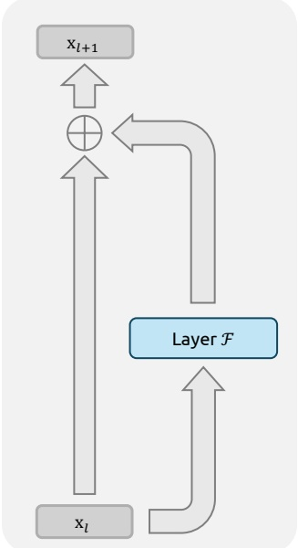
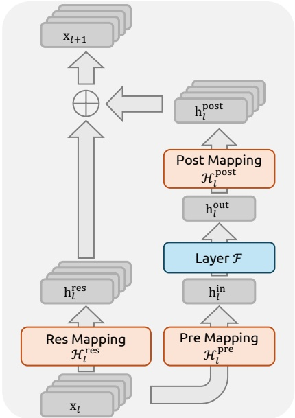
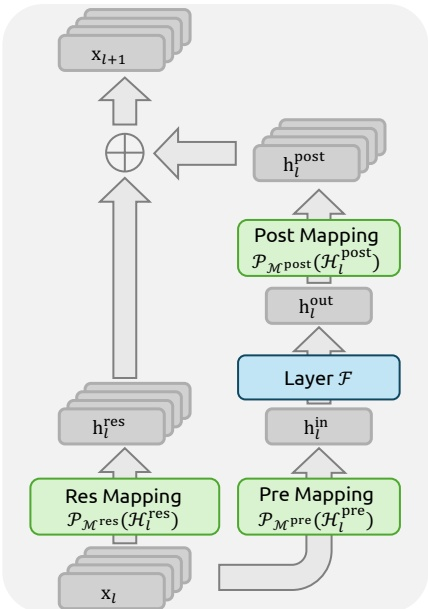

<!-- page 1 of 19 -->

arXiv:2512.24880v2 [cs.CL] 5 Jan 2026

Qdeepseek

# mHC: Manifold-Constrained Hyper-Connections · 流形约束超连接

Zhenda Xie\*†, Yixuan Wei\*, Huanqi Cao\*,

Chenggang Zhao, Chengqi Deng, Jiashi Li, Damai Dai, Huazuo Gao, Jiang Chang, Kuai Yu, Liang Zhao, Shangyan Zhou, Zhean Xu, Zhengyan Zhang, Wangding Zeng, Shengding Hu, Yuqing Wang, Jingyang Yuan, Lean Wang, Wenfeng Liang

### DeepSeek-AI

## Abstract

Recently, studies exemplified by Hyper-Connections (HC) have extended the ubiquitous residual connection paradigm established over the past decade by expanding the residual stream width and diversifying connectivity patterns. While yielding substantial performance gains, this diversification fundamentally compromises the identity mapping property intrinsic to the residual connection, which causes severe training instability and restricted scalability, and additionally incurs notable memory access overhead. To address these challenges, we propose **Manifold-Constrained Hyper-Connections** (**mHC**), a general framework that projects the residual connection space of HC onto a specific manifold to restore the identity mapping property, while incorporating rigorous infrastructure optimization to ensure efficiency. Empirical experiments demonstrate that mHC is effective for training at scale, offering tangible performance improvements and superior scalability. We anticipate that mHC, as a flexible and practical extension of HC, will contribute to a deeper understanding of topological architecture design and suggest promising directions for the evolution of foundational models.

以 Hyper-Connections (HC) 为代表的一批工作, 把过去十年通行的残差连接范式往前推了一步: 加宽残差流, 让连接方式更多样. 这样做带来了可观的性能提升, 但多样化的连接从根本上破坏了残差连接自带的恒等映射性质, 结果是训练严重不稳, 规模难以做大, 另外还带来明显的访存开销. 为此我们提出 **流形约束超连接** (**mHC**): 一个通用框架, 把 HC 的残差连接空间投影到一个特定的流形上, 恢复恒等映射性质, 同时配上严格的基础设施优化来保证效率. 实验表明 mHC 能有效支撑大规模训练, 带来实际的性能提升和更好的可扩展性. 我们期望 mHC 作为 HC 的一个灵活实用的扩展, 能加深人们对拓扑结构设计的理解, 并为基础模型的演进指出有希望的方向.

(a) Residual Connection

(b) Hyper-Connections (HC)

(c) Manifold-Constrained HC (mHC)

Figure 1 | **Illustrations of Residual Connection Paradigms.** This figure compares the structural design of (a) standard Residual Connection, (b) Hyper-Connections (HC), and (c) our proposed **Manifold-Constrained Hyper-Connections** (**mHC**). Unlike the unconstrained HC, mHC focuses on optimizing the residual connection space by projecting the matrices onto a constrained manifold to ensure stability.

\*Core contributors. †Corresponding author: [xie.zhenda@deepseek.com](mailto:xie.zhenda@deepseek.com)

<!-- page 2 of 19 -->

## Contents

- 1 Introduction 3
- 2 Related Works 4
- 2.1 Micro Design 4
- 2.2 Macro Design 5
- 3 Preliminary 5
- 3.1 Numerical Instability 6
- 3.2 System Overhead 7
- 4 Method 8
- 4.1 Manifold-Constrained Hyper-Connections 8
- 4.2 Parameterization and Manifold Projection 9
- 4.3 Efficient Infrastructure Design 9
- 4.3.1 Kernel Fusion 9
- 4.3.2 Recomputing 10
- 4.3.3 Overlapping Communication in DualPipe 11
- 5 Experiments 12
- 5.1 Experimental Setup 12
- 5.2 Main Results 12
- 5.3 Scaling Experiments 13
- 5.4 Stability Analysis 14
- 6 Conclusion and Outlook 15
- A Appendix 19
- A.1 Detailed Model Specifications and Hyper-parameters. 19

<!-- page 3 of 19 -->

## 1. Introduction

Deep neural network architectures have undergone rapid evolution since the introduction of ResNets (He et al., 2016a). As illustrated in Fig. 1(a), the structure of a single-layer can be formulated as follows:

自 ResNet (He et al., 2016a) 提出以来, 深度神经网络的结构演进很快. 如图 1(a), 单层结构可以写成:

$$
\mathbf {x} _ {l + 1} = \mathbf {x} _ {l} + \mathcal {F} (\mathbf {x} _ {l}, \mathcal {W} _ {l}),\tag{1}
$$

where $\mathbf { x } _ { l }$ and $\mathbf { x } _ { l + 1 }$ denote the 𝐶-dimensional input and output of the 𝑙-th layer, respectively, and $\mathcal { F }$ represents the residual function. Although the residual function $\mathcal { F }$ has evolved over the past decade to include various operations such as convolution, attention mechanisms, and feed forward networks, the paradigm of the residual connection has maintained its original form. Accompanying the progression of Transformer (Vaswani et al., 2017) architecture, this paradigm has currently established itself as a fundamental design element in large language models (LLMs) (Brown et al., 2020; Liu et al., 2024b; Touvron et al., 2023).

其中 $\mathbf{x}_l$ 和 $\mathbf{x}_{l+1}$ 分别是第 $l$ 层的 $C$ 维输入与输出, $\mathcal{F}$ 是残差函数. 过去十年里, 残差函数 $\mathcal{F}$ 从卷积演变到注意力和前馈网络等各种操作, 残差连接这一范式却一直保持原样. 随着 Transformer (Vaswani et al., 2017) 的发展, 这一范式已经成为大语言模型 (LLM) 的基本设计元素 (Brown et al., 2020; Liu et al., 2024b; Touvron et al., 2023).

This success is primarily attributed to the concise form of the residual connection. More importantly, early research (He et al., 2016b) revealed that the identity mapping property of the residual connection maintains stability and efficiency during large-scale training. By recursively extending the residual connection across multiple layers, Eq. (1) yields:

这种成功主要归功于残差连接形式简洁. 更重要的是, 早期研究 (He et al., 2016b) 揭示了残差连接的恒等映射性质能在大规模训练中保持稳定和高效. 把式 (1) 沿多层递归展开, 得到:

$$
\mathbf {x} _ {L} = \mathbf {x} _ {l} + \sum_ {i = l} ^ {L - 1} \mathcal {F} (\mathbf {x} _ {i}, \mathcal {W} _ {i}),\tag{2}
$$

where 𝐿 and 𝑙 correspond to deeper and shallower layers, respectively. The term identity mapping refers to the component $\mathbf { x } _ { l }$ itself, which emphasizes the property that the signal from the shallower layer maps directly to the deeper layer without any modification.

其中 $L$ 和 $l$ 分别对应较深层和较浅层. 恒等映射指的就是 $\mathbf{x}_l$ 这一项本身, 强调浅层信号不经任何修改直接映射到深层.

Recently, studies exemplified by Hyper-Connections (HC) (Zhu et al., 2024) have introduced a new dimension to the residual connection and empirically demonstrated its performance potential. The single-layer architecture of HC is illustrated in Fig. 1(b). By expanding the width of the residual stream and enhancing connection complexity, HC significantly increases topological complexity without altering the computational overhead of individual units regarding FLOPs. Formally, single-layer propagation in HC is defined as:

最近, 以 Hyper-Connections (HC) (Zhu et al., 2024) 为代表的工作给残差连接引入了一个新维度, 并在实验上展示了它的性能潜力. HC 的单层结构见图 1(b). HC 加宽残差流, 加强连接复杂度, 在不改变单个计算单元 FLOPs 的前提下显著提高了拓扑复杂度. HC 的单层传播形式化为:

$$
\mathbf {x} _ {l + 1} = \mathcal {H} _ {l} ^ {\mathrm{res}} \mathbf {x} _ {l} + \mathcal {H} _ {l} ^ {\mathrm{post} \top} \mathcal {F} (\mathcal {H} _ {l} ^ {\mathrm{pre}} \mathbf {x} _ {l}, \mathcal {W} _ {l}),\tag{3}
$$

where $\mathbf { x } _ { l }$ and $\mathbf { x } _ { l + 1 }$ denote the input and output of the 𝑙-th layer, respectively. Unlike the formulation in Eq. (1), the feature dimension of $\mathbf { x } _ { l }$ and $\mathbf { x } _ { l + 1 }$ is expanded from $C$ to $n \times C ,$ where 𝑛 is the expansion rate. The term $\mathcal { H } _ { l } ^ { \mathrm { r e s } } \in \mathbb { R } ^ { n \times n }$ represents a learnable mapping that mixes features within the residual stream. Also as a learnable mapping, $\mathcal { H } _ { l } ^ { \mathrm { p r e } } \in \mathbb { R } ^ { 1 \times n }$ aggregates features from the 𝑛𝐶-dim stream into a 𝐶-dim layer input, and conversely, $\mathcal { H } _ { l } ^ { \mathrm { p o s t } } \in \mathbb { R } ^ { 1 \times n }$ maps the layer output back onto the stream.

其中 $\mathbf{x}_l$ 和 $\mathbf{x}_{l+1}$ 分别是第 $l$ 层的输入与输出. 与式 (1) 不同, $\mathbf{x}_l$ 和 $\mathbf{x}_{l+1}$ 的特征维度从 $C$ 扩成 $n\times C$, $n$ 是扩张率. $\mathcal{H}_l^{\mathrm{res}}\in\mathbb{R}^{n\times n}$ 是一个可学习映射, 在残差流内部混合特征. $\mathcal{H}_l^{\mathrm{pre}}\in\mathbb{R}^{1\times n}$ 同样可学习, 把 $nC$ 维的流聚合成 $C$ 维的层输入; 反过来, $\mathcal{H}_l^{\mathrm{post}}\in\mathbb{R}^{1\times n}$ 把层输出映射回流上.

However, as the training scale increases, HC introduces potential risks of instability. The primary concern is that the unconstrained nature of HC compromises the identity mapping property when the architecture extends across multiple layers. In architectures comprising multiple parallel streams, an ideal identity mapping serves as a conservation mechanism. It ensures that the average signal intensity across streams remains invariant during both forward and backward propagation. Recursively extending HC to multiple layers via Eq. (3) yields:

然而训练规模变大后, HC 带来了潜在的不稳定风险. 主要问题在于 HC 不加约束, 结构跨多层延伸时恒等映射性质被破坏. 在由多条并行流组成的结构里, 理想的恒等映射起守恒作用: 它保证前向和反向传播时各流的平均信号强度不变. 用式 (3) 把 HC 沿多层递归展开, 得到:

$$
\mathbf {x} _ {L} = \left(\prod_ {i = 1} ^ {L - l} \mathcal {H} _ {L - i} ^ {\mathrm{res}}\right) \mathbf {x} _ {l} + \sum_ {i = l} ^ {L - 1} \left(\prod_ {j = 1} ^ {L - 1 - i} \mathcal {H} _ {L - j} ^ {\mathrm{res}}\right) \mathcal {H} _ {i} ^ {\mathrm{post} \top} \mathcal {F} (\mathcal {H} _ {i} ^ {\mathrm{pre}} \mathbf {x} _ {i}, \mathcal {W} _ {i}),\tag{4}
$$

<!-- page 4 of 19 -->

where 𝐿 and 𝑙 represent a deeper layer and a shallower layer, respectively. In contrast to Eq. (2), the composite mapping $\textstyle \prod _ { i = 1 } ^ { L - l } \mathcal { H } _ { L - i } ^ { \mathrm { r e s } }$ in HC fails to preserve the global mean of the features. This discrepancy leads to unbounded signal amplification or attenuation, resulting in instability during large-scale training. A further consideration is that, while HC preserves computational efficiency in terms of FLOPs, the hardware efficiency concerning memory access costs for the widened residual stream remains unaddressed in the original design. These factors collectively restrict the practical scalability of HC and hinder its application in large-scale training.

其中 $L$ 和 $l$ 分别是较深层和较浅层. 与式 (2) 相比, HC 中的复合映射 $\prod_{i=1}^{L-l}\mathcal{H}_{L-i}^{\mathrm{res}}$ 不能保持特征的全局均值. 这一差别导致信号无界地放大或衰减, 在大规模训练中引发不稳定. 另一个问题是: HC 在 FLOPs 上保持了计算效率, 但原始设计没有处理加宽后的残差流在访存上的硬件效率. 这些因素合在一起, 限制了 HC 的实际可扩展性, 也妨碍它用于大规模训练.

> **核对:** 式 (4) 之后说复合映射「不能保持特征的全局均值」, 这里的均值守恒对应 $\mathcal{H}^{\mathrm{res}}$ 的哪个条件?
> 答: 把 $n$ 条流的均值写成 $\frac1n\mathbf{1}_n^\top\mathbf{x}$. 经过一层混合后是 $\frac1n\mathbf{1}_n^\top\mathcal{H}^{\mathrm{res}}\mathbf{x}$, 对任意 $\mathbf{x}$ 都等于原均值, 当且仅当 $\mathbf{1}_n^\top\mathcal{H}^{\mathrm{res}}=\mathbf{1}_n^\top$, 即列和为 1. 行和为 1 ($\mathcal{H}^{\mathrm{res}}\mathbf{1}_n=\mathbf{1}_n$) 管的是另一件事: 各流取同一个值时输出不变, 再加上非负就使每条输出流是输入流的凸组合. 式 (6) 同时要求两者, 列和对应均值守恒和反向增益, 行和对应前向增益, 第 3.1 节的 Amax Gain Magnitude 正是分别量这两组和.

To address these challenges, we propose **Manifold-Constrained Hyper-Connections** (**mHC**), as shown in Fig. 1(c), a general framework that projects the residual connection space of HC onto a specific manifold to restore the identity mapping property, while incorporating rigorous infrastructure optimization to ensure efficiency. Specifically, mHC utilizes the Sinkhorn-Knopp algorithm (Sinkhorn and Knopp, 1967) to entropically project $\mathcal { H } _ { l } ^ { \mathrm { r e s } }$ onto the Birkhoff polytope. This operation effectively constrains the residual connection matrices within the manifold that is constituted by doubly stochastic matrices. Since the row and column sums of these matrices equal to 1, the operation $\mathcal { H } _ { l } ^ { \mathrm { r e s } } \mathbf { x } _ { l }$ functions as a convex combination of the input features. This characteristic facilitates a well-conditioned signal propagation where the feature mean is conserved, and the signal norm is strictly regularized, effectively mitigating the risk of vanishing or exploding signals. Furthermore, due to the closure of matrix multiplication for doubly stochastic matrices, the composite mapping $\textstyle \prod _ { i = 1 } ^ { L - l } \mathcal { H } _ { L - i } ^ { \mathrm { r e s } }$ retains this conservation property. Consequently, mHC effectively maintains the stability of identity mappings between arbitrary depths. To ensure efficiency, we employ kernel fusion and develop mixed precision kernels utilizing TileLang (Wang et al., 2025). Furthermore, we mitigate the memory footprint through selective recomputing and carefully overlap communication within the DualPipe schedule (Liu et al., 2024b).

为应对这些问题, 我们提出 **流形约束超连接** (**mHC**), 见图 1(c). 它是一个通用框架, 把 HC 的残差连接空间投影到特定流形上以恢复恒等映射性质, 同时配上严格的基础设施优化保证效率. 具体地, mHC 用 Sinkhorn-Knopp 算法 (Sinkhorn and Knopp, 1967) 把 $\mathcal{H}_l^{\mathrm{res}}$ 熵投影到 Birkhoff 多面体上, 也就是把残差连接矩阵约束在由双随机矩阵构成的流形里. 这类矩阵的行和与列和都等于 1, 所以 $\mathcal{H}_l^{\mathrm{res}}\mathbf{x}_l$ 是输入特征的凸组合. 这一性质让信号传播条件良好: 特征均值守恒, 信号范数受到严格约束, 有效降低了信号消失或爆炸的风险. 此外, 双随机矩阵对矩阵乘法封闭, 复合映射 $\prod_{i=1}^{L-l}\mathcal{H}_{L-i}^{\mathrm{res}}$ 仍保有这种守恒性质. 因此 mHC 能在任意深度之间保持恒等映射的稳定. 效率方面, 我们做了内核融合, 并用 TileLang (Wang et al., 2025) 开发了混合精度内核; 另外通过选择性重计算降低显存占用, 并在 DualPipe 调度 (Liu et al., 2024b) 内仔细重叠通信.

Extensive experiments on language model pretraining demonstrate that mHC exhibits exceptional stability and scalability while maintaining the performance advantages of HC. Inhouse large-scale training indicates that mHC supports training at scale and introduces only a 6.7% additional time overhead when expansion rate $n = 4$

大量语言模型预训练实验表明, mHC 在保持 HC 性能优势的同时, 稳定性和可扩展性都很突出. 内部的大规模训练显示 mHC 能支撑规模化训练, 扩张率 $n=4$ 时只多出 6.7% 的时间开销.

## 2. Related Works · 相关工作

Architectural advancements in deep learning can be primarily classified into micro-design and macro-design. Micro-design concerns the internal architecture of computational blocks, specifying how features are processed across spatial, temporal, and channel dimensions. In contrast, macro-design establishes the inter-block topological structure, thereby dictating how feature representations are propagated, routed, and merged across distinct layers.

深度学习的结构进展大体可以分成微观设计和宏观设计两类. 微观设计关心计算块的内部结构, 规定特征在空间, 时间和通道维度上怎样处理. 宏观设计则确定块与块之间的拓扑结构, 决定特征表示怎样在不同层之间传播, 路由和合并.

## 2.1. Micro Design · 微观设计

Driven by parameter sharing and translation invariance, convolution initially dominated the processing of structured signals. While subsequent variations such as depthwise separable (Chollet, 2017) and grouped convolutions (Xie et al., 2017) optimized efficiency, the advent of Transformers (Vaswani et al., 2017) established Attention and Feed-Forward Networks (FFNs) as the fundamental building blocks of modern architecture. Attention mechanisms facilitate global information propagation, while FFNs enhance the representational capacity of individual features. To balance performance with the computational demands of LLMs, attention mechanisms have evolved towards efficient variants such as Multi-Query Attention (MQA) (Shazeer, 2019), Grouped-Query Attention (GQA) (Ainslie et al., 2023), and Multi-Head Latent Attention

<!-- page 5 of 19 -->

(MLA) (Liu et al., 2024a). Simultaneously, FFNs have been generalized into sparse computing paradigms via Mixture-of-Experts (MoE) (Fedus et al., 2022; Lepikhin et al., 2020; Shazeer et al., 2017), allowing for massive parameter scaling without proportional computational costs.

凭借参数共享和平移不变性, 卷积最早主导了结构化信号的处理. 之后的深度可分离卷积 (Chollet, 2017) 和分组卷积 (Xie et al., 2017) 等变体提升了效率, 而 Transformer (Vaswani et al., 2017) 的出现让注意力和前馈网络 (FFN) 成为现代结构的基本构件. 注意力负责全局的信息传播, FFN 增强单个特征的表示能力. 为了在性能与 LLM 的算力需求之间取得平衡, 注意力朝高效变体演进, 例如 Multi-Query Attention (MQA) (Shazeer, 2019), Grouped-Query Attention (GQA) (Ainslie et al., 2023) 和 Multi-Head Latent Attention (MLA) (Liu et al., 2024a). 与此同时, FFN 经由 MoE (Fedus et al., 2022; Lepikhin et al., 2020; Shazeer et al., 2017) 推广成稀疏计算范式, 参数可以大幅增加而计算成本不按比例增长.

## 2.2. Macro Design · 宏观设计

Macro-design governs the global topology of the network (Srivastava et al., 2015). Following ResNet (He et al., 2016a), architectures such as DenseNet (Huang et al., 2017) and Fractal-Net (Larsson et al., 2016) aimed to…13334 tokens truncated…esults demonstrate that mHC significantly enhances propagation stability compared to HC, ensuring stable forward signal and backward gradient flows. Additionally, Fig. 8 displays representative mappings. We observe that for HC, when the maximum gain is large, other values also tend to be significant, which indicates general instability across all propagation paths. In contrast, mHC consistently yields stable results.

与图 3 类似, 图 7 展示 mHC 的传播稳定性. 理想情况下单层映射满足双随机约束, 前向信号增益和反向梯度增益都应等于 1. 但用 Sinkhorn-Knopp 算法的实际实现必须限制迭代次数以保证计算效率. 我们的设置用 20 次迭代得到近似解. 因此如图 7(a) 所示, 反向梯度增益略微偏离 1. 在图 7(b) 的复合情形中偏离增大, 但仍有界, 最大约 1.6. 与 HC 接近 3000 的最大增益相比, mHC 把它降低了三个数量级. 这些结果表明 mHC 相比 HC 显著增强了传播稳定性, 保证前向信号和反向梯度平稳流动. 此外图 8 展示了有代表性的映射. 我们观察到, HC 在最大增益很大时其他数值往往也偏大, 说明所有传播路径普遍不稳定. 相比之下, mHC 始终给出稳定的结果.

> **停一下:** 为什么图 7(a) 只有反向增益偏离 1, 前向增益却是一条贴着 1 的直线?
> 答: 式 (9) 每轮先列归一再行归一, 迭代停在第 $t_{\max}$ 轮时, 收尾步骤是行归一, 所以行和精确为 1, 列和只是近似为 1. 按 §3.1 的定义, 前向增益取最大绝对行和, 反向增益取最大绝对列和, 于是前向恒为 1, 截断误差全部落在列和上, 表现为反向增益偏离. 官方 TileKernels 的 Sinkhorn 实现收尾步骤是对 comb 矩阵做列归一, 而 `mhc_post_ref` 的 einsum `'abmn,abmc->abnc'` 等价于用 comb 的转置去乘残差流, 两者合起来同样是 $\mathcal{H}^{\mathrm{res}}$ 的行和精确为 1. 两种写法结论一致. 另外, 代码默认迭代 10 轮 (`repeat=10`), 并在指数化前先做 softmax 再加 $10^{-6}$, 正文写的是 20 轮, 也没有提到 eps.

<!-- page 15 of 19 -->

## 6. Conclusion and Outlook

In this paper, we identify that while expanding the width of residual stream and diversifying connections yields performance gains as proposed in Hyper-Connections (HC), the unconstrained nature of these connections leads to signal divergence. This disruption compromises the conservation of signal energy across layers, inducing training instability and hindering the scalability of deep networks. To address these challenges, we introduce **Manifold-Constrained Hyper-Connections** (**mHC**), a generalized framework that projects the residual connection space onto a specific manifold. By employing the Sinkhorn-Knopp algorithm to enforce a doubly stochastic constraint on residual mappings, mHC transforms signal propagation into a convex combination of features. Empirical results confirm that mHC effectively restores the identity mapping property, enabling stable large-scale training with superior scalability compared to conventional HC. Crucially, through efficient infrastructure-level optimizations, mHC delivers these improvements with negligible computational overhead.

本文指出, 按 Hyper-Connections (HC) 的思路拓宽残差流, 让连接方式多样化, 确实带来性能提升, 但这些连接不受约束, 会导致信号发散. 这种破坏让信号能量无法跨层守恒, 引发训练不稳定, 阻碍深层网络扩展. 为此我们提出**流形约束超连接** (**mHC**), 一个把残差连接空间投影到特定流形上的通用框架. mHC 用 Sinkhorn-Knopp 算法对残差映射施加双随机约束, 把信号传播变成特征的凸组合. 实验结果证实 mHC 有效恢复了恒等映射性质, 实现稳定的大规模训练, 可扩展性优于常规 HC. 更关键的是, 借助高效的基础设施级优化, mHC 带来这些改进时的计算开销可以忽略.

As a generalized extension of the HC paradigm, mHC opens several promising avenues for future research. Although this work utilizes doubly stochastic matrices to ensure stability, the framework accommodates the exploration of diverse manifold constraints tailored to specific learning objectives. We anticipate that further investigation into distinct geometric constraints could yield novel methods that better optimize the trade-off between plasticity and stability. Furthermore, we hope mHC rejuvenates community interest in macro-architecture design. By deepening the understanding of how topological structures influence optimization and representation learning, mHC will help address current limitations and potentially illuminate new pathways for the evolution of next-generation foundational architectures.

作为 HC 范式的通用扩展, mHC 为后续研究打开了几个有前景的方向. 本文用双随机矩阵保证稳定性, 但这个框架也容许针对特定学习目标探索其他流形约束. 我们预期, 进一步研究不同的几何约束, 可能得到更好地平衡可塑性与稳定性的新方法. 此外, 我们希望 mHC 重新唤起社区对宏观架构设计的兴趣. 通过加深对拓扑结构如何影响优化与表示学习的理解, mHC 将有助于突破当前的局限, 并可能为下一代基础架构的演进指出新路径.

## References

J. Ainslie, J. Lee-Thorp, M. De Jong, Y. Zemlyanskiy, F. Lebrón, and S. Sanghai. Gqa: Training generalized multi-query transformer models from multi-head checkpoints. arXiv preprint arXiv:2305.13245, 2023.

Y. Bisk, R. Zellers, R. L. Bras, J. Gao, and Y. Choi. PIQA: reasoning about physical commonsense in natural language. In The Thirty-Fourth AAAI Conference on Artificial Intelligence, AAAI 2020, The Thirty-Second Innovative Applications of Artificial Intelligence Conference, IAAI 2020, The Tenth AAAI Symposium on Educational Advances in Artificial Intelligence, EAAI 2020, New York, NY, USA, February 7-12, 2020, pages 7432–7439. AAAI Press, 2020. doi: 10.1609/aaai.v34i05.6239. URL [https://doi.org/10.1609/aaai.v34i05.6239](https://doi.org/10.1609/aaai.v34i05.6239).

T. Brown, B. Mann, N. Ryder, M. Subbiah, J. D. Kaplan, P. Dhariwal, A. Neelakantan, P. Shyam, G. Sastry, A. Askell, et al. Language models are few-shot learners. Advances in neural information processing systems, 33:1877–1901, 2020.

Y. Chai, S. Jin, and X. Hou. Highway transformer: Self-gating enhanced self-attentive networks. In D. Jurafsky, J. Chai, N. Schluter, and J. Tetreault, editors, Proceedings of the 58th Annual Meeting of the Association for Computational Linguistics, pages 6887–6900, Online, July 2020. Association for Computational Linguistics. doi: 10.18653/v1/2020.acl-main.616. URL [https://aclanthology.org/2020.acl-main.616/](https://aclanthology.org/2020.acl-main.616/).

F. Chollet. Xception: Deep learning with depthwise separable convolutions. In Proceedings of the IEEE conference on computer vision and pattern recognition, pages 1251–1258, 2017.

<!-- page 16 of 19 -->

K. Cobbe, V. Kosaraju, M. Bavarian, M. Chen, H. Jun, L. Kaiser, M. Plappert, J. Tworek, J. Hilton, R. Nakano, et al. Training verifiers to solve math word problems. arXiv preprint arXiv:2110.14168, 2021.

T. Dao, D. Y. Fu, S. Ermon, A. Rudra, and C. Ré. FlashAttention: Fast and memory-efficient exact attention with IO-awareness. In Advances in Neural Information Processing Systems (NeurIPS), 2022.

D. Dua, Y. Wang, P. Dasigi, G. Stanovsky, S. Singh, and M. Gardner. DROP: A reading comprehension benchmark requiring discrete reasoning over paragraphs. In J. Burstein, C. Doran, and T. Solorio, editors, Proceedings of the 2019 Conference of the North American Chapter of the Association for Computational Linguistics: Human Language Technologies, NAACL-HLT 2019, Minneapolis, MN, USA, June 2-7, 2019, Volume 1 (Long and Short Papers), pages 2368–2378. Association for Computational Linguistics, 2019. doi: 10.18653/V1/N19-1246. URL [https://doi.org/10.18653/v1/n19-1246](https://doi.org/10.18653/v1/n19-1246).

Y. Fang, Y. CAI, J. Chen, J. Zhao, G. Tian, and G. Li. Cross-layer retrospective retrieving via layer attention. In The Eleventh International Conference on Learning Representations, 2023. URL [https://openreview.net/forum?id=pvgEL1yS3Ql](https://openreview.net/forum?id=pvgEL1yS3Ql).

W. Fedus, B. Zoph, and N. Shazeer. Switch transformers: Scaling to trillion parameter models with simple and efficient sparsity. Journal of Machine Learning Research, 23(120):1–39, 2022.

K. He, X. Zhang, S. Ren, and J. Sun. Deep residual learning for image recognition. In Proceedings of the IEEE conference on computer vision and pattern recognition, pages 770–778, 2016a.

K. He, X. Zhang, S. Ren, and J. Sun. Identity mappings in deep residual networks. In European conference on computer vision, pages 630–645. Springer, 2016b.

M. Heddes, A. Javanmard, K. Axiotis, G. Fu, M. Bateni, and V. Mirrokni. Deepcrossattention: Supercharging transformer residual connections. In Forty-second International Conference on Machine Learning, 2025. URL [https://openreview.net/forum?id=j3JBfFnGYh](https://openreview.net/forum?id=j3JBfFnGYh).

D. Hendrycks, C. Burns, S. Basart, A. Zou, M. Mazeika, D. Song, and J. Steinhardt. Measuring massive multitask language understanding. arXiv preprint arXiv:2009.03300, 2020.

D. Hendrycks, C. Burns, S. Kadavath, A. Arora, S. Basart, E. Tang, D. Song, and J. Steinhardt. Measuring mathematical problem solving with the math dataset. arXiv preprint arXiv:2103.03874, 2021.

J. Hoffmann, S. Borgeaud, A. Mensch, E. Buchatskaya, T. Cai, E. Rutherford, D. de Las Casas, L. A. Hendricks, J. Welbl, A. Clark, T. Hennigan, E. Noland, K. Millican, G. van den Driessche, B. Damoc, A. Guy, S. Osindero, K. Simonyan, E. Elsen, O. Vinyals, J. Rae, and L. Sifre. An empirical analysis of compute-optimal large language model training. In S. Koyejo, S. Mohamed, A. Agarwal, D. Belgrave, K. Cho, and A. Oh, editors, Advances in Neural Information Processing Systems, volume 35, pages 30016–30030. Curran Associates, Inc., 2022. URL [https://proceedings.neurips.cc/paper\_files/paper/2022/file/c1e2faff6f588870935f114ebe04a3e5-Paper-Conference.pdf](https://proceedings.neurips.cc/paper_files/paper/2022/file/c1e2faff6f588870935f114ebe04a3e5-Paper-Conference.pdf).

G. Huang, Z. Liu, L. Van Der Maaten, and K. Q. Weinberger. Densely connected convolutional networks. In Proceedings of the IEEE conference on computer vision and pattern recognition, pages 4700–4708, 2017.

<!-- page 17 of 19 -->

M. Joshi, E. Choi, D. Weld, and L. Zettlemoyer. TriviaQA: A large scale distantly supervised challenge dataset for reading comprehension. In R. Barzilay and M.-Y. Kan, editors, Proceedings of the 55th Annual Meeting of the Association for Computational Linguistics (Volume 1: Long Papers), pages 1601–1611, Vancouver, Canada, July 2017. Association for Computational Linguistics. doi: 10.18653/v1/P17-1147. URL [https://aclanthology.org/P17-1147](https://aclanthology.org/P17-1147).

G. Larsson, M. Maire, and G. Shakhnarovich. Fractalnet: Ultra-deep neural networks without residuals. arXiv preprint arXiv:1605.07648, 2016.

D. Lepikhin, H. Lee, Y. Xu, D. Chen, O. Firat, Y. Huang, M. Krikun, N. Shazeer, and Z. Chen. Gshard: Scaling giant models with conditional computation and automatic sharding. arXiv preprint arXiv:2006.16668, 2020.

A. Liu, B. Feng, B. Wang, B. Wang, B. Liu, C. Zhao, C. Dengr, C. Ruan, D. Dai, D. Guo, et al. Deepseek-v2: A strong, economical, and efficient mixture-of-experts language model. arXiv preprint arXiv:2405.04434, 2024a.

A. Liu, B. Feng, B. Xue, B. Wang, B. Wu, C. Lu, C. Zhao, C. Deng, C. Zhang, C. Ruan, et al. Deepseek-v3 technical report. arXiv preprint arXiv:2412.19437, 2024b.

I. Loshchilov and F. Hutter. Decoupled weight decay regularization. arXiv preprint arXiv:1711.05101, 2017.

B. Mak and J. Flanigan. Residual matrix transformers: Scaling the size of the residual stream. arXiv preprint arXiv:2506.22696, 2025.

G. Menghani, R. Kumar, and S. Kumar. LAurel: Learned augmented residual layer. In Forty-second International Conference on Machine Learning, 2025. URL [https://openreview.net/forum?id=rUDRWP9WvZ](https://openreview.net/forum?id=rUDRWP9WvZ).

M. Pagliardini, A. Mohtashami, F. Fleuret, and M. Jaggi. Denseformer: Enhancing information flow in transformers via depth weighted averaging. In The Thirty-eighth Annual Conference on Neural Information Processing Systems, 2024. URL [https://openreview.net/forum?id=kMnoh7CXrq](https://openreview.net/forum?id=kMnoh7CXrq).

P. Qi, X. Wan, G. Huang, and M. Lin. Zero bubble (almost) pipeline parallelism. In The Twelfth International Conference on Learning Representations, 2024. URL [https://openreview.net/forum?id=tuzTN0eIO5](https://openreview.net/forum?id=tuzTN0eIO5).

N. Shazeer. Fast transformer decoding: One write-head is all you need. arXiv preprint arXiv:1911.02150, 2019.

N. Shazeer, A. Mirhoseini, K. Maziarz, A. Davis, Q. Le, G. Hinton, and J. Dean. Outrageously large neural networks: The sparsely-gated mixture-of-experts layer. arXiv preprint arXiv:1701.06538, 2017.

R. Sinkhorn and P. Knopp. Concerning nonnegative matrices and doubly stochastic matrices. Pacific Journal of Mathematics, 21(2):343–348, 1967.

R. K. Srivastava, K. Greff, and J. Schmidhuber. Training very deep networks. In C. Cortes, N. Lawrence, D. Lee, M. Sugiyama, and R. Garnett, editors, Advances in Neural Information Processing Systems, volume 28. Curran Associates, Inc., 2015. URL [https://proceedings.neurips.cc/paper\_files/paper/2015/file/215a71a12769b056c3c32e7299f1c5ed-Paper.pdf](https://proceedings.neurips.cc/paper_files/paper/2015/file/215a71a12769b056c3c32e7299f1c5ed-Paper.pdf).

<!-- page 18 of 19 -->

J. Su, M. Ahmed, Y. Lu, S. Pan, W. Bo, and Y. Liu. Roformer: Enhanced transformer with rotary position embedding. Neurocomputing, 568:127063, 2024.

M. Suzgun, N. Scales, N. Schärli, S. Gehrmann, Y. Tay, H. W. Chung, A. Chowdhery, Q. V. Le, E. H. Chi, D. Zhou, et al. Challenging big-bench tasks and whether chain-of-thought can solve them. arXiv preprint arXiv:2210.09261, 2022.

H. Touvron, T. Lavril, G. Izacard, X. Martinet, M.-A. Lachaux, T. Lacroix, B. Rozière, N. Goyal, E. Hambro, F. Azhar, et al. Llama: Open and efficient foundation language models. arXiv preprint arXiv:2302.13971, 2023.

A. Vaswani, N. Shazeer, N. Parmar, J. Uszkoreit, L. Jones, A. N. Gomez, Ł. Kaiser, and I. Polosukhin. Attention is all you need. Advances in neural information processing systems, 30, 2017.

L. Wang, H. Gao, C. Zhao, X. Sun, and D. Dai. Auxiliary-loss-free load balancing strategy for mixture-of-experts. arXiv preprint arXiv:2408.15664, 2024.

L. Wang, Y. Cheng, Y. Shi, Z. Tang, Z. Mo, W. Xie, L. Ma, Y. Xia, J. Xue, F. Yang, et al. Tilelang: A composable tiled programming model for ai systems. arXiv preprint arXiv:2504.17577, 2025.

D. Xiao, Q. Meng, S. Li, and X. Yuan. Muddformer: Breaking residual bottlenecks in transformers via multiway dynamic dense connections. arXiv preprint arXiv:2502.12170, 2025.

S. Xie, R. Girshick, P. Dollár, Z. Tu, and K. He. Aggregated residual transformations for deep neural networks. In Proceedings of the IEEE conference on computer vision and pattern recognition, pages 1492–1500, 2017.

S. Xie, H. Zhang, J. Guo, X. Tan, J. Bian, H. H. Awadalla, A. Menezes, T. Qin, and R. Yan. Residual: Transformer with dual residual connections, 2023. URL [https://arxiv.org/abs/2304.14802](https://arxiv.org/abs/2304.14802).

F. Yu, D. Wang, E. Shelhamer, and T. Darrell. Deep layer aggregation. In Proceedings of the IEEE conference on computer vision and pattern recognition, pages 2403–2412, 2018.

R. Zellers, A. Holtzman, Y. Bisk, A. Farhadi, and Y. Choi. HellaSwag: Can a machine really finish your sentence? In A. Korhonen, D. R. Traum, and L. Màrquez, editors, Proceedings of the 57th Conference of the Association for Computational Linguistics, ACL 2019, Florence, Italy, July 28- August 2, 2019, Volume 1: Long Papers, pages 4791–4800. Association for Computational Linguistics, 2019. doi: 10.18653/v1/p19-1472. URL [https://doi.org/10.18653/v1/p19-1472](https://doi.org/10.18653/v1/p19-1472).

B. Zhang and R. Sennrich. Root mean square layer normalization. Advances in neural information processing systems, 32, 2019.

D. Zhu, H. Huang, Z. Huang, Y. Zeng, Y. Mao, B. Wu, Q. Min, and X. Zhou. Hyper-connections. arXiv preprint arXiv:2409.19606, 2024.

<!-- page 19 of 19 -->

## A. Appendix

## A.1. Detailed Model Specifications and Hyper-parameters.

<table><tr><td>Attribute</td><td>3B</td><td>9B</td><td>27B</td><td>3B1T Tokens</td></tr><tr><td>Vocab Params</td><td>331M</td><td>496M</td><td>662M</td><td>331M</td></tr><tr><td>Active Params</td><td>612M</td><td>1.66B</td><td>4.14B</td><td>612M</td></tr><tr><td>Total Params</td><td>2.97B</td><td>9.18B</td><td>27.0B</td><td>2.97B</td></tr><tr><td>Layers</td><td>12</td><td>18</td><td>30</td><td>12</td></tr><tr><td>Leading Dense Layers</td><td></td><td>1</td><td></td><td>1</td></tr><tr><td>Routed Experts</td><td>64</td><td>64</td><td>72</td><td>64</td></tr><tr><td>Active Experts</td><td></td><td>6</td><td></td><td>6</td></tr><tr><td>Shared Experts</td><td></td><td>2</td><td></td><td>2</td></tr><tr><td>Dimension</td><td>1280</td><td>1920</td><td>2560</td><td>1280</td></tr><tr><td>FFN Dimension</td><td>896</td><td>1280</td><td>1536</td><td>896</td></tr><tr><td>Load Balancing Method</td><td colspan="3">Loss-Free (Wang et al., 2024)</td><td>Loss-Free</td></tr><tr><td>Attention Heads</td><td>16</td><td>24</td><td>32</td><td>16</td></tr><tr><td>Attention Dimension</td><td></td><td>128</td><td></td><td>128</td></tr><tr><td>Attention Variant</td><td colspan="3">MLA (Liu et al., 2024a)</td><td>MLA</td></tr><tr><td>KV Rank</td><td></td><td>512</td><td></td><td>512</td></tr><tr><td>Position Embedding</td><td colspan="3">RoPE (Su et al., 2024)</td><td>RoPE</td></tr><tr><td>RoPE Dimension</td><td></td><td>64</td><td></td><td>64</td></tr><tr><td>RoPE θ</td><td></td><td>10000</td><td></td><td>10000</td></tr><tr><td>Layer Norm Type</td><td colspan="3">RMSNorm (Zhang and Sennrich, 2019)</td><td>RMSNorm</td></tr><tr><td>Layer Norm ε</td><td></td><td>1e-20</td><td></td><td>1e-20</td></tr><tr><td>mHC/HC Expansion Rate n</td><td colspan="3">4</td><td>4</td></tr><tr><td>mHC/HC Gating Factor Init α</td><td colspan="3">0.01</td><td>0.01</td></tr><tr><td>mHC Sinkhorn-Knopp  $t_{max}$ </td><td colspan="3">20</td><td>20</td></tr><tr><td>Sequence Length</td><td></td><td>4096</td><td></td><td>4096</td></tr><tr><td>Vocab Size</td><td></td><td>129280</td><td></td><td>129280</td></tr><tr><td>Batch Size</td><td>320</td><td>512</td><td>1280</td><td>2560</td></tr><tr><td>Training Steps</td><td>30000</td><td>50000</td><td>50000</td><td>100000</td></tr><tr><td>Training Tokens</td><td>39.3B</td><td>105B</td><td>262B</td><td>1.05T</td></tr><tr><td>Warmup Steps</td><td></td><td>2000</td><td></td><td>2000</td></tr><tr><td>Optimizer</td><td colspan="3">AdamW (Loshchilov and Hutter, 2017)</td><td>AdamW</td></tr><tr><td>AdamW Betas</td><td></td><td>(0.9, 0.95)</td><td></td><td>(0.9, 0.95)</td></tr><tr><td>AdamW ε</td><td></td><td>1e-20</td><td></td><td>1e-20</td></tr><tr><td>Base Learning Rate</td><td>8.6e-4</td><td>5.9e-4</td><td>4.0e-4</td><td>9.0e-4</td></tr><tr><td>Lr Scheduler</td><td></td><td>Step</td><td></td><td>Step</td></tr><tr><td>Lr Decay Step Ratio</td><td></td><td>[0.8 ×, 0.9 ×]</td><td></td><td>[0.8 ×, 0.9 ×]</td></tr><tr><td>Lr Decay Rate</td><td></td><td>[0.316, 0.1]</td><td></td><td>[0.316, 0.1]</td></tr><tr><td>Weight Decay</td><td></td><td>0.1</td><td></td><td>0.1</td></tr></table>
