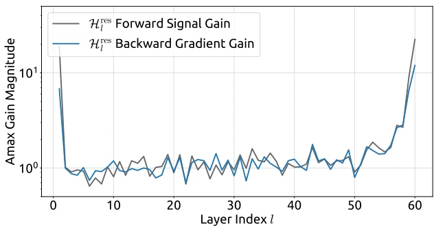
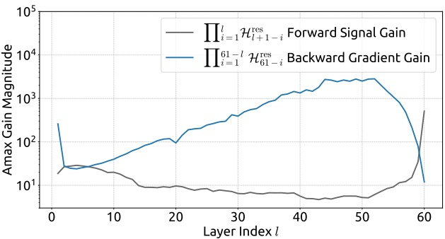
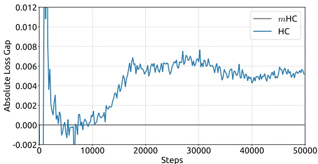
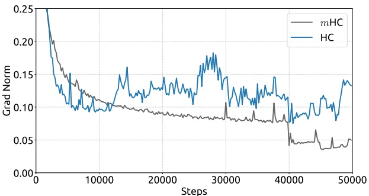

# mHC: 双随机约束下的超连接, 增益, 开销与实验口径

材料是 DeepSeek-AI 的论文 *mHC: Manifold-Constrained Hyper-Connections* (arXiv 2512.24880, 2025 年 12 月, 正文加附录 19 页). 官方没有单独的 mHC 仓库, 训练用的内核收在 [deepseek-ai/TileKernels](https://github.com/deepseek-ai/TileKernels) 的 `tile_kernels/mhc/` 目录下, 同仓库的 `tile_kernels/torch/mhc.py` 是 PyTorch 参考实现; 下文对照的代码是 2026-09-30 的提交 66258df. 逐段译文见 [mHC 对照译稿](./01-mhc-bi.md).

论文要解决的问题是: Hyper-Connections (HC) 把残差流加宽到 $n$ 路, 在小模型上有收益, 但放到 27B 的 MoE 上, 残差混合矩阵连乘之后增益失控, 同时 $n$ 路残差让每层的读写量, 激活显存和流水线通信都涨到原来的 $n$ 倍左右. mHC 的回答分两半: 数学上把残差混合矩阵 $\mathcal{H}_l^{\mathrm{res}}$ 约束成双随机矩阵, 系统上用融合内核, 分块重计算和改造的 DualPipe 把开销压下去. HC 的结构, 双随机矩阵的性质证明和 Sinkhorn-Knopp 的手算例子已经写在 Hyper-Connections 与 mHC 里, 下文只在需要时引用结论, 篇幅放在论文自己的设定, 实验数字的口径和代码实现上. V4 怎样使用 mHC 见 DeepSeek-V4 解析 第 1.2 节, 另一条改进路线见 xHC.

## 1. HC 在 27B 上哪里不稳

**三个映射与表 1 的组件消融:** HC 把第 $l$ 层的残差状态从 $1\times C$ 扩成 $n\times C$ 的矩阵 $\mathbf{x}_l$, 层函数 $\mathcal{F}$ 内部仍按 $C$ 维计算. 三个映射各管一件事: $\mathcal{H}_l^{\mathrm{pre}}\in\mathbb{R}^{1\times n}$ 从 $n$ 路里加权读出层输入, $\mathcal{H}_l^{\mathrm{post}}\in\mathbb{R}^{1\times n}$ 把层输出按权重写回 $n$ 路, $\mathcal{H}_l^{\mathrm{res}}\in\mathbb{R}^{n\times n}$ 在 $n$ 路之间重新混合. 合起来就是式 (3):

$$
\mathbf{x}_{l+1}=\mathcal{H}_l^{\mathrm{res}}\mathbf{x}_l+\mathcal{H}_l^{\mathrm{post}\top}\mathcal{F}(\mathcal{H}_l^{\mathrm{pre}}\mathbf{x}_l,\mathcal{W}_l).
$$

把它从第 $l$ 层递推到第 $L$ 层得到式 (4), 第一项是 $\left(\prod_{i=1}^{L-l}\mathcal{H}_{L-i}^{\mathrm{res}}\right)\mathbf{x}_l$. 普通残差里这一项的系数恒为 $\mathbf{I}$, 浅层的信号原样送到深层, 这就是恒等映射性质. HC 把它换成了 $L-l$ 个可学习矩阵的连乘, 每个矩阵都由式 (5) 的「$\alpha\cdot\tanh(\cdot)+\mathbf{b}$」给出, 没有任何约束, 所以连乘的结果可以离 $\mathbf{I}$ 任意远.

表 1 拆了三个映射各自的贡献. 不启用的映射用固定值代替: pre 取均匀权重 $1/n$, post 取全 1, res 取单位阵. 只开 $\mathcal{H}^{\mathrm{res}}$ 时 loss 比基线低 0.022, 再加 pre 是 0.025, 三个全开是 0.027. 也就是说总收益的约 81% 来自残差混合矩阵, 而它恰好是连乘之后会失控的那一项. 表 1 用的模型规模和训练步数文中没有给出; 另外表里缺一行「pre 和 post 动态, res 固定为 $\mathbf{I}$」, 这一行对判断「残差流之间的信息交换是否必要」是关键对照, 第 6.3 节再回到这个缺口.

### 1.1. Amax Gain Magnitude 的定义与图 3

论文用两个指标量化连乘的放大程度: 复合矩阵各行之和的最大绝对值, 记作前向信号增益; 各列之和的最大绝对值, 记作反向梯度增益, 合称 Amax Gain Magnitude. 取行和的理由是: 若 $n$ 路残差携带同一个信号 $\mathbf{s}$, 即 $\mathbf{x}=\mathbf{1}_n\mathbf{s}$, 则 $\mathcal{H}\mathbf{x}=(\mathcal{H}\mathbf{1}_n)\mathbf{s}$, 第 $i$ 路得到的倍数正好是第 $i$ 行的行和. 反向时梯度经过 $\mathcal{H}^\top$, 同理对应列和. 这个指标只量了「各路相同」这一个方向上的放大, 不等于谱范数; 各路信号不同时, 正负元素可以相互抵消, 也可以叠加得更大. 图 3 的数值还对选定的一条序列里所有 token 取了平均.

图 3(a) 解析: 横轴把 27B 模型的 30 个 Transformer 块拆成注意力和 FFN 两个子层, 共 60 层; 纵轴是对数坐标的单层 $\mathcal{H}_l^{\mathrm{res}}$ 增益. 中间约 50 层的单层增益在 0.7 到 1.7 之间来回抖动, 前向和反向两条曲线基本重合. 异常集中在两端: 第 1 层前向约 18, 反向约 7; 第 55 层以后单层增益逐层抬到 1.5 到 2.7, 第 60 层前向约 22, 反向约 12.

图 3(b) 解析: 两条曲线的定义方向相反. 前向曲线在横坐标 $l$ 处是从第 1 层乘到第 $l$ 层的复合矩阵, 反向曲线在 $l$ 处是从第 $l$ 层乘到第 60 层的复合矩阵. 反向增益从第 1 层的约 250 一路上升, 在第 45 到 52 层附近达到约 3000 的峰值, 之后快速回落到第 60 层的约 12. 前向增益在中间段只有 5 到 10, 到第 60 层 (整条深度的连乘) 跳到约 500. 两端的数值可以和图 8 第一行最右的 60 层复合矩阵对上: 那个矩阵的最大绝对行和是 509.1, 最大绝对列和是 259.2. 峰值 3000 出现在只连乘末尾十来层的位置, 结合图 3(a) 看, 主要是第 55 到 60 层的单层增益 (1.5 到 22) 乘出来的, 中间层的 0.7 到 1.7 互相抵消, 贡献不大.

**图 2 的 loss 偏离有多大:** 正文把 HC 的问题写成「在 12k step 左右出现意外的 loss surge」, 并说它与梯度范数的不稳定高度相关. 看图 2 的实际幅度, 这里的 surge 和通常说的 loss spike 不一样.

图 2(a) 解析: 纵轴是 HC 减去 mHC 的训练 loss, 以 mHC 为零线. 前 1 万步两者基本重合, 差值在 $\pm0.002$ 内; 从约 12k step 开始差值单调爬升, 17k step 前后到约 0.006, 之后在 0.005 到 0.007 之间维持, 50k step 结束时约 0.005. 曲线没有尖峰, 也没有回不来的发散, 是一次持续的抬升后停在新的水平上.

图 2(b) 解析: 同期 HC 的梯度范数从 12k step 附近开始明显抖动, 在 0.12 到 0.18 之间起伏, mHC 则平稳下降. 40k step 处所有曲线一起向下跳一个台阶, 这对应附录表中学习率在总步数 0.8 倍处的阶梯衰减. 结合第 5.2 节的图 5(a), HC 最终仍比基线低约 0.016, 比 mHC 少的约 0.005 相当于 mHC 收益的四分之一. 所以在 27B, 50k step 这个设定下, HC 的「不稳」体现为收益被侵蚀, 而训练并没有崩. 更大规模或更长训练下会不会真的发散, 文中没有给出数据.

**流形约束: 双随机矩阵与 Sinkhorn-Knopp:** **行和, 列和与双随机**

式 (6) 要求 $\mathcal{H}_l^{\mathrm{res}}$ 非负, $\mathcal{H}_l^{\mathrm{res}}\mathbf{1}_n=\mathbf{1}_n$, $\mathbf{1}_n^\top\mathcal{H}_l^{\mathrm{res}}=\mathbf{1}_n^\top$. 对照第 1.2 节的指标, 行和为 1 就是前向增益为 1, 列和为 1 就是反向增益为 1. 列和为 1 还有一层含义: $\mathbf{1}_n^\top\mathcal{H}\mathbf{x}=\mathbf{1}_n^\top\mathbf{x}$, 即混合前后 $n$ 路之和不变, 各路的平均信号被原样传下去, 这正是普通残差恒等映射在多路情形下的推广. 非负性再保证这种守恒不是靠正负抵消凑出来的.

论文列了三条性质: 谱范数不超过 1, 对矩阵乘法封闭, 是置换矩阵的凸组合 (Birkhoff 多面体). 证明见 Hyper-Connections 与 mHC. 对实验最要紧的是第二条: 单层约束成立, 任意层数的连乘就自动成立, 第 1.2 节那种 60 层累积出 3000 倍的路径被从结构上切断. $n=1$ 时双随机矩阵只能是标量 1, mHC 退回普通残差. $n=4$ 时 Birkhoff 多面体是 9 维 ($(n-1)^2$) 的凸集, 4 阶置换矩阵有 24 个顶点, 混合矩阵在这 9 个自由度里取值.

**参数化: 式 (7)(8) 相对 HC 改了三处:** 第一处是输入. HC 的式 (5) 对每一路分别做 RMSNorm, 用 $\theta^{\mathrm{res}}\in\mathbb{R}^{n\times C}$ 生成 $n\times n$ 的动态项, 每一路只看自己那一行. mHC 的式 (7) 先把 $n\times C$ 展平成 $1\times nC$, 整体做 RMSNorm, 再乘 $\varphi_l^{\mathrm{res}}\in\mathbb{R}^{nC\times n^2}$, 每个系数都能看到全部 $n$ 路. 代价是参数量: HC 每层的动态投影是 $(n+2)C$ 个参数, mHC 是 $nC\times(n^2+2n)=n^2(n+2)C$ 个, $n=4$ 时从 $6C$ 变成 $96C$, 多了 16 倍. 27B 的 $C=2560$, 60 个子层合计约 1470 万参数, 相对 27B 总参数仍可忽略.

第二处是激活函数. HC 用 $\tanh$, 系数可正可负; mHC 去掉 $\tanh$, 对 pre 用 $\sigma$, 对 post 用 $2\sigma$, 对 res 用 Sinkhorn-Knopp. 于是 pre 落在 $(0,1)$, post 落在 $(0,2)$, res 落在双随机矩阵上, 三者都非负. 正文对非负性的解释是防止「正负系数组合造成信号抵消」, 图 8 第一行的 HC 矩阵正好是反例: 60 层复合矩阵四行的行和是 $-475.3, -462.8, 509.1, -498.5$, 各路携带量级几百倍, 符号相反的信号, 层输入是靠它们相互抵消才落回正常量级.

第三处是 post 的系数 2. 动态项和偏置都为零时 $2\sigma(0)=1$, 写回权重从 1 起步, 与普通残差相同; 同时上限放到 2, 允许某一路多拿. pre 在零点是 $\sigma(0)=0.5$, $n=4$ 时四路之和为 2, 层输入的量级是各路平均值的 2 倍. 偏置 $\mathbf{b}$ 怎样初始化文中没有给出, 参考实现里也只看到前向计算. 门控 $\alpha$ 的初值沿用 HC 的 0.01 (附录表), 训练初期三组系数几乎由静态偏置决定.

**Sinkhorn 的截断与官方代码:** 式 (9) 从 $\mathbf{M}^{(0)}=\exp(\tilde{\mathcal{H}}_l^{\mathrm{res}})$ 出发, 每轮先列归一再行归一, 正文和附录都写迭代 20 次. 有限次迭代只得到近似的双随机矩阵, 而且误差的位置是确定的: 收尾步骤是行归一, 所以行和精确为 1, 列和只是近似为 1. 第 1.2 节的定义里行和对应前向, 列和对应反向, 因此截断误差全部落在反向增益上. 这和图 7(a) 吻合, 前向增益是一条贴着 1 的直线, 反向在 1.0 到 1.06 之间.

TileKernels 的实现和正文有三处不同. 一是起点: 参考实现的 Sinkhorn 先对每行做 softmax 再加 $\epsilon=10^{-6}$, 然后除以列和, 再做 `repeat-1` 轮「行归一, 列归一」, 收尾步骤落在列归一. 二是方向: 代码里的混合矩阵 `comb` 在 `mhc_post_ref` 中以 einsum `'abmn,abmc->abnc'` 作用于残差流, 相当于用 `comb` 的转置去乘, 所以实际起作用的 $\mathcal{H}^{\mathrm{res}}$ 是 `comb` 的转置, 它的行和精确为 1, 结论与正文一致. 三是次数: 内核接口的默认值是 `repeat=10`, 不是 20. softmax 等价于先减去每行最大值再取指数, 只差一个逐行常数, Sinkhorn 的结果不变, 这一步是为了数值安全; $\epsilon$ 则给每个元素加了下限, 避免某个元素下溢成 0 后无法再被行列缩放拉回来. 论文没有提到这两处, 用正文的写法复现时, 若 $\tilde{\mathcal{H}}^{\mathrm{res}}$ 的元素差异很大, $\exp$ 之后可能出现极端病态的起点.

起点的病态程度可以从代码直接算. softmax 之后每个元素不超过 1, 加上 $\epsilon$ 之后不低于 $10^{-6}$, 同一行最大元与最小元之比被限制在约 $10^6$ 以内. 按正文的 $\exp$ 写法没有这个上限: $\tilde{\mathcal{H}}^{\mathrm{res}}$ 同一行两个元素差 30, 取指数后比值就是 $e^{30}\approx10^{13}$, 交替归一要把这样的矩阵拉到接近双随机, 需要的轮数远多于 20. 后续工作 mHC-lite (arXiv 2601.05732) 正是从这个收敛问题出发, 改成直接参数化置换矩阵的凸组合, 免去迭代. 正文对截断只说了一句「略微偏离 1」, 没有给出单层列和误差的分布, 也没有比较 10 次, 20 次和更多次迭代对 loss 的影响.

### 1.2. 每一项的计算与显存开销

**算力几乎不涨, 访存才是瓶颈:** 按式 (7), 每个子层每个 token 的系数计算是一次 $1\times nC$ 乘 $nC\times(n^2+2n)$ 的矩阵乘, 前向 $2nC(n^2+2n)$ FLOPs. 27B 取 $n=4$, $C=2560$, 每个子层约 49 万 FLOPs, 60 个子层约 2950 万. 27B 每 token 激活 4.14B 参数, 前向约 83 亿 FLOPs, mHC 系数计算占约 0.36%. 施加映射的部分 (pre 的加权求和, res 的 $4\times4$ 混合, post 的写回) 每个子层是 $O(n^2C)$ 量级, Sinkhorn 是 20 轮 $4\times4$ 的归一, 加起来仍在千分之几的量级. 所以论文第 3.2 节说 HC 的计算复杂度「可控」, 这一点成立.

问题在算术强度. 系数矩阵乘每读入 $\vec{\mathbf{x}}_l$ 的一个元素只做 $2(n^2+2n)=48$ 次浮点运算, bf16 下约每字节 24 FLOPs. 文中没有给出训练硬件; 以 H800 的 bf16 稠密算力约 989 TFLOPS, 显存带宽约 3.35 TB/s 算, 访存与计算的拐点约在每字节 295 FLOPs, mHC 的系数计算比拐点低一个数量级以上, 是纯粹的带宽受限操作. 后面所有工程优化都围着「少读几遍 $nC$ 维的残差流」展开.

**读写量: 表 2 与融合后的口径:** 表 2 逐项列了每个 token 在一个残差子层中由 $n$ 路设计引入的读写 (不含层函数 $\mathcal{F}$ 内部). 普通残差只有一次合并: 读 $\mathbf{x}_l$ 和层输出共 $2C$, 写 $C$. HC 有五步: 计算系数读 $nC$, 写 $n^2+2n$; 施加 pre 读 $nC+n$, 写 $C$; 施加 post 读 $C+n$, 写 $nC$; 施加 res 读 $nC+n^2$, 写 $nC$; 合并读 $2nC$, 写 $nC$. 合计读 $(5n+1)C+n^2+2n$, 写 $(3n+1)C+n^2+2n$. $n=4$ 时忽略常数项是读 $21C$, 写 $13C$, 共 $34C$, 是普通残差 $3C$ 的 11 倍多.

第 4.3.1 节只给了一个内核的融合效果: post, res 和残差合并合成一个内核后, 读从 $(3n+1)C$ 降到 $(n+1)C$, 写从 $3nC$ 降到 $nC$. 融合后的总量文中没有给出, 可以按内核划分推出来: 系数内核读 $nC$; pre 施加内核读 $nC$, 写 $C$; post-res 内核读 $\mathbf{x}_l$ 和层输出共 $(n+1)C$, 写 $nC$. 合计读 $(3n+1)C$, 写 $(n+1)C$, 总量 $(4n+2)C$, $n=4$ 时是 $18C$, 约为 HC 朴素实现的一半, 仍是普通残差的 6 倍. V4 报告给 V4 实现的激活访存是 $(4n+4)d$, 与这里的 $(4n+2)C$ 只差 $2C$, 两份材料都没有列逐项清单, 差额来自统计范围的不同.

**激活显存与分块重计算:** 表 3 列了反向需要的激活: 每层的层输出 $\mathcal{F}(\mathcal{H}_l^{\mathrm{pre}}\mathbf{x}_l,\mathcal{W}_l)$ 是 $C$, 始终保存; 每层的 $\mathbf{x}_l$ 是 $nC$, 以及 $\mathcal{H}_l^{\mathrm{pre}}\mathbf{x}_l$ 和它的 RMSNorm 各 $C$, 这三项在重计算块内只临时存在; 块首的 $\mathbf{x}_{l_0}$ 是 $nC$, 每 $L_r$ 层存一份. 系数本身每层只有 $n^2+2n$ 个数, 表 3 没有计入. 重计算只重跑 mHC 内核, 不重跑注意力和 FFN, 因为有了块首 $\mathbf{x}_{l_0}$ 和每层保存的层输出, 按式 (3) 就能逐层把 $\mathbf{x}_l$ 推回来.

式 (20) 对 $nC\lceil L/L_r\rceil+(n+2)CL_r$ 求最小, 忽略取整后求导得 $L_r^*=\sqrt{nL/(n+2)}$. $L$ 按块还是按子层计正文没有说明; 图 3 的横轴按子层计 60 层, 取 $L=60$, $n=4$ 得 $L_r^*\approx6.3$. 每 token 省下多少显存文中没有给出, 按表 3 的口径推算如下: 不重算时每个子层存 $\mathbf{x}_l$, $\mathcal{H}^{\mathrm{pre}}\mathbf{x}_l$, 其 RMSNorm 和层输出, 共 $(n+3)C=7C$, 60 层 $420C$; 取 $L_r=6$ 重算时, 常驻的是 60 份层输出 $60C$ 加 10 个块首 $40C$, 反向处理某一块时再临时多出 $6\times6C=36C$, 峰值约 $136C$, 约为不重算时的三分之一. 代价是反向多跑一遍 mHC 内核, 按第 3.1 节的量级, 这部分算力可以忽略, 多出来的主要是又一遍 $nC$ 维的读写.

正文最终把重计算块的边界对齐到流水线阶段, 理由是理论最优值「通常与每个流水阶段的层数相当」. 27B 和内部大模型的流水并行度文中都没有给出, 这句话无法从文中数字核对. 对齐的好处在第 4.3 节: 每个阶段的首个输入本来就在本地, 重计算不依赖跨阶段通信. TileKernels 的 `multilayer_recompute` 用一个内核跑完整块的逐层重算, 测试里的隐藏维取 1280, 2560, 4096, 7168, 前两个对应附录表的 3B 和 27B, 后两个与 V4-Flash 和 V4-Pro 的隐藏维相同.

**内核融合与流水线重叠:** **式 (14) 到 (16): 把 RMSNorm 挪到矩阵乘之后**

RMSNorm 对一个 token 是 $\vec{\mathbf{x}}'=(\vec{\mathbf{x}}/r)\odot\mathbf{g}$, 其中 $r=\|\vec{\mathbf{x}}\|_2/\sqrt{nC}$ 是标量, $\mathbf{g}$ 是逐维权重. 于是

$$
\vec{\mathbf{x}}'\varphi=\frac{1}{r}\,\vec{\mathbf{x}}\,\big(\mathrm{diag}(\mathbf{g})\,\varphi\big).
$$

逐维权重可以预先乘进 $\varphi$ 的行, 标量 $1/r$ 可以放到矩阵乘之后, 这就是式 (14) 到 (16) 的顺序: 先算 $\vec{\mathbf{x}}_l\varphi_l$ 和平方和, 再统一乘 $1/r$ 和 $\alpha$, 加偏置. 好处是 $\vec{\mathbf{x}}_l$ 只读一遍, 矩阵乘和平方和在同一次扫描里完成, 也不必先写出一份归一化后的 $nC$ 维张量. TileKernels 里 `norm_fn` 内核做的就是把 RMSNorm 权重并进投影矩阵, 参考实现 `mhc_pre_norm_fn_ref` 的归一化是 `rsqrt(sqrsum / K + eps)`, 比式 (15) 多一个 eps, 与常规 RMSNorm 相同.

精度按式 (10) 到 (13) 分配: $\varphi_l$ 用 tfloat32, $\vec{\mathbf{x}}_l$ 用 bfloat16, $\alpha$ 和偏置以及之后的系数全部 float32. 残差流本身是 bf16, 读的量最大; 系数只有 $n^2+2n=24$ 个, 用 float32 不增加带宽, 又保证 Sigmoid 和 Sinkhorn 的数值. 代码里这一步交给 DeepGEMM, 沿 $nC$ 维做 split-K, 每个分片同时输出部分乘积和部分平方和, 后面的内核再把分片归约. 正文说式 (14)(15) 不用 TileLang 实现, 与代码一致.

**正文的五个内核与 TileKernels 的实际切分:** 正文描述了五个内核: 式 (14)(15) 的矩阵乘加平方和, 式 (16) 到 (18) 的轻量系数运算, 式 (19) 的 Sinkhorn 及其自定义反向, 以及两个施加映射的内核 $\mathcal{F}_{\mathrm{pre}}$ 和 $\mathcal{F}_{\mathrm{post,res}}$. Sinkhorn 的反向在片上重算中间结果: 前向不保存 20 轮迭代的中间矩阵, 反向时在 shared memory 里把 $2\times$ 轮数个中间结果重算出来, 再逆序逐步求导. 一个 $4\times4$ 矩阵在 float32 下只有 64 字节, 全部迭代的中间结果放得进片上存储, 用重算换掉了全局显存的读写.

TileKernels 比正文融合得更彻底. `pre_big_fuse` 把 split-K 分片的归约, RMS 归一, pre 和 post 的 Sigmoid, Sinkhorn 和 pre 的施加放进同一个内核, 正文里分开的「轻量系数」「Sinkhorn」「$\mathcal{F}_{\mathrm{pre}}$」三个内核合成了一个. 另有几个正文没有提到的内核: `expand` 在网络入口把嵌入复制成 $n$ 路, `head_compute_mix` 在出口用 Sigmoid 权重把 $n$ 路合回一路, 公式与 pre 相同. 参考实现里 pre 的系数是 Sigmoid 加一个小的 `pre_eps`, post 是 Sigmoid 乘 2.0, 与式 (8) 一致. 仓库里每个内核还有…16009 tokens truncated… 再散回全状态. 这样每子层的读写均摊到 $26.5C$ 和 $13.5C$, 合计 $40C$.

结果 (Table 5, 10B).

| 方法 | Val. Loss↓ | 每子层 I/O |
|------|------------|------------|
| Vanilla | 2.029 | $3C$ |
| mHC ($N=4$) | 2.004 | $34C$ |
| xHC ($N=16,k=4$) | 1.983 | $73.5C$ |
| xHC-Flash | 1.983 | $51C$ |
| xHC-Flash-4sub | 1.984 | $40C$ |

Flash 比满配少 $22.5C$, 主要省掉的是第二个子层的全状态映射生成和稠密读; 4sub 再少 $11C$. Flash 与满配 xHC 都是 1.983; 4sub 均摊到 $40C$, 与 mHC $N=4$ 的 $34C$ 接近, loss 仍比 mHC 低 0.020. 这些 I/O 数字来自论文的访存模型.

**融核与墙钟:** 实现分成映射生成和映射应用两个阶段, 同输入的操作融合. 残差状态和投影操作数用 bfloat16, 归一化统计量, 路由, 映射系数和 Sinkhorn 用 float32. 路由与读映射的投影拼成一次 GEMM, 一个 Triton 核完成归一化修正, 生成 $\mathcal{H}^{\mathrm{pre}}$ 并做 2 条固定加 Top-2 选择, 反向时路由梯度只经两个被选中的 logits 回传. 稠密读 $\mathcal{H}^{\mathrm{pre}}X$ 和激活流混合 $\mathcal{H}^{\mathrm{res}}X_{\mathrm{active}}$ 放进同一个核, 反向直接把两者的梯度累加到全状态梯度里, 省掉单独的 $kC$ 维梯度和散加. MLP 侧一个专用核同时算三路卷积; $K_r=4$ 的写回核直接读原输出和三路卷积输出, 不拼出 $[S,B,4,C]$ 张量, 省掉额外的 $4C$ 读和 $4C$ 写.

§5.3 在 18B MoE 上测墙钟, 不开流水线通信重叠以排除调度干扰. 论文重实现的 mHC $N=4$ 融核相对基线约多 15% 训练时间, 高于 mHC 原文的 6.7%, 论文说明两者规模, 并行方式, 重叠调度可能不同, 不能直接比较. xHC-Flash-4sub 在 mHC 之上再多约 11%, 主要来自 $N=16$ 的全状态投影, 两次稠密读和反向的残差流操作; 开 DualPipe 这类通信重叠后还能再降. 2K token 推理 prefill: mHC 比基线多 11.4%, Flash-4sub 多 12.9%, 相对 mHC 只多 1.3%. 额外的训练开销主要在反向, 不在前向残差路径.

B 和 28B 结果与边界.

### 4.2. 配置

骨干是 DeepSeekMoE 风格: 一个前置稠密层加若干 MoE 层, 每个 MoE 层有 144 个路由专家和 1 个共享专家, top-8 sigmoid 路由; 注意力是 GQA 加 QK LayerNorm, 头维 128, RoPE $\theta=50000$, SwiGLU, RMSNorm. Qwen2 tokenizer, 词表 152064, 上下文 8192. 优化器 AdamW ($\beta_1=0.9$, $\beta_2=0.95$), weight decay 0.1, 梯度裁剪 1.0, WSD 学习率日程. 附录 Table 6 的四个规模:

| 规模 | 激活参数 | 层数 | 隐藏维 | 注意力头 / KV 组 | 专家 FFN 维 | 基础学习率 | 用途 |
|------|---------|------|--------|-------------------|------------|-----------|------|
| 2.5B | 0.5B | 15 | 1024 | 8 / 4 | 320 | 6.95e-4 | $N$ 扫描 |
| 10B | 1.4B | 15 | 2080 | 16 / 8 | 704 | 4.82e-4 | 消融 |
| 18B | 1.7B | 28 | 2112 | 16 / 8 | 672 | 3.97e-4 | 主结果 |
| 28B | 2.7B | 32 | 2560 | 20 / 10 | 768 | 3.5e-4 | 主结果 |

mHC 列取 $N=4$, xHC 列取 $N=16, k=4$.

$N$ 扫描 (§4.4, 2.5B) 把 xHC 的 $N$ 取 2, 4, 8, 16, 与同 $N$ 的稠密 mHC 对比. xHC 的 loss 从 $N=2$ 到 16 持续下降, 每翻一倍都有明显改善, 额外 FLOPs 很小; mHC 在 $N=4$ 之后很快饱和.

下游 (Table 1).

| Benchmark | 18B Vanilla | 18B mHC | 18B xHC | 28B Vanilla | 28B mHC | 28B xHC |
|-----------|-------------|---------|---------|-------------|---------|---------|
| MMLU | 48.9 | 54.7 | 57.2 | 54.6 | 56.8 | 60.5 |
| MMLU-Pro | 21.1 | 27.4 | 29.7 | 30.1 | 34.9 | 36.0 |
| MMLU-Redux | 46.4 | 49.9 | 52.8 | 50.6 | 53.9 | 56.4 |
| BBH | 32.4 | 33.7 | 39.5 | 41.7 | 43.6 | 43.4 |
| CommonsenseQA | 54.6 | 56.6 | 60.9 | 60.5 | 63.9 | 69.6 |
| ARC-Challenge | 55.7 | 66.3 | 72.2 | 70.8 | 74.9 | 77.7 |
| GSM8K | 37.7 | 44.5 | 48.4 | 50.3 | 56.3 | 59.2 |
| HumanEval | 25.6 | 23.2 | 29.3 | 27.4 | 26.8 | 31.1 |
| LCBench | 9.9 | 12.2 | 14.6 | 15.1 | 14.8 | 17.9 |
| CMMLU | 42.7 | 47.6 | 50.4 | 47.6 | 50.1 | 53.4 |
| CEval | 44.5 | 48.8 | 52.4 | 50.2 | 51.2 | 54.9 |
| C3 | 67.1 | 72.7 | 78.3 | 75.2 | 78.7 | 82.5 |
| **Average** | **40.6** | **44.8** | **48.8** | **47.8** | **50.5** | **53.6** |

18B 训练 loss 依次是 1.799, 1.776, 1.758. 相对 mHC, 18B 平均高 4.0, 增幅大的列有 HumanEval +6.1, ARC-Challenge +5.9, BBH +5.8, C3 +5.6; 28B 平均高 3.1, 增幅大的列有 CommonsenseQA +5.7, HumanEval +4.3, C3 +3.8, MMLU +3.7. 28B 的 BBH 是 43.4, 比 mHC 的 43.6 低 0.2; 18B 上 xHC 在全部 12 项都是三列最高. 代码类任务上 mHC 有时不如 vanilla: 18B HumanEval 23.2 对 25.6, 28B HumanEval 26.8 对 27.4, LCBench 14.8 对 15.1; xHC 在这几项上都超过 vanilla.

评测在修改过的 OpenCompass 上进行. 选择题用条件似然打分: MMLU, MMLU-Redux, CMMLU, CEval 5-shot, ARC-Challenge 25-shot, C3 3-shot; 生成题解析后比对: MMLU-Pro 5-shot, BBH 3-shot, CommonsenseQA 7-shot, GSM8K 4-shot, HumanEval 0-shot pass@1, LCBench 5-shot. 这套协议与 mHC 论文 Table 4 不同, 两篇的绝对分数不能直接比较.

**Scaling law 与 Muon 叠加:** §4.3 在约 $1.7\times10^{19}$ 到 $4.0\times10^{20}$ FLOPs 之间训练四个规模 (激活 180M 到 1.10B, 附录 Table 8), 拟合

$$
\mathcal{L}(C)=AC^{-\alpha}+E,\qquad E=0.72 \tag{16}
$$

这里 $C$ 指训练 FLOPs, $E$ 是估计的不可约 loss; 拟合方法是对 $\log_2(\mathcal{L}-E)$ 与 $\log_{10}C$ 做线性回归, 再换回上式. 四个规模的上下文都是 8192, 144 个路由专家, top-8. 拟合系数 (附录 Table 9): vanilla $A=109.303$, $\alpha=0.0936$; mHC $A=99.139$, $\alpha=0.0920$; xHC $A=97.703$, $\alpha=0.0919$. 三者指数几乎相同, 差别主要在系数 $A$. 最大算力点上 xHC 的 loss 比 mHC 低约 1.1%, 比 vanilla 低约 2.4%. 以最大的 vanilla 和 mHC 模型的 loss 为目标, 从 xHC 拟合曲线上读出所需算力, vanilla 要 xHC 的 1.50 倍, mHC 要 1.19 倍.

上面的拟合都用 AdamW. 换成 Muon 后 xHC 的收益是否还在, 论文在 18B 上用 Table 3 检查, 平均下游: AdamW vanilla 40.6, Muon vanilla 43.1, Muon 加 xHC (去掉 Gram-Schmidt) 49.9. 换优化器本身带来 2.5 分; 在 Muon 基线上再加 xHC 多 6.8 分, AdamW 下 xHC 相对 vanilla 是 8.2 分 (上面的 Table 1). 两者的收益没有互相抵消, 大部分可以叠加. Muon 只用于骨干的注意力, MLP/MoE 和 MoE 路由投影, 动量 0.95, 5 次 Newton-Schulz 迭代, 更新 RMS 对齐 AdamW 的目标值 0.2; 嵌入, 归一化和全部 xHC 参数用 AdamW. xHC 的路由和映射投影把 $NC$ 或 $kC$ 维映射到 $N$, $k^2$, $kK_r$ 这样很小的输出维, 形状极不均衡, 不适合 Muon 的矩阵正交化. 去掉 Gram-Schmidt 的理由是 Muon 的 Newton-Schulz 正交化已经让更新谱更受控, 前向投影掉平行分量也会同时投影掉这些方向的梯度, 在 Muon 下显得多余且略有限制. 优化器本身见 6.5.1 优化器综述.

**边界:** Transformer 一层仍是 Norm, Attention 或 FFN, 残差合并. xHC 改的是合并, 隐状态从 $[T,C]$ 扩成 $[T,N,C]$, 头数, KV 布局, 专家路由都不变, $\mathcal{F}$ 仍只接收一份 $C$ 维输入. 同一层里有两套 Top-K: MoE 路由决定 token 进哪些专家, xHC 路由决定 $N$ 条残差流里更新哪 $k$ 条, 两者对象不同. 按 4.1 节的配置, 前者是 144 个路由专家选 8 个, 后者是 14 条非固定流选 2 条.

xHC 的几个部件各有对应的失效. 结构上, 读也做稀疏时 (Table 2 第 (6) 行, 去掉稠密读和固定流) loss 退到 1.997, 跨层传播被路由切断; 路由改用 softmax 时 (第 (11) 行) 是 1.988, 差于 sigmoid 的 1.983, 因为 softmax 让各流争夺固定的总权重, 容易集中到一两条流上; 注意力子层后也加时间增强, Table 11 显示 loss 反而差 0.002, 还多出卷积计算, 注意力本身已经跨 token 混合, 再加局部卷积收益很小. 规模上, $k$ 跟着 $N$ 一起增大时, 式 (13) 里的 $2k^3$ 项会重新主导成本, 第 (10) 行 $k=8$ 只换来 0.001 的 loss; 在 AdamW 下去掉 Gram-Schmidt, 10B 上看不出差别, 18B 上训练失稳. 数值上, 极端激活下 Sinkhorn 的行和可能超过 1, 要靠式 (12) 的钳制.

成本也不能只看 FLOPs. 满配 xHC 的残差读写是 mHC $N=4$ 的 2.2 倍, 墙钟开销要靠 Flash 变体和融核压下来; 即使用 Flash-4sub, 18B 训练仍比 mHC 多约 11%. 下表把 xHC 和相邻设定放在同一组参数上:

| 设置 | 结果 |
|------|------|
| $N=1$ | 单流残差 |
| $N=4$, 稠密, 无时间增强 | mHC 主设定 |
| $N=16$, 稠密, 无时间增强 | mHC 加宽, Table 2 第 (3) 行 |
| $N=16$, 稠密, 加时间增强 | Table 2 第 (4) 行 |
| $N=16$, $k=4$, 加时间增强 | xHC 主设定 |
| $k=N$ | 稀疏退化为稠密 |
| Attention 侧去掉 $\mathcal{H}^{\mathrm{res}}$, 块内共享路由 | xHC-Flash, 每子层 $36C$ 读, $15C$ 写 |
| 两个块共享路由, 混合只在第二个 MLP | xHC-Flash-4sub, 每子层 $40C$ |

表的前两行是退化情形: $N=1$ 回到单流, $k=N$ 时稀疏更新退化为稠密. 中间三行就是 Table 2 从 mHC 走到 xHC 的路径, 先加宽, 再加时间增强, 最终改成稀疏更新, 每一步的 loss 变化见第 2.4 节. 末尾两行只改访存, 不改模型能表达的东西.

同族里, mHC 是 xHC 的直接前作, 多流加双随机混合, 主设定 $N=4$, 机制见 01. Gated Residual 也加宽到 4 条, 但读用逐元素门并删掉 $H_{\mathrm{res}}$, xHC 则在 $k$ 条激活流上保留 Sinkhorn 混合. AttnRes 每层用注意力对历史层输出加权聚合, 不维护固定条数的流. 名字相近而无关的有两个: Tay 等人的 Sparse Sinkhorn Attention 同样用 Sinkhorn-Knopp, 作用对象是注意力块的排序; HCA / CSA 是压缩注意力, 缩写里的 HC 与 Hyper-Connections 无关. 论文代码在 <https://github.com/aHapBean/xHC>.

参考文献.

1. Zhang, X., Qin, X., Zou, S., Dai, T., Shi, X., Wu, H., Yang, Y., Xia, Z., Zhang, S., Yao, L., Liu, Y., Cheng, Y., & Yan, J. (2026). [xHC: Expanded Hyper-Connections.](https://arxiv.org/abs/2607.14530) *arXiv:2607.14530*. 式 (1)-(19), Algorithm 1-2, Table 1-12, Figure 1/4/5, 附录 A-E.
2. Zhu, D., et al. (2024). [Hyper-Connections.](https://arxiv.org/abs/2409.19606) *arXiv:2409.19606*.
3. Xie, Z., et al. (2025). [mHC: Manifold-Constrained Hyper-Connections.](https://arxiv.org/abs/2512.24880) *arXiv:2512.24880*.
4. Liu, Z., Zhang, H., & Li, A. (2026). [Beyond the Birkhoff Polytope: Spectral-Sphere-Constrained Hyper-Connections.](https://arxiv.org/abs/2603.20896) *arXiv:2603.20896*.
5. Yang, Y., & Gao, J. (2026). [mHC-lite: You Don't Need 20 Sinkhorn-Knopp Iterations.](https://arxiv.org/abs/2601.05732) *arXiv:2601.05732*.
6. Tay, Y., Bahri, D., Yang, L., Metzler, D., & Juan, D.-C. (2020). [Sparse Sinkhorn Attention.](https://arxiv.org/abs/2002.11296) *ICML*.
7. He, K., Zhang, X., Ren, S., & Sun, J. (2016). [Deep Residual Learning for Image Recognition.](https://arxiv.org/abs/1512.03385) *CVPR*.

### 4.3. 论文公式、证据与外推边界

这一节按论文原始定义重新串联数值不稳定、流形投影和实验结果，并把严格成立的矩阵性质与有限规模实验观察分开。双随机约束能控制特定范数和一致向量方向，不自动给出任意深度网络的全局优化保证。

自 ResNet (He et al., 2016a) 提出以来, 深度神经网络的结构演进很快. 如图 1(a), 单层结构可以写成:

$$
\mathbf {x} _ {l + 1} = \mathbf {x} _ {l} + \mathcal {F} (\mathbf {x} _ {l}, \mathcal {W} _ {l}),\tag{1}
$$

其中 $\mathbf{x}_l$ 和 $\mathbf{x}_{l+1}$ 分别是第 $l$ 层的 $C$ 维输入与输出, $\mathcal{F}$ 是残差函数. 过去十年里, 残差函数 $\mathcal{F}$ 从卷积演变到注意力和前馈网络等各种操作, 残差连接这一范式却一直保持原样. 随着 Transformer (Vaswani et al., 2017) 的发展, 这一范式已经成为大语言模型 (LLM) 的基本设计元素 (Brown et al., 2020; Liu et al., 2024b; Touvron et al., 2023).

这种成功主要归功于残差连接形式简洁. 更重要的是, 早期研究 (He et al., 2016b) 揭示了残差连接的恒等映射性质能在大规模训练中保持稳定和高效. 把式 (1) 沿多层递归展开, 得到:

$$
\mathbf {x} _ {L} = \mathbf {x} _ {l} + \sum_ {i = l} ^ {L - 1} \mathcal {F} (\mathbf {x} _ {i}, \mathcal {W} _ {i}),\tag{2}
$$

其中 $L$ 和 $l$ 分别对应较深层和较浅层. 恒等映射指的就是 $\mathbf{x}_l$ 这一项本身, 强调浅层信号不经任何修改直接映射到深层.

最近, 以 Hyper-Connections (HC) (Zhu et al., 2024) 为代表的工作给残差连接引入了一个新维度, 并在实验上展示了它的性能潜力. HC 的单层结构见图 1(b). HC 加宽残差流, 加强连接复杂度, 在不改变单个计算单元 FLOPs 的前提下显著提高了拓扑复杂度. HC 的单层传播形式化为:

$$
\mathbf {x} _ {l + 1} = \mathcal {H} _ {l} ^ {\mathrm{res}} \mathbf {x} _ {l} + \mathcal {H} _ {l} ^ {\mathrm{post} \top} \mathcal {F} (\mathcal {H} _ {l} ^ {\mathrm{pre}} \mathbf {x} _ {l}, \mathcal {W} _ {l}),\tag{3}
$$

其中 $\mathbf{x}_l$ 和 $\mathbf{x}_{l+1}$ 分别是第 $l$ 层的输入与输出. 与式 (1) 不同, $\mathbf{x}_l$ 和 $\mathbf{x}_{l+1}$ 的特征维度从 $C$ 扩成 $n\times C$, $n$ 是扩张率. $\mathcal{H}_l^{\mathrm{res}}\in\mathbb{R}^{n\times n}$ 是一个可学习映射, 在残差流内部混合特征. $\mathcal{H}_l^{\mathrm{pre}}\in\mathbb{R}^{1\times n}$ 同样可学习, 把 $nC$ 维的流聚合成 $C$ 维的层输入; 反过来, $\mathcal{H}_l^{\mathrm{post}}\in\mathbb{R}^{1\times n}$ 把层输出映射回流上.

然而训练规模变大后, HC 带来了潜在的不稳定风险. 主要问题在于 HC 不加约束, 结构跨多层延伸时恒等映射性质被破坏. 在由多条并行流组成的结构里, 理想的恒等映射起守恒作用: 它保证前向和反向传播时各流的平均信号强度不变. 用式 (3) 把 HC 沿多层递归展开, 得到:

$$
\mathbf {x} _ {L} = \left(\prod_ {i = 1} ^ {L - l} \mathcal {H} _ {L - i} ^ {\mathrm{res}}\right) \mathbf {x} _ {l} + \sum_ {i = l} ^ {L - 1} \left(\prod_ {j = 1} ^ {L - 1 - i} \mathcal {H} _ {L - j} ^ {\mathrm{res}}\right) \mathcal {H} _ {i} ^ {\mathrm{post} \top} \mathcal {F} (\mathcal {H} _ {i} ^ {\mathrm{pre}} \mathbf {x} _ {i}, \mathcal {W} _ {i}),\tag{4}
$$

其中 $L$ 和 $l$ 分别是较深层和较浅层. 与式 (2) 相比, HC 中的复合映射 $\prod_{i=1}^{L-l}\mathcal{H}_{L-i}^{\mathrm{res}}$ 不能保持特征的全局均值. 这一差别导致信号无界地放大或衰减, 在大规模训练中引发不稳定. 另一个问题是: HC 在 FLOPs 上保持了计算效率, 但原始设计没有处理加宽后的残差流在访存上的硬件效率. 这些因素合在一起, 限制了 HC 的实际可扩展性, 也妨碍它用于大规模训练.

> **核对:** 式 (4) 之后说复合映射「不能保持特征的全局均值」, 这里的均值守恒对应 $\mathcal{H}^{\mathrm{res}}$ 的哪个条件?
> 答: 把 $n$ 条流的均值写成 $\frac1n\mathbf{1}_n^\top\mathbf{x}$. 经过一层混合后是 $\frac1n\mathbf{1}_n^\top\mathcal{H}^{\mathrm{res}}\mathbf{x}$, 对任意 $\mathbf{x}$ 都等于原均值, 当且仅当 $\mathbf{1}_n^\top\mathcal{H}^{\mathrm{res}}=\mathbf{1}_n^\top$, 即列和为 1. 行和为 1 ($\mathcal{H}^{\mathrm{res}}\mathbf{1}_n=\mathbf{1}_n$) 管的是另一件事: 各流取同一个值时输出不变, 再加上非负就使每条输出流是输入流的凸组合. 式 (6) 同时要求两者, 列和对应均值守恒和反向增益, 行和对应前向增益, 第 3.1 节的 Amax Gain Magnitude 正是分别量这两组和.

为应对这些问题, 我们提出 **流形约束超连接** (**mHC**), 见图 1(c). 它是一个通用框架, 把 HC 的残差连接空间投影到特定流形上以恢复恒等映射性质, 同时配上严格的基础设施优化保证效率. 具体地, mHC 用 Sinkhorn-Knopp 算法 (Sinkhorn and Knopp, 1967) 把 $\mathcal{H}_l^{\mathrm{res}}$ 熵投影到 Birkhoff 多面体上, 也就是把残差连接矩阵约束在由双随机矩阵构成的流形里. 这类矩阵的行和与列和都等于 1, 所以 $\mathcal{H}_l^{\mathrm{res}}\mathbf{x}_l$ 是输入特征的凸组合. 这一性质让信号传播条件良好: 特征均值守恒, 信号范数受到严格约束, 有效降低了信号消失或爆炸的风险. 此外, 双随机矩阵对矩阵乘法封闭, 复合映射 $\prod_{i=1}^{L-l}\mathcal{H}_{L-i}^{\mathrm{res}}$ 仍保有这种守恒性质. 因此 mHC 能在任意深度之间保持恒等映射的稳定. 效率方面, 我们做了内核融合, 并用 TileLang (Wang et al., 2025) 开发了混合精度内核; 另外通过选择性重计算降低显存占用, 并在 DualPipe 调度 (Liu et al., 2024b) 内仔细重叠通信.

大量语言模型预训练实验表明, mHC 在保持 HC 性能优势的同时, 稳定性和可扩展性都很突出. 内部的大规模训练显示 mHC 能支撑规模化训练, 扩张率 $n=4$ 时只多出 6.7% 的时间开销.

**Related Works · 相关工作:** 深度学习的结构进展大体可以分成微观设计和宏观设计两类. 微观设计关心计算块的内部结构, 规定特征在空间, 时间和通道维度上怎样处理. 宏观设计则确定块与块之间的拓扑结构, 决定特征表示怎样在不同层之间传播, 路由和合并.

**Micro Design · 微观设计:** 凭借参数共享和平移不变性, 卷积最早主导了结构化信号的处理. 之后的深度可分离卷积 (Chollet, 2017) 和分组卷积 (Xie et al., 2017) 等变体提升了效率, 而 Transformer (Vaswani et al., 2017) 的出现让注意力和前馈网络 (FFN) 成为现代结构的基本构件. 注意力负责全局的信息传播, FFN 增强单个特征的表示能力. 为了在性能与 LLM 的算力需求之间取得平衡, 注意力朝高效变体演进, 例如 Multi-Query Attention (MQA) (Shazeer, 2019), Grouped-Query Attention (GQA) (Ainslie et al., 2023) 和 Multi-Head Latent Attention (MLA) (Liu et al., 2024a). 与此同时, FFN 经由 MoE (Fedus et al., 2022; Lepikhin et al., 2020; Shazeer et al., 2017) 推广成稀疏计算范式, 参数可以大幅增加而计算成本不按比例增长.

**Macro Design · 宏观设计:** 宏观设计决定网络的全局拓扑 (Srivastava et al., 2015). 在 ResNet (He et al., 2016a) 之后, DenseNet (Huang et al., 2017) 和 FractalNet (Larsson et al., 2016) 分别通过稠密连接和多路径结构提高拓扑复杂度来提升性能. Deep Layer Aggregation (DLA) (Yu et al., 2018) 进一步扩展了这一路线, 跨不同深度和分辨率递归地聚合特征.

近来宏观设计的重心转向加宽残差流 (Chai et al., 2020; Fang et al., 2023; Heddes et al., 2025; Mak and Flanigan, 2025; Menghani et al., 2025; Pagliardini et al., 2024; Xiao et al., 2025; Xie et al., 2023; Zhu et al., 2024). Hyper-Connections (HC) (Zhu et al., 2024) 引入可学习矩阵来调节不同深度特征之间的连接强度; Residual Matrix Transformer (RMT) (Mak and Flanigan, 2025) 把标准残差流换成外积记忆矩阵, 便于存储特征; MUDDFormer (Xiao et al., 2025) 用多路动态稠密连接优化跨层信息流. 这些方法虽有潜力, 却都破坏了残差连接固有的恒等映射性质, 带来不稳定并妨碍扩展; 而且特征宽度加大后, 访存开销也很显著. mHC 以 HC 为基础, 把残差连接空间限制到特定流形上以恢复恒等映射性质, 同时配上严格的基础设施优化保证效率. 这一做法在保留加宽连接的拓扑收益的同时, 提升了稳定性和可扩展性.
