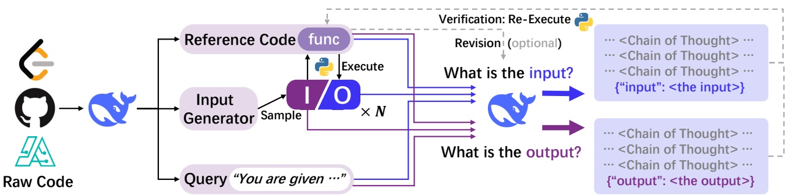
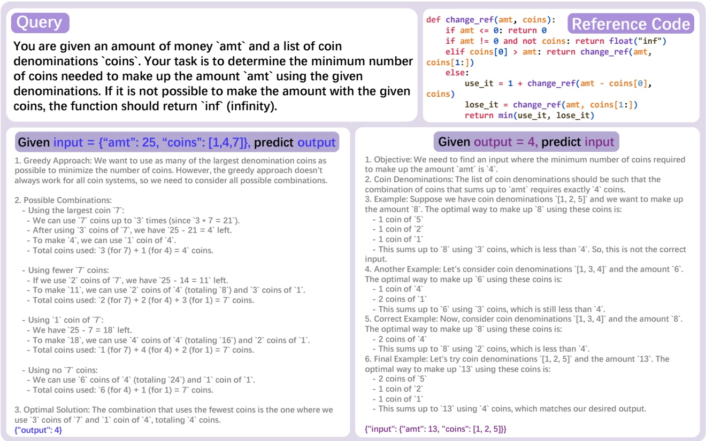
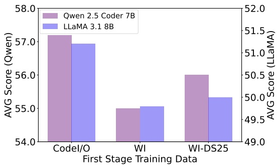
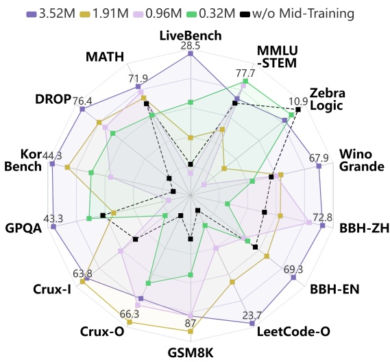
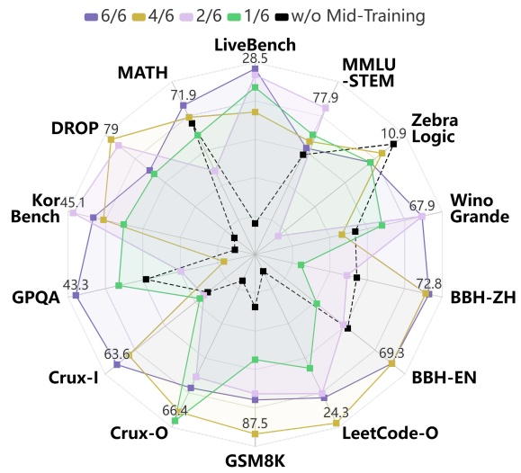
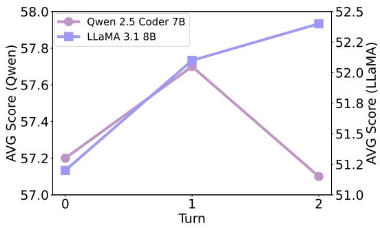
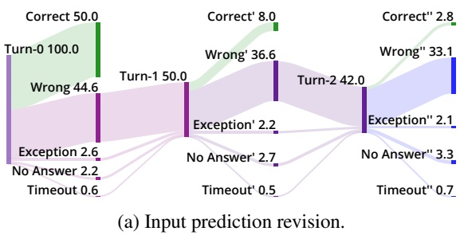
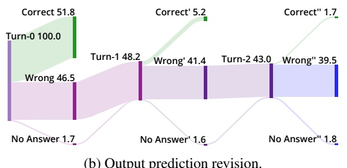

<!-- page 1 of 19 -->

arXiv:2502.07316v4 [cs.CL] 21 May 2025

# CODEI/O: Condensing Reasoning Patterns via Code Input-Output Prediction · 通过代码输入输出预测凝练推理模式

**Junlong Li** <sup>1</sup> 2 3 \* **Daya Guo** <sup>1</sup> **Dejian Yang** <sup>1</sup> **Runxin Xu** <sup>1</sup> **Yu Wu** <sup>1</sup> **Junxian He** <sup>3</sup>

## Abstract

Reasoning is a fundamental capability of Large Language Models. While prior research predominantly focuses on enhancing narrow skills like math or code generation, improving performance on many other reasoning tasks remains challenging due to sparse and fragmented training data. To address this issue, we propose CODEI/O, a novel approach that systematically condenses diverse reasoning patterns inherently embedded in contextually-grounded codes, through transforming the original code into a code input-output prediction format. By training models to pre-dict inputs/outputs given code and test cases entirely in natural language as Chain-of-Thought (CoT) rationales, we expose them to universal reasoning primitives—like logic flow planning, state-space searching, decision tree traversal, and modular decomposition—while decoupling structured reasoning from code-specific syntax and preserving procedural rigor. Experimental results demonstrate CODEI/O leads to consistent improvements across symbolic, scientific, logic, math & numerical, and commonsense reasoning tasks. By matching the existing ground-truth outputs or re-executing the code with predicted inputs, we can verify each prediction and further enhance the CoTs through multi-turn revision, resulting in CODEI/O++ and achieving higher performance. Our data and models are available at [https://github.com/hkust-nlp/CodeIO](https://github.com/hkust-nlp/CodeIO).

推理是大语言模型的基础能力. 以往研究大多集中在数学或代码生成这类窄技能上, 其他许多推理任务的训练数据稀疏而零散, 提升起来很难. 为此我们提出 CODEI/O: 把原始代码改写成「代码输入输出预测」的格式, 系统地凝练出这些贴着具体语境的代码里本来就蕴含的各种推理模式. 模型在给定代码和测试用例的条件下预测输入或输出, 整个推理过程完全用自然语言写成 CoT. 这样模型接触到的是通用的推理原语, 例如逻辑流程规划, 状态空间搜索, 决策树遍历和模块化分解, 结构化推理与代码特有的语法被拆开, 程序的严谨性却保留下来. 实验表明, CODEI/O 在符号, 科学, 逻辑, 数学与数值, 常识推理任务上都带来一致的提升. 通过比对已有的真实输出, 或用预测出的输入重新执行代码, 每一条预测都可以被验证; 再借助多轮修订改进 CoT, 就得到 CODEI/O++, 效果进一步提高. 数据和模型见 https://github.com/hkust-nlp/CodeIO.

## 1. Introduction

Reasoning is a fundamental aspect of human cognition and problem-solving, forming the basis for quickly transferring and adapting to new tasks (Dehaene et al., 2004; Knauff

& Wolf, 2010; Wang & Chiew, 2010). It is also recognized as a cornerstone of advanced Large Language Models (LLMs) and a critical step toward achieving Artificial General Intelligence (AGI) (Huang & Chang, 2022; Qiao et al., 2022; Jaech et al., 2024; Xiang et al., 2025). Current approaches, however, face a fundamental paradox: while tasks like math problem solving (Shao et al., 2024; Yang et al., 2024; Zeng et al., 2024; Ying et al., 2024; Toshniwal et al., 2024) and code generation (Roziere et al., 2023; Mistral-AI, 2024; Zhu et al., 2024; Hui et al., 2024) benefit from abundant structured training data, most other reasoning domains—including logical deduction, scientific inference, and symbolic reasoning—suffer from sparse and fragmented supervision signals. As a result, it becomes crucial to identify training data that is rich in diverse reasoning patterns while remaining scalable to obtain.

推理是人类认知与解决问题的基本环节, 是快速迁移到新任务, 适应新任务的基础 (Dehaene et al., 2004; Knauff & Wolf, 2010; Wang & Chiew, 2010). 它也被认为是先进大语言模型 (LLM) 的基石, 是通向通用人工智能 (AGI) 的关键一步 (Huang & Chang, 2022; Qiao et al., 2022; Jaech et al., 2024; Xiang et al., 2025). 但现有做法面临一个根本矛盾: 数学解题 (Shao et al., 2024; Yang et al., 2024; Zeng et al., 2024; Ying et al., 2024; Toshniwal et al., 2024) 和代码生成 (Roziere et al., 2023; Mistral-AI, 2024; Zhu et al., 2024; Hui et al., 2024) 有大量结构化训练数据可用, 而其他多数推理领域, 包括逻辑演绎, 科学推断和符号推理, 监督信号都稀疏而零散. 因此, 找到一种既富含多样推理模式, 又能规模化获取的训练数据就变得很关键.

We believe that real-world code programs reflect the integration of a wide range of reasoning patterns across diverse contexts, making them an ideal source for training while minimizing the risk of overfitting. However, conventional continual pre-training on raw code is suboptimal because the relevant reasoning signals are often implicit and intertwined with noisy information. Even the cleaner objective of directly training on text-to-code generation also faces challenges, as it is constrained by the requirement to generate code-specific syntax, making it difficult to generalize to tasks beyond code-specific ones. To address such limitations, we propose transforming raw code files into executable functions and designing a more straightforward task: given a function along with its corresponding textual query, the model needs to predict either the execution outputs given inputs or feasible inputs given outputs entirely in natural language as CoT rationales. This approach aims to disentangle core reasoning flow from code-specific syntax while preserving logical rigor. By gathering and transforming functions from diverse sources, the resulting data incorporates a variety of foundational reasoning skills, such as logic flow orchestration, state-space exploration, recursive decomposition, and decision-making. Learning from these samples across the diverse contexts provided by the raw code files enables models to gain repeated exposure to these reasoning processes, allowing them to better internalize these skills.

我们认为, 真实世界的代码程序在各种语境下融合了大量推理模式, 是理想的训练来源, 同时过拟合的风险较小. 但直接在原始代码上做常规的继续预训练效果并不好, 因为相关的推理信号往往是隐式的, 并且和大量噪声信息缠在一起. 即使换成更干净的目标, 直接训练文本到代码的生成, 也会受限于必须产出代码特有的语法, 很难推广到代码以外的任务. 针对这些局限, 我们把原始代码文件改造成可执行函数, 设计一个更直接的任务: 给定一个函数及其对应的文本查询, 模型要么在给定输入时预测执行输出, 要么在给定输出时预测一个可行的输入, 并且全程用自然语言 CoT 作答. 这样做的目的是把核心推理流程与代码特有的语法分开, 同时保留逻辑上的严谨. 从多种来源收集并改造函数后, 得到的数据涵盖多种基础推理技能, 例如逻辑流程编排, 状态空间探索, 递归分解和决策. 模型在原始代码文件提供的多样语境里反复接触这些推理过程, 能更好地把这些技能内化.

Similar to continual pre-training on raw code, our code input/output prediction learning is introduced as a distinct

<sup>\*</sup>Work done during internship at DeepSeek-AI. <sup>1</sup>DeepSeek-AI <sup>2</sup>Shanghai Jiao Tong University <sup>3</sup>HKUST. Correspondence to: Junlong Li &lt;lockonlvange@gmail.com&gt;, Junxian He &lt;junxianh@cse.ust.hk&gt;.

Proceedings of the 42<sup>𝑛𝑑</sup> International Conference on Machine Learning, Vancouver, Canada. PMLR 267, 2025. Copyright 2025 by the author(s).

<!-- page 2 of 19 -->

CODEI/O: Condensing Reasoning Patterns via Code Input-Output Prediction



Figure 1: Overview of our training data construction: Raw code files are gathered from various sources and converted into a unified format. Input-output pairs are then generated by executing the code, while natural language CoTs for predictions are collected from DeepSeek-V2.5. The verified CoTs can undergo optional revisions to further enhance reasoning chains.

training stage positioned before general instruction tuning in a two-stage manner, serving as an intermediate step to enhance the reasoning abilities of the base model. The prompt includes the function, the textual query, and the given input or output, while the response is directly collected by prompting a strong open-source model, DeepSeek-V2.5 (DeepSeek-AI et al., 2024). Notably, the instances for inputoutput prediction are highly scalable to collect, as we can sample hundreds of inputs from a separate Python input generator for each function and execute the code to obtain ground-truth outputs. Finally, we collect over 450K functions from multiple sources, and for each function, several input-output pairs are generated by executing the corresponding code. Synthesizing CoTs for them results in a total of 3.5M training samples, yielding the CODEI/O data. To further leverage the verifiable characteristics of code, we verify all predictions based on code execution and prompt DeepSeek-V2.5 for a second turn of revisions on the responses it initially got wrong. These multi-turn revisions are then concatenated into longer responses. The resulting CODEI/O++ dataset further enhances model performance, demonstrating the effectiveness of this refinement process.

与在原始代码上继续预训练类似, 我们的代码输入输出预测学习也作为一个独立的训练阶段, 放在通用指令微调之前, 构成两阶段训练, 用来作为中间步骤增强基座模型的推理能力. prompt 包含函数, 文本查询以及给定的输入或输出; 响应则直接通过提示一个强开源模型 DeepSeek-V2.5 (DeepSeek-AI et al., 2024) 收集. 输入输出预测的样本很容易规模化: 每个函数都可以用一个独立的 Python 输入生成器采样上百个输入, 再执行代码得到真实输出. 最终我们从多个来源收集了超过 450K 个函数, 每个函数通过执行代码生成若干输入输出对, 为它们合成 CoT 后共得到 3.5M 条训练样本, 即 CODEI/O 数据. 为了进一步利用代码可验证的特性, 我们基于代码执行验证所有预测, 并对首轮答错的响应再提示 DeepSeek-V2.5 做第二轮修订. 这些多轮修订被拼接成更长的响应. 由此得到的 CODEI/O++ 数据集进一步提升了模型表现, 说明这一精修过程是有效的.

We validate the effectiveness of CODEI/O and CODEI/O++ across four base models with parameter sizes ranging from 7B to 30B . Assessments across 14 different benchmarks show training on them enhances performance on a diverse range of reasoning tasks, not only limited to code-related tasks but also more generalized tasks such as logic, symbolic, mathematical & numerical, scientific, commonsense, etc. Compared to several strong data baselines, such as OpenMathInstruct2 (Toshniwal et al., 2024), OpenCoder-SFT-Stage1 (Huang et al., 2024), WebInstruct (Yue et al., 2024), and high-quality raw code (Ben Allal et al., 2024), CODEI/O achieves not only higher average scores across all four tested base models but also more balanced performance – Instead of boosting scores on only a small subset of evaluation benchmarks while causing declines on others, CODEI/O delivers consistent improvements across nearly

all benchmarks, demonstrating balanced and generalizable reasoning abilities.

我们在 7B 到 30B 参数的四个基座模型上验证 CODEI/O 和 CODEI/O++ 的效果. 14 个基准覆盖代码、逻辑、符号、数学与数值、科学和常识任务, 训练后的提升也分布在这些不同领域. 相比 OpenMathInstruct2 (Toshniwal et al., 2024)、OpenCoder-SFT-Stage1 (Huang et al., 2024)、WebInstruct (Yue et al., 2024) 和高质量原始代码 (Ben Allal et al., 2024), CODEI/O 在四个基座上的平均分更高, 且几乎所有基准都取得提升, 没有依靠少数任务涨分来抵消其他任务下降.

## 2. CODEI/O · CODEI/O 的数据构造

Our data construction pipeline is presented in this section. We begin with collecting raw code files from various sources (§2.1). They are then transformed into a unified format (§2.2). Next, I/O pairs are sampled from the transformed functions (§2.3). Finally, the complete training dataset is assembled (§2.4). An overview is depicted in Figure 1.

本节介绍数据构造流水线. 先从多种来源收集原始代码文件 (§2.1), 再把它们转换成统一格式 (§2.2), 接着从转换后的函数中采样输入输出对 (§2.3), 最终组装出完整的训练数据集 (§2.4). 整体流程见图 1.

## 2.1. Collecting Raw Code Files · 收集原始代码文件

The effectiveness of CODEI/O lies in selecting diverse raw code sources that encompass a wide range of reasoning patterns. To achieve this, we select sources with different emphases: **CodeMix**, a large collection of raw Python code files retrieved from an in-house code pre-training corpus, where we filter out files that are either overly simplistic or excessively complex; and **PyEdu-R** (reasoning), a subset of Python-Edu (Ben Allal et al., 2024) that focuses on complex reasoning tasks such as STEM, system modeling or logic puzzles. To avoid overlap with CodeMix, we deliberately exclude files centered on pure algorithms. Beyond these two sources, we also incorporate high-quality code files from a variety of smaller, reputable sources, including comprehensive algorithm repositories, challenging math problems, and well-known online coding platforms. In total, merging these sources yields approximately 810.5K code files. Further details on the data sources can be found in Appendix C.1.

CODEI/O 的效果取决于能否选出覆盖大量推理模式的多样代码来源. 为此我们选择了侧重点不同的来源: **CodeMix** 是从内部代码预训练语料中取出的大量原始 Python 文件, 其中过于简单和过于复杂的文件被过滤掉; **PyEdu-R** (reasoning) 是 Python-Edu (Ben Allal et al., 2024) 的一个子集, 侧重 STEM, 系统建模, 逻辑谜题等复杂推理任务. 为了避免与 CodeMix 重叠, 我们有意排除了以纯算法为主的文件. 除这两个来源外, 我们还从若干规模较小但口碑良好的来源收集了高质量代码文件, 包括综合性算法仓库, 高难度数学题, 以及知名的在线编程平台. 合并这些来源后共约 810.5K 个代码文件. 数据来源的更多细节见附录 C.1.

## 2.2. Transforming to a Unified Format · 转换为统一格式

The collected raw code files often lack structure, contain irrelevant elements, and are hard to execute in a self-contained way. Therefore, we preprocess them using DeepSeek-V2.5 (DeepSeek-AI et al., 2024), which refines them into a unified format that emphasizes main logical functionality and

<!-- page 3 of 19 -->

CODEI/O: Condensing Reasoning Patterns via Code Input-Output Prediction



Figure 2: Two examples for the collected responses for input and output prediction respectively.

makes it executable for us to collect input-output pairs for later prediction tasks. This transformation organizes the data into the following components, and we provide a complete example in Table 10 in Appendix G: **1) Cleaned Reference Code:** We preprocess the raw code files by cleaning and refactoring the code to extract core logical functionalities into functions. Non-essential elements like visualization (e.g., print, plot) and file processing (e.g., read, write) are excluded. **2) Main Entrypoint Function:** A main entrypoint function is added to summarize the overall logic of the code. It can call other functions or import external libraries and must have non-empty arguments (inputs) as well as return meaningful outputs. All inputs and outputs are required to be JSON-serializable to facilitate further processing. **3) Input/Output Description:** The inputs and outputs of the main entrypoint function are clearly defined, including information on data types, constraints (e.g., output ranges), or more complex requirements (e.g., keys in a dictionary). **4) Input Generator:** Rather than generating test cases directly, a standalone rule-based python input generator function is created. This generator returns non-trivial inputs that follow the requirements of the main entrypoint function. Randomness is applied subject to constraints, enabling scalable data generation. **5) Query:** A concise problem statement is generated based on the main entrypoint function, serving as a

query to describe its intended functionality of the code.

收集来的原始代码文件往往缺少结构, 夹杂无关内容, 也难以自包含地执行. 因此我们用 DeepSeek-V2.5 (DeepSeek-AI et al., 2024) 对它们做预处理, 改写成统一格式: 突出主要的逻辑功能, 并且可以执行, 便于后续为预测任务收集输入输出对. 这一转换把数据组织成以下几个部分, 完整示例见附录 G 的 Table 10. **1) 清洗后的参考代码:** 对原始代码文件做清洗和重构, 把核心逻辑功能提取成函数; 可视化 (如 print, plot) 和文件处理 (如 read, write) 等非核心内容被剔除. **2) 主入口函数:** 新增一个主入口函数概括代码的整体逻辑. 它可以调用其他函数或导入外部库, 必须有非空的参数 (输入), 并返回有意义的输出. 所有输入和输出都要求能 JSON 序列化, 以便后续处理. **3) 输入输出说明:** 明确定义主入口函数的输入与输出, 包括数据类型, 约束 (例如输出范围) 或更复杂的要求 (例如字典里必须有哪些键). **4) 输入生成器:** 不直接生成测试用例, 而是写一个独立的, 基于规则的 Python 输入生成函数. 它返回满足主入口函数要求的非平凡输入, 在约束范围内引入随机性, 从而可以规模化地生成数据. **5) 查询:** 根据主入口函数生成一段简洁的问题描述, 作为查询来说明这段代码要实现的功能.

## 2.3. Collecting Input and Output Pairs · 收集输入输出对

After converting the collected raw code files into a unified format, we sample multiple inputs using the input generator for each function and obtain the corresponding outputs by executing the code. To ensure the outputs are deterministic, we skip all functions that include randomness, such as those using import random. During the execution of these codes, we also impose a series of limits on the runtime and the complexity of the input/output objects (details in Appendix A). For each transformed function, we sample multiple inputoutput pairs, with the exact number depending on the source from which it originates (details in Appendix C.2). After filtering out non-executable code, samples that exceed the runtime limit, and input-output pairs surpassing the desired complexity, we obtain 3.5M instances derived from 454.9K raw code files. The distribution of input and output prediction instances is roughly balanced at 50%/50%.

把收集来的原始代码转换成统一格式后, 我们对每个函数用输入生成器采样多个输入, 并执行代码得到对应输出. 为保证输出是确定的, 所有包含随机性的函数 (例如用了 import random 的) 都被跳过. 执行过程中, 我们还对运行时间以及输入输出对象的复杂度施加了一系列限制 (细节见附录 A). 每个转换后的函数采样多少个输入输出对, 取决于它来自哪个来源 (细节见附录 C.2). 过滤掉不可执行的代码, 超出运行时间限制的样本, 以及复杂度超标的输入输出对之后, 我们从 454.9K 个原始代码文件得到 3.5M 个实例. 输入预测与输出预测实例大致各占 50%.

## 2.4. Building Samples for Input-Output Prediction · 构建输入输出预测样本

After collecting the input-output pairs as well as the transformed functions, we need to assemble them into a trainable format. For the supervised fine-tuning process we adopt, a

<!-- page 4 of 19 -->

CODEI/O: Condensing Reasoning Patterns via Code Input-Output Prediction

prompt and a response are needed for each training sample. Since we aim for the input-output prediction tasks, we construct the prompt using a designed template to combine the function, the query, the reference code, and either a specific input or output. We provide an example prompt in Figure 8 in Appendix G. The response should ideally be a natural language CoT to reason about how to derive the correct output or a feasible input. In general, we choose the following two ways to construct the desired CoT responses:

收集好输入输出对和转换后的函数之后, 还要把它们组装成可训练的格式. 我们采用监督微调, 每条训练样本需要一个 prompt 和一个响应. 由于目标是输入输出预测任务, 我们用设计好的模板把函数, 查询, 参考代码以及一个具体的输入或输出拼成 prompt, 示例见附录 G 的 Figure 8. 理想的响应是一段自然语言 CoT, 推理如何得出正确的输出或一个可行的输入. 总体上, 我们用以下两种方式构造所需的 CoT 响应:

**Direct Prompting – CODEI/O** While having full executable code theoretically allows us to generate reliable execution trajectories as responses, two challenges arise: 1) Obtaining a deterministic reverse function for input pre-diction is impractical; 2) Automatically constructed trajectories are constrained by pre-designed templates and lack the expressiveness and generalizability of free-form natural language reasoning. Thus, we adopt a fully LLM-based approach for synthesizing all the desired responses using DeepSeek-V2.5, as it has top-tier performance but extremely low cost compared to other advanced LLMs. The dataset generated here is referred to as CODEI/O. We provide two examples of collected responses in Figure 2.

**直接提示: CODEI/O** 既然有完整的可执行代码, 理论上可以生成可靠的执行轨迹作为响应, 但这样做有两个难点: 1) 输入预测需要一个确定的逆函数, 这在实践中拿不到; 2) 自动构造的轨迹受预先设计的模板约束, 缺少自由形式自然语言推理的表达力和泛化性. 因此我们完全用 LLM 来合成所有响应, 选用 DeepSeek-V2.5, 因为它性能处于第一梯队, 成本却比其他先进 LLM 低得多. 这样生成的数据集称为 CODEI/O. 图 2 给出了两个收集到的响应示例.

**Making Full Use of Code – CODEI/O++** A common approach to enhance data quality is reject sampling (Yuan et al., 2023), where incorrect predictions are discarded. Though this approach suits CODEI/O well as we can verify all responses by re-executing the codes, we find it leads to suboptimal performance (§4.1). Therefore, we take an alternative approach to fully utilize the execution feedback from our reference code. For responses with incorrect predictions, we append the feedback as the second turn of input messages and ask DeepSeek-V2.5 to regenerate another response. In practice, we capture multiple types of feedback: For output prediction, we simply inform the model that it generated an incorrect answer. For input prediction, we additionally provide the executed output based on the incorrect input. For instances where the code fails to execute (e.g., due to a format error, argument mismatch error, or other runtime error), we also include these feedback explicitly.

**充分利用代码: CODEI/O++** 提升数据质量的常见做法是拒绝采样 (Yuan et al., 2023), 即丢弃预测错误的样本. 这个办法很适合 CODEI/O, 因为所有响应都可以重新执行代码来验证, 但我们发现它的效果并不理想 (§4.1). 因此我们换一种办法, 充分利用参考代码给出的执行反馈. 对预测错误的响应, 我们把反馈作为第二轮输入消息附上, 让 DeepSeek-V2.5 重新生成一次响应. 实际使用中我们捕获多种反馈: 对输出预测, 只告诉模型它的答案错了; 对输入预测, 还会附上用这个错误输入执行得到的输出; 对代码执行失败的情况 (例如格式错误, 参数不匹配或其他运行时错误), 也会把这些反馈明确写进去.

After the second turn, we re-check the correctness of the newly generated responses. We then construct the final response by concatenating all of the four components: Turn 1 response + Turn 1 feedback + Turn 2 response + Turn 2 feedback. For correct responses in the first turn, the Turn 1 feedback is simply ”Success” with no Turn 2 contents. In general, in first turn, 50% of the responses are correct and 10% of the incorrect ones can be successfully revised in the second turn. Similar to CODEI/O, we keep all responses, either correct or incorrect, after the revision. The dataset we collect through this way is referred to as CODEI/O++, and we provide a complete example in Table 11 in Appendix G.

第二轮之后, 我们再次检查新响应是否正确, 然后把四部分拼成最终响应: 第一轮响应 + 第一轮反馈 + 第二轮响应 + 第二轮反馈. 第一轮就正确的响应, 第一轮反馈只是 "Success", 没有第二轮内容. 总体上, 第一轮约 50% 的响应正确, 错误响应中约 10% 能在第二轮被成功修正. 与 CODEI/O 一样, 修订之后无论对错, 所有响应都保留. 这样收集的数据集称为 CODEI/O++, 完整示例见附录 G 的 Table 11.

> **核对:** 这里说错误响应有 10% 能在第二轮被修正, 和附录 D 的数字是否一致?
> 答: 不完全一致. 附录 D 和 Figure 7 把输入预测和输出预测分开统计: 输入预测首轮错的 50.0% 里, 修订后改对 8.0 个百分点, 修正率 16%; 输出预测首轮错的 48.2% 里改对 5.2 个百分点, 修正率约 10.8%. 正文的「10%」只对应输出预测一侧, 合起来的修正率在 13% 左右. 修订后整体正确率约为输入 58.0%, 输出 57.0%, 也就是 CODEI/O++ 里仍有四成多的最终响应是错的.

## 3. Experiments · 实验

## 3.1. Settings · 实验设置

**Models** We select the following base models as the backbones: Qwen 2.5 7B Coder (Hui et al., 2024), Deepseek v2 Lite Coder (MoE) (Zhu et al., 2024), LLaMA 3.1 8B (Dubey et al., 2024), and Gemma 2 27B (GemmaTeam et al., 2024). These models were chosen for being the most advanced base models currently, differing in architecture, size, and pre-training focus. Notably, we include two coder models, as previous studies have shown that coder models exhibit stronger reasoning capabilities compared to general-purpose models (Suzgun et al., 2023; Shao et al., 2024).

**模型** 我们选择以下基座模型作为骨干: Qwen 2.5 7B Coder (Hui et al., 2024), Deepseek v2 Lite Coder (MoE) (Zhu et al., 2024), LLaMA 3.1 8B (Dubey et al., 2024) 和 Gemma 2 27B (GemmaTeam et al., 2024). 选它们是因为它们是当前最先进的基座模型, 在架构, 规模和预训练侧重点上各不相同. 其中包含两个代码模型, 因为已有研究表明代码模型的推理能力强于通用模型 (Suzgun et al., 2023; Shao et al., 2024).

**Instruction Tuning Data** We utilize an in-house instructiontuning dataset containing approximately 1.18M samples from different languages, encompassing a wide range of domains such as math, coding, writing, and more. Tuning the model on this dataset enables it to effectively follow diverse instructions, making it applicable to and testable on a broad spectrum of downstream tasks.

**指令微调数据** 我们使用一个内部指令微调数据集, 约 1.18M 条样本, 覆盖多种语言, 领域包括数学, 编程, 写作等. 在这个数据集上微调后, 模型能有效遵循各种指令, 从而可以应用到并测试于广泛的下游任务.

**Training Setups** Similar to continual pre-training, we employ a two-stage training strategy in most of our experiments. The first stage involves training on the CODEI/O or CODEI/O++ dataset, followed by a second stage of general instruction-tuning.

**训练设置** 与继续预训练类似, 大多数实验采用两阶段训练: 第一阶段在 CODEI/O 或 CODEI/O++ 数据集上训练, 第二阶段做通用指令微调.

The reason for adopting this two-stage training approach is rooted in the characteristics of our datasets. The CODEI/O(++) dataset contains a significantly larger number of samples compared to the instruction-tuning data. Simply mixing the two datasets would result in a biased distribution, which could lead to insufficient learning on the instruction-tuning data. This might prevent the model from fully demonstrating its capacity to follow diverse instructions in downstream tasks. To address this, the two-stage training first strengthens the model as a more robust base model for general reasoning, and then adapts it into a versatile instruction-following model through instruction tuning. Detailed training hyper-parameters are in Appendix E.

采用两阶段训练的原因在于数据集本身的特点. CODEI/O(++) 的样本数远多于指令微调数据, 简单混在一起会造成分布偏斜, 指令微调数据可能学得不充分, 模型在下游任务中就难以充分发挥遵循多样指令的能力. 两阶段训练先把模型强化成一个通用推理更稳健的基座, 再通过指令微调把它变成一个通用的指令跟随模型. 详细的训练超参数见附录 E.

**Evaluation Benchmarks** We evaluate all models on these benchmarks: DROP (Dua et al., 2019), WinoGrande (Sakaguchi et al., 2020), GSM8K (Cobbe et al., 2021), MATH (Hendrycks et al., 2021b), MMLU-STEM (Hendrycks et al., 2021a), BBH (Suzgun et al., 2023), GPQA (Rein et al., 2024), CruxEval (Gu et al., 2024), ZebraGrid (Lin et al., 2025). These benchmarks span multiple key reasoning domains, including science, math & numerical, symbolic, commonsense, logic, and code understanding. We also include two comprehensive benchmarks as well: LiveBench (White et al., 2024)<sup>1</sup>, and KorBench (Ma et al., 2024). Besides

<sup>1</sup>We adopt the 2406-2407 split, excluding the code generation and instruction-following subtasks as they are not our focus.

脚注 1: 我们采用 2406-2407 划分, 去掉了代码生成和指令遵循两个子任务, 因为它们不在本文关注范围内.

<!-- page 5 of 19 -->

CODEI/O: Condensing Reasoning Patterns via Code Input-Output Prediction

<table><tr><td>1st Stage Dataset</td><td># (M)</td><td>Wino Grande</td><td>DROP</td><td>GSM 8K</td><td>MATH</td><td>GPQA</td><td>MMLU -STEM</td><td>LC -O</td><td>CRUX -I</td><td>-O</td><td>BBH -EN</td><td>-ZH</td><td>Zebra Logic</td><td>Kor Bench</td><td>Live Bench</td><td>AVG</td></tr><tr><td colspan="17">Qwen 2.5 Coder 7B</td></tr><tr><td colspan="2">2nd Stage Only</td><td>66.9</td><td>70.7</td><td>83.4</td><td>71.6</td><td>41.5</td><td>77.2</td><td>20.7</td><td>61.3</td><td>60.0</td><td>68.3</td><td>70.6</td><td>10.9</td><td>38.7</td><td>26.0</td><td>54.8</td></tr><tr><td>WI</td><td>3.5</td><td>66.3</td><td>73.5</td><td>87.0</td><td>71.4</td><td>39.1</td><td>77.5</td><td>18.3</td><td>59.1</td><td>61.6</td><td>68.6</td><td>68.7</td><td>10.2</td><td>42.5</td><td>26.0</td><td>55.0</td></tr><tr><td>WI (Full)</td><td>11.6</td><td>67.0</td><td>75.0</td><td>87.0</td><td>71.1</td><td>42.9</td><td>78.6</td><td>19.1</td><td>59.3</td><td>59.8</td><td>68.4</td><td>70.4</td><td>10.9</td><td>41.9</td><td>27.6</td><td>55.6</td></tr><tr><td>OMI2</td><td>3.5</td><td>67.6</td><td>74.3</td><td>84.1</td><td>72.3</td><td>36.2</td><td>77.4</td><td>20.9</td><td>60.4</td><td>61.5</td><td>68.8</td><td>69.3</td><td>10.1</td><td>42.7</td><td>27.2</td><td>55.2</td></tr><tr><td>OMI2 (Full)</td><td>14.0</td><td>66.9</td><td>74.0</td><td>88.5</td><td>73.2</td><td>40.9</td><td>77.8</td><td>19.9</td><td>59.5</td><td>62.4</td><td>68.3</td><td>71.3</td><td>11.2</td><td>41.2</td><td>28.4</td><td>56.0</td></tr><tr><td>OC-SFT-1</td><td>4.2</td><td>66.6</td><td>75.3</td><td>86.7</td><td>70.9</td><td>37.7</td><td>78.0</td><td>20.3</td><td>60.9</td><td>60.1</td><td>67.5</td><td>67.6</td><td>10.8</td><td>40.1</td><td>27.5</td><td>55.0</td></tr><tr><td>PyEdu</td><td>7.7</td><td>66.7</td><td>74.8</td><td>85.8</td><td>71.4</td><td>40.9</td><td>77.4</td><td>19.1</td><td>58.9</td><td>62.4</td><td>67.8</td><td>65.7</td><td>10.6</td><td>39.3</td><td>25.8</td><td>54.8</td></tr><tr><td>CODEI/O</td><td>3.5</td><td>67.9</td><td>76.4</td><td>86.4</td><td>71.9</td><td>43.3</td><td>77.3</td><td>23.7</td><td>63.6</td><td>64.9</td><td>69.3</td><td>72.8</td><td>10.7</td><td>44.3</td><td>28.5</td><td>57.2</td></tr><tr><td>CODEI/O++</td><td>3.5</td><td>66.9</td><td>79.1</td><td>85.7</td><td>72.1</td><td>40.6</td><td>77.9</td><td>24.2</td><td>62.5</td><td>67.9</td><td>71.0</td><td>74.2</td><td>10.7</td><td>45.7</td><td>29.1</td><td>57.7</td></tr><tr><td colspan="17">LLaMA 3.1 8B</td></tr><tr><td colspan="2">2nd Stage Only</td><td>71.3</td><td>73.1</td><td>83.2</td><td>49.9</td><td>40.6</td><td>70.0</td><td>4.1</td><td>44.5</td><td>46.9</td><td>65.8</td><td>65.6</td><td>9.8</td><td>39.8</td><td>25.7</td><td>49.3</td></tr><tr><td>WI</td><td>3.5</td><td>72.1</td><td>76.3</td><td>82.8</td><td>52.8</td><td>42.9</td><td>69.6</td><td>4.1</td><td>44.0</td><td>44.8</td><td>64.5</td><td>67.8</td><td>10.0</td><td>42.7</td><td>23.1</td><td>49.8</td></tr><tr><td>OMI2</td><td>3.5</td><td>72.2</td><td>74.8</td><td>86.2</td><td>58.9</td><td>38.2</td><td>70.1</td><td>5.8</td><td>46.1</td><td>46.4</td><td>67.4</td><td>68.6</td><td>9.5</td><td>40.3</td><td>24.5</td><td>50.6</td></tr><tr><td>OC-SFT-1</td><td>4.2</td><td>71.0</td><td>71.9</td><td>81.8</td><td>51.1</td><td>38.2</td><td>68.4</td><td>5.7</td><td>43.5</td><td>44.9</td><td>65.6</td><td>67.6</td><td>10.5</td><td>42.0</td><td>24.7</td><td>49.1</td></tr><tr><td>PyEdu</td><td>7.7</td><td>70.6</td><td>69.6</td><td>83.2</td><td>49.8</td><td>42.4</td><td>69.1</td><td>5.2</td><td>43.1</td><td>44.5</td><td>64.0</td><td>65.6</td><td>10.2</td><td>42.6</td><td>25.7</td><td>49.0</td></tr><tr><td>CODEI/O</td><td>3.5</td><td>71.7</td><td>73.9</td><td>83.6</td><td>53.8</td><td>43.5</td><td>69.0</td><td>9.3</td><td>50.1</td><td>53.3</td><td>67.5</td><td>65.3</td><td>10.4</td><td>40.9</td><td>24.7</td><td>51.2</td></tr><tr><td>CODEI/O++</td><td>3.5</td><td>71.8</td><td>75.1</td><td>84.0</td><td>53.2</td><td>40.9</td><td>68.4</td><td>10.0</td><td>50.4</td><td>53.1</td><td>70.0</td><td>70.6</td><td>10.5</td><td>43.2</td><td>28.1</td><td>52.1</td></tr><tr><td colspan="17">DeepSeek Coder v2 Lite 16B</td></tr><tr><td colspan="2">2nd Stage Only</td><td>68.4</td><td>73.4</td><td>82.5</td><td>60.0</td><td>38.6</td><td>68.5</td><td>14.8</td><td>53.0</td><td>54.9</td><td>61.1</td><td>69.2</td><td>6.7</td><td>44.7</td><td>26.6</td><td>51.6</td></tr><tr><td>WI</td><td>3.5</td><td>68.5</td><td>73.8</td><td>83.7</td><td>60.5</td><td>39.5</td><td>68.7</td><td>14.3</td><td>53.5</td><td>57.1</td><td>61.6</td><td>65.7</td><td>6.9</td><td>43.1</td><td>25.4</td><td>51.6</td></tr><tr><td>OMI2</td><td>3.5</td><td>67.6</td><td>74.1</td><td>84.7</td><td>64.7</td><td>38.4</td><td>70.1</td><td>14.4</td><td>53.8</td><td>55.8</td><td>63.6</td><td>66.4</td><td>6.4</td><td>42.0</td><td>24.7</td><td>51.9</td></tr><tr><td>OC-SFT-1</td><td>4.2</td><td>68.2</td><td>73.6</td><td>83.3</td><td>60.9</td><td>37.3</td><td>69.1</td><td>14.7</td><td>52.8</td><td>56.1</td><td>60.9</td><td>67.9</td><td>6.1</td><td>42.7</td><td>25.2</td><td>51.3</td></tr><tr><td>PyEdu</td><td>7.7</td><td>68.3</td><td>74.6</td><td>83.0</td><td>60.6</td><td>38.2</td><td>69.7</td><td>15.6</td><td>54.9</td><td>57.0</td><td>61.9</td><td>68.6</td><td>7.0</td><td>44.7</td><td>24.6</td><td>52.1</td></tr><tr><td>CODEI/O</td><td>3.5</td><td>68.4</td><td>74.6</td><td>83.6</td><td>60.9</td><td>38.6</td><td>70.3</td><td>18.7</td><td>58.4</td><td>62.8</td><td>63.1</td><td>70.8</td><td>7.8</td><td>46.0</td><td>26.1</td><td>53.6</td></tr><tr><td>CODEI/O++</td><td>3.5</td><td>69.0</td><td>73.5</td><td>82.8</td><td>60.9</td><td>38.8</td><td>70.0</td><td>20.3</td><td>59.5</td><td>61.0</td><td>64.2</td><td>69.4</td><td>6.7</td><td>46.3</td><td>26.9</td><td>53.5</td></tr><tr><td colspan="17">Gemma 2 27B</td></tr><tr><td colspan="2">2nd Stage Only</td><td>72.4</td><td>80.1</td><td>90.1</td><td>66.3</td><td>44.4</td><td>82.8</td><td>19.1</td><td>62.5</td><td>66.9</td><td>77.1</td><td>80.4</td><td>13.5</td><td>47.8</td><td>30.0</td><td>59.5</td></tr><tr><td>WI</td><td>3.5</td><td>73.2</td><td>79.0</td><td>91.5</td><td>70.6</td><td>44.9</td><td>82.7</td><td>20.7</td><td>63.5</td><td>66.3</td><td>77.6</td><td>77.2</td><td>17.1</td><td>47.3</td><td>33.3</td><td>60.4</td></tr><tr><td>OMI2</td><td>3.5</td><td>73.1</td><td>79.3</td><td>90.8</td><td>67.1</td><td>44.0</td><td>83.4</td><td>19.2</td><td>61.4</td><td>66.0</td><td>77.1</td><td>80.5</td><td>13.9</td><td>49.7</td><td>40.7</td><td>60.4</td></tr><tr><td>OC-SFT-1</td><td>4.2</td><td>73.5</td><td>79.9</td><td>91.1</td><td>66.1</td><td>46.9</td><td>81.8</td><td>20.2</td><td>62.8</td><td>65.6</td><td>77.3</td><td>78.9</td><td>14.0</td><td>46.9</td><td>35.3</td><td>60.0</td></tr><tr><td>PyEdu</td><td>7.7</td><td>73.7</td><td>79.5</td><td>90.3</td><td>66.0</td><td>45.3</td><td>82.8</td><td>18.7</td><td>61.3</td><td>64.9</td><td>77.4</td><td>79.0</td><td>14.2</td><td>48.9</td><td>34.0</td><td>59.7</td></tr><tr><td>CODEI/O</td><td>3.5</td><td>75.9</td><td>80.7</td><td>91.2</td><td>67.4</td><td>44.9</td><td>83.3</td><td>22.4</td><td>65.0</td><td>70.3</td><td>77.9</td><td>78.7</td><td>14.6</td><td>49.1</td><td>31.3</td><td>60.9</td></tr><tr><td>CODEI/O++</td><td>3.5</td><td>73.1</td><td>82.0</td><td>91.4</td><td>66.9</td><td>46.0</td><td>83.0</td><td>26.6</td><td>64.4</td><td>70.6</td><td>78.4</td><td>77.8</td><td>16.4</td><td>49.4</td><td>35.3</td><td>61.5</td></tr></table>

these established benchmarks, we test on two extra ones: BBH-ZH, a Chinese version of 9 BBH subtasks<sup>2</sup>as our instruction tuning data contains both English and Chinese examples, and LeetCode-O (LC-O), designed for bilingual output prediction for LeetCode questions with test cases. All evaluations are done with greedy decoding in a zeroshot setting, except for BBH-EN/-ZH where we use a 3-shot setup. Details of all benchmarks are in Appendix B.

**评测基准** 我们在以下基准上评测所有模型: DROP (Dua et al., 2019), WinoGrande (Sakaguchi et al., 2020), GSM8K (Cobbe et al., 2021), MATH (Hendrycks et al., 2021b), MMLU-STEM (Hendrycks et al., 2021a), BBH (Suzgun et al., 2023), GPQA (Rein et al., 2024), CruxEval (Gu et al., 2024), ZebraGrid (Lin et al., 2025). 这些基准覆盖科学, 数学与数值, 符号, 常识, 逻辑和代码理解等关键推理领域. 我们还纳入两个综合基准: LiveBench (White et al., 2024) 和 KorBench (Ma et al., 2024). 在这些已有基准之外, 我们另测两个基准: 一是 BBH-ZH, 由 BBH 的 9 个子任务翻译成中文, 因为我们的指令微调数据同时包含中英文样本; 二是 LeetCode-O (LC-O), 用于对带测试用例的 LeetCode 题做中英双语的输出预测. 除 BBH-EN/-ZH 使用 3-shot 外, 所有评测都在 zero-shot 设置下用贪心解码完成. 全部基准的细节见附录 B.

**Baselines** The primary baseline is to directly fine-tune the

base model on the instruction-tuning dataset in a single stage (2nd Stage only). This serves to evaluate whether the additional training stage provides any tangible benefits. We also select several strong datasets as baselines in the first Stage: WebInstruct (Yue et al., 2024): A large instruction-tuning dataset with 11.6M samples mined from the Internet and refined by LLMs. OpenMathInstruct-2 (Toshniwal et al., 2024): A 14M-sample dataset focused on math problem solving, augmented from GSM8K and MATH using LLaMA 3.1 405B-Inst (Dubey et al., 2024). OpenCoder-SFT-Stage-1 (Huang et al., 2024): A 4.2M QA-

<sup>2</sup>For clarity, BBH is referred to as BBH-EN in later sections.

脚注 2: 为便于区分, 后文把 BBH 称为 BBH-EN.

<!-- page 6 of 19 -->

CODEI/O: Condensing Reasoning Patterns via Code Input-Output Prediction

<table><tr><td></td><td># (M)</td><td>Wino Grande</td><td>DROP</td><td>GSM 8K</td><td>MATH</td><td>GPQA</td><td>MMLU -STEM</td><td>LC -O</td><td>CRUX -I</td><td>-0</td><td>BBH -EN</td><td>-ZH</td><td>Zebra Logic</td><td>Kor Bench</td><td>Live Bench</td><td>AVG</td></tr><tr><td>CODEI/O</td><td>3.52</td><td>67.9</td><td>76.4</td><td>86.4</td><td>71.9</td><td>43.3</td><td>77.3</td><td>23.7</td><td>63.6</td><td>64.9</td><td>69.3</td><td>72.8</td><td>10.7</td><td>44.3</td><td>28.5</td><td>57.2</td></tr><tr><td>~ 50% subset</td><td>1.59</td><td>67.5</td><td>74.7</td><td>86.7</td><td>71.6</td><td>42.9</td><td>77.3</td><td>23.0</td><td>62.8</td><td>65.9</td><td>69.1</td><td>70.8</td><td>10.5</td><td>42.1</td><td>28.9</td><td>56.7</td></tr><tr><td colspan="17">Effect of prediction inputs or outputs only.</td></tr><tr><td>I. Pred. only</td><td>1.75</td><td>66.3</td><td>75.9</td><td>85.8</td><td>71.6</td><td>38.8</td><td>77.7</td><td>22.9</td><td>62.8</td><td>64.5</td><td>68.3</td><td>69.4</td><td>11.4</td><td>44.4</td><td>26.2</td><td>56.1</td></tr><tr><td>O. Pred. only</td><td>1.76</td><td>66.9</td><td>75.2</td><td>84.6</td><td>71.5</td><td>42.4</td><td>76.5</td><td>23.3</td><td>61.1</td><td>65.6</td><td>70.1</td><td>72.1</td><td>11.4</td><td>42.2</td><td>26.9</td><td>56.4</td></tr><tr><td colspan="17">Effect of rejection sampling.</td></tr><tr><td>w/o wrong</td><td>1.79</td><td>66.8</td><td>74.9</td><td>87.4</td><td>71.5</td><td>39.1</td><td>76.7</td><td>22.6</td><td>62.6</td><td>66.6</td><td>68.3</td><td>71.9</td><td>11.5</td><td>42.6</td><td>27.8</td><td>56.5</td></tr><tr><td>wrong→gt</td><td>3.52</td><td>66.4</td><td>76.8</td><td>86.0</td><td>70.6</td><td>42.4</td><td>76.5</td><td>24.3</td><td>62.1</td><td>67.6</td><td>68.0</td><td>71.1</td><td>11.5</td><td>43.1</td><td>26.6</td><td>56.6</td></tr></table>



Figure 3: Average scores of Stage 1 training on CODEI/O, a 3.5M WebInstruct subset (WI) and an enhanced version distilled from DeepSeek-V2.5 Directly (WI-DS25).

pair dataset synthesized from general code data, covering diverse computer science domains. Python-Edu (Ben Allal et al., 2024): Following findings that continued pre-training on code tends to enhance reasoning, we adopt its full 7.7M code corpus and train on it using a standard language modeling loss. For WebInstruct and OpenMathInstruct-2, we use 3.5M subsets for most experiments to align with the size of our CODEI/O dataset, but also report the scores when training on the complete datasets for Qwen 2.5 7B Coder.

**基线** 主要基线是直接在指令微调数据集上对基座模型做单阶段微调 (2nd Stage only), 用来检验多出来的训练阶段是否带来实际收益. 我们还选了几个强数据集作为第一阶段的基线: WebInstruct (Yue et al., 2024): 一个大规模指令微调数据集, 共 11.6M 条, 从互联网挖掘并经 LLM 精修. OpenMathInstruct-2 (Toshniwal et al., 2024): 一个 14M 条的数学解题数据集, 由 LLaMA 3.1 405B-Inst (Dubey et al., 2024) 在 GSM8K 和 MATH 基础上扩增而来. OpenCoder-SFT-Stage-1 (Huang et al., 2024): 一个 4.2M 条的问答对数据集, 从通用代码数据合成, 覆盖多种计算机科学领域. Python-Edu (Ben Allal et al., 2024): 已有发现表明在代码上继续预训练往往能增强推理, 因此我们采用它完整的 7.7M 代码语料, 用标准语言模型损失训练. 对 WebInstruct 和 OpenMathInstruct-2, 大多数实验使用 3.5M 子集, 与 CODEI/O 数据规模对齐; 另外在 Qwen 2.5 7B Coder 上也报告了使用完整数据集训练的分数.

## 3.2. Main Results · 主要结果

We demostrate the main evaluation results in Table 1. As shown, CODEI/O provides universal gains across benchmarks, outperforming both the single-stage baseline and other datasets, even larger ones. While competing datasets may excel in specific tasks (e.g., OpenMathInstruct2 on math) but regress in others (mixed green and red cells), CODEI/O shows consistent improvements (mainly green patterns). Despite using only code-centric data, it enhances all other tasks beyond code reasoning as well, suggesting its generalizable capabilities. We also observe that training on raw code files (PythonEdu) results in only minor, and occasionally even negative, improvements compared to the

single-stage baseline, significantly underperforming when compared to CODEI/O, suggesting that learning from such less-structured data is suboptimal. This further highlights that performance gains are driven not merely by data size but by thoughtfully designed training tasks that encompass diverse, structured reasoning patterns in generalized CoTs.

主要评测结果见 Table 1. 可以看到, CODEI/O 在各基准上普遍带来提升, 既超过单阶段基线, 也超过其他数据集, 包括规模更大的数据集. 其他数据集可能在特定任务上表现突出 (例如 OpenMathInstruct2 在数学上), 却在另一些任务上退步 (表中红绿交错), 而 CODEI/O 的提升是一致的 (以绿色为主). 尽管只用了以代码为中心的数据, 它在代码推理之外的其他任务上也都有提升, 说明它的能力可以泛化. 我们还观察到, 在原始代码文件 (PythonEdu) 上训练只带来很小的提升, 有时甚至为负, 远不如 CODEI/O, 说明从这种结构较松散的数据中学习效果不佳. 这进一步表明, 性能提升不仅来自数据规模, 更来自精心设计的训练任务: 这些任务在可泛化的 CoT 中包含了多样的结构化推理模式.

Additionally, CODEI/O++ systematically outperforms CODEI/O, boosting average scores without trade-offs on individual tasks. This highlights how execution-feedbackbased multi-turn revision improves data quality and enhances reasoning across domains. Most importantly, both CODEI/O and CODEI/O++ demonstrate performance improvements across models of various sizes and architectures on most benchmarks, although we also observed nearly unchanged or even decreased performance on a small number of tasks. The further validates that our training approach, predicting code inputs and outputs, enables models to excel in diverse reasoning tasks without sacrificing specialized benchmark performance.

此外, CODEI/O++ 系统性地优于 CODEI/O, 提高了平均分, 且没有在个别任务上付出代价. 这说明基于执行反馈的多轮修订提升了数据质量, 并在各领域增强了推理. 最重要的是, CODEI/O 和 CODEI/O++ 在不同规模, 不同架构的模型上, 在大多数基准上都带来了提升, 尽管我们也观察到少数任务上表现几乎不变甚至下降. 这进一步验证了我们的训练方法, 即预测代码的输入和输出, 能让模型在多种推理任务上表现出色, 同时不牺牲专项基准上的表现.

> **看表:** 「CODEI/O++ 系统性地优于 CODEI/O, 没有个别任务上的代价」和 Table 1 对得上吗?
> 答: 对不上. Table 1 里 DeepSeek Coder v2 Lite 一组, CODEI/O++ 平均 53.5, 低于 CODEI/O 的 53.6; 单项上, Qwen 一组 GSM8K 从 86.4 降到 85.7, GPQA 从 43.3 降到 40.6; Gemma 一组 WinoGrande 从 75.9 降到 73.1. 附录 F 换成 Tulu-3 做第二阶段时, CODEI/O++ 也是 49.7 低于 CODEI/O 的 50.0. 能成立的说法是: 四个基座里有三个平均分上升 (+0.5, +0.9, +0.6), 单项有升有降.

## 4. Analysis · 分析

To examine the influence of different critical aspects of our approach, we carry out multiple analysis experiments. Unless explicitly stated otherwise, all experiments are performed using Qwen 2.5 Coder 7B for simplicity, and the results reported are those obtained after the second-stage general instruction tuning.

为考察方法中几个关键环节的影响, 我们做了多组分析实验. 除非另有说明, 所有实验都用 Qwen 2.5 Coder 7B 以简化设置, 报告的都是经过第二阶段通用指令微调之后的结果.

## 4.1. Ablation Studies · 消融实验

We first perform two key ablation studies on our data construction process, with results presented in Table 2:

我们先对数据构造过程做两项关键消融, 结果见 Table 2:

**Input/Output Prediction** We examine input and output pre-diction by training on each separately. The scores are generally similar, but input prediction excels on KorBench while slightly hurting GPQA, and output prediction shows greater benefits on symbolic reasoning tasks like BBH. CRUXEval-

<!-- page 7 of 19 -->

CODEI/O: Condensing Reasoning Patterns via Code Input-Output Prediction



(a) Size of randomly sampled subset.



(b) Ratio of testcases per sample compared to the full set.

Figure 4: The scaling effect of CODEI/O in the first stage training.

I and -O also favor input and output prediction, respectively.

**输入/输出预测** 我们分别只用输入预测或只用输出预测来训练. 两者分数总体接近, 但输入预测在 KorBench 上更好, 在 GPQA 上略有损失; 输出预测在 BBH 这类符号推理任务上收益更大. CRUXEval-I 和 -O 也分别偏向输入预测和输出预测.

**Rejection Sampling** We explore filtering incorrect responses using rejection sampling, which removes 50% of the training data. However, this results in a general performance drop, suggesting a loss of data diversity. We also experiment with replacing all incorrect responses with ground-truth answers through code execution (without CoT). We see improvements on benchmarks like LeetCode-O and CRUXEval-O designed to measure output prediction accuracy, but it lowers scores elsewhere, reducing the average performance. When comparing these two with training on a ∼ 50% subset of CODEI/O where the number of samples are comparable, they still have no advantages. Therefore, to maintain performance balance, we retain all incorrect responses in the main experiments without any modification.

**拒绝采样** 我们尝试用拒绝采样过滤错误响应, 这会删掉 50% 的训练数据, 结果整体性能下降, 说明损失了数据多样性. 我们还尝试把所有错误响应替换成通过代码执行得到的真实答案 (不带 CoT). 这在 LeetCode-O 和 CRUXEval-O 这类衡量输出预测准确率的基准上有提升, 但其他基准分数下降, 平均分降低. 把这两种做法与样本数相当的约 50% CODEI/O 子集相比, 它们仍然没有优势. 因此, 为了保持各项表现的均衡, 主实验中保留了全部错误响应, 不做任何修改.

## 4.2. Effect of Different Synthesis Model · 合成模型的影响

Some of our baselines such as WebInstruct synthesize responses with Qwen-72B (Bai et al., 2023) and Mixtral 22Bx8 (Jiang et al., 2024a), while CODEI/O uses DeepSeek-V2.5. To ablate the effect of different synthesis models, we regenerate responses for the 3.5M WebInstruct (as it covers massive domains) subset using DeepSeek-V2.5, creating an updated dataset called WebInstruct-DS25. As shown in Figure 3, while WebInstruct-DS25 outperforms the vanilla dataset on Qwen 2.5 Coder 7B and LLaMA 3.1 8B, it still falls short of CODEI/O. This highlights the value of diverse reasoning patterns in code and the importance of task selection in training. Overall, this comparison shows that predicting code inputs and outputs improves reasoning beyond mere knowledge distillation from an advanced model.

部分基线 (例如 WebInstruct) 用 Qwen-72B (Bai et al., 2023) 和 Mixtral 22Bx8 (Jiang et al., 2024a) 合成响应, 而 CODEI/O 用的是 DeepSeek-V2.5. 为了排除合成模型不同带来的影响, 我们用 DeepSeek-V2.5 为 3.5M 的 WebInstruct 子集 (因为它覆盖的领域最广) 重新生成响应, 得到更新后的数据集 WebInstruct-DS25. 如 Figure 3 所示, WebInstruct-DS25 在 Qwen 2.5 Coder 7B 和 LLaMA 3.1 8B 上都优于原版, 但仍不及 CODEI/O. 这说明代码中多样推理模式的价值, 以及训练任务选择的重要性. 总的来说, 这一对比表明, 预测代码输入输出对推理的提升不只是从强模型做知识蒸馏.

## 4.3. Scaling Effect of CODEI/O · CODEI/O 的数据规模效应

We evaluate how CODEI/O scales with varying amounts of training data. By randomly sampling training instances, Figure 4a reveals a clear trend: increasing the number of training samples generally leads to improved performance across benchmarks. Specifically, using the smallest amount of data exhibits relatively weak performance on most benchmarks, as the model lacks sufficient training to generalize effectively. In contrast, when trained on the full dataset, CODEI/O achieves the most comprehensive and robust performance. Intermediate amounts of data yield results that fall between these two extremes, demonstrating a gradual improvement in performance as more training samples are introduced. This highlights CODEI/O’s scalability and effectiveness in enhancing reasoning capabilities.

我们考察 CODEI/O 随训练数据量变化的效果. 随机抽取训练实例后, Figure 4a 显示出清晰的趋势: 训练样本越多, 各基准上的表现总体越好. 具体来说, 数据量最小时, 多数基准上表现偏弱, 因为模型训练不足, 难以有效泛化; 用全量数据训练时, CODEI/O 的表现最全面也最稳健; 中间数据量的结果介于两者之间, 说明随着样本增加, 表现逐步提升. 这体现了 CODEI/O 在增强推理能力上的可扩展性和有效性.

> **再看:** Figure 4a 的「数据越多越好」在每个基准上都成立吗?
> 答: 不是每个基准都成立. 雷达图每根轴上标的是该轴最高值: 1.91M 子集在 GSM8K (87), Crux-I (63.8), Crux-O (66.3) 上高于全量 3.52M (Table 1 中为 86.4, 63.6, 64.9), 0.32M 子集在 MMLU-STEM (77.7) 上最高, ZebraLogic 的最高点是不做第一阶段的基线 (10.9). Figure 4b 里 4/6 的 I/O 比例在 DROP (79), GSM8K (87.5), LeetCode-O (24.3) 上高于 6/6, 1/6 在 Crux-O (66.4) 上最高. 能从图里读出的是平均意义上的上升, 以及全量在 LiveBench, MATH, GPQA, KorBench 等多数轴上最靠外; 单个基准的曲线并不单调. 论文没有给出每个点的方差或多次随机抽样的结果.

We also scale the data on the dimension of input-output pairs by fixing and using all unique raw code samples but changing the number of input-output prediction instances for each sample. Figure 4b shows the ratio of used I/O pairs compared to the full set. While the scaling effect is less pronounced than with training samples, we still observe clear benefits, particularly when increasing from 1/6 to 6/6. This suggests some reasoning patterns require multiple test cases to fully capture and learn their complex logic flow.

我们还在输入输出对这一维度上调整数据规模: 固定使用全部不重复的原始代码样本, 只改变每个样本对应的输入输出预测实例数. Figure 4b 展示了所用 I/O 对占全量的比例. 这一维度上的规模效应不如训练样本数那么明显, 但仍能看到清楚的收益, 尤其是从 1/6 增加到 6/6 时. 这说明有些推理模式需要多个测试用例才能完整捕捉和学会其中复杂的逻辑流程.

## 4.4. Different Data Format · 不同的数据格式

We investigate how to best arrange the query, reference code, and CoT in training samples. As shown in Table 3, placing the query and reference code in the prompt and the CoT in the response achieves the highest average score and most balanced performance across benchmarks. Other formats

<!-- page 8 of 19 -->

CODEI/O: Condensing Reasoning Patterns via Code Input-Output Prediction

| Data Prompt | Format Response | Wino Grande | DROP | GSM8K | MATH | GPQA | MMLU -STEM | LC CRUX BBH Zebra -O -I -O -EN -ZH Logic | Kor Bench | Live Bench | AVG |
| --- | --- | --- | --- | --- | --- | --- | --- | --- | --- | --- | --- |
| Q+Code | CoT | 67.9 | 76.4 | 86.4 | 71.9 | 43.3 | 77.3 | 23.7 63.6 64.9 69.3 72.8 10.7 | 44.3 | 28.5 | 57.2 |
| Q | CoT | 67.2 | 76.8 | 87.2 | 70.4 | 37.5 | 77.3 | 25.2 62.6 65.3 69.2 71.1 11.5 | 44.9 | 28.5 | 56.8 |
| Code | CoT | 67.9 | 76.4 | 87.0 | 70.8 | 39.5 | 76.5 | 25.0 64.1 65.8 68.8 71.3 10.6 | 45.2 | 28.5 | 57.0 |
| Q | Code+CoT | 65.9 | 76.1 | 87.5 | 71.7 | 42.2 | 76.9 | 22.9 63.9 66.1 69.6 72.9 10.9 | 41.4 | 28.5 | 56.9 |
| Q | Code | 66.9 | 73.1 | 84.8 | 71.6 | 40.0 | 77.4 | 20.8 59.5 62.4 67.2 68.3 10.1 | 40.3 | 26.3 | 54.9 |



Figure 5: Average benchmark scores from training on data from different turns of revision.

show slightly lower but comparable performance, with the worst results occurring when the query is in the prompt and the reference code in the response, resembling a standard code generation task but with much fewer training samples. This highlights the importance of CoT and the scaling of test cases for learning transferable reasoning ability.

我们研究训练样本中查询, 参考代码和 CoT 的最佳排布方式. 如 Table 3 所示, 把查询和参考代码放在 prompt 中, CoT 放在响应中, 平均分最高, 各基准上的表现也最均衡. 其他格式的表现略低但相近; 最差的是把查询放在 prompt, 参考代码放在响应中, 这相当于标准的代码生成任务, 只是训练样本少得多. 这凸显了 CoT 以及测试用例规模对学习可迁移推理能力的重要性.

## 4.5. Multi-turn Revision · 多轮修订

Based on CODEI/O (no revision) and CODEI/O++ (singleturn revision), we extended revisions to a second turn to evaluate further improvements by regenerating predictions for instances still incorrect after the first revision. We visualize the distribution of response types in each turn in Figure 7 in Appendix D. It shows that most correct responses are predicted in the initial turn, with about 10% of incorrect responses corrected in the first-turn revision. However, the second turn yields significantly fewer corrections, we find by checking the cases that the model often repeats the same incorrect CoT without adding new useful information. After incorporating multi-turn revisions, we observe consistent improvement from turn 0 to turn 1 but minimal gains from turn 1 to turn 2 in Figure 5 – showing slight improvement for LLaMA 3.1 8B but regression for Qwen 2.5 Coder 7B. Hence, we stop at single-turn revision, i.e., CODEI/O++, in our main experiments.

在 CODEI/O (不修订) 和 CODEI/O++ (修订一轮) 的基础上, 我们把修订扩展到第二轮: 对第一轮修订后仍然错误的实例再次生成预测, 评估能否进一步提升. 附录 D 的 Figure 7 可视化了每一轮各类响应的分布. 可以看到, 大多数正确响应在第一次预测中就已得到, 约 10% 的错误响应在第一轮修订中被纠正. 但第二轮纠正的数量明显减少; 检查样例后我们发现, 模型经常重复同样的错误 CoT, 没有加入新的有用信息. 加入多轮修订后, Figure 5 显示从第 0 轮到第 1 轮有一致的提升, 而从第 1 轮到第 2 轮收益很小: LLaMA 3.1 8B 略有提升, Qwen 2.5 Coder 7B 反而退步. 因此主实验中我们停在单轮修订, 即 CODEI/O++.

## 4.6. The Necessity of Two Stage Training · 两阶段训练的必要性

Lastly, we highlight the necessity of a separate training stage with CODEI/O data by testing both single-stage mixed train-

| First Stage | Second Stage | M Qwen | odel LLaMA |
| --- | --- | --- | --- |
| - | IT | 54.8 | 49.3 |
| - | CODEI/O(10%)+IT | 56.6 | 50.5 |
| CODEI/O+IT | - | 55.9 | 49.7 |
| CODEI/O | IT | 57.2 | 51.2 |
| CODEI/O+IT | IT | 56.8 | 51.5 |
| CODEI/O | CODEI/O(10%)+IT | 57.0 | 52.7 |

ing and two-stage training with different data mixtures. As shown in Table 4, all two-stage variants outperform singlestage training. Meanwhile, the effect of mixing data during two-stage training varies across models. For Qwen 2.5 Coder 7B, the best result is keeping CODEI/O and instruction-tuning data fully separate, while LLaMA 3.1 8B performs better with mixed data, either in the first stage or in the second stage. To simplify our methodology, we use fully separated data in our main experiments, leaving optimal data-mixing strategies for future work.

最终, 我们说明 CODEI/O 数据单独作为一个训练阶段的必要性: 分别测试单阶段混合训练和使用不同数据混合方式的两阶段训练. 如 Table 4 所示, 所有两阶段变体都优于单阶段训练. 同时, 两阶段训练中混合数据的效果因模型而异: 对 Qwen 2.5 Coder 7B, 最好的结果来自 CODEI/O 与指令微调数据完全分开; LLaMA 3.1 8B 则在混合数据时表现更好, 无论混在第一阶段还是第二阶段. 为了让方法保持简单, 主实验采用完全分开的数据, 最优的数据混合策略留待未来研究.

## 4.7. Discussion on Data Leakage · 数据泄漏讨论

Considering the diversity of CODEI/O, it is unavoidable to see pattern overlap in both the training data and the test benchmarks. Thus, distinguishing whether the performance gain is from learning similar reasoning patterns or from seeing identical questions in training becomes important. To do so, we conduct a strict 13-gram-based leakage detection on CODEI/O data following Singh et al. (2024). Specifically, if any normed (punctuation, numbers, and blank spaces removed) 13-gram in a test question is found in the whole training data, it will be tagged as potentially leaked. The results are shown in Table 5, and we can see that for most of the benchmarks, there is no risk of leakage, or the leakage ratio is far less than the performance gain.

CODEI/O 的数据很多样, 训练数据与测试基准之间不可避免会有模式上的重叠. 因此需要区分, 性能提升究竟来自学到相似的推理模式, 还是来自在训练中见过相同的题目. 为此我们参照 Singh et al. (2024), 对 CODEI/O 数据做严格的 13-gram 泄漏检测. 具体而言, 测试题中任意一个规范化后 (去掉标点, 数字和空白) 的 13-gram 只要在整个训练数据中出现过, 这道题就被标为可能泄漏. 结果见 Table 5: 大多数基准没有泄漏风险, 或者泄漏比例远小于性能提升幅度.

Upon manual inspection of the two benchmarks – LeetCode-O and KorBench – with high potential leakage ratios, we find that:

对潜在泄漏比例较高的两个基准 LeetCode-O 和 KorBench 做人工检查后, 我们发现:

1) KorBench overlaps only contain general descriptions like Sudoku rules or common letter sequences (“A B C D...”) rather than specific questions – our training tasks and the

<!-- page 9 of 19 -->

CODEI/O: Condensing Reasoning Patterns via Code Input-Output Prediction

| Benchmark | Ratio (%) | Benchmark | Ratio (%) |
| --- | --- | --- | --- |
| LeetCode-O | 21.5 | MMLU | 0.1 |
| KorBench | 5.1 | CRUXEval | 0.1 |
| MATH | 0.1 | Others | 0.0 |

<table><tr><td rowspan="2">Model</td><td colspan="2">LeetCode-O</td><td colspan="2">KorBench</td></tr><tr><td>full</td><td>unleaked</td><td>full</td><td>unleaked</td></tr><tr><td>Qwen</td><td>3.8</td><td>3.9</td><td>5.8</td><td>6.1</td></tr><tr><td>LLaMA</td><td>9.4</td><td>9.4</td><td>1.0</td><td>0.9</td></tr><tr><td>DSLite</td><td>5.3</td><td>5.7</td><td>-1.2</td><td>-1.3</td></tr><tr><td>Gemma</td><td>3.7</td><td>3.9</td><td>1.4</td><td>1.3</td></tr></table>

benchmark tasks are completely different.

1) KorBench 的重叠只包含一般性描述, 例如数独规则或常见字母序列 ("A B C D..."), 而不是具体题目; 我们的训练任务和基准任务完全不同.

2) LeetCode-O overlaps stem from sibling problems sharing common descriptions (e.g., Two Sum I & II), despite our having removed all original problems from our training data.

2) LeetCode-O 的重叠来自共享相同描述的姊妹题 (例如 Two Sum I 和 II), 尽管我们已经从训练数据中删去了所有原题.

To further evaluate whether the gains on these two benchmarks are due to data leakage, we calculated the samplewise accuracy gains of CODEI/O compared to the baseline on both the full set and the non-leaked set for various models. The results are shown in Table 6. The similar gains observed on both full and non-leaked subsets across all models confirm that our improvements are not attributable to data leakage.

为了进一步判断这两个基准上的提升是否来自数据泄漏, 我们在不同模型上分别计算了 CODEI/O 相对基线在全集和非泄漏子集上的逐样本准确率增益, 结果见 Table 6. 所有模型在全集和非泄漏子集上的增益都相近, 说明提升并非来自数据泄漏.

> **对一下:** Table 6 里 Qwen 在 LeetCode-O 全集上的增益是 3.8, 而 Table 1 中 CODEI/O 与基线之差是 23.7 - 20.7 = 3.0, 为什么不同?
> 答: 口径不同. Table 1 的 LeetCode-O 用题目级分数, 一道题的所有输入在中英两种语言下都预测对才得 1 分 (附录 B); Table 6 写的是「逐样本准确率增益」, 按单条输入输出算. LLaMA 一行更明显: Table 1 差值 9.3 - 4.1 = 5.2, Table 6 是 9.4. 论文没有给出逐样本口径下的绝对分数, 所以 Table 6 只能用来比较全集与非泄漏子集之间的差, 不能和 Table 1 的数直接相减对照.

## 5. Related Work · 相关工作

**Learning about Code Execution** The topic of learning code execution has existed long before the era of LLMs (Zaremba & Sutskever, 2014; Graves et al., 2014). However, most related works focus solely on the output prediction task itself when learning from code execution (Nye et al., 2021; Liu et al., 2023; Ding et al., 2024c). Other works seek to utilize code execution, either through the final feedback (Ding et al., 2024a; Wang et al., 2024) or the intermediate trace (Ding et al., 2024b; Ni et al., 2024), to improve code generation abilities. There are also specific benchmarks designed to evaluate a model’s ability to predict execution results, such as CRUXEval (Gu et al., 2024) and LiveCodeBench-Exec (Jain et al., 2024). Similar to our method, Jiang et al. (2024b) also propose to learn from code execution to enhance general reasoning ability, but the involved functions are mainly LeetCode ones. Unlike the above works, which set a narrow scope within code-related tasks, we are the first

to train LLMs on large-scale, diverse code input-output pre-dictions and demonstrate its efficacy in improving general reasoning ability beyond code.

**学习代码执行** 学习代码执行这一课题在 LLM 时代之前就已存在 (Zaremba & Sutskever, 2014; Graves et al., 2014). 但多数相关工作在从代码执行中学习时只关注输出预测任务本身 (Nye et al., 2021; Liu et al., 2023; Ding et al., 2024c). 另一些工作利用代码执行来提升代码生成能力, 用的是最终反馈 (Ding et al., 2024a; Wang et al., 2024) 或中间轨迹 (Ding et al., 2024b; Ni et al., 2024). 也有专门评测模型预测执行结果能力的基准, 例如 CRUXEval (Gu et al., 2024) 和 LiveCodeBench-Exec (Jain et al., 2024). 与我们的方法相近, Jiang et al. (2024b) 也提出从代码执行中学习以增强通用推理, 但涉及的函数主要来自 LeetCode. 上述工作都把范围限定在代码相关任务内, 而我们首次在大规模, 多样的代码输入输出预测上训练 LLM, 并证明它能提升代码以外的通用推理能力.

**Inference Time Scaling** A very recent approach to enhance reasoning is inference-time scaling, such as OpenAI’s o1 (Jaech et al., 2024) or DeepSeek’s R1 (DeepSeek-AI et al., 2025), which typically encourages models to generate ultra-long reasoning process to solve problems through large-scale reinforcement learning. Such methods are pushing models to new limits on massive challenge tasks, while also significantly altering the output patterns of models. We believe that CODEI/O is orthogonal to these methods, and we hope it can provide a better basis to further incentivize the reasoning abilities of LLMs.

**TestingTime 算力** 近期一类增强推理的做法是在推理时多花算力, 例如 OpenAI 的 o1 (Jaech et al., 2024) 和 DeepSeek 的 R1 (DeepSeek-AI et al., 2025), 它们通常借助大规模强化学习, 鼓励模型生成超长的推理过程来解题. 这类方法把模型在大量高难任务上的能力推到了新的高度, 同时也显著改变了模型的输出模式. 我们认为 CODEI/O 与这些方法正交, 希望它能为进一步激发 LLM 的推理能力提供更好的基础.

## 6. Conclusion

In conclusion, we introduced CODEI/O, an approach to improve the reasoning abilities of LLMs by training them to predict code inputs and outputs in pure natural language CoTs. This approach leverages the structured and scalable nature of code to learn diverse reasoning patterns, including symbolic, logical, mathematical, and commonsense reasoning. Extensive experiments show that CODEI/O as well as the enhanced CODEI/O++ consistently outperforms existing baselines, delivering balanced improvements across benchmarks without sacrificing performance in any domain, underscoring its robustness and versatility.

总之, 我们提出了 CODEI/O: 训练 LLM 用纯自然语言 CoT 预测代码的输入和输出, 以此提升推理能力. 这一方法利用代码结构化, 可规模化的特点, 学习多样的推理模式, 包括符号, 逻辑, 数学和常识推理. 大量实验表明, CODEI/O 以及增强版 CODEI/O++ 一致地超过现有基线, 在各基准上带来均衡的提升, 没有在任何领域牺牲表现, 体现出方法的稳健性和通用性.

## Acknowledgments

We thank the anonymous reviewers for their valuable comments. This work is largely inspired by a previously unpublished project, and we hereby thank its core participants: Zhoujun Cheng, Fan Zhou, Yu Gu, and Qian Liu. We also thank Wei Liu and Yiheng Xu for their valuable feedback and suggestions on paper writing.

## References

Bai, J., Bai, S., Chu, Y., Cui, Z., Dang, K., Deng, X., Fan, Y., Ge, W., Han, Y., Huang, F., et al. Qwen technical report. arXiv preprint arXiv:2309.16609, 2023.

Ben Allal, L., Lozhkov, A., Penedo, G., Wolf, T., and von Werra, L. Smollm-corpus, 2024. URL [https://huggingface.co/datasets/HuggingFaceTB/smollm-corpus](https://huggingface.co/datasets/HuggingFaceTB/smollm-corpus).

Cobbe, K., Kosaraju, V., Bavarian, M., Chen, M., Jun, H., Kaiser, L., Plappert, M., Tworek, J., Hilton, J., Nakano, R., et al. Training verifiers to solve math word problems. arXiv preprint arXiv:2110.14168, 2021.

<!-- page 10 of 19 -->

CODEI/O: Condensing Reasoning Patterns via Code Input-Output Prediction

DeepSeek-AI, Liu, A., Feng, B., Wang, B., Wang, B., Liu, B., Zhao, C., Dengr, C., Ruan, C., Dai, D., Guo, D., et al. Deepseek-v2: A strong, economical, and efficient mixture-of-experts language model. arXiv preprint arXiv:2405.04434, 2024.

DeepSeek-AI, Guo, D., Yang, D., Zhang, H., Song, J., Zhang, R., Xu, R., Zhu, Q., Ma, S., Wang, P., Bi, X., Zhang, X., Yu, X., Wu, Y., Wu, Z. F., Gou, Z., Shao, Z., Li, Z., Gao, Z., Liu, A., Xue, B., Wang, B., Wu, B., Feng, B., Lu, C., Zhao, C., Deng, C., Zhang, C., Ruan, C., Dai, D., Chen, D., Ji, D., Li, E., Lin, F., Dai, F., Luo, F., Hao, G., Chen, G., Li, G., Zhang, H., Bao, H., Xu, H., Wang, H., Ding, H., Xin, H., Gao, H., Qu, H., Li, H., Guo, J., Li, J., Wang, J., Chen, J., Yuan, J., Qiu, J., Li, J., Cai, J. L., Ni, J., Liang, J., Chen, J., Dong, K., Hu, K., Gao, K., Guan, K., Huang, K., Yu, K., Wang, L., Zhang, L., Zhao, L., Wang, L., Zhang, L., Xu, L., Xia, L., Zhang, M., Zhang, M., Tang, M., Li, M., Wang, M., Li, M., Tian, N., Huang, P., Zhang, P., Wang, Q., Chen, Q., Du, Q., Ge, R., Zhang, R., Pan, R., Wang, R., Chen, R. J., Jin, R. L., Chen, R., Lu, S., Zhou, S., Chen, S., Ye, S., Wang, S., Yu, S., Zhou, S., Pan, S., Li, S. S., Zhou, S., Wu, S., Ye, S., Yun, T., Pei, T., Sun, T., Wang, T., Zeng, W., Zhao, W., Liu, W., Liang, W., Gao, W., Yu, W., Zhang, W., Xiao, W. L., An, W., Liu, X., Wang, X., Chen, X., Nie, X., Cheng, X., Liu, X., Xie, X., Liu, X., Yang, X., Li, X., Su, X., Lin, X., Li, X. Q., Jin, X., Shen, X., Chen, X., Sun, X., Wang, X., Song, X., Zhou, X., Wang, X., Shan, X., Li, Y. K., Wang, Y. Q., Wei, Y. X., Zhang, Y., Xu, Y., Li, Y., Zhao, Y., Sun, Y., Wang, Y., Yu, Y., Zhang, Y., Shi, Y., Xiong, Y., He, Y., Piao, Y., Wang, Y., Tan, Y., Ma, Y., Liu, Y., Guo, Y., Ou, Y., Wang, Y., Gong, Y., Zou, Y., He, Y., Xiong, Y., Luo, Y., You, Y., Liu, Y., Zhou, Y., Zhu, Y. X., Xu, Y., Huang, Y., Li, Y., Zheng, Y., Zhu, Y., Ma, Y., Tang, Y., Zha, Y., Yan, Y., Ren, Z. Z., Ren, Z., Sha, Z., Fu, Z., Xu, Z., Xie, Z., Zhang, Z., Hao, Z., Ma, Z., Yan, Z., Wu, Z., Gu, Z., Zhu, Z., Liu, Z., Li, Z., Xie, Z., Song, Z., Pan, Z., Huang, Z., Xu, Z., Zhang, Z., and Zhang, Z. Deepseek-r1: Incentivizing reasoning capability in llms via reinforcement learning, 2025. URL [https://arxiv.org/abs/2501.12948](https://arxiv.org/abs/2501.12948).

Dehaene, S., Molko, N., Cohen, L., and Wilson, A. J. Arithmetic and the brain. Current opinion in neurobiology, 14 (2):218–224, 2004.

Ding, Y., Min, M. J., Kaiser, G., and Ray, B. Cycle: Learning to self-refine the code generation. Proceedings of the ACM on Programming Languages, 8(OOPSLA1): 392–418, 2024a.

Ding, Y., Peng, J., Min, M. J., Kaiser, G., Yang, J., and Ray, B. Semcoder: Training code language models with comprehensive semantics reasoning. In The Thirty-eighth Annual Conference on Neural Information Processing Sys-

tems, 2024b. URL [https://openreview.net/forum?id=PnlCHQrM69](https://openreview.net/forum?id=PnlCHQrM69).

Ding, Y., Steenhoek, B., Pei, K., Kaiser, G., Le, W., and Ray, B. Traced: Execution-aware pre-training for source code. In Proceedings of the 46th IEEE/ACM International Conference on Software Engineering, pp. 1–12, 2024c.

Dua, D., Wang, Y., Dasigi, P., Stanovsky, G., Singh, S., and Gardner, M. Drop: A reading comprehension benchmark requiring discrete reasoning over paragraphs. In Proceedings of the 2019 Conference of the North American Chapter of the Association for Computational Linguistics: Human Language Technologies, Volume 1 (Long and Short Papers), pp. 2368–2378, 2019.

Dubey, A., Jauhri, A., Pandey, A., Kadian, A., Al-Dahle, A., Letman, A., Mathur, A., Schelten, A., Yang, A., Fan, A., et al. The llama 3 herd of models. arXiv preprint arXiv:2407.21783, 2024.

GemmaTeam, Riviere, M., Pathak, S., Sessa, P. G., Hardin, C., Bhupatiraju, S., Hussenot, L., Mesnard, T., Shahriari, B., Rame, A., et al. Gemma 2: Improving open ´ language models at a practical size. arXiv preprint arXiv:2408.00118, 2024.

Graves, A., Wayne, G., and Danihelka, I. Neural turing machines. arXiv preprint arXiv:1410.5401, 2014.

Gu, A., Roziere, B., Leather, H. J., Solar-Lezama, A., Synnaeve, G., and Wang, S. CRUXEval: A benchmark for code reasoning, understanding and execution. In Salakhutdinov, R., Kolter, Z., Heller, K., Weller, A., Oliver, N., Scarlett, J., and Berkenkamp, F. (eds.), Proceedings of the 41st International Conference on Machine Learning, volume 235 of Proceedings of Machine Learning Research, pp. 16568–16621. PMLR, 21–27 Jul 2024. URL [https://proceedings.mlr.press/v235/gu24c.html](https://proceedings.mlr.press/v235/gu24c.html).

Hendrycks, D., Burns, C., Basart, S., Zou, A., Mazeika, M., Song, D., and Steinhardt, J. Measuring massive multitask language understanding. In International Conference on Learning Representations, 2021a. URL [https://openreview.net/forum?id=d7KBjmI3GmQ](https://openreview.net/forum?id=d7KBjmI3GmQ).

Hendrycks, D., Burns, C., Kadavath, S., Arora, A., Basart, S., Tang, E., Song, D., and Steinhardt, J. Measuring mathematical problem solving with the MATH dataset. In Thirty-fifth Conference on Neural Information Processing Systems Datasets and Benchmarks Track (Round 2), 2021b.

Huang, J. and Chang, K. C.-C. Towards reasoning in large language models: A survey. arXiv preprint arXiv:2212.10403, 2022.

<!-- page 11 of 19 -->

CODEI/O: Condensing Reasoning Patterns via Code Input-Output Prediction

Huang, S., Cheng, T., Liu, J. K., Hao, J., Song, L., Xu, Y., Yang, J., Liu, J., Zhang, C., Chai, L., et al. Opencoder: The open cookbook for top-tier code large language models. arXiv preprint arXiv:2411.04905, 2024.

Hui, B., Yang, J., Cui, Z., Yang, J., Liu, D., Zhang, L., Liu, T., Zhang, J., Yu, B., Dang, K., et al. Qwen2. 5-coder technical report. arXiv preprint arXiv:2409.12186, 2024.

Jaech, A., Kalai, A., Lerer, A., Richardson, A., El-Kishky, A., Low, A., Helyar, A., Madry, A., Beutel, A., Carney, A., et al. Openai o1 system card. arXiv preprint arXiv:2412.16720, 2024.

Jain, N., Han, K., Gu, A., Li, W.-D., Yan, F., Zhang, T., Wang, S., Solar-Lezama, A., Sen, K., and Stoica, I. Livecodebench: Holistic and contamination free evaluation of large language models for code. arXiv preprint arXiv:2403.07974, 2024.

Jiang, A. Q., Sablayrolles, A., Roux, A., Mensch, A., Savary, B., Bamford, C., Chaplot, D. S., Casas, D. d. l., Hanna, E. B., Bressand, F., et al. Mixtral of experts. arXiv preprint arXiv:2401.04088, 2024a.

Jiang, J., Yan, Y., Liu, Y., Jin, Y., Peng, S., Zhang, M., Cai, X., Cao, Y., Gao, L., and Tang, Z. Logicpro: Improving complex logical reasoning via program-guided learning. arXiv preprint arXiv:2409.12929, 2024b.

Knauff, M. and Wolf, A. G. Complex cognition: the science of human reasoning, problem-solving, and decisionmaking, 2010.

Lambert, N., Morrison, J., Pyatkin, V., Huang, S., Ivison, H., Brahman, F., Miranda, L. J. V., Liu, A., Dziri, N., Lyu, S., et al. Tulu 3: Pushing frontiers in open language model post-training. arXiv preprint arXiv:2411.15124, 2024.

Lin, B. Y., Bras, R. L., Richardson, K., Sabharwal, A., Poovendran, R., Clark, P., and Choi, Y. Zebralogic: On the scaling limits of llms for logical reasoning. arXiv preprint arXiv:2502.01100, 2025.

Liu, C., Lu, S., Chen, W., Jiang, D., Svyatkovskiy, A., Fu, S., Sundaresan, N., and Duan, N. Code execution with pre-trained language models. In Findings of the Association for Computational Linguistics: ACL 2023, pp. 4984–4999, 2023.

Lozhkov, A., Li, R., Allal, L. B., Cassano, F., Lamy-Poirier, J., Tazi, N., Tang, A., Pykhtar, D., Liu, J., Wei, Y., et al. Starcoder 2 and the stack v2: The next generation. arXiv preprint arXiv:2402.19173, 2024.

Ma, K., Du, X., Wang, Y., Zhang, H., Wen, Z., Qu, X., Yang, J., Liu, J., Liu, M., Yue, X., et al. Kor-bench: Benchmarking language models on knowledge-orthogonal reasoning tasks. arXiv preprint arXiv:2410.06526, 2024.

Mistral-AI. Codestral, 2024. URL [https://mistral.ai/news/codestral/](https://mistral.ai/news/codestral/).

Ni, A., Allamanis, M., Cohan, A., Deng, Y., Shi, K., Sutton, C., and Yin, P. NExt: Teaching large language models to reason about code execution. In Forty-first International Conference on Machine Learning, 2024. URL [https://openreview.net/forum?id=B1W712hMBi](https://openreview.net/forum?id=B1W712hMBi).

Nye, M., Andreassen, A. J., Gur-Ari, G., Michalewski, H., Austin, J., Bieber, D., Dohan, D., Lewkowycz, A., Bosma, M., Luan, D., et al. Show your work: Scratchpads for intermediate computation with language models. arXiv preprint arXiv:2112.00114, 2021.

Qiao, S., Ou, Y., Zhang, N., Chen, X., Yao, Y., Deng, S., Tan, C., Huang, F., and Chen, H. Reasoning with language model prompting: A survey. arXiv preprint arXiv:2212.09597, 2022.

Rein, D., Hou, B. L., Stickland, A. C., Petty, J., Pang, R. Y., Dirani, J., Michael, J., and Bowman, S. R. GPQA: A graduate-level google-proof q&a benchmark. In First Conference on Language Modeling, 2024. URL [https://openreview.net/forum?id=Ti67584b98](https://openreview.net/forum?id=Ti67584b98).

Roziere, B., Gehring, J., Gloeckle, F., Sootla, S., Gat, I., Tan, X. E., Adi, Y., Liu, J., Sauvestre, R., Remez, T., et al. Code llama: Open foundation models for code. arXiv preprint arXiv:2308.12950, 2023.

Sakaguchi, K., Le Bras, R., Bhagavatula, C., and Choi, Y. Winogrande: An adversarial winograd schema challenge at scale. In Proceedings of the AAAI Conference on Artificial Intelligence, volume 34, pp. 8732–8740, 2020.

Shao, Z., Wang, P., Zhu, Q., Xu, R., Song, J., Bi, X., Zhang, H., Zhang, M., Li, Y., Wu, Y., et al. Deepseekmath: Pushing the limits of mathematical reasoning in open language models. arXiv preprint arXiv:2402.03300, 2024.

Singh, A. K., Kocyigit, M. Y., Poulton, A., Esiobu, D., Lomeli, M., Szilvasy, G., and Hupkes, D. Evaluation data contamination in llms: how do we measure it and (when) does it matter? arXiv preprint arXiv:2411.03923, 2024.

Srivastava, A., Rastogi, A., Rao, A., Shoeb, A. A. M., Abid, A., Fisch, A., Brown, A. R., Santoro, A., Gupta, A., Garriga-Alonso, A., et al. Beyond the imitation game: Quantifying and extrapolating the capabilities of language models. arXiv preprint arXiv:2206.04615, 2022.

<!-- page 12 of 19 -->

CODEI/O: Condensing Reasoning Patterns via Code Input-Output Prediction

Suzgun, M., Scales, N., Scharli, N., Gehrmann, S., Tay, Y., ¨ Chung, H. W., Chowdhery, A., Le, Q., Chi, E., Zhou, D., et al. Challenging big-bench tasks and whether chain-of-thought can solve them. In Findings of the Association for Computational Linguistics: ACL 2023, pp. 13003–13051, 2023.

Toshniwal, S., Du, W., Moshkov, I., Kisacanin, B., Ayrapetyan, A., and Gitman, I. Openmathinstruct-2: Accelerating ai for math with massive open-source instruction data. arXiv preprint arXiv:2410.01560, 2024.

Wang, X., Peng, H., Jabbarvand, R., and Ji, H. Leti: Learning to generate from textual interactions. In Findings of the Association for Computational Linguistics: NAACL 2024, pp. 223–239, 2024.

Wang, Y. and Chiew, V. On the cognitive process of human problem solving. Cognitive systems research, 11(1):81–92, 2010.

White, C., Dooley, S., Roberts, M., Pal, A., Feuer, B., Jain, S., Shwartz-Ziv, R., Jain, N., Saifullah, K., Naidu, S., et al. Livebench: A challenging, contamination-free llm benchmark. arXiv preprint arXiv:2406.19314, 2024.

Xiang, V., Snell, C., Gandhi, K., Albalak, A., Singh, A., Blagden, C., Phung, D., Rafailov, R., Lile, N., Mahan, D., et al. Towards system 2 reasoning in llms: Learning how to think with meta chain-of-though. arXiv preprint arXiv:2501.04682, 2025.

Yang, A., Zhang, B., Hui, B., Gao, B., Yu, B., Li, C., Liu, D., Tu, J., Zhou, J., Lin, J., et al. Qwen2.5-math technical report: Toward mathematical expert model via self-improvement. arXiv preprint arXiv:2409.12122, 2024.

Ying, H., Zhang, S., Li, L., Zhou, Z., Shao, Y., Fei, Z., Ma, Y., Hong, J., Liu, K., Wang, Z., et al. Internlmmath: Open math large language models toward verifiable reasoning. arXiv preprint arXiv:2402.06332, 2024.

Yuan, Z., Yuan, H., Li, C., Dong, G., Lu, K., Tan, C., Zhou, C., and Zhou, J. Scaling relationship on learning mathematical reasoning with large language models. arXiv preprint arXiv:2308.01825, 2023.

Yue, X., Zheng, T., Zhang, G., and Chen, W. Mammoth2: Scaling instructions from the web. arXiv preprint arXiv:2405.03548, 2024.

Zaremba, W. and Sutskever, I. Learning to execute. arXiv preprint arXiv:1410.4615, 2014.

Zeng, L., Zhong, L., Zhao, L., Wei, T., Yang, L., He, J., Cheng, C., Hu, R., Liu, Y., Yan, S., et al. Skyworkmath: Data scaling laws for mathematical reasoning in large language models–the story goes on. arXiv preprint arXiv:2407.08348, 2024.

Zhu, Q., Guo, D., Shao, Z., Yang, D., Wang, P., Xu, R., Wu, Y., Li, Y., Gao, H., Ma, S., et al. Deepseek-coderv2: Breaking the barrier of closed-source models in code intelligence. arXiv preprint arXiv:2406.11931, 2024.

<!-- page 13 of 19 -->

CODEI/O: Condensing Reasoning Patterns via Code Input-Output Prediction

## A. Details of Checking Execution Complexity · 执行复杂度检查的细节

During the execution of these codes, we set a runtime limit of 5 seconds for each sample. Additionally, we impose constraints on the complexity of the input and output objects to ensure they remain predictable and within the generation capability of general LLMs: total size of objects must be less than 1024 bytes, length of lists and dictionaries should be less than 20, and strings should be no longer than 100 characters. For objects other than these simple types, we enforce a size limit of 128 bytes. These checks are conducted recursively to ensure that all sub-objects within the full input/output object comply with these constraints. The exact code for these checks is shown below:

执行这些代码时, 我们为每个样本设置 5 秒的运行时间上限. 此外, 我们对输入输出对象的复杂度加以约束, 确保它们可预测, 且在一般 LLM 的生成能力范围内: 对象总大小必须小于 1024 字节, 列表和字典的长度应小于 20, 字符串长度不超过 100 个字符. 对这些简单类型以外的对象, 限制大小为 128 字节. 这些检查是递归进行的, 确保完整输入输出对象中的所有子对象都满足约束. 具体检查代码如下:

```python
def strict_check_size(obj):
    if asizeof.asizeof(obj) >= 1024:
        return False
    if isinstance(obj, dict):
        if len(obj) >= 20:
            return False
        for k, v in obj.items():
            if not strict_check_size(k) or not strict_check_size(v):
                return False
    elif isinstance(obj, (list, tuple, set)):
        if len(obj) >= 20:
            return False
        for item in obj:
            if not strict_check_size(item):
                return False
    elif isinstance(obj, str):
        if len(obj) >= 100:
            return False
    else:
        if asizeof.asizeof(obj) >= 128:
            return False
    return True
```

## B. Details of Selected Benchmarks · 所选基准的细节

We introduce the details of all the benchmarks we use in this work. The sizes of their test sets are shown in Table 7. Some parts of these descriptions largely refer to Yue et al. (2024). The following are the established ones:

下面介绍本文使用的全部基准, 各测试集规模见 Table 7. 部分描述主要参考了 Yue et al. (2024). 以下是已有的基准:

**WinoGrande** (Sakaguchi et al., 2020): WinoGrande is a benchmark for commonsense reasoning with expert-crafted pronoun resolution problems.

**WinoGrande** (Sakaguchi et al., 2020): 常识推理基准, 由专家编写的代词消解题组成.

**DROP** (Dua et al., 2019): DROP is a benchmark for numerical reasoning in reading comprehension. It demands resolving references and performing operations like addition, counting, or sorting. We report the F1 score as the metric.

**DROP** (Dua et al., 2019): 阅读理解中的数值推理基准, 需要消解指代, 并做加法, 计数或排序等运算. 我们报告 F1 分数.

**GSM8K** (Cobbe et al., 2021): GSM8K contains diverse grade-school math problems, intended to test basic arithmetic and reasoning abilities in an educational context.

**GSM8K** (Cobbe et al., 2021): 包含多样的小学数学应用题, 在教育场景下测试基本算术和推理能力.

**MATH** (Hendrycks et al., 2021b): MATH comprises intricate competition-level problems across 5 levels to evaluate the models’ ability to perform complex mathematical reasoning.

**MATH** (Hendrycks et al., 2021b): 包含 5 个难度等级的竞赛级难题, 评估模型做复杂数学推理的能力.

**GPQA** (Rein et al., 2024): GPQA provides “Google-proof” questions in biology, physics, and chemistry, designed to test deep domain expertise and reasoning under challenging conditions. We use its complete set.

**GPQA** (Rein et al., 2024): 提供生物, 物理和化学领域「无法靠搜索引擎作答」的题目, 在高难条件下测试深度领域专长与推理. 我们使用完整集合.

**MMLU-STEM** (Hendrycks et al., 2021a): MMLU spans 57 subjects across multiple disciplines. MMLU evaluates the breadth and depth of a model’s knowledge in a manner akin to academic and professional testing environments. We select the STEM subset of MMLU.

**MMLU-STEM** (Hendrycks et al., 2021a): MMLU 覆盖多个学科共 57 个科目, 以类似学术和职业考试的方式评估模型知识的广度和深度. 我们选用 MMLU 的 STEM 子集.

**CRUXEval** (Gu et al., 2024): CRUXEval is designed to test a model’s ability to predict the inputs or outputs given an anonymized Python function.

**CRUXEval** (Gu et al., 2024): 测试模型在给定一个匿名化 Python 函数时预测其输入或输出的能力.

**BBH** (Suzgun et al., 2023): BBH consists of 23 tasks previously found challenging for language models from BIG-Bench (Srivastava et al., 2022).

**BBH** (Suzgun et al., 2023): 由 BIG-Bench (Srivastava et al., 2022) 中此前被认为对语言模型很难的 23 个任务组成.

<!-- page 14 of 19 -->

CODEI/O: Condensing Reasoning Patterns via Code Input-Output Prediction

| Wino Grande | DROP | GSM 8K | MATH | GPQA | MMLU -STEM | LC -O | CRUX -I | -O | BBH -EN | -ZH | Zebra Logic | Kor Bench | Live Bench |
| --- | --- | --- | --- | --- | --- | --- | --- | --- | --- | --- | --- | --- | --- |
| 1,267 | 9,536 | 1,319 | 5,000 | 448 | 3,153 | 900 | 800 | 800 | 6,511 | 2,250 | 1,000 | 1,250 | 672 |

```txt
You have n coins and you want to build a staircase with these coins. The staircase consists of k rows where the ith row has exactly i coins. The last row of the staircase may be incomplete.

Given the integer n, return the number of complete rows of the staircase you will build.
n = 5

What is the Output? Solve the problem without writing any code, and present your final answer at the end in the following json format: {"output": <my output>}.
```

**ZebraLogic** (Lin et al., 2025): ZebraLogic is a benchmark using Logic Grid Puzzles (Zebra Puzzles) to test LLMs’ logical reasoning. It involves deducing unique feature assignments for N houses based on clues, evaluating Constraint Satisfaction Problem (CSP) solving skills, similar to human reasoning tests like the LSAT.

**ZebraLogic** (Lin et al., 2025): 用逻辑网格谜题 (斑马谜题) 测试 LLM 的逻辑推理. 题目要求根据线索推出 N 座房子各自唯一的属性分配, 评估约束满足问题 (CSP) 的求解能力, 与 LSAT 这类人类推理测试相近.

**KorBench** (Ma et al., 2024): KorBench is designed to evaluate models’ intrinsic reasoning and planning abilities by minimizing interference from pretrained knowledge. It introduces new rules that are independent of prior knowledge, allowing for a more accurate assessment of how models adapt to novel rule-driven tasks. KorBench consists of five task categories: Operation, Logic, Cipher, Puzzle, and Counterfactual, each containing 25 manually defined rules.

**KorBench** (Ma et al., 2024): 通过尽量减少预训练知识的干扰, 评估模型内在的推理与规划能力. 它引入与已有知识无关的新规则, 从而更准确地衡量模型适应新规则驱动任务的能力. KorBench 包含五类任务: 运算, 逻辑, 密码, 谜题和反事实, 每类有 25 条人工定义的规则.

**LiveBench** (White et al., 2024): LiveBench is a benchmark for LLMs designed to prevent test set contamination and ensure objective evaluation. It releases new questions monthly, sourced from recent datasets, arXiv papers, news, and IMDb synopses. Each question has verifiable, objective answers, enabling accurate, automatic scoring without LLM judges. It includes 18 diverse tasks across 6 categories, including reasoning, coding, mathematics, data analysis, language, and instruction following.

**LiveBench** (White et al., 2024): 为防止测试集污染, 保证评测客观而设计的 LLM 基准. 它每月发布新题, 来源包括近期数据集, arXiv 论文, 新闻和 IMDb 剧情简介. 每道题都有可验证的客观答案, 无需 LLM 评审即可准确自动打分. 它包含 6 大类共 18 个任务, 涵盖推理, 编程, 数学, 数据分析, 语言和指令遵循.

We also have two extra ones created by ourselves:

另外还有两个我们自建的基准:

**BBH-ZH**: We translate 9 tasks from BBH, i.e., boolean expressions, date understanding, logical deduction five objects, navigate, object counting, reasoning about colored objects, temporal sequences, tracking shuffled objects five objects, web of lies, to build a Chinese version.

**BBH-ZH**: 我们把 BBH 的 9 个任务翻译成中文, 构建中文版本, 包括 boolean expressions, date understanding, logical deduction five objects, navigate, object counting, reasoning about colored objects, temporal sequences, tracking shuffled objects five objects, web of lies.

**LeetCode-O**: We build a benchmark for testing code output prediction based on LeetCode problems. Different from CRUXEval, which only provides the Python function but not the textual query, LeetCode-O instead only provides the textual query but not the function, making it more challenging as the model needs to come up with the implicit solution by itself. In constructing this benchmark, we deliberately skip all LeetCode problems that have been covered by our training dataset and keep a balanced distribution of 300/300/300 across easy/medium/hard problems. For each problem, we also have both the original English version and a Chinese-translated version. We report the problem-level accuracy, which gets 1 point if and only if the model correctly predicts the outputs for all inputs under both languages; otherwise, it gets 0 points. The input-output pairs are collected solely from the original problem descriptions; thus, each problem usually has 2 or 3 test cases. We provide an example for this benchmark in Figure 6.

**LeetCode-O**: 我们基于 LeetCode 题目构建了一个测试代码输出预测的基准. 与 CRUXEval 只给 Python 函数, 不给文本问题不同, LeetCode-O 只给文本问题, 不给函数, 因此更难: 模型需要自己想出隐含的解法. 构建时我们有意跳过了训练数据已覆盖的所有 LeetCode 题, 并让简单/中等/困难题保持 300/300/300 的均衡分布. 每道题同时有英文原版和中文译版. 我们报告题目级准确率: 只有当模型在两种语言下对所有输入都预测正确时得 1 分, 否则得 0 分. 输入输出对只取自原题描述, 因此每道题通常有 2 到 3 个测试用例. 该基准的示例见 Figure 6.

## C. Details of Processing Different Data Sources · 各数据源的处理细节

## C.1. Source Distribution · 来源分布

**CodeMix** CodeMix is a large collection of raw Python code files retrieved and curated from an in-house code pre-training corpus. To ensure the quality and relevance of the dataset, we filter out files that are either overly simplistic or excessively complex. This filtering process is based on the success rate of the DeepSeek-Coder-V2-Lite-Inst model in doing a function completion task derived from each file. Files with a success rate between 10% and 90% are retained, resulting in a collection of approximately 427K code files.

**CodeMix** CodeMix 是从内部代码预训练语料中取出并整理的大量原始 Python 代码文件. 为保证数据质量和相关性, 我们过滤掉过于简单或过于复杂的文件. 过滤依据是 DeepSeek-Coder-V2-Lite-Inst 模型在由每个文件派生出的函数补全任务上的成功率, 保留成功率在 10% 到 90% 之间的文件, 得到约 427K 个代码文件.

<!-- page 15 of 19 -->

CODEI/O: Condensing Reasoning Patterns via Code Input-Output Prediction

| # (M) | Wino Grande | DROP | GSM8K | MATH | GPQA | MMLU -STEM | LC CRUX BBH Zebra -O -I -O -EN -ZH Logic | Kor Bench | Live Bench | AVG |
| --- | --- | --- | --- | --- | --- | --- | --- | --- | --- | --- |
| CODEI/O 3.52 | 67.9 | 76.4 | 86.4 | 71.9 | 43.3 | 77.3 | 23.7 63.6 64.9 69.3 72.8 10.7 | 44.3 | 28.5 | 57.2 |
| ∼ 50% subset 1.59 | 67.5 | 74.7 | 86.7 | 71.6 | 42.9 | 77.3 | 23.0 62.8 65.9 69.1 70.8 10.5 | 42.1 | 28.9 | 56.7 |
| w/o CodeMix 1.84 | 65.8 | 76.6 | 87.3 | 70.9 | 42.6 | 77.0 | 21.8 62.0 65.0 68.5 69.5 10.7 | 43.8 | 26.8 | 56.3 |
| w/o PyEdu-R 1.89 | 66.8 | 75.4 | 86.0 | 71.4 | 40.6 | 77.0 | 24.1 61.8 64.8 69.8 72.3 11.0 | 46.3 | 30.1 | 57.0 |

**PyEdu-R** Python-Edu (Ben Allal et al., 2024) is a large dataset containing about 7.7M high-quality Python code files sourced from the Stack-V2 dataset (Lozhkov et al., 2024). These files are annotated with an additional scoring model to evaluate their educational quality. Since our analysis indicates that a significant portion of the CodeMix dataset focuses on algorithms, we intentionally exclude similar content from Python-Edu. To achieve this, we classify all code files into several categories, such as algorithms, logic puzzles, math-related tasks, scientific computation, system modeling, other complex reasoning, and non-reasoning codes, using both DeepSeek-Coder-V2-Lite-Inst and DeepSeek-V2.5. We remove files classified as algorithms and non-reasoning. The resulting subset is referred to as PyEdu-R(easoning) and contains approximately 369K code files.

**PyEdu-R** Python-Edu (Ben Allal et al., 2024) 是一个约 7.7M 个高质量 Python 代码文件的大型数据集, 来自 Stack-V2 数据集 (Lozhkov et al., 2024), 并用一个额外的打分模型评估了教育质量. 由于我们的分析显示 CodeMix 中相当一部分以算法为主, 我们有意从 Python-Edu 中排除类似内容. 为此, 我们用 DeepSeek-Coder-V2-Lite-Inst 和 DeepSeek-V2.5 把所有代码文件分成几类, 如算法, 逻辑谜题, 数学相关任务, 科学计算, 系统建模, 其他复杂推理以及非推理代码, 并去掉被分为算法和非推理的文件. 得到的子集称为 PyEdu-R(easoning), 约含 369K 个代码文件.

**Other Sources** In addition to the two major datasets described above, we also collect high-quality code files from a variety of other reputable sources. These include comprehensive algorithm repositories<sup>3</sup>, challenging mathematical problem collections<sup>4</sup>, and well-known online coding platforms<sup>5</sup>. After consolidating all of these sources, we obtain a total of approximately 14.5K code files.

**其他来源** 除上述两个主要数据集外, 我们还从多个口碑良好的来源收集了高质量代码文件, 包括综合性算法仓库, 高难度数学题集, 以及知名在线编程平台. 合并后共约 14.5K 个代码文件.

## C.2. Input-Output Pairs for Each Source · 各来源的输入输出对

**CodeMix** For each sample in this subset, we select at most 3 pairs of input-output examples, resulting in 3 input prediction instances and 3 output prediction instances per sample. After filtering, we obtain 300K samples, with an average of 2.78 input and 2.80 output prediction instances per sample, totaling 1,674,345 instances.

**CodeMix** 这一子集的每个样本最多选 3 对输入输出示例, 即每个样本产生 3 个输入预测实例和 3 个输出预测实例. 过滤后得到 300K 个样本, 平均每个样本有 2.78 个输入预测实例和 2.80 个输出预测实例, 共 1,674,345 个实例.

**Pyedu-R** For each sample in this subset, we select at most 6 pairs of input-output examples, resulting in 6 input prediction instances and 6 output prediction instances per sample. After filtering, we obtain 141K samples, with an average of 5.77 input and 5.79 output prediction instances per sample, totaling 1,630,716 instances.

**Pyedu-R** 这一子集的每个样本最多选 6 对输入输出示例, 即每个样本产生 6 个输入预测实例和 6 个输出预测实例. 过滤后得到 141K 个样本, 平均每个样本有 5.77 个输入预测实例和 5.79 个输出预测实例, 共 1,630,716 个实例.

**Other Sources** For each sample in this subset, we select at most 10 pairs of input-output examples, resulting in 10 input prediction instances and 10 output prediction instances per sample. After filtering, we obtain 13.9K samples, with an average of 7.70 input and 7.87 output prediction instances per sample, totaling 216,159 instances.

**其他来源** 这一子集的每个样本最多选 10 对输入输出示例, 即每个样本产生 10 个输入预测实例和 10 个输出预测实例. 过滤后得到 13.9K 个样本, 平均每个样本有 7.70 个输入预测实例和 7.87 个输出预测实例, 共 216,159 个实例.

## C.3. The Effect of Using Different Sources · 不同来源的作用

We analyze the contributions of our two main data sources, CodeMix and PyEdu-R, by excluding the training samples from each. The results, presented in Table 8, indicate that removing PyEdu-R reduces performance on mathematical and scientific benchmarks (e.g., DROP, GSM8K, GPQA), consistent with its construction process. In contrast, removing CodeMix has a greater negative impact on symbolic or logical tasks, reflecting its focus on algorithmic content.

我们分别剔除两个主要来源 CodeMix 和 PyEdu-R 的训练样本, 分析各自的贡献. Table 8 的结果表明, 去掉 PyEdu-R 会降低数学和科学类基准的表现 (如 DROP, GSM8K, GPQA), 这与它的构造方式一致; 去掉 CodeMix 则对符号或逻辑任务的负面影响更大, 反映了它以算法内容为主.

Nevertheless, combining both data sources yields the best overall performance. When comparing them to a similarly sized subset of CODEI/O, we observe that removing CodeMix results in a performance decline, while removing PyEdu-R has a smaller effect. Upon further inspection of the samples from PyEdu-R, we find that many focus on complex calculations involving nontrivial floating-point numbers, but place less emphasis on high-level reasoning or problem-solving flows. This characteristic makes PyEdu-R challenging for models to learn from effectively. Future work could explore refining or cleaning PyEdu-R to enhance its learnability and utility.

不过, 两个来源合在一起时整体表现最好. 与规模相近的 CODEI/O 子集相比, 去掉 CodeMix 会导致性能下降, 而去掉 PyEdu-R 的影响较小. 进一步查看 PyEdu-R 的样本后我们发现, 其中很多聚焦于涉及非平凡浮点数的复杂计算, 而较少强调高层推理或解题流程, 这使模型难以从中有效学习. 未来工作可以对 PyEdu-R 做进一步精炼或清洗, 提高它的可学性和实用性.

<sup>3</sup>[https://github.com/TheAlgorithms/Python](https://github.com/TheAlgorithms/Python)

<sup>4</sup>[https://projecteuler.net](https://projecteuler.net)

<sup>5</sup>[https://github.com/doocs/leetcode](https://github.com/doocs/leetcode), [https://www.codewars.com](https://www.codewars.com), [https://edabit.com](https://edabit.com), [https://codeforces.com](https://codeforces.com), [https://atcoder.jp](https://atcoder.jp), [https://www.codechef.com](https://www.codechef.com)

<!-- page 16 of 19 -->

CODEI/O: Condensing Reasoning Patterns via Code Input-Output Prediction





(b) Output prediction revision.

Figure 7: In multi-turn revision, we track the percentage (%) of each response type across the entire dataset after each revision turn.

| Stage 1 | Stage 2 | Wino Grande | DROP | GSM 8K | MATH | GPQA | MMLU -STEM | LC -O | CRUX -I | -O | BBH -EN | -ZH | Zebra Logic | Kor Bench | Live Bench | AVG |
| --- | --- | --- | --- | --- | --- | --- | --- | --- | --- | --- | --- | --- | --- | --- | --- | --- |
| - | Tulu3 | 66.9 | 59.9 | 81.0 | 38.3 | 27.2 | 69.3 | 16.6 | 53.9 | 59.9 | 63.9 | 69.8 | 8.9 | 35.2 | 22.5 | 48.1 |
| CODEI/O | Tulu3 | 68.1 | 59.4 | 79.3 | 39.8 | 30.4 | 71.3 | 17.6 | 57.1 | 64.3 | 65.8 | 72.5 | 8.6 | 43.4 | 22.4 | 50.0 |
| CODEI/O++ | Tulu3 | 67.6 | 54.9 | 80.5 | 39.9 | 27.5 | 71.9 | 20.6 | 57.3 | 63.3 | 66.6 | 70.0 | 9.3 | 41.8 | 24.3 | 49.7 |

## D. Detailed Statistics in Multi-turn Revision · 多轮修订的详细统计

We report the detailed distribution of response types after each revision turn in Figure 7, including both input and output predictions. In general, we observe that most correct predictions are already made in the initial turn. During the first revision turn, approximately 16% and 10% of incorrect predictions are revised for input and output predictions, respectively. However, in the second revision turn, significantly fewer predictions are revised, indicating a rapidly diminishing benefit from further revisions. Therefore, to save computing resources—both in prompting DeepSeek-V2.5 and executing the code for verification—we limit the revision process to a single turn in our main experiments.

Figure 7 给出了每轮修订后各类响应的详细分布, 包括输入预测和输出预测. 总体上, 大多数正确预测在第一次预测中就已得到. 第一轮修订中, 输入预测和输出预测的错误预测分别约有 16% 和 10% 被改正. 但第二轮修订改正的数量明显更少, 说明继续修订的收益迅速递减. 因此, 为了节省计算资源 (包括提示 DeepSeek-V2.5 和执行代码验证两方面), 主实验中修订只做一轮.

## E. Training Hyper-parameters · 训练超参数

During the first stage, we train for 1 epoch using a constant learning rate, which is set to 1e-5 for the three smaller models and 4e-6 for Gemma 2 27B. The batch size is 1024. In the second stage, we train for 700 steps with the batch size of 1024 as well, corresponding to about 3 epochs of the entire instruction-tuning dataset. The learning rate is set to 3e-5 for the three smaller models and 1e-5 for Gemma 2 27B, using a cosine scheduler decaying to 1e-6 and 3e-7, respectively. In both training stages, no warmup period is applied and the maximum sequence length is set to 4096.

第一阶段训练 1 个 epoch, 使用恒定学习率: 三个较小的模型为 1e-5, Gemma 2 27B 为 4e-6, batch size 为 1024. 第二阶段同样以 batch size 1024 训练 700 步, 约相当于整个指令微调数据集的 3 个 epoch. 学习率三个较小的模型为 3e-5, Gemma 2 27B 为 1e-5, 使用余弦调度分别衰减到 1e-6 和 3e-7. 两个阶段都不使用 warmup, 最大序列长度都设为 4096.

> **问:** 700 步, batch size 1024, 怎么会等于 1.18M 条数据的 3 个 epoch?
> 答: 按样本数算对不上. 700 x 1024 = 716,800 条序列, 只有 1.18M 的约 0.61 个 epoch; 3 个 epoch 需要约 3.54M 条样本. 文中没有给出 batch 的计量单位, 以下只是从已知数字推出的说法, 没有数据验证: 如果训练时把多条样本拼接 (packing) 进 4096 长度的序列, 平均每条序列装约 4.9 条样本, 两个数才能对上. 同理, 第一阶段 3.52M 条样本在 batch 1024 下若不拼接约为 3,438 步, 文中也没有给出第一阶段的步数.

## F. The Effect of Using Other Instruction-Tuning Data · 换用其他指令微调数据的影响

Besides our in-house instruction-tuning data, we also conduct experiments using another strong public instruction-tuning dataset, Tulu-3 (Lambert et al., 2024). We present the benchmark performance when training on Qwen 2.5 Coder 7B in Table 9. After switching to this new dataset for the second stage of training, we still observe a significant improvement over the single-stage baseline, indicating the robustness of CODEI/O. However, contrary to our main experiments, CODEI/O++ performs slightly worse than CODEI/O. A potential reason for this could be that Tulu-3 does not cover as many instruction types as our in-house dataset, which may limit the model’s ability to fully leverage its reasoning capabilities after training.

除内部指令微调数据外, 我们还用另一个强公开指令微调数据集 Tulu-3 (Lambert et al., 2024) 做了实验. Table 9 给出了在 Qwen 2.5 Coder 7B 上训练的基准表现. 第二阶段换成这个新数据集后, 相对单阶段基线仍有显著提升, 说明 CODEI/O 的稳健性. 但与主实验相反, CODEI/O++ 比 CODEI/O 略差. 一个可能的原因是, Tulu-3 覆盖的指令类型不如我们的内部数据集多, 这可能限制了模型在训练后充分发挥其推理能力.

## G. Examples Mentioned in the Main Text · 正文提到的示例

In this section, we present the examples mentioned in the main text. Table 10 illustrates an example of how we transform a raw code file into our desired unified format. Figure 8 provides an example of the exact prompt used in both response collection and training. Additionally, Table 11 demonstrates a complete training sample in CODEI/O++. In this sample, the initial response is incorrect, but after incorporating feedback and regenerating the response, DeepSeek-V2.5 successfully revise it to a correct prediction at the second turn.

本节给出正文提到的示例. Table 10 展示了如何把一个原始代码文件转换成我们设计的统一格式. Figure 8 给出了响应收集和训练中使用的确切 prompt 示例. Table 11 展示了 CODEI/O++ 中一条完整的训练样本: 首轮响应是错的, 但在加入反馈并重新生成后, DeepSeek-V2.5 在第二轮成功把它修正为正确的预测.

<!-- page 17 of 19 -->

```python
Raw Code File
#get the vertical acceleration data
acceleration [. . . . . . . ]
# pass acceleration data to low pass filter
time[. . . . . . . . . . ]
#code to find speed at each point
initial_speed = current_speed
delta_t = t_current - t_prev
curr_acc = acc[i]
current_speed = initial_speed + (curr_acc) * delta_t
#code to find displacement
initial_dis = current_disp
delta_t = t_current - t_prev
curr_speed = ("call above algorithm")
current_disp = initial_dis + (initial_speed + current_speed)/2 * delta_t ;
#code to find horizontal displacement
#use the above same code and find horizontal displacement
#pass both the displacement data through low pass filter
#map horizontal and vertical displacement to give road profile
# import necessary packages
import numpy as np
# main function
def main_solution(acceleration, time, initial_speed , initial_displacement):
    # Convert inputs to numpy arrays if they are not already
    acceleration = np.array(acceleration)
    time = np.array(time)
    # Initialize variables
    current_speed = initial_speed
    current_disp = initial_displacement
    # Calculate speed and displacement
    speeds = []
    displacements = []
    for i in range(1, len(time)):
        delta_t = time[i] - time[i-1]
        curr_acc = acceleration[i]
        current_speed = current_speed + curr_acc * delta_t
        speeds.append(current_speed)
        current_disp = current_disp + ( initial_speed + current_speed) / 2 * delta_t
        displacements.append(current_disp)
        initial_speed = current_speed
    # Convert outputs to JSON serializable format
    speeds = [float(speed) for speed in speeds]
    displacements = [float(disp) for disp in displacements]
    return {"speeds": speeds, "displacements": displacements}
Query
Given a set of vertical acceleration data and corresponding time points, how can we determine the speed and displacement of a vehicle at each time point, starting from an initial speed and displacement?
Input/Output Description
Input Generator
Input:
    acceleration (list of float): List of vertical acceleration values at each time point.
    time (list of float): List of time points corresponding to the acceleration values.
    initial_speed (float): Initial speed at the first time point.
    initial_displacement (float): Initial displacement at the first time point.
Output:
    return (dict): A dictionary with two keys:
    - speeds (list of float): List of calculated speeds at each time point.
    - displacements (list of float): List of calculated displacements at each time point.
def input_generator():
    # Generate random acceleration data
    acceleration = [np.random.uniform(-10, 10) for _ in range(10)]
    # Generate corresponding time data
    time = [0.1 * i for i in range(10)]
    # Generate initial speed and displacement
    initial_speed = np.random.uniform(0, 10)
    initial_displacement = np.random.uniform(0, 10)
    return {
        "acceleration": acceleration,
        "time": time,
        "initial_speed": initial_speed,
        "initial_displacement": initial_displacement
    }
```

CODEI/O: Condensing Reasoning Patterns via Code Input-Output Prediction

Table 10: A complete example showing how we transform a raw code file into our designed unified format.

<!-- page 18 of 19 -->

CODEI/O: Condensing Reasoning Patterns via Code Input-Output Prediction

```python
You are given a question that requires some input and output variables as follows:
Given two jugs with capacities of 'x' and 'y' liters, is it possible to measure exactly 'z' liters of water using these two jugs? What is the result of this measurement attempt?
The input and output requirements are as follows:
Input:
  'x' (int): The capacity of the first jug in liters.
  'y' (int): The capacity of the second jug in liters.
  'z' (int): The desired amount of water to measure in liters.
Output:
'return' (bool): True if it is possible to measure exactly z liters using the two jugs, False otherwise.
Given the following output:
Input Prediction
True
Can you predict a feasible input without writing any code? Please reason and put your final answer in the following json format: "input": <your input>, where <your input> should be a dictionary, even if the there is only one input variable, with keys strictly match the input variables' names as specified.
Given the following input:
Output Prediction
{"x":5, "y": 6, "z": 7}
Can you predict the output without writing any code? Please reason and put your final answer in the following json format: "output": <your output>, where <your output> should strictly match the the output requirement as specified.
Tip: Here is a reference code snippet for this question. You can refer to this code to guide your reasoning but not copy spans of code directly.
# import necessary packages
import random
# main function
def main_solution(x, y, z):
    """
    Determines if it is possible to measure exactly z liters using two jugs with capacities x and y liters.
    :param x: int, capacity of the first jug in liters
    :param y: int, capacity of the second jug in liters
    :param z: int, the desired amount of water to measure in liters
    :return: bool, True if it is possible to measure exactly z liters, False otherwise
    """
    if z == 0:
        return True
    if x + y < z:
        return False
    if x > y:
        x, y = y, x
    if x == 0:
        return y == z
    while y % x != 0:
        y, x = x, y % x
    return z % x == 0
```

<!-- page 19 of 19 -->

CODEI/O: Condensing Reasoning Patterns via Code Input-Output Prediction

```txt
Prompt
You are given a question that requires some input and output variables as follows:
Given a list of integers numbers and an integer target, determine the length of the shortest contiguous subarray whose sum is at least target. If no such subarray exists, return 0. How can you find this shortest subarray length efficiently?
The input and output requirements are as follows:
Input:
- target (int): The target sum that the subarray should at least reach.
- numbers (list of int): A list of integers representing the array from which the subarray is to be found.
Output:
- return (int): The length of the shortest contiguous subarray whose sum is at least the target. Returns 0 if no such subarray exists.
Given the following output: 4
Can you predict a feasible input without writing any code? Please reason and put your final answer in the following json format: {"input": <your input>}, where <your input> should be a dictionary with keys strictly match the input variables' names as specified.
Concatenated Response (Turn 1 generation + Turn 1 feedback + Turn 2 generation + Turn 2 feedback)
```

````markdown
To predict a feasible input that results in the output 4, we need to consider the following:
1. Target Sum: The target sum is the minimum sum that a subarray should achieve.
2. Numbers List: The list of integers from which we need to find the shortest subarray.
3. Output: The length of the shortest subarray whose sum is at least the target.
Given the output is 4, this means the shortest subarray that meets or exceeds the target sum has a length of 4.
### Reasoning:
- Target Sum: Let's assume the target sum is 10.
- Numbers List: We need to construct a list where the shortest subarray that sums to at least 10 has a length of 4.
### Example Construction:
- If we have a list like [1, 2, 3, 4, 5], the subarray [2, 3, 4, 5] sums to 14, which is greater than 10, and its length is 4.
Thus, a feasible input that results in the output 4 could be:
```json
{"input": {"target": 10, "numbers": [1, 2, 3, 4, 5]}}
```
This input satisfies the condition that the shortest subarray with a sum of at least 10 has a length of 4.
Let me check if I did it correctly ..... Oops! Something went wrong and I find this
[Mismatch] Your input is not feasible! Given the output 4, your predicted input is {"target": 10, "numbers": [1, 2, 3, 4, 5]}, which actually gets a wrong output as 3
Well ..... I apologize for the oversight. Let's re-evaluate the input to ensure it matches the output 4.
We need to find a list of integers where the shortest contiguous subarray whose sum is at least target has a length of exactly 4.
### Revised Reasoning:
- Target Sum: Let's keep the target sum as 10.
- Numbers List: We need a list where a subarray of length 4 sums to 10 or more.
### Example Construction:
- Consider the list [1, 2, 2, 2, 2, 2]:
- The subarray [2, 2, 2, 2] sums to 8, which is less than 10.
- However, if we add another 2, making it [1, 2, 2, 2, 2, 2, 2], the subarray [2, 2, 2, 2] still sums to 8.
- Let's try a different approach with larger numbers to ensure the subarray of length 4 sums to at least 10:
- Consider the list [1, 3, 2, 2, 5, 1]:
- The subarray [1, 3, 2, 2] sums to 8, which is less than 10.
- The subarray [3, 2, 2, 5] sums to 12, which is more than 10, and its length is 4.
Thus, a feasible input that results in the output 4 could be:
```json
{"input": {"target": 10, "numbers": [1, 3, 2, 2, 5, 1]}}
```
This input satisfies the condition that the shortest subarray with a sum of at least 10 has a length of 4.
Let me check if I did it correctly ..... Yes, that's correct! I made it!
````
