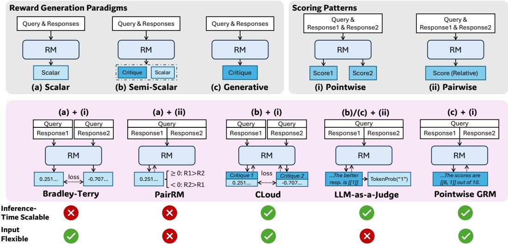
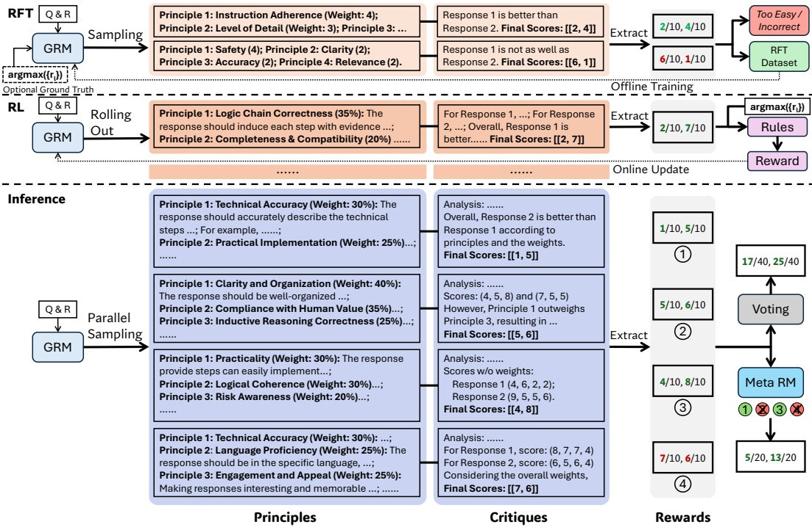
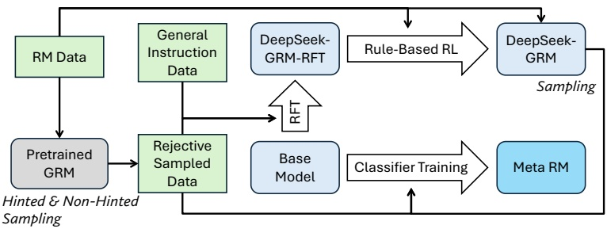
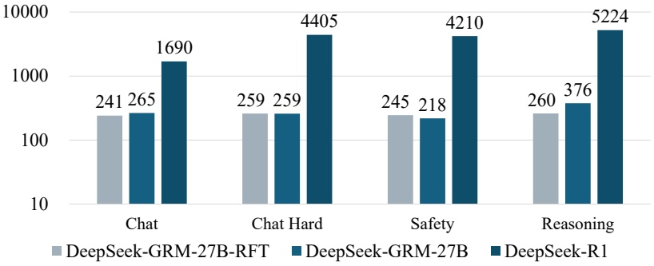
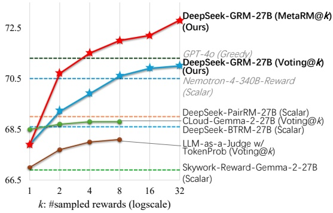
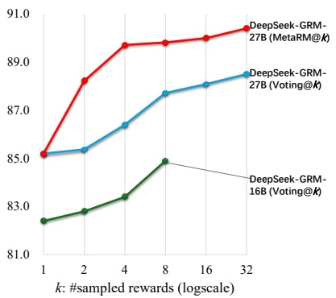
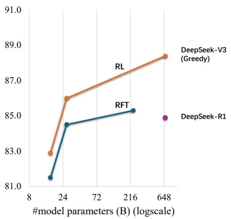
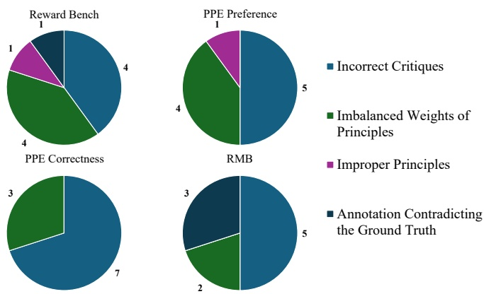

# DeepSeek-GRM: 自生成原则的奖励模型与 TestingTime 投票

来源: [Inference-Time Scaling for Generalist Reward Modeling](https://arxiv.org/abs/2504.02495), DeepSeek-AI 与清华大学合作, 第一作者 Zijun Liu 在 DeepSeek 实习期间完成, 2025-04 首发, 这里依据的是 2025-09-25 的 v3 (44 页, 正文 11 页, 附录 A 到 G). 权重发布在 [Hugging Face](https://huggingface.co/collections/BBQGOD/deepseek-grm-68b4681169dbb97fd30614b5) 和 [ModelScope](https://www.modelscope.cn/collections/DeepSeek-GRM-ff6a2d8babdd4a), 包括 DeepSeek-GRM-16B, DeepSeek-GRM-27B 和配套的 27B meta RM. DeepSeek 官方 GitHub 没有对应的训练代码, 第一作者维护的 [模型卡](https://huggingface.co/BBQGOD/DeepSeek-GRM-27B) 给出了推理, 投票和 meta RM 打分的示例代码.

[DeepSeek-R1](../../1-模型技术报告/1.13-deepseek-r1/02-deepseek-r1-analysis.md) 用规则奖励在数学和代码上训出了长推理, 规则只覆盖能核对答案的题. 写作, 对话, 安全这类通用任务没有标准答案, 奖励只能来自奖励模型 (RM). 论文提的问题是: RM 自己能不能在推理时多花算力换更准的奖励, 即 RM 的 TestingTime 扩展. 回答分三层: 打分形式选 pointwise 生成式奖励模型 (GRM); 训练方法是 Self-Principled Critique Tuning (SPCT), 让模型先写评判原则再写批评; TestingTime 策略是并行采样 $k$ 次, 把分数求和投票, 再用一个 meta RM 筛掉质量差的样本.

下文的式号和表号沿用论文编号; 图按出现顺序重新编号, 图注里写明原文编号.

## 1. 打分形式: 为什么选 pointwise GRM

### 1.1. 两条分类轴

第 2.1 节按两条轴给 RM 分类. 第一条是奖励的生成范式, 见式 (1): 标量 (scalar) RM 只输出数值 $\boldsymbol S$; 半标量 (semi-scalar) RM 先生成一段文字批评 $\boldsymbol C$ 再输出数值, 输出是 $(\boldsymbol S,\boldsymbol C)$; 生成式 (generative) RM 只输出文字, 分数要从文字里抽出来. 三种统一写成 $\mathcal R\sim r_\theta(x,\{y_i\}_{i=1}^n)$, 其中 $x$ 是用户问题 (query), $y_i$ 是第 $i$ 个候选回答, $r_\theta$ 是参数为 $\theta$ 的 RM, $\mathcal R$ 是它这一次给出的奖励.

第二条轴是打分模式. pointwise 给每个回答一个独立分数, 式 (2) 写作 $\{S_i\}_{i=1}^n=f_{\mathrm{point}}(\mathcal R,\{y_i\}_{i=1}^n)$, $f_{\mathrm{point}}$ 负责把奖励拆到每个回答上. pairwise 只从候选里挑一个最好的, 式 (3) 写作 $\hat y=f_{\mathrm{pair}}(\mathcal R,\{y_i\}_{i=1}^n)$, 大多数情况 $n=2$. 论文用两个性质衡量这些组合: **推理时可扩展性**, 指同一输入多次采样能否得到不同的奖励, 从而聚合出更好的结果; **输入灵活性**, 指能否给 1 个, 2 个和多个回答打分.

> 图 1: 三种奖励生成范式 (标量, 半标量, 生成式) 与两种打分模式 (pointwise, pairwise) 的组合, 下方列出 Bradley-Terry, PairRM, CLoud, LLM-as-a-Judge, pointwise GRM 五种代表方法及其可扩展性和输入灵活性, 原文 Figure 2.

图 1 解析: 上半部分是两条轴各自的示意, 下半部分每一列是一种组合, 虚线箭头表示训练时损失或输出从哪里回传. 最终两行的勾叉是论文的定性判断, 没有对应的实验数值; 半标量的 CLoud 被标成可扩展, 但第 5.2 节的实验显示它的投票收益只有 0.3 个点, 图上的勾只表示「多次采样能得到不同输出」. 只有最右一列 (c)+(i) 两项都打勾, 这就是论文选的打分形式.

### 1.2. 五种代表方法各缺什么

Bradley-Terry 模型是 (a)+(i): 用成对偏好训练, 推理时给每个回答一个标量, 见式 (4). 它能给任意多个回答打分, 但同一输入重复前向只会得到同一个数, 采样多少次都没有新信息. PairRM 是 (a)+(ii), 式 (5) 用一个标量 $S$ 的符号决定哪个更好, 选中的下标是 $\lfloor\frac12(3-\mathrm{sgn}(S))\rfloor$: $S>0$ 时为 1, $S<0$ 时为 2, $S=0$ 时为 $\lfloor1.5\rfloor=1$, 平局默认判给第一个回答. 它既不能扩展, 也不能给单个回答打分. CLoud 是 (b)+(i), 先生成批评, 再由价值头 (value head) 根据批评输出标量; 批评可以多次采样, 但第 5.2 节说批评变化很大时价值头的输出几乎不动.

LLM-as-a-Judge 是 (c)+(ii), 式 (6) 让模型在文字里写出哪个回答更好, 再由 $f_{\mathrm{extract}}$ 抽出下标. 它可以多次采样后多数投票, 但每次都必须分出胜负, 没有平局选项, 也不能给单个回答打分. 若把「表示偏好的那个 token」的生成概率当分数, 就成了 (b)+(ii), 第 5 节把这个变体记作 w/ TokenProb. 末尾一种 pointwise GRM 是 (c)+(i), 式 (7) 在一段生成文字里给每个回答一个整数分, 论文默认 $S_i\in\mathbb N$, $1\le S_i\le10$. 附录 G 的模板要求末尾一行把所有分数按回答顺序写进 `\boxed{x, x}`, 单个回答, 两个回答, 一组回答都用同一种格式; 每次采样生成的文字不同, 分数也会不同, 所以可以扩展.

pointwise GRM 的代价有两项. 分数只有 10 档, 单次采样两个回答同分的情况很常见, 而式 (10) 把同分算作错. 每次打分要生成一段几百 token 的文字, 比标量 RM 的一次前向贵得多, 附录 B 把这一条列为第一个局限.

### 1.3. 原则能带来多少: 第 2.2 节的预实验

原则 (principle) 的说法来自 Constitutional AI: 人写的一组评判准则, 用来指导模型或分类器. 加入原则后, 式 (8) 把 GRM 的生成写成 $\mathcal R=\boldsymbol C\sim r_\theta(x,\{y_i\}_{i=1}^n,\{p_i\}_{i=1}^m)$, $\{p_i\}_{i=1}^m$ 是 $m$ 条原则. 预实验用 Reward Bench 的 Chat Hard 子集和 PPE 的 IFEval 子集, 每条样本一个问题两个回答. GPT-4o-2024-08-06 先生成原则, 再给出 pointwise 分数, 每条样本做 4 次; 把「更高分给了标注更好的回答」那几次的原则留下, 称为 Filtered Principles.

| 模型与设置 | Chat Hard | IFEval |
| --- | --- | --- |
| GPT-4o-2024-08-06 | 76.1 | 56.0 |
| 加自生成原则 | 75.9 | 55.6 |
| 加筛选后的原则 | 77.8 | 57.5 |
| Gemma-2-27B-it | 59.1 | 56.1 |
| 加自生成原则 | 64.0 | 55.8 |
| 加筛选后的原则 | 68.0 | 57.3 |

表 1 显示, 自己生成的原则对 GPT-4o 基本没用, 对 Gemma-2-27B-it 在 Chat Hard 上有 4.9 个点的提升, 在 IFEval 上反而略降; 筛选后的原则在两个模型, 两个子集上都有提升, Gemma-2-27B-it 的 Chat Hard 从 59.1 升到 68.0. 筛选用的是测试样本自己的标签, 评测阶段拿不到这个信号, 所以 Filtered 一行只说明「好原则存在」, 不说明模型能自己挑出好原则.

论文由此得出两个判断: 模型能生成多样的原则, 其中只有一部分适合用来打分; 只要有信号告诉模型哪些原则是好的, 它就可以从自己生成的原则里学习. SPCT 把这个信号从评测集挪到训练集: 训练集有偏好标签, 用规则检查最终分数排序是否正确, 正确就奖励这条轨迹里的原则和批评.

## 2. SPCT: 先写原则, 再写批评, 最终打分

### 2.1. 原则从输入挪到输出

式 (9) 让模型自己生成原则:

$$
\{p_i\}_{i=1}^m\sim p_\theta\left(x,\{y_i\}_{i=1}^n\right),\qquad \mathcal R=\boldsymbol C\sim r_\theta\left(x,\{y_i\}_{i=1}^n,\{p_i\}_{i=1}^m\right).
$$

$p_\theta$ 是原则生成函数, $r_\theta$ 是奖励生成函数, 两者是同一个模型, 用同一个语言头, 在一次生成里先写原则, 接着写批评. 论文把这一步叫「unpinning principles from understanding to generation」: 原则不再是打分之前的预处理, 而是奖励生成的一部分, 可以随问题和回答变化, 也能被后训练优化. 原则的条数 $m$ 由模型自己决定, 每次采样都可能不同.

原则在文字上长什么样, 要看附录 G 的默认模板. 系统提示先给 4 条通用准则 (Instruction Adherence, Usefulness, Level of Detail, Relevance), 每条分 4 档并写明分数区间, 再要求模型「state potential other specific criteria to the query, the weights of different criteria」, 输出三行: Specific Criteria 写原则和权重, Analysis 按原则比较各回答, Scores 把最终整数分写进 `\boxed{}`. 表 17 的结果 2 里, 模型给一道 JavaScript 题写的原则是 Correctness 40%, Code Structure 30%, Edge Case Handling 20%, Efficiency 10%. 这些权重只是文字, 没有任何代码按权重算加权和, 最终分数仍由模型直接写出; 第 5.2 节的失效分析里, 有三成错例就出在权重上.

> 图 2: SPCT 的三段流程, 自上而下是拒绝式微调 (RFT) 的离线采样与筛选, 规则在线 RL 的 rollout 与奖励, 以及推理时并行采样 4 组原则和批评后的求和投票与 meta RM 引导投票, 原文 Figure 3.

图 2 解析: 每一行从左到右是「问题与回答 → GRM → 原则 → 批评 → 抽出的分数」. RFT 一行的两条轨迹分别抽出 (2, 4) 和 (6, 1), 按真值筛成「太简单或错误」与「进入 RFT 数据」两类; RL 一行用 $\arg\max_l r_l$ 和规则直接算奖励, 再在线更新. 推理一行的 4 次采样抽出 (1, 5), (5, 6), (4, 8), (7, 6), 求和得 17/40 和 25/40; meta RM 保留第 1, 3 条, 求和得 $1+4=5$ 和 $5+8=13$, 即 5/20 和 13/20. 图中的原则和批评是示意文字, 不是真实生成结果.

### 2.2. 拒绝式微调: 冷启动

RFT (rejective fine-tuning) 的目标是让模型学会这套输出格式, 并能处理任意个数的回答. 每条 RM 数据包含一个问题, 一个或多个回答, 以及指出最好回答的真值标签. 用一个现成的模型对每条数据采样 $N_{\mathrm{RFT}}$ 次原则加批评, 附录 C.1 给出采样模型是 DeepSeek-V2.5-0905, $N_{\mathrm{RFT}}=3$. 一条轨迹的分数是否正确按式 (10) 判定:

$$
\begin{cases}
\forall i\neq j,\ S_j>S_i,\quad j=\arg\max_l\{r_l\}_{l=1}^n, & n\ge2,\\
S_1=r_1, & n=1.
\end{cases}
$$

$r_i$ 是第 $i$ 个回答的真值奖励, $j$ 是真值最高的那个回答, 论文保证真值只有一个最大值. 多回答时要求 $S_j$ 严格大于其他每个回答的分数, 同分算错. 单回答时要求预测分等于真值; 附录 C.1 说单回答数据只取可验证的题, 正确记 1, 错误记 0, 对应附录 G 里「The score is 0 or 1」的单回答训练模板. 拒绝两类轨迹: 分数判错的轨迹, 以及 3 次采样全对的那条样本的全部轨迹, 后者被视为太简单.

有些样本 3 次都判不对, 论文就做**带提示采样** (hinted sampling): 在输入末尾追加一句「The best response is: Response $j$」, 每条样本只采一次, 判错才拒绝. HelpSteer2 上的提示还包括原数据集标注的偏好强度. 论文观察到带提示的轨迹会走捷径, 推理题上尤其明显: 批评没有真正检查回答, 分数直接往提示上靠. 这是 RFT 之后还要接在线 RL 的理由之一.

RFT 数据共 1256K 条, 其中 1070K 是内部的通用指令数据, 186K 是拒绝采样得到的 RM 数据, 通用指令数据占 85%. RM 数据的来源有 MATH (按规则核对答案后采样, 筛成成对偏好), UltraFeedback (论文因质量问题重标了一部分标签), OffsetBias, Skywork-Reward-Preference-80K-v0.2, HelpSteer2-Preference, 以及内部数据. 表 4 的消融显示, 去掉通用指令数据后 RFT 模型的总分从 68.8 掉到 63.3, 掉得最多的是 PPE Correctness, 从 59.6 到 51.5 (附录表 7).

> 图 3: DeepSeek-GRM-RFT, DeepSeek-GRM 与 meta RM 的派生关系: RM 数据经预训练 GRM 的带提示与不带提示采样得到拒绝采样数据, 与通用指令数据一起做 RFT, 再做规则 RL; meta RM 从基座模型出发做分类训练, 原文 Figure 5.

图 3 解析: 绿框是数据, 蓝框是模型, 空心箭头是训练步骤. RM 数据有两个去处: 经采样变成 RFT 数据, 以及直接作为规则 RL 的数据. meta RM 的训练数据有两路输入, 一路是 RFT 阶段的拒绝采样数据, 一路是 DeepSeek-GRM 采样得到的轨迹 (图右侧 Sampling 那条线). 图里没画的一点在附录 C.1: 所有 DeepSeek-GRM 都从预训练版本 (base) 开始训, 不是从对话版开始.

### 2.3. 规则在线 RL

RL 阶段直接用原版 GRPO (式 15), 组内优势 $\hat A_{i,t}=(\hat r_i-\mathrm{mean}(\hat{\mathbf r}))/\mathrm{std}(\hat{\mathbf r})$, GRPO 的推导见 [GRPO](../../../LargeLanguageModelGuide/4-后训练/4.5-GRPO家族与RLVR/01-GRPO/01-GRPO.md). 这里的 prompt 是 $q=(x,\{y_i\}_{i=1}^n)$ 加上模板, 模型的输出 $o_i$ 是一整段原则加批评加分数. 奖励按式 (11) 只看最终分数排序:

$$
\hat r_i=\begin{cases}
1, & n\ge2\ \text{且}\ \forall i'\neq j',\ S_{j'}>S_{i'},\ j'=\arg\max_l\{r_l\}_{l=1}^n,\\
1, & n=1\ \text{且}\ S_1=r_1,\\
-1, & \text{其他}.
\end{cases}
$$

判定条件与式 (10) 相同, 只是把「接受或拒绝」换成 $\pm1$. 和 R1 不同, 这里没有格式奖励, 论文改用较大的 KL 系数 $\beta$ 保住输出格式, 防止模型偏向某些领域. 附录 C.1 在 $\beta\in\{0,0.01,0.02,0.08\}$ 上做网格搜索, 27B 取 0.08 最稳; $\beta$ 太小时, 27B 会在 Reward Bench 的 Chat 和 RMB 的 Harmlessness 等子集上崩掉, 并偏向另一些领域. 16B 用的是 $\beta=0.002$, 这个值不在网格里, 论文的解释是 16B 对 KL 系数不敏感.

组大小 $G=4$. 以一组 4 条 rollout 手算优势 (按总体标准差): 1 条对 3 条错时, 均值 $-0.5$, 标准差 $\sqrt{0.75}\approx0.866$, 对的那条优势 $1.5/0.866\approx1.73$, 错的每条 $-0.5/0.866\approx-0.58$; 2 对 2 错时均值 0, 标准差 1, 优势是 $\pm1$. 4 条全对或全错时分子全为 0, 这条 prompt 不产生梯度. 所以 RL 数据先做了一次过滤: 用 DeepSeek-V2-Lite-Chat 按式 (10) 采 3 次, 3 次全对的样本移出. 过滤用的是 V2-Lite-Chat, 不是被训练的 27B 本身, 论文没有解释这个选择.

RL 数据 237K 条, 与 RFT 的拒绝采样数据来自同一批 RM 数据集. 两个阶段的配置: RFT 学习率 $5\times10^{-6}$, batch size 1024; RL 学习率 $4\times10^{-7}$, batch size 512; 各训 900 步, 在 Fire-Flyer 平台的 128 张 A100 上, 表 5 记 RFT 用 19.2 小时, RL 用 15.6 小时. 按 batch 1024 算, RFT 900 步共处理 921.6K 条, 约为 1256K 的 0.73 倍, 不到一个 epoch; RL 的 batch 512 指 prompt 数还是 rollout 条数, 文中没有给出. 大于 27B 的模型 (DeepSeek-V2.5 和 DeepSeek-V3 底座) 因资源限制没有做 RL, 只用 50K 条拒绝采样数据做了 RFT.

> 图 4: Reward Bench 四个子集上 DeepSeek-GRM-27B-RFT, DeepSeek-GRM-27B 与 DeepSeek-R1-0120 的平均输出长度 (token 数, 纵轴对数刻度), 原文 Figure 7.

图 4 解析: RL 前后 27B 的输出长度在 Chat 上从 241 到 265, Chat Hard 不变 (259), Safety 从 245 降到 218, Reasoning 从 260 涨到 376, 涨幅 45%, 是唯一明显变长的子集. 附录表 8 里 Reasoning 子集的分数同期从 79.2 升到 83.8, 论文据此认为模型学会了在推理题上多花 token, 在安全题上少花. R1 在四个子集上用 1690 到 5224 个 token, 长出一个数量级. 27B 与 R1 的 token 数用的是各自的分词器, 不能逐个 token 对比, 只能看量级.

## 3. TestingTime: 求和投票与 meta RM

### 3.1. 三种投票方式

第 4 节把 $k$ 次采样的聚合方式按 RM 类型分开写. 半标量 RM 用平均, 式 (12): $S^*=\frac1k\sum_{i=1}^kS_i$. pairwise GRM 用多数投票, 式 (13): $\hat y^*=\arg\max_y\sum_{i=1}^k\mathbb I(y=\hat y_i)$, $\hat y_i$ 是第 $i$ 次采样选出的最好回答, $\mathbb I(\cdot)$ 是指示函数. pointwise GRM 用求和, 式 (14):

$$
S_i^*=\sum_{j=1}^kS_{i,j},\qquad \{p_{i,j}\}_{i=1}^{m_j}\sim p_\theta\left(x,\{y_i\}_{i=1}^n\right),\qquad \mathcal R_j=\boldsymbol C_j\sim r_\theta\left(x,\{y_i\}_{i=1}^n,\{p_{i,j}\}_{i=1}^{m_j}\right).
$$

$S_{i,j}$ 是第 $j$ 次采样给第 $i$ 个回答的分数, $S_i^*$ 是第 $i$ 个回答的最终奖励; 第 $j$ 次采样有自己的一组 $m_j$ 条原则 $\{p_{i,j}\}$ 和批评 $\boldsymbol C_j$. 式 (14) 里下标 $i$ 同时用来数原则和数回答, 两处含义不同. 求和与平均对排序没有区别, 式 (14) 与式 (12) 的差别在输入上: 每次采样的原则不同, 分数是离散整数. 论文给的解释是, 每条原则可以看成一个评判视角, 采样越多, 这些视角越接近真实的评判分布.

多数投票的问题在于每次采样都必须分出胜负, 两个回答差不多好时, 投票结果会被强制的胜负带偏; 而且只有「选谁」的信息, 没有差多少. 求和把每次的分差都累加进来. 每次采样前回答顺序都会被打乱, 用于去除位置偏差并增加多样性; 模型卡的示例代码每轮 `random.shuffle` 一次, 再按原下标把分数加回去, 并把抽出的分数截到 $[1,10]$.

### 3.2. 取值空间与平局

单次采样 $S_{i,j}\in\{1,\dots,10\}$, 只有 10 个取值; $k$ 次求和后 $S_i^*\in\{k,\dots,10k\}$, 共 $9k+1$ 个取值. $k=8$ 时是 8 到 80 共 73 个, $k=32$ 时是 32 到 320 共 289 个. 论文说投票把奖励空间扩大了 $k$ 倍, 准确的取值个数是 $9k+1$.

取值变多直接减少平局. 第 5.1 节对评测中平局的处理是打乱回答后取 $\arg\max_iS_i$, 等于在同分的回答里随机选一个; 两个回答时随机选对的概率是一半, 而式 (10) 的训练判定把同分记为错. 表 17 的结果 1 就是 8 比 8 的平局. 投票后只要各次采样的打分不完全对称, 平局就会变少, 一部分 TestingTime 收益来自这里. 文中没有给出单次采样和投票后的平局比例, 这部分贡献的大小无法从表中分离.

### 3.3. meta RM 引导投票

$k$ 次采样里总有一些原则或批评有偏差或质量差. 论文为此训练了一个 **meta RM**: 一个 pointwise 标量 RM, 输入是问题, 候选回答, 以及 DeepSeek-GRM 生成的原则和批评, 输出一个标量, 表示这条轨迹的分数是否正确. 标签按式 (10) 判定, 损失是二元交叉熵. meta RM 基于 Gemma-2-27B, 模型卡里用的是 `Gemma2ForSequenceClassification`, 取输出 logit 作元奖励. 附录 G 的 meta RM 模板只有「Please score the responses.」加对话和回答, assistant 位置放原则和批评, 模板做得简单是为了让整段内容放得进上下文窗口.

训练数据有两路: RFT 阶段不带提示采样的轨迹, 以及用 DeepSeek-GRM-27B 自己按 $N_{\mathrm{RFT}}=3$ 再做一次拒绝采样得到的轨迹. 前者提供足够的正负样本, 后者让 meta RM 见过它将要评判的那个策略的输出, 减小训练和推理的分布差异. 学习率 $1\time…7 tokens truncated…ed…mpt 从第一个回答起就不同, 能跨样本复用的 prefix cache 只剩模板头部.

论文拿 27B 投票和更大的模型比, 比的是参数量, 没有给出算力对比. 按解码阶段每输出 1 个 token 约 $2\times$ 激活参数次浮点运算推算: 27B 稠密模型采样 32 次是 $32\times27\mathrm B=864\mathrm B$ 量级, DeepSeek-V3 底座每 token 激活 37B, 贪心一次是 37B 量级, 前者约为后者的 23 倍. 这个比值假设两边输出长度相同, 671B GRM 的输出长度文中没有给出; 它说明「27B 投票追平 671B」省下的是训练和显存, 不是推理算力.

## 4. 实验: 各表各图的口径

### 4.1. 基准, 指标与主表

评测用四个 RM 基准. Reward Bench (RB) 每题两个回答, 分 Chat, Chat Hard, Safety, Reasoning 四个子集, 总分不计 Prior Sets; PPE 分 Preference (众包偏好) 和 Correctness (可验证任务, 含 MMLU-Pro, MATH, GPQA, MBPP-Plus, IFEval) 两部分, 每题两个回答; RMB 分 helpfulness 和 harmlessness, 各有 pairwise 子集和每题多回答的 BoN 子集; ReaLMistake 每题一个回答, 判断回答里有没有错. 前三个用「选对最好回答」的准确率, ReaLMistake 用 ROC-AUC. Overall 是 RB, PPE Preference, PPE Correctness, RMB 四项的平均, 不含 ReaLMistake. RMB 的 BoN 子集按基准默认做法拆成 $n-1$ 对比较, 全对才算对; DeepSeek-GRM 则一次输入全部回答取 $\arg\max$, 更直接也更难.

基线都在 Gemma-2-27B 上用同样的数据重新实现 (附录 C.2): LLM-as-a-Judge 走与 DeepSeek-GRM-27B 完全相同的 RFT 和 RL, 只是 RL 阶段只能用成对数据; DeepSeek-BTRM-27B 和 DeepSeek-PairRM-27B 用 RL 阶段的数据训价值头 (去掉单回答数据); CLoud-Gemma-2-27B 先用 DeepSeek-V2.5-0905 生成的批评训一个批评模型, 再另训一个带价值头的 Gemma-2-27B 打分, 由于没有可抽取的分数, 它无法做拒绝采样. 默认结果用贪心解码, TestingTime 扩展用 temperature 0.5.

| 模型 | RB | PPE Pref. | PPE Correct. | RMB | Overall |
| --- | --- | --- | --- | --- | --- |
| Nemotron-4-340B-Reward | 92.0 | 59.3 | 60.8 | 69.9 | 70.5 |
| GPT-4o | 86.7 | 67.1 | 57.6 | 73.8 | 71.3 |
| LLM-as-a-Judge | 83.4 | 64.2 | 58.8 | 64.8 | 67.8 |
| DeepSeek-BTRM-27B | 81.7 | 68.3 | 66.7 | 57.9 | 68.6 |
| CLoud-Gemma-2-27B | 82.0 | 67.1 | 62.4 | 63.4 | 68.7 |
| DeepSeek-PairRM-27B | 87.1 | 65.8 | 64.8 | 58.2 | 69.0 |
| DeepSeek-GRM-27B-RFT | 84.5 | 64.1 | 59.6 | 67.0 | 68.8 |
| DeepSeek-GRM-27B | 86.0 | 64.7 | 59.8 | 69.0 | 69.9 |
| DeepSeek-GRM-27B, Voting@32 | 88.5 | 65.3 | 60.4 | 69.7 | 71.0 |
| DeepSeek-GRM-27B, MetaRM@32 | 90.4 | 67.2 | 63.2 | 70.3 | 72.8 |

表 2 的贪心结果里, DeepSeek-GRM-27B 的 Overall 69.9 是同底座方法里最高的, 但只比 PairRM 高 0.9; 表 2 末尾一列的平均名次两者同为 2.75 (GRM 四项名次是 2, 4, 4, 1, PairRM 是 1, 3, 2, 5). 贪心时它低于 GPT-4o (71.3) 和 Nemotron-4-340B-Reward (70.5), 加上投票才反超: Voting@32 为 71.0, meta RM 引导的 32 次为 72.8, 是表中最高.

分项看得出两类 RM 的差别. 标量的 BTRM 在 PPE Correctness 上 66.7, 比 DeepSeek-GRM-27B 高 6.9, 在 RMB 上只有 57.9, 低 11.1; 半标量的 CLoud 在 RB 上最低. GRM 一族 (LLM-as-a-Judge 和 DeepSeek-GRM) 四项分布更均匀, 论文称之为「没有严重的领域偏差」. 公开的标量 RM 也有同样的形状, Skywork-Reward-Gemma-2-27B 的 RB 是 94.1, PPE 两项都只有 56.6.

### 4.2. 采样数 k 的缩放结果

表 3 和附录表 6 给出 $k=1, 8, 32$ 三档. 括号里的增量是相对 Voting@1 算的, Voting@1 指 temperature 0.5 下只采样一次, 不是贪心解码. 这一点决定了收益的读法: DeepSeek-GRM-27B 的 Voting@1 是 67.9, 比贪心的 69.9 低 2.0, 表 6 的分项是 RB 85.2, PPE Pref. 62.4, PPE Correct. 59.5, RMB 64.4.

| 方法 | 贪心 (表 2) | Voting@1 | Voting@8 | Voting@32 |
| --- | --- | --- | --- | --- |
| LLM-as-a-Judge | 67.8 | 67.0 | 67.6, TokenProb 68.1 | 文中没有给出 |
| CLoud-Gemma-2-27B | 68.7 | 68.5 | 68.8 | 文中没有给出 |
| DeepSeek-GRM-27B-RFT | 68.8 | 67.8 | 69.3 | 文中没有给出 |
| DeepSeek-GRM-27B | 69.9 | 67.9 | 70.6 | 71.0 |
| DeepSeek-GRM-27B, MetaRM | 69.9 | 67.9 | 72.0 | 72.8 |

以 Voting@1 为参照, DeepSeek-GRM-27B 投票 8 次 +2.7, 32 次 +3.1, meta RM 引导 32 次 +4.9. 以贪心为参照, 投票 8 次只多 0.7, 32 次多 1.1, meta RM 引导 32 次多 2.9. 其他方法也一样: CLoud 的 Voting@8 只比贪心高 0.1, LLM-as-a-Judge 的 Voting@8 还低于贪心. 不带 meta RM 时, 纯投票相对贪心的收益只有 1 个点左右; 收益的大头来自 meta RM.

> 图 5: 各 RM 在全部四个基准上 Overall 随采样数 $k$ 的变化, 横轴是 $k$ (对数刻度, 1 到 32), 纵轴是 Overall, 虚线是贪心或标量 RM 的参照水平, 原文 Figure 1.

图 5 解析: 红线 (MetaRM@k) 和蓝线 (Voting@k) 在 $k=1$ 时重合于 67.9, 因为只有一条轨迹时 meta RM 无从筛选. 基线只画到 $k=8$, DeepSeek-GRM 画到 32. CLoud 的绿线在 68.5 到 68.8 之间几乎是平的, LLM-as-a-Judge w/ TokenProb 的棕线从 67.0 涨到 68.1. 图里的虚线是贪心或标量结果, 与彩色实线的 temperature 0.5 采样不同口径, 红蓝两线在 $k=1$ 处低于 DeepSeek-PairRM-27B 的虚线, 就是这个口径差造成的.

> 图 6: Reward Bench 上 DeepSeek-GRM-16B 与 DeepSeek-GRM-27B 的 TestingTime 扩展曲线, 横轴是采样数 $k$ (对数刻度), 纵轴是 Reward Bench 分数, meta RM 引导时 $k_{\mathrm{meta}}=\frac12k$, 原文 Figure 4(a).

图 6 解析: 27B 的 Voting@k 从 $k=1$ 的 85.2 涨到 $k=32$ 的 88.5, 曲线平滑; MetaRM@k 在 $k=4$ 时已到约 89.7, 之后到 $k=8$ 的 89.8 (表 6) 和 $k=32$ 的 90.4, 从 4 到 32 只多约 0.7. $k=2, 4, 16$ 的值只能从图上读, 表里只有 1, 8, 32 三档. 16B 只画到 $k=8$, 从约 82.4 涨到约 84.9, 16B 没有 meta RM 曲线, 论文的 meta RM 只为 27B 训练过.

### 4.3. 与模型规模比

> 图 7: Reward Bench 上不同规模模型的贪心结果, 横轴是模型总参数量 (B, 对数刻度), 两条线分别是 RFT 模型和 RL 模型, 紫点是 DeepSeek-R1, 原文 Figure 4(b).

图 7 解析: RFT 线连接 16B (约 81.5), 27B (84.5), 236B (85.3); RL 线连接 16B (82.9), 27B (86.0), 671B (88.4, 旁标「DeepSeek-V3 (Greedy)」); R1 是 84.9. 横轴是总参数量, 16B 和 236B, 671B 都是 MoE, 每 token 激活分别约 2.4B, 21B, 37B, 27B 是稠密模型, 按激活参数排序时 16B 远小于 27B. R1 的点只在 300 条均匀下采样的 Reward Bench 子集上测, temperature 0.6, 与其他点不是同一个测试集.

第 5.2 节的结论是: 27B 直接投票 32 次 (88.5) 与 671B 贪心 (88.4) 相当, meta RM 引导投票 8 次 (89.8) 就是最好的结果, 所以 TestingTime 扩展比把模型做大更有效. 这个比较有三处要对齐. 第一, 附录 C.1 说大于 27B 的模型没做 RL, 只用 50K 条数据做了 RFT, 但图 7 把 671B 画在 RL 线上; 表 8 把它记作 DeepSeek-GRM-671B, 四个子集 95.8, 82.9, 88.3, 86.6, 平均 88.4. 两处说法有一处是错的, 文中没有给出 671B 做完整 SPCT 的结果. 第二, 236B 模型正文写作 DeepSeek-V2.5 (236B MoE), 表 8 写作 DeepSeek-GRM-230B. 第三, 按第 3.4 节的推算, 27B 采样 32 次的解码算力约是 671B 贪心一次的 23 倍, 省下的是训练和部署显存, 不是推理算力.

R1 的数据另有含义. 表 8 里 R1 的 Reasoning 子集 95.6, 是所有模型里最高的, Chat Hard 只有 73.7, Safety 只有 73.3; 图 4 里它在 Chat Hard 上平均用 4405 个 token. 论文由此说长 CoT 对推理类判题有帮助, 对通用 RM 帮助不大. R1 从来没有按 RM 任务训练过, 又只测了 300 条, 这个结论能支持的范围是「未经 RM 训练的长推理模型」, 推不到「长 CoT 加 RM 训练」.

### 4.4. 消融: 每个部件拿掉之后

表 4 和附录表 7 的消融都在 DeepSeek-GRM-27B 上做, Overall 口径同表 2.

| 设置 | 改了什么 | Overall |
| --- | --- | --- |
| DeepSeek-GRM-27B, 贪心 | 完整 SPCT | 69.9 |
| w/o Principle Generation | 不生成原则, 直接批评打分 | 67.5 |
| w/o Rejective Sampling | RFT 只用通用指令数据, 再做 RL | 68.7 |
| DeepSeek-GRM-27B-RFT | 只做 RFT, 不做 RL | 68.8 |
| RFT w/o Hinted Sampling | 去掉带提示的轨迹 | 68.0 |
| RFT w/o Non-Hinted Sampling | 去掉不带提示的轨迹 | 67.4 |
| RFT w/o Rejective Sampling | 两类轨迹都去掉 | 66.1 |
| RFT w/o General Instruction Data | 去掉 1070K 通用指令数据 | 63.3 |

原则生成去掉后, 贪心掉 2.4, Voting@8 从 70.6 掉到 68.0, 掉 2.6, 降幅最大的是 RB, 从 86.0 到 82.0; 投票的收益也随之变小, 说明投票的效果依赖每次采样原则不同. RFT 内部, 去掉不带提示的轨迹 (67.4) 比去掉带提示的轨迹 (68.0) 掉得多, 论文的解释是带提示的轨迹里有捷径. 两类都去掉时 RFT 只剩通用指令数据, 得 66.1; 在它上面直接做 RL 得 68.7, 涨 2.6, 与完整 RFT 的 68.8 几乎一样. 完整 RFT 之后再做 RL 只涨 1.1 (68.8 到 69.9). 也就是说, 在线 RL 能补上大部分冷启动数据的作用, 两者叠加时收益递减.

meta RM 的 $k_{\mathrm{meta}}$ 在 Voting@32 上取 1, 8, 16, Overall 是 71.5, 72.7, 72.8, 论文称其稳健. 分项走向相反: $k_{\mathrm{meta}}=1$ 把 PPE Correctness 从纯投票的 60.4 抬到 65.2, 却把 RMB 从 69.7 拉到 65.2. 只留元奖励最高的一条, 结果就由 meta RM 这个标量 RM 的偏好决定, 分项形状向表 2 里标量 RM 的样子靠拢, 可验证任务变好, RMB 变差; $k_{\mathrm{meta}}=8$ 和 16 时 RMB 回到 69.1 和 70.3. 所以「稳健」只在 Overall 上成立.

### 4.5. 输入灵活性, 迁移与泛化

附录 E 用几组小实验支撑 pointwise GRM 的灵活性. 表 11 在 RMB 的 BoN 子集上比较两种输入: 拆成 $n-1$ 对逐对比较, Helpfulness 62.1, Harmlessness 57.5; 一次输入全部 $n$ 个回答, 62.3 和 57.0, 差距不到 1 个点. 表 13 在 ReaLMistake 的单回答设置上, DeepSeek-GRM-27B 的 ROC-AUC 是 72.2, 投票 8 次 74.4, 略高于 GPT-4o-2024-08-06 的 74.3; 同底座的 BTRM 是 69.3, Gemma-2-27B-it 是 65.8. 16B 是 64.9, 高于它的底座对话版 DeepSeek-V2-Lite-Chat 的 61.9.

表 14 把 DeepSeek-GRM-27B 生成的原则交给 GPT-4o 用: Chat Hard 78.1, IFEval 58.3, 比表 1 里筛选后的原则 (77.8, 57.5) 略高. 反过来, DeepSeek-GRM-27B 改用那批筛选后的原则, 从 78.3, 59.8 降到 77.0, 58.5. 两项差距都在 1 个点上下, 子集样本量文中没有给出, 能说明的是训练后的原则不弱于用测试标签挑出来的原则. 表 15 去掉 MATH 训练数据重训: 27B 的 Reward Bench 从 86.0 降到 83.0, 降幅最大的是 Chat Hard (78.3 到 70.4), Chat 反而从 94.1 升到 96.1; 16B 从 82.9 降到 77.4. 数学偏好数据对非数学子集也有作用, 论文把这一点当作泛化的证据.

## 5. 与标量 RM 和 pairwise RM 的对比, 以及局限

### 5.1. 可验证任务上标量 RM 仍然领先

附录表 9 把 PPE Correctness 拆到五个来源. 贪心时 DeepSeek-BTRM-27B 在 MMLU-Pro, MATH, GPQA, MBPP-Plus, IFEval 上是 68.8, 73.2, 56.8, 68.8, 66.0, DeepSeek-GRM-27B 是 64.8, 68.8, 55.6, 50.1, 59.8. 差距最大的是代码题 MBPP-Plus, 18.7 个点, 投票 32 次后 GRM 在这一项还是 49.9, 几乎没动. meta RM 引导的 32 次投票把 PPE Correctness 从 60.4 抬到 63.2, 主要靠 IFEval (61.0 到 70.4) 和 MMLU-Pro (65.5 到 68.1), MBPP-Plus 仍是 50.8. 论文对标量 RM 领先的解释是, 标量 RM 能抓到推理题问答里的隐藏特征, GRM 要靠更强的推理能力逐条检查回答; 这个解释文中没有实验验证.

pointwise GRM 的格式允许在输入里加参考答案. 表 12 和表 9 的 w/ Reference 一行, 给出每题的标准答案后, DeepSeek-GRM-27B 的 PPE Correctness 从 59.8 升到 91.6, 其中 MMLU-Pro 98.2, MATH 97.5, GPQA 99.8, MBPP-Plus 86.6, IFEval 75.9. 有参考答案时, 任务退化成「对照答案判对错」, 这正是规则奖励能做的事; 它说明 GRM 可以兼容规则可验证的场景, 不说明 GRM 在没有参考时能核对代码.

反方向的差距出现在 RMB 上. 表 10 里 Harmlessness BoN 子集, BTRM 33.6, PairRM 34.1, CLoud 41.7, DeepSeek-GRM-27B 57.0; Harmlessness Pairwise 子集分别是 51.0, 55.5, 66.1, 76.1. 标量和半标量 RM 在多回答的安全题上明显失效. 训练数据是同一批, 差别来自打分形式和训练方式: GRM 每次写出安全相关的原则再打分, 标量 RM 只学到一个分数函数.

### 5.2. pairwise 的结构限制与失效模式

pairwise RM 的问题第一步是结构上的. 它不能给单个回答打分, 表 13 的 ReaLMistake 对比里没有 PairRM 和 LLM-as-a-Judge; 多回答时要拆成 $n-1$ 对. 投票也帮不了多少: 表 3 里 LLM-as-a-Judge 的 Voting@8 只比 Voting@1 高 0.6, 换成 token 概率加权也只有 1.1, 与 DeepSeek-GRM-27B 的 2.7 差一截. 论文把原因归到「每次必须分出胜负, 又没有分差」上, 这与第 3.1 节的分析一致. 标量 PairRM 在贪心时 Overall 69.0, 与 DeepSeek-GRM-27B 的 69.9 很近, 但它完全不能做 TestingTime 扩展.

> 图 8: DeepSeek-GRM-27B 在四个 RM 基准上各随机抽 10 个错例后人工归类的失效模式分布, 四类是批评错误, 原则权重失衡, 原则不当, 标注与真值矛盾, 原文 Figure 8.

图 8 解析: 四个饼图各 10 例, 合计 40 例. 批评错误 21 例 (RB 4, PPE Preference 5, PPE Correctness 7, RMB 5), 权重失衡 13 例 (4, 4, 3, 2), 原则不当 2 例, 标注与人工判断矛盾 4 例 (RB 1, RMB 3). 原则本身写错的只占 5%, 大多数错例的原则是对的, 错在按原则检查回答 (例如计数, 模式匹配, 专业知识) 或者给各原则的权重不对. 每个基准只抽 10 例, 比例的误差很大, 只能看排序.

表 18 是论文挑出的失败例. 用户要求列出 5 个低价加密货币的实时价格, 上一轮助手已经给过一张价格表, 用户说价格不对. Response 1 承认自己拿不到实时数据, 给出查询方法; Response 2 直接给了一组「更新后的实时价格」. DeepSeek-GRM-27B 打 7 比 5 选了 Response 1, 标签说 Response 2 更好. 论文把这一例归为「无法核实实时数据」和「权重失衡」, 但 Response 2 的价格不可能是实时的, 选 Response 1 反而更合理, 这一例更接近图 8 里「标注与真值矛盾」那一类. 表 16 是成功例: 一道要求用比喻讲解神经科学的题, BTRM 给 Response 1 打 0.4665, Response 2 打 0.3209, 选错; GRM 写出「比喻的深度 30%」等原则后打 8 比 9, 与标签一致.

**5.3. 论文自身的数表问题:** 正文和附录之间有几处数字对不上, 集中列在这里. 它们不影响「SPCT 加投票有效」这个主结论, 但影响具体数字的读法.

1. 表 8: DeepSeek-BTRM-27B 的子集 (96.7, 86.2, 75.7, 89.8) 平均 87.1, 表里写 81.7; DeepSeek-PairRM-27B 的子集 (95.5, 86.8, 52.3, 92.0) 平均 81.65, 表里写 87.1, 两行总分正好互换, 更可能是子集数互换了. CLoud-Gemma-2-27B 贪心一行的子集与 LLM-as-a-Judge 逐位相同, 平均 83.45, 却写 82.0.
2. 图 4(b) 与附录 C.1: 671B 画在 RL 线上, C.1 说大于 27B 的模型没做 RL; 236B 在表 8 里写作 230B.
3. 表 3 与表 6: 括号增量以 Voting@1 (单次采样) 为基线, Voting@1 比贪心低 2.0, 正文没有交代.
4. 表 10: LLM-as-a-Judge w/ TokenProb 的 Voting@8 一行 (56.0, 78.5, 52.5, 73.8, 65.2) 与普通 Voting@8 一行逐位相同, 而表 6 的 Overall 里两者分别是 68.1 和 67.6.
5. 附录 C.1: 16B 的 $\beta=0.002$ 不在所报告的网格 $\{0,0.01,0.02,0.08\}$ 里; 模型卡写 RFT 数据由 DeepSeek-V2.5-0906 采样, 论文写 0905, 示例代码的 temperature 是 1.0, 论文的投票实验是 0.5.

记号上, 式 (13) 和式 (14) 都让下标 $i$ 同时数采样和数回答, 式 (11) 用 $i$ 数 rollout, 用 $i'$ 数回答, 读的时候要按上下文区分. 这些都是表述问题, 文中给出的式 (10), (11), (14) 本身前后一致, 按表 17 的数字手算也对得上.

**5.4. 局限与之后的用法:** 附录 B 列了三条局限. 第一是效率: 同规模下 GRM 比标量 RM 慢得多, 在线 RL 里每条 rollout 都要 $k$ 次生成, 规模化使用受限. 第二是可验证任务上仍落后标量 RM, 论文给的缓解办法是加参考答案或长推理. 第三更像一个方向: pointwise GRM 原则上也能当过程奖励模型 (PRM) 用, Reward Bench 的 Reasoning 子集主要来自 MATH-prm 数据, 可以部分支持这一点, 但论文没有展开. 未来方向里有一条与后来的实践直接相关: 把原则生成和批评拆成两个阶段, 原则按问题提前生成并存下来, 批评再交给 GRM, 规则或 Agent 去做.

DeepSeek 后来的模型里, GRM 以不同形态出现. [DeepSeek-V3.2](../../1-模型技术报告/1.7-deepseek-v3-2/02-deepseek-v3-2-analysis.md) 的通用任务用生成式奖励模型打分, 每条提示带自己的评分 rubric, 与附录 B 「原则按问题提前生成」的设想形式相近. [DeepSeek-V4](../../1-模型技术报告/1.8-deepseek-v4/02-deepseek-v4-analysis.md) 在难验证任务上用带 rubric 的 RL 数据和 GRM, 并让 actor 网络同时充当 GRM, 评判能力和生成能力一起优化; 这与本文「单独训一个 27B GRM」的设定不同, V4 报告也没有提到 meta RM 引导投票. [DeepSeek-R1](../../1-模型技术报告/1.13-deepseek-r1/02-deepseek-r1-analysis.md) 的第二轮 SFT 里, 部分题目已经把标准答案和模型预测一起交给 DeepSeek-V3 判断, 那是带参考答案的生成式判分, 对应表 12 的 w/ Reference 设置. 奖励模型被策略过度优化的一般问题, 见 [Best-of-N 与奖励模型过优化](../../../LargeLanguageModelGuide/4-后训练/4.7-AI反馈与奖励过优化/4.7.2-Best-of-N与奖励过优化/01-Best-of-N-奖励模型过优化/01-Best-of-N-奖励模型过优化.md); 本文只在 RM 基准上评测, 没有把 DeepSeek-GRM 接进策略模型的 RL 训练, 它作为 RL 奖励时的过优化行为文中没有给出.

## 参考文献

- Liu et al. [Inference-Time Scaling for Generalist Reward Modeling](https://arxiv.org/abs/2504.02495). arXiv 2504.02495, v3, 2025.
- [BBQGOD/DeepSeek-GRM-27B 模型卡](https://huggingface.co/BBQGOD/DeepSeek-GRM-27B). Hugging Face, 2025.
- DeepSeek-AI. [DeepSeek-R1: Incentivizing Reasoning Capability in LLMs via Reinforcement Learning](https://arxiv.org/abs/2501.12948). 2025.
- Shao et al. [DeepSeekMath: Pushing the Limits of Mathematical Reasoning in Open Language Models](https://arxiv.org/abs/2402.03300). 2024.
- Ankner et al. [Critique-out-Loud Reward Models](https://arxiv.org/abs/2408.11791). 2024.
- Bai et al. [Constitutional AI: Harmlessness from AI Feedback](https://arxiv.org/abs/2212.08073). 2022.
- Lambert et al. [RewardBench: Evaluating Reward Models for Language Modeling](https://arxiv.org/abs/2403.13787). 2024.
- Frick et al. [How to Evaluate Reward Models for RLHF](https://openreview.net/forum?id=cbttLtO94Q). ICLR 2025.
- Chow et al. [Inference-Aware Fine-Tuning for Best-of-N Sampling in Large Language Models](https://openreview.net/forum?id=77gQUdQhE7). ICLR 2025.
- chaofa. [DeepSeek-GRM 论文阅读笔记](https://yuanchaofa.com/post/deepseek-grm-paper-reading-notes). 2025.
