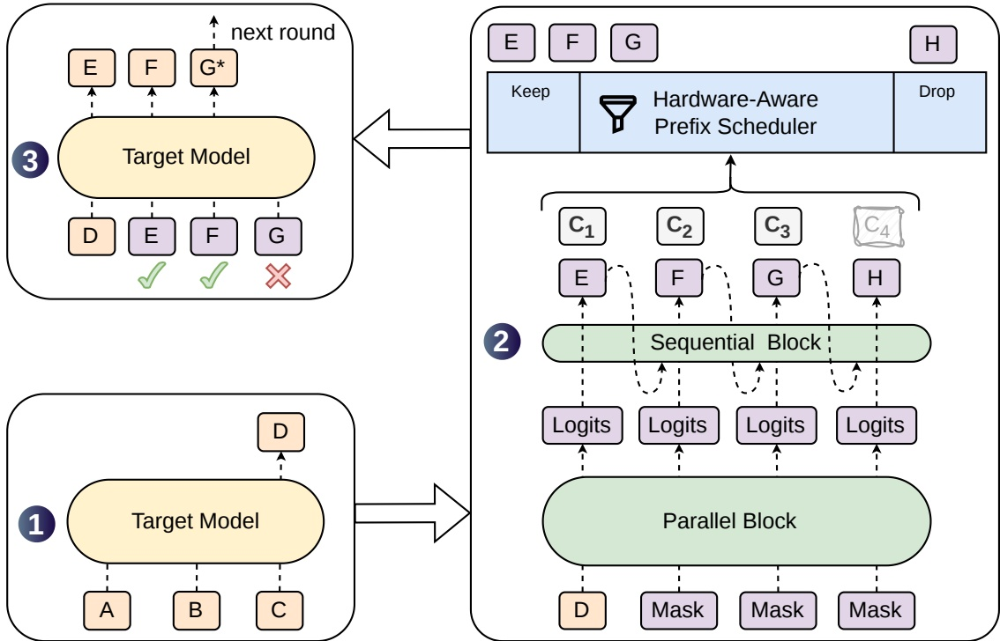
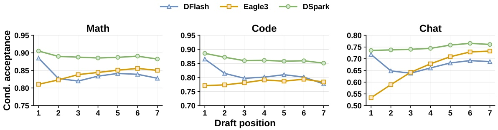
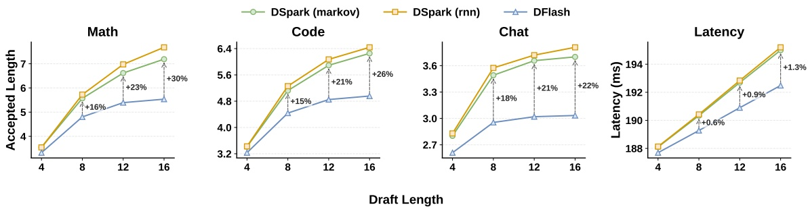
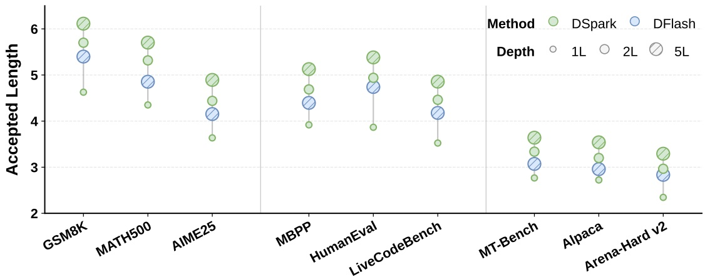
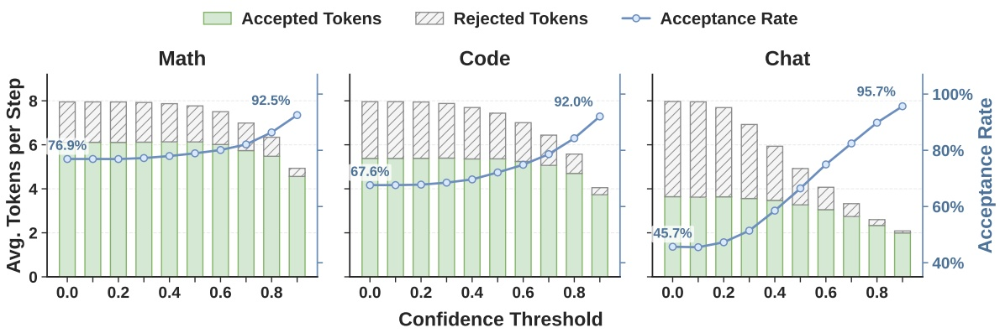
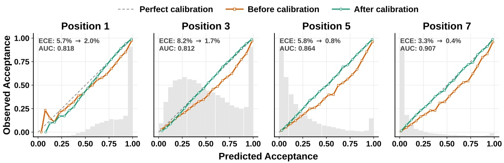
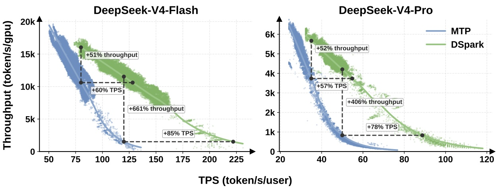
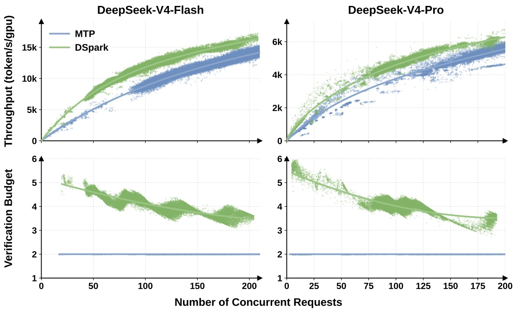

<!-- page 1 of 33 -->

arXiv:2607.05147v1 [cs.AI] 6 Jul 2026

Qdeepseek

# DSpark: Confidence-Scheduled Speculative Decoding with Semi-Autoregressive Generation · DSpark: 置信度调度的半自回归投机解码

Xin Cheng1,2,∗, Xingkai Yu2,∗, Chenze Shao2,∗, Jiashi Li2,∗, Yunfan Xiong2,∗ Yi Qian2, Jiaqi Zhu2, Shirong Ma2, Xiaokang Zhang2, Jiasheng Ye2, Qinyu Chen2, Chengqi Deng2, Jiping Yu2, Damai Dai2, Zhengyan Zhang2, Yixuan Wei2, Yixuan Tan2, Wenkai Yang2, Runxin Xu2, Yu Wu2, Zhean Xu2, Xuanyu Wang2, Muyang Chen2, Rui Tian2, Xiao Bi2, Zhewen Hao2, Shaoyuan Chen2, Huanqi Cao2, Wentao Zhang2, Anyi Xu2, Huishuai Zhang1, Dongyan Zhao1, Wenfeng Liang2

1**Peking University** 2**DeepSeek-AI {chengxin, xingkai, shaochenze, js.li, yunfanxiong}@deepseek.com**

## Abstract

Speculative decoding accelerates Large Language Model (LLM) inference by decoupling draft generation from target verification. While recent parallel drafters efficiently propose long token sequences in a single forward pass, they suffer from rapid acceptance decay due to a lack of inter-token dependencies. Furthermore, indiscriminately verifying these extended blocks wastes critical batch capacity on tokens with high rejection risks, severely degrading throughput in high-concurrency serving systems. We introduce DSpark, a speculative decoding framework that unifies high-throughput parallel generation with adaptive, load-aware verification. To maintain draft quality, DSpark utilizes a semi-autoregressive architecture—coupling a parallel backbone with a lightweight sequential module—to introduce intra-block dependency modeling and mitigate suffix decay. To optimize system efficiency, DSpark employs confidence-scheduled verification, dynamically tailoring the verification length for each request based on estimated prefix survival probabilities and engine-specific throughput profiles. On offline benchmarks across diverse domains, DSpark substantially improves the accepted length over state-of-the-art autoregressive and parallel drafters. When deployed within the DeepSeek-V4 serving system under live user traffic, DSpark successfully mitigates verification waste. Compared to the established production baseline (MTP-1), DSpark accelerates per-user generation speeds by 60%–85% at matched throughput levels. More importantly, by preventing severe throughput degradation under strict interactivity constraints, it enables performance tiers that were previously unattainable, shifting the Pareto frontier of our serving system. To facilitate community progress, we open-source the [DSpark checkpoints](https://huggingface.co/deepseek-ai/DeepSeek-V4-Pro-DSpark/tree/main) alongside [DeepSpec](https://github.com/deepseek-ai/DeepSpec), an algorithm-driven training repository for speculative decoding.

投机解码把草稿生成和目标验证拆开, 以此加速大语言模型 (LLM) 推理. 近来的并行 drafter 能在一次前向里提出很长的 token 序列, 但 token 之间没有依赖, 接受率衰减很快. 此外, 不加区分地验证这些加长的块, 会把宝贵的 batch 容量花在拒绝风险高的 token 上, 在高并发服务系统里严重拖低吞吐. 我们提出 DSpark, 一个把高吞吐并行生成与自适应, 负载感知验证合在一起的投机解码框架. 为保住草稿质量, DSpark 采用半自回归架构: 并行主干加一个轻量顺序模块, 引入块内依赖建模, 缓解后缀衰减. 为优化系统效率, DSpark 采用置信度调度验证, 依据估计的前缀存活概率和引擎自身的吞吐曲线, 为每条请求动态定制验证长度. 在覆盖多个领域的离线基准上, DSpark 的接受长度明显超过最先进的自回归与并行 drafter. 部署进 DeepSeek-V4 服务系统, 承接真实用户流量时, DSpark 有效减少了验证浪费. 与既有生产基线 (MTP-1) 相比, 在相同吞吐水平下, DSpark 把单用户生成速度提高 60%-85%. 更重要的是, 它避免了严格交互约束下吞吐的严重下滑, 让此前达不到的性能档位成为可能, 推移了我们服务系统的 Pareto 前沿. 为促进社区进展, 我们开源 DSpark 检查点以及 DeepSpec: 一个面向投机解码, 以算法为主线的训练仓库.

## 1. Introduction

Large Language Models (LLMs) generate text autoregressively: each new token requires a full forward pass conditioned on all preceding tokens, making inference latency proportional to the output length. The resulting low GPU utilization and high user-perceived waiting time constitute

\*Equal contribution.

\*同等贡献.

<!-- page 2 of 33 -->

a primary bottleneck in production LLM serving, particularly for latency-sensitive scenarios such as real-time conversational assistants and multi-turn agentic workflows. Speculative decoding (Chen et al., 2023; Leviathan et al., 2023) offers a principled solution: a lightweight draft model proposes a block of candidate tokens, and the full-size target model verifies the entire block in a single forward pass via rejection sampling, accepting the longest prefix consistent with the target distribution and appending one bonus token. Because verification is parallel and the acceptance rule preserves the target distribution exactly, speculative decoding accelerates generation without any quality loss.

大语言模型 (LLM) 自回归地生成文本: 每个新 token 都要一次以全部前文为条件的完整前向, 推理延迟与输出长度成正比. 由此带来的低 GPU 利用率和用户感知的长等待, 是生产 LLM 服务的主要瓶颈, 在实时对话助手, 多轮 Agent 工作流这类对延迟敏感的场景尤其明显. 投机解码 (Chen et al., 2023; Leviathan et al., 2023) 给出一个有原理支撑的解法: 轻量草稿模型先提出一块候选 token, 全尺寸目标模型在一次前向里用拒绝采样验证整块, 接受与目标分布一致的最长前缀, 再追加一个 bonus token. 验证是并行的, 接受规则又严格保持目标分布, 所以投机解码加速生成时没有任何质量损失.

The design of the draft model governs the trade-off between drafting latency and acceptance rate. Early drafters are autoregressive (Cheng et al., 2024; Li et al., 2024b), conditioning each position on previously sampled tokens. However, their drafting latency grows linearly with the block size, forcing these methods to use short blocks and shallow architectures. To break this sequential bottleneck, parallel drafters (Cai et al., 2024; Chen et al., 2026; Liu et al., 2026a) have emerged as a compelling alternative: all draft positions are produced in a single forward pass, making drafting latency nearly independent of block size. This structural advantage theoretically allows parallel drafters to efficiently generate substantially longer draft blocks.

草稿模型的设计决定起草延迟与接受率之间的取舍. 早期 drafter 是自回归的 (Cheng et al., 2024; Li et al., 2024b), 每个位置以之前采样出的 token 为条件. 但它们的起草延迟随块长线性增长, 只能用短块和浅架构. 为打破这条串行瓶颈, 并行 drafter (Cai et al., 2024; Chen et al., 2026; Liu et al., 2026a) 成为有吸引力的替代: 所有草稿位置在一次前向中产出, 起草延迟几乎与块长无关. 这一结构优势在理论上让并行 drafter 能高效生成长得多的草稿块.

However, fully unlocking the potential of large parallel draft blocks introduces two critical bottlenecks—one in generation quality, and the other in system efficiency. First, because parallel drafters predict each position independently, they cannot model inter-token dependencies within a block. This independence leads to multi-modal collisions and rapid acceptance decay at later positions (Gu et al., 2018; Huang et al., 2022b). Second, determining the optimal verification length remains a challenge. While parallel generation easily produces long draft blocks, indiscriminately verifying all proposed tokens degrades system throughput, particularly under high-concurrency workloads (Hu et al., 2026b; Liu et al., 2024c). The ideal verification length varies along two axes. On the data side, structured requests like code naturally sustain higher acceptance rates than open-ended chat (Abramovich et al., 2026; Xia et al., 2024). On the system side, verifying extra tokens is nearly free under light loads. Under heavy loads, however, verifying tokens with a high rejection risk occupies critical batch capacity that could otherwise serve other active requests (Liu et al., 2024b; Wu et al., 2025).

然而, 要把大并行草稿块的潜力完全释放, 会碰到两个关键瓶颈: 一个在生成质量, 一个在系统效率. 第一, 并行 drafter 独立预测每个位置, 无法建模块内 token 之间的依赖. 这种独立性导致多模态碰撞, 靠后位置的接受率快速衰减 (Gu et al., 2018; Huang et al., 2022b). 第二, 最优验证长度仍难确定. 并行生成很容易产出长草稿块, 但不加区分地验证全部候选会拖低系统吞吐, 高并发负载下尤其如此 (Hu et al., 2026b; Liu et al., 2024c). 理想的验证长度沿两条轴变化. 数据侧, 代码这类结构化请求的接受率天然高于开放式对话 (Abramovich et al., 2026; Xia et al., 2024). 系统侧, 轻负载下多验证几个 token 几乎没有代价; 重负载下, 验证高拒绝风险的 token 会占用本可服务其他活跃请求的 batch 容量 (Liu et al., 2024b; Wu et al., 2025).

To address these bottlenecks, we introduce **DSpark**, a speculative decoding framework that unifies high-throughput parallel generation with adaptive, load-aware verification. At its core, DSpark is designed to resolve the inherent trade-offs in draft generation and verification through two complementary mechanisms.

针对这些瓶颈, 我们提出 **DSpark**: 一个把高吞吐并行生成与自适应, 负载感知验证合在一起的投机解码框架. DSpark 的核心是用两个互补机制, 化解草稿生成与验证中固有的取舍.

• First, to overcome the lack of inter-token dependencies, DSpark adopts a semi-autoregressive architecture. It keeps the computationally expensive draft backbone fully parallel, appending only a lightweight serial output head to inject local transition information. This design preserves the drafting speed of parallel models while significantly mitigating suffix decay.

• 第一, 为弥补 token 间依赖的缺失, DSpark 采用半自回归架构. 计算昂贵的草稿主干保持完全并行, 只追加一个轻量串行输出头注入局部转移信息. 这一设计保留了并行模型的起草速度, 同时显著缓解后缀衰减.

• Second, to resolve the system-level bottleneck, DSpark employs confidence-scheduled verification. By coupling a confidence head—which estimates per-position prefix survival probabilities—with a hardware-aware scheduler, DSpark dynamically tailors the verification length for each request. This scheduler leverages real-time engine throughput profiles to route target verification budget only toward tokens with the highest expected return.

• 第二, 为解决系统层面的瓶颈, DSpark 采用置信度调度验证. 它把一个估计逐位置前缀存活概率的置信度头, 与一个硬件感知调度器耦合, 为每条请求动态定制验证长度. 调度器利用实时的引擎吞吐曲线, 只把目标验证预算投向期望回报最高的 token.

We extensively evaluate DSpark across both controlled offline benchmarks and productionscale online deployments. On controlled offline benchmarks—spanning mathematical reasoning, code generation, and daily chat—DSpark consistently outperforms strong baselines. Specifically,

<!-- page 3 of 33 -->

across the Qwen3-4B, 8B, and 14B target models (Yang et al., 2025), it improves the macro-average accepted length over the autoregressive Eagle3 (Li et al., 2026b) by 30.9%, 26.7%, and 30.0%, and over the parallel DFlash (Chen et al., 2026) by 16.3%, 18.4%, and 18.3%, respectively. Beyond top line metrics, our fine-grained position-wise analysis reveals the distinct generation characteristics of different drafters, empirically demonstrating how DSpark successfully combines the high initial-token capacity of parallel models with the suffix coherence of autoregressive models.

我们在受控的离线基准和生产规模的在线部署上全面评估 DSpark. 在覆盖数学推理, 代码生成与日常对话的受控离线基准上, DSpark 稳定超过强基线. 具体而言, 在 Qwen3-4B, 8B, 14B 三个目标模型 (Yang et al., 2025) 上, 它的宏平均接受长度比自回归的 Eagle3 (Li et al., 2026b) 分别高 30.9%, 26.7%, 30.0%, 比并行的 DFlash (Chen et al., 2026) 分别高 16.3%, 18.4%, 18.3%. 在总指标之外, 细粒度的逐位置分析揭示了不同 drafter 各自的生成特征, 用实验说明 DSpark 如何把并行模型首 token 的高容量与自回归模型的后缀连贯性结合起来.

Beyond offline evaluation, we deployed DSpark within the DeepSeek-V4 (DeepSeek-AI, 2026) serving system to assess its performance under live user traffic. Compared to the prior MTP-1 production baseline (DeepSeek-AI, 2024), DSpark significantly broadens the system’s operational envelope. Specifically, it consistently accelerates per-user generation speeds by 60%–85% (V4- Flash) and 57%–78% (V4-Pro) at matched aggregate throughput capacities. Furthermore, under strict Service Level Agreements (SLAs) where the baseline’s capacity deteriorates severely—such as 120 TPS for Flash and 50 TPS for Pro—DSpark mitigates verification overhead to maintain robust throughput. By overcoming this performance cliff, DSpark unlocks strict interactivity tiers that were previously unattainable, effectively shifting the Pareto frontier of LLM serving.

在离线评估之外, 我们把 DSpark 部署进 DeepSeek-V4 (DeepSeek-AI, 2026) 服务系统, 在真实用户流量下评估. 与此前的 MTP-1 生产基线 (DeepSeek-AI, 2024) 相比, DSpark 显著拓宽了系统的工作范围. 具体来说, 在相同总吞吐能力下, 它稳定地把单用户生成速度提高 60%-85% (V4-Flash) 和 57%-78% (V4-Pro). 此外, 在严格的服务等级协议 (SLA) 下, 例如 Flash 的 120 TPS 和 Pro 的 50 TPS, 基线容量严重恶化, DSpark 则压住验证开销, 维持稳健的吞吐. 越过这道性能悬崖后, DSpark 解锁了此前达不到的严格交互档位, 把 LLM 服务的 Pareto 前沿向外推.

To foster collective advancement within the open-source community, we are making our artifacts publicly available. Specifically, we release the trained [DSpark checkpoints](https://huggingface.co/deepseek-ai/DeepSeek-V4-Pro-DSpark/tree/main) for both the DeepSeek-V4-Flash (preview) and DeepSeek-V4-Pro (preview) models. Furthermore, we open-source [DeepSpec](https://github.com/deepseek-ai/DeepSpec), an algorithm-driven training repository, including Eagle3, DFlash and DSpark. These artifacts are intended to support further research on efficient LLM serving.

为推动开源社区共同进步, 我们公开相关产物. 具体包括为 DeepSeek-V4-Flash (preview) 和 DeepSeek-V4-Pro (preview) 训练的 DSpark 检查点. 我们还开源 DeepSpec: 一个以算法为主线的训练仓库, 包含 Eagle3, DFlash 和 DSpark. 这些产物用于支持高效 LLM 服务方向的后续研究.

## 2. Background · 背景

## 2.1. Speculative Decoding · 投机解码

Autoregressive language models generate one token per forward pass, making inference latency proportional to output length. Speculative decoding (Chen et al., 2023; Ge et al., 2022; Leviathan et al., 2023) accelerates the inference of a target model $M _ { t }$ using a lightweight draft model $M _ { d }$ . At each decoding cycle, the draft model proposes 𝛾 candidate tokens $x _ { 1 } , \ldots , x _ { \gamma }$ . The target model verifies all candidates in a single forward pass, accepting the longest prefix consistent with its own distribution.

自回归语言模型每次前向生成一个 token, 推理延迟与输出长度成正比. 投机解码 (Chen et al., 2023; Ge et al., 2022; Leviathan et al., 2023) 用一个轻量草稿模型 $M_d$ 加速目标模型 $M_t$ 的推理. 每个解码周期里, 草稿模型提出 $\gamma$ 个候选 token $x_1, \ldots, x_\gamma$. 目标模型在一次前向里验证全部候选, 接受与自身分布一致的最长前缀.

Concretely, at each draft position $k ,$ the target model computes its own distribution $p _ { k } ^ { t }$ and compares it against the draft distribution $p _ { k } ^ { d }$ . The token $x _ { k }$ is accepted with probability min(1, $p _ { k } ^ { t } ( x _ { k } ) / p _ { k } ^ { d } ( x _ { k } ) )$ . Verification proceeds left to right: the first rejection at position 𝑘 discards all subsequent tokens $x _ { k + 1 } , \cdots , x _ { \gamma } ,$ regardless of their quality.

具体地, 在每个草稿位置 $k$, 目标模型算出自己的分布 $p_k^t$, 与草稿分布 $p_k^d$ 比较. token $x_k$ 以概率 $\min(1, p_k^t(x_k)/p_k^d(x_k))$ 被接受. 验证从左到右进行: 第一次在位置 $k$ 拒绝后, 之后的 $x_{k+1}, \cdots, x_\gamma$ 全部丢弃, 不论它们本身质量如何.

Let 𝜏 denote the number of accepted tokens per cycle, and let $T _ { \mathrm { d r a f t } }$ and $T _ { \mathrm { v e r i f y } }$ be the wall-clock times of the drafting and verification passes, respectively. The average latency per generated token is:

记 $\tau$ 为每个周期接受的 token 数, $T_{\mathrm{draft}}$ 与 $T_{\mathrm{verify}}$ 分别为起草与验证前向的墙钟时间. 每个生成 token 的平均延迟为:

$$
L = \frac {T _ {\mathrm{draft}} + T _ {\mathrm{verify}}}{\tau}.\tag{1}
$$

Improving speedup therefore reduces to three levers: lowering $T _ { \mathrm { d r a f t } }$ (draft faster), raising 𝜏 (draft better), or reducing the effective $T _ { \mathrm { v e r i f y } }$ (verify smarter).

因此提速归结为三个杠杆: 降低 $T_{\mathrm{draft}}$ (起草更快), 提高 $\tau$ (起草更准), 或降低有效的 $T_{\mathrm{verify}}$ (验证更聪明).

## 2.2. Drafter Architectures · Drafter 架构

The design of the draft model determines how $T _ { \mathrm { d r a f t } }$ and 𝜏 trade off. Existing approaches fall into two categories.

草稿模型的设计决定 $T_{\mathrm{draft}}$ 与 $\tau$ 如何取舍. 现有方法分两类.

<!-- page 4 of 33 -->

**Autoregressive drafters.** Autoregressive drafters generate draft tokens sequentially, conditioning each position on previously sampled tokens (DeepSeek-AI, 2024; Li et al., 2024b,c, 2026b; Zhang et al., 2025). This explicit dependency gives strong modeling capacity, but the drafting cost grows linearly with block size: $T _ { \mathrm { d r a f t } } \propto \gamma ,$ , which forces autoregressive drafters to use small 𝛾 and shallow architectures to keep $T _ { \mathrm { d r a f t } }$ low. To compensate for the short block, tree-based verification (Miao et al., 2024) expands candidates into a tree and verifies multiple paths via tree attention, but the large number of verification tokens reduces overall serving throughput.

**自回归 drafter.** 自回归 drafter 顺序生成草稿 token, 每个位置以之前采样出的 token 为条件 (DeepSeek-AI, 2024; Li et al., 2024b,c, 2026b; Zhang et al., 2025). 显式依赖带来强建模能力, 但起草成本随块长线性增长: $T_{\mathrm{draft}} \propto \gamma$, 迫使自回归 drafter 用小 $\gamma$ 和浅架构压低 $T_{\mathrm{draft}}$. 为弥补块短, 基于树的验证 (Miao et al., 2024) 把候选展开成树, 用树注意力同时验证多条路径, 但大量验证 token 会降低整体服务吞吐.

**Parallel drafters.** Parallel drafters produce all 𝛾 draft tokens in a single forward pass, making $T _ { \mathrm { d r a f t } }$ nearly independent of the block size (Cai et al., 2024; Chen et al., 2026; Li et al., 2025a; Liu et al., 2026a; Sandler et al., 2026). This allows substantially larger blocks $( \mathrm { e . g . , } \gamma \mathrm { = } 1 6 )$ without proportionally increasing latency.

**并行 drafter.** 并行 drafter 在一次前向里产出全部 $\gamma$ 个草稿 token, $T_{\mathrm{draft}}$ 几乎与块长无关 (Cai et al., 2024; Chen et al., 2026; Li et al., 2025a; Liu et al., 2026a; Sandler et al., 2026). 这允许用大得多的块 (例如 $\gamma=16$), 延迟却不按比例增长.

Among them, DFlash (Chen et al., 2026) is a state-of-the-art parallel drafter, which conditions its draft model on rich context features extracted from the target model (KV injection). During prefill, hidden states from a set of target layers $\{ l _ { 1 } , \cdots , l _ { m } \}$ are concatenated and projected into the draft hidden space:

其中, DFlash (Chen et al., 2026) 是最先进的并行 drafter, 它让草稿模型以从目标模型抽取的丰富上下文特征为条件 (KV 注入). prefill 阶段, 一组目标层 $\{l_1, \cdots, l_m\}$ 的隐状态被拼接, 再投影到草稿隐空间:

$$
H _ {\mathrm{ctx}} = \operatorname{RMSNorm} \bigl (W _ {c} \left[ H ^ {(l _ {1})}; \dots ; H ^ {(l _ {m})} \right] \bigr),\tag{2}
$$

where $W _ { c } \in \mathbb { R } ^ { d \times m d }$ is a shared projection. These context features are injected into every draft layer by concatenating them with the draft block representations along the sequence dimension of keys and values:

其中 $W_c \in \mathbb{R}^{d \times md}$ 是共享投影. 这些上下文特征注入每个草稿层: 沿 key 与 value 的序列维, 与草稿块表示拼接:

$$
K _ {i} = [ W _ {i} ^ {K} H _ {\mathrm{ctx}}; W _ {i} ^ {K} H _ {d} ], \quad V _ {i} = [ W _ {i} ^ {V} H _ {\mathrm{ctx}}; W _ {i} ^ {V} H _ {d} ].\tag{3}
$$

All positions within a block attend bidirectionally to each other and to the injected target context.

块内所有位置彼此双向注意, 同时注意注入的目标上下文.

The draft model shares the target model’s embedding layer and language modeling head (both frozen). It takes as input the embedding of an anchor token1followed by 𝛾 mask token embeddings, and produces logits for all mask positions in a single forward pass. Since drafting requires only a single forward pass regardless of block size, DFlash can afford deeper architectures and larger blocks than autoregressive drafters under the same latency budget.

草稿模型共享目标模型的 embedding 层与语言模型头 (两者都冻结). 它的输入是一个 anchor token1 的 embedding 加 $\gamma$ 个 mask token 的 embedding, 一次前向产出所有 mask 位置的 logits. 无论块多长, 起草都只需一次前向, 因此在相同延迟预算下, DFlash 能用比自回归 drafter 更深的架构和更大的块.

## 3. Architecture · 架构

The overview of DSpark is shown in Figure 1. Recall from Equation 1 that the per-token latency of speculative decoding is $L = ( T _ { \mathrm { d r a f t } } + T _ { \mathrm { v e r i f y } } ) / \tau$ . Autoregressive drafters achieve high 𝜏 but pay $T _ { \mathrm { d r a f t } } \propto \gamma ;$ parallel drafters collapse $T _ { \mathrm { d r a f t } }$ to a single pass but sacrifice 𝜏 because each position is predicted independently. Meanwhile, fixed-length verification wastes $T _ { \mathrm { v e r i f y } }$ on low-confidence suffix tokens that are almost certain to be rejected. DSpark addresses these limitations with two complementary components:

DSpark 的总览见图 1. 回顾式 (1), 投机解码的每 token 延迟为 $L = (T_{\mathrm{draft}} + T_{\mathrm{verify}})/\tau$. 自回归 drafter 的 $\tau$ 高, 但要付出 $T_{\mathrm{draft}} \propto \gamma$; 并行 drafter 把 $T_{\mathrm{draft}}$ 压到一次前向, 却因为每个位置独立预测而牺牲 $\tau$. 同时, 定长验证把 $T_{\mathrm{verify}}$ 浪费在几乎必被拒绝的低置信度后缀 token 上. DSpark 用两个互补组件处理这些限制:

• **Semi-autoregressive generation** (Section 3.1). A parallel backbone handles the bulk of draft computation, which keeps $T _ { \mathrm { d r a f t } }$ nearly independent of 𝛾. A lightweight sequential block then injects dependency among draft tokens, improving 𝜏 at minimal additional latency.

• **半自回归生成** (3.1 节). 并行主干承担草稿计算的大头, 使 $T_{\mathrm{draft}}$ 几乎与 $\gamma$ 无关. 之后一个轻量顺序模块在草稿 token 之间注入依赖, 以极小的额外延迟提高 $\tau$.

• **Confidence-scheduled verification** (Section 3.2). A confidence head estimates per-position acceptance probabilities, and a hardware-aware scheduler uses these estimates to prune low-confidence suffix tokens, cutting unnecessary verification compute.

• **置信度调度验证** (3.2 节). 置信度头估计逐位置的接受概率, 硬件感知调度器据此剪掉低置信度的后缀 token, 省下不必要的验证计算.

1We use the terms anchor token and bonus token interchangeably in this paper to denote the final token generated by the target model in the previous decoding round.

1本文中 anchor token 与 bonus token 两个说法混用, 都指上一轮由目标模型生成的末个 token.

<!-- page 5 of 33 -->

Figure 1 | The DSpark architecture and decoding cycle. Given prompt tokens ABC , the target model executes one step to generate the next token D , which serves as the anchor for the drafting phase. Using D as the input, DSpark employs a heavy parallel backbone and a lightweight sequential head to generate draft tokens EFGH along with their corresponding confidence scores 𝑐1–𝑐4 . The Hardware-Aware Prefix Scheduler then evaluates these scores to retain the prefix EFG and drop the low-confidence token H . Finally, the target model verifies the scheduled prefix in parallel. As illustrated, E and F are accepted while G is rejected, prompting the model to generate a corrected token G∗to complete the current round.

## 3.1. Semi-Autoregressive Generation · 半自回归生成

A parallel drafter produces all 𝛾 draft logits in one forward pass, so each prediction cannot condition on tokens sampled elsewhere in the block. When the context admits multiple plausible continuations, e.g., “of course” and “no problem”, a parallel drafter may produce incoherent combinations such as “of problem” or “no course”, because each position marginalizes over all possible predecessors rather than conditioning on the one actually sampled (Gu et al., 2018; Huang et al., 2022a). Acceptance rate thus decays rapidly along the block, wasting both draft and verification compute. We therefore adopt a **semi-autoregressive** structure that splits draft generation into two stages:

并行 drafter 一次前向产出全部 $\gamma$ 个草稿 logits, 所以每个预测都无法以块内其他位置采样出的 token 为条件. 当上下文允许多种合理续写时, 例如「of course」与「no problem」, 并行 drafter 可能拼出「of problem」或「no course」这种不连贯的组合: 每个位置对所有可能的前驱做边缘化, 没有以实际采样出的那一个为条件 (Gu et al., 2018; Huang et al., 2022a). 接受率因此沿块快速衰减, 草稿与验证计算都被浪费. 为此我们采用**半自回归**结构, 把草稿生成拆成两个阶段:

**Parallel stage.** A parallel backbone (in our instantiation, DFlash (Chen et al., 2026)) runs a single forward pass over the entire block, producing hidden states $h _ { 1 } , \ldots , h _ { \gamma }$ and base logits $U _ { 1 } , \ldots , U _ { \gamma }$ . We make only a minor modification to the original DFlash backbone: instead of feeding an anchor token plus 𝛾 mask tokens and predicting only the mask positions, we treat the anchor itself as the first prediction position, so 𝛾 input tokens (anchor + 𝛾−1 masks) yield 𝛾 draft logits. This reduces draft computation while maintaining similar draft quality.

**并行阶段.** 并行主干 (我们的实例是 DFlash (Chen et al., 2026)) 对整个块跑一次前向, 产出隐状态 $h_1, \ldots, h_\gamma$ 和基础 logits $U_1, \ldots, U_\gamma$. 我们对原始 DFlash 主干只做一处小改动: 原版输入 anchor token 加 $\gamma$ 个 mask token, 只预测 mask 位置; 我们把 anchor 自身当作第一个预测位置, 于是 $\gamma$ 个输入 token (anchor 加 $\gamma-1$ 个 mask) 产出 $\gamma$ 个草稿 logits. 这减少了草稿计算, 草稿质量基本不变.

<!-- page 6 of 33 -->

**Sequential stage.** The sequential stage supplements the base logits with a prefix-dependent transition bias $B _ { k } ( x _ { 0 } , x _ { < k } , x _ { k } )$ , allowing each draft position to condition on previously sampled tokens within the block. Rather than defining a globally normalized energy model, the sequential stage induces a causal block distribution through an autoregressive factorization:

**顺序阶段.** 顺序阶段给基础 logits 补上一个依赖前缀的转移偏置 $B_k(x_0, x_{<k}, x_k)$, 让每个草稿位置能以块内之前采样出的 token 为条件. 顺序阶段不定义全局归一化的能量模型, 而是通过自回归分解诱导出一个因果的块分布:

$$
P (X \mid x _ {0}) = \prod_ {k = 1} ^ {\gamma} p _ {k} \left(x _ {k} \mid x _ {0}, x _ {<   k}\right), \quad p _ {k} (\nu \mid x _ {0}, x _ {<   k}) = \frac {\exp \left(U _ {k} (\nu) + B _ {k} \left(x _ {0} , x _ {<   k} , \nu\right)\right)}{\sum_ {u \in \mathcal {V}} \exp \left(U _ {k} (u) + B _ {k} \left(x _ {0} , x _ {<   k} , u\right)\right)}.\tag{4}
$$

Here, $x _ { 0 }$ denotes the anchor token from the previous verification cycle, $U _ { k }$ is the base logit vector produced by the parallel backbone at position $k ,$ and V is the vocabulary. At inference time, the sequential block samples left to right according to $p _ { k } ( \cdot \mid x _ { 0 } , x _ { < k } )$ . Because this sampling process is inherently sequential, the block must be computationally lightweight $( T _ { \mathrm { s e q u e n t i a l } } \ll T _ { \mathrm { p a r a l l e l } } )$ so that the overall draft latency remains dominated by the parallel stage. We describe two instantiations of the sequential block below.

其中 $x_0$ 是上一个验证周期留下的 anchor token, $U_k$ 是并行主干在位置 $k$ 产出的基础 logit 向量, $\mathcal{V}$ 是词表. 推理时, 顺序模块按 $p_k(\cdot \mid x_0, x_{<k})$ 从左到右采样. 采样过程本质上是串行的, 所以这个模块必须计算轻量 ($T_{\mathrm{sequential}} \ll T_{\mathrm{parallel}}$), 使整体起草延迟仍由并行阶段主导. 下面介绍顺序模块的两种实例.

• **Markov head.** The simplest instantiation restricts $B _ { k }$ to depend only on the immediately preceding token, reducing it to a first-order transition $B ( x _ { k - 1 } , x _ { k } )$ . In principle this is a full $V \times V$ matrix $B ;$ we approximate it with a low-rank factorization $B   =   W _ { 1 } W _ { 2 }$ , where $W _ { 1 } \in \mathbb { R } ^ { V \times r }$ and $W _ { 2 } \in \mathbb { R } ^ { r \times V }$ . Given the preceding token $x _ { k - 1 }$ , the transition bias for position 𝑘 is:

• **Markov head.** 最简单的实例把 $B_k$ 限制为只依赖紧邻的前一个 token, 退化为一阶转移 $B(x_{k-1}, x_k)$. 原则上这是一个完整的 $V \times V$ 矩阵 $B$; 我们用低秩分解 $B = W_1 W_2$ 近似, 其中 $W_1 \in \mathbb{R}^{V \times r}$, $W_2 \in \mathbb{R}^{r \times V}$. 给定前一个 token $x_{k-1}$, 位置 $k$ 的转移偏置为:

$$
B (x _ {k - 1}, \cdot) = W _ {1} [ x _ {k - 1} ] W _ {2} \in \mathbb {R} ^ {V},\tag{5}
$$

where $W _ { 1 }$ serves as an embedding lookup table and $W _ { 2 }$ as a logit projection. The low-rank factorization (𝑟=256 by default) keeps both storage and per-step compute small, making the sequential loop efficient even for large vocabularies. Returning to the earlier example: once position 1 samples $\text{" } \mathbf{0}  f  \text{" }$ , the Markov head boosts “course” and suppresses “problem” at position 2, which mitigates the cross-mode collision.

其中 $W_1$ 充当 embedding 查找表, $W_2$ 充当 logit 投影. 低秩分解 (默认 $r=256$) 让存储和每步计算都很小, 即使词表很大, 顺序循环也高效. 回到前面的例子: 位置 1 一旦采样出「of」, Markov head 就在位置 2 抬高「course」, 压低「problem」, 缓解跨模态碰撞.

• **RNN head.** The Markov head is memoryless beyond one step—position 𝑘 cannot access tokens before $x _ { k - 1 }$ . The RNN head relaxes this by maintaining a recurrent state $s _ { k }$ that accumulates the full prefix history within a block. At each step, the module concatenates the current state $s _ { k - 1 } \in \mathbb { R } ^ { r }$ , the previous token embedding $W _ { 1 } [ \bar { x _ { k - 1 } } ] \in \mathbb { R } ^ { r }$ , and the backbone hidden $h _ { k } \in \mathbb { R } ^ { d }$ into an input vector $z _ { k } = [ s _ { k - 1 } ;   W _ { 1 } [ x _ { k - 1 } ]   ;   h _ { k } ] \in \mathbb { R } ^ { 2 r + d }$ , then applies a single gated update:

• **RNN head.** Markov head 只记一步, 位置 $k$ 看不到 $x_{k-1}$ 之前的 token. RNN head 放宽这一点: 维护一个递归状态 $s_k$, 累积块内完整的前缀历史. 每一步, 模块把当前状态 $s_{k-1} \in \mathbb{R}^r$, 前一个 token 的 embedding $W_1[x_{k-1}] \in \mathbb{R}^r$, 主干隐状态 $h_k \in \mathbb{R}^d$ 拼成输入向量 $z_k = [s_{k-1}; W_1[x_{k-1}]; h_k] \in \mathbb{R}^{2r+d}$, 再做一次门控更新:

$$
\left| \begin{array}{c} s _ {k} = \sigma (W _ {g} z _ {k}) \odot s _ {k - 1} + \big (1 - \sigma (W _ {g} z _ {k}) \big) \odot \operatorname{tanh} (W _ {c} z _ {k}), \\ B _ {k} (x _ {<   k}, \cdot) = W _ {2} ^ {\top} \operatorname{tanh} (W _ {o} z _ {k}), \end{array} \right.\tag{6}
$$

where $W _ { g } , W _ { c } , W _ { o } \in \mathbb { R } ^ { r \times \left( 2 r + d \right) }$ are jointly parameterized by a single linear projection that is split into gate, candidate, and output components. The state 𝑠0 is initialized to zero.

其中 $W_g, W_c, W_o \in \mathbb{R}^{r \times (2r+d)}$ 由同一个线性投影联合参数化, 拆成门, 候选, 输出三部分. 状态 $s_0$ 初始化为零.

## 3.2. Confidence-Scheduled Verification · 置信度调度验证

The semi-autoregressive architecture enables DSpark to generate large draft blocks efficiently. However, producing more draft tokens does not automatically translate to higher end-to-end speedups. Indiscriminately verifying the full draft block can actually degrade overall system throughput, especially in high-concurrency scenarios (Hu et al., 2026b; Liu et al., 2024c).

半自回归架构让 DSpark 能高效生成大草稿块. 但多产出草稿 token 并不自动转化为更高的端到端加速. 不加区分地验证整个草稿块, 反而可能拖低整体系统吞吐, 高并发场景尤其如此 (Hu et al., 2026b; Liu et al., 2024c).

This performance bottleneck stems from two interacting factors. First, on the data side, draft acceptance rates inherently vary across domains: structured text like code naturally yields high acceptance, whereas open-ended chat has significantly lower acceptance (Abramovich et al., 2026; Xia et al., 2024). Second, on the system side, the actual cost of verifying an extra

<!-- page 7 of 33 -->

token depends strictly on the engine load. Under light system load, an extra verification incurs minimal penalty even if rejected. However, under high-concurrency deployments, every unnecessary verification occupies target model batch capacity that could otherwise serve other active requests (Liu et al., 2024b; Wu et al., 2025).

这个性能瓶颈来自两个相互作用的因素. 第一, 数据侧, 草稿接受率天然因领域而异: 代码这类结构化文本接受率高, 开放式对话明显更低 (Abramovich et al., 2026; Xia et al., 2024). 第二, 系统侧, 多验证一个 token 的实际成本严格取决于引擎负载. 系统负载轻时, 多一次验证即使被拒绝, 代价也很小. 但在高并发部署下, 每一次不必要的验证都占用目标模型的 batch 容量, 这部分容量本可服务其他活跃请求 (Liu et al., 2024b; Wu et al., 2025).

Therefore, fully unlocking the potential of large draft blocks requires a unified mechanism that routes target model compute only toward tokens with a positive expected return. DSpark achieves this by coupling a **confidence head** (Section 3.2.1) that predicts prefix survival probabilities, with a **hardware-aware prefix scheduler** (Section 3.2.2) that dynamically determines the optimal verification lengths based on current system load.

因此, 要完全释放大草稿块的潜力, 需要一个统一机制, 只把目标模型算力投向期望回报为正的 token. DSpark 的做法是耦合两部分: 预测前缀存活概率的**置信度头** (3.2.1 节), 以及依据当前系统负载动态决定最优验证长度的**硬件感知前缀调度器** (3.2.2 节).

## 3.2.1. Confidence Head · 置信度头

Drawing inspiration from Huang et al. (2024); Wang et al. (2026b), the confidence head outputs a scalar $c _ { k } \in ( 0 , 1 )$ for each draft position 𝑘. Crucially, $c _ { k }$ models the conditional probability that the draft token at position 𝑘 will survive target verification, given that all preceding tokens in the block have been accepted. The architecture features a lightweight linear projection followed by a sigmoid function:

受 Huang et al. (2024); Wang et al. (2026b) 启发, 置信度头为每个草稿位置 $k$ 输出一个标量 $c_k \in (0,1)$. 关键在于, $c_k$ 建模的是条件概率: 在块内之前所有 token 都已被接受的前提下, 位置 $k$ 的草稿 token 通过目标验证的概率. 结构是一个轻量线性投影加 sigmoid:

$$
c _ {k} = \sigma \big (w ^ {\top} [ h _ {k}; W _ {1} [ x _ {k - 1} ] ] \big),\tag{7}
$$

where $h _ { k }$ is the hidden state of the backbone and $W _ { 1 } [ x _ { k - 1 } ]$ is the Markov Embedding from the previous draft token. We supervise $c _ { k }$ using the analytical acceptance rate per-step $c _ { k 1 } ^ { * }$ This rate is determined by the total variation distance between the draft distribution $p _ { k } ^ { d }$ and the target distribution $p _ { k } ^ { t } ;$

其中 $h_k$ 是主干隐状态, $W_1[x_{k-1}]$ 是前一个草稿 token 的 Markov embedding. 我们用解析的逐步接受率 $c_k^*$ 监督 $c_k$, 它由草稿分布 $p_k^d$ 与目标分布 $p_k^t$ 的全变差距离决定:

$$
c _ {k} ^ {*} = 1 - \frac {1}{2} \| p _ {k} ^ {d} - p _ {k} ^ {t} \| _ {1}.\tag{8}
$$

**Post-hoc Calibration.** Unlike threshold-based verification heuristics (Huang et al., 2024; Li et al., 2024b; Zhang et al., 2026b), which only require confidence scores to correctly rank draft token qualities, our hardware-aware scheduling approach (detailed in Section 3.2.2) precisely requires the absolute magnitudes of the cumulative acceptance probabilities to compute the expected acceptance length 𝜏. Because neural confidence estimates are often overconfident (Guo et al., 2017; Ovadia et al., 2019), using the raw confidence scores directly would distort the throughput estimation, leading to suboptimal scheduling.

**事后校准.** 基于阈值的验证启发式 (Huang et al., 2024; Li et al., 2024b; Zhang et al., 2026b) 只要求置信度正确地给草稿 token 质量排序. 我们的硬件感知调度 (详见 3.2.2 节) 则需要累积接受概率的绝对数值, 才能算出期望接受长度 $\tau$. 神经网络的置信度估计常常过度自信 (Guo et al., 2017; Ovadia et al., 2019), 直接用原始分数会扭曲吞吐估计, 导致次优调度.

To address this, we introduce **Sequential Temperature Scaling (STS)**. Because each $c _ { i }$ models a conditional probability, the chain rule dictates that the joint probability of a draft prefix being accepted factorizes into the cumulative product $\textstyle \prod _ { i \leqslant k } c _ { i }$ . Using a held-out validation set, STS calibrates this joint probability consecutively from left to right. Specifically, at each position $k \in \{ 1 , \cdots , \gamma \}$ , we perform a simple 1D grid search to find the optimal temperature scalar that minimizes the Expected Calibration Error (ECE) (Naeini et al., 2015) of the cumulative product, keeping the already-calibrated scores of all preceding positions fixed. Crucially, temperature scaling is an order-preserving transformation: it rectifies the predicted probabilities to match empirical acceptance rates without disrupting the relative draft token rankings learned by the confidence head.

为此我们提出**顺序温度缩放 (Sequential Temperature Scaling, STS)**. 每个 $c_i$ 建模一个条件概率, 由链式法则, 草稿前缀被接受的联合概率分解为累积乘积 $\prod_{i \leqslant k} c_i$. STS 在留出验证集上从左到右逐位置校准这个联合概率. 具体地, 在每个位置 $k \in \{1, \cdots, \gamma\}$, 我们做一次简单的一维网格搜索, 找到使累积乘积的期望校准误差 (ECE) (Naeini et al., 2015) 最小的温度标量, 同时固定之前所有位置已校准的分数. 关键在于, 温度缩放是保序变换: 它把预测概率修正到与经验接受率一致, 不打乱置信度头学到的草稿 token 相对排序.

## 3.2.2. Hardware-Aware Prefix Scheduler · 硬件感知前缀调度器

Prior methods (Huang et al., 2024; Li et al., 2024b) typically apply a static threshold to confidence scores to determine verification length. While effective under isolated, single-request assumptions, static thresholds can be suboptimal in high-concurrency production systems, where the utility of verifying a draft token depends heavily on the current system load.

已有方法 (Huang et al., 2024; Li et al., 2024b) 通常对置信度施加一个静态阈值来决定验证长度. 在孤立的单请求假设下这很有效, 但在高并发生产系统里, 验证一个草稿 token 的效用强烈依赖当前系统负载, 静态阈值就可能次优.

<!-- page 8 of 33 -->

Algorithm 1 Hardware-Aware Prefix Scheduler
Require: Active requests $r \in \{1, \dots, R\}$; confidence sequence $c_{r,1}, \dots, c_{r,\gamma}$ per request; profiled step curve SPS($B$)
Ensure: Selected per-request prefix lengths $\ell_1^*, \dots, \ell_R^*$
for $r = 1$ to $R$ do
    Compute prefix survival probabilities: $a_{r,j} \leftarrow \prod_{i \leqslant j} c_{r,i}$ for $j = 1, \dots, \gamma$
end for
Construct candidate space $\mathcal{E} \leftarrow \{(r, j) \mid a_{r,j} > 0\}$ and sort descending by $a_{r,j}$
Initialize states: $\ell_r \leftarrow 0$ for all $r$; Batch size $B \leftarrow R$; Expected accepts $\tau^* \leftarrow R$
Initialize tracking: $\Theta_{\text{best}} \leftarrow R \cdot \text{SPS}(R)$; Selected lengths $\ell_r^* \leftarrow 0$ for all $r$
for each $(r, j) \in \mathcal{E}$ in sorted order do
    $\ell_r \leftarrow j; B \leftarrow B + 1; \tau^* \leftarrow \tau^* + a_{r,j}$
    Current throughput $\Theta \leftarrow \tau^* \cdot \text{SPS}(B)$
    if $\Theta > \Theta_{\text{best}}$ then
        $\Theta_{\text{best}} \leftarrow \Theta$; Update selected lengths $\ell_r^* \leftarrow \ell_r$
    else
        break
    end if
end for
return $(\ell_1^*, \dots, \ell_R^*)$ achieving $\Theta_{\text{best}}$

To address this, we formulate verification length selection as a global throughput maximization problem (Algorithm 1). Consider a batch of 𝑅 active requests. For request 𝑟, let $c _ { r , 1 } , \ldots , c _ { r , \gamma }$ be the per-position confidence estimates, and let $\ell _ { r } \in \{ 0 , \cdots , \gamma \}$ denote the scheduled verification length. Because speculative decoding dynamically accepts draft tokens only as a continuous prefix, the survival probability of a token at position 𝑗 is the cumulative product $\begin{array} { r } { a _ { r , j } = \prod _ { i \leqslant j } c _ { r , i } . } \end{array}$

为此, 我们把验证长度选择表述为一个全局吞吐最大化问题 (Algorithm 1). 考虑一个含 $R$ 条活跃请求的 batch. 对请求 $r$, 记 $c_{r,1}, \ldots, c_{r,\gamma}$ 为逐位置置信度估计, $\ell_r \in \{0, \cdots, \gamma\}$ 为调度的验证长度. 投机解码只以连续前缀的形式接受草稿 token, 所以位置 $j$ 处 token 的存活概率是累积乘积 $a_{r,j} = \prod_{i \leqslant j} c_{r,i}$.

In a single verification step, the total batch size (measured in tokens) sent to the target model is $\begin{array} { r } { \stackrel { \circ } { B }   =   \sum _ { r = 1 } ^ { R } ( 1 + \ell _ { r } ) } \end{array}$ , and the expected number of successfully accepted tokens is $\tau =$ $\begin{array} { r } { \sum _ { r = 1 } ^ { R } \bigl ( 1 + \sum _ { j = 1 } ^ { \ell _ { r } } a _ { r , j } \bigr ) } \end{array}$ . Under a simplifying assumption2, let $S P S ( B )$ denote the engine throughput, measured in steps per second, for a given forward-pass batch size 𝐵. Crucially, this capacity curve is profiled once during engine initialization and stored as a lightweight cost table. Our scheduler then aims to maximize the expected system-wide token throughput $\Theta = \tau \cdot \mathrm { S P S } ( B )$ by dynamically selecting verification lengths $\ell _ { 1 } , \dots , \ell _ { R }$

在一次验证步中, 送入目标模型的总 batch 大小 (按 token 计) 为 $B = \sum_{r=1}^{R}(1+\ell_r)$, 期望成功接受的 token 数为 $\tau = \sum_{r=1}^{R}\bigl(1+\sum_{j=1}^{\ell_r} a_{r,j}\bigr)$. 在一个简化假设2下, 记 $\mathrm{SPS}(B)$ 为前向 batch 大小为 $B$ 时的引擎吞吐, 单位是每秒步数. 关键在于, 这条容量曲线只在引擎初始化时测一次, 存成一张轻量代价表. 调度器的目标是通过动态选择验证长度 $\ell_1, \dots, \ell_R$, 最大化期望的系统级 token 吞吐 $\Theta = \tau \cdot \mathrm{SPS}(B)$.

Although finding the global maximum of Θ appears to be a combinatorial search, the objective structure allows for an efficient greedy solution. Because $a _ { r , j }$ is monotonically non-increasing with respect to $j \: ( \mathrm { i . e . , } \: a _ { r , j } \leq a _ { r , j - 1 } )$ , the marginal gain in expected accepted tokens for extending request $r ^ { \prime } s$ verification length from $j - 1$ to 𝑗 is exactly $a _ { r , j }$ . This monotonicity ensures that sorting candidate tokens globally by $a _ { r , j }$ naturally respects intra-block prefix dependencies. Consequently, if the total verification batch size 𝐵 were fixed, the optimal allocation $\{ \ell _ { r } \}$ would be determined by greedily selecting the draft tokens with the highest survival probabilities from the global pool of all $\{ a _ { r , j } \}$

求 $\Theta$ 的全局最大值看似是组合搜索, 但目标函数的结构允许高效的贪心解. 因为 $a_{r,j}$ 关于 $j$ 单调不增 (即 $a_{r,j} \leq a_{r,j-1}$), 把请求 $r$ 的验证长度从 $j-1$ 延长到 $j$ 带来的期望接受 token 增量恰好是 $a_{r,j}$. 单调性保证了按 $a_{r,j}$ 全局排序候选 token 时, 自然满足块内的前缀依赖. 因此, 如果总验证 batch 大小 $B$ 固定, 最优分配 $\{\ell_r\}$ 就是从全体 $\{a_{r,j}\}$ 组成的全局池中贪心挑选存活概率最高的草稿 token.

Building on this insight, the optimization can be evaluated along this greedy admission path.

基于这一观察, 优化可以沿这条贪心接纳路径求值.

2In practical serving scenarios, average context lengths remain well below extremes (e.g., 1M tokens), making their impact on decode latency marginal for highly optimized architectures like DeepSeek-V4. Moreover, in prefilldecode disaggregated deployments, decode load balancers keep both request counts and total context lengths roughly balanced across data-parallel (DP) ranks. This effectively amortizes sequence-length variance, allowing us to safely assume that engine throughput depends predominantly on the verification batch size 𝐵.

2实际服务场景中, 平均上下文长度远低于极端值 (例如 1M token), 对 DeepSeek-V4 这类高度优化的架构而言, 它对 decode 延迟的影响很小. 此外, 在 prefill-decode 分离的部署中, decode 负载均衡器会让各数据并行 (DP) rank 上的请求数和总上下文长度大致均衡. 这有效摊平了序列长度的方差, 让我们可以放心假设引擎吞吐主要取决于验证 batch 大小 $B$.

<!-- page 9 of 33 -->

We first globally sort all valid prefix extensions in descending order of survival probability. To dynamically determine the optimal target batch size 𝐵, we incrementally admit tokens from this sorted pool, updating the expected throughput Θ via an lookup from the cost table.

我们先把所有合法的前缀扩展按存活概率降序全局排序. 为了动态确定最优的目标 batch 大小 $B$, 我们从排好序的池里逐个接纳 token, 每接纳一个就查代价表更新期望吞吐 $\Theta$.

Lossless speculative decoding strictly requires the non-anticipating property: admission decisions must not depend on future candidate tokens (Chen et al., 2023; Leviathan et al., 2023). Because our confidence head relies on the Markov feature of the previously sampled token, computing the next survival probability $a _ { r , k + 1 }$ explicitly requires the instantiated candidate $x _ { r , k }$ A retrospective global search would thus inadvertently leak $x _ { r , k }$ into the admission decision for step $k ,$ introducing selection bias (we provide a concrete counterexample demonstrating this theoretical violation in Appendix A).

无损投机解码严格要求非预见性 (non-anticipating): 接纳决策不能依赖未来的候选 token (Chen et al., 2023; Leviathan et al., 2023). 我们的置信度头依赖前一个采样 token 的 Markov 特征, 计算下一个存活概率 $a_{r,k+1}$ 需要已实例化的候选 $x_{r,k}$. 回溯式的全局搜索会因此把 $x_{r,k}$ 泄露进第 $k$ 步的接纳决策, 引入选择偏差 (附录 A 给出一个具体反例, 演示这种理论上的违规).

To enforce strict causality, the scheduler (Algorithm 1) employs an early-stopping mechanism. By breaking the greedy search immediately when the throughput drops $\left( \Theta   \leq   \Theta _ { \mathrm { b e s t } } \right)$ the truncation decision relies solely on the prefix processed up to that exact step. This isolates the admission event from future tokens, ensuring exact target-distribution recovery. Note that this stepwise early-stopping yields the global maximum throughput if and only if the objective Θ is unimodal, which implicitly assumes a smoothly decaying hardware capacity curve. We address the engineering adaptations required for real-world, non-smooth SPS characteristics and asynchronous system pipelines in Section 5.2.

为保证严格因果, 调度器 (Algorithm 1) 采用早停机制: 一旦吞吐下降 ($\Theta \leq \Theta_{\mathrm{best}}$), 立刻中断贪心搜索, 截断决定只依赖处理到这一步为止的前缀. 这把接纳事件与未来 token 隔离开, 保证精确恢复目标分布. 注意, 这种逐步早停当且仅当目标 $\Theta$ 单峰时才得到全局最大吞吐, 这隐含假设了硬件容量曲线平滑递减. 针对真实的非平滑 SPS 特性和异步系统流水线所需的工程改造, 见 5.2 节.

> **拆开:** Algorithm 1 每接纳一个候选 $(r,j)$ 时比较的 $\Theta$ 与 $\Theta_{\mathrm{best}}$, 换成单个 token 的门槛是什么?
> 答: 设接纳前 batch 为 $B$, 期望接受数为 $\tau$, 接纳后变成 $B+1$ 与 $\tau+a_{r,j}$. 继续的条件 $(\tau+a_{r,j})\,\mathrm{SPS}(B+1) > \tau\,\mathrm{SPS}(B)$ 等价于 $a_{r,j} > \tau\,(\mathrm{SPS}(B)/\mathrm{SPS}(B+1)-1)$. 轻负载时 SPS 几乎平, 右边接近 0, 几乎所有候选都进; 进入计算受限区后若 $\mathrm{SPS}\propto 1/B$, 右边变成 $\tau/B$, 也就是当前 batch 里每个验证 token 平均换来的接受数. 门槛随负载自动抬高, 这是 3.2.2 节「静态阈值次优」的代数形式, 推导只用到 Algorithm 1 的两行更新式.

## 3.3. Training · 训练

During training, we randomly sample multiple anchor positions from each target sequence to form 𝛾-token blocks as training data. The target model is frozen throughout training; the draft model shares its embedding layer and language modeling head and keeps them frozen, updating only the backbone drafter, sequential block, and confidence head.

训练时, 我们从每条目标序列中随机采样多个 anchor 位置, 组成 $\gamma$-token 的块作为训练数据. 目标模型全程冻结; 草稿模型共享目标模型的 embedding 层和语言模型头并保持冻结, 只更新主干 drafter, 顺序模块和置信度头.

The training objective consists of three terms: a cross-entropy loss $\mathcal { L } _ { \mathrm { c e } } ,$ a distributionmatching loss $\mathcal { L } _ { \mathrm { t v } } ,$ and a confidence loss $\mathcal { L } _ { \mathrm { c o n f } } .$ All three are position-weighted by $w _ { k } ~ =$ $\exp ( - ( k { - } 1 ) / \gamma )$ (Chen et al., 2026), which emphasizes earlier block positions that contribute more to the expected acceptance length under prefix-based verification. The cross-entropy loss $\mathcal { L } _ { \mathrm { c e } }$ trains the drafter to predict the correct next token:

训练目标由三项组成: 交叉熵损失 $\mathcal{L}_{\mathrm{ce}}$, 分布匹配损失 $\mathcal{L}_{\mathrm{tv}}$, 置信度损失 $\mathcal{L}_{\mathrm{conf}}$. 三项都按位置加权 $w_k = \exp(-(k-1)/\gamma)$ (Chen et al., 2026), 强调靠前的块位置: 在基于前缀的验证下, 它们对期望接受长度贡献更大. 交叉熵损失 $\mathcal{L}_{\mathrm{ce}}$ 训练 drafter 预测正确的下一个 token:

$$
\mathcal {L} _ {\mathrm{ce}} = - \sum_ {k = 1} ^ {\gamma} w _ {k} \log p _ {k} ^ {d} (x _ {k} ^ {*}),\tag{9}
$$

where $x _ { k } ^ { * }$ is the ground-truth token and $p _ { k } ^ { d }$ is the draft distribution. The distribution-matching loss $\mathcal { L } _ { \mathrm { t v } }$ penalizes the total variation distance between the draft and target distributions:

其中 $x_k^*$ 是真实 token, $p_k^d$ 是草稿分布. 分布匹配损失 $\mathcal{L}_{\mathrm{tv}}$ 惩罚草稿分布与目标分布之间的全变差距离:

$$
\mathcal {L} _ {\mathrm{tv}} = \sum_ {k = 1} ^ {\gamma} w _ {k} \| p _ {k} ^ {d} - p _ {k} ^ {t} \| _ {1}.\tag{10}
$$

Since the total variation distance is a direct proxy for the acceptance rate: the per-step acceptance probability equals $\textstyle 1 - { \frac { 1 } { 2 } } \| p ^ { d } - p ^ { t } \| _ { 1 }$ 1 (Leviathan et al., 2023), minimizing $\mathcal { L } _ { \mathrm { t v } }$ directly maximizes the expected acceptance rate.

全变差距离是接受率的直接代理: 每步接受概率等于 $1 - \frac{1}{2}\|p^d - p^t\|_1$ (Leviathan et al., 2023), 所以最小化 $\mathcal{L}_{\mathrm{tv}}$ 就直接最大化期望接受率.

The confidence loss $\mathcal { L } _ { \mathrm { c o n f } }$ is a binary cross-entropy that trains the confidence head to predict the soft acceptance label $c _ { k } ^ { * }$ from Equation 8:

置信度损失 $\mathcal{L}_{\mathrm{conf}}$ 是二元交叉熵, 训练置信度头预测式 (8) 的软接受标签 $c_k^*$:

$$
\mathcal {L} _ {\text {conf}} = - \sum_ {k = 1} ^ {\gamma} w _ {k} \left[ c _ {k} ^ {*} \log c _ {k} + (1 - c _ {k} ^ {*}) \log (1 - c _ {k}) \right].\tag{11}
$$

<!-- page 10 of 33 -->

The overall objective is a weighted combination of the three terms (with default weights $\alpha _ { \mathrm { c e } } = 0 . 1$ $\alpha _ { \mathrm { t v } } = 0 . 9 , \alpha _ { \mathrm { c o n f } } = 1 . 0 )$ :

总目标是三项的加权组合 (默认权重 $\alpha_{\mathrm{ce}}=0.1$, $\alpha_{\mathrm{tv}}=0.9$, $\alpha_{\mathrm{conf}}=1.0$):

$$
\mathcal {L} = \alpha_ {\mathrm{ce}} \mathcal {L} _ {\mathrm{ce}} + \alpha_ {\mathrm{tv}} \mathcal {L} _ {\mathrm{tv}} + \alpha_ {\mathrm{conf}} \mathcal {L} _ {\mathrm{conf}}\tag{12}
$$

> **对一下:** 3.3 节的位置权重 $w_k=\exp(-(k-1)/\gamma)$ 与 DeepSpec 默认配置是否一致?
> 答: 不完全一致. `config/dspark/dspark_qwen3_4b.py` 里 `block_size=7`, 但 `loss_decay_gamma=4.0`, `loss.py` 按 `exp(-pos/4.0)` 加权 ($pos$ 从 0 起), 衰减常数是 4, 没有取块长 7. 位置 7 的权重因此是 $e^{-1.5}\approx 0.22$, 按正文写法应为 $e^{-6/7}\approx 0.42$. 三项权重 0.1, 0.9, 1.0 与配置一致; 另外 `loss.py` 的 $\mathcal{L}_{\mathrm{tv}}$ 按权重和归一化, 式 (10) 写的是未归一化的和, 两者只差一个常数因子.

## 4. Experiments · 实验

In this section, we validate the draft quality of DSpark using offline benchmarks and report the effectiveness of confidence scheduler under online production traffic in Section 5. The experimental setup is described in Section 4.1, main results in Section 4.2, and additional analyses are included in Section 4.3.

本节用离线基准验证 DSpark 的草稿质量; 置信度调度器在线上生产流量中的效果见第 5 节. 4.1 节介绍实验设置, 4.2 节给出主要结果, 4.3 节是补充分析.

## 4.1. Experimental Setup · 实验设置

**Target and draft models.** We evaluate DSpark on four target models spanning different scales and model families: Qwen3-{4B, 8B, 14B} (Yang et al., 2025), and Gemma4-12B (Google DeepMind, 2026). For draft models, we compare DSpark with two representative drafters: DFlash (Chen et al., 2026), a state-of-the-art parallel drafter, and Eagle3 (Li et al., 2026b), an autoregressive drafter based on Training-Time Test (TTT). For strict and fair comparison, we retrain all drafters in the same [training framework](https://github.com/deepseek-ai/DeepSpec) and on the same data3. We align Eagle3’s TTT horizon (7) with the block size (7) used by DFlash and DSpark, and we use the same target-model feature layers for all drafters. For the number of draft model layers, we set 1 for Eagle3 and 5 for DSpark and DFlash (Chen et al., 2026). Unless otherwise stated, DSpark denotes the Markov-head variant; we study the RNN-head variant in Section 4.3.2.

**目标模型与草稿模型.** 我们在跨规模, 跨模型家族的四个目标模型上评估 DSpark: Qwen3-{4B, 8B, 14B} (Yang et al., 2025) 和 Gemma4-12B (Google DeepMind, 2026). 草稿模型方面, 我们把 DSpark 与两个代表性 drafter 对比: 最先进的并行 drafter DFlash (Chen et al., 2026), 以及基于 Training-Time Test (TTT) 的自回归 drafter Eagle3 (Li et al., 2026b). 为保证严格公平, 所有 drafter 都在同一个训练框架, 同一份数据3上重新训练. 我们把 Eagle3 的 TTT 步长 (7) 与 DFlash, DSpark 的块大小 (7) 对齐, 所有 drafter 使用相同的目标模型特征层. 草稿模型层数方面, Eagle3 为 1 层, DSpark 与 DFlash 为 5 层 (Chen et al., 2026). 除非另作说明, DSpark 指 Markov head 版本; RNN head 版本在 4.3.2 节研究.

**Training data.** We use [Open-PerfectBlend](https://huggingface.co/datasets/mlabonne/open-perfectblend), an open-sourced version of PerfectBlend (Xu et al., 2024) consisting of 1.3 million samples. It is a general-purpose instruction dataset containing chat (17.6%), math (39.4%), code (38.9%), and instruction-following data (4.1%). We only use the prompts from Open-PerfectBlend; responses are regenerated by each target model with recommended sampling parameters. Each drafter is trained for 10 epochs to ensure full convergence. For data generation and evaluation, we adopt the non-thinking mode.

**训练数据.** 我们使用 Open-PerfectBlend, 即 PerfectBlend (Xu et al., 2024) 的开源版本, 共 130 万条样本. 它是通用指令数据集, 包含对话 (17.6%), 数学 (39.4%), 代码 (38.9%) 与指令跟随 (4.1%) 数据. 我们只用 Open-PerfectBlend 的 prompt, 回复由各目标模型按推荐采样参数重新生成. 每个 drafter 训练 10 个 epoch 以确保充分收敛. 数据生成与评测都采用非思考模式.

**Evaluation protocol.** We evaluate the performance of different algorithms on three domains:

**评测协议.** 我们在三个领域上评估各算法:

1. **Mathematical Reasoning**, including GSM8K (Cobbe et al., 2021), MATH500 (Lightman et al., 2024) and AIME25 (Zhang and Math-AI, 2025).

**数学推理**: GSM8K (Cobbe et al., 2021), MATH500 (Lightman et al., 2024) 和 AIME25 (Zhang and Math-AI, 2025).

2. **Code Generation**, including MBPP (Austin et al., 2021b), HumanEval (Chen et al., 2021) and Live-CodeBench (Jain et al., 2025).

**代码生成**: MBPP (Austin et al., 2021b), HumanEval (Chen et al., 2021) 和 LiveCodeBench (Jain et al., 2025).

3. **Daily Chat**, including MT-Bench (Zheng et al., 2023), Alpaca (Taori et al., 2023) and Arena-Hard (Li et al., 2024a, 2025b).

**日常对话**: MT-Bench (Zheng et al., 2023), Alpaca (Taori et al., 2023) 和 Arena-Hard (Li et al., 2024a, 2025b).

For all benchmarks, we use standard speculative decoding (Chen et al., 2023; Leviathan et al., 2023) with the sampling temperature set to 1.0. We report the accepted length (𝜏) per decoding round4. For all drafters, we use chain-based drafting.

所有基准都使用标准投机解码 (Chen et al., 2023; Leviathan et al., 2023), 采样温度设为 1.0. 我们报告每个解码轮次的接受长度 ($\tau$)4. 所有 drafter 都用链式起草.

3To facilitate future research, we release all [checkpoints](https://huggingface.co/collections/deepseek-ai/deepspec) we trained, including Eagle3, DFlash and DSpark.

3为方便后续研究, 我们公开训练的全部检查点, 包括 Eagle3, DFlash 和 DSpark.

4For clarity, unless otherwise stated, all reported metrics for accepted length and acceptance rate include the target-generated bonus token.

4为清楚起见, 除非另作说明, 所有报告的接受长度与接受率都包含目标模型生成的 bonus token.

<!-- page 11 of 33 -->

<table><tbody><tr><td rowspan="2">Target</td><td rowspan="2">Drafter</td><td colspan="3">Math</td><td colspan="3">Code</td><td colspan="3">Chat</td></tr><tr><td>GSM8K</td><td>MATH</td><td>AIME25</td><td>MBPP</td><td>HumanEva</td><td>l LCB</td><td>MT-Bench</td><td>Alpaca</td><td>Arena-Hard</td></tr><tr><td>Qwen3-4B</td><td>Eagle3DFlash DSpark</td><td>5.145.406.11</td><td>4.624.855.70</td><td>3.924.154.89</td><td>3.694.405.13</td><td>4.164.745.38</td><td>3.774.184.86</td><td>2.393.073.64</td><td>2.262.963.54</td><td>2.552.833.29</td></tr><tr><td>Qwen3-8B</td><td>Eagle3DFlash DSpark</td><td>5.305.336.17</td><td>4.774.915.78</td><td>3.914.075.01</td><td>3.964.365.16</td><td>4.334.645.52</td><td>4.174.395.17</td><td>2.663.113.72</td><td>2.542.983.58</td><td>2.542.813.21</td></tr><tr><td>Qwen3-14B</td><td>Eagle3DFlash DSpark</td><td>5.245.416.21</td><td>4.604.845.74</td><td>3.713.984.94</td><td>3.814.445.26</td><td>4.144.595.43</td><td>4.014.335.02</td><td>2.623.103.70</td><td>2.472.943.58</td><td>2.482.723.13</td></tr><tr><td>Gemma4-12B</td><td>Eagle3DFlash DSpark</td><td>5.875.456.05</td><td>5.465.045.78</td><td>4.834.225.12</td><td>4.724.395.11</td><td>5.374.955.64</td><td>4.163.704.51</td><td>3.192.983.49</td><td>3.062.843.35</td><td>2.722.592.92</td></tr></tbody></table>

## 4.2. Experimental Results · 实验结果

To isolate the raw draft quality from system-level scheduling policies, our offline evaluation disables the confidence scheduler, forcing all drafters to propose a fixed block of tokens. The main results, measured by the average accepted length (𝜏) per round, are reported in Table 1.

为把原始草稿质量与系统层调度策略隔离开, 离线评估关闭置信度调度器, 强制所有 drafter 提出固定长度的块. 主要结果以每轮平均接受长度 ($\tau$) 衡量, 见表 1.

DSpark consistently outperforms both the autoregressive baseline (Eagle3) and the parallel baseline (DFlash) across all evaluated target models and benchmark domains. Specifically, across the Qwen3-4B, 8B, and 14B models, DSpark improves the macro-average accepted length over Eagle3 by 30.9%, 26.7%, and 30.0%, respectively. Similarly, compared to DFlash, DSpark yields relative improvements of 16.3%, 18.4%, and 18.3% across the three scales. Crucially, this advantage generalizes across model families, as demonstrated by the consistent performance gains on the Gemma4-12B target.

DSpark 在所有目标模型和基准领域上都稳定超过自回归基线 (Eagle3) 与并行基线 (DFlash). 具体而言, 在 Qwen3-4B, 8B, 14B 上, DSpark 的宏平均接受长度比 Eagle3 分别高 30.9%, 26.7%, 30.0%. 与 DFlash 相比, 三个规模上的相对提升分别为 16.3%, 18.4%, 18.3%. 关键在于, 这一优势跨模型家族成立, Gemma4-12B 目标上的一致增益说明了这一点.

Beyond the average improvements, Table 1 reveals a strong domain effect: the accepted length is naturally higher on structured tasks (e.g., 5.57 on math and 5.12 on code for Qwen3-4B) than on open-ended chat (3.49). This inherent variance in data predictability means a static verification length often wastes compute on trailing tokens that are highly likely to be rejected. This directly motivates our confidence-scheduled verification, which dynamically prunes the draft block based on expected acceptance.

在平均提升之外, 表 1 还显示出强烈的领域效应: 结构化任务上的接受长度天然更高 (例如 Qwen3-4B 上数学 5.57, 代码 5.12), 开放式对话则低 (3.49). 数据可预测性的这种固有差异意味着, 静态验证长度经常把算力浪费在很可能被拒绝的尾部 token 上. 这直接促成了我们的置信度调度验证: 依据期望接受量动态剪裁草稿块.

## 4.3. Experimental Analysis · 实验分析

## 4.3.1. Why Can Parallel Generation Outperform Autoregression? · 并行生成为什么能胜过自回归

Table 1 presents a counter-intuitive observation: the parallel drafter (DFlash) and the semi-autoregressive drafter (DSpark) often yield longer accepted lengths than the fully autoregressive drafter (Eagle3). This finding contrasts with the standard expectation that step-by-step autoregression produces higher-quality sequences than parallel models (Israel et al., 2026; Ren et al., 2020; Zheng et al., 2025).

表 1 给出一个反直觉的现象: 并行 drafter (DFlash) 和半自回归 drafter (DSpark) 的接受长度常常超过完全自回归的 drafter (Eagle3). 这与「逐步自回归比并行模型产出更高质量序列」的通常预期相反 (Israel et al., 2026; Ren et al., 2020; Zheng et al., 2025).

To analyze this behavior, we examine performance beyond the macro-level accepted length. Using the Qwen3-4B target model and the benchmark sets described in Section 4.1, we introduce position-wise conditional acceptance tracked during actual speculative decoding rollouts. Specifi cally, for a given draft position 𝑘, the evaluation denominator counts only the instances where

<!-- page 12 of 33 -->

Figure 2 | Position-wise conditional acceptance. We report the empirical conditional acceptance rate for each draft position, averaged across benchmarks within each domain using the Qwen3-4B target model. Unlike standard prefix survival, this metric isolates the baseline predictive quality at position 𝑘 by removing the penalty of previous rejections. Notice that the autoregressive drafter (Eagle3) remains stable or trends upward, while the parallel drafter (DFlash) suffers suffix decay.

the target model successfully verifies and accepts all preceding draft tokens from 1 to 𝑘 − 1. The metric then calculates the proportion of these valid instances where the token at position 𝑘 is also accepted. This approach ensures that the evaluation of position 𝑘 is not penalized by earlier prefix errors, revealing the underlying predictive quality at each specific step. Figure 2 details these measurements, demonstrating clear behavioral differences across the architectures.

为分析这一行为, 我们考察宏观接受长度以外的表现. 使用 Qwen3-4B 目标模型和 4.1 节的基准集, 我们引入在真实投机解码过程中跟踪的逐位置条件接受率. 具体地, 对给定草稿位置 $k$, 评估分母只计目标模型成功验证并接受了位置 1 到 $k-1$ 全部草稿 token 的那些实例; 指标再计算这些有效实例中位置 $k$ 的 token 也被接受的比例. 这样, 位置 $k$ 的评估不会被更早的前缀错误拖累, 能看到每个具体步上的真实预测质量. 图 2 给出这些测量, 显示出不同架构之间清楚的行为差异.

**The Capacity Advantage at Position 1.** At the first draft position, both architectures predict the next token based solely on the target context. The performance divergence here stems strictly from architectural capacity: autoregressive models like Eagle3 are constrained to shallow networks due to their 𝑂(𝛾) latency, whereas 𝑂(1) parallel drafters can afford much deeper networks. This structural gap yields a substantial accuracy margin at position 1, with DFlash starting noticeably higher than Eagle3 (e.g., 0.88 vs. 0.81 on Math, and 0.72 vs. 0.53 on Chat). Because speculative decoding operates as a strict prefix-matching survival process, the first token carries the highest leverage—a rejection here immediately invalidates the entire block. Consequently, this initial capacity advantage disproportionately boosts the final accepted length, explaining why parallel drafters ultimately outperform autoregressive ones globally despite rapid acceptance decay at later positions.

**位置 1 的容量优势.** 在第一个草稿位置, 两类架构都只依据目标上下文预测下一个 token. 这里的表现差异严格来自架构容量: Eagle3 这类自回归模型受 $O(\gamma)$ 延迟所限只能用浅网络, $O(1)$ 的并行 drafter 则负担得起深得多的网络. 这一结构差距在位置 1 带来可观的准确率差: DFlash 的起点明显高于 Eagle3 (例如数学 0.88 对 0.81, 对话 0.72 对 0.53). 投机解码是严格的前缀匹配存活过程, 第一个 token 的杠杆最大: 这里一旦被拒, 整个块立刻作废. 因此, 这一初始容量优势对最终接受长度的提升不成比例地大, 解释了为什么并行 drafter 尽管在靠后位置接受率快速衰减, 整体上仍胜过自回归 drafter.

**The Limitation of Independence at Later Positions.** Examining the tail of the curves (positions 2 through 7) exposes the inherent limitation of independent parallel generation. As earlier tokens lock in a specific semantic path, subsequent tokens naturally become more predictable. Autoregressive models like Eagle3 effectively leverage this conditional certainty, maintaining or even increasing conditional acceptance deeper into the block (e.g., from 0.53 to 0.74 on Chat). In contrast, DFlash suffers from rapid acceptance decay, dropping from 0.87 to 0.78 on Code and 0.72 to 0.63 on Chat. Because each parallel position marginalizes over all possible prior tokens rather than conditioning on an exact sampled prefix, the model frequently proposes inconsistent suffix combinations—a mode known as multi-modal collision (Gu et al., 2018; Stern et al., 2018).

**独立性在靠后位置的局限.** 看曲线尾部 (位置 2 到 7), 独立并行生成的固有局限暴露出来. 随着前面的 token 锁定某条语义路径, 后续 token 自然更可预测. Eagle3 这类自回归模型能有效利用这种条件确定性, 在块的更深处保持甚至提高条件接受率 (例如对话从 0.53 升到 0.74). 相比之下, DFlash 接受率快速衰减, 代码从 0.87 降到 0.78, 对话从 0.72 降到 0.63. 每个并行位置对所有可能的前驱 token 做边缘化, 没有以实际采样出的前缀为条件, 所以模型经常提出不一致的后缀组合, 这种模式称为多模态碰撞 (Gu et al., 2018; Stern et al., 2018).

**Mitigating Suffix Decay with Semi-Autoregression.** The preceding analysis highlights a clear architectural objective: combining the high capacity of a parallel backbone for the initial token with the dependency modeling of an autoregressive model for subsequent tokens. This directly

<!-- page 13 of 33 -->

Figure 3 | Effect of drafter depth. With proposal length fixed, DSpark’s performance improves as drafter layers are added. Notably, a shallow 2-layer DSpark outperforms a deeper 5-layer DFlash baseline, highlighting the parameter efficiency of sequential modeling.

Figure 4 | Effect of proposal length and latency overhead. DSpark consistently outperforms DFlash across various block sizes (left three panels). The rightmost panel demonstrates that the sequential head introduces minimal latency overhead during serving.

motivates DSpark’s semi-autoregressive design. As shown in Figure 2, DSpark inherits the high initial acceptance of the deep parallel drafter (e.g., starting at 0.93 on Math). Simultaneously, its lightweight sequential head mitigates the rapid acceptance decay typical of parallel generation. By resolving this trade-off, DSpark maintains a high and stable conditional acceptance rate throughout the entire draft block.

**用半自回归缓解后缀衰减.** 上面的分析给出一个清楚的架构目标: 首 token 用并行主干的高容量, 后续 token 用自回归模型的依赖建模. 这直接促成了 DSpark 的半自回归设计. 如图 2 所示, DSpark 继承了深并行 drafter 的高初始接受率 (例如数学起点 0.93). 同时, 它的轻量顺序头缓解了并行生成典型的快速衰减. 化解这一取舍后, DSpark 在整个草稿块内保持高而稳定的条件接受率.

> **问:** 4.3.1 节说位置 1 只依赖目标上下文, 差异来自容量; 可 DSpark 与 DFlash 都是 5 层并行主干, 为什么图 2 里 DSpark 数学位置 1 是 0.93, DFlash 是 0.88?
> 答: 正文没有拆这 5 个点. 从代码看至少有两处差别落在位置 1: 一是 `markov_head.py` 的 `sample_block_tokens` 从 `first_prev_token_ids` (即 anchor $x_0$) 起步, 位置 1 也加了 $B(x_0,\cdot)$; 二是 3.1 节的接口改动让 anchor 本身当第一个预测槽, 槽 1 的标签是 anchor 后一个 token. 再加上 $\mathcal{L}_{\mathrm{tv}}$ 权重 0.9 的训练目标, 位置 1 的提升不能全归到「容量」上. 文中没有给出只换顺序头, 其余不变的消融, 以上只是从代码推出的说法, 没有数据验证.

## 4.3.2. A Little Autoregression Goes a Long Way · 少量自回归带来大收益

Building on the insights from Section 4.3.1, we explore the architectural design space of DSpark along two dimensions: drafter depth (number of transformer layers) and proposal length (block size 𝛾). Unless otherwise stated, all experiments in this section use Qwen3-4B as the target model and follow the evaluation protocol detailed in Section 4.1.

基于 4.3.1 节的认识, 我们沿两个维度探索 DSpark 的架构设计空间: drafter 深度 (Transformer 层数) 与提议长度 (块大小 $\gamma$). 除非另作说明, 本节所有实验以 Qwen3-4B 为目标模型, 遵循 4.1 节的评测协议.

**Drafter Depth.** Increasing the number of transformer layers naturally expands a draft model’s predictive capacity. To isolate this effect, we fix the block size to 7 and vary the number of DSpark layers from 1 to 5, comparing it against a 5-layer DFlash baseline. Figure 3 aggregates the accepted lengths across the math, code, and chat domains. As expected, DSpark’s performance improves monotonically with depth, with the steepest marginal gain occurring from one to two layers. Notably, a 2-layer DSpark outperforms the 5-layer DFlash baseline across all domains.

**Drafter 深度.** 增加 Transformer 层数自然会扩大草稿模型的预测容量. 为隔离这一效应, 我们把块大小固定为 7, DSpark 层数从 1 变到 5, 与 5 层 DFlash 基线比较. 图 3 汇总了数学, 代码, 对话三个领域的接受长度. 如预期, DSpark 的表现随深度单调提升, 1 层到 2 层的边际增益最大. 2 层 DSpark 在所有领域都超过 5 层 DFlash 基线.

<!-- page 14 of 33 -->

This demonstrates that injecting local auto-regression via a lightweight sequential head offers a highly favorable accuracy-parameter trade-off, achieving better sequence coherence than simply stacking deeper parallel layers.

这说明通过轻量顺序头注入局部自回归, 在准确率与参数量之间给出了很划算的取舍, 序列连贯性好于单纯堆叠更深的并行层.

**Proposal Length.** Next, we fix the drafter depth to 5 layers and scale the draft length (proposal length 𝛾 plus one anchor token) across {4, 8, 12, 16} to evaluate performance on longer draft blocks. For DSpark, we evaluate both the default Markov head and the RNN head. The first three panels of Figure 4 show that DSpark consistently outperforms DFlash at every proposal length. More importantly, the performance gap steadily widens as 𝛾 increases. Because pure parallel generation (DFlash) suffers from rapid acceptance decay (Figure 2), its marginal utility diminishes for long blocks. DSpark mitigates this decay, causing its relative gain over DFlash to grow. For instance, at 𝛾 = 7, DSpark improves the accepted length by 16% on math, 15% on code, and 18% on chat; at 𝛾 = 15, these gains expand to 30%, 26%, and 22%, respectively. Also, RNN head provides only marginal additional gains over the Markov head, mainly at longer proposal lengths. Given its higher implementation complexity and less favorable deployment properties, we use the Markov head as the default.

**提议长度.** 接着, 我们把 drafter 深度固定为 5 层, 让草稿长度 (提议长度 $\gamma$ 加一个 anchor token) 取 {4, 8, 12, 16}, 评估更长草稿块上的表现. DSpark 同时评估默认 Markov head 和 RNN head. 图 4 前三个子图显示, DSpark 在每个提议长度上都稳定超过 DFlash. 更重要的是, 差距随 $\gamma$ 增大而稳步拉开. 纯并行生成 (DFlash) 接受率快速衰减 (图 2), 长块的边际效用递减; DSpark 缓解了衰减, 相对 DFlash 的增益随之变大. 例如 $\gamma=7$ 时, DSpark 在数学, 代码, 对话上把接受长度分别提高 16%, 15%, 18%; $\gamma=15$ 时增益扩大到 30%, 26%, 22%. 另外, RNN head 相对 Markov head 只有边际的额外增益, 主要出现在较长提议长度上. 考虑到它实现更复杂, 部署性质也不如 Markov head, 我们默认用 Markov head.

> **核对:** 这里的「草稿长度 = $\gamma$ + 1 个 anchor ∈ {4, 8, 12, 16}」, 与 3.1 节「$\gamma$ 个输入 (anchor 加 $\gamma-1$ 个 mask) 产出 $\gamma$ 个 logits」是同一个 $\gamma$ 吗?
> 答: 按 DeepSpec 代码对得上. 配置 `block_size=7` 是草稿主干的输入宽度 (anchor 加 6 个 mask), `modeling.py` 用 `label_offsets = arange(1, block_size+1)` 让 7 个槽位预测 anchor 之后的 7 个 token, 所以产出 7 个草稿; 送去验证的是 anchor 加 7 个草稿共 8 个 token. 4.3.2 节的 {4, 8, 12, 16} 数的是验证宽度, 对应 $\gamma\in\{3,7,11,15\}$, 正文里 $\gamma=7$ 与 $\gamma=15$ 两个点正是其中两档. 接受长度含 bonus token (脚注 4), 上限是 $\gamma+1$.

**Latency Overhead.** We quantify the overhead of the sequential generation loop in DSpark. The rightmost panel of Figure 4 reports the per-round engine latency—comprising one target verification pass, the parallel draft block forward, and the serial sampling loop—measured at a batch size of 128. To prevent sequence-length bias, the reported latency represents the arithmetic mean across varying context lengths ({512, 1024, 2048, 4096} tokens). Since the target model dominates the verification compute time at this batch size, the sequential block’s latency overhead is negligible. Consequently, scaling the draft length from 4 to 16 adds a marginal 0.2% to 1.3% to the full-round latency over the DFlash baseline, despite delivering up to a 30% improvement in accepted length.

**延迟开销.** 我们量化 DSpark 顺序生成循环的开销. 图 4 最右子图报告每轮引擎延迟, 包括一次目标验证前向, 一次并行草稿块前向和串行采样循环, 在 batch 大小 128 下测量. 为避免序列长度偏差, 报告的延迟是不同上下文长度 ({512, 1024, 2048, 4096} token) 下的算术平均. 这个 batch 大小下目标模型主导验证计算时间, 顺序模块的延迟开销可以忽略. 因此, 草稿长度从 4 增到 16, 相对 DFlash 基线的整轮延迟只增加 0.2% 到 1.3%, 接受长度却最多提升 30%.

## 4.3.3. Verify Smarter, Not Longer: The Role of Confidence Head · 验证要更聪明而不是更长: 置信度头的作用

While DSpark sustains high acceptance over long draft blocks, verifying the entire proposal remains inefficient (Hu et al., 2026b; Huang et al., 2024). Due to the inherent domain variance noted in Section 4.2, trailing tokens in open-ended chat still face high rejection risks, making blind verification a waste of target compute. To evaluate whether the confidence head can effectively prune these unpromising suffixes, we conduct an offline threshold sweep using Qwen3-4B. We validate the estimator in isolation here, reserving the hardware-aware prefix scheduler (Section 3.2.2) for live production evaluation in Section 5.

尽管 DSpark 在长草稿块上保持高接受率, 验证整个提议仍然低效 (Hu et al., 2026b; Huang et al., 2024). 由于 4.2 节指出的领域差异, 开放式对话的尾部 token 仍面临高拒绝风险, 盲目验证会浪费目标算力. 为评估置信度头能否有效剪掉这些没希望的后缀, 我们用 Qwen3-4B 做离线阈值扫描. 这里单独验证估计器本身, 硬件感知前缀调度器 (3.2.2 节) 留到第 5 节的线上生产评估.

**Diagnostic: Static Threshold Sweep.** Figure 5 plots the average tokens per step (bars) and the overall acceptance rate (line) across confidence thresholds. As the threshold increases, the acceptance rate steadily rises because the estimator filters out tokens that would ultimately be rejected (hashed bars). This suggests that the confidence head can identify lower-value suffix tokens and this pruning is most pronounced on chat workloads, where higher-entropy token distributions limit the efficiency of fixed-length verification. In the Chat subplot, raising the threshold significantly reduces rejected tokens, increasing the acceptance rate from 45.7% to 95.7%. In contrast, structured tasks (Math and Code) experience milder pruning and retain more draft tokens, with acceptance rates rising from 76.9% to 92.5% and 67.6% to 92.0%, respectively.

**诊断: 静态阈值扫描.** 图 5 画出不同置信度阈值下每步平均 token 数 (柱) 与整体接受率 (线). 阈值升高, 接受率稳步上升, 因为估计器滤掉了最终会被拒绝的 token (斜线柱). 这说明置信度头能识别低价值的后缀 token, 这种剪枝在对话负载上最明显: 对话的 token 分布熵更高, 限制了定长验证的效率. 对话子图中, 提高阈值明显减少被拒 token, 接受率从 45.7% 升到 95.7%. 相比之下, 结构化任务 (数学与代码) 剪枝更温和, 保留更多草稿 token, 接受率分别从 76.9% 升到 92.5%, 从 67.6% 升到 92.0%.

<!-- page 15 of 33 -->

Figure 5 | Confidence threshold sweep. A threshold of 0 corresponds to standard fixed-length verification. As the threshold increases, the overall acceptance rate steadily rises because the confidence head effectively prunes tokens that would ultimately be rejected (hashed bars).

Figure 6 | The Reliability Diagram on Alpaca Dataset. While the raw confidence estimator achieves strong discrimination, its predictions are inherently overconfident. Applying post-hoc calibration helps to align the prefix survival probabilities with empirical acceptance rates. The shaded background histogram represents the frequency distribution of sample counts across different confidence bins.

**From Static Thresholds to Calibrated Scheduling.** While useful for diagnostics, a static threshold is sub-optimal in dynamic serving environments because it ignores system load: verifying low-confidence tokens incurs minimal opportunity cost under low concurrency, but wastes critical batch capacity under high concurrency. This load dependency motivates the hardware-aware prefix scheduler. As formulated in Section 3.2, maximizing system-level throughput requires the confidence model to exhibit both strong predictive discrimination and precise calibration to accurately estimate cumulative survival probabilities. The reliability diagram (Figure 6) demonstrates that while the raw model achieves strong discrimination (ROC-AUC (Hanley and McNeil, 1982) ranging from 0.81 to 0.90), it is overly confident (ECE 3%–8%). Applying post-hoc STS (Section 3.2.1) mitigates this overconfidence, reducing the average ECE to ∼1% and yielding reliable survival estimates.

**从静态阈值到校准调度.** 静态阈值适合做诊断, 但在动态服务环境里次优, 因为它忽略系统负载: 低并发下验证低置信度 token 的机会成本很小, 高并发下却浪费关键的 batch 容量. 这种负载依赖促成了硬件感知前缀调度器. 如 3.2 节所述, 最大化系统级吞吐要求置信度模型同时具备强区分能力和精确校准, 才能准确估计累积存活概率. 可靠性图 (图 6) 显示, 原始模型区分能力强 (ROC-AUC (Hanley and McNeil, 1982) 在 0.81 到 0.90 之间), 但过度自信 (ECE 3%-8%). 施加事后 STS (3.2.1 节) 缓解了过度自信, 平均 ECE 降到约 1%, 存活估计变得可靠.

## 5. Real-World Deployment of DSpark · DSpark 的真实部署

While Section 4 establishes the algorithmic gains of DSpark on offline benchmarks, deploying it alongside large-scale models like DeepSeek-V4 (DeepSeek-AI, 2026) introduces additional

<!-- page 16 of 33 -->

system-level challenges across both training and inference. In this section, we present the end-to-end production pipeline of DSpark. We detail our scalable training mechanisms, the system-level optimizations necessary to deploy the hardware-aware prefix scheduler (Section 3.2.2), and the framework’s end-to-end performance under live user traffic.

第 4 节在离线基准上确立了 DSpark 的算法收益, 但要与 DeepSeek-V4 (DeepSeek-AI, 2026) 这样的大规模模型一起部署, 训练和推理两侧都会带来额外的系统层挑战. 本节介绍 DSpark 的端到端生产流水线: 可扩展的训练机制, 部署硬件感知前缀调度器 (3.2.2 节) 所需的系统层优化, 以及框架在真实用户流量下的端到端表现.

## 5.1. Scalable and Flexible Training · 可扩展且灵活的训练

The DSpark draft models are co-deployed with the preview versions of DeepSeek-V4-Flash and DeepSeek-V4-Pro (DeepSeek-AI, 2026). The parallel backbone comprises three MoE layers (Dai et al., 2024) with mHC (Xie et al., 2026) and a sliding window attention of 128. We configure the maximum block size to 𝛾 = 5 and utilize the Markov head for sequential modeling. Furthermore, the confidence head is trained end-to-end alongside the draft model and subsequently calibrated via STS to provide reliable scheduling signals.

DSpark 草稿模型与 DeepSeek-V4-Flash, DeepSeek-V4-Pro 的 preview 版本共同部署 (DeepSeek-AI, 2026). 并行主干由三个 MoE 层 (Dai et al., 2024) 组成, 带 mHC (Xie et al., 2026) 和窗口为 128 的滑动窗口注意力. 我们把最大块大小设为 $\gamma=5$, 用 Markov head 做顺序建模. 置信度头与草稿模型端到端联合训练, 之后经 STS 校准, 提供可靠的调度信号.

Training the draft model requires the target model’s output distributions for supervision. Evaluating both models over the full document context incurs substantial memory footprints and inter-worker communication overhead. To address these bottlenecks, we implement two system-level optimizations within our internal training framework (HAI-LLM)5:

训练草稿模型需要目标模型的输出分布做监督. 在完整文档上下文上同时评估两个模型, 显存占用和 worker 间通信开销都很大. 为解决这些瓶颈, 我们在内部训练框架 (HAI-LLM)5 里实现了两项系统层优化:

**Hidden state communication.** Transferring the target model’s full-vocabulary logits $( V \approx 1 0 ^ { 5 } )$ across parallel workers creates a significant bandwidth bottleneck. Instead, we temporarily cache the target model’s forward-pass activations and communicate only the hidden states immediately preceding the language modeling (LM) head. The LM head projection is then executed locally on the draft model’s workers only for the sampled target positions. This reduces the per-token communication complexity to 𝑂(𝑑), where 𝑑 is the hidden dimension.

**隐状态通信.** 在并行 worker 之间传输目标模型的全词表 logits ($V \approx 10^5$) 会形成严重的带宽瓶颈. 我们改为临时缓存目标模型的前向激活, 只传输语言模型 (LM) 头之前的隐状态. LM 头投影随后只针对采样到的目标位置, 在草稿模型的 worker 上本地执行. 每 token 的通信复杂度由此降到 $O(d)$, $d$ 是隐藏维度.

• **Anchor-bounded sequence packing.** To decouple the draft model’s computational cost from the target model’s context length, we sample a fixed number of draft anchors from the training sequence and pack these isolated prediction blocks into dense training batches. We manage this packing via token-level attention indices rather than standard 2D masks. This maintains exact causal masking across multiple independent sequences and anchors, avoiding the computational and memory overhead associated with standard padding.

• **Anchor 限定的序列打包.** 为让草稿模型的计算成本与目标模型的上下文长度脱钩, 我们从训练序列中采样固定数量的草稿 anchor, 把这些孤立的预测块打包成稠密的训练 batch. 打包通过 token 级注意力索引管理, 不用标准的二维 mask. 这在多条独立序列与多个 anchor 之间保持精确的因果 mask, 避免标准 padding 带来的计算与显存开销.

## 5.2. Hardware-Aware Prefix Scheduler in Practice · 硬件感知前缀调度器的落地

In Section 3.2.2, Algorithm 1 provides a theoretically sound and lossless scheduling mechanism. However, directly deploying this algorithm into a production environment exposes two fundamental conflicts with real-world infrastructure. First, the algorithm assumes a smooth, unimodal capacity curve, whereas the true hardware capacity SPS(𝐵) is inherently discrete, exhibiting a jagged, step-wise degradation (Yan et al., 2020). Second, the algorithm requires scheduling of dynamic draft tokens per step, which clashes with continuous CUDA graph replay (Fireworks AI, 2023) and Zero-Overhead Scheduling (ZOS) (Zheng et al., 2024; Zhu et al., 2025).

3.2.2 节的 Algorithm 1 给出了一个理论上严谨且无损的调度机制. 但把它直接部署进生产环境, 会暴露出与真实基础设施的两处根本冲突. 第一, 算法假设容量曲线平滑且单峰, 真实硬件容量 $\mathrm{SPS}(B)$ 却是离散的, 呈锯齿状, 阶梯式下降 (Yan et al., 2020). 第二, 算法要求每步对动态数量的草稿 token 做调度, 这与连续的 CUDA graph 重放 (Fireworks AI, 2023) 和零开销调度 (ZOS) (Zheng et al., 2024; Zhu et al., 2025) 相冲突.

To navigate the trade-offs among system compatibility, throughput, and algorithmic correctness, we adapt the scheduler to operate asynchronously. Because ZOS requires the batch size for the next step to be known before the current step completes, synchronous scheduling would inevitably stall the GPU pipeline. Instead, we approximate the upcoming verification capacity using the confidence head outputs from two steps prior. Mechanically, the candidate tokens in the current step are still strictly sorted by their actual, up-to-date cumulative confidence scores; the historical prediction from two steps prior is used solely to determine the dynamic truncation

5[https://www.high-flyer.cn/en/blog/hai-llm/](https://www.high-flyer.cn/en/blog/hai-llm/)

<!-- page 17 of 33 -->

length (i.e., the batch capacity limit 𝐾). This effectively casts the admission process as a dynamic top-𝐾 selection. While approximating the capacity 𝐾 introduces a slight temporal offset, the selection mechanism is fundamentally rank-preserving: the most confident draft tokens are always prioritized for verification. This adaptation fully hides scheduling latency and ensures seamless ZOS integration.

为在系统兼容性, 吞吐和算法正确性之间取得平衡, 我们把调度器改成异步运行. ZOS 要求在当前步完成之前就知道下一步的 batch 大小, 同步调度必然让 GPU 流水线停顿. 我们改用两步之前的置信度头输出来近似即将到来的验证容量. 机制上, 当前步的候选 token 仍严格按实际的, 最新的累积置信度排序; 两步之前的历史预测只用来确定动态截断长度 (即 batch 容量上限 $K$). 这实际上把接纳过程变成一个动态 top-$K$ 选择. 近似容量 $K$ 会带来轻微的时间偏移, 但选择机制本质上是保序的: 最自信的草稿 token 总是优先验证. 这一改造完全隐藏了调度延迟, 保证与 ZOS 无缝集成.

Building on this asynchronous pipeline, we resolve the hardware utilization bottleneck. To prevent the scheduler from being trapped in local minima by jagged SPS cliffs, we remove the early-stopping break, enabling an unconstrained global search. Ordinarily, this retrospective search would leak future token information and violate the lossless guarantee (Appendix A). However, our ZOS-driven adaptation naturally prevents this. Because the unconstrained search evaluates only historical predictions from two steps prior, the admission decision is isolated from the realization of the current token $x _ { r , k }$ . The truncation length inherently depends only on information available from two steps prior. Thus, asynchronous design forms a causal barrier, maximizing physical throughput across hardware cliffs while preserving the exact target distribution.

在这条异步流水线之上, 我们解决硬件利用率的瓶颈. 为防止调度器被锯齿状 SPS 悬崖困在局部最优, 我们去掉早停 break, 允许无约束的全局搜索. 通常, 这种回溯式搜索会泄露未来 token 信息, 破坏无损保证 (附录 A). 但我们的 ZOS 驱动改造天然避免了这一点. 无约束搜索只评估两步之前的历史预测, 接纳决策因此与当前 token $x_{r,k}$ 的实现隔离. 截断长度本身只依赖两步之前可得的信息. 于是, 异步设计形成一道因果屏障, 在跨越硬件悬崖时最大化物理吞吐, 同时保持精确的目标分布.

> **想:** 当前步仍按最新的 $a_{r,j}$ 排序取 top-$K$, 而 $a_{r,j}$ 依赖 $x_{r,j-1}$, 这一步为什么不再泄露?
> 答: 非预见性只禁止「$x_{r,k}$ 的接纳依赖 $x_{r,k}$ 本身」, 依赖 $x_{r,<k}$ 是允许的. $K$ 来自两步之前, 与当前块的 token 无关; 在 $K$ 固定时, $(r,k)$ 能否进 top-$K$ 取决于比它大的候选有几个, 同一请求里依赖 $x_{r,k}$ 的候选 $(r,k+1),(r,k+2),\dots$ 满足 $a_{r,k+1}\le a_{r,k}$, 排不到它前面, 所以 $x_{r,k}$ 改不了自己的名次. 附录 A 的泄露来自「用 $\Theta_2$ 反过来决定 $\ell$」, 这条路径在固定 $K$ 下被切断. 剩下的边界是并列值 ($c=1$ 时 $a_{r,k+1}=a_{r,k}$), 文中没有说明并列怎么排, 需要按位置靠前优先打破并列才严格成立.

## 5.3. High-Throughput and Low-Latency Inference · 高吞吐与低延迟推理

During decoding, production serving systems must simultaneously optimize two competing objectives: per-request latency and aggregate throughput (Kwon et al., 2023; Zhao et al., 2025a; Zhong et al., 2024). The former governs the quality of service for individual users—a factor increasingly critical in agent-based workloads (Tiwari et al., 2026)—while the latter determines the total number of concurrently served users. Because speculative decoding inevitably incurs wasted verification compute, it inherently navigates this trade-off, trading extra system compute for faster per-request generation.

decode 期间, 生产服务系统必须同时优化两个相互竞争的目标: 单请求延迟与总吞吐 (Kwon et al., 2023; Zhao et al., 2025a; Zhong et al., 2024). 前者决定单个用户的服务质量, 在 Agent 类负载中越来越关键 (Tiwari et al., 2026); 后者决定能同时服务的用户总数. 投机解码不可避免地产生被浪费的验证计算, 它本身就处在这个取舍之中: 用额外的系统算力换更快的单请求生成.

In our deployment setting, however, the number of requests processed per step is frequently constrained by resource limits $( \mathbf { e . g . } ,$ , fixed KV-cache capacity per request) and the pool of available user traffic (e.g., RL long-tail loads). Consequently, the effective batch size persistently remains well below the GPU’s compute-saturating threshold. Under this regime, the traditional trade-off simplifies: given a fixed concurrency limit, maximizing per-GPU total token throughput and maximizing the generation speed per user (tok/s/user) become highly correlated objectives rather than competing ones.

然而在我们的部署环境中, 每步处理的请求数常常受资源限制 (例如每条请求固定的 KV cache 容量) 和可用用户流量池 (例如 RL 长尾负载) 约束. 结果是有效 batch 大小持续远低于 GPU 算力饱和的阈值. 在这个区间里, 传统取舍被简化: 给定固定并发上限, 最大化每 GPU 的总 token 吞吐与最大化单用户生成速度 (tok/s/user) 是高度相关的目标, 不再相互竞争.

To achieve this maximum throughput, the asynchronous scheduler (Section 5.2) actively routes idle compute toward the most promising draft tokens. However, executing this dynamic routing introduces a severe challenge at the physical execution layer: the inference framework must efficiently support variable-length queries within a single batch. Standard decode kernels are heavily optimized for fixed query lengths; naively processing variable-length verified prefixes leads to severe GPU under-utilization due to padding and uneven workload distribution. We resolve this by decoupling physical execution from logical sequence tracking. In our compute kernels, all tokens across different requests are flattened and processed identically as independent elements. The complex intra-sequence dependencies are then strictly conveyed via a marker tensor integrated into our sparse attention implementation. Specifically on the DeepSeek-V4 architecture, only the index-attention and compress kernels require modification to support this variable-length routing, allowing the dynamic scheduler to operate seamlessly without introducing low-level execution overhead.

为达到这个最大吞吐, 异步调度器 (5.2 节) 主动把空闲算力投向最有希望的草稿 token. 但执行这种动态路由在物理执行层带来一个严峻挑战: 推理框架必须高效支持同一 batch 内的变长 query. 标准 decode kernel 针对定长 query 高度优化; 朴素地处理变长的验证前缀, 会因 padding 和负载不均导致严重的 GPU 利用不足. 我们把物理执行与逻辑序列跟踪解耦来解决这个问题. 在计算 kernel 中, 不同请求的所有 token 被展平, 作为独立元素同等处理. 序列内部的复杂依赖则严格通过一个集成进稀疏注意力实现的标记张量传达. 具体到 DeepSeek-V4 架构, 只有 index-attention 和 compress 两个 kernel 需要修改以支持这种变长路由, 动态调度器得以无缝运行, 不引入底层执行开销.

<!-- page 18 of 33 -->

Figure 7 | Throughput vs. TPS. Aggregate output token throughput against per-request generation speed (tok/s/user) under live traffic. In our production deployment, DSpark improves the observed throughput–interactivity frontier relative to the MTP-1 baseline under the measured traffic and engine configurations.

## 5.4. Performance under Live User Traffic · 真实用户流量下的表现

We evaluate DSpark-5 (configured with a maximum draft length of 𝛾 = 5) against the MTP-1 (DeepSeek-AI, 2024) baseline within the production serving engines of DeepSeek-V4-Flash (pre-view) and DeepSeek-V4-Pro (preview). MTP-1 represents the former production setup, having been superseded by DSpark two weeks following the DeepSeek-V4-preview release. This singletoken setup was historically maintained in production because deploying a static multi-token drafter (e.g., MTP-3/5) strictly degrades aggregate throughput under high concurrency due to excessive verification overhead. Therefore, comparing DSpark against this established baseline directly demonstrates its ability to safely unlock the performance potential of larger draft blocks in dynamic serving environments. In all figures, the scatter points represent raw telemetry data sampled directly from live user traffic, capturing complex, real-world request distributions, while the solid lines represent the fitted performance frontiers.

我们在 DeepSeek-V4-Flash (preview) 和 DeepSeek-V4-Pro (preview) 的生产服务引擎内, 把 DSpark-5 (最大草稿长度 $\gamma=5$) 与 MTP-1 (DeepSeek-AI, 2024) 基线对比. MTP-1 是此前的生产配置, 在 DeepSeek-V4-preview 发布两周后被 DSpark 取代. 生产中一直保留这个单 token 配置, 是因为部署静态的多 token drafter (例如 MTP-3/5) 在高并发下会因验证开销过大而严格降低总吞吐. 因此, 把 DSpark 与这个既有基线对比, 直接展示了它在动态服务环境中安全释放大草稿块性能潜力的能力. 所有图中, 散点是从真实用户流量直接采样的原始遥测数据, 反映复杂的真实请求分布; 实线是拟合出的性能前沿.

**The Serving Pareto Frontier.** Figure 7 illustrates the trade-off between aggregate system throughput and per-user generation speed (interactivity). To quantify DSpark’s behavior under practical deployment constraints, we evaluate the system at several interactivity SLA anchors. Here, an SLA (Service Level Agreement) specifies the minimum per-user generation speed (in tokens per second) that the system must guarantee.

**服务 Pareto 前沿.** 图 7 展示总系统吞吐与单用户生成速度 (交互性) 之间的取舍. 为量化 DSpark 在实际部署约束下的表现, 我们在若干交互性 SLA 锚点上评估系统. 这里 SLA (服务等级协议) 规定系统必须保证的最低单用户生成速度 (每秒 token 数).

For the V4-Flash engine, we evaluate the system at SLA anchors of 80 and 120 tok/s/user. At the moderate 80 tok/s/user SLA, DSpark improves aggregate throughput by 51% over the MTP-1 baseline. The stricter 120 tok/s/user SLA represents a qualitatively different regime: under this constraint, the single-token MTP-1 baseline approaches its operational boundary and can sustain only a very small concurrent batch. Consequently, the relative throughput ratio at this point is numerically large, with DSpark achieving a nominal 661% higher aggregate throughput. We therefore interpret this high-SLA point primarily as evidence that DSpark extends the feasible interactivity frontier, rather than as a representative multiplicative speedup over a well-utilized baseline. At matched practical throughput levels, which provide a more stable comparison, DSpark accelerates per-user generation speeds by 60% to 85%.

对 V4-Flash 引擎, 我们在 80 和 120 tok/s/user 两个 SLA 锚点评估. 在中等的 80 tok/s/user SLA 下, DSpark 的总吞吐比 MTP-1 基线高 51%. 更严格的 120 tok/s/user SLA 是性质不同的区间: 在这一约束下, 单 token 的 MTP-1 基线接近其工作边界, 只能维持很小的并发 batch. 因此这一点上的相对吞吐比在数值上很大, DSpark 的总吞吐名义上高出 661%. 我们因此把这个高 SLA 点主要理解为 DSpark 扩展了可行交互前沿的证据, 不把它当成相对一个充分利用的基线的代表性倍数加速. 在相同的实际吞吐水平上 (这是更稳定的比较), DSpark 把单用户生成速度提高 60% 到 85%.

> **看表:** 51%, 661% 与 60%-85% 是同一张图 7 上的三种口径, 各自怎么读?
> 答: 51% 与 661% 是在图 7 上画一条竖线 (固定单用户速度 80 或 120 tok/s/user), 比两条拟合前沿的总吞吐; 60%-85% 是画横线 (固定总吞吐), 比单用户速度. 在 120 这条竖线上 MTP-1 的前沿已经贴近横轴, 分母很小, 比值才会到 7.6 倍. 三个数都来自拟合的前沿曲线, 散点是线上遥测, 文中没有给出拟合方式, 置信区间和各点的并发数, 所以 661% 只能当「MTP-1 在这档基本不可用」来读.

<!-- page 19 of 33 -->

The V4-Pro deployment shows the same pattern. At the moderate 35 tok/s/user SLA, DSpark improves aggregate throughput by 52%. At the stricter 50 tok/s/user SLA, MTP-1 again enters a low-concurrency regime, yielding a nominal 406% relative throughput advantage for DSpark. As with V4-Flash, we treat this point as an indication that DSpark sustains useful throughput under an interactivity target that the baseline cannot efficiently support. At matched system capacities, DSpark delivers 57% to 78% faster per-user generation. Overall, these results show that DSpark shifts the observed throughput–interactivity frontier outward: it improves throughput in moderate-SLA regimes and, more importantly, preserves non-degenerate serving capacity under strict interactivity constraints.

V4-Pro 部署呈现同样的模式. 在中等的 35 tok/s/user SLA 下, DSpark 把总吞吐提高 52%. 在更严格的 50 tok/s/user SLA 下, MTP-1 再次进入低并发区, DSpark 名义上有 406% 的相对吞吐优势. 与 V4-Flash 一样, 我们把这一点看作 DSpark 能在基线无法高效支撑的交互目标下维持有用吞吐的迹象. 在相同系统容量下, DSpark 的单用户生成速度快 57% 到 78%. 总体而言, 这些结果表明 DSpark 把观测到的吞吐-交互性前沿向外推: 中等 SLA 区间提高吞吐, 更重要的是在严格交互约束下保住了非退化的服务容量.

Figure 8 | Load-adaptive throughput and verification budgets. Top row (a, b): Aggregate output throughput across varying levels of system concurrency. Bottom row (c, d): The average target verification budget allocated per request. As concurrent load increases, the dynamic scheduler automatically restricts the per-request verification length to prevent resource contention.

**Throughput Dynamics under Load.** Figure 8 analyzes the underlying mechanism driving these gains by plotting aggregate throughput (top row) and the dynamic verification budget (bottom row) against system concurrency.

**负载下的吞吐动态.** 图 8 把总吞吐 (上排) 和动态验证预算 (下排) 画成系统并发数的函数, 分析这些增益背后的机制.

• Under the moderate concurrency regimes typical of our production deployment (fewer than 200 concurrent requests for V4-Flash and 150 for V4-Pro), the hardware-aware scheduler leverages available target compute capacity by allocating longer verification budgets, expanding from MTP-1’s static 2 tokens to roughly 4–6 tokens per request. This extended verification yields more accepted tokens per forward pass, directly contributing to the throughput gains observed on the Pareto frontier.

• 在我们生产部署典型的中等并发区间 (V4-Flash 少于 200 个并发请求, V4-Pro 少于 150 个), 硬件感知调度器利用可用的目标算力, 分配更长的验证预算: 从 MTP-1 固定的 2 个 token 扩到每请求约 4-6 个 token. 更长的验证让每次前向接受更多 token, 直接贡献了 Pareto 前沿上观察到的吞吐增益.

• As system concurrency scales and target capacity saturates, the scheduler dynamically restricts this budget. The average verification length decreases smoothly with load, ensuring that low-confidence draft tokens are pruned before they consume critical batch capacity. This load-aware behavior stabilizes production deployment: DSpark maximizes

<!-- page 20 of 33 -->

the utility of idle compute under light traffic, while effectively preserving critical batch capacity under heavy traffic.

• 随系统并发增长, 目标容量饱和, 调度器动态收紧预算. 平均验证长度随负载平滑下降, 保证低置信度草稿 token 在占用关键 batch 容量之前就被剪掉. 这种负载感知行为让生产部署更稳定: DSpark 在轻流量下最大化空闲算力的效用, 在重流量下有效保住关键 batch 容量.

**Limitations.** Although the prefix scheduler minimizes wasted target-model verification, DSpark still incurs a fixed draft-side cost to generate the initial 𝛾-token block via the parallel backbone. For complex queries with inherently low acceptance rates, this upfront drafting compute is unrecoverable. Future optimizations could introduce difficulty-aware early exiting within the draft model, enabling such requests to bypass full-block generation.

**局限.** 前缀调度器把目标模型的验证浪费降到最低, 但 DSpark 仍要通过并行主干生成初始的 $\gamma$-token 块, 付出固定的起草侧成本. 对接受率天然低的复杂查询, 这部分前置起草计算无法收回. 未来的优化可以在草稿模型内引入感知难度的提前退出, 让这类请求跳过整块生成.

## 6. Related Work · 相关工作

**Speculative Decoding Algorithms.** Speculative decoding accelerates autoregressive generation by decoupling token proposal from verification. Building on early blockwise methods (Ge et al., 2022; Stern et al., 2018; Sun et al., 2021; Xia et al., 2023), modern approaches employ rejection sampling to exactly preserve the target model’s distribution (Chen et al., 2023; Leviathan et al., 2023). Because inference speedup directly depends on the drafter’s efficiency and accuracy, extensive research has focused on optimizing its architecture. Beyond using standalone small language models (Chen et al., 2023; Leviathan et al., 2023), subsequent work integrates multi-token heads or feature extrapolators directly into the target model (Ankner et al., 2024; Cai et al., 2024, 2025; DeepSeek-AI, 2024; Eldenk et al., 2026; Gloeckle et al., 2024; Li et al., 2024b,c, 2026b; Zhang et al., 2025). Other strategies include self-speculation via early exits (Elhoushi et al., 2024; Liu et al., 2024a; Xia et al., 2025; Zhang et al., 2024), dynamic vocabulary compression (Williams et al., 2026; Zhao et al., 2025b), prompt lookup (Saxena, 2023; Somasundaram et al., 2025), suffix automata (Hu et al., 2025), and retrieval (He et al., 2023; Shen et al., 2026). To remove the sequential bottleneck of the drafting itself, a line of research proposes parallel or blockwise generation, including Medusa (Cai et al., 2024), P-EAGLE (Hui et al., 2026), PARD (An et al., 2026a,b), DART (Liu et al., 2026a) and DFlash (Chen et al., 2026). DDTree, TAPS and JetSpec then extend the draft chain to verifiable trees (Hu et al., 2026a; Ringel and Romano, 2026; Wang et al., 2026a). Concurrent efforts include: Domino (Huang et al., 2026a) introduces a CausalEncoder conceptually similar to our RNN Head; DFlare (Zhang et al., 2026a) addresses conditioning bottlenecks via layer-wise fusion.

**投机解码算法.** 投机解码把 token 提议与验证解耦, 加速自回归生成. 在早期分块方法 (Ge et al., 2022; Stern et al., 2018; Sun et al., 2021; Xia et al., 2023) 之上, 现代方法采用拒绝采样精确保持目标模型分布 (Chen et al., 2023; Leviathan et al., 2023). 推理加速直接取决于 drafter 的效率和准确率, 大量研究集中在优化它的架构. 除使用独立的小语言模型 (Chen et al., 2023; Leviathan et al., 2023) 外, 后续工作把多 token 头或特征外推器直接集成进目标模型 (Ankner et al., 2024; Cai et al., 2024, 2025; DeepSeek-AI, 2024; Eldenk et al., 2026; Gloeckle et al., 2024; Li et al., 2024b,c, 2026b; Zhang et al., 2025). 其他策略包括基于提前退出的自投机 (Elhoushi et al., 2024; Liu et al., 2024a; Xia et al., 2025; Zhang et al., 2024), 动态词表压缩 (Williams et al., 2026; Zhao et al., 2025b), prompt lookup (Saxena, 2023; Somasundaram et al., 2025), 后缀自动机 (Hu et al., 2025) 和检索 (He et al., 2023; Shen et al., 2026). 为消除起草本身的串行瓶颈, 一条研究线提出并行或分块生成, 包括 Medusa (Cai et al., 2024), P-EAGLE (Hui et al., 2026), PARD (An et al., 2026a,b), DART (Liu et al., 2026a) 和 DFlash (Chen et al., 2026). DDTree, TAPS 和 JetSpec 又把草稿链扩展成可验证的树 (Hu et al., 2026a; Ringel and Romano, 2026; Wang et al., 2026a). 同期工作包括: Domino (Huang et al., 2026a) 引入的 CausalEncoder 在概念上与我们的 RNN Head 相近; DFlare (Zhang et al., 2026a) 通过逐层融合处理条件化瓶颈.

**System-Aware Scheduling for Speculative Decoding.** Beyond drafter architecture, another line of work focuses on determining the optimal number of speculative tokens to generate or verify in each round. To this end, various approaches adapt draft lengths on the fly using confidence heuristics (Du et al., 2024; Li et al., 2024b; Liu et al., 2026c; Mamou et al., 2024; Wen and Feng, 2026), learned acceptance predictors (Huang et al., 2024; Zacks917, 2026), or bandit-style policies (Liu et al., 2026b). Furthermore, recognizing speculative decoding as inherently a systemlevel scheduling problem, recent works optimize overall goodput and latency by adjusting speculation budgets according to real-time system load and request priority (AngelSlim Team, 2026; Hu et al., 2026b; Huang et al., 2026b; Li et al., 2026a; Liu et al., 2024c; Miao et al., 2024; Sadhukhan et al., 2025; Wu et al., 2025).

**面向系统的投机解码调度.** 在 drafter 架构之外, 另一条研究线关注每轮应生成或验证多少个投机 token. 为此, 多种方法用置信度启发式 (Du et al., 2024; Li et al., 2024b; Liu et al., 2026c; Mamou et al., 2024; Wen and Feng, 2026), 学习的接受预测器 (Huang et al., 2024; Zacks917, 2026) 或 bandit 式策略 (Liu et al., 2026b) 在线调整草稿长度. 进一步地, 一些近期工作认识到投机解码本质上是系统级调度问题, 依据实时系统负载和请求优先级调整投机预算, 优化整体 goodput 与延迟 (AngelSlim Team, 2026; Hu et al., 2026b; Huang et al., 2026b; Li et al., 2026a; Liu et al., 2024c; Miao et al., 2024; Sadhukhan et al., 2025; Wu et al., 2025).

**Parallel Generation.** Models that generate tokens in parallel offer a decoding latency nearly independent of output length, making them an attractive alternative to autoregressive decoding. Non-Autoregressive Transformers (NATs, Gu et al., 2018) pioneered this direction by predicting all positions independently in a single pass. However, this forces the model to average over all

<!-- page 21 of 33 -->

plausible modes, often producing outputs that mix fragments from different valid sequences. Two broad lines of work have emerged to address this limitation. One direction retains the single-pass architecture but changes what the model sees or how it is trained: introducing latent variables as conditioning input to steer all positions toward a consistent output (Gu et al., 2018; Kaiser et al., 2018; Ma et al., 2019), or relaxing the training objective so that the model focuses on producing a single coherent output rather than modeling the full distribution over all valid alternatives (Du et al., 2021; Qian et al., 2021; Shao et al., 2021, 2023). The other direction reintroduces limited sequential dependency through iterative re-prediction (Austin et al., 2021a; Ghazvininejad et al., 2019; Li et al., 2022), block-level autoregression (Arriola et al., 2025; Wang et al., 2018), or structured output layers such as CRF (Sun et al., 2019), CTC (Libovický and Helcl, 2018; Saharia et al., 2020), HMM (Huang et al., 2022b), and PCFG (Gui et al., 2023).

**并行生成.** 并行生成 token 的模型解码延迟几乎与输出长度无关, 是自回归解码的有吸引力的替代. 非自回归 Transformer (NAT, Gu et al., 2018) 开创了这一方向, 在一次前向里独立预测所有位置. 但这迫使模型对所有合理模式取平均, 输出常常混合来自不同合法序列的片段. 为解决这一局限, 出现了两条大的研究线. 一条保留单次前向架构, 改变模型看到的内容或训练方式: 引入潜变量作为条件输入, 把所有位置引向一致的输出 (Gu et al., 2018; Kaiser et al., 2018; Ma et al., 2019); 或放宽训练目标, 让模型专注产出单个连贯输出, 不去建模所有合法候选上的完整分布 (Du et al., 2021; Qian et al., 2021; Shao et al., 2021, 2023). 另一条通过迭代重预测 (Austin et al., 2021a; Ghazvininejad et al., 2019; Li et al., 2022), 块级自回归 (Arriola et al., 2025; Wang et al., 2018), 或 CRF (Sun et al., 2019), CTC (Libovický and Helcl, 2018; Saharia et al., 2020), HMM (Huang et al., 2022b), PCFG (Gui et al., 2023) 等结构化输出层, 重新引入有限的顺序依赖.

Speculative decoding places a further demand that the drafter must provide exact per-token probabilities for the rejection sampling rule. Most techniques above cannot readily provide such probabilities due to iterative refinement, latent marginalization, or global normalization. For instance, in a design closely related to ours, CRF-NAT (Sun et al., 2019) also places a sequential module over parallel hidden states, but its globally normalized partition function prevents exact per-token probability computation. Similarly, when adapting the CTC output layer to parallel speculative decoding, CTC-drafter (Wen et al., 2024) is restricted to greedy verification due to the latent marginalization of alignment paths. DSpark circumvents these limitations by keeping the sequential correction local, so per-token probabilities remain exact softmax evaluations.

投机解码还提出一个额外要求: drafter 必须为拒绝采样规则提供精确的逐 token 概率. 上述大多数技术由于迭代精修, 潜变量边缘化或全局归一化, 难以直接提供这样的概率. 例如, 与我们设计最接近的 CRF-NAT (Sun et al., 2019) 同样在并行隐状态上加了一个顺序模块, 但它的全局归一化配分函数使精确的逐 token 概率无法计算. 类似地, CTC-drafter (Wen et al., 2024) 把 CTC 输出层用于并行投机解码时, 因对齐路径的潜变量边缘化只能做贪心验证. DSpark 让顺序修正保持局部, 逐 token 概率仍是精确的 softmax 值, 绕开了这些限制.

## 7. Conclusion

In this paper, we present DSpark, a speculative decoding framework designed to overcome the structural and system-level bottlenecks of large language model inference in high-concurrency production environments. Algorithmically, DSpark introduces a semi-autoregressive generation paradigm—coupling a computationally heavy parallel backbone with a lightweight sequential head—to mitigate the rapid suffix decay of independent parallel drafters. At the system level, we formulate verification length selection as a global throughput maximization problem, employing a hardware-aware prefix scheduler that dynamically tailors the target model’s verification budget based on calibrated survival probabilities and real-time engine load. Extensive offline evaluations demonstrate that DSpark substantially outperforms state-of-the-art autoregressive and parallel baselines across diverse domains. Furthermore, its real-world deployment within the DeepSeek-V4 validates its practical value in production serving: by intelligently managing verification overhead, DSpark sustains robust concurrency under heavy load, consistently accelerates per-user generation speeds, and shifts the Pareto frontier of LLM serving outward.

本文提出 DSpark, 一个面向高并发生产环境, 克服大语言模型推理结构性瓶颈与系统级瓶颈的投机解码框架. 算法上, DSpark 引入半自回归生成范式: 把计算繁重的并行主干与轻量顺序头耦合, 缓解独立并行 drafter 的快速后缀衰减. 系统上, 我们把验证长度选择表述为全局吞吐最大化问题, 用一个硬件感知前缀调度器, 依据校准后的存活概率和实时引擎负载, 动态定制目标模型的验证预算. 大量离线评估表明, DSpark 在多个领域明显超过最先进的自回归与并行基线. 此外, 它在 DeepSeek-V4 内的真实部署验证了其生产服务价值: 通过合理管理验证开销, DSpark 在重负载下维持稳健的并发, 稳定提高单用户生成速度, 把 LLM 服务的 Pareto 前沿向外推.

## References

T. Abramovich, M. Ashkenazi, I. Putterman, B. Chislett, T. Mitra, B. D. Rouhani, R. Zilberstein, and Y. Geifman. Speed-bench: A unified and diverse benchmark for speculative decoding. arXiv preprint arXiv:2604.09557, 2026.

Z. An, H. Bai, Z. Liu, D. Li, and E. Barsoum. PARD: Accelerating LLM inference with low-cost PARallel draft model adaptation. In The Fourteenth International Conference on Learning Representations, 2026a. URL [https://openreview.net/forum?id=XbOyv7iVGL](https://openreview.net/forum?id=XbOyv7iVGL).

Z. An, T. Liu, Z. Liu, D. Li, R. Liu, and E. Barsoum. Pard-2: Target-aligned parallel draft model for dual-mode speculative decoding. arXiv preprint arXiv:2605.08632, 2026b.

<!-- page 22 of 33 -->

AngelSlim Team. D-Cut: Adaptive verification depth pruning for speculative decoding, 2026. URL [https://angelslim.readthedocs.io/zh-cn/latest/dcut.html](https://angelslim.readthedocs.io/zh-cn/latest/dcut.html).

Z. Ankner, R. Parthasarathy, A. Nrusimha, C. Rinard, J. Ragan-Kelley, and W. Brandon. Hydra: Sequentially-dependent draft heads for medusa decoding. In First Conference on Language Modeling, 2024. URL [https://openreview.net/forum?id=FbhjirzvJG](https://openreview.net/forum?id=FbhjirzvJG).

M. Arriola, S. S. Sahoo, A. Gokaslan, Z. Yang, Z. Qi, J. Han, J. T. Chiu, and V. Kuleshov. Block diffusion: Interpolating between autoregressive and diffusion language models. In The Thirteenth International Conference on Learning Representations, 2025. URL [https://openreview.net/forum?id=tyEyYT267x](https://openreview.net/forum?id=tyEyYT267x).

J. Austin, D. D. Johnson, J. Ho, D. Tarlow, and R. van den Berg. Structured denoising diffusion models in discrete state-spaces. In A. Beygelzimer, Y. Dauphin, P. Liang, and J. W. Vaughan, editors, Advances in Neural Information Processing Systems, 2021a. URL [https://openreview.net/forum?id=h7-XixPCAL](https://openreview.net/forum?id=h7-XixPCAL).

J. Austin, A. Odena, M. Nye, M. Bosma, H. Michalewski, D. Dohan, E. Jiang, C. Cai, M. Terry, Q. Le, et al. Program synthesis with large language models. arXiv preprint arXiv:2108.07732, 2021b.

T. Cai, Y. Li, Z. Geng, H. Peng, J. D. Lee, D. Chen, and T. Dao. Medusa: Simple LLM inference acceleration framework with multiple decoding heads. In R. Salakhutdinov, Z. Kolter, K. Heller, A. Weller, N. Oliver, J. Scarlett, and F. Berkenkamp, editors, Proceedings of the 41st International Conference on Machine Learning, volume 235 of Proceedings of Machine Learning Research, pages 5209–5235. PMLR, 21–27 Jul 2024. URL [https://proceedings.mlr.press/v235/cai24b.html](https://proceedings.mlr.press/v235/cai24b.html).

Y. Cai, X. Liang, X. Wang, J. Ma, H. Liang, J. Luo, X. Zuo, L. Duan, Y. Yin, and X. Chen. Fastmtp: Accelerating llm inference with enhanced multi-token prediction, 2025. URL [https://arxiv.org/abs/2509.18362](https://arxiv.org/abs/2509.18362).

C. Chen, S. Borgeaud, G. Irving, J.-B. Lespiau, L. Sifre, and J. Jumper. Accelerating large language model decoding with speculative sampling. arXiv preprint arXiv:2302.01318, 2023.

J. Chen, Y. Liang, and Z. Liu. Dflash: Block diffusion for flash speculative decoding. arXiv preprint arXiv:2602.06036, 2026.

M. Chen, J. Tworek, H. Jun, Q. Yuan, H. P. de Oliveira Pinto, J. Kaplan, H. Edwards, Y. Burda, N. Joseph, G. Brockman, A. Ray, R. Puri, G. Krueger, M. Petrov, H. Khlaaf, G. Sastry, P. Mishkin, B. Chan, S. Gray, N. Ryder, M. Pavlov, A. Power, L. Kaiser, M. Bavarian, C. Winter, P. Tillet, F. P. Such, D. Cummings, M. Plappert, F. Chantzis, E. Barnes, A. Herbert-Voss, W. H. Guss, A. Nichol, A. Paino, N. Tezak, J. Tang, I. Babuschkin, S. Balaji, S. Jain, W. Saunders, C. Hesse, A. N. Carr, J. Leike, J. Achiam, V. Misra, E. Morikawa, A. Radford, M. Knight, M. Brundage, M. Murati, K. Mayer, P. Welinder, B. McGrew, D. Amodei, S. McCandlish, I. Sutskever, and W. Zaremba. Evaluating large language models trained on code, 2021.

Y. Cheng, A. Zhang, X. Zhang, C. Wang, and Y. Wang. Recurrent drafter for fast speculative decoding in large language models, 2024. URL [https://arxiv.org/abs/2403.09919](https://arxiv.org/abs/2403.09919).

K. Cobbe, V. Kosaraju, M. Bavarian, M. Chen, H. Jun, L. Kaiser, M. Plappert, J. Tworek, J. Hilton, R. Nakano, C. Hesse, and J. Schulman. Training verifiers to solve math word problems. arXiv preprint arXiv:2110.14168, 2021.

<!-- page 23 of 33 -->

D. Dai, C. Deng, C. Zhao, R. Xu, H. Gao, D. Chen, J. Li, W. Zeng, X. Yu, Y. Wu, et al. Deepseekmoe: Towards ultimate expert specialization in mixture-of-experts language models. In Proceedings of the 62nd Annual Meeting of the Association for Computational Linguistics (Volume 1: Long Papers), pages 1280–1297, 2024.

DeepSeek-AI. Deepseek-v3 technical report. arXiv preprint arXiv:2412.19437, 2024.

DeepSeek-AI. Deepseek-v4: Towards highly efficient million-token context intelligence, 2026. URL [https://arxiv.org/abs/2606.19348](https://arxiv.org/abs/2606.19348).

C. Du, Z. Tu, and J. Jiang. Order-agnostic cross entropy for non-autoregressive machine translation. In M. Meila and T. Zhang, editors, Proceedings of the 38th International Conference on Machine Learning, volume 139 of Proceedings of Machine Learning Research, pages 2849–2859. PMLR, 18–24 Jul 2021. URL [https://proceedings.mlr.press/v139/du21c.html](https://proceedings.mlr.press/v139/du21c.html).

C. Du, J. Jiang, X. Yuanchen, J. Wu, S. Yu, Y. Li, S. Li, K. Xu, L. Nie, Z. Tu, and Y. You. GliDe with a CaPE: A low-hassle method to accelerate speculative decoding. In R. Salakhutdinov, Z. Kolter, K. Heller, A. Weller, N. Oliver, J. Scarlett, and F. Berkenkamp, editors, Proceedings of the 41st International Conference on Machine Learning, volume 235 of Proceedings of Machine Learning Research, pages 11704–11720. PMLR, 21–27 Jul 2024. URL [https://proceedings.mlr.press/v235/du24c.html](https://proceedings.mlr.press/v235/du24c.html).

D. Eldenk, P. Mohapatra, Y. Comlek, K. Oktay, H. Zhang, and S. Xia. Attention drift: What autoregressive speculative decoding models learn, 2026. URL [https://arxiv.org/abs/2605.09992](https://arxiv.org/abs/2605.09992).

M. Elhoushi, A. Shrivastava, D. Liskovich, B. Hosmer, B. Wasti, L. Lai, A. Mahmoud, B. Acun, S. Agarwal, A. Roman, A. Aly, B. Chen, and C.-J. Wu. Layerskip: Enabling early exit inference and self-speculative decoding. In Proceedings of the 62nd Annual Meeting of the Association for Computational Linguistics (Volume 1: Long Papers), page 12622–12642. Association for Computational Linguistics, 2024. doi: 10.18653/v1/2024.acl-long.681. URL [http://dx.doi.org/10.18653/v1/2024.acl-long.681](http://dx.doi.org/10.18653/v1/2024.acl-long.681).

Fireworks AI. Speed, Python: Pick Two. How CUDA Graphs Enable Fast Python Code for Deep Learning. [https://fireworks.ai/blog/speed-python-pick-two-how-cuda-graphs-enable-fast-python-code-for-deep-learning](https://fireworks.ai/blog/speed-python-pick-two-how-cuda-graphs-enable-fast-python-code-for-deep-learning), Aug. 2023. Accessed: 2026-06-22.

T. Ge, H. Xia, X. Sun, S.-Q. Chen, and F. Wei. Lossless acceleration for seq2seq generation with aggressive decoding. arXiv preprint arXiv:2205.10350, 2022.

M. Ghazvininejad, O. Levy, Y. Liu, and L. Zettlemoyer. Mask-predict: Parallel decoding of conditional masked language models. In K. Inui, J. Jiang, V. Ng, and X. Wan, editors, Proceedings of the 2019 Conference on Empirical Methods in Natural Language Processing and the 9th International Joint Conference on Natural Language Processing (EMNLP-IJCNLP), pages 6112–6121, Hong Kong, China, Nov. 2019. Association for Computational Linguistics. doi: 10.18653/v1/D19-1633. URL [https://aclanthology.org/D19-1633/](https://aclanthology.org/D19-1633/).

F. Gloeckle, B. Youbi Idrissi, B. Roziere, D. Lopez-Paz, and G. Synnaeve. Better & faster large language models via multi-token prediction. In R. Salakhutdinov, Z. Kolter, K. Heller, A. Weller, N. Oliver, J. Scarlett, and F. Berkenkamp, editors, Proceedings of the 41st International Conference on Machine Learning, volume 235 of Proceedings of Machine Learning Research, pages 15706–15734. PMLR, 21–27 Jul 2024. URL [https://proceedings.mlr.press/v235/gloeckle24a.html](https://proceedings.mlr.press/v235/gloeckle24a.html).

<!-- page 24 of 33 -->

Google DeepMind. Gemma 4 model card. [https://ai.google.dev/gemma/docs/core/model\_card\_4](https://ai.google.dev/gemma/docs/core/model_card_4), 2026. Accessed: 2026-06-11.

J. Gu, J. Bradbury, C. Xiong, V. O. Li, and R. Socher. Non-autoregressive neural machine translation. In International Conference on Learning Representations, 2018. URL [https://openreview.net/forum?id=B1l8BtlCb](https://openreview.net/forum?id=B1l8BtlCb).

S. Gui, C. Shao, Z. Ma, X. Zhang, Y. Chen, and Y. Feng. Non-autoregressive machine translation with probabilistic context-free grammar. In Thirty-seventh Conference on Neural Information Processing Systems, 2023. URL [https://openreview.net/forum?id=LloZFVwWvj](https://openreview.net/forum?id=LloZFVwWvj).

C. Guo, G. Pleiss, Y. Sun, and K. Q. Weinberger. On calibration of modern neural networks. In International conference on machine learning, pages 1321–1330. PMLR, 2017.

J. A. Hanley and B. J. McNeil. The meaning and use of the area under a receiver operating characteristic (roc) curve. Radiology, 143(1):29–36, 1982. doi: 10.1148/radiology.143.1.7063747.

Z. He, Z. Zhong, T. Cai, J. D. Lee, and D. He. Rest: Retrieval-based speculative decoding, 2023.

L. Hu, Z. Feng, Y. Wu, H. Yuan, Y. Zhao, Y.-Y. Qian, B. Wang, P. Zhao, D. Jiang, Y. Zhu, T. Rosing, and H. Zhang. Jetspec: Breaking the scaling ceiling of speculative decoding with parallel tree drafting, 2026a. URL [https://arxiv.org/abs/2606.18394](https://arxiv.org/abs/2606.18394).

X. Hu, Y. Shen, B. Zhang, H. Zhang, J. Dai, S. Ge, L. Chen, Y. Li, and M. Wan. Echo: Elastic speculative decoding with sparse gating for high-concurrency scenarios. arXiv preprint arXiv:2604.09603, 2026b.

Y. Hu, K. Wang, X. Zhang, F. Zhang, C. Li, H. Chen, and J. Zhang. SAM decoding: Speculative decoding via suffix automaton. In W. Che, J. Nabende, E. Shutova, and M. T. Pilehvar, editors, Proceedings of the 63rd Annual Meeting of the Association for Computational Linguistics (Volume 1: Long Papers), pages 12187–12204, Vienna, Austria, July 2025. Association for Computational Linguistics. ISBN 979-8-89176-251-0. doi: 10.18653/v1/2025.acl-long.595. URL [https://aclanthology.org/2025.acl-long.595/](https://aclanthology.org/2025.acl-long.595/).

F. Huang, T. Tao, H. Zhou, L. Li, and M. Huang. On the learning of non-autoregressive transformers. In K. Chaudhuri, S. Jegelka, L. Song, C. Szepesvari, G. Niu, and S. Sabato, editors, Proceedings of the 39th International Conference on Machine Learning, volume 162 of Proceedings of Machine Learning Research, pages 9356–9376. PMLR, 17–23 Jul 2022a. URL [https://proceedings.mlr.press/v162/huang22k.html](https://proceedings.mlr.press/v162/huang22k.html).

F. Huang, H. Zhou, Y. Liu, H. Li, and M. Huang. Directed acyclic transformer for non-autoregressive machine translation. In K. Chaudhuri, S. Jegelka, L. Song, C. Szepesvari, G. Niu, and S. Sabato, editors, Proceedings of the 39th International Conference on Machine Learning, volume 162 of Proceedings of Machine Learning Research, pages 9410–9428. PMLR, 17–23 Jul 2022b. URL [https://proceedings.mlr.press/v162/huang22m.html](https://proceedings.mlr.press/v162/huang22m.html).

J. Huang, Y. Zhang, Q. Zhang, H. Lin, H. Xu, and L. Zhang. Domino: Decoupling causal modeling from autoregressive drafting in speculative decoding, 2026a. URL [https://arxiv.org/abs/2605.29707](https://arxiv.org/abs/2605.29707).

K. Huang, X. Guo, and M. Wang. Specdec++: Boosting speculative decoding via adaptive candidate lengths. arXiv preprint arXiv:2405.19715, 2024.

<!-- page 25 of 33 -->

K. Huang, H. Wu, Z. Shi, H. Zou, M. Yu, and Q. Shi. Adaspec: Adaptive speculative decoding for fast, slo-aware large language model serving. In Proceedings of the 2025 ACM Symposium on Cloud Computing, SoCC ’25, page 361–374, New York, NY, USA, 2026b. Association for Computing Machinery. ISBN 9798400722769. doi: 10.1145/3772052.3772239. URL [https://doi.org/10.1145/3772052.3772239](https://doi.org/10.1145/3772052.3772239).

M. Hui, X. Huang, J. C. Salas, Y. Sun, N. Pemberton, X. Song, A. Khetan, and G. Karypis. P-eagle: Parallel-drafting eagle with scalable training, 2026. URL [https://arxiv.org/abs/2602.01469](https://arxiv.org/abs/2602.01469).

D. Israel, G. Van den Broeck, and A. Grover. Accelerating diffusion llms via adaptive parallel decoding. Advances in neural information processing systems, 38:52870–52888, 2026.

N. Jain, A. Gu, W.-D. Li, F. Yan, T. Zhang, S. Wang, A. Solar-Lezama, K. Sen, and I. Stoica. Livecodebench: Holistic and contamination free evaluation of large language models for code. In International Conference on Learning Representations, volume 2025, pages 58791–58831, 2025.

L. Kaiser, S. Bengio, A. Roy, A. Vaswani, N. Parmar, J. Uszkoreit, and N. Shazeer. Fast decoding in sequence models using discrete latent variables. In J. Dy and A. Krause, editors, Proceedings of the 35th International Conference on Machine Learning, volume 80 of Proceedings of Machine Learning Research, pages 2390–2399. PMLR, 10–15 Jul 2018. URL [https://proceedings.mlr.press/v80/kaiser18a.html](https://proceedings.mlr.press/v80/kaiser18a.html).

W. Kwon, Z. Li, S. Zhuang, Y. Sheng, L. Zheng, C. H. Yu, J. Gonzalez, H. Zhang, and I. Stoica. Efficient memory management for large language model serving with pagedattention. In Proceedings of the 29th symposium on operating systems principles, pages 611–626, 2023.

Y. Leviathan, M. Kalman, and Y. Matias. Fast inference from transformers via speculative decoding. In A. Krause, E. Brunskill, K. Cho, B. Engelhardt, S. Sabato, and J. Scarlett, editors, Proceedings of the 40th International Conference on Machine Learning, volume 202 of Proceedings of Machine Learning Research, pages 19274–19286. PMLR, 23–29 Jul 2023. URL [https://proceedings.mlr.press/v202/leviathan23a.html](https://proceedings.mlr.press/v202/leviathan23a.html).

G. Li, Z. Fu, M. Fang, Q. Zhao, M. Tang, C. Yuan, and J. Wang. Diffuspec: Unlocking diffusion language models for speculative decoding, 2025a. URL [https://arxiv.org/abs/2510.02358](https://arxiv.org/abs/2510.02358).

R. Li, Z. Zhang, L. Zhang, H. Wang, X. Fu, and Z. Lai. Nightjar: Dynamic adaptive speculative decoding for large language models serving, 2026a. URL [https://arxiv.org/abs/2512.22420](https://arxiv.org/abs/2512.22420).

T. Li, W.-L. Chiang, E. Frick, L. Dunlap, B. Zhu, J. E. Gonzalez, and I. Stoica. From live data to high-quality benchmarks: The arena-hard pipeline, April 2024a. URL [https://lmsys.org/blog/2024-04-19-arena-hard/](https://lmsys.org/blog/2024-04-19-arena-hard/).

T. Li, W.-L. Chiang, E. Frick, L. Dunlap, T. Wu, B. Zhu, J. E. Gonzalez, and I. Stoica. From crowdsourced data to high-quality benchmarks: Arena-hard and benchbuilder pipeline. In A. Singh, M. Fazel, D. Hsu, S. Lacoste-Julien, F. Berkenkamp, T. Maharaj, K. Wagstaff, and J. Zhu, editors, Proceedings of the 42nd International Conference on Machine Learning, volume 267 of Proceedings of Machine Learning Research, pages 34209–34231. PMLR, 13–19 Jul 2025b. URL [https://proceedings.mlr.press/v267/li25h.html](https://proceedings.mlr.press/v267/li25h.html).

<!-- page 26 of 33 -->

X. L. Li, J. Thickstun, I. Gulrajani, P. Liang, and T. Hashimoto. Diffusion-LM improves controllable text generation. In A. H. Oh, A. Agarwal, D. Belgrave, and K. Cho, editors, Advances in Neural Information Processing Systems, 2022. URL [https://openreview.net/forum?id=3s9IrEsjLyk](https://openreview.net/forum?id=3s9IrEsjLyk).

Y. Li, F. Wei, C. Zhang, and H. Zhang. EAGLE-2: Faster inference of language models with dynamic draft trees. In Y. Al-Onaizan, M. Bansal, and Y.-N. Chen, editors, Proceedings of the 2024 Conference on Empirical Methods in Natural Language Processing, pages 7421–7432, Miami, Florida, USA, Nov. 2024b. Association for Computational Linguistics. doi: 10.18653/v 1/2024.emnlp-main.422. URL [https://aclanthology.org/2024.emnlp-main.422/](https://aclanthology.org/2024.emnlp-main.422/).

Y. Li, F. Wei, C. Zhang, and H. Zhang. EAGLE: Speculative sampling requires rethinking feature uncertainty. In R. Salakhutdinov, Z. Kolter, K. Heller, A. Weller, N. Oliver, J. Scarlett, and F. Berkenkamp, editors, Proceedings of the 41st International Conference on Machine Learning, volume 235 of Proceedings of Machine Learning Research, pages 28935–28948. PMLR, 21–27 Jul 2024c. URL [https://proceedings.mlr.press/v235/li24bt.html](https://proceedings.mlr.press/v235/li24bt.html).

Y. Li, F. Wei, C. Zhang, and H. Zhang. EAGLE-3: Scaling up inference acceleration of large language models via training-time test. In The Thirty-ninth Annual Conference on Neural Information Processing Systems, 2026b. URL [https://openreview.net/forum?id=4exx1hUffq](https://openreview.net/forum?id=4exx1hUffq).

J. Libovický and J. Helcl. End-to-end non-autoregressive neural machine translation with connectionist temporal classification. In E. Riloff, D. Chiang, J. Hockenmaier, and J. Tsujii, editors, Proceedings of the 2018 Conference on Empirical Methods in Natural Language Processing, pages 3016–3021, Brussels, Belgium, Oct.-Nov. 2018. Association for Computational Linguistics. doi: 10.18653/v1/D18-1336. URL [https://aclanthology.org/D18-1336/](https://aclanthology.org/D18-1336/).

H. Lightman, V. Kosaraju, Y. Burda, H. Edwards, B. Baker, T. Lee, J. Leike, J. Schulman, I. Sutskever, and K. Cobbe. Let’s verify step by step. In The Twelfth International Conference on Learning Representations, 2024. URL [https://openreview.net/forum?id=v8L0pN6EOi](https://openreview.net/forum?id=v8L0pN6EOi).

F. Liu, Y. Tang, Z. Liu, Y. Ni, D. Tang, K. Han, and Y. Wang. Kangaroo: Lossless self-speculative decoding for accelerating llms via double early exiting. In A. Globerson, L. Mackey, D. Belgrave, A. Fan, U. Paquet, J. Tomczak, and C. Zhang, editors, Advances in Neural Information Processing Systems, volume 37, pages 11946–11965. Curran Associates, Inc., 2024a. doi: 10.52202/079017-0381. URL [https://proceedings.neurips.cc/paper\_files/paper/2024/file/16336d94a5ffca8de019087ab7fe403f-Paper-Conference.pdf](https://proceedings.neurips.cc/paper_files/paper/2024/file/16336d94a5ffca8de019087ab7fe403f-Paper-Conference.pdf).

F. Liu, X. Li, K. Zhao, Y. Gao, Z. Zhou, Z. Zhang, Z. Wang, W. Dou, S. Zhong, and C. Tian. Dart: Diffusion-inspired speculative decoding for fast llm inference, 2026a. URL [https://arxiv.org/abs/2601.19278](https://arxiv.org/abs/2601.19278).

H. Liu, J. Huang, Z. Jia, Y. Park, and Y.-X. Wang. Not-a-bandit: Provably no-regret drafter selection in speculative decoding for llms, 2026b. URL [https://arxiv.org/abs/2510.20064](https://arxiv.org/abs/2510.20064).

T. Liu, Q. Lv, Y. Shen, X. Sun, and X. Sun. Talon: Confidence-aware speculative decoding with adaptive token trees. arXiv preprint arXiv:2601.07353, 2026c.

X. Liu, C. Daniel, L. Hu, W. Kwon, Z. Li, X. Mo, A. Cheung, Z. Deng, I. Stoica, and H. Zhang. Optimizing speculative decoding for serving large language models using goodput. arXiv e-prints, pages arXiv–2406, 2024b.

<!-- page 27 of 33 -->

X. Liu, J. Park, L. Hu, W. Kwon, Z. Li, C. Zhang, K. Du, X. Mo, K. You, A. Cheung, et al. Turbospec: Closed-loop speculation control system for optimizing llm serving goodput. arXiv preprint arXiv:2406.14066, 2024c.

X. Ma, C. Zhou, X. Li, G. Neubig, and E. Hovy. FlowSeq: Non-autoregressive conditional sequence generation with generative flow. In K. Inui, J. Jiang, V. Ng, and X. Wan, editors, Proceedings of the 2019 Conference on Empirical Methods in Natural Language Processing and the 9th International Joint Conference on Natural Language Processing (EMNLP-IJCNLP), pages 4282–4292, Hong Kong, China, Nov. 2019. Association for Computational Linguistics. doi: 10.18653/v1/D19-1437. URL [https://aclanthology.org/D19-1437/](https://aclanthology.org/D19-1437/).

J. Mamou, O. Pereg, D. Korat, M. Berchansky, N. Timor, M. Wasserblat, and R. Schwartz. Dynamic speculation lookahead accelerates speculative decoding of large language models. In M. Rezagholizadeh, P. Passban, S. Samiee, V. Partovi Nia, Y. Cheng, Y. Deng, Q. Liu, and B. Chen, editors, Proceedings of The 4th NeurIPS Efficient Natural Language and Speech Processing Workshop, volume 262 of Proceedings of Machine Learning Research, pages 456–467. PMLR, 14 Dec 2024. URL [https://proceedings.mlr.press/v262/mamou24a.html](https://proceedings.mlr.press/v262/mamou24a.html).

X. Miao, G. Oliaro, Z. Zhang, X. Cheng, Z. Wang, Z. Zhang, R. Y. Y. Wong, A. Zhu, L. Yang, X. Shi, et al. Specinfer: Accelerating large language model serving with tree-based speculative inference and verification. In Proceedings of the 29th ACM International Conference on Architectural Support for Programming Languages and Operating Systems, Volume 3, pages 932–949, 2024.

M. P. Naeini, G. Cooper, and M. Hauskrecht. Obtaining well calibrated probabilities using bayesian binning. In Proceedings of the AAAI conference on artificial intelligence, volume 29, 2015.

Y. Ovadia, E. Fertig, J. Ren, Z. Nado, D. Sculley, S. Nowozin, J. Dillon, B. Lakshminarayanan, and J. Snoek. Can you trust your model’s uncertainty? evaluating predictive uncertainty under dataset shift. Advances in neural information processing systems, 32, 2019.

L. Qian, H. Zhou, Y. Bao, M. Wang, L. Qiu, W. Zhang, Y. Yu, and L. Li. Glancing transformer for non-autoregressive neural machine translation. In C. Zong, F. Xia, W. Li, and R. Navigli, editors, Proceedings of the 59th Annual Meeting of the Association for Computational Linguistics and the 11th International Joint Conference on Natural Language Processing (Volume 1: Long Papers), pages 1993–2003, Online, Aug. 2021. Association for Computational Linguistics. doi: 10.18653/v1/2021.acl-long.155. URL [https://aclanthology.org/2021.acl-long.155/](https://aclanthology.org/2021.acl-long.155/).

Y. Ren, J. Liu, X. Tan, Z. Zhao, S. Zhao, and T.-Y. Liu. A study of non-autoregressive model for sequence generation. In Proceedings of the 58th Annual Meeting of the Association for Computational Linguistics, pages 149–159, 2020.

L. Ringel and Y. Romano. Accelerating speculative decoding with block diffusion draft trees. arXiv preprint arXiv:2604.12989, 2026.

R. Sadhukhan, J. Chen, Z. Chen, V. Tiwari, R. Lai, J. Shi, I. E.-H. Yen, A. May, T. Chen, and B. Chen. Magicdec: Breaking the latency-throughput tradeoff for long context generation with speculative decoding. In The Thirteenth International Conference on Learning Representations, 2025. URL [https://openreview.net/forum?id=CS2JWaziYr](https://openreview.net/forum?id=CS2JWaziYr).

<!-- page 28 of 33 -->

C. Saharia, W. Chan, S. Saxena, and M. Norouzi. Non-autoregressive machine translation with latent alignments. In B. Webber, T. Cohn, Y. He, and Y. Liu, editors, Proceedings of the 2020 Conference on Empirical Methods in Natural Language Processing (EMNLP), pages 1098–1108, Online, Nov. 2020. Association for Computational Linguistics. doi: 10.18653/v1/2020.e mnlp-main.83. URL [https://aclanthology.org/2020.emnlp-main.83/](https://aclanthology.org/2020.emnlp-main.83/).

J. Sandler, J. Christopher, T. Hartvigsen, and F. Fioretto. Specdiff-2: Scaling diffusion drafter alignment for faster speculative decoding. In Ninth Conference on Machine Learning and Systems, 2026. URL [https://openreview.net/forum?id=o42VU86ZsV](https://openreview.net/forum?id=o42VU86ZsV).

A. Saxena. Prompt lookup decoding, November 2023. URL [https://github.com/apoorvumang/prompt-lookup-decoding/](https://github.com/apoorvumang/prompt-lookup-decoding/).

C. Shao, Y. Feng, J. Zhang, F. Meng, and J. Zhou. Sequence-level training for non-autoregressive neural machine translation. Computational Linguistics, 47(4):891–925, Dec. 2021. doi: 10.116 2/coli\_a\_00421. URL [https://aclanthology.org/2021.cl-4.29/](https://aclanthology.org/2021.cl-4.29/).

C. Shao, Z. Ma, M. Zhang, and Y. Feng. Beyond MLE: Convex learning for text generation. In Thirty-seventh Conference on Neural Information Processing Systems, 2023. URL [https://openreview.net/forum?id=sla7V80uWA](https://openreview.net/forum?id=sla7V80uWA).

Y. Shen, T. Liu, X. Hu, Q. Kong, B. Zhang, J. Dai, J. Zhang, S. Ge, L. Chen, Y. Li, M. Wan, and C. Wang. Draft less, retrieve more: Hybrid tree construction for speculative decoding, 2026. URL [https://arxiv.org/abs/2605.20104](https://arxiv.org/abs/2605.20104).

S. Somasundaram, A. Phukan, and A. Saxena. PLD+: Accelerating LLM inference by leveraging language model artifacts. In L. Chiruzzo, A. Ritter, and L. Wang, editors, Findings of the Association for Computational Linguistics: NAACL 2025, pages 6090–6104, Albuquerque, New Mexico, Apr. 2025. Association for Computational Linguistics. ISBN 979-8-89176-195-7. doi: 10.18653/v1/2025.findings-naacl.338. URL [https://aclanthology.org/2025.findings-naacl.338/](https://aclanthology.org/2025.findings-naacl.338/).

M. Stern, N. Shazeer, and J. Uszkoreit. Blockwise parallel decoding for deep autoregressive models. In S. Bengio, H. Wallach, H. Larochelle, K. Grauman, N. Cesa-Bianchi, and R. Garnett, editors, Advances in Neural Information Processing Systems, volume 31. Curran Associates, Inc., 2018. URL [https://proceedings.neurips.cc/paper\_files/paper/2018/file/c4127b9194fe8562c64dc0f5bf2c93bc-Paper.pdf](https://proceedings.neurips.cc/paper_files/paper/2018/file/c4127b9194fe8562c64dc0f5bf2c93bc-Paper.pdf).

X. Sun, T. Ge, F. Wei, and H. Wang. Instantaneous grammatical error correction with shallow aggressive decoding. In C. Zong, F. Xia, W. Li, and R. Navigli, editors, Proceedings of the 59th Annual Meeting of the Association for Computational Linguistics and the 11th International Joint Conference on Natural Language Processing (Volume 1: Long Papers), pages 5937–5947, Online, Aug. 2021. Association for Computational Linguistics. doi: 10.18653/v1/2021.acl-lon g.462. URL [https://aclanthology.org/2021.acl-long.462/](https://aclanthology.org/2021.acl-long.462/).

Z. Sun, Z. Li, H. Wang, D. He, Z. Lin, and Z. Deng. Fast structured decoding for sequence models. In H. Wallach, H. Larochelle, A. Beygelzimer, F. d'Alché-Buc, E. Fox, and R. Garnett, editors, Advances in Neural Information Processing Systems, volume 32. Curran Associates, Inc., 2019. URL [https://proceedings.neurips.cc/paper\_files/paper/2019/file/74563ba21a90da13dacf2a73e3ddefa7-Paper.pdf](https://proceedings.neurips.cc/paper_files/paper/2019/file/74563ba21a90da13dacf2a73e3ddefa7-Paper.pdf).

R. Taori, I. Gulrajani, T. Zhang, Y. Dubois, X. Li, C. Guestrin, P. Liang, and T. B. Hashimoto. Stanford alpaca: An instruction-following llama model. [https://github.com/tatsu-lab/stanford\_alpaca](https://github.com/tatsu-lab/stanford_alpaca), 2023.

<!-- page 29 of 33 -->

S. Tiwari, T. Chugh, N. Rickert, S. Peter, R. Mahajan, and H. Shen. Cachewise: Understanding workloads and optimizing kvcache management for efficiently serving llm coding agents. arXiv preprint arXiv:2606.16824, 2026.

C. Wang, J. Zhang, and H. Chen. Semi-autoregressive neural machine translation. In E. Riloff, D. Chiang, J. Hockenmaier, and J. Tsujii, editors, Proceedings of the 2018 Conference on Empirical Methods in Natural Language Processing, pages 479–488, Brussels, Belgium, Oct.- Nov. 2018. Association for Computational Linguistics. doi: 10.18653/v1/D18-1044. URL [https://aclanthology.org/D18-1044/](https://aclanthology.org/D18-1044/).

Z. Wang, J. Huang, and X. Chen. Taps: Target-aware prefix tree selection for diffusion-drafted speculative decoding, 2026a. URL [https://arxiv.org/abs/2606.00487](https://arxiv.org/abs/2606.00487).

Z. Wang, D. Ma, X. Huang, D. Cai, T. Lan, J. Xu, H. Mi, X. Tang, and Y. Wang. THE END OF MANUAL DECODING: TOWARDS TRULY END-TO-END LANGUAGE MODELS. In The Fourteenth International Conference on Learning Representations, 2026b. URL [https://openreview.net/forum?id=cPTgQDMD5p](https://openreview.net/forum?id=cPTgQDMD5p)

Z. Wen and Y. Feng. Specbound: Adaptive bounded self-speculation with layer-wise confidence calibration, 2026. URL [https://arxiv.org/abs/2604.12247](https://arxiv.org/abs/2604.12247).

Z. Wen, S. Gui, and Y. Feng. Speculative decoding with ctc-based draft model for llm inference acceleration. In A. Globerson, L. Mackey, D. Belgrave, A. Fan, U. Paquet, J. Tomczak, and C. Zhang, editors, Advances in Neural Information Processing Systems, volume 37, pages 92082–92100. Curran Associates, Inc., 2024. doi: 10.52202/079017-2923. URL [https://proceedings.neurips.cc/paper\_files/paper/2024/file/a79054a9da91d73ed3cb1a9e87d7cd2d-Paper-Conference.pdf](https://proceedings.neurips.cc/paper_files/paper/2024/file/a79054a9da91d73ed3cb1a9e87d7cd2d-Paper-Conference.pdf).

M. Williams, Y. D. Kwon, R. Li, A. Kouris, and S. I. Venieris. Speculative decoding with a speculative vocabulary. arXiv preprint arXiv:2602.13836, 2026.

Z. Wu, Z. Zhou, A. Verma, A. Prakash, D. Rus, and B. K. H. Low. TETRIS: Optimal draft token selection for batch speculative decoding. In W. Che, J. Nabende, E. Shutova, and M. T. Pilehvar, editors, Proceedings of the 63rd Annual Meeting of the Association for Computational Linguistics (Volume 1: Long Papers), pages 33329–33345, Vienna, Austria, July 2025. Association for Computational Linguistics. ISBN 979-8-89176-251-0. doi: 10.18653/v1/2025.acl-long. 1598. URL [https://aclanthology.org/2025.acl-long.1598/](https://aclanthology.org/2025.acl-long.1598/).

H. Xia, T. Ge, P. Wang, S.-Q. Chen, F. Wei, and Z. Sui. Speculative decoding: Exploiting speculative execution for accelerating seq2seq generation. In H. Bouamor, J. Pino, and K. Bali, editors, Findings of the Association for Computational Linguistics: EMNLP 2023, pages 3909–3925, Singapore, Dec. 2023. Association for Computational Linguistics. doi: 10.18653/v1/2023.findings-emnlp.257. URL [https://aclanthology.org/2023.findings-emnlp.257/](https://aclanthology.org/2023.findings-emnlp.257/).

H. Xia, Z. Yang, Q. Dong, P. Wang, Y. Li, T. Ge, T. Liu, W. Li, and Z. Sui. Unlocking efficiency in large language model inference: A comprehensive survey of speculative decoding. In L.-W. Ku, A. Martins, and V. Srikumar, editors, Findings of the Association for Computational Linguistics ACL 2024, pages 7655–7671, Bangkok, Thailand and virtual meeting, Aug. 2024. Association for Computational Linguistics. doi: 10.18653/v1/2024.findings-acl.456. URL [https://aclanthology.org/2024.findings-acl.456](https://aclanthology.org/2024.findings-acl.456).

H. Xia, Y. Li, J. Zhang, C. Du, and W. Li. SWIFT: On-the-fly self-speculative decoding for LLM inference acceleration. In The Thirteenth International Conference on Learning Representations, 2025. URL [https://openreview.net/forum?id=EKJhH5D5wA](https://openreview.net/forum?id=EKJhH5D5wA).

<!-- page 30 of 33 -->

Z. Xie, Y. Wei, H. Cao, C. Zhao, C. Deng, J. Li, D. Dai, H. Gao, M. Xu, K. Yu, L. Zhao, S. Zhou, Z. Xu, Z. Zhang, W. Zeng, S. Hu, Y. Wang, J. Yuan, L. Wang, and W. Liang. mHC: Manifoldconstrained hyper-connections. In Forty-third International Conference on Machine Learning, 2026. URL [https://openreview.net/forum?id=mDhyxu8WRb](https://openreview.net/forum?id=mDhyxu8WRb).

T. Xu, E. Helenowski, K. A. Sankararaman, D. Jin, K. Peng, E. Han, S. Nie, C. Zhu, H. Zhang, W. Zhou, et al. The perfect blend: Redefining rlhf with mixture of judges. arXiv preprint arXiv:2409.20370, 2024.

D. Yan, W. Wang, and X. Chu. Demystifying tensor cores to optimize half-precision matrix multiply. 2020 IEEE International Parallel and Distributed Processing Symposium (IPDPS), pages 634–643, 2020. URL [https://api.semanticscholar.org/CorpusID:220604999](https://api.semanticscholar.org/CorpusID:220604999).

A. Yang, A. Li, B. Yang, B. Zhang, B. Hui, B. Zheng, B. Yu, C. Gao, C. Huang, C. Lv, et al. Qwen3 technical report. arXiv preprint arXiv:2505.09388, 2025.

Zacks917. AutoMTP\_vLLM: Adapt vllm to automtp (early stop for multi-token prediction). [https://github.com/Zacks917/AutoMTP\_vLLM](https://github.com/Zacks917/AutoMTP_vLLM), 2026. Accessed: 2026-06-21.

J. Zhang, J. Wang, H. Li, L. Shou, K. Chen, G. Chen, and S. Mehrotra. Draft& verify: Lossless large language model acceleration via self-speculative decoding. In Proceedings of the 62nd Annual Meeting of the Association for Computational Linguistics (Volume 1: Long Papers), page 11263–11282. Association for Computational Linguistics, 2024. doi: 10.18653/v1/2024.a cl-long.607. URL [http://dx.doi.org/10.18653/v1/2024.acl-long.607](http://dx.doi.org/10.18653/v1/2024.acl-long.607).

J. Zhang, Z. Yu, S. Liu, E. J. Yu, Z. Li, D. Zhu, J. Duo, W. Xiong, Y. Song, G. Yu, J. Zhu, and S. Li. Dflare: Scaling up draft capacity for block diffusion speculative decoding, 2026a. URL [https://arxiv.org/abs/2606.02091](https://arxiv.org/abs/2606.02091).

L. Zhang, X. Wang, Y. Huang, and R. Xu. Learning harmonized representations for speculative sampling, 2025. URL [https://arxiv.org/abs/2408.15766](https://arxiv.org/abs/2408.15766).

S. Zhang, Y. Zhang, Z. Zhu, H. Wang, D. Ma, D. Zhang, L. Chen, and K. Yu. Pacer: Blockwise pre-verification for speculative decoding with adaptive length. arXiv preprint arXiv:2602.01274, 2026b.

Y. Zhang and T. Math-AI. American invitational mathematics examination (aime) 2025, 2025.

C. Zhao, C. Deng, C. Ruan, D. Dai, H. Gao, J. Li, L. Zhang, P. Huang, S. Zhou, S. Ma, et al. Insights into deepseek-v3: Scaling challenges and reflections on hardware for ai architectures. In Proceedings of the 52nd Annual International Symposium on Computer Architecture, pages 1731–1745, 2025a.

W. Zhao, T. Pan, X. Han, Y. Zhang, S. Ao, Y. Huang, K. Zhang, W. Zhao, Y. Li, J. Zhou, et al. Fr-spec: Accelerating large-vocabulary language models via frequency-ranked speculative sampling. In Proceedings of the 63rd Annual Meeting of the Association for Computational Linguistics (Volume 1: Long Papers), pages 3909–3921, 2025b.

K. Zheng, Y. Chen, H. Mao, M.-Y. Liu, J. Zhu, and Q. Zhang. Masked diffusion models are secretly time-agnostic masked models and exploit inaccurate categorical sampling. In The Thirteenth International Conference on Learning Representations, 2025. URL [https://openreview.net/forum?id=CTC7CmirNr](https://openreview.net/forum?id=CTC7CmirNr).

<!-- page 31 of 33 -->

L. Zheng, W.-L. Chiang, Y. Sheng, S. Zhuang, Z. Wu, Y. Zhuang, Z. Lin, Z. Li, D. Li, E. Xing, et al. Judging llm-as-a-judge with mt-bench and chatbot arena. Advances in neural information processing systems, 36:46595–46623, 2023.

L. Zheng, L. Yin, Z. Xie, C. Sun, J. Huang, C. H. Yu, S. Cao, C. Kozyrakis, I. Stoica, J. E. Gonzalez, C. Barrett, and Y. Sheng. Sglang: Efficient execution of structured language model programs. In A. Globerson, L. Mackey, D. Belgrave, A. Fan, U. Paquet, J. Tomczak, and C. Zhang, editors, Advances in Neural Information Processing Systems, volume 37, pages 62557–62583. Curran Associates, Inc., 2024. doi: 10.52202/079017-2000. URL [https://proceedings.neurips.cc/paper\_files/paper/2024/file/724be4472168f31ba1c9ac630f15dec8-Paper-Conference.pdf](https://proceedings.neurips.cc/paper_files/paper/2024/file/724be4472168f31ba1c9ac630f15dec8-Paper-Conference.pdf).

Y. Zhong, S. Liu, J. Chen, J. Hu, Y. Zhu, X. Liu, X. Jin, and H. Zhang. {DistServe}: Disaggregating prefill and decoding for goodput-optimized large language model serving. In 18th USENIX Symposium on Operating Systems Design and Implementation (OSDI 24), pages 193–210, 2024.

K. Zhu, Y. Gao, Y. Zhao, L. Zhao, G. Zuo, Y. Gu, D. Xie, T. Tang, Q. Xu, Z. Ye, K. Kamahori, C.-Y. Lin, Z. Wang, S. Wang, A. Krishnamurthy, and B. Kasikci. Nanoflow: towards optimal large language model serving throughput. In Proceedings of the 19th USENIX Conference on Operating Systems Design and Implementation, OSDI ’25, USA, 2025. USENIX Association. ISBN 978-1-939133-47-2.

<!-- page 32 of 33 -->

## Appendices · 附录

## A. Counterexample: Selection Bias Without Early-Stopping · 反例: 没有早停时的选择偏差

We provide a simple counterexample to illustrate how an offline global search, i.e., operating without the break condition in Algorithm 1, violates the non-anticipating property required by lossless speculative decoding. Formally, the admission event for the 𝑘-th draft token, $\ell _ { r } \geq k ,$ must be determined by scheduler-visible information available before the token $x _ { r , k }$ is sampled. It must not depend on the realization of $x _ { r , k }$ itself. Consider a scenario with a single request $( R = 1 )$ and maximum draft length $( \gamma = 2 )$ . Suppose the pre-token confidence for the first position is $a _ { 1 } = 0 . 8 ,$ , and the profiled capacity curve is

我们给出一个简单反例, 说明离线全局搜索 (即 Algorithm 1 去掉 break 条件后的运行方式) 如何破坏无损投机解码所需的非预见性. 形式上, 第 $k$ 个草稿 token 的接纳事件 $\ell_r \ge k$ 必须由 token $x_{r,k}$ 采样之前调度器可见的信息决定, 不能依赖 $x_{r,k}$ 本身的取值. 考虑单个请求 ($R=1$), 最大草稿长度 $\gamma=2$ 的情形. 设第一个位置的 pre-token 置信度为 $a_1=0.8$, 实测容量曲线为

$$
\mathrm{SPS} (1) = 1. 0, \qquad \mathrm{SPS} (2) = 0. 5, \qquad \mathrm{SPS} (3) = 0. 4 5.
$$

The expected throughputs for verifying 0 and 1 draft tokens are

验证 0 个和 1 个草稿 token 的期望吞吐为

$$
\left| \begin{array}{l} \Theta_ {0} = 1 \cdot \operatorname{SPS} (1) = 1. 0, \\ \Theta_ {1} = (1 + 0. 8) \cdot \operatorname{SPS} (2) = 0. 9. \end{array} \right|
$$

Without early-stopping, the scheduler proceeds to evaluate $\Theta _ { 2 }$ before committing any admission decisions. Because the Markov confidence head uses the previously sampled token, the next confidence score $c _ { 2 }$ explicitly depends on the realization of $x _ { 1 }$ . Consequently, the second-prefix survival probability

没有早停时, 调度器在提交任何接纳决定之前继续评估 $\Theta_2$. Markov 置信度头使用上一个采样出的 token, 下一个置信度分数 $c_2$ 显式依赖 $x_1$ 的取值. 因此第二个前缀的存活概率

$$
a _ {2} = a _ {1} c _ {2}
$$

also depends on $x _ { 1 }$ . Consider two possible realizations of $x _ { 1 }$ :

同样依赖 $x_1$. 考虑 $x_1$ 的两种取值:

• **Case 1 (**𝑥1 **yields a high** 𝑐2**):** Suppose 𝑥1 results in $c _ { 2 } = 0 . 9$ . Then

• **情形 1 ($x_1$ 给出高 $c_2$):** 设 $x_1$ 使 $c_2=0.9$, 则

$$
a _ {2} = 0. 8 \times 0. 9 = 0. 7 2.
$$

The expected throughput for length 2 is

长度 2 的期望吞吐为

$$
\Theta_ {2} = (1 + 0. 8 + 0. 7 2) \times 0. 4 5 = 1. 1 3 4.
$$

Since $\Theta _ { 2 }$ is the global maximum among {1.0, 0.9, 1.134}, the scheduler returns $\ell = 2$ . The first token $x _ { 1 }$ is admitted into the verification prefix.

$\Theta_2$ 是 {1.0, 0.9, 1.134} 中的全局最大值, 调度器返回 $\ell=2$, 第一个 token $x_1$ 被接纳进验证前缀.

> **再算:** 这组数里 $\Theta_1<\Theta_0<\Theta_2$, 带 break 的 Algorithm 1 在这里会错过什么?
> 答: 带 break 时, 接纳 $(1,1)$ 后 $\Theta=0.9<\Theta_{\mathrm{best}}=1.0$, 算法立刻停, 返回 $\ell=0$; 情形 1 下 $\ell=2$ 的期望吞吐 1.134 因此拿不到, 损失约 12%. 反例里的 $\Theta$ 序列先降后升, 不是单峰的, 这正是 5.2 节说的锯齿 SPS 曲线会让早停卡住的情形. 也就是说, 附录 A 同时给出了两件事: break 保住无损, 也带来吞吐损失, 5.2 节用「两步之前的信息定 $K$」把这两件事分开处理.

• **Case** $2 \left( x _ { 1 } \right.$ **yields a low** $c _ { 2 } ) \cdot$ Suppose $x _ { 1 }$ results in $c _ { 2 } = 0$ . Then

• **情形 2 ($x_1$ 给出低 $c_2$):** 设 $x_1$ 使 $c_2=0$, 则

$$
a _ {2} = 0.
$$

The expected throughput for length 2 is

长度 2 的期望吞吐为

$$
\Theta_ {2} = (1 + 0. 8 + 0) \times 0. 4 5 = 0. 8 1.
$$

Here, the global maximum remains $\Theta _ { 0 } = 1 . 0 ,$ so the scheduler returns $\ell = 0$ . The first token $x _ { 1 }$ is not admitted into the verification prefix.

此时全局最大值仍是 $\Theta_0=1.0$, 调度器返回 $\ell=0$, 第一个 token $x_1$ 没有被接纳进验证前缀.

Thus, the admission of the first draft token dynamically depends on the value of the first draft token itself. This retrospective dependence introduces selection bias: the scheduler favors tokens that lead to highly confident continuations, even though the admission decision for $x _ { 1 }$ should have been made before observing $x _ { 1 }$ . We now make the distributional bias explicit. Let the vocabulary be $\{ A , B \}$ , and consider the target and draft distributions at the first position:

于是, 第一个草稿 token 是否被接纳, 动态地依赖这个草稿 token 本身的取值. 这种回溯依赖引入选择偏差: 调度器偏好那些引出高置信度后续的 token, 而 $x_1$ 的接纳决定本应在观察 $x_1$ 之前做出. 下面把分布偏差写明. 设词表为 $\{A,B\}$, 第一个位置的目标分布与草稿分布为

$$
p _ {\mathrm{t}} (A) = 0. 7, \qquad p _ {\mathrm{t}} (B) = 0. 3,
$$

<!-- page 33 of 33 -->

$$
p _ {\mathrm{d}} (A) = 0. 5, \qquad p _ {\mathrm{d}} (B) = 0. 5.
$$

The standard speculative acceptance probability at the first position is

第一个位置的标准投机接受概率为

$$
\left| \sum_ {x \in \{A, B \}} \min \bigl (p _ {\mathrm{t}} (x), p _ {\mathrm{d}} (x) \bigr) = \min (0. 7, 0. 5) + \min (0. 3, 0. 5) = 0. 8, \right.
$$

matching the assumed value $( a _ { 1 } = 0 . 8 )$ . Suppose the retrospective scheduler behaves as above: $x _ { 1 }   =   A$ yields a high continuation confidence and hence $\ell \; = \; 2 ,$ , while $x _ { 1 } \; = \; B$ yields a low continuation confidence and hence $\ell = 0$ . Then the first output token is distributed as follows. If $x _ { 1 } = A ,$ , the draft token is admitted and accepted with probability

与假设值 $a_1=0.8$ 一致. 设回溯式调度器的行为如上: $x_1=A$ 给出高后续置信度, 因而 $\ell=2$; $x_1=B$ 给出低后续置信度, 因而 $\ell=0$. 第一个输出 token 的分布如下. 若 $x_1=A$, 草稿 token 被接纳, 接受概率为

$$
\min \left(1, \frac {p _ {\mathrm{t}} (A)}{p _ {\mathrm{d}} (A)}\right) = \min \left(1, \frac {0 . 7}{0 . 5}\right) = 1,
$$

so the output token is 𝐴. If $x _ { 1 } = B ,$ the draft token is not admitted; the target model instead generates a fresh token from $p _ { \mathrm { t } }$ . Therefore,

所以输出 token 是 $A$. 若 $x_1=B$, 草稿 token 不被接纳, 目标模型直接从 $p_{\mathrm{t}}$ 重新生成一个 token. 因此

$$
\Pr (Y = A) = \Pr (x _ {1} = A) \cdot 1 + \Pr (x _ {1} = B) \cdot p _ {\mathrm{t}} (A) = 0. 5 + 0. 5 \times 0. 7 = 0. 8 5,
$$

and hence

从而

$$
\Pr (Y = B) = 0. 1 5.
$$

This output distribution ((0.85, 0.15)) differs from the target distribution ((0.7, 0.3)), proving that the retrospective scheduler is not lossless. The early-stopping mechanism prevents this issue in the causal greedy scheduler. Since $\Theta _ { 1 } < \Theta _ { 0 }$ , the scheduler halts immediately and returns $\ell = 0$ before evaluating any continuation-dependent quantity such as $c _ { 2 } .$ . The admission decision for the first position therefore depends only on pre-token information and cannot be biased by the realization of $x _ { 1 }$ . This restores the non-anticipating property required by the standard losslessness argument.

这个输出分布 (0.85, 0.15) 与目标分布 (0.7, 0.3) 不同, 证明回溯式调度器不是无损的. 在因果贪心调度器里, 早停机制避免了这个问题. 由于 $\Theta_1<\Theta_0$, 调度器在评估 $c_2$ 这类依赖后续的量之前就立即停止并返回 $\ell=0$. 第一个位置的接纳决定因此只依赖 pre-token 信息, 不会被 $x_1$ 的取值带偏. 这恢复了标准无损性论证所需的非预见性.
