<!-- page 1 of 18 -->

arXiv:2408.14158v2 [cs.DC] 31 Aug 2024

# Fire-Flyer AI-HPC: A Cost-Effective Software-Hardware Co-Design for Deep Learning · 面向深度学习的高性价比软硬件协同设计

Wei An, Xiao Bi, Guanting Chen, Shanhuang Chen, Chengqi Deng, Honghui Ding, Kai Dong, Qiushi Du, Wenjun Gao, Kang Guan, Jianzhong Guo, Yongqiang Guo, Zhe Fu, Ying He, Panpan Huang, Jiashi Li,

Wenjun Gao, Kang Guan, Jianzhong Guo, Yongqiang Guo, Zhe Fu, Ying He, Panpan Huang, Jiashi Li, Wenfeng Liang, Xiaodong Liu, Xin Liu, Yiyuan Liu, Yuxuan Liu, Shanghao Lu, Xuan Lu, Xiaotao Nie, Tian Pei, Junjie Qiu, Hui Qu, Zehui Ren, Zhangli Sha, Xuecheng Su, Xiaowen Sun, Yixuan Tan, Minghui Tang, Shiyu Wang, Yaohui Wang, Yongji Wang, Ziwei Xie, Yiliang Xiong, Yanhong Xu, Shengfeng Ye, Shuiping Yu, Yukun Zha, Liyue Zhang\*, Haowei Zhang, Mingchuan Zhang, Wentao Zhang, Yichao Zhang, Chenggang Zhao, Yao Zhao, Shangyan Zhou, Shunfeng Zhou, Yuheng Zou

DeepSeek-AI, Beijing, China

research@deepseek.com

Abstract—The rapid progress in Deep Learning (DL) and Large Language Models (LLMs) has exponentially increased demands of computational power and bandwidth. This, combined with the high costs of faster computing chips and interconnects, has significantly inflated High Performance Computing (HPC) construction costs. To address these challenges, we introduce the Fire-Flyer AI-HPC architecture, a synergistic hardware-software co-design framework and its best practices. For DL training, we deployed the Fire-Flyer 2 with 10,000 PCIe A100 GPUs, achieved performance approximating the DGX-A100 while reducing costs by half and energy consumption by 40%. We specifically engineered HFReduce to accelerate allreduce communication and implemented numerous measures to keep our Computation-Storage Integrated Network congestion-free. Through our software stack, including HaiScale, 3FS, and HAI-Platform, we achieved substantial scalability by overlapping computation and communication. Our system-oriented experience from DL training provides valuable insights to drive future advancements in AI-HPC.

深度学习和大语言模型发展很快, 对算力和带宽的需求呈指数增长. 更快的计算芯片和互连又很贵, HPC 集群的建设成本因此被大幅推高. 为此我们提出 Fire-Flyer AI-HPC 架构, 这是一套软硬件协同设计的框架和相应的最佳实践. 在深度学习训练上, 我们部署了配备 10,000 张 PCIe A100 的 Fire-Flyer 2, 性能接近 DGX-A100, 成本降低一半, 能耗降低 40%. 我们专门设计了 HFReduce 来加速 allreduce 通信, 并采取多项措施让计算与存储一体化网络不发生拥塞. 借助 HaiScale, 3FS 和 HAI Platform 组成的软件栈, 我们通过计算与通信重叠取得了良好的扩展性. 这些来自深度学习训练的系统经验, 可以为 AI-HPC 后续的发展提供参考.

Index Terms—High Performance Computing, Cost-Effective, All-Reduce, Best Practices, Deep Learning, Machine Learning, Large Language Models, Artificial Intelligence Infrastructure

关键词: 高性能计算, 高性价比, All-Reduce, 最佳实践, 深度学习, 机器学习, 大语言模型, 人工智能基础设施.

## I. INTRODUCTION

In recent years, Deep Learning (DL) [1] has developed rapidly and is widely used in image recognition, speech recognition, content generation, autonomous driving, and other areas. The rapid development of DL is fundamentally tied to the support rendered by data. Training with copious amounts of data demands massive computational resources. Relying on Moore's Law [2], computer speeds double every two years on average, but the pace of DL far exceeds this speed. In particular, Large Language Models (LLMs) [3]–[7] that have become popular in recent years have exploded the demand for computational resources and memory. The parameters of LLMs can reach tens to thousands of billions, requiring hundreds or thousands of GPUs for training. Although LLM training is challenging, the emerging capabilities resulting from more

parameters have shown the benefits of continued model expansion. Since then, researchers have gone down the path of making models bigger and never looked back. To acquire more computational resources, people have to expand more nodes. This leads to a surge in the cost of building AI infrastructure. How to reduce the cost of new data centers and how to build cost-effective clusters are also hot and challenging problems. Moreover, more nodes lead to higher energy consumption, which contradicts this era's goal of reducing carbon emissions and achieving carbon neutrality. Reducing energy consumption is also a challenging problem.

近年来深度学习 [1] 发展迅速, 广泛用于图像识别, 语音识别, 内容生成, 自动驾驶等领域. 它的快速发展离不开数据, 而用海量数据训练需要海量算力. 按摩尔定律 [2], 计算机速度平均每两年翻一番, 深度学习的发展速度远超于此. 近几年流行的大语言模型 [3]-[7] 让算力和内存需求急剧膨胀, 参数量可达数百亿到数万亿, 训练需要成百上千张 GPU. LLM 训练虽然困难, 参数增多带来的涌现能力证明了继续扩大模型的价值, 研究者从此沿着做大模型的路一直走下去. 要获得更多算力只能扩充节点, AI 基础设施的建设成本随之激增. 如何降低新数据中心的成本, 如何建设高性价比集群, 都是热门而困难的问题. 节点越多能耗越高, 这与当下减排和碳中和的目标相冲突, 降低能耗同样是难题.

In this paper, leverage our practical experience accumulated over the years to propose cost-effective strategies cost-effective strategies for constructing AI-HPC systems suitable for deep learning and LLMs.

本文基于我们多年积累的实践经验, 提出适合深度学习和 LLM 的 AI-HPC 系统高性价比建设策略.

Fire-Flyer AI-HPC Architecture: We have deployed a cluster composed of 10,000 PCIe A100 GPUs for Deep Learning training purposes. Details about the GPU nodes and network topology are provided in Section III-A, where we compare our architecture to the NVIDIA DGX-A100 [8] in terms of cost-effectiveness and lower  $CO_{2}$  emissions. In contrast, we must invest more in software optimizations to address the performance challenges of the PCIe architecture. The following sections will discuss about software-hardware co-design.

Fire-Flyer AI-HPC 架构: 我们部署了由 10,000 张 PCIe A100 组成的深度学习训练集群. GPU 节点和网络拓扑的细节见 Section III-A, 那里会从性价比和 $CO_2$ 排放两方面与 NVIDIA DGX-A100 [8] 比较. 代价是我们必须在软件优化上投入更多, 以弥补 PCIe 架构的性能短板. 后续章节讨论软硬件协同设计.

## Key Technical Topics in our Architecture · 本架构的关键技术点

\- Network Co-Design: The Two-Layer Fat-Tree Network [9] integrates storage and computation network, as shown in Section III-B. The entire network is divided into two zones, and the platform supports cross-zone tasks. To prevent congestion, we employed various network tunings detailed in Section VI-A.

- 网络协同设计: 两层 Fat-Tree 网络 [9] 把存储网络和计算网络合为一张, 见 Section III-B. 整个网络分为两个区, 平台支持跨区任务. 为防止拥塞, 我们做了多项网络调优, 见 Section VI-A.

\- HFReduce: Achieves computation-communication overlap via asynchronous allreduce on the CPU, outperforming NVIDIA Collective Communications Library (NCCL) [10] on our PCIe architecture, as discussed in Section IV.

- HFReduce: 在 CPU 上做异步 allreduce, 实现计算与通信重叠, 在我们的 PCIe 架构上性能超过 NVIDIA 集合通信库 NCCL [10], 见 Section IV.

Authors are listed in alphabetical order of their surnames.

作者按姓氏字母顺序排列.

SC24, November 17-22, 2024, Atlanta, Georgia, USA 979-8-3503-5291-7/24/\$31.00 ©2024 IEEE

<!-- page 2 of 18 -->

\- HaiScale: As described in Section V, optimizes parallelism methods for our PCIe architecture, such as Data Parallelism (DP), Pipeline Parallelism (PP) [11] [12], Tensor Parallelism (TP) [13] [14], Experts Parallelism (EP) [15]–[17], Fully Sharded Data Parallel(FSDP) [18] and Zero Redundancy Optimizer(ZeRO) [19].

- HaiScale: 见 Section V, 针对 PCIe 架构优化了多种并行方式, 包括数据并行 (DP), 流水线并行 (PP) [11] [12], 张量并行 (TP) [13] [14], 专家并行 (EP) [15]-[17], 全分片数据并行 (FSDP) [18] 和零冗余优化器 (ZeRO) [19].

\- 3FS Distributed File System: Addresses I/O bottlenecks in big data AI tasks, configures with our communication and network tuning, reduces congestion in storage and computation integrated network topology, as detailed in Section VI-B.

- 3FS 分布式文件系统: 解决大数据 AI 任务的 I/O 瓶颈, 与我们的通信和网络调优配合, 减少存算一体网络拓扑中的拥塞, 见 Section VI-B.

\- HAI Platform [20]: Offers task scheduling, fault handling, and disaster recovery, enhancing utilization and reducing costs. It provides an open-box solution for deep-learning researchers. It is already open-sourced: https://github.com/HFAiLab/hai-platform

- HAI Platform [20]: 提供任务调度, 故障处理和容灾, 提高利用率, 降低成本, 为深度学习研究者提供开箱即用的方案. 已开源: https://github.com/HFAiLab/hai-platform

Stability and Robustness: These are crucial topics in HPC. Our systems are equipped with robust mechanisms to handle hardware failures, minimizing downtime and impact on operations. These mechanisms, discussed in Section VII, include:

稳定性与健壮性: 这是 HPC 的关键问题. 我们的系统配有应对硬件故障的机制, 尽量减少停机时间和对业务的影响. 这些机制在 Section VII 讨论, 包括:

\- Disaster recovery through our checkpoint manager

- 通过 checkpoint 管理器实现容灾

\- A validator utility for detecting hardware failures

- 用于发现硬件故障的 validator 工具

\- An overview of real hardware failure data from our cluster over the past year.

- 我们集群过去一年真实硬件故障数据的概览.

We hope these insights will be beneficial to industry peers and researchers alike.

希望这些经验对业界同行和研究者都有帮助.

Discussion and Future Work: In Section VIII, we address some common questions regarding PCIe architecture, such as congestion control, maintenance cost, and stability compared with other architectures. In Section IX, we propose the next generation of PCIe architecture, which is aimed at Mixture-of-Experts Large Language Models training and primarily utilizes multi-NICs and a Multi-Plane network.

讨论与未来工作: Section VIII 回答关于 PCIe 架构的一些常见问题, 例如拥塞控制, 维护成本, 以及与其他架构相比的稳定性. Section IX 提出面向 MoE 大语言模型训练的下一代 PCIe 架构, 主要采用多网卡和多平面网络.

## II. BACKGROUND · 背景

## A. Evolution of Deep Learning · 深度学习的演进

The revolution in Machine Learning and Deep Learning began in 2012 with AlexNet [21], which outperformed traditional methods in image classification, marking the onset of big data utilization and increased computational demands. The emergence of ResNet [22], with its deeper layers, further broadened the horizons of image processing, truly bringing about the “deep” in “Deep Learning”. At the same time, big data-driven model training nudged the evolution of data storage technology, leading to the advent of all-flash SSD distributed file systems.

机器学习和深度学习的变革始于 2012 年的 AlexNet [21], 它在图像分类上超过了传统方法, 标志着大数据利用和算力需求增长的开端. ResNet [22] 层数更深, 进一步拓宽了图像处理的边界, 让深度学习真正「深」了起来. 同时, 大数据驱动的模型训练推动了存储技术演进, 全闪存 SSD 分布式文件系统随之出现.

Fast forward to 2017, Google's Transformer [23] made its grand entry, introducing the concept of "Attention is all you need", shaking up the field of Natural Language Processing (NLP). With the advent of more complex models like AlphaFold [24] and AlphaZero [25] highlighting the need for more computational power and memory, revealing the limitations of traditional FP64 / FP32 computing devices.

到 2017 年, Google 的 Transformer [23] 登场, 提出「Attention is all you need」, 改变了自然语言处理领域. AlphaFold [24], AlphaZero [25] 等更复杂的模型出现, 对算力和内存提出更高要求, 也暴露出传统 FP64/FP32 计算设备的局限.

Entering the 2020s saw the rise of LLMs as a game-changer in the AI sector. Research indicates that an upscale in the number of language model parameters and computational budget

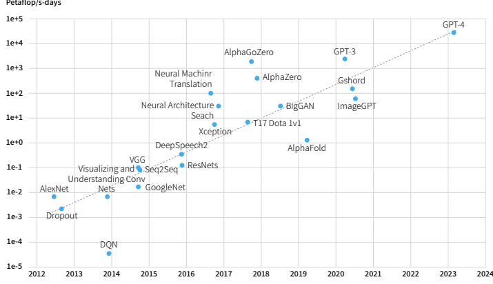

Figure 1: The Exponential Growth of Computational Power for Deep Learning.

can significantly enhance model performance, given adequate training data. Consequently, despite requiring colossal computational resources, efforts are being made to train large models on tens or hundreds of billions or even trillions of parameters. Pioneering examples include GPT-3 [26] and PaLM [27], which occupy close to 1TB of GPU Memory. Recognizing the potential, industry giants have set up large AI clusters to train LLMs while constantly investing in computational power chips.

进入 2020 年代, LLM 成为 AI 领域的转折点. 研究表明, 只要训练数据充足, 增加语言模型参数量和计算预算可以显著提升模型性能. 因此尽管需要巨量算力, 人们仍在训练数百亿, 数千亿乃至万亿参数的大模型, 早期代表有 GPT-3 [26] 和 PaLM [27], 它们占用接近 1TB 显存. 看到这一潜力, 行业巨头纷纷建设大型 AI 集群训练 LLM, 并持续投资算力芯片.

The shift towards the Mixture-of-Experts (MoE) Models [28]–[30] architecture starting from GPT-4 [7], and the recent AI Generated Content (AIGC) multi-modal (Sora [31]) has amplified the demand for memory and computational resources. However, as AI development outpaces hardware development, leading to skyrocketing training costs, adopting cost-saving solutions has become imperative.

从 GPT-4 [7] 开始转向 MoE 架构 [28]-[30], 加上近来的 AIGC 多模态模型 (Sora [31]), 进一步放大了对内存和算力的需求. AI 发展快于硬件发展, 训练成本飙升, 采用省钱的方案已是必然.

Figure 1 illustrates the exponential growth of computational power for DL. And as summarized in Figure 2 [32], while AI's demand for computational power is growing at 10x per year, Moore's Law lags behind with hardware FLOPs increase at only 3.0x every two years, DRAM bandwidth at 1.6x, and interconnect bandwidth at 1.4x. This disparity necessitates more machines, raising DL training costs, particularly for LLM training, where the computational power required surpasses that of traditional HPC applications.

Figure 1 展示了深度学习算力需求的指数增长. Figure 2 [32] 总结了另一组趋势: AI 对算力的需求每年增长 10 倍, 而硬件 FLOPs 每两年只增长 3.0 倍, DRAM 带宽 1.6 倍, 互连带宽 1.4 倍. 这一差距意味着需要更多机器, 推高了深度学习训练成本, LLM 训练尤其如此, 其算力需求已超过传统 HPC 应用.

## B. Challenges and Solutions in Models Training · 模型训练的挑战与对策

In Deep Learning training, a single task demands hundreds of GPUs and consumes substantial storage and network resources. This massive scale introduces system-level challenges:

深度学习训练中, 单个任务需要数百张 GPU, 并占用大量存储和网络资源. 这样的规模带来系统层面的挑战:

1) Efficiency: Firstly, achieving efficient training at this magnitude is crucial. Model FLOPs Utilization (MFU), which assesses the ratio of observed throughput to theoretical maximum throughput (assuming 100% peak FLOPS), serves as the standard metric for evaluating training efficiency. Training LLMs involves dividing models among GPUs that communicate extensively for progress. Besides communication, factors like operation optimization, data pre-processing, and GPU memory consumption significantly influence MFU. Multiple parallel strategies are employed to enhance efficiency:

1) 效率: 先要在这个量级上高效训练. 模型 FLOPs 利用率 (MFU) 是衡量训练效率的标准指标, 即实测吞吐与理论最大吞吐 (按 100% 峰值 FLOPS 计) 之比. LLM 训练要把模型切分到多张 GPU 上, GPU 之间需要大量通信. 除通信外, 算子优化, 数据预处理, 显存占用也会显著影响 MFU. 常用以下并行策略提高效率:

<!-- page 3 of 18 -->

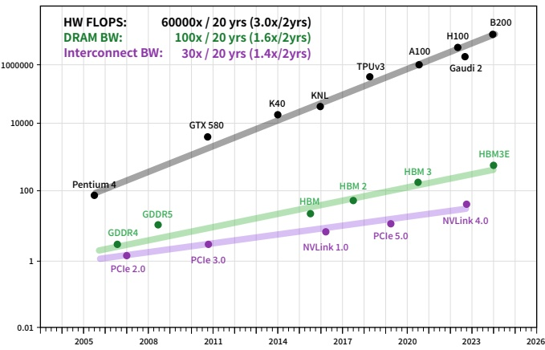

Figure 2: Scaling of Peak Hardware FLOPS, and Memory/Interconnect Bandwidth.

\- Data Parallelism (DP): Models and optimizer states are replicated across multiple devices with data evenly distributed to all. For LLMs training, the Zero Redundancy Optimizer (ZeRO) [19] further enhances this method by sharding these states on each data parallel process and using allgather and reduce-scatter for parameter fetching and gradient calculation.

- 数据并行 (DP): 模型和优化器状态在多个设备上复制, 数据均分给各设备. 对 LLM 训练, ZeRO [19] 进一步把这些状态分片到各数据并行进程, 用 allgather 获取参数, 用 reduce-scatter 聚合梯度.

\- Pipeline Parallelism (PP): Each device holds a portion of the model layers with each training batch divided into micro-batches for pipeline execution. Efficient scheduling strategies like GPipe [11], PipeDream 1F1B [12], and Zero Bubble Pipeline Parallelism (ZBPP) [33], are required to minimize “pipeline bubbles”.

- 流水线并行 (PP): 每个设备持有一部分模型层, 每个训练 batch 被切成 micro-batch 流水执行. 需要 GPipe [11], PipeDream 1F1B [12], Zero Bubble 流水线并行 (ZBPP) [33] 等调度策略来减少「流水线气泡」.

\- Tensor Parallelism (TP): This involves placing a model layer on multiple GPUs that perform computations in parallel [13] [14]. It includes row-wise and column-wise parallelism, necessitating allgather and all2all for input splitting and output merging.

- 张量并行 (TP): 把一个模型层放到多张 GPU 上并行计算 [13] [14], 有按行和按列两种切法, 需要 allgather 和 all2all 来切分输入, 合并输出.

\- Expert Parallelism (EP): MoE Models' different expert models are distributed on different GPUs during MoE training [15]–[17]. The gate model selects tokens for allocation during input, with corresponding tokens sent to experts model via all2all communication.

- 专家并行 (EP): MoE 训练时, 不同专家分布在不同 GPU 上 [15]-[17]. 输入时由门控模型选择 token 的去向, 再通过 all2all 把 token 发给对应专家.

\- Fully Sharded Data Parallel (FSDP) is an implementation based on the ZeRO Stage 3 algorithm [19]. FSDP partitions the model's parameters, optimizer states, and gradients, distributing them across different GPUs, with each GPU retaining only $1/n$ of the total. During forward propagation, FSDP performs an allgather operation to assemble the complete parameters, which are then released after the forward pass is completed. Similarly, during backward propagation, FSDP conducts an allgather operation to obtain the complete parameters, followed by backward computation to calculate gradients. It then performs a reduce-scatter operation to synchronize gradients across all GPUs, resulting in each GPU holding $1/n$ of the reduced gradients. Finally, FSDP updates the $1/n$ parameters using each GPU's $1/n$ gradients and optimizer states. FSDP reduces GPU memory usage by main-

taining only 1/n of the parameters, gradients, and optimizer states on each GPU, enabling training of larger-scale models.

- 全分片数据并行 (FSDP) 是基于 ZeRO Stage 3 [19] 的实现. FSDP 把模型参数, 优化器状态和梯度切分到各 GPU, 每张 GPU 只保留 $1/n$. 前向时 FSDP 先 allgather 拼出完整参数, 前向结束后释放. 反向时同样先 allgather 拿到完整参数, 计算梯度后做 reduce-scatter 同步梯度, 每张 GPU 得到 $1/n$ 的规约后梯度. 最终每张 GPU 用自己的 $1/n$ 梯度和优化器状态更新 $1/n$ 参数. 由于每张 GPU 只保存 $1/n$ 的参数, 梯度和优化器状态, FSDP 降低了显存占用, 可以训练更大的模型.

There are additional strategies and algorithms to accelerate training or reduce memory usage, such as Activation Recomputation [34], [35], as well as enhanced communication and computation overlap during parallelism [36], among others.

还有其他加速训练或降低显存的策略和算法, 例如激活重计算 [34], [35], 以及并行中更充分的计算通信重叠 [36] 等.

2) Stability: The second challenge is achieving high-stability training at scale, i.e., maintaining efficient training throughout the process. Stability is vital from a production standpoint as training a big model with a trillion tokens may span several weeks. In DL training, stragglers and hardware failures are common occurrences rather than outliers. Stragglers can decelerate tasks involving hundreds of GPUs, emphasizing the importance of stability and task recovery time.

2) 稳定性: 第二个挑战是在大规模下保持整个训练过程高效. 万亿 token 的大模型训练可能持续数周, 期间掉队节点 (straggler) 和硬件故障都会发生. 一个掉队节点就能拖慢涉及数百张 GPU 的任务, 因此系统需要控制性能波动并缩短故障恢复时间.

## C. HPC and AI Clusters of This Era · 当下的 HPC 与 AI 集群

1) HPC Inadequacies for AI Training: Traditional supercomputers such as TianHe-2A [37], Stampede 2 [38], and Sunway TaihuLight [39] primarily focus on double precision calculations and do not support the FP16 precision, rendering them unsuitable for DL training. Fugaku [40], despite its high performance, does not support tensor GEMM acceleration, a key component for DL workloads. Although these supercomputers may not be well-suited for DL training, their robust high-performance networks and extensive experience in large-scale cluster construction offer valuable insights and lessons for subsequent researchers.

1) 传统 HPC 不适合 AI 训练: 天河二号 A [37], Stampede 2 [38], 神威太湖之光 [39] 等传统超算主要面向双精度计算, 不支持 FP16, 不适合深度学习训练. 富岳 [40] 性能很高, 但不支持张量 GEMM 加速, 而这是深度学习负载的核心. 这些超算虽不适合深度学习训练, 其高性能网络和大规模集群建设经验对后来者仍有参考价值.

2) GPU based HPC: Supercomputers like Frontier [41], Aurora [42], Summit [43] and Perlmutter [44] utilize high-performance GPUs to tackle large-scale computations. It's worth mentioning that Perlmutter utilizes an all-flash storage system, achieving a peak bandwidth of 5TB/s. Indeed, conducting DL training on these GPU-based HPCs yields significant performance.

2) 基于 GPU 的 HPC: Frontier [41], Aurora [42], Summit [43], Perlmutter [44] 等超算用高性能 GPU 处理大规模计算. Perlmutter 采用全闪存存储系统, 峰值带宽达 5TB/s. 在这些 GPU 超算上做深度学习训练确实能获得很好的性能.

3) GPU Clusters of Large Companies: Meta, formerly Facebook, has developed its AI-HPC using a software-hardware co-design approach, with one system utilizing IB and another employing RoCE [45], [46]. ByteDance initially implemented a DL cluster with a mix of CPU and PCIe GPU [47]. However, with the advent of the LLMs era, they adopted an architecture similar to DGX, building a cluster with over 10,000 GPUs [48]. Alibaba has developed its own HPN network [49] for LLMs training using NVIDIA H800 GPUs. NVIDIA also has its own AI-HPC Eos [50], which will feature 576 DGX H100 systems totaling 4,608 H100 GPUs. While this will provide a considerable boost in computational power for AI tasks, the high cost of DGX systems raises questions about economic viability.

3) 大公司的 GPU 集群: Meta (原 Facebook) 用软硬件协同设计建设了 AI-HPC, 一套用 IB, 另一套用 RoCE [45], [46]. 字节跳动最初搭建了 CPU 与 PCIe GPU 混合的深度学习集群 [47], 进入 LLM 时代后改用类似 DGX 的架构, 建成了万卡以上的集群 [48]. 阿里巴巴为基于 NVIDIA H800 的 LLM 训练自研了 HPN 网络 [49]. NVIDIA 自己的 AI-HPC Eos [50] 将配备 576 台 DGX H100, 共 4,608 张 H100. 这会大幅提升 AI 算力, 但 DGX 系统价格高昂, 经济性值得商榷.

4) AI DSA Clusters: Custom-designed AI DSA (Domain Specific Architecture) accelerators like Google's TPU [51], utilize highly advanced optical switch reconfigurable networks. Alternatives to traditional GPU setups, like Intel Habana Gaudi [52], are also available. Teslahas introduced the Dojo [53], [54] supercomputer, which uses System on

<!-- page 4 of 18 -->

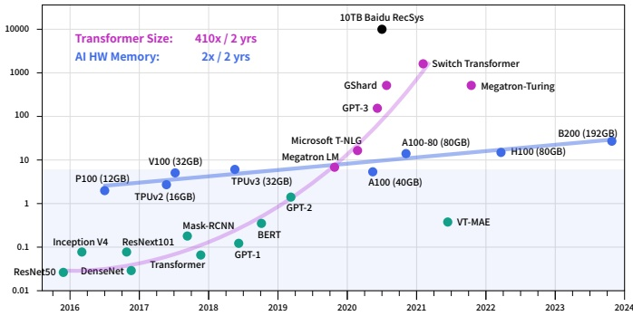

Figure 3: Size of Model Parameter and Accelerator Memory

Wafer technology to build an entire silicon wafer as a single chip. Huawei has designed the Ascend AI DSA chip  $[55]$ ,  $[56]$ , which remains competitive with NVIDIA, as noted by NVIDIA CEO Jensen Huang. These accelerators are tailored for efficient execution of AI workloads, offering specialized features to optimize model training and inference. However, their software ecosystems, while progressing, still require further development to match the maturity of NVIDIA's offerings.

4) AI DSA 集群: Google TPU [51] 等定制的 AI 领域专用架构 (DSA) 加速器, 采用了先进的光交换可重构网络. Intel Habana Gaudi [52] 等也是传统 GPU 之外的选择. Tesla 推出的 Dojo [53], [54] 超算采用晶圆级系统技术, 把整片硅晶圆做成一颗芯片. 华为设计了昇腾 AI DSA 芯片 [55], [56], NVIDIA CEO 黄仁勋也认为它与 NVIDIA 有竞争力. 这些加速器针对 AI 负载做了专门优化, 软件生态在进步, 但成熟度仍不及 NVIDIA.

5) Cloud Service Providers: Cloud service providers, such as Azure, offer flexible and scalable resources for AI training. Despite their convenience and easy accessibility, the costs can accumulate significantly over time. For long-term projects spanning around two years, these costs could amount to purchasing an entire dedicated cluster. Therefore, this option may not be the most economical choice for extensive AI computations.

5) 云服务商: Azure 等云服务商提供灵活可扩展的 AI 训练资源. 它们方便易得, 但成本会随时间累积, 对持续两年左右的长期项目, 云费用可能足以买下一整套专用集群. 因此对大规模 AI 计算而言, 云不一定是最经济的选择.

## D. Challenges in AI Infrastructure · AI 基础设施面临的挑战

As models continue to grow larger, DL training requires thousands of GPUs. Additionally, researchers often need to train multiple models simultaneously. Therefore, a cluster with at least tens of thousands of GPUs can meet the needs of AI practitioners. In addition to increasing the scale of the cluster nodes and adding more GPUs, there's also a need to find ways to save on the overall system construction costs. These costs include but are not limited to power support, cooling, networking, storage, fault handling, disaster recovery, etc. Building a cost-effective AI-HPC system is a significant challenge. The question of how to construct a high-performance, efficient, economical, and environmentally friendly HPC to meet AI training requirements has become a hot topic. Some works, such as [57] analyzes the construction of HPC, discussed the interconnection of heterogeneous clusters, cooling systems. AI applications such as Peng Cheng Cloud Brain II [58] discussed their strategies for building and improving AI computing power and cluster communication efficiency, which helped them achieve first place in IO500 and AIPerf rankings.

模型越来越大, 深度学习训练需要数千张 GPU, 研究者还常常要同时训练多个模型, 因此至少要数万张 GPU 的集群才能满足 AI 从业者的需求. 除了扩大节点规模, 增加 GPU, 还要设法降低整体建设成本, 包括但不限于供电, 制冷, 网络, 存储, 故障处理, 容灾等. 建设高性价比的 AI-HPC 系统是一项重大挑战, 如何建设高性能, 高效, 经济, 环保的 HPC 来满足 AI 训练需求已成为热点. [57] 等工作分析了 HPC 建设, 讨论了异构集群互连和制冷系统. 鹏城云脑 II [58] 等 AI 应用讨论了提升 AI 算力和集群通信效率的策略, 帮助它们在 IO500 和 AIPerf 榜单上取得第一.

Drawing from our extensive experience in Deep Learning spanning over the past decade, we have conducted considerable exploration in terms of cost-effectiveness. This work primarily discusses our practices for achieving cost-effectiveness and high-performance across different models and stages.

基于过去十余年深度学习的经验, 我们在性价比方面做了大量探索. 本文主要讨论我们在不同模型, 不同阶段实现高性价比和高性能的实践.

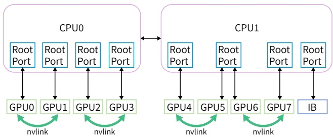

Figure 4: In-node Architecture: 8 PCIe GPUs and 1 InfiniBand (IB) NIC are directly connected to the CPU. Note that GPU5/6 share the same PCIe root port, while IB occupies one independently.

|  | Our PCIe Arch | DGX-A100 |
| --- | --- | --- |
| CPU | 2 * AMD 32 CoresEPYC Rome/Milan CPU | 2 * AMD 64 CoresEPYC 7742 CPU |
| Memory | 512GB 16-ChannelsDDR4-3200Mhz | 2048GB 16-ChannelsDDR4-3200Mhz |
| GPU | 8 * PCIe-A100-40GB | 8 * SXM-A100-40GB |
| NICs | 1 * Mellanox InfiniBandcx6 200Gbps NIC | 9 * Mellanox InfiniBandcx6 200Gbps NIC |
| NVLINK | 600 GB/s between each pair of GPUs | 600 GB/s interconnect among all 8 GPUs |

## III. FIRE-FLYER 2: OUR APPROACH FOR DEEP LEARNING AND EARLY LLM TRAINING · Fire-Flyer 2: 面向深度学习与早期 LLM 训练的方案

As mentioned in the Background Section, LLMs generally require significant memory resources. In contrast, many other models necessitate considerably less memory, as illustrated in Figure 3. Popular models like ResNet [22], Mask-RCNN [59], BERT [60], MAE [61], among others, all have a parameter volume less than 1B, signifying relatively low memory requirements. Therefore, when designing a cluster primarily for deep learning model training, and with insights gleaned from our Fire-Flyer 1 experiments, we deemed it prudent to incorporate PCIe A100 GPUs, which proved to be sufficient during its construction in 2021.

如背景部分所述, LLM 通常需要大量内存. 相比之下, 很多其他模型所需内存要少得多, 见 Figure 3. ResNet [22], Mask-RCNN [59], BERT [60], MAE [61] 等常用模型参数量都小于 1B, 内存需求相对较低. 因此在设计一个主要用于深度学习训练的集群时, 结合 Fire-Flyer 1 的经验, 我们认为采用 PCIe A100 是稳妥的, 它在 2021 年建设时也确实够用.

## A. Fire-Flyer 2: PCIe A100 GPU Architecture · Fire-Flyer 2: PCIe A100 GPU 架构

In our training workloads, the bandwidth requirements for both storage IOs and computation communication across 8 NVIDIA PCIe A100 GPUs can be met by a single 200Gbps NVIDIA Mellanox ConnectX-6 (CX6) InfiniBand (IB) NIC. We employed the following computation node architecture, as shown in Figure 4:

在我们的训练负载中, 8 张 NVIDIA PCIe A100 的存储 IO 和计算通信带宽需求, 用一张 200Gbps 的 NVIDIA Mellanox ConnectX-6 (CX6) InfiniBand (IB) 网卡就能满足. 我们采用如下计算节点架构, 见 Figure 4:

\- 8 NVIDIA A100 PCIe GPUs and 1 Mellanox CX6 200Gbps IB NIC: directly connect to the CPU, without using a PCIe switch

- 8 张 NVIDIA A100 PCIe GPU 和 1 张 Mellanox CX6 200Gbps IB 网卡: 直接连到 CPU, 不使用 PCIe switch

\- IB NIC occupies a separate PCIe root complex, thus avoiding performance interference with the GPU.

- IB 网卡独占一个 PCIe root complex, 避免与 GPU 互相干扰性能.

\- Reserved the possibility of NVLink Bridge addition in design: As expected, when the LLM era arrived, we indeed added an NVLink Bridge between PCIe cards.

- 设计时预留了加装 NVLink Bridge 的可能: 不出所料, LLM 时代到来后, 我们确实在 PCIe 卡之间加装了 NVLink Bridge.

<!-- page 5 of 18 -->

Table I shows our arch details and compared with NVIDIA standard DGX-A100 server.

Table I 给出了我们的架构细节, 并与 NVIDIA 标准 DGX-A100 服务器对比.

## B. Network Topology: Two-Layer Fat-Tree with Storage and Computation Integrated · 网络拓扑: 存算一体的两层 Fat-Tree

We selected the Fat-Tree [9] topology as our primary network architecture due to its exceptionally high bisection bandwidth, making it the preferred choice for AI-HPC and high-throughput storage environments. Although the Dragonfly topology [62], [63] also offers comparable cost-effectiveness and performance, its lack of sufficient bisection bandwidth makes it unsuitable for our integrated storage and computation network design. At the time of implementation, various RoCE (RDMA over Converged Ethernet) [64] technologies were not as mature as they are today, so we opted for InfiniBand (IB) as our network solution. Mellanox QM8700 InfiniBand Switch, offering 40 ports at 200 Gbps, was utilized. Our cluster, consisting of 10,000 A100 GPUs, includes approximately 1,250 GPU compute nodes and nearly 200 storage servers, although a Two-Layer Fat-Tree can accommodate up to 800 nodes (configured with 20 spine switches and 40 leaf switches).

我们选择 Fat-Tree [9] 作为主网络架构, 因为它的二分带宽极高, 是 AI-HPC 和高吞吐存储环境的首选. Dragonfly 拓扑 [62], [63] 的性价比和性能也相近, 但二分带宽不足, 不适合我们存算一体的网络设计. 建设时各种 RoCE [64] 技术还不如今天成熟, 所以我们选了 InfiniBand (IB). 交换机用 Mellanox QM8700, 40 个 200Gbps 端口. 集群有 10,000 张 A100, 约 1,250 个 GPU 计算节点和近 200 台存储服务器, 而一个两层 Fat-Tree (20 台 spine, 40 台 leaf) 最多只能接 800 个节点.

To reduce costs, , we opted for a two-zone network configuration instead of a three-layer Fat-Tree solution, as shown in Figure 5. Each zone consists of an 800-port Fat-Tree connected to approximately 600 GPU compute nodes. Each storage server equipped with two IB NICs, respectively connected to different zones, hence all GPU compute nodes could share a set of storage services. Additionally, the two zones are interconnected with a limited number of links. Our HAI Platform scheduling strategy ensured that cross-zone computing tasks were limited to one at most. Whether using NCCL [10] or our in-house developed communication library HFReduce, it can be run across zones by using a double binary tree algorithm [65]. Our scheduler ensures that in this topology, only one pair of nodes communicates across zones. Consequently,

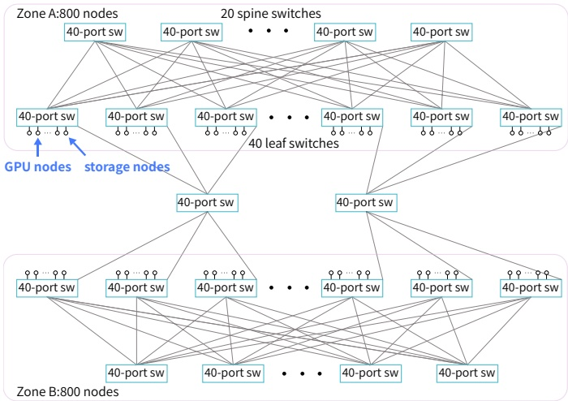

Figure 5: Network Topology: Two complete Two-Layer Fat-Tree connected together.

|  | Our Arch | DGX Arch |
| --- | --- | --- |
| TF32 GEMM (TFLOPS/GPU) | 107 | 131 |
| FP16 GEMM (TFLOPS/GPU) | 220 | 263 |
| Relative Performance | 83% | 100% |
| Node Relative Price | 60% | 100% |
| Cost-Performance Ratio | 1.38 | 1 |
| Power Consumption (Watts) | 2500 | 4200 |

|  | Our Arch | PCIe Arch with Three Layer Fat-Tree | DGX Arch |
| --- | --- | --- | --- |
| Number of Switches | 122 | 200 | 1320 |
| Network Price | 350 | 600 | 4000 |
| Server Price | 11250 | 11250 | 19000 |
| Total Price | 11600 | 11850 | 23000 |

even tasks requiring all nodes can efficiently run on the entire Fire-Flyer 2 AI-HPC.

为降低成本, 我们没有采用三层 Fat-Tree, 而是用两区网络配置, 见 Figure 5. 每个区是一个 800 端口的 Fat-Tree, 接约 600 个 GPU 计算节点. 每台存储服务器配两张 IB 网卡, 分别接入两个区, 所以全部 GPU 计算节点可以共享同一套存储服务. 两个区之间只有少量链路互连. HAI Platform 的调度策略保证同一时间最多只有一个跨区计算任务. 无论 NCCL [10] 还是自研的 HFReduce, 都可以用双二叉树算法 [65] 跨区运行, 调度器保证在这种拓扑下只有一对节点跨区通信. 因此, 即使是需要全部节点的任务, 也能在整个 Fire-Flyer 2 AI-HPC 上高效运行.

## C. Cost Performance of Our Architecture · 本架构的性价比

Compared to the NVIDIA DGX-A100 [8] architecture, our approach using PCIe A100 achieves approximately 83% of the performance in TF32 and FP16 General Matrix Multiply (GEMM) benchmarks. However, it offers substantial reductions in both costs and energy usage, achieving 60% of the GPU cost and energy consumption, as detailed in Table II.

与 NVIDIA DGX-A100 [8] 架构相比, 我们基于 PCIe A100 的方案在 TF32 和 FP16 通用矩阵乘 (GEMM) 测试中达到约 83% 的性能, 同时成本和能耗大幅下降, GPU 成本和能耗都只有 60%, 见 Table II.

Contrasting with the DGX-A100 cluster, which necessitates a Three-Layer Fat-Tree encompassing 10,000 access points and involving 320 core switches, 500 spine switches and 500 leaf switches, amounting to 1,320 switches in total (as shown in Table III), our architecture only requires 122 switches. This arrangement is significantly more cost-efficient. Even when compared to a similarly sized three-layer Fat-Tree network with 1,600 access points, which includes 40 core switches and 160 spine and leaf switches (totaling 200 switches), our design facilitates a saving of 40% in networking costs.

DGX-A100 集群需要一个三层 Fat-Tree, 接入 10,000 个端点, 包含 320 台 core, 500 台 spine 和 500 台 leaf 交换机, 共 1,320 台 (见 Table III), 我们的架构只需要 122 台, 成本低得多. 即使与规模相当的三层 Fat-Tree (1,600 个接入点, 40 台 core 加 160 台 spine 和 leaf, 共 200 台) 相比, 我们的设计也节省了 40% 的网络成本.

Furthermore, by utilizing an 800-Ports Frame Switch, we have further reduced the cost of optical modules and cables. While there is a performance gap due to the inherent differences between PCIe card specifications and SXM, we generally achieved 80% of the DGX-A100 performance at merely 60% of the cost. Additionally, we managed to trim energy consumption by 40%, thereby reducing  $CO_{2}$  emissions. In terms of cost-performance, we regard this approach as both effective and successful.

此外, 使用 800 端口的框式交换机进一步降低了光模块和线缆成本. PCIe 卡与 SXM 规格的固有差异带来一定性能差距, 但总体上我们以 60% 的成本拿到了 DGX-A100 80% 的性能, 能耗降低 40%, 也减少了 $CO_2$ 排放. 从性价比看, 我们认为这一方案是有效且成功的.

## IV. HFREDUCE: HARDWARE SOFTWARE CO-DESIGN IN NETWORK · HFReduce: 网络层面的软硬件协同设计

In large-scale deep learning training, allreduce is essential for aggregating gradients across GPUs. To optimize communication among PCIe GPUs in our architecture, we developed HFReduce, a library specifically designed for efficient allreduce operations. The core strategy of HFReduce, illustrated in Figure 6, involves performing intra-node reduction first, followed by inter-node allreduce of the reduced data from the 8

<!-- page 6 of 18 -->

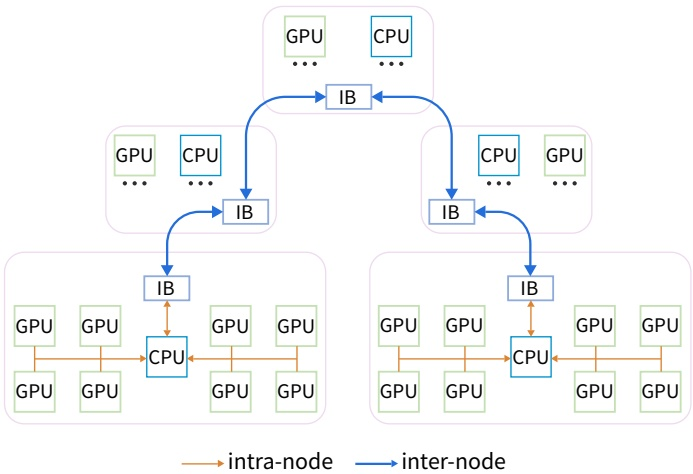

Figure 6: HFReduce Schematic: 1) do intra-node reduce, 2) do inter-node allreduce by CPU, 3) finally transfer reduced data to GPU.

GPUs within each node. This inter-node allreduce leverages a Double Binary Tree Algorithm [65], akin to NCCL, and is pipelined by dividing data into chunks for transfer via Remote Direct Memory Access (RDMA), ensuring high performance. HFReduce is versatile and can be applied to any scenario requiring allreduce, as well as general reduce and broadcast operations.

大规模深度学习训练中, allreduce 是跨 GPU 聚合梯度的必需操作. 为优化本架构中 PCIe GPU 之间的通信, 我们开发了专门做高效 allreduce 的库 HFReduce. 其核心策略见 Figure 6: 先做节点内规约, 再对每个节点 8 张 GPU 规约后的数据做节点间 allreduce. 节点间 allreduce 采用与 NCCL 类似的双二叉树算法 [65], 并把数据切块, 通过 RDMA 流水传输, 保证高性能. HFReduce 适用于任何需要 allreduce 的场景, 也可用于一般的 reduce 和 broadcast 操作.

## A. HFReduce Algorithm Steps · HFReduce 算法步骤

Intra-node reduction, as shown in the Algorithm 1:

节点内规约, 见 Algorithm 1:

1) When the gradients data on the GPUs require allreduce, HFReduce asynchronously transfers these data to the CPU memory. This Device-To-Host (D2H) Transfer can utilize GDRCopy [66] for small data and Mem-CpyAsync for larger data.

1) 当 GPU 上的梯度需要 allreduce 时, HFReduce 把数据异步传到 CPU 内存. 这一步是设备到主机 (D2H) 传输, 小数据可用 GDRCopy [66], 大数据用 MemCpyAsync.

2) Upon the arrival of the gradients in memory, perform reduction add operation using CPU vector instructions.

2) 梯度到达内存后, 用 CPU 向量指令做规约加法.

Inter-node reduction, as shown in the Algorithm 2:

节点间规约, 见 Algorithm 2:

1) Use the Double Binary Tree Algorithm [65] for inter-node allreduce, facilitating transfers between nodes using RDMA verbs implementation.

1) 用双二叉树算法 [65] 做节点间 allreduce, 节点间传输基于 RDMA verbs 实现.

2) Finally, the CPU returns reduced gradients to the GPU via PCIe (Host-To-Device Phase).

2) 最终 CPU 通过 PCIe 把规约后的梯度传回 GPU (主机到设备阶段).

The final Host-To-Device (H2D) Transfer can be optimized by utilizing GDRCopy to write data to four GPUs within the same NUMA node, effectively reducing reads from host memory by threefold compared to MemCpyAsync. This efficiency is achieved because GDRCopy can read data from host memory and temporarily cache it in the CPU caches, allowing data to be written to the four GPUs without additional reads from host memory.

末尾的主机到设备 (H2D) 传输可以用 GDRCopy 优化: 把数据写到同一 NUMA 节点内的 4 张 GPU, 主机内存读取量降为 MemCpyAsync 的约三分之一. 原因是 GDRCopy 从主机内存读出数据后会暂存在 CPU cache 里, 写 4 张 GPU 时不必再次读主机内存.

## B. Advantages of HFReduce over NCCL · HFReduce 相对 NCCL 的优势

1) Reduced PCIe Bandwidth Consumption: Let $n$ be the total number of GPUs involved in the communication. In NCCL's ring topology, each unit of data needs to go through $2n - 1$ transmissions, each consuming one unit of inbound

```txt
Algorithm 1: Intra Node Reduce.
Data: Dg: data need to allreduce
Result: Dc: data reduced in this node
Split Dg by Chunk_Size
for Dg-i in Splited-Dg do
    // Transfer GPU Memory Data to CPU memory
    Dc_i = MemCopyAsync Dg_i to CPU Mmeory
end
for i in Splited_Count do
    while every GPU's Dg_i → Dc_i finished do
        // Wait for chunk-i transfer
            finished in this node
        for j in GPU_Count do
            // do intra-node reduce
            Dc_i += GPU-j's Dc_i
        end
        // do inter-node reduce
        Do_Internode_reduce(Dc_i)
    end
end
```

bandwidth of one GPU and one unit of outbound bandwidth of another GPU. This means for a single unit of data, it consumes  $\frac{2n-1}{n}$  unit of PCIe bidirectional bandwidth. In contrast, for each unit of data, HFReduce only requires one D2H and one H2D data transfer, only one unit of PCIe bidirectional bandwidth is consumed. In our machine architecture, the performance of NCCL is mainly limited by PCIe bandwidth. Therefore, HFReduce can achieve better performance than NCCL.

1) 减少 PCIe 带宽消耗: 设参与通信的 GPU 总数为 $n$. 在 NCCL 的 ring 拓扑中, 每单位数据要经过 $2n-1$ 次传输, 每次消耗一张 GPU 一单位入向带宽和另一张 GPU 一单位出向带宽. 也就是说, 每单位数据消耗 $\frac{2n-1}{n}$ 单位的 PCIe 双向带宽. HFReduce 对每单位数据只需一次 D2H 和一次 H2D, 只消耗一单位 PCIe 双向带宽. 在我们的机器架构上, NCCL 的性能主要受 PCIe 带宽限制, 因此 HFReduce 能比 NCCL 更快.

> **拆开:** $\frac{2n-1}{n}$ 是怎么来的, 和常见的 ring allreduce 计数对得上吗?
>
> 答: 按 IV-B1 的口径, $2n-1$ 次传输由 $n$ 张 GPU 分摊, 每张 GPU 摊到 $\frac{2n-1}{n}$ 单位, $n$ 大时趋近 2. 通常的 ring allreduce 计数是 reduce-scatter 与 allgather 各走 $n-1$ 步, 每张 GPU 收发各 $\frac{2(n-1)}{n}$ 单位, 同样趋近 2. HFReduce 一次 D2H 加一次 H2D 合计 1 单位, 两者相差约 2 倍, 与 IV-B 末尾给出的 HFReduce 6.3-8.1GB/s 对 NCCL 1.6-4.8GB/s 的量级相符. 原文的 $2n-1$ 比标准计数多出约 1 次, 不影响「约 2 倍」的结论.

2) No GPU Kernel Overhead: HFReduce utilizes the GPU's Copy Engine (CE) for PCIe asynchronous transfers. In contrast, NCCL's allreduce operation requires GPU kernel execution, which can affect other computational kernels on the GPU. HFReduce achieves complete asynchrony with no overhead.

2) 没有 GPU kernel 开销: HFReduce 用 GPU 的 Copy Engine (CE) 做 PCIe 异步传输, NCCL 的 allreduce 则需要执行 GPU kernel, 会影响 GPU 上其他计算 kernel. HFReduce 做到了完全异步, 没有额外开销.

As demonstrated in Figure 7a, HFReduce can reach a inter-node bandwidths of 6.3-8.1GB/s when performing allreduce with a data size of 186 MiB on the Fire-Flyer 2 AI-HPC, while NCCL's inter-node bandwidth is only 1.6-4.8GB/s.

如 Figure 7a 所示, 在 Fire-Flyer 2 AI-HPC 上对 186 MiB 数据做 allreduce 时, HFReduce 的节点间带宽可达 6.3-8.1GB/s, NCCL 只有 1.6-4.8GB/s.

## C. Performance Improvements: HFReduce with NVLink · 性能改进: 带 NVLink 的 HFReduce

By installing the NVLink Bridge for PCIe A100 GPUs, efficient communication is enabled between paired GPUs via the 600 GB/s NVLink. To alleviate the memory bound issue of the original HFReduce, we implemented another allreduce pattern, termed HFReduce with NVLink. The core concept involves initially performing a reduction operation among GPUs interconnected by NVLink before passing the gradient to the CPU. Subsequently, when the CPU returns the result, it splits the result data and returns them to the paired GPUs connected by NVLink respectively, then performs allgather via NVLink. As illustrated in Figure 7b, HFReduce with NVLink achieves inter-node bandwidths exceeding 10 GB/s.

给 PCIe A100 装上 NVLink Bridge 后, 成对的 GPU 之间可以通过 600GB/s 的 NVLink 高效通信. 为缓解原版 HFReduce 的内存带宽瓶颈, 我们实现了另一种 allreduce 模式, 称为 HFReduce with NVLink. 核心做法是先在 NVLink 相连的 GPU 之间做规约, 再把梯度交给 CPU. CPU 返回结果时, 把结果切开分别还给 NVLink 相连的两张 GPU, 两者再通过 NVLink 做 allgather. 如 Figure 7b 所示, HFReduce with NVLink 的节点间带宽超过 10GB/s.

<!-- page 7 of 18 -->

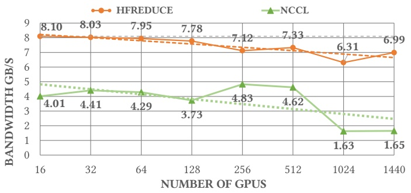

(a) HFRudce and NCCL Allreduce Speed.

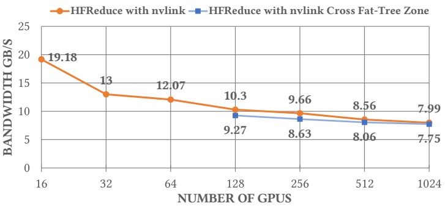

(b) HFReduce with NVLink (Cross Fat-Tree Zone).

Algorithm 2: Inter Node Reduce.
    Data: DL:local node reduced data by Algorithm 1
    Data: DR: received other node reduced data
    Result: Dg: reduced data transfer to GPU
// Pass 1: reduce data,individual thread
for i in Chunk\_Size do
    receive data $DR\_i$ from prev node
    if $DL\_i$ ready then
        DL\_i +=DR\_i // reduce data
    end
    if Thread is root of Tree then
        send DL\_i to prev node // Dg\_i finished, go parse 2
    else
        send DL\_i to next node
    end
end
//
// Pass 2: gather reduced data,individual thread
receive data $DR\_i$ from next node
for j in GPU\_Count do
    Dg\_i = MemCopyAsync DR\_i to GPU-j // Dg\_i is allreduced
end
send DL\_i to prev node

## D. Deep Analysis of HFReduce · HFReduce 深入分析

1) Key Technical Strategies in Implementation:

1) 实现中的关键技术策略:

\- Using GDRCopy accelerate small data transfer in D2H, and educing reads from host memory by three times compared to MemCpyAsyn.

- 用 GDRCopy 加速 D2H 的小数据传输, 主机内存读取量降为 MemCpyAsync 的约三分之一.

\- Intra-Node Reduction: CPU utilizes SIMD instructions and supports FP32 / FP16 / BF16 / FP8 datatypes.

- 节点内规约: CPU 使用 SIMD 指令, 支持 FP32/FP16/BF16/FP8 数据类型.

\- NUMA Awareness: D2H destination memory is interleaved across two NUMA nodes for maximum bandwidth. Memory for CPU-added results and network-

received data is bound to the IB-Nic's NUMA node to minimize latency.

- NUMA 感知: D2H 的目标内存在两个 NUMA 节点间交错分配, 以获得最大带宽. CPU 相加结果和网络接收数据所用的内存绑定在 IB 网卡所在的 NUMA 节点, 以降低延迟.

\- Inter-Node Reduce: Implements a Double Binary Tree allreduce algorithm [65] via ibverbs RDMA Write, avoiding additional overhead.

- 节点间规约: 通过 ibverbs 的 RDMA Write 实现双二叉树 allreduce 算法 [65], 避免额外开销.

2) HFReduce Overcomes Limitations of EPYC Rome CPU: We consulted AMD and NVIDIA engineers to identify the root cause of NCCL's suboptimal performance on PCIe architecture, particularly with EPYC Rome CPU servers. It was determined that the Rome CPUs do not support the chained write feature, which can significantly accelerate PCIe peer-to-peer (P2P) transfers between GPUs and IB NICs. Our tests indicate that the maximum bandwidth between the GPU and IB NIC on Rome CPUs is approximately 9 GiB/s, making the observed 4GB/s all-reduce bandwidth for NCCL understandable. HFReduce circumvents this limitation by utilizing the CPU for reduction and transferring data through IB and host memory.

2) HFReduce 绕开了 EPYC Rome CPU 的限制: 我们咨询了 AMD 和 NVIDIA 的工程师, 查找 NCCL 在 PCIe 架构 (尤其是 EPYC Rome 服务器) 上性能不佳的根因. 结论是 Rome CPU 不支持 chained write, 而这一特性能显著加速 GPU 与 IB 网卡之间的 PCIe 点对点 (P2P) 传输. 我们测得 Rome 上 GPU 与 IB 网卡之间的最大带宽约 9 GiB/s, NCCL 只有约 4GB/s 的 allreduce 带宽也就可以理解. HFReduce 用 CPU 做规约, 数据经 IB 和主机内存传输, 从而绕开了这一限制.

3) Bottlenecks of HFReduce: When considering the total memory operations on a single node during HFReduce, several factors contribute to its performance limitations:

3) HFReduce 的瓶颈: 统计 HFReduce 过程中单节点的全部内存操作, 有以下几项决定了它的性能上限:

1) D2H Phase requires 8 write operations.

1) D2H 阶段需要 8 次写.

2) Intra-node Reduce Add Phase involves 8 read operations and 1 write operation.

2) 节点内规约加法阶段需要 8 次读和 1 次写.

3) Inter-node Allreduce Phase: IB send demands 2 read operations, while IB receive requires 2 write operations, along with 1 read operation for reduce add.

3) 节点间 allreduce 阶段: IB 发送需要 2 次读, IB 接收需要 2 次写, 规约加法还要 1 次读.

4) H2D Phase Utilizing GDRCopy can reduce this to only 2 read operations, whereas MemCopy necessitates 8 read operations.

4) H2D 阶段用 GDRCopy 只需 2 次读, 用 MemCopy 则需要 8 次读.

In total, the memory operations amount to 24 times the original data size in the GPU. A host equipped with 16 channels of DDR4-3200MHz memory can achieve a practical memory access speed of 320GB/s. Consequently, the theoretical maximum speed of HFReduce is approximately 13.3GB/s, but when considering the allreduce algorithm bandwidth and network bandwidth, this value realistically approximates 12GB/s. However, our tests only achieved slightly over 8GB/s.

合计内存操作量是 GPU 上原始数据量的 24 倍. 配 16 通道 DDR4-3200 内存的主机实际内存访问速度可达 320GB/s, 因此 HFReduce 的理论上限约为 13.3GB/s, 再考虑 allreduce 算法带宽和网络带宽, 实际可达值约 12GB/s. 但我们的测试只达到 8GB/s 出头.

> **核对:** 24 倍是怎么加出来的, 13.3GB/s 和 12GB/s 又各自对应什么?
>
> 答: 按 IV-D3 列出的四项: D2H 写 8 次, 规约读 8 次写 1 次, IB 发送读 2 次, 接收写 2 次, 规约再读 1 次, H2D (GDRCopy) 读 2 次, 合计 $8+9+5+2=24$. 320GB/s 除以 24 得到 13.3GB/s. 12GB/s 原文只说考虑了算法带宽和网络带宽, 算式文中没有给出. 一种能对上的算法是: 200Gbps 网卡约 25GB/s, 双二叉树里每个节点在两棵树上各承担一半数据的收和发, 可用的 allreduce 算法带宽约为网卡带宽的一半, 即约 12.5GB/s.

The root cause of this discrepancy is another limitation of the EPYC CPUs. As previously mentioned, our GPU5 and

<!-- page 8 of 18 -->

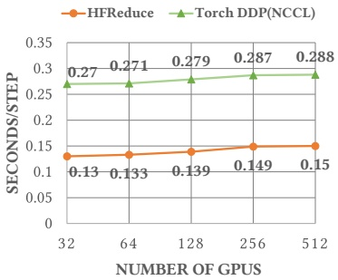

(a) HFReduce v.s. Torch DDP.

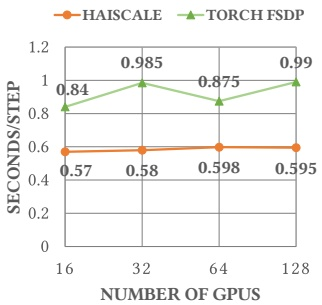

(b) HaiScale v.s. Torch FSDP.

Figure 8: Weak Scalability: (a) Training VGG16, HFReduce compared to PyTorch DDP's NCCL backend (b) Training GPT2-Medium HaiScale compared to Torch, both using FSDP.

GPU6 are directly connected to the CPU via the same PCIe Root Complex Port (also known as the PCIe Host Bridge). In AMD EPYC Rome and Milan CPUs, the maximum bandwidth from the Root Complex Port to the CPU's internal bus is about 37.5GB/s. Although a PCIe 4.0 x16 port can achieve over 27GB/s from GPU to CPU, when two GPUs transfer data concurrently, the bandwidth is limited to around 37GB/s. Furthermore, if bidirectional data transfer occurs simultaneously, this bandwidth decreases even further. As a result, HFReduce does not reach its theoretical speed.

根因是 EPYC CPU 的另一个限制. 前面提到, 我们的 GPU5 和 GPU6 通过同一个 PCIe Root Complex 端口 (也叫 PCIe Host Bridge) 直连 CPU. 在 AMD EPYC Rome 和 Milan 上, Root Complex 端口到 CPU 内部总线的最大带宽约 37.5GB/s. 单个 PCIe 4.0 x16 端口从 GPU 到 CPU 可达 27GB/s 以上, 但两张 GPU 同时传输时总带宽被限制在约 37GB/s, 如果同时双向传输, 带宽还会更低. 因此 HFReduce 达不到理论速度.

Employing NVLink with HFReduce offers a functional method to alleviate these bottlenecks. However, it is worth noting that the next-generation CPUs, such as the EPYC Genoa, still face issues with PCIe Host Bridge bandwidth, which cannot support two full-speed PCIe ports simultaneously. We hope AMD will address this issue in future iterations.

给 HFReduce 加上 NVLink 是缓解这些瓶颈的可行办法. 但要注意, 下一代 CPU 如 EPYC Genoa 依然存在 PCIe Host Bridge 带宽问题, 无法同时支撑两个满速 PCIe 端口. 我们希望 AMD 在后续产品中解决这个问题.

## V. HAISCALE: SPECIAL OPTIMIZATION FOR DEEP LEANING MODELS TRAINING · HaiScale: 针对深度学习模型训练的专门优化

## A. HaiScale DDP Overlap AllReduce in Training · HaiScale DDP 在训练中重叠 AllReduce

HaiScale Distributed Data Parallel (DDP) is a training tool that utilizes HFReduce as its communication backend, in contrast to PyTorch's DDP [67] which employs NCCL as its back-end. During the backpropagation phase, HaiScale DDP performs an asynchronous allreduce operation on the computed gradients, allowing this communication to overlap with the computation involved in backpropagation.

HaiScale 分布式数据并行 (DDP) 是以 HFReduce 为通信后端的训练工具, PyTorch DDP [67] 则以 NCCL 为后端. 反向传播阶段, HaiScale DDP 对已算出的梯度做异步 allreduce, 让通信与反向计算重叠.

As previously mentioned, HFReduce does not depend on GPU Streaming Multiprocessors (SM) for reduction computation, enabling completely asynchronous allreduce without impacting performance. As shown in Figure 8a, training VGG16 model [68] with HFReduce takes only half the time compared to using Torch DDP's NCCL backend, achieving nearly $88\%$ parallel scalability when scale from 32 GPUs to 512.

前面提到, HFReduce 做规约不依赖 GPU 的流式多处理器 (SM), 可以完全异步地做 allreduce 而不影响性能. 如 Figure 8a 所示, 用 HFReduce 训练 VGG16 [68] 的耗时只有 Torch DDP NCCL 后端的一半, 从 32 卡扩展到 512 卡时并行扩展性接近 $88\%$.

## B. LLMs Training Optimization · LLM 训练优化

Our HaiScale framework various parallelism strategies for training large language models (LLMs), similar to Megagron [69] and DeepSpeed [70]. We have made specific engineering optimizations for our PCIe architecture across Data Parallelism (DP), Pipeline Parallelism (PP) [11] [12], Tensor Parallelism (TP) [14], Expert Parallelism (EP) [15]–[17].

我们的 HaiScale 框架与 Megatron [69] 和 DeepSpeed [70] 类似, 支持训练 LLM 所需的多种并行策略. 我们针对 PCIe 架构, 在数据并行 (DP), 流水线并行 (PP) [11] [12], 张量并行 (TP) [14], 专家并行 (EP) [15]-[17] 上做了专门的工程优化.

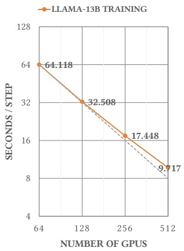

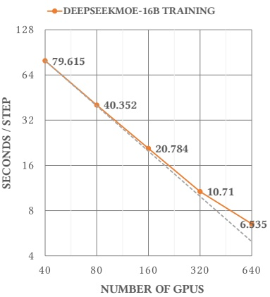

(a) Train LLaMa-13B

(b) Train DeepSeekMoE-16B

Figure 9: Strong Scalability: (a) Train LLaMa-13B with a config of sequence length 2048, batch size 4096, pipeline parallel 4. (b) Train DeepSeekMoE-16B with a config of sequence length 4096, batch size 4608, pipeline parallel 10.

1) NVLink Bridge Enables Tensor Parallel between PCIe GPUs: With the advent of LLMs, we integrated the NVLink Bridge into our system. This addition established a bandwidth of 600GB/s between each pair of GPUs, enabling more efficient when performing Tensor Parallelism.

1) NVLink Bridge 让 PCIe GPU 之间可以做张量并行: LLM 出现后, 我们给系统加装了 NVLink Bridge, 每对 GPU 之间有 600GB/s 带宽, 做张量并行时效率更高.

2) Pipeline Parallelism Optimization in PCIe Architecture: In our architecture, there is only one IB NIC for 8 GPUs on a single node, which can lead to network bandwidth contention during Pipeline Parallelism (PP). We solve this by configuring Data Parallelism (DP) rank, making the 8 GPUs on the same node belong to different DP ranks which staggers the timing of PP for each DP rank. As Figure 9a shown, when scaling from 64 GPUs to 512 GPUs, the step time of training LLaMa-13B [71] decreases from 64.118 seconds to 9.717 seconds, achieving a parallel efficiency of $91\%$.

2) PCIe 架构下的流水线并行优化: 我们的架构中单节点 8 张 GPU 只有一张 IB 网卡, 做流水线并行 (PP) 时会争抢网络带宽. 我们通过配置数据并行 (DP) rank 来解决: 让同一节点的 8 张 GPU 属于不同的 DP rank, 从而错开各 DP rank 做 PP 通信的时间. 如 Figure 9a 所示, 训练 LLaMA-13B [71] 从 64 卡扩展到 512 卡时, 单步时间从 64.118 秒降到 9.717 秒, 并行效率 $91\%$.

> **看表:** 64 卡 64.118 秒到 512 卡 9.717 秒, 并行效率真的是 91%?
>
> 答: 强扩展效率按 $\frac{64 \times T_{64}}{512 \times T_{512}}$ 计算, 代入正文两个数是 $\frac{64 \times 64.118}{512 \times 9.717} \approx 82.5\%$. Figure 9a 里 256 卡的单步时间是 17.448 秒, 对应 $\frac{64 \times 64.118}{256 \times 17.448} \approx 91.9\%$. 91% 对应的是 256 卡这一档, 扩展到 512 卡时效率约 82%. 同样的算法用在 V-B2 的 DeepSeekMoE-16B 上, 76.14% 和 92.92% 都能复算出来.

We also benchmarked the training performance of our DeepSeekMoE-16B model  $[72]$  on Fire-Flyer 2 AI-HPC. As shown in Figure 9b, scaling from 40 GPUs to 640 GPUs reduced the time per training step from 79.615 seconds to 6.535 seconds, achieving a parallel efficiency of 76.14%. Notably, with 320 GPUs, the step time was 10.71 seconds, resulting in a parallel efficiency of 92.92%, demonstrating excellent scalability.

我们还在 Fire-Flyer 2 AI-HPC 上测试了 DeepSeekMoE-16B [72] 的训练性能. 如 Figure 9b 所示, 从 40 卡扩展到 640 卡, 单步时间从 79.615 秒降到 6.535 秒, 并行效率 76.14%. 在 320 卡时单步时间为 10.71 秒, 并行效率 92.92%, 扩展性很好.

3) Fully Sharded Data Parallel (FSDP): Both HaiScale's FSDP and PyTorch's FSDP [18] are implementations based on the ZeRO Stage-3 algorithm [19]. The details of this implementation are already discussed in Section II-B1.

3) 全分片数据并行 (FSDP): HaiScale 的 FSDP 和 PyTorch 的 FSDP [18] 都基于 ZeRO Stage-3 [19] 实现, 细节已在 Section II-B1 讨论.

HaiScale's FSDP offers better engineering implementation, optimizing memory management to reduce fragmentation specific to model adjustments. And we overlap allgather and reduce-scatter communication with forward and backward computation, split the optimization step during backward propagation for enhanced overlap. As shown in Figure 8b, training GPT2-medium [73], we achieve $95\%$ parallel scalability when scaling from 16 to 128 GPUs. compared to PyTorch's FSDP, HaiScale's FSDP reduces training time by nearly half.

HaiScale 的 FSDP 工程实现更好: 针对模型调整优化了内存管理, 减少碎片, 让 allgather 和 reduce-scatter 通信与前向, 反向计算重叠, 并把优化器 step 拆到反向传播过程中, 增加重叠. 如 Figure 8b 所示, 训练 GPT2-medium [73] 从 16 卡扩展到 128 卡, 并行扩展性达到 $95\%$. 与 PyTorch FSDP 相比, HaiScale FSDP 的训练时间减少近一半.

<!-- page 9 of 18 -->

## C. Summary · 小结

Our AI-HPC design meets DL requirements, and with the addition of the NVLink Bridge, it meets the training needs of early-stage LLMs, reaching the utilization upper limit of PCIe GPUs. However, due to the inherent gap between PCIe card specifications and SXM, there is a certain performance discrepancy. Considering overall performance, basic setup cost, and energy consumption, we achieved 80% performance at half the cost. We believe Fire-Flyer 2 AI-HPC is a successful practice in terms of cost-effectiveness.

我们的 AI-HPC 设计满足深度学习需求, 加装 NVLink Bridge 后也能满足早期 LLM 的训练需求, 达到了 PCIe GPU 的利用率上限. 但 PCIe 卡与 SXM 规格存在固有差距, 性能有一定差异. 综合性能, 基础建设成本和能耗, 我们以一半的成本达到 80% 的性能. 我们认为 Fire-Flyer 2 AI-HPC 在性价比方面是一次成功的实践.

## VI. ADVANCED COST-EFFECTIVE AND CO-DESIGN OPTIMIZATIONS · 进阶的成本优化与协同设计

## A. Ensuring Minimal Congestion in Our Computation-Storage Integrated Network · 让存算一体网络的拥塞降到最低

As previously stated, our cost-effective network integrated computation communication and storage traffics together. To achieve maximum bandwidth, it is essential to isolate interference between different types of traffic and control network congestion. In practice, we implemented the following measures:

如前所述, 我们这张省钱的网络把计算通信和存储流量放在一起. 要拿到最大带宽, 必须隔离不同流量之间的干扰并控制网络拥塞. 实践中我们采取了以下措施:

1) Divergence of Different Traffics: In typical training tasks, there are four different types of traffic: HFReduce communication, NCCL communication, 3FS storage traffic, and other traffic. By using InfiniBand's Service Level (SL) technology [74] [75], we assign different value of SL when establishing connections between nodes and map SL to IB physical queues Virtual Lanes (VLs) [74] [75]. The use of Virtual Lanes ensures that flows in distinct lanes do not interfere with each other. Ultimately, we configured their proportions to implement traffic isolation, thereby preventing network congestion caused by Head-of-line (HOL) blocking [76] and different traffic collisions.

1) 区分不同流量: 典型训练任务里有四类流量: HFReduce 通信, NCCL 通信, 3FS 存储流量和其他流量. 利用 InfiniBand 的 Service Level (SL) 技术 [74] [75], 我们在节点间建立连接时分配不同的 SL 值, 并把 SL 映射到 IB 物理队列 Virtual Lane (VL) [74] [75]. 不同 VL 中的流互不干扰. 最终我们配置各 VL 的比例实现流量隔离, 防止队头阻塞 (HOL) [76] 和不同流量冲突引起的网络拥塞.

2) Topology Adjustment and Route Optimization: In high-throughput storage scenarios, there naturally exist many incast communication patterns, leading to certain congestion in the network. Under such circumstances, we observed that enabling adaptive routing would lead to more severe congestion spread in the network. Therefore, we opted for a static routing strategy. Based on the static routing scheme, to evenly disperse storage traffic into leaf → spine links, we distribute various nodes (storage, computation, management nodes) evenly disperse storage traffic into leaf → spine links.

2) 拓扑调整与路由优化: 高吞吐存储场景天然存在大量 incast 通信模式, 会在网络中造成一定拥塞. 这种情况下我们观察到, 开启自适应路由反而会让拥塞在网络中扩散得更严重, 因此改用静态路由. 在静态路由的基础上, 为了把存储流量均匀分散到 leaf → spine 链路, 我们把各类节点 (存储, 计算, 管理节点) 均匀分布到各台 leaf 下.

3) NCCL Optimization: We adjusted the NCCL topology to route through the IB NIC and GPUs within the same NUMA node. This adjustment reduced PCIe congestion caused by CPU chiplet interconnects. Additionally, by using PCIe Relaxed Ordering [77], we further reduced congestion and increased bandwidth.

3) NCCL 优化: 我们调整了 NCCL 拓扑, 让路径走同一 NUMA 节点内的 IB 网卡和 GPU, 减少了 CPU chiplet 互连造成的 PCIe 拥塞. 此外, 启用 PCIe Relaxed Ordering [77] 进一步减少了拥塞, 提高了带宽.

4) Network Tuning in 3FS: 3FS implements a request-to-send control mechanism to mitigate the congestion. Details are discussed in the next subsection, Key Technical Points of 3FS.

4) 3FS 的网络调优: 3FS 实现了 request-to-send 控制机制来缓解拥塞, 细节见下一小节「3FS 的关键技术点」.

## B. High-Throughput Distributed File System: 3FS · 高吞吐分布式文件系统 3FS

1) Overview: 3FS is our in-house developed high performance distributed file system, akin to WekaFS [78], DAOS [79], [80], and BeeGFS [81]. However, the design and implementation of 3FS specifically focus on fully utilizing the high IOPS and throughput of NVMe SSDs and the RDMA network.

1) 概述: 3FS 是我们自研的高性能分布式文件系统, 与 WekaFS [78], DAOS [79], [80], BeeGFS [81] 同类. 3FS 的设计和实现专注于充分利用 NVMe SSD 的高 IOPS, 高吞吐和 RDMA 网络.

| CPU | 1 * AMD 64 Cores EPYC 7742 CPU |
| --- | --- |
| Memory | 512GB 8-Channels DDR4-3200Mhz |
| NICs | 2 * Mellanox InfiniBand CX6 200Gbps NIC |
| Data SSDs | 16 * 15.36TB PCIe 4.0x4 |

2) 3FS Storage Node Hardware: In Fire-Flyer 2 AI-HPC, we deployed 180 storage nodes, as shown in Table IV, each node contains 16 PCIe 4.0 NVMe SSDs and 2 Mellanox CX6 200Gbps InfiniBand HCAs. With totally 360 \* 200Gbps outbound InfiniBand HCAs, the system can total provide 9TB/s outbound bandwidth, and we actually achieved total read throughput of 8TB/s. The total 2880 NVMe SSDs provide over 20PiB storage space with an mirror data redundancy.

2) 3FS 存储节点硬件: Fire-Flyer 2 AI-HPC 部署了 180 个存储节点, 配置见 Table IV, 每个节点有 16 块 PCIe 4.0 NVMe SSD 和 2 张 Mellanox CX6 200Gbps InfiniBand HCA. 共 360 张 200Gbps 出向 HCA, 系统总出向带宽 9TB/s, 实测总读吞吐 8TB/s. 2880 块 NVMe SSD 在镜像冗余下提供 20PiB 以上的存储空间.

3) Key Technical Points of 3FS: The 3FS system comprises four roles: cluster manager, meta service, storage service and client. Meta and storage services send heartbeats to cluster manager. All services and clients poll cluster configuration and service status from the manager. Multiple cluster managers are present, with one elected as the primary.

3) 3FS 的关键技术点: 3FS 系统有四种角色: 集群管理器, 元数据服务, 存储服务和客户端. 元数据服务和存储服务向集群管理器发送心跳, 所有服务和客户端从管理器轮询集群配置和服务状态. 集群管理器有多个, 选举其中一个为主.

File system meta data are stored in tables of a distributed key-value storage system. Each file or directory has a unique inode ID. The File inode/directory ID and meta data, such as file size and location information of the file content data, are stored as key-value pairs in the inode table. A separate directory entry table stores key-value pairs of (parent\_dir\_inode\_id, entry\_name) : (entry\_inode\_id, ...) to support iterating entries in a directory and resolving file/directory paths. All states of meta services are persisted on the distributed key-value storage system. Several meta services run concurrently to handle meta requests from clients.

文件系统元数据存放在分布式 key-value 存储系统的表里. 每个文件或目录有唯一的 inode ID. 文件 inode/目录 ID 和元数据 (文件大小, 文件内容数据的位置信息等) 以键值对形式存在 inode 表中. 另有一张目录项表存放 `(parent_dir_inode_id, entry_name) : (entry_inode_id, ...)` 形式的键值对, 用于遍历目录项和解析文件/目录路径. 元数据服务的全部状态都持久化在分布式 key-value 存储上, 多个元数据服务并发处理客户端的元数据请求.

The storage service has an implementation of Chain Replication with Apportioned Queries (CRAQ) [82] to provide strong consistency. CRAQ's write-all-read-any approach helps to unleash the throughput and IOPS of all SSDs. File content are split into chunks, which are replicated over a chain of storage targets. A chain table contains an ordered set of chains. The meta service selects an offset in the chain table and a stripe size $k$ for each file. The file chunks are assigned to the next $k$ chains starting at the offset. To distribute read/write traffic evenly to all SSDs, each SSD serves multiple storage targets from different chains. The storage service runs on every storage node and manages a few storage targets.

存储服务实现了 CRAQ (Chain Replication with Apportioned Queries) [82], 提供强一致性. CRAQ 写全部副本, 读任一副本, 有助于释放所有 SSD 的吞吐和 IOPS. 文件内容切成 chunk, 在一条存储目标链上复制. chain table 是一组有序的链. 元数据服务为每个文件选择 chain table 中的一个偏移量和条带大小 $k$, 文件 chunk 分配到从该偏移量开始的 $k$ 条链上. 为了把读写流量均匀分到所有 SSD, 每块 SSD 承载来自不同链的多个存储目标. 每个存储节点上都运行存储服务, 管理若干存储目标.

The storage network has a Fat-Tree topology that provides full bisection bandwidth. By design, each 3FS client can access every storage service. At peak load, incast congestion is

<!-- page 10 of 18 -->

observed on the client side. To mitigate this congestion, a request-to-send control mechanism is implemented in storage service and client [83]. After receiving a read request from a client, the service reads data from SSD and asks the client's permission to transfer the data. The client limits the number of concurrent senders. When a storage service is granted the permission to transfer, it sends the data with a RDMA WRITE followed by a RDMA SEND to notify the client. The request-to-send control increases end-to-end IO latency but it's required to achieve sustainable high throughput.

存储网络采用 Fat-Tree 拓扑, 提供满二分带宽. 按设计, 每个 3FS 客户端都能访问每个存储服务. 峰值负载下, 客户端一侧会出现 incast 拥塞. 为缓解这种拥塞, 存储服务和客户端实现了 request-to-send 控制机制 [83]: 存储服务收到客户端的读请求后, 从 SSD 读出数据, 再向客户端申请传输许可. 客户端限制同时发送的服务端数量. 存储服务获得许可后, 先用 RDMA WRITE 发送数据, 再用一个 RDMA SEND 通知客户端. request-to-send 控制会增加端到端 IO 延迟, 但要维持持续的高吞吐必须这样做.

4) 3FS-KV: 3FS-KV is a shared-storage distributed data processing system built on top of 3FS, currently supporting three models: key-value, message queue, and object storage. It supports read-write separation and on-demand startup, allowing it to fully leverage the extremely high I/O throughput provided by 3FS. 3FS-KV supports DeepSeek's KV Context Caching on Disk technology [84], which reduces the cost of LLM serving by an order of magnitude.

4) 3FS-KV: 3FS-KV 是构建在 3FS 之上的共享存储分布式数据处理系统, 目前支持三种模型: key-value, 消息队列和对象存储. 它支持读写分离和按需启动, 能充分利用 3FS 提供的极高 I/O 吞吐. 3FS-KV 支撑了 DeepSeek 的磁盘 KV 上下文缓存技术 [84], 把 LLM 服务成本降低了一个数量级.

## C. HAI Platform: a Time-Sharing Scheduling Platform · HAI Platform: 分时调度平台

The principle of time-sharing scheduling is applied to cluster resource management. Users submit tasks, such as running Python / bash code, starting development containers, etc., and the platform interrupts and loads tasks according to current resource requirements, cluster busyness, etc. Task code needs to follow the platform coding rules to ensure that it can be continued from breakpoints, with the specific process as follows:

集群资源管理采用分时调度原则. 用户提交任务 (例如运行 Python/bash 代码, 启动开发容器等), 平台根据当前资源需求, 集群繁忙程度等中断和加载任务. 任务代码需要遵循平台的编码规范, 保证能从断点继续, 具体流程如下:

\- Accepting the interruption signal from the cluster;

- 接收集群发出的中断信号;

\- Saving checkpoints (model parameters, optimizer parameters, etc.);

- 保存 checkpoint (模型参数, 优化器参数等);

\- Notifying the cluster of interruptions;

- 通知集群已中断;

\- Recovering from the checkpoint and continuing to run.

- 从 checkpoint 恢复并继续运行.

The cluster deploying HAI Platform does not pool GPU resources, but classifies and marks them based on computing nodes as basic units, according to resource types, network areas, etc. The HAI Platform encourages users to fully utilize multiple GPUs simultaneously for parallel training, facilitating 99% utilization.

部署 HAI Platform 的集群不把 GPU 资源池化, 而是以计算节点为基本单位, 按资源类型, 网络区域等分类打标. HAI Platform 鼓励用户同时使用多张 GPU 做并行训练, 使利用率达到 99%.

## VII. STABILITY AND ROBUSTNESS · 稳定性与健壮性

## A. Checkpoint Manager · Checkpoint 管理器

Training LLMs can span several months, during which unavoidable hardware failures may cause training interruptions. To minimize recovery time and support the HAI Platform's interrupt and recovery operations, we developed a checkpoint manager. Additionally, the substantial size of LLM checkpoints necessitated an efficient method for saving and loading them, leveraging the high throughput of 3FS. The checkpoint manager includes the following components:

LLM 训练可能持续数月, 期间难免发生的硬件故障会中断训练. 为缩短恢复时间, 支持 HAI Platform 的中断与恢复操作, 我们开发了 checkpoint 管理器. 另外, LLM 的 checkpoint 体积很大, 需要借助 3FS 的高吞吐来高效保存和加载. checkpoint 管理器包括以下部分:

\- Parameters and optimization states are divided into chunks and written to 3FS using the 3FS batch write API, which is significantly faster than normal writes, achieving over 10 GiB/s per node. This enables saving to be completed in just a few seconds.

- 参数和优化器状态切成 chunk, 用 3FS 的批量写 API 写入 3FS. 批量写比普通写快得多, 单节点超过 10 GiB/s, 保存几秒内就能完成.

\- Parameters and optimization states are asynchronously transferred from GPU to CPU host memory, with checkpoint saving performed periodically (typically every 5 minutes).

- 参数和优化器状态异步地从 GPU 传到 CPU 主机内存, checkpoint 定期保存 (通常每 5 分钟一次).

\- During the saving process, each tensor is recorded with its index and the offset within the checkpoint., which makes the location of tensors more convenient during the loading process. With the 3FS batch read API, a loading process can be completed in just a few seconds.

- 保存时记录每个 tensor 的索引及其在 checkpoint 中的偏移量, 加载时定位 tensor 更方便. 借助 3FS 的批量读 API, 加载也能在几秒内完成.

Thanks to the high write throughput of 3FS, periodic saving operations can be completed asynchronously in a matter of seconds, without impacting the training process. In the event of hardware failures that interrupt training, only the last 5 minutes of progress are lost. For a cluster with thousands of nodes, this overhead from disaster recovery is minimal.

得益于 3FS 的高写吞吐, 定期保存可以在几秒内异步完成, 不影响训练. 硬件故障中断训练时, 只会丢失最近 5 分钟的进度. 对上千节点的集群来说, 容灾带来的开销很小.

## B. Validator · 硬件验证工具

The best way to enhance device stability is to identify issues before they occur. Therefore, we have developed a set of validator tools to verify whether the hardware is functioning correctly. The platform's automatic operation and maintenance system runs the validator program weekly on nodes to verify their proper functionality. It removes the faulty nodes from the scheduling platform, ensuring that all scheduled nodes are operational. Diagnosing tools like hostping [85] also integrated in our platform, but to find root cause of Hardware Failures is still hard work for operation teams. The validator mainly consists of the following parts:

提高设备稳定性最好的办法是在问题发生前发现它. 因此我们开发了一套 validator 工具, 检查硬件是否工作正常. 平台的自动运维系统每周在节点上运行 validator, 把故障节点从调度平台移除, 保证所有被调度的节点都可用. 平台也集成了 hostping [85] 等诊断工具, 但查找硬件故障的根因对运维团队来说仍是苦活. validator 主要包括以下部分:

\- Checking hardware frequency, link speed, and link status.

- 检查硬件频率, 链路速率和链路状态.

\- Testing CPU stress and memory bandwidth.

- 测试 CPU 压力和内存带宽.

\- GPU Memory test: This involves checking each byte of GPU memory to ensure no data corruption has occurred.

- 显存测试: 逐字节检查显存, 确认没有数据损坏.

\- Running GEMM with full GPU memory occupancy, which can simultaneously check whether there are any operational logic faults in the GPU chip.

- 在显存占满的情况下运行 GEMM, 同时检查 GPU 芯片是否存在运算逻辑故障.

\- Intra-node allreduce test: checking NVLink bandwidth through upper-level applications.

- 节点内 allreduce 测试: 通过上层应用检查 NVLink 带宽.

\- Storage bandwidth stress test to make sure storage is functioning normally.

- 存储带宽压力测试, 确认存储工作正常.

## C. Hardware Failures Characterization in Fire-Flyer 2 AI-HPC · Fire-Flyer 2 AI-HPC 的硬件故障特征

In supercomputers and data centers, hardware failures and chip errors can lead to floating-point overflow, non-convergence, or slow convergence during model training  $[86]$ . This paper  $[87]$  even directly points out that there is a substantial amount of Silent Data Corruption in data center processors, ultimately leading to a variety of complex issues that are difficult to replicate and locate. Indeed, in our practice, we have encountered computational errors and GPU memory errors not detected by Error Correction Code (ECC), which led to models' gradnorm spikes, loss explosions and even non-convergence. How to tackle these hardware failures, promptly identify and categorize them, is a key issue to improve the online rate and overall utilization of cluster nodes.

在超算和数据中心里, 硬件故障和芯片错误会导致模型训练出现浮点溢出, 不收敛或收敛变慢 [86]. 文献 [87] 甚至直接指出, 数据中心处理器中存在大量静默数据损坏 (Silent Data Corruption), 最终引发各种难以复现和定位的复杂问题. 在我们的实践中, 确实遇到过 ECC 未检测到的计算错误和显存错误, 导致模型 gradnorm 尖峰, loss 爆炸甚至不收敛. 如何应对这些硬件故障, 及时发现并分类, 是提高集群节点在线率和整体利用率的关键.

<!-- page 11 of 18 -->

| Xid Errors | Analysis |
| --- | --- |
| SoftwareCauses:Xid_13/31Xid_43/45 | Triggered by application programs, software-related Xid messages may indicate anomalies in GPU memory affecting code and data segments. However, it's crucial to consider other information for a comprehensive hardware functionality assessment. |
| NVLink Error:Xid 74 | Xid74 indicates errors in NVLink. For PCIe A100, it's mainly occurred on the NVLink Bridge between two GPUs. Its occurrence rate is several orders of magnitude higher than other hardware faults. Apart from stress testing to exclude those that are constantly repeating errors, there isn't a good way to avoid the occurrence of Xid74 issues. |
| MemoryECC Error:Xid_63/64Xid_94/95 | Triggered when the GPU handles memory ECC errors on the GPU. With the introduction of row remapping technology in A100, most instances can be resolved by simply resetting the GPU to retain optimal performance. |
| UncorrectableGPU Failures:Xid_44/48Xid_61/62/69/79 | Thease failures mean an uncorrectable error occurs on the GPU, which is also reported back to the user application. A GPU reset or node reboot is needed to clear this error. |
| Other Failures:Xid 119 | Xid119 means GPU GSP module failed. These failures need to do fielddiag test, and most need to RMA. |

1) GPU Xid Error: An Xid error [88] is a general GPU fault message that originates from the NVIDIA driver, logged into the kernel or event log of the operating system. We have categorized various types of Xid errors and analyzed the potential causes that may lead to such errors, as shown in the Table V.

1) GPU Xid 错误: Xid 错误 [88] 是 NVIDIA 驱动发出的通用 GPU 故障信息, 记录在操作系统的内核日志或事件日志中. 我们对各类 Xid 错误做了分类, 并分析了可能的成因, 见 Table V.

Table VI in Appendix: Supplementary Characterization shows the Xid errors that have occurred in our Fire-Flyer 2 AI-HPC over the past year. In our PCIe-based system, Xid74, also known as NVLink errors, account for a significant proportion, comprising 42.57% of the total. This high frequency is due to the inherent fault rate of NVLink Bridge connectors, amplified by our extensive use of thousands of GPUs.

附录 Table VI 列出了过去一年 Fire-Flyer 2 AI-HPC 上发生的 Xid 错误. 在我们基于 PCIe 的系统里, Xid74 (即 NVLink 错误) 占比很大, 达到总数的 42.57%. 频率高的原因是 NVLink Bridge 连接器本身的故障率, 再乘上我们数千张 GPU 的使用规模.

Software-related errors such as Xid13, Xid31, Xid43, and Xid45 suggest possible illegal memory access or instructions in user code. Notably, illegal memory access (Xid 43) accounts for 33.48%, highlighting the need for improved memory management. However, these errors may also result from memory data corruption, so hardware faults should be considered if software bugs are ruled out.

Xid13, Xid31, Xid43, Xid45 等软件相关错误提示用户代码中可能存在非法内存访问或非法指令. 其中非法内存访问 (Xid43) 占 33.48%, 说明内存管理需要改进. 不过这些错误也可能由内存数据损坏引起, 排除软件 bug 后应考虑硬件故障.

Additionally, GPU Memory ECC Errors, such as Xid63, Xid64, Xid94, and Xid95, require special attention as they represent about 2% of the total. Figure 10 illustrates the statistics related to ECC errors in our production cluster over the past six months. It is evident that the number of GPU ECC faults considerably surpasses those from the CPU. Therefore, it is crucial to promptly address GPU ECC faults to ensure that application performance and accuracy remain unaffected.

此外, Xid63, Xid64, Xid94, Xid95 等显存 ECC 错误约占总数的 2%, 需要特别关注. Figure 10 展示了生产集群过去六个月与 ECC 错误相关的统计, 可以看到 GPU ECC 故障数量远多于 CPU. 因此必须及时处理 GPU ECC 故障, 保证应用的性能和精度不受影响.

2) Network Flash Cut: In addition to CPU and GPU faults, network device malfunctions represent a significant portion of hardware issues. As shown in Figure10, IB link failures account for 30% of hardware faults excluding Xid74. Network

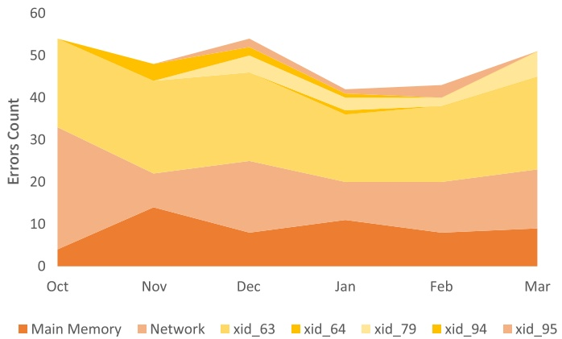

Figure 10: Trends of Memory and Network Failures from 2023 to 2024: “Main Memory” indicates CPU Memory ECC errors, “Network” indicates Network Flash Cuts, and “xids” are related to GPU memory ECC errors. Raw data is available in Appendix: Supplementary Characterization, Table VII

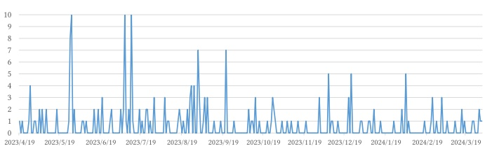

Figure 11: Trends of IB Network Failures: Link Flash Cuts

flash cuts can lead to application communication disruption, even task failures. Since most tasks run on multiple nodes, an issue on a single node can impact many others, further reducing cluster utilization. Figure 11 illustrates the IB link failures data over the past year, with raw data attached in Appendix: Supplementary Characterization, Table VIII, indicating that these issues can occur randomly throughout the cluster's operational period.

2) 网络闪断: 除 CPU 和 GPU 故障外, 网络设备故障也占硬件问题的很大一部分. 如 Figure 10 所示, 在排除 Xid74 之后的硬件故障中, IB 链路故障占 30%. 网络闪断会造成应用通信中断, 甚至任务失败. 多数任务跨多个节点运行, 单个节点的问题会波及许多其他节点, 进一步降低集群利用率. Figure 11 展示了过去一年的 IB 链路故障数据, 原始数据见附录 Table VIII, 可以看出这类问题在集群运行期间随机发生.

> **对一下:** 「30%」和 Figure 10 的月度网络故障数, 能和附录两张表对上吗?
>
> 答: Table VII 七类合计 292 次, 其中网络 89 次, $89/292 \approx 30.5\%$, 这就是「30%」的来源. 它的分母只含 Table VII 列出的主存 ECC, 网络和几类 GPU 显存相关 Xid, 不含 Xid43 等软件类错误. 月度数字上, Table VII 记 2023 年 10 月网络故障 29 次, 而把 Table VIII 中 2023 年 10 月的逐日记录相加只有 13 次. 11 月到次年 3 月两表一致, 分别是 8, 17, 9, 12, 14. 10 月相差的 16 次文中没有解释.

## VIII. DISCUSSION · 讨论

## A. Discussion on Congestion Control in RDMA Networks · RDMA 网络中的拥塞控制

Lossless RDMA networks offer several flow-control mechanisms, such as Priority Flow Control (PFC)  $[89]$  for RoCE networks and credit-based flow control  $[90]$  for IB networks. In network routing, static routing algorithms in IB or ECMP (Equal-Cost Multi-Path)  $[91]$  and AR (Adaptive Routing)  $[92]$  effectively handle routing issues. However, congestion can still occur when multiple servers send data to a single receiver, potentially blocking the entire network. To mitigate this, IB NICs use DCQCN (Data Center Quantized Congestion Notification)  $[93]$  as their congestion control algorithm. While Data Processing Units (DPUs), such as the NVIDIA BF series, allow users to customize congestion control algorithms (like HPCC  $[94]$  and TIMELY RTT-based CC  $[95]$ ), they increase the cost and operational complexity of the cluster.

无损 RDMA 网络提供多种流控机制, 例如 RoCE 网络的优先级流控 (PFC) [89] 和 IB 网络基于 credit 的流控 [90]. 路由方面, IB 的静态路由算法, ECMP (等价多路径) [91] 和 AR (自适应路由) [92] 都能有效处理路由问题. 但当多台服务器同时向一个接收方发数据时仍会出现拥塞, 甚至可能阻塞整个网络. 为此 IB 网卡使用 DCQCN [93] 作为拥塞控制算法. NVIDIA BF 系列等 DPU 允许用户自定义拥塞控制算法 (如 HPCC [94] 和基于 RTT 的 TIMELY [95]), 但会增加集群成本和运维复杂度.

In practice, we chose to disable DCQCN to avoid its shortcomings, as it could not find parameters that simul-

<!-- page 12 of 18 -->

taneously support HFReduce traffic and 3FS storage traffic in our Computation-Storage Integrated Network. Instead, we employed the network tuning methods mentioned in Section VI-A, ensuring our network operates without congestion control and remains congestion-free.

实践中我们选择关闭 DCQCN 以避开它的缺点: 在我们的存算一体网络中, 找不到一组参数能同时适配 HFReduce 流量和 3FS 存储流量. 我们改用 Section VI-A 中的网络调优方法, 让网络在不开拥塞控制的情况下保持无拥塞.

## B. Discussion about NVLink Technology Choices · 关于 NVLink 的技术选择

Initially, we did not use NVLink to avoid extra costs and maintain stability, as HFReduce was sufficient for training requirements at that time. However, as the demand for LLMs increased, we added NVLink specifically for LLM training purposes. The decision to install NVLink should be based on actual needs due to its potential drawbacks.

最初我们没有用 NVLink, 是为了避免额外成本并保持稳定, 而且当时 HFReduce 已足够满足训练需求. 随着 LLM 需求增长, 我们专门为 LLM 训练加装了 NVLink. 由于 NVLink 有潜在缺点, 是否安装应根据实际需求决定.

## C. Maintain Cost Overview · 维护成本概览

1) Construction Cost: Relative hardware costs are provided in Table II and III. Software costs, contributed by several dozen in-house developers, are just a fraction of the cost for thousands of GPU servers.

1) 建设成本: 相对硬件成本见 Table II 和 Table III. 软件成本来自几十名自研开发人员, 只占数千台 GPU 服务器成本的一小部分.

2) Power Consumption: The average power consumption comparison during ResNet training is provided in Table II. Including the overhead from IB switches and other nodes, the total energy consumption of the Fire-Flyer 2 AI-HPC does not exceed 4 MW, approximately just over 3 MW.

2) 功耗: Table II 给出了 ResNet 训练期间的平均功耗对比. 计入 IB 交换机和其他节点的开销, Fire-Flyer 2 AI-HPC 的总能耗不超过 4 MW, 约 3 MW 出头.

3) Operation Cost: Operating costs can be estimated by considering power consumption and rack rental costs. By multiplying this figure by the number of nodes and the PUE (Power Usage Effectiveness), the total operating costs can be calculated.

3) 运营成本: 可以根据功耗和机柜租金估算运营成本, 再乘以节点数和 PUE (电能利用效率), 即得总运营成本.

## D. Stability Compared with Other Architectures · 与其他架构的稳定性对比

A recent paper [96] reportsthat NVLink-related failures account for approximately 52.42% (54 out of 103) of total failures, with raw data indicating 54 NVLink Errors, 21 CUDA Errors, 16 Node Failures, 12 ECC Errors, and 12 Network Errors. In comparison, our NVLink-related issues, primarily Xid-74 Errors, as mentioned in Section VII-C1, account for about 42.57% of GPU failures.

近期一篇论文 [96] 报告, NVLink 相关故障约占全部故障的 52.42% (103 次中的 54 次), 原始数据为 54 次 NVLink 错误, 21 次 CUDA 错误, 16 次节点故障, 12 次 ECC 错误和 12 次网络错误. 相比之下, 我们的 NVLink 相关问题 (主要是 Section VII-C1 提到的 Xid74 错误) 约占 GPU 故障的 42.57%.

## IX. FUTURE WORK · 未来工作

## Future Arch and Integration with New GPU Models · 未来架构与新 GPU 型号的集成

Our next-generation PCIe architecture is designed for MoE (Mixture of Experts) LLM training, where all-to-all performance is crucial. Therefore, the next-gen nodes feature a 1:1 GPU to NIC ratio, comparable to DGX-H100/B100 systems, as illustrated in Figure 12.

我们的下一代 PCIe 架构面向 MoE LLM 训练. MoE 的 all-to-all 通信需要更高网络带宽, 因此下一代节点采用 1:1 的 GPU 与网卡配比, 与 DGX-H100/B100 系统相当, 见 Figure 12.

We are considering implementing a multi-plane network to reduce costs while maintaining performance. Additionally, we are exploring the use of RoCE switches instead of IB switches, which can significantly lower network expenses. With a 128-port 400 Gbps RoCE switch, a 4-Plane Two-Layer Fat-Trees network can support up to 32,768 GPUs.

我们正考虑采用多平面网络, 在保持性能的同时降低成本. 我们也在探索用 RoCE 交换机替代 IB 交换机, 可大幅降低网络开销. 使用 128 端口 400Gbps 的 RoCE 交换机, 4 平面两层 Fat-Tree 网络最多可支持 32,768 张 GPU.

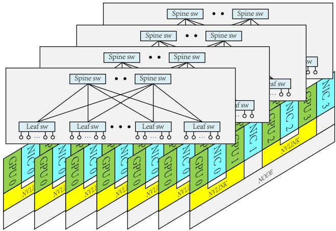

Figure 12: Next Generation PCIe Node Architecture with Multi-Plane Fat-Trees Network

## X. CONCLUSIONS

In this paper, we have shared our experiences and insights from deploying and maintaining the Fire-Flyer 2 AI-HPC, which is equipped with 10,000 PCIe A100 GPUs. Our approach to PCIe architecture and storage-computation integrated network design has resulted in significant cost savings, effectively halving construction costs and demonstrating substantial cost-effectiveness.

本文分享了部署和维护配备 10,000 张 PCIe A100 的 Fire-Flyer 2 AI-HPC 的经验与体会. 我们的 PCIe 架构和存算一体网络设计带来了显著的成本节约, 建设成本减半, 性价比突出.

In terms of software co-design, we introduced HFReduce and HaiScale to overcome hardware limitations, ensuring scalable performance of the PCIe architecture. Our in-house developed 3FS distributed file system, in conjunction with network co-design, facilitates traffic isolation for both 3FS and HFReduce allreduce traffic, effectively preventing congestion. The comprehensive software stack within the HAI Platform addresses a variety of system faults, from network congestion to hardware failures, thereby ensuring high stability and robustness.

软件协同设计方面, 我们推出 HFReduce 和 HaiScale 来克服硬件限制, 保证 PCIe 架构的可扩展性能. 自研的 3FS 分布式文件系统配合网络协同设计, 实现了 3FS 与 HFReduce allreduce 流量的隔离, 有效防止拥塞. HAI Platform 中完整的软件栈能应对从网络拥塞到硬件故障的各类系统故障, 保证了高稳定性和健壮性.

Together, these software and hardware innovations enable our PCIe A100 architecture to achieve $80\%$ the performance of NVIDIA's DGX-A100, while consuming less than $60\%$ of its power. The practical knowledge we have accrued may prove valuable for both industrial and academic sectors. We hope that our work will serve as a reference for others aiming to build their own cost-effective and efficient AI-HPC clusters.

这些软硬件创新共同使我们的 PCIe A100 架构达到 NVIDIA DGX-A100 $80\%$ 的性能, 功耗不到其 $60\%$. 我们积累的实践知识可能对工业界和学术界都有价值, 希望能为其他打算建设高性价比, 高效 AI-HPC 集群的团队提供参考.

## ACKNOWLEDGMENT

We extend our heartfelt gratitude to all our colleagues at DeepSeek-AI and High-Flyer Quant for their invaluable contributions to the Fire-Flyer 2 AI-HPC project. Throughout the four years of design, construction, and operation, their collaborative efforts have been crucial in overcoming numerous challenges. Consequently, Fire-Flyer 2 AI-HPC now supports the training tasks of the DeepSeek-AI series large language models [72], [97]–[101]. We extend a special thanks to the HFAiLab System Team and the Operations Team, whose core contributions have been essential to the success of this endeavor.

<!-- page 13 of 18 -->

## REFERENCES

[1] Y. LeCun, Y. Bengio, and G. Hinton, “Deep learning,” nature, vol. 521, no. 7553, pp. 436–444, 2015. I

[2] R. R. Schaller, “Moore’s law: past, present and future,” IEEE spectrum, vol. 34, no. 6, pp. 52–59, 1997. I

[3] T. Brown, B. Mann, N. Ryder, M. Subbiah, J. D. Kaplan, P. Dhariwal, A. Neelakantan, P. Shyam, G. Sastry, A. Askell et al., “Language models are few-shot learners,” Advances in neural information processing systems, vol. 33, pp. 1877–1901, 2020. I

[4] Anthropic, “Introducing claude,” 2023. [Online]. Available: https://www.anthropic.com/news/introducing-claude I

[5] Google, “An important next step on our ai journey,” 2023. [Online]. Available: https://blog.google/technology/ai/bard-google-ai-search-updates/ I

[6] OpenAI, “Chatgpt: Optimizing language models for dialogue,” 2022. [Online]. Available: https://openai.com/blog/chatgpt\_I

[7] J. Achiam, S. Adler, S. Agarwal, L. Ahmad, I. Akkaya, F. L. Aleman, D. Almeida, J. Altenschmidt, S. Altman, S. Anadkat et al., “Gpt-4 technical report,” arXiv preprint arXiv:2303.08774, 2023. I, II-A

[8] NVIDIA, “Nvidia dgx platform the best of nvidia ai—all in one place.” 2022. [Online]. Available: https://www.nvidia.com/en-us/data-center/dgx-platform/ I, III-C

[9] C. E. Leiserson, “Fat-trees: Universal networks for hardware-efficient supercomputing,” IEEE Transactions on Computers, vol. C-34, no. 10, pp. 892–901, Oct 1985. I, III-B

[10] NVIDIA, “Nvidia collective communications library (nccl): Optimized primitives for collective multi-gpu communication,” 2017. [Online]. Available: https://github.com/NVIDIA/nccl I, III-B

[11] Y. Huang, Y. Cheng, D. Chen, H. Lee, J. Ngiam, Q. V. Le, and Z. Chen, “Gpipe: Efficient training of giant neural networks using pipeline parallelism,” CoRR, vol. abs/1811.06965, 2018. [Online]. Available: http://arxiv.org/abs/1811.06965 I, II-B1, V-B

[12] D. Narayanan, A. Harlap, A. Phanishayee, V. Seshadri, N. R. Devanur, G. R. Ganger, P. B. Gibbons, and M. Zaharia, “Pipedream: generalized pipeline parallelism for dnn training,” in Proceedings of the 27th ACM Symposium on Operating Systems Principles, ser. SOSP '19. New York, NY, USA: Association for Computing Machinery, 2019, p. 1–15. [Online]. Available: https://doi.org/10.1145/3341301.3359646 I, II-B1, V-B

[13] M. Shoeybi, M. Patwary, R. Puri, P. LeGresley, J. Casper, and B. Catanzaro, “Megatron-LM: Training Multi-Billion Parameter Language Models Using Model Parallelism,” Mar. 2020, arXiv:1909.08053 [cs]. [Online]. Available: http://arxiv.org/abs/1909.08053 I, II-B1

[14] D. Narayanan, M. Shoeybi, J. Casper, P. LeGresley, M. Patwary, V. Korthikanti, D. Vainbrand, P. Kashinkunti, J. Bernauer, B. Catanzaro, A. Phanishayee, and M. Zaharia, “Efficient large-scale language model training on gpu clusters using megatron-lm,” in Proceedings of the International Conference for High Performance Computing, Networking, Storage and Analysis, ser. SC '21. New York, NY, USA: Association for Computing Machinery, 2021. [Online]. Available: https://doi.org/10.1145/3458817.3476209 I, II-B1, V-B

[15] S. Singh, O. Ruwase, A. A. Awan, S. Rajbhandari, Y. He, and A. Bhatele, “A hybrid tensor-expert-data parallelism approach to optimize mixture-of-experts training,” in Proceedings of the 37th ACM International Conference on Supercomputing, ser. ICS ’23. New York, NY, USA: Association for Computing Machinery, 2023, p. 203–214. [Online]. Available: https://doi.org/10.1145/3577193.3593704 I, II-B1, V-B

[16] S. Rajbhandari, C. Li, Z. Yao, M. Zhang, R. Aminabadi, A. Awan, J. Rasley, and Y. He, “Deepspeed-moe: Advancing mixture-of-experts inference and training to power next-generation ai scale,” Proceedings of Machine Learning Research, vol. 162, pp. 18 332–18 346, 2022, publisher Copyright: Copyright © 2022 by the author(s); 39th International Conference on Machine Learning, ICML 2022; Conference date: 17-07-2022 Through 23-07-2022. I, II-B1, V-B

[17] C. Hwang, W. Cui, Y. Xiong, Z. Yang, Z. Liu, H. Hu, Z. Wang, R. Salas, J. Jose, P. Ram et al., “Tutel: Adaptive mixture-of-experts at scale,” Proceedings of Machine Learning and Systems, vol. 5, 2023. I, II-B1, V-B

[18] Y. Zhao, A. Gu, R. Varma, L. Luo, C.-C. Huang, M. Xu, L. Wright, H. Shojanazeri, M. Ott, S. Shleifer et al., “Pytorch fsdp: experiences on scaling fully sharded data parallel,” arXiv preprint arXiv:2304.11277, 2023. I, V-B3

[19] S. Rajbhandari, J. Rasley, O. Ruwase, and Y. He, “Zero: Memory optimizations toward training trillion parameter models,” in SC20: International Conference for High Performance Computing, Networking, Storage and Analysis. IEEE, 2020, pp. 1–16. I, II-B1, II-B1, V-B3

[20] HFAiLab, “Hai platform: A high-performance deep learning training platform with task-level gpu compute time-sharing scheduling,” 2023. [Online]. Available: https://github.com/HFAiLab/hai-platform I

[21] A. Krizhevsky, I. Sutskever, and G. E. Hinton, “Imagenet classification with deep convolutional neural networks,” Advances in neural information processing systems, vol. 25, 2012. II-A

[22] K. He, X. Zhang, S. Ren, and J. Sun, “Deep residual learning for image recognition,” in Proceedings of the IEEE conference on computer vision and pattern recognition, 2016, pp. 770–778. II-A, III

[23] A. Vaswani, N. Shazeer, N. Parmar, J. Uszkoreit, L. Jones, A. N. Gomez, Ł. Kaiser, and I. Polosukhin, “Attention is all you need,” Advances in neural information processing systems, vol. 30, 2017. II-A

[24] A. W. Senior, R. Evans, J. Jumper, J. Kirkpatrick, L. Sifre, T. Green, C. Qin, A. Žídek, A. W. Nelson, A. Bridgland et al., “Improved protein structure prediction using potentials from deep learning,” Nature, vol. 577, no. 7792, pp. 706–710, 2020. II-A

[25] D. Silver, T. Hubert, J. Schrittwieser, I. Antonoglou, M. Lai, A. Guez, M. Lanctot, L. Sifre, D. Kumaran, T. Graepel et al., “A general reinforcement learning algorithm that masters chess, shogi, and go through self-play,” Science, vol. 362, no. 6419, pp. 1140–1144, 2018. II-A

[26] L. Floridi and M. Chiriatti, “Gpt-3: Its nature, scope, limits, and consequences,” Minds and Machines, vol. 30, pp. 681–694, 2020. II-A

[27] A. Chowdhery, S. Narang, J. Devlin, M. Bosma, G. Mishra, A. Roberts, P. Barham, H. W. Chung, C. Sutton, S. Gehrmann et al., “Palm: Scaling language modeling with pathways,” Journal of Machine Learning Research, vol. 24, no. 240, pp. 1–113, 2023. II-A

[28] R. A. Jacobs, M. I. Jordan, S. J. Nowlan, and G. E. Hinton, “Adaptive mixtures of local experts,” Neural computation, vol. 3, no. 1, pp. 79–87, 1991. II-A

[29] M. I. Jordan and R. A. Jacobs, “Hierarchical mixtures of experts and the em algorithm,” Neural computation, vol. 6, no. 2, pp. 181–214, 1994. II-A

[30] N. Shazeer, A. Mirhoseini, K. Maziarz, A. Davis, Q. Le, G. Hinton, and J. Dean, “Outrageously large neural networks: The sparsely-gated mixture-of-experts layer,” arXiv preprint arXiv:1701.06538, 2017. II-A

[31] T. Brooks, B. Peebles, C. Holmes, W. DePue, Y. Guo, L. Jing, D. Schnurr, J. Taylor, T. Luhman, E. Luhman, C. Ng, R. Wang, and A. Ramesh, “Video generation models as world simulators,” 2024. [Online]. Available: https://openai.com/research/video-generation-models-as-world-simulators\_II-A

[32] A. Gholami, Z. Yao, S. Kim, C. Hooper, M. W. Mahoney, and K. Keutzer, “AI and Memory Wall,” Mar. 2024, arXiv:2403.14123 [cs]. [Online]. Available: http://arxiv.org/abs/2403.14123 II-A

[33] P. Qi, X. Wan, G. Huang, and M. Lin, “Zero bubble pipeline parallelism,” arXiv preprint arXiv:2401.10241, 2023. II-B1

[34] V. A. Korthikanti, J. Casper, S. Lym, L. McAfee, M. Andersch, M. Shoeybi, and B. Catanzaro, “Reducing activation recomputation in large transformer models,” in Proceedings of the Sixth Conference on Machine Learning and Systems, MLSys 2023, Miami, FL, USA, June 4-8, 2023, D. Song, M. Carbin, and T. C. 0001, Eds. mlsys.org, 2023. [Online]. Available: https://proceedings.mlsys.org/paper\_files/paper/2023/hash/80083951326cf5b35e5100260d64ed81-Abstract-mlsys2023.html II-B1

[35] Z. Sun, H. Cao, Y. Wang, G. Feng, S. Chen, H. Wang, and W. Chen, “Adapipe: Optimizing pipeline parallelism with adaptive recomputation and partitioning,” in Proceedings of the 29th ACM International Conference on Architectural Support for Programming Languages and Operating Systems, Volume 3, ser. ASPLOS '24. New York, NY, USA: Association for Computing Machinery, 2024, p. 86–100. [Online]. Available: https://doi.org/10.1145/3620666.3651359 II-B1

[36] X. Hou, Y. Yuan, S. Ma, R. Xu, B. Wang, T. Li, W. Jiang, L. Wu, and J. Zhang, “Optimizing the parallelism of communication and computation in distributed training platform,” in Algorithms and Architectures for Parallel Processing: 23rd International Conference, ICA3PP 2023, Tianjin, China, October 20–22, 2023, Proceedings, Part I. Berlin, Heidelberg: Springer-Verlag, 2024, p. 340–359. [Online]. Available: https://doi.org/10.1007/978-981-97-0834-5\_20 II-B1

[37] J. Dongarra, “REPORT ON THE TIANHE-2A SYSTEM,” 2017. II-C1

<!-- page 14 of 18 -->

[38] D. Stanzione, B. Barth, N. Gaffney, K. Gaither, C. Hempel, T. Minyard, S. Mehringer, E. Wernert, H. Tufo, D. Panda, and P. Teller, "Stampede 2: The evolution of an xsede supercomputer," in Proceedings of the Practice and Experience in Advanced Research Computing 2017 on Sustainability, Success and Impact, ser. PEARC '17. New York, NY, USA: Association for Computing Machinery, 2017. [Online]. Available: https://doi.org/10.1145/3093338.3093385 II-C1

[39] H. Fu, J. Liao, J. Yang, L. Wang, Z. Song, X. Huang, C. Yang, W. Xue, F. Liu, F. Qiao, W. Zhao, X. Yin, C. Hou, C. Zhang, W. Ge, J. Zhang, Y. Wang, C. Zhou, and G. Yang, “The Sunway TaihuLight supercomputer: system and applications,” Science China Information Sciences, vol. 59, no. 7, p. 072001, Jul. 2016. [Online]. Available: http://link.springer.com/10.1007/s11432-016-5588-7 II-C1

[40] T. Shimizu, “Supercomputer Fugaku: Co-designed with application developers/researchers,” in 2020 IEEE Asian Solid-State Circuits Conference (A-SSCC). Hiroshima, Japan: IEEE, Nov. 2020, pp. 1–4. [Online]. Available: https://ieeexplore.ieee.org/document/9336127/II-C1

[41] D. Schneider, “The Exascale Era is Upon Us: The Frontier supercomputer may be the first to reach 1,000,000,000,000,000 operations per second,” IEEE Spectrum, vol. 59, no. 1, pp. 34–35, Jan. 2022. [Online]. Available: https://ieeexplore.ieee.org/document/9676353/ II-C2

[42] A. N. Laboratory, “Argonne’s aurora supercomputer,” 2023. [Online]. Available: https://www.alcf.anl.gov/aurora II-C2

[43] C. B. Stunkel, R. L. Graham, G. Shainer, M. Kagan, S. S. Sharkawi, B. Rosenburg, and G. A. Chochia, “The high-speed networks of the Summit and Sierra supercomputers,” IBM Journal of Research and Development, vol. 64, no. 3/4, pp. 3:1–3:10, May 2020. [Online]. Available: https://ieeexplore.ieee.org/document/8961159/ II-C2

[44] J. Gu, G. Eisenhauer, S. Klasky, N. Podhorszki, R. Wang, and K. Wu, "Exploring large all-flash storage system with scientific simulation," in Proceedings of the 34th International Conference on Scientific and Statistical Database Management, ser. SSDBM '22. New York, NY, USA: Association for Computing Machinery, 2022. [Online]. Available: https://doi.org/10.1145/3538712.3538734 II-C2

[45] D. Mudigere, Y. Hao, J. Huang, Z. Jia, A. Tulloch, S. Sridharan, X. Liu, M. Ozdal, J. Nie, J. Park, L. Luo, J. A. Yang, L. Gao, D. Ivchenko, A. Basant, Y. Hu, J. Yang, E. K. Ardestani, X. Wang, R. Komuravelli, C.-H. Chu, S. Yilmaz, H. Li, J. Qian, Z. Feng, Y. Ma, J. Yang, E. Wen, H. Li, L. Yang, C. Sun, W. Zhao, D. Melts, K. Dhulipala, K. R. Kishore, T. Graf, A. Eisenman, K. K. Matam, A. Gangidi, G. J. Chen, M. Krishnan, A. Nayak, K. Nair, B. Muthiah, M. khorashadi, P. Bhattacharya, P. Lapukhov, M. Naumov, A. Mathews, L. Qiao, M. Smelyanskiy, B. Jia, and V. Rao, "Software-Hardware Co-design for Fast and Scalable Training of Deep Learning Recommendation Models," Feb. 2023, arXiv:2104.05158 [cs]. [Online]. Available: http://arxiv.org/abs/2104.05158 II-C3

[46] A. Gangidi, R. Miao, S. Zheng, S. J. Bondu, G. Goes, H. Morsy, R. Puri, M. Riftadi, A. J. Shetty, J. Yang, S. Zhang, M. J. Fernandez, S. Gandham, and H. Zeng, “Rdma over ethernet for distributed training at meta scale,” in Proceedings of the ACM SIGCOMM 2024 Conference, ser. ACM SIGCOMM ’24. New York, NY, USA: Association for Computing Machinery, 2024, p. 57–70. [Online]. Available: https://doi.org/10.1145/3651890.3672233 II-C3

[47] Y. Jiang, Y. Zhu, C. Lan, B. Yi, Y. Cui, and C. Guo, “A Unified Architecture for Accelerating Distributed DNN Training in Heterogeneous GPU/CPU Clusters.” II-C3

[48] Z. Jiang, H. Lin, Y. Zhong, Q. Huang, Y. Chen, Z. Zhang, Y. Peng, X. Li, C. Xie, S. Nong, Y. Jia, S. He, H. Chen, Z. Bai, Q. Hou, S. Yan, D. Zhou, Y. Sheng, Z. Jiang, H. Xu, H. Wei, Z. Zhang, P. Nie, L. Zou, S. Zhao, L. Xiang, Z. Liu, Z. Li, X. Jia, J. Ye, X. Jin, and X. Liu, “MegaScale: Scaling Large Language Model Training to More Than 10,000 GPUs,” Feb. 2024, arXiv:2402.15627 [cs]. [Online]. Available: http://arxiv.org/abs/2402.15627 II-C3

[49] K. Qian, Y. Xi, J. Cao, J. Gao, Y. Xu, Y. Guan, B. Fu, X. Shi, F. Zhu, R. Miao, C. Wang, P. Wang, P. Zhang, X. Zeng, E. Ruan, Z. Yao, E. Zhai, and D. Cai, “Alibaba hpn: A data center network for large language model training,” in Proceedings of the ACM SIGCOMM 2024 Conference, ser. ACM SIGCOMM ’24. New York, NY, USA: Association for Computing Machinery, 2024, p. 691–706. [Online]. Available: https://doi.org/10.1145/3651890.3672265 II-C3

[50] NVIDIA, “Nvidia announces dgx h100 systems – world’s most advanced enterprise ai infrastructure,” 2023. [Online]. Available: https://nvidianews.nvidia.com/news/nvidia-announces-dgx-h100-systems-worlds-most-advanced-enterprise-ai-infrastructure II-C3

[51] N. Jouppi, G. Kurian, S. Li, P. Ma, R. Nagarajan, L. Nai, N. Patil, S. Subramanian, A. Swing, B. Towles, C. Young, X. Zhou, Z. Zhou, and D. A. Patterson, “TPU v4: An Optically Reconfigurable Supercomputer for Machine Learning with Hardware Support for Embeddings,” in Proceedings of the 50th Annual International Symposium on Computer Architecture. Orlando FL USA: ACM, Jun. 2023, pp. 1–14. [Online]. Available: https://dl.acm.org/doi/10.1145/3579371.3589350 II-C4

[52] C. Zhang, B. Sun, X. Yu, Z. Xie, W. Zheng, K. Iskra, P. Beckman, and D. Tao, “Benchmarking and In-depth Performance Study of Large Language Models on Habana Gaudi Processors,” Sep. 2023, arXiv:2309.16976 [cs]. [Online]. Available: http://arxiv.org/abs/2309.16976 II-C4

[53] E. Talpes, D. Williams, and D. D. Sarma, “Dojo: The microarchitecture of tesla’s exa-scale computer,” in 2022 IEEE Hot Chips 34 Symposium (HCS), 2022, pp. 1–28. II-C4

[54] E. Talpes, D. D. Sarma, D. Williams, S. Arora, T. Kunjan, B. Floering, A. Jalote, C. Hsiong, C. Poorna, V. Samant, J. Sicilia, A. K. Nivarti, R. Ramachandran, T. Fischer, B. Herzberg, B. McGee, G. Venkataramanan, and P. Banon, “The microarchitecture of dojo, tesla’s exa-scale computer,” IEEE Micro, vol. 43, no. 3, pp. 31–39, 2023. II-C4

[55] H. Liao, J. Tu, J. Xia, and X. Zhou, “Davinci: A scalable architecture for neural network computing,” in 2019 IEEE Hot Chips 31 Symposium (HCS), 2019, pp. 1–44. II-C4

[56] H. Liao, J. Tu, J. Xia, H. Liu, X. Zhou, H. Yuan, and Y. Hu, “Ascend: a scalable and unified architecture for ubiquitous deep neural network computing : Industry track paper,” in 2021 IEEE International Symposium on High-Performance Computer Architecture (HPCA), 2021, pp. 789–801. II-C4

[57] D. Milojicic, P. Faraboschi, N. Dube, and D. Roweth, “Future of hpc: Diversifying heterogeneity,” in 2021 Design, Automation Test in Europe Conference Exhibition (DATE), 2021, pp. 276–281. II-D

[58] Y. Su, J. Zhou, J. Ying, M. Zhou, and B. Zhou, “Computing infrastructure construction and optimization for high-performance computing and artificial intelligence,” CCF Transactions on High Performance Computing, vol. 3, no. 4, pp. 331–343, Dec. 2021. [Online]. Available: https://doi.org/10.1007/s42514-021-00080-x II-D

[59] E. Hassan, N. El-Rashidy, and F. M. Talaa, “Review: Mask R-CNN Models,” Nile Journal of Communication and Computer Science, vol. 3, no. 1, pp. 17–27, May 2022. [Online]. Available: https://njccs.journals.ekb.eg/article\_280047.html III

[60] J. Devlin, M.-W. Chang, K. Lee, and K. Toutanova, “Bert: Pre-training of deep bidirectional transformers for language understanding,” in North American Chapter of the Association for Computational Linguistics, 2019. [Online]. Available: https://api.semanticscholar.org/CorpusID:52967399 III

[61] K. He, X. Chen, S. Xie, Y. Li, P. Dollár, and R. Girshick, “Masked autoencoders are scalable vision learners,” arXiv:2111.06377, 2021. III

[62] J. Kim, W. J. Dally, S. Scott, and D. Abts, “Technology-driven, highly-scalable dragonfly topology,” in 2008 International Symposium on Computer Architecture, 2008, pp. 77–88. III-B

[63] G. Feng, D. Dong, and Y. Lu, “Optimized mpi collective algorithms for dragonfly topology,” in Proceedings of the 36th ACM International Conference on Supercomputing, ser. ICS '22. New York, NY, USA: Association for Computing Machinery, 2022. [Online]. Available: https://doi.org/10.1145/3524059.3532380 III-B

[64] H. Subramoni, P. Lai, M. Luo, and D. K. Panda, “Rdma over ethernet — a preliminary study,” in 2009 IEEE International Conference on Cluster Computing and Workshops, 2009, pp. 1–9. III-B

[65] P. Sanders, J. Speck, and J. Träff, “Two-tree algorithms for full bandwidth broadcast, reduction and scan,” Parallel Computing, vol. 35, pp. 581–594, 12 2009. III-B, IV, 1, IV-D1

[66] R. Shi, S. Potluri, K. Hamidouche, J. Perkins, M. Li, D. Rossetti, and D. K. D. K. Panda, “Designing efficient small message transfer mechanism for inter-node mpi communication on infiniband gpu clusters,” in 2014 21st International Conference on High Performance Computing (HiPC), 2014, pp. 1–10. 1

[67] P. Foundation, “Tensors and dynamic neural networks in python with strong gpu acceleration,” 2016. [Online]. Available: https://github.com/pytorch/pytorch\_V-A

<!-- page 15 of 18 -->

[68] S. Liu and W. Deng, “Very deep convolutional neural network based image classification using small training sample size,” in 2015 3rd IAPR Asian Conference on Pattern Recognition (ACPR), 2015, pp. 730–734. V-A

[69] M. Shoeybi, M. Patwary, R. Puri, P. LeGresley, J. Casper, and B. Catanzaro, “Megatron-lm: Training multi-billion parameter language models using model parallelism,” arXiv preprint arXiv:1909.08053, 2019. V-B

[70] J. Rasley, S. Rajbhandari, O. Ruwase, and Y. He, “Deepspeed: System optimizations enable training deep learning models with over 100 billion parameters,” in Proceedings of the 26th ACM SIGKDD International Conference on Knowledge Discovery & Data Mining, ser. KDD '20. New York, NY, USA: Association for Computing Machinery, 2020, p. 3505–3506. [Online]. Available: https://doi.org/10.1145/3394486.3406703 V-B

[71] H. Touvron, T. Lavril, G. Izacard, X. Martinet, M.-A. Lachaux, T. Lacroix, B. Rozière, N. Goyal, E. Hambro, F. Azhar, A. Rodriguez, A. Joulin, E. Grave, and G. Lample, “Llama: Open and efficient foundation language models,” ArXiv, vol. abs/2302.13971, 2023. [Online]. Available: https://api.semanticscholar.org/CorpusID:257219404 V-B2

[72] DeepSeek-AI, A. Liu, B. Feng, B. Wang, B. Wang, B. Liu, C. Zhao, C. Dengr, C. Ruan, D. Dai, D. Guo, D. Yang, D. Chen, D. Ji, E. Li, F. Lin, F. Luo, G. Hao, G. Chen, G. Li, H. Zhang, H. Xu, H. Yang, H. Zhang, H. Ding, H. Xin, H. Gao, H. Li, H. Qu, J. L. Cai, J. Liang, J. Guo, J. Ni, J. Li, J. Chen, J. Yuan, J. Qiu, J. Song, K. Dong, K. Gao, K. Guan, L. Wang, L. Zhang, L. Xu, L. Xia, L. Zhao, L. Zhang, M. Li, M. Wang, M. Zhang, M. Zhang, M. Tang, M. Li, N. Tian, P. Huang, P. Wang, P. Zhang, Q. Zhu, Q. Chen, Q. Du, R. J. Chen, R. L. Jin, R. Ge, R. Pan, R. Xu, R. Chen, S. S. Li, S. Lu, S. Zhou, S. Chen, S. Wu, S. Ye, S. Ma, S. Wang, S. Zhou, S. Yu, S. Zhou, S. Zheng, T. Wang, T. Pei, T. Yuan, T. Sun, W. L. Xiao, W. Zeng, W. An, W. Liu, W. Liang, W. Gao, W. Zhang, X. Q. Li, X. Jin, X. Wang, X. Bi, X. Liu, X. Wang, X. Shen, X. Chen, X. Chen, X. Nie, X. Sun, X. Wang, X. Liu, X. Xie, X. Yu, X. Song, X. Zhou, X. Yang, X. Lu, X. Su, Y. Wu, Y. K. Li, Y. X. Wei, Y. X. Zhu, Y. Xu, Y. Huang, Y. Li, Y. Zhao, Y. Sun, Y. Li, Y. Wang, Y. Zheng, Y. Zhang, Y. Xiong, Y. Zhao, Y. He, Y. Tang, Y. Piao, Y. Dong, Y. Tan, Y. Liu, Y. Wang, Y. Guo, Y. Zhu, Y. Wang, Y. Zou, Y. Zha, Y. Ma, Y. Yan, Y. You, Y. Liu, Z. Z. Ren, Z. Ren, Z. Sha, Z. Fu, Z. Huang, Z. Zhang, Z. Xie, Z. Hao, Z. Shao, Z. Wen, Z. Xu, Z. Zhang, Z. Li, Z. Wang, Z. Gu, Z. Li, and Z. Xie, “DeepSeek-V2: A Strong, Economical, and Efficient Mixture-of-Experts Language Model,” Jun. 2024, arXiv:2405.04434 [cs]. [Online]. Available: http://arxiv.org/abs/2405.04434 V-B2, X

[73] A. Radford, J. Wu, R. Child, D. Luan, D. Amodei, and I. Sutskever, "Language models are unsupervised multitask learners," 2019. V-B3

[74] S.-A. Reinemo, T. Skeie, T. Sodring, O. Lysne, and O. Trudbakken, "An overview of qos capabilities in infiniband, advanced switching interconnect, and ethernet," IEEE Communications Magazine, vol. 44, no. 7, pp. 32–38, 2006. VI-A1, VI-A1

[75] D. Crupnicoff, S. Das, and E. Zahavi, “Deploying Quality of Service and Congestion Control in InfiniBand-based Data Center Networks.” [Online]. Available: https://network.nvidia.com/sites/default/files/ related-docs/whitepapers/deploying\_qos\_wp\_10\_19\_2005.pdf VI-A1, VI-A1

[76] M. Scharf and S. Kiesel, “Nxg03-5: Head-of-line blocking in tcp and sctp: Analysis and measurements,” in IEEE Globecom 2006, 2006, pp. 1–5. VI-A1

[77] R. Budruk, D. Anderson, and E. Solari, PCI Express System Architecture. Pearson Education, 2003. VI-A3

[78] Z. Liran, H. David, and M. Barbara, "Wekafs architecture white paper," 2021. [Online]. Available: https://www.weka.io/wp-content/uploads/files/2017/12/Architectural\_WhitePaper-W02R6WP201812-1.pdf VI-B1

[79] Z. Liang, J. Lombardi, M. Chaarawi, and M. Hennecke, “Daos: A scale-out high performance storage stack for storage class memory,” in Supercomputing Frontiers, D. K. Panda, Ed. Cham: Springer International Publishing, 2020, pp. 40–54. VI-B1

[80] M. Hennecke, “Understanding daos storage performance scalability,” in Proceedings of the HPC Asia 2023 Workshops, ser. HPCAsia '23 Workshops. New York, NY, USA: Association for Computing Machinery, 2023, p. 1–14. [Online]. Available: https://doi.org/10.1145/3581576.3581577 VI-B1

[81] H. Frank and B. Sven, “Wekafs architecture white paper,”

2018. [Online]. Available: https://www.beegfs.io/docs/whitepapers/Introduction\_to\_BeeGFS\_by\_ThinkParQ.pdf VI-B1

[82] J. Terrace and M. J. Freedman, “Object storage on CRAQ: High-Throughput chain replication for Read-Mostly workloads,” in 2009 USENIX Annual Technical Conference (USENIX ATC 09). San Diego, CA: USENIX Association, Jun. 2009. [Online]. Available: https://www.usenix.org/conference/usenix-09/object-storage-craq-high-throughput-chain-replication-read-mostly-workloads VI-B3

[83] E. B. Nightingale, J. Elson, J. Fan, O. Hofmann, J. Howell, and Y. Suzue, “Flat datacenter storage,” in Proceedings of the 10th USENIX Conference on Operating Systems Design and Implementation, ser. OSDI’12. USA: USENIX Association, 2012, p. 1–15. VI-B3

[84] DeepSeek-AI, “Deepseek api introduces context caching on disk, cutting prices by an order of magnitude,” 2024. [Online]. Available: https://platform.deepseek.com/api-docs/news/news0802 VI-B4

[85] K. Liu, Z. Jiang, J. Zhang, H. Wei, X. Zhong, L. Tan, T. Pan, and T. Huang, “Hostping: Diagnosing intra-host network bottlenecks in RDMA servers,” in 20th USENIX Symposium on Networked Systems Design and Implementation (NSDI 23). Boston, MA: USENIX Association, Apr. 2023, pp. 15–29. [Online]. Available: https://www.usenix.org/conference/nsdi23/presentation/liu-kefei VII-B

[86] Y. He, M. Hutton, S. Chan, R. De Gruijl, R. Govindaraju, N. Patil, and Y. Li, “Understanding and Mitigating Hardware Failures in Deep Learning Training Systems,” in Proceedings of the 50th Annual International Symposium on Computer Architecture. Orlando FL USA: ACM, Jun. 2023, pp. 1–16. [Online]. Available: https://dl.acm.org/doi/10.1145/3579371.3589105 VII-C

[87] S. Wang, G. Zhang, J. Wei, Y. Wang, J. Wu, and Q. Luo, "Understanding Silent Data Corruptions in a Large Production CPU Population," in Proceedings of the 29th Symposium on Operating Systems Principles. Koblenz Germany: ACM, Oct. 2023, pp. 216–230. [Online]. Available: https://dl.acm.org/doi/10.1145/3600006.3613149 VII-C

[88] NVIDIA, “This document explains what xid messages are, and is intended to assist system administrators, developers, and faes in understanding the meaning behind these messages as an aid in analyzing and resolving gpu-related problems.” [Online]. Available: https://docs.nvidia.com/deploy/xid-errors/ VII-C1

[89] “Priority flow control : Build reliable layer 2 infrastructure,” 2015. [Online]. Available: https://api.semanticscholar.org/CorpusID:42645413 VIII-A

[90] S. Yan, G. Min, and I. Awan, “Performance analysis of credit-based flow control in infiniband interconnection networks,” Journal of Interconnection Networks, vol. 07, no. 04, pp. 535–548, 2006. [Online]. Available: https://doi.org/10.1142/S0219265906001843 VIII-A

[91] E. Nepolo and G.-A. Lusilao Zodi, “A predictive ecmp routing protocol for fat-tree enabled data centre networks,” in 2021 15th International Conference on Ubiquitous Information Management and Communication (IMCOM), 2021, pp. 1–8. VIII-A

[92] J. Rocher-González, E. G. Gran, S.-A. Reinemo, T. Skeie, J. Escudero-Sahuquillo, P. J. García, and F. J. Q. Flor, “Adaptive routing in infiniband hardware,” in 2022 22nd IEEE International Symposium on Cluster, Cloud and Internet Computing (CCGrid), 2022, pp. 463–472. VIII-A

[93] Y. Zhu, H. Eran, D. Firestone, C. Guo, M. Lipshteyn, Y. Liron, J. Padhye, S. Raindel, M. H. Yahia, and M. Zhang, “Congestion control for large-scale rdma deployments,” SIGCOMM Comput. Commun. Rev., vol. 45, no. 4, p. 523–536, aug 2015. [Online]. Available: https://doi.org/10.1145/2829988.2787484 VIII-A

[94] Y. Li, R. Miao, H. H. Liu, Y. Zhuang, F. Feng, L. Tang, Z. Cao, M. Zhang, F. Kelly, M. Alizadeh, and M. Yu, “Hpcc: high precision congestion control,” in Proceedings of the ACM Special Interest Group on Data Communication, ser. SIGCOMM '19. New York, NY, USA: Association for Computing Machinery, 2019, p. 44–58. [Online]. Available: https://doi.org/10.1145/3341302.3342085 VIII-A

[95] R. Mittal, V. T. Lam, N. Dukkipati, E. R. Blem, H. M. G. Wassel, M. Ghobadi, A. Vahdat, Y. Wang, D. Wetherall, and D. Zats, “Timely: Rtt-based congestion control for the datacenter,” Proceedings of the 2015 ACM Conference on Special Interest Group on Data Communication, 2015. [Online]. Available: https://api.semanticscholar.org/CorpusID:9676894 VIII-A

[96] Q. Hu, Z. Ye, Z. Wang, G. Wang, M. Zhang, Q. Chen, P. Sun, D. Lin, X. Wang, Y. Luo et al., “Characterization of large language model development in the datacenter,” in 21st USENIX Symposium on Net-

<!-- page 16 of 18 -->

worked Systems Design and Implementation (NSDI 24), 2024, pp. 709–729. VIII-D

[97] DeepSeek-AI, X. Bi, D. Chen, G. Chen, S. Chen, D. Dai, C. Deng, H. Ding, K. Dong, Q. Du, Z. Fu, H. Gao, K. Gao, W. Gao, R. Ge, K. Guan, D. Guo, J. Guo, G. Hao, Z. Hao, Y. He, W. Hu, P. Huang, E. Li, G. Li, J. Li, Y. Li, Y. K. Li, W. Liang, F. Lin, A. X. Liu, B. Liu, W. Liu, X. Liu, X. Liu, Y. Liu, H. Lu, S. Lu, F. Luo, S. Ma, X. Nie, T. Pei, Y. Piao, J. Qiu, H. Qu, T. Ren, Z. Ren, C. Ruan, Z. Sha, Z. Shao, J. Song, X. Su, J. Sun, Y. Sun, M. Tang, B. Wang, P. Wang, S. Wang, Y. Wang, Y. Wang, T. Wu, Y. Wu, X. Xie, Z. Xie, Z. Xie, Y. Xiong, H. Xu, R. X. Xu, Y. Xu, D. Yang, Y. You, S. Yu, X. Yu, B. Zhang, H. Zhang, L. Zhang, L. Zhang, M. Zhang, M. Zhang, W. Zhang, Y. Zhang, C. Zhao, Y. Zhao, S. Zhou, S. Zhou, Q. Zhu, and Y. Zou, "DeepSeek LLM: Scaling Open-Source Language Models with Longtermism," Jan. 2024, arXiv:2401.02954 [cs]. [Online]. Available: http://arxiv.org/abs/2401.02954 X

[98] Z. Shao, P. Wang, Q. Zhu, R. Xu, J. Song, X. Bi, H. Zhang, M. Zhang, Y. K. Li, Y. Wu, and D. Guo, “DeepSeekMath: Pushing the Limits of Mathematical Reasoning in Open Language Models,” Apr. 2024, arXiv:2402.03300 [cs]. [Online]. Available: http://arxiv.org/abs/2402.03300 X

[99] H. Lu, W. Liu, B. Zhang, B. Wang, K. Dong, B. Liu, J. Sun, T. Ren, Z. Li, H. Yang, Y. Sun, C. Deng, H. Xu, Z. Xie, and C. Ruan, "DeepSeek-VL: Towards Real-World Vision-Language Understanding," Mar. 2024, arXiv:2403.05525 [cs]. [Online]. Available: http://arxiv.org/abs/2403.05525 X

[100] DeepSeek-AI, Q. Zhu, D. Guo, Z. Shao, D. Yang, P. Wang, R. Xu, Y. Wu, Y. Li, H. Gao, S. Ma, W. Zeng, X. Bi, Z. Gu, H. Xu, D. Dai, K. Dong, L. Zhang, Y. Piao, Z. Gou, Z. Xie, Z. Hao, B. Wang, J. Song, D. Chen, X. Xie, K. Guan, Y. You, A. Liu, Q. Du, W. Gao, X. Lu, Q. Chen, Y. Wang, C. Deng, J. Li, C. Zhao, C. Ruan, F. Luo, and W. Liang, “DeepSeek-Coder-V2: Breaking the Barrier of Closed-Source Models in Code Intelligence,” Jun. 2024, arXiv:2406.11931 [cs]. [Online]. Available: http://arxiv.org/abs/2406.11931 X

[101] H. Xin, Z. Z. Ren, J. Song, Z. Shao, W. Zhao, H. Wang, B. Liu, L. Zhang, X. Lu, Q. Du, W. Gao, Q. Zhu, D. Yang, Z. Gou, Z. F. Wu, F. Luo, and C. Ruan, “DeepSeek-Prover-V1.5: Harnessing Proof Assistant Feedback for Reinforcement Learning and Monte-Carlo Tree Search,” Aug. 2024, arXiv:2408.08152 [cs]. [Online]. Available: http://arxiv.org/abs/2408.08152 X

<!-- page 17 of 18 -->

APPENDIX: SUPPLEMENTARY CHARACTERIZATION

<table><tr><td>GPU Error Type</td><td>Xid Code</td><td>Number</td><td>Percentage</td></tr><tr><td>NVLink Error</td><td>xid_74</td><td>5521</td><td>42.57%</td></tr><tr><td rowspan="4">Software Causes</td><td>xid_13</td><td>45</td><td>0.35%</td></tr><tr><td>xid_31</td><td>2487</td><td>19.18%</td></tr><tr><td>xid_43</td><td>4342</td><td>33.48%</td></tr><tr><td>xid_45</td><td>240</td><td>1.85%</td></tr><tr><td rowspan="4">GPU ECC Error</td><td>xid_63</td><td>245</td><td>1.89%</td></tr><tr><td>xid_64</td><td>2</td><td>0.02%</td></tr><tr><td>xid_94</td><td>13</td><td>0.10%</td></tr><tr><td>xid_95</td><td>17</td><td>0.13%</td></tr><tr><td rowspan="6">Uncorrectable Failures</td><td>xid_44</td><td>1</td><td>0.01%</td></tr><tr><td>xid_48</td><td>2</td><td>0.02%</td></tr><tr><td>xid_61</td><td>13</td><td>0.10%</td></tr><tr><td>xid_62</td><td>3</td><td>0.02%</td></tr><tr><td>xid_69</td><td>1</td><td>0.01%</td></tr><tr><td>xid_79</td><td>37</td><td>0.29%</td></tr><tr><td>GPU GSP ERROR</td><td>xid_119</td><td>1</td><td>0.01%</td></tr><tr><td>Total</td><td></td><td>12970</td><td>100.00%</td></tr></table>

<table><tr><td></td><td>Main Memory</td><td>Network</td><td>xid_63</td><td>xid_64</td><td>xid_79</td><td>xid_94</td><td>xid_95</td><td>Total</td></tr><tr><td colspan="9">2023</td></tr><tr><td>October</td><td>4</td><td>29</td><td>21</td><td>0</td><td>0</td><td>0</td><td>0</td><td>54</td></tr><tr><td>November</td><td>14</td><td>8</td><td>22</td><td>0</td><td>0</td><td>4</td><td>0</td><td>48</td></tr><tr><td>Ddecember</td><td>8</td><td>17</td><td>21</td><td>0</td><td>4</td><td>2</td><td>2</td><td>54</td></tr><tr><td colspan="9">2024</td></tr><tr><td>January</td><td>11</td><td>9</td><td>16</td><td>1</td><td>3</td><td>1</td><td>1</td><td>42</td></tr><tr><td>February</td><td>8</td><td>12</td><td>18</td><td>0</td><td>2</td><td>0</td><td>3</td><td>43</td></tr><tr><td>March</td><td>9</td><td>14</td><td>22</td><td>0</td><td>6</td><td>0</td><td>0</td><td>51</td></tr><tr><td>Total</td><td>54</td><td>89</td><td>120</td><td>1</td><td>15</td><td>7</td><td>6</td><td>292</td></tr></table>

<!-- page 18 of 18 -->

| Date | Failure Count | Date | Failure Count | Date | Failure Count | Date | Failure Count |
| --- | --- | --- | --- | --- | --- | --- | --- |
| 2023/4/19 | 1 | 2023/7/8 | 1 | 2023/9/7 | 3 | 2023/12/24 | 5 |
| 2023/4/21 | 1 | 2023/7/10 | 2 | 2023/9/12 | 1 | 2023/12/31 | 1 |
| 2023/4/26 | 1 | 2023/7/12 | 10 | 2023/9/17 | 1 | 2024/1/1 | 1 |
| 2023/4/27 | 4 | 2023/7/13 | 1 | 2023/9/21 | 7 | 2024/1/6 | 1 |
| 2023/4/30 | 1 | 2023/7/18 | 2 | 2023/9/27 | 1 | 2024/1/7 | 1 |
| 2023/5/1 | 1 | 2023/7/20 | 1 | 2023/10/8 | 2 | 2024/1/10 | 2 |
| 2023/5/4 | 2 | 2023/7/23 | 2 | 2023/10/10 | 1 | 2024/1/15 | 1 |
| 2023/5/6 | 2 | 2023/7/24 | 2 | 2023/10/11 | 1 | 2024/1/25 | 1 |
| 2023/5/9 | 2 | 2023/7/26 | 1 | 2023/10/16 | 1 | 2024/1/31 | 2 |
| 2023/5/17 | 2 | 2023/7/29 | 3 | 2023/10/22 | 1 | 2024/2/3 | 5 |
| 2023/5/26 | 1 | 2023/8/6 | 3 | 2023/10/25 | 1 | 2024/2/5 | 1 |
| 2023/5/27 | 8 | 2023/8/8 | 1 | 2023/10/26 | 3 | 2024/2/17 | 1 |
| 2023/5/28 | 10 | 2023/8/9 | 1 | 2023/10/27 | 2 | 2024/2/22 | 1 |
| 2023/5/30 | 2 | 2023/8/16 | 1 | 2023/10/28 | 1 | 2024/2/23 | 3 |
| 2023/6/5 | 1 | 2023/8/17 | 2 | 2023/11/2 | 1 | 2024/2/26 | 1 |
| 2023/6/6 | 1 | 2023/8/18 | 1 | 2023/11/6 | 1 | 2024/3/1 | 3 |
| 2023/6/8 | 1 | 2023/8/20 | 1 | 2023/11/9 | 1 | 2024/3/5 | 1 |
| 2023/6/14 | 2 | 2023/8/23 | 2 | 2023/11/14 | 1 | 2024/3/11 | 1 |
| 2023/6/16 | 0 | 2023/8/25 | 3 | 2023/11/20 | 1 | 2024/3/16 | 2 |
| 2023/6/17 | 2 | 2023/8/26 | 4 | 2023/11/30 | 3 | 2024/3/18 | 1 |
| 2023/6/20 | 3 | 2023/8/28 | 4 | 2023/12/7 | 5 | 2024/3/24 | 1 |
| 2023/6/26 | 1 | 2023/8/31 | 7 | 2023/12/9 | 1 | 2024/3/25 | 1 |
| 2023/6/27 | 2 | 2023/9/1 | 3 | 2023/12/10 | 1 | 2024/3/29 | 2 |
| 2023/7/4 | 2 | 2023/9/4 | 1 | 2023/12/14 | 1 | 2024/3/30 | 1 |
| 2023/7/6 | 2 | 2023/9/5 | 3 | 2023/12/22 | 3 | 2024/3/31 | 1 |
| 2023/7/7 | 10 |  |  |  |  |  |  |
