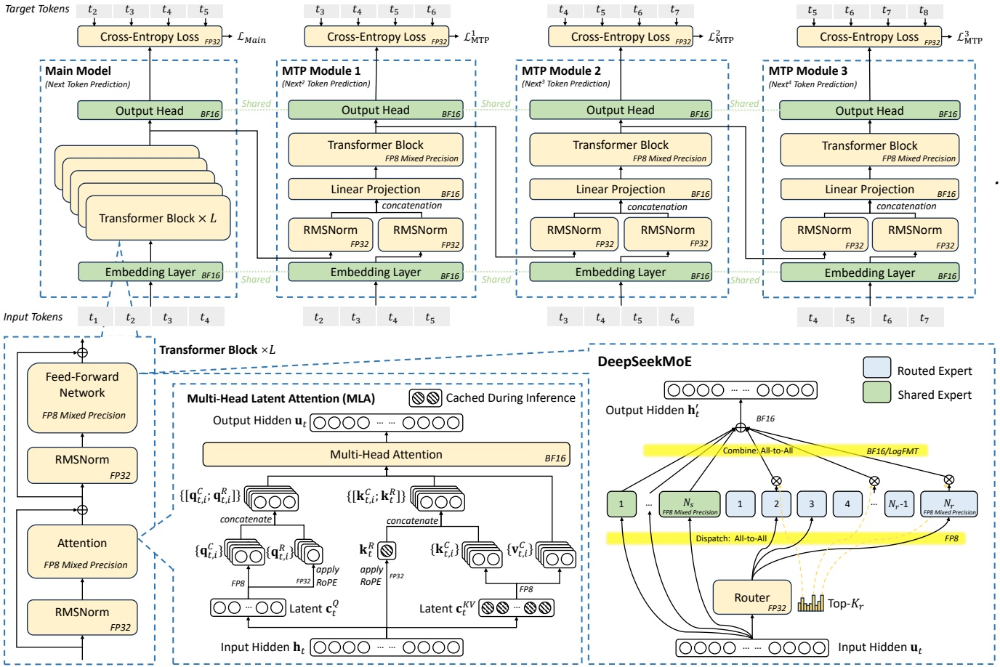
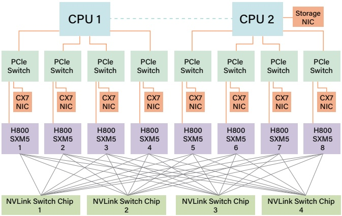
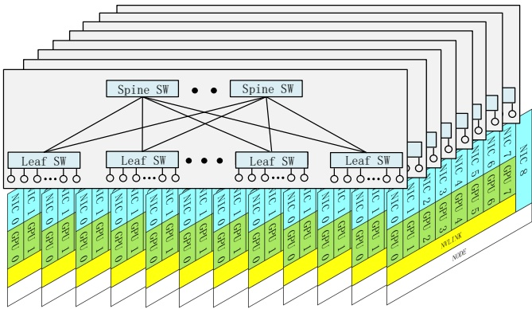
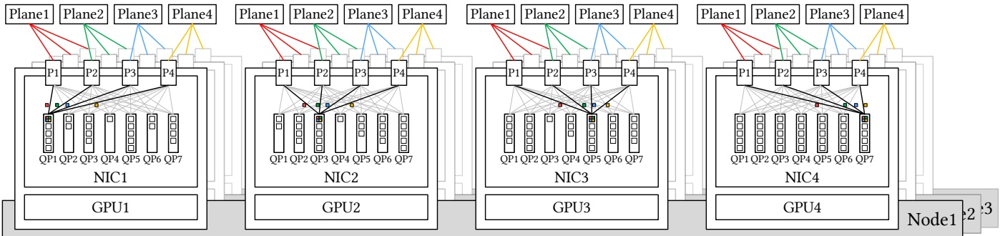
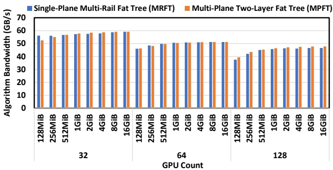
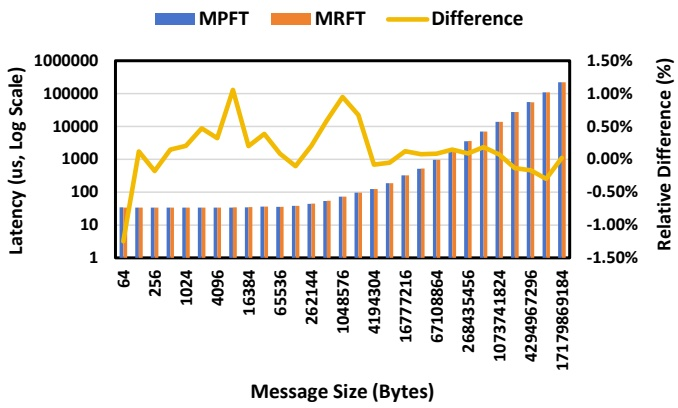
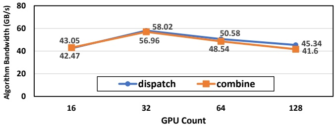
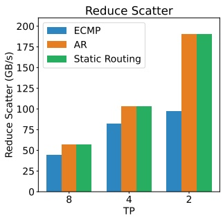
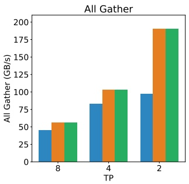

<!-- page 1 of 15 -->

arXiv:2505.09343v2 [cs.DC] 23 Dec 2025

# Insights into DeepSeek-V3: Scaling Challenges and Reflections on Hardware for AI Architectures

DeepSeek-V3 的启示: 规模化的挑战与对 AI 体系结构硬件的思考

Chenggang Zhao DeepSeek-AI Beijing, China chenggangz@deepseek.com

Damai Dai DeepSeek-AI Beijing, China damai.dai@deepseek.com

Liyue Zhang∗ DeepSeek-AI Beijing, China ly.zhang@deepseek.com

Shirong Ma DeepSeek-AI Beijing, China mashirong.2000@deepseek.com

Yuqing Wang∗ DeepSeek-AI Beijing, China wangyq@deepseek.com

Chengqi Deng DeepSeek-AI Beijing, China cq.deng@deepseek.com

Huazuo Gao DeepSeek-AI Beijing, China gaohuazuo@deepseek.com

Panpan Huang DeepSeek-AI Beijing, China pp.huang@deepseek.com

Wenfeng Liang DeepSeek-AI Beijing, China wenfeng.liang@deepseek.com

Yuxuan Liu DeepSeek-AI Beijing, China liuyuxuan@deepseek.com

Chong Ruan DeepSeek-AI Beijing, China chong.ruan@deepseek.com

Jiashi Li DeepSeek-AI Beijing, China js.li@deepseek.com

Shangyan Zhou DeepSeek-AI Beijing, China sy.zhou@deepseek.com

Ying He DeepSeek-AI Beijing, China ying.he@deepseek.com

Y.X. Wei DeepSeek-AI Beijing, China weiyx@deepseek.com

## Abstract

The rapid scaling of large language models (LLMs) has unveiled critical limitations in current hardware architectures, including constraints in memory capacity, computational efficiency, and interconnection bandwidth. DeepSeek-V3, trained on 2,048 NVIDIA H800 GPUs, demonstrates how hardware-aware model co-design can effectively address these challenges, enabling cost-efficient training and inference at scale. This paper presents an in-depth analysis of the DeepSeek-V3/R1 model architecture and its AI infrastructure, highlighting key innovations such as Multi-head Latent Attention (MLA) for enhanced memory efficiency, Mixture of Experts (MoE) architectures for optimized computation-communication trade-offs, FP8 mixed-precision training to unlock the full potential of hardware capabilities, and a Multi-Plane Network Topology to minimize

cluster-level network overhead. Building on the hardware bottlenecks encountered during DeepSeek-V3’s development, we engage in a broader discussion with academic and industry peers on potential future hardware directions, including precise low-precision computation units, scale-up and scale-out convergence, and innovations in low-latency communication fabrics. These insights underscore the critical role of hardware and model co-design in meeting the escalating demands of AI workloads, offering a practical blueprint for innovation in next-generation AI systems.

大语言模型 (LLM) 的快速规模化暴露了现有硬件体系结构的几处关键限制: 内存容量, 计算效率和互联带宽. DeepSeek-V3 在 2,048 张 NVIDIA H800 GPU 上训练, 说明了感知硬件的模型协同设计能够有效应对这些挑战, 让大规模训练与推理做到低成本. 本文深入分析 DeepSeek-V3/R1 的模型架构与 AI 基础设施, 重点介绍几项关键创新: 提高内存效率的 Multi-head Latent Attention (MLA), 优化计算与通信取舍的 MoE 架构, 释放硬件全部潜力的 FP8 混合精度训练, 以及把集群级网络开销压到最低的多平面网络拓扑. 以 DeepSeek-V3 开发中遇到的硬件瓶颈为出发点, 我们与学界和业界同行更广泛地讨论未来硬件可能的方向, 包括精确的低精度计算单元, scale-up 与 scale-out 的融合, 以及低延迟通信互联结构的创新. 这些认识说明硬件与模型协同设计对满足日益增长的 AI 负载需求起着关键作用, 为下一代 AI 系统的创新提供了一份可操作的蓝图.

## CCS Concepts

• **Computer systems organization** → **Architectures**.

• **计算机系统组织** → **体系结构**.

∗Yuqing Wang and Liyue Zhang are the corresponding authors of this paper. Authors are listed in alphabetical order of their first names.

∗ Yuqing Wang 与 Liyue Zhang 为本文通讯作者. 作者按名 (first name) 的字母顺序排列.

## Keywords

Large Language Model, Mixture-of-Experts, Deep Learning, FP8 Mixed-Precision Training, Multi-Plane Network, Co-Design

大语言模型, MoE, 深度学习, FP8 混合精度训练, 多平面网络, 协同设计

## ACM Reference Format:

Chenggang Zhao, Chengqi Deng, Chong Ruan, Damai Dai, Huazuo Gao, Jiashi Li, Liyue Zhang, Panpan Huang, Shangyan Zhou, Shirong Ma, Wenfeng Liang, Ying He, Yuqing Wang, Yuxuan Liu, Y.X. Wei . 2025. Insights into DeepSeek-V3: Scaling Challenges and Reflections on Hardware for AI Architectures. In Proceedings of the 52nd Annual International Symposium on Computer Architecture (ISCA ’25), June 21–25, 2025, Tokyo, Japan. ACM, New York, NY, USA, 15 pages. [https://doi.org/10.1145/3695053.3731412](https://doi.org/10.1145/3695053.3731412)

Permission to make digital or hard copies of all or part of this work for personal or classroom use is granted without fee provided that copies are not made or distributed for profit or commercial advantage and that copies bear this notice and the full citation on the first page. Copyrights for components of this work owned by others than the author(s) must be honored. Abstracting with credit is permitted. To copy otherwise, or republish, to post on servers or to redistribute to lists, requires prior specific permission and/or a fee. Request permissions from permissions@acm.org. ISCA ’25, June 21–25, 2025, Tokyo, Japan © 2025 Copyright held by the owner/author(s). Publication rights licensed to ACM. ACM ISBN 979-8-4007-1261-6/2025/06 [https://doi.org/10.1145/3695053.3731412](https://doi.org/10.1145/3695053.3731412)

允许为个人或课堂使用免费制作本作品全部或部分的电子或纸质副本, 前提是副本不为营利或商业利益而制作或分发, 并在首页附上本声明与完整引用. 本作品中归作者以外他人所有的部分, 其版权必须得到尊重. 允许注明出处的摘要. 其他形式的复制, 再版, 发布到服务器或分发到列表, 需要事先获得特定许可和/或付费. 许可申请请发至 permissions@acm.org. ISCA ’25, 2025 年 6 月 21–25 日, 日本东京. © 2025 版权归所有者/作者. 出版权授予 ACM. ACM ISBN 979-8-4007-1261-6/2025/06.

This is the author’s version of the work. It is posted here for your personal use. Not for redistribution. The definitive version appeared as part of the Industry Track in Proceedings of the 52nd Annual International Symposium on Computer Architecture (ISCA ’25).

这是本作品的作者版本, 发布于此供个人使用, 不得再分发. 正式版本收录于第 52 届国际计算机体系结构研讨会 (ISCA ’25) 论文集的工业界论文专题 (Industry Track).

<!-- page 2 of 15 -->

Chenggang Zhao, Chengqi Deng, Chong Ruan, Damai Dai, Huazuo Gao, Jiashi Li, Liyue Zhang, Panpan Huang, Shangyan Zhou, Shirong Ma, Wenfeng Liang, Ying He, Yuqing ISCA ’25, June 21–25, 2025, Tokyo, Japan Wang, Yuxuan Liu, and Y.X. Wei

## 1 Introduction

## 1.1 Background · 背景

Large Language Models (LLMs) have undergone rapid evolution in recent years, driven by iterative advancements in model design, computational power, and data availability. In 2024, groundbreaking models such as GPT4o [59], LLaMa-3 [3], Claude 3.5 Sonnet [8], Grok-2 [74], Qwen2.5 [71], Gemini-2 [37] and our DeepSeek-V3 [26] have showcased remarkable progress, further narrowing the gap towards Artificial General Intelligence (AGI). As the Scaling Laws [45] shows, increasing model size, training data, and computational resources leads to substantial improvements in model performance, underscoring the pivotal role of scaling in advancing AI capabilities. Collectively, these developments have ushered in an era where scaling model size and computational power is seen as the key to unlocking higher levels of intelligence.

近几年, 模型设计, 算力和数据可得性的迭代进步推动大语言模型 (LLM) 快速演进. 2024 年, GPT4o [59], LLaMa-3 [3], Claude 3.5 Sonnet [8], Grok-2 [74], Qwen2.5 [71], Gemini-2 [37] 以及我们的 DeepSeek-V3 [26] 等突破性模型取得了显著进展, 进一步缩小了与通用人工智能 (AGI) 的距离. 按 Scaling Laws [45], 加大模型规模, 训练数据和计算资源会显著提升模型表现, 这说明规模化在推进 AI 能力上起着核心作用. 这些进展合在一起, 开启了一个把扩大模型规模和算力视为通往更高智能之关键的时代.

Recent developments, reasoning models such as OpenAI’s o1/o3 series models [60, 61], DeepSeek-R1 [28], Claude-3.7 Sonnet [9], Gemini 2.5 Pro [38], Seed1.5-Thinking [68] and Qwen3 [72] have demonstrated not only the benefits conferred by large-scale architectures, but also the necessity of improving inference efficiency, particularly in handling longer contexts and achieving greater reasoning depth. These advancements underscore the need for faster and more efficient inference, consequently placing ever-increasing demands on computational resources.

近来的推理模型, 如 OpenAI 的 o1/o3 系列 [60, 61], DeepSeek-R1 [28], Claude-3.7 Sonnet [9], Gemini 2.5 Pro [38], Seed1.5-Thinking [68] 与 Qwen3 [72], 不仅展示了大规模架构带来的好处, 也说明必须提高推理效率, 尤其是在处理更长上下文, 达到更深推理时. 这些进展要求推理更快更高效, 对计算资源的需求也随之不断增长.

To meet these challenges, industry leaders such as Alibaba, ByteDance, Google, xAI and Meta have deployed colossal training clusters [33, 42, 43, 56, 62, 75], featuring tens or even hundreds of thousands of GPUs or TPUs. While such massive infrastructures have enabled the development of state-of-the-art models, their exorbitant costs present significant barriers for smaller research teams and organizations. Despite these barriers, open-source startups such as DeepSeek [23–26, 28] and Mistral [41, 55] are also striving to develop state-of-the-art models. Among them, DeepSeek has especially demonstrated that effective software-hardware co-design can enable cost-efficient training of large models, leveling the playing field for smaller teams.

为应对这些挑战, 阿里巴巴, 字节跳动, Google, xAI 和 Meta 等行业头部公司部署了数万乃至数十万张 GPU 或 TPU 的巨型训练集群 [33, 42, 43, 56, 62, 75]. 这样的基础设施支撑了最先进模型的研发, 但高昂的成本对较小的研究团队和机构构成很大门槛. 尽管如此, DeepSeek [23–26, 28] 与 Mistral [41, 55] 等开源创业公司也在努力研发最先进的模型. 其中, DeepSeek 尤其说明了有效的软硬件协同设计可以让大模型的训练做到低成本, 为较小的团队拉平起跑线.

Building on this tradition, DeepSeek-V3 [26] represents a new milestone in cost-effective training. By leveraging just 2,048 NVIDIA H800 GPUs, DeepSeek-V3 achieves state-of-the-art performance. This achievement aligns with the commitment to advance AI through practical and scalable solutions, as previously demonstrated in the cost-effective architecture of Fire-Flyer AI-HPC [7]. The practices and insights derived from DeepSeek-V3 demonstrate how exist ing hardware resources can be harnessed to their fullest potential, offering valuable lessons for the broader AI and HPC communities.

延续这一传统, DeepSeek-V3 [26] 是低成本训练的一座新里程碑: 只用 2,048 张 NVIDIA H800 GPU 就达到了最先进的表现. 这与此前 Fire-Flyer AI-HPC [7] 低成本架构所体现的方向一致, 即用务实, 可扩展的方案推进 AI. DeepSeek-V3 的实践与认识说明了怎样把现有硬件资源用到极致, 对更广泛的 AI 与 HPC 社区有借鉴价值.

## 1.2 Objectives · 目标

This paper does not aim to reiterate the detailed architectural and algorithmic specifics of DeepSeek-V3, which are extensively documented in its technical report [26]. Instead, it adopts a dual perspective—spanning hardware architecture and model design—to explore the intricate interplay between them in achieving cost-efficient large-scale training and inference. By examining this synergy, we aim to provide actionable insights for scaling LLMs efficiently without sacrificing performance or accessibility.

本文不打算重复 DeepSeek-V3 的架构与算法细节, 它们已在技术报告 [26] 里详细记录. 本文从硬件体系结构与模型设计两个视角出发, 讨论两者在实现低成本大规模训练和推理时的相互作用. 通过考察这种协同, 我们希望为高效扩展 LLM, 同时不牺牲表现与可及性, 提供可操作的认识.

Specifically, the paper focuses on:

具体而言, 本文关注:

• **Hardware-Driven Model Design:** Analyze how hardware features, such as FP8 low-precision computation and scale-up/scaleout network properties, informed the architectural choices in DeepSeek-V3.

• **硬件驱动的模型设计:** 分析 FP8 低精度计算, scale-up/scale-out 网络特性等硬件特征怎样影响 DeepSeek-V3 的架构选择.

• **Mutual Dependencies Between Hardware and Models:** Investigate how hardware capabilities shape model innovation and how the evolving demands of LLMs drive the need for nextgeneration hardware.

• **硬件与模型的相互依赖:** 研究硬件能力怎样塑造模型创新, 以及 LLM 不断变化的需求怎样推动对下一代硬件的需要.

• **Future Directions for Hardware Development:** Derive actionable insights from DeepSeek-V3 to guide the co-design of future hardware and model architectures, paving the way for scalable, cost-efficient AI systems.

• **硬件发展的未来方向:** 从 DeepSeek-V3 提炼可操作的认识, 指导未来硬件与模型架构的协同设计, 为可扩展, 低成本的 AI 系统铺路.

## 1.3 Structure of this Paper · 本文结构

The remainder of this paper is organized as follows. Section 2 explores the design principles underpinning DeepSeek-V3 model architecture, highlighting key innovations such as Multi-head Latent Attention, Mixture-of-Experts optimizations and Multi-Token Prediction Module. Section 3 illustrates how our model architecture pursues low-precision computation and communication. Section 4 includes scale-up interconnection optimizations, discusses scale up/scale-out convergence, and explores how hardware features influence parallelism and expert selection strategies. Section 5 focuses on scale-out network optimizations, including multi-plane network co-designs and low-latency interconnects. Besides current limitations and future suggestions mentioned in Section 3∼5, Sec tion 6 elaborates on more critical insights from DeepSeek-V3, and identifies directions for future hardware and model co-design.

其余部分组织如下. 第 2 节讨论 DeepSeek-V3 模型架构背后的设计原则, 重点是 Multi-head Latent Attention, MoE 的优化和 MTP 模块. 第 3 节说明模型架构怎样追求低精度的计算与通信. 第 4 节包括 scale-up 互联优化, 讨论 scale-up 与 scale-out 的融合, 并探讨硬件特性怎样影响并行方式与专家选择策略. 第 5 节聚焦 scale-out 网络优化, 包括多平面网络的协同设计与低延迟互联. 除第 3∼5 节提到的现有限制与未来建议外, 第 6 节进一步阐述 DeepSeek-V3 带来的更关键的认识, 并指出未来硬件与模型协同设计的方向.

## 2 Design Principles for DeepSeek Models · DeepSeek 模型的设计原则

The development of **DeepSeek-V3** exemplifies a hardware-aware approach to scaling LLMs, where each design decision was carefully aligned with hardware constraints to optimize performance and cost efficiency.

**DeepSeek-V3** 的研发是感知硬件地扩展 LLM 的一个例子: 每个设计决策都对照硬件约束仔细权衡, 以优化性能与成本效率.

As shown in Figure 1, DeepSeek-V3 employs the **DeepSeek-MoE** [27] and **Multi-head Latent Attention (MLA)** [25] architectures that have been proven effective in DeepSeek-V2 [25]. DeepSeek-MoE unlocks the potential of MoE architecture, while MLA drastically reduces memory consumption by compressing Key-Value (KV) caches. In addition, **DeepSeek-V3** incorporates **FP8 mixedprecision training**, significantly lowering computational costs and making large-scale training more practical without compromising model quality. To improve the inference speed, DeepSeek-V3 integrates speculative decoding based on its **Multi-Token Prediction Module**, which significantly increases the generation speed. Beyond model architecture, we also explored cost-efficient AI infrastructure by deploying a **Multi-Plane** two-layer Fat-Tree network to replace a traditional three-layer Fat-Tree topology, reducing cluster networking costs.

如图 1, DeepSeek-V3 沿用了在 DeepSeek-V2 [25] 上验证有效的 **DeepSeek-MoE** [27] 与 **Multi-head Latent Attention (MLA)** [25] 架构. DeepSeek-MoE 释放了 MoE 架构的潜力, MLA 通过压缩 Key-Value (KV) cache 大幅降低内存占用. 此外, **DeepSeek-V3** 引入 **FP8 混合精度训练**, 在不损害模型质量的前提下显著降低计算成本, 让大规模训练更可行. 为提高推理速度, DeepSeek-V3 基于 **MTP 模块**集成了投机解码, 显著提高生成速度. 在模型架构之外, 我们还探索了低成本的 AI 基础设施: 部署**多平面**两层胖树 (Fat-Tree) 网络, 替代传统的三层胖树拓扑, 降低集群组网成本.

These innovations aim to address three core challenges in scaling LLMs—**memory efficiency**, **cost-effectiveness**, and **inference speed**—which are explored in detail in the following subsections.

这些创新针对扩展 LLM 的三个核心挑战: **内存效率**, **成本效益**与**推理速度**, 下面各小节分别详细讨论.

## 2.1 Memory Efficiency · 内存效率

LLMs generally require significant memory resources, with memory demands increasing by more than 1000% per year. In contrast, the

<!-- page 3 of 15 -->

Insights into DeepSeek-V3: Scaling Challenges and Reflections on Hardware for AI Architectures

ISCA ’25, June 21–25, 2025, Tokyo, Japan

Figure 1: Basic architecture of DeepSeek-V3. Built upon DeepSeek-V2’s MLA and DeepSeekMoE, a Multi-Token Prediction Module and FP8 mixed-precision training are introduced to enhance inference and training efficiency. The figure indicates the precision used for computations in different parts of the architecture. All components take inputs and outputs in BF16.

growth rate of high-speed memory (e.g., HBM) capacity is much slower, typically less than 50% per year [35]. While multi-node parallelism is a viable solution to address memory limitations, optimizing memory usage at the source remains a crucial and effective strategy.

LLM 通常需要大量内存资源, 内存需求每年增长超过 1000%. 相比之下, 高速内存 (如 HBM) 容量的增长慢得多, 通常每年不到 50% [35]. 多节点并行是应对内存限制的可行办法, 但从源头上优化内存使用仍是关键而有效的策略.

> **想:** 图 1 画了 3 个 MTP 模块, 而 V3 技术报告训练时 MTP 深度为 1, 两者矛盾吗?
> 答: 不矛盾. 图 1 把 V3 技术报告的架构图与 MTP 示意图拼在一起, 画 3 个模块只是演示「第 $k$ 个模块预测第 $k+1$ 个后续 token」的串行结构; 同库 [V3 解析](../../1-%E6%A8%A1%E5%9E%8B%E6%8A%80%E6%9C%AF%E6%8A%A5%E5%91%8A/1.4-deepseek-v3/02-deepseek-v3-analysis.md) 第 1.5 节记录的训练配置是 $D=1$. 本文 2.3.3 节说「an MTP module」对第二个后续 token 的接受率是 80% 到 90%, 也只对应一个模块. 图里能核对的是精度标注: 路由器 FP32, 两处 all-to-all 中 dispatch 标 FP8, combine 标「BF16/LogFMT」, 与 3.2 节一致.

2.1.1 Low-Precision Models. Compared to models that utilize BF16 for weights, FP8 significantly reduces memory consumption by half, effectively alleviating the AI memory wall challenge. A detailed discussion of low-precision techniques is provided in Section 3 Low-Precision Driven Design.

2.1.1 低精度模型. 与权重用 BF16 的模型相比, FP8 把内存占用减半, 有效缓解 AI 的内存墙问题. 低精度技术的详细讨论见第 3 节「低精度驱动的设计」.

2.1.2 Reducing KV Cache with MLA. For LLM inference, user requests often involve multi-turn conversations. To handle these efficiently, the context from previous requests is cached in what is commonly referred to as the KV cache. KV cache addresses this challenge by caching the **Key** and **Value** vectors of previously processed tokens, eliminating the need to recompute them for subsequent tokens. During each inference step, the model only computes the Key and Value vectors for the current token and performs attention com putation by combining them with the cached Key-Value pairs from the history. This incremental computation reduces the complexity of generating each token to 𝑂(𝑁), making it efficient when processing long sequences or multi-turn inputs. However, it introduces

a memory-bound bottleneck because the computation shifts from GEMM to GEMV, which has a much lower compute-to-memory ratio. With modern hardware offering hundreds of TFLOPS, GEMV quickly becomes limited by memory bandwidth, making memory access the primary bottleneck.

2.1.2 用 MLA 减小 KV cache. LLM 推理时, 用户请求常是多轮对话. 为高效处理, 之前请求的上下文被缓存下来, 即通常所说的 KV cache. KV cache 缓存已处理 token 的 **Key** 与 **Value** 向量, 后续 token 不必重新计算它们. 每个推理步里, 模型只为当前 token 计算 Key 与 Value, 再与缓存的历史 Key-Value 对一起做注意力计算. 这种增量计算把生成每个 token 的复杂度降到 $O(N)$, 处理长序列或多轮输入时效率高. 但它带来访存受限的瓶颈: 计算从 GEMM 变成了 GEMV, 而 GEMV 的计算访存比低得多. 现代硬件提供数百 TFLOPS 的算力, GEMV 很快就被内存带宽限住, 访存成为主要瓶颈.

To address this bottleneck, we employ **Multi-head Latent Attention (MLA)** [25] that compresses the KV representations of all attention heads into a smaller latent vector using a projection matrix, which is jointly trained with the model. During inference, only the latent vector needs to be cached, significantly reducing memory consumption compared to storing the KV cache for all attention heads.

为解决这一瓶颈, 我们采用 **Multi-head Latent Attention (MLA)** [25]: 用一个与模型联合训练的投影矩阵, 把所有注意力头的 KV 表示压缩成一个更小的潜向量. 推理时只需缓存这个潜向量, 与存储所有注意力头的 KV cache 相比显著降低内存占用.

In addition to MLA, several other approaches have been proposed to reduce the size of the KV cache. These methods are highly valuable and provide significant inspiration for advancements in memory-efficient attention mechanisms:

除 MLA 外, 还有几类减小 KV cache 的方法. 它们很有价值, 对内存高效的注意力机制的发展有重要启发:

• **Shared KV (Grouped-Query Attention, GQA; Multi-Query Attention, MQA):** Instead of maintaining separate KV pairs for each attention head, multiple heads share a single set of KV pairs, significantly compressing KV storage. Representative methods include GQA [5] and MQA [70].

• **共享 KV (GQA; MQA):** 不为每个注意力头单独保存 KV 对, 而是多个头共享一组 KV, 显著压缩 KV 存储. 代表方法有 GQA [5] 与 MQA [70].

<!-- page 4 of 15 -->

Chenggang Zhao, Chengqi Deng, Chong Ruan, Damai Dai, Huazuo Gao, Jiashi Li, Liyue Zhang, Panpan Huang, Shangyan Zhou, Shirong Ma, Wenfeng Liang, Ying He, Yuqing ISCA ’25, June 21–25, 2025, Tokyo, Japan Wang, Yuxuan Liu, and Y.X. Wei

| Model | KV Cache Per Token | Multiplier |
| --- | --- | --- |
| DeepSeek-V3 (MLA) | 70.272 KB | 1x |
| Qwen-2.5 72B (GQA) | 327.680 KB | 4.66x |
| LLaMA-3.1 405B (GQA) | 516.096 KB | 7.28x |

• **Windowed KV:** For long sequences, only a sliding window of KV pairs is retained in the cache, discarding results outside the window. While this reduces storage, it compromises long-context reasoning. Representative methods include Longformer [11] and related architectures.

• **窗口 KV:** 对长序列, cache 里只保留一个滑动窗口内的 KV 对, 窗口外的结果丢弃. 这减少了存储, 但损害长上下文推理. 代表方法有 Longformer [11] 及相关架构.

• **Quantized Compression:** KV pairs are stored using low-bit representations [40, 44, 52], further reducing memory usage. Quantization achieves significant compression with minimal impact on model performance.

• **量化压缩:** 用低位宽表示存储 KV 对 [40, 44, 52], 进一步降低内存占用. 量化能以很小的效果损失换来显著的压缩.

Table 1 compares the KV cache memory usage per token among DeepSeek-V3, Qwen-2.5 72B [71], and LLaMA-3.1 405B [4]. By adopting MLA, DeepSeek-V3 achieves a significant reduction in KV cache size, requiring only 70 KB per token, substantially less than LLaMA-3.1 405B’s 516 KB and Qwen-2.5 72B’s 327 KB. This reduction highlights the efficiency of MLA in compressing KV representations compared to GQA-based methods. The ability to achieve such a significant reduction in memory consumption makes DeepSeek-V3 particularly well-suited for scenarios involving long-context processing and resource-constrained environments, enabling more scalable and cost-effective inference.

表 1 比较 DeepSeek-V3, Qwen-2.5 72B [71] 与 LLaMA-3.1 405B [4] 每个 token 的 KV cache 占用. 采用 MLA 后, DeepSeek-V3 的 KV cache 显著缩小, 每 token 只要 70 KB, 远少于 LLaMA-3.1 405B 的 516 KB 和 Qwen-2.5 72B 的 327 KB. 这说明与基于 GQA 的方法相比, MLA 压缩 KV 表示的效率更高. 内存占用能降这么多, 让 DeepSeek-V3 尤其适合长上下文处理和资源受限的环境, 推理更可扩展, 成本更低.

> **核对:** 表 1 的 70.272 KB, 327.680 KB, 516.096 KB 分别怎么算出来, 「KB」取的是 1000 还是 1024?
> 答: 三个数都能按 BF16 (2 字节) 精确复算, 且 KB 取 1000 字节. V3 的 MLA 每层每 token 缓存 512 维潜向量 $c^{KV}$ 加 64 维解耦 RoPE 键 $k^R$, 共 576 个元素, 61 层: $576\times61\times2=70{,}272$ 字节. Qwen-2.5 72B 是 80 层, 8 个 KV 头, 头维 128, K 与 V 各一份: $2\times8\times128\times80\times2=327{,}680$ 字节. LLaMA-3.1 405B 是 126 层, 同样 8 个 KV 头, 头维 128: $2\times8\times128\times126\times2=516{,}096$ 字节. 表里没有列 MHA; 按 V3 自己的 128 头, 头维 128 做标准 MHA, 每 token 要 $2\times128\times128\times61\times2\approx4.0$ MB, 是 MLA 的约 57 倍. 表 1 比的是三种不同模型, 层数和头数都不同, 所以 4.66x 与 7.28x 混合了「压缩方式」和「模型规模」两个因素.

2.1.3 Future Directions and Perspectives on Resource-Efficient Techniques. While reducing the size of the KV cache is a promising method for improving memory efficiency, the quadratic complexity inherent in Transformer-based autoregressive decoding remains a formidable challenge, especially for extremely long contexts. Recent research efforts, such as Mamba-2 [21] and Lightning Attention[63], investigate linear-time alternatives that offer new possibilities for balancing computational cost and model performance. In addition, approaches such as sparse attention [76], which seek to compress and sparsely activate attention keys and values, represent another attempt at overcoming the computational challenges associated with attention. We look forward to collaborative progress with the broader community toward breakthroughs in this area.

2.1.3 资源高效技术的未来方向与展望. 减小 KV cache 是提高内存效率的有前景的办法, 但基于 Transformer 的自回归解码固有的二次复杂度仍是很大的挑战, 对超长上下文尤其如此. Mamba-2 [21], Lightning Attention [63] 等近期研究探索线性时间的替代方案, 为平衡计算成本与模型表现提供了新可能. 此外, 稀疏注意力 [76] 这类方法试图压缩并稀疏激活注意力的 key 和 value, 是克服注意力计算难题的另一条路. 我们期待与更广泛的社区合作, 在这一方向取得突破.

## 2.2 Cost-Effectiveness of MoE Models · MoE 模型的成本效益

For sparse computing, we have developed DeepSeekMoE, an advanced **Mixture of Experts (MoE)** architecture, which is illustrated in the lower right part of Figure 1. The advantages of MoE models lie in two folds.

针对稀疏计算, 我们研发了 DeepSeekMoE, 一种先进的 **MoE** 架构, 见图 1 右下部分. MoE 模型的优势有两方面.

2.2.1 Reducing Computational Requirements for Training. The primary advantage of the MoE architecture lies in its ability to significantly reduce training costs. By selectively activating only a subset of expert parameters, MoE models allow the total parameter count to scale up dramatically while keeping computational requirements modest. For example, **DeepSeek-V2** features 236B parameters, but only 21B parameters are activated per token. Similarly, **DeepSeek-V3** expands to 671B parameters—nearly three

| Model | Size | Training Cost |
| --- | --- | --- |
| DeepSeek-V2 MoE | 236B | 155 GFLOPS/Token |
| DeepSeek-V3 MoE | 671B | 250 GFLOPS/Token |
| Qwen-72B Dense | 72B | 394 GFLOPS/Token |
| LLaMa-405B Dense | 405B | 2448 GFLOPS/Token |

times the size of V2—while keeping the activation per token at just 37B. In comparison, dense models such as Qwen2.5-72B and LLaMa3.1-405B require all parameters to be active during training.

2.2.1 降低训练的计算需求. MoE 架构的首要优势是能显著降低训练成本. 只选择性地激活一部分专家参数, MoE 模型可以让总参数量大幅增长, 计算需求却保持适中. 例如 **DeepSeek-V2** 有 236B 参数, 每个 token 只激活 21B. 同样, **DeepSeek-V3** 扩展到 671B 参数, 接近 V2 的三倍, 每 token 激活仍只有 37B. 相比之下, Qwen2.5-72B 与 LLaMa3.1-405B 这样的稠密模型训练时全部参数都要激活.

As shown in Table 2, the total computational cost for DeepSeek-V3 is approximately 250 GFLOPS per token, whereas the 72B dense model requires 394 GFLOPS and the 405B dense model requires 2448 GFLOPS. This demonstrates that MoE models achieve comparable or even superior performance to dense models while consuming an order of magnitude less computational resources.

如表 2, DeepSeek-V3 每个 token 的总计算量约 250 GFLOPS, 而 72B 稠密模型要 394 GFLOPS, 405B 稠密模型要 2448 GFLOPS. 这说明 MoE 模型能以少一个数量级的计算资源, 达到与稠密模型相当甚至更好的表现.

> **看表:** 表 2 的单位写成 GFLOPS/Token, 它统计的是训练一个 token 的前向加反向浮点运算量吗, 序列长度取多少?
> 答: 文中没有给出口径, 但可以用表 4 反推. 表 4 里 MPFT 一列每天 272.80B token, 即每秒约 $3.157\times10^6$ token; 2048 卡每卡 385 TFLOPS (causal 口径), 合计除以 token 速率得每 token 约 249.7 GFLOP, 与表 2 的 250 一致; non-causal 的 432 TFLOPS 对应约 280 GFLOP. 再从模型结构算: $6\times37\text{B}=222$ GFLOP 是线性层的前向加反向, MLA 的打分与加权在 4K 序列, causal 口径下每 token 约 30.7 GFLOP, 合计约 253. 所以表 2 的单位实际是每个 token 的 GFLOP 数, 与「每秒」无关, 口径是训练, 4K 序列, 只算下三角注意力. 按同样口径, Qwen2.5-72B 光线性层就有 $6\times70\text{B}\approx420$ GFLOP, 高于表里的 394, 这一行用的参数量或口径文中没有交代. 「少一个数量级」只对 405B 那一行成立 (约 9.8 倍), 对 72B 只少约 37%.

2.2.2 Advantages for Personal Use and On-Premises Deployment. In a future where personalized LLM agents [53] become ubiquitous, MoE models offer unique advantages in single-request scenarios. Because only a subset of parameters is activated per request, memory and computational demands are greatly reduced. For example, **DeepSeek-V2** (236B parameters) activates just 21B parameters during inference. This enables PCs with AI SoC chips [6, 10, 58] to achieve nearly 20 tokens per second (TPS), or even twice that speed, which is more than sufficient for personal use. In contrast, dense models of similar capability (e.g., 70B parameters) typically reach only single-digit TPS on similar hardware.

2.2.2 个人使用与本地部署的优势. 在个性化 LLM Agent [53] 普及的未来, MoE 模型在单请求场景下有独特优势. 每个请求只激活一部分参数, 内存与计算需求大幅降低. 例如 **DeepSeek-V2** (236B 参数) 推理时只激活 21B 参数, 这让搭载 AI SoC 芯片的 PC [6, 10, 58] 能达到接近每秒 20 个 token (TPS), 甚至两倍于此, 对个人使用绰绰有余. 相比之下, 能力相近的稠密模型 (如 70B 参数) 在类似硬件上通常只有个位数 TPS.

Notably, the increasingly popular KTransformers [39] inference engine allows the complete DeepSeek-V3 model to run on a lowcost server equipped with a consumer GPU (costing approximately \$10,000), while still achieving nearly 20 TPS.

另外, 越来越流行的 KTransformers [39] 推理引擎能让完整的 DeepSeek-V3 模型运行在一台配消费级 GPU 的低成本服务器 (约 1 万美元) 上, 仍达到接近 20 TPS.

This efficiency makes MoE architectures suitable for local deployments and single-user scenarios, where hardware resources are often limited. By minimizing memory and computational overhead, MoE models can deliver high-quality inference performance without requiring expensive infrastructure.

这种效率让 MoE 架构适合硬件资源往往有限的本地部署与单用户场景. 通过把内存与计算开销降到最低, MoE 模型不需要昂贵的基础设施就能提供高质量的推理表现.

## 2.3 Increasing Inference Speed · 提高推理速度

2.3.1 Overlapping Computation and Communication: Maximizing Throughput. Inference speed encompasses both system-wide maximum throughput and single-request latency. To maximize throughput, our model is architected from the outset to leverage dual microbatch overlap [31, 79], intentionally overlapping communication latency with computation. As demonstrated in our online inference system and supported by open-source profiling data [31], we decouple the computation of MLA and MoE into two distinct stages. While one micro-batch executes a portion of MLA or MoE computation, the other micro-batch simultaneously performs the corresponding dispatch communication. Conversely, during the computation phase of the second micro-batch, the first micro-batch undergoes the combine communication step. This pipelined approach enables seamless overlap of all-to-all communication with ongoing computation, ensuring that the GPU remains fully utilized at all times. Moreover, in production, we adopt a prefill and decode

<!-- page 5 of 15 -->

Insights into DeepSeek-V3: Scaling Challenges and Reflections on Hardware for AI Architectures

ISCA ’25, June 21–25, 2025, Tokyo, Japan

disaggregation architecture [81], assigning large batch size prefill and latency-sensitive decode requests to different expert parallelism group sizes. This strategy ultimately maximizes system throughput under real-world service conditions.

2.3.1 计算与通信重叠: 最大化吞吐. 推理速度包括系统级的最大吞吐和单请求延迟两方面. 为最大化吞吐, 模型从一开始就按双 micro-batch 重叠 [31, 79] 来设计, 有意让通信延迟与计算重叠. 我们的线上推理系统和开源的性能剖析数据 [31] 都显示, MLA 与 MoE 的计算被拆成两个独立阶段. 一个 micro-batch 执行一部分 MLA 或 MoE 计算时, 另一个 micro-batch 同时做相应的 dispatch 通信; 反过来, 第二个 micro-batch 计算时, 第一个 micro-batch 做 combine 通信. 这种流水方式让 all-to-all 通信与进行中的计算无缝重叠, 保证 GPU 始终满负荷. 此外, 生产环境采用 prefill 与 decode 分离的架构 [81], 把大 batch 的 prefill 请求和对延迟敏感的 decode 请求分配到不同规模的专家并行组. 这一策略在真实服务条件下最终把系统吞吐做到最大.

2.3.2 Inference Speed Limits. This section focuses on the decode output speed of LLM services, typically measured in **Time Per Output Token (TPOT)**. TPOT is a critical metric for user experience, and it also directly impacts the responsiveness of reasoning models such as OpenAI’s o1/o3 and DeepSeek-R1, which rely on the inference length to enhance their intelligence.

2.3.2 推理速度的上限. 本节关注 LLM 服务的 decode 输出速度, 通常用**每输出 token 时间 (TPOT)** 衡量. TPOT 是用户体验的关键指标, 也直接影响 OpenAI o1/o3, DeepSeek-R1 这类靠加长推理来提高智能的推理模型的响应速度.

For MoE models, achieving high inference speed relies on efficiently deploying expert parameters across computing devices. To achieve the fastest possible inference speed, each device should ideally perform computations for a single expert (or multiple de vices should collaboratively compute a single expert if necessary). However, **Expert Parallelism (EP)** requires routing tokens to the appropriate devices, which involves all-to-all communication across the network. As a result, the upper limit of MoE inference speed is dictated by interconnection bandwidth.

对 MoE 模型, 高推理速度依赖于把专家参数高效地部署到各计算设备上. 要达到尽可能快的推理速度, 理想情况下每个设备只计算一个专家 (必要时多个设备合算一个专家). 但**专家并行 (EP)** 需要把 token 路由到相应设备, 涉及跨网络的 all-to-all 通信. 因此 MoE 推理速度的上限由互联带宽决定.

Consider a system where each device holds one expert’s parameters and processes approximately 32 tokens at a time. This token count strikes a balance between compute-to-memory ratio and communication latency. And this token count ensures that each device processes an equal batch size during expert parallelism, allowing the communication time to be easily calculated.

考虑一个系统: 每个设备持有一个专家的参数, 每次处理约 32 个 token. 这个 token 数在计算访存比与通信延迟之间取得平衡, 也保证专家并行时每个设备处理相同大小的 batch, 方便计算通信时间.

For a system interconnected with CX7 400Gbps InfiniBand (IB) NICs, the time required for the two all-to-all communications in EP is calculated as follows:

对用 CX7 400Gbps InfiniBand (IB) 网卡互联的系统, EP 中两次 all-to-all 通信所需时间按下式计算:

$$
\text {Comm. Time} = (1 \text {Byte} + 2 \text {Bytes}) \times 3 2 \times 9 \times 7 \mathrm{K} / 5 0 \mathrm{GB} / \mathrm{s} = 1 2 0. 9 6 \mu \mathrm{s}
$$

Here, dispatch uses FP8 (1 byte), while combine uses BF16 (2 bytes), and the hidden size of each token is approximately 7K. The factor 9 indicates that each token is transferred to 8 routed experts and 1 shared expert. Network latency is not included in this calculation.

其中 dispatch 用 FP8 (1 字节), combine 用 BF16 (2 字节), 每个 token 的隐藏维约 7K. 因子 9 表示每个 token 要传给 8 个路由专家和 1 个共享专家. 这一计算不含网络延迟.

> **拆开:** 120.96 μs 这个数按哪几个量乘出来, 「7K」取 7000 还是 7168, 后文为什么还要再乘 2?
> 答: 只有取 7000 才精确得到 120.96: $3\times32\times9\times7000=6{,}048{,}000$ 字节, 除以 $50\times10^9$ 字节/秒得 120.96 μs. 这 6.05 MB 已经把 dispatch (FP8) 和 combine (BF16) 两次 all-to-all 的字节都算进去了. 后面「Total Time Per Layer = 2 × 120.96」的 2 来自双 micro-batch: 每层有两个 micro-batch 各要完成一轮 dispatch 加 combine, 计算被假设完全藏在通信下面, 所以一层的墙钟时间是两轮通信之和. 若按 V3 真实隐藏维 7168 算, 一轮是 123.9 μs, TPOT 约 15.1 ms; 再计入 FP8 dispatch 每 128 元素一个 4 字节 scale, 还要多约 1%. 如果把有效带宽取 4.3 节用的 40 GB/s, 一轮约 155 μs, TPOT 约 18.9 ms. 这些差别不改变结论的量级.

As discussed in Section 2.3.1, maximizing throughput necessitates the use of dual micro-batch overlap. In this strategy, our theoretical best-case analysis assumes that computation overhead is minimized, so the upper bound on performance is determined by communication latency. In practical inference workloads, however, request contexts are often much longer, and MLA computations typically dominate execution time. Thus, this analysis represents an idealized scenario under dual micro-batch overlap. Under this assumption, the total time per layer can be formulated as:

如 2.3.1 节所述, 最大化吞吐需要双 micro-batch 重叠. 在这一策略下, 我们的理论最好情况分析假设计算开销降到最低, 于是性能上限由通信延迟决定. 但实际推理负载中请求上下文往往长得多, MLA 计算通常占执行时间的大头. 因此这一分析代表双 micro-batch 重叠下的理想情形. 在这一假设下, 每层总时间可写成:

Total Time Per Layer = 2 × 120.96𝜇𝑠 = 241.92𝜇𝑠

With 61 layers in DeepSeek-V3, the total inference time is:

DeepSeek-V3 有 61 层, 总推理时间为:

Total Inference Time = 61 × 241.92𝜇𝑠 = 14.76ms

Thus, the theoretical upper limit for this system is approximately **14.76 ms TPOT**, equivalent to **67 tokens per second**. However, in practice, factors such as communication overhead, latency, incomplete bandwidth utilization, and computational inefficiencies reduce this number.

因此这个系统的理论上限约为 **14.76 ms TPOT**, 相当于**每秒 67 个 token**. 但实际中, 通信开销, 延迟, 带宽利用不充分和计算效率低等因素都会使这个数字下降.

By contrast, if a high-bandwidth interconnect like GB200 NVL72 (900GB/s unidirectional bandwidth across 72 GPUs) were used, the communication time per EP step drops to:

相比之下, 如果使用 GB200 NVL72 这样的高带宽互联 (72 张 GPU 之间单向带宽 900GB/s), 每个 EP 步的通信时间降到:

Comm. Time = (1Byte + 2Bytes) × 32 × 9 × 7K/900GB/s = 6.72𝜇𝑠

Assuming perfect overlap between computation and communication, this would yield a theoretical upper limit of **0.82 ms TPOT**, or approximately **1200 tokens per second**. However, this figure is purely theoretical and does not account for the substantial drop in GPU efficiency at small batch sizes; in real deployments, actual throughput will be significantly lower. Nonetheless, this calculation vividly illustrates the transformative potential of high-bandwidth scale-up networks in accelerating large-scale model inference.

假设计算与通信完美重叠, 理论上限是 **0.82 ms TPOT**, 约**每秒 1200 个 token**. 不过这个数纯属理论值, 没有考虑小 batch 下 GPU 效率的大幅下降; 真实部署中实际吞吐会低得多. 尽管如此, 这一计算直观地说明了高带宽 scale-up 网络对加速大模型推理的巨大潜力.

> **问:** NVL72 只有 72 张 GPU, 而推算的前提是「每个设备持有一个专家」, V3 每层有 256 个路由专家, 这个前提还成立吗?
> 答: 不成立, 文中没有交代这一点. 72 张卡放 256 个路由专家加共享专家, 每卡要放约 4 个专家. 若每个专家仍处理 32 个 token, 每卡要收发的字节是推算值的约 4 倍, 一轮通信约 27 μs, TPOT 约 3.3 ms, 约 300 token/s; 若保持每卡 32 个 token 不变, 每个专家只分到约 8 个 token, 专家 GEMM 的计算访存比更低, 这正是文中自己说的「小 batch 下 GPU 效率大幅下降」. 两种读法都说明 0.82 ms 只是把带宽从 50 GB/s 换成 900 GB/s 后的比例换算 ($50/900$ 正好是 $6.72/120.96$), 算不上可部署配置的 TPOT. 以上是按文中数字推出的说法, 没有实测数据验证.

While MoE models exhibit good scalability, achieving high inference speeds by increasing hardware resources alone is costprohibitive. Therefore, software and algorithms must also contribute to improving inference efficiency.

MoE 模型可扩展性好, 但只靠增加硬件资源来提高推理速度, 成本高得难以承受. 因此软件和算法也必须为提高推理效率出力.

2.3.3 Multi-Token Prediction. Inspired by Gloeckle et al. [36], DeepSeek-V3 introduces a **Multi-Token Prediction (MTP)** framework, which simultaneously enhances model performance and improves inference speed. During inference, traditional autoregressive models generate one token at a decoding step, leading to sequential bottlenecks. MTP mitigates this issue by enabling the model to generate additional candidate tokens at a lower cost and verify them in parallel, similar to previous self-drafting-based speculative decoding approaches [14, 48]. This framework significantly accelerates inference without compromising accuracy.

2.3.3 MTP. 受 Gloeckle 等人 [36] 启发, DeepSeek-V3 引入 **MTP** (一次再多预测一个 token) 框架, 同时提升模型表现和推理速度. 推理时, 传统自回归模型每个解码步生成一个 token, 形成串行瓶颈. MTP 让模型以较低成本生成额外的候选 token 并并行验证, 缓解这一问题, 与此前基于自起草的投机解码方法 [14, 48] 相近. 这一框架在不损失准确率的前提下显著加速推理.

As illustrated in the top part of Figure 1, each MTP module uses a single layer, which is much more lightweight than the full model, to predict additional tokens, enabling parallel verification of multiple candidate tokens. Although slightly hurting the throughput, this approach significantly improves the end-to-end generation latency. The real world practice data demonstrates that an MTP module achieves an acceptance rate of 80% to 90% for predicting the second subsequent token, which increases the generation TPS by 1.8x compared to the scenario without the MTP module.

如图 1 上半部分, 每个 MTP 模块只用一层 (比完整模型轻得多) 来预测额外的 token, 从而可以并行验证多个候选 token. 这种做法会略微损失吞吐, 但显著改善端到端的生成延迟. 真实生产数据显示, 一个 MTP 模块预测第二个后续 token 的接受率在 80% 到 90% 之间, 与不用 MTP 模块相比, 生成 TPS 提高到 1.8 倍.

Moreover, by predicting multiple tokens per step, MTP increases the inference batch size, which is crucial for boosting EP computational intensity and hardware utilization. Such algorithmic innovations are vital for fast and cost-effective inference in DeepSeek-V3.

此外, MTP 每步预测多个 token, 增大了推理的 batch, 这对提高 EP 的计算强度和硬件利用率很关键. 这类算法创新对 DeepSeek-V3 快速, 低成本的推理不可或缺.

2.3.4 High Inference Speed for Reasoning Models and Test-Time Scaling. Test-time scaling in LLMs, exemplified by OpenAI’s o1/o3 series [60, 61], has enabled significant advances in mathematical reasoning, programming, and general reasoning by dynamically adjusting computational resources during inference. Subsequent models—including DeepSeek-R1 [28], Claude-3.7 Sonnet [9], Gemini 2.5 Pro [38], Seed1.5-Thinking [68], and Qwen3 [72]—have adopted similar strategies and achieved notable improvements in these tasks.

2.3.4 推理模型与 TestingTime 算力需要的高推理速度. 以 OpenAI o1/o3 系列 [60, 61] 为代表, LLM 在推理时动态调整计算资源, 即 TestingTime 算力, 在数学推理, 编程和通用推理上带来了显著进步. 之后的 DeepSeek-R1 [28], Claude-3.7 Sonnet [9], Gemini 2.5 Pro [38], Seed1.5-Thinking [68] 和 Qwen3 [72] 都采用了类似策略, 在这些任务上取得明显提升.

For these reasoning models, high token output speed is of paramount importance. In reinforcement learning (RL) workflows—such as PPO [67], DPO [64] and GRPO [69]—the necessity to rapidly generate large numbers of samples makes inference throughput a critical bottleneck. Likewise, prolonged reasoning sequences can increase user wait times, reducing the practical usability of such models. As a result, optimizing inference speed through synergistic hardware and software innovations is indispensable for advancing the efficiency of reasoning models. However, effective strategies for accelerating inference and expediting RL training remain active areas of investigation, as discussed in Section 2.1.3. We encourage the broader community to collaboratively explore and develop novel solutions to these ongoing challenges.

推理模型的 token 输出速度同时影响训练和服务. PPO [67]、DPO [64]、GRPO [69] 等强化学习流程需要快速生成大量样本, 推理吞吐会直接限制训练速度; 推理序列变长也会增加用户等待时间. 因此需要从软件与硬件两侧共同优化输出速度. 如 2.1.3 节所述, 加速推理与 RL 训练的有效策略仍在研究之中, 还需要社区继续探索.

<!-- page 6 of 15 -->

Chenggang Zhao, Chengqi Deng, Chong Ruan, Damai Dai, Huazuo Gao, Jiashi Li, Liyue Zhang, Panpan Huang, Shangyan Zhou, Shirong Ma, Wenfeng Liang, Ying He, Yuqing ISCA ’25, June 21–25, 2025, Tokyo, Japan Wang, Yuxuan Liu, and Y.X. Wei

## 2.4 Technique Validation Methodology · 技术验证方法

Each acceleration technique undergoes rigorous empirical validation to evaluate its accuracy impact, including MLA, FP8 mixedprecision computation, and network co-designed MoE gate routing. Given the prohibitive cost of exhaustive ablation on full-scale models, we adopt a hierarchical and resource-efficient validation pipeline. Each technique is first validated extensively on small-scale models, followed by minimal large-scale tuning, and finally integrated in a single, comprehensive training run. For instance, we first conducted fine-grained FP8 training ablation studies on both 16B and 230B DeepSeek-V2 models before final integration. Under these controlled settings, the relative accuracy loss compared to BF16 remains below 0.25%, attributable to our use of high-precision accumulation and fine-grained quantization strategies.

每项加速技术都经过严格的实验验证, 评估它对准确率的影响, 包括 MLA, FP8 混合精度计算, 以及与网络协同设计的 MoE 门控路由. 在完整规模的模型上做穷尽消融的代价高得无法承受, 我们采用分层, 节省资源的验证流程: 每项技术先在小模型上充分验证, 再做尽量少的大规模调优, 最终集成进一次完整的训练. 例如, 最终集成之前, 我们先在 16B 与 230B 两个 DeepSeek-V2 模型上做了细粒度 FP8 训练的消融. 在这些受控设置下, 相对 BF16 的准确率相对损失保持在 0.25% 以下, 这归功于高精度累加与细粒度量化策略.

## 3 Low-Precision Driven Design · 低精度驱动的设计

## 3.1 FP8 Mix-Precision Training · FP8 混合精度训练

Quantization techniques such as GPTQ [32] and AWQ [51] have been widely used to reduce bit-widths to 8-bit, 4-bit, or even lower, significantly reducing memory requirements. However, these techniques are primarily applied during inference to save memory, rather than in the training phase. NVIDIA’s Transformer Engine has supported FP8 mixed-precision training for some time, but prior to DeepSeek-V3, there were no open-source large models leveraging FP8 for training. Through deep collaboration between our infrastructure and algorithm teams, and after extensive experimentation and innovation, we developed an FP8-compatible training framework for MoE models. Figure 1 shows the computational components where FP8-precision forward and backward processes are utilized in the training pipeline. Fine-grained quantization is applied, i.e., tile-wise 1x128 quantization for activations and blockwise 128x128 quantization for model weights. Further technical details of our FP8 framework are documented in the DeepSeek-V3 technical report [26], and our fine-grained FP8 GEMM implementation has been open-sourced in DeepGEMM [78].

GPTQ [32], AWQ [51] 等量化技术被广泛用于把位宽降到 8 位, 4 位甚至更低, 显著降低内存需求. 但这些技术主要用在推理阶段省内存, 而不是训练阶段. NVIDIA 的 Transformer Engine 支持 FP8 混合精度训练已有一段时间, 但在 DeepSeek-V3 之前, 没有开源大模型用 FP8 训练. 经过基础设施团队与算法团队的深度合作, 以及大量实验与创新, 我们为 MoE 模型开发了兼容 FP8 的训练框架. 图 1 标出了训练流程中前向与反向用 FP8 精度的计算部件. 量化是细粒度的: 激活按 1x128 的 tile 量化, 模型权重按 128x128 的 block 量化. FP8 框架的更多技术细节见 DeepSeek-V3 技术报告 [26], 细粒度 FP8 GEMM 的实现已在 DeepGEMM [78] 开源.

3.1.1 Limitations: While FP8 has great potential for accelerating training, several hardware limitations need to be addressed to fully exploit its capabilities:

3.1.1 局限: FP8 在加速训练上潜力很大, 但要充分发挥它的能力, 还需要解决几项硬件限制:

• **FP8 Accumulation Precision:** FP8 uses constrained accumulation precision in Tensor Cores, affecting the stability for training large models, particularly on NVIDIA Hopper GPUs. After aligning 32 mantissa products by right-shifting based on the maximum exponent, the Tensor Core only maintains their highest 13 fraction bits for addition, and truncates bits exceeding this range. Addition results are accumulated to FP22 registers (1 sign bit, 8 exponent bits, and 13 mantissa bits)[77]. The term “FP22” follows the naming used in the cited work, and the FP8 precision issue on Hopper GPUs had also been observed across industry by early 2024.

• **FP8 累加精度:** FP8 在 Tensor Core 里的累加精度受限, 影响大模型训练的稳定性, 在 NVIDIA Hopper GPU 上尤其如此. 32 个尾数乘积按最大指数右移对齐后, Tensor Core 只保留它们最高的 13 个小数位做加法, 超出的位截断. 加法结果累加到 FP22 寄存器 (1 位符号, 8 位指数, 13 位尾数) [77]. 「FP22」这一叫法沿用被引工作的命名; Hopper GPU 上的 FP8 精度问题在 2024 年初已被业界多方观察到.

> **对一下:** V3 技术报告 §3.3.2 写的是 Tensor Core 只保留「约 14 位」, 这里写「13 个小数位」, 两份 DeepSeek 自己的材料哪个对?
> 答: 两者指的是同一个硬件行为, 差在是否计入隐含位. FP22 的 13 位尾数是显式小数位, 规格化数还有一个隐含的前导 1, 有效位共 14 位; 对齐后的尾数乘积带符号扩展, 技术报告说「最高 14 位」, 这里说「最高 13 个小数位」, 都落在 1+8+13 的格式上. 被引的 SageAttention2 [77] 用 mma(f32f8f8f32) 测出: 累加器 $D$ 的尾数超过 13 位时, 低 10 位被清零, 即 FP32 的 23 位尾数只剩 13 位. V3 的应对办法 (每 128 个元素把部分和提升到 CUDA Core 的 FP32 累加) 见同库 [V3 解析](../../1-%E6%A8%A1%E5%9E%8B%E6%8A%80%E6%9C%AF%E6%8A%A5%E5%91%8A/1.4-deepseek-v3/02-deepseek-v3-analysis.md) 第 2.2 节.

• **Fine-Grained Quantization Challenges:** Fine-grained quantization such as tile-wise and block-wise quantization introduces large dequantization overhead in transporting the partial results from Tensor Cores to CUDA Cores for scaling factor multiplica tion. This incurs frequent data movements, reducing computational efficiency and complicating hardware utilization.

• **细粒度量化的难题:** tile 级, block 级这类细粒度量化, 要把部分结果从 Tensor Core 搬到 CUDA Core 去乘缩放因子, 带来很大的反量化开销. 这造成频繁的数据搬运, 降低计算效率, 也让硬件利用更复杂.

3.1.2 Suggestions: To address the limitations of existing hardware, we have the following suggestions for future designs:

3.1.2 建议: 针对现有硬件的局限, 我们对未来设计有以下建议:

• **Increased Accumulation Precision:** Hardware should improve the accumulation register precision to an appropriate value (e.g. FP32), or support a configurable accumulation precision, enabling a trade-off between performance and accuracy for different requirements of training and inference in various models.

• **提高累加精度:** 硬件应把累加寄存器的精度提高到合适的值 (如 FP32), 或支持可配置的累加精度, 让不同模型的训练和推理可以按各自需求在性能与精度之间取舍.

• **Native Support for Fine-Grained Quantization:** Hardware should natively support fine-grained quantization, enabling Tensor Cores to receive scaling factors and implement matrix multiplication with group scaling. In this way, the whole partial sum accumulation and dequantization can be completed directly inside Tensor Cores until the final result is produced, avoiding frequent data movements to reduce dequantization overhead. A notable industrial implementation of this approach is NVIDIA Blackwell’s support for **microscaling data format** [66], which exemplifies the practical benefits of native quantization at scale.

• **原生支持细粒度量化:** 硬件应原生支持细粒度量化, 让 Tensor Core 接收缩放因子, 直接做带分组缩放的矩阵乘. 这样部分和的累加与反量化可以在 Tensor Core 内部一直完成到出最终结果, 避免频繁搬运数据, 降低反量化开销. 这一思路在工业界的一个代表实现是 NVIDIA Blackwell 对 **microscaling 数据格式** [66] 的支持, 它体现了大规模原生量化的实际收益.

## 3.2 LogFMT: Communication Compression · LogFMT: 通信压缩

In the current DeepSeek-V3 architecture, we employ low-precision compression for network communication. During EP parallelism, tokens are dispatched using fine-grained FP8 quantization, reducing communication volume by 50% compared to BF16. This significantly lowers communication time. While the combine stage still uses higher precision (e.g., BF16) due to accuracy requirements, we are actively testing FP8, custom precision formats (e.g., E5M6) and mixing FP8-BF16 for further reductions.

现在的 DeepSeek-V3 架构对网络通信用了低精度压缩. EP 并行时, token 用细粒度 FP8 量化后 dispatch, 通信量比 BF16 少 50%, 显著缩短通信时间. combine 阶段出于精度要求仍用较高精度 (如 BF16), 我们正在测试 FP8, 自定义精度格式 (如 E5M6) 以及 FP8 与 BF16 混用, 以进一步压缩.

Besides these traditional floating point formats, we also tried a new data type, named **Logarithmic Floating-Point Formats (LogFMT-nBit)**, where 𝑛 is the number of bits with the leading 1 bit as the sign bit 𝑆. By mapping the activations from the original Linear space to the Log space, the distribution of the activations is more uniform. To be specific, given a tile of elements, $[ x _ { 1 } , \cdots , x _ { m } ]$ which is 1x128 in our implementation, we take the absolute values and compute the logarithm of all the elements, and find the minimum $m i n = l o g ( a b s ( x _ { i } ) )$ and maximum $m a x = l o g ( a b s ( x _ { j } ) )$ . The minimum is encoded as $S . 0 0 \cdots 0 1$ and the maximum is encoded as $S . 1 1 \cdots 1 1$ , with an interval representing $\frac{Step}{ } = \frac{max - min}{2^{n - 1} - 2}$ . Zero values are represented by $S . 0 0 \cdots 0 0$ , specially. The left values are rounded to the nearest integer 𝐾 multiples of 𝑆𝑡𝑒𝑝. The decoding process is simple by combining the sign bit and $\bar{exp^{min + Step \times (K - 1)}}$

除这些传统浮点格式外, 我们还试了一种新数据类型, 叫**对数浮点格式 (LogFMT-nBit)**, $n$ 是总位数, 最高 1 位是符号位 $S$. 把激活从原来的线性空间映射到对数空间后, 激活的分布更均匀. 具体做法: 给定一个 tile 的元素 $[x_1,\cdots,x_m]$ (实现里是 1x128), 取绝对值后对所有元素求对数, 找出最小值 $min=\log|x_i|$ 和最大值 $max=\log|x_j|$. 最小值编码为 $S.00\cdots01$, 最大值编码为 $S.11\cdots11$, 相邻编码的间隔为 $Step=\frac{max-min}{2^{n-1}-2}$. 零值特别地用 $S.00\cdots00$ 表示. 其余的值四舍五入到 $Step$ 的最近整数倍 $K$. 解码很简单: 符号位加上 $\exp(min+Step\times(K-1))$.

By locally calculating the 𝑚𝑖𝑛 and 𝑆𝑡𝑒𝑝, this data type supports dynamic representation range for different blocks, covering larger ranges or providing more precision, compared to static floating point formats. Besides, we find it is important to round in the original Linear space, instead of the Log space, for the unbiased activation quantization. We also constrain the 𝑚𝑖𝑛 to be larger than 𝑚𝑎𝑥 $- \; l o g ( 2 ^ { 3 2 } )$ , which means that the max representation range is similar to E5, a floating point with 5 exponents. We validate our LogFMT-nBit on dense language models with around 7 billion parameters, by quantifying the output of the residual branch to simulate the combine stage in MoE models. When setting $n = 8 ,$ sharing the same bits with FP8, the LogFMT-8Bit shows superior training accuracy compared to E4M3 or E5M2. After increasing the 𝑛 to 10 bits, we find it’s similar to the BF16 combine stage.

由于 $min$ 与 $Step$ 在局部计算, 这种数据类型为不同 block 提供动态的表示范围, 与静态浮点格式相比, 既能覆盖更大的范围, 也能提供更高的精度. 此外我们发现, 要让激活量化无偏, 舍入必须在原来的线性空间做, 而不是在对数空间做. 我们还约束 $min$ 大于 $max-\log(2^{32})$, 即最大表示范围与 E5 (5 位指数的浮点) 相近. 我们在约 70 亿参数的稠密语言模型上验证 LogFMT-nBit: 对残差分支的输出做量化, 模拟 MoE 模型的 combine 阶段. 取 $n=8$ (与 FP8 位数相同) 时, LogFMT-8Bit 的训练精度优于 E4M3 和 E5M2. 把 $n$ 加到 10 位后, 效果与 BF16 的 combine 阶段相近.

> **想:** LogFMT-8 在什么条件下比 E4M3 精度高, 为什么对数空间舍入会有偏?
> 答: 按 3.2 节的编码, 8 位里 7 位给幅值, 编码 1 到 127 覆盖 $[min, max]$, 共 126 个间隔, 相对误差由 $Step=(max-min)/126$ 决定 (自然对数域). E4M3 每个二进制数量级里有 8 个尾数刻度, 对数域平均步长约 $\ln2/8\approx0.087$. 两者相等时 $max-min=126\ln2/8$, 即 tile 内最大最小绝对值之比约 $2^{15.75}$. 比值小于这个数时 LogFMT-8 更细, 大于时更粗; 取满约束 $2^{32}$ 时 $Step\approx0.176$, 比 E4M3 粗一倍. 1x128 的激活 tile 通常达不到 $2^{16}$ 的跨度, 这可以解释 8 位时的优势, 但文中没有给出 tile 跨度的统计. 舍入偏差来自 $\exp$ 是凸函数: 在两个相邻码值 $a<b$ 之间, 对数域就近舍入的分界点是几何平均 $\sqrt{ab}$, 线性域是算术平均 $(a+b)/2$, 前者更小, 所以对数域舍入会把更多值舍向 $b$, 解码后的幅值系统性偏大.

<!-- page 7 of 15 -->

Insights into DeepSeek-V3: Scaling Challenges and Reflections on Hardware for AI Architectures

ISCA ’25, June 21–25, 2025, Tokyo, Japan

3.2.1 Limitations: The initial purpose of using LogFMT is to apply it to activations during transmission or near activation functions, as it offers higher precision than FP8 with the same bit width. However, subsequent computations require reconversion to BF16 or FP8 to accommodate the Hopper GPU tensor cores’ data type. Due to insufficient GPU bandwidth for log/exp operations and excessive register pressure during encode/decode, if encode/decode operations are fused with all-to-all communication, the overhead can be substantial (50%∼100%). Therefore, although experimental results validate the effectiveness of this format, we do not employ it eventually.

3.2.1 局限: 用 LogFMT 的初衷是把它用于传输中的激活, 或激活函数附近的激活, 因为同样位宽下它比 FP8 精度高. 但后续计算要重新转回 BF16 或 FP8, 以适配 Hopper GPU Tensor Core 的数据类型. GPU 做 log/exp 运算的带宽不够, 编解码时寄存器压力过大, 如果把编解码与 all-to-all 通信融合, 开销可达 50%∼100%. 因此, 尽管实验结果验证了这种格式有效, 我们最终没有采用它.

> **再看:** 文中说 LogFMT 「最终没有采用」, 开源的 DeepEP 里是否出现过它?
> 答: 出现过. DeepEP 在 2025-08-07 的提交 c5facf5 给 low-latency combine 加了 10 位 LogFMT 选项, 每元素约 1.28 字节 (含每 128 元素的 min 与 step), 比 BF16 少约 36% 的传输量; 当前主分支已改写为 V2 架构, 代码里不再有这个选项. 论文写于 2025 年 5 月, 「没有采用」指 V3 训练与当时的线上推理. 50%∼100% 的融合开销是相对哪一段时间 (通信本身还是整层) 文中没有给出. 细节见同库 [DeepEP 解析](../../4-%E5%BC%80%E6%BA%90%E4%BB%93%E5%BA%93/4.3-deepep/02-deepep-analysis.md).

3.2.2 Suggestions: Providing native support for compression and decompression units tailored to FP8 or custom precision formats represents a viable approach for future hardware. This could help minimize bandwidth requirements and streamline communication pipelines. The reduced communication overhead is particularly helpful in bandwidth-intensive tasks like MoE training.

3.2.2 建议: 为 FP8 或自定义精度格式提供原生的压缩与解压单元, 是未来硬件的一条可行路线. 这能把带宽需求降到最低, 并简化通信流水线. 通信开销降低对 MoE 训练这类带宽密集的任务尤其有帮助.

## 4 Interconnection Driven Design · 互联驱动的设计

## 4.1 Current Hardware Architecture · 当前的硬件架构

The NVIDIA H800 GPU SXM architecture we currently use, illustrated in Figure 2, is built on the Hopper architecture, similar to the H100 GPU. However, it features reduced FP64 computational performance and NVLink bandwidth for regulatory compliance. Specifically, the NVLink bandwidth in H800 SXM nodes is reduced from 900 GB/s to 400 GB/s. This significant reduction in intra-node scale-up bandwidth presents a challenge for high-performance workloads. To compensate, each node is equipped with eight 400G Infiniband (IB) CX7 NICs, enhancing scale-out capabilities to mitigate the bandwidth deficit.

我们目前用的 NVIDIA H800 GPU SXM 架构 (见图 2) 基于 Hopper 架构, 与 H100 GPU 相近. 但出于合规要求, 它的 FP64 算力与 NVLink 带宽都被削减. 具体来说, H800 SXM 节点的 NVLink 带宽从 900 GB/s 降到 400 GB/s. 节点内 scale-up 带宽的大幅下降给高性能负载带来挑战. 作为补偿, 每个节点配 8 张 400G InfiniBand (IB) CX7 网卡, 增强 scale-out 能力来弥补带宽缺口.

To address these hardware constraints, the DeepSeek-V3 model incorporates several design considerations that align with the hardware’s strengths and limitations.

为应对这些硬件约束, DeepSeek-V3 模型纳入了几项与硬件长处和局限相匹配的设计考虑.

## 4.2 Hardware-Aware Parallelism · 感知硬件的并行

To align with the constraints of the H800 architecture, the following parallelism strategies were considered to optimize the performance of DeepSeek-V3:

为适配 H800 架构的约束, 优化 DeepSeek-V3 的性能时考虑了以下并行策略:

• **Avoidance of Tensor Parallelism (TP):** Tensor Parallelism is avoided during training due to its inefficiency under limited NVLink bandwidth. However, during inference, TP can still be selectively used to improve TTFT and TPOT performance.

• **避免张量并行 (TP):** NVLink 带宽受限时张量并行效率低, 训练中不用它. 但推理时仍可有选择地用 TP 来改善 TTFT 和 TPOT.

• **Enhanced Pipeline Parallelism (PP):** DualPipe [29] is employed to overlap attention and MoE computation with MoE communication. This also reduces pipeline bubbles and balances memory usage across GPUs, improving overall throughput. Additional details are available in the technical report [26].

• **增强的流水线并行 (PP):** 用 DualPipe [29] 让注意力与 MoE 计算和 MoE 通信重叠. 这也减少了流水线气泡, 平衡各 GPU 的显存占用, 提高整体吞吐. 更多细节见技术报告 [26].

• **Accelerated Expert Parallelism (EP):** With eight 400Gbps InfiniBand (IB) NICs, the system achieves all-to-all communication at speeds exceeding 40GB/s. Notably, our all-to-all EP implementation, DeepEP [79], is open-sourced, enabling highly efficient expert parallelism as discussed in the following subsection.

• **加速的专家并行 (EP):** 借助 8 张 400Gbps InfiniBand (IB) 网卡, 系统的 all-to-all 通信速度超过 40GB/s. 我们的 all-to-all EP 实现 DeepEP [79] 已开源, 它能做到高效的专家并行, 见下一小节.

Figure 2: H800 node interconnection.

## 4.3 Model Co-Design: Node-Limited Routing · 模型协同设计: 节点限制路由

The bandwidth disparity between scale-up (intra-node) and scale out (inter-node) communication in the H800 architecture is approximately 4:1. Specifically, NVLink provides 200GB/s bandwidth (of which about 160GB/s can actually be achieved), while each 400Gbps IB NIC delivers only 50GB/s bandwidth (we consider small message size and latency influence, use 40GB/s for effective bandwidth). To balance and fully utilize the higher intra-node bandwidth, the model architecture is co-designed with hardware, particularly in the **TopK Expert Selection Strategy**.

H800 架构里 scale-up (节点内) 与 scale-out (节点间) 通信的带宽之比约为 4:1. 具体来说, NVLink 提供 200GB/s 带宽 (实际约能达到 160GB/s), 而每张 400Gbps IB 网卡只有 50GB/s 带宽 (考虑小消息与延迟的影响, 有效带宽按 40GB/s 算). 为了平衡并充分利用更高的节点内带宽, 模型架构与硬件协同设计, 尤其体现在 **TopK 专家选择策略**上.

> **确认:** 4.1 节说 H800 的 NVLink 是 400 GB/s, 这里又说 200GB/s, 4:1 是怎么来的, 与 V3 技术报告的比例一致吗?
> 答: 400 GB/s 是双向合计, 200GB/s 是单向, 与 H100 的 900 GB/s 双向 (450 单向) 对应. 4:1 有两种算法都成立: 名义值 $200/50=4$, 实测值 $160/40=4$. V3 技术报告 §3.2.2 用的是 NVLink 160 GB/s 对 IB 50 GB/s, 比例约 3.2, 并据此说每个 token 在一个节点内平均可以选 3.2 个专家而不增加 NVLink 负担. 两份材料差在 IB 一侧取名义值还是有效值; 选 3.2 还是 4 不影响「每 token 最多到 4 个节点」这个设计, 因为它只约束 IB 上的份数 $M$.

Consider a setup with 8 nodes (64 GPUs in total) and 256 routed experts (4 experts per GPU). For DeepSeek-V3, each token is routed to one shared expert and 8 routed experts. If its 8 target experts are distributed across all 8 nodes, the communication time over IB would be 8𝑡, where 𝑡 represents the time to send one token over IB. However, by leveraging the higher NVLink bandwidth, tokens routed to the same node can be sent once over IB and then forwarded via NVLink to other intra-node GPUs. The NVLink forwarding enables deduplication of the IB traffic. When the target experts for a given token are distributed across 𝑀 nodes, the deduplicated IB communication cost will be reduced to 𝑀𝑡 (𝑀 < 8).

考虑 8 个节点 (共 64 张 GPU), 256 个路由专家 (每张 GPU 4 个专家) 的配置. DeepSeek-V3 的每个 token 路由到 1 个共享专家和 8 个路由专家. 如果它的 8 个目标专家分布在全部 8 个节点上, IB 上的通信时间是 $8t$, $t$ 表示在 IB 上发送一个 token 的时间. 但利用更高的 NVLink 带宽, 发往同一节点的 token 可以只在 IB 上发一次, 再经 NVLink 转发给节点内的其他 GPU. NVLink 转发让 IB 流量得以去重. 当一个 token 的目标专家分布在 $M$ 个节点上时, 去重后的 IB 通信代价降为 $Mt$ ($M<8$).

Since the IB traffic depends on only 𝑀, DeepSeek-V3 introduces a **Node-Limited Routing** for the TopK expert selection strategy. Specifically, we group 256 routed experts into 8 groups, with 32 experts per group, and deploy each group on a single node. On top of this deployment, we algorithmically ensure that each token will be routed to up to 4 nodes. This approach mitigates the bottleneck of IB communication and enhances the effective communication bandwidth during training.

由于 IB 流量只取决于 $M$, DeepSeek-V3 为 TopK 专家选择策略引入了**节点限制路由**. 具体做法是把 256 个路由专家分成 8 组, 每组 32 个, 每组部署在一个节点上. 在这一部署之上, 算法保证每个 token 最多路由到 4 个节点. 这一做法缓解了 IB 通信瓶颈, 提高了训练时的有效通信带宽.

## 4.4 Scale-Up and Scale-Out Convergence · Scale-Up 与 Scale-Out 的融合

4.4.1 Limitations of Current Implementations. While the Node-Limited Routing strategy reduces communication bandwidth requirements, it complicates communication pipeline kernel implementations due to the disparity in bandwidth between intra-node (NVLink) and inter-node (IB) interconnects. In practice, GPU Streaming Multiprocessors (SM) threads are used for both network message handling (e.g., filling QPs and WQEs) and data forwarding over NVLink, consuming computational resources. For example, during training, up to 20 of the SMs on the H800 GPU are allocated for

<!-- page 8 of 15 -->

Chenggang Zhao, Chengqi Deng, Chong Ruan, Damai Dai, Huazuo Gao, Jiashi Li, Liyue Zhang, Panpan Huang, Shangyan Zhou, Shirong Ma, Wenfeng Liang, Ying He, Yuqing ISCA ’25, June 21–25, 2025, Tokyo, Japan Wang, Yuxuan Liu, and Y.X. Wei

communication-related operations, leaving fewer resources available for actual computation. To maximize throughput in online inference, we perform EP all-to-all communication entirely through NIC RDMA, avoiding SM resource contention and improving compute efficiency. This highlights the advantage of RDMA’s asynchronous communication model in overlapping computation and communication.

4.4.1 现有实现的局限. 节点限制路由降低了通信带宽需求, 但由于节点内 (NVLink) 与节点间 (IB) 互联的带宽差异, 通信流水线 kernel 的实现变复杂了. 实际中, GPU 流多处理器 (SM) 的线程既要处理网络消息 (如填写 QP 与 WQE), 又要经 NVLink 转发数据, 占用计算资源. 例如训练时, H800 GPU 上多达 20 个 SM 被分配给通信相关操作, 留给实际计算的资源变少. 为最大化线上推理的吞吐, 我们完全经网卡 RDMA 做 EP all-to-all 通信, 避免争抢 SM 资源, 提高计算效率. 这说明了 RDMA 异步通信模型在计算通信重叠上的优势.

> **核对:** 20 个 SM 占 H800 的多大比例, 推理侧「完全经网卡 RDMA」与 DeepEP 的哪种模式对应?
> 答: H800 SXM 有 132 个 SM, 20 个约占 15%, 与 V3 技术报告 §3.2.2 的「20 个 SM」一致. 训练用的是 DeepEP 的 normal 模式, 节点间走 IB, 节点内由 SM 经 NVLink 转发, 这部分转发与 reduce 就是 SM 被占用的原因. 推理 decode 用 low-latency 模式, 每张卡直接用 IBGDA 向所有目标卡发 RDMA 写, 不经 NVLink 转发, 也不做节点限制路由的去重, 所以 IB 上的份数回到最多 8 份, 换来的是不占 SM 做转发和更低的延迟. 文中没有给出推理侧仍需多少 SM 用于发起 RDMA 和收包后的整理.

The following are key tasks currently performed by SMs during EP communication, particularly for the combine stage’s reduce operations and data type conversions. Offloading these tasks to dedicated communication hardware could free up SMs for computation kernels, significantly improving overall efficiency:

下面是 EP 通信中目前由 SM 承担的关键任务, combine 阶段的 reduce 操作和数据类型转换尤其如此. 把这些任务卸载到专用通信硬件上, 能把 SM 腾给计算 kernel, 显著提高整体效率:

• **Forwarding Data:** Aggregating IB traffic destined for multiple GPUs within the same node between the IB and NVLink domains.

• **转发数据:** 在 IB 域与 NVLink 域之间, 汇聚发往同一节点内多张 GPU 的 IB 流量.

• **Data Transport:** Moving data between RDMA buffers (registered GPU memory regions) and input/output buffers.

• **数据搬运:** 在 RDMA 缓冲区 (注册过的 GPU 显存区域) 与输入输出缓冲区之间搬数据.

• **Reduce Operations:** Executing reduce operations required for EP all-to-all combine communications.

• **Reduce 操作:** 执行 EP all-to-all combine 通信所需的 reduce 操作.

• **Managing Memory Layouts:** Handling fine-grained memory layouts for chunked data transfers across the IB and NVLink domains.

• **管理内存布局:** 为跨 IB 与 NVLink 域的分块数据传输处理细粒度的内存布局.

• **Data Type Cast**: Converting data type before and after all-to-all communications.

• **数据类型转换**: 在 all-to-all 通信前后转换数据类型.

4.4.2 Suggestions: To address these inefficiencies, we strongly recommend that future hardware should integrate intra-node (scale up) and inter-node (scale-out) communication into a unified framework. By incorporating dedicated co-processors for network traffic management and seamless forwarding between NVLink and IB do mains, such designs can reduce software complexity and maximize bandwidth utilization. For example, node-limited routing strategies employed in DeepSeek-V3 can be further optimized with hardware support for dynamic traffic deduplication.

4.4.2 建议: 针对这些低效之处, 我们强烈建议未来硬件把节点内 (scale-up) 与节点间 (scale-out) 通信整合进统一的框架. 引入专门管理网络流量, 在 NVLink 与 IB 域之间无缝转发的协处理器, 这样的设计能降低软件复杂度, 把带宽利用率做到最高. 例如, DeepSeek-V3 的节点限制路由策略在硬件支持动态流量去重后还能进一步优化.

We also recognize emerging interconnect protocols such as the Ultra Ethernet Consortium (UEC) [17, 18], Ultra Accelerator Link (UALink) [16], both of which are poised to drive advancements in scale-up and scale-out communication. More recently, Unified Bus (UB) [49] has introduced a novel approach to scale-up and scale-out convergence. Section 6 further explores several technical innovations proposed by UEC and UALink. However, in this section, our primary focus is on achieving scale-up and scale-out convergence at the programming framework level:

我们也注意到 Ultra Ethernet Consortium (UEC) [17, 18], Ultra Accelerator Link (UALink) [16] 等新兴互联协议, 二者都有望推动 scale-up 与 scale-out 通信的进步. 最近 Unified Bus (UB) [49] 又提出了一种 scale-up 与 scale-out 融合的新思路. 第 6 节进一步讨论 UEC 与 UALink 提出的几项技术创新. 本节主要关注在编程框架层面实现 scale-up 与 scale-out 的融合:

(1) **Unified Network Adapter:** Design NICs (Network Interface Cards) or I/O Dies that are connected to unified scale-up and scale-out networks. These adapters should also support basic switch functionality, such as forwarding packets from the scaleout network to specific GPUs within the scale-up network. This could be achieved using a single LID (Local Identifier) or IP address with policy-based routing.

(1) **统一的网络适配器:** 设计连接到统一 scale-up 与 scale-out 网络的网卡或 I/O Die. 这些适配器还应支持基本的交换功能, 例如把来自 scale-out 网络的包转发给 scale-up 网络内的特定 GPU. 这可以用单个 LID (本地标识符) 或 IP 地址加基于策略的路由来实现.

(2) **Dedicated Communication Co-Processor:** Introduce a dedicated co-processor or programmable component—such as an I/O die—for handling network traffic. This component should offload packet processing from GPU SMs, provide hardwareaccelerated memory copy for efficient buffer management, and, crucially, accelerate memory load/store operations in a manner similar to TMA (Tensor Memory Accelerator), thereby saturating bandwidth with minimal resource consumption.

(2) **专用通信协处理器:** 引入专门处理网络流量的协处理器或可编程部件, 如 I/O die. 这个部件应把包处理从 GPU SM 上卸载下来, 提供硬件加速的内存拷贝来高效管理缓冲区, 更关键的是以类似 TMA (Tensor Memory Accelerator) 的方式加速内存 load/store 操作, 从而以最少的资源消耗跑满带宽.

(3) **Flexible Forwarding, Broadcast and Reduce Mechanisms:** Hardware should support flexible forwarding, broadcast operations (for EP dispatch), and reduce operations (for EP combine) across scale-up and scale-out networks—mirroring our current GPU SM-based implementation. This would not only improve effective bandwidth but also reduce the computational complexity of network-specific operations.

(3) **灵活的转发, 广播与 reduce 机制:** 硬件应在 scale-up 与 scale-out 网络之间支持灵活的转发, 广播操作 (用于 EP dispatch) 和 reduce 操作 (用于 EP combine), 功能上对应我们目前基于 GPU SM 的实现. 这不仅能提高有效带宽, 还能降低网络相关操作的计算复杂度.

(4) **Hardware Synchronization Primitives:** Provide fine-grained hardware synchronization instructions to handle memory consistency issues or out-of-order packet arrivals at the hardware level. This would eliminate the need for software-based synchronization mechanisms like RDMA completion events, which introduce extra latency and increase programming complexity. Memory-semantic communication with an acquire/release mechanism is a promising implementation.

(4) **硬件同步原语:** 提供细粒度的硬件同步指令, 在硬件层面处理内存一致性问题或乱序到达的包. 这样就不再需要 RDMA 完成事件这类基于软件的同步机制, 它们会引入额外延迟, 增加编程复杂度. 带 acquire/release 机制的内存语义通信是一种有前景的实现.

By implementing these recommendations, future hardware designs can significantly enhance the efficiency of large-scale distributed AI systems while simplifying software development.

落实这些建议后, 未来的硬件设计能显著提高大规模分布式 AI 系统的效率, 同时简化软件开发.

## 4.5 Bandwidth Contention and Latency · 带宽争用与延迟

4.5.1 Limitations: Besides, current hardware lacks the flexibility to dynamically allocate bandwidth between different types of traffic on NVLink and PCIe. For example, during inference, transferring KV cache data from CPU memory to GPU can consume tens of GB/s, saturating PCIe bandwidth. If the GPU simultaneously uses IB for EP communication, this contention between KV cache transfers and EP communication can degrade overall performance and cause latency spikes.

4.5.1 局限: 此外, 现有硬件不能灵活地在 NVLink 与 PCIe 上为不同类型的流量动态分配带宽. 例如推理时, 把 KV cache 数据从 CPU 内存搬到 GPU 可能占用几十 GB/s, 跑满 PCIe 带宽. 如果 GPU 同时在用 IB 做 EP 通信, KV cache 传输与 EP 通信之间的争用会拖低整体性能, 并造成延迟尖峰.

## 4.5.2 Suggestions: · 建议

• **Dynamic NVLink/PCIe Traffic Prioritization:** Hardware should support dynamic prioritization of traffic based on its type. For example, traffic related to EP, TP, and KV cache transfers should be assigned different priorities to maximize interconnect efficiency. For PCIe, exposing the traffic class (TC) to user-level programming would suffice.

• **NVLink/PCIe 流量的动态优先级:** 硬件应支持按流量类型动态设定优先级. 例如 EP, TP 与 KV cache 传输相关的流量应分配不同优先级, 以最大化互联效率. 对 PCIe 而言, 把流量类别 (TC) 暴露给用户态编程就够了.

• **I/O Die Chiplet Integration:** Integrating NICs directly into the I/O die and connecting them to the compute die in the same package, rather than through conventional PCIe, would substantially

Figure 3: Eight-plane two-layer fat-tree scale-out network: Each GPU and IB NIC pair belongs to one network plane. Cross-plane traffic must use another NIC and PCIe or NVLink for intra-node forwarding.

<!-- page 9 of 15 -->

Insights into DeepSeek-V3: Scaling Challenges and Reflections on Hardware for AI Architectures

ISCA ’25, June 21–25, 2025, Tokyo, Japan

Figure 4: Ideal Multi-Plane Network: Each NIC is equipped with multiple physical ports, each connected to a distinct network plane. A single queue pair (QP) can simultaneously utilize all available ports for transmitting and receiving packets, which necessitates native support for out-of-order placement within the NIC.

reduce communication latency and alleviate PCIe bandwidth contention.

• **I/O Die chiplet 集成:** 把网卡直接集成进 I/O die, 并在同一封装内与计算 die 相连, 而不是经传统 PCIe 连接, 能大幅降低通信延迟, 缓解 PCIe 带宽争用.

• **CPU–GPU Interconnects within the Scale-Up Domain:** To further optimize intra-node communication, CPUs and GPUs should be interconnected using NVLink or similar dedicated high-bandwidth fabrics, rather than relying solely on PCIe. Sim ilar to the benefits provided by integrating NICs into the I/O die, this approach can significantly improve scenarios such as offloading parameters or KV cache between GPU and CPU memory during training and inference.

• **Scale-Up 域内的 CPU–GPU 互联:** 为进一步优化节点内通信, CPU 与 GPU 应该用 NVLink 或类似的专用高带宽互联连接, 而不是只靠 PCIe. 与把网卡集成进 I/O die 的收益相近, 这一做法能显著改善训练与推理中在 GPU 与 CPU 内存之间卸载参数或 KV cache 的场景.

## 5 Large Scale Network Driven Design · 大规模网络驱动的设计

## 5.1 Network Co-Design: Multi-Plane Fat-Tree · 网络协同设计: 多平面胖树

During the training of DeepSeek-V3, we deployed a **Multi-Plane Fat-Tree (MPFT)** scale-out network, as shown in Figure 3. Each node is equipped with eight GPUs and eight IB NICs, with each GPU–NIC pair assigned to a distinct network plane. Additionally, each node has a 400 Gbps Ethernet RoCE NIC connected to a separate storage network plane for accessing the 3FS [30] distributed file system. In the scale-out network, we used 64-port 400G IB switches, enabling the topology theoretically supports up to 16,384 GPUs while retaining the cost and latency advantages of a two-layer network. However, due to policy and regulatory constraints, just over two thousand GPUs were ultimately deployed.

训练 DeepSeek-V3 时, 我们部署了**多平面胖树 (MPFT)** scale-out 网络, 见图 3. 每个节点有 8 张 GPU 和 8 张 IB 网卡, 每对 GPU–网卡分配到一个不同的网络平面. 此外每个节点还有一张 400 Gbps 以太网 RoCE 网卡, 接到单独的存储网络平面, 用来访问 3FS [30] 分布式文件系统. scale-out 网络用的是 64 端口 400G IB 交换机, 这一拓扑理论上最多支持 16,384 张 GPU, 同时保留两层网络在成本与延迟上的优势. 但受政策与监管限制, 最终只部署了两千多张 GPU.

Furthermore, due to the current limitations of IB ConnectX-7, our deployed MPFT network does not fully realize the envisioned architecture. Ideally, as depicted in Figure 4, each NIC would feature multiple physical ports, each connected to a separate network plane, yet collectively exposed as a single logical interface to the user through port bonding. From a user perspective, a single Queue Pair (QP) could seamlessly transmit and receive messages across all available ports, akin to packet spraying. As a consequence, packets originating from the same QP may traverse distinct network paths and arrive at the receiver out of order, thereby necessitating native support for out-of-order placement within the NIC to guarantee message consistency and preserve the correct ordering semantics. For example, InfiniBand ConnectX-8 natively supports four plane. It would be advantageous for future NICs to fully support advanced multi-plane capabilities, allowing two-tier fat-tree networks to scale

| Metric | FT2 | MPFT | FT3 | SF | DF |
| --- | --- | --- | --- | --- | --- |
| Endpoints | 2,048 | 16,384 | 65,536 | 32,928 | 261,632 |
| Switches | 96 | 768 | 5,120 | 1,568 | 16,352 |
| Links | 2,048 | 16,384 | 131,072 | 32,928 | 384,272 |
| Cost [M$] | 9 | 72 | 491 | 146 | 1,522 |
| Cost/Endpoint [k$] | 4.39 | 4.39 | 7.5 | 4.4 | 5.8 |

effectively to much larger AI clusters. Overall, the multi-plane architecture offers significant advantages in fault isolation, robustness, load balancing, and large-scale system scalability.

此外, 受 IB ConnectX-7 现有能力的限制, 我们部署的 MPFT 网络没有完全实现设想中的架构. 理想情况如图 4: 每张网卡有多个物理端口, 各接一个独立的网络平面, 但通过端口绑定对用户呈现为一个逻辑接口. 在用户看来, 一个 Queue Pair (QP) 能在所有可用端口上无缝收发消息, 效果与 packet spraying 相同. 由此, 来自同一 QP 的包可能走不同的网络路径, 乱序到达接收端, 因此网卡需要原生支持乱序放置, 来保证消息一致性并保持正确的顺序语义. 例如 InfiniBand ConnectX-8 原生支持四个平面. 未来网卡如果完整支持高级的多平面能力, 两层胖树网络就能有效扩展到大得多的 AI 集群. 总的来说, 多平面架构在故障隔离, 健壮性, 负载均衡和大规模系统可扩展性上都有明显优势.

> **看表:** 表 3 的交换机数, 链路数和成本是怎么算出来的, 单价取了多少?
> 答: 规模可以用 $k=64$ 端口的胖树公式复算: 两层胖树端点数 $k^2/2=2048$, 交换机 $3k/2=96$; 三层胖树端点 $k^3/4=65536$, 交换机 $5k^2/4=5120$. 链路一行只计交换机之间的链路 (两层 2048 条, 三层 $2\times65536=131072$ 条), 不计端点到叶交换机的那一段. MPFT 一列正好是 8 个 FT2 平面相加. 单价文中没有给出; 用 FT2 和 FT3 两列联立解得每台交换机约 8.3 万美元, 每条链路约 503 美元, 代回 SF 一列得 146.7M (表中 146), DF 一列得 1551M (表中 1522), 说明各列大致用了同一套单价, DF 的链路或交换机配置略有不同. 每端点成本 MPFT 4.39k 对 FT3 7.49k, 低约 41%; 对 SF 的 4.43k 只低约 1%, 与 5.1.1 节「略有竞争力」的措辞一致.

## 5.1.1 Advantages of Multi-Plane Fat-Tree Network. · 多平面胖树网络的优势

• **Subset of Multi-Rail Fat-Tree (MRFT):** The MPFT topology constitutes a specific subset of the broader MRFT architecture. As a result, existing optimizations developed by NVIDIA and NCCL for Multi-Rail networks can be seamlessly leveraged within Multi-Plane network deployments. Furthermore, NCCL’s sup port for PXN [54] technology addresses the inherent challenge of inter-plane isolation, enabling efficient communication even when direct interconnectivity between planes is absent.

• **是多轨胖树 (MRFT) 的子集:** MPFT 拓扑是更一般的 MRFT 架构的一个特定子集. 因此 NVIDIA 与 NCCL 为多轨网络开发的现有优化可以直接用在多平面网络部署中. 此外, NCCL 对 PXN [54] 技术的支持解决了平面间相互隔离这一固有难题, 即使平面之间没有直接互联, 也能高效通信.

• **Cost Efficiency:** As shown in Table 3, the multi-plane network enables over 10k endpoints using a two-layer fat-tree (FT2) topology, significantly reducing network costs compared to a threelayer fat tree (FT3). The cost per endpoint is even slightly more competitive than the cost-efficient Slim Fly (SF) topology [12].

• **成本效率:** 如表 3, 多平面网络用两层胖树 (FT2) 拓扑就能支持超过 1 万个端点, 与三层胖树 (FT3) 相比显著降低网络成本. 每端点成本甚至比以低成本著称的 Slim Fly (SF) 拓扑 [12] 还略低.

• **Traffic Isolation:** Each plane operates independently, ensuring that congestion in one plane does not affect others. This isolation improves overall network stability and prevents cascading performance degradation.

• **流量隔离:** 各平面独立运行, 一个平面的拥塞不会影响其他平面. 这种隔离提高了整体网络稳定性, 防止性能连锁下降.

• **Latency Reduction:** The two-layer topology achieves lower latency than three-layer fat trees, as demonstrated in our experiments. This makes it particularly suitable for latency-sensitive applications such as MoE-based training and inference.

• **降低延迟:** 实验表明, 两层拓扑的延迟比三层胖树低. 这让它特别适合基于 MoE 的训练与推理这类对延迟敏感的应用.

• **Robustness:** As shown in Figure 4, multi-port NICs provide multiple uplinks, so single-port failures do not disrupt connectivity and rapid, transparent fault recovery is possible.

• **健壮性:** 如图 4, 多端口网卡提供多条上行链路, 单个端口故障不会中断连通, 能做到快速, 透明的故障恢复.

<!-- page 10 of 15 -->

Chenggang Zhao, Chengqi Deng, Chong Ruan, Damai Dai, Huazuo Gao, Jiashi Li, Liyue Zhang, Panpan Huang, Shangyan Zhou, Shirong Ma, Wenfeng Liang, Ying He, Yuqing ISCA ’25, June 21–25, 2025, Tokyo, Japan Wang, Yuxuan Liu, and Y.X. Wei

Figure 5: NCCL all-to-all performance from 32 to 128 GPUs for MRFT and MPFT networks.

Figure 6: Latency comparison between MPFT and MRFT networks in NCCL all-to-all test under different message sizes, showing that their performance is nearly identical.

It is important to note that, due to current 400G NDR InfiniBand limitations, cross-plane communication requires intra-node forwarding, which introduces additional latency during inference. If future hardware can achieve scale-up and scale-out network convergence as discussed earlier, this latency can be significantly reduced, further enhancing the viability of multi-plane networks.

需要指出, 受现有 400G NDR InfiniBand 的限制, 跨平面通信需要节点内转发, 这在推理时引入额外延迟. 如果未来硬件能像前文讨论的那样实现 scale-up 与 scale-out 网络融合, 这部分延迟能显著降低, 多平面网络的可行性也会进一步提高.

5.1.2 Performance Analysis. To verify the effectiveness of the Multi-Plane Network design, we conducted real-world experiments on our cluster, modifying the cluster’s network topology to compare the performance of the **Multi-Plane Two-Layer Fat Tree (MPFT)** and the **Single-Plane Multi-Rail Fat Tree (MRFT)**. Below are the key findings from our experiments:

5.1.2 性能分析. 为验证多平面网络设计的有效性, 我们在自己的集群上做了真实实验, 修改集群的网络拓扑, 比较**多平面两层胖树 (MPFT)** 与**单平面多轨胖树 (MRFT)** 的性能. 实验的主要发现如下:

1. **All-to-All Communication and EP Scenarios**: As illustrated in Figure 5, the all-to-all performance of the multi-plane network is very similar to that of the single-plane multi-rail network. This performance parity can be attributed to NCCL’s PXN [54] mechanism, which optimizes traffic forwarding via NVLink in multi-rail topologies. The multi-plane topology also benefits from this mechanism. As shown in Figure 6, the results of all-to-all communication tests conducted on 16 GPUs reveal negligible differences in latency between the MPFT and MRFT topologies.

To evaluate MPFT’s performance of all-to-all communication in practical training scenarios, we tested the EP communication

Figure 7: DeepEP performance on MPFT: The EP dispatch and combine kernel communicates across 16 to 128 GPUs using all-to-all. Each GPU processes 4096 tokens. The observed throughput nearly saturates the 400Gps NIC bandwidth.

| Metric | MPFT | MRFT |
| --- | --- | --- |
| tokens/day (B) | 272.80 | 272.52 |
| time/step (s) | 19.926 | 19.946 |
| 1F (s) | 1.13 | 1.13 |
| bubble (s) | 2.06 | 2.03 |
| 1B (s) | 1.99 | 1.99 |
| 1W (s) | 0.48 | 0.48 |
| 1F1B (s) | 13.95 | 14.00 |
| opt (s) | 0.29 | 0.31 |
| TFLOPS (non-causal) | 432 | 432 |
| TFLOPS (causal) | 385 | 385 |
| MFU (non-causal) | 43.73% | 43.68% |
| MFU (causal) | 38.94% | 38.90% |

patterns commonly used during training. As shown in Figure 7, each GPU achieves a high bandwidth exceeding 40GB/s in a multi-plane network, providing reliable performance that meets the demands of training.

1. **All-to-All 通信与 EP 场景**: 如图 5, 多平面网络的 all-to-all 性能与单平面多轨网络很接近. 性能持平可归因于 NCCL 的 PXN [54] 机制, 它在多轨拓扑中优化经 NVLink 的流量转发, 多平面拓扑同样受益于这一机制. 如图 6, 在 16 张 GPU 上做的 all-to-all 通信测试显示, MPFT 与 MRFT 拓扑的延迟差别可以忽略. 为评估 MPFT 在实际训练场景中的 all-to-all 性能, 我们测试了训练中常用的 EP 通信模式. 如图 7, 多平面网络中每张 GPU 都能达到超过 40GB/s 的高带宽, 性能可靠, 满足训练需求.

> **再看:** 图 7 里 32 卡的 dispatch 与 combine 达到约 58 GB/s, 超过了单张 400Gbps 网卡 50 GB/s 的线速, 这个带宽是怎么统计的?
> 答: 图中读数是 16 卡 43.05/42.47, 32 卡 58.02/56.96, 64 卡 50.58/48.54, 128 卡 45.34/41.6 GB/s (dispatch/combine). 单张网卡的线速是 50 GB/s, 超过它的读数只能来自统计口径: DeepEP 的 normal 模式测试按「逻辑带宽」报数, 分子里包含发往本节点其他卡, 实际走 NVLink 的那部分 token. 节点数增加后本地份额下降, 读数从 32 卡的 58 回落到 128 卡的 45 左右, 逐渐接近纯 IB 口径. 16 卡读数反而低于 32 卡, 原因文中没有给出. 图注说「几乎跑满 400Gbps 网卡」, 按纯 IB 口径看, 128 卡的 45.34 GB/s 约为线速的 91%. 文中没有说明统计口径, 以上依据 DeepEP 仓库的测试代码与同库 [DeepEP 解析](../../4-%E5%BC%80%E6%BA%90%E4%BB%93%E5%BA%93/4.3-deepep/02-deepep-analysis.md).

2. **Training Throughput for DeepSeek-V3 Model**: We also compare the training metrics of the DeepSeek-V3 model between MPFT and MRFT in Table 4. MFU (Model Flops Utilization) is calculated based on BF16 peak performance. Causal MFU only takes into account the flops of the lower triangle of the attention matrix (in line with FlashAttention[19, 20]), while non-causal MFU includes the flops of the whole attention matrix (in line with Megatron [47]). 1F, 1B, and 1W denote forward time, input backward time, and weight backward time, respectively. When training the V3 model on 2048 GPUs, the performance of MPFT is nearly identical to that of MRFT, with observed differences falling within normal fluctuations and measurement error.

2. **DeepSeek-V3 模型的训练吞吐**: 我们还在表 4 中比较了 DeepSeek-V3 模型在 MPFT 与 MRFT 下的训练指标. MFU (模型 FLOPs 利用率) 按 BF16 峰值算. causal MFU 只计注意力矩阵下三角的 FLOPs (与 FlashAttention [19, 20] 一致), non-causal MFU 计整个注意力矩阵的 FLOPs (与 Megatron [47] 一致). 1F, 1B, 1W 分别表示前向时间, 对输入的反向时间和对权重的反向时间. 在 2048 张 GPU 上训练 V3 模型时, MPFT 的性能与 MRFT 几乎相同, 观察到的差异落在正常波动与测量误差之内.

> **对一下:** 表 4 的 MFU 用的 BF16 峰值是多少, 这组吞吐和 V3 技术报告的训练时长对得上吗?
> 答: $432/43.73\%\approx988$ TFLOPS, $385/38.94\%\approx989$ TFLOPS, 即 H800 的稠密 BF16 峰值约 989 TFLOPS; 而实际矩阵乘用的是 FP8, 所以按 BF16 峰值算的 MFU 偏保守. 每天 272.80B token 即每秒约 $3.16\times10^6$ token; time/step 19.926 s 乘以这个速率得每步约 62.9M token, 正好是 $15360\times4096$, 与 V3 技术报告的 batch 15360, 序列 4096 一致. 按这个速率, 14.8T token 预训练约需 54.3 天; 技术报告给的预训练是 2664K GPU 小时, 2048 卡对应约 54.2 天, 两者一致. 时间分解里 1F, bubble, 1B, 1W, 1F1B, opt 相加为 19.90 s, 与 19.926 s 相差 0.03 s, 文中没有说明差在哪一项.

## 5.2 Low Latency Networks · 低延迟网络

In our model inference, large-scale EP relies heavily on all-to-all communication, which is highly sensitive to both bandwidth and latency. Consider a typical scenario discussed in Section 2.3.2, with a network bandwidth of 50GB/s, the data transfer should ideally take approximately 120 𝜇s . Therefore, the intrinsic network latencies on the order of microseconds can critically impact system performance, making their effects non-negligible.

在我们的模型推理中, 大规模 EP 严重依赖 all-to-all 通信, 而它对带宽和延迟都很敏感. 以 2.3.2 节讨论的典型场景为例, 网络带宽 50GB/s 时, 数据传输理想情况下约需 120 $\mu$s. 因此微秒量级的网络固有延迟会严重影响系统性能, 它的影响不可忽略.

<!-- page 11 of 15 -->

Insights into DeepSeek-V3: Scaling Challenges and Reflections on Hardware for AI Architectures

ISCA ’25, June 21–25, 2025, Tokyo, Japan

| Link Layer | Same Leaf | Cross Leaf |
| --- | --- | --- |
| RoCE | 3.6us | 5.6us |
| InfiniBand | 2.8us | 3.7us |
| NVLink | 3.33us | - |

5.2.1 IB or RoCE. As shown in Table 5, IB consistently achieves lower latency, making it the preferred choice for latency-sensitive workloads such as distributed training and inference. Although IB has superior latency performance compared to RDMA over Converged Ethernet (RoCE), it comes with certain limitations:

5.2.1 IB 还是 RoCE. 如表 5, IB 的延迟始终更低, 是分布式训练与推理这类对延迟敏感的负载的首选. 尽管 IB 的延迟优于 RDMA over Converged Ethernet (RoCE), 它也有一些局限:

> **回看:** 表 5 里 NVLink 的 3.33us 比同叶交换机下的 IB 2.8us 还高, 节点内互联怎么会比跨机网络慢?
> 答: 表 5 没有给出测法 (消息大小, 是否含软件栈, 是单程还是往返的一半), 文中没有给出这些条件. 能确定的是三点. 第一, IB 两列只差 0.9us, RoCE 差 2.0us, 多一跳交换机的代价 RoCE 是 IB 的两倍多, 这是 5.2.2 节建议做专用低延迟 RoCE 交换机的依据. 第二, NVLink 一行如果是经 NVSwitch 的 GPU 间 load/store 或 copy 测得, 其中含 kernel 内同步与内存栅栏的开销, 与 RDMA 写的单程延迟口径不同. 第三, 拿 2.3.2 节的 120.96 μs 比, 每跳几微秒占不到 5%, 但 decode 每层有 dispatch 与 combine 两次, 双 micro-batch 下共 4 次, 61 层合计 244 次, 按 IB 跨叶 3.7us 算约 0.9 ms, 约占 14.76 ms 的 6%.

• **Cost:** IB hardware is significantly more expensive than RoCE solutions, which limits its widespread adoption.

• **成本:** IB 硬件比 RoCE 方案贵得多, 限制了它的大范围采用.

• **Scalability:** IB switches typically support only 64 ports per switch, compared to the 128 ports commonly found in RoCE switches. This restricts the scalability of IB-based clusters, particularly for large-scale deployments.

• **可扩展性:** IB 交换机通常每台只支持 64 个端口, RoCE 交换机常见的是 128 个端口. 这限制了基于 IB 的集群的规模, 大规模部署时尤其明显.

5.2.2 Recommendations for RoCE Improvements. While RoCE has the potential to be a cost-effective alternative to IB, its current limitations in latency and scalability prevent it from fully meeting the demands of large-scale AI systems. Below, we outline specific recommendations for improving RoCE:

5.2.2 改进 RoCE 的建议. RoCE 有潜力成为 IB 的高性价比替代, 但它目前在延迟与可扩展性上的局限让它还不能完全满足大规模 AI 系统的需求. 下面是改进 RoCE 的具体建议:

(1) **Specialized Low-Latency RoCE Switches:** We recommend that Ethernet vendors develop RoCE switches specifically optimized for RDMA workloads by removing unnecessary Ethernet features. The Slingshot architecture [22] exemplifies how Ethernet-based designs can achieve latency performance comparable to IB. Similarly, recent innovations from Broadcom [13], including the AI Forwarding Header (AIFH) and upcoming lowlatency Ethernet switches, demonstrate the feasibility of highperformance Ethernet fabrics tailored for AI. We are looking forward to continuing innovation in this direction.

(1) **专用低延迟 RoCE 交换机:** 我们建议以太网厂商去掉不必要的以太网功能, 开发专门为 RDMA 负载优化的 RoCE 交换机. Slingshot 架构 [22] 展示了基于以太网的设计如何达到与 IB 相当的延迟. 同样, Broadcom [13] 近期的创新, 包括 AI Forwarding Header (AIFH) 和即将推出的低延迟以太网交换机, 说明为 AI 定制的高性能以太网是可行的. 我们期待这一方向的持续创新.

(2) **Optimized Route Policy:** As shown in Figure 8, the default Equal-Cost Multi-Path (ECMP) routing policy in RoCE struggles to distribute traffic efficiently across interconnects, leading to severe congestion performance degradation in NCCL collective communication tests. LLM training traffic, such as in DP (Data Parallelism), tends to lack randomness, causing multiple flows to converge on the same interconnect link. In contrast, Adaptive Routing (AR) [34] can significantly enhance network performance by dynamically spraying packets across multiple paths. While static routing—based on manually configured route tables—can avoid link conflicts for specific destinations, it lacks flexibility. For large-scale all-to-all communication, adaptive routing offers superior performance and scalability.

(2) **优化路由策略:** 如图 8, RoCE 默认的等价多路径 (ECMP) 路由策略难以把流量高效地分散到各条链路上, 在 NCCL 集合通信测试中造成严重拥塞和性能下降. LLM 训练流量 (如数据并行 DP 的流量) 往往缺乏随机性, 多条流会汇聚到同一条链路上. 相比之下, 自适应路由 (AR) [34] 动态地把包喷洒到多条路径上, 能显著提升网络性能. 基于手工配置路由表的静态路由能为特定目的地避开链路冲突, 但缺乏灵活性. 对大规模 all-to-all 通信, 自适应路由的性能与可扩展性更好.

(3) **Improved Traffic Isolation or Congestion Control Mechanisms:** Current RoCE switches support only a limited number of priority queues, which are insufficient for complex AI workloads involving concurrent communication patterns such as EP’s allto-all and DP’s all-reduce. In such mixed workloads, all-to-all traffic can cause incast congestion due to bursty many-to-one transfers, potentially degrading overall network performance. To address incast’s influence on other traffic, one approach is to adopt virtual output queuing (VOQ), assigning a dedicated

Figure 8: RoCE network bandwidth of AllGather and ReduceScatter communication primitives under different routing methods (ECMP, AR, Static Routing) and TP dimensions.

virtual queue to each QP to isolate traffic flows. Alternatively, more effective congestion control (CC) mechanisms such as RTT-based CC (RTTCC) or user-programmable CC (PCC) can be employed, enabling NIC–switch co-optimization to maintain low latency and high throughput under dynamic traffic conditions.

(3) **改进流量隔离或拥塞控制机制:** 现有 RoCE 交换机只支持有限数量的优先级队列, 不足以应对同时存在 EP 的 all-to-all 与 DP 的 all-reduce 等多种通信模式的复杂 AI 负载. 在这类混合负载中, all-to-all 流量突发的多对一传输会造成 incast 拥塞, 可能拖低整体网络性能. 要消除 incast 对其他流量的影响, 一种做法是采用虚拟输出队列 (VOQ), 给每个 QP 分配专用的虚拟队列来隔离流. 另一种做法是采用更有效的拥塞控制 (CC) 机制, 如基于 RTT 的 CC (RTTCC) 或用户可编程 CC (PCC), 让网卡与交换机协同优化, 在动态流量下保持低延迟和高吞吐.

> **看表:** 图 8 里 ECMP 与 AR 的差距有多大, 与 TP 维度有什么关系?
> 答: 按图中读数, TP 为 8, 4, 2 时 ECMP 的带宽约 45, 83, 97 GB/s, AR 与静态路由约 57, 103, 190 GB/s, ECMP 的损失分别约 21%, 19%, 49%, TP=2 时 AR 是 ECMP 的近两倍. 损失为什么在 TP=2 时突然放大, 文中没有给出测试拓扑, 无法拆到链路级. 静态路由在这组测试里与 AR 持平, 因为集合通信的源与目的固定, 手工路由表能事先排开冲突; 换成 EP 那种目的地随路由变化的 all-to-all, 静态表就排不开了, 这与 (2) 中「静态路由缺乏灵活性」的说法一致. 图中数值为读图所得, 文中没有给出数值表.

5.2.3 InfiniBand GPUDirect Async (IBGDA). We utilize IBGDA [2, 57] to reduce latency in network communications. Traditionally, network communication involves the creation of a CPU proxy thread: once the GPU has prepared the data, it must notify the CPU proxy, which then populates the control information for the work request (WR) and signals the NIC via a doorbell mechanism to initiate data transmission. This process introduces additional communication overhead.

5.2.3 InfiniBand GPUDirect Async (IBGDA). 我们用 IBGDA [2, 57] 来降低网络通信的延迟. 传统的网络通信要创建一个 CPU 代理线程: GPU 准备好数据后要通知 CPU 代理, 由它填写工作请求 (WR) 的控制信息, 再经 doorbell 机制通知网卡开始传输. 这一过程带来额外的通信开销.

IBGDA addresses this issue by allowing the GPU to directly fill the WR content and write to the RDMA doorbell MMIO address. By managing the entire control plane within the GPU, IBGDA eliminates the significant latency overhead associated with GPU-CPU communication. Moreover, when sending a large number of small packets, the control plane processor can easily become a bottleneck. Since GPUs have multiple parallel threads, the sender can leverage these threads to distribute the workload, thereby avoiding such bottlenecks. A range of works—including our DeepEP [79]—have leveraged IBGDA and reported substantial performance gains [1, 15, 80]. We therefore advocate for such capabilities to be widely supported across accelerator devices.

IBGDA 让 GPU 直接填写 WR 内容并写 RDMA doorbell 的 MMIO 地址, 解决了这个问题. 整个控制面都在 GPU 内管理, IBGDA 消除了 GPU 与 CPU 通信带来的显著延迟开销. 此外, 发送大量小包时, 控制面处理器很容易成为瓶颈; GPU 有大量并行线程, 发送端可以用这些线程分摊负载, 避开这一瓶颈. 包括我们的 DeepEP [79] 在内的一系列工作都用了 IBGDA, 并报告了可观的性能提升 [1, 15, 80]. 因此我们主张各类加速器设备都广泛支持这类能力.

## 6 Discussion and Insights for Future Hardware Architecture Design · 对未来硬件架构设计的讨论与思考

Building on the previous sections, we summarize key architectural insights and outline future directions for hardware design tailored to large-scale AI workloads.

在前几节的基础上, 我们总结关键的架构思考, 并勾勒面向大规模 AI 负载的硬件设计的未来方向.

Section 2.3.2 highlighted the importance of large-scale scale-up networks for accelerating model inference. Section 3 discussed the necessity of efficient support for low-precision computation and communication. Section 4 explored the convergence of scale-up and scale-out architectures, along with several proposed enhancements. Section 5 focused on multi-plane network topologies and identified key improvements needed for Ethernet-based interconnects.

<!-- page 12 of 15 -->

Chenggang Zhao, Chengqi Deng, Chong Ruan, Damai Dai, Huazuo Gao, Jiashi Li, Liyue Zhang, Panpan Huang, Shangyan Zhou, Shirong Ma, Wenfeng Liang, Ying He, Yuqing ISCA ’25, June 21–25, 2025, Tokyo, Japan Wang, Yuxuan Liu, and Y.X. Wei

Together, these sections identify hardware limitations in concrete application contexts and offer corresponding suggestions. Building on that foundation, this section expands the discussion to broader considerations and proposes forward-looking directions for future hardware architecture design.

2.3.2 节强调了大规模 scale-up 网络对加速模型推理的重要性. 第 3 节讨论了高效支持低精度计算与通信的必要性. 第 4 节探讨了 scale-up 与 scale-out 架构的融合以及几项改进建议. 第 5 节聚焦多平面网络拓扑, 并指出基于以太网的互联需要的关键改进. 这几节合起来, 在具体应用场景中指出了硬件局限并给出相应建议. 在此基础上, 本节把讨论扩展到更宽的范围, 为未来硬件架构设计提出前瞻性的方向.

## 6.1 Robustness Challenges · 健壮性挑战

## 6.1.1 Limitations: · 局限

• **Interconnect Failures:** High-performance interconnects (e.g., IB and NVLink) are prone to intermittent disconnections, which can disrupt node-to-node communication. This is especially harmful in communication-heavy workloads like EP, where even brief interruptions may lead to significant performance drops or job failures.

• **互联故障:** 高性能互联 (如 IB 和 NVLink) 容易出现间歇性断连, 打断节点间通信. 这对 EP 这类通信密集的负载危害尤其大, 哪怕短暂中断也可能导致性能显著下降或任务失败.

• **Single Hardware Failures:** Node crashes, GPU failures, or ECC (Error-Correcting Code) memory errors can compromise long running training jobs, often requiring costly restarts. The impact of such failures escalates in large-scale deployments, where the probability of a single-point failure increases proportionally with system size.

• **单个硬件故障:** 节点崩溃, GPU 故障或 ECC (纠错码) 内存错误会破坏长时间运行的训练任务, 往往需要代价高昂的重启. 在大规模部署中这类故障的影响更大, 单点故障的概率随系统规模成比例增长.

• **Silent Data Corruption:** Errors undetected by ECC mechanisms, such as multi-bit memory flips or computational inaccuracies, pose a significant risk to model quality. These errors are particularly insidious in long-running tasks, as they can propagate undetected and corrupt downstream computations. Current mitigation strategies rely on application-level heuristics, which are insufficient for ensuring system-wide robustness.

• **静默数据损坏:** ECC 机制检测不到的错误, 如多位内存翻转或计算错误, 对模型质量构成很大风险. 这类错误在长时间任务中尤其隐蔽, 它们可能在未被发现的情况下传播, 破坏下游计算. 现有的缓解策略依赖应用层的启发式方法, 不足以保证系统级的健壮性.

6.1.2 Suggestions for Advanced Error Detection and Correction. To mitigate risks associated with silent corruption, hardware must incorporate advanced error detection mechanisms beyond traditional ECC. Techniques such as checksum-based validation or hardwareaccelerated redundancy checks can provide higher reliability for large-scale deployments.

6.1.2 关于高级检错与纠错的建议. 为降低静默损坏的风险, 硬件必须纳入传统 ECC 之外的高级检错机制. 基于校验和的验证, 硬件加速的冗余校验等技术能为大规模部署提供更高的可靠性.

Furthermore, hardware vendors should deliver comprehensive diagnostic toolkits to end users, empowering them to rigorously verify the integrity of their systems and proactively identify any latent silent data corruption. Such toolkits, when embedded as part of the standard hardware package, foster transparency and enable continuous validation throughout the operational lifecycle, thereby bolstering overall system trustworthiness.

此外, 硬件厂商应向最终用户提供完整的诊断工具包, 让用户能严格验证系统的完整性, 主动发现潜在的静默数据损坏. 这类工具包作为标准硬件包的一部分提供时, 能提高透明度, 让整个运行周期都能持续验证, 从而增强整个系统的可信度.

## 6.2 CPU Bottlenecks and Interconnects · CPU 瓶颈与互联

While accelerator design often takes center stage, CPUs remain essential for coordinating computation, managing I/O, and sustaining system throughput. However, current architectures face several critical bottlenecks:

加速器设计往往是焦点, 但 CPU 在协调计算, 管理 I/O 和维持系统吞吐上仍不可或缺. 然而现有架构面临几个关键瓶颈:

First, as discussed in Section 4.5, the PCIe interface between CPUs and GPUs often becomes a bandwidth bottleneck, particularly during large-scale parameter, gradient, or KV cache transfers. To mitigate this, future systems should adopt direct CPU–GPU interconnects—such as NVLink or Infinity Fabric—or integrate both CPUs and GPUs into the scale-up domain, thereby eliminating intra-node bottlenecks.

第一, 如 4.5 节所述, CPU 与 GPU 之间的 PCIe 接口常常成为带宽瓶颈, 大规模传输参数, 梯度或 KV cache 时尤其如此. 为缓解这一点, 未来系统应采用 CPU–GPU 直连 (如 NVLink 或 Infinity Fabric), 或把 CPU 和 GPU 都纳入 scale-up 域, 从而消除节点内瓶颈.

In addition to PCIe limitations, sustaining such high data transfer rates also requires exceptionally high memory bandwidth. For example, saturating 160 lanes of PCIe 5.0 demands over 640 GB/s

per node, translating to a memory bandwidth requirement of approximately 1 TB/s per node—posing a significant challenge for conventional DRAM architectures.

除 PCIe 的限制外, 维持这么高的数据传输速率还需要极高的内存带宽. 例如跑满 160 条 PCIe 5.0 通道, 每个节点需要超过 640 GB/s, 换算成内存带宽约为每节点 1 TB/s, 这对传统 DRAM 架构是很大的挑战.

> **停一下:** 160 条 PCIe 5.0 通道为什么是 640 GB/s, 又怎么换算成 1 TB/s 的内存带宽?
> 答: PCIe 5.0 每通道 32 GT/s, 128b/130b 编码后单向约 3.94 GB/s, 160 条约 630 GB/s; 按每通道 4 GB/s 取整得 640 GB/s, 这是单向数. 160 条通道怎么分给 GPU, 网卡和存储, 文中没有给出. 从 640 GB/s 到 1 TB/s 的系数约 1.6, 文中没有给出推导; 一种解释是 DRAM 的有效带宽通常只有理论值的 60%∼70%, 要持续供出 640 GB/s 需要约 1 TB/s 的理论带宽. 作为对照, 双路 12 通道 DDR5-4800 的理论带宽约 920 GB/s, 已经接近这个量级的上限.

Lastly, latency-sensitive tasks such as kernel launches and network processing demand high single-core CPU performance, typically requiring base frequencies above 4 GHz. Furthermore, modern AI workloads require sufficient CPU cores per GPU to prevent control-side bottlenecks. For chiplet-based architectures, additional cores are needed to support cache-aware workload partitioning and isolation.

最终, kernel 启动, 网络处理这类对延迟敏感的任务需要很高的 CPU 单核性能, 通常要求基础频率在 4 GHz 以上. 此外, 现代 AI 负载需要每张 GPU 配足够多的 CPU 核, 避免控制侧成为瓶颈. 对基于 chiplet 的架构, 还需要额外的核来支持感知缓存的负载划分与隔离.

## 6.3 Toward Intelligent Networks for AI · 面向 AI 的智能网络

To meet the demands of latency-sensitive workloads, future interconnects must prioritize both low latency and intelligent networks:

为满足对延迟敏感的负载的需求, 未来的互联必须同时把低延迟和智能网络放在优先位置:

• **Co-Packaged Optics:** Incorporating silicon photonics enables scalable higher bandwidth scalability and enhanced energy efficiency, both are critical for large-scale distributed systems.

• **光电共封装:** 引入硅光子能带来可扩展的更高带宽和更好的能效, 二者对大规模分布式系统都很关键.

• **Lossless Network**: Credit-Based Flow Control (CBFC) mechanisms ensures lossless data transmission, yet naively triggering flow control can induce severe head-of-line blocking. Therefore, it is imperative to deploy advanced, endpoint-driven congestion control (CC) algorithms that proactively regulate injection rates and avert pathological congestion scenarios.

• **无损网络**: 基于信用的流控 (CBFC) 机制保证数据无损传输, 但简单地触发流控会造成严重的队头阻塞. 因此必须部署先进的, 由端点驱动的拥塞控制 (CC) 算法, 主动调节注入速率, 避免病态的拥塞情形.

**Adaptive Routing:** As underscored in Section 5.2.2, future network should standardize the adoption of dynamic routing schemes—such as packet spraying and congestion-aware path selection—that continuously monitor real-time network conditions and intelligently redistribute traffic. These adaptive strategies are particularly effective in alleviating hotspots and mitigating bottlenecks during collective communication workloads, including all-to-all and reduce-scatter operations.

**自适应路由:** 如 5.2.2 节强调的, 未来网络应把动态路由方案 (如 packet spraying 和感知拥塞的路径选择) 作为标准采用, 持续监测实时网络状况并智能地重新分配流量. 这些自适应策略在缓解集合通信负载 (包括 all-to-all 与 reduce-scatter 操作) 的热点和瓶颈上尤其有效.

**Efficient Fault-Tolerant Protocols:** Robustness against failures can be significantly enhanced through the deployment of self-healing protocols, redundant ports, and rapid failover techniques. For instance, link-layer retry mechanisms and selective retransmission protocols prove indispensable in scaling reliabil ity across large networks, minimizing downtime and ensuring seamless operation despite intermittent failures.

**高效的容错协议:** 部署自愈协议, 冗余端口和快速故障切换技术, 能显著增强对故障的抵御能力. 例如, 链路层重试机制和选择性重传协议对在大型网络中扩展可靠性不可或缺, 它们把停机时间降到最低, 在间歇故障下也能保证运行不中断.

• **Dynamic Resource Management:** To handle mixed workloads effectively, future hardware should enable dynamic bandwidth allocation and traffic prioritization. For example, inference tasks should be isolated from training traffic in unified clusters, ensuring responsiveness for latency-sensitive applications.

• **动态资源管理:** 为有效处理混合负载, 未来硬件应支持动态带宽分配与流量优先级. 例如在统一的集群中, 推理任务应与训练流量隔离, 保证对延迟敏感的应用的响应速度.

## 6.4 Discussion on Memory-Semantic Communication and Ordering Issue · 关于内存语义通信与顺序问题的讨论

Inter-node communication using load/store memory semantics is efficient and programmer-friendly, but current implementations are hampered by memory ordering challenges. For example, after writing data, the sender must issue an explicit memory barrier (fence) before updating a flag to notify the receiver, ensuring data consistency. This strict ordering introduces additional round-trip time (RTT) latency and can stall the issuing thread, impeding inflight stores and reducing throughput. Similar out-of-order synchronization issues arise in message-semantic RDMA; for instance, performing RDMA atomic add operations with packet spraying

<!-- page 13 of 15 -->

Insights into DeepSeek-V3: Scaling Challenges and Reflections on Hardware for AI Architectures

ISCA ’25, June 21–25, 2025, Tokyo, Japan

after regular RDMA writes on InfiniBand or NVIDIA BlueField-3 can incur additional RTT latency.

用 load/store 内存语义做节点间通信效率高, 对程序员也友好, 但现有实现受内存顺序问题的拖累. 例如, 发送端写完数据后, 必须先发一条显式的内存屏障 (fence), 再更新标志位通知接收端, 以保证数据一致性. 这种严格的顺序引入额外的往返时间 (RTT) 延迟, 还可能让发起线程停顿, 阻碍在途的 store, 降低吞吐. 消息语义的 RDMA 也有类似的乱序同步问题: 例如在 InfiniBand 或 NVIDIA BlueField-3 上, 普通 RDMA 写之后再用 packet spraying 做 RDMA 原子加操作, 会带来额外的 RTT 延迟.

To address these, we advocate for hardware support that offers built-in ordering guarantees for memory-semantic communication. Such consistency should be enforced both at the programming level (e.g., via acquire/release semantics) and by hardware at the receiver, enabling in-order delivery without added overhead.

为解决这些问题, 我们主张硬件为内存语义通信提供内建的顺序保证. 这种一致性既要在编程层面 (如经 acquire/release 语义) 体现, 也要由接收端硬件强制, 做到不增加开销的按序交付.

Several approaches are possible. For example, the receiver can buffer atomic messages and use packet sequence numbers (PSN) to ensure in-order processing; this method is straightforward and effective for maintaining correctness. Alternatively, a region-based acquire/release (RAR) mechanism is particularly attractive, as it enables true acquire/release semantics for remote memory access and offers greater flexibility for a range of workloads. In this approach, the receiver hardware maintains lightweight metadata—such as bitmaps or region-based counters—to track the state of memory regions. Acquire and release operations are scoped to specific address ranges, enabling efficient, hardware-enforced ordering without explicit sender-side fences. Notably, both approaches are amenable to implementation on the NIC or I/O die and are applicable to both memory-semantic and message-semantic RDMA primitives, thereby broadening their practical utility.

可行的做法有几种. 例如, 接收端可以缓存原子消息, 用包序号 (PSN) 保证按序处理; 这种方法直接, 维持正确性有效. 另一种是基于区域的 acquire/release (RAR) 机制, 它尤其有吸引力, 因为它为远程内存访问提供真正的 acquire/release 语义, 对多种负载都更灵活. 这种做法中, 接收端硬件维护轻量的元数据 (如位图或按区域的计数器) 来跟踪内存区域的状态. acquire 与 release 操作的作用范围限定在特定地址区间, 不需要发送端的显式 fence 就能做到高效的, 由硬件强制的顺序. 两种做法都适合在网卡或 I/O die 上实现, 也都适用于内存语义和消息语义的 RDMA 原语, 实用范围因此更广.

> **问:** fence 带来的「额外 RTT」在 EP 通信里具体落在哪一步?
> 答: 以 DeepEP 的 low-latency 模式为例, 发送端先 RDMA 写 token 数据, 再写一个计数或标志告诉接收端「数据已到齐」. 如果网络会乱序 (多平面或 packet spraying 下就会), 标志可能先于数据到达, 所以发送端要等数据写的完成确认回来才能发标志, 每次 dispatch 和 combine 都多出约一个 RTT. 按表 5 的跨叶延迟, IB 一个 RTT 约 7.4us, 相当于 2.3.2 节 120.96 μs 的 6% 左右, 每层 4 次, 不能忽略. RAR 的思路是让接收端网卡自己判断某个地址区间的写是否已全部落地, 发送端就不必等. 这个 RTT 的实测值文中没有给出, 以上按表 5 推算.

## 6.5 In-Network Computation and Compression · 网内计算与压缩

EP involves two critical all-to-all stages—**dispatch** and **combine**—that present significant opportunities for in-network optimization. The **dispatch** stage resembles a small-scale multicast operation, where a single message must be forwarded to multi-ple target devices. A hardware-level protocol enabling automatic packet replication and forwarding to multiple destinations could drastically reduce communication overhead and improve efficiency.

EP 有两个关键的 all-to-all 阶段, **dispatch** 与 **combine**, 都有很大的网内优化空间. **dispatch** 阶段相当于小规模的组播, 一条消息要转发给多个目标设备. 一个能自动复制包并转发到多个目的地的硬件级协议, 能大幅降低通信开销, 提高效率.

The **combine** stage, acting as a small-scale reduction operation, could benefit from in-network aggregation techniques. However, due to the small reduction scope and imbalanced workload in EP combine, implementing in-network aggregation in a flexible manner is challenging.

**combine** 阶段相当于小规模的归约, 可以受益于网内聚合技术. 但 EP combine 的归约范围小, 负载不均衡, 要灵活地实现网内聚合有难度.

Moreover, as highlighted in Section 3.2, LogFMT enables lowprecision token transmission with minimal impact on model performance. Incorporating LogFMT natively within network hardware could further optimize communication by increasing entropy density and reducing bandwidth usage. Hardware-accelerated compression and decompression would allow seamless integration of LogFMT into distributed systems, enhancing overall throughput.

此外, 如 3.2 节所强调的, LogFMT 能以对模型表现影响很小的代价做低精度 token 传输. 在网络硬件中原生纳入 LogFMT, 能提高信息熵密度, 减少带宽占用, 进一步优化通信. 硬件加速的压缩与解压能让 LogFMT 无缝集成进分布式系统, 提高整体吞吐.

## 6.6 Memory-Centric Innovations · 以内存为中心的创新

6.6.1 Limitations of Memory Bandwidth. The exponential growth in model sizes has outpaced advancements in high-bandwidth memory (HBM) technology. This disparity creates a memory bottleneck, particularly in attention-heavy architectures like Transformers.

6.6.1 内存带宽的局限. 模型规模的指数增长已经超过了高带宽内存 (HBM) 技术的进步速度. 这种差距造成内存瓶颈, 在 Transformer 这类注意力占比高的架构中尤其明显.

## 6.6.2 Suggestions: · 建议

• **DRAM-Stacked Accelerators:** Leveraging advanced 3D stacking technologies, DRAM dies can be vertically integrated atop a logic die, thereby enabling exceptionally high memory bandwidth, ultra-low latency, and a practical memory capacity (though stack-limited). This architectural paradigm proves remarkably advantageous for ultra-fast inference in MoE models, where

memory throughput is a critical bottleneck. Architectures such as SeDRAM[73] exemplify the potential of this approach, delivering unprecedented performance for memory-bound workloads.

• **DRAM 堆叠加速器:** 借助先进的 3D 堆叠技术, DRAM die 可以垂直集成在逻辑 die 之上, 带来极高的内存带宽, 极低的延迟和实用的内存容量 (受堆叠层数限制). 这种架构对 MoE 模型的超高速推理优势明显, 因为那里内存吞吐是关键瓶颈. SeDRAM [73] 等架构展示了这条路线的潜力, 为访存受限的负载带来前所未有的性能.

• **System-on-Wafer (SoW):** Wafer-scale integration [50] can maximize computational density and memory bandwidth, addressing the needs of ultra-large-scale models.

• **晶圆级系统 (SoW):** 晶圆级集成 [50] 能把计算密度和内存带宽做到最大, 满足超大规模模型的需求.

## 7 Conclusion · 结论

DeepSeek-V3 exemplifies the transformative potential of hardwaresoftware co-design in advancing the scalability, efficiency, and robustness of large-scale AI systems. By addressing the limitations of current hardware architectures and proposing actionable recommendations, this paper provides a roadmap for the next generation of AI-optimized hardware. These innovations will be critical as AI workloads continue to grow in complexity and scale, driving the future of intelligent systems.

DeepSeek-V3 展示了软硬件协同设计在提高大规模 AI 系统的可扩展性, 效率与健壮性上的巨大潜力. 本文针对现有硬件架构的局限提出可落地的建议, 为下一代面向 AI 优化的硬件提供了一份路线图. 随着 AI 负载的复杂度与规模持续增长, 这些创新会很关键, 并推动智能系统的未来.

## References · 参考文献

[1] Elena Agostini, Davide Rossetti, and Sreeram Potluri. 2017. Offloading Communication Control Logic in GPU Accelerated Applications. In 2017 17th IEEE/ACM International Symposium on Cluster, Cloud and Grid Computing (CCGRID). 248–257. [https://doi.org/10.1109/CCGRID.2017.29](https://doi.org/10.1109/CCGRID.2017.29)

[2] E. Agostini, D. Rossetti, and S. Potluri. 2018. GPUDirect Async: Exploring GPU synchronous communication techniques for InfiniBand clusters. J. Parallel and Distrib. Comput. 114 (2018), 28–45. [https://doi.org/10.1016/j.jpdc.2017.12.007](https://doi.org/10.1016/j.jpdc.2017.12.007)

[3] AI@Meta. 2024. Llama 3 Model Card. [https://github.com/meta-llama/llama3/blob/main/MODEL\_CARD.md](https://github.com/meta-llama/llama3/blob/main/MODEL_CARD.md)

[4] AI@Meta. 2024. Llama 3.1 Model Card. [https://github.com/meta-llama/llama-models/blob/main/models/llama3\_1/MODEL\_CARD.md](https://github.com/meta-llama/llama-models/blob/main/models/llama3_1/MODEL_CARD.md)

[5] Joshua Ainslie, James Lee-Thorp, Michiel de Jong, Yury Zemlyanskiy, Federico Lebrón, and Sumit Sanghai. 2023. GQA: Training Generalized Multi-Query Transformer Models from Multi-Head Checkpoints. arXiv preprint arXiv:2305.13245 (2023).

[6] AMD. 2025. AMD Ryzen AI Max+ PRO 395: Designed to power a new generation of compact Copilot+ PC workstations. [https://www.amd.com/en/products/processors/laptop/ryzen-pro/ai-max-pro-300-series/amd-ryzen-ai-max-plus-pro-395.html](https://www.amd.com/en/products/processors/laptop/ryzen-pro/ai-max-pro-300-series/amd-ryzen-ai-max-plus-pro-395.html)

[7] Wei An, Xiao Bi, Guanting Chen, Shanhuang Chen, Chengqi Deng, Honghui Ding, Kai Dong, Qiushi Du, Wenjun Gao, Kang Guan, Jianzhong Guo, Yongqiang Guo, Zhe Fu, Ying He, Panpan Huang, Jiashi Li, Wenfeng Liang, Xiaodong Liu, Xin Liu, Yiyuan Liu, Yuxuan Liu, Shanghao Lu, Xuan Lu, Xiaotao Nie, Tian Pei, Junjie Qiu, Hui Qu, Zehui Ren, Zhangli Sha, Xuecheng Su, Xiaowen Sun, Yixuan Tan, Minghui Tang, Shiyu Wang, Yaohui Wang, Yongji Wang, Ziwei Xie, Yiliang Xiong, Yanhong Xu, Shengfeng Ye, Shuiping Yu, Yukun Zha, Liyue Zhang, Haowei Zhang, Mingchuan Zhang, Wentao Zhang, Yichao Zhang, Chenggang Zhao, Yao Zhao, Shangyan Zhou, Shunfeng Zhou, and Yuheng Zou. 2024. Fire-Flyer AI-HPC: A Cost-Effective Software-Hardware Co-Design for Deep Learning. In SC24: International Conference for High Performance Computing, Networking, Storage and Analysis. 1–23. [https://doi.org/10.1109/SC41406.2024.00089](https://doi.org/10.1109/SC41406.2024.00089)

[8] Anthropic. 2024. Claude 3.5 Sonnet. [https://www.anthropic.com/news/claude-3-5-sonnet](https://www.anthropic.com/news/claude-3-5-sonnet)

[9] Anthropic. 2025. Claude 3.7 Sonnet and Claude Code. [https:// www.anthropic.com/news/claude-3-7-sonnet](https://www.anthropic.com/news/claude-3-7-sonnet)

[10] Apple. 2024. Apple introduces M4 Pro and M4 Max. [https://www.apple.com/newsroom/2024/10/apple-introduces-m4-pro-and-m4-max/](https://www.apple.com/newsroom/2024/10/apple-introduces-m4-pro-and-m4-max/)

[11] Iz Beltagy, Matthew E. Peters, and Arman Cohan. 2020. Longformer: The Long-Document Transformer. arXiv:2004.05150 (2020).

[12] Nils Blach, Maciej Besta, Daniele De Sensi, Jens Domke, Hussein Harake, Shigang Li, Patrick Iff, Marek Konieczny, Kartik Lakhotia, Ales Kubicek, Marcel Ferrari, Fabrizio Petrini, and Torsten Hoefler. 2025. A high-performance design, implementation, deployment, and evaluation of the slim fly network. In Proceedings of the 21st USENIX Symposium on Networked Systems Design and Implementation (Santa Clara, CA, USA) (NSDI’24). USENIX Association, USA, Article 57, 20 pages.

[13] Broadcom. 2025. Scale Up Ethernet Framework. [https://docs.broadcom.com/doc/scale-up-ethernet-framework](https://docs.broadcom.com/doc/scale-up-ethernet-framework)

[14] Tianle Cai, Yuhong Li, Zhengyang Geng, Hongwu Peng, Jason D. Lee, Deming Chen, and Tri Dao. 2024. Medusa: Simple LLM Inference Acceleration Framework with Multiple Decoding Heads. In Forty-first International Conference on Machine Learning, ICML 2024, Vienna, Austria, July 21-27, 2024. OpenReview.net. [https://openreview.net/forum?id=PEpbUobfJv](https://openreview.net/forum?id=PEpbUobfJv)

<!-- page 14 of 15 -->

Chenggang Zhao, Chengqi Deng, Chong Ruan, Damai Dai, Huazuo Gao, Jiashi Li, Liyue Zhang, Panpan Huang, Shangyan Zhou, Shirong Ma, Wenfeng Liang, Ying He, Yuqing ISCA ’25, June 21–25, 2025, Tokyo, Japan Wang, Yuxuan Liu, and Y.X. Wei

[15] Shaoyuan Chen, Wencong Xiao, Yutong Lin, Mingxing Zhang, Yingdi Shan, Jinlei Jiang, Kang Chen, and Yongwei Wu. 2025. Efficient Heterogeneous Large Language Model Decoding with Model-Attention Disaggregation. arXiv[:2405.01814](https://arxiv.org/abs/2405.01814) [cs.LG] [https://arxiv.org/abs/2405.01814](https://arxiv.org/abs/2405.01814)

[16] ULTRA ACCELERATOR LINK CONSORTIUM. 2025. Introducing UALink 200G 1.0 Specification. [https://ualinkconsortium.org/wp-content/uploads/2025/04/UALink-1.0-White\_Paper\_FINAL.pdf](https://ualinkconsortium.org/wp-content/uploads/2025/04/UALink-1.0-White_Paper_FINAL.pdf)

[17] Ultra Ethernet Consortium. 2023. Overview of and Motivation for the Forthcoming Ultra Ethernet Consortium Specification. [https://ultraethernet.org/wp-content/uploads/sites/20/2023/10/23.07.12-UEC-1.0-Overview-FINAL-WITH-LOGO.pdf](https://ultraethernet.org/wp-content/uploads/sites/20/2023/10/23.07.12-UEC-1.0-Overview-FINAL-WITH-LOGO.pdf)

[18] Ultra Ethernet Consortium. 2024. UEC Progresses Towards v1.0 Set of Specifications. [https://ultraethernet.org/uec-progresses-towards-v1-0-set-of-specifications/](https://ultraethernet.org/uec-progresses-towards-v1-0-set-of-specifications/)

[19] Tri Dao. 2023. FlashAttention-2: Faster Attention with Better Parallelism and Work Partitioning.

[20] Tri Dao, Daniel Y. Fu, Stefano Ermon, Atri Rudra, and Christopher Ré. 2022. FlashAttention: Fast and Memory-Efficient Exact Attention with IO-Awareness. In Advances in Neural Information Processing Systems.

[21] Tri Dao and Albert Gu. 2024. Transformers are SSMs: generalized models and efficient algorithms through structured state space duality. In Proceedings of the 41st International Conference on Machine Learning (Vienna, Austria) (ICML’24). JMLR.org, Article 399, 31 pages.

[22] Daniele De Sensi, Salvatore Di Girolamo, Kim H. McMahon, Duncan Roweth, and Torsten Hoefler. 2020. An In-Depth Analysis of the Slingshot Interconnect. In SC20: International Conference for High Performance Computing, Networking, Storage and Analysis. 1–14. [https://doi.org/10.1109/SC41405.2020.00039](https://doi.org/10.1109/SC41405.2020.00039)

[23] DeepSeek-AI. 2024. DeepSeek-Coder-V2: Breaking the Barrier of Closed-Source Models in Code Intelligence. CoRR abs/2406.11931 (2024). [https://doi.org/10.48550/arXiv.2406.11931](https://doi.org/10.48550/arXiv.2406.11931)

[24] DeepSeek-AI. 2024. DeepSeek LLM: Scaling Open-Source Language Models with Longtermism. CoRR abs/2401.02954 (2024). [https://doi.org/10.48550/arXiv.2401.02954](https://doi.org/10.48550/arXiv.2401.02954)

[25] DeepSeek-AI. 2024. DeepSeek-V2: A Strong, Economical, and Efficient Mixture-of-Experts Language Model. CoRR abs/2405.04434 (2024). [https://doi.org/10.48550/arXiv.2405.04434](https://doi.org/10.48550/arXiv.2405.04434)

[26] DeepSeek-AI. 2024. DeepSeek-V3 Technical Report. (2024). arXiv[:2412.19437](https://arxiv.org/abs/2412.19437) [cs.CL] [https://arxiv.org/abs/2412.19437](https://arxiv.org/abs/2412.19437)

[27] DeepSeek-AI. 2024. DeepSeekMoE: Towards Ultimate Expert Specialization in Mixture-of-Experts Language Models. CoRR abs/2401.06066 (2024). [https://doi.org/10.48550/arXiv.2401.06066](https://doi.org/10.48550/arXiv.2401.06066)

[28] DeepSeek-AI. 2025. DeepSeek-R1: Incentivizing Reasoning Capability in LLMs via Reinforcement Learning. arXiv[:2501.12948](https://arxiv.org/abs/2501.12948) [cs.CL] [https://arxiv.org/abs/2501.12948](https://arxiv.org/abs/2501.12948)

[29] DeepSeek-AI. 2025. DualPipe: A bidirectional pipeline parallelism algorithm for computation-communication overlap in V3/R1 training. [https://github.com/deepseek-ai/dualpipe.](https://github.com/deepseek-ai/dualpipe)

[30] DeepSeek-AI. 2025. Fire-Flyer File System. [https://github.com/deepseek-ai/3FS](https://github.com/deepseek-ai/3FS)[31] DeepSeek-AI. 2025. Profiling Data in DeepSeek Infra. [https://github.com/deepseek-ai/profile-data?tab=readme-ov-file#inference](https://github.com/deepseek-ai/profile-data?tab=readme-ov-file#inference)

[32] Elias Frantar, Saleh Ashkboos, Torsten Hoefler, and Dan Alistarh. 2022. Gptq: Accurate post-training quantization for generative pre-trained transformers. arXiv preprint arXiv:2210.17323 (2022).

[33] Adithya Gangidi, Rui Miao, Shengbao Zheng, Sai Jayesh Bondu, Guilherme Goes, Hany Morsy, Rohit Puri, Mohammad Riftadi, Ashmitha Jeevaraj Shetty, Jingyi Yang, Shuqiang Zhang, Mikel Jimenez Fernandez, Shashidhar Gandham, and Hongyi Zeng. 2024. RDMA over Ethernet for Distributed Training at Meta Scale. In Proceedings of the ACM SIGCOMM 2024 Conference (Sydney, NSW, Australia) (ACM SIGCOMM ’24). Association for Computing Machinery, New York, NY, USA, 57–70. [https://doi.org/10.1145/3651890.3672233](https://doi.org/10.1145/3651890.3672233)

[34] Patrick Geoffray and Torsten Hoefler. 2008. Adaptive Routing Strategies for Modern High Performance Networks. In 2008 16th IEEE Symposium on High Performance Interconnects. 165–172. [https://doi.org/10.1109/HOTI.2008.21](https://doi.org/10.1109/HOTI.2008.21)

[35] Amir Gholami, Zhewei Yao, Sehoon Kim, Coleman Hooper, Michael W. Mahoney, and Kurt Keutzer. 2024. AI and Memory Wall . IEEE Micro 44, 03 (May 2024), 33–39. [https://doi.org/10.1109/MM.2024.3373763](https://doi.org/10.1109/MM.2024.3373763)

[36] Fabian Gloeckle, Badr Youbi Idrissi, Baptiste Rozière, David Lopez-Paz, and Gabriel Synnaeve. 2024. Better & Faster Large Language Models via Multi-token Prediction. In Forty-first International Conference on Machine Learning, ICML 2024, Vienna, Austria, July 21-27, 2024. OpenReview.net. [https://openreview.net/forum?id=pEWAcejiU2](https://openreview.net/forum?id=pEWAcejiU2)

[37] Google. 2024. Introducing Gemini 2.0: our new AI model for the agentic era. [https://blog.google/technology/google-deepmind/google-gemini-ai-update-december-2024](https://blog.google/technology/google-deepmind/google-gemini-ai-update-december-2024)

[38] Google. 2025. Gemini 2.5: Our most intelligent AI model. [https://blog.google/technology/google-deepmind/gemini-model-thinking-updates-march-2025/](https://blog.google/technology/google-deepmind/gemini-model-thinking-updates-march-2025/)

[39] MADSys group and Approaching.AI. 2025. A Flexible Framework for Experiencing Cutting-edge LLM Inference Optimizations. [https://github.com/kvcache-](https://github.com/kvcache-ai/ktransformers)

[ai/ktransformers](https://github.com/kvcache-ai/ktransformers)

[40] Coleman Hooper, Sehoon Kim, Hiva Mohammadzadeh, Michael W Mahoney, Yakun Sophia Shao, Kurt Keutzer, and Amir Gholami. 2024. KVQuant: Towards 10 Million Context Length LLM Inference with KV Cache Quantization. arXiv preprint arXiv:2401.18079 (2024).

[41] Albert Q Jiang, Alexandre Sablayrolles, Arthur Mensch, Chris Bamford, Devendra Singh Chaplot, Diego de las Casas, Florian Bressand, Gianna Lengyel, Guillaume Lample, Lucile Saulnier, et al. 2023. Mistral 7B. arXiv preprint arXiv:2310.06825 (2023).

[42] Ziheng Jiang, Haibin Lin, Yinmin Zhong, Qi Huang, Yangrui Chen, Zhi Zhang, Yanghua Peng, Xiang Li, Cong Xie, Shibiao Nong, Yulu Jia, Sun He, Hongmin Chen, Zhihao Bai, Qi Hou, Shipeng Yan, Ding Zhou, Yiyao Sheng, Zhuo Jiang, Haohan Xu, Haoran Wei, Zhang Zhang, Pengfei Nie, Leqi Zou, Sida Zhao, Liang Xiang, Zherui Liu, Zhe Li, Xiaoying Jia, Jianxi Ye, Xin Jin, and Xin Liu. 2024. MegaScale: Scaling Large Language Model Training to More Than 10,000 GPUs. [http://arxiv.org/abs/2402.15627](http://arxiv.org/abs/2402.15627) arXiv:2402.15627 [cs].

[43] Norm Jouppi, George Kurian, Sheng Li, Peter Ma, Rahul Nagarajan, Lifeng Nai, Nishant Patil, Suvinay Subramanian, Andy Swing, Brian Towles, Clifford Young, Xiang Zhou, Zongwei Zhou, and David A Patterson. 2023. TPU v4: An Optically Reconfigurable Supercomputer for Machine Learning with Hardware Support for Embeddings. In Proceedings of the 50th Annual International Symposium on Computer Architecture (Orlando, FL, USA) (ISCA ’23). Association for Computing Machinery, New York, NY, USA, Article 82, 14 pages. [https://doi.org/10.1145/3579371.3589350](https://doi.org/10.1145/3579371.3589350)

[44] Hao Kang, Qingru Zhang, Souvik Kundu, Geonhwa Jeong, Zaoxing Liu, Tushar Krishna, and Tuo Zhao. 2024. GEAR: An Efficient KV Cache Compression Recipe for Near-Lossless Generative Inference of LLM. arXiv[:2403.05527](https://arxiv.org/abs/2403.05527) [cs.LG]

[45] Jared Kaplan, Sam McCandlish, Tom Henighan, Tom B. Brown, Benjamin Chess, Rewon Child, Scott Gray, Alec Radford, Jeffrey Wu, and Dario Amodei. 2020. Scaling Laws for Neural Language Models. CoRR abs/2001.08361 (2020). arXiv[:2001.08361 https://arxiv.org/abs/2001.08361](https://arxiv.org/abs/2001.08361)

[46] John Kim, Wiliam J. Dally, Steve Scott, and Dennis Abts. 2008. Technology-Driven, Highly-Scalable Dragonfly Topology. In 2008 International Symposium on Computer Architecture. 77–88. [https://doi.org/10.1109/ISCA.2008.19](https://doi.org/10.1109/ISCA.2008.19)

[47] Vijay Anand Korthikanti, Jared Casper, Sangkug Lym, Lawrence McAfee, Michael Andersch, Mohammad Shoeybi, and Bryan Catanzaro. 2023. Reducing activation recomputation in large transformer models. Proceedings of Machine Learning and Systems 5 (2023).

[48] Yuhui Li, Fangyun Wei, Chao Zhang, and Hongyang Zhang. 2024. EAGLE: Speculative Sampling Requires Rethinking Feature Uncertainty. In Forty-first International Conference on Machine Learning, ICML 2024, Vienna, Austria, July 21-27, 2024. OpenReview.net. [https://openreview.net/forum?id=1NdN7eXyb4](https://openreview.net/forum?id=1NdN7eXyb4)

[49] Heng Liao, Bingyang Liu, Xianping Chen, Zhigang Guo, Chuanning Cheng, Jianbing Wang, Xiangyu Chen, Peng Dong, Rui Meng, Wenjie Liu, Zhe Zhou, Ziyang Zhang, Yuhang Gai, Cunle Qian, Yi Xiong, Zhongwu Cheng, Jing Xia, Yuli Ma, Xi Chen, Wenhua Du, Shizhong Xiao, Chungang Li, Yong Qin, Liudong Xiong, Zhou Yu, Lv Chen, Lei Chen, Buyun Wang, Pei Wu, Junen Gao, Xiaochu Li, Jian He, Shizhuan Yan, and Bill McColl. 2025. UB-Mesh: a Hierarchically Localized nD-FullMesh Datacenter Network Architecture. arXiv[:2503.20377](https://arxiv.org/abs/2503.20377) [cs.AR] [https://arxiv.org/abs/2503.20377](https://arxiv.org/abs/2503.20377)

[50] Sean Lie. 2022. Cerebras Architecture Deep Dive: First Look Inside the HW/SW Co-Design for Deep Learning : Cerebras Systems. In 2022 IEEE Hot Chips 34 Symposium (HCS). 1–34. [https://doi.org/10.1109/HCS55958.2022.9895479](https://doi.org/10.1109/HCS55958.2022.9895479)

[51] Ji Lin, Jiaming Tang, Haotian Tang, Shang Yang, Wei-Ming Chen, Wei-Chen Wang, Guangxuan Xiao, Xingyu Dang, Chuang Gan, and Song Han. 2024. AWQ: Activation-aware Weight Quantization for LLM Compression and Acceleration. In MLSys.

[52] Zirui Liu, Jiayi Yuan, Hongye Jin, Shaochen Zhong, Zhaozhuo Xu, Vladimir Braverman, Beidi Chen, and Xia Hu. 2024. KIVI: A Tuning-Free Asymmetric 2bit Quantization for KV Cache. arXiv preprint arXiv:2402.02750 (2024).

[53] Junyu Luo, Weizhi Zhang, Ye Yuan, Yusheng Zhao, Junwei Yang, Yiyang Gu, Bohan Wu, Binqi Chen, Ziyue Qiao, Qingqing Long, Rongcheng Tu, Xiao Luo, Wei Ju, Zhiping Xiao, Yifan Wang, Meng Xiao, Chenwu Liu, Jingyang Yuan, Shichang Zhang, Yiqiao Jin, Fan Zhang, Xian Wu, Hanqing Zhao, Dacheng Tao, Philip S. Yu, and Ming Zhang. 2025. Large Language Model Agent: A Survey on Methodology, Applications and Challenges. arXiv preprint arXiv:2503.21460 (2025).

[54] Karthik Mandakolathur and Sylvain Jeaugey. 2022. Doubling all2all Performance with NVIDIA Collective Communication Library 2.12. [https://developer.nvidia.com/blog/doubling-all2all-performance-with-nvidia-collective-communication-library-2-12/](https://developer.nvidia.com/blog/doubling-all2all-performance-with-nvidia-collective-communication-library-2-12/)

[55] Mistral. 2024. Cheaper, Better, Faster, Stronger: Continuing to push the frontier of AI and making it accessible to all. [https://mistral.ai/news/mixtral-8x22b](https://mistral.ai/news/mixtral-8x22b)

[56] Dheevatsa Mudigere, Yuchen Hao, Jianyu Huang, Zhihao Jia, Andrew Tulloch, Srinivas Sridharan, Xing Liu, Mustafa Ozdal, Jade Nie, Jongsoo Park, Liang Luo, Jie Amy Yang, Leon Gao, Dmytro Ivchenko, Aarti Basant, Yuxi Hu, Jiyan Yang, Ehsan K. Ardestani, Xiaodong Wang, Rakesh Komuravelli, Ching-Hsiang Chu, Serhat Yilmaz, Huayu Li, Jiyuan Qian, Zhuobo Feng, Yinbin Ma, Junjie Yang, Ellie

<!-- page 15 of 15 -->

Insights into DeepSeek-V3: Scaling Challenges and Reflections on Hardware for AI Architectures

ISCA ’25, June 21–25, 2025, Tokyo, Japan

Wen, Hong Li, Lin Yang, Chonglin Sun, Whitney Zhao, Dimitry Melts, Krishna Dhulipala, K. R. Kishore, Tyler Graf, Assaf Eisenman, Kiran Kumar Matam, Adi Gangidi, Guoqiang Jerry Chen, Manoj Krishnan, Avinash Nayak, Krishnakumar Nair, Bharath Muthiah, Mahmoud khorashadi, Pallab Bhattacharya, Petr Lapukhov, Maxim Naumov, Ajit Mathews, Lin Qiao, Mikhail Smelyanskiy, Bill Jia, and Vijay Rao. 2023. Software-Hardware Co-design for Fast and Scalable Training of Deep Learning Recommendation Models. [http://arxiv.org/abs/2104.05158](http://arxiv.org/abs/2104.05158)arXiv:2104.05158 [cs].

[57] NVIDIA. 2022. Improving Network Performance of HPC Systems Using NVIDIA Magnum IO NVSHMEM and GPUDirect Async. [https://developer.nvidia.com/blog/improving-network-performance-of-hpc-systems-using-nvidia-magnum-io-nvshmem-and-gpudirect-async/](https://developer.nvidia.com/blog/improving-network-performance-of-hpc-systems-using-nvidia-magnum-io-nvshmem-and-gpudirect-async/)

[58] NVIDIA. 2025. NVIDIA DGX Spark: A Grace Blackwell AI supercomputer on your desk. [https://www.nvidia.com/en-us/products/workstations/dgx-spark/](https://www.nvidia.com/en-us/products/workstations/dgx-spark/)[59] OpenAI. 2024. Hello GPT-4o. https://openai.com/index/hello-gpt-4o

[60] OpenAI. 2024. Introducing OpenAI o1. [https://openai.com/o1/](https://openai.com/o1/)

[61] OpenAI. 2025. Introducing OpenAI o3 and o4-mini. [https://openai.com/index/introducing-o3-and-o4-mini/.](https://openai.com/index/introducing-o3-and-o4-mini/)

[62] Kun Qian, Yongqing Xi, Jiamin Cao, Jiaqi Gao, Yichi Xu, Yu Guan, Binzhang Fu, Xuemei Shi, Fangbo Zhu, Rui Miao, Chao Wang, Peng Wang, Pengcheng Zhang, Xianlong Zeng, Eddie Ruan, Zhiping Yao, Ennan Zhai, and Dennis Cai. 2024. Alibaba HPN: A Data Center Network for Large Language Model Training. In Proceedings of the ACM SIGCOMM 2024 Conference (Sydney, NSW, Australia) (ACM SIGCOMM ’24). Association for Computing Machinery, New York, NY, USA, 691–706. [https://doi.org/10.1145/3651890.3672265](https://doi.org/10.1145/3651890.3672265)

[63] Zhen Qin, Weigao Sun, Dong Li, Xuyang Shen, Weixuan Sun, and Yiran Zhong. 2024. Various lengths, constant speed: efficient language modeling with lightning attention. In Proceedings of the 41st International Conference on Machine Learning (Vienna, Austria) (ICML’24). JMLR.org, Article 1688, 19 pages.

[64] Rafael Rafailov, Archit Sharma, Eric Mitchell, Stefano Ermon, Christopher D. Manning, and Chelsea Finn. 2024. Direct Preference Optimization: Your Language Model is Secretly a Reward Model. arXiv[:2305.18290](https://arxiv.org/abs/2305.18290) [cs.LG] [https://arxiv.org/abs/2305.18290](https://arxiv.org/abs/2305.18290)

[65] Md Shafayat Rahman, Saptarshi Bhowmik, Yevgeniy Ryasnianskiy, Xin Yuan, and Michael Lang. 2019. Topology-custom UGAL routing on dragonfly. In Proceedings of the International Conference for High Performance Computing, Networking, Storage and Analysis (Denver, Colorado) (SC ’19). Association for Computing Machinery, New York, NY, USA, Article 17, 15 pages. [https://doi.org/10.1145/3295500.3356208](https://doi.org/10.1145/3295500.3356208)

[66] Bita Darvish Rouhani, Ritchie Zhao, Ankit More, Mathew Hall, Alireza Khodamoradi, Summer Deng, Dhruv Choudhary, Marius Cornea, Eric Dellinger, Kristof Denolf, Stosic Dusan, Venmugil Elango, Maximilian Golub, Alexander Heinecke, Phil James-Roxby, Dharmesh Jani, Gaurav Kolhe, Martin Langhammer, Ada Li, Levi Melnick, Maral Mesmakhosroshahi, Andres Rodriguez, Michael Schulte, Rasoul Shafipour, Lei Shao, Michael Siu, Pradeep Dubey, Paulius Micikevicius, Maxim Naumov, Colin Verrilli, Ralph Wittig, Doug Burger, and Eric Chung. 2023. Microscaling Data Formats for Deep Learning. arXiv[:2310.10537](https://arxiv.org/abs/2310.10537) [cs.LG] [https://arxiv.org/abs/2310.10537](https://arxiv.org/abs/2310.10537)

[67] John Schulman, Filip Wolski, Prafulla Dhariwal, Alec Radford, and Oleg Klimov. 2017. Proximal Policy Optimization Algorithms. arXiv[:1707.06347](https://arxiv.org/abs/1707.06347) [cs.LG] [https://arxiv.org/abs/1707.06347](https://arxiv.org/abs/1707.06347)

[68] ByteDance Seed. 2025. Seed1.5-Thinking: Advancing Superb Reasoning Models with Reinforcement Learning. arXiv[:2504.13914](https://arxiv.org/abs/2504.13914) [cs.CL] [https://arxiv.org/abs/2504.13914](https://arxiv.org/abs/2504.13914)

[69] Zhihong Shao, Peiyi Wang, Qihao Zhu, Runxin Xu, Junxiao Song, Xiao Bi, Haowei Zhang, Mingchuan Zhang, Y. K. Li, Y. Wu, and Daya Guo. 2024. DeepSeek-Math: Pushing the Limits of Mathematical Reasoning in Open Language Models. arXiv[:2402.03300](https://arxiv.org/abs/2402.03300) [cs.CL] [https://arxiv.org/abs/2402.03300](https://arxiv.org/abs/2402.03300)

[70] Noam Shazeer. 2019. Fast Transformer Decoding: One Write-Head is All You Need. CoRR abs/1911.02150 (2019). [http://arxiv.org/abs/1911.02150](http://arxiv.org/abs/1911.02150)

[71] Qwen Team. 2024. Qwen2.5 Technical Report. arXiv preprint arXiv:2412.15115 (2024).

[72] Qwen Team. 2025. Qwen3: Think Deeper, Act Faster. [https://github.com/QwenLM/Qwen3](https://github.com/QwenLM/Qwen3)

[73] Song Wang, Bing Yu, Wenwu Xiao, Fujun Bai, Xiaodong Long, Liang Bai, Xuerong Jia, Fengguo Zuo, Jie Tan, Yixin Guo, Peng Sun, Jun Zhou, Qiong Zhan, Sheng Hu, Yu Zhou, Yi Kang, Qiwei Ren, and Xiping Jiang. 2023. A 135 GBps/Gbit 0.66 pJ/bit Stacked Embedded DRAM with Multilayer Arrays by Fine Pitch Hybrid Bonding and Mini-TSV. In 2023 IEEE Symposium on VLSI Technology and Circuits (VLSI Technology and Circuits). 1–2. [https://doi.org/10.23919/VLSITechnologyandCir57934.2023.10185427](https://doi.org/10.23919/VLSITechnologyandCir57934.2023.10185427)

[74] xAI. 2024. Grok-2 Beta Release. [https://x.ai/news/grok-2.](https://x.ai/news/grok-2)

[75] xAI. 2024. Our Gigafactory of Compute:Colossus. [https://x.ai/colossus.](https://x.ai/colossus)

[76] Jingyang Yuan, Huazuo Gao, Damai Dai, Junyu Luo, Liang Zhao, Zhengyan Zhang, Zhenda Xie, Y. X. Wei, Lean Wang, Zhiping Xiao, Yuqing Wang, Chong Ruan, Ming Zhang, Wenfeng Liang, and Wangding Zeng. 2025. Native Sparse Attention: Hardware-Aligned and Natively Trainable Sparse Attention. [https://arxiv.org/abs/2502.11089](https://arxiv.org/abs/2502.11089)

[77] Jintao Zhang, Haofeng Huang, Pengle Zhang, Jia Wei, Jun Zhu, and Jianfei Chen. 2025. SageAttention2: Efficient Attention with Thorough Outlier Smoothing and Per-thread INT4 Quantization. arXiv[:2411.10958](https://arxiv.org/abs/2411.10958) [cs.LG] [https://arxiv.org/abs/2411.10958](https://arxiv.org/abs/2411.10958)

[78] Chenggang Zhao, Liang Zhao, Jiashi Li, and Zhean Xu. 2025. DeepGEMM: clean and efficient FP8 GEMM kernels with fine-grained scaling. [https://github.com/deepseek-ai/DeepGEMM.](https://github.com/deepseek-ai/DeepGEMM)

[79] Chenggang Zhao, Shangyan Zhou, Liyue Zhang, Chengqi Deng, Zhean Xu, Yuxuan Liu, Kuai Yu, Jiashi Li, and Liang Zhao. 2025. DeepEP: an efficient expert-parallel communication library. [https://github.com/deepseek-ai/DeepEP.](https://github.com/deepseek-ai/DeepEP)

[80] Size Zheng, Jin Fang, Xuegui Zheng, Qi Hou, Wenlei Bao, Ningxin Zheng, Ziheng Jiang, Dongyang Wang, Jianxi Ye, Haibin Lin, Li-Wen Chang, and Xin Liu. 2025. TileLink: Generating Efficient Compute-Communication Overlapping Kernels using Tile-Centric Primitives. arXiv[:2503.20313](https://arxiv.org/abs/2503.20313) [cs.DC] [https://arxiv.org/abs/2503.20313](https://arxiv.org/abs/2503.20313)

[81] Yinmin Zhong, Shengyu Liu, Junda Chen, Jianbo Hu, Yibo Zhu, Xuanzhe Liu, Xin Jin, and Hao Zhang. 2024. DistServe: Disaggregating Prefill and Decoding for Goodput-optimized Large Language Model Serving. In 18th USENIX Symposium on Operating Systems Design and Implementation (OSDI 24). USENIX Association, Santa Clara, CA, 193–210. [https://www.usenix.org/conference/osdi24/presentation/zhong-yinmin](https://www.usenix.org/conference/osdi24/presentation/zhong-yinmin)
