<!-- page 1 of 17 -->

arXiv:2602.21548v2 [cs.DC] 26 Feb 2026

# DualPath: Breaking the Storage Bandwidth Bottleneck in Agentic LLM Inference · DualPath: 打破 Agent 推理中的存储带宽瓶颈

Yongtong Wu1,3 Shaoyuan Chen2,3 Yinmin Zhong1,3 Rilin Huang1 Yixuan Tan3 Wentao Zhang3 Liyue Zhang3 Shangyan Zhou3 Yuxuan Liu3 Shunfeng Zhou3 Mingxing Zhang2 Xin Jin1 Panpan Huang

1School of Computer Science, Peking University 2Tsinghua University 3DeepSeek-AI

## ABSTRACT

The performance of multi-turn, agentic LLM inference is increasingly dominated by KV-Cache storage I/O rather than computation. In prevalent disaggregated architectures, loading the massive KV-Cache from external storage creates a fundamental imbalance: storage NICs on prefill engines be come bandwidth-saturated, while those on decoding engines remain idle. This asymmetry severely constrains overall system throughput.

多轮的 Agent 式 LLM 推理, 性能越来越取决于 KV-Cache 的存储 I/O, 而不是计算. 在目前主流的分离式架构里, 从外部存储加载海量 KV-Cache 会造成一种根本性的失衡: prefill 引擎上的存储网卡带宽被打满, decode 引擎上的存储网卡却闲着. 这种不对称严重限制了整个系统的吞吐.

We present DualPath, an inference system that breaks this bottleneck by introducing dual-path KV-Cache loading. Beyond the traditional storage-to-prefill path, DualPath enables a novel storage-to-decode path, in which the KV-Cache is loaded into decoding engines and then efficiently transferred to prefill engines via RDMA over the compute network. DualPath combines this optimized data path — which inherently avoids network congestion and avoids interference with latency-critical model execution communications — with a global scheduler that dynamically balances load across prefill and decode engines.

我们提出 DualPath, 一个用双路径 KV-Cache 加载打破这一瓶颈的推理系统. 除了传统的「存储到 prefill」路径, DualPath 新开一条「存储到 decode」路径: KV-Cache 先加载进 decode 引擎, 再经计算网络用 RDMA 高效地传给 prefill 引擎. DualPath 把这条优化过的数据通路 (它本身不会造成网络拥塞, 也不干扰对延迟敏感的模型执行通信) 与一个全局调度器结合起来, 由调度器在 prefill 与 decode 引擎之间动态均衡负载.

Our evaluation on three models with realistic agentic workloads demonstrates that DualPath improves offline inference throughput by up to 1.87× on our in-house inference system. It can also improve online serving throughput by an average factor of 1.96× without violating SLO.

我们在三个模型和真实 Agent 负载上做了评测: 在我们的内部推理系统上, DualPath 把离线推理吞吐最多提高到 1.87 倍; 在线服务吞吐在不违反 SLO 的前提下平均提高到 1.96 倍.

## 1 INTRODUCTION

Large Language Models (LLMs) are rapidly evolving from single-turn chatbots [16, 36] and standalone reasoners [36] into agentic systems that can autonomously plan, invoke tools, and solve real-world tasks through multi-turn interactions [8, 24, 31, 45, 48]. In such settings, an LLM no longer serves isolated prompts; instead, it participates in long-running sessions where context accumulates over time [29]. As agentic applications become increasingly prevalent, multi-turn LLM inference has emerged as a critical workload in production systems, ranging from coding assistants [47, 52] to autonomous task agents [28, 59].

大语言模型 (LLM) 正从单轮聊天机器人 [16, 36] 和独立的推理器 [36] 快速演变为 Agent 系统: 能自主规划, 调用工具, 通过多轮交互解决真实任务 [8, 24, 31, 45, 48]. 在这种场景里, LLM 不再处理彼此孤立的 prompt, 而是参与长时间运行的会话, 上下文随时间不断累积 [29]. 随着 Agent 应用越来越普遍, 多轮 LLM 推理已成为生产系统里的关键负载, 从编程助手 [47, 52] 到自主任务 Agent [28, 59] 都是如此.

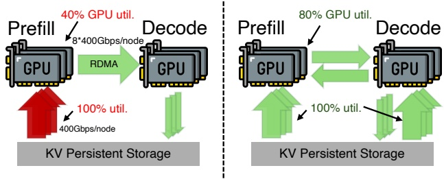

Figure 1: Existing bottleneck (left) and DualPath (right).

This paradigm shift in applications has driven a significant transformation in LLM inference workloads: from traditional human-LLM interaction to human-LLM-environment interaction, called the agentic paradigm. The typical pattern of human-model interaction involves users providing input, engaging in a few rounds of interaction with the LLM, and consuming the results generated by the LLM. By contrast, an agentic LLM may interact with an external environment, through tools such as a web browser and Python interpreter, over dozens or even hundreds of turns. Although each individual tool call or feedback is short (often hundreds of tokens), the context accumulates across turns and can grow to extreme lengths. As a result, agentic workloads become highly I/O-bound: the multi-turn, short-append pattern leads to very high KV-Cache hit rates — typically ≥ 95% [7] — making the efficiency of KV-Cache loading, rather than pure computation, the dominant performance factor.

应用范式的这一转变, 让 LLM 推理负载发生了明显变化: 从传统的「人与 LLM」交互, 变成「人, LLM 与环境」的交互, 称为 Agent 范式. 典型的人机交互是: 用户给出输入, 与 LLM 来回几轮, 然后使用 LLM 生成的结果. 相比之下, Agent 式 LLM 会借助网页浏览器, Python 解释器这类工具与外部环境交互, 持续几十甚至上百轮. 每一次工具调用或反馈都很短 (常常只有几百个 token), 但上下文跨轮累积, 可以长到极端的程度. 于是 Agent 负载变得高度受 I/O 限制: 多轮, 短追加的模式带来极高的 KV-Cache 命中率 (通常 ≥ 95% [7]), 决定性能的主要因素变成 KV-Cache 的加载效率, 而不是单纯的计算.

To improve throughput under agentic workloads, existing LLM inference systems have converged on a common set of architectural patterns: layer-wise prefill [17, 50], prefill– decode (PD) disaggregation [37, 55, 58], and external KV-Cache storage [18, 30, 38]. In these systems, prefill engines load the KV-Cache in a layer-wise manner to accommodate as many requests as possible within a single batch. When prefill completes, decoding engines typically receive KV-Cache from prefill engines via a high-performance RDMA network. The decoding engines then generate tokens and store their KV-Cache in distributed storage to enable reuse across turns.

为提高 Agent 负载下的吞吐, 现有 LLM 推理系统收敛到一组共同的架构模式: 逐层 prefill [17, 50], prefill-decode (PD) 分离 [37, 55, 58], 以及外部 KV-Cache 存储 [18, 30, 38]. 在这些系统里, prefill 引擎逐层加载 KV-Cache, 以便在一个 batch 里容纳尽可能多的请求. prefill 结束后, decode 引擎通常经高性能 RDMA 网络从 prefill 引擎接收 KV-Cache, 随后生成 token, 并把自己的 KV-Cache 存进分布式存储, 供后续轮次复用.

However, this architecture also introduces a critical limitation. As shown in Figure 1, prefill engines must load large

<!-- page 2 of 17 -->

volumes of KV-Cache from remote storage. As a result, prefillside storage network bandwidth becomes the throughput bot tleneck of the entire system, even though decoding engines often have substantial unused storage network bandwidth.

但这种架构也带来一个关键局限. 如图 1 所示, prefill 引擎必须从远端存储加载大量 KV-Cache. 结果 prefill 侧的存储网络带宽成了整个系统的吞吐瓶颈, 尽管 decode 引擎往往还有大量没用上的存储网络带宽.

This imbalance reveals a fundamental inefficiency in existing designs: storage network bandwidth is unevenly utilized across engines. The bandwidth of prefill engines are persistently saturated, while decoding engines remain underutilized. Simply provisioning more bandwidth to prefill engines is costly and often impractical in general-purpose clusters. Therefore, it is promising to exploit and combine the available I/O bandwidth of all engines, rather than overloading prefill engines alone, to accelerate KV-Cache loading for agentic LLM workloads.

这种失衡暴露了现有设计的一个根本低效: 各引擎对存储网络带宽的利用很不均匀. prefill 引擎的带宽长期打满, decode 引擎却用得很少. 单纯给 prefill 引擎配更多带宽成本高, 在通用集群里也常常不现实. 因此, 更有希望的做法是把所有引擎可用的 I/O 带宽都利用起来并汇总使用, 而不是只压在 prefill 引擎上, 以此加速 Agent 负载的 KV-Cache 加载.

Prior studies have attempted to alleviate the KV-Cache loading bottleneck. Mooncake [38] caches KV-Cache in a distributed DRAM pool and employs an affinity-aware scheduler to maximize the DRAM KV-Cache hit rate. However, it cannot be used in memory-constrained scenarios, such as the rollout phase in RL, where DRAM is occupied to hold large training state that is offloaded from HBM. It is also not cost-effective in scenarios with enormous working sets (e.g., online serving), considering the cost comparison between DRAM and SSD. Other attempts reduce the amount of KV-Cache data to retrieve [19] and reduce the retrieval overhead [22, 51]. However, they do not solve the inherent inefficiency caused by storage I/O imbalance between different engines.

已有研究尝试缓解 KV-Cache 加载瓶颈. Mooncake [38] 把 KV-Cache 缓存在分布式 DRAM 池里, 并用亲和性感知的调度器尽量提高 DRAM 中 KV-Cache 的命中率. 但它用不了内存受限的场景, 例如 RL 的 rollout 阶段: 那时 DRAM 被从 HBM 卸载下来的大量训练状态占着. 在工作集极大的场景 (例如在线服务) 里, 考虑到 DRAM 与 SSD 的成本差, 它也不划算. 另一些工作减少需要取回的 KV-Cache 数据量 [19], 或降低取回开销 [22, 51]. 但这些都没有解决不同引擎之间存储 I/O 失衡造成的内在低效.

In this paper, we present DualPath, a new LLM inference system that rethinks KV-Cache loading in modern inference architectures for agentic workloads. The key insight behind DualPath is that KV-Cache loading does not have to be prefillcentric. While existing systems always load KV-Cache directly from storage into prefill engines, they cannot utilize the remote storage bandwidth of decoding engines. Dual-Path leverages this observation by enabling **dual-path KV-Cache loading**: in addition to the conventional storage-to-prefill path, KV-Cache can be loaded into decoding engines and then transferred to prefill engines via high-performance RDMA. By dynamically selecting between these paths, DualPath redistributes network load and alleviates prefill-side bandwidth pressure.

本文提出 DualPath, 一个新的 LLM 推理系统, 针对 Agent 负载重新设计现代推理架构里的 KV-Cache 加载. DualPath 背后的关键观察是: KV-Cache 加载不必以 prefill 为中心. 现有系统总是把 KV-Cache 从存储直接加载进 prefill 引擎, 于是用不上 decode 引擎的远端存储带宽. DualPath 利用这一点, 实现**双路径 KV-Cache 加载**: 除了传统的「存储到 prefill」路径, KV-Cache 还可以先加载进 decode 引擎, 再经高性能 RDMA 传给 prefill 引擎. 通过在两条路径之间动态选择, DualPath 重新分配网络负载, 减轻 prefill 侧的带宽压力.

Realizing this design raises two challenges. First, introducing an extra loading path introduces complex traffic patterns and potential interference with collective primitives in model execution, which can degrade overall performance if unman aged. Second, the system must decide online which loading path to use under dynamic and heterogeneous workloads, and ensure load balance across both GPUs and NICs simultaneously. To address these challenges, DualPath adopts (1) an optimized dual-path loading data path design, which introduces no inherent congestion under common P/D ratios,

(2) a NIC-centric traffic management approach to isolate KV-Cache traffic from latency-sensitive model inference communications, and (3) a dynamic scheduling policy that jointly balances computation and network utilization across prefill and decoding engines.

实现这一设计有两个挑战. 第一, 多一条加载路径会带来复杂的流量模式, 并可能干扰模型执行中的集合通信原语, 不加管理会拖累整体性能. 第二, 系统必须在动态, 异构的负载下在线决定用哪条加载路径, 并同时保证 GPU 和网卡两方面的负载均衡. 为此 DualPath 采用: (1) 优化过的双路径加载数据通路设计, 在常见的 P/D 比例下本身不会引入拥塞; (2) 以网卡为中心的流量管理, 把 KV-Cache 流量与延迟敏感的模型推理通信隔离开; (3) 动态调度策略, 在 prefill 与 decode 引擎之间同时均衡计算与网络利用率.

We implement DualPath on top of a modern inference stack and evaluate it using representative agentic workloads with long contexts and high cache reuse. Experiments show that DualPath significantly improves system throughput and the first token latency, while maintaining the latency between tokens. In agentic inference scenarios, DualPath increases end-to-end throughput by up to 1.87× for offline inference, and improves the online serving throughput by 1.96× on average.

我们在一套现代推理栈之上实现了 DualPath, 并用长上下文, 高缓存复用的代表性 Agent 负载评测. 实验表明, DualPath 明显提高了系统吞吐并降低了首 token 延迟, 同时保持 token 间延迟不变. 在 Agent 推理场景下, DualPath 把离线推理的端到端吞吐最多提高到 1.87 倍, 把在线服务吞吐平均提高到 1.96 倍.

In summary, this paper makes three contributions:

总结起来, 本文有三项贡献:

• We identify the I/O-bound nature of multi-turn, agentic LLM workloads and show that KV-Cache loading dominates system performance under modern LLM inference architectures.

• 我们指出多轮 Agent 式 LLM 负载受 I/O 限制的性质, 并说明在现代 LLM 推理架构下, KV-Cache 加载主导系统性能.

• We present DualPath, an inference system that introduces dual-path KV-Cache loading and leverages decoding-engine bandwidth to resolve prefill-side bottlenecks.

• 我们提出 DualPath, 一个引入双路径 KV-Cache 加载, 借用 decode 引擎带宽来解决 prefill 侧瓶颈的推理系统.

• We design and evaluate a workload-aware scheduling algorithm that dynamically balances computation and network resources, significantly improving balance on realistic workloads.

• 我们设计并评测了一种感知负载的调度算法, 动态均衡计算与网络资源, 在真实负载上明显改善了均衡程度.

## 2 BACKGROUND · 背景

## 2.1 LLM Inference Preliminary · LLM 推理基础

LLM inference is becoming one of the most important system workloads recently. Popular LLMs utilize decoder-only transformer architecture, comprising stacked blocks with attention layers and feed-forward networks (FFNs). Attention layers enable token interactions within requests, while FFNs process tokens independently. The model predicts subsequent tokens based on preceding ones, storing attention keys and values as KV-Cache in HBM to avoid recomputations.

LLM 推理近来正成为最重要的系统负载之一. 主流 LLM 采用 decoder-only Transformer 架构, 由堆叠的块组成, 每块含注意力层和前馈网络 (FFN). 注意力层让同一请求内的 token 相互作用, FFN 则独立处理每个 token. 模型根据前面的 token 预测后续 token, 并把注意力的 key 和 value 作为 KV-Cache 存在 HBM 里, 避免重复计算.

**PD-disaggregated Inference.** Prefill–decode (PD) disaggregation [37, 58] separates the prefill phase from the decode phase, assigning them to dedicated prefill engines (PEs) and decode engines (DEs), respectively. The two phases exhibit distinct compute and memory patterns: prefill is computeintensive and batched, while decode is memory-bound and latency-sensitive. With PD disaggregation, PEs load the hit KV-Cache and perform prefilling; then, they transfer the KV-Cache to DEs, which perform autoregressive decoding. This design reduces interference between phases, enables stagespecific optimizations, and improves scalability, making it

<!-- page 3 of 17 -->

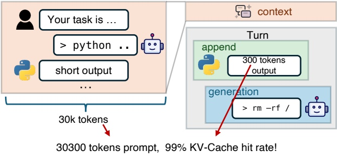

Figure 2: Agent trajectory example.

the de facto architecture for modern LLM serving. To support multi-turn conversations, the KV-Cache is often stored in distributed storage for reuse across turns.

**PD 分离推理.** prefill-decode (PD) 分离 [37, 58] 把 prefill 阶段和 decode 阶段拆开, 分别交给专用的 prefill 引擎 (PE) 和 decode 引擎 (DE). 两个阶段的计算与访存特征不同: prefill 是计算密集, 成批处理的; decode 受访存带宽限制, 对延迟敏感. 在 PD 分离下, PE 加载命中的 KV-Cache 并做 prefill, 然后把 KV-Cache 传给 DE, 由 DE 做自回归解码. 这种设计减少了阶段间干扰, 允许针对各阶段做专门优化, 也提高了可扩展性, 因此成为现代 LLM 服务事实上的标准架构. 为支持多轮对话, KV-Cache 常存放在分布式存储里, 供跨轮复用.

**Layerwise Prefill.** Long-context prefill is bottlenecked by HBM capacity, as both activations and the KV-Cache for the entire batch must reside within it, forcing limited batch sizes and leading to poor GPU utilization. LayerKV [50] and PrefillOnly [17] address this problem by exploiting the strong locality in prefill computations: each layer requires only its own layer-specific KV-Cache. Consequently, the KV-Cache can be allocated and freed per layer, and the GPU holds only one layer’s KV-Cache for the forward batch. This increases the effective batch size (in tokens) by approximately a factor equal to the number of layers, boosting prefill throughput.

**逐层 prefill.** 长上下文 prefill 受 HBM 容量限制: 整个 batch 的激活和 KV-Cache 都必须放在 HBM 里, batch 大小因此受限, GPU 利用率低. LayerKV [50] 和 PrefillOnly [17] 利用 prefill 计算的强局部性解决这个问题: 每一层只需要本层的 KV-Cache. 于是 KV-Cache 可以按层分配, 按层释放, GPU 上只保留当前前向 batch 一层的 KV-Cache. 这使有效 batch 大小 (按 token 计) 大约扩大到层数那么多倍, 提高了 prefill 吞吐.

## 2.2 Agentic Use of LLMs · LLM 的 Agent 式使用

LLMs increasingly power agentic applications that perform multi-turn reasoning and interact with an environment (via e.g., terminal commands, code execution, or asking for human feedback) over long sessions. As shown in Figure 2, in a typical turn, the model receives a prompt composed by the previous context plus some newly appended tokens (often tool output or user input) and generates the next action or response. A single agent run is a trajectory of dozens or even hundreds of turns: the context grows turn-by-turn and can reach up to one million tokens [4, 11]. Because most of the context, typically >95% tokens in our traces, is reused across rounds, the vast majority of tokens in each round can hit the KV-Cache; only the newly appended context needs prefill computation. Due to the extreme length of agent trajectories, DRAM and HBM-based KV-Cache storage like Mooncake [38] can only store a small proportion of KV-Caches, necessitating the use of larger yet cheaper external SSD-based KV-Cache storage [13].

LLM 越来越多地驱动 Agent 应用: 在长会话中做多轮推理, 并与环境交互 (例如执行终端命令, 运行代码, 请求人类反馈). 如图 2 所示, 典型的一轮里, 模型收到的 prompt 由之前的上下文加上一些新追加的 token (通常是工具输出或用户输入) 组成, 模型据此生成下一个动作或回复. 一次 Agent 运行是一条几十甚至上百轮的轨迹: 上下文逐轮增长, 最长可到一百万 token [4, 11]. 由于大部分上下文 (在我们的 trace 里通常超过 95% 的 token) 跨轮复用, 每轮绝大多数 token 都能命中 KV-Cache, 只有新追加的部分需要 prefill 计算. 由于 Agent 轨迹极长, Mooncake [38] 这类基于 DRAM 和 HBM 的 KV-Cache 存储只能放下很小一部分 KV-Cache, 因此需要容量更大, 价格更低的外部 SSD 型 KV-Cache 存储 [13].

The agentic LLM inference workload is also prevalent in agent LLM training, which often adopts reinforcement learning (RL) approaches. In a typical RL training loop, the agent LLM first undergoes a rollout phase, where it is prompted to generate a large number of multi-step agent trajectories.

These trajectories are then scored by a separate reward model. Finally, the LLM parameters are updated to increase the likelihood of high-scoring outputs and reduce the likelihood of low-scoring ones. During the rollout phase, substantial data (like reward model and optimizer states) is offloaded to host DRAM, further constraining the available DRAM for KV-Cache. This reinforces the need for external, high-capacity KV-Cache storage that can accommodate long agentic rollout contexts efficiently.

Agent 式 LLM 推理负载在 Agent LLM 的训练里也很常见, 这类训练常用强化学习 (RL). 典型的 RL 训练循环里, Agent LLM 先经历 rollout 阶段, 按提示生成大量多步 Agent 轨迹; 随后由单独的奖励模型给轨迹打分; 最终更新 LLM 参数, 提高高分输出的似然, 降低低分输出的似然. rollout 阶段有大量数据 (如奖励模型和优化器状态) 被卸载到主机 DRAM, 留给 KV-Cache 的 DRAM 更少. 这进一步说明需要外部的大容量 KV-Cache 存储, 能高效容纳长 Agent rollout 的上下文.

## 2.3 Modern AI Data Center Architecture · 现代 AI 数据中心架构

Modern AI data centers are purpose-built logical supercomputers engineered to handle large-scale generative AI training and inference workloads. For example, in a standard NVIDIA DGX SuperPOD [32], each node is equipped with 8 Hopper GPUs interconnected via high-speed NVLink. Each GPU is paired with a dedicated 400 Gbps compute NIC (CNIC, also known as east-west NIC), which maximizes inter-node communication bandwidth. Independent of the compute fabric, each node also features a storage NIC (SNIC, also known as south-north NIC) up to 400 Gbps, providing fast access to datasets, model checkpoints, and on-disk KV cache.

现代 AI 数据中心是专门建造的逻辑超级计算机, 用来承担大规模生成式 AI 的训练与推理负载. 以标准的 NVIDIA DGX SuperPOD [32] 为例, 每个节点配 8 块 Hopper GPU, 由高速 NVLink 互连. 每块 GPU 配一块专用的 400 Gbps 计算网卡 (CNIC, 也叫东西向网卡), 以最大化节点间通信带宽. 与计算网络相互独立, 每个节点还有一块最高 400 Gbps 的存储网卡 (SNIC, 也叫南北向网卡), 用于快速访问数据集, 模型 checkpoint 和落盘的 KV cache.

A fundamental principle of this architecture is that the compute network and the storage network are isolated from each other [55]. This separation is essential to maximize both storage and application performance. By isolating highintensity east-west compute traffic between GPUs from storage traffic, the architecture prevents interference between them, and drastically reduces compute communication latency. This design also ensures that the inter-GPU communication remains highly reliable and predictable even when performing data-intensive tasks such as reading large datasets or writing multi-terabyte model checkpoints.

这种架构的一条基本原则是计算网络和存储网络相互隔离 [55]. GPU 之间高强度的东西向计算流量与存储流量分开后, 两者不再争用同一网络, 计算通信延迟随之降低. 即使系统正在读取大型数据集或写入数 TB 模型 checkpoint, GPU 间通信也能保持较稳定、可预测的表现.

## 3 BOTTLENECK & MOTIVATION · 瓶颈与动机

We observe severe GPU underutilization during agentic inference tasks. Our investigation reveals that KV-Cache loading speed is the bottleneck due to the limited bandwidth of the single storage NIC on each node. Analysis demonstrates that three decisive factors jointly cause this bottleneck, as discussed below.

我们观察到 Agent 推理任务中 GPU 利用率严重不足. 调查发现, 由于每个节点只有一块存储网卡, 带宽有限, KV-Cache 的加载速度成了瓶颈. 分析表明, 这一瓶颈由三个决定性因素共同造成, 下面逐一讨论.

First, agentic workloads exhibit high KV-Cache hit rates, which require more I/O and less computation, thus creating a severe I/O bottleneck. Agentic workloads are naturally long-context, short-append, and multi-turn. On each turn, the GPU needs to read the KV-Cache of the entire context from persistent storage and perform prefill computation for appended tokens. Our trace collected from representative coding tasks shows the mean number of rounds is 157, demonstrating the tendency of LLMs to engage in multi-turn interactions. The average context length is 32.7k, while the

<!-- page 4 of 17 -->

| Model | GB/PFLOP (16K-64K) |
| --- | --- |
| Qwen2.5-32B [42] (FP16) | 117-267 |
| GPT-OSS-120B [35] | 47-95 |
| Qwen3-235B-A22B [43] | 39-60 |
| DeepSeek-V3.2 660B [16] | 13-36 |
| DeepSeek-V3 660B [15] | 4.8-5.8 |

append length mean is only 429, which means a KV-Cache hit rate of 98.7%. In such a scenario, the cache-compute ratio, defined as the ratio of KV-Cache to load and the computation needed, is approximately 22 GB/PFLOP for DeepSeek-V3.2 [16], posing a significant bottleneck on storage bandwidth. Note that the KV-Cache size of DeepSeek MLA model is already highly optimized; for models with larger KV-Cache sizes (see Table 1), the situation is even worse. The ratio of DeepSeek-V3.2 is higher than DeepSeek-V3 [15], benefiting from its sparse attention design, lowering computation demands.

第一, Agent 负载的 KV-Cache 命中率高, 需要更多 I/O, 更少计算, 因而形成严重的 I/O 瓶颈. Agent 负载天然是长上下文, 短追加, 多轮的. 每一轮, GPU 都要从持久存储读回整段上下文的 KV-Cache, 只对追加的 token 做 prefill 计算. 我们从代表性编程任务里采集的 trace 显示, 平均轮数是 157, 说明 LLM 倾向于多轮交互. 平均上下文长度是 32.7k, 而平均追加长度只有 429, 即 KV-Cache 命中率 98.7%. 在这种场景下, cache-compute 比 (定义为需要加载的 KV-Cache 量与所需计算量之比) 对 DeepSeek-V3.2 [16] 约为 22 GB/PFLOP, 给存储带宽带来很大压力. 要注意 DeepSeek MLA 模型的 KV-Cache 体积已经高度优化过; 对 KV-Cache 更大的模型 (见表 1), 情况更糟. DeepSeek-V3.2 的这一比值高于 DeepSeek-V3 [15], 原因是稀疏注意力设计降低了计算需求.

> **看表:** 表 1 和正文的「约 22 GB/PFLOP」能不能从模型配置复算出来, 分子分母各算了什么?
> 答: 文中没有给出口径, 以下是按公开配置推出的说法. 分子取整段上下文的 KV 字节, 分母取追加 token 的前向 FLOPs. DeepSeek-V3.2 按 FlashMLA 的 FP8 布局, 每 token 每层主 KV 656 字节, 61 层约 40KB; 每个追加 token 的计算取线性层 $2\times 37\text{B}$, DSA 主注意力每个 query 只看 2048 个 token, 每层约 $2\times2048\times(576+512)\times128$ FLOPs, 再加 indexer 对全部上下文的打分 $2\times64\times128\times L_{ctx}$ 每层. 取 $L_{ctx}=32.7\text{k}$, 追加 429 token, 得 1.31GB 对 0.061 PFLOP, 约 21.6 GB/PFLOP; 同样算法在 16K 与 64K 得 12.2 与 35.1, 与表 1 的 13-36 对得上. Qwen2.5-32B 按 GQA 8 个 KV 头, 128 维, 64 层, FP16 算出 115.8 到 265.4, 与表 1 的 117-267 也吻合. 吻合的前提是追加长度固定为 429 且不计 indexer 的 key cache; 把 indexer 每 token 每层 132 字节算进去, 32.7k 处会变成约 26. 这也说明为什么 V3.2 的比值随上下文增长: 主注意力计算被 top-k 封顶, 要读的 KV 却随长度线性增长.

Second, the hardware evolution trend is not well suited for agentic inference workloads. In recent years, network bandwidth and HBM capacity have lagged behind the growth of GPU FLOPS, which drives us to run into memory and communication walls under agentic workloads. As shown in Figure 3, from NVIDIA Ampere to Blackwell, the I/Ocompute ratio decreases by 14.4×. Low NIC bandwidth limits KV-Cache loading speed, making GPUs idle. In addition, small HBM capacity limits the token batch size for GPU kernels [10, 14, 27, 54] to compute at the same time, hindering full utilization of compute units such as Tensor Core [17].

第二, 硬件演进趋势与 Agent 推理负载不太匹配. 近年来网络带宽和 HBM 容量的增长落后于 GPU FLOPS 的增长, 使我们在 Agent 负载下撞上内存墙和通信墙. 如图 3 所示, 从 NVIDIA Ampere 到 Blackwell, I/O 与计算之比下降了 14.4 倍. 网卡带宽低限制了 KV-Cache 加载速度, GPU 只能空等. 另外, HBM 容量小限制了 GPU kernel [10, 14, 27, 54] 同时计算的 token batch 大小, Tensor Core 这类计算单元难以被充分利用 [17].

Third, existing LLM inference systems exhibit severe storage network utilization imbalance across different engine types. In prevalent PD-disaggregated systems, the KV-Cache for hit tokens is loaded exclusively by prefill engines directly from remote storage. This design centralizes all storage I/O pressure on the prefill-side SNICs, while the SNICs on decode engines remain largely idle. Consequently, the aggregate storage network bandwidth cannot be fully harnessed.

第三, 现有 LLM 推理系统在不同类型引擎之间的存储网络利用严重失衡. 在主流的 PD 分离系统里, 命中 token 的 KV-Cache 只由 prefill 引擎直接从远端存储加载. 这种设计把全部存储 I/O 压力集中到 prefill 侧的 SNIC 上, decode 引擎的 SNIC 大部分时间闲置. 结果存储网络的总带宽无法被充分利用.

The above analysis demonstrates that the fundamental performance issue for agentic inference on PD-disaggregated architecture is the high I/O demand for KV-Cache retrieval and unbalanced storage network bandwidth utilization across inference engines. Meanwhile, we observe that the network traffic of the compute network, which has much larger aggregate bandwidth than the storage network, exhibits an intermittent pattern: collective operations used in model inference burst in sub-millisecond intervals. Therefore, an

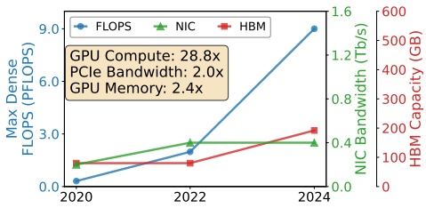

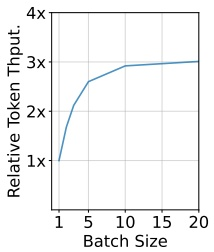

Figure 3: Left: Hardware trends of NVIDIA GPUs. Right: Relative token throughput with varying request batch size (each request has 30K context with 300 tokens appended).

opportunity naturally emerges: we can utilize the SNIC bandwidth of decode nodes to load KV-Cache from storage, and transfer it back to the prefill nodes, utilizing the spare bandwidth of the faster compute network.

以上分析说明, PD 分离架构上 Agent 推理的根本性能问题在于: KV-Cache 读取的 I/O 需求高, 而各推理引擎对存储网络带宽的利用不均衡. 与此同时, 我们观察到计算网络 (总带宽远大于存储网络) 的流量呈间歇模式: 模型推理用到的集合通信在亚毫秒级的时间间隔内突发. 于是一个机会自然出现: 可以用 decode 节点的 SNIC 带宽从存储加载 KV-Cache, 再借更快的计算网络的空闲带宽把它传回 prefill 节点.

> **核对:** 图 3 左的「GPU Compute: 28.8x」是同一精度下的比较吗? 14.4 倍从哪来?
> 答: 14.4 就是 $28.8/2.0$, 即 FLOPS 增长倍数除以网卡 (图中同时标 PCIe) 带宽增长倍数. 28.8 这个数对得上 $9.0/0.3125$: 0.3125 PFLOPS 是 A100 的稠密 BF16 峰值, 9 PFLOPS 是 B200 的稠密 FP4 峰值, 2022 年那一点约 2 PFLOPS 对应 H100 的稠密 FP8. 图中三个点各取当代最低精度, 所以 28.8 倍里有一部分来自精度从 16 位降到 4 位, 同精度比较的增长倍数会小很多. 文中没有写明精度口径. 结论方向不变, 但 14.4 倍是偏大的上限.

## 4 DUALPATH SYSTEM OVERVIEW · DualPath 系统概览

To break the prefill-side storage I/O bottleneck, we propose a **dual-path loading** architecture that fundamentally rethinks how KV-Cache is retrieved in PD-disaggregated inference. Based on this architecture, we design and implement DualPath. DualPath adopts two widely-adopted techniques demonstrated in §2: (1) **PD Disaggregation** [37, 58], which separates prompt and decode processing for better efficiency. (2) **Layerwise prefill**, which avoids HBM bottlenecks recognized by LayerKV [50] and PrefillOnly [17] on prefill engines and improves GPU utilization.

为打破 prefill 侧的存储 I/O 瓶颈, 我们提出**双路径加载**架构, 从根本上重新设计 PD 分离推理中 KV-Cache 的读取方式. 基于这一架构, 我们设计并实现了 DualPath. DualPath 采用 §2 介绍过的两项广泛使用的技术: (1) **PD 分离** [37, 58], 把 prompt 处理与 decode 拆开以提高效率; (2) **逐层 prefill**, 避免 LayerKV [50] 和 PrefillOnly [17] 指出的 prefill 引擎 HBM 瓶颈, 提高 GPU 利用率.

Our system consists of the following components:

系统由以下组件构成:

• **Inference Engines.** Each engine manages one GPU. Engines are categorized into prefill engines (PEs) for prefill and decoding engines (DEs) for decode.

• **推理引擎.** 每个引擎管理一块 GPU. 引擎分为负责 prefill 的 prefill 引擎 (PE) 和负责 decode 的 decode 引擎 (DE).

• **Traffic Manager (§5).** Each engine contains a traffic manager to conduct (1) Host-Device memory copies (H2D & D2H), (2) KV-Cache transfers between PEs and DEs, and (3) KV-Cache reads/writes from/to storage via the storage NIC. We adopt a CNIC-centric traffic management approach, detailed in §5, to prevent KV-Cache traffic from affecting communications in model inference.

• **流量管理器 (§5).** 每个引擎内含一个流量管理器, 负责 (1) 主机与设备间的内存拷贝 (H2D 与 D2H), (2) PE 与 DE 之间的 KV-Cache 传输, (3) 经存储网卡对存储读写 KV-Cache. 我们采用以 CNIC 为中心的流量管理方式 (详见 §5), 防止 KV-Cache 流量影响模型推理中的通信.

• **Request Scheduler (§6).** A central scheduler that receives client requests and distributes them across engines. It is also responsible for dynamically distributing data traffic between two paths (Figure 4).

• **请求调度器 (§6).** 一个中心调度器, 接收客户端请求并把请求分发到各引擎. 它还负责在两条路径之间动态分配数据流量 (图 4).

## 4.1 Dual-Path Loading · 双路径加载

In addition to the conventional storage-to-prefill path, DualPath introduces a novel storage-to-decode path, allowing KV-Cache to be loaded first into a decode engine and then transferred to the prefill engine via high-bandwidth RDMA over the compute network. By dynamically distributing load across both paths, the system aggregates the storage NIC

<!-- page 5 of 17 -->

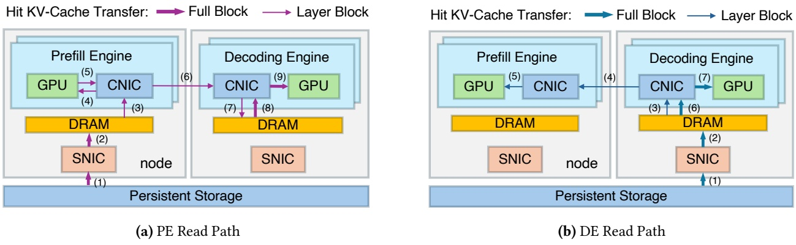

Figure 4: Dual-path loading illustration. The scheduler dynamically distributes data traffic between the two paths.

bandwidth of all engines — including otherwise-idle decode side NICs — and eliminates the asymmetric bandwidth saturation that limits existing systems. This approach transforms the storage I/O from a single-bottleneck resource into a glob ally pooled and schedulable capacity. The exact data flows of the dual-path are described below.

除了传统的「存储到 prefill」路径, DualPath 引入一条新的「存储到 decode」路径: KV-Cache 先加载进某个 decode 引擎, 再经计算网络用高带宽 RDMA 传给 prefill 引擎. 通过在两条路径之间动态分配负载, 系统把所有引擎的存储网卡带宽 (包括原本闲着的 decode 侧网卡) 汇总起来, 消除限制现有系统的不对称带宽饱和. 这种做法把存储 I/O 从一个单点瓶颈资源, 变成全局汇总, 可调度的容量. 双路径的具体数据流如下.

To implement dual-path loading, DualPath allocates a small amount of DRAM as buffers on each PE and DE, called PE buffer and DE Buffer.

为实现双路径加载, DualPath 在每个 PE 和 DE 上分配少量 DRAM 作缓冲区, 称为 PE buffer 和 DE buffer.

**Prefill PE read path.** First, the KV-Caches of hit tokens are read from persistent storage into the PE buffer (as Label 1 and 2 shown in Figure 4a). Before the computation of an attention layer, those KV-Caches of that layer are transferred to PE HBM (3 and 4) to compute the KV-Cache of cache-miss prompt tokens. Then, all KV-Caches of both hit and miss tokens are transferred to the DE buffer to form the complete prompt KV-Cache (5-7). This process (3-7) repeats 𝑛𝑙𝑎𝑦𝑒𝑟 times. During the prefill forward pass, transfers overlap with computation.

**Prefill 阶段的 PE 读路径.** 先, 命中 token 的 KV-Cache 从持久存储读入 PE buffer (图 4a 的标号 1 和 2). 在计算某个注意力层之前, 把这一层的 KV-Cache 传到 PE 的 HBM (3 和 4), 用来计算未命中的 prompt token 的 KV-Cache. 然后把命中与未命中 token 的全部 KV-Cache 传到 DE buffer, 拼成完整的 prompt KV-Cache (5-7). 过程 (3-7) 重复 $n_{layer}$ 次. prefill 前向过程中, 传输与计算重叠.

**Prefill DE read path.** The KV-Caches of hit tokens are first read into DE buffer (as Label 1 and 2 shown in Figure 4b). During PE prefill, KV-Cache for the corresponding layer is read from the DE buffer, also overlapping with computation (3-5). This process repeats $n _ { l a y e r }$ times. After a layer’s computation completes, only the KV-Caches of miss tokens are transferred to DE buffer and merged with the existing hit token KV-Cache.

**Prefill 阶段的 DE 读路径.** 命中 token 的 KV-Cache 先读入 DE buffer (图 4b 的标号 1 和 2). PE 做 prefill 时, 从 DE buffer 读取对应层的 KV-Cache, 同样与计算重叠 (3-5). 这一过程重复 $n_{layer}$ 次. 一层计算完成后, 只把未命中 token 的 KV-Cache 传到 DE buffer, 与已有的命中 token KV-Cache 合并.

**Decode Phase.** After receiving the complete prompt KV-Cache in DE buffer (including loaded KV-Cache via PE read path and the KV-Cache of newly appended tokens), the decode phase begins. The DE first allocates HBM and performs host-to-device (H2D) transfers (Label 8 and 9 in Figure 4a; Label 6 and 7 in Figure 4b), then releases CPU memory before starting decode. The design of DE buffer imposes bandwidth pressure on DRAM and CNIC (an extra H2D), which could

be avoided by directly bypassing it via GPU Direct RDMA. However, since the generation length is typically short in this scenario, time-to-first-token (TTFT) accounts for a non-negligible portion of the total end-to-end request time. Introducing DE buffer helps reduce GPU memory usage. During decode, whenever a full block of tokens (e.g., 64 tokens) is accumulated, it is immediately persisted to disk.

**Decode 阶段.** DE buffer 收齐完整的 prompt KV-Cache (包括经 PE 读路径加载的 KV-Cache 和新追加 token 的 KV-Cache) 后, decode 阶段开始. DE 先分配 HBM 并做主机到设备 (H2D) 的传输 (图 4a 的标号 8 和 9; 图 4b 的标号 6 和 7), 然后释放 CPU 内存, 再开始 decode. DE buffer 的设计给 DRAM 和 CNIC 增加了带宽压力 (多一次 H2D), 用 GPUDirect RDMA 直接绕过它本可以避免. 但这一场景里生成长度通常很短, TTFT 在请求端到端总时间里占不小的比例, 引入 DE buffer 有助于减少 GPU 显存占用. decode 期间, 每攒满一个 token 块 (例如 64 个 token), 就立即持久化到磁盘.

**Different Block Layouts.** We adopt two different block layouts: Full Block and Layer Block, which contain all layers and a single layer, respectively. Detailed layout can be found in §A.5. For all interactions with storage, we adopt Full Blocks. In the PE read case, KV-Cache loading to PE HBM and transfer to DE Buffer occur in a layerwise streaming fashion, both using Layer Blocks. Similarly, for the DE read path, transfers from the DE Buffer to the PE HBM use Layer Blocks.

**不同的块布局.** 我们采用两种块布局: Full Block 和 Layer Block, 分别包含全部层和单独一层. 具体布局见 §A.5. 与存储的所有交互都用 Full Block. 在 PE 读路径中, KV-Cache 加载到 PE HBM 和传到 DE buffer 都以逐层流式方式进行, 都用 Layer Block. 同样, DE 读路径中从 DE buffer 到 PE HBM 的传输也用 Layer Block.

## 4.2 Bottleneck-Free Analysis · 无瓶颈分析

We demonstrate that the system can fully saturate all storage NICs without introducing compute-NIC or DRAM bottlenecks, under most reasonable P/D ratios. We assume a well-configured PCIe topology (each pair of GPU–NIC is under the same PCIe switch), load-balanced task scheduling, no congestion on the computation network, and that storage read bandwidth is fully utilized.

我们说明, 在多数合理的 P/D 比例下, 系统可以把所有存储网卡跑满, 而不在计算网卡或 DRAM 上引入新瓶颈. 假设: PCIe 拓扑配置良好 (每对 GPU 与网卡挂在同一个 PCIe 交换机下), 任务调度负载均衡, 计算网络无拥塞, 存储读带宽被充分利用.

**Notation.** Let 𝑃 and 𝐷 denote the number of prefill and decode nodes, respectively. Each node has 𝑔 GPUs, each with one compute NIC of bandwidth 𝐵. The storage bandwidth per machine is 𝑠 × 𝐵 (shared by all engines on that machine); 𝑀 is the memory bandwidth per machine.

**记号.** 令 $P$ 和 $D$ 分别表示 prefill 节点数和 decode 节点数. 每个节点有 $g$ 块 GPU, 每块 GPU 配一块带宽为 $B$ 的计算网卡. 每台机器的存储带宽为 $s\times B$ (由该机器上所有引擎共享); $M$ 是每台机器的内存带宽.

**Traffic per PE-DE pair.** We assume that the storage read bandwidth is fully utilized and that task scheduling is loadbalanced. Under load balancing, storage NIC bandwidth is evenly shared. The traffic per pair for the PE read path (all steps in Figure 4a) is $T _ { p } = B s / ( D g ^ { 2 } )$ ; for the DE read path

<!-- page 6 of 17 -->

(Figure 4b) it is $T _ { c } = B s / ( P g ^ { 2 } )$ . Link traffic is the sum over all pairs using that link.

**每对 PE-DE 的流量.** 假设存储读带宽被充分利用, 任务调度负载均衡. 负载均衡时, 存储网卡带宽被均匀分摊. PE 读路径 (图 4a 的所有步骤) 每对的流量为 $T_p=Bs/(Dg^2)$; DE 读路径 (图 4b) 每对的流量为 $T_c=Bs/(Pg^2)$. 一条链路上的流量是使用该链路的所有 PE-DE 对的流量之和.

**PE CNIC Bandwidth Analysis.** For PE CNIC, loopback traffic (i.e., H2D and D2H that does not traverse switches) exists, so the total traffic on the PCIe side is always greater than or equal to the switch-direction traffic, regardless of read or write operations. Therefore, we only need to compute the pressure on the PCIe side. Read operations include PE paths (3) and (5), with total traffic over all pairs:

**PE 的 CNIC 带宽分析.** PE 的 CNIC 上存在回环流量 (即不经过交换机的 H2D 和 D2H), 所以不论读还是写, PCIe 一侧的总流量总是大于等于交换机方向的流量. 因此只需计算 PCIe 一侧的压力. 读操作包括 PE 路径的 (3) 和 (5), 所有 PE-DE 对的总流量为:

$$
2 \times T _ {p} \times D g = 2 B s / g \leq B\tag{1}
$$

Since $s \leq g$ always holds in practice, the read direction is always bottleneck-free. Write operations include PE path (4) and DE path (5), with total traffic:

由于实际中 $s\le g$ 总是成立, 读方向永远不会成为瓶颈. 写操作包括 PE 路径的 (4) 和 DE 路径的 (5), 总流量为:

$$
(T _ {p} + T _ {c}) \times D g = B s / g \times (1 + D / P) \leq B\tag{2}
$$

Then, we obtain:

由此得到:

$$
P / D \geq \frac {s}{g - s}\tag{3}
$$

**DE CNIC Bandwidth Analysis.** For DE CNIC, read operations include PE path 8 and DE paths 3/6, with traffic:

**DE 的 CNIC 带宽分析.** 对 DE 的 CNIC, 读操作包括 PE 路径的 8 和 DE 路径的 3 与 6, 流量为:

$$
\left(T _ {p} + T _ {c} \times 2\right) \times P g = s / g \times (P / D + 2) \times B \leq B\tag{4}
$$

Then, we obtain:

由此得到:

$$
P / D \leq \frac {g - 2 s}{s}\tag{5}
$$

Write operations include PE paths 7/9 and DE path $^ { 7 , }$ with traffic:

写操作包括 PE 路径的 7 与 9, 以及 DE 路径的 7, 流量为:

$$
(2 T _ {p} + T _ {c}) \times P g \leq B\tag{6}
$$

This implies:

这意味着:

$$
P / D \leq \frac {g - s}{2 s}\tag{7}
$$

**DRAM Pressure Analysis.** DRAM is half-duplex, so we sum the read and write pressures. For PE MEM, the pressure is 2𝑠𝐵, which generally does not exceed memory bandwidth. For DE MEM, following the similar analysis above, we can get the pressure is $\left( 3 + 2 P / D \right)$ 𝐵𝑠. Requiring the DE MEM pressure to be less than or equal to $M ,$ we obtain:

**DRAM 压力分析.** DRAM 是半双工的, 所以把读写压力相加. PE 内存的压力是 $2sB$, 一般不会超过内存带宽. 对 DE 内存, 按与上面类似的分析, 压力为 $(3+2P/D)Bs$. 要求 DE 内存压力不超过 $M$, 得到:

$$
P / D \leq \frac {M / B s - 3}{2}\tag{8}
$$

**Summary.** Combining all the above analyses, we have:

**小结.** 综合以上分析, 有:

$$
\frac {s}{g - s} \leq P / D \leq \min \left\{\frac {g - 2 s}{s}, \frac {g - s}{2 s}, \frac {M / B s - 3}{2} \right\}.\tag{9}
$$

For $( g = 8 , s = 1 )$ with 𝑀 ≈ 500 GB/s and $B s \approx 5 0 \; \mathrm { G B / s } ,$ , the bottleneck-free range is $\textstyle { \frac { 1 } { 7 } }   \leq \operatorname { P } / \operatorname { D }   \leq   { \frac { 7 } { 2 } }$ , which covers most practical configurations.

取 $g=8$, $s=1$, $M\approx 500$ GB/s, $Bs\approx 50$ GB/s, 无瓶颈区间为 $1/7\le P/D\le 7/2$, 覆盖了多数实际配置.

> **拆开:** 式 (4) 里 $T_c$ 为什么乘 2, 式 (6) 里 $T_p$ 为什么乘 2? 各项对应图 4 的哪根箭头?
> 答: 按图 4 的编号逐项对. 先看 PE 的 CNIC: 式 (1) 的系数 2 来自同一份命中 KV 在 PE 的 CNIC 上被读两次, (3) 从 PE buffer 读出做 H2D, (5) 从 PE 的 HBM 读出发往 DE; 式 (1) 化简后是 $s\le g/2$, 比正文写的 $s\le g$ 更严, 实验的 $g=8$, $s=1$ 离这个界很远. DE 的 CNIC 读方向: PE 路径只有 (8), 即把 DE buffer 里已拼好的 KV 读出做 H2D, 计一次 $T_p$; DE 路径有 (3) 把 DE buffer 里的命中 KV 读出发给 PE, 和 (6) 读出做 H2D, 同一份数据读两次, 所以 $2T_c$. DE 的 CNIC 写方向: PE 路径有 (7) 把从 PE 收到的 KV 写进 DE buffer, 和 (9) H2D 写进 DE 的 HBM, 计 $2T_p$; DE 路径只有 (7) H2D 写进 HBM, 计 $T_c$ (未命中 token 的回传量相对命中部分可以忽略, 式中没计). 每块 DE GPU 与 $Pg$ 块 PE GPU 成对, 乘上 $Pg$ 即得式 (4) 和式 (6). 代入 $g=8$, $s=1$: 式 (5) 给 6, 式 (7) 给 3.5, 式 (8) 给 $(10-3)/2=3.5$, 上界由 DE 的 CNIC 写方向和 DE 内存同时卡在 3.5. 这些结论都建立在两侧存储网卡同时读满, 请求均匀分到所有 PE-DE 对上的假设之上.

## 4.3 Practical Challenges · 实际挑战

The dual-path architecture fundamentally reorients data movement: KV-Cache can be loaded either directly from storage into prefill engines or indirectly via decode engines, thereby aggregating storage bandwidth across all engines and breaking the prefill-side I/O bottleneck. However, realizing this high-level design in a practical system introduces three interrelated challenges. We briefly outline these challenges below and refer the reader to the corresponding sections for details.

双路径架构从根本上改变了数据移动的方向: KV-Cache 既可以从存储直接加载进 prefill 引擎, 也可以经 decode 引擎间接加载, 从而汇总所有引擎的存储带宽, 打破 prefill 侧的 I/O 瓶颈. 但在实际系统里实现这一高层设计, 会遇到三个相互关联的挑战. 下面简述, 细节见对应章节.

**Fine-grained data transfer (§5).** The layer-wise execution paradigm, while essential for overcoming HBM capacity limits, fragments the KV-Cache into numerous fine-grained blocks [37]. Transferring this multitude of fine-grained data chunks between storage, host DRAM, and GPU HBM must incur minimal overhead and seamlessly overlap with computation to realize throughput gains.

**细粒度数据传输 (§5).** 逐层执行的方式对克服 HBM 容量限制必不可少, 但它把 KV-Cache 切成大量细粒度的块 [37]. 要拿到吞吐收益, 在存储, 主机 DRAM 和 GPU HBM 之间搬运这些大量细碎数据块时, 开销必须很小, 并且要与计算无缝重叠.

**Traffic isolation (§5).** The complex data path in DualPath introduces additional KV-Cache transfer traffic on both the compute network and PCIe links. A primary concern is that this traffic may interfere with existing latency-sensitive collective communication operations essential for model execution — such as AllToAll in expert parallel [56] and ReduceScatter/AllGather in tensor/context parallel. Since these collective communications are critical to end-to-end inference latency, a key challenge lies in exploiting spare I/O bandwidth without degrading model inference performance.

**流量隔离 (§5).** DualPath 的数据通路在计算网络和 PCIe 链路上增加了 KV-Cache 传输流量. 这些流量可能干扰对延迟敏感的模型集合通信, 包括专家并行的 AllToAll [56]、张量并行或上下文并行的 ReduceScatter/AllGather, 进而拉长端到端推理时间. 因此系统需要利用空闲 I/O 带宽, 同时避免影响模型通信.

**Dynamic load balancing (§6).** As we are adopting two different paths for KV-cache loading, the system must promptly decide which path to use for each request. A naive policy could overload one path, recreating the original bottleneck. The traffic scheduler must balance multiple factors in realtime: storage NIC queue lengths, computational load on GPUs, and request workload characteristics.

**动态负载均衡 (§6).** 既然 KV-Cache 加载有两条路径, 系统就必须及时为每个请求决定走哪条. 朴素的策略可能让某一条路径过载, 重新造出原来的瓶颈. 流量调度器必须实时权衡多个因素: 存储网卡队列长度, GPU 上的计算负载, 以及请求本身的负载特征.

## 5 CNIC-CENTRIC TRAFFIC MANAGER · 以 CNIC 为中心的流量管理器

Modern LLM inference systems employ a range of advanced data transfer technologies — such as on-chip CUDA copy engine and GPUDirect Storage [34] — to move data efficiently between storage, host memory, and GPU HBM. However, all these mechanisms can interfere with latency-sensitive collective communications (e.g., EP AllToAll) during model execution. This arises for two primary reasons: (1) such transfer technologies often operate over separate paths that do not share the same QoS controls as the compute network, and (2) existing GPUs do not support PCIe QoS [39], making it difficult to shield model inference communication from other traffic contending for PCIe bandwidth. Additionally, because the collective communications occur in rapid, sub-millisecond-level bursts, it is impractical to rely on a

<!-- page 7 of 17 -->

software-based traffic shaper to interleave lower-priority I/O operations between these high-priority traffic windows.

现代 LLM 推理系统用多种先进的数据传输技术 (例如片上 CUDA copy engine 和 GPUDirect Storage [34]) 在存储, 主机内存与 GPU HBM 之间高效搬运数据. 但这些机制都可能干扰模型执行期间对延迟敏感的集合通信 (例如 EP 的 AllToAll). 原因主要有两个: (1) 这些传输技术往往走独立的通路, 与计算网络不共享同一套 QoS 控制; (2) 现有 GPU 不支持 PCIe QoS [39], 很难把模型推理通信与其他争抢 PCIe 带宽的流量隔开. 此外, 集合通信以亚毫秒级的快速突发出现, 靠软件流量整形器把低优先级 I/O 插进这些高优先级流量窗口之间的空隙, 并不现实.

To address this, we propose a **CNIC–centric data transfer** approach which is widely adopted in our production deployment: all data traffic in or out of a GPU, including local H2D/D2H copy, must go through the GPU’s paired CNIC with a GPUDirect RDMA [33] data path. By consolidating all traffic onto the compute network, we can leverage the native QoS capabilities of compute network to enforce strict traffic differentiation.

为此我们提出**以 CNIC 为中心的数据传输**方式, 它已在我们的生产部署中广泛使用: 进出 GPU 的所有数据流量, 包括本机的 H2D/D2H 拷贝, 都必须经该 GPU 配对的 CNIC, 走 GPUDirect RDMA [33] 数据通路. 把全部流量收拢到计算网络上, 就能借计算网络原生的 QoS 能力强制做严格的流量区分.

## 5.1 Traffic Isolation · 流量隔离

For the InfiniBand-based network, we leverage virtual lanes (VLs) [5] to enforce isolation between different traffic classes. All model inference communication traffic is assigned to a dedicated high-priority VL, while all other traffic, including KV-Cache transfer, is mapped to a separate low-priority VL. We configure the VL arbiters of all network switches and NICs with a weighted round-robin policy that reserves approximately 99% of total bandwidth to high-priority VL. The remaining bandwidth is allocated to the low-priority VL to prevent starvation. This configuration ensures that model execution traffic is virtually unaffected by KV-cache trans fers, while still allowing KV-cache traffic to opportunistically utilize otherwise idle bandwidth in the compute network. Detailed configurations are described in §A.1.

对基于 InfiniBand 的网络, 我们用虚拟通道 (VL) [5] 在不同流量类别之间强制隔离. 所有模型推理通信流量分到一条专用的高优先级 VL, 其余流量 (包括 KV-Cache 传输) 映射到另一条低优先级 VL. 所有交换机和网卡的 VL 仲裁器都配成加权轮询, 给高优先级 VL 预留约 99% 的总带宽, 剩下的带宽分给低优先级 VL, 防止饿死. 这样配置后, 模型执行流量几乎不受 KV-Cache 传输影响, 而 KV-Cache 流量仍能见缝插针地使用计算网络里原本空闲的带宽. 详细配置见 §A.1.

Although our experiments are conducted on an InfiniBandbased network, the same design principles naturally extend to other interconnect technologies. DualPath can be conducted on RDMA over Converged Ethernet (RoCE) by leveraging Traffic Class (TC) and Differentiated Services Code Point (DSCP) markings [6, 20] in conjunction with hardware packet queues. Emerging technologies such as UnifiedBus [1] and Ultra Ethernet [9] are likewise converging on QoS mechanisms for heterogeneous traffic, which can directly support the requirements of DualPath.

我们的实验在 InfiniBand 网络上进行, 但同样的设计原则可以自然推广到其他互连技术. 在 RoCE (RDMA over Converged Ethernet) 上, DualPath 可以借 Traffic Class (TC) 与 DSCP (Differentiated Services Code Point) 标记 [6, 20], 配合硬件包队列来实现. UnifiedBus [1] 和 Ultra Ethernet [9] 等新兴技术也在向面向异构流量的 QoS 机制收敛, 可以直接满足 DualPath 的需求.

## 5.2 CNIC-Assisted KV-Cache Copy · CNIC 辅助的 KV-Cache 拷贝

Existing GPU data transfer technologies include GPUDirect Storage [34], which loads KV-Cache from storage backend to GPU HBM, and CUDA copy engine, which directly copies host DRAM to GPU via PCIe. However, these methods fail to isolate KV-Cache traffic from high-priority latency-sensitive collective communications in model execution, severely degrading inference performance.

现有的 GPU 数据传输技术包括 GPUDirect Storage [34] (把 KV-Cache 从存储后端加载到 GPU HBM) 和 CUDA copy engine (经 PCIe 把主机 DRAM 直接拷到 GPU). 但这些方法无法把 KV-Cache 流量与模型执行中高优先级, 延迟敏感的集合通信隔开, 会严重拖累推理性能.

To solve the limitations of existing approaches, we adopt a CNIC-assisted H2D/D2H data path. For KV-Cache loading, we first read the KV-Cache into host DRAM from the storage backend. Then, we submit an RDMA Write request to the GPU’s paired CNIC to perform local H2D copy. Storing newly generated KV-Cache follows a symmetric process: it

is first transferred to host DRAM via CNIC, then persisted to the storage backend over the storage network. This design establishes the CNIC as the central QoS scheduler for all GPU PCIe traffic, allowing its VL arbiter to prioritize the inference communication traffic and perform KV-Cache transfer using spare PCIe bandwidth.

为解决现有方法的局限, 我们采用 CNIC 辅助的 H2D/D2H 数据通路. 加载 KV-Cache 时, 先从存储后端把 KV-Cache 读进主机 DRAM, 再向该 GPU 配对的 CNIC 提交一个 RDMA Write 请求, 完成本机的 H2D 拷贝. 存储新生成的 KV-Cache 是对称的过程: 先经 CNIC 传到主机 DRAM, 再经存储网络持久化到存储后端. 这一设计让 CNIC 成为该 GPU 全部 PCIe 流量的中心 QoS 调度点, 由它的 VL 仲裁器优先放行推理通信流量, 用空闲的 PCIe 带宽做 KV-Cache 传输.

Although this approach may appear to take a detour compared to GPUDirect Storage (which directly reads KV-Cache to GPU HBM) and CUDA copy engine (which directly copies host memory to GPU HBM), to our best knowledge, this is currently the only practical method to ensure that KV-Cache load/store does not degrade the performance of critical model–execution communication.

与 GPUDirect Storage (直接把 KV-Cache 读进 GPU HBM) 和 CUDA copy engine (直接把主机内存拷进 GPU HBM) 相比, 这种做法看上去绕了路. 但据我们所知, 它是目前唯一可行的方法, 能保证 KV-Cache 的加载与存储不拖累关键的模型执行通信.

We also observe that CNIC-assisted H2D and D2H outperform the CUDA copy engine when handling a large number of small data chunks. Our measurements show that submitting a single copy operation via cudaMemcpyAsync incurs a latency overhead of approximately $5 - 7 \mu s$ . We failed to further break down this overhead due to the closed-source nature of CUDA driver. In contrast, submitting one RDMA Write work request involves only a few mmio writes to NIC registers in user space and takes only around 1𝜇𝑠. Furthermore, the RDMA work submission overhead can be significantly amortized by leveraging doorbell batching [25].

我们还观察到, 处理大量小数据块时, CNIC 辅助的 H2D 和 D2H 比 CUDA copy engine 更快. 测量显示, 用 cudaMemcpyAsync 提交一次拷贝约有 5-7 $\mu s$ 的延迟开销; 由于 CUDA 驱动闭源, 我们没能进一步拆解这部分开销. 相比之下, 提交一个 RDMA Write 工作请求只需在用户态对网卡寄存器做几次 mmio 写, 约 1 $\mu s$. 而且借助 doorbell batching [25], RDMA 的提交开销还能被大幅摊薄.

## 6 ADAPTIVE REQUEST SCHEDULER · 自适应请求调度器

Although our theoretical analysis shows promising results, imbalanced load reduces hardware utilization, and in this scenario, we need to consider two dimensions of balance simultaneously: (1) NIC traffic, and (2) the utilization balance of GPUs. We divide scheduling into two levels: inter-engine scheduling, which assigns requests to a (PE, DE) pair and selects the read path (PE or DE) for each request; and intraengine scheduling, which determines which requests are included in each forward batch for computation.

理论分析给出了乐观的结果, 但负载不均会降低硬件利用率. 在这一场景下需要同时考虑两个维度的均衡: (1) 网卡流量; (2) GPU 利用率. 我们把调度分为两级: 引擎间调度, 把请求分配给一个 (PE, DE) 对, 并为每个请求选择读路径 (PE 或 DE); 引擎内调度, 决定每个前向 batch 里包含哪些请求参与计算.

## 6.1 Inter-Engine Scheduling · 引擎间调度

We organize engines into groups to reduce the scheduler pressure. Only the engine rank 0, called Leader Engine, interacts with the scheduler. All engines of a group are all PEs or all DEs. All engines on one node are guaranteed to be in the same group. All engines in one group proactively fetch tasks together regularly. When fetching new requests, each engine 𝑒 reports (1) $s e q _ { e }$ , the number of requests assigned to it that have not yet completed; (2) the total token count 𝑡𝑜𝑘𝑒 over those 𝑠𝑒𝑞𝑒 requests; and (3) the disk reading queue length 𝑟𝑒𝑎𝑑 $\mathcal { A } n ( e )$ of the node 𝑛(𝑒) that engine 𝑒 belongs to. GPU load, disk read load, and network load are all strongly correlated with token count. We therefore use token count as a proxy and aim to balance it across engines.

为减轻调度器压力, 我们把引擎分组. 只有 rank 0 的引擎 (称为 Leader Engine) 与调度器交互. 同一组的引擎要么全是 PE, 要么全是 DE; 同一节点上的所有引擎保证在同一组. 一组里的所有引擎定期一起主动拉取任务. 拉取新请求时, 每个引擎 $e$ 上报: (1) $seq_e$, 已分配给它但尚未完成的请求数; (2) 这 $seq_e$ 个请求的 token 总数 $tok_e$; (3) 引擎 $e$ 所在节点 $n(e)$ 的磁盘读取队列长度 $read\_q_{n(e)}$. GPU 负载, 磁盘读负载和网络负载都与 token 数强相关, 所以我们用 token 数作代理指标, 目标是让各引擎的 token 数均衡.

<!-- page 8 of 17 -->

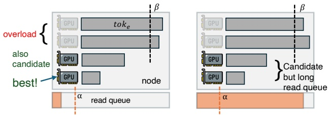

Figure 5: An illustration of Inter-Engine PE Scheduling. All eight GPUs are in the same PE engine group and the scheduler will choose the best.

**PE Scheduling.** All requests arriving at the scheduler enter a waiting queue and are scheduled in a FIFO order. The scheduling algorithm is invoked when a PE group initiates a fetch request. An illustration of the inter-engine scheduling process is shown in Figure 5. We define two constants, short reading queue threshold 𝛼, and unfinished token upper limit $\beta ,$ measured in tokens. All engines are split into three categories: (1) overloaded engines where $t o k _ { e } > \beta ; ( 2 )$ engines on nodes with short disk reading queues where 𝑟𝑒𝑎𝑑 $\_ q _ { n ( e ) } \leq \alpha$ and $t o k _ { e } \leq \beta ;$ and (3) engines on nodes with longer disk reading queues where 𝑟𝑒𝑎𝑑 $\_ q _ { n ( e ) } > \alpha$ and $t o k _ { e } \leq \beta .$ . We do not assign new requests to overloaded engines. Second-category engines are prioritized over third-category engines because they reside on nodes with shorter disk reading queues, and lack of subsequent requests would easily lead to storage NIC underutilization.

**PE 调度.** 到达调度器的请求都进入一个等待队列, 按 FIFO 顺序调度. 当某个 PE 组发起拉取请求时调用调度算法, 过程如图 5 所示. 我们定义两个以 token 计的常量: 短读队列阈值 $\alpha$ 和未完成 token 上限 $\beta$. 所有引擎分成三类: (1) 过载引擎, $tok_e>\beta$; (2) 所在节点磁盘读队列短的引擎, $read\_q_{n(e)}\le\alpha$ 且 $tok_e\le\beta$; (3) 所在节点磁盘读队列较长的引擎, $read\_q_{n(e)}>\alpha$ 且 $tok_e\le\beta$. 不给过载引擎分新请求. 第二类优先于第三类, 因为它们所在节点的磁盘读队列更短, 如果后续请求跟不上, 那台节点的存储网卡很容易闲下来.

We assign the current request to the PE with minimum $t o k _ { e }$ in the second category if non-empty, otherwise in the third category if non-empty. After assignment, we update the selected $PE's   to k_e,$ then proceed to the next request in the waiting queue. If both categories are empty, we terminate this fetch request and return the already-assigned requests to the Leader Engine.

当前请求分给第二类里 $tok_e$ 最小的 PE (第二类非空时); 否则分给第三类里 $tok_e$ 最小的 PE (第三类非空时). 分配后更新所选 PE 的 $tok_e$, 然后处理等待队列里的下一个请求. 如果第二, 三类都为空, 就结束本次拉取, 把已分配的请求返回给 Leader Engine.

**DE Scheduling Phase 1: across groups.** DE scheduling is two-level and does not preserve global FIFO. There is a global waiting queue and a private queue per DE engine group. Incoming requests first enter the global queue. When a DE group fetches, group-level scheduling drains the global queue and assigns each request to the group whose total 𝑡𝑜𝑘𝑒 (sum over its engines) is minimum; this balances token count across groups and thus NIC and GPU load.

**DE 调度第一阶段: 跨组.** DE 调度分两级, 不保持全局 FIFO. 有一个全局等待队列, 每个 DE 引擎组还有一个私有队列. 新请求先进全局队列. 某个 DE 组拉取时, 组级调度把全局队列清空, 把每个请求分给 $tok_e$ 总和 (组内各引擎相加) 最小的组; 这样各组之间的 token 数, 进而网卡与 GPU 负载, 得到均衡.

**DE Scheduling Phase 2: within a group.** Then we calculate the sum of remaining HBM for all DEs in the group and traverse from the head of the private queue to calculate how many requests can be scheduled assuming no HBM fragmentation. These requests form the set 𝑅. It is an upper bound that can be scheduled. Then, we calculate a high token threshold $\begin{array} { r } { Z = 1 . 0 5 \times \left( \sum _ { r \in R } l e n _ { r } + \sum _ { e \in E } t o k _ { e } \right) / | E | } \end{array}$

Next, we try to pop the head of private queue and schedule it to a DE. Among DEs with sufficient remaining HBM for the

Algorithm 1: Inter-PE Scheduling Algorithm
Data: Waiting queue $Q$, PE group $G_{PE}$, load metrics ($read\_q_{n(e)}, tok_e$) reported by each engine $e$, where $n(e)$ denotes the node that engine $e$ belongs to, constants $\alpha$ and $\beta$
Result: Assigned requests to PEs
Each engine $e$ reports ($read\_q_{n(e)}, tok_e$);
Classify all PEs into three categories:;
$C_1 \leftarrow \{e \in G_{PE} : tok_e > \beta\}$;
$C_2 \leftarrow \{e \in G_{PE} : read\_q_{n(e)} \leq \alpha \land tok_e \leq \beta\}$;
$C_3 \leftarrow \{e \in G_{PE} : read\_q_{n(e)} > \alpha \land tok_e \leq \beta\}$;
while $Q$ is not empty do
    $r \leftarrow$ head of $Q$;
    if $C_2 \neq \emptyset$ then
        $pe^* \leftarrow \arg \min_{e \in C_2} tok_e$;
    else
        if $C_3 \neq \emptyset$ then
            $pe^* \leftarrow \arg \min_{e \in C_3} tok_e$;
        else
            Terminate this fetch request;
            Return assigned requests to Leader Engine;
            break;
        end
    end
    Assign request $r$ to PE $pe^*$;
    Update $tok_{pe^*} \leftarrow tok_{pe^*} + tokens(r)$;
    Remove $r$ from $Q$;
end

request, we partition into (1) high-token DEs, where $t o k _ { e }$ + len $( r ) > Z ,$ and (2) the rest. We prefer category (2) to keep token count balanced; category (1) DEs already have higher GPU and NIC pressure. Within category (2) we choose the DE with minimum 𝑠𝑒𝑞𝑒 to balance request count; if category (2) is empty we choose the DE with minimum $t o k _ { e }$ in category (1) to reduce HBM exhaustion and preemption risk. If no DE has sufficient HBM, the fetch ends and already-assigned requests are returned.

**DE 调度第二阶段: 组内.** 接着计算组内所有 DE 剩余 HBM 的总和, 从私有队列头部开始遍历, 算出在不考虑 HBM 碎片的情况下能调度多少个请求, 这些请求构成集合 $R$, 它是可调度数量的上界. 然后计算高 token 阈值 $Z=1.05\times(\sum_{r\in R}len_r+\sum_{e\in E}tok_e)/|E|$. 接下来尝试弹出私有队列头部的请求并把它调度给某个 DE: 在剩余 HBM 足够容纳该请求的 DE 中, 分成 (1) 高 token 的 DE, 即 $tok_e+len(r)>Z$; (2) 其余 DE. 优先选第 (2) 类以保持 token 数均衡, 第 (1) 类 DE 的 GPU 与网卡压力已经偏高. 在第 (2) 类里选 $seq_e$ 最小的 DE, 以均衡请求数; 若第 (2) 类为空, 选第 (1) 类里 $tok_e$ 最小的 DE, 降低 HBM 耗尽和抢占的风险. 若没有 DE 有足够的 HBM, 本次拉取结束, 返回已分配的请求.

**KV-Cache Read Task Scheduling.** After selecting PE and DE for a request, we choose to read on the side with the shorter reading queue. It is probably better to split the request into two parts and read them from both sides, and we leave it as future work.

**KV-Cache 读任务调度.** 为请求选定 PE 和 DE 之后, 选择读队列较短的一侧去读. 把请求拆成两部分, 两侧各读一部分, 可能更好, 我们留作未来工作.

## 6.2 Intra-Engine Scheduling · 引擎内调度

Only PEs require intra-engine scheduling, as DEs always place all requests into the forward batch. An illustration of

<!-- page 9 of 17 -->

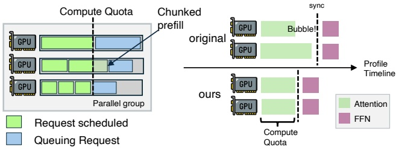

Figure 6: Intra-Engine Schedule. Left: compute-quota-based batch selection. Right: GPU timeline before and after applying compute quota.

the intra-engine scheduling process is shown in Figure 6. Data parallelism is widely adopted for attention layers, especially for MLA models. Under such a parallel configuration, each GPU serves a different set of requests. It may lead to workload imbalance among all GPUs that must synchronize after the attention stage and enter the FFN stage together, causing GPU bubbles waiting for other peers. Therefore, we need to make sure they have similar attention layer execution times to minimize the waiting bubbles.

只有 PE 需要引擎内调度, 因为 DE 总是把所有请求放进前向 batch. 引擎内调度过程如图 6 所示. 注意力层普遍采用数据并行, MLA 模型尤其如此. 在这种并行配置下, 每块 GPU 服务不同的一组请求. 所有 GPU 必须在注意力阶段结束后同步, 一起进入 FFN 阶段, 于是 GPU 之间的负载不均会造成等待其他 GPU 的空泡. 因此需要让各 GPU 的注意力层执行时间相近, 尽量减少等待空泡.

**Layer Time Estimation.** We use FIFO packing to decide how many requests to include in a forward batch. Each request in a forward batch is described by a pair (𝑐𝑎𝑐ℎ𝑒𝑑, 𝑏𝑠𝑧), where 𝑐𝑎𝑐ℎ𝑒𝑑 is the number of tokens with KV-Cache already available (from storage hits or previous forward passes), and 𝑏𝑠𝑧 is the number of tokens requiring KV-Cache computation in this forward batch. From these pairs, we compute the total theoretical computation for the attention layer and estimate its execution time. The relationship between theoretical computation and wall-clock time depends on hardware and parallel configuration, and can be fitted in advance through profiling as previous works [17] and [2].

**层时间估计.** 我们用 FIFO 装箱来决定一个前向 batch 放多少请求. batch 里每个请求用一对数 $(cached, bsz)$ 描述: $cached$ 是 KV-Cache 已经就绪的 token 数 (来自存储命中或之前的前向), $bsz$ 是本次前向需要计算 KV-Cache 的 token 数. 由这些数对算出注意力层的理论总计算量, 并估计其执行时间. 理论计算量与墙钟时间的关系取决于硬件和并行配置, 可以像已有工作 [17] 和 [2] 那样事先通过 profiling 拟合.

**Algorithm.** We keep adding requests in FIFO order as long as the predicted attention layer execution time does not exceed a predefined upper bound, called the compute quota. If adding a request would exceed this bound, we perform binary search on 𝑏𝑠𝑧 to find a smaller 𝑏𝑠𝑧′to fit in the remaining compute quota and perform chunked prefill for that request.

**算法.** 只要预测的注意力层执行时间不超过一个预设上限 (称为计算配额), 就按 FIFO 顺序继续加入请求. 如果加入某个请求会超出上限, 就对 $bsz$ 做二分查找, 找到一个能塞进剩余计算配额的较小值 $bsz'$, 对该请求做分块 prefill.

## 7 EVALUATION · 评测

## 7.1 Implementation · 实现

We implement DualPath based on our in-house inference framework. For CUDA kernels, our in-house framework adopt the combination of FlashMLA [27], DeepGEMM [14], and DeepEP [56], which aligns with the current mainstream open-source framework [26, 57]. The DualPath implementation involves approximately 5K lines of modifications on

| MaxLen | Turns | Append | Gen | Total | Context |
| --- | --- | --- | --- | --- | --- |
| 32K | 60 | 608 | 148 | 28639 | 17183 |
| 48K | 106 | 474 | 172 | 42607 | 25120 |
| 64K | 157 | 429 | 176 | 55958 | 32721 |

top of it. We adopt 3FS [13] as distributed storage and use an io\_uring-like interface for kernel bypass.

我们在内部推理框架之上实现 DualPath. CUDA kernel 方面, 内部框架组合使用 FlashMLA [27], DeepGEMM [14] 和 DeepEP [56], 与当前主流开源框架 [26, 57] 一致. DualPath 的实现在此之上改动了约 5K 行代码. 我们用 3FS [13] 作分布式存储, 并用类似 io\_uring 的接口绕过内核.

## 7.2 Experimental Setup · 实验设置

**Testbed.** We conduct our experiments on a cluster of GPU servers with InfiniBand interconnection. Each server has 8 NVIDIA Hopper GPUs and dual processors. Additionally, each node is provisioned with eight 400Gbps RDMA NICs connected to InfiniBand network and one additional storage NIC connected to 3FS. The computation and storage networks are physically isolated. Our cluster-wide 3FS has no internal DRAM cache and can saturate the 400Gbps bandwidth of the storage NIC.

**测试平台.** 实验在一个用 InfiniBand 互连的 GPU 服务器集群上进行. 每台服务器有 8 块 NVIDIA Hopper GPU 和两颗处理器. 每个节点另配 8 块接入 InfiniBand 网络的 400Gbps RDMA 网卡, 以及 1 块接入 3FS 的存储网卡. 计算网络与存储网络物理隔离. 集群级 3FS 没有内部 DRAM 缓存, 能跑满存储网卡的 400Gbps 带宽.

**Models.** We evaluate on three models: (1) DeepSeek V3.2 [16] 660B, an MoE model with DeepSeek Sparse Attention, denoted as DS 660B, (2) a 27B downscaled version of DS 660B, denoted as DS 27B, and (3) Qwen2.5-32B [42], a dense model with GQA, denoted as Qwen 32B. DS 660B and Qwen 32B correspond to the publicly released checkpoint on HuggingFace. DS 27B is our internal experimental model with a similar architecture to DS 660B. Detailed specifications are provided in §A.2.

**模型.** 我们在三个模型上评测: (1) DeepSeek V3.2 [16] 660B, 带 DeepSeek Sparse Attention 的 MoE 模型, 记为 DS 660B; (2) DS 660B 的 27B 缩小版, 记为 DS 27B; (3) Qwen2.5-32B [42], 使用 GQA 的稠密模型, 记为 Qwen 32B. DS 660B 和 Qwen 32B 对应 HuggingFace 上公开发布的 checkpoint. DS 27B 是我们内部的实验模型, 架构与 DS 660B 相似. 详细规格见 §A.2.

**Datasets.** We collected three agent trace datasets from our production agentic RL training workloads with varying maximum context lengths (MaxLen). Each dataset contains 500 trajectories. The average interaction turns (Turns), average appended and generated tokens per turn (Append and Gen), average number of total tokens (Total), and average number of context tokens (Context) are summarized in Table 2.

**数据集.** 我们从生产环境的 Agent RL 训练负载中采集了三份 Agent trace 数据集, 最大上下文长度 (MaxLen) 各不相同. 每份含 500 条轨迹. 平均交互轮数 (Turns), 每轮平均追加与生成 token 数 (Append 与 Gen), 平均总 token 数 (Total) 和平均上下文 token 数 (Context) 汇总在表 2.

**Baselines.** We compare DualPath, denoted as Ours, against the following baselines:

**基线.** 我们把 DualPath (记为 Ours) 与以下基线比较:

• **SGL(MC)**: SGLang [57] (commit 19089aa) with HiCache [40], Mooncake [38] Store enabled and 3FS as the storage backend, and Mooncake Transfer Engine for prefill-decode disaggregation. We did not run SGL(MC) for DS 27B because SGLang lacks support for this downscaled version.

• **SGL(MC)**: SGLang [57] (commit 19089aa), 开启 HiCache [40] 与 Mooncake [38] Store, 以 3FS 作存储后端, 用 Mooncake Transfer Engine 做 prefill-decode 分离. DS 27B 没跑 SGL(MC), 因为 SGLang 不支持这个缩小版模型.

• **Basic**: Our unmodified internal inference framework (de tailed in §7.1). Comparing DualPath and SGL(MC) is unfair due to implementation differences. Therefore, we only report performance improvements from Basic to Ours.

• **Basic**: 未经修改的内部推理框架 (见 §7.1). 由于实现差异, 直接比较 DualPath 与 SGL(MC) 不公平, 所以我们只报告从 Basic 到 Ours 的性能提升.

• **Oracle**: Based on DualPath, we bypass all disk reads, D2H & H2D transfers, and inter-PD KV-Cache transfers. This

<!-- page 10 of 17 -->

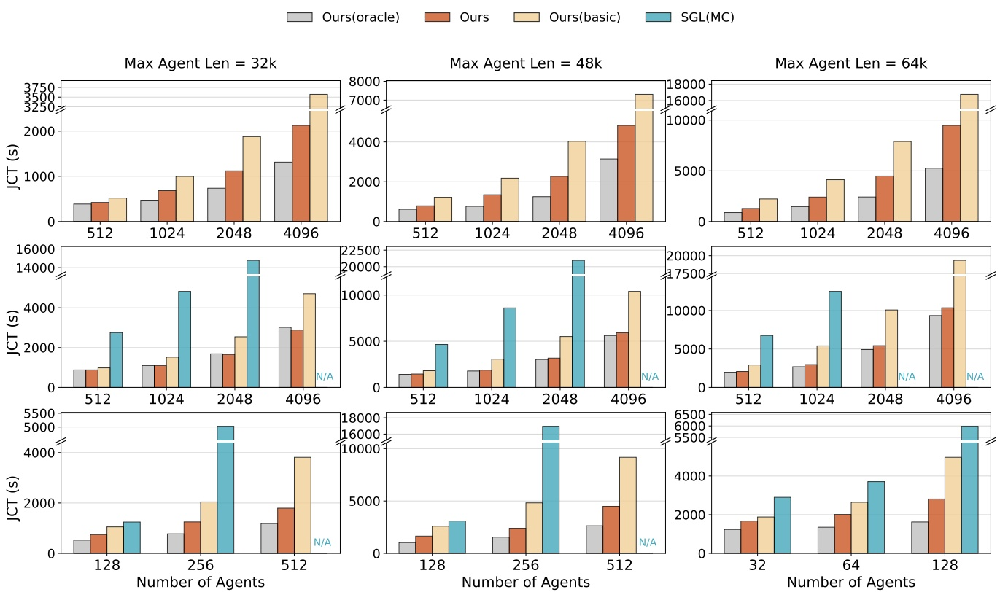

Figure 7: Offline inference performance under varying numbers of agents and maximum agent context lengths. Top: DS 27B. Middle: DS 660B. Bottom: Qwen 32B. N/A for running into an error before finishing.

configuration represents the theoretical performance upper bound assuming zero I/O overhead.

• **Oracle**: 在 DualPath 基础上跳过所有磁盘读取, D2H 与 H2D 传输, 以及 PD 之间的 KV-Cache 传输. 这个配置代表假设 I/O 开销为零时的理论性能上限.

**P/D Ratio and Parallelism.** We default to 2P4D for DS 660B, 1P2D for Qwen 32B, and 1P1D for DS 27B (where 1P1D means one node for each side). For DS models, we use EP and DP. For Qwen 32B, we use DP only in DualPath, while SGL(MC) uses TP=8 since DP attention is not supported for this model in SGLang. Detailed configuration is provided in §A.4.

**P/D 比例与并行.** 默认配置: DS 660B 用 2P4D, Qwen 32B 用 1P2D, DS 27B 用 1P1D (1P1D 表示两侧各一个节点). DS 模型用 EP 和 DP. Qwen 32B 在 DualPath 里只用 DP, 而 SGL(MC) 用 TP=8, 因为 SGLang 对这个模型不支持 DP attention. 详细配置见 §A.4.

**Metrics.** For offline inference scenarios, we measure job completion time (JCT) for the entire task. For online serving scenarios, we measure TTFT, TTST (Time to the second token), and TPOT.

**指标.** 离线推理场景测整个任务的完成时间 (JCT). 在线服务场景测 TTFT, TTST (到第二个 token 的时间) 和 TPOT.

## 7.3 Offline Batch Inference · 离线批量推理

This section evaluates throughput performance in offline batch inference, which is the case of the rollout phase in RL training. In this scenario, 𝑛 agents start to rollout simultaneously, and we measure the JCT when all requests have finished.

本节评测离线批量推理的吞吐, 对应 RL 训练的 rollout 阶段. 这一场景下 $n$ 个 Agent 同时开始 rollout, 测量所有请求结束时的 JCT.

**Varying Agents Batch Size & Max Agent Length (MAL).** DualPath benefits more from larger batch sizes and longer MALs. Figure 7 reports JCT under different batch sizes and MALs. SGL(MC) encountered errors in our setup and failed to complete some large configurations (marked as N/A). On DS 660B, DualPath achieves up to 1.87× over Basic, and demonstrates performance with Oracle, indicating that KV-cache I/O is largely eliminated. On DS 27B, DualPath improves over Basic by up to 1.78× but remains 1.09–1.85× slower than Oracle due to limited storage bandwidth in 1P1D (Figure 8). For Qwen 32B, it shows similar trends as DS 27B.

**改变 Agent 批大小与最大 Agent 长度 (MAL).** batch 越大, MAL 越长, DualPath 收益越大. 图 7 给出不同 batch 大小和 MAL 下的 JCT. SGL(MC) 在我们的环境里出错, 没能完成部分大配置 (标为 N/A). 在 DS 660B 上, DualPath 相对 Basic 最多快 1.87 倍, 性能与 Oracle 相当, 说明 KV-Cache I/O 的影响基本被消除. 在 DS 27B 上, DualPath 相对 Basic 最多快 1.78 倍, 但由于 1P1D 的存储带宽有限, 仍比 Oracle 慢 1.09-1.85 倍 (图 8). Qwen 32B 的趋势与 DS 27B 相似.

**Varying Append Length & Generation Length.** DualPath has more advantages when append and generation tokens are short. Longer append lengths imply greater GPU compute pressure, and longer generation lengths lower KV-Cache loading pressure due to larger prefill gap time. To investigate the impact of this factor, we scale each round’s append length by a constant factor, and then truncate the whole trajectory at given MAL. The same holds for generation length. As shown in Figure 9, with append length increases, Basic performance gradually approaches DualPath and Oracle, while

<!-- page 11 of 17 -->

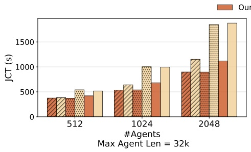

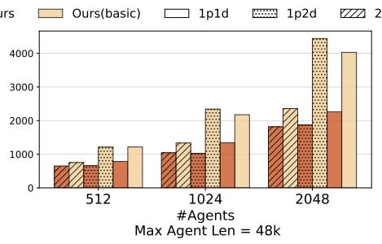

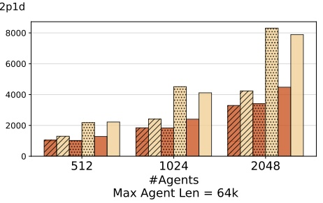

Figure 8: Impact of prefill-decode ratio on offline inference performance (DS 27B).

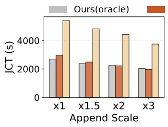

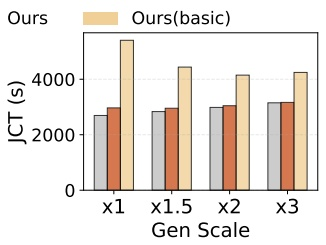

Figure 9: Left: varying append lengths (DS 660B, 64K context, 1024 agents). Right: varying generation lengths (DS 660B, 64K, 1024 agents)

DualPath and Oracle performance changes only slightly, in dicating that the bottleneck consistently lies in GPU compute pressure. Compared to Basic, DualPath achieves 1.82 − 1.99× speedup at different append scales. The trend for generation length scaling is similar.

**改变追加长度与生成长度.** 追加与生成的 token 越短, DualPath 的优势越大. 追加越长, GPU 计算压力越大; 生成越长, 相邻两次 prefill 之间的间隔越长, KV-Cache 加载压力越小. 为考察这一因素, 我们把每轮的追加长度乘一个常数, 再在给定 MAL 处截断整条轨迹; 生成长度同理. 如图 9 所示, 随着追加长度增加, Basic 的性能逐渐接近 DualPath 和 Oracle, 而 DualPath 和 Oracle 的性能只略有变化, 说明它们的瓶颈一直在 GPU 计算压力上. 在不同的追加倍数下, DualPath 相对 Basic 加速 1.82-1.99 倍. 生成长度放大的趋势类似.

**Varying Prefill-Decode Ratio.** Across all ratios, DualPath demonstrates substantial performance gains compared to Basic. We conduct rollout experiments on DS 27B with 1P1D, 2P1D, and 1P2D prefill-decode ratios to characterize the impact of resource allocation between prefill and decode stages on overall system performance. As shown in Figure 8, Dual-Path achieves an average speedup of 1.64× across all configurations (up to 2.46×). Basic 1P1D and Basic 1P2D perform comparably; so do DualPath 1P1D and Basic 2P1D, as well as DualPath 2P1D and DualPath 1P2D. This occurs because each pair of systems has equivalent available storage bandwidth (Basic can only use prefill node storage bandwidth, while DualPath can utilize all nodes), which confirms that storage bandwidth is the dominant bottleneck in agentic scenarios.

**改变 prefill-decode 比例.** 在所有比例下, DualPath 相对 Basic 都有明显提升. 我们在 DS 27B 上用 1P1D, 2P1D, 1P2D 三种比例做 rollout 实验, 刻画 prefill 与 decode 之间的资源分配对整体性能的影响. 如图 8 所示, DualPath 在所有配置上平均加速 1.64 倍 (最多 2.46 倍). Basic 1P1D 与 Basic 1P2D 性能相当; DualPath 1P1D 与 Basic 2P1D 相当; DualPath 2P1D 与 DualPath 1P2D 也相当. 原因是每一对系统可用的存储带宽相同 (Basic 只能用 prefill 节点的存储带宽, DualPath 能用所有节点的), 这证实了存储带宽是 Agent 场景的主导瓶颈.

## 7.4 Online Serving · 在线服务

**Methodology.** We evaluate system latency characteristics under varying agent arrival rates per second (APS). Agents arrive according to a Poisson process at a specified rate, with each agent commencing replay from round zero to its

last round upon arrival. For our experiments, the SLO is set as TTFT ≤ 4 seconds and TPOT ≤ 50ms. In the TPOT and TTST figures, data points exceeding the SLO threshold are omitted. Experiment termination is triggered when either: (1) TTFT exceeds 4 seconds, or (2) the system reaches steady state, defined as TTFT variation within a 150-second sliding window remaining below 5% compared to that 30 minutes prior.

**方法.** 我们评测不同的每秒 Agent 到达率 (APS) 下的系统延迟特性. Agent 按给定速率的泊松过程到达, 每个 Agent 到达后从第 0 轮一直重放到末轮. 实验的 SLO 设为 TTFT ≤ 4 秒, TPOT ≤ 50ms. TPOT 和 TTST 图中省略超出 SLO 阈值的数据点. 满足以下任一条件时终止实验: (1) TTFT 超过 4 秒; (2) 系统达到稳态, 定义为 150 秒滑动窗口内的 TTFT 与 30 分钟前相比变化小于 5%.

As shown in Figure 10, DualPath achieves higher APS capacity than Basic (1.67× for DS 27B, 2.25× for DS 660B). DualPath’s TTST is comparable to Basic, while TPOT shows that DualPath does not introduce additional decoding overhead compared to Basic. SGL(MC) exhibits anomalously low TTST, likely due to implementation issues where the first two tokens arrive at the client almost simultaneously. For DS 27B, all metrics exhibit trends similar to DS 660B. However, both Basic and DualPath show significantly higher TPOT than Oracle, suggesting the overhead of basic P-D transferring is considerable in small model cases. We leave it as future work.

如图 10 所示, DualPath 能承受的 APS 高于 Basic (DS 27B 为 1.67 倍, DS 660B 为 2.25 倍). DualPath 的 TTST 与 Basic 相当, TPOT 则表明 DualPath 相对 Basic 没有引入额外的 decode 开销. SGL(MC) 的 TTST 低得反常, 可能是实现问题导致前两个 token 几乎同时到达客户端. DS 27B 的各项指标与 DS 660B 趋势相似; 但 Basic 和 DualPath 的 TPOT 都明显高于 Oracle, 说明在小模型上基本的 P-D 传输开销不小. 这一点我们留作未来工作.

Average JCT for both models are presented in Figure 11. A detailed analysis of working set implications is discussed in §8. As shown in Figure 12 (left), DualPath maintains stable TTFT components across different APS, while Basic’s queuing time grows dramatically due to insufficient storage bandwidth.

两个模型的平均 JCT 见图 11, 工作集方面的详细分析见 §8. 如图 12 (左) 所示, DualPath 在不同 APS 下 TTFT 各组成部分保持稳定, 而 Basic 由于存储带宽不足, 排队时间急剧增长.

## 7.5 Ablation Study · 消融实验

We conduct an ablation study to quantify the contribution of each technical component in DualPath. Experiments are performed under the offline inference setting with 64K MAL and agent batch size 1024 and 2048. The differences between Basic and Ours are grouped into three techniques: layerwise prefill, dual-path loading, and scheduling algorithm. We add the techniques gradually to demonstrate individual contribution. As shown in Figure 12, compared to Basic, adding layerwise prefill reduces JCT by 17.21% on average, alleviating PE HBM bottlenecks and hiding transfer overhead. Adding Dual-path loading on top of layerwise prefill delivers

<!-- page 12 of 17 -->

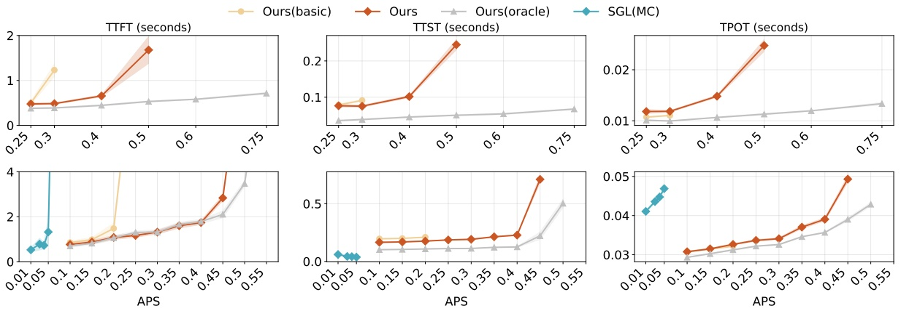

Figure 10: TTFT, TTST, and TPOT as functions of agent arrival rate (APS). Shadow means the fluctuation in the last 150s before experiments finish. Top: DS 27B, Bottom: DS 660B.

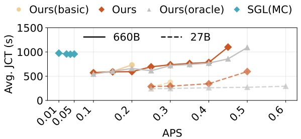

Figure 11: Average completion time of all trajectories versus arrival rate for online serving.

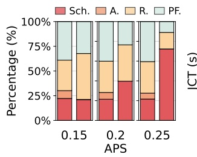

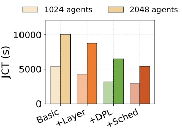

Figure 12: Left (§7.4): TTFT breakdown for online serving (DS 660B) across APSs, Sch. for scheduling, A. for allocating, R. for reading KV-cache, PF. for prefill. In each pair of pillars, the first is for DualPath and the second is for Basic. Right (§7.5): Offline inference ablation results (DS 660B, 64K context length). Layer, DPL, Sched stands for Layerwise prefill, Dual-Path Loading, and scheduling, respectively.

the primary performance gains, reducing JCT by 38.19% on average compared to Basic, as it enables requests to read KV-Cache from either PE or DE, fully utilizing distributed storage bandwidth. Finally, employing our scheduling algorithm on top of dual-path loading to decide KV-Cache

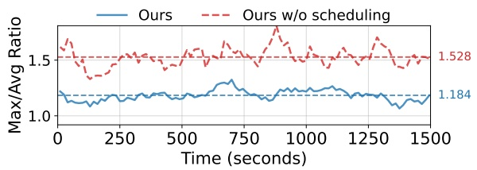

Figure 13: Load balance of storage NICs traffic

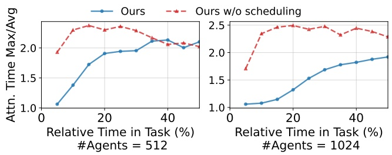

Figure 14: Load balance of attention execution time.

loading paths achieves the best performance, reducing JCT by 45.62% compared to Basic, demonstrating the effectiveness of load-balanced scheduling across storage NICs.

我们做消融实验, 量化 DualPath 各技术组件的贡献. 实验在离线推理设置下进行, MAL 为 64K, Agent 批大小为 1024 和 2048. Basic 与 Ours 的差别归为三项技术: 逐层 prefill, 双路径加载, 调度算法. 我们逐项叠加, 展示各自的贡献. 如图 12 所示, 相对 Basic, 加上逐层 prefill 平均使 JCT 减少 17.21%, 缓解了 PE 的 HBM 瓶颈并隐藏了传输开销. 在逐层 prefill 之上加双路径加载带来主要收益, JCT 相对 Basic 平均减少 38.19%, 因为请求可以从 PE 或 DE 任一侧读取 KV-Cache, 充分利用分布式的存储带宽. 最终在双路径加载之上用我们的调度算法决定 KV-Cache 加载路径, 性能最好, JCT 相对 Basic 减少 45.62%, 证明了跨存储网卡的均衡调度是有效的.

> **问:** 标题数字 1.87 倍里, 有多少来自双路径本身?
> 答: Basic 不带逐层 prefill, 而逐层 prefill 是 LayerKV 和 PrefillOnly 已有的技术. 从图 12 右读数: 1024 agents 下 Basic, +Layer, +DPL, +Sched 约为 5400, 4250, 3200, 3000 秒; 2048 agents 下约为 10100, 8750, 6500, 5450 秒. 只看「在逐层 prefill 之上加双路径与调度」, 1024 agents 是 $4250/3000\approx1.42$ 倍, 2048 agents 是 $8750/5450\approx1.61$ 倍; 逐层 prefill 单独贡献约 1.15 到 1.27 倍. 所以 1.87 倍是三项改动的乘积, 双路径加载加调度单独算约 1.4 到 1.6 倍. 2048 agents 下 $10100/5450\approx1.85$, 与图 7 中 64K, 2048 agents 的 1.87 倍一致.

**Load Balance.** DualPath’s scheduling algorithm improves load balance for both storage NICs and attention layer execution times. For storage NICs, our scheduling algorithm improves load balance from 1.53 to 1.18 compared to round robin scheduling (Figure 13). For attention layers, DualPath maintains the Max/Avg ratio as low as 1.06 during the first 5% of the task, reducing GPU idle bubbles (Figure 14). The storage NIC metric is the ratio of maximum to average traffic across all storage NICs on three machines within a small time window, where 1.0 represents perfect balance. The attention

<!-- page 13 of 17 -->

|  | Setting | JCT | TTFT TTST TPOT |
| --- | --- | --- | --- |
| e |  |  |  |
| in | 2P4D, 2K agents | 3,167s | - - - |
| ffl |  |  |  |
| O | 48P96D, 48K agents | 3,201s | - - - |
| e |  |  |  |
| lin | 2P4D, 0.4 APS | - | 1.739s 0.228s 0.039s |
| On | 44P88D, 8.8 APS | - | 1.847s 0.194s 0.036s |

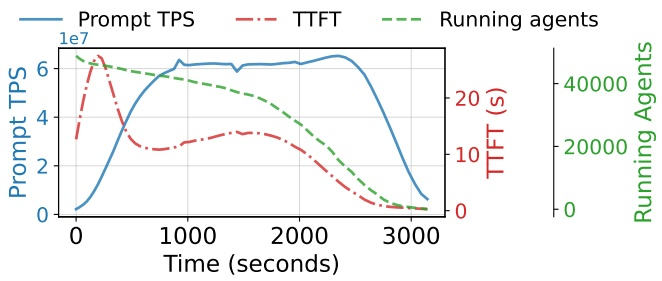

Figure 15: 48P96D offline inference metrics. 1e7 is the scaling factor of Prompt TPS.

layer metric is calculated among all GPUs in an expert parallel group for each forward. As the task progresses, both ratios become meaningless due to underloaded system. Therefore, we do not show the tail phase of the workload.

**负载均衡.** DualPath 的调度算法同时改善了存储网卡和注意力层执行时间的负载均衡. 存储网卡方面, 与轮询调度相比, 我们的调度算法把均衡指标从 1.53 改善到 1.18 (图 13). 注意力层方面, 在任务的前 5%, DualPath 把 Max/Avg 比压到 1.06, 减少了 GPU 空闲空泡 (图 14). 存储网卡指标是一个小时间窗口内三台机器上所有存储网卡的最大流量与平均流量之比, 1.0 表示完全均衡. 注意力层指标是每次前向在一个专家并行组内所有 GPU 之间计算的. 随着任务推进, 系统负载变轻, 两个比值都失去意义, 因此不展示负载的尾段.

## 7.6 Large-Scale Scalability · 大规模可扩展性

We conduct both offline and online experiments using up to 1,152 GPUs to demonstrate large-scale scalability (Table 3). For offline inference, scaling from 2P4D (2K agents) to 48P96D (48K agents) achieves near-linear speedup with comparable JCT (3,167s vs. 3,201s). For online serving, the 44P88D configuration achieves 22× throughput (8.8 vs. 0.4 APS) while maintaining similar latency. Across all experiments, scheduler CPU usage remains below 10 cores, confirming it is not a bottleneck. Some detailed metrics over offline inference process are shown in Figure 15.

我们用最多 1,152 块 GPU 做了离线和在线实验, 展示大规模可扩展性 (表 3). 离线推理从 2P4D (2K agents) 扩到 48P96D (48K agents), JCT 相当 (3,167 秒对 3,201 秒), 接近线性加速. 在线服务中, 44P88D 配置在延迟相近的情况下达到 22 倍吞吐 (8.8 对 0.4 APS). 所有实验中调度器的 CPU 占用都低于 10 个核, 说明它不是瓶颈. 离线推理过程的部分详细指标见图 15.

Due to the lack of fine-tuned parallelism settings and P/D ratios (which requires a substantial experimentation budget), the large-scale experiments do not demonstrate additional JCT or serving capacity gains compared to multiple smallscale units with equivalent cost. However, large-scale setting remains important for the following reasons. First, it reduces fragmentation and provides greater flexibility for fine-tuning parallelism and P/D ratios. Second, large-scale deployment offers more scheduling opportunities to mitigate queuing latency under unpredictable bursty online requests. These observations suggest several directions for future work (§8.1).

由于缺少精调的并行设置和 P/D 比例 (精调需要大量实验预算), 大规模实验相比同等成本的多个小规模单元, 没有表现出额外的 JCT 或服务容量收益. 但大规模设置仍然重要, 原因有二. 第一, 它减少碎片, 给精调并行和 P/D 比例留出更大余地. 第二, 面对不可预测的突发在线请求, 大规模部署有更多调度机会来缓解排队延迟. 这些观察指向若干未来工作方向 (§8.1).

## 8 DISCUSSION · 讨论

## 8.1 Potential Future Work · 可能的未来工作

The workload of offline inference is highly dynamic. For example, in our agentic RL tasks, the workload depends heavily on the researchers’ algorithm design, and the prefill stage typically experiences significantly higher pressure in the first half of execution than in the second half. Meanwhile, profiling these tentative experiments is costly, as some experiments are only run a limited number of times. Therefore, more adaptive and flexible approaches for parallelism and P/D ratio configuration are needed, such as simulators or online adjustment mechanisms. Second, the scheduling algorithm still has room for improvement, as we expect to achieve lower TTFT percentiles under large-scale deployment.

离线推理的负载高度动态. 例如在我们的 Agent RL 任务里, 负载很大程度上取决于研究员的算法设计, prefill 阶段在执行前半段承受的压力通常明显高于后半段. 同时, 对这些试探性实验做 profiling 代价很高, 因为有些实验只跑有限的几次. 因此需要更自适应, 更灵活的并行与 P/D 比例配置方法, 例如模拟器或在线调整机制. 第二, 调度算法仍有改进空间, 我们希望在大规模部署下拿到更低的 TTFT 分位数.

## 8.2 Working Set Analysis · 工作集分析

As shown in Figure 11, given an arrival rate 𝜆 (i.e., new trajectories per second) and mean $\mathrm { J C T }   \bar { T } _ { \mathrm { i } }$ , the working set of the KV-Cache can thus be approximated as $\lambda \bar { T } \times t o t a l \_ l e n _ { a v g } / 2$ In our setting of DS 660B serving, this value of DualPath ranges from 69 GB at APS 0.1 to 681 GB at APS 0.45.

如图 11 所示, 给定到达率 $\lambda$ (即每秒新轨迹数) 和平均 JCT $\bar{T}$, KV-Cache 的工作集可以近似为 $\lambda\bar{T}\times total\_len_{avg}/2$. 在我们的 DS 660B 服务设置中, DualPath 的这个值从 APS 0.1 时的 69 GB 到 APS 0.45 时的 681 GB.

In realistic setting, the working set would be larger since our evaluation assumes zero inter-arrival time and zero tool call latency. If JCT increases by 𝑟 times due to these gaps, the system’s APS capacity increases by 𝑟 times (gaps do not stress LLM inference), causing the working set to expand by $r ^ { 2 }$ times. This would exceed available memory and reduce the distributed memory pool’s hit rate. Such experiments require 𝑟 times more machine hours and $r ^ { 2 }$ times more storage (cost scaling as $r ^ { 3 } )$ , which we cannot afford given limited resources.

真实环境里工作集会更大, 因为我们的评测假设轮间到达间隔和工具调用延迟都为零. 如果这些间隙让 JCT 变成 $r$ 倍, 系统的 APS 容量也变成 $r$ 倍 (间隙不给 LLM 推理增加压力), 工作集于是扩大到 $r^2$ 倍. 这会超出可用内存, 降低分布式内存池的命中率. 这样的实验需要 $r$ 倍的机时和 $r^2$ 倍的存储 (成本按 $r^3$ 增长), 以我们有限的资源负担不起.

## 9 RELATED WORK · 相关工作

**Distributed Memory Cache Pools.** Mooncake [38] builds a distributed DRAM pool for KV-Cache. TokenLake [46] introduces a unified segment-level prefix cache pool. Compared to them, DualPath targets storage backend directly, balanc ing the traffic among all SNICs, and reduces DRAM usage greatly without harming performance. DualPath can also be combined with a middle DRAM cache, but the performance gain is marginal.

**分布式内存缓存池.** Mooncake [38] 为 KV-Cache 构建分布式 DRAM 池. TokenLake [46] 提出统一的段级前缀缓存池. 与它们相比, DualPath 直接面向存储后端, 在所有 SNIC 之间均衡流量, 在不损害性能的前提下大幅减少 DRAM 用量. DualPath 也可以与中间一层 DRAM 缓存结合, 但性能收益很小.

**KV-Cache I/O Optimization.** Efficiently loading the massive KV-Cache from other caching tiers is a fundamental bottleneck in disaggregated LLM serving architectures. Prior work has approached this problem primarily from the perspective of a single data path. Strata [49] tackles I/O bottlenecks in hierarchical storage by co-designing GPU-assisted I/O with cache-aware scheduling. Other work, like KVPR [23] and TailorKV [53], mitigates bandwidth constraints (e.g.,

<!-- page 14 of 17 -->

PCIe) on this path via recomputation overlapping and layergranular hybrid quantization.

**KV-Cache I/O 优化.** 从其他缓存层级高效加载海量 KV-Cache, 是分离式 LLM 服务架构的一个根本瓶颈. 已有工作主要从单条数据路径的角度处理这个问题. Strata [49] 通过 GPU 辅助 I/O 与缓存感知调度的协同设计, 处理分层存储中的 I/O 瓶颈. KVPR [23] 和 TailorKV [53] 等工作则通过重算重叠和层粒度的混合量化, 缓解这条路径上的带宽约束 (例如 PCIe).

**LLM Inference System.** Recent years have seen many inference acceleration techniques, such as paged attention [26], chunked prefill, and hybrid batching [2, 21]. Prefill-decode disaggregated inference [37, 58] separates the prefill and decode stages onto different GPUs, reducing performance interference between them and allowing each stage to adopt dis tinct parallel strategies and hardware configurations, which unlocks substantial optimization opportunities. It has largely become the de facto standard for inference serving.

**LLM 推理系统.** 近年出现了许多推理加速技术, 如 paged attention [26], 分块 prefill, 混合批处理 [2, 21]. prefill-decode 分离推理 [37, 58] 把 prefill 和 decode 两个阶段放到不同的 GPU 上, 减少它们之间的性能干扰, 并允许各阶段采用不同的并行策略和硬件配置, 带来大量优化空间. 它已基本成为推理服务事实上的标准.

**Attention Mechanisms.** Attention mechanism allows tokens to interact with previous tokens in the sequence. There are many variants such as Multi-Head Attention (MHA) [44], Multi-Query Attention (MQA) [41] and Grouped-Query Attention (GQA) [3], Multi-head Latent Attention (MLA) [12]. For those attention mechanisms (denoted as dense attention), the ratio of computation and KV-Cache size for one token is a constant since both scale linearly with sequence length.

**注意力机制.** 注意力机制让 token 与序列中之前的 token 相互作用. 变体很多, 如 Multi-Head Attention (MHA) [44], Multi-Query Attention (MQA) [41], Grouped-Query Attention (GQA) [3], Multi-head Latent Attention (MLA) [12]. 对这些注意力机制 (统称稠密注意力), 单个 token 的计算量与 KV-Cache 大小之比是常数, 因为两者都随序列长度线性增长.

## 10 CONCLUSION

This paper presents DualPath, an agentic LLM inference framework that addresses the imbalance of KV-Cache reading under PD-disaggregated architecture through dual-path KV-Cache loading. By redistributing storage network load with workload-aware scheduling, DualPath achieves up to 1.87× throughput improvement for offline inference. It also achieves 1.96× higher agent runs per second on average in online serving.

本文提出 DualPath, 一个面向 Agent 的 LLM 推理框架, 用双路径 KV-Cache 加载解决 PD 分离架构下 KV-Cache 读取的失衡. 借助感知负载的调度重新分配存储网络负载, DualPath 在离线推理上把吞吐最多提高到 1.87 倍, 在线服务中每秒完成的 Agent 运行数平均提高到 1.96 倍.

## REFERENCES

[1] 2026. UnifiedBus. [https://www.unifiedbus.com/en.](https://www.unifiedbus.com/en) (2026).

[2] Amey Agrawal, Nitin Kedia, Ashish Panwar, Jayashree Mohan, Nipun Kwatra, Bhargav Gulavani, Alexey Tumanov, and Ramachandran Ramjee. 2024. Taming Throughput-Latency Tradeoff in LLM Inference with Sarathi-Serve. In 18th USENIX Symposium on Operating Systems Design and Implementation (OSDI 24). 117–134.

[3] Joshua Ainslie, James Lee-Thorp, Michiel de Jong, Yury Zemlyanskiy, Federico Lebron, and Sumit Sanghai. 2023. GQA: Training Generalized Multi-Query Transformer Models from Multi-Head Checkpoints. In Proceedings of the 2023 Conference on Empirical Methods in Natural Language Processing. 4895–4901.

[4] Anthropic. 2026. Introducing Claude Opus 4.6. [https://www.anthropic.com/news/claude-opus-4-6.](https://www.anthropic.com/news/claude-opus-4-6) (2026).

[5] InfiniBand Trade Association. 2007. InfiniBand Architecture Specification Volume 1, Release 1.2.1. (2007).

[6] Brian E. Carpenter and Kathleen M. Nichols. 2002. Differentiated services in the Internet. Proc. IEEE 90 (2002), 1479–1494. [https://api.semanticscholar.org/CorpusID:1723205](https://api.semanticscholar.org/CorpusID:1723205)

[7] Qiaoling Chen, Zhisheng Ye, Tian Tang, Peng Sun, Boyu Tian, Guoteng Wang, Shenggui Li, Yonggang Wen, Zhenhua Han, and Tianwei Zhang. 2026. CONCUR: High-Throughput Agentic Batch Inference of LLM via Congestion-Based Concurrency Control. (2026). arXiv[:cs.DC/2601.22705](http://arxiv.org/abs/cs.DC/2601.22705) [https://arxiv.org/abs/2601.22705](https://arxiv.org/abs/2601.22705)

[8] Sadia Sultana Chowa, Riasad Alvi, Subhey Sadi Rahman, Md Abdur Rahman, Mohaimenul Azam Khan Raiaan, Md Rafiqul Islam, Mukhtar Hussain, and Sami Azam. 2026. From language to action: a review of large language models as autonomous agents and tool users. Artificial Intelligence Review (2026).

[9] Ultra Ethernet Consortium. 2026. Ultra Ethernet Specification v1.0.2. (2026).

[10] Tri Dao. 2024. FlashAttention-2: Faster Attention with Better Parallelism and Work Partitioning. In International Conference on Learning Representations. 35549–35562.

[11] Google DeepMind. 2026. Gemini 3 Pro. [https://deepmind.google/models/gemini/pro/.](https://deepmind.google/models/gemini/pro/) (2026).

[12] DeepSeek-AI. 2024. DeepSeek-V2: A Strong, Economical, and Efficient Mixture-of-Experts Language Model. (2024). arXiv[:2405.04434](http://arxiv.org/abs/2405.04434)

[13] DeepSeek-AI. 2025. 3FS. [https://github.com/deepseek-ai/3FS.](https://github.com/deepseek-ai/3FS) (2025).

[14] DeepSeek-AI. 2025. DeepGEMM. [https://github.com/deepseek-ai/DeepGEMM.](https://github.com/deepseek-ai/DeepGEMM) (2025).

[15] DeepSeek-AI. 2025. DeepSeek-V3 Technical Report. (2025). arXiv[:cs.CL/2412.19437](http://arxiv.org/abs/cs.CL/2412.19437) [https://arxiv.org/abs/2412.19437](https://arxiv.org/abs/2412.19437)

[16] DeepSeek-AI. 2025. DeepSeek-V3.2: Pushing the Frontier of Open Large Language Models. (2025). arXiv[:2512.02556](http://arxiv.org/abs/2512.02556)

[17] Kuntai Du, Bowen Wang, Chen Zhang, Yiming Cheng, Qing Lan, Hejian Sang, Yihua Cheng, Jiayi Yao, Xiaoxuan Liu, Yifan Qiao, Ion Stoica, and Junchen Jiang. 2025. PrefillOnly: An Inference Engine for Prefill-only Workloads in Large Language Model Applications. In Proceedings of the ACM SIGOPS 31st Symposium on Operating Systems Principles (SOSP ’25). 399–414.

[18] Bin Gao, Zhuomin He, Puru Sharma, Qingxuan Kang, Djordje Jevdjic, Junbo Deng, Xingkun Yang, Zhou Yu, and Pengfei Zuo. 2024. Cost-Efficient Large Language Model Serving for Multi-turn Conversations with CachedAttention. In 2024 USENIX Annual Technical Conference (USENIX ATC 24). 111–126.

[19] Shiwei Gao, Youmin Chen, and Jiwu Shu. 2025. Fast State Restoration in LLM Serving with HCache. In Proceedings of the 20th European Conference on Computer Systems. 128–143.

[20] Chuanxiong Guo, Haitao Wu, Zhong Deng, Gaurav Soni, Jianxi Ye, Jitu Padhye, and Marina Lipshteyn. 2016. RDMA over Commodity Ethernet at Scale. In Proceedings of the 2016 ACM SIGCOMM Conference (SIGCOMM ’16). Association for Computing Machinery, New York, NY, USA, 202–215. [https://doi.org/10.1145/2934872.2934908](https://doi.org/10.1145/2934872.2934908)

[21] Connor Holmes, Masahiro Tanaka, Michael Wyatt, Ammar Ahmad Awan, Jeff Rasley, Samyam Rajbhandari, Reza Yazdani Aminabadi, Heyang Qin, Arash Bakhtiari, Lev Kurilenko, and Yuxiong He. 2024. DeepSpeed-FastGen: High-throughput Text Generation for LLMs via MII and DeepSpeed-Inference. (2024). arXiv[:2401.08671](http://arxiv.org/abs/2401.08671)

[22] Yifan Hu, Shi Qiu, Jianqin Yan, Hao Chen, Xintao Wang, Tang Lu, Guangtao Xue, and Yiming Zhang. 2025. TARDIS: A GPU-Centric KV Cache Service for Efficient LLM Inference. In Proceedings of the 16th ACM SIGOPS Asia-Pacific Workshop on Systems (APSys ’25). Association for Computing Machinery, New York, NY, USA, 46–53. [https://doi.org/10.1145/3725783.3764393](https://doi.org/10.1145/3725783.3764393)

[23] Chaoyi Jiang, Lei Gao, Hossein Entezari Zarch, and Murali Annavaram. 2025. KVPR: Efficient LLM Inference with I/O-Aware KV Cache Partial Recomputation. In Findings of the Association for Computational Linguistics: ACL 2025. 19474–19488.

[24] Juyong Jiang, Fan Wang, Jiasi Shen, Sungju Kim, and Sunghun Kim. 2024. A survey on large language models for code generation. ACM Transactions on Software Engineering and Methodology (2024).

[25] Anuj Kalia, Michael Kaminsky, and David G Andersen. 2016. Design guidelines for high performance RDMA systems. In 2016 USENIX annual technical conference (USENIX ATC 16). 437–450.

<!-- page 15 of 17 -->

[26] Woosuk Kwon, Zhuohan Li, Siyuan Zhuang, Ying Sheng, Lianmin Zheng, Cody Hao Yu, Joseph Gonzalez, Hao Zhang, and Ion Stoica. 2023. Efficient Memory Management for Large Language Model Serving with PagedAttention. In Proceedings of the 29th Symposium on Operating Systems Principles. 611–626.

[27] Jiashi Li and Shengyu Liu. 2025. FlashMLA: Efficient Multi-head Latent Attention Kernels. [https://github.com/deepseek-ai/FlashMLA.](https://github.com/deepseek-ai/FlashMLA) (2025).

[28] Yuanchun Li, Hao Wen, Weijun Wang, Xiangyu Li, Yizhen Yuan, Guohong Liu, Jiacheng Liu, Wenxing Xu, Xiang Wang, Yi Sun, Rui Kong, Yile Wang, Hanfei Geng, Jian Luan, Xuefeng Jin, Zilong Ye, Guanjing Xiong, Fan Zhang, Xiang Li, Mengwei Xu, Zhijun Li, Peng Li, Yang Liu, Ya-Qin Zhang, and Yunxin Liu. 2024. Personal LLM Agents: Insights and Survey about the Capability, Efficiency and Security. (2024). arXiv[:cs.HC/2401.05459](http://arxiv.org/abs/cs.HC/2401.05459) [https://arxiv.org/abs/2401.05459](https://arxiv.org/abs/2401.05459)

[29] Weizhe Lin, Hui-Ling Zhen, Shuai Yang, Xian Wang, Renxi Liu, Hanting Chen, Wangze Zhang, Chuansai Zhou, Yiming Li, Chen Chen, Xing Li, Zhiyuan Yang, Xiaosong Li, Xianzhi Yu, Zhenhua Dong, Mingxuan Yuan, and Yunhe Wang. 2025. Towards Efficient Agents: A Co-Design of Inference Architecture and System. (2025). arXiv[:cs.CL/2512.18337](http://arxiv.org/abs/cs.CL/2512.18337) [https://arxiv.org/abs/2512.18337](https://arxiv.org/abs/2512.18337)

[30] Yuhan Liu, Yihua Cheng, Jiayi Yao, Yuwei An, Xiaokun Chen, Shaoting Feng, Yuyang Huang, Samuel Shen, Rui Zhang, Kuntai Du, and Junchen Jiang. 2025. LMCache: An Efficient KV Cache Layer for Enterprise-Scale LLM Inference. (2025). arXiv[:2510.09665](http://arxiv.org/abs/2510.09665)

[31] Mahmoud Mohammadi, Yipeng Li, Jane Lo, and Wendy Yip. 2025. Evaluation and benchmarking of llm agents: A survey. In Proceedings of the 31st ACM SIGKDD Conference on Knowledge Discovery and Data Mining V. 2. 6129–6139.

[32] NVIDIA. 2023. SuperPOD: Next Generation Scalable Infrastructure for AI Leadership. [http://docs.nvidia.com/https:/docs.nvidia.com/dgx-superpod-reference-architecture-dgx-h100.pdf.](http://docs.nvidia.com/https:/docs.nvidia.com/dgx-superpod-reference-architecture-dgx-h100.pdf) (2023).

[33] NVIDIA. 2026. Developing a Linux Kernel Module using GPUDirect RDMA. [https://docs.nvidia.com/cuda/gpudirect-rdma/index.html.](https://docs.nvidia.com/cuda/gpudirect-rdma/index.html)(2026).

[34] NVIDIA. 2026. GPUDirect Storage Overview Guide. [https://docs.nvidia.com/gpudirect-storage/overview-guide/index.html.](https://docs.nvidia.com/gpudirect-storage/overview-guide/index.html) (2026).

[35] OpenAI. 2025. gpt-oss-120b & gpt-oss-20b Model Card. (2025). arXiv[:2508.10925](http://arxiv.org/abs/2508.10925)

[36] OpenAI. 2025. Introducing GPT-5.2. [https://openai.com/index/introducing-gpt-5-2/.](https://openai.com/index/introducing-gpt-5-2/) (2025).

[37] Pratyush Patel, Esha Choukse, Chaojie Zhang, Aashaka Shah, Íñigo Goiri, Saeed Maleki, and Ricardo Bianchini. 2025. Splitwise: Efficient Generative LLM Inference Using Phase Splitting. In Proceedings of the 51st Annual International Symposium on Computer Architecture. 118–132.

[38] Ruoyu Qin, Zheming Li, Weiran He, Jialei Cui, Feng Ren, Mingxing Zhang, Yongwei Wu, Weimin Zheng, and Xinran Xu. 2025. Mooncake: Trading More Storage for Less Computation — A KVCache-centric Architecture for Serving LLM Chatbot. In Proceedings of the 23rd USENIX Conference on File and Storage Technologies. 155–170.

[39] Andre Richter, Christian Herber, Thomas Wild, and Andreas Herkersdorf. 2016. Resolving Performance Interference in SR-IOV Setups with PCIe Quality-of-Service Extensions. In 2016 Euromicro Conference on Digital System Design (DSD). 454–462. [https://doi.org/10.1109/DSD.2016.41](https://doi.org/10.1109/DSD.2016.41)

[40] SGLang. 2026. SGLang HiCache. https://docs.sglang.io/advanced[features/hicache.html.](https://docs.sglang.io/advanced_features/hicache.html) (2026).

[41] Noam Shazeer. 2019. Fast Transformer Decoding: One Write-Head is All You Need. (2019). arXiv[:1911.02150](http://arxiv.org/abs/1911.02150)

[42] Qwen Team. 2025. Qwen2.5 Technical Report. (2025). arXiv[:2412.15115](http://arxiv.org/abs/2412.15115)

[43] Qwen Team. 2025. Qwen3 Technical Report. (2025). arXiv[:cs.CL/2505.09388](http://arxiv.org/abs/cs.CL/2505.09388) [https://arxiv.org/abs/2505.09388](https://arxiv.org/abs/2505.09388)

[44] Ashish Vaswani, Noam Shazeer, Niki Parmar, Jakob Uszkoreit, Llion Jones, Aidan N. Gomez, Łukasz Kaiser, and Illia Polosukhin. 2017. Attention is All You Need. In Proceedings of the 31st International Conference on Neural Information Processing Systems. 6000–6010.

[45] Lei Wang, Chen Ma, Xueyang Feng, Zeyu Zhang, Hao Yang, Jingsen Zhang, Zhiyuan Chen, Jiakai Tang, Xu Chen, Yankai Lin, et al. 2024. A survey on large language model based autonomous agents. Frontiers of Computer Science 18, 6 (2024), 186345.

[46] Bingyang Wu, Zili Zhang, Yinmin Zhong, Guanzhe Huang, Yibo Zhu, Xuanzhe Liu, and Xin Jin. 2025. TokenLake: A Unified Segment-level Prefix Cache Pool for Fine-grained Elastic Long-Context LLM Serving. (2025). arXiv[:cs.DC/2508.17219](http://arxiv.org/abs/cs.DC/2508.17219) [https://arxiv.org/abs/2508.17219](https://arxiv.org/abs/2508.17219)

[47] Qingyun Wu, Gagan Bansal, Jieyu Zhang, Yiran Wu, Beibin Li, Erkang Zhu, Li Jiang, Xiaoyun Zhang, Shaokun Zhang, Jiale Liu, Ahmed Hassan Awadallah, Ryen W White, Doug Burger, and Chi Wang. 2023. AutoGen: Enabling Next-Gen LLM Applications via Multi-Agent Conversation. (2023). arXiv[:cs.AI/2308.08155](http://arxiv.org/abs/cs.AI/2308.08155) [https://arxiv.org/abs/2308.08155](https://arxiv.org/abs/2308.08155)

[48] Zhiheng Xi, Wenxiang Chen, Xin Guo, Wei He, Yiwen Ding, Boyang Hong, Ming Zhang, Junzhe Wang, Senjie Jin, Enyu Zhou, et al. 2025. The rise and potential of large language model based agents: A survey. Science China Information Sciences 68, 2 (2025), 121101.

[49] Zhiqiang Xie, Ziyi Xu, Mark Zhao, Yuwei An, Vikram Sharma Mailthody, Scott Mahlke, Michael Garland, and Christos Kozyrakis. 2025. Strata: Hierarchical Context Caching for Long Context Language Model Serving. (2025). arXiv[:2508.18572](http://arxiv.org/abs/2508.18572)

[50] Yi Xiong, Hao Wu, Changxu Shao, Ziqing Wang, Rui Zhang, Yuhong Guo, Junping Zhao, Ke Zhang, and Zhenxuan Pan. 2024. LayerKV: Optimizing Large Language Model Serving with Layer-wise KV Cache Management. (2024). arXiv[:2410.00428](http://arxiv.org/abs/2410.00428)

[51] Jianqin Yan, Shi Qiu, Yina Lv, Yifan Hu, Hao Chen, Zhirong Shen, Xin Yao, Renhai Chen, Jiwu Shu, Gong Zhang, and Yiming Zhang. 2025. Phoenix: A Refactored I/O Stack for GPU Direct Storage without Phony Buffers. In Proceedings of the International Conference for High Performance Computing, Networking, Storage and Analysis (SC ’25). 1267–1283.

[52] John Yang, Carlos E Jimenez, Alexander Wettig, Kilian Lieret, Shunyu Yao, Karthik Narasimhan, and Ofir Press. 2024. Swe-agent: Agentcomputer interfaces enable automated software engineering. Advances in Neural Information Processing Systems 37 (2024), 50528–50652.

[53] Dingyu Yao, Bowen Shen, Zheng Lin, Wei Liu, Jian Luan, Bin Wang, and Weiping Wang. 2025. TailorKV: A Hybrid Framework for Long-Context Inference via Tailored KV Cache Optimization. In Findings of the Association for Computational Linguistics: ACL 2025. 20340–20359.

[54] Zihao Ye, Lequn Chen, Ruihang Lai, Wuwei Lin, Yineng Zhang, Stephanie Wang, Tianqi Chen, Baris Kasikci, Vinod Grover, Arvind Krishnamurthy, and Luis Ceze. 2025. FlashInfer: Efficient and Customizable Attention Engine for LLM Inference Serving. (2025). arXiv[:2501.01005](http://arxiv.org/abs/2501.01005)

[55] Chenggang Zhao, Chengqi Deng, Chong Ruan, Damai Dai, Huazuo Gao, Jiashi Li, Liyue Zhang, Panpan Huang, Shangyan Zhou, Shirong Ma, et al. 2025. Insights into deepseek-v3: Scaling challenges and reflections on hardware for ai architectures. In Proceedings of the 52nd Annual International Symposium on Computer Architecture. 1731–1745.

[56] Chenggang Zhao, Shangyan Zhou, Liyue Zhang, Chengqi Deng, Zhean Xu, Yuxuan Liu, Kuai Yu, Jiashi Li, and Liang Zhao. 2025. DeepEP: an efficient expert-parallel communication library. [https://github.com/deepseek-ai/DeepEP.](https://github.com/deepseek-ai/DeepEP) (2025).

[57] Lianmin Zheng, Liangsheng Yin, Zhiqiang Xie, Chuyue Sun, Jeff Huang, Cody Hao Yu, Shiyi Cao, Christos Kozyrakis, Ion Stoica, Joseph E. Gonzalez, Clark Barrett, and Ying Sheng. 2024. SGLang: Efficient Execution of Structured Language Model Programs. In Proceedings of the 38th International Conference on Neural Information

<!-- page 16 of 17 -->

Processing Systems. Article 2000, 27 pages.

[58] Yinmin Zhong, Shengyu Liu, Junda Chen, Jianbo Hu, Yibo Zhu, Xuanzhe Liu, Xin Jin, and Hao Zhang. 2024. DistServe: Disaggregating Prefill and Decoding for Goodput-optimized Large Language Model Serving. In 18th USENIX Symposium on Operating Systems Design and Implementation (OSDI 24). 193–210.

[59] Shuyan Zhou, Frank F Xu, Hao Zhu, Xuhui Zhou, Robert Lo, Abishek Sridhar, Xianyi Cheng, Tianyue Ou, Yonatan Bisk, Daniel Fried, et al. 2023. Webarena: A realistic web environment for building autonomous agents. arXiv preprint arXiv:2307.13854 (2023).

## A APPENDIX

## A.1 Traffic Isolation Configuration Details · 流量隔离配置细节

**InfiniBand.** The InfiniBand QoS mechanism employs two arbitrators: high-priority and low-priority. Traffic is scheduled using Weighted Round Robin (WRR) in the high-priority arbitrator, then steered to the low-priority arbitrator according to qos\_high\_limit; setting it to 255 disables the lowpriority arbitrator entirely. Detailed scheduling algorithm can be found in [5]. Our configuration:

**InfiniBand.** InfiniBand 的 QoS 机制用两个仲裁器: 高优先级和低优先级. 流量先在高优先级仲裁器里按加权轮询 (WRR) 调度, 再按 qos\_high\_limit 转到低优先级仲裁器; 把它设为 255 会完全关闭低优先级仲裁器. 详细调度算法见 [5]. 我们的配置如下:

• qos\_max\_vls 4

• qos\_high\_limit 240

• qos\_vlarb\_high 0:192,1:192,2:0,3:192

• qos\_vlarb\_low 0:192,1:192,2:64,3:192

**RoCE.** RoCE enforces QoS through DSCP-based traffic classification and hardware traffic classes (TC). Packets are first mapped from DSCP values to TCs, each backed by a dedicated hardware queue on NICs and switches (typically up to eight). To match the four-VL configuration in InfiniBand, we configure four lossless RDMA TCs with Priority Flow Control (PFC) enabled. Bandwidth isolation is achieved by assigning proportional scheduling weights to these TCs on both NICs and switches, reserving the majority of bandwidth for model inference traffic while allocating a small fraction to KV-cache traffic to prevent starvation.

**RoCE.** RoCE 通过基于 DSCP 的流量分类和硬件流量类别 (TC) 实施 QoS. 数据包先按 DSCP 值映射到 TC, 每个 TC 在网卡和交换机上都有一条专用硬件队列 (通常最多 8 条). 为对齐 InfiniBand 的 4 条 VL 配置, 我们配了 4 个开启 PFC (Priority Flow Control) 的无损 RDMA TC. 在网卡和交换机上给这些 TC 分配按比例的调度权重, 实现带宽隔离: 大部分带宽留给模型推理流量, 一小部分分给 KV-Cache 流量, 防止饿死.

> **回看:** §5.1 说给高优先级 VL 预留约 99% 带宽, 这组参数里哪条 VL 是 KV-Cache 用的, 99% 怎么来?
> 答: 只有 VL2 在高优先级表里权重为 0, 在低优先级表里权重为 64, 其余三条 VL 在两张表里权重都是 192, 所以 VL2 是 KV-Cache 所在的低优先级 VL, 只能经低优先级仲裁器发送. qos\_high\_limit 设为 240 而不是 255, 低优先级仲裁器才保留发送机会, 这就是 §5.1 说的「防止饿死」. 从这四个参数算出「约 99%」需要 IB 规范里 high limit 的计量单位和每次低优先级机会能发多少字节, 文中没有给出这一步. 高优先级流量空闲时, VL2 可以用满剩余带宽, 所以 99% 是突发期间的下限保障, 不是 KV 流量的平均占比.

## A.2 27B Model Specifications · 27B 模型规格

In terms of overall model scale, the hidden dimension 2560, the intermediate size of dense layers is 12288, the number of hidden layers is 30, the number of attention heads is 32, the number of routed experts is 72, the MoE intermediate size is 1536, the number of activated experts per token is 6, the number of shared experts is 2, and the number of initial dense layer is 1. Regarding the index attention mechanism, the number of attention heads is 32, the head dimension is 64, the topk tokens for sparse attention is 1024. The LoRA compression for the Q matrix of both indexer and main attention is removed.

整体规模上: 隐藏维 2560, 稠密层中间维 12288, 隐藏层数 30, 注意力头数 32, 路由专家数 72, MoE 中间维 1536, 每 token 激活 6 个专家, 共享专家 2 个, 开头的稠密层 1 层. index 注意力方面: 注意力头数 32, 头维 64, 稀疏注意力的 top-k token 数为 1024. indexer 与主注意力的 Q 矩阵都去掉了 LoRA 式的低秩压缩.

## A.3 Agent Task Structure · Agent 任务结构

To provide context for the dataset characteristics, we briefly describe the agent task structure, though this background is orthogonal to our system design. Each agent operates within a sandbox environment containing a code repository with known bugs and associated error messages. The agent is instructed via prompt to diagnose and fix the bug. The model possesses tool-use capabilities, invoking bash commands in the sandbox by emitting structured outputs. The agent and environment engage in multi-turn interactions, where each turn consists of a prompt (previous context concatenated with new information, most of which is tool output) and the model generating a subsequent tool invocation by decoding.

为说明数据集特征的背景, 我们简述 Agent 任务的结构, 虽然这与系统设计无关. 每个 Agent 在一个沙箱环境里运行, 环境含一个有已知 bug 的代码仓库和相应的报错信息. prompt 指示 Agent 诊断并修复这个 bug. 模型具备工具调用能力, 通过输出结构化内容在沙箱里执行 bash 命令. Agent 与环境多轮交互, 每轮由一个 prompt (之前的上下文拼上新信息, 新信息大多是工具输出) 和模型解码生成的下一次工具调用组成.

Each trajectory is a sequence of rounds; round 𝑖 consists of appended tokens $A _ { i }$ and the number of generated tokens $g _ { i }$ . We use $G _ { i }$ to indicate the tokens generated in round 𝑖, which are not presented in our dataset. We define 𝐶𝑜𝑛𝑡𝑒𝑥 $c t _ { i + 1 }$ as the concatenated list of $A _ { 1 } , G _ { 1 } , A _ { 2 } , G _ { 2 } , . . . , A _ { i } , G _ { i }$ . In round $i + 1$ of our replay, the agent concatenates the prompt as $C o n t e x t _ { i + 1 } + A _ { i + 1 }$ , and then sets proper sampling parameters to ensure it generates exactly $g _ { i + 1 }$ tokens, i.e., $G _ { i + 1 }$ . To generate additional agent trajectories, we sample an existing trajectory and prepend a synthetic round with random tokens as $A _ { 1 }$ and $g _ { 1 } = 1$

每条轨迹是一串轮次; 第 $i$ 轮由追加的 token $A_i$ 和生成的 token 数 $g_i$ 组成. 用 $G_i$ 表示第 $i$ 轮生成的 token, 数据集里不含这些 token 本身. 定义 $Context_{i+1}$ 为 $A_1, G_1, A_2, G_2, \ldots, A_i, G_i$ 依次拼接而成的列表. 重放第 $i+1$ 轮时, Agent 把 prompt 拼成 $Context_{i+1}+A_{i+1}$, 并设置合适的采样参数, 保证恰好生成 $g_{i+1}$ 个 token, 即 $G_{i+1}$. 为了生成更多 Agent 轨迹, 我们从已有轨迹中采样一条, 在最前面加一个合成轮次, 以随机 token 作 $A_1$, 并令 $g_1=1$.

## A.4 Experimental Configurations · 实验配置

**Configuration Parameters.** For DeepSeek models, Dual-Path allocates 80GB DRAM each node, and SGL(MC) uses totally 1.5TB DRAM on every node. For Qwen 32B, due to the larger KV-Cache, DualPath allocates 320GB. Speculative decoding is disabled for all settings. We use 3FS as the storage backend for all configurations. The short reading queue threshold 𝛼 (described in §6) is set to the number of tokens we can read during 3 seconds, and the unfinished token upper limit $\beta$ is set to the number of tokens one GPU can process for 5 seconds. Those values are profiled in advance. Compute Quota Threshold is set to 300ms for all DualPath and Oracle baselines.

**配置参数.** 对 DeepSeek 模型, DualPath 每个节点分配 80GB DRAM, SGL(MC) 每个节点共用 1.5TB DRAM. 对 Qwen 32B, 由于 KV-Cache 更大, DualPath 分配 320GB. 所有设置都关闭投机解码. 所有配置都以 3FS 作存储后端. 短读队列阈值 $\alpha$ (见 §6) 设为 3 秒内能读完的 token 数, 未完成 token 上限 $\beta$ 设为一块 GPU 5 秒内能处理的 token 数, 这些值事先 profiling 得到. DualPath 和 Oracle 的计算配额阈值都设为 300ms.

**KV-Cache Hit Length Calculation.** For all systems except SGL(MC), we limit the KV-Cache hits to only occur within a trajectory, and the hit length is calculated in the client because no eviction is needed. For SGL(MC), hit lengths are computed internally based on HiCache and Mooncake Store cache states.

**KV-Cache 命中长度的计算.** 除 SGL(MC) 外的所有系统, KV-Cache 命中只允许发生在同一条轨迹内, 命中长度由客户端计算, 因为不需要淘汰. 对 SGL(MC), 命中长度由系统内部根据 HiCache 和 Mooncake Store 的缓存状态计算.

## A.5 KV-Cache Block Layout · KV-Cache 块布局

Layerwise prefill reduces KV-Cache block size to 1/𝑙𝑎𝑦𝑒𝑟 of the original, and makes the number of blocks larger to 𝑙𝑎𝑦𝑒𝑟×, posing challenges to transfer and storage performance. To overcome this, we design two distinct block types: Layer Block and Full Block. A Layer Block is a byte tensor

<!-- page 17 of 17 -->

with shape [1, 𝑡𝑜𝑘𝑒𝑛𝑠, 𝑏𝑦𝑡𝑒𝑠] and stores one-layer KV-Cache for some tokens. The number of tokens is called 𝑏𝑙𝑜𝑐𝑘\_𝑠𝑖𝑧𝑒. 𝑏𝑦𝑡𝑒𝑠 indicates the cache bytes needed per layer per token. Meanwhile, a Full Block has shape [𝑙𝑎𝑦𝑒𝑟, 𝑡𝑜𝑘𝑒𝑛𝑠, 𝑏𝑦𝑡𝑒𝑠]. This design enables us to avoid manual KV-Cache memory layout conversion throughout inference by simply concatenating 𝑛 Layer Blocks to yield a Full Block. KV-Cache is stored in distributed storage using a trie structure, where each tree node corresponds to a Full Block.

逐层 prefill 把 KV-Cache 块缩小到原来的 $1/layer$, 块数变成 $layer$ 倍, 给传输和存储性能带来挑战. 为此我们设计两种块: Layer Block 和 Full Block. Layer Block 是形状为 $[1, tokens, bytes]$ 的字节张量, 存放若干 token 的单层 KV-Cache, token 数称为 $block\_size$, $bytes$ 是每层每个 token 需要的缓存字节数. Full Block 的形状是 $[layer, tokens, bytes]$. 这样设计后, 把 $n$ 个 Layer Block 直接拼接就得到一个 Full Block, 整个推理过程中不必手动转换 KV-Cache 的内存布局. KV-Cache 在分布式存储中用 trie 结构组织, 每个树节点对应一个 Full Block.
