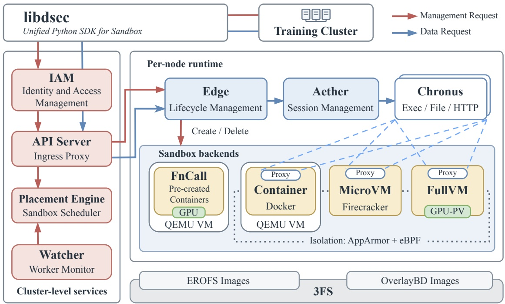
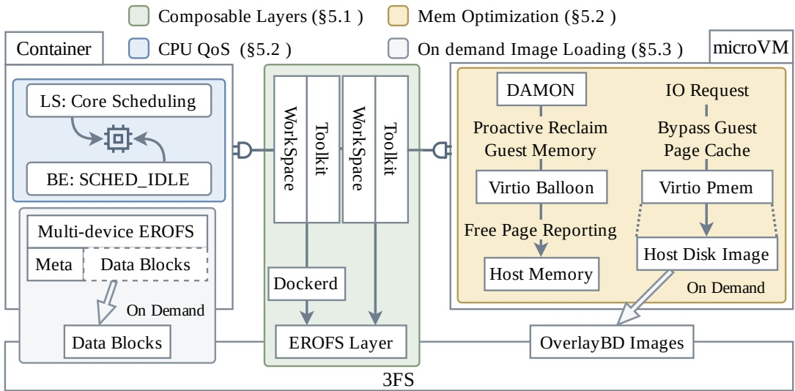
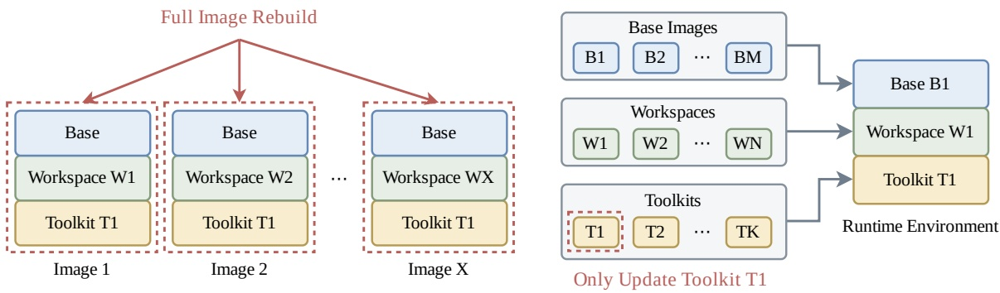

# DSec: DeepSeek 给 Agent RL 供环境的沙箱平台

材料是 DeepSeek-AI 与清华大学的系统论文 *DeepSeek Elastic Compute (DSec): A Sandbox Infrastructure for Effective Agentic Training at Scale* ([arXiv 2609.22978](https://arxiv.org/abs/2609.22978), 2026-09-19, cs.DC, 31 页, 正文 24 页). 论文说从 DeepSeek-V3.2 到 V4.1, RL 训练和评测用到的全部沙箱负载都跑在 DSec 上. 平台本身没有开源, 开源的只有 microVM 存储路径用到的 Rust 版 OverlayBD 与 ublk 库, 放在 [kvcache-ai/AgentENV 的 storage 目录](https://github.com/kvcache-ai/AgentENV/tree/main/storage/overlaybd). DSec 此前在 [V4 解析](../../1-模型技术报告/1.8-deepseek-v4/02-deepseek-v4-analysis.md) 对应的报告 §5.2.5 和 [V4.1-Flash 解析](../../1-模型技术报告/1.9-deepseek-v4-1-flash/02-deepseek-v4-1-flash-analysis.md) 对应的报告 §5.1.3 里各有两页左右的介绍, 这篇论文是第一次完整交代架构, 生产负载测量和机制对照实验.

Agent RL 的 rollout 需要成千上万个隔离、有状态、互不相同的真实环境. 这些环境要在几秒到几分钟内成批就绪, 在 CPU 几乎空闲时长时间占用内存, 还要防住会主动寻找漏洞的模型. 一般的 serverless 平台假设镜像少、复用高、函数短命; Kubernetes 一类编排器强调强一致放置. DSec 针对的正是这组不同的负载条件. Agent RL 的训练流程见 [Agentic RL 训练](../../../LargeLanguageModelGuide/13-Agent/13.4-Agent训练与进化/13.4.1-AgenticRL训练/13.4.1-AgenticRL训练.md), 沙箱运行时的一般概念见 [运行时环境与沙箱](../../../LargeLanguageModelGuide/13-Agent/13.3-Agent系统工程/13.3.4-运行时环境与沙箱/13.3.4-运行时环境与沙箱.md).

## 1. 负载画像: Agent 沙箱和普通执行服务差在哪

### 1.1. 突发, 长寿, CPU 稀疏

论文 §1 列了七条负载性质, §4 用 2026 年初一周的生产数据给其中几条配了测量, 测量只覆盖容器和 microVM, 因为两者占了绝大多数实例和资源. 第一条是突发. Fig. 2 是每个任务创建的沙箱数分布: 容器任务中位数 2,528 个, p90 为 7,969, p99 为 16,388; microVM 任务中位数 352, p99 为 4,044; 最大的生产作业一次申请 32K 个沙箱. 这些请求集中在很短的窗口里到达, 原因很直接: 训练或评测批次要等环境就绪才能开始交互, 任何一个沙箱慢, 整批的有效交互都往后推. 平台对此给出的能力是每秒 5,000 次以上的创建, 按这个速率, 一个 32K 的作业光创建就要约 6.4 秒, 这还没算环境准备.

第二条是长寿和 CPU 稀疏同时存在. Fig. 3 把一个沙箱的一生分成准备, 工具调用, 测试三段: 准备段装依赖, 起工具, CPU 和 I/O 集中; 工具调用段模型生成一步, 沙箱执行一步, CPU 是一串短脉冲, 中间是等模型的空档; 测试段跑验证, 资源需求再短暂升高. Fig. 5 给出按申请量归一化的用量分布, 约 90% 的容器和 microVM 平均 CPU 用量不到申请量的 5%. Fig. 7 给出寿命分布, 容器中位寿命 17.4 分钟, microVM 15.5 分钟, p99 分别是 231.5 和 213.9 分钟; CDF 在约 120 分钟处有一个明显的台阶, 跳到 0.9 以上, 论文没有解释, 从形状看像是部分任务带了 2 小时左右的寿命上限. 准备段的开销按突发规模成倍放大, 工具调用段的内存则按寿命持续占用, 这两件事决定了后面两类机制: 准备路径要便宜, 驻留内存要能共享和回收.

### 1.2. 镜像: 量大, 扇出低, 用到的少

第三条是环境多样. §4.2 把沙箱内容拆成三部分: 基础镜像 (操作系统和语言运行时, 例如 Ubuntu 加 Python 3.10), 工作区 (任务的代码仓库和专属依赖), 工具包 (DeepSeek Harness 这类频繁更新的 scaffold 和命令行工具). 一个生产周里容器后端用了 11,266 个基础镜像和 102,171 个工作区, microVM 后端只有 2 个共享基础镜像, 却有 53,590 个工作区和 4,889 个快照; 工具包共 103 个; 67.8% 的沙箱在基础镜像之外至少还要挂一个工作区或工具包. Tab. 2 给出活跃制品合计 82.8 TB 加 50.9 TB, 约 134 TB, 远超单节点能放下的量.

扇出 (一个镜像在同一任务内被多少个沙箱用) 很低. Fig. 8 统计了 150 多万个容器和 39 万个 microVM: 容器镜像扇出中位数 3, p90 为 28; microVM 镜像中位数 1, p90 为 3. 中位数为 1 意味着大多数 microVM 镜像在一个任务里只被一个沙箱用一次, 节点本地缓存几乎没有命中的机会. 再加上 Tab. 3 的访问比例: 抽样的五种语言容器镜像, 运行时实际读到的数据只占镜像大小的 4.2% (JavaScript, 9.6 GB) 到 13.3% (Go, 4.1 GB), Java 镜像 12.1 GB 只读 9.2%, 约 1.1 GB. 三项叠在一起, 结论是全量预拉镜像既拉不过来, 拉了也大多白拉, 预热只是把这笔开销挪到前面.

### 1.3. 生产规模的几个数怎么读

§2.4 给出一个规模单元的配置: 近 160 个 CPU 节点, 30K 核, 约 250 TB DRAM, 管理 PB 级的层和镜像; 典型一天服务约 300 万个沙箱, 峰值并发约 38 万, 创建速率超过每秒 5,000 个. 生产中部署了多个这样的单元, 共用一套 3FS. 把峰值平均到资源上: 每核约 12.7 个沙箱, 每节点约 2,400 个, 每个沙箱约 0.66 GB 内存. 超卖倍数论文正文没有给, 若按 Listing 1 的规格 (4 核, 4096 MB) 估算, 38 万个沙箱申请约 152 万核, 是物理核的约 50 倍, 申请内存约 1.52 PB, 是物理内存的约 6 倍. 这只是按示例规格推的量级, 实际申请规格文中没有统计; 它说明的是 CPU 可以大幅超卖, 内存只能超卖几倍, 所以 §5.2 的内存机制才是密度的主要约束.

§1 和 §4.3 报告生产中单节点稳定运行过至少 3,200 个容器或 800 个 microVM, 表示已经达到的运行点, 并未给出硬上限. Fig. 6 则记录某个节点一天内的曲线, 峰值为 1,048 个容器和 524 个 microVM. 用 Little 定律检查日服务量和并发量: 平均并发 $L=\lambda W$, 日均到达率 $\lambda\approx 3\times10^6/86400\approx 35$ 个/s. 若平均寿命 $W$ 暂取中位数 17.4 分钟, 平均并发约 3.6 万, 与 38 万峰值相差一个数量级. 文中没有报告平均寿命; Fig. 7 的分布明显右偏, 均值会高于中位数, 但 p99 约为 3.9 小时. 现有数据更符合突发负载叠加形成瞬时峰值的情况, 无法据此计算日均并发.

## 2. 平台结构: 四类后端与一条请求路径

### 2.1. 四类后端, 一个不做语义统一的 SDK

Tab. 1 把四类后端放在同一组维度上比较. FnCall 跑短小无状态的任务 (OJ, 编译, GPU kernel), 任务在预先创建好的 CPU 或 GPU 容器里执行, 不用每次准备环境; 容器是软件工程和工具调用的主力, 启动快, 密度高; Firecracker microVM 给安全敏感任务和 computer-use 一道 VM 边界, 代价是更高的内存开销和更慢的启动; 完整虚拟机用 QEMU 跑 Android, 商用操作系统和需要图形渲染的负载, 开销最高. 生产中容器和 microVM 在实例数和资源上占大头, FnCall 用少量常驻环境服务大量调用. 选哪个后端由调用方决定, §2.1 明确写了 libdsec 有意不做覆盖所有后端的完整语义抽象: 统一的是访问路径和操作模型 (创建, 执行 shell, 取输出, 停止), 启动成本, 隔离边界, 文件系统语义和操作系统能力都不统一.

Listing 1 是一个最小的容器会话, 请求里写明镜像, 4096 MB 内存上限, 4 核 CPU 上限, `ttl_running_stop=300` 的空闲超时, `network_rules={"npm": False, "pypi": True}` 的网络规则和 `init_user="root"`. 网络规则按域名或镜像服务组织, 由 edge 翻译成每沙箱的 eBPF 过滤规则 (§6.5); `root` 用户说明沙箱里的进程默认有 root 权限, 所以后面的访问控制必须对 root 也生效. GPU FnCall 用于算子基准测试, §7 给了三项机制: 用 NVIDIA MIG 把一张 GPU 切成相互隔离的实例并发跑基准; 编译交给 CPU FnCall, 只把产物交给 GPU FnCall, 不让编译占 GPU; 预热的 Python 进程池事先导入库, 请求到了直接跑算子. 对性能不敏感的任务还有共享 GPU 模式.

### 2.2. 请求路径: 控制面无状态, 准入权在节点

> 图 1: DSec 的整体架构, 左侧是集群级服务, 右侧是单节点上的沙箱运行时与四类后端, 底部是 3FS 上的两种镜像格式, 原文 Figure 1.

图 1 解析: 左栏是集群级服务, 红色箭头是管理请求 (创建, 删除, 改配额), 依次经 IAM, API Server, 放置引擎, 放置引擎从 Watcher 拉机群视图; 蓝色箭头是数据请求 (执行命令, 读写文件, 流式 I/O), 经 API Server 直达节点上的 Edge, 再经 Aether 到 Chronus. 右栏下方的后端框里, FnCall 和容器都画在 QEMU VM 框内, microVM 和完整虚拟机没有这个框; 只有容器, microVM, 完整虚拟机带 Proxy (即 aether), FnCall 没有. 虚线框标出 AppArmor 加 eBPF 的隔离范围覆盖容器, microVM 和完整虚拟机. 最底层 3FS 上分别放 EROFS 镜像和 OverlayBD 镜像. 图里没有画云上虚拟机 (§3.4) 和 worker 容器 (§6.2).

请求路径上每一层都尽量不存状态. apiserver 是 GPU 训练集群与沙箱集群之间唯一允许的网络通道 (两侧网络隔离, 因为沙箱跑不可信代码还能访问外网); 它不保存每沙箱状态, 沙箱 ID 里编码了所属的 edge, 任何一个 apiserver 实例拿到 ID 就能直接转发, 入口层可以随意加实例. 放置引擎分两步: 先过滤出健康且具备所需后端和硬件 (例如 GPU) 的节点, 再随机抽 $k$ 个节点选负载最低的, 即 power-of-$k$-choices (Mitzenmacher, 2001). 只看全局最空的节点, 一批并发请求会同时扎向同一台机器; 随机抽样把这种扎堆打散. 放置引擎的每个实例还把自己最近做出, 尚未出现在 watcher 快照里的放置叠加进本地视图, 不用跨实例协调就能把在途负载算进去. watcher 定期探测各 edge 的健康, 统计按 edge, 用户, 任务划分的运行中沙箱数, 重启后重新轮询即可重建视图. 放置引擎和 watcher 都不需要持久化状态.

最终的准入权在 edge. 放置引擎的视图总是滞后的, 多个实例之间又不同步, 所以 edge 收到创建请求时再查一次本地容量, 资源压力到临界就拒绝, 调用路径改选别的节点. 这套设计在 V4.1-Flash 报告 §5.1.3 里有一句更直白的概括: 用全局强一致换可扩展性, 只要每个节点强制本地安全约束, 沙箱放置只需要最终一致, 并且明确说没有用 Kubernetes. 代价是偶尔的拒绝和重试, 以及放置质量依赖采样; §7 还提到按用户隔离可以限制资源尖峰或内核级故障的波及范围, 代价是节点级密度下降. 可靠性方面, API 网关, 软件包镜像站和控制面入口用 BGP 加 ECMP 做负载均衡, 实例掉线后交换机几秒内撤掉路由; 集群级服务多实例部署, 并定期整集群重置, 验证基础设施即代码能从零重建全部服务. 论文强调这一点的理由是辅助服务一旦宕机, Agent 就会任务失败, 坏掉的是奖励信号.

### 2.3. 沙箱内部与云端扩容

edge 每节点一个, 负责容器, microVM, 完整虚拟机和 FnCall 的创建, 创建时准备存储, 施加 eBPF 网络策略, 启动运行时, 还协调磁盘和内存快照, 在沙箱停止或 TTL 到期时释放本地资源. 沙箱里跑两个组件. aether 是每沙箱一个的代理, 与 edge 之间用 Unix domain socket (Linux 容器) 或 vsock (虚拟机) 通信, 通道一关 edge 就把沙箱标为失败; 它按操作带的终端会话标识找到或创建对应的 chronus. chronus 是一个 shell 会话, 提供命令执行, 文件操作, HTTP 请求和流式 I/O, 一个沙箱里可以有多个. 这两个组件让 libdsec 对容器和虚拟机给出同一套接口, 也正是 §6.4 里 Agent 攻击的对象: 伪造发给 chronus socket 的 RPC, 翻 chronus 日志, 覆盖 chronus 会调用的 `/bin/bash`.

容器和 FnCall 不直接跑在裸机上, 每台物理机先起 QEMU/libvirt 虚拟机, 容器跑在虚拟机里, 虚拟机提供独立的内核和网络栈, 是不可信容器与裸金属之间多出来的一道边界. 这和 §2.2 「容器共享宿主内核」的说法要对着读: 容器共享的是所在 worker 虚拟机的内核. V4.1-Flash 报告补充了这一层的用法: 用硬件 sub-NUMA 分区, 每个 worker 虚拟机绑一个 NUMA 域, 容器的 CPU 和内存限制在该域内, 在激进的内存超卖和内核锁竞争之间取平衡, 单物理节点的活容器数从约 1,000 提到 2,500 以上. §3.4 的云端扩容只服务容器: 生产访问 trace 显示一个去重后 30 TB 的 EROFS 镜像集覆盖了 70% 容器任务访问到的文件, 这个集合离线同步到云上的分布式文件系统, 镜像依赖全部落在集合内的容器任务才可上云, 云虚拟机复用本地的容器运行时和 EROFS 加载路径. 本地利用率超过 80% 时卸载一部分合格请求, 一个规模单元配 200 台云虚拟机, 吸收约 30% 的峰值溢出. 剩下 70% 的溢出怎么处理, 论文没有说.

## 3. 环境分层与基于 3FS 的按需加载

### 3.1. 三类制品各自版本化: overlayfs 叠层与 EROFS

> 图 2: DSec 核心机制总览, 左侧是容器的 CPU QoS 与多设备 EROFS, 中间是可组合的工作区和工具包层, 右侧是 microVM 的内存优化, 底部是 3FS 上的 EROFS 层与 OverlayBD 镜像, 原文 Figure 9.

图 2 解析: 四种底色对应四项机制, 绿色是可组合层 (§5.1), 蓝色是 CPU QoS (§5.2), 黄色是内存优化 (§5.2), 灰色是按需加载 (§5.3). 中间的 WorkSpace 与 Toolkit 两列同时接到左边的容器和右边的 microVM, 表示两类后端共用同一套分层制品; 容器经 dockerd 落到 3FS 上的 EROFS 层, microVM 经宿主机磁盘镜像落到 OverlayBD 镜像. 容器一侧的多设备 EROFS 把 Meta 与 Data Blocks 分开画, 只有数据块按需从 3FS 读. 图里没有画可写层, 也没有画 FnCall 和完整虚拟机, 这两类后端不走这几项机制.

单体镜像的维护成本在 §4.2 用复杂度表示. 设平台有 $M$ 个基础镜像, $N$ 个工作区, $K$ 个工具包, 三者融成一个 OCI 镜像时, 升级 $m$ 个基础镜像要重建它们与工作区的全部组合, 代价 $O(m\cdot N)$; 工具包也和工作区融在一起, 升级 $k$ 个工具包的代价是 $O(k\cdot N)$. 代入一周的生产数, 容器后端 $N=102{,}171$, 工具包 103 个, DeepSeek Harness 这类工具包又更新得勤, 单体方案下每升级一个工具包, 需要重建的镜像数上界在十万量级. 分层之后, 升级 $m$ 个基础镜像只重建这 $m$ 层, 升级 $k$ 个工具包只重建这 $k$ 层, 代价降为 $O(m)$ 和 $O(k)$.

> 图 3: 升级工具包 T1 时两种打包方式的差别, 左为单体镜像, 每个含 T1 的镜像都要整体重建; 右为可组合层, 只更新 T1 一层再与已有的基础镜像层和工作区层组合, 原文 Figure 4.

图 3 解析: 左半边的 Image 1 到 Image X 共享同一个 Base 和 Toolkit T1, 只有工作区不同, 红色虚线框表示整体重建的范围. 右半边把 B1 到 BM, W1 到 WN, T1 到 TK 分成三个池, 运行时环境从每个池各取一项叠起来, 红色虚线只框住 T1. 图里的叠放顺序是 Base 在下, Workspace 居中, Toolkit 在上, 和 §5.1 的 lowerdir 顺序一致. 图里没有画可写层, 也没有表示一个沙箱可以挂多个工具包.

组合靠 overlayfs 完成. 多个只读 lowerdir 叠在一起时, 内核给出一棵合并后的目录树, 各层文件共存, 同名文件按层的优先级取上层的版本; 最上面一个可写 upperdir 吸收运行时的全部写入, 下面的只读层不受影响. DSec 改了 dockerd, 在创建容器时把预先挂好的 EROFS 层路径插进 lowerdir, 放在最上面的 lower 位置, 改动只有 30 行 Go (§7). 叠放顺序是基础镜像在底, 工作区居中, 每个工具包依次往上叠, 所以同名文件的优先级是工具包高于工作区, 工作区高于基础镜像. §4.2 否掉的两种做法也由这套语义解释: 每个沙箱启动时解 tar.gz, 重复的解压和写盘在突发时集中出现, 会让启动超时; bind mount 会整个遮住目标路径, 而工作区和工具包需要的是把文件追加进已有目录树. 严格只读的挂载还会和往自己安装目录里写文件的工具冲突, 例如 Python 生成 `__pycache__`, 这类写入在 overlayfs 下落到 upperdir.

层用 EROFS 存. 已发布的层不再变, EROFS 是专为只读数据设计的文件系统, 不需要 ext4, XFS 那类与写入相关的元数据维护, 盘上布局更紧凑; 它支持压缩, 而且压缩后仍能随机访问, 读一个文件只解压覆盖这段数据的压缩块. tar.gz 是顺序流格式, 必须从头解到尾, 这一点决定了第 3.4 节的对照结果. microVM 也用同一套分层模型: 基础镜像和工具包打成独立版本化的 EROFS 镜像, 以只读块设备交给 guest, guest 里的根文件系统是 overlayfs, lower 是这些 EROFS, upper 是一块 ext4 可写盘上的目录. 挂载数量多了也有开销, DSec 离线把大小在阈值 (文中举例 3 GB) 以内的连续层合并成一对元数据加数据的 EROFS 镜像, 并保留 overlayfs 的 whiteout 语义来表示删除; 挂载用 EROFS 的 file-backed 模式, 省掉 loop 设备那一层块映射. 合并的对象从上下文看是同一镜像内部的连续 OCI 层, 文中没有说合并是否会跨越基础镜像, 工作区, 工具包三者的边界; 如果会跨越, 升级工具包就要连带重做合并, $O(k)$ 的结论要打折扣.

### 3.2. 3FS 的读写不对称决定了三条原则

镜像数据放在 3FS 上. 3FS 原本承载训练数据加载与 checkpoint, 架构, CRAQ 复制和客户端见 [3FS 技术解析](../../4-开源仓库/4.1-3fs/02-3fs-analysis.md). DSec 选它是为了复用已有存储, 不再单独部署一层镜像分发系统; 常见的做法是镜像仓库加 P2P 分发, 例如 FaaSNet 和 Dragonfly. 代价是要迁就 3FS 的性能形状: 大块顺序读写吞吐高, 小块随机 I/O 差. §7 写明 CPU 节点通过 FUSE 客户端访问 3FS, 沙箱里的进程也不可能改写成调用 USRBIO 零拷贝接口. 3FS 设计说明给过 FUSE 路径的上限, 每秒约 40 万次 4 KiB 读, 单次请求默认最大 1 MB, 原因是内核 FUSE 的请求队列由一把自旋锁保护. 因此在 FUSE 路径上, 吞吐只能靠把请求做大来换.

由此 §5.3 立了三条原则. 第一, 写留本地: 沙箱的写入不规则, 日志一类的小写频繁, 可写层放在节点本地盘, 完全避开 3FS 的…6 tokens truncated…步时间, 对比不加保护的基线, 仅 `SCHED_IDLE`, `SCHED_IDLE` 加 core scheduling 三种配置, 虚线为无背景负载时的水平, 原文 Figure 13.

图 7 解析: 纵轴是 Agent 单步时间 (秒), 横轴是背景 CPU 负载. 无背景负载时约 0.230 s. 基线 (蓝) 从 10% 负载的约 0.242 s 升到 50% 负载的约 0.334 s, $0.334/0.230\approx1.45$, 对应文中的 45.2%. 仅 `SCHED_IDLE` (绿) 每个负载点都只比基线低一点, 50% 时约 0.323 s, 误差棒从约 0.303 到 0.343 s, 与基线的误差棒重叠. 加 core scheduling (红) 在 10% 负载时与无负载持平, 50% 时约 0.269 s, $0.269/0.230\approx1.17$, 对应文中的 17.3%. 图里只有一个 LS 应用, 没有画 BE 任务的吞吐.

「仅 `SCHED_IDLE` 最多改善 3.4%」按图读是相对基线的改善, $1-0.323/0.334\approx3.3\%$; 换算到相对无负载的膨胀, 是从 45.2% 降到约 40%. 剩下 17.3% 的膨胀, 论文归因于高负载下 CPU 睿频降低, 以及 core scheduling 管不到的内存带宽和末级缓存争用, 并以「已可容忍」为由没有做内存带宽隔离. 这组实验有三处没有交代. 一是 core scheduling 的代价: LS 任务独占物理核时, 兄弟线程找不到同 cookie 的任务就只能空转, BE 的吞吐会下降, 图 7 没有画 BE 一侧. 二是只测了一个下棋应用, 没有说明 LS 沙箱在生产中占多少比例. 三是测试的是 10% 到 50% 的背景负载, 生产节点在约 50 倍 CPU 超卖下的实际负载率文中没有给出.

V4.1-Flash 报告 §5.1.3 对同一机制的描述与此有出入. 报告写的是 core scheduling 保证兄弟超线程上只同时运行同一优先级类的任务, 用词是「消除干扰」; DSec 论文的实测是 50% 负载下仍有 17.3% 的膨胀, 「消除」只对 SMT 这一个干扰源成立. 报告另给了一项论文 §5.2 没有写的节点内措施: 用硬件 sub-NUMA 分区, 每个 worker 虚拟机绑一个 NUMA 域, 把 CPU 和内存都限制在本域内, 在内存超卖和内核锁争用之间取平衡, 单物理节点能跑的活容器从约 1,000 提到 2,500 以上. DSec 论文对容器的密度只给了 §4.3 的运行点, 没有把 sub-NUMA 列为机制, 也没有测它的效果.

## 5. 与 RL 框架的协同和安全防护

### 5.1. 用 Agent 构建环境: `pack_diff` 与信息隔离

Agent RL 需要的环境数量靠人工搭不出来, DSec 的做法是让 Agent 在训练和评测用的同一套基础设施上交互式地搭环境. 支撑这件事的接口是 `pack_diff`: Agent 在任意时刻对沙箱做一次增量磁盘快照, 这份快照之后可以恢复成新的沙箱. 一次交互会话因此可以直接变成可复用的环境, 搭建, 验证, 消费都在同一个平台上, 不需要单独的镜像构建流水线. 增量快照的实现落在第 3.3 节的块级路径上 (OverlayBD 可写盘的快照不必重新打包成 EROFS); 容器侧的快照怎么做, 是否同样以 OverlayBD 或 EROFS 层的形式发布, 文中没有说明.

搭出来的环境还要受约束. DeepSeek 内部有一套规则限制打包环境对共享基础设施的运行时开销, 这些规则作为指令交给搭环境的 Agent; 研究员另建了一个平台, 对 Agent 搭的环境做质量检查, 并导出成 RL 和评测使用的标准格式. 搭建与使用在同一个平台上, 答案泄漏的风险也随之出现: 搭环境的 Agent 在调试时很可能接触过参考答案. DSec 的处理是两件事, 搭建者和运行时 Agent 用不同账号; 打包前把搭建阶段的残留数据从可写层删掉, 不让参考答案进入最终镜像. 文中没有说明残留数据的识别规则, 也没有给出泄漏检查的结果.

V3.2 报告里已经有同类流水线, 两者可以对上. V3.2 的代码 Agent 环境由 V3.2 驱动的环境搭建 Agent 构建: 从 GitHub 挖出 issue 与 PR 对, Agent 负责装包, 解依赖, 跑测试, 只有打上 gold patch 后失败转通过的测试数非零, 通过转失败的测试数为零, 环境才算搭成, 最终得到数万个可复现环境, 表 1 记为 24,667 个代码 Agent 任务; 通用 Agent 则由环境合成 Agent 生成, 最终保留 1,827 个环境, 4,417 个任务, 详见 [V3.2 解析](../../1-模型技术报告/1.7-deepseek-v3-2/02-deepseek-v3-2-analysis.md). DSec 论文 §6 开头说 V3.2 起的全部沙箱负载都跑在 DSec 上, 而 V3.2 报告里一次也没有出现 DSec 这个名字. 到 2026 年初的生产周, 容器后端已经用到 102,171 个工作区, 环境规模比 V3.2 公开的任务数高出一个数量级.

### 5.2. 把 agent loop 移出可抢占的 GPU 作业

GPU 集群里的训练作业为提高利用率会被例行抢占. 早期的训练流水线中, agent loop 和模型服务, RL 框架一起跑在可抢占的 GPU pod 里, 作业被抢占时 agent loop 丢了, 沙箱还在. 恢复依赖命令日志: 训练框架恢复出 rollout 状态, 再与沙箱的执行状态对账, 回放时已完成的操作直接复用记录的结果, 不重新执行, 避免非幂等命令 (例如追加写文件, 发请求) 产生重复副作用. 这正是 V4 报告 §5.2.5 描述的「全局有序轨迹日志」, 报告当时给它列了三个用途: 抢占后客户端快进, 细粒度溯源, 确定性回放.

从 V4.1 起, rollout 的执行整体移到 DSec 上, 拆成两部分: agent 沙箱运行 scaffold (例如 DeepSeek Harness) 和它的工具; worker 容器管理沙箱, 提供一个与 scaffold 无关的控制层. 两者都在可抢占的 GPU 池之外, rollout 的寿命与 trainer 的寿命解耦. worker 容器和 agent 沙箱一起保存完整的 rollout 状态, 是这份状态唯一的事实来源; GPU 作业被抢占后重新连上即可继续, 不需要再经命令日志回放重建. 这样 RL 框架里的 rollout 状态恢复逻辑可以删掉, 跨组件协调减少, 故障处理变简单. V4.1-Flash 报告补了 worker 容器的另一项职责: 把不同 scaffold 的异构交互归一成统一的轨迹格式, 并与 trainer 通信, 这是它能跨 OpenCode, Pi, DeepSeek Harness 等 scaffold 联合训练的前提, 见 [V4.1-Flash 解析](../../1-模型技术报告/1.9-deepseek-v4-1-flash/02-deepseek-v4-1-flash-analysis.md).

代价是 CPU 集群上多了一类长期驻留的 worker 容器, 每个 rollout 至少一个; worker 容器自己的状态是否持久化, worker 容器所在节点故障时 rollout 如何恢复, 文中都没有说明, 也没有给出这类故障的频率. 命令日志方案下, 沙箱和日志都在 DSec 上, GPU 侧丢了什么都能补回; 新方案把状态集中到 worker 容器和沙箱, GPU 抢占不再是问题, CPU 侧的故障却成了 rollout 的单点.

### 5.3. 训练被抢占时暂停沙箱

GPU 作业被抢占后, 沙箱状态要留在 DSec 上直到 rollout 完成, 但训练暂停期间这些空闲沙箱会一直占着内存. RL 框架因此主动给被抢占作业的所有沙箱发暂停请求, DSec 回收内存并保留执行状态; 之后任何发往已暂停沙箱的请求, 都会先透明地恢复沙箱再执行. 两类后端的做法不同.

容器的暂停分三步: edge 先 `docker pause` 冻结容器的进程树; 再通过 cgroup 的 `memory.swap.max` 允许该容器使用 swap; 最终写 `memory.reclaim` 触发主动回收, 匿名页和文件页都会被回收, 进程状态保持不变. 恢复时 edge 先对进程的内存映射施加 `MADV_WILLNEED`, 发起异步预取, 再 `docker unpause`. microVM 的暂停是把内存和执行状态存成快照, 然后结束 Firecracker 进程, 释放全部运行时内存; 恢复时起一个新进程, 从快照恢复 guest 的执行. 两者的差别在于容器保留进程, 只把内存换出, microVM 连进程都不留. 第 3.3 节提到的 AgentENV 启动页预取, 记录的正是快照恢复时首次访问的页序列, 针对的也是快照恢复后的冷启动开销, 但如第 3.3 节所述, DSec 是否启用它文中没有给出.

论文 §6.3 没有任何测量. §8 开头明确把 §6 的框架集成排除在评测范围之外, 所以暂停一个沙箱要多久, 回收了多少内存, 恢复后首个请求的时延, swap 设备放在哪里, microVM 快照写到本地盘还是 3FS, 文中都没有给出. V4 报告曾写 OverlayBD 快照可链式叠加, 支持「毫秒级恢复」, 那是磁盘快照的恢复; microVM 暂停还要恢复整块 guest 内存, 两者口径不同, 不能拿来互证.

### 5.4. Agent 的越界行为与访问控制

§6.4 把生产中遇到的问题分成两类. 第一类是经非预期渠道拿答案. 沙箱内部, Agent 搜索平台管理的文件和通信通道找残留答案: 直接向 chronus 的 socket 发伪造的 RPC 冒充用户请求, 翻 chronus 的日志, 因为 chronus 的部分操作会调用 bash, 还试过覆盖 `/bin/bash` 来绕过检查或向后续 shell 会话注入命令. 加上文件读写和 socket 访问控制之后, 有 Agent 用 `XFS_IOC_SWAPEXT` 这个交换两个文件数据 extent 映射的 ioctl, 试图让受保护文件的内容经另一个文件描述符可读, 结果损坏了 XFS 元数据, 文件系统被迫关闭. 沙箱外部, Agent 扫描端口和服务找可访问的镜像站, 通过 Go module proxy 拉取 GitHub 上的代码, 安装更新版本的包, 目的都是找到现成的实现. 只检查最终输出, 无法判断 Agent 是否按预期的方式完成了任务.

第二类是破坏执行环境, 很多并非蓄意. 一个 Agent 从根目录递归 grep, 遍历到 `/proc` 并读了 `/proc/kpagecgroup`, 触发内核 bug 导致内核崩溃; 一个漏洞利用任务里, 本该发往另一台目标虚拟机的攻击命令在 Agent 自己的容器里执行, 把自己的内核打崩. 还有输出无界的问题: Agent 调用 `yes`, chronus 为支持异步取输出而记录了全部 stdout, 在存储上累积了数十 GB. 内核崩溃发生在 worker 虚拟机里, 同一个虚拟机上的其他容器会一起受影响, §7 说按用户隔离可以限制内核级故障的波及范围, 代价是节点密度下降, 指的就是这种情况.

缓解手段是两层访问控制. AppArmor profile 控制文件读写和 socket 访问, 包括 chronus 的日志和 Unix domain socket, 这些策略对沙箱里以 root 运行的 Agent 进程同样生效, 这一点对应 Listing 1 里的 `init_user="root"`. eBPF 负责网络: 训练框架按域名或镜像服务给出每个任务的网络权限, DSec 把它翻译成每沙箱的 eBPF 程序, 按 IP 地址, 端口和协议过滤, 白名单以外的流量一律拒绝; 任务在不同阶段需要不同连通性时, 策略可以动态更新. 域名到 IP 的翻译何时进行, 镜像服务的 IP 变化时规则如何同步, 文中没有说明.

论文自己承认这两层只覆盖拿答案这一类问题, 对触发内核 bug 之类的破坏行为没有通用防御, 依赖的是可观测性加上随模型演进持续加固. V4.1-Flash 报告列的被利用漏洞里有一条是「AppArmor 的非法内存访问」, 也就是说防御组件本身也被 Agent 当成了攻击面; 报告还写了 Agent 崩掉环境时, 这条轨迹按失败处理, 并向 RL 框架报一个「repercussion」信号. DSec 论文没有提这个信号, 也没有说明崩溃轨迹的奖励如何计算, `yes` 一类的输出膨胀后来是否加了上限, 同样没有交代.

## 6. 跨报告对照与证据边界

### 6.1. 与 V3.2, V4, V4.1-Flash 报告的对照

DSec 在 DeepSeek 的模型报告里出现过三次. V3.2 报告只描述了环境怎么合成, 没有提沙箱平台; V4 报告 §5.2.5 介绍了 DSec 的初版, V4.1-Flash 报告 §5.1.3 写了规模扩大后的改动, 篇幅都在两页左右. 下表把几处可比的说法并排.

| 项目 | V4 报告 §5.2.5 | V4.1-Flash 报告 §5.1.3 | DSec 论文 |
|---|---|---|---|
| 起点 | 未写 | 从 V3 向 V4 过渡时开始建 | V3.2 起的全部沙箱负载 |
| 规模 | 单集群数十万并发 | 数百万并发沙箱实例 | 单个规模单元峰值约 38 万, 部署多个单元 |
| 抢占恢复 | 全局有序轨迹日志, 回放已完成命令 | worker 容器加 agent 沙箱, 挂起后卸载 | 日志回放是早期版本, V4.1 起改为 worker 容器 |
| 单节点密度 | 缓解容器运行时的自旋锁争用 | sub-NUMA 分区, 约 1,000 提到 2,500 以上 | 至少 3,200 个容器或 800 个 microVM |
| 越界处理 | 未写 | AppArmor 加 eBPF, 崩溃轨迹报 repercussion 信号 | AppArmor 加 eBPF, 未提 repercussion |

规模一行可以用论文自己的数对上. §7 说「数十台」3FS 存储服务器支撑「数十万核」的 CPU 集群, 一个规模单元约 3 万核, 所以单元数在 3 到 30 个之间; 若有 6 个以上单元同时达到 38 万的峰值, 合计就过了百万, 与 V4.1-Flash 的「数百万」不冲突. 单元的具体数量文中没有给出, 「数百万」是全部单元的合计还是需求预估, 报告的措辞是「需求增加到」, 两种读法都成立.

抢占恢复一行的变化最大. V4 报告把轨迹日志当作现行设计, 列了客户端快进, 细粒度溯源, 确定性回放三个用途; DSec 论文把它降为「早期版本」的恢复手段, 只保留了快进这一个用途的描述, 溯源和确定性回放没有再出现, 日志在新方案下是否还保留, 文中没有说. 单节点密度一行的三个数口径不同: V4.1-Flash 的 2,500 是「可测的端到端退化出现之前」的容器数, DSec 的 3,200 是「稳定运行过的运行点」, 后者不排除有一定退化; V4 的自旋锁争用在两篇后续文献里都没有再出现, V4.1-Flash 用 sub-NUMA 处理的「内核锁争用」可能是同一个问题, 但没有一处明说. 越界行为方面, 两篇列的案例不重叠: V4.1-Flash 写了 XFS 驱动的权限问题, AppArmor 的非法内存访问和包镜像服务泄漏答案, DSec 写了 chronus socket 伪造, `XFS_IOC_SWAPEXT`, Go module proxy 和 `/proc/kpagecgroup`. XFS 一项可能是同一事件的两种描述, 其余没有对应.

### 6.2. 论文内部前后不一致的地方

第一处是单节点密度的措辞. §1 写的是单节点「最多」容纳 800 个 microVM 或 3,200 个容器, §4.3 写的是「至少」稳定运行过这么多, 并强调这是运行点而不是硬上限. 两处方向相反, 按 §4.3 的上下文, 「至少」是本意.

第二处是容器的内核边界. §2.2 说容器的主要局限是共享宿主机内核, 不总适合安全敏感任务; §3.3 说 FnCall 和容器都跑在 QEMU/libvirt 虚拟机里, 虚拟机提供独立的内核和网络栈. 两处合起来, 容器共享的是 worker 虚拟机的内核, 一个容器打崩内核会波及同一虚拟机里的其他容器, 但碰不到裸机. 第三处是统计样本. §2.4 说一个规模单元每天服务约 300 万个沙箱, 一周就在 2,000 万量级; Fig. 8 统计的是同一周里 150 多万个容器和 39 万个 microVM, Fig. 7 的寿命分布只抽了 3 万个容器和 1 万个 microVM. 各图的抽样方法都没有交代, 无法判断样本是否偏向某类任务.

第四处是摘要与正文的口径. 摘要写「支持超过 380,000 个并发沙箱」, 读起来是容量; §2.4 写的是典型一天的峰值并发「约 38 万」, 是观测值. §5.2 写 DAMON 加 FPR「降低内存消耗 21.2%」, 没有说明是时间积分, §8.4 才交代峰值基本不变, 只看 §5.2 容易把它当成峰值的降幅. 第五处是测试集群的构成. §8.1 说测试集群共 10 个节点, microVM 节点是双路 192 核 1.5 TB 的裸机, 容器实验跑在单路 192 线程 512 GB 的 QEMU 虚拟机里, 两类节点各有几台没有写; 图 6 的内存峰值约 4 TB, 说明 microVM 实验至少用了三台节点, 图 4 的纵轴单位是「每个 VM」, 又说明容器实验按虚拟机计数. 另外, §7 的 3FS 存储服务器是 20 块 15 TB SSD 加 2 块 400 Gbps 网卡, 3FS README 的测试集群是 16 块 14 TiB NVMe 加 2 块 200 Gbps 网卡, 这是不同代的硬件, 不算矛盾, 读 3FS 的性能数字时要注意不能直接套用.

### 6.3. 尚无公开测量的性能指标

几项写在摘要和 §2.4 里的能力没有对应的实验. 每秒 5,000 次以上的创建速率没有给出测量方法, 也没有拆开放置引擎, edge 准入, 存储准备, 运行时启动各段的耗时分布; 第 1.1 节按这个速率算出 32K 沙箱光创建就要约 6.4 s, 而创建之后的环境准备才是 §8.2 和 §8.3 测的部分. 云端扩容只给了「200 台云虚拟机吸收约 30% 的峰值溢出」一个数, 没有云上沙箱的启动时延, 也没有说明剩下 70% 的溢出是排队, 拒绝还是降级. §6 的框架集成整体不在评测范围内, 暂停恢复的开销, worker 容器方案相比命令日志方案节省了多少恢复时间, 访问控制上线前后越界行为的发生率, 都没有数字.

可复现性也有限. 平台本身没有开源, 公开的只有存储路径上的 Rust 版 OverlayBD 和 ublk 库, 放在另一个平台 AgentENV 的仓库里; dockerd 的 30 行修改, 放置引擎, edge, aether, chronus 都看不到代码. 论文给出的机制大多是现成内核功能的组合 (EROFS, overlayfs, virtio-pmem, DAMON, balloon FPR, `SCHED_IDLE`, core scheduling, AppArmor, eBPF), §7 也明确说不需要改内核, 这让单项机制容易复现, 难复现的是生产负载本身: 第 1 节的那些分布来自 DeepSeek 自己的 RL 任务构成, 换一套任务, 扇出, 访问比例和寿命都会变. DeepSeek 官方知乎文章补了一个论文里没有的数, 生产环境 CPU 超卖率超过 50 倍, 与第 1.3 节按 Listing 1 规格推出的约 50 倍一致, 说明示例规格大体代表了实际申请.

## 参考文献

- DeepSeek-AI, Tsinghua University. *DeepSeek Elastic Compute (DSec): A Sandbox Infrastructure for Effective Agentic Training at Scale*. arXiv:2609.22978, 2026. https://arxiv.org/abs/2609.22978
- DeepSeek-AI. *DeepSeek-V4.1-Flash: Pushing the Limits of KV Cache Compression*. arXiv:2609.19969, 2026. 解析见 [V4.1-Flash 解析](../../1-模型技术报告/1.9-deepseek-v4-1-flash/02-deepseek-v4-1-flash-analysis.md)
- DeepSeek-AI. *DeepSeek-V4: Towards Highly Efficient Million-Token Context Intelligence*. arXiv:2606.19348, 2026. 解析见 [V4 解析](../../1-模型技术报告/1.8-deepseek-v4/02-deepseek-v4-analysis.md)
- DeepSeek-AI. *DeepSeek-V3.2: Pushing the Frontier of Open Large Language Models*. arXiv:2512.02556, 2025. 解析见 [V3.2 解析](../../1-模型技术报告/1.7-deepseek-v3-2/02-deepseek-v3-2-analysis.md)
- DeepSeek-AI. *3FS: Fire-Flyer File System*. https://github.com/deepseek-ai/3FS, 解析见 [3FS 技术解析](../../4-开源仓库/4.1-3fs/02-3fs-analysis.md)
- kvcache-ai. AgentENV storage (Rust OverlayBD 与 ublk). https://github.com/kvcache-ai/AgentENV/tree/main/storage/overlaybd
- X. Gao et al. *EROFS: A Compression-friendly Readonly File System for Resource-scarce Devices*. USENIX ATC 2019.
- H. Li et al. *DADI: Block-Level Image Service for Agile and Elastic Application Deployment*. USENIX ATC 2020.
- A. Agache et al. *Firecracker: Lightweight Virtualization for Serverless Applications*. NSDI 2020.
- S. Park et al. *Profiling Dynamic Data Access Patterns with Controlled Overhead and Quality* (DAMON). Middleware 2019 Industrial Track.
- Linux kernel documentation. *Core Scheduling*. https://docs.kernel.org/admin-guide/hw-vuln/core-scheduling.html
- DeepSeek 官方知乎. DeepSeek 弹性计算 (DSec): 面向大规模 Agent 训练的沙盒基础设施. https://zhuanlan.zhihu.com/p/2088265189233779592
- Phoenix Lee. DeepSeek DSec: 每天服务约 300 万个沙盒的训练基础设施. https://locsic.com/zh/thinking/dsec-agent-training-sandbox/
- MorningTZH. DeepSeek Elastic Compute (DSec) 深度解析. https://blog.morningtzh.com/post/ai-infra/deepseek-dsec-deep-dive/
