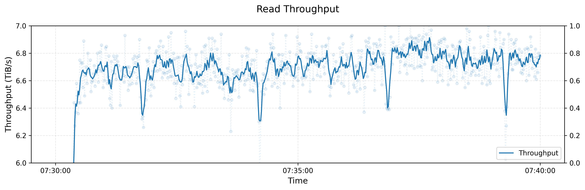
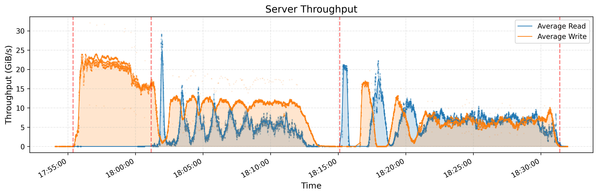
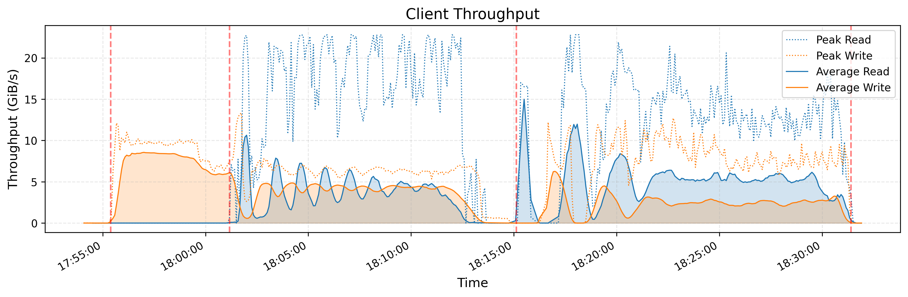
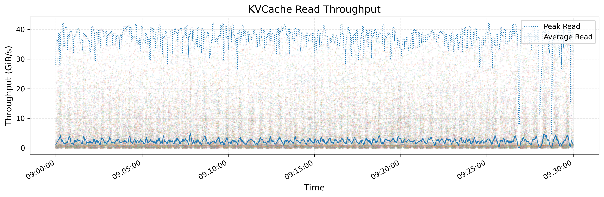
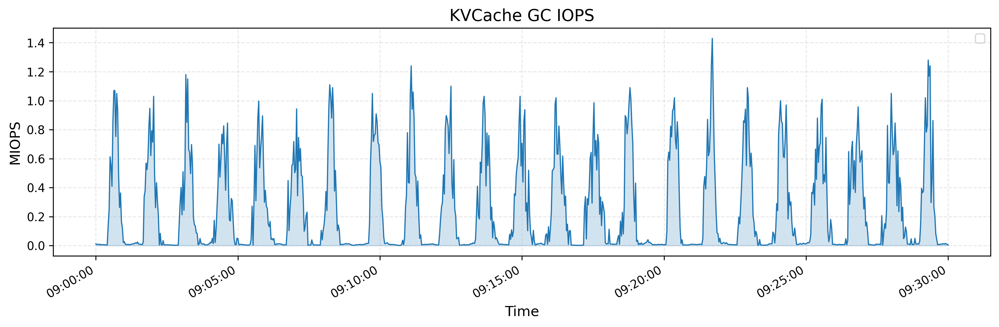

# 3FS 文档对照译稿

对照稿收录 [deepseek-ai/3FS](https://github.com/deepseek-ai/3FS) 仓库里三份英文文档: 根目录 `README.md`, `docs/design_notes.md` (设计说明, 全文), 以及 README 文档列表里链接的 `src/lib/api/UsrbIo.md` (USRBIO API 参考). 英文原段在前, 中文意译紧跟其后; 代码块, 命令, 表格保持原样. `docs/metrics.md` 只有指标名表格, 没有正文段落, 不在对照范围内. 疑惑块里的答案按 2026-05-07 的 `main` 分支 (提交 `22fca04`) 核对, 源码一律给 GitHub 链接.

## README.md

### Fire-Flyer File System · 概述

The Fire-Flyer File System (3FS) is a high-performance distributed file system designed to address the challenges of AI training and inference workloads. It leverages modern SSDs and RDMA networks to provide a shared storage layer that simplifies development of distributed applications. Key features and benefits of 3FS include:

Fire-Flyer 文件系统 (3FS) 是一套高性能分布式文件系统, 用来应对 AI 训练与推理负载带来的存储难题. 它利用现代 SSD 和 RDMA 网络提供一个共享存储层, 让分布式应用的开发变得简单. 3FS 的主要特性和收益如下:

- Performance and Usability
  - **Disaggregated Architecture** Combines the throughput of thousands of SSDs and the network bandwidth of hundreds of storage nodes, enabling applications to access storage resource in a locality-oblivious manner.
  - **Strong Consistency** Implements Chain Replication with Apportioned Queries (CRAQ) for strong consistency, making application code simple and easy to reason about.
  - **File Interfaces** Develops stateless metadata services backed by a transactional key-value store (e.g., FoundationDB). The file interface is well known and used everywhere. There is no need to learn a new storage API.

- 性能与易用性
  - **分离式架构**: 把数千块 SSD 的吞吐和数百台存储节点的网络带宽汇到一起, 应用访问存储资源时不需要关心数据在哪台机器上.
  - **强一致性**: 用 CRAQ (Chain Replication with Apportioned Queries, 分摊查询的链式复制) 实现强一致, 应用代码因此简单, 行为容易推断.
  - **文件接口**: 元数据服务做成无状态, 底下由事务型键值存储 (例如 FoundationDB) 支撑. 文件接口人人熟悉, 处处在用, 不必再学一套新的存储 API.

- Diverse Workloads
  - **Data Preparation** Organizes outputs of data analytics pipelines into hierarchical directory structures and manages a large volume of intermediate outputs efficiently.
  - **Dataloaders** Eliminates the need for prefetching or shuffling datasets by enabling random access to training samples across compute nodes.
  - **Checkpointing** Supports high-throughput parallel checkpointing for large-scale training.
  - **KVCache for Inference** Provides a cost-effective alternative to DRAM-based caching, offering high throughput and significantly larger capacity.

- 多样负载
  - **数据准备**: 把数据分析流水线的输出组织成层级目录, 高效管理大量中间产物.
  - **数据加载器**: 计算节点可以随机访问训练样本, 不再需要预取或预先打乱数据集.
  - **检查点**: 为大规模训练提供高吞吐的并行 checkpoint 读写.
  - **推理 KVCache**: 提供比 DRAM 缓存更省钱的替代方案, 吞吐高, 容量大得多.

> **想:** 「locality-oblivious」意味着客户端完全不知道数据落在哪台机器上吗?
> 答: 应用层确实不用关心, 客户端库却要算. 打开文件时客户端从 meta 服务拿到 layout (chain table, chunk 大小, stripe, shuffle seed), 之后用 `chunkIndex % stripeSize` 在打乱后的链列表里定位链, 再查路由表得到链上的存储目标, 全程不再问 meta. 见 [src/fbs/meta/Schema.cc](https://github.com/deepseek-ai/3FS/blob/main/src/fbs/meta/Schema.cc) 的 `Layout::getChainOfChunk` 与 `File::getChainId`. 读请求发给链上哪个副本由 [src/client/storage/TargetSelection.h](https://github.com/deepseek-ai/3FS/blob/main/src/client/storage/TargetSelection.h) 的选择策略决定, 也可以按 `trafficZone` 偏向同区域的目标.

### Documentation · 文档

* [Design Notes](https://github.com/deepseek-ai/3FS/blob/main/docs/design_notes.md)
* [Setup Guide](https://github.com/deepseek-ai/3FS/blob/main/deploy/README.md)
* [USRBIO API Reference](https://github.com/deepseek-ai/3FS/blob/main/src/lib/api/UsrbIo.md)
* [P Specifications](https://github.com/deepseek-ai/3FS/blob/main/specs/README.md)

* 设计说明
* 部署指南
* USRBIO API 参考
* P 语言形式化规约

### Performance · 性能

#### 1. Peak throughput · 峰值吞吐

The following figure demonstrates the throughput of read stress test on a large 3FS cluster. This cluster consists of 180 storage nodes, each equipped with 2×200Gbps InfiniBand NICs and sixteen 14TiB NVMe SSDs. Approximately 500+ client nodes were used for the read stress test, with each client node configured with 1x200Gbps InfiniBand NIC. The final aggregate read throughput reached approximately 6.6 TiB/s with background traffic from training jobs.

下图是一个大型 3FS 集群上读压力测试的吞吐曲线. 集群有 180 台存储节点, 每台配 2 块 200Gbps InfiniBand 网卡和 16 块 14TiB NVMe SSD. 读压测动用了大约 500 多台客户端节点, 每台 1 块 200Gbps InfiniBand 网卡. 在训练作业的背景流量同时存在的情况下, 最终聚合读吞吐约为 6.6 TiB/s.



图注: 3FS 180 节点集群的大块读压力测试：训练背景流量同时存在时，聚合吞吐在约半分钟后稳定在 6.6 TiB/s 附近，短时下探约 6.3–6.4 TiB/s。
To benchmark 3FS, please use our [fio engine for USRBIO](https://github.com/deepseek-ai/3FS/blob/main/benchmarks/fio_usrbio/README.md).

如需自行压测 3FS, 请使用仓库提供的 [USRBIO fio 引擎](https://github.com/deepseek-ai/3FS/blob/main/benchmarks/fio_usrbio/README.md).

> **看表:** 6.6 TiB/s 摊到每台存储节点是多少, 离网卡上限还有多远?
> 答: $6.6\ \text{TiB/s} / 180 \approx 37.5\ \text{GiB/s} \approx 40.3\ \text{GB/s}$. 每台 2×200Gbps 合 50 GB/s, 占比约 81%. 客户端侧 500 台 × 25 GB/s = 12.5 TB/s, 大于存储侧网卡总量 9 TB/s, 所以瓶颈在存储节点网络. 16 块 NVMe 的顺序读总量远超 50 GB/s, 磁盘不是瓶颈. README 没有给出读块大小和副本数, 图注只写了「Large block read」. 压测工具对应 [benchmarks/fio_usrbio/README.md](https://github.com/deepseek-ai/3FS/blob/main/benchmarks/fio_usrbio/README.md) 里的 fio USRBIO 引擎, 说明客户端走的是零拷贝路径.

#### 2. GraySort

We evaluated [smallpond](https://github.com/deepseek-ai/smallpond) using the GraySort benchmark, which measures sort performance on large-scale datasets. Our implementation adopts a two-phase approach: (1) partitioning data via shuffle using the prefix bits of keys, and (2) in-partition sorting. Both phases read/write data from/to 3FS.

我们用 GraySort 基准评测了 [smallpond](https://github.com/deepseek-ai/smallpond), 这个基准衡量大规模数据集上的排序性能. 实现分两阶段: (1) 按键的前缀位做 shuffle, 把数据分区; (2) 在分区内部排序. 两个阶段都从 3FS 读数据, 也都把结果写回 3FS.

The test cluster comprised 25 storage nodes (2 NUMA domains/node, 1 storage service/NUMA, 2×400Gbps NICs/node) and 50 compute nodes (2 NUMA domains, 192 physical cores, 2.2 TiB RAM, and 1×200 Gbps NIC/node). Sorting 110.5 TiB of data across 8,192 partitions completed in 30 minutes and 14 seconds, achieving an average throughput of *3.66 TiB/min*.

测试集群包括 25 台存储节点 (每台 2 个 NUMA 域, 每个 NUMA 域跑 1 个存储服务, 每台 2 块 400Gbps 网卡) 和 50 台计算节点 (每台 2 个 NUMA 域, 192 个物理核, 2.2 TiB 内存, 1 块 200Gbps 网卡). 把 110.5 TiB 数据排进 8,192 个分区, 用时 30 分 14 秒, 平均吞吐 *3.66 TiB/min*.




图注: GraySort 全流程吞吐：上图是存储节点、下图是计算节点的读写曲线；四条竖线分隔数据生成、shuffle 与分区内排序，110.5 TiB 排序阶段耗时约 30 分 14 秒。
> **拆开:** 30 分 14 秒包含生成输入数据的时间吗?
> 答: README 没有写. [smallpond 的 benchmarks/gray_sort_benchmark.py](https://github.com/deepseek-ai/smallpond/blob/main/benchmarks/gray_sort_benchmark.py) 在未传 `input_paths` 时会把 gensort 生成数据也放进同一个逻辑计划. 两张吞吐图上有四条红色竖虚线, 约 17:55, 18:01, 18:15, 18:31. 第一段只有写流量, 形态符合生成输入; 18:01 到 18:31 这一段约 30 分钟, 与 30m14s 吻合, 中间 18:15 的虚线把 shuffle 和分区内排序分开. 按图读出的结论是计时只覆盖两阶段排序, 不含生成, 这一点只能从图上推出, 文档没有给出原话. 平均吞吐 $110.5 \times 1024 / 1814 \approx 62.4\ \text{GiB/s}$, 与 3.66 TiB/min 对得上.

#### 3. KVCache

KVCache is a technique used to optimize the LLM inference process. It avoids redundant computations by caching the key and value vectors of previous tokens in the decoder layers.
The top figure demonstrates the read throughput of all KVCache clients (1×400Gbps NIC/node), highlighting both peak and average values, with peak throughput reaching up to 40 GiB/s. The bottom figure presents the IOPS of removing ops from garbage collection (GC) during the same time period.

KVCache 是优化 LLM 推理过程的一种技术: 把解码器各层里之前 token 的 key 和 value 向量缓存起来, 避免重复计算.
上图是所有 KVCache 客户端 (每台 1 块 400Gbps 网卡) 的读吞吐, 同时标出峰值和平均值, 峰值最高达到 40 GiB/s. 下图是同一时段内垃圾回收 (GC) 删除操作的 IOPS.




图注: 3FS KVCache 同期负载：上图显示单客户端读吞吐峰值接近 40 GiB/s、平均约 2–3 GiB/s；下图显示 GC 删除以约 0.8–1.4 MIOPS 的周期性脉冲出现。
> **问:** 40 GiB/s 是整个 KVCache 集群的总吞吐还是单台客户端的吞吐?
> 答: 按原句「read throughput of all KVCache clients ... highlighting both peak and average values」, 图里画的是各客户端吞吐的峰值线与平均线, 散点是单台客户端的采样. 40 GiB/s 接近单台 400Gbps 网卡的上限 (50 GB/s ≈ 46.6 GiB/s, 占 86%), 所以这是单台客户端能达到的峰值, 平均线只在 2 到 3 GiB/s. 网卡规格是 2025-03-03 的 [PR #58](https://github.com/deepseek-ai/3FS/pull/58) 才补进 README 的, 初版没有, 社区早期引用时常把它当作集群总量.

### Check out source code · 获取源码

Clone 3FS repository from GitHub:

从 GitHub 克隆 3FS 仓库:

	git clone https://github.com/deepseek-ai/3fs

When `deepseek-ai/3fs` has been cloned to a local file system, run the
following commands to check out the submodules:

把 `deepseek-ai/3fs` 克隆到本地文件系统后, 执行下面的命令检出子模块:

```bash
cd 3fs
git submodule update --init --recursive
./patches/apply.sh
```

### Install dependencies · 安装依赖

Install dependencies:

安装依赖:

```bash
# for Ubuntu 20.04.
apt install cmake libuv1-dev liblz4-dev liblzma-dev libdouble-conversion-dev libdwarf-dev libunwind-dev \
  libaio-dev libgflags-dev libgoogle-glog-dev libgtest-dev libgmock-dev clang-format-14 clang-14 clang-tidy-14 lld-14 \
  libgoogle-perftools-dev google-perftools libssl-dev libclang-rt-14-dev gcc-10 g++-10 libboost1.71-all-dev build-essential

# for Ubuntu 22.04.
apt install cmake libuv1-dev liblz4-dev liblzma-dev libdouble-conversion-dev libdwarf-dev libunwind-dev \
  libaio-dev libgflags-dev libgoogle-glog-dev libgtest-dev libgmock-dev clang-format-14 clang-14 clang-tidy-14 lld-14 \
  libgoogle-perftools-dev google-perftools libssl-dev gcc-12 g++-12 libboost-all-dev build-essential

# for openEuler 2403sp1
yum install cmake libuv-devel lz4-devel xz-devel double-conversion-devel libdwarf-devel libunwind-devel \
    libaio-devel gflags-devel glog-devel gtest-devel gmock-devel clang-tools-extra clang lld \
    gperftools-devel gperftools openssl-devel gcc gcc-c++ boost-devel

# for OpenCloudOS 9 and TencentOS 4
dnf install epol-release wget git meson cmake perl lld gcc gcc-c++ autoconf lz4 lz4-devel xz xz-devel \
    double-conversion-devel libdwarf-devel libunwind-devel libaio-devel gflags-devel glog-devel \
    libuv-devel gmock-devel gperftools gperftools-devel openssl-devel boost-static boost-devel mono-devel \
    libevent-devel libibverbs-devel numactl-devel python3-devel
```

Install other build prerequisites:

安装其他构建前置组件:

- [`libfuse`](https://github.com/libfuse/libfuse/releases/tag/fuse-3.16.1) 3.16.1 or newer version
- [FoundationDB](https://apple.github.io/foundationdb/getting-started-linux.html) 7.1 or newer version
- [Rust](https://www.rust-lang.org/tools/install) toolchain: minimal 1.75.0, recommended 1.85.0 or newer version (latest stable version)

- `libfuse` 3.16.1 或更新版本
- FoundationDB 7.1 或更新版本
- Rust 工具链: 最低 1.75.0, 推荐 1.85.0 或更新 (最新稳定版)

### Build 3FS · 构建 3FS

Build 3FS in `build` folder:

在 `build` 目录下构建 3FS:

```bash
# Replace <method> with 'g++10' or 'g++11' based on your environment
cmake -S . -B build \
      -DCMAKE_CXX_COMPILER=clang++-14 -DCMAKE_C_COMPILER=clang-14 \
      -DCMAKE_BUILD_TYPE=RelWithDebInfo -DCMAKE_EXPORT_COMPILE_COMMANDS=ON \
      -DSHUFFLE_METHOD=<method>
cmake --build build -j 32
```

Due to the historical use of `std::shuffle`, binaries compiled with different compiler versions (e.g., `g++10` vs. `g++11 +`) may be incompatible ([issue](https://github.com/deepseek-ai/3FS/issues/368)). To resolve this, you must explicitly specify `-DSHUFFLE_METHOD` during compilation to lock in a consistent shuffle algorithm:

由于历史上用了 `std::shuffle`, 用不同编译器版本 (例如 `g++10` 与 `g++11` 及以上) 编出来的二进制可能互不兼容 ([issue #368](https://github.com/deepseek-ai/3FS/issues/368)). 解决办法是编译时显式指定 `-DSHUFFLE_METHOD`, 固定使用同一种打乱算法:

- Existing Clusters: Use the method corresponding to the compiler version previously used to deploy the cluster (`g++10` or `g++11`).
- New Clusters: You can choose either `g++10` or `g++11`. However, once the cluster is deployed, you must stay with the same configuration for all future builds to maintain compatibility.

- 已有集群: 选与当初部署集群时的编译器版本对应的方法 (`g++10` 或 `g++11`).
- 新集群: `g++10` 和 `g++11` 任选其一. 但集群一旦部署, 以后所有构建都必须沿用同一配置, 才能保持兼容.

> **核对:** 一个打乱算法的差异为什么会让二进制「不兼容」, 它影响的是哪份数据?
> 答: 影响的是文件到链的映射. 新建文件时 meta 服务生成 shuffle seed 写进 inode, 客户端和服务端各自用这个 seed 对 stripe 个链编号做 `hf3fs_shuffle`, 再按 `chunkIndex % stripeSize` 取链. libstdc++ 不同版本里 `std::shuffle` 对同一 seed 给出的排列不同, 两边算出的链就对不上, 读写会落到错误的链上. 见 [src/fbs/meta/Schema.cc](https://github.com/deepseek-ai/3FS/blob/main/src/fbs/meta/Schema.cc) 的 `ChainRange::getChainIndexList` 和 `find_safe_seed`. 2025-12-26 的提交 [#369](https://github.com/deepseek-ai/3FS/pull/369) 把打乱实现改成可配置的确定性版本, 才有了 `-DSHUFFLE_METHOD`.

#### Build 3FS use Docker · 用 Docker 构建

- For TencentOS-4:  `docker pull docker.io/tencentos/tencentos4-deepseek3fs-build:latest`
- For OpenCloudOS-9:  `docker pull docker.io/opencloudos/opencloudos9-deepseek3fs-build:latest`

- TencentOS-4 用上面第一条镜像.
- OpenCloudOS-9 用上面第二条镜像.

### Run a test cluster · 运行测试集群

Follow instructions in [setup guide](https://github.com/deepseek-ai/3FS/blob/main/deploy/README.md) to run a test cluster.

按 [部署指南](https://github.com/deepseek-ai/3FS/blob/main/deploy/README.md) 的步骤运行一个测试集群.

### Report Issues · 报告问题

Please visit https://github.com/deepseek-ai/3fs/issues to report issues.

请到 https://github.com/deepseek-ai/3fs/issues 提交问题.

## docs/design_notes.md

### Design and implementation · 设计与实现

The 3FS system has four components: cluster manager, metadata service, storage service and client. All components are connected in an RDMA network (InfiniBand or RoCE).

3FS 由四个组件构成: 集群管理器, 元数据服务, 存储服务和客户端. 所有组件都接在同一张 RDMA 网络 (InfiniBand 或 RoCE) 上.

Metadata and storage services send heartbeats to cluster manager. Cluster manager handles membership changes and distributes cluster configuration to other services and clients. Multiple cluster managers are deployed and one of them is elected as the primary. Another manager is promoted as primary when the primary fails. Cluster configuration is typically stored in a reliable distributed coordination service, such as ZooKeeper or etcd. In our production environment, we use the same key-value store as file metadata to reduce dependencies.

元数据服务和存储服务向集群管理器发送心跳. 集群管理器处理成员变化, 并把集群配置分发给其他服务和客户端. 集群管理器部署多个, 选出其中一个当主; 主挂掉时另一个被提升为主. 集群配置一般存放在 ZooKeeper 或 etcd 这类可靠的分布式协调服务里; 我们的生产环境为了少一个依赖, 直接用存放文件元数据的那套键值存储.

> **停一下:** 集群管理器 (mgmtd) 的选主靠什么实现, 是否也走 FoundationDB?
> 答: 是. mgmtd 在键值存储里维护一条租约记录, 各实例在事务里读写这条记录来续租或抢主, 默认 `lease_length` 60 秒, `extend_lease_interval` 10 秒. 见 [src/mgmtd/store/MgmtdStore.h](https://github.com/deepseek-ai/3FS/blob/main/src/mgmtd/store/MgmtdStore.h) 的 `extendLease`, `loadMgmtdLeaseInfo` 与 [src/mgmtd/service/MgmtdConfig.h](https://github.com/deepseek-ai/3FS/blob/main/src/mgmtd/service/MgmtdConfig.h). 节点信息, 路由版本和各类服务配置也存在同一个库里, 所以 FoundationDB 同时承担元数据与集群协调两种职责.

File metadata operations (e.g. open or create files/directories) are sent to metadata services, which implement the file system semantics. Metadata services are stateless, since file metadata are stored in a t…15666 tokens truncated….rs) 里 `CHUNK_SIZE_NUMBER` 为 11, 最小 64KiB, 一个 group 256 个 chunk 用 256 位位图管理. 仓库里还保留着旧的 C++ `ChunkStore`, 它的元数据库默认是 LevelDB ([src/storage/store/PhysicalConfig.h](https://github.com/deepseek-ai/3FS/blob/main/src/storage/store/PhysicalConfig.h) 的 `kv_store_type`). 选哪套由每个 target 的 `only_chunk_engine` 决定, 代码默认 `false`, 但官方部署脚本 [deploy/data_placement/src/setup/gen_chain_table.py](https://github.com/deepseek-ai/3FS/blob/main/deploy/data_placement/src/setup/gen_chain_table.py) 生成的 `create-target` 命令都带 `--use-new-chunk-engine`, 按部署指南搭出来的集群走的是 Rust 引擎. 写路径在 [src/storage/chunk_engine/src/core/engine.rs](https://github.com/deepseek-ai/3FS/blob/main/src/storage/chunk_engine/src/core/engine.rs) 的 `update_chunk`: 覆盖已有范围或超出块容量时走 `copy_on_write`, 纯追加走 `safe_write` 原地写.

[^1]: https://elixir.bootlin.com/linux/v5.4.284/source/fs/fuse/file.c#L1573

## src/lib/api/UsrbIo.md

### Overview · 概述

User Space Ring Based IO, or USRBIO, is a set of high-speed I/O functions on 3FS. User applications can directly submit I/O requests to the 3FS I/O queue in the FUSE process via the USRBIO API, thereby bypassing certain limitations inherent to FUSE itself. For example, this approach avoids the maximum single I/O size restriction, which is notoriously unfriendly to network file systems. It also makes the data exchange between the user and FUSE processes.

USRBIO (User Space Ring Based IO, 用户态环形队列 IO) 是 3FS 上的一组高速 I/O 函数. 用户应用可以通过 USRBIO API 把 I/O 请求直接提交到 FUSE 进程里的 3FS I/O 队列, 从而绕开 FUSE 自身固有的一些限制. 例如它避开了单次 I/O 的最大长度限制, 这个限制对网络文件系统一向很不友好. 它还让用户进程与 FUSE 进程之间的数据交换 (原句到此中断, 按上下文应是「零拷贝」).

> **问:** 概述末句缺了宾语补足, 「makes the data exchange between the user and FUSE processes」原意是什么?
> 答: 原句不完整, 按上下文应为「零拷贝」: 数据放在双方共享的 Iov 里, FUSE 进程直接把 Iov 注册给 IB 网卡, RDMA 读写直达这块内存, 用户进程与 FUSE 进程之间没有内存复制. 共享内存的建立见 [src/lib/api/UsrbIo.cc](https://github.com/deepseek-ai/3FS/blob/main/src/lib/api/UsrbIo.cc) 的 `hf3fs_iovcreate` (在 `/dev/shm` 建文件, 再在 `3fs-virt/iovs/` 下建符号链接交给 FUSE 进程). 这份文档在 2025-03-05 由 [PR #94](https://github.com/deepseek-ai/3FS/pull/94) 修订过一次, 这句没有改.

### Concepts · 概念

**Iov**: A large shared memory region for zero-copy read/write operations, shared between the user and FUSE processes, with InfiniBand (IB) memory registration managed by the FUSE process. In the USRBIO API, all read data will be read into Iov, and all write data should be written to Iov by user first.

**Iov**: 一大块用于零拷贝读写的共享内存, 由用户进程和 FUSE 进程共享, InfiniBand (IB) 内存注册由 FUSE 进程负责. 在 USRBIO API 里, 所有读出的数据都落进 Iov, 所有要写的数据都必须由用户先写进 Iov.

**Ior**: A small shared memory ring for communication between user process and FUSE process. The usage of Ior is similar to Linux [io-uring](https://unixism.net/loti/index.html), where the user application enqueues read/write requests, and the FUSE process dequeues these requests for completion. The I/Os are executed in batches controlled by the `io_depth` parameter, and multiple batches will be executed in parallel, be they from different rings, or even from the same ring. However, multiple rings are still recommended for multi-threaded applications, as synchronization is unavoidable when sharing a ring.

**Ior**: 一个小的共享内存环, 用于用户进程和 FUSE 进程之间通信. 用法与 Linux [io-uring](https://unixism.net/loti/index.html) 相近: 用户应用把读写请求入队, FUSE 进程出队并完成这些请求. I/O 按 `io_depth` 参数控制的批执行, 多个批会并行执行, 不论来自不同的环, 还是来自同一个环. 不过多线程应用仍建议用多个环, 因为共享一个环免不了同步.

**File descriptor Registration**: Functions are provided for file descriptor registration and deregistration. Only registered fds can be used for the USRBIO. The file descriptors in the user application are managed by the Linux kernel and the FUSE process has no way to know how they're actually associated with inode IDs it manages. The registration makes the I/O preparation function look more like the [uring counterpart](https://unixism.net/loti/ref-liburing/submission.html).

**文件描述符注册**: API 提供注册和注销文件描述符的函数, 只有注册过的 fd 才能用于 USRBIO. 用户应用里的文件描述符由 Linux 内核管理, FUSE 进程无从知道它们和自己管理的 inode ID 之间的对应关系. 注册之后, I/O 准备函数的用法更接近 [uring 里的对应函数](https://unixism.net/loti/ref-liburing/submission.html).

### Functions · 函数

#### hf3fs_iorcreate4

**Summary:** Create an Ior instance. All `hf3fs_iorcreate*` functions create Ior instances, but include various configurable parameters due to compatibility considerations. The `struct hf3fs_ior` instance can be allocated on stack as a local variable or as a member field of another struct. The create functions will not allocate memory for it, and the destroy function will not deallocate. The `struct hf3fs_iov` is the same.

创建一个 Ior 实例. 所有 `hf3fs_iorcreate*` 函数都创建 Ior 实例, 只是出于兼容考虑带有不同的可配置参数. `struct hf3fs_ior` 实例可以作为局部变量分配在栈上, 也可以作为别的结构体的成员. 创建函数不为它分配内存, 销毁函数也不释放它. `struct hf3fs_iov` 同理.

### Syntax

```c
int hf3fs_iorcreate4(struct hf3fs_ior *ior,
                     const char *hf3fs_mount_point,
                     int entries,
                     bool for_read,
                     int io_depth,
                     int timeout,
                     int numa,
                     uint64_t flags);
```

### Parameters

- **ior**: Address for `hf3fs_ior`.
- **hf3fs_mount_point**: Mount point for 3FS. This parameter is used to distinguish 3FS clusters, enabling a single machine to mount multiple 3FS instances.
- **entries**: Maximum number of concurrent read/write requests that can be submitted.
- **for_read**: `true` if this Ior handles read requests, `false` if this Ior handles write requests. An Ior cannot handle read requests and write requests simultaneously.
- **io_depth**: `0` for no control with I/O depth. If greater than 0, then only when `io_depth` I/O requests are in queue, they will be issued to server as a batch. If smaller than 0, then USRBIO will wait for at most `-io_depth` I/O requests are in queue and issue them in one batch.
- **timeout**: Maximum wait time for batching when `io_depth` < 0.
- **numa**: Numa ID for Ior shared memory. `-1` for current process numa ID.
- **flags**: A flag composed of OR-ed bits to specify special behaviors.

`ior` 是 `hf3fs_ior` 的地址. `hf3fs_mount_point` 是 3FS 挂载点, 用来区分不同的 3FS 集群, 让一台机器可以挂多个 3FS 实例. `entries` 是可以提交的最大并发读写请求数. `for_read` 为 `true` 表示这个 Ior 处理读请求, 为 `false` 表示处理写请求, 一个 Ior 不能同时处理读和写.

`io_depth` 为 `0` 表示不控制 I/O 深度; 大于 0 时, 只有队列里攒够 `io_depth` 个 I/O 请求才作为一批发给服务端; 小于 0 时, USRBIO 最多等到队列里有 `-io_depth` 个请求, 把它们作为一批发出. `timeout` 是 `io_depth` 小于 0 时攒批的最长等待时间. `numa` 是 Ior 共享内存所在的 NUMA 节点 ID, `-1` 表示当前进程所在的 NUMA 节点. `flags` 是若干位按位或组成的标志, 用来指定特殊行为.

> **核对:** `io_depth` 大于 0 时「攒够才发」, 如果应用末批凑不满会不会卡住?
> 答: 会一直等. [src/fuse/IoRing.cc](https://github.com/deepseek-ai/3FS/blob/main/src/fuse/IoRing.cc) 取请求时, `io_depth > 0` 只在可取的 SQE 数达到 `io_depth` 时才组批, 不看超时; `io_depth < 0` 时满 $|io\_depth|$ 个或等到 `timeout` 就发. 所以 `io_depth > 0` 适合每轮请求数固定的场景 (例如一个训练 batch 固定取 N 个样本), 请求数不定的应用应当用 0 或负值.
### Return Value

- If success, return 0.
- If fail, return `-errno`.

成功返回 0, 失败返回 `-errno`.

### Example

```c
struct hf3fs_ior ior;
hf3fs_iorcreate4(&ior, "/hf3fs/mount/point", 1024, true, 0, 0, -1, 0);
hf3fs_iordestroy(&ior);
```

#### hf3fs_iordestroy

**Summary:** Destroy an Ior.

销毁一个 Ior.

### Syntax

```c
void hf3fs_destroy(struct hf3fs_ior *ior);
```

### Parameters

- **ior**: Address for Ior.

`ior` 是 Ior 的地址.

> **再看:** 语法块写的是 `hf3fs_destroy`, 和小节标题 `hf3fs_iordestroy` 不一致, 以哪个为准?
> 答: 以 `hf3fs_iordestroy` 为准. 头文件 [src/lib/api/hf3fs_usrbio.h](https://github.com/deepseek-ai/3FS/blob/main/src/lib/api/hf3fs_usrbio.h) 声明的是 `void hf3fs_iordestroy(struct hf3fs_ior *ior);`, 文档里的示例代码也调用 `hf3fs_iordestroy`, 语法块是笔误.

#### hf3fs_iovcreate

**Summary:** Create an Iov instance and allocate shared memory for that Iov.

创建一个 Iov 实例, 并为它分配共享内存.

### Syntax

```c
int hf3fs_iovcreate(struct hf3fs_iov *iov,
                    const char *hf3fs_mount_point,
                    size_t size,
                    size_t block_size,
                    int numa);
```

### Parameters

- **iov**: Address for Iov.
- **hf3fs_mount_point**: Mount point for 3FS. This parameter is used to distinguish 3FS clusters, enabling a single machine to mount multiple 3FS instances.
- **size**: Shared memory size for this Iov.
- **block_size**: If not `0`, this function will allocate multiple shared memory blocks, each sized no larger than `block_size`. `0` for allocate a single large shared memory. All IOs on this Iov should not span across the block margin. This parameter is for optimization on IB register time.
- **numa**: Numa ID for Ior shared memory. `-1` for current process numa ID.

`iov` 是 Iov 的地址. `hf3fs_mount_point` 是 3FS 挂载点, 用来区分 3FS 集群, 让一台机器可以挂多个 3FS 实例. `size` 是这个 Iov 的共享内存大小.

`block_size` 不为 `0` 时, 函数会分配多块共享内存, 每块不超过 `block_size`; 为 `0` 时分配一整块大共享内存. 这个 Iov 上的所有 IO 都不能跨越块边界. 这个参数用于缩短 IB 注册时间. `numa` 是共享内存所在的 NUMA 节点 ID, `-1` 表示当前进程所在的 NUMA 节点.

### Return Value

- If success, return 0.
- If fail, return `-errno`.

成功返回 0, 失败返回 `-errno`.

### Example

```c
struct hf3fs_iov iov;
hf3fs_iovcreate(&iov, "/hf3fs/mount/point", 1 << 30, 0, -1);
hf3fs_iovdestroy(&iov);
```

#### hf3fs_iovdestroy

**Summary:** Destroy an Iov.

销毁一个 Iov.

### Syntax

```c
void hf3fs_iovdestroy(struct hf3fs_iov *iov);
```

### Parameters

- **param**: Address for Iov.

参数是 Iov 的地址.

#### hf3fs_reg_fd

**Summary:** Register a file descriptor for FUSE IO.

为 FUSE IO 注册一个文件描述符.

### Syntax

```c
int hf3fs_reg_fd(int fd, uint64_t flags);
```

### Parameters

- **fd**: A Linux file descriptor.
- **flags**: Unused. For future use.

`fd` 是一个 Linux 文件描述符. `flags` 暂未使用, 留作将来扩展.

### Return Value

- If success, return an integer less or equal than 0. This integer can be used in `hf3fs_prep_io` as `fd`. You can view this as an extra `fd` which is only usable in USRBIO API, and `hf3fs_prep_io` will accept both this new `fd` or the original Linux `fd`.
- If fail, return `errno`.

成功时返回一个小于等于 0 的整数, 这个整数可以作为 `fd` 传给 `hf3fs_prep_io`. 可以把它看作只在 USRBIO API 里可用的额外 `fd`, `hf3fs_prep_io` 既接受这个新 `fd`, 也接受原来的 Linux `fd`. 失败时返回 `errno`.

> **对一下:** 别的函数失败返回 `-errno`, 这里失败返回 `errno`, 成功反而返回非正数, 是文档写反了吗?
> 答: 文档与代码一致, 约定确实相反. [src/lib/api/UsrbIo.cc](https://github.com/deepseek-ai/3FS/blob/main/src/lib/api/UsrbIo.cc) 的 `hf3fs_reg_fd` 先确认 fd 属于 3FS, 用 `statx` 取 inode, 再 `dup` 一个新 fd, 把两个 fd 都登记进 `regfds` 表, 最终 `return -dupfd`; 出错时返回正的 `EBADF`, `EINVAL` 或 `errno`. 调用方应当用「返回值大于 0」判断失败.
#### hf3fs_dereg_fd

**Summary:** Deregister a file descriptor.

注销一个文件描述符.

### Syntax

```c
void hf3fs_dereg_fd(int fd);
```

### Parameters

- **fd**: A Linux file descriptor.

`fd` 是一个 Linux 文件描述符.

### Example

```c
int fd = open("example.txt", O_RDONLY);
hf3fs_reg_fd(fd, 0);
hf3fs_dereg_fd(fd);
close(fd);
```

#### hf3fs_prep_io

**Summary:** Submit an I/O request to an Ior.

向一个 Ior 提交一个 I/O 请求.

### Syntax

```c
int hf3fs_prep_io(struct hf3fs_ior *ior,
                  const struct hf3fs_iov *iov,
                  bool read,
                  void *ptr,
                  int fd,
                  size_t off,
                  uint64_t len,
                  void *userdata);
```

### Parameters

- **ior**: Address for Ior.
- **iov**: Address for Iov.
- **read**: `true` for read, `false` for write. Must match the Ior create parameters.
- **ptr**: The address for I/O operation. `[ptr, ptr + len)` must be fully in the range provided by the Iov.
- **fd**: File for I/O operation. Must be registered by `hf3fs_reg_fd`.
- **off**: Offset in file.
- **len**: Read size or write size.
- **userdata**: Arbitrary data which will returned by `hf3fs_wait_for_ios`.

`ior` 是 Ior 的地址, `iov` 是 Iov 的地址. `read` 为 `true` 表示读, `false` 表示写, 必须与创建 Ior 时的参数一致. `ptr` 是 I/O 操作的地址, `[ptr, ptr + len)` 必须完整落在 Iov 提供的范围内.

`fd` 是要操作的文件, 必须先用 `hf3fs_reg_fd` 注册. `off` 是文件内偏移, `len` 是读或写的长度. `userdata` 是任意数据, 会由 `hf3fs_wait_for_ios` 原样返回.

### Return Value

- If success, return the index of I/O request in the Ior.
- If fail, return `-errno`.

成功返回该 I/O 请求在 Ior 中的序号, 失败返回 `-errno`.

### Notes

- This function may not be thread safe.

这个函数可能不是线程安全的.

#### hf3fs_submit_ios

**Summary:** Notify FUSE process that new I/O operations has been submitted.

通知 FUSE 进程有新的 I/O 操作已提交.

### Syntax

```c
int hf3fs_submit_ios(const struct hf3fs_ior *ior);
```

### Parameters

- **ior**: Address for Ior.

`ior` 是 Ior 的地址.

### Return Value

- If success, return 0.
- If fail, return `-errno`.

成功返回 0, 失败返回 `-errno`.

### Notes

- The I/O operations may be executed **before** you call `hf3fs_submit_ios`. This function is just notifying FUSE process to work, but the FUSE process also scan new operations periodically.

I/O 操作可能在调用 `hf3fs_submit_ios` **之前**就已经执行. 这个函数只是通知 FUSE 进程开工, FUSE 进程自己也会定期扫描新操作.

> **想:** 既然 FUSE 进程会定期扫描, `hf3fs_submit_ios` 还有什么必要?
> 答: 扫描有间隔, 通知能省掉等待. FUSE 端的 watcher 线程阻塞在 IPC 信号量上, 等到信号或超时才去环里取 SQE; `hf3fs_submit_ios` 就是对这个信号量做一次 post. 超时值带随机抖动, 用来兜住漏发通知的情况, 见 [src/fuse/FuseClients.cc](https://github.com/deepseek-ai/3FS/blob/main/src/fuse/FuseClients.cc) 的 `FuseClients::watch`. 不调用也能完成, 只是延迟会多出一个扫描周期. 设计上用信号量唤醒, 没有做轮询模式, 换来的是空闲时不占 CPU.

#### hf3fs_wait_for_ios

**Summary:** Wait and get results for completed I/O operations.

等待并取回已完成 I/O 操作的结果.

### Syntax

```c
int hf3fs_wait_for_ios(const struct hf3fs_ior *ior,
                       struct hf3fs_cqe *cqes,
                       int cqec,
                       int min_results,
                       const struct timespec *abs_timeout);
```

### Parameters

- **ior**: Address for Ior.
- **cqes**: Address for `hf3fs_cqe`s. This will contains I/O operation result, and `userdata` provided by `hf3fs_prep_io`.
- **cqec**: The size of array pointed by `cqes`.
- **min_results**: Minimum number of results to return.
- **abs_timeout**: Maximum timeout to return.

`ior` 是 Ior 的地址. `cqes` 是 `hf3fs_cqe` 数组的地址, 里面会放 I/O 操作结果以及 `hf3fs_prep_io` 传入的 `userdata`. `cqec` 是 `cqes` 指向的数组大小.

`min_results` 是最少要返回的结果数, `abs_timeout` 是返回前最多等待到的绝对时刻.

### Return Value

- If success, return number of completed I/O requests.
- If fail, return `-errno`.

成功返回已完成的 I/O 请求数, 失败返回 `-errno`.

### Example

```c
hf3fs_prep_io(&ior, &iov, true, iov.base, fd, 0, 4096, nullptr);
hf3fs_prep_io(&ior, &iov, true, iov.base + 4096, fd, 4096, 4096, nullptr);
hf3fs_submit_ios(&ior);

hf3fs_cqe cqes[2];
hf3fs_wait_for_ios(&ior, cqes, 2, 2, nullptr);
```

### Notes

- It is OK to call `hf3fs_prep_io` and `hf3fs_submit_ios` in one thread, and call `hf3fs_wait_for_ios` in another thread. But only one thread can call `hf3fs_prep_io` and `hf3fs_submit_ios`, and only one thread can call `hf3fs_wait_for_ios`.

可以在一个线程里调 `hf3fs_prep_io` 和 `hf3fs_submit_ios`, 在另一个线程里调 `hf3fs_wait_for_ios`. 但调 `hf3fs_prep_io` 与 `hf3fs_submit_ios` 的只能是同一个线程, 调 `hf3fs_wait_for_ios` 的也只能是一个线程.

### Example · 完整示例

```c
#include <hf3fs_usrbio.h>

constexpr uint64_t NUM_IOS = 1024;
constexpr uint64_t BLOCK_SIZE = (32 << 20);

int main() {
    struct hf3fs_ior ior;
    hf3fs_iorcreate4(&ior, "/hf3fs/mount/point", NUM_IOS, true, 0, 0, -1, 0);

    struct hf3fs_iov iov;
    hf3fs_iovcreate(&iov, "/hf3fs/mount/point", NUM_IOS * BLOCK_SIZE, 0, -1);

    int fd = open("/hf3fs/mount/point/example.bin", O_RDONLY);
    hf3fs_reg_fd(fd, 0);

    for (int i = 0; i < NUM_IOS; i++) {
        hf3fs_prep_io(&ior, &iov, true, iov.base + i * BLOCK_SIZE, fd, i * BLOCK_SIZE, BLOCK_SIZE, nullptr);
    }
    hf3fs_submit_ios(&ior);

    hf3fs_cqe cqes[NUM_IOS];
    hf3fs_wait_for_ios(&ior, cqes, NUM_IOS, NUM_IOS, nullptr);

    hf3fs_dereg_fd(fd);
    close(fd);
    hf3fs_iovdestroy(&iov);
    hf3fs_iordestroy(&ior);

    return 0;
}
```

示例一次读 1024 个 32MiB 的块, Iov 因此需要 32GiB 共享内存; 单次请求 32MiB, 远超 FUSE 路径 1MB 的单次上限, 这正是概述里说的绕开单次 I/O 长度限制.
