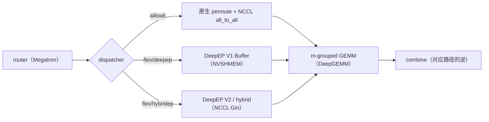

# DeepEP: 节点受限路由下的 MoE all-to-all, 从 NVLink/RDMA 转发到 IBGDA 与 hook 重叠

DeepEP 仓库 ([github.com/deepseek-ai/DeepEP](https://github.com/deepseek-ai/DeepEP)) 的首个提交 `ebfe47e` 日期为 2025-02-24, 项目在 DeepSeek 开源周第二天发布, 作者包括 Chenggang Zhao、Shangyan Zhou、Liyue Zhang 等, 采用 MIT 许可证. main 分支的 `93eb6eb` (2026-09-30) 对应 2026-09-29 发布的 V2.5 (提交 `def8651`); 仓库唯一的 tag 是 `v1.2.1` (2025-09-15). V2.5 删除了 V1 的全部代码与文档, normal kernel、low-latency kernel、IBGDA 与 hook 重叠则都属于 V1. 因此 V1 的机制对应提交 `567632d` (2026-02-03, V1 末个完整状态), V2 与 V2.5 对应 main 分支. 文档的逐段对照见同目录的 `deepep-bi.md`, 昇腾实现见 [DeepEP-Ascend](https://github.com/deepseek-ai/DeepEP-Ascend).

DeepEP 做的事情可以用一句话概括: 把 MoE 层里「按路由把 token 发给专家, 再把专家输出收回来求和」这一对 all-to-all (dispatch 与 combine) 写成专用 GPU kernel. 通用的 NCCL all-to-all 不知道一个 token 会被复制给多少个专家, 也不知道这些专家分布在哪些节点, 只能按 rank 两两交换缓冲区. DeepEP 的出发点是 DeepSeek-V3 的路由约束: 每个 token 最多去 4 个节点. 有了这个约束, 跨节点那一段的字节数有了上界, 节点内的 NVLink 又比网卡快约 3.2 倍, kernel 就可以按「先跨节点, 再节点内分发」的两级路径组织. 训练与 prefill 使用 normal kernel 追求吞吐, decode 使用 low-latency kernel 控制时延; 两者的数据路径和资源分配方式不同.

## 1. 它解决的瓶颈: 节点受限路由与非对称带宽

**DeepSeek-V3 的 EP 形状与 all-to-all 负载:** DeepSeek-V3 的 MoE 层有 1 个共享专家和 256 个路由专家, 每个 token 激活 8 个路由专家, hidden 为 7168 (模型结构见 DeepSeek-V3 解析). 训练时 MoE 用 64 路专家并行, 跨 8 个节点, 每节点 8 张 H800, 每卡放 4 个专家. 这样一来, 每个 token 的 8 个专家副本大多落在别的节点上. 专家并行的一般做法与 all-to-all 的通信量推导见 MoE 专家并行与 All-to-All 通信, 这里只算 DeepEP 关心的那部分.

一个 FP8 token 的载荷是 $7168 \times (1 + 4/128) = 7392$ 字节: 每个元素 1 字节, 每 128 个元素一个 4 字节的 FP32 scale. 一张卡在一个 micro-batch 里处理 4096 个 token, 如果每个副本单独发送, dispatch 一次要发 $4096 \times 8 \times 7392 \approx 242$ MB. 报告给出的计算与通信时间比约为 1:1, 也就是说, 不把这部分通信藏起来, 训练时间会接近翻倍. DeepEP 要解决的就是两件事: 让跨节点的字节数尽可能少, 让剩下的通信尽可能和计算重叠.

### 1.1. 为什么限制每 token 的节点数

V3 的门控先把 256 个专家按节点分成 8 组, 每组取亲和度最高的 2 个求和作为组分, 选出得分最高的 4 个节点, 再在这 4 个节点的 128 个专家里取 top-8. DeepEP 的测试脚本用的是简化版本: [`tests/test_internode.py`](https://github.com/deepseek-ai/DeepEP/blob/567632d/tests/test_internode.py) 取每组的最大分数作为组分, `num_topk_groups` 默认为 `min(num_nodes, 4)`. 限制的效果可以直接算. 设专家数为 $E$, 分成 $G$ 组, 一个 token 在均匀路由下从 $E$ 个专家里无放回地选 $k$ 个, 它命中的组数期望为

$$
\mathbb{E}[\text{命中组数}] = G\left(1 - \binom{E - E/G}{k} \Big/ \binom{E}{k}\right).
$$

不加限制时 $E=256, G=8, k=8$, 期望命中 5.30 个节点, 最坏 8 个; 限到 4 个节点后, 相当于 $E=128, G=4, k=8$, 期望降到 3.63 个, 最坏 4 个. 去掉本节点 (概率 $1/8$) 之后, 每个 token 过网卡的份数从 4.63 降到 3.18, 少了约 31%. 更关键的是上界: 最坏情况从 7 份变成 3 到 4 份, 发送缓冲区和 RDMA 队列可以按这个上界预留. V3 报告还给了另一个角度: 节点内 NVLink 约 160 GB/s, 网卡约 50 GB/s, 比值约 3.2, 所以一个 token 进入目标节点之后, 平均可以在那里分给 3.2 个专家而不让 NVLink 成为瓶颈; 4 个节点合计最多 13 个专家, 当前的 top-8 还有余量.

同一个公式也出现在 V2 的代码里. [`deep_ep/buffers/ep.py`](https://github.com/deepseek-ai/DeepEP/blob/main/deep_ep/buffers/ep.py) 的 `get_theoretical_num_sms` 内部定义了 `get_expected_topk(num_groups)`, 写法就是 `num_groups * (1 - comb(num_experts - num_experts // num_groups, num_topk) / comb(num_experts, num_topk))`, 用它估算每个 token 期望命中的 scale-out 与 scale-up rank 数, 再推出 RDMA 与 NVLink 两侧的流量比例. 也就是说, 均匀路由下的期望命中数是 DeepEP 两代实现共同的流量模型, V1 把它用在默认配置的调参上, V2 把它写进了 SM 数的解析公式.

**非对称域带宽转发: 先 RDMA 到同号卡, 再 NVLink 分发:** 两级路径的具体走法是: 源卡 $(n_s, g)$ 上的 token 要发给节点 $n_d$ 上的若干张卡时, 先经 RDMA 发给 $n_d$ 上同号的卡 $(n_d, g)$, 一个节点只发一份; 这张卡收到后, 再经 NVLink 转发给本节点里真正持有目标专家的那几张卡. 这样每张卡只和其他节点的同号卡建立 RDMA 连接, 一个 8 卡节点里的 8 张卡各自走自己的网卡, 不同号之间的流量不会挤到同一块网卡上. 文档把这称为非对称域带宽转发 (asymmetric-domain bandwidth forwarding): RDMA 域与 NVLink 域带宽不同, 转发把字节数大的那一段放到快的 NVLink 上.

转发的代价是 NVLink 上的字节数. 跨节点到达的每一份都要再走一跳 NVLink, 节点内的分发份数接近 token 的专家副本数. 按 1.2 节的数字, RDMA 上每个 token 约 3.18 份, NVLink 上接近 8 份, 两者的比值与带宽比 3.2 大致相当, 两段可以同时跑满. 这也是 normal kernel 必须让 SM 全程参与的原因: NVLink 转发是内存语义的拷贝, 要由 SM 一个字节一个字节地搬, 不能交给网卡. V3 报告里「20 个 SM 用于通信」指的就是这部分开销.

**normal kernel: layout 计算, 通知与转发流水:** **`get_dispatch_layout`: 四个描述路由的张量**

normal dispatch 一次调用要跑三个 kernel: `get_dispatch_layout`, `notify_dispatch` 与 `dispatch` 本身. 第一个在 [`csrc/kernels/layout.cu`](https://github.com/deepseek-ai/DeepEP/blob/567632d/csrc/kernels/layout.cu) 里, 输入是形状 `[num_tokens, num_topk]` 的 `topk_idx`, 输出四个张量: `num_tokens_per_rank` (发往每个 rank 的 token 数), `num_tokens_per_rdma_rank` (发往每个节点的 token 数), `num_tokens_per_expert` (发往每个专家的 token 数), 以及布尔矩阵 `is_token_in_rank` (形状 `[num_tokens, num_ranks]`, 表示第 $i$ 个 token 要不要发给第 $r$ 个 rank). 这里的计数都按 token 去重: 一个 token 选中同一个 rank 上的两个专家, 只算一次.

kernel 的分工按 SM 切开. 模板参数是 `kNumThreads=256, kNumExpertsPerSM=4, kNumRanksPerSM=8`: 前 $\lceil E/4 \rceil$ 个 SM 每个负责 4 个专家, 256 个线程分段扫 `topk_idx`, 在 shared memory 里按线程累加再归约, 得到 `num_tokens_per_expert`; 后面的 SM 每个负责 8 个 rank, 也就是一个节点, 同样扫一遍 `topk_idx`, 对每个 token 判断它落在这 8 个 rank 里的哪几个, 写 `is_token_in_rank`, 同时累加 rank 级与节点级的计数. 256 个专家, EP64 时 grid 是 $64 + 8 = 72$ 个 SM. 这一步不涉及通信, 计算量很小, 后面两步都以它的输出为输入.

**`notify_dispatch`: 交换计数, 前缀和与 CPU 等待:** 第二步要解决「接收方事先不知道自己会收多少 token」的问题. [`csrc/kernels/internode.cu`](https://github.com/deepseek-ai/DeepEP/blob/567632d/csrc/kernels/internode.cu) 的 `notify_dispatch` 里, SM 0 负责全局同步与计数交换: 先做一次节点内 barrier 与同号卡之间的跨节点同步, 把本卡发往每个节点, 每个 rank, 每个专家的 token 数用 `nvshmemi_ibgda_put_nbi_warp` 写到对端的对称缓冲区, 再经节点内的 NVLink 缓冲区汇总, 最终算出本卡总共要收多少 token, 写进一块 pinned host 内存 `moe_recv_counter_mapped`. 其余 SM 并行计算按 channel 划分的前缀和矩阵 `rdma_channel_prefix_matrix` 与 `gbl_channel_prefix_matrix`: 一个 channel 处理 token 序列中连续的一段, 前缀和给出每个 channel 在每个目标 rank 的接收缓冲区里从第几个位置开始写. 有了这两张表, 后面各个 channel 可以无锁地并行写入, 写出来的顺序与源 token 顺序一致.

主机侧在 [`csrc/deep_ep.cpp`](https://github.com/deepseek-ai/DeepEP/blob/567632d/csrc/deep_ep.cpp) 里自旋读 `moe_recv_counter_mapped`, 直到 GPU 写入有效值, 超时上限 `NUM_CPU_TIMEOUT_SECS` 为 100 秒 (定义在 [`csrc/kernels/configs.cuh`](https://github.com/deepseek-ai/DeepEP/blob/567632d/csrc/kernels/configs.cuh)). 拿到数字之后, CPU 才能按准确大小分配 `recv_x` 等输出张量, 再 launch 真正的 dispatch kernel. 这一次 GPU 到 CPU 的同步是 normal kernel 不能被 CUDA graph 捕获的原因. 绕开的办法是 `num_worst_tokens`: 调用方给出最坏情况下的接收 token 数, 输出按这个容量分配, 跳过 CPU 等待. V1 文档的示例注释写「this flag is for intranode only」, 但在 `567632d` 的代码里 `internode_dispatch` 也接受 `num_worst_tokens`, 对应 2025-11-05 的提交 `92fe2de` (Enable CUDA Graph for internode dispatch), 文档没有跟着更新.

### 1.2. channel, warp 角色与环形队列

真正的 dispatch kernel 以 channel 为单位组织, 一个 channel 占两个 SM. 节点内版本 ([`csrc/kernels/intranode.cu`](https://github.com/deepseek-ai/DeepEP/blob/567632d/csrc/kernels/intranode.cu)) 最简单: `sm_id % 2 == 0` 的 SM 是发送方, 奇数 SM 是接收方, `num_channels = num_sms / 2`, 每个 channel 负责 token 序列的一段, 对每个目标 rank 有一条 NVLink 环形队列, 发送方写 tail, 接收方推进 head. 跨节点版本把两个 SM 分成转发 SM 与非转发 SM (`is_forwarder = sm_id % 2 == 0`), 在 warp 级别再细分角色. 非转发 SM 上有 7 个 `kRDMASender` warp, 把 token 打包写进发往各节点的 RDMA 发送缓冲区; 1 个 `kRDMASenderCoordinator` warp, 负责按 chunk 提交 RDMA 写并推进远端的 tail; 其余 8 个 `kNVLReceivers` warp, 每个对应一个 NVLink 对端, 从 NVLink 队列里取出 token 写进最终的 `recv_x`. 转发 SM 的前 8 个 warp 是 `kRDMAAndNVLForwarder`, 后面的 warp 被标成 `kForwarderCoordinator`, 但只有第一个干活, 其余直接返回: 前者从 RDMA 接收缓冲区读出别的节点发来的 token, 按 token 附带的目标位图转发到本节点各卡的 NVLink 队列, 后者回收已消费的 RDMA 缓冲区并把新的 head 告诉发送方.

token 在两段之间带着一个 `SourceMeta` 结构, 字段只有两个: `src_rdma_rank` (来自哪个节点) 与 `is_token_in_nvl_rank_bits` (一个 8 位的位图, 第 $j$ 位表示要不要转发给本节点第 $j$ 张卡). 一个 8 卡节点正好用一个字节描述 NVLink 分发, 这也是 `NUM_MAX_NVL_PEERS` 取 8 的原因. 发送顺序上有一个细节: RDMA sender 遍历目标节点时用 `dst_rdma_rank = (i + channel_id + rdma_rank) % kNumRDMARanks`, 不同 channel, 不同源节点的起点错开, 避免所有卡在同一时刻都往同一个节点写造成 incast. 环形队列省显存, 但也带来了复杂度: 生产者与消费者之间靠 head 与 tail 两个计数器同步, 一方超时就会整体卡住, 所以每个等待循环都带 `NUM_TIMEOUT_CYCLES` 的超时打印. V1 文档自己也承认这一点, 建议重写的人改用按最大容量预分配的定长缓冲区 (issue 39).

**combine 的反向路径, 缓存模式与 SM 数:** combine 走的是 dispatch 的反向路径: NVLink 发送方把专家输出写回转发卡, 转发卡在本节点内先把发往同一源 token 的多份输出加起来, 再经 RDMA 发回源节点, 源卡最终做一次归约. 跨节点版本的角色换成 `kNVLSender`, `kNVLAndRDMAForwarder`, `kRDMAReceiver` 与 `kCoordinator`, 转发 SM 变成奇数号 (`is_forwarder_sm = sm_id % 2 == 1`). 节点内先归约, 意味着 RDMA 上回传的是每个 (token, 节点) 一份, 字节数与 dispatch 对称. combine 不需要 layout 与 notify: dispatch 返回的 `handle` 里保存了前缀和矩阵与 `send_head` 等位置信息, combine 直接复用. 训练反向时也一样, dispatch 的反向就是 combine, combine 的反向就是带 `handle` 的缓存模式 dispatch, 不再做 CPU 同步.

SM 数由 `Buffer.set_num_sms` 控制, 文档示例用 24, 即 12 个 channel. 每个 channel 内部的 chunk 大小由 `Config` 决定, 共四个参数: NVLink 与 RDMA 两侧的「一次最多发多少 token」与「接收缓冲区能放多少 token」. [`deep_ep/buffer.py`](https://github.com/deepseek-ai/DeepEP/blob/567632d/deep_ep/buffer.py) 里 `get_dispatch_config` 与 `get_combine_config` 为 EP2 到 EP160 各给了一组在 DeepSeek 内部集群上调好的值, 比如 EP32 dispatch 是 `Config(Buffer.num_sms, 32, 288, 8, 128)`. 文档建议在自己的集群上跑测试脚本重新搜索: [`tests/test_internode.py`](https://github.com/deepseek-ai/DeepEP/blob/567632d/tests/test_internode.py) 对 NVLink chunk 在 4 到 44, RDMA chunk 在 4 到 32 之间按步长 4 做网格搜索. SM 少了, 带宽上不去; SM 多了, 计算可用的 SM 就少. 这组参数要靠实测, 这正是 V2 想用解析公式取代的部分.

**low-latency kernel: IBGDA 与 recv hook:** **消息格式与按专家排布的接收区**

decode 阶段每张卡一次只有几十到一百多个 token, 每个 token 仍要发给 8 个专家. 这时瓶颈从带宽变成了延迟: normal kernel 的三个 kernel, 一次 CPU 同步, 两级转发, 每一步都要付固定开销. low-latency kernel 的做法是把所有这些步骤合进一个 kernel, 并且不做转发: 每个 (token, 专家) 副本直接经 RDMA 发到持有该专家的卡, 每个副本一条消息. 消息格式在 [`csrc/kernels/internode_ll.cu`](https://github.com/deepseek-ai/DeepEP/blob/567632d/csrc/kernels/internode_ll.cu) 的 `dispatch` 里定义: 先是一个 `int4` 的头 (源 token 序号加 3 个保留字段), 然后是 hidden 数据, FP8 模式下再跟 `hidden / 128` 个 FP32 scale. hidden 为 7168 时, FP8 消息 7408 字节, BF16 消息 14352 字节.

接收区按专家排布, 不按源 rank 排布. 目标地址的算法是 `dst_expert_local_idx * num_ranks * num_max_dispatch_tokens_per_rank * num_bytes_per_msg + rank * num_max_dispatch_tokens_per_rank * num_bytes_per_msg + slot_idx * num_bytes_per_msg`: 每个本地专家有一块区域, 区域里每个源 rank 有 `num_max_dispatch_tokens_per_rank` 个槽位, 发送方对目标专家做一次 `atomicAdd` 拿到槽位号. 接收阶段把这些消息解包成形状 `[num_local_experts, num_ranks * num_max_dispatch_tokens_per_rank, hidden]` 的 `packed_recv_x`, 另给 `packed_recv_count` (每个专家实际收了多少) 与 `packed_recv_layout_range` (每个源 rank 在其中的起点与长度). 这个三维布局里大部分行是空的, 但它的形状只取决于配置, 与路由结果无关, 专家 GEMM 可以按 `packed_recv_count` 做 masked grouped GEMM, 整个 decode 步骤也就能被 CUDA graph 捕获.

预留按最坏情况算. [`csrc/config.hpp`](https://github.com/deepseek-ai/DeepEP/blob/567632d/csrc/config.hpp) 的 `LowLatencyLayout` 分配奇偶两套对称缓冲区, 每套含发送区, 接收区与信号区. 接收区大小是 `num_experts * num_max_dispatch_tokens_per_rank * num_bytes_per_msg`, 与 EP 规模无关, 只与专家总数和每卡最大 token 数有关. 取 128 个 token, hidden 7168, 256 个专家, 单套接收区约 455 MiB, 两套加上发送区共约 1.78 GiB. 这就是文档建议 `num_max_dispatch_tokens_per_rank` 小于 256 的原因. 奇偶两套缓冲区轮流使用, 所以文档同时警告: 同一时刻最多只能持有两次 low-latency 调用的结果张量.

### 1.3. IBGDA: GPU 直接敲网卡门铃

发送路径上的 FP8 转换在 kernel 内完成. 除末个 warp 外, 其余 warp 每次处理一个 token: 读 BF16 数据, 每 128 个元素用 `warp_reduce_max<16>` 求出 amax, 算 scale, 转成 E4M3 写进发送缓冲区; `round_scale` 把 scale 取整到 2 的幂, `use_ue8m0` 把 scale 存成 UE8M0 格式, 两者都是为了配合下游 GEMM 对 scale 格式的要求. 转换完成后, 每个 top-k 槽位对应的 warp 调 `nvshmemi_ibgda_put_nbi_warp`, 由 GPU 线程自己组装 RDMA 写请求, 写进网卡的发送队列, 再敲门铃. 末个 warp 统计本卡发往每个专家的 token 数, 等该专家的所有消息都提交之后 (计数器到达 `FINISHED_SUM_TAG * 2`), 用 `nvshmemi_ibgda_amo_nonfetch_add` 把 `-num_tokens_sent - 1` 原子加到接收方的计数槽位里. 取负再减一是为了让 0 保留给「还没到」: 接收方自旋读这个槽位, 读到非零就知道数据已经完整到达, 并从中解出 token 数.

IBGDA (InfiniBand GPUDirect Async) 与 NVSHMEM 默认的 IBRC 传输的区别在于谁来操作网卡. IBRC 下 GPU 把请求交给 CPU 上的代理线程, 由 CPU 提交 RDMA 操作; IBGDA 下 GPU 直接写网卡的工作队列与门铃寄存器, 省掉了 GPU 到 CPU 的往返. decode 时一次 dispatch 要发 $128 \times 8 = 1024$ 条约 7.4 KB 的消息, 几十到一百多微秒内全部发完, CPU 代理的提交速率跟不上. 这也是 V1 要求在驱动里打开 `PeerMappingOverride` 与 `NVreg_EnableStreamMemOPs` 的原因: GPU 要能直接映射网卡的寄存器与队列. 每个本地专家用一个独立的 QP: 文档要求 `num_qps_per_rank` 等于本地专家数, SM 0 上负责计数的那个 warp 会断言 `num_rc_per_pe >= num_local_experts`, 发送时把 `dst_expert_local_idx` 作为 QP 编号传入. 发往不同专家的消息走不同的 QP, 互不排队. 另一个约束在 [`deep_ep/buffer.py`](https://github.com/deepseek-ai/DeepEP/blob/567632d/deep_ep/buffer.py) 里: `NVSHMEM_QP_DEPTH` 默认 1024, 且必须不小于 `(num_max_dispatch_tokens_per_rank + 1) * 2`.

**hook: 把发送与接收拆成两次 launch:** low-latency kernel 内部按 phase 分成两段: `LOW_LATENCY_SEND_PHASE` 做转换, 提交 RDMA 写与计数原子; `LOW_LATENCY_RECV_PHASE` 自旋等计数, 把接收区的消息解包成 `packed_recv_x`. 两段都执行时, 中间用一次 `cg::this_grid().sync()` 保证发送侧的计数清零对接收侧可见. [`csrc/deep_ep.cpp`](https://github.com/deepseek-ai/DeepEP/blob/567632d/csrc/deep_ep.cpp) 在 `return_recv_hook=true` 时只 launch 发送段, 然后返回一个 lambda `recv_hook = [=]() { launcher(LOW_LATENCY_RECV_PHASE); }`. 调用方拿到 hook 后可以先去做别的计算, 需要…9869 tokens truncated…:docs/legacy.md#L310]] 提到 queue 的复杂性与死锁风险） | 更大（README Notes：buffer size 比 V1 大） |
| RDMA low-latency 0-SM | 支持 | 不再支持（README Notes） |
| 额外能力 | EP only | 0-SM Engram(RDMA) / 0-SM PP / 0-SM CP，hybrid 与 direct 模式 |

### 4.2. 从 NVSHMEM 换到 NCCL Gin

V1 最大的依赖是 NVSHMEM——一整套独立的 symmetric heap、IBGDA 支持和 unique-id 初始化流程，和框架本身已经建立好的 NCCL communicator 是两套完全独立的东西，初始化复杂，IBGDA 的每个 SM 还要额外承担 QP 和 proxy 的簿记开销。V2 换成了 NCCL 新增的 Gin backend（README 的 Acknowledgement 中鸣谢了 NCCL 团队；NVSHMEM heap 与 NCCL window 的区别、GIN 的 GDAKI/Proxy 后端见 01 · scale-up 域：NVLink / NVSwitch 与 NVL72 rack-scale 超节点 与 03 · RDMA / InfiniBand 底层：从 verbs 到 GPU 直发），好处先是它是 header-only、非常轻量，发起 NVLink/RDMA 请求的设备端路径更薄，这正是后面能用更少 SM 的原因之一；随后它可以直接复用框架已经建立好的 NCCL communicator（`get_nccl_comm_handle(group)`，[[deepep:deep_ep/buffers/elastic.py#L172]]），不必再单独拉起一套 NVSHMEM，buffer 的注册也走 NCCL 自己的 `ncclCommWindowRegister` 接口（§4.5 的混合虚拟地址段也因此可以直接用于 RDMA）。设置 `EP_DISABLE_GIN` 可以回退到非 Gin 路径（见 README 的环境变量说明）。

**完全 JIT 编译:** V2 把 kernel 全部做成 header-only 的形式（[[deepep:deep_ep/include/deep_ep/impls/]]），运行时按实际 shape、架构和配置现场编译（[[deepep:csrc/jit/]]，环境变量 `EP_JIT_*`，缓存目录由环境配置），思路和 DeepGEMM 完全一致：安装阶段不需要编译任何 CUDA 代码，运行阶段才编出针对当前配置的最优 kernel。这一点和下面要讲的解析计算 SM/QP 数量是配套的——既然这些参数是按当前 EP 拓扑现算出来的，kernel 也就应该按这些参数现编，而不是像 V1 那样用一份预编译的 kernel（[[deepep:csrc/kernels/legacy/]] 在 setup 阶段由 nvcc 编译）去应付所有可能的配置。

**统一的 ElasticBuffer，以及它怎么处理那次绕不开的等待:** V2 把 dispatch 和 combine 都收进一个 `ElasticBuffer` 对象里（`elastic.py:708 / 868`），对称性依然成立：dispatch 的反向调用 combine，combine 的反向调用 dispatch，和 V1 完全一致。它内部的 `EPHandle`（[[deepep:deep_ep/buffers/elastic.py#L24]]）取代了 V1 那个不透明的 tuple，字段更清晰：

```python
class EPHandle:
    topk_idx                              # 路由，combine 复用
    num_recv_tokens_per_expert_list       # 每 expert 收到数 (CPU)，给 grouped GEMM
    psum_num_recv_tokens_per_expert        # 对齐 padding 后的前缀和（= GEMM 段 offset）
    token_metadata_at_forward, channel_linked_list   # hybrid 模式的转发元数据
```

其中 `psum_num_recv_tokens_per_expert`（[[deepep:deep_ep/buffers/elastic.py#L41]]）本质上就是把 V1 那套 prefix matrix 显式化成每个 expert 段在输出 buffer 里的起始偏移——§2.1 中 V1 由 `notify_dispatch` 跨 rank 归约得到的前缀和，在 V2 中就是这个字段——直接对应上一篇讲的 grouped GEMM contiguous layout 的分段边界。

关于 §2.1 那次 CPU 等待，V2 给了一个更灵活的处理方式：dispatch 多了一个 `do_cpu_sync` 开关（[[deepep:deep_ep/buffers/elastic.py#L723,L761]]；C++ 侧 [[deepep:csrc/legacy/buffer.hpp#L986-L1032]] 仍是一段 host 上的 `while` 轮询，与 V1 同构），要点在于它可以被显式关闭。首次调用（比如训练或 prefill 阶段）照常等待真实的接收计数；但 decode 阶段的路由通常和上一步高度相似，于是可以把上一次的 `EPHandle` 作为参数传回去（[[deepep:deep_ep/buffers/elastic.py#L786-L793]]），让 V2 直接复用其中缓存的接收计数，强制 `do_cpu_sync=False`，这样整个 dispatch/combine 就可以被 CUDA graph 捕获。这个思路本质上和 V1 用两套完全不同的 kernel（normal 有等待、low-latency 没有）是同一个动机的不同实现方式——V2 用一个统一的接口加一个可以关闭的开关来解决，不再需要维护两套逻辑；EP 一章讲的 V1 `num_worst_tokens` 是出于同一动机的更粗略做法。

**hybrid 模式：更适合大规模跨节点部署:** V2 的 `ElasticBuffer` 还提供了 `allow_hybrid_mode` 选项（[[deepep:deep_ep/buffers/elastic.py#L135]]）。direct 模式下每个 GPU 直接和所有 peer 通信，QP 数量随节点数增长，适合较小的单机内（scale-up）场景；hybrid 模式下多节点场景改用转发聚合流量（`token_metadata_at_forward` / `channel_linked_list`，[[deepep:deep_ep/buffers/elastic.py#L51-L52]]），思路上和 V1 的两级转发接近但更通用，并鼓励每个 channel 使用一条独立 QP（[[deepep:deep_ep/buffers/elastic.py#L702-L703]]），更适合大规模跨节点（scale-out）的 EP 部署。

Megatron 的 `HybridEPDispatch`（[[megatron-lm:megatron/core/transformer/moe/fused_a2a.py#L353]]，`dispatch_with_permute`）对应 DeepEP 的 hybrid-ep 实验分支，它把 permute 也融合进 dispatch，比 V1 的 `FusedDispatch` 再少一次显存往返。这是 Megatron 侧对接 V2/hybrid 的过渡形态。

**elastic buffer：一段横跨 GPU 显存和主机内存的虚拟地址:** V2 名字里的 elastic 不是营销词。它的通信 buffer 是一段连续的虚拟地址，底层物理页一部分落在 GPU 显存上，一部分落在主机（NUMA 本地）内存上——实现上不走常规的 `cudaMalloc`，而是直接调用 CUDA 的虚拟内存管理（VMM）接口自己拼出这段地址空间。参见 `ElasticSymmetricMemory`（[[deepep:csrc/kernels/backend/symmetric.hpp#L145-L186]]）：

```cpp
// 内存布局：[GPU VRAM (前) | CPU RAM / NUMA-local (后)]，一段连续 VA
cuMemAddressReserve(&addr, gpu_bytes + cpu_bytes, 2MB对齐);   // 1) 预留整段虚拟地址

cuMemCreate(&gpu_handle, gpu_bytes, prop=DEVICE);            // 2) 在显存上建物理块
cuMemMap(addr,            gpu_bytes, gpu_handle);            //    映射到 VA 前半段
set_access(addr, gpu_bytes, device_idx);                     //    GPU 可读写

cuMemCreate(&cpu_handle, cpu_bytes, prop=HOST_NUMA[numa_id]); // 3) 在 host NUMA 节点上建物理块
cuMemMap(addr + gpu_bytes, cpu_bytes, cpu_handle);          //    映射到 VA 后半段
set_access(addr + gpu_bytes, cpu_bytes, device_idx, numa_id);//    GPU 和该 NUMA 节点都可读写
```

这样做的好处是，kernel 里访问这块 buffer 就是普通的指针加法：`ptr[i]` 落在前半段读的是显存，落在后半段则透明地经过芯片间互联去读主机内存——地址空间不变，kernel 代码也不用区分。两段物理内存挂在同一个 VA range 上，`prop` 的 `location.type` 一段是 `CU_MEM_LOCATION_TYPE_DEVICE`，另一段是 `CU_MEM_LOCATION_TYPE_HOST_NUMA`（NUMA id 取自该 GPU 的 `CU_DEVICE_ATTRIBUTE_HOST_NUMA_ID`，[[deepep:csrc/kernels/backend/symmetric.hpp#L30]]）。`cuMemSetAccess` 为两段都开启了「GPU 与 host NUMA 节点」双向读写（[[deepep:csrc/kernels/backend/symmetric.hpp#L90-L111]]），并要求 `gpuDirectRDMACapable`（[[deepep:csrc/kernels/backend/symmetric.hpp#L60]]），这样整段 VA 都可以被 `ncclCommWindowRegister` 注册，NCCL Gin 可以直接从这段混合内存发起 RDMA，无需先拷回显存。

多进程、多 rank 的共享由另一个类 `HybridElasticSymmetricMemory` 实现（布局为 `[GPU VRAM | CPU rank0 | CPU rank1 | … | CPU rank(N-1)]`）：每个 rank 在自己的 NUMA 节点上创建 CPU 段，并导出一个 POSIX file-descriptor handle（`create_cpu_handle` 返回 `(pid, fd)`，[[deepep:csrc/kernels/backend/symmetric.hpp#L658-L660]]；Python 侧通过 `_C.create_cpu_handle` 与 `dist.all_gather_object` 交换，[[deepep:deep_ep/buffers/elastic.py#L208-L213]]），随后每个 rank 把所有 peer 的 fd import 进来，依次映射到 GPU 段之后。这样任意 rank 的 kernel 都能用一个 VA 直接寻址任意 peer 的主机内存。

这意味着 buffer 的容量可以超过显存本身，溢出的部分自动落到主机内存上。这个机制目前主要支撑几个仍在推进中的能力：

- **Engram**（0-SM 的远程 KV cache，`engram.hpp` / `engram_fetch.cuh`）：把 KV cache 放在更便宜的主机内存上，按需通过 RDMA 取回；`get_engram_storage_size_hint` 直接返回 `(num_gpu_bytes, num_cpu_bytes)` 两个值（[[deepep:deep_ep/buffers/elastic.py#L280-L306]]）。
- **自动处理不均衡的 EP**：当热点 expert 的 token 超出显存容量时，可以让 buffer 扩展到主机内存，而不是直接 OOM。

当前默认路径仍然是纯 GPU 的 `GPUSymmetricMemory`（`ncclMemAlloc`，[[deepep:csrc/kernels/backend/symmetric.hpp#L124-L140]]）；elastic / hybrid 路径需要通过 `num_cpu_bytes > 0` 加 `allow_hybrid_mode` 显式开启（[[deepep:deep_ep/buffers/elastic.py#L210]]），项目文档里也标注这是实验特性——但这套用 VMM 拼一段跨 GPU/CPU 的连续虚拟地址的机制本身已经完整落地。

### 4.3. 为什么 V2 能用更少的 SM 跑出更好的性能

这是 V2 最反直觉的一点（V3 规模训练的 SM 占用从 24 降到 4~6），也值得单独说清楚。答案分两层：先看 dispatch/combine 这类 kernel 里 SM 到底在干什么，再看 V2 如何把「该用多少 SM」从经验调参变成解析计算。

第一层，这些 kernel 里的 SM 更像 DMA 泵，而不是算力来源。dispatch/combine 没有任何矩阵乘法，warp 做的全部工作就是把 token 从 HBM 读出来、写进通信 buffer 或发起 NVLink/RDMA 请求，接收端再把数据从通信 buffer 拷到目标位置。真正的吞吐天花板是网络链路带宽（机内 NVLink 有 700 GB/s 以上，跨机每张 NIC 的 RDMA 却只有 50 到 90 GB/s），而不是 SM 的数量。所以「需要多少 SM」这个问题的本质，是要让这些 SM 的 HBM 读写带宽刚好喂饱那条真正受限的链路。多给的 SM 纯粹是浪费，更糟的是它们本可以留给和通信重叠执行的 grouped GEMM。

第二层，V2 把这件事从拍脑袋变成了解析计算，即 `get_theoretical_num_sms`（[[deepep:deep_ep/buffers/elastic.py#L582-L687]]）：先把每个 token 在 HBM 上的读写流量、以及实际会经过 NVLink 或 RDMA 的流量分别归一化，找出哪条链路是真正的瓶颈，再算出喂饱这条瓶颈链路所需的 HBM 读、写带宽各自需要多少个 SM，取两者的较大值，加上一点余量。下面是精简后的逻辑：

```python

sm_read  += 1 / num_expected_topk          # 读 token
sm_write += num_nvlink_ranks / num_ranks   # 写 send buffer / 发 NVLink
nvlink_traffic += ...                       # 实际过 NVLink 的份额（去掉 local bypass）
rdma_traffic   += (num_ranks - num_nvlink_ranks) / num_ranks

bounded_traffic, bounded_gbs = max_by(traffic/gbs, {nvlink, rdma})

num_sms = max(bounded_gbs / bounded_traffic * sm_read  / sm_read_gbs,    # 每 SM 读 ~200 GB/s
              bounded_gbs / bounded_traffic * sm_write / sm_write_gbs)   # 每 SM 写 ~50 GB/s
num_sms = align(max(4, ceil(num_sms * 1.25)), 2)        # 25% 余量、偶数、下限 4
num_sms = num_sms if prefer_overlap_with_compute else max(num_sms, 64)
```

可以这样读这段代码：当瓶颈链路是 RDMA、比如每张 NIC 只有 60 GB/s 时，喂饱它所需的 HBM 带宽很小，几个 SM 就够了，于是只需要 4 到 6 个；当瓶颈链路是机内 NVLink、带宽 700 GB/s 时，就需要更多 SM 才能喂满。README 的实测表（[[deepep:README.md#L45-L55]]）正好验证了这个模型：

| Topo | Dispatch bottleneck | #SMs |
|---|---|---|
| EP 8×4（跨机，RDMA） | 61 GB/s (RDMA) | 6 |
| EP 8×2（跨机，RDMA） | 90 GB/s (RDMA) | 12 |
| EP 8（单机，NVLink） | 643 GB/s (NVLink) | 24（min SM）/ 64（max perf） |

`prefer_overlap_with_compute`（[[deepep:deep_ep/buffers/elastic.py#L677]]）这个 flag 直接表达了设计意图：需要与 GEMM overlap 时，就用上面算出的最小值，把 SM 让给计算；不需要 overlap 时，则把 SM 数提高到至少 64，以追求单 kernel 的峰值性能。`num_qps` 用同样的思路解析计算（`get_theoretical_num_qps`，[[deepep:deep_ep/buffers/elastic.py#L689-L706]]）。

但仅有解析公式还不足以解释能用更少 SM 这件事，真正的功劳在两处底层重构（参见 V2 设备端 kernel [[deepep:deep_ep/include/deep_ep/impls/dispatch.cuh]]）。一是 channel 的粒度从一对 SM 细化到一个 warp：§2.2 介绍过 V1 的 channel 由一对 SM block 组成（`num_channels = num_sms/2`），而 V2 在注释中直接写明 "We treat each warp as a channel"（`dispatch.cuh:67`），每个 dispatch warp 独立地按 stride 扫描 token（`token_start = dispatch_warp_idx*kNumSMs + sm_idx`，`dispatch.cuh:272-273`），并独立绑定一条 QP（`get_qp_mode(...)`，hybrid 模式下 `num_qps ≈ num_sms*16+1`，[[deepep:deep_ep/buffers/elastic.py#L704]]）。一个 SM 大约有 16 个 warp，也就意味着一个 V2 的 SM 能顶 V1 大约 16 个 channel 的并发度，自然只需要少一个量级的 SM 就能凑够喂满链路所需的并发通信流。二是把 §2.1 讲的 notify 阶段直接融进了 dispatch kernel 内部，变成其中几个专门的 warp 角色（`dispatch.cuh:77` "Different warp roles"），而不再是独立 launch 的一个 kernel、中间还要卡一次 CPU 握手：前 `kNumNotifyWarps` 个 warp 用 shared memory 上的 atomic 统计各 rank/expert 的计数（`:94-106`），再由全 grid 通过 `red_add` 归约到 workspace（`:112-113`），然后由 SM 0 用 NCCL Gin 的 `put` 把计数发给 peer（`:151-176`），并就地计算 `psum_num_recv_tokens_per_expert`（`:245-251`，即 §4.3 提到的字段）；与此同时其余 warp 在搬运 token。§2.1 那套「跨 rank 归约计数、计算前缀和」的逻辑一步不少，只是从单独的 kernel 变成了与数据搬运同一 grid 内的几个 warp，省掉了一次 kernel launch 和一次 GPU 与 CPU 之间的往返，CPU 同步也退化成了一个可选项（`kDoCPUSync`，`dispatch.cuh:218`），可以被 §4.3 说的 handle 缓存机制关掉。

反过来问，V1 为什么需要 24 个 SM？V1 没有解析模型，依靠一张按 EP size 手工调优的 `Config` 表过量供给（[[deepep:deep_ep/buffers/legacy.py#L245-L290]]，`Buffer.num_sms` 默认 20，V3 训练 recipe 中上调到 24），channel 粒度又粗（一对 SM 一个 channel），再加上 NVSHMEM/IBGDA 要求每个 SM 承担更多 QP/proxy 簿记。V2 在四个方面同时改进——warp 级 channel、融合 notify、NCCL Gin 的轻量 issue 路径（§4.1）、解析式的 SM 数量计算——最终结果是 README News 中的数据：V3 规模的训练中 SM 从 24 降到 4~6，峰值性能反而提升到 1.3 倍，最多节省 4 倍 SM（[[deepep:README.md#L22,L55]]）。说到底，减少 SM 占用可以避免 dispatch/combine 与同卡 grouped GEMM 争抢 SM 资源，把通信真正地藏进计算背后——这也呼应了全站反复出现的通信与计算重叠这条主线。

---

把 V1/V2 放回整条 pipeline 里看.



把这一篇和上一篇串起来看：训练主力路径要么是 Megatron 原生的 alltoall，要么是 flex 路径配 DeepEP V1 的 normal dispatch，通常带 FP8；decode 阶段则是 DeepEP 的 low-latency 模式（V1）或 ElasticBuffer 的 LL 路径（V2），配上 DeepGEMM 的 masked GEMM 和 CUDA graph。V2 的卖点是明显更少的 SM 占用、更大的 EP 规模、不需要手动调参，以及更轻量的 NCCL Gin 后端；代价是 buffer 更大，并且去掉了 V1 那种完全不占 SM 的 RDMA low-latency 路径。不变的是 EP 一章反复强调的对称性：dispatch 的反向就是 combine，V1、V2 概莫能外，这是 EP 通信库设计上的一条不变式。

延伸阅读：

- V1 的完整文档 [[deepep:docs/legacy.md]] 里有更细的性能表和调参建议（含 normal/LL 的 perf 表、auto-tuning 建议、undefined-behavior PTX 那段 hack）。
- V2 的接口和环境变量在项目 [[deepep:README.md]] 里（`EP_*` 环境变量、traffic isolation/VL、adaptive routing、PCI atomic mode）。
- 项目还提到了几个仍在推进的实验分支，包括去掉 PyTorch 与通信 buffer 之间拷贝的 zero-copy 版本、去掉 RDMA atomic 往返延迟的 eager 版本、融合 permute 的 Hybrid-EP（TMA、NVFP4），以及支持 AMD ROCm 的 Mori-EP。

至此，从 router 到 dispatch、grouped GEMM、combine，再到 DeepEP 的内部机制与 V1/V2 演进，整条 MoE 与 EP 的 infra 通路已经讲完。动手环节见 [[atlas:docs/parallel/05_ep/ep_lab.ipynb]]：用纯 torch 与 `torch.distributed.all_to_all` 在本地把上面的每一段亲手实现一遍，前向与反向都能跑通。

下一篇是 07 · MegaMoE：把 MoE forward 融成单个 kernel：它把这一篇讲的 dispatch/combine 通信，连同上一篇讲的 grouped GEMM 计算，一起塞进了同一个 SM100 kernel，让 NVLink 通信与 tensor core 计算真正重叠。

## 参考文献

1. Lepikhin, D., et al. (2020). [GShard: Scaling Giant Models with Conditional Computation and Automatic Sharding](https://arxiv.org/abs/2006.16668).
2. Fedus, W., Zoph, B., & Shazeer, N. (2021). [Switch Transformers: Scaling to Trillion Parameter Models with Simple and Efficient Sparsity](https://arxiv.org/abs/2101.03961). 第 5 节.
3. Hwang, C., et al. (2023). [Tutel: Adaptive Mixture-of-Experts at Scale](https://arxiv.org/abs/2206.03382). MLSys 2023. 附录 A 2DH All-to-All.
4. DeepSeek-AI. (2024). [DeepSeek-V2: A Strong, Economical, and Efficient Mixture-of-Experts Language Model](https://arxiv.org/abs/2405.04434). §3.1.3.
5. DeepSeek-AI. (2024). [DeepSeek-V3 Technical Report](https://arxiv.org/abs/2412.19437). §3.2, §3.3, §3.5.1, Table 2.
6. DeepSeek. [DeepEP](https://github.com/deepseek-ai/DeepEP). README: `EPBuffer`, 异步 dispatch / combine, FP8 dispatch.
7. Zhang, S., et al. (2025). [Comet: Fine-grained Computation-communication Overlapping for Mixture-of-Experts](https://arxiv.org/abs/2502.19811).
8. Chang, L.-W., et al. (2024). [FLUX: Fast Software-based Communication Overlap On GPUs Through Kernel Fusion](https://arxiv.org/abs/2406.06858).
9. Zheng, S., et al. (2025). [Triton-distributed: Programming Overlapping Kernels on Distributed AI Systems with the Triton Compiler](https://arxiv.org/abs/2504.19442).
10. Rajbhandari, S., Rasley, J., Ruwase, O., & He, Y. (2020). [ZeRO: Memory Optimizations Toward Training Trillion Parameter Models](https://arxiv.org/abs/1910.02054). SC20.
11. Patarasuk, P., & Yuan, X. (2009). [Bandwidth Optimal All-reduce Algorithms for Clusters of Workstations](https://doi.org/10.1016/j.jpdc.2008.09.002). *Journal of Parallel and Distributed Computing*, 69(2).
12. Moonshot AI. (2026). [Kimi K3 Technical Report](https://arxiv.org/abs/2607.24653). 推理 kernel 一节.
13. Elango, V., et al. (2026). [LatentMoE](https://arxiv.org/abs/2601.18089).
