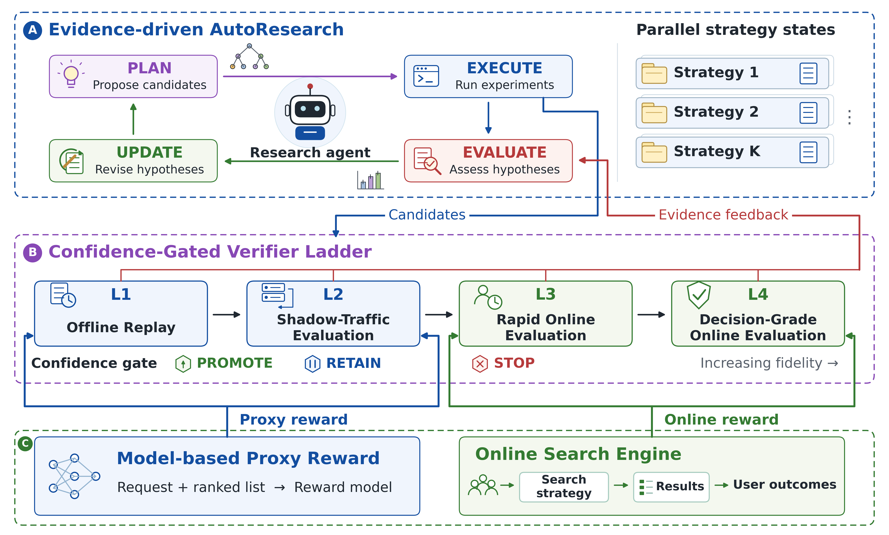
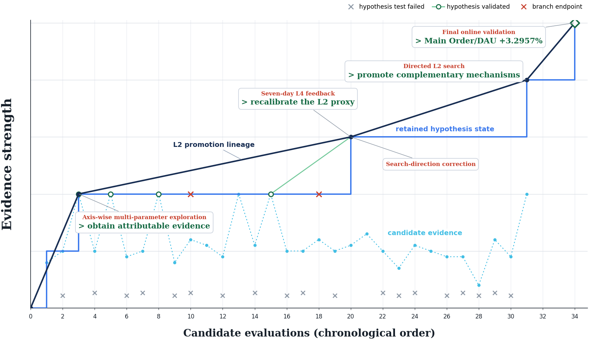

# 6.2.2 · PEAR: 工业搜索里的渐进证据自动研究

## 1. 问题: 线上系统里的自动研究

### 1.1. 工业搜索的策略迭代

PEAR (Progressive Evidence-Based AutoResearch) 由字节跳动全球电商 Agentic Search 团队发表, arXiv 编号 2609.35031, v1 提交于 2026 年 9 月 28 日, 一作 Yifan Wang, 通讯作者 Yu Gong. 研究对象是一个在线运行的电商通用搜索系统. 这类系统由查询理解, 候选召回, 结果排序几级组成, 每一级都有模型, 排序策略和业务约束; 一次改动的效果取决于它和上下游怎样相互作用, 离线很难预测. 工程师平时的做法是从线上现象提出假设, 实现一个候选策略, 在真实流量上测, 再按结果决定下一步.

PEAR 让 LLM Agent 接管这个循环里提假设, 设计候选, 读结果的部分. 论文明确限定了改动范围: 只改策略层面的参数, 例如结果页上电商内容的密度约束, 按位置决定的曝光设置; 模型参数, 模型结构和训练流程都不在搜索空间里 (第 8 节 Limitations). 这一点决定了后面所有数字的含义: 它们说的是 Agent 调出的一组参数在线上带来的效果, 和 Agent 改模型, 改自己都没有关系.

keep-if-better 在非平稳流量下的问题：论文的第一个问题针对 keep-if-better 规则: 每一轮保留得分最高的候选, 作为下一轮的参照. [6.1.1](../6.1-自动研究机制/6.1.1-自动研究与科学发现.md) 读过的 FunSearch, AI Scientist, 以及 [1.1.1 第 3.6 节](../../1-基础/1.1-边界与证据/1.1.1-导读与证据规则.md) 的 autoresearch 都是这种结构. 这条规则默认不同轮次的分数可以直接比较. 在工业搜索里, 流量构成和系统状态一直在变, 周末和工作日的用户不同, 大促期间的商品供给不同, 上游模型也在更新. 第 3 轮测得的增益和第 7 轮测得的增益, 可能来自不同的条件. 一个只在特定时段成立的增益被当成持久改进记下来, 后面的探索就会围着它转.

这个问题还有一个和非平稳无关的部分. [1.1.3 第 3.2 节](../../1-基础/1.1-边界与证据/1.1.3-证据接受与控制.md) 推导过: $N$ 个真实差距都为 0 的候选, 挑测得增益最大的那个, 它的期望测得增益约为 $\sigma\sqrt{2\ln N}$, 全部来自噪声. keep-if-better 每一轮都在做这种挑选. 流量稳定时, 这种偏差靠重测可以消除; 流量不稳定时, 重测的结果本身也在漂, 挑选偏差和条件漂移叠在一起, 更难分开. PEAR 的回应是两件事: 每条证据带上它的实验条件, 由 Agent 在条件里解读; 推广决定不看点估计, 看置信区间.

多保真度的证据：第二个问题是证据来源不一. 评估一个搜索策略, 可以在历史请求上重放, 可以复制线上请求在旁路跑, 可以切一小部分真实流量做短期 A/B, 也可以切更大流量做长期 A/B. 这几种做法在三个维度上不同: 获取成本, 和最终目标的对齐程度, 统计可靠性. 越接近真实用户, 越贵, 越慢, 风险越大. 多保真度贝叶斯优化 (Kandasamy 等, 2017) 和 Hyperband (Li 等, 2018) 处理过同类问题: 用便宜的低保真评估淘汰大部分候选, 把昂贵的高保真评估留给少数. 推荐和搜索领域也有直接的先例: Self-Evolving Recommendation System 用快速离线环加慢速在线环, Sortify 估计离线信号和在线结果的关系, 快手的 AgentX 把线上实验结果接回候选生成.

论文认为这些工作各自依赖某一种信号或某一套任务专用流程, 缺一条统一的规则说明不同级别的证据怎样共同决定推广. 形式上, 记 $\mathcal{S}(c)$ 为候选 $c$ 经历过的评估阶段集合, $\mathcal{E}_\ell(c)$ 为它在第 $\ell$ 级拿到的证据, 收集到的全部证据是

$$
\mathcal{E}(c)=\left\{\mathcal{E}_\ell(c)\mid \ell\in\mathcal{S}(c)\right\}. \tag{1}
$$

式 (1) 只把各级证据放进一个集合, 不做合并. 这是 PEAR 的一个设计选择: 每一级保留自己的信号定义和置信区间, 不把代理分和在线结果加权成一个总分. AgentX 的做法相反, 它把多个证据源按权重加成一个候选分. 第 3 节会看到, PEAR 的选择让每一级的推广规则可以写成同一个式子, 代价是跨级的信息只能在「方向是否一致」这个层面上比较.

### 1.2. 研究状态与假设驱动的搜索

两个组件：

> 图 1: PEAR 的总体结构, 上方是 Agent 维护的 Plan-Execute-Evaluate-Update 循环和并行的策略状态, 中间是四级置信门控验证阶梯, 下方是两类评分来源 (代理奖励模型与在线搜索引擎), 原文 Figure 1.

图 1 解析:

- A 区是 Evidence-driven AutoResearch. 研究 Agent 居中, 四个框按 PLAN, EXECUTE, EVALUATE, UPDATE 顺时针连接; 右侧 Strategy 1 到 Strategy K 是互相独立的研究状态, 每个策略任务一份.
- B 区是 Confidence-Gated Verifier Ladder. 蓝色的 L1, L2 和绿色的 L3, L4 用箭头串联, 下方是各级共用的三态门 (PROMOTE, RETAIN, STOP). 「Candidates」从 EXECUTE 进入阶梯, 「Evidence feedback」从阶梯回到 EVALUATE.
- C 区是信号来源: L1, L2 的分数来自 Model-based Proxy Reward (输入请求和整张排序列表), L3, L4 的分数来自在线搜索引擎上的真实用户结果.
- 图里没有画人工审核. 论文第 9 节规定候选在接触真实用户之前必须经过人工确认, 对应 L2 到 L3 这一步; 阶梯的自动推广不能单独触发真实流量曝光.

两个组件的分工是: Evidence-driven AutoResearch 决定下一步试什么, Verifier Ladder 判定一个候选算不算有效. 前者由 LLM 驱动, 输出假设和候选; 后者是统计规则, 输出效应估计, 置信区间和三态决定. 两者之间只有一个接口: 阶梯产出的证据记录回到研究状态里. Agent 读这些记录, 不改记录的生成方式. 论文第 9 节还写明, Agent 拿到的是代理分和线上实验的聚合效应估计, 拿不到用户级记录. 这条分界线在第 5 节归类时很关键.

研究状态：对策略任务 $k$, 第 $t$ 轮的研究状态是一个四元组

$$
\mathcal{H}_{k,t}=\left(\mathcal{C}_k,\ \mathcal{M}_{k,t},\ \Omega_{k,t},\ \mathcal{D}_{k,t}\right). \tag{2}
$$

$\mathcal{C}_k$ 是任务契约, 包括搜索系统的实现, 优化目标, 干预范围和实验协议, 它没有下标 $t$, 整个任务期间不变. $\mathcal{M}_{k,t}$ 是当前的假设集合. $\Omega_{k,t}$ 是候选干预空间, 必须落在 $\mathcal{C}_k$ 规定的范围内. $\mathcal{D}_{k,t}$ 是累积的证据, 以及每条证据和哪条假设关联. 每个任务一份独立状态, 几个任务可以并行推进, 互不读取.

一条假设描述「在什么条件下, 某个改动预期对目标产生什么效果」. 一条证据记录候选, 评估结果和实验条件. 把两者关联起来, 后面才能回答「这条假设被哪些轮次支持过, 当时是什么流量条件」. 这是论文对第一个问题的回答: 不再只保留当前最好的候选, 而是保留假设和它的全部证据, 包括失败的和没有结论的.

一轮循环：状态按下面的转移演化:

$$
\mathcal{H}_{k,t}\xrightarrow{\text{PLAN}}\mathcal{A}_{k,t}\xrightarrow{\text{EXECUTE}}\Delta\mathcal{D}_{k,t}\xrightarrow{\text{EVALUATE}}\mathcal{R}_{k,t}\xrightarrow{\text{UPDATE}}\mathcal{H}_{k,t+1}. \tag{3}
$$

PLAN 产出候选集 $\mathcal{A}_{k,t}$, 每个候选挂一条假设和一个预期观察. 候选有三种用途: 检验单个因素的效应, 检验因素之间的交互, 重复以前的观察. 为了不让候选只围着上一轮最好的点打转, 生成过程加了一组受贝叶斯优化启发的推理原则 $\mathcal{K}_{\mathrm{BO}}$:

$$
\mathcal{A}_{k,t}=\mathcal{G}\left(\mathcal{C}_k,\mathcal{M}_{k,t},\mathcal{D}_{k,t},\Omega_{k,t};\ \mathcal{K}_{\mathrm{BO}}\right),\qquad \mathcal{A}_{k,t}\subseteq\Omega_{k,t}. \tag{4}
$$

$\mathcal{G}$ 是 Agent 的候选生成过程. 论文特别说明, $\mathcal{K}_{\mathrm{BO}}$ 只指导定性推理, 没有拟合任何数值代理模型: 没有高斯过程, 也没有对采集函数做数值优化. 式 (4) 是对一次 LLM 调用的记号化描述, 本身不能计算.

EXECUTE 调用各级的实验工具, 把候选送进验证阶梯, 收回评估结果和推广决定, 组成新证据 $\Delta\mathcal{D}_{k,t}$. EVALUATE 用 $\mathcal{D}_{k,t}\cup\Delta\mathcal{D}_{k,t}$ 评估每条假设: 一致的观察支持假设, 冲突的观察促使检查假设的前提和适用条件, 没有结论的观察留作待验证的证据, 三种结果都写入评估记录 $\mathcal{R}_{k,t}$. UPDATE 按评估记录修订假设和干预空间, 并把新证据并入:

$$
\left(\mathcal{M}_{k,t+1},\Omega_{k,t+1}\right)=\mathcal{U}\left(\mathcal{M}_{k,t},\Omega_{k,t},\mathcal{R}_{k,t}\right),\qquad \mathcal{D}_{k,t+1}=\mathcal{D}_{k,t}\cup\Delta\mathcal{D}_{k,t}. \tag{5}
$$

式 (5) 有一处不对称: 假设和干预空间会被改写, 证据只增不减. 被推翻的假设仍留在记录里, 证据也不会因为和新假设冲突而被删. 这是研究状态和一份「当前最佳配置」的区别. 这里的 $\mathcal{U}$ 是修订算子, 和第 3 节置信区间的上端点 $U_\ell(c)$ 不是同一个量.

附录 B 的提示模板：式 (3) 到 (5) 写得很抽象, 具体机制在附录 B 的提示模板里. 假设更新模板规定: 每轮最多新增三条假设, 每条写明参数范围, 预期指标方向, 风险边界和对候选设计的含义; 范围重叠的等价假设合并, 方向或风险条件不同的分开, 并互相链接. 每条假设记三个计数 Support, Refute, Neutral, 每轮对一条假设最多给一个判定. 分数定义为

$$
\text{Score}=\text{Support}-\text{Refute}.
$$

Score 不低于 2 的假设标为 active, 不高于 $-2$ 的标为 risky, 被取代或长期不用的归档. PLAN 阶段检索这两类假设, 并要求策略版本 (strategy fingerprint) 匹配; 没有可用假设时, 这一轮标为探索轮. 模板写明, 这些分数只汇总假设的证据, 不是验证器的置信度. 也就是说, 假设是否「活跃」由一个整数投票决定, 和阶梯上的置信区间是两套独立的机制: 一条假设可以靠两轮方向一致但都不显著的观察拿到 Score 2.

候选生成模板把 $\mathcal{K}_{\mathrm{BO}}$ 落成五步. 先把搜索状态诊断为 `cold_start`, `local_refine`, `stagnant`, `pivot` 四种之一, 依据是重复的证据, 覆盖度和矛盾, 而不只是最大的点估计. 再按参数空间类型选一种推理方式: 低维连续空间用 GP 式推理, 对比有证据支持的区域和不确定的空白; 连续与整数混合的空间用 TPE 式推理, 区分有利, 不利, 未定的参数模式; 类别或条件空间用 SMAC 式推理, 比较分支和结构反事实. 然后形成至少两倍于新候选预算的候选池, 覆盖精细化, 边界外推, 不确定性探测和交互检验. 停滞或换方向时提高探索度, 至少放一个超出已探索范围的可行点. 最终去重, 并把精确重复的配置和新候选分开计数: 重复保留完整配置, 新配置一律由所选的推理方式生成.

跨轮记忆模板维护两种记录. 结构化的 lesson 每轮追加一条, 结果标签取 keep, discard, iterate, pivot, crash, summary 之一, 附实验条件, 决策理由和证据引用; 摘要和测量记录冲突时, 以测量记录为准改写摘要. 压缩记忆每轮重写一次, 保留本轮的教训, 降低旧发现的权重. 两种记录都按策略版本过滤, 版本不匹配的 lesson 只留作审计, 不用于指导候选. 这几条规则合起来, 让「研究状态」有了可以检查的具体内容; 另一方面, 它们都是人写的提示, 在整个实验期间没有被 Agent 改动.

### 1.3. 置信门控的验证阶梯

四级与证据记录：阶梯的四级是 Offline Replay (L1), Shadow-Traffic Evaluation (L2), Rapid Online Evaluation (L3), Decision-Grade Online Evaluation (L4). 论文强调四级对齐同一个优化目标, 区别在信号来源, 保真度, 成本, 流量暴露和观察时长. 每个任务按数据可用性和验证需求启用其中一个有序子序列, 相邻的启用级之间用同一条推广规则连接.

| 级别 | 请求或单位 | 信号 | 和基线怎么比 | 用户可见 |
|---|---|---|---|---|
| L1 离线回放 | 固定的历史请求 | 代理分 $R_\psi$ | 同一请求配对 | 否 |
| L2 影子流量 | 复制的实时请求 | 代理分 $R_\psi$ | 独立分组, 不配对 | 否 |
| L3 快速在线 | 小比例随机流量, 短窗口 | 观测到的用户结果 | 独立随机分组 | 是 |
| L4 决策级在线 | 更大比例随机流量, 长窗口 | 观测到的用户结果 | 独立随机分组 | 是 |

L1, L2 的代理分来自一个列表级评估模型:

$$
m_\ell(g;x)=R_\psi\left(x,L^g(x)\right),\qquad \ell\in\{1,2\}. \tag{11}
$$

$x$ 是请求上下文, $L^g(x)$ 是策略 $g$ 对这个请求给出的完整排序列表, $R_\psi$ 从两者估计在线目标. 这个模型看整张列表, 包括多种内容形态的组成和相对位置, 不做逐条打分再相加. 搜索策略的改动 (比如电商结果的密度) 改变的正是列表组成, 逐条打分看不到这种变化. L1 和 L2 用同一个模型, 区别只在输入: L1 是固定的历史请求, L2 是当前请求, 当前的线上特征, 以及线上执行环境里产生的排序结果. 论文实验部分一行被注释掉的 LaTeX 写明代理分是订单代理, 表 5 的 L2 一列也标为 Order proxy.

每一级对每个候选产出一条证据记录:

$$
\mathcal{E}_\ell(c)=\left(c,\ b_\ell,\ m_\ell,\ n_\ell^{c},\ n_\ell^{b_\ell},\ \widehat{\Delta}_\ell(c),\ \mathrm{CI}_\ell(c),\ v_\ell(c)\right). \tag{6}
$$

$b_\ell$ 是这一级的基线, $m_\ell$ 是这一级的评估信号, $n_\ell^{c}$ 和 $n_\ell^{b_\ell}$ 是候选和基线的有效评估单位数, $\widehat{\Delta}_\ell(c)$ 是效应估计, $\mathrm{CI}_\ell(c)$ 是置信区间, $v_\ell(c)$ 是推广决定. 研究状态里积累的就是这种记录, 每条都带着它的实验条件. 式 (6) 里的 $v_\ell(c)$ (推广决定) 和式 (8) 里的 $\nu_\ell$ (自由度) 是两个字母, 印刷上很接近, 读公式时要分开.

效应估计与置信区间：信号取向为越大越好, 效应估计是候选与基线的均值差:

$$
\widehat{\Delta}_\ell(c)=\widehat{\mu}_\ell(c)-\widehat{\mu}_\ell(b_\ell), \tag{7}
$$

置信区间以它为中心:

$$
\mathrm{CI}_\ell(c)=\left[\widehat{\Delta}_\ell(c)-t_{\nu_\ell,1-\alpha/2}\,\mathrm{SE}_\ell(c),\ \widehat{\Delta}_\ell(c)+t_{\nu_\ell,1-\alpha/2}\,\mathrm{SE}_\ell(c)\right]. \tag{8}
$$

$\mathrm{SE}_\ell(c)$ 是效应的标准误, $t_{\nu_\ell,1-\alpha/2}$ 是自由度为 $\nu_\ell$ 的 $t$ 分布临界值, 默认 $\alpha=0.05$, 即 95% 区间. 区间的形式各级相同, 标准误的算法随采样结构变 (附录 A). L1 的两个策略处理同一批历史请求, 用配对估计: 第 $i$ 个请求上的代理分差 $d_i=m_1(c;x_i)-m_1(b_1;x_i)$, 效应是均值 $\bar d$, 标准误 $s_d/\sqrt{n}$, 自由度 $n-1$ (式 16 到 18). L2 到 L4 用独立两组的 Welch 估计:

$$
\mathrm{SE}_\ell(c)=\sqrt{\frac{s_{c,\ell}^2}{n_{c,\ell}}+\frac{s_{b_\ell,\ell}^2}{n_{b_\ell,\ell}}}, \tag{20}
$$

自由度用 Welch-Satterthwaite 公式 (式 21). 线上流量的样本量动辄上百万, 这时 $t$ 临界值就是 1.96. 报告相对效应时, 效应和区间端点都除以基线均值; 附录 A 说相对区间和绝对区间符号相同, 决定也相同, 这一点只在基线均值为正时成立, 订单数, GMV 这类指标满足.

L2 的处理值得算一下. 按论文的写法, 每个影子组收到的是从实时流复制来的各自一份请求, 两组之间没有请求级的对应, 所以只能按独立两组统计. 设单个请求上代理分的方差为 $\sigma^2$, 如果同一请求能同时交给候选和基线, 两个分数的相关系数为 $\rho$. 两组各 $n$ 个请求时, 配对差均值的方差是 $2\sigma^2(1-\rho)/n$, 独立两组均值差的方差是 $2\sigma^2/n$, 标准误之比为 $\sqrt{1-\rho}$. 搜索策略只改列表里少数几个位置, 同一请求下两张列表大部分相同, $\rho$ 会很高. 取 $\rho=0.9$ 为例, 配对标准误只有独立标准误的 $\sqrt{0.1}\approx0.32$ 倍, 要达到同样的精度, 独立统计约需 10 倍的请求. 影子流量不接触用户, 同一请求跑两遍在技术上可行, 论文没有说明 L2 为什么放弃配对; L1 的配对设计说明作者清楚这种差别.

三态决定与嵌套筛选：记 $\mathrm{CI}_\ell(c)=[L_\ell(c),U_\ell(c)]$, 推广决定是

$$
v_\ell(c)=\begin{cases}\text{PROMOTE}, & L_\ell(c)>0,\\ \text{RETAIN}, & L_\ell(c)\le 0\le U_\ell(c),\\ \text{STOP}, & U_\ell(c)<0.\end{cases} \tag{9}
$$

PROMOTE 表示有统计显著的正效应, 候选进入下一个启用级; 在 L4 表示满足「可以考虑部署」的条件. RETAIN 表示证据不足, 候选留在当前级继续评估. STOP 表示有显著的负效应, 候选退出阶梯. 和 keep-if-better 相比, 三态多了一个中间态: 点估计为正但区间跨零的候选, 不会被当成改进, 也不会被扔掉.

记任务 $k$ 的启用级序列为 $\mathcal{L}_k=(\ell_{k,1},\dots,\ell_{k,J_k})$, 级别严格递增. 进入第一个启用级的是 Agent 生成的全部候选, $\mathcal{A}_{k,t}^{[1]}=\mathcal{A}_{k,t}$, 之后每一级只放行它推广的候选:

$$
\mathcal{A}_{k,t}^{[j+1]}=\left\{c\in\mathcal{A}_{k,t}^{[j]}:\ v_{\ell_{k,j}}(c)=\text{PROMOTE}\right\},\qquad j\in\{1,\dots,J_k\}. \tag{10}
$$

于是 $\mathcal{A}_{k,t}^{[1]}\supseteq\mathcal{A}_{k,t}^{[2]}\supseteq\cdots\supseteq\mathcal{A}_{k,t}^{[J_k+1]}$, 一个候选要在前面每一个启用级都被推广, 才能到达下一级. 式 (10) 的上标 $[j]$ 是在启用序列里的位置. 论文第 5.2.3 到 5.2.5 节描述各级时, 写的是推广子集 $\mathcal{A}_{k,t}^{(2)}$ 进入影子流量, $\mathcal{A}_{k,t}^{(3)}$ 进入快速在线, $\mathcal{A}_{k,t}^{(4)}$ 进入决策级在线, 上标是级别编号. 四级全部启用时两种编号一致. 实验里 L1 没有启用, L2 是序列里的第 1 级, L2 推广出来的集合按式 (10) 是 $\mathcal{A}_{k,t}^{[2]}$, 按第 5.2.4 节是 $\mathcal{A}_{k,t}^{(3)}$, 同一个集合有两个编号.

门控在统计上管住了什么：式 (9) 控制的是单次决定的错误率. 一个真实效应为 0 的候选, 在 95% 双侧区间下, 区间整体落在 0 以上的概率是 $\alpha/2=2.5\%$, 这就是它被误推广的概率. 和 keep-if-better 相比, 这是实质的改进: keep-if-better 下, 一个和在任版本真实水平相同的候选, 只要测得分数碰巧更高就会被保留, 概率接近一半.

阶梯的保证只到单次决定为止. 论文没有讨论三件事. 第一是多重比较: 每轮几个候选同时检验, 每个都有 2.5% 的误推广率, 一轮里至少一个被误推广的概率随候选数增长; [1.1.3 第 4.1 节](../../1-基础/1.1-边界与证据/1.1.3-证据接受与控制.md) 读 PACE 时说过, 对每个决定的保证推不出对整轮运行的保证, 这里是同一个问题. 第二是可选停止: RETAIN 的含义是留在当前级继续评估, 如果「继续评估」就是累积更多样本后重新算区间, 那就是 1.3 第 3.2 节说的中途偷看, 固定样本量的 $t$ 区间在这种用法下覆盖率到不了 95%. PACE 用 e 过程处理可选停止, PEAR 用的仍是固定样本的区间. 第三是跨轮重复: 同一个配置在不同轮次被反复测, 只要有一次 PROMOTE 就能前进, 测的次数越多, 零效应配置通过的概率越高.

这三点会在第 4.5 节对上表 1 的数字. 先记下结论: 阶梯把误推广从接近一半压到每次 2.5%, 但实验规模下的检验次数是几百次, 单次保证不能直接读成「被推广的候选大概率真的有效」. 要得到后一种保证, 需要对整轮运行控制错误率, 或者按 1.3 第 3.2 节的做法, 在一组没参与挑选的流量上重新确认.

## 2. 实验: 三个任务的记录

### 2.1. 设定与口径

实验在一个线上电商通用搜索系统里进行, 有三个匿名的策略任务 A, B, C. L1 到 L3 的实验以小时计, L4 以天计. 跨区域的数据访问限制使离线回放不能用, 所有实验的启用序列都从 L2 开始; 论文说 L1 在生产中帮助过其他策略的优化, 但这次的实验不涉及 L1. 所以实验验证的是三级阶梯, 摘要里写的是四级. 主指标是 Main Order/DAU (主订单数除以日活跃用户数), 用于最终的线上 A/B; 其余指标是电商搜索的辅助业务指标. 各级的流量条件, 观察窗口和评估信号都不同, 论文因此只比较候选效应在各级的方向, 不比较幅度.

表 1 (原文 Table 1) 是三个任务在 L2 的搜索规模. 题注给了两个定义: 唯一配置数在每个阶段内去重; 推广率等于从 L2 推广的候选数除以实验组数.

| 任务阶段 | 轮数 | 实验组 | 唯一配置 | 从 L2 推广 | 推广率 |
|---|---|---|---|---|---|
| A | 19 | 133 | 20 | 2 | 1.50% |
| B-I | 12 | 84 | 23 | 5 | 5.95% |
| B-II | 2 | 14 | 6 | 1 | 7.14% |
| B-III | 21 | 147 | 53 | 2 | 1.36% |
| C | 16 | 76 | 54 | 3 | 3.95% |

按题注的定义复算, 2/133, 5/84, 1/14, 2/147, 3/76 分别是 1.50%, 5.95%, 7.14%, 1.36%, 3.95%, 和表中一致. 实验组数除以轮数, A, B-I, B-II, B-III 都恰好是每轮 7 组, C 是 76/16 = 4.75 组. 附录 B.3 的实验记录模板要求「每轮保留一个基线」, 如果 7 组里含 1 个基线组, 推广率的分母就把不可能被推广的基线组也算了进去; 题注没有说明实验组是否含基线组和重复组. 任务 A 的 20 个唯一配置对应 133 组, 平均每个配置测了 6 次以上, 重复占了实验的大部分. 这些口径在第 4.5 节估算误推广时会用到.

任务 A: 用受控干预分离两个因素：任务 A 优化电商结果的密度约束. 全局约束记为 $G=(w,q)$, $w$ 是窗口大小, $q$ 是窗口内的最大内容容量; 线上基线是 $G=(2,1)$. 其他约束族在初筛后都保持基线值. 表 2 (原文 Table 2) 是 19 轮搜索里的前 4 轮.

| 轮次与研究问题 | 受控干预 | 证据带来的更新 |
|---|---|---|
| 1. 增益来自哪条约束轴 | 全局与各形态约束各改一个轴; 另测耦合改动 $G=(3,2)$ | 只有 $G=(3,2)$ 的订单信号显著为正; 加大 $w$, 加大 $q$ 和实验波动三者分不开 |
| 2. $G=(3,2)$ 能否复现, 哪个变量起作用 | 重复 $G=(3,2)$; 对比只改窗口的 $G=(3,1)$, 只改容量的 $G=(2,2)$, 以及 $G=(3,3)$ 等边界设置 | $G=(3,3)$ 信号更强; $G=(3,2)$ 的几次重复方向不一, 退出指标可能变差; 下一轮优先测容量并重复 |
| 3. 增益来自耦合改动还是只来自容量 | 重复 $G=(3,3)$ 与 $G=(3,2)$; 测只改容量的 $G=(2,2)$ 和更宽窗口的边界设置 | $G=(2,2)$ 的观测结果最强; 假设修订为增益主要来自放宽容量, 不需要加宽窗口 |
| 4. 窗口和容量的边际效应是否稳定 | 重复集中在 $G=(2,2)$, $G=(3,2)$, $G=(3,3)$; 保留只改窗口的 $G=(3,1)$ 作反事实 | $G=(3,3)$ 订单和退出信号方向有利但不显著; 保留以容量为中心的假设, 继续重复 |

这条轨迹展示了 PEAR 设计里最有价值的部分. 第 1 轮唯一显著的 $G=(3,2)$, 正是 1.3 第 3.2 节说的那种被挑出来的候选: 多个单轴改动加一个耦合改动一起测, 只有一个过线, 它的测得增益最可能被高估. keep-if-better 会直接把 $G=(3,2)$ 当成新参照. PEAR 的第 2 轮做了两件事: 重复 $G=(3,2)$, 并把窗口和容量拆开单独测. 重复的结果方向不一, 说明第 1 轮的显著很可能有一部分来自挑选; 拆开测则把搜索引向容量这条轴. 第 4 轮保留只改窗口的 $G=(3,1)$ 作反事实, 也是标准的实验设计做法.

另一方面, 论文对 $G$ 的定义只有一句: $w$ 是窗口大小, $q$ 是窗口内的最大内容容量. 如果窗口按结果位置计数, $q$ 就是 $w$ 个位置里电商内容的上限, $q=w$ 时, 窗口里每个位置都可以放电商内容, 全局密度约束不再起作用. $G=(2,2)$ 和 $G=(3,3)$ 都满足 $q=w$, 两者对排序结果的作用相同: 都是取消全局约束, 只剩各形态约束. 表 2 把 $G=(2,2)$ 称作「只改容量」, 把它和 $G=(3,3)$ 当作不同的假设来比较 (第 2 轮 $G=(3,3)$ 更强, 第 3 轮 $G=(2,2)$ 最强, 第 4 轮 $G=(3,3)$ 不显著), 在这种读法下, 这几次差异是两个等价配置之间的波动; 如果 $w$ 和 $q$ 另有计数方式, 论文需要写明, 否则读者无法判断这两个配置差在哪里. 第 3 轮「增益主要来自放宽容量, 不需要加宽窗口」的结论, 换成定义里的说法就是「取消全局密度约束带来增益」. 论文没有说明任务 A 最终部署到 L4 的是哪个配置.

任务 B: L4 的结果回到搜索里：任务 B 优化按位置决定的曝光设置, 分三个阶段. 表 3 (原文 Table 3) 给出各阶段的规模和 L4 结果, 前四列和表 1 的 B 行一致.

| 阶段 | 轮数 | 实验组 | 唯一配置 | 从 L2 推广 | L4 结果 |
|---|---|---|---|---|---|
| I | 12 | 84 | 23 | 5 | 没有显著增益 |
| II | 2 | 14 | 6 | 1 | 为正, 不显著 |
| III | 21 | 147 | 53 | 2 | 订单显著增长 |

前两个阶段都在初始参数的局部邻域里搜索, L2 推广的候选到了 L4 都没有显著增益. 这些 L4 结果进入研究状态, Agent 据此重新评估假设, 第三阶段把候选范围扩到初始邻域之外, 推广的 2 个候选里有 1 个在 L4 显著. 图 2 是论文给出的这段轨迹.

> 图 2: 任务 B 的假设驱动搜索轨迹, 横轴是按时间排序的候选评估序号 (0 到 34), 纵轴是没有刻度的「证据强度」, 浅蓝点线是单个候选的证据, 蓝色阶梯是保留的假设状态, 深色折线是 L2 推广谱系, 原文 Figure 2.

图 2 解析:

- 图例三种标记: 灰色叉是假设检验失败, 绿色空心圆是假设得到验证, 红色叉是分支终止. 灰叉沿底部分布, 约占一半的评估点.
- 四处标注依次是: 第 3 次评估「按轴的多参数探索, 得到可归因的证据」; 第 20 次评估「七天的 L4 反馈, 重新校准 L2 代理」与「搜索方向修正」; 第 31 次评估「定向 L2 搜索, 推广互补机制」; 第 34 次评估「最终线上验证, Main Order/DAU +3.2957%」.
- 纵轴没有单位和定义, 阶梯和折线的高度只表示先后顺序, 不能读出证据强度的数值.
- 「七天」是全文唯一给出 L4 观察窗口长度的地方.

图 2 和正文, 表 3 有三处对不上. 第一, 第 20 次评估的标注写的是「重新校准 L2 代理」, 正文只说 L4 结果被用来重新评估假设; 第 5.2.2 节描述的代理模型 $R_\psi$ 是 L1, L2 共用的固定模型, 全文没有任何地方描述代理的校准步骤, 也没有说明谁来校准, 用什么数据. 第二, 图里横轴只有 34 次候选评估, 表 3 的任务 B 合计 35 轮, 245 个实验组, 82 个唯一配置 (阶段内去重); 图中 L2 推广谱系上只有 4 个节点, 表 3 合计推广 8 个. 第三, 表 3 显示阶段 I 和阶段 II 各有一次 L4 结果, 图里在最终验证之前只画了一次 L4 反馈. 题注没有说明这张图是简化示意还是完整记录.

代理分和在线结果的关系：RQ2 用两组证据讨论代理分能否用于筛选. 第一组是一个单独的对照实验: 在会话粒度上比较代理模型预测的点击, 订单, GMV 均值和实际观测的均值. 表 4 (原文 Table 4) 给出带符号的相对误差: 点击 $-16.02\%$, 订单 $-3.49\%$, GMV $-18.23\%$. 三项都是低估, 订单最准. 论文自己说明, 这只衡量聚合水平的一致, 不衡量对单个候选干预效应的预测是否准确. 这句限定很重要: 一个模型可以把订单总量预测得很准, 同时对列表组成的变化完全不敏感, 这样它对筛选候选毫无用处. 表 4 回答不了「代理分能否排对候选的先后」, 而筛选需要的恰恰是后者. 实验的样本量和时间段文中也没有给出.

第二组是表 5 (原文 Table 5), 跟踪任务 A 的两个候选从 L2 到 L4:

| 候选 | L2 影子流量 (订单代理) | L3 快速在线 (观测订单) | L4 决策级 (Main Order/DAU) |
|---|---|---|---|
| A | +45.88% | +15.48% | +2.73% |
| B | +61.64% | +29.76% | +2.16% |

两个候选在三级都为正, 论文据此说明从代理筛选到决策级评估方向一致. 这个结论要打折扣. 两个候选能出现在 L3 和 L4, 前提就是它们在 L2 和 L3 被推广了, 而推广的条件是区间整体为正; 所以它们在 L2, L3 为正是筛选条件本身决定的. 表里真正有信息的只有 L4 一列. 要检验代理分的筛选能力, 需要知道在 L2 被停掉或保留的候选上线后会怎样, 这类数据按阶梯的设计不会产生. 幅度上, 候选 A 从 L2 到 L4 缩小约 17 倍 (45.88/2.73), 候选 B 缩小约 28 倍 (61.64/2.16); 排序也变了, B 在 L2 和 L3 都高于 A, 到了 L4 低于 A. 论文说跨级只比方向, 但候选之间的先后在 L2, L3 和 L4 之间不一致, 这对「用 L2 代理分挑候选」是直接相关的信息. 候选 B 在 L4 的 +2.16% 是否显著, 文中没有标.

线上 A/B 与推广率：表 6 (原文 Table 6) 是两个任务最终策略的决策级 A/B 结果, 全部是相对基线的变化; 题注说深绿加粗表示 $p<0.05$ 下显著, 下表用加粗标出.

| 任务 | SearchPV/DAU | ASN | GMV/DAU | Main Order/DAU | SKU Order/DAU | PayPV/PV | Main OPMS | SKU OPMS |
|---|---|---|---|---|---|---|---|---|
| A | +0.0063% | **+1.1512%** | +2.2136% | **+2.7336%** | **+2.7259%** | +1.0441% | **+2.7407%** | **+2.7375%** |
| B | +0.0470% | **+1.3841%** | +1.6633% | **+3.2957%** | **+2.9826%** | **+1.6298%** | **+3.2595%** | **+2.9448%** |

表 5 候选 A 的 L4 结果 +2.73% 和表 6 任务 A 的 +2.7336% 对应, 可见表 6 的任务 A 行就是候选 A; 表 5 的候选 B 是任务 A 的另一个上线候选, 不在表 6 里. 两张表都用 A, B 作行名, 一张指候选, 一张指任务. 从数字本身看: SearchPV/DAU 几乎不变, 用户搜索的次数没变, 变化集中在转化. GMV/DAU 两个任务都不显著. 用订单和 GMV 的相对变化可以算出每单 GMV 的变化: 任务 A 是 $1.022136/1.027336-1\approx-0.51\%$, 任务 B 是 $1.016633/1.032957-1\approx-1.58\%$. 订单多了, 单均金额降了, 两个策略可能把曝光推向了价格更低的商品; 主指标只看订单数, 这种取舍在主指标上看不出来. ASN, OPMS, PayPV/PV 等辅助指标文中没有定义. 全文没有报告任何一组 L3 或 L4 的置信区间, 样本量, 流量比例; 2.7336% 精确到万分位, 读者却无法复算它的区间.

推广率可以和零效应下的误推广率对照. 第 3.4 节算过, 一个真实效应为 0 的候选在单次 L2 检验里被推广的概率是 2.5%. 表 1 五行合计 13 个推广, 454 个实验组, 合并推广率 $13/454\approx2.86\%$; 如果每轮的 1 个基线组不计入分母, 是 $13/(454-70)\approx3.39\%$. 两种算法都和「全部候选都没有效果」时的 2.5% 同一量级. 这不能推出候选都无效: L4 的结果说明至少有一部分是真的. 它说明的是, 单看 L2 的推广决定, 区分真效应和噪声的能力很弱. 阶段 B-I 是一个具体例子: 84 组里推广 5 个, 零效应下的期望误推广数是 $84\times0.025=2.1$, 推广的 5 个到 L4 都没有显著增益. 这里的估算还没有算上 RETAIN 带来的重复检验, 实际的零效应通过率只会更高.

L4 这一级也有同样的结构. 表 3 和表 5 加起来, 至少做过 5 次 L4 实验: 任务 A 两次 (候选 A, B), 任务 B 阶段 I, II, III 至少各一次; 任务 C 推广了 3 个候选, 论文没有报告它们的 L3, L4 结果. 如果 5 次实验的真实效应全为 0, 至少一次显著为正的概率是 $1-0.975^5\approx11.9\%$, 恰好两次显著为正的概率约为 $\binom{5}{2}\times0.025^2\times0.975^3\approx0.58\%$. 所以两次显著结果全部来自噪声的可能性很小, 结论「PEAR 找到了有效策略」站得住; 但摘要写「在两次 A/B 实验中显著提升」, 省掉了另外至少三次没有显著结果的 L4 实验, 读者从摘要得不到这个分母.

### 2.2. 放回本书的框架

层级归类：按 [1.1.2](../../1-基础/1.1-边界与证据/1.1.2-定义与形式化.md) 的写法, 把系统拆成 $\theta$ (权重), $\Sigma$ (脚手架), $U$ (更新规则), $C$ (评判标准) 四块, 先问 PEAR 的循环改的是哪一块. 被改的是搜索系统的策略参数: 密度约束, 曝光设置. 它们属于被优化的产品, 不在 Agent 自己的状态里. 改的是产品的循环本身不算自我改进, [6.1.1](../6.1-自动研究机制/6.1.1-自动研究与科学发现.md) 讨论 AI Scientist 和 autoresearch 时用的也是这条区分. Agent 自己积累的是研究状态 $\mathcal{H}_{k,t}$ 和跨轮记忆, 这部分随着实验增长, 但每个任务一份, 互相独立, 也不在任务之间迁移. 所以 PEAR 落在任务内 (L0): 积累只在一个任务的生命期内有效, 和 [6.2.1](./6.2.1-Anthropic-AI参与AI开发.md) 里的自动化对齐研究员 (AAR) 是同一类.

$U$ 和 $C$ 在整个实验中都由人固定. $U$ 是附录 B 的提示模板和更新规则: 每轮最多三个新假设, 支持与反驳计分, 四种搜索阶段, 都是人写好的. $C$ 包括代理模型 $R_\psi$, 阶梯的级别和顺序, $\alpha=0.05$, 以及主指标 Main Order/DAU. Agent 不能改其中任何一项, 也就到不了 L3 (改 $U$) 或 L4 (改 $C$). 例外是图 2 的那条标注「七天的 L4 反馈, 重新校准 L2 代理」: 校准代理就是在改 $C$, 按 [4.1.3](../../4-改进器与评判标准/4.1-改进器与标准/4.1.3-评判标准自演化.md) 的标准, 需要说明谁在改, 用什么数据改, 改完怎样防止评判标准跟着被评对象跑. 论文对这一步没有任何描述, 只能按「人在环外固定 $C$」来归类. 第 9 节还写明, 任何影响真实用户的实验都要人工确认, 人在 L3, L4 的入口把关.

和证据规则对照：论文 LaTeX 源码里, 这个组件的宏名是 `\strategyharness`, 章节标签是 `sec:harness`: 研究状态, 记忆模板, 实验记录格式合起来, 就是 [3.1.2 第 4 节](../../3-脚手架层/3.1-脚手架改进/3.1.2-技能记忆与Harness.md) 说的 Harness, 不过是人设计好以后固定不动的那种, 本书把这种 Harness 当作外围对象处理. 拿 [1.1.1 第 4 节](../../1-基础/1.1-边界与证据/1.1.1-导读与证据规则.md) 的九条证据规则逐条对照, PEAR 有两条做得好. 第 4 条要求被改进的对象拿不到评判标准本身: PEAR 的 Agent 只看到聚合后的效应估计和区间, 碰不到代理模型和线上流量, 这和 autoresearch 把评估脚本锁在 `prepare.py` 里是同一种做法. 第 1.3 节的多保真度表述, 也让「低成本证据只用来筛选, 高成本证据才决定上线」有了明确的形式.

另外几条没有满足. 第 3 条区分开发证据和审计证据: L2 是 Agent 反复查看并据以修改假设的信号, 属于开发证据; 任务 B 前两个阶段的 L4 结果又被送回研究状态, 用来修正搜索方向, 于是这些 L4 结果也成了开发证据, 第三阶段在 L4 的显著结果, 是在同一类流量上反复调整之后得到的. 第 5 条要求有资源对齐的对照: 论文批评 keep-if-better, 却没有在同一系统, 同样的实验预算下跑一个 keep-if-better 的基线, 也没有拆掉研究状态或阶梯做消融, 所以「PEAR 比 keep-if-better 好」在实验里没有被检验. 第 9 条要求差异先算误差: 表 5, 表 6 都只给点估计和显著性标记, 没有区间和样本量, 读者无法自己算. 第 7 条处理正文和图表对不上的情况, 图 2 的标注和正文, 表 3 有三处不一致 (第 4.3 节), 论文没有说明以哪一处为准; 本篇引用规模数字时以表 3 为准.

从 [第 4 部分](../../4-改进器与评判标准/4-改进器与评判标准.md) 的角度看, PEAR 的评判标准是一条有层级的链: 代理分, 快速在线, 决策级在线. 链条本身的设计是合理的, 用便宜的信号做宽筛, 用贵的信号做定夺. 问题在链条的第一环. Agent 在 L2 上做了几百次检验, 对着一个固定的代理模型反复搜索, 这正是 [5.1.1 第 5 节](../../5-可靠性与安全/5.1-失效与理论边界/5.1.1-失效模式.md) 说的代理指标过度优化的条件. 表 5 里 L2 增益比 L4 大十几到二十几倍, 候选之间的先后在两级之间翻转, 都和这个条件下的预期一致. 阶梯靠后面的在线级拦住了大部分代理分高估, 这是它设计上的价值; 但 L2 推广率接近零效应下的误推广率, 说明代理分这一环区分候选的能力, 论文给出的证据还不够.

局限与论文自身的问题：论文第 9 节列了三条局限: 只在一个工业搜索环境里实验, 只优化策略参数, 没有涉及模型结构等其他干预; 推广依赖代理质量和置信区间; 涉及真实用户的实验需要人工确认. 前两条直接限制了结论的外推范围. 再加上 L1 没有启用, 实验验证的阶梯只有三级; 任务 C 推广了 3 个候选, 后续结果没有报告. 和 [6.1.1](../6.1-自动研究机制/6.1.1-自动研究与科学发现.md) 里那些以论文或基准分为产品的自动研究相比, PEAR 的产品直接接受线上 A/B 检验, 结论的外部有效性更强, 这是它的长处.

下面是阅读时发现的论文前后不一致之处, 每条都可以从论文给出的数字或定义复算:

- 嵌套筛选的上标: 式 (10) 的 $[j]$ 是启用序列里的位置, 第 5.2.3 到 5.2.5 节的 $(2),(3),(4)$ 是级别编号; 实验从 L2 开始时, L2 推广的集合按前者是 $\mathcal{A}^{[2]}$, 按后者是 $\mathcal{A}^{(3)}$.
- 代理校准: 图 2 标注 L4 反馈「重新校准 L2 代理」, 第 6.2 节只说 L4 结果用于重新评估假设, 第 5.2.2 节的 $R_\psi$ 是 L1, L2 共用的固定模型.
- 图 2 的规模: 横轴 34 次评估, L2 推广节点 4 个, 最终验证前 1 次 L4 反馈; 表 3 是 35 轮, 245 组, 82 个配置, 推广 8 个, 阶段 I, II 各有 L4 结果.
- 两张表的 A, B: 表 5 的 A, B 是任务 A 的两个候选 (候选 A 的 +2.73% 对应表 6 任务 A 的 +2.7336%), 表 6 的 A, B 是两个任务.
- 摘要的分母: 摘要只报两次显著的 A/B 实验, 表 3 和表 5 显示至少还有三次 L4 实验没有显著结果, 任务 C 的线上结果没有报告.

还有几处不算前后矛盾, 但影响结论的读法. 「四级对齐同一个目标」和表 5 三级用了三种不同的信号 (订单代理, 观测订单, Main Order/DAU) 之间需要更细的说明. 表 2 的 $G=(2,2)$ 和 $G=(3,3)$ 在字面定义下等价. 推广率的分母是否包含基线组和重复组没有说明. L2 放弃配对估计的理由没有给出. 这些问题都不否定 PEAR 的核心设计: 用研究状态记录有条件的证据, 用重复和受控干预对付挑选带来的高估, 用置信区间代替单纯比大小. 它们说明的是, 这套设计在统计上还差一层整轮运行的错误率控制, 而实验报告里缺少检验这套设计所需的区间, 样本量和对照.

### 2.3. 搜索目标不是一个离线分数

查询、候选与排序链：工业搜索从用户请求开始, 经过查询理解、召回、粗排、精排、重排和结果展示. 任一环节改变都会影响后续可见候选. 精排模型再好, 若相关文档没有被召回, 最终结果不会改善; 召回扩大后, 精排面对的负例变难, 离线分数可能下降. 因此实验先标出修改位于哪一环, 哪些上游集合固定, 哪些下游策略会响应.

设查询为 $q$, 召回集合为 $D_q$, 排序函数为 $s(q,d)$, 展示策略为 $\pi$. 用户结果可以写成 $Y(q,D_q,s,\pi)$. 只更换 $s$ 时固定 $D_q$ 能测排序能力; 在线系统里 $D_q$ 和 $\pi$ 可能随负载、库存与策略共同变化. 把整条链的变化归给单个模型, 会混入其他环节.

日志里的点击来自旧策略展示, 未展示文档没有反馈. 训练与离线评估都受到位置和选择偏差. 随机化展示、探索流量或反事实校正能缓解, 但各有成本. 自动研究者若直接把点击当标签, 会复制旧策略偏好并把高位置误当相关.

相关性、满意度与业务价值：相关性是搜索的核心中介, 用户满意度还受延迟、结果多样性、界面和任务完成影响. 点击率可能因标题诱导上升, 长点击可能因页面难读而变长, 转化率又受价格与库存影响. 单个业务指标无法完整表示搜索质量.

更稳妥的指标树从长期目标向下拆: 成功完成任务、减少无效改写、提高相关结果发现, 同时约束延迟、投诉、公平与安全. 每项候选修改写明预期改变哪条路径. 若相关性改善而业务指标没动, 可能是效应小、样本不足或其他瓶颈; 若业务上涨而相关性下降, 要检查促销与诱导.

指标之间不能无限补偿. 严重安全结果、隐私泄露和极端延迟更适合作硬约束, 在可行集合里再优化平均收益. 否则大流量上的微小点击增益会掩盖少数高损失事件.

分群效应：总平均会隐藏查询头尾、语言、地区、设备和用户阶段的差异. 高频导航查询容易优化, 长尾专业查询样本少且价值高. 候选在头部获得小增益, 同时损害尾部, 总指标仍可能上涨. 所以预先指定关键分群与最低门槛.

分群不能无限事后切片. 尝试许多分组后总会找到显著结果. 预注册主要分群, 其余标为探索, 在新流量确认. 低样本群体使用层级模型或更长观察, 不因置信区间宽就从报告删除.

交叉分群尤其重要. 单看语言和设备都正常, 某种语言在低端设备上可能因分词和延迟共同退化. 自动系统可搜索异常交互, 但需要多重比较控制和机制解释. 发现后构造针对性回归, 防止下一轮平均指标重新覆盖.

长期反馈：搜索策略改变用户行为和内容供给. 更偏热门结果会让热门内容获得更多点击, 下一轮训练进一步强化; 更强个性化可能减少探索, 长期兴趣模型变窄. 短期 A/B 很难观察这些反馈.

长期指标包括重复使用、查询多样性、内容生态和用户信任. 可通过延长实验、保留探索桶和模拟反馈评估. 模拟器只能提供候选证据, 因为用户会适应真实系统. 对可能改变数据生成过程的更新, 小流量长期观察比短期全量冲刺更合适.

## 参考文献

1. Global E-Commerce Agentic Search Team (ByteDance). [PEAR: Progressive Evidence-Based AutoResearch for Industrial Search Systems](https://arxiv.org/abs/2609.35031). arXiv:2609.35031. 正文第 1 至 9 节, 附录 A, B.
2. Kohavi, Longbotham, Sommerfield, Henne (2009). Controlled Experiments on the Web: Survey and Practical Guide. Data Mining and Knowledge Discovery.
3. Kandasamy, Dasarathy, Schneider, Póczos (2017). [Multi-fidelity Bayesian Optimisation with Continuous Approximations](https://proceedings.mlr.press/v70/kandasamy17a.html). ICML 2017.
4. Li, Jamieson, DeSalvo, Rostamizadeh, Talwalkar (2018). Hyperband: A Novel Bandit-Based Approach to Hyperparameter Optimization. JMLR.
5. Wang, Wu, Chang, Wei, Heldt (2026). [Self-evolving recommendation system: End-to-end autonomous model optimization with LLM agents](https://arxiv.org/abs/2602.10226). arXiv:2602.10226.

**上一篇**: [6.2.1 · Anthropic: AI 参与 AI 开发的内部证据](./6.2.1-Anthropic-AI参与AI开发.md)
