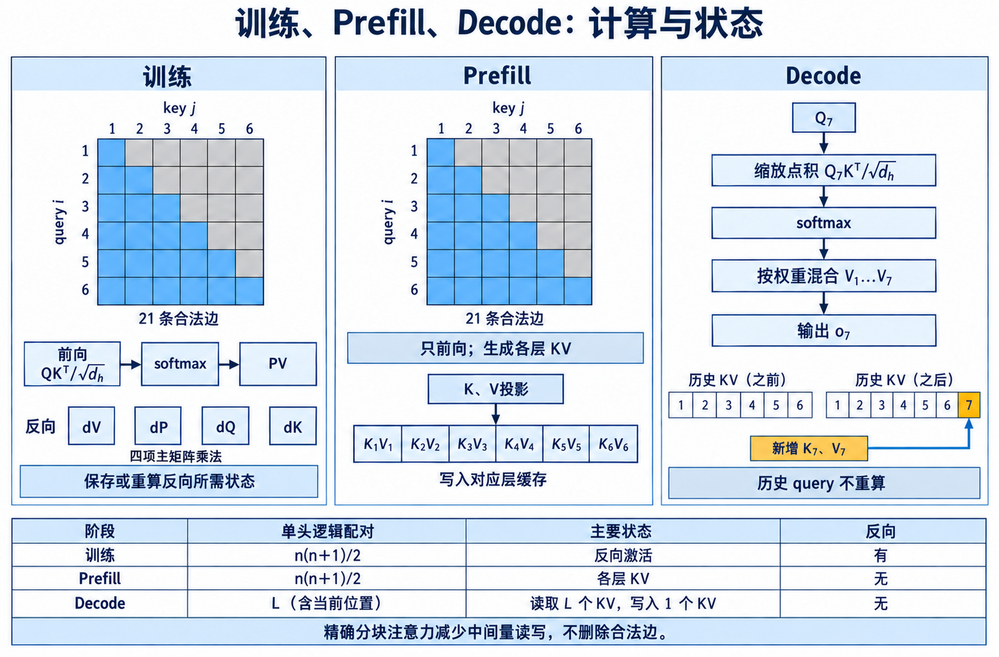

# 成本模型：训练、prefill、解码与 KV cache

「注意力是二次复杂度」只覆盖了整段序列同时进入注意力层时的一个维度。训练要保存反向传播所需状态，prefill 只做前向却可能把许多请求拼成 batch，decode 每步只有一个 query，却持续读取历史 KV。稀疏拓扑能减少多少成本，取决于减少的是配对、物化的分数、保存的 KV，还是从显存读出的字节。若不先分阶段，两个都标成 $O(nw)$ 的方案可能具有完全不同的延迟。 下面以 decoder-only Transformer 的一个注意力层为参照。batch 为 $B$，序列长度为 $n$，模型宽度为 $d$，query head 数为 $H$，每个 head 维度为 $d_h=d/H$，KV head 数为 $H_{kv}$。MHA 取 $H_{kv}=H$，MQA 取 $H_{kv}=1$，GQA 介于两者之间。浮点字节数记作 $b$，FP16 或 BF16 的原始存储通常取 $b=2$。这里计算主要张量与乘加数量，不把某一硬件上的吞吐常数写进算法公式。

> 图 1: 以六位置因果前向与第七位置解码为例, 比较合法配对、反向状态和 KV 写入. 本文教学图;精确分块注意力的 IO 原理见 [FlashAttention](https://arxiv.org/abs/2205.14135).

[查看原尺寸](../images/attention-cost-axes-v2.png)

图 1 解析:

- 训练同时承担整段前向、反向和激活保存; 稀疏 mask 只有进入真实稀疏 kernel, 才会减少配对与中间状态.
- Prefill 没有反向, 仍需处理 prompt 内的大量 query-key 配对; Decode 每步只有一个 query, 却会反复读取已经积累的 KV.
- 训练与 Prefill 的两张矩阵都只有 21 条合法因果边. Decode 在位置 7 使用一个 query, 读取含当前位置的七个 KV, 并把新产生的 K、V 写入该层缓存;历史 query 不重新计算. 箭头连接前向运算或缓存写入, 四项反向矩阵乘法独立列出. 后文再加入 MLP、通信和调度成本.

## 1. 稠密注意力的成本基线

### 1.1. 从单个 head 展开

输入 $X\in\mathbb{R}^{n\times d}$ 经线性投影得到 $Q,K,V$。先看一个 head，$Q,K,V\in\mathbb{R}^{n\times d_h}$。分数矩阵是

$$
S=\frac{QK^\top}{\sqrt{d_h}},\qquad S\in\mathbb{R}^{n\times n}.
$$

矩阵中每个元素是长度 $d_h$ 的点积。一次点积含 $d_h$ 次乘法和约 $d_h$ 次加法，因此按一次乘法与一次加法各算一次 FLOP，$QK^\top$ 约需 $2n^2d_h$ FLOPs。softmax 沿每行计算最大值、指数、求和与除法，数量级是 $O(n^2)$；当 $d_h$ 较大时，两个矩阵乘法仍占主要算术量。 令 $P=\operatorname{softmax}(S)$，输出为

$$
O=PV,\qquad O\in\mathbb{R}^{n\times d_h}.
$$

$PV$ 同样约需 $2n^2d_h$ FLOPs。单 head 两次乘法合计约 $4n^2d_h$，全部 $H$ 个 query head 合计

$$
C_{\text{attn,dense}}\approx4Hn^2d_h=4n^2d.
$$

式中的 $4$ 是按 FLOP 口径得到的近似常数。不同分析若把 fused multiply-add 计作一次操作，会得到 $2n^2d$；比较方法时必须使用同一口径。

### 1.2. 因果 mask 为什么仍常写成平方项

因果注意力只允许位置 $i$ 读取 $j\le i$，有效配对数量是

$$
E_{\text{causal}}=\sum_{i=1}^{n}i=\frac{n(n+1)}{2}.
$$

当 $n$ 很大时，边数约为 $n^2/2$，渐近复杂度仍是 $O(n^2)$。是否真的只计算下三角，取决于 kernel。一个先做完整 GEMM 再把上三角设为负无穷的简单实现，物理计算仍接近完整 $n^2$；能利用 causal 结构的 fused kernel 才能省去相应工作。 手算 $n=4,d_h=2$。四行合法 key 数是 $1,2,3,4$，共有 10 个点积。每个点积按 4 FLOPs 计算，$QK^\top$ 需 40 FLOPs；概率乘 $V$ 也近似 40 FLOPs，共 80 FLOPs。完整双向注意力有 16 个配对，两次乘法约 128 FLOPs。这个例子说明 causal mask 把常数大致减半，却没有改变长度翻倍导致工作量近似四倍的趋势。

投影成本不能省略。
$Q,K,V$ 和输出投影也需要计算。MHA 下四个 $d\times d$ 线性变换约需 $8nd^2$ FLOPs。注意力矩阵部分约为 $4n^2d$。两者相等的粗略交点由 $8nd^2=4n^2d$ 给出，即 $n\approx2d$。在短序列、大模型宽度下，投影可能比注意力配对更贵；在超长序列下，平方项占据主导。 GQA 会减少 $K,V$ 投影的输出维度与 KV cache，却不会减少 query head 对 key 的逻辑配对数量。若 $H$ 个 query head 被分成 $H_{kv}$ 组，每组共享一套 KV，每个 query head 仍产生自己的注意力权重。**KV head 共享主要降低状态容量和读取，窗口或稀疏边才直接减少序列维上的配对。**

## 2. 训练、Prefill 与 Decode 的阶段成本

### 2.1. 训练：前向只是总成本的一部分

标准实现若显式保存 $S$ 或 $P$，每层每个 batch 的分数激活包含 $BHn^2$ 个元素，占用约

$$
M_{S}=BHn^2b\quad\text{bytes}.
$$

取 $B=2,H=32,n=8192,b=2$，得到 $2\times32\times8192^2\times2=8{,}589{,}934{,}592$ bytes，约 8 GiB。这还只是一个层的一类张量，没有包括 QKV、MLP、残差、梯度和优化器状态。训练长序列时，显式物化全部概率很快不可接受。 FlashAttention 按块读取 Q、K、V，在线维护每行 softmax 的最大值与归一化和，并在反向时重算局部块。它把注意力的额外显存从平方级降到近线性级，并减少 HBM 读写。[Dao et al. (2022)](https://arxiv.org/abs/2205.14135) 的贡献是 IO-aware 的精确注意力，不是删去 token 配对。所有分数在数学上仍参与 softmax，因此算术复杂度保持 $O(n^2d)$。 反向传播要计算 $dQ,dK,dV$。其矩阵乘法与前向同阶，训练注意力总 FLOPs 通常是前向的若干倍。稀疏训练若保存离散路由或索引，还要考虑索引内存、路由器激活和梯度。静态拓扑没有路由器反向成本，索引也可以跨 batch 复用，这是它在训练系统中的实际优势。

窗口把边数降到多少。
因果窗口宽度为 $w$，位置 $i$ 读取从 $\max(1,i-w+1)$ 到 $i$ 的 key。有效边数为

$$
E_{\text{win}}=\sum_{i=1}^{n}\min(i,w)
=\frac{w(w+1)}{2}+(n-w)w,\qquad n\ge w.
$$

整理可得 $E_{\text{win}}=nw-w(w-1)/2$。当 $n\gg w$ 时约为 $nw$。注意力矩阵部分的前向 FLOPs 因而约为 $4Ed_hH\approx4nwd$。长度继续增长而窗口固定时，复杂度对 $n$ 线性增长。 取 $n=8192,w=1024$。精确边数是 $8192\times1024-1024\times1023/2=7{,}864{,}832$。完整因果边数是 $8192\times8193/2=33{,}558{,}528$，窗口保留约 23.44% 的边，配对部分理论上约降到 0.2344 倍。不能据此宣称整层快 4.27 倍，因为 QKV 与输出投影、MLP、归一化和通信没有同比缩小。

训练的端到端上限。
设一个 Transformer 层的原始时间中，注意力配对占比为 $p$，稀疏 kernel 将配对时间缩短到原来的比例 $r$，其余部分不变。理想总加速比由 Amdahl 关系给出

$$
S=\frac{1}{(1-p)+pr}.
$$

若配对原占 40%，稀疏后只需原配对时间的 25%，则 $S=1/(0.6+0.4\times0.25)=1.43$。即使配对理论减少四倍，整层也只有约 1.43 倍。若序列更长使配对占 80%，相同 $r$ 得到 $S=2.5$。因此稀疏优势通常随长度增大而显现，并对模型宽度、MLP 比例和 kernel 实现敏感。 分布式训练还引入通信。Sequence Parallel 或 Context Parallel 会把序列分散到多个设备。局部窗口若大多落在本设备分片内，可减少跨设备 KV 交换；窗口跨分片边界仍需 halo exchange。全局 token 要与所有分片交互，可能形成额外 collective。只统计单卡边数，无法推出多卡通信量。

### 2.2. Prefill：只前向，但请求形状更复杂

Prefill 算什么。
prefill 把提示词的全部 token 一次送入模型，为每层生成 KV cache，并输出末项位置或所有位置的 logits。注意力计算与因果训练前向相同，仍有下三角配对；它不需要保存反向传播状态，因此内存压力小于训练，但长 prompt 的单次延迟与临时工作区仍会很大。 服务系统常把不同长度的请求组成 batch。若直接补齐到最长长度 $n_{max}$，无效 padding 会增加投影和注意力工作。varlen kernel 通过累积长度数组只处理真实 token，稀疏窗口还要正确处理每个样本的起点，不能让一个请求的窗口跨进相邻请求。这里的「边界」是内存布局中的段边界，不只是逻辑 causal mask。

一个 prefill 手算。
取单层 $d=4096,H=32,d_h=128$，prompt 长度 $n=32768$。稠密因果边数约为 $32768\times32769/2=536{,}887{,}296$。两次注意力矩阵乘法按每边每 head 各约 $4d_h$ FLOPs，等价合计约 $4Ed$，得到约 $8.80\times10^{12}$ FLOPs。 若因果窗口 $w=4096$，边数为

$$
32768\times4096-\frac{4096\times4095}{2}=125{,}831{,}168.
$$

配对 FLOPs 约 $2.06\times10^{12}$，为稠密因果值的 23.44%。这个比例与上一节相同，是因为 $n/w$ 同为 8。若每四层插入一层稠密注意力，四层一组的配对相对成本近似为 $(3\times0.2344+1)/4=0.4258$，而不是 0.2344。混合层恢复全局通信，同时明显抬高 prefill 成本。

稀疏 mask 必须在乘法前生效。
一种常见写法先构造 $n\times n$ 布尔 mask，再调用稠密 scaled dot-product attention。逻辑输出是窗口注意力，内存与计算却可能仍是平方级。另一种实现把序列分成块，只枚举对角附近的块；块内可能仍计算少量越界位置，再用局部 mask 清理。只要块数随 $nw$ 增长，额外浪费是可控常数。 全局 token 会让规则改变。若 $g$ 个位置读取全部历史，同时所有普通 token 可以读取这些全局位置，总边数近似增加 $2ng$，但因果方向下要按实际信息流重新计数。kernel 可以把窗口块和全局条带分两次算，再稳定合并 softmax 的最大值与归一化和；若直接回退到通用稠密实现，小量全局边也可能取消窗口带来的加速。

### 2.3. Decode：容量、带宽与每 token 延迟
单步计算如何增长。
完成 prefill 后，第 $t$ 个生成步只新增一个 query。它与长度 $L_t$ 的历史 key 做点积，再用概率聚合 value。全部 query head 的主要计算约为

$$
C_{\text{decode},t}\approx4L_td.
$$

这里不再出现 $L_t^2$，因为过去 token 的 query 输出已经计算完，不会在每步重算。但生成 $m$ 个 token 的总配对量是 $\sum_{t=1}^{m}L_t$；上下文持续增长时，总量仍按生成长度的平方项累积。 decode 的矩阵形状接近 matrix-vector，算术强度低。GPU 往往等待 KV 从 HBM 读入，而不是等待乘法。GQA、量化、分页管理与 Sparse Attention 都可能改善 decode，但作用位置不同：GQA 减少 KV head 数，量化减少每个元素字节数，分页管理减少碎片，稀疏访问减少本步读取的 token 数。

KV cache 容量逐项计算。
每层每个 token 保存 $H_{kv}$ 个 key 和同样数量的 value，每个向量长度为 $d_h$。batch 为 $B$、缓存长度为 $L$ 时，容量为

$$
M_{KV}=2BLH_{kv}d_hbN_{layer},
$$

其中开头的 2 对应 K 与 V，$N_{layer}$ 是层数。取 $B=1,L=131072,H_{kv}=8,d_h=128,b=2,N_{layer}=32$，容量为 $2\times131072\times8\times128\times2\times32=17{,}179{,}869{,}184$ bytes，约 16 GiB。 若每层只保留 $w=4096$ 的窗口，容量变为 512 MiB，是原来的 $1/32$。若再永久保留 $s=4$ 个 sink token，则有效保存数为 $w+s$，额外容量只有 $4/4096$，约 0.098%。这项容量下降成立的前提是窗口外 KV 确实被淘汰；若为将来可能的全局层保留完整 KV，设备或主机仍要承担相应容量。

每步读取量与带宽下界。
忽略 cache 命中和索引开销，一层一步至少读取 K 与 V，字节数近似

$$
R_{KV,t}=2L_tH_{kv}d_hb.
$$

沿用 $L_t=131072,H_{kv}=8,d_h=128,b=2$，每层每步约读 512 MiB；32 层约读 16 GiB。窗口 $w=4096$ 时，每层约读 16 MiB，32 层约 512 MiB。若硬件可持续带宽为 $W_{mem}$，仅 KV 读取给出的理想时间下界是 $R/W_{mem}$，实际还包括权重读取、同步、kernel 启动和其他层计算。 动态 top-k 若先把全部 key 读一遍才能选出候选，再读选中的 value，K 的读取并没有减少，只减少 V 聚合与部分算术。基于块摘要的两阶段方法可以先读小摘要，选块后再读完整 KV；摘要的容量、读取和误召回也要一起算。**decode 稀疏化的关键检查点是「在读完整 KV 之前能否得到访问地址」。**

混合全局层怎样保存状态。
假设 32 层中每 4 层有 1 层全局注意力，其余 24 层使用 4096 窗口。若全局层需要读取完整 131072 历史，则这 8 层必须保留完整 KV，24 层只保留窗口。容量相对全稠密比例为

$$
\frac{8\times131072+24\times4096}{32\times131072}=0.2734375.
$$

结果约为 27.34%，而不是窗口比例 3.125%。每步 KV 读取也近似遵循同一加权比例。全局层频率决定质量与带宽之间的直接交换，不能只报告局部窗口宽度。 如果全局层通过前一局部层已经压缩过的隐藏状态读取全部 token，它仍需要对应层的完整 KV；其他层被淘汰的 KV 不影响该层，因为每层 cache 相互独立。若实现为了简化管理给所有层分配相同长度，理论上的分层节省会被容量布局抵消。

## 3. 静态稀疏的系统兑现

### 3.1. 元素稀疏、块稀疏与规则窗口

元素级 mask 能表达任意边，却需要保存大量坐标，访问也不连续。块稀疏把 $b_q\times b_k$ 的区域作为最小执行单元，用块索引控制 kernel。滑动窗口进一步把块索引写成确定的对角带，地址可由位置直接计算，通常不必存完整稀疏索引。 设逻辑窗口宽度为 3000，key 块大小为 128。窗口起点对齐块边界时，要覆盖 $\lceil3000/128\rceil=24$ 个块，即 3072 个位置，多算 72 个位置，填充浪费约 2.4%。起点偏移也会增加块数：用零起始位置 $a$ 表示窗口起点，所需块数为 $\lfloor(a+2999)/128\rfloor-\lfloor a/128\rfloor+1$。当 $a=127$ 时需要 25 个块，对应 3200 个执行位置，填充约 6.67%。序列边缘与因果对角还会产生部分无效元素。块越大，矩阵核效率可能更高，逻辑稀疏率却越难精确兑现。 全局 token、文档边界和 packed sequence 会打破单一对角带。工程实现可将不同模式拆成若干规则 kernel，再用在线 softmax 合并。若一次注意力被拆成过多小 kernel，启动与同步开销会上升。因而「支持任意 mask」通常不等于「任意 mask 都快」。

### 3.2. FlashAttention 与 Sparse Attention 的交叉

FlashAttention 解决 IO 复杂度，Sparse Attention 减少需要访问的边。两者可以结合：只遍历有效稀疏块，并在每个块内部使用在线 softmax。每个 query 行跨多个块时，需要维护运行最大值 $m_i$ 和归一化量 $\ell_i$。新块分数最大值为 $m_i'$，合并后的最大值为 $m_i^{new}=\max(m_i,m_i')$，旧累计量要按 $\exp(m_i-m_i^{new})$ 缩放，新块累计量按相同基准加入。 这个合并保持与一次性 softmax 相同的结果，前提是所有逻辑有效块都被访问，数值精度也足够。Sparse kernel 省去无效块，Flash 的分块算法避免把有效分数写回 HBM。两项收益作用在不同层面，因此不能把「使用 FlashAttention」当作已经采用稀疏注意力，也不能假定稀疏实现自然具有 Flash 的 IO 行为。

延迟、吞吐与利用率。
单请求 decode 追求每 token 延迟，连续 batching 则追求单位时间完成的 token 数。稀疏索引让不同请求访问不同块时，batch 内工作量可能不均衡；静态窗口的形状一致，更容易把多个请求合并。prefill 常是计算密集，decode 常是带宽密集，同一 kernel 选择不会同时最优。 短上下文下，稠密 kernel 的规则矩阵和高利用率可能胜过稀疏 kernel。随着 $n/w$ 增大，跳过的块足够多，稀疏才越过盈亏点。这个交点必须实测，并报告冷启动、预热、分位延迟和是否包含路由。只给 kernel 微基准不能代表完整服务，因为调度、采样、通信和 cache 管理仍在端到端路径上。

## 4. 评测、规划与实现验证

### 4.1. 正确性边界：少读历史会失去什么

固定窗口把超出范围的原始 KV 从当前层可见集合中删除。较早信息仍可能经隐藏状态逐层向后传播，但可传递容量有限，而且训练目标未必促使模型保留未来才会用到的细节。形式上的多层路径不等于逐字检索能力。passkey、跨文档引用、代码变量绑定和长对话约束应分别测量，不能用平均困惑度替代。 attention sink 让少量开头 token 永久保留，可修复 streaming 截断时的稳定性问题，但 sink token 并非完整历史摘要。全局层周期性读取全部历史能恢复直接通路，却重新引入完整 cache 和带宽成本。动态检索可能按当前 query 找回远处块，但路由失误会把所需信息完全排除在 softmax 之外。

### 4.2. 一份可复算的报告至少包含什么

算法侧应给出每层的 $N(i)$、平均与最大边数、是否因果、全局位置数和跨层模式。模型侧应给出训练时采用的 mask、上下文长度、位置编码与长依赖评测。系统侧应给出 KV head 数、数据类型、块大小、cache 是否真实淘汰、kernel 名称、硬件、batch 和序列长度分布。 结果应分别报告训练吞吐、prefill 延迟、time to first token、decode 每 token 延迟、峰值显存与质量变化。对于动态方法还要增加路由时间、候选召回和负载分布。所有加速都应与同一精度、同一模型、同一硬件上的强稠密基线比较。 **Sparse Attention 的成本结论最终要落到四个可复算量：执行了多少配对，保存了多少状态，搬运了多少字节，关键依赖经过多少层才能到达。** 四项中只减少一项，不代表其余三项同步下降。

把成本模型用于容量规划。
从服务目标反推窗口。
部署规划通常从并发数和延迟开始。设设备可用于 KV cache 的显存为 $M_{budget}$，并发请求数为 $R$，每个请求每层保存的有效 token 数为 $L_{keep}$。忽略页表与对齐，容量约束是

$$
2R L_{keep}H_{kv}d_hbN_{layer}\le M_{budget}.
$$

解出 $L_{keep}\le M_{budget}/(2RH_{kv}d_hbN_{layer})$。取 48 GiB cache 预算，$R=24,H_{kv}=8,d_h=128,b=2,N_{layer}=32$。分母中每 token 每请求占 $2\times8\times128\times2\times32=131072$ bytes，得到每请求最多约 16384 token。实际还要给分页碎片、元数据和长度波动留余量，窗口应低于理论上限。 若要求每请求 65536 token 且并发不变，可以沿三条轴减小容量。窗口缩到 16384 会丢弃更旧 KV；KV 量化从 2 bytes 降到 1 byte 带来两倍容量；把 $H_{kv}$ 从 8 降到 2 带来四倍，但需要模型架构支持。三者改变不同性质：窗口改变可见历史，量化改变数值误差，GQA 改变 head 共享。 容量可放下还不代表 decode 达标。每步都要重新读取可见 KV，若权重与 cache 总读取超过带宽预算，系统会在显存仍有空余时先达到延迟上限。窗口应同时满足容量和每步带宽约束。

从首 token 延迟反推 prefill。
prefill 的服务目标常用 time to first token 表示。固定窗口把注意力配对变为 $nw$，但投影和 MLP 仍随 $n$ 线性增长；当注意力已不占主导，继续缩小 $w$ 的收益迅速变小。 设稠密 prefill 中注意力配对占 70%，其余算子占 30%。窗口把边数降到 10%，但稀疏 kernel 的有效吞吐只有稠密 kernel 的一半，因此配对实际时间比例约为 20%。总时间比例是 $0.3+0.7\times0.2=0.44$，理想加速约 2.27 倍，不是边数暗示的 10 倍。若短序列使配对原占 20%，相同 kernel 只得到 $1/(0.8+0.2\times0.2)=1.19$ 倍。 chunked prefill 把长 prompt 切成多个块，在块间插入其他请求的 decode，改善尾延迟。局部窗口要跨块保留边界 KV，全局层要保留全部先前 KV。chunk 大小改变调度粒度与 kernel 效率，不应改变数学输出；在线 softmax 合并、因果边界和位置编号必须与整段执行一致。

Prefix cache 与窗口淘汰。
服务系统会复用相同提示前缀的 KV。完整 prefix cache 以容量换取免除重复 prefill。局部窗口模型若从前缀末尾续写，每个局部层只需前缀中最近的 $w$ 个 KV；全局层仍需前缀全部 KV，因此保存策略可以按层分开。 Prefix cache 的命中率也进入收益。完整全局 KV 占用大量显存，可能挤掉更多短前缀；局部层的小 cache 可以容纳更多条目。最优策略由请求共享分布决定。报告复用收益时要说明命中率、淘汰策略，以及首次构建前缀的成本是否计入。 若缓存断点位于文档中间，恢复还要保证每层状态与逻辑位置一致。只保存最终 hidden state 无法替代逐层 KV，因为后续每层 attention 都读取对应层自己的历史。窗口减小了恢复状态，却没有把多层状态压成一个向量。

容易算错的四个口径。
稀疏率的分母。
双向注意力以 $n^2$ 为完整边数，因果注意力以 $n(n+1)/2$ 为合法边数。因果窗口若拿实际边数除以 $n^2$，会把本来不存在的上三角也算成稀疏收益。比较时应说明分母是完整方阵、合法因果边，还是块对齐后的实际计算元素。 以 $n=8,w=3$ 为例，窗口有 21 条边。相对双向方阵 64 条，密度为 32.81%；相对因果 36 条，密度为 58.33%。两个数字回答不同问题。对自回归稠密基线，后者是逻辑边比例；若旧 kernel 确实计算完整方阵，前者才可能接近物理比例。

平均长度不能直接代入平方。
动态 batch 中，每个请求的有效窗口为 $\min(n_r,w)$。稠密因果边应逐请求求和：

$$
E_{batch}=\sum_{r=1}^{B}\frac{n_r(n_r+1)}{2}.
$$

窗口边也逐请求计算，对 $n_r<w$ 的请求退回完整因果三角。长度为 2K 与 30K 的两个请求，不能用平均 16K 的单一形状替代，因为平方函数会改变结果。 峰值容量关心最坏并发组合，平均吞吐关心请求分布，尾延迟还关心长请求是否阻塞短请求。一个平均上下文长度不能覆盖三项。长度直方图和 batch 组装规则应与基准结果一起保存。

逻辑 token 与物理块。
分页实现按固定大小分配。逻辑保存 4097 个 token，页大小 256 时需要 17 页，即 4352 个槽位，内部碎片约 6.22%。每个请求的末页都可能有碎片，并发越高，总量越明显。 块稀疏 kernel 也会向上取整。逻辑窗口 4096 在 128 大小的 key 块上正好对齐；窗口 4097 会多访问一整列块，物理覆盖 4224 个位置。逻辑边只多一列，物理工作发生阶跃。窗口、sink 和全局条带都应换算成实际执行块数。

Cache 写入与读取。
每生成一个 token，每层只写新 token 的 K 与 V，写入量不随历史长度增长；读取量随可见历史增长。窗口同时限制读取与驻留容量，动态查询可能只限制读取而保留全部 KV，量化改变每项字节数。把三者都写成「KV cost」会掩盖瓶颈。 若 KV 被 offload 到主机或远端，读取还跨越 PCIe、NVLink 或网络。动态稀疏能减少传输的前提是索引在传输前已知；若先搬运全部 key 再路由，链路带宽没有节省。分层存储还要计算未命中延迟和预取，平均选中 token 数不足以描述尾部行为。

从公式到实现的验证。
小尺寸正确性测试。
先用 $n=8$ 或 $n=16$ 构造显式邻接矩阵，逐行列出索引。相同 QKV 分别运行稠密加 mask 的参考实现与稀疏 kernel，比较前向输出和 $dQ,dK,dV$。全局 token、sink、packed sequence 和序列边界都要覆盖，不能只测规则中段。 数值误差按数据类型设阈值，并使用极端 logits 测在线 softmax。新块最大值远高于旧块时，旧累计必须按新最大值缩放。反向测试还要确认被 mask 的边梯度为零，合法边梯度与参考一致。

性能测试分层归因。
第一层只测 kernel，固定 QKV shape，并说明索引构造是否计时。第二层测完整 attention，包含投影、RoPE、cache 写入与输出投影。第三层测 Transformer 层和完整模型，加入 MLP、通信与调度。长度扫描曲线可以显示收益在哪一层被其他成本吞掉。 decode 要预先填充目标长度的 cache，不能用空 cache 重复单步。prefill 要区分单请求与 varlen batch。训练要包含反向与 checkpointing。若索引可跨步复用，首次构建和稳态分别计时，再按真实请求生命周期加权。

质量与系统回归成对运行。
kernel 输出一致只说明实现了给定 mask，不说明 mask 对任务足够。每次改变窗口、层模式或 cache 淘汰，都要同时跑短上下文基线、距离分桶检索与真实长任务；系统侧同时检查显存、吞吐、首 token 延迟和每 token 延迟。 若质量下降，先判断证据是否仍在图中，再判断路径是否过长，并检查训练是否适应该拓扑。若速度没有提升，检查是否仍物化稠密 mask、是否读取完整 KV、块对齐浪费和 kernel 利用率。这个顺序把模型问题与执行问题分开。

三个完整算例。
训练一批 64K 序列。
设 $B=1,n=65536,d=4096,H=32,d_h=128$，使用因果窗口 $w=4096$。稠密因果边数是 $65536\times65537/2=2{,}147{,}516{,}416$。窗口边数为 $65536\times4096-4096\times4095/2=260{,}048{,}896$，约为稠密边的 12.11%。两次 attention 矩阵乘法的前向 FLOPs 从约 $4\times2.148\times10^9\times4096=35.18$ TFLOPs 降到约 4.26 TFLOPs。 再把投影纳入。四个 $d\times d$ 投影约需 $8nd^2=8.80$ TFLOPs。只计算这两部分，稠密合计约 43.98 TFLOPs，窗口合计约 13.06 TFLOPs，加速上限从配对项的 8.26 倍降为约 3.37 倍。MLP、归一化、反向、通信继续进入后，总训练 step 加速还会降低。 若窗口 kernel 只能达到稠密矩阵核 60% 的有效吞吐，4.26 TFLOPs 的墙钟等效成本约为稠密吞吐下的 7.10 TFLOPs。两部分合计等效 15.90 TFLOPs，相对 43.98 TFLOPs 约 2.77 倍。这组数显示，边数、FLOPs 和时间是三层不同结果。

128K prompt 的 Hybrid Prefill。
设 32 层中 8 层全局，24 层窗口 $w=8192$。单层稠密因果边约为 $8.590\times10^9$。单层窗口边为 $131072\times8192-8192\times8191/2=1{,}040{,}191{,}488$，约为 12.11%。全模型相对边比例是 $(8+24\times0.1211)/32\approx0.3408$。 若再给每层保留 4 个 sink，局部层稳态访问宽度近似增加到 8196；新增边约为每层 $4n$，相对十亿级窗口边很小。sink 的计算开销小，不代表它提供全局内容访问。真正主导 Hybrid 成本的是 8 个全局层。 若全局层 kernel 的利用率高于窗口层，墙钟比例不会严格等于 0.3408。反过来，全局层还可能触发跨设备通信，使比例高于边数预测。报告应列出局部层与全局层各自耗时，再按层数相加，而不是只用全模型平均稀疏率解释。

多租户 Decode 的带宽。
取并发 $R=32$，32 层 GQA，$H_{kv}=8,d_h=128,b=2$。纯窗口 $w=4096$ 时，一个请求一步跨全部层读取约 $2\times4096\times8\times128\times2\times32=536{,}870{,}912$ bytes，约 512 MiB。32 个请求同步一步约读取 16 GiB。 假设可供 KV 的持续带宽为 2 TB/s，仅该读取的理想下界约 8 ms；实际还要读取权重并执行其他层。若窗口减到 2048，KV 下界近似减半，但质量是否允许必须由距离任务决定。若改成 8 个全局层读取 128K、24 个局部层读取 4K，单请求读取量相对全 128K 为 27.34%，绝对量仍显著大于纯窗口。

连续 batching 中并非所有请求同时处于 128K。应按每轮实际 cache 长度求和，不能把最大长度乘并发当作平均吞吐；容量预留却必须防止长请求同时出现。调度器可以按长度分组减少浪费，也可能为了公平让短请求等待。成本模型提供字节下界，队列策略决定用户看到的分位延迟。

## 5. 成本模型的边界与证据

### 5.1. 边数、质量与利用率的边界

边数只限定预算，不决定选中了哪些边。宽度为 4096 的窗口、每行随机选择 4096 个历史位置、由路由器选择 4096 个候选，都有近似 $nk$ 的配对量，归纳偏置却完全不同。局部窗口保留邻近连续结构，随机边缩短图距离，动态选择试图匹配当前内容。任务所需依赖分布决定哪种选择有效。 同样的拓扑在不同层也不等价。早层表征更接近局部词法，后层更接近任务输出；把全局预算放在早层或后层会改变可用信息。成本模型可以精确相加各层边数，却无法从边数推出最优层位，必须由消融与训练行为补充。

FLOPs 不描述数值稳定性。
在线 softmax、低精度 KV 与分块合并会改变舍入路径。数学上相同的注意力在 FP16、BF16、FP8 或量化 cache 上具有不同误差。稀疏集合较小时，softmax 分母的竞争项减少，概率分布也可能更尖；这属于模型行为变化，不在 FLOPs 公式中。 测试既要比较稠密参考与稀疏实现的数值误差，也要区分「实现误差」和「删除边造成的定义变化」。对完全相同 mask，误差应落在数据类型容差内；对不同 mask，输出差异是方法本身的一部分，不能用提高计算精度消除。

能耗与成本还需要实际利用率。
少做乘法通常有机会降低能耗，但不规则访存、空闲执行单元和更长运行时间可能抵消收益。云端成本还受设备占用时间、并发密度和 cache 导致的可驻留请求数影响。一个 kernel 功耗较低却持续更久，单请求能耗未必更低。 因此容量规划完成后还需测量设备功率、请求吞吐和服务等级目标。相同质量下，每百万生成 token 的设备时间与能量比单独的理论 FLOPs更接近运营结果。成本模型提供可解释的下界和归因框架，不替代端到端测量。

还有一项常被遗漏的成本是工程维护。通用稠密 kernel 通常由框架持续优化，特定稀疏模式则要跟随新硬件、编译器和数据类型更新。若真实流量主要是短序列，维护专用 kernel 的收益可能小于测试与兼容成本；若长序列占主要算量，专用实现才更容易形成持续收益。这个判断不能写进渐近公式，却应进入方案选择。 上线后的长度分布也会变化，因此同一套窗口与 kernel 需要定期用真实负载重新测量，不能永久沿用初次容量估算。

用交叉点决定何时启用稀疏路径。
稠密与稀疏 kernel的速度会随长度交叉. 可以用一个简化模型描述:

$$
T_{dense}(n)=a n^2+c,
\qquad
T_{sparse}(n)=b n k+r n+s. \tag{23}
$$

$a$ 与 $b$ 吸收设备吞吐和 tile效率, $r n$ 表示索引或路由扫描, $c,s$ 表示启动、调度和固定准备. 解 $T_{dense}(n)=T_{sparse}(n)$ 得到启用稀疏路径的候选长度. 这个交叉点不是只由渐近复杂度决定: $s$ 很大时, 即使 $nk\ll n^2$, 短序列仍可能由稠密 kernel更快完成. 服务端可以按长度与 batch建立二维阈值表. Batch增大时, 稠密 GEMM利用率提高, 交叉点可能右移; 稀疏候选在不同请求间无法共享, gather压力也会增长. Decode还要加入 cache长度与并发, Prefill则要加入 chunk大小. 单一的 `if n > N` 只能近似一个固定部署形状.

阈值测量应使用同一模型路径预热后得到的稳态分位数, 同时保留迟滞. 请求长度在交叉点附近波动时, 不必在相邻 chunk频繁切换实现. 选定路径后, 索引状态与 KV布局也要兼容; 若切换需要重排整个 cache, 重排成本必须摊入剩余生成长度. 对短剩余生命周期, 继续沿用当前路径往往更省时间. 成本模型在这里给出的是决策框架: 先由 profiler拟合 $a,b,r,c,s$, 再用目标流量分布计算总设备时间, 末尾用质量约束排除过小的 $k$. 只找单个 microbenchmark的最大倍数, 无法得到真实服务的最佳阈值.

阈值表更新时还要保留旧版本的回放样本. 新驱动或新 kernel若让交叉点移动, 先在相同请求形状上比较, 再逐步调整线上选择. 这样可以区分硬件利用率变化与流量长度变化, 避免把两种因素混成一个平均加速数字.

复杂度如何落到实现。
边数与 IO 是两条成本轴。
[Sparse Transformer](https://arxiv.org/abs/1904.10509)在特定稀疏分解下把时间与内存从平方级降到 $O(n\sqrt n)$；每行任取 $k$ 条边并不会自动得到同样的 kernel 性能。[FlashAttention](https://arxiv.org/abs/2205.14135)通过 tiling 降低 HBM 访问，同时保留全部合法 softmax 边。前者减少边数，后者优化 IO，两条成本轴可以叠加，也可能由不同瓶颈主导。 [Mistral 7B](https://arxiv.org/abs/2310.06825)把 GQA 与 SWA 用于生成模型，并描述 rolling buffer cache。纯因果窗口层由此可以把 cache 限制在固定窗口；Hybrid 层表还含完整 attention 层，容量必须按每层实际保留长度重新计算。

同一种 mask 也会跑出不同成本。
[FlashAttention 官方实现](https://github.com/Dao-AILab/flash-attention)把自身称为 FlashAttention 与 FlashAttention-2 的官方实现，并用参考实现测试输出和梯度误差。Longformer 的[作者仓库](https://github.com/allenai/longformer)则明确区分自定义 TVM kernel、普通 $n^2$ 模式和 sliding-chunks 实现；仓库说明 sliding-chunks 方便但会多用内存且不支持 dilation 与自回归注意力。这些限制说明，同一论文 mask 在不同实现路径上成本不同。 FLOPs、边数、GiB 和带宽手算都把输入假设写在公式旁, 可以用来核对量纲。Amdahl 例子中的占比是一组条件算例；换成实际 profiler 测得的 attention 占比, 才能估算目标模型的端到端收益。测量时还要固定同步边界，否则异步 kernel 的排队时间可能被记到下一个算子上，导致 attention 占比失真。

### 5.2. 从算术强度判断瓶颈

FLOPs 只计算乘加次数，执行时间还取决于这些乘加能复用多少数据。对某个算子，算术强度定义为

$$
I=\frac{F}{D},
$$

其中 $F$ 是 FLOPs，$D$ 是从主存层次搬运的字节。设备峰值算力为 $P$，持续带宽为 $W$ 时，roofline 给出的时间下界为

$$
T\ge \max\left(\frac{F}{P},\frac{D}{W}\right).
$$

当 $I<P/W$，算子更可能受带宽限制；当 $I>P/W$，才有机会受计算限制。这个判据解释了为何 prefill 和 decode 对相同 Sparse Attention 的反应差别很大。Prefill 的一个 KV tile 可以服务许多 query 行，K、V 从 HBM 读入片上存储后被复用；decode 通常只有一个或少量 query，同一批 KV 很难获得同等复用，字节项更容易主导。 以单层 decode 为例，忽略投影权重，只看 attention 核心。读取 $L$ 个历史位置、$H_{kv}$ 个 KV head、每头维度 $d_h$、每元素 $b$ 字节，K 与 V 合计字节为

$$
D_{KV}=2LH_{kv}d_hb.
$$

全部 $H$ 个 query head 的 QK 与 PV 合计约 $4LHd_h$ FLOPs。若同一 KV head 被 $g=H/H_{kv}$ 个 query head 共享，理想算术强度近似

$$
I_{decode}\approx
\frac{4LHd_h}{2LH_{kv}d_hb}
=\frac{2g}{b}.
$$

BF16 下 $b=2$，MHA 的 $g=1$，强度约 1 FLOP/byte；GQA 的 $g=8$ 时约 8 FLOPs/byte。这个估计没有加入索引、输出写入和 cache line 浪费，因此是偏乐观的。它同时说明，GQA 减少 KV 字节后会提高 attention 核心的算术强度，Sparse Attention 再删位置时，收益大小取决于剩余部分是否已经转向计算限制。

稀疏索引也要占用带宽。
若每个 query 选 $k$ 个 token，并用 32 位整数保存索引，单 query、单选择组至少读取 $4k$ 字节索引。相对于 BF16 KV 的 $2kH_{kv}d_hb$ 字节，这个比例为

$$
\frac{D_{idx}}{D_{KV}}=
\frac{4k}{2kH_{kv}d_hb}
=\frac{2}{H_{kv}d_hb}.
$$

取 $H_{kv}=8,d_h=128,b=2$，比例不足千分之一。索引字节本身通常很小，真正的问题是它让 KV 地址不连续，使每次内存事务只使用其中一部分字节。若硬件按 128-byte 事务读取，而一个离散 token 的 K 向量只在多个不连续片段中被访问，物理流量可能显著高于张量元素字节数。页级或块级选择用多算块内 token 换取连续传输，比较时要同时记录逻辑 $k$ 与实际 HBM 字节。

选择器的 break-even 条件。
设稠密 attention 核心时间为 $T_d(n)$，稀疏核心为 $T_s(n,k)$，候选生成与整理时间为 $T_r(n,k)$。稀疏路径有收益需要

$$
T_r(n,k)+T_s(n,k)<T_d(n).
$$

若路由器用低维向量扫描全部 $n$ 个 key，$T_r$ 仍随 $n$ 线性增长；若使用树、哈希或分层索引，可以减少高维精排，却增加索引维护和近似误差。对 decode，稠密时间本来也近似线性，动态稀疏并没有从线性变成常数，除非候选生成避免读取与 $n$ 成正比的主 KV。低维全扫是否值得，取决于索引维度与主 KV 字节之比，以及 top-k 选择能否留在设备上完成。 设索引 key 维度为 $d_r$，主 KV 每位置字节为 $2H_{kv}d_hb$，索引每位置为 $d_rb_r$。全扫索引再读取 $k$ 个主 KV，理想字节比约为

$$
r_D=\frac{nd_rb_r+k(2H_{kv}d_hb)}
{n(2H_{kv}d_hb)}
=\frac{d_rb_r}{2H_{kv}d_hb}+\frac{k}{n}.
$$

这个式子给出索引压缩的硬要求。若第一项已经很大，再小的 $k$ 也无法得到高带宽压缩比。跨层共享索引或候选，可以把第一项摊到多个层；代价是后续层只能使用旧表示产生的近似排序。

Decode 的累计成本不能只看末步。
prompt 长度为 $n$，随后生成 $m$ 个 token。第 $t$ 步可见历史长度为 $n+t-1$，稠密 attention 核心累计边数为

$$
E_{decode}=\sum_{t=1}^{m}(n+t-1)
=mn+\frac{m(m-1)}{2}.
$$

当 $m\ll n$，主项是 $mn$；长生成使第二项逐渐显著。固定窗口 $w$ 的累计边数为

$$
E_{win}=\sum_{t=1}^{m}\min(n+t-1,w).
$$

若 prompt 已长于窗口，则 $E_{win}=mw$。动态 top-$k$ 若完整 KV 仍驻留，只把读取边数降到约 $mk$，容量仍为 $O(n+m)$；驱逐到固定预算才能同时限制容量。 服务基准若只在预填充后重复测同一个短 decode step，会漏掉 cache 随生成增长的变化。应报告每 token 延迟随 $t$ 的曲线，或在固定 $n,m$ 下给总生成时间。对于 periodic reindex，曲线上还会出现周期性尖峰；只取平均值会掩盖用户看到的停顿。

**Speculative decoding 会改变 Q 的形状**

推测解码让目标模型一次验证一段草稿 token，attention 的 Q 长度从 1 变成 $q>1$。同一 KV tile 可在 $q$ 行之间复用，算术强度高于单 token decode。若 Sparse Attention 为每个验证 token 产生不同候选，ragged 路由会破坏这份复用；若整个草稿块共享候选，又可能漏掉后几个 token 新提出的依赖。

成本模型需要加入接受率。草稿块长 $q$，平均接受 $a$ 个 token 时，目标模型一次验证的成本要除以有效前进量 $a$。稀疏验证若降低单次成本却损害 logits、使接受率下降，最终每个接受 token 的成本未必降低。因而推测解码中的稀疏近似要同时报告目标模型调用时间、候选重合和接受长度分布。

**Prefix sharing 改变容量归属**

多条请求共享相同前缀时，物理 KV 页可以只保存一份，容量不再等于各请求长度之和。设共享前缀长 $p$，有 $R$ 条请求，各自私有后缀长 $s_r$，单位置单层 KV 字节为 $c$，则共享后的容量为

$$
M=c\left(p+\sum_{r=1}^{R}s_r\right),
$$

而逐请求复制为 $c\sum_r(p+s_r)$。驱逐共享页会同时影响多条请求，收益和风险都被放大；读取选择则可让不同 query 在同一物理页上选择不同子集。评测 KV 压缩时若不说明 prefix cache 命中率，显存收益无法迁移到另一种流量。

训练反向的细分成本。
对 attention 输出 $O=PV$，反向先计算

$$
dV=P^\top dO,\qquad dP=dOV^\top.
$$

softmax 的逐行 Jacobian 可写为

$$
dS=P\odot\left(dP-\operatorname{rowsum}(dP\odot P)\right),
$$

随后

$$
dQ=\frac{dSK}{\sqrt{d_h}},\qquad dK=\frac{dS^\top Q}{\sqrt{d_h}}.
$$

前向有 QK 和 PV 两次主矩阵乘法，反向有 $dV,dP,dQ,dK$ 四次同阶乘法。忽略 softmax 与重算，attention 核心反向 FLOPs 约为前向的两倍。FlashAttention 为节省激活内存，会在反向重算局部 logits 和概率，这又增加部分前向工作，却省去把完整 $P$ 写入和读出 HBM。 固定 block-sparse mask 可让前向和反向遍历相同边集合，但 $dK,dV$ 的归约方向与前向不同。动态选择还要保存候选，或者在重算时保证得到完全相同集合。若训练使用噪声路由，重算前必须恢复随机状态；若 top-k 并列规则不确定，低位数值差异可能改变集合，使梯度不再对应原前向。

**稀疏反向的理论比例**

令稠密合法边数为 $E_d$，稀疏实际边数为 $E_s$。只看 attention 矩阵乘法，前后向 FLOPs 都近似按 $E_s/E_d$ 缩小。可是 QKV 与输出投影、MLP、归一化、优化器和数据并行通信不随边数同比下降。设稠密训练 step 中 attention 矩阵部分占比为 $p$，稀疏矩阵部分比例为 $r=E_s/E_d$，路由与索引新增比例为 $u$，则上限为

$$
S_{train}=\frac{1}{(1-p)+pr+u}.
$$

若长序列使 $p=0.7$，边数降到 $r=0.125$，新增开销 $u=0.05$，上限约为 $2.29$ 倍。若短序列只有 $p=0.25$，相同稀疏率和开销只得到约 $1.20$ 倍。训练加速必须连同目标长度分布解释，不能把最长样本的 microbenchmark 外推到整个数据集。

近似误差也能写进成本约束。
对 query $i$，删去集合外的 softmax 概率质量为 $\tau_i$，稠密与截断输出差可写成

$$
o_i-\hat o_i=\tau_i(\mu_{T,i}-\mu_{S,i}),
$$

其中 $\mu_{S,i}$、$\mu_{T,i}$ 是保留与删除部分的 value 均值。因此固定 $k$ 并不对应固定误差：概率越尖锐、尾部 value 越冗余，同样预算越安全。可以把选择写成带误差约束的最小成本问题：

$$
\min_{S_i} C(S_i)
\quad\text{s.t.}\quad
\tau_i\|\mu_{T,i}-\mu_{S,i}\|_2\le\varepsilon.
$$

真实系统无法在不读尾部 value 的情况下精确计算右侧，但这个形式说明选择器需要估计的量。只预测大 logits，近似控制 $\tau_i$；若还能识别 value 冗余，就可能在相同尾部质量下选择更小集合。页级上界、低维索引和训练型路由分别给这个约束提供不同代理。

**多层误差不会简单相加**

第 $\ell$ 层稀疏近似产生扰动 $e^{(\ell)}$，后续网络映射记为 $F_{\ell+1:L}$。最终误差取决于

$$
\Delta h^{(L)}\approx
\sum_{\ell=1}^{L}
J_{F_{\ell+1:L}}e^{(\ell)},
$$

其中 $J$ 是局部 Jacobian。残差连接可能保留原状态，归一化与后续 attention 也可能放大或抵消扰动。因此逐层输出误差小是有用条件，却不能独立保证最终 logits 稳定。跨层共享候选尤其容易产生相关误差：同一证据连续多层漏选，扰动方向不会像独立噪声那样平均掉。 测量时可在单层替换、逐层累加替换和全模型替换三种设置下比较 logits KL 与任务指标。单层曲线找到敏感层，累加曲线显示误差是否近似可加，全模型结果给最终边界。这样才能决定预算应均匀分配，还是给少数敏感层保留更多边。

参数扫描怎样避免虚假最优。
窗口宽度、top-$k$、块大小和稠密层间隔共同决定成本。只改变其中一个参数，可能把另一个维度固定在不利点。较完整的扫描先用理论式排除显然超预算的组合，再测量候选点的物理 tile 数与字节，最终在相同质量约束下比较端到端时间。 例如逻辑 $k=2048$ 在块大小 64 下至少涉及 32 个块；只有恰好填满 32 个块时才达到这个下界，离散分布可能触发远多于 32 个块。块大小减半提高选择精度，也增加块表长度和调度任务。每个配置应报告四个量：逻辑 token 数、非空块数、块内有效比例和 HBM 实测字节。缺少任意一项，都无法判断加速来自真正少读数据，还是测试 shape 恰好更适合某个 kernel。 长度分布也要参与选择。设线上长度桶概率为 $p_b$，配置 $c$ 在该桶的每请求设备时间为 $T(c,b)$，总体目标是

$$
\min_c\sum_b p_bT(c,b)
$$

并满足各质量任务与尾延迟约束。最长长度上的最快配置未必使加权总时间最低。短请求占多数时，可以保留稠密快速路径，超过交叉点再切换稀疏；路径切换需要考虑索引和 KV 布局是否兼容，不能只按单次 kernel 时间决定。
