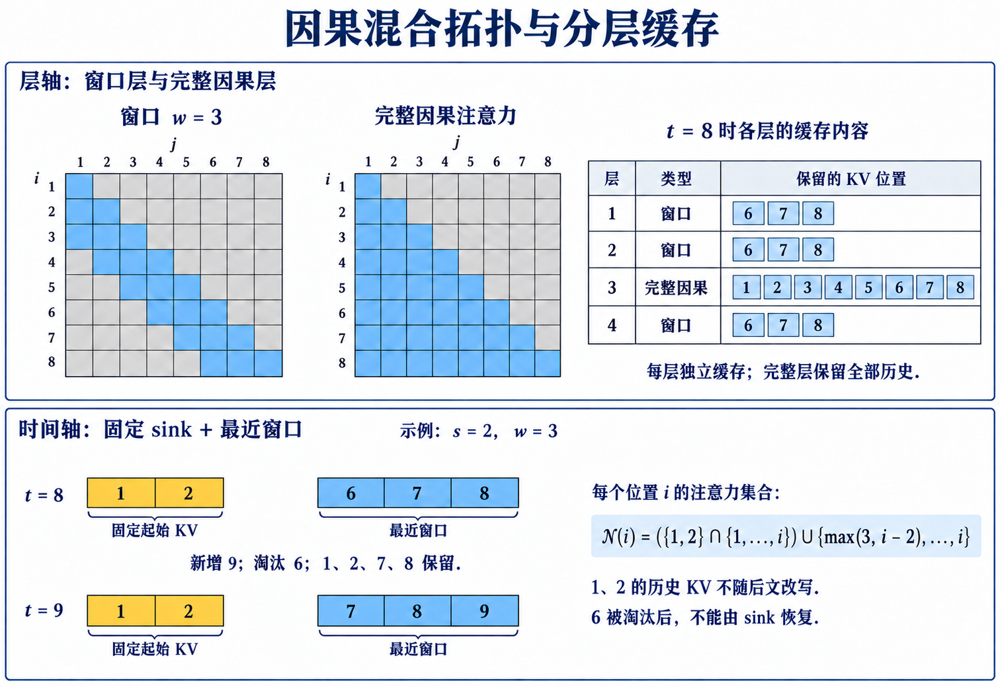

# Hybrid SWA：局部全局层与 attention sink

滑动窗口注意力把每层成本限制在窗口宽度内，却同时切断了窗口外的直接访问。模型可以沿深度逐层传递信息，但传播距离受窗口与层数共同限制。工程上常见的补偿有两类：在若干局部层之间插入一层全局注意力，或在 streaming decode 中永久保留序列开头的少量 KV。前者属于 **Hybrid Sliding Window Attention**，沿层轴改变拓扑；后者利用 **attention sink** 稳定窗口截断后的 softmax 行为，沿时间轴改变缓存边界。 [Mistral 7B](https://arxiv.org/abs/2310.06825)采用 GQA、因果 SWA 与 rolling buffer, 层间保持相同的局部窗口. 后面的 Hybrid 层表描述一种通用设计: 若干局部层之间周期性插入全局层, 用于计算这种排布的传播路径与成本.

这两类设计经常同时出现在长上下文模型中，却解决不同问题。全局层让远距离 token 重新获得直接路径，也要求相应层保留并读取完整历史。sink token 不读取整个历史，只让窗口外其余 KV 被淘汰时仍保留几个开头位置。它能避免模型因丢掉长期承接概率质量的位置而性能骤降，不能把已删除文本重新提供给当前 query。 设模型共有 $L$ 层，序列长度为 $n$，局部窗口宽度为 $w$。第 $\ell$ 层的允许集合写作 $N_\ell(i)$。局部层取最近 $w$ 个因果位置；全局层取全部过去位置；带 sink 的局部层再并入固定集合 $S=\{1,\ldots,s\}$。把三种集合明确写出，才能计算路径、cache 与带宽。

> 图 1: 上半以八个位置、宽度为三的窗口展示因果掩码及各层独立 KV;下半单独展示两个固定起始位置与三个近期位置的缓存更新. 教学图结合本文集合定义与 [StreamingLLM 的缓存配方](https://hanlab.mit.edu/projects/streamingllm)绘制.

[查看原尺寸](../images/hybrid-streaming-state-v3.png)

图 1 解析:

- 上半部分的全局层读取全部历史, 所以对应层必须保存完整 KV; 局部层只保留窗口时, cache 容量才能随 $w$ 封顶.
- 下半部分从位置 8 到位置 9, 保留 1、2、7、8, 新增 9, 淘汰 6. 固定起始 KV 不随后文改写;图中编号是原序列位置, 不是物理槽号.
- 两条轴可以同时使用, 作用却不同: 全局层恢复远距内容访问, sink 保持窗口截断后的归一化行为.

## 1. 滑动窗口怎样沿深度传播

### 1.1. 单层窗口的定义

对从 1 开始编号的位置 $i$，因果滑动窗口为

$$
N_{\text{local}}(i)=\{j:\max(1,i-w+1)\le j\le i\}.
$$

$w$ 包含当前位置，因此 $w=1$ 时每个 token 只能访问自己。令 $m=\min(n,w)$，精确边数为 $nm-m(m-1)/2$；当 $n\gg w$ 时近似 $nw$。实现若使用环形 cache，第 $i$ 步写入的 KV 可以覆盖 $i-w$ 的槽位，因为后续局部层不再直接访问它。 窗口只规定直接边。第 1 层的位置 $i$ 最远读取 $i-w+1$；第 2 层的这些 key 已经聚合更早一层的信息，于是最远理论位置继续向前扩展。忽略边界并假定每层都使用同一窗口，经过 $r$ 个局部层后的位置 $i$ 最远可受 $i-r(w-1)$ 影响。有效跨度约为

$$
R(r)=1+r(w-1).
$$

式子给出图上的可达范围，不保证所有信息都被无损传递。每个中间 hidden state 只有 $d$ 个分量，还要同时服务本地预测、语法和其他依赖。窗口外原始 KV 被淘汰后，模型只能依赖中间状态已经携带的压缩结果。

### 1.2. 八个 token 的逐层手算

取 $n=8,w=3$。第一层位置 8 访问 $\{6,7,8\}$。第二层的位置 6、7、8 分别已经读取 $\{4,5,6\}$、$\{5,6,7\}$、$\{6,7,8\}$，所以第二层位置 8 的祖先集合是 $\{4,5,6,7,8\}$。第三层再扩为 $\{2,3,4,5,6,7,8\}$，第四层才覆盖位置 1。 按 $R(r)=1+2r$，$r=1,2,3,4$ 时跨度依次为 3、5、7、9，与手算一致。位置 1 到位置 8 的最短局部层数是 $\lceil7/(w-1)\rceil=4$。若模型某两个全局层之间只有三层局部窗口，长度 8 的最远两端在进入全局层前仍未建立纯局部路径。 再看更实际的 $w=4096$、局部层数 24。理论跨度是 $1+24\times4095=98281$。对 128K 上下文，最早 token 无法仅通过这 24 层到达末尾；即使层数足够，可达性也只说明存在计算路径。需要精确复制的 UUID、代码片段或约束可能在连续压缩中丢失。

窗口边界与位置编码。
局部 mask 与位置编码是两项独立设计。RoPE 按模型规定的逻辑位置或重映射位置旋转 Q、K，窗口只限制哪些位置进入点积。把 cache 做成环形缓冲区时，物理槽位会重复使用，位置编号却不能直接随槽位取模；否则相隔 $w$ 的 token 会得到错误相位。StreamingLLM 另有 cache-relative position 的具体处理，属于算法规定的重映射，不等于把物理地址直接当位置。

训练长度也不能由窗口自动外推。若模型只在短序列上训练，扩大推理序列并保持固定窗口，单层看到的距离没有增加，但绝对位置范围、跨层状态分布和文档结构仍发生变化。窗口使单层计算可扩展，不等于完整模型已经学会在更长轨迹上维持状态。

## 2. Hybrid SWA 沿层轴恢复全局边

### 2.1. 周期性全局层

设每 $p$ 层中有一层使用全局因果注意力，其余 $p-1$ 层使用窗口。第 $\ell$ 层的 mask 是

$$
N_\ell(i)=
\begin{cases}
\{1,\ldots,i\}, & \ell\equiv0\pmod p,\\
N_{\text{local}}(i), & \text{otherwise}.
\end{cases}
$$

全局层的位置 $i$ 可以一次读取全部历史位置在上一层形成的表示。下一组局部层则继续在窗口内传播全局层输出。因果方向下，早期 token 不能读取未来 token，但后期 token 可以在全局层直接读取所有早期 token。 如果全局层的上一层仍是局部层，每个早期位置带着其局部邻域的表示进入全局层。全局层不会恢复上一局部层已经丢弃的细节，但它直接访问每个位置当前的 hidden state，而不是只访问末尾窗口。因此它避免信息必须沿所有中间 token 连续接力。

### 2.2. 四层一组的成本手算

取 $n=32768,w=4096,p=4$。完整因果边数为 536,887,296，窗口边数为 125,831,168。三个窗口层加一个全局层共有

$$
3\times125{,}831{,}168+536{,}887{,}296=914{,}380{,}800
$$

条边。四个全局层则有 $4\times536{,}887{,}296=2{,}147{,}549{,}184$ 条边。相对比例约为 42.58%，配对理论上减少约 57.42%。若只看到「窗口为上下文的八分之一」，容易误报成 87.5% 的减少；周期性全局层必须进入加权平均。 KV 容量也按层加权。假设共有 32 层，每 4 层一层全局，则 8 层要保留长度 $n$ 的 KV，24 层只需 $w$。相对全局 cache 比例为

$$
\rho_{KV}=\frac{8n+24w}{32n}=\frac14+\frac34\frac{w}{n}.
$$

代入 $w/n=1/8$ 得 $\rho_{KV}=0.34375$。这里与配对比例不同，是因为窗口层的因果三角边数含开头逐渐增宽的部分，而 cache 在稳态直接按保存长度计算。成本指标必须分别推导。

全局层间距怎样影响路径。
若全局层间隔为 $p$，任意位置到后续位置最多等到下一全局层获得直接读取机会。若距离输出最近的全局层与输出层之间还隔着 $r$ 个局部层, 全局信息必须在这 $r$ 层的窗口内继续传到目标位置。若全局层本身覆盖每个位置，位置在该层已经聚合历史，后续同一位置的残差流可以保留这份表示；但局部层的更新可能稀释细节。

全局层越密，远距离路径越短，prefill 与 decode 成本越接近稠密。全局层越稀，成本越低，模型越依赖局部层的状态保持。周期 $p$ 因而是明确的预算参数，不应只用「hybrid」描述。还应说明首层、末层是否全局，因为相同数量的全局层放在不同深度会改变信息首次聚合和最终可用的时点。

Head 级与层级混合不是一回事。
另一种混合让同一层的一部分 head 使用全局注意力，其余 head 使用窗口。若全局 head 比例为 $a$，配对成本近似按 $aE_{global}+(1-a)E_{local}$ 计算。层级混合则让一整层的投影与 KV 布局统一，kernel 更容易选择；head 级混合可以每层保留少量全局通道，却可能让 KV cache 每层仍需保存完整历史，因为全局 head 需要访问它。 若全局与局部 head 共享同一组 GQA KV，全局 head 要读取历史 key/value，局部 head 只读窗口。物理 cache 不能仅保留窗口，否则全局 head 无数据可取。可以为不同 head 分配不同 cache 策略，但会增加布局和 kernel 复杂度。**全局计算占比小，不代表完整历史的存储占比同样小。**

## 3. Attention sink 的机制

### 3.1. StreamingLLM 观察到了什么

[Xiao et al. (2023)](https://arxiv.org/abs/2309.17453) 在 StreamingLLM 中观察到，自回归 LLM 即使起始 token 与当前语义关系不强，也常向它们分配显著注意力。当普通窗口截断把开头 KV 删除后，模型困惑度可能明显恶化；保留少量开头 token，再加最近窗口，可以在论文测试的 Llama-2、MPT、Falcon 和 Pythia 上稳定流式语言建模，作者报告序列扩到 400 万 token 以上。这是指定模型与语言建模设置的实验结论，不是任意任务的无限记忆保证。

attention sink 不是说起始 token 存储了全部长期内容。更准确的解释是 softmax 权重必须和为 1，当某些 head 没有强匹配目标时，训练形成了把多余概率质量放到稳定位置的行为。开头 token 对所有后续位置始终可见，因而容易承担这项作用。突然删除这些 key 会改变归一化竞争集合和层内输出分布。

[Gu et al. (2024)](https://arxiv.org/abs/2410.10781) 进一步把 sink 描述为一种近似 key bias: sink 位置取得很高的注意力分数, 对 value 混合的有效信息贡献却可以很小. 他们还观察到 sink 会在充分训练后出现, 其位置与损失和数据分布相关; 将归一化 softmax 换成不要求权重和为 1 的 sigmoid attention 后, 实验中的 1B 以下模型没有形成同样的 sink. 因而「开头几个 token 天生重要」不是合适解释, 训练目标与归一化约束共同塑造了这个位置角色.

[Barbero et al. (2025)](https://arxiv.org/abs/2504.02732) 从信息过度混合分析第一个位置为何会承担这项功能, 并检验上下文长度、深度和数据 packing 对 sink 的影响. 两项工作补上了 StreamingLLM 原始观察之外的一层边界: 保留起始 KV 是有效的部署配方, 但 sink 的形成强度和具体位置会随训练设置改变. 服务端不能默认任意 checkpoint 都只需保留固定四个 token; 应先画出各层各头的注意力分布, 再比较删除不同起始位置后的困惑度与任务指标.

### 3.2. 从 softmax 看「吸收」

对 query $q_i$，可见 key 的 logit 为 $z_j=q_i^\top k_j/\sqrt{d_h}$，概率是

$$
p_j=\frac{e^{z_j}}{\sum_{r\in N(i)}e^{z_r}}.
$$

假设当前窗口有三个内容 token，logit 都为 0；一个 sink token 的 logit 为 2。分母是 $e^2+3e^0=10.389$。sink 概率约为 $7.389/10.389=0.711$，每个普通位置约为 0.096。若直接删除 sink，三个内容位置各变成 $1/3$。即使它们的 value 没变，输出混合比例也从总计 28.9% 跳到 100%。 再设 sink value 为零向量，三个内容 value 在某一维分别为 1、2、3。有 sink 时该维输出约为 $0.096\times(1+2+3)=0.578$；删去 sink 后变成 $(1+2+3)/3=2$。sink 即使没有携带语义内容，也会通过归一化控制输出尺度。真实模型还有输出投影、残差和多头组合，手算只展示分母改变怎样传播。

Sink cache 的集合与容量。
令固定 sink 集合 $S=\{1,\ldots,s\}$，最近窗口为 $W_i=\{\max(s+1,i-w+1),\ldots,i\}$。可见集合取

$$
N_{sink}(i)=(S\cap\{1,\ldots,i\})\cup W_i.
$$

稳态每层保存约 $s+w$ 个位置。若 $s=4,w=4096$，相对纯窗口只增加 0.098% 容量。物理实现可给 sink 单独保留不可覆盖的槽位，其余 $w$ 个槽位组成环形缓冲区。逻辑位置与物理槽位分别维护；普通 RoPE 使用原始位置，而 StreamingLLM 使用其规定的 cache-relative 位置重映射，Q 与保留的 K 必须按同一方案处理。 窗口定义必须避免重复计数。序列刚开始时，sink 位置也位于最近窗口内，集合并集只算一次。随着 $i$ 增长，普通旧位置逐个被淘汰，$S$ 始终保留。batch 内不同请求的 sink 属于各自序列，不能因 packed 布局而共享。

Attention sink 与 sink token 训练。
StreamingLLM 的方法可以直接保留预训练模型已有的若干初始 token。后续工作和模型设计也会在训练时显式加入可学习或固定的 sink token，让注意力从开始就有稳定承接位置。两者的部署假设不同：前者利用已有模型表现出的行为，后者改变训练输入或注意力机制。 训练一个专用 sink 有机会减少对真实首词的偶然依赖，但它占用序列位置并改变训练分布。是否能只在推理时添加，取决于模型是否见过该 token、位置编码和 tokenizer 接口；随意插入未训练的向量不会自动复现 sink 行为。报告应区分「保留原序列前 $s$ 个 token」和「模型训练时加入专用 sink」。

## 4. 拓扑组合与部署路径

### 4.1. 三种拓扑放在一起手算

取长度 $n=12$、窗口 $w=4$、sink 数 $s=2$。在普通窗口层，位置 12 访问 $\{9,10,11,12\}$。带 sink 后访问 $\{1,2,9,10,11,12\}$。在全局层访问 $\{1,2,\ldots,12\}$。三种集合分别含 4、6、12 个 key。 普通因果窗口总边数是 $12\times4-4\times3/2=42$。加入两个 sink 后，位置 1 到 4 的集合基本未增加；从位置 5 开始，窗口不再同时包含位置 1，随后也不含位置 2。逐行计算新增边数为 $0,0,0,0,1,2,2,2,2,2,2,2$，合计 15，总边数 57。不能简单用 $ns=24$，因为开头窗口与 sink 重合。 完整因果边数是 $12\times13/2=78$。若三层局部加一层全局为一组，四层总边数是 $3\times57+78=249$；全稠密四层为 312，比例约 79.8%。在这个很短的序列上，窗口与 sink 的固定开销占比高。长度扩大而 $w,s$ 固定后，局部层比例才持续下降。

一个远距离事实怎样到达末尾。
假设位置 3 含一个稍后需要逐字使用的标识符，位置 12 产生 query。普通窗口 $w=4$ 时，一层无法直接访问位置 3。每层最多跨越 3 个位置，路径可以是 $3\rightarrow6\rightarrow9\rightarrow12$，至少三层。每个箭头表示后一个位置在某层读取前一个位置的上一层表示。 若位置 3 不在 sink 集合，sink 不缩短这条路径；$S=\{1,2\}$ 只永久保留位置 1 和 2。若中间插入全局层，位置 12 在该层可直接读取位置 3 的当前表示。若位置 3 的原始 KV 只在局部层 cache 中被删，也不影响全局层，因为每层拥有自己的 KV；但全局层本身必须从 prefill 开始保留位置 3 的 KV。 这说明三种机制的边界。窗口依靠跨层转发，sink 只为指定开头位置提供永久直接边，全局层为所有历史位置提供直接边。把任意一种描述成「保留长期记忆」都会掩盖它实际保存的对象。

### 4.2. Prefill 与 Decode 的部署细节

Prefill 时不能提前丢错层。
prefill 计算全部 prompt 并建立每层 cache。局部层可以在 kernel 内只算窗口边，并在最终 cache 中只留下最近 $w$ 与 sink；全局层需要计算完整因果边并保留全部位置。如果服务框架在层外统一裁剪 cache，全局层会失去历史。cache 策略必须是 per-layer，必要时还要 per-head。 长 prompt 若远大于窗口，局部层可以分块流式 prefill：当前 query 块只需要前一段窗口范围的 K/V，再把更旧局部 KV 丢弃。全局层不能这样裁剪，只能使用精确的分块稠密注意力或其他近似。混合模型的峰值显存常由全局层临时计算或完整 cache 决定，而不是由多数局部层决定。

Decode 的环形 cache 与连续 batching。
局部层的环形 cache 为每个请求维护写指针。请求生成一个 token 后，写指针前移并覆盖最旧普通槽；sink 槽不参与覆盖。连续 batching 中请求开始时间不同，逻辑位置与物理页也不同，kernel 需要根据请求自己的页表和窗口边界取数。 分页 KV cache 可以把逻辑连续窗口映射到若干物理页，减少预留浪费。窗口淘汰后，旧页可归还内存池；全局层页仍被引用，不能释放。若多层共用统一页生命周期，只要一层全局就可能阻止整页回收。实现需要把层或层组的所有权分开，才能兑现 Hybrid SWA 的容量优势。

Tensor Parallel 与 Context Parallel。
Tensor Parallel 常按 head 或隐藏维切分。局部和全局 head 若分布不均，会造成设备工作量差异；head 级混合应让每张卡获得相近数量的全局 head。层级混合在某些层产生更大 KV 读取与通信峰值，流水并行排程也要避免多个重层集中到同一 stage。 Context Parallel 按序列切分时，局部窗口只与相邻分片交换边界 KV，全局层则需要跨全部分片汇聚或环传 K/V。因而 Hybrid SWA 不只降低 FLOPs，也改变通信模式：多数局部层通信有限，少数全局层形成周期性峰值。端到端吞吐可能受这些峰值同步限制。

## 5. 训练、选型与失效诊断

### 5.1. 失败模式、选型与训练一致性

最直接的误用是把 attention sink 当作摘要槽。保留 BOS 与前三个 token 只确保这些位置的 KV 仍在；除非模型受过相应训练并确实把后续事实写回可变记忆，固定开头 KV 在自回归推理中不会随着后文更新。标准 Transformer 的历史 KV 一经生成便保持不变。 因此 sink 可以改善无限流式输入的语言建模稳定性，却无法保证回答窗口外文档的问题。评测应同时看困惑度或生成稳定性，以及要求引用被淘汰内容的检索任务。前一项改善不能替代后一项证据。

图可达不等于模型会路由。
局部层堆叠产生长路径，但梯度要促使每个中间位置保存未来相关信息。路径越长，信息越容易与其他特征混合。全局层缩短路径，也可能把大量历史压进有限 head 和 hidden dimension。形式证明常说明模型在足够宽度、深度或特定构造下能表达某类函数，不等于现实规模与训练预算会找到该构造。 可操作的验证是按距离分桶。把关键事实与 query 的距离从窗口内逐步移到一倍、两倍、十倍窗口外，分别测精确检索、聚合和状态更新。再改变全局层周期 $p$ 与 sink 数 $s$，观察失败边界是否跟理论路径一致。

位置漂移与缓存错位。
环形 cache 最危险的实现错误是逻辑位置、物理槽位和 RoPE 位置混为一体。覆盖旧槽只改变存储地址，不能改变新 token 的逻辑位置。若使用相对位置偏移或 RoPE 重映射，query 与保留 sink 的 key 必须采用相容变换；否则 sink 与当前 token 的距离处理会偏离训练分布。 另一个错误是 off-by-one。若窗口声称宽度 $w$ 包含当前 token，则历史 KV 数是至多 $w-1$；某些 API 把 $w$ 定义为左侧历史数，再加当前位置。两种约定会使 cache 容量、mask 和边数差一列。文档和测试应给出一个小矩阵，逐行列出允许集合。

质量与性能要成对报告。
Hybrid SWA 的消融至少改变窗口 $w$、全局层周期 $p$、全局层位置和 sink 数 $s$。性能侧报告 prefill、decode、cache 与多卡通信；质量侧报告短程语言建模、长距离检索、跨段推理和真实任务。只改变多项后报告一个总分，无法判断收益来自哪条边。 同一模型还应比较训练与推理拓扑是否一致。训练用全局注意力而推理裁成窗口，测到的是部署近似；从头按窗口训练，测到的是模型对拓扑的适应。保留 sink 的零微调设置与显式 sink 训练也应分开。**拓扑、训练分布和 cache 生命周期必须一起改变或一起对照，结论才有可复现含义。**

怎样选择组合。
依赖局部且流式长度无上限。
语音转写、持续日志或局部代码补全若主要依赖最近上下文，窗口加少量 sink 能把每 token cache 固定下来。前提是任务允许遗忘远处原文，或者外部检索系统负责重新取回历史。sink 数不应凭经验无限增加；保留越多，固定 cache 越大，而且它们未必都承担稳定作用。 需要周期性整合全局状态，但不要求每层都访问全文时，Hybrid SWA 更合适。全局层周期由可接受带宽与任务距离决定。若请求长度巨大，少数全局层仍可能主导 prefill；可以进一步研究块级全局、检索式注意力或压缩记忆，但它们已经改变本章的静态完整全局假设。

精确远距离引用。
任务要求随时逐字访问任意历史时，纯窗口与固定 sink 没有完整性保证。周期性全局层保留原始历史的层级 KV，可以提供直接通路，代价是这些层的 cache 随长度增长。若容量不允许，只能在外部存储、KV 压缩或动态检索中接受新的召回与误差边界。 选择时先写出必须保留的状态，而不是先选方法名。若必须保留全部原文但只偶尔查询，动态块检索可能比周期全局层更省带宽；若每步都需要全局汇总，静态全局层可能更稳定。若只需生成连续自然语言而不要求旧事实，窗口与 sink 已能覆盖主要系统目标。

一条落地检查式。
对每一层记录四元组 $(m_\ell,w_\ell,s_\ell,h_\ell)$：$m_\ell$ 表示 global 或 local 模式，$w_\ell$ 是窗口，$s_\ell$ 是 sink 数，$h_\ell$ 是需要完整历史的 head 比例。由这张层表可以直接求配对边数、cache 上限和读取量，再结合设备 kernel 测量时间。 质量检查则把每项任务的依赖距离映射到最短路径，并验证相应数据是否在路径上实际存在。已淘汰的 KV 不因图上想象的一条边而恢复，sink 也不因名称而成为长期记忆。**Hybrid SWA 的核心价值是用少量昂贵层控制全局路径，用大量便宜层承担局部计算；attention sink 的核心价值是让窗口截断保持训练中形成的归一化支点。**

训练与迁移时保持拓扑一致。
从稠密权重改成窗口。
已有稠密模型可以在推理时直接施加窗口 mask，因为 QKV 与输出投影 shape 没有改变。输出能够运行，不代表分布保持不变。训练时某个 head 可能长期读取很远的特殊位置，窗口会把该边突然删除；softmax 在剩余 key 上重新归一化，误差随后经残差进入后续层。 继续训练可让模型适应新图。较稳妥的过程是先用目标窗口与全局层模式恢复语言建模损失，再加入长依赖数据。窗口可以从较大值逐步缩小，但课程本身改变训练分布；最终判断仍以目标拓扑上的质量为准。若部署保留 sink，继续训练时也应以相同 sink 规则构造 mask。

一种转换把每四层中的一层保留稠密，其余层改窗口。保留哪一层不能只按编号方便决定。靠前全局层较早聚合输入，靠后全局层更接近输出，均匀分布控制最大等待深度。逐组替换并测量距离分桶检索，可以确定周期位置。

从头训练专用 sink。
专用 sink token 在每条训练序列开头占据稳定位置，KV 后续不再更新。若模型采用 packed document，必须决定每个文档各有 sink，还是整个 packed 序列共享 sink。标准注意力不会把后续信息写回旧 sink，它主要提供归一化位置，不是跨文档可写状态。 训练时随机裁剪序列起点会改变 sink 语义。若裁剪后总在片段前插入 sink，模型学习的是「当前可见片段的稳定开头」；若保留原文 BOS 而从中段截取，BOS 可能不存在。部署的无限流式场景更接近前一种，但 tokenizer、位置编号与 loss mask 必须一致。 sink 数 $s$ 可从 0、1、2、4 逐步消融，测窗口截断后的困惑度、长时间生成稳定性和内容检索。只观察某层某头对首 token 的高权重不足以确定数量。若增加 $s$ 只改善困惑度而不改善窗口外问答，结果正好符合 sink 的机制边界。

Checkpoint 必须描述层表。
层模式应进入配置与 checkpoint 元数据。至少记录每层是否全局、窗口宽度、sink 数、全局 head 比例和 cache 类型。若只在推理引擎参数里保存，换框架可能默认所有层稠密或所有层局部，权重仍能加载却产生不同输出。 配置还要约定窗口计数是否包含当前位置，sink 是否计入窗口上限，全局层是否也走 sink 专用缓冲。全局层数学上已经访问开头位置，不需要另加边；相同逻辑集合应得到相同输出，不能因两条加载路径重复计算。 版本迁移可用固定小矩阵验证。给定相同 QKV 与位置，旧引擎和新引擎应生成同一允许集合，并在容差内输出一致。对环形 cache 再运行超过两倍窗口长度，检查覆盖后的物理槽没有改变逻辑位置。

更细的失效诊断。
困惑度在截断点突然上升。
若纯窗口在 cache 首次满时出现突变，先比较保留 1 到 4 个开头 token。少量 sink 若消除突变，而扩大普通窗口只把突变推迟，问题更接近归一化支点被删除。随后逐层记录开头位置的注意力质量，确认哪些层和 head 依赖 sink。 若加入 sink 后仍在远距离任务失败，应检查证据是否已经落在窗口外。sink 不能恢复被淘汰的证据，此时扩大窗口、增加全局层或外部检索才会改变可见集合。另一类错误来自位置编码：环形 cache 若把物理索引当逻辑位置，性能会按覆盖周期波动，sink 也无法修复。

全局层存在却没有长程收益。
先确认全局层 cache 真的保留全部历史。有些统一窗口参数会在进入 kernel 前裁掉所有层 KV，使配置仍标 global，输入数据却只剩窗口。查看每层实际 cache 长度比查看模式名称更可靠。 若数据存在，再检查全局层位置。距离输出最近的全局层之后若有很多局部层，信号可能在后续更新中衰减；第一个全局层过晚，则早期大量层只能局部处理。移动全局层并保持数量不变，可以识别深度位置效应。 训练分布也会改变结果。模型若只在窗口内依赖上训练，远距离边虽存在，优化过程可能没有奖励使用它。加入距离控制数据后，应同时观察任务准确率与 value 通道，而不只看注意力权重；高权重不等于正确读取。

速度低于稠密基线。
短序列和小 batch 下，稀疏调度开销可能超过省下的乘法。长度扫描能找到稀疏 kernel 越过稠密基线的交点。若所有长度都慢，应检查是否先构造 $n\times n$ mask，是否为全局条带回退到稠密 kernel，以及块尺寸是否产生大量填充。 Hybrid 模型还会产生层间负载波动。全局层耗时远高于局部层时，Pipeline Parallel 的 stage 可能不平衡；Context Parallel 又在全局层触发大通信。将全局层均匀分配到 stage、让窗口层主要使用邻居通信，可能比继续优化单卡 kernel 更有效。 decode 中还要看实际读取字节。若框架仍为全局与局部层分配同长 cache，容量不会按公式下降；若局部 kernel 扫描页表中全部块再过滤，带宽也不会下降。逻辑窗口正确但系统没有省时，通常是状态生命周期或访问路径没有随 mask 改变。

### 5.2. 验收矩阵与证据边界

四种必须同时覆盖的输入。
实现测试至少包含短于窗口、刚好等于窗口、首次覆盖旧槽和超过两倍窗口四种长度。每种长度再分别启用零个与若干 sink，并经过一层全局注意力。短序列验证集合并集不会重复计算 sink；首次覆盖验证淘汰边界；两倍窗口验证环形槽与逻辑位置已经完全错开时仍然正确。 输入中应放置可定位的远距离值：窗口内一项、窗口外非 sink 一项、开头 sink 一项。局部层只能读前两类中的窗口内与 sink，全局层三类都能读。用单位向量作为 value，可以从输出直接辨认哪条边参与聚合。

验收结果怎样解释。
若局部输出包含窗口外非 sink，mask 或页表越界；若覆盖后 sink 消失，专用槽参与了环形覆盖；若全局层看不到旧值，完整 cache 被统一裁剪。数学输出正确后再测实际显存和读取字节，确认状态生命周期也按层表执行。 质量侧把相同三类证据放入文本任务。窗口内与 sink 稳定、窗口外失败，是拓扑预期而不是 kernel 错误；全局层仍失败才需要继续查训练与表征。这样的验收矩阵把「算错了」与「图里没有这条边」明确分开。

长时间稳态测试负责暴露运行期问题。短测试可能尚未触发页回收、请求换入和位置计数上限；持续生成数倍于窗口长度，才能观察 cache 容量是否真正保持常数，以及 sink 页是否一直有效。若存在周期性全局层，同时记录这些层的完整 cache 是否按预期线性增长。 验收通过的含义也应限定：它证明实现符合给定层表，并未证明这张层表适合所有任务。新的上下文长度、量化格式或并行布局仍需重新验证边集合、位置与 cache 生命周期。

两种机制各自解决什么。
SWA 管容量, sink 管流式稳定性。
Mistral 7B 使用 SWA 配合 rolling buffer 限制因果 decode 的 cache, GQA 与 SWA 分别从 KV 头数和可见长度降低推理成本。若每隔 $p$ 层插入完整 attention, 完整层仍要保留更长 cache, 总容量应按局部层与全局层的数量加权计算。 StreamingLLM 论文支持保留初始 sink KV 与最近窗口、无需微调地稳定其所测模型的流式语言建模。论文还报告专用 placeholder sink 在预训练中可进一步改善流式部署。它没有声称 sink 保存被逐出的任意内容，也没有把 400 万 token 的稳定困惑度解释成 400 万 token 的精确召回。

配置字段还要对应真实回收。
[Mistral 推理仓库](https://github.com/mistralai/mistral-inference)是模型预处理与推理的作者实现入口；具体部署是否实际裁剪 KV，仍要检查所用版本与 backend，不能只凭配置中的窗口字段判断。[StreamingLLM 官方仓库](https://github.com/mit-han-lab/streaming-llm)和[项目页](https://hanlab.mit.edu/projects/streamingllm)把 sink KV、最近窗口与 cache-relative position 列为实现配方。 per-layer cache 的淘汰条件可以直接从访问关系得到: 后续计算不会再访问该层旧位置, kernel 只读取窗口与 sink, cache 管理器也会实际回收窗口外页面. 分页生命周期、Pipeline Parallel 和 Context Parallel 都要保持这三个条件; 只在配置中填写窗口宽度不会减少KV占用.

部署时还应把层表写入模型配置的版本标识. 同一权重若更换局部层与全局层分布, cache保留策略和可见图都会变化, 生成结果也可能改变. 服务滚动升级期间, 已在旧层表下建立的 prefix cache不应直接交给新层表复用; 至少要让缓存键包含层表哈希、窗口、sink数量与位置编码配置.

### 5.3. 层表次序与有效传播

用层表描述混合拓扑。
混合 attention 最容易被一句「局部层和全局层交替」含混带过。真正决定模型通信能力的是逐层邻接表。设模型共有 $L$ 层，第 $\ell$ 层的回看集合为 $N_\ell(i)$，再用类型序列

$$
z_{1:L}=(z_1,z_2,\ldots,z_L),\qquad z_\ell\in\{W,G,R,S\}
$$

标记窗口、全局、随机和摘要层。类型只是索引，窗口宽度、global 数量、随机度数和摘要方向仍需逐层记录。相同的类型计数采用不同次序，会产生不同的中间表示与 cache 生命周期。

**全局层的位置改变计算顺序**

考虑八层模型，其中两层采用 full attention。层表 A 为 $(G,W,W,W,G,W,W,W)$，层表 B 为 $(W,W,W,G,W,W,W,G)$。两者均有两层全局、六层窗口，总边数相同。A 在入口处完成一次全局混合，后三个窗口层加工已经汇聚的表示；B 的前三层只能建立局部特征，第四层才发生第一次远距交换。 对分类任务，末次全局交换靠近输出，局部特征成熟后集中汇总可能很合适。对需要早期远距条件影响后续逐层推理的任务，入口附近的全局层能留下更多计算深度。仅报告「每四层一个全局层」仍缺少首个全局层的相位。

设相邻全局层最大间隔为 $p$。任意信息在全局层被汇聚后，到下一次全局交换前最多经历 $p-1$ 个局部层。这个间隔约束的是通信等待时间；窗口宽度 $w$ 则约束等待期间能够扩散的局部距离。二者共同决定路径，不能只用全局层比例概括。 对于 causal 模型，位置 $j$ 的信息在某个全局层只能进入位置 $i\ge j$。即便该层采用 full causal attention，也不存在未来到过去的边。后续窗口层可以继续把信息向右扩散。双向编码器中的一次 full layer 让所有位置互相通信，自回归模型中的 full layer 只让每个位置读取其历史，两种「全局」的直径分析不同。

**有效传播时延可以逐层递推**

给定证据位置 $j$，定义第 $\ell$ 层已经获得该证据影响的位置集合为 $F_\ell(j)$。初始 $F_0(j)=\{j\}$，递推为

$$
F_\ell(j)=\{i:\exists k\in F_{\ell-1}(j),\ k\in N_\ell(i)\}.
$$

窗口层把集合边界向右推进至多 $w_\ell-1$；full causal 层则让证据影响所有不早于它的位置。这个递推能精确回答某条证据在哪一层第一次到达 query，也能算出到达后还剩多少层用于处理。 把首次到达层记为 $a(j,i)$。模型总深度为 $L$，到达后的计算余量是 $L-a(j,i)$。两个层表可能让所有证据最终可达，却拥有完全不同的余量分布。只统计最终可达率，会把「第 2 层到达」和「第 32 层才到达」视为相同。 多证据推理还要计算共同到达。证据 $j_1,j_2$ 在某层分别到达不同位置，尚未形成联合表示。寻找最早的层 $t$ 和位置 $u$，使 $u\in F_t(j_1)\cap F_t(j_2)$，才能确定第一次相遇。若相遇发生在末层，输出头承担全部组合；若较早相遇，后续 attention 与 MLP 可以继续加工。

**Head 混合与层混合有不同归一化**

把局部和全局边分给同一层的不同 head，信息在该层末端经输出投影合并。局部 head 的 softmax 只在窗口内归一化，全局 head 在全历史上归一化。若把两类边放进同一个 head，局部和远距候选共享分母，远距边的加入会改变每条局部边的概率。 设局部候选数为 $w$，另一个 head 的全局候选数为 $g$，两集合重叠 $h$ 个位置，所有 logit 暂时相等。同一 head 合并并去重后，每个候选权重为 $1/(w+g-h)$；分 head 后，局部 head 中每个候选为 $1/w$，global head 中每个候选为 $1/g$，再由输出投影组合。边集合的并集相同，函数并不相同。 Head 级混合每层都提供远距入口，却只分配部分通道维度。层级混合让某些层全部 head 参与全局比较，代价集中在这些层。固定总点积预算时，可以比较少量 full head 铺满所有层，与少量 full layer 使用全部 head；前者通信频繁、单次带宽窄，后者通信稀疏、单次带宽宽。

GQA 还会改变 KV 侧的分组。多个 query head 共享同一 KV head 时，不同拓扑 head 是否允许共享 KV、索引是否一致，需要由实现决定。若一个 query head 读窗口、另一个读全局，它们虽然能共享投影后的 K/V 张量，实际读取集合仍不同，cache 访问不能按单一 head 推算。

**层表直接决定 per-layer cache**

每一层拥有自己的 K/V。窗口层宽度为 $w_\ell$ 时，普通 KV 在离开窗口后即可回收；full causal 层的旧 KV 可能被任意未来 query 读取，必须一直保留。若共有 $L_W$ 个窗口层和 $L_G$ 个 full 层，忽略 sink 与 page 对齐，时间步 $t$ 的元素量近似为

$$
C(t)=L_W\min(t,w)+L_Gt.
$$

周期性 full layer 只要数量随总层数固定，cache 对生成长度仍有线性项 $L_Gt$。SWA 层占多数可以降低常数，却没有让整个模型 cache 对时间有界。声称「使用滑动窗口所以支持恒定 cache」时，必须确认每一层都具备有限回看。 若 full 层只在 Prefill 使用，Decode 改成窗口，会改变模型函数；若训练时就采用阶段不同的 mask，则属于新的拓扑定义。Prefix cache 也绑定层表：窗口层只缓存最近状态，full 层缓存完整前缀。更换层表后复用旧 cache，会让层号与 K/V 语义错位。

## 6. 组合机制、约束方程与服务状态

### 6.1. 窗口、sink 与全局记忆的职责

窗口、sink 与全局记忆承担不同职责。
三者经常同时保留少量旧位置，名称因此容易混淆。窗口保存近期内容；sink 稳定 softmax 归一化；任务 global 负责汇聚或广播语义。它们的地址集合可能重叠，功能不能互相推出。

**Sink 的高权重未必代表高语义贡献**

Attention 输出为 $o=\sum_j\alpha_jv_j$。某个 sink 拥有很大的 $\alpha_s$，若 $v_s$ 接近零，它对输出向量的直接贡献仍小；它的重要作用可能是占据概率质量。删掉 sink 后，其他候选重新归一化，输出随之改变。 设 sink logit 为 $a$，其余 $m$ 个候选 logit 都为零，则

$$
\alpha_s=\frac{e^a}{e^a+m},\qquad
\alpha_j=\frac1{e^a+m}.
$$

删除 sink 后，每个普通候选权重变为 $1/m$。当 $e^a$ 很大时，普通 value 的总贡献被整体放大。这个变化不要求 sink 携带任何历史事实，保留 sink 也不会恢复已经逐出的中间 KV。 判断某个位置是语义 memory 还是归一化 sink，需要同时看四项：key 产生的 logit、softmax 权重、value 路径贡献和删除干预。只画 attention heatmap 容易把高权重解释成「模型在关注其语义」，忽略 value 可能只提供近零基线。

**开头 sink 与任务 global 的时间方向不同**

位于序列开头的 sink 能被所有未来 query 读取，但在 causal 计算中无法读取后来 token。它是常驻 global key，不是汇聚全文的 global query。段尾摘要则能读取已经出现的段落，再被未来位置读取；它可以携带语义，却要等待段落结束。

双向 Longformer 中的任务 global 位置可以同时读取全文并被全文读取。将这种双向接口画进 causal Decode，会偷偷加入未来信息。因果拓扑必须把「谁读 global」和「global 读谁」分成两个方向，并按 token 时间检查。 系统提示适合作为常驻 global key，因为后续回复需要稳定读取它；对话历史摘要适合作为周期生成的语义槽；BOS 可能成为 sink。三个位置可以恰好相邻，也可以由同一个 token 承担多种作用。若同一 token 同时承担规则、摘要和概率吸收，有限 value 维度与梯度目标会发生竞争。

**有界流式状态需要明确遗忘语义**

Sink 加最近窗口的 cache 大小约为 $s+w$，适合持续生成。中间历史离开窗口后，只剩它曾经写入后续隐藏状态的间接影响。随机字符串、精确代码片段或未被预先识别的重要事实不会自动保存。

真正的长期语义记忆需要额外协议：周期摘要、外部检索、可写 memory token 或保留选定 KV。周期摘要把原始状态压成固定维度，容量有上限；外部检索保留原文但引入索引和路由；选择性 KV 需要判断未来价值。它们都超出单纯 sink 的能力。 流式稳定与长程召回应分别评测。前者可用超长文本的分段困惑度，观察越过训练长度后是否崩溃；后者在早期植入随机键值，隔开多个窗口后查询。模型可能保持稳定困惑度，却无法回答早期随机键值，因为两项指标分别测量分布稳定和历史访问。

**固定 cache 预算下的分配**

总预算为 $C$，分给 $s$ 个 sink、$g$ 个常驻语义槽和 $w=C-s-g$ 个近期位置。增加 sink 可能稳定归一化，却缩短近期上下文；增加语义槽提高摘要带宽，也减少原始窗口。三项应分别扫描，不能同时增加后把收益全部归给某一种机制。 最小 sink 数与 checkpoint 有关。经过专门 sink token 预训练的模型可能只需一个占位符；已有模型可能在多个开头位置形成 sink。Prompt 模板移动 BOS、系统消息或特殊 token 后，依赖位置也可能改变。部署配置应在真实模板上测量，而非照搬另一模型的 $s$。

### 6.2. 分阶段计算成本

混合拓扑的成本需要按阶段分解。
同一层表在训练、Prefill 与 Decode 的形状不同。训练和 Prefill 同时处理许多 query，窗口块能形成较大的矩阵乘；Decode 每步通常只有一个 query，成本更接近读取多少 KV。把三个阶段合成一个 FLOPs 数字，会掩盖完全不同的瓶颈。

**层表的 Prefill 计算量**

长度 $n$、窗口 $w$，单个 causal 窗口层边数近似 $nw$；full causal 层约为 $n(n+1)/2$。层表含 $L_W$ 个窗口层、$L_G$ 个 full 层时，attention 分数数目近似

$$
E_{\mathrm{prefill}}\approx L_Wnw+L_G\frac{n(n+1)}2.
$$

只要 $L_G>0$ 且随长度保持，渐近主项仍是 $O(L_Gn^2)$。全局层比例很低能显著降低常数，但不能把复杂度称为严格线性。若 full 层自身改成少量 global token，而非全序列 full attention，才可能保持 $O(n(w+g))$。 取 $L=32,L_G=4,L_W=28,n=32768,w=4096$。窗口部分约为 $28nw$，full 部分约为 $4n^2/2$。后者约等于 $16nw$，因此四个 full 层仍占很大比例。把 $n$ 翻倍而 $w$ 固定，full 与窗口之比也翻倍，长上下文下瓶颈会重新集中到少数全局层。

**Decode 的读取量与常驻量分开**

Decode 到时间步 $t$，窗口层每步读取约 $w$ 个 KV，full 层读取 $t$ 个。单 token attention 读取量为

$$
B(t)\propto L_Ww+L_Gt,
$$

cache 常驻量也具有相同的元素级主项，但 page、量化和 KV head 数会改变字节数。Prefill 中少数 full 层的平方计算问题，在 Decode 中表现为随生成长度增长的读取带宽与状态。 GQA 将 KV head 数从 $H$ 降到 $H_{kv}$，每个位置的 KV 字节近似按 $H_{kv}/H$ 缩小；SWA 缩短位置轴。二者作用在不同维度，可以相乘。只写「GQA+SWA」仍需给出 head 比例和每层回看长度，才能推算实际 cache。 Sink 增加每层固定 $s$ 个读取，长期主项仍由 $w$ 或 $t$ 决定。语义摘要若每隔 $b$ 个 token 新增一个且永久保留，摘要数随 $t/b$ 增长，cache 仍是线性，只是斜率较小。严格常数状态要求旧摘要也合并或淘汰。

**Block 对齐会产生阶梯成本**

窗口 $w$ 若不是 kernel block size $b$ 的整数倍，实际可能读取 $\lceil w/b\rceil$ 个块。窗口从 4096 增到 4097，在 $b=128$ 时会多触发一个 key block，物理工作增幅大于一个 token。反之，在同一块内缩小几十个 token 可能不减少 tile 数。

Sink 与窗口分成两个地址区间，kernel 可能发射一个很小的 sink tile和若干窗口 tile。若 sink 数远小于 block，tile 内大部分位置被 mask；把多个请求或 head 的 sink 工作合并，才能提高利用率。逻辑上 $s$ 很小，启动与碎片成本仍可能可见。 周期性 full layer 对编译也有影响。若层形状不同，需要两套 kernel 路径和 cache 管理；固定周期可复用调度，任意逐层参数则增加变体。这里的原则仍是先保证层表语义，再衡量规则性带来的收益，不能为复用 kernel 悄悄把不同层 mask 统一。

**端到端收益受其他模块限制**

Attention 只占整层的一部分，QKV 投影、输出投影、MLP、归一化和通信仍按 token 数执行。设 attention 原占时间比例为 $f$，稀疏化把它加速 $s$ 倍，理想整层加速上限为

$$
S=\frac1{(1-f)+f/s}.
$$

若 $f=0.4,s=4$，整层加速仅约 $1.43$ 倍。窗口继续缩小时，attention 占比下降，收益递减。报告 kernel 加速和端到端加速能看出瓶颈是否已经转移。 分布式训练还要统计跨设备边。窗口主要访问邻近 shard，可用 halo exchange；full 层需要更广泛的 K/V 交换；global 槽若集中在单个 rank，会形成热点。单卡逻辑边下降不保证多卡通信同步下降。
