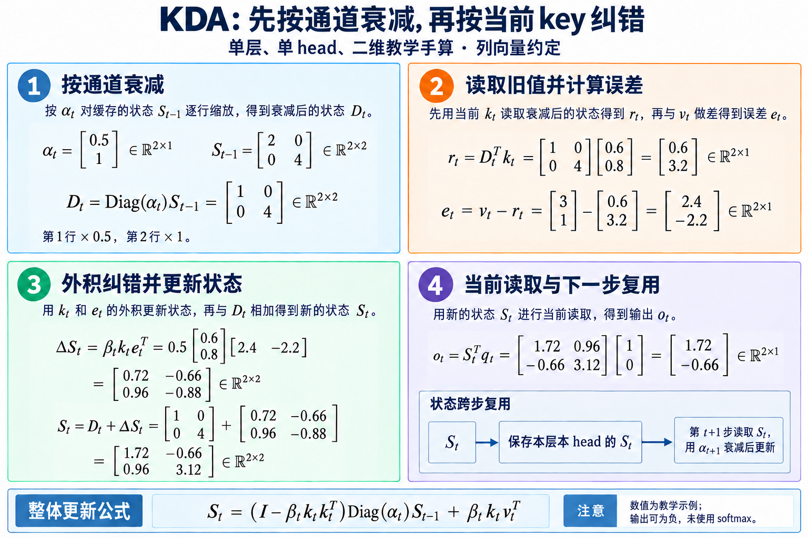

# KDA 与混合线性注意力：有限状态怎样保留长程记忆

> 相关: [混合拓扑](./1.2.2-混合拓扑.md) · [成本模型](../1.1-成本与稀疏对象/1.1.1-成本模型.md) · [Kimi K3 模型条目](../../../model-library/03-模型家族/02-kimi/kimi-k3/kimi-k3-bi.md)

材料是 Kimi Linear 论文(2025) 和 Kimi K3 报告(2026) 里关于 KDA 的部分. 问题是线性注意力的固定大小状态怎样记得更准, 以及这种层怎样和全注意力层混合.

## 1. 有限状态替代 KV cache:问题与已有做法

### 1.1 KV cache 与有限状态

softmax 注意力在解码第 $t$ 步时要读入前 $t$ 个 token 的 K 和 V, KV cache 的大小和每步的读取量都与 $t$ 成正比. 上下文到百万 token 时, 解码基本上只是在读 KV cache.

线性注意力去掉 softmax, 把注意力写成两个可结合的矩阵乘, 于是可以用一个矩阵状态递推:

$$
S_t=S_{t-1}+k_tv_t^\top,\qquad o_t=S_t^\top q_t, \tag{1}
$$

$q_t,k_t\in\mathbb R^{d_k}$ 与 $v_t,o_t\in\mathbb R^{d_v}$ 都是列向量, $S_t\in\mathbb R^{d_k\times d_v}$. 无论序列多长, 每个头只保存这一个矩阵, 解码每步的计算和读取都是常数.

代价是容量. $S_t$ 是一张从 key 到 value 的联想表, 大小固定. 式 (1) 只加不减, 所有写入叠在一起, key 不正交时读出的值是多次写入的混合.

先看正交 key 的情况. 设写入过 $n$ 对 $(k_i,v_i)$, $k_i$ 都是单位向量. 若 $k_i$ 两两正交, 用 $k_j$ 去读, $S^\top k_j=\sum_ik_i^\top k_j\,v_i=v_j$, 读出是精确的. $\mathbb R^{d_k}$ 里最多只有 $d_k$ 个两两正交的方向;超过这个数, 简单累加读出就会出现 $\sum_{i\ne j}(k_i^\top k_j)v_i$ 的交叉项. 对任意、彼此独立的目标 value, 这些项会造成干扰. 若目标之间恰好满足相同的线性关系, 非正交 key 也可能被同一个状态准确映射, 因而 128 个方向不能直接解释为「最多记住 128 个 token」.

更一般地, 所有精确读取要求满足 $K^\top S=V^\top$, 这里 $K=[k_1,\ldots,k_n]$, $V=[v_1,\ldots,v_n]$. 当 $Kc=0$ 时, 必须同时有 $Vc=0$, 否则不存在满足所有读取要求的状态. 这给出了固定状态的容量约束: key 的线性依赖会限制能够独立指定的 value. 序列有几十万个 token, 模型必须决定保留哪些联想, 覆盖哪些联想. Kimi Linear 因此采用混合结构: 大部分层用线性注意力, 少数层保留全注意力. KDA 要解决的是线性层本身的质量, 让同样大小的状态记得更准.

### 1.2 已有做法

论文用在线学习的视角统一了几种线性注意力: 每一步对状态 $S$ 在某个目标函数上做一步梯度下降.

**线性注意力**. 目标是 $\mathcal L_t(S)=-\langle S^\top k_t,v_t\rangle$, 梯度步就是式 (1). 这个目标只奖励写入, 没有说明该擦掉什么, 状态无界增长.

**DeltaNet**. 目标换成重建误差 $\mathcal L_t(S)=\frac12\|S^\top k_t-v_t\|^2$, 学习率 $\beta_t$:

$$
S_t=S_{t-1}-\beta_t\nabla_S\mathcal L_t(S_{t-1})=(I-\beta_tk_tk_t^\top)S_{t-1}+\beta_tk_tv_t^\top. \tag{2}
$$

这是经典的 delta 规则. 先用 $S_{t-1}^\top k_t$ 读出当前 key 上已有的值, 按 $\beta_t$ 把它往 $v_t$ 拉. $k_t$ 归一化, $\beta_t=1$ 时, 写入后 $S_t^\top k_t=v_t$, 旧值被完全替换. $I-\beta_tk_tk_t^\top$ 是广义 Householder 变换, 一串这样的秩 1 更新可以打包, 支持分块并行.

**Gated DeltaNet**. DeltaNet 不会主动忘记与当前 key 无关的旧联想. GDN 加上标量门 $\alpha_t\in[0,1]$:

$$
S_t=\alpha_t(I-\beta_tk_tk_t^\top)S_{t-1}+\beta_tk_tv_t^\top. \tag{3}
$$

$\alpha_t$ 相当于对快权重做权重衰减, 控制记忆的寿命. 但它是每个头一个标量, 头内所有通道以同样的速度遗忘. Mamba2 也是头级标量衰减, 而且没有 delta 规则.

**GLA**. GLA 用对角矩阵 $\operatorname{Diag}(\alpha_t)$ 做通道级遗忘, $S_t=\operatorname{Diag}(\alpha_t)S_{t-1}+k_tv_t^\top$, 但写入仍是简单累加, 没有擦除.

**DPLR**. 更一般的形式是对角加低秩的转移矩阵, $S_t=(D-a_tb_t^\top)S_{t-1}+k_tv_t^\top$, RWKV7 属于这一类. 表达力强, 但计算量大, 不容易并行.

| 方法 | 更新规则 | 遗忘粒度 | 擦除 |
|---|---|---|---|
| 线性注意力 | $S_{t-1}+k_tv_t^\top$ | 无 | 无 |
| Mamba2 | $\alpha_tS_{t-1}+\beta_tk_tv_t^\top$ | 头级 | 无 |
| GLA | $\operatorname{Diag}(\alpha_t)S_{t-1}+k_tv_t^\top$ | 通道级 | 无 |
| DeltaNet | $(I-\beta_tk_tk_t^\top)S_{t-1}+\beta_tk_tv_t^\top$ | 无 | 有 |
| GDN | $(I-\beta_tk_tk_t^\top)\alpha_tS_{t-1}+\beta_tk_tv_t^\top$ | 头级 | 有 |
| KDA | $(I-\beta_tk_tk_t^\top)\operatorname{Diag}(\alpha_t)S_{t-1}+\beta_tk_tv_t^\top$ | 通道级 | 有 |

表中各行取自论文的 Table 7 (省略了归一化和核函数). GDN 和 KDA 可以看成在衰减后的状态 $\tilde S_{t-1}$ 上做一步 SGD, 目标都是 $\frac{\beta_t}{2}\|\tilde S_{t-1}^\top k_t-v_t\|^2$, 区别只在 $\tilde S_{t-1}$ 是用标量还是对角矩阵衰减.

## 2. 递推, 分块并行与最小实现

### 2.1 KDA 的递推

论文式 (1):

$$
S_t=(I-\beta_tk_tk_t^\top)\operatorname{Diag}(\alpha_t)S_{t-1}+\beta_tk_tv_t^\top,\qquad o_t=S_t^\top q_t, \tag{4}
$$

$\alpha_t\in[0,1]^{d_k}$. $S_{t-1}$ 的第 $i$ 行对应 key 的第 $i$ 个通道, $\operatorname{Diag}(\alpha_t)$ 让每一行以自己的速度衰减, 然后再做 delta 规则的擦写.

把这一更新分成可以手算的四步. 令 $D_t=\operatorname{Diag}(\alpha_t)S_{t-1}$, 当前 key 的旧读数为 $r_t=D_t^\top k_t$, 误差为 $e_t=v_t-r_t$. 写入的增量是 $\Delta S_t=\beta_tk_te_t^\top$, 所以 $S_t=D_t+\Delta S_t$. **先从衰减后的状态读取旧值, 再把差额写回;当前 query 读取的是已经更新的状态.**

图 1 取单层单 head, $d_k=d_v=2$, 旧状态为 $\operatorname{Diag}(2,4)$, $\alpha_t=(0.5,1)^\top$, 单位 key 为 $(0.6,0.8)^\top$, value 为 $(3,1)^\top$, $\beta_t=0.5$, query 为 $(1,0)^\top$. 这些是教学数值, 只计算 KDA 核心更新, 就不写投影、短卷积及输出门. 衰减后旧读数是 $(0.6,3.2)^\top$, 误差为 $(2.4,-2.2)^\top$, 更新状态的第一行为 $(1.72,-0.66)$, 因而当前输出为 $(1.72,-0.66)^\top$.


> 图 1: KDA 的二维手算展示通道衰减、旧值读取、外积纠错、当前输出及下一步状态复用;机制依据 [Kimi Linear v1 §3 Eq. (1) 与 Figure 3](https://arxiv.org/pdf/2510.26692v1), 数值为教学示例. [查看原尺寸](./images/kda-state-update-v4.png).

图 1 解析:

- 左上按 key 通道缩放状态的行. 第一行减半, 第二行保持, $D_t$ 同时用于旧值读取和后续状态相加.
- 右上用当前 key 读出已有联想, 左下把 value 与旧读数的差额写回. 外积的第 $i$ 行是 $\beta_tk_{t,i}e_t^\top$, 因此一次写入也可能改变多行.
- 右下的 query 从新状态读取输出. 保存的 $S_t$ 属于当前层和 head, 下一步读取它再更新;这不表示不同层或 head 共用状态. 输出没有经过 softmax, 负值可以正常出现.

为什么要通道级, 论文从位置编码的角度给了解释. 先令 $M_j=(I-\beta_jk_jk_j^\top)\operatorname{Diag}(\alpha_j)$, 并定义 $P_{t,i}=M_tM_{t-1}\cdots M_{i+1}$, $P_{t,t}=I$. **后发生的状态转移乘在左侧, 每一步都先衰减再擦写.** 从 $S_0=0$ 展开式 (4) 可以得到

$$
o_t=\sum_{i=1}^t\beta_i\big(q_t^\top P_{t,i}k_i\big)v_i, \tag{5}
$$

第 $i$ 步先按 $\beta_i$ 写入 $k_iv_i^\top$, 然后依次经过 $M_{i+1},\ldots,M_t$. 例如 $S_2=M_2\beta_1k_1v_1^\top+\beta_2k_2v_2^\top$, 最后才用 $q_2$ 读取. 若初始状态非零, 式 (5) 还要加上 $S_0^\top M_1^\top\cdots M_t^\top q_t$.

式 (5) 的 $q_t^\top P_{t,i}k_i$ 与 RoPE 的相对位置双线性项可以对照: 两者都在 query 与历史 key 之间插入转移, KDA 的转移随数据变化, 也不要求正交. 这里的系数没有经过 softmax, 可以为负, 各项之和也不要求为 1. RoPE 的一个长处是不同维度对用不同的频率; GDN 的标量衰减在各维度上相同, 没有这种差异, 这是论文提出通道级门的动机之一. 在 Kimi Linear 的混合结构中, 位置信息交给 KDA 层, MLA 层采用 NoPE (见 2.7 节).

### 2.2 与 DPLR 的关系

式 (4) 可以改写成

$$
S_t=\big(\operatorname{Diag}(\alpha_t)-\beta_tk_tk_t^\top\operatorname{Diag}(\alpha_t)\big)S_{t-1}+\beta_tk_tv_t^\top, \tag{6}
$$

写成通用 DPLR 形式 $(D-a_tb_t^\top)S_{t-1}+k_t\tilde v_t^\top$, KDA 对应的参数为

$$
D=\operatorname{Diag}(\alpha_t),\qquad a_t=\beta_tk_t,\qquad b_t=k_t\odot\alpha_t,\qquad \tilde v_t=\beta_tv_t. \tag{7}
$$

代回去有 $a_tb_t^\top=\beta_tk_tk_t^\top\operatorname{Diag}(\alpha_t)$, 写入项则为 $k_t\tilde v_t^\top=\beta_tk_tv_t^\top$, 正好恢复式 (4). **写入强度 $\beta_t$ 同时作用于旧值擦除和新值写入**, 不能只放进 $a_t$ 而漏掉写入项. 两个低秩向量由同一个 $k_t$ 决定, 通道衰减由 $b_t$ 承接;因此衰减可以像 GLA 一样整体提出来, 剩下的部分是 DeltaNet 那样的 Householder 型更新. 这个约束是 KDA 分块算法比通用 DPLR 快的原因.

### 2.3 分块并行

训练和 prefill 不能逐 token 递推, 需要把序列切成长度为 $C$ 的块, 块内并行, 块间递推. 记号如下: 第 $t$ 块的输入堆成 $Q_{[t]},K_{[t]},V_{[t]}\in\mathbb R^{C\times d}$; 块内第 $r$ 个位置的累积衰减 $\gamma^r_{[t]}=\prod_{i=1}^r\alpha^i_{[t]}$; $\Gamma_{[t]}\in\mathbb R^{C\times d_k}$ 是把 $\gamma^1,\dots,\gamma^C$ 按行堆起来的矩阵; $S_{[t]}$ 是进入第 $t$ 块时的状态.

把式 (4) 在块内展开 $r$ 步 (论文式 (2)):

$$
S^r_{[t]}=\underbrace{\prod_{i=1}^r\big(I-\beta^ik^ik^{i\top}\big)\operatorname{Diag}(\alpha^i)}_{P^r_{[t]}}S_{[t]}+\underbrace{\sum_{i=1}^r\Big(\prod_{j=i+1}^r\big(I-\beta^jk^jk^{j\top}\big)\operatorname{Diag}(\alpha^j)\Big)\beta^ik^iv^{i\top}}_{H^r_{[t]}}, \tag{8}
$$

这里就不写块下标 $[t]$, 连乘仍采用式 (5) 的时间顺序: $P^r=M_r\cdots M_1$. 定义 $\gamma^{i\to r}=\prod_{j=i+1}^r\alpha^j$, $\gamma^{r\to r}=\mathbf 1$, 因而当前写入不会再次乘上当前步的衰减. $P^r$ 是 $r$ 个矩阵的连乘, 直接算代价太高. 论文按 Comba 的写法用 WY 表示把它压成「对角项减去一串秩 1 项」:

$$
P^r=\operatorname{Diag}(\gamma^r)-\sum_{i=1}^r\operatorname{Diag}(\gamma^{i\to r})k^iw^{i\top},\qquad
H^r=\sum_{i=1}^r\operatorname{Diag}(\gamma^{i\to r})k^iu^{i\top}, \tag{9}
$$

辅助向量 $w^r,u^r$ 满足递推

$$
w^r=\beta^r\Big(\operatorname{Diag}(\gamma^r)k^r-\sum_{i=1}^{r-1}w^i\big(k^{i\top}\operatorname{Diag}(\gamma^{i\to r})k^r\big)\Big),\qquad
u^r=\beta^r\Big(v^r-\sum_{i=1}^{r-1}u^i\big(k^{i\top}\operatorname{Diag}(\gamma^{i\to r})k^r\big)\Big). \tag{10}
$$

这个递推本身还是逐个位置的. UT 变换把它写成一次下三角求逆, 减少非矩阵乘的运算:

$$
M_{[t]}=\Big(I+\operatorname{StrictTril}\big(\operatorname{Diag}(\beta)(\Gamma\odot K)(K/\Gamma)^\top\big)\Big)^{-1}\operatorname{Diag}(\beta),\qquad
W=M(\Gamma\odot K),\quad U=MV. \tag{11}
$$

$K/\Gamma$ 是逐元素除法, $(\Gamma\odot K)(K/\Gamma)^\top$ 的第 $(r,i)$ 个元素等于 $k^{r\top}\operatorname{Diag}(\gamma^r/\gamma^i)k^i$, 即 $k^i$ 衰减到位置 $r$ 之后与 $k^r$ 的内积. 下三角矩阵的逆用前代法逐行求出.

这一步的规模由块长决定. 被求逆的是 $C\times C$ 的单位下三角矩阵, 前代法的代价是 $O(C^2)$ 次标量运算乘以要解的列数, 与序列总长无关. 块长取得太小, 块间的串行递推步数 $T/C$ 变多; 取得太大, 块内的 $C\times C$ 矩阵和 $1/\Gamma$ 的数值范围都会变差. 论文的复杂度分析取 $C=64$.

与 GDN 对比一下块内要算的东西. GDN 的衰减是标量, 块内衰减可以写成一个 $C\times C$ 的矩阵, 第 $(r,i)$ 个元素为 $\gamma^r/\gamma^i$, 直接乘到 $KK^\top$ 上即可, $K$ 本身不用变. KDA 的衰减是向量, $\gamma^r/\gamma^i$ 在每个通道上不同, 不能提成一个 $C\times C$ 的矩阵, 只能先把 $\Gamma$ 和 $1/\Gamma$ 分别乘到 $K$ 的各行上, 再做矩阵乘. 这就是式 (11) 到 (13) 里反复出现 $\Gamma\odot K$ 和 $K/\Gamma$ 的原因.

有了 $W,U$, 块间状态更新为 (论文式 (8)):

$$
S_{[t+1]}=\operatorname{Diag}(\gamma^C)S_{[t]}+\Big(\frac{\gamma^C}{\Gamma}\odot K\Big)^\top\big(U-WS_{[t]}\big), \tag{12}
$$

$\gamma^C/\Gamma$ 的第 $r$ 行是 $\gamma^C/\gamma^r=\prod_{i=r+1}^C\alpha^i$, 即第 $r$ 个位置写入的内容到块末还要经历的衰减. 块内输出 (论文式 (9)):

$$
O_{[t]}=\underbrace{(\Gamma\odot Q)S_{[t]}}_{\text{块间}}+\underbrace{\operatorname{Tril}\big((\Gamma\odot Q)(K/\Gamma)^\top\big)}_{\text{块内}}\underbrace{\big(U-WS_{[t]}\big)}_{\text{伪 value}}. \tag{13}
$$

从之前块传进来的信息会按块内衰减作用在 query 上；块内 attention 的形式与 GLA 相同，实际作用于 $U-WS_{[t]}$，没有直接使用 $V$。delta 规则要求写入「新值减去旧状态在该 key 上的读数」，该差值正是块内每个位置实际写入的增量，论文称为伪 value。式 (11) 到 (13) 都是稠密矩阵乘，可以用 Tensor Core.

第 2.8 节的 NumPy 代码按式 (11) 到 (13) 实现了分块形式, 与逐步递推的结果在双精度下一致 (输出最大误差约 $6\times10^{-16}$).

### 2.4 数值问题和与 DPLR 的速度差

式 (13) 中的 $K/\Gamma$ 要除以块内累积衰减. $\Gamma$ 是很多个 $(0,1)$ 内的数连乘, 块越长越接近 0,倒数可能在半精度下溢出. GLA 的处理方式是在对数域计算相对衰减, 并在全精度下做二级分块, 但这样用不满半精度矩阵乘, 算子变慢.

通用 DPLR 的 $a,b$ 是两个独立的向量, 块内要分别计算 $a$ 与 $b$, $a$ 与 $k$, $q$ 与 $b$, $q$ 与 $k$ 四种带衰减的内积矩阵, 每一种都需要二级分块. KDA 把 $a,b$ 都绑到 $k$ 上, 论文给出的改进有两处: 二级分块的矩阵计算从四次减到两次; 块间和输出计算中约少三次矩阵乘. 论文 Fig. 2 在 batch 为 1,16 个头的设置下比较了两种算子, 序列长度到 64K 时 KDA 的速度接近 DPLR 的 2 倍.

### 2.5 复杂度

论文给出单个头, 头维度 $d_h$, 块长 $C=64$ 时, 长度为 $T$ 的序列的 FLOPs:

$$
\text{FLOPs}_{\text{KDA}}=6Td_h^2+3TCd_h+TC^2,\qquad
\text{FLOPs}_{\text{Attn}}=2T^2d_h. \tag{14}
$$

KDA 对 $T$ 线性, 注意力对 $T$ 二次. 取 $d_h=128$: KDA 每个 token 约 $6\times128^2+3\times64\times128+64^2=126{,}976$ 次运算, 注意力平均每个 token $2Td_h=256T$ 次. 两者在 $T\approx496$ 处相等, 更长的序列上 KDA 的注意力部分计算更少. 这里只比较了 token 混合本身, 线性投影和 MoE 的计算两种结构相同.

推理时 prefill 用分块内核 (计算密集), 解码切换到逐步递推的内核. 每个 KDA 头的状态大小固定为 $d_k\times d_v=128\times128$, 与序列长度无关.

$128\times128=16{,}384$ 个元素, 相当于一个头维度为 128 的普通多头注意力头缓存 64 个 token 的 K 和 V($16{,}384/(2\times128)=64$). 上下文超过几十个 token 后, 单个头的状态就比同一头的 KV cache 小.

解码一步的计算量也是常数. 先算 $\operatorname{Diag}(\alpha_t)S_{t-1}$, 对每行乘一个数, $d_kd_v$ 次乘法; 擦写项按 $k_t\big(k_t^\top\tilde S\big)$ 的顺序计算, 先得到长度 $d_v$ 的向量, 再做外积, 不需要构造 $d_k\times d_k$ 的矩阵 $k_tk_t^\top$; 读出 $S_t^\top q_t$ 又是 $d_kd_v$ 次乘加. 合计是 $d_kd_v$ 的常数倍, 每步读写一次状态. 解码阶段的瓶颈在显存带宽, 状态的读写量固定, 这是 KDA 层解码时间不随上下文增长的原因.

### 2.6 参数化和输出门

Kimi Linear 中每个头的输入:

$$
q_t,k_t=\operatorname{L2Norm}\big(\operatorname{Swish}(\operatorname{ShortConv}(W_{q/k}x_t))\big),\quad
v_t=\operatorname{Swish}(\operatorname{ShortConv}(W_vx_t)),\quad
\alpha_t=f(W_\alpha^\uparrow W_\alpha^\downarrow x_t),\quad
\beta_t=\operatorname{Sigmoid}(W_\beta x_t). \tag{15}
$$

$d_k=d_v=128$. $q,k,v$ 先过短卷积和 Swish;$q,k$ 再做 L2 归一化, 保证 $I-\beta_tk_tk_t^\top$ 的特征值稳定. 通道衰减 $\alpha_t$ 由低秩投影 (秩等于头维度) 加一个与 GDN, Mamba 类似的衰减函数 $f$ 得到. 输出先做逐头 RMSNorm, 再乘一个数据相关的门:

$$
o_t=W_o\Big(\operatorname{Sigmoid}(W_g^\uparrow W_g^\downarrow x_t)\odot\operatorname{RMSNorm}\big(\operatorname{KDA}(q_t,k_t,v_t,\alpha_t,\beta_t)\big)\Big). \tag{16}
$$

输出门也用低秩参数化, 与全秩门性能相当, 参数量与对照模型保持一致.

### 2.7 混合结构与 GDN 对照

纯线性注意力的长程检索仍是瓶颈, Kimi Linear 按层混合: 每 3 层 KDA 接 1 层全注意力 MLA. 论文选择按层混合而不是在层内按头混合, 理由是基础设施更简单, 训练更稳定.

MLA 层不使用位置编码(NoPE), 位置信息全部交给 KDA 层. 这样做有两个工程上的好处: 推理时 NoPE 的 MLA 可以转换成纯 MQA, 效率更高; 扩展上下文长度时不需要调整 RoPE 的频率底数, 也不需要 YaRN 一类的方法.

只有 1/4 的层有 KV cache, 其余层是固定大小的状态, 长序列下 KV cache 的占用因此最多减少 75%.

前面几节写到的 KDA 与 GDN 的差别可以归成四点:

1. **遗忘粒度**: GDN 每个头一个标量 $\alpha_t$; KDA 每个 key 通道一个 $\alpha_{t,i}$.
2. **转移矩阵的位置**: GDN 写成 $\alpha_t(I-\beta_tk_tk_t^\top)$, 标量可以放在任一侧; KDA 是 $(I-\beta_tk_tk_t^\top)\operatorname{Diag}(\alpha_t)$, 先衰减再擦写, 对角矩阵与秩 1 项不交换, 顺序有意义.
3. **分块算法**: 标量衰减在块内只是一个 $C\times C$ 的衰减矩阵 $\mathcal A$; 通道衰减要用 $\Gamma\odot K$ 和 $K/\Gamma$, 带来 2.4 节的数值问题和专门的内核设计.
4. **输出门**: 论文消融中 Sigmoid 门明显好于 GDN 原文用的 Swish 门, 所以 Kimi Linear 的对照基线 GDN-H 也改用了 Sigmoid 门.

### 2.8 最小实现

下面的代码分别按式 (4) 逐步递推和按式 (11) 到 (13) 分块计算, 检查两者一致.

```python
import numpy as np

rng = np.random.default_rng(0)
T, C, dk, dv = 16, 8, 4, 3
q = rng.standard_normal((T, dk))
k = rng.standard_normal((T, dk))
k /= np.linalg.norm(k, axis=1, keepdims=True)
v = rng.standard_normal((T, dv))
alpha = rng.uniform(0.7, 1.0, (T, dk))
beta = rng.uniform(0.1, 0.9, T)

# 逐步递推,式 (4)
S = np.zeros((dk, dv))
o_rec = np.zeros((T, dv))
for t in range(T):
    S = (np.eye(dk) - beta[t] * np.outer(k[t], k[t])) @ np.diag(alpha[t]) @ S \
        + beta[t] * np.outer(k[t], v[t])
    o_rec[t] = S.T @ q[t]
S_rec = S

# 分块,式 (11)-(13)
S = np.zeros((dk, dv))
o_chk = np.zeros((T, dv))
for s in range(0, T, C):
    Q, K, V, B = q[s:s+C], k[s:s+C], v[s:s+C], beta[s:s+C]
    G = np.cumprod(alpha[s:s+C], axis=0)               # 第 r 行为 gamma^r
    A = np.diag(B) @ (G * K) @ (K / G).T
    M = np.linalg.inv(np.eye(C) + np.tril(A, -1)) @ np.diag(B)
    W, U = M @ (G * K), M @ V
    V_pseudo = U - W @ S
    o_chk[s:s+C] = (G * Q) @ S + np.tril((G * Q) @ (K / G).T) @ V_pseudo
    S = np.diag(G[-1]) @ S + ((G[-1] / G) * K).T @ V_pseudo

print(np.abs(o_rec - o_chk).max())   # 约 5.6e-16
print(np.abs(S_rec - S).max())       # 约 3.3e-16
```

这里 $\alpha$ 取在 $[0.7,1]$, 块长只有 8,$1/\Gamma$ 不会溢出. 把 $\alpha$ 调小, 块长调大, 换成半精度, 就能看到 2.4 节说的溢出问题.

## 3. 实验

### 3.1 合成任务与消融

三个任务: 回文 (把一串随机 token 倒序输出), 多查询联想回忆 MQAR (在上下文中找到多个 key 对应的 value), 栈 (64 个独立的栈, 跟踪 PUSH 和 POP). 模型为 2 层,2 个头, 头维度 128,每个任务最多训练 20,000 步, 学习率网格搜索, 序列长度从 256 到 2048.随长度增加, KDA 在三个任务上准确率都最高; 回文和 MQAR 上 KDA 比 GDN 收敛快得多. Mamba2 在这组设置下三个任务都没有学会.

消融模型是 scaling law 实验中最小的一档 (16 个头,16 层), 相同 FLOPs 预算和超参数. 验证集分布与预训练语料差别较大, 用来看分布偏移下的泛化:

| 设置 | 训练 PPL | 验证 PPL |
|---|---|---|
| KDA:MLA = 3:1 | 9.23 | 5.65 |
| 0:1 (全 MLA) | 9.45 | 5.77 |
| 1:1 | 9.29 | 5.66 |
| 7:1 | 9.23 | 5.70 |
| 15:1 | 9.34 | 5.82 |
| 去掉输出门 | 9.25 | 5.67 |
| 输出门换成 Swish | 9.43 | 5.81 |
| 去掉短卷积 | 9.29 | 5.70 |

7:1 的训练 PPL 与 3:1 相同, 验证 PPL 明显变差; 1:1 的验证 PPL 接近 3:1,但全注意力层多了一倍, 推理开销更大; 全注意力基线最差. 论文据此选 3:1.

后三行是结构组件的消融. 去掉输出门, 验证 PPL 从 5.65 升到 5.67;把 Sigmoid 门换成 GDN 原文用的 Swish 门, 升到 5.81,比去掉门还差. 论文因此在所有实验中统一用 Sigmoid 门, 包括 GDN-H 基线. 去掉短卷积升到 5.70,说明即使有了通道级衰减, 短卷积提供的局部信息仍有作用. 这组数字的差距多在 0.01 到 0.2 之间, 只来自一个规模的模型, 读的时候要看到这一点.

### 3.2 Scaling law,1.4T token 主实验与 5.7T 发布版本

5 个 MoE 模型, 激活参数 653M 到 1.7B,64 个专家激活 8 个, Muon 优化器, 上下文 4096.MLA 按 Chinchilla 方法逐个调参; Kimi Linear 保持 3:1,其余配置完全沿用 MLA 的. 拟合结果为 MLA $2.3092\times C^{-0.0536}$, Kimi Linear $2.2879\times C^{-0.0527}$, 在计算最优训练下 Kimi Linear 的计算效率约为 MLA 的 1.16 倍.

三个模型结构, 参数量, 训练配置都相同: 全 MLA, GDN 与 MLA 混合(GDN-H), Kimi Linear. 配置与 Moonlight 基本一致, MoE 稀疏度提高到 32:256 个专家激活 8 个 (含 1 个共享专家), 总参数 48B, 每次前向激活 3B, 第一层为稠密层. 预训练用 4096 的上下文, MuonClip 优化器, WSD 学习率调度, 学习率 $1.1\times10^{-3}$, 全局 batch 32M token, 共 1.4T token.

预训练后的短文本结果 (节选):

| 基准 | MLA | GDN-H | Kimi Linear |
|---|---|---|---|
| MMLU | 71.6 | 72.2 | 73.8 |
| MMLU-Pro | 47.2 | 47.9 | 51.0 |
| BBH | 71.6 | 70.6 | 72.9 |
| GSM8K | 83.7 | 81.7 | 83.9 |
| EvalPlus | 59.5 | 63.1 | 60.2 |

SFT 后 (节选): MMLU-Pro 65.7,64.8,67.4;GPQA-Diamond 57.1,58.6,62.1;AIME 2025 20.6,21.1,21.3,顺序同上. Kimi Linear 在 MATH500 和 EvalPlus 上不是最高.

128k 长文本 (节选):

| 基准 | MLA | GDN-H | Kimi Linear (RoPE) | Kimi Linear |
|---|---|---|---|---|
| RULER | 81.3 | 80.5 | 78.8 | 84.3 |
| MRCR | 22.6 | 23.9 | 22.0 | 29.6 |
| RepoQA | 63.0 | 63.0 | 66.5 | 68.5 |
| 平均 | 52.2 | 51.2 | 51.8 | 54.5 |

长文本上 GDN-H 的平均分低于 MLA, Kimi Linear 仍然最高, 但在 LongBench V2 和 Frames 上不是最高. MLA 层改用 RoPE 的变体在短文本上分数相近, 长文本平均降到 51.8.论文的解释落在位置偏置在各层之间的分配上. MLA 用 RoPE 时, 全局注意力层带有显式的强相对位置信号, 线性层只提供较弱的隐式位置偏置, 两者不匹配, 全局层过于看重短程顺序. 这对短文本有利, 但在中期训练扩展上下文时模型不够灵活. MLA 改成 NoPE 后, 位置信息由 KDA 层的衰减和擦写承担, 各层之间的位置偏置更均衡, 长程外推更稳. 这与 2.1 节的位置编码视角一致: 如果 KDA 层本身就是一种数据相关的位置编码, 全局层再叠一层 RoPE 是重复的.

这组对比也说明, 混合结构里的全注意力层和单独使用时的全注意力层分工不同. 单独使用时它要同时负责位置和检索; 混合以后位置交给线性层, 它主要负责从完整的 KV 中精确取回信息.

强化学习阶段, 用同样的数学数据和算法比较 Kimi Linear 与 MLA, 训练集准确率的增长更快, 在 MATH500 和 AIME 2025 上的提升也更快.

主实验之后, 发布的检查点用同样的流程训练到 5.7T token, 支持 1M 上下文, RULER 在 1M 上下文为 94.8,在 128k 为 95.4.论文附录与同为 3B 激活的 Moonlight 比较, 基础模型 MMLU-Pro 为 54.8 对 42.4;但两者总参数分别为 48B 和 16B, 这组对比混合了结构和规模两个因素.

### 3.3 效率

三个模型都按 48B 设置, 层数和头数相同. prefill:4k 到 16k 时 Kimi Linear 与 MLA 相当,128k 起明显更快,512k 时快 2.3 倍,1M 时快 2.9 倍; 与 GDN-H 的曲线几乎重合, 说明通道级衰减没有带来可见的额外延迟.

2.9 倍这个上限可以用式 (14) 和 3:1 的比例估出来.1M 上下文时, 注意力平均每个 token 要 $256T\approx2.7\times10^8$ 次运算, KDA 每个 token 约 $1.27\times10^5$ 次, 相差两千多倍, KDA 层的 token 混合几乎可以忽略. 但每 4 层里仍有 1 层 MLA, 它的二次项一点没少, 所以即使只看 token 混合, 整模型最多也只能快到 4 倍; 再算上两种结构相同的投影和 MoE, 实测的 2.9 倍落在这个上限之内.

论文同时开源了 KDA 的内核和 vLLM 实现, 并发布了预训练和指令微调的检查点.

解码分两种情况. batch 为 1 时 (Fig. 7b), 优势来自少读 KV, 论文正文写 1M 上下文时快 2.3 倍. 省下的 KV 显存可以用来放更大的 batch, Fig. 1b 中 1M 上下文的每 token 输出时间 Kimi Linear 为 1.84ms, MLA 为 11.48ms, 相差 6.3 倍, 摘要中写作「最高约 6 倍解码吞吐」.

batch 为 1 的 2.3 倍也可以和 4 倍上限对照. 解码每步都要读一遍权重, 这部分两种模型相同; 随长度增长的只有 MLA 层的 KV 读取, 而 Kimi Linear 只有 1/4 的层要读 KV, 所以单看 KV 读取最多省到 1/4.实测 2.3 倍, 说明 1M 上下文时权重读取和 KDA 状态更新仍占了不少时间. 这段是按结构推算的, 论文没有给出单步耗时的拆分.

## 4. Kimi K3 中的 KDA 与边界

### 4.1 Kimi K3 中的 KDA

Kimi K3 总参数 2.78T, 激活 104.2B, 注意力层为 69 层 KDA 加 24 层 MLA, 即 3:1 的混合, 在骨干末尾多加一层 MLA. 相对 Kimi Linear, KDA 有两处改动.

**有下界的对数衰减.** Kimi Linear 沿用 GDN 和 Mamba-2 的映射 $g=-e^{A}\operatorname{Softplus}(z)\in(-\infty,0)$, $\alpha=e^g$. $g$ 没有下界, 块内 $1/\Gamma$ 可能溢出, 所以 Kimi Linear 在对数域计算相对衰减, 并把每块再分成 16 token 的小块: 非对角小块可以直接用 Tensor Core 做稠密矩阵乘, 对角小块仍要逐位置对计算, 这是块内的主要瓶颈. K3 改为

$$
g^h_t=g_{\min}\operatorname{Sigmoid}(e^{A_h}z^h_t)\in(g_{\min},0)^{d_k},\qquad
\alpha^h_t=\exp(g^h_t)\in(e^{g_{\min}},1)^{d_k}, \tag{17}
$$

$g_{\min}=-5$ 固定, $A_h$ 是逐头可学的对数尺度, 初始化为 0.于是每一步的保留因子 $\alpha>e^{-5}\approx6.7\times10^{-3}$, 16 个 token 的累积对数衰减落在 $(-80,0)$, 倒数小于 $e^{80}$, 在 BF16 的动态范围之内. 对角小块因此也能用稠密矩阵乘, 逐位置对的计算路径被去掉.

**全秩输出门.** K3 把式 (16) 中的低秩门换成全秩:

$$
y_t=W_o\big[\operatorname{Sigmoid}(W_gx_t)\odot\operatorname{RMSNorm}(\tilde o_t)\big], \tag{18}
$$

并给 MLA 也加了同样的全秩 Sigmoid 输出门, MLA 输出不做 RMSNorm.

**跨设备并行.** softmax 注意力做上下文并行时, 各卡之间要交换随序列长度增长的 KV 块; 线性注意力只需要传递固定大小的状态. 但 KDA 不能沿用普通线性注意力的做法 (各卡从零状态算出局部状态再求和), 因为式 (4) 中转移矩阵 $(I-\beta_tk_tk_t^\top)\operatorname{Diag}(\alpha_t)$ 作用在进入的状态上, 一段序列的效果依赖进入它的状态. K3 的 KDA Context Parallelism 把每一段的效果拆成两个可以本地计算的量: 作用在进入状态上的累积转移矩阵, 以及从零状态出发得到的局部状态. 进入状态为 $S_{in}$ 时, 离开的状态为

$$
S_{out}=\Big(\prod_{t\in\text{段}}M_t\Big)S_{in}+\tilde S, \tag{19}
$$

$M_t=(I-\beta_tk_tk_t^\top)\operatorname{Diag}(\alpha_t)$, $\tilde S$ 是从零状态算出的段末状态. 这是一个仿射变换, 各段的仿射变换可以用前缀扫描组合, 通信量与序列长度无关. K3 还为 KDA 实现了感知状态的前缀缓存, 在请求之间复用固定大小的状态.

### 4.2 边界

**状态容量固定.** KDA 改进的是如何使用一个 $128\times128$ 的状态, 没有改变它的大小. 长程精确检索仍依赖混合进来的全注意力层, 论文的消融中全 KDA 的配置没有出现,15:1 的验证 PPL 已经明显变差.

**混合比来自一组消融.** 3:1 是在 16 层的小模型上, 用验证 PPL 选出来的. 换模型规模, 换数据, 换目标长度, 最优比例可能不同. K3 沿用了 3:1.

**吞吐倍数要看条件.** 6.3 倍来自 1M 上下文下 batch 可以放得更大; batch 为 1 时,1M 上下文的解码加速约 2.3 倍; 4k 到 16k 的 prefill 与 MLA 相当. 短上下文场景的收益有限.

**数值范围.** Kimi Linear 的衰减没有下界, 分块计算要靠对数域和二级分块控制 $1/\Gamma$ 的范围. K3 的有下界参数化解决了这一点, 代价是单步的遗忘不能强于 $e^{-5}$, 一步之内不能把一个通道完全清零.

**对比的公平性.** 1.4T 的主实验中三个模型的结构, 参数量和训练配置相同, 是同条件对比.5.7T 版本与 Moonlight 的比较中总参数不同, 不能单独归因于注意力结构.

**稀疏注意力是另一条路.** 论文讨论部分指出, 稀疏注意力检索细粒度信息的能力更强, 但要保留完整的 KV cache 来做选择, 效率不如固定状态的线性注意力; 两者可以结合.

## 5. 放回稀疏注意力坐标系

KDA 与 MLA 解决的对象不同。MLA 仍为每个历史 token 保留可寻址 latent，只是把单 token 的 K/V 表示压窄；KDA 把整段历史更新进固定大小矩阵状态，长度继续增长时状态大小不变。MLA 的 Decode 读取量仍随历史长度增长，KDA 单步读取量与长度无关；反过来，MLA 可以重新访问某个旧 token，KDA 只能从叠加状态中读出联想，发生碰撞后没有原地址可回退。

NSA、DSA 和 HySparse 位于另一条轴。它们保留随长度增长的可寻址状态，再让当前 query 只读取少量 block、token 或共享 KV。选择正确时，精确信息仍在原始或压缩 entry 中；选择错误时，该层漏掉地址。KDA 没有 top-k 漏选，却把全部历史持续压进固定容量，错误表现为干扰、覆盖和遗忘。两类方法一个受候选召回约束，一个受状态容量约束。

这也解释了混合结构为什么常见。多数层用 KDA，可以把 KV cache 层数和长 Decode 带宽压下来；周期性 MLA 或 sparse softmax 层保留精确回看通道。设总层数为 $L$，其中 $L_s$ 层保留 token cache，每 token 每层状态宽度为 $b$ 字节，那么随上下文增长的 cache 约为 $nL_sb$，其余 KDA 层只增加与 $n$ 无关的矩阵状态。混合比降低的是 cache 的层系数，不会把它彻底变成常数。

NSA 的三分支还提供另一个对照。压缩分支覆盖全部历史的粗信息，selection 分支补充精确块，window 分支保护局部；KDA 则用递推状态覆盖历史，再由少数 softmax 层承担精确检索。两者都在做“压缩全局记忆 + 精确旁路”，但 NSA 的压缩 entry 数仍随长度增长，KDA 状态固定；NSA 可按位置选择 compressed blocks，KDA 状态没有 token 地址。

HySparse 与 HySparse2 主要压层轴。一个 full 层产生 KV 与选择信号，后续 sparse 层复用；KDA 直接改变单层保存历史的方式。二者可以组合成“多数线性层 + 少数共享 sparse 层”，但不能把论文各自的收益相乘。线性状态、共享 KV 和 selector 同时存在时，质量损失要分别通过状态恢复、oracle candidates 和独立 KV 对照定位。

训练侧也不同。KDA 的状态更新参与预训练，模型会学习在有限容量内写入和遗忘；把已经训练好的 softmax attention 权重直接换成 KDA，没有对应的状态语义。DSA、HISA 一类路线可从已有主 attention 蒸馏 selector，仍需要继续训练让模型适应漏边。两者都不属于“改个推理 kernel 就完成迁移”，只是需要适应的对象不同。

评测 KDA 时，needle 检索只能覆盖最简单的地址记忆。还要加入多键覆盖、重复写入、旧值更新、顺序敏感状态、长输出和干扰相似项，观察状态容量如何耗尽。系统侧分别测短 Prompt、长 Prefill、短输出和长 Decode；KDA 的主要收益应出现在 cache 容量与长 Decode 读取，短 Prefill 未必超过成熟的 FlashAttention。

KDA 最适合回答的问题是：当大部分 token 不需要日后逐项回看时，固定状态能否承载足够多的统计与联想；稀疏 softmax 最适合回答的问题是：保留地址空间以后，怎样便宜地找到少数关键位置。混合架构把两道题放在同一模型里，最终比例应由精确检索需求、状态碰撞、KV 带宽和目标硬件共同决定。

## 6. 参考文献

1. Kimi Team. (2025). [Kimi Linear: An Expressive, Efficient Attention Architecture](https://arxiv.org/abs/2510.26692). arXiv:2510.26692.
2. Kimi Team. (2026). [Kimi K3: Open Frontier Intelligence](https://arxiv.org/abs/2607.24653). arXiv:2607.24653.
3. Songlin Yang, Jan Kautz, Ali Hatamizadeh. (2024). [Gated Delta Networks: Improving Mamba2 with Delta Rule](https://arxiv.org/abs/2412.06464). arXiv:2412.06464.
4. Songlin Yang, Bailin Wang, Yu Zhang, Yikang Shen, Yoon Kim. (2024). [Parallelizing Linear Transformers with the Delta Rule over Sequence Length](https://arxiv.org/abs/2406.06484). NeurIPS 2024.
5. Songlin Yang, Bailin Wang, Yikang Shen, Rameswar Panda, Yoon Kim. (2023). [Gated Linear Attention Transformers with Hardware-Efficient Training](https://arxiv.org/abs/2312.06635). ICML 2024.
6. Angelos Katharopoulos, Apoorv Vyas, Nikolaos Pappas, François Fleuret. (2020). [Transformers are RNNs: Fast Autoregressive Transformers with Linear Attention](https://arxiv.org/abs/2006.16236). ICML 2020.
7. fla-org. [flash-linear-attention: KDA kernels](https://github.com/fla-org/flash-linear-attention/tree/main/fla/ops/kda).
8. Moonshot AI. [Kimi-Linear-48B-A3B-Instruct](https://huggingface.co/moonshotai/Kimi-Linear-48B-A3B-Instruct).
