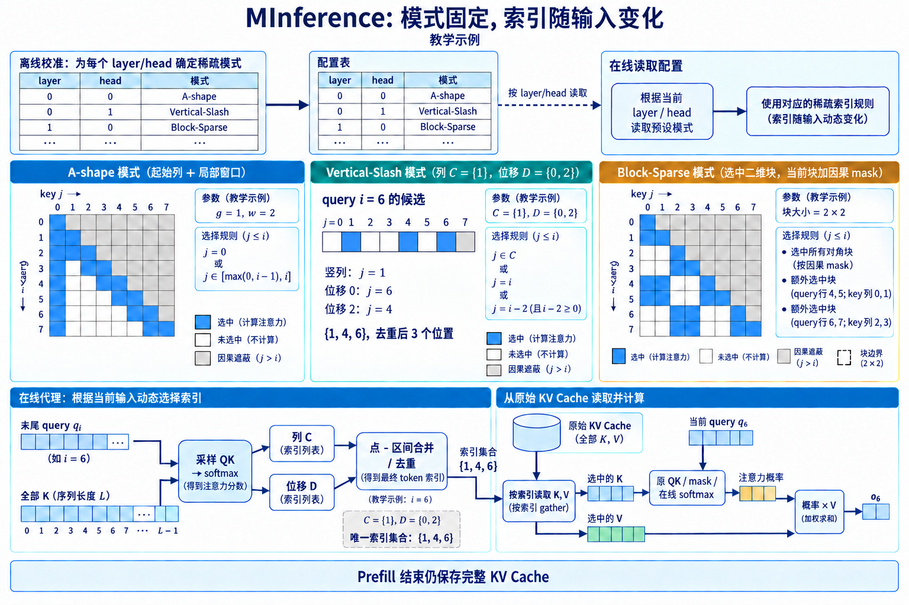

# MInference: 按 head 模式加速长上下文 Prefill

百万 token 上下文会先把 Prefill 推到瓶颈. 输入长度为 $n$ 时, 每层要为整段 prompt 生成 $n$ 个 query, 每个 causal query 最多读取此前全部 key, QK 与 AV 的关系数接近 $n(n+1)/2$. [MInference 1.0](https://arxiv.org/abs/2407.02490)观察到, 长上下文模型的高权重位置随输入变化, 空间形状却常落在少数几类模式中. 方法先离线为每层每个 attention head 选择模式与预算, 在线再从当前 QK 的小规模代理计算中构造索引, 随后调用对应的稀疏 kernel.

这是一种**免训练的 Prefill 加速方法**. 它不修改预训练目标, 不要求继续微调, 也不声称删除 KV Cache. 原论文归纳三类模式: A-shape 保留起始 token 与局部窗口; Vertical-Slash 保留少量竖列和对角斜线; Block-Sparse 选择二维块. 模式类别对同一个 head 固定, 具体列、斜线或块由输入动态决定. 这正是名称里的动态稀疏: 动态的是索引, 不是每次请求重新搜索 kernel 类型. 论文在 A100 上报告最长可达 10 倍的 Prefill 加速, 覆盖 LLaMA-3-1M、GLM4-1M、Yi-200K、Phi-3-128K 与 Qwen2-128K 等模型及 InfiniteBench、RULER、PG-19、Needle In A Haystack 等任务. 这个数字来自特定长序列、模型和实现, 不能外推为所有长度的服务吞吐. 短序列上索引开销占比更高; Decode 每步只有一个新 query, 也不是原方法的主要受益阶段.

## 1. 方法边界与完整数据流

### 1.1. 输入输出和 shape

固定一层, 输入 hidden states 为 $X\in\mathbb{R}^{B\times n\times d}$. 投影并应用位置编码后, query 为 $Q\in\mathbb{R}^{B\times H_q\times n\times d_h}$, key 与 value 为 $K,V\in\mathbb{R}^{B\times H_{kv}\times n\times d_h}$. 对 GQA, $H_{kv}<H_q$, 逻辑上多个 query head 共享一组 KV; 官方实现会在需要时把 KV 映射或重复到对应 query head. MInference 输出 $O\in\mathbb{R}^{B\times H_q\times n\times d_h}$, 后续仍执行原模型的 head 合并与输出投影. 稠密 causal attention 为:

$$
s_{hij}=\frac{q_{hi}^{\top}k_{hj}}{\sqrt{d_h}},\qquad j\le i, \tag{1}
$$

$$
o_{hi}=\sum_{j\le i}\frac{\exp(s_{hij})}{\sum_{t\le i}\exp(s_{hit})}v_{hj}. \tag{2}
$$

MInference 为 head $h$ 和 query $i$ 构造候选集合 $\mathcal N_h(i)\subseteq\{j:j\le i\}$, 将式 (2) 的求和域改为 $j\in\mathcal N_h(i)$. 选择结果可以表示成整数索引、块坐标或隐式的几何参数, 无需物化 $n\times n$ 布尔 mask. kernel 直接从参数生成待访问 tile, 对 tile 内 QK 做精确点积, 使用在线 softmax 合并多个 tile 的统计量. 完整路径分三段. 离线阶段采样长上下文, 观察每个 head 的稠密注意力, 在候选模式与预算中搜索质量较好的配置, 写成按层按 head 的配置表. 在线索引阶段读取当前 Q/K 的一小部分或聚合统计, 估计竖列、斜线和二维块的位置. 稀疏计算阶段按配置调用 A-shape、Vertical-Slash 或 Block-Sparse kernel. **离线选择回答「这个 head 用哪种几何」, 在线索引回答「这次输入具体算哪些位置」.**

官方实现的配置按 layer 和 head 保存 `best_pattern`, 条目包含模式类型以及 vertical、slash 等预算. 前向路径从配置取出 `stream_llm`、`vertical_and_slash` 或 `block_sparse`, 再分派到相应 kernel. 配置与模型结构绑定: 层数、head 数、RoPE 处理或权重版本变化后, 原配置不再自动成立. 为什么只优化 Prefill：Prefill 同时产生 $n$ 个 query, 稠密 attention 的逻辑关系为 $O(n^2)$. 稀疏模式把每行候选限制到远小于 $n$ 的数量, 足以降低主计算. Decode 第 $t$ 步只有一个新 query, 读取 $t$ 个历史 KV, 单步关系数为 $O(t)$; 虽然上下文很长时仍昂贵, 但其并行形态、内存瓶颈和索引摊销完全不同. MInference 1.0 的主要执行对象是 prompt 内的三角注意力矩阵. Prefill 完成后, 原始 KV 仍按模型要求写入 cache. 稀疏计算没有把未访问的 key 或 value 删除, 因为后续 Decode query 可能需要它们. 这也解释了 MInference 与下一章 KV 选择的区别: 前者本步少算 QK/AV 关系, 后者减少未来可读的 cache 状态.

训练阶段同样不使用这些 kernel. 模型按原方案完成预训练或长上下文适配, MInference 在部署时替换 attention Prefill 路径. 好处是无需承担稀疏训练与稠密部署之间的结构差异; 风险是模型没学过漏边后的 softmax 分母, 所以索引必须覆盖原 head 的主要概率质量.

### 1.2. 复杂度应怎样写

设每个 query 最终访问 $k_h(i)$ 个 key, 则 head $h$ 的精确 attention 关系数为 $E_h=\sum_i k_h(i)$. 三类模式通常通过预算把 $E_h$ 控制在近似线性或低于稠密三角的范围. 主算术约为 $O(E_hd_h)$, 但总时间还包含代理打分、reduce、top-k、索引生成、tile 去重和 kernel 调度. 设索引构造使用 $r$ 个采样 query, 对全部 $n$ 个 key 形成代理分数, 成本约为 $O(rnd_h)$; 当 $r\ll n$ 时低于 $O(n^2d_h)$. 若选出的竖列数为 $v$, 斜线覆盖宽度折算为每行 $s$, 局部窗口为 $w$, 粗略边数为 $O(n(v+s+w))$. 重叠区域要去重, 三角边界也会减少前部行的实际候选. **复杂度成立的前提是索引在完整 QK 之前生成.** 用稠密 attention 找 top-k 再执行稀疏 attention, 只能作为分析或教师路径, 不能产生端到端加速. MInference 的关键工程贡献包含低成本近似索引和与三类形状匹配的 GPU kernel, 两者缺一不可.

## 2. 三种模式对应三种信息路径

A-shape: 起始位置加局部窗口：A-shape 在 causal 矩阵中保留左侧少量竖列与主对角线附近的局部带. 对位置 $i$, 设起始 token 数为 $g$, 局部窗口为 $w$, 候选集合可写成:

$$
\mathcal N_A(i)=\{0,\ldots,\min(g-1,i)\}\cup\{\max(0,i-w+1),\ldots,i\}. \tag{3}
$$

矩阵左侧竖带和下三角对角带组合后外观近似字母 A 的两部分. 起始 token 常承载 attention sink 或全局汇总作用, 局部窗口保存邻近依赖. 式 (3) 只依赖位置, 因而 A-shape 的在线索引很便宜. MInference 将这类 head 识别出来后, 直接使用规则 kernel, 无需为每个输入做复杂 top-k. 候选数最多为 $g+w$, 但两集合在序列开头有重叠. 精确边数为:

$$
E_A=\sum_{i=0}^{n-1}|\mathcal N_A(i)|. \tag{4}
$$

当 $n\gg g,w$ 时, $E_A\approx n(g+w)$, 相比稠密的 $n(n+1)/2$ 呈线性增长. A-shape 的局限也清楚: 除起始列外, 远距离证据无法一层直达. 它适合本来就集中在 sink 与邻域的 head, 不能拿同一规则覆盖所有 head. kernel 可按固定 tile 遍历左边界和对角窗口. 地址规则, 不需要排序或 gather 大量随机块, 通常最容易获得稳定性能. 重叠 tile 必须避免重复计入 softmax. 若分别计算两部分, 应使用在线 softmax 的行最大值与分母合并, 不能把两个局部 softmax 输出直接相加.

### 2.1. Vertical-Slash: 列与相对位移

Vertical-Slash 模式包含两种统计. 竖列表示许多 query 都关注同一绝对 key 位置; slash 表示许多配对共享相对位移 $i-j=\delta$. 前者可通过沿 query 轴聚合注意力或代理分数得到列重要性, 后者可沿对角线聚合得到位移重要性. 选出集合 $C_h$ 与 $D_h$ 后:

$$
\mathcal N_{VS,h}(i)=\{j:j\in C_h,\ j\le i\}\cup
\{i-\delta:\delta\in D_h,\ 0\le i-\delta\le i\}. \tag{5}
$$

$C_h$ 和 $D_h$ 针对当前输入动态构造. 同一个 head 在摘要任务中可能选中文档段落开头, 在代码任务中可能选中定义位置. 模式仍是 Vertical-Slash, 具体坐标随 Q/K 改变. 这比固定窗口更能覆盖远程热点, 又比任意 token top-k 更容易形成规则 tile. 在线索引不直接读取全部 $n^2$ 分数. 一种代理路径是取末尾的一小段 query 与全部 key 计算点积, 用这些 query 的列聚合近似全矩阵竖线; 斜线则从局部块乘结果中统计若干相对位移. 采样 query 的数量和位置决定索引质量. 末尾 query 与生成任务当前语义较接近, 但未必代表 prompt 中所有 query. 采样过少会漏掉只在前部出现的模式, 过多则增加索引成本.

官方研究页说明, Vertical-Slash 的竖线使用 $1\times64$ 一类窄块计算, slash 使用 $64\times64$ 块覆盖. 这意味着逻辑上的单列或单条对角线会扩张为物理 tile. 扩张多算附近关系, 却换来连续加载和 tensor core 友好的形状. 报告稀疏率时应区分逻辑索引数与物理 tile 覆盖数. Block-Sparse: 直接选择二维区域：有些 head 的高权重没有稳定列或对角线, 而是集中在若干二维块. 将 query 轴与 key 轴都按边长 $b$ 分块, 得到约 $N_q=N_k=\lceil n/b\rceil$ 个块. 第 $(u,v)$ 个块包含 query 区间 $Q_u$ 与 key 区间 $K_v$. 路由器为合法的 causal 块计算代理分数 $r_{uv}$, 每个 query 块选择 top-$k_b$ 个 key 块:

$$
J_u=\operatorname{TopK}_{v\le u}(r_{uv},k_b). \tag{6}
$$

精确 attention 随后只计算 $(u,v)$ 满足 $v\in J_u$ 的 tile. 索引可以保存为 $J\in\mathbb{N}^{N_q\times k_b}$; batch 与 head 维加入后为 $B\times H\times N_q\times k_b$. 每个元素是 key block ID, kernel 由它换算 K/V 地址. 若每块为 $b\times b$, 精确关系数上限为 $N_qk_bb^2\approx nk_bb$. 代理分数若先把每块压成摘要, 计算约为 $N_qN_kd_r$, 仍可能随块数平方增长; MInference 使用近似构造降低这项开销. 块越大, 索引越便宜、kernel 越规则, 但会多算块内低权重边. 块越小, 候选更精确, top-k 和随机访存更重. causal 对角块需要额外三角 mask, 对角线下方块可完整计算, 上三角块必须排除. 不同 query 块的 top-k 结果也可能重复读取同一 key 块. L2 cache 能否复用取决于调度顺序; 若按 query 块独立启动 kernel, 热门 key 块可能被反复从 HBM 加载.

Block-Sparse 的在线代理对每 64 个 token 的 Q/K 分别均值池化, 再计算块级分数. 这项 matmul 仍随块数平方增长, 相比原 token 级 QK 的关系数缩小约 $64^2$ 倍; 不能把所有模式的索引都写成线性. 均值池化与矩阵乘的交换只解释原始点积的块均值, softmax 是非线性操作, 池化后 softmax 不等于池化原 attention 概率.

> 图 1: MInference 的离线 head 配置、三种候选几何与在线 KV 读取路径. 结构参考 [论文 v1 Figure 4、Figure 7 与附录 C.4.2](https://arxiv.org/pdf/2407.02490v1); 八位置 mask 与 query6 候选为教学示例, 不表示实验分布.

图 1 解析:

- 左侧 A-shape 用起始列与宽度为 2 的窗口保留 21 条 causal 边, 右侧块示例保留 20 条边. 灰色格是未来位置, 即使属于选中的物理 tile 也要屏蔽.
- 中间展开 query6: 竖列提供位置 1, 位移 0 与 2 提供位置 6 与 4. 合并后的唯一集合为 {1,4,6}; 这三个数是索引, 尚未读取 Value.
- 下方把索引与完整 KV Cache 一起送入 gather. 选中的 K 参与原 QK 与在线 softmax, V 进入概率加权; 输出仍是当前 query 的 attention 表示. 图中 token 条带表示张量, 不按小格数表达实际 shape.
- 顶部配置跨请求沿用, 底部索引随输入重新估计. Prefill 少算连接并不删除完整 KV, 后续 Decode 仍能访问历史状态.

[放大查看MInference索引图](./images/minference-index-flow-v4.png)

## 3. 离线模式搜索与在线索引

### 3.1. 每个 head 为什么需要独立配置

多头 attention 的 head 会形成不同空间结构. 有的 head 长期关注近邻, 有的集中在少数绝对位置, 还有的根据段落内容形成块. 用单一 mask 覆盖全部 head, 要么让简单 head 支付过多预算, 要么让复杂 head 丢失主要边. MInference 把模式选择粒度设为 layer-head, 配置表因此可以看作 $L\times H$ 个离散决策. 离线搜索需要一个稠密参照. 对校准输入计算原模型 attention, 分别用 A-shape、Vertical-Slash 和 Block-Sparse 在若干预算下近似, 比较输出误差或被覆盖的注意力质量, 再选可接受误差下更快的配置. 模式搜索本身可以昂贵, 因为它不在每次请求的延迟路径中. 搜索结果必须覆盖代表性任务和长度; 若校准集只有检索文本, 选出的模式未必适合代码或多轮对话.

配置固定不代表 attention mask 固定. A-shape 主要由位置确定; VS 与 Block-Sparse 仍根据输入构造坐标. 这种分层设计缩小在线决策空间: 在线阶段不比较三套完整 kernel 的效果, 只在已知模式内部估计少量索引. **把稳定的 head 类型离线化, 把随样本变化的位置在线化, 是 MInference 控制路由开销的核心.** 索引生成不能污染主成本：索引器需要满足三个条件. 第一, 读取的数据明显少于稠密 attention. 第二, 输出直接接近 kernel 需要的块索引, 避免生成巨大 mask. 第三, 索引与主 attention 可以流水或至少不引入频繁 CPU 同步. 如果把 top-k 结果拷回 CPU 排序, 再传回 GPU, 长序列计算节省会被同步时延抵消.

列聚合可对采样 Q 与全部 K 的小矩阵做 reduce. 设采样长度为 $r$, 得到 $P\in\mathbb{R}^{r\times n}$. 每列分数可取最大值或若干 query 上的和. 最大值保留一次强响应, 对偶发噪声敏感; 求和偏向被许多 query 中等关注的位置, 可能压低唯一证据. slash 聚合按相对位移把 $P_{ab}$ reduce 到一维数组, 再取 top-k 位移. Block-Sparse 则把代理矩阵按块 reduce 后选择二维坐标. top-k 本身也有代价. 对长度 $n$ 的列分数完整排序为 $O(n\log n)$, 但只要前 $k$ 可使用选择算法、分层 reduce 或固定容量堆. GPU 上更关心读写轮数与同步, 不能只看渐近复杂度. 索引规模通常很小, 却要在每层多个 head 上重复, 因而融合 reduce 与选择会显著影响总延迟.

### 3.2. 稀疏 tile 上的在线 softmax

稀疏 kernel 仍需得到与候选集合一致的精确 softmax. 对一行 query, 不同 tile 依次产生分数片段. 维护当前最大值 $m$, 指数和 $\ell$ 与未归一化输出 $p$. 新片段分数为 $x$, 新最大值为 $m'=\max(m,\max x)$. 更新为:

$$
\ell'=e^{m-m'}\ell+\sum_t e^{x_t-m'}, \tag{7}
$$

$$
p'=e^{m-m'}p+\sum_t e^{x_t-m'}v_t. \tag{8}
$$

全部 tile 完成后 $o=p/\ell$. 式 (7)-(8)允许不物化整行分数, 也能把竖列、slash 与局部块逐段合并. 候选 tile 若重叠, 同一 $(i,j)$ 必须只进入一次, 否则对应 key 的指数权重会被重复计算. 去重可由 tile 划分规则保证, 或在 kernel 内用边界条件屏蔽. 数值稳定性沿用 FlashAttention 的行最大值技巧. 稀疏不会消除半精度溢出风险, 也不允许对每个 tile 单独 softmax 后平均. 每个 tile 的局部分母不同, 局部归一化会改变全局候选权重. MInference kernel 的职责不只是跳过零块, 还要正确合并跨 tile 统计量.

## 4. 数值手算: 从模式到输出

八 token 的 Vertical-Slash 索引：取 $n=8$, 单头 $d_h=2$, 省略 RoPE 与 $\sqrt{d_h}$ 缩放, 仅演示索引和 softmax. 假设在线索引选出竖列 $C=\{1\}$, slash 位移 $D=\{0,2\}$, 位置从 0 编号. 对 query $i=6$, 式 (5) 给出:

$$
\mathcal N(6)=\{1\}\cup\{6-0,6-2\}=\{1,4,6\}. \tag{9}
$$

令 $q_6=(1,1)$, 三个 key 为 $k_1=(2,0)$, $k_4=(0,1)$, $k_6=(1,1)$, 分数分别为 $2,1,2$. softmax 分母为:

$$
Z=e^2+e^1+e^2=2e^2+e. \tag{10}
$$

数值权重约为 $(0.422,0.155,0.422)$. 取 $v_1=(1,0)$, $v_4=(0,2)$, $v_6=(2,1)$, 则:

$$
o_6=0.422(1,0)+0.155(0,2)+0.422(2,1)=(1.266,0.732). \tag{11}
$$

若竖列与 slash 都包含位置 6, 实现必须去重, 否则 $e^2$ 会在分母出现两次, $v_6$ 也被加两次. 对位置 $i=1$, 位移 2 产生负索引, 应直接裁掉; 因此前几行的候选少于预算上限.

### 4.1. 代理索引怎样漏掉证据

假设索引器只取末尾两个 query $q_6,q_7$ 计算列分数, 并用列最大值选一个竖列. 四个候选 key 的代理矩阵为:

$$
P=\begin{bmatrix}
2.0&0.5&0.2&0.1\\
1.8&0.4&0.3&0.2
\end{bmatrix}. \tag{12}
$$

列最大值为 $(2.0,0.5,0.3,0.2)$, 所以选择第 1 列. 但若较早 query $q_3$ 对第 4 列分数为 $4.0$, 末尾采样完全看不到这次强关联. 局部窗口或 slash 可能碰巧覆盖第 4 列, 否则该边会丢失. 增加采样 query 能降低风险, 也线性增加代理矩阵行数. 这个例子说明索引质量至少要分 head、分 query 区间检查. 全矩阵覆盖率高, 不代表开头或中部 query 的关键边被覆盖. 长上下文任务通常只在末尾位置读答案, 末尾 query 权重更高有实际理由; 语言模型 Prefill 又会生成所有中间 hidden states, 中间位置的误差可能继续传播到后层.

竖列与斜线的物理预算需要分开. [论文 v1 附录 C.4.2](https://arxiv.org/html/2407.02490v1#A3.SS4.SSS2)将 vertical 索引作为点, slash 覆盖作为区间, 合并后输出块区间与尚未覆盖的列索引. 单列打包沿 query 方向展开, 不等于把一个 key 扩张为相邻 64 个 key. 设 $n=1024$, 两条竖列 $j=0,512$, causal 合法关系数为 $(1024-0)+(1024-512)=1536$.

斜线由方形 tile 覆盖, 会带入逻辑线附近的额外计算. 某条竖列已落进选中区间时, 索引合并将其移出独立列列表, 避免重复计入 softmax. 实际预算应分别统计块面积、未被块覆盖的列面积、causal mask 与末块 padding.

## 5. 质量与性能边界

### 5.1. 误差、部署检查与失效诊断

稀疏输出误差来自两部分. 第一是候选外概率质量被删除, softmax 在剩余集合重新归一化. 第二是物理 tile 扩张加入了逻辑模式外的边. 前者通常改变输出, 后者更接近稠密结果却增加计算. 若原 attention 很尖锐, 覆盖少数峰值即可保留大部分输出; 若权重分散, 相同候选数会删除大量小权重, 它们的加权和未必小.

残差连接会缓和单层误差, 后续层也可能重新聚合, 但不能据此保证长链推理. 唯一证据、精确复制、代码括号配对和跨段否定条件都可能依赖单条边. Needle 测试能检查远程召回, 却不能覆盖所有分布式聚合需求. 因而论文同时使用长文本困惑度、检索与下游任务是必要的, 部署仍应在自身 prompt 分布上校准.

模式分配还有域迁移风险. 某个 head 在校准数据上呈 A-shape, 在另一语言、代码或表格输入上可能出现块状远程依赖. 在线只允许在 A-shape 内选位置, 无法切换成 Block-Sparse. 增大固定预算能提高鲁棒性, 但会降低速度. 更稳妥的配置应使用多任务、多长度校准, 并检查最差 head 而非只看平均重合度.

什么时候看不到加速：短序列下, FlashAttention 的稠密 tile 已有很高利用率, MInference 还要读取配置、构造索引和启动多类 kernel. 官方研究页给出的 microbenchmark 显示约 10K token 时多种 kernel 延迟接近且都低于毫秒量级, 长到 1M token 后差距才充分展开. 这表明收益有明显长度门槛, 门槛还会随 GPU、head 维度、batch 和编译版本变化. 预算过大时, 稀疏 tile 接近覆盖整个下三角, 索引成本变成额外负担. 预算过小时, 质量先下降. 多 batch 场景中, 每个样本索引不同, 难以把相同 tile 合并; ragged 长度还会造成空算. GQA 的 KV 共享可能提高 K/V 复用, 但 query head 配置不同又会访问不同 tile, kernel 调度需要处理两种粒度.

内存收益也要限定. MInference 减少 Prefill attention 中间分数与读写, 不减少模型权重, 残差、MLP 激活或最终 KV Cache 容量. 使用 FlashAttention 风格在线 softmax时, 稠密实现本来就不物化 $n^2$ 矩阵; 稀疏主要节省 QK/AV 算术和 K/V tile 访问, 不能把「逻辑矩阵从平方变稀疏」直接等同于同倍显存下降.

部署检查与失效诊断。
部署时先校验配置和模型一一对应: 模型权重、层数、query/KV head 数、head 维度、RoPE 版本、最大长度与 tensor parallel 切分都应匹配. 官方代码按 tensor parallel rank 计算全局 head 偏移, 配置若仍按单卡本地编号读取, 会把模式分配给错误 head. 一个配置能运行不代表分配正确, 应抽样对照层-head 映射. 性能测量应拆出 dense baseline、索引时间、稀疏 kernel 时间和其他层时间, 同时记录真实 token 数、padding、batch、dtype、GPU 与软件版本. TTFT 包含 tokenization、调度、权重前向与 KV 写入, attention kernel 的倍数不会原样变成端到端倍数. 吞吐还受并发与显存容量影响. 只报告单 kernel 延迟无法回答在线服务收益.

质量诊断可以先比较若干层的稀疏输出与稠密输出, 统计相对误差、余弦相似度和稠密概率质量覆盖率, 再跑任务. 若少数 head 误差集中, 增大对应 head 预算比全局加大稀疏率更划算. 若误差只在特定输入类型出现, 应扩充离线校准或为该模型建立多配置选择. 若 kernel 输出从短序列起就偏离, 优先检查 causal 边界、RoPE 位置、GQA head 映射、重复 tile 与在线 softmax合并. **MInference 的质量边界由索引召回决定, 性能边界由物理 tile 和索引开销决定.** 两条边界必须同时满足. 只看 attention 热图会高估硬件收益, 只看 kernel 吞吐会忽略被漏掉的远程证据. kernel 实现中的具体约束：**head 分派与 GQA 映射。**

官方前向实现按 head 逐个读取配置, 将 `stream_llm` 映射到 A-shape 类路径, 将 `vertical_and_slash` 和 `block_sparse` 映射到各自 kernel. 输入在不同集成中可能是 $[B,H,n,d_h]$、$[B,n,H,d_h]$ 或展平的 $[N,H,d_h]$, 进入 kernel 前必须统一. shape 转置后若忘记 `contiguous`, 后续自定义 CUDA/Triton kernel 可能按错误 stride 读取. GQA 中一个 KV head 服务多个 query head. 设 $H_q=32,H_{kv}=8$, 每四个 query head 共享一组 K/V. MInference 的模式仍可按 32 个 query head 独立, 因为各自 Q 不同; 物理 K/V 地址却只有 8 组. 实现可逻辑 repeat KV, 也可在 kernel 内用 $h_{kv}=\lfloor h_q/4\rfloor$ 映射. 前者代码直接但可能产生额外内存, 后者要求索引与 head 映射一致. tensor parallel 进一步改变 head 编号. 每张卡只持有局部 query heads, 配置表却通常按全局 head 编号. 若 rank $r$ 持有 $H_{local}$ 个 head, 本地 head $h$ 应读取全局编号 $rH_{local}+h$. 官方代码可见类似全局偏移处理. 配错不会触发 shape 错误, 只会让某个 head 使用另一 head 的模式, 属于难以从崩溃日志发现的质量问题.

tile 列表与工作调度：A-shape 的 tile 可由位置公式隐式生成, VS 需要列与位移列表, Block-Sparse 需要每个 query block 的 key block IDs. kernel 可以让每个 program 处理一个 `(batch,head,query_block)`, 从索引表循环读取 key blocks. 循环长度若固定, 编译器容易展开; 每行 top-k 不同时, 需要长度数组和动态循环. 负载由选中 tile 数与 causal 有效面积共同决定. 靠近序列开头的 query block 只有少量历史 key, 靠近末尾的块候选完整. 若一组 thread blocks 同时启动, 后部任务更慢, wave 尾部利用率下降. 可以按候选数排序工作项, 但排序又增加开销并扰乱 K/V cache 局部性. 固定 top-k 与固定块大小正是在准确性之外为调度提供上界.

竖列的物理形状尤其特殊. 一个 key 区间会被大量 query blocks 复用, 理想状态下可留在 L2; 斜线随 query block 移动, 地址连续但 key 区间变化. 将两类 tile放进同一 kernel 可共享 Q 与 softmax 状态, 控制流更复杂; 分成两个 kernel 则要保存中间归一化统计并增加启动. MInference 的专用 kernel是在这种融合取舍上获得收益, 不是普通稀疏矩阵乘的直接替换. 数值精度与边界 mask：Q/K 通常以 FP16 或 BF16 读取, 点积可累积到 FP32, 行最大值和指数和也应保持足够精度. 长候选集合上的 softmax 分母包含很多项, 低精度累计会造成偏差. 稀疏候选较少能减轻累计量, 却可能让极少数大 logits 主导; 减最大值仍是必要步骤.

边界 mask 包含四类: causal 上三角、序列 padding、物理 tile 扩张出的逻辑无效列、不同候选分支的重复区域. 它们都应在最大值 reduce 前置为负无穷. 若在指数计算后乘零, 极大无效 logits 仍会污染最大值或产生 `inf*0`. 末块长度不足 $b$ 时也必须按真实长度屏蔽. 正确性容差要结合 dtype. 与候选一致的高精度参考相比, BF16 输出可允许小幅绝对/相对误差; 大范围偏差通常来自索引、重复或归一化错误, 浮点舍入很少造成这种形态. 分层检查 logits、行最大值、指数和与输出, 比只看最终 hidden state 更容易定位.

### 5.2. 对照、性能与复现

与哈希、聚类和固定窗口的差别。
[哈希与聚类](./2.1.1-哈希与聚类.md)从内容向量建立桶, 通常在模型训练阶段就改变 attention 拓扑. MInference 先观察已训练模型的 attention 空间聚集形状, 再选择少量几何模板. 前者的候选边能是任意同桶关系, 后者把边压进列、对角线与二维块, 因而更容易写专用 kernel. 固定窗口完全省去在线索引, 远程边只能来自全局 token 或多层传播. MInference 的 VS 与块模式保留输入相关远程边, 代价是索引器. 当某个 head 实际就是局部加 sink, 离线搜索会选择 A-shape, 避免不必要的动态选择. 这种按 head 混合比全模型使用同一窗口细致, 配置管理也更重.

所有路线都面临同一预算三角: 候选越规则, kernel 越快; 候选越细粒度, 召回越准; 索引越充分, 路由成本越高. MInference 的取点是用少数空间模式约束动态性. 它不追求任意 top-k 的最小边数, 而是追求长 Prefill 上可执行的 tile 集合. 与 MoBA、NSA 类训练型方法的差别：MoBA 以 block 为单位进行门控, query 先选择相关 KV blocks, 再在选中块上做注意力. NSA 将压缩分支、选择分支和局部分支共同纳入训练. 这些方法让模型在训练中适应稀疏路径, 路由器也可获得专门的学习信号. MInference 面向现有模型, 不能要求重新学习表示, 所以依赖稠密 attention 已有的空间规律.

训练型方法可以让索引器和主 attention 协同演化, 也可能把训练成本保留为稠密教师或额外损失. MInference 的离线模式搜索同样使用稠密观察, 但只做一次配置生成. 在线部署不需要教师. 两类结果不能只按稀疏率横比: MoBA/NSA 的质量包含训练适配, MInference 的价值包含免训练迁移. Decode 也是明显边界. 原生训练的块路由可以设计增量 KV 索引, MInference 1.0 主要处理完整 Prefill 三角. 把 Prefill 索引直接用于后续 Decode, 可能固定在 prompt 阶段观察到的列和块, 无法反映新 query. 若每步重建, 索引摊销又不同. 因而部署组合常让 MInference 优化 Prefill, Decode 使用原 attention 或另一套 KV 选择机制.

稀疏与精确的含义。
MInference 在候选 tile 内计算原 QK 点积与 softmax, 所以局部算子是精确的; 相对稠密模型的整体输出仍是近似. 「精确 sparse attention」通常只表示给定 mask 后 kernel 与数学定义一致, 不表示 mask 与稠密 top-k 完全一致. 在线索引本身是近似代理, 物理 tile 又可能扩张逻辑 mask. 这种区分对测试很重要. 第一层测试固定索引, 比较 kernel 与朴素 masked attention, 验证实现精确. 第二层比较动态索引与稠密 attention 的 top-k 或概率质量, 验证路由. 第三层跑任务, 验证误差经过多层传播后的影响. 把三层混在一个最终准确率中, 很难知道问题来自算法还是代码. 更完整的性能模型：**算术、带宽与启动开销。**

单个 head 的稠密 Prefill QK 与 AV 各处理约 $n(n+1)/2$ 个关系. 每个关系读取或复用 $d_h$ 个 K/V 元素并完成点积/加权. FlashAttention 通过 tile 在片上复用 Q/K/V, 避免写回分数矩阵, 所以瓶颈可能是算力也可能是 HBM, 取决于形状. 稀疏化将关系数改为 $E_h$, 但 tile 稀疏的实际工作为 $\tilde E_h\ge E_h$, 包含块扩张. 端到端一层时间可以分为:

$$
T=T_{proj}+T_{index}+T_{sparse}+T_{other}. \tag{13}
$$

$T_{proj}$ 是 QKV 投影与 RoPE, $T_{index}$ 是代理分数和选择, $T_{sparse}$ 是稀疏 QK/softmax/AV, $T_{other}$ 包含输出投影、通信等. MInference 只直接降低 $T_{sparse}$ 中相对稠密 attention 的部分, 并新增 $T_{index}$. 当 attention 在总层时间占比为 $f$, 即使稀疏 kernel 无限快, 理论加速也受 $1/(1-f)$ 限制. 例如稠密层时间 10 ms, 其中 attention 8 ms, 其他 2 ms. 稀疏 attention 降到 1 ms, 索引增加 0.5 ms, 新总时间 3.5 ms, 加速为 $2.86$ 倍, 不是 attention 部分的 8 倍. 长度增长后 attention 占比上升, 端到端倍数才接近 kernel 倍数. 内存容量与峰值工作区：在线 FlashAttention 已将分数工作区从 $O(n^2)$ 降为 tile 级, 因而 MInference 不应按完整 attention 矩阵宣称显存节省. 稀疏实现需要配置、代理分数、top-k 索引和临时排序空间. 如果代理矩阵为 $r\times n$, 工作区是 $O(rn)$; Block-Sparse 的块分数可能为 $N_q\times N_k$, 需通过分块或在线选择避免在极长序列上变大.

最终 KV Cache 仍保存全部 $n$ 个 token. Prefill 峰值显存还包含 Q/K/V、MLP 激活与输出. batch 增大时, 稀疏 attention 节省的临时空间可能允许更大并发, 但要实测内存分配器与工作区生命周期. 仅凭边数无法推断可增加多少 batch. 索引 dtype 通常为 32 位整数. 对 $B,H,N_q,k_b$ 较大时, 索引本身也会达到可见规模. 能用隐式公式表达的 A-shape 不应物化索引; slash 可保存位移而非每行绝对坐标; vertical 可保存列列表; 只有任意 block 选择需要完整行索引. 让表示匹配模式, 是减少控制数据的重要部分. 服务指标怎样报告：离线 microbenchmark 使用固定长度和同步计时, 能比较 kernel. 在线服务还要报告 TTFT 分布、请求吞吐、并发下显存、不同长度混批以及编译缓存命中. 动态 shape 可能触发多个编译版本; 首次请求的编译时间不应混入稳态, 但生产预热必须覆盖常见 shape.

长请求常与短请求共享 GPU. 一个百万 token Prefill 即使被加速, 仍可能阻塞短 Decode. 调度器是否支持 chunked prefill、优先级与抢占会影响用户看到的延迟. MInference 降低单次 Prefill 工作量, 不自动解决调度公平性. 在 PD 分离系统中, 收益主要发生在 Prefill 实例, Decode 实例的容量模型基本不变. 质量与性能应按长度分桶报告. 平均长度若由大量短请求主导, 会掩盖长请求收益; 只报告最长请求又会高估整体节省. 推荐至少给出 32K、128K、256K、1M 等适用长度的索引时间、attention 时间、TTFT 和任务质量, 并注明模型是否原生支持相应上下文.

复现与验收路径。
配置搜索的可复现性：模式搜索应记录模型权重标识、校准数据、长度分布、随机种子、候选预算、质量指标与硬件. 同名模型经过长上下文继续训练后, head 模式可能变化. 仅保存一个 JSON 而不保存生成条件, 很难判断它能否用于新权重. 校准集应覆盖部署任务. 对每个 head, 除平均误差外记录最差样本、模式胜出比例和预算敏感性. 如果 A-shape 与 VS 在平均值上接近, 规则更简单的 A-shape 可能更稳; 如果少数样本只有 Block-Sparse 能召回, 选择平均最快模式会损害尾部质量. 搜索目标可以在质量约束下最小化实测 kernel 时间, 而非最小化逻辑非零数.

更新软件或 GPU 后应重跑性能部分. 同一逻辑模式在 A100、H100 或不同 Triton/CUDA 版本上的最优 tile 可能不同. 模式的质量配置与 kernel 调优参数最好分开保存: 前者描述允许哪些边, 后者描述 block size、warp 数与流水级数. 这样硬件迁移不必重新决定 head 的语义模式. 从单层到整模验证：第一步固定小张量与手写索引, 验证三类 kernel. A-shape 检查起始/局部重叠, VS 检查负位移和重复列, Block-Sparse 检查对角块 causal mask. 第二步在真实模型单层上同时运行稠密与 MInference, 对比 shape、有限值、输出误差和索引覆盖. 第三步逐层替换. 只替换一层可定位某层配置或 GQA 映射错误; 一次替换全模型时, 误差会累积, 难以归因. 第四步跑短序列退化测试和目标长序列任务. 短序列即使不加速, 输出也不应出现异常; 长序列才检查性能收益.

单算子验证通过后再接入服务, 分离预热与稳态, 对比同请求同采样设置下的生成结果. 随机采样会放大小 logits 差异, 可先用 greedy 或固定随机种子观察. 对需要完全一致输出的业务, 任何近似 attention 都不满足 bitwise 等价; 验收目标应是任务质量与延迟阈值, 不是逐 token 必然相同.

清晰的适用结论：MInference 适合已有长上下文模型、主要瓶颈位于超长 Prefill、attention head 呈现可归纳空间模式且允许小幅近似的场景. 它的优势是免训练和针对 GPU 的模式化 kernel. 模型短上下文为主、Decode 占主导、业务要求与稠密模型逐位一致, 或 head 模式在输入域间剧烈变化时, 收益会减弱.

部署决策不应从「最高 10 倍」开始, 而应从式 (13) 的时间分解开始. attention 占比与索引、物理 tile 数决定性能上限, 目标任务则验证质量是否落在预算内. 若索引吃掉节省, 应减少采样、复用配置或选择规则模式; 若质量下降, 应按 head 增加预算或重新校准; 若 kernel 慢, 应检查 tile 聚集、head 映射与变长调度. **MInference 将稠密模型已有的 attention 规律压成可执行几何, 价值同时依赖「规律确实存在」和「几何确实跑得快」.** 前一个条件由校准与任务验证回答, 后一个条件由索引时间、物理 tile 和端到端 Prefill 回答.

端到端复现还应保留稠密回退路径. 回退用于质量对照、异常 shape 和未覆盖模型, 不应用于掩盖 kernel 错误. 系统可以按长度阈值选择稠密或 MInference: 短请求走成熟稠密 kernel, 长请求才支付索引成本. 阈值来自目标硬件实测, 并随 batch 与并发变化, 不宜写成跨设备常数. 监控中可在低比例影子流量运行稠密对照, 比较选定层的输出差异和候选概率质量. 一旦输入域迁移导致误差上升, 重新搜索配置比全局盲目增大预算更有效, 因为异常通常集中在少数 layer-head. 线上主路径不应双算, 否则会抵消节省.

## 6. 模式泛化、运行时成本与诊断

### 6.1. 三种模式的表示能力

三种模式是对二维注意力图的不同压缩。
长度为 $n$ 的 causal attention 可以画成下三角矩阵，行是 query 位置，列是 key 位置。MInference 观察到不同 head 的大权重常沿几种几何结构聚集，于是不用保存任意稀疏坐标，而是用少量参数描述列、对角线和块。 A-shape 的集合表达：A-shape 保留开头 $g$ 个 key 和每个 query 最近 $w$ 个 key：

$$
N_A(i)=\{0,\ldots,\min(g-1,i)\}\cup\{\max(0,i-w+1),\ldots,i\}.
$$

矩阵上表现为左侧竖条加主对角线附近的带状区域，形似字母 A 的两条主结构。边数近似 $n(g+w)$，开头与窗口重叠部分要去重。 开头列可能承载 sink、系统提示或全局锚点，局部带保留近期依赖。A-shape 不做输入相关索引，执行最规则，也无法捕获任意中段的固定重要列。它适合校准中长期热点稳定落在开头的 head。

Vertical 表示共享 key 热点.

Vertical 模式选择列集合 $V$，所有或大量 query 都读取这些 key：

$$
N_V(i)=\{j\in V:j\le i\}.
$$

若某个 token 是文档标题、分隔符、实体定义或 attention sink，它可能在许多行获得较大概率，列求和能把这种共享热点找出来。Vertical 数量为 $v$ 时，逻辑边约为 $nv$。 列热点与 causal 时间有关。位置 $j$ 之前的 query 不能读取它，竖线从第 $j$ 行向下出现，而非贯穿整矩阵。Kernel 若把整列 tile 发射，列上三角部分仍需 mask。 Slash 表示固定相对位移：Slash 线由位移 $d=i-j$ 描述。选择位移集合 $D$，query $i$ 读取

$$
N_S(i)=\{i-d:d\in D,0\le i-d\le i\}.
$$

局部窗口是连续的小位移集合；slash 可以选离散长位移，例如某种周期结构、段落间隔或固定模板关系。矩阵上是与主对角线平行的斜线。 同一 $d$ 在所有行共享，使表示非常紧凑。输入结构的间距变化时，固定 slash 可能偏离真实关系；动态索引从采样 attention 中选择当前输入的重要位移，能适应部分变化。

Block-Sparse 表示二维局部区域.

将矩阵切成 $b_q\times b_k$ tile，选择块坐标集合 $\mathcal B$。逻辑上允许块内合法 token pair，causal 对角块还要加三角 mask。块模式能表示既非整列也非固定斜线的局部团。 块大小决定压缩粒度。块大，索引少、GEMM 利用率高，块内无关 pair 多；块小，模式更精确，元数据和调度增加。Block-Sparse head通常对应较分散、不适合一维结构概括的 attention。

三类模式的表达包含关系：Vertical 列可以用一列块近似，slash 可用沿对角线排列的块近似，A-shape也可展开成左侧块与对角块。Block-Sparse 表达更一般，未必更高效：专用 vertical/slash kernel能利用规则坐标减少索引和多算。 离线搜索在固定质量预算下选择物理执行更合适的模式，数学表达能力只是其中一个条件。所有 head 一律使用通用 block，配置会更简单，也可能失去一维规律带来的效率。

### 6.2. 从采样 query 估计列与位移

完整 attention 权重需要先算 $n^2$ 个分数，之后再选稀疏边没有加速。MInference 用少量 query 行与全部 key 的点积作为代理，从这些行估计 vertical 列和 slash 位移，再运行稀疏 kernel。

采样行构成估计器.

设采样 query 集合为 $Q_s$，代理权重为

$$
\tilde A_{ij}=\operatorname{softmax}_{j\le i}\left(q_i^\top k_j/\sqrt d\right),\qquad i\in Q_s.
$$

Vertical 分数可按列累加

$$
c_j=\sum_{i\in Q_s}\tilde A_{ij},
$$

Slash 分数按位移累加

$$
r_d=\sum_{i\in Q_s}\tilde A_{i,i-d}.
$$

分别取 top-$v$ 列和 top-$s$ 位移，得到稀疏索引。代理计算量为 $|Q_s|n$，当 $|Q_s|$ 为小常数时随长度线性增长。 末尾 query 的统计偏置：实现常采样末尾若干 query，因为它们拥有最长历史，能观察全局 key。早期 query 可见范围短，列分数天然偏向开头；末尾 query 则更贴近长 prompt结束处的生成需求。 若文档不同阶段的 head模式变化，末尾样本不能代表前部行。例如每章开头关注本章标题，标题列随章节移动；末尾 64 行只会突出末章结构。Block-Sparse 或分段采样更适合非平稳图。 采样数增加提高估计稳定，代理成本同步增长。应画采样行数—captured mass—索引时间曲线，选择总时间最小点，而非默认越多越准。

Softmax 后统计与 logit 统计不同.

列分数累加概率时，每行总质量为 1，尖锐行和高熵行贡献相同总量。直接累加 logits 会受行尺度影响，也无法跨行直接比较。概率统计更接近某列承担的 attention 质量。 不同采样行的合法历史长度不同，softmax分母规模不同。靠前行概率更集中，可能放大局部 key；只采末尾行可减少这种差异。任何统计口径都带偏置，需要用完整 dense校准集验证 captured mass。 Slash 聚合的边界修正：位移 $d$ 在长度为 $n$ 的矩阵中只有 $n-d$ 个合法 pair。直接求和会偏向短位移，因为样本更多；求平均则可能让只出现少数次的大位移被噪声抬高。 可使用和、均值或带先验的归一化，三者代表不同目标：总概率质量、单 pair平均强度、平滑后的可靠强度。实现与论文配置应固定口径。评测不仅看选中位移，还看展开后捕获的总质量。

代理误差的两层来源.

 第一层是采样误差：未采行的热点与采样行不同。第二层是几何压缩误差：即使知道全矩阵，top列和top位移也未必能覆盖散乱热点。Block-Sparse 减少第二类误差，索引更复杂。 用全矩阵离线求最佳同预算模式，得到几何 oracle；再用在线采样索引比较。两者差距衡量采样估计，几何 oracle与dense top-k差距衡量模式族限制。分开后才知道该增加采样还是换模式。

### 6.3. 离线配置与在线索引分开

不同 layer-head 的注意力几何差异大。MInference 在校准集上离线决定每个 head使用哪类模式及参数，部署时配置固定，输入相关索引仍可动态生成。

搜索对象不只是模式名称：一个 head配置至少包含模式类型、vertical 数、slash 数、block数、局部窗口、初始 token数和kernel block size。质量参数与执行参数应分开：前者定义逻辑候选，后者决定如何扩成物理 tile。 模式搜索可以最小化 attention输出误差，或在误差阈值下最小化实测时间。只最小化逻辑边数会偏向碎片模式，GPU 上未必最快。只最小化单层误差，也未必对应最终任务质量。
