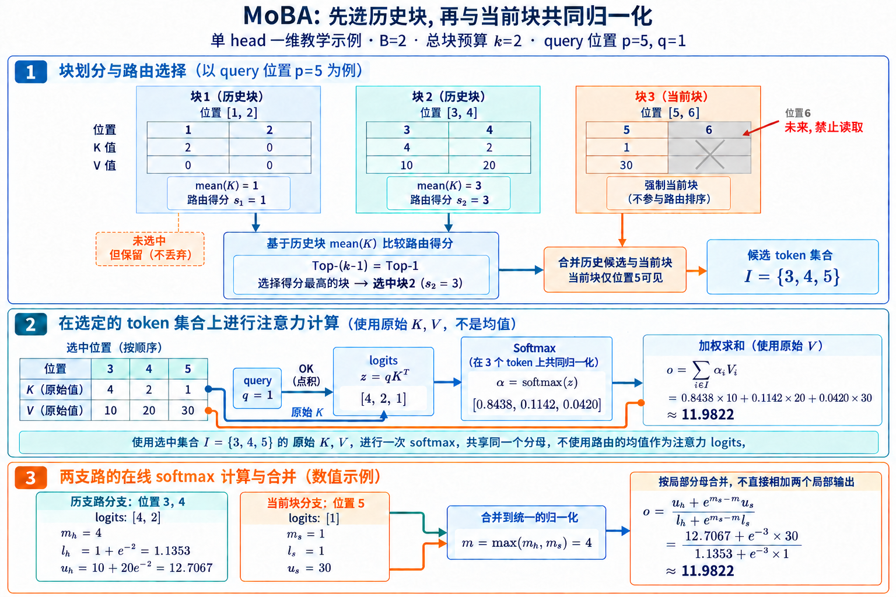

# MoBA: 把历史块当成注意力专家

MoBA, Mixture of Block Attention, 把 MoE 的稀疏激活思路移到注意力的序列轴上. FFN 中的 MoE 让每个 token 只进入少数专家; MoBA 把历史 K/V 切成连续块, 让每个 query 只读取少数块. 专家是独立参数模块, 历史块则处在同一条因果序列上. 块的位置、当前 token 所属块和块内 causal mask 都会影响结果.

[Lu et al. (2025)](https://arxiv.org/abs/2502.13189) 保留标准 softmax attention 的 Q/K/V 参数与输出语义, 只改变参与计算的历史集合. MoBA 因此可以和 full attention 共用权重, 训练中也能在两种模式间切换. 它仍然不是训练后直接替换的无损 kernel: 路由改变了每个 query 可见的 token, 已有模型需要继续训练才能适应这种缺边方式. 官方[实现](https://github.com/MoonshotAI/MoBA)也明确写出了这项限制.

## 1. 从 token attention 变成块路由

设单个 attention head 的 query 为行向量 $q\in\mathbb R^{1\times d}$, 历史 key 与 value 为 $K,V\in\mathbb R^{N\times d}$. 以下先不写公共的 $1/\sqrt d$ 缩放因子, full attention 为

$$
o=\operatorname{softmax}(qK^\top)V. \tag{1}
$$

将长度 $N$ 的历史切成 $n$ 个连续块, 每块大小 $B=N/n$. 第 $i$ 块的位置集合为

$$
I_i=\{(i-1)B+1,\ldots,iB\}. \tag{2}
$$

MoBA 没有另建一个可训练 gate 网络. 它直接对块内 keys 做平均, 再以当前 query 与块表示的点积作为路由分数:

$$
\bar k_i=\frac{1}{B}\sum_{j\in I_i}k_j,
\qquad s_i=q\bar k_i^\top. \tag{3}
$$

先用 $\mathcal T(q)$ 表示入选块集合, 因果选择与当前块预算在下一节展开. 最终 attention 使用候选内原始 token K/V, softmax 分母覆盖这些候选:

$$
\mathcal I(q)=\bigcup_{i\in\mathcal T(q)}I_i,
\qquad
o=\operatorname{softmax}\!\left(qK_{\mathcal I(q)}^\top\right)V_{\mathcal I(q)}. \tag{4}
$$

**块均值只负责找候选, 最终读取的仍是块内原始 K/V.** 块表示若漏掉一段历史, 后面的精确 attention 无法补救;块表示若选对, 块内 token 仍能由 query 重新区分.

这个数据流与 DSA 的轻量 indexer 有相似之处, 代理表示的来源却不同. MoBA 用主 attention keys 的均值, 没有独立的 index key 投影;DSA 训练低维 index keys, 再到 MLA 主 KV 中 gather token. 前者少一套索引参数, 选择单位被块大小固定;后者能做更细的 token 级选择, 也要承担代理空间训练与全历史扫描.

## 2. 因果性还有第二道门

对自回归模型, query 位置记为 $p$. 晚于当前块的摘要包含未来 token, 路由分数必须设为 $-\infty$. 还有一处更隐蔽: 当前块的均值 $\bar k_i$ 也可能混入 query 右侧的未来 keys. 若让当前块参加普通 top-$k$, 单是路由结果就会泄漏未来信息.

MoBA 让当前块始终入选, 不用完整块均值决定是否读取;当前块内部再执行 causal attention, 只让位置 $p$ 看到块内不晚于 $p$ 的 tokens. 历史块全部位于 query 左侧, 块内可以执行非因果 attention. 一次 MoBA attention 因而包含当前块与历史块两路计算:

$$
o_s=\operatorname{Attn}_{\mathrm{causal}}(q,K_{I_c},V_{I_c}), \tag{5}
$$

$$
o_h=\operatorname{Attn}(q,K_{\cup_{i\in\mathcal T^-}I_i},V_{\cup_{i\in\mathcal T^-}I_i}). \tag{6}
$$

两路不能各自 softmax 后直接相加, 那会让当前块和历史块分别获得一份总概率质量. 正确做法是保留局部最大值与指数和, 用 online softmax 合并成候选并集上的一次 softmax. 设两路统计为 $(m_s,l_s,u_s)$ 和 $(m_h,l_h,u_h)$, 其中 $u$ 是未除分母的加权 value 和. 取 $m=\max(m_s,m_h)$, 则

$$
l=e^{m_s-m}l_s+e^{m_h-m}l_h, \tag{7}
$$

$$
o=\frac{e^{m_s-m}u_s+e^{m_h-m}u_h}{l}. \tag{8}
$$

式 (8)说明强制当前块入选没有额外赋予固定权重. 它只保证局部候选存在, 概率仍与历史候选共同竞争. 这类似 MoE 的 shared expert: 动态路由负责远程内容, 固定通路保证最近上下文可见.

用一个单 head、$d=1$ 的例子把两路放在一起. 块大小 $B=2$, 总块预算 $k=2$, 当前 query 位于 $p=5$ 且 $q=1$. 前两个历史块的 keys 分别是 $[2,0]$ 与 $[4,2]$, 均值分数为 1 与 3. 当前块占用一个名额, 其余名额选历史块 2. 当前块的位置 6 尚不可见, 最终候选只有 $\mathcal I=\{3,4,5\}$.

候选原始 keys 为 $[4,2,1]$, values 为 $[10,20,30]$. 因为 $d=1$, 缩放因子等于 1. 减去最大 logit 4 后, 共同分母为 $1+e^{-2}+e^{-3}$, 权重约为 $[0.8438,0.1142,0.0420]$, 输出约为 11.9822. 若分别计算历史分支与当前分支再直接相加, 当前 value 30 会获得一整份权重;式 (8)把它乘以 $e^{-3}$ 后再纳入共同分母, 才与候选并集上的计算一致.

> 图 1: MoBA 的块均值路由、当前块因果约束与两分支归一化教学图; 方法依据 [MoBA v1 Figure 1、§2.2 与 Algorithm 1](https://arxiv.org/abs/2502.13189v1), 一维数值为教学手算, 不属于论文实验. [查看原尺寸图片](./images/moba-causal-routing-v4.png).

图 1 解析:

- 蓝绿历史块按均值分数选择一个块, 橙色当前块固定可见. 当前块中的位置 6 被因果 mask 排除, 未选中的历史块 1 仍保留 K/V.
- 块均值产生候选索引后, 原始 K 与 query 进入点积, 原始 V 进入概率加权求和. 候选权重共享一个分母, 均值分数没有作为主 attention 的 logits.
- 下方两支路分别保留最大值 $m$、相对指数和 $l$ 与未归一化 value 和 $u$, 合并得到同一个输出. 该图固定单 head、单层和一次 query, 不表达跨 head、跨层或跨步候选复用.

### 2.1. 块大小与 top-k 是一对参数

忽略序列开头尚未填满的情况, 每个 query 最多读取 $kB$ 个 tokens. 相对长度 $N$ 的名义稀疏率为

$$
\rho=1-\frac{kB}{N}. \tag{9}
$$

论文的 scaling 实验采用 $N=8192,B=512,k=3$, 名义稀疏率为 $81.25\%$. 当前块计入 top-$k$, 所以 query 最多额外选择两个历史块. 在 32K 序列下保持同一配置, 名义稀疏率提高到 $95.31\%$. 固定 $B$ 与 $k$ 时, 长度越长, 读取比例越低, 路由承担的检索难度也越高.

计算还包含块路由. 每个 query 与约 $N/B$ 个摘要点积, 随后对 $kB$ 个原始 keys 做主 attention. 全序列单 head 的主要计算近似为

$$
C_{\mathrm{MoBA}}\approx O\!\left(Nd\frac{N}{B}\right)+O(NdkB). \tag{10}
$$

$B$ 太大时第二项上升且块表示更粗;$B$ 太小时第一项、top-$k$ 与调度成本上升. 只看式 (10), 平衡点大致满足 $B\propto\sqrt{N/k}$;实际值还受 tensor core 形状、变长 batch、通信与训练质量约束.

论文固定 $75\%$ 稀疏率, 比较 32K 上的 $2/8,4/16,8/32,16/64,32/128$ 五种 top-$k$/块数配置. 最粗的 $2/8$ 与更细配置出现约 $10^{-2}$ 的验证 loss 差距. 更细的块降低摘要混合无关 token 的程度, 同时增加路由矩阵、排序和不规则执行成本. **块粒度规定了检索分辨率, 同时规定 kernel 能拿到多大的连续矩阵.**

## 3. 均值路由在哪些地方会失灵

设一个块中只有 $k_1$ 与 query 高度相关, 其余 $B-1$ 个 keys 的点积接近零. 式 (3)给出的分数约为

$$
s_i=\frac{1}{B}qk_1^\top. \tag{11}
$$

单个显著信号被缩小到原来的 $1/B$. 若其他块含有许多中等相关 keys, 它们的均值可能更高. 此时主 attention 即使会给 $k_1$ 很大概率, 也没有机会看到它. 这种候选召回错误无法通过更精确的候选内 softmax 修复.

块内相关信号方向相反时还会抵消. 同一块若同时出现肯定与否定、旧值与修正值、同名变量的定义与删除, 摘要可能接近零. 增大 $k$ 能提高召回, 也线性增加主 attention 读取;减小块能减少抵消, 会扩大路由候选数. 换用 min/max、多个原型或可学习摘要可以保存更多局部结构, 相应增加索引状态与训练目标.

论文把 sliding window 与 attention sink 看作特定 gate 下的退化情形. gate 若总选最近块, 得到块化窗口;若总选开头块和最近块, 得到 sink 加局部窗口. 这个包含关系描述可表达的 mask 集合, 并不保证学习型 gate 会自然学出这些模式. 训练 loss 若主要由局部预测主导, gate 可能长期偏爱近邻;开头若含稳定模板, sink 模式也可能成为捷径. 路由评测要按证据距离、块边界 offset 和任务类型分桶.

### 3.1. 稀疏 mask 怎样变成可运行 kernel

朴素实现先生成 $N\times N$ mask, 再调用 dense attention. 它适合验证候选集合, 没有省掉被 mask 的矩阵计算. 官方高效路径借用了 MoE 的 token dispatch 与 FlashAttention 的变长 kernel:

1. 沿序列切分 K/V, 同时计算块均值.
2. 对每个 query/head 计算合法历史块分数并取 top-$k$.
3. 按目标 KV 块重排 queries, 让读取同一块的 queries 连续排列.
4. 当前块用 causal varlen attention, 历史块用非因果 varlen attention.
5. 以式 (7)-(8)合并统计量, 再把输出恢复到原 query 顺序.

从 query 视角执行会产生大量离散 gather. 按 KV 块反向聚合后, 一个连续 K/V 块服务一批 queries, 执行形状更接近 MoE 把 tokens 分发给专家. 代价是排序、前缀和、重排与跨设备通信. 序列不够长或候选过多时, 这些固定开销会抵消稀疏矩阵乘的收益.

官方 README 报告高效实现相对 `moba_naive` 在 32K、单 head、block 2048、top-k 3 下最多快 40 倍. 比较对象是构造 dense mask 的教学实现, 不能解读为相对优化充分的 full attention 获得 40 倍模型加速. 论文对 attention 层报告 1M Prefill 最多 6.5 倍;固定 95.31% 稀疏率扩到 10M 时, attention 计算时间最多 16 倍. 两组数字都依赖给定并行和硬件.

Decode 的边界要另算. Prefill 有大量 queries, 重排后容易形成大矩阵乘;Decode 每请求只有少量新 queries, 路由、top-$k$ 与 gather 更难摊薄. 论文的 1M 模型评测在 Prefill 使用 MoBA, 生成阶段切回 full attention. 这些结果主要证明训练与 Prefill 可行, 没有证明同一实现同时解决长 Decode 的 KV 读取.

## 4. 与 full attention 共用权重

MoBA 沿用原 attention 的 Q/K/V 投影, 不增加 gate 参数. 当 $k$ 覆盖全部合法块时, 候选并集恢复为完整历史, 式 (4)退化到 full attention. 这带来两种混合方式.

沿训练时间切换时, 论文的 1.5B、32K 实验先用 MoBA 训练 90% tokens, 剩余 10% 切到 full attention;位置分桶 loss 接近始终使用 full attention 的基线, 切换点没有明显 loss spike. 稀疏阶段减少长序列 attention 成本, 随后的稠密阶段让所有边重新出现. 结果只覆盖该模型规模与配方, 不能推成任意 checkpoint 都能低成本转换.

沿层混合时, 论文观察到纯 MoBA 在 SFT 中较弱, 推测与 prompt tokens 不计 loss 有关: 监督只落在回答 tokens 上, 稀疏路径让梯度覆盖整段 prompt 更困难. 将顶部若干层改回 full attention 后, SFT loss 与尾部 loss 都改善. 大模型实验保留顶部三层 full attention, 其余 29 层使用 MoBA.

**参数兼容让切换容易, full 与 sparse 仍是两张不同的计算图.** 某层切到 full 后能看到此前被路由漏掉的 tokens, 上游 sparse 层却已经按有限候选更新表示. 顶部几层 full attention 可以重新读取保留的原始 KV, 不能复原早期层从未形成的中间特征.

### 4.1. 与 NSA、DSA 和 Quest 的边界

MoBA 与 NSA 都是训练原生动态稀疏, 全局通路不同. NSA 同时保留压缩、选择与滑窗三条分支. 压缩分支既输出全局粗信息, 又给 selection 排名;selection 回读原始 KV;window 保留局部. MoBA 只有块选择与强制当前块, 没有覆盖全部历史的压缩输出. MoBA 结构更接近纯路由, 漏选块对该层不可见;NSA 即使 selection 漏选, 压缩分支仍可能留下粗信息.

DSA 把低成本索引与主 attention 分开. 轻量 indexer 为每个历史 token 保存低维 key, 当前 query 扫描后选择 token 级 top-$k$. MoBA 复用主 K 的块均值, 路由参数少, 候选粒度更粗. DSA 的索引扫描长度随 token 数增长, MoBA 约为 $N/B$;MoBA 一次命中读整块, DSA 可以只读少量位置.

Quest 是推理时页级选择. 它以每页 key 各维 min/max 构造 query 相关上界, 从已有模型的 KV cache 中筛页. MoBA 块均值没有上界保证, 但模型在训练中经历选择并调整表示. Quest 可用于已有模型, 主要压 Decode 读取;MoBA 需要继续训练, 同时能减少训练和 Prefill 的 attention 边.

| 方法 | 选择单位 | 路由表示 | 训练是否适应 | 候选外通路 |
|---|---|---|---|---|
| MoBA | 连续 KV 块 | 主 K 块均值 | 是 | 无独立压缩分支 |
| NSA | 压缩块到原 KV 块 | 压缩 attention 分数 | 是 | 压缩 attention |
| DSA | token | 独立低维 index key | 继续训练 | 取决于层表 |
| Quest | KV page | key min/max 上界 | 否 | 未选页仍留在 cache |

「原生稀疏」与「是否保存完整 KV」是两条轴. MoBA 可以跳过大量 attention 配对, 后续 query 仍可能选择此前未读的块, 因而历史 K/V 通常仍需保存. 直接驱逐未选块会把可恢复的读取稀疏改成不可恢复的 cache 裁剪.

## 5. 实验要把预算误差和路由误差拆开

论文用相同参数量和训练超参数比较 MoBA 与 full attention. 8K scaling 实验中验证 loss 差异约为 $10^{-3}$;到 32K 的尾部 token loss, MoBA 略高. 尾部 loss 比全序列平均更敏感, 自然数据中大量短文和序列开头会稀释长距离误差. 其他稀疏模型也应按位置分桶报告.

Llama-3.1-8B 的 1M 继续训练实验采用 block 4096、top-k 12, 顶部三层使用 full attention. RULER 128K 为 0.7818, full baseline 为 0.7849;LongBench 32K 分别为 0.4828 与 0.4821. 平均分接近仍不能定位路由是否正确, 诊断至少包括:

- 块级 teacher recall: full attention 高质量 tokens 所在块有多少进入候选.
- 概率质量覆盖: $\sum_{j\in\mathcal I(q)}p_j^{\mathrm{full}}$, 比集合重合更贴近输出误差.
- 强制候选: 用 teacher 块替代自然 top-$k$, 区分路由错误与候选预算不足.
- 块内 offset: 将同一证据移到块首、块中与块尾, 观察均值稀释和 causal 边界.
- 稀有证据与主题块: 分测单 token 数值、原句复制和整段主题.
- Prefill 与 Decode: 固定 batch、长度、精度与 full kernel, 分报 TTFT、TPOT、HBM 读取和重排开销.

最关键的是 full、oracle-block、routed-block 三条曲线. full 到 oracle-block 的差距表示预算和块粒度造成的上限损失;oracle-block 到 routed-block 的差距表示均值 gate 的选择误差. oracle 已经很差时应减小块或扩大 $k$;oracle 接近 full 而自然路由差距大时, 再优化路由监督和块表示.

### 5.1. 适用边界

MoBA 适合历史很长、训练或 Prefill 成本突出, 同时相关信息能以连续块承载的场景. 文档章节、代码片段和对话轮次具有局部成组结构, 一次命中整块可以带回必要上下文. 当目标是任意单 token 检索, 证据在大块中极稀疏, 或多条证据分散在许多块时, 固定 top-$k$ 容易成为瓶颈.

固定长度切块还可能跨越文档边界. Packing 训练必须让 attention mask 与路由摘要共享边界, 否则块均值会混入其他样本. 即便主 attention 阻止跨文档读取, gate 看见不该出现的 key 统计也属于泄漏.

长输出需要定义增量均值、逻辑块编号、prefix cache 复用与 speculative decoding 回滚. 草稿 token 被拒绝后, 它对当前块与摘要的贡献都要撤销. 论文的主要生成评测切回 full attention, 这些服务语义不能由 Prefill kernel 自动得到.

MoBA 最终规定了一套记忆协议: 历史每 $B$ 个 token 形成一个路由单元, 当前块固定可见, 其余历史按 query 选择 $k-1$ 个块, 块内保留原始 K/V 精度. $B$ 控制地址分辨率, $k$ 控制读取容量, full 层比例控制恢复全局访问的频率. 三者共同决定能力与成本.

### 5.2. 块均值为什么既便宜又危险

设第 $b$ 个历史块含有 $B$ 个 key，MoBA 用块均值

$$
\bar k_b=\frac{1}{B}\sum_{j\in b}k_j
$$

给当前 query $q_t$ 打路由分数 $s_{t,b}=q_t\bar k_b^\top$. 分数 $s$ 与选块后的二值 gate $g$ 分开记. 这个式子只需为每个块保存一个路由向量, 扫描长度从 token 数 $N$ 变成块数 $N/B$;命中以后再读取块内原始 K/V, 主 attention 没有把 value 也平均掉. 它适合一段连续内容共同表达同一主题的情况, 例如一个函数、一个对话轮次或一段证明.

危险也写在同一个平均里。一个块有 255 个无关 token 和 1 个关键数字，关键 key 的方向可能被其余项抵消。假设一维投影上关键 token 得分为 $8$，其余 255 项平均为 $0$，块均值分数只有 $8/256=0.03125$；另一个主题相关块中 256 项都只有 $0.05$，均值却是 $0.05$，路由会优先选择后者。把 block size 缩小能减轻稀释，却增加块数、top-k 开销和不规则读取；增大 top-k 能提高召回，又会把更多整块 K/V 一起读入。MoBA 的两个旋钮因此不是独立的。

还要注意因果块。当前 query 所在块必须可见，但块内未来 token 仍受 causal mask 禁止。历史完整块可整体参与，当前未完成块只能看到 $j\le t$ 的部分。若实现先把当前整块均值算好再用于早期位置，路由摘要就偷看了未来；训练 loss 可能异常漂亮，生成时却无法复现。正确实现要么对当前块使用前缀均值，要么将当前块作为强制局部分支，不用完整块摘要参与历史竞争。

### 5.3. 从训练过渡到稀疏计算

MoBA 的一个实用设计是让 $k$ 可以覆盖全部合法历史块。此时路由没有删边，计算退化成 full attention，参数形状不必改变。训练可以先在接近稠密的预算上建立稳定表示，再逐步减少 $k$；也可以让部分层保持 full，为跨块信息提供恢复通道。这个过程比在已经训练好的模型上突然套一个硬 mask 温和，但并不表示任意稠密 checkpoint 都能零成本改成 MoBA。块 gate 从未学过如何召回证据，主干也没有适应漏边，仍然需要继续训练。

**hard top-k 的选块索引不传回排序梯度.** 官方实现取 top-k 的索引生成布尔 mask, 主 attention 的损失沿被读取的 Q/K/V 路径反传. 共享投影参数更新后, 下次算出的块均值与路由分数可能随之变化, 但这不等于直接优化了被漏选块的排序. 某块未被一个 query 选中时, 只是不获得这条跨块 attention 边的梯度;该块仍可能从自身局部计算、其他 query 或 full 层获得梯度. 扩大预算或加入 full 层能够增加训练中的访问覆盖, 独立教师路由损失则属于额外训练设计, 需要另外规定怎样对分数求导.

从稠密预算逐渐退火还会改变梯度噪声。候选集合在分数边界附近翻转时，主 attention 输入会离散变化；块越大，一次翻转替换的 token 越多。可以记录第 $k$ 与第 $k+1$ 个块分数的 margin、相邻步骤候选重合率和各块被选频次。margin 长期接近零说明路由排序不稳，少数块长期占满候选则可能是位置或主题捷径。最终任务分数相同的两次训练，也可能具有完全不同的尾部稳定性。

### 5.4. 与系统实现对齐

逻辑上的 top-k blocks 还要变成 GPU 能执行的工作表。每个 query 若选择完全不同的块，直接 gather 会产生大量短而分散的访问。实现通常按 query block 共享路由结果，或把相同 KV block 的工作聚合后执行。前者降低路由分辨率，后者需要排序、前缀和与重排。论文复杂度里的 $O(NkB)$ 没有自动包含这些元数据成本。

Prefill 适合把多个 query 组成 tile，并行处理它们选择的 KV blocks。Decode 每步只有少量 query，瓶颈更接近 KV 读取和 kernel 启动；若仍保留全部历史 KV，MoBA 减少的是本步读取量，不是 cache 容量。把 MoBA 与分页 cache 结合时，一个逻辑块最好对应整数个物理页，否则一次命中会跨页，驱逐和 prefix sharing 也更难管理。

服务端还必须规定回退。短上下文的历史块数本来就小，直接跑优化后的 full kernel 可能更快；路由 margin 过低或请求属于精确检索任务时，可以扩大 $k$。回退阈值要在固定硬件上由质量—延迟曲线决定。仅凭“稀疏率”切换，既看不见 top-k 与重排固定开销，也看不见某些请求的候选不确定性。

真正公平的系统比较至少固定模型、精度、batch、输入长度与输出长度，分别报告 gate、top-k、工作表生成、KV gather 和 sparse attention 的时间。若只报告 attention kernel，路由可能在图外；若只报告端到端吞吐，continuous batching 与调度又会掩盖算法差异。质量侧同时保留 full、oracle-block 与自然路由三条曲线，才能知道速度来自合理块化，还是来自更激进地丢掉信息。

### 5.5. 用一个反例检查块路由

可以构造一段由 64 个块组成的上下文，每块 256 token。第 7 块只放一个关键数字，其余内容与问题无关；第 31 块反复出现与问题相似的词，却不给答案。随后把关键数字依次移动到块首、块中和块尾，并保持问题不变。若自然路由总选第 31 块，oracle-block 却能稳定作答，问题就在块表示；若 oracle-block 也失败，候选预算、块内 attention 或模型本身才是下一步排查对象。

再把第 7 块拆成两个 128-token 块。召回改善但延迟明显上升，说明原配置受地址分辨率限制；召回没有变化，则要看 query 与关键 key 的表示是否匹配。接着增加一个主题相似但数值不同的干扰块，检查 top-k 是否同时覆盖两个位置。这个小实验把块大小、路由误差和多证据容量拆开，比直接在综合榜单上调整 $B$ 与 $k$ 更容易找到因果关系。

上线后也应保留同类固定探针。模型权重、量化精度或 kernel 更新时，逐项比较块候选、块内 logits 与最终输出。候选先发生变化，回查 gate 和摘要；候选一致而输出变化，回查 gather、mask 与数值路径。MoBA 的优势是计算图足够清楚，只要保留这三层观测量，错误不必全部堆到最终答案里猜。

多头设置还要写清候选是否共享。各 query head 独立选块能保留更多偏好，却会把同一时刻需要读取的块数放大；一组 heads 共享候选更利于复用 KV tile，但路由分数必须聚合不同 heads 的需求。若平均分数压掉了某个专门负责精确复制的 head，综合指标可能变化很小，代码与数字任务却会先退化。验收时应按 head 统计教师质量覆盖，并比较共享集合与各 head 集合并集的差距。

这一项差距也决定共享路由究竟省下了重复读取，还是把少数专用 head 的证据访问权一起删掉。

## 6. 参考资料

- Enzhe Lu et al. [MoBA: Mixture of Block Attention for Long-Context LLMs](https://arxiv.org/abs/2502.13189). 2025.
- Moonshot AI. [MoBA official implementation](https://github.com/MoonshotAI/MoBA).
- Jingyang Yuan et al. [Native Sparse Attention](https://arxiv.org/abs/2502.11089). 2025.
- Jiaming Tang et al. [Quest](https://arxiv.org/abs/2406.10774). 2024.
