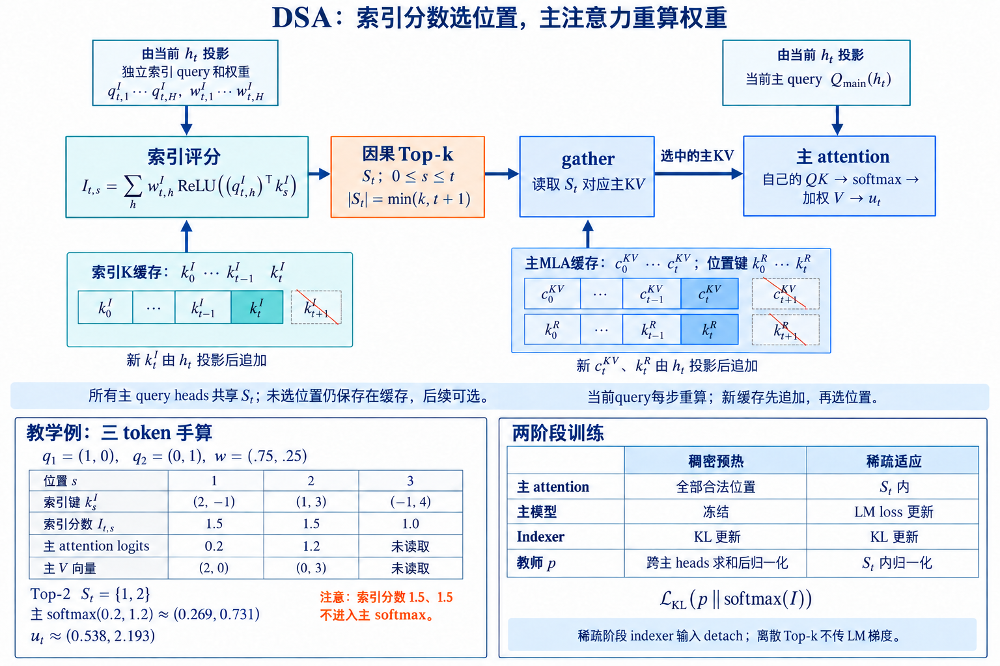

---
title: "2.2.1 · DSA 与索引器: 先召回 token, 再计算 Sparse MLA"
description: 从 DeepSeek-V3.2 Lightning Indexer 出发, 解析 token 级 selector 的训练目标、top-k 成本、HISA/MISA/LISA 改进与训推边界.
published: true
---

# DSA 与索引器: 先召回 token, 再计算 Sparse MLA

token 级 Sparse Attention 要完成一次有约束的检索: 对每个 query, 从全部历史 token 中召回少量候选, 再用主 attention 的完整表示精确计算. 候选太少会漏证据, 候选太多又失去稀疏收益. 更棘手的是, 一个为每对 query-key 打分的 selector 自己也会形成 $n\times n$ 分数矩阵. 主 attention 从平方降到 $O(nk)$ 以后, indexer 可能接替它成为最长的 kernel.

[DeepSeek-V3.2](https://arxiv.org/abs/2512.02556)中的 DeepSeek Sparse Attention(DSA)给出一条完整路径: **Lightning Indexer** 用低维、多头 query 与共享 key 产生标量索引分数, top-k selector 为每个 query 选出 2048 个历史位置, Sparse MLA 只读取这些位置. DSA 由 DeepSeek-V3.1-Terminus 继续训练而来, 先用稠密 attention 预热 indexer, 再让主模型适应稀疏拓扑. 选择器、训练目标、MLA 表示和 kernel 都属于模型设计的一部分, 临时给任意稠密模型添加 top-k mask 无法得到同一条计算路径.

DSA 之后的优化大多没有否定 token 级选择, 而是追问「索引阶段能否更便宜」. [HISA](https://arxiv.org/abs/2603.28458)先筛块再在候选块内运行原 indexer; [MISA](https://arxiv.org/abs/2605.07363)把 indexer heads 当成专家池, 每个 query 只激活少量 heads; [LISA](https://arxiv.org/abs/2607.19358)把线性 attention 的长程状态与 indexer 引导的 sparse self-attention 并联. 四者提供了三种不同的降本轴: 缩小 token 搜索范围、缩小参与打分的 head 数、用线性状态承接未进入 top-k 的全局信息.

图 1：DSA 的缓存、候选选择与主注意力数据流，结合 [DeepSeek-V3.2 报告 v1 Figure 2（PDF 第 4 页）](https://arxiv.org/pdf/2512.02556v1) 与 §2.1.1 绘制。主 query 与 indexer query 使用各自的表示，图中将投影路径合并为模块，省略共同 query latent $c_t^Q$、RoPE 的内部变换及权重吸收。索引 K 用于全历史评分，主 MLA 缓存中的 latent KV 与位置键用于选中位置的精算；未选缓存不会因 top-k 而删除。下方是正文的三 token 教学例，位置从 1 开始，仅为方便手算；上方缓存采用从 0 开始的位置。训练表中的 KL 记作统一形式，稀疏阶段只在 $S_t$ 内计算两侧归一化的概率。[查看原尺寸](./images/dsa-cache-selection-v4.png)。

## 1. Lightning Indexer 的输入、输出与目标

### 1.1. 低维打分怎样连接 Sparse MLA

固定 batch 中一个样本. hidden state 为 $h_t\in\mathbb{R}^{d}$, indexer 为 query token $t$ 产生 $H^I$ 个低维 query $q^I_{t,j}\in\mathbb{R}^{d^I}$ 和 $H^I$ 个权重 $w^I_{t,j}\in\mathbb{R}$. 历史 token $s$ 只产生一个共享 key $k^I_s\in\mathbb{R}^{d^I}$. DeepSeek-V3.2 报告给出的分数是:

$$
I_{t,s}=\sum_{j=1}^{H^I}w^I_{t,j}\operatorname{ReLU}\left((q^I_{t,j})^Tk^I_s\right). \tag{1}
$$

对整段 Prefill, $Q^I\in\mathbb{R}^{B\times n\times H^I\times d^I}$, $K^I\in\mathbb{R}^{B\times n\times d^I}$, 权重 $W^I\in\mathbb{R}^{B\times n\times H^I}$. indexer 输出 $I\in\mathbb{R}^{B\times n\times n}$, 加 causal mask 后沿历史位置维取 top-k, 得到位置张量 $S\in\mathbb{N}^{B\times n\times k}$. Sparse MLA 的主 attention 根据 $S_{t,:}$ gather 对应 latent KV, 输出 shape 仍与原 MLA 一致.

式 (1)的共享 key 很重要. selector 最终为一个 query 的全部主 attention heads 选择同一组 token, 才能让选中的 latent KV 被多个 query heads 复用. 如果每个主 head 各选一套位置, token 数可能成倍增长, K/V gather 也更碎. 多个 indexer heads 的作用是给相关性提供多种子空间, 加权求和后仍输出一个共享标量 $I_{t,s}$.

ReLU 将每个 head 的点积截为非负响应，再乘实数权重 $w^I_{t,j}$；权重为负时，该 head 的最终贡献也为负。报告将 ReLU 的选择归因于吞吐，并指出 indexer 可用 FP8 实现。低维和低精度降低每次配对成本，没有改变配对数量：Prefill 仍为 $O(n^2H^Id^I)$，Decode 每步仍扫描全部合法历史 $K^I$。分数与训练路径见[报告 §2.1](https://arxiv.org/html/2512.02556v1#S2.SS1)。

selector 选择什么, 又没有选择什么。
候选集合定义为:

$$
\mathcal S_t=\operatorname{TopK}\left(\{I_{t,s}:0\le s\le t\},\min(k,t+1)\right). \tag{2}
$$

主 attention 随后计算:

$$
u_t=\operatorname{Attn}\left(h_t,\{c_s:s\in\mathcal S_t\}\right), \tag{3}
$$

式 (2) 使用从零开始的位置，包含当前 token，短历史只返回已有的合法位置；实现若使用固定宽度 $k$ 的整数张量，其余槽位需标为无效。$c_s$ 是 MLA 的 latent KV entry。selector 只决定读取哪些位置，不复用式 (1) 的分数作为主 softmax 权重。命中候选后，Sparse MLA 仍使用自己的 QK 分数、RoPE、causal 约束和 softmax。因而 indexer 要逼近主 attention 的排序偏好，不必精确重构每个 head 的 logits。

top-k 的 $k$ 是每个 query 的关系预算, 不是 KV Cache 容量. DeepSeek-V3.2 稀疏训练阶段取 $k=2048$. 全部历史 latent KV 仍然存在, 因为不同 query 的候选不同, 后续 query 也可能重新选择此前未命中的位置. 若把 DSA 与 KV 驱逐组合, 被驱逐位置将无法参与式 (2)之后的精排; 那属于另一项不可逆近似.

同一候选集合跨主 attention heads 共享, 也意味着 selector 目标来自多头偏好的聚合. 某个只对单个 head 关键的 token, 在求和后可能被其他 heads 稀释. 增大 $k$ 能缓解, 代价是 Sparse MLA 读取更多 KV. MISA 反过来处理 indexer 内部的多头冗余, 不改变最终共享候选集合的大小.

一个三 token 手算。
仅示意式 (1)-(3), 取 $H^I=2,d^I=2$, 省略缩放、位置编码与 batch. 当前 query 的两个 index query 为 $q^I_{t,1}=(1,0)$、$q^I_{t,2}=(0,1)$, 权重为 $w^I_t=(0.75,0.25)$. 三个历史 key 为:

$$
k^I_1=(2,-1),\qquad k^I_2=(1,3),\qquad k^I_3=(-1,4). \tag{4}
$$

逐 head 内积和 ReLU 分别为 $(2,0)$、$(1,3)$、$(0,4)$. 按式 (1)加权:

$$
I_{t,1}=0.75\times2+0.25\times0=1.5, \tag{5}
$$

$$
I_{t,2}=0.75\times1+0.25\times3=1.5,\qquad
I_{t,3}=0.75\times0+0.25\times4=1.0. \tag{6}
$$

取 $k=2$, selector 返回位置 1 与 2. 假设主 attention 用完整表示算出的 logits 是 $a_{t,1}=0.2,a_{t,2}=1.2$, 对应 Value 为 $v_1=(2,0),v_2=(0,3)$. 主 softmax 权重约为 $(0.269,0.731)$, 输出为 $(0.538,2.193)$. indexer 分数 1.5 和 1.5 没进入主 softmax; 它们只完成召回.

如果位置 3 的完整主 logit 实际为 2.0, indexer 就漏掉了主 attention 第一名. sparse softmax 会在位置 1、2 上重新归一化, 任何后续高精度 kernel 都无法补回位置 3. 这正是 indexer 训练和 recall@k 评测的对象.

### 1.2. DSA 为什么需要两阶段继续训练

稠密预热把选择器对齐到教师分布。
DeepSeek-V3.2 从已扩展到 128K 上下文的 DeepSeek-V3.1-Terminus 继续训练. 第一阶段保持稠密 attention, 冻结除 Lightning Indexer 外的全部模型参数. 对 query $t$, 将主 attention 分数跨所有 attention heads 求和, 再沿序列维做 L1 归一化, 得到教师分布 $p_{t,:}\in\mathbb{R}^{t}$.

indexer 的学生分布是 $\operatorname{Softmax}(I_{t,:})$. 预热损失为:

$$
\mathcal L^I=\sum_tD_{KL}\left(p_{t,:}\;\|\;\operatorname{Softmax}(I_{t,:})\right). \tag{7}
$$

报告给出的预热学习率为 $10^{-3}$, 训练 1000 步; 每步 16 条 128K 序列, 总计 2.1B token. 这一阶段不省 attention 训练成本, 因为教师分布来自稠密主 attention. 它的职责是让随机初始化的 indexer 在切换稀疏路径前学会主模型已有的注意力偏好.

KL 目标比直接监督 top-k 多提供了排序信息. 教师高概率位置受到更强约束, 长尾位置仍参与分布. 但教师先跨 head 聚合, 学到的是共享候选偏好. 如果各 head 的峰值位置互不相同, 学生需要用有限 $k$ 覆盖它们的并集. 训练损失低并不自动等于每个 head 的 top-k recall 高, 两者应分别测量.

稀疏训练让主模型适应漏边。
第二阶段启用式 (2)的 fine-grained token selection, 所有主模型参数都参与语言模型训练. indexer 的 KL 只在已选集合 $\mathcal S_t$ 上计算:

$$
\mathcal L^I=\sum_tD_{KL}\left(p_{t,\mathcal S_t}\;\|\;
\operatorname{Softmax}(I_{t,\mathcal S_t})\right). \tag{8}
$$

式 (8) 两侧必须在同一个候选集合上各自归一化。若从稠密分布截取教师子向量，应除以保留质量 $\sum_{s\in\mathcal S_t}p_{t,s}$；若教师来自当前稀疏主 attention，它已经在该集合内归一化。直接将未归一化的稠密子向量代入普通 KL，会改变损失含义。

报告说明 indexer 输入从计算图中 detach. indexer 只由 $\mathcal L^I$ 优化, 主模型只由语言模型 loss 优化. 这种分离避免主任务梯度通过离散 top-k 迫使 indexer走不稳定的近似路径, 同时让主模型在固定选择机制下重新组织信息. 稀疏阶段学习率为 $7.3\times10^{-6}$, 训练 15000 步, 每步 480 条 128K 序列, 总计 943.7B token.

从训练成本看, 稀疏阶段仍需产生对齐目标. 报告的式 (8)只在选中集合计算 indexer 分布, 但教师 $p$ 的产生和具体重计算路径必须由实现配合. NVIDIA cuDNN 的 DSA 文档将训练 kernel拆成稀疏/稠密 indexer 与 attention score recompute、top-k、backward 等操作, 说明训练不会只靠一次前向 mask 完成.

**DSA 的训练对齐包含两件事: selector 学会复现稠密偏好, 主模型学会在 selector 给定的缺边图上工作.** 只有第一件事而没有稀疏适配, 漏选误差会直接冲击已有表示; 只有第二件事而没有可靠初始化, 训练早期的随机候选又会破坏长程信息.

recall@k 应怎样定义。
设主 attention 聚合后教师 top-$m$ 集合为 $G_t^{(m)}$, indexer 候选为 $\mathcal S_t^{(k)}$. token recall 为:

$$
\operatorname{Recall@k}_t=\frac{|G_t^{(m)}\cap\mathcal S_t^{(k)}|}{|G_t^{(m)}|}. \tag{9}
$$

$m$ 与 $k$ 必须分别报告. 若把教师集合也取成 $k$, recall 衡量同预算排序重合; 若 $m<k$, 它衡量较大候选能否覆盖最重要的少量 token. 还可计算教师概率质量覆盖 $\sum_{s\in\mathcal S_t}p_{t,s}$, 让第一名比边缘项贡献更大.

平均 recall 容易被大量局部 query 稀释. 应按层、query 位置、相对距离和任务类型给出分位数. 唯一证据检索关注最差位置, 多证据聚合关注被覆盖证据数量, 语言模型 loss 则偏向常见局部 token. MISA 报告每层选中 token 与 DSA 的重合超过 92%, HISA 报告与原 DSA 选择集合的平均 IoU 超过 99%; 这些数字的参照是 DSA selector, 不等同于对稠密 attention 的绝对召回.

## 2. 索引器何时吃掉稀疏收益

Prefill 和 Decode 的复杂度不同。
对长度 $n$ 的 Prefill, Lightning Indexer 计算全部 causal 对, 复杂度仍是 $O(n^2H^Id^I)$. Sparse MLA 只计算 $k$ 个候选, 约为 $O(nkd_{main})$. 因为 $d^I$、$H^I$ 与精度都小于主 MLA 的对应工作, DSA 仍可加速; 随 $n$ 增长, indexer 的平方项最终会占比上升. DeepSeek-V3.2 报告也明确说明 indexer 仍为 $O(L^2)$, 只是计算远少于原 MLA.

Decode 第 $t$ 步只有一个新 query. indexer 扫描 $t$ 个缓存的 $K^I$, 成本为 $O(tH^Id^I)$; selector 取 top-k, Sparse MLA 读取 $k$ 个 latent KV. 对生成 $n$ 个 token 的整段过程求和, indexer 仍是平方累计, 但单步可以用 GEMV/小矩阵核执行. Decode 常受 HBM 带宽限制, indexer key cache 的字节数与读取方式比 FLOPS 更重要.

短 Prefill 上, top-k、索引 materialize 和不规则 gather 的固定成本可能超过少算的主 attention. DeepSeek 报告为短序列 Prefill 特别实现 masked MHA 模式模拟 DSA, 正说明稀疏 kernel并非所有长度都占优. 服务端应根据长度与 batch 选择路径, 不能强制所有请求走 token-sparse kernel.

top-k 不只是一个 API 调用。
对每个 query 从长度 $t$ 的分数中取 2048 项, 完整排序需要 $O(t\log t)$ 比较, 实现通常使用分块选择、radix top-k 或多级归并. NVIDIA cuDNN 的 DSA 模块同时提供 indexer forward、融合 indexer+top-k 和独立 radix top-k, 并允许按 `seq_lens` 处理变长行. 融合能避免把完整分数矩阵写回 HBM, 对极长上下文尤其关键.

如果 indexer 先物化 $B\times n\times n$ FP32 分数, 内存已经不可接受. 更合理的 kernel边算分块分数边维护局部 top-k, 再归并为每行最终候选. 训练需要 KL 或 backward 时可能重算选中分数, 而不是永久保存全部稠密分数. 这与 FlashAttention 的思想相似: 数学对象是大矩阵, 执行不必物化它.

top-k 输出为整数位置, 后续 Sparse MLA 根据位置 gather latent KV. 每个 query 的位置不同, 内存访问近似随机. 对同一 batch, 可按 key 位置重排工作、让邻近 query 共享加载, 或把候选整理成 tile; 整理本身又会产生排序与索引成本. element-wise 选择比 block-wise 更贴近注意力峰值, kernel 更难达到 tensor core 的规则吞吐.

KV cache、量化与两套状态。
DSA 推理至少维护主 MLA latent KV cache 与 indexer K cache. 前者供式 (3)的精确 attention, 后者供式 (1)的全历史扫描. indexer 不需要 V, 但 $K^I$ 必须覆盖所有仍可选的历史 token. 如果主 KV 保留完整而 indexer K 被驱逐, selector 看不到仍存在的主 KV; 如果反过来, selector 会返回已经无法读取的位置.

官方模型实现包含 indexer K 的量化缓存与尺度. FP8 使全历史扫描的字节和算力下降, 也会改变边界附近分数排序. 量化验证不能只比较平均分数误差, 要比较 top-k 集合重合、稠密概率质量覆盖和任务结果. 可以用更大候选做粗召回, 再用高精度 indexer 或主 QK 精排, 但会增加读取.

Prefill 可以一次生成整段 $K^I$ 并执行大矩阵 kernel; Decode 每步追加一条 $K^I_t$ 到 cache. 主 MLA 在 Decode 下可使用权重吸收等 MQA 形式, 让 latent KV 被所有 query heads 共享. indexer 的共享 $K^I$ 与主 MLA 的共享 latent 是两套不同表示, 不能把 indexer key 当作主 attention key 使用.

### 2.1. Indexer 的三种降本方向

DSA 建立 token 级检索基线后，HISA 缩小 token 搜索域，MISA 缩小参与扫描的 indexer heads，LISA 与 ResMiSA 则拆解共享线性项和稀疏残差。完整推导与实验口径见 [MISA、LISA 与 ResMiSA](./2.2.2-MISA-LISA-ResMiSA.md)。

这些方法保留的接口仍是同一组 token positions，因此可以用原 DSA 的 Sparse MLA 继续精算；它们优化的是候选产生过程，没有同步缩小最终 $k$。若实验一边更换 indexer、一边减少 $k$，速度收益就混入了更激进的主 attention 预算，无法判断索引器本身省了多少。公平比较应先固定最终候选数和主 KV 精度，再分别记录低维扫描、候选整理与 top-k 的耗时。

另一个边界是训练状态。HISA、MISA 可以按免训练替换来验证对原 DSA 候选的复现，LISA 与 ResMiSA 涉及不同的代数近似或信息通道时，仍要核对论文采用的校准、蒸馏和继续训练。权重能够加载只说明张量形状兼容，不表示排序分布与主模型已经适应。

因此，候选接口相同只解决系统接线问题，不能替代分布对齐与任务验收。

## 3. Indexer 到底在逼近什么

### 3.1. 排序目标与注意力目标并不相同

把稠密注意力概率记为 $a_{tj}$，indexer 分数记为 $s_{tj}$。拟合主 attention logit 是一种直观目标，候选预算为 $k$ 时，更直接的问题是能覆盖多少重要位置。分数整体平移或正比例缩放保持排序，前 $k$ 集合内部的重排也不改变 Sparse MLA 读到的 token。跨过 cutoff 的形变则会替换候选，均方误差很小也不保证边界两侧的顺序正确。

设教师前 $k$ 集合为 $T_k$, 学生集合为 $S_k$. 集合召回率是

$$
R_k=\frac{|T_k\cap S_k|}{k}. \tag{14}
$$

它直接衡量索引结果是否相同, 却把所有教师位置视为等价. 若漏掉的是教师第 $k$ 名且概率极低的位置, 影响通常小于漏掉第 1 名. 因此还要计算教师概率质量覆盖

$$
M_k=\sum_{j\in S_k}a_{tj}. \tag{15}
$$

当注意力分布尖锐时, $R_k$ 可以一般而 $M_k$ 很高; 当分布平坦时, 很高的 $R_k$ 也可能只覆盖有限质量. 两项指标回答不同问题, 不应互相替代.

多头教师为何需要压成一个候选集合。
MLA 的不同 query heads 可以关注不同历史位置. 若每个 head独立选 $k$ 个 token, 最坏要读取 $Hk$ 个 KV, 稀疏收益很快被候选并集吃掉. Lightning Indexer 用若干轻量 indexer heads产生分数, 再把它们聚合成共享候选, 本质上是在有限 I/O 预算下求多头注意力的联合覆盖.

可把第 $h$ 个教师头的重要性写成 $a^{(h)}_{tj}$, 聚合目标写成

$$
p_{tj}=\sum_h w_{th}a^{(h)}_{tj},\qquad \sum_h w_{th}=1. \tag{16}
$$

式 (16) 是讨论聚合策略的一般形式，需有 $w_{th}\ge0$，且各 $a^{(h)}_{t,:}$ 已归一化，才能保证 $p$ 是概率分布。这里的教师聚合权重与式 (1) 可正可负的 indexer 权重不同。DSA 报告采用跨头求和后沿序列 L1 归一化；各头概率和均为 1 时，相当于均匀平均。按头分组或学习聚合权重是其他设计选择，会改变监督目标。检查共享候选时还需看 per-head 最低覆盖，以免总体平均掩盖少数头的失配。

一个三头例子能看出冲突. 三个头分别把 $0.9$ 概率放在位置 10、20、30, 预算 $k=2$. 任何共享集合都至少牺牲一个头. 此时 indexer 即使准确找到了三个峰值, 容量约束仍让共享集合无解. 增加 indexer 参数不能突破集合大小, 只能通过增大 $k$、按头分组候选或让主模型在稀疏训练中重新组织注意力来缓解.

ReLU 分解为何适合轻量索引。
Lightning Indexer 将多组低维 query-key 点积经过 ReLU 后加权汇总. 若写成

$$
s_{tj}=\sum_{r=1}^{H^I}\alpha_{tr}\operatorname{ReLU}\!\left(\langle q^I_{tr},k^I_j\rangle\right), \tag{17}
$$

每个 indexer head 提供一种低维匹配。ReLU 截断的是负点积，最终 score 还乘以 $\alpha_{tr}$；只有所有权重非负时，才是非负证据累加。DSA 的权重是实数，正响应乘负权重后可以抵消其他头的贡献，因此进入候选取决于聚合分数的相对大小。

它也带来死区. 当某个 head 对绝大多数 token 都输出负点积时, ReLU 后梯度与贡献同时消失. 监控零比例不能只看全局平均, 应分层、分 head、分数据域统计. 若一个 head 在普通文本中沉默、在代码中活跃, 它可能是有用专家; 若所有数据上都沉默, 才更像训练坍缩.

$\alpha_{tr}$ 若随 query 变化, 相当于先判断当前问题需要哪类匹配, 再组合 token 分数. 这为 MISA 的 head 路由提供了自然入口: 与其每次计算所有 $H^I$ 个匹配头, 不如先用更便宜的 router 找出少数可能贡献最大的头.

top-k 边界决定了真正的稳定性。
把排序后的 indexer 分数写为 $s_{(1)}\ge\cdots\ge s_{(n)}$, cutoff margin 定义为

$$
\Delta_k=s_{(k)}-s_{(k+1)}. \tag{18}
$$

当 $\Delta_k$ 很大时, 量化、舍入和 kernel 实现的小误差通常不改变集合; 当 $\Delta_k$ 接近零时, 极小扰动就会交换边界 token. 因此验证 FP8 indexer 时, 只比较分数均方误差意义有限. 更有用的是按 margin 分桶观察集合重合与概率质量损失.

并列分数还牵涉稳定排序. 两个实现都返回合法 top-k, 索引却可能不同. 如果并列位置的教师质量相近, 这不构成数值错误; 若后续测试强制逐索引相等, 反而会制造假失败. 可靠测试应先比较 cutoff 值, 再比较严格高于 cutoff 的必选集合, 末尾检查并列集合中返回数量与输出误差.

训练损失连续, top-k 决策离散, 两者之间始终存在缝隙. 稠密蒸馏能把总体分布推近, 但最终部署质量仍由 cutoff 附近的排序决定. 这正是稠密预热、扩大探索候选和稀疏适应阶段缺一不可的原因.

### 3.2. 两阶段训练的因果链

先固定教师, 再让模型适应缺失连接。
第一阶段冻结原模型, 让 indexer 观察稠密注意力产生的教师分布. 此时监督目标稳定, 主模型也不会为了迎合一个尚未学会检索的 selector 改变表示. 这一步解决的是「怎样用便宜特征预测原模型会看哪里」.

第二阶段真正启用稀疏 attention, 主模型只能访问候选集合. 即使 indexer 对原教师有很高 recall, 遗漏仍不可避免; 原来依赖多个低概率位置累积的信息也会改变. 继续训练让 query、key、value 与 MLP 共同适应新的连接图, 解决的是「模型怎样在受限图上重新分配信息」. 两阶段看似都在对齐 attention, 优化对象其实不同.

若从第一步就同时更新全部参数, selector 可能追逐不断移动的教师, 主模型又会迁就早期的错误候选. 二者形成反馈: 某位置没被选中, 主模型逐渐不再向它写入有用信息; 教师信号随之变弱, selector 更没有机会把它找回来. 稠密预热先建立较可靠的召回面, 能显著缩小这种自我强化的错误区.

稀疏集合内归一化会放大遗漏。
稠密 attention 的输出为

$$
o_t=\sum_{j\le t}a_{tj}v_j,
$$

稀疏版本只在 $S_k$ 内重新做 softmax:

$$
\tilde o_t=\sum_{j\in S_k}\frac{a_{tj}}{M_k}v_j. \tag{19}
$$

即使假设候选内 logit 完全相同, 缺失质量 $1-M_k$ 也会让保留位置整体乘上 $1/M_k$. 当 $M_k=0.98$ 时重标定很小; 当 $M_k=0.6$ 时, 保留证据被放大约 1.67 倍. 因而漏选影响不只来自被丢掉的 value, 还来自剩余分布重新归一化.

由三角不等式可给出一个粗界. 若 $\|v_j\|\le V$, 则在上述理想化条件下

$$
\|o_t-\tilde o_t\|\le 2(1-M_k)V. \tag{20}
$$

具体地，令 $M_k>0$，把稠密输出拆成集合内外两项，则

$$
o_t-\tilde o_t=\sum_{j\notin S_k}a_{tj}v_j
-\frac{1-M_k}{M_k}\sum_{j\in S_k}a_{tj}v_j.
$$

第一项的范数至多为 $(1-M_k)V$，第二项至多为 $\frac{1-M_k}{M_k}M_kV$，相加得到式 (20)。这个界针对同一组 logits 与 values、只改变可见集合的一次 attention；它没有覆盖后续层的表示变化。实际系统还需分别检查位置编码、数值误差与任务输出。

预算课程比固定预算更容易定位问题。
训练早期可以用较大候选预算 $k_0$, 随 indexer 稳定逐步降到目标 $k$. 大预算降低主模型突然失去连接的冲击, 也让边界附近位置仍有梯度通路. 但课程策略会增加训练计算, 并可能让模型迟迟不适应最终预算. 具体退火曲线需要由每个预算下的质量、质量恢复速度与 selector margin共同确定.

另一种做法是固定最终 $k$, 额外采样少量探索 token. 探索集合不必进入正式推理, 只用于估计当前 selector 漏掉的教师质量并提供纠偏信号. 均匀随机对长上下文效率很低, 可按块、距离或教师粗分数分层抽样. 这里的核心是让未选位置仍有被观察的机会, 不是把随机稀疏本身当成检索器.

动态教师下怎样判断已经收敛。
稀疏训练阶段的教师随主模型更新, 单看训练损失下降可能误判. 需要固定一批长上下文探针, 定期用稠密 MLA 离线重算教师, 同时保存任务输出. 若 indexer KL 下降而固定探针的概率质量覆盖恶化, 说明学生只是追上了已经发生漂移的教师或分布变平, 并没有改善选择.

收敛至少包含三层: indexer 对当前教师的选择稳定; 稀疏模型与稠密参照的 hidden state 差异不再扩大; 长上下文任务在目标预算上恢复. 三者时间尺度不同. selector 很早稳定不代表主模型已经学会在稀疏图上传递信息, 任务恢复也可能来自模型绕过长程依赖. 因此还需要受控检索样本确认远距证据确实被使用.
